# Chapter 20 — Google's Top 10 Most Asked ML Interview Topics

> Comprehensive, interview-ready deep dives into the 10 topics Google asks about most frequently in Machine Learning interviews — with step-by-step explanations, Mermaid diagrams, worked examples, and follow-up questions.

---

## How to Use This Chapter

```
┌────────────────────────────────────────────────────────────────────────┐
│  STRUCTURE OF EACH TOPIC                                               │
│                                                                        │
│  1. Why Google Asks This    — what the interviewer is evaluating        │
│  2. The Questions           — common variations you'll encounter        │
│  3. Simple Explanation      — plain-language analogy (say this first)   │
│  4. Deep Dive               — full technical answer with math           │
│  5. Mermaid Diagrams        — visual explanation (draw on whiteboard)   │
│  6. Worked Example          — step-by-step numerical walkthrough        │
│  7. Interview-Ready Answer  — structured response template              │
│  8. Follow-Up Questions     — what the interviewer will ask next        │
│  9. Common Mistakes         — what NOT to say                           │
│                                                                        │
│  INTERVIEW TIP: Start with the Simple Explanation, then go deeper.     │
│  Google values clear communication as much as technical depth.          │
└────────────────────────────────────────────────────────────────────────┘
```

---

## Table of Contents

| # | Topic | Key Questions |
|---|-------|---------------|
| 1 | [Bias-Variance Tradeoff](#topic-1--bias-variance-tradeoff) | Decomposition, diagnosis, model selection |
| 2 | [Gradient Descent & Optimization](#topic-2--gradient-descent--optimization) | SGD, Adam, learning rate, convergence |
| 3 | [Regularization Techniques](#topic-3--regularization-techniques) | L1 vs L2, Dropout, Batch Norm, Early Stopping |
| 4 | [Decision Trees & Ensemble Methods](#topic-4--decision-trees--ensemble-methods) | Random Forest, XGBoost, Bagging vs Boosting |
| 5 | [Neural Networks & Backpropagation](#topic-5--neural-networks--backpropagation) | Forward pass, chain rule, vanishing gradients |
| 6 | [Transformers & Attention Mechanism](#topic-6--transformers--attention-mechanism) | Self-attention, multi-head, positional encoding |
| 7 | [Evaluation Metrics & Experiment Design](#topic-7--evaluation-metrics--experiment-design) | Precision/Recall, AUC-ROC, A/B testing |
| 8 | [Dimensionality Reduction](#topic-8--dimensionality-reduction) | PCA, t-SNE, curse of dimensionality |
| 9 | [Data Preprocessing & Feature Engineering](#topic-9--data-preprocessing--feature-engineering) | Missing data, imbalanced classes, data leakage |
| 10 | [ML System Design](#topic-10--ml-system-design) | End-to-end pipelines, serving, monitoring |
| **11** | **[LLM Architecture Deep Dive](#topic-11--llm-architecture-deep-dive)** | **BPE tokenization, RoPE, attention derivation, KV cache, Flash Attention, MoE** |
| **12** | **[LLM Training Pipeline](#topic-12--llm-training-pipeline-pre-training--sft--rlhfdpo)** | **Pre-training, SFT, RLHF, DPO, GRPO/RLVR, Constitutional AI, scaling laws** |
| **13** | **[LLM Serving & Production](#topic-13--llm-serving--production-at-scale)** | **Quantization (INT4/INT8/FP8), speculative decoding, distributed training, RAG, MCP** |
| **14** | **[LLM Evaluation & Frontier Research](#topic-14--llm-evaluation--frontier-research)** | **Perplexity, MMLU, Chatbot Arena, LLM-as-judge, reasoning models, Mamba, lost-in-middle** |

---

# Topic 1 — Bias-Variance Tradeoff

## Why Google Asks This

This is the single most fundamental concept in ML. Google uses it to test whether you understand **why** models fail, not just **how** to train them. If you can't articulate bias-variance, the interviewer assumes you're pattern-matching code snippets rather than reasoning about learning.

---

## Common Interview Questions

- "Explain the bias-variance tradeoff."
- "Your model has 95% training accuracy but 70% test accuracy. What's happening and how do you fix it?"
- "How do you decide between a simple and a complex model?"
- "Derive the bias-variance decomposition of MSE."

---

## Simple Explanation

Imagine you're throwing darts at a bullseye:

- **High Bias**: You consistently miss to the left. Your aim is systematically off. (Model is too simple, missing the real pattern.)
- **High Variance**: Your throws are scattered all over the board. (Model is too sensitive to training data, can't generalize.)
- **Goal**: Low bias AND low variance — consistently hitting the center.

The tradeoff: making the model more complex reduces bias but increases variance. Making it simpler reduces variance but increases bias. You need to find the sweet spot.

---

## Deep Dive — The Mathematical Decomposition

For a target variable `y = f(x) + ε` where `ε ~ N(0, σ²)` is irreducible noise, and `f̂(x)` is our model's prediction:

```
Expected Prediction Error = Bias²(f̂(x)) + Variance(f̂(x)) + σ²
                            ───────────    ────────────────   ───
                            Systematic     Sensitivity to     Noise we
                            error from     training data      can never
                            wrong          (instability)      remove
                            assumptions
```

**Formally:**

```
E[(y - f̂(x))²] = [E[f̂(x)] - f(x)]² + E[(f̂(x) - E[f̂(x)])²] + σ²
                   ─────────────────    ──────────────────────    ───
                       Bias²                  Variance           Noise
```

### Step-by-Step Derivation

```
Step 1: Start with the expected squared error
   E[(y - f̂(x))²]

Step 2: Since y = f(x) + ε, substitute:
   = E[(f(x) + ε - f̂(x))²]

Step 3: Add and subtract E[f̂(x)]:
   = E[(f(x) - E[f̂(x)] + E[f̂(x)] - f̂(x) + ε)²]

Step 4: Let A = f(x) - E[f̂(x)] (bias term, a constant)
         Let B = E[f̂(x)] - f̂(x) (variance term, random)
         Let C = ε (noise, random and independent)

Step 5: Expand (A + B + C)² = A² + B² + C² + 2AB + 2AC + 2BC

Step 6: Take expectations:
   E[A²] = A² = [f(x) - E[f̂(x)]]² = Bias²
   E[B²] = E[(f̂(x) - E[f̂(x)])²]  = Variance
   E[C²] = E[ε²] = σ²              = Irreducible noise
   E[2AB] = 2A·E[B] = 0            (since E[B] = 0 by definition)
   E[2AC] = 2A·E[C] = 0            (since E[ε] = 0)
   E[2BC] = 2·E[B]·E[C] = 0       (independence + E[B]=0)

Step 7: Therefore:
   E[(y - f̂(x))²] = Bias² + Variance + σ²
```

---

## Visual — The Tradeoff Curve

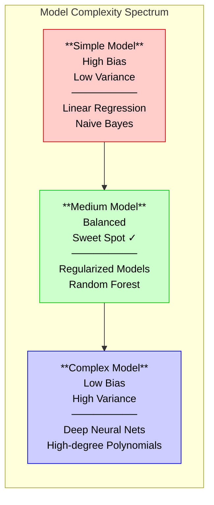

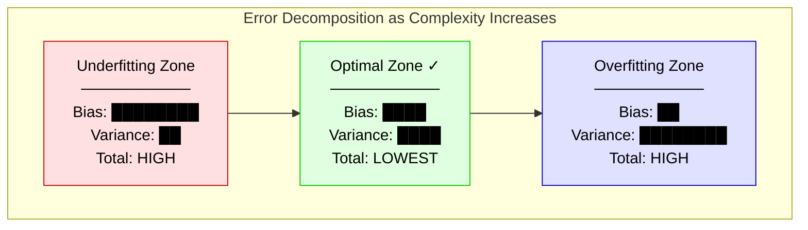

---

## How to Diagnose: Learning Curves

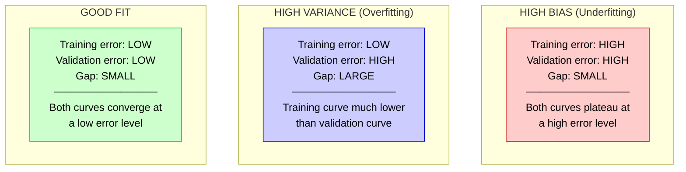

---

## How to Fix

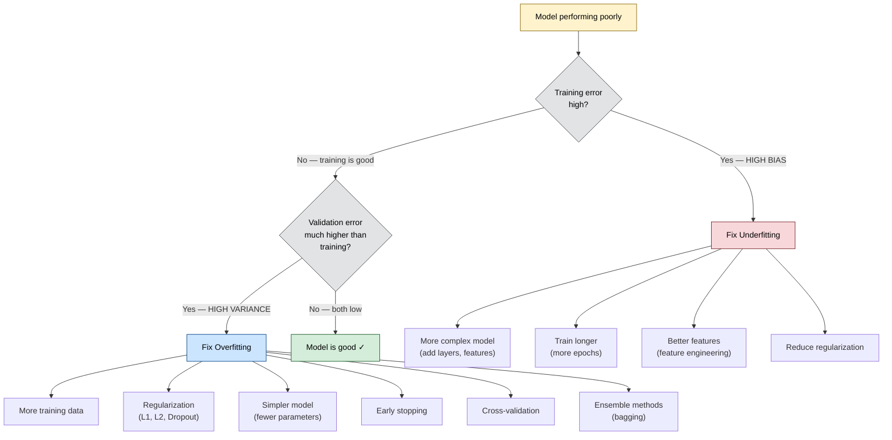

---

## Worked Example

```
Scenario: You're building a spam classifier at Google for Gmail.

Model 1: Logistic Regression (simple)
   Training accuracy:  72%
   Validation accuracy: 70%
   Gap: 2% → SMALL gap, both LOW → HIGH BIAS (underfitting)
   Diagnosis: Model too simple to capture spam patterns.
   Fix: Add more features (n-grams, sender reputation), try a more
        complex model (Random Forest, Neural Network).

Model 2: Deep Neural Network (100 layers, no regularization)
   Training accuracy:  99.5%
   Validation accuracy: 78%
   Gap: 21.5% → LARGE gap → HIGH VARIANCE (overfitting)
   Diagnosis: Model memorized training data.
   Fix: Add dropout, L2 regularization, early stopping, get more
        training data, reduce model complexity.

Model 3: Random Forest with tuned hyperparameters
   Training accuracy:  93%
   Validation accuracy: 91%
   Gap: 2% → SMALL gap, both HIGH → GOOD FIT ✓
   Diagnosis: Model generalizes well.
```

---

## Interview-Ready Answer Template

> "The bias-variance tradeoff captures the fundamental tension in model selection. **Bias** is the systematic error from incorrect model assumptions — a linear model fitting nonlinear data has high bias. **Variance** is the error from sensitivity to training data fluctuations — a model that changes drastically with different training samples has high variance.
>
> Mathematically, the expected prediction error decomposes into Bias² + Variance + irreducible noise. As model complexity increases, bias decreases but variance increases.
>
> To diagnose: I look at the gap between training and validation error. A large gap means high variance; both being high means high bias. For high bias, I increase model complexity or add features. For high variance, I use regularization, more data, or simpler models.
>
> In practice at Google's scale, I'd use learning curves and cross-validation to find the sweet spot."

---

## Follow-Up Questions & Answers

**Q: "Can you have both high bias AND high variance?"**
> Yes. A model that makes wrong assumptions AND is unstable. Example: a small decision tree with high depth limit trained on insufficient features — the tree structure changes wildly between samples (high variance) but the limited feature set systematically misses patterns (high bias).

**Q: "How do ensemble methods relate to bias-variance?"**
> Bagging (Random Forest) primarily **reduces variance** by averaging many high-variance models. Boosting (XGBoost) primarily **reduces bias** by sequentially correcting errors. This is why Random Forest uses deep trees (low bias, high variance → average to reduce variance) and Boosting uses shallow trees (high bias, low variance → sequentially reduce bias).

**Q: "What about the double descent phenomenon?"**
> In overparameterized models (modern deep learning), error can decrease again beyond the classical overfitting peak. The model first interpolates training data, then the implicit regularization of SGD and architecture constraints push it toward simpler functions. This challenges the classical U-curve but doesn't invalidate the decomposition — it just means the variance term can decrease in the interpolating regime.

---

## Common Mistakes

| Mistake | Why It's Wrong |
|---------|---------------|
| "Bias means the model is biased/unfair" | Technical bias ≠ fairness bias. Here bias = systematic prediction error. |
| "Just add more data to fix everything" | More data helps variance, NOT bias. A linear model won't learn nonlinear patterns no matter how much data you give it. |
| "Complex models are always better" | Complexity reduces bias but increases variance. The best model is the simplest one that captures the true pattern. |
| Forgetting irreducible noise | Some error can never be removed. Acknowledge σ² in the decomposition. |

---

---

# Topic 2 — Gradient Descent & Optimization

## Why Google Asks This

Gradient descent is **how every model learns**. Google needs engineers who understand optimization deeply — not just calling `model.fit()`, but knowing why learning rates matter, when Adam beats SGD, and how to debug training that won't converge. At Google scale, optimization choices directly impact cost (TPU hours) and product quality.

---

## Common Interview Questions

- "Explain gradient descent step by step."
- "What's the difference between SGD, Mini-batch GD, and Batch GD?"
- "How does the Adam optimizer work? Why is it popular?"
- "How do you choose a learning rate?"
- "What are local minima and saddle points? How does optimization handle them?"

---

## Simple Explanation

Imagine you're blindfolded on a hilly landscape and you want to find the lowest valley. You can only feel the slope under your feet. Your strategy: always take a step in the downhill direction. That's gradient descent.

- **Step size** = learning rate (too big: you overshoot the valley; too small: you take forever)
- **Slope** = gradient (tells you which direction is downhill and how steep)
- **Valley** = minimum loss (the best your model can do)

---

## Deep Dive — The Algorithm

### Core Update Rule

```
θ_new = θ_old - α · ∇J(θ)

Where:
  θ     = model parameters (weights)
  α     = learning rate (step size)
  ∇J(θ) = gradient of the loss function with respect to parameters
  J(θ)  = loss function (how wrong the model is)
```

### Step-by-Step Process

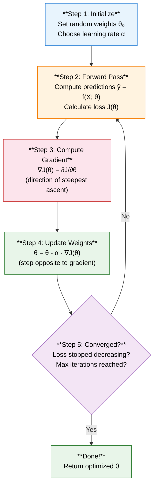

---

## Three Variants of Gradient Descent

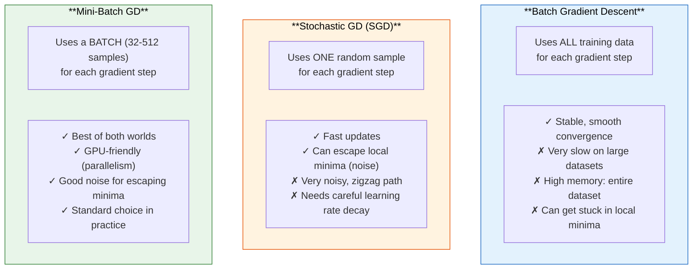

### Mathematical Comparison

```
Batch GD:       θ = θ - α · (1/N) Σᵢ₌₁ᴺ ∇Lᵢ(θ)     ← all N samples
Stochastic GD:  θ = θ - α · ∇Lᵢ(θ)                   ← 1 random sample
Mini-Batch GD:  θ = θ - α · (1/B) Σᵢ₌₁ᴮ ∇Lᵢ(θ)     ← B samples (B=32..512)
```

---

## Advanced Optimizers

### Momentum — "Ball rolling downhill with inertia"

```
vₜ = β · vₜ₋₁ + ∇J(θ)      ← accumulate velocity (β ≈ 0.9)
θ  = θ - α · vₜ              ← update with velocity

Key insight: Momentum helps in two ways:
1. Accelerates in consistent gradient directions
2. Dampens oscillations in inconsistent directions
```

### RMSProp — "Adaptive learning rate per parameter"

```
sₜ = β · sₜ₋₁ + (1-β) · (∇J(θ))²   ← running average of squared gradients
θ  = θ - α · ∇J(θ) / (√sₜ + ε)       ← larger gradients → smaller steps

Key insight: Parameters with large gradients get smaller updates,
             parameters with small gradients get larger updates.
```

### Adam — "Momentum + RMSProp + Bias Correction"

```
mₜ = β₁ · mₜ₋₁ + (1-β₁) · ∇J(θ)         ← 1st moment (mean of gradients)
vₜ = β₂ · vₜ₋₁ + (1-β₂) · (∇J(θ))²      ← 2nd moment (mean of squared grads)

m̂ₜ = mₜ / (1 - β₁ᵗ)                       ← bias-corrected 1st moment
v̂ₜ = vₜ / (1 - β₂ᵗ)                       ← bias-corrected 2nd moment

θ  = θ - α · m̂ₜ / (√v̂ₜ + ε)              ← final update

Default hyperparameters: β₁=0.9, β₂=0.999, ε=1e-8
```

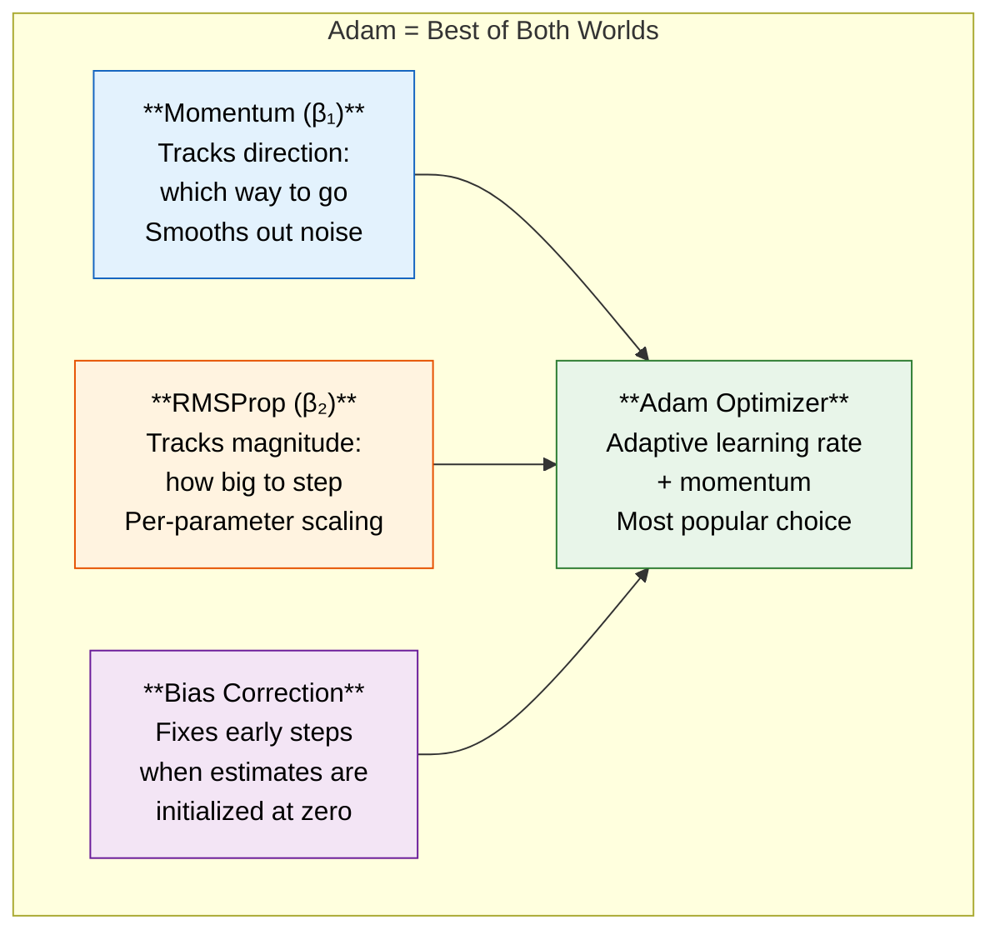

---

## Why Bias Correction Matters in Adam

```
Problem: m₀ = 0, v₀ = 0 (initialized to zero)

At t=1: m₁ = 0.9 × 0 + 0.1 × g₁ = 0.1 × g₁   ← biased toward 0!
        The true average should be closer to g₁, not 0.1 × g₁

Correction: m̂₁ = m₁ / (1 - 0.9¹) = m₁ / 0.1 = g₁  ← correct!

At t=100: (1 - 0.9¹⁰⁰) ≈ 1, so correction vanishes.
          Bias correction only matters in early steps.
```

---

## Learning Rate — The Most Important Hyperparameter

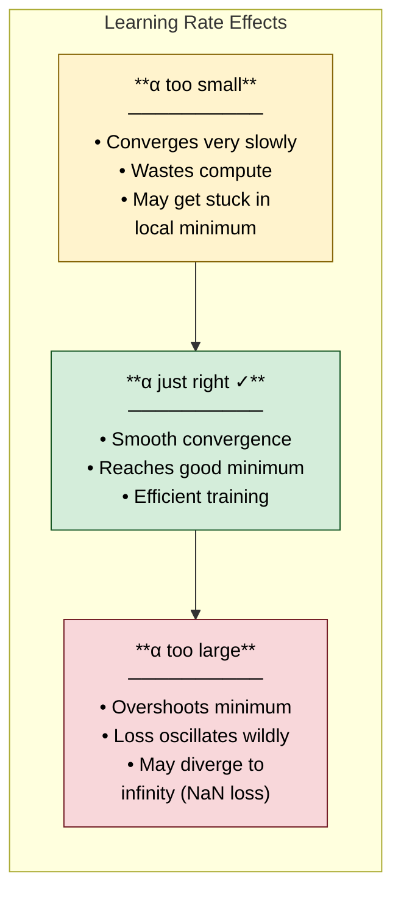

### Learning Rate Schedules

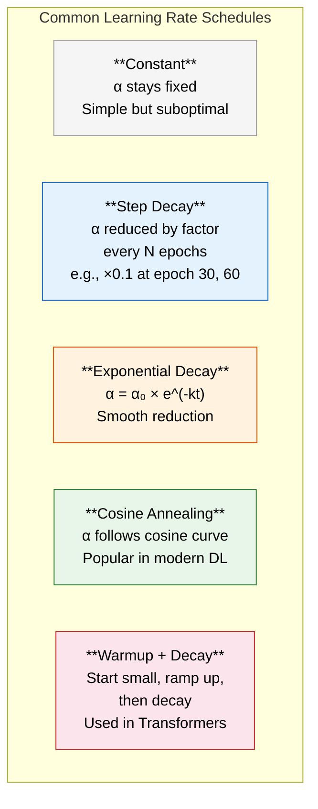

---

## Worked Example — Linear Regression with Gradient Descent

```
Given: 3 data points → (1, 2), (2, 4), (3, 5)
Model: ŷ = w·x + b
Loss:  J = (1/3) Σ(yᵢ - ŷᵢ)²
Learning rate: α = 0.1

── Initialize: w = 0, b = 0 ──

ITERATION 1:
  Forward pass:
    ŷ₁ = 0×1 + 0 = 0,  ŷ₂ = 0×2 + 0 = 0,  ŷ₃ = 0×3 + 0 = 0
  
  Loss:
    J = (1/3)[(2-0)² + (4-0)² + (5-0)²] = (1/3)[4 + 16 + 25] = 15.0

  Gradients:
    ∂J/∂w = (1/3) × 2 × [(-2)(1) + (-4)(2) + (-5)(3)]
           = (1/3) × 2 × [-2 - 8 - 15] = (2/3)(-25) = -16.67
    ∂J/∂b = (1/3) × 2 × [(-2) + (-4) + (-5)]
           = (2/3)(-11) = -7.33

  Update:
    w = 0 - 0.1 × (-16.67) = 1.667
    b = 0 - 0.1 × (-7.33)  = 0.733

ITERATION 2:
  Forward pass:
    ŷ₁ = 1.667×1 + 0.733 = 2.4
    ŷ₂ = 1.667×2 + 0.733 = 4.067
    ŷ₃ = 1.667×3 + 0.733 = 5.734
  
  Loss:
    J = (1/3)[(2-2.4)² + (4-4.067)² + (5-5.734)²]
      = (1/3)[0.16 + 0.0045 + 0.539] = 0.234  ← much lower!

  ... continue until convergence ...
```

---

## Local Minima vs Saddle Points

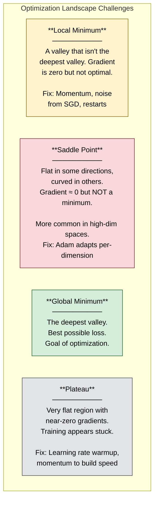

**Key insight for interviews**: In high-dimensional spaces (deep learning), saddle points are far more common than local minima. A point where the gradient is zero requires ALL dimensions to curve upward (local min) or all downward (local max). Most zero-gradient points have some dimensions curving up and some down → saddle point. This is why SGD noise and momentum are sufficient in practice — you almost never get truly stuck.

---

## When to Use Which Optimizer

| Optimizer | Best For | Avoid When |
|-----------|----------|-----------|
| SGD + Momentum | Final training for best generalization (vision models) | Quick prototyping, NLP |
| Adam | Default choice, works well out-of-the-box, NLP/Transformers | When you need absolute best generalization (sometimes SGD wins) |
| AdamW | Transformers, when weight decay matters | Very simple models where SGD suffices |
| LAMB/LARS | Very large batch training (distributed) | Small-scale experiments |
| Adagrad | Sparse features (NLP, recommendations) | Long training (learning rate vanishes) |

---

## Interview-Ready Answer Template

> "Gradient descent optimizes model parameters by iteratively moving in the direction of steepest decrease of the loss function. The update rule is θ = θ - α·∇J(θ).
>
> There are three variants: **Batch GD** uses all data per step (stable but slow), **Stochastic GD** uses one sample (fast but noisy), and **Mini-batch GD** uses a small batch (best balance, standard in practice).
>
> Modern optimizers improve on vanilla SGD: **Momentum** accumulates velocity for faster convergence, **RMSProp** adapts the learning rate per-parameter, and **Adam** combines both with bias correction — it's the default for most deep learning.
>
> The learning rate is the most critical hyperparameter. I typically start with 1e-3 for Adam, use learning rate warmup for Transformers, and apply cosine annealing decay. If training diverges (NaN loss), the learning rate is too high.
>
> In high-dimensional spaces, saddle points are more common than local minima, so SGD noise actually helps — we rarely get truly stuck."

---

## Follow-Up Questions & Answers

**Q: "SGD often finds better generalization than Adam. Why?"**
> SGD with momentum tends to converge to flatter minima, which generalize better. Adam can converge to sharper minima because its adaptive learning rates allow precise navigation into narrow valleys. Flatter minima are more robust to small perturbations in the data. This is why state-of-the-art vision models often use SGD for final training, while Adam is preferred for Transformers.

**Q: "What is gradient clipping and when do you use it?"**
> Gradient clipping caps the gradient norm to a maximum value before the update step. If ||∇J|| > threshold, scale it down to threshold. This prevents exploding gradients, especially in RNNs and Transformers. It's a safety mechanism — the direction is preserved, but the step size is bounded.

**Q: "What batch size should you use?"**
> Larger batches → more stable gradients, better GPU utilization, but less noise (worse generalization, fewer local minima escapes). Smaller batches → more noise, better generalization, but slower wall-clock time. Typical range: 32-512. For Transformers, effective batch sizes of 1M+ tokens are common (via gradient accumulation). There's a linear scaling rule: if you double batch size, double the learning rate.

---

## Common Mistakes

| Mistake | Why It's Wrong |
|---------|---------------|
| "Adam is always better than SGD" | SGD with momentum can generalize better for vision tasks. Choice is empirical. |
| "Learning rate doesn't matter with Adam" | Adam is less sensitive but still needs tuning. Bad LR still causes divergence. |
| "We need to find the global minimum" | In deep learning, many local minima are equally good. The goal is a good minimum, not the global one. |
| Confusing learning rate with convergence speed | A higher LR doesn't always mean faster convergence — it can cause oscillation or divergence. |

---

---

# Topic 3 — Regularization Techniques

## Why Google Asks This

Regularization is how you bridge the gap between "works on training data" and "works in production." Google operates at a scale where even 0.1% improvement matters, and understanding regularization deeply shows you can build models that generalize — not just memorize.

---

## Common Interview Questions

- "What is regularization and why do we need it?"
- "Explain L1 vs L2 regularization. Why does L1 produce sparsity?"
- "How does Dropout work? Why is it considered regularization?"
- "What is Batch Normalization and why does it help?"
- "How is Early Stopping a form of regularization?"

---

## Simple Explanation

Regularization is like giving a student a rule: "Your essay answer can't be longer than 500 words." Without the limit, the student might write 10 pages trying to memorize every detail (overfitting). With the limit, they must focus on the core ideas that matter (generalization).

In ML, regularization **penalizes model complexity** so the model focuses on true patterns rather than memorizing noise.

---

## Deep Dive — L1 vs L2 Regularization

### The Modified Loss Function

```
Without regularization:  J(θ) = Loss(data, θ)

With L2 (Ridge):         J(θ) = Loss(data, θ) + λ Σ wᵢ²
                                                  ─────────
                                                  Penalizes large weights

With L1 (Lasso):         J(θ) = Loss(data, θ) + λ Σ |wᵢ|
                                                  ─────────
                                                  Penalizes non-zero weights

With Elastic Net:        J(θ) = Loss(data, θ) + λ₁ Σ |wᵢ| + λ₂ Σ wᵢ²
                                                  ────────────────────────
                                                  Best of both worlds
```

### Why L1 Produces Sparsity — The Geometric Intuition

This is a **very common Google follow-up**. Here's why:

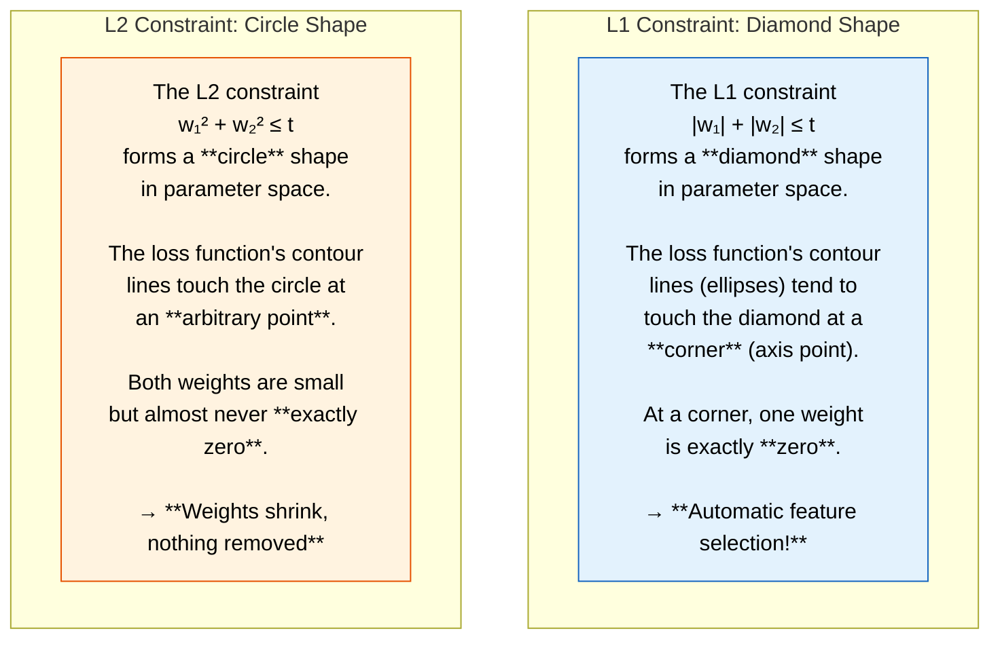

### Mathematical Explanation of Sparsity

```
The gradient update with L1:
  w = w - α · (∂Loss/∂w + λ · sign(w))

  If w > 0: subgradient pushes w toward 0 by -λ
  If w < 0: subgradient pushes w toward 0 by +λ
  → Constant push toward exactly zero regardless of magnitude

The gradient update with L2:
  w = w - α · (∂Loss/∂w + 2λw)

  Push is proportional to w: as w gets small, the push gets small
  → Weights shrink exponentially toward zero but never reach it
```

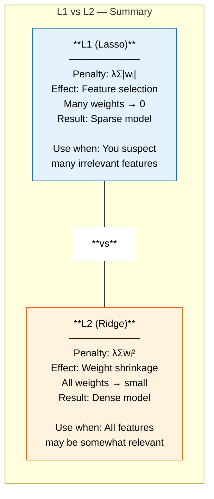

---

## Dropout — Regularization for Neural Networks

### How It Works

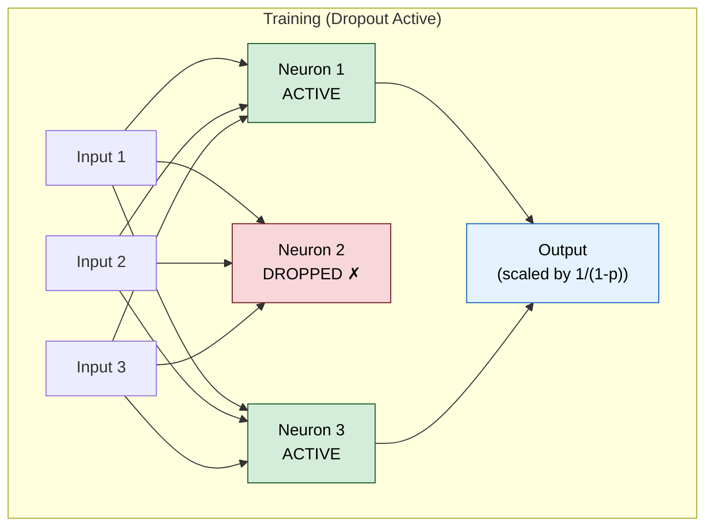

### Step-by-Step Mechanism

```
During TRAINING (for each mini-batch):
  1. For each neuron, generate random number r ~ Uniform(0,1)
  2. If r < p (dropout rate, typically 0.1-0.5):
     → Set neuron's output to 0 (dropped)
  3. Scale remaining outputs by 1/(1-p) to maintain expected value
     (This is "inverted dropout" — the standard implementation)

During INFERENCE:
  1. Use ALL neurons (no dropout)
  2. No scaling needed (already handled by inverted dropout)

Example with p=0.5:
  Training: neuron outputs [3, 0, 7, 0, 5] → scale by 2 → [6, 0, 14, 0, 10]
  Inference: neuron outputs [3, 4, 7, 2, 5] → no change → [3, 4, 7, 2, 5]
```

### Why Dropout Works — Three Perspectives

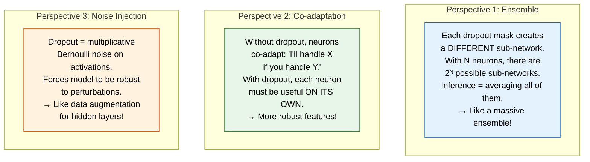

---

## Batch Normalization

### The Problem It Solves

```
During training, each layer receives inputs from the previous layer.
As weights update, the input distribution to each layer shifts.
This is called "Internal Covariate Shift" — each layer must constantly
readapt to changing input distributions.

BatchNorm stabilizes these distributions → faster, more stable training.
```

### Step-by-Step Computation

```
For a mini-batch B = {x₁, x₂, ..., xₘ}:

Step 1: Compute batch mean
   μ_B = (1/m) Σ xᵢ

Step 2: Compute batch variance
   σ²_B = (1/m) Σ (xᵢ - μ_B)²

Step 3: Normalize
   x̂ᵢ = (xᵢ - μ_B) / √(σ²_B + ε)    ← ε for numerical stability

Step 4: Scale and shift (learnable parameters!)
   yᵢ = γ · x̂ᵢ + β

   γ (scale) and β (shift) are LEARNED during training.
   They allow the network to undo the normalization if needed.
   Without them, we'd be forcing a N(0,1) distribution, which
   might not be optimal.
```

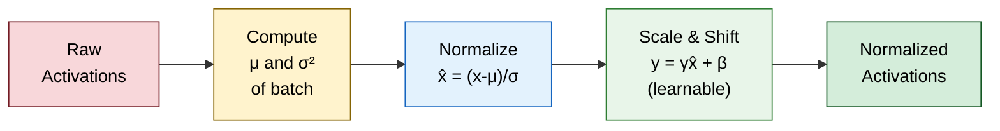

### BatchNorm During Inference

```
Problem: At inference, we may have a single sample — no "batch" to compute μ, σ².

Solution: During training, keep a running average of μ and σ²:
   μ_running = momentum × μ_running + (1-momentum) × μ_batch
   σ²_running = momentum × σ²_running + (1-momentum) × σ²_batch

At inference: use μ_running and σ²_running instead of batch statistics.
Default momentum = 0.1 in PyTorch.
```

---

## Early Stopping

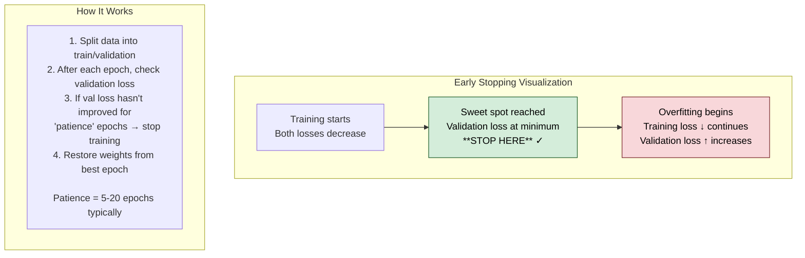

### Why It's Regularization

```
Early stopping limits training time → limits how many gradient steps
the model takes → limits how far weights can move from initialization.

Mathematically, Bishop (1995) showed that early stopping with gradient
descent on a quadratic loss is equivalent to L2 regularization:
  - More training steps ↔ smaller λ (less regularization)
  - Fewer training steps ↔ larger λ (more regularization)

The number of training steps is an implicit regularization parameter.
```

---

## All Regularization Techniques — Decision Guide

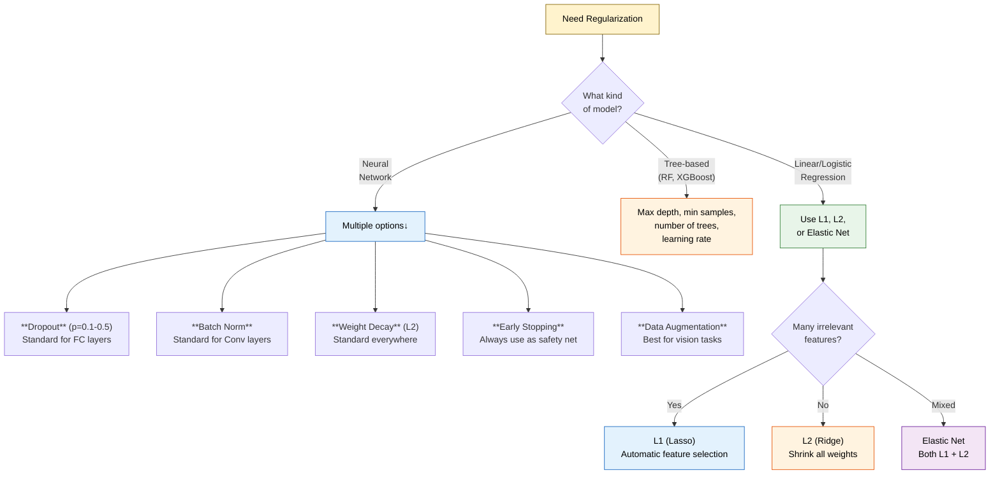

---

## Interview-Ready Answer Template

> "Regularization constrains model complexity to prevent overfitting. The main techniques are:
>
> **L1 (Lasso)** adds the sum of absolute weights to the loss. It produces sparse models by driving irrelevant feature weights to exactly zero — acting as automatic feature selection. The geometric reason is that the L1 constraint region is a diamond, and loss contours tend to touch at corners (axis points where some weights are zero).
>
> **L2 (Ridge)** adds the sum of squared weights. It shrinks all weights toward zero proportionally but never reaches zero. Better when all features contribute.
>
> **Dropout** randomly deactivates neurons during training with probability p. Each mini-batch trains a different sub-network, and inference averages all of them — it's like an implicit ensemble of 2^N networks.
>
> **Batch Normalization** normalizes layer inputs to zero mean and unit variance, then applies learnable scale and shift. It stabilizes training, allows higher learning rates, and has a mild regularization effect from the batch noise.
>
> **Early Stopping** halts training when validation loss stops improving. It's equivalent to L2 regularization — fewer gradient steps = more constrained weights.
>
> I typically combine dropout + weight decay + early stopping for neural networks."

---

---

# Topic 4 — Decision Trees & Ensemble Methods

## Why Google Asks This

Ensemble methods (Random Forest, XGBoost) are the workhorses of production ML at Google — used for ranking, fraud detection, click prediction, and more. Google wants to know you understand not just how to use them, but **why** they work, what the splitting criteria mean, and how bagging differs from boosting.

---

## Common Interview Questions

- "How does a Decision Tree decide where to split?"
- "What is Information Gain? Compare Gini Impurity vs Entropy."
- "Explain Random Forest. Why is it better than a single tree?"
- "Explain Gradient Boosting step by step."
- "Bagging vs Boosting — when would you use each?"
- "What makes XGBoost so effective?"

---

## Simple Explanation

A **Decision Tree** is like a game of 20 Questions. At each step, you ask the single best yes/no question to narrow down the answer. "Is it a mammal?" → "Does it have four legs?" → "Is it bigger than a cat?" → "It's a dog!"

A **Random Forest** is like asking 100 different people to play 20 Questions, each with slightly different rules, then taking a vote. The crowd is smarter than any individual.

**Gradient Boosting** is like a team of specialists. The first doctor makes a diagnosis. The second doctor looks at what the first got wrong and corrects those mistakes. The third corrects the remaining mistakes, and so on.

---

## Decision Tree — Splitting Criteria

### How a Tree Decides Where to Split

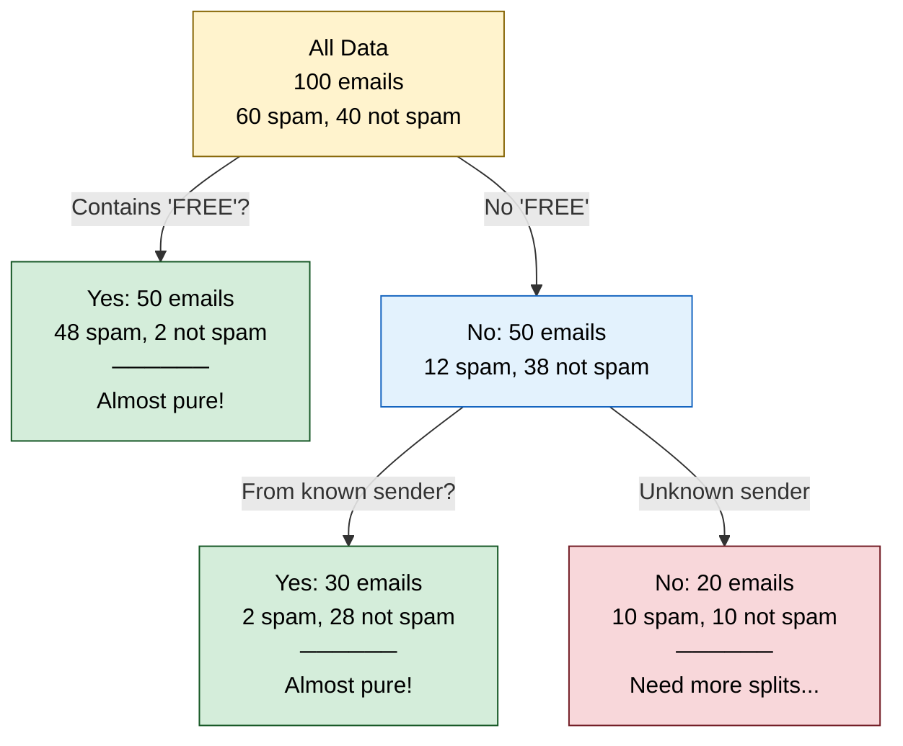

### Gini Impurity

```
Gini(node) = 1 - Σ pᵢ²

Where pᵢ = fraction of class i in the node.

Example:
  Node with 60 spam, 40 not-spam (100 total):
  p_spam = 0.6, p_not = 0.4
  Gini = 1 - (0.6² + 0.4²) = 1 - (0.36 + 0.16) = 0.48

  Pure node (all spam):
  Gini = 1 - (1.0²) = 0  ← perfect!

  Perfectly mixed:
  Gini = 1 - (0.5² + 0.5²) = 0.5  ← worst!

Range: 0 (pure) to 0.5 (for binary, maximally mixed)
```

### Entropy & Information Gain

```
Entropy(node) = -Σ pᵢ · log₂(pᵢ)

Example:
  Node with 60 spam, 40 not-spam:
  H = -(0.6 × log₂(0.6) + 0.4 × log₂(0.4))
    = -(0.6 × (-0.737) + 0.4 × (-1.322))
    = -(-0.442 - 0.529) = 0.971 bits

  Pure node: H = 0 bits
  Perfectly mixed: H = 1.0 bit

Information Gain = H(parent) - Σ (nⱼ/N) × H(childⱼ)
                 = entropy before split - weighted entropy after split

The tree picks the split with HIGHEST information gain
(= biggest reduction in entropy/uncertainty).
```

### Worked Example — Choosing the Best Split

```
Dataset: 100 emails (60 spam, 40 not-spam)
Two candidate features to split on:

OPTION A: Split on "Contains FREE"
  Left child (yes):  50 emails → 48 spam, 2 not-spam
  Right child (no):  50 emails → 12 spam, 38 not-spam

  H(left)  = -(48/50 × log₂(48/50) + 2/50 × log₂(2/50))
           = -(0.96 × (-0.059) + 0.04 × (-4.644))
           = 0.242 bits

  H(right) = -(12/50 × log₂(12/50) + 38/50 × log₂(38/50))
           = -(0.24 × (-2.059) + 0.76 × (-0.396))
           = 0.795 bits

  IG(A) = 0.971 - (50/100 × 0.242 + 50/100 × 0.795)
        = 0.971 - 0.519 = 0.452 bits

OPTION B: Split on "Email length > 100 words"
  Left child (yes):  40 emails → 25 spam, 15 not-spam
  Right child (no):  60 emails → 35 spam, 25 not-spam

  H(left)  = -(25/40 × log₂(25/40) + 15/40 × log₂(15/40)) = 0.954 bits
  H(right) = -(35/60 × log₂(35/60) + 25/60 × log₂(25/60)) = 0.975 bits

  IG(B) = 0.971 - (40/100 × 0.954 + 60/100 × 0.975)
        = 0.971 - 0.967 = 0.004 bits

WINNER: Split A (Contains "FREE") with IG = 0.452 >> 0.004
```

---

## Random Forest

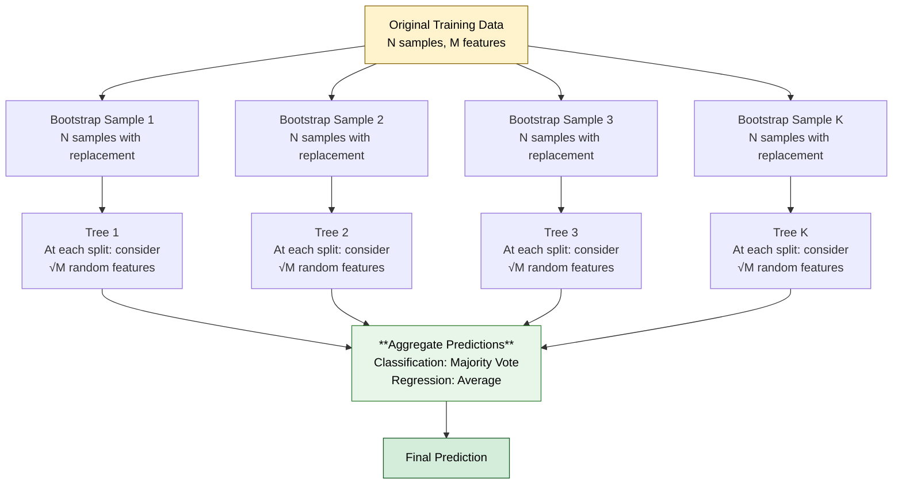

### Why Random Forest Works — Two Levels of Randomness

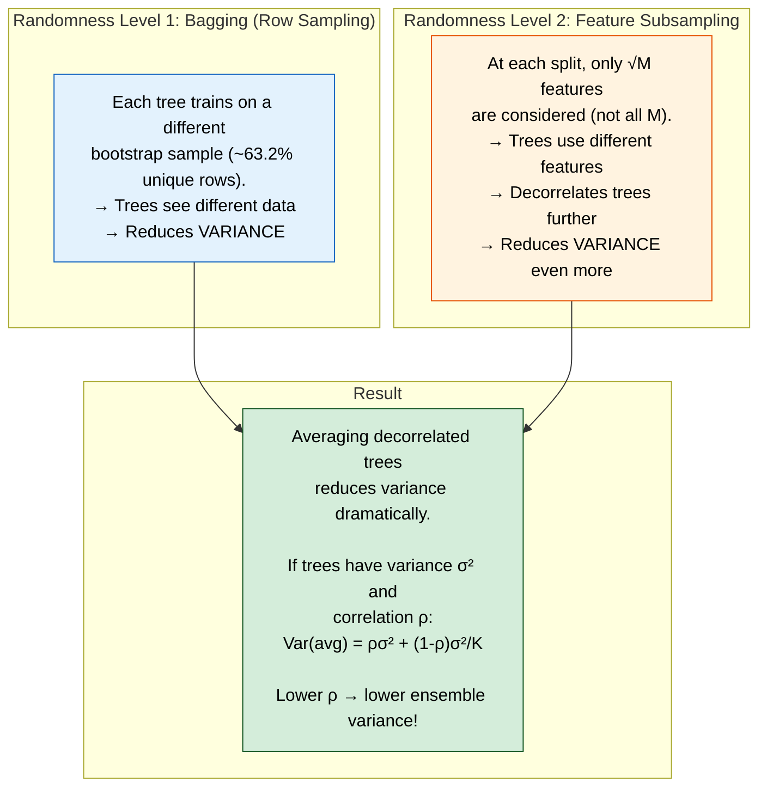

### Out-of-Bag (OOB) Error

```
Since each tree only sees ~63.2% of the data (bootstrap), the remaining
~36.8% is "out-of-bag" for that tree.

For each sample, collect predictions from all trees where that sample
was OOB → compute error.

OOB error ≈ cross-validation error, but FREE (no extra training needed).
This is why Random Forests don't need a separate validation set.
```

---

## Gradient Boosting — Step by Step

```mermaid
graph TD
    subgraph "Iteration 0"
        F0["F₀(x) = mean(y)<br/>Start with simplest prediction<br/>(average of all targets)"]
    end

    subgraph "Iteration 1"
        R1["Compute residuals:<br/>r₁ = y - F₀(x)<br/>(what the model got wrong)"]
        H1["Fit tree h₁(x) to residuals r₁<br/>(learn to predict the errors)"]
        U1["Update: F₁(x) = F₀(x) + η·h₁(x)<br/>(add correction, scaled by<br/>learning rate η)"]
    end

    subgraph "Iteration 2"
        R2["Compute new residuals:<br/>r₂ = y - F₁(x)<br/>(remaining errors)"]
        H2["Fit tree h₂(x) to residuals r₂"]
        U2["Update: F₂(x) = F₁(x) + η·h₂(x)"]
    end

    subgraph "Final Model"
        FM["F_T(x) = F₀(x) + η·h₁(x) + η·h₂(x) + ... + η·h_T(x)<br/>Sum of all trees, each correcting remaining errors"]
    end

    F0 --> R1 --> H1 --> U1 --> R2 --> H2 --> U2 --> FM

    style F0 fill:#e3f2fd,stroke:#1565c0,color:#000
    style U1 fill:#fff3e0,stroke:#e65100,color:#000
    style U2 fill:#fff3e0,stroke:#e65100,color:#000
    style FM fill:#d4edda,stroke:#155724,color:#000
```

### Worked Numerical Example

```
Data: Predict house price
  House A: actual = $300K
  House B: actual = $500K
  House C: actual = $200K

STEP 0: Initial prediction = mean = ($300K + $500K + $200K) / 3 = $333K
  Residuals: A = 300-333 = -33K,  B = 500-333 = 167K,  C = 200-333 = -133K

STEP 1: Train tree h₁ on residuals {-33, 167, -133}
  Say h₁ predicts: A → -30K, B → 160K, C → -130K
  Learning rate η = 0.1
  
  F₁(A) = 333 + 0.1×(-30)  = 330K  (actual: 300, error: 30K)
  F₁(B) = 333 + 0.1×160    = 349K  (actual: 500, error: 151K)
  F₁(C) = 333 + 0.1×(-130) = 320K  (actual: 200, error: 120K)

STEP 2: Compute new residuals:
  A: 300 - 330 = -30K,  B: 500 - 349 = 151K,  C: 200 - 320 = -120K
  Train h₂ on these new, smaller residuals...
  
  ... continue for 100-1000 iterations ...
  Each tree corrects the remaining errors → predictions converge to truth.
```

---

## Bagging vs Boosting — Comprehensive Comparison

```mermaid
graph TD
    subgraph "**BAGGING** (Bootstrap Aggregating)"
        BAG_HOW["Trees trained **independently**<br/>in PARALLEL on different<br/>bootstrap samples"]
        BAG_GOAL["Goal: **Reduce VARIANCE**<br/>Average many high-variance<br/>models (deep trees)"]
        BAG_TREES["Uses **deep trees**<br/>(low bias, high variance)<br/>No pruning needed"]
        BAG_EX["Example: **Random Forest**"]
    end

    subgraph "**BOOSTING**"
        BOOST_HOW["Trees trained **sequentially**<br/>Each new tree corrects<br/>errors of previous ones"]
        BOOST_GOAL["Goal: **Reduce BIAS**<br/>Combine many weak learners<br/>into one strong learner"]
        BOOST_TREES["Uses **shallow trees** (stumps)<br/>(high bias, low variance)<br/>Depth 3-8 typical"]
        BOOST_EX["Example: **XGBoost, LightGBM**"]
    end

    style BAG_HOW fill:#e3f2fd,stroke:#1565c0,color:#000
    style BAG_GOAL fill:#e3f2fd,stroke:#1565c0,color:#000
    style BAG_TREES fill:#e3f2fd,stroke:#1565c0,color:#000
    style BAG_EX fill:#e3f2fd,stroke:#1565c0,color:#000
    style BOOST_HOW fill:#fff3e0,stroke:#e65100,color:#000
    style BOOST_GOAL fill:#fff3e0,stroke:#e65100,color:#000
    style BOOST_TREES fill:#fff3e0,stroke:#e65100,color:#000
    style BOOST_EX fill:#fff3e0,stroke:#e65100,color:#000
```

| Aspect | Bagging (Random Forest) | Boosting (XGBoost) |
|--------|------------------------|-------------------|
| Training | Parallel (independent) | Sequential (dependent) |
| Base trees | Deep (low bias, high variance) | Shallow (high bias, low variance) |
| Reduces | Variance | Bias |
| Overfitting risk | Low (hard to overfit) | Higher (can overfit with too many rounds) |
| Training speed | Faster (parallelizable) | Slower (sequential) |
| Sensitivity to noise | Robust | Can overfit to noise/outliers |
| When to use | Noisy data, want stability | Clean data, want max accuracy |

---

## What Makes XGBoost Special

```mermaid
graph TD
    subgraph "XGBoost Innovations"
        REG["**Regularized Objective**<br/>Loss + Ω(tree)<br/>Ω = γT + ½λΣwⱼ²<br/>T = number of leaves<br/>wⱼ = leaf weights<br/>→ Controls tree complexity"]
        
        APPROX["**Approximate Split Finding**<br/>Weighted quantile sketch<br/>for finding best splits<br/>→ Handles huge datasets"]
        
        SPARSE["**Sparsity-Aware**<br/>Default direction for missing<br/>values learned during training<br/>→ Handles missing data natively"]
        
        SYS["**System Optimizations**<br/>Cache-aware block structure<br/>Column block for parallel<br/>split finding, out-of-core"]

        SHRINK["**Shrinkage (Learning Rate)**<br/>Each tree's contribution scaled<br/>by η (0.01-0.3). Slower but<br/>better generalization."]
    end

    style REG fill:#e8f5e9,stroke:#2e7d32,color:#000
    style APPROX fill:#e3f2fd,stroke:#1565c0,color:#000
    style SPARSE fill:#fff3e0,stroke:#e65100,color:#000
    style SYS fill:#f3e5f5,stroke:#6a1b9a,color:#000
    style SHRINK fill:#fce4ec,stroke:#c62828,color:#000
```

### XGBoost Objective Function

```
Obj = Σ L(yᵢ, ŷᵢ) + Σ Ω(fₖ)
      ──────────────   ────────
      Training loss    Regularization on trees

Where Ω(f) = γT + ½λΣwⱼ²
  T = number of terminal nodes (leaves)
  wⱼ = score of leaf j
  γ = minimum loss reduction to make a split (complexity cost per leaf)
  λ = L2 regularization on leaf weights

This is why XGBoost is called "regularized boosting."
Standard Gradient Boosting has no Ω term.
```

---

## Interview-Ready Answer Template

> "**Decision Trees** split data recursively using criteria like Information Gain (entropy reduction) or Gini Impurity. At each node, we find the feature and threshold that best separates classes. They're interpretable but prone to overfitting.
>
> **Random Forest** combats this with two levels of randomness: bootstrap sampling of rows (bagging) and random feature subsets at each split. This decorrelates the trees, and averaging them reduces variance dramatically. The OOB error gives free validation.
>
> **Gradient Boosting** takes a different approach — it builds trees sequentially, where each new tree fits the residual errors of the ensemble so far. Learning rate shrinkage (η=0.1) prevents overfitting.
>
> **XGBoost** improves on standard gradient boosting with a regularized objective (L2 on leaf weights + leaf count penalty), approximate split finding for scalability, native missing value handling, and system-level optimizations.
>
> Key distinction: Random Forest reduces variance (uses deep trees, averages them). Boosting reduces bias (uses shallow trees, combines them sequentially)."

---

---

# Topic 5 — Neural Networks & Backpropagation

## Why Google Asks This

Neural networks power almost everything at Google — Search ranking, Translate, Ads, Photos, Assistant, Gemini. If you can't explain how a network learns (backpropagation), you can't debug training failures, design architectures, or reason about model behavior. Google expects you to trace gradients through a computation graph.

---

## Common Interview Questions

- "Explain how a neural network makes a prediction (forward pass)."
- "Explain backpropagation step by step."
- "Walk me through computing gradients for a simple network."
- "What are vanishing and exploding gradients? How do you fix them?"
- "Compare activation functions: Sigmoid, ReLU, GELU."

---

## Simple Explanation

A neural network is like a factory assembly line:
- **Forward pass**: Raw material (input data) goes through stations (layers). Each station transforms it a bit. The final station outputs a product (prediction).
- **Loss**: We check how good the product is compared to what was ordered.
- **Backpropagation**: The quality inspector goes backwards through the factory, telling each station exactly how to adjust its settings to produce a better product next time.
- **Chain rule**: If station 3 caused an error, and station 3 depends on station 2, we figure out how much station 2 contributed to station 3's error — and propagate the blame backwards.

---

## Deep Dive — Forward Pass

### Architecture of a Neural Network

```mermaid
graph LR
    subgraph "Input Layer"
        X1["x₁"]
        X2["x₂"]
        X3["x₃"]
    end

    subgraph "Hidden Layer 1"
        H1["h₁ = σ(w₁₁x₁ + w₁₂x₂ + w₁₃x₃ + b₁)"]
        H2["h₂ = σ(w₂₁x₁ + w₂₂x₂ + w₂₃x₃ + b₂)"]
    end

    subgraph "Output Layer"
        O["ŷ = σ(v₁h₁ + v₂h₂ + c)"]
    end

    X1 --> H1
    X1 --> H2
    X2 --> H1
    X2 --> H2
    X3 --> H1
    X3 --> H2
    H1 --> O
    H2 --> O

    style O fill:#d4edda,stroke:#155724,color:#000
```

### Forward Pass — Step by Step

```
Given:
  Input:   x = [1, 2]
  Weights (hidden layer):  W = [[0.5, 0.3],    b = [0.1, 0.2]
                                [0.2, 0.7]]
  Weights (output layer):  v = [0.4, 0.6]       c = 0.1
  Activation: sigmoid σ(z) = 1/(1+e⁻ᶻ)

Step 1: Hidden layer pre-activation
  z₁ = 0.5×1 + 0.3×2 + 0.1 = 1.2
  z₂ = 0.2×1 + 0.7×2 + 0.2 = 1.8

Step 2: Hidden layer activation
  h₁ = σ(1.2) = 1/(1+e⁻¹·²) = 0.769
  h₂ = σ(1.8) = 1/(1+e⁻¹·⁸) = 0.858

Step 3: Output pre-activation
  z_out = 0.4×0.769 + 0.6×0.858 + 0.1 = 0.923

Step 4: Output activation (for binary classification)
  ŷ = σ(0.923) = 0.716

Step 5: Compute loss (binary cross-entropy, if true label y=1)
  L = -[y·log(ŷ) + (1-y)·log(1-ŷ)]
    = -[1×log(0.716) + 0×log(0.284)]
    = -(-0.334) = 0.334
```

---

## Deep Dive — Backpropagation

### The Chain Rule — Core Idea

```mermaid
graph LR
    X["x"] -->|"f"| Z["z = f(x)"]
    Z -->|"g"| L["L = g(z)"]
    
    L -->|"∂L/∂z"| Z
    Z -->|"∂z/∂x"| X

    style X fill:#e3f2fd,stroke:#1565c0,color:#000
    style Z fill:#fff3e0,stroke:#e65100,color:#000
    style L fill:#f8d7da,stroke:#721c24,color:#000
```

```
Chain Rule:
  ∂L/∂x = (∂L/∂z) × (∂z/∂x)

In words: "How much does x affect L?"
  = "How much does z affect L?" × "How much does x affect z?"

For a deep network with many layers:
  ∂L/∂w₁ = (∂L/∂ŷ) × (∂ŷ/∂h₃) × (∂h₃/∂h₂) × (∂h₂/∂h₁) × (∂h₁/∂w₁)
             ──────   ────────   ────────   ────────   ────────
             output   layer 4    layer 3    layer 2    layer 1
```

### Backpropagation — Worked Example

```mermaid
graph LR
    subgraph "Forward Pass →"
        X["x = 2"] -->|"w = 0.5"| MUL["z₁ = w·x<br/>= 1.0"]
        MUL -->|"sigmoid"| SIG["z₂ = σ(z₁)<br/>= 0.731"]
        SIG -->|"loss"| LOSS["L = (y-z₂)²<br/>y=1<br/>L = 0.072"]
    end

    subgraph "← Backward Pass"
        DLOSS["∂L/∂L = 1"]
        DZ2["∂L/∂z₂ = 2(z₂-y)<br/>= 2(0.731-1)<br/>= -0.538"]
        DZ1["∂L/∂z₁ = ∂L/∂z₂ × σ'(z₁)<br/>= -0.538 × 0.197<br/>= -0.106"]
        DW["∂L/∂w = ∂L/∂z₁ × x<br/>= -0.106 × 2<br/>= **-0.212**"]
    end

    style LOSS fill:#f8d7da,stroke:#721c24,color:#000
    style DW fill:#d4edda,stroke:#155724,color:#000
```

```
Detailed Step-by-Step:

FORWARD:
  z₁ = w × x = 0.5 × 2 = 1.0
  z₂ = σ(z₁) = 1/(1+e⁻¹) = 0.731
  L  = (y - z₂)² = (1 - 0.731)² = 0.072

BACKWARD (applying chain rule right-to-left):

  Step 1: ∂L/∂z₂ (how does the output affect the loss?)
    L = (y - z₂)²
    ∂L/∂z₂ = 2(z₂ - y) = 2(0.731 - 1) = -0.538

  Step 2: ∂L/∂z₁ (how does the pre-activation affect the loss?)
    z₂ = σ(z₁), so ∂z₂/∂z₁ = σ(z₁)(1-σ(z₁)) = 0.731 × 0.269 = 0.197
    ∂L/∂z₁ = ∂L/∂z₂ × ∂z₂/∂z₁ = -0.538 × 0.197 = -0.106

  Step 3: ∂L/∂w (how does the weight affect the loss?)
    z₁ = w × x, so ∂z₁/∂w = x = 2
    ∂L/∂w = ∂L/∂z₁ × ∂z₁/∂w = -0.106 × 2 = -0.212

  WEIGHT UPDATE (learning rate α = 0.1):
    w_new = w - α × ∂L/∂w = 0.5 - 0.1 × (-0.212) = 0.5212

  The weight increased! This makes sense because the prediction (0.731)
  was less than the target (1.0), so the weight should increase to
  make the output larger.
```

---

## Vanishing & Exploding Gradients

### The Problem

```mermaid
graph TD
    subgraph "Deep Network Gradient Flow"
        L10["Layer 10<br/>Gradient: 1.0"] --> L9["Layer 9"]
        L9 --> L8["Layer 8"]
        L8 --> L7["Layer 7"]
        L7 --> L6["..."]
        L6 --> L1["Layer 1"]
    end

    subgraph "With Sigmoid Activation"
        VS["σ'(z) = σ(z)(1-σ(z))<br/>Maximum value = 0.25<br/><br/>After 10 layers:<br/>gradient × 0.25¹⁰ = 0.00000095<br/><br/>**VANISHED** — early layers<br/>learn almost nothing!"]
    end

    subgraph "With Unbounded Weights"
        EX["If weights > 1 and<br/>activation doesn't bound gradient:<br/><br/>gradient × 1.5¹⁰ = 57.7<br/><br/>**EXPLODED** — weights become<br/>NaN, training crashes!"]
    end

    style VS fill:#f8d7da,stroke:#721c24,color:#000
    style EX fill:#f8d7da,stroke:#721c24,color:#000
```

### Solutions

```mermaid
graph TD
    PROB["Vanishing/Exploding<br/>Gradients"] --> SOL1["**ReLU Activation**<br/>f(x) = max(0, x)<br/>Gradient = 1 for x > 0<br/>No saturation like sigmoid"]
    PROB --> SOL2["**Residual Connections**<br/>(Skip Connections)<br/>h(x) = f(x) + x<br/>Gradient flows directly<br/>through '+' operation"]
    PROB --> SOL3["**Proper Initialization**<br/>Xavier: Var(w) = 2/(nᵢₙ+nₒᵤₜ)<br/>He: Var(w) = 2/nᵢₙ<br/>Keeps variance stable"]
    PROB --> SOL4["**Batch Normalization**<br/>Normalizes activations<br/>at each layer<br/>Keeps gradients in<br/>good range"]
    PROB --> SOL5["**Gradient Clipping**<br/>If ‖g‖ > threshold:<br/>g = threshold × g/‖g‖<br/>Prevents explosion"]
    PROB --> SOL6["**LSTM/GRU Gates**<br/>Learned gates control<br/>gradient flow in RNNs<br/>Forget gate = gradient highway"]

    style PROB fill:#f8d7da,stroke:#721c24,color:#000
    style SOL1 fill:#d4edda,stroke:#155724,color:#000
    style SOL2 fill:#d4edda,stroke:#155724,color:#000
    style SOL3 fill:#d4edda,stroke:#155724,color:#000
    style SOL4 fill:#d4edda,stroke:#155724,color:#000
    style SOL5 fill:#d4edda,stroke:#155724,color:#000
    style SOL6 fill:#d4edda,stroke:#155724,color:#000
```

---

## Activation Functions — Deep Comparison

```mermaid
graph TD
    subgraph "Sigmoid"
        SIG_F["f(x) = 1/(1+e⁻ˣ)<br/>Range: (0, 1)<br/>──────────<br/>✓ Outputs are probabilities<br/>✗ Vanishing gradient at extremes<br/>✗ Not zero-centered<br/>✗ Expensive (exp function)<br/>Use: Output layer for binary classification"]
    end

    subgraph "ReLU"
        RELU_F["f(x) = max(0, x)<br/>Range: [0, ∞)<br/>──────────<br/>✓ No vanishing gradient (x>0)<br/>✓ Very fast to compute<br/>✓ Sparse activations<br/>✗ Dead neurons (gradient=0 for x<0)<br/>Use: Default for hidden layers"]
    end

    subgraph "Leaky ReLU"
        LRELU_F["f(x) = max(0.01x, x)<br/>Range: (-∞, ∞)<br/>──────────<br/>✓ Fixes dead neuron problem<br/>✓ Still fast<br/>Use: When ReLU has dying neurons"]
    end

    subgraph "GELU"
        GELU_F["f(x) = x·Φ(x)<br/>Φ = standard normal CDF<br/>Range: (-0.17, ∞)<br/>──────────<br/>✓ Smooth version of ReLU<br/>✓ Stochastic regularization effect<br/>Use: Transformers (GPT, BERT)"]
    end

    style SIG_F fill:#fff3e0,stroke:#e65100,color:#000
    style RELU_F fill:#e8f5e9,stroke:#2e7d32,color:#000
    style LRELU_F fill:#e3f2fd,stroke:#1565c0,color:#000
    style GELU_F fill:#f3e5f5,stroke:#6a1b9a,color:#000
```

### Why ReLU Dominates

```
Sigmoid gradient: σ'(z) = σ(z)(1-σ(z))
  At z=0:  σ'(0) = 0.25   ← maximum!
  At z=5:  σ'(5) = 0.0067 ← nearly zero (vanishing!)
  At z=-5: σ'(-5) = 0.0067

ReLU gradient:
  For z > 0: f'(z) = 1  ← constant, no vanishing!
  For z < 0: f'(z) = 0  ← dead, but no vanishing for active neurons

After 10 layers with sigmoid: 0.25¹⁰ ≈ 0.000001 (gradient vanishes)
After 10 layers with ReLU:   1¹⁰ = 1 (gradient flows perfectly)
```

---

## Interview-Ready Answer Template

> "A neural network computes predictions through a **forward pass**: inputs are multiplied by weights, summed with biases, and passed through nonlinear activation functions, layer by layer.
>
> **Backpropagation** computes gradients of the loss with respect to all weights using the chain rule, propagating error signals backwards from output to input. For each weight, the gradient tells us both the direction and magnitude of adjustment.
>
> The chain rule means: ∂L/∂w = (∂L/∂output) × (∂output/∂hidden) × ... × (∂layer/∂w). Each factor in this chain corresponds to one layer.
>
> **Vanishing gradients** occur when these factors are repeatedly < 1 (sigmoid: max 0.25), causing gradients to exponentially shrink. After 10 layers: 0.25^10 ≈ 10⁻⁶. Solutions: ReLU (gradient = 1 for positive inputs), skip connections (residual networks), BatchNorm, and proper weight initialization (He/Xavier).
>
> **Exploding gradients** are the opposite — factors > 1 compound. Solution: gradient clipping.
>
> For activation functions, I default to ReLU for hidden layers (fast, no vanishing gradient), GELU for Transformers (smooth, used in GPT/BERT), and sigmoid/softmax for output layers (probability interpretation)."

---

---

# Topic 6 — Transformers & Attention Mechanism

## Why Google Asks This

Google invented the Transformer ("Attention Is All You Need", 2017). It powers Google Search, Gmail, Translate, Gemini, and virtually all modern AI. This is arguably the most important topic for a Google ML interview. They expect you to explain self-attention with actual computation, not just hand-waving.

---

## Common Interview Questions

- "What is the attention mechanism and why was it revolutionary?"
- "Walk me through self-attention step by step with actual numbers."
- "What are Q, K, V? Where do they come from?"
- "Why multi-head attention instead of single-head?"
- "Why do we need positional encoding?"
- "Explain the Transformer architecture end-to-end."
- "What is the computational complexity of self-attention? How can it be reduced?"

---

## Simple Explanation

Imagine reading the sentence: "The **cat** sat on the mat because **it** was tired."

What does "it" refer to? To understand, your brain automatically looks back at earlier words and figures out "it" = "cat." Your brain assigns different amounts of **attention** to different words when interpreting each word.

That's exactly what the attention mechanism does. For each word, it computes how much to "look at" every other word in the sentence to build a richer understanding.

Before Transformers, we processed sequences word-by-word (RNNs). Transformers process all words **simultaneously**, using attention to capture relationships between any two positions — regardless of distance. This is why they scale to millions of tokens.

---

## Deep Dive — Self-Attention Step by Step

### The Three Vectors: Query, Key, Value

```mermaid
graph TD
    subgraph "For each word/token:"
        INPUT["Input embedding<br/>x (dimension d)"] --> Q["**Query (Q)**<br/>Q = x · W_Q<br/>'What am I looking for?'"]
        INPUT --> K["**Key (K)**<br/>K = x · W_K<br/>'What do I contain?'"]
        INPUT --> V["**Value (V)**<br/>V = x · W_V<br/>'What information do I carry?'"]
    end

    subgraph "Analogy: Library Search"
        QA["**Query** = Your search question<br/>'books about machine learning'"]
        KA["**Key** = Book titles on the shelf<br/>(used to match your query)"]
        VA["**Value** = Book contents<br/>(the actual information you get<br/>when a key matches your query)"]
    end

    style Q fill:#e3f2fd,stroke:#1565c0,color:#000
    style K fill:#fff3e0,stroke:#e65100,color:#000
    style V fill:#e8f5e9,stroke:#2e7d32,color:#000
    style QA fill:#e3f2fd,stroke:#1565c0,color:#000
    style KA fill:#fff3e0,stroke:#e65100,color:#000
    style VA fill:#e8f5e9,stroke:#2e7d32,color:#000
```

### The Attention Formula

```
Attention(Q, K, V) = softmax(Q · K^T / √d_k) · V

Step by step:
  1. Q · K^T       → Dot product of every query with every key
                      → Produces a score matrix (how relevant each pair is)
  2. / √d_k        → Scale down to prevent softmax saturation
                      (without this, large d_k → large dot products → 
                       softmax outputs near 0 or 1 → vanishing gradients)
  3. softmax(...)   → Convert scores to probabilities (sum to 1 per row)
                      → Each row = attention weights for one token
  4. × V           → Weighted sum of values
                      → Output = mix of all values, weighted by relevance
```

### Worked Example — Step by Step with Numbers

```
Input: 3 tokens ["I", "love", "ML"], each with embedding dimension d=4

Token embeddings (already projected to Q, K, V of dimension d_k=2):

  Q = [Q_I,    Q_love,  Q_ML]       K = [K_I,    K_love,  K_ML]
    = [[1, 0],          = [[1, 1],
       [0, 1],             [0, 1],
       [1, 1]]             [1, 0]]

  V = [[1, 2],
       [3, 4],
       [5, 6]]

───────────────────────────────────────────────────────────────

STEP 1: Compute Q · K^T (score matrix)

  Q · K^T = [[1,0],  × [[1, 0, 1],   = [[1, 0, 1],
             [0,1],     [1, 1, 0]]      [1, 1, 0],
             [1,1]]                      [2, 1, 1]]

  Score matrix:        I    love   ML
             I      [ 1.0,  0.0,  1.0]
             love   [ 1.0,  1.0,  0.0]
             ML     [ 2.0,  1.0,  1.0]

  Reading: "ML" pays most attention to "I" (score=2)

───────────────────────────────────────────────────────────────

STEP 2: Scale by √d_k = √2 ≈ 1.414

  Scaled scores:       I      love    ML
             I      [ 0.707, 0.000,  0.707]
             love   [ 0.707, 0.707,  0.000]
             ML     [ 1.414, 0.707,  0.707]

───────────────────────────────────────────────────────────────

STEP 3: Apply softmax (row-wise)

  For row "I":   softmax([0.707, 0.000, 0.707])
                 = exp([0.707, 0.000, 0.707]) / sum
                 = [2.028, 1.000, 2.028] / 5.056
                 = [0.401, 0.198, 0.401]

  For row "love": softmax([0.707, 0.707, 0.000])
                  = [2.028, 2.028, 1.000] / 5.056
                  = [0.401, 0.401, 0.198]

  For row "ML":   softmax([1.414, 0.707, 0.707])
                  = [4.113, 2.028, 2.028] / 8.169
                  = [0.503, 0.248, 0.248]

  Attention weights:    I      love    ML
             I      [ 0.401, 0.198, 0.401]  ← "I" looks at "I" and "ML" equally
             love   [ 0.401, 0.401, 0.198]  ← "love" looks at "I" and "love"
             ML     [ 0.503, 0.248, 0.248]  ← "ML" focuses most on "I"

───────────────────────────────────────────────────────────────

STEP 4: Multiply attention weights × V

  Output for "I":
    = 0.401 × [1,2] + 0.198 × [3,4] + 0.401 × [5,6]
    = [0.401, 0.802] + [0.594, 0.792] + [2.005, 2.406]
    = [3.000, 4.000]

  Output for "love":
    = 0.401 × [1,2] + 0.401 × [3,4] + 0.198 × [5,6]
    = [0.401, 0.802] + [1.203, 1.604] + [0.990, 1.188]
    = [2.594, 3.594]

  Output for "ML":
    = 0.503 × [1,2] + 0.248 × [3,4] + 0.248 × [5,6]
    = [0.503, 1.006] + [0.744, 0.992] + [1.240, 1.488]
    = [2.487, 3.486]

RESULT: Each token now has a NEW representation that is an
attention-weighted mix of all value vectors. "ML" gets a representation
heavily influenced by "I", capturing the relationship between them.
```

---

## Multi-Head Attention

### Why Multiple Heads?

```mermaid
graph TD
    subgraph "Single Head Attention"
        SH["One attention pattern<br/>Can only capture ONE type<br/>of relationship at a time<br/><br/>e.g., syntactic dependency"]
    end

    subgraph "Multi-Head Attention (h=8)"
        MH1["Head 1: Syntactic<br/>'subject → verb'"]
        MH2["Head 2: Coreference<br/>'it → cat'"]
        MH3["Head 3: Positional<br/>'nearby words'"]
        MH4["Head 4: Semantic<br/>'similar meaning'"]
        MH5["Head 5-8: Other<br/>learned patterns"]
        
        MH1 --> CONCAT["Concatenate all heads<br/>then project with W_O"]
        MH2 --> CONCAT
        MH3 --> CONCAT
        MH4 --> CONCAT
        MH5 --> CONCAT
        CONCAT --> OUT["Rich output that captures<br/>MULTIPLE relationship types<br/>simultaneously"]
    end

    style SH fill:#f8d7da,stroke:#721c24,color:#000
    style OUT fill:#d4edda,stroke:#155724,color:#000
```

### Mathematical Formulation

```
MultiHead(Q, K, V) = Concat(head₁, head₂, ..., headₕ) · W_O

Where headᵢ = Attention(Q · Wᵢ_Q, K · Wᵢ_K, V · Wᵢ_V)

Dimensions:
  d_model = 512 (total embedding dimension)
  h = 8 heads
  d_k = d_v = d_model / h = 64 per head

  Each head's W_Q, W_K, W_V: [512 × 64]
  W_O: [512 × 512]

Cost: same as single-head with d=512, because heads operate
on d/h dimensions each. Multi-head attention is FREE in compute!
```

---

## Positional Encoding

### Why It's Needed

```mermaid
graph TD
    subgraph "The Problem"
        P1["Self-attention treats input<br/>as a SET, not a SEQUENCE.<br/><br/>'Dog bites man' and<br/>'Man bites dog' produce<br/>IDENTICAL attention scores!<br/><br/>Position information is lost."]
    end

    subgraph "The Solution: Positional Encoding"
        P2["Add position-dependent<br/>vectors to embeddings:<br/><br/>x_final = x_embedding + PE(position)<br/><br/>Now the model knows WHERE<br/>each token appears."]
    end

    P1 --> P2

    style P1 fill:#f8d7da,stroke:#721c24,color:#000
    style P2 fill:#d4edda,stroke:#155724,color:#000
```

### Sinusoidal Positional Encoding (Original Transformer)

```
PE(pos, 2i)   = sin(pos / 10000^(2i/d_model))
PE(pos, 2i+1) = cos(pos / 10000^(2i/d_model))

Where:
  pos = position in the sequence (0, 1, 2, ...)
  i   = dimension index (0, 1, 2, ..., d_model/2)

Why sinusoidal?
  1. Each position gets a unique vector
  2. PE(pos+k) can be expressed as a linear function of PE(pos)
     → the model can learn to attend to relative positions
  3. Bounded values: sin/cos always in [-1, 1]
  4. Generalizes to sequences longer than those seen in training

Example (d_model=4):
  Position 0: [sin(0), cos(0), sin(0), cos(0)]     = [0.00, 1.00, 0.00, 1.00]
  Position 1: [sin(1), cos(1), sin(0.01), cos(0.01)] = [0.84, 0.54, 0.01, 1.00]
  Position 2: [sin(2), cos(2), sin(0.02), cos(0.02)] = [0.91, -0.42, 0.02, 1.00]
```

---

## Full Transformer Architecture

```mermaid
graph TD
    subgraph "Encoder (processes input)"
        IE["Input Embedding<br/>+ Positional Encoding"] --> MHA1["Multi-Head<br/>Self-Attention"]
        MHA1 --> AN1["Add & Norm<br/>(residual + LayerNorm)"]
        AN1 --> FFN1["Feed-Forward Network<br/>FFN(x) = ReLU(xW₁+b₁)W₂+b₂"]
        FFN1 --> AN2["Add & Norm"]
        AN2 --> ENC_OUT["Encoder Output"]
    end

    subgraph "Decoder (generates output)"
        OE["Output Embedding<br/>+ Positional Encoding"] --> MMHA["Masked Multi-Head<br/>Self-Attention<br/>(can only look LEFT)"]
        MMHA --> AN3["Add & Norm"]
        AN3 --> CROSS["Cross-Attention<br/>Q from decoder<br/>K, V from encoder"]
        ENC_OUT --> CROSS
        CROSS --> AN4["Add & Norm"]
        AN4 --> FFN2["Feed-Forward Network"]
        FFN2 --> AN5["Add & Norm"]
        AN5 --> LINEAR["Linear + Softmax<br/>→ next token probs"]
    end

    style IE fill:#e3f2fd,stroke:#1565c0,color:#000
    style OE fill:#fff3e0,stroke:#e65100,color:#000
    style MHA1 fill:#f3e5f5,stroke:#6a1b9a,color:#000
    style CROSS fill:#fce4ec,stroke:#c62828,color:#000
    style LINEAR fill:#d4edda,stroke:#155724,color:#000
```

### Three Types of Attention in a Transformer

```mermaid
graph TD
    subgraph "1. Encoder Self-Attention"
        ESA["Every input token attends<br/>to every other input token.<br/>Bidirectional — sees full context.<br/><br/>Example: Understanding the<br/>source sentence in translation"]
    end

    subgraph "2. Masked Decoder Self-Attention"
        MDA["Output tokens attend only to<br/>PREVIOUS output tokens.<br/>Future tokens are masked (-∞).<br/><br/>Prevents cheating — can't look<br/>at words you haven't generated yet"]
    end

    subgraph "3. Cross-Attention"
        CA["Decoder tokens attend to<br/>ALL encoder tokens.<br/>Q from decoder, K/V from encoder.<br/><br/>Connects input understanding<br/>to output generation"]
    end

    style ESA fill:#e3f2fd,stroke:#1565c0,color:#000
    style MDA fill:#fff3e0,stroke:#e65100,color:#000
    style CA fill:#e8f5e9,stroke:#2e7d32,color:#000
```

---

## Encoder-Only vs Decoder-Only vs Encoder-Decoder

```mermaid
graph TD
    subgraph "Encoder-Only"
        EO["**BERT, RoBERTa**<br/>──────────<br/>• Bidirectional context<br/>• Good for understanding<br/>• Classification, NER, QA<br/>• NOT for generation"]
    end

    subgraph "Decoder-Only"
        DO["**GPT, Gemini, LLaMA**<br/>──────────<br/>• Left-to-right (causal)<br/>• Good for generation<br/>• Text, code, reasoning<br/>• Most popular today"]
    end

    subgraph "Encoder-Decoder"
        ED["**T5, BART, Original Transformer**<br/>──────────<br/>• Full architecture<br/>• Good for seq2seq tasks<br/>• Translation, summarization<br/>• Two separate stacks"]
    end

    style EO fill:#e3f2fd,stroke:#1565c0,color:#000
    style DO fill:#e8f5e9,stroke:#2e7d32,color:#000
    style ED fill:#fff3e0,stroke:#e65100,color:#000
```

---

## Computational Complexity

```
Self-attention complexity: O(n² · d)

Where:
  n = sequence length
  d = embedding dimension

The n² comes from every token attending to every other token.

For n = 1000:  n² = 1,000,000 attention scores  ← fine
For n = 100K:  n² = 10,000,000,000             ← too much!

Solutions for long sequences:
  • Sparse Attention (BigBird, Longformer): O(n · √n) or O(n · log n)
  • Linear Attention (Performer): O(n · d)
  • Sliding Window (Mistral): attend to local window + global tokens
  • Ring Attention: distribute across devices
```

---

## Interview-Ready Answer Template

> "The Transformer uses **self-attention** to compute contextual representations. For each token, we project the embedding into three vectors — Query, Key, Value — using learned weight matrices.
>
> Attention scores are computed as softmax(QK^T / √d_k) · V. The dot product QK^T measures relevance between every pair of tokens, scaling by √d_k prevents softmax saturation, and the result is a weighted sum of Value vectors.
>
> **Multi-head attention** runs h parallel attention operations on d/h dimensions each, then concatenates — this lets the model capture different relationship types (syntactic, semantic, positional) simultaneously, at no extra computational cost.
>
> **Positional encoding** is necessary because attention is permutation-invariant. The original paper uses sinusoidal functions; modern models often use learned or rotary positional embeddings (RoPE).
>
> The full Transformer has an encoder (bidirectional self-attention) and decoder (causal masked self-attention + cross-attention to encoder). Modern LLMs like GPT and Gemini use decoder-only architectures.
>
> The O(n²) complexity of self-attention is the main scalability bottleneck for long sequences, addressed by sparse attention, linear attention, or sliding window approaches."

---

## Follow-Up Questions & Answers

**Q: "Why divide by √d_k?"**
> When d_k is large, the dot products Q·K grow large in magnitude (variance ≈ d_k). This pushes softmax into regions with extremely small gradients (near 0 or 1). Dividing by √d_k keeps the variance at 1, maintaining healthy gradients. Without it, training becomes unstable for large d_k.

**Q: "What is causal masking and why is it needed in decoders?"**
> During training, the decoder sees the entire target sequence at once (for parallelism). Without masking, position 5 could cheat by looking at position 6. The causal mask sets attention scores to -∞ for future positions, so after softmax they become 0. This ensures each position only uses information from previous positions, matching the autoregressive generation process at inference time.

**Q: "What is KV-cache and why does it matter?"**
> During autoregressive generation, each new token needs to attend to all previous tokens. Without caching, we'd recompute K and V for all previous tokens at each step (O(n²) total). KV-cache stores the K and V matrices from previous steps, so each new token only computes its own Q, K, V and looks up the cached values. This reduces generation from O(n²) to O(n) total but requires significant GPU memory.

---

---

# Topic 7 — Evaluation Metrics & Experiment Design

## Why Google Asks This

Google makes data-driven decisions. Every product change goes through rigorous A/B testing. Understanding metrics is essential because choosing the **wrong metric** means optimizing for the wrong thing. Google has seen products ship with great accuracy but terrible user experience because the metric didn't capture what mattered.

---

## Common Interview Questions

- "Explain precision, recall, and F1-score. When would you optimize for each?"
- "What is AUC-ROC? How do you interpret it?"
- "How would you design an A/B test for a Google product change?"
- "Your model has 99% accuracy on fraud detection. Is it good? Why or why not?"
- "What metrics would you use for an imbalanced dataset?"

---

## Simple Explanation

Imagine you're a doctor screening for a rare disease:

- **Precision**: Of all patients you flagged as sick, what fraction actually are sick? (How trustworthy are your alarms?)
- **Recall**: Of all actually sick patients, what fraction did you catch? (How many did you miss?)
- **Accuracy**: Of all patients, what fraction did you classify correctly? (Misleading when 99% are healthy!)

```
You tested 1000 patients for a disease:
  - 10 actually have the disease
  - 990 are healthy

Your "always predict healthy" model:
  - Accuracy: 990/1000 = 99%   ← looks great!
  - Recall: 0/10 = 0%          ← missed EVERY sick patient!

This is why accuracy is dangerous for imbalanced data.
```

---

## Deep Dive — Confusion Matrix

```mermaid
graph TD
    subgraph "Confusion Matrix"
        direction LR
        CM["&nbsp;&nbsp;&nbsp;&nbsp;&nbsp;&nbsp;&nbsp;&nbsp;&nbsp;&nbsp;&nbsp;&nbsp;&nbsp;&nbsp;&nbsp;&nbsp;| Predicted + | Predicted - |<br/>─────────|─────────────|─────────────|<br/>Actual + |     **TP**      |     **FN**      |<br/>─────────|─────────────|─────────────|<br/>Actual - |     **FP**      |     **TN**      |<br/>─────────|─────────────|─────────────|"]
    end

    subgraph "Metrics from Confusion Matrix"
        ACC["**Accuracy** = (TP+TN) / (TP+TN+FP+FN)<br/>Overall correctness"]
        PREC["**Precision** = TP / (TP+FP)<br/>Of predicted positives, how many are correct?<br/>'When I say YES, am I right?'"]
        REC["**Recall (Sensitivity)** = TP / (TP+FN)<br/>Of actual positives, how many did I find?<br/>'Of all YES cases, how many did I catch?'"]
        F1["**F1-Score** = 2 × (Precision × Recall) / (Precision + Recall)<br/>Harmonic mean — balances both"]
        SPEC["**Specificity** = TN / (TN+FP)<br/>Of actual negatives, how many did I correctly identify?"]
    end

    style CM fill:#f5f5f5,stroke:#9e9e9e,color:#000
    style PREC fill:#e3f2fd,stroke:#1565c0,color:#000
    style REC fill:#fff3e0,stroke:#e65100,color:#000
    style F1 fill:#e8f5e9,stroke:#2e7d32,color:#000
```

---

## When to Prioritize Which Metric

```mermaid
graph TD
    START["What's the cost of<br/>each type of error?"] --> FP_COSTLY{"False Positive<br/>is costly?"}
    START --> FN_COSTLY{"False Negative<br/>is costly?"}

    FP_COSTLY -->|"Yes"| HP["**Maximize PRECISION**<br/>──────────<br/>Spam filter: marking a real<br/>email as spam is very annoying.<br/>Recommendation: only show items<br/>you're confident about."]

    FN_COSTLY -->|"Yes"| HR["**Maximize RECALL**<br/>──────────<br/>Cancer screening: missing a cancer<br/>patient is life-threatening.<br/>Fraud detection: missing fraud<br/>costs money."]

    FP_COSTLY -->|"Both matter equally"| HF["**Maximize F1-SCORE**<br/>──────────<br/>Named Entity Recognition:<br/>both false positives and<br/>false negatives hurt quality."]

    style HP fill:#e3f2fd,stroke:#1565c0,color:#000
    style HR fill:#fff3e0,stroke:#e65100,color:#000
    style HF fill:#e8f5e9,stroke:#2e7d32,color:#000
```

### Worked Example

```
Google Search Spam Detection:
  10,000 pages. 100 are spam. 9,900 are legitimate.

Model predictions:
  TP = 80  (correctly flagged as spam)
  FP = 50  (legitimate pages wrongly flagged as spam)
  FN = 20  (spam pages that slipped through)
  TN = 9850 (correctly identified as legitimate)

Accuracy  = (80+9850) / 10000 = 99.3%  ← high but misleading
Precision = 80 / (80+50) = 61.5%        ← 38.5% of "spam" flags are wrong!
Recall    = 80 / (80+20) = 80%          ← catching 80% of spam
F1        = 2 × 0.615 × 0.8 / (0.615+0.8) = 0.695

What to optimize?
  FP = legitimate page blocked = bad user experience
  FN = spam gets through = annoying but less harmful
  → Prioritize PRECISION (don't block good pages)
  → Set a high threshold for flagging spam
```

---

## AUC-ROC Curve

### What It Is

```mermaid
graph TD
    subgraph "ROC Curve Interpretation"
        PERF["**Perfect Classifier**<br/>AUC = 1.0<br/>──────────<br/>Clearly separates all<br/>positives from negatives"]
        
        GOOD["**Good Classifier**<br/>AUC = 0.85<br/>──────────<br/>Curve bows toward<br/>top-left corner"]
        
        RAND["**Random Classifier**<br/>AUC = 0.5<br/>──────────<br/>Diagonal line<br/>No discrimination power"]
        
        BAD["**Bad Classifier**<br/>AUC < 0.5<br/>──────────<br/>Below diagonal<br/>Worse than random<br/>(flip predictions!)"]
    end

    style PERF fill:#d4edda,stroke:#155724,color:#000
    style GOOD fill:#e8f5e9,stroke:#2e7d32,color:#000
    style RAND fill:#fff3cd,stroke:#856404,color:#000
    style BAD fill:#f8d7da,stroke:#721c24,color:#000
```

### How to Build the ROC Curve

```
ROC Curve:
  X-axis: False Positive Rate (FPR) = FP / (FP + TN)
  Y-axis: True Positive Rate (TPR) = TP / (TP + FN)  [= Recall]

Steps:
  1. Your model outputs a probability score for each sample (e.g., 0.0 to 1.0)
  2. Vary the classification threshold from 0 to 1
  3. At each threshold, compute FPR and TPR
  4. Plot the (FPR, TPR) points
  5. AUC = area under this curve

Threshold = 0.0: Everything is positive → TPR=1, FPR=1 (top-right)
Threshold = 1.0: Nothing is positive  → TPR=0, FPR=0 (bottom-left)

Example at different thresholds:
  Threshold 0.3: TP=90, FP=200, FN=10, TN=700  → TPR=0.90, FPR=0.22
  Threshold 0.5: TP=80, FP=100, FN=20, TN=800  → TPR=0.80, FPR=0.11
  Threshold 0.7: TP=60, FP=30,  FN=40, TN=870  → TPR=0.60, FPR=0.03
  Threshold 0.9: TP=30, FP=5,   FN=70, TN=895  → TPR=0.30, FPR=0.006
```

### AUC-ROC Intuition

```
AUC = Probability that a randomly chosen positive sample gets a
      higher score than a randomly chosen negative sample.

AUC = 0.85 means: if I pick a random spam email and a random
legitimate email, there's an 85% chance the model gives the
spam email a higher "spam probability" score.
```

---

## Precision-Recall Curve (Better for Imbalanced Data)

```
When classes are very imbalanced (e.g., 1% positive), ROC can be
misleading because FPR = FP/(FP+TN), and TN is huge, making FPR
always look small.

PR Curve:
  X-axis: Recall
  Y-axis: Precision

AUC-PR is more informative for imbalanced datasets because it
focuses only on the positive class performance.

Rule of thumb:
  Balanced dataset → AUC-ROC
  Imbalanced dataset → AUC-PR
```

---

## A/B Testing — Google's Decision Framework

### How to Design an A/B Test

```mermaid
graph TD
    H["**1. Define Hypothesis**<br/>H₀: New model has no effect<br/>H₁: New model improves CTR"] --> M["**2. Choose Metrics**<br/>Primary: CTR (click-through rate)<br/>Guardrail: latency, revenue<br/>Don't degrade user experience"]
    M --> SS["**3. Calculate Sample Size**<br/>n = (Z_α/2 + Z_β)² × 2σ² / δ²<br/>Where δ = min detectable effect<br/>α = 0.05, β = 0.2 (80% power)"]
    SS --> R["**4. Randomize**<br/>Randomly split users<br/>50/50 control vs treatment<br/>Ensure no leakage between groups"]
    R --> RUN["**5. Run Experiment**<br/>Run for sufficient duration<br/>(capture weekly patterns)<br/>Don't peek at results early!"]
    RUN --> AN["**6. Analyze Results**<br/>Compute p-value and CI<br/>Check guardrail metrics<br/>Look for heterogeneous effects"]
    AN --> DEC{"**7. Decide**<br/>p < 0.05 AND<br/>guardrails OK?"}
    DEC -->|"Yes"| SHIP["Ship to 100%"]
    DEC -->|"No"| ITER["Iterate on model"]

    style H fill:#e3f2fd,stroke:#1565c0,color:#000
    style SS fill:#fff3e0,stroke:#e65100,color:#000
    style R fill:#f3e5f5,stroke:#6a1b9a,color:#000
    style DEC fill:#fff3cd,stroke:#856404,color:#000
    style SHIP fill:#d4edda,stroke:#155724,color:#000
```

### Common A/B Testing Pitfalls

```mermaid
graph TD
    subgraph "Pitfalls to Avoid"
        P1["**Peeking**<br/>Checking results before<br/>the experiment ends<br/>inflates false positive rate.<br/>Use sequential testing if<br/>you must check early."]
        
        P2["**Multiple Comparisons**<br/>Testing 20 metrics at α=0.05<br/>means ~1 will be 'significant'<br/>by chance alone.<br/>Apply Bonferroni correction:<br/>α_adj = α / number_of_tests"]
        
        P3["**Network Effects**<br/>User A's experience affects<br/>User B (social networks).<br/>Simple randomization fails.<br/>Use cluster randomization."]
        
        P4["**Novelty/Primacy Effect**<br/>Users may try a new feature<br/>just because it's new, or<br/>resist change initially.<br/>Run experiment long enough<br/>for effect to stabilize."]

        P5["**Simpson's Paradox**<br/>Aggregate result may differ<br/>from all subgroup results.<br/>Always check segment-level<br/>analysis (mobile vs desktop,<br/>new vs returning users)."]
    end

    style P1 fill:#f8d7da,stroke:#721c24,color:#000
    style P2 fill:#f8d7da,stroke:#721c24,color:#000
    style P3 fill:#f8d7da,stroke:#721c24,color:#000
    style P4 fill:#fff3cd,stroke:#856404,color:#000
    style P5 fill:#fff3cd,stroke:#856404,color:#000
```

---

## Interview-Ready Answer Template

> "For classification, I start with the **confusion matrix** and derive metrics based on the problem's cost structure:
>
> - **Precision** when false positives are costly (spam filter, recommendation quality)
> - **Recall** when false negatives are costly (disease screening, fraud detection)
> - **F1-score** when both matter equally
> - **AUC-ROC** for overall ranking quality; **AUC-PR** for imbalanced datasets
>
> For the '99% accuracy on fraud detection' question — if only 1% of transactions are fraud, a 'predict all legitimate' baseline also gets 99%. I'd look at precision and recall instead: are we catching actual fraud (recall) without blocking too many legitimate transactions (precision)?
>
> For A/B testing, I follow Google's standard: define hypothesis and metrics (primary + guardrails), compute required sample size for statistical power, randomize properly, run for full duration without peeking, then analyze with significance tests and segment-level checks. Key pitfalls: peeking inflates false positives, multiple comparisons need correction, and network effects can invalidate simple randomization."

---

---

# Topic 8 — Dimensionality Reduction

## Why Google Asks This

Google deals with massive feature spaces — millions of features in ad ranking, high-dimensional embeddings in search, thousands of signals for recommendations. Understanding dimensionality reduction shows you can handle real-world data at scale, reduce computational costs, and extract meaningful structure from noise.

---

## Common Interview Questions

- "What is the curse of dimensionality?"
- "Explain PCA step by step."
- "When would you use PCA vs t-SNE vs UMAP?"
- "How do you choose the number of components in PCA?"
- "What are the limitations of PCA?"

---

## Simple Explanation

Imagine you have a spreadsheet with 10,000 columns describing each customer. Most of those columns are redundant or noisy. Dimensionality reduction is like finding the 50 most important "super-columns" that capture 95% of the information, throwing away the other 9,950.

**PCA** finds these super-columns by rotating your data so that the axes align with the directions of maximum variation.

**t-SNE/UMAP** are for visualization — they squeeze high-dimensional data into 2D/3D while preserving which points are neighbors.

---

## The Curse of Dimensionality

```mermaid
graph TD
    subgraph "Why High Dimensions Are Problematic"
        D1["**Data becomes sparse**<br/>In 1D, 10 points fill [0,1] well.<br/>In 100D, 10 points are lost in<br/>a VAST empty space.<br/>Need exponentially more data<br/>to maintain the same density."]
        
        D2["**Distance loses meaning**<br/>In high dimensions, the distance<br/>between the nearest and farthest<br/>neighbor converges:<br/>(d_max - d_min)/d_min → 0<br/>as dimensions → ∞<br/>KNN becomes meaningless!"]
        
        D3["**Overfitting risk**<br/>More features = more parameters.<br/>With limited data, models find<br/>spurious patterns in noise.<br/>100 features, 50 samples → overfit"]
        
        D4["**Computational cost**<br/>Distance computation: O(d)<br/>Matrix operations: O(d²) to O(d³)<br/>Model training time explodes."]
    end

    style D1 fill:#f8d7da,stroke:#721c24,color:#000
    style D2 fill:#f8d7da,stroke:#721c24,color:#000
    style D3 fill:#fff3cd,stroke:#856404,color:#000
    style D4 fill:#fff3cd,stroke:#856404,color:#000
```

### The Volume of a Hypersphere

```
As dimensions increase, data concentrates in a thin shell near the surface:

Volume of unit sphere / Volume of unit cube:

  2D:  π/4 ≈ 0.785    (78.5% of the square contains the circle)
  3D:  4π/3/8 ≈ 0.524  (52.4%)
  10D: ≈ 0.0025         (0.25%)
  100D: ≈ 10⁻⁷⁰          (essentially zero!)

This means: in high dimensions, data points are concentrated in
corners and edges of the hypercube. The center is essentially empty.
Distance metrics break down because everything is "far" from everything.
```

---

## PCA — Step by Step

### Algorithm

```mermaid
graph TD
    A["**Step 1: Center the data**<br/>Subtract the mean from each feature<br/>X_centered = X - mean(X)"] --> B["**Step 2: Compute covariance matrix**<br/>C = (1/n) X_centered^T × X_centered<br/>C is d×d where d = number of features"]
    B --> C["**Step 3: Eigendecomposition**<br/>C × v = λ × v<br/>Find eigenvalues λ₁ ≥ λ₂ ≥ ... ≥ λ_d<br/>and corresponding eigenvectors v₁, v₂, ..."]
    C --> D["**Step 4: Select top k components**<br/>Choose k eigenvectors with largest<br/>eigenvalues (most variance explained)<br/>Form projection matrix W = [v₁|v₂|...|vₖ]"]
    D --> E["**Step 5: Project data**<br/>X_reduced = X_centered × W<br/>Now d-dimensional → k-dimensional"]

    style A fill:#e3f2fd,stroke:#1565c0,color:#000
    style B fill:#fff3e0,stroke:#e65100,color:#000
    style C fill:#f3e5f5,stroke:#6a1b9a,color:#000
    style D fill:#fce4ec,stroke:#c62828,color:#000
    style E fill:#d4edda,stroke:#155724,color:#000
```

### Worked Example — PCA on 2D Data

```
Data points: (2,4), (4,6), (6,8), (8,10), (10,12)

STEP 1: Center the data
  mean_x = 6, mean_y = 8
  Centered: (-4,-4), (-2,-2), (0,0), (2,2), (4,4)

STEP 2: Covariance matrix
  C = (1/5) × [[-4,-2,0,2,4],    × [[-4,-4],
                [-4,-2,0,2,4]]^T    [-2,-2],
                                     [0,0],
                                     [2,2],
                                     [4,4]]

  C = [[8, 8],
       [8, 8]]

STEP 3: Eigendecomposition
  |C - λI| = 0
  |(8-λ)(8-λ) - 64| = 0
  λ² - 16λ = 0
  λ(λ-16) = 0

  Eigenvalue 1: λ₁ = 16  → eigenvector v₁ = [1/√2, 1/√2]  = [0.707, 0.707]
  Eigenvalue 2: λ₂ = 0   → eigenvector v₂ = [1/√2, -1/√2] = [0.707, -0.707]

  Variance explained by PC1: 16/(16+0) = 100%!
  (Data is perfectly correlated — lies on a straight line)

STEP 4: Select k=1 component (v₁)

STEP 5: Project
  PC1 = X_centered × v₁ = [(-4)(0.707)+(-4)(0.707), ...] = [-5.66, -2.83, 0, 2.83, 5.66]

  We reduced 2D → 1D while capturing ALL the variance!
```

### Choosing k — The Explained Variance Ratio

```
Explained variance ratio for component i = λᵢ / Σ λⱼ

Cumulative explained variance:
  Component 1:  45% ← biggest direction of variation
  Component 2:  65% ← adds 20% more
  Component 3:  80% ← adds 15% more
  Component 4:  90% ← adds 10% more
  Component 5:  95% ← 95% of all info in just 5 dimensions!
  ...
  Component 1000: 100%

Rule of thumb: Choose k such that cumulative variance ≥ 95%
This can reduce 10,000 features → 50-200 components.
```

---

## PCA vs t-SNE vs UMAP

```mermaid
graph TD
    subgraph "PCA"
        PCA_D["**Principal Component Analysis**<br/>──────────<br/>Type: Linear<br/>Preserves: Global structure (variance)<br/>Speed: Very fast O(min(nd², n²d))<br/>Deterministic: Yes<br/>Scalable: Yes (millions of points)<br/><br/>Use: Feature reduction before ML,<br/>denoising, compression<br/>Limit: Can't capture nonlinear structure"]
    end

    subgraph "t-SNE"
        TSNE_D["**t-distributed Stochastic<br/>Neighbor Embedding**<br/>──────────<br/>Type: Non-linear<br/>Preserves: Local structure (clusters)<br/>Speed: Slow O(n²) or O(n log n)<br/>Deterministic: No (random init)<br/>Scalable: ~100K points max<br/><br/>Use: 2D/3D VISUALIZATION only<br/>Limit: Not for feature reduction,<br/>perplexity-sensitive, can create<br/>artificial clusters"]
    end

    subgraph "UMAP"
        UMAP_D["**Uniform Manifold<br/>Approximation and Projection**<br/>──────────<br/>Type: Non-linear<br/>Preserves: Local AND global structure<br/>Speed: Fast O(n^1.14)<br/>Deterministic: No<br/>Scalable: Millions of points<br/><br/>Use: Visualization + can preserve<br/>more global structure than t-SNE<br/>Limit: Many hyperparameters"]
    end

    style PCA_D fill:#e3f2fd,stroke:#1565c0,color:#000
    style TSNE_D fill:#fff3e0,stroke:#e65100,color:#000
    style UMAP_D fill:#e8f5e9,stroke:#2e7d32,color:#000
```

| Aspect | PCA | t-SNE | UMAP |
|--------|-----|-------|------|
| Type | Linear | Non-linear | Non-linear |
| Speed | Fast | Slow | Fast |
| Purpose | Dimensionality reduction | Visualization | Visualization + reduction |
| Global structure | Preserved | Lost | Partially preserved |
| Local structure | Partially | Well preserved | Well preserved |
| Deterministic | Yes | No | No |
| New data | Can project new points | Must re-run | Can project with transform |
| Use for ML pipeline | Yes | No | Sometimes |

---

## Interview-Ready Answer Template

> "The **curse of dimensionality** causes data to become sparse in high dimensions — distances lose discriminative power, overfitting increases, and computation becomes expensive.
>
> **PCA** addresses this by finding orthogonal axes (principal components) that maximize variance. It's a linear transformation: center the data, compute the covariance matrix, take the top-k eigenvectors. I choose k using the explained variance ratio, typically targeting 95%.
>
> PCA is fast, deterministic, and great for preprocessing before ML models. Its limitation is linearity — it can't capture curved or manifold structures.
>
> For **visualization**, I use t-SNE or UMAP. t-SNE excels at revealing local cluster structure in 2D, but it's slow, non-deterministic, and destroys global distances. UMAP is faster, preserves more global structure, and scales better.
>
> Key rule: PCA for dimensionality reduction in ML pipelines; t-SNE/UMAP for visual exploration only."

---

---

# Topic 9 — Data Preprocessing & Feature Engineering

## Why Google Asks This

Real-world data is messy. At Google, raw data comes from billions of users, logs, sensors, and external sources — all with missing values, inconsistencies, and biases. Google wants engineers who can turn raw data into model-ready features, because **feature engineering often matters more than model choice**. A simple model with great features beats a complex model with poor features.

---

## Common Interview Questions

- "How do you handle missing data? What are the trade-offs of each approach?"
- "How do you handle class imbalance?"
- "What is data leakage? Give examples and how to prevent it."
- "Describe different feature selection methods."
- "How do you encode categorical variables? What's the difference between one-hot and embedding?"

---

## Handling Missing Data

```mermaid
graph TD
    MISSING["Missing Data Detected"] --> TYPE{"What type of<br/>missingness?"}
    
    TYPE -->|"MCAR: Missing<br/>Completely At Random"| MCAR["Random chance<br/>(sensor glitch)<br/>Safe to drop if < 5%"]
    
    TYPE -->|"MAR: Missing<br/>At Random"| MAR["Depends on other<br/>observed variables<br/>(young people skip<br/>income question)"]
    
    TYPE -->|"MNAR: Missing<br/>Not At Random"| MNAR["Depends on the<br/>missing value itself<br/>(high earners skip<br/>income question)"]

    MCAR --> STRATEGY
    MAR --> STRATEGY
    MNAR --> STRATEGY

    STRATEGY["Choose Strategy"] --> S1["**Drop rows**<br/>Simple, fast<br/>✗ Loses data<br/>OK if < 5% missing"]
    STRATEGY --> S2["**Drop column**<br/>If > 50% missing<br/>or column unimportant"]
    STRATEGY --> S3["**Impute: Mean/Median/Mode**<br/>Fast, simple<br/>✗ Reduces variance<br/>✗ Distorts relationships"]
    STRATEGY --> S4["**Impute: KNN**<br/>Uses similar rows<br/>✓ Better than mean<br/>✗ Slow for large data"]
    STRATEGY --> S5["**Impute: Model-based**<br/>(MICE, Iterative Imputer)<br/>Train model to predict<br/>missing values<br/>✓ Best quality<br/>✗ Expensive"]
    STRATEGY --> S6["**Add indicator column**<br/>is_missing = 1/0<br/>Let the model learn that<br/>missingness is informative"]

    style MCAR fill:#d4edda,stroke:#155724,color:#000
    style MAR fill:#fff3cd,stroke:#856404,color:#000
    style MNAR fill:#f8d7da,stroke:#721c24,color:#000
```

### The Correct Order of Operations

```
CRITICAL: Fit imputers ONLY on training data, then transform both
train and test. Never use test data statistics for imputation!

Correct:
  1. Split data → train/test
  2. Fit imputer on train: imputer.fit(X_train)
  3. Transform train: X_train_imputed = imputer.transform(X_train)
  4. Transform test: X_test_imputed = imputer.transform(X_test)

Wrong:
  1. Impute on all data (test statistics leak into training!)
  2. Then split → DATA LEAKAGE!
```

---

## Handling Imbalanced Datasets

```mermaid
graph TD
    IMB["Imbalanced Dataset<br/>e.g., 99% negative,<br/>1% positive"] --> EVAL["**Step 1: Choose right metrics**<br/>NOT accuracy!<br/>Use: Precision, Recall, F1,<br/>AUC-PR, MCC"]
    
    IMB --> DATA_LEVEL["**Step 2: Data-Level Approaches**"]
    IMB --> ALGO_LEVEL["**Step 3: Algorithm-Level Approaches**"]

    DATA_LEVEL --> OVER["**Oversampling minority**<br/>SMOTE: creates synthetic<br/>samples by interpolating<br/>between existing minority points"]
    DATA_LEVEL --> UNDER["**Undersampling majority**<br/>Random removal<br/>✗ Loses information<br/>Better: Tomek Links,<br/>NearMiss (informed removal)"]
    DATA_LEVEL --> COMBO["**Combination**<br/>SMOTE + Tomek Links<br/>Oversample minority +<br/>clean decision boundary"]

    ALGO_LEVEL --> CW["**Class weights**<br/>weight = n_samples / (n_classes × n_class)<br/>Tells model: mistakes on<br/>minority class cost MORE"]
    ALGO_LEVEL --> TH["**Threshold tuning**<br/>Instead of default 0.5,<br/>find optimal threshold<br/>using PR curve"]
    ALGO_LEVEL --> ENS["**Ensemble with sampling**<br/>BalancedRandomForest,<br/>EasyEnsemble: each base<br/>learner trained on balanced subset"]
    ALGO_LEVEL --> FOCAL["**Focal Loss**<br/>Down-weights easy examples,<br/>focuses on hard examples.<br/>Popular for object detection."]

    style IMB fill:#f8d7da,stroke:#721c24,color:#000
    style EVAL fill:#e3f2fd,stroke:#1565c0,color:#000
    style DATA_LEVEL fill:#fff3e0,stroke:#e65100,color:#000
    style ALGO_LEVEL fill:#e8f5e9,stroke:#2e7d32,color:#000
```

### SMOTE — How It Works

```
SMOTE (Synthetic Minority Over-sampling Technique):

1. For each minority sample x:
   a. Find its k nearest neighbors (in minority class)
   b. Randomly pick one neighbor x_nn
   c. Create synthetic sample: x_new = x + rand(0,1) × (x_nn - x)
      (a random point on the line connecting x and x_nn)

Example:
  Minority point:   x = [2, 3]
  Nearest neighbor:  x_nn = [4, 5]
  Random λ = 0.6
  x_new = [2,3] + 0.6 × ([4,5] - [2,3])
        = [2,3] + 0.6 × [2,2]
        = [2,3] + [1.2, 1.2]
        = [3.2, 4.2]   ← new synthetic minority sample!
```

---

## Data Leakage — The Silent Killer

```mermaid
graph TD
    subgraph "What is Data Leakage?"
        DEF["Using information during training<br/>that would NOT be available at<br/>prediction time.<br/><br/>Your model learns to 'cheat' —<br/>great validation scores,<br/>terrible production performance."]
    end

    subgraph "Common Sources of Leakage"
        L1["**Target leakage**<br/>Feature derived from the target<br/>e.g., 'was_treated' predicting<br/>'has_disease' (treatment implies<br/>diagnosis already happened)"]
        
        L2["**Train-test contamination**<br/>Preprocessing uses test data<br/>e.g., normalize using global<br/>mean/std instead of train-only"]
        
        L3["**Temporal leakage**<br/>Future data used to predict past<br/>e.g., stock features computed<br/>from tomorrow's prices"]
        
        L4["**Duplicate leakage**<br/>Same data in train and test<br/>(common with augmented data<br/>or user-level duplicates)"]
    end

    style DEF fill:#f8d7da,stroke:#721c24,color:#000
    style L1 fill:#fff3cd,stroke:#856404,color:#000
    style L2 fill:#fff3cd,stroke:#856404,color:#000
    style L3 fill:#fff3cd,stroke:#856404,color:#000
    style L4 fill:#fff3cd,stroke:#856404,color:#000
```

### How to Prevent Data Leakage

```mermaid
graph TD
    P1["**Always split first**<br/>Split into train/val/test<br/>BEFORE any preprocessing"] --> P2["**Use pipelines**<br/>sklearn Pipeline ensures<br/>fit on train, transform on test"]
    P2 --> P3["**Time-based splitting**<br/>For temporal data, ALWAYS<br/>split by time, not randomly"]
    P3 --> P4["**Feature audit**<br/>For each feature, ask:<br/>'Would I have this at<br/>prediction time?'"]
    P4 --> P5["**Group awareness**<br/>If multiple rows belong to<br/>same entity (same user),<br/>keep all in same split"]
    P5 --> P6["**Suspiciously good results**<br/>If validation AUC > 0.99<br/>on a hard problem,<br/>CHECK FOR LEAKAGE first"]

    style P6 fill:#f8d7da,stroke:#721c24,color:#000
    style P1 fill:#d4edda,stroke:#155724,color:#000
```

---

## Feature Encoding

```mermaid
graph TD
    subgraph "Categorical Feature Encoding"
        OHE["**One-Hot Encoding**<br/>──────────<br/>color=[red,blue,green]<br/>→ [1,0,0], [0,1,0], [0,0,1]<br/><br/>✓ No ordinal assumption<br/>✗ High cardinality → too many columns<br/>Use: < 20 categories, tree models"]
        
        LABEL["**Label Encoding**<br/>──────────<br/>color=[red,blue,green]<br/>→ [0, 1, 2]<br/><br/>✓ Single column<br/>✗ Implies false ordering (blue < green?)<br/>Use: Ordinal features, tree models only"]
        
        TARGET["**Target Encoding**<br/>──────────<br/>Replace category with mean<br/>of target for that category<br/>city=NYC → avg_price(NYC)=500K<br/><br/>✓ Single column, captures signal<br/>✗ Risk of data leakage!<br/>Use: High cardinality, with regularization"]
        
        EMB["**Learned Embeddings**<br/>──────────<br/>category → dense vector<br/>via neural network<br/>NYC → [0.3, -0.1, 0.8, ...]<br/><br/>✓ Captures relationships<br/>✓ Low dimensional<br/>Use: Deep learning, NLP"]
    end

    style OHE fill:#e3f2fd,stroke:#1565c0,color:#000
    style LABEL fill:#fff3e0,stroke:#e65100,color:#000
    style TARGET fill:#fce4ec,stroke:#c62828,color:#000
    style EMB fill:#e8f5e9,stroke:#2e7d32,color:#000
```

---

## Feature Selection Methods

```mermaid
graph TD
    subgraph "Filter Methods (Fast, Independent of Model)"
        F1["**Correlation threshold**<br/>Remove features with<br/>|corr| < 0.1 to target"]
        F2["**Variance threshold**<br/>Remove near-constant<br/>features (var ≈ 0)"]
        F3["**Chi-square / ANOVA**<br/>Statistical test of<br/>feature-target association"]
        F4["**Mutual Information**<br/>Non-linear dependency<br/>between feature and target"]
    end

    subgraph "Wrapper Methods (Accurate, Expensive)"
        W1["**Forward Selection**<br/>Start empty, add best<br/>feature one at a time"]
        W2["**Backward Elimination**<br/>Start with all, remove<br/>worst feature one at a time"]
        W3["**Recursive Feature Elimination**<br/>Train model, remove least<br/>important, repeat"]
    end

    subgraph "Embedded Methods (Built into Model)"
        E1["**L1 Regularization**<br/>Drives weights to zero<br/>Automatic selection"]
        E2["**Tree Feature Importance**<br/>Based on split frequency<br/>or impurity decrease"]
        E3["**Permutation Importance**<br/>Shuffle one feature,<br/>measure accuracy drop"]
    end

    style F1 fill:#e3f2fd,stroke:#1565c0,color:#000
    style W1 fill:#fff3e0,stroke:#e65100,color:#000
    style E1 fill:#e8f5e9,stroke:#2e7d32,color:#000
```

---

## Feature Scaling

```
WHY: Many algorithms (linear regression, SVM, KNN, neural nets) are
sensitive to feature scale. Feature A in range [0, 1000] will dominate
Feature B in range [0, 1].

Tree-based models (RF, XGBoost) do NOT need scaling.

StandardScaler (Z-score normalization):
  x_scaled = (x - mean) / std
  Result: mean=0, std=1
  Use when: data is roughly normal, no strict bounds needed

MinMaxScaler:
  x_scaled = (x - min) / (max - min)
  Result: all values in [0, 1]
  Use when: you need bounded values (e.g., image pixels)

RobustScaler:
  x_scaled = (x - median) / IQR
  Use when: data has outliers (median and IQR are outlier-robust)
```

---

## Interview-Ready Answer Template

> "Data preprocessing is where most of the model's performance is won or lost.
>
> For **missing data**, I first identify the missingness type (MCAR/MAR/MNAR), then choose a strategy: simple imputation (mean/median) for MCAR with few missing values, model-based imputation (MICE) for MAR, and often add an 'is_missing' indicator for MNAR. Critically, imputers must be fit only on training data.
>
> For **class imbalance**, I combine data-level and algorithm-level approaches: SMOTE for synthetic oversampling, class weights in the loss function, threshold tuning using the PR curve, and always evaluating with precision/recall/AUC-PR instead of accuracy.
>
> **Data leakage** is the most dangerous pitfall — it gives unrealistically good validation scores. I prevent it by splitting before any preprocessing, using pipelines, time-based splits for temporal data, and auditing every feature with 'would I have this at prediction time?'
>
> For **feature engineering**, I use domain knowledge to create informative features, target encoding with regularization for high-cardinality categoricals, and embeddings for very high cardinality in neural networks. Feature selection via L1 regularization or permutation importance keeps the model lean."

---

---

# Topic 10 — ML System Design

## Why Google Asks This

Google doesn't just build models — they build **ML systems** that serve billions of users with millisecond latency. For senior roles especially, Google needs to know you can think beyond model accuracy: data pipelines, training infrastructure, serving, monitoring, and retraining. An ML model in a notebook is a toy. An ML system in production is engineering.

---

## Common Interview Questions

- "Walk me through designing an ML system end-to-end."
- "How do you serve a model at Google scale (billions of requests/day)?"
- "How do you monitor an ML model in production? What can go wrong?"
- "What is the difference between online and batch inference?"
- "How do you handle model retraining? When do you retrain?"
- "Design a recommendation system / spam filter / search ranking model."

---

## Simple Explanation

Building an ML system is like running a restaurant:
- **Data pipeline** = your supply chain (ingredients arriving daily, quality checks)
- **Feature store** = your prep kitchen (ingredients washed, chopped, ready to use)
- **Training** = developing the recipe (testing ingredients, perfecting the dish)
- **Serving** = the kitchen during dinner service (cooking each order in milliseconds)
- **Monitoring** = the head chef tasting dishes + customer reviews (catching problems fast)
- **Retraining** = updating the menu based on feedback and new ingredients

---

## End-to-End ML System Architecture

```mermaid
graph TD
    subgraph "1. Data Layer"
        RAW["Raw Data Sources<br/>──────────<br/>Logs, databases, APIs,<br/>user events, third-party"] --> INGEST["Data Ingestion<br/>──────────<br/>Streaming: Kafka, Pub/Sub<br/>Batch: BigQuery, Hive"]
        INGEST --> VALIDATE["Data Validation<br/>──────────<br/>Schema checks<br/>Distribution drift<br/>Missing value rates<br/>(TFX Data Validation)"]
        VALIDATE --> STORE["Data Lake / Warehouse<br/>──────────<br/>Raw + processed data<br/>Versioned, reproducible"]
    end

    subgraph "2. Feature Layer"
        STORE --> FE["Feature Engineering<br/>──────────<br/>Transformations,<br/>aggregations, embeddings"]
        FE --> FS["Feature Store<br/>──────────<br/>Offline: batch features<br/>Online: real-time features<br/>(Feast, Vertex AI Feature Store)"]
    end

    subgraph "3. Training Layer"
        FS --> TRAIN["Model Training<br/>──────────<br/>Distributed training<br/>Hyperparameter tuning<br/>Experiment tracking"]
        TRAIN --> EVAL["Model Evaluation<br/>──────────<br/>Offline metrics<br/>Fairness checks<br/>Slice analysis"]
        EVAL --> REG["Model Registry<br/>──────────<br/>Versioned models<br/>Metadata, lineage<br/>Approval workflow"]
    end

    subgraph "4. Serving Layer"
        REG --> SERVE["Model Serving<br/>──────────<br/>Online: REST/gRPC<br/>Batch: scheduled jobs<br/>Edge: on-device"]
        FS --> SERVE
    end

    subgraph "5. Monitoring Layer"
        SERVE --> MON["Monitoring<br/>──────────<br/>Prediction distribution<br/>Latency, throughput<br/>Data drift, model decay"]
        MON --> ALERT["Alerts + Retraining<br/>──────────<br/>Trigger retraining<br/>when performance drops"]
        ALERT --> TRAIN
    end

    style RAW fill:#e3f2fd,stroke:#1565c0,color:#000
    style FS fill:#fff3e0,stroke:#e65100,color:#000
    style TRAIN fill:#f3e5f5,stroke:#6a1b9a,color:#000
    style SERVE fill:#e8f5e9,stroke:#2e7d32,color:#000
    style MON fill:#fce4ec,stroke:#c62828,color:#000
```

---

## Feature Store — Why It Matters

```mermaid
graph TD
    subgraph "Without Feature Store"
        WO1["Training pipeline computes<br/>features one way"]
        WO2["Serving pipeline computes<br/>features a different way"]
        WO3["**TRAINING-SERVING SKEW!**<br/>Features differ between<br/>training and production<br/>→ model degrades silently"]
    end

    subgraph "With Feature Store"
        W1["**Single source of truth**<br/>Features computed once,<br/>shared between training<br/>and serving"]
        W2["**Offline store**<br/>Historical features for<br/>training (BigQuery, S3)"]
        W3["**Online store**<br/>Latest features for<br/>real-time serving (Redis, Bigtable)"]
        W4["**Consistency guaranteed**<br/>Same feature computation<br/>in training and serving"]
    end

    style WO3 fill:#f8d7da,stroke:#721c24,color:#000
    style W4 fill:#d4edda,stroke:#155724,color:#000
```

---

## Online vs Batch Inference

```mermaid
graph TD
    subgraph "Online (Real-time) Inference"
        ON["**Request-response pattern**<br/>──────────<br/>Latency: < 100ms<br/>Throughput: millions/sec<br/>Infrastructure: GPU servers,<br/>load balancers, auto-scaling<br/><br/>Example: Google Search ranking<br/>User queries → instant results<br/><br/>Challenges:<br/>• Tail latency (p99)<br/>• Feature freshness<br/>• Model size limits"]
    end

    subgraph "Batch Inference"
        BATCH["**Pre-compute predictions**<br/>──────────<br/>Latency: hours (acceptable)<br/>Throughput: billions total<br/>Infrastructure: distributed<br/>compute (MapReduce, Spark)<br/><br/>Example: YouTube recommendations<br/>Pre-compute for all users nightly<br/><br/>Advantages:<br/>• No latency pressure<br/>• Use complex models<br/>• Cost-efficient"]
    end

    subgraph "Near Real-time (Streaming)"
        STREAM["**Mini-batch processing**<br/>──────────<br/>Latency: seconds to minutes<br/>Process events as they arrive<br/>Infrastructure: Kafka + Flink<br/><br/>Example: Fraud detection<br/>Score transactions within seconds<br/>of occurrence"]
    end

    style ON fill:#e3f2fd,stroke:#1565c0,color:#000
    style BATCH fill:#fff3e0,stroke:#e65100,color:#000
    style STREAM fill:#e8f5e9,stroke:#2e7d32,color:#000
```

---

## Model Monitoring — What Can Go Wrong

```mermaid
graph TD
    subgraph "Things That Go Wrong in Production"
        DD["**Data Drift**<br/>──────────<br/>Input distribution changes<br/>e.g., new user demographics,<br/>seasonal shifts, new products<br/><br/>Detect: PSI, KS-test,<br/>feature distribution monitoring"]
        
        CD["**Concept Drift**<br/>──────────<br/>The relationship between<br/>features and target changes<br/>e.g., 'spam' patterns evolve,<br/>user preferences shift<br/><br/>Detect: monitor prediction<br/>distribution, delayed labels"]
        
        PD["**Performance Degradation**<br/>──────────<br/>Model accuracy drops over time<br/>Even without data/concept drift<br/>(new edge cases, adversarial inputs)<br/><br/>Detect: track business metrics,<br/>shadow scoring with new model"]
        
        SK["**Training-Serving Skew**<br/>──────────<br/>Feature computation differs<br/>between training and serving<br/><br/>Detect: log serving features,<br/>compare distributions to training"]
        
        FP["**Feedback Loops**<br/>──────────<br/>Model predictions influence<br/>future training data<br/>e.g., recommendation model only<br/>gets feedback on items it showed<br/><br/>Fix: exploration/exploitation,<br/>inject randomness"]
    end

    style DD fill:#fff3cd,stroke:#856404,color:#000
    style CD fill:#f8d7da,stroke:#721c24,color:#000
    style PD fill:#f8d7da,stroke:#721c24,color:#000
    style SK fill:#fff3cd,stroke:#856404,color:#000
    style FP fill:#fff3cd,stroke:#856404,color:#000
```

### Monitoring Dashboard — What to Track

```
REAL-TIME METRICS (alert within minutes):
  □ Prediction latency (p50, p95, p99)
  □ Error rate / null predictions
  □ Feature null rates
  □ Input feature distributions (mean, std, quantiles)
  □ Prediction distribution (mean, std)
  □ QPS (queries per second)

DAILY METRICS (review daily):
  □ Model accuracy on ground-truth (when labels arrive)
  □ Feature drift scores (PSI for each feature)
  □ Prediction drift (vs baseline distribution)
  □ Segment-level performance (by country, device, user type)
  □ Business metrics (CTR, revenue, user satisfaction)

TRIGGERS FOR RETRAINING:
  □ Accuracy drops below threshold
  □ Data drift exceeds threshold for >3 days
  □ Scheduled (weekly/monthly for stable domains)
  □ Major data distribution change detected
  □ New feature/label source available
```

---

## Model Serving at Scale

```mermaid
graph TD
    subgraph "Serving Architecture"
        CLIENT["Client Request"] --> LB["Load Balancer"]
        LB --> S1["Server 1<br/>GPU/CPU"]
        LB --> S2["Server 2<br/>GPU/CPU"]
        LB --> S3["Server N<br/>GPU/CPU"]
        
        S1 --> CACHE["Prediction Cache<br/>──────────<br/>Cache frequent queries<br/>(same user, same items)<br/>Reduces compute 60%+"]
        
        S1 --> FEAT["Feature Service<br/>──────────<br/>Real-time feature lookup<br/>from Feature Store<br/>(< 5ms SLA)"]
    end

    subgraph "Optimization Techniques"
        O1["**Model Distillation**<br/>Train small 'student' model<br/>to mimic large 'teacher' model<br/>90% accuracy at 10x speed"]
        
        O2["**Quantization**<br/>FP32 → INT8 weights<br/>4x smaller, 2-4x faster<br/>Minimal accuracy loss"]
        
        O3["**Pruning**<br/>Remove near-zero weights<br/>Sparse model, same accuracy"]
        
        O4["**Batching**<br/>Group requests, run inference<br/>on batch → better GPU utilization"]
        
        O5["**Model Cascade**<br/>Cheap model filters 90%<br/>Expensive model handles 10%<br/>e.g., Search: simple retrieval<br/>then complex re-ranking"]
    end

    style CLIENT fill:#e3f2fd,stroke:#1565c0,color:#000
    style CACHE fill:#fff3cd,stroke:#856404,color:#000
    style O5 fill:#d4edda,stroke:#155724,color:#000
```

---

## ML System Design Template — For Interviews

```mermaid
graph TD
    subgraph "Interview Framework (use this structure!)"
        S1["**1. Clarify Requirements**<br/>──────────<br/>What are we predicting?<br/>What are the constraints?<br/>(latency, scale, freshness)<br/>What metrics matter?<br/>What data do we have?"]
        
        S2["**2. Data Pipeline**<br/>──────────<br/>Data sources & collection<br/>Data cleaning strategy<br/>Label generation approach<br/>Train/val/test split strategy"]
        
        S3["**3. Feature Engineering**<br/>──────────<br/>What features to extract<br/>Feature store design<br/>Online vs offline features<br/>How to avoid leakage"]
        
        S4["**4. Model Selection**<br/>──────────<br/>Start simple (baseline)<br/>Iterate to complex<br/>Justify each choice<br/>Training infrastructure"]
        
        S5["**5. Evaluation**<br/>──────────<br/>Offline metrics<br/>Online metrics (A/B test)<br/>Fairness & bias checks<br/>Error analysis"]
        
        S6["**6. Deployment & Serving**<br/>──────────<br/>Online vs batch inference<br/>Latency optimization<br/>Scaling strategy<br/>Rollout plan"]
        
        S7["**7. Monitoring & Iteration**<br/>──────────<br/>What to monitor<br/>When to retrain<br/>Feedback loops<br/>Continuous improvement"]
    end

    S1 --> S2 --> S3 --> S4 --> S5 --> S6 --> S7

    style S1 fill:#e3f2fd,stroke:#1565c0,color:#000
    style S2 fill:#fff3e0,stroke:#e65100,color:#000
    style S3 fill:#f3e5f5,stroke:#6a1b9a,color:#000
    style S4 fill:#fce4ec,stroke:#c62828,color:#000
    style S5 fill:#fff3cd,stroke:#856404,color:#000
    style S6 fill:#e8f5e9,stroke:#2e7d32,color:#000
    style S7 fill:#d4edda,stroke:#155724,color:#000
```

### Example: Design a Spam Filter for Gmail

```
1. REQUIREMENTS:
   - Classify emails as spam/not-spam in real-time
   - < 200ms latency per email
   - Billions of emails/day
   - HIGH precision (don't block legitimate emails!)
   - Good recall (catch most spam)

2. DATA:
   - Historical labeled emails (user reports, spam traps)
   - Labels: user "Report Spam" / "Not Spam" actions
   - Challenge: adversarial (spammers adapt)

3. FEATURES:
   - Text: subject, body (TF-IDF, embeddings)
   - Sender: reputation score, domain age, authentication (SPF/DKIM)
   - Behavioral: send volume, recipient patterns
   - Network: sender's IP reputation, blacklists
   - Online features: sender's recent volume spike

4. MODEL:
   - Baseline: Logistic Regression on TF-IDF + sender features
   - Improvement: Two-stage cascade
     Stage 1: Fast heuristic rules (instant, catches 70% of spam)
     Stage 2: Deep model for remaining (100ms, high accuracy)
   - Final: Ensemble of multiple models for robustness

5. EVALUATION:
   - Offline: Precision@95%Recall, AUC-PR
   - Online: A/B test, measure false positive rate (blocked good emails)
   - Fairness: test across languages, email types

6. SERVING:
   - Online inference for incoming emails
   - Cache predictions for same sender/content hash
   - Model cascade for latency budget
   - Canary deployment (1% → 10% → 100%)

7. MONITORING:
   - Track false positive rate (user "Not Spam" clicks)
   - Monitor feature distributions daily
   - Retrain weekly (spammers adapt fast)
   - Adversarial monitoring: detect spam evasion techniques
```

---

## Interview-Ready Answer Template

> "I approach ML system design in seven stages: requirements, data, features, model, evaluation, serving, and monitoring.
>
> For **requirements**, I clarify the prediction target, latency/scale constraints, and success metrics — aligning offline metrics with business KPIs.
>
> For **data**, I design the pipeline: ingestion, validation (schema + distribution checks), and storage. I'm careful about label quality, class balance, and temporal ordering for train/test splits.
>
> For **features**, I build a feature store with offline (batch computed) and online (real-time) features, ensuring consistency between training and serving to prevent training-serving skew.
>
> For **models**, I start with a strong baseline (logistic regression or XGBoost), establish metrics, then iterate toward more complex models only if needed. At Google scale, I'd consider model cascades — cheap model filters most traffic, expensive model handles the rest.
>
> For **serving**, I choose between online, batch, or streaming based on latency requirements. Optimization techniques include quantization, distillation, caching, and batched inference.
>
> For **monitoring**, I track input distributions (data drift), prediction distributions, latency, and delayed ground-truth metrics. I set up alerts for drift beyond thresholds and automated retraining triggers.
>
> The most common pitfall is training-serving skew and feedback loops — I mitigate both through the feature store and randomized exploration."

---

---

# TOPIC 11 — LLM Architecture Deep Dive

> **Priority: MUST-KNOW.** Google built the Transformer. Expect to derive attention math on a whiteboard, explain how tokens become numbers, and calculate KV cache memory for a 70B model.

---

## Why Google Asks This

Google invented the Transformer ("Attention Is All You Need," 2017). Every interviewer on an ML or AI team will expect you to know how LLMs work **from tokens to output**, with mathematical precision. This isn't just theory — Google engineers debug attention patterns, optimize memory, and design new architectures daily.

---

## Common Interview Questions

1. "Walk me through the full Transformer architecture. Derive the attention formula."
2. "How does BPE tokenization work? What happens with out-of-vocabulary words?"
3. "Explain positional encoding. Why do modern models use RoPE instead of sinusoidal?"
4. "What is the KV cache? Calculate the memory needed for a 70B parameter model serving at batch size 32."
5. "Explain Flash Attention. Why does it use O(n) memory instead of O(n²)?"
6. "What is Mixture of Experts? How does Gemini use it?"

---

## 11.1 Tokenization — Byte Pair Encoding (BPE)

### Simple Explanation

Before an LLM can read text, it must convert words into numbers. But we can't just assign one number per word — there are millions of words, misspellings, new slang, code, etc. BPE is a clever compression trick: start with individual characters, then repeatedly merge the most common pair into a new token. After enough merges, you end up with a vocabulary of ~32K-100K tokens that can represent ANY text.

### The BPE Algorithm — Step by Step

```
BPE Training Algorithm:
────────────────────────

Input:  Training corpus (e.g., all of Wikipedia)
Output: Vocabulary of subword tokens + merge rules

1. Start with character-level vocabulary:
   {"a", "b", "c", ..., "z", " ", ".", ...}

2. Count all adjacent character pairs in the corpus
3. Find the most frequent pair
4. Merge that pair into a new token
5. Add new token to vocabulary
6. Repeat steps 2-5 until desired vocabulary size reached
```

### Worked Example — BPE on a Tiny Corpus

```
Corpus: "low low low low low  lower lower  newest newest newest  widest widest"

Step 0 — Character-level tokenization:
  "l o w" appears 5 times (in "low" × 5)
  "l o w e r" appears 2 times
  "n e w e s t" appears 3 times
  "w i d e s t" appears 2 times

  Count all pairs:
    (l, o): 7    (o, w): 7    (w, e): 5    (e, r): 2
    (e, s): 5    (s, t): 5    (n, e): 3    (w, i): 2
    (i, d): 2    (d, e): 2

Step 1 — Most frequent pair: (l, o) = 7. Merge → "lo"
  Vocabulary: {..., "lo"}
  Corpus becomes: "lo w  lo w  lo w e r  n e w e s t  w i d e s t"

Step 2 — Most frequent pair: (lo, w) = 7. Merge → "low"
  Vocabulary: {..., "lo", "low"}
  Corpus becomes: "low  low  low e r  n e w e s t  w i d e s t"

Step 3 — Most frequent pair: (e, s) = 5. Merge → "es"
  Vocabulary: {..., "lo", "low", "es"}

Step 4 — Most frequent pair: (es, t) = 5. Merge → "est"
  Vocabulary: {..., "lo", "low", "es", "est"}

  Now "newest" = "n e w est", "widest" = "w i d est"
  "lower" = "low e r"

...continue until vocabulary reaches target size (e.g., 32,000).
```

```mermaid
graph LR
    subgraph "BPE Tokenization of 'unhappiness'"
        A["u n h a p p i n e s s"] -->|"merge (p,p)→pp"| B["u n h a pp i n e s s"]
        B -->|"merge (s,s)→ss"| C["u n h a pp i n e ss"]
        C -->|"merge (pp,i)→ppi"| D["u n h a ppi n e ss"]
        D -->|"merge (n,e)→ne"| E["u n h a ppi ne ss"]
        E -->|"merge (ne,ss)→ness"| F["u n h a ppi ness"]
        F -->|"merge (ha,ppi)→happi"| G["un happi ness"]
    end

    style A fill:#ffebee,stroke:#c62828,color:#000
    style G fill:#e8f5e9,stroke:#2e7d32,color:#000
```

### Why BPE Matters for Interviews

| Property | Detail |
|----------|--------|
| **Vocabulary size** | Typically 32K–100K tokens (GPT-4: ~100K, LLaMA: 32K) |
| **No OOV words** | Can always fall back to individual bytes |
| **Compression** | Common words = 1 token; rare words = multiple tokens |
| **Language bias** | English words are ~1 token; other languages often 2-4× more tokens |
| **Cost implication** | API pricing is per-token, so tokenization efficiency = cost efficiency |

### Common Interview Follow-Up: "What are alternatives to BPE?"

| Method | How It Works | Used By |
|--------|-------------|---------|
| **BPE** | Merge most frequent pairs bottom-up | GPT, LLaMA |
| **WordPiece** | Like BPE but maximizes likelihood, not frequency | BERT, Gemini |
| **Unigram (SentencePiece)** | Start with large vocab, prune tokens that least reduce likelihood | T5, ALBERT |

---

## 11.2 Positional Encoding — From Sinusoidal to RoPE

### Why Position Matters

Attention is **permutation-invariant** — it treats input tokens as a set, not a sequence. Without positional information, "dog bites man" and "man bites dog" would produce identical representations.

### Sinusoidal Positional Encoding (Original Transformer, 2017)

Add a unique position signal to each token embedding:

```
PE(pos, 2i)   = sin(pos / 10000^(2i/d_model))
PE(pos, 2i+1) = cos(pos / 10000^(2i/d_model))

Where:
  pos   = position in the sequence (0, 1, 2, ...)
  i     = dimension index (0, 1, 2, ..., d_model/2)
  d_model = embedding dimension (e.g., 512, 768, 4096)
```

**Why sinusoidal works:** For any fixed offset k, `PE(pos+k)` can be expressed as a linear function of `PE(pos)`. This means the model can learn to attend to relative positions.

```mermaid
graph LR
    subgraph "Adding Position to Embeddings"
        T["Token<br/>Embedding<br/>[0.2, -0.1, ...]"] --> ADD(("+"))
        P["Position<br/>Encoding<br/>[sin, cos, ...]"] --> ADD
        ADD --> E["Final<br/>Embedding<br/>[0.2+sin, -0.1+cos, ...]"]
    end

    style T fill:#e3f2fd,stroke:#1565c0,color:#000
    style P fill:#fff3e0,stroke:#e65100,color:#000
    style E fill:#e8f5e9,stroke:#2e7d32,color:#000
```

### RoPE — Rotary Position Embedding (Modern Standard)

**Why RoPE replaced sinusoidal:** Sinusoidal encoding is **absolute** — it encodes "I am at position 5." RoPE encodes **relative** relationships — "I am 3 positions after you" — which is what attention actually needs.

**Core Idea:** Instead of adding position to the embedding, RoPE **rotates** the query and key vectors by an angle proportional to their position.

### RoPE — Mathematical Derivation

**Step 1: Group dimensions into pairs**

For a vector of dimension d, group into d/2 pairs: (x₀, x₁), (x₂, x₃), ..., (x_{d-2}, x_{d-1})

**Step 2: Define rotation angle per pair**

```
θᵢ = 10000^(-2i/d)     where i = 0, 1, ..., d/2 - 1

For position m, the rotation angle for pair i is:  m · θᵢ
```

**Step 3: Apply 2D rotation to each pair**

```
For the i-th pair at position m:

┌ x'_{2i}   ┐   ┌ cos(m·θᵢ)  -sin(m·θᵢ) ┐ ┌ x_{2i}   ┐
│            │ = │                          │ │           │
└ x'_{2i+1} ┘   └ sin(m·θᵢ)   cos(m·θᵢ) ┘ └ x_{2i+1} ┘
```

**Step 4: Why this gives relative position**

When computing attention between position m (query) and position n (key):

```
q'ₘᵀ · k'ₙ = (R(m)·q)ᵀ · (R(n)·k)
            = qᵀ · R(m)ᵀ · R(n) · k
            = qᵀ · R(n - m) · k        ← depends only on RELATIVE position (n-m)!

R(m)ᵀ · R(n) = R(n-m) because rotation matrices compose by adding angles.
```

```mermaid
graph TD
    subgraph "RoPE: Rotation Encodes Position"
        direction TB
        Q0["q at pos 0<br/>angle = 0°"] -->|"rotate by 0·θ"| Q0R["q₀ (unchanged)"]
        Q3["q at pos 3<br/>angle = 3θ"] -->|"rotate by 3·θ"| Q3R["q₃ (rotated)"]
        K5["k at pos 5<br/>angle = 5θ"] -->|"rotate by 5·θ"| K5R["k₅ (rotated)"]
    end

    subgraph "Attention Score"
        Q3R -->|"q₃ᵀ · k₅"| DOT["dot product<br/>= f(5-3) = f(2)<br/>depends only on<br/>relative distance!"]
        K5R --> DOT
    end

    style Q0 fill:#e3f2fd,stroke:#1565c0,color:#000
    style Q3 fill:#e3f2fd,stroke:#1565c0,color:#000
    style K5 fill:#fff3e0,stroke:#e65100,color:#000
    style DOT fill:#e8f5e9,stroke:#2e7d32,color:#000
```

### Worked Example — RoPE for d=4, positions 0 and 2

```
Given: d = 4 (so 2 pairs), base = 10000
  θ₀ = 10000^(0/4) = 1.0       (fast rotation)
  θ₁ = 10000^(-2/4) = 0.01     (slow rotation)

Token at position m=0:
  Pair 0: rotate by 0 × 1.0 = 0 radians     → no rotation
  Pair 1: rotate by 0 × 0.01 = 0 radians    → no rotation

Token at position m=2:
  Pair 0: rotate by 2 × 1.0 = 2.0 radians   → ~114.6°
  Pair 1: rotate by 2 × 0.01 = 0.02 radians → ~1.15°

Key insight: Low-frequency pairs change slowly across positions → encode
global/coarse position. High-frequency pairs change fast → encode
fine-grained position. Like a clock: hour hand = coarse, second hand = fine.
```

### Why RoPE Won — Interview Comparison

| Property | Sinusoidal | Learned | RoPE |
|----------|-----------|---------|------|
| Position type | Absolute | Absolute | **Relative** |
| Extrapolation beyond training length | Poor | Very poor | **Good** (with NTK-aware scaling) |
| Added parameters | 0 | d × max_len | **0** |
| Used by | Original Transformer | GPT-1/2 | **LLaMA, Gemini, GPT-NeoX, Mistral** |
| How applied | Added to input | Added to input | **Multiplied into Q, K only** |

---

## 11.3 Transformer Attention — Full Derivation from Scratch

> This section derives attention from first principles. If you've read Topic 6, this goes deeper with the full mathematical proof and multi-head efficiency analysis.

### Step 1: The Problem Attention Solves

Given a sequence of n token embeddings X ∈ ℝⁿˣᵈ, we want each token to gather information from every other token, weighted by relevance.

### Step 2: Project into Q, K, V Spaces

```
Q = X · W_Q    ∈ ℝⁿˣᵈₖ     (what am I looking for?)
K = X · W_K    ∈ ℝⁿˣᵈₖ     (what do I contain?)
V = X · W_V    ∈ ℝⁿˣᵈᵥ     (what information do I provide?)

W_Q ∈ ℝᵈˣᵈₖ,  W_K ∈ ℝᵈˣᵈₖ,  W_V ∈ ℝᵈˣᵈᵥ  (learned parameters)
```

### Step 3: Compute Attention Scores

```
Scores = Q · Kᵀ  ∈ ℝⁿˣⁿ

Element [i,j] = qᵢᵀ · kⱼ = how much should token i attend to token j
```

### Step 4: Scale

```
Scaled_Scores = (Q · Kᵀ) / √dₖ

WHY SCALE?  Without scaling, when dₖ is large:
  - q and k are random vectors of dimension dₖ
  - E[qᵀk] = 0, Var[qᵀk] = dₖ
  - Large variance → some scores are very large
  - softmax of very large values → near-one-hot → vanishing gradients
  - Dividing by √dₖ normalizes variance to 1

Proof:  If qᵢ, kⱼ ~ N(0,1) independently:
  qᵀk = Σᵢ qᵢkᵢ,  each term has E[qᵢkᵢ]=0, Var[qᵢkᵢ]=1
  By independence: Var[qᵀk] = dₖ · 1 = dₖ
  After dividing by √dₖ: Var[qᵀk / √dₖ] = dₖ/dₖ = 1  ✓
```

### Step 5: Softmax → Attention Weights

```
Attention_Weights = softmax(Scaled_Scores)  ∈ ℝⁿˣⁿ

Row i sums to 1: Σⱼ Attention_Weights[i,j] = 1
Each row is a probability distribution over which tokens to attend to.
```

### Step 6: Weighted Sum of Values

```
Output = Attention_Weights · V  ∈ ℝⁿˣᵈᵥ

Row i of output = weighted average of all value vectors,
                  weighted by how much token i attends to each position.
```

### Complete Formula

```
Attention(Q, K, V) = softmax(Q · Kᵀ / √dₖ) · V
```

```mermaid
graph LR
    subgraph "Single-Head Attention"
        X["Input X<br/>n × d"] --> WQ["× W_Q"]
        X --> WK["× W_K"]
        X --> WV["× W_V"]
        WQ --> Q["Q<br/>n × dₖ"]
        WK --> K["K<br/>n × dₖ"]
        WV --> V["V<br/>n × dᵥ"]
        Q --> MM["Q·Kᵀ<br/>n × n"]
        K --> MM
        MM --> SC["÷ √dₖ"]
        SC --> SM["softmax<br/>(per row)"]
        SM --> OUT["× V<br/>n × dᵥ"]
        V --> OUT
    end

    style X fill:#e3f2fd,stroke:#1565c0,color:#000
    style Q fill:#fff3e0,stroke:#e65100,color:#000
    style K fill:#fff3e0,stroke:#e65100,color:#000
    style V fill:#fff3e0,stroke:#e65100,color:#000
    style OUT fill:#e8f5e9,stroke:#2e7d32,color:#000
```

### Multi-Head Attention — Why and How

**Motivation:** A single attention head can only capture one type of relationship. We want to capture multiple relationships simultaneously (syntactic, semantic, positional, etc.).

```
MultiHead(Q, K, V) = Concat(head₁, head₂, ..., headₕ) · W_O

where headᵢ = Attention(X·Wᵢ_Q, X·Wᵢ_K, X·Wᵢ_V)

Parameters per head:
  Wᵢ_Q ∈ ℝᵈˣ⁽ᵈ/ʰ⁾,  Wᵢ_K ∈ ℝᵈˣ⁽ᵈ/ʰ⁾,  Wᵢ_V ∈ ℝᵈˣ⁽ᵈ/ʰ⁾

Total parameters (h heads):
  h × 3 × d × (d/h) = 3d²     (same as single head with full d!)

Output projection: W_O ∈ ℝᵈˣᵈ  → another d² parameters

Total attention parameters: 4d²  (regardless of number of heads!)
```

**Key insight for interviews:** Multi-head attention costs the same as single-head attention with the same total dimension. The heads just partition the representation space.

### Grouped Query Attention (GQA) and Multi-Query Attention (MQA)

```
Standard MHA:   h query heads,  h key heads,  h value heads
MQA:            h query heads,  1 key head,   1 value head
GQA:            h query heads,  g key heads,  g value heads  (g < h)

Memory savings for KV cache:
  MHA KV cache:  2 × n × h × dₖ × layers
  GQA KV cache:  2 × n × g × dₖ × layers
  MQA KV cache:  2 × n × 1 × dₖ × layers
```

```mermaid
graph TB
    subgraph "Standard MHA (h=8)"
        Q1["Q₁ Q₂ Q₃ Q₄ Q₅ Q₆ Q₇ Q₈"]
        K1["K₁ K₂ K₃ K₄ K₅ K₆ K₇ K₈"]
        V1["V₁ V₂ V₃ V₄ V₅ V₆ V₇ V₈"]
    end

    subgraph "GQA (h=8, g=2)"
        Q2["Q₁ Q₂ Q₃ Q₄ Q₅ Q₆ Q₇ Q₈"]
        K2["K₁ K₁ K₁ K₁ K₂ K₂ K₂ K₂"]
        V2["V₁ V₁ V₁ V₁ V₂ V₂ V₂ V₂"]
    end

    subgraph "MQA (h=8, g=1)"
        Q3["Q₁ Q₂ Q₃ Q₄ Q₅ Q₆ Q₇ Q₈"]
        K3["K₁ K₁ K₁ K₁ K₁ K₁ K₁ K₁"]
        V3["V₁ V₁ V₁ V₁ V₁ V₁ V₁ V₁"]
    end

    style Q1 fill:#e3f2fd,stroke:#1565c0,color:#000
    style Q2 fill:#e3f2fd,stroke:#1565c0,color:#000
    style Q3 fill:#e3f2fd,stroke:#1565c0,color:#000
    style K1 fill:#fff3e0,stroke:#e65100,color:#000
    style K2 fill:#fff3e0,stroke:#e65100,color:#000
    style K3 fill:#fff3e0,stroke:#e65100,color:#000
    style V1 fill:#f3e5f5,stroke:#6a1b9a,color:#000
    style V2 fill:#f3e5f5,stroke:#6a1b9a,color:#000
    style V3 fill:#f3e5f5,stroke:#6a1b9a,color:#000
```

| Variant | Used By | KV Cache Size | Quality |
|---------|---------|---------------|---------|
| MHA | GPT-2, BERT | 1× (baseline) | Best |
| GQA | LLaMA 2/3, Gemini | g/h × baseline | Near-MHA |
| MQA | PaLM, Falcon | 1/h × baseline | Slight degradation |

---

## 11.4 KV Cache — How It Works and Memory Calculation

### Why KV Cache Exists

During autoregressive generation, each new token attends to ALL previous tokens. Without caching, we'd recompute K and V for every previous token at every generation step — O(n²) total work for generating n tokens.

```
Without KV cache (generating 4 tokens):
─────────────────────────────────────────
Step 1: compute K,V for [tok1]                         → 1 computation
Step 2: compute K,V for [tok1, tok2]                   → 2 computations
Step 3: compute K,V for [tok1, tok2, tok3]             → 3 computations
Step 4: compute K,V for [tok1, tok2, tok3, tok4]       → 4 computations
Total: 1+2+3+4 = 10 = O(n²)

With KV cache:
──────────────
Step 1: compute K,V for [tok1], CACHE them             → 1 computation
Step 2: compute K,V for [tok2] only, append to cache   → 1 computation
Step 3: compute K,V for [tok3] only, append to cache   → 1 computation
Step 4: compute K,V for [tok4] only, append to cache   → 1 computation
Total: 1+1+1+1 = 4 = O(n)
```

```mermaid
graph TD
    subgraph "KV Cache During Generation"
        direction LR
        S1["Step 1"] --> C1["Cache: K₁,V₁"]
        S2["Step 2"] --> C2["Cache: K₁,V₁, K₂,V₂"]
        S3["Step 3"] --> C3["Cache: K₁,V₁, K₂,V₂, K₃,V₃"]
    end

    subgraph "At Step 3"
        NEW["New token q₃"] --> ATT["Attention:<br/>q₃ · [K₁,K₂,K₃]ᵀ"]
        C3 --> ATT
        ATT --> OUT["Output token"]
    end

    style NEW fill:#e8f5e9,stroke:#2e7d32,color:#000
    style C1 fill:#fff3e0,stroke:#e65100,color:#000
    style C2 fill:#fff3e0,stroke:#e65100,color:#000
    style C3 fill:#fff3e0,stroke:#e65100,color:#000
```

### Memory Calculation — Interview Must-Know

**Formula for KV cache memory:**

```
KV_cache_memory = 2 × batch_size × num_layers × num_kv_heads × d_head × seq_len × bytes_per_element

Where:
  2           = one for K, one for V
  batch_size  = number of sequences being generated in parallel
  num_layers  = number of transformer layers
  num_kv_heads = number of key/value heads (= num_heads for MHA, less for GQA)
  d_head      = dimension per head (typically d_model / num_heads)
  seq_len     = current sequence length
  bytes_per_element = 2 for FP16/BF16, 1 for INT8
```

### Worked Example — LLaMA 2 70B

```
LLaMA 2 70B specifications:
  d_model = 8192
  num_layers = 80
  num_heads = 64
  num_kv_heads = 8  (GQA with 8 groups)
  d_head = 8192 / 64 = 128
  Precision: BF16 (2 bytes)

KV cache for 1 request at sequence length 4096:
  = 2 × 1 × 80 × 8 × 128 × 4096 × 2 bytes
  = 2 × 1 × 80 × 8 × 128 × 4096 × 2
  = 1,073,741,824 bytes
  = 1.0 GB per request!

At batch size 32:
  = 32 × 1.0 GB = 32 GB just for KV cache

Compare: Model weights (70B params × 2 bytes) = 140 GB
KV cache at batch 32, seq 4096 = 32 GB (23% of model weight memory!)

Without GQA (standard MHA, 64 KV heads instead of 8):
  = 32 × 8.0 GB = 256 GB  → wouldn't fit in GPU memory!
  GQA saves 8× on KV cache memory.
```

### KV Cache Optimization Techniques

| Technique | How It Works | Memory Saving |
|-----------|-------------|---------------|
| **GQA/MQA** | Fewer KV heads | 4-8× |
| **Quantized KV cache** | Store K,V in INT8 instead of FP16 | 2× |
| **Paged Attention (vLLM)** | Allocate KV cache in pages, avoid fragmentation | ~2-4× effective (less waste) |
| **Sliding window** | Only cache last W tokens (Mistral) | seq_len/W × |
| **Token eviction** | Drop least-important cached tokens | Dynamic |

---

## 11.5 Flash Attention — Why O(n) Memory

### The Problem with Standard Attention

Standard attention materializes the full n×n attention matrix in GPU HBM (High Bandwidth Memory):

```
Standard Attention memory: O(n²) for the attention weight matrix

For n = 128K tokens (GPT-4 Turbo context):
  Attention matrix = 128K × 128K × 2 bytes = 32 GB for ONE layer, ONE head!
  This is impossible.
```

### Flash Attention — The Key Insight

**Core idea:** Never materialize the full n×n matrix. Instead, compute attention in **tiles** (blocks) that fit in SRAM (fast on-chip memory), accumulating the result incrementally.

```mermaid
graph TB
    subgraph "Standard Attention"
        direction LR
        S1["1. Compute S = QKᵀ<br/>(n×n in HBM)"] --> S2["2. Compute P = softmax(S)<br/>(n×n in HBM)"]
        S2 --> S3["3. Compute O = PV<br/>(read n×n from HBM)"]
    end

    subgraph "Flash Attention"
        direction LR
        F1["1. Load Q block<br/>to SRAM"] --> F2["2. Load K,V block<br/>to SRAM"]
        F2 --> F3["3. Compute local QKᵀ<br/>in SRAM (small!)"]
        F3 --> F4["4. Update running<br/>softmax + output"]
        F4 -->|"next K,V block"| F2
    end

    style S1 fill:#ffebee,stroke:#c62828,color:#000
    style S2 fill:#ffebee,stroke:#c62828,color:#000
    style F1 fill:#e8f5e9,stroke:#2e7d32,color:#000
    style F2 fill:#e8f5e9,stroke:#2e7d32,color:#000
    style F3 fill:#e8f5e9,stroke:#2e7d32,color:#000
    style F4 fill:#e8f5e9,stroke:#2e7d32,color:#000
```

### The Online Softmax Trick

The challenge: softmax requires knowing ALL scores before normalizing. Flash Attention uses the **online softmax** algorithm to compute softmax incrementally:

```
Online Softmax — Process scores in blocks:

Block 1: scores s₁ = [3.0, 1.0, 2.0]
  m₁ = max(s₁) = 3.0
  ℓ₁ = Σ exp(sᵢ - m₁) = exp(0) + exp(-2) + exp(-1) = 1 + 0.135 + 0.368 = 1.503
  softmax₁ = [exp(sᵢ - m₁) / ℓ₁]

Block 2: scores s₂ = [5.0, 0.5]
  m₂ = max(s₂) = 5.0
  ℓ₂ = Σ exp(sᵢ - m₂) = exp(0) + exp(-4.5) = 1 + 0.011 = 1.011

Combine blocks:
  m_new = max(m₁, m₂) = max(3.0, 5.0) = 5.0
  ℓ_new = ℓ₁ · exp(m₁ - m_new) + ℓ₂ · exp(m₂ - m_new)
        = 1.503 · exp(3-5) + 1.011 · exp(5-5)
        = 1.503 · 0.135 + 1.011 · 1.0
        = 0.203 + 1.011 = 1.214

Correct global softmax, never storing the full n×n matrix!
```

### Memory and Speed Comparison

```
                        Standard Attention    Flash Attention
Memory (attention):     O(n²)                 O(n)  ← only store tiles
HBM reads/writes:       O(n²)                 O(n²/M)  where M = SRAM size
Wall-clock speed:        1× (baseline)         2-4× faster (IO-aware)
Exact computation:       Yes                   Yes (mathematically identical!)
```

**Critical interview point:** Flash Attention is NOT an approximation. It computes the **exact same result** as standard attention, just more efficiently by being IO-aware (minimizing slow HBM access).

### Flash Attention 2 and 3

| Version | Key Improvement |
|---------|----------------|
| Flash Attention 1 | Tiled computation, online softmax, O(n) memory |
| Flash Attention 2 | Better parallelism, 2× faster than FA1. Reduced non-matmul FLOPs |
| Flash Attention 3 | Hopper GPU features (TMA, warp specialization), FP8 support |

---

## 11.6 Mixture of Experts (MoE)

### Simple Explanation

Imagine a hospital with 8 specialist doctors. For each patient, a triage nurse (the **router**) examines symptoms and sends the patient to only 2 relevant specialists — not all 8. The hospital has the knowledge of 8 doctors but each patient only costs the time of 2.

MoE works the same way: a model has many "expert" sub-networks, but each token only activates a few of them. You get the capacity of a huge model at the cost of a smaller one.

### How MoE Works

In a standard Transformer, each layer has one FFN (Feed-Forward Network). In MoE, the single FFN is replaced with N expert FFNs plus a router:

```mermaid
graph TD
    subgraph "Standard Transformer Layer"
        I1["Input"] --> ATT1["Multi-Head<br/>Attention"]
        ATT1 --> FFN1["FFN<br/>(1 network)"]
        FFN1 --> O1["Output"]
    end

    subgraph "MoE Transformer Layer"
        I2["Input"] --> ATT2["Multi-Head<br/>Attention"]
        ATT2 --> ROUTER["Router<br/>(gating network)"]
        ROUTER -->|"weight=0.6"| E1["Expert 1"]
        ROUTER -->|"weight=0.4"| E3["Expert 3"]
        ROUTER -.->|"not selected"| E2["Expert 2"]
        ROUTER -.->|"not selected"| E4["Expert 4"]
        ROUTER -.->|"not selected"| E5["Expert 5 ...N"]
        E1 --> MIX["Weighted Sum"]
        E3 --> MIX
        MIX --> O2["Output"]
    end

    style ROUTER fill:#fff3e0,stroke:#e65100,color:#000
    style E1 fill:#e8f5e9,stroke:#2e7d32,color:#000
    style E3 fill:#e8f5e9,stroke:#2e7d32,color:#000
    style E2 fill:#eeeeee,stroke:#9e9e9e,color:#999
    style E4 fill:#eeeeee,stroke:#9e9e9e,color:#999
    style E5 fill:#eeeeee,stroke:#9e9e9e,color:#999
```

### The Router / Gating Function

```
Given input token x ∈ ℝᵈ and N experts:

Router scores:    h(x) = x · W_gate    ∈ ℝᴺ       (W_gate ∈ ℝᵈˣᴺ)
Top-K selection:  S = TopK(h(x), k)                 (select k experts, typically k=2)
Gating weights:   g(x) = softmax(h(x)[S])           (normalize over selected experts)

Output:  y = Σᵢ∈S gᵢ(x) · Expertᵢ(x)              (weighted sum of expert outputs)
```

### MoE — Key Numbers and Models

| Model | Total Params | Active Params | Experts | Top-K | Year |
|-------|-------------|---------------|---------|-------|------|
| Switch Transformer | 1.6T | ~25B | 2048 | 1 | 2022 |
| Mixtral 8x7B | 46.7B | 12.9B | 8 | 2 | 2023 |
| DBRX | 132B | 36B | 16 | 4 | 2024 |
| Gemini 1.5 (rumored) | ~1T+ | ~200B+ | MoE | ~2 | 2024 |
| DeepSeek-V3 | 671B | 37B | 256 | 8 | 2025 |
| LLaMA 4 Scout | 109B | 17B | 16 | 1 | 2025 |

### The Expert Collapse Problem

Without careful training, all tokens get routed to the same few experts → other experts never learn → waste of parameters. Solutions:

```
Load Balancing Loss:
  L_balance = α · N · Σᵢ fᵢ · pᵢ

  fᵢ = fraction of tokens routed to expert i
  pᵢ = average router probability for expert i
  α  = balancing coefficient (typically 0.01)

  This loss penalizes uneven routing.
  Minimized when fᵢ = pᵢ = 1/N (uniform distribution).
```

### Interview-Ready Answer: "Explain MoE Architecture"

> "MoE replaces the FFN in each Transformer layer with N parallel expert networks and a learned router. For each token, the router selects the top-K experts (typically K=2) and combines their outputs with learned gating weights. This gives the model the parameter count and capacity of a much larger dense model, while keeping per-token compute roughly constant — for example, Mixtral 8x7B has 46.7B total parameters but only activates 12.9B per token, achieving quality comparable to LLaMA 2 70B at 3× inference speed. The main challenges are expert load balancing (solved via auxiliary losses), efficient distributed serving (experts must be sharded across GPUs), and training stability."

---

## 11 — Common Mistakes

```
  ✗ "BPE splits into words"
    → BPE splits into SUBWORDS. "unhappiness" → ["un", "happi", "ness"]

  ✗ "Positional encoding is added in every layer"
    → In the original Transformer, it's added ONCE at input.
      RoPE is applied at every layer (to Q and K only).

  ✗ "KV cache speeds up training"
    → KV cache is for INFERENCE only. During training, we have all tokens
      and compute attention in parallel.

  ✗ "Flash Attention is an approximation"
    → It's EXACT. It produces bit-identical results to standard attention.

  ✗ "MoE means the model is N times bigger"
    → Total params are larger, but active params per token stay small.
      A 8x7B MoE ≠ a 56B dense model in quality (but close).
```

---

---

# TOPIC 12 — LLM Training Pipeline: Pre-training → SFT → RLHF/DPO

> **Priority: MUST-KNOW.** Every modern LLM goes through a multi-stage training pipeline. Google expects you to explain each stage, its objective function, data requirements, and tradeoffs.

---

## Why Google Asks This

Google trains Gemini. Understanding the training pipeline is not academic — it's daily work for ML engineers on LLM teams. Interviewers want to verify you understand WHY each stage exists, not just WHAT it does.

---

## Common Interview Questions

1. "Walk me through the complete LLM training pipeline."
2. "What is RLHF? Why can't we just do supervised fine-tuning?"
3. "Explain DPO. How does it simplify RLHF?"
4. "What are the Chinchilla scaling laws? How would you decide model size vs dataset size?"
5. "How does DeepSeek-R1's GRPO differ from standard RLHF?"
6. "Compare Constitutional AI to RLHF for alignment."

---

## 12.1 The Three-Stage Pipeline — Overview

```mermaid
graph LR
    subgraph "Stage 1: Pre-training"
        PT["Predict next token<br/>on trillions of tokens<br/>from the internet"]
    end

    subgraph "Stage 2: SFT"
        SFT["Fine-tune on<br/>high-quality<br/>instruction-response<br/>pairs"]
    end

    subgraph "Stage 3: Alignment"
        RLHF["RLHF / DPO<br/>Learn human<br/>preferences"]
    end

    PT -->|"Base model<br/>(knows everything,<br/>follows nothing)"| SFT
    SFT -->|"Instruction model<br/>(follows instructions,<br/>not always safe)"| RLHF
    RLHF -->|"Aligned model<br/>(helpful, harmless,<br/>honest)"| DEPLOY["Deploy"]

    style PT fill:#e3f2fd,stroke:#1565c0,color:#000
    style SFT fill:#fff3e0,stroke:#e65100,color:#000
    style RLHF fill:#e8f5e9,stroke:#2e7d32,color:#000
    style DEPLOY fill:#f3e5f5,stroke:#6a1b9a,color:#000
```

---

## 12.2 Stage 1: Pre-training

### Objective

```
Minimize next-token prediction loss (cross-entropy):

L = -Σₜ log P(xₜ | x₁, x₂, ..., xₜ₋₁; θ)

This is called the "language modeling" or "causal LM" objective.
The model learns to predict the next token given all previous tokens.
```

### What the Model Learns

| Capability | How It Emerges |
|-----------|---------------|
| Grammar and syntax | Predicting word order requires understanding grammar |
| World knowledge | "The capital of France is ___" → must know "Paris" |
| Reasoning patterns | Completing math and logic text teaches reasoning |
| Code generation | Trained on GitHub code, learns to complete programs |
| Multilingual | Predicting next token in French text learns French |

### Scale of Pre-training

```
Typical pre-training setup:

  Data:     1-15 trillion tokens (web crawl, books, code, papers)
  Compute:  10²³ - 10²⁵ FLOPs
  Hardware: 2,000 - 16,000 GPUs/TPUs for 1-4 months
  Cost:     $2M - $100M+ in compute

  Example — LLaMA 3 405B:
    Data:    15.6 trillion tokens
    Compute: 3.8 × 10²⁵ FLOPs
    Hardware: 16,384 H100 GPUs
    Duration: ~54 days
```

### Pre-training Data Mixture (Typical)

```mermaid
pie title "Pre-training Data Composition (approximate)"
    "Web crawl (filtered)" : 65
    "Code (GitHub)" : 12
    "Books" : 8
    "Scientific papers" : 5
    "Wikipedia" : 4
    "Math" : 3
    "Conversations" : 3
```

---

## 12.3 Stage 2: Supervised Fine-Tuning (SFT)

### Why SFT Is Needed

The pre-trained model is a text completion engine. Ask it "What is 2+2?" and it might continue with "What is 3+3? What is 4+4?" because it's been trained on web text that looks like that. SFT teaches the model to **follow instructions** — to produce assistant-style responses.

### How SFT Works

```
Training data format:
  [System: You are a helpful assistant]
  [User: Explain photosynthesis in simple terms]
  [Assistant: Plants use sunlight, water, and CO₂ to make glucose...]

Loss:  Same cross-entropy, but ONLY on the assistant tokens.
       User/system tokens are in the input but not penalized.

L_SFT = -Σₜ∈assistant_tokens log P(xₜ | context; θ)
```

### SFT Data — Quality Over Quantity

```
Pre-training:   ~10 trillion tokens  (quantity matters)
SFT:            ~10K-100K examples   (QUALITY matters)

The key insight: A small amount of extremely high-quality data
can dramatically change model behavior.

  InstructGPT used only ~13,000 demonstrations
  Alpaca used 52K  (GPT-4 generated)
  Vicuna used 70K  (ShareGPT conversations)
```

```mermaid
graph LR
    subgraph "Pre-trained Model"
        P["Completes text<br/>No concept of<br/>'user' or 'assistant'<br/>May refuse to help<br/>May be toxic"]
    end

    subgraph "After SFT"
        S["Follows instructions<br/>Gives structured answers<br/>Uses polite tone<br/>But: may hallucinate<br/>May comply with<br/>harmful requests"]
    end

    P -->|"Fine-tune on<br/>~10-100K<br/>demonstrations"| S

    style P fill:#ffebee,stroke:#c62828,color:#000
    style S fill:#fff3e0,stroke:#e65100,color:#000
```

---

## 12.4 Stage 3a: RLHF — Reinforcement Learning from Human Feedback

### Why RLHF Is Needed After SFT

SFT teaches the model to produce plausible-looking responses. But it can't learn **which response is BETTER** — it treats all demonstrations equally. RLHF teaches the model to prefer responses that humans actually prefer.

### The RLHF Pipeline — Three Steps

```mermaid
graph TD
    subgraph "Step 1: Collect Comparisons"
        PROMPT["Prompt"] --> GEN["Generate 2+<br/>responses"]
        GEN --> HUMAN["Human ranks<br/>responses<br/>A > B"]
    end

    subgraph "Step 2: Train Reward Model"
        HUMAN --> RM["Reward Model<br/>learns to predict<br/>human preference"]
    end

    subgraph "Step 3: RL Optimization"
        RM --> PPO["PPO optimizes<br/>policy (LLM)<br/>to maximize<br/>reward"]
        PPO --> ALIGNED["Aligned<br/>Model"]
    end

    style HUMAN fill:#fff3e0,stroke:#e65100,color:#000
    style RM fill:#e3f2fd,stroke:#1565c0,color:#000
    style ALIGNED fill:#e8f5e9,stroke:#2e7d32,color:#000
```

### Step 1: Reward Model Training

```
Given a prompt x and two responses y₁, y₂ where human prefers y₁:

Reward model loss (Bradley-Terry):
  L_RM = -log σ(r(x, y₁) - r(x, y₂))

Where:
  r(x, y) = scalar reward score from reward model
  σ = sigmoid function

This loss pushes: r(x, y_preferred) > r(x, y_rejected)
```

### Step 2: PPO Optimization

```
PPO Objective:

  maximize  E_{x~D, y~π_θ} [r(x, y)] - β · KL[π_θ(y|x) || π_ref(y|x)]

Where:
  π_θ    = current policy (LLM being trained)
  π_ref  = reference policy (SFT model, frozen)
  r(x,y) = reward model score
  β      = KL penalty coefficient

  Term 1: Maximize reward (be helpful)
  Term 2: Don't drift too far from SFT model (stay coherent)

Without KL penalty: model finds "reward hacking" exploits
  (e.g., generates text that scores high on reward model
   but is incoherent or repetitive)
```

### RLHF Challenges

| Challenge | Description | Mitigation |
|-----------|------------|------------|
| **Reward hacking** | Model exploits reward model flaws | KL penalty, reward model ensembles |
| **Human disagreement** | Annotators disagree on preferences | Multiple annotators, calibration |
| **Expensive** | Requires human labelers + RL training | Use DPO instead (see below) |
| **Training instability** | PPO is notoriously unstable | Careful hyperparameter tuning |

---

## 12.5 Stage 3b: DPO — Direct Preference Optimization

### The Key Insight

DPO eliminates the reward model entirely. Instead of training a reward model and then doing RL, DPO optimizes the LLM directly on preference pairs using a simple classification-like loss.

**Mathematical insight:** The optimal policy under the RLHF objective has a closed-form relationship to the reward:

```
r(x, y) = β · log [π_θ(y|x) / π_ref(y|x)] + β · log Z(x)

This means we can substitute the reward into the preference loss:

L_DPO = -E[(x, y_w, y_l)] log σ(β · log[π_θ(y_w|x)/π_ref(y_w|x)] - β · log[π_θ(y_l|x)/π_ref(y_l|x)])

Where:
  y_w = preferred (winning) response
  y_l = rejected (losing) response
  π_ref = frozen reference model (SFT checkpoint)
```

```mermaid
graph LR
    subgraph "RLHF (Complex)"
        H1["Human<br/>preferences"] --> RM["Train Reward<br/>Model"]
        RM --> PPO["PPO<br/>Training"]
        PPO --> M1["Aligned<br/>Model"]
    end

    subgraph "DPO (Simple)"
        H2["Human<br/>preferences"] --> DPO["Direct<br/>optimization<br/>(one loss function)"]
        DPO --> M2["Aligned<br/>Model"]
    end

    style RM fill:#ffebee,stroke:#c62828,color:#000
    style PPO fill:#ffebee,stroke:#c62828,color:#000
    style DPO fill:#e8f5e9,stroke:#2e7d32,color:#000
```

### DPO vs RLHF — Interview Comparison

| Aspect | RLHF | DPO |
|--------|------|-----|
| Needs reward model | Yes | **No** |
| RL training | PPO (complex, unstable) | **Supervised-like loss (stable)** |
| Compute cost | High (RM + PPO) | **Lower (~same as SFT)** |
| Hyperparameters | Many (PPO has 8+) | **Few (mainly β)** |
| Performance | Strong | **Comparable to RLHF** |
| Used by | InstructGPT, Claude | **LLaMA 3, Zephyr, many open models** |

---

## 12.6 GRPO and RLVR — DeepSeek-R1's Approach

### Why This Matters

DeepSeek-R1 demonstrated that reasoning capabilities can emerge through RL alone, without supervised demonstrations of chain-of-thought reasoning. This is a significant paradigm shift.

### GRPO — Group Relative Policy Optimization

GRPO simplifies PPO by eliminating the value network (critic). Instead of learning a baseline for variance reduction, it estimates the baseline from the GROUP of sampled responses:

```
Standard PPO:
  Advantage = r(y) - V(x)     (V is a learned value network — expensive!)

GRPO:
  For prompt x, sample G responses {y₁, y₂, ..., y_G}
  Compute rewards {r₁, r₂, ..., r_G}
  
  Advantage for yᵢ:
    Âᵢ = (rᵢ - mean(r₁...r_G)) / std(r₁...r_G)

  No value network needed!
  Group statistics provide the baseline.

GRPO Loss:
  L = -Σᵢ min(ρᵢ · Âᵢ, clip(ρᵢ, 1-ε, 1+ε) · Âᵢ) + β · KL

  ρᵢ = π_θ(yᵢ|x) / π_old(yᵢ|x)  (importance ratio)
```

### RLVR — RL with Verifiable Rewards

```
Key insight: For math/code problems, we don't need a learned reward model.
We can VERIFY the answer is correct (rule-based reward).

Reward function:
  r(x, y) = {  1.0  if final answer is correct
            {  0.0  otherwise (with optional format rewards)

This is "verifiable" because we can check the answer programmatically.
No human labelers needed. No reward model to train.
```

```mermaid
graph TD
    subgraph "DeepSeek-R1 Training Pipeline"
        BASE["DeepSeek-V3 Base"] -->|"Cold start:<br/>few thousand CoT examples"| SFT_INIT["R1-Zero<br/>(basic reasoning)"]
        SFT_INIT -->|"GRPO + RLVR<br/>on math/code problems"| RL1["RL Stage 1<br/>(reasoning emerges!)"]
        RL1 -->|"Rejection sampling<br/>→ new SFT data"| SFT2["SFT Stage 2<br/>(800K examples)"]
        SFT2 -->|"GRPO on<br/>all task types"| RL2["RL Stage 2<br/>(final model)"]
    end

    style BASE fill:#e3f2fd,stroke:#1565c0,color:#000
    style RL1 fill:#e8f5e9,stroke:#2e7d32,color:#000
    style RL2 fill:#e8f5e9,stroke:#2e7d32,color:#000
```

### What Emerged from RLVR (without being taught)

- Extended chain-of-thought reasoning
- Self-correction ("Wait, let me reconsider...")
- Exploring multiple approaches
- Verification of intermediate steps

---

## 12.7 Constitutional AI (CAI)

### How It Differs from RLHF

```
RLHF:  Humans label thousands of preference pairs → expensive, slow, inconsistent.

CAI:   Write a "constitution" (set of principles) → AI critiques its own outputs
       using those principles → Self-improvement without human labelers!
```

### The CAI Process

```mermaid
graph TD
    subgraph "Step 1: Red-teaming + Critique"
        PROMPT["Harmful<br/>prompt"] --> GEN["Model generates<br/>response<br/>(may be harmful)"]
        GEN --> CRITIQUE["Model critiques<br/>its own response<br/>using constitution"]
        CRITIQUE --> REVISE["Model revises<br/>response to<br/>follow principles"]
    end

    subgraph "Step 2: RL from AI Feedback (RLAIF)"
        REVISE --> PAIRS["Create preference<br/>pairs:<br/>revised > original"]
        PAIRS --> TRAIN["Train with DPO/PPO<br/>on AI-generated<br/>preferences"]
    end

    style CRITIQUE fill:#fff3e0,stroke:#e65100,color:#000
    style REVISE fill:#e8f5e9,stroke:#2e7d32,color:#000
```

### Example Constitution Principles

```
1. "Choose the response that is least likely to be harmful or dangerous."
2. "Choose the response that is most helpful while being honest."
3. "Prefer responses that acknowledge uncertainty over confident but wrong answers."
4. "Choose the response that respects user privacy."
```

### CAI vs RLHF — Interview Comparison

| Aspect | RLHF | Constitutional AI |
|--------|------|-------------------|
| Feedback source | Human labelers | AI self-critique + principles |
| Cost | High (human labor) | Low (compute only) |
| Scalability | Limited by labeling capacity | Highly scalable |
| Consistency | Variable (humans disagree) | Consistent (same principles) |
| Transparency | Opaque (implicit in labels) | Explicit (written constitution) |
| Used by | InstructGPT, most models | Anthropic (Claude) |

---

## 12.8 Scaling Laws (Chinchilla) + Test-Time Compute

### Scaling Laws — The Core Relationships

```
The Kaplan/Chinchilla scaling laws describe predictable relationships:

Loss L(N, D) ≈ A/N^α + B/D^β + L_irreducible

Where:
  N = number of parameters
  D = number of training tokens
  α ≈ 0.34  (Chinchilla)
  β ≈ 0.28  (Chinchilla)
  L_irreducible = entropy of natural language (cannot be reduced)

Key result: For a fixed compute budget C = 6·N·D:
  Optimal N ∝ C^0.5    (parameters)
  Optimal D ∝ C^0.5    (tokens)
  → Optimal D ≈ 20 × N (20 tokens per parameter)
```

### The Chinchilla Insight — Worked Example

```
Scenario: You have compute budget for 10²² FLOPs.

Before Chinchilla (GPT-3 approach):
  → Train a 175B model on 300B tokens
  → D/N ratio = 1.7  (severely under-trained!)

After Chinchilla (compute-optimal):
  → C = 6·N·D, with D = 20N
  → 10²² = 6·N·20N = 120N²
  → N = √(10²²/120) ≈ 9.1 billion parameters
  → D = 20 × 9.1B ≈ 182 billion tokens

  A 9.1B model trained on 182B tokens outperforms a 175B model on 300B tokens!
  Much smaller, much cheaper to serve.
```

```mermaid
graph LR
    subgraph "Scaling Laws Trade-off"
        direction TB
        OVER["Over-parametrized<br/>Big model, little data<br/>(GPT-3: 175B, 300B tok)"]
        OPT["Compute-Optimal<br/>Right-sized model + data<br/>(Chinchilla: 70B, 1.4T tok)"]
        OVER_T["Over-trained<br/>Small model, lots of data<br/>(LLaMA: 7B, 1T tok)"]
    end

    OVER -->|"Chinchilla<br/>says: more data!"| OPT
    OPT -->|"Inference-optimal<br/>says: train longer!"| OVER_T

    style OVER fill:#ffebee,stroke:#c62828,color:#000
    style OPT fill:#e8f5e9,stroke:#2e7d32,color:#000
    style OVER_T fill:#e3f2fd,stroke:#1565c0,color:#000
```

### Beyond Chinchilla — Inference-Optimal Scaling

```
Chinchilla assumes you only care about training cost.
But serving cost often dominates total cost!

Smaller model trained on MORE data:
  - More expensive to train (past the Chinchilla optimum)
  - But WAY cheaper to serve (less memory, faster inference)
  - Example: LLaMA trained at ~200 tokens/parameter
    Much past Chinchilla optimum, but optimal for deployment.
```

### Test-Time Compute Scaling

**New paradigm (2024-2025):** Instead of only scaling model size and training data, scale the compute spent AT INFERENCE TIME.

```
Traditional scaling:
  Better model = more training compute
  Fixed inference cost per query

Test-time compute scaling:
  Model "thinks longer" on harder problems
  Variable inference cost per query

  Methods:
  1. Chain-of-Thought (CoT): Model generates reasoning steps
  2. Best-of-N sampling: Generate N answers, pick the best
  3. Tree search (MCTS): Explore reasoning paths like a game tree
  4. Iterative refinement: Model revises its own answer
```

```mermaid
graph TD
    subgraph "Test-Time Compute Scaling"
        Q["Hard Question"] --> THINK["Model 'thinks'<br/>(generates<br/>reasoning tokens)"]
        THINK --> CHECK["Self-verify<br/>intermediate steps"]
        CHECK -->|"error found"| REVISE["Backtrack and<br/>try another path"]
        CHECK -->|"looks correct"| CONTINUE["Continue<br/>reasoning"]
        REVISE --> THINK
        CONTINUE --> ANS["Final Answer"]
    end

    style Q fill:#e3f2fd,stroke:#1565c0,color:#000
    style THINK fill:#fff3e0,stroke:#e65100,color:#000
    style ANS fill:#e8f5e9,stroke:#2e7d32,color:#000
```

### Interview-Ready Answer: "Explain the LLM Training Pipeline"

> "Modern LLMs are trained in three stages. **Pre-training** uses next-token prediction on trillions of tokens — this builds the model's knowledge and capabilities. **Supervised fine-tuning (SFT)** on 10K-100K high-quality instruction-response pairs teaches it to follow instructions. **Alignment** via RLHF or DPO teaches it to prefer responses that match human preferences for helpfulness, safety, and honesty.
>
> RLHF trains a separate reward model from human preference data, then uses PPO to optimize against it. DPO simplifies this by directly optimizing on preference pairs without a reward model — it's becoming preferred for its stability and simplicity.
>
> Scaling laws tell us that for compute-optimal training, we should use roughly 20 tokens per parameter. But for deployment-optimal training, smaller models trained on more data often win because inference cost dominates."

---

## 12 — Common Mistakes

```
  ✗ "RLHF directly uses human feedback during training"
    → Humans label preference data OFFLINE. The reward model
      learns from those labels. PPO then optimizes against the reward model.

  ✗ "DPO doesn't use a reference model"
    → DPO uses a FROZEN reference model (the SFT checkpoint) in its loss.
      It's just implicit — the reward is derived from the log-probability ratio.

  ✗ "Scaling laws say bigger models are always better"
    → Chinchilla showed that a 70B model can beat a 280B model
      when trained on sufficiently more data.

  ✗ "Constitutional AI has no human input"
    → Humans write the constitution (the principles). The AI self-critiques
      using those principles, but the principles are human-authored.

  ✗ "GRPO is just PPO without a critic"
    → Correct in spirit! But the key innovation is using GROUP-level
      statistics as the baseline, which is surprisingly effective.
```

---

---

# TOPIC 13 — LLM Serving & Production at Scale

> **Priority: SHOULD-KNOW / MUST-KNOW.** Google serves LLMs to billions of users. Interviewers expect you to understand the engineering behind efficient inference — quantization, distributed training, RAG architecture, and modern tool protocols.

---

## Why Google Asks This

Building a model is one thing. Serving it to billions of users at low latency and reasonable cost is the real engineering challenge. Google's ML infrastructure team is one of the largest in the world, and every candidate is evaluated on production awareness.

---

## Common Interview Questions

1. "Explain INT8 quantization. How does it reduce model size without killing accuracy?"
2. "How would you train a 100B parameter model across 1000 GPUs?"
3. "Design a RAG system for Google Search."
4. "What is speculative decoding and when would you use it?"
5. "Explain MCP (Model Context Protocol) and why it matters for tool use."

---

## 13.1 Quantization for Serving (INT4/INT8/FP8)

### Simple Explanation

Imagine a painting with millions of colors. If you reduce it to 256 colors (like a GIF), it looks almost the same but is 4× smaller. Quantization does this for model weights: instead of storing each weight as a 32-bit or 16-bit number, store it as an 8-bit or even 4-bit number.

### How Quantization Works — The Math

```
Linear quantization maps FP16/FP32 values to INT8:

Quantize:    x_q = round(x / scale) + zero_point
Dequantize:  x ≈ (x_q - zero_point) × scale

Where:
  scale = (x_max - x_min) / (2^bits - 1)
  zero_point = round(-x_min / scale)

Example:
  Weights: [-0.8, 0.3, 1.2, -0.1, 0.9]
  x_min = -0.8, x_max = 1.2
  scale = (1.2 - (-0.8)) / (2⁸ - 1) = 2.0 / 255 ≈ 0.00784
  zero_point = round(0.8 / 0.00784) = 102

  Quantize -0.8: round(-0.8/0.00784) + 102 = round(-102) + 102 = 0
  Quantize 1.2:  round(1.2/0.00784) + 102 = round(153) + 102 = 255
  Quantize 0.3:  round(0.3/0.00784) + 102 = round(38.3) + 102 = 140

  Storage: [0, 140, 255, 89, 217]  ← all fit in uint8!
```

### Quantization Approaches

```mermaid
graph TD
    subgraph "Post-Training Quantization (PTQ)"
        PTQ1["Train in FP16/FP32"] --> PTQ2["Calibrate with<br/>small dataset"] --> PTQ3["Quantize weights<br/>(and optionally activations)"]
    end

    subgraph "Quantization-Aware Training (QAT)"
        QAT1["Train with<br/>simulated quantization<br/>in forward pass"] --> QAT2["Model learns to<br/>be robust to<br/>quantization noise"]
    end

    style PTQ1 fill:#e3f2fd,stroke:#1565c0,color:#000
    style PTQ3 fill:#e8f5e9,stroke:#2e7d32,color:#000
    style QAT1 fill:#fff3e0,stroke:#e65100,color:#000
    style QAT2 fill:#e8f5e9,stroke:#2e7d32,color:#000
```

### Quantization Formats Compared

| Format | Bits | Memory (70B model) | Quality Loss | Use Case |
|--------|------|-------|---------|----------|
| FP32 | 32 | 280 GB | None (baseline) | Research only |
| FP16/BF16 | 16 | 140 GB | Negligible | Standard training |
| FP8 (E4M3) | 8 | 70 GB | Very small | H100/TPUv5 training |
| INT8 | 8 | 70 GB | Small (<1% perplexity) | Production serving |
| INT4 (GPTQ/AWQ) | 4 | 35 GB | Moderate (1-3%) | Consumer GPUs |
| INT4 (with group quantization) | 4 | ~40 GB | Small | Best quality at 4-bit |
| INT2-3 (extreme) | 2-3 | 17-26 GB | Significant | Research/mobile |

### Advanced: GPTQ and AWQ

```
GPTQ (GPT Quantization):
  Quantize weights layer-by-layer, minimizing output reconstruction error.
  For each layer: min ||Wx - Q(W)x||²  using calibration data.
  Uses Hessian information to decide quantization order.
  Result: INT4 with near-FP16 quality.

AWQ (Activation-Aware Weight Quantization):
  Key insight: Not all weights are equally important.
  Weights that multiply large activations matter more.
  Protect important weights with per-channel scaling BEFORE quantization.
  Scale: s = (activation_magnitude)^α,  α ∈ [0, 1] found by search
  Result: Better INT4 quality than GPTQ on many benchmarks.
```

---

## 13.2 Speculative Decoding

### The Problem

LLM generation is **memory-bandwidth bound** — each step generates only one token but must load the entire model from memory. The GPU's compute units sit mostly idle waiting for memory reads.

### The Idea

Use a small, fast "draft" model to generate K candidate tokens quickly, then verify all K tokens at once with the large target model in a single forward pass.

```mermaid
graph LR
    subgraph "Standard Decoding"
        S1["Generate tok 1<br/>full model forward"] --> S2["Generate tok 2<br/>full model forward"]
        S2 --> S3["Generate tok 3<br/>full model forward"]
        S3 --> S4["Generate tok 4<br/>full model forward"]
    end

    subgraph "Speculative Decoding"
        D1["Draft model generates<br/>tok 1,2,3,4 (fast!)"] --> V1["Target model verifies<br/>ALL 4 tokens in<br/>ONE forward pass"]
        V1 -->|"tok 1,2,3 accepted<br/>tok 4 rejected"| FIX["Target model<br/>generates correct tok 4"]
    end

    style S1 fill:#ffebee,stroke:#c62828,color:#000
    style S4 fill:#ffebee,stroke:#c62828,color:#000
    style D1 fill:#e8f5e9,stroke:#2e7d32,color:#000
    style V1 fill:#e8f5e9,stroke:#2e7d32,color:#000
```

### How Verification Works

```
Draft model generates: [t₁, t₂, t₃, t₄] with probabilities [p₁, p₂, p₃, p₄]
Target model computes: [q₁, q₂, q₃, q₄] (true probabilities) in ONE forward pass

For each token i (left to right):
  Accept with probability: min(1, qᵢ/pᵢ)
  If rejected: resample from adjusted distribution: max(0, qᵢ - pᵢ)

Key guarantee: Output distribution is IDENTICAL to target model!
               Speculative decoding is lossless.

Speedup ≈ 1 / (1 - acceptance_rate^K) × K
  If draft model matches target 90% of the time and K=4:
  Speedup ≈ 2-3×
```

### When to Use Speculative Decoding

| Scenario | Speedup | Why |
|----------|---------|-----|
| Large model, easy text (boilerplate) | 2-3× | Draft model is highly accurate |
| Large model, hard text (reasoning) | 1.1-1.5× | Draft model often wrong → rejected |
| Small model | Not useful | Already fast enough |
| Batch serving | Limited | Already compute-bound, not memory-bound |

---

## 13.3 Distributed Training Strategies

### Why Distributed Training Is Necessary

```
LLaMA 3 405B model:
  Parameters: 405B × 2 bytes (BF16) = 810 GB
  Single H100 GPU memory: 80 GB
  → Need at least 11 GPUs just to HOLD the model
  → Need 1000+ GPUs to train in reasonable time
```

### The Three Axes of Parallelism

```mermaid
graph TD
    subgraph "Data Parallelism"
        direction LR
        D1["GPU 0<br/>Full model<br/>Batch 0-31"] 
        D2["GPU 1<br/>Full model<br/>Batch 32-63"]
        D3["GPU 2<br/>Full model<br/>Batch 64-95"]
        D1 & D2 & D3 -->|"AllReduce<br/>gradients"| SYNC["Synchronized<br/>gradients"]
    end

    subgraph "Tensor Parallelism"
        direction LR
        T1["GPU 0<br/>Left half of<br/>weight matrices"]
        T2["GPU 1<br/>Right half of<br/>weight matrices"]
        T1 & T2 -->|"AllReduce after<br/>each layer"| TOUT["Combined<br/>output"]
    end

    subgraph "Pipeline Parallelism"
        direction LR
        P1["GPU 0<br/>Layers 1-20"] --> P2["GPU 1<br/>Layers 21-40"]
        P2 --> P3["GPU 2<br/>Layers 41-60"]
        P3 --> P4["GPU 3<br/>Layers 61-80"]
    end

    style D1 fill:#e3f2fd,stroke:#1565c0,color:#000
    style D2 fill:#e3f2fd,stroke:#1565c0,color:#000
    style D3 fill:#e3f2fd,stroke:#1565c0,color:#000
    style T1 fill:#fff3e0,stroke:#e65100,color:#000
    style T2 fill:#fff3e0,stroke:#e65100,color:#000
    style P1 fill:#e8f5e9,stroke:#2e7d32,color:#000
    style P4 fill:#e8f5e9,stroke:#2e7d32,color:#000
```

### Detailed Comparison

| Strategy | Splits | Communication | Memory Saving | Best For |
|----------|--------|---------------|---------------|----------|
| **Data Parallel (DP)** | Data batches | AllReduce gradients (high) | None (full model per GPU) | Model fits on 1 GPU |
| **Tensor Parallel (TP)** | Weight matrices | AllReduce per layer (very high) | Linear with #GPUs | Single-node, fast interconnect |
| **Pipeline Parallel (PP)** | Model layers | Point-to-point (low) | Linear with #GPUs | Multi-node |
| **FSDP/ZeRO** | Parameters + gradients + optimizer | AllGather when needed | Up to 8× per GPU | Large models, standard GPUs |
| **Expert Parallel (EP)** | MoE experts across GPUs | All-to-All routing | Per-expert memory | MoE models |

### ZeRO (Zero Redundancy Optimizer) — Three Stages

```
Standard Data Parallelism on 4 GPUs:
  Each GPU stores: parameters + gradients + optimizer states = 16× model size in FP32

ZeRO Stage 1: Partition OPTIMIZER STATES
  Each GPU stores 1/4 of optimizer states → ~4× memory saving

ZeRO Stage 2: + Partition GRADIENTS
  Each GPU stores 1/4 of gradients → ~8× memory saving

ZeRO Stage 3: + Partition PARAMETERS
  Each GPU stores 1/4 of parameters → ~16× memory saving
  (Parameters AllGathered on demand for forward/backward)
```

### Real-World Example: Training LLaMA 3 on 16K GPUs

```
3D Parallelism Configuration:
  Tensor Parallel (TP): 8 GPUs per node (within NVLink)
  Pipeline Parallel (PP): 4 stages (across nodes)
  Data Parallel (DP): 16384 / (8 × 4) = 512 data-parallel replicas

  Total: 8 × 4 × 512 = 16,384 GPUs

  Each GPU processes: global_batch / 512 samples per step
  Communication:
    TP: AllReduce within node (fast, NVLink 900 GB/s)
    PP: Point-to-point between nodes (medium, InfiniBand)
    DP: AllReduce across replica groups (slow, managed)
```

---

## 13.4 RAG Pipeline Design

### Simple Explanation

RAG (Retrieval-Augmented Generation) is like giving the LLM an open-book exam. Instead of relying on what the model memorized during training, we retrieve relevant documents at query time and feed them as context.

### Complete RAG Architecture

```mermaid
graph TD
    subgraph "Offline: Index Building"
        DOCS["Documents<br/>(PDFs, web pages,<br/>databases)"] --> CHUNK["Chunk into<br/>passages<br/>(~512 tokens each)"]
        CHUNK --> EMBED["Embed each chunk<br/>with embedding model"]
        EMBED --> STORE["Store in<br/>Vector Database<br/>(Pinecone, Weaviate,<br/>pgvector)"]
    end

    subgraph "Online: Query Processing"
        Q["User Query"] --> QEMB["Embed query"]
        QEMB --> SEARCH["Vector similarity<br/>search (top-K)"]
        STORE --> SEARCH
        SEARCH --> RERANK["Re-rank with<br/>cross-encoder<br/>(optional)"]
        RERANK --> PROMPT["Build prompt:<br/>System + Retrieved docs<br/>+ User query"]
        PROMPT --> LLM["LLM generates<br/>answer with<br/>citations"]
    end

    style DOCS fill:#e3f2fd,stroke:#1565c0,color:#000
    style STORE fill:#fff3e0,stroke:#e65100,color:#000
    style LLM fill:#e8f5e9,stroke:#2e7d32,color:#000
```

### Chunking Strategies

| Strategy | Chunk Size | Overlap | Best For |
|----------|-----------|---------|----------|
| Fixed-size | 512 tokens | 50-100 tokens | Simple, general-purpose |
| Sentence-based | 3-5 sentences | 1 sentence | When sentence boundaries matter |
| Recursive character | Max 1000 chars | 200 chars | Hierarchical documents |
| Semantic | Variable | None | When topics shift within docs |
| Parent-child | Small (retrieval) + Large (context) | N/A | Best quality, more complex |

### Key RAG Design Decisions

```
1. RETRIEVAL: Semantic search vs Hybrid (semantic + keyword BM25)
   → Hybrid is almost always better. BM25 catches exact matches
     that embeddings miss (proper nouns, IDs, error codes).

2. RE-RANKING: Bi-encoder retrieval → Cross-encoder re-rank
   → Bi-encoder: fast but less accurate (independent embedding)
   → Cross-encoder: slow but accurate (jointly attends to query + doc)
   → Retrieve 50 with bi-encoder, re-rank to top 5 with cross-encoder.

3. CONTEXT WINDOW: How many chunks to include?
   → Too few: missing information → hallucination
   → Too many: noise + "lost in the middle" problem (see Topic 14)
   → Sweet spot: 3-8 chunks, most relevant first and last.

4. GENERATION: Prompt structure matters!
   → Always put retrieved context BEFORE the question.
   → Instruct model to say "I don't know" if context is insufficient.
   → Ask for citations: "Cite the relevant passage for each claim."
```

### RAG vs Fine-tuning — When to Use Which

| Factor | RAG | Fine-tuning |
|--------|-----|-------------|
| Knowledge updates | Real-time (just update index) | Requires retraining |
| Hallucination | Reduced (grounded in retrieved docs) | Can still hallucinate |
| Cost | Retrieval infra + larger prompts | One-time training cost |
| Latency | Higher (retrieval step) | Lower (no retrieval) |
| Best for | Factual Q&A, enterprise search | Style, format, specialized tasks |

---

## 13.5 MCP — Model Context Protocol

### What MCP Is

MCP (Model Context Protocol) is an open standard (created by Anthropic, 2024) that standardizes how LLMs connect to external tools, data sources, and services.

### Why MCP Matters

```
Before MCP:
  Every LLM tool integration was custom:
  - Custom function calling formats per provider
  - Custom auth, error handling, schema for each tool
  - N models × M tools = N×M integrations

After MCP:
  Standard protocol (like USB for AI):
  - Any MCP-compatible model works with any MCP server
  - N models × M tools = N+M integrations (just implement the protocol)
```

```mermaid
graph LR
    subgraph "Without MCP"
        M1["GPT-4"] -->|"custom API"| T1["Google Calendar"]
        M1 -->|"custom API"| T2["Slack"]
        M2["Claude"] -->|"different API"| T1
        M2 -->|"different API"| T2
    end

    subgraph "With MCP"
        M3["Any LLM<br/>(MCP client)"] -->|"standard<br/>MCP protocol"| SERVER["MCP Server"]
        SERVER --> T3["Google Calendar"]
        SERVER --> T4["Slack"]
        SERVER --> T5["Database"]
        SERVER --> T6["File System"]
    end

    style SERVER fill:#fff3e0,stroke:#e65100,color:#000
    style M3 fill:#e8f5e9,stroke:#2e7d32,color:#000
```

### MCP Architecture

```
Three components:

1. MCP Host:     The application (IDE, chat app, agent framework)
2. MCP Client:   Inside the host, manages connections to servers
3. MCP Server:   Exposes tools, resources, and prompts via the protocol

Communication: JSON-RPC 2.0 over stdio or HTTP+SSE

Capabilities exposed by MCP servers:
  - Tools:      Functions the model can call (e.g., "search_slack")
  - Resources:  Data the model can read (e.g., "file://project/readme.md")
  - Prompts:    Reusable prompt templates
```

---

## 13 — Common Mistakes

```
  ✗ "INT8 quantization halves the model quality"
    → Well-calibrated INT8 quantization loses <1% on most benchmarks.
      INT4 loses 1-3%. It's not halving quality.

  ✗ "Data parallelism solves all scaling problems"
    → DP requires the full model to fit on each GPU.
      A 70B model in FP16 = 140GB → doesn't fit on an 80GB GPU.
      Need tensor/pipeline parallelism too.

  ✗ "RAG eliminates hallucination"
    → RAG REDUCES hallucination by grounding in retrieved docs.
      The model can still misinterpret or ignore retrieved context.

  ✗ "Speculative decoding changes the output distribution"
    → It's PROVABLY lossless. The rejection sampling scheme guarantees
      the output distribution matches the target model exactly.

  ✗ "MCP is just function calling"
    → MCP is a PROTOCOL. Function calling is a capability.
      MCP standardizes tool discovery, invocation, auth, and streaming
      across any model and any tool provider.
```

---

---

# TOPIC 14 — LLM Evaluation & Frontier Research

> **Priority: SHOULD-KNOW to NICE-TO-KNOW.** Evaluation separates good models from great ones. Frontier research topics (reasoning models, Mamba, lost-in-the-middle) show depth and intellectual curiosity — exactly what Google values.

---

## Why Google Asks This

Google ships Gemini to billions of users. Evaluation drives every model release decision. And Google Research publishes papers on the frontier topics below — interviewers will be impressed if you can discuss them intelligently.

---

## Common Interview Questions

1. "How would you evaluate a new LLM? What metrics would you use?"
2. "What is perplexity and why is it not enough?"
3. "Explain the LLM-as-judge approach. What are its pitfalls?"
4. "What are reasoning models? How do they differ from standard LLMs?"
5. "Explain State Space Models. Why might they replace Transformers?"
6. "What is the 'lost in the middle' phenomenon?"

---

## 14.1 LLM Evaluation — Complete Framework

### Evaluation Hierarchy

```mermaid
graph TD
    subgraph "Level 1: Intrinsic Metrics"
        PP["Perplexity<br/>(language modeling<br/>quality)"]
    end

    subgraph "Level 2: Benchmarks"
        MMLU["MMLU<br/>(knowledge)"]
        HEVAL["HumanEval<br/>(coding)"]
        GSM["GSM8K<br/>(math)"]
        MGSM["ARC, HellaSwag<br/>(reasoning)"]
    end

    subgraph "Level 3: Human Evaluation"
        ARENA["Chatbot Arena<br/>(crowd-sourced<br/>blind comparisons)"]
        JUDGE["LLM-as-Judge<br/>(scalable proxy<br/>for human eval)"]
    end

    PP --> MMLU
    MMLU --> ARENA

    style PP fill:#e3f2fd,stroke:#1565c0,color:#000
    style MMLU fill:#fff3e0,stroke:#e65100,color:#000
    style ARENA fill:#e8f5e9,stroke:#2e7d32,color:#000
```

### Perplexity — The Foundation Metric

```
Perplexity = exp(-1/N · Σᵢ log P(xᵢ | x₁, ..., xᵢ₋₁))

Intuition: Average "surprise" per token.
  Perplexity 10 → model is as uncertain as choosing from 10 equally likely tokens.
  Perplexity 1 → model predicts every token perfectly.

Lower is better.

Typical values:
  Random (vocab 50K):  50,000
  GPT-2 (1.5B):        ~20-30 on WikiText
  GPT-3 (175B):        ~15-20
  GPT-4:               ~8-12 (estimated)

Limitations:
  - Sensitive to tokenizer (different tokenizers → incomparable perplexity)
  - Doesn't measure factual accuracy, helpfulness, safety
  - A model can have low perplexity but still hallucinate
```

### MMLU — Massive Multitask Language Understanding

```
57 subjects: elementary math, US history, computer science, law, medicine, ...
14,042 multiple-choice questions across 4 difficulty levels.

Example question (abstract algebra):
  "Find the degree of the extension Q(√2, √3) over Q."
  (A) 4  (B) 2  (C) 6  (D) 1
  Answer: A

Scoring: % correct across all subjects.

Benchmark results (approximate):
  Random guessing:     25.0%
  GPT-3.5 Turbo:       70.0%
  GPT-4:               86.4%
  Claude 3.5 Sonnet:   88.7%
  Gemini Ultra:        90.0%
  Human expert:        ~89.8%
```

### Chatbot Arena — Crowdsourced Elo Rankings

```
How it works:
  1. User types a prompt
  2. Two anonymous models generate responses
  3. User picks the better response (or ties)
  4. Elo ratings updated (like chess rankings)

Why it's the gold standard:
  - Tests on REAL user queries (not curated benchmarks)
  - Blind evaluation (no brand bias)
  - >1 million votes collected
  - Highly correlated with real-world perceived quality

Elo ratings (approximate, as of early 2025):
  GPT-4o:             ~1280
  Claude 3.5 Sonnet:  ~1270
  Gemini 1.5 Pro:     ~1260
  LLaMA 3.1 405B:     ~1210
  Mixtral 8x7B:       ~1120
```

### LLM-as-Judge

```
Problem: Human evaluation is expensive ($2-5 per comparison).
Solution: Use a strong LLM (e.g., GPT-4) to evaluate other LLMs.

Prompt template:
  "You are an expert judge. Given a question and two responses,
   rate which is better on helpfulness, accuracy, and clarity.
   Think step-by-step, then give a final verdict: [[A]], [[B]], or [[Tie]]."

   Question: {question}
   Response A: {response_a}
   Response B: {response_b}

Known biases:
  1. Position bias: prefers the first response → randomize order
  2. Verbosity bias: prefers longer responses → normalize for length
  3. Self-bias: GPT-4 prefers GPT-4 outputs → use diverse judges
  4. Sycophancy: agrees with confident-sounding responses

Mitigation: multi-judge, swap positions, calibrate on human labels.
```

---

## 14.2 Reasoning Models and Test-Time Compute

### What Are Reasoning Models?

Models like OpenAI o1/o3, DeepSeek-R1, and Claude (extended thinking) that generate explicit chains of reasoning before answering. They spend MORE compute at inference time to get MORE accurate answers.

```mermaid
graph LR
    subgraph "Standard LLM"
        Q1["Question"] --> A1["Immediate<br/>answer<br/>(1 forward pass)"]
    end

    subgraph "Reasoning Model"
        Q2["Question"] --> T1["Think step 1..."]
        T1 --> T2["Think step 2..."]
        T2 --> T3["Wait, let me<br/>reconsider..."]
        T3 --> T4["Think step 3..."]
        T4 --> A2["Final answer<br/>(many forward passes)"]
    end

    style A1 fill:#fff3e0,stroke:#e65100,color:#000
    style A2 fill:#e8f5e9,stroke:#2e7d32,color:#000
```

### How Reasoning Models Are Trained

```
Stage 1: Train a model to generate reasoning traces
  - DeepSeek-R1: GRPO with verifiable rewards on math/code
  - OpenAI o1: Reportedly uses process reward models (PRMs) that
    reward EACH REASONING STEP, not just the final answer

Stage 2: The model learns emergent behaviors:
  - Breaking problems into sub-problems
  - Self-correction ("That doesn't seem right...")
  - Exploring multiple approaches
  - Checking intermediate results

Outcome Reward Model (ORM) vs Process Reward Model (PRM):
  ORM: r = {1 if final answer correct, 0 otherwise}
  PRM: r = reward for each reasoning STEP (more training signal, harder to label)
```

### Scaling Curves: Train-Time vs Test-Time Compute

```
Traditional (train-time compute):
  Performance ∝ log(train_FLOPs)
  Diminishing returns at scale

Test-time compute (reasoning models):
  Performance continues improving as you let the model "think" longer
  On hard math problems:
    Standard GPT-4: ~50% accuracy (fixed compute per query)
    o1 with 1 min thinking: ~70% accuracy
    o1 with 10 min thinking: ~85% accuracy

The key result: For hard problems, spending 10× inference compute
is more effective than spending 10× training compute.
```

---

## 14.3 State Space Models (Mamba) — Transformer Alternatives

### The Problem with Transformers

```
Transformer attention is O(n²) in sequence length:
  n = 1K:   O(1M)    — fast
  n = 8K:   O(64M)   — okay
  n = 128K: O(16B)   — slow
  n = 1M:   O(1T)    — impractical

Can we get sub-quadratic sequence modeling?
```

### State Space Models (SSMs) — The Idea

SSMs process sequences through a **recurrent state** that gets updated at each step, like an RNN but with continuous-time dynamics that can be efficiently parallelized.

```
Continuous-time SSM:
  h'(t) = A·h(t) + B·x(t)      (state evolution)
  y(t)  = C·h(t) + D·x(t)      (output)

Discretized (for sequence processing):
  hₜ = Ā·hₜ₋₁ + B̄·xₜ          (recurrent update)
  yₜ = C·hₜ + D·xₜ             (output)

Where Ā, B̄ are discretized versions of A, B
```

### Mamba — Making SSMs Practical

**Key innovation: Input-dependent (selective) state transitions.**

Standard SSMs use fixed A, B, C matrices for all inputs. Mamba makes B, C, and the discretization step Δ **input-dependent**:

```
In Mamba:
  B = f_B(x)      ← depends on input (like a gate)
  C = f_C(x)      ← depends on input
  Δ = f_Δ(x)      ← controls how much state to update

This "selection mechanism" allows the model to:
  - Focus on relevant tokens (like attention)
  - Ignore irrelevant tokens (set Δ ≈ 0 to skip)
  - Remember important information long-term
```

```mermaid
graph LR
    subgraph "Transformer"
        T_IN["Input<br/>sequence"] --> T_ATT["Self-Attention<br/>O(n²) time<br/>O(n²) memory"]
        T_ATT --> T_FFN["FFN"]
        T_FFN --> T_OUT["Output"]
    end

    subgraph "Mamba"
        M_IN["Input<br/>sequence"] --> M_SSM["Selective SSM<br/>O(n) time<br/>O(n) memory"]
        M_SSM --> M_OUT["Output"]
    end

    style T_ATT fill:#ffebee,stroke:#c62828,color:#000
    style M_SSM fill:#e8f5e9,stroke:#2e7d32,color:#000
```

### Transformer vs Mamba — Comparison

| Property | Transformer | Mamba | Hybrid (Jamba) |
|----------|------------|-------|----------------|
| Attention complexity | O(n²) | **O(n)** | Mixed |
| Memory for long context | O(n²) | **O(1) per step** | Mixed |
| Parallelizable training | Yes (highly) | Yes (via scan) | Yes |
| In-context learning | Excellent | Good | Excellent |
| State-of-the-art quality | Yes | Close (at small scale) | Competitive |
| Inference latency | Grows with context | **Constant** | Improved |
| Used in production | Everywhere | Experimental | AI21 (Jamba) |

### Interview Take: Will Mamba Replace Transformers?

> "Currently unlikely for large-scale LLMs. Transformers' in-context learning and recall abilities appear fundamentally tied to the attention mechanism. The most promising direction is **hybrids** — models like Jamba that interleave Mamba layers (for efficiency on long sequences) with attention layers (for precise recall). For latency-critical applications with very long contexts, SSM-based models may find a niche."

---

## 14.4 The "Lost in the Middle" Phenomenon

### What It Is

When LLMs process long contexts, they attend well to information at the **beginning** and **end** of the context but poorly to information in the **middle**. Key facts placed in the middle of a long document are significantly more likely to be missed.

```
Performance on a retrieval task (finding a key fact in N documents):

  Position of key fact:    Accuracy:
  ┌─────────────────────────────────────────────┐
  │  ███████████████░                Beginning: 85%
  │  ████████░                      Middle:    45%
  │  ██████████████░                End:       80%
  └─────────────────────────────────────────────┘
  
  The model performs ALMOST TWICE AS WELL when the answer
  is at the beginning vs. the middle!
```

```mermaid
graph LR
    subgraph "Lost in the Middle"
        direction LR
        B["🟢 Beginning<br/>Strong attention<br/>~85% recall"] 
        M["🔴 Middle<br/>Weak attention<br/>~45% recall"]
        E["🟢 End<br/>Strong attention<br/>~80% recall"]
    end

    style B fill:#e8f5e9,stroke:#2e7d32,color:#000
    style M fill:#ffebee,stroke:#c62828,color:#000
    style E fill:#e8f5e9,stroke:#2e7d32,color:#000
```

### Why It Happens

```
Two contributing factors:

1. POSITIONAL BIAS FROM TRAINING DATA:
   Important information in web text tends to appear at the beginning
   (headlines, introductions) and end (conclusions, summaries).
   The model learns this bias.

2. ATTENTION PATTERN:
   Causal attention naturally creates strong attention to:
   - Early tokens (more "exposure" during training)
   - Recent tokens (recency bias in softmax)
   Middle tokens compete for attention with both recent and early tokens.
```

### Practical Implications for RAG

```
When building RAG systems with multiple retrieved documents:

  ✗ DON'T: randomly order documents
  ✓ DO: Place most relevant documents FIRST and LAST
  ✓ DO: Keep total context as short as possible
  ✓ DO: Use re-ranking to ensure quality of top-K
  ✓ DO: Consider chunking strategies that keep key info at boundaries
```

---

## 14.5 Interview-Ready Answer Templates

### "How would you evaluate an LLM?"

> "I'd use a multi-level evaluation framework. **Perplexity** for basic language modeling quality — lower means better next-token prediction. **Benchmarks** like MMLU (knowledge), HumanEval (code), GSM8K (math) for specific capabilities. And **human evaluation** via Chatbot Arena-style blind comparisons for real-world quality. For production, I'd add **LLM-as-judge** for scalable evaluation, being careful about known biases like position bias and verbosity preference. The key insight is that no single metric captures LLM quality — you need the full pyramid."

### "Explain reasoning models"

> "Reasoning models like o1 and DeepSeek-R1 generate explicit chains of thought before answering. They trade inference compute for accuracy — thinking longer on harder problems. DeepSeek-R1 was trained using GRPO with verifiable rewards on math and code, and reasoning emerged from RL alone without supervised demonstrations. The key finding is that test-time compute scaling can be more efficient than training-time scaling for hard problems. This is a paradigm shift: instead of fixed cost per query, we can spend variable compute based on problem difficulty."

---

## 14 — Common Mistakes

```
  ✗ "Perplexity tells you if a model is good"
    → Perplexity measures language modeling, not helpfulness or safety.
      A model with great perplexity can still hallucinate.

  ✗ "MMLU is the best benchmark"
    → MMLU is saturating (>90%). Harder benchmarks like GPQA and
      MATH are now needed. Also, benchmarks can be contaminated
      (training data may contain test questions).

  ✗ "Mamba will replace Transformers soon"
    → At large scale, Transformers still outperform pure SSMs.
      Hybrids are more likely. Attention's recall ability is hard to match.

  ✗ "Lost in the middle only affects weak models"
    → It affects ALL models including GPT-4 and Claude, though
      newer models are gradually improving. It's fundamental to
      how attention distributes over long contexts.

  ✗ "Reasoning models are just doing chain-of-thought prompting"
    → CoT prompting is a prompt-level technique anyone can use.
      Reasoning models are TRAINED via RL to reason — the model
      structure and capabilities are fundamentally different.
```

---

---

# Quick Reference — All Topics at a Glance
        T2["2. Gradient Descent<br/>& Optimization"]
        T3["3. Regularization<br/>Techniques"]
        T4["4. Decision Trees &<br/>Ensemble Methods"]
        T5["5. Neural Networks &<br/>Backpropagation"]
        T6["6. Transformers &<br/>Attention"]
        T7["7. Evaluation Metrics<br/>& A/B Testing"]
        T8["8. Dimensionality<br/>Reduction"]
        T9["9. Data Preprocessing<br/>& Feature Engineering"]
        T10["10. ML System<br/>Design"]
    end

    T1 --> T2
    T2 --> T3
    T3 --> T5
    T4 --> T5
    T5 --> T6
    T7 --> T9
    T8 --> T9
    T9 --> T10
    T6 --> T10

    style T1 fill:#e3f2fd,stroke:#1565c0,color:#000
    style T2 fill:#e3f2fd,stroke:#1565c0,color:#000
    style T3 fill:#fff3e0,stroke:#e65100,color:#000
    style T4 fill:#fff3e0,stroke:#e65100,color:#000
    style T5 fill:#f3e5f5,stroke:#6a1b9a,color:#000
    style T6 fill:#f3e5f5,stroke:#6a1b9a,color:#000
    style T7 fill:#e8f5e9,stroke:#2e7d32,color:#000
    style T8 fill:#e8f5e9,stroke:#2e7d32,color:#000
    style T9 fill:#fce4ec,stroke:#c62828,color:#000
    style T10 fill:#fce4ec,stroke:#c62828,color:#000
```

---

## Cheat Sheet — One-Line Summaries

| Topic | One-Line Summary | Key Formula/Concept |
|-------|-----------------|-------------------|
| 1. Bias-Variance | Total Error = Bias² + Variance + Noise | Learning curves diagnose the problem |
| 2. Gradient Descent | θ = θ - α·∇J(θ); Adam = Momentum + RMSProp | Learning rate is the most critical hyperparameter |
| 3. Regularization | L1 → sparsity (diamond constraint), L2 → shrinkage (circle) | Dropout ≈ implicit ensemble of 2^N networks |
| 4. Ensembles | Bagging reduces variance, Boosting reduces bias | XGBoost = regularized gradient boosting |
| 5. Backpropagation | Chain rule propagates gradients backward through layers | ReLU fixes vanishing gradients (gradient = 1) |
| 6. Transformers | Attention(Q,K,V) = softmax(QK^T/√d_k)·V | Multi-head = parallel attention at no extra cost |
| 7. Evaluation | Precision (FP costly) vs Recall (FN costly) vs F1 (both) | AUC-PR for imbalanced data, not AUC-ROC |
| 8. Dimensionality | PCA = eigenvectors of covariance matrix | Curse of dimensionality makes distances meaningless |
| 9. Feature Engineering | Fit on train, transform on test; watch for leakage | SMOTE for imbalance; feature store for consistency |
| 10. System Design | Data → Features → Train → Serve → Monitor → Retrain | Training-serving skew is the #1 production bug |
| **11. LLM Architecture** | **BPE tokenizer → RoPE positions → Attention → FFN/MoE → KV cache** | **Flash Attention = O(n) memory, exact, IO-aware** |
| **12. LLM Training** | **Pre-train (next token) → SFT (instructions) → RLHF/DPO (alignment)** | **Chinchilla: optimal D ≈ 20×N tokens per parameter** |
| **13. LLM Serving** | **Quantize (INT4/8), distribute (TP+PP+DP), cache (KV), speculate** | **RAG = retrieve → rerank → generate with context** |
| **14. LLM Eval/Research** | **Perplexity → MMLU → Chatbot Arena → LLM-as-judge** | **Reasoning models: test-time compute > train-time compute** |

---

## Final Interview Tips

```
┌──────────────────────────────────────────────────────────────────────────┐
│  GOOGLE ML INTERVIEW — GOLDEN RULES                                      │
│                                                                          │
│  1. START SIMPLE, GO DEEP                                                │
│     Begin with the intuition, then show you know the math.               │
│     "Let me explain the intuition first, then I'll derive it."           │
│                                                                          │
│  2. THINK OUT LOUD                                                       │
│     Google wants to see how you think, not just the answer.              │
│     Narrate your reasoning: "I'd consider X because..."                  │
│                                                                          │
│  3. DISCUSS TRADEOFFS                                                    │
│     Never say "X is always better." Discuss when X beats Y and           │
│     vice versa. Google engineers live in tradeoff-space.                  │
│                                                                          │
│  4. CONNECT TO GOOGLE PRODUCTS                                           │
│     When possible, relate your answer to Google's products:              │
│     Search, Ads, YouTube, Gmail, Maps, Photos, Gemini.                   │
│                                                                          │
│  5. KNOW YOUR GAPS                                                       │
│     "I'm not sure about X, but my intuition is..." is better             │
│     than confidently stating something wrong.                            │
│                                                                          │
│  6. DRAW DIAGRAMS                                                        │
│     For system design and algorithm explanations, always                  │
│     offer to draw. "Let me draw this out to make it clearer."            │
│                                                                          │
│  7. SCALE AWARENESS                                                      │
│     Always mention scale implications. "This works for 1K users,         │
│     but at Google scale with 1B users, I'd need to consider..."          │
│                                                                          │
│  8. PRACTICAL EXPERIENCE                                                 │
│     Tie answers to your own projects: "In my experience building X,      │
│     I encountered this exact tradeoff and chose Y because..."            │
└──────────────────────────────────────────────────────────────────────────┘
```
