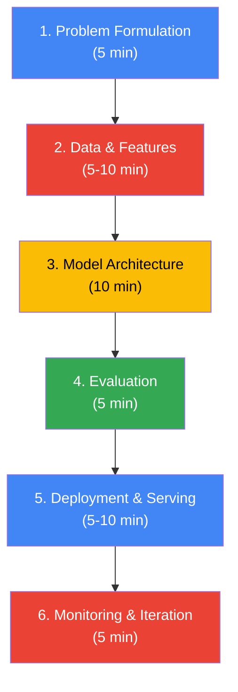

# Chapter 00 — Google AI Engineer Interview Strategy

> A battle-tested preparation guide for Google AI/ML Engineer roles — mapped to these study notes, informed by 2026 interview data, and written like a senior Google engineer is sitting across the table from you.

---

## 0.1 The Role: What Google AI Engineers Do

Google hires AI/ML engineers across a leveling system from L3 (entry) to L7+ (principal). The role title might say "Software Engineer, Machine Learning" or "AI Engineer" but the expectation is the same: you write production code, you understand ML deeply, and you ship systems that work at Google scale.

### Levels at a Glance

| Level | Title | Years of Experience | What's Expected |
|-------|-------|-------------------|-----------------|
| L3 | SWE II | 0-2 | Writes clean code, implements well-scoped ML tasks, learns fast |
| L4 | SWE III | 2-5 | Owns features end-to-end, designs moderate ML systems, mentors L3s |
| L5 | Senior SWE | 5-10 | Drives technical direction, designs complex ML systems, cross-team impact |
| L6 | Staff SWE | 8-15 | Sets team-wide strategy, solves ambiguous problems, organization-level impact |
| L7 | Senior Staff | 12+ | Defines multi-team roadmaps, shapes Google's ML direction, industry impact |

Most external hires land at L4 or L5. L3 is typical for new grads. L6+ external hiring exists but is rare and requires a strong publication or production track record.

### Teams Hiring AI Engineers

```
  ┌─────────────────────┬─────────────────────────────────────────────┐
  │ Team                │ Focus                                       │
  ├─────────────────────┼─────────────────────────────────────────────┤
  │ Google DeepMind     │ Frontier models (Gemini). Research-heavy.   │
  │                     │ Often requires publications.                │
  ├─────────────────────┼─────────────────────────────────────────────┤
  │ Cloud AI / Vertex   │ Production ML platform, model serving,     │
  │                     │ AutoML, Gemini API. More SWE-focused.      │
  ├─────────────────────┼─────────────────────────────────────────────┤
  │ Search              │ Ranking, retrieval, Knowledge Graph.        │
  │                     │ 8.5B+ queries/day. Real-time serving.      │
  ├─────────────────────┼─────────────────────────────────────────────┤
  │ Ads                 │ CTR prediction, bid optimization, fraud.    │
  │                     │ Wide & Deep was invented here.              │
  ├─────────────────────┼─────────────────────────────────────────────┤
  │ YouTube             │ Recommendation, content moderation.         │
  │                     │ Multimodal (video + audio + text).          │
  ├─────────────────────┼─────────────────────────────────────────────┤
  │ Android / On-Device │ Gemini Nano, model compression, INT4       │
  │                     │ quantization, TFLite. Growing fast.        │
  └─────────────────────┴─────────────────────────────────────────────┘
```

### The 2026 Landscape

> The interview has shifted. In 2023-2024, knowing Transformers and RLHF was enough to stand out. By 2026, every serious candidate knows those. Here's what differentiates you now:

```
  2026 DIFFERENTIATORS — What Top Candidates Know
  ════════════════════════════════════════════════════════════

  ┌─────────────────────┬────────────────────────────────────┐
  │ AI Agents           │ Tool use, multi-step planning,     │
  │                     │ ReAct, MCP (Model Context Proto-   │
  │                     │ col). Google launched Gemini-       │
  │                     │ powered research agents in 2026.   │
  ├─────────────────────┼────────────────────────────────────┤
  │ Multimodal          │ Cross-modal attention, video       │
  │ Reasoning           │ understanding, audio-visual        │
  │                     │ grounding — not just image input.  │
  ├─────────────────────┼────────────────────────────────────┤
  │ On-Device ML        │ INT4 quantization, distillation,   │
  │                     │ TFLite/ONNX, Gemini Nano.          │
  ├─────────────────────┼────────────────────────────────────┤
  │ Responsible AI      │ Bias in multimodal outputs,        │
  │                     │ Constitutional AI, red-teaming,    │
  │                     │ safety classifiers.                │
  ├─────────────────────┼────────────────────────────────────┤
  │ RLVR (Verifiable    │ Replacing human-preference RLHF    │
  │ Rewards)            │ with programmatic reward verifi-   │
  │                     │ cation for reasoning tasks.        │
  └─────────────────────┴────────────────────────────────────┘
```

---

## 0.2 Interview Format & Timeline (2026)

The Google AI Engineer interview follows a well-defined pipeline. Total elapsed time: 4 to 8 weeks from first recruiter contact to offer.


### Round-by-Round Breakdown

### Recruiter Screen (30 min)

Non-technical. Your background, interest in Google, current projects. In 2026, recruiters specifically check for **ML production experience**, not just algorithm knowledge.

Have a tight 2-minute pitch ready: who you are, what ML systems you have built, why Google.

### Technical Phone Screen (45-60 min)

One coding problem, typically LeetCode medium to hard. Shared coding environment. You are expected to **talk through your approach before coding**. Silence during coding is a red flag — externalize your reasoning.

### Onsite / Virtual Loop (4-5 rounds, 45 min each)

| Round | What It Tests | Format |
|-------|--------------|--------|
| Coding 1 (DSA) | Algorithm design, data structures | 1-2 problems, whiteboard or shared editor |
| Coding 2 (ML Coding) | Implement ML components from scratch | NumPy-only implementations, data pipelines |
| ML System Design | End-to-end ML system architecture | Open-ended design, 45 min discussion |
| ML Depth / Knowledge | Deep understanding of ML and LLMs | Rapid-fire questions, derivations, tradeoffs |
| Behavioral (Googleyness) | Leadership, collaboration, ethics | STAR-format stories, situational questions |

Some candidates report only 4 rounds (2 coding, 1 system design, 1 behavioral) with ML depth folded into the coding rounds. The exact configuration depends on level and team.

### Hiring Committee

After the loop, interviewers submit detailed scorecards. A committee of senior engineers reviews all feedback and calibrates your level (L3-L6). This is where the actual hire/no-hire decision happens. Interviewers do not make the final call.

### Team Matching

Once the committee approves, you enter team matching. You will have 1-3 calls with potential teams (DeepMind, Search, Ads, etc.). This is mutual — you are also interviewing them.

### Timeline

```
  Application ──► Recruiter Screen ──► Phone Screen ──► Onsite ──► Committee ──► Team Match ──► Offer
                     1-2 weeks          1-3 weeks       1-2 weeks   1-3 weeks
                                                                    ─────────────────────────
                                                                    Total: 4-8 weeks typical
```

---

## 0.3 Google's Most Asked ML Topics (2026)

These are the 15 topics Google interviewers ask about most frequently, ranked by how often they appear in reported interviews. Each maps to specific chapters in these notes.

```chart
{
  "type": "bar",
  "data": {
    "labels": [
      "Transformer / Attention",
      "ML System Design",
      "RLHF / DPO / Alignment",
      "Recommendation Systems",
      "Distributed Training",
      "Evaluation Metrics",
      "AI Agents & Tool Use",
      "Embeddings / ANN Search",
      "Bias-Variance Tradeoff",
      "Multimodal Models",
      "Responsible AI / Safety",
      "Gradient Descent / Optimizers",
      "Overfitting & Regularization",
      "Gemini Architecture (MoE)",
      "Feature Engineering at Scale"
    ],
    "datasets": [{
      "label": "Relative Frequency (%)",
      "data": [95, 90, 85, 82, 78, 75, 72, 70, 68, 65, 62, 60, 58, 55, 50],
      "backgroundColor": "#4285F4",
      "borderRadius": 4
    }]
  },
  "options": {
    "indexAxis": "y",
    "scales": {
      "x": { "max": 100, "title": { "display": true, "text": "Interview Frequency %" } }
    },
    "plugins": {
      "title": { "display": true, "text": "Google ML Interview — Top 15 Topics by Frequency (2026)" },
      "legend": { "display": false }
    }
  }
}
```

| Rank | Topic | Chapter Reference | What They Ask |
|------|-------|------------------|---------------|
| 1 | Transformer / Self-Attention | Ch 20 T6+T11, Ch 13 Sec 2 | Derive scaled dot-product attention. Why sqrt(d_k)? Multi-head purpose. |
| 2 | ML System Design | Ch 17, Ch 20 Modern | Design an end-to-end recommendation/ranking/fraud system at Google scale |
| 3 | RLHF / DPO / Alignment | Ch 20 T12 | Compare RLHF vs DPO. What is reward hacking? Why is DPO more stable? |
| 4 | Recommendation Systems | Ch 17 (YouTube, Ads) | Two-tower retrieval, multi-stage ranking, Wide & Deep |
| 5 | Distributed Training | Ch 20 T13 Sec 13.3 | Data vs tensor vs pipeline parallelism. ZeRO. 3D parallelism. |
| 6 | Evaluation Metrics | Ch 20 T7+T14 | AUC-ROC vs AUC-PR, NDCG, perplexity, MMLU, LLM-as-judge |
| 7 | AI Agents & Tool Use | Ch 16 Q63-64, Ch 22 | ReAct pattern, MCP, function calling, multi-step planning |
| 8 | Embeddings / ANN Search | Ch 13 Sec 10, Ch 16 Q32 | Cosine vs dot product, HNSW, FAISS, embedding drift |
| 9 | Bias-Variance Tradeoff | Ch 20 T1, Ch 4 | Explain it cold, draw the diagram, map it to real model choices |
| 10 | Multimodal Models | Ch 13, Ch 16 | Cross-modal attention, image-text alignment, video understanding |
| 11 | Responsible AI / Safety | Ch 16 Q54-Q60 | Bias detection, toxicity filtering, Constitutional AI, red-teaming |
| 12 | Gradient Descent / Optimizers | Ch 20 T2, Ch 4 | Derive SGD update rule, Adam internals, learning rate warmup |
| 13 | Overfitting & Regularization | Ch 20 T3, Ch 4 | L1 vs L2 geometry, dropout at test time, early stopping |
| 14 | Gemini Architecture (MoE) | Ch 20 T11, Ch 19 | Mixture of Experts routing, load balancing, expert specialization |
| 15 | Feature Engineering at Scale | Ch 20 T9, Ch 5, Ch 17 | Feature stores, real-time vs batch features, embedding features |

> In a real Google interview, they might ask: "Walk me through how you would train a reward model for RLHF. What data do you need? What loss function? What can go wrong?" Then they will push: "Now compare that to DPO. Why might DPO be preferred in practice? When would you still choose RLHF?"

---

## 0.4 ML System Design Framework

Google interviewers evaluate system design using a structured rubric. Candidates who wander without a framework score poorly. Use this 6-step structure and practice it until it is automatic.



### Step 1 — Problem Formulation (5 min)

Ask clarifying questions first. Never dive in immediately.

- Define: business goal, users, scale, latency requirements
- Define input/output and success metrics (offline + online)
- Frame the ML task: *"This is a [classification/ranking/generation] problem where we predict [Y] given [X]."*

### Step 2 — Data & Features (5-10 min)

- What data exists? How is it labeled (implicit clicks vs explicit ratings)?
- How much data? (Google scale = billions)
- Data quality issues? Missing values, noise, bias?
- Feature engineering: user features, item features, context features, cross features
- Pipeline: batch (offline) vs real-time (serving time) vs feature store

### Step 3 — Model Architecture (10 min)

> Always start with a simple baseline. "First, I would try logistic regression..." Jumping to Transformers immediately is a red flag.

- Progression: Baseline → Gradient Boosting → Neural Network → Custom Architecture
- For each: why this architecture, training strategy, how to handle scale
- Tradeoffs: accuracy vs latency, complexity vs interpretability
- Google patterns: two-tower (retrieval), Wide & Deep (memorization + generalization), multi-stage pipeline (candidate gen → ranking → re-ranking)

### Step 4 — Evaluation (5 min)

- **Offline:** train/val/test split (time-based for temporal data), metrics (precision, recall, AUC, NDCG), ablation studies
- **Online:** A/B testing design, sample size, guardrail metrics, statistical significance
- **Fairness:** evaluate across demographic groups, check for disparate impact

### Step 5 — Deployment & Serving (5-10 min)

- Serving: batch vs real-time inference
- Latency budget: p50, p95, p99 targets
- Model format: TF SavedModel, ONNX, TensorRT
- Scaling: horizontal scaling, load balancing, caching
- LLM-specific: KV cache, quantization, batching, streaming, guardrails

### Step 6 — Monitoring & Iteration (5 min)

- Monitoring: accuracy drift, data drift, concept drift
- Retraining: scheduled vs triggered
- Feedback loop: collect new labels from production
- Shadow mode: run new model alongside old before switching
- Rollback strategy: always have one

### 5 Example Systems to Practice

---

**1. YouTube Video Recommendation**

- **Problem:** Given a user and context, rank candidate videos
- **Pipeline:** Candidate generation (two-tower, ~1000 from millions) → Ranking (DNN with user/video/context) → Re-ranking (diversity, freshness, policy)
- **Metrics:** Watch time, engagement quality, user satisfaction
- **Scale:** 2B+ users, 800M+ videos
- **Follow-up they ask:** *"How do you handle cold start for new users and new videos?"*

---

**2. Search Query Ranking**

- **Problem:** Given a query, rank web pages by relevance
- **Features:** Query-document similarity, page authority, freshness, user signals
- **Model progression:** BM25 → Learning-to-rank → BERT cross-encoder
- **Key challenge:** Latency — must respond in <200ms
- **Follow-up they ask:** *"How would you add LLM-generated summaries without blowing the latency budget?"*

---

**3. Fraud Detection (Google Pay)**

- **Problem:** Classify transactions as legit or fraudulent in real-time
- **Challenge:** Extreme class imbalance (~0.1% fraud) + adversarial adaptation
- **Features:** Amount, velocity, device fingerprint, merchant category, behavioral patterns
- **Model:** Gradient boosting ensemble with real-time feature computation
- **Follow-up they ask:** *"How do you trade off false positives (blocking users) vs false negatives (missing fraud)?"*

---

**4. Content Moderation (YouTube)**

- **Problem:** Detect policy-violating content across video, audio, text
- **Approach:** Multimodal — frame sampling + audio transcription + metadata
- **Pipeline:** Automated classifier (high recall) → Human review queue (high precision)
- **Key challenge:** Context-dependent policies (satire vs hate speech)
- **Follow-up they ask:** *"How do you handle adversarial content designed to evade detection?"*

---

**5. Conversational AI Agent (Gemini)**

- **Problem:** Agent that answers questions, uses tools, maintains multi-turn context
- **Architecture:** LLM backbone + RAG + tool use (function calling / MCP) + memory
- **Key decisions:** When to retrieve vs generate, handling hallucination, conversation state
- **Follow-up they ask:** *"How do you evaluate correctness when there is no single right answer?"*

---

## 0.5 Coding Round Strategy

Google's coding bar is the highest in the industry, even for ML roles. A brilliant ML mind who cannot code cleanly will not pass.

### The 45-Minute Template

| Time | Activity |
|------|----------|
| 0-5 min | Read problem carefully. Ask clarifying questions. State assumptions. |
| 5-10 min | Talk through your approach. Discuss time/space complexity before coding. |
| 10-35 min | Write clean code. Talk as you code — explain each decision. |
| 35-40 min | Test with examples. Walk through edge cases. |
| 40-45 min | Discuss optimization. What would you change if constraints shifted? |

### DSA Patterns Ranked by Google Frequency

| Priority | Pattern | Target Problems | Key Insight |
|----------|---------|----------------|-------------|
| 1 | Graphs (BFS, DFS, Dijkstra, topological sort) | 25 | Google's favorite. Master BFS/DFS cold. |
| 2 | Dynamic Programming | 25 | State definition is everything. Practice stating DP recurrence aloud. |
| 3 | Trees & BST | 20 | Recursive thinking. Serialize/deserialize. LCA. |
| 4 | Arrays & Hashmaps | 20 | Warm-up category. Must be fast and clean. |
| 5 | Sliding Window / Two Pointers | 15 | Pattern recognition. Fixed vs variable window. |
| 6 | Binary Search | 15 | Search on answer space, not just sorted arrays. |
| 7 | Heaps / Priority Queues | 10 | Top-K problems, merge K sorted. |
| 8 | Tries | 10 | Prefix matching, autocomplete. |
| 9 | Stack / Monotonic Stack | 10 | Next greater element, valid parentheses. |
| 10 | String algorithms | 10 | Substring search, palindromes. |

Total target: ~160 problems over 12 weeks (~2 per day). Mix: 20% Easy (first 2 weeks only), 60% Medium, 20% Hard (weeks 8-12).

### ML-Specific Coding (Round 2)

Google may ask you to implement ML algorithms from scratch. Practice these with NumPy only (no sklearn, no PyTorch):

```python
# Example: Numerically stable softmax — a classic Google interview question
import numpy as np

def softmax(x):
    """Compute softmax with numerical stability."""
    # Subtract max for numerical stability (prevents overflow)
    shifted = x - np.max(x, axis=-1, keepdims=True)
    exp_x = np.exp(shifted)
    return exp_x / np.sum(exp_x, axis=-1, keepdims=True)

# Example: Self-attention forward pass
def self_attention(Q, K, V):
    """Scaled dot-product attention."""
    d_k = Q.shape[-1]
    scores = Q @ K.T / np.sqrt(d_k)     # (seq_len, seq_len)
    weights = softmax(scores)             # attention weights
    return weights @ V                    # (seq_len, d_v)
```

```java
// Example: K-Means clustering from scratch (Java)
// Google sometimes asks ML coding in Java for SWE-ML roles
public class KMeans {
    public static int[] fit(double[][] data, int k, int maxIter) {
        int n = data.length, d = data[0].length;
        double[][] centroids = new double[k][d];
        int[] labels = new int[n];

        // Initialize centroids to random data points
        Random rand = new Random(42);
        Set<Integer> chosen = new HashSet<>();
        for (int i = 0; i < k; i++) {
            int idx;
            do { idx = rand.nextInt(n); } while (chosen.contains(idx));
            chosen.add(idx);
            centroids[i] = data[idx].clone();
        }

        for (int iter = 0; iter < maxIter; iter++) {
            // Assign each point to nearest centroid
            for (int i = 0; i < n; i++) {
                double minDist = Double.MAX_VALUE;
                for (int j = 0; j < k; j++) {
                    double dist = euclidean(data[i], centroids[j]);
                    if (dist < minDist) { minDist = dist; labels[i] = j; }
                }
            }
            // Update centroids
            double[][] sums = new double[k][d];
            int[] counts = new int[k];
            for (int i = 0; i < n; i++) {
                counts[labels[i]]++;
                for (int j = 0; j < d; j++) sums[labels[i]][j] += data[i][j];
            }
            for (int i = 0; i < k; i++)
                for (int j = 0; j < d; j++)
                    centroids[i][j] = counts[i] > 0 ? sums[i][j] / counts[i] : centroids[i][j];
        }
        return labels;
    }

    private static double euclidean(double[] a, double[] b) {
        double sum = 0;
        for (int i = 0; i < a.length; i++) sum += (a[i] - b[i]) * (a[i] - b[i]);
        return Math.sqrt(sum);
    }
}
```

Full list to practice implementing from scratch: linear regression with gradient descent, logistic regression with cross-entropy loss, K-means clustering, K-nearest neighbors, decision tree (basic), forward pass of a neural network layer, self-attention mechanism, softmax (numerically stable), batch normalization (forward + backward), simple data pipeline with batching.

---

## 0.6 ML Depth Round Strategy

The ML depth round is a rapid-fire interrogation of your understanding. The interviewer picks a topic and drills down until you hit the edge of your knowledge. They are not looking for you to know everything — they are looking for how you reason when you reach that edge.

### How It Works

The interviewer starts broad ("Tell me about Transformers") and then goes deeper with each answer you give. A typical progression:

1. "Explain self-attention." (baseline)
2. "Why do we divide by sqrt(d_k)?" (understanding)
3. "What happens if we don't?" (reasoning)
4. "How does multi-head attention help compared to a single head with the same total dimension?" (depth)
5. "What are the computational tradeoffs of increasing the number of heads?" (mastery)

### Key Topics and How Deep to Go

**Transformers**
- Derive attention from scratch (Q, K, V, scaled dot-product)
- Know RoPE positional encoding math
- Explain causal masking and why it's needed
- Pre-norm vs post-norm LayerNorm placement
- Flash Attention at the algorithm level (tiling, O(n) memory)

**Training Pipeline**
- Explain pre-training → SFT → RLHF cold
- Reward model loss function
- DPO's implicit reward model (no separate RM needed)
- GRPO and why it eliminates the critic
- Scaling laws (Chinchilla-optimal compute allocation)

**Serving & Inference**
- KV cache math: calculate memory for model size × sequence length × batch size
- Quantization tradeoffs: FP32 → FP16 → INT8 → INT4
- Speculative decoding: the draft-verify trick
- PagedAttention: the virtual memory analogy

**Embeddings & Retrieval**
- Cosine similarity vs dot product (when each is appropriate)
- ANN algorithms: HNSW, IVF, PQ
- Embedding drift and how to handle it
- Two-tower vs cross-encoder tradeoffs

### Sample Questions with Answer Structure

**Q: "Compare RLHF and DPO. When would you choose each?"**

Strong answer structure:
1. Define both precisely (RLHF trains a separate reward model then uses PPO; DPO reformulates so the language model is its own reward model)
2. State the key difference (DPO eliminates the RL loop entirely)
3. Give tradeoffs (RLHF: more flexible but reward hacking risk, expensive; DPO: more stable, simpler to implement, but less flexible reward shaping)
4. State when each is preferred (RLHF when you need fine-grained reward control or have complex objectives; DPO when you want simplicity and stability with binary preferences)
5. Mention the 2025-2026 frontier (GRPO/RLVR using verifiable rewards — moving beyond human preferences entirely for reasoning tasks)

**Q: "You notice your production model's accuracy dropping over time. What do you do?"**

Strong answer structure:
1. Check for data drift first (feature distribution shift)
2. Check for concept drift (relationship between features and target changed)
3. Check upstream data pipeline (broken features, schema changes, null inflation)
4. Compare recent model predictions against a holdout of recent ground truth
5. If drift confirmed: retrain on recent data, A/B test against current model, deploy with monitoring
6. Systemic fix: implement automated drift detection and triggered retraining

**Q: "Explain Flash Attention. Why is it O(n) memory instead of O(n^2)?"**

Strong answer structure:
1. Standard attention materializes the full n x n attention matrix in HBM (high bandwidth memory)
2. Flash Attention never materializes the full matrix — it tiles the computation into blocks
3. Each block computes a partial softmax in fast SRAM, accumulates results, then writes only the final output back to HBM
4. Memory is O(n) because only the output matrix and a small buffer of tiles need to be stored, not the full attention matrix
5. Bonus: it is also faster because it reduces HBM reads/writes (memory I/O bound, not compute bound)

---

## 0.7 Behavioral Round (Googleyness & Leadership)

This round is not optional filler. Google's hiring committee weighs "Googleyness & Leadership" alongside technical scores. A mixed behavioral signal can sink an otherwise strong technical packet.

### What Google Evaluates

**Googleyness** is not about being fun or quirky. It is a specific set of behaviors:

1. **Doing the right thing** — Ethical decision-making. Speaking up when something is wrong. Putting users ahead of personal gain.
2. **Thriving in ambiguity** — Comfortable with unclear requirements. Asks the right questions, then moves forward.
3. **Valuing feedback** — Seeks it actively. Takes criticism without defensiveness. Gives it directly and kindly.
4. **Challenging the status quo** — Questions assumptions. Proposes improvements, not just complaints.
5. **Putting users first** — Decisions driven by user impact, not technical elegance.
6. **Caring about the team** — Helps teammates grow. Shares knowledge. Creates inclusive environments.

**Leadership** at Google does not mean "manager." It means influence, initiative, and impact at any level:

- **Ownership**: "I saw a problem and took responsibility without being asked."
- **Influence without authority**: "I was not the tech lead, but I convinced the team using data."
- **Navigating disagreement**: "My manager and I disagreed. I presented data, listened, and we found common ground."
- **Growing others**: "I mentored a junior engineer from daily guidance to independent ownership in 3 months."

### The STAR Method

Every behavioral answer must follow STAR format. Interviewers are trained to listen for these four components.

```
  ┌──────────────────────────────────────────────────────────────┐
  │                     THE STAR FRAMEWORK                        │
  ├──────────┬──────────┬──────────────────────┬─────────────────┤
  │ S        │ T        │ A                    │ R               │
  │ Situation│ Task     │ Action               │ Result          │
  ├──────────┼──────────┼──────────────────────┼─────────────────┤
  │ Set the  │ YOUR     │ What YOU did.        │ Measurable      │
  │ scene.   │ specific │ Be specific. Use "I" │ outcome +       │
  │ 2-3 sen- │ role.    │ not "we." This is    │ what you        │
  │ tences.  │          │ the LONGEST part.    │ learned.        │
  ├──────────┼──────────┼──────────────────────┼─────────────────┤
  │ ~30 sec  │ ~15 sec  │ ~90 sec              │ ~30 sec         │
  └──────────┴──────────┴──────────────────────┴─────────────────┘

  Total: 2-3 minutes. Most candidates spend too long on S and T,
  then rush A and R. The ACTION is what Google evaluates.
```

---

### 8 Stories to Prepare

Prepare these from your own experience. Each should work for multiple question types. Make them ML-specific when possible.

```
  ┌───┬────────────────────────────────────┬─────────────────────────────┐
  │ # │ Story Theme                        │ Signals Demonstrated        │
  ├───┼────────────────────────────────────┼─────────────────────────────┤
  │ 1 │ Led a technical project end-to-end │ Leadership, ownership       │
  │ 2 │ Resolved a disagreement            │ Collaboration, influence    │
  │ 3 │ Dealt with ambiguity               │ Thriving in ambiguity       │
  │ 4 │ Failed and recovered               │ Humility, growth mindset    │
  │ 5 │ Went above and beyond              │ Ownership, user focus       │
  │ 6 │ Tough tradeoff under pressure      │ Decision-making, judgment   │
  │ 7 │ Mentored someone                   │ Growing others, empathy     │
  │ 8 │ Improved a process                 │ Challenging status quo       │
  └───┴────────────────────────────────────┴─────────────────────────────┘
```

---

### Example STAR Answers (ML-Specific)

These are full-length example answers demonstrating the format. Adapt to your own experience.

---

**Q: "Tell me about a time you led a technical project end-to-end."**

> **S:** Our recommendation system was seeing a 15% decline in click-through rate over 3 months, and the existing team of two was stuck debugging it.
>
> **T:** I volunteered to lead the investigation and proposed a project to rebuild the feature pipeline and retrain the model. My manager approved a 6-week timeline with me as the technical lead.
>
> **A:** I started by profiling the entire pipeline — data ingestion, feature extraction, model training, serving. I discovered two root causes: (1) a data schema migration had silently dropped a high-signal feature 3 months ago, and (2) the model hadn't been retrained since before the migration, so it was making predictions using stale feature distributions. I restored the missing feature, added schema validation tests to prevent future silent drops, set up automated weekly retraining with a holdout-based quality gate, and deployed the retrained model behind an A/B test. I also set up a Grafana dashboard with automated drift detection alerts — something the team never had before.
>
> **R:** CTR recovered to baseline within 2 weeks and then improved 8% above the original number. The automated retraining pipeline is still running 6 months later with zero manual intervention. The schema validation caught two more silent breaks before they reached production. My manager cited this project in my promo packet.

**Why this works:** Specific numbers (15% decline, 6 weeks, 8% improvement). Clear individual actions ("I discovered," "I restored," "I set up"). Shows technical depth (drift detection, A/B test, schema validation). Demonstrates leadership (volunteered, proposed, led).

---

**Q: "Tell me about a time you failed."**

> **S:** I was building a fraud detection model at my previous company. We had a tight 4-week deadline for a compliance audit.
>
> **T:** I was responsible for the model design, training, and deployment. I chose to use a complex ensemble (XGBoost + neural network + rule-based system) to maximize recall.
>
> **A:** I spent 3 weeks building the ensemble and hit 97% recall on our test set. But when we deployed to production on week 4, latency was 800ms per prediction — our SLA was 200ms. The neural network component was the bottleneck. I had optimized for accuracy without profiling inference latency once. With only days left, I had to drop the neural network component and fall back to XGBoost alone, which met the latency SLA but dropped recall to 91%. After the deadline, I rebuilt the system properly: I profiled latency from day one, used model distillation to compress the ensemble into a single faster model, and added latency benchmarks to our CI pipeline so this could never happen again.
>
> **R:** The production model shipped at 91% recall (still above the 85% compliance threshold), so the audit passed. The distilled version I built later achieved 95% recall at 150ms latency. The key lesson I took away: always profile serving constraints before building the model. I now start every ML project by defining the latency/throughput budget first, then designing the model to fit within it.

**Why this works:** Shows a real failure (not a humble brag). Takes full responsibility ("I had optimized without profiling"). Explains what was learned and how behavior changed. Shows recovery and long-term improvement.

---

**Q: "Describe a disagreement with a senior engineer."**

> **S:** Our senior ML engineer wanted to use a Transformer-based model for a tabular click-prediction task. I believed gradient boosting (LightGBM) would perform better and be far easier to serve at scale.
>
> **T:** I needed to influence the technical direction without having the seniority to overrule the decision.
>
> **A:** Rather than arguing abstractly, I proposed a 1-week bake-off. I built the LightGBM pipeline, and the senior engineer built the Transformer version. We agreed on the same train/val/test splits, the same evaluation metrics (AUC-PR, latency p99), and committed in advance to go with whichever won on both metrics. I also documented both approaches in a shared design doc so the entire team could follow along. After the bake-off, LightGBM had 0.3% higher AUC-PR and 12x lower latency. The senior engineer reviewed my results, agreed, and we shipped the LightGBM model. Importantly, the Transformer experiment surfaced useful feature interactions that we incorporated into the LightGBM feature set.
>
> **R:** The final model shipped 2 weeks ahead of the Transformer timeline, saved significant serving costs (no GPU needed for inference), and the senior engineer later told me the bake-off approach was something he adopted for all future architecture decisions on the team. I learned that data wins arguments — and that framing a disagreement as a shared experiment rather than a debate gets better outcomes.

**Why this works:** Influence without authority. Data-driven approach. Respects the senior engineer. Collaborative outcome. Shows maturity.

---

**Q: "Tell me about a time you dealt with ambiguity."**

> **S:** I joined a new team that was tasked with "improving search quality" — no specific metric, no defined scope, no clear timeline. The PM had left the company a week before I joined.
>
> **T:** As the only ML engineer on the project, I needed to define the problem before I could solve it.
>
> **A:** I spent the first week doing three things: (1) I talked to 5 internal stakeholders (product, design, customer support, data engineering, leadership) to understand what "search quality" meant to each of them. (2) I pulled 30 days of search logs and analyzed failure patterns — queries with zero clicks, queries with immediate back-navigation, and queries where users reformulated. (3) I proposed a concrete success metric: "reduce zero-result rate from 12% to under 5% within 8 weeks" — something measurable that aligned with what every stakeholder cared about. My manager approved the metric, and I built a simple synonym expansion + spelling correction pipeline as the first intervention, followed by a lightweight re-ranking model for the remaining zero-result queries.
>
> **R:** Zero-result rate dropped from 12% to 3.8% in 6 weeks — ahead of the 8-week target. Customer support tickets about "search not working" dropped 40%. The framework I created (stakeholder interviews → data analysis → concrete metric) became the team's standard for scoping ambiguous projects. Leadership later expanded the project scope and hired two more ML engineers for the team.

**Why this works:** Shows how to operate in ambiguity without waiting for instructions. Specific framework (stakeholder interviews → data → metric). Concrete measurable results. Led to team growth.

---

### 30+ Questions by Theme

**Ambiguity:**
- "Tell me about a time you worked on a project with unclear requirements."
- "Describe a decision you made without all the information you wanted."
- "Tell me about a time priorities shifted mid-project."

**User Focus:**
- "Tell me about a time you advocated for the user against the team's direction."
- "Describe a decision that prioritized user experience over technical elegance."
- "Tell me about a product improvement you drove based on user feedback."

**Feedback:**
- "Tell me about a time you received critical feedback."
- "Describe a time you had to give someone difficult feedback."
- "How did you change your approach based on feedback?"

**Ethics:**
- "Tell me about a time you saw something wrong and spoke up."
- "Describe a time doing the right thing was not the easiest path."
- "Have you ever pushed back on a decision you thought was wrong?"
- "Tell me about an ethical concern in your ML work."

**Ownership:**
- "Tell me about a time you took ownership of something outside your job description."
- "Describe a project you initiated on your own."
- "Tell me about the most impactful thing you have done at work."
- "Describe a time you fixed something nobody asked you to fix."

**Influence & Disagreement:**
- "Tell me about a time you convinced someone to change their mind."
- "Describe a disagreement with a senior engineer or manager."
- "Tell me about aligning multiple stakeholders with different priorities."
- "How did you influence a team decision without having formal authority?"

**Failure & Learning:**
- "Tell me about your biggest professional failure."
- "Describe a project that did not go as planned."
- "Tell me about a model that failed in production."
- "What would you do differently if you could redo a past project?"

**Mentoring & Collaboration:**
- "Tell me about a time you helped a teammate grow."
- "Describe how you onboarded a new team member."
- "How do you share knowledge with your team?"
- "Tell me about a time you learned something valuable from a junior colleague."

**ML-Specific Behavioral:**
- "Tell me about the most complex ML system you have built."
- "Describe a time a model did not work as expected in production."
- "How do you handle disagreements about model architecture?"
- "Tell me about a time you simplified a complex ML problem."
- "How do you stay up to date with ML research?"
- "Describe explaining a complex ML concept to a non-technical stakeholder."
- "Tell me about a tradeoff between model accuracy and serving latency."

---

### Red Flags vs Green Flags

```
  RED FLAGS (signals that sink candidates)
  ─────────────────────────────────────────────────────────────
  ✗ "I have never had a failure"        → Lack of self-awareness
  ✗ "My teammate was wrong, I proved it"→ Poor collaboration
  ✗ "I did everything myself"           → Cannot work in a team
  ✗ Vague stories, no specific details  → Story sounds fabricated
  ✗ Blaming others for failures         → No ownership
  ✗ Speaking negatively about past jobs  → Poor professionalism
  ✗ "I just followed orders"            → No initiative
  ✗ Answers longer than 3 minutes       → Cannot prioritize

  GREEN FLAGS (signals that get hired)
  ─────────────────────────────────────────────────────────────
  ✓ "I was wrong about X, and here's    → Self-awareness, growth
     what I learned"
  ✓ "I proposed a data-driven approach  → Influence without authority
     and the team adopted it"
  ✓ Specific numbers and metrics        → Credibility, impact
  ✓ "I" not "we" for your actions       → Clear ownership
  ✓ Credits teammates for their parts   → Team player
  ✓ Mentions user impact, not just      → User focus
     technical achievement
  ✓ Shows what changed after the story  → Lasting improvement
```

---

## 0.8 Salary & Levels (2026)

Compensation data from levels.fyi and Glassdoor, current as of April 2026. These are total compensation (base + bonus + RSU) for US-based roles.

```chart
{
  "type": "bar",
  "data": {
    "labels": ["L3\n(SWE II)", "L4\n(SWE III)", "L5\n(Senior)", "L6\n(Staff)", "L7\n(Sr. Staff)"],
    "datasets": [
      {
        "label": "Base Salary",
        "data": [130, 160, 200, 250, 300],
        "backgroundColor": "#4285F4"
      },
      {
        "label": "Bonus",
        "data": [20, 30, 50, 70, 100],
        "backgroundColor": "#34A853"
      },
      {
        "label": "RSU (annual vest)",
        "data": [50, 110, 160, 280, 540],
        "backgroundColor": "#FBBC05"
      }
    ]
  },
  "options": {
    "scales": {
      "x": { "stacked": true },
      "y": { "stacked": true, "title": { "display": true, "text": "USD (thousands)" } }
    },
    "plugins": {
      "title": { "display": true, "text": "Google AI Engineer Total Compensation by Level (2026, US)" },
      "subtitle": { "display": true, "text": "Source: levels.fyi median data, April 2026" }
    }
  }
}
```

| Level | Title | Median Total Comp | Base | Bonus | RSU (annual) | Typical YoE |
|-------|-------|-------------------|------|-------|-------------|------------|
| L3 | SWE II | ~$200K | $130K | $20K | $50K | 0-2 yrs |
| L4 | SWE III | ~$300K | $160K | $30K | $110K | 2-5 yrs |
| L5 | Senior SWE | ~$410K | $200K | $50K | $160K | 5-10 yrs |
| L6 | Staff SWE | ~$600K | $250K | $70K | $280K | 8-15 yrs |
| L7 | Senior Staff | ~$940K | $300K | $100K | $540K | 12+ yrs |

### RSU Vesting Schedule

Google uses a 4-year vesting schedule with quarterly vesting. No cliff for external hires since 2023. Your initial RSU grant is typically front-loaded (year 1 has the same share count as years 2-4, but you may receive refresher grants annually that stack).

Key point: RSUs dominate compensation at L5+. A strong RSU negotiation matters far more than base salary negotiation.

### Negotiation Tips

1. **Get competing offers.** Google's compensation team responds to competing offers from Meta, Apple, Amazon, OpenAI, Anthropic, and top startups. A competing offer at L5 can add $50K-$100K+ to your total package.
2. **Negotiate RSUs, not base.** Base salary bands are relatively fixed. RSU grants have much more flexibility.
3. **Know your level.** If you believe you should be L5 but Google offers L4, push back with evidence of your scope of impact and technical leadership.
4. **Signing bonus.** One-time cash bonus ($10K-$100K+) to compensate for unvested equity you leave behind. Always ask.
5. **Location matters.** Bay Area, NYC, and Seattle pay the most. Remote or lower cost-of-living locations have adjusted bands.

---

## 0.9 Common Mistakes

> These are the 12 most common mistakes from an interviewer's perspective. Each one has sunk otherwise strong candidates.

```
  ┌────┬──────────────────────────────┬──────────────────────────────────┐
  │ #  │ THE MISTAKE                  │ WHAT TO DO INSTEAD               │
  ├────┼──────────────────────────────┼──────────────────────────────────┤
  │  1 │ Jump to complex models in    │ Start with logistic regression   │
  │    │ system design ("Let's use a  │ as baseline. Justify each step   │
  │    │ Transformer with 12 heads!") │ up in complexity with data.      │
  ├────┼──────────────────────────────┼──────────────────────────────────┤
  │  2 │ Ignore scale. "Compute       │ Always ask: "Does this work      │
  │    │ similarity between all users"│ for 1 billion items?" Google     │
  │    │ — Google has 2B+ users.      │ scale = billions, not millions.  │
  ├────┼──────────────────────────────┼──────────────────────────────────┤
  │  3 │ Dive in without clarifying   │ Spend 3-5 min asking questions.  │
  │    │ questions.                   │ Scope the problem BEFORE coding. │
  ├────┼──────────────────────────────┼──────────────────────────────────┤
  │  4 │ Memorize without understand- │ Explain WHY, not just WHAT.      │
  │    │ ing. "Use Adam, it's best."  │ "Adam adapts per-parameter LR    │
  │    │                              │ using gradient moments, but SGD  │
  │    │                              │ generalizes better in some cases"│
  ├────┼──────────────────────────────┼──────────────────────────────────┤
  │  5 │ Weak coding fundamentals.    │ Minimum: 150 LeetCode problems   │
  │    │ ML candidates under-invest   │ (medium + hard). Coding is a     │
  │    │ in DSA.                      │ hard requirement, even for ML.   │
  ├────┼──────────────────────────────┼──────────────────────────────────┤
  │  6 │ Ignore data in system design.│ Data > model. Discuss collection,│
  │    │ 90% model, 10% data.        │ labeling, quality, bias, pipeline│
  ├────┼──────────────────────────────┼──────────────────────────────────┤
  │  7 │ No monitoring plan. Ship and │ Drift detection, A/B testing,    │
  │    │ forget.                      │ retraining, rollback, alerting.  │
  ├────┼──────────────────────────────┼──────────────────────────────────┤
  │  8 │ Skip behavioral prep.        │ Googleyness & Leadership has     │
  │    │ "It's just soft skills."     │ REAL weight in hiring committee. │
  │    │                              │ Prepare 8 STAR stories.          │
  ├────┼──────────────────────────────┼──────────────────────────────────┤
  │  9 │ Silent coding. Head down,    │ Externalize reasoning. Explain   │
  │    │ no communication.            │ assumptions and tradeoffs aloud. │
  ├────┼──────────────────────────────┼──────────────────────────────────┤
  │ 10 │ Know nothing about Google    │ At minimum: what TPU v5 offers,  │
  │    │ tech (TPU, JAX, Vertex).     │ how JAX differs from PyTorch,    │
  │    │                              │ what Vertex AI does.             │
  ├────┼──────────────────────────────┼──────────────────────────────────┤
  │ 11 │ Treat ML depth as trivia.    │ It tests reasoning, not recall.  │
  │    │ Guess confidently when       │ "I'm not sure, but I'd reason   │
  │    │ you don't know.              │ about it this way..." scores     │
  │    │                              │ BETTER than a wrong answer.      │
  ├────┼──────────────────────────────┼──────────────────────────────────┤
  │ 12 │ Ignore responsible AI.       │ Discuss bias, fairness, safety   │
  │    │ Design without mentioning    │ in EVERY system design. Google   │
  │    │ fairness or safety.          │ takes this seriously post-Gemini.│
  └────┴──────────────────────────────┴──────────────────────────────────┘
```

---

## 0.10 Resources & Links

### Books

| Book | Best For |
|------|---------|
| "ML System Design Interview" — Ali Aminian & Alex Xu | System design round. The closest thing to a prep book for this round. |
| "Designing Machine Learning Systems" — Chip Huyen | Production ML mindset. Data quality, deployment, monitoring. |
| "Cracking the Coding Interview" — Gayle McDowell | Foundational DSA patterns. Good for weeks 1-4. |
| "Deep Learning" — Goodfellow, Bengio, Courville | Reference for ML depth questions. Do not read cover to cover. |
| "Speech and Language Processing" — Jurafsky & Martin | NLP fundamentals if interviewing for language-related teams. |

### Online Courses

| Course | Platform | Focus |
|--------|----------|-------|
| Google ML Crash Course | developers.google.com/machine-learning | Google's own ML intro. Free. |
| Stanford CS229 (Machine Learning) | YouTube / Coursera | Theoretical foundations |
| Stanford CS324 (Large Language Models) | Course website | LLM-specific depth |
| Fast.ai Practical Deep Learning | fast.ai | Hands-on implementation |
| Made With ML | madewithml.com | MLOps and production ML |

### YouTube

| Channel / Video | Why |
|----------------|-----|
| Andrej Karpathy "Let's build GPT" | Builds a Transformer from scratch. Essential. |
| "The Illustrated Transformer" — Jay Alammar | Visual walkthrough of attention. |
| 3Blue1Brown Neural Networks series | Intuition for backprop and gradients |
| Yannic Kilcher paper reviews | Stay current with latest papers |
| Exponent ML System Design playlist | Practice system design walkthroughs |

### Key Papers (Google-Specific)

| Paper | Year | Why It Matters |
|-------|------|---------------|
| Attention Is All You Need | 2017 | The Transformer paper. Read every section. |
| BERT: Pre-training of Deep Bidirectional Transformers | 2018 | Encoder-only pretraining |
| T5: Exploring Transfer Learning | 2019 | Text-to-text framework |
| PaLM / Gemini | 2022-2024 | Google's flagship LLMs. Know the scaling insights. |
| Wide & Deep Learning | 2016 | Memorization + generalization. Still used in Ads. |
| Deep Neural Networks for YouTube Recommendations | 2016 | Two-stage recommendation architecture |
| Scaling Laws for Neural Language Models | 2020 | Chinchilla-optimal training |
| Flash Attention | 2022 | IO-aware attention. Know the algorithm. |
| DPO: Direct Preference Optimization | 2023 | RLHF alternative. Likely interview topic. |

### Mock Interview Platforms

| Platform | What It Offers |
|----------|---------------|
| interviewing.io | Mock interviews with ex-Google engineers. Paid. |
| pramp.com | Free peer mock interviews |
| Exponent | ML system design mocks, question bank |
| Prepfully | Google-specific interview guides |

### Google-Specific Resources

- **Google AI Blog** (ai.googleblog.com) — What Google is actively working on
- **Google DeepMind Blog** (deepmind.google/blog) — Research updates
- **Google Cloud Vertex AI docs** — Production ML platform
- **Google Research Publications** (research.google/pubs) — All published papers
- **Careers at Google DeepMind** (deepmind.google/careers) — Role descriptions reveal what they value

---

**Back to Start:** [README — Table of Contents](../README.md)
