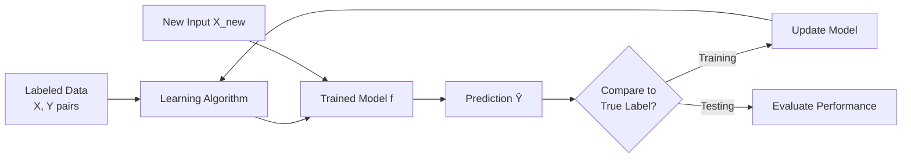
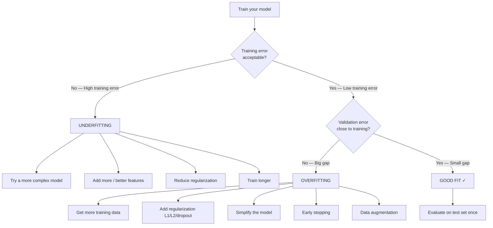
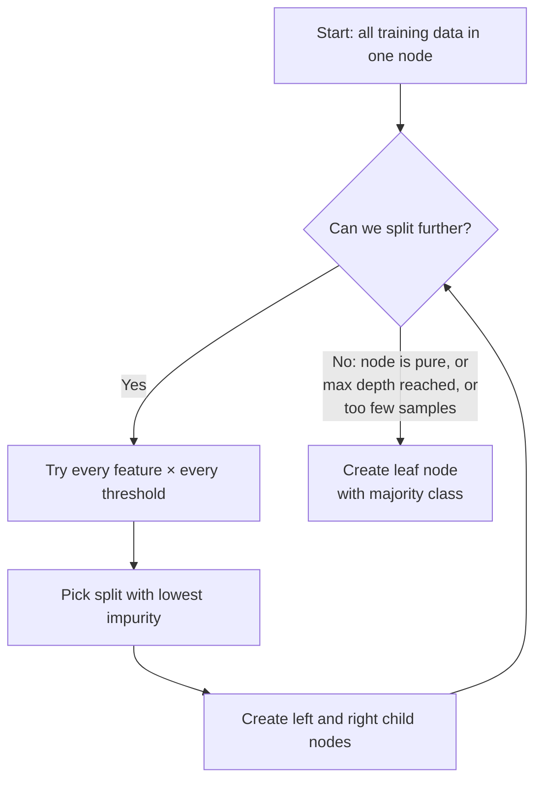
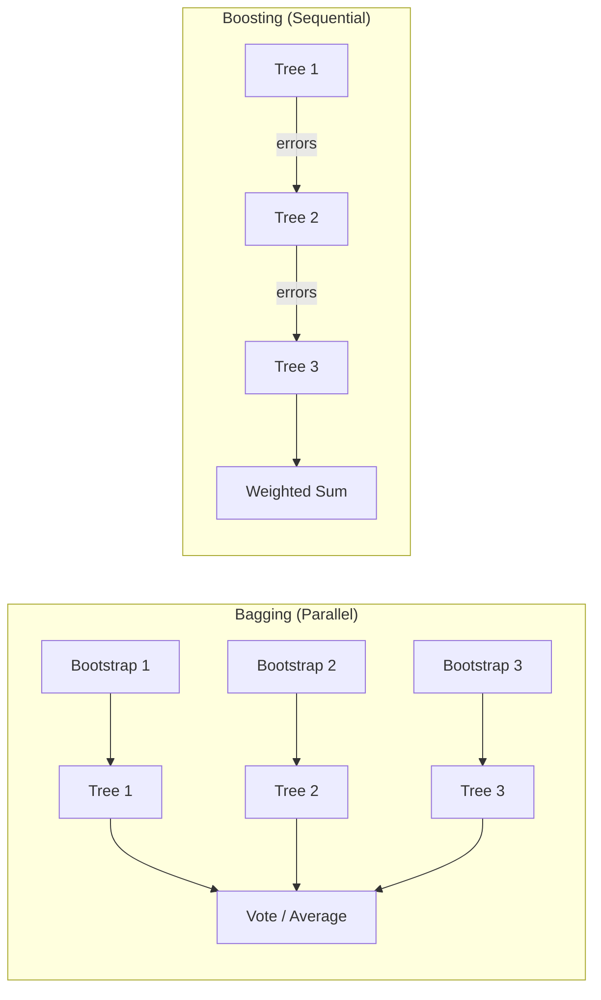
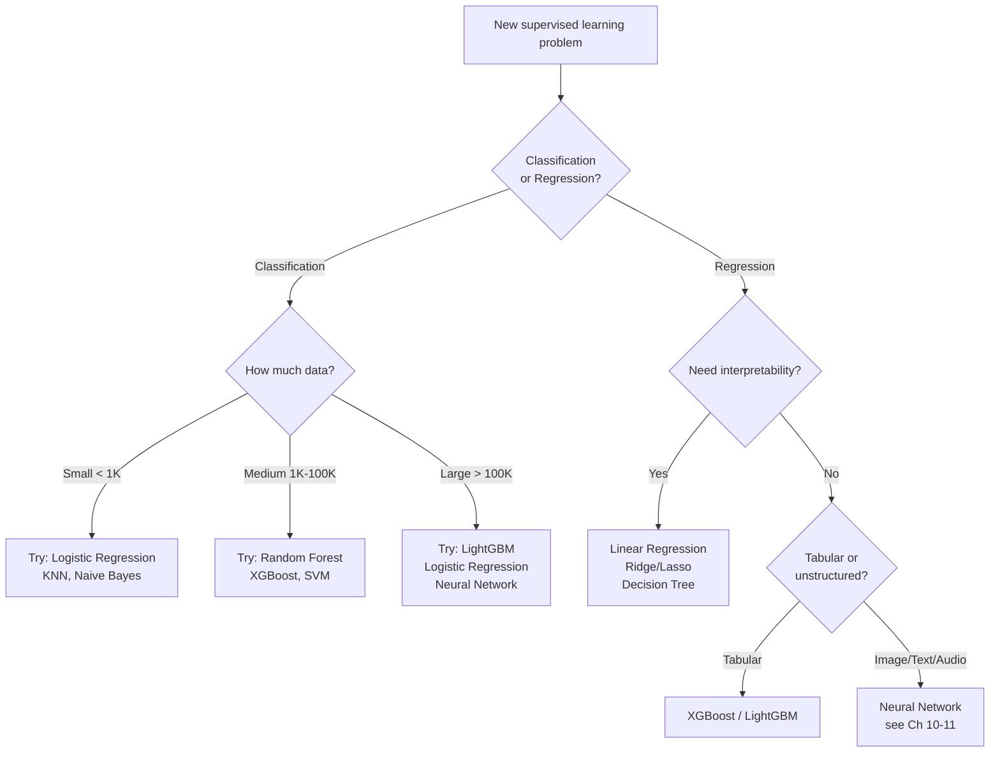

# Chapter 06 — Supervised Learning

> "Supervised learning is the workhorse of machine learning."
> — Andrew Ng

---

## What You'll Learn

After reading this chapter, you will be able to:
- Explain supervised learning and how it differs from other ML paradigms
- Distinguish classification from regression and choose the right framing for a problem
- Describe how models learn through loss functions and gradient-based optimization
- Properly split data into train, validation, and test sets
- Diagnose overfitting and underfitting using the bias-variance tradeoff
- Explain how Logistic Regression, KNN, Decision Trees, SVMs, and ensemble methods work
- Select appropriate loss functions, evaluation metrics, and regularization strategies
- Handle class imbalance without falling into the "99% accuracy" trap
- Use feature importance and SHAP values to explain model predictions

---

## Chapter Map

```
  6.1   What is Supervised Learning?
  6.2   The Two Flavors: Classification vs Regression
  6.3   How Models Learn: Loss Functions & Optimization
  6.4   The Training Pipeline: Train / Val / Test Splits
  6.5   Overfitting, Underfitting & the Bias-Variance Tradeoff
  6.6   Classification Algorithms
  6.7   Decision Tree Splits: Gini vs Entropy
  6.8   Ensemble Methods: Bagging, Boosting, Stacking
  6.9   Regression Algorithms
  6.10  Feature Importance & Model Explainability (SHAP)
  6.11  Class Imbalance: The 99% Trap
  6.12  Algorithm Selection Guide
  Key Takeaways
  Review Questions
```

---

## 6.1 What is Supervised Learning?

> **Supervised Learning** is a machine learning paradigm where the algorithm learns a mapping function $f: X \rightarrow Y$ from a labeled training dataset of $(x_i, y_i)$ pairs, and is evaluated on its ability to generalize that mapping to unseen inputs.

You give the model a stack of solved examples — inputs paired with their correct answers — and it figures out the pattern connecting them. Once trained, it can predict answers for inputs it has never seen before.

Think of it like studying for an exam with the answer key. You see hundreds of practice problems with solutions, notice the patterns, and use those patterns on the actual test where you don't have the answers.

```
  Training Phase:
  ───────────────────────────────────────────────────────────────────
  Example 1:  [2000 sqft, 3 beds, suburb]  →  $350,000   (labeled)
  Example 2:  [800 sqft, 1 bed, downtown]  →  $275,000   (labeled)
  Example 3:  [3500 sqft, 5 beds, rural]   →  $420,000   (labeled)
                        ⋮
  Example N:  [features]                   →  [label]    (labeled)
                   │
                   │  Model learns the mapping: features → label
                   ▼
  Prediction Phase:
  ───────────────────────────────────────────────────────────────────
  New input:  [1500 sqft, 2 beds, suburb]  →  $310,000   ← predicted!
```

The word "supervised" comes from the supervisor — the labels. Without labels, you're doing unsupervised learning (Chapter 7). With labels, the model has a teacher checking its work during training.



### Why Supervised Learning Dominates

Most real-world ML applications are supervised learning:

| Application | Input (X) | Output (Y) | Type |
|---|---|---|---|
| Email spam filter | Email text, metadata | Spam / Not spam | Classification |
| House price estimation | Sqft, beds, location | Price in dollars | Regression |
| Medical diagnosis | Symptoms, lab results | Disease present / absent | Classification |
| Weather forecasting | Temp, pressure, humidity | Tomorrow's temperature | Regression |
| Credit scoring | Income, history, debt | Default / No default | Classification |
| Recommendation rating | User profile, item features | Star rating (1-5) | Regression |

Supervised learning works so well because labeled data encodes human knowledge directly. The hard part is usually getting enough high-quality labels, not the algorithm itself.

---

## 6.2 The Two Flavors: Classification vs Regression

Every supervised learning problem falls into one of two categories, depending on what the output looks like.

> **Classification** predicts a discrete category from a finite set of classes. **Regression** predicts a continuous numerical value.

The distinction is simple: if the answer is a label ("spam", "cat", "malignant"), it's classification. If the answer is a number on a continuous scale ($342,000, 23.5 degrees, 4.7 stars), it's regression.

```
                      SUPERVISED LEARNING
                              │
              ┌───────────────┴───────────────┐
              ▼                               ▼
       CLASSIFICATION                    REGRESSION
              │                               │
  Output = discrete label              Output = continuous number
              │                               │
  "Which category?"                    "How much / how many?"
              │                               │
  ┌─────────────────────┐            ┌──────────────────────┐
  │ Examples:           │            │ Examples:            │
  │ - Spam / Not Spam   │            │ - House price: $350K │
  │ - Cat / Dog / Bird  │            │ - Temperature: 23.5°C│
  │ - Benign / Malignant│            │ - Stock return: 4.2% │
  │ - Positive sentiment│            │ - Time to failure: 8d│
  └─────────────────────┘            └──────────────────────┘
              │                               │
  Loss: Cross-Entropy               Loss: MSE / MAE
  Metrics: Accuracy, F1, AUC        Metrics: RMSE, R², MAE
```

### Classification Subtypes

**Binary classification** has exactly two classes — yes/no, spam/not-spam, positive/negative. The model outputs a probability for one class, and you threshold it (typically at 0.5) to get the final prediction.

**Multi-class classification** has three or more mutually exclusive classes — the input belongs to exactly one. A handwritten digit recognizer (0-9) is multi-class: each image is one and only one digit.

**Multi-label classification** allows multiple labels per input simultaneously. A movie can be Action AND Comedy AND Thriller. Each label is an independent binary decision.

```
  BINARY:        Spam ─── or ─── Not Spam
                 (one probability, one threshold)

  MULTI-CLASS:   Cat ─── or ─── Dog ─── or ─── Bird
                 (softmax: probabilities sum to 1, pick the highest)

  MULTI-LABEL:   [Action: ✓] [Comedy: ✓] [Horror: ✗] [Thriller: ✓]
                 (sigmoid per label: each is independent)
```

| Property | Multi-class | Multi-label |
|---|---|---|
| Labels per input | Exactly 1 | 0 or more |
| Output activation | Softmax | Sigmoid (per label) |
| Loss function | Categorical cross-entropy | Binary cross-entropy (per label) |
| Probabilities sum to 1? | Yes | No |
| Example | Digit recognition (0-9) | Movie genre tagging |

### When Is It Actually Ambiguous?

Sometimes the line between classification and regression blurs. Star ratings (1-5) are discrete, but treating them as regression often works better because 4 stars is closer to 5 than to 1 — the ordering matters. Age prediction could be regression (predict 34.2 years) or classification (predict age bracket: 30-40). The right choice depends on what decision you'll make with the output.

**Rule of thumb:** If the output has a natural ordering and the gaps between values matter, lean toward regression. If the categories are fundamentally different kinds of things, use classification.

---

## 6.3 How Models Learn: Loss Functions & Optimization

> A **loss function** (also called a cost function or objective function) quantifies the difference between the model's predictions and the true labels. Training a model means finding the parameters that minimize this loss over the training data.

Every supervised learning algorithm follows the same core loop: make a prediction, measure how wrong it is, adjust parameters to be less wrong, repeat. The loss function is the ruler that measures "how wrong."

```
  THE LEARNING LOOP
  ═══════════════════════════════════════════════════════
  ┌──────────┐     ┌────────────┐     ┌──────────────┐
  │  Input X  │────►│  Model f   │────►│ Prediction ŷ │
  └──────────┘     └────────────┘     └──────┬───────┘
                         ▲                    │
                         │              ┌─────▼──────┐
                   ┌─────┴──────┐      │ True Label y│
                   │  Update    │      └─────┬───────┘
                   │  Weights   │            │
                   └─────┬──────┘      ┌─────▼──────┐
                         │             │ Loss L(ŷ,y)│
                         ◄─────────────┘            │
                      Gradient of Loss              │
                      (which direction              │
                       to adjust?)                  │
  ═══════════════════════════════════════════════════════
  Repeat until loss is small enough (or stops improving)
```

### Loss Functions for Regression

**Mean Squared Error (MSE)** is the most common regression loss. It penalizes large errors heavily because of the squaring — an error of 10 costs 100 times more than an error of 1.

$$\text{MSE} = \frac{1}{n} \sum_{i=1}^{n} (y_i - \hat{y}_i)^2$$

**Mean Absolute Error (MAE)** treats all errors linearly. An error of 10 costs exactly 10 times more than an error of 1. This makes MAE more robust to outliers than MSE.

$$\text{MAE} = \frac{1}{n} \sum_{i=1}^{n} |y_i - \hat{y}_i|$$

**Huber Loss** combines the best of both: it behaves like MSE for small errors (smooth gradients for easy optimization) and like MAE for large errors (robust to outliers).

```
  Comparison: how each loss penalizes a prediction error of size δ

  Error (δ)  │  MSE (δ²)  │  MAE (|δ|)  │  Behavior
  ───────────┼────────────┼─────────────┼──────────────────────
  0.1        │  0.01      │  0.1        │  MSE is more lenient
  1.0        │  1.0       │  1.0        │  Equal
  5.0        │  25.0      │  5.0        │  MSE punishes 5× more
  10.0       │  100.0     │  10.0       │  MSE punishes 10× more
  100.0      │  10,000    │  100.0      │  Outlier dominates MSE!
```

```chart
{
  "type": "line",
  "data": {
    "labels": [-5,-4,-3,-2,-1.5,-1,-0.5,0,0.5,1,1.5,2,3,4,5],
    "datasets": [
      {
        "label": "MSE (error²)",
        "data": [25,16,9,4,2.25,1,0.25,0,0.25,1,2.25,4,9,16,25],
        "borderColor": "rgba(239, 68, 68, 1)",
        "backgroundColor": "rgba(239, 68, 68, 0.05)",
        "fill": false,
        "tension": 0.3,
        "pointRadius": 2
      },
      {
        "label": "MAE (|error|)",
        "data": [5,4,3,2,1.5,1,0.5,0,0.5,1,1.5,2,3,4,5],
        "borderColor": "rgba(99, 102, 241, 1)",
        "backgroundColor": "rgba(99, 102, 241, 0.05)",
        "fill": false,
        "tension": 0,
        "pointRadius": 2
      },
      {
        "label": "Huber (δ=1)",
        "data": [4.5,3.5,2.5,1.5,1.125,0.5,0.125,0,0.125,0.5,1.125,1.5,2.5,3.5,4.5],
        "borderColor": "rgba(34, 197, 94, 1)",
        "backgroundColor": "rgba(34, 197, 94, 0.05)",
        "fill": false,
        "tension": 0.3,
        "pointRadius": 2
      }
    ]
  },
  "options": {
    "plugins": { "title": { "display": true, "text": "Loss Functions Compared — MSE Explodes on Large Errors" } },
    "scales": {
      "y": { "title": { "display": true, "text": "Loss Value" }, "beginAtZero": true },
      "x": { "title": { "display": true, "text": "Prediction Error (ŷ - y)" } }
    }
  }
}
```

### Loss Functions for Classification

**Binary Cross-Entropy** (log loss) is used when there are two classes. It heavily penalizes confident wrong predictions — predicting 0.99 when the true label is 0 is far worse than predicting 0.6.

$$\text{BCE} = -\frac{1}{n}\sum_{i=1}^{n}\left[y_i \log(\hat{y}_i) + (1-y_i)\log(1-\hat{y}_i)\right]$$

**Categorical Cross-Entropy** generalizes this to multiple classes:

$$\text{CCE} = -\frac{1}{n}\sum_{i=1}^{n}\sum_{c=1}^{C} y_{i,c}\log(\hat{y}_{i,c})$$

```
  Why cross-entropy works so well:

  True label: SPAM (y=1)

  Prediction   │ Cross-Entropy Loss │ Interpretation
  ─────────────┼────────────────────┼─────────────────────────
  ŷ = 0.99     │  0.01              │ Confident & correct → tiny loss
  ŷ = 0.90     │  0.11              │ Pretty confident → small loss
  ŷ = 0.50     │  0.69              │ Unsure → moderate loss
  ŷ = 0.10     │  2.30              │ Wrong direction → big loss
  ŷ = 0.01     │  4.61              │ Confident & wrong → HUGE loss!

  Cross-entropy absolutely punishes confident mistakes.
  This is exactly the behavior we want.
```

### Gradient Descent: The Optimization Engine

> **Gradient descent** is an iterative optimization algorithm that updates model parameters by moving them in the direction that decreases the loss function, with step size controlled by the learning rate.

Almost every supervised learning model is trained using some form of gradient descent. The idea: compute the gradient (slope) of the loss with respect to each parameter, then nudge each parameter in the opposite direction of its gradient.

$$w_{new} = w_{old} - \alpha \cdot \frac{\partial L}{\partial w}$$

where $\alpha$ is the **learning rate** — how big each step is.

```
  Loss
   │\
   │ \
   │  \         ← too large a learning rate: overshoots
   │   \  /\
   │    \/  \
   │         \_________  ← just right: converges smoothly
   │
   └──────────────────── Iterations

  Learning rate too small: takes forever, may get stuck
  Learning rate too large: bounces around, may diverge
  Learning rate just right: converges quickly to minimum
```

**Variants of gradient descent:**

| Variant | Batch Size | Speed | Stability | Notes |
|---|---|---|---|---|
| Batch GD | All N samples | Slow per step | Stable gradient | Exact gradient, but expensive |
| Stochastic GD (SGD) | 1 sample | Fast per step | Very noisy | Can escape local minima |
| Mini-batch GD | 32-512 samples | Fast per step | Moderate noise | Best of both; the standard choice |

Modern optimizers like **Adam** (Adaptive Moment Estimation) automatically adjust the learning rate per parameter, making training much easier in practice. Adam is the default choice for most deep learning and many classical ML tasks.

---

## 6.4 The Training Pipeline: Train / Val / Test Splits

> The **train/validation/test split** divides labeled data into three disjoint sets: one for fitting model parameters (train), one for tuning hyperparameters and model selection (validation), and one held-out set for final unbiased evaluation (test).

You never evaluate a model on data it trained on. That would be like grading a student on the exact practice problems they memorized — it tells you nothing about whether they actually understand the material.

```
  YOUR LABELED DATASET
  ══════════════════════════════════════════════════════════
  ┌──────────────────────────┬──────────┬──────────────────┐
  │       TRAINING SET       │   VAL    │    TEST SET      │
  │        (60-80%)          │ (10-20%) │    (10-20%)      │
  │                          │          │                  │
  │  Used to LEARN the       │ Used to  │  Used ONCE at    │
  │  model's parameters      │ TUNE     │  the very end    │
  │  (weights, splits, etc.) │ hyper-   │  for FINAL       │
  │                          │ params   │  evaluation      │
  │  Model sees this data    │ & pick   │                  │
  │  during training         │ best     │  NEVER used      │
  │                          │ model    │  during training  │
  └──────────────────────────┴──────────┴──────────────────┘
         LEARN                  SELECT        REPORT
         parameters             model         performance
```

### Why Three Sets, Not Two?

It's tempting to just split data into train and test. But then how do you tune hyperparameters (like the number of trees, or the learning rate)? If you tune on the test set, you're implicitly training on it — your test performance becomes optimistic.

The validation set solves this: tune all you want on validation data, and save the test set for one final, honest evaluation.

```
  Common splits:

  Small dataset (< 10K):    60% train / 20% val / 20% test
  Medium dataset (10K-1M):  80% train / 10% val / 10% test
  Large dataset (> 1M):     98% train / 1% val / 1% test
                            (1% of 10M is still 100K examples — plenty)
```

### Cross-Validation: Making the Most of Limited Data

> **K-fold cross-validation** partitions the training data into K equal folds, trains K models each using K-1 folds for training and the remaining fold for validation, and averages the results for a more robust performance estimate.

When data is scarce, setting aside 20% for validation feels wasteful. K-fold cross-validation uses every example for both training and validation across different runs:

```
  5-Fold Cross-Validation:
  ═══════════════════════════════════════════════════════
  Fold 1:  [VAL ] [train] [train] [train] [train]  → score₁
  Fold 2:  [train] [VAL ] [train] [train] [train]  → score₂
  Fold 3:  [train] [train] [VAL ] [train] [train]  → score₃
  Fold 4:  [train] [train] [train] [VAL ] [train]  → score₄
  Fold 5:  [train] [train] [train] [train] [VAL ]  → score₅
  ═══════════════════════════════════════════════════════
  Final estimate = mean(score₁ ... score₅)  ±  std

  Every example is in the validation set exactly once.
  More reliable than a single split, but K× more expensive.
  K=5 or K=10 is standard.
```

**Stratified K-fold** ensures each fold has roughly the same class distribution as the full dataset — essential when classes are imbalanced.

### Data Leakage: The Silent Killer

> **Data leakage** occurs when information from outside the training set (typically from the test set or future data) is used to create the model, leading to overly optimistic performance estimates that won't generalize.

Data leakage is one of the most common and dangerous mistakes in ML. Your model looks great during development but falls apart in production.

```
  COMMON LEAKAGE PATTERNS:
  ──────────────────────────────────────────────────────────
  1. Scaling before splitting:
     ✗  scaler.fit(ALL_DATA)  → then split → test info leaked!
     ✓  split first → scaler.fit(TRAIN_ONLY) → transform test

  2. Feature engineering on full dataset:
     ✗  mean_encoding using all labels → test labels leaked!
     ✓  compute encodings from train set only

  3. Time series without temporal ordering:
     ✗  random split → future data used to predict past!
     ✓  train on past, validate/test on future (time-based split)

  4. Duplicate or near-duplicate rows across splits:
     ✗  same patient in train AND test → memorization, not learning
     ✓  split by patient ID, not by row
```

---

## 6.5 Overfitting, Underfitting, and the Bias-Variance Tradeoff

This is the single most important concept in all of machine learning. Every modeling decision you make — algorithm choice, hyperparameter tuning, regularization, data augmentation — is ultimately about managing this tradeoff.

### Underfitting

> **Underfitting** occurs when a model is too simple to capture the underlying patterns in the data. It performs poorly on both training data and new data.

An underfitting model hasn't learned enough. Imagine trying to fit a straight line through data that follows a clear curve — no matter how you tilt the line, it can't capture the bend.

### Overfitting

> **Overfitting** occurs when a model learns the noise and random fluctuations in the training data rather than the true underlying pattern. It performs well on training data but poorly on new data.

An overfitting model has memorized the training data instead of learning the general pattern. It's like a student who memorizes every answer in the practice exam booklet verbatim but can't handle a rephrased question on the actual test.

```
  UNDERFITTING              GOOD FIT               OVERFITTING
  (too simple)              (just right)            (too complex)
  ────────────              ────────────            ────────────
      *   *                     *   *                   *   *
    *       *               * ─────── *             * ╭─╮ ╭─╮ *
  ──────────────          *    ╱   ╲    *         * ─╯   ╰╯   ╰─ *
  *             *        *   ╱       ╲   *       *                 *
                        *  ╱           ╲  *

  Train error: HIGH       Train error: LOW         Train error: ≈ 0
  Test error:  HIGH       Test error:  LOW         Test error:  HIGH
                                                   ↑ gap between train
  "Can't even fit         "Learned the real        & test = overfitting
   the training data"      pattern"                "Memorized noise"
```

```chart
{
  "type": "line",
  "data": {
    "labels": ["Very Simple", "", "Simple", "", "Moderate", "", "Complex", "", "Very Complex"],
    "datasets": [
      {
        "label": "Training Error",
        "data": [0.45, 0.35, 0.25, 0.18, 0.12, 0.07, 0.04, 0.02, 0.005],
        "borderColor": "rgba(99, 102, 241, 1)",
        "backgroundColor": "rgba(99, 102, 241, 0.05)",
        "fill": false,
        "tension": 0.4,
        "pointRadius": 3
      },
      {
        "label": "Validation Error",
        "data": [0.47, 0.36, 0.24, 0.19, 0.16, 0.17, 0.22, 0.30, 0.42],
        "borderColor": "rgba(239, 68, 68, 1)",
        "backgroundColor": "rgba(239, 68, 68, 0.05)",
        "fill": false,
        "tension": 0.4,
        "pointRadius": 3
      }
    ]
  },
  "options": {
    "plugins": { "title": { "display": true, "text": "The Classic U-Curve — Validation Error Has a Sweet Spot" } },
    "scales": {
      "y": { "title": { "display": true, "text": "Error" }, "beginAtZero": true },
      "x": { "title": { "display": true, "text": "Model Complexity →" } }
    }
  }
}
```

### The Bias-Variance Tradeoff

> **Bias** is the error introduced by approximating a complex real-world problem with a simpler model. **Variance** is the error introduced by the model's sensitivity to fluctuations in the training data. The total expected error decomposes as: $\text{Error} = \text{Bias}^2 + \text{Variance} + \text{Irreducible Noise}$.

**High bias** means the model consistently misses the target in the same direction — it's systematically wrong because it's too simple. A linear model trying to fit a quadratic relationship will always be biased.

**High variance** means the model's predictions change wildly depending on which training data you happened to use. A very deep decision tree trained on 100 examples will produce a completely different tree if you swap out 5 examples.

```
  ┌─────────────────────────────────────────────────────┐
  │               BIAS-VARIANCE TRADEOFF                │
  │                                                     │
  │  HIGH BIAS          │         HIGH VARIANCE         │
  │  LOW VARIANCE       │         LOW BIAS              │
  │  ┌───────┐          │         ┌───────┐             │
  │  │ ·  ·  │          │         │·      │             │
  │  │  ·  · │  Target: │         │  ·    │  Target:    │
  │  │ ·  ·  │    ⊕     │         │    ⊕  │    ⊕       │
  │  │  ·  · │          │         │·    · │             │
  │  └───────┘          │         └───────┘             │
  │  All shots cluster  │  Shots scatter around         │
  │  together but MISS  │  the target but are           │
  │  the bullseye       │  SPREAD OUT                   │
  │                     │                               │
  │  Fix: more complex  │  Fix: simpler model,          │
  │  model, more        │  more data, or                │
  │  features           │  regularization               │
  └─────────────────────┴───────────────────────────────┘
```

### Diagnosing and Fixing Overfitting vs Underfitting



| Symptom | Diagnosis | Fixes |
|---|---|---|
| High train error, high val error | Underfitting (high bias) | More complex model, better features, less regularization |
| Low train error, high val error | Overfitting (high variance) | More data, regularization, simpler model, early stopping |
| Low train error, low val error | Good fit | Ship it (after confirming on test set) |
| High train error, low val error | Bug in your code | Check for data leakage or evaluation bugs |

### Regularization: The Overfitting Antidote

Regularization adds a penalty to the loss function that discourages overly complex models. It's like saying to the model: "Find the simplest explanation that still fits the data well."

```
  UNREGULARIZED LOSS:     L(ŷ, y)            → fit training data perfectly
  REGULARIZED LOSS:       L(ŷ, y) + λR(w)    → fit data AND keep weights small

  λ = regularization strength
  λ = 0:     no penalty → may overfit
  λ = large: heavy penalty → may underfit
  λ = right: balanced → generalizes well
```

We'll see specific regularization techniques (Ridge, Lasso) in Section 6.9.

---

## 6.6 Classification Algorithms

### Logistic Regression ★★★

> **Logistic Regression** is a linear classifier that models the posterior probability $P(y=1|x)$ using the logistic sigmoid function applied to a linear combination of input features. It is trained by minimizing binary cross-entropy loss.

Despite the name, logistic regression is a classification algorithm, not a regression algorithm. It takes a weighted sum of features, pushes that sum through the sigmoid function to get a probability between 0 and 1, and classifies based on a threshold.

$$z = w_0 + w_1 x_1 + w_2 x_2 + \dots + w_n x_n$$

$$\hat{y} = \sigma(z) = \frac{1}{1 + e^{-z}}$$

The sigmoid function is the key. It squashes any real number into the (0, 1) range, which we interpret as a probability.

```
  Example — spam detection:

    Features and learned weights:
      w₀ = -3.0  (bias/intercept)
      has_word_FREE:    w₁ = +0.8   (spam signal)
      has_word_MONEY:   w₂ = +1.2   (strong spam signal)
      num_links:        w₃ = +0.3   (mild spam signal)
      is_known_sender:  w₄ = -0.5   (anti-spam signal)

    Incoming email: FREE=1, MONEY=1, links=5, known=0
      z = -3.0 + 0.8(1) + 1.2(1) + 0.3(5) + (-0.5)(0) = 0.5
      ŷ = σ(0.5) = 0.622
      → 62.2% probability of spam → classify as SPAM (threshold 0.5)

  The learned weights are directly interpretable:
    MONEY (+1.2) is the strongest spam indicator
    known_sender (-0.5) is evidence AGAINST spam
```

```chart
{
  "type": "line",
  "data": {
    "labels": [-10,-9,-8,-7,-6,-5,-4,-3,-2,-1,0,1,2,3,4,5,6,7,8,9,10],
    "datasets": [{
      "label": "σ(z) = 1 / (1 + e⁻ᶻ)",
      "data": [0.00005,0.0001,0.0003,0.0009,0.0025,0.0067,0.018,0.047,0.119,0.269,0.500,0.731,0.881,0.953,0.982,0.993,0.998,0.999,0.9997,0.9999,0.99995],
      "borderColor": "rgba(99, 102, 241, 1)",
      "backgroundColor": "rgba(99, 102, 241, 0.1)",
      "fill": true,
      "tension": 0.4,
      "pointRadius": 0
    }]
  },
  "options": {
    "plugins": { "title": { "display": true, "text": "The Sigmoid Function — Squashes Any Input to (0, 1)" } },
    "scales": {
      "y": { "title": { "display": true, "text": "P(class = 1)" }, "min": 0, "max": 1 },
      "x": { "title": { "display": true, "text": "z (weighted sum of inputs)" } }
    }
  }
}
```

**Adjusting the Decision Threshold**

The default threshold of 0.5 isn't always right. In medical diagnosis, you might lower it to 0.1 to catch more true positives (higher recall), accepting more false alarms. In spam filtering, you might raise it to 0.8 to avoid blocking legitimate emails (higher precision).

```
  threshold = 0.5  →  balanced (default)
  threshold = 0.2  →  more positives caught (↑ recall, ↓ precision)
  threshold = 0.8  →  only very confident positives (↑ precision, ↓ recall)

  Choose threshold based on: what's the cost of a false positive
  vs. a false negative in YOUR specific domain?
```

**Multi-class Logistic Regression** (softmax regression) extends this to C classes using the softmax function:

$$P(\text{class}_k) = \frac{e^{z_k}}{\sum_{j=1}^{C} e^{z_j}}$$

This guarantees all class probabilities are positive and sum to 1.

**Strengths and limitations:**
```
  ✓ Fast to train (scales to millions of features)
  ✓ Outputs well-calibrated probabilities
  ✓ Highly interpretable (weights show feature importance)
  ✓ Excellent baseline for text classification (high-dim sparse data)
  ✓ Low risk of overfitting with proper regularization

  ✗ Only linear decision boundaries (can't learn XOR)
  ✗ Needs feature engineering for non-linear patterns
  ✗ Assumes features contribute independently
  ✗ Sensitive to outliers in features
```

---

### K-Nearest Neighbors (KNN) ★

> **K-Nearest Neighbors** is a non-parametric, instance-based algorithm that classifies a new point by finding the K closest training examples (using a distance metric) and assigning the majority class among those neighbors.

KNN is the simplest classification algorithm to understand: to classify a new point, find the K training points closest to it, and vote. Whatever class the majority of neighbors belong to is the prediction. There's no explicit training phase — the entire training set IS the model.

```
  Feature 2
     │                    K=3: who are the 3 nearest?
     │  ○ ○
     │  ○   ○  ○           ○ ← neighbor 1 (class ○)
     │          ★  ← NEW POINT
     │     ●  ●   ○        ● ← neighbor 2 (class ●)
     │  ●        ●         ● ← neighbor 3 (class ●)
     └──────────────── Feature 1

  Vote: ○=1, ●=2  →  Predict class ●  (majority wins!)
```

The choice of K dramatically affects behavior:

```
  K=1:   Highly sensitive to noise. One mislabeled neighbor
         changes the prediction. Very jagged decision boundary.

  K=5:   Smooths out noise. Good default starting point.

  K=√n:  Common rule of thumb (n = training set size).

  K=n:   Always predicts the majority class. Useless.

  Always choose K as an ODD number (for binary classification)
  to avoid ties.
```

**Distance Metrics:**

| Metric | Formula | When to Use |
|---|---|---|
| Euclidean | $\sqrt{\sum(x_i - y_i)^2}$ | Default; continuous features |
| Manhattan | $\sum|x_i - y_i|$ | High-dimensional data; sparse features |
| Cosine | $1 - \frac{x \cdot y}{\|x\|\|y\|}$ | Text/document similarity |

**Critical requirement:** KNN is distance-based, so features MUST be scaled to the same range. Without scaling, a feature measured in thousands (income) will dominate a feature measured in single digits (number of children).

**Strengths and limitations:**
```
  ✓ Zero training time (lazy learner)
  ✓ No assumptions about data distribution
  ✓ Naturally handles multi-class problems
  ✓ Decision boundaries can be any shape
  ✓ Easy to update (just add new data points)

  ✗ Slow at prediction time: O(n × d) per query
  ✗ Memory-intensive (stores entire training set)
  ✗ Severely hurt by irrelevant features (curse of dimensionality)
  ✗ Requires feature scaling
  ✗ Doesn't produce a model or feature importance
```

---

### Decision Trees ★★★

> A **Decision Tree** recursively partitions the feature space using axis-aligned splits. Each internal node tests a feature against a threshold, each branch represents the outcome, and each leaf node holds a class prediction (classification) or a numerical value (regression).

A decision tree is a flowchart of if-then-else questions. At each node, it asks: "Is feature X greater than threshold T?" Based on the answer, it goes left or right until it reaches a leaf with a prediction. You can trace the entire decision path for any prediction, making it one of the most interpretable models.

```
                   Is income > $50K?
                  /                  \
                YES                   NO
                 │                    │
        Is age > 30?           Has college degree?
         /        \              /             \
       YES         NO          YES              NO
        │           │           │                │
    "Approve"   "Review"    "Review"         "Deny"
    (leaf)       (leaf)      (leaf)           (leaf)
```

**How does the tree choose which question to ask?** At each node, it evaluates every possible feature and every possible threshold, picks the split that creates the "purest" child nodes (we'll see the exact math in Section 6.7), and recurses. It stops when a node is pure (all one class), hits a depth limit, or has too few samples to split further.



**Strengths and limitations:**
```
  ✓ Completely interpretable — you can draw the decision path
  ✓ No feature scaling needed
  ✓ Handles both numerical and categorical features
  ✓ Fast training and prediction
  ✓ Captures non-linear relationships and interactions

  ✗ Prone to overfitting (deep trees memorize noise)
  ✗ Unstable: small data change → very different tree
  ✗ Biased toward features with many unique values
  ✗ Greedy: finds locally optimal splits, not globally optimal
  ✗ Axis-aligned splits: can't capture diagonal boundaries efficiently
```

---

### Support Vector Machines (SVMs) ★★

> A **Support Vector Machine** finds the hyperplane that maximizes the margin — the distance between the hyperplane and the nearest data points of each class (the support vectors). It can handle non-linear boundaries using the kernel trick.

The core idea of SVMs is elegant: among all possible lines (or hyperplanes) that separate two classes, choose the one with the widest possible gap between the classes. This maximum-margin hyperplane tends to generalize best.

```
  Feature 2
     │
     │  ○ ○                ○ ○
     │  ○   ○  ╱           ○   ○     ← margin
     │     ○  ╱   ● ●          ╱  ← decision boundary (hyperplane)
     │       ╱   ●  ●         ╱   ← margin
     │      ╱  ●    ● ●     ╱
     │     ╱  ●   ●        ╱
     └────────────────────────── Feature 1

  The circled points right on the margin edge are "support vectors."
  They're the only points that actually determine where the boundary goes.
  Remove any other training point and the boundary doesn't change.
```

**The Kernel Trick**

Real-world data is rarely linearly separable. SVMs handle this with kernels — functions that implicitly map data to a higher-dimensional space where a linear separator exists.

```
  Original 1D space:       ● ● ○ ○ ○ ● ●    ← no line can separate!

  Mapped to 2D (x → x²):
     x²│
       │ ●           ●      ← NOW separable by a line!
       │   ●       ●
       │     ○ ○ ○
       └──────────── x

  Common Kernels:
  ┌────────────┬─────────────────────────────────────┐
  │ Linear     │ K(x,y) = x·y           (just the dot product)  │
  │ Polynomial │ K(x,y) = (x·y + c)^d   (degree-d polynomial)  │
  │ RBF/Gauss  │ K(x,y) = exp(-γ‖x-y‖²) (most popular)        │
  └────────────┴─────────────────────────────────────┘

  RBF kernel can model virtually any decision boundary shape.
  γ controls how "local" each support vector's influence is:
    small γ → smooth boundary (may underfit)
    large γ → wiggly boundary (may overfit)
```

**Strengths and limitations:**
```
  ✓ Effective in high-dimensional spaces
  ✓ Memory-efficient (only stores support vectors)
  ✓ Versatile via different kernels
  ✓ Strong theoretical guarantees (margin maximization)
  ✓ Works well with clear margin of separation

  ✗ Slow on large datasets: O(n² to n³) training time
  ✗ Sensitive to feature scaling (must normalize)
  ✗ Hard to interpret (especially with non-linear kernels)
  ✗ Doesn't directly output probabilities (needs calibration)
  ✗ Choosing the right kernel and C parameter requires tuning
```

---

### Naive Bayes ★

> **Naive Bayes** is a probabilistic classifier based on Bayes' theorem with the "naive" assumption that features are conditionally independent given the class label.

$$P(y|x_1,...,x_n) = \frac{P(y) \prod_{i=1}^n P(x_i|y)}{P(x_1,...,x_n)}$$

The "naive" assumption — that features are independent — is almost never true in practice. Email words are definitely correlated ("Nigerian" and "prince" tend to appear together). Yet Naive Bayes works surprisingly well anyway, especially for text classification. This is one of the great paradoxes of ML: a model built on a clearly wrong assumption can still make accurate predictions.

```
  Why it works for spam detection:

  P(spam | "free money") ∝ P("free"|spam) × P("money"|spam) × P(spam)
                         ∝ 0.8 × 0.7 × 0.3
                         = 0.168

  P(ham | "free money")  ∝ P("free"|ham) × P("money"|ham) × P(ham)
                         ∝ 0.1 × 0.05 × 0.7
                         = 0.0035

  Normalize: P(spam) = 0.168 / (0.168 + 0.0035) = 97.96%  → SPAM
```

**Strengths and limitations:**
```
  ✓ Extremely fast to train and predict
  ✓ Works well with small training sets
  ✓ Excellent for text classification (document categorization, sentiment)
  ✓ Handles high-dimensional sparse data gracefully
  ✓ Not sensitive to irrelevant features

  ✗ Independence assumption is usually wrong
  ✗ Probabilities are poorly calibrated (often too extreme)
  ✗ Can't learn feature interactions
  ✗ "Zero frequency" problem (a word never seen in spam → P(spam)=0)
      → Fix: Laplace smoothing
```

---

## 6.7 Decision Tree Splits: Gini vs Entropy

At each node, the tree must decide: "Which feature and which threshold give the best split?" It evaluates every possible split and picks the one that creates the purest child nodes. But how do we measure "purity"?

### Gini Impurity

> **Gini Impurity** measures the probability that a randomly chosen element would be incorrectly classified if it were randomly labeled according to the distribution of classes in the node.

$$\text{Gini}(S) = 1 - \sum_{i=1}^{C} p_i^2$$

where $p_i$ is the fraction of class $i$ in the node.

A pure node (all one class) has Gini = 0. A perfectly mixed binary node (50/50) has Gini = 0.5. The tree picks the split that minimizes the weighted average Gini of the child nodes.

```
  Pure node (all class A):     Gini = 1 - (1.0² + 0.0²) = 0.0   ← perfect
  Mixed 70/30:                 Gini = 1 - (0.7² + 0.3²) = 0.42
  Mixed 50/50:                 Gini = 1 - (0.5² + 0.5²) = 0.50  ← worst

  LOWER Gini = PURER node = BETTER split
```

### Entropy & Information Gain

> **Entropy** measures the uncertainty or disorder in a set. **Information Gain** is the reduction in entropy achieved by splitting on a particular feature.

$$\text{Entropy}(S) = -\sum_{i=1}^{C} p_i \log_2(p_i)$$

$$\text{Information Gain} = \text{Entropy}(parent) - \sum_{k} \frac{|S_k|}{|S|} \cdot \text{Entropy}(S_k)$$

Entropy uses information theory — it measures how many bits you need to encode the class label. A pure node needs 0 bits (you already know the class). A 50/50 node needs 1 bit (a single yes/no question).

```
  Pure node:     Entropy = -(1.0 × log₂(1.0)) = 0.0 bits
  Mixed 70/30:   Entropy = -(0.7 × log₂(0.7) + 0.3 × log₂(0.3)) = 0.88 bits
  Mixed 50/50:   Entropy = -(0.5 × log₂(0.5) + 0.5 × log₂(0.5)) = 1.0 bits

  HIGHER information gain = BETTER split
```

```chart
{
  "type": "line",
  "data": {
    "labels": ["0%","10%","20%","30%","40%","50%","60%","70%","80%","90%","100%"],
    "datasets": [
      {
        "label": "Gini Impurity",
        "data": [0.0, 0.18, 0.32, 0.42, 0.48, 0.50, 0.48, 0.42, 0.32, 0.18, 0.0],
        "borderColor": "rgba(99, 102, 241, 1)",
        "backgroundColor": "rgba(99, 102, 241, 0.1)",
        "fill": true,
        "tension": 0.4,
        "pointRadius": 2
      },
      {
        "label": "Entropy (in bits)",
        "data": [0.0, 0.47, 0.72, 0.88, 0.97, 1.0, 0.97, 0.88, 0.72, 0.47, 0.0],
        "borderColor": "rgba(234, 88, 12, 1)",
        "backgroundColor": "rgba(234, 88, 12, 0.1)",
        "fill": true,
        "tension": 0.4,
        "pointRadius": 2
      }
    ]
  },
  "options": {
    "plugins": { "title": { "display": true, "text": "Gini vs Entropy — Both Peak at 50/50 Mix, Zero When Pure" } },
    "scales": {
      "y": { "title": { "display": true, "text": "Impurity Score" }, "beginAtZero": true },
      "x": { "title": { "display": true, "text": "% of Class 1 in Node (Binary Classification)" } }
    }
  }
}
```

### Gini vs Entropy: Does It Matter?

In practice, they almost always produce the same tree. Gini is slightly faster to compute (no logarithm), which is why scikit-learn uses it as the default. The main difference: Gini tends to isolate the most frequent class in its own branch, while entropy tends to produce more balanced trees.

```
  ┌────────────────────┬─────────────┬────────────────────┐
  │ Property           │ Gini        │ Entropy            │
  ├────────────────────┼─────────────┼────────────────────┤
  │ Range (binary)     │ [0, 0.5]    │ [0, 1.0]           │
  │ Computation        │ Faster      │ Slightly slower    │
  │ Default in sklearn │ ✓ Yes       │ No (but available) │
  │ Tends to produce   │ Isolate     │ More balanced      │
  │                    │ largest     │ splits             │
  │                    │ class       │                    │
  │ Result difference  │ <2% of splits differ (Breiman)   │
  └────────────────────┴─────────────┴────────────────────┘
```

### Worked Example: Choosing the Best Split

```
  Dataset: 10 examples predicting "Play tennis?" (6 Yes, 4 No)
  Comparing two candidate features for the first split:

  ┌────────────────────────────────────────────────────────────────┐
  │  OPTION A: Split on "Outlook"                                  │
  │                                                                │
  │  Parent: [6Y, 4N]  →  Entropy = 0.971                        │
  │                                                                │
  │  Sunny    → [2Y, 3N]  Entropy = 0.971                         │
  │  Overcast → [4Y, 0N]  Entropy = 0.0    ← pure!                │
  │  Rainy    → [3Y, 1N]  Entropy = 0.811                         │
  │                                                                │
  │  Weighted child entropy = (5/10)×0.971 + (4/10)×0 + (1/10)×0.811│
  │                        ≈ 0.567                                  │
  │  Info Gain = 0.971 - 0.567 = 0.404                             │
  ├────────────────────────────────────────────────────────────────┤
  │  OPTION B: Split on "Wind"                                     │
  │                                                                │
  │  Weak   → [6Y, 2N]  Entropy = 0.811                           │
  │  Strong → [0Y, 2N]  Entropy = 0.0   ← but small!              │
  │                                                                │
  │  Weighted child entropy = (8/10)×0.811 + (2/10)×0.0           │
  │                        = 0.649                                 │
  │  Info Gain = 0.971 - 0.649 = 0.322                            │
  └────────────────────────────────────────────────────────────────┘

  Info Gain(Outlook) = 0.404 > Info Gain(Wind) = 0.322
  → Choose OUTLOOK as the first split ✓
```

```chart
{
  "type": "bar",
  "data": {
    "labels": ["Outlook", "Wind", "Humidity", "Temperature"],
    "datasets": [{
      "label": "Information Gain",
      "data": [0.404, 0.322, 0.151, 0.029],
      "backgroundColor": ["rgba(34,197,94,0.8)", "rgba(99,102,241,0.7)", "rgba(234,88,12,0.5)", "rgba(239,68,68,0.4)"],
      "borderColor": ["rgba(34,197,94,1)", "rgba(99,102,241,1)", "rgba(234,88,12,1)", "rgba(239,68,68,1)"],
      "borderWidth": 1
    }]
  },
  "options": {
    "plugins": { "title": { "display": true, "text": "Which Feature to Split First? Outlook Has the Highest Information Gain" } },
    "scales": {
      "y": { "title": { "display": true, "text": "Information Gain (bits)" }, "beginAtZero": true, "max": 0.5 },
      "x": { "title": { "display": true, "text": "Candidate Feature" } }
    }
  }
}
```

---

## 6.8 Ensemble Methods: Bagging, Boosting, Stacking

> **Ensemble methods** combine multiple models to produce a single, stronger model. The core insight: a group of diverse, imperfect models often outperforms any single model, just as a committee of experts typically makes better decisions than any individual.

One decision tree is fragile — change a few training examples and you get a completely different tree. But combine hundreds of trees, each trained on slightly different data, and the noise cancels out. This is the wisdom of crowds, applied to algorithms.

```
  SINGLE DECISION TREE:                ENSEMBLE OF 500 TREES:
  ──────────────────────               ─────────────────────────
  Change 5 training examples →         Change 5 training examples →
  totally different tree!              barely changes the output!

  Accuracy: ~78%                       Accuracy: ~94%
  Variance: HIGH                       Variance: LOW
```

### Bagging (Bootstrap Aggregating)

> **Bagging** trains multiple instances of the same model on different bootstrap samples (random samples with replacement) from the training data, then aggregates their predictions by voting (classification) or averaging (regression).

Each model gets a different random subset of the training data (sampling with replacement means some examples appear multiple times, others are left out). Because each model sees different data, they make different errors, and averaging cancels out the noise.

```
  Training Data (N examples)
         │
         │  Sample N examples WITH REPLACEMENT (bootstrap)
         │
    ┌────┴─────┬──────────┬──────────┬──── ... ──┐
    ▼          ▼          ▼          ▼            ▼
  Sample 1   Sample 2   Sample 3   Sample 4    Sample B
  (has dups)  (has dups)
    │          │          │          │            │
  Tree 1     Tree 2     Tree 3     Tree 4      Tree B
    │          │          │          │            │
    └──────────┴──────────┴──────────┴────────────┘
                          │
              Classification → majority VOTE
              Regression     → AVERAGE
```

**Random Forest = Bagging + Random Feature Selection**

> **Random Forest** extends bagging by also randomly selecting a subset of features at each split, which decorrelates the trees and makes the ensemble more effective.

Without random feature selection, all trees would split on the same dominant feature first, making them highly correlated — and averaging correlated models doesn't help much. By forcing each split to consider only a random subset of features, trees are forced to explore different patterns.

```
  Random feature selection at each split:
  ─────────────────────────────────────────────────────
  Total features: 20

  Classification: try √20 ≈ 4 random features per split
  Regression:     try 20/3 ≈ 7 random features per split

  This is the key innovation that makes Random Forest work.
  Without it, you just have bagged trees (less effective).
```

**Key hyperparameters:**
- `n_estimators`: Number of trees (100-1000; more is usually better, with diminishing returns)
- `max_depth`: Maximum tree depth (controls overfitting)
- `max_features`: Features considered per split (sqrt for classification, n/3 for regression)
- `min_samples_leaf`: Minimum samples in a leaf (prevents tiny, overfit leaves)

### Boosting: Sequential Error Correction

> **Boosting** builds models sequentially, where each new model focuses on correcting the errors made by the previous models. The final prediction is a weighted combination of all models.

While bagging reduces variance (each tree makes different random errors that cancel out), boosting reduces bias (each new tree specifically targets what the ensemble still gets wrong).

```
  Round 1:  Train tree on data, equal weights
            ┌──────┐
            │Tree 1│ → predictions → Errors on examples 3, 7, 12
            └──────┘
                  │
                  ↓ Increase weight of misclassified examples
  Round 2:  Train tree on REWEIGHTED data
            ┌──────┐
            │Tree 2│ → focuses on examples 3, 7, 12
            └──────┘
                  │
                  ↓ Reweight again
  Round 3:  Train tree on new REWEIGHTED data
            ┌──────┐
            │Tree 3│ → focuses on whatever is still wrong
            └──────┘
                  │
  Final:  Weighted sum of all trees (better trees get more vote weight)
```

### Gradient Boosting ★★★

> **Gradient Boosting** extends boosting by training each new tree to predict the negative gradient (residual) of the loss function, effectively performing gradient descent in function space.

Each tree doesn't just "focus on errors" — it literally predicts the remaining gap between the current ensemble's prediction and the true value. The ensemble gradually converges on the correct answer.

```
  Predicting house price (true = $300K):

  Tree 1 predicts: $200K          residual = $100K
  Tree 2 predicts residual: $60K  residual = $40K
  Tree 3 predicts residual: $25K  residual = $15K
  Tree 4 predicts residual: $10K  residual = $5K
  Tree 5 predicts residual: $3K   residual = $2K
  ...
  Final: $200K + $60K + $25K + $10K + $3K + ... ≈ $300K ✓
```

```chart
{
  "type": "bar",
  "data": {
    "labels": ["After Tree 1", "After Tree 2", "After Tree 3", "After Tree 4", "After Tree 5", "After Tree 6"],
    "datasets": [
      {
        "label": "Cumulative Prediction ($K)",
        "data": [200, 260, 285, 295, 298, 299.5],
        "backgroundColor": "rgba(34, 197, 94, 0.7)",
        "borderColor": "rgba(34, 197, 94, 1)",
        "borderWidth": 1
      },
      {
        "label": "Remaining Residual ($K)",
        "data": [100, 40, 15, 5, 2, 0.5],
        "backgroundColor": "rgba(239, 68, 68, 0.7)",
        "borderColor": "rgba(239, 68, 68, 1)",
        "borderWidth": 1
      }
    ]
  },
  "options": {
    "plugins": { "title": { "display": true, "text": "Gradient Boosting — Each Tree Shrinks the Residual (Target = $300K)" } },
    "scales": {
      "y": { "title": { "display": true, "text": "Value ($K)" }, "beginAtZero": true },
      "x": { "title": { "display": true, "text": "Boosting Round" } }
    }
  }
}
```

**The Big Three Implementations:**

| Library | Growth Strategy | Key Advantage | Best For |
|---|---|---|---|
| **XGBoost** | Level-wise | Regularized; GPU support; first to dominate Kaggle | General purpose, medium data |
| **LightGBM** | Leaf-wise | Fastest training; handles large datasets | Large data, speed-critical |
| **CatBoost** | Symmetric trees | Best native categorical feature handling | Data with many categorical features |

Gradient boosted trees (especially XGBoost and LightGBM) are the dominant algorithm for tabular/structured data. If you're working with a spreadsheet-like dataset and need maximum accuracy, start here.

### Bagging vs Boosting — Side by Side

```
┌────────────────────┬──────────────────────┬──────────────────────┐
│ Property           │ BAGGING              │ BOOSTING             │
├────────────────────┼──────────────────────┼──────────────────────┤
│ Trees built        │ In PARALLEL          │ SEQUENTIALLY         │
│ Each tree focuses  │ Random subset of data│ Previous errors      │
│ Reduces            │ VARIANCE             │ BIAS                 │
│ Overfitting risk   │ Low                  │ Higher               │
│ Training speed     │ Fast (parallelizable)│ Slower (sequential)  │
│ Sensitivity to     │ Low                  │ High (can amplify    │
│ noisy labels       │                      │ label noise)         │
│ Example algorithms │ Random Forest        │ XGBoost, LightGBM,  │
│                    │                      │ AdaBoost, CatBoost   │
└────────────────────┴──────────────────────┴──────────────────────┘
```



### Stacking: Ensembling Different Model Types

> **Stacking** (stacked generalization) trains a "meta-learner" on the predictions of multiple diverse base models. The meta-learner learns which base models to trust for different types of inputs.

Instead of combining 500 trees (like Random Forest), stacking combines fundamentally different algorithms — a tree, a linear model, a neural network, and an SVM, for instance. The diversity of approaches is the strength.

```
  LAYER 1 (base learners — trained on training data):
  ┌────────────────┐  ┌─────────────────┐  ┌──────────────┐
  │ Random Forest  │  │ Neural Network  │  │ Logistic Reg │
  │ pred: 0.82     │  │ pred: 0.91      │  │ pred: 0.75   │
  └────────┬───────┘  └────────┬────────┘  └──────┬───────┘
           │                   │                   │
           └───────────────────┼───────────────────┘
                               ▼
  LAYER 2 (meta-learner — trained on Layer 1 outputs):
                    ┌─────────────────┐
                    │   Final Model   │  → prediction: 0.88
                    │ (e.g., Logistic │
                    │  Regression)    │
                    └─────────────────┘

  The meta-learner discovers patterns like:
  "The neural net is best for text features,
   but the tree is better for numerical features."
```

**Important:** The base learners' predictions used to train the meta-learner must come from cross-validation (not the training set directly), or the meta-learner will overfit to the base learners' training-set predictions.

Stacking is complex to implement and computationally expensive, but it frequently wins ML competitions (Kaggle).

---

## 6.9 Regression Algorithms

### Linear Regression

> **Linear Regression** models the relationship between input features and a continuous output as a linear function. The parameters are found by minimizing the sum of squared residuals (OLS) or equivalently by minimizing MSE.

$$\hat{y} = w_0 + w_1 x_1 + w_2 x_2 + \dots + w_n x_n$$

This is the simplest and most interpretable regression model. Each weight $w_i$ tells you: "For every 1-unit increase in feature $x_i$, the predicted output changes by $w_i$ units, holding everything else constant."

```
  House Price = $30,000
              + $150 × (square feet)
              + $20,000 × (# bedrooms)
              - $1,000 × (age in years)

  A 2000 sqft, 3-bed, 10-year-old house:
  = 30,000 + 150(2000) + 20,000(3) - 1,000(10)
  = 30,000 + 300,000 + 60,000 - 10,000
  = $380,000
```

```chart
{
  "type": "line",
  "data": {
    "labels": [500, 800, 1000, 1200, 1500, 1800, 2000, 2200, 2500, 3000],
    "datasets": [
      {
        "label": "Linear Fit: Price = 150 × SqFt + 30K",
        "data": [105, 150, 180, 210, 255, 300, 330, 360, 405, 480],
        "borderColor": "rgba(99, 102, 241, 1)",
        "fill": false, "tension": 0, "pointRadius": 0, "borderWidth": 2
      },
      {
        "label": "Actual House Prices",
        "data": [95, 140, 190, 195, 270, 310, 320, 380, 420, 510],
        "borderColor": "transparent",
        "backgroundColor": "rgba(234, 88, 12, 0.8)",
        "showLine": false, "pointRadius": 6
      }
    ]
  },
  "options": {
    "plugins": { "title": { "display": true, "text": "Linear Regression — House Price ($K) vs Square Footage" } },
    "scales": {
      "y": { "title": { "display": true, "text": "Price ($K)" }, "beginAtZero": true },
      "x": { "title": { "display": true, "text": "Square Feet" } }
    }
  }
}
```

### Types of Regression Problems

| Type | Formula | When to Use |
|---|---|---|
| **Simple** | $y = w_1x + w_0$ | One feature, linear relationship |
| **Multiple** | $y = w_0 + \sum w_i x_i$ | Multiple features, linear relationship |
| **Polynomial** | $y = w_0 + w_1x + w_2x^2 + w_3x^3$ | Non-linear, but add $x^2, x^3$ as new features |
| **Multivariate** | $Y = XW + B$ | Predict multiple outputs simultaneously |

**Polynomial regression** is just linear regression with engineered features. You add $x^2$, $x^3$, etc. as new columns, and the linear model can now fit curves. But be careful — high-degree polynomials overfit wildly outside the training range.

### Assumptions of Linear Regression

Linear regression makes several assumptions. When they're violated, the model may still predict well, but the coefficient interpretations and confidence intervals become unreliable.

```
  1. LINEARITY:       y is a linear function of features
                      Fix: add polynomial/interaction features

  2. INDEPENDENCE:    errors are independent across observations
                      Violated: time series with autocorrelation

  3. HOMOSCEDASTICITY: error variance is constant across all x
                      Violated: prediction errors grow with x
                      Fix: weighted least squares or log-transform y

  4. NORMALITY:       errors are normally distributed
                      Less critical for prediction (CLT helps)
                      Critical for confidence intervals and p-values

  5. NO MULTICOLLINEARITY: features aren't highly correlated
                      Problem: weights become unstable
                      Fix: regularization (Ridge) or drop features
```

### Regularization: Ridge, Lasso, and Elastic Net

When ordinary linear regression overfits (too many features relative to samples, or correlated features), regularization constrains the model by penalizing large weights.

> **Ridge Regression (L2)** adds the sum of squared weights to the loss. **Lasso Regression (L1)** adds the sum of absolute weights. **Elastic Net** combines both.

$$\text{Ridge: } \mathcal{L} = \text{MSE} + \lambda \sum_{i=1}^{n} w_i^2$$

$$\text{Lasso: } \mathcal{L} = \text{MSE} + \lambda \sum_{i=1}^{n} |w_i|$$

$$\text{Elastic Net: } \mathcal{L} = \text{MSE} + \lambda_1 \sum |w_i| + \lambda_2 \sum w_i^2$$

The key difference: **Lasso can drive weights to exactly zero**, effectively removing features from the model. This makes Lasso a built-in feature selector. Ridge only shrinks weights toward zero but never fully eliminates them.

```
  ┌───────────┬───────────────────────────────────────────────────────┐
  │ Ridge     │ Shrinks ALL weights toward zero                       │
  │ (L2)      │ Keeps all features (none go to exactly 0)             │
  │           │ Best when: many features all contribute a little      │
  │           │ Handles correlated features well (spreads weight)     │
  ├───────────┼───────────────────────────────────────────────────────┤
  │ Lasso     │ Some weights become EXACTLY zero                      │
  │ (L1)      │ Built-in feature selection!                           │
  │           │ Best when: few features truly matter, rest are noise  │
  │           │ Struggles with correlated features (picks one, drops  │
  │           │ the rest arbitrarily)                                 │
  ├───────────┼───────────────────────────────────────────────────────┤
  │ Elastic   │ Combines L1 + L2 penalties                            │
  │ Net       │ Gets Lasso's sparsity + Ridge's stability             │
  │           │ Best when: features are correlated AND you want        │
  │           │ some feature selection                                │
  └───────────┴───────────────────────────────────────────────────────┘

  λ controls regularization strength:
  λ = 0        → no penalty → standard linear regression (may overfit)
  λ → ∞        → all weights → 0 → model predicts the mean (underfits)
  λ = optimal  → best bias-variance balance (find via cross-validation)
```

```chart
{
  "type": "line",
  "data": {
    "labels": ["0.001", "0.01", "0.1", "1", "10", "100", "1000"],
    "datasets": [
      {
        "label": "Ridge: weight of Feature A",
        "data": [4.8, 4.5, 3.8, 2.5, 1.2, 0.4, 0.1],
        "borderColor": "rgba(99, 102, 241, 1)",
        "fill": false, "tension": 0.4, "pointRadius": 3
      },
      {
        "label": "Ridge: weight of Feature B",
        "data": [2.1, 2.0, 1.7, 1.1, 0.5, 0.2, 0.05],
        "borderColor": "rgba(99, 102, 241, 0.5)",
        "borderDash": [5,5],
        "fill": false, "tension": 0.4, "pointRadius": 3
      },
      {
        "label": "Lasso: weight of Feature A",
        "data": [4.8, 4.5, 3.5, 1.5, 0.0, 0.0, 0.0],
        "borderColor": "rgba(239, 68, 68, 1)",
        "fill": false, "tension": 0.4, "pointRadius": 3
      },
      {
        "label": "Lasso: weight of Feature B",
        "data": [2.1, 1.9, 1.0, 0.0, 0.0, 0.0, 0.0],
        "borderColor": "rgba(239, 68, 68, 0.5)",
        "borderDash": [5,5],
        "fill": false, "tension": 0.4, "pointRadius": 3
      }
    ]
  },
  "options": {
    "plugins": { "title": { "display": true, "text": "Ridge vs Lasso — How Weights Shrink as λ Increases" } },
    "scales": {
      "y": { "title": { "display": true, "text": "Weight Value" }, "beginAtZero": true },
      "x": { "title": { "display": true, "text": "Regularization Strength (λ)" } }
    }
  }
}
```

### Tree-Based Regression

Decision trees, Random Forests, and Gradient Boosting all work for regression — you just change the split criterion from Gini/entropy to MSE, and leaf nodes output the mean value instead of a class.

```
  Decision Tree Regression:
  - Splits partition feature space into rectangular regions
  - Each leaf outputs the MEAN of training targets in that region

  Feature 2
     │  Region A  │  Region B  │  Region C
     │  ŷ=$180K   │  ŷ=$310K   │  ŷ=$450K
     │  * * *     │ * * * *    │   * * *
     │────────────┤            ├───────────
     │            │ * * * *    │
     └──────────────────────────────────── Feature 1

  Random Forest Regression:
  → Average of all trees' predictions

  Gradient Boosting Regression:
  → Sum of all trees' residual predictions
  → State of the art for tabular regression (XGBoost, LightGBM)
```

### Regression Evaluation Metrics

| Metric | Formula | Interpretation |
|---|---|---|
| **MAE** | $\frac{1}{n}\sum\|y_i-\hat{y}_i\|$ | Average absolute error in original units |
| **MSE** | $\frac{1}{n}\sum(y_i-\hat{y}_i)^2$ | Penalizes large errors more |
| **RMSE** | $\sqrt{MSE}$ | In original units; most common |
| **R-squared** | $1 - \frac{SS_{res}}{SS_{tot}}$ | % of variance explained (0 to 1) |
| **MAPE** | $\frac{1}{n}\sum\|\frac{y_i-\hat{y}_i}{y_i}\|$ | % error (unit-free, but undefined at $y=0$) |

```
  R² = 0.85 means: "The model explains 85% of the variance in the data."
  R² = 0.0  means: "The model is no better than always predicting the mean."
  R² < 0.0  means: "The model is WORSE than predicting the mean." (yes, this happens)
```

### Regression Algorithm Comparison

```chart
{
  "type": "bar",
  "data": {
    "labels": ["Linear Regr.", "Ridge/Lasso", "Polynomial", "Decision Tree", "Random Forest", "Grad. Boosting", "SVR", "Neural Net"],
    "datasets": [
      {
        "label": "Speed (5=fastest)",
        "data": [5, 5, 4, 4, 3, 3, 2, 1],
        "backgroundColor": "rgba(34, 197, 94, 0.7)",
        "borderColor": "rgba(34, 197, 94, 1)", "borderWidth": 1
      },
      {
        "label": "Accuracy (5=best)",
        "data": [2, 3, 3, 2, 4, 5, 4, 4],
        "backgroundColor": "rgba(99, 102, 241, 0.7)",
        "borderColor": "rgba(99, 102, 241, 1)", "borderWidth": 1
      },
      {
        "label": "Interpretability (5=most)",
        "data": [5, 5, 3, 5, 2, 2, 2, 1],
        "backgroundColor": "rgba(234, 88, 12, 0.7)",
        "borderColor": "rgba(234, 88, 12, 1)", "borderWidth": 1
      }
    ]
  },
  "options": {
    "plugins": { "title": { "display": true, "text": "Regression Algorithms — Speed vs Accuracy vs Interpretability" } },
    "scales": {
      "y": { "title": { "display": true, "text": "Rating (1-5)" }, "beginAtZero": true, "max": 5 },
      "x": {}
    }
  }
}
```

---

## 6.10 Feature Importance & Model Explainability (SHAP)

Understanding WHY a model makes its predictions is often as important as the predictions themselves. In healthcare, finance, and legal applications, you can't just say "the model says so" — you need to explain the reasoning.

### Tree-Based Feature Importance

> **Impurity-based feature importance** measures how much each feature contributes to reducing impurity (Gini or entropy) across all splits in all trees of an ensemble, normalized to sum to 1.

```
  Random Forest feature importance for house price prediction:

  Square Feet:  ████████████████████  0.42  ← most important
  Location:     ██████████████        0.28
  # Bedrooms:   ████████              0.16
  Age:          █████                 0.09
  # Bathrooms:  ██                    0.05

  Interpretation: square footage explains 42% of the model's
  decision-making. Location is second at 28%.
```

**Warning:** Impurity-based importance is biased toward high-cardinality features (features with many unique values). A random ID column with 10,000 unique values would appear highly "important" because it creates many possible splits, even though it has no predictive value.

```chart
{
  "type": "bar",
  "data": {
    "labels": ["Square Feet", "Location", "# Bedrooms", "Age", "# Bathrooms"],
    "datasets": [{
      "label": "Feature Importance",
      "data": [0.42, 0.28, 0.16, 0.09, 0.05],
      "backgroundColor": ["rgba(99,102,241,0.8)","rgba(99,102,241,0.65)","rgba(99,102,241,0.5)","rgba(99,102,241,0.35)","rgba(99,102,241,0.2)"],
      "borderColor": "rgba(99, 102, 241, 1)",
      "borderWidth": 1
    }]
  },
  "options": {
    "indexAxis": "y",
    "plugins": { "title": { "display": true, "text": "Impurity-Based Feature Importance — House Price Model" } },
    "scales": {
      "x": { "title": { "display": true, "text": "Importance (sums to 1.0)" }, "beginAtZero": true, "max": 0.5 }
    }
  }
}
```

### Permutation Importance (More Reliable)

> **Permutation importance** measures how much the model's performance degrades when a single feature's values are randomly shuffled, breaking the relationship between that feature and the target.

The idea is beautifully simple: take a trained model, shuffle one feature column so it becomes random noise, and measure the drop in accuracy. Big drop = important feature. This method is model-agnostic (works with any model) and unbiased.

```
  Procedure:
  1. Compute baseline accuracy on validation data: 88%
  2. For each feature:
     a. Shuffle that feature column (break its relationship with y)
     b. Recompute accuracy
     c. Importance = baseline accuracy - shuffled accuracy

  Results:
  Shuffle Square Feet:  accuracy → 61%  → importance = 27%  ← crucial!
  Shuffle Location:     accuracy → 74%  → importance = 14%
  Shuffle # Bedrooms:   accuracy → 82%  → importance = 6%
  Shuffle Age:          accuracy → 86%  → importance = 2%
  Shuffle # Bathrooms:  accuracy → 87%  → importance = 1%
```

```chart
{
  "type": "bar",
  "data": {
    "labels": ["Baseline", "Shuffle SqFt", "Shuffle Location", "Shuffle Beds", "Shuffle Age", "Shuffle Baths"],
    "datasets": [{
      "label": "Accuracy After Shuffling (%)",
      "data": [88, 61, 74, 82, 86, 87],
      "backgroundColor": ["rgba(34,197,94,0.7)","rgba(239,68,68,0.8)","rgba(234,88,12,0.7)","rgba(99,102,241,0.6)","rgba(99,102,241,0.4)","rgba(99,102,241,0.3)"],
      "borderColor": ["rgba(34,197,94,1)","rgba(239,68,68,1)","rgba(234,88,12,1)","rgba(99,102,241,1)","rgba(99,102,241,1)","rgba(99,102,241,1)"],
      "borderWidth": 1
    }]
  },
  "options": {
    "plugins": { "title": { "display": true, "text": "Permutation Importance — Bigger Drop = More Important Feature" } },
    "scales": {
      "y": { "title": { "display": true, "text": "Accuracy (%)" }, "min": 50, "max": 95 },
      "x": {}
    }
  }
}
```

### SHAP Values: Explaining Individual Predictions

> **SHAP (SHapley Additive exPlanations)** assigns each feature an importance value for each individual prediction, based on Shapley values from cooperative game theory. The sum of all SHAP values plus the base value equals the model's prediction.

Feature importance tells you "in general, square footage matters most." SHAP tells you "for THIS specific house, square footage pushed the price up by $40K, but the age pulled it down by $15K."

```
  "Why did the model predict $320K for THIS house?"

  Base value (average prediction):     $250,000
  + Square Feet = 2100 sqft            +$40,000  (large → price up)
  + Location = Downtown                +$35,000  (premium → price up)
  + Age = 25 years                     -$15,000  (old → price down)
  + Bedrooms = 4                       +$8,000   (more beds → up)
  + Bathrooms = 2                      +$2,000
  ──────────────────────────────────────────────
  Final prediction:                    $320,000  ✓

  Every prediction decomposes into additive feature contributions.
```

```chart
{
  "type": "bar",
  "data": {
    "labels": ["Base ($250K)", "+ SqFt (+$40K)", "+ Location (+$35K)", "- Age (-$15K)", "+ Beds (+$8K)", "+ Baths (+$2K)"],
    "datasets": [{
      "label": "SHAP Contribution ($K)",
      "data": [250, 40, 35, -15, 8, 2],
      "backgroundColor": ["rgba(99,102,241,0.5)","rgba(34,197,94,0.7)","rgba(34,197,94,0.7)","rgba(239,68,68,0.7)","rgba(34,197,94,0.6)","rgba(34,197,94,0.5)"],
      "borderColor": ["rgba(99,102,241,1)","rgba(34,197,94,1)","rgba(34,197,94,1)","rgba(239,68,68,1)","rgba(34,197,94,1)","rgba(34,197,94,1)"],
      "borderWidth": 1
    }]
  },
  "options": {
    "plugins": { "title": { "display": true, "text": "SHAP — Why Did the Model Predict $320K for This House?" } },
    "scales": {
      "y": { "title": { "display": true, "text": "Contribution ($K)" } },
      "x": {}
    }
  }
}
```

**Why SHAP is the gold standard:**

| Property | Impurity Importance | Permutation Importance | SHAP |
|---|---|---|---|
| Scope | Global only | Global only | **Local AND global** |
| Model-agnostic? | Trees only | **Yes** | **Yes** |
| Per-prediction? | No | No | **Yes** |
| Theoretically grounded? | Weak | Moderate | **Strong (Shapley values)** |
| Computational cost | Cheap | Moderate | Expensive |
| Handles correlated features? | No | Partially | **Yes** |

---

## 6.11 Class Imbalance: The 99% Trap

> **Class imbalance** occurs when the distribution of classes in the training data is highly skewed. Standard classifiers optimized for accuracy will be biased toward the majority class and fail to learn the minority class.

This is one of the most common and most dangerous gotchas in applied ML. If 99% of your data belongs to one class, a model that always predicts that class achieves 99% accuracy while being completely useless for the task you actually care about.

```
  Fraud detection dataset:
    9,900 legitimate transactions  (99%)
      100 fraudulent transactions  (1%)

  Naive model: ALWAYS predict "legitimate"
    Accuracy = 99.0%   ← impressive!
    Fraud recall = 0%  ← catches zero fraud. Completely useless.

  This is why accuracy is a TERRIBLE metric for imbalanced datasets.
```

### Severity Levels

```
  Mild (60/40 — 80/20):    Usually fine; monitor F1 score
  Moderate (80/20 — 95/5):  Use class weights at minimum
  Severe (95/5 — 99/1):    Need resampling techniques
  Extreme (99/1+):          Specialized approaches required
```

```chart
{
  "type": "bar",
  "data": {
    "labels": ["Balanced\n(50/50)", "Mild\n(70/30)", "Moderate\n(90/10)", "Severe\n(97/3)", "Extreme\n(99.5/0.5)"],
    "datasets": [
      {
        "label": "Majority Class %",
        "data": [50, 70, 90, 97, 99.5],
        "backgroundColor": "rgba(34, 197, 94, 0.7)",
        "borderColor": "rgba(34, 197, 94, 1)",
        "borderWidth": 1
      },
      {
        "label": "Minority Class %",
        "data": [50, 30, 10, 3, 0.5],
        "backgroundColor": "rgba(239, 68, 68, 0.7)",
        "borderColor": "rgba(239, 68, 68, 1)",
        "borderWidth": 1
      }
    ]
  },
  "options": {
    "plugins": { "title": { "display": true, "text": "Class Imbalance Severity — How Skewed Is Your Data?" } },
    "scales": {
      "x": { "stacked": true },
      "y": { "stacked": true, "title": { "display": true, "text": "% of Dataset" }, "max": 100 }
    }
  }
}
```

### Solutions

**Solution 1: Class Weights**

Tell the algorithm that misclassifying the minority class is much more costly. Most sklearn classifiers accept `class_weight='balanced'`, which automatically sets weight proportional to $\frac{n_{samples}}{n_{classes} \times n_{class}}$.

```
  weight_fraud = 10000 / (2 × 100) = 50
  weight_legit = 10000 / (2 × 9900) ≈ 0.51

  The model now treats one missed fraud as equivalent to
  missing ~100 legitimate classifications. It's forced to
  pay attention to the minority class.
```

**Solution 2: Resampling**

```
  OVERSAMPLING (increase minority):
  ─────────────────────────────────────────────────
  Random Oversampling: duplicate minority examples
    Pro: simple
    Con: can overfit to duplicated examples

  SMOTE (Synthetic Minority Over-sampling Technique):
    Creates NEW synthetic examples by interpolating
    between existing minority examples

    minority_1: [2, 3]
    minority_2: [4, 7]
    synthetic:  [3, 5]  ← random point on the line between them

    Pro: avoids exact duplication
    Con: can create noisy examples in overlapping regions

  UNDERSAMPLING (reduce majority):
  ─────────────────────────────────────────────────
  Random Undersampling: randomly remove majority examples
    Pro: faster training
    Con: loses potentially useful data

  Best practice: combine SMOTE + undersampling (e.g., SMOTE-Tomek)
```

**Solution 3: Adjust the Decision Threshold**

```
  Default: predict fraud if P(fraud) > 0.5
  Better:  predict fraud if P(fraud) > 0.1  (lower threshold → catch more)

  Use the Precision-Recall curve to find the best threshold
  for your specific cost of false positives vs. false negatives.
```

**Solution 4: Use the Right Metrics**

Don't rely on accuracy. Use these instead:

| Metric | Formula | What It Measures |
|---|---|---|
| **Precision** | $\frac{TP}{TP+FP}$ | Of those predicted positive, how many really are? |
| **Recall** | $\frac{TP}{TP+FN}$ | Of all actual positives, how many did we catch? |
| **F1 Score** | $\frac{2 \times P \times R}{P + R}$ | Harmonic mean of precision and recall |
| **AUC-ROC** | Area under ROC curve | Overall discrimination ability |
| **AUC-PR** | Area under PR curve | Better than ROC for severe imbalance |

```
  Confusion Matrix for fraud detection (threshold = 0.1):

                        Predicted
                   Fraud       Legit
  Actual  Fraud  │   85  (TP) │   15  (FN) │  Recall = 85/100 = 85%
          Legit  │  300  (FP) │ 9600  (TN) │
                                              Precision = 85/385 = 22%

  Low precision is often acceptable in fraud detection:
  investigating 300 false alarms to catch 85 out of 100 frauds
  may be a good trade-off.
```

---

## 6.12 Algorithm Selection Guide

Choosing an algorithm isn't about finding "the best" one — it's about finding the best one for YOUR problem, given your data, your constraints, and your goals.



### Full Algorithm Comparison

```
┌────────────────────┬──────────┬──────────┬────────┬──────────────────────────────┐
│ Algorithm          │ Speed    │ Accuracy │ Inter- │ Best For                     │
│                    │ (train)  │ (typical)│ pret?  │                              │
├────────────────────┼──────────┼──────────┼────────┼──────────────────────────────┤
│ Logistic Regr.     │ ★★★★★   │ ★★★      │  ✓✓   │ Binary clf, text, baseline   │
│ Naive Bayes        │ ★★★★★   │ ★★★      │  ✓✓   │ Text clf, small data         │
│ KNN                │ ★★★★★   │ ★★★      │  ✓    │ Small data, any boundary     │
│ Decision Tree      │ ★★★★★   │ ★★★      │  ✓✓✓  │ Explainability required      │
│ Random Forest      │ ★★★★    │ ★★★★     │  ✓    │ General tabular data         │
│ Gradient Boosting  │ ★★★     │ ★★★★★    │  ✓    │ Max accuracy on tabular      │
│ SVM (linear)       │ ★★★★    │ ★★★★     │  ✓    │ Linear, high-dim data        │
│ SVM (RBF)          │ ★★      │ ★★★★     │  ✗    │ Non-linear, medium data      │
│ Linear Regression  │ ★★★★★   │ ★★       │  ✓✓✓  │ Regression baseline          │
│ Ridge / Lasso      │ ★★★★★   │ ★★★      │  ✓✓✓  │ Regularized regression       │
│ Neural Network     │ ★       │ ★★★★★    │  ✗    │ Unstructured data            │
└────────────────────┴──────────┴──────────┴────────┴──────────────────────────────┘
```

```chart
{
  "type": "radar",
  "data": {
    "labels": ["Speed", "Accuracy", "Interpretability", "Scalability", "Ease of Tuning"],
    "datasets": [
      {
        "label": "Logistic Regression",
        "data": [5, 3, 5, 5, 5],
        "borderColor": "rgba(99, 102, 241, 1)",
        "backgroundColor": "rgba(99, 102, 241, 0.1)"
      },
      {
        "label": "Random Forest",
        "data": [4, 4, 2, 4, 4],
        "borderColor": "rgba(34, 197, 94, 1)",
        "backgroundColor": "rgba(34, 197, 94, 0.1)"
      },
      {
        "label": "Gradient Boosting",
        "data": [3, 5, 2, 3, 2],
        "borderColor": "rgba(234, 88, 12, 1)",
        "backgroundColor": "rgba(234, 88, 12, 0.1)"
      },
      {
        "label": "Neural Network",
        "data": [1, 5, 1, 5, 1],
        "borderColor": "rgba(239, 68, 68, 1)",
        "backgroundColor": "rgba(239, 68, 68, 0.1)"
      }
    ]
  },
  "options": {
    "plugins": { "title": { "display": true, "text": "Algorithm Profiles — No Single Algorithm Wins on Everything" } },
    "scales": {
      "r": { "beginAtZero": true, "max": 5 }
    }
  }
}
```

### The Practical Workflow

For any new supervised learning problem, follow this sequence:

```
  1. BASELINE:  Naive model (predict most common class / predict mean)
                → sets the floor. If you can't beat this, something is wrong.

  2. SIMPLE:    Logistic Regression / Linear Regression
                → fast, interpretable, surprisingly competitive
                → establishes what a linear model can achieve

  3. POWERFUL:  Gradient Boosting (XGBoost / LightGBM)
                → almost always the best for tabular data
                → this is where most Kaggle competitions are won

  4. COMPLEX:   Neural Networks (only if GBM isn't enough)
                → for images, text, audio, or very complex interactions
                → requires more data, more compute, more tuning

  5. ENSEMBLE:  Stack your best diverse models
                → when you need that last 0.5% accuracy
                → common in competitions, rare in production
```

**The uncomfortable truth:** For tabular data (spreadsheets, databases), gradient boosted trees beat neural networks in most benchmarks. Neural networks dominate on images, text, and audio, but for structured data, XGBoost/LightGBM are still king as of 2025. Several recent papers (TabNet, TabTransformer, FT-Transformer) have tried to change this, with mixed results.

---

## Key Takeaways

```
╔═══════════════════════════════════════════════════════════════════════╗
║  SUPERVISED LEARNING — COMPLETE SUMMARY                              ║
║  ────────────────────────────────────────────────────────────────    ║
║  Supervised learning = learn from labeled (input, output) pairs      ║
║  Classification = discrete labels; Regression = continuous values    ║
║  Multi-label = sigmoid per class; Multi-class = softmax              ║
║                                                                      ║
║  Loss functions: MSE/MAE for regression; cross-entropy for clf       ║
║  Optimization: gradient descent (SGD, Adam) minimizes the loss       ║
║  Train/Val/Test split prevents overfitting during model selection    ║
║  Cross-validation gives robust estimates from limited data           ║
║                                                                      ║
║  Underfitting = too simple (high bias) → more complex model          ║
║  Overfitting = too complex (high variance) → regularize or get data  ║
║  Bias-Variance Tradeoff: Error = Bias² + Variance + Noise           ║
║                                                                      ║
║  Logistic Regression = linear + sigmoid → probability → threshold    ║
║  KNN = vote of K nearest neighbors (lazy learner, needs scaling)     ║
║  Decision Tree = recursive splits by Gini/entropy                    ║
║  SVM = maximum margin hyperplane + kernel trick                      ║
║  Naive Bayes = Bayes theorem + independence assumption               ║
║                                                                      ║
║  Bagging = parallel trees on bootstrap samples (Random Forest)       ║
║  Boosting = sequential trees fixing errors (XGBoost, LightGBM)      ║
║  Stacking = diverse models + meta-learner                            ║
║                                                                      ║
║  Ridge (L2) = shrink weights; Lasso (L1) = zero out weights          ║
║  SHAP = gold standard for per-prediction explainability              ║
║  Class imbalance: use weights, SMOTE, threshold tuning, and F1/AUC  ║
║                                                                      ║
║  For tabular data: always start with logistic/linear → then GBM      ║
╚═══════════════════════════════════════════════════════════════════════╝
```

---

## Review Questions — Test Your Understanding

**1.** You're building a model to predict whether a customer will churn (yes/no). Is this classification or regression? Binary or multi-class?

<details>
<summary>Answer</summary>

Binary classification. The output is a discrete label with exactly two classes (churn / no churn). You'd use binary cross-entropy loss and evaluate with precision, recall, F1, and AUC-ROC.
</details>

**2.** A movie can be tagged as Action, Comedy, AND Thriller simultaneously. Is this multi-class or multi-label? What activation function and loss function should you use?

<details>
<summary>Answer</summary>

Multi-label classification. Each label is an independent binary decision, so use sigmoid activation (not softmax) on each output neuron, and binary cross-entropy loss per label. The probabilities do NOT need to sum to 1.
</details>

**3.** Your model achieves 98% training accuracy but only 72% validation accuracy. What's happening, and what are three concrete things you can try?

<details>
<summary>Answer</summary>

This is overfitting (high variance). The 26-point gap between training and validation performance means the model memorized training noise instead of learning generalizable patterns. Three fixes: (1) Get more training data, (2) Add regularization (L1/L2, dropout, increase min_samples_leaf), (3) Reduce model complexity (fewer trees, shallower depth, fewer features).
</details>

**4.** Explain the difference between Bagging and Boosting in two sentences.

<details>
<summary>Answer</summary>

Bagging trains multiple models independently on random subsets of the data, then averages their predictions — this reduces variance (stabilizes noisy models). Boosting trains models sequentially, with each new model focusing on the errors of the previous ones — this reduces bias (makes weak models stronger).
</details>

**5.** Your Random Forest says "user_id" is the most important feature for predicting churn. Should you trust this? Why or why not?

<details>
<summary>Answer</summary>

No. Impurity-based importance is biased toward high-cardinality features. user_id has a unique value for every row, giving the tree many possible split points, which artificially inflates its importance score. Use permutation importance instead — shuffle the user_id column and check if accuracy actually drops. It almost certainly won't, confirming user_id is not truly predictive.
</details>

**6.** When would you choose Lasso over Ridge regression? Give a concrete scenario.

<details>
<summary>Answer</summary>

Choose Lasso when you suspect only a few features truly matter and the rest are noise. For example: predicting house price with 200 features (including many irrelevant ones like "seller's favorite color"). Lasso will drive the noisy feature weights to exactly zero, performing automatic feature selection. Ridge would shrink all 200 weights but keep them all non-zero.
</details>

**7.** Your fraud detection model has 99.5% accuracy. Your manager is thrilled. Should you be?

<details>
<summary>Answer</summary>

No — this is the class imbalance trap. If only 0.5% of transactions are fraudulent, a model that always predicts "legitimate" achieves 99.5% accuracy while catching zero fraud. You need to check recall (what fraction of actual fraud was detected), precision, F1, and AUC-PR. A useful fraud model might have only 95% accuracy but 80% recall — catching 80% of fraud while flagging some legitimate transactions for review.
</details>

**8.** You have a dataset with 500 samples and 50 features. Which algorithm would you try first and why? Which would you avoid?

<details>
<summary>Answer</summary>

Try first: Logistic Regression or Ridge/Lasso. With only 500 samples and 50 features, you're at high risk of overfitting. Linear models with regularization are robust in this regime. Avoid: deep neural networks (need much more data), KNN (curse of dimensionality with 50 features — distance becomes meaningless in high dimensions), deep decision trees (will overfit 500 samples easily).
</details>

**9.** What is the kernel trick in SVMs, and why is it useful?

<details>
<summary>Answer</summary>

The kernel trick computes the dot product of data points in a higher-dimensional space without explicitly mapping them there. It's useful because many datasets aren't linearly separable in their original space, but become separable in a higher-dimensional space. The RBF kernel, for example, implicitly maps to infinite-dimensional space, allowing SVMs to learn almost any decision boundary shape — all while avoiding the computational cost of actually computing in that space.
</details>

**10.** You're explaining your model to a non-technical stakeholder. Would you use impurity-based feature importance, permutation importance, or SHAP? Why?

<details>
<summary>Answer</summary>

SHAP — because it explains individual predictions, not just global trends. A stakeholder doesn't care that "income is generally important." They care about "why was THIS customer's loan denied?" SHAP says: "The model denied the loan because: low credit score pushed the risk up by 15%, high debt-to-income ratio added another 10%, but their long employment history reduced the risk by 8%. Overall, the risk factors outweighed the positives." This per-prediction narrative is far more actionable and understandable.
</details>

---

**Previous:** [Chapter 5 — Data Preprocessing](05_data_preprocessing.md) | **Next:** [Chapter 7 — Unsupervised Learning](07_unsupervised_learning.md)
