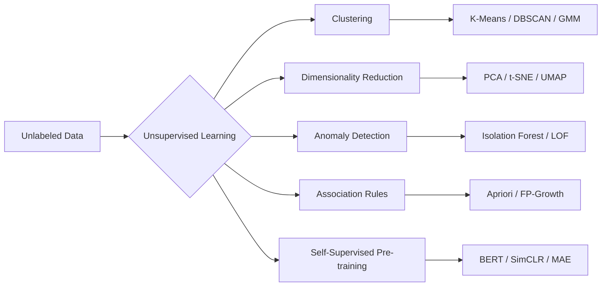
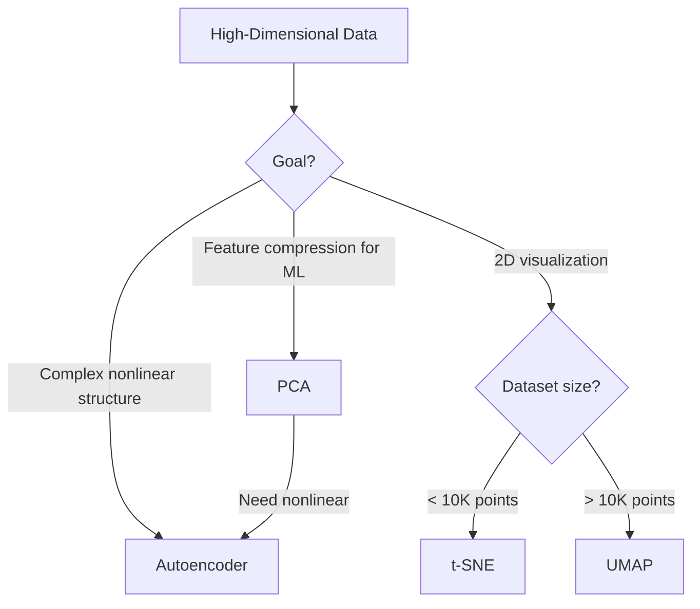
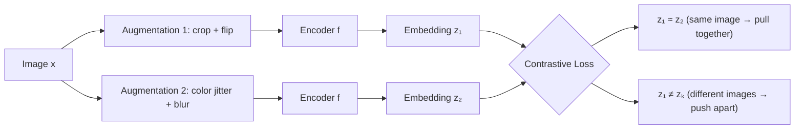
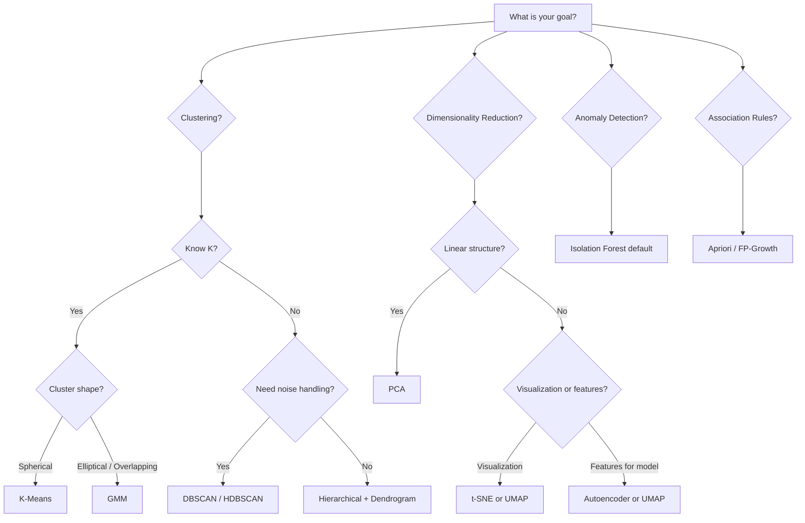

# Chapter 07 — Unsupervised Learning

---

## What You'll Learn

After this chapter you will be able to:
- Distinguish unsupervised from supervised learning and name core task families
- Explain why high-dimensional data breaks distance-based methods
- Select among K-Means, Hierarchical, DBSCAN, and GMM for a given problem
- Evaluate clusters with Silhouette, Elbow, and Davies-Bouldin metrics
- Apply PCA, t-SNE, UMAP, and autoencoders for dimensionality reduction
- Detect anomalies with Isolation Forest
- Mine association rules with Apriori
- Describe self-supervised learning and its role in modern AI

---

## 7.1 What is Unsupervised Learning?

> **Unsupervised learning** discovers hidden structure, patterns, or representations in data that carries no labeled responses. Core objectives include clustering, dimensionality reduction, density estimation, and generative modeling.

Supervised learning gets a dataset of input-output pairs and learns the mapping. Unsupervised learning gets inputs only — no targets, no answer key. The algorithm must find structure on its own: which data points are similar, what the underlying distribution looks like, whether the data lives on a lower-dimensional surface.

This is closer to how humans learn most things. Nobody labeled every object you ever saw; you noticed that some things look alike and grouped them yourself.

```
  SUPERVISED                          UNSUPERVISED
  ────────────────────────────        ─────────────────────────────────
  Data + Labels                       Data ONLY (no y)
  Learns input → output mapping       Discovers hidden structure
  Evaluated against ground truth       Evaluated by internal metrics

  Tasks:                              Tasks:
  - Classification / Regression       - Clustering
  - Sequence labeling                 - Dimensionality reduction
                                      - Anomaly detection
                                      - Density estimation
                                      - Association rule mining

  Examples:                           Examples:
  "Is this email spam?" (label=yes)   "What customer segments exist?"
  "Predict house price" (label=$)     "Compress images to fewer dims"
```



**Real-world scale:** Google clusters billions of web pages for search indexing. Spotify groups users by listening behavior for playlist recommendations. Credit card companies flag anomalous transactions — all without labeled training data for the specific task.

---

## 7.2 The Curse of Dimensionality

> **The curse of dimensionality** refers to the collection of phenomena that arise when analyzing data in high-dimensional spaces — phenomena that do not occur in low-dimensional settings, including data sparsity, distance concentration, and exponential growth of the volume to be sampled.

Add one feature and you add an entire axis. The volume of the space grows exponentially, but your dataset does not. With enough dimensions, every point becomes roughly equidistant from every other point, and distance-based algorithms (KNN, K-Means, DBSCAN) lose their discriminative power.

### Why Distances Break Down

Consider $n$ points uniformly distributed in a $d$-dimensional unit hypercube. The ratio of the maximum to minimum pairwise distance converges to 1 as $d \to \infty$:

$$\lim_{d \to \infty} \frac{\text{dist}_{\max} - \text{dist}_{\min}}{\text{dist}_{\min}} \to 0$$

In practical terms: with 1,000 features, the "nearest" neighbor is barely closer than the "farthest" one. KNN's entire premise collapses.

```
  Filling a space with evenly spaced points (10 per axis):

  1D (line):      10 points suffice
  2D (square):    10² = 100 points
  3D (cube):      10³ = 1,000 points
  10D:            10¹⁰ = 10 billion points
  100D:           10¹⁰⁰ — more than atoms in the universe
```

```chart
{
  "type": "bar",
  "data": {
    "labels": ["10 features", "100 features", "1,000 features", "10,000 features"],
    "datasets": [{
      "label": "Approx. Minimum Training Examples (~5-10x dims)",
      "data": [100, 1000, 10000, 100000],
      "backgroundColor": ["rgba(34,197,94,0.7)","rgba(99,102,241,0.7)","rgba(234,88,12,0.7)","rgba(239,68,68,0.7)"],
      "borderColor": ["rgba(34,197,94,1)","rgba(99,102,241,1)","rgba(234,88,12,1)","rgba(239,68,68,1)"],
      "borderWidth": 1
    }]
  },
  "options": {
    "plugins": { "title": { "display": true, "text": "Curse of Dimensionality — Data Requirements Grow with Feature Count" } },
    "scales": {
      "y": { "title": { "display": true, "text": "Examples Needed" }, "beginAtZero": true },
      "x": { "title": { "display": true, "text": "Number of Features" } }
    }
  }
}
```

### Remedies

| Strategy | How it helps |
|---|---|
| **Feature selection** | Remove uninformative or redundant features |
| **PCA / UMAP** | Project to a lower-dimensional subspace |
| **Regularization** | Penalize model complexity, implicitly reduce effective dimensionality |
| **Collect more data** | Fill the space more densely |
| **Domain knowledge** | Engineer fewer, more meaningful features |

---

## 7.3 Clustering Overview

> **Clustering** partitions a dataset into groups (clusters) such that objects within a cluster are more similar to each other than to objects in other clusters. The definition of "similar" depends on the chosen distance metric and algorithm.

Clustering is probably the most intuitive unsupervised task. You hand the algorithm unlabeled data, and it discovers natural groupings. Customer segmentation, document topic grouping, image categorization, gene expression profiling — all clustering problems.

### Taxonomy of Clustering Methods

```
┌────────────────────────────────────────────────────────────────────┐
│  PARTITIONAL         K-Means, K-Medoids                            │
│  Each point assigned to exactly one cluster. Must specify K.       │
├────────────────────────────────────────────────────────────────────┤
│  HIERARCHICAL        Agglomerative, Divisive                       │
│  Builds a tree of nested clusters. No need to pre-specify K.      │
├────────────────────────────────────────────────────────────────────┤
│  DENSITY-BASED       DBSCAN, HDBSCAN, OPTICS                      │
│  Clusters = dense regions. Finds arbitrary shapes. Marks noise.    │
├────────────────────────────────────────────────────────────────────┤
│  MODEL-BASED         GMM (Gaussian Mixture Models)                 │
│  Each cluster is a probability distribution. Soft assignments.     │
└────────────────────────────────────────────────────────────────────┘
```

---

## 7.4 K-Means Clustering

> **K-Means** partitions $n$ observations into $K$ clusters by iteratively assigning each point to the nearest centroid and recomputing centroids as the mean of assigned points, minimizing the within-cluster sum of squares (WCSS / inertia):
>
> $$J = \sum_{k=1}^{K} \sum_{x_i \in C_k} \| x_i - \mu_k \|^2$$

The algorithm is dead simple. Place K center points (centroids). Assign every data point to its nearest centroid. Move each centroid to the mean of its assigned points. Repeat until nothing changes. That is the entire algorithm.

### The Algorithm Step by Step

```
  STEP 1: Initialize K centroids (randomly or via K-Means++)
  ┌──────────────────────────────────────────────────┐
  │  . . . .  ★₁                                     │
  │  . . .                                           │
  │  . . . .       ★₂                                │
  │  . . .  ★₃                                       │
  │  . . . . .                                       │
  └──────────────────────────────────────────────────┘

  STEP 2: Assign each point to nearest centroid
  ┌──────────────────────────────────────────────────┐
  │  ● ● ● ●  ★₁      ● = cluster 1                  │
  │  ● ● ●             ■ = cluster 2                  │
  │  ▲ ▲ ▲ ▲      ★₂  ▲ = cluster 3                  │
  │  ■ ■ ■  ★₃                                       │
  │  ■ ■ ■ ■ ■                                       │
  └──────────────────────────────────────────────────┘

  STEP 3: Recompute centroids as cluster means
  ┌──────────────────────────────────────────────────┐
  │  ● ● ● ●                                         │
  │  ● ●★₁●   ← centroid moves to center of ●s       │
  │  ▲ ▲ ▲ ▲                                         │
  │  ■ ■ ■★₃                                         │
  │  ■ ■ ■ ■ ■                                       │
  │  ▲ ▲★₂▲                                          │
  └──────────────────────────────────────────────────┘

  STEP 4: Repeat steps 2-3 until convergence
          (centroids stop moving / assignments stable)
```

### Worked Example — Customer Segmentation

Suppose we have 6 customers described by two features: annual spending ($K) and visit frequency (visits/month).

| Customer | Spending | Visits |
|---|---|---|
| A | 10 | 2 |
| B | 12 | 3 |
| C | 50 | 8 |
| D | 55 | 9 |
| E | 30 | 5 |
| F | 32 | 6 |

**K=2, random init:** $\mu_1 = A = (10,2)$, $\mu_2 = D = (55,9)$.

**Iteration 1 — Assign:**
- $d(B, \mu_1) = \sqrt{(12-10)^2+(3-2)^2} = \sqrt{5} \approx 2.2$ → Cluster 1
- $d(E, \mu_1) = \sqrt{(30-10)^2+(5-2)^2} = \sqrt{409} \approx 20.2$; $d(E, \mu_2) = \sqrt{(30-55)^2+(5-9)^2} = \sqrt{641} \approx 25.3$ → Cluster 1
- $d(F, \mu_1) \approx 22.4$; $d(F, \mu_2) \approx 23.2$ → Cluster 1
- C, D → Cluster 2

Cluster 1 = {A, B, E, F}, Cluster 2 = {C, D}

**Recompute centroids:** $\mu_1 = (\frac{10+12+30+32}{4}, \frac{2+3+5+6}{4}) = (21, 4)$, $\mu_2 = (52.5, 8.5)$

**Iteration 2 — Reassign with new centroids:** E and F are now closer to $\mu_1=(21,4)$ at distances ~9.1 and ~11.2 respectively, vs ~25 and ~23 to $\mu_2$. Assignments stable → converged.

Final clusters: **Budget shoppers** {A, B, E, F} and **Premium shoppers** {C, D}.

### K-Means++ Initialization

Standard random initialization can place centroids close together, leading to poor convergence. K-Means++ fixes this:

1. Choose the first centroid uniformly at random from data points
2. For each remaining point, compute $D(x)$ = distance to nearest existing centroid
3. Choose next centroid with probability proportional to $D(x)^2$
4. Repeat until K centroids are chosen

This spreads centroids apart, yielding 2-10x faster convergence and consistently better results. It is the default in scikit-learn.

### Strengths and Limitations

```
  ✓ Simple, fast — O(nKI) for n points, K clusters, I iterations
  ✓ Scales to millions of points
  ✓ Well-understood, deterministic given fixed init
  ✗ Must specify K in advance
  ✗ Assumes spherical, equally-sized clusters
  ✗ Sensitive to outliers (outliers pull centroids)
  ✗ Finds only convex cluster boundaries
  ✗ Result depends on initialization (run multiple times)
```

---

## 7.5 Hierarchical Clustering

> **Agglomerative hierarchical clustering** starts with each observation as a singleton cluster and iteratively merges the two closest clusters until a single cluster remains. The merge history forms a binary tree called a **dendrogram**, which can be cut at any height to produce a partition into $K$ clusters.

The big advantage: you do not need to specify K upfront. Build the full tree, then cut it wherever makes sense. The dendrogram gives you a view of cluster structure at every granularity simultaneously.

### Agglomerative Algorithm

```
  START: n singleton clusters {A}, {B}, {C}, {D}, {E}

  Step 1: Merge two closest → {A,B}    (dist=1.2)
  Step 2: Merge two closest → {C,D}    (dist=1.5)
  Step 3: Merge {A,B} + {E}  → {A,B,E} (dist=2.8)
  Step 4: Merge {A,B,E} + {C,D} → all  (dist=4.1)
```

### Reading the Dendrogram

```
  HEIGHT (merge distance)
     │
   4 │         ┌───────────────────────────────────────┐
     │         │              CUT HERE → 2 clusters     │
   3 │    ┌────┤                                       │
     │    │    └─────────────────────────────┐          │
   2 │  ┌─┴──┐                            ┌──┴──┐     │
     │  │    │                            │     │     │
   1 │  A    B                            C     D     E
     │
     └────────────────────────────────────────────────────
       Cut at height 3 → 2 clusters: {A,B} and {C,D,E}
       Cut at height 1.5 → 3 clusters: {A,B}, {C,D}, {E}
```

### Linkage Criteria

How do you measure the "distance" between two clusters containing multiple points?

| Linkage | Definition | Behavior |
|---|---|---|
| **Single** | $\min$ distance between any two points | Chaining effect; elongated clusters |
| **Complete** | $\max$ distance between any two points | Compact, equal-sized clusters |
| **Average** | Mean of all pairwise distances | Compromise between single and complete |
| **Ward's** | Merge pair that minimizes total within-cluster variance | Tends to produce equal-sized, spherical clusters; best general default |

**Complexity:** $O(n^3)$ time, $O(n^2)$ memory for the distance matrix. This makes hierarchical clustering impractical beyond ~10,000 points. For larger data, use K-Means or DBSCAN as a first pass.

---

## 7.6 DBSCAN

> **DBSCAN (Density-Based Spatial Clustering of Applications with Noise)** groups together points that are closely packed — defined by a minimum number of points ($\text{minPts}$) within a radius ($\varepsilon$). Points in low-density regions are labeled as noise. It requires no pre-specification of the number of clusters and can discover clusters of arbitrary shape.

K-Means forces you to choose K and assumes round clusters. DBSCAN says: "clusters are dense regions separated by sparse regions." It figures out how many clusters exist, finds them regardless of shape, and explicitly marks outliers as noise.

### Three Point Types

```
  CORE POINT (●):  ≥ minPts neighbors within radius ε
                   Forms the backbone of a cluster

  BORDER POINT (○): < minPts neighbors within ε,
                    but within ε of at least one core point
                    Lives on the edge of a cluster

  NOISE POINT (×):  Not within ε of any core point
                    Belongs to no cluster — an outlier
```

### Algorithm

1. Pick an unvisited point $p$.
2. Find all points within distance $\varepsilon$ of $p$.
3. If $|\text{neighbors}| \geq \text{minPts}$, $p$ is a **core point** — start a new cluster. Expand the cluster by recursively adding all density-reachable points.
4. If $|\text{neighbors}| < \text{minPts}$ and $p$ is within $\varepsilon$ of a core point, mark $p$ as a **border point**.
5. Otherwise, mark $p$ as **noise**.
6. Repeat until all points visited.

### DBSCAN vs K-Means

```
┌──────────────────────────┬────────────────────────────────────┐
│ K-Means                  │ DBSCAN                             │
├──────────────────────────┼────────────────────────────────────┤
│ Must specify K           │ K discovered automatically         │
│ Only convex clusters     │ Arbitrary shape clusters           │
│ All points assigned      │ Noise points explicitly flagged    │
│ Sensitive to outliers    │ Robust to outliers                 │
│ O(nKI) — very fast       │ O(n log n) with spatial indexing   │
│ Deterministic (given init)│ Deterministic (border pts may vary)│
└──────────────────────────┴────────────────────────────────────┘

  Shapes DBSCAN handles that K-Means cannot:

   Ring:          Crescents:       Interleaved spirals:
   ·●●●●·          ●●●              ●●●   ○○○
  ●·····●          ●●●●  ○○○       ●●●  ○○○
  ●·····●          ●●●●   ○○○     ●●●  ○○○
   ·●●●●·          ●●●
```

### Choosing ε and minPts

**Rule of thumb for minPts:** $2 \times d$ where $d$ = number of dimensions. For 2D data, minPts = 4 is a common starting point.

**Choosing ε with a k-distance plot:**
1. For each point, compute the distance to its $k$-th nearest neighbor (where $k = \text{minPts}$).
2. Sort these distances in ascending order and plot.
3. The "elbow" in the plot suggests a good ε.

```
  k-distance
     │                           ●
  0.8│                       ● ●      ← noise (large k-dist)
  0.6│                   ● ●          ← elbow → ε ≈ 0.5
  0.4│               ●●
  0.2│      ●●●●●●●●                 ← dense cluster points
     └─────────────────────────── points (sorted)
```

**Real-world use case:** geographic clustering of delivery addresses into zones. Addresses form arbitrary shapes around cities — DBSCAN naturally captures this while labeling remote rural addresses as noise.

---

## 7.7 Gaussian Mixture Models

> A **Gaussian Mixture Model (GMM)** represents the data distribution as a weighted sum of $K$ multivariate Gaussian distributions. Each component $k$ has parameters $(\pi_k, \mu_k, \Sigma_k)$ — mixing weight, mean, and covariance. Training uses the Expectation-Maximization (EM) algorithm to maximize data likelihood.

$$p(x) = \sum_{k=1}^{K} \pi_k \;\mathcal{N}(x \mid \mu_k, \Sigma_k)$$

K-Means makes a hard assignment: each point belongs to exactly one cluster. GMM makes a soft assignment: each point has a probability of belonging to each cluster. A customer near the boundary of two segments is not forced into one — GMM says "65% segment A, 35% segment B." This is more honest and more useful.

### GMM vs K-Means

```
  K-Means (hard):                   GMM (soft):
  ────────────────────────          ────────────────────────────
  Point ★ → cluster A.             Point ★:
                                      P(cluster A) = 0.70
     ● ● ● ★ ○ ○ ○                   P(cluster B) = 0.25
         A | B                        P(cluster C) = 0.05

  A boundary point is crammed       Uncertainty is explicit.
  into one cluster with no           This is a proper probabilistic
  indication it was close.           model.
```

| Property | K-Means | GMM |
|---|---|---|
| Assignment | Hard (one cluster) | Soft (probabilities) |
| Cluster shape | Spherical | Elliptical (full covariance) |
| Objective | Minimize inertia | Maximize log-likelihood |
| Algorithm | Lloyd's | Expectation-Maximization |
| Speed | Faster | Slower (matrix ops per iteration) |
| Output | Cluster labels | Cluster probabilities per point |
| Model selection | Elbow / Silhouette | BIC / AIC |

### The EM Algorithm (Intuition)

1. **E-step (Expectation):** Given current parameters, compute the probability that each point belongs to each Gaussian ("responsibilities").
2. **M-step (Maximization):** Given responsibilities, update each Gaussian's mean, covariance, and mixing weight to maximize likelihood.
3. Repeat until log-likelihood converges.

This is a generalization of K-Means. If you constrain all covariances to $\sigma^2 I$ and take hard assignments, EM reduces to K-Means.

```chart
{
  "type": "bar",
  "data": {
    "labels": ["Point A (clear center)", "Point B (overlap zone)", "Point C (boundary)"],
    "datasets": [
      {
        "label": "Cluster 1",
        "data": [0.95, 0.35, 0.05],
        "backgroundColor": "rgba(99, 102, 241, 0.7)",
        "borderColor": "rgba(99, 102, 241, 1)", "borderWidth": 1
      },
      {
        "label": "Cluster 2",
        "data": [0.03, 0.40, 0.70],
        "backgroundColor": "rgba(234, 88, 12, 0.7)",
        "borderColor": "rgba(234, 88, 12, 1)", "borderWidth": 1
      },
      {
        "label": "Cluster 3",
        "data": [0.02, 0.25, 0.25],
        "backgroundColor": "rgba(34, 197, 94, 0.7)",
        "borderColor": "rgba(34, 197, 94, 1)", "borderWidth": 1
      }
    ]
  },
  "options": {
    "plugins": { "title": { "display": true, "text": "GMM Soft Assignments — Each Point Gets a Probability Vector (Sums to 1)" } },
    "scales": {
      "x": { "stacked": true },
      "y": { "stacked": true, "title": { "display": true, "text": "Probability" }, "max": 1 }
    }
  }
}
```

---

## 7.8 Evaluating Clusters

> **Cluster evaluation** quantifies how well a clustering captures the structure in data. **Internal metrics** (Silhouette, Davies-Bouldin, inertia) require only the data and cluster labels. **External metrics** (Adjusted Rand Index, Normalized Mutual Information) compare against ground-truth labels when available.

Without labels, you cannot simply compute accuracy. You need metrics that measure cluster compactness (how tight each cluster is) and separation (how far apart clusters are from each other).

### Silhouette Score

For each point $i$:
- $a(i)$ = mean distance to other points in the same cluster (compactness)
- $b(i)$ = mean distance to points in the nearest neighboring cluster (separation)

$$s(i) = \frac{b(i) - a(i)}{\max(a(i),\; b(i))} \;\;\in [-1, 1]$$

| Score | Interpretation |
|---|---|
| $s \approx +1$ | Point is well inside its cluster, far from neighbors |
| $s \approx 0$ | Point is on the boundary between clusters |
| $s < 0$ | Point is likely assigned to the wrong cluster |

The **overall Silhouette Score** is the mean over all points. A good rule of thumb:

```
  > 0.70  → Strong cluster structure
  > 0.50  → Reasonable structure
  > 0.25  → Weak — interpret with caution
  < 0.25  → No meaningful structure found
```

### Elbow Method (Inertia / WCSS)

Plot inertia (within-cluster sum of squares) vs K. As K increases, inertia always decreases. The "elbow" — where the rate of decrease sharply levels off — suggests a good K.

```chart
{
  "type": "line",
  "data": {
    "labels": [1, 2, 3, 4, 5, 6, 7, 8],
    "datasets": [{
      "label": "Inertia (WCSS)",
      "data": [20000, 15000, 10500, 6000, 4800, 4200, 3900, 3700],
      "borderColor": "rgba(99, 102, 241, 1)",
      "backgroundColor": "rgba(99, 102, 241, 0.1)",
      "fill": true,
      "tension": 0.3,
      "pointRadius": 5,
      "pointBackgroundColor": ["rgba(99,102,241,1)","rgba(99,102,241,1)","rgba(99,102,241,1)","rgba(239,68,68,1)","rgba(99,102,241,1)","rgba(99,102,241,1)","rgba(99,102,241,1)","rgba(99,102,241,1)"]
    }]
  },
  "options": {
    "plugins": { "title": { "display": true, "text": "Elbow Method — Sharp Bend at K=4 Suggests 4 Clusters" } },
    "scales": {
      "y": { "title": { "display": true, "text": "Inertia (WCSS)" }, "beginAtZero": true },
      "x": { "title": { "display": true, "text": "Number of Clusters (K)" } }
    }
  }
}
```

### Davies-Bouldin Index

$$DB = \frac{1}{K} \sum_{i=1}^{K} \max_{j \neq i} \frac{s_i + s_j}{d_{ij}}$$

where $s_i$ is the average distance of points in cluster $i$ to its centroid, and $d_{ij}$ is the distance between centroids $i$ and $j$. **Lower is better** — it penalizes clusters that are wide ($s$ large) and close together ($d$ small).

### Combining Metrics for K Selection

Do not rely on a single metric. Use Elbow + Silhouette + Davies-Bouldin together:

```
  K │ Inertia │ Silhouette │ Davies-Bouldin │ Verdict
  ──┼─────────┼────────────┼────────────────┼──────────────
  2 │  15,000 │   0.71     │     0.42       │ Too coarse
  3 │  10,500 │   0.68     │     0.38       │ Good
  4 │   6,000 │   0.74     │     0.31       │ ← Best (all agree)
  5 │   4,800 │   0.61     │     0.45       │ Marginal gain
  6 │   4,200 │   0.55     │     0.52       │ Diminishing returns
```

```chart
{
  "type": "bar",
  "data": {
    "labels": ["K=2", "K=3", "K=4", "K=5", "K=6"],
    "datasets": [
      {
        "label": "Silhouette Score",
        "data": [0.71, 0.68, 0.74, 0.61, 0.55],
        "backgroundColor": ["rgba(99,102,241,0.6)","rgba(99,102,241,0.6)","rgba(34,197,94,0.8)","rgba(99,102,241,0.6)","rgba(99,102,241,0.6)"],
        "borderColor": ["rgba(99,102,241,1)","rgba(99,102,241,1)","rgba(34,197,94,1)","rgba(99,102,241,1)","rgba(99,102,241,1)"],
        "borderWidth": 1
      }
    ]
  },
  "options": {
    "plugins": { "title": { "display": true, "text": "Silhouette Score by K — K=4 Yields Best Cluster Coherence" } },
    "scales": {
      "y": { "title": { "display": true, "text": "Silhouette Score" }, "beginAtZero": true, "max": 1.0 },
      "x": { "title": { "display": true, "text": "Number of Clusters" } }
    }
  }
}
```

---

## 7.9 Dimensionality Reduction Overview

> **Dimensionality reduction** transforms data from a high-dimensional space to a lower-dimensional space while preserving as much meaningful structure as possible. It serves two purposes: **feature compression** (for downstream models) and **visualization** (projecting to 2D/3D for human inspection).

A 28x28 grayscale image has 784 pixel values, but the actual degrees of freedom — the "intrinsic dimensionality" — are far fewer. A handwritten digit can be described by stroke angle, thickness, slant, loop size. Dimensionality reduction finds that compact description.

```
  METHOD     │ Linear? │ Preserves       │ Use for            │ Speed
  ───────────┼─────────┼─────────────────┼────────────────────┼──────────
  PCA        │ Yes     │ Global variance │ Feature reduction  │ Fast
  t-SNE      │ No      │ Local neighbors │ 2D visualization   │ Slow
  UMAP       │ No      │ Local + global  │ Viz + features     │ Medium
  Autoencoder│ No      │ Learned repr.   │ Complex data       │ Slow (train)
  LDA        │ Yes     │ Class separation│ Supervised dimred  │ Fast
```



---

## 7.10 PCA — Principal Component Analysis

> **PCA** finds an orthogonal linear transformation that projects data onto a new coordinate system where axes (principal components) are ordered by the amount of variance they explain. PC1 captures maximum variance, PC2 the maximum remaining variance orthogonal to PC1, and so on. All principal components are uncorrelated.

PCA asks: "What direction in feature space has the most spread?" That direction becomes PC1. Then: "What direction, perpendicular to PC1, has the next most spread?" That is PC2. And so on. You keep only the top $k$ components that capture, say, 95% of total variance, and discard the rest.

### PCA Step by Step

1. **Center the data:** subtract the mean of each feature.
2. **Compute the covariance matrix:**

$$C = \frac{1}{n-1} X^\top X$$

3. **Eigendecompose** the covariance matrix: $C\mathbf{v} = \lambda \mathbf{v}$
   - Eigenvectors $\mathbf{v}_i$ = principal component directions
   - Eigenvalues $\lambda_i$ = variance explained by each component
4. **Sort** eigenvectors by eigenvalue (largest first).
5. **Project:** $X_{\text{reduced}} = X \cdot V_k$ where $V_k$ = matrix of top $k$ eigenvectors.

### Scree Plot — How Many Components?

```chart
{
  "type": "bar",
  "data": {
    "labels": ["PC1", "PC2", "PC3", "PC4", "PC5", "PC6"],
    "datasets": [
      {
        "label": "Variance Explained (%)",
        "data": [42, 25, 15, 9, 5, 4],
        "backgroundColor": ["rgba(99,102,241,0.8)","rgba(99,102,241,0.8)","rgba(99,102,241,0.8)","rgba(99,102,241,0.4)","rgba(99,102,241,0.4)","rgba(99,102,241,0.4)"],
        "borderColor": "rgba(99, 102, 241, 1)",
        "borderWidth": 1,
        "order": 2
      },
      {
        "label": "Cumulative %",
        "data": [42, 67, 82, 91, 96, 100],
        "type": "line",
        "borderColor": "rgba(234, 88, 12, 1)",
        "backgroundColor": "transparent",
        "tension": 0.3,
        "pointRadius": 4,
        "borderWidth": 2,
        "order": 1
      }
    ]
  },
  "options": {
    "plugins": { "title": { "display": true, "text": "PCA Scree Plot — Keep PC1-PC4 for 91% Variance Explained" } },
    "scales": {
      "y": { "title": { "display": true, "text": "Variance Explained (%)" }, "beginAtZero": true, "max": 100 },
      "x": { "title": { "display": true, "text": "Principal Component" } }
    }
  }
}
```

Common rules for choosing $k$:
- Keep enough PCs to explain **90-95%** of total variance.
- Look for an **elbow** in the scree plot.
- Kaiser's rule: keep PCs with eigenvalue > 1 (when using correlation matrix).

### PCA Limitations

- **Linear only:** cannot capture curved or nonlinear manifolds.
- **Variance ≠ importance:** the direction of maximum variance is not always the most informative for the task.
- **Sensitive to scaling:** always standardize features first (zero mean, unit variance).
- **Interpretability:** principal components are linear combinations of all original features — they may be hard to name.

**Real-world use:** Image compression. A 256x256 face image (65,536 features) can be reconstructed with high fidelity from ~100 principal components — a 650x compression ratio.

---

## 7.11 t-SNE

> **t-SNE (t-distributed Stochastic Neighbor Embedding)** is a nonlinear dimensionality reduction technique that models pairwise similarities in high-dimensional space as conditional probabilities and finds a low-dimensional (typically 2D) embedding that minimizes the KL divergence between those probabilities and corresponding probabilities in the low-dimensional space. It uses a Student-t distribution in the low-dimensional space to address the "crowding problem."

t-SNE is purpose-built for visualization. It takes your 784-dimensional MNIST digits and produces a 2D scatter plot where the 0s cluster together, the 1s cluster together, and so on. It is spectacularly good at revealing cluster structure that is invisible in raw feature space.

### How It Works (Intuition)

1. In high-D, convert distances to probabilities: nearby points get high probability, distant points get low probability (using a Gaussian kernel).
2. In low-D (2D), do the same using a **Student-t distribution** (heavier tails than Gaussian — this prevents all clusters from collapsing to the center).
3. Minimize the **KL divergence** between the high-D and low-D probability distributions using gradient descent.

### Critical Caveats

```
  ⚠ t-SNE is for VISUALIZATION ONLY — never use as features for a model
  ⚠ Inter-cluster distances are MEANINGLESS (only local structure preserved)
  ⚠ Cluster sizes in the plot are MEANINGLESS
  ⚠ Results vary between runs (stochastic algorithm)
  ⚠ Perplexity affects results dramatically — always try multiple values
```

### Perplexity

The perplexity parameter (typically 5-50, default 30) controls how many neighbors each point "attends to." Think of it as a soft version of K in KNN.

- **Low perplexity (5-10):** focuses on very local structure, may fragment real clusters
- **Medium perplexity (30-50):** good balance, usually produces clear clusters
- **High perplexity (100+):** overly global, clusters merge into blobs

Always run t-SNE at **multiple perplexity values** and check whether the clusters are consistent.

---

## 7.12 UMAP

> **UMAP (Uniform Manifold Approximation and Projection)** is a nonlinear dimensionality reduction technique grounded in Riemannian geometry and algebraic topology. It constructs a weighted graph representation of the high-dimensional data, then optimizes a low-dimensional layout to preserve that topological structure. It preserves both local and global structure better than t-SNE, runs significantly faster, and can be used for feature engineering (not just visualization).

UMAP is the modern replacement for t-SNE in most workflows. It produces similar or better visualizations, runs 10-100x faster on large datasets, and — critically — its output can be used as input features for downstream models.

### UMAP vs t-SNE

| Property | t-SNE | UMAP |
|---|---|---|
| Speed | $O(n \log n)$, slow in practice | Much faster (~10-100x) |
| Global structure | Poorly preserved | Reasonably preserved |
| Local structure | Excellent | Excellent |
| Cluster distances | Meaningless | Roughly meaningful |
| Use as features | No | Yes (with caution) |
| Scalability | Struggles above 50K points | Handles millions |
| Key parameter | `perplexity` | `n_neighbors`, `min_dist` |

### UMAP Parameters

- **`n_neighbors`** (default 15): controls the balance between local and global structure. Small values emphasize local; large values capture more global topology.
- **`min_dist`** (default 0.1): controls how tightly points are packed in the embedding. Smaller = tighter clusters, larger = more uniform spread.

**When to use which:**
- Quick visualization of a large dataset → **UMAP**
- Small dataset, publication-quality local structure → **t-SNE**
- Need reduced features for a downstream classifier → **UMAP** (never t-SNE)

---

## 7.13 Autoencoders

> An **autoencoder** is a neural network trained to reconstruct its input through a bottleneck layer of lower dimensionality. The encoder $f: \mathbb{R}^d \to \mathbb{R}^k$ compresses the input; the decoder $g: \mathbb{R}^k \to \mathbb{R}^d$ reconstructs it. Training minimizes reconstruction loss $\mathcal{L} = \|x - g(f(x))\|^2$, forcing the bottleneck to learn a compact, informative representation.

The bottleneck is the key. The network cannot simply memorize all 784 pixel values in 32 neurons — it must learn which features matter. After training, the encoder is a nonlinear dimensionality reducer. The bottleneck activations are your compressed features.

### Architecture

```
  ENCODER                  BOTTLENECK               DECODER
  ─────────────────         ────────────             ──────────────────
  Input (784 dims)                                   Output (784 dims)
  ┌──────────────┐          ┌──────────┐             ┌──────────────┐
  │   28×28      │ ──────►  │  32 dims │  ──────────►│ Reconstructed│
  │   image      │          │ (latent  │             │   28×28      │
  │              │          │  code)   │             │   image      │
  └──────────────┘          └──────────┘             └──────────────┘

  784 → 256 → 64 → 32    bottleneck    32 → 64 → 256 → 784

  Loss = ||input - output||²
  The network learns to compress and decompress.
  The 32-dim bottleneck IS the learned representation.
```

### Variants

| Variant | Idea | Use Case |
|---|---|---|
| **Denoising AE** | Add noise to input, reconstruct clean original | Robust feature learning; image denoising |
| **Variational AE (VAE)** | Bottleneck encodes a distribution ($\mu, \sigma$), sample $z \sim \mathcal{N}(\mu, \sigma^2)$ | Generative modeling (image synthesis, drug design) |
| **Sparse AE** | Penalize activations to enforce sparsity | Interpretable features; model interpretability |
| **Convolutional AE** | Use conv layers instead of dense | Image data (preserves spatial structure) |

### Autoencoders vs PCA

PCA is a linear autoencoder with one hidden layer and no activation function. A deep autoencoder with nonlinear activations can capture manifolds that PCA cannot. But PCA has a closed-form solution (eigendecomposition) — no training needed, no hyperparameters beyond $k$, always finds the global optimum.

**Real-world use:** Fraud detection — train an autoencoder on normal transactions only. Fraudulent transactions produce high reconstruction error because the model has never seen that pattern. Threshold on reconstruction error to flag anomalies.

---

## 7.14 Anomaly Detection

> **Anomaly detection** (outlier detection) identifies observations that deviate significantly from the majority of data. In unsupervised anomaly detection, the model learns a representation of "normal" behavior from unlabeled data and flags points that are statistically unlikely under that model.

Most data is normal. Anomalies are rare by definition. You usually cannot collect enough labeled anomalies to train a supervised classifier — and the types of anomalies change over time. Unsupervised anomaly detection learns what "normal" looks like and flags anything that deviates.

### Isolation Forest

> **Isolation Forest** detects anomalies by randomly partitioning the feature space with axis-aligned splits. Anomalies, being few and different, are isolated in fewer splits (shorter path length). Normal points, being clustered in dense regions, require more splits.

```
  WHY IT WORKS:

  Feature 2
     │  ●●●●●         ← Normal points: packed together,
     │  ●●●●●            need many random splits to isolate
     │  ●●●●●            any single one (path length ≈ 12)
     │  ●●●●●
     │
     │              ×   ← Anomaly: isolated with just 2 splits!
     │                     (path length ≈ 2)
     └──────────────────────── Feature 1
```

**Anomaly score:**

$$s(x, n) = 2^{-\frac{E[h(x)]}{c(n)}}$$

where $h(x)$ = average path length for point $x$ across all trees, and $c(n)$ = average path length for a dataset of size $n$. Score near 1 = anomaly; score near 0.5 = normal.

### Other Methods

| Method | Mechanism | Best for |
|---|---|---|
| **Isolation Forest** | Short path in random trees = anomaly | General purpose, high-D, fast |
| **Local Outlier Factor** | Compare point's local density to neighbors' density | Local anomalies in uneven density |
| **One-Class SVM** | Learn a boundary enclosing normal data | Small, clean datasets |
| **Autoencoder** | High reconstruction error = anomaly | Complex data (images, sequences) |
| **Statistical (Z-score, IQR)** | Points beyond threshold from center | Simple, univariate data |

**Real-world examples:**
- **Credit card fraud:** normal spending patterns vs. sudden large purchases in a new country
- **Network intrusion:** normal traffic patterns vs. port scanning or DDoS signatures
- **Manufacturing:** normal sensor readings vs. vibration anomalies indicating equipment failure
- **Healthcare:** normal vital signs vs. sudden changes predicting cardiac events

---

## 7.15 Association Rule Learning

> **Association rule learning** discovers interesting relations (rules) between variables in large databases. A rule $\{A\} \Rightarrow \{B\}$ means that transactions containing item $A$ tend to also contain item $B$. The strength of a rule is measured by **support**, **confidence**, and **lift**.

This is the "people who bought X also bought Y" engine behind recommendation systems and retail analytics. Amazon's "frequently bought together," supermarket shelf placement, cross-selling strategies — all powered by association rules.

### Key Metrics

**Support** — How frequently does the itemset appear?

$$\text{Support}(\{A, B\}) = \frac{|\text{transactions containing both A and B}|}{|\text{total transactions}|}$$

**Confidence** — Given A was purchased, how often was B also purchased?

$$\text{Confidence}(A \Rightarrow B) = \frac{\text{Support}(A \cup B)}{\text{Support}(A)}$$

**Lift** — Is the association stronger than random chance?

$$\text{Lift}(A \Rightarrow B) = \frac{\text{Confidence}(A \Rightarrow B)}{\text{Support}(B)}$$

| Lift value | Interpretation |
|---|---|
| Lift > 1 | Positive association — buying A makes B more likely |
| Lift = 1 | Independent — no relationship |
| Lift < 1 | Negative association — buying A makes B less likely |

### Worked Example

```
  5 transactions:
  T1: {Bread, Milk, Butter}
  T2: {Bread, Diapers, Beer}
  T3: {Milk, Diapers, Beer, Butter}
  T4: {Bread, Milk, Diapers, Beer}
  T5: {Bread, Milk, Butter}

  Rule: {Diapers} → {Beer}
  Support({Diapers, Beer})    = 3/5 = 0.60
  Support({Diapers})          = 3/5 = 0.60
  Confidence                  = 0.60/0.60 = 1.00 (100%!)
  Support({Beer})             = 3/5 = 0.60
  Lift                        = 1.00/0.60 = 1.67
```

Lift = 1.67 > 1 — buying diapers makes beer 67% more likely than baseline. A real association.

### The Apriori Algorithm

The challenge: with $n$ items, there are $2^n$ possible itemsets. Brute-force enumeration is impossible for a real catalog.

**Apriori principle:** if an itemset is infrequent, all its supersets are also infrequent. This lets you prune the search space massively.

```
  Level 1: Count all single items, keep those with support ≥ threshold
           {Bread}=0.8 ✓  {Milk}=0.8 ✓  {Diapers}=0.6 ✓  {Beer}=0.6 ✓

  Level 2: Generate candidate pairs from frequent singles
           {Bread,Milk}=0.6 ✓   {Diapers,Beer}=0.6 ✓   ...

  Level 3: Generate candidate triples from frequent pairs
           {Bread,Milk,Butter}=0.4 ✓   ...

  Continue until no frequent itemsets remain.
  Then generate rules from frequent itemsets, filter by confidence.
```

```chart
{
  "type": "bar",
  "data": {
    "labels": ["Support\n(how common?)", "Confidence\n(how reliable?)", "Lift\n(vs random?)"],
    "datasets": [{
      "label": "{Diapers} → {Beer}",
      "data": [0.60, 1.00, 1.67],
      "backgroundColor": ["rgba(99,102,241,0.7)", "rgba(34,197,94,0.7)", "rgba(234,88,12,0.7)"],
      "borderColor": ["rgba(99,102,241,1)", "rgba(34,197,94,1)", "rgba(234,88,12,1)"],
      "borderWidth": 1
    }]
  },
  "options": {
    "plugins": { "title": { "display": true, "text": "Association Rule Metrics — {Diapers} → {Beer} (Lift=1.67, Real Association)" } },
    "scales": {
      "y": { "title": { "display": true, "text": "Score" }, "beginAtZero": true, "max": 2.0 },
      "x": {}
    }
  }
}
```

---

## 7.16 Self-Supervised Learning

> **Self-supervised learning** is a paradigm where the model generates its own supervisory signal from the structure of unlabeled data. By solving a pretext task (e.g., predicting masked tokens, predicting the next frame, matching augmented views), the model learns general-purpose representations that transfer to downstream tasks with minimal labeled data.

This is the paradigm behind every modern foundation model. GPT, BERT, Claude, CLIP, DALL-E — all are pre-trained with self-supervised objectives on massive unlabeled corpora, then fine-tuned or prompted for specific tasks.

### Why It Matters

```
  SUPERVISED:                    SELF-SUPERVISED:
  ───────────────────            ─────────────────────────────────
  Need: 1M labeled images       Need: 1B unlabeled images
  Cost: $500K+ in annotation    Cost: essentially free (scraped)
  Result: good at ONE task       Result: powerful GENERAL features
                                 that transfer to many tasks

  Pre-train on 1B unlabeled texts → fine-tune on 1K labeled examples
  → often beats a model trained on 100K labeled examples from scratch
```

### Pretext Tasks in NLP

**Masked Language Modeling (BERT):**
- Input: "The cat sat on the [MASK]"
- Target: predict "mat"
- The mask IS the label — no human annotation needed.

**Next-Token Prediction (GPT):**
- Input: "The cat sat on"
- Target: predict "the"
- Every token in the corpus provides a free training signal.

### Pretext Tasks in Vision

**Masked Autoencoders (MAE):**
- Mask 75% of image patches randomly
- Train the model to reconstruct the missing patches
- The original pixels are the labels.

**Contrastive Learning (SimCLR, CLIP):**



The core idea: two augmented views of the same image should produce similar embeddings; views from different images should produce dissimilar embeddings. No labels needed — the augmentation creates the positive/negative pairs.

### CLIP — Connecting Vision and Language

CLIP (Contrastive Language-Image Pre-training) extends contrastive learning across modalities:
- Pairs: (image, caption) from the internet
- Train image encoder and text encoder jointly so matching pairs have similar embeddings
- Result: zero-shot image classification — describe any category in text, and CLIP can classify images into it without task-specific training.

---

## 7.17 Algorithm Selection Guide

Choosing the right unsupervised algorithm depends on the task, data characteristics, and computational constraints.



### Quick Comparison Table

| Algorithm | Task | K required? | Handles noise? | Cluster shape | Scalability |
|---|---|---|---|---|---|
| K-Means | Clustering | Yes | No | Spherical | Excellent |
| Hierarchical | Clustering | No (cut tree) | No | Depends on linkage | Poor (>10K) |
| DBSCAN | Clustering | No | Yes | Arbitrary | Good |
| GMM | Clustering | Yes | No | Elliptical | Moderate |
| PCA | Dim. reduction | Choose # PCs | N/A | Linear only | Excellent |
| t-SNE | Visualization | N/A | N/A | Nonlinear | Poor (>50K) |
| UMAP | Dim. red. / viz | N/A | N/A | Nonlinear | Good |
| Isolation Forest | Anomaly det. | N/A | Detects them | N/A | Excellent |
| Apriori | Assoc. rules | N/A | N/A | N/A | Moderate |

```chart
{
  "type": "radar",
  "data": {
    "labels": ["Speed", "Flexibility\n(cluster shape)", "Handles\nOutliers", "No K\nRequired", "Scalability"],
    "datasets": [
      {
        "label": "K-Means",
        "data": [5, 2, 1, 1, 5],
        "borderColor": "rgba(99, 102, 241, 1)",
        "backgroundColor": "rgba(99, 102, 241, 0.15)",
        "borderWidth": 2
      },
      {
        "label": "DBSCAN",
        "data": [3, 5, 5, 5, 3],
        "borderColor": "rgba(234, 88, 12, 1)",
        "backgroundColor": "rgba(234, 88, 12, 0.15)",
        "borderWidth": 2
      },
      {
        "label": "GMM",
        "data": [3, 4, 2, 1, 3],
        "borderColor": "rgba(34, 197, 94, 1)",
        "backgroundColor": "rgba(34, 197, 94, 0.15)",
        "borderWidth": 2
      }
    ]
  },
  "options": {
    "plugins": { "title": { "display": true, "text": "Clustering Algorithm Comparison (5 = Best)" } },
    "scales": {
      "r": { "beginAtZero": true, "max": 5 }
    }
  }
}
```

---

## Key Takeaways

```
╔══════════════════════════════════════════════════════════════════════╗
║  1. Unsupervised learning discovers structure without labels.       ║
║  2. The curse of dimensionality makes distances meaningless in      ║
║     high-D — reduce dimensions or get more data.                    ║
║  3. K-Means: fast, simple, spherical clusters, must pick K.         ║
║  4. Hierarchical: builds a merge tree, cut anywhere for any K.      ║
║  5. DBSCAN: density-based, arbitrary shapes, flags noise.           ║
║  6. GMM: soft probabilistic assignments, elliptical clusters.       ║
║  7. Evaluate clusters with Silhouette + Elbow + Davies-Bouldin.     ║
║  8. PCA: linear, fast, captures max variance. Scale features first. ║
║  9. t-SNE: visualization only; local structure only; never as feats.║
║  10. UMAP: faster than t-SNE, preserves global structure, usable    ║
║      as features.                                                   ║
║  11. Autoencoders: nonlinear compression via neural nets. VAE       ║
║      variant enables generation.                                    ║
║  12. Isolation Forest: anomalies are isolated in fewer random       ║
║      splits — fast, effective, few assumptions.                     ║
║  13. Apriori: finds frequent itemsets + association rules.           ║
║      Support × Confidence × Lift to evaluate rules.                 ║
║  14. Self-supervised learning creates labels from data itself —      ║
║      the paradigm behind GPT, BERT, CLIP.                           ║
╚══════════════════════════════════════════════════════════════════════╝
```

---

## Review Questions

**1.** A retailer has customer purchase data with no labels and wants to identify natural customer segments. Which algorithm would you start with, and how would you choose K?

<details>
<summary>Answer</summary>

Start with **K-Means** — it is fast, simple, and works well when clusters are roughly spherical. Use the **Elbow method** (plot inertia vs K) combined with **Silhouette Score** (pick K with the highest silhouette) to select K. If the data has irregular cluster shapes or outliers, switch to **DBSCAN** which determines K automatically and handles noise.
</details>

**2.** K-Means produces poor clusters on a dataset with crescent-shaped groups. What algorithm handles this, and why?

<details>
<summary>Answer</summary>

**DBSCAN** — it defines clusters as dense regions regardless of shape. K-Means assumes convex/spherical clusters because it assigns points to the nearest centroid, which always produces Voronoi-cell (convex) boundaries. DBSCAN chains together density-reachable points, so it naturally captures crescents, rings, and other arbitrary shapes.
</details>

**3.** Explain the Silhouette Score in one sentence. What does a score of -0.3 for a specific point mean?

<details>
<summary>Answer</summary>

The Silhouette Score measures how similar a point is to its own cluster compared to the nearest alternative cluster, on a scale from -1 to +1. A score of **-0.3** means the point is, on average, closer to points in a neighboring cluster than to points in its assigned cluster — it is likely in the **wrong cluster**.
</details>

**4.** You have a dataset with 2,000 features and 5,000 samples. Your model performs poorly. Diagnose the issue and propose solutions.

<details>
<summary>Answer</summary>

This is the **curse of dimensionality**: 2,000 features with only 5,000 samples means the data is extremely sparse in that high-dimensional space, distances lose discriminative power, and the model is likely overfitting. Solutions: (1) **PCA** to reduce to ~50-100 dimensions capturing 95% of variance, (2) **feature selection** to remove irrelevant/redundant features, (3) **regularization** (L1/L2) to penalize model complexity, (4) collect more data if possible.
</details>

**5.** Compare PCA and t-SNE. When would you use each?

<details>
<summary>Answer</summary>

**PCA** is linear, fast, preserves global variance, and produces features usable in downstream models. **t-SNE** is nonlinear, slow, preserves only local neighborhood structure, and is strictly for visualization. Use PCA for dimensionality reduction as a preprocessing step (e.g., 784 → 50 dimensions before training a classifier). Use t-SNE (or UMAP) to visualize high-dimensional data in 2D to check for cluster structure.
</details>

**6.** Why does GMM use soft assignments instead of hard assignments? Give a real-world scenario where this matters.

<details>
<summary>Answer</summary>

GMM assigns each point a **probability of belonging to each cluster**, reflecting genuine uncertainty about borderline points. In **customer segmentation**, a customer who shops for both luxury and budget items should not be forced into one segment. GMM says "60% premium, 40% budget" — this enables better-targeted marketing for ambiguous customers rather than misclassifying them entirely.
</details>

**7.** What is the Apriori principle, and why is it computationally essential?

<details>
<summary>Answer</summary>

The Apriori principle states: **if an itemset is infrequent, all its supersets are also infrequent**. This is essential because with $n$ items there are $2^n$ possible itemsets — exhaustive enumeration is impossible. Apriori prunes the search by never generating supersets of infrequent itemsets, reducing the combinatorial explosion to a manageable search.
</details>

**8.** How does Isolation Forest detect anomalies without labeled data?

<details>
<summary>Answer</summary>

Isolation Forest builds random trees by selecting a random feature and a random split value at each node. **Anomalies are isolated in fewer splits** (shorter average path length) because they sit in sparse regions where a single random cut can separate them. Normal points in dense clusters require many splits. The anomaly score is derived from the average path length across all trees — shorter path = higher anomaly score.
</details>

**9.** Explain contrastive learning in self-supervised learning. Why are no labels needed?

<details>
<summary>Answer</summary>

Contrastive learning creates **positive pairs** by applying two different augmentations (crop, color jitter, flip) to the same image, and **negative pairs** from different images. The model is trained to produce similar embeddings for positive pairs and dissimilar embeddings for negative pairs. No labels are needed because the **augmentation itself defines what should match** — two views of the same image should be similar. The data provides its own supervisory signal.
</details>

**10.** You need to reduce a 500-feature dataset to use as input for a gradient-boosted tree classifier. Should you use PCA, t-SNE, or UMAP? Justify your choice.

<details>
<summary>Answer</summary>

Use **PCA** or **UMAP** — never t-SNE. t-SNE distorts distances non-uniformly, produces non-deterministic results, and is explicitly a visualization tool whose output should not be used as features. **PCA** is the safest default: it is fast, deterministic, and produces uncorrelated features (which can help tree models). **UMAP** is viable if the data has nonlinear structure that PCA misses, but adds complexity and non-determinism. For a gradient-boosted tree, PCA reducing to ~50-100 components (95% variance) is the standard choice.
</details>

---

**Previous:** [Chapter 6 — Supervised Learning](06_supervised_learning.md) | **Next:** [Chapter 8 — Reinforcement Learning](08_reinforcement_learning.md)
