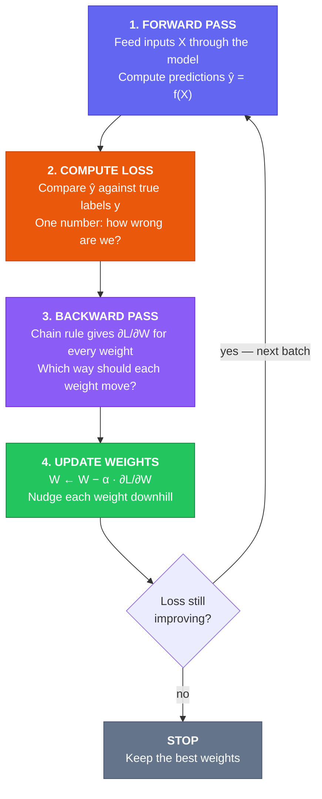
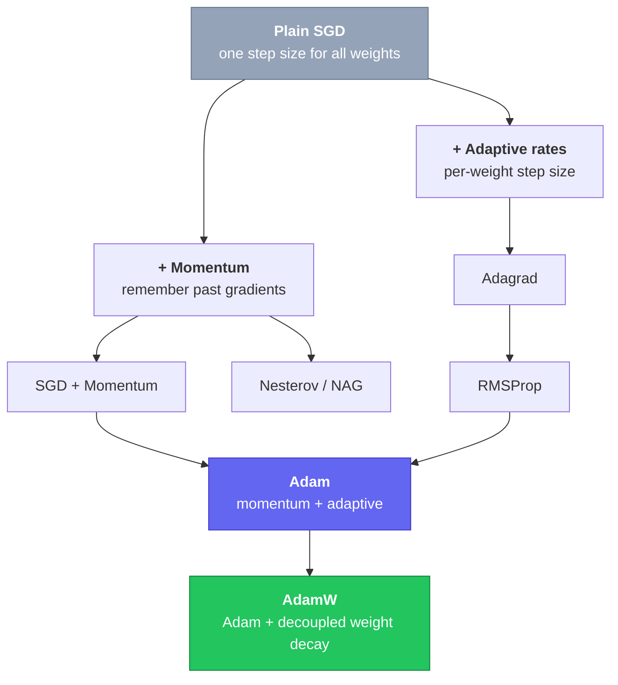
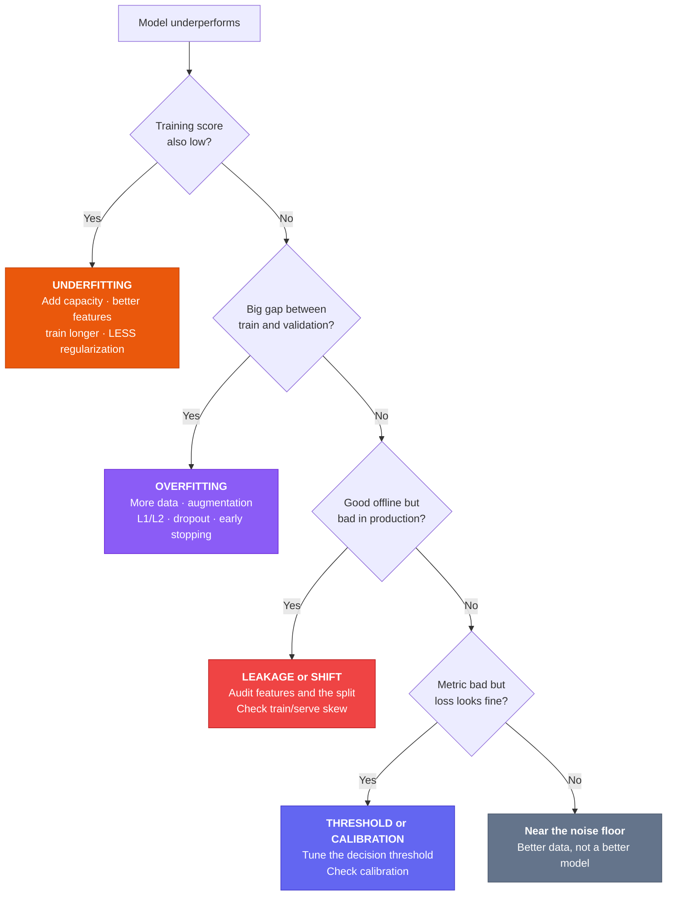

# Chapter 8 — Core Concepts & Terminology

> "A language that doesn't affect the way you think about programming is not worth knowing."
> — Alan Perlis. The same is true of ML vocabulary: these concepts shape how you *think*.

---

## What You'll Learn

After reading this chapter, you will be able to:

- **Part A** — Use the core vocabulary precisely: features, labels, train/validation/test splits, models, parameters vs hyperparameters — and spot **data leakage** before it destroys a project
- **Part B** — Explain the training loop end to end: forward pass → loss → gradient → weight update; choose a loss function; explain what the learning rate, the optimizer and the batch size each control
- **Part C** — Diagnose why a model fails: overfitting vs underfitting, the bias–variance tradeoff, how regularization fixes it, and why *generalization* is the only score that matters
- Read a model's probability output, choose a decision threshold, and know when not to trust it
- Answer the interview questions that come from all three parts

---

## How to Read This Chapter

The chapter is three short books, in the order you actually need them:

```
  PART A — THE VOCABULARY       §8.1–8.6   What the words mean
  PART B — THE MECHANICS        §8.7–8.11  How learning happens
  PART C — THE CENTRAL TENSION  §8.12–8.16 Why models fail
```

Each part ends with a **Checkpoint** — questions with hidden answers. If you can't answer them,
re-read that part before moving on; every part builds on the one before it.

**Four things to look for as you read:**

| Marker | What it means |
|---|---|
| **★★★ / ★★ / ★** | Critical for interviews (know cold) / high priority / good to know. Skim ★ on a first pass; never skim ★★★ |
| **Quick check** | A question to answer *before* revealing the answer. Attempting it and getting it wrong beats reading the answer — do not skip these |
| **Interview** | The question as it actually gets asked, what to say, and the follow-up that catches people out |
| **Your turn** | A worked example with the last steps removed. Fill them in |

**Two examples run through the whole chapter.** A table of **house sales** (Part A and B) and a
study-for-an-exam analogy we'll call the **Exam Model** (introduced in §8.3, reused everywhere
after). Reusing them is deliberate — it means each new idea costs you one concept, not two.

> **Notation.** This chapter writes the learning rate as **α**. Chapter 14 writes it as **η** when
> discussing schedules. Same quantity — both symbols are standard in the literature.

---

## Part A — The Vocabulary

*What the words mean. §8.1–8.6.*

---

## 8.1 Data: The Foundation of ML ★

### Simple Explanation

Imagine you want to teach your little brother to tell dogs from cats. You wouldn't just *describe*
them — you'd show him **hundreds of pictures**, and each time say "this one is a dog" or "this one
is a cat."

Those pictures are **data**. The more he sees (and the better their quality), the faster he learns.
But if you accidentally label a cat as "dog," he gets confused. That's why **data quality matters
more than anything else** in ML.

Think of it like cooking: even the world's best chef can't make a great meal from rotten
ingredients. **Garbage in, garbage out.**

### What Data Looks Like

This table is our running example for the rest of the chapter.

```
┌──────────────────────────────────────────────────────────────────┐
│                  THE HOUSE SALES DATASET                         │
├───────────┬───────────┬──────────────┬───────────┬──────────────┤
│ House ID  │ Sq Feet   │  # Bedrooms  │  Age(yrs) │ Price ($)    │
│           │ (feature) │  (feature)   │ (feature) │ ← LABEL      │
├───────────┼───────────┼──────────────┼───────────┼──────────────┤
│    1      │   1,500   │      3       │    10     │  250,000     │
│    2      │   2,200   │      4       │     5     │  370,000     │
│    3      │     900   │      2       │    30     │  150,000     │
│    4      │   3,100   │      5       │     2     │  520,000     │
│   ...     │    ...    │     ...      │    ...    │    ...       │
└───────────┴───────────┴──────────────┴───────────┴──────────────┘
  ↑                                                      ↑
Each row = one example / data point / observation    What we predict
```

### Data Quality Beats Algorithm Choice

> Low-quality data + best algorithm → mediocre results.
> High-quality data + simple algorithm → often great results.

| Problem | What it looks like |
|---|---|
| **Missing values** | Some cells are empty |
| **Noise** | Random errors in measurement |
| **Duplicates** | The same row appears several times |
| **Imbalance** | 990 "not fraud" rows to 10 "fraud" rows |
| **Distribution shift** | Training data ≠ the real-world data you'll see |
| **Label errors** | A human mislabelled it |

*(Fixing all of these is Chapter 9 — Data Preprocessing.)*

---

## 8.2 Features and Labels ★★

### Features (X) — The Inputs

**Simple:** You're playing a guessing game. Your friend is thinking of a fruit and you can ask
questions: "What colour is it? How big? Sweet or sour?" Each answer is a **feature** — a clue that
helps you guess. Features are just the clues you hand the model.

**Official Definition:**
> A **feature** (input variable, predictor, attribute) is an individual measurable property of the
> thing being observed. Features are the independent variables fed as input to a model.

| Type | Meaning | Examples |
|---|---|---|
| **Continuous numerical** | Any number in a range | `age=25.3`, `price=450.99`, `height=180.2cm` |
| **Discrete numerical** | Whole numbers only | `bedrooms=3`, `clicks=100` |
| **Categorical (nominal)** | Named groups, **no** natural order | `color=red`, `city=London` |
| **Ordinal** | Categories **with** a natural order | `size=S/M/L`, `rating=1–5 stars` |
| **Binary** | Exactly two values | `spam=Yes/No`, `is_active=True/False` |
| **Temporal** | Date/time — **cyclical**, handle with care | `hour=14`, `day_of_week=3` |
| **Text / Image** | Unstructured — must be converted first | text → embeddings; images → pixel arrays |

> ⚠️ **The temporal trap:** hour 23 and hour 0 are one hour apart, but numerically they look 23
> apart. Encode cyclical features with sin/cos so the model sees the wrap-around.

### Labels (y) — The Output

**Simple:** Back to the guessing game — the **label** is the actual answer. Clues were "red, small,
sweet"; the answer was "strawberry." During training we show the model both the clues *and* the
answer so it can learn the connection. Later we give only the clues and ask: *now you tell me.*

**Official Definition:**
> A **label** (target variable, dependent variable, output) is what we are trying to predict. In
> supervised learning the training data includes both features and labels; in unsupervised learning
> there are no labels.

```
  Feature vector (x)             Label (y)

  [SqFt=1500, Beds=3, Age=10] → Price = $250,000   (regression)
  [SqFt=1500, Beds=3, Age=10] → Sold in 30 days?   (classification)
  [Email text, sender, links] → Spam = Yes/No      (classification)
  [Daily sales history]       → Next week's sales  (time series)
```

Notice that the *same* house features support both a regression task (predict the price) and a
classification task (predict whether it sells quickly). The task is defined by the label you
choose, not by the data.

---

## 8.3 Training, Validation & Test Sets ★★

### Simple Explanation — The Exam Model

This analogy runs through the rest of the chapter, so it's worth thirty seconds. You're studying
for a big exam:

- Your **textbook** is full of practice problems *with* answers. You study these every day.
  → the **training set**: the model learns from it.
- Your **practice test** is problems you haven't studied. You try them to check whether you
  actually understand or merely memorised.
  → the **validation set**: it checks you *while* you're still studying.
- The **real exam** happens once, at the end. You can't go back and study after seeing it.
  → the **test set**: it tells you how you'll do in the real world.

The one unbreakable rule: **never peek at the real exam while studying.** If you do, your score
stops meaning anything.

```
                    YOUR FULL DATASET (100%)
    ┌──────────────────────────────────────────────────┐
    │  [████████████████] [████████] [████████]        │
    └──────────────────────────────────────────────────┘
              │                │           │
              ▼                ▼           ▼
          Training         Validation    Test
            Set               Set        Set
           70%               15%         15%

          Teach the         Tune        Measure FINAL
          model             model       performance
                                        (untouched!)

  KEY RULE: never let test data influence a training decision.
  Peek at the test score and re-tune, and the test set is
  no longer a fair measure — you have contaminated it.
```

**Official Definition:**
> The **training set** fits the model parameters. The **validation set** tunes hyperparameters and
> selects the model architecture. The **test set** provides an unbiased estimate of final
> performance on unseen data.

### How to Split

| Dataset size | Split | Why |
|---|---|---|
| **< 10K rows** | 70 / 15 / 15, or use cross-validation | A single small holdout is statistically noisy |
| **10K – 1M rows** | 80 / 10 / 10 | 10% is a comfortably large holdout |
| **> 1M rows** | 98 / 1 / 1 | 1% of 1M is still 10,000 rows — plenty |

The rule behind the table: you need a holdout large enough to *measure* reliably, not a fixed
percentage. Past a few thousand examples, extra validation rows buy you almost nothing — so give
them to training instead.

---

## 8.4 Data Leakage — The Cardinal Sin ★★★

### Simple Explanation

**Leakage = your model saw the answer key.**

A student studies using a practice test — but someone left the answers printed at the bottom of the
page. The student scores 100%. Everyone is thrilled, until the real exam, where there is no answer
key, and the student fails.

The student never learned the subject. They learned to read the bottom of the page.

That is data leakage. Somewhere in your training data there is a shortcut — a clue that gives away
the answer. Your model finds it (models are excellent at finding shortcuts), scores beautifully in
testing, and collapses in production because that clue doesn't exist in the real world.

```
   WHAT YOU SEE                        WHAT IS ACTUALLY HAPPENING
   ─────────────                       ──────────────────────────

   Test accuracy: 99% ✅               Model learned a shortcut
   "Ship it!"                          only present in your data
        │                                        │
        ▼                                        ▼
   Deploy to production ────────────►  Real accuracy: 61% ❌
                                       Shortcut gone. Model lost.
```

**Official Definition:**
> **Data leakage** is the use of information during training that would not legitimately be
> available at inference time, producing over-optimistic validation scores and poor real-world
> performance.

**Why it is so dangerous:** every other bug makes your score go *down*, so you notice it. Leakage
makes your score go *up*. It looks like success. Nobody investigates a 99% accuracy — they
celebrate it. You find out after deployment.

### The Four Ways It Sneaks In

| Type | The story | Why it's cheating | Fix |
|---|---|---|---|
| **Target leakage** | Predicting *"will this patient get diabetes?"* — and one column is `takes_insulin`. Accuracy: 99%. | Only diagnosed patients take insulin. The column *is* the answer, reworded. | Ask of every feature: "would I know this **before** the event?" If no, drop it. |
| **Temporal leakage** | Predicting Wednesday's stock price with a random split — so Friday's data landed in training. | The model is predicting the past using the future. It cannot time-travel in production. | Split by **time**: train on Jan–Sep, test on Oct–Dec. |
| **Group leakage** | The same patient's two X-rays: one in train, one in test. The model scores brilliantly. | It memorised *the patient*, not the disease. New patients break it. | Split by **group**, so a patient appears on only one side (`GroupKFold`). |
| **Preprocessing leakage** | Scaling the whole dataset (`scaler.fit(X)`) and *then* splitting. | The mean used for scaling was computed from test rows. Test data quietly leaked into training. | Split **first**, fit only on train (wrap in a `Pipeline`). |

### The Most Common Mistake, in Code

```python
# ❌ WRONG — the scaler peeked at the test set
scaler = StandardScaler().fit(X)          # mean computed from ALL rows
X_scaled = scaler.transform(X)
X_train, X_test = train_test_split(X_scaled)

# ✅ RIGHT — split first, then learn only from train
X_train, X_test = train_test_split(X)
scaler = StandardScaler().fit(X_train)    # mean computed from TRAIN only
X_train = scaler.transform(X_train)
X_test  = scaler.transform(X_test)        # test is only transformed, never fitted

# ✅ BEST — a Pipeline makes leakage structurally impossible
pipe = Pipeline([("scale", StandardScaler()), ("model", LogisticRegression())])
pipe.fit(X_train, y_train)                # scaler refits inside every CV fold
```

The rule in one line: **`fit` on train, `transform` on both.** Never `fit` on test.

### How to Catch It

1. **Score too good?** 99% on a hard problem means leakage until proven otherwise. Be suspicious of
   success, not just of failure.
2. **Drop your best feature.** If accuracy collapses from 99% to 65%, that feature was doing all the
   work — inspect it. It is probably a disguised label.
3. **Say the timestamp out loud.** For each feature: *"At 9:00 a.m. on Monday, when I must make this
   prediction, do I already have this value?"* If no → leakage.

> **Rule of thumb:** if a feature would not exist at the exact moment you make the prediction, it is
> leakage. Leakage is routinely confused with overfitting — the two are compared side by side in
> **§8.13**. Full preprocessing recipe in Chapter 9; leakage *inside* cross-validation folds in
> Chapter 13.

---

## 8.5 The Model ★

### Simple Explanation

Think of a model as a **recipe-making machine**. You feed ingredients in one side (the features),
the machine follows its internal recipe (the maths), and a prediction comes out the other side.

At first the recipe is terrible — random guesses. But every time you say "that was wrong, here's the
right answer," it tweaks the recipe slightly. After thousands of examples the recipe gets good, and
the machine predicts well even for ingredients it has never seen.

The "recipe" is just numbers, called **weights** (or parameters). Training is the process of
adjusting those numbers until the guesses match reality.

```
              ┌──────────────────────────────────┐
Features ──►  │    f(X) = prediction             │ ──► Prediction
  (X)         │    where f is learned from data  │       (ŷ)
              │    and shaped by parameters W    │
              └──────────────────────────────────┘
```

**Official Definition:**
> A **model** is a mathematical representation that maps inputs to outputs using a set of learned
> parameters. The *form* of the model (linear, tree, neural net) is its **architecture** or
> **hypothesis class**.

### Inductive Bias — Every Model Makes Assumptions

If a teacher said "connect these dots," you'd probably draw a straight line. Your friend might draw
a curve. A small child might zigzag through every dot. Each of you brought a **built-in assumption**
about what the right answer looks like. Every ML algorithm brings one too.

| Algorithm | Its built-in assumption |
|---|---|
| **Linear Regression** | The relationship between X and y is a straight line |
| **Decision Tree** | Data can be split by axis-aligned rectangular boundaries |
| **KNN** | Similar inputs have similar outputs — nearby points share a class |
| **Neural Network** | Very weak assumptions — can approximate almost any function given enough data and neurons ("universal approximator") |

> Choosing a model = choosing which assumptions you're comfortable with. **Wrong assumptions mean
> even infinite data won't save you.** No algorithm is best at everything — that's the No Free Lunch
> theorem, covered in Chapter 7.

---

## 8.6 Parameters vs Hyperparameters ★★

### Simple Explanation

Learning to ride a bike:

- **Parameters** are your balance and muscle memory. They adjust automatically as you practise — you
  never consciously think "tilt 3 degrees left." In ML, **weights are parameters the model learns by
  itself from data.**
- **Hyperparameters** are the choices you make *before* you start: which bike, how high the seat,
  training wheels or not. You pick them before practice and they don't change during it. In ML,
  **learning rate or number of layers are hyperparameters that YOU choose.**

| | **Parameters** | **Hyperparameters** |
|---|---|---|
| What | Numbers *inside* the model | Settings chosen *before* training |
| Who sets them | Learned from data | You do — or a tuning search does |
| When they change | Continuously, during training | Fixed for a single training run |
| Examples | Neural-net weights `w₁=0.34, w₂=-1.2`; linear-regression coefficients; tree split thresholds | Learning rate `0.001`; trees in a forest `100`; max tree depth `5`; layers `3`; dropout rate `0.3` |
| Bike analogy | Your balance — adjusts itself | Seat height — you set it beforehand |

> The validation set (§8.3) exists precisely to tune hyperparameters. Parameters are fitted on
> **train**; hyperparameters are selected on **validation**; nothing at all is fitted on **test**.

---

## Checkpoint A — Vocabulary

<details>
<summary><strong>1.</strong> You're predicting whether a house sells within 30 days. One of your features is <code>final_sale_date</code>. What's wrong?</summary>

**Target leakage.** A sale date only exists *after* the house has sold, so it is unavailable at
prediction time — and it gives away the answer. Apply the timestamp test from §8.4: at the moment
you must predict, do you have this value? No. Drop it.
</details>

<details>
<summary><strong>2.</strong> Which of these is a hyperparameter: the coefficient on <code>SqFt</code>, or the number of trees in a random forest?</summary>

**The number of trees.** You choose it before training and it stays fixed. The coefficient on
`SqFt` is a *parameter* — the model learns it from data.
</details>

<details>
<summary><strong>3.</strong> You have 2 million rows. Is a 70/15/15 split a good idea?</summary>

No — it's wasteful. 15% of 2M is 300,000 validation rows, far more than needed to measure
performance reliably. A 98/1/1 split still gives you 20,000 rows each for validation and test while
handing 600,000 extra rows to training.
</details>

---

## Part B — The Mechanics

*How learning actually happens. §8.7–8.11.*

Part A gave you the nouns: data, features, labels, a model, and the parameters inside it. It never
said **how those parameters get their values** — the model just "learns from data," which is not an
explanation.

Part B is that explanation. Everything here is one loop, repeated: guess, measure the error, work
out which way to move, move a little. §8.7 is the loop itself; §8.8–8.11 each zoom into one box of
it.

---

## 8.7 The Training Loop ★★★

This is the most important section in the chapter. Understand the training loop and you understand
how machine learning actually works.

### Simple Explanation

You're learning to throw a basketball into a hoop, blindfolded:

1. **You throw** — the **forward pass**. The model takes the input and makes its best guess.
2. **Your friend says how far off you were** — "two feet left!" That's the **loss**: one number
   saying how wrong the guess was.
3. **You work out the adjustment** — "throw a bit more right." That's the **backward pass**: calculus
   tells the model which direction to move each of its numbers.
4. **You adjust** — the **weight update**. Each internal number is nudged slightly in the direction
   that reduces the error.
5. **Repeat thousands of times** until you're sinking shots consistently.

**What to notice:** it is a *cycle*. Nothing happens once — the four steps repeat for every batch,
and the whole sequence repeats for every epoch.



One pass through **all** batches in the dataset is one **epoch** (§8.11).

### When Does the Loop Stop?

"Repeat until the loss stops improving" hides a real decision. Three options, in increasing order of
how much people actually use them:

| Rule | How it works | Downside |
|---|---|---|
| **Fixed epoch count** | Train for exactly N epochs | You guessed N. Too few underfits, too many overfits |
| **Convergence threshold** | Stop when the loss changes by less than ε | Noisy mini-batch losses trigger it early |
| **Early stopping** ✓ | Watch **validation** loss; stop when it stops falling and restore the best checkpoint | Needs a validation set — which you have (§8.3) |

Early stopping is the default in practice, and it is also a regularizer — that's why it reappears in
§8.15.

> **Training mode vs inference mode.** During training the model updates its weights; at inference
> it only runs the forward pass. Some layers deliberately *behave differently* in the two modes —
> dropout switches off at inference (§8.15). Forgetting to flip the mode is a classic production bug.

### Concrete Walk-Through (One Real Step)

**Task:** from our house dataset — given a house's size, predict whether it **sells within 30 days**
(`1 = yes`, `0 = no`).

**Model:** one weight `w`, one bias `b`, a sigmoid on top. We measure size in *hundreds* of square
feet, so a 2,500 sq ft house is `size = 25`.

$$\hat{y} = \sigma(w \cdot \text{size} + b)$$

Start untrained: `w = 0`, `b = 0`. Training example: a 2,500 sq ft house that **did** sell fast, so
`size = 25`, `y = 1`.

**Step 1 — Forward pass.** Plug the input in.

- raw = `0 × 25 + 0 = 0`
- ŷ = `sigmoid(0) = 0.5`

The model says 50/50. It knows nothing yet.

**Step 2 — Loss.** How wrong is 0.5 when the answer is 1? Binary cross-entropy simplifies to
$-\log(\hat{y})$ when `y = 1`:

$$\text{loss} = -\log(0.5) \approx 0.693$$

**Step 3 — Gradients.** Which direction reduces the loss? This is the step people wave at, so let's
actually do it.

The weight `w` doesn't touch the loss directly. It reaches it through a chain:

```
   w  ──►  raw = w·size + b  ──►  ŷ = σ(raw)  ──►  loss = −log(ŷ)
        (step 1)              (step 2)          (step 3)
```

The **chain rule** says: to get the effect of `w` on the loss, multiply the three local effects
together.

$$\frac{\partial L}{\partial w} \;=\; \underbrace{\frac{\partial L}{\partial \hat{y}}}_{\text{loss} \leftarrow \text{prediction}} \times \underbrace{\frac{\partial \hat{y}}{\partial \text{raw}}}_{\text{prediction} \leftarrow \text{raw}} \times \underbrace{\frac{\partial \text{raw}}{\partial w}}_{\text{raw} \leftarrow w}$$

That's all backpropagation is: **walking that chain backwards through the model, multiplying local
slopes as you go.** A deep network just has more links in the chain.

Now the nice part. For a sigmoid paired with binary cross-entropy, the first two factors are ugly
individually — but their product collapses:

$$\frac{\partial L}{\partial \hat{y}} \times \frac{\partial \hat{y}}{\partial \text{raw}} = \left(\frac{-1}{\hat{y}}\right) \times \bigl(\hat{y}(1-\hat{y})\bigr) \;=\; \hat{y} - y$$

and $\partial\,\text{raw}/\partial w$ is just `size`. So:

- `∂loss/∂w = (ŷ − y) × size = (0.5 − 1) × 25 = −12.5`
- `∂loss/∂b = (ŷ − y) × 1    = −0.5`

**"Prediction minus truth."** That cancellation is exactly *why* sigmoid is paired with
cross-entropy and softmax with categorical cross-entropy — the gradient stays clean and never
saturates. Swap in MSE and the cancellation is lost (§8.8 explains what breaks).

A negative gradient on `w` means *the loss would fall if w were larger*. So nudge `w` up.

**Step 4 — Update** with learning rate `0.01`:

- `w ← 0 − 0.01 × (−12.5) = 0.125`
- `b ← 0 − 0.01 × (−0.5)  = 0.005`

**Step 5 — Re-check.** Same input, updated weights:

- raw = `0.125 × 25 + 0.005 = 3.13`
- ŷ = `sigmoid(3.13) ≈ 0.958` — the model is now 96% confident.

That is **one** training step: loss fell from `0.693` to about `0.043`. Repeat across many examples
and many epochs and the model converges.

> Every remaining section in Part B zooms in on one box of this loop. §8.8 is Step 2, §8.9 and §8.10
> are Steps 3–4, and §8.11 is the "for each batch" line at the top. The full matrix form of
> backpropagation across many layers is **Chapter 14 §14.5**.

<details>
<summary><strong>Quick check.</strong> In the walk-through the gradient on <code>w</code> was −12.5 but on <code>b</code> only −0.5. Both weights sit in the same model. Why is one 25× larger?</summary>

Because the chain's last link differs. `∂raw/∂w = size = 25`, while `∂raw/∂b = 1`. Both share the
same `(ŷ − y) = −0.5` factor, so the input value scales the gradient.

**This is the whole argument for feature scaling.** A feature measured in the thousands produces
gradients thousands of times larger than one measured in units, so a single learning rate cannot
suit both. Hold that thought for §8.9.
</details>

> **Interview —** *"Walk me through what happens in one training step."*
> **Say:** Forward pass produces a prediction; the loss scores it; backpropagation applies the chain
> rule backwards through the network to get each weight's gradient; the optimizer steps each weight
> against its gradient. Repeat per batch, and one sweep of all batches is an epoch.
> **They follow up with:** *"So what does backprop actually compute?"* — not the update, just the
> **gradients**. Applying them is the optimizer's job (§8.10). Conflating the two is the classic slip.

**So what:** every training bug you will ever debug lives in one of these four boxes — a bad
forward pass, the wrong loss, gradients that vanish or explode, or a bad step size.

---

## 8.8 Loss Functions — Measuring "How Wrong" ★★★

### Simple Explanation

Remember the blindfolded basketball game? The **loss function** is the friend who tells you exactly
how far off each throw was. Without that feedback you'd never improve.

A loss of 0 means perfect. A big loss means you were way off. The **entire goal of training** is to
make this number small — like a golf score, lower is better.

```
  Reality:    House actually sold for  $300,000
  Prediction: Model said               $250,000
  Error:      $50,000 off  ← one loss value

  Across 3 houses:
    |250K − 300K| = 50K
    |380K − 370K| = 10K
    |140K − 200K| = 60K
    MAE = (50K + 10K + 60K) / 3 = $40,000 average error
```

**Official Definition:**
> A **loss function** (or cost function) maps a prediction and a ground-truth label to a scalar
> representing "how bad" the prediction is. Training optimizes the model parameters to minimize the
> expected loss over the training distribution.

### Regression Losses — Predicting a Number

All three differ only in **how hard they punish large errors**.

**MAE — Mean Absolute Error.** Average of absolute errors.

$$\text{MAE} = \frac{1}{n} \sum_{i=1}^{n} |\hat{y}_i - y_i|$$

Errors count proportionally — a 50-unit error costs 10× a 5-unit error. Robust to outliers, but the
gradient is ±1 everywhere regardless of how close you are, which means the optimizer keeps taking
the same-sized step near the optimum and can **oscillate around it** instead of settling. (MSE
doesn't have this problem: its gradient shrinks as the error shrinks — see §8.9.)

**MSE — Mean Squared Error.** Average of squared errors.

$$\text{MSE} = \frac{1}{n} \sum_{i=1}^{n} (\hat{y}_i - y_i)^2$$

Squaring punishes big errors *disproportionately* — a 50-unit error costs **100×** a 5-unit one
(2500 vs 25). Smooth and differentiable everywhere, so it's the default for gradient-based
optimizers, and it has a closed-form solution for linear regression.

**RMSE — Root Mean Squared Error.** $\sqrt{\text{MSE}}$. Ranks models identically to MSE, so it
changes nothing during training — its job is **reporting**. MSE is in squared units ("40,000
dollars²" is meaningless); RMSE is in the original units ("$200 average error").

**Huber Loss.** Quadratic for small errors, linear for large ones, switching at a threshold **δ**:

$$
L_\delta(e) =
\begin{cases}
\tfrac{1}{2}\,e^2 & \text{if } |e| \le \delta \\
\delta\bigl(|e| - \tfrac{1}{2}\delta\bigr) & \text{if } |e| > \delta
\end{cases}
\qquad \text{where } e = \hat{y} - y
$$

You get MSE's smooth gradient near zero *and* MAE's outlier robustness. `δ = 1.0` is the usual
default. Standard in object-detection bounding-box regression.

> **Predict first.** The chart below plots all three against prediction error. Before you look:
> which one grows fastest as the error gets large, and which is a straight line either side of zero?

```chart
{
  "type": "line",
  "data": {
    "labels": [-3,-2.5,-2,-1.5,-1,-0.5,0,0.5,1,1.5,2,2.5,3],
    "datasets": [
      {
        "label": "MAE — |error|",
        "data": [3,2.5,2,1.5,1,0.5,0,0.5,1,1.5,2,2.5,3],
        "borderColor": "rgba(99, 102, 241, 1)",
        "fill": false,
        "tension": 0,
        "pointRadius": 0
      },
      {
        "label": "MSE — error²",
        "data": [9,6.25,4,2.25,1,0.25,0,0.25,1,2.25,4,6.25,9],
        "borderColor": "rgba(239, 68, 68, 1)",
        "fill": false,
        "tension": 0.3,
        "pointRadius": 0
      },
      {
        "label": "Huber Loss",
        "data": [2.5,2.0,1.5,1.125,0.5,0.125,0,0.125,0.5,1.125,1.5,2.0,2.5],
        "borderColor": "rgba(34, 197, 94, 1)",
        "borderDash": [5,5],
        "fill": false,
        "tension": 0.3,
        "pointRadius": 0
      }
    ]
  },
  "options": {
    "plugins": { "title": { "display": true, "text": "Loss Functions — MAE (linear), MSE (quadratic), Huber (hybrid)" } },
    "scales": {
      "y": { "title": { "display": true, "text": "Loss" }, "beginAtZero": true },
      "x": { "title": { "display": true, "text": "Prediction Error (ŷ - y)" } }
    }
  }
}
```

<details>
<summary><strong>Quick check.</strong> You're predicting delivery times. Most are 20–40 min, but a handful of orders got stuck in a blizzard and took 6 hours. Which regression loss, and why not the other two?</summary>

**MAE or Huber.** The blizzard orders are genuine outliers you don't want dictating the model. MSE
squares them, so a 300-minute error contributes ~225× as much as a 20-minute one and the fit bends
toward a handful of freak events. Pick **Huber** if you also want smooth convergence near the
optimum — it behaves like MSE for small errors and like MAE for large ones. **RMSE isn't a choice
here at all**: it ranks models identically to MSE, so it's a reporting format, not a training
objective.
</details>

### Classification Losses — Predicting a Class
Both are built on one idea: **the predicted probability of the correct class should be high.**

**Binary Cross-Entropy (Log Loss).** Two classes. Pair with a **sigmoid** output.

$$L = -\bigl[\,y\,\log(\hat{y}) + (1 - y)\,\log(1 - \hat{y})\,\bigr]$$

`y ∈ {0, 1}` is the true label, `ŷ = P(class = 1)`. When `y = 1` only `-log(ŷ)` matters; when `y = 0`
only `-log(1−ŷ)` does. Its defining property: it **savagely punishes confident wrong answers.**

| True label | Prediction | Loss |
|---|---|---|
| 1 | 0.9 | 0.105 |
| 1 | 0.5 | 0.693 |
| 1 | 0.1 | 2.303 |
| 1 | 0.01 | **4.605** |

**Categorical Cross-Entropy.** The same idea over **K** classes. Pair with a **softmax** output.

$$L = -\sum_{i=1}^{K} y_i\,\log(\hat{y}_i)$$

`y` is one-hot, so every term except the true class is zero and the sum collapses to
$-\log(\hat{y}_\text{true})$ — literally *"how surprised were you by the right answer?"* If the truth
is Cat and softmax gives (Cat 0.70, Dog 0.20, Bird 0.10), loss = `-log(0.70) ≈ 0.357`; a confident
Cat 0.95 gives `≈ 0.051`.

> **Sparse categorical cross-entropy** is the same maths with the label passed as an integer (`3`)
> instead of a one-hot vector (`[0,0,0,1,0,…]`). Pure memory optimization — use it when K is large.

```chart
{
  "type": "line",
  "data": {
    "labels": [0.01,0.05,0.1,0.2,0.3,0.4,0.5,0.6,0.7,0.8,0.9,0.95,0.99],
    "datasets": [{
      "label": "Binary Cross-Entropy Loss = -log(ŷ) when true label = 1",
      "data": [4.605,2.996,2.303,1.609,1.204,0.916,0.693,0.511,0.357,0.223,0.105,0.051,0.010],
      "borderColor": "rgba(239, 68, 68, 1)",
      "backgroundColor": "rgba(239, 68, 68, 0.1)",
      "fill": true,
      "tension": 0.4,
      "pointRadius": 3
    }]
  },
  "options": {
    "plugins": { "title": { "display": true, "text": "Cross-Entropy Loss — Confident & Wrong = HUGE Loss, Confident & Right = Tiny Loss" } },
    "scales": {
      "y": { "title": { "display": true, "text": "Loss" }, "beginAtZero": true },
      "x": { "title": { "display": true, "text": "Model's Predicted Probability for the Correct Class" } }
    }
  }
}
```

### Why Not Just Use MSE for Classification? ★★★

You *could* feed probabilities to MSE. Almost nobody does, for two reasons.

**1. The gradient dies exactly when you need it most.** Recall from §8.7 that sigmoid + cross-entropy
collapses to a clean `(ŷ − y)`. Pair sigmoid with MSE instead and the σ′ term **survives**:

$$\frac{\partial L_{\text{MSE}}}{\partial \text{raw}} = (\hat{y}-y)\cdot\underbrace{\hat{y}(1-\hat{y})}_{\sigma'(\text{raw})}$$

When the model is confidently wrong — say `ŷ = 0.01` but the truth is `1` — that factor is
`0.01 × 0.99 ≈ 0.0099`. The gradient is crushed to near zero, so **the most badly wrong predictions
generate almost no learning signal.** Cross-entropy has no such factor: the worse the prediction,
the larger the push.

| ŷ (truth = 1) | MSE gradient factor | Cross-entropy |
|---|---|---|
| 0.5 | 0.25 | strong |
| 0.1 | 0.09 | stronger |
| 0.01 | **0.0099 — stuck** | **strongest** |

**2. MSE with a sigmoid is non-convex**, so optimization can stall in a flat region. Cross-entropy
with a sigmoid is convex in the raw score — one basin, reliable descent.

> **The one-line version:** cross-entropy punishes confident mistakes with a *bigger* gradient;
> MSE punishes them with a *smaller* one. That's backwards.

### Reading Loss Values — A Scale Anchor

A loss of `0.693` has appeared twice already. It isn't a coincidence:

$$-\log(0.5) = \log 2 \approx 0.693$$

**0.693 is the cross-entropy of a coin flip** — the loss of a binary model that has learned nothing.
That gives you a free sanity check on any training run:

| Binary cross-entropy | What it means |
|---|---|
| ≈ **0.693** | Model is guessing. If it sits here, something is broken |
| ≈ 0.35 | Roughly 70% confident on the right answer — learning |
| ≈ 0.05 | Very confident and right — or overfitting (check validation) |
| **rising** | Learning rate too high, or you're past the early-stopping point |

For K classes the "knows nothing" baseline is `log K` — with 10 classes, `≈ 2.303`.

### Two Practical Notes

**Class imbalance.** With 990 negatives to 10 positives, a model can drive the loss down by ignoring
the minority class entirely. The fixes — class weights in the loss, resampling, and why accuracy is
the wrong metric here — are covered in **Chapter 10 §10.11**.

**Numerical stability.** Never compute softmax yourself and then take its log: if a probability
underflows to `0`, `log(0) = −∞` and the run dies in NaNs. Frameworks provide a fused, stable
version — pass raw scores and set `from_logits=True` (TensorFlow) or use
`nn.CrossEntropyLoss` on logits (PyTorch), which applies log-softmax internally.

<details>
<summary><strong>Quick check.</strong> A binary classifier predicts 0.02 for an example whose true label is 1. Compare how much that example teaches the model under cross-entropy versus MSE.</summary>

**Cross-entropy learns a lot; MSE learns almost nothing.**

- **Cross-entropy:** loss is `−log(0.02) ≈ 3.9` — very large — and the gradient w.r.t. the raw score
  is just `(ŷ − y) = −0.98`, a strong push in the right direction.
- **MSE:** the gradient carries the extra `σ′ = ŷ(1−ŷ) = 0.02 × 0.98 ≈ 0.0196` factor, shrinking the
  update to roughly **2%** of its size. The most badly wrong example produces one of the weakest
  signals.

That inversion — *confidently wrong should push hardest, and under MSE it pushes least* — is the
whole argument. It's also why the sigmoid + cross-entropy pairing from §8.7 exists: the σ′ term
cancels.
</details>

### Two More You'll Meet

**KL Divergence** measures how far one distribution `Q` sits from another `P`:

$$D_{\text{KL}}(P \,\|\, Q) = \sum_i P(i)\,\log \frac{P(i)}{Q(i)}$$

It is **not symmetric** — conventionally `P` is the target and `Q` the model's approximation. For a
one-hot `P` it equals cross-entropy minus a constant, so the gradients are identical. Use it when
the *target itself is a distribution*: teacher–student distillation, variational autoencoders, and
PPO's policy-update penalty in RL.

**Hinge Loss** is the max-margin loss behind SVMs, using `y ∈ {−1, +1}` and a raw score `ŷ`:

$$L = \max(0,\ 1 - y \cdot \hat{y})$$

Once a prediction clears the margin (`y·ŷ ≥ 1`) the loss is exactly zero — it doesn't reward extra
confidence. Rare in modern deep learning, still standard in classical SVMs.

### Loss Comparison at a Glance

| Loss | Task | Pair with | Outlier sensitivity | When to use |
|---|---|---|---|---|
| **MAE** | Regression | — | Low | Target has real outliers; want a robust fit |
| **MSE** | Regression | — | High | Big errors must be punished; clean data |
| **RMSE** | Regression (reporting) | — | High | You want error in the original units |
| **Huber** | Regression | — | Medium | MSE's smoothness with MAE's robustness |
| **Binary CE** | 2-class | Sigmoid | — | Labels are 0 / 1 |
| **Categorical CE** | K-class | Softmax | — | One correct class out of K |
| **Sparse CE** | K-class, large K | Softmax | — | Save memory — integer labels |
| **KL Divergence** | Distribution matching | Softmax / probabilistic | — | Distillation, VAEs, RL policies |
| **Hinge** | Binary | Linear score | — | SVMs, margin-based classifiers |

### Loss vs. Metric — Optimize One, Report the Other ★★

The number the optimizer minimizes is usually **not** the number you actually care about. You train
on a smooth stand-in (the **loss**) but judge the model by a real-world score (the **metric**).

> A **loss** (objective / surrogate) is the differentiable function minimized during training. A
> **metric** is the — often non-differentiable — quantity used to evaluate the model for the task.

Why the split? Accuracy, F1 and AUC are flat or discontinuous in the parameters: nudging one weight
rarely changes them, so their gradient is zero almost everywhere and gradient descent has nothing to
follow. We minimize a differentiable surrogate that *tracks* the metric instead.

| Task | Loss you optimize | Metric you report |
|---|---|---|
| Classification | Cross-entropy | Accuracy · F1 · ROC-AUC |
| Regression | MSE · Huber | MAE · RMSE · R² |
| Ranking / retrieval | Pairwise / softmax loss | NDCG · MRR · Recall@k |

> **Interview —** *"Why do we optimize cross-entropy but report F1?"*
> **Say:** F1 is non-differentiable — its gradient is zero almost everywhere, so gradient descent
> has nothing to follow. Cross-entropy is a smooth surrogate that tracks it, so we optimize the
> surrogate and evaluate on the metric that reflects the business goal.
> **They follow up with:** *"Your loss improved but F1 didn't. What now?"* — surrogate–metric
> mismatch. Tune the decision threshold first (cheapest, §8.16), then class weights, then a loss
> better aligned to the metric. Do **not** just train longer.

**So what:** picking a loss is picking what your model is allowed to care about. Every later
complaint that "the model optimizes the wrong thing" traces back to this choice.

---

## 8.9 Gradient Descent — How We Minimize Loss ★★

### Simple Explanation

You're standing on a mountain in thick fog. You can't see the bottom, but you **can** feel which way
the ground slopes under your feet. So you take a small step **downhill**. Feel the slope again, step
again. Eventually you reach the valley.

That's **gradient descent**. The "gradient" is just a formal word for "which way is downhill." The
model keeps stepping in the direction that reduces the loss until it reaches the lowest point it can
find.

The **learning rate** is your step size. Baby steps? You'll get there eventually — after forever.
Giant leaps? You'll jump clean over the valley. You need steps that are *just right*.

**What to notice:** the curve is the *loss*, and the horizontal axis is the *weights* — not the data.
Training is a walk across this surface.

```
Loss                                    ← we want to minimize this
 │
 │   ●  ← start (random weights, high loss)
 │    \
 │     \  ← each step follows the slope
 │      \
 │       ○  ← local minimum (can get trapped!)
 │
 │              ○  ← global minimum (ideal!)
 │
 └──────────────────────────────── Model weights

  At each step:
    gradient       = slope of the loss here
    step direction = opposite of the gradient (downhill)
    step size      = learning rate × gradient
```

**Official Definition:**
> **Gradient Descent** is a first-order iterative optimization algorithm for finding a local minimum
> of a differentiable function. It steps repeatedly in the direction of the negative gradient of the
> function at the current point.

### One Weight Is a Lie — The Gradient Is a Vector

That picture has one weight, so the "slope" is a single number. A real model has thousands to
billions of weights, and you cannot draw that.

The **gradient** ∇L is a *vector* with **one component per parameter** — each component answering
"if I nudge only this weight, how does the loss respond?"

$$\nabla L = \left[\frac{\partial L}{\partial w_1},\ \frac{\partial L}{\partial w_2},\ \dots,\ \frac{\partial L}{\partial w_n}\right]$$

It points in the direction of **steepest increase**, which is why every update subtracts it. Nothing
else changes: the same rule runs in 175 billion dimensions as in one.

### Why Feature Scaling Matters Here

§8.7's quick check showed the gradient is scaled by the input value. Now see the consequence. Suppose
one feature is `bedrooms` (1–5) and another is `sq_ft` (500–5,000):

```
  UNSCALED features            SCALED features
  ─────────────────            ────────────────
  loss surface is a            loss surface is a
  long thin valley             round bowl

     ╱╲    ╱╲                       ╱▔▔╲
    ╱  ╲  ╱  ╲                     │ ·  │
   ╱    ╲╱    ╲                     ╲__╱
   ↯ zig-zags across                → walks straight in
     the narrow axis
```

With wildly different scales, one weight's gradient dwarfs the other's. A learning rate small enough
to be safe on the big one is far too small for the small one, so descent zig-zags down a narrow
ravine and takes many more steps. Scaling makes the bowl round, and a single learning rate suits
every weight. *(Scaling methods: **Chapter 9**.)*

### Local Minima, Saddle Points, and Convexity

The diagram warns you can get trapped in a local minimum. That's true in one dimension — and
mostly **not** the thing that bites you in practice.

| | What it means | Does it matter? |
|---|---|---|
| **Convex loss** | One single basin — linear and logistic regression, SVMs | Gradient descent is *guaranteed* to reach the global minimum |
| **Non-convex loss** | Many basins — every neural network | No guarantee. You get *a* good minimum, not *the* best one |
| **Local minimum** | Lower than everything nearby | Rare in high dimensions — needs the curve to bend upward in **every** direction at once |
| **Saddle point** | Down in some directions, up in others | **The real obstacle.** Common in high dimensions, and gradients go near-zero there so training appears to stall |

This is why momentum and adaptive optimizers (§8.10) matter: they carry speed through the flat
regions around saddle points instead of grinding to a halt in them.

### Concrete Numerical Example

**Setup.** Back to house prices. One weight `w` = price per 100 sq ft, in thousands of dollars. For
our data the best value happens to be `w = 5` ($5k per 100 sq ft), which makes the squared-error loss

$$L(w) = (w - 5)^2$$

We'll pretend we don't know the answer and let gradient descent find it, starting from `w = 0`.

**Gradient.** Differentiate the loss with respect to `w`:

$$\frac{\partial L}{\partial w} = 2(w - 5)$$

At `w = 0` the gradient is `2(0 − 5) = −10`. At `w = 5` it is `0` — we've arrived.

**Update rule** (learning rate α = 0.1):

$$w_{\text{new}} = w_{\text{old}} - \alpha \cdot \frac{\partial L}{\partial w}$$

| Step | `w` | Loss `(w−5)²` | Gradient `2(w−5)` | Update calculation | New `w` |
|:---:|---:|---:|---:|---|---:|
| 0 | 0.000 | 25.000 | −10.000 | `0.000 − 0.1 × (−10.000)` | 1.000 |
| 1 | 1.000 | 16.000 | −8.000 | `1.000 − 0.1 × (−8.000)` | 1.800 |
| 2 | 1.800 | 10.240 | −6.400 | `1.800 − 0.1 × (−6.400)` | 2.440 |
| **3** | **2.440** | ? | ? | ? | ? |
| **4** | ? | ? | ? | ? | ? |

> **Your turn.** Fill in rows 3 and 4 before reading on. You need three things per row: the loss
> `(w−5)²`, the gradient `2(w−5)`, and the update `w − 0.1 × gradient`.

<details>
<summary>Show rows 3–4 and the rest of the run</summary>

| Step | `w` | Loss `(w−5)²` | Gradient `2(w−5)` | Update calculation | New `w` |
|:---:|---:|---:|---:|---|---:|
| 3 | 2.440 | 6.554 | −5.120 | `2.440 − 0.1 × (−5.120)` | 2.952 |
| 4 | 2.952 | 4.194 | −4.096 | `2.952 − 0.1 × (−4.096)` | 3.362 |
| 5 | 3.362 | 2.684 | −3.277 | `3.362 − 0.1 × (−3.277)` | 3.690 |
| ⋮ | | | | | |
| 10 | 4.463 | 0.288 | −1.074 | `4.463 − 0.1 × (−1.074)` | 4.570 |
| 20 | 4.942 | 0.0033 | −0.115 | `4.942 − 0.1 × (−0.115)` | 4.954 |
| 30 | 4.994 | 0.00004 | −0.012 | `4.994 − 0.1 × (−0.012)` | 4.995 |

If your arithmetic drifted, the usual cause is forgetting that subtracting a negative gradient
*increases* `w`.
</details>

**Why it moves toward 5.** The gradient is negative (loss falls as `w` grows toward 5). Subtracting a
negative number *adds* to `w`, so each step moves right. Cross 5 and the gradient flips positive,
pulling `w` back — spring-like behaviour that settles at the minimum.

**Why the steps shrink by themselves.** The gradient *is* `2(w − 5)`. As `w` approaches 5, `|w − 5|`
shrinks, so the gradient shrinks, so the step shrinks. Gradient descent naturally slows as it nears a
minimum — no manual tuning required. (This is exactly what MAE lacks — §8.8.)

### Learning Rate — The Step Size

The learning rate α is the one hyperparameter you will tune most often, and the one that fails most
spectacularly.

> **Predict first.** Three runs on the loss above: α = 0.0001, α = 0.1, α = 10. One converges
> smoothly, one crawls, one blows up. Sketch the three curves in your head, then check the chart.

**What to notice:** the red line doesn't just converge slowly — it climbs. Too large a step
overshoots the valley and lands *higher* than it started, every time.

```chart
{
  "type": "line",
  "data": {
    "labels": [0,1,2,3,4,5,6,7,8,9,10,11,12,13,14,15,16,17,18,19,20],
    "datasets": [
      {
        "label": "lr = 0.0001 (too small)",
        "data": [25,24.5,24,23.5,23,22.5,22,21.5,21,20.5,20,19.5,19,18.5,18,17.5,17,16.5,16,15.5,15],
        "borderColor": "rgba(200, 200, 200, 0.8)",
        "borderWidth": 1.5,
        "tension": 0.3,
        "pointRadius": 0,
        "fill": false
      },
      {
        "label": "lr = 0.1 (just right)",
        "data": [25,16,10.2,6.6,4.2,2.7,1.7,1.1,0.7,0.45,0.29,0.19,0.12,0.08,0.05,0.03,0.02,0.01,0.01,0.005,0.003],
        "borderColor": "rgba(99, 102, 241, 1)",
        "borderWidth": 2.5,
        "tension": 0.3,
        "pointRadius": 0,
        "fill": false
      },
      {
        "label": "lr = 10 (too large — diverges!)",
        "data": [25,30,22,35,18,40,15,45,12,50,10,55,8,60,6,65,5,70,4,75,3],
        "borderColor": "rgba(239, 68, 68, 1)",
        "borderWidth": 1.5,
        "tension": 0.3,
        "pointRadius": 0,
        "fill": false
      }
    ]
  },
  "options": {
    "plugins": { "title": { "display": true, "text": "Learning Rate Effect — Too Small (slow), Just Right, Too Large (bounces)" } },
    "scales": {
      "y": { "title": { "display": true, "text": "Loss" }, "min": 0, "max": 80 },
      "x": { "title": { "display": true, "text": "Training Step" } }
    }
  }
}
```

> The learning rate doesn't have to stay fixed — **learning-rate schedules** lower it as training
> progresses (big steps early, tiny steps late). They're covered with the rest of the deep-learning
> training toolkit in **Chapter 14 §14.13**.

> **Interview —** *"Does gradient descent find the global minimum?"*
> **Say:** Only if the loss is convex — linear regression, logistic regression, SVMs. Neural network
> losses are non-convex, so you reach *a* good local minimum, not provably *the* best one. In
> practice that's fine: in high dimensions most minima found by SGD have similar quality.
> **They follow up with:** *"So is it getting stuck in local minima?"* — usually **no**. A true local
> minimum requires the surface to curve upward in every one of millions of directions at once.
> **Saddle points** are the real stalls, and momentum is what carries you through them.

**So what:** almost every "my model won't train" report is a learning rate that's too high, features
that aren't scaled, or both — and both are visible in the loss curve within ten epochs.

---

## 8.10 Optimizers — Smarter Gradient Descent ★★

### Simple Explanation

Plain gradient descent walks downhill in the fog wearing the same shoes on every terrain.
**Optimizers** are smart shoes that adjust themselves:

- On **flat ground**, where progress is slow, they take bigger steps.
- On **steep rocky terrain**, where things change fast, they take smaller, careful ones.
- **Momentum** is a ball rolling downhill — it builds speed and rolls straight through small bumps
  instead of getting stuck in them.
- **Adam** combines all of it. It's the "just use this one" default that works nearly everywhere.

**What to notice:** every optimizer below is plain SGD plus one of two ideas — remember past
gradients (momentum), or give each weight its own step size (adaptive). Adam does both.



**SGD** is the baseline — the update rule you already saw in §8.9:

$$w \leftarrow w - \alpha \times \frac{\partial L}{\partial w}$$

Simple and memory-efficient, but it uses one learning rate for every weight, is sensitive to feature
scale, and converges slowly on ill-conditioned problems.

**SGD with Momentum** accumulates a velocity term, so consistent directions build up speed:

$$v \leftarrow \beta \times v + \frac{\partial L}{\partial w} \qquad w \leftarrow w - \alpha \times v$$

with $\beta \approx 0.9$. That number is not arbitrary: a decay of β averages roughly the last
$1/(1-\beta)$ gradients, so **β = 0.9 ≈ "average the last 10 steps."** Raise it to 0.99 and you're
averaging 100 — smoother, but slower to change direction. Momentum is what carries you across the
flat regions around saddle points (§8.9).

### The Adaptive Family

**Adagrad** gives each weight its own learning rate by dividing by the square root of *all* its past
squared gradients. Rarely-updated weights get big steps, frequently-updated ones get small steps —
excellent for sparse features. Its flaw is fatal for deep learning: that sum only ever **grows**, so
the effective learning rate decays toward zero and training stops prematurely.

**RMSProp** fixes exactly that by replacing the running *sum* with a running *average* (an
exponential decay). The denominator can now shrink again, so learning never dies. Strong on RNNs and
non-stationary objectives.

**Adam** = RMSProp's adaptive rates **+** momentum. It keeps a running average of the gradient (`m`)
and of the squared gradient (`v`), then divides the step by $\sqrt{v}$:

$$w \leftarrow w - \alpha \times \frac{\hat{m}}{\sqrt{\hat{v}} + \epsilon}$$

The consequence is the useful part: **weights with large, noisy gradients get small steps; weights
that rarely move get large ones.** Like a GPS adjusting your speed for each road type.

```
  Adam defaults (work well in almost every case):
    α  = 0.001   learning rate
    β₁ = 0.9     momentum decay   (≈ average last 10 gradients)
    β₂ = 0.999   variance decay   (≈ average last 1000 squared)
    ε  = 1e-8    prevents divide-by-zero
```

*(The bias-correction terms $\hat{m}$, $\hat{v}$ and the full derivation live in Chapter 14.)*

**AdamW** looks like a footnote and isn't. Adding L2 regularization (§8.15) to the *loss* works fine
under SGD, but under Adam that penalty passes through the same $\sqrt{\hat{v}}$ division as
everything else — so weights with large gradients get **less** regularization, which is backwards.
AdamW **decouples** it: the penalty is applied straight to the weight, outside the adaptive
machinery.

$$\underbrace{w \leftarrow w - \alpha\frac{\hat{m}}{\sqrt{\hat{v}}+\epsilon}}_{\text{Adam step}} \;-\; \underbrace{\alpha\lambda w}_{\text{decay, applied directly}}$$

That single change is why AdamW, not Adam, trains essentially every modern Transformer and LLM.

| Optimizer | Tuning effort | Convergence speed | Best for |
|---|---|---|---|
| **SGD** | Easy | Slow | Large-scale linear models |
| **SGD + Momentum** | Medium | Medium–Fast | CNNs, when you're willing to tune |
| **RMSProp** | Medium | Fast | RNNs, non-stationary objectives |
| **Adam** | Easy | Fast | The default for almost everything |
| **AdamW** | Easy | Fast | Transformers and LLMs |

> **Rule of thumb:** start with Adam at `lr=0.001` (AdamW if you're using weight decay). It rarely
> fails badly. Switch to SGD+Momentum only when you're chasing the last 1% of performance.

**What to notice in the chart:** SGD isn't just slower — its curve is *ragged*, because every weight
shares one step size. Adam's is smooth because each weight got its own.

```chart
{
  "type": "line",
  "data": {
    "labels": [0,1,2,3,4,5,6,7,8,9,10,11,12,13,14,15,16,17,18,19,20],
    "datasets": [
      {
        "label": "SGD",
        "data": [10.0,9.0,8.5,8.2,7.6,7.8,7.1,6.9,7.2,6.5,6.3,6.6,6.0,5.8,5.9,5.5,5.3,5.4,5.0,4.9,4.7],
        "borderColor": "rgba(200, 200, 200, 0.8)",
        "borderWidth": 1,
        "tension": 0.3,
        "pointRadius": 0,
        "fill": false
      },
      {
        "label": "SGD + Momentum",
        "data": [10.0,8.5,7.2,6.1,5.2,4.4,3.7,3.2,2.8,2.4,2.1,1.9,1.7,1.5,1.4,1.3,1.2,1.1,1.0,0.95,0.9],
        "borderColor": "rgba(234, 88, 12, 1)",
        "borderWidth": 1.5,
        "tension": 0.3,
        "pointRadius": 0,
        "fill": false
      },
      {
        "label": "Adam (default choice)",
        "data": [10.0,7.5,5.5,4.0,3.0,2.3,1.7,1.3,1.0,0.8,0.65,0.52,0.42,0.35,0.29,0.24,0.20,0.17,0.15,0.13,0.11],
        "borderColor": "rgba(99, 102, 241, 1)",
        "borderWidth": 2.5,
        "tension": 0.3,
        "pointRadius": 0,
        "fill": false
      }
    ]
  },
  "options": {
    "plugins": { "title": { "display": true, "text": "Optimizer Comparison — Adam Converges Fastest" } },
    "scales": {
      "y": { "title": { "display": true, "text": "Loss" }, "beginAtZero": true },
      "x": { "title": { "display": true, "text": "Training Step" } }
    }
  }
}
```

<details>
<summary><strong>Quick check.</strong> Your loss curve is jagged and progress is slow. You're on plain SGD with one learning rate. Which optimizer property would help most, and why?</summary>

**Adaptive per-parameter rates** (RMSProp, Adam). A single global step size cannot suit weights whose
gradients differ by orders of magnitude — one weight oscillates while another barely moves, which is
exactly what a jagged curve looks like.

**Momentum** helps too, by smoothing the direction, but it doesn't fix the underlying scale mismatch.
And note the cheaper fix you should try first: **scale your features** (§8.9). Adam papers over
unscaled inputs; it doesn't make them a good idea.
</details>

> **Interview —** *"Why is Adam the default, and when would you not use it?"*
> **Say:** Adam combines momentum with per-parameter adaptive step sizes, so it converges fast with
> almost no tuning — which is why it's the sane default. You'd move to SGD+Momentum for the last
> few points of accuracy on vision models, where well-tuned SGD often generalizes slightly better.
> **They follow up with:** *"Adam or AdamW for a Transformer?"* — **AdamW**. In plain Adam an L2
> penalty gets divided by the same adaptive denominator as the gradient, so heavily-updated weights
> get regularized least. AdamW applies the decay directly to the weight instead.

**So what:** the optimizer decides how fast you get there; the loss decides where "there" is. Don't
debug one by changing the other.

---

## 8.11 Epochs, Batches, and Iterations ★

### Simple Explanation

You have a box of 1,000 flashcards:

- You can't study all 1,000 at once, so you grab a stack of 100. That stack is a **batch**.
- You study the stack, quiz yourself and adjust. That's one **iteration** — one round of study and
  improvement.
- Once you've been through all 10 stacks, that's one **epoch** — every card seen exactly once.
- Then you shuffle and go again, because once is never enough.

These three terms get confused constantly. Here's exactly what each means.

```
YOUR TRAINING DATA: 1,000 examples, batch size = 100

┌────────────────────────────────────────────────────────────────┐
│                        EPOCH 1                                 │
│  Iteration 1:  examples [1–100]    → forward → loss → update  │
│  Iteration 2:  examples [101–200]  → forward → loss → update  │
│  ...                                                           │
│  Iteration 10: examples [901–1000] → forward → loss → update  │
│                                                                │
│  1 EPOCH = 10 iterations = every example seen exactly once     │
└────────────────────────────────────────────────────────────────┘
                            │
                            ▼ (shuffle, then repeat)
┌────────────────────────────────────────────────────────────────┐
│                        EPOCH 2                                 │
│  Iteration 11: examples [543–642]  → forward → loss → update  │
│  ...                                                           │
└────────────────────────────────────────────────────────────────┘
```

| Term | Definition | Typical value |
|---|---|---|
| **Epoch** | One complete pass through the entire training dataset | 10 – 1,000 epochs |
| **Batch (mini-batch)** | A subset of the data used for **one** weight update | 32, 64, 128, 256 |
| **Iteration** | One forward + backward pass on one batch | `dataset_size / batch_size` per epoch |

$$\text{Total weight updates} = \text{epochs} \times \frac{\text{dataset size}}{\text{batch size}}$$

For example, 50 epochs × (10,000 / 32) ≈ **15,625** weight updates.

**Three details that trip people up:**

- **Why shuffle between epochs?** If the data is ordered — all the cheap houses first, say — then
  every batch is unrepresentative, and consecutive updates all pull the same way. The model learns
  the *ordering* as much as the pattern. Shuffling makes each batch a fair random sample.
- **The last batch is usually smaller.** 1,000 examples with batch size 300 gives three batches of
  300 and one of 100. That final small batch produces a noisier gradient, so libraries offer
  `drop_last=True` to discard it. Harmless either way with large datasets; worth setting when batches
  must be a fixed size (e.g. BatchNorm).
- **Why 32, 64, 128, 256?** Powers of two align with GPU memory layout and warp/tile sizes, so they
  use the hardware efficiently. There's nothing mathematically special about them — 100 works fine,
  it's just slightly slower.

### Why Not Use the Whole Dataset Every Update?

Batch size is the single knob controlling how many examples feed each update — and it drives speed,
noise, memory and convergence all at once.

| Variant | Examples per update | Pros | Cons |
|---|---|---|---|
| **Batch GD** | All N | Smoothest path; exact gradient every step | Very slow per step; whole dataset must fit in memory |
| **SGD** | 1 | Fastest per step; the noise can escape shallow minima | Very jumpy; learning rate is hard to tune |
| **Mini-batch GD** | 32 – 512 typically | Good speed *and* stability; GPU-friendly | Adds a hyperparameter (batch size) |

**What everyone actually uses:** mini-batch GD — still confusingly called "SGD" in most libraries.
PyTorch and TensorFlow default to it, usually with the Adam optimizer from §8.10.

**What to notice in the chart:** it isn't only about speed — look at the *texture*. Batch GD glides
smoothly but barely moves per step. SGD sprints and zig-zags. Mini-batch sits between them, which is
exactly why it won.

```chart
{
  "type": "line",
  "data": {
    "labels": ["0","5","10","15","20","25","30","35","40","45","50","55","60","65","70","75","80","85","90","95","100","110","120","130","140","150","160","170","180","190","200"],
    "datasets": [
      {
        "label": "Batch GD (all data)",
        "data": [1.00,0.93,0.87,0.81,0.76,0.71,0.66,0.62,0.58,0.54,0.51,0.47,0.44,0.41,0.39,0.36,0.34,0.32,0.30,0.28,0.26,0.23,0.20,0.18,0.16,0.14,0.13,0.11,0.10,0.09,0.08],
        "borderColor": "rgba(34, 197, 94, 1)",
        "backgroundColor": "rgba(34, 197, 94, 0.08)",
        "fill": false,
        "tension": 0.4,
        "borderWidth": 2,
        "pointRadius": 0
      },
      {
        "label": "SGD (one example)",
        "data": [1.00,0.72,0.93,0.55,0.80,0.40,0.65,0.85,0.35,0.58,0.28,0.70,0.22,0.50,0.64,0.18,0.42,0.15,0.55,0.12,0.38,0.30,0.45,0.10,0.25,0.08,0.33,0.06,0.20,0.14,0.05],
        "borderColor": "rgba(239, 68, 68, 0.9)",
        "backgroundColor": "rgba(239, 68, 68, 0.05)",
        "fill": false,
        "tension": 0.15,
        "borderWidth": 1.5,
        "pointRadius": 0
      },
      {
        "label": "Mini-batch GD (~64)",
        "data": [1.00,0.82,0.66,0.54,0.45,0.37,0.31,0.26,0.22,0.19,0.16,0.14,0.12,0.11,0.10,0.09,0.08,0.07,0.06,0.06,0.05,0.045,0.04,0.04,0.035,0.03,0.028,0.025,0.022,0.02,0.018],
        "borderColor": "rgba(99, 102, 241, 1)",
        "backgroundColor": "rgba(99, 102, 241, 0.08)",
        "fill": false,
        "tension": 0.4,
        "borderWidth": 2,
        "pointRadius": 0
      }
    ]
  },
  "options": {
    "plugins": {
      "title": { "display": true, "text": "Loss over Training Steps — Batch vs SGD vs Mini-batch" },
      "legend": { "position": "bottom" }
    },
    "scales": {
      "y": { "title": { "display": true, "text": "Loss" }, "beginAtZero": true, "max": 1.05 },
      "x": { "title": { "display": true, "text": "Update step" } }
    }
  }
}
```

### Batch Size and Learning Rate Move Together

The most useful practical fact in this section: **you cannot change the batch size in isolation.**

A batch's gradient is an *average* over its examples. Average over 4× more examples and the estimate
gets less noisy — roughly half the noise — so you can safely take bigger steps. Keep the old, timid
learning rate and you've simply made training 4× slower for no benefit.

> **Linear scaling rule:** multiply the batch size by *k*, multiply the learning rate by *k*.
> (Some practitioners use √k for very large batches; both beat leaving it alone.) Very large batches
> also need **warmup** — a big step on random initial weights is destructive. See Chapter 14 §14.13.

There's a subtler trade too. Small batches inject gradient noise, and that noise acts like a mild
regularizer — it tends to steer training toward flatter minima that generalize slightly better.
Very large batches converge to sharper minima and can generalize *worse*, even at identical training
loss. Bigger is not automatically better.

<details>
<summary><strong>Quick check.</strong> You move training from one GPU (batch 64) to eight GPUs (batch 512) and keep everything else the same. Training gets worse. Why?</summary>

**The learning rate is now 8× too small for the batch.** Each update averages over 8× more examples,
so the gradient estimate is much less noisy and supports a much larger step — but you're still
taking the old timid one. Apply the **linear scaling rule**: batch ×8 → learning rate ×8, with
**warmup** so that first big step doesn't wreck the random initial weights.

Two secondary effects: you now get 8× *fewer* weight updates per epoch, and you lose the small-batch
gradient noise that mildly helps generalization.
</details>

> **Interview —** *"If you double the batch size, what else do you change?"*
> **Say:** The learning rate — roughly double it under the linear scaling rule, because the larger
> batch gives a less noisy gradient estimate and supports a bigger step. Memory use also roughly
> doubles.
> **They follow up with:** *"Any downside to a very large batch?"* — fewer weight updates per epoch,
> the need for warmup, and the loss of the small-batch gradient noise that helps generalization.

**So what:** batch size is not just a memory setting. It silently couples to your learning rate and
to how well the model generalizes.

---

## Part B in One Picture

Everything in Part B is one loop with four knobs. Here is a complete run, with every term named:

```
  TRAINING RUN — 10,000 houses, batch 64, Adam, 30 epochs
  ────────────────────────────────────────────────────────
  Epoch  Train   Val     What is happening
  ────────────────────────────────────────────────────────
    1    0.690   0.688   ≈ ln 2 — knows nothing yet    §8.8
    2    0.512   0.516   large gradients, big steps    §8.9
    5    0.245   0.259   Adam settled per-weight rates §8.10
   12    0.098   0.141   still improving on both       §8.7
   18    0.061   0.132   val flattening — watch this   §8.13
   23    0.038   0.149   val RISING → stop, restore 18 §8.7
  ────────────────────────────────────────────────────────
  156 iterations/epoch (10,000 ÷ 64) · ~3,600 updates  §8.11
```

Read it once more and name the knob behind each column: the **loss** decides what "wrong" means
(§8.8), the **learning rate** decides step size (§8.9), the **optimizer** decides how the step is
computed (§8.10), the **batch size** decides how much data informs it (§8.11), and the **stopping
rule** decides when to quit (§8.7). That is the entire mechanics of training.

Part C explains why the two columns diverged at epoch 18.

---

## Checkpoint B — Mechanics

<details>
<summary><strong>1.</strong> Put these in the order they happen inside one training step: weight update, loss, gradient, forward pass.</summary>

**Forward pass → loss → gradient (backward pass) → weight update.** You cannot compute the loss
without a prediction, cannot compute a gradient without a loss, and cannot update without a
gradient. (§8.7)
</details>

<details>
<summary><strong>2.</strong> You're predicting house prices and your data contains a few wildly mispriced outliers. MSE or MAE?</summary>

**MAE** (or Huber). MSE squares errors, so a single house that's $2M off contributes 400× as much as
one that's $100k off — training would bend the whole model toward those few bad rows. MAE treats
errors proportionally; Huber gives you MAE's robustness with MSE's smooth gradient.

*If you said MSE* — that's the right instinct for clean data, where its smooth shrinking gradient
converges better. The outliers are what flip the answer. (§8.8)
</details>

<details>
<summary><strong>3.</strong> 20,000 training examples, batch size 64, 30 epochs. How many weight updates?</summary>

`20,000 / 64 = 312` full batches per epoch (a final partial batch of 32 is either used or dropped via
`drop_last`) × `30 epochs` = **≈ 9,360 updates**.

*The trap is answering 30.* Epochs are passes over the data; updates happen once per **batch**. Get
this backwards and nothing about learning-rate tuning will make sense. (§8.11)
</details>

<details>
<summary><strong>4. Looking back.</strong> Your loss won't drop below 0.69 no matter how long you train. Name two suspects — one from Part B, one from Part A.</summary>

**0.693 is `ln 2` — the loss of a coin flip**, so the model has learned nothing at all (§8.8).

- **Part B suspect:** the learning rate. Too high and it diverges or oscillates without settling; too
  low and it hasn't moved yet. Also check feature scaling (§8.9).
- **Part A suspect:** the *data*. Wrong label column, shuffled labels, or features with no
  relationship to the target — no optimizer can fix a dataset with no signal (§8.1, §8.2).

Rule out the data first. It's cheaper, and it's more often the culprit.
</details>

---

## Part C — The Central Tension

*Why models fail, and what to do about it. §8.12–8.16.*

Part B got the loss down. That is not the same as having a good model.

Everything so far measured performance on data the model **trained on** — and a model can score
perfectly there by memorising, which is worth nothing. Part C is about the gap between the training
score and reality: why it opens, how to read it, and how to close it.

---

## 8.12 Generalization — The Actual Goal ★★

Everything in Part C follows from one idea, so we start with it rather than end with it.

### Simple Explanation

If you memorise every problem in your textbook you'll ace the homework. But what happens when the
teacher sets a **new** problem you've never seen? *That's* the real test. Can you apply what you
learned to something brand new?

In ML that ability is called **generalization**. A model scoring 99% on training data and 60% on new
data is useless — it memorised answers instead of learning rules. A model scoring 92% on training and
91% on new data actually *understands* the pattern and will work in production.

> **The whole point of ML is not to do well on the training data. It is to do well on data you have
> never seen.** Every remaining section in this chapter is a consequence of that sentence.

```
  MODEL A                               MODEL B
  ────────────────────────────          ────────────────────────────
  Training accuracy: 99.9%             Training accuracy: 92%
  Test accuracy:     65%               Test accuracy:     91%

  Model A MEMORIZED the training data.   Model B GENERALIZED. ✓
  It is useless in the real world.       It will work on new data.
```

**Official Definition:**
> **Generalization** is a model's ability to produce accurate predictions on new, unseen data drawn
> from the same distribution as the training data. It is the fundamental goal of supervised machine
> learning. **Generalization gap = test error − training error.**

Two things in that definition do real work:

- **"the same distribution"** is the **i.i.d. assumption** — training and test data are *independent
  and identically distributed*. Everything in Part C rests on it. Break it and no amount of modelling
  helps (see distribution shift below).
- **The generalization gap** is the number you will actually watch. In Model A above it's 34.9
  points; in Model B, 1 point. §8.13 is entirely about reading that gap, and §8.15 about shrinking it.

### Six Levers That Improve Generalization

They compound — use several together.

| Lever | Why it works | Use when |
|---|---|---|
| **1. More data** | Every extra labelled example is one more constraint the model must satisfy, leaving fewer free parameters for memorising noise. Doubling the dataset often beats a fancier architecture. | You have a realistic path to more labels |
| **2. Simpler model** | Fewer parameters → less capacity to memorise. A linear model with 10 features cannot memorise a million rows; a 100-layer network can. | Training error is already low but test error is much higher |
| **3. Regularization** | Adds a penalty for complexity, so the model must justify every bit of flexibility it uses. Covered in depth in **§8.15**. | Almost always — it's the default tool |
| **4. Data augmentation** | Generates new examples via label-preserving transforms — effectively multiplying the dataset for free. Images: crop, flip, rotate, colour jitter, Mixup. Text: synonym swap, back-translation. Audio: time/pitch shift, noise. | The domain has obvious invariances (a flipped cat is still a cat) |
| **5. Cross-validation** | Evaluates on *k* held-out splits instead of one. It doesn't *reduce* overfitting — it **measures** it accurately, which is what lets you choose correctly between models. | The dataset is small, so a single holdout is noisy |
| **6. Meaningful features** | Adding *arbitrary* features makes overfitting worse — they're extra parameters for fitting noise. Adding *meaningful* ones (interactions, log transforms, BMI from height+weight) helps, because the model can now describe the data with less complexity. | Classical ML on structured data |

### Distribution Shift — When the i.i.d. Assumption Breaks

Generalization assumes test data is drawn from the **same distribution** as training data. When that
assumption breaks, everything above stops applying — and it breaks constantly, because the world
does not hold still.

```
  TRAINING DATA:              REAL-WORLD DATA:
  ─────────────────           ─────────────────────────
  Photos taken in daylight    Photos taken at night / in rain
  Healthy adults              Patients with comorbidities
  English text 2020–2022      Slang from 2025
```

Three flavours, with different fixes:

| Type | What moved | Example | Response |
|---|---|---|---|
| **Covariate shift** | The **inputs** P(X) | Trained on daylight photos, deployed at night | Retrain with representative data; augment |
| **Label shift** | The **class balance** P(y) | Fraud jumps from 1% to 8% during a holiday | Reweight, or recalibrate the threshold (§8.16) |
| **Concept drift** | The **relationship** P(y\|X) | "Cheap flight" meant £50 in 2019, £120 in 2026 | Retrain on recent data; use a rolling window |

**No amount of regularization fixes any of these** — the model learned the old world correctly. The
operational answer is **monitoring**: track the input distribution and the live metric, alert when
they move, and retrain on a schedule. A model is not a deliverable, it's a running service.

<details>
<summary><strong>Quick check.</strong> A loan-default model is fine for a year, then decays steadily. Interest rates have doubled in that time. Which kind of shift, and what's the fix?</summary>

**Concept drift** — the *relationship* P(y|X) moved. An income-to-repayment ratio that meant "safe" at
2% rates means something different at 6%. The inputs may look statistically similar, so an
input-distribution monitor alone would miss this.

**Fix:** retrain on recent data, ideally on a rolling window, and monitor the *live metric* rather
than only the input distribution. Note the tell: **gradual decay** points to drift; a **step change on
day one** points to leakage or train/serve skew instead.
</details>

> **Interview —** *"Your model scored 91% offline and does 68% in production. What happened?"*
> **Say:** Three candidates, cheapest to check first. **Data leakage** (§8.4) — was a feature
> unavailable at prediction time? **Train/serve skew** — is production preprocessing identical to
> training? **Distribution shift** — has the input data or the relationship moved since training?
> **They follow up with:** *"How would you tell them apart?"* — leakage shows a suspiciously high
> *offline* score with no train/val gap; skew shows up by re-scoring the production inputs through
> the training pipeline; drift shows up as a gradual decay rather than a step change on day one.

**So what:** generalization is a claim about a *distribution*, not about a dataset. When the
distribution moves, your score was never wrong — it just stopped being relevant.

---

## 8.13 Overfitting and Underfitting ★★★

### Simple Explanation

This is the **Goldilocks problem** of machine learning. Back to the Exam Model (§8.3) — three
students:

- **The Lazy Student (Underfitting).** Barely studies. Learns one fact: "stuff happened in the past."
  Bad grade, because they didn't learn enough. The model is **too simple** to capture the pattern.
- **The Memorizer (Overfitting).** Memorises the entire textbook word-for-word, including typos and
  page numbers. On the test, a question phrased slightly differently leaves them lost. They memorised
  the *textbook*, not the *subject*. The model learned the training data too perfectly — noise and
  all — and can't handle anything new.
- **The Smart Student (Just Right).** Understands the concepts. A new phrasing is fine, because they
  learned the *underlying ideas*.

How to spot which one you have — and what to do about it:

| Symptom | Diagnosis | What to do |
|---|---|---|
| Bad on training **and** validation, small gap | **Underfitting** | **Add capacity:** bigger/deeper model, more or better features, train longer, **reduce** regularization, lower bias algorithm |
| Great on training, much worse on validation | **Overfitting** | **Add constraint:** more data, augmentation, L1/L2, dropout, early stopping, simpler model, feature selection |
| Good on both, close together | **Just right** ✓ | Ship it — then monitor for drift (§8.12) |
| Great on training **and** validation, bad in production | **Not either — that's leakage or shift** | See §8.4 and §8.12 |

> ⚠️ **The two prescriptions are opposites.** Adding dropout to an underfitting model makes it
> worse. Diagnose *before* you reach for a fix — this is the single most common wasted week in ML.

**Overfitting is relative, not absolute.** A 10-million-parameter network is not "an overfitting
model" — it overfits *1,000 rows* and generalizes fine on *10 million*. Capacity is only ever too
large **relative to the amount of data**, which is why "get more data" is a fix at all.

### The Goldilocks Problem

**What to notice:** all three curves pass near the same points. The difference is what happens
*between* them — that's where generalization lives.

```
UNDERFITTING              JUST RIGHT               OVERFITTING
────────────              ──────────               ───────────
Model too simple          Model fits               Model too complex
("lazy student")          the real pattern         ("memorizer")

  y                         y                         y
  │  * *  *                 │  * *  *                 │  *  *  *
  │     *  *                │    ╭──╮                 │  *╮  ╭╗╮*
  │        *                │   /  \*                 │ *  ╰╯ ╰╯ *
  │─────────                │──╯    ╰──               │╯           ╰
  └───────── x             └──────────  x            └─────────── x
  Flat line misses          Curve captures            Curve follows
  all pattern               the pattern               every bump

  Train acc: 60%            Train acc: 90%            Train acc: 99%
  Test  acc: 58%            Test  acc: 88%  ← GOAL    Test  acc: 62%
```

```chart
{
  "type": "line",
  "data": {
    "labels": [0,1,2,3,4,5,6,7,8,9,10],
    "datasets": [
      {
        "label": "Underfitting (straight line)",
        "data": [1.0,1.5,2.0,2.5,3.0,3.5,4.0,4.5,5.0,5.5,6.0],
        "borderColor": "rgba(239, 68, 68, 1)",
        "borderWidth": 2, "tension": 0, "pointRadius": 0, "fill": false
      },
      {
        "label": "Just Right (smooth curve)",
        "data": [0.5,1.2,2.8,4.2,5.0,5.3,5.0,4.2,3.2,2.5,2.0],
        "borderColor": "rgba(34, 197, 94, 1)",
        "borderWidth": 3, "tension": 0.4, "pointRadius": 0, "fill": false
      },
      {
        "label": "Overfitting (wiggly mess)",
        "data": [0.4,1.8,1.5,4.8,3.5,6.2,4.0,5.8,2.0,4.5,2.1],
        "borderColor": "rgba(168, 85, 247, 1)",
        "borderWidth": 2, "tension": 0.4, "pointRadius": 0, "fill": false
      },
      {
        "label": "True Data Points",
        "data": [0.5,1.3,2.9,4.0,5.1,5.2,4.9,4.3,3.1,2.6,2.1],
        "borderColor": "transparent",
        "backgroundColor": "rgba(100, 100, 100, 0.8)",
        "showLine": false, "pointRadius": 5
      }
    ]
  },
  "options": {
    "plugins": { "title": { "display": true, "text": "Underfitting vs Just Right vs Overfitting" } },
    "scales": {
      "y": { "title": { "display": true, "text": "y" }, "beginAtZero": true },
      "x": { "title": { "display": true, "text": "x" } }
    }
  }
}
```

**Official Definitions:**
> **Overfitting**: the model learns the training data too well, including its noise, and fails to
> generalize.
> **Underfitting**: the model is too simple to capture the underlying pattern in the data.

### How to Detect: The Learning Curve

Plot training and validation score against **epochs**. The *shape* tells you which problem you have.

> **Predict first.** In the chart below, training accuracy climbs steadily to 99.9%. Sketch what the
> validation curve does — and mark the epoch where you would stop.

**What to notice:** it isn't the height of either curve, it's the moment they *separate*. Before that
point the model is learning the pattern; after it, it is memorising noise.

> **Rules of thumb, not laws.** A train–validation gap of roughly 10 points or more usually means
> overfitting; both scores being low usually means underfitting. The right threshold depends on the
> task — on a hard problem with irreducible noise, a 10-point gap can be perfectly healthy.

```chart
{
  "type": "line",
  "data": {
    "labels": [1,2,3,4,5,6,7,8,9,10,12,14,16,18,20,25,30,35,40,50],
    "datasets": [
      {
        "label": "Training Accuracy",
        "data": [55,65,72,78,83,87,90,92,94,95,96,97,97.5,98,98.5,99,99.5,99.7,99.8,99.9],
        "borderColor": "rgba(99, 102, 241, 1)",
        "borderWidth": 2,
        "tension": 0.4,
        "pointRadius": 0,
        "fill": false
      },
      {
        "label": "Validation Accuracy",
        "data": [54,64,71,76,80,83,85,86,86.5,86,85,84,83,82,81,78,75,72,70,65],
        "borderColor": "rgba(239, 68, 68, 1)",
        "borderDash": [5,5],
        "borderWidth": 2,
        "tension": 0.4,
        "pointRadius": 0,
        "fill": false
      }
    ]
  },
  "options": {
    "plugins": { "title": { "display": true, "text": "Overfitting — Training Keeps Rising but Validation Falls After Epoch ~10" } },
    "scales": {
      "y": { "title": { "display": true, "text": "Accuracy (%)" }, "min": 50, "max": 100 },
      "x": { "title": { "display": true, "text": "Epoch" } }
    }
  }
}
```

> **The other learning curve.** Plotting score against **dataset size** rather than epochs answers a
> different and very practical question: *would more data help?* If the two curves have converged,
> more rows won't move them — you need a better model. If a gap remains, collecting data will pay.
> That curve, and how to read it, is **Chapter 13 §13.9**.

### Overfitting vs Data Leakage — Don't Confuse Them ★★★

These get mixed up constantly in interviews. Both produce a suspiciously high score, but they are
**different failures with different fixes**. In Exam Model terms:

- **Overfitting** = the student memorised the practice test too hard.
- **Data leakage** (§8.4) = the practice test had the answers printed on it.

The fastest way to tell them apart is to look at *where* the score drops:

| | Train | Validation / Test | Production |
|---|---|---|---|
| Healthy model | 92% | 90% | 89% |
| **Overfitting** | 99% | **71%** ← drops here | 70% |
| **Data leakage** | 99% | **98%** ← no drop! | **61%** ← drops here |

**Overfitting leaves a visible train↔test gap**, so validation catches it *before* you ship.
**Leakage leaves no gap at all** — the contamination is in the test set too, so both scores look
wonderful and the collapse waits for production.

| | Overfitting | Data Leakage |
|---|---|---|
| What's broken | The **model** — it memorised noise | The **data / split** — the exam was rigged |
| Train↔test gap | Large | None (that's the trap) |
| Caught by | Validation curves | Only production, or a careful audit |
| Fix | Regularization, dropout, early stopping, simpler model, more data | Fix the split; drop the leaked feature |

> **The insight interviewers look for:** *regularization does not fix leakage.* A leaked feature is
> genuinely predictive **within your dataset**, so the model is behaving correctly by using it. No
> modelling trick rescues you — you must repair the data pipeline. Equally, no amount of clean data
> fixes an over-flexible model.

They are also **independent**: you can have neither, either, or both. A leaky model often shows a
*small* train–test gap, which is exactly why it fools people who only check for overfitting.

<details>
<summary><strong>Your turn.</strong> Four models, four sets of numbers. Diagnose each before revealing.</summary>

| | Train | Validation | Production |
|---|---|---|---|
| **A** | 64% | 62% | 61% |
| **B** | 99% | 70% | 69% |
| **C** | 97% | 96% | 62% |
| **D** | 91% | 89% | 88% |

**A — Underfitting.** All three low, all three close. The model can't fit even the training data.
Add capacity or features; do *not* regularize.

**B — Overfitting.** 29-point train↔validation gap, and validation matches production. Validation
caught it before shipping — that's the system working. Regularize, get more data, or simplify.

**C — Data leakage.** No train↔validation gap at all, then a 34-point collapse in production. The
contamination reached the validation set too, so validation lied. Regularization will not help;
audit the features and the split (§8.4).

**D — Healthy.** Small gaps, consistent all the way to production. Ship it, then monitor for drift.

*The one people get wrong is C* — the instinct is "overfitting" because the training score is high.
The tell is that validation **didn't** drop.
</details>

> **Interview —** *"Your model gets 99% on train and 60% on test. What's happening and what do you
> do?"*
> **Say:** Overfitting — the 39-point gap is the signature. Fixes in rough order of cost: more data
> or augmentation, then regularization (L1/L2, dropout), early stopping, then a simpler model.
> **They follow up with:** *"And if the test score were also 99%, but production was 60%?"* — that's
> **not** overfitting, it's leakage or distribution shift, and no amount of regularization fixes
> either. Knowing that distinction is what they're actually testing.

**So what:** the gap between your two scores is a diagnosis, not a grade. Read it before you touch
the model.

---

## 8.14 The Bias–Variance Tradeoff ★★★

§8.13 gave you the symptom and the fix. This is the theory that explains *why* those are the fixes —
and it's the vocabulary interviewers use.

> **The bridge, in one line:** **bias is underfitting** and **variance is overfitting**, described in
> the language of error rather than the language of symptoms. Same phenomenon, two dialects — and
> you'll be expected to speak both.

### Simple Explanation

You're throwing darts at a target:

- **High Bias** — your darts all land in the same spot, but that spot is far from the bullseye. You
  are *consistently wrong in the same way*. The model made a wrong assumption and stuck to it.
- **High Variance** — your darts scatter all over the board. Sometimes close, sometimes wild. You are
  *inconsistent*. The model is so sensitive that tiny changes to the training data give wildly
  different predictions.
- **Just Right** — darts clustered tightly around the bullseye. Consistent *and* accurate.

And the fourth case nobody mentions: **high bias *and* high variance** — scattered darts, none of
them near the bullseye. A badly-specified model trained on too little data manages both at once.

```
                 LOW VARIANCE          HIGH VARIANCE
               (consistent)            (scattered)
             ┌────────────────────┬────────────────────┐
             │      ┌───┐         │      ┌───┐         │
  LOW BIAS   │      │ ✷ │  ✷=all  │      │✷ ✷│  spread │
  (on target)│      │ ✷ │  on the │      │ ✷ │  around │
             │      └───┘  centre │      └───┘  centre │
             │   ✓ THE GOAL       │   OVERFITTING      │
             ├────────────────────┼────────────────────┤
             │      ┌───┐         │      ┌───┐         │
  HIGH BIAS  │      │   │ tight   │      │✷  │ spread  │
  (off target)      │   │ but     │      │  ✷│ AND     │
             │      └───┘ ✷✷ off  │      └───┘ ✷ off   │
             │   UNDERFITTING     │   WORST CASE       │
             └────────────────────┴────────────────────┘
```

The tricky part: **fixing one usually makes the other worse.** A very simple model has high bias and
low variance; a very complex one has low bias and high variance. The art is finding the sweet spot.

$$\text{Total Error} = \text{Bias}^2 + \text{Variance} + \text{Irreducible Noise}$$

```
                     Bias²   +   Variance   +   Irreducible Noise
                           │             │                 │
                    Error from      Error from         Random noise
                    wrong           sensitivity to     in the data —
                    assumptions     the specific       can NEVER
                    (too simple)    training set       be removed
                                    (too complex)

  ON OUR HOUSE DATA:
  ─────────────────────────────────────────────────────────────────
  HIGH BIAS (flat horizontal line):
    Predicts $250K for every house regardless of size.
    Always wrong, in the same systematic way.

  HIGH VARIANCE (wiggly curve through every training point):
    Predicts $248K for a 1,500 sqft house when trained on set A.
    Predicts $301K for the SAME house when trained on set B.
    Wildly sensitive to which houses happened to land in training.

  GOOD (smooth curve):
    Predicts ~$252K for that house regardless of the training set. ✓
```

### The Tradeoff Visualized

> **Predict first.** Bias² falls as complexity rises; variance rises. Their sum is a curve — where
> does its minimum sit, and can it ever reach zero?

**What to notice:** three things. Bias² and variance cross; total error is **U-shaped** with its
minimum where neither is extreme; and the whole U sits on top of a flat **noise floor** it can never
break through. If your target error is below that floor, no model will ever reach it — that's a data
problem, not a modelling problem.

**Official Definition:**
> The **bias–variance tradeoff** is the property that the variance of the parameter estimates across
> samples can be reduced by increasing the bias of those estimates. Total expected error =
> Bias² + Variance + Irreducible Noise.

> **A caveat worth knowing.** This decomposition is *exact* for squared-error loss. For 0-1 loss and
> cross-entropy the analogous split exists but isn't as clean — bias and variance still describe the
> behaviour usefully, they just don't add up quite so tidily. Say "for squared error" in an interview
> and you'll sound like you've read the proof.

```chart
{
  "type": "line",
  "data": {
    "labels": ["1 (Stump)","2","3","4","5","6","7","8","9","10 (Deep Net)"],
    "datasets": [
      {
        "label": "Bias²",
        "data": [9.0,6.5,4.5,3.0,2.0,1.3,0.8,0.5,0.3,0.2],
        "borderColor": "rgba(99, 102, 241, 1)",
        "backgroundColor": "rgba(99, 102, 241, 0.15)",
        "fill": true,
        "tension": 0.4,
        "pointRadius": 0
      },
      {
        "label": "Variance",
        "data": [0.2,0.3,0.5,0.8,1.3,2.0,3.0,4.5,6.5,9.0],
        "borderColor": "rgba(234, 88, 12, 1)",
        "backgroundColor": "rgba(234, 88, 12, 0.15)",
        "fill": true,
        "tension": 0.4,
        "pointRadius": 0
      },
      {
        "label": "Irreducible Noise (floor)",
        "data": [1.0,1.0,1.0,1.0,1.0,1.0,1.0,1.0,1.0,1.0],
        "borderColor": "rgba(120, 120, 120, 0.9)",
        "borderDash": [6,4],
        "borderWidth": 1.5,
        "fill": false,
        "tension": 0,
        "pointRadius": 0
      },
      {
        "label": "Total Error (Bias² + Variance + Noise)",
        "data": [10.2,7.8,6.0,4.8,4.3,4.3,4.8,6.0,7.8,10.2],
        "borderColor": "rgba(239, 68, 68, 1)",
        "borderWidth": 2.5,
        "fill": false,
        "tension": 0.4,
        "pointRadius": 3
      }
    ]
  },
  "options": {
    "plugins": { "title": { "display": true, "text": "Bias-Variance Tradeoff — Sweet Spot at Medium Complexity, Noise Floor Below" } },
    "scales": {
      "y": { "title": { "display": true, "text": "Error" }, "beginAtZero": true },
      "x": { "title": { "display": true, "text": "Model Complexity" } }
    }
  }
}
```

### Deep Double Descent — When Bigger Beats the U-Curve ★★

The classic story above says test error follows a **U**: too simple underfits, too complex overfits.
Modern deep networks break the right half of that U — keep growing the model *past* the point where
it perfectly memorises the training set, and test error often falls a **second** time.

> **Deep double descent** is the empirical phenomenon where, as capacity (model size, data, or
> training epochs) increases past the **interpolation threshold** (the point of zero training error),
> test error first rises — classical overfitting — then descends again to a new, often lower minimum.

**What to notice:** the classical U is still there on the left — it just isn't the end of the story.
The peak sits exactly at the **interpolation threshold**, where the model first becomes big enough to
memorise the training set perfectly.

```chart
{
  "type": "line",
  "data": {
    "labels": ["0.1","0.2","0.3","0.5","0.7","0.9","1.0","1.1","1.3","1.6","2","3","5","8","12","20"],
    "datasets": [
      {
        "label": "Test error",
        "data": [0.62,0.44,0.34,0.27,0.31,0.44,0.58,0.47,0.36,0.30,0.26,0.22,0.19,0.17,0.16,0.155],
        "borderColor": "rgba(239, 68, 68, 1)",
        "backgroundColor": "rgba(239, 68, 68, 0.08)",
        "borderWidth": 2.5,
        "fill": true,
        "tension": 0.4,
        "pointRadius": 3
      },
      {
        "label": "Training error",
        "data": [0.58,0.40,0.28,0.18,0.10,0.04,0.00,0.00,0.00,0.00,0.00,0.00,0.00,0.00,0.00,0.00],
        "borderColor": "rgba(99, 102, 241, 1)",
        "borderDash": [5,4],
        "borderWidth": 2,
        "fill": false,
        "tension": 0.4,
        "pointRadius": 0
      },
      {
        "label": "Classical theory predicts this",
        "data": [null,null,null,0.27,0.31,0.44,0.58,0.66,0.74,0.82,0.88,0.93,0.96,0.98,0.99,1.0],
        "borderColor": "rgba(148, 163, 184, 0.9)",
        "borderDash": [2,4],
        "borderWidth": 1.5,
        "fill": false,
        "tension": 0.4,
        "pointRadius": 0
      }
    ]
  },
  "options": {
    "plugins": {
      "title": { "display": true, "text": "Deep Double Descent — Test Error Falls Again Past the Interpolation Threshold (capacity = 1.0)" },
      "legend": { "position": "bottom" }
    },
    "scales": {
      "y": { "title": { "display": true, "text": "Error" }, "beginAtZero": true, "max": 1.05 },
      "x": { "title": { "display": true, "text": "Model capacity (relative to dataset size)" } }
    }
  }
}
```

**Why it matters.** This is why massively over-parameterized models (modern LLMs) still generalize,
contradicting the naive "more parameters ⇒ more variance ⇒ worse." Implicit regularization from SGD,
plus sheer scale, biases the network toward smooth solutions even when it *could* memorise.

<details>
<summary><strong>Quick check.</strong> You train the same model on two random halves of your data and get very different predictions for the same house. Bias or variance? What do you do?</summary>

**High variance.** The model is keying on whichever specific rows it happened to see rather than the
underlying pattern — that instability across samples *is* the definition of variance.

Fixes are the overfitting fixes (§8.13), because **variance is overfitting** in the other dialect:
more data, regularization, a simpler model, or **bagging** — averaging many high-variance models is
precisely a variance-reduction technique (Chapter 12).

*If you said bias* — bias would show up as both halves agreeing with each other and both being
wrong. Agreement is the giveaway.
</details>

> **Interview —** *"Explain the bias–variance tradeoff to a non-technical stakeholder."*
> **Say:** Bias is being consistently wrong in the same way — the model is too simple to see the
> pattern. Variance is being inconsistent — it changes its mind depending on which data it happened
> to see. Simple models have the first problem, complex models the second, and we tune for the
> middle. There's also a floor of pure randomness we can never remove.
> **They follow up with:** *"Then doesn't a 100-billion-parameter model just overfit?"* — cite
> **deep double descent**, implicit regularization from SGD, and scaling laws. Past the interpolation
> threshold, test error can fall again.

> **In practice.** Ensembles are the tradeoff made actionable: **bagging** (random forests) averages
> many high-variance models to cut variance; **boosting** stacks weak learners to cut bias. Both are
> **Chapter 12**.

**So what:** "make the model bigger" and "make the model simpler" are both correct advice — for
opposite diagnoses. §8.13 tells you which one you have.

---

## 8.15 Regularization — Controlling Complexity ★★★

§8.13 was the symptom, §8.14 the theory. This is the cure.

### Simple Explanation

Remember the Memorizer? Regularization is the teacher who adds rules that make memorising
impossible:

- **L1 and L2** — *"keep your answers short."* The teacher penalises long, complicated answers. L1
  says "cross out any fact you don't truly need" (drives weights to exactly zero). L2 says "keep all
  your facts but tone down the dramatic ones" (shrinks everything, eliminates nothing).
- **Dropout** — *"study with random pages missing."* During training we randomly switch off some
  neurons, so the network can't rely on any single memorised path.
- **Early stopping** — *"put the book down when your practice score starts dropping."*

Technically, regularization adds a **complexity penalty** to the loss. The model is punished for
being more complicated than it needs to be.

$$\text{Total Loss} = \text{Data Loss} + \lambda \times \text{Complexity Penalty}$$

```
  λ (lambda) controls the trade-off:
    λ = 0     → no regularization  (overfitting risk)
    λ = large → heavy penalty      (underfitting risk)
    λ = small → gentle penalty     (usually best)
```

### The Four Main Techniques

| Technique | Penalty / mechanism | Effect on the model | Use when |
|---|---|---|---|
| **L1 (Lasso)** | $\text{loss} + \lambda \sum \lvert w \rvert$ | Forces many weights to **exactly zero** → automatic feature selection | You suspect only a few features truly matter |
| **L2 (Ridge)** | $\text{loss} + \lambda \sum w^2$ | Shrinks **all** weights toward zero, rarely to zero → smooth, less sensitive model | All features probably matter a little |
| **Dropout** | Randomly zero 20–50% of neurons each training pass; use the full network at inference | The network can't depend on any single neuron → more robust | Neural networks |
| **Early stopping** | Monitor validation loss; stop and restore the best checkpoint when it starts rising | Caps effective capacity without touching the loss formula | Almost always — it's nearly free |

The difference between L1 and L2 is easiest to see on actual weights:

| Stage | Weights |
|---|---|
| Before | `[ 2.10, 0.30, −4.20, 0.050, 1.80, −0.010 ]` |
| After **L1** (Lasso) | `[ 1.90, 0.00, −4.00, 0.000, 1.60,  0.000 ]` ← sparse, **exact zeros** |
| After **L2** (Ridge) | `[ 1.60, 0.20, −3.10, 0.040, 1.40, −0.009 ]` ← all shrunk, **none zero** |

### Why L1 Hits Exactly Zero and L2 Never Does ★★★

Everyone repeats this fact; far fewer can explain it. The answer is in the **gradient of the
penalty** — how hard each one pulls a weight toward zero as that weight gets small.

| | Penalty | Its gradient | As `w → 0` |
|---|---|---|---|
| **L1** | $\lambda\lvert w\rvert$ | $\pm\lambda$ — **constant** | Pull stays at full strength |
| **L2** | $\lambda w^2$ | $2\lambda w$ — **proportional to w** | Pull fades away to nothing |

Now run the two in your head:

```
  L2: w = 0.10 → pull 0.020 → w = 0.08 → pull 0.016 → w = 0.064 ...
      the pull shrinks as fast as the weight does.
      w approaches zero forever and never arrives.

  L1: w = 0.10 → pull 0.010 → w = 0.09 → pull 0.010 → w = 0.08 ...
      the pull is the SAME at every step.
      w marches to zero, hits it, and the penalty holds it there.
```

**L2 is a spring** — it pulls hardest when the weight is large, and lets go as it approaches zero.
**L1 is a constant force** — it pulls just as hard at `w = 0.001` as at `w = 5`, so it drives small
weights all the way to zero and pins them there. A weight only survives L1 if its *data* gradient is
strong enough to fight back against λ every single step.

That's why L1 doubles as **automatic feature selection**: features that don't earn their keep get
their weights zeroed, and a zero weight means the feature is genuinely, structurally ignored.

> **The geometric version** (same fact, different picture): the L1 constraint region is a diamond
> with sharp **corners** on the axes, and corners lie *on* an axis — where a coordinate is exactly
> zero. The L2 region is a circle, which has no corners, so the optimum almost never lands exactly on
> an axis. Either explanation is a complete answer; the gradient one is easier to say out loud.

> **Elastic Net** combines both penalties, giving L1's sparsity with L2's stability when features are
> correlated. Covered in **Chapter 12**.

And dropout is easiest to see as a picture — a different random subnetwork on every pass:

```
  Training pass 1:        Training pass 2:
  ● ● ●  ● ●             ●  ●  ●  ●  ●
    ↓ ↓  ↓                ↓  ↓     ↓
  ● ○ ●  ○ ●  ← dropped  ●  ●  ○  ●  ○  ← different ones dropped
    ↓    ↓                ↓        ↓
  ●   ●    ●             ●    ●       ●

  The network must work even when parts of it vanish,
  so it can't put all its faith in one memorised path.
```

> **The detail people forget: dropout must be switched off at inference** — and the activations
> rescaled, or the layer's output would suddenly be much larger than during training. Modern
> frameworks use **inverted dropout**: they divide by the keep-probability *during training*, so
> inference needs no adjustment at all. This is the training-mode-vs-inference-mode distinction from
> §8.7, and forgetting to call `model.eval()` is a genuine production bug.

### Which One Should You Reach For?

Regularizers are not interchangeable. A workable default order:

1. **More data or augmentation**, if either is available — it fixes the cause, not the symptom.
2. **Early stopping** — nearly free, needs no new hyperparameter, always worth having on.
3. **L2 / weight decay** — the standard first penalty. With Adam, use **AdamW** (§8.10).
4. **Dropout** — for neural networks, when L2 alone isn't enough.
5. **L1** — when you specifically want sparsity or feature selection, not just shrinkage.
6. **Simplify the model** — the honest answer when nothing else closes the gap.

### Early Stopping in Practice

Train and validation loss both fall at first. The moment validation loss turns upward, the model has
started memorising. Stop there and restore the weights from the best epoch.

**What to notice:** training loss keeps falling all the way to epoch 29 — it never warns you. Only
the validation curve turns.

```chart
{
  "type": "line",
  "data": {
    "labels": [1,3,5,7,9,11,13,15,17,19,21,23,25,27,29],
    "datasets": [
      {
        "label": "Training Loss",
        "data": [2.5,1.8,1.3,0.95,0.7,0.52,0.39,0.29,0.22,0.17,0.13,0.10,0.08,0.06,0.05],
        "borderColor": "rgba(99, 102, 241, 1)",
        "borderWidth": 2,
        "tension": 0.4,
        "pointRadius": 0,
        "fill": false
      },
      {
        "label": "Validation Loss (STOP here at epoch 15!)",
        "data": [2.6,1.9,1.4,1.05,0.82,0.68,0.60,0.56,0.58,0.62,0.68,0.76,0.85,0.96,1.10],
        "borderColor": "rgba(239, 68, 68, 1)",
        "borderDash": [5,5],
        "borderWidth": 2,
        "tension": 0.4,
        "pointRadius": 0,
        "fill": false
      }
    ]
  },
  "options": {
    "plugins": { "title": { "display": true, "text": "Early Stopping — Stop at Epoch ~15 Where Validation Loss is Lowest" } },
    "scales": {
      "y": { "title": { "display": true, "text": "Loss" }, "beginAtZero": true },
      "x": { "title": { "display": true, "text": "Epoch" } }
    }
  }
}
```

### Choosing λ — Too Little vs Too Much

Too little regularization and the model overfits. Too much and it underfits — it can't even fit the
training data. λ (or the dropout rate, or the early-stopping patience) is a **hyperparameter**, so
by the rule from §8.6 it is chosen on the **validation set**: pick the value where validation loss
bottoms out.

```chart
{
  "type": "line",
  "data": {
    "labels": [0.0001,0.001,0.005,0.01,0.05,0.1,0.3,1.0,3.0,10.0,30.0],
    "datasets": [
      {
        "label": "Training loss",
        "data": [0.02,0.03,0.04,0.06,0.10,0.14,0.22,0.35,0.55,0.78,0.95],
        "borderColor": "rgba(99, 102, 241, 1)",
        "fill": false,
        "tension": 0.4,
        "pointRadius": 0
      },
      {
        "label": "Validation loss",
        "data": [0.85,0.70,0.55,0.42,0.28,0.22,0.25,0.40,0.60,0.80,0.97],
        "borderColor": "rgba(239, 68, 68, 1)",
        "fill": false,
        "tension": 0.4,
        "pointRadius": 0
      }
    ]
  },
  "options": {
    "plugins": { "title": { "display": true, "text": "Regularization Strength vs Loss — Sweet Spot Minimizes Validation Loss" } },
    "scales": {
      "x": { "title": { "display": true, "text": "Regularization strength λ (log scale)" }, "type": "logarithmic" },
      "y": { "title": { "display": true, "text": "Loss" }, "beginAtZero": true }
    }
  }
}
```

<details>
<summary><strong>Quick check.</strong> You have 2,000 rows and 5,000 candidate features, and you suspect only a handful matter. Which regularizer, and why not the other?</summary>

**L1 (Lasso).** With more features than rows the model can fit anything, and you want most
coefficients driven to **exactly zero** so the useless features are structurally removed. L1's
constant ±λ pull does that; L2 would shrink all 5,000 toward zero but keep every one of them, giving
you a dense model that still uses noise features.

**The caveat:** with correlated features L1 arbitrarily keeps one and zeroes its neighbours, which is
unstable across re-runs. **Elastic Net** (L1 + L2) is the standard answer there.
</details>

> **Interview —** *"L1 vs L2 — when would you use each, and why does L1 zero weights out?"*
> **Say:** L2 shrinks all weights smoothly and is the default; L1 drives weights to exactly zero, so
> it doubles as feature selection when you believe only a few features matter. The reason is the
> penalty's gradient: L1's is a constant ±λ that keeps pulling at full strength all the way to zero,
> while L2's is 2λw, which fades as the weight shrinks — so L2 approaches zero asymptotically and
> never arrives.
> **They follow up with:** *"What if features are correlated?"* — L1 arbitrarily picks one of a
> correlated group and zeroes the rest, which is unstable. **Elastic Net** (L1 + L2) is the fix.

**So what:** regularization buys generalization by spending training accuracy. If your training
score didn't drop at all, your λ isn't doing anything.

---

## 8.16 Probability, Thresholds & Calibration ★★

### Simple Explanation

Someone shows you a blurry photo and asks "cat or dog?" You wouldn't say "DEFINITELY a cat." You'd
say "pretty sure it's a cat — 80% — but it could be a dog."

Models do the same. Instead of one hard answer they output **probabilities**: "87% cat, 12% dog, 1%
bird." These always sum to 100%.

This is useful because it tells you **how confident** the model is. "51% cat, 49% dog" means it's
basically guessing; "99% cat" means it's sure. You can route the uncertain cases to a human.

### From Raw Scores to Probabilities

Three terms get used constantly in this chapter and elsewhere. Here they are, defined.

**Logits** are the model's **raw output scores** — any real number, positive or negative, with no
constraint to sum to anything. They are not probabilities and must not be read as such.

**Sigmoid** squashes a single logit into `(0, 1)` — used for **binary** classification:

$$\sigma(z) = \frac{1}{1 + e^{-z}}$$

`σ(0) = 0.5`, `σ(3.13) ≈ 0.958` — exactly the numbers from §8.7's walk-through.

**Softmax** does the same job for **K classes**, exponentiating each logit and normalising so they
sum to 1:

$$\text{softmax}(z)_i = \frac{e^{z_i}}{\sum_{j=1}^{K} e^{z_j}}$$

```
  Input: photo of a furry animal

  Logits (raw scores):   Cat = 3.2    Dog = 1.1    Bird = −0.5
                                  ↓ softmax
  Probabilities:         Cat = 0.87   Dog = 0.12   Bird = 0.01
                                  ↓ argmax
  Predicted class:       CAT   (87% confident)

  Probabilities MUST sum to 1.0:  0.87 + 0.12 + 0.01 = 1.0
```

Exponentiating is what makes softmax "soft": it preserves the ranking but exaggerates the gaps, so a
small lead in logits becomes a large lead in probability.

### The Decision Threshold — 0.5 Is a Choice, Not a Law

A probability is not a decision. Turning one into a class needs a rule:

- **Multi-class:** take **argmax** — the class with the highest probability.
- **Binary:** compare against a **threshold**, conventionally 0.5.

That 0.5 is a *default*, not a law, and it is frequently the wrong choice:

| Situation | Better threshold | Why |
|---|---|---|
| Cancer screening | **Low** (e.g. 0.1) | A missed case is far worse than a false alarm — favour recall |
| Spam filtering | **High** (e.g. 0.9) | Binning a real email is worse than letting spam through — favour precision |
| 1% fraud rate | **Low** | At 0.5 the model may never predict fraud at all and still score 99% accuracy |

> **Moving the threshold is free.** It requires no retraining — you already have the probabilities.
> It is the first thing to try when the loss looks fine but precision/recall doesn't (§8.8). How to
> pick it from a precision–recall or ROC curve is **Chapter 13 §13.4–13.5**.

### Calibration — Are Those Probabilities Trustworthy?

A confidence number is only useful if it's *honest*.

> A model is **well-calibrated** if, among all the cases where it says "70% confident," it is
> actually correct about 70% of the time.

| Predicted | Well-calibrated model | Overconfident model |
|---|---|---|
| 10% | 10% | 10% |
| 30% | 31% | 24% |
| 50% | 49% | 35% |
| 70% | 70% | 48% |
| 90% | 91% ✓ | **72%** ✗ |

**Why overconfidence is the default failure.** Cross-entropy rewards confidence on correct answers
and never stops, so a high-capacity network keeps pushing probabilities toward 0 and 1 long after the
ranking has stopped improving. Deep nets and boosted trees are notoriously overconfident; logistic
regression is calibrated almost by construction.

This matters wherever the *number itself* is consumed rather than just the ranking — an expected-loss
calculation, a medical risk score, a bet size. A "95% safe" that is really 72% safe gets people hurt.

**The fix is post-hoc and cheap:** temperature scaling, Platt scaling or isotonic regression on a
held-out set — no retraining. Measuring calibration (reliability diagrams, ECE, Brier score) and
fixing it properly is **Chapter 13 §13.12**.

<details>
<summary><strong>Quick check.</strong> A fraud model (1% fraud) has excellent AUC but catches almost no fraud in production. Nothing is wrong with the training. What is it?</summary>

**The decision threshold.** Excellent AUC means the model *ranks* well — fraudulent cases really do
get higher scores. But at a 1% base rate, very few cases exceed 0.5, so at the default threshold the
model almost never says "fraud" and still scores 99% accuracy by saying "not fraud" every time.

**Fix:** lower the threshold — free, no retraining, you already have the probabilities. Pick it from
a precision–recall curve using the actual cost of a miss versus a false alarm (Chapter 13 §13.5).

*If you said "retrain with class weights"* — that's a reasonable second step, but it's far more
expensive than moving a number, and it doesn't address the fact that 0.5 was never the right cut-off.
</details>

> **Interview —** *"The model says it's 95% confident. Do you trust it?"*
> **Say:** Not without checking calibration. Accuracy and AUC only measure *ranking* — a model can
> rank perfectly and still have meaningless probability values. I'd plot a reliability diagram and
> compute ECE or Brier score; if it's overconfident, fix it with temperature or Platt scaling on a
> held-out set rather than retraining.
> **They follow up with:** *"When does it actually matter?"* — whenever the probability itself feeds
> a decision: expected-cost calculations, thresholding under class imbalance, risk scoring, or
> anything a human is asked to act on. If you only need a ranking, calibration is optional.

**So what:** a model outputs a number, not a decision. You still have to choose the threshold — and
check that the number means what it says.

### Bayes' Theorem — Updating a Belief with Evidence

*"Given what I've observed, how should I change my mind?"*

$$P(A \mid B) = \frac{P(B \mid A) \times P(A)}{P(B)}$$

| Term | Name | Plain meaning |
|---|---|---|
| $P(A \mid B)$ | Posterior | What I believe **after** seeing the evidence |
| $P(B \mid A)$ | Likelihood | How likely this evidence is *if* A were true |
| $P(A)$ | Prior | What I believed **before** |
| $P(B)$ | Evidence | How likely this evidence is overall |

**Worked example.** A disease affects 1% of the population. A test is 95% accurate (both
sensitivity and specificity). You test positive. What's the chance you have the disease?

$$P(\text{Disease} \mid \text{Test+}) = \frac{0.95 \times 0.01}{(0.95 \times 0.01) + (0.05 \times 0.99)} = \frac{0.0095}{0.059} \approx 0.161$$

**Only 16%** — because the disease is rare, the *prior* dominates. Out of 10,000 people, 100 have the
disease (95 test positive) but 9,900 don't (495 still test positive). The false positives outnumber
the true ones 5 to 1.

> This is why Naive Bayes works, and why ML in medicine is hard: on rare conditions, a very accurate
> test still produces mostly false alarms.

---

## Checkpoint C — The Central Tension

<details>
<summary><strong>1.</strong> Train 99%, validation 98%, production 61%. Overfitting or leakage?</summary>

**Leakage.** Overfitting shows a *gap between train and validation* — here there is none, so
validation never warned you. The collapse only appears in production, which is the signature of a
shortcut that exists in your dataset but not in the real world. Regularization won't help; fix the
split or drop the leaked feature. (§8.4, §8.13)
</details>

<details>
<summary><strong>2.</strong> Train 62%, validation 60%. Should you add dropout?</summary>

**No — that's underfitting**, and dropout would make it worse. Both scores are low with almost no
gap: the model can't even fit the data it has seen. Increase capacity, train longer, add better
features, or reduce existing regularization. (§8.13)
</details>

<details>
<summary><strong>3.</strong> Your model's total error sits at 4.3 and won't budge no matter the architecture. What might be going on?</summary>

You may have hit the **irreducible noise floor** (§8.14). Total error = Bias² + Variance + noise, and
no model gets below that last term. If you're near it, the remaining fix is better *data* — cleaner
labels, more informative features — not a better model.
</details>

<details>
<summary><strong>4. Looking back.</strong> You add L2 regularization and the training score barely moves. What does that tell you?</summary>

**Your λ is too small to be doing anything.** Regularization works by *spending* training accuracy to
buy generalization — if training performance is unchanged, no trade was made (§8.15).

Turn λ up and watch the two curves: training loss should rise a little while validation loss falls.
The sweet spot is the λ that minimises **validation** loss — which is exactly why hyperparameters are
tuned on validation and never on test (§8.3, §8.6).
</details>

<details>
<summary><strong>5. Looking back.</strong> A binary classifier reports 0.693 training loss after 50 epochs. Is this a Part A, B or C problem?</summary>

**Almost certainly A or B, and definitely not C.** `0.693 = ln 2` is the loss of a coin flip (§8.8),
so the model has learned *nothing* — there is no generalization story to tell yet, which rules out
Part C entirely.

Check in this order: the **data** (right label column? any signal at all? §8.1–8.2), then the
**mechanics** (learning rate far too high or too low, features unscaled — §8.9). Reaching for dropout
here would be diagnosing a Part C problem you don't have.
</details>

---

## Debugging Flow — My Model Is Bad, Now What?

Part C in one procedure. Work top to bottom; each step rules something out before you spend effort on
the next.



| If you land on… | Read | Why this order |
|---|---|---|
| Underfitting | §8.13 | Cheapest to confirm — one number tells you |
| Overfitting | §8.13, §8.15 | Validation already caught it, so you have the evidence |
| Leakage / shift | §8.4, §8.12 | Expensive to find, so rule out the easy cases first |
| Threshold / calibration | §8.16 | Free to fix — no retraining needed |
| Noise floor | §8.14 | The conclusion only after everything else is excluded |

---

## Reference

---

## Common Mistakes to Avoid

The mistakes below account for most broken ML projects. Each one is a rule from this chapter being
quietly violated.

| # | Mistake | Why it bites | Section |
|:--:|---|---|:--:|
| 1 | **Fitting a scaler/encoder before splitting** | The transform learned statistics from the test rows. Your test score is fiction. Fit on train, transform on both — or use a `Pipeline`. | §8.4 |
| 2 | **Random-splitting time-series data** | The model trains on the future to predict the past. It cannot do that in production. Split by time. | §8.4 |
| 3 | **Using a feature that only exists after the event** | Classic target leakage. Apply the timestamp test: at prediction time, do I actually have this value? | §8.4 |
| 4 | **Tuning on the test set** | Every peek-and-retune turns the test set into a second validation set. Your final number is optimistic and you have nothing left to measure with. | §8.3 |
| 5 | **Celebrating 99% accuracy** | On a hard problem this is leakage until proven otherwise. Be suspicious of success, not just of failure. | §8.4 |
| 6 | **Trying to optimize accuracy or F1 directly** | Non-differentiable, zero gradient almost everywhere. Optimize a smooth surrogate loss, report the metric. | §8.8 |
| 7 | **Reporting MSE as if it were an error** | MSE is in *squared* units. "40,000 dollars²" means nothing to anyone. Report RMSE or MAE. | §8.8 |
| 8 | **Using MSE on data with genuine outliers** | Squaring lets a handful of extreme rows dominate the whole fit. Use MAE or Huber. | §8.8 |
| 9 | **Blaming the model when validation is flat and both scores are low** | That's underfitting. Adding dropout or L2 makes it worse. Add capacity, not constraints. | §8.13 |
| 10 | **Reaching for regularization to fix leakage** | A leaked feature is genuinely predictive inside your dataset, so the model is behaving correctly. No modelling trick saves you — repair the pipeline. | §8.13 |
| 11 | **Assuming more parameters always means more overfitting** | Past the interpolation threshold, deep double descent says test error can fall again. | §8.14 |
| 12 | **Trusting a confidence score you never checked** | Models are routinely overconfident. A "95%" that is really 72% is dangerous in medicine or finance. Plot a calibration curve. | §8.16 |
| 13 | **Changing the batch size and nothing else** | Batch size is coupled to the learning rate. Multiply one, multiply the other. | §8.11 |
| 14 | **Leaving dropout on at inference** | Predictions become random. Call `model.eval()` — the train/inference mode distinction is real. | §8.7, §8.15 |
| 15 | **Using plain Adam with L2 for a Transformer** | Under Adam the L2 penalty is divided by the adaptive denominator, so the most-updated weights get regularized least. Use **AdamW**. | §8.10 |

---

## Interview Rapid-Fire

Every interview question from this chapter, in one place. Cover the answers and work down the list.

| # | Question | The one-line answer | § |
|:--:|---|---|:--:|
| 1 | Walk me through one training step | Forward → loss → backprop for gradients → optimizer applies them. Backprop computes gradients, it does **not** update | 8.7 |
| 2 | Why cross-entropy and not MSE for classification? | MSE + sigmoid keeps a σ′ factor that crushes the gradient exactly when the model is confidently wrong; CE doesn't, and it's convex | 8.8 |
| 3 | Why optimize cross-entropy but report F1? | F1 is non-differentiable — zero gradient. CE is a smooth surrogate that tracks it | 8.8 |
| 4 | Does gradient descent find the global minimum? | Only for convex losses. For nets you get *a* good minimum; **saddle points**, not local minima, are the real stalls | 8.9 |
| 5 | Why is Adam the default, and when not to use it? | Momentum + per-parameter rates, fast with little tuning. Well-tuned SGD+Momentum can generalize slightly better on vision | 8.10 |
| 6 | Adam or AdamW for a Transformer? | **AdamW** — decoupled weight decay, so regularization isn't divided by the adaptive denominator | 8.10 |
| 7 | If you double the batch size, what else changes? | The learning rate (roughly double it) and memory. Fewer updates per epoch; may need warmup | 8.11 |
| 8 | 91% offline, 68% in production — why? | Leakage, train/serve skew, or distribution shift. Distinguish by *where* the score drops | 8.12 |
| 9 | 99% train, 60% test — diagnose it | Overfitting. More data → regularization → early stopping → simpler model | 8.13 |
| 10 | And if test were 99% but production 60%? | Leakage or shift — **not** overfitting. Regularization cannot fix it | 8.4, 8.13 |
| 11 | Explain bias–variance to a non-technical stakeholder | Consistently wrong (too simple) vs inconsistent (too sensitive), plus a floor of pure randomness | 8.14 |
| 12 | Doesn't a 100B-parameter model just overfit? | Deep double descent, implicit SGD regularization, scaling laws | 8.14 |
| 13 | L1 vs L2, and why does L1 zero weights? | L1's gradient is a constant ±λ that keeps pulling to zero; L2's is 2λw and fades. Corners of a diamond vs a circle | 8.15 |
| 14 | The model says 95% confident — trust it? | Not without a calibration check. AUC measures ranking, not honesty. Fix with temperature/Platt scaling | 8.16 |

> Full worked answers to many of these are in **Chapter 32 (Interview Questions)** and
> **Chapter 34 (Google Top 10 ML Topics)**.

---

## Glossary

Every term defined in this chapter, in one place.

| Term | One-line definition | § |
|---|---|:--:|
| **Adam / AdamW** | Adaptive optimizer; AdamW decouples weight decay from the adaptive step | 8.10 |
| **Argmax** | Picking the highest-probability class in multi-class prediction | 8.16 |
| **Backpropagation** | Walking the chain rule backwards through the model to get every gradient | 8.7 |
| **Backward pass** | Using the chain rule to compute the gradient of the loss w.r.t. every weight | 8.7 |
| **Batch (mini-batch)** | The subset of examples used for one weight update | 8.11 |
| **Bias** | Error from wrong assumptions — the model is systematically wrong | 8.14 |
| **Bias–variance tradeoff** | Reducing one usually increases the other; total error is minimized in between | 8.14 |
| **Calibration** | Whether a stated confidence matches the real hit rate | 8.16 |
| **Chain rule** | Multiplying local slopes along a path to get an overall derivative | 8.7 |
| **Concept drift** | The input→output relationship itself changes over time | 8.12 |
| **Convex loss** | A single basin, so gradient descent is guaranteed to reach the optimum | 8.9 |
| **Cross-entropy** | The standard classification loss; punishes confident wrong answers hard | 8.8 |
| **Cross-validation** | Evaluating on *k* rotating held-out splits instead of one | 8.12 |
| **Data leakage** | Training on information unavailable at prediction time | 8.4 |
| **Decision threshold** | The cut-off turning a probability into a class. 0.5 is a choice, not a law | 8.16 |
| **Distribution shift** | Real-world data no longer matches the training distribution | 8.12 |
| **Double descent** | Test error falling a second time past the interpolation threshold | 8.14 |
| **Dropout** | Randomly disabling neurons during training to prevent co-dependence | 8.15 |
| **Early stopping** | Halting at the epoch with the best validation loss | 8.15 |
| **Epoch** | One complete pass through the whole training set | 8.11 |
| **Feature (X)** | An individual measurable input property | 8.2 |
| **Forward pass** | Running inputs through the model to produce predictions | 8.7 |
| **Generalization** | Performing well on unseen data — the actual goal of ML | 8.12 |
| **Gradient descent** | Iteratively stepping downhill along the negative gradient | 8.9 |
| **Hyperparameter** | A setting *you* choose before training (learning rate, depth, λ) | 8.6 |
| **i.i.d. assumption** | Train and test data are independent and identically distributed | 8.12 |
| **Inductive bias** | The assumptions an algorithm builds in about the solution's shape | 8.5 |
| **Irreducible noise** | Randomness in the data that no model can ever remove | 8.14 |
| **Iteration** | One forward + backward pass over one batch | 8.11 |
| **Label (y)** | The value being predicted | 8.2 |
| **Learning rate (α)** | How large a step each weight update takes | 8.9 |
| **Logits** | Raw model output scores, before sigmoid or softmax. Not probabilities | 8.16 |
| **L1 / Lasso** | Penalty on \|w\|; drives weights to exactly zero (feature selection) | 8.15 |
| **L2 / Ridge** | Penalty on w²; shrinks all weights, eliminates none | 8.15 |
| **Loss function** | A scalar measuring how wrong a prediction is; training minimizes it | 8.8 |
| **Metric** | The (often non-differentiable) score you actually report | 8.8 |
| **Model** | A function mapping inputs to outputs via learned parameters | 8.5 |
| **Momentum** | Accumulating gradient history so updates build speed | 8.10 |
| **Optimizer** | The rule that turns gradients into weight updates (SGD, Adam…) | 8.10 |
| **Overfitting** | Learning the training data's noise; big train↔test gap | 8.13 |
| **Parameter** | A number *inside* the model, learned from data (a weight) | 8.6 |
| **Regularization** | Any penalty or constraint that discourages complexity | 8.15 |
| **Saddle point** | Down in some directions, up in others — the real cause of stalled training | 8.9 |
| **Sigmoid** | Squashes one logit into (0,1) for binary classification | 8.16 |
| **Softmax** | Turns K logits into K probabilities that sum to 1 | 8.16 |
| **Test set** | Held out entirely; touched **once**, for the final number | 8.3 |
| **Training set** | The data the model fits its parameters on | 8.3 |
| **Underfitting** | Too simple to capture the pattern; both scores low | 8.13 |
| **Validation set** | Used to tune hyperparameters and choose models | 8.3 |
| **Variance** | Error from over-sensitivity to the particular training sample | 8.14 |

---

## Key Takeaways

```
╔══════════════════════════════════════════════════════════════════╗
║  CORE CONCEPTS — COMPLETE CHEAT SHEET                            ║
║  ─────────────────────────────────────────────────────────────── ║
║  PART A — VOCABULARY                                             ║
║  Data         = examples (rows) described by features (columns)  ║
║  Features (X) = inputs; Labels (y) = what we predict             ║
║  Train/Val/Test = study / tune / final exam (use test ONCE!)     ║
║  Data Leakage = model saw the answer key; score goes UP, so it   ║
║                 hides. fit on train, transform on both.          ║
║  Model        = f(X; W) — a function with learned parameters W   ║
║  Inductive Bias = assumptions baked into every algorithm         ║
║  Parameters = learned; Hyperparameters = you choose them         ║
║  ─────────────────────────────────────────────────────────────── ║
║  PART B — MECHANICS                                              ║
║  Training Loop = forward pass → loss → backward → update W       ║
║  Loss         = scalar measuring how wrong predictions are       ║
║  MSE punishes outliers; MAE/Huber resist them; RMSE reports      ║
║  Cross-Entropy = classification loss (punishes confident errors) ║
║  Optimize the loss, REPORT the metric — they differ on purpose   ║
║  Gradient Descent = step downhill; learning rate = step size     ║
║  Adam         = adaptive optimizer (default choice, lr=0.001)    ║
║  Epoch = one full pass; Batch = examples per update              ║
║  ─────────────────────────────────────────────────────────────── ║
║  PART C — THE CENTRAL TENSION                                    ║
║  Generalization = performing well on UNSEEN data (the real goal) ║
║  Overfitting  = memorized training data, fails on new data       ║
║  Underfitting = too simple, fails everywhere                     ║
║  Overfitting shows a train↔test GAP; leakage shows NO gap        ║
║  Bias  = systematic error from wrong assumptions                 ║
║  Variance = error from sensitivity to the training sample        ║
║  Total error = Bias² + Variance + Irreducible Noise              ║
║  Regularization = penalty on complexity (L1/L2/Dropout/EarlyStop)║
║  L1 zeroes weights (constant pull); L2 only shrinks (fading pull)║
║  Probability   = confidence — but check it is CALIBRATED         ║
║  Threshold 0.5 is a CHOICE — move it for imbalance or cost       ║
╚══════════════════════════════════════════════════════════════════╝
```

**Where the rest lives:** No Free Lunch and baselines → **Chapter 7**. Preprocessing and scaling →
**Chapter 9**. Cross-validation mechanics and metric selection → **Chapter 13**. Weight
initialization, learning-rate schedules and batch norm → **Chapter 14**.

---

## Review Questions — Test Your Understanding

1. You have a dataset of 50,000 rows. What's a reasonable train/validation/test split, and why?
2. What's the difference between a parameter and a hyperparameter? Give one example of each.
3. Your model has 95% training accuracy but 60% test accuracy. What's happening, and name two fixes.
4. Your model has 99% training, 98% validation, and 61% production accuracy. Now what's happening?
5. Why do we use mini-batches instead of the full dataset for each gradient update?
6. A model predicts house prices. Should you use MAE or Binary Cross-Entropy? Why?
7. Explain the learning rate in one sentence. What happens if it's too large? Too small?
8. Why do we optimize cross-entropy but report F1?
9. Write out the three components of total expected error. Which one can you never remove?
10. A medical model says "95% confident" but is right 72% of the time. What is this called and how do you fix it?

<details>
<summary>Answers</summary>

1. **80/10/10.** With 50K rows, 10% = 5,000 examples — plenty to measure validation and test
   performance reliably, leaving the maximum for training. (§8.3)
2. **Parameter:** learned from data during training, e.g. a neural-net weight or a regression
   coefficient. **Hyperparameter:** set by you before training, e.g. learning rate, number of layers,
   λ. Parameters are fitted on train; hyperparameters are selected on validation. (§8.6)
3. **Overfitting** — the 35-point train↔test gap is the signature. Fixes: more training data,
   regularization (L1/L2/dropout), a simpler model, early stopping, data augmentation. (§8.13)
4. **Data leakage.** There is *no* train↔validation gap, so overfitting is ruled out — validation was
   contaminated too. Only production reveals it. Regularization won't help: fix the split or drop the
   leaked feature. (§8.4, §8.13)
5. Mini-batches balance **speed** (a single example gives a noisy gradient) against **stability** (the
   full dataset is slow and memory-hungry), and they map efficiently onto GPU parallelism. (§8.11)
6. **MAE.** Predicting a price is regression — a continuous number. Binary cross-entropy is for
   two-class classification. If the data has genuine price outliers, MAE or Huber beats MSE. (§8.8)
7. The learning rate controls how big each step is during gradient descent. **Too large:** it
   overshoots the minimum and bounces or diverges. **Too small:** it converges correctly but
   extremely slowly. (§8.9)
8. Accuracy and F1 are non-differentiable — flat or discontinuous in the parameters, so their
   gradient is zero almost everywhere and gradient descent has nothing to follow. Cross-entropy is a
   smooth surrogate that *tracks* the metric. (§8.8)
9. **Bias² + Variance + Irreducible Noise.** The noise floor can never be removed by any model — if
   you're near it, you need better data, not a better model. (§8.14)
10. **Overconfidence / poor calibration.** Fix it after training with **temperature scaling** or
    **Platt scaling**, and verify with a calibration plot. (§8.16)
</details>

---

**Previous:** [Chapter 7 — Introduction](07_introduction.md)
**Next:** [Chapter 9 — Data Preprocessing](09_data_preprocessing.md)


