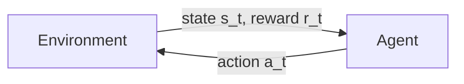
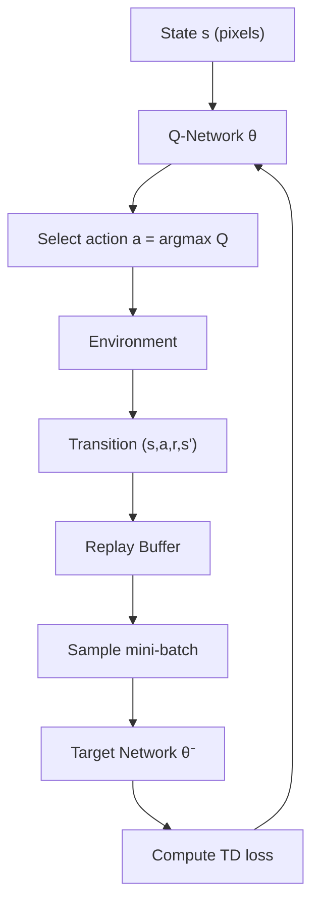
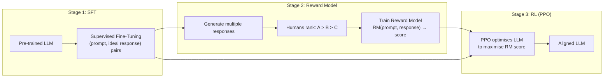

# Chapter 08 — Reinforcement Learning

---

## 8.1 What is Reinforcement Learning?

> **Reinforcement Learning (RL)** is a branch of machine learning in which an agent learns to make sequential decisions by interacting with an environment, receiving reward signals, and adjusting its behaviour to maximise cumulative long-term reward.

Unlike supervised learning, there is no dataset of correct answers. Unlike unsupervised learning, there is an explicit objective signal. RL sits in its own quadrant: the agent generates its own data through trial and error, and the feedback it receives is delayed and scalar — a single number saying "that was good" or "that was bad," not a gradient telling it exactly how to improve.

| Dimension | Supervised | Unsupervised | Reinforcement |
|---|---|---|---|
| **Signal** | Label per example | No signal | Scalar reward (delayed) |
| **Data** | Fixed dataset | Fixed dataset | Agent generates its own |
| **Goal** | Predict y from x | Find structure | Maximise cumulative reward |
| **Feedback timing** | Immediate | None | Potentially many steps later |
| **Example** | Image classification | Clustering | Game-playing AI |



The loop is deceptively simple: observe state, take action, receive reward, repeat. Everything in RL — from Atari bots to LLM alignment — is a variation on this loop.

---

## 8.2 Core Components

> **The six primitives of any RL problem are: Agent, Environment, State, Action, Reward, and Policy.**

```
┌──────────────┬──────────────────────────────────────────────────┐
│ Agent        │ The decision-maker. A robot arm, a game bot,    │
│              │ an LLM generating tokens.                       │
├──────────────┼──────────────────────────────────────────────────┤
│ Environment  │ Everything the agent interacts with. The game   │
│              │ board, the road, the user asking a question.    │
├──────────────┼──────────────────────────────────────────────────┤
│ State (s)    │ A snapshot of the world at time t. In chess:    │
│              │ the board position. In driving: sensor readings.│
├──────────────┼──────────────────────────────────────────────────┤
│ Action (a)   │ What the agent can do. Discrete (left/right)   │
│              │ or continuous (steer 23.7 degrees).             │
├──────────────┼──────────────────────────────────────────────────┤
│ Reward (r)   │ A scalar feedback signal. +1 for scoring,      │
│              │ -100 for crashing, 0 for neutral steps.         │
├──────────────┼──────────────────────────────────────────────────┤
│ Policy (π)   │ The agent's strategy: a mapping from states to │
│              │ actions (or action probabilities).              │
└──────────────┴──────────────────────────────────────────────────┘
```

**Self-driving car example:**

- **Agent:** the autonomous driving system
- **Environment:** roads, other vehicles, pedestrians, weather
- **State:** camera images, LIDAR point cloud, speed, GPS
- **Action:** steering angle, throttle, brake pressure
- **Reward:** +1 per second of safe driving, -1000 for collision, +50 for reaching destination
- **Policy:** the neural network mapping sensor inputs to driving commands

---

## 8.3 Markov Decision Processes (MDPs)

> **A Markov Decision Process is a mathematical framework for modelling sequential decision-making where outcomes are partly random and partly under the agent's control. It is defined by the tuple $(S, A, P, R, \gamma)$.**

The components:

- $S$ — set of states
- $A$ — set of actions
- $P(s' | s, a)$ — transition probability: given state $s$ and action $a$, what is the probability of landing in $s'$?
- $R(s, a, s')$ — reward function
- $\gamma \in [0, 1]$ — discount factor for future rewards

The **Markov property** is the key assumption: the future depends only on the current state, not on the history of how you got there. Formally: $P(s_{t+1} | s_t, a_t) = P(s_{t+1} | s_0, a_0, s_1, a_1, \ldots, s_t, a_t)$.

This may seem restrictive, but in practice you can encode relevant history into the state itself (e.g., stacking multiple video frames as DQN does for Atari).

```
MDP example — simple grid world:

  ┌───┬───┬───┬───┐
  │ S │   │   │ G │   S = Start state
  ├───┼───┼───┼───┤   G = Goal (+10)
  │   │ ■ │   │   │   ■ = Wall
  ├───┼───┼───┼───┤   P = Pit (-10)
  │   │   │ P │   │
  └───┴───┴───┴───┘

  States: each cell (12 total, minus wall = 11)
  Actions: {Up, Down, Left, Right}
  Transitions: deterministic (or stochastic with slip probability)
  Reward: +10 at G, -10 at P, -0.04 per step (encourages efficiency)
```

---

## 8.4 Policies and Value Functions

> **A policy $\pi$ maps states to actions. A value function estimates how good it is — in terms of expected cumulative reward — to be in a given state (or to take a given action in a given state).**

### State-Value Function $V^\pi(s)$

$$V^\pi(s) = \mathbb{E}_\pi \left[ \sum_{t=0}^{\infty} \gamma^t r_{t+1} \mid s_0 = s \right]$$

"Starting from state $s$ and following policy $\pi$, what is my expected total discounted reward?"

### Action-Value Function $Q^\pi(s, a)$

$$Q^\pi(s, a) = \mathbb{E}_\pi \left[ \sum_{t=0}^{\infty} \gamma^t r_{t+1} \mid s_0 = s, a_0 = a \right]$$

"Starting from state $s$, taking action $a$, then following $\pi$, what is my expected total discounted reward?"

The relationship: $V^\pi(s) = \sum_a \pi(a|s) \cdot Q^\pi(s, a)$. The value of a state is the weighted average of the Q-values, weighted by the policy's action probabilities.

### Optimal Versions

The **optimal policy** $\pi^*$ is the one that achieves the highest value in every state:

$$V^*(s) = \max_\pi V^\pi(s) \qquad Q^*(s,a) = \max_\pi Q^\pi(s,a)$$

If you know $Q^*$, the optimal policy is trivial: always pick $\arg\max_a Q^*(s,a)$.

```chart
{
  "type": "bar",
  "data": {
    "labels": ["State A (near goal)", "State B (middle)", "State C (near pit)", "State D (start)"],
    "datasets": [
      {
        "label": "V*(s) — optimal value",
        "data": [9.2, 5.8, -3.1, 4.5],
        "backgroundColor": "rgba(99,102,241,0.7)",
        "borderColor": "rgba(99,102,241,1)",
        "borderWidth": 1
      },
      {
        "label": "V^random(s) — random policy",
        "data": [2.1, -0.5, -7.8, -1.2],
        "backgroundColor": "rgba(200,200,200,0.6)",
        "borderColor": "rgba(160,160,160,1)",
        "borderWidth": 1
      }
    ]
  },
  "options": {
    "plugins": { "title": { "display": true, "text": "State Values Under Optimal vs Random Policy" } },
    "scales": {
      "y": { "title": { "display": true, "text": "V(s)" }, "min": -10, "max": 12 }
    }
  }
}
```

---

## 8.5 Exploration vs Exploitation

> **The exploration-exploitation dilemma is the fundamental tension in RL: should the agent exploit its current best-known action, or explore other actions that might yield higher long-term reward?**

Pure exploitation locks you into the first decent strategy you find. Pure exploration never capitalises on what you have learned. Every practical RL system must balance both.

### Epsilon-Greedy

The simplest strategy. With probability $\epsilon$, take a random action (explore). With probability $1 - \epsilon$, take the greedy action (exploit).

Typically $\epsilon$ starts high (e.g., 1.0) and decays over training toward a small value (e.g., 0.05).

```chart
{
  "type": "line",
  "data": {
    "labels": [0,100,200,300,400,500,600,700,800,900,1000],
    "datasets": [
      {
        "label": "Epsilon (exploration rate)",
        "data": [1.0,0.90,0.80,0.65,0.50,0.35,0.22,0.14,0.09,0.06,0.05],
        "borderColor": "rgba(234, 88, 12, 1)",
        "backgroundColor": "rgba(234, 88, 12, 0.1)",
        "fill": true,
        "tension": 0.4,
        "pointRadius": 0
      },
      {
        "label": "Exploitation rate (1 - epsilon)",
        "data": [0.0,0.10,0.20,0.35,0.50,0.65,0.78,0.86,0.91,0.94,0.95],
        "borderColor": "rgba(99, 102, 241, 1)",
        "backgroundColor": "rgba(99, 102, 241, 0.1)",
        "fill": true,
        "tension": 0.4,
        "pointRadius": 0
      }
    ]
  },
  "options": {
    "plugins": { "title": { "display": true, "text": "Epsilon Decay — Gradual Shift from Exploration to Exploitation" } },
    "scales": {
      "y": { "title": { "display": true, "text": "Rate" }, "min": 0, "max": 1.0 },
      "x": { "title": { "display": true, "text": "Episode" } }
    }
  }
}
```

### Upper Confidence Bound (UCB)

UCB is smarter than epsilon-greedy: it favours actions that are both promising *and* uncertain (under-explored).

$$a_t = \arg\max_a \left[ Q(a) + c \sqrt{\frac{\ln t}{N(a)}} \right]$$

- $Q(a)$ — current estimated value of action $a$
- $N(a)$ — number of times action $a$ has been tried
- $c$ — exploration constant controlling the bonus
- $t$ — total number of steps so far

The second term is an exploration bonus that shrinks as an action is tried more. Actions tried rarely get a large bonus, driving the agent to explore them.

### Boltzmann (Softmax) Exploration

Pick actions with probability proportional to exponentiated Q-values:

$$P(a) = \frac{e^{Q(a)/\tau}}{\sum_{a'} e^{Q(a')/\tau}}$$

Temperature $\tau$ controls randomness: high $\tau$ is nearly uniform, low $\tau$ approaches greedy.

---

## 8.6 The Bellman Equation

> **The Bellman equation expresses the value of a state as the immediate reward plus the discounted value of the successor state. It is the recursive foundation of nearly all RL algorithms.**

$$V^*(s) = \max_a \left[ R(s, a) + \gamma \sum_{s'} P(s'|s,a) \, V^*(s') \right]$$

For action-values:

$$Q^*(s, a) = R(s, a) + \gamma \sum_{s'} P(s'|s,a) \max_{a'} Q^*(s', a')$$

This recursive structure means if you know the values of all next states, you can compute the value of the current state. Algorithms like value iteration repeatedly apply this equation until convergence.

### Worked Example

```
Grid world (deterministic transitions):

  ┌───┬───┬───┐
  │ A │ B │ G │   G = goal, reward +10
  ├───┼───┼───┤   Each step costs -1
  │ C │ D │ E │   γ = 0.9
  └───┴───┴───┘

  Compute V*(B) — one step from goal:
    V*(B) = max_a [R + γ·V*(next)]
    Moving Right to G: R = -1 + 10 = 9
    V*(B) = 9 + 0.9 × 0 = 9        (goal is terminal, V*(G)=0)

  Compute V*(A) — two steps from goal:
    Best path: A → B → G
    V*(A) = -1 + 0.9 × V*(B) = -1 + 0.9 × 9 = 7.1

  Compute V*(D):
    Best path: D → E → ... or D → B → G
    Via B: V*(D) = -1 + 0.9 × 9 = 7.1
    Via E: V*(D) = -1 + 0.9 × V*(E)
    V*(E) = -1 + 0.9 × 0 = ... (if E → G exists)

  The Bellman equation propagates values backward from the goal.
```

---

## 8.7 Q-Learning

> **Q-Learning is an off-policy, model-free RL algorithm that learns the optimal action-value function $Q^*$ by iteratively applying a sample-based Bellman update.**

The update rule:

$$Q(s, a) \leftarrow Q(s, a) + \alpha \left[ r + \gamma \max_{a'} Q(s', a') - Q(s, a) \right]$$

Where:
- $\alpha$ — learning rate (how fast to update)
- $r$ — immediate reward
- $\gamma$ — discount factor
- $\max_{a'} Q(s', a')$ — best estimated future value from next state
- The term in brackets is the **temporal difference (TD) error**

"Off-policy" means the agent can learn the optimal policy while following a different behaviour policy (e.g., epsilon-greedy). This is powerful: it separates exploration from optimisation.

### Tabular Q-Learning: Grid World Example

```
Step-by-step Q-table update:

  State=(0,0), Action=Right, arrive at (0,1), Reward=0
  Q_old(0,0, Right) = 0.5
  max Q(0,1, *) = 1.5
  α = 0.1, γ = 0.9

  TD Target = r + γ × max Q(s') = 0 + 0.9 × 1.5 = 1.35
  TD Error  = 1.35 - 0.5 = 0.85
  Q_new     = 0.5 + 0.1 × 0.85 = 0.585   ← value increased

Q-Table after training:
  State  │  Up    │ Down  │ Left  │ Right
  ───────┼────────┼───────┼───────┼──────
  (0,0)  │ -0.50  │  0.80 │ -1.00 │  0.90  ← Right is best
  (0,1)  │  0.30  │  0.20 │  0.10 │  1.50  ← Right is best
  (1,0)  │  0.40  │  0.60 │ -0.20 │  0.50
  ...

Learned policy (pick argmax from Q-table per state):
  ┌───┬───┬───┬───┐
  │ → │ → │ → │ ↓ │
  ├───┼───┼───┼───┤
  │ ↓ │ ■ │ → │ ↓ │
  ├───┼───┼───┼───┤
  │ → │ → │ ↑ │ G │
  └───┴───┴───┴───┘
```

```chart
{
  "type": "line",
  "data": {
    "labels": [0,10,20,30,40,50,60,70,80,90,100],
    "datasets": [
      {
        "label": "Q(start, Right) — learns it is good",
        "data": [0.0,0.1,0.25,0.42,0.55,0.65,0.73,0.80,0.85,0.88,0.90],
        "borderColor": "rgba(34, 197, 94, 1)",
        "fill": false,
        "tension": 0.4,
        "pointRadius": 0
      },
      {
        "label": "Q(start, Left) — learns it is bad",
        "data": [0.0,-0.05,-0.15,-0.30,-0.45,-0.55,-0.62,-0.68,-0.72,-0.75,-0.78],
        "borderColor": "rgba(239, 68, 68, 1)",
        "fill": false,
        "tension": 0.4,
        "pointRadius": 0
      },
      {
        "label": "Q(start, Down) — neutral",
        "data": [0.0,0.02,0.05,0.08,0.10,0.12,0.13,0.14,0.14,0.15,0.15],
        "borderColor": "rgba(200, 200, 200, 0.8)",
        "fill": false,
        "tension": 0.4,
        "pointRadius": 0
      }
    ]
  },
  "options": {
    "plugins": { "title": { "display": true, "text": "Q-Values Converging — Agent Learns Right Is Optimal" } },
    "scales": {
      "y": { "title": { "display": true, "text": "Q-Value" }, "min": -1, "max": 1 },
      "x": { "title": { "display": true, "text": "Training Episode" } }
    }
  }
}
```

### Q-Learning Algorithm (Pseudocode)

```python
# Tabular Q-Learning
Q = defaultdict(float)    # Q-table, initialised to 0

for episode in range(num_episodes):
    s = env.reset()
    done = False
    while not done:
        # Epsilon-greedy action selection
        if random() < epsilon:
            a = env.action_space.sample()       # explore
        else:
            a = argmax(Q[s, a] for a in actions) # exploit

        s_next, r, done = env.step(a)

        # Q-Learning update
        td_target = r + gamma * max(Q[s_next, a2] for a2 in actions)
        Q[s, a] += alpha * (td_target - Q[s, a])

        s = s_next

    epsilon *= decay_rate  # reduce exploration over time
```

---

## 8.8 Deep Q-Networks (DQN)

> **A Deep Q-Network replaces the Q-table with a neural network that approximates $Q(s, a; \theta)$, enabling Q-learning to scale to high-dimensional state spaces like raw pixel inputs.**

Tabular Q-learning fails when the state space is large or continuous — you cannot have a row for every possible Atari screenshot. DQN (Mnih et al., 2013/2015) was the breakthrough that showed a CNN could learn Q-values directly from pixels and achieve superhuman play on dozens of Atari games.

```
Tabular Q-Learning:             DQN:
─────────────────────           ─────────────────────────
State → table lookup            State (pixels) → CNN → Q-values

 State (0,1)                     210×160 RGB frame
      │                                │
      ▼                                ▼
  Q-Table row:                  ┌─────────────────┐
  Up:0.3 Down:0.2               │  Conv layers    │
  Left:0.1 Right:1.5            │  FC layers      │
                                │  Output: Q per  │
  Works: small                  │  action         │
  state spaces                  └─────────────────┘
                                 Left:0.3 Right:5.1
                                 Up:1.2   Fire:4.8

                                 Works: millions of states
```

### Key DQN Innovations

1. **Experience Replay** — Store transitions $(s, a, r, s')$ in a buffer; train on random mini-batches. Breaks correlation between consecutive samples and reuses data efficiently.

2. **Target Network** — Use a frozen copy of the Q-network ($\theta^-$) to compute TD targets. Update $\theta^-$ periodically. This prevents the "moving target" problem where the network chases its own changing predictions.

3. **Frame Stacking** — Feed 4 consecutive frames as input so the network can infer velocity and direction from a static input.

The loss function:

$$L(\theta) = \mathbb{E}\left[\left(r + \gamma \max_{a'} Q(s', a'; \theta^-) - Q(s, a; \theta)\right)^2\right]$$



---

## 8.9 Policy Gradient Methods

> **Policy gradient methods directly parameterise the policy $\pi_\theta(a|s)$ and optimise it by ascending the gradient of expected cumulative reward with respect to the policy parameters $\theta$.**

Why not just use Q-learning for everything? Two key limitations:

1. **Continuous actions** — Q-learning needs $\max_a Q(s,a)$, which requires enumerating all actions. With continuous actions (steering angle, joint torque), this is intractable.
2. **Stochastic policies** — Sometimes the optimal policy is inherently random (e.g., rock-paper-scissors). Q-learning always produces deterministic policies.

### The Policy Gradient Theorem

$$\nabla_\theta J(\theta) = \mathbb{E}_{\pi_\theta}\left[ \nabla_\theta \log \pi_\theta(a|s) \cdot G_t \right]$$

Where $G_t = \sum_{k=0}^{\infty} \gamma^k r_{t+k+1}$ is the return from time $t$.

Interpretation: increase the probability of actions that led to high returns, decrease the probability of actions that led to low returns.

### REINFORCE Algorithm

The simplest policy gradient method. It is a Monte Carlo approach — it waits until the episode ends to compute returns.

```python
# REINFORCE
for episode in range(num_episodes):
    trajectory = []
    s = env.reset()
    done = False

    # 1. Collect full episode
    while not done:
        probs = policy_network(s)
        a = sample(probs)
        s_next, r, done = env.step(a)
        trajectory.append((s, a, r))
        s = s_next

    # 2. Compute returns G_t for each step
    G = 0
    returns = []
    for (s, a, r) in reversed(trajectory):
        G = r + gamma * G
        returns.insert(0, G)

    # 3. Update policy
    for (s, a, _), G_t in zip(trajectory, returns):
        loss = -log(policy_network(s)[a]) * G_t
        loss.backward()
    optimizer.step()
```

**Weakness:** High variance. The returns $G_t$ can swing wildly between episodes, making gradients noisy. This motivates actor-critic methods (Section 8.10).

---

## 8.10 Actor-Critic Methods

> **Actor-critic methods combine policy gradient (actor) with a learned value function (critic). The critic reduces variance in the policy gradient estimate by providing a baseline, yielding faster and more stable learning.**

```
  ┌───────────────┐           ┌────────────────┐
  │     ACTOR     │           │     CRITIC     │
  │               │           │                │
  │ Outputs π(a|s)│           │ Outputs V(s)   │
  │ (what to do)  │           │ (how good)     │
  └───────┬───────┘           └───────┬────────┘
          │                           │
          │  Takes action a           │ Computes advantage:
          │  in environment           │ A = r + γV(s') - V(s)
          │                           │
          ▼                           ▼
     Generates                   Provides signal
     experience                  to update actor
```

The **advantage function** $A(s, a) = Q(s, a) - V(s)$ tells us how much better action $a$ is compared to the average. Using advantage instead of raw returns dramatically reduces variance.

### Key Actor-Critic Algorithms

| Algorithm | Key Idea | Use Case |
|---|---|---|
| **A2C** | Advantage Actor-Critic, synchronous updates | General RL, simple baseline |
| **A3C** | Asynchronous parallel agents | Faster wall-clock training |
| **PPO** | Clipped surrogate objective prevents large updates | RLHF, robotics, most popular today |
| **SAC** | Entropy-regularised, maximises reward + entropy | Continuous control, robotics |
| **TRPO** | Trust region constraint on policy updates | Stable but computationally expensive |

### PPO — The Workhorse

PPO (Schulman et al., 2017) is the most widely used RL algorithm in practice. It is the algorithm behind RLHF in ChatGPT, Claude, and Gemini. The key idea: clip the policy ratio to prevent destructively large updates.

$$L^{CLIP}(\theta) = \mathbb{E}\left[\min\left(r_t(\theta) \hat{A}_t, \; \text{clip}(r_t(\theta), 1-\epsilon, 1+\epsilon) \hat{A}_t\right)\right]$$

Where $r_t(\theta) = \frac{\pi_\theta(a_t|s_t)}{\pi_{\theta_{old}}(a_t|s_t)}$ is the probability ratio between new and old policies.

```chart
{
  "type": "line",
  "data": {
    "labels": [0,50,100,150,200,250,300,350,400,450,500],
    "datasets": [
      {
        "label": "REINFORCE (high variance, slow)",
        "data": [-8,-6,-5,-3,-4,-2,-3,-1,0,-1,1],
        "borderColor": "rgba(239, 68, 68, 0.7)",
        "borderWidth": 1.5,
        "tension": 0.3,
        "pointRadius": 0,
        "fill": false
      },
      {
        "label": "A2C (moderate variance)",
        "data": [-8,-5,-3,-1,0,1.5,3,4,5,5.5,6],
        "borderColor": "rgba(234, 88, 12, 0.8)",
        "borderWidth": 1.5,
        "tension": 0.3,
        "pointRadius": 0,
        "fill": false
      },
      {
        "label": "PPO (low variance, fast)",
        "data": [-8,-4,-1,1,3,4.5,6,7,7.5,8,8.5],
        "borderColor": "rgba(99, 102, 241, 1)",
        "borderWidth": 2.5,
        "tension": 0.4,
        "pointRadius": 0,
        "fill": false
      }
    ]
  },
  "options": {
    "plugins": { "title": { "display": true, "text": "Training Curves: REINFORCE vs A2C vs PPO" } },
    "scales": {
      "y": { "title": { "display": true, "text": "Average Reward" }, "min": -10, "max": 10 },
      "x": { "title": { "display": true, "text": "Episode" } }
    }
  }
}
```

---

## 8.11 Multi-Armed Bandits

> **The multi-armed bandit problem is the simplest RL setting: a single state, $k$ possible actions (arms), each with an unknown reward distribution. The goal is to maximise total reward over $T$ pulls.**

There is no state transition — the agent just repeatedly picks an arm and observes a reward. This isolates the exploration-exploitation tradeoff in its purest form.

**Real-world bandit problems:**

| Domain | Arms | Reward |
|---|---|---|
| A/B testing | Page variants | Click-through rate |
| Ad selection | Available ads | Revenue per impression |
| Clinical trials | Treatments | Patient outcome |
| Recommendation | Content items | User engagement |

### Strategies Compared

```chart
{
  "type": "line",
  "data": {
    "labels": [0,20,40,60,80,100,150,200,300,500,1000],
    "datasets": [
      {
        "label": "UCB (best long-term)",
        "data": [0,12,28,48,72,98,155,215,340,590,1195],
        "borderColor": "rgba(34, 197, 94, 1)",
        "borderWidth": 2,
        "tension": 0.3,
        "pointRadius": 0,
        "fill": false
      },
      {
        "label": "Epsilon-greedy (ε=0.1)",
        "data": [0,10,24,42,62,85,135,190,300,520,1080],
        "borderColor": "rgba(99, 102, 241, 1)",
        "borderWidth": 2,
        "tension": 0.3,
        "pointRadius": 0,
        "fill": false
      },
      {
        "label": "Pure exploitation (greedy)",
        "data": [0,8,18,30,44,60,95,130,200,340,700],
        "borderColor": "rgba(239, 68, 68, 0.7)",
        "borderWidth": 1.5,
        "tension": 0.3,
        "pointRadius": 0,
        "fill": false
      },
      {
        "label": "Pure exploration (random)",
        "data": [0,6,14,24,36,50,78,108,168,290,600],
        "borderColor": "rgba(200, 200, 200, 0.8)",
        "borderWidth": 1.5,
        "tension": 0.3,
        "pointRadius": 0,
        "fill": false
      }
    ]
  },
  "options": {
    "plugins": { "title": { "display": true, "text": "Cumulative Reward — Bandit Strategy Comparison (5 Arms)" } },
    "scales": {
      "y": { "title": { "display": true, "text": "Cumulative Reward" }, "beginAtZero": true },
      "x": { "title": { "display": true, "text": "Pulls" } }
    }
  }
}
```

**Thompson Sampling** is another powerful approach: maintain a Bayesian posterior over each arm's reward distribution and sample from it. Arms with high uncertainty and high expected reward get explored naturally.

---

## 8.12 Model-Based vs Model-Free RL

> **Model-free methods learn a policy or value function directly from experience without modelling environment dynamics. Model-based methods learn a model of the environment (transition and reward functions) and use it for planning.**

```
                    RL ALGORITHMS
                          │
            ┌─────────────┴─────────────┐
            ▼                           ▼
       MODEL-FREE                  MODEL-BASED
            │                           │
     No model of                  Learns P(s'|s,a)
     environment                  and R(s,a)
            │                           │
     ┌──────┴──────┐                    │
     ▼             ▼              Uses model to
  VALUE-BASED   POLICY-BASED     plan ahead
     │             │              (e.g., Monte Carlo
  Q-Learning    REINFORCE         tree search)
  DQN           PPO, SAC
                                  Examples:
                                  AlphaGo, MuZero,
                                  Dreamer
```

| Property | Model-Free | Model-Based |
|---|---|---|
| **Sample efficiency** | Low (needs lots of experience) | High (can simulate experience) |
| **Computation** | Less per step | More per step (planning) |
| **Asymptotic performance** | Can be excellent | Limited by model accuracy |
| **When model is wrong** | N/A | Catastrophic — plans based on wrong dynamics |
| **Examples** | DQN, PPO, SAC | AlphaGo, MuZero, Dreamer, World Models |

In practice, the most impressive RL results (AlphaGo, MuZero) often combine both: model-based planning for look-ahead with model-free learning for the value estimates within the search.

---

## 8.13 Famous RL Milestones

> **RL has produced some of the most dramatic demonstrations of AI capability, from mastering ancient board games to training the language models you interact with daily.**

```
Year │ Milestone                           │ Key Method
─────┼─────────────────────────────────────┼──────────────────────
1992 │ TD-Gammon — near-expert backgammon  │ TD learning + neural net
2013 │ DQN — superhuman on 49 Atari games  │ Deep Q-Network
2016 │ AlphaGo — beats Lee Sedol at Go     │ MCTS + policy/value nets
2017 │ AlphaZero — masters chess/Go/shogi  │ Self-play, zero human data
     │ from scratch in hours               │
2019 │ OpenAI Five — beats Dota 2 champs   │ PPO at massive scale
2019 │ AlphaStar — Grandmaster at StarCraft│ Multi-agent league
2022 │ ChatGPT — RLHF for LLM alignment   │ SFT + Reward Model + PPO
2023 │ RT-2 — robotic manipulation from    │ Vision-Language-Action
     │ language instructions               │
2024 │ MuZero — masters games without      │ Learned world model
     │ knowing the rules                   │
```

```chart
{
  "type": "bar",
  "data": {
    "labels": ["Atari (DQN)", "Go (AlphaGo)", "Chess (AlphaZero)", "Dota 2 (OpenAI Five)", "StarCraft (AlphaStar)"],
    "datasets": [{
      "label": "Performance vs Best Human (%)",
      "data": [120, 105, 115, 102, 101],
      "backgroundColor": ["rgba(99,102,241,0.7)","rgba(34,197,94,0.7)","rgba(234,88,12,0.7)","rgba(239,68,68,0.7)","rgba(168,85,247,0.7)"],
      "borderColor": ["rgba(99,102,241,1)","rgba(34,197,94,1)","rgba(234,88,12,1)","rgba(239,68,68,1)","rgba(168,85,247,1)"],
      "borderWidth": 1
    }]
  },
  "options": {
    "indexAxis": "y",
    "plugins": { "title": { "display": true, "text": "RL Milestones — Superhuman Performance (100% = Best Human)" } },
    "scales": {
      "x": { "title": { "display": true, "text": "% of Best Human Performance" }, "min": 0, "max": 130 }
    }
  }
}
```

### AlphaGo / AlphaZero — Why It Mattered

Go has roughly $10^{170}$ legal board positions — far more than atoms in the universe. Traditional game tree search is hopeless. AlphaGo combined:

1. **Supervised learning** — trained a policy network on expert human games
2. **Self-play RL** — the policy plays itself millions of times and improves
3. **Monte Carlo Tree Search (MCTS)** — uses the learned policy and value networks to guide search

AlphaZero went further: zero human data, pure self-play. It learned chess, Go, and shogi from scratch in under 24 hours and surpassed all prior AI systems. This demonstrated that RL + self-play can discover superhuman strategies without any human knowledge.

---

## 8.14 RLHF — Training LLMs with Human Feedback

> **Reinforcement Learning from Human Feedback (RLHF) is a technique for aligning language models with human preferences by training a reward model on human comparisons and then optimising the LLM policy against that reward model using PPO.**

This is the process that transforms a raw pre-trained language model (which can generate fluent but potentially harmful or unhelpful text) into a helpful assistant. It is used by ChatGPT, Claude, Gemini, and most production LLMs.

### The Three-Stage Pipeline



**Stage 1 — Supervised Fine-Tuning (SFT).** Collect high-quality (prompt, response) pairs written by human experts. Fine-tune the base LLM on these. This gives the model a good starting point — it learns the format and style of helpful responses.

**Stage 2 — Reward Model Training.** Generate multiple responses to each prompt. Human annotators rank them by quality. Train a separate model to predict these rankings:

$$\mathcal{L}_{RM} = -\mathbb{E}\left[\log \sigma\left(r_\theta(x, y_w) - r_\theta(x, y_l)\right)\right]$$

Where $y_w$ is the preferred response and $y_l$ is the rejected one.

**Stage 3 — PPO Optimisation.** Treat the LLM as an RL agent:
- **State:** the prompt
- **Action:** the generated response (sequence of tokens)
- **Reward:** the reward model's score, with a KL penalty to prevent the LLM from drifting too far from the SFT model

$$R(x, y) = r_\theta(x, y) - \beta \cdot D_{KL}\left[\pi_\phi(y|x) \| \pi_{SFT}(y|x)\right]$$

The KL penalty is critical — without it, the LLM will find degenerate outputs that "hack" the reward model.

### Impact of RLHF

```chart
{
  "type": "bar",
  "data": {
    "labels": ["Helpfulness", "Harmlessness", "Instruction Following", "Refusing Dangerous Requests", "Factual Accuracy"],
    "datasets": [
      {
        "label": "Base Model (before RLHF)",
        "data": [45, 40, 35, 20, 55],
        "backgroundColor": "rgba(200, 200, 200, 0.6)",
        "borderColor": "rgba(160, 160, 160, 1)",
        "borderWidth": 1
      },
      {
        "label": "After RLHF",
        "data": [88, 90, 92, 95, 78],
        "backgroundColor": "rgba(99, 102, 241, 0.7)",
        "borderColor": "rgba(99, 102, 241, 1)",
        "borderWidth": 1
      }
    ]
  },
  "options": {
    "plugins": { "title": { "display": true, "text": "RLHF Impact — Before vs After on Key Quality Dimensions (%)" } },
    "scales": {
      "y": { "title": { "display": true, "text": "Human Evaluation Score (%)" }, "beginAtZero": true, "max": 100 }
    }
  }
}
```

### Beyond RLHF: DPO

**Direct Preference Optimisation (DPO)** (Rafailov et al., 2023) skips the reward model entirely. It reparameterises the RLHF objective so you can optimise the LLM directly on preference data:

$$\mathcal{L}_{DPO} = -\mathbb{E}\left[\log \sigma\left(\beta \log \frac{\pi_\theta(y_w|x)}{\pi_{ref}(y_w|x)} - \beta \log \frac{\pi_\theta(y_l|x)}{\pi_{ref}(y_l|x)}\right)\right]$$

DPO is simpler to implement (no reward model, no PPO loop) and has become increasingly popular. The debate over RLHF vs DPO is active — PPO can be more powerful but DPO is easier to get right.

---

## 8.15 When to Use RL

> **RL is most appropriate for sequential decision-making problems with clear reward signals and available simulators. It is overkill for pattern recognition tasks where supervised learning suffices.**

```
USE RL WHEN:                            DO NOT USE RL WHEN:
────────────────────────────            ──────────────────────────────
Sequential decisions over time          Single-shot prediction
                                        (use supervised learning)

Clear reward signal exists              No clear reward signal
                                        (use unsupervised or supervised)

Simulator or environment                You have abundant labelled data
available for training                  (supervised is faster and simpler)

Too complex for hand-coded rules        Training failures are
                                        unacceptably costly

Agent must adapt to changing            Problem is stationary and
conditions                              well-understood
```

**Concrete RL applications today:**

- **Game AI** — AlphaGo, Atari, StarCraft, Dota 2
- **Robotics** — dexterous manipulation, locomotion, warehouse automation
- **Autonomous vehicles** — lane changing, intersection navigation
- **LLM alignment** — RLHF / DPO for helpful and harmless responses
- **Chip design** — Google used RL for TPU floorplanning
- **Recommendation systems** — sequential recommendation with long-term engagement
- **Resource management** — data centre cooling (DeepMind reduced Google's cooling energy by 40%)

---

## Key Takeaways

```
╔════════════════════════════════════════════════════════════════════╗
║  REINFORCEMENT LEARNING — SUMMARY                                ║
╠════════════════════════════════════════════════════════════════════╣
║  1. RL = agent learns by trial and error, maximising reward      ║
║  2. MDP formalises the problem: (S, A, P, R, γ)                  ║
║  3. V(s) = value of a state; Q(s,a) = value of an action        ║
║  4. Bellman equation: value = reward + discounted future value   ║
║  5. Q-Learning: off-policy, model-free, learns Q* from samples  ║
║  6. DQN: neural net replaces Q-table for high-dim states        ║
║  7. Policy gradients: directly optimise the policy (REINFORCE)   ║
║  8. Actor-Critic: policy (actor) + value function (critic)       ║
║  9. PPO: clipped objective, most popular RL algorithm today      ║
║ 10. RLHF: SFT → Reward Model → PPO, aligns LLMs to humans      ║
║ 11. Model-based RL learns dynamics; model-free learns directly   ║
║ 12. Exploration (try new) vs exploitation (use best known)       ║
╚════════════════════════════════════════════════════════════════════╝
```

---

## Review Questions

**1. What distinguishes RL from supervised and unsupervised learning?**

<details>
<summary>Answer</summary>

RL learns from scalar reward signals obtained through interaction with an environment, not from labelled examples (supervised) or unlabelled data patterns (unsupervised). The agent generates its own data, feedback is delayed, and the goal is to maximise cumulative long-term reward rather than predict labels or find structure.
</details>

**2. Define the six core components of an RL problem using a robotics example.**

<details>
<summary>Answer</summary>

Agent: the robot's control policy. Environment: the physical world (objects, surfaces, gravity). State: joint angles, gripper position, camera image. Action: torques applied to each joint. Reward: +1 for successfully grasping an object, -0.01 per timestep (encourages speed), -1 for dropping the object. Policy: the neural network mapping sensor inputs to joint torques.
</details>

**3. What is the Markov property and why does it matter for MDPs?**

<details>
<summary>Answer</summary>

The Markov property states that the future is conditionally independent of the past given the present state: $P(s_{t+1}|s_t, a_t) = P(s_{t+1}|s_0,...,s_t, a_0,...,a_t)$. It matters because it allows RL algorithms to make decisions based solely on the current state without tracking full history, making the problem tractable. When the property does not naturally hold, you can often engineer it by including relevant history in the state representation (e.g., frame stacking in DQN).
</details>

**4. Explain the Bellman equation intuitively and give the formula for $Q^*$.**

<details>
<summary>Answer</summary>

The Bellman equation says: "The value of being in a state equals the immediate reward plus the discounted value of the best next state." It is a recursive decomposition — if you know future values, you can compute present values. For optimal action-values: $Q^*(s,a) = R(s,a) + \gamma \sum_{s'} P(s'|s,a) \max_{a'} Q^*(s',a')$.
</details>

**5. Why does epsilon-greedy decay epsilon over time? What would happen if it stayed at 1.0 or 0.0?**

<details>
<summary>Answer</summary>

Epsilon decays because early training needs exploration (discover good actions) while later training should exploit learned knowledge. At epsilon=1.0 forever, the agent acts randomly and never uses what it has learned. At epsilon=0.0 forever, the agent exploits from the start and likely gets stuck with the first decent action it finds, missing better alternatives.
</details>

**6. What are the two key innovations in DQN that made it work, and why is each necessary?**

<details>
<summary>Answer</summary>

(1) Experience replay: stores transitions in a buffer and trains on random mini-batches, breaking temporal correlations and improving sample efficiency. Without it, consecutive correlated samples cause unstable learning. (2) Target network: a frozen copy of the Q-network used to compute TD targets, updated periodically. Without it, both the prediction and target change simultaneously, creating a "moving target" that prevents convergence.
</details>

**7. When would you choose policy gradient methods over Q-learning?**

<details>
<summary>Answer</summary>

Use policy gradients when: (a) the action space is continuous (steering angles, joint torques) since Q-learning requires max over actions, (b) you want a stochastic policy (e.g., game theory settings like rock-paper-scissors), (c) the action space is very large (Q-learning must evaluate every action). Q-learning is preferred for discrete, small action spaces where it tends to be more sample-efficient.
</details>

**8. What problem does the critic solve in actor-critic methods?**

<details>
<summary>Answer</summary>

The critic reduces variance in the policy gradient estimate. REINFORCE uses raw returns $G_t$ which are noisy — the same action in the same state can produce very different returns across episodes. The critic learns $V(s)$ and provides the advantage $A = r + \gamma V(s') - V(s)$ as a lower-variance signal. This makes training faster and more stable.
</details>

**9. Walk through the three stages of RLHF. Why is the reward model necessary — why not use human feedback directly during PPO?**

<details>
<summary>Answer</summary>

Stage 1 (SFT): Fine-tune the base LLM on expert-written (prompt, response) pairs. Stage 2 (Reward Model): Generate multiple responses, have humans rank them, train a model to predict preferences. Stage 3 (PPO): Use the reward model as a proxy for human judgment to optimise the LLM. The reward model is necessary because PPO requires millions of reward evaluations — you cannot have humans rate every response in real-time. The reward model automates and scales human judgment.
</details>

**10. Compare model-based and model-free RL. Give one example of each and explain when you would prefer one over the other.**

<details>
<summary>Answer</summary>

Model-free (e.g., DQN, PPO): learns directly from experience without modelling environment dynamics. Simpler but needs lots of data. Model-based (e.g., AlphaZero, MuZero): learns a model of how the environment works and uses it to plan ahead (simulate future trajectories). More sample-efficient but the model can be wrong, leading to poor plans. Prefer model-based when data is expensive to collect (robotics, real-world systems) and a good model can be learned. Prefer model-free when the environment is complex, hard to model accurately, and simulation is cheap (video games, LLM training).
</details>

---

**Previous:** [Chapter 7 — Unsupervised Learning](07_unsupervised_learning.md) | **Next:** [Chapter 9 — Key Algorithms Deep Dive](09_key_algorithms.md)
