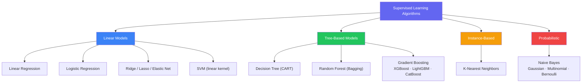
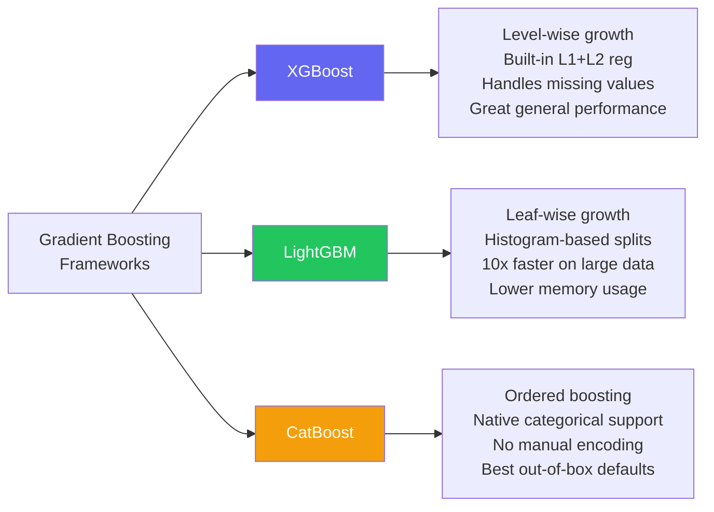
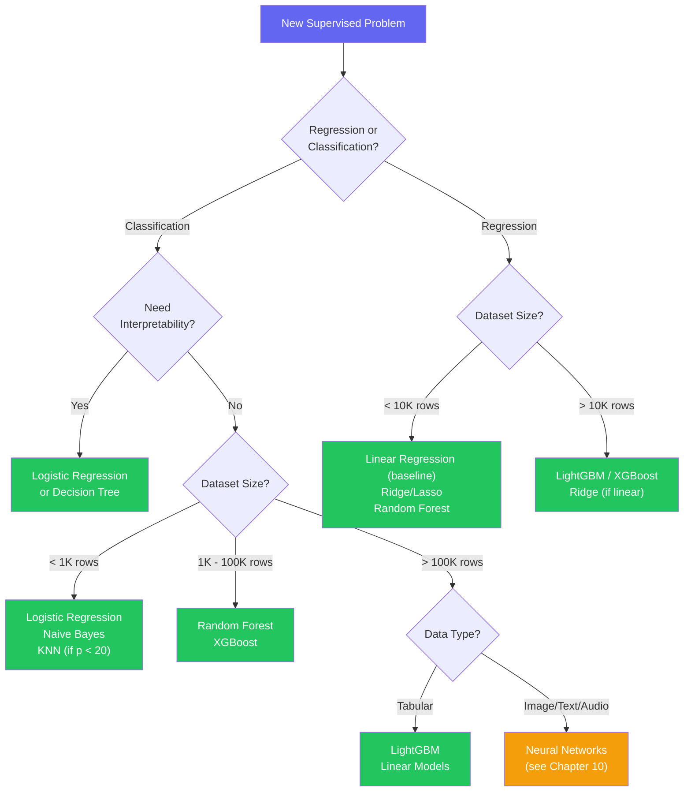

# Chapter 09 — Key ML Algorithms Deep Dive

---

## What You'll Learn

After this chapter you will be able to:
- Derive and implement Linear and Logistic Regression from first principles
- Explain how Decision Trees choose splits and why pruning matters
- Describe how Random Forest reduces variance through bagging and feature randomization
- Compare XGBoost, LightGBM, and CatBoost and know when to reach for each
- Apply the kernel trick in SVMs and tune C / gamma jointly
- Know when KNN is a good fit and when it falls apart
- Deploy Naive Bayes on text and understand why a "wrong" assumption still works
- Select the right algorithm for any tabular problem using a decision framework

---

## 9.1 The Algorithm Landscape

> **Algorithm taxonomy** groups supervised learning methods by how they represent the learned function. Linear models fit hyperplanes; tree models partition the feature space into axis-aligned regions; instance-based methods store examples and compare at prediction time; probabilistic models apply Bayes' theorem.



**How this chapter relates to the rest of the curriculum:**

| Topic | Where |
|---|---|
| Introduction to these algorithms | [Chapter 6 — Supervised Learning](06_supervised_learning.md) |
| Unsupervised methods (K-Means, DBSCAN) | [Chapter 7 — Unsupervised Learning](07_unsupervised_learning.md) |
| Neural networks and deep learning | [Chapter 10 — Neural Networks](10_neural_networks.md) |
| Model evaluation (ROC, AUC, cross-val) | [Chapter 11 — Model Evaluation](11_model_evaluation.md) |

Chapter 6 gave you the "what." This chapter gives you the "how" and "why" — the math, the implementation details, the hyperparameter knobs, and the practical failure modes.

---

## 9.2 Linear Regression — Deep Dive

> **Linear Regression** fits a linear function $\hat{y} = \mathbf{w}^\top \mathbf{x} + b$ to minimize the sum of squared residuals between predicted and observed values. It is the foundation of most parametric supervised learning.

### The Model

$$\hat{y} = w_0 + w_1 x_1 + w_2 x_2 + \cdots + w_p x_p = \mathbf{w}^\top \mathbf{x}$$

In matrix form for all $n$ samples: $\hat{\mathbf{y}} = X\mathbf{w}$ where $X$ is $(n \times (p+1))$ with a column of ones for the intercept.

### Worked Example — House Prices

```
  TRAINING DATA
  ──────────────────────────────────────────────────
  SqFt (x1)  Bedrooms (x2)  Age (x3)   Price (y)
  ──────────────────────────────────────────────────
    1500          3            10        $250,000
    2200          4             5        $370,000
     900          2            30        $150,000

  LEARNED WEIGHTS
  ──────────────────────────────────────────────────
  Price = 50,000 + 120*SqFt + 15,000*Bedrooms - 1,000*Age

  PREDICTION: 1800 sqft, 3 bed, 8 yrs old
  = 50,000 + 120(1800) + 15,000(3) - 1,000(8) = $303,000
```

### Two Ways to Find Optimal Weights

**Method 1 — OLS Closed-Form (Normal Equation):**

$$\mathbf{w}^* = (X^\top X)^{-1} X^\top \mathbf{y}$$

Computes the exact solution in one step. Works well when $p$ is small (say, under a few thousand features). Fails when $X^\top X$ is singular (collinear features) or when $n$ is very large (inverting a $p \times p$ matrix costs $O(p^3)$).

**Method 2 — Gradient Descent (Iterative):**

$$w_j \leftarrow w_j - \eta \frac{\partial}{\partial w_j} \text{MSE} = w_j - \frac{2\eta}{n} \sum_{i=1}^n (\hat{y}_i - y_i) x_{ij}$$

Scale-independent, works with millions of rows, and naturally extends to regularized variants. The learning rate $\eta$ must be tuned — too large overshoots, too small crawls.

```
  OLS vs Gradient Descent — when to use which:

  ┌───────────────────┬───────────────────────────┬──────────────────────────┐
  │                   │ OLS (closed-form)         │ Gradient Descent         │
  ├───────────────────┼───────────────────────────┼──────────────────────────┤
  │ Dataset size      │ n < 100K, p < 10K         │ Any size                 │
  │ Computation       │ O(np^2 + p^3) — one shot  │ O(np * iterations)       │
  │ Regularization    │ Ridge only (has formula)   │ Ridge, Lasso, Elastic    │
  │ Numerical issues  │ Needs invertible X^T X     │ Always works             │
  │ Online learning   │ No                         │ Yes (SGD)                │
  └───────────────────┴───────────────────────────┴──────────────────────────┘
```

### The Five Assumptions of Linear Regression

1. **Linearity** — the relationship between features and target is linear
2. **Independence** — observations are independent of each other
3. **Homoscedasticity** — residuals have constant variance across all predicted values
4. **Normality of residuals** — residuals are approximately normally distributed
5. **No multicollinearity** — features are not highly correlated with each other

When assumptions break: non-linearity means you need polynomial features or a non-linear model; multicollinearity inflates coefficient variance (use Ridge or drop features); heteroscedasticity means your standard errors and confidence intervals are unreliable.

### Residual Analysis

```
  A well-behaved model:              A problematic model:

  residual                            residual
      │  .  .                             │        . .
      │ . . .  .                          │     . .
   0 ─┼──────────── predicted          0 ─┼─.──────────── predicted
      │  . .  .                           │      . .
      │    .                              │  . .
                                              ↑ pattern = non-linearity!
  Random scatter around 0 = good.     Curved pattern = model misspecified.
  No pattern = assumptions satisfied.  Fix: add polynomial terms or use
                                       a non-linear algorithm.
```

### Regularized Variants

$$\text{Ridge (L2):} \quad \mathcal{L} = \text{MSE} + \lambda \sum_{j=1}^{p} w_j^2$$

$$\text{Lasso (L1):} \quad \mathcal{L} = \text{MSE} + \lambda \sum_{j=1}^{p} |w_j|$$

$$\text{Elastic Net:} \quad \mathcal{L} = \text{MSE} + \lambda_1 \sum |w_j| + \lambda_2 \sum w_j^2$$

| Variant | What it does | When to use |
|---------|-------------|-------------|
| **Ridge** | Shrinks all weights toward zero, keeps all features | All features likely contribute; reduce multicollinearity |
| **Lasso** | Drives some weights to exactly 0 (feature selection) | Many irrelevant features; want automatic sparsity |
| **Elastic Net** | Combines L1 + L2 | Correlated feature groups; want selection + stability |

The penalty strength $\lambda$ is the single most important hyperparameter. Higher $\lambda$ = simpler model. Always tune via cross-validation.

```chart
{
  "type": "scatter",
  "data": {
    "datasets": [
      {
        "label": "Training Data",
        "data": [{"x":900,"y":150},{"x":1200,"y":200},{"x":1500,"y":250},{"x":1800,"y":303},{"x":2000,"y":330},{"x":2200,"y":370},{"x":2500,"y":410},{"x":2800,"y":440}],
        "backgroundColor": "rgba(99, 102, 241, 0.7)",
        "borderColor": "rgba(99, 102, 241, 1)",
        "pointRadius": 6
      },
      {
        "label": "Best Fit Line",
        "data": [{"x":800,"y":140},{"x":1000,"y":165},{"x":1500,"y":230},{"x":2000,"y":305},{"x":2500,"y":385},{"x":3000,"y":460}],
        "borderColor": "rgba(239, 68, 68, 1)",
        "backgroundColor": "transparent",
        "showLine": true,
        "borderWidth": 2,
        "pointRadius": 0,
        "tension": 0
      }
    ]
  },
  "options": {
    "plugins": { "title": { "display": true, "text": "Linear Regression — Minimizing Squared Distances to the Line" } },
    "scales": {
      "y": { "title": { "display": true, "text": "Price ($K)" }, "min": 100, "max": 500 },
      "x": { "title": { "display": true, "text": "Square Footage" }, "min": 700, "max": 3100 }
    }
  }
}
```

```chart
{
  "type": "line",
  "data": {
    "labels": [0.001, 0.01, 0.1, 1, 10, 100, 1000],
    "datasets": [
      {
        "label": "Ridge (L2) — Test MSE",
        "data": [8.2, 7.1, 5.4, 4.0, 4.8, 7.5, 12.0],
        "borderColor": "rgba(99, 102, 241, 1)",
        "fill": false,
        "tension": 0.4,
        "pointRadius": 3
      },
      {
        "label": "Lasso (L1) — Test MSE",
        "data": [8.0, 6.8, 5.0, 3.8, 5.2, 9.0, 14.0],
        "borderColor": "rgba(239, 68, 68, 1)",
        "fill": false,
        "tension": 0.4,
        "pointRadius": 3
      }
    ]
  },
  "options": {
    "plugins": { "title": { "display": true, "text": "Regularization Strength (lambda) — Too Little or Too Much Hurts" } },
    "scales": {
      "y": { "title": { "display": true, "text": "Test MSE" }, "min": 2, "max": 16 },
      "x": { "type": "logarithmic", "title": { "display": true, "text": "Lambda (log scale)" } }
    }
  }
}
```

---

## 9.3 Logistic Regression — Deep Dive

> **Logistic Regression** models the probability of a binary outcome by applying the logistic (sigmoid) function to a linear combination of features. It is trained by maximizing log-likelihood, equivalently minimizing binary cross-entropy loss.

Despite the name, this is a **classification** algorithm. The key insight: take the linear regression score $z = \mathbf{w}^\top \mathbf{x}$, then squash it through the sigmoid to get a probability.

### The Sigmoid Function

$$\sigma(z) = \frac{1}{1 + e^{-z}} \quad \text{where} \quad z = w_0 + w_1 x_1 + \cdots + w_p x_p$$

Properties that make it useful:
- Maps any real number to $(0, 1)$ — a valid probability
- $\sigma(0) = 0.5$ — the natural decision boundary
- Differentiable everywhere — gradient-based optimization works
- $\sigma'(z) = \sigma(z)(1 - \sigma(z))$ — elegant gradient

```
  SIGMOID SHAPE
  P(y=1)
    1.0 |                    _______________
    0.8 |              _____/
    0.5 |_____________/        <-- threshold (default 0.5)
    0.2 |        ____/
    0.0 |_______/
        +-------------------------------------> z
        -6     -3      0      3      6
```

### The Loss Function — Binary Cross-Entropy

You cannot use MSE for classification — the loss surface would be non-convex with many local minima. Instead:

$$\mathcal{L} = -\frac{1}{n}\sum_{i=1}^{n} \left[ y_i \log(\hat{p}_i) + (1 - y_i) \log(1 - \hat{p}_i) \right]$$

When the true label $y = 1$, the loss is $-\log(\hat{p})$ — it punishes low predicted probabilities. When $y = 0$, the loss is $-\log(1 - \hat{p})$ — it punishes high predicted probabilities. This function is convex, so gradient descent finds the global minimum.

### Worked Example — Spam Detection

```
  Features: word_free (count), has_link (0/1), caps_ratio (fraction)

  Learned weights: w0 = -2.1, w1 = 1.8, w2 = 3.2, w3 = 4.5

  New email: word_free=3, has_link=1, caps_ratio=0.4

  z = -2.1 + 1.8(3) + 3.2(1) + 4.5(0.4) = -2.1 + 5.4 + 3.2 + 1.8 = 8.3
  P(spam) = sigmoid(8.3) = 1/(1+e^-8.3) = 0.9998

  Since 0.9998 > 0.5 threshold --> classify as SPAM
```

### Decision Boundary

The decision boundary is where $P(y=1) = 0.5$, i.e., where $z = 0$:

$$w_0 + w_1 x_1 + w_2 x_2 = 0 \implies x_2 = -\frac{w_0}{w_2} - \frac{w_1}{w_2} x_1$$

This is always a straight line in 2D (a hyperplane in higher dimensions). If the data is not linearly separable, logistic regression will find the best linear boundary but cannot capture non-linear patterns. For that, add polynomial features or switch to a non-linear model.

### Multiclass Extensions

**One-vs-Rest (OvR):** Train $K$ binary classifiers, each asking "is it class $k$ or not?" Predict with the class that gives the highest probability. Simple, works with any binary classifier.

**Softmax (Multinomial):** Generalize sigmoid to $K$ classes directly:

$$P(y = k \mid \mathbf{x}) = \frac{e^{z_k}}{\sum_{j=1}^{K} e^{z_j}}$$

Probabilities sum to 1 across all classes. This is the standard approach in neural networks and sklearn's `multi_class='multinomial'`.

### Threshold Tuning for Real-World Problems

The default threshold of 0.5 is rarely optimal. Adjust it based on the cost of errors:

```
  Medical Diagnosis (fraud detection, cancer screening):
    Lower threshold (e.g., 0.3) -> catch more positives
    Higher recall, lower precision
    Cost of missing a positive >> cost of false alarm

  Spam Filter:
    Higher threshold (e.g., 0.7) -> only flag clear spam
    Higher precision, lower recall
    Cost of blocking real email >> cost of missing some spam

  Use the ROC curve or Precision-Recall curve to pick the
  threshold that matches your business objective.
  (See Chapter 11 for details on these curves.)
```

```chart
{
  "type": "line",
  "data": {
    "labels": [-6,-5,-4,-3,-2,-1,0,1,2,3,4,5,6],
    "datasets": [{
      "label": "Sigmoid: P(y=1) = 1/(1+e^-z)",
      "data": [0.002,0.007,0.018,0.047,0.119,0.269,0.500,0.731,0.881,0.953,0.982,0.993,0.998],
      "borderColor": "rgba(99, 102, 241, 1)",
      "backgroundColor": "rgba(99, 102, 241, 0.1)",
      "fill": true,
      "tension": 0.4,
      "pointRadius": 3
    }]
  },
  "options": {
    "plugins": { "title": { "display": true, "text": "Sigmoid Function — Any Score to a Probability" } },
    "scales": {
      "y": { "title": { "display": true, "text": "P(y=1)" }, "min": 0, "max": 1 },
      "x": { "title": { "display": true, "text": "z (linear score)" } }
    }
  }
}
```

---

## 9.4 Decision Trees — Deep Dive

> **Decision Tree (CART)** is a non-parametric supervised algorithm that recursively partitions the feature space into axis-aligned regions by choosing splits that maximize an impurity reduction criterion (Gini impurity or information gain). Predictions are the majority class (classification) or mean value (regression) in each leaf.

### How Splits Are Chosen

At every internal node, the algorithm evaluates every possible split on every feature and picks the one that produces the purest child nodes.

**Gini Impurity:**

$$G = 1 - \sum_{k=1}^{K} p_k^2$$

**Entropy (Information Gain):**

$$H = -\sum_{k=1}^{K} p_k \log_2(p_k)$$

Both measure "how mixed are the classes?" A pure node ($G=0$, $H=0$) contains only one class. In practice, Gini and Entropy almost always produce identical trees. Gini is slightly faster to compute (no logarithm).

### Worked Split Example — Fraud Detection

```
  Parent node: 100 transactions (30 fraud, 70 legit)
  Gini(parent) = 1 - (0.3^2 + 0.7^2) = 1 - 0.58 = 0.42

  Candidate split: "amount > $500?"

  Left child (amount <= 500):  60 transactions (5 fraud, 55 legit)
    Gini(left) = 1 - (5/60)^2 - (55/60)^2 = 0.153

  Right child (amount > 500):  40 transactions (25 fraud, 15 legit)
    Gini(right) = 1 - (25/40)^2 - (15/40)^2 = 0.469

  Weighted Gini after split = (60/100)*0.153 + (40/100)*0.469
                            = 0.092 + 0.188 = 0.280

  Gini reduction = 0.42 - 0.28 = 0.14  (good split!)

  The algorithm tests ALL features and thresholds, picks the
  split with the largest impurity reduction.
```

### The Overfitting Problem

An unrestricted decision tree will keep splitting until every leaf is pure — effectively memorizing the training data. This gives 100% training accuracy and terrible generalization.

```
  Depth 3 (underfits slightly):       Depth 20 (memorizes noise):
  ──────────────────────────           ────────────────────────────
          [amount > 500?]                      [amount > 500?]
         /              \                     /              \
   [time < 2am?]   [country=X?]        [time < 2:03am?]  [...]
    /      \          /      \           /         \
  Fraud   Legit    Fraud   Legit       [...many splits...]
                                              |
  General rules.                       One leaf per training example.
  Works on new data.                   Fails on new data.
```

### Pre-Pruning (Stopping Rules)

```
  max_depth         = 5-10   Stop growing after N levels
  min_samples_split = 20     Only split if node has >= 20 samples
  min_samples_leaf  = 10     Leaves must have >= 10 samples
  max_features      = 'sqrt' Only consider sqrt(p) features per split
  max_leaf_nodes    = 50     Cap total number of leaves
```

These are the most effective regularization controls. Start with `max_depth` — it has the biggest impact on overfitting.

### Post-Pruning: Cost-Complexity (Minimal Cost-Complexity Pruning)

After growing a full tree, prune it back by finding the subtree that minimizes:

$$R_\alpha(T) = R(T) + \alpha \cdot |T|$$

where $R(T)$ is the misclassification rate, $|T|$ is the number of leaves, and $\alpha$ is the complexity penalty. Higher $\alpha$ = more aggressive pruning = simpler tree.

In sklearn, this is `ccp_alpha`. Use `cost_complexity_pruning_path()` to find candidate $\alpha$ values, then select via cross-validation.

### Pros and Cons

| Strengths | Weaknesses |
|-----------|-----------|
| Highly interpretable (visualize the tree) | High variance — small data changes = different tree |
| No feature scaling needed | Axis-aligned splits miss diagonal boundaries |
| Handles mixed feature types | Greedy — locally optimal splits, not global |
| Built-in feature importance | Single tree rarely competitive for accuracy |

```chart
{
  "type": "line",
  "data": {
    "labels": [1,2,3,4,5,6,8,10,15,20,30],
    "datasets": [
      {
        "label": "Training Accuracy",
        "data": [65,78,88,93,96,98,99.5,99.9,100,100,100],
        "borderColor": "rgba(99, 102, 241, 1)",
        "fill": false,
        "tension": 0.4,
        "pointRadius": 3
      },
      {
        "label": "Validation Accuracy",
        "data": [64,76,84,88,89,88,85,80,72,65,58],
        "borderColor": "rgba(239, 68, 68, 1)",
        "borderDash": [5,5],
        "fill": false,
        "tension": 0.4,
        "pointRadius": 3
      }
    ]
  },
  "options": {
    "plugins": { "title": { "display": true, "text": "Decision Tree Depth vs Accuracy — Validation Peaks Then Drops" } },
    "scales": {
      "y": { "title": { "display": true, "text": "Accuracy (%)" }, "min": 50, "max": 100 },
      "x": { "title": { "display": true, "text": "max_depth" } }
    }
  }
}
```

---

## 9.5 Random Forest — Deep Dive

> **Random Forest** is an ensemble of decision trees trained on bootstrap samples with random feature subsets at each split (bagging + feature randomization). Predictions are aggregated by majority vote (classification) or averaging (regression). The decorrelation between trees reduces ensemble variance without increasing bias.

### The Two Sources of Randomness

**Source 1 — Bootstrap Sampling (Bagging):**

Each tree gets a random sample of $n$ rows drawn with replacement. On average, each bootstrap sample contains ~63.2% of unique training rows. The remaining ~36.8% are "out-of-bag" (OOB) for that tree.

```
  Original: [1, 2, 3, 4, 5, 6, 7, 8, 9, 10]

  Tree 1 sample: [2, 2, 5, 7, 3, 9, 1, 4, 4, 6]  -> OOB: {8, 10}
  Tree 2 sample: [8, 1, 3, 3, 7, 2, 9, 5, 6, 6]  -> OOB: {4, 10}
  Tree 3 sample: [4, 7, 1, 8, 2, 5, 3, 9, 7, 1]  -> OOB: {6, 10}
```

**Source 2 — Feature Subsampling:**

At each split, only a random subset of features is considered:

```
  Classification default: max_features = sqrt(p)
  Regression default:     max_features = p/3

  Why? If one feature dominates (e.g., "amount" for fraud), every
  tree splits on it first -> trees are correlated -> ensemble gains
  little from averaging. Forcing different features per split
  decorrelates trees -> individual errors cancel out.
```

### Out-of-Bag (OOB) Error

For each sample, collect predictions only from trees that did NOT train on it. This gives a free cross-validation estimate without needing a held-out validation set.

```
  Sample #10 was OOB for trees {1, 2, 3}
  Tree 1 predicts: Fraud
  Tree 2 predicts: Legit
  Tree 3 predicts: Fraud
  OOB prediction for sample #10: Fraud (2 vs 1 vote)

  OOB accuracy across all samples ≈ cross-validation accuracy.
  Use: oob_score=True in sklearn's RandomForestClassifier.
```

### Feature Importance

Random Forest provides two importance measures:

**Mean Decrease in Impurity (MDI):** Sum of Gini reductions across all splits on a feature, averaged over all trees. Fast but biased toward high-cardinality features.

**Permutation Importance:** Shuffle one feature's values, measure accuracy drop. Unbiased, works with any model, but slower. Prefer permutation importance for final reporting.

### Key Hyperparameters

```
  n_estimators:    100-500 (more is better, diminishing returns after ~200)
  max_depth:       None (let trees grow deep) or 10-30 for regularization
  max_features:    'sqrt' (classification) or 0.33 (regression)
  min_samples_leaf: 1-5 (lower = more complex trees)
  bootstrap:       True (use bagging) — almost always leave as True
```

```chart
{
  "type": "line",
  "data": {
    "labels": [1,5,10,20,50,100,200,300,500,1000],
    "datasets": [
      {
        "label": "Random Forest Accuracy",
        "data": [72,80,84,87,89.5,90.8,91.2,91.4,91.5,91.5],
        "borderColor": "rgba(99, 102, 241, 1)",
        "backgroundColor": "rgba(99, 102, 241, 0.1)",
        "fill": true,
        "tension": 0.4,
        "pointRadius": 3
      },
      {
        "label": "Single Decision Tree",
        "data": [72,72,72,72,72,72,72,72,72,72],
        "borderColor": "rgba(239, 68, 68, 1)",
        "borderDash": [5,5],
        "fill": false,
        "tension": 0,
        "pointRadius": 0
      }
    ]
  },
  "options": {
    "plugins": { "title": { "display": true, "text": "Random Forest — More Trees Improve Accuracy (Diminishing Returns)" } },
    "scales": {
      "y": { "title": { "display": true, "text": "Accuracy (%)" }, "min": 65, "max": 95 },
      "x": { "title": { "display": true, "text": "Number of Trees (n_estimators)" } }
    }
  }
}
```

---

## 9.6 Gradient Boosting — The Competition King

> **Gradient Boosting** builds an additive ensemble of weak learners (shallow trees) sequentially. Each new tree is fit to the negative gradient of the loss function with respect to the current ensemble's predictions (i.e., the residuals for squared error loss). The final prediction is the weighted sum of all trees' outputs.

### The Core Idea

```
  Target: 100

  Tree 1 (shallow, weak): predicts 70    --> residual = 30
  Tree 2 fits residual:   predicts 22    --> residual = 8
  Tree 3 fits residual:   predicts 6     --> residual = 2
  Tree 4 fits residual:   predicts 1.5   --> residual = 0.5

  Final = 70 + 22 + 6 + 1.5 = 99.5  (very close!)
```

The mathematical formulation at iteration $m$:

$$F_m(\mathbf{x}) = F_{m-1}(\mathbf{x}) + \eta \cdot h_m(\mathbf{x})$$

where $h_m$ is the new tree fit to the pseudo-residuals $r_i = -\frac{\partial L(y_i, F_{m-1}(x_i))}{\partial F_{m-1}(x_i)}$ and $\eta$ is the learning rate.

### The Learning Rate Tradeoff

```
  Large eta (0.3):  Learns fast, fewer trees needed, can overshoot --> overfit
  Small eta (0.01): Learns slowly, needs many trees, more robust --> better accuracy

  KEY RULE: learning_rate x n_estimators ~ constant performance
  eta=0.1 + 100 trees  ~  eta=0.01 + 1000 trees

  Best practice: use a small learning rate + many trees + early stopping.
  Early stopping monitors validation loss and halts when it stops improving.
```

### XGBoost vs LightGBM vs CatBoost



**Level-wise vs Leaf-wise Growth:**

```
  Level-wise (XGBoost):              Leaf-wise (LightGBM):
  ──────────────────────             ─────────────────────────
          root                               root
         /    \                             /    \
        A      B                           A      B
       / \    / \                         / \
      C   D  E   F                       C   D
                                        / \
  Grows all nodes at                   G   H  <-- always splits
  each depth level.                    highest-loss leaf next.

  Safer on small data.                Faster convergence.
  Balanced tree structure.            Can overfit small data
                                      (control via max_depth,
                                       num_leaves).
```

**Practical Guidance:**

| Scenario | Recommended |
|----------|------------|
| General tabular data, first try | XGBoost |
| Large dataset (>100K rows), need speed | LightGBM |
| Many categorical features (no encoding) | CatBoost |
| Kaggle competition, squeeze last 0.1% | Try all three, ensemble the best |

### Hyperparameter Tuning Strategy

```
  STEP 1: Fix learning_rate=0.1, find good n_estimators via early stopping
  STEP 2: Tune tree structure: max_depth (3-8), min_child_weight
  STEP 3: Tune regularization: subsample (0.6-0.9), colsample_bytree (0.6-0.9)
  STEP 4: Tune L1/L2 penalties: reg_alpha, reg_lambda
  STEP 5: Lower learning_rate to 0.01-0.05, increase n_estimators proportionally
```

```chart
{
  "type": "bar",
  "data": {
    "labels": ["After Tree 1", "After Trees 1-2", "After Trees 1-3", "After 10 Trees", "After 50 Trees"],
    "datasets": [{
      "label": "Remaining Error",
      "data": [30, 8, 2, 0.3, 0.01],
      "backgroundColor": ["rgba(239,68,68,0.7)","rgba(234,88,12,0.7)","rgba(234,179,8,0.7)","rgba(99,102,241,0.7)","rgba(34,197,94,0.7)"],
      "borderColor": ["rgba(239,68,68,1)","rgba(234,88,12,1)","rgba(234,179,8,1)","rgba(99,102,241,1)","rgba(34,197,94,1)"],
      "borderWidth": 1
    }]
  },
  "options": {
    "plugins": { "title": { "display": true, "text": "Gradient Boosting — Residual Error Shrinks with Each Tree" } },
    "scales": {
      "y": { "title": { "display": true, "text": "Error" }, "beginAtZero": true }
    }
  }
}
```

---

## 9.7 Support Vector Machines — Deep Dive

> **Support Vector Machine (SVM)** finds the hyperplane that maximizes the geometric margin between two classes. With soft margins (the C parameter) it tolerates some misclassifications. The kernel trick implicitly maps inputs to a high-dimensional feature space where linear separation is possible, enabling non-linear classification without explicit feature transformation.

### Maximum Margin — The Core Idea

Many hyperplanes can separate two classes. SVM picks the one with the widest possible gap (margin) between the nearest points of each class.

```
  Feature 2
      |    o o   /  <-- margin
      |   o o  //
      |       ///  <-- decision boundary (maximizes margin)
      |      ////
      |     //  * *
      |    /  * * *
      +------------- Feature 1

  o = class 0,  * = class 1
  Support Vectors: the points ON the margin boundary.
  Only these points define the hyperplane — all other points are irrelevant.
```

The optimization problem:

$$\min_{\mathbf{w}, b} \frac{1}{2} \|\mathbf{w}\|^2 \quad \text{subject to} \quad y_i(\mathbf{w}^\top \mathbf{x}_i + b) \geq 1 \; \forall i$$

The margin width is $\frac{2}{\|\mathbf{w}\|}$, so minimizing $\|\mathbf{w}\|^2$ maximizes the margin.

### Hard Margin vs Soft Margin (C Parameter)

Real data is rarely perfectly separable. The soft-margin formulation introduces slack variables $\xi_i$:

$$\min_{\mathbf{w}, b} \frac{1}{2}\|\mathbf{w}\|^2 + C \sum_{i=1}^{n} \xi_i$$

```
  C controls the tradeoff between margin width and misclassifications:

  Small C (e.g., 0.01):               Large C (e.g., 1000):
  ─────────────────────                ─────────────────────
  Wide margin, some errors allowed.    Narrow margin, few errors.
  More regularization.                 Less regularization.
  Better generalization (usually).     Can overfit to outliers.

  Analogy: C is "how angry the model gets about misclassified points."
  Low C = chill teacher, tolerates some mistakes.
  High C = strict teacher, every mistake is unacceptable.
```

### The Kernel Trick

When data is not linearly separable, map it to a higher-dimensional space where it becomes separable. The kernel trick computes dot products in that space without ever computing the explicit transformation — a massive computational saving.

```
  PROBLEM: data not linearly separable in 2D

  x2 |  * * o * *
     | o * * * o      Can't draw a straight line!
     | o * * * o
     +-----------> x1

  SOLUTION: add feature x3 = x1^2 + x2^2

  x3 |             o o o o   (far from origin -> high x3)
     |  * * * *              (close to origin -> low x3)
     +-------------------> x1

  Now linearly separable with a flat plane!
  The RBF kernel does this implicitly in infinite dimensions.
```

### Kernel Selection

| Kernel | Formula | Use When |
|--------|---------|----------|
| Linear | $K(\mathbf{x}, \mathbf{z}) = \mathbf{x}^\top \mathbf{z}$ | High-dimensional data (text, genomics); linearly separable |
| Polynomial | $K(\mathbf{x}, \mathbf{z}) = (\mathbf{x}^\top \mathbf{z} + c)^d$ | Polynomial relationships; degree $d$ is a hyperparameter |
| RBF (Gaussian) | $K(\mathbf{x}, \mathbf{z}) = \exp(-\gamma\|\mathbf{x} - \mathbf{z}\|^2)$ | Default choice. Works for most non-linear data |

**RBF gamma parameter:**

```
  High gamma: each point has small "influence radius"
    -> complex, wiggly boundary -> can overfit
  Low gamma:  each point has large "influence radius"
    -> smooth boundary -> can underfit

  ALWAYS tune C and gamma together (grid search in log-space):
    C:     [0.01, 0.1, 1, 10, 100, 1000]
    gamma: [0.001, 0.01, 0.1, 1, 10]
```

### When to Use SVM (and When Not To)

```
  GOOD FIT:                              POOR FIT:
  - Medium-sized datasets (n < 10K)      - Large datasets (n > 50K) -- too slow
  - High-dimensional sparse data (text)  - Need probability outputs (SVM gives
  - Clear margin of separation             scores, not calibrated probabilities)
  - Binary classification                - Need interpretability (black box)
  - Feature scaling applied              - Many features, few samples (use Lasso)
```

```chart
{
  "type": "line",
  "data": {
    "labels": [0.001, 0.01, 0.1, 1, 10, 100, 1000],
    "datasets": [
      {
        "label": "Training Accuracy",
        "data": [55, 68, 82, 91, 96, 99, 99.5],
        "borderColor": "rgba(99, 102, 241, 1)",
        "fill": false,
        "tension": 0.4,
        "pointRadius": 3
      },
      {
        "label": "Validation Accuracy",
        "data": [54, 67, 81, 90, 88, 78, 65],
        "borderColor": "rgba(239, 68, 68, 1)",
        "borderDash": [5,5],
        "fill": false,
        "tension": 0.4,
        "pointRadius": 3
      }
    ]
  },
  "options": {
    "plugins": { "title": { "display": true, "text": "SVM — C Parameter Sweep (Sweet Spot Around C=1)" } },
    "scales": {
      "y": { "title": { "display": true, "text": "Accuracy (%)" }, "min": 50, "max": 100 },
      "x": { "type": "logarithmic", "title": { "display": true, "text": "C (log scale)" } }
    }
  }
}
```

---

## 9.8 K-Nearest Neighbors — Deep Dive

> **K-Nearest Neighbors (KNN)** is a non-parametric, instance-based (lazy) learning algorithm. It stores the entire training set and classifies a new point by majority vote among its $K$ closest neighbors by distance. It has no explicit training phase.

### Distance Metrics

Given points $A = (a_1, \ldots, a_p)$ and $B = (b_1, \ldots, b_p)$:

**Euclidean Distance** (straight line, L2):

$$d(A, B) = \sqrt{\sum_{j=1}^{p} (a_j - b_j)^2}$$

**Manhattan Distance** (city blocks, L1):

$$d(A, B) = \sum_{j=1}^{p} |a_j - b_j|$$

**Minkowski Distance** (generalizes both):

$$d(A, B) = \left(\sum_{j=1}^{p} |a_j - b_j|^q\right)^{1/q}$$

$q=1$ gives Manhattan, $q=2$ gives Euclidean. In practice, Euclidean is the default and works well for most problems.

### Feature Scaling Is Mandatory

```
  UNSCALED features:
    age: 0-80        income: 0-100,000

  Distance between two people:
    d = sqrt((30-25)^2 + (80000-20000)^2)
      = sqrt(25 + 3,600,000,000)
      = ~60,000

  Income completely dominates! Age is irrelevant.

  SOLUTION: StandardScaler or MinMaxScaler BEFORE fitting KNN.
  After scaling, both features contribute equally to distance.
```

### Choosing K

```
  K=1:  Decision boundary follows every single training point.
        Memorizes noise. High variance, low bias.

  K=n:  Predicts the majority class for everything.
        Ignores all structure. Low variance, high bias.

  K=5-9: Usually a good starting point.
         Use odd K for binary classification (avoids ties).

  Formal approach: cross-validate over K in {1, 3, 5, 7, ..., sqrt(n)}.
```

### Weighted KNN

Standard KNN: each neighbor gets an equal vote.
Weighted KNN: closer neighbors get more influence.

$$\text{weight}_i = \frac{1}{d(x_{\text{new}}, x_i)^2}$$

```
  Example (K=3):
  Neighbor 1: Class A, distance = 1.0  -->  weight = 1.00
  Neighbor 2: Class B, distance = 1.1  -->  weight = 0.83
  Neighbor 3: Class A, distance = 3.0  -->  weight = 0.11

  Standard vote: A=2, B=1 --> A
  Weighted vote: A=1.11, B=0.83 --> A (still A, but margin tighter)

  Use weights='distance' in sklearn.
```

### The Curse of Dimensionality

As dimensions increase, distances become meaningless — all points are roughly equidistant.

```
  In 1D: nearest neighbor is CLOSE (few points between them)
  In 10D: nearest neighbor is FAR (data is sparse)
  In 100D: "nearest" and "farthest" neighbors have nearly the same distance

  Rule of thumb: KNN works well with p < 20 meaningful features.
  For high-dimensional data: use dimensionality reduction (PCA) first,
  or switch to a model that handles high dimensions natively (SVM, trees).
```

### Speeding Up KNN: KD-Trees and Ball Trees

Brute-force KNN computes distance to all $n$ training points — $O(np)$ per prediction. For large datasets, use spatial data structures:

```
  KD-Tree: partitions space into axis-aligned regions.
    Average query: O(p log n) instead of O(np)
    Degrades in high dimensions (p > 20)

  Ball Tree: partitions space into nested hyperspheres.
    Works better in high dimensions than KD-Tree.
    Still degrades eventually.

  sklearn uses algorithm='auto' which picks the best structure.
```

```chart
{
  "type": "line",
  "data": {
    "labels": [1,3,5,7,9,11,13,15,17,19,21],
    "datasets": [{
      "label": "Validation Error",
      "data": [0.28,0.19,0.12,0.10,0.09,0.09,0.10,0.11,0.13,0.15,0.17],
      "borderColor": "rgba(99, 102, 241, 1)",
      "backgroundColor": "rgba(99, 102, 241, 0.1)",
      "fill": true,
      "tension": 0.4,
      "pointRadius": 3
    }]
  },
  "options": {
    "plugins": { "title": { "display": true, "text": "KNN — Optimal K Minimizes Validation Error" } },
    "scales": {
      "y": { "title": { "display": true, "text": "Validation Error" }, "beginAtZero": true, "max": 0.35 },
      "x": { "title": { "display": true, "text": "K (number of neighbors)" } }
    }
  }
}
```

---

## 9.9 Naive Bayes — Deep Dive

> **Naive Bayes** is a family of probabilistic classifiers based on applying Bayes' theorem with the "naive" assumption of conditional independence between features given the class label. Despite this simplification, it achieves competitive accuracy and is particularly strong for text classification and high-dimensional sparse data.

### Bayes' Theorem

$$P(\text{class} \mid \mathbf{x}) = \frac{P(\mathbf{x} \mid \text{class}) \cdot P(\text{class})}{P(\mathbf{x})}$$

- $P(\text{class})$ — prior probability (how common is this class?)
- $P(\mathbf{x} \mid \text{class})$ — likelihood (how likely are these features given the class?)
- $P(\mathbf{x})$ — evidence (constant across classes, so we can ignore it for comparison)

The "naive" assumption: features are conditionally independent given the class. This lets us decompose the joint likelihood:

$$P(\mathbf{x} \mid \text{class}) = \prod_{j=1}^{p} P(x_j \mid \text{class})$$

### Worked Example — Spam Filter

```
  Email: "FREE MONEY CLICK NOW"

  P(spam | words) ~ P(spam) * P("free"|spam) * P("money"|spam)
                     * P("click"|spam) * P("now"|spam)
                  ~ 0.40 * 0.90 * 0.85 * 0.88 * 0.70
                  ~ 0.189

  P(ham | words)  ~ P(ham) * P("free"|ham) * P("money"|ham)
                     * P("click"|ham) * P("now"|ham)
                  ~ 0.60 * 0.05 * 0.02 * 0.01 * 0.40
                  ~ 0.0000024

  P(spam) >> P(ham), so classify as SPAM.
```

### The Three Variants

| Variant | Feature Type | Likelihood Model | Typical Use Case |
|---------|-------------|-----------------|-----------------|
| **Gaussian NB** | Continuous | Normal distribution per feature | Medical diagnosis, sensor data |
| **Multinomial NB** | Counts / frequencies | Multinomial distribution | Text classification (word counts, TF-IDF) |
| **Bernoulli NB** | Binary (0/1) | Bernoulli distribution | Text (word present/absent), binary features |

**Gaussian NB** assumes each feature follows a normal distribution within each class:

$$P(x_j \mid \text{class} = k) = \frac{1}{\sqrt{2\pi\sigma_{jk}^2}} \exp\left(-\frac{(x_j - \mu_{jk})^2}{2\sigma_{jk}^2}\right)$$

Training just computes $\mu$ and $\sigma$ per feature per class — extremely fast.

### Laplace Smoothing (Handling Zero Probabilities)

```
  PROBLEM: "lottery" never appeared in spam training data.
  P("lottery" | spam) = 0/1000 = 0.0

  Then: P(spam | words) ~ ... * 0.0 = 0.0 (entire computation zeroed out!)

  SOLUTION: Laplace smoothing — add alpha to every count:

  P("lottery" | spam) = (0 + alpha) / (1000 + alpha * V)

  where V = vocabulary size, alpha = smoothing parameter (default 1.0).
  This ensures no probability is ever exactly zero.
  Smaller alpha = less smoothing (closer to raw counts).
```

### Why Does It Work Despite the "Naive" Assumption?

The independence assumption is almost always wrong — features ARE correlated. But Naive Bayes works well anyway for several reasons:

1. **Classification only needs the ranking right.** We pick $\arg\max_k P(k | \mathbf{x})$. The exact probabilities can be wrong as long as the correct class still has the highest score.
2. **Low variance.** With few parameters to estimate ($p \times K$ means and variances instead of a full covariance matrix), the model is resistant to overfitting, especially on small datasets.
3. **Errors cancel out.** Overestimates and underestimates of individual feature probabilities tend to balance out when multiplied together.

```chart
{
  "type": "bar",
  "data": {
    "labels": ["free", "money", "click", "meeting", "project", "report"],
    "datasets": [
      {
        "label": "P(word | Spam)",
        "data": [0.90, 0.85, 0.88, 0.05, 0.03, 0.02],
        "backgroundColor": "rgba(239, 68, 68, 0.7)",
        "borderColor": "rgba(239, 68, 68, 1)",
        "borderWidth": 1
      },
      {
        "label": "P(word | Not Spam)",
        "data": [0.05, 0.02, 0.01, 0.60, 0.55, 0.50],
        "backgroundColor": "rgba(34, 197, 94, 0.7)",
        "borderColor": "rgba(34, 197, 94, 1)",
        "borderWidth": 1
      }
    ]
  },
  "options": {
    "plugins": { "title": { "display": true, "text": "Naive Bayes — Word Probabilities Differ Dramatically by Class" } },
    "scales": {
      "y": { "title": { "display": true, "text": "P(word | class)" }, "beginAtZero": true, "max": 1.0 }
    }
  }
}
```

---

## 9.10 Time & Space Complexity Comparison

```
  n = samples, p = features, K = trees/neighbors, d = tree depth, SV = support vectors

  ┌─────────────────────┬────────────────────┬────────────────┬────────────────┐
  │ Algorithm           │ Train Time         │ Predict Time   │ Space          │
  ├─────────────────────┼────────────────────┼────────────────┼────────────────┤
  │ Linear Regression   │ O(np^2 + p^3) OLS  │ O(p)           │ O(p)           │
  │ (OLS / GD)          │ O(np * iter) GD    │                │                │
  ├─────────────────────┼────────────────────┼────────────────┼────────────────┤
  │ Logistic Regression │ O(np * iter)       │ O(p)           │ O(p)           │
  ├─────────────────────┼────────────────────┼────────────────┼────────────────┤
  │ Decision Tree       │ O(np * log n)      │ O(d)           │ O(nodes)       │
  ├─────────────────────┼────────────────────┼────────────────┼────────────────┤
  │ Random Forest       │ O(K * n * sqrt(p)  │ O(K * d)       │ O(K * nodes)   │
  │                     │   * log n)         │                │                │
  ├─────────────────────┼────────────────────┼────────────────┼────────────────┤
  │ Gradient Boosting   │ O(K * n * p *      │ O(K * d)       │ O(K * nodes)   │
  │                     │   log n) SEQUENTIAL│                │                │
  ├─────────────────────┼────────────────────┼────────────────┼────────────────┤
  │ SVM (RBF kernel)    │ O(n^2) to O(n^3)   │ O(SV * p)      │ O(SV * p)      │
  ├─────────────────────┼────────────────────┼────────────────┼────────────────┤
  │ KNN                 │ O(1) — lazy!       │ O(n * p)       │ O(n * p)       │
  ├─────────────────────┼────────────────────┼────────────────┼────────────────┤
  │ Naive Bayes         │ O(n * p)           │ O(p * K_class) │ O(p * K_class) │
  └─────────────────────┴────────────────────┴────────────────┴────────────────┘

  KEY INSIGHT: Random Forest training is parallelizable (each tree independent).
  Gradient Boosting is sequential (each tree depends on previous residuals).
  This is why LightGBM invests heavily in making each individual tree fast.
```

```chart
{
  "type": "bar",
  "data": {
    "labels": ["Naive Bayes", "Logistic Reg", "Decision Tree", "Random Forest", "XGBoost", "SVM (RBF)", "KNN"],
    "datasets": [
      {
        "label": "Training Speed (higher = faster)",
        "data": [98, 90, 85, 70, 55, 20, 99],
        "backgroundColor": "rgba(99, 102, 241, 0.7)",
        "borderColor": "rgba(99, 102, 241, 1)",
        "borderWidth": 1
      },
      {
        "label": "Prediction Speed (higher = faster)",
        "data": [98, 98, 95, 75, 80, 85, 10],
        "backgroundColor": "rgba(34, 197, 94, 0.7)",
        "borderColor": "rgba(34, 197, 94, 1)",
        "borderWidth": 1
      }
    ]
  },
  "options": {
    "indexAxis": "y",
    "plugins": { "title": { "display": true, "text": "Training vs Prediction Speed by Algorithm" } },
    "scales": {
      "x": { "title": { "display": true, "text": "Speed Score (higher = faster)" }, "beginAtZero": true, "max": 100 }
    }
  }
}
```

---

## 9.11 Key Hyperparameters Cheat Sheet

```
┌──────────────────────┬──────────────────────────────────────────────────────────┐
│ Algorithm            │ Key Hyperparameters (most impactful first)               │
├──────────────────────┼──────────────────────────────────────────────────────────┤
│ Linear Regression    │ alpha (Ridge/Lasso strength), penalty type               │
│ (regularized)        │ l1_ratio (Elastic Net blend)                             │
├──────────────────────┼──────────────────────────────────────────────────────────┤
│ Logistic Regression  │ C (inverse regularization, default=1.0)                  │
│                      │ penalty: 'l1', 'l2', 'elasticnet'                       │
│                      │ solver: 'lbfgs'(default), 'saga'(large n, L1)           │
│                      │ class_weight: 'balanced' for imbalanced data             │
├──────────────────────┼──────────────────────────────────────────────────────────┤
│ Decision Tree        │ max_depth (3-15, most impactful)                         │
│                      │ min_samples_split (2-20), min_samples_leaf (1-10)        │
│                      │ ccp_alpha (post-pruning), criterion ('gini'/'entropy')   │
├──────────────────────┼──────────────────────────────────────────────────────────┤
│ Random Forest        │ n_estimators (100-500), max_features ('sqrt' or 0.33)    │
│                      │ max_depth (None or 10-30), min_samples_leaf (1-5)        │
│                      │ oob_score=True for free validation estimate              │
├──────────────────────┼──────────────────────────────────────────────────────────┤
│ XGBoost / LightGBM   │ learning_rate (0.01-0.3) + n_estimators (use together)   │
│                      │ max_depth (3-8), subsample (0.6-0.9)                     │
│                      │ colsample_bytree (0.6-0.9), reg_alpha, reg_lambda        │
│                      │ early_stopping_rounds (always use!)                      │
├──────────────────────┼──────────────────────────────────────────────────────────┤
│ SVM                  │ C (0.001-1000, log scale) — most important               │
│                      │ kernel: 'rbf' (default), 'linear', 'poly'               │
│                      │ gamma: 'scale' (default), 'auto', or float              │
│                      │ ALWAYS tune C and gamma together via grid search         │
├──────────────────────┼──────────────────────────────────────────────────────────┤
│ KNN                  │ n_neighbors (1-21, odd for binary, CV to pick)           │
│                      │ weights: 'uniform' or 'distance'                        │
│                      │ metric: 'euclidean', 'manhattan', 'minkowski'           │
├──────────────────────┼──────────────────────────────────────────────────────────┤
│ Naive Bayes          │ alpha (Laplace smoothing, MultinomialNB, default=1.0)    │
│                      │ var_smoothing (GaussianNB, default=1e-9)                │
└──────────────────────┴──────────────────────────────────────────────────────────┘

TUNING ORDER:
  1. Establish baseline with default hyperparameters
  2. Tune the most impactful parameter first (see table above)
  3. Use RandomizedSearchCV to explore broad ranges
  4. Narrow down with GridSearchCV on the best region
  5. Always evaluate on a held-out TEST set at the very end
```

---

## 9.12 Algorithm Selection Guide



### Special Cases

| Scenario | Best Choice | Why |
|----------|------------|-----|
| Many categorical features | CatBoost | Native categorical support, no manual encoding |
| Text / NLP baseline | Multinomial Naive Bayes | Fast, surprisingly competitive on text |
| High-dimensional, clear margin | Linear SVM | Efficient in high dimensions, strong regularization |
| Need probability calibration | Logistic Regression | Naturally outputs well-calibrated probabilities |
| Explain model to stakeholders | Decision Tree (shallow) | Easily visualizable, maps to business rules |
| Imbalanced classes | XGBoost with `scale_pos_weight` | Built-in handling of class imbalance |

### The Universal Rule

```
  ALWAYS START SIMPLE:

  1. Logistic Regression / Linear Regression (baseline)
     -> If it works well, ship it. Simpler = easier to maintain.

  2. Random Forest (strong default, minimal tuning needed)
     -> Beats the baseline? Good. If not, data may be too noisy.

  3. XGBoost / LightGBM (squeeze out the best tabular accuracy)
     -> More tuning required, but usually the highest accuracy.

  4. Ensemble / Stack the best models
     -> For competitions and when 0.1% matters.

  COMPLEX != BETTER. A well-tuned Logistic Regression on clean data
  often beats a poorly-tuned XGBoost on messy data.
```

### Common Mistakes by Algorithm

```
  ┌─────────────────┬──────────────────────────────────────────────────┐
  │ Algorithm       │ Most Common Mistake                              │
  ├─────────────────┼──────────────────────────────────────────────────┤
  │ Linear Reg.     │ Not checking residual plots for non-linearity    │
  │ Logistic Reg.   │ Not scaling features, using wrong threshold      │
  │ Decision Tree   │ Not setting max_depth -> memorizes training data │
  │ Random Forest   │ Using too few trees (n_estimators < 50)          │
  │ XGBoost         │ Not using early stopping -> overfits             │
  │ SVM             │ Forgetting to scale features (distance-based!)   │
  │ KNN             │ Using unscaled features, high dimensionality     │
  │ Naive Bayes     │ Using GaussianNB on text (use MultinomialNB)     │
  └─────────────────┴──────────────────────────────────────────────────┘

  ALGORITHMS THAT REQUIRE FEATURE SCALING:
    SVM, KNN, Logistic Regression, Linear Regression

  ALGORITHMS THAT DO NOT:
    Decision Tree, Random Forest, XGBoost, LightGBM, CatBoost, Naive Bayes
```

```chart
{
  "type": "radar",
  "data": {
    "labels": ["Accuracy", "Training Speed", "Prediction Speed", "Interpretability", "Handles Non-linearity"],
    "datasets": [
      {
        "label": "Logistic Regression",
        "data": [60, 95, 98, 90, 20],
        "borderColor": "rgba(99, 102, 241, 1)",
        "backgroundColor": "rgba(99, 102, 241, 0.1)",
        "borderWidth": 2,
        "pointRadius": 3
      },
      {
        "label": "Random Forest",
        "data": [82, 70, 75, 60, 85],
        "borderColor": "rgba(34, 197, 94, 1)",
        "backgroundColor": "rgba(34, 197, 94, 0.1)",
        "borderWidth": 2,
        "pointRadius": 3
      },
      {
        "label": "XGBoost",
        "data": [92, 60, 80, 40, 90],
        "borderColor": "rgba(234, 88, 12, 1)",
        "backgroundColor": "rgba(234, 88, 12, 0.1)",
        "borderWidth": 2,
        "pointRadius": 3
      },
      {
        "label": "SVM (RBF)",
        "data": [85, 20, 85, 15, 88],
        "borderColor": "rgba(239, 68, 68, 1)",
        "backgroundColor": "rgba(239, 68, 68, 0.1)",
        "borderWidth": 2,
        "pointRadius": 3
      }
    ]
  },
  "options": {
    "plugins": { "title": { "display": true, "text": "Algorithm Comparison — Every Algorithm Has Different Strengths" } },
    "scales": {
      "r": { "beginAtZero": true, "max": 100 }
    }
  }
}
```

---

## Key Takeaways

1. **Linear Regression** minimizes squared residuals. Use OLS for small data, gradient descent for large. Regularize with Ridge (keep all features), Lasso (drop irrelevant ones), or Elastic Net (correlated features).

2. **Logistic Regression** adds a sigmoid to produce probabilities. Tune the classification threshold based on your cost of false positives vs false negatives. Extend to multiclass with OvR or softmax.

3. **Decision Trees** are interpretable but overfit easily. Control depth aggressively with `max_depth`, `min_samples_leaf`, or post-pruning via `ccp_alpha`.

4. **Random Forest** reduces variance by averaging many decorrelated trees (bagging + feature subsampling). OOB error gives free cross-validation. Rarely needs much tuning beyond `n_estimators`.

5. **Gradient Boosting** (XGBoost, LightGBM, CatBoost) is the king of tabular data. Each tree corrects the previous ensemble's residuals. Always use early stopping. Tune `learning_rate` and `n_estimators` together.

6. **SVM** maximizes the margin between classes. The kernel trick enables non-linear boundaries. Always scale features and tune C and gamma jointly.

7. **KNN** stores all data and predicts by neighbor vote. Simple but slow at prediction time. Requires scaling and struggles in high dimensions (curse of dimensionality).

8. **Naive Bayes** applies Bayes' theorem with independence assumption. Fast, effective for text. Works despite wrong assumptions because classification only needs the correct ranking, not exact probabilities.

9. **Start simple.** Logistic/Linear Regression baseline, then Random Forest, then gradient boosting. Complex models on bad data lose to simple models on clean data.

---

## Review Questions

**1.** What is the closed-form solution for linear regression weights, and when does it fail?

<details>
<summary>Answer</summary>

$\mathbf{w}^* = (X^\top X)^{-1} X^\top \mathbf{y}$ (the Normal Equation). It fails when $X^\top X$ is singular (non-invertible), which happens with multicollinear features or when $p > n$. It also becomes impractical when $p$ is very large because matrix inversion costs $O(p^3)$.
</details>

**2.** Why can't you use MSE as the loss function for logistic regression?

<details>
<summary>Answer</summary>

MSE applied to the sigmoid output produces a non-convex loss surface with many local minima, making gradient-based optimization unreliable. Binary cross-entropy is convex for logistic regression, guaranteeing a single global minimum.
</details>

**3.** Explain the difference between Gini impurity and Entropy. Does the choice matter in practice?

<details>
<summary>Answer</summary>

Gini impurity measures $1 - \sum p_k^2$ (probability of misclassification under random assignment). Entropy measures $-\sum p_k \log_2(p_k)$ (information content). Both reach their minimum at pure nodes and maximum at uniform distributions. In practice, they produce nearly identical trees — Gini is marginally faster since it avoids computing logarithms.
</details>

**4.** A decision tree with max_depth=25 on 500 training samples is overfitting badly. Name three ways to fix it.

<details>
<summary>Answer</summary>

(1) Reduce `max_depth` to 5-10. (2) Increase `min_samples_leaf` to 5-10 so leaves cannot be too specific. (3) Apply post-pruning via `ccp_alpha` to remove branches that do not improve validation accuracy enough to justify their complexity. You could also increase `min_samples_split` or reduce `max_leaf_nodes`.
</details>

**5.** Why does Random Forest use both bootstrap sampling AND random feature subsets? Why not just one?

<details>
<summary>Answer</summary>

Bootstrap sampling (bagging) alone gives different trees, but if one feature is very strong, every tree will still split on it first, making the trees correlated. Averaging correlated trees provides limited variance reduction. Random feature subsets force trees to use different features at the top, decorrelating them. The combination — diverse data (bagging) plus diverse features — creates maximally diverse trees, and averaging their predictions yields much greater variance reduction.
</details>

**6.** Your dataset has 2 million rows and 200 features (100 of which are categorical). Which gradient boosting framework would you try first, and why?

<details>
<summary>Answer</summary>

CatBoost — it handles categorical features natively (no need for one-hot or target encoding), which is critical with 100 categorical columns. Its ordered boosting also prevents target leakage during encoding. If speed is the primary concern, LightGBM with its histogram-based approach would also be a strong choice, but you would need to handle categorical encoding yourself (or use LightGBM's native categorical support, which is less robust than CatBoost's).
</details>

**7.** Explain the kernel trick in SVM in one paragraph. Why is it computationally efficient?

<details>
<summary>Answer</summary>

The kernel trick replaces every dot product $\mathbf{x}_i^\top \mathbf{x}_j$ in the SVM optimization with a kernel function $K(\mathbf{x}_i, \mathbf{x}_j)$ that computes the dot product in a high-dimensional (possibly infinite-dimensional) feature space without explicitly computing the transformation. For example, the RBF kernel operates in an infinite-dimensional space, but computing $K(\mathbf{x}_i, \mathbf{x}_j) = \exp(-\gamma\|\mathbf{x}_i - \mathbf{x}_j\|^2)$ costs only $O(p)$ — the same as a regular dot product. This makes non-linear SVM feasible even when the explicit feature space would be intractable.
</details>

**8.** KNN achieves 95% training accuracy but only 70% test accuracy. What are two likely causes and how do you fix each?

<details>
<summary>Answer</summary>

(1) K is too small (likely K=1, which gives 100% training accuracy by definition). Fix: increase K using cross-validation (try 5-15). (2) Features are on different scales, so distance is dominated by high-magnitude features. Fix: apply StandardScaler or MinMaxScaler before fitting. A third possibility is the curse of dimensionality — too many features making distances meaningless. Fix: apply PCA or feature selection to reduce dimensionality.
</details>

**9.** Why does Naive Bayes work well for spam detection despite the obviously wrong independence assumption?

<details>
<summary>Answer</summary>

For classification, we only need $\arg\max_k P(k | \mathbf{x})$ — the correct ranking, not the exact probabilities. Even though individual feature probability estimates are biased by the independence assumption, the product tends to be higher for the correct class than the wrong class. Additionally, Naive Bayes has very low model complexity (few parameters), so it has low variance and resists overfitting, which compensates for the bias introduced by the naive assumption.
</details>

**10.** You are building a fraud detection system. The model must be fast at prediction time, handle 10 million rows of tabular data, and achieve the highest possible recall. Which algorithm do you choose and what threshold strategy do you use?

<details>
<summary>Answer</summary>

Use LightGBM — it trains fast on large datasets (histogram-based, leaf-wise growth), prediction is efficient ($O(K \times d)$ where $d$ is shallow), and it consistently delivers top accuracy on tabular data. For maximizing recall in fraud detection, lower the classification threshold well below 0.5 (e.g., 0.2-0.3). This increases recall (catching more fraud) at the cost of precision (more false alarms). Use the Precision-Recall curve to find the threshold that meets your recall target while keeping precision at an acceptable level. Also set `scale_pos_weight` to handle the class imbalance inherent in fraud data.
</details>

---

**Previous:** [Chapter 8 — Reinforcement Learning](08_reinforcement_learning.md) | **Next:** [Chapter 10 — Neural Networks](10_neural_networks.md)