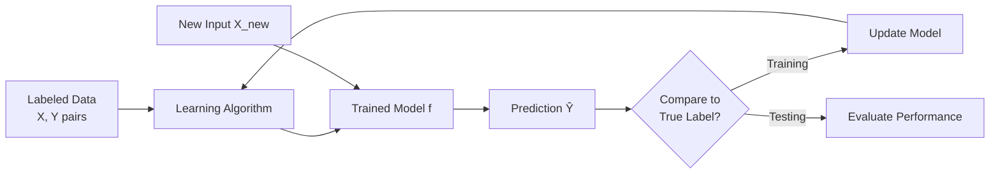
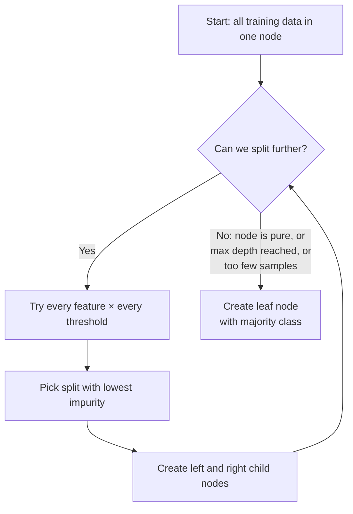
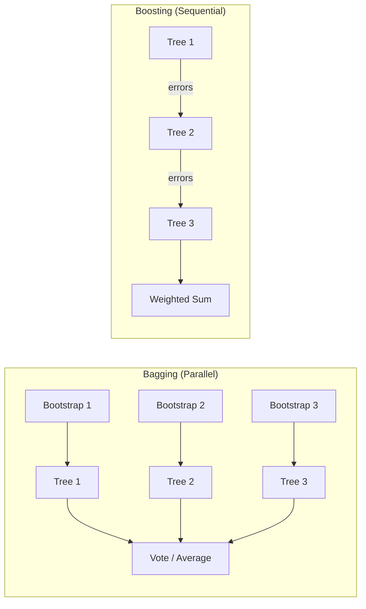
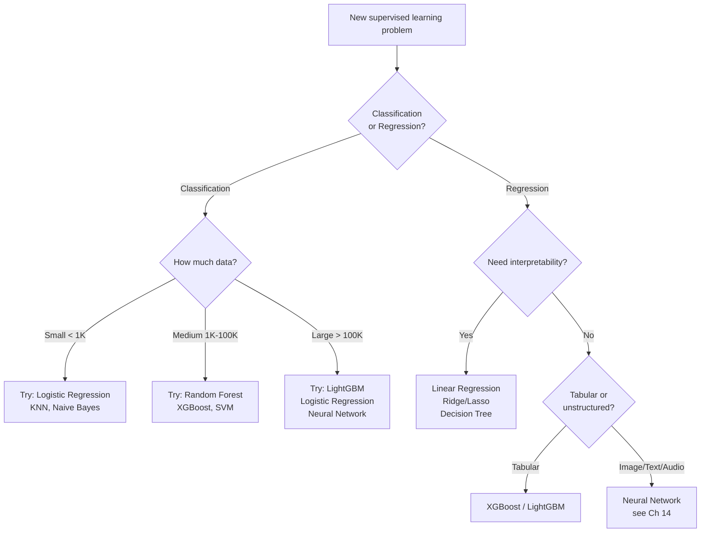
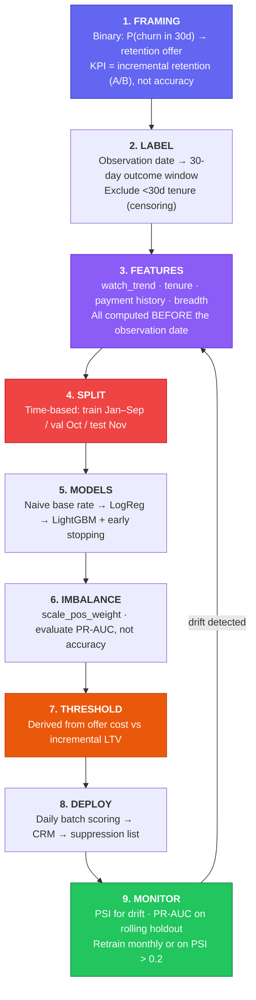

# Chapter 10 — Supervised Learning

> "Supervised learning is the workhorse of machine learning."
> — Andrew Ng

---

## What You'll Learn

After reading this chapter, you will be able to:
- Explain supervised learning and how it differs from other ML paradigms
- Distinguish classification from regression and choose the right framing for a problem
- Explain how Logistic Regression, KNN, Decision Trees, SVMs and ensembles work — what each **assumes**, when to reach for it, and how each one fails
- Interpret logistic-regression coefficients as log-odds
- Choose between bagging and boosting, and validate a forest without a holdout
- Use feature importance and SHAP values to explain individual predictions
- Handle class imbalance without falling into the "99% accuracy" trap
- Walk an end-to-end supervised project, from problem framing to monitoring

**How this chapter relates to its neighbours:**

| For… | Go to |
|---|---|
| The *mechanics* — loss, gradients, overfitting, regularization | [**Ch 8**](#content/08_core_concepts) |
| The *math and implementation* of each algorithm | [**Ch 12**](#content/12_key_algorithms) |
| *Metrics* — ROC, PR, cross-validation, tuning | [**Ch 13**](#content/13_model_evaluation) |
| **This chapter** | **Which algorithm, why, and how to run a real project** |

**Markers:** ★★★ = know cold for interviews · ★★ = high priority · ★ = good to know.
**Quick check** boxes are retrieval practice — attempt before revealing.
**Interview** boxes give the question, what to say, and the follow-up trap.

---

## 10.1 What is Supervised Learning?

> **Supervised Learning** is a machine learning paradigm where the algorithm learns a mapping function $f: X \rightarrow Y$ from a labeled training dataset of $(x_i, y_i)$ pairs, and is evaluated on its ability to generalize that mapping to unseen inputs.

You give the model a stack of solved examples — inputs paired with their correct answers — and it figures out the pattern connecting them. Once trained, it can predict answers for inputs it has never seen before.

Think of it like studying for an exam with the answer key. You see hundreds of practice problems with solutions, notice the patterns, and use those patterns on the actual test where you don't have the answers.

```
  Training Phase:
  ─────────────────────────────────────────────────────────────────
  Example 1:  [2000 sqft, 3 beds, suburb]  →  $350,000   (labeled)
  Example 2:  [800 sqft, 1 bed, downtown]  →  $275,000   (labeled)
  Example 3:  [3500 sqft, 5 beds, rural]   →  $420,000   (labeled)
                        ⋮
  Example N:  [features]                   →  [label]    (labeled)
                   │
                   │  Model learns the mapping: features → label
                   ▼
  Prediction Phase:
  ─────────────────────────────────────────────────────────────────
  New input: [1500 sqft, 2 beds, suburb] → $310,000 ← predicted!
```

The word "supervised" comes from the supervisor — the labels. Without labels, you're doing unsupervised learning ([Ch 11](#content/11_unsupervised_learning)). With labels, the model has a teacher checking its work during training.



### Why Supervised Learning Dominates

Most real-world ML applications are supervised learning:

| Application | Input (X) | Output (Y) | Type |
|---|---|---|---|
| Email spam filter | Email text, metadata | Spam / Not spam | Classification |
| House price estimation | Sqft, beds, location | Price in dollars | Regression |
| Medical diagnosis | Symptoms, lab results | Disease present / absent | Classification |
| Weather forecasting | Temp, pressure, humidity | Tomorrow's temperature | Regression |
| Credit scoring | Income, history, debt | Default / No default | Classification |
| Recommendation rating | User profile, item features | Star rating (1-5) | Regression |

Supervised learning works so well because labeled data encodes human knowledge directly. The hard part is usually getting enough high-quality labels, not the algorithm itself.

---

## 10.2 The Two Flavors: Classification vs Regression

Every supervised learning problem falls into one of two categories, depending on what the output looks like.

> **Classification** predicts a discrete category from a finite set of classes. **Regression** predicts a continuous numerical value.

The distinction is simple: if the answer is a label ("spam", "cat", "malignant"), it's classification. If the answer is a number on a continuous scale ($342,000, 23.5 degrees, 4.7 stars), it's regression.

```
                      SUPERVISED LEARNING
                              │
              ┌───────────────┴───────────────┐
              ▼                               ▼
       CLASSIFICATION                    REGRESSION
              │                               │
  Output = discrete label              Output = continuous number
              │                               │
  "Which category?"                    "How much / how many?"
              │                               │
  ┌─────────────────────┐            ┌──────────────────────┐
  │ Examples:           │            │ Examples:            │
  │ - Spam / Not Spam   │            │ - House price: $350K │
  │ - Cat / Dog / Bird  │            │ - Temperature: 23.5°C│
  │ - Benign / Malignant│            │ - Stock return: 4.2% │
  │ - Positive sentiment│            │ - Time to failure: 8d│
  └─────────────────────┘            └──────────────────────┘
              │                               │
  Loss: Cross-Entropy               Loss: MSE / MAE
  Metrics: Accuracy, F1, AUC        Metrics: RMSE, R², MAE
```

### Classification Subtypes

**Binary classification** has exactly two classes — yes/no, spam/not-spam, positive/negative. The model outputs a probability for one class, and you threshold it (typically at 0.5) to get the final prediction.

**Multi-class classification** has three or more mutually exclusive classes — the input belongs to exactly one. A handwritten digit recognizer (0-9) is multi-class: each image is one and only one digit.

**Multi-label classification** allows multiple labels per input simultaneously. A movie can be Action AND Comedy AND Thriller. Each label is an independent binary decision.

```
  BINARY:        Spam ─── or ─── Not Spam
                 (one probability, one threshold)

  MULTI-CLASS:   Cat ─── or ─── Dog ─── or ─── Bird
                 (softmax: probabilities sum to 1, pick the highest)

  MULTI-LABEL:   [Action: ✓] [Comedy: ✓] [Horror: ✗] [Thriller: ✓]
                 (sigmoid per label: each is independent)
```

| Property | Multi-class | Multi-label |
|---|---|---|
| Labels per input | Exactly 1 | 0 or more |
| Output activation | Softmax | Sigmoid (per label) |
| Loss function | Categorical cross-entropy | Binary cross-entropy (per label) |
| Probabilities sum to 1? | Yes | No |
| Example | Digit recognition (0-9) | Movie genre tagging |

### When Is It Actually Ambiguous?

Sometimes the line between classification and regression blurs. Star ratings (1-5) are discrete, but treating them as regression often works better because 4 stars is closer to 5 than to 1 — the ordering matters. Age prediction could be regression (predict 34.2 years) or classification (predict age bracket: 30-40). The right choice depends on what decision you'll make with the output.

**Rule of thumb:** If the output has a natural ordering and the gaps between values matter, lean toward regression. If the categories are fundamentally different kinds of things, use classification.

---

## 10.3 How Models Learn: Loss Functions & Optimization

Training a model is a game of "warmer, colder." The model guesses, a loss function scores how wrong the guess was, and the optimizer nudges the dials in whatever direction lowers the score — thousands of times over. Pick the wrong scorekeeper and the model gets very good at the wrong thing.

→ **Full treatment: [Ch 8](#content/08_core_concepts) §8.7 (the training loop), §8.8 (loss functions), §8.9–8.10 (gradient descent and optimizers).**

The supervised-learning–specific point is narrow but important: **the loss must match the output type**, and the output layer must match the loss.

| Task | Output layer | Loss | Notes |
|---|---|---|---|
| Binary classification | Sigmoid | Binary cross-entropy | One score, thresholded (§8.16) |
| Multi-class (one label) | Softmax | Categorical cross-entropy | Classes compete — probabilities sum to 1 |
| **Multi-label** (many labels) | **Sigmoid per label** | **Binary CE per label, summed** | Classes do **not** compete — a photo can be *beach* **and** *sunset* |
| Regression | Linear (no activation) | MSE, MAE or Huber | Huber if outliers are real (§8.8) |

> ⚠️ **The multi-label trap.** Reaching for softmax when labels aren't mutually exclusive forces the model to split one unit of probability across labels that should all be able to score 0.9. Ask: *can a single example carry two labels at once?* If yes, sigmoid per label.

---

## 10.4 The Training Pipeline: Train / Val / Test Splits

You wouldn't judge a chef by the one dish they've rehearsed a thousand times — you'd ask for something new. Models need the same honest test: a set to learn from, a set to make tuning decisions against, and a final set kept sealed for one unbiased grade.

→ **Full treatment: [Ch 8](#content/08_core_concepts) §8.3 (splits and sizing) and §8.4 (data leakage — the four types, the `fit`/`transform` rule, and how to catch it). Cross-validation mechanics: Chapter 13 §13.7.**

What is *specific to supervised learning* is that your labels dictate **how** you split. Three cases where a random split is simply wrong:

| Situation | Wrong | Right | Why |
|---|---|---|---|
| **Imbalanced classes** | Random split | **Stratified** split / `StratifiedKFold` | A random 10% test set of a 1%-positive dataset may contain almost no positives, making the score meaningless |
| **Time-ordered data** | Random split | **Time-based** split — train on the past, test on the future | A random split lets the model see the future to predict the past. It cannot do that in production |
| **Repeated entities** | Random split | **Group** split (`GroupKFold`) by patient / user / device | The same patient in train *and* test means you measured memorisation, not learning |

Each of these is a leakage vector, and each is invisible in the score — the number just comes out flatteringly high. The case study in §10.13 uses a time-based split for exactly this reason.

<details>
<summary><strong>Quick check.</strong> You're predicting hospital readmission. Each patient has 3–8 visit records, and you split randomly by row. Your AUC is 0.94. Why is that number not trustworthy?</summary>

**Group leakage.** The same patient appears in both train and test, so the model can memorise *that patient* — their baseline vitals, their comorbidities — rather than learning what predicts readmission. New patients, who are the entire point, will break it.

**Fix:** split by `patient_id` with `GroupKFold` so every patient falls entirely on one side. Expect the AUC to drop; that lower number is the honest one. (§8.4)
</details>

---

## 10.5 Overfitting, Underfitting, and Regularization

Every modelling decision — algorithm choice, hyperparameters, regularization — is ultimately about this tradeoff.

→ **Full treatment: [Ch 8](#content/08_core_concepts) §8.13 (diagnosing over/underfitting, with the symptom → fix table), §8.14 (bias–variance), §8.15 (regularization, including why L1 zeroes weights and L2 doesn't).**

The part [Ch 8](#content/08_core_concepts) *can't* give you is that every algorithm family exposes regularization through different knobs. This is the translation table:

| Family | The knobs | What actually controls capacity |
|---|---|---|
| **Linear / Logistic** | `C`, `penalty` | sklearn's `C` is the **inverse** of λ — smaller `C` means *more* regularization, which trips people up constantly. Ridge = L2, Lasso = L1, Elastic Net = both |
| **Decision Tree** | `max_depth`, `min_samples_leaf`, `min_samples_split` | Structural limits, not a penalty term — an unbounded tree will memorise every row |
| **Random Forest** | `n_estimators`, `max_features` | More trees never overfits (it only averages more); `max_features` is the real diversity knob |
| **Gradient Boosting** | `learning_rate` × `n_estimators`, `reg_alpha`, `reg_lambda`, `max_depth` | More trees **does** overfit here. A small `learning_rate` plus early stopping is the dominant strategy |
| **Neural networks** | Dropout rate, `weight_decay` | Use **AdamW**, not Adam + L2 (§8.10) |

> ⚠️ **The single most confusing knob in sklearn:** `C=0.01` is *strong* regularization and `C=100` is *weak*. It is `1/λ`. Getting this backwards silently produces an underfit model that looks like a bad algorithm choice.

> **Interview —** *"Random Forest and Gradient Boosting are both tree ensembles. Why does adding trees overfit one but not the other?"*
> **Say:** Random Forest **averages** independent trees — more trees reduce variance and the training error plateaus, so extra trees are just wasted compute. Boosting builds trees **sequentially**, each fitting the previous residuals, so more trees keep reducing training error and eventually fit noise.
> **They follow up with:** *"So how do you control boosting?"* — a small learning rate plus early stopping on a validation set, then `max_depth` and the L1/L2 terms.

---

## 10.6 Classification Algorithms

Five algorithms cover almost every classification problem you'll meet. This section is the **survey**: what each one assumes, when to reach for it, and how it fails. The full math and implementation detail for each lives in [Ch 12](#content/12_key_algorithms).

**The whole section in one table** — skim this first, then read the entries:

| Algorithm | The one-line idea | Reach for it when | Breaks when |
|---|---|---|---|
| **Logistic Regression** | A scorecard: each feature adds or subtracts points, and the total becomes a probability | You need speed, calibrated probabilities, or to *explain* the decision | The boundary is genuinely curved |
| **KNN** | Ask the nearest few neighbours and go with the majority | The data is small, low-dimensional, and "similar things cluster" is true | Dimensions grow, or features aren't scaled |
| **Decision Tree** | A game of twenty questions, each splitting the remaining possibilities | You need a human-readable rule set | Left unpruned — it memorises |
| **SVM** | Draw the widest road between two groups | Data is high-dimensional or wide-but-short (text) | The dataset is large ($n > 50\text{K}$) |
| **Naive Bayes** | Count how often each clue appears in each class, then multiply the evidence | Text classification, or you need a baseline in five minutes | Features are strongly redundant |

> **How to read an algorithm entry.** The *assumption* is the most important line. An algorithm fails when its assumption doesn't match your data — not because it's a "bad algorithm" ([Ch 8 §8.5](#content/08_core_concepts), inductive bias).

### Logistic Regression ★★★

#### Simple Explanation

Think of a **points-based scorecard**, like the ones lenders use. Every feature either adds points
or takes them away: an email containing "FREE" adds points toward *spam*, a known sender takes
points away. Add up all the points and you get one number — high means "probably spam," low means
"probably fine."

The only wrinkle is that a raw point total can be any number at all (−7, +340), and you need a
*probability* between 0 and 1. So the total gets squeezed through an S-shaped curve — the
**sigmoid** — which maps any number onto the 0–1 range. Very negative totals land near 0, very
positive totals near 1, and a total of zero lands at exactly 0.5.

That is the entire algorithm: **add up weighted evidence, squash it into a probability.**

> **Logistic Regression** is a linear classifier that models the posterior probability $P(y=1|x)$ by applying the logistic sigmoid to a linear combination of features, trained by minimizing binary cross-entropy.

Despite the name, it classifies. It takes a weighted sum of features, pushes it through a sigmoid to get a probability, and thresholds.

$$z = w_0 + w_1 x_1 + \dots + w_n x_n \qquad \hat{y} = \sigma(z) = \frac{1}{1 + e^{-z}}$$

```
  Example — spam detection:

    w₀ = -3.0  (bias)
    has_word_FREE:    w₁ = +0.8
    has_word_MONEY:   w₂ = +1.2
    num_links:        w₃ = +0.3
    is_known_sender:  w₄ = -0.5

    Email: FREE=1, MONEY=1, links=5, known=0
      z = -3.0 + 0.8 + 1.2 + 1.5 + 0 = 0.5
      ŷ = σ(0.5) = 0.622  → SPAM at threshold 0.5
```

**What the weights actually mean — the log-odds view.** This is the reason logistic regression is the interpretable classifier, and it's the question interviewers ask. Rearranging the model:

$$\log\underbrace{\frac{P(y=1)}{1 - P(y=1)}}_{\text{odds}} = w_0 + w_1x_1 + \dots + w_nx_n$$

**Logistic regression is linear in the log-odds**, not in the probability. That single fact gives you the interpretation:

| | Meaning |
|---|---|
| **Odds** | `P / (1−P)`. A probability of 0.75 is odds of 3 — "3 to 1 on" |
| **A coefficient wᵢ** | A one-unit increase in `xᵢ` adds `wᵢ` to the log-odds |
| **e^wᵢ — the odds ratio** | …which **multiplies the odds by e^wᵢ** |

So `MONEY` with `w = +1.2` means: seeing that word multiplies the odds of spam by `e^1.2 ≈ 3.3`, holding everything else fixed. That is a sentence you can say to a regulator or a product manager — and it's why logistic regression still wins in credit scoring and medicine.

> ⚠️ The coefficient is **not** "+1.2 probability" and not a percentage-point change. The effect on probability depends on where you start — the sigmoid is steep in the middle and flat at the ends.

**Threshold.** The 0.5 default is a choice, not a law — lower it for recall, raise it for precision (§8.16).

**Multi-class** uses softmax over `C` classes (softmax regression); probabilities are positive and sum to 1.

> **Interview —** *"Why is it called logistic *regression* if it does classification?"*
> **Say:** Because it *is* a regression — a linear regression on the **log-odds**. The sigmoid is just the inverse link that maps that unbounded linear score back to a probability. Classification happens afterwards, when you apply a threshold.
> **They follow up with:** *"So what does a coefficient of 0.7 mean?"* — a one-unit increase in that feature multiplies the **odds** by `e^0.7 ≈ 2`, holding others fixed. Say "odds," not "probability" — that's the discriminator.

> **Why cross-entropy and not MSE?** Minimizing BCE is exactly maximum-likelihood estimation for a Bernoulli, and MSE-on-a-sigmoid is non-convex with a vanishing gradient. The derivation is in [**Ch 12 §12.3**](#content/12_key_algorithms); the gradient argument is in **§8.8**.

---

### K-Nearest Neighbors (KNN) ★

#### Simple Explanation

You've just moved to a new street and want to know whether the neighbourhood votes left or right.
The simplest possible method: knock on the **five nearest doors** and ask. Whatever most of them
say, that's your guess.

That is KNN, complete. There is no training, no equation, no learned weights — the algorithm just
*keeps every example it has ever seen* and, when you hand it something new, looks up the closest
few and takes a vote. It is sometimes called a **lazy** learner for exactly this reason: it does no
work upfront and all of its work at prediction time.

Two consequences follow immediately, and both matter. Because "closest" means measuring distance,
**every feature has to be on a comparable scale** — otherwise one big-numbered feature drowns out
the rest. And because it searches the whole training set on every query, it gets slow exactly when
your data gets big.

> **KNN** is a non-parametric, instance-based algorithm: classify a new point by finding the K closest training examples and taking the majority vote.

**Assumes:** nearby points share a label. There is no training phase — the training set *is* the model.

```
  Feature 2
     │  ○ ○                K=3: who are the 3 nearest?
     │  ○   ○  ○
     │          ★  ← NEW POINT
     │     ●  ●   ○        neighbors: ○, ●, ●
     │  ●        ●
     └──────────────── Feature 1
     Vote: ○=1, ●=2  →  predict ●
```

**Choosing K:** `K=1` is maximally sensitive to noise with a jagged boundary; `K=5` is a good default; `K=√n` is the usual rule of thumb; `K=n` always predicts the majority class. Use an **odd** K for binary problems to avoid ties.

| Distance metric | When |
|---|---|
| Euclidean | Default, continuous features |
| Manhattan | High-dimensional or sparse data |
| Cosine | Text and document similarity |

> ⚠️ **KNN requires feature scaling.** It is pure distance, so income measured in tens of thousands will completely drown out `number_of_children`. This is not optional (§8.9, Chapter 9).

**Example — how it works (a 3-NN vote, before and after scaling).** Five people who sat a
certification exam, each described by hours studied and practice questions solved. A new
candidate $Q$ has studied **30 hours** and solved **520 questions**. Will she pass?

| Student | Hours studied | Questions solved | Result |
|---|---|---|---|
| A | 5 | 500 | Fail |
| B | 8 | 540 | Fail |
| C | 28 | 900 | Pass |
| D | 32 | 1,200 | Pass |
| E | 35 | 460 | Pass |

**On the raw numbers.** Euclidean distance from $Q$ — for B that is
$\sqrt{(30-8)^2 + (520-540)^2} = \sqrt{884} = 29.73$:

| Rank | Neighbour | Distance | Result |
|---|---|---|---|
| 1 | B | 29.73 | Fail |
| 2 | A | 32.02 | Fail |
| 3 | E | 60.21 | Pass |
| 4 | C | 380.01 | Pass |
| 5 | D | 680.00 | Pass |

3-NN = {B, A, E} → **Fail, Fail, Pass → predicts Fail** ❌

Look at what the arithmetic actually did. The hours term can contribute at most
$25^2 = 625$ to any of those distances; the questions term contributes up to
$680^2 = 462{,}400$. Hours are, numerically, noise. So a candidate who studied **30 hours**
was judged closest to A and B, who studied **5 and 8**.

**After min-max scaling** onto $[0, 1]$ using the training ranges (hours 5–35, questions
460–1,200), which puts $Q$ at $(0.833, 0.081)$:

| Rank | Neighbour | Scaled position | Distance | Result |
|---|---|---|---|---|
| 1 | E | (1.000, 0.000) | 0.185 | Pass |
| 2 | C | (0.767, 0.595) | 0.518 | Pass |
| 3 | B | (0.100, 0.108) | 0.734 | Fail |
| 4 | A | (0.000, 0.054) | 0.834 | Fail |
| 5 | D | (0.900, 1.000) | 0.921 | Pass |

3-NN = {E, C, B} → **Pass, Pass, Fail → predicts Pass** ✅

Same five points, same $K$, same metric — the opposite answer. Nothing about the model
changed; only the units did. And the scaled answer is the sensible one: E studied 35 hours
and passed on modest practice, which is exactly the pattern $Q$ matches.

*Takeaway: for KNN, feature scaling is not preprocessing hygiene — it is part of the model's definition of "near".*


---

### Decision Trees ★★★

#### Simple Explanation

A decision tree is a game of **twenty questions**. "Is the transaction over ₹500?" — yes. "Was it
made after midnight?" — yes. "Is the country new for this card?" — yes. *Probably fraud.*

Each question splits the remaining cases into two smaller piles, and the tree keeps asking until
a pile is pure enough to call. The clever part is that nobody writes the questions: the algorithm
tries **every feature at every threshold** and picks whichever split separates the classes best,
then repeats inside each new pile.

This is why trees are the go-to when someone needs to *see* the reasoning — the finished model is
a flowchart you can read aloud. It is also why an unrestrained tree is dangerous: keep asking
questions long enough and you end up with one leaf per training row, which is memorisation
dressed up as learning.

> A **Decision Tree** recursively partitions the feature space with axis-aligned splits. Each internal node tests a feature against a threshold; each leaf holds a prediction.

**Assumes:** the classes can be separated by rectangular, axis-aligned regions.

```
                   Is income > $50K?
                  /                  \
                YES                   NO
                 │                    │
        Is age > 30?           Has college degree?
         /        \              /             \
       YES         NO          YES              NO
        │           │           │                │
    "Approve"   "Review"    "Review"         "Deny"
```

**How does it pick each question?** It tries every feature at every threshold and keeps the split that makes the children **purest** — measured by Gini or entropy (§10.7). Then it recurses, stopping when a node is pure, hits `max_depth`, or has too few samples.



> **Interview —** *"Why does a single decision tree overfit, and why does a Random Forest fix it?"*
> **Say:** An unbounded tree keeps splitting until every leaf is pure, so it ends up memorising individual rows — classic high variance. A Random Forest trains many trees on bootstrap samples with a random feature subset at each split, then averages, and averaging decorrelated high-variance models cancels much of that variance.
> **They follow up with:** *"Why the random feature subset — isn't bootstrapping enough?"* — no. With one dominant feature every tree splits on it first and the trees end up near-identical, so averaging buys little. `max_features` forces the diversity that makes averaging work.

---

### Support Vector Machines (SVMs) ★★

#### Simple Explanation

Two groups of houses sit on either side of an empty field, and you must paint a dividing line.
Lots of lines would separate them — but the *safest* line is the one that leaves the **widest
possible gap** on both sides. Squeeze the line right up against one group and a single new house
could end up on the wrong side.

An SVM finds that widest-gap line. The strange and useful consequence is that **only the houses
right at the edge of the gap matter at all**. Move a house deep inside its own group and the line
doesn't budge; move one at the boundary and the whole line shifts. Those boundary cases are the
**support vectors**, and they are the only data the finished model actually depends on.

And when no straight line can work — one group forming a ring around the other, say — the SVM
lifts the data into a higher-dimensional space where a flat divider *does* work, using a shortcut
called the **kernel trick** that never has to build that bigger space explicitly.

> A **Support Vector Machine** finds the hyperplane that maximizes the margin — the distance between the boundary and the nearest points of each class (the support vectors). The **kernel trick** extends it to non-linear boundaries.

**Assumes:** classes are separable by a wide margin, in the input space or in some kernel-implied space.

The core idea is elegant: among all lines separating two classes, choose the one with the widest gap. That maximum-margin hyperplane tends to generalize best.

```
  Feature 2
     │
     │  ○ ○                ○ ○
     │  ○   ○  ╱           ○   ○   ← margin
     │     ○  ╱   ● ●          ╱  ← boundary (hyperplane)
     │       ╱   ●  ●         ╱   ← margin
     │      ╱  ●    ● ●     ╱
     │     ╱  ●   ●        ╱
     └──────────────────────── Feature 1

  The points sitting on the margin edge are the
  "support vectors" — the only points that decide
  where the boundary goes. Remove any other training
  point and the boundary does not move.
```

**The Kernel Trick**

Real-world data is rarely linearly separable. SVMs handle this with kernels — functions that implicitly map data to a higher-dimensional space where a linear separator exists.

```
  Original 1D space:       ● ● ○ ○ ○ ● ●    ← no line can separate!

  Mapped to 2D (x → x²):
     x²│
       │ ●           ●      ← NOW separable by a line!
       │   ●       ●
       │     ○ ○ ○
       └──────────── x

  Common Kernels:
  ┌────────────┬─────────────────────────────────────┐
  │ Linear     │ K(x,y) = x·y           (just the dot product)  │
  │ Polynomial │ K(x,y) = (x·y + c)^d   (degree-d polynomial)  │
  │ RBF/Gauss  │ K(x,y) = exp(-γ‖x-y‖²) (most popular)        │
  └────────────┴─────────────────────────────────────┘

  RBF kernel can model virtually any decision boundary shape.
  γ controls how "local" each support vector's influence is:
    small γ → smooth boundary (may underfit)
    large γ → wiggly boundary (may overfit)
```

### SVM: The C Knob and Soft Margins

Under the hood an SVM minimizes the **hinge loss**. With labels $y\in\{-1,+1\}$ and score $f(x)=w^\top x+b$:

$$L=\max\big(0,\;1-y\,f(x)\big)$$

You pay **zero** penalty only when a point is correctly classified *with margin* — $y f(x)\ge 1$. Inside the margin or misclassified, the loss grows linearly. That is precisely why an SVM cares about points near the boundary and ignores easy points far from it.

Real data isn't perfectly separable, so the **soft margin** allows controlled violations, traded off by **C**:

| `C` | Behaviour | Risk |
|---|---|---|
| **Large** | Punish violations hard → narrow margin, tight fit | Overfitting |
| **Small** | Tolerate violations → wider margin, stronger regularization | Underfitting |

> ⚠️ Note this is the **same `C` inversion** as logistic regression (§10.5): larger `C` means *less* regularization.

**Multi-class:** SVMs are binary at heart. Extend with **one-vs-rest** (one classifier per class) or **one-vs-one** (one per class pair, then vote).

→ **The kernel trick, the dual formulation, and the full margin derivation: [Ch 12 §12.7](#content/12_key_algorithms).**

> **Interview —** *"When would you pick an SVM over gradient boosting?"*
> **Say:** Rarely on tabular data — boosting usually wins. SVMs remain attractive when the feature count is large relative to the sample count (text, genomics), where the maximum-margin objective generalizes well, and when the dataset is small enough that O(n²)–O(n³) training is acceptable.
> **They follow up with:** *"What's the kernel trick actually doing?"* — computing inner products in a high-dimensional space **without ever constructing the coordinates**, so you get a non-linear boundary at the cost of a kernel evaluation.

---

### Naive Bayes ★

#### Simple Explanation

Imagine sorting post into "junk" and "real" by looking for tell-tale words. From past post you
know roughly how often "winner" shows up in junk versus real mail, and the same for "invoice,"
"free," "meeting." A new letter arrives: you check each word, multiply the evidence together, and
whichever pile scores higher wins.

That is Naive Bayes. It is called *naive* because of one deliberate lie: it pretends every word is
**independent** of every other. In reality "New" and "York" travel together, so the model
double-counts them. The remarkable thing is that this barely matters — you only need the *right
pile to score highest*, not the score itself to be accurate. The lie makes the maths trivially
cheap, and the ranking usually survives.

That combination — nearly free to train, surprisingly hard to beat on text — is why it remains the
baseline you build in five minutes before trying anything clever.

> **Naive Bayes** is a probabilistic classifier based on Bayes' theorem with the "naive" assumption that features are conditionally independent given the class label.

$$P(y|x_1,...,x_n) = \frac{P(y) \prod_{i=1}^n P(x_i|y)}{P(x_1,...,x_n)}$$

The "naive" assumption — that features are independent — is almost never true in practice. Email words are definitely correlated ("Nigerian" and "prince" tend to appear together). Yet Naive Bayes works surprisingly well anyway, especially for text classification. This is one of the great paradoxes of ML: a model built on a clearly wrong assumption can still make accurate predictions.

```
  Why it works for spam detection:

  P(spam|"free money") ∝ P("free"|spam)·P("money"|spam)·P(spam)
                         ∝ 0.8 × 0.7 × 0.3
                         = 0.168

  P(ham | "free money")  ∝ P("free"|ham) × P("money"|ham) × P(ham)
                         ∝ 0.1 × 0.05 × 0.7
                         = 0.0035

  Normalize: P(spam) = 0.168 / (0.168 + 0.0035) = 97.96%  → SPAM
```

**Strengths and limitations — all five side by side:**

| | Best at | Watch out for |
|---|---|---|
| **Logistic Regression** | Speed at scale; well-calibrated probabilities; coefficients readable as odds ratios; strong baseline on sparse text | Linear boundaries only (can't learn XOR); needs feature engineering for curves; sensitive to outliers |
| **KNN** | Zero training time; no distributional assumptions; any boundary shape; multi-class free; trivially updated | Slow at prediction, $O(n \times d)$ per query; stores the whole training set; destroyed by high dimensions; gives no feature importance |
| **Decision Tree** | Fully interpretable — you can trace any decision; no scaling needed; mixes numeric and categorical; captures interactions automatically | Overfits badly if unbounded; unstable (small data change → very different tree); biased toward high-cardinality features; diagonal boundaries need many steps |
| **SVM** | Effective in high dimensions; memory-efficient (stores only support vectors); kernels give non-linear boundaries; robust when classes separate cleanly | Slow on large data, roughly $O(n^2)$–$O(n^3)$; no native probabilities (needs Platt scaling); requires scaling; `C` and kernel need real tuning |
| **Naive Bayes** | Extremely fast to train and predict; works on small training sets; excellent on text; handles sparse high-dimensional data; ignores irrelevant features | The independence assumption is usually false; probabilities are poorly calibrated (too extreme); can't learn feature interactions; unseen words give $P=0$ without **Laplace smoothing** |

> **Reading this table well:** notice that the "watch out for" column is mostly a restatement of each
> algorithm's **assumption**. KNN's weakness in high dimensions *is* its assumption that distance
> means something. Naive Bayes' calibration problem *is* the independence lie. Match the assumption
> to your data and most of these limitations stop mattering.

---

## 10.7 Decision Tree Splits: Gini vs Entropy ★★

At each node the tree asks: *"which feature, at which threshold, gives the best split?"* It tries them all and keeps the one producing the **purest** children. So everything hinges on how you measure purity.

Both measures answer the same question — *how mixed are the classes in this node?* — and both hit **zero** for a pure node and **maximum** for a 50/50 mix.

**Gini impurity** — the chance of misclassifying a random element if you labelled it by the node's class distribution:

$$\text{Gini}(S) = 1 - \sum_{i=1}^{C} p_i^2$$

**Entropy** — the bits needed to encode the class label; **information gain** is the entropy the split removes:

$$\text{Entropy}(S) = -\sum_{i=1}^{C} p_i \log_2(p_i) \qquad \text{IG} = \text{Entropy}(\text{parent}) - \sum_{k} \frac{|S_k|}{|S|}\,\text{Entropy}(S_k)$$

| Node composition | Gini | Entropy | Meaning |
|---|---|---|---|
| 100 / 0 (pure) | **0.00** | **0.00 bits** | Already know the class — best possible |
| 70 / 30 | 0.42 | 0.88 bits | Fairly mixed |
| 50 / 50 | **0.50** | **1.00 bit** | Maximum uncertainty — worst possible |

**What to notice in the chart:** the two curves have the same *shape* and the same zeros — they differ only in scale (Gini tops out at 0.5, entropy at 1.0). That's why the choice between them rarely matters.

```chart
{
  "type": "line",
  "data": {
    "labels": ["0%","10%","20%","30%","40%","50%","60%","70%","80%","90%","100%"],
    "datasets": [
      {
        "label": "Gini Impurity",
        "data": [0.0, 0.18, 0.32, 0.42, 0.48, 0.50, 0.48, 0.42, 0.32, 0.18, 0.0],
        "borderColor": "rgba(99, 102, 241, 1)",
        "backgroundColor": "rgba(99, 102, 241, 0.1)",
        "fill": true,
        "tension": 0.4,
        "pointRadius": 2
      },
      {
        "label": "Entropy (in bits)",
        "data": [0.0, 0.47, 0.72, 0.88, 0.97, 1.0, 0.97, 0.88, 0.72, 0.47, 0.0],
        "borderColor": "rgba(234, 88, 12, 1)",
        "backgroundColor": "rgba(234, 88, 12, 0.1)",
        "fill": true,
        "tension": 0.4,
        "pointRadius": 2
      }
    ]
  },
  "options": {
    "plugins": { "title": { "display": true, "text": "Gini vs Entropy — Both Peak at a 50/50 Mix and Hit Zero When Pure" } },
    "scales": {
      "y": { "title": { "display": true, "text": "Impurity Score" }, "beginAtZero": true },
      "x": { "title": { "display": true, "text": "% of Class 1 in Node (Binary Classification)" } }
    }
  }
}
```

**Example — how it works (how the tree actually picks a question).** A node holds **20 emails:
8 spam, 12 legitimate**. Its Gini is

$$\text{Gini} = 1 - (0.4^2 + 0.6^2) = \mathbf{0.48}$$

— almost as mixed as a node can be. Two candidate questions are on the table.

**Candidate A — "does it contain the word *free*?"**

| Child | Spam | Legit | $n$ | Gini |
|---|---|---|---|---|
| Yes | 7 | 1 | 8 | $1 - (0.875^2 + 0.125^2) = 0.2188$ |
| No | 1 | 11 | 12 | $1 - (0.083^2 + 0.917^2) = 0.1528$ |

Weight each child by its share of the rows, then subtract from the parent:

$$\tfrac{8}{20}(0.2188) + \tfrac{12}{20}(0.1528) = 0.1792 \qquad \text{gain} = 0.48 - 0.1792 = \mathbf{0.3008}$$

**Candidate B — "was it sent after midnight?"**

| Child | Spam | Legit | $n$ | Gini |
|---|---|---|---|---|
| Yes | 5 | 5 | 10 | $1 - (0.5^2 + 0.5^2) = 0.5000$ |
| No | 3 | 7 | 10 | $1 - (0.3^2 + 0.7^2) = 0.4200$ |

$$\tfrac{10}{20}(0.5000) + \tfrac{10}{20}(0.4200) = 0.4600 \qquad \text{gain} = 0.48 - 0.46 = \mathbf{0.0200}$$

```
  parent Gini 0.48
    ├─ A "contains free?"   -> 0.1792   gain 0.3008  ◀ chosen
    └─ B "sent after midnight?" -> 0.4600  gain 0.0200
```

Candidate A wins by a factor of **15**, and you can see why without the arithmetic: it produces
one nearly-pure spam child and one nearly-pure legit child, while B leaves a 5/5 coin-flip on one
side. That is the whole algorithm — try every feature at every threshold, score each with this
same three-line calculation, keep the largest gain, then recurse inside both children.

*Takeaway: a tree does not "know" which feature matters; it brute-forces every split and keeps whichever one buys the biggest drop in impurity.*


### Does the Choice Matter?

| Property | Gini | Entropy |
|---|---|---|
| Range (binary) | [0, 0.5] | [0, 1.0] |
| Computation | Faster — no logarithm | Slightly slower |
| sklearn default | ✓ | Available via `criterion='entropy'` |
| Tendency | Isolates the largest class | Slightly more balanced splits |
| **Practical difference** | **Under 2% of splits differ (Breiman)** | |

**In short: use the default.** If someone is tuning `criterion` before tuning `max_depth`, they are optimising the wrong thing by two orders of magnitude.

**Example — how it works (scoring the same two splits with both measures).** Take the 20-email
node from above and re-run both candidates with entropy instead of Gini. Parent entropy is
$0.9710$ bits.

| Candidate | Weighted Gini | Gini gain | Weighted entropy | Info gain |
|---|---|---|---|---|
| A — "contains *free*" | 0.1792 | **0.3008** | 0.4657 bits | **0.5052 bits** |
| B — "sent after midnight" | 0.4600 | 0.0200 | 0.9406 bits | 0.0303 bits |

Different scales, identical verdict: A by a mile, under both. That is the normal case, and the
reason is visible in the raw impurity values — over the range that matters, entropy is very close
to **twice** Gini:

| Class mix | Gini | Entropy | Entropy ÷ Gini |
|---|---|---|---|
| 100 / 0 | 0.00 | 0.000 bits | — |
| 90 / 10 | 0.18 | 0.469 bits | 2.61 |
| 70 / 30 | 0.42 | 0.881 bits | 2.10 |
| 60 / 40 | 0.48 | 0.971 bits | 2.02 |
| 50 / 50 | 0.50 | 1.000 bits | 2.00 |

Two measures that are near-multiples of each other will rank almost anything the same way.
Brute-forcing **10.6 million** two-candidate comparisons on binary nodes of up to 40 rows,
the two criteria picked a different winner in **1.73%** of them — which is where the
"under 2% of splits differ" figure above comes from.

**And when they do disagree, it is a photo-finish.** A node of 40 rows (19 fraud / 21 legit,
Gini $0.4988$, entropy $0.9982$ bits):

| Candidate | Children | Gini gain | Info gain |
|---|---|---|---|
| A | (3 / 13) and (16 / 8) | **0.110208** | 0.168733 |
| B | (10 / 2) and (9 / 19) | 0.110060 | **0.169039** |

Gini prefers A by 0.13%; entropy prefers B by 0.18%. Both splits are, for any practical purpose,
equally good — the criteria are not disagreeing about quality, they are breaking a tie.

**So why is Gini the default?** Cost. Gini needs squares; entropy needs a logarithm per class,
and a tree evaluates this millions of times while scanning candidate thresholds. Six million
impurity evaluations in a tight loop took **55 ms** for Gini and **250 ms** for entropy —
about **4.5×**. In a full tree fit that gap is diluted by sorting and data scanning, so the
honest summary is "cheaper, but not a reason to lose sleep either way".

*Takeaway: Gini and entropy nearly always agree on the winner; pick the default and spend your tuning budget on `max_depth` instead.*


→ **Worked numeric split example (fraud detection), pruning, and cost-complexity: [Ch 12 §12.4](#content/12_key_algorithms).**

<details>
<summary><strong>Quick check.</strong> A node has 40 fraud and 60 legit. Compute its Gini. Is this a good node to stop at?</summary>

$$\text{Gini} = 1 - (0.4^2 + 0.6^2) = 1 - (0.16 + 0.36) = \mathbf{0.48}$$

That's very close to the 0.5 maximum, so the node is almost maximally mixed — **a terrible place to stop.** A leaf here would predict "legit" and be wrong 40% of the time. The tree should keep splitting, unless `max_depth` or `min_samples_leaf` forbids it — in which case your regularization is too aggressive (§10.5).
</details>

> **Interview —** *"Gini or entropy — which should you use?"*
> **Say:** It almost never matters; under 2% of splits differ. Gini is sklearn's default because it avoids a logarithm and is marginally faster. Both are zero for a pure node and maximal at a 50/50 mix.
> **They follow up with:** *"Then what actually controls tree quality?"* — the **depth and leaf-size constraints**, not the impurity criterion. `max_depth`, `min_samples_leaf`, and for ensembles `max_features`. That's where the tuning effort belongs.

---

## 10.8 Ensemble Methods: Bagging, Boosting, Stacking

#### Simple Explanation

Ask one person to guess the number of sweets in a jar and they'll probably be well off. Ask a
hundred people and **average their guesses**, and the average is often startlingly close — the
people who guessed too high cancel out the people who guessed too low. That is an ensemble.

The two main flavours differ in *how* they assemble the crowd:

- **Bagging** asks everyone **independently and at the same time**, then averages. Each model sees
  a slightly different slice of the data, so they make different mistakes, and the mistakes cancel.
  Random Forest works this way.
- **Boosting** works like a **relay of students**. The first attempts the whole exam and gets some
  questions wrong. The second doesn't restudy everything — it focuses precisely on what the first
  got wrong. The third focuses on what still isn't fixed. Each one specialises in the previous
  one's failures. XGBoost and LightGBM work this way.

That single difference explains almost everything else about them. Bagging can be run in
**parallel** and mainly cuts *variance* — it makes a jittery model stable. Boosting must run
**sequentially** and mainly cuts *bias* — it makes a weak model sharp. And because boosting keeps
chasing remaining errors, it will eventually start chasing **noise**, which is why it needs early
stopping and bagging largely doesn't.

> **Ensemble methods** combine multiple models to produce a single, stronger model. The core insight: a group of diverse, imperfect models often outperforms any single model, just as a committee of experts typically makes better decisions than any individual.

One decision tree is fragile — change a few training examples and you get a completely different tree. But combine hundreds of trees, each trained on slightly different data, and the noise cancels out. This is the wisdom of crowds, applied to algorithms.

```
  SINGLE DECISION TREE:                ENSEMBLE OF 500 TREES:
  ──────────────────────               ─────────────────────────
  Change 5 training examples →         Change 5 training examples →
  totally different tree!              barely changes the output!

  Accuracy: ~78%                       Accuracy: ~94%
  Variance: HIGH                       Variance: LOW
```

### Bagging (Bootstrap Aggregating)

> **Bagging** trains multiple instances of the same model on different bootstrap samples (random samples with replacement) from the training data, then aggregates their predictions by voting (classification) or averaging (regression).

Each model gets a different random subset of the training data (sampling with replacement means some examples appear multiple times, others are left out). Because each model sees different data, they make different errors, and averaging cancels out the noise.

```
  Training Data (N examples)
         │
         │  Sample N examples WITH REPLACEMENT (bootstrap)
         │
    ┌────┴─────┬──────────┬──────────┬──── ... ──┐
    ▼          ▼          ▼          ▼            ▼
  Sample 1   Sample 2   Sample 3   Sample 4    Sample B
  (has dups)  (has dups)
    │          │          │          │            │
  Tree 1     Tree 2     Tree 3     Tree 4      Tree B
    │          │          │          │            │
    └──────────┴──────────┴──────────┴────────────┘
                          │
              Classification → majority VOTE
              Regression     → AVERAGE
```

**Random Forest = Bagging + Random Feature Selection**

> **Random Forest** extends bagging by also randomly selecting a subset of features at each split, which decorrelates the trees and makes the ensemble more effective.

Without random feature selection, all trees would split on the same dominant feature first, making them highly correlated — and averaging correlated models doesn't help much. By forcing each split to consider only a random subset of features, trees are forced to explore different patterns.

```
  Random feature selection at each split:
  ─────────────────────────────────────────────────────
  Total features: 20

  Classification: try √20 ≈ 4 random features per split
  Regression:     try 20/3 ≈ 7 random features per split

  This is the key innovation that makes Random Forest work.
  Without it, you just have bagged trees (less effective).
```

**Example — how it works (five trees guessing a delivery time).** A parcel really takes
**30 minutes**. Five bagged trees, each grown on a different bootstrap sample, guess:

| Tree | Prediction | Error |
|---|---|---|
| 1 | 34 | +4 |
| 2 | 27 | −3 |
| 3 | 31 | +1 |
| 4 | 26 | −4 |
| 5 | 33 | +3 |

Every single tree is wrong; the average tree is off by **3.0 minutes**. But the ensemble
averages to $150.2 / 5 = 30.2$ — an error of **0.2 minutes**. Nobody got it right and the
committee nearly did, because the overshoots (+4, +1, +3) cancelled the undershoots (−3, −4).
In squared-error terms the mean individual error is $10.2$ and the ensemble's is $0.04$.

**Now break the assumption.** Suppose all five trees split on the same dominant feature first,
so they are near-copies of each other and all lean the same way:

| Tree | Prediction | Error |
|---|---|---|
| 1 | 35 | +5 |
| 2 | 36 | +6 |
| 3 | 34 | +4 |
| 4 | 37 | +7 |
| 5 | 35 | +5 |

Average tree error: **5.4 minutes**. Ensemble average: $177 / 5 = 35.4$ — error **5.4 minutes**.
Identical. Averaging bought **nothing**, because there was nothing to cancel; in squared terms
it shaved just 3.4%. The theory says the same thing — with $B$ models of variance $\sigma^2$ and
average pairwise correlation $\rho$:

$$\operatorname{Var}(\bar{f}) = \rho\,\sigma^2 + \frac{1 - \rho}{B}\,\sigma^2$$

The second term is the part bagging kills, and more trees shrink it. The first term does not
move at all — at $\rho = 1$ you can average a thousand trees and still be 5.4 minutes late.

```
  rho = 0  ->  variance falls like 1/B   (averaging works)
  rho = 1  ->  variance does not fall    (averaging is a no-op)
```

Bootstrapping alone leaves $\rho$ high, because every tree still gets to split on the single
strongest feature first. That is precisely the gap `max_features` fills: forcing each split to
consider a random subset of features pushes $\rho$ down, which is what makes the averaging in the
formula actually pay out.

*Takeaway: bagging reduces variance only to the extent its models make **different** mistakes — which is why Random Forest decorrelates the trees on purpose.*


**Key hyperparameters:**
- `n_estimators`: Number of trees (100-1000; more is usually better, with diminishing returns)
- `max_depth`: Maximum tree depth (controls overfitting)
- `max_features`: Features considered per split (sqrt for classification, n/3 for regression)
- `min_samples_leaf`: Minimum samples in a leaf (prevents tiny, overfit leaves)

**Out-of-Bag (OOB) Error — a free validation set**

Bootstrap sampling has a useful side effect. Sampling `N` examples with replacement leaves out roughly **37%** of the data every time:

$$\lim_{N \to \infty}\left(1 - \tfrac{1}{N}\right)^{N} = e^{-1} \approx 0.368$$

Those left-out rows are that tree's **out-of-bag** samples — data it genuinely never saw. So for every training row, you can collect the predictions of only the trees that excluded it and score them. The result is an honest validation estimate **without holding anything out and without cross-validation**.

```
  Row 42 is IN the bootstrap for trees:  1, 2, 5, 7, ...
  Row 42 is OUT of the bootstrap for:    3, 4, 6, 8, ...
                                          └─ only these vote
                                        on row 42's OOB prediction

  Repeat for every row → OOB score ≈ k-fold CV, at zero extra cost
```

Set `oob_score=True` in scikit-learn. It's especially valuable on small datasets, where surrendering 20% to a validation set genuinely hurts. Note it applies to **bagging only** — boosting has no bootstrap, so there is no out-of-bag set.

<details>
<summary><strong>Quick check.</strong> Why does bagging get OOB error for free but gradient boosting doesn't?</summary>

Bagging trains each tree on a **bootstrap sample**, so ~37% of rows are excluded from each tree and can act as its private validation set.

Boosting trains **sequentially on all the data**, each tree fitting the previous ensemble's residuals. Nothing is held out, so there is no out-of-bag set. Boosting instead relies on an **explicit validation set with early stopping** — which is also its main regularization mechanism (§10.5).
</details>

### Boosting: Sequential Error Correction

> **Boosting** builds models sequentially, where each new model focuses on correcting the errors made by the previous models. The final prediction is a weighted combination of all models.

While bagging reduces variance (each tree makes different random errors that cancel out), boosting reduces bias (each new tree specifically targets what the ensemble still gets wrong).

```
  Round 1:  Train tree on data, equal weights
            ┌──────┐
            │Tree 1│ → predictions → Errors on examples 3, 7, 12
            └──────┘
                  │
                  ↓ Increase weight of misclassified examples
  Round 2:  Train tree on REWEIGHTED data
            ┌──────┐
            │Tree 2│ → focuses on examples 3, 7, 12
            └──────┘
                  │
                  ↓ Reweight again
  Round 3:  Train tree on new REWEIGHTED data
            ┌──────┐
            │Tree 3│ → focuses on whatever is still wrong
            └──────┘
                  │
  Final: weighted sum of all trees (better trees vote louder)
```

### Gradient Boosting ★★★

> **Gradient Boosting** extends boosting by training each new tree to predict the negative gradient (residual) of the loss function, effectively performing gradient descent in function space.

Each tree doesn't just "focus on errors" — it literally predicts the remaining gap between the current ensemble's prediction and the true value. The ensemble gradually converges on the correct answer.

```
  Predicting house price (true = $300K):

  Tree 1 predicts: $200K          residual = $100K
  Tree 2 predicts residual: $60K  residual = $40K
  Tree 3 predicts residual: $25K  residual = $15K
  Tree 4 predicts residual: $10K  residual = $5K
  Tree 5 predicts residual: $3K   residual = $2K
  ...
  Final: $200K + $60K + $25K + $10K + $3K + ... ≈ $300K ✓
```

```chart
{
  "type": "bar",
  "data": {
    "labels": ["After Tree 1", "After Tree 2", "After Tree 3", "After Tree 4", "After Tree 5", "After Tree 6"],
    "datasets": [
      {
        "label": "Cumulative Prediction ($K)",
        "data": [200, 260, 285, 295, 298, 299.5],
        "backgroundColor": "rgba(34, 197, 94, 0.7)",
        "borderColor": "rgba(34, 197, 94, 1)",
        "borderWidth": 1
      },
      {
        "label": "Remaining Residual ($K)",
        "data": [100, 40, 15, 5, 2, 0.5],
        "backgroundColor": "rgba(239, 68, 68, 0.7)",
        "borderColor": "rgba(239, 68, 68, 1)",
        "borderWidth": 1
      }
    ]
  },
  "options": {
    "plugins": { "title": { "display": true, "text": "Gradient Boosting — Each Tree Shrinks the Residual (Target = $300K)" } },
    "scales": {
      "y": { "title": { "display": true, "text": "Value ($K)" }, "beginAtZero": true },
      "x": { "title": { "display": true, "text": "Boosting Round" } }
    }
  }
}
```

**Example — how it works (three rounds, with the learning rate made explicit).** The sketch above
adds each tree's correction in full. Real gradient boosting multiplies every correction by a
**learning rate** $\eta$ first — the single most important knob in the algorithm. Three parcels,
predicting delivery time in minutes from distance, depth-1 trees (stumps), $\eta = 0.5$:

| Parcel | Distance (km) | Actual (min) |
|---|---|---|
| P1 | 2 | 20 |
| P2 | 5 | 26 |
| P3 | 9 | 44 |

**Round 0.** With squared error the best constant guess is the mean: $F_0 = 30$ for all three.
Residuals are $-10, -4, +14$, so $\text{SSE} = 312$.

**Round 1.** Only two stumps are possible. Splitting at `distance < 7` leaves 18 of residual
error unexplained; `distance < 3.5` leaves 162 — so the tree asks *"under 7 km?"* and each leaf
predicts its mean residual: $-7$ left, $+14$ right. Then the brake goes on:
$F_1 = F_0 + 0.5 \times h_1$.

| | $F_0$ | $h_1$ | $F_1$ | new residual |
|---|---|---|---|---|
| P1 | 30 | −7 | 26.5 | −6.5 |
| P2 | 30 | −7 | 26.5 | −0.5 |
| P3 | 30 | +14 | 37.0 | +7.0 |

SSE: 312 → **91.5**. Notice P3 landed on 37, not 44 — halfway to what the stump recommended,
because $\eta = 0.5$.

**Round 2.** Refit on the new residuals; `distance < 7` still wins, with leaves $-3.5$ and $+7$.

| | $F_1$ | $h_2$ | $F_2$ | new residual |
|---|---|---|---|---|
| P1 | 26.5 | −3.5 | 24.75 | −4.75 |
| P2 | 26.5 | −3.5 | 24.75 | +1.25 |
| P3 | 37.0 | +7.0 | 40.50 | +3.50 |

SSE: 91.5 → **36.375**.

**Round 3 — and now the tree changes its question.** P2 has been dragged too far down alongside
P1, so the best stump is no longer *"under 7 km?"* but *"under 3.5 km?"*, isolating P1 with
$-4.75$ and giving P2 and P3 their shared mean of $+2.375$.

| | $F_2$ | $h_3$ | $F_3$ | new residual |
|---|---|---|---|---|
| P1 | 24.75 | −4.75 | 22.375 | −2.375 |
| P2 | 24.75 | +2.375 | 25.938 | +0.063 |
| P3 | 40.50 | +2.375 | 41.688 | +2.313 |

SSE: 36.375 → **10.99**.

```
  SSE by round:  312 -> 91.5 -> 36.4 -> 11.0 -> 4.6 -> 1.3 -> ...
  Reaches ~0 by round 20. Training error never stops falling.
```

Two things to take from the trajectory. First, **the learning rate is a brake, not a detail**: at
$\eta = 1$ round 1 would have jumped straight to the group means, with no chance to correct
course, and round 3's change of question could never have happened. Second, **training error here
falls all the way to zero** — three points and unlimited stumps will always get there. That is
memorisation, and it is why boosting needs a validation set and early stopping in a way that
bagging does not.

*Takeaway: each round fits the leftover error, but only $\eta$ of it — small steps, many of them, and stop before the model starts fitting noise.*


**The Big Three Implementations:**

| Library | Growth Strategy | Key Advantage | Best For |
|---|---|---|---|
| **XGBoost** | Level-wise | Regularized; GPU support; first to dominate Kaggle | General purpose, medium data |
| **LightGBM** | Leaf-wise | Fastest training; handles large datasets | Large data, speed-critical |
| **CatBoost** | Symmetric trees | Best native categorical feature handling | Data with many categorical features |

Gradient boosted trees (especially XGBoost and LightGBM) are the dominant algorithm for tabular/structured data. If you're working with a spreadsheet-like dataset and need maximum accuracy, start here.

### Bagging vs Boosting — Side by Side

```
┌────────────────────┬──────────────────────┬──────────────────────┐
│ Property           │ BAGGING              │ BOOSTING             │
├────────────────────┼──────────────────────┼──────────────────────┤
│ Trees built        │ In PARALLEL          │ SEQUENTIALLY         │
│ Each tree focuses  │ Random subset of data│ Previous errors      │
│ Reduces            │ VARIANCE             │ BIAS                 │
│ Overfitting risk   │ Low                  │ Higher               │
│ Training speed     │ Fast (parallelizable)│ Slower (sequential)  │
│ Sensitivity to     │ Low                  │ High (can amplify    │
│ noisy labels       │                      │ label noise)         │
│ Example algorithms │ Random Forest        │ XGBoost, LightGBM,  │
│                    │                      │ AdaBoost, CatBoost   │
└────────────────────┴──────────────────────┴──────────────────────┘
```



> **Interview —** *"Bagging or boosting — which reduces bias and which reduces variance?"*
> **Say:** **Bagging reduces variance** — it averages many independent high-variance models, so their idiosyncratic errors cancel. **Boosting reduces bias** — each new weak learner fits what the ensemble still gets wrong, progressively correcting systematic error.
> **They follow up with:** *"So which do you reach for first on tabular data?"* — boosting (XGBoost/LightGBM) usually gives the higher ceiling, but Random Forest is more forgiving: it needs almost no tuning, can't overfit by adding trees, and gives you OOB error for free. Start with RF as a strong baseline, then try boosting if the accuracy matters.

### Stacking: Ensembling Different Model Types

> **Stacking** (stacked generalization) trains a "meta-learner" on the predictions of multiple diverse base models. The meta-learner learns which base models to trust for different types of inputs.

Instead of combining 500 trees (like Random Forest), stacking combines fundamentally different algorithms — a tree, a linear model, a neural network, and an SVM, for instance. The diversity of approaches is the strength.

```
  LAYER 1 (base learners — trained on training data):
  ┌────────────────┐  ┌─────────────────┐  ┌──────────────┐
  │ Random Forest  │  │ Neural Network  │  │ Logistic Reg │
  │ pred: 0.82     │  │ pred: 0.91      │  │ pred: 0.75   │
  └────────┬───────┘  └────────┬────────┘  └──────┬───────┘
           │                   │                   │
           └───────────────────┼───────────────────┘
                               ▼
  LAYER 2 (meta-learner — trained on Layer 1 outputs):
                    ┌─────────────────┐
                    │   Final Model   │  → prediction: 0.88
                    │ (e.g., Logistic │
                    │  Regression)    │
                    └─────────────────┘

  The meta-learner discovers patterns like:
  "The neural net is best for text features,
   but the tree is better for numerical features."
```

**Important:** The base learners' predictions used to train the meta-learner must come from cross-validation (not the training set directly), or the meta-learner will overfit to the base learners' training-set predictions.

Stacking is complex to implement and computationally expensive, but it frequently wins ML competitions (Kaggle).

---

## 10.9 Regression Algorithms

### Linear Regression

> **Linear Regression** models the relationship between input features and a continuous output as a linear function. The parameters are found by minimizing the sum of squared residuals (OLS) or equivalently by minimizing MSE.

$$\hat{y} = w_0 + w_1 x_1 + w_2 x_2 + \dots + w_n x_n$$

This is the simplest and most interpretable regression model. Each weight $w_i$ tells you: "For every 1-unit increase in feature $x_i$, the predicted output changes by $w_i$ units, holding everything else constant."

```
  House Price = $30,000
              + $150 × (square feet)
              + $20,000 × (# bedrooms)
              - $1,000 × (age in years)

  A 2000 sqft, 3-bed, 10-year-old house:
  = 30,000 + 150(2000) + 20,000(3) - 1,000(10)
  = 30,000 + 300,000 + 60,000 - 10,000
  = $380,000
```

```chart
{
  "type": "line",
  "data": {
    "labels": [500, 800, 1000, 1200, 1500, 1800, 2000, 2200, 2500, 3000],
    "datasets": [
      {
        "label": "Linear Fit: Price = 150 × SqFt + 30K",
        "data": [105, 150, 180, 210, 255, 300, 330, 360, 405, 480],
        "borderColor": "rgba(99, 102, 241, 1)",
        "fill": false, "tension": 0, "pointRadius": 0, "borderWidth": 2
      },
      {
        "label": "Actual House Prices",
        "data": [95, 140, 190, 195, 270, 310, 320, 380, 420, 510],
        "borderColor": "transparent",
        "backgroundColor": "rgba(234, 88, 12, 0.8)",
        "showLine": false, "pointRadius": 6
      }
    ]
  },
  "options": {
    "plugins": { "title": { "display": true, "text": "Linear Regression — House Price ($K) vs Square Footage" } },
    "scales": {
      "y": { "title": { "display": true, "text": "Price ($K)" }, "beginAtZero": true },
      "x": { "title": { "display": true, "text": "Square Feet" } }
    }
  }
}
```

### Types of Regression Problems

| Type | Formula | When to Use |
|---|---|---|
| **Simple** | $y = w_1x + w_0$ | One feature, linear relationship |
| **Multiple** | $y = w_0 + \sum w_i x_i$ | Multiple features, linear relationship |
| **Polynomial** | $y = w_0 + w_1x + w_2x^2 + w_3x^3$ | Non-linear, but add $x^2, x^3$ as new features |
| **Multivariate** | $Y = XW + B$ | Predict multiple outputs simultaneously |

**Polynomial regression** is just linear regression with engineered features. You add $x^2$, $x^3$, etc. as new columns, and the linear model can now fit curves. But be careful — high-degree polynomials overfit wildly outside the training range.

### Assumptions of Linear Regression

Linear regression makes several assumptions. When they're violated, the model may still predict well, but the coefficient interpretations and confidence intervals become unreliable.

```
  1. LINEARITY:       y is a linear function of features
                      Fix: add polynomial/interaction features

  2. INDEPENDENCE:    errors are independent across observations
                      Violated: time series with autocorrelation

  3. HOMOSCEDASTICITY: error variance is constant across all x
                      Violated: prediction errors grow with x
                      Fix: weighted least squares or log-transform y

  4. NORMALITY:       errors are normally distributed
                      Less critical for prediction (CLT helps)
                      Critical for confidence intervals and p-values

  5. NO MULTICOLLINEARITY: features aren't highly correlated
                      Problem: weights become unstable
                      Fix: regularization (Ridge) or drop features
```

### Regularization: Ridge, Lasso, and Elastic Net

When linear regression overfits — too many features relative to samples, or correlated features — regularization constrains the model by penalizing large weights.

$$\text{Ridge (L2): } \mathcal{L} = \text{MSE} + \lambda \sum w_i^2 \qquad \text{Lasso (L1): } \mathcal{L} = \text{MSE} + \lambda \sum |w_i|$$

$$\text{Elastic Net: } \mathcal{L} = \text{MSE} + \lambda_1 \sum |w_i| + \lambda_2 \sum w_i^2$$

| | Effect on weights | Best when | Correlated features |
|---|---|---|---|
| **Ridge (L2)** | Shrinks all toward zero, none reach it | Many features each contribute a little | Handles them well — spreads weight across the group |
| **Lasso (L1)** | Drives some to **exactly zero** → built-in feature selection | Few features matter, the rest are noise | Poorly — picks one arbitrarily and zeroes its neighbours |
| **Elastic Net** | Both | Correlated features **and** you want selection | The standard fix for Lasso's instability |

→ **Why L1 reaches exactly zero and L2 never does — the gradient argument — is [Ch 8 §8.15](#content/08_core_concepts).** In one line: L1's pull is a constant ±λ all the way in, while L2's is 2λw and fades as the weight shrinks.

**What to notice in the chart:** the Lasso lines hit zero and *stay* there; the Ridge lines approach zero asymptotically but never arrive. That is the entire difference, drawn.

```chart
{
  "type": "line",
  "data": {
    "labels": ["0.001", "0.01", "0.1", "1", "10", "100", "1000"],
    "datasets": [
      {
        "label": "Ridge: weight of Feature A",
        "data": [4.8, 4.5, 3.8, 2.5, 1.2, 0.4, 0.1],
        "borderColor": "rgba(99, 102, 241, 1)",
        "fill": false, "tension": 0.4, "pointRadius": 3
      },
      {
        "label": "Ridge: weight of Feature B",
        "data": [2.1, 2.0, 1.7, 1.1, 0.5, 0.2, 0.05],
        "borderColor": "rgba(99, 102, 241, 0.5)",
        "borderDash": [5,5],
        "fill": false, "tension": 0.4, "pointRadius": 3
      },
      {
        "label": "Lasso: weight of Feature A",
        "data": [4.8, 4.5, 3.5, 1.5, 0.0, 0.0, 0.0],
        "borderColor": "rgba(239, 68, 68, 1)",
        "fill": false, "tension": 0.4, "pointRadius": 3
      },
      {
        "label": "Lasso: weight of Feature B",
        "data": [2.1, 1.9, 1.0, 0.0, 0.0, 0.0, 0.0],
        "borderColor": "rgba(239, 68, 68, 0.5)",
        "borderDash": [5,5],
        "fill": false, "tension": 0.4, "pointRadius": 3
      }
    ]
  },
  "options": {
    "plugins": { "title": { "display": true, "text": "Ridge vs Lasso — How Weights Shrink as λ Increases" } },
    "scales": {
      "y": { "title": { "display": true, "text": "Weight Value" }, "beginAtZero": true },
      "x": { "title": { "display": true, "text": "Regularization Strength (λ)" } }
    }
  }
}
```

### Tree-Based Regression

Decision trees, Random Forests, and Gradient Boosting all work for regression — you just change the split criterion from Gini/entropy to MSE, and leaf nodes output the mean value instead of a class.

```
  Decision Tree Regression:
  - Splits partition feature space into rectangular regions
  - Each leaf outputs the MEAN of training targets in that region

  Feature 2
     │  Region A  │  Region B  │  Region C
     │  ŷ=$180K   │  ŷ=$310K   │  ŷ=$450K
     │  * * *     │ * * * *    │   * * *
     │────────────┤            ├───────────
     │            │ * * * *    │
     └──────────────────────────────────── Feature 1

  Random Forest Regression:
  → Average of all trees' predictions

  Gradient Boosting Regression:
  → Sum of all trees' residual predictions
  → State of the art for tabular regression (XGBoost, LightGBM)
```

### Regression Evaluation Metrics

| Metric | Formula | Interpretation |
|---|---|---|
| **MAE** | $\frac{1}{n}\sum\|y_i-\hat{y}_i\|$ | Average absolute error in original units |
| **MSE** | $\frac{1}{n}\sum(y_i-\hat{y}_i)^2$ | Penalizes large errors more |
| **RMSE** | $\sqrt{MSE}$ | In original units; most common |
| **R-squared** | $1 - \frac{SS_{res}}{SS_{tot}}$ | % of variance explained (0 to 1) |
| **MAPE** | $\frac{1}{n}\sum\|\frac{y_i-\hat{y}_i}{y_i}\|$ | % error (unit-free, but undefined at $y=0$) |

```
  R² = 0.85  "The model explains 85% of the variance."
  R² = 0.0   "No better than always predicting the mean."
  R² < 0.0   "WORSE than predicting the mean." (yes, this happens)
```

### Regression Algorithm Comparison

```chart
{
  "type": "bar",
  "data": {
    "labels": ["Linear Regr.", "Ridge/Lasso", "Polynomial", "Decision Tree", "Random Forest", "Grad. Boosting", "SVR", "Neural Net"],
    "datasets": [
      {
        "label": "Speed (5=fastest)",
        "data": [5, 5, 4, 4, 3, 3, 2, 1],
        "backgroundColor": "rgba(34, 197, 94, 0.7)",
        "borderColor": "rgba(34, 197, 94, 1)", "borderWidth": 1
      },
      {
        "label": "Accuracy (5=best)",
        "data": [2, 3, 3, 2, 4, 5, 4, 4],
        "backgroundColor": "rgba(99, 102, 241, 0.7)",
        "borderColor": "rgba(99, 102, 241, 1)", "borderWidth": 1
      },
      {
        "label": "Interpretability (5=most)",
        "data": [5, 5, 3, 5, 2, 2, 2, 1],
        "backgroundColor": "rgba(234, 88, 12, 0.7)",
        "borderColor": "rgba(234, 88, 12, 1)", "borderWidth": 1
      }
    ]
  },
  "options": {
    "plugins": { "title": { "display": true, "text": "Regression Algorithms — Speed vs Accuracy vs Interpretability" } },
    "scales": {
      "y": { "title": { "display": true, "text": "Rating (1-5)" }, "beginAtZero": true, "max": 5 },
      "x": {}
    }
  }
}
```

> **Interview —** *"When would linear regression be the right choice over gradient boosting?"*
> **Say:** When you need the **coefficients themselves** — a regulated setting where you must state "each extra bedroom adds $20,000, holding size constant" — or when the relationship really is close to linear and the dataset is small, where a flexible model would just fit noise. It's also the honest baseline: if boosting can't beat it, the extra complexity isn't earning anything.
> **They follow up with:** *"What breaks that coefficient interpretation?"* — **multicollinearity**. With correlated features the individual weights become unstable and can even flip sign, while predictions stay fine. Ridge stabilises them by spreading weight across the correlated group.

---

## 10.10 Feature Importance & Model Explainability (SHAP)

#### Simple Explanation

A loan application is rejected. The applicant asks why — and *"the model says so"* is not an
answer you can give a customer, a regulator, or a judge.

There are two different questions hiding here, and mixing them up is the usual mistake:

- **"What does this model care about in general?"** — that's **feature importance**. One ranked
  list for the whole model: credit score matters most, postcode barely at all.
- **"Why was *this particular person* rejected?"** — that's **SHAP**. A separate breakdown for
  every single prediction, showing which features pushed this decision up and which pushed it down.

The useful mental image for SHAP is **splitting a restaurant bill**. Several people ate together
and the total is fixed; the question is what each person fairly owes. SHAP does the same for a
prediction: the model output is the bill, and each feature gets charged its fair share — and the
shares always add back up to exactly the prediction, so nothing is left unexplained.

Understanding WHY a model makes its predictions is often as important as the predictions themselves. In healthcare, finance, and legal applications, you can't just say "the model says so" — you need to explain the reasoning.

### Tree-Based Feature Importance

> **Impurity-based feature importance** measures how much each feature contributes to reducing impurity (Gini or entropy) across all splits in all trees of an ensemble, normalized to sum to 1.

```
  Random Forest feature importance for house price prediction:

  Square Feet:  ████████████████████  0.42  ← most important
  Location:     ██████████████        0.28
  # Bedrooms:   ████████              0.16
  Age:          █████                 0.09
  # Bathrooms:  ██                    0.05

  Interpretation: square footage explains 42% of the model's
  decision-making. Location is second at 28%.
```

**Warning:** Impurity-based importance is biased toward high-cardinality features (features with many unique values). A random ID column with 10,000 unique values would appear highly "important" because it creates many possible splits, even though it has no predictive value.

```chart
{
  "type": "bar",
  "data": {
    "labels": ["Square Feet", "Location", "# Bedrooms", "Age", "# Bathrooms"],
    "datasets": [{
      "label": "Feature Importance",
      "data": [0.42, 0.28, 0.16, 0.09, 0.05],
      "backgroundColor": ["rgba(99,102,241,0.8)","rgba(99,102,241,0.65)","rgba(99,102,241,0.5)","rgba(99,102,241,0.35)","rgba(99,102,241,0.2)"],
      "borderColor": "rgba(99, 102, 241, 1)",
      "borderWidth": 1
    }]
  },
  "options": {
    "indexAxis": "y",
    "plugins": { "title": { "display": true, "text": "Impurity-Based Feature Importance — House Price Model" } },
    "scales": {
      "x": { "title": { "display": true, "text": "Importance (sums to 1.0)" }, "beginAtZero": true, "max": 0.5 }
    }
  }
}
```

### Permutation Importance (More Reliable)

> **Permutation importance** measures how much the model's performance degrades when a single feature's values are randomly shuffled, breaking the relationship between that feature and the target.

The idea is beautifully simple: take a trained model, shuffle one feature column so it becomes random noise, and measure the drop in accuracy. Big drop = important feature. This method is model-agnostic (works with any model) and unbiased.

```
  Procedure:
  1. Compute baseline accuracy on validation data: 88%
  2. For each feature:
     a. Shuffle that feature column (break its relationship with y)
     b. Recompute accuracy
     c. Importance = baseline accuracy - shuffled accuracy

  Results:
  Shuffle Square Feet: acc → 61% → importance = 27% ← crucial!
  Shuffle Location:     accuracy → 74%  → importance = 14%
  Shuffle # Bedrooms:   accuracy → 82%  → importance = 6%
  Shuffle Age:          accuracy → 86%  → importance = 2%
  Shuffle # Bathrooms:  accuracy → 87%  → importance = 1%
```

```chart
{
  "type": "bar",
  "data": {
    "labels": ["Baseline", "Shuffle SqFt", "Shuffle Location", "Shuffle Beds", "Shuffle Age", "Shuffle Baths"],
    "datasets": [{
      "label": "Accuracy After Shuffling (%)",
      "data": [88, 61, 74, 82, 86, 87],
      "backgroundColor": ["rgba(34,197,94,0.7)","rgba(239,68,68,0.8)","rgba(234,88,12,0.7)","rgba(99,102,241,0.6)","rgba(99,102,241,0.4)","rgba(99,102,241,0.3)"],
      "borderColor": ["rgba(34,197,94,1)","rgba(239,68,68,1)","rgba(234,88,12,1)","rgba(99,102,241,1)","rgba(99,102,241,1)","rgba(99,102,241,1)"],
      "borderWidth": 1
    }]
  },
  "options": {
    "plugins": { "title": { "display": true, "text": "Permutation Importance — Bigger Drop = More Important Feature" } },
    "scales": {
      "y": { "title": { "display": true, "text": "Accuracy (%)" }, "min": 50, "max": 95 },
      "x": {}
    }
  }
}
```

### SHAP Values: Explaining Individual Predictions

> **SHAP (SHapley Additive exPlanations)** assigns each feature an importance value for each individual prediction, based on Shapley values from cooperative game theory. The sum of all SHAP values plus the base value equals the model's prediction.

Feature importance tells you "in general, square footage matters most." SHAP tells you "for THIS specific house, square footage pushed the price up by $40K, but the age pulled it down by $15K."

```
  "Why did the model predict $320K for THIS house?"

  Base value (average prediction):     $250,000
  + Square Feet = 2100 sqft            +$40,000  (large → price up)
  + Location = Downtown           +$35,000  (premium → up)
  + Age = 25 years                     -$15,000  (old → price down)
  + Bedrooms = 4                       +$8,000   (more beds → up)
  + Bathrooms = 2                      +$2,000
  ──────────────────────────────────────────────
  Final prediction:                    $320,000  ✓

  Every prediction decomposes into additive feature contributions.
```

```chart
{
  "type": "bar",
  "data": {
    "labels": ["Base ($250K)", "+ SqFt (+$40K)", "+ Location (+$35K)", "- Age (-$15K)", "+ Beds (+$8K)", "+ Baths (+$2K)"],
    "datasets": [{
      "label": "SHAP Contribution ($K)",
      "data": [250, 40, 35, -15, 8, 2],
      "backgroundColor": ["rgba(99,102,241,0.5)","rgba(34,197,94,0.7)","rgba(34,197,94,0.7)","rgba(239,68,68,0.7)","rgba(34,197,94,0.6)","rgba(34,197,94,0.5)"],
      "borderColor": ["rgba(99,102,241,1)","rgba(34,197,94,1)","rgba(34,197,94,1)","rgba(239,68,68,1)","rgba(34,197,94,1)","rgba(34,197,94,1)"],
      "borderWidth": 1
    }]
  },
  "options": {
    "plugins": { "title": { "display": true, "text": "SHAP — Why Did the Model Predict $320K for This House?" } },
    "scales": {
      "y": { "title": { "display": true, "text": "Contribution ($K)" } },
      "x": {}
    }
  }
}
```

**Why SHAP is the gold standard:**

| Property | Impurity Importance | Permutation Importance | SHAP |
|---|---|---|---|
| Scope | Global only | Global only | **Local AND global** |
| Model-agnostic? | Trees only | **Yes** | **Yes** |
| Per-prediction? | No | No | **Yes** |
| Theoretically grounded? | Weak | Moderate | **Strong (Shapley values)** |
| Computational cost | Cheap | Moderate | Expensive |
| Handles correlated features? | No | Partially | **Yes** |

<details>
<summary><strong>Quick check.</strong> A random forest ranks <code>customer_id</code> as its second-most-important feature. What went wrong, and which importance method would have avoided it?</summary>

**Impurity-based (Gini) importance is biased toward high-cardinality features.** A near-unique ID offers an enormous number of candidate split points, so it can reduce impurity on the training data almost by chance — while carrying no real signal.

Two things to do: **drop the ID** (it's also a leakage risk, §8.4), and switch to **permutation importance** or **SHAP**, both of which measure the effect on *held-out predictions* rather than on training-set impurity.
</details>

> **Interview —** *"Your stakeholder asks why the model rejected *this specific* applicant. What do you show them?"*
> **Say:** Feature importance answers a *global* question — which features matter across the whole model. For a single decision you need a **local** explanation: **SHAP values**, which attribute this prediction's distance from the base rate across the individual features, and sum exactly to that difference.
> **They follow up with:** *"Isn't the tree's built-in importance enough?"* — no, for two reasons: it's global rather than per-prediction, and impurity-based importance is biased toward high-cardinality features. Use permutation importance or SHAP.

---

## 10.11 Class Imbalance: The 99% Trap

Picture a smoke detector that stays silent no matter what. In a building that almost never catches fire, it looks 99.9% "accurate" — and it is also completely worthless. That is the trap of imbalanced data: when one class dominates, a lazy model can post sky-high accuracy while missing every one of the rare cases you actually built it to catch.

> **Class imbalance** occurs when the distribution of classes in the training data is highly skewed. Standard classifiers optimized for accuracy will be biased toward the majority class and fail to learn the minority class.

This is one of the most common and most dangerous gotchas in applied ML. If 99% of your data belongs to one class, a model that always predicts that class achieves 99% accuracy while being completely useless for the task you actually care about.

```
  Fraud detection dataset:
    9,900 legitimate transactions  (99%)
      100 fraudulent transactions  (1%)

  Naive model: ALWAYS predict "legitimate"
    Accuracy = 99.0%   ← impressive!
    Fraud recall = 0%  ← catches zero fraud. Completely useless.

  This is why accuracy is a TERRIBLE metric for imbalanced datasets.
```

### Severity Levels

```
  Mild (60/40 — 80/20):    Usually fine; monitor F1 score
  Moderate (80/20 — 95/5):  Use class weights at minimum
  Severe (95/5 — 99/1):    Need resampling techniques
  Extreme (99/1+):          Specialized approaches required
```

```chart
{
  "type": "bar",
  "data": {
    "labels": ["Balanced\n(50/50)", "Mild\n(70/30)", "Moderate\n(90/10)", "Severe\n(97/3)", "Extreme\n(99.5/0.5)"],
    "datasets": [
      {
        "label": "Majority Class %",
        "data": [50, 70, 90, 97, 99.5],
        "backgroundColor": "rgba(34, 197, 94, 0.7)",
        "borderColor": "rgba(34, 197, 94, 1)",
        "borderWidth": 1
      },
      {
        "label": "Minority Class %",
        "data": [50, 30, 10, 3, 0.5],
        "backgroundColor": "rgba(239, 68, 68, 0.7)",
        "borderColor": "rgba(239, 68, 68, 1)",
        "borderWidth": 1
      }
    ]
  },
  "options": {
    "plugins": { "title": { "display": true, "text": "Class Imbalance Severity — How Skewed Is Your Data?" } },
    "scales": {
      "x": { "stacked": true },
      "y": { "stacked": true, "title": { "display": true, "text": "% of Dataset" }, "max": 100 }
    }
  }
}
```

### Solutions

**Solution 1: Class Weights**

Tell the algorithm that misclassifying the minority class is much more costly. Most sklearn classifiers accept `class_weight='balanced'`, which automatically sets weight proportional to $\frac{n_{samples}}{n_{classes} \times n_{class}}$.

```
  weight_fraud = 10000 / (2 × 100) = 50
  weight_legit = 10000 / (2 × 9900) ≈ 0.51

  The model now treats one missed fraud as equivalent to
  missing ~100 legitimate classifications. It's forced to
  pay attention to the minority class.
```

**Solution 2: Resampling**

```
  OVERSAMPLING (increase minority):
  ─────────────────────────────────────────────────
  Random Oversampling: duplicate minority examples
    Pro: simple
    Con: can overfit to duplicated examples

  SMOTE (Synthetic Minority Over-sampling Technique):
    Creates NEW synthetic examples by interpolating
    between existing minority examples

    minority_1: [2, 3]
    minority_2: [4, 7]
    synthetic:  [3, 5]  ← random point on the line between them

    Pro: avoids exact duplication
    Con: can create noisy examples in overlapping regions

  UNDERSAMPLING (reduce majority):
  ─────────────────────────────────────────────────
  Random Undersampling: randomly remove majority examples
    Pro: faster training
    Con: loses potentially useful data

  Best practice: combine SMOTE + undersampling (e.g., SMOTE-Tomek)
```

**Solution 3: Adjust the Decision Threshold**

```
  Default: predict fraud if P(fraud) > 0.5
  Better:  predict fraud if P(fraud) > 0.1
           (lower threshold → catch more)

  Use the Precision-Recall curve to pick the threshold for
  your own cost of false positives vs false negatives.
```

**Solution 4: Use the Right Metrics**

Don't rely on accuracy. Use these instead:

| Metric | Formula | What It Measures |
|---|---|---|
| **Precision** | $\frac{TP}{TP+FP}$ | Of those predicted positive, how many really are? |
| **Recall** | $\frac{TP}{TP+FN}$ | Of all actual positives, how many did we catch? |
| **F1 Score** | $\frac{2 \times P \times R}{P + R}$ | Harmonic mean of precision and recall |
| **AUC-ROC** | Area under ROC curve | Overall discrimination ability |
| **AUC-PR** | Area under PR curve | Better than ROC for severe imbalance |

```
  Confusion Matrix for fraud detection (threshold = 0.1):

                        Predicted
                   Fraud       Legit
  Actual  Fraud  │   85  (TP) │   15  (FN) │  Recall = 85/100 = 85%
          Legit  │  300  (FP) │ 9600  (TN) │
                                    Precision = 85/385 = 22%

  Low precision is often acceptable in fraud detection:
  investigating 300 false alarms to catch 85 out of 100 frauds
  may be a good trade-off.
```

### Reading a ROC Curve

The **ROC curve** plots how your classifier behaves as you sweep the decision threshold. Each threshold produces one confusion matrix, hence one point on the curve:

- **x-axis** = FPR (fall-out) = $\dfrac{FP}{FP+TN}$ — of all real negatives, how many you wrongly flagged.
- **y-axis** = TPR (recall) = $\dfrac{TP}{TP+FN}$ — of all real positives, how many you caught.

Lowering the threshold catches more positives (TPR ↑) but also raises false alarms (FPR ↑), so you move up and to the right. The whole curve is threshold-independent — it summarizes the model's *ranking*, not one operating point.

```
  TPR │      ______   ← ideal: hug the top-left corner
   ↑  │   __/    ⋰
      │  /     ⋰   ← diagonal = random guessing (AUC 0.5)
      │ /   ⋰
      │/ ⋰
      └───────────── FPR →
      0             1
```

> **AUC** = the probability that a randomly chosen positive is scored higher than a randomly chosen negative. It measures **ranking quality**: 1.0 is perfect, 0.5 is a coin flip.

**Caveat — imbalance:** ROC can look deceptively good when negatives vastly outnumber positives. A huge $TN$ keeps FPR = $\frac{FP}{FP+TN}$ tiny even when there are *many* false positives, so the curve stays near the top-left. On heavily imbalanced data, prefer the **Precision-Recall curve** (precision is not inflated by a large $TN$). See Chapter 13 for the full treatment of ROC vs PR and threshold selection.

<details>
<summary><strong>Quick check.</strong> Fraud is 0.5% of transactions. Your model scores 99.5% accuracy. Before reading further — what has it almost certainly learned, and which two numbers would you ask for instead?</summary>

**It has almost certainly learned to predict "not fraud" every single time.** That strategy scores exactly 99.5% and catches zero fraud, which is why accuracy is meaningless on imbalanced data.

Ask for **precision and recall** on the positive class — or better, **PR-AUC**, which summarises the trade-off across all thresholds and, unlike ROC-AUC, doesn't get flattered by the enormous true-negative count (§13.5).
</details>

> **Interview —** *"You have 99% accuracy on a fraud model. Are you happy?"*
> **Say:** No — with a 1% positive rate, always predicting "not fraud" scores 99%. Accuracy is the wrong metric on imbalanced data. I'd look at precision, recall and **PR-AUC**, and confirm the confusion matrix shows the model actually predicts the positive class at all.
> **They follow up with:** *"So how do you fix it?"* — in order of cost: **move the threshold** (free, §8.16), then **class weights** (`scale_pos_weight`, `class_weight='balanced'`), then **resampling** (SMOTE, undersampling). And critically — resample **inside** the cross-validation folds, never before splitting, or you leak synthetic neighbours of test rows into training (§8.4).

---

## 10.12 Algorithm Selection Guide

Choosing an algorithm isn't about finding "the best" one — it's about finding the best one for YOUR problem, given your data, your constraints, and your goals.



### Full Algorithm Comparison

| Algorithm | Train speed | Typical accuracy | Interpretable? | Best for |
|---|:--:|:--:|:--:|---|
| **Logistic Regression** | ★★★★★ | ★★★ | High | Binary classification, text, baseline |
| **Naive Bayes** | ★★★★★ | ★★★ | High | Text classification, small data |
| **KNN** | ★★★★★ | ★★★ | Medium | Small data, any boundary shape |
| **Decision Tree** | ★★★★★ | ★★★ | **Highest** | When you must explain every decision |
| **Random Forest** | ★★★★ | ★★★★ | Medium | General tabular — the forgiving default |
| **Gradient Boosting** | ★★★ | ★★★★★ | Medium | Maximum accuracy on tabular data |
| **SVM (linear)** | ★★★★ | ★★★★ | Medium | Linear, high-dimensional data |
| **SVM (RBF)** | ★★ | ★★★★ | Low | Non-linear, medium-sized data |
| **Linear Regression** | ★★★★★ | ★★ | **Highest** | Regression baseline |
| **Ridge / Lasso** | ★★★★★ | ★★★ | **Highest** | Regularized regression, feature selection |
| **Neural Network** | ★ | ★★★★★ | Low | Images, text, audio — unstructured data |

→ **Time and space complexity per algorithm: [Ch 12](#content/12_key_algorithms) §12.10. Hyperparameter cheat sheet: §12.11. A more detailed selection flowchart: §12.12.**


### The Practical Workflow

For any new supervised learning problem, follow this sequence:

```
  1. BASELINE   Predict the majority class / the mean.
                Sets the floor. If you can't beat it,
                something is wrong with the data.

  2. SIMPLE     Logistic / Linear Regression.
                Fast, interpretable, surprisingly
                competitive. Shows what linear can do.

  3. POWERFUL   Gradient Boosting (XGBoost / LightGBM).
                Almost always best on tabular data.

  4. COMPLEX    Neural networks — only if GBM isn't enough.
                For images, text, audio. Needs more data,
                compute and tuning.

  5. ENSEMBLE   Stack your best diverse models.
                For the last 0.5%. Common in competitions,
                rare in production.
```

**The uncomfortable truth:** For tabular data (spreadsheets, databases), gradient boosted trees beat neural networks in most benchmarks. Neural networks dominate on images, text, and audio, but for structured data, XGBoost/LightGBM are still king as of 2026. Several recent papers (TabNet, TabTransformer, FT-Transformer) have tried to change this, with mixed results.

---


## 10.13 Case Study: Churn Model for YouTube Premium ★★★

End-to-end worked example walking the full ML pipeline that a Google interviewer expects.

---

### Step 1 — Problem Framing and Business Metric

**Business question:** Which subscribers are likely to cancel YouTube Premium in the next 30 days, so we can target them with a retention offer (e.g., discounted renewal)?

**Why this matters:** Acquiring a new subscriber costs ~5–7x more than retaining one. A $2 retention offer for a subscriber generating $15/month in expected future revenue is large positive-NPV.

**Model framing:** Binary classification (churn = 1 / retained = 0). Output P(churn) per subscriber; business teams select a threshold based on offer economics.

**North-star business metric:** Incremental retention rate among model-targeted users, measured via A/B test. PR-AUC is the ML proxy metric — validate it against the actual business lift.

---

### Step 2 — Label Definition

**What is "churn"?** A subscriber is labeled churned (y = 1) if their subscription lapses within 30 days of the observation date AND they do not re-subscribe within 7 days (to exclude brief accidental lapses).

**Observation window vs outcome window:**

```
  TIME AXIS
  ──────────────────────────────────────────────────────
  [── Observation window ──] [── Outcome window ──]
       (features computed)      (label determined)

  |--- 90 days history ----| 30-day forward label |

  Example:
    Observation date: Jan 1
    Features:         user behavior Oct–Dec 31
    Label:            did user churn Jan 1–Jan 31?
```

**Censoring:** Subscribers with tenure < 30 days have incomplete history. For a first model: exclude them. For production: use tenure-conditioned features or survival labels.

---

### Step 3 — Data Sources and Feature Engineering

#### Behavioral (most predictive)

| Feature | Computation | Leakage risk? |
|---|---|---|
| `watch_hours_30d` | Sum of watch time past 30 days | No |
| `watch_trend` | `watch_7d / (watch_30d/4)` — is engagement falling? | No |
| `days_since_last_watch` | Days since last session | No |
| `downloads_30d` | Offline downloads (Premium-only feature) | No |
| `music_streams_30d` | YouTube Music streams | No |
| `premium_feature_breadth` | # distinct Premium-only features used | No |

#### Billing and Account

| Feature | Notes |
|---|---|
| `tenure_days` | Days since subscription start |
| `price_paid` | Discounted vs full price? |
| `failed_payment_count` | Historical failed charges |
| `plan_type` | Individual / Family / Student |

**Critical leakage checks:**

```
  WRONG: Include watch_hours from inside the 30-day outcome window
  RIGHT: Use only behavior before the observation cutoff

  WRONG: billing_status='cancelled' recorded at feature time
  RIGHT: Features computed strictly before the label window opens

  WRONG: mean_encode(country) using all labels including val/test
  RIGHT: Fit encoder only on training fold; apply to val/test

  GOLDEN RULE: Every feature must be observable on the
  observation date in a live production scoring run.
```

---

### Step 4 — Time-Based Train / Val / Test Split

For temporal data, never use random splits.

```
  TIMELINE
  ──────────────────────────────────────────────────────────────────
  |──────── Train ─────────────|── Val ──|── Test ──|
  |  Jan 2023 – Sep 2023       | Oct 2023| Nov 2023 |
  |                            |         |          |
  |  Learn historical patterns | Tune HP | Final    |
  |                            | pick    | eval     |
  ──────────────────────────────────────────────────────────────────

  WHY NOT RANDOM SPLIT?
  A random split leaks future patterns into training: a user's
  November behavior informs predictions on their October label.
  All metrics inflate; the model fails in production.

  Also include a gap between train end and val start (e.g., 2
  weeks) when features use rolling windows, to prevent the window
  from spanning both sets.
```

---

### Step 5 — Baseline → Logistic Regression → Gradient Boosted Trees

**Naive baseline:** Predict P(churn) = population base rate (~3%). Sets the floor.

**Logistic Regression:** Fast, interpretable, well-calibrated. Good for establishing the linear ceiling and for stakeholder communication (coefficients are directly interpretable).

```python
from sklearn.linear_model import LogisticRegression
from sklearn.preprocessing import StandardScaler
from sklearn.pipeline import Pipeline

lr = Pipeline([
    ('scaler', StandardScaler()),
    ('clf', LogisticRegression(C=0.1, class_weight='balanced', max_iter=500))
])
lr.fit(X_train, y_train)
```

**LightGBM (primary model):** Captures non-linear interactions (e.g., low watch time is a churn signal only if tenure > 6 months) without explicit feature engineering.

```python
import lightgbm as lgb

lgb_model = lgb.LGBMClassifier(
    n_estimators=1000,
    learning_rate=0.05,
    num_leaves=63,
    subsample=0.8,
    colsample_bytree=0.8,
    scale_pos_weight=30,   # ~97/3 ratio -> upweight minority ~30x
    random_state=42
)
lgb_model.fit(
    X_train, y_train,
    eval_set=[(X_val, y_val)],
    callbacks=[lgb.early_stopping(50), lgb.log_evaluation(100)]
)
```

---

### Step 6 — Class Imbalance Handling

At ~3% monthly churn, a naive model achieves 97% accuracy by predicting "no churn" everywhere — completely useless.

**Do not use accuracy.** Strategies:

1. **`scale_pos_weight=30`** (LightGBM) or `class_weight='balanced'` (sklearn) — easiest, usually sufficient.
2. **Threshold adjustment** — train with class weights, then lower the decision threshold below 0.5 (see Step 8).
3. **SMOTE** — only useful if the positive class count is very small (<500 examples).

---

### Step 7 — Evaluation: PR-AUC and Calibration

```
  Dataset: 97% retained, 3% churned

  Naive "always no churn":  Accuracy = 97%  -> useless
  Good churn model:         Accuracy = 95%  (below naive!)
                            Recall   = 70%  (catches 7 in 10)
                   Precision = 40% (of flagged, 4 in 10 churn)
  -> The real model is far more useful despite lower accuracy.
```

**Primary metrics:**

| Metric | Why for churn |
|---|---|
| **PR-AUC** | Best summary for imbalanced data; ROC-AUC is optimistic when negatives dominate |
| **Recall at top-K%** | "Of the top 5% by P(churn), what fraction actually churned?" — maps to offer budget |
| **Calibration** | P(churn)=0.30 should mean 30% actually churn — needed for cost-benefit thresholds |

---

### Step 8 — Threshold Selection Tied to Offer Economics

The optimal threshold is not 0.5 — derive it from business costs.

```
  THRESHOLD SELECTION
  ──────────────────────────────────────────────────────────────
  Given:
    offer_cost      = $2 per user flagged
    incremental_LTV = $12 per successfully retained subscriber
    retention_lift  = 25% of churners who receive offer stay

  For each threshold t on the PR curve:
    Revenue = TP x retention_lift x incremental_LTV
    Cost    = (TP + FP) x offer_cost
    Profit  = Revenue - Cost

  Pick t that maximizes Profit subject to ops capacity.
  ──────────────────────────────────────────────────────────────

  Rule of thumb for low-cost offers: lower threshold to 0.1–0.2
  to maximize recall. For expensive interventions ($20+ credit):
  raise threshold to 0.4+ to preserve precision.
```

---

### Step 9 — Deployment, Monitoring, and Retraining

**Deployment:** Daily batch scoring pipeline reads from the feature store, applies saved transformers, outputs P(churn) per subscriber to the CRM. Marketing triggers the offer for users above threshold who are not on a suppression list (to prevent offer fatigue).

**Monitoring:**

| Signal | Threshold | Action |
|---|---|---|
| Feature PSI | PSI > 0.2 | Investigate; likely retrain |
| Score distribution shift | Mean P(churn) drifts > 20% relative | Check pipeline + feature bugs |
| PR-AUC on rolling holdout | Drop > 5 pp from baseline | Trigger retraining |
| Actual churn rate diverges | Large gap vs predicted | Recalibrate probabilities |

PSI (Population Stability Index): PSI < 0.1 = stable; 0.1–0.2 = mild drift; > 0.2 = significant.

**Retraining:** Monthly scheduled retraining is the practical default at YouTube scale — data volume makes retraining cheap and user behavior evolves rapidly.

---

### Full Pipeline Summary

**What to notice:** every arrow is a decision that could sink the project, and only two of the nine boxes are about the model. That ratio is the real lesson of the case study.



> **Interview —** *"Walk me through how you'd build a churn model."*
> **Say:** Follow the nine steps above in order. The signals that separate a strong answer: **define the label window explicitly** (churn *within what period*, measured *from when*), **split by time** rather than randomly, **evaluate with PR-AUC** rather than accuracy on a rare positive, and **set the threshold from unit economics** — offer cost against incremental lifetime value — not from 0.5.
> **They follow up with:** *"How do you know the model is working after launch?"* — you don't measure it by AUC, you measure it by an **A/B test on incremental retention**. A model that ranks perfectly but targets users who would have stayed anyway creates no value.

**So what:** the modelling is steps 5–6 of nine. Framing, labelling, splitting, thresholding and monitoring are where projects actually succeed or fail.

---

## Key Takeaways

```
╔════════════════════════════════════════════════════════════════╗
║  SUPERVISED LEARNING — COMPLETE SUMMARY                        ║
║  ────────────────────────────────────────────────────────────  ║
║  Supervised = learn from labeled (input, output) pairs         ║
║  Classification = discrete labels; Regression = continuous     ║
║  Multi-class → softmax;  Multi-label → sigmoid per label       ║
║  ────────────────────────────────────────────────────────────  ║
║  Loss must match the output type (§10.3)                       ║
║  Split by TIME / GROUP / STRATA, not always at random          ║
║  sklearn's C is 1/lambda — small C means MORE regularization   ║
║  ────────────────────────────────────────────────────────────  ║
║  LogReg  = linear in the LOG-ODDS; e^w is the odds ratio       ║
║  KNN     = vote of K nearest (lazy; MUST scale features)       ║
║  Tree    = recursive splits by Gini/entropy (both ~equal)      ║
║  SVM     = maximum-margin hyperplane + kernel trick            ║
║  N.Bayes = Bayes + independence; Laplace-smooth the zeros      ║
║  ────────────────────────────────────────────────────────────  ║
║  Bagging  = parallel trees on bootstraps → cuts VARIANCE       ║
║             ~37% left out per tree → free OOB validation       ║
║  Boosting = sequential trees on residuals → cuts BIAS          ║
║             no bootstrap, so no OOB — use early stopping       ║
║  Stacking = diverse models + a meta-learner (CV predictions)   ║
║  ────────────────────────────────────────────────────────────  ║
║  Ridge (L2) shrinks weights; Lasso (L1) zeroes them            ║
║  Elastic Net = the fix when features are correlated            ║
║  Impurity importance is biased → prefer permutation or SHAP    ║
║  Imbalance: threshold first, then weights, then resampling     ║
║             — and resample INSIDE the CV folds                 ║
║  ────────────────────────────────────────────────────────────  ║
║  Tabular: baseline → linear → GBM. Only then anything fancier  ║
╚════════════════════════════════════════════════════════════════╝
```

---

## Review Questions — Test Your Understanding

**1.** You're building a model to predict whether a customer will churn (yes/no). Is this classification or regression? Binary or multi-class?

<details>
<summary>Answer</summary>

Binary classification. The output is a discrete label with exactly two classes (churn / no churn). You'd use binary cross-entropy loss and evaluate with precision, recall, F1, and AUC-ROC.
</details>

**2.** A movie can be tagged as Action, Comedy, AND Thriller simultaneously. Is this multi-class or multi-label? What activation function and loss function should you use?

<details>
<summary>Answer</summary>

Multi-label classification. Each label is an independent binary decision, so use sigmoid activation (not softmax) on each output neuron, and binary cross-entropy loss per label. The probabilities do NOT need to sum to 1.
</details>

**3.** Your model achieves 98% training accuracy but only 72% validation accuracy. What's happening, and what are three concrete things you can try?

<details>
<summary>Answer</summary>

This is overfitting (high variance). The 26-point gap between training and validation performance means the model memorized training noise instead of learning generalizable patterns. Three fixes: (1) Get more training data, (2) Add regularization (L1/L2, dropout, increase min_samples_leaf), (3) Reduce model complexity (fewer trees, shallower depth, fewer features).
</details>

**4.** Your Random Forest says "user_id" is the most important feature for predicting churn. Should you trust this? Why or why not?

<details>
<summary>Answer</summary>

No. Impurity-based importance is biased toward high-cardinality features. user_id has a unique value for every row, giving the tree many possible split points, which artificially inflates its importance score. Use permutation importance instead — shuffle the user_id column and check if accuracy actually drops. It almost certainly won't, confirming user_id is not truly predictive.
</details>

**5.** When would you choose Lasso over Ridge regression? Give a concrete scenario.

<details>
<summary>Answer</summary>

Choose Lasso when you suspect only a few features truly matter and the rest are noise. For example: predicting house price with 200 features (including many irrelevant ones like "seller's favorite color"). Lasso will drive the noisy feature weights to exactly zero, performing automatic feature selection. Ridge would shrink all 200 weights but keep them all non-zero.
</details>

**6.** You have a dataset with 500 samples and 50 features. Which algorithm would you try first and why? Which would you avoid?

<details>
<summary>Answer</summary>

Try first: Logistic Regression or Ridge/Lasso. With only 500 samples and 50 features, you're at high risk of overfitting. Linear models with regularization are robust in this regime. Avoid: deep neural networks (need much more data), KNN (curse of dimensionality with 50 features — distance becomes meaningless in high dimensions), deep decision trees (will overfit 500 samples easily).
</details>

---

**Previous:** [Chapter 9 — Data Preprocessing](09_data_preprocessing.md) | **Next:** [Chapter 11 — Unsupervised Learning](11_unsupervised_learning.md)

