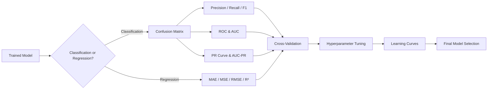
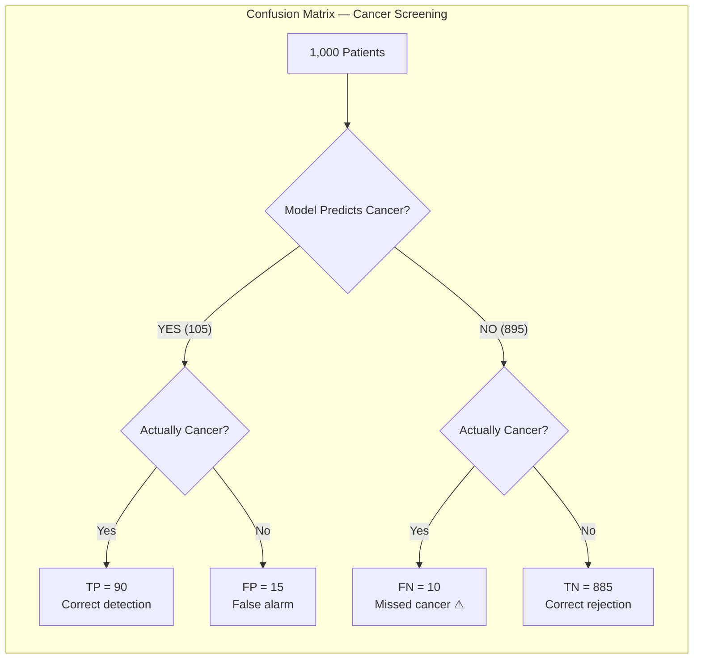
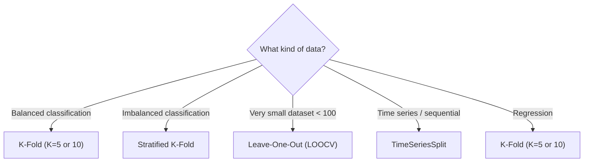

# Chapter 11 — Model Evaluation & Tuning

> "A model is only as good as the evidence you have that it works on data it has never seen."

---

## 11.1 Why Evaluation Matters

> **Model evaluation** is the systematic process of measuring how well a trained model generalizes to unseen data, using metrics appropriate to the task and the cost structure of errors.

A model that scores 99% accuracy on its training set tells you almost nothing. The only question that matters is: how does it perform on data it has never seen? And even then, "accuracy" alone is often the wrong yardstick.

Consider a fraud detection system at a bank. Only 0.2% of transactions are fraudulent. A model that blindly predicts "not fraud" for every transaction achieves 99.8% accuracy — and catches exactly zero fraud. You would never deploy it. The metric you choose defines what "good" means, and choosing wrong can be catastrophic.

```
THE ACCURACY TRAP
────────────────────────────────────────────────────────
  Dataset: 10,000 transactions, 20 fraudulent (0.2%)

  Model A — always predicts "Not Fraud":
    Accuracy = 9,980 / 10,000 = 99.8%     ← Looks great!
    Fraud caught = 0 / 20 = 0%            ← Completely useless.

  Model B — trained fraud classifier:
    Accuracy = 97.5%                       ← Lower accuracy!
    Fraud caught = 18 / 20 = 90%          ← Actually useful.

  Accuracy is MISLEADING when classes are imbalanced.
────────────────────────────────────────────────────────
```

This chapter gives you the full toolkit: classification metrics, regression metrics, validation strategies, hyperparameter tuning, and diagnostic tools for figuring out what is going wrong and how to fix it.



---

## 11.2 The Confusion Matrix

> **Confusion matrix**: a table that describes the performance of a classification model by comparing predicted labels against actual labels across all four possible outcomes: true positives, true negatives, false positives, and false negatives.

Every classification metric you will ever use derives from four numbers in this matrix.

```
                        PREDICTED
                      ┌──────────┬──────────┐
                      │ Positive │ Negative │
           ┌──────────┼──────────┼──────────┤
  ACTUAL   │ Positive │    TP    │    FN    │
           ├──────────┼──────────┼──────────┤
           │ Negative │    FP    │    TN    │
           └──────────┴──────────┴──────────┘

  TP (True Positive)  — Model said YES, reality was YES   ✓
  TN (True Negative)  — Model said NO,  reality was NO    ✓
  FP (False Positive)  — Model said YES, reality was NO   ✗ (Type I error)
  FN (False Negative)  — Model said NO,  reality was YES  ✗ (Type II error)
```

### Worked Example: Cancer Screening

A hospital screens 1,000 patients. 100 actually have cancer, 900 do not. The model produces:

| | Predicted: Cancer | Predicted: No Cancer | Total |
|---|---|---|---|
| **Actual: Cancer** | TP = 90 | FN = 10 | 100 |
| **Actual: No Cancer** | FP = 15 | TN = 885 | 900 |
| **Total** | 105 | 895 | 1,000 |

- **TP = 90** — correctly identified cancer patients
- **FN = 10** — missed cancer cases (the dangerous errors)
- **FP = 15** — false alarms (unnecessary follow-up tests)
- **TN = 885** — correctly identified healthy patients

We will use these numbers throughout the next two sections.



---

## 11.3 Classification Metrics

### Accuracy

> **Accuracy** = proportion of all predictions that are correct.

$$\text{Accuracy} = \frac{TP + TN}{TP + TN + FP + FN}$$

From our cancer example:

$$\text{Accuracy} = \frac{90 + 885}{1000} = 97.5\%$$

Sounds excellent. But remember: a model that always predicts "No Cancer" gets $885 + 0 + 0 + 100 = 1000$ predictions, with $\frac{900}{1000} = 90\%$ accuracy, while catching zero cancer cases. Accuracy only works when classes are roughly balanced.

### Precision

> **Precision** = of all instances the model labeled positive, what fraction actually were positive.

$$\text{Precision} = \frac{TP}{TP + FP} = \frac{90}{90 + 15} = \frac{90}{105} = 85.7\%$$

Precision answers: "When the model raises an alarm, how often is it right?" High precision means few false alarms.

**When precision matters most:** spam filtering. A false positive means a legitimate email lands in the spam folder — the user misses a job offer or an important message. You want the spam label to be trustworthy.

### Recall (Sensitivity, True Positive Rate)

> **Recall** = of all actually positive instances, what fraction did the model catch.

$$\text{Recall} = \frac{TP}{TP + FN} = \frac{90}{90 + 10} = 90\%$$

Recall answers: "Of all real positive cases, how many did you find?" High recall means few missed positives.

**When recall matters most:** cancer diagnosis. A false negative means a patient with cancer goes home untreated. Missing real cases can be fatal.

### Specificity (True Negative Rate)

> **Specificity** = of all actually negative instances, what fraction did the model correctly identify as negative.

$$\text{Specificity} = \frac{TN}{TN + FP} = \frac{885}{885 + 15} = 98.3\%$$

Specificity is recall's mirror image — it measures how well you identify negatives. It appears in the ROC curve (Section 11.4) as $1 - \text{Specificity} = \text{FPR}$.

### F1 Score

> **F1 Score** = the harmonic mean of precision and recall, providing a single metric that balances both.

$$F_1 = \frac{2 \times \text{Precision} \times \text{Recall}}{\text{Precision} + \text{Recall}} = \frac{2 \times 0.857 \times 0.90}{0.857 + 0.90} = \frac{1.543}{1.757} = 0.878$$

Why the harmonic mean instead of the arithmetic mean? Because the harmonic mean punishes imbalance. If precision = 1.0 and recall = 0.01, the arithmetic mean is 0.505 (looks acceptable), but the harmonic mean is 0.02 (correctly reflects the disaster).

### F-beta Score

When you want to weight precision and recall unequally:

$$F_\beta = (1 + \beta^2) \cdot \frac{\text{Precision} \times \text{Recall}}{\beta^2 \cdot \text{Precision} + \text{Recall}}$$

- $F_2$ — weights recall 2x more than precision (use for cancer detection)
- $F_{0.5}$ — weights precision 2x more than recall (use for spam filtering)

```chart
{
  "type": "bar",
  "data": {
    "labels": ["Accuracy", "Precision", "Recall", "Specificity", "F1 Score"],
    "datasets": [{
      "label": "Cancer Screening Model (%)",
      "data": [97.5, 85.7, 90.0, 98.3, 87.8],
      "backgroundColor": ["rgba(99,102,241,0.6)","rgba(34,197,94,0.7)","rgba(234,88,12,0.7)","rgba(56,189,248,0.7)","rgba(168,85,247,0.7)"],
      "borderColor": ["rgba(99,102,241,1)","rgba(34,197,94,1)","rgba(234,88,12,1)","rgba(56,189,248,1)","rgba(168,85,247,1)"],
      "borderWidth": 1
    }]
  },
  "options": {
    "plugins": { "title": { "display": true, "text": "Cancer Screening — All Classification Metrics (TP=90, FP=15, FN=10, TN=885)" } },
    "scales": {
      "y": { "title": { "display": true, "text": "Score (%)" }, "min": 80, "max": 100 },
      "x": {}
    }
  }
}
```

### The Precision-Recall Tradeoff

Most classifiers output a probability (e.g., 0.73 for "cancer"). You pick a **threshold** to convert this probability into a label. Changing the threshold directly trades precision for recall.

```
  Threshold = 0.3 (aggressive):          Threshold = 0.7 (conservative):
  ──────────────────────────              ──────────────────────────
  Flag anything above 0.3 as +           Flag only above 0.7 as +
  → Catches almost all positives          → Only flags when very confident
  → Many false alarms                     → Misses borderline cases
  → HIGH Recall, LOW Precision            → HIGH Precision, LOW Recall
```

```chart
{
  "type": "line",
  "data": {
    "labels": [0.1, 0.2, 0.3, 0.4, 0.5, 0.6, 0.7, 0.8, 0.9],
    "datasets": [
      {
        "label": "Precision",
        "data": [0.52, 0.60, 0.68, 0.76, 0.83, 0.89, 0.94, 0.97, 0.99],
        "borderColor": "rgba(34, 197, 94, 1)",
        "fill": false, "tension": 0.4, "pointRadius": 3, "borderWidth": 2
      },
      {
        "label": "Recall",
        "data": [0.98, 0.95, 0.91, 0.85, 0.77, 0.66, 0.53, 0.36, 0.14],
        "borderColor": "rgba(234, 88, 12, 1)",
        "fill": false, "tension": 0.4, "pointRadius": 3, "borderWidth": 2
      },
      {
        "label": "F1 Score",
        "data": [0.68, 0.74, 0.78, 0.80, 0.80, 0.76, 0.68, 0.53, 0.25],
        "borderColor": "rgba(168, 85, 247, 1)",
        "borderDash": [5,3],
        "fill": false, "tension": 0.4, "pointRadius": 3, "borderWidth": 2
      }
    ]
  },
  "options": {
    "plugins": { "title": { "display": true, "text": "Precision-Recall Tradeoff — Raising the Threshold Helps One, Hurts the Other" } },
    "scales": {
      "y": { "title": { "display": true, "text": "Score" }, "min": 0, "max": 1 },
      "x": { "title": { "display": true, "text": "Classification Threshold" } }
    }
  }
}
```

---

## 11.4 ROC Curve & AUC

> **ROC (Receiver Operating Characteristic) curve**: a plot of the True Positive Rate (recall) against the False Positive Rate ($1 - \text{specificity}$) at every possible classification threshold. **AUC (Area Under the Curve)** summarizes the ROC curve into a single number between 0 and 1.

The ROC curve shows how well a model separates positives from negatives across *all* thresholds simultaneously. You do not need to pick a single threshold to compare models — AUC does that for you.

**Interpreting AUC:** if you randomly draw one positive and one negative example, AUC is the probability that the model assigns a higher score to the positive example.

```
  AUC INTERPRETATION GUIDE
  ┌──────────────────────────────────────────────┐
  │ AUC = 1.0   → Perfect separation            │
  │ AUC = 0.9+  → Excellent                     │
  │ AUC = 0.8–0.9 → Good                        │
  │ AUC = 0.7–0.8 → Fair                        │
  │ AUC = 0.5   → Random guessing (diagonal)    │
  │ AUC < 0.5   → Worse than random (flip it!)  │
  └──────────────────────────────────────────────┘
```

```chart
{
  "type": "line",
  "data": {
    "labels": [0.0, 0.02, 0.05, 0.1, 0.15, 0.2, 0.3, 0.4, 0.5, 0.6, 0.7, 0.8, 0.9, 1.0],
    "datasets": [
      {
        "label": "Perfect Model (AUC = 1.0)",
        "data": [0.0, 1.0, 1.0, 1.0, 1.0, 1.0, 1.0, 1.0, 1.0, 1.0, 1.0, 1.0, 1.0, 1.0],
        "borderColor": "rgba(34, 197, 94, 1)",
        "fill": false, "tension": 0, "pointRadius": 0, "borderWidth": 2, "borderDash": [5,3]
      },
      {
        "label": "Good Model (AUC = 0.92)",
        "data": [0.0, 0.30, 0.52, 0.68, 0.76, 0.82, 0.89, 0.93, 0.96, 0.97, 0.98, 0.99, 1.0, 1.0],
        "borderColor": "rgba(99, 102, 241, 1)",
        "backgroundColor": "rgba(99, 102, 241, 0.1)",
        "fill": true, "tension": 0.4, "pointRadius": 2, "borderWidth": 2
      },
      {
        "label": "Weak Model (AUC = 0.72)",
        "data": [0.0, 0.08, 0.18, 0.32, 0.42, 0.50, 0.60, 0.68, 0.75, 0.81, 0.87, 0.93, 0.97, 1.0],
        "borderColor": "rgba(251, 191, 36, 1)",
        "fill": false, "tension": 0.4, "pointRadius": 2, "borderWidth": 2
      },
      {
        "label": "Random Model (AUC = 0.5)",
        "data": [0.0, 0.02, 0.05, 0.1, 0.15, 0.2, 0.3, 0.4, 0.5, 0.6, 0.7, 0.8, 0.9, 1.0],
        "borderColor": "rgba(239, 68, 68, 0.7)",
        "fill": false, "tension": 0, "pointRadius": 0, "borderWidth": 2, "borderDash": [8,4]
      }
    ]
  },
  "options": {
    "plugins": { "title": { "display": true, "text": "ROC Curves — Comparing Model Quality (Higher = Better)" } },
    "scales": {
      "y": { "title": { "display": true, "text": "True Positive Rate (Recall)" }, "min": 0, "max": 1 },
      "x": { "title": { "display": true, "text": "False Positive Rate (1 − Specificity)" } }
    }
  }
}
```

### When to Use ROC-AUC

ROC-AUC works best when:
- Classes are roughly balanced
- You care equally about positive and negative classes
- You want a threshold-independent comparison of models

ROC-AUC can be **misleading** on heavily imbalanced datasets because it is dominated by the (large) negative class. In those cases, use the PR curve instead.

---

## 11.5 Precision-Recall Curve & AUC-PR

> **Precision-Recall (PR) curve**: a plot of precision (y-axis) vs. recall (x-axis) at varying thresholds. **AUC-PR** is the area under this curve. Unlike ROC, the PR curve focuses exclusively on the positive class, making it the right choice for imbalanced datasets.

In fraud detection, only 0.2% of transactions are fraudulent. The ROC curve might look great (AUC = 0.97) because TN dominates. But the PR curve reveals how well the model actually catches fraud without flooding analysts with false alerts.

```
  PR CURVE KEY PROPERTIES
  ────────────────────────────────────────────────
  - A perfect model hugs the top-right corner (P=1, R=1)
  - A random model produces a flat line at P = prevalence
    (e.g., P = 0.002 for 0.2% fraud rate)
  - AUC-PR is much more sensitive to improvements on the
    minority class than AUC-ROC
```

```chart
{
  "type": "line",
  "data": {
    "labels": [0.0, 0.1, 0.2, 0.3, 0.4, 0.5, 0.6, 0.7, 0.8, 0.9, 1.0],
    "datasets": [
      {
        "label": "Good Fraud Model (AUC-PR = 0.82)",
        "data": [1.0, 0.97, 0.94, 0.91, 0.87, 0.82, 0.75, 0.66, 0.54, 0.38, 0.18],
        "borderColor": "rgba(99, 102, 241, 1)",
        "backgroundColor": "rgba(99, 102, 241, 0.1)",
        "fill": true, "tension": 0.4, "pointRadius": 2, "borderWidth": 2
      },
      {
        "label": "Mediocre Model (AUC-PR = 0.55)",
        "data": [0.90, 0.78, 0.68, 0.59, 0.52, 0.45, 0.38, 0.30, 0.22, 0.12, 0.05],
        "borderColor": "rgba(251, 191, 36, 1)",
        "fill": false, "tension": 0.4, "pointRadius": 2, "borderWidth": 2
      },
      {
        "label": "Random Baseline (prevalence = 0.2%)",
        "data": [0.002, 0.002, 0.002, 0.002, 0.002, 0.002, 0.002, 0.002, 0.002, 0.002, 0.002],
        "borderColor": "rgba(239, 68, 68, 0.7)",
        "fill": false, "tension": 0, "pointRadius": 0, "borderWidth": 2, "borderDash": [8,4]
      }
    ]
  },
  "options": {
    "plugins": { "title": { "display": true, "text": "Precision-Recall Curve — Fraud Detection (Imbalanced Data)" } },
    "scales": {
      "y": { "title": { "display": true, "text": "Precision" }, "min": 0, "max": 1 },
      "x": { "title": { "display": true, "text": "Recall" } }
    }
  }
}
```

### ROC vs. PR — When to Use Which

| Situation | Use | Why |
|---|---|---|
| Balanced classes | ROC-AUC | Both classes contribute equally |
| Imbalanced classes (rare positives) | AUC-PR | Focuses on the minority class |
| Care about ranking quality | ROC-AUC | Measures overall discrimination |
| Care about actionable predictions | AUC-PR | Precision at each recall level |

---

## 11.6 Regression Metrics

> **Regression metrics** quantify how far a model's continuous predictions deviate from actual values, each with a different sensitivity to error magnitude and interpretation.

### Running Example: House Price Prediction

| House | Actual ($K) | Predicted ($K) | Error ($K) |
|---|---|---|---|
| 1 | 300 | 280 | -20 |
| 2 | 450 | 460 | +10 |
| 3 | 200 | 230 | +30 |
| 4 | 500 | 480 | -20 |
| 5 | 350 | 400 | +50 |

### MAE — Mean Absolute Error

> **MAE** = the average of the absolute differences between predicted and actual values.

$$\text{MAE} = \frac{1}{n}\sum_{i=1}^{n} |y_i - \hat{y}_i| = \frac{20 + 10 + 30 + 20 + 50}{5} = \$26{,}000$$

On average, predictions are off by $26K. MAE treats all errors linearly — a $50K error is exactly 5x worse than a $10K error. Robust to outliers.

### MSE — Mean Squared Error

> **MSE** = the average of the squared differences between predicted and actual values.

$$\text{MSE} = \frac{1}{n}\sum_{i=1}^{n} (y_i - \hat{y}_i)^2 = \frac{400 + 100 + 900 + 400 + 2500}{5} = 860 \text{ (in K²)}$$

MSE heavily penalizes large errors. That $50K error on House 5 contributes 2500 to the sum — more than Houses 1–4 combined (1800). Use MSE when large errors are disproportionately bad.

### RMSE — Root Mean Squared Error

> **RMSE** = the square root of MSE, bringing the metric back to the original units.

$$\text{RMSE} = \sqrt{\text{MSE}} = \sqrt{860} \approx \$29{,}300$$

RMSE is always $\geq$ MAE. The gap between RMSE and MAE tells you about error variance: if RMSE $\gg$ MAE, a few predictions have very large errors.

### R² — Coefficient of Determination

> **R²** = the proportion of variance in the target variable explained by the model. Compares model performance against the baseline of always predicting the mean.

$$R^2 = 1 - \frac{\sum(y_i - \hat{y}_i)^2}{\sum(y_i - \bar{y})^2} = 1 - \frac{SS_{res}}{SS_{tot}}$$

| R² Value | Interpretation |
|---|---|
| 1.0 | Perfect prediction |
| 0.9 | Model explains 90% of variance |
| 0.5 | Model explains 50% of variance |
| 0.0 | No better than predicting the mean |
| < 0 | Worse than predicting the mean |

### MAPE — Mean Absolute Percentage Error

> **MAPE** = the average of absolute percentage errors, expressing accuracy as a percentage of actual values.

$$\text{MAPE} = \frac{1}{n}\sum_{i=1}^{n} \left|\frac{y_i - \hat{y}_i}{y_i}\right| \times 100$$

$$\text{MAPE} = \frac{1}{5}\left(\frac{20}{300} + \frac{10}{450} + \frac{30}{200} + \frac{20}{500} + \frac{50}{350}\right) \times 100 = \frac{1}{5}(6.67 + 2.22 + 15.0 + 4.0 + 14.29) \approx 8.4\%$$

MAPE is intuitive ("we're off by about 8.4%") but fails when actual values are near zero (division by zero).

### Comparison of Regression Metrics

```chart
{
  "type": "bar",
  "data": {
    "labels": ["House 1", "House 2", "House 3", "House 4", "House 5"],
    "datasets": [
      {
        "label": "Actual Price ($K)",
        "data": [300, 450, 200, 500, 350],
        "backgroundColor": "rgba(99, 102, 241, 0.7)",
        "borderColor": "rgba(99, 102, 241, 1)", "borderWidth": 1
      },
      {
        "label": "Predicted Price ($K)",
        "data": [280, 460, 230, 480, 400],
        "backgroundColor": "rgba(234, 88, 12, 0.7)",
        "borderColor": "rgba(234, 88, 12, 1)", "borderWidth": 1
      }
    ]
  },
  "options": {
    "plugins": { "title": { "display": true, "text": "House Price Prediction — Actual vs Predicted" } },
    "scales": {
      "y": { "title": { "display": true, "text": "Price ($K)" }, "beginAtZero": true },
      "x": {}
    }
  }
}
```

```chart
{
  "type": "bar",
  "data": {
    "labels": ["House 1", "House 2", "House 3", "House 4", "House 5"],
    "datasets": [
      {
        "label": "Absolute Error ($K) — used in MAE",
        "data": [20, 10, 30, 20, 50],
        "backgroundColor": "rgba(34,197,94,0.7)",
        "borderColor": "rgba(34,197,94,1)", "borderWidth": 1
      },
      {
        "label": "Squared Error (K²) — used in MSE",
        "data": [400, 100, 900, 400, 2500],
        "backgroundColor": "rgba(239,68,68,0.5)",
        "borderColor": "rgba(239,68,68,1)", "borderWidth": 1
      }
    ]
  },
  "options": {
    "plugins": { "title": { "display": true, "text": "MAE vs MSE — Squared Error Amplifies House 5's Big Miss" } },
    "scales": {
      "y": { "title": { "display": true, "text": "Error Magnitude" }, "beginAtZero": true },
      "x": {}
    }
  }
}
```

### Quick Reference: Choosing a Regression Metric

| Metric | Units | Outlier Sensitivity | Best For |
|---|---|---|---|
| MAE | Same as target | Low | General interpretability |
| MSE | Squared units | High | Mathematical optimization |
| RMSE | Same as target | High | Penalizing large errors |
| R² | Unitless (0–1) | Moderate | Comparing models |
| MAPE | Percentage | Low | Cross-scale comparisons |

---

## 11.7 Cross-Validation

> **Cross-validation** is a resampling procedure that partitions data into multiple train/test splits, trains and evaluates the model on each split, and averages the results to produce a more reliable performance estimate than a single split.

A single 80/20 train-test split is a roll of the dice. Maybe your test set happened to contain all the easy examples, or all the hard ones. Cross-validation removes this luck factor.

### K-Fold Cross-Validation

Split the data into K equally-sized folds. For each fold, train on $K-1$ folds and evaluate on the held-out fold. Repeat K times so every data point serves as test data exactly once.

```
  5-Fold Cross-Validation (1000 samples)
  ═══════════════════════════════════════════════════════════
  Fold 1: [TEST 200] [TRAIN 200] [TRAIN 200] [TRAIN 200] [TRAIN 200]
  Fold 2: [TRAIN 200] [TEST 200] [TRAIN 200] [TRAIN 200] [TRAIN 200]
  Fold 3: [TRAIN 200] [TRAIN 200] [TEST 200] [TRAIN 200] [TRAIN 200]
  Fold 4: [TRAIN 200] [TRAIN 200] [TRAIN 200] [TEST 200] [TRAIN 200]
  Fold 5: [TRAIN 200] [TRAIN 200] [TRAIN 200] [TRAIN 200] [TEST 200]

  Scores: [0.88, 0.91, 0.87, 0.90, 0.89]
  Mean = 0.89 ± 0.015
  ═══════════════════════════════════════════════════════════
```

Typical choice: **K = 5 or K = 10**. More folds = less bias but more computation.

```chart
{
  "type": "bar",
  "data": {
    "labels": ["Fold 1", "Fold 2", "Fold 3", "Fold 4", "Fold 5"],
    "datasets": [{
      "label": "Accuracy per Fold (%)",
      "data": [88, 91, 87, 90, 89],
      "backgroundColor": ["rgba(99,102,241,0.7)","rgba(99,102,241,0.7)","rgba(99,102,241,0.7)","rgba(99,102,241,0.7)","rgba(99,102,241,0.7)"],
      "borderColor": "rgba(99, 102, 241, 1)",
      "borderWidth": 1
    }]
  },
  "options": {
    "plugins": { "title": { "display": true, "text": "5-Fold Cross-Validation — Mean Accuracy = 89% ± 1.5%" } },
    "scales": {
      "y": { "title": { "display": true, "text": "Accuracy (%)" }, "min": 80, "max": 95 },
      "x": {}
    }
  }
}
```

### Stratified K-Fold

> **Stratified K-Fold** ensures each fold preserves the same class distribution as the full dataset.

For imbalanced data this is essential. If your dataset is 5% fraud, regular K-Fold might produce a fold with 0% fraud in the test set — making that fold's evaluation meaningless.

```
  Dataset: 95% Not Fraud, 5% Fraud (1000 samples)

  Regular K-Fold (dangerous):
    Fold 1 test: 3% fraud    ← under-represented
    Fold 2 test: 8% fraud    ← over-represented
    Fold 3 test: 1% fraud    ← barely any fraud to test on

  Stratified K-Fold (correct):
    Fold 1 test: 5% fraud    ← matches full dataset
    Fold 2 test: 5% fraud    ← matches full dataset
    Fold 3 test: 5% fraud    ← matches full dataset
```

**Rule:** always use Stratified K-Fold for classification. In scikit-learn: `StratifiedKFold(n_splits=5)`.

### Leave-One-Out Cross-Validation (LOOCV)

> **LOOCV** is K-Fold where K = N (number of samples). Each fold trains on N-1 samples and tests on exactly one.

- **Pro:** maximum use of training data, zero randomness in the split
- **Con:** extremely expensive (N separate training runs), high variance in estimates

Use LOOCV only when your dataset is very small (< 100 samples).

### Time Series Cross-Validation

> **Time series CV** respects temporal ordering — the model is always trained on past data and tested on future data. You never leak future information into training.

```
  Time Series Split (expanding window):
  ═══════════════════════════════════════════
  Split 1: [TRAIN] → [TEST]
  Split 2: [TRAIN ──────] → [TEST]
  Split 3: [TRAIN ────────────] → [TEST]
  Split 4: [TRAIN ──────────────────] → [TEST]
  ═══════════════════════════════════════════
  Train set grows; test always comes AFTER train in time.

  NEVER shuffle time series data! Random splits leak
  future information into training.
```

In scikit-learn: `TimeSeriesSplit(n_splits=5)`.



---

## 11.8 Hyperparameter Tuning

> **Hyperparameters** are configuration values set before training that control the learning process itself — unlike model parameters (weights, biases) which are learned from data. **Hyperparameter tuning** is the search for the combination that yields the best validation performance.

```
  PARAMETERS (learned)           HYPERPARAMETERS (set by you)
  ──────────────────────         ──────────────────────────────
  Neural net weights             Learning rate: 0.001
  Decision tree splits           Number of trees: 100
  SVM support vectors            Max depth: 5
  Regression coefficients        Regularization strength: 0.1
                                 Batch size: 32
                                 Dropout rate: 0.3
```

### Grid Search

> **Grid search** exhaustively evaluates every combination of specified hyperparameter values.

```
  Learning rate: [0.001, 0.01, 0.1]
  Max depth:     [3, 5, 10]

  Grid Search tries ALL 3 × 3 = 9 combinations:
  ─────────────────────────────────────────────────
           │  depth=3  │  depth=5  │  depth=10
  ─────────┼───────────┼───────────┼────────────
  lr=0.001 │   0.82    │   0.85    │   0.83
  lr=0.01  │   0.88    │   0.91 ★  │   0.89
  lr=0.1   │   0.71    │   0.73    │   0.70
  ─────────────────────────────────────────────────
  Best: lr=0.01, depth=5 → accuracy = 0.91
```

**Pros:** guaranteed to find the best combo within the grid.
**Cons:** scales exponentially. 5 hyperparameters with 5 values each = $5^5 = 3{,}125$ combinations. With 5-fold CV, that is 15,625 model fits.

### Random Search

> **Random search** samples hyperparameter combinations randomly from specified distributions, typically finding near-optimal values in far fewer iterations than grid search.

Why does random often beat grid? Bergstra & Bengio (2012) showed that when only a few hyperparameters matter (which is typical), grid search wastes most of its budget varying the unimportant ones. Random search explores more unique values of the important hyperparameters.

```
  Grid Search (9 trials):              Random Search (9 trials):
  ┌─────────────────────┐              ┌─────────────────────┐
  │  ●  ●  ●            │              │     ●       ●       │
  │                      │              │  ●               ●  │
  │  ●  ●  ●            │              │        ●            │
  │                      │              │  ●          ●       │
  │  ●  ●  ●            │              │           ●    ●    │
  └─────────────────────┘              └─────────────────────┘
  Only 3 unique lr values              9 unique lr values!
  Only 3 unique depth values           9 unique depth values!
```

### Bayesian Optimization

> **Bayesian optimization** builds a probabilistic surrogate model of the objective function and uses an acquisition function to intelligently choose the next hyperparameter combination to evaluate, balancing exploration of unknown regions with exploitation of promising ones.

```
  How Bayesian Optimization works:
  ────────────────────────────────────────────────────
  1. Evaluate a few random points
  2. Fit a surrogate model (usually Gaussian Process)
  3. Use acquisition function to pick next point:
     - High predicted performance → exploitation
     - High uncertainty → exploration
  4. Evaluate, update surrogate, repeat

  Trial 1: lr=0.05  → acc=0.84
  Trial 2: lr=0.001 → acc=0.79
  Trial 3: lr=0.02  → acc=0.90  (best so far!)
  Trial 4: lr=0.015 → acc=0.92  (surrogate guided us near 0.02)
  Trial 5: lr=0.018 → acc=0.93  (zeroing in!)
```

Libraries: **Optuna**, **Hyperopt**, **scikit-optimize**, **Ray Tune**.

### Comparison

| Method | Budget Required | Best When |
|---|---|---|
| Grid Search | High (exponential) | Few hyperparameters, small grid |
| Random Search | Moderate | Many hyperparameters, limited budget |
| Bayesian Optimization | Low (most efficient) | Expensive evaluations, need best results |

---

## 11.9 Learning Curves — Diagnosing Bias vs. Variance

> **Learning curves** plot training and validation performance as a function of training set size or training epochs, revealing whether a model suffers from high bias (underfitting) or high variance (overfitting).

The gap between training and validation curves is the diagnostic signal.

```
  HIGH VARIANCE (Overfitting)          HIGH BIAS (Underfitting)
  ─────────────────────────            ─────────────────────────
  Score                                Score
    │ ──── Train ≈ 0.97                  │
  1.0│                                 1.0│
    │                                    │
  0.9│                                 0.9│
    │                                    │
  0.8│                                 0.8│  ──── Train ≈ 0.72
    │   ···· Val ≈ 0.68                  │  ···· Val ≈ 0.70
  0.7│                                 0.7│
    │                                    │
  0.6│                                 0.6│
    └──────────────── →                  └──────────────── →
    Training data / epochs               Training data / epochs

  LARGE GAP = variance problem         BOTH LOW = bias problem
  Train is great, val is poor           Model can't learn the pattern

  Fix: more data, regularization,      Fix: more features, bigger model,
       dropout, simpler model                less regularization, train longer
```

```chart
{
  "type": "line",
  "data": {
    "labels": [100, 300, 500, 800, 1000, 1500, 2000, 3000, 5000, 8000, 10000],
    "datasets": [
      {
        "label": "Train — Overfitting Model",
        "data": [0.99, 0.98, 0.97, 0.97, 0.96, 0.96, 0.96, 0.95, 0.95, 0.95, 0.95],
        "borderColor": "rgba(239, 68, 68, 1)",
        "fill": false, "tension": 0.3, "pointRadius": 0, "borderWidth": 2
      },
      {
        "label": "Validation — Overfitting Model",
        "data": [0.55, 0.62, 0.66, 0.69, 0.71, 0.73, 0.74, 0.76, 0.78, 0.80, 0.81],
        "borderColor": "rgba(239, 68, 68, 0.5)",
        "borderDash": [5,3],
        "fill": false, "tension": 0.3, "pointRadius": 0, "borderWidth": 2
      },
      {
        "label": "Train — Good Model",
        "data": [0.95, 0.92, 0.90, 0.89, 0.89, 0.88, 0.88, 0.88, 0.87, 0.87, 0.87],
        "borderColor": "rgba(34, 197, 94, 1)",
        "fill": false, "tension": 0.3, "pointRadius": 0, "borderWidth": 2
      },
      {
        "label": "Validation — Good Model",
        "data": [0.55, 0.68, 0.75, 0.79, 0.81, 0.83, 0.84, 0.85, 0.85, 0.86, 0.86],
        "borderColor": "rgba(34, 197, 94, 0.5)",
        "borderDash": [5,3],
        "fill": false, "tension": 0.3, "pointRadius": 0, "borderWidth": 2
      },
      {
        "label": "Train — Underfitting Model",
        "data": [0.68, 0.70, 0.71, 0.71, 0.72, 0.72, 0.72, 0.72, 0.72, 0.72, 0.72],
        "borderColor": "rgba(99, 102, 241, 1)",
        "fill": false, "tension": 0.3, "pointRadius": 0, "borderWidth": 2
      },
      {
        "label": "Validation — Underfitting Model",
        "data": [0.50, 0.60, 0.64, 0.66, 0.67, 0.68, 0.69, 0.69, 0.70, 0.70, 0.70],
        "borderColor": "rgba(99, 102, 241, 0.5)",
        "borderDash": [5,3],
        "fill": false, "tension": 0.3, "pointRadius": 0, "borderWidth": 2
      }
    ]
  },
  "options": {
    "plugins": { "title": { "display": true, "text": "Learning Curves — Diagnosing Overfitting, Underfitting, and Good Fit" } },
    "scales": {
      "y": { "title": { "display": true, "text": "Score" }, "min": 0.45, "max": 1.0 },
      "x": { "title": { "display": true, "text": "Training Set Size" } }
    }
  }
}
```

### Diagnosis and Remedies Summary

| Symptom | Diagnosis | Remedies |
|---|---|---|
| Train high, val low, large gap | High variance (overfitting) | More data, regularization (L1/L2), dropout, simpler model, early stopping |
| Train low, val low, small gap | High bias (underfitting) | More features, bigger/deeper model, less regularization, train longer |
| Train high, val high, small gap | Good fit | Ship it. Monitor for data drift in production. |
| Train high, val oscillating | Noisy data or too-small val set | Clean data, increase val set size, use K-fold CV |

---

## 11.10 Model Selection: Which Metric for Which Problem?

The metric you optimize defines what your model learns to care about. Choose wrong and you optimize for the wrong thing.

| Problem | Key Concern | Primary Metric | Secondary Metric |
|---|---|---|---|
| **Spam detection** | Don't lose real emails (FP costly) | Precision | F0.5 |
| **Cancer screening** | Don't miss cancer (FN costly) | Recall | F2 |
| **Fraud detection** | Imbalanced + catch fraud | AUC-PR | Recall |
| **Sentiment analysis** | Balanced classes | F1 / Accuracy | AUC-ROC |
| **House price prediction** | Interpretable error | MAE | R² |
| **Demand forecasting** | Penalize big misses | RMSE | MAPE |
| **Credit scoring** | Rank applicants | AUC-ROC | KS statistic |
| **Object detection** | Localization + classification | mAP (mean avg precision) | IoU |

### Multi-Metric Evaluation

In practice, never rely on a single metric. Report a dashboard:

```
  FRAUD DETECTION MODEL — Evaluation Dashboard
  ═══════════════════════════════════════════════
  AUC-ROC:     0.96
  AUC-PR:      0.78  ← More informative for imbalanced data
  Precision:   0.62  (at threshold = 0.5)
  Recall:      0.85  (at threshold = 0.5)
  F1:          0.72  (at threshold = 0.5)
  F2:          0.79  (weighted toward recall)

  At threshold = 0.3: Recall = 0.94, Precision = 0.41
  At threshold = 0.7: Recall = 0.65, Precision = 0.83
  ═══════════════════════════════════════════════
  Business decision: set threshold based on
  cost of false alarm vs cost of missed fraud.
```

---

## 11.11 Common Evaluation Mistakes

These are the errors that trip up practitioners from beginners to experienced engineers.

### 1. Data Leakage

> **Data leakage** occurs when information from the test set (or from the future, in time series) influences the training process, producing overly optimistic evaluation results that do not generalize.

```
  WRONG: Normalize THEN split
  ─────────────────────────────────────
  1. Compute mean/std on ALL data      ← test info leaks into train!
  2. Normalize everything
  3. Split into train/test

  RIGHT: Split THEN normalize
  ─────────────────────────────────────
  1. Split into train/test
  2. Compute mean/std on TRAIN only
  3. Apply train's mean/std to both sets
```

### 2. Evaluating on Training Data

Never report training set metrics as your model's performance. Always hold out a test set or use cross-validation.

### 3. Using Accuracy on Imbalanced Data

As shown in Section 11.1, accuracy can be 99.8% while catching zero positives. Use F1, AUC-PR, or the metric aligned with your cost structure.

### 4. Not Using Stratified Splits for Classification

Random splits can produce folds where rare classes are absent. Always use stratified sampling for classification tasks.

### 5. Tuning on the Test Set

> If you use the test set to make modeling decisions (threshold tuning, feature selection, model selection), it becomes a second training set and your "test" performance is no longer an unbiased estimate.

The fix: use three sets — **train / validation / test**. Tune on validation, report final numbers on test. Or use nested cross-validation.

```
  CORRECT THREE-WAY SPLIT
  ═══════════════════════════════════════════════════
  ┌────────────────────┬──────────┬────────┐
  │     Train (60%)    │ Val (20%)│Test(20%)│
  └────────────────────┴──────────┴────────┘
        ↓                   ↓          ↓
   Fit model          Tune hyper-   Final
   parameters         parameters    evaluation
                      & threshold   (touch ONCE)
```

### 6. Ignoring Confidence Intervals

A single accuracy number is meaningless without variance. Report mean ± standard deviation across cross-validation folds. A model with 89% ± 1.2% is clearly better than one with 90% ± 5%.

### 7. Shuffling Time Series Data

Random train/test splits on time series data leak future information into the past. Always use temporal splits (Section 11.7).

### 8. Comparing Models on Different Splits

When comparing two models, they must be evaluated on the exact same test data. Otherwise differences in performance could be due to different splits, not different models.

---

## Key Takeaways

```
╔════════════════════════════════════════════════════════════════════╗
║  MODEL EVALUATION — WHAT TO REMEMBER                             ║
╠════════════════════════════════════════════════════════════════════╣
║                                                                   ║
║  CLASSIFICATION                                                   ║
║  • Confusion matrix: TP, TN, FP, FN — the foundation             ║
║  • Precision: "when I say positive, am I right?"                  ║
║  • Recall: "of all real positives, how many did I catch?"         ║
║  • F1: harmonic mean of precision & recall                        ║
║  • ROC-AUC: threshold-independent, overall discrimination         ║
║  • AUC-PR: preferred for imbalanced data                          ║
║  • Specificity: recall for the negative class                     ║
║                                                                   ║
║  REGRESSION                                                       ║
║  • MAE: interpretable, robust to outliers                         ║
║  • RMSE: penalizes large errors more heavily                      ║
║  • R²: proportion of variance explained (0 = mean baseline)       ║
║  • MAPE: percentage-based, intuitive but fails near zero          ║
║                                                                   ║
║  VALIDATION                                                       ║
║  • K-Fold CV: average over K splits for reliable estimates         ║
║  • Stratified K-Fold: preserve class ratios (always for clf)      ║
║  • Time Series Split: never leak future into past                  ║
║                                                                   ║
║  TUNING                                                           ║
║  • Grid Search: exhaustive, expensive                              ║
║  • Random Search: surprisingly effective, better coverage          ║
║  • Bayesian Optimization: smart, efficient, best for costly evals  ║
║                                                                   ║
║  DIAGNOSTICS                                                      ║
║  • Learning curves: gap = variance, both low = bias                ║
║  • Never evaluate on training data                                 ║
║  • Never tune on the test set                                      ║
║  • Always report confidence intervals                              ║
║                                                                   ║
╚════════════════════════════════════════════════════════════════════╝
```

---

## Review Questions

**1.** Your cancer screening model achieves 99% accuracy on a dataset where 99% of patients are healthy. Is this model good? What metric should you use instead?

<details>
<summary>Answer</summary>

No. A model that always predicts "healthy" also achieves 99% accuracy, while catching zero cancer cases. Use **Recall** (sensitivity) as the primary metric — in cancer screening, missing a real case (FN) is far worse than a false alarm (FP). Also report F2 score, which weights recall more heavily, and AUC-PR.
</details>

**2.** For a spam filter, which error is worse: marking a real email as spam (FP) or letting spam through to the inbox (FN)? Which metric should you optimize?

<details>
<summary>Answer</summary>

Marking a real email as spam (FP) is generally worse — the user misses a potentially critical message. Optimize **Precision**: when the model says "spam," it should be right. The F0.5 score is also appropriate since it weights precision higher than recall. However, the tradeoff depends on context — for a security-focused filter, letting malicious spam through (FN) might be worse.
</details>

**3.** Explain what AUC = 0.85 means in practical terms.

<details>
<summary>Answer</summary>

AUC = 0.85 means: if you randomly pick one positive example and one negative example, the model assigns a higher predicted probability to the positive example 85% of the time. It measures the model's ability to **rank** positives above negatives across all thresholds. An AUC of 0.85 is considered "good" (0.8–0.9 range).
</details>

**4.** You have 500 data points. Should you use a single train/test split or cross-validation? Why?

<details>
<summary>Answer</summary>

Use **cross-validation** (5-fold or 10-fold). With only 500 samples, a single random split could produce a test set that is unrepresentative — either too easy or too hard — giving a misleading estimate. K-fold CV evaluates on every data point across K runs and gives you both a mean score and a standard deviation, providing a much more reliable and informative performance estimate.
</details>

**5.** Your model has train accuracy = 97% and validation accuracy = 68%. Diagnose the problem and propose three fixes.

<details>
<summary>Answer</summary>

This is **high variance (overfitting)** — the large gap between train and validation performance means the model has memorized the training data but fails to generalize. Three fixes: (1) **Add more training data** to give the model more examples to learn genuine patterns. (2) **Add regularization** (L1/L2 penalties, dropout for neural nets) to constrain model complexity. (3) **Simplify the model** — reduce the number of layers, trees, or features. Early stopping is also effective for iterative learners.
</details>

**6.** You are tuning 4 hyperparameters, each with 5 possible values. How many combinations does grid search try? Why might random search be better?

<details>
<summary>Answer</summary>

Grid search tries $5^4 = 625$ combinations. With 5-fold cross-validation, that is 3,125 model fits. Random search is often better because (a) in practice only 1–2 hyperparameters significantly affect performance, and (b) grid search wastes budget by exhaustively varying unimportant hyperparameters while only testing 5 unique values of the important ones. Random search with 100 trials typically explores far more unique values of each hyperparameter and often finds near-optimal settings faster.
</details>

**7.** Why is AUC-PR preferred over AUC-ROC for fraud detection with 0.1% fraud rate?

<details>
<summary>Answer</summary>

With 0.1% fraud rate, there are ~1,000 negatives for every positive. The ROC curve's x-axis (False Positive Rate = FP / (FP + TN)) is dominated by the huge TN count, so even many false positives barely move the FPR. This makes the ROC curve look excellent even for mediocre models. The PR curve focuses exclusively on the positive class — precision measures FP relative to the (small number of) predicted positives, making it much more sensitive to the model's actual ability to identify fraud without flooding analysts with false alerts.
</details>

**8.** What is data leakage? Give two concrete examples.

<details>
<summary>Answer</summary>

**Data leakage** is when information from outside the training set improperly influences model training, leading to overly optimistic evaluation that does not generalize. Two examples: (1) **Feature leakage**: normalizing the entire dataset (computing mean/std on all data including test) before splitting — the test set's statistics influence training preprocessing. (2) **Target leakage**: including a feature that is a proxy for the label, like "treatment_received" when predicting disease (the treatment was assigned because the patient was diagnosed). Both produce models that look great in evaluation but fail in production.
</details>

**9.** Explain the difference between MAE and RMSE. When would you choose one over the other?

<details>
<summary>Answer</summary>

**MAE** (Mean Absolute Error) treats all errors linearly — a $50K error is exactly 5x worse than a $10K error. **RMSE** (Root Mean Squared Error) squares errors before averaging, so large errors are penalized disproportionately — a $50K error contributes 25x more than a $10K error to MSE. Choose MAE when all errors matter equally and you want interpretability (e.g., "on average, predictions are off by $26K"). Choose RMSE when large errors are especially undesirable (e.g., demand forecasting where a big miss causes stockouts). RMSE is always $\geq$ MAE; a large gap between them indicates a few predictions with very large errors.
</details>

**10.** You trained three models and their 5-fold CV results are: Model A = 91% ± 1.0%, Model B = 92% ± 4.5%, Model C = 89% ± 0.8%. Which do you deploy and why?

<details>
<summary>Answer</summary>

Deploy **Model A** (91% ± 1.0%). Although Model B has a higher mean (92%), its high variance (± 4.5%) means its performance is unstable — it might score 87.5% on some data and 96.5% on other data, making it unreliable in production. Model C is stable but lower-performing. Model A offers the best balance of strong performance and consistency. In production, reliability often matters more than squeezing out an extra percentage point.
</details>

---

**Previous:** [Chapter 10 — Neural Networks](10_neural_networks.md) | **Next:** [Chapter 12 — Deep Learning Reference](12_deep_learning.md)
