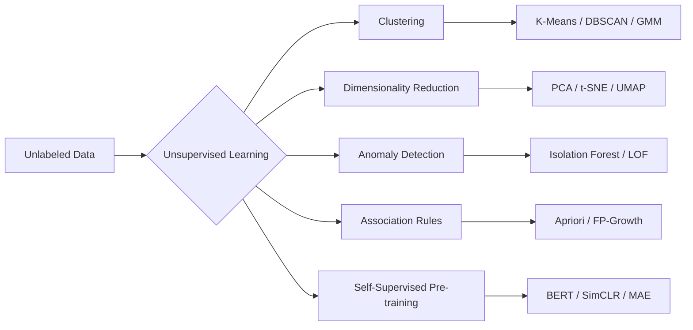
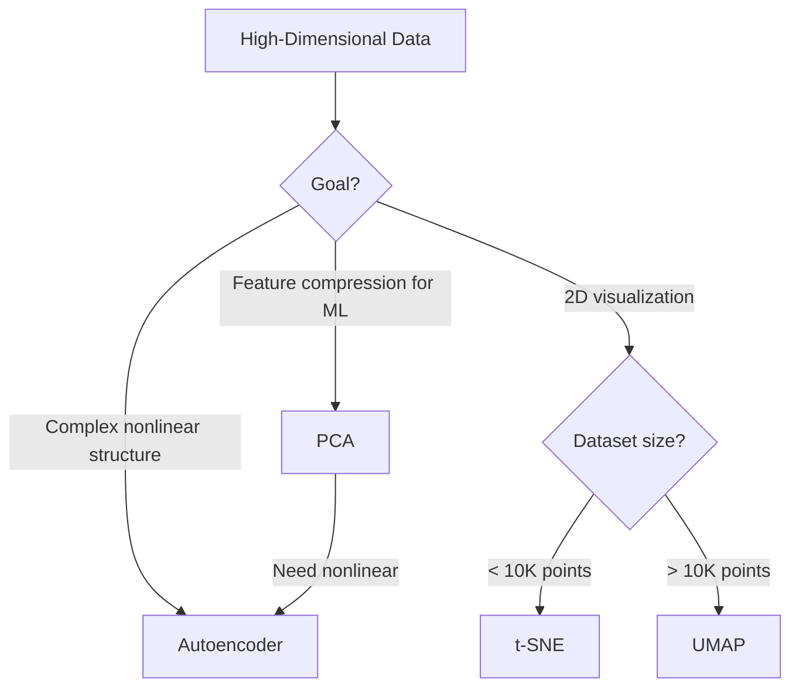
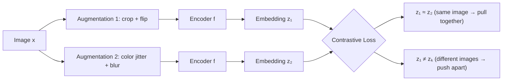
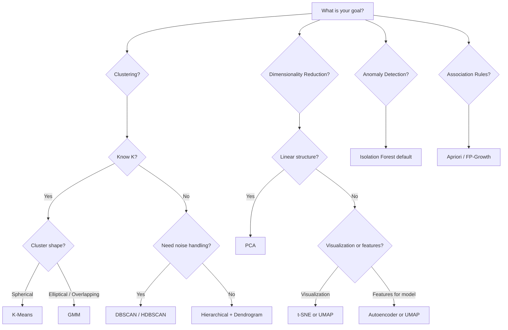

# Chapter 11 — Unsupervised Learning

---

## What You'll Learn

After this chapter you will be able to:
- Distinguish unsupervised from supervised learning and name core task families
- Explain why high-dimensional data breaks distance-based methods
- Select among K-Means, K-Medoids, Hierarchical, DBSCAN, HDBSCAN, Spectral Clustering, and GMM for a given problem
- Choose K with the elbow, Silhouette, Davies-Bouldin and the gap statistic — and score against labels with ARI/NMI when you have them
- Apply PCA, Kernel PCA, t-SNE, UMAP, and autoencoders for dimensionality reduction
- Detect anomalies with Isolation Forest and Local Outlier Factor
- Mine association rules with Apriori and FP-Growth
- Describe self-supervised learning and its role in modern AI

**Markers:** ★★★ = know cold for interviews · ★★ = high priority · ★ = good to know.
**Quick check** boxes are retrieval practice — attempt before revealing.
**Interview** boxes give the question, what to say, and the follow-up trap.

---

## 11.1 What is Unsupervised Learning? ★

> **Unsupervised learning** discovers hidden structure, patterns, or representations in data that carries no labeled responses. Core objectives include clustering, dimensionality reduction, density estimation, and generative modeling.

Supervised learning gets a dataset of input-output pairs and learns the mapping ([Ch 10](#content/10_supervised_learning)). Unsupervised learning gets inputs only — no targets, no answer key. The algorithm must find structure on its own: which data points are similar, what the underlying distribution looks like, whether the data lives on a lower-dimensional surface.

This is closer to how humans learn most things. Nobody labeled every object you ever saw; you noticed that some things look alike and grouped them yourself.

```
  SUPERVISED                        UNSUPERVISED
  ──────────────────────────        ──────────────────────────
  Data + labels                     Data only (no y)
  Learns input → output             Discovers hidden structure
  Judged on ground truth            Judged on internal metrics

  Tasks:                            Tasks:
   - Classification                  - Clustering
   - Regression                      - Dimensionality reduction
   - Sequence labeling               - Anomaly detection
                                     - Density estimation
                                     - Association rules

  Examples:                         Examples:
   "Is this email spam?"             "What segments exist?"
    (label: spam / not spam)          (no answer key at all)
   "Predict house price"             "Compress 784 dims to 32"
    (label: $450,000)
```



**Real-world scale:** Google clusters billions of web pages for search indexing. Spotify groups users by listening behavior for playlist recommendations. Credit card companies flag anomalous transactions — all without labeled training data for the specific task.

---

## 11.2 The Curse of Dimensionality ★★

#### Simple Explanation

Finding your friend along a single street is easy; finding them somewhere in a whole city is harder; finding them scattered across the floors of a skyscraper is harder still. Now imagine a space with a thousand such directions — everything ends up impossibly far apart, and every point sits at roughly the same distance from every other. That emptiness is exactly what breaks algorithms that rely on the idea of "nearby."

> **The curse of dimensionality** refers to the collection of phenomena that arise when analyzing data in high-dimensional spaces — phenomena that do not occur in low-dimensional settings, including data sparsity, distance concentration, and exponential growth of the volume to be sampled.

Add one feature and you add an entire axis. The volume of the space grows exponentially, but your dataset does not. With enough dimensions, every point becomes roughly equidistant from every other point, and distance-based algorithms (KNN, K-Means, DBSCAN) lose their discriminative power.

### Why Distances Break Down

Consider $n$ points uniformly distributed in a $d$-dimensional unit hypercube. The ratio of the maximum to minimum pairwise distance converges to 1 as $d \to \infty$:

$$\lim_{d \to \infty} \frac{\text{dist}_{\max} - \text{dist}_{\min}}{\text{dist}_{\min}} \to 0$$

In practical terms: with 1,000 features, the "nearest" neighbor is barely closer than the "farthest" one. KNN's entire premise collapses.

```
  Filling a space with evenly spaced points (10 per axis):

  1D (line):      10 points suffice
  2D (square):    10² = 100 points
  3D (cube):      10³ = 1,000 points
  10D:            10¹⁰ = 10 billion points
  100D:           10¹⁰⁰ — more than atoms in the universe
```

```chart
{
  "type": "bar",
  "data": {
    "labels": ["10 features", "100 features", "1,000 features", "10,000 features"],
    "datasets": [{
      "label": "Approx. Minimum Training Examples (~5-10x dims)",
      "data": [100, 1000, 10000, 100000],
      "backgroundColor": ["rgba(34,197,94,0.7)","rgba(99,102,241,0.7)","rgba(234,88,12,0.7)","rgba(239,68,68,0.7)"],
      "borderColor": ["rgba(34,197,94,1)","rgba(99,102,241,1)","rgba(234,88,12,1)","rgba(239,68,68,1)"],
      "borderWidth": 1
    }]
  },
  "options": {
    "plugins": { "title": { "display": true, "text": "Curse of Dimensionality — Data Requirements Grow with Feature Count" } },
    "scales": {
      "y": { "title": { "display": true, "text": "Examples Needed" }, "beginAtZero": true },
      "x": { "title": { "display": true, "text": "Number of Features" } }
    }
  }
}
```

### Remedies

| Strategy | How it helps |
|---|---|
| **Feature selection** | Remove uninformative or redundant features |
| **PCA / UMAP** | Project to a lower-dimensional subspace |
| **Regularization** | Penalize model complexity, implicitly reduce effective dimensionality |
| **Collect more data** | Fill the space more densely |
| **Domain knowledge** | Engineer fewer, more meaningful features |

> **Where else this shows up:** the same effect is what kills KNN in high
> dimensions — see the KNN-specific treatment in
> [Ch 12](#content/12_key_algorithms). Regularization as a general defence
> against model complexity is [Ch 8 §8.15](#content/08_core_concepts).
> PCA and UMAP, the two projection remedies, are §11.11 and §11.13 below.

<details>
<summary><strong>Quick check.</strong> You have 5,000 samples and 2,000 features. A colleague says "just use K-Means, it's unsupervised so overfitting isn't a concern." What's wrong with that reasoning?</summary>

Overfitting isn't the problem — **distance concentration** is. With 2,000 dimensions and only 5,000 points, the space is essentially empty, so every pair of points ends up at roughly the same distance. K-Means assigns points by *nearest centroid*, and when "nearest" stops being meaningful, the assignments are close to arbitrary.

You'll still get clusters — K-Means always returns K of them. They just won't mean anything. That's the danger: unsupervised methods fail **silently**.

**Fix:** reduce first (PCA to ~50 dims, §11.11), then cluster. And sanity-check the result with Silhouette (§11.9) — a near-zero score is the tell.
</details>

---

## 11.3 Clustering Overview ★

> **Clustering** partitions a dataset into groups (clusters) such that objects within a cluster are more similar to each other than to objects in other clusters. The definition of "similar" depends on the chosen distance metric and algorithm.

Clustering is probably the most intuitive unsupervised task. You hand the algorithm unlabeled data, and it discovers natural groupings. Customer segmentation, document topic grouping, image categorization, gene expression profiling — all clustering problems.

### Taxonomy of Clustering Methods

```
┌────────────────────────────────────────────────────────────────┐
│ PARTITIONAL      K-Means, K-Medoids                            │
│ One point → one cluster. You must choose K.                    │
├────────────────────────────────────────────────────────────────┤
│ HIERARCHICAL     Agglomerative, Divisive                       │
│ Builds a merge tree. Cut it anywhere to get any K.             │
├────────────────────────────────────────────────────────────────┤
│ DENSITY-BASED    DBSCAN, HDBSCAN, OPTICS                       │
│ Clusters = dense regions. Any shape. Flags noise.              │
├────────────────────────────────────────────────────────────────┤
│ GRAPH-BASED      Spectral Clustering                           │
│ Clusters = well-connected parts of a similarity graph.         │
├────────────────────────────────────────────────────────────────┤
│ MODEL-BASED      GMM (Gaussian Mixture Models)                 │
│ Each cluster is a distribution. Soft assignments.              │
└────────────────────────────────────────────────────────────────┘
```

The five families answer the question "what *is* a cluster?" differently —
a ball of points, a branch of a tree, a dense region, a connected piece of
a graph, or a probability distribution. That choice drives everything else.

---

## 11.4 K-Means Clustering ★★★

#### Simple Explanation

Imagine dropping a handful of magnets onto a scatter of iron filings: each filing snaps to its nearest magnet, then you slide every magnet to the middle of its own pile, and repeat until nothing moves. That settling process *is* K-Means — it hunts for K natural centers and glues each point to the closest one, tightening the groups on every pass.

> **K-Means** partitions $n$ observations into $K$ clusters by iteratively assigning each point to the nearest centroid and recomputing centroids as the mean of assigned points, minimizing the within-cluster sum of squares (WCSS / inertia):

**Assumes:** clusters are **spherical, similar in size, and similar in density** — and that you already know how many there are. Every K-Means failure you will ever see traces back to one of those four.
>
> $$J = \sum_{k=1}^{K} \sum_{x_i \in C_k} \| x_i - \mu_k \|^2$$

The algorithm is dead simple. Place K center points (centroids). Assign every data point to its nearest centroid. Move each centroid to the mean of its assigned points. Repeat until nothing changes. That is the entire algorithm.

### The Algorithm Step by Step

```
  STEP 1: Initialize K centroids (randomly or via K-Means++)
  ┌──────────────────────────────────────────────────┐
  │  . . . .  ★₁                                     │
  │  . . .                                           │
  │  . . . .       ★₂                                │
  │  . . .  ★₃                                       │
  │  . . . . .                                       │
  └──────────────────────────────────────────────────┘

  STEP 2: Assign each point to nearest centroid
  ┌──────────────────────────────────────────────────┐
  │  ● ● ● ●  ★₁      ● = cluster 1                  │
  │  ● ● ●             ■ = cluster 2                  │
  │  ▲ ▲ ▲ ▲      ★₂  ▲ = cluster 3                  │
  │  ■ ■ ■  ★₃                                       │
  │  ■ ■ ■ ■ ■                                       │
  └──────────────────────────────────────────────────┘

  STEP 3: Recompute centroids as cluster means
  ┌──────────────────────────────────────────────────┐
  │  ● ● ● ●                                         │
  │  ● ●★₁●   ← centroid moves to center of ●s       │
  │  ▲ ▲ ▲ ▲                                         │
  │  ■ ■ ■★₃                                         │
  │  ■ ■ ■ ■ ■                                       │
  │  ▲ ▲★₂▲                                          │
  └──────────────────────────────────────────────────┘

  STEP 4: Repeat steps 2-3 until convergence
          (centroids stop moving / assignments stable)
```

### Worked Example — Customer Segmentation

Suppose we have 6 customers described by two features: annual spending ($K) and visit frequency (visits/month).

| Customer | Spending | Visits |
|---|---|---|
| A | 10 | 2 |
| B | 12 | 3 |
| C | 50 | 8 |
| D | 55 | 9 |
| E | 30 | 5 |
| F | 32 | 6 |

**K=2, random init:** $\mu_1 = A = (10,2)$, $\mu_2 = D = (55,9)$.

**Iteration 1 — Assign:**
- $d(B, \mu_1) = \sqrt{(12-10)^2+(3-2)^2} = \sqrt{5} \approx 2.2$ → Cluster 1
- $d(E, \mu_1) = \sqrt{(30-10)^2+(5-2)^2} = \sqrt{409} \approx 20.2$; $d(E, \mu_2) = \sqrt{(30-55)^2+(5-9)^2} = \sqrt{641} \approx 25.3$ → Cluster 1
- $d(F, \mu_1) \approx 22.4$; $d(F, \mu_2) \approx 23.2$ → Cluster 1
- C, D → Cluster 2

Cluster 1 = {A, B, E, F}, Cluster 2 = {C, D}

**Recompute centroids:** $\mu_1 = (\frac{10+12+30+32}{4}, \frac{2+3+5+6}{4}) = (21, 4)$, $\mu_2 = (52.5, 8.5)$

**Iteration 2 — Reassign with new centroids:** E and F are now closer to $\mu_1=(21,4)$ at distances ~9.1 and ~11.2 respectively, vs ~25 and ~23 to $\mu_2$. Assignments stable → converged.

Final clusters: **Budget shoppers** {A, B, E, F} and **Premium shoppers** {C, D}.

### K-Means++ Initialization

Standard random initialization can place centroids close together, leading to poor convergence. K-Means++ fixes this:

1. Choose the first centroid uniformly at random from data points
2. For each remaining point, compute $D(x)$ = distance to nearest existing centroid
3. Choose next centroid with probability proportional to $D(x)^2$
4. Repeat until K centroids are chosen

This spreads centroids apart, yielding 2-10x faster convergence and consistently better results. It is the default in scikit-learn.

### Does It Always Converge?

Yes — and the reason is worth knowing, because the guarantee is weaker than it
first sounds.

Both halves of each iteration can only **reduce** the inertia $J$. Reassigning a
point to a nearer centroid cannot increase its squared distance, and moving a
centroid to the mean of its members is exactly the point that minimises their
summed squared distance. So $J$ decreases monotonically. There are only finitely
many ways to partition $n$ points into $K$ groups, and no partition can repeat
(that would need $J$ to increase), so the algorithm **must** halt.

```
  GUARANTEED          Inertia never increases
                      Terminates in finite steps

  NOT GUARANTEED      That you found the best clustering
```

What you land on is a **local** optimum determined by the initialisation. Finding
the *globally* optimal K-Means clustering is **NP-hard**, so in practice you buy
quality with restarts: scikit-learn's `n_init` runs the whole algorithm 10 times
from different K-Means++ seeds and keeps the lowest-inertia result.

> This is the same shape of guarantee EM gives for GMMs (§11.8) — monotonic
> improvement toward a local optimum, never a promise of the global one.

### K-Medoids — When the Mean Doesn't Work

K-Means is welded to Euclidean distance, because the step "move the centroid to
the **mean**" is only the error-minimising move for squared Euclidean error.
Swap in cosine or Manhattan distance and the two halves stop optimising the same
objective. **K-Medoids** fixes this by changing what a cluster centre *is*.

| | K-Means | K-Medoids |
|---|---|---|
| Centre is | The **mean** — usually not a real data point | A **medoid** — an actual data point |
| Distance metric | Euclidean only (in practice) | **Any** metric, even non-numeric |
| Outliers | Drag the mean toward them | Barely move the medoid |
| Cost per iteration | $O(nK)$ | $O(n^2)$ for the classic PAM algorithm |
| Scale | Millions of points | Thousands |

The classic algorithm is **PAM** (Partitioning Around Medoids): pick $K$ points as
medoids, assign every point to its nearest medoid, then repeatedly try swapping a
medoid with a non-medoid and keep the swap if total cost drops.

Two things follow from the centre being a real data point. First, it is
**interpretable** — "this cluster's representative is *customer 4471*" is
something you can show a stakeholder, whereas a mean of one-hot features is
often meaningless. Second, it is **robust**: one customer with a ₹10 crore order
will yank a mean centroid across the space, but the medoid barely shifts.

**Reach for K-Medoids when:** your distance is not Euclidean (cosine on text,
Jaccard on sets, edit distance on strings, Gower on mixed types), outliers are
present and you can't remove them, or you need a real exemplar per cluster. The
price is the $O(n^2)$ cost, so it caps out in the low thousands of points.

### Strengths and Limitations

```
  ✓ Simple, fast — O(nKI) for n points, K clusters, I iterations
  ✓ Scales to millions of points
  ✓ Well-understood, deterministic given fixed init
  ✗ Must specify K in advance
  ✗ Assumes spherical, equally-sized clusters
  ✗ Sensitive to outliers (outliers pull centroids)
  ✗ Finds only convex cluster boundaries
  ✗ Result depends on initialization (run multiple times)
```

> **Interview —** *"Why can K-Means only find spherical clusters?"*
> **Say:** Because every point goes to its **nearest centroid** under Euclidean distance. That rule carves the space into **Voronoi cells**, which are convex by construction — so the boundary between any two clusters is always a straight line (a hyperplane). A crescent or a ring is not convex, so no assignment of centroids can reproduce it.
> **They follow up with:** *"So could you just swap in cosine distance?"* — not safely. K-Means alternates "assign to nearest" with "move centroid to the **mean**," and the mean is only the SSE-minimising centre for **Euclidean** distance. Change the metric and the two halves stop optimising the same objective. Use **K-Medoids** (see above — it picks an actual data point as the centre, so any metric works) or **spherical K-Means** for cosine.

<details>
<summary><strong>Quick check.</strong> You run K-Means twice on identical data and get two different clusterings. Is this a bug?</summary>

**No — it's expected.** K-Means converges to a **local** optimum that depends on where the centroids started. Different random initialisations land in different basins.

**What to do:** run it multiple times and keep the lowest-inertia result. That's exactly what scikit-learn's `n_init` does (default: 10 restarts), and it's why **K-Means++** initialisation matters — spreading the initial centroids apart makes bad basins much less likely.
</details>

---

## 11.5 Hierarchical Clustering ★★

#### Simple Explanation

Lay every item out on a table as its own tiny pile. Find the two piles that look most alike and push them together. Do it again — pairs become clumps, clumps become bigger clumps — until everything sits in a single heap. Now keep a record of the order in which things merged, and you have a tree.

The tree is the real prize. Nothing forced you to decide how many groups you wanted before you started, because you effectively built every grouping at once. Slice the tree near the bottom and you get many small, tightly related groups; slice it near the top and you get a handful of broad ones. It is one picture read at different zoom levels, rather like a family tree showing siblings, cousins and distant branches all at once.

That merge-tree has a name: a **dendrogram**.

> **Agglomerative hierarchical clustering** starts with each observation as a singleton cluster and iteratively merges the two closest clusters until a single cluster remains. The merge history forms a binary tree called a **dendrogram**, which can be cut at any height to produce a partition into $K$ clusters.

**Assumes:** the data has a genuine **nested** structure — that groups sit inside larger groups. It will happily build a tree over data with no hierarchy at all, which is why the dendrogram must be judged, not trusted.

The big advantage: you do not need to specify K upfront. Build the full tree, then cut it wherever makes sense. The dendrogram gives you a view of cluster structure at every granularity simultaneously.

### Agglomerative Algorithm

```
  START: n singleton clusters {A}, {B}, {C}, {D}, {E}

  Step 1: Merge two closest → {A,B}    (dist=1.2)
  Step 2: Merge two closest → {C,D}    (dist=1.5)
  Step 3: Merge {A,B} + {E}  → {A,B,E} (dist=2.8)
  Step 4: Merge {A,B,E} + {C,D} → all  (dist=4.1)
```

### Reading the Dendrogram

Those four merges draw a tree. Height = the distance at which a merge happened,
so short joins mean "these were very similar" and tall joins mean "these were
only forced together at the end."

```
 height
       │
   4.1 ┤          ┌───────────────────┐
       │          │                   │
   2.8 ┤     ┌────┴─────┐             │
       │     │          │             │
   1.5 ┤     │          │          ┌──┴──┐
   1.2 ┤  ┌──┴──┐       │          │     │
       │  │     │       │          │     │
     0 └──┴─────┴───────┴──────────┴─────┴──
          A     B       E          C     D
```

**How to cut it.** Draw a horizontal line at any height and count the vertical
branches it crosses — that count is your number of clusters, and each severed
branch is one cluster.

| Cut at height | Branches crossed | Clusters you get |
|---|---|---|
| 3.5 | 2 | {A, B, E} and {C, D} |
| 2.0 | 3 | {A, B}, {E}, {C, D} |
| 1.3 | 4 | {A, B}, {C}, {D}, {E} |

Note that **E joins {A, B} at height 2.8** — much later than A and B joined each
other at 1.2. That tall join is the tree telling you E is a loose member of that
group, something a flat K-Means labelling would never reveal.

### Linkage Criteria

How do you measure the "distance" between two clusters containing multiple points?

| Linkage | Definition | Behavior |
|---|---|---|
| **Single** | $\min$ distance between any two points | Chaining effect; elongated clusters |
| **Complete** | $\max$ distance between any two points | Compact, equal-sized clusters |
| **Average** | Mean of all pairwise distances | Compromise between single and complete |
| **Ward's** | Merge pair that minimizes total within-cluster variance | Tends to produce equal-sized, spherical clusters; best general default |

**Complexity:** $O(n^3)$ time, $O(n^2)$ memory for the distance matrix. This makes hierarchical clustering impractical beyond ~10,000 points. For larger data, use K-Means or DBSCAN as a first pass.

> **Interview —** *"When would you choose hierarchical clustering over K-Means?"*
> **Say:** Three situations. (1) You genuinely don't know K — the dendrogram shows you the structure at **every** granularity at once, so you decide after looking. (2) The data has a real **nested** hierarchy (taxonomies, org charts, phylogenies) and that nesting is itself the finding. (3) The dataset is small enough that $O(n^3)$ doesn't hurt, and you want a deterministic result with no initialisation lottery.
> **They follow up with:** *"And when would you not?"* — anything above ~10k points; the $O(n^2)$ distance matrix alone becomes the blocker. Also note the merges are **greedy and irreversible**: a bad early merge can never be undone, so hierarchical clustering isn't automatically "better," just more informative at small scale.

---

## 11.6 DBSCAN ★★★

#### Simple Explanation

Look down at a country from a plane at night. Towns show up as dense patches of light and you can pick them out instantly — without being told how many towns to expect, and without any of them being round. A town might sprawl along a coastline or snake down a valley. A single farmhouse glowing out in the dark countryside is not a tiny town; it is just a farmhouse.

That is the whole idea. A cluster is a **crowded region**, not a ball around a centre. A point with plenty of neighbours packed close by sits in the thick of a crowd. A point with few neighbours of its own, but which is close to someone in the thick of it, is on the fringe. A point with nothing much around it belongs to no crowd at all — and, unusually, is allowed to say so.

> **DBSCAN (Density-Based Spatial Clustering of Applications with Noise)** groups together points that are closely packed — defined by a minimum number of points ($\text{minPts}$) within a radius ($\varepsilon$). Points in low-density regions are labeled as noise. It requires no pre-specification of the number of clusters and can discover clusters of arbitrary shape.

**Assumes:** clusters are **dense regions separated by sparse ones**, and that a *single* density threshold (ε, minPts) fits every cluster. When one cluster is much sparser than another, that single threshold cannot serve both — which is exactly the gap HDBSCAN fills.

K-Means forces you to choose K and assumes round clusters. DBSCAN says: "clusters are dense regions separated by sparse regions." It figures out how many clusters exist, finds them regardless of shape, and explicitly marks outliers as noise.

### Three Point Types

```
  CORE POINT (●):  ≥ minPts neighbors within radius ε
                   Forms the backbone of a cluster

  BORDER POINT (○): < minPts neighbors within ε,
                    but within ε of at least one core point
                    Lives on the edge of a cluster

  NOISE POINT (×):  Not within ε of any core point
                    Belongs to no cluster — an outlier
```

### Algorithm

1. Pick an unvisited point $p$.
2. Find all points within distance $\varepsilon$ of $p$.
3. If $|\text{neighbors}| \geq \text{minPts}$, $p$ is a **core point** — start a new cluster. Expand the cluster by recursively adding all density-reachable points.
4. If $|\text{neighbors}| < \text{minPts}$ and $p$ is within $\varepsilon$ of a core point, mark $p$ as a **border point**.
5. Otherwise, mark $p$ as **noise**.
6. Repeat until all points visited.

### Worked Example — Tracing DBSCAN by Hand

Ten points, $\varepsilon = 2$, $\text{minPts} = 3$.

> **State your convention first.** Here minPts **counts the point itself** — that
> is what scikit-learn's `min_samples` does — so minPts = 3 means "me plus at
> least two others." Other texts exclude the point, and write the identical rule
> as minPts = 2. Interviewers differ, so say which one you mean before you start.

| Point | P1 | P2 | P3 | P4 | P5 | P6 | P7 | P8 | P9 | P10 |
|---|---|---|---|---|---|---|---|---|---|---|
| $x$ | 1 | 2 | 2 | 1 | 3 | 5 | 5 | 7 | 8 | 7 |
| $y$ | 1 | 1 | 2 | 2 | 3 | 5 | 6 | 7 | 7 | 8 |

```chart
{
  "type": "scatter",
  "data": {
    "datasets": [
      {
        "label": "Core (≥ 3 neighbours incl. itself)",
        "data": [{"x":1,"y":1},{"x":2,"y":1},{"x":2,"y":2},{"x":1,"y":2},{"x":7,"y":7},{"x":8,"y":7},{"x":7,"y":8}],
        "backgroundColor": "rgba(99, 102, 241, 0.8)",
        "pointRadius": 9
      },
      {
        "label": "Border (too few, but reached by a core point)",
        "data": [{"x":3,"y":3}],
        "backgroundColor": "rgba(234, 88, 12, 0.9)",
        "pointStyle": "triangle", "pointRadius": 12
      },
      {
        "label": "Noise (too few, and no core point in reach)",
        "data": [{"x":5,"y":5},{"x":5,"y":6}],
        "backgroundColor": "rgba(239, 68, 68, 1)",
        "borderColor": "rgba(30, 30, 30, 1)",
        "pointStyle": "rectRot", "pointRadius": 11, "borderWidth": 2
      }
    ]
  },
  "options": {
    "plugins": { "title": { "display": true, "text": "DBSCAN — the Three Point Types, Worked Out Below" } },
    "scales": {
      "y": { "title": { "display": true, "text": "y" }, "min": 0, "max": 9 },
      "x": { "title": { "display": true, "text": "x" }, "min": 0, "max": 9 }
    }
  }
}
```

**Step 1 — count neighbours.** For each point, list everything inside the radius.

| Point | Neighbours within $\varepsilon=2$ (distance) | Count (with itself) |
|---|---|---|
| P1 | P2 (1.00), P3 (1.41), P4 (1.00) | 4 |
| P2 | P1 (1.00), P3 (1.00), P4 (1.41) | 4 |
| P3 | P1 (1.41), P2 (1.00), P4 (1.00), P5 (1.41) | 5 |
| P4 | P1 (1.00), P2 (1.41), P3 (1.00) | 4 |
| P5 | P3 (1.41) | 2 |
| P6 | P7 (1.00) | 2 |
| P7 | P6 (1.00) | 2 |
| P8 | P9 (1.00), P10 (1.00) | 3 |
| P9 | P8 (1.00), P10 (1.41) | 3 |
| P10 | P8 (1.00), P9 (1.41) | 3 |

Nothing is borderline: every pairwise distance in this data is either $\le 1.41$
or $\ge 2.24$, so no verdict hangs on a rounding decision.

**Step 2 — classify.** Ask the count question first; only if it fails do you ask
the anchor question.

| Point | Count | Verdict | Reason |
|---|---|---|---|
| P1, P2, P4 | 4 | **Core** | $4 \ge 3$ |
| P3 | 5 | **Core** | $5 \ge 3$ — the densest point here |
| P8, P9, P10 | 3 | **Core** | exactly 3, clearing the bar by nothing |
| P5 | 2 | **Border** | fails the count, but core point P3 is 1.41 away |
| P6 | 2 | **Noise** | fails the count, and neighbour P7 is not core |
| P7 | 2 | **Noise** | fails the count, and neighbour P6 is not core |

**Step 3 — the clusters.** Core points within $\varepsilon$ of each other merge;
each border point then joins the cluster of a core point that reached it.

- **Cluster 1:** {P1, P2, P3, P4} core **+** P5 border — 5 points
- **Cluster 2:** {P8, P9, P10} — all three core
- **Noise:** P6, P7

Two things are worth pausing on. P6 and P7 are **1.00 apart** — closer to each
other than P5 is to P3 — and yet *both* are noise: proximity alone builds nothing,
because a cluster has to be anchored by a **core** point and neither of them
qualifies. And Cluster 2 clears the threshold exactly, so raising minPts to 4
would turn all three of those points into noise as well.

*Takeaway: DBSCAN's three-way label falls out of two questions asked in order — "do I have minPts neighbours?" (core, or not), and if not, "is a core point within ε of me?" (border, or noise). Density has to be anchored, and reachability flows only through core points.*

### DBSCAN vs K-Means

```
┌──────────────────────────┬────────────────────────────────────┐
│ K-Means                  │ DBSCAN                             │
├──────────────────────────┼────────────────────────────────────┤
│ Must specify K           │ K discovered automatically         │
│ Only convex clusters     │ Arbitrary shape clusters           │
│ All points assigned      │ Noise points explicitly flagged    │
│ Sensitive to outliers    │ Robust to outliers                 │
│ O(nKI) — very fast       │ O(n log n) with spatial indexing   │
│ Deterministic (given init)│ Deterministic (border pts may vary)│
└──────────────────────────┴────────────────────────────────────┘

  Shapes DBSCAN handles that K-Means cannot:

   Ring:          Crescents:       Interleaved spirals:
   ·●●●●·          ●●●              ●●●   ○○○
  ●·····●          ●●●●  ○○○       ●●●  ○○○
  ●·····●          ●●●●   ○○○     ●●●  ○○○
   ·●●●●·          ●●●
```

### Choosing ε and minPts

**Rule of thumb for minPts:** $2 \times d$ where $d$ = number of dimensions. For 2D data, minPts = 4 is a common starting point.

**Choosing ε with a k-distance plot:**
1. For each point, compute the distance to its $k$-th nearest neighbor (where $k = \text{minPts}$).
2. Sort these distances in ascending order and plot.
3. The "elbow" in the plot suggests a good ε.

```chart
{
  "type": "scatter",
  "data": {
    "datasets": [
      {
        "label": "Distance to the 4th nearest neighbour",
        "data": [{"x":0,"y":0.099},{"x":1,"y":0.108},{"x":2,"y":0.116},{"x":3,"y":0.12},{"x":4,"y":0.12},{"x":5,"y":0.122},{"x":6,"y":0.125},{"x":7,"y":0.132},{"x":8,"y":0.135},{"x":9,"y":0.141},{"x":10,"y":0.15},{"x":11,"y":0.15},{"x":12,"y":0.151},{"x":13,"y":0.151},{"x":14,"y":0.153},{"x":15,"y":0.156},{"x":16,"y":0.159},{"x":17,"y":0.162},{"x":18,"y":0.17},{"x":19,"y":0.171},{"x":20,"y":0.174},{"x":21,"y":0.175},{"x":22,"y":0.177},{"x":23,"y":0.178},{"x":24,"y":0.182},{"x":25,"y":0.183},{"x":26,"y":0.183},{"x":27,"y":0.185},{"x":28,"y":0.198},{"x":29,"y":0.198},{"x":30,"y":0.199},{"x":31,"y":0.199},{"x":32,"y":0.205},{"x":33,"y":0.215},{"x":34,"y":0.215},{"x":35,"y":0.215},{"x":36,"y":0.225},{"x":37,"y":0.226},{"x":38,"y":0.227},{"x":39,"y":0.232},{"x":40,"y":0.232},{"x":41,"y":0.233},{"x":42,"y":0.233},{"x":43,"y":0.24},{"x":44,"y":0.24},{"x":45,"y":0.249},{"x":46,"y":0.264},{"x":47,"y":0.265},{"x":48,"y":0.269},{"x":49,"y":0.27},{"x":50,"y":0.273},{"x":51,"y":0.274},{"x":52,"y":0.275},{"x":53,"y":0.281},{"x":54,"y":0.283},{"x":55,"y":0.294},{"x":56,"y":0.345},{"x":57,"y":0.359},{"x":58,"y":0.359},{"x":59,"y":0.398},{"x":60,"y":0.415},{"x":61,"y":0.421},{"x":62,"y":0.443},{"x":63,"y":0.444},{"x":64,"y":0.488},{"x":65,"y":0.522},{"x":66,"y":0.552},{"x":67,"y":0.573},{"x":68,"y":0.587},{"x":69,"y":0.712},{"x":70,"y":1.032},{"x":71,"y":1.337},{"x":72,"y":1.534},{"x":73,"y":1.534},{"x":74,"y":1.583},{"x":75,"y":2.072},{"x":76,"y":2.147},{"x":77,"y":2.444},{"x":78,"y":2.711},{"x":79,"y":3.018},{"x":80,"y":3.636},{"x":81,"y":4.079}],
        "borderColor": "rgba(99, 102, 241, 1)",
        "backgroundColor": "rgba(99, 102, 241, 0.15)",
        "showLine": true, "fill": true, "pointRadius": 2, "borderWidth": 2
      },
      {
        "label": "Suggested ε ≈ 0.69 (the knee)",
        "data": [{"x": 0, "y": 0.69}, {"x": 81, "y": 0.69}],
        "borderColor": "rgba(239, 68, 68, 1)",
        "backgroundColor": "transparent",
        "showLine": true, "pointRadius": 0, "borderWidth": 2, "borderDash": [6, 4]
      }
    ]
  },
  "options": {
    "plugins": { "title": { "display": true, "text": "DBSCAN k-Distance Plot — Read ε Off the Knee, Not by Guessing" } },
    "scales": {
      "y": { "title": { "display": true, "text": "Distance to 4th nearest neighbour" }, "beginAtZero": true },
      "x": { "title": { "display": true, "text": "Points, sorted by that distance" } }
    }
  }
}
```

Read it left to right. For most of the curve the line is low and almost flat — those are
points sitting comfortably inside a dense region, whose 4th neighbour is close by. Then it
turns sharply upward: those few points on the right are far from everything, which is
precisely what "noise" means. **The knee is the boundary between the two populations**, so
taking ε at the knee (here **≈ 0.69**) keeps the dense points connected while leaving the
stragglers outside.

**Real-world use case:** geographic clustering of delivery addresses into zones. Addresses form arbitrary shapes around cities — DBSCAN naturally captures this while labeling remote rural addresses as noise.

> **Interview —** *"You run DBSCAN and 60% of your points come back as noise. What went wrong?"*
> **Say:** Almost always one of three things. (1) **Features aren't scaled** — DBSCAN is built on a distance radius, so a feature measured in dollars swamps one measured in years and ε means nothing. Scale first. (2) **ε is too small** — check the k-distance plot; if your chosen ε sits well below the elbow, most points fail the density test. (3) **minPts is too high** for how dense the data actually is.
> **They follow up with:** *"What if you fix all three and clusters still fragment?"* — that's the signature of **varying density**: one global ε cannot serve both a dense cluster and a sparse one. That's exactly the problem HDBSCAN solves (§11.6.1).

<details>
<summary><strong>Quick check.</strong> With ε = 1.0 and minPts = 4: point P has 6 neighbours within ε. Point Q has 2 neighbours within ε, one of which is P. Point R has 1 neighbour within ε, and that neighbour is Q. Classify P, Q and R.</summary>

- **P is a core point** — it meets minPts (6 ≥ 4) within ε.
- **Q is a border point** — it fails minPts (2 < 4), but it lies within ε of P, which *is* a core point.
- **R is noise** — it fails minPts, and its only neighbour Q is a **border** point, not a core point. Border points cannot recruit others into a cluster.

That last one is the trap: reachability propagates **only through core points**. This is also why DBSCAN's output can be mildly order-dependent — a border point sitting within ε of two different clusters is assigned to whichever one claims it first.
</details>

### 11.6.1 HDBSCAN

> **HDBSCAN (Hierarchical DBSCAN)** extends DBSCAN by replacing the single global density threshold ε with a variable-density framework. It transforms pairwise distances into **mutual reachability distances**, builds a **minimum spanning tree** over those distances, extracts a full cluster hierarchy (a dendrogram over density levels), converts it to a **condensed tree**, and selects clusters that are most stable across the density range. The result: clusters of differing density are found correctly, and no single ε needs to be tuned.

DBSCAN's main weakness is its single global ε. If some clusters are dense and others are sparse, no single ε works for both — tight ε misses sparse clusters, loose ε merges dense ones. HDBSCAN solves this by asking "at what density level does each cluster fall apart?" and keeping only clusters that persist across a meaningful density range.

**Mutual reachability distance** between points $a$ and $b$:

$$d_{\text{mreach}}(a, b) = \max\bigl(\text{core-dist}_k(a),\; \text{core-dist}_k(b),\; d(a,b)\bigr)$$

where $\text{core-dist}_k(p)$ is the distance from $p$ to its $k$-th nearest neighbor. This effectively inflates distances in sparse regions, making the MST topology reflect true density variation rather than raw distance.

**Algorithm pipeline:**

```
  1. Compute mutual reachability distances for all pairs
     (parameter: min_cluster_size replaces ε)

  2. Build Minimum Spanning Tree (MST) over those distances
     ┌──────────────────────────────────────────────────────────┐
     │  ●─────●─────●    ●─────●    ← two dense subgraphs      │
     │  │     │     │    │     │       connected by a long edge │
     │  ●─────●     ●────────●         ← that long edge = low   │
     │                                    density boundary      │
     └──────────────────────────────────────────────────────────┘

  3. Convert MST into a hierarchy (dendrogram) by removing edges
     in increasing order of mutual reachability distance

  4. Condense hierarchy: collapse splits that produce clusters
     smaller than min_cluster_size into noise points

  5. Extract stable clusters: for each branch, compute a
     stability score = sum of (1/λ_death − 1/λ_birth) over
     member points. Keep branches that maximize total stability.
     Remaining points → noise.
```

**DBSCAN vs HDBSCAN:**

| Property | DBSCAN | HDBSCAN |
|---|---|---|
| Density threshold | Single global ε | Variable (per-cluster density) |
| Parameters | ε, minPts | min_cluster_size (+ optional min_samples) |
| Cluster hierarchy | None | Full condensed tree |
| Handles varying density | No — struggles | Yes — core strength |
| Noise handling | Yes | Yes |
| Determinism | Yes (border pts may vary) | Yes |
| Complexity | $O(n \log n)$ with index | $O(n \log n)$ typical |
| Best when | Clusters have uniform density | Clusters differ in density |

**When to prefer HDBSCAN:** datasets with clusters at multiple scales (e.g., a few tight urban clusters plus broader suburban groups), or when DBSCAN consistently splits one cluster or merges two depending on ε.

---

## 11.7 Spectral Clustering ★

#### Simple Explanation

Picture a crowded party. You could group people by who is standing physically closest — but that lumps together two strangers who happen to share a doorway. Group them instead by *who is talking to whom*, and the real cliques appear, even when their members are scattered across the room. Spectral clustering does the second thing: it stops asking "who is nearby?" and starts asking "who is connected?"

> **Spectral Clustering** maps data into a low-dimensional Euclidean embedding derived from the eigenvectors of a graph Laplacian, then applies k-means (or another partitioner) in that embedding space. It finds clusters defined by connectivity structure rather than Euclidean proximity, enabling it to separate non-convex, manifold-shaped clusters that k-means and sometimes DBSCAN cannot handle.

**Assumes:** clusters are **connected in the similarity graph**, even if they are nowhere near convex. It cares about *who is linked to whom*, not about raw distance — which is why it solves the moons and K-Means cannot.

The core insight: if you build a similarity graph over the data and look at how that graph is connected, clusters correspond to weakly connected components or near-disconnected subgraphs. The graph Laplacian's eigenvectors expose this connectivity structure.

**Algorithm:**

```
  1. Build an n×n similarity (affinity) matrix W
     Common choice: Gaussian kernel
     W_{ij} = exp(−||x_i − x_j||² / 2σ²)

  2. Compute degree matrix D (diagonal):
     D_{ii} = Σ_j W_{ij}   (sum of row i in W)

  3. Form the graph Laplacian:
     Unnormalized:   L = D − W
     Normalized:     L_sym = D^{-1/2} L D^{-1/2}
                     L_rw  = D^{-1} L   (random-walk variant)

  4. Compute the k smallest non-zero eigenvectors of L
     These form an n×k embedding matrix U

  5. Each row of U is a k-dim representation of the data point
     Run k-means on the rows of U to get cluster assignments
```

**Why the eigenvectors work — interlocking moons example:**

```chart
{
  "type": "scatter",
  "data": {
    "datasets": [
      {
        "label": "Moon 1 (true group)",
        "data": [{"x":0.95,"y":0.11},{"x":-0.88,"y":0.23},{"x":-0.85,"y":0.58},{"x":0.87,"y":0.4},{"x":-0.83,"y":0.38},{"x":-0.73,"y":0.84},{"x":0.43,"y":0.96},{"x":-0.47,"y":0.87},{"x":-0.22,"y":1.01},{"x":0.12,"y":1.02},{"x":-0.82,"y":0.68},{"x":-0.79,"y":0.55},{"x":0.89,"y":0.39},{"x":0,"y":0.95},{"x":-0.99,"y":-0.05},{"x":-1.1,"y":0.04},{"x":-0.28,"y":0.9},{"x":-0.62,"y":0.8},{"x":-0.88,"y":0.5},{"x":0.8,"y":0.59},{"x":0.64,"y":0.64},{"x":0.94,"y":0.17},{"x":-0.15,"y":1.01},{"x":0.98,"y":0.01},{"x":-0.02,"y":1.04},{"x":0.96,"y":0.37},{"x":0.28,"y":0.93},{"x":0.56,"y":0.88},{"x":0.67,"y":0.73},{"x":0.22,"y":0.95}],
        "backgroundColor": "rgba(99, 102, 241, 0.75)",
        "pointRadius": 5
      },
      {
        "label": "Moon 2 (true group)",
        "data": [{"x":0.41,"y":-0.33},{"x":0.72,"y":-0.36},{"x":1.32,"y":-0.43},{"x":1.51,"y":-0.32},{"x":0.99,"y":-0.6},{"x":0.17,"y":0.25},{"x":0.15,"y":-0.11},{"x":0.53,"y":-0.34},{"x":1.85,"y":-0.11},{"x":1.2,"y":-0.62},{"x":0.23,"y":-0.15},{"x":1.76,"y":-0.17},{"x":0.72,"y":-0.5},{"x":1.94,"y":0.22},{"x":0.07,"y":0.35},{"x":1.48,"y":-0.45},{"x":0.12,"y":0.27},{"x":1.16,"y":-0.48},{"x":0.36,"y":-0.19},{"x":1.9,"y":0.03},{"x":1.56,"y":-0.26},{"x":0,"y":0.46},{"x":0.07,"y":0.01},{"x":1.82,"y":0.04},{"x":2.04,"y":0.48},{"x":1.89,"y":0.39},{"x":1.03,"y":-0.54},{"x":1.95,"y":0.28},{"x":0.91,"y":-0.47},{"x":0.18,"y":-0.12}],
        "backgroundColor": "rgba(234, 88, 12, 0.75)",
        "pointStyle": "triangle", "pointRadius": 6
      }
    ]
  },
  "options": {
    "plugins": { "title": { "display": true, "text": "BEFORE — Original Feature Space: the Moons Interlock, So No Straight Line Separates Them" } },
    "scales": {
      "y": { "title": { "display": true, "text": "Feature 2" } },
      "x": { "title": { "display": true, "text": "Feature 1" } }
    }
  }
}
```

Run plain k-means on those coordinates and it fails — it can only cut with a straight
line, so it slices both crescents in half. Measured against the true groups it scores
an **Adjusted Rand Index of 0.24**, barely better than guessing.

Now rebuild each point's coordinates from the eigenvectors of the graph Laplacian and
plot the same 60 points again:

```chart
{
  "type": "scatter",
  "data": {
    "datasets": [
      {
        "label": "Moon 1 (same points)",
        "data": [{"x":8.45,"y":-5.35},{"x":6.19,"y":-7.86},{"x":6.28,"y":-7.78},{"x":8.33,"y":-5.54},{"x":6.21,"y":-7.83},{"x":6.41,"y":-7.67},{"x":7.83,"y":-6.22},{"x":6.98,"y":-7.16},{"x":7.46,"y":-6.66},{"x":7.64,"y":-6.45},{"x":6.35,"y":-7.73},{"x":6.28,"y":-7.78},{"x":8.33,"y":-5.54},{"x":7.8,"y":-6.26},{"x":6.19,"y":-7.86},{"x":6.19,"y":-7.86},{"x":7.55,"y":-6.56},{"x":6.59,"y":-7.52},{"x":6.24,"y":-7.82},{"x":8.2,"y":-5.72},{"x":8.08,"y":-5.89},{"x":8.45,"y":-5.35},{"x":7.47,"y":-6.65},{"x":8.94,"y":-4.47},{"x":7.59,"y":-6.51},{"x":8.43,"y":-5.38},{"x":7.73,"y":-6.34},{"x":7.91,"y":-6.12},{"x":8.04,"y":-5.94},{"x":7.72,"y":-6.36}],
        "backgroundColor": "rgba(99, 102, 241, 0.75)",
        "pointRadius": 5
      },
      {
        "label": "Moon 2 (same points)",
        "data": [{"x":8.83,"y":4.69},{"x":8.29,"y":5.6},{"x":6.46,"y":7.63},{"x":6.07,"y":7.94},{"x":7.35,"y":6.78},{"x":9.62,"y":2.72},{"x":9.3,"y":3.67},{"x":8.49,"y":5.28},{"x":5.57,"y":8.3},{"x":6.86,"y":7.27},{"x":9.08,"y":4.19},{"x":5.77,"y":8.17},{"x":7.81,"y":6.25},{"x":5.46,"y":8.38},{"x":9.67,"y":2.54},{"x":6.27,"y":7.79},{"x":9.67,"y":2.54},{"x":6.8,"y":7.33},{"x":9.05,"y":4.26},{"x":5.49,"y":8.36},{"x":5.93,"y":8.05},{"x":10,"y":0.31},{"x":9.49,"y":3.16},{"x":5.52,"y":8.34},{"x":5.44,"y":8.39},{"x":5.45,"y":8.39},{"x":7.16,"y":6.98},{"x":5.46,"y":8.38},{"x":7.42,"y":6.7},{"x":9.3,"y":3.67}],
        "backgroundColor": "rgba(234, 88, 12, 0.75)",
        "pointStyle": "triangle", "pointRadius": 6
      }
    ]
  },
  "options": {
    "plugins": { "title": { "display": true, "text": "AFTER — Spectral Embedding: the Same 60 Points Collapse Into Two Blobs (ARI = 1.00)" } },
    "scales": {
      "y": { "title": { "display": true, "text": "Eigenvector 2" } },
      "x": { "title": { "display": true, "text": "Eigenvector 1" } }
    }
  }
}
```

**That is the whole trick.** Nothing was added to the data and no labels were used — the
points were simply re-described using the connectivity of the neighbour graph instead of
raw distance. In that new space the two groups are far apart and convex, so ordinary
k-means separates them perfectly: **ARI goes from 0.24 to 1.00.**

Spectral clustering is therefore not really a clustering algorithm at all. It is a
**change of coordinates**, followed by k-means.

In the similarity graph, points within each crescent are densely connected to their neighbors; cross-crescent connections are weak (large Euclidean distance → near-zero W). The Laplacian captures this — its eigenvectors encode "which group does this node belong to?" structurally.

**Computational cost and practical notes:**

```
  Similarity matrix W:  O(n²) storage
  Eigendecomposition:   O(n³) naive — the dominant cost
                        O(n·k²) with a sparse k-NN graph
  k-means on embedding: O(n·k·iterations)

  Practical limit:
    ~10,000 points   with a dense W
    ~100,000 points  with a sparse k-NN graph + ARPACK
```

| Property | K-Means | DBSCAN | Spectral Clustering |
|---|---|---|---|
| Cluster shape | Spherical/convex | Arbitrary (density-connected) | Any (graph-connected) |
| Requires K | Yes | No | Yes |
| Handles noise | No | Yes | No (all points assigned) |
| Non-convex manifolds | No | Partially | Yes |
| Computational cost | $O(nKI)$ — fast | $O(n \log n)$ | $O(n^3)$ naive — slow |
| Best for | Large, globular clusters | Arbitrary shape, noise | Manifold-shaped, small-medium data |

**When to use:** image segmentation (pixel similarity graphs), social-network community detection, and any setting where clusters are defined by topology rather than proximity — particularly two-moon / interlocking-ring datasets. Avoid on large $n$ unless using a sparse affinity matrix.

> **Interview —** *"K-Means fails on two interlocking crescents but spectral clustering handles them. Why?"*
> **Say:** K-Means separates clusters with a straight boundary, and the crescents aren't linearly separable — they interleave. Spectral clustering never works in the original space. It builds a **similarity graph**, so two points on opposite tips of the same crescent are connected through a **chain of near neighbours** even though they're far apart in Euclidean terms. The Laplacian's eigenvectors encode that connectivity, and in the resulting embedding the two crescents become linearly separable — so the k-means at the end succeeds.
> **They follow up with:** *"Then why not always use it?"* — cost. The affinity matrix is $O(n^2)$ to store and the eigendecomposition is $O(n^3)$, which caps you around 10k points with a dense $W$. You also still have to supply K, and it assigns every point (no noise bucket). DBSCAN gets you arbitrary shapes far more cheaply — spectral earns its cost when clusters are **connected but not dense**.

---

## 11.8 Gaussian Mixture Models ★★★

#### Simple Explanation

Real groups have blurry edges — a person might be mostly "city commuter" yet a little "weekend hiker." Gaussian Mixture Models embrace that fuzziness. Instead of forcing each point into a single bucket, they describe the whole dataset as a blend of overlapping bell-shaped clouds and give every point a membership probability in each one.

> A **Gaussian Mixture Model (GMM)** represents the data distribution as a weighted sum of $K$ multivariate Gaussian distributions. Each component $k$ has parameters $(\pi_k, \mu_k, \Sigma_k)$ — mixing weight, mean, and covariance. Training uses the Expectation-Maximization (EM) algorithm to maximize data likelihood.

**Assumes:** the data was **generated by a mixture of Gaussians** — elliptical blobs, each with its own centre, shape and weight. Real data is rarely exactly Gaussian, but the assumption is far looser than K-Means', which is the same model frozen to spheres with hard assignment.

$$p(x) = \sum_{k=1}^{K} \pi_k \;\mathcal{N}(x \mid \mu_k, \Sigma_k)$$

K-Means makes a hard assignment: each point belongs to exactly one cluster. GMM makes a soft assignment: each point has a probability of belonging to each cluster. A customer near the boundary of two segments is not forced into one — GMM says "65% segment A, 35% segment B." This is more honest and more useful.

### GMM vs K-Means

```chart
{
  "type": "scatter",
  "data": {
    "datasets": [
      {
        "label": "P(component B) ≤ 0.25 — safely A",
        "data": [{"x":1.94,"y":3.14},{"x":2.32,"y":2.48},{"x":2.11,"y":3.55},{"x":2.38,"y":0.2},{"x":1.71,"y":0.43},{"x":-0.85,"y":1.87},{"x":1.23,"y":1.46},{"x":3.53,"y":2.56},{"x":2.45,"y":2.35},{"x":2.44,"y":3.21},{"x":2.95,"y":2.62},{"x":1.36,"y":2.91},{"x":1.72,"y":3.49},{"x":1.13,"y":2.26},{"x":2.39,"y":1.08},{"x":1.94,"y":3.17},{"x":2.78,"y":-0.21},{"x":2.65,"y":2.34},{"x":2.48,"y":1.32},{"x":2.13,"y":2.22},{"x":2.39,"y":3.93},{"x":1.84,"y":2.01},{"x":0.58,"y":3.97},{"x":3.07,"y":2.51},{"x":2.62,"y":2.15},{"x":2.2,"y":2.45},{"x":2.34,"y":1.82},{"x":1.77,"y":4},{"x":2.91,"y":2.47},{"x":2.05,"y":1.29},{"x":3.05,"y":2.89}],
        "backgroundColor": "rgba(99, 102, 241, 0.65)",
        "pointRadius": 5
      },
      {
        "label": "P(component B) ≥ 0.75 — safely B",
        "data": [{"x":4.12,"y":3.86},{"x":4.93,"y":5.17},{"x":4.61,"y":4.07},{"x":4.78,"y":4.41},{"x":4.15,"y":5.18},{"x":4.23,"y":4.88},{"x":6.52,"y":3.99},{"x":4.4,"y":4.49},{"x":5,"y":3.31},{"x":5.46,"y":6.32},{"x":4.74,"y":4.1},{"x":3.96,"y":4.62},{"x":6.28,"y":3.39},{"x":6.08,"y":5.82},{"x":5.26,"y":4.85},{"x":6.95,"y":4.1},{"x":4.41,"y":2.95},{"x":5.04,"y":5.78},{"x":5.96,"y":3.36},{"x":4.14,"y":3.8},{"x":5.29,"y":4.09},{"x":5.21,"y":4.6},{"x":4.7,"y":4.26},{"x":5.21,"y":4.22},{"x":5.5,"y":6.17},{"x":5.59,"y":4.36},{"x":5.85,"y":5.01},{"x":4.85,"y":2.59},{"x":4.63,"y":3.62},{"x":5.64,"y":6.56},{"x":5.22,"y":3.52},{"x":3.83,"y":4.24}],
        "backgroundColor": "rgba(234, 88, 12, 0.65)",
        "pointStyle": "triangle", "pointRadius": 6
      },
      {
        "label": "Undecided (0.25 – 0.75) — GMM says so, k-means cannot",
        "data": [{"x":3.73,"y":2.45},{"x":3.59,"y":2.73},{"x":3.36,"y":3.32},{"x":3.91,"y":2.96},{"x":3.41,"y":4.06},{"x":3.75,"y":3.19},{"x":3.31,"y":4.69}],
        "backgroundColor": "rgba(34, 197, 94, 0.95)",
        "borderColor": "rgba(30, 30, 30, 1)",
        "pointStyle": "rectRot", "pointRadius": 11, "borderWidth": 2
      }
    ]
  },
  "options": {
    "plugins": { "title": { "display": true, "text": "GMM Soft Assignment — the 7 Green Points Are Genuinely Between Clusters" } },
    "scales": {
      "y": { "title": { "display": true, "text": "Feature 2" } },
      "x": { "title": { "display": true, "text": "Feature 1" } }
    }
  }
}
```

The blue and orange points are easy — both algorithms agree on those. The **7 green
diamonds** are the interesting ones. K-means would stamp each with a single label and give
you no hint that it was a close call. GMM reports the truth: the most balanced point here
sits at (3.75, 3.19) with **P(B) = 0.54** — an almost perfect coin-flip.

Why that matters in practice: if these are customers and you are about to spend money on a
segment-specific campaign, the green points are the ones to *exclude*, or to test on. A hard
assignment hides that risk; a soft one lets you act on it.

| Property | K-Means | GMM |
|---|---|---|
| Assignment | Hard (one cluster) | Soft (probabilities) |
| Cluster shape | Spherical | Elliptical (full covariance) |
| Objective | Minimize inertia | Maximize log-likelihood |
| Algorithm | Lloyd's | Expectation-Maximization |
| Speed | Faster | Slower (matrix ops per iteration) |
| Output | Cluster labels | Cluster probabilities per point |
| Model selection | Elbow / Silhouette | BIC / AIC |

### The EM Algorithm (Intuition)

1. **E-step (Expectation):** Given current parameters, compute the probability that each point belongs to each Gaussian ("responsibilities").
2. **M-step (Maximization):** Given responsibilities, update each Gaussian's mean, covariance, and mixing weight to maximize likelihood.
3. Repeat until log-likelihood converges.

This is a generalization of K-Means. If you constrain all covariances to $\sigma^2 I$ and take hard assignments, EM reduces to K-Means.

```chart
{
  "type": "bar",
  "data": {
    "labels": ["Point A (clear center)", "Point B (overlap zone)", "Point C (boundary)"],
    "datasets": [
      {
        "label": "Cluster 1",
        "data": [0.95, 0.35, 0.05],
        "backgroundColor": "rgba(99, 102, 241, 0.7)",
        "borderColor": "rgba(99, 102, 241, 1)", "borderWidth": 1
      },
      {
        "label": "Cluster 2",
        "data": [0.03, 0.40, 0.70],
        "backgroundColor": "rgba(234, 88, 12, 0.7)",
        "borderColor": "rgba(234, 88, 12, 1)", "borderWidth": 1
      },
      {
        "label": "Cluster 3",
        "data": [0.02, 0.25, 0.25],
        "backgroundColor": "rgba(34, 197, 94, 0.7)",
        "borderColor": "rgba(34, 197, 94, 1)", "borderWidth": 1
      }
    ]
  },
  "options": {
    "plugins": { "title": { "display": true, "text": "GMM Soft Assignments — Each Point Gets a Probability Vector (Sums to 1)" } },
    "scales": {
      "x": { "stacked": true },
      "y": { "stacked": true, "title": { "display": true, "text": "Probability" }, "max": 1 }
    }
  }
}
```

### The EM Algorithm (E-step / M-step)

The intuition above becomes concrete with two update equations you should be able to write on a whiteboard.

**E-step (responsibilities).** With the current parameters fixed, compute how much each component $k$ "owns" each point $x_i$:

$$\gamma_{ik}=\frac{\pi_k\,\mathcal{N}(x_i\mid\mu_k,\Sigma_k)}{\sum_{j}\pi_j\,\mathcal{N}(x_i\mid\mu_j,\Sigma_j)}$$

Each $\gamma_{ik}\in[0,1]$ and $\sum_k \gamma_{ik}=1$ — a soft assignment of point $i$ across the components.

**M-step.** With responsibilities fixed, re-estimate every component using responsibility-weighted averages. Let $N_k=\sum_i\gamma_{ik}$ be the effective number of points owned by component $k$:

$$N_k=\sum_i\gamma_{ik}, \qquad \mu_k=\frac{1}{N_k}\sum_i\gamma_{ik}\,x_i$$

$$\Sigma_k=\frac{1}{N_k}\sum_i\gamma_{ik}(x_i-\mu_k)(x_i-\mu_k)^\top, \qquad \pi_k=\frac{N_k}{N}$$

You alternate E and M until the log-likelihood stops improving.

**What to remember for interviews:**
- EM **monotonically increases** the data log-likelihood every iteration — it never makes the fit worse.
- It converges to a **local optimum**, so it is sensitive to initialization; a standard trick is to seed the means with a quick **k-means** run.
- The responsibilities are **soft assignments** ($\gamma_{ik}$ spread across components), in contrast to k-means' **hard assignments** (each point to exactly one center).


> **Interview —** *"Is EM guaranteed to converge? Does that mean it finds the best fit?"*
> **Say:** Yes to the first, no to the second — and the gap between them is the whole point. Each EM iteration **provably cannot decrease** the data log-likelihood, so the sequence is monotonic and bounded, and therefore converges. But it converges to a **local** optimum. Different initialisations give different final fits, which is why the standard recipe is to seed the means with a quick k-means run and take the best of several restarts.
> **They follow up with:** *"What breaks EM in practice?"* — **singular covariance**. If one component collapses onto a single point, its $\Sigma$ shrinks toward zero, the density at that point goes to infinity, and the likelihood diverges. Libraries defend against this by adding a small ridge to the diagonal (`reg_covar` in scikit-learn). Watch for it when a component ends up with almost no responsibility mass.

<details>
<summary><strong>Quick check.</strong> You fit a GMM with K=3. One point comes back with responsibilities [0.34, 0.33, 0.33]. What is the model telling you, and what would K-Means have said about the same point?</summary>

The GMM is saying **"I have no idea"** — the point is roughly equidistant from all three components, so it carries almost no information about cluster membership. That is genuinely useful: you can threshold on max-responsibility and route ambiguous points to manual review.

**K-Means would have said "cluster 1"** with total confidence, because a hard assignment has no way to express uncertainty. The point would look identical to one sitting dead centre in cluster 1.

This is the core argument for soft assignment: it distinguishes *confident* from *arbitrary* decisions, and the boundary cases are usually the ones that matter.
</details>

### Worked Example — One E-Step in Actual Numbers

A 1-D mixture of two Gaussians, caught mid-fit:

| Component | $\pi_k$ | $\mu_k$ | $\sigma_k^2$ | $\sigma_k$ |
|---|---|---|---|---|
| A ($k=1$) | 0.7 | 4 | 4 | 2 |
| B ($k=2$) | 0.3 | 8 | 9 | 3 |

Data: $x=\{2,\,4,\,6,\,11\}$. Densities to **6 decimals**, responsibilities to **3**.

$$\mathcal{N}(x \mid \mu,\sigma^2)=\frac{1}{\sqrt{2\pi\sigma^2}}\exp\!\left(-\frac{(x-\mu)^2}{2\sigma^2}\right)$$

**E-step for $x=6$** — chosen deliberately, because it lies *exactly 2 away from
both means*.

Component A:

$$\tfrac{1}{\sqrt{2\pi\cdot4}}=0.199471,\quad -\tfrac{(6-4)^2}{2\cdot4}=-0.5,\quad e^{-0.5}=0.606531$$

$$\mathcal{N}_A(6)=0.199471\times0.606531=0.120985$$

Component B:

$$\tfrac{1}{\sqrt{2\pi\cdot9}}=0.132981,\quad -\tfrac{(6-8)^2}{2\cdot9}=-0.2222,\quad e^{-0.2222}=0.800737$$

$$\mathcal{N}_B(6)=0.132981\times0.800737=0.106483$$

Weight each by its prior, then normalise so the two shares sum to 1:

$$\pi_A\mathcal{N}_A=0.7(0.120985)=0.084690,\qquad \pi_B\mathcal{N}_B=0.3(0.106483)=0.031945$$

$$\gamma_A=\frac{0.084690}{0.116635}=\mathbf{0.726},\qquad \gamma_B=\frac{0.031945}{0.116635}=\mathbf{0.274}$$

**Equidistant, yet nowhere near 50/50 — why?** Two effects stack. A is narrower,
so its peak is taller ($0.199$ vs $0.133$) and it wins on raw density even though
$x=6$ is a full $1\sigma$ from $\mu_A$ but only $0.67\sigma$ from $\mu_B$. Then
the prior, $0.7$ against $0.3$, widens the gap further.

**All four points:**

| $x_i$ | $\pi_A\mathcal{N}_A$ | $\pi_B\mathcal{N}_B$ | Sum | $\gamma_{iA}$ | $\gamma_{iB}$ |
|---|---|---|---|---|---|
| 2 | 0.084690 | 0.005399 | 0.090089 | 0.940 | 0.060 |
| 4 | 0.139630 | 0.016401 | 0.156031 | 0.895 | 0.105 |
| 6 | 0.084690 | 0.031945 | 0.116635 | **0.726** | **0.274** |
| 11 | 0.000305 | 0.024197 | 0.024503 | 0.012 | 0.988 |

**M-step — closing the loop on $\mu_A$.** With $N_A=\sum_i\gamma_{iA}$:

$$N_A=0.940+0.895+0.726+0.012=2.573$$

$$\mu_A^{\text{new}}=\frac{\sum_i\gamma_{iA}x_i}{N_A}=\frac{1.880+3.580+4.356+0.132}{2.573}=\frac{9.948}{2.573}=\mathbf{3.87}$$

and $\pi_A^{\text{new}}=N_A/N=2.573/4=0.643$. Feed both back into the E-step and
go round again — that loop *is* EM.

**Against k-means.** At $x=6$ k-means hits an exact tie, $|6-4|=|6-8|=2$, and has
to break it arbitrarily. Send the 6 left and $\mu_A=\text{mean}\{2,4,6\}=4.00$;
send it right and $\mu_A=\text{mean}\{2,4\}=3.00$. A coin flip moves the centre a
whole unit. The GMM never flips.

```
  GMM     A ████████████████████░░░░░░░  B    0.726 / 0.274
  k-means A ███████████████████████████  B    1.000 / 0.000
                        ...or 0.000 / 1.000, on a coin flip
```

*Takeaway: "soft assignment" is not a metaphor — 0.726 literally enters the mean as 0.726 of a data point. That one line of arithmetic is the whole difference between EM and k-means.*

---

## 11.9 Evaluating Clusters ★★★

#### Simple Explanation

Someone reorganises your kitchen while you are out, and you come home to judge whether they did a good job. There is no official correct layout to check against — no answer key. All you can do is open the drawers and ask two questions. Does everything inside a drawer genuinely belong together? And is each drawer clearly different from the one beside it?

Clustering leaves you in exactly that position. In supervised learning you compare predictions against the truth and count how many you got right; here there is no truth to compare against, so "how many did we get right?" is not even a well-formed question. What you can measure is **compactness** — points in a group sitting close to one another — and **separation**, groups sitting well away from other groups. Good clusterings are tight on the inside and well spaced on the outside.

> **Cluster evaluation** quantifies how well a clustering captures the structure in data. **Internal metrics** (Silhouette, Davies-Bouldin, inertia) require only the data and cluster labels. **External metrics** (Adjusted Rand Index, Normalized Mutual Information) compare against ground-truth labels when available.

Without labels, you cannot simply compute accuracy. You need metrics that measure cluster compactness (how tight each cluster is) and separation (how far apart clusters are from each other).

> **Contrast with supervised evaluation:** when you *do* have ground truth, you
> use accuracy, precision/recall, ROC-AUC and cross-validation — all covered in
> [Ch 13](#content/13_model_evaluation). Everything below exists precisely
> because that machinery is unavailable here.

### Silhouette Score

For each point $i$:
- $a(i)$ = mean distance to other points in the same cluster (compactness)
- $b(i)$ = mean distance to points in the nearest neighboring cluster (separation)

$$s(i) = \frac{b(i) - a(i)}{\max(a(i),\; b(i))} \;\;\in [-1, 1]$$

| Score | Interpretation |
|---|---|
| $s \approx +1$ | Point is well inside its cluster, far from neighbors |
| $s \approx 0$ | Point is on the boundary between clusters |
| $s < 0$ | Point is likely assigned to the wrong cluster |

The **overall Silhouette Score** is the mean over all points. A good rule of thumb:

```
  > 0.70  → Strong cluster structure
  > 0.50  → Reasonable structure
  > 0.25  → Weak — interpret with caution
  < 0.25  → No meaningful structure found
```

<details>
<summary><strong>Quick check.</strong> A point has $a(i) = 8.0$ (mean distance inside its own cluster) and $b(i) = 3.0$ (mean distance to the nearest other cluster). Compute its silhouette and say what it means.</summary>

$$s(i) = \frac{b - a}{\max(a, b)} = \frac{3.0 - 8.0}{\max(8.0, 3.0)} = \frac{-5.0}{8.0} = -0.625$$

Strongly negative, so this point is **on the wrong side**: it sits closer, on average, to a *neighbouring* cluster than to its own.

One such point is noise. **Many** of them means the clustering itself is wrong — usually K is off, or the cluster shapes violate the algorithm's assumptions (K-Means on non-spherical data). Plot the per-point silhouettes, not just the mean: a healthy-looking average of 0.55 can hide one entirely negative cluster.
</details>

### Worked Example — Silhouette by Hand

Six points, already assigned to two clusters. Everything below is rounded to
**3 decimals**.

| Point | $x$ | $y$ | Assigned cluster |
|---|---|---|---|
| A | 1 | 1 | 1 |
| B | 2 | 1 | 1 |
| C | 1 | 2 | 1 |
| D | 8 | 8 | 2 |
| E | 9 | 8 | 2 |
| F | 4 | 4 | 2 |

**Point A, in full.**

$a(A)$ — mean distance to the *rest of its own cluster*:

$$d(A,B)=1.000,\qquad d(A,C)=1.000 \;\Longrightarrow\; a(A)=\frac{2.000}{2}=1.000$$

$b(A)$ — mean distance to the *nearest other cluster* (with $K=2$ there is only
one candidate, cluster 2):

$$d(A,D)=\sqrt{98}=9.899,\quad d(A,E)=\sqrt{113}=10.630,\quad d(A,F)=\sqrt{18}=4.243$$

$$b(A)=\frac{9.899+10.630+4.243}{3}=\frac{24.772}{3}=8.257$$

$$s(A)=\frac{b(A)-a(A)}{\max\big(a(A),\,b(A)\big)}=\frac{8.257-1.000}{8.257}=\mathbf{0.879}$$

**Now all six.**

| Point | Cluster | $a(i)$ | $b(i)$ | $s(i)$ |
|---|---|---|---|---|
| A | 1 | 1.000 | 8.257 | **0.879** |
| B | 1 | 1.207 | 7.575 | **0.841** |
| C | 1 | 1.207 | 7.608 | **0.841** |
| D | 2 | 3.328 | 9.446 | **0.648** |
| E | 2 | 3.702 | 10.177 | **0.636** |
| F | 2 | 6.030 | 3.818 | **−0.367** |

$$\bar{s}=\frac{0.879+0.841+0.841+0.648+0.636-0.367}{6}=\frac{3.478}{6}=\mathbf{0.580}$$

**Reading the scale.** $s \to +1$: the point sits deep inside its own cluster and
far from any other. $s \approx 0$: it is on the fence, about as close to a
neighbouring cluster as to its own. $s < 0$: it is, on average, **nearer to
another cluster than to its own** — the label is probably wrong.

That last case is exactly **F**. It sits $6.030$ from its own clustermates but
only $3.818$ from cluster 1. And it damages the score twice over: parked at
$(4,4)$ it inflates $a(D)$ and $a(E)$ while deflating $b$ for A, B and C. Move F
into cluster 1 and the mean silhouette jumps from $0.580$ to $\mathbf{0.753}$,
with F itself swinging from $-0.367$ to $+0.367$.

*Takeaway: never report the mean silhouette alone. One misplaced point held a 0.75 clustering down at 0.58 — and the average is precisely the number that hides which point was at fault.*

### Elbow Method (Inertia / WCSS)

Plot inertia (within-cluster sum of squares) vs K. As K increases, inertia always decreases. The "elbow" — where the rate of decrease sharply levels off — suggests a good K.

```chart
{
  "type": "line",
  "data": {
    "labels": [1, 2, 3, 4, 5, 6, 7, 8],
    "datasets": [{
      "label": "Inertia (WCSS)",
      "data": [20000, 15000, 10500, 6000, 4800, 4200, 3900, 3700],
      "borderColor": "rgba(99, 102, 241, 1)",
      "backgroundColor": "rgba(99, 102, 241, 0.1)",
      "fill": true,
      "tension": 0.3,
      "pointRadius": 5,
      "pointBackgroundColor": ["rgba(99,102,241,1)","rgba(99,102,241,1)","rgba(99,102,241,1)","rgba(239,68,68,1)","rgba(99,102,241,1)","rgba(99,102,241,1)","rgba(99,102,241,1)","rgba(99,102,241,1)"]
    }]
  },
  "options": {
    "plugins": { "title": { "display": true, "text": "Elbow Method — Sharp Bend at K=4 Suggests 4 Clusters" } },
    "scales": {
      "y": { "title": { "display": true, "text": "Inertia (WCSS)" }, "beginAtZero": true },
      "x": { "title": { "display": true, "text": "Number of Clusters (K)" } }
    }
  }
}
```

### Davies-Bouldin Index

$$DB = \frac{1}{K} \sum_{i=1}^{K} \max_{j \neq i} \frac{s_i + s_j}{d_{ij}}$$

where $s_i$ is the average distance of points in cluster $i$ to its centroid, and $d_{ij}$ is the distance between centroids $i$ and $j$. **Lower is better** — it penalizes clusters that are wide ($s$ large) and close together ($d$ small).

### The Gap Statistic — The Elbow, Made Objective

The elbow method has an honest weakness: **the elbow is often not there.** On real
data the inertia curve frequently bends smoothly, and two people reading the same
plot pick different K. Worse, the elbow can't tell you the answer is **K = 1** —
that the data has no cluster structure at all — which is a real and common finding.

The **gap statistic** fixes both by asking a sharper question: *is the clustering
at this K better than clustering pure noise would be?*

```
  1. Cluster your data for each K; record log(inertia_K)

  2. Generate B reference datasets (typically B = 10-50) drawn
     uniformly at random over the bounding box of your data —
     data with, by construction, NO cluster structure

  3. Cluster each reference set the same way; average their
     log(inertia_K) to get the null expectation

  4. Gap(K) = E*[log inertia_K] − log inertia_K
             └─ noise baseline ─┘   └─ your data ─┘
```

A large gap means your data compresses at this K *far better than structureless
data would*. You pick the smallest K that is not meaningfully beaten by the next
one, using the standard-error rule:

$$\text{choose the smallest } K \text{ such that } \text{Gap}(K) \ge \text{Gap}(K+1) - s_{K+1}$$

where $s_{K+1}$ is the standard deviation across the $B$ reference runs, scaled up
slightly for the sampling error.

| | Elbow | Gap statistic |
|---|---|---|
| Decision | Read off a plot by eye | Explicit inequality |
| Can return K = 1? | **No** | **Yes** — its key advantage |
| Cost | One clustering per K | $(B+1)$ clusterings per K |
| Fails when | The curve is smooth | Reference distribution is a bad null (e.g. strongly non-box-shaped data) |

**Practical read:** use the elbow to get oriented quickly, Silhouette to sanity-check
the shape of the result, and the gap statistic when the decision actually matters —
particularly when you need to defend the claim that there *are* real clusters.

### Combining Metrics for K Selection

Do not rely on a single metric. Use Elbow + Silhouette + Davies-Bouldin together:

```
  K │ Inertia │ Silhouette │ Davies-Bouldin │ Verdict
  ──┼─────────┼────────────┼────────────────┼──────────────
  2 │  15,000 │   0.71     │     0.42       │ Too coarse
  3 │  10,500 │   0.68     │     0.38       │ Good
  4 │   6,000 │   0.74     │     0.31       │ ← Best (all agree)
  5 │   4,800 │   0.61     │     0.45       │ Marginal gain
  6 │   4,200 │   0.55     │     0.52       │ Diminishing returns
```

```chart
{
  "type": "bar",
  "data": {
    "labels": ["K=2", "K=3", "K=4", "K=5", "K=6"],
    "datasets": [
      {
        "label": "Silhouette Score",
        "data": [0.71, 0.68, 0.74, 0.61, 0.55],
        "backgroundColor": ["rgba(99,102,241,0.6)","rgba(99,102,241,0.6)","rgba(34,197,94,0.8)","rgba(99,102,241,0.6)","rgba(99,102,241,0.6)"],
        "borderColor": ["rgba(99,102,241,1)","rgba(99,102,241,1)","rgba(34,197,94,1)","rgba(99,102,241,1)","rgba(99,102,241,1)"],
        "borderWidth": 1
      }
    ]
  },
  "options": {
    "plugins": { "title": { "display": true, "text": "Silhouette Score by K — K=4 Yields Best Cluster Coherence" } },
    "scales": {
      "y": { "title": { "display": true, "text": "Silhouette Score" }, "beginAtZero": true, "max": 1.0 },
      "x": { "title": { "display": true, "text": "Number of Clusters" } }
    }
  }
}
```

### External Metrics — When You *Do* Have Labels

Sometimes ground-truth groupings exist: a labelled benchmark, a human-curated
sample, or an old rule-based segmentation you're trying to replace. Then you can
score the clustering directly — but **not with accuracy**, because cluster labels
are arbitrary. If the truth is `{A, A, B, B}` and your model outputs `{1, 1, 0, 0}`,
that is a *perfect* clustering even though every label "disagrees." External
metrics are built to be invariant to that relabelling.

**Adjusted Rand Index (ARI).** Look at every *pair* of points and ask whether the
two labellings agree about them — same cluster in both, or different in both.
The raw Rand Index is that agreement rate; the *adjusted* version subtracts the
agreement you'd expect from random chance:

$$\text{ARI}=\frac{\text{RI}-\mathbb{E}[\text{RI}]}{\max(\text{RI})-\mathbb{E}[\text{RI}]}$$

| ARI | Meaning |
|---|---|
| 1.0 | Identical clusterings (up to relabelling) |
| ~0.0 | No better than random assignment |
| < 0 | Worse than random |

The chance correction is the whole point: with many clusters, a random labelling
scores a deceptively high *raw* Rand Index, so only the adjusted form is safe.

**Normalized Mutual Information (NMI).** An information-theoretic alternative:
how much does knowing the cluster label tell you about the true label? Mutual
information $I(U;V)$ normalised into $[0, 1]$:

$$\text{NMI}(U,V)=\frac{I(U;V)}{\operatorname{mean}\bigl(H(U),\,H(V)\bigr)}$$

| Metric | Based on | Reach for it when |
|---|---|---|
| **ARI** | Agreement over point *pairs* | Default choice; clusters are roughly balanced |
| **NMI** | Shared information | Cluster sizes are very unbalanced; comparing runs with **different K** |

> **Careful:** an external metric measures agreement with *one particular* set of
> labels, not correctness. Customers can be validly segmented by spend, by
> lifecycle stage, or by channel — a clustering that scores ARI ≈ 0 against the
> spend labels may still be the more useful segmentation. Low ARI means
> *"different from this labelling,"* not *"wrong."*

> **Interview —** *"You have no labels. How do you convince me your clustering is any good?"*
> **Say:** Three layers, in order. (1) **Internal metrics** — Silhouette, Davies-Bouldin and the elbow, and I want them to *agree*; any single one is easy to fool. (2) **Stability** — re-run on bootstrap samples or different seeds; if the cluster assignments churn, the structure isn't real. (3) **Interpretability** — profile each cluster on features I did *not* cluster on. If the segments differ in ways a domain expert recognises and can name, that's the strongest evidence available.
> **They follow up with:** *"And if you had a small labelled sample?"* — then score it with **ARI or NMI**, not accuracy, because cluster labels are arbitrary and accuracy would punish a perfect-but-relabelled clustering.

---

## 11.10 Dimensionality Reduction Overview ★★

> **Dimensionality reduction** transforms data from a high-dimensional space to a lower-dimensional space while preserving as much meaningful structure as possible. It serves two purposes: **feature compression** (for downstream models) and **visualization** (projecting to 2D/3D for human inspection).

A 28x28 grayscale image has 784 pixel values, but the actual degrees of freedom — the "intrinsic dimensionality" — are far fewer. A handwritten digit can be described by stroke angle, thickness, slant, loop size. Dimensionality reduction finds that compact description.

| Method | Linear? | Preserves | Use for | Speed |
|---|---|---|---|---|
| **PCA** | Yes | Global variance | Feature reduction | Fast |
| **t-SNE** | No | Local neighbors | 2-D visualization | Slow |
| **UMAP** | No | Local + global | Visualization *and* features | Medium |
| **Autoencoder** | No | Learned representation | Complex data | Slow (must train) |
| **LDA** | Yes | Class separation | Supervised reduction | Fast |

*LDA is the odd one out — it needs labels, so it is supervised. It is listed
here because it is the standard "reduce dimensions when you **do** have labels"
answer, and interviewers like to contrast it with PCA.*



---

## 11.11 PCA — Principal Component Analysis ★★★

#### Simple Explanation

Photograph a flat, tilted plate and from most angles it looks like a shapeless blob — but from the one right angle you see its full circular shape in 2-D and lose almost nothing. PCA finds those most-informative viewing angles for your data: the directions along which the points spread out the most. Keep just enough of them to capture the picture, and you can throw the rest away.

> **PCA** finds an orthogonal linear transformation that projects data onto a new coordinate system where axes (principal components) are ordered by the amount of variance they explain. PC1 captures maximum variance, PC2 the maximum remaining variance orthogonal to PC1, and so on. All principal components are uncorrelated.

**Assumes:** the interesting structure is **linear**, and that **high variance means high information**. Both can be false — variance is not importance, and a feature measured in a larger unit will dominate every component unless you standardize first.

PCA asks: "What direction in feature space has the most spread?" That direction becomes PC1. Then: "What direction, perpendicular to PC1, has the next most spread?" That is PC2. And so on. You keep only the top $k$ components that capture, say, 95% of total variance, and discard the rest.

> **Prerequisites:** PCA is built on eigenvalues/eigenvectors and SVD. If those
> are shaky, read the plain-language primer first —
> [Ch 6 §1.4–1.6](#content/06_math_fundamentals) covers eigendecomposition, SVD
> and a gentler first pass at PCA. This section is the operational version.

### PCA Step by Step

1. **Center the data:** subtract the mean of each feature.
2. **Compute the covariance matrix:**

$$C = \frac{1}{n-1} X^\top X$$

3. **Eigendecompose** the covariance matrix: $C\mathbf{v} = \lambda \mathbf{v}$
   - Eigenvectors $\mathbf{v}_i$ = principal component directions
   - Eigenvalues $\lambda_i$ = variance explained by each component
4. **Sort** eigenvectors by eigenvalue (largest first).
5. **Project:** $X_{\text{reduced}} = X \cdot V_k$ where $V_k$ = matrix of top $k$ eigenvectors.

### Worked Example — 2-D Down to 1-D

Five points, two features (say hours studied and exam score):

| Point | $x$ | $y$ |
|---|---|---|
| A | 2 | 1 |
| B | 3 | 3 |
| C | 4 | 3 |
| D | 5 | 5 |
| E | 6 | 8 |

**Step 1 — centre.** Both means are $\bar{x} = \bar{y} = 20/5 = 4$, so subtract $(4, 4)$:

$$(-2,-3),\quad (-1,-1),\quad (0,-1),\quad (1,1),\quad (2,4)$$

**Step 2 — covariance matrix.** With $n - 1 = 4$:

$$\sigma_x^2=\tfrac{10}{4}=2.5,\qquad \sigma_y^2=\tfrac{28}{4}=7.0,\qquad \sigma_{xy}=\tfrac{16}{4}=4.0$$

$$C=\begin{bmatrix} 2.5 & 4.0 \\ 4.0 & 7.0 \end{bmatrix}$$

**Step 3 — eigenvalues.** Solve $\lambda^2 - (\text{trace})\lambda + \det = 0$, where
trace $= 9.5$ and $\det = 2.5(7.0) - 4.0^2 = 1.5$:

$$\lambda=\frac{9.5\pm\sqrt{9.5^2-4(1.5)}}{2}=\frac{9.5\pm\sqrt{84.25}}{2}$$

$$\lambda_1 = 9.34,\qquad \lambda_2 = 0.16$$

Sanity check: they sum to the trace (9.5) and multiply to the determinant (1.5). ✓

**Step 4 — how much do we keep?**

$$\frac{\lambda_1}{\lambda_1+\lambda_2}=\frac{9.34}{9.5}=\mathbf{98.3\%}$$

One component carries almost everything, so dropping to 1-D is nearly free.

**Step 5 — the PC1 direction.** Solve $(C - \lambda_1 I)\mathbf{v} = 0$:

$$(2.5 - 9.34)a + 4.0\,b = 0 \;\Rightarrow\; b = 1.71\,a$$

Normalising $(1,\; 1.71)$ to unit length gives

$$\mathbf{v}_1=(0.505,\; 0.863)$$

Both components positive — PC1 points up and to the right, the direction the cloud
actually stretches.

**Step 6 — project.** Dot each centred point with $\mathbf{v}_1$:

| Point | Centred | Projection onto PC1 |
|---|---|---|
| A | $(-2,-3)$ | $-2(0.505) - 3(0.863) = -3.60$ |
| B | $(-1,-1)$ | $-1.37$ |
| C | $(0,-1)$ | $-0.86$ |
| D | $(1,1)$ | $1.37$ |
| E | $(2,4)$ | $4.46$ |

Two numbers per point became one, and the ordering A → B → C → D → E is preserved.

**Two checks worth remembering.** The variance of those projections is
$37.35/4 = 9.34$ — exactly $\lambda_1$. That is not a coincidence: *the eigenvalue
**is** the variance along its component.* And the information you threw away, the
total squared reconstruction error, is $0.64 = 4 \times \lambda_2$ — exactly
$(n-1)\lambda_2$. The discarded eigenvalues are precisely your loss.

### Scree Plot — How Many Components?

```chart
{
  "type": "bar",
  "data": {
    "labels": ["PC1", "PC2", "PC3", "PC4", "PC5", "PC6"],
    "datasets": [
      {
        "label": "Variance Explained (%)",
        "data": [42, 25, 15, 9, 5, 4],
        "backgroundColor": ["rgba(99,102,241,0.8)","rgba(99,102,241,0.8)","rgba(99,102,241,0.8)","rgba(99,102,241,0.4)","rgba(99,102,241,0.4)","rgba(99,102,241,0.4)"],
        "borderColor": "rgba(99, 102, 241, 1)",
        "borderWidth": 1,
        "order": 2
      },
      {
        "label": "Cumulative %",
        "data": [42, 67, 82, 91, 96, 100],
        "type": "line",
        "borderColor": "rgba(234, 88, 12, 1)",
        "backgroundColor": "transparent",
        "tension": 0.3,
        "pointRadius": 4,
        "borderWidth": 2,
        "order": 1
      }
    ]
  },
  "options": {
    "plugins": { "title": { "display": true, "text": "PCA Scree Plot — Keep PC1-PC4 for 91% Variance Explained" } },
    "scales": {
      "y": { "title": { "display": true, "text": "Variance Explained (%)" }, "beginAtZero": true, "max": 100 },
      "x": { "title": { "display": true, "text": "Principal Component" } }
    }
  }
}
```

Common rules for choosing $k$:
- Keep enough PCs to explain **90-95%** of total variance.
- Look for an **elbow** in the scree plot.
- Kaiser's rule: keep PCs with eigenvalue > 1 (when using correlation matrix).

### PCA Limitations

- **Linear only:** cannot capture curved or nonlinear manifolds.
- **Variance ≠ importance:** the direction of maximum variance is not always the most informative for the task.
- **Sensitive to scaling:** always standardize features first (zero mean, unit variance).
- **Interpretability:** principal components are linear combinations of all original features — they may be hard to name.

> **Interview —** *"Do you standardise before PCA? Why?"*
> **Say:** Yes, essentially always. PCA maximises **variance**, and variance carries units. Put salary in rupees next to age in years and salary's variance is larger by a factor of millions — PC1 comes out as "salary," not because it matters most but because its scale is biggest. Standardising to zero mean and unit variance puts every feature on equal footing, which is equivalent to running PCA on the **correlation** matrix instead of the covariance matrix.
> **They follow up with:** *"When would you skip it?"* — when features already share units and their relative scale is genuinely meaningful: pixel intensities, or a set of sensors all reading the same quantity. Damping a genuinely high-variance channel there would throw away real signal. **Centring, though, is never optional** — PCA is defined on mean-centred data, and skipping it makes PC1 point at the mean rather than the direction of spread.

<details>
<summary><strong>Quick check.</strong> Your scree plot shows explained variance [42%, 25%, 15%, 9%, 5%, 4%]. You need 90% of the variance. How many components, and what compression did you achieve?</summary>

Cumulative: 42, **67**, **82**, **91**, 96, 100.

You need **4 components** — PC1–PC4 reach 91%, clearing the 90% bar (three would give only 82%).

From 6 features to 4 is a modest 33% reduction. That's the honest read: this dataset has variance spread fairly evenly, so PCA isn't buying much. PCA pays off when the scree plot drops off a **cliff** — e.g. [80%, 12%, 4%, ...], where two components capture almost everything.

**The tell:** a nearly flat scree plot means the features are close to uncorrelated, and there is no low-dimensional structure for PCA to find.
</details>

**Real-world use:** Image compression. A 256x256 face image (65,536 features) can be reconstructed with high fidelity from ~100 principal components — a 650x compression ratio.

### PCA via SVD (the practical route)

In practice you rarely build the covariance matrix and eigendecompose it by hand — you run an **SVD** on the centered data, which is exactly what libraries do under the hood.

**Step 1 — center.** Subtract each column's mean from $X$ (shape $n\times p$) so every feature has zero mean.

**Step 2 — factor.** Take the singular value decomposition:

$$X = U\Sigma V^\top$$

- **Principal directions** = columns of $V$ (the right singular vectors).
- **Projected scores** (coordinates in PC space) = $U\Sigma$ (equivalently $XV$).

**Relationship to the covariance route.** Substitute the SVD into the covariance matrix:

$$C=\frac{1}{n-1} X^\top X = \frac{1}{n-1} V\Sigma^\top U^\top U\Sigma V^\top = V\,\frac{\Sigma^2}{n-1}\,V^\top$$

So PCA's eigenvectors are exactly the columns of $V$, and each eigenvalue (variance along that PC) is $\lambda_i=\sigma_i^2/(n-1)$. The **explained-variance ratio** of component $i$ is

$$\frac{\sigma_i^2}{\sum_j \sigma_j^2}$$

**Why SVD is the preferred route:**
- **Numerically stable** — it avoids forming $X^\top X$, which **squares the condition number** and amplifies round-off error.
- **Works when $p \gg n$** (far more features than samples), where the $p\times p$ covariance matrix is enormous and rank-deficient.
- It is what **scikit-learn's `PCA` uses internally** (full SVD, or randomized/truncated SVD for large data).

### 11.11.1 Kernel PCA

> **Kernel PCA** applies the kernel trick to PCA: instead of computing principal components in the original feature space, it implicitly maps data to a high-dimensional (possibly infinite-dimensional) feature space $\phi: \mathbb{R}^d \to \mathcal{H}$ via a kernel function $k(x_i, x_j) = \langle \phi(x_i), \phi(x_j) \rangle$, then performs standard PCA in $\mathcal{H}$. The result is a nonlinear dimensionality reduction — the low-dimensional embedding can capture curved manifolds and nonlinear structure that linear PCA misses entirely.

Standard PCA finds directions of maximum **linear** variance. If the meaningful structure in your data lies on a curved surface — a sphere, a spiral, a manifold — those directions are useless. Kernel PCA maps the data to a space where that curved structure becomes linear, then extracts principal components there.

**The kernel trick in brief:**

You never need to compute $\phi(x)$ explicitly. All computations reduce to evaluating the kernel:

$$k(x_i, x_j) = \begin{cases} \exp\!\left(-\frac{\|x_i - x_j\|^2}{2\sigma^2}\right) & \text{RBF / Gaussian} \\ (x_i \cdot x_j + c)^p & \text{polynomial} \\ \tanh(\alpha\, x_i \cdot x_j + c) & \text{sigmoid} \end{cases}$$

**Algorithm:**

```
  1. Compute the n×n kernel matrix K,  K_{ij} = k(x_i, x_j)

  2. Center K in feature space:
     K_c = K − 1_n K − K 1_n + 1_n K 1_n
     (where 1_n is the n×n matrix with all entries 1/n)

  3. Eigendecompose K_c:  K_c α = λ α
     Sort eigenvalues descending; normalize eigenvectors.

  4. Project a point x onto the d-th principal component:
     z_d(x) = Σ_i α_i^(d) · k(x_i, x)
```

No explicit $\phi(x)$ is ever computed. The entire method operates on the $n \times n$ kernel matrix.

**Comparison — Linear PCA vs Kernel PCA vs Autoencoders:**

| | Linear PCA | Kernel PCA | Autoencoder |
|---|---|---|---|
| **Mapping** | Linear projection | Nonlinear, via a kernel | Nonlinear, via a network |
| **Solution** | Closed-form | Closed-form (eig of $K$) | Gradient descent |
| **Hyperparameters** | Just $k$ | $\sigma$ or $p$ must be tuned | Architecture + learning rate |
| **Cost** | $O(dn^2)$ or $O(d^3)$ | $O(n^3)$ time, $O(n^2)$ storage | $O(\text{epochs} \cdot n)$ |
| **Optimum** | Always global | Always global | Local optima possible |
| **Interpretability** | Interpretable PCs | PCs live in feature space | Latent code is opaque |
| **Manifolds** | Linear only | Nonlinear | Nonlinear |
| **Best for** | Linear structure, or as a preprocessing step | Small $n$ with a kernel that fits the geometry | Large $n$ — images, sequences |

**When to use Kernel PCA:**
- Data lies on a known nonlinear manifold (circles, spirals, Swiss roll)
- Dataset is small-to-medium ($n \lesssim 10{,}000$) — the $O(n^2)$ kernel matrix is feasible
- You have a domain-motivated kernel (e.g., string kernels for sequences, graph kernels for molecules)
- Linear PCA loses structure (residuals are large) but an autoencoder is overkill

**When not to use it:** large $n$ (kernel matrix becomes expensive to store and eigendecompose), or when you lack intuition for the right kernel — a badly chosen kernel performs worse than linear PCA.

---

## 11.12 t-SNE ★★

#### Simple Explanation

Think of the end-of-term school photograph. Hundreds of pupils, tangled together by friendships, rivalries and shared classes, and all of it has to be flattened onto one flat sheet of paper. A thoughtful photographer seats friends beside friends, so every little huddle you see in the picture is a real huddle in life.

t-SNE is that photographer, working on data with hundreds or thousands of dimensions. It draws a flat 2-D picture in which points that were neighbours in the original space remain neighbours on the page, so the natural groups finally become visible as separate clumps.

But read the result the way you read a class photo. Who is sitting next to whom is meaningful. The width of the gap between two clumps, and how large a clump looks, are artefacts of the seating — not facts about your data.

> **t-SNE (t-distributed Stochastic Neighbor Embedding)** is a nonlinear dimensionality reduction technique that models pairwise similarities in high-dimensional space as conditional probabilities and finds a low-dimensional (typically 2D) embedding that minimizes the KL divergence between those probabilities and corresponding probabilities in the low-dimensional space. It uses a Student-t distribution in the low-dimensional space to address the "crowding problem."

**Assumes:** only **local** neighbourhoods are worth preserving. It makes no promise at all about global geometry, so distances *between* the blobs it draws — and their sizes — carry no meaning.

t-SNE is purpose-built for visualization. It takes your 784-dimensional MNIST digits and produces a 2D scatter plot where the 0s cluster together, the 1s cluster together, and so on. It is spectacularly good at revealing cluster structure that is invisible in raw feature space.

### How It Works (Intuition)

1. In high-D, convert distances to probabilities: nearby points get high probability, distant points get low probability (using a Gaussian kernel).
2. In low-D (2D), do the same using a **Student-t distribution** (heavier tails than Gaussian — this prevents all clusters from collapsing to the center).
3. Minimize the **KL divergence** between the high-D and low-D probability distributions using gradient descent.

### Critical Caveats

```
  ⚠ VISUALIZATION ONLY — never feed t-SNE output to a model
  ⚠ Distances BETWEEN clusters are meaningless
  ⚠ Cluster SIZES in the plot are meaningless
  ⚠ Results vary run to run (the algorithm is stochastic)
  ⚠ Perplexity changes the picture — always try several
```

### Perplexity

The perplexity parameter (typically 5-50, default 30) controls how many neighbors each point "attends to." Think of it as a soft version of K in KNN.

- **Low perplexity (5-10):** focuses on very local structure, may fragment real clusters
- **Medium perplexity (30-50):** good balance, usually produces clear clusters
- **High perplexity (100+):** overly global, clusters merge into blobs

Always run t-SNE at **multiple perplexity values** and check whether the clusters are consistent.

### Run PCA First — The Step Everyone Skips

Standard practice on high-dimensional data is **not** to hand your raw features to
t-SNE or UMAP. Reduce with PCA first — typically to **~50 components** — and run
the nonlinear method on that.

```
  784 dims ──PCA──► 50 dims ──t-SNE──► 2 dims
             (fast, linear)   (slow, nonlinear)
```

Three reasons:

1. **Speed.** t-SNE's cost is driven by pairwise distance computations across
   dimensions. Going 784 → 50 before the expensive part is a large saving.
2. **Denoising.** The dropped components are mostly low-variance noise. Removing
   them usually makes the *embedding cleaner*, not worse.
3. **Distance quality.** In very high dimensions the neighbourhoods t-SNE is built
   on are already degraded by distance concentration (§11.2). PCA restores them
   before the algorithm depends on them.

scikit-learn's own documentation recommends exactly this, and UMAP benefits the
same way. Keep enough components for ~90–95% of variance, or just take 50 as the
default. Only skip it when you already have few features, or when you have
specific reason to believe the signal lives in the low-variance directions.

> **Interview —** *"Your teammate reduced 500 features to 2 with t-SNE and fed those into a classifier. It scored well in validation. What do you tell them?"*
> **Say:** Don't ship it. t-SNE is a **visualisation** technique, and using it as a feature transform is wrong for three concrete reasons. (1) It has **no `transform` method for new data** — the embedding is optimised for the points it was fitted on, so there's no principled way to place an unseen point. Most implementations force you to re-fit on the whole set, which means test data influenced the training representation. (2) It's **stochastic** — a different seed gives a different embedding, so the model isn't reproducible. (3) It preserves only **local** neighbourhoods; distances between clusters and cluster sizes are both meaningless, so any classifier boundary drawn in that space is built on distorted geometry.
> **They follow up with:** *"So what should they use instead?"* — **PCA** for a deterministic linear projection with a proper `transform`, or **UMAP**, which does expose `transform` for unseen points and preserves more global structure. Keep t-SNE for the plot in the slide deck.

---

## 11.13 UMAP ★★

> **UMAP (Uniform Manifold Approximation and Projection)** is a nonlinear dimensionality reduction technique grounded in Riemannian geometry and algebraic topology. It constructs a weighted graph representation of the high-dimensional data, then optimizes a low-dimensional layout to preserve that topological structure. It preserves both local and global structure better than t-SNE, runs significantly faster, and can be used for feature engineering (not just visualization).

UMAP is the modern replacement for t-SNE in most workflows. It produces similar or better visualizations, runs 10-100x faster on large datasets, and — critically — its output can be used as input features for downstream models.

### UMAP vs t-SNE

| Property | t-SNE | UMAP |
|---|---|---|
| Speed | $O(n \log n)$, slow in practice | Much faster (~10-100x) |
| Global structure | Poorly preserved | Reasonably preserved |
| Local structure | Excellent | Excellent |
| Cluster distances | Meaningless | Roughly meaningful |
| Use as features | No | Yes (with caution) |
| Scalability | Struggles above 50K points | Handles millions |
| Key parameter | `perplexity` | `n_neighbors`, `min_dist` |

### UMAP Parameters

- **`n_neighbors`** (default 15): controls the balance between local and global structure. Small values emphasize local; large values capture more global topology.
- **`min_dist`** (default 0.1): controls how tightly points are packed in the embedding. Smaller = tighter clusters, larger = more uniform spread.

**When to use which:**
- Quick visualization of a large dataset → **UMAP**
- Small dataset, publication-quality local structure → **t-SNE**
- Need reduced features for a downstream classifier → **UMAP** (never t-SNE)

> **In production:** once embeddings are your features, the next problem is
> searching them at scale. Approximate-nearest-neighbour indexes (HNSW, IVF-PQ),
> hybrid search and reranking are covered in
> [Ch 28](#content/28_semantic_search).

---

## 11.14 Autoencoders ★★

#### Simple Explanation

Imagine describing a whole movie to a friend in one sentence, then asking them to rebuild the plot from just that summary. If they can, your sentence captured what actually mattered. An autoencoder plays both roles at once: it squeezes the input through a tiny bottleneck and then tries to reconstruct the original from it — a pressure that forces the bottleneck to keep only the essential information.

> An **autoencoder** is a neural network trained to reconstruct its input through a bottleneck layer of lower dimensionality. The encoder $f: \mathbb{R}^d \to \mathbb{R}^k$ compresses the input; the decoder $g: \mathbb{R}^k \to \mathbb{R}^d$ reconstructs it. Training minimizes reconstruction loss $\mathcal{L} = \|x - g(f(x))\|^2$, forcing the bottleneck to learn a compact, informative representation.

The bottleneck is the key. The network cannot simply memorize all 784 pixel values in 32 neurons — it must learn which features matter. After training, the encoder is a nonlinear dimensionality reducer. The bottleneck activations are your compressed features.

### Architecture

```
  ENCODER               BOTTLENECK          DECODER
  ───────────────       ──────────          ───────────────
  Input 784 dims                            Output 784 dims

  ┌─────────────┐       ┌────────┐          ┌─────────────┐
  │   28×28     │ ────► │ 32 dims│ ───────► │ Rebuilt     │
  │   image     │       │(latent)│          │   28×28     │
  └─────────────┘       └────────┘          └─────────────┘

  784 → 256 → 64 → 32   bottleneck   32 → 64 → 256 → 784

  Loss = ||input − output||²
  The 32-dim bottleneck IS the learned representation.
```

### Variants

| Variant | Idea | Use Case |
|---|---|---|
| **Denoising AE** | Add noise to input, reconstruct clean original | Robust feature learning; image denoising |
| **Variational AE (VAE)** | Bottleneck encodes a distribution ($\mu, \sigma$), sample $z \sim \mathcal{N}(\mu, \sigma^2)$ | Generative modeling (image synthesis, drug design) |
| **Sparse AE** | Penalize activations to enforce sparsity | Interpretable features; model interpretability |
| **Convolutional AE** | Use conv layers instead of dense | Image data (preserves spatial structure) |

> **Going deeper:** autoencoders are neural networks, so the training mechanics
> (backprop, optimizers, normalization) live in
> [Ch 14](#content/14_neural_networks), and the **VAE** as a *generative* model —
> alongside diffusion and GANs — is covered in
> [Ch 16](#content/16_deep_learning). This section covers only their use as a
> nonlinear dimensionality reducer.

### Autoencoders vs PCA

PCA is a linear autoencoder with one hidden layer and no activation function. A deep autoencoder with nonlinear activations can capture manifolds that PCA cannot. But PCA has a closed-form solution (eigendecomposition) — no training needed, no hyperparameters beyond $k$, always finds the global optimum.

**Real-world use:** Fraud detection — train an autoencoder on normal transactions only. Fraudulent transactions produce high reconstruction error because the model has never seen that pattern. Threshold on reconstruction error to flag anomalies.

---

## 11.15 Anomaly Detection ★★

#### Simple Explanation

A night watchman who has worked the same building for ten years has probably never caught a burglar. What he has instead is an exact sense of how the place sounds at two in the morning — the lift, the boiler, rain on the skylight. He needs no catalogue of burglars to recognise that tonight there is a noise that does not belong.

Most rare events work this way. Fraud, a failing machine, an intrusion on the network: you hold millions of examples of ordinary and almost none of the thing you are actually hunting, and next month's version of it will not resemble last month's anyway. So you stop trying to learn the anomaly. You learn **normal** in as much detail as you can, then flag whatever refuses to fit it.

> **Anomaly detection** (outlier detection) identifies observations that deviate significantly from the majority of data. In unsupervised anomaly detection, the model learns a representation of "normal" behavior from unlabeled data and flags points that are statistically unlikely under that model.

Most data is normal. Anomalies are rare by definition. You usually cannot collect enough labeled anomalies to train a supervised classifier — and the types of anomalies change over time. Unsupervised anomaly detection learns what "normal" looks like and flags anything that deviates.

### Isolation Forest

> **Isolation Forest** detects anomalies by randomly partitioning the feature space with axis-aligned splits. Anomalies, being few and different, are isolated in fewer splits (shorter path length). Normal points, being clustered in dense regions, require more splits.

**Assumes:** anomalies are **few and different**, so random axis-aligned cuts isolate them in fewer splits than normal points. It also assumes a *global* notion of "unusual" — when density varies across the data, reach for LOF instead.

```
  WHY IT WORKS:

  Feature 2
     │  ●●●●●         ← Normal points: packed together,
     │  ●●●●●            need many random splits to isolate
     │  ●●●●●            any single one (path length ≈ 12)
     │  ●●●●●
     │
     │              ×   ← Anomaly: isolated with just 2 splits!
     │                     (path length ≈ 2)
     └──────────────────────── Feature 1
```

**Anomaly score:**

$$s(x, n) = 2^{-\frac{E[h(x)]}{c(n)}}$$

where $h(x)$ = average path length for point $x$ across all trees, and $c(n)$ = average path length for a dataset of size $n$. Score near 1 = anomaly; score near 0.5 = normal.

### Local Outlier Factor — When "Normal" Is Relative

Isolation Forest asks a **global** question: how easy is this point to separate
from everything else? That misses a whole class of anomaly. Consider a city with
a dense downtown and a sparse suburb. A house 200 m from its nearest neighbour is
unremarkable in the suburb and deeply strange downtown — but globally it sits at a
middling density, so a global method shrugs.

**LOF** asks a **relative** question instead: *is this point in a sparser
neighbourhood than its own neighbours are?*

```chart
{
  "type": "scatter",
  "data": {
    "datasets": [
      {
        "label": "Dense cluster — LOF ≈ 1.05 (normal)",
        "data": [{"x":3,"y":7.13},{"x":2.88,"y":6.6},{"x":2.8,"y":6.55},{"x":3.03,"y":7.6},{"x":2.78,"y":6.72},{"x":3.22,"y":7.16},{"x":3.05,"y":6.58},{"x":2.99,"y":7.31},{"x":2.4,"y":6.79},{"x":2.14,"y":6.42},{"x":2.17,"y":6.89},{"x":2.43,"y":7.12},{"x":3.07,"y":6.92},{"x":1.87,"y":6.76},{"x":2.98,"y":7.05},{"x":2.31,"y":6.79},{"x":2.56,"y":6.64},{"x":3.48,"y":6.64},{"x":2.99,"y":7.4},{"x":2.74,"y":6.95},{"x":3.05,"y":7.03},{"x":2.45,"y":7.03}],
        "backgroundColor": "rgba(99, 102, 241, 0.65)",
        "pointRadius": 5
      },
      {
        "label": "Sparse cluster — LOF ≈ 1.03 (also normal!)",
        "data": [{"x":6.34,"y":1.05},{"x":7.44,"y":1.21},{"x":8.44,"y":1.4},{"x":9.73,"y":1.08},{"x":6.21,"y":2.41},{"x":7.33,"y":2.42},{"x":8.49,"y":2.42},{"x":9.79,"y":2.28},{"x":6.22,"y":3.45},{"x":7.36,"y":3.38},{"x":8.44,"y":3.48},{"x":9.74,"y":3.61},{"x":6.07,"y":4.57},{"x":7.41,"y":4.45},{"x":8.45,"y":4.64},{"x":9.78,"y":4.72}],
        "backgroundColor": "rgba(234, 88, 12, 0.65)",
        "pointStyle": "triangle", "pointRadius": 7
      },
      {
        "label": "The outlier — LOF = 3.7",
        "data": [{"x":5.1,"y":6.6}],
        "backgroundColor": "rgba(239, 68, 68, 1)",
        "borderColor": "rgba(30, 30, 30, 1)",
        "pointStyle": "rectRot", "pointRadius": 14, "borderWidth": 3
      }
    ]
  },
  "options": {
    "plugins": { "title": { "display": true, "text": "LOF — Density Is Judged Locally, So the Sparse Cluster Is Still 'Normal'" } },
    "scales": {
      "y": { "title": { "display": true, "text": "Feature 2" } },
      "x": { "title": { "display": true, "text": "Feature 1" } }
    }
  }
}
```

Compare the red diamond with the orange triangles, because that contrast is the entire
argument for LOF. The orange points are **far apart in absolute terms** — much further from
each other than the red point is from the blue cluster. A global rule like "flag anything
more than *d* away from its neighbours" would flag the whole orange cluster and miss the red
point completely.

LOF asks a relative question instead, and the numbers come out the other way round: the
orange points score **1.03** because their neighbours are *equally* spread out, while the red
point scores **3.7** because it is markedly emptier around it than around the tight blue
neighbours it is being compared against.

*Rule of thumb: LOF ≈ 1 is normal, LOF well above 1 is an outlier. There is no universal cutoff — calibrate it on your own data.*

It is built in three steps, each defined over a point's $k$ nearest neighbours:

1. **$k$-distance** — the distance to the $k$-th nearest neighbour.
2. **Local reachability density (lrd)** — roughly the inverse of the average
   distance from $x$ to its neighbours. High lrd = tightly packed. (The distance
   used is smoothed by the neighbour's own $k$-distance, which stops a single very
   close neighbour from distorting the estimate.)
3. **LOF** — the average lrd of the neighbours, divided by the lrd of $x$:

$$\text{LOF}_k(x)=\frac{\frac{1}{|N_k(x)|}\sum_{o \in N_k(x)} \text{lrd}_k(o)}{\text{lrd}_k(x)}$$

| LOF value | Reading |
|---|---|
| $\approx 1$ | Same density as its neighbours — **normal** |
| $\gg 1$ (say > 1.5) | Much sparser than its neighbours — **outlier** |
| $< 1$ | *Denser* than its neighbours — deep inside a cluster |

Because it is a **ratio against the local baseline**, LOF adapts to each region's
density automatically — the same idea that separates HDBSCAN from DBSCAN (§11.6.1).

**Trade-off:** LOF needs neighbour queries for every point, so it costs
$O(n^2)$ naively (better with a spatial index) and degrades in high dimensions
along with all distance-based methods. Choose it when densities genuinely vary;
choose Isolation Forest when they don't, or when $n$ is large.

### Other Methods

| Method | Mechanism | Best for |
|---|---|---|
| **Isolation Forest** | Short path in random trees = anomaly | General purpose, high-D, fast |
| **Local Outlier Factor** | Compare point's local density to neighbors' density | Local anomalies in uneven density |
| **One-Class SVM** | Learn a boundary enclosing normal data | Small, clean datasets |
| **Autoencoder** | High reconstruction error = anomaly | Complex data (images, sequences) |
| **Statistical (Z-score, IQR)** | Points beyond threshold from center | Simple, univariate data |

**Real-world examples:**
- **Credit card fraud:** normal spending patterns vs. sudden large purchases in a new country
- **Network intrusion:** normal traffic patterns vs. port scanning or DDoS signatures
- **Manufacturing:** normal sensor readings vs. vibration anomalies indicating equipment failure
- **Healthcare:** normal vital signs vs. sudden changes predicting cardiac events

> **Interview —** *"How do you evaluate an anomaly detector when you have almost no labelled anomalies?"*
> **Say:** Never with accuracy — if 0.1% of events are anomalies, predicting "normal" for everything scores 99.9%. Use **precision@k**: take the top-k most anomalous scores, the number your analysts can realistically review in a day, and measure how many are genuine. That matches how the system is actually consumed. Across thresholds, use **PR-AUC** rather than ROC-AUC, because ROC is dominated by the huge negative class and looks flattering even for a weak detector.
> **They follow up with:** *"What about the `contamination` parameter?"* — it's the expected anomaly *rate*, and it sets the score threshold, not the model. It's a business decision disguised as a hyperparameter: raise it and you catch more fraud but bury analysts in false positives. Set it from review capacity and the cost ratio of a miss versus a false alarm, then validate with whatever labelled sample you can assemble.

---

## 11.16 Association Rule Learning ★★

#### Simple Explanation

Pile up a month of supermarket receipts and hunt for pairs of items that keep turning up on the same slip. Pasta and tomatoes. Torches and batteries. Spot enough of these and you can rearrange the shelves, fill the "customers also bought" panel, and post the right voucher to the right household.

There is a trap, though, and it is worth seeing early. Bananas appear on nearly every receipt. So *everything* seems to predict bananas — pasta and bananas, torches and bananas, shampoo and bananas. Counting raw co-occurrence just re-discovers the popular items over and over again.

What you really want to know is whether two things appear together **more often than they would by chance**. That one correction is what separates a genuine buying pattern from a statement about how popular bananas are.

> **Association rule learning** discovers interesting relations (rules) between variables in large databases. A rule $\{A\} \Rightarrow \{B\}$ means that transactions containing item $A$ tend to also contain item $B$. The strength of a rule is measured by **support**, **confidence**, and **lift**.

This is the "people who bought X also bought Y" engine behind recommendation systems and retail analytics. Amazon's "frequently bought together," supermarket shelf placement, cross-selling strategies — all powered by association rules.

### Key Metrics

**Support** — How frequently does the itemset appear?

$$\text{Support}(\{A, B\}) = \frac{|\text{transactions containing both A and B}|}{|\text{total transactions}|}$$

**Confidence** — Given A was purchased, how often was B also purchased?

$$\text{Confidence}(A \Rightarrow B) = \frac{\text{Support}(A \cup B)}{\text{Support}(A)}$$

**Lift** — Is the association stronger than random chance?

$$\text{Lift}(A \Rightarrow B) = \frac{\text{Confidence}(A \Rightarrow B)}{\text{Support}(B)}$$

| Lift value | Interpretation |
|---|---|
| Lift > 1 | Positive association — buying A makes B more likely |
| Lift = 1 | Independent — no relationship |
| Lift < 1 | Negative association — buying A makes B less likely |

### Worked Example

```
  5 transactions:
  T1: {Bread, Milk, Butter}
  T2: {Bread, Diapers, Beer}
  T3: {Milk, Diapers, Beer, Butter}
  T4: {Bread, Milk, Diapers, Beer}
  T5: {Bread, Milk, Butter}

  Rule: {Diapers} → {Beer}
  Support({Diapers, Beer})    = 3/5 = 0.60
  Support({Diapers})          = 3/5 = 0.60
  Confidence                  = 0.60/0.60 = 1.00 (100%!)
  Support({Beer})             = 3/5 = 0.60
  Lift                        = 1.00/0.60 = 1.67
```

Lift = 1.67 > 1 — buying diapers makes beer 67% more likely than baseline. A real association.

> **Interview —** *"A rule has 100% confidence. Is it a strong rule?"*
> **Say:** Not necessarily — confidence alone is a **trap**, because it ignores how common the consequent already is. Suppose 95% of all transactions contain bread. Then `{Anything} ⇒ {Bread}` will show ~95% confidence for almost any antecedent, purely because bread is everywhere. That's not an association, it's a base rate.
> **They follow up with:** *"So what do you check?"* — **lift**, which divides confidence by the consequent's own support. Lift ≈ 1 means independence no matter how high the confidence. In the bread example lift ≈ 0.95/0.95 ≈ 1, so there's no relationship at all. Always read support, confidence and lift **together**: support says the rule is common enough to matter, confidence says it's reliable, and lift says it's more than coincidence.

<details>
<summary><strong>Quick check.</strong> In a supermarket, 80% of transactions contain milk. A rule {Cereal} ⇒ {Milk} has confidence 0.82. Compute the lift and decide whether to act on this rule.</summary>

$$\text{Lift} = \frac{\text{Confidence}}{\text{Support(Milk)}} = \frac{0.82}{0.80} = 1.025$$

Lift ≈ **1.03**, which is essentially 1 — cereal buyers take milk at very nearly the *baseline* rate for the whole store.

**Do not act on it.** The 82% confidence looks impressive but is almost entirely explained by milk being in 80% of baskets anyway. Moving the cereal next to the milk would gain you close to nothing.

This is the single most common misreading of association rules: high confidence on a very popular consequent.
</details>

### The Apriori Algorithm

The challenge: with $n$ items, there are $2^n$ possible itemsets. Brute-force enumeration is impossible for a real catalog.

**Apriori principle:** if an itemset is infrequent, all its supersets are also infrequent. This lets you prune the search space massively.

```
  Same 5 transactions, min support = 0.6 (i.e. 3 of 5):

  Level 1: count single items, keep those ≥ 0.6
           {Bread}=0.8 ✓   {Milk}=0.8 ✓
           {Diapers}=0.6 ✓ {Beer}=0.6 ✓ {Butter}=0.6 ✓

  Level 2: build candidate pairs from frequent singles
           {Bread,Milk}=0.6 ✓    {Milk,Butter}=0.6 ✓
           {Diapers,Beer}=0.6 ✓
           {Bread,Butter}=0.4 ✗  ← pruned

  Level 3: {Bread,Milk,Butter}? Its subset {Bread,Butter}
           is already infrequent, so Apriori discards it
           WITHOUT ever counting it — that is the whole trick.

  No frequent itemsets left → stop. Then turn each frequent
  itemset into rules and filter those by confidence.
```

```chart
{
  "type": "bar",
  "data": {
    "labels": ["Support\n(how common?)", "Confidence\n(how reliable?)", "Lift\n(vs random?)"],
    "datasets": [{
      "label": "{Diapers} → {Beer}",
      "data": [0.60, 1.00, 1.67],
      "backgroundColor": ["rgba(99,102,241,0.7)", "rgba(34,197,94,0.7)", "rgba(234,88,12,0.7)"],
      "borderColor": ["rgba(99,102,241,1)", "rgba(34,197,94,1)", "rgba(234,88,12,1)"],
      "borderWidth": 1
    }]
  },
  "options": {
    "plugins": { "title": { "display": true, "text": "Association Rule Metrics — {Diapers} → {Beer} (Lift=1.67, Real Association)" } },
    "scales": {
      "y": { "title": { "display": true, "text": "Score" }, "beginAtZero": true, "max": 2.0 },
      "x": {}
    }
  }
}
```

### Apriori vs FP-Growth — what you actually need

Apriori's weakness is that it rescans the database once per itemset length. **FP-Growth**
fixes that by compressing the transactions into a prefix tree (an *FP-tree*) and mining it
recursively — **two scans total, no candidate generation**, typically 10–100× faster on large
data. Rule scoring afterwards is identical; only the itemset-discovery step differs.

That one paragraph is the whole interview answer. Reach for FP-Growth by default at
production scale, and Apriori only when the data is small and you want each pruning step to
be visible.

> **Why this section is short.** Market-basket mining is classic data-mining rather than
> modern ML, and at Google/Meta/OpenAI it surfaces mainly as a *reasoning* question — "this
> rule has 100% confidence, is it good?" — not an implementation one. Learn support,
> confidence and lift cold; treat the tree mechanics as reference.
---

## 11.17 Self-Supervised Learning ★★★

#### Simple Explanation

Here is a way to learn a language with no teacher at all. Open any book, cover one word with your thumb, guess what is underneath, then lift your thumb and see whether you were right. Nobody had to mark your work, because the page was both the question and the answer. Do that a few billion times and you end up knowing an extraordinary amount about how the language fits together.

That is the trick in full. Labelling data by hand is slow and expensive, so instead you hide part of the data you already have and train the model to predict the hidden part back. The missing piece **is** the label, and it costs nothing.

Cover the next word and you get GPT. Cover words in the middle and you get BERT.

> **Self-supervised learning** is a paradigm where the model generates its own supervisory signal from the structure of unlabeled data. By solving a pretext task (e.g., predicting masked tokens, predicting the next frame, matching augmented views), the model learns general-purpose representations that transfer to downstream tasks with minimal labeled data.

This is the paradigm behind every modern foundation model. GPT, BERT, Claude, CLIP, DALL-E — all are pre-trained with self-supervised objectives on massive unlabeled corpora, then fine-tuned or prompted for specific tasks.

> **This section is a bridge, not the full story.** It shows *why* self-supervision
> is an unsupervised technique. The depth lives elsewhere: contrastive learning and
> SimCLR/CLIP in [Ch 16](#content/16_deep_learning); masked-language-modelling,
> next-token prediction and the whole pre-training pipeline in
> [Ch 17](#content/17_llm).

### Why It Matters

```
  SUPERVISED                     SELF-SUPERVISED
  ──────────────────────         ──────────────────────
  1M labeled images              1B unlabeled images
  $500K+ in annotation           Essentially free (scraped)
  Good at ONE task               General features that
                                 transfer to many tasks

  Pre-train on 1B unlabeled texts, fine-tune on 1K labeled
  examples — often beats training on 100K labels from scratch.
```

### Pretext Tasks in NLP

**Masked Language Modeling (BERT):**
- Input: "The cat sat on the [MASK]"
- Target: predict "mat"
- The mask IS the label — no human annotation needed.

**Next-Token Prediction (GPT):**
- Input: "The cat sat on"
- Target: predict "the"
- Every token in the corpus provides a free training signal.

### Pretext Tasks in Vision

**Masked Autoencoders (MAE):**
- Mask 75% of image patches randomly
- Train the model to reconstruct the missing patches
- The original pixels are the labels.

**Contrastive Learning (SimCLR, CLIP):**



The core idea: two augmented views of the same image should produce similar embeddings; views from different images should produce dissimilar embeddings. No labels needed — the augmentation creates the positive/negative pairs.

### CLIP — Connecting Vision and Language

CLIP (Contrastive Language-Image Pre-training) extends contrastive learning across modalities:
- Pairs: (image, caption) from the internet
- Train image encoder and text encoder jointly so matching pairs have similar embeddings
- Result: zero-shot image classification — describe any category in text, and CLIP can classify images into it without task-specific training.

### The Three Families — One Table to Hold It All

Every self-supervised method is answering the same question — *what free signal can I extract
from unlabelled data?* — in one of three ways:

| Family | The pretext task | Examples | Strength | Weakness |
|---|---|---|---|---|
| **Generative** | Hide part of the input, reconstruct it | BERT (masked), GPT (next-token), MAE (masked patches) | Dense signal — every token/patch teaches something | Spends capacity on details that may not matter (exact pixels) |
| **Contrastive** | Pull two views of the same item together, push different items apart | SimCLR, CLIP, MoCo | Learns what makes things *different* — excellent linear-probe features | Needs many negatives, so large batches or a memory bank |
| **Self-distillation** | A student network predicts a slowly-updated teacher's output | BYOL, DINO | No negatives needed at all | Needs architectural tricks to stay stable |

**How to choose in one line:** generative objectives dominate language (the tokens *are* the
task); contrastive and self-distillation dominate vision, where reconstructing exact pixels
wastes effort on texture nobody needs.

### The Collapse Problem ★★★

This is the question interviewers reach for, because it separates people who *used* SimCLR
from people who understand it.

Contrastive learning asks the encoder to map two augmented views of one image to nearby
embeddings. There is a degenerate way to do that perfectly: **output the same constant vector
for every input.** Distance between views is then exactly zero, the objective is minimised,
and the model has learned precisely nothing. That failure is **representational collapse**.

Three ways to prevent it:

| Method | The fix | Cost |
|---|---|---|
| **Negatives** (SimCLR, MoCo) | The loss also *pushes apart* different images, so a constant output is heavily penalised | Needs many negatives — SimCLR uses batches of 4096+, MoCo uses a queue |
| **Asymmetry** (BYOL) | Student predicts an exponential-moving-average teacher; the extra predictor head and stop-gradient break the symmetry that makes collapse an attractor | No negatives, but stability depends on those tricks |
| **Regularisation** (Barlow Twins, VICReg) | Explicitly penalise correlated or low-variance embedding dimensions | Simple objective, needs tuning |

**Temperature.** The InfoNCE loss divides similarities by a temperature $\tau$ (typically
0.05–0.1). Low $\tau$ sharpens the distribution, concentrating the penalty on the *hardest*
negatives — the ones most easily confused with the positive. It is a small constant with a
large effect on the features you get.

> **Interview —** *"Why does SimCLR need such large batch sizes when supervised training doesn't?"*
> **Say:** Because in contrastive learning the **batch supplies the negatives**. Each image's negatives are the other images in the same batch, so batch size directly sets how many contrasts the loss can draw per step — and the quality of the representation depends on seeing hard negatives. A batch of 256 gives a much weaker signal than 4096.
> **They follow up with:** *"How would you avoid needing a huge batch?"* — MoCo keeps a **queue** of embeddings from previous batches with a momentum-updated encoder, so the negative pool is decoupled from batch size. Or drop negatives altogether and use BYOL/DINO, which prevent collapse with asymmetry instead.

<details>
<summary><strong>Quick check.</strong> You train a contrastive model. Training loss drops smoothly to near zero, but a linear probe on the learned features performs at chance. What almost certainly happened, and how would you confirm it in one line of code?</summary>

**Representational collapse.** The encoder found the shortcut: emit (nearly) the same vector for every input. Two views of one image are then trivially identical, so the loss goes to zero while the features carry no information — which is exactly why a linear probe is at chance.

**Confirm it:** compute the standard deviation of the embeddings across a batch — `z.std(dim=0).mean()`. If it's near zero, every input maps to the same point. A healthy model also has low off-diagonal correlation between embedding dimensions.

**Fix:** check that negatives are actually in the loss (a batch-size or masking bug is a common culprit), verify the stop-gradient if you're using BYOL-style asymmetry, and confirm the augmentations are strong enough that the task isn't trivially solvable.
</details>

---

## 11.18 Algorithm Selection Guide ★★

Choosing the right unsupervised algorithm depends on the task, data characteristics, and computational constraints.



### Quick Comparison Table

The column that actually decides your choice is **"It assumes"** — every algorithm below
works beautifully when its assumption holds and fails when it doesn't. "Breaks when" is the
same sentence read backwards.

| Algorithm | Task | It assumes | Breaks when | K required? | Handles noise? | Cluster shape | Scalability |
|---|---|---|---|---|---|---|---|
| K-Means | Clustering | Spherical, equal-size, equal-density blobs | Clusters are elongated, unequal, or non-convex | Yes | No | Spherical | Excellent |
| K-Medoids (PAM) | Clustering | Same as K-Means, but centre must be a real point | Same shape limits; also slow past ~10K | Yes | Robust to them | Spherical, any metric | Poor (>10K) |
| Hierarchical | Clustering | Data is genuinely nested | There is no hierarchy — it builds one anyway | No (cut tree) | No | Depends on linkage | Poor (>10K) |
| DBSCAN | Clustering | Dense regions split by sparse ones; one global density | Clusters have very different densities | No | Yes | Arbitrary | Good |
| HDBSCAN | Clustering | Dense regions, density may vary | Data is uniformly dense with no real gaps | No | Yes | Arbitrary, multi-density | Good |
| Spectral Clustering | Clustering | Clusters are connected in the similarity graph | Graph is badly built, or $n$ is large | Yes | No | Graph-connected / manifold | Poor (>10K dense) |
| GMM | Clustering | Data came from a mixture of Gaussians | Clusters are strongly non-Gaussian | Yes | No | Elliptical | Moderate |
| PCA | Dim. reduction | Structure is linear; variance = information | Structure is curved, or you forgot to scale | Choose # PCs | N/A | Linear only | Excellent |
| Kernel PCA | Dim. reduction | Structure is linear *after* the kernel map | Wrong kernel, or $n$ is large | Choose # PCs | N/A | Nonlinear (kernel-defined) | Poor (>10K) |
| t-SNE | Visualization | Only local neighbourhoods matter | You read distance or size between blobs | N/A | N/A | Nonlinear | Poor (>50K) |
| UMAP | Dim. red. / viz | Data lies on a manifold, locally connected | Very small $n$, or over-tuned neighbours | N/A | N/A | Nonlinear | Good |
| Isolation Forest | Anomaly det. | Anomalies are few, different, globally unusual | Density varies — local outliers are missed | N/A | Detects them | N/A | Excellent |
| Local Outlier Factor | Anomaly det. | "Unusual" is relative to local neighbours | $n$ is large, or $k$ is badly chosen | N/A | Detects them | N/A | Poor (>10K) |
| Apriori | Assoc. rules | Frequent itemsets are rare enough to prune | Data is dense with long frequent patterns | N/A | N/A | N/A | Moderate |
| FP-Growth | Assoc. rules | Transactions share prefixes worth compressing | The FP-tree exceeds memory | N/A | N/A | N/A | Good |

```chart
{
  "type": "radar",
  "data": {
    "labels": ["Speed", "Flexibility\n(cluster shape)", "Handles\nOutliers", "No K\nRequired", "Scalability"],
    "datasets": [
      {
        "label": "K-Means",
        "data": [5, 2, 1, 1, 5],
        "borderColor": "rgba(99, 102, 241, 1)",
        "backgroundColor": "rgba(99, 102, 241, 0.15)",
        "borderWidth": 2
      },
      {
        "label": "DBSCAN",
        "data": [3, 5, 5, 5, 3],
        "borderColor": "rgba(234, 88, 12, 1)",
        "backgroundColor": "rgba(234, 88, 12, 0.15)",
        "borderWidth": 2
      },
      {
        "label": "GMM",
        "data": [3, 4, 2, 1, 3],
        "borderColor": "rgba(34, 197, 94, 1)",
        "backgroundColor": "rgba(34, 197, 94, 0.15)",
        "borderWidth": 2
      }
    ]
  },
  "options": {
    "plugins": { "title": { "display": true, "text": "Clustering Algorithm Comparison (5 = Best)" } },
    "scales": {
      "r": { "beginAtZero": true, "max": 5 }
    }
  }
}
```

---

## Key Takeaways

```
╔════════════════════════════════════════════════════════════════╗
║  UNSUPERVISED LEARNING — COMPLETE SUMMARY                      ║
║  ────────────────────────────────────────────────────────────  ║
║  No labels. You find structure, then must justify it.          ║
║  Curse of dimensionality: in high-D all points look equally    ║
║  far apart — reduce dimensions or gather more data.            ║
║  ────────────────────────────────────────────────────────────  ║
║  CLUSTERING                                                    ║
║  K-Means    = K spherical blobs; fast; you must pick K         ║
║  K-Medoids  = centre is a real point; any metric; robust       ║
║  Hierarchy  = merge tree; cut at any height to get any K       ║
║  DBSCAN     = dense regions; any shape; flags noise; needs ε   ║
║  HDBSCAN    = DBSCAN with no global ε; varying density         ║
║  Spectral   = graph Laplacian eigenvectors, then k-means       ║
║  GMM        = soft assignment via EM; elliptical clusters      ║
║  ────────────────────────────────────────────────────────────  ║
║  K-Means and EM both converge — but only to a LOCAL optimum.   ║
║  Judge clusters with Silhouette + Elbow + Davies-Bouldin;      ║
║  the gap statistic is the objective version, and the only      ║
║  method that can answer "K = 1, there is no structure."        ║
║  With labels, score with ARI or NMI — never accuracy.          ║
║  ────────────────────────────────────────────────────────────  ║
║  DIMENSIONALITY REDUCTION                                      ║
║  PCA        = linear, fast, max variance. SCALE FIRST.         ║
║  Eigenvalue = variance along that PC; dropped ones = your loss ║
║  Kernel PCA = kernel trick on PCA; nonlinear; O(n³)            ║
║  t-SNE      = visualization ONLY; never use as features        ║
║  UMAP       = faster, keeps global structure, usable as feats  ║
║  Autoencoder= nonlinear compression; the VAE variant generates ║
║  Run PCA to ~50 dims BEFORE t-SNE or UMAP.                     ║
║  ────────────────────────────────────────────────────────────  ║
║  Isolation Forest = anomalies isolate in fewer random splits   ║
║  LOF = density RELATIVE to neighbours; use when density varies ║
║  Evaluate anomalies with precision@k and PR-AUC, not accuracy  ║
║  Apriori = frequent itemsets by downward-closure pruning;      ║
║  score rules with Support × Confidence × Lift                  ║
║  High confidence means nothing without lift > 1.               ║
║  FP-Growth = 2 scans, no candidates, 10-100x faster            ║
║  ────────────────────────────────────────────────────────────  ║
║  Self-supervised learning makes labels out of the data         ║
║  itself — the paradigm behind GPT, BERT and CLIP.              ║
╚════════════════════════════════════════════════════════════════╝
```

---

## Review Questions

**1.** A retailer has customer purchase data with no labels and wants to identify natural customer segments. Which algorithm would you start with, and how would you choose K?

<details>
<summary>Answer</summary>

Start with **K-Means** — it is fast, simple, and works well when clusters are roughly spherical. Use the **Elbow method** (plot inertia vs K) combined with **Silhouette Score** (pick K with the highest silhouette) to select K. If the data has irregular cluster shapes or outliers, switch to **DBSCAN** which determines K automatically and handles noise.
</details>

**2.** Why does GMM use soft assignments instead of hard assignments? Give a real-world scenario where this matters.

<details>
<summary>Answer</summary>

GMM assigns each point a **probability of belonging to each cluster**, reflecting genuine uncertainty about borderline points. In **customer segmentation**, a customer who shops for both luxury and budget items should not be forced into one segment. GMM says "60% premium, 40% budget" — this enables better-targeted marketing for ambiguous customers rather than misclassifying them entirely.
</details>

**3.** What is the Apriori principle, and why is it computationally essential?

<details>
<summary>Answer</summary>

The Apriori principle states: **if an itemset is infrequent, all its supersets are also infrequent**. This is essential because with $n$ items there are $2^n$ possible itemsets — exhaustive enumeration is impossible. Apriori prunes the search by never generating supersets of infrequent itemsets, reducing the combinatorial explosion to a manageable search.
</details>

**4.** How does Isolation Forest detect anomalies without labeled data?

<details>
<summary>Answer</summary>

Isolation Forest builds random trees by selecting a random feature and a random split value at each node. **Anomalies are isolated in fewer splits** (shorter average path length) because they sit in sparse regions where a single random cut can separate them. Normal points in dense clusters require many splits. The anomaly score is derived from the average path length across all trees — shorter path = higher anomaly score.
</details>

**5.** Explain contrastive learning in self-supervised learning. Why are no labels needed?

<details>
<summary>Answer</summary>

Contrastive learning creates **positive pairs** by applying two different augmentations (crop, color jitter, flip) to the same image, and **negative pairs** from different images. The model is trained to produce similar embeddings for positive pairs and dissimilar embeddings for negative pairs. No labels are needed because the **augmentation itself defines what should match** — two views of the same image should be similar. The data provides its own supervisory signal.
</details>
---

**Previous:** [Chapter 10 — Supervised Learning](10_supervised_learning.md) | **Next:** [Chapter 12 — Key ML Algorithms Deep Dive](12_key_algorithms.md)
