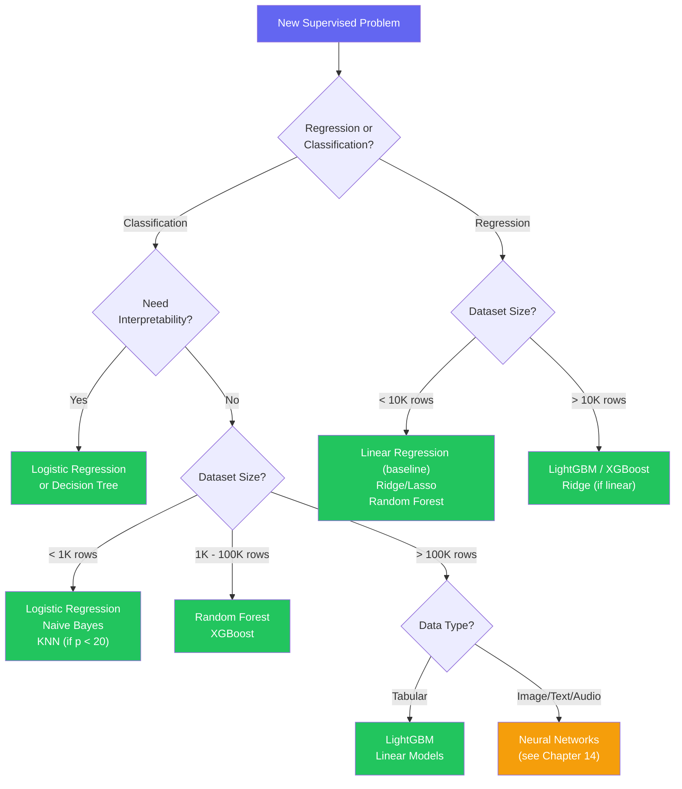

# Chapter 12 — Key ML Algorithms Deep Dive

---

## What You'll Learn

After this chapter you will be able to:
- Fit Linear and Logistic Regression by hand and read their coefficients correctly
- Explain how Decision Trees choose splits and why pruning matters
- Describe how Random Forest reduces variance through bagging and feature randomization
- Follow a Gradient Boosting run round by round, and know when to stop it
- Explain what the kernel trick buys you in an SVM — and what it costs
- Know when KNN and Naive Bayes are the right tool, and when they fall apart
- Pick the right algorithm for any tabular problem using a decision framework

**Markers:** ★★★ = know cold for interviews · ★★ = high priority · ★ = good to know.

### How this chapter works

Eight algorithms, one format. Every algorithm gets the **same seven-part card**, so you
learn the shape once and then just fill it in:

| Part | What it is |
|---|---|
| **In one line** | The algorithm's personality — the thing to remember when tired |
| **Predict first** | A question *before* the explanation. Guess, then open it. Guessing wrong is the point |
| **How it works** | One formula, one picture. No more |
| **On Maple Street** | The worked example, on the same dataset every time |
| **The knobs** | The hyperparameters that actually matter |
| **Boss fight** | The real interview question, what to say, and the follow-up trap |
| **Stat card** | Speed · Accuracy · Interpretability · Scaling · Killer weakness |

Stat-card scale: **●●●** best in class · **●●○** solid · **●○○** weak.

---

## 12.1 Meet the Panel ★

Eight algorithms. Think of them as eight specialists who all get handed the same
spreadsheet and each come back with an answer in their own style.

| Algorithm | Its personality in one line | Tier |
|---|---|:---:|
| **Linear Regression** | The honest accountant — adds up each feature's contribution and shows its working | ★★★ |
| **Logistic Regression** | The odds-maker — same sum, squashed into a probability | ★★★ |
| **Decision Tree** | The interrogator — plays Twenty Questions until it is confident | ★★★ |
| **Random Forest** | The committee — hundreds of over-confident interrogators, averaged into something sensible | ★★★ |
| **Gradient Boosting** | The perfectionist — fixes its own mistakes, one small correction at a time | ★★★ |
| **SVM** | The border guard — draws the widest possible no-man's-land between the two sides | ★★ |
| **KNN** | The gossip — asks the nearest neighbours and goes with the majority | ★★ |
| **Naive Bayes** | The tally clerk — counts clues and multiplies them, pretending they are unrelated | ★★ |

The first five earn their ★★★ because they cover almost every tabular problem you
will meet, and every one of them shows up in interviews. The last three are worth
knowing precisely because of *where they break*.

### The Maple Street dataset

Every worked example in this chapter uses the **same four apartments**. That is
deliberate: when the data never changes, the only thing changing is the algorithm,
and you can actually compare them.

| Unit | Size | Price | Renovated | Pro photos | Walk score | Sold in 30 days? |
|---|---|---|:---:|:---:|:---:|:---:|
| **A** | 1,000 sq ft | $200k | no | 1 | 0.3 | ✗ |
| **B** | 1,500 sq ft | $250k | no | 2 | 0.5 | ✗ |
| **C** | 2,000 sq ft | $400k | yes | 4 | 0.4 | ✓ |
| **D** | 2,500 sq ft | $450k | yes | 5 | 0.8 | ✓ |

And one new listing that keeps turning up:

> **Unit E** — 2,200 sq ft · renovated · 3 pro photos · walk score 0.4 · not yet sold.

Two questions run through the whole chapter:

- **Regression — what is Unit E worth?** → Linear Regression (§12.2), Gradient Boosting (§12.6)
- **Classification — will Unit E sell within 30 days?** → everything else

When four rows are not enough (impurity, bagging, out-of-bag error), we zoom out to
**100 listings across the city**, of which 30 sold within 30 days.

Naive Bayes (§12.9) is the one exception — its natural home is text, so it gets a spam
filter instead. Forcing it onto apartments would teach you less, not more.

### Where this sits in the curriculum

| Topic | Where |
|---|---|
| First introduction to these algorithms | [Ch 10 — Supervised Learning](#content/10_supervised_learning) |
| Regularization mechanics (Ridge / Lasso) | [Ch 8 §8.15](#content/08_core_concepts) |
| Class imbalance, SHAP, feature importance | [Ch 10 §10.10–10.11](#content/10_supervised_learning) |
| ROC, AUC, thresholds, calibration, tuning search | [Ch 13 — Model Evaluation](#content/13_model_evaluation) |
| Neural networks | [Ch 14 — Neural Networks](#content/14_neural_networks) |

Chapter 10 gave you the "what." This chapter gives you the "how" and "why" — the
mechanics, the knobs, and the failure modes.

---

## 12.2 Linear Regression ★★★

> **In one line:** the honest accountant — it adds up each feature's contribution and shows its working.

You already do this in your head. If every extra bedroom tends to add about $30k to a
price and every year of age knocks a little off, you can price a new listing by adding
up those per-feature effects. That is the entire model: a weighted sum where each
weight says how hard one feature pushes the answer up or down.

> **Linear Regression** fits $\hat{y} = \mathbf{w}^\top \mathbf{x} + b$ to minimize the sum of squared residuals between predicted and observed values.

<details>
<summary><strong>Predict first.</strong> You fit a line through the four Maple Street apartments, with an intercept. Before computing anything — what must the four residuals add up to?</summary>

**Exactly zero.**

It is not a coincidence and it is not approximate. It falls straight out of the
intercept formula $w_0 = \bar{y} - w_1\bar{x}$, and it holds for *every* OLS fit that
includes an intercept.

That makes it a free bug detector. Sum your training residuals; if the total is not
~0, either the intercept was suppressed (`fit_intercept=False`), the model has not
converged, or you are accidentally looking at **test-set** residuals — which do not
have to sum to zero.
</details>

### How it works

$$\hat{y} = w_0 + w_1 x_1 + \cdots + w_p x_p = \mathbf{w}^\top \mathbf{x}$$

The weights are not chosen — they are **solved for**. With a single feature there is a
closed form worth computing once by hand:

$$w_1 = \frac{\sum (x_i - \bar{x})(y_i - \bar{y})}{\sum (x_i - \bar{x})^2}, \qquad w_0 = \bar{y} - w_1\bar{x}$$

### On Maple Street

Size in hundreds of sq ft, price in $1,000s:

| Size $x$ | Price $y$ | $x - \bar{x}$ | $y - \bar{y}$ | product | $(x-\bar{x})^2$ |
|---|---|---|---|---|---|
| 10 | 200 | −7.5 | −125 | 937.5 | 56.25 |
| 15 | 250 | −2.5 | −75 | 187.5 | 6.25 |
| 20 | 400 | +2.5 | +75 | 187.5 | 6.25 |
| 25 | 450 | +7.5 | +125 | 937.5 | 56.25 |
| **mean 17.5** | **mean 325** | | | **Σ = 2250** | **Σ = 125** |

$$w_1 = \frac{2250}{125} = 18, \qquad w_0 = 325 - 18(17.5) = 10$$

$$\boxed{\text{price} = 10 + 18 \times \text{size}}$$

Read the slope in units: **each extra 100 sq ft adds $18,000**.

| Unit | predicted | actual | residual |
|---|---|---|---|
| A | 190 | 200 | +10 |
| B | 280 | 250 | −30 |
| C | 370 | 400 | +30 |
| D | 460 | 450 | −10 |

Residuals sum to **exactly zero**, as promised. (SSE is 2,000; no other straight line
does better on this data.)

**Pricing Unit E** (2,200 sq ft): $10 + 18(22) = 406$ → **$406,000**.

With more features the normal equation $\mathbf{w}^* = (X^\top X)^{-1}X^\top\mathbf{y}$
does the same job, and each weight is that feature's effect **holding the others
fixed**. That clause is where the trouble starts.

### The one assumption that bites: multicollinearity

Linear regression makes five textbook assumptions — linearity, independence, constant
residual variance, normal residuals, and no multicollinearity. In practice, on ML
problems, the last one is the one that actually costs you.

→ *The full assumption list and what breaks when each fails:* [Ch 10 §10.9](#content/10_supervised_learning).

If `size` and `n_rooms` move together, the model cannot tell which deserves the credit.
The split between their coefficients becomes wildly unstable — drop three rows and a
$+8{,}000$ weight can flip to $-3{,}000$. **Variance Inflation Factor** puts a number
on it: $\text{VIF}_j = 1/(1 - R_j^2)$, where $R_j^2$ comes from regressing feature $j$
on all the others. Above **10** is serious.

> **The part people get wrong:** multicollinearity damages **interpretation**, not
> **prediction**. The fitted values stay accurate and test performance can be
> excellent. It only hurts the moment someone reads a coefficient as an effect size.

**Fixes, in order:** drop one of the pair · combine them (`sqft_per_room`) · or use
**Ridge**, whose L2 penalty stabilises the split by shrinking correlated coefficients
*toward each other*. Prefer Ridge over Lasso here — Lasso arbitrarily zeroes one of the
pair, and which one it keeps can change with the random seed.

### Solving it at scale, and regularizing it

**OLS closed form** is one shot and exact, but costs $O(np^2 + p^3)$ and needs
$X^\top X$ to be invertible — so it is for small $p$. **Gradient descent** iterates
$w_j \leftarrow w_j - \eta \frac{\partial \text{MSE}}{\partial w_j}$, handles any size,
supports online learning, and is the only route to Lasso and Elastic Net.

Regularized variants — **Ridge** (L2, shrinks all weights), **Lasso** (L1, zeroes some
outright), **Elastic Net** (both) — are the standard defence against overfitting here.

→ *Full regularization mechanics:* [Ch 8 §8.15](#content/08_core_concepts).

### The knobs

| Knob | Typical | What it does |
|---|---|---|
| `alpha` (Ridge / Lasso) | CV over `[0.01 … 100]` | Penalty strength. The only knob that really matters |
| `fit_intercept` | `True` | Leave it on unless your data is already centred |
| `l1_ratio` (Elastic Net) | 0.5 | Mix between L1 and L2 |

> **Boss fight —** *"Your linear model scores well, but the coefficients flip sign when you retrain on slightly different data. What is going on?"*
> **Say:** Classic **multicollinearity**. Two or more features carry nearly the same information, so infinitely many weight combinations produce almost the same predictions. The optimiser picks one arbitrarily, and a small change in the data tips it to a different one. I would compute **VIF** per feature and look for anything above 10.
> **They follow up with:** *"Is the model broken?"* — for **prediction**, no. $\hat{y}$ is stable and test performance is fine; only the *attribution* between the correlated features is unstable. It breaks the moment anyone reads the coefficients as effect sizes. Fix by dropping one, combining them, or switching to **Ridge** — and prefer Ridge over Lasso here, because Lasso arbitrarily zeroes one of the pair and its choice is seed-dependent.

| Speed | Accuracy | Interpretability | Needs scaling? | Killer weakness |
|:---:|:---:|:---:|:---:|---|
| ●●● | ●○○ | ●●● | For regularized versions | Can only fit straight lines |

```python
from sklearn.linear_model import LinearRegression
model = LinearRegression().fit(X_train, y_train)
print(f"R² = {model.score(X_test, y_test):.3f}")
print(f"Coefficients: {dict(zip(feature_names, model.coef_))}")
```

<details>
<summary><strong>From scratch</strong> — gradient descent in eight lines.</summary>

```python
import numpy as np

def linear_regression_gd(X, y, lr=0.01, epochs=1000):
    X = np.c_[np.ones(len(X)), X]          # add bias column
    w = np.zeros(X.shape[1])
    for _ in range(epochs):
        grad = (2 / len(X)) * X.T @ (X @ w - y)
        w -= lr * grad
    return w                                # w[0] = intercept, w[1:] = coefficients
```
</details>

---

## 12.3 Logistic Regression ★★★

> **In one line:** the odds-maker — the same weighted sum, squashed into a probability.

Despite the name this is a **classification** algorithm. Take the linear score
$z = \mathbf{w}^\top\mathbf{x}$, push it through the sigmoid, and you get a number
between 0 and 1 you can call a probability.

> **Logistic Regression** models the probability of a binary outcome by applying the logistic (sigmoid) function to a linear combination of features, trained by minimizing binary cross-entropy.

<details>
<summary><strong>Predict first.</strong> A logistic model gives a feature a coefficient of −0.69. A listing currently has a 50% chance of selling fast. One extra unit of that feature — what is the new probability? (It is not 25%.)</summary>

$e^{-0.69} \approx 0.5$, so the **odds** are halved — not the probability.

At $p = 0.5$ the odds are $\frac{0.5}{0.5} = 1$. Halving gives odds of 0.5, and
converting back:

$$p = \frac{0.5}{1 + 0.5} = \mathbf{0.333}$$

So it drops from 50% to **33%**. Halving the odds only looks like halving the
probability when the probability is already very small. Hold on to that — it is the
single most-tested idea in this section.
</details>

### How it works

$$\sigma(z) = \frac{1}{1 + e^{-z}} \quad \text{where} \quad z = w_0 + w_1 x_1 + \cdots + w_p x_p$$

```
  P(y=1)
    1.0 |                    _______________
    0.8 |              _____/
    0.5 |_____________/        <-- threshold (default 0.5)
    0.2 |        ____/
    0.0 |_______/
        +-------------------------------------> z
        -6     -3      0      3      6
```

It maps any real number into $(0,1)$, sits at 0.5 when $z = 0$, and has the tidy
derivative $\sigma'(z) = \sigma(z)(1-\sigma(z))$.

Training minimizes **binary cross-entropy**, not MSE — MSE on a sigmoid is non-convex,
so gradient descent can get stuck:

$$\mathcal{L} = -\frac{1}{n}\sum_{i=1}^{n} \left[ y_i \log(\hat{p}_i) + (1 - y_i) \log(1 - \hat{p}_i) \right]$$

→ *Full treatment of loss functions:* [Ch 8 §8.8](#content/08_core_concepts).

### On Maple Street

Predicting **"sells within 30 days"** from three features, with weights already fitted:

```
  Features:  pro_photos (count), renovated (0/1), walk_score (0-1)
  Weights:   w0 = -2.1,  w_photos = 1.8,  w_reno = 3.2,  w_walk = 4.5

  Unit E:    pro_photos = 3,  renovated = 1,  walk_score = 0.4

  z = -2.1 + 1.8(3) + 3.2(1) + 4.5(0.4)
    = -2.1 + 5.4 + 3.2 + 1.8
    = 8.3

  P(sells fast) = sigmoid(8.3) = 1 / (1 + e^-8.3) = 0.9998

  0.9998 > 0.5  ->  SELLS FAST
```

### What the weights actually mean — the log-odds view

This is the reason logistic regression stays the default whenever a decision must be
*explained*. Invert the sigmoid:

$$p = \frac{1}{1 + e^{-z}} \quad\Longrightarrow\quad \frac{p}{1-p} = e^{z} \quad\Longrightarrow\quad \ln\!\left(\frac{p}{1-p}\right) = z = w_0 + w_1x_1 + \cdots$$

So logistic regression is **linear — but in the log-odds**, not in the probability.
That one sentence answers most follow-ups. Exponentiating a weight gives the **odds
ratio**:

| $w_j$ | $e^{w_j}$ | Reading |
|---|---|---|
| $+0.69$ | 2.0 | One more unit **doubles** the odds |
| $+0.10$ | 1.11 | One more unit raises the odds ~11% |
| $0$ | 1.0 | No effect |
| $-0.69$ | 0.5 | One more unit **halves** the odds |

On Maple Street `renovated` has weight $3.2$, and $e^{3.2} \approx 24.5$: a renovated
apartment has roughly **24× the odds** of selling within 30 days, holding everything
else fixed.

**The trap:** "so it multiplies the *probability* by 24?" No — and the effect depends
entirely on where you started:

| Starting $p$ | Starting odds | ×24.5 odds | New $p$ |
|---|---|---|---|
| 0.01 | 0.0101 | 0.247 | **0.198** (≈20×) |
| 0.50 | 1.0 | 24.5 | **0.961** (<2×) |
| 0.90 | 9.0 | 220 | **0.995** (barely moves) |

The odds ratio is **constant**; the probability change is not. That is exactly why
coefficients are reported in log-odds space — it is the only scale on which a
feature's effect is one stable number.

### Three practical notes

**The decision boundary is always straight.** It is the set where $z = 0$, a line in 2D
and a hyperplane above that. Non-linear pattern? Add polynomial features or change
model.

**0.5 is rarely the right threshold.** Lower it when a miss is expensive (fraud, cancer
screening), raise it when a false alarm is expensive (spam). → *Choosing it from the
ROC or PR curve:* [Ch 13 §13.4–13.5](#content/13_model_evaluation).

**Imbalanced classes** are handled with `class_weight='balanced'`, resampling, or
threshold tuning. → *All three, compared:* [Ch 10 §10.11](#content/10_supervised_learning).
One thing worth carrying here, because it is easy to miss:

> `class_weight` and threshold tuning attack the same problem from opposite ends.
> Reweighting **distorts the predicted probabilities** — they no longer match the true
> base rate — whereas moving the threshold leaves them intact and only changes where
> you cut. If anything downstream consumes the *probability* (pricing, risk scoring,
> bidding), prefer threshold tuning, and do not stack both without re-checking
> calibration ([Ch 13 §13.12](#content/13_model_evaluation)).

**Multiclass** works via one-vs-rest ($K$ binary models) or **softmax**, which
generalises the sigmoid to $K$ classes directly and is the standard in neural networks
([Ch 14](#content/14_neural_networks)).

### The knobs

| Knob | Typical | What it does |
|---|---|---|
| `C` | CV over `[0.01 … 100]` | **Inverse** regularization — smaller `C` means *more* penalty |
| `penalty` | `'l2'` | `'l1'` for built-in feature selection |
| `class_weight` | `None` / `'balanced'` | Reweights the loss for imbalance |
| `max_iter` | 1000 | Raise it if you see a convergence warning |

> **Boss fight —** *"A logistic regression gives `renovated` a coefficient of 3.2. Explain what that means to a product manager."*
> **Say:** Exponentiate it: $e^{3.2} \approx 24$. A renovated apartment has about **24 times the odds** of selling within 30 days, holding everything else constant. I would phrase it in odds, not probability, because odds is what the coefficient actually fixes.
> **They follow up with:** *"So renovating makes a sale 24× more likely?"* — no, and this is the distinction they are testing. Odds are not probability. If the baseline probability is 1%, multiplying the odds by 24 takes it to about **20%** — roughly 20×. If the baseline is already 50%, it goes to **96%** — under 2×. The odds ratio is constant; the effect on probability depends entirely on where you started.

| Speed | Accuracy | Interpretability | Needs scaling? | Killer weakness |
|:---:|:---:|:---:|:---:|---|
| ●●● | ●●○ | ●●● | Yes | Straight-line boundary only |

```python
from sklearn.linear_model import LogisticRegression
model = LogisticRegression(C=1.0, max_iter=1000).fit(X_train, y_train)
probs = model.predict_proba(X_test)[:, 1]   # P(class = 1)
```

<details>
<summary><strong>From scratch</strong> — the whole algorithm in ten lines.</summary>

```python
import numpy as np

def sigmoid(z): return 1 / (1 + np.exp(-z))

def logistic_regression_gd(X, y, lr=0.01, epochs=1000):
    X = np.c_[np.ones(len(X)), X]
    w = np.zeros(X.shape[1])
    for _ in range(epochs):
        p = sigmoid(X @ w)
        grad = X.T @ (p - y) / len(X)
        w -= lr * grad
    return w
```

Compare it to the linear regression version above: the *only* difference is the
sigmoid. The gradient expression is identical. That is not a coincidence — both are
maximum-likelihood fits in the same exponential family.
</details>

---

## 12.4 Decision Trees ★★★

> **In one line:** the interrogator — it plays Twenty Questions until it is confident enough to commit.

Each yes/no question splits the cases still in play into purer and purer groups. The
only real skill is picking which question to ask at each step.

> **Decision Tree (CART)** recursively partitions the feature space into axis-aligned regions by choosing splits that maximize impurity reduction (Gini or information gain). Predictions are the majority class or mean value in each leaf.

<details>
<summary><strong>Predict first.</strong> Of 100 city listings, 30 sold within 30 days. What is the Gini impurity of that group — and what would it be if all 100 had sold fast?</summary>

$$G = 1 - \sum p_k^2 = 1 - (0.3^2 + 0.7^2) = 1 - 0.58 = \mathbf{0.42}$$

If all 100 sold fast, $G = 1 - 1^2 = \mathbf{0}$. **Zero means pure**, and the worst
possible value for two classes is 0.5 (a perfect 50/50 split).

So the tree's whole job is to drive 0.42 down toward 0. Keep that number — the next
example starts from it.
</details>

### How it works

At every internal node the algorithm tries every threshold on every feature and keeps
the split whose children are purest.

**Gini impurity:** $G = 1 - \sum_{k} p_k^2$  ·  **Entropy:** $H = -\sum_{k} p_k \log_2 p_k$

Both measure "how mixed are the classes here?" In practice they produce near-identical
trees; Gini is marginally faster because it skips the logarithm.

### On Maple Street (all 100 city listings)

```
  Parent node: 100 listings (30 sold fast, 70 slow)
  Gini(parent) = 1 - (0.3^2 + 0.7^2) = 0.42

  Candidate split: "3 or more pro photos?"

  Left  (fewer than 3):  60 listings (5 fast, 55 slow)
    Gini(left)  = 1 - (5/60)^2 - (55/60)^2 = 0.153

  Right (3 or more):     40 listings (25 fast, 15 slow)
    Gini(right) = 1 - (25/40)^2 - (15/40)^2 = 0.469

  Weighted Gini after split = (60/100)(0.153) + (40/100)(0.469)
                            = 0.092 + 0.188 = 0.280

  Gini reduction = 0.42 - 0.28 = 0.14   <- a good split

  The algorithm tests EVERY feature and EVERY threshold,
  then keeps the largest reduction.
```

Note the right-hand leaf is *less* pure than the parent (0.469 vs 0.42). That is fine —
only the **weighted** average has to improve.

### The overfitting problem

Left alone, a tree keeps splitting until every leaf is pure. That is 100% training
accuracy and a memorised training set.

```
  Depth 3 (slightly underfits)   Depth 20 (memorizes noise)
  ────────────────────────────   ──────────────────────────
       [photos >= 3?]                  [photos >= 3?]
       /            \                 /            \
  [renovated?]  [walk>0.5?]     [photos >= 3.5?]  [...]
    /    \        /    \          /       \
  Fast  Slow    Fast  Slow    [...many splits...]
                                       |
  General rules that            One leaf per training
  work on new data.             listing. Fails on new data.
```

**Pre-pruning** stops it early — these are your main regularization controls:

| Stopping rule | Typical value | What it does |
|---|---|---|
| `max_depth` | 5–10 | **Start here** — biggest single effect on overfitting |
| `min_samples_leaf` | 10 | Every leaf must keep at least 10 samples |
| `min_samples_split` | 20 | Only split nodes holding at least 20 samples |
| `max_leaf_nodes` | 50 | Cap the total number of leaves |

**Post-pruning** grows the full tree first, then cuts back whatever did not earn its
complexity, via `ccp_alpha`. Use `cost_complexity_pruning_path()` to get candidate
values and cross-validate over them.

> **Boss fight —** *"Why prune a tree afterwards instead of just setting `max_depth` up front?"*
> **Say:** Because pre-pruning is **greedy and blind**. A `max_depth` cap stops every branch at the same level, and `min_samples_split` refuses a split that looks weak *right now* — even when that split would have unlocked a very strong one just below it. Post-pruning grows the full tree first, so it can see what a branch eventually delivers, then removes what did not earn its complexity.
> **They follow up with:** *"How does `ccp_alpha` decide?"* — it minimises $R_\alpha(T) = R(T) + \alpha|T|$, where $R(T)$ is the error and $|T|$ the leaf count. Sweeping $\alpha$ from 0 upward produces a nested sequence of ever-smaller subtrees; `cost_complexity_pruning_path()` returns the $\alpha$ values where the tree actually changes, and you cross-validate over those. In practice, pre-pruning for speed plus a cross-validated `ccp_alpha` for quality is the usual combination.

| Speed | Accuracy | Interpretability | Needs scaling? | Killer weakness |
|:---:|:---:|:---:|:---:|---|
| ●●● | ●○○ | ●●● | **No** | Huge variance — a single tree is rarely competitive |

That last point is the whole reason §12.5 and §12.6 exist: everything good about trees,
without the variance.

```chart
{
  "type": "line",
  "data": {
    "labels": [1,2,3,4,5,6,8,10,15,20,30],
    "datasets": [
      {
        "label": "Training Accuracy",
        "data": [65,78,88,93,96,98,99.5,99.9,100,100,100],
        "borderColor": "rgba(99, 102, 241, 1)",
        "fill": false,
        "tension": 0.4,
        "pointRadius": 3
      },
      {
        "label": "Validation Accuracy",
        "data": [64,76,84,88,89,88,85,80,72,65,58],
        "borderColor": "rgba(239, 68, 68, 1)",
        "borderDash": [5,5],
        "fill": false,
        "tension": 0.4,
        "pointRadius": 3
      }
    ]
  },
  "options": {
    "plugins": { "title": { "display": true, "text": "Decision Tree Depth vs Accuracy — Validation Peaks Then Drops" } },
    "scales": {
      "y": { "title": { "display": true, "text": "Accuracy (%)" }, "min": 50, "max": 100 },
      "x": { "title": { "display": true, "text": "max_depth" } }
    }
  }
}
```

---

## 12.5 Random Forest ★★★

> **In one line:** the committee — hundreds of over-confident interrogators, averaged into something sensible.

Ask one expert and you get one confident answer that might be wildly off. Ask hundreds
who each studied slightly different books and looked at slightly different clues, then
take a vote — the individual quirks cancel and the consensus is far steadier.

> **Random Forest** is an ensemble of decision trees trained on bootstrap samples with random feature subsets at each split. Predictions are aggregated by vote or average. Decorrelating the trees reduces ensemble variance without increasing bias.

<details>
<summary><strong>Predict first.</strong> Random Forest uses bootstrap sampling <em>and</em> random feature subsets. Bootstrapping alone already makes the trees different — so why bother with the second one?</summary>

Because different *data* is not enough when one feature is dominant.

If `pro_photos` is the strongest predictor, then every tree — no matter which rows it
saw — splits on `pro_photos` first. The trees end up looking almost the same, and
averaging near-identical trees reduces variance by almost nothing.

Forcing each split to consider only a random subset of features means some trees
*cannot* use `pro_photos` at the root and must find the second-best structure. Now the
trees genuinely disagree, their errors are less correlated, and averaging actually
cancels them.

**Bagging gives diverse data; feature subsampling gives diverse structure. You need both.**
</details>

### The two sources of randomness

**Bootstrap sampling.** Each tree gets $n$ rows drawn *with replacement*, so it sees
~63.2% of the unique rows. The other ~36.8% are **out-of-bag** for that tree.

```
  Original: [1, 2, 3, 4, 5, 6, 7, 8, 9, 10]

  Tree 1 sample: [2, 2, 5, 7, 3, 9, 1, 4, 4, 6]  -> OOB: {8, 10}
  Tree 2 sample: [8, 1, 3, 3, 7, 2, 9, 5, 6, 6]  -> OOB: {4, 10}
  Tree 3 sample: [4, 7, 1, 8, 2, 5, 3, 9, 7, 1]  -> OOB: {6, 10}
```

**Feature subsampling.** At each split only a random subset of features is considered —
`'sqrt'` (i.e. $\sqrt{p}$) for classification. Note sklearn's **regression** default is
`1.0` (all features); Breiman's classic $p/3$ heuristic is worth trying to decorrelate
the trees, but it is *not* the library default.

### Out-of-bag error — free cross-validation

Why is it always about a third? For one specific row, the chance of dodging a single
draw is $1 - \frac{1}{N}$, and there are $N$ independent draws:

$$\left(1 - \frac{1}{N}\right)^{N} \;\xrightarrow[N \to \infty]{}\; e^{-1} \approx 0.368$$

It converges almost immediately — even at $N = 100$ it is already 0.366. So ~63% of
rows train each tree and ~37% stay out, forming a ready-made validation set at zero
cost.

```
  Listing #10 was OOB for trees {1, 2, 3}
  Tree 1 predicts: Fast
  Tree 2 predicts: Slow
  Tree 3 predicts: Fast
  OOB prediction for #10: Fast (2 vs 1)

  OOB accuracy across all rows ≈ cross-validation accuracy.
  Turn it on with oob_score=True.
```

> **Why boosting gets nothing equivalent:** OOB works because bagged trees are
> **independent** — a row held out of tree 7 is still judged honestly by tree 7.
> Gradient boosting builds trees **sequentially** on the residuals of all previous
> trees, so every tree has already been influenced by every row. No untouched subset
> is left, which is exactly why GBMs need an explicit validation set and
> `early_stopping_rounds` (§12.6).

### Feature importance — and its famous trap

**MDI** (the sklearn default) sums Gini reduction across every split on a feature.
Free, but biased toward high-cardinality features. **Permutation importance** shuffles
one feature and measures the accuracy drop — slower, model-agnostic, trustworthy. Use
permutation for anything you report.

→ *MDI vs permutation vs SHAP, in full:* [Ch 10 §10.10](#content/10_supervised_learning).

> **Boss fight —** *"Your Random Forest ranks `listing_id` as the second most important feature. What happened?"*
> **Say:** That is the signature of **MDI bias**. The default importance sums Gini reduction over every split on a feature, and a high-cardinality column like an ID offers a near-unique value per row — so it can carve out almost pure leaves and rack up impurity reduction, purely by memorising. It is not predictive; it is a measurement artifact of the metric.
> **They follow up with:** *"How would you confirm it, and what would you use instead?"* — confirm with **permutation importance** on a held-out set: shuffling a genuinely useless ID will barely move validation accuracy, even though MDI loved it. Then drop the column, because an ID also invites leakage. More generally, MDI is biased toward high-cardinality and continuous features, so use permutation importance for reporting and SHAP when I need per-prediction explanations.

> **Boss fight —** *"Your Random Forest outputs 0.9 for a listing. Can you tell the business there is a 90% chance it sells fast?"*
> **Say:** Not without checking calibration first. A Random Forest's output is the **fraction of trees voting yes**, which is a vote share, not a probability. Forests are systematically **under-confident** at the extremes — averaging many trees pulls scores toward the middle, so true 99% cases often come out around 0.9. I would plot a reliability diagram: bucket the predictions and compare each bucket's mean prediction against its actual observed frequency.
> **They follow up with:** *"How do you fix it?"* — wrap it in `CalibratedClassifierCV` on **held-out** data, using Platt scaling for limited data and isotonic regression above a few thousand samples. Because both are monotonic, calibration **cannot change the ranking or the AUC** — it fixes the numbers only. Full methods in [Ch 13 §13.12](#content/13_model_evaluation).

### The knobs

| Knob | Typical | What it does |
|---|---|---|
| `n_estimators` | 100–500 | More is always safer; diminishing returns past ~200 |
| `max_depth` | `None`, or 10–30 | `None` grows deep; cap it to regularize |
| `max_features` | `'sqrt'` (classification) | Regression defaults to 1.0 — try 0.33 to decorrelate |
| `min_samples_leaf` | 1–5 | Higher = simpler trees |

| Speed | Accuracy | Interpretability | Needs scaling? | Killer weakness |
|:---:|:---:|:---:|:---:|---|
| ●●○ | ●●○ | ●○○ | **No** | Uncalibrated vote-share "probabilities" |

```python
from sklearn.ensemble import RandomForestClassifier
rf = RandomForestClassifier(n_estimators=200, max_depth=10, min_samples_leaf=5,
                            random_state=42, n_jobs=-1, oob_score=True)
rf.fit(X_train, y_train)
print(f"OOB Score: {rf.oob_score_:.3f}")     # free validation estimate
```

---

## 12.6 Gradient Boosting ★★★

> **In one line:** the perfectionist — it fixes its own mistakes, one small correction at a time.

Build a weak model, look at exactly where it is wrong, then train the next model
specifically to patch those errors — and keep stacking tiny corrections until almost
nothing is left to fix.

> **Gradient Boosting** builds an additive ensemble of shallow trees sequentially. Each new tree is fit to the negative gradient of the loss with respect to the current ensemble's predictions (the residuals, for squared error). The prediction is the weighted sum of all trees.

<details>
<summary><strong>Predict first.</strong> You train with <code>early_stopping_rounds=10</code>. Validation loss bottoms out at round 150, drifts upward, and training halts at round 160. How many trees should your final model use?</summary>

**150**, not 160.

The extra 10 rounds only *proved* that 150 was the best; they are overfit trees and
must be discarded. The mistake is **failing to roll back** — if you predict with all
160, you are deliberately using the trees early stopping just told you were harmful.
XGBoost and LightGBM expose `best_iteration` for exactly this; some APIs roll back
automatically and some do not, so check rather than assume.

Second trap: **do not report that validation score as your result.** You used it to
choose the tree count, so it is now optimistically biased. You need three splits —
train, validation (for stopping), and a test set touched exactly once.
</details>

### How it works

```
  Target: 100

  Tree 1 (shallow, weak): predicts 70    --> residual = 30
  Tree 2 fits residual:   predicts 22    --> residual = 8
  Tree 3 fits residual:   predicts 6     --> residual = 2
  Tree 4 fits residual:   predicts 1.5   --> residual = 0.5

  Final = 70 + 22 + 6 + 1.5 = 99.5
```

Formally, at iteration $m$:

$$F_m(\mathbf{x}) = F_{m-1}(\mathbf{x}) + \eta \cdot h_m(\mathbf{x})$$

where $h_m$ is fit to the pseudo-residuals $r_i = -\frac{\partial L(y_i, F_{m-1}(x_i))}{\partial F_{m-1}(x_i)}$ and $\eta$ is the learning rate.

### On Maple Street — three rounds, every number checked

The sketch above hides two things that matter: how one tree fits residuals across
*many* rows at once, and where the learning rate actually enters.

Same four apartments as §12.2, but this time the only feature is **Small** (units A, B)
vs **Large** (units C, D). Prices in $100k, squared-error loss, depth-1 trees (stumps),
$\eta = 0.5$:

| Unit | Size | Price $y$ |
|---|---|---|
| A | Small | 2.0 |
| B | Small | 2.5 |
| C | Large | 4.0 |
| D | Large | 4.5 |

**Round 0 — the starting guess.** With squared error, the best constant is the mean:
$F_0 = 3.25$ for everyone.

| | $y$ | $F_0$ | residual |
|---|---|---|---|
| A | 2.0 | 3.25 | **−1.25** |
| B | 2.5 | 3.25 | −0.75 |
| C | 4.0 | 3.25 | +0.75 |
| D | 4.5 | 3.25 | **+1.25** |

Sum of squared residuals: **4.25**.

**Round 1 — fit a stump to those residuals.** The only split available is Small vs
Large, and the stump predicts the *mean residual* in each leaf: Small
$= \frac{-1.25 - 0.75}{2} = -1.0$, Large $= +1.0$. Now apply the learning rate — **this
is the step the sketch above skips**:

$$F_1 = F_0 + 0.5 \times h_1$$

| | $F_0$ | $h_1$ | $F_1$ | new residual |
|---|---|---|---|---|
| A | 3.25 | −1.0 | **2.75** | −0.75 |
| B | 3.25 | −1.0 | 2.75 | −0.25 |
| C | 3.25 | +1.0 | 3.75 | +0.25 |
| D | 3.25 | +1.0 | **3.75** | +0.75 |

SSE: 4.25 → **1.25**. We moved *halfway* to the stump's suggestion, not all the way —
that is what $\eta$ buys.

**Round 2.** Refit on the new residuals: Small $=-0.5$, Large $=+0.5$.

| | $F_1$ | $h_2$ | $F_2$ | new residual |
|---|---|---|---|---|
| A | 2.75 | −0.5 | **2.50** | −0.50 |
| B | 2.75 | −0.5 | 2.50 | 0.00 |
| C | 3.75 | +0.5 | 4.00 | 0.00 |
| D | 3.75 | +0.5 | **4.00** | +0.50 |

SSE: 1.25 → **0.50**.

**Round 3.** Small $=-0.25$, Large $=+0.25$ → $F_3 = 2.375,\, 2.375,\, 4.125,\, 4.125$.
SSE: 0.50 → **0.3125**.

```
  SSE by round:  4.25 → 1.25 → 0.50 → 0.3125 → ...
                                            ↓
                          floor at 0.25 (irreducible)
```

**Three lessons the one-liner cannot teach:**

1. **The learning rate is a brake, not a detail.** Each round the model moves half the
   distance the stump recommends. At $\eta = 1$ it would jump straight to the group
   means in one round — fast, with no chance to course-correct.
2. **Error falls monotonically, with sharply diminishing returns.** 4.25 → 1.25 is
   enormous; 0.50 → 0.3125 is not. That is exactly the curve early stopping watches.
3. **It converges to a floor, not to zero.** Predictions approach the group means
   (2.25 and 4.25), leaving ±0.25 inside each group. One binary feature simply cannot
   separate two apartments of the same size class — that residual is **irreducible**.
   Chasing it is precisely what overfitting looks like.

### Early stopping — the mechanics

Training loss keeps falling forever, so it can never tell you when to stop. Early
stopping watches a *separate* validation set instead.

```
  round   train loss   valid loss
    50       0.42         0.45
   100       0.31         0.38
   150       0.24         0.34   <- best
   160       0.23         0.35
   170       0.22         0.35
   180       0.21         0.36
   190       0.20         0.37   <- no improvement for 4 checks
                                    STOP, roll back to 150
```

1. Fit tree $m$, score the validation set.
2. If it improved, remember $m$ as the best iteration.
3. If it has **not** improved for `early_stopping_rounds` consecutive rounds, halt.
4. **Roll back** to the best iteration — the step people forget.

`early_stopping_rounds` is a patience counter, not a limit. Too low (say 5) and normal
noise halts you early; too high and you burn compute. Roughly **10–50**, scaled
inversely with the learning rate.

### The learning rate tradeoff

```
  Large eta (0.3)   Learns fast, needs fewer trees, can overshoot -> overfits
  Small eta (0.01)  Learns slowly, needs many trees, more robust -> usually better

  KEY RULE: learning_rate x n_estimators ~ constant
    eta=0.1 + 100 trees   ~   eta=0.01 + 1000 trees

  Best practice: small learning rate + many trees + early stopping.
```

### XGBoost vs LightGBM vs CatBoost

| | Its trick | Why it matters | Reach for it when |
|---|---|---|---|
| **XGBoost** | Level-wise growth, strong built-in L1/L2 | Balanced trees; safest on small data | You want the most battle-tested option |
| **LightGBM** | **Histogram binning** (~256 buckets per feature) + leaf-wise growth | Split search drops from *unique values* to *bins* — the single biggest reason it is 5–10× faster | Large data (>100K rows), speed matters |
| **CatBoost** | **Ordered boosting** — encodes a category using only labels from *earlier* rows | Kills the target-encoding leakage that quietly overfits standard target encoding. Oblivious trees also make inference very fast | Many high-cardinality categorical features |

**Level-wise vs leaf-wise growth:**

```
  Level-wise (XGBoost):              Leaf-wise (LightGBM):
  ──────────────────────             ─────────────────────────
          root                               root
         /    \                             /    \
        A      B                           A      B
       / \    / \                         / \
      C   D  E   F                       C   D
                                        / \
  Grows all nodes at                   G   H  <-- always splits
  each depth level.                    highest-loss leaf next.

  Safer on small data.                Faster convergence.
  Balanced tree structure.            Can overfit small data
                                      (control via num_leaves).
```

> **Boss fight —** *"How do you tune `learning_rate` and `n_estimators`?"*
> **Say:** Never independently — they trade off directly, since the model's total movement is roughly $\eta \times$ (number of trees). The standard recipe is to **fix the learning rate and let early stopping choose the tree count**. I start at $\eta = 0.1$ with a deliberately generous `n_estimators` (say 5,000) and `early_stopping_rounds`, so the data picks the count. Then, if I can afford the compute, I drop to $\eta = 0.03$ and re-run — a smaller rate almost always generalises slightly better, it just needs proportionally more trees.
> **They follow up with:** *"Why not just grid-search both?"* — it wastes most of the grid. Because the product is what matters, a grid over both spends its budget re-testing equivalent combinations ($\eta{=}0.1$/100 trees behaves much like $\eta{=}0.01$/1000). Early stopping finds the right count for a given $\eta$ in a **single** fit, so you only ever search over $\eta$.

> **Boss fight —** *"XGBoost, LightGBM, CatBoost — how do you choose?"*
> **Say:** I default to **LightGBM** for speed: histogram binning plus leaf-wise growth makes it several times faster than vanilla XGBoost on large data, and the accuracy is usually within noise. I switch to **CatBoost** when the dataset is dominated by high-cardinality categorical features, because ordered boosting handles the target-encoding leakage that would otherwise quietly overfit. I reach for **XGBoost** when I want the most battle-tested option or need its ecosystem. Honestly, with equal tuning effort all three land within about 1% of each other — algorithm choice matters far less than features and validation design.
> **They follow up with:** *"What is the catch with LightGBM's leaf-wise growth?"* — it overfits more readily on small data. It keeps splitting the single highest-loss leaf, so it can grow deep, narrow branches that chase a handful of rows. The control is **`num_leaves`**, not `max_depth`, and the rule of thumb is to keep `num_leaves` below $2^{\text{max\_depth}}$. On a few thousand rows, level-wise XGBoost is often the safer default.

### The knobs

Tune roughly in this order — and stop when the gains go quiet.

| Order | Knob | Typical |
|:---:|---|---|
| 1 | `learning_rate` + `n_estimators` (via early stopping) | 0.1 → then 0.03 |
| 2 | `max_depth` (XGBoost) / `num_leaves` (LightGBM) | 3–8 / < $2^{\text{depth}}$ |
| 3 | `subsample`, `colsample_bytree` | 0.6–0.9 |
| 4 | `reg_alpha`, `reg_lambda` | only if still overfitting |

| Speed | Accuracy | Interpretability | Needs scaling? | Killer weakness |
|:---:|:---:|:---:|:---:|---|
| ●●○ | ●●● | ●○○ | **No** | Sequential — cannot parallelise across trees; overfits without early stopping |

```python
import lightgbm as lgb

model = lgb.LGBMClassifier(n_estimators=5000, learning_rate=0.1,
                           num_leaves=31, subsample=0.8, colsample_bytree=0.8)
model.fit(X_train, y_train,
          eval_set=[(X_val, y_val)],
          callbacks=[lgb.early_stopping(50)])
print(f"Best iteration: {model.best_iteration_}")   # roll back to this
```

---

## 12.7 Support Vector Machines ★★

> **In one line:** the border guard — it draws the widest possible no-man's-land between the two sides.

Any number of lines can separate two classes. SVM picks the one with the most clearance
on both sides, on the theory that the roomiest boundary is the one most likely to
survive contact with new data.

> **SVM** finds the hyperplane that maximizes the margin between classes. Only the points on the margin — the **support vectors** — determine the solution.

<details>
<summary><strong>Predict first.</strong> You train an SVM on 10,000 listings, then delete every training point <em>except</em> the support vectors and retrain. What changes?</summary>

**Nothing.** You get the identical boundary.

This is the defining property of SVM: the solution depends *only* on the points sitting
on the margin. Every point comfortably on the correct side contributes nothing — you
could delete 9,950 of 10,000 rows and get the same model.

It is also the practical catch. Which points are support vectors is not known until
you have solved the problem, and solving it means building an $n \times n$ kernel
matrix. Hence $O(n^2)$–$O(n^3)$ training, and hence SVM's collapse above ~50K rows.
</details>

### How it works

$$\min_{\mathbf{w}, b} \frac{1}{2} \|\mathbf{w}\|^2 \quad \text{subject to} \quad y_i(\mathbf{w}^\top \mathbf{x}_i + b) \geq 1 \; \forall i$$

```
  Feature 2
      |    o o   /   <- margin
      |   o o  //
      |       ///    <- decision boundary
      |      ////
      |     //  * *
      |    /  * * *
      +------------- Feature 1

  o = slow sale,  * = fast sale

  Support vectors are the points ON the margin.
  Only they define the hyperplane.
```

The margin width is $\frac{2}{\|\mathbf{w}\|}$, so **a smaller $\|\mathbf{w}\|$ is a
wider corridor** — minimising $\|\mathbf{w}\|^2$ *is* maximising the margin, written in
a form a quadratic solver can chew on.

### Soft margins — the C knob

Real data is never cleanly separable, so slack variables $\xi_i$ let points sit inside
the margin at a price: $\min \frac{1}{2}\|\mathbf{w}\|^2 + C \sum \xi_i$.

```
  Small C (0.01)           Large C (1000)
  ───────────────          ───────────────
  Wide margin, some        Narrow margin, few
  errors allowed           errors allowed
  More regularization      Less regularization
  Usually generalizes      Can overfit to
  better                   outliers

  C is how angry the model gets about a misclassified point.
    Low C  = relaxed teacher, tolerates mistakes
    High C = strict teacher, no mistake allowed
```

### The kernel trick

When the data is not linearly separable, map it into a higher-dimensional space where
it is — without ever computing that mapping.

```
  PROBLEM: not linearly separable in 2D

  x2 |  * * o * *
     | o * * * o      Can't draw a straight line!
     | o * * * o
     +-----------> x1

  SOLUTION: add feature x3 = x1^2 + x2^2

  x3 |             o o o o   (far from origin -> high x3)
     |  * * * *              (close to origin -> low x3)
     +-------------------> x1

  Now separable with a flat plane.
  The RBF kernel does this implicitly, in infinite dimensions.
```

| Kernel | Formula | Use when |
|---|---|---|
| Linear | $\mathbf{x}^\top \mathbf{z}$ | High-dimensional data (text, genomics) |
| Polynomial | $(\mathbf{x}^\top \mathbf{z} + c)^d$ | Known polynomial structure |
| RBF (Gaussian) | $\exp(-\gamma\|\mathbf{x} - \mathbf{z}\|^2)$ | **Default.** Works for most non-linear data |

**High `gamma`** gives each point a small influence radius → wiggly boundary → overfits.
**Low `gamma`** gives a smooth boundary → underfits. Always tune `C` and `gamma`
**together**, in log-space: `C ∈ [0.01 … 1000]`, `gamma ∈ [0.001 … 10]`.

> **Boss fight —** *"What does the kernel trick actually save you? Be concrete."*
> **Say:** It avoids ever materialising the high-dimensional feature vectors. A degree-2 polynomial kernel on $p$ features corresponds to a space of roughly $p^2/2$ terms — with $p = 1{,}000$ that is ~500,000 dimensions per data point. The trick works because the SVM's optimisation only ever needs **dot products** between points, never the points themselves. So $K(x_i, x_j) = (x_i^\top x_j + c)^2$ gives the dot product in that 500,000-dimensional space using an $O(p)$ operation in the original one.
> **They follow up with:** *"So it is free?"* — no, the cost moves rather than disappears. You now build an $n \times n$ **kernel matrix**, so cost scales with the number of **samples** instead of features. That is the whole reason SVMs are excellent on wide, small data (text: huge $p$, modest $n$) and poor on tall data — at $n = 1$M the kernel matrix alone is $10^{12}$ entries.

| Speed | Accuracy | Interpretability | Needs scaling? | Killer weakness |
|:---:|:---:|:---:|:---:|---|
| ●○○ | ●●○ | ●○○ | **Yes — mandatory** | $O(n^2)$–$O(n^3)$ training; dies above ~50K rows |

---

## 12.8 K-Nearest Neighbors ★★

> **In one line:** the gossip — it asks the nearest neighbours and goes with the majority.

There is no training step at all. KNN memorises every example and does all its thinking
at prediction time.

> **KNN** is a non-parametric, instance-based (lazy) algorithm. It stores the training set and classifies a new point by majority vote among its $K$ closest neighbours.

<details>
<summary><strong>Predict first.</strong> You forget to scale your features before running KNN. Does that merely make predictions less confident — or can it actually flip the answer?</summary>

**It flips answers.** Routinely.

Distance sums across features, so a feature measured in thousands drowns a feature
measured in tens *entirely*. A 27-year age gap can lose to a ₹1,000 rent difference —
and the "nearest" neighbours end up being the ones that are nearest in the *units* you
happened to use.

Scaling is not a nicety for KNN. It is part of the algorithm's definition of "near."
The worked example below flips a prediction with nothing changed but the units.
</details>

### How it works

**Euclidean (L2):** $d(A,B) = \sqrt{\sum_j (a_j - b_j)^2}$ — the default, fine for
almost everything. **Manhattan (L1)** sums absolute differences instead and is
occasionally steadier in high dimensions.

### The scaling example that flips the answer

Five buildings; classify a new one, $Q$ = (52 years old, ₹33,000/month), with $K = 3$.
Class **B** = needs renovation, **A** = move-in ready.

| Point | Age | Rent | Class |
|---|---|---|---|
| P1 | 25 | 30,000 | A |
| P2 | 30 | 35,000 | A |
| P3 | 50 | 32,000 | **B** |
| P4 | 55 | 38,000 | **B** |
| P5 | 28 | 34,000 | A |

**Unscaled.** Rent spans thousands and age spans tens, so the age term is numerically
invisible:

| Neighbour | Distance | Class |
|---|---|---|
| P3 | 1,000.0 | B |
| P5 | 1,000.3 | A |
| P2 | 2,000.1 | A |
| P1 | 3,000.1 | A |
| P4 | 5,000.0 | B |

3-NN = {P3, P5, P2} = B, A, A → **predicts A** ✗

Look at what happened: **P5 (28 years old) beat P4 (55 years old)** as a neighbour of a
52-year-old building, purely because P5's rent happened to be ₹1,000 away. A 27-year
gap lost to a ₹1,000 gap.

**Scaled** (min-max onto [0, 1]; $Q$ becomes (0.900, 0.375)):

| Neighbour | Scaled position | Distance | Class |
|---|---|---|---|
| P3 | (0.833, 0.250) | 0.142 | B |
| P4 | (1.000, 1.000) | 0.633 | B |
| P2 | (0.167, 0.625) | 0.775 | A |
| P5 | (0.100, 0.500) | 0.810 | A |
| P1 | (0.000, 0.000) | 0.975 | A |

3-NN = {P3, P4, P2} = B, B, A → **predicts B** ✓

Same data, same $K$, same metric — **opposite answer**. Only the units changed.

### Choosing K, and where it breaks

```
  K=1    Boundary follows every training point. Memorizes noise.
         High variance, low bias.
  K=n    Predicts the majority class for everything. Ignores structure.
         Low variance, high bias.
  K=5-9  Good starting point. Use an ODD K for binary classification
         so votes cannot tie.

  Formal: cross-validate over K in {1, 3, 5, ..., sqrt(n)}.
```

Set `weights='distance'` to let closer neighbours count for more — usually a small free
win.

**The curse of dimensionality** is KNN's real limit: as dimensions grow, all points
become roughly equidistant and "nearest" stops meaning anything. Rule of thumb, KNN
works below ~20 meaningful features; above that, reduce first (PCA) or switch models.
→ *Why distances concentrate, and the remedies:* [Ch 11 §11.2](#content/11_unsupervised_learning).

> **Boss fight —** *"KNN trains in O(1). Why is it almost never used in production?"*
> **Say:** Because it moves all the cost to **inference**, which is the wrong end. Every prediction scans the training set — $O(np)$ per query — so a model that "trained instantly" then needs the entire dataset in memory and hundreds of milliseconds per call. Compare a Random Forest: expensive once, then $O(Kd)$ per prediction. Production cares about p99 latency and memory footprint, and KNN is worst exactly there.
> **They follow up with:** *"What about KD-trees?"* — they help, but only in low dimensions. A KD-tree gets you to about $O(p\log n)$ instead of $O(np)$, then degrades toward brute force above roughly 20 dimensions, because the curse of dimensionality means the search cannot prune branches effectively. Ball trees push that a little further, not fundamentally — sklearn's `algorithm='auto'` picks between them. If I genuinely need nearest-neighbour lookup at scale I would reach for an **approximate** index — HNSW or IVF-PQ ([Ch 28](#content/28_semantic_search)) — and trade exact recall for sub-millisecond queries.

| Speed | Accuracy | Interpretability | Needs scaling? | Killer weakness |
|:---:|:---:|:---:|:---:|---|
| ●●● train / ●○○ predict | ●●○ | ●●○ | **Yes — mandatory** | Every prediction scans the whole dataset |

---

## 12.9 Naive Bayes ★★

> **In one line:** the tally clerk — it counts clues and multiplies them, cheerfully pretending they are unrelated.

This is the one section that leaves Maple Street. Naive Bayes' natural home is text, and
a spam filter shows what it does far better than an apartment would.

> **Naive Bayes** applies Bayes' theorem with the "naive" assumption that features are conditionally independent given the class. Despite that being false, it is competitive on text and high-dimensional sparse data.

<details>
<summary><strong>Predict first.</strong> The word "lottery" never appeared anywhere in your ham training emails. A new email contains it. What probability does an unsmoothed Naive Bayes assign to that email being ham?</summary>

**Exactly zero.**

$P(\text{lottery} \mid \text{ham}) = 0/N = 0$, and the model multiplies all the word
probabilities together — so one unseen word annihilates the entire product, no matter
how ham-like every other word was.

The model would be claiming *absolute certainty* on the basis of one missing word. That
is the whole reason **Laplace smoothing** exists: add a phantom count $\alpha$ to every
word so nothing is ever exactly zero. Watch it do real work in the example below.
</details>

### How it works

$$P(\text{class} \mid \mathbf{x}) = \frac{P(\mathbf{x} \mid \text{class}) \cdot P(\text{class})}{P(\mathbf{x})}$$

$P(\mathbf{x})$ is the same for every class, so it drops out when comparing. The naive
assumption lets the likelihood factor into a simple product:

$$P(\mathbf{x} \mid \text{class}) = \prod_{j=1}^{p} P(x_j \mid \text{class})$$

Everything else is counting.

### Worked example — a five-email spam filter

| Class | Emails |
|---|---|
| **Spam** (2) | "free money now" · "free offer click" |
| **Ham** (3) | "meeting at noon" · "project update now" · "lunch meeting" |

**Step 1 — priors**, straight from class frequency:

$$P(\text{spam}) = \tfrac{2}{5} = 0.4, \qquad P(\text{ham}) = \tfrac{3}{5} = 0.6$$

**Step 2 — count words.** Vocabulary $V = 11$ distinct words; spam holds 6 tokens, ham 8:

| | spam counts | ham counts |
|---|---|---|
| free | 2 | 0 |
| money | 1 | 0 |
| now | 1 | 1 |
| meeting | 0 | 2 |
| *(others)* | offer 1, click 1 | at 1, noon 1, project 1, update 1, lunch 1 |
| **total tokens** | **6** | **8** |

**Step 3 — likelihoods with Laplace smoothing** ($\alpha = 1$), using
$P(w \mid c) = \dfrac{\text{count}(w, c) + \alpha}{\text{total}_c + \alpha V}$:

$$P(\text{free}\mid\text{spam}) = \tfrac{2+1}{6+11} = 0.1765 \qquad P(\text{free}\mid\text{ham}) = \tfrac{0+1}{8+11} = 0.0526$$

$$P(\text{money}\mid\text{spam}) = \tfrac{1+1}{17} = 0.1176 \qquad P(\text{money}\mid\text{ham}) = \tfrac{0+1}{19} = 0.0526$$

**Step 4 — score the new email "free money":**

$$\text{spam} \propto 0.4 \times 0.1765 \times 0.1176 = 0.008305$$
$$\text{ham} \propto 0.6 \times 0.0526 \times 0.0526 = 0.001662$$

Spam wins by a factor of **5.0**. Normalising:

$$P(\text{spam} \mid \text{"free money"}) = \frac{0.008305}{0.008305 + 0.001662} = \mathbf{83.3\%}$$

> **Smoothing was doing real work here.** Neither "free" nor "money" appears in any ham
> email, so without $\alpha$ the ham score would have collapsed to **exactly zero** —
> 100% certainty from a five-email corpus. Note also that $\alpha$ makes every estimate
> slightly *lower* than the raw count would suggest, because the denominator grows by
> $\alpha V$ while the numerator grows by only $\alpha$. That is the mechanism working
> as intended: it takes probability mass away from words you saw and hands it to words
> you did not.

That 83.3% is **not** a calibrated probability. Because the independence assumption
double-counts correlated words, real Naive Bayes outputs cluster hard near 0 and 1.
Trust the *ranking*, not the number.

### The three variants

| Variant | Feature type | Typical use |
|---|---|---|
| **Gaussian NB** | Continuous | Medical diagnosis, sensor data — fits a mean and variance per feature per class |
| **Multinomial NB** | Counts / frequencies | **Text** (word counts, TF-IDF). The default for NLP |
| **Bernoulli NB** | Binary (0/1) | Text as word present/absent; binary features |

> **Boss fight —** *"The independence assumption is obviously false for text — 'New' and 'York' are not independent. Why does Naive Bayes still work?"*
> **Say:** Because classification only needs the **argmax**, not accurate probabilities. Correlated features get double-counted, which pushes the scores toward 0 and 1 — but it usually pushes the *correct* class further, so the ranking survives even as the calibration collapses. Zhang's 2004 result is the formal version: the decision boundary can stay optimal even when the probability estimates are badly wrong. It also has very few parameters, so it has very low variance on small data.
> **They follow up with:** *"When does it actually break?"* — two cases. First, when you **need the probability itself** — for expected-value decisions or risk scoring — because the outputs are wildly overconfident. Second, when features are **heavily redundant**: bag-of-words with 50 near-synonyms lets one piece of evidence get counted 50 times, and the double-counting stops being symmetric. That is why Naive Bayes stays a strong *baseline* for text rather than a final model.

| Speed | Accuracy | Interpretability | Needs scaling? | Killer weakness |
|:---:|:---:|:---:|:---:|---|
| ●●● | ●○○ | ●●○ | **No** | Probabilities are badly miscalibrated |

```python
from sklearn.feature_extraction.text import TfidfVectorizer
from sklearn.naive_bayes import MultinomialNB
from sklearn.pipeline import Pipeline

spam_pipeline = Pipeline([
    ('tfidf', TfidfVectorizer(max_features=5000, ngram_range=(1, 2))),
    ('nb', MultinomialNB(alpha=1.0))       # alpha = Laplace smoothing
])
spam_pipeline.fit(train_texts, train_labels)
```

---

## 12.10 The Bake-Off — Comparing and Choosing ★★★

Eight cards, one table. This is the section to re-read the morning of an interview.

### The leaderboard

| Algorithm | Speed | Accuracy | Interpretability | Scaling? | Killer weakness |
|---|:---:|:---:|:---:|:---:|---|
| **Linear Regression** | ●●● | ●○○ | ●●● | If regularized | Straight lines only |
| **Logistic Regression** | ●●● | ●●○ | ●●● | Yes | Straight-line boundary |
| **Decision Tree** | ●●● | ●○○ | ●●● | No | Huge variance |
| **Random Forest** | ●●○ | ●●○ | ●○○ | No | Vote share ≠ probability |
| **Gradient Boosting** | ●●○ | ●●● | ●○○ | No | Sequential; overfits without early stopping |
| **SVM** | ●○○ | ●●○ | ●○○ | **Yes** | Dies above ~50K rows |
| **KNN** | ●○○ predict | ●●○ | ●●○ | **Yes** | Scans the dataset every prediction |
| **Naive Bayes** | ●●● | ●○○ | ●●○ | No | Miscalibrated probabilities |

### Time & space complexity

Where $n$ = samples, $p$ = features, $K$ = trees or neighbours, $d$ = tree depth,
$\text{SV}$ = support vectors, $C$ = classes.

| Algorithm | Train time | Predict time | Space |
|---|---|---|---|
| **Linear Regression** (OLS) | $O(np^2 + p^3)$ | $O(p)$ | $O(p)$ |
| **Linear Regression** (GD) | $O(np \cdot \text{iter})$ | $O(p)$ | $O(p)$ |
| **Logistic Regression** | $O(np \cdot \text{iter})$ | $O(p)$ | $O(p)$ |
| **Decision Tree** | $O(np \log n)$ | $O(d)$ | $O(\text{nodes})$ |
| **Random Forest** | $O(K \cdot n\sqrt{p}\log n)$ — **parallel** | $O(Kd)$ | $O(K \cdot \text{nodes})$ |
| **Gradient Boosting** | $O(K \cdot np\log n)$ — **sequential** | $O(Kd)$ | $O(K \cdot \text{nodes})$ |
| **SVM** (RBF) | $O(n^2)$ to $O(n^3)$ | $O(\text{SV} \cdot p)$ | $O(\text{SV} \cdot p)$ |
| **KNN** | $O(1)$ — lazy | $O(np)$ | $O(np)$ |
| **Naive Bayes** | $O(np)$ | $O(pC)$ | $O(pC)$ |

**The line worth carrying into an interview:** Random Forest training is
**parallelisable** — every tree is independent, so it scales across cores almost
linearly. Gradient Boosting is **sequential** by construction: tree $m$ fits the
residuals left by tree $m-1$. That single fact is why LightGBM and XGBoost pour their
engineering into making each *individual* tree fast (histogram binning, leaf-wise
growth) rather than into parallelising across trees.

Two rows deserve a second look. **KNN inverts the usual cost profile** — free training,
expensive prediction — which is the opposite of everything else here and the reason it
struggles in latency-sensitive serving. And **SVM's $O(n^2)$–$O(n^3)$ training** is the
practical reason it falls out of favour above roughly 100K rows.

### Scaling: who cares and who does not

<details>
<summary><strong>Quick check.</strong> Why is feature scaling irrelevant to a decision tree but critical to KNN and SVM? Answer from the mechanism, not the rule.</summary>

A tree asks **"is $x_j > t$?"** one feature at a time. Rescaling $x_j$ moves the
threshold $t$ by exactly the same transform, so the split lands on the identical set of
rows. The tree is invariant to any **monotonic** transform — scaling, and even logs.

KNN and SVM both compute **distances across features simultaneously**:
$\sqrt{\sum_j (a_j - b_j)^2}$. That sum adds quantities in different units, so whichever
feature has the largest numeric range dominates the total. Rescaling changes which
points are "near," and therefore changes the answer (§12.8).

**The rule that generalises:** scaling matters exactly when the algorithm combines
features into one number. Distance-based and gradient-based methods do; axis-aligned
splitting methods do not.
</details>

### Picking one



| Scenario | Best choice | Why |
|---|---|---|
| Many categorical features | CatBoost | Native categorical support, no manual encoding |
| Text / NLP baseline | Multinomial Naive Bayes | Fast, surprisingly competitive |
| High-dimensional, clear margin | Linear SVM | Efficient in high dimensions, strong regularization |
| Need calibrated probabilities | Logistic Regression | Calibrated almost by construction |
| Explain a model to stakeholders | Shallow Decision Tree | Visualizable, maps to business rules |
| Imbalanced classes | XGBoost + `scale_pos_weight` | Built-in imbalance handling |

```
  ALWAYS START SIMPLE:

  1. Logistic / Linear Regression (baseline)
     -> If it works well, ship it. Simpler = easier to maintain.
  2. Random Forest (strong default, minimal tuning)
     -> Beats the baseline? Good. If not, the data may be too noisy.
  3. XGBoost / LightGBM (best tabular accuracy)
     -> More tuning, usually the highest ceiling.
  4. Ensemble / stack the best models
     -> For competitions, and when 0.1% matters.

  COMPLEX != BETTER. A well-tuned Logistic Regression on clean data
  beats a poorly-tuned XGBoost on messy data.
```

### The mistake each algorithm invites

| Algorithm | Most common mistake |
|---|---|
| **Linear Regression** | Not checking residual plots for non-linearity |
| **Logistic Regression** | Not scaling features; leaving the threshold at 0.5 |
| **Decision Tree** | Not setting `max_depth` — it memorizes the training data |
| **Random Forest** | Too few trees (`n_estimators` < 50); trusting MDI importance |
| **XGBoost / LightGBM** | No early stopping — or forgetting to roll back to `best_iteration` |
| **SVM** | Forgetting to scale (it is distance-based) |
| **KNN** | Unscaled features, or too many dimensions |
| **Naive Bayes** | Using `GaussianNB` on text — use `MultinomialNB` |

<details>
<summary><strong>Quick check.</strong> You have 10 million rows and 50 features, and need predictions under 10 ms. Which two algorithms from this chapter do you eliminate immediately, and why?</summary>

**SVM with an RBF kernel** — training is $O(n^2)$ to $O(n^3)$, so the kernel matrix
alone is $10^{14}$ entries. It is not slow here, it is impossible.

**KNN** — training is free, but every prediction scans all 10M rows at $O(np)$, and the
whole dataset must sit in memory. It fails the latency budget, not the training budget.

Both fail for the *same underlying reason from opposite directions*: their cost scales
with the **number of samples** rather than being amortised into a fixed model.

**What you would reach for:** LightGBM (histogram binning was designed for exactly this
scale, and prediction is $O(Kd)$ — microseconds), or plain logistic regression if the
relationship is close to linear and you need maximum speed and interpretability.
</details>

### 2026 update: GBMs still dominate tabular data

Recent Kaggle competitions and benchmarks (2025–2026) continue to show gradient boosting
(LightGBM, XGBoost, CatBoost) as the clear winner on tabular data. Attention-based
tabular nets — TabNet, FT-Transformer, TabPFN (v2 in *Nature*, 2025) — occasionally
match or beat tuned GBMs on small-to-medium tables, but train far slower and rarely
justify the swap. **Bottom line:** start with LightGBM, try CatBoost for heavy
categorical data, and only reach for a neural tabular approach if GBMs plateau on a
genuinely large, complex-interaction dataset.

---

## 12.11 Tuning in Practice ★★

Not all hyperparameters are created equal. In almost every model **one or two do nearly
all the work**, and the rest are noise you can leave at defaults:

| Model | Tune this first | Then |
|---|---|---|
| Decision Tree | `max_depth` | `min_samples_leaf` |
| Random Forest | `n_estimators` (just make it big) | `max_features` |
| Gradient Boosting | `learning_rate` × `n_estimators` **together** | `max_depth` / `num_leaves` |
| SVM | `C` and `gamma` **together** | kernel choice |
| KNN | `K` | `weights` |
| Logistic / Ridge / Lasso | `C` or `alpha` | penalty type |

That concentration is exactly why **random search beats grid search** at equal budget: a
grid spreads trials evenly across every dimension, while random search explores more
distinct values of the ones that actually matter. Bayesian optimization (Optuna) then
refines around the best region.

→ *Grid vs random vs Bayesian search, with the full comparison:* [Ch 13 §13.8](#content/13_model_evaluation).
→ *Every algorithm's knobs in priority order:* [Cheat Sheet §6](#content/00_quick_reference_cheat_sheet).

**The workflow, compressed:** train with defaults to establish a floor → random search
50–100 trials → Bayesian optimization 50–100 more → retrain the winner on train+val →
report once on the untouched test set.

---

## Key Takeaways

1. **Linear Regression** minimizes squared residuals. Use OLS for small data, gradient descent for large. Regularize with Ridge (keep all features), Lasso (drop irrelevant ones), or Elastic Net (correlated features).

2. **Logistic Regression** adds a sigmoid to produce probabilities. Tune the classification threshold based on your cost of false positives vs false negatives. Extend to multiclass with OvR or softmax.

3. **Decision Trees** are interpretable but overfit easily. Control depth aggressively with `max_depth`, `min_samples_leaf`, or post-pruning via `ccp_alpha`.

4. **Random Forest** reduces variance by averaging many decorrelated trees (bagging + feature subsampling). OOB error gives free cross-validation. Rarely needs much tuning beyond `n_estimators`.

5. **Gradient Boosting** (XGBoost, LightGBM, CatBoost) is the king of tabular data. Each tree corrects the previous ensemble's residuals. Always use early stopping. Tune `learning_rate` and `n_estimators` together.

6. **SVM** maximizes the margin between classes. The kernel trick enables non-linear boundaries. Always scale features and tune C and gamma jointly.

7. **KNN** stores all data and predicts by neighbor vote. Simple but slow at prediction time. Requires scaling and struggles in high dimensions (curse of dimensionality).

8. **Naive Bayes** applies Bayes' theorem with independence assumption. Fast, effective for text. Works despite wrong assumptions because classification only needs the correct ranking, not exact probabilities.

9. **Start simple.** Logistic/Linear Regression baseline, then Random Forest, then gradient boosting. Complex models on bad data lose to simple models on clean data.

---

## Review Questions

**1.** What is the closed-form solution for linear regression weights, and when does it fail?

<details>
<summary>Answer</summary>

$\mathbf{w}^* = (X^\top X)^{-1} X^\top \mathbf{y}$ (the Normal Equation). It fails when $X^\top X$ is singular — which happens with multicollinear features or when $p > n$ — and becomes impractical for large $p$ because matrix inversion costs $O(p^3)$.
</details>

**2.** Why can't you use MSE as the loss function for logistic regression?

<details>
<summary>Answer</summary>

MSE applied to a sigmoid output produces a non-convex loss surface with local minima, making gradient descent unreliable. Binary cross-entropy is convex here, guaranteeing a single global minimum — and it is the maximum-likelihood objective for a Bernoulli outcome.
</details>

**3.** A decision tree with `max_depth=25` on 500 training samples is overfitting badly. Name three fixes.

<details>
<summary>Answer</summary>

(1) Reduce `max_depth` to 5–10. (2) Increase `min_samples_leaf` to 5–10 so leaves cannot be hyper-specific. (3) Post-prune via a cross-validated `ccp_alpha`. You could also raise `min_samples_split` or cap `max_leaf_nodes` — but the real answer is that a single tree on 500 rows should probably be a Random Forest.
</details>

**4.** Your gradient boosting model's training loss is still falling after 3,000 rounds. Should you keep training?

<details>
<summary>Answer</summary>

No — training loss falling proves nothing. It falls essentially forever, because each tree is fit to whatever residual is left, including pure noise. The only signal that matters is **validation** loss. Use `early_stopping_rounds` on a separate validation set, then **roll back to `best_iteration`** — and report your final number on a third, untouched test set, because the validation set was used to choose the tree count.
</details>

**5.** KNN achieves 95% training accuracy but only 70% test accuracy. Two likely causes and their fixes?

<details>
<summary>Answer</summary>

(1) **K is too small** (likely K=1, which is 100%-ish on training by construction). Fix: cross-validate K over 5–15. (2) **Unscaled features**, so distance is dominated by whichever feature has the largest numeric range. Fix: `StandardScaler` or `MinMaxScaler` before fitting. A third possibility is the **curse of dimensionality** — too many features making all distances similar. Fix: PCA or feature selection.
</details>

**6.** You are building a fraud detection system: 10 million rows of tabular data, predictions must be fast, and recall matters most. Which algorithm and what threshold strategy?

<details>
<summary>Answer</summary>

**LightGBM** — histogram binning and leaf-wise growth handle 10M rows, and prediction is $O(Kd)$, i.e. microseconds. For recall, lower the threshold well below 0.5 (0.2–0.3), using the **Precision-Recall curve** to find the point that hits your recall target at acceptable precision. Also set `scale_pos_weight` for the inherent class imbalance. Do **not** just use `predict()` — it hard-codes 0.5.
</details>

---

**Previous:** [Chapter 11 — Unsupervised Learning](11_unsupervised_learning.md) | **Next:** [Chapter 13 — Model Evaluation & Tuning](13_model_evaluation.md)

