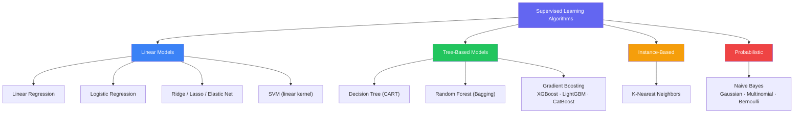
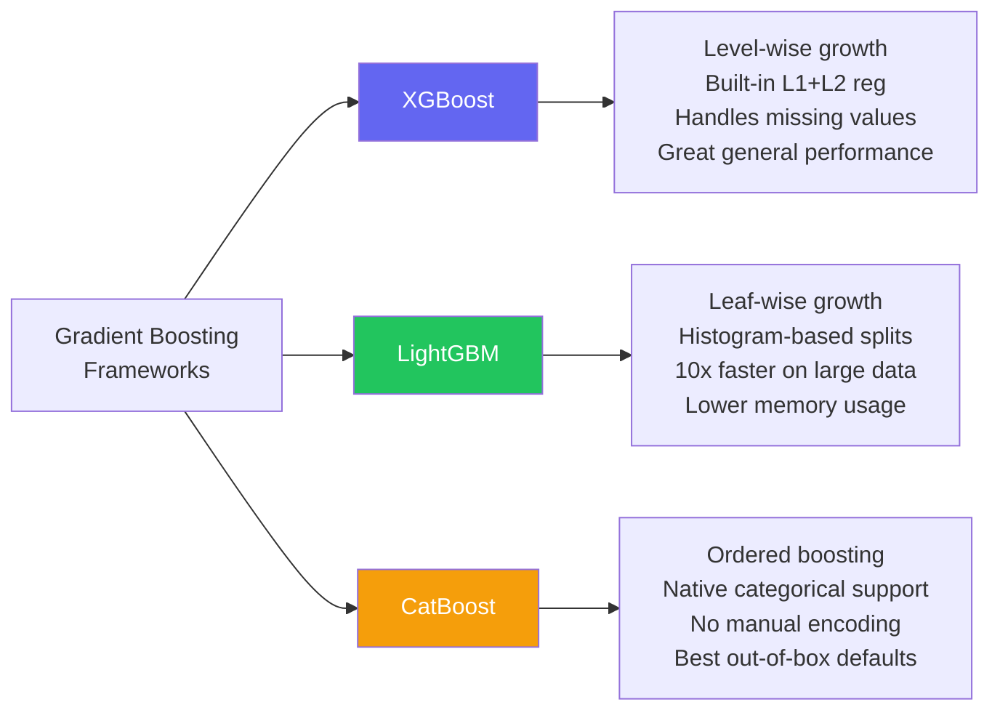
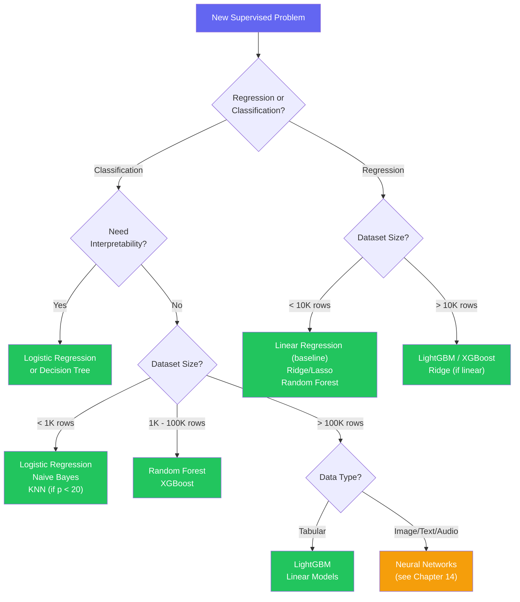

# Chapter 12 — Key ML Algorithms Deep Dive

---

## What You'll Learn

After this chapter you will be able to:
- Derive and implement Linear and Logistic Regression from first principles
- Explain how Decision Trees choose splits and why pruning matters
- Describe how Random Forest reduces variance through bagging and feature randomization
- Compare XGBoost, LightGBM, and CatBoost and know when to reach for each
- Apply the kernel trick in SVMs and tune C / gamma jointly
- Know when KNN is a good fit and when it falls apart
- Deploy Naive Bayes on text and understand why a "wrong" assumption still works
- Select the right algorithm for any tabular problem using a decision framework

**Markers:** ★★★ = know cold for interviews · ★★ = high priority · ★ = good to know.
**Quick check** boxes are retrieval practice — attempt before revealing.
**Interview** boxes give the question, what to say, and the follow-up trap.

---

## 12.1 The Algorithm Landscape ★

> **Algorithm taxonomy** groups supervised learning methods by how they represent the learned function. Linear models fit hyperplanes; tree models partition the feature space into axis-aligned regions; instance-based methods store examples and compare at prediction time; probabilistic models apply Bayes' theorem.



**How this chapter relates to the rest of the curriculum:**

| Topic | Where |
|---|---|
| Introduction to these algorithms | [Ch 10 — Supervised Learning](#content/10_supervised_learning) |
| Unsupervised methods (K-Means, DBSCAN) | [Ch 11 — Unsupervised Learning](#content/11_unsupervised_learning) |
| Neural networks and deep learning | [Ch 14 — Neural Networks](#content/14_neural_networks) |
| Model evaluation (ROC, AUC, cross-val) | [Ch 13 — Model Evaluation](#content/13_model_evaluation) |

Chapter 10 gave you the "what." This chapter gives you the "how" and "why" — the math, the implementation details, the hyperparameter knobs, and the practical failure modes.

---

## 12.2 Linear Regression — Deep Dive ★★★

You already do linear regression in your head. If every extra bedroom tends to add about $30k to a house's price and every year of age knocks a little off, you can price a new listing by adding up those per-feature effects. That is all this model is: a weighted sum where each weight says how strongly one feature pushes the prediction up or down.

> **Linear Regression** fits a linear function $\hat{y} = \mathbf{w}^\top \mathbf{x} + b$ to minimize the sum of squared residuals between predicted and observed values. It is the foundation of most parametric supervised learning.

### The Model

$$\hat{y} = w_0 + w_1 x_1 + w_2 x_2 + \cdots + w_p x_p = \mathbf{w}^\top \mathbf{x}$$

In matrix form for all $n$ samples: $\hat{\mathbf{y}} = X\mathbf{w}$ where $X$ is $(n \times (p+1))$ with a column of ones for the intercept.

### Worked Example — Fitting a Line by Hand

The weights in a linear model are not chosen — they are **solved for**. For a single
feature, least squares has a closed form worth computing once:

$$w_1 = \frac{\sum (x_i - \bar{x})(y_i - \bar{y})}{\sum (x_i - \bar{x})^2}, \qquad w_0 = \bar{y} - w_1\bar{x}$$

Four houses — size in hundreds of sq ft, price in $1,000s:

| Size $x$ | Price $y$ | $x - \bar{x}$ | $y - \bar{y}$ | product | $(x-\bar{x})^2$ |
|---|---|---|---|---|---|
| 10 | 200 | −7.5 | −100 | 750 | 56.25 |
| 15 | 260 | −2.5 | −40 | 100 | 6.25 |
| 20 | 340 | +2.5 | +40 | 100 | 6.25 |
| 25 | 400 | +7.5 | +100 | 750 | 56.25 |
| **mean 17.5** | **mean 300** | | | **Σ = 1700** | **Σ = 125** |

$$w_1 = \frac{1700}{125} = 13.6, \qquad w_0 = 300 - 13.6(17.5) = 62$$

$$\boxed{\text{price} = 62 + 13.6 \times \text{size}}$$

Read the slope in units: **each extra 100 sq ft adds $13,600**.

**Check the fit:**

| $x$ | predicted | actual | residual |
|---|---|---|---|
| 10 | 198 | 200 | +2 |
| 15 | 266 | 260 | −6 |
| 20 | 334 | 340 | +6 |
| 25 | 402 | 400 | −2 |

The residuals sum to **exactly zero**. That is not luck — it falls straight out of
the $w_0$ formula, and it holds for *every* OLS fit with an intercept. If your
residuals do not sum to ~0, you have a bug. (SSE here is 80; no other straight line
achieves less on this data.)

**Predicting** a 2,200 sq ft house: $62 + 13.6(22) = 361.2$, i.e. **$361,200**.

The multi-feature case is the same idea with the normal equation
$\mathbf{w}^* = (X^\top X)^{-1}X^\top\mathbf{y}$ doing the work — for example a fitted
model like

```
  Price = 50,000 + 120(SqFt) + 15,000(Bedrooms) - 1,000(Age)
```

where each weight is that feature's effect **holding the others fixed**. That
"holding the others fixed" clause is why multicollinearity is dangerous: if SqFt and
Bedrooms move together, the split of credit between their two weights becomes
unstable even though the predictions stay fine.

### Two Ways to Find Optimal Weights

**Method 1 — OLS Closed-Form (Normal Equation):**

$$\mathbf{w}^* = (X^\top X)^{-1} X^\top \mathbf{y}$$

Computes the exact solution in one step. Works well when $p$ is small (say, under a few thousand features). Fails when $X^\top X$ is singular (collinear features) or when $n$ is very large (inverting a $p \times p$ matrix costs $O(p^3)$).

**Method 2 — Gradient Descent (Iterative):**

$$w_j \leftarrow w_j - \eta \frac{\partial}{\partial w_j} \text{MSE} = w_j - \frac{2\eta}{n} \sum_{i=1}^n (\hat{y}_i - y_i) x_{ij}$$

Scale-independent, works with millions of rows, and naturally extends to regularized variants. The learning rate $\eta$ must be tuned — too large overshoots, too small crawls.

| | OLS (closed-form) | Gradient Descent |
|---|---|---|
| **Dataset size** | $n < 100\text{K}$, $p < 10\text{K}$ | Any size |
| **Computation** | $O(np^2 + p^3)$ — one shot | $O(np \cdot \text{iterations})$ |
| **Regularization** | Ridge only (it has a closed form) | Ridge, Lasso, Elastic Net |
| **Numerical issues** | Needs $X^\top X$ to be invertible | Always works |
| **Online learning** | No | Yes (SGD) |

### The Five Assumptions of Linear Regression

1. **Linearity** — the relationship between features and target is linear
2. **Independence** — observations are independent of each other
3. **Homoscedasticity** — residuals have constant variance across all predicted values
4. **Normality of residuals** — residuals are approximately normally distributed
5. **No multicollinearity** — features are not highly correlated with each other

When assumptions break: non-linearity means you need polynomial features or a non-linear model; multicollinearity inflates coefficient variance (use Ridge or drop features); heteroscedasticity means your standard errors and confidence intervals are unreliable.

### Detecting Multicollinearity — VIF

"Features are correlated" is vague. **Variance Inflation Factor** makes it a number.
For each feature $j$, regress it on *all the other features* and take the $R^2$:

$$\text{VIF}_j = \frac{1}{1 - R_j^2}$$

It answers: how much is this coefficient's variance inflated by the fact that other
features already explain this one?

| VIF | $R_j^2$ | Verdict |
|---|---|---|
| 1 | 0 | Perfectly independent |
| < 5 | < 0.80 | Fine |
| 5–10 | 0.80–0.90 | Watch it |
| > 10 | > 0.90 | **Serious** — the coefficient is not trustworthy |

**Why it matters, and what it does *not* break.** With `sqft` and `n_rooms` moving
together, the model cannot tell which one deserves the credit. The split between
their two coefficients becomes wildly unstable — drop three rows and a $+8{,}000$
weight can flip to $-3{,}000$. But note carefully:

> Multicollinearity damages **interpretation**, not **prediction**. The fitted values
> $\hat{y}$ stay accurate and the model may still perform beautifully on a test set.
> It is only when someone asks *"how much does an extra room add?"* that you are in
> trouble. If you only need forecasts, you can often ignore it entirely.

**Fixes, in order of preference:** drop one of the correlated pair (usually the less
interpretable one); combine them into a single feature (`sqft_per_room`); or use
**Ridge**, which is specifically designed for this — the L2 penalty stabilises the
split by shrinking correlated coefficients toward each other rather than letting them
seesaw. Lasso is a worse choice here: it arbitrarily keeps one of the pair and zeroes
the other, and which one it keeps can change with the random seed.

> **Interview —** *"Your linear model scores well, but the coefficients flip sign when you retrain on slightly different data. What is going on?"*
> **Say:** Classic **multicollinearity**. Two or more features carry nearly the same information, so infinitely many weight combinations produce almost the same predictions. The optimiser picks one arbitrarily, and a small change in the data tips it to a different one. I would compute **VIF** per feature and look for anything above 10.
> **They follow up with:** *"Is the model broken?"* — for **prediction**, no. $\hat{y}$ is stable and test performance is fine; only the *attribution* between the correlated features is unstable. It breaks the moment anyone reads the coefficients as effect sizes. Fix by dropping one, combining them, or switching to **Ridge** — and prefer Ridge over Lasso here, because Lasso arbitrarily zeroes one of the pair and its choice is seed-dependent.

<details>
<summary><strong>Quick check.</strong> A colleague fits OLS with an intercept and reports residuals of +3, −1, +2, +4. Without seeing the data, what do you know is wrong?</summary>

**The residuals must sum to zero** for any OLS fit that includes an intercept — it
falls directly out of $w_0 = \bar{y} - w_1\bar{x}$. These sum to **+8**.

So either the intercept was suppressed (`fit_intercept=False`), the model has not
converged, or these are **test-set** residuals rather than training residuals — which
is fine and expected, but must be labelled as such.

It is a cheap, powerful sanity check: sum your training residuals; if the total is
not ~0, stop and find the bug before interpreting anything.
</details>

### Residual Analysis

```
  GOOD — random scatter        BAD — curved pattern

  residual                     residual
     │  .  .                      │        . .
     │ . . .  .                   │     . .
   0 ─┼─────────── predicted    0 ─┼─.─────────── predicted
     │  . .  .                    │      . .
     │    .                       │  . .
                                      ↑ non-linearity

  No pattern means the           A shape means the model is
  assumptions hold.              misspecified. Fix: add
                                 polynomial terms, or switch
                                 to a non-linear algorithm.
```

### Regularized Variants

Ridge adds an L2 penalty ($\lambda \sum w_j^2$) — shrinks all weights, keeps all features. Lasso adds an L1 penalty ($\lambda \sum |w_j|$) — drives some weights to exactly zero (built-in feature selection). Elastic Net combines both. The penalty strength $\lambda$ is tuned via cross-validation.

→ **Full treatment of regularization mechanics: Chapter 8 §8.15 (Regularization)**

The chart below shows how test MSE changes with $\lambda$ for a linear regression problem — the U-shape confirms that both under-regularization (overfitting) and over-regularization (underfitting) hurt.

```chart
{
  "type": "scatter",
  "data": {
    "datasets": [
      {
        "label": "Training Data",
        "data": [{"x":900,"y":150},{"x":1200,"y":200},{"x":1500,"y":250},{"x":1800,"y":303},{"x":2000,"y":330},{"x":2200,"y":370},{"x":2500,"y":410},{"x":2800,"y":440}],
        "backgroundColor": "rgba(99, 102, 241, 0.7)",
        "borderColor": "rgba(99, 102, 241, 1)",
        "pointRadius": 6
      },
      {
        "label": "Best Fit Line",
        "data": [{"x":800,"y":140},{"x":1000,"y":165},{"x":1500,"y":230},{"x":2000,"y":305},{"x":2500,"y":385},{"x":3000,"y":460}],
        "borderColor": "rgba(239, 68, 68, 1)",
        "backgroundColor": "transparent",
        "showLine": true,
        "borderWidth": 2,
        "pointRadius": 0,
        "tension": 0
      }
    ]
  },
  "options": {
    "plugins": { "title": { "display": true, "text": "Linear Regression — Minimizing Squared Distances to the Line" } },
    "scales": {
      "y": { "title": { "display": true, "text": "Price ($K)" }, "min": 100, "max": 500 },
      "x": { "title": { "display": true, "text": "Square Footage" }, "min": 700, "max": 3100 }
    }
  }
}
```

```chart
{
  "type": "line",
  "data": {
    "labels": [0.001, 0.01, 0.1, 1, 10, 100, 1000],
    "datasets": [
      {
        "label": "Ridge (L2) — Test MSE",
        "data": [8.2, 7.1, 5.4, 4.0, 4.8, 7.5, 12.0],
        "borderColor": "rgba(99, 102, 241, 1)",
        "fill": false,
        "tension": 0.4,
        "pointRadius": 3
      },
      {
        "label": "Lasso (L1) — Test MSE",
        "data": [8.0, 6.8, 5.0, 3.8, 5.2, 9.0, 14.0],
        "borderColor": "rgba(239, 68, 68, 1)",
        "fill": false,
        "tension": 0.4,
        "pointRadius": 3
      }
    ]
  },
  "options": {
    "plugins": { "title": { "display": true, "text": "Regularization Strength (lambda) — Too Little or Too Much Hurts" } },
    "scales": {
      "y": { "title": { "display": true, "text": "Test MSE" }, "min": 2, "max": 16 },
      "x": { "type": "logarithmic", "title": { "display": true, "text": "Lambda (log scale)" } }
    }
  }
}
```

### Implementation

```python
# sklearn
from sklearn.linear_model import LinearRegression
model = LinearRegression().fit(X_train, y_train)
predictions = model.predict(X_test)
print(f"R² = {model.score(X_test, y_test):.3f}")
print(f"Coefficients: {dict(zip(feature_names, model.coef_))}")

# From scratch — gradient descent
import numpy as np
def linear_regression_gd(X, y, lr=0.01, epochs=1000):
    X = np.c_[np.ones(len(X)), X]  # add bias column
    w = np.zeros(X.shape[1])
    for _ in range(epochs):
        grad = (2 / len(X)) * X.T @ (X @ w - y)
        w -= lr * grad
    return w  # w[0] = intercept, w[1:] = coefficients
```

---

## 12.3 Logistic Regression — Deep Dive ★★★

> **Logistic Regression** models the probability of a binary outcome by applying the logistic (sigmoid) function to a linear combination of features. It is trained by maximizing log-likelihood, equivalently minimizing binary cross-entropy loss.

Despite the name, this is a **classification** algorithm. The key insight: take the linear regression score $z = \mathbf{w}^\top \mathbf{x}$, then squash it through the sigmoid to get a probability.

### The Sigmoid Function

$$\sigma(z) = \frac{1}{1 + e^{-z}} \quad \text{where} \quad z = w_0 + w_1 x_1 + \cdots + w_p x_p$$

Properties that make it useful:
- Maps any real number to $(0, 1)$ — a valid probability
- $\sigma(0) = 0.5$ — the natural decision boundary
- Differentiable everywhere — gradient-based optimization works
- $\sigma'(z) = \sigma(z)(1 - \sigma(z))$ — elegant gradient

```
  SIGMOID SHAPE
  P(y=1)
    1.0 |                    _______________
    0.8 |              _____/
    0.5 |_____________/        <-- threshold (default 0.5)
    0.2 |        ____/
    0.0 |_______/
        +-------------------------------------> z
        -6     -3      0      3      6
```

### The Loss Function — Binary Cross-Entropy

MSE cannot be used for classification — it produces a non-convex loss surface. Binary cross-entropy is convex (gradient descent finds the global minimum) and punishes confident wrong answers severely:

$$\mathcal{L} = -\frac{1}{n}\sum_{i=1}^{n} \left[ y_i \log(\hat{p}_i) + (1 - y_i) \log(1 - \hat{p}_i) \right]$$

→ **Full treatment of loss functions: [Ch 8 §8.8](#content/08_core_concepts)**

### What the Weights Actually Mean — The Log-Odds View

This is the single most-asked question about logistic regression, and it is the
reason the model is the default when someone must *explain* a decision.

Start from the model and invert the sigmoid:

$$p = \frac{1}{1 + e^{-z}} \quad\Longrightarrow\quad \frac{p}{1-p} = e^{z} \quad\Longrightarrow\quad \ln\!\left(\frac{p}{1-p}\right) = z = w_0 + w_1x_1 + \cdots$$

So logistic regression is **linear — but in the log-odds**, not in the probability.
That one sentence answers most follow-ups.

Exponentiating a single weight gives the **odds ratio**:

$$e^{w_j} = \text{the multiplicative change in odds for a one-unit increase in } x_j$$

| $w_j$ | $e^{w_j}$ | Reading |
|---|---|---|
| $+0.69$ | 2.0 | One more unit **doubles** the odds |
| $+0.10$ | 1.11 | One more unit raises the odds ~11% |
| $0$ | 1.0 | No effect |
| $-0.69$ | 0.5 | One more unit **halves** the odds |

**Worked reading.** If `has_link` has weight $w = 3.2$, then $e^{3.2} \approx 24.5$:
an email containing a link has roughly **24× the odds** of being spam, holding the
other features fixed.

**The trap interviewers set:** "so it multiplies the *probability* by 24?" No.
Odds and probability are not the same thing, and the effect on probability depends
entirely on where you started:

| Starting $p$ | Starting odds | ×24.5 odds | New $p$ |
|---|---|---|---|
| 0.01 | 0.0101 | 0.247 | **0.198** (≈20×) |
| 0.50 | 1.0 | 24.5 | **0.961** (<2×) |
| 0.90 | 9.0 | 220 | **0.995** (barely moves) |

The odds ratio is **constant**; the probability change is not. That is exactly why
the coefficients are reported in log-odds space — it is the only scale on which the
effect of a feature is a single stable number.

> **Interview —** *"A logistic regression gives `has_link` a coefficient of 3.2. Explain what that means to a product manager."*
> **Say:** Exponentiate it: $e^{3.2} \approx 24$. An email containing a link has about **24 times the odds** of being spam, holding everything else constant. I would phrase it in odds, not probability, because that is what the coefficient actually fixes.
> **They follow up with:** *"So a link makes it 24× more likely to be spam?"* — no, and this is the distinction they are testing. Odds are not probability. If the baseline probability is 1%, multiplying the odds by 24 takes it to about **20%** — roughly 20×. If the baseline is already 50%, it goes to **96%** — under 2×. The odds ratio is constant; the effect on probability depends entirely on where you started.

<details>
<summary><strong>Quick check.</strong> A logistic model gives feature X a coefficient of −0.69. A customer currently has a 50% predicted probability of churn. What happens to that probability if X increases by one unit?</summary>

$e^{-0.69} \approx 0.5$, so the odds are **halved**.

At $p = 0.5$ the odds are $\frac{0.5}{0.5} = 1$. Halving gives odds of 0.5, and
converting back:

$$p = \frac{0.5}{1 + 0.5} = \mathbf{0.333}$$

So the probability drops from 50% to **33%**, not to 25%. Halving the *odds* is not
halving the *probability* — the two only coincide when the probability is very small.
</details>

### Worked Example — Spam Detection

```
  Features: word_free (count), has_link (0/1),
            caps_ratio (fraction)

  Learned weights:
    w0 = -2.1, w1 = 1.8, w2 = 3.2, w3 = 4.5

  New email: word_free=3, has_link=1, caps_ratio=0.4

  z = -2.1 + 1.8(3) + 3.2(1) + 4.5(0.4)
    = -2.1 + 5.4 + 3.2 + 1.8
    = 8.3

  P(spam) = sigmoid(8.3) = 1 / (1 + e^-8.3) = 0.9998

  0.9998 > 0.5  →  classify as SPAM
```

### Decision Boundary

The decision boundary is where $P(y=1) = 0.5$, i.e., where $z = 0$:

$$w_0 + w_1 x_1 + w_2 x_2 = 0 \implies x_2 = -\frac{w_0}{w_2} - \frac{w_1}{w_2} x_1$$

This is always a straight line in 2D (a hyperplane in higher dimensions). If the data is not linearly separable, logistic regression will find the best linear boundary but cannot capture non-linear patterns. For that, add polynomial features or switch to a non-linear model.

### Multiclass Extensions

**One-vs-Rest (OvR):** Train $K$ binary classifiers, each asking "is it class $k$ or not?" Predict with the class that gives the highest probability. Simple, works with any binary classifier.

**Softmax (Multinomial):** Generalize sigmoid to $K$ classes directly:

$$P(y = k \mid \mathbf{x}) = \frac{e^{z_k}}{\sum_{j=1}^{K} e^{z_j}}$$

Probabilities sum to 1 across all classes. This is the standard approach in neural networks and sklearn's `multi_class='multinomial'`.

### Threshold Tuning for Real-World Problems

The default threshold of 0.5 is rarely optimal. Adjust it based on the cost of errors:

```
  Medical Diagnosis (fraud detection, cancer screening):
    Lower threshold (e.g., 0.3) -> catch more positives
    Higher recall, lower precision
    Cost of missing a positive >> cost of false alarm

  Spam Filter:
    Higher threshold (e.g., 0.7) -> only flag clear spam
    Higher precision, lower recall
    Cost of blocking real email >> cost of missing some spam

  Use the ROC curve or Precision-Recall curve to pick the
  threshold that matches your business objective.
  (See Chapter 13 for details on these curves.)
```

### Class Imbalance — What `class_weight` Actually Does

When positives are 1% of the data, the loss is dominated by negatives, and the
cheapest way to minimise it is to predict "negative" almost always. The model is
behaving correctly; the objective is just misaligned with what you want.

`class_weight='balanced'` **reweights the loss** so each class contributes equally,
by setting

$$w_c = \frac{n}{K \cdot n_c}$$

for class $c$ with $n_c$ examples, $K$ classes, $n$ total. With 9,900 negatives and
100 positives:

$$w_- = \frac{10{,}000}{2 \times 9{,}900} = 0.505, \qquad w_+ = \frac{10{,}000}{2 \times 100} = 50.0$$

Each positive now counts ~99× as much as each negative, so a missed positive hurts
the loss ~99× more.

**The three levers, and when each is right:**

| Approach | What it changes | Use when |
|---|---|---|
| **`class_weight`** | The loss function | Default choice — no data duplication, no information lost |
| **Resampling** (SMOTE, undersampling) | The training data | The minority class is *tiny* in absolute terms (< a few hundred rows) |
| **Threshold tuning** | Only the decision cut | You want calibrated probabilities preserved — **often the best option** |

> **The point people miss:** `class_weight` and threshold tuning are attacking the
> same problem from different ends. Reweighting distorts the predicted probabilities
> (they are no longer calibrated to the true base rate), whereas moving the threshold
> leaves the probabilities intact and only changes where you cut. If a downstream
> system consumes the *probability* — expected-value pricing, risk scoring — prefer
> threshold tuning. Do not stack both without checking calibration (§12.14).

```chart
{
  "type": "line",
  "data": {
    "labels": [-6,-5,-4,-3,-2,-1,0,1,2,3,4,5,6],
    "datasets": [{
      "label": "Sigmoid: P(y=1) = 1/(1+e^-z)",
      "data": [0.002,0.007,0.018,0.047,0.119,0.269,0.500,0.731,0.881,0.953,0.982,0.993,0.998],
      "borderColor": "rgba(99, 102, 241, 1)",
      "backgroundColor": "rgba(99, 102, 241, 0.1)",
      "fill": true,
      "tension": 0.4,
      "pointRadius": 3
    }]
  },
  "options": {
    "plugins": { "title": { "display": true, "text": "Sigmoid Function — Any Score to a Probability" } },
    "scales": {
      "y": { "title": { "display": true, "text": "P(y=1)" }, "min": 0, "max": 1 },
      "x": { "title": { "display": true, "text": "z (linear score)" } }
    }
  }
}
```

### Implementation

```python
# sklearn
from sklearn.linear_model import LogisticRegression
model = LogisticRegression(C=1.0, max_iter=1000).fit(X_train, y_train)
probs = model.predict_proba(X_test)[:, 1]  # P(class=1)

# From scratch
import numpy as np
def sigmoid(z): return 1 / (1 + np.exp(-z))

def logistic_regression_gd(X, y, lr=0.01, epochs=1000):
    X = np.c_[np.ones(len(X)), X]
    w = np.zeros(X.shape[1])
    for _ in range(epochs):
        p = sigmoid(X @ w)
        grad = X.T @ (p - y) / len(X)
        w -= lr * grad
    return w
```

---

## 12.4 Decision Trees — Deep Dive ★★★

A decision tree is just a flowchart of yes/no questions, like the game of Twenty Questions. Each question splits the cases still in play into purer and purer groups until you are confident enough to commit to an answer. The only real skill is picking which question to ask at each step.

> **Decision Tree (CART)** is a non-parametric supervised algorithm that recursively partitions the feature space into axis-aligned regions by choosing splits that maximize an impurity reduction criterion (Gini impurity or information gain). Predictions are the majority class (classification) or mean value (regression) in each leaf.

### How Splits Are Chosen

At every internal node, the algorithm evaluates every possible split on every feature and picks the one that produces the purest child nodes.

**Gini Impurity:**

$$G = 1 - \sum_{k=1}^{K} p_k^2$$

**Entropy (Information Gain):**

$$H = -\sum_{k=1}^{K} p_k \log_2(p_k)$$

Both measure "how mixed are the classes?" A pure node ($G=0$, $H=0$) contains only one class. In practice, Gini and Entropy almost always produce identical trees. Gini is slightly faster to compute (no logarithm).

### Worked Split Example — Fraud Detection

```
  Parent node: 100 transactions (30 fraud, 70 legit)
  Gini(parent) = 1 - (0.3^2 + 0.7^2) = 1 - 0.58 = 0.42

  Candidate split: "amount > $500?"

  Left child (amount <= 500):  60 transactions (5 fraud, 55 legit)
    Gini(left) = 1 - (5/60)^2 - (55/60)^2 = 0.153

  Right child (amount > 500):  40 transactions (25 fraud, 15 legit)
    Gini(right) = 1 - (25/40)^2 - (15/40)^2 = 0.469

  Weighted Gini after split = (60/100)*0.153 + (40/100)*0.469
                            = 0.092 + 0.188 = 0.280

  Gini reduction = 0.42 - 0.28 = 0.14  (good split!)

  The algorithm tests ALL features and thresholds, picks the
  split with the largest impurity reduction.
```

### The Overfitting Problem

An unrestricted decision tree will keep splitting until every leaf is pure — effectively memorizing the training data. This gives 100% training accuracy and terrible generalization.

```
  Depth 3 (slightly underfits)   Depth 20 (memorizes noise)
  ────────────────────────────   ──────────────────────────
       [amount > 500?]                [amount > 500?]
       /            \                 /            \
  [time<2am?]  [country=X?]    [time<2:03am?]   [...]
    /    \        /    \          /       \
 Fraud  Legit  Fraud  Legit   [...many splits...]
                                       |
  General rules that            One leaf per training
  work on new data.             example. Fails on new data.
```

### Pre-Pruning (Stopping Rules)

| Stopping rule | Typical value | What it does |
|---|---|---|
| `max_depth` | 5–10 | Stop growing after N levels |
| `min_samples_split` | 20 | Only split a node holding at least 20 samples |
| `min_samples_leaf` | 10 | Every leaf must keep at least 10 samples |
| `max_features` | `'sqrt'` | Consider only $\sqrt{p}$ features per split |
| `max_leaf_nodes` | 50 | Cap the total number of leaves |

These are the most effective regularization controls. Start with `max_depth` — it has the biggest impact on overfitting.

### Post-Pruning: Cost-Complexity (Minimal Cost-Complexity Pruning)

After growing a full tree, prune it back by finding the subtree that minimizes:

$$R_\alpha(T) = R(T) + \alpha \cdot |T|$$

where $R(T)$ is the misclassification rate, $|T|$ is the number of leaves, and $\alpha$ is the complexity penalty. Higher $\alpha$ = more aggressive pruning = simpler tree.

In sklearn, this is `ccp_alpha`. Use `cost_complexity_pruning_path()` to find candidate $\alpha$ values, then select via cross-validation.

> **Interview —** *"Why prune a tree afterwards instead of just setting `max_depth` up front?"*
> **Say:** Because pre-pruning is **greedy and blind**. A `max_depth` cap stops every branch at the same level, and `min_samples_split` refuses a split that looks weak *right now* — even when that split would have unlocked a very strong one just below it. Post-pruning grows the full tree first, so it can see what a branch eventually delivers, then removes what did not earn its complexity.
> **They follow up with:** *"How does `ccp_alpha` decide?"* — it minimises $R_\alpha(T) = R(T) + \alpha|T|$, where $|T|$ is the leaf count. Sweeping $\alpha$ from 0 upward produces a nested sequence of ever-smaller subtrees; `cost_complexity_pruning_path()` returns the $\alpha$ values where the tree actually changes, and you cross-validate over those. In practice, pre-pruning for speed plus a cross-validated `ccp_alpha` for quality is the usual combination.

### Pros and Cons

| Strengths | Weaknesses |
|-----------|-----------|
| Highly interpretable (visualize the tree) | High variance — small data changes = different tree |
| No feature scaling needed | Axis-aligned splits miss diagonal boundaries |
| Handles mixed feature types | Greedy — locally optimal splits, not global |
| Built-in feature importance | Single tree rarely competitive for accuracy |

```chart
{
  "type": "line",
  "data": {
    "labels": [1,2,3,4,5,6,8,10,15,20,30],
    "datasets": [
      {
        "label": "Training Accuracy",
        "data": [65,78,88,93,96,98,99.5,99.9,100,100,100],
        "borderColor": "rgba(99, 102, 241, 1)",
        "fill": false,
        "tension": 0.4,
        "pointRadius": 3
      },
      {
        "label": "Validation Accuracy",
        "data": [64,76,84,88,89,88,85,80,72,65,58],
        "borderColor": "rgba(239, 68, 68, 1)",
        "borderDash": [5,5],
        "fill": false,
        "tension": 0.4,
        "pointRadius": 3
      }
    ]
  },
  "options": {
    "plugins": { "title": { "display": true, "text": "Decision Tree Depth vs Accuracy — Validation Peaks Then Drops" } },
    "scales": {
      "y": { "title": { "display": true, "text": "Accuracy (%)" }, "min": 50, "max": 100 },
      "x": { "title": { "display": true, "text": "max_depth" } }
    }
  }
}
```

---

## 12.5 Random Forest — Deep Dive ★★★

Ask one expert and you get one confident answer that might be wildly off. Ask hundreds of experts who each studied slightly different books and looked at slightly different clues, then take a vote — the individual quirks cancel out and the consensus is far steadier. A random forest builds exactly that panel, but out of decision trees.

> **Random Forest** is an ensemble of decision trees trained on bootstrap samples with random feature subsets at each split (bagging + feature randomization). Predictions are aggregated by majority vote (classification) or averaging (regression). The decorrelation between trees reduces ensemble variance without increasing bias.

### The Two Sources of Randomness

**Source 1 — Bootstrap Sampling (Bagging):**

Each tree gets a random sample of $n$ rows drawn with replacement. On average, each bootstrap sample contains ~63.2% of unique training rows. The remaining ~36.8% are "out-of-bag" (OOB) for that tree.

```
  Original: [1, 2, 3, 4, 5, 6, 7, 8, 9, 10]

  Tree 1 sample: [2, 2, 5, 7, 3, 9, 1, 4, 4, 6]  -> OOB: {8, 10}
  Tree 2 sample: [8, 1, 3, 3, 7, 2, 9, 5, 6, 6]  -> OOB: {4, 10}
  Tree 3 sample: [4, 7, 1, 8, 2, 5, 3, 9, 7, 1]  -> OOB: {6, 10}
```

**Source 2 — Feature Subsampling:**

At each split, only a random subset of features is considered:

```
  Classification  max_features = 'sqrt'  → sqrt(p) per split
  Regression      sklearn default = 1.0 (ALL features).
                  p/3 is Breiman's classic heuristic — worth
                  trying to decorrelate trees, but it is NOT
                  the current library default.

  Why? If one feature dominates (say "amount" for fraud),
  every tree splits on it first → the trees are correlated
  → averaging them gains little. Forcing a different feature
  subset per split decorrelates the trees, so their
  individual errors cancel.
```

### Out-of-Bag (OOB) Error

For each sample, collect predictions only from trees that did NOT train on it. This gives a free cross-validation estimate without needing a held-out validation set.

**Why roughly a third of the rows are always left out.** Each tree trains on a
bootstrap sample: $N$ rows drawn *with replacement* from $N$ rows. For one specific
row, the chance of *not* being picked on a single draw is $1 - \frac{1}{N}$, and the
draws are independent, so the chance of surviving all $N$ draws untouched is

$$\left(1 - \frac{1}{N}\right)^{N} \;\xrightarrow[N \to \infty]{}\; e^{-1} \approx 0.368$$

| $N$ | $(1 - 1/N)^N$ |
|---|---|
| 10 | 0.349 |
| 100 | 0.366 |
| 1,000 | 0.368 |
| 10,000 | 0.368 |

It converges almost immediately. So **~63% of rows go into each tree and ~37% stay
out** — and those 37% are a ready-made validation set for that tree, at zero cost.

```
  Sample #10 was OOB for trees {1, 2, 3}
  Tree 1 predicts: Fraud
  Tree 2 predicts: Legit
  Tree 3 predicts: Fraud
  OOB prediction for sample #10: Fraud (2 vs 1 vote)

  OOB accuracy across all samples ≈ cross-validation accuracy.
  Use: oob_score=True in sklearn's RandomForestClassifier.
```

> **Why boosting gets nothing equivalent:** OOB works because bagged trees are
> **independent** — a row held out of tree 7 is still validated honestly by tree 7.
> Gradient boosting builds trees **sequentially** on the residuals of all previous
> trees, so every tree has already been influenced by every row. There is no
> untouched subset left to score against, which is why GBMs need an explicit
> validation set and `early_stopping_rounds`.

### Feature Importance

Random Forest provides two importance measures:

**Mean Decrease in Impurity (MDI):** Sum of Gini reductions across all splits on a feature, averaged over all trees. Fast but biased toward high-cardinality features.

**Permutation Importance:** Shuffle one feature's values, measure accuracy drop. Unbiased, works with any model, but slower. Prefer permutation importance for final reporting.

> **Interview —** *"Your Random Forest ranks `customer_id` as the second most important feature. What happened?"*
> **Say:** That is the signature of **MDI bias**. The default importance sums Gini reduction over every split on a feature, and a high-cardinality column like an ID offers a near-unique value per row — so it can carve out almost pure leaves and rack up impurity reduction, purely by memorising. It is not predictive; it is a measurement artifact of the metric.
> **They follow up with:** *"How would you confirm it, and what would you use instead?"* — confirm with **permutation importance** on a held-out set: shuffling a genuinely useless ID will barely move validation accuracy, even though MDI loved it. Then drop the column, because an ID also invites leakage. More generally, MDI is biased toward high-cardinality and continuous features, so use permutation importance for reporting and SHAP when I need per-prediction explanations.

### Key Hyperparameters

| Hyperparameter | Typical value | Notes |
|---|---|---|
| `n_estimators` | 100–500 | More is better; diminishing returns after ~200 |
| `max_depth` | `None`, or 10–30 | `None` lets trees grow deep; cap it to regularize |
| `max_features` | `'sqrt'` for classification | Regression defaults to 1.0 — try 0.33 or `'sqrt'` to decorrelate the trees |
| `min_samples_leaf` | 1–5 | Lower means more complex trees |
| `bootstrap` | `True` | Bagging on. Almost always leave it alone |

```chart
{
  "type": "line",
  "data": {
    "labels": [1,5,10,20,50,100,200,300,500,1000],
    "datasets": [
      {
        "label": "Random Forest Accuracy",
        "data": [72,80,84,87,89.5,90.8,91.2,91.4,91.5,91.5],
        "borderColor": "rgba(99, 102, 241, 1)",
        "backgroundColor": "rgba(99, 102, 241, 0.1)",
        "fill": true,
        "tension": 0.4,
        "pointRadius": 3
      },
      {
        "label": "Single Decision Tree",
        "data": [72,72,72,72,72,72,72,72,72,72],
        "borderColor": "rgba(239, 68, 68, 1)",
        "borderDash": [5,5],
        "fill": false,
        "tension": 0,
        "pointRadius": 0
      }
    ]
  },
  "options": {
    "plugins": { "title": { "display": true, "text": "Random Forest — More Trees Improve Accuracy (Diminishing Returns)" } },
    "scales": {
      "y": { "title": { "display": true, "text": "Accuracy (%)" }, "min": 65, "max": 95 },
      "x": { "title": { "display": true, "text": "Number of Trees (n_estimators)" } }
    }
  }
}
```

### Implementation

```python
from sklearn.ensemble import RandomForestClassifier
rf = RandomForestClassifier(n_estimators=200, max_depth=10,
                            min_samples_leaf=5, random_state=42, n_jobs=-1, oob_score=True)
rf.fit(X_train, y_train)
print(f"OOB Score: {rf.oob_score_:.3f}")  # oob_score=True set in constructor
importances = dict(zip(feature_names, rf.feature_importances_))
```

---

## 12.6 Gradient Boosting — The Competition King ★★★

Gradient boosting is the art of fixing your own mistakes, one small correction at a time. Build a weak model, look at exactly where it is wrong, then train the next model specifically to patch those errors — and keep stacking tiny corrections until almost nothing is left to fix. It is like refining a guess by repeatedly asking "how far off was I, and in which direction?"

> **Gradient Boosting** builds an additive ensemble of weak learners (shallow trees) sequentially. Each new tree is fit to the negative gradient of the loss function with respect to the current ensemble's predictions (i.e., the residuals for squared error loss). The final prediction is the weighted sum of all trees' outputs.

### The Core Idea

```
  Target: 100

  Tree 1 (shallow, weak): predicts 70    --> residual = 30
  Tree 2 fits residual:   predicts 22    --> residual = 8
  Tree 3 fits residual:   predicts 6     --> residual = 2
  Tree 4 fits residual:   predicts 1.5   --> residual = 0.5

  Final = 70 + 22 + 6 + 1.5 = 99.5  (very close!)
```

The mathematical formulation at iteration $m$:

$$F_m(\mathbf{x}) = F_{m-1}(\mathbf{x}) + \eta \cdot h_m(\mathbf{x})$$

where $h_m$ is the new tree fit to the pseudo-residuals $r_i = -\frac{\partial L(y_i, F_{m-1}(x_i))}{\partial F_{m-1}(x_i)}$ and $\eta$ is the learning rate.

### Worked Example — Three Rounds on Four Houses

The sketch above hides two things that matter: how a tree fits residuals across
*many* rows at once, and where the learning rate actually enters. Here is the real
loop, with every number checked.

Four houses, one feature (size), squared-error loss, depth-1 trees (stumps), $\eta = 0.5$:

| House | Size | Price $y$ ($100k) |
|---|---|---|
| 1 | Small | 2.0 |
| 2 | Small | 2.5 |
| 3 | Large | 4.0 |
| 4 | Large | 4.5 |

**Round 0 — the starting guess.** With squared error, the best constant prediction
is the mean: $F_0 = 3.25$ for every house.

| | $y$ | $F_0$ | residual |
|---|---|---|---|
| 1 | 2.0 | 3.25 | **−1.25** |
| 2 | 2.5 | 3.25 | −0.75 |
| 3 | 4.0 | 3.25 | +0.75 |
| 4 | 4.5 | 3.25 | **+1.25** |

Sum of squared residuals: **4.25**.

**Round 1 — fit a stump to those residuals.** The only split available is
Small vs Large. The stump predicts the *mean residual* in each leaf:
Small $= \frac{-1.25 + -0.75}{2} = -1.0$, Large $= \frac{0.75 + 1.25}{2} = +1.0$.

Now apply the learning rate — **this is the step the sketch above skips**:

$$F_1 = F_0 + 0.5 \times h_1$$

| | $F_0$ | $h_1$ | $F_1 = F_0 + 0.5h_1$ | new residual |
|---|---|---|---|---|
| 1 | 3.25 | −1.0 | **2.75** | −0.75 |
| 2 | 3.25 | −1.0 | 2.75 | −0.25 |
| 3 | 3.25 | +1.0 | 3.75 | +0.25 |
| 4 | 3.25 | +1.0 | **3.75** | +0.75 |

SSE: 4.25 → **1.25**. Note we moved *halfway* to the stump's suggestion, not all
the way — that is what $\eta$ buys.

**Round 2.** Refit on the new residuals: Small $= -0.5$, Large $= +0.5$.

| | $F_1$ | $h_2$ | $F_2$ | new residual |
|---|---|---|---|---|
| 1 | 2.75 | −0.5 | **2.50** | −0.50 |
| 2 | 2.75 | −0.5 | 2.50 | 0.00 |
| 3 | 3.75 | +0.5 | 4.00 | 0.00 |
| 4 | 3.75 | +0.5 | **4.00** | +0.50 |

SSE: 1.25 → **0.50**.

**Round 3.** Small $= -0.25$, Large $= +0.25$ → $F_3 = 2.375, 2.375, 4.125, 4.125$.
SSE: 0.50 → **0.3125**.

```
  SSE by round:  4.25 → 1.25 → 0.50 → 0.3125 → ...
                                            ↓
                          floor at 0.25 (irreducible)
```

**Three things this example teaches that the one-liner cannot:**

1. **The learning rate is a brake, not a detail.** Each round the model moves half
   the distance the stump recommends. With $\eta = 1$ it would jump straight to the
   group means in one round — fast, but with no chance to correct course.
2. **Error falls monotonically but with diminishing returns.** 4.25 → 1.25 is a huge
   gain; 0.50 → 0.3125 is not. This is exactly the curve `early_stopping_rounds`
   watches on a validation set.
3. **It converges to a floor, not to zero.** The predictions approach the group means
   (2.25 and 4.25), leaving ±0.25 inside each group. One binary feature simply cannot
   separate two houses of the same size — that residual is **irreducible**, and no
   number of extra trees removes it. Chasing it is precisely what overfitting looks
   like when the feature genuinely lacks the signal.

### Early Stopping — How It Actually Works

Point 3 above is the practical problem: **training** loss keeps falling forever, so
it can never tell you when to stop. Early stopping watches a *separate* validation
set instead.

```
  round   train loss   valid loss
    50       0.42         0.45
   100       0.31         0.38
   150       0.24         0.34   ← best
   160       0.23         0.35
   170       0.22         0.35
   180       0.21         0.36
   190       0.20         0.37   ← 4 rounds, no improvement
                                   STOP, roll back to 150
```

The mechanics, exactly:

1. Fit tree $m$, predict on the validation set, record the metric.
2. If it improved on the best seen so far, remember $m$ as the best iteration.
3. If it has **not** improved for `early_stopping_rounds` consecutive rounds, halt.
4. **Roll back** to the best iteration — this is the part people forget. XGBoost
   exposes it as `best_iteration`; predicting without it uses all the overfit trees.

**Choosing the patience value.** `early_stopping_rounds` is a patience counter, not a
limit. Set it too low (say 5) and normal noise in the validation curve halts you
early; too high and you waste compute. Roughly **10–50**, scaled inversely with the
learning rate — a small $\eta$ improves in smaller steps, so it needs more patience.

> **The trap:** the validation set used for early stopping is no longer clean. You
> selected the number of trees using it, so reporting its score overstates
> performance. You need **three** splits — train, validation (for stopping), and a
> test set touched exactly once.

> **Interview —** *"How do you tune `learning_rate` and `n_estimators`?"*
> **Say:** Never independently — they trade off directly, since the model's total movement is roughly $\eta \times$ (number of trees). The standard recipe is to **fix the learning rate and let early stopping choose the tree count**. I start at $\eta = 0.1$ with a deliberately generous `n_estimators` (say 5,000) and `early_stopping_rounds`, so the data picks the count. Then, if I can afford the compute, I drop to $\eta = 0.03$ and re-run — a smaller rate almost always generalises slightly better, it just needs proportionally more trees.
> **They follow up with:** *"Why not just grid-search both?"* — it wastes most of the grid. Because the product is what matters, a grid over both spends its budget re-testing equivalent combinations ($\eta{=}0.1$/100 trees behaves much like $\eta{=}0.01$/1000). Early stopping finds the right count for a given $\eta$ in a **single** fit, so you only ever search over $\eta$.

<details>
<summary><strong>Quick check.</strong> You train with `early_stopping_rounds=10`. Validation loss bottoms out at round 150, then drifts up until training halts at round 160. How many trees does your final model use — and what is the most common mistake here?</summary>

**150**, not 160. The extra 10 rounds only proved that 150 was the best; they are
overfit trees and must be discarded.

The mistake is **failing to roll back**. If you predict with the full 160-tree model,
you are deliberately using the ones early stopping just told you were harmful.
XGBoost and LightGBM expose `best_iteration` for exactly this — some APIs roll back
automatically, others do not, so check rather than assume.

Second trap: **do not report that validation score as your result.** You used it to
pick the tree count, so it is now optimistically biased. Report on a separate test set.
</details>

### The Learning Rate Tradeoff

```
  Large eta (0.3)   Learns fast, needs fewer trees,
                    can overshoot → overfits

  Small eta (0.01)  Learns slowly, needs many trees,
                    more robust → usually better accuracy

  KEY RULE: learning_rate × n_estimators ≈ constant
    eta=0.1  + 100 trees   ≈   eta=0.01 + 1000 trees

  Best practice: small learning rate + many trees +
  early stopping on a validation set.
```

### XGBoost vs LightGBM vs CatBoost



**Level-wise vs Leaf-wise Growth:**

```
  Level-wise (XGBoost):              Leaf-wise (LightGBM):
  ──────────────────────             ─────────────────────────
          root                               root
         /    \                             /    \
        A      B                           A      B
       / \    / \                         / \
      C   D  E   F                       C   D
                                        / \
  Grows all nodes at                   G   H  <-- always splits
  each depth level.                    highest-loss leaf next.

  Safer on small data.                Faster convergence.
  Balanced tree structure.            Can overfit small data
                                      (control via max_depth,
                                       num_leaves).
```

**Practical Guidance:**

| Scenario | Recommended |
|----------|------------|
| General tabular data, first try | XGBoost |
| Large dataset (>100K rows), need speed | LightGBM |
| Many categorical features (no encoding) | CatBoost |
| Kaggle competition, squeeze last 0.1% | Try all three, ensemble the best |

### Hyperparameter Tuning Strategy

```
  STEP 1  Fix learning_rate=0.1, find n_estimators
          via early stopping
  STEP 2  Tree structure: max_depth (3-8),
          min_child_weight
  STEP 3  Regularization: subsample (0.6-0.9),
          colsample_bytree (0.6-0.9)
  STEP 4  L1/L2 penalties: reg_alpha, reg_lambda
  STEP 5  Drop learning_rate to 0.01-0.05 and raise
          n_estimators proportionally
```

```chart
{
  "type": "bar",
  "data": {
    "labels": ["After Tree 1", "After Trees 1-2", "After Trees 1-3", "After 10 Trees", "After 50 Trees"],
    "datasets": [{
      "label": "Remaining Error",
      "data": [30, 8, 2, 0.3, 0.01],
      "backgroundColor": ["rgba(239,68,68,0.7)","rgba(234,88,12,0.7)","rgba(234,179,8,0.7)","rgba(99,102,241,0.7)","rgba(34,197,94,0.7)"],
      "borderColor": ["rgba(239,68,68,1)","rgba(234,88,12,1)","rgba(234,179,8,1)","rgba(99,102,241,1)","rgba(34,197,94,1)"],
      "borderWidth": 1
    }]
  },
  "options": {
    "plugins": { "title": { "display": true, "text": "Gradient Boosting — Residual Error Shrinks with Each Tree" } },
    "scales": {
      "y": { "title": { "display": true, "text": "Error" }, "beginAtZero": true }
    }
  }
}
```

### Histogram-Based Splitting — Why LightGBM Is Faster

> Standard gradient boosting evaluates every unique value of every feature at every split — O(n x features x unique_values). Histogram-based methods bucket continuous features into ~256 bins first, reducing split evaluation to O(bins x features).

This is the single biggest reason LightGBM trains 5-10x faster than vanilla XGBoost on large datasets. XGBoost added histogram support (`tree_method='hist'`) but LightGBM was built for it from day one.

### Leaf-Wise vs Level-Wise Growth

```
  LEVEL-WISE (XGBoost)        LEAF-WISE (LightGBM)
  ────────────────────        ─────────────────────
  Grows every node at         Grows whichever leaf gives
  the same depth              the biggest loss reduction

  Level 1:  [root]            Step 1:  [root]
            /    \                     /    \
  Level 2: [A]  [B]           Step 2: [A]    B
           /\    /\                   /\
  Level 3:[C][D][E][F]        Step 3:[C] D

  → Balanced, slower to fit   → Asymmetric, lower loss sooner
  → Less prone to overfit     → Can overfit; cap num_leaves
```

### CatBoost — Ordered Boosting

> CatBoost prevents **target leakage** in categorical encoding by using a time-ordered permutation: when encoding the category value for example i, it only uses labels from examples 1..i-1, never from i itself.

This eliminates the subtle overfitting that happens with standard target encoding (where the target mean for a category leaks future information into the encoding). CatBoost also uses **oblivious trees** (all nodes at the same depth use the same split feature and threshold), which makes prediction extremely fast via bit manipulation.

> **Interview —** *"XGBoost, LightGBM, CatBoost — how do you choose?"*
> **Say:** I default to **LightGBM** for speed: histogram binning plus leaf-wise growth makes it several times faster than vanilla XGBoost on large data, and the accuracy is usually within noise. I switch to **CatBoost** when the dataset is dominated by high-cardinality categorical features, because ordered boosting handles the target-encoding leakage that would otherwise quietly overfit. I reach for **XGBoost** when I want the most battle-tested option or need its ecosystem. Honestly, with equal tuning effort all three land within about 1% of each other — algorithm choice matters far less than features and validation design.
> **They follow up with:** *"What is the catch with LightGBM's leaf-wise growth?"* — it overfits more readily on small data. It keeps splitting the single highest-loss leaf, so it can grow deep, narrow branches that chase a handful of rows. The control is **`num_leaves`**, not `max_depth`, and the rule of thumb is to keep `num_leaves` below $2^{\text{max\_depth}}$. On a few thousand rows, level-wise XGBoost is often the safer default.

### Tuning Strategy — What to Tune First
```
  PRIORITY ORDER (tune top to bottom):
  ────────────────────────────────────────────────
  1. n_estimators + learning_rate (inverse relationship)
     → Start: 300 trees, lr=0.1. Then try 1000 trees, lr=0.03.
  
  2. max_depth / num_leaves (model complexity)
     → XGBoost: max_depth 4-8
     → LightGBM: num_leaves 20-100 (≈ 2^depth - 1)
  
  3. subsample + colsample_bytree (regularization)
     → Both 0.7-0.9 usually works
  
  4. min_child_weight / min_data_in_leaf (leaf constraints)
     → Prevents tiny leaves. Start with 20-50.
  
  5. reg_alpha (L1) + reg_lambda (L2)
     → Only if still overfitting after steps 1-4
```

```chart
{
  "type": "bar",
  "data": {
    "labels": ["XGBoost", "LightGBM", "CatBoost"],
    "datasets": [
      { "label": "Training Time (s)", "data": [120, 25, 45], "backgroundColor": "rgba(239, 68, 68, 0.7)" },
      { "label": "AUC-ROC (%)", "data": [94.2, 94.5, 94.8], "backgroundColor": "rgba(34, 197, 94, 0.7)" }
    ]
  },
  "options": {
    "plugins": { "title": { "display": true, "text": "GBM Framework Comparison — 1M Rows, 50 Features, Binary Classification" } },
    "scales": { "y": { "beginAtZero": true } }
  }
}
```

### Implementation — XGBoost vs LightGBM

```python
import xgboost as xgb
import lightgbm as lgb

# XGBoost
xgb_model = xgb.XGBClassifier(n_estimators=300, max_depth=6,
    learning_rate=0.1, subsample=0.8, colsample_bytree=0.8,
    early_stopping_rounds=20)
xgb_model.fit(X_train, y_train, eval_set=[(X_val, y_val)], verbose=False)

# LightGBM — typically 3-5x faster
lgb_model = lgb.LGBMClassifier(n_estimators=300, num_leaves=31,
    learning_rate=0.1, subsample=0.8, colsample_bytree=0.8)
lgb_model.fit(X_train, y_train, eval_set=[(X_val, y_val)],
              callbacks=[lgb.early_stopping(20), lgb.log_evaluation(0)])
```

---

## 12.7 Support Vector Machines — Deep Dive ★★

> **Support Vector Machine (SVM)** finds the hyperplane that maximizes the geometric margin between two classes. With soft margins (the C parameter) it tolerates some misclassifications. The kernel trick implicitly maps inputs to a high-dimensional feature space where linear separation is possible, enabling non-linear classification without explicit feature transformation.

### Maximum Margin — The Core Idea

Many hyperplanes can separate two classes. SVM picks the one with the widest possible gap (margin) between the nearest points of each class.

```
  Feature 2
      |    o o   /   ← margin
      |   o o  //
      |       ///    ← decision boundary
      |      ////
      |     //  * *
      |    /  * * *
      +------------- Feature 1

  o = class 0,  * = class 1

  Support vectors are the points ON the
  margin boundary. Only they define the
  hyperplane — every other point is
  irrelevant and could be deleted.
```

The optimization problem:

$$\min_{\mathbf{w}, b} \frac{1}{2} \|\mathbf{w}\|^2 \quad \text{subject to} \quad y_i(\mathbf{w}^\top \mathbf{x}_i + b) \geq 1 \; \forall i$$

The margin width is $\frac{2}{\|\mathbf{w}\|}$, so minimizing $\|\mathbf{w}\|^2$ maximizes the margin.

### Worked Example — Solving for the Margin

The formula $2/\|\mathbf{w}\|$ is easier to trust once you have solved a tiny case by hand.

Two points, one per class:

$$A = (1,1),\; y_A = -1 \qquad B = (3,3),\; y_B = +1$$

By symmetry the boundary must be the perpendicular bisector of $AB$, so
$\mathbf{w}$ points along $(1,1)$ — write it $\mathbf{w} = (a, a)$.

With only two points, **both are support vectors**, so both sit exactly on the
margin and satisfy the constraint with equality, $y_i(\mathbf{w}^\top\mathbf{x}_i + b) = 1$:

$$-1\,(a + a + b) = 1 \;\Rightarrow\; 2a + b = -1$$
$$+1\,(3a + 3a + b) = 1 \;\Rightarrow\; 6a + b = +1$$

Subtracting: $4a = 2$, so $a = 0.5$ and $b = -2$.

$$\mathbf{w} = (0.5,\, 0.5), \qquad b = -2$$

**Check both constraints:** $-1(0.5 + 0.5 - 2) = 1$ ✓ and $+1(1.5 + 1.5 - 2) = 1$ ✓.

**Now the margin:**

$$\|\mathbf{w}\| = \sqrt{0.5^2 + 0.5^2} = 0.7071, \qquad \text{margin} = \frac{2}{\|\mathbf{w}\|} = 2.83$$

And the distance between the two points is $\sqrt{2^2 + 2^2} = 2\sqrt{2} = 2.83$ —
**identical**. With one point per class the widest possible corridor is exactly the
gap between them, and the boundary runs down the middle at $x_1 + x_2 = 4$.

That is the whole intuition behind $2/\|\mathbf{w}\|$: **a smaller $\|\mathbf{w}\|$ is a
wider corridor.** Minimising $\|\mathbf{w}\|^2$ is not an arbitrary objective — it *is*
maximising the margin, written in a form a quadratic solver can handle.

### Hard Margin vs Soft Margin (C Parameter)

Real data is rarely perfectly separable. The soft-margin formulation introduces slack variables $\xi_i$:

$$\min_{\mathbf{w}, b} \frac{1}{2}\|\mathbf{w}\|^2 + C \sum_{i=1}^{n} \xi_i$$

```
  Small C (e.g. 0.01)      Large C (e.g. 1000)
  ───────────────────      ───────────────────
  Wide margin, some        Narrow margin, few
  errors allowed           errors allowed
  More regularization      Less regularization
  Usually generalizes      Can overfit to
  better                   outliers

  Analogy: C is how angry the model gets
  about a misclassified point.
    Low C  = relaxed teacher, tolerates mistakes
    High C = strict teacher, no mistake allowed
```

### The Kernel Trick

When data is not linearly separable, map it to a higher-dimensional space where it becomes separable. The kernel trick computes dot products in that space without ever computing the explicit transformation — a massive computational saving.

> **Interview —** *"What does the kernel trick actually save you? Be concrete."*
> **Say:** It avoids ever materialising the high-dimensional feature vectors. A degree-2 polynomial kernel on $p$ features corresponds to a space of roughly $p^2/2$ terms — with $p = 1{,}000$ that is ~500,000 dimensions per data point. The kernel trick works because the SVM's optimisation only ever needs **dot products** between points, never the points themselves. So $K(x_i, x_j) = (x_i^\top x_j + c)^2$ gives the dot product in that 500,000-dimensional space using an $O(p)$ operation in the original one.
> **They follow up with:** *"So it is free?"* — no, the cost moves rather than disappears. You now build an $n \times n$ **kernel matrix**, so cost scales with the number of **samples** instead of features. That is the whole reason SVMs are excellent on wide, small data (text: huge $p$, modest $n$) and poor on tall data — at $n = 1$M the kernel matrix alone is $10^{12}$ entries.

```
  PROBLEM: data not linearly separable in 2D

  x2 |  * * o * *
     | o * * * o      Can't draw a straight line!
     | o * * * o
     +-----------> x1

  SOLUTION: add feature x3 = x1^2 + x2^2

  x3 |             o o o o   (far from origin -> high x3)
     |  * * * *              (close to origin -> low x3)
     +-------------------> x1

  Now linearly separable with a flat plane!
  The RBF kernel does this implicitly in infinite dimensions.
```

### Kernel Selection

| Kernel | Formula | Use When |
|--------|---------|----------|
| Linear | $K(\mathbf{x}, \mathbf{z}) = \mathbf{x}^\top \mathbf{z}$ | High-dimensional data (text, genomics); linearly separable |
| Polynomial | $K(\mathbf{x}, \mathbf{z}) = (\mathbf{x}^\top \mathbf{z} + c)^d$ | Polynomial relationships; degree $d$ is a hyperparameter |
| RBF (Gaussian) | $K(\mathbf{x}, \mathbf{z}) = \exp(-\gamma\|\mathbf{x} - \mathbf{z}\|^2)$ | Default choice. Works for most non-linear data |

**RBF gamma parameter:**

```
  High gamma: each point has small "influence radius"
    -> complex, wiggly boundary -> can overfit
  Low gamma:  each point has large "influence radius"
    -> smooth boundary -> can underfit

  ALWAYS tune C and gamma together (grid search in log-space):
    C:     [0.01, 0.1, 1, 10, 100, 1000]
    gamma: [0.001, 0.01, 0.1, 1, 10]
```

### When to Use SVM (and When Not To)

| Good fit | Poor fit |
|---|---|
| Medium datasets ($n < 10\text{K}$) | Large datasets ($n > 50\text{K}$) — training is $O(n^2)$–$O(n^3)$ |
| High-dimensional sparse data (text) | You need calibrated probabilities — SVM outputs scores, not probabilities |
| A clear margin of separation exists | You need interpretability — it is effectively a black box |
| Binary classification | Many features, very few samples — prefer Lasso |
| Features have been scaled | Features are unscaled (SVM is distance-based, so this breaks it) |

```chart
{
  "type": "line",
  "data": {
    "labels": [0.001, 0.01, 0.1, 1, 10, 100, 1000],
    "datasets": [
      {
        "label": "Training Accuracy",
        "data": [55, 68, 82, 91, 96, 99, 99.5],
        "borderColor": "rgba(99, 102, 241, 1)",
        "fill": false,
        "tension": 0.4,
        "pointRadius": 3
      },
      {
        "label": "Validation Accuracy",
        "data": [54, 67, 81, 90, 88, 78, 65],
        "borderColor": "rgba(239, 68, 68, 1)",
        "borderDash": [5,5],
        "fill": false,
        "tension": 0.4,
        "pointRadius": 3
      }
    ]
  },
  "options": {
    "plugins": { "title": { "display": true, "text": "SVM — C Parameter Sweep (Sweet Spot Around C=1)" } },
    "scales": {
      "y": { "title": { "display": true, "text": "Accuracy (%)" }, "min": 50, "max": 100 },
      "x": { "type": "logarithmic", "title": { "display": true, "text": "C (log scale)" } }
    }
  }
}
```

---

## 12.8 K-Nearest Neighbors — Deep Dive ★★

You are the company you keep. To label something new, K-Nearest Neighbors simply looks at the handful of training examples sitting closest to it and lets them vote. There is no real "training" step at all — the model just memorizes every example and does all of its thinking at prediction time.

> **K-Nearest Neighbors (KNN)** is a non-parametric, instance-based (lazy) learning algorithm. It stores the entire training set and classifies a new point by majority vote among its $K$ closest neighbors by distance. It has no explicit training phase.

### Distance Metrics

Given points $A = (a_1, \ldots, a_p)$ and $B = (b_1, \ldots, b_p)$:

**Euclidean Distance** (straight line, L2):

$$d(A, B) = \sqrt{\sum_{j=1}^{p} (a_j - b_j)^2}$$

**Manhattan Distance** (city blocks, L1):

$$d(A, B) = \sum_{j=1}^{p} |a_j - b_j|$$

**Minkowski Distance** (generalizes both):

$$d(A, B) = \left(\sum_{j=1}^{p} |a_j - b_j|^q\right)^{1/q}$$

$q=1$ gives Manhattan, $q=2$ gives Euclidean. In practice, Euclidean is the default and works well for most problems.

### Feature Scaling Is Mandatory

```
  UNSCALED features:
    age: 0-80        income: 0-100,000

  Distance between two people:
    d = sqrt((30-25)^2 + (80000-20000)^2)
      = sqrt(25 + 3,600,000,000)
      = ~60,000

  Income completely dominates! Age is irrelevant.

  SOLUTION: StandardScaler or MinMaxScaler BEFORE fitting KNN.
  After scaling, both features contribute equally to distance.
```

### Worked Example — Scaling Changes the Answer

That is not a theoretical worry. Here is a case where scaling flips the prediction.
Five customers, two features, classify a new point $Q$ = (age 52, income ₹33,000)
with $K = 3$:

| Point | Age | Income | Class |
|---|---|---|---|
| P1 | 25 | 30,000 | A |
| P2 | 30 | 35,000 | A |
| P3 | 50 | 32,000 | **B** |
| P4 | 55 | 38,000 | **B** |
| P5 | 28 | 34,000 | A |

**Unscaled.** Income spans thousands and age spans tens, so the age term is
numerically invisible:

| Neighbour | Distance | Class |
|---|---|---|
| P3 | 1,000.0 | B |
| P5 | 1,000.3 | A |
| P2 | 2,000.1 | A |
| P1 | 3,000.1 | A |
| P4 | 5,000.0 | B |

3-NN = {P3, P5, P2} = **B, A, A → predicts A** ❌

Look at what happened: **P5 (age 28) beat P4 (age 55)** as a neighbour of a
52-year-old, purely because P5's income happened to be ₹1,000 away. A 27-year age
gap lost to a ₹1,000 income gap.

**Scaled** (min-max onto [0, 1]; $Q$ becomes (0.900, 0.375)):

| Neighbour | Scaled position | Distance | Class |
|---|---|---|---|
| P3 | (0.833, 0.250) | 0.142 | B |
| P4 | (1.000, 1.000) | 0.633 | B |
| P2 | (0.167, 0.625) | 0.775 | A |
| P5 | (0.100, 0.500) | 0.810 | A |
| P1 | (0.000, 0.000) | 0.975 | A |

3-NN = {P3, P4, P2} = **B, B, A → predicts B** ✅

Same data, same K, same metric — **opposite answer**. Nothing about the model
changed; only the units did. This is why scaling is not a nicety for KNN (or SVM),
it is part of the algorithm's definition of "near."

### Choosing K

```
  K=1    Boundary follows every single training point.
         Memorizes noise. High variance, low bias.

  K=n    Predicts the majority class for everything.
         Ignores all structure. Low variance, high bias.

  K=5-9  Usually a good starting point. Use an ODD K for
         binary classification so votes cannot tie.

  Formal approach: cross-validate over
  K in {1, 3, 5, 7, ..., sqrt(n)}.
```

### Weighted KNN

Standard KNN: each neighbor gets an equal vote.
Weighted KNN: closer neighbors get more influence.

$$\text{weight}_i = \frac{1}{d(x_{\text{new}}, x_i)^2}$$

```
  Example (K=3):
  Neighbor 1: Class A, distance = 1.0  -->  weight = 1.00
  Neighbor 2: Class B, distance = 1.1  -->  weight = 0.83
  Neighbor 3: Class A, distance = 3.0  -->  weight = 0.11

  Standard vote: A=2, B=1 --> A
  Weighted vote: A=1.11, B=0.83 --> A (still A, but margin tighter)

  Use weights='distance' in sklearn.
```

### The Curse of Dimensionality

As dimensions increase, distances become meaningless — all points are roughly equidistant.

```
  In 1D    the nearest neighbour is genuinely CLOSE
  In 10D   the nearest neighbour is already FAR
  In 100D  "nearest" and "farthest" are nearly the
           same distance apart

  Rule of thumb: KNN works well below ~20 meaningful
  features. Above that, reduce first (PCA) or switch
  to a model that handles high dimensions natively
  (SVM, trees).
```

> Full treatment of this phenomenon — why distances concentrate, and the remedies —
> is in [Ch 11 §11.2](#content/11_unsupervised_learning).

> **Interview —** *"KNN trains in O(1). Why is it almost never used in production?"*
> **Say:** Because it moves all the cost to **inference**, which is the wrong end. Every prediction scans the training set — $O(np)$ per query — so a model that "trained instantly" then needs the entire dataset in memory and hundreds of milliseconds per call. Compare a Random Forest: expensive once, then $O(Kd)$ per prediction. Production cares about p99 latency and memory footprint, and KNN is worst exactly there.
> **They follow up with:** *"What about KD-trees?"* — they help, but only in low dimensions. A KD-tree gets you to about $O(p\log n)$, and then degrades toward brute force above roughly 20 dimensions, because the curse of dimensionality means the search cannot prune branches effectively. Ball trees push that a little further, not fundamentally. If I genuinely need nearest-neighbour lookup at scale I would reach for an **approximate** index — HNSW or IVF-PQ ([Ch 28](#content/28_semantic_search)) — and accept approximate recall in exchange for sub-millisecond queries.

### Speeding Up KNN: KD-Trees and Ball Trees

Brute-force KNN computes distance to all $n$ training points — $O(np)$ per prediction. For large datasets, use spatial data structures:

```
  KD-Tree: partitions space into axis-aligned regions.
    Average query: O(p log n) instead of O(np)
    Degrades in high dimensions (p > 20)

  Ball Tree: partitions space into nested hyperspheres.
    Works better in high dimensions than KD-Tree.
    Still degrades eventually.

  sklearn uses algorithm='auto' which picks the best structure.
```

```chart
{
  "type": "line",
  "data": {
    "labels": [1,3,5,7,9,11,13,15,17,19,21],
    "datasets": [{
      "label": "Validation Error",
      "data": [0.28,0.19,0.12,0.10,0.09,0.09,0.10,0.11,0.13,0.15,0.17],
      "borderColor": "rgba(99, 102, 241, 1)",
      "backgroundColor": "rgba(99, 102, 241, 0.1)",
      "fill": true,
      "tension": 0.4,
      "pointRadius": 3
    }]
  },
  "options": {
    "plugins": { "title": { "display": true, "text": "KNN — Optimal K Minimizes Validation Error" } },
    "scales": {
      "y": { "title": { "display": true, "text": "Validation Error" }, "beginAtZero": true, "max": 0.35 },
      "x": { "title": { "display": true, "text": "K (number of neighbors)" } }
    }
  }
}
```

---

## 12.9 Naive Bayes — Deep Dive ★★

Your spam filter is really just tallying evidence. Words like "free" and "winner" nudge an email toward spam; your manager's name and a project reference nudge it toward legitimate — and Naive Bayes multiplies all of those little clues together to reach a verdict. The "naive" part is its bold assumption that each clue is independent of the others, which is rarely true yet works remarkably well in practice.

> **Naive Bayes** is a family of probabilistic classifiers based on applying Bayes' theorem with the "naive" assumption of conditional independence between features given the class label. Despite this simplification, it achieves competitive accuracy and is particularly strong for text classification and high-dimensional sparse data.

### Bayes' Theorem

$$P(\text{class} \mid \mathbf{x}) = \frac{P(\mathbf{x} \mid \text{class}) \cdot P(\text{class})}{P(\mathbf{x})}$$

- $P(\text{class})$ — prior probability (how common is this class?)
- $P(\mathbf{x} \mid \text{class})$ — likelihood (how likely are these features given the class?)
- $P(\mathbf{x})$ — evidence (constant across classes, so we can ignore it for comparison)

The "naive" assumption: features are conditionally independent given the class. This lets us decompose the joint likelihood:

$$P(\mathbf{x} \mid \text{class}) = \prod_{j=1}^{p} P(x_j \mid \text{class})$$

### Worked Example — Spam Filter

The probabilities in a Naive Bayes model come from **counting**. Here is the whole
pipeline on a five-email corpus.

**Training data:**

| Class | Emails |
|---|---|
| **Spam** (2) | "free money now" · "free offer click" |
| **Ham** (3) | "meeting at noon" · "project update now" · "lunch meeting" |

**Step 1 — priors**, straight from class frequency:

$$P(\text{spam}) = \tfrac{2}{5} = 0.4, \qquad P(\text{ham}) = \tfrac{3}{5} = 0.6$$

**Step 2 — count words.** Vocabulary $V = 11$ distinct words. Spam holds 6 word
tokens, ham holds 8:

| | spam counts | ham counts |
|---|---|---|
| free | 2 | 0 |
| money | 1 | 0 |
| now | 1 | 1 |
| meeting | 0 | 2 |
| *(others)* | offer 1, click 1 | at 1, noon 1, project 1, update 1, lunch 1 |
| **total tokens** | **6** | **8** |

**Step 3 — likelihoods with Laplace smoothing** ($\alpha = 1$), using
$P(w \mid c) = \dfrac{\text{count}(w, c) + \alpha}{\text{total}_c + \alpha V}$:

$$P(\text{free}\mid\text{spam}) = \tfrac{2+1}{6+11} = \tfrac{3}{17} = 0.1765 \qquad P(\text{free}\mid\text{ham}) = \tfrac{0+1}{8+11} = \tfrac{1}{19} = 0.0526$$

$$P(\text{money}\mid\text{spam}) = \tfrac{1+1}{17} = 0.1176 \qquad P(\text{money}\mid\text{ham}) = \tfrac{0+1}{19} = 0.0526$$

**Step 4 — score the new email "free money":**

$$\text{spam} \propto 0.4 \times 0.1765 \times 0.1176 = 0.008305$$
$$\text{ham} \propto 0.6 \times 0.0526 \times 0.0526 = 0.001662$$

Spam wins by a factor of **5.0**. Normalising:

$$P(\text{spam} \mid \text{"free money"}) = \frac{0.008305}{0.008305 + 0.001662} = \mathbf{83.3\%}$$

> **Why smoothing was doing real work here.** Neither "free" nor "money" appears in
> any ham email, so *without* $\alpha$ we would have had
> $P(\text{free}\mid\text{ham}) = 0/8 = 0$, and the ham score would collapse to
> **exactly zero** — the model would claim 100% certainty from a five-email corpus.
> Adding $\alpha$ keeps every probability strictly positive, so one unseen word can
> lean the answer without single-handedly deciding it.

These scores are **not** calibrated probabilities. Because the independence
assumption double-counts correlated words, real Naive Bayes outputs cluster near 0
and 1. Trust the *ranking*, not the number — see §12.14.

### The Three Variants

| Variant | Feature Type | Likelihood Model | Typical Use Case |
|---------|-------------|-----------------|-----------------|
| **Gaussian NB** | Continuous | Normal distribution per feature | Medical diagnosis, sensor data |
| **Multinomial NB** | Counts / frequencies | Multinomial distribution | Text classification (word counts, TF-IDF) |
| **Bernoulli NB** | Binary (0/1) | Bernoulli distribution | Text (word present/absent), binary features |

**Gaussian NB** assumes each feature follows a normal distribution within each class:

$$P(x_j \mid \text{class} = k) = \frac{1}{\sqrt{2\pi\sigma_{jk}^2}} \exp\left(-\frac{(x_j - \mu_{jk})^2}{2\sigma_{jk}^2}\right)$$

Training just computes $\mu$ and $\sigma$ per feature per class — extremely fast.

### Laplace Smoothing (Handling Zero Probabilities)

```
  PROBLEM
  "lottery" never appeared in the spam training data.
    P("lottery" | spam) = 0/1000 = 0.0
  Then P(spam | words) = ... x 0.0 = 0.0
  A single unseen word zeroes the whole product.

  SOLUTION — Laplace smoothing: add alpha to every count

    P("lottery" | spam) = (0 + alpha) / (1000 + alpha*V)

  V = vocabulary size, alpha = smoothing (default 1.0).
  No probability is ever exactly zero again.
  Smaller alpha = less smoothing = closer to raw counts.
```

<details>
<summary><strong>Quick check.</strong> Vocabulary of 10 words. The spam class has 20 word tokens, of which "urgent" appears 4 times. Compute P("urgent" | spam) with and without Laplace smoothing (α = 1). Why is the smoothed value lower?</summary>

**Without smoothing:** $\dfrac{4}{20} = 0.200$

**With smoothing:** $\dfrac{4 + 1}{20 + 1 \times 10} = \dfrac{5}{30} = 0.167$

The smoothed estimate is **lower** because smoothing adds a phantom count to *every*
word in the vocabulary — the denominator grows by $\alpha V = 10$, far more than the
numerator's $+1$.

That is the mechanism working as intended: it takes probability mass **away from
words you observed** and redistributes it to words you did not, so nothing is ever
assigned probability zero. The cost is a slight pull of every estimate toward
uniform, which is why $\alpha$ is tunable — large $\alpha$ over-smooths and washes
out real signal on small vocabularies.
</details>

### Why Does It Work Despite the "Naive" Assumption?

The independence assumption is almost always wrong — features ARE correlated. But Naive Bayes works well anyway for several reasons:

1. **Classification only needs the ranking right.** We pick $\arg\max_k P(k | \mathbf{x})$. The exact probabilities can be wrong as long as the correct class still has the highest score.
2. **Low variance.** With few parameters to estimate ($p \times K$ means and variances instead of a full covariance matrix), the model is resistant to overfitting, especially on small datasets.
3. **Errors cancel out.** Overestimates and underestimates of individual feature probabilities tend to balance out when multiplied together.

> **Interview —** *"The independence assumption is obviously false for text — 'New' and 'York' are not independent. Why does Naive Bayes still work?"*
> **Say:** Because classification only needs the **argmax**, not accurate probabilities. Correlated features get double-counted, which pushes the scores toward 0 and 1 — but it usually pushes the *correct* class further, so the ranking survives even as the calibration collapses. Zhang's 2004 result is the formal version: the decision boundary can stay optimal even when the probability estimates are badly wrong.
> **They follow up with:** *"When does it actually break?"* — two cases. First, when you **need the probability itself** — for expected-value decisions or risk scoring — because the outputs are wildly overconfident. Second, when features are **heavily redundant**: bag-of-words with 50 near-synonyms lets one piece of evidence get counted 50 times, and the double-counting stops being symmetric. It is also why Naive Bayes stays a strong *baseline* for text — few parameters, so very low variance on small data — rather than a final model.

```chart
{
  "type": "bar",
  "data": {
    "labels": ["free", "money", "click", "meeting", "project", "report"],
    "datasets": [
      {
        "label": "P(word | Spam)",
        "data": [0.90, 0.85, 0.88, 0.05, 0.03, 0.02],
        "backgroundColor": "rgba(239, 68, 68, 0.7)",
        "borderColor": "rgba(239, 68, 68, 1)",
        "borderWidth": 1
      },
      {
        "label": "P(word | Not Spam)",
        "data": [0.05, 0.02, 0.01, 0.60, 0.55, 0.50],
        "backgroundColor": "rgba(34, 197, 94, 0.7)",
        "borderColor": "rgba(34, 197, 94, 1)",
        "borderWidth": 1
      }
    ]
  },
  "options": {
    "plugins": { "title": { "display": true, "text": "Naive Bayes — Word Probabilities Differ Dramatically by Class" } },
    "scales": {
      "y": { "title": { "display": true, "text": "P(word | class)" }, "beginAtZero": true, "max": 1.0 }
    }
  }
}
```

### Implementation — Text Classification

```python
from sklearn.feature_extraction.text import TfidfVectorizer
from sklearn.naive_bayes import MultinomialNB
from sklearn.pipeline import Pipeline

spam_pipeline = Pipeline([
    ('tfidf', TfidfVectorizer(max_features=5000, ngram_range=(1, 2))),
    ('nb', MultinomialNB(alpha=1.0))  # alpha = Laplace smoothing
])
spam_pipeline.fit(train_texts, train_labels)
predictions = spam_pipeline.predict(test_texts)
```

---

## 12.10 Time & Space Complexity Comparison ★★

Where $n$ = samples, $p$ = features, $K$ = trees or neighbours, $d$ = tree depth,
$\text{SV}$ = support vectors, $C$ = number of classes.

| Algorithm | Train time | Predict time | Space |
|---|---|---|---|
| **Linear Regression** (OLS) | $O(np^2 + p^3)$ | $O(p)$ | $O(p)$ |
| **Linear Regression** (GD) | $O(np \cdot \text{iter})$ | $O(p)$ | $O(p)$ |
| **Logistic Regression** | $O(np \cdot \text{iter})$ | $O(p)$ | $O(p)$ |
| **Decision Tree** | $O(np \log n)$ | $O(d)$ | $O(\text{nodes})$ |
| **Random Forest** | $O(K \cdot n\sqrt{p}\log n)$ | $O(Kd)$ | $O(K \cdot \text{nodes})$ |
| **Gradient Boosting** | $O(K \cdot np\log n)$ — **sequential** | $O(Kd)$ | $O(K \cdot \text{nodes})$ |
| **SVM** (RBF kernel) | $O(n^2)$ to $O(n^3)$ | $O(\text{SV} \cdot p)$ | $O(\text{SV} \cdot p)$ |
| **KNN** | $O(1)$ — lazy, stores the data | $O(np)$ | $O(np)$ |
| **Naive Bayes** | $O(np)$ | $O(pC)$ | $O(pC)$ |

**The insight worth carrying into an interview:** Random Forest training is
**parallelisable** — every tree is independent, so it scales across cores almost
linearly. Gradient Boosting is **sequential** by construction: tree $m$ fits the
residuals left by tree $m-1$, so you cannot build them at the same time. That single
fact is why LightGBM and XGBoost pour their engineering into making each *individual*
tree fast (histogram binning, leaf-wise growth) rather than into parallelising across
trees.

Two entries deserve a second look. **KNN inverts the usual cost profile** — training is
free, prediction is expensive, which is the opposite of every other model here and the
reason it struggles in latency-sensitive serving. And **SVM's $O(n^2)$–$O(n^3)$ training**
is the practical reason it falls out of favour above roughly 100k rows.

```chart
{
  "type": "bar",
  "data": {
    "labels": ["Naive Bayes", "Logistic Reg", "Decision Tree", "Random Forest", "XGBoost", "SVM (RBF)", "KNN"],
    "datasets": [
      {
        "label": "Training Speed (higher = faster)",
        "data": [98, 90, 85, 70, 55, 20, 99],
        "backgroundColor": "rgba(99, 102, 241, 0.7)",
        "borderColor": "rgba(99, 102, 241, 1)",
        "borderWidth": 1
      },
      {
        "label": "Prediction Speed (higher = faster)",
        "data": [98, 98, 95, 75, 80, 85, 10],
        "backgroundColor": "rgba(34, 197, 94, 0.7)",
        "borderColor": "rgba(34, 197, 94, 1)",
        "borderWidth": 1
      }
    ]
  },
  "options": {
    "indexAxis": "y",
    "plugins": { "title": { "display": true, "text": "Training vs Prediction Speed by Algorithm" } },
    "scales": {
      "x": { "title": { "display": true, "text": "Speed Score (higher = faster)" }, "beginAtZero": true, "max": 100 }
    }
  }
}
```

---

## 12.11 Key Hyperparameters Cheat Sheet ★★

This is lookup material rather than something to read through, so it lives with the
other reference tables:

→ **[Cheat Sheet §6](#content/00_quick_reference_cheat_sheet)** — every algorithm's
key knobs in priority order, what to tune first, and what to leave at defaults.

The principle to carry in your head instead: **tune the most impactful parameter
first.** For trees that is `max_depth`; for boosting, `learning_rate` paired with
`n_estimators`; for SVM, `C` and `gamma` **together**. Why that ordering works is
§12.13.

---

## 12.12 Algorithm Selection Guide ★★★



### Special Cases

| Scenario | Best Choice | Why |
|----------|------------|-----|
| Many categorical features | CatBoost | Native categorical support, no manual encoding |
| Text / NLP baseline | Multinomial Naive Bayes | Fast, surprisingly competitive on text |
| High-dimensional, clear margin | Linear SVM | Efficient in high dimensions, strong regularization |
| Need probability calibration | Logistic Regression | Naturally outputs well-calibrated probabilities |
| Explain model to stakeholders | Decision Tree (shallow) | Easily visualizable, maps to business rules |
| Imbalanced classes | XGBoost with `scale_pos_weight` | Built-in handling of class imbalance |

### The Universal Rule

```
  ALWAYS START SIMPLE:

  1. Logistic Regression / Linear Regression (baseline)
     -> If it works well, ship it. Simpler = easier to maintain.

  2. Random Forest (strong default, minimal tuning needed)
     -> Beats the baseline? Good. If not, data may be too noisy.

  3. XGBoost / LightGBM (squeeze out the best tabular accuracy)
     -> More tuning required, but usually the highest accuracy.

  4. Ensemble / Stack the best models
     -> For competitions and when 0.1% matters.

  COMPLEX != BETTER. A well-tuned Logistic Regression on clean data
  often beats a poorly-tuned XGBoost on messy data.
```

### Common Mistakes by Algorithm

| Algorithm | Most common mistake |
|---|---|
| **Linear Regression** | Not checking residual plots for non-linearity |
| **Logistic Regression** | Not scaling features; leaving the threshold at 0.5 |
| **Decision Tree** | Not setting `max_depth` — it memorizes the training data |
| **Random Forest** | Using too few trees (`n_estimators` < 50) |
| **XGBoost** | Not using early stopping — it overfits |
| **SVM** | Forgetting to scale features (it is distance-based) |
| **KNN** | Unscaled features, or too many dimensions |
| **Naive Bayes** | Using `GaussianNB` on text — use `MultinomialNB` |

**Scaling matters for:** SVM, KNN, Logistic Regression, Linear Regression.
**Scaling is irrelevant for:** Decision Tree, Random Forest, XGBoost, LightGBM,
CatBoost, Naive Bayes — they split on thresholds or counts, not distances.

<details>
<summary><strong>Quick check.</strong> Why is feature scaling irrelevant to a decision tree but critical to KNN and SVM? Answer from the mechanism, not the rule.</summary>

A tree asks **"is $x_j > t$?"** one feature at a time. Rescaling $x_j$ moves the
threshold $t$ by exactly the same transform, so the split lands on the identical set
of rows. The tree is invariant to any **monotonic** transform — scaling, and even
taking logs.

KNN and SVM both compute **distances across features simultaneously**:
$\sqrt{\sum_j (a_j - b_j)^2}$. That sum adds together quantities in different units,
so whichever feature has the largest numeric range dominates the total. Rescaling
changes which points are "near," and therefore changes the answer (see the worked
example in §12.8).

**The rule that generalises:** scaling matters exactly when the algorithm combines
features into one number. Distance-based and gradient-based methods do; axis-aligned
splitting methods do not.
</details>

<details>
<summary><strong>Quick check.</strong> You have 10 million rows and 50 features, and need predictions under 10 ms. Which two algorithms from this chapter do you eliminate immediately, and why?</summary>

**SVM with an RBF kernel** — training is $O(n^2)$ to $O(n^3)$, so the kernel matrix
alone is $10^{14}$ entries. It is not slow here, it is impossible.

**KNN** — training is free, but every prediction scans all 10M rows at $O(np)$, and
the whole dataset must sit in memory. It fails the latency budget, not the training
budget.

Both fail for the *same underlying reason from opposite directions*: their cost
scales with the **number of samples** rather than being amortised into a fixed model.

**What you would reach for:** LightGBM (histogram binning was designed for exactly
this scale, and prediction is $O(Kd)$ — microseconds), or plain logistic regression
if the relationship is close to linear and you need maximum speed and interpretability.
</details>

```chart
{
  "type": "radar",
  "data": {
    "labels": ["Accuracy", "Training Speed", "Prediction Speed", "Interpretability", "Handles Non-linearity"],
    "datasets": [
      {
        "label": "Logistic Regression",
        "data": [60, 95, 98, 90, 20],
        "borderColor": "rgba(99, 102, 241, 1)",
        "backgroundColor": "rgba(99, 102, 241, 0.1)",
        "borderWidth": 2,
        "pointRadius": 3
      },
      {
        "label": "Random Forest",
        "data": [82, 70, 75, 60, 85],
        "borderColor": "rgba(34, 197, 94, 1)",
        "backgroundColor": "rgba(34, 197, 94, 0.1)",
        "borderWidth": 2,
        "pointRadius": 3
      },
      {
        "label": "XGBoost",
        "data": [92, 60, 80, 40, 90],
        "borderColor": "rgba(234, 88, 12, 1)",
        "backgroundColor": "rgba(234, 88, 12, 0.1)",
        "borderWidth": 2,
        "pointRadius": 3
      },
      {
        "label": "SVM (RBF)",
        "data": [85, 20, 85, 15, 88],
        "borderColor": "rgba(239, 68, 68, 1)",
        "backgroundColor": "rgba(239, 68, 68, 0.1)",
        "borderWidth": 2,
        "pointRadius": 3
      }
    ]
  },
  "options": {
    "plugins": { "title": { "display": true, "text": "Algorithm Comparison — Every Algorithm Has Different Strengths" } },
    "scales": {
      "r": { "beginAtZero": true, "max": 100 }
    }
  }
}
```

### 2026 Update: GBMs Still Dominate Tabular Data

Recent Kaggle competitions and benchmarks (2025-2026) continue to show gradient boosting (LightGBM, XGBoost, CatBoost) as the clear winner on tabular/structured data — GBMs still take the large majority of structured-data competitions.

**When to consider neural nets for tabular data:**
- **TabNet** (Google, 2019): attention-based, built-in feature selection, works without feature engineering. Occasionally matches GBMs but rarely beats them, and trains much slower.
- **FT-Transformer** (2021): applies Transformer architecture to tabular data with feature tokenization. Competitive with GBMs on some datasets but 10-50x slower to train.
- **TabPFN** (2022; **v2** in *Nature*, 2025): a pre-trained transformer that classifies a whole table in one forward pass via in-context learning — no per-dataset training. v2 and its successors (TabPFN-2.5 / 3, 2025-2026) pushed the ceiling from ~1K to tens of thousands of rows (and beyond) and can beat tuned GBMs on small-to-medium tables; still memory-bound on very large data.

**Bottom line:** Start with LightGBM. Try CatBoost if you have many categorical features. Only reach for neural-net tabular approaches if GBMs plateau AND you have a very large dataset with complex feature interactions.

---

## 12.13 Practical Algorithm Tuning ★★

> **Hyperparameter tuning** is the process of finding the configuration that maximizes validation performance. The right tuning strategy can improve a model by 2-5% — often more impactful than switching algorithms.

### The Tuning Workflow


**Step 1: Baseline.** Train with default hyperparameters. This is your floor — everything must beat it.

**Step 2: Random Search.** Randomly sample 50-100 configurations from reasonable ranges. This beats grid search because it explores the space more efficiently (most hyperparameters have only 1-2 dimensions that truly matter).

**Step 3: Bayesian Optimization.** Use Optuna or HyperOpt to intelligently explore around the best configurations found by random search. Usually 50-100 more trials.

```python
# Optuna example — tuning LightGBM
import optuna
import lightgbm as lgb
from sklearn.model_selection import cross_val_score

def objective(trial):
    params = {
        'n_estimators': trial.suggest_int('n_estimators', 100, 1000),
        'learning_rate': trial.suggest_float('learning_rate', 0.01, 0.3, log=True),
        'num_leaves': trial.suggest_int('num_leaves', 15, 127),
        'subsample': trial.suggest_float('subsample', 0.6, 1.0),
        'colsample_bytree': trial.suggest_float('colsample_bytree', 0.6, 1.0),
        'min_child_samples': trial.suggest_int('min_child_samples', 5, 100),
    }
    model = lgb.LGBMClassifier(**params, random_state=42, verbose=-1)
    score = cross_val_score(model, X_train, y_train, cv=5, scoring='roc_auc')
    return score.mean()

study = optuna.create_study(direction='maximize')
study.optimize(objective, n_trials=100)
print(f"Best AUC: {study.best_value:.4f}")
print(f"Best params: {study.best_params}")
```

### The 80/20 of Hyperparameters

Not all hyperparameters are created equal. The per-algorithm breakdown of what to
tune first is in
[Cheat Sheet §6](#content/00_quick_reference_cheat_sheet); the principle behind it is
what matters here:

**In almost every model, one or two hyperparameters do nearly all the work.** For
trees it is `max_depth`; for boosting, `learning_rate` × `n_estimators`; for SVM,
`C` and `gamma`. Everything else is a rounding error by comparison.

That single fact is why **random search beats grid search** at equal budget. A grid
spends its trials evenly across all dimensions, so most of them differ only in
parameters that don't matter. Random search samples every dimension independently, so
it explores many more *distinct values of the parameters that do matter* for the same
number of fits.

### Feature Importance — MDI vs Permutation vs SHAP

| Method | What it measures | Caveat |
|---|---|---|
| **MDI** (impurity-based, the sklearn default) | Total impurity reduction from every split using that feature | **Biased toward high-cardinality features** — an ID column can top the chart |
| **Permutation importance** | Accuracy drop when that feature's values are randomly shuffled | Slower; correlated features split the credit between them |
| **SHAP** | Per-prediction contribution, based on Shapley values | Slowest, but the gold standard for explanation |

> **Rule of thumb:** Use permutation importance for model selection (reliable, fast enough). Use SHAP when you need to explain individual predictions to stakeholders.

→ **SHAP in depth** — Shapley values, the additive decomposition, and a worked
waterfall — is [Ch 10 §10.10](#content/10_supervised_learning). Two points specific
to the algorithms in *this* chapter: use **`TreeSHAP`** for tree ensembles (exact and
polynomial-time; generic KernelSHAP is exponential), and remember **MDI's bias is a
tree artifact** — it rewards features offering many split points, so high-cardinality
columns rise whether or not they predict (see the `customer_id` box in §12.5).

### Debugging Checklist — "My Model Won't Learn"

```
  □ Is the data loaded correctly?
      Check shapes, dtypes, NaN counts
  □ Are features scaled?
      Critical for SVM, KNN, logistic regression
  □ Is the target encoded correctly? Binary 0/1, not strings
  □ Is there data leakage?
      Future info in features? The target itself?
  □ Is class imbalance extreme? Try class_weight='balanced'
  □ Any constant or near-constant features? Drop them
  □ Is the split time-ordered, if the data is temporal?
  □ Is the learning rate too high?
      Loss oscillating instead of falling
  □ Is the model too simple for the pattern?
  □ Is there enough data? Plot a learning curve
```

---

## 12.14 Model Calibration ★★

> **Calibration** means a model's predicted probabilities match the actual frequencies. If a model says "80% chance of spam" for 100 emails, roughly 80 of them should actually be spam.

Most models are NOT well-calibrated out of the box. Logistic regression tends to be well-calibrated; tree-based models (Random Forest, GBMs) and neural networks are often poorly calibrated — they produce overconfident or underconfident probabilities.

> **Interview —** *"Your Random Forest outputs 0.9 for a customer. Can you tell the business there is a 90% chance they churn?"*
> **Say:** Not without checking calibration first. A Random Forest's output is the **fraction of trees voting yes**, which is a vote share, not a probability. Forests are systematically **under-confident** at the extremes — averaging many trees pulls scores toward the middle, so true 99% cases often come out around 0.9. I would plot a reliability diagram: bucket predictions and compare each bucket's mean prediction against its actual observed frequency.
> **They follow up with:** *"How do you fix it?"* — wrap it in `CalibratedClassifierCV`, using **Platt scaling** if the reliability curve is roughly sigmoid or data is limited, and **isotonic regression** if I have more than a few thousand samples and the distortion is not sigmoid-shaped. Two things to keep in mind: calibration must be fit on **held-out** data or it just relearns the training distortion, and it is **monotonic**, so AUC and ranking are unchanged — it fixes the numbers, never the ordering. If the downstream consumer only ranks (top-N lists), calibration is optional; if it does arithmetic on the probability (expected revenue, bidding), it is mandatory.

### Why Calibration Matters

- **Ads bidding:** If your CTR model predicts 5% click probability but the true rate is 3%, you'll overbid and waste budget.
- **Medical diagnosis:** A model saying "90% chance of cancer" when the true probability is 60% causes unnecessary anxiety and invasive procedures.
- **Multi-model systems:** When combining scores from different models (e.g., relevance score + freshness score), they must be on the same scale.

### Calibration Methods

**Platt Scaling:** Fit a logistic regression on the model's raw scores to map them to calibrated probabilities. Works well when the calibration curve is roughly sigmoid-shaped.

**Isotonic Regression:** Fit a non-parametric, monotonically increasing function. More flexible than Platt scaling but needs more data (risk of overfitting with < 1000 samples).

**Temperature Scaling:** For neural networks, divide the logits by a single learned scalar $T$ (fit on a validation set) before the softmax. It is the standard fix for overconfident deep nets and leaves accuracy and ranking unchanged — it only sharpens ($T<1$) or softens ($T>1$) the probability distribution.

```python
from sklearn.calibration import CalibratedClassifierCV

# Platt scaling (sigmoid)
calibrated_model = CalibratedClassifierCV(base_model, method='sigmoid', cv=5)
calibrated_model.fit(X_train, y_train)

# Isotonic regression
calibrated_model = CalibratedClassifierCV(base_model, method='isotonic', cv=5)
calibrated_model.fit(X_train, y_train)
```

### Reliability Diagram

A calibration plot bins predictions (0–0.1, 0.1–0.2, …) and compares the mean
predicted probability in each bin against the actual fraction of positives. Perfect
calibration lies on the diagonal; a curve sagging below it means the model is
over-confident.

→ **The diagram, plus how to put a number on it** — Expected Calibration Error and
the Brier score — is [Ch 13 §13.12](#content/13_model_evaluation). That section
diagnoses miscalibration; this one fixes it.

---

## Key Takeaways

1. **Linear Regression** minimizes squared residuals. Use OLS for small data, gradient descent for large. Regularize with Ridge (keep all features), Lasso (drop irrelevant ones), or Elastic Net (correlated features).

2. **Logistic Regression** adds a sigmoid to produce probabilities. Tune the classification threshold based on your cost of false positives vs false negatives. Extend to multiclass with OvR or softmax.

3. **Decision Trees** are interpretable but overfit easily. Control depth aggressively with `max_depth`, `min_samples_leaf`, or post-pruning via `ccp_alpha`.

4. **Random Forest** reduces variance by averaging many decorrelated trees (bagging + feature subsampling). OOB error gives free cross-validation. Rarely needs much tuning beyond `n_estimators`.

5. **Gradient Boosting** (XGBoost, LightGBM, CatBoost) is the king of tabular data. Each tree corrects the previous ensemble's residuals. Always use early stopping. Tune `learning_rate` and `n_estimators` together.

6. **SVM** maximizes the margin between classes. The kernel trick enables non-linear boundaries. Always scale features and tune C and gamma jointly.

7. **KNN** stores all data and predicts by neighbor vote. Simple but slow at prediction time. Requires scaling and struggles in high dimensions (curse of dimensionality).

8. **Naive Bayes** applies Bayes' theorem with independence assumption. Fast, effective for text. Works despite wrong assumptions because classification only needs the correct ranking, not exact probabilities.

9. **Start simple.** Logistic/Linear Regression baseline, then Random Forest, then gradient boosting. Complex models on bad data lose to simple models on clean data.

---

## Review Questions

**1.** What is the closed-form solution for linear regression weights, and when does it fail?

<details>
<summary>Answer</summary>

$\mathbf{w}^* = (X^\top X)^{-1} X^\top \mathbf{y}$ (the Normal Equation). It fails when $X^\top X$ is singular (non-invertible), which happens with multicollinear features or when $p > n$. It also becomes impractical when $p$ is very large because matrix inversion costs $O(p^3)$.
</details>

**2.** Why can't you use MSE as the loss function for logistic regression?

<details>
<summary>Answer</summary>

MSE applied to the sigmoid output produces a non-convex loss surface with many local minima, making gradient-based optimization unreliable. Binary cross-entropy is convex for logistic regression, guaranteeing a single global minimum.
</details>

**3.** A decision tree with max_depth=25 on 500 training samples is overfitting badly. Name three ways to fix it.

<details>
<summary>Answer</summary>

(1) Reduce `max_depth` to 5-10. (2) Increase `min_samples_leaf` to 5-10 so leaves cannot be too specific. (3) Apply post-pruning via `ccp_alpha` to remove branches that do not improve validation accuracy enough to justify their complexity. You could also increase `min_samples_split` or reduce `max_leaf_nodes`.
</details>

**4.** Why does Random Forest use both bootstrap sampling AND random feature subsets? Why not just one?

<details>
<summary>Answer</summary>

Bootstrap sampling (bagging) alone gives different trees, but if one feature is very strong, every tree will still split on it first, making the trees correlated. Averaging correlated trees provides limited variance reduction. Random feature subsets force trees to use different features at the top, decorrelating them. The combination — diverse data (bagging) plus diverse features — creates maximally diverse trees, and averaging their predictions yields much greater variance reduction.
</details>

**5.** KNN achieves 95% training accuracy but only 70% test accuracy. What are two likely causes and how do you fix each?

<details>
<summary>Answer</summary>

(1) K is too small (likely K=1, which gives 100% training accuracy by definition). Fix: increase K using cross-validation (try 5-15). (2) Features are on different scales, so distance is dominated by high-magnitude features. Fix: apply StandardScaler or MinMaxScaler before fitting. A third possibility is the curse of dimensionality — too many features making distances meaningless. Fix: apply PCA or feature selection to reduce dimensionality.
</details>

**6.** You are building a fraud detection system. The model must be fast at prediction time, handle 10 million rows of tabular data, and achieve the highest possible recall. Which algorithm do you choose and what threshold strategy do you use?

<details>
<summary>Answer</summary>

Use LightGBM — it trains fast on large datasets (histogram-based, leaf-wise growth), prediction is efficient ($O(K \times d)$ where $d$ is shallow), and it consistently delivers top accuracy on tabular data. For maximizing recall in fraud detection, lower the classification threshold well below 0.5 (e.g., 0.2-0.3). This increases recall (catching more fraud) at the cost of precision (more false alarms). Use the Precision-Recall curve to find the threshold that meets your recall target while keeping precision at an acceptable level. Also set `scale_pos_weight` to handle the class imbalance inherent in fraud data.
</details>

---

**Previous:** [Chapter 11 — Unsupervised Learning](11_unsupervised_learning.md) | **Next:** [Chapter 13 — Model Evaluation & Tuning](13_model_evaluation.md)