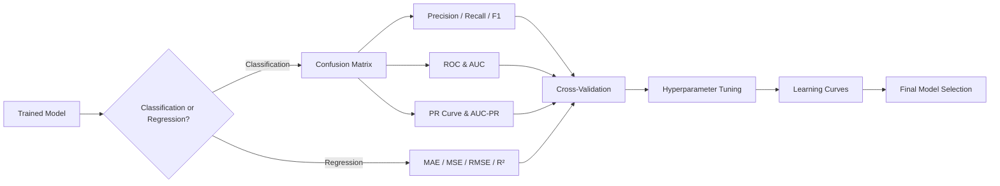
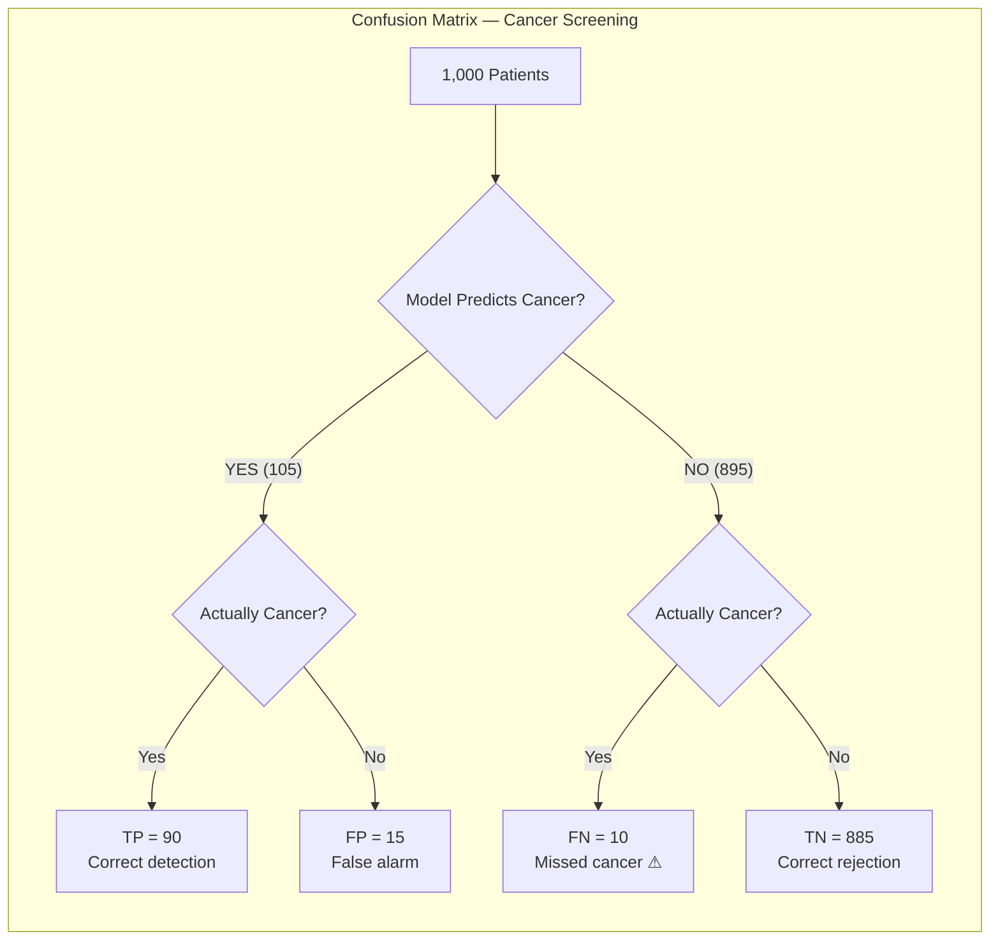
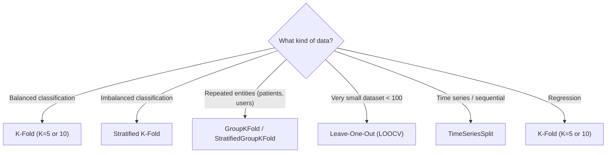

# Chapter 13 — Model Evaluation & Tuning

> "A model is only as good as the evidence you have that it works on data it has never seen."

---

## What You'll Learn

After this chapter you will be able to:
- Read a confusion matrix and derive every classification metric from it
- Choose between precision, recall, F1 and F-beta based on the cost of each error
- Construct an ROC curve by hand and know when AUC-PR is the honest metric instead
- Pick the right regression metric, and read what an RMSE–MAE gap is telling you
- Select a cross-validation scheme — stratified, grouped, or time-ordered
- Tune hyperparameters without contaminating your estimate of performance
- Diagnose bias vs variance from learning curves
- Tell whether one model is genuinely better than another

**Markers:** ★★★ = know cold for interviews · ★★ = high priority · ★ = good to know.
**Quick check** boxes are retrieval practice — attempt before revealing.
**Interview** boxes give the question, what to say, and the follow-up trap.

---

## 13.1 Why Evaluation Matters ★

> **Model evaluation** is the systematic process of measuring how well a trained model generalizes to unseen data, using metrics appropriate to the task and the cost structure of errors.

A model that scores 99% accuracy on its training set tells you almost nothing. The only question that matters is: how does it perform on data it has never seen? And even then, "accuracy" alone is often the wrong yardstick.

Consider a fraud detection system at a bank. Only 0.2% of transactions are fraudulent. A model that blindly predicts "not fraud" for every transaction achieves 99.8% accuracy — and catches exactly zero fraud. You would never deploy it. The metric you choose defines what "good" means, and choosing wrong can be catastrophic.

```
THE ACCURACY TRAP
────────────────────────────────────────────────────────
  Dataset: 10,000 transactions, 20 fraudulent (0.2%)

  Model A — always predicts "Not Fraud":
    Accuracy = 9,980 / 10,000 = 99.8%     ← Looks great!
    Fraud caught = 0 / 20 = 0%            ← Completely useless.

  Model B — trained fraud classifier:
    Accuracy = 97.5%                       ← Lower accuracy!
    Fraud caught = 18 / 20 = 90%          ← Actually useful.

  Accuracy is MISLEADING when classes are imbalanced.
────────────────────────────────────────────────────────
```

This chapter gives you the full toolkit: classification metrics, regression metrics, validation strategies, hyperparameter tuning, and diagnostic tools for figuring out what is going wrong and how to fix it.

> **How this chapter fits:** [Ch 8 §8.4](#content/08_core_concepts) explains *data
> leakage* — the failure this chapter's validation machinery exists to prevent.
> [Ch 12](#content/12_key_algorithms) covers the algorithms being evaluated and owns
> the calibration *fixes*; this chapter owns the *diagnosis*.
> [Ch 27](#content/27_practical_ml) puts it all into a production pipeline.



---

## 13.2 The Confusion Matrix ★★★

### Simple Explanation
Every prediction your classifier makes lands in one of four buckets: right and it said yes, right and it said no, or wrong in one of two different ways. The confusion matrix is simply a 2×2 scoreboard that tallies how often each of those four outcomes happens.

> **Confusion matrix**: a table that describes the performance of a classification model by comparing predicted labels against actual labels across all four possible outcomes: true positives, true negatives, false positives, and false negatives.

Every classification metric you will ever use derives from four numbers in this matrix.

```
                        PREDICTED
                      ┌──────────┬──────────┐
                      │ Positive │ Negative │
           ┌──────────┼──────────┼──────────┤
  ACTUAL   │ Positive │    TP    │    FN    │
           ├──────────┼──────────┼──────────┤
           │ Negative │    FP    │    TN    │
           └──────────┴──────────┴──────────┘

  TP  True Positive   said YES, was YES   ✓
  TN  True Negative   said NO,  was NO    ✓
  FP  False Positive  said YES, was NO    ✗  Type I error
  FN  False Negative  said NO,  was YES   ✗  Type II error
```

### Worked Example: Cancer Screening

A hospital screens 1,000 patients. 100 actually have cancer, 900 do not. The model produces:

| | Predicted: Cancer | Predicted: No Cancer | Total |
|---|---|---|---|
| **Actual: Cancer** | TP = 90 | FN = 10 | 100 |
| **Actual: No Cancer** | FP = 15 | TN = 885 | 900 |
| **Total** | 105 | 895 | 1,000 |

- **TP = 90** — correctly identified cancer patients
- **FN = 10** — missed cancer cases (the dangerous errors)
- **FP = 15** — false alarms (unnecessary follow-up tests)
- **TN = 885** — correctly identified healthy patients

We will use these numbers throughout the next two sections.



---

## 13.3 Classification Metrics ★★★

### Accuracy

> **Accuracy** = proportion of all predictions that are correct.

$$\text{Accuracy} = \frac{TP + TN}{TP + TN + FP + FN}$$

From our cancer example:

$$\text{Accuracy} = \frac{90 + 885}{1000} = 97.5\%$$

Sounds excellent. But remember: a model that always predicts "No Cancer" would correctly label all 900 healthy patients and miss all 100 cancer patients — $\frac{900}{1000} = 90\%$ accuracy, while catching zero cancer cases. Accuracy only works when classes are roughly balanced.

### Precision

> **Precision** = of all instances the model labeled positive, what fraction actually were positive.

$$\text{Precision} = \frac{TP}{TP + FP} = \frac{90}{90 + 15} = \frac{90}{105} = 85.7\%$$

Precision answers: "When the model raises an alarm, how often is it right?" High precision means few false alarms.

**When precision matters most:** spam filtering. A false positive means a legitimate email lands in the spam folder — the user misses a job offer or an important message. You want the spam label to be trustworthy.

### Recall (Sensitivity, True Positive Rate)

> **Recall** = of all actually positive instances, what fraction did the model catch.

$$\text{Recall} = \frac{TP}{TP + FN} = \frac{90}{90 + 10} = 90\%$$

Recall answers: "Of all real positive cases, how many did you find?" High recall means few missed positives.

**When recall matters most:** cancer diagnosis. A false negative means a patient with cancer goes home untreated. Missing real cases can be fatal.

### Specificity (True Negative Rate)

> **Specificity** = of all actually negative instances, what fraction did the model correctly identify as negative.

$$\text{Specificity} = \frac{TN}{TN + FP} = \frac{885}{885 + 15} = 98.3\%$$

Specificity is recall's mirror image — it measures how well you identify negatives. It appears in the ROC curve (Section 13.4) as $1 - \text{Specificity} = \text{FPR}$.

### F1 Score

> **F1 Score** = the harmonic mean of precision and recall, providing a single metric that balances both.

$$F_1 = \frac{2 \times \text{Precision} \times \text{Recall}}{\text{Precision} + \text{Recall}} = \frac{2 \times 0.857 \times 0.90}{0.857 + 0.90} = \frac{1.543}{1.757} = 0.878$$

Why the harmonic mean instead of the arithmetic mean? Because the harmonic mean punishes imbalance. If precision = 1.0 and recall = 0.01, the arithmetic mean is 0.505 (looks acceptable), but the harmonic mean is 0.02 (correctly reflects the disaster).

> **Interview —** *"Why is F1 the harmonic mean rather than a plain average?"*
> **Say:** Because a plain average lets one number rescue the other, and that is exactly the failure you want to catch. A model that flags a single transaction, correctly, has precision 1.0 and recall ~0.01 — arithmetic mean 0.505, which looks passable for a useless model. The harmonic mean gives 0.02. It is dominated by the **smaller** value, so F1 is only high when **both** are high.
> **They follow up with:** *"When is F1 the wrong choice?"* — when the two errors have different costs, since F1 weights them equally. Use $F_\beta$ instead: $F_2$ leans toward recall for cancer screening, $F_{0.5}$ toward precision for spam. F1 also ignores **true negatives** entirely, so if correctly identifying negatives matters, reach for MCC.

<details>
<summary><strong>Quick check.</strong> A model scores precision 0.9 and recall 0.3. Compute F1. Would the arithmetic mean have told you the same story?</summary>

$$F_1 = \frac{2(0.9)(0.3)}{0.9 + 0.3} = \frac{0.54}{1.2} = \mathbf{0.45}$$

The arithmetic mean is $(0.9 + 0.3)/2 = 0.60$ — noticeably rosier.

F1 sits much closer to the **weaker** metric (0.3) than to the stronger one. That is
the harmonic mean doing its job: the model finds only 30% of positives, and no amount
of precision on the ones it does flag compensates for that.
</details>

### F-beta Score

When you want to weight precision and recall unequally:

$$F_\beta = (1 + \beta^2) \cdot \frac{\text{Precision} \times \text{Recall}}{\beta^2 \cdot \text{Precision} + \text{Recall}}$$

- $F_2$ — weights recall 2x more than precision (use for cancer detection)
- $F_{0.5}$ — weights precision 2x more than recall (use for spam filtering)

### Multi-Class Metrics — Macro vs Micro vs Weighted

Everything so far has been binary. With more than two classes you compute precision
and recall **per class** (one-vs-rest), then choose how to average them — and the
three choices answer different questions.

Three classes, 120 samples:

| Class | TP | FP | FN | Support | Precision |
|---|---|---|---|---|---|
| A | 50 | 10 | 5 | 55 | $50/60 = 0.833$ |
| B | 30 | 15 | 20 | 50 | $30/45 = 0.667$ |
| C | 10 | 5 | 5 | 15 | $10/15 = 0.667$ |
| **Total** | **90** | **30** | **30** | **120** | |

**Macro** — plain average of the per-class scores. Every class counts equally,
regardless of size:

$\frac{0.833 + 0.667 + 0.667}{3} = \mathbf{0.722}$

**Micro** — pool the counts first, then compute once:

$\frac{\sum TP}{\sum TP + \sum FP} = \frac{90}{120} = \mathbf{0.750}$

**Weighted** — average the per-class scores, weighted by support:

$\frac{55(0.833) + 50(0.667) + 15(0.667)}{120} = \mathbf{0.743}$

| Use | When |
|---|---|
| **Macro** | Every class matters equally — especially when the rare class is the point. A tiny class scoring 0.2 drags the average down, which is what you want |
| **Micro** | Every *sample* matters equally. Large classes dominate |
| **Weighted** | You want a single headline number that reflects the real class mix |

> **The fact interviewers check:** in single-label multi-class, micro-precision,
> micro-recall and micro-F1 are **all identical, and all equal accuracy** — here every
> one of them is 0.750. Every misclassification is simultaneously an FP for one class
> and an FN for another, so the pooled sums coincide. Quoting "micro-F1" as if it adds
> information beyond accuracy signals you haven't worked it through.

> **Interview —** *"You have a 5-class problem where one class is 2% of the data. Which averaging do you report?"*
> **Say:** **Macro**, if that rare class is the one that matters — macro gives it equal weight, so poor performance on 2% of the data visibly drags the score down. Micro and weighted are both dominated by the large classes and will happily hide a rare class the model never predicts at all. I would report macro alongside the **per-class** breakdown, since a single number always hides which class is failing.
> **They follow up with:** *"When would macro be the wrong choice?"* — when class sizes reflect genuine importance rather than a sampling artifact. If 90% of your traffic really is class A, macro penalises you for underperforming on classes users rarely encounter. Then weighted is the honest headline. The question to ask is: *is the imbalance a property of the world, or of my dataset?*

### Matthews Correlation Coefficient (MCC)

A single number that stays honest under imbalance, because it uses **all four** cells:

$\text{MCC} = \frac{TP \cdot TN - FP \cdot FN}{\sqrt{(TP{+}FP)(TP{+}FN)(TN{+}FP)(TN{+}FN)}}$

It ranges from −1 to +1, where 0 is random. Take a model on 1,000 samples with 20
positives — $TP = 10$, $FP = 5$, $FN = 10$, $TN = 975$:

| Metric | Value |
|---|---|
| Accuracy | 0.985 — meaningless here |
| F1 | 0.571 |
| **MCC** | **0.570** |

Accuracy says the model is superb. MCC agrees with F1 that it is mediocre. Unlike F1,
MCC also rewards correctly identifying negatives, so it cannot be gamed by a model
that simply predicts the majority class.

```chart
{
  "type": "bar",
  "data": {
    "labels": ["Accuracy", "Precision", "Recall", "Specificity", "F1 Score"],
    "datasets": [{
      "label": "Cancer Screening Model (%)",
      "data": [97.5, 85.7, 90.0, 98.3, 87.8],
      "backgroundColor": ["rgba(99,102,241,0.6)","rgba(34,197,94,0.7)","rgba(234,88,12,0.7)","rgba(56,189,248,0.7)","rgba(168,85,247,0.7)"],
      "borderColor": ["rgba(99,102,241,1)","rgba(34,197,94,1)","rgba(234,88,12,1)","rgba(56,189,248,1)","rgba(168,85,247,1)"],
      "borderWidth": 1
    }]
  },
  "options": {
    "plugins": { "title": { "display": true, "text": "Cancer Screening — All Classification Metrics (TP=90, FP=15, FN=10, TN=885)" } },
    "scales": {
      "y": { "title": { "display": true, "text": "Score (%)" }, "min": 80, "max": 100 },
      "x": {}
    }
  }
}
```

### The Precision-Recall Tradeoff

Most classifiers output a probability (e.g., 0.73 for "cancer"). You pick a **threshold** to convert this probability into a label. Changing the threshold directly trades precision for recall.

```
  Threshold = 0.3            Threshold = 0.7
  (aggressive)               (conservative)
  ─────────────────          ─────────────────
  Flag above 0.3             Flag only above 0.7
  → catches almost all       → flags only when
    positives                  very confident
  → many false alarms        → misses borderline
  → HIGH recall              → HIGH precision
    LOW precision              LOW recall
```

```chart
{
  "type": "line",
  "data": {
    "labels": [0.1, 0.2, 0.3, 0.4, 0.5, 0.6, 0.7, 0.8, 0.9],
    "datasets": [
      {
        "label": "Precision",
        "data": [0.52, 0.60, 0.68, 0.76, 0.83, 0.89, 0.94, 0.97, 0.99],
        "borderColor": "rgba(34, 197, 94, 1)",
        "fill": false, "tension": 0.4, "pointRadius": 3, "borderWidth": 2
      },
      {
        "label": "Recall",
        "data": [0.98, 0.95, 0.91, 0.85, 0.77, 0.66, 0.53, 0.36, 0.14],
        "borderColor": "rgba(234, 88, 12, 1)",
        "fill": false, "tension": 0.4, "pointRadius": 3, "borderWidth": 2
      },
      {
        "label": "F1 Score",
        "data": [0.68, 0.74, 0.78, 0.80, 0.80, 0.76, 0.68, 0.53, 0.25],
        "borderColor": "rgba(168, 85, 247, 1)",
        "borderDash": [5,3],
        "fill": false, "tension": 0.4, "pointRadius": 3, "borderWidth": 2
      }
    ]
  },
  "options": {
    "plugins": { "title": { "display": true, "text": "Precision-Recall Tradeoff — Raising the Threshold Helps One, Hurts the Other" } },
    "scales": {
      "y": { "title": { "display": true, "text": "Score" }, "min": 0, "max": 1 },
      "x": { "title": { "display": true, "text": "Classification Threshold" } }
    }
  }
}
```

---

## 13.4 ROC Curve & AUC ★★★

### Simple Explanation
A classifier doesn't just answer yes or no — under the hood it produces a score, and *you* pick the threshold that turns that score into a decision. Slide the threshold and you trade catching more real positives against triggering more false alarms. The ROC curve draws that entire trade-off in one picture, and AUC squeezes the whole picture down to a single number.

> **ROC (Receiver Operating Characteristic) curve**: a plot of the True Positive Rate (recall) against the False Positive Rate ($1 - \text{specificity}$) at every possible classification threshold. **AUC (Area Under the Curve)** summarizes the ROC curve into a single number between 0 and 1.

The ROC curve shows how well a model separates positives from negatives across *all* thresholds simultaneously. You do not need to pick a single threshold to compare models — AUC does that for you.

**Interpreting AUC:** if you randomly draw one positive and one negative example, AUC is the probability that the model assigns a higher score to the positive example.

### Worked Example — Building an ROC by Hand

This is the classic whiteboard exercise. Eight predictions, sorted by score, four of
each class:

| Score | Actual |
|---|---|
| 0.95 | **P** |
| 0.85 | **P** |
| 0.70 | N |
| 0.60 | **P** |
| 0.55 | N |
| 0.40 | **P** |
| 0.30 | N |
| 0.20 | N |

**Sweep the threshold down the list.** Each row you pass gets labelled positive.
With $P = 4$ and $N = 4$: $\text{TPR} = TP/4$, $\text{FPR} = FP/4$.

| Threshold just below | TP | FP | FPR | TPR |
|---|---|---|---|---|
| — (start) | 0 | 0 | 0.00 | 0.00 |
| 0.95 (P) | 1 | 0 | 0.00 | 0.25 |
| 0.85 (P) | 2 | 0 | 0.00 | 0.50 |
| 0.70 (N) | 2 | 1 | 0.25 | 0.50 |
| 0.60 (P) | 3 | 1 | 0.25 | 0.75 |
| 0.55 (N) | 3 | 2 | 0.50 | 0.75 |
| 0.40 (P) | 4 | 2 | 0.50 | **1.00** |
| 0.30 (N) | 4 | 3 | 0.75 | 1.00 |
| 0.20 (N) | 4 | 4 | 1.00 | 1.00 |

Notice the shape of the walk: **a positive moves you UP, a negative moves you RIGHT.**
That is the entire mechanic of an ROC curve.

```
  TPR
  1.00│           ┌────────────────
      │           │
  0.75│      ┌────┘
      │      │
  0.50│ ┌────┘
      │ │
  0.25│ │
      │ │
  0.00└─┴──────────────────────────
      0   0.25  0.50  0.75  1.00  FPR
```

**AUC by the trapezoid rule** — sum the area of each step:

$$(0.25 \times 0.50) + (0.25 \times 0.75) + (0.25 \times 1.00) + (0.25 \times 1.00) = \mathbf{0.8125}$$

**AUC the other way — count the pairs.** Remember AUC is the probability a random
positive outranks a random negative. There are $4 \times 4 = 16$ pairs. Count how many
negatives each positive beats: $0.95$ beats all 4, $0.85$ beats 4, $0.60$ beats 3,
$0.40$ beats 2.

$$\text{AUC} = \frac{4 + 4 + 3 + 2}{16} = \frac{13}{16} = \mathbf{0.8125}$$

**The two methods agree exactly** — they are the same quantity computed differently,
and being able to show that is what separates a memorised definition from real
understanding. (If scores tie, a tied pair counts as half.)

> **Interview —** *"Your model has AUC = 0.85. What does that number actually mean?"*
> **Say:** Take one random positive and one random negative. There is an **85% chance the model scores the positive higher**. That is the precise interpretation — AUC measures **ranking quality**, not accuracy, and it does not depend on any threshold.
> **They follow up with:** *"So is 0.85 good?"* — it depends entirely on the base rate and the alternative. Two things I would flag: AUC of 0.5 is random and **below 0.5 means the model is anti-correlated** (invert it and you have a good model). And a high AUC says nothing about whether the **probabilities** are trustworthy — a model can rank perfectly and still be badly calibrated (§13.12).

<details>
<summary><strong>Quick check.</strong> Three predictions, scores 0.9 (positive), 0.6 (negative), 0.4 (positive). Compute AUC by counting pairs.</summary>

There are $1 \times 2$... careful — 2 positives × 1 negative = **2 pairs**.

- Positive 0.9 vs negative 0.6 → positive ranks higher ✓
- Positive 0.4 vs negative 0.6 → negative ranks higher ✗

$$\text{AUC} = \frac{1}{2} = \mathbf{0.5}$$

Exactly random, even though the model got the top-ranked item right. With so few
points AUC is extremely noisy — which is the real lesson: always report an interval
(§13.10), not a bare AUC, on small test sets.
</details>

### When to Use ROC-AUC

```
  AUC INTERPRETATION GUIDE
  ┌──────────────────────────────────────────────┐
  │ AUC = 1.0   → Perfect separation            │
  │ AUC = 0.9+  → Excellent                     │
  │ AUC = 0.8–0.9 → Good                        │
  │ AUC = 0.7–0.8 → Fair                        │
  │ AUC = 0.5   → Random guessing (diagonal)    │
  │ AUC < 0.5   → Worse than random (flip it!)  │
  └──────────────────────────────────────────────┘
```

```chart
{
  "type": "line",
  "data": {
    "labels": [0.0, 0.02, 0.05, 0.1, 0.15, 0.2, 0.3, 0.4, 0.5, 0.6, 0.7, 0.8, 0.9, 1.0],
    "datasets": [
      {
        "label": "Perfect Model (AUC = 1.0)",
        "data": [0.0, 1.0, 1.0, 1.0, 1.0, 1.0, 1.0, 1.0, 1.0, 1.0, 1.0, 1.0, 1.0, 1.0],
        "borderColor": "rgba(34, 197, 94, 1)",
        "fill": false, "tension": 0, "pointRadius": 0, "borderWidth": 2, "borderDash": [5,3]
      },
      {
        "label": "Good Model (AUC = 0.92)",
        "data": [0.0, 0.30, 0.52, 0.68, 0.76, 0.82, 0.89, 0.93, 0.96, 0.97, 0.98, 0.99, 1.0, 1.0],
        "borderColor": "rgba(99, 102, 241, 1)",
        "backgroundColor": "rgba(99, 102, 241, 0.1)",
        "fill": true, "tension": 0.4, "pointRadius": 2, "borderWidth": 2
      },
      {
        "label": "Weak Model (AUC = 0.72)",
        "data": [0.0, 0.08, 0.18, 0.32, 0.42, 0.50, 0.60, 0.68, 0.75, 0.81, 0.87, 0.93, 0.97, 1.0],
        "borderColor": "rgba(251, 191, 36, 1)",
        "fill": false, "tension": 0.4, "pointRadius": 2, "borderWidth": 2
      },
      {
        "label": "Random Model (AUC = 0.5)",
        "data": [0.0, 0.02, 0.05, 0.1, 0.15, 0.2, 0.3, 0.4, 0.5, 0.6, 0.7, 0.8, 0.9, 1.0],
        "borderColor": "rgba(239, 68, 68, 0.7)",
        "fill": false, "tension": 0, "pointRadius": 0, "borderWidth": 2, "borderDash": [8,4]
      }
    ]
  },
  "options": {
    "plugins": { "title": { "display": true, "text": "ROC Curves — Comparing Model Quality (Higher = Better)" } },
    "scales": {
      "y": { "title": { "display": true, "text": "True Positive Rate (Recall)" }, "min": 0, "max": 1 },
      "x": { "title": { "display": true, "text": "False Positive Rate (1 − Specificity)" } }
    }
  }
}
```

### When to Use ROC-AUC

ROC-AUC works best when:
- Classes are roughly balanced
- You care equally about positive and negative classes
- You want a threshold-independent comparison of models

ROC-AUC can be **misleading** on heavily imbalanced datasets because it is dominated by the (large) negative class. In those cases, use the PR curve instead.

---

## 13.5 Precision-Recall Curve & AUC-PR ★★★

### Simple Explanation
When the thing you care about is rare — fraud, disease, defects — most of your data is the boring negative class, and a metric can look wonderful while your model quietly misses the needles in the haystack. The precision-recall curve throws out those easy negatives and focuses only on how well you find the rare positives *and* how often your alarms are real.

> **Precision-Recall (PR) curve**: a plot of precision (y-axis) vs. recall (x-axis) at varying thresholds. **AUC-PR** is the area under this curve. Unlike ROC, the PR curve focuses exclusively on the positive class, making it the right choice for imbalanced datasets.

In fraud detection, only 0.2% of transactions are fraudulent. The ROC curve might look great (AUC = 0.97) because TN dominates. But the PR curve reveals how well the model actually catches fraud without flooding analysts with false alerts.

### Worked Example — Why ROC Flatters an Imbalanced Model

Take 100 transactions: **5 fraud, 95 legitimate**. At some threshold the model catches
4 of the 5 frauds, and also flags 20 legitimate transactions.

| Metric | Computation | Result |
|---|---|---|
| **Recall** | $4/5$ | 0.80 |
| **FPR** (ROC's x-axis) | $20/95$ | **0.21** — looks fine |
| **Precision** (PR's y-axis) | $4/(4+20)$ | **0.17** — brutal |

The same 20 false alarms produce a *reassuring* number and an *alarming* one. The
reason is the denominator:

$$\text{FPR} = \frac{FP}{FP + TN} = \frac{20}{95} \qquad\text{vs}\qquad \text{Precision} = \frac{TP}{TP + FP} = \frac{4}{24}$$

**FPR divides by the huge negative class**, so 20 mistakes barely register. Precision
divides by the number of alarms you actually raised, so those same 20 mistakes
dominate. On this model an analyst opens 24 cases to find 4 real ones — five out of
every six alerts are wasted.

> **The rule:** when the positive class is rare, ROC-AUC measures something real but
> not what you care about. Report **AUC-PR**, and remember its baseline is not 0.5 —
> a random classifier scores the positive prevalence, here **0.05**. An AUC-PR of 0.30
> sounds terrible and is in fact 6× better than random.

> **Interview —** *"A fraud model reports ROC-AUC of 0.97, but the fraud team says it is useless. How can both be true?"*
> **Say:** ROC-AUC is computed from TPR and **FPR**, and FPR divides by the negative class. When 99.8% of transactions are legitimate, thousands of false positives barely move FPR, so the curve looks superb. The team experiences **precision** — of the alerts they open, how many are real — and precision divides by the number of alerts, so those same false positives dominate it.
> **They follow up with:** *"What should they have reported?"* — **AUC-PR**, plus **precision@k** for the k alerts analysts can actually review in a day. And I'd note AUC-PR's baseline is the prevalence, not 0.5, so the numbers look small even when the model is doing well — you must compare against that baseline rather than against 0.5.

```
  PR CURVE KEY PROPERTIES
  ────────────────────────────────────────────────
  - A perfect model hugs the top-right corner (P=1, R=1)
  - A random model produces a flat line at P = prevalence
    (e.g., P = 0.002 for 0.2% fraud rate)
  - AUC-PR is much more sensitive to improvements on the
    minority class than AUC-ROC
```

```chart
{
  "type": "line",
  "data": {
    "labels": [0.0, 0.1, 0.2, 0.3, 0.4, 0.5, 0.6, 0.7, 0.8, 0.9, 1.0],
    "datasets": [
      {
        "label": "Good Fraud Model (AUC-PR = 0.82)",
        "data": [1.0, 0.97, 0.94, 0.91, 0.87, 0.82, 0.75, 0.66, 0.54, 0.38, 0.18],
        "borderColor": "rgba(99, 102, 241, 1)",
        "backgroundColor": "rgba(99, 102, 241, 0.1)",
        "fill": true, "tension": 0.4, "pointRadius": 2, "borderWidth": 2
      },
      {
        "label": "Mediocre Model (AUC-PR = 0.55)",
        "data": [0.90, 0.78, 0.68, 0.59, 0.52, 0.45, 0.38, 0.30, 0.22, 0.12, 0.05],
        "borderColor": "rgba(251, 191, 36, 1)",
        "fill": false, "tension": 0.4, "pointRadius": 2, "borderWidth": 2
      },
      {
        "label": "Random Baseline (prevalence = 0.2%)",
        "data": [0.002, 0.002, 0.002, 0.002, 0.002, 0.002, 0.002, 0.002, 0.002, 0.002, 0.002],
        "borderColor": "rgba(239, 68, 68, 0.7)",
        "fill": false, "tension": 0, "pointRadius": 0, "borderWidth": 2, "borderDash": [8,4]
      }
    ]
  },
  "options": {
    "plugins": { "title": { "display": true, "text": "Precision-Recall Curve — Fraud Detection (Imbalanced Data)" } },
    "scales": {
      "y": { "title": { "display": true, "text": "Precision" }, "min": 0, "max": 1 },
      "x": { "title": { "display": true, "text": "Recall" } }
    }
  }
}
```

### ROC vs. PR — When to Use Which

| Situation | Use | Why |
|---|---|---|
| Balanced classes | ROC-AUC | Both classes contribute equally |
| Imbalanced classes (rare positives) | AUC-PR | Focuses on the minority class |
| Care about ranking quality | ROC-AUC | Measures overall discrimination |
| Care about actionable predictions | AUC-PR | Precision at each recall level |

---

## 13.6 Regression Metrics ★★

### Simple Explanation
For regression there is no "right or wrong," only "how far off." Every metric here answers that question a little differently: some average the raw miss, some punish big misses far more harshly than small ones, and some report the error in the original units so you can explain it to a stakeholder. Which one you reach for depends on whether a single huge mistake should hurt more than many tiny ones.

> **Regression metrics** quantify how far a model's continuous predictions deviate from actual values, each with a different sensitivity to error magnitude and interpretation.

### Running Example: House Price Prediction

| House | Actual ($K) | Predicted ($K) | Error ($K) |
|---|---|---|---|
| 1 | 300 | 280 | -20 |
| 2 | 450 | 460 | +10 |
| 3 | 200 | 230 | +30 |
| 4 | 500 | 480 | -20 |
| 5 | 350 | 400 | +50 |

### MAE — Mean Absolute Error

> **MAE** = the average of the absolute differences between predicted and actual values.

$$\text{MAE} = \frac{1}{n}\sum_{i=1}^{n} |y_i - \hat{y}_i| = \frac{20 + 10 + 30 + 20 + 50}{5} = \$26{,}000$$

On average, predictions are off by $26K. MAE treats all errors linearly — a $50K error is exactly 5x worse than a $10K error. Robust to outliers.

### MSE — Mean Squared Error

> **MSE** = the average of the squared differences between predicted and actual values.

$$\text{MSE} = \frac{1}{n}\sum_{i=1}^{n} (y_i - \hat{y}_i)^2 = \frac{400 + 100 + 900 + 400 + 2500}{5} = 860 \text{ (in K²)}$$

MSE heavily penalizes large errors. That $50K error on House 5 contributes 2500 to the sum — more than Houses 1–4 combined (1800). Use MSE when large errors are disproportionately bad.

### RMSE — Root Mean Squared Error

> **RMSE** = the square root of MSE, bringing the metric back to the original units.

$$\text{RMSE} = \sqrt{\text{MSE}} = \sqrt{860} \approx \$29{,}300$$

RMSE is always $\geq$ MAE. The gap between RMSE and MAE tells you about error variance: if RMSE $\gg$ MAE, a few predictions have very large errors.

> **Interview —** *"Your RMSE is roughly three times your MAE. What does that tell you, before you look at anything else?"*
> **Say:** That the errors are **very unevenly distributed** — a small number of predictions are badly wrong. RMSE squares each error before averaging, so it is dominated by the largest ones, while MAE weights every error equally. If they were similar in size the two would be close; a 3× gap means outliers are carrying the metric.
> **They follow up with:** *"What would you do about it?"* — first look at the worst rows rather than reach for a model change. Usually it is one of three things: genuine outliers in the target, a subpopulation the model handles badly (which a segment-wise MAE will expose), or data errors. Then decide deliberately: if those large errors are **disproportionately costly**, RMSE is the right objective and I should fix the model. If they are noise or bad labels, MAE — or Huber loss, which is quadratic near zero and linear in the tails — is the more honest target.

<details>
<summary><strong>Quick check.</strong> On a test set your model scores R² = −0.15. Is this a bug?</summary>

**No — it is a legitimate and meaningful result.** R² compares your model against the
baseline of always predicting the mean:

$$R^2 = 1 - \frac{SS_{res}}{SS_{tot}}$$

A negative value means $SS_{res} > SS_{tot}$: your model's squared error is **larger
than simply predicting the average** would have been. A constant would beat it.

On *training* data with an intercept, OLS cannot do this — R² is bounded at 0. Seeing
it on a **test set** signals real trouble: severe overfitting, distribution shift
between train and test, or a broken preprocessing step at inference time.
</details>

### R² — Coefficient of Determination

> **R²** = the proportion of variance in the target variable explained by the model. Compares model performance against the baseline of always predicting the mean.

$$R^2 = 1 - \frac{\sum(y_i - \hat{y}_i)^2}{\sum(y_i - \bar{y})^2} = 1 - \frac{SS_{res}}{SS_{tot}}$$

| R² Value | Interpretation |
|---|---|
| 1.0 | Perfect prediction |
| 0.9 | Model explains 90% of variance |
| 0.5 | Model explains 50% of variance |
| 0.0 | No better than predicting the mean |
| < 0 | Worse than predicting the mean |

**Computed for our five houses.** The mean price is $\bar{y} = 1800/5 = 360$:

$$SS_{res} = 400 + 100 + 900 + 400 + 2500 = 4{,}300$$

$$SS_{tot} = (300{-}360)^2 + (450{-}360)^2 + (200{-}360)^2 + (500{-}360)^2 + (350{-}360)^2$$
$$= 3600 + 8100 + 25600 + 19600 + 100 = 57{,}000$$

$$R^2 = 1 - \frac{4{,}300}{57{,}000} = \mathbf{0.925}$$

The model explains 92.5% of the variation in house prices. Note that $SS_{res}$ is the
same 4,300 that produced MSE — R² is just that error **rescaled against the spread of
the data itself**, which is why it is unitless and comparable across problems in a way
RMSE is not.

> **Why R² can go negative.** $SS_{tot}$ is the error of the dumbest useful baseline:
> always predict the mean. If your model's $SS_{res}$ exceeds it, the fraction is
> greater than 1 and R² goes below zero. That is not a broken metric — it is R²
> correctly reporting that a constant would have beaten your model. It happens most
> often on a **test set**, where a fitted model can genuinely underperform the
> training mean.

### MAPE — Mean Absolute Percentage Error

> **MAPE** = the average of absolute percentage errors, expressing accuracy as a percentage of actual values.

$$\text{MAPE} = \frac{1}{n}\sum_{i=1}^{n} \left|\frac{y_i - \hat{y}_i}{y_i}\right| \times 100$$

$$\text{MAPE} = \frac{1}{5}\left(\frac{20}{300} + \frac{10}{450} + \frac{30}{200} + \frac{20}{500} + \frac{50}{350}\right) \times 100 = \frac{1}{5}(6.67 + 2.22 + 15.0 + 4.0 + 14.29) \approx 8.4\%$$

MAPE is intuitive ("we're off by about 8.4%") but fails when actual values are near zero (division by zero).

### Comparison of Regression Metrics

```chart
{
  "type": "bar",
  "data": {
    "labels": ["House 1", "House 2", "House 3", "House 4", "House 5"],
    "datasets": [
      {
        "label": "Actual Price ($K)",
        "data": [300, 450, 200, 500, 350],
        "backgroundColor": "rgba(99, 102, 241, 0.7)",
        "borderColor": "rgba(99, 102, 241, 1)", "borderWidth": 1
      },
      {
        "label": "Predicted Price ($K)",
        "data": [280, 460, 230, 480, 400],
        "backgroundColor": "rgba(234, 88, 12, 0.7)",
        "borderColor": "rgba(234, 88, 12, 1)", "borderWidth": 1
      }
    ]
  },
  "options": {
    "plugins": { "title": { "display": true, "text": "House Price Prediction — Actual vs Predicted" } },
    "scales": {
      "y": { "title": { "display": true, "text": "Price ($K)" }, "beginAtZero": true },
      "x": {}
    }
  }
}
```

```chart
{
  "type": "bar",
  "data": {
    "labels": ["House 1", "House 2", "House 3", "House 4", "House 5"],
    "datasets": [
      {
        "label": "Absolute Error ($K) — used in MAE",
        "data": [20, 10, 30, 20, 50],
        "backgroundColor": "rgba(34,197,94,0.7)",
        "borderColor": "rgba(34,197,94,1)", "borderWidth": 1
      },
      {
        "label": "Squared Error (K²) — used in MSE",
        "data": [400, 100, 900, 400, 2500],
        "backgroundColor": "rgba(239,68,68,0.5)",
        "borderColor": "rgba(239,68,68,1)", "borderWidth": 1
      }
    ]
  },
  "options": {
    "plugins": { "title": { "display": true, "text": "MAE vs MSE — Squared Error Amplifies House 5's Big Miss" } },
    "scales": {
      "y": { "title": { "display": true, "text": "Error Magnitude" }, "beginAtZero": true },
      "x": {}
    }
  }
}
```

### Quick Reference: Choosing a Regression Metric

| Metric | Units | Outlier Sensitivity | Best For |
|---|---|---|---|
| MAE | Same as target | Low | General interpretability |
| MSE | Squared units | High | Mathematical optimization |
| RMSE | Same as target | High | Penalizing large errors |
| R² | Unitless (0–1) | Moderate | Comparing models |
| MAPE | Percentage | Low | Cross-scale comparisons |

---

## 13.7 Cross-Validation ★★★

> **Cross-validation** is a resampling procedure that partitions data into multiple train/test splits, trains and evaluates the model on each split, and averages the results to produce a more reliable performance estimate than a single split.

A single 80/20 train-test split is a roll of the dice. Maybe your test set happened to contain all the easy examples, or all the hard ones. Cross-validation removes this luck factor.

### K-Fold Cross-Validation

Split the data into K equally-sized folds. For each fold, train on $K-1$ folds and evaluate on the held-out fold. Repeat K times so every data point serves as test data exactly once.

```
  5-Fold Cross-Validation (1000 samples)
  ═══════════════════════════════════════════════════════════
  Fold 1: [TEST 200] [TRAIN 200] [TRAIN 200] [TRAIN 200] [TRAIN 200]
  Fold 2: [TRAIN 200] [TEST 200] [TRAIN 200] [TRAIN 200] [TRAIN 200]
  Fold 3: [TRAIN 200] [TRAIN 200] [TEST 200] [TRAIN 200] [TRAIN 200]
  Fold 4: [TRAIN 200] [TRAIN 200] [TRAIN 200] [TEST 200] [TRAIN 200]
  Fold 5: [TRAIN 200] [TRAIN 200] [TRAIN 200] [TRAIN 200] [TEST 200]

  Scores: [0.88, 0.91, 0.87, 0.90, 0.89]
  Mean = 0.89 ± 0.015
  ═══════════════════════════════════════════════════════════
```

Typical choice: **K = 5 or K = 10**. More folds = less bias but more computation.

```chart
{
  "type": "bar",
  "data": {
    "labels": ["Fold 1", "Fold 2", "Fold 3", "Fold 4", "Fold 5"],
    "datasets": [{
      "label": "Accuracy per Fold (%)",
      "data": [88, 91, 87, 90, 89],
      "backgroundColor": ["rgba(99,102,241,0.7)","rgba(99,102,241,0.7)","rgba(99,102,241,0.7)","rgba(99,102,241,0.7)","rgba(99,102,241,0.7)"],
      "borderColor": "rgba(99, 102, 241, 1)",
      "borderWidth": 1
    }]
  },
  "options": {
    "plugins": { "title": { "display": true, "text": "5-Fold Cross-Validation — Mean Accuracy = 89% ± 1.5%" } },
    "scales": {
      "y": { "title": { "display": true, "text": "Accuracy (%)" }, "min": 80, "max": 95 },
      "x": {}
    }
  }
}
```

### Stratified K-Fold

> **Stratified K-Fold** ensures each fold preserves the same class distribution as the full dataset.

For imbalanced data this is essential. If your dataset is 5% fraud, regular K-Fold might produce a fold with 0% fraud in the test set — making that fold's evaluation meaningless.

```
  Dataset: 95% Not Fraud, 5% Fraud (1000 samples)

  Regular K-Fold (dangerous):
    Fold 1 test: 3% fraud    ← under-represented
    Fold 2 test: 8% fraud    ← over-represented
    Fold 3 test: 1% fraud    ← barely any fraud to test on

  Stratified K-Fold (correct):
    Fold 1 test: 5% fraud    ← matches full dataset
    Fold 2 test: 5% fraud    ← matches full dataset
    Fold 3 test: 5% fraud    ← matches full dataset
```

**Rule:** always use Stratified K-Fold for classification. In scikit-learn: `StratifiedKFold(n_splits=5)`.

### Group K-Fold — When One Entity Owns Several Rows

Stratification fixes class balance. It does **not** stop the same *entity* appearing on
both sides of a split — and that is a silent, score-inflating leak.

```
  30 X-rays from 10 patients (3 scans each)

  Plain KFold — split by ROW:
    train: patient_7 scan_1, scan_3
    test:  patient_7 scan_2      ← same patient, both sides
    The model can memorise the PATIENT, not the disease.
    AUC looks superb. New patients break it.

  GroupKFold — split by GROUP:
    every scan from patient_7 lands on ONE side
    Score drops. That lower number is the honest one.
```

Use it whenever rows are **not independent**: several visits per customer, several
sessions per user, several photos per product, several rows per household.

```python
from sklearn.model_selection import GroupKFold, StratifiedGroupKFold

gkf = GroupKFold(n_splits=5)
for tr, te in gkf.split(X, y, groups=patient_ids):
    ...

# Need class balance AND group isolation? Use both at once:
sgkf = StratifiedGroupKFold(n_splits=5)
```

> **The tell that you needed this:** validation scores that are excellent and stable,
> followed by a large, unexplained drop in production. Group leakage is covered from
> the data side in [Ch 8 §8.4](#content/08_core_concepts); this is the validation-side
> fix.

> **Interview —** *"You have 10,000 medical images from 500 patients. How do you split them?"*
> **Say:** By **patient**, not by image — `GroupKFold` with `patient_id` as the group. With 20 images per patient, a random row-level split puts the same patient on both sides, and the model can memorise patient-specific anatomy rather than learn the pathology. The validation score would look excellent and would not survive contact with new patients.
> **They follow up with:** *"What if the classes are also imbalanced?"* — `StratifiedGroupKFold`, which keeps whole patients on one side while approximately preserving class ratios. It cannot do both perfectly, since patients are indivisible, but it gets close. I would also expect the honest score to be **lower** than the leaky one — that drop is the point, not a regression.

<details>
<summary><strong>Quick check.</strong> Match each scenario to its CV scheme: (a) predicting next quarter's revenue from 8 years of monthly data; (b) 1,200 loan applications, 4% default; (c) 60 rare-disease samples; (d) 50,000 reviews from 3,000 users.</summary>

- **(a) `TimeSeriesSplit`** — never shuffle temporal data. Training on the future to
  predict the past inflates the score and cannot be reproduced in production.
- **(b) `StratifiedKFold`** — at 4% positives, a plain split can hand you a fold with
  almost no defaults, making that fold's metric meaningless.
- **(c) LOOCV** — with 60 samples, holding out 20% wastes data you cannot spare. The
  cost of 60 fits is trivial at this size.
- **(d) `GroupKFold` on `user_id`** — one user writes many reviews, so row-level
  splitting leaks their writing style across the boundary.

The general rule: ask **what unit is actually independent?** That unit is what you
split on.
</details>

### Nested Cross-Validation — Tuning Without Cheating

If you use the same CV loop to pick hyperparameters *and* to report performance, the
reported number is optimistic: you chose the settings that happened to suit those
folds. Nested CV separates the two jobs.

```
  OUTER loop (estimates performance)
  ├─ fold 1 → held out
  │    INNER loop on the other 4 folds
  │      tries hyperparameters, picks the best
  │    → train with those, score on outer fold 1
  ├─ fold 2 → held out ... and so on
  └─ report the MEAN of the outer scores
```

The inner loop never sees the outer test fold, so tuning cannot contaminate the
estimate. The cost is multiplicative — 5 outer × 5 inner × 20 configurations = 500
fits — which is why it is used to *report* a trustworthy number, or to compare two
modelling approaches, rather than to produce the final shipped model.

> **What people say instead, and why it is usually fine:** a single held-out test set,
> touched exactly once. Nested CV earns its cost when data is scarce (a single split
> would be too noisy) or when the headline number will be published.

> **Interview —** *"How do you tune hyperparameters and report performance without contaminating the estimate?"*
> **Say:** Keep the two jobs on separate data. The simple version is a three-way split — train, validation, test — where I tune on validation and touch test exactly once, at the end. If data is too scarce for that to be stable, **nested cross-validation**: an inner loop selects hyperparameters, an outer loop estimates performance, and the inner loop never sees the outer test fold.
> **They follow up with:** *"What goes wrong if you just use plain CV for both?"* — you get an optimistically biased number, because you reported the best score over many configurations, and the maximum of many noisy estimates is biased upward. With enough configurations you can "achieve" a strong CV score on **pure noise**. The bias grows with the size of the search, which is exactly why a big hyperparameter sweep makes this worse, not better.

### Leave-One-Out Cross-Validation (LOOCV)

> **LOOCV** is K-Fold where K = N (number of samples). Each fold trains on N-1 samples and tests on exactly one.

- **Pro:** maximum use of training data, zero randomness in the split
- **Con:** extremely expensive (N separate training runs), high variance in estimates

Use LOOCV only when your dataset is very small (< 100 samples).

### Time Series Cross-Validation

> **Time series CV** respects temporal ordering — the model is always trained on past data and tested on future data. You never leak future information into training.

```
  Time Series Split (expanding window):
  ═══════════════════════════════════════════
  Split 1: [TRAIN] → [TEST]
  Split 2: [TRAIN ──────] → [TEST]
  Split 3: [TRAIN ────────────] → [TEST]
  Split 4: [TRAIN ──────────────────] → [TEST]
  ═══════════════════════════════════════════
  Train set grows; test always comes AFTER train in time.

  NEVER shuffle time series data! Random splits leak
  future information into training.
```

In scikit-learn: `TimeSeriesSplit(n_splits=5)`.



---

## 13.8 Hyperparameter Tuning ★★

### Simple Explanation
Some settings a model figures out on its own; others you have to dial in yourself before training even begins — how deep a tree may grow, how big each learning step is. Those knobs are the hyperparameters, and there is no formula that hands you the best combination. Tuning is the organized search for the settings that make validation performance the best.

> **Hyperparameters** are configuration values set before training that control the learning process itself — unlike model parameters (weights, biases) which are learned from data. **Hyperparameter tuning** is the search for the combination that yields the best validation performance.

```
  PARAMETERS (learned)           HYPERPARAMETERS (set by you)
  ──────────────────────         ──────────────────────────────
  Neural net weights             Learning rate: 0.001
  Decision tree splits           Number of trees: 100
  SVM support vectors            Max depth: 5
  Regression coefficients        Regularization strength: 0.1
                                 Batch size: 32
                                 Dropout rate: 0.3
```

### Grid Search

> **Grid search** exhaustively evaluates every combination of specified hyperparameter values.

```
  Learning rate: [0.001, 0.01, 0.1]
  Max depth:     [3, 5, 10]

  Grid Search tries ALL 3 × 3 = 9 combinations:
  ─────────────────────────────────────────────────
           │  depth=3  │  depth=5  │  depth=10
  ─────────┼───────────┼───────────┼────────────
  lr=0.001 │   0.82    │   0.85    │   0.83
  lr=0.01  │   0.88    │   0.91 ★  │   0.89
  lr=0.1   │   0.71    │   0.73    │   0.70
  ─────────────────────────────────────────────────
  Best: lr=0.01, depth=5 → accuracy = 0.91
```

**Pros:** guaranteed to find the best combo within the grid.
**Cons:** scales exponentially. 5 hyperparameters with 5 values each = $5^5 = 3{,}125$ combinations. With 5-fold CV, that is 15,625 model fits.

### Random Search

> **Random search** samples hyperparameter combinations randomly from specified distributions, typically finding near-optimal values in far fewer iterations than grid search.

Why does random often beat grid? Bergstra & Bengio (2012) showed that when only a few hyperparameters matter (which is typical), grid search wastes most of its budget varying the unimportant ones. Random search explores more unique values of the important hyperparameters.

```
  Grid Search (9 trials):              Random Search (9 trials):
  ┌─────────────────────┐              ┌─────────────────────┐
  │  ●  ●  ●            │              │     ●       ●       │
  │                      │              │  ●               ●  │
  │  ●  ●  ●            │              │        ●            │
  │                      │              │  ●          ●       │
  │  ●  ●  ●            │              │           ●    ●    │
  └─────────────────────┘              └─────────────────────┘
  Only 3 unique lr values              9 unique lr values!
  Only 3 unique depth values           9 unique depth values!
```

### Bayesian Optimization

> **Bayesian optimization** builds a probabilistic surrogate model of the objective function and uses an acquisition function to intelligently choose the next hyperparameter combination to evaluate, balancing exploration of unknown regions with exploitation of promising ones.

```
  How Bayesian Optimization works:
  ────────────────────────────────────────────────────
  1. Evaluate a few random points
  2. Fit a surrogate model (usually Gaussian Process)
  3. Use acquisition function to pick next point:
     - High predicted performance → exploitation
     - High uncertainty → exploration
  4. Evaluate, update surrogate, repeat

  Trial 1: lr=0.05  → acc=0.84
  Trial 2: lr=0.001 → acc=0.79
  Trial 3: lr=0.02  → acc=0.90  (best so far!)
  Trial 4: lr=0.015 → acc=0.92  (surrogate guided us near 0.02)
  Trial 5: lr=0.018 → acc=0.93  (zeroing in!)
```

Libraries: **Optuna**, **Hyperopt**, **scikit-optimize**, **Ray Tune**.

### Comparison

| Method | Budget Required | Best When |
|---|---|---|
| Grid Search | High (exponential) | Few hyperparameters, small grid |
| Random Search | Moderate | Many hyperparameters, limited budget |
| Bayesian Optimization | Low (most efficient) | Expensive evaluations, need best results |

---

## 13.9 Learning Curves — Diagnosing Bias vs. Variance ★★★

### Simple Explanation
When a model underperforms, you face a fork in the road: is it too simple to capture the pattern (high bias), or so flexible that it memorized the training data (high variance)? Learning curves diagnose this by plotting how training and validation scores evolve as the model is fed more and more data.

> **Learning curves** plot training and validation performance as a function of training set size or training epochs, revealing whether a model suffers from high bias (underfitting) or high variance (overfitting).

The gap between training and validation curves is the diagnostic signal.

```
  HIGH VARIANCE                 HIGH BIAS
  (overfitting)                 (underfitting)
  ─────────────────             ─────────────────
  Score                         Score
    │ ─── Train ≈ 0.97            │
  1.0│                          1.0│
    │                             │
  0.9│                          0.9│
    │                             │
  0.8│                          0.8│ ─── Train ≈ 0.72
    │  ··· Val ≈ 0.68             │ ··· Val ≈ 0.70
  0.7│                          0.7│
    │                             │
  0.6│                          0.6│
    └────────────── →             └────────────── →
      training size                 training size

  LARGE GAP                     BOTH LOW
  Train great, val poor         Cannot learn the pattern

  Fix: more data,               Fix: more features,
  regularization, dropout,      bigger model, less
  simpler model                 regularization, train longer
```

> **Interview —** *"Training accuracy 0.98, validation 0.72. What is wrong and what do you do?"*
> **Say:** A 26-point gap is **high variance** — the model is memorising rather than generalising. In order of what I would try: more training data (the learning curve tells me whether that will help — if the validation curve is still climbing, it will); stronger regularization; a simpler model or fewer features; and for boosting or neural nets, early stopping.
> **They follow up with:** *"What if both curves sat at 0.72?"* — the opposite problem, **high bias**. More data would not help at all; the curves would have already converged. There I would add features or interactions, increase model capacity, or reduce regularization. The diagnostic is the **gap**, not the level: a large gap means variance, both-low-and-converged means bias.

<details>
<summary><strong>Quick check.</strong> A learning curve shows training score falling from 0.99 to 0.91 as data grows, while validation rises from 0.62 to 0.88 and is still climbing at the largest size. What should you do?</summary>

**Collect more data.** The curves are converging and the validation curve has not
plateaued — that is the signature of a variance problem that more data will keep
fixing.

Note the training score *falling* is healthy, not a regression: with 100 rows a
flexible model memorises them (0.99); with 10,000 it can no longer memorise and must
generalise, so training score drops while validation climbs. The gap narrowing from
0.37 to 0.03 is the real signal.

**When more data would NOT help:** if both curves had flattened and converged at a low
value. Then you are bias-limited and need a better model or better features, not more
rows.
</details>

```chart
{
  "type": "line",
  "data": {
    "labels": [100, 300, 500, 800, 1000, 1500, 2000, 3000, 5000, 8000, 10000],
    "datasets": [
      {
        "label": "Train — Overfitting Model",
        "data": [0.99, 0.98, 0.97, 0.97, 0.96, 0.96, 0.96, 0.95, 0.95, 0.95, 0.95],
        "borderColor": "rgba(239, 68, 68, 1)",
        "fill": false, "tension": 0.3, "pointRadius": 0, "borderWidth": 2
      },
      {
        "label": "Validation — Overfitting Model",
        "data": [0.55, 0.62, 0.66, 0.69, 0.71, 0.73, 0.74, 0.76, 0.78, 0.80, 0.81],
        "borderColor": "rgba(239, 68, 68, 0.5)",
        "borderDash": [5,3],
        "fill": false, "tension": 0.3, "pointRadius": 0, "borderWidth": 2
      },
      {
        "label": "Train — Good Model",
        "data": [0.95, 0.92, 0.90, 0.89, 0.89, 0.88, 0.88, 0.88, 0.87, 0.87, 0.87],
        "borderColor": "rgba(34, 197, 94, 1)",
        "fill": false, "tension": 0.3, "pointRadius": 0, "borderWidth": 2
      },
      {
        "label": "Validation — Good Model",
        "data": [0.55, 0.68, 0.75, 0.79, 0.81, 0.83, 0.84, 0.85, 0.85, 0.86, 0.86],
        "borderColor": "rgba(34, 197, 94, 0.5)",
        "borderDash": [5,3],
        "fill": false, "tension": 0.3, "pointRadius": 0, "borderWidth": 2
      },
      {
        "label": "Train — Underfitting Model",
        "data": [0.68, 0.70, 0.71, 0.71, 0.72, 0.72, 0.72, 0.72, 0.72, 0.72, 0.72],
        "borderColor": "rgba(99, 102, 241, 1)",
        "fill": false, "tension": 0.3, "pointRadius": 0, "borderWidth": 2
      },
      {
        "label": "Validation — Underfitting Model",
        "data": [0.50, 0.60, 0.64, 0.66, 0.67, 0.68, 0.69, 0.69, 0.70, 0.70, 0.70],
        "borderColor": "rgba(99, 102, 241, 0.5)",
        "borderDash": [5,3],
        "fill": false, "tension": 0.3, "pointRadius": 0, "borderWidth": 2
      }
    ]
  },
  "options": {
    "plugins": { "title": { "display": true, "text": "Learning Curves — Diagnosing Overfitting, Underfitting, and Good Fit" } },
    "scales": {
      "y": { "title": { "display": true, "text": "Score" }, "min": 0.45, "max": 1.0 },
      "x": { "title": { "display": true, "text": "Training Set Size" } }
    }
  }
}
```

### Diagnosis and Remedies Summary

| Symptom | Diagnosis | Remedies |
|---|---|---|
| Train high, val low, large gap | High variance (overfitting) | More data, regularization (L1/L2), dropout, simpler model, early stopping |
| Train low, val low, small gap | High bias (underfitting) | More features, bigger/deeper model, less regularization, train longer |
| Train high, val high, small gap | Good fit | Ship it. Monitor for data drift in production. |
| Train high, val oscillating | Noisy data or too-small val set | Clean data, increase val set size, use K-fold CV |

---

## 13.10 Model Selection: Which Metric for Which Problem? ★★

The metric you optimize defines what your model learns to care about. Choose wrong and you optimize for the wrong thing.

| Problem | Key Concern | Primary Metric | Secondary Metric |
|---|---|---|---|
| **Spam detection** | Don't lose real emails (FP costly) | Precision | F0.5 |
| **Cancer screening** | Don't miss cancer (FN costly) | Recall | F2 |
| **Fraud detection** | Imbalanced + catch fraud | AUC-PR | Recall |
| **Sentiment analysis** | Balanced classes | F1 / Accuracy | AUC-ROC |
| **House price prediction** | Interpretable error | MAE | R² |
| **Demand forecasting** | Penalize big misses | RMSE | MAPE |
| **Credit scoring** | Rank applicants | AUC-ROC | KS statistic |
| **Object detection** | Localization + classification | mAP (mean avg precision) | IoU |

### Multi-Metric Evaluation

In practice, never rely on a single metric. Report a dashboard:

```
  FRAUD DETECTION MODEL — Evaluation Dashboard
  ═══════════════════════════════════════════════
  AUC-ROC:     0.96
  AUC-PR:      0.78  ← More informative for imbalanced data
  Precision:   0.62  (at threshold = 0.5)
  Recall:      0.85  (at threshold = 0.5)
  F1:          0.72  (at threshold = 0.5)
  F2:          0.79  (weighted toward recall)

  At threshold = 0.3: Recall = 0.94, Precision = 0.41
  At threshold = 0.7: Recall = 0.65, Precision = 0.83
  ═══════════════════════════════════════════════
  Business decision: set threshold based on
  cost of false alarm vs cost of missed fraud.
```

### Is Model B Actually Better Than Model A?

Model A scores 91.0%, Model B scores 92.0%. Ship B? **Not yet** — you have two point
estimates and no idea whether that gap is signal or noise.

**Bootstrap confidence intervals.** Resample the test set with replacement, say 1,000
times, and recompute the metric each time. The 2.5th and 97.5th percentiles give a 95%
interval:

```
  Model A: 0.910  (95% CI 0.887 – 0.933)
  Model B: 0.920  (95% CI 0.898 – 0.942)
                   └── intervals overlap heavily ──┘

  The 1-point gap is well inside the noise.
```

**McNemar's test** is sharper, because it compares the models **on the same rows**
rather than treating the two scores as independent. Build a 2×2 table of *disagreements*
only:

| | B correct | B wrong |
|---|---|---|
| **A correct** | 800 | $b = 15$ |
| **A wrong** | $c = 35$ | 150 |

The cells where both agree carry no information about which is better — only $b$ and
$c$ matter. Under the null hypothesis that the models are equally good, $b$ and $c$
should be about equal:

$$\chi^2 = \frac{(|b - c| - 1)^2}{b + c} = \frac{(|15-35| - 1)^2}{50} = \frac{361}{50} = 7.22$$

That exceeds the critical value of **3.84** ($p < 0.05$, 1 degree of freedom), so B is
genuinely better — B fixes 35 of A's mistakes while breaking only 15 of A's successes.

> **Why the paired test is the right one:** the two models saw identical test data, so
> their errors are correlated. Treating the scores as two independent samples throws
> that pairing away and needs a far larger gap to reach significance. Same reason you
> would use a paired t-test rather than an unpaired one.

**In practice:** if the intervals overlap substantially, prefer the model that is
simpler, faster, or easier to maintain — you have no evidence to pay a complexity cost
for the other one.

> **Interview —** *"Model A scores 91.0%, Model B scores 92.0% on your test set. Do you ship B?"*
> **Say:** Not on that evidence alone. Two point estimates with no uncertainty tell me nothing about whether a 1-point gap is real. I would bootstrap the test set — resample with replacement 1,000 times and recompute — to get confidence intervals, and run **McNemar's test**, which compares the models on the *same rows* and only looks at where they disagree.
> **They follow up with:** *"Why McNemar rather than a two-sample test?"* — because the models saw identical test data, so their errors are correlated; a paired test is strictly more powerful. And even if B wins significantly, I would still weigh cost: if B is slower, larger or harder to maintain, a statistically real 1-point gain may not be worth it.

---

## 13.11 Common Evaluation Mistakes ★★★

These are the errors that trip up practitioners from beginners to experienced engineers.

### 1. Data Leakage

> **Data leakage** occurs when information from the test set (or from the future, in time series) influences the training process, producing overly optimistic evaluation results that do not generalize.

```
  WRONG: Normalize THEN split
  ─────────────────────────────────────
  1. Compute mean/std on ALL data      ← test info leaks into train!
  2. Normalize everything
  3. Split into train/test

  RIGHT: Split THEN normalize
  ─────────────────────────────────────
  1. Split into train/test
  2. Compute mean/std on TRAIN only
  3. Apply train's mean/std to both sets
```

### 2. Evaluating on Training Data

Never report training set metrics as your model's performance. Always hold out a test set or use cross-validation.

### 3. Using Accuracy on Imbalanced Data

As shown in Section 13.1, accuracy can be 99.8% while catching zero positives. Use F1, AUC-PR, or the metric aligned with your cost structure.

### 4. Not Using Stratified Splits for Classification

Random splits can produce folds where rare classes are absent. Always use stratified sampling for classification tasks.

### 5. Tuning on the Test Set

> If you use the test set to make modeling decisions (threshold tuning, feature selection, model selection), it becomes a second training set and your "test" performance is no longer an unbiased estimate.

The fix: use three sets — **train / validation / test**. Tune on validation, report final numbers on test. Or use **nested cross-validation** (§13.7).

```
  CORRECT THREE-WAY SPLIT
  ═══════════════════════════════════════════════════
  ┌────────────────────┬──────────┬────────┐
  │     Train (60%)    │ Val (20%)│Test(20%)│
  └────────────────────┴──────────┴────────┘
        ↓                   ↓          ↓
   Fit model          Tune hyper-   Final
   parameters         parameters    evaluation
                      & threshold   (touch ONCE)
```

### 6. Ignoring Confidence Intervals

A single accuracy number is meaningless without variance. Report mean ± standard deviation across cross-validation folds. A model with 89% ± 1.2% is clearly better than one with 90% ± 5%.

### 7. Shuffling Time Series Data

Random train/test splits on time series data leak future information into the past. Always use temporal splits (Section 13.7).

### 8. Comparing Models on Different Splits

When comparing two models, they must be evaluated on the exact same test data. Otherwise differences in performance could be due to different splits, not different models.

---

## 13.12 Calibration — Do the Probabilities Mean Anything? ★★

### Simple Explanation
A model can *rank* cases perfectly (great AUC) yet still lie about its confidence. Calibration asks a different question from accuracy: when the model says **"90% sure,"** is it right about 90% of the time? A forecaster who says "70% chance of rain" is well-calibrated if it actually rains on ~70% of such days.

> **Calibration** is the agreement between predicted probabilities and observed frequencies: a classifier is calibrated if, among all predictions made with confidence $p$, a fraction $p$ are truly positive. It is *independent* of ranking — a model can have high AUC and terrible calibration.

Accuracy and AUC never check this. Boosted trees and SVMs push scores toward the extremes, and deep nets are notoriously overconfident; logistic regression is calibrated almost by construction.

### Reliability Diagram
Bin predictions by confidence, then plot the mean predicted probability (x) against the actual positive rate (y). Perfect calibration lies on the diagonal; points **below** the line mean the model is over-confident.

```
  fraction │                    /  ideal: y = x
  positive │                 /
  (per bin)│              / o
           │           /  o      o points sag BELOW the
           │        /  o           line  =>  model is
           │     / o                OVER-confident
           │  / o
           └──────────────────────► mean predicted probability
```

### Measuring it: ECE and Brier score
**Expected Calibration Error (ECE)** — the average gap between confidence and accuracy across bins $B_1,\dots,B_M$:

$$\text{ECE}=\sum_{m=1}^{M}\frac{|B_m|}{N}\,\bigl|\,\text{acc}(B_m)-\text{conf}(B_m)\,\bigr|$$

Lower is better; 0 = perfectly calibrated.

**Brier score** — the mean squared error of the predicted probabilities, a *proper scoring rule* that rewards calibration **and** sharpness:

$$\text{Brier}=\frac{1}{N}\sum_i (p_i-y_i)^2$$

```python
from sklearn.calibration import calibration_curve
from sklearn.metrics import brier_score_loss

# prob_true = actual positive rate per bin; prob_pred = mean predicted prob per bin
prob_true, prob_pred = calibration_curve(y_test, probs, n_bins=10)
print("Brier:", brier_score_loss(y_test, probs))   # lower is better
```

### Fixing miscalibration
Recalibrate *post-hoc* on a held-out set — **Platt scaling** (sigmoid), **isotonic regression** (flexible, needs more data), or **temperature scaling** (neural nets). Full methods and code are in [Ch 12 §12.14](#content/12_key_algorithms).

> **Interview cue:** "High AUC but a bad Brier score / ECE" means the model *ranks* well but its probabilities are off — recalibrate rather than retrain.

> **Interview —** *"A model has AUC 0.94 but the product team says its probabilities are unusable. Explain how both can be true."*
> **Say:** AUC measures **discrimination** — whether positives are ranked above negatives. Calibration is a different property: whether a predicted 0.8 actually occurs 80% of the time. A model can rank every case perfectly and still be systematically over- or under-confident, because **any monotonic squash of the scores leaves the ranking, and therefore the AUC, completely unchanged.** Squaring every probability would keep AUC at 0.94 and destroy calibration.
> **They follow up with:** *"So how do you diagnose and fix it?"* — diagnose with a **reliability diagram** plus **ECE** or the **Brier score**; AUC will never reveal it. Fix post-hoc on held-out data with Platt scaling or isotonic regression ([Ch 12 §12.14](#content/12_key_algorithms)). Because those transforms are monotonic, **calibration cannot hurt your AUC** — it fixes the numbers while leaving the ordering intact. It matters whenever anything downstream does arithmetic on the probability: expected value, bidding, risk thresholds.

<details>
<summary><strong>Quick check.</strong> Of 100 predictions made with confidence 0.9, only 60 turn out positive. Is the model over- or under-confident, and what is the contribution to ECE from this bin?</summary>

**Over-confident.** It claimed 90% and delivered 60%.

The bin's gap is $|0.90 - 0.60| = 0.30$. If these 100 predictions are the whole test
set, that bin contributes its full weight:

$$\frac{100}{100} \times 0.30 = \mathbf{0.30}$$

An ECE of 0.30 is severe — for reference, a well-calibrated model usually lands below
0.05. On a reliability diagram this point sits **well below the diagonal**, which is
the visual signature of over-confidence. Boosted trees and deep networks both fail
this way by default.
</details>

---

## Key Takeaways

```
╔════════════════════════════════════════════════════════════════╗
║  MODEL EVALUATION — WHAT TO REMEMBER                           ║
║  ────────────────────────────────────────────────────────────  ║
║  CLASSIFICATION                                                ║
║  Confusion matrix: TP, TN, FP, FN — everything derives here    ║
║  Precision  "when I say positive, am I right?"                 ║
║  Recall     "of all real positives, how many did I catch?"     ║
║  F1         harmonic mean — punishes imbalance between them    ║
║  Specificity = recall for the negative class                   ║
║  ROC-AUC    threshold-free ranking quality                     ║
║  AUC-PR     preferred when positives are rare                  ║
║  ────────────────────────────────────────────────────────────  ║
║  REGRESSION                                                    ║
║  MAE   interpretable, robust to outliers                       ║
║  RMSE  penalizes large errors; RMSE >> MAE means a few         ║
║        predictions are badly wrong                             ║
║  R²    variance explained; 0 = no better than the mean,        ║
║        and it CAN go negative                                  ║
║  MAPE  intuitive percentage, but blows up near zero            ║
║  ────────────────────────────────────────────────────────────  ║
║  VALIDATION                                                    ║
║  K-Fold        average over K splits                           ║
║  Stratified    preserve class ratios — always for classifying  ║
║  GroupKFold    when one entity owns several rows               ║
║  TimeSeries    never let the future leak into the past         ║
║  Nested CV     inner loop tunes, outer loop estimates          ║
║  ────────────────────────────────────────────────────────────  ║
║  TUNING                                                        ║
║  Grid      exhaustive and expensive                            ║
║  Random    better coverage for the same budget                 ║
║  Bayesian  smart; worth it when each fit is costly             ║
║  ────────────────────────────────────────────────────────────  ║
║  DIAGNOSTICS                                                   ║
║  Learning curves: big gap = variance, both low = bias          ║
║  Never evaluate on training data                               ║
║  Never tune on the test set                                    ║
║  A high AUC can still be badly calibrated                      ║
║  Report intervals, not just point estimates                    ║
╚════════════════════════════════════════════════════════════════╝
```

---

## Review Questions

**1.** Your cancer screening model achieves 99% accuracy on a dataset where 99% of patients are healthy. Is this model good? What metric should you use instead?

<details>
<summary>Answer</summary>

No. A model that always predicts "healthy" also achieves 99% accuracy, while catching zero cancer cases. Use **Recall** (sensitivity) as the primary metric — in cancer screening, missing a real case (FN) is far worse than a false alarm (FP). Also report F2 score, which weights recall more heavily, and AUC-PR.
</details>

**2.** For a spam filter, which error is worse: marking a real email as spam (FP) or letting spam through to the inbox (FN)? Which metric should you optimize?

<details>
<summary>Answer</summary>

Marking a real email as spam (FP) is generally worse — the user misses a potentially critical message. Optimize **Precision**: when the model says "spam," it should be right. The F0.5 score is also appropriate since it weights precision higher than recall. However, the tradeoff depends on context — for a security-focused filter, letting malicious spam through (FN) might be worse.
</details>

**3.** You have 500 data points. Should you use a single train/test split or cross-validation? Why?

<details>
<summary>Answer</summary>

Use **cross-validation** (5-fold or 10-fold). With only 500 samples, a single random split could produce a test set that is unrepresentative — either too easy or too hard — giving a misleading estimate. K-fold CV evaluates on every data point across K runs and gives you both a mean score and a standard deviation, providing a much more reliable and informative performance estimate.
</details>

**4.** You are tuning 4 hyperparameters, each with 5 possible values. How many combinations does grid search try? Why might random search be better?

<details>
<summary>Answer</summary>

Grid search tries $5^4 = 625$ combinations. With 5-fold cross-validation, that is 3,125 model fits. Random search is often better because (a) in practice only 1–2 hyperparameters significantly affect performance, and (b) grid search wastes budget by exhaustively varying unimportant hyperparameters while only testing 5 unique values of the important ones. Random search with 100 trials typically explores far more unique values of each hyperparameter and often finds near-optimal settings faster.
</details>

**5.** What is data leakage? Give two concrete examples.

<details>
<summary>Answer</summary>

**Data leakage** is when information from outside the training set improperly influences model training, leading to overly optimistic evaluation that does not generalize. Two examples: (1) **Feature leakage**: normalizing the entire dataset (computing mean/std on all data including test) before splitting — the test set's statistics influence training preprocessing. (2) **Target leakage**: including a feature that is a proxy for the label, like "treatment_received" when predicting disease (the treatment was assigned because the patient was diagnosed). Both produce models that look great in evaluation but fail in production.
</details>

**6.** You trained three models and their 5-fold CV results are: Model A = 91% ± 1.0%, Model B = 92% ± 4.5%, Model C = 89% ± 0.8%. Which do you deploy and why?

<details>
<summary>Answer</summary>

Deploy **Model A** (91% ± 1.0%). Although Model B has a higher mean (92%), its high variance (± 4.5%) means its performance is unstable — it might score 87.5% on some data and 96.5% on other data, making it unreliable in production. Model C is stable but lower-performing. Model A offers the best balance of strong performance and consistency. In production, reliability often matters more than squeezing out an extra percentage point.
</details>

---

**Previous:** [Chapter 12 — Key Algorithms Deep Dive](12_key_algorithms.md) | **Next:** [Chapter 14 — Neural Networks](14_neural_networks.md)
