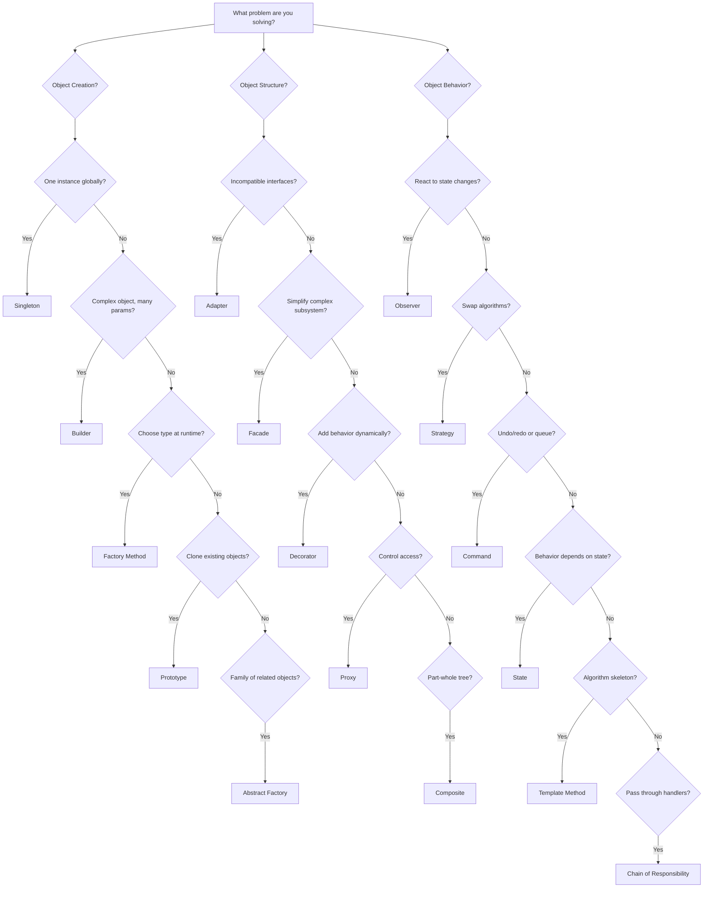
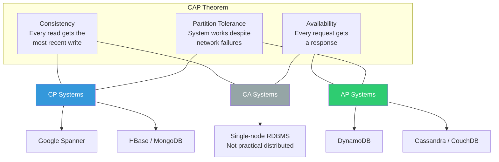
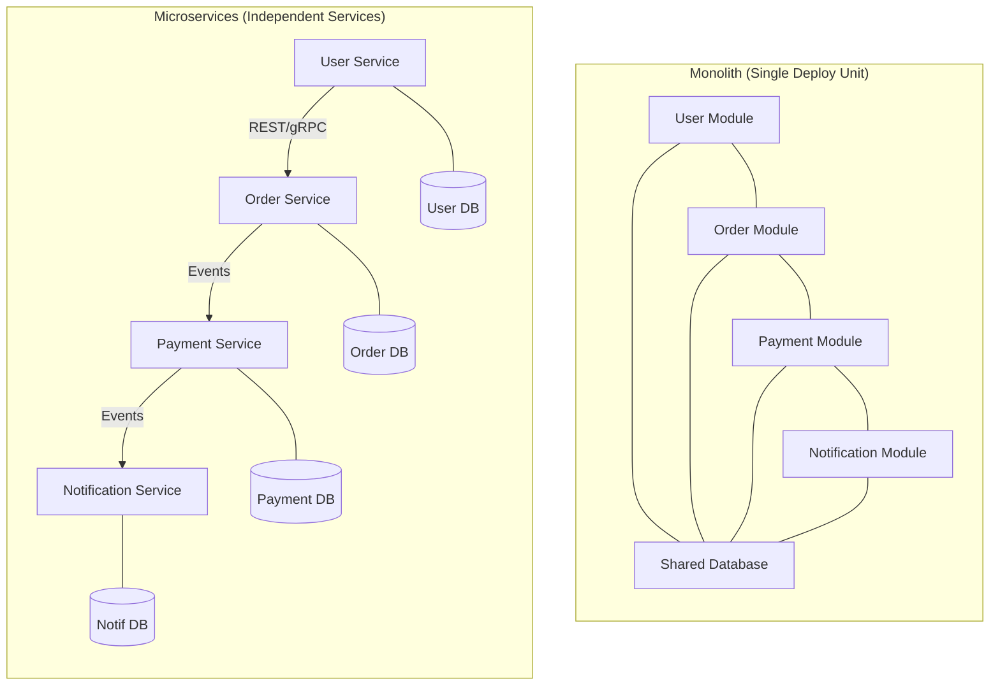
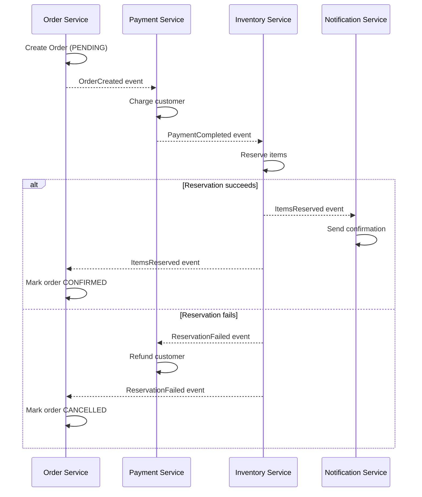
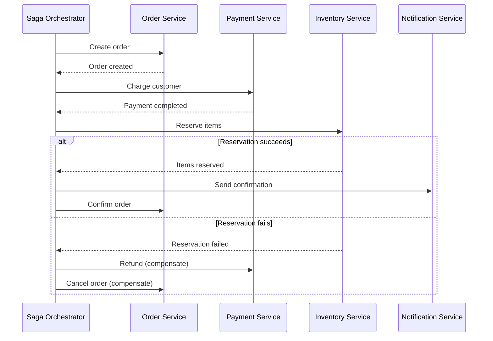
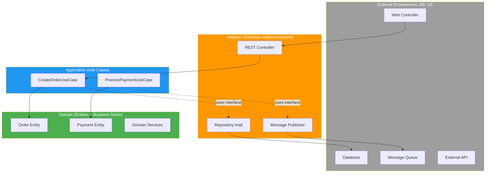
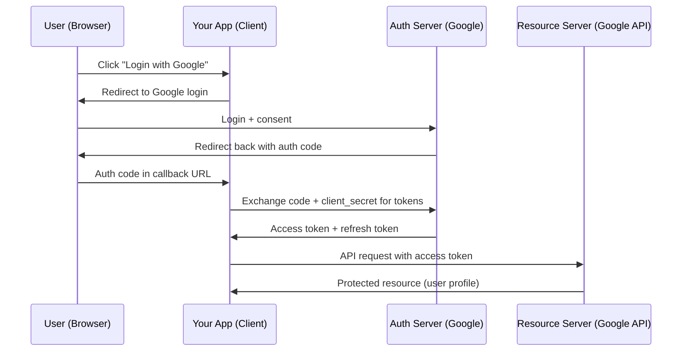

# Chapter 14 — Design Fundamentals (Java)

> "Any fool can write code that a computer can understand. Good programmers write code that humans can understand." — Martin Fowler

---

## What You'll Learn

This chapter equips you with the design vocabulary and patterns that separate junior developers from senior engineers. You will learn SOLID principles with real Java code, the Gang of Four patterns that matter in interviews, system design fundamentals with real numbers, and the estimation skills needed to reason about scale.

---

## Table of Contents
| Part | Topic |
|------|-------|
| 14.1 | Software Design Principles (SOLID, DRY, KISS, YAGNI, Coupling & Cohesion) |
| 14.2 | Design Patterns — Creational (Singleton, Factory, Builder, Prototype) |
| 14.3 | Design Patterns — Structural (Adapter, Facade, Decorator, Proxy, Composite) |
| 14.4 | Design Patterns — Behavioral (Observer, Strategy, Command, State, Template Method) |
| 14.5 | System Design Fundamentals (Scalability, Latency, CAP, Consistency, Estimation) |
| 14.6 | API Design (REST, GraphQL, gRPC) |
| 14.7 | Database Design (SQL/NoSQL, Indexing, Sharding, ACID/BASE) |
| 14.8 | Distributed Systems (Caching, Queues, Rate Limiting, Sagas, Load Balancing) |
| 14.9 | Architecture Patterns (Clean Architecture, DDD, CQRS, Event Sourcing) |
| 14.10 | Security (Auth, JWT, OAuth, OWASP) |
| 14.11 | Java Concurrency (Thread Safety, Executors, CompletableFuture) |
| 14.12 | System Design Interview Framework |

---

## 14.1 Software Design Principles

Good design is about understanding trade-offs. These principles exist because thousands of engineers learned the hard way what makes code maintainable at scale. Internalize the reasoning behind each one, not just the acronym.

---

### SOLID Principles

SOLID is a set of five principles coined by Robert C. Martin that guide object-oriented class design. They are the most important design principles for interview discussions.

#### S — Single Responsibility Principle (SRP)

> **A class should have one, and only one, reason to change.** — Robert C. Martin

A class that does one thing well is easy to test, easy to name, and easy to replace. When a class handles both business logic and persistence, a change to your database schema forces you to modify the same class that contains your core algorithms.

```java
// BAD: Two reasons to change (report logic AND persistence)
class Report {
    String generate(List<Sale> sales) { /* format report */ return "..."; }
    void saveToFile(String report, String path) throws IOException {
        Files.write(Path.of(path), report.getBytes());
    }
}

// GOOD: Each class has exactly one responsibility
class ReportGenerator {
    String generate(List<Sale> sales) { /* format report */ return "..."; }
}

class ReportPersistence {
    void saveToFile(String report, String path) throws IOException {
        Files.write(Path.of(path), report.getBytes());
    }
}
```

**When it matters most:** Services with multiple integration points (API + DB + messaging). If your service class is 800 lines, SRP is being violated.

---

#### O — Open/Closed Principle (OCP)

> **Software entities should be open for extension but closed for modification.** — Bertrand Meyer

You should be able to add new behavior without changing existing, tested code. The mechanism is abstraction: define contracts (interfaces), then add new implementations.

```java
// BAD: Adding a new shape requires modifying this method
class AreaCalculator {
    double calculate(Object shape) {
        if (shape instanceof Circle c) return Math.PI * c.radius * c.radius;
        else if (shape instanceof Rectangle r) return r.width * r.height;
        throw new IllegalArgumentException("Unknown shape");
    }
}

// GOOD: New shapes extend behavior without touching existing code
interface Shape { double area(); }

class Circle implements Shape {
    private final double radius;
    Circle(double r) { this.radius = r; }
    public double area() { return Math.PI * radius * radius; }
}

class Rectangle implements Shape {
    private final double w, h;
    Rectangle(double w, double h) { this.w = w; this.h = h; }
    public double area() { return w * h; }
}

// Never needs to change when new shapes are added
class AreaCalculator {
    double calculate(Shape shape) { return shape.area(); }
}
```

**When it matters most:** Plugin architectures, payment processors, notification channels.

---

#### L — Liskov Substitution Principle (LSP)

> **Objects of a superclass should be replaceable with objects of a subclass without breaking the program.** — Barbara Liskov

If `B extends A`, then every place that uses `A` must work correctly with `B`. The classic violation is `Square extends Rectangle` -- a square cannot independently set width and height.

```java
// BAD: Square breaks the Rectangle contract
class Rectangle {
    protected int width, height;
    void setWidth(int w)  { this.width = w; }
    void setHeight(int h) { this.height = h; }
    int area() { return width * height; }
}
class Square extends Rectangle {
    void setWidth(int w)  { this.width = w; this.height = w; }  // Side effect!
    void setHeight(int h) { this.width = h; this.height = h; }  // Side effect!
}
// r.setWidth(5); r.setHeight(4); r.area() == 20 -- FAILS for Square (gives 16)

// GOOD: Use a common interface, no misleading inheritance
interface Shape { int area(); }
record Rectangle(int width, int height) implements Shape {
    public int area() { return width * height; }
}
record Square(int side) implements Shape {
    public int area() { return side * side; }
}
```

**When it matters most:** Anywhere you use polymorphism. If your subclass overrides a method and changes its observable behavior, you have an LSP violation.

---

#### I — Interface Segregation Principle (ISP)

> **No client should be forced to depend on methods it does not use.** — Robert C. Martin

Fat interfaces force implementors to write stub methods they do not need. Split large interfaces into focused ones.

```java
// BAD: A fat interface — Robot doesn't eat or sleep
interface Worker { void work(); void eat(); void sleep(); }

class Robot implements Worker {
    public void work()  { /* productive */ }
    public void eat()   { throw new UnsupportedOperationException(); }
    public void sleep() { throw new UnsupportedOperationException(); }
}

// GOOD: Segregated interfaces
interface Workable { void work(); }
interface Feedable { void eat(); }
interface Restable { void sleep(); }

class Human implements Workable, Feedable, Restable { /* all three */ }
class Robot implements Workable { public void work() { /* productive */ } }
```

**When it matters most:** SDK/library design. Spring's `JpaRepository` vs `CrudRepository` vs `PagingAndSortingRepository` is a textbook ISP example.

---

#### D — Dependency Inversion Principle (DIP)

> **High-level modules should not depend on low-level modules. Both should depend on abstractions.** — Robert C. Martin

Your business logic should never import a concrete database class. It should import an interface. This is the foundation of dependency injection.

```java
// BAD: High-level OrderService depends on concrete MySQLDatabase
class OrderService {
    private MySQLDatabase db = new MySQLDatabase(); // Tight coupling
    void placeOrder(Order order) { db.save(order.toString()); }
}

// GOOD: Both depend on an abstraction
interface Database { void save(String data); }

class MySQLDatabase implements Database {
    public void save(String data) { /* MySQL-specific */ }
}

class OrderService {
    private final Database db;
    OrderService(Database db) { this.db = db; } // Injected
    void placeOrder(Order order) { db.save(order.toString()); }
}
```

**When it matters most:** Every service boundary. If you cannot unit-test a class without spinning up a real database, you are violating DIP.

---

### DRY — Don't Repeat Yourself

> **Every piece of knowledge must have a single, unambiguous, authoritative representation within a system.** — Andy Hunt & Dave Thomas

DRY is not about eliminating duplicate lines of code. It is about eliminating duplicate **knowledge**. Two methods can have identical code but represent different concepts -- that is fine. Two methods with different code that encode the same business rule -- that is the real violation.

```java
// BAD: Tax logic duplicated — if rate changes, must update both
class InvoiceService { double tax(double amt) { return amt * 0.08; } }
class ReceiptService { double tax(double amt) { return amt * 0.08; } }

// GOOD: Single source of truth
class TaxCalculator {
    private static final double RATE = 0.08;
    static double calculate(double amount) { return amount * RATE; }
}
```

---

### KISS — Keep It Simple, Stupid

> **Simplicity is the ultimate sophistication.**

The simplest solution that works is almost always the best one. If a junior engineer cannot read your code and understand it within a few minutes, it is too complex.

```java
// Overengineered
boolean isPalindrome(String s) {
    return IntStream.range(0, s.length() / 2)
        .noneMatch(i -> s.charAt(i) != s.charAt(s.length() - 1 - i));
}

// KISS: clear, debuggable, same performance
boolean isPalindrome(String s) {
    int left = 0, right = s.length() - 1;
    while (left < right) {
        if (s.charAt(left++) != s.charAt(right--)) return false;
    }
    return true;
}
```

---

### YAGNI — You Ain't Gonna Need It

> **Always implement things when you actually need them, never when you just foresee that you need them.** — Ron Jeffries

Do not build abstractions for future requirements that may never arrive. A factory pattern with one implementation is unnecessary ceremony. Add the abstraction when the second use case appears.

```java
// YAGNI violation: Full strategy + factory for ONE notification type
interface NotificationStrategy { void send(String msg); }
class EmailNotification implements NotificationStrategy { /* ... */ }
class NotificationFactory { static NotificationStrategy create(String type) { /* ... */ } }

// YAGNI: Just send the email. Refactor when SMS is actually needed.
class NotificationService {
    void sendEmail(String to, String msg) { /* send email */ }
}
```

---

### Composition over Inheritance

Inheritance creates rigid hierarchies. Composition lets you assemble behavior from small, reusable pieces. Prefer `has-a` over `is-a`.

```java
// PROBLEM: Penguin inherits fly() from Bird — but penguins can't fly
class Animal { void eat() { } }
class Bird extends Animal { void fly() { } }
class Penguin extends Bird {
    @Override void fly() { throw new UnsupportedOperationException(); } // Awkward
}

// SOLUTION: Compose behaviors via interfaces
interface Eater  { void eat(); }
interface Flyer  { void fly(); }
interface Swimmer { void swim(); }

class Sparrow implements Eater, Flyer {
    public void eat() { } public void fly() { }
}
class Penguin implements Eater, Swimmer {
    public void eat() { } public void swim() { }
    // No fly() — no problem
}
```

Use inheritance for genuine `is-a` relationships with shared behavior. Use composition for everything else.

---

### Coupling & Cohesion

**Coupling** measures how much one module depends on another. **Cohesion** measures how related the responsibilities within a single module are. You want **low coupling** and **high cohesion**.

| Coupling Level | Description | Example |
|---|---|---|
| **Content** (worst) | One module modifies another's internals | Accessing private fields via reflection |
| **Common** | Modules share global mutable state | Static mutable singletons |
| **Control** | One module controls another's flow via flags | Passing a boolean to change behavior |
| **Stamp** | Passing a whole object when only a field is needed | `process(User user)` when you only need email |
| **Data** | Only passing the data actually needed | `process(String email)` |
| **Message** (best) | Communicating via messages/events | Event-driven, pub/sub |

<div class="chart-container" style="max-width: 650px; margin: 2rem auto;">
<canvas id="couplingChart"></canvas>
</div>
<script>
(function() {
    const ctx = document.getElementById('couplingChart');
    if (!ctx || typeof Chart === 'undefined') return;
    new Chart(ctx, {
        type: 'bar',
        data: {
            labels: ['Content', 'Common', 'Control', 'Stamp', 'Data', 'Message'],
            datasets: [{
                label: 'Coupling Severity (lower is better)',
                data: [10, 8, 6, 4, 2, 1],
                backgroundColor: ['#e74c3c','#e67e22','#f1c40f','#2ecc71','#27ae60','#1abc9c'],
                borderRadius: 4
            }]
        },
        options: {
            responsive: true,
            plugins: {
                title: { display: true, text: 'Coupling Spectrum (Tight → Loose)', font: { size: 14 } },
                legend: { display: false }
            },
            scales: { y: { beginAtZero: true, title: { display: true, text: 'Severity' } } }
        }
    });
})();
</script>

---

### Separation of Concerns

Each module, class, or layer should address a distinct concern. Do not mix database queries into your UI code.

```java
// BAD: Controller does validation, business logic, persistence, AND notification
@RestController
class OrderController {
    @PostMapping("/orders")
    ResponseEntity<?> create(@RequestBody OrderRequest req) {
        if (req.getItems().isEmpty()) throw new BadRequestException("No items");
        double total = req.getItems().stream().mapToDouble(i -> i.getPrice() * i.getQty()).sum();
        jdbcTemplate.update("INSERT INTO orders ...", total);
        emailService.send(req.getEmail(), "Order placed!");
        return ResponseEntity.ok("done");
    }
}

// GOOD: Each concern in its own layer
@RestController
class OrderController {
    private final OrderService service;
    @PostMapping("/orders")
    ResponseEntity<?> create(@RequestBody @Valid OrderRequest req) {
        return ResponseEntity.ok(service.placeOrder(req));
    }
}

@Service
class OrderService {
    private final OrderRepository repo;
    private final NotificationService notifier;
    Order placeOrder(OrderRequest req) {
        Order order = Order.from(req);
        repo.save(order);
        notifier.orderPlaced(order);
        return order;
    }
}
```

---

### Law of Demeter (Principle of Least Knowledge)

> **A method should only talk to its immediate friends, not to strangers.**

Do not chain calls through intermediate objects -- this couples you to the entire chain.

```java
// BAD: Train wreck — depends on Order, Customer, AND Address
String city = order.getCustomer().getAddress().getCity();

// GOOD: Ask, don't reach
String city = order.getShippingCity(); // Order encapsulates the traversal
```

---

## 14.2 Design Patterns — Creational

Creational patterns control **how objects are created**, abstracting the instantiation process.

### Singleton

> **Ensure a class has only one instance and provide a global point of access to it.** — GoF

Use it for genuinely shared resources: connection pools, configuration, caches. The most overused pattern -- reach for it only when you truly need exactly one instance.

**Thread-safe double-checked locking:**

```java
public class ConnectionPool {
    private static volatile ConnectionPool instance;
    private ConnectionPool() { /* init pool */ }

    public static ConnectionPool getInstance() {
        if (instance == null) {
            synchronized (ConnectionPool.class) {
                if (instance == null) instance = new ConnectionPool();
            }
        }
        return instance;
    }
}
```

**Enum singleton (preferred -- inherently thread-safe and serialization-safe):**

```java
public enum AppConfig {
    INSTANCE;
    private final Properties props = new Properties();
    AppConfig() {
        try (var is = getClass().getResourceAsStream("/config.properties")) {
            props.load(is);
        } catch (IOException e) { throw new RuntimeException(e); }
    }
    public String get(String key) { return props.getProperty(key); }
}
// Usage: AppConfig.INSTANCE.get("db.url")
```

**When to avoid:** When you need testability (singletons are hard to mock), when the "one instance" assumption may change, or when it is just a disguised global variable.

---

### Factory Method

> **Define an interface for creating an object, but let subclasses decide which class to instantiate.** — GoF

The client codes to an interface; the factory decides which implementation to return.

```java
interface Notification { void send(String message); }

class EmailNotification implements Notification {
    public void send(String msg) { System.out.println("Email: " + msg); }
}
class SmsNotification implements Notification {
    public void send(String msg) { System.out.println("SMS: " + msg); }
}
class PushNotification implements Notification {
    public void send(String msg) { System.out.println("Push: " + msg); }
}

class NotificationFactory {
    public static Notification create(String channel) {
        return switch (channel.toLowerCase()) {
            case "email" -> new EmailNotification();
            case "sms"   -> new SmsNotification();
            case "push"  -> new PushNotification();
            default -> throw new IllegalArgumentException("Unknown: " + channel);
        };
    }
}

// Client — no dependency on concrete classes
Notification n = NotificationFactory.create("email");
n.send("Your order shipped");
```

**When to use:** When the decision of which class to instantiate depends on configuration, user input, or runtime context.

---

### Abstract Factory

> **Provide an interface for creating families of related objects without specifying their concrete classes.** — GoF

A factory of factories -- useful when you have multiple product families (e.g., UI themes).

```java
interface Button    { void render(); }
interface TextField { void render(); }

// Material family
class MaterialButton implements Button { public void render() { System.out.println("Material btn"); } }
class MaterialTextField implements TextField { public void render() { System.out.println("Material txt"); } }

// iOS family
class IOSButton implements Button { public void render() { System.out.println("iOS btn"); } }
class IOSTextField implements TextField { public void render() { System.out.println("iOS txt"); } }

interface UIFactory {
    Button createButton();
    TextField createTextField();
}
class MaterialFactory implements UIFactory {
    public Button createButton() { return new MaterialButton(); }
    public TextField createTextField() { return new MaterialTextField(); }
}
class IOSFactory implements UIFactory {
    public Button createButton() { return new IOSButton(); }
    public TextField createTextField() { return new IOSTextField(); }
}
```

---

### Builder

> **Separate the construction of a complex object from its representation.** — GoF

Ideal for objects with many optional parameters. Eliminates telescoping constructors.

```java
public class HttpRequest {
    private final String url, method, body;
    private final Map<String, String> headers;
    private final int timeoutMs;

    private HttpRequest(Builder b) {
        this.url = b.url; this.method = b.method; this.body = b.body;
        this.headers = Map.copyOf(b.headers); this.timeoutMs = b.timeoutMs;
    }

    public static class Builder {
        private final String url;                              // Required
        private String method = "GET";                         // Defaults
        private final Map<String, String> headers = new HashMap<>();
        private String body;
        private int timeoutMs = 5000;

        public Builder(String url)                { this.url = url; }
        public Builder method(String m)           { this.method = m; return this; }
        public Builder header(String k, String v) { headers.put(k, v); return this; }
        public Builder body(String b)             { this.body = b; return this; }
        public Builder timeout(int ms)            { this.timeoutMs = ms; return this; }

        public HttpRequest build() {
            if (url == null || url.isBlank()) throw new IllegalStateException("URL required");
            return new HttpRequest(this);
        }
    }
}

// Usage — readable, self-documenting
HttpRequest req = new HttpRequest.Builder("https://api.example.com/users")
    .method("POST")
    .header("Content-Type", "application/json")
    .body("{\"name\": \"Alice\"}")
    .timeout(3000)
    .build();
```

In production, **Lombok's `@Builder`** generates this for you. Know the manual implementation for interviews.

---

### Prototype

> **Create new objects by copying an existing instance rather than constructing from scratch.** — GoF

Use when object creation is expensive and you need multiple similar instances.

```java
public class GameUnit implements Cloneable {
    private String type;
    private int health, attack;
    private List<String> abilities;

    public GameUnit(String type, int hp, int atk, List<String> abilities) {
        this.type = type; this.health = hp; this.attack = atk;
        this.abilities = new ArrayList<>(abilities);
    }

    @Override
    public GameUnit clone() {
        try {
            GameUnit copy = (GameUnit) super.clone();
            copy.abilities = new ArrayList<>(this.abilities); // Deep copy mutables
            return copy;
        } catch (CloneNotSupportedException e) { throw new AssertionError(); }
    }
}

// Clone and customize
GameUnit template = new GameUnit("Archer", 100, 15, List.of("Ranged"));
GameUnit a1 = template.clone();
GameUnit a2 = template.clone();
```

---

## 14.3 Design Patterns — Structural

Structural patterns deal with **how classes and objects are composed** to form larger structures.

### Adapter

> **Convert the interface of a class into another interface that clients expect.** — GoF

Think of a power adapter: your laptop plug does not fit the foreign outlet, so you bridge the gap without changing either side.

```java
interface MediaPlayer { void play(String filename); }

// Third-party library with incompatible interface
class VLCEngine {
    void loadMedia(String path) { System.out.println("VLC loading: " + path); }
    void startPlayback()        { System.out.println("VLC playing"); }
}

class VLCAdapter implements MediaPlayer {
    private final VLCEngine vlc = new VLCEngine();
    public void play(String filename) { vlc.loadMedia(filename); vlc.startPlayback(); }
}

MediaPlayer player = new VLCAdapter();
player.play("song.mp3"); // Client doesn't know about VLC internals
```

**When to use:** Integrating legacy code, wrapping third-party libraries, incremental API migration.

---

### Facade

> **Provide a unified, simplified interface to a set of interfaces in a subsystem.** — GoF

A facade hides complexity. Think of a hotel concierge: you say "book me dinner and a show," and the concierge coordinates everything.

```java
class InventoryService { boolean check(String id) { return true; } void reserve(String id) { } }
class PaymentService   { boolean charge(String cid, double amt) { return true; } }
class ShippingService  { String ship(String id, String addr) { return "TRACK-123"; } }

class OrderFacade {
    private final InventoryService inv = new InventoryService();
    private final PaymentService pay = new PaymentService();
    private final ShippingService ship = new ShippingService();

    public String placeOrder(String custId, String itemId, double amt, String addr) {
        if (!inv.check(itemId)) throw new RuntimeException("Out of stock");
        inv.reserve(itemId);
        if (!pay.charge(custId, amt)) throw new RuntimeException("Payment failed");
        return ship.ship(itemId, addr);
    }
}
```

**When to use:** Simplifying complex libraries, providing a clean API over messy internals.

---

### Decorator

> **Attach additional responsibilities to an object dynamically. A flexible alternative to subclassing.** — GoF

The decorator implements the same interface as the object it wraps, so decorators can be stacked. Java's I/O streams are the textbook example:

```java
// Stacked decorators: each adds a layer
InputStream is = new BufferedInputStream(       // Adds buffering
                    new GZIPInputStream(        // Adds decompression
                        new FileInputStream("data.gz")));
```

Custom decorator:

```java
interface DataSource {
    void writeData(String data);
    String readData();
}

class FileDataSource implements DataSource {
    private final String file;
    FileDataSource(String file) { this.file = file; }
    public void writeData(String data) { /* write */ }
    public String readData()           { return "raw data"; }
}

abstract class DataSourceDecorator implements DataSource {
    protected final DataSource wrapped;
    DataSourceDecorator(DataSource src) { this.wrapped = src; }
    public void writeData(String data) { wrapped.writeData(data); }
    public String readData()           { return wrapped.readData(); }
}

class EncryptionDecorator extends DataSourceDecorator {
    EncryptionDecorator(DataSource src) { super(src); }
    public void writeData(String data) { super.writeData("ENC(" + data + ")"); }
    public String readData()           { return super.readData().replace("ENC(","").replace(")",""); }
}

class CompressionDecorator extends DataSourceDecorator {
    CompressionDecorator(DataSource src) { super(src); }
    public void writeData(String data) { super.writeData("ZIP(" + data + ")"); }
    public String readData()           { return super.readData().replace("ZIP(","").replace(")",""); }
}

// Stack: file -> compress -> encrypt
DataSource src = new EncryptionDecorator(new CompressionDecorator(new FileDataSource("data.txt")));
```

**When to use:** Logging, caching, compression, encryption, metrics -- any layered behavior.

---

### Proxy

> **Provide a surrogate or placeholder for another object to control access to it.** — GoF

Common types: virtual proxy (lazy init), protection proxy (access control), caching proxy.

```java
interface ImageLoader { void display(); }

class RealImage implements ImageLoader {
    private final String file;
    RealImage(String file) { this.file = file; loadFromDisk(); }
    private void loadFromDisk() { System.out.println("Loading: " + file); }
    public void display() { System.out.println("Displaying: " + file); }
}

class LazyImageProxy implements ImageLoader {
    private final String file;
    private RealImage real;
    LazyImageProxy(String file) { this.file = file; }

    public void display() {
        if (real == null) real = new RealImage(file); // Load on first use
        real.display();
    }
}

ImageLoader img = new LazyImageProxy("photo.jpg"); // No disk load yet
img.display(); // NOW it loads
```

**When to use:** Lazy loading, access control, logging/auditing, caching expensive operations.

---

### Composite

> **Compose objects into tree structures to represent part-whole hierarchies.** — GoF

Lets you treat a single item and a group of items through the same interface.

```java
interface FileSystemEntry {
    String getName();
    long getSize();
    void print(String indent);
}

class File implements FileSystemEntry {
    private final String name;
    private final long size;
    File(String name, long size) { this.name = name; this.size = size; }
    public String getName() { return name; }
    public long getSize()   { return size; }
    public void print(String indent) { System.out.println(indent + name + " (" + size + "B)"); }
}

class Directory implements FileSystemEntry {
    private final String name;
    private final List<FileSystemEntry> children = new ArrayList<>();
    Directory(String name) { this.name = name; }
    void add(FileSystemEntry e) { children.add(e); }
    public String getName() { return name; }
    public long getSize()   { return children.stream().mapToLong(FileSystemEntry::getSize).sum(); }
    public void print(String indent) {
        System.out.println(indent + name + "/");
        children.forEach(c -> c.print(indent + "  "));
    }
}

Directory root = new Directory("root");
root.add(new File("readme.md", 1024));
Directory src = new Directory("src");
src.add(new File("Main.java", 2048));
root.add(src);
root.print(""); // Prints entire tree
```

**When to use:** Tree structures, UI component hierarchies, organizational charts, menus.

---

## 14.4 Design Patterns — Behavioral

Behavioral patterns define **how objects interact and distribute responsibility**.

### Observer

> **Define a one-to-many dependency so that when one object changes state, all dependents are notified automatically.** — GoF

The backbone of event-driven programming. Think of YouTube subscriptions: when a creator uploads, all subscribers are notified. The creator does not need to know who the subscribers are.

```java
interface EventListener {
    void onEvent(String eventType, String data);
}

class EventBus {
    private final Map<String, List<EventListener>> listeners = new HashMap<>();

    void subscribe(String event, EventListener listener) {
        listeners.computeIfAbsent(event, k -> new ArrayList<>()).add(listener);
    }

    void publish(String event, String data) {
        for (EventListener l : listeners.getOrDefault(event, List.of())) {
            l.onEvent(event, data);
        }
    }
}

class EmailAlert implements EventListener {
    public void onEvent(String type, String data) { System.out.println("Email: [" + type + "] " + data); }
}
class SlackNotifier implements EventListener {
    public void onEvent(String type, String data) { System.out.println("Slack: [" + type + "] " + data); }
}

EventBus bus = new EventBus();
bus.subscribe("order.placed", new EmailAlert());
bus.subscribe("order.placed", new SlackNotifier());
bus.publish("order.placed", "Order #1234 for $99.99");
```

**When to use:** Event systems, UI updates, audit logging, real-time notifications.

---

### Strategy

> **Define a family of algorithms, encapsulate each one, and make them interchangeable.** — GoF

Swap algorithms at runtime without modifying the client. Think of navigation apps: driving, walking, or transit each use a different routing algorithm behind the same interface.

```java
interface CompressionStrategy {
    byte[] compress(byte[] data);
    String extension();
}

class ZipCompression implements CompressionStrategy {
    public byte[] compress(byte[] data) { System.out.println("ZIP"); return data; }
    public String extension() { return ".zip"; }
}
class GzipCompression implements CompressionStrategy {
    public byte[] compress(byte[] data) { System.out.println("GZIP"); return data; }
    public String extension() { return ".gz"; }
}

class FileCompressor {
    private CompressionStrategy strategy;
    FileCompressor(CompressionStrategy s) { this.strategy = s; }
    void setStrategy(CompressionStrategy s) { this.strategy = s; }

    void compress(String filename, byte[] data) {
        byte[] result = strategy.compress(data);
        System.out.println("Output: " + filename + strategy.extension());
    }
}

FileCompressor c = new FileCompressor(new ZipCompression());
c.compress("report.pdf", data);
c.setStrategy(new GzipCompression()); // Swap at runtime
c.compress("report.pdf", data);
```

**When to use:** Sorting, pricing, authentication, serialization -- anywhere you choose between algorithms at runtime.

---

### Command

> **Encapsulate a request as an object, letting you queue, log, and undo operations.** — GoF

The killer feature: because commands are objects, you can store, queue, undo, and replay them.

```java
interface Command { void execute(); void undo(); }

class TextEditor {
    private final StringBuilder content = new StringBuilder();
    void insert(String text, int pos) { content.insert(pos, text); }
    void delete(int pos, int len)     { content.delete(pos, pos + len); }
    String getContent()               { return content.toString(); }
}

class InsertCommand implements Command {
    private final TextEditor editor;
    private final String text;
    private final int position;

    InsertCommand(TextEditor e, String text, int pos) {
        this.editor = e; this.text = text; this.position = pos;
    }
    public void execute() { editor.insert(text, position); }
    public void undo()    { editor.delete(position, text.length()); }
}

class CommandHistory {
    private final Deque<Command> history = new ArrayDeque<>();
    void execute(Command cmd) { cmd.execute(); history.push(cmd); }
    void undo() { if (!history.isEmpty()) history.pop().undo(); }
}

TextEditor editor = new TextEditor();
CommandHistory hist = new CommandHistory();
hist.execute(new InsertCommand(editor, "Hello", 0));
hist.execute(new InsertCommand(editor, " World", 5));
System.out.println(editor.getContent()); // "Hello World"
hist.undo();
System.out.println(editor.getContent()); // "Hello"
```

**When to use:** Undo/redo, task queues, macro recording, transactional operations.

---

### State

> **Allow an object to alter its behavior when its internal state changes.** — GoF

Eliminates complex if/else chains based on an object's current state. Each state becomes its own class.

```java
interface OrderState {
    void next(OrderContext ctx);
    void cancel(OrderContext ctx);
    String status();
}

class OrderContext {
    private OrderState state;
    OrderContext() { this.state = new PendingState(); }
    void setState(OrderState s) { this.state = s; }
    void next()   { state.next(this); }
    void cancel() { state.cancel(this); }
    String status() { return state.status(); }
}

class PendingState implements OrderState {
    public void next(OrderContext c)   { c.setState(new ProcessingState()); }
    public void cancel(OrderContext c) { c.setState(new CancelledState()); }
    public String status() { return "PENDING"; }
}
class ProcessingState implements OrderState {
    public void next(OrderContext c)   { c.setState(new ShippedState()); }
    public void cancel(OrderContext c) { throw new IllegalStateException("Already processing"); }
    public String status() { return "PROCESSING"; }
}
class ShippedState implements OrderState {
    public void next(OrderContext c)   { c.setState(new DeliveredState()); }
    public void cancel(OrderContext c) { throw new IllegalStateException("Already shipped"); }
    public String status() { return "SHIPPED"; }
}
class DeliveredState implements OrderState {
    public void next(OrderContext c)   { throw new IllegalStateException("Already delivered"); }
    public void cancel(OrderContext c) { throw new IllegalStateException("Already delivered"); }
    public String status() { return "DELIVERED"; }
}
class CancelledState implements OrderState {
    public void next(OrderContext c)   { throw new IllegalStateException("Cancelled"); }
    public void cancel(OrderContext c) { throw new IllegalStateException("Already cancelled"); }
    public String status() { return "CANCELLED"; }
}

OrderContext order = new OrderContext();
order.next();  // PENDING -> PROCESSING
order.next();  // PROCESSING -> SHIPPED
```

**When to use:** Workflow engines, UI modes, connection state machines, game character states.

---

### Template Method

> **Define the skeleton of an algorithm in a superclass, letting subclasses override specific steps.** — GoF

The base class controls the workflow; subclasses fill in the blanks. Hollywood Principle: "Don't call us, we'll call you."

```java
abstract class DataPipeline {
    public final void run() {           // Template method
        String raw = extract();
        String cleaned = transform(raw);
        load(cleaned);
    }
    abstract String extract();
    abstract String transform(String raw);
    void load(String data) { System.out.println("Loading: " + data); } // Default
}

class CsvPipeline extends DataPipeline {
    String extract()             { return "col1,col2\na,b"; }
    String transform(String raw) { return raw.toUpperCase(); }
}
class ApiPipeline extends DataPipeline {
    String extract()             { return "{\"key\": \"value\"}"; }
    String transform(String raw) { return raw.replace("\"", "'"); }
}

new CsvPipeline().run();
new ApiPipeline().run();
```

**When to use:** Frameworks (Spring's `JdbcTemplate`), data pipelines, test fixtures.

---

### Chain of Responsibility

> **Pass a request along a chain of handlers. Each decides to process it or pass it on.** — GoF

Think of support escalation: L1 tries first, then L2, then L3.

```java
abstract class SupportHandler {
    private SupportHandler next;
    SupportHandler setNext(SupportHandler n) { this.next = n; return n; }
    void handle(Ticket t) {
        if (next != null) next.handle(t);
        else System.out.println("Unresolved: " + t.issue());
    }
}

record Ticket(String issue, int severity) {}

class L1Support extends SupportHandler {
    void handle(Ticket t) {
        if (t.severity() <= 1) System.out.println("L1 resolved: " + t.issue());
        else super.handle(t);
    }
}
class L2Support extends SupportHandler {
    void handle(Ticket t) {
        if (t.severity() <= 3) System.out.println("L2 resolved: " + t.issue());
        else super.handle(t);
    }
}
class L3Support extends SupportHandler {
    void handle(Ticket t) { System.out.println("L3 escalated: " + t.issue()); }
}

SupportHandler chain = new L1Support();
chain.setNext(new L2Support()).setNext(new L3Support());
chain.handle(new Ticket("Password reset", 1));  // L1
chain.handle(new Ticket("Server outage", 4));   // L3
```

**When to use:** Middleware pipelines, servlet filters, validation chains, authorization checks.

---

### Pattern Selection Decision Tree



---

## 14.5 System Design Fundamentals

System design is about making trade-offs under constraints. There is no single correct answer -- only trade-offs you can articulate clearly.

---

### Scalability

Scalability is the system's ability to handle increased load by adding resources.

| Dimension | Vertical (Scale Up) | Horizontal (Scale Out) |
|---|---|---|
| **Mechanism** | Bigger machine (more CPU/RAM) | More machines |
| **Complexity** | Low -- no code changes | High -- load balancing, data partitioning |
| **Cost curve** | Exponential | Linear (commodity hardware) |
| **Limit** | Hardware ceiling | Practically unlimited |
| **Failure mode** | Single point of failure | Fault tolerant |
| **Best for** | Databases, stateful services | Stateless services, web/API layers |

Most production systems use both: scale the database vertically and the application layer horizontally. Pure horizontal scaling requires stateless applications -- session data must live externally (Redis, database).

<div class="chart-container" style="max-width: 600px; margin: 2rem auto;">
<canvas id="scalingChart"></canvas>
</div>
<script>
(function() {
    const ctx = document.getElementById('scalingChart');
    if (!ctx || typeof Chart === 'undefined') return;
    new Chart(ctx, {
        type: 'line',
        data: {
            labels: ['1x', '2x', '4x', '8x', '16x', '32x'],
            datasets: [
                { label: 'Vertical (cost)', data: [100,250,700,2000,6000,20000],
                  borderColor: '#e74c3c', backgroundColor: 'rgba(231,76,60,0.1)', tension: 0.3, fill: true },
                { label: 'Horizontal (cost)', data: [100,200,400,800,1600,3200],
                  borderColor: '#27ae60', backgroundColor: 'rgba(39,174,96,0.1)', tension: 0.3, fill: true }
            ]
        },
        options: {
            responsive: true,
            plugins: { title: { display: true, text: 'Scaling Cost: Vertical vs Horizontal', font: { size: 14 } } },
            scales: {
                x: { title: { display: true, text: 'Capacity Multiplier' } },
                y: { title: { display: true, text: 'Relative Cost ($)' }, beginAtZero: true }
            }
        }
    });
})();
</script>

---

### Latency & Throughput

**Latency** is how long a single request takes. **Throughput** is how many requests the system handles per unit time. You can have low latency with low throughput (one fast worker) or high throughput with high latency (many slow workers).

#### Latency Numbers Every Engineer Should Know

| Operation | Latency |
|---|---|
| L1 cache reference | 0.5 ns |
| L2 cache reference | 7 ns |
| Main memory reference | 100 ns |
| SSD random read | 16 us |
| HDD random read | 2 ms |
| Send 1 MB over 1 Gbps network | 10 ms |
| Read 1 MB from SSD | 1 ms |
| Read 1 MB from HDD | 20 ms |
| Round trip within data center | 0.5 ms |
| Round trip CA to Netherlands | 150 ms |

#### Percentile Latencies

Average latency is misleading. A service with 50ms average might have p99 of 2 seconds -- meaning 1% of users wait 40x longer than the median. Always measure percentiles.

| Percentile | Meaning | Typical Target |
|---|---|---|
| **p50** (median) | 50% faster | < 100 ms |
| **p95** | 95% faster | < 500 ms |
| **p99** | 99% faster | < 1 s |
| **p99.9** | 99.9% faster | < 2 s |

In microservice architectures, tail latencies compound: if one request fans out to 10 services each at p99 = 100ms, the overall p99 is much worse.

<div class="chart-container" style="max-width: 650px; margin: 2rem auto;">
<canvas id="latencyChart"></canvas>
</div>
<script>
(function() {
    const ctx = document.getElementById('latencyChart');
    if (!ctx || typeof Chart === 'undefined') return;
    new Chart(ctx, {
        type: 'bar',
        data: {
            labels: ['p50', 'p75', 'p90', 'p95', 'p99', 'p99.9'],
            datasets: [{
                label: 'Latency (ms)',
                data: [45, 72, 130, 280, 850, 2100],
                backgroundColor: ['#27ae60','#2ecc71','#f1c40f','#e67e22','#e74c3c','#c0392b'],
                borderRadius: 4
            }]
        },
        options: {
            responsive: true,
            plugins: {
                title: { display: true, text: 'Typical API Latency Distribution', font: { size: 14 } },
                legend: { display: false }
            },
            scales: { y: { beginAtZero: true, title: { display: true, text: 'Latency (ms)' } } }
        }
    });
})();
</script>

---

### Availability

Availability is the percentage of time a system is operational, measured in "nines":

| Availability | Downtime/year | Downtime/month | Downtime/week |
|---|---|---|---|
| 99% (two nines) | 3.65 days | 7.3 hours | 1.68 hours |
| 99.9% (three nines) | 8.77 hours | 43.8 min | 10.1 min |
| 99.95% | 4.38 hours | 21.9 min | 5.04 min |
| 99.99% (four nines) | 52.6 min | 4.38 min | 1.01 min |
| 99.999% (five nines) | 5.26 min | 26.3 sec | 6.05 sec |

**Series vs. Parallel:**
- **Series** (both must be up): `A = A1 x A2`. Two 99.9% in series = 99.8%.
- **Parallel** (either can serve): `A = 1 - (1-A1)(1-A2)`. Two 99.9% in parallel = 99.9999%.

Higher availability costs exponentially more. Going from 99.9% to 99.99% is a 10x reduction in allowed downtime, requiring multi-region, active-active, automated failover.

---

### CAP Theorem

> **In a distributed data store, you can only guarantee two of three: Consistency, Availability, and Partition tolerance.** — Eric Brewer

Since network partitions are inevitable, the real choice is **CP** vs **AP**.



**CP:** During a partition, the system blocks or errors rather than return stale data. Choose for banking, inventory, leader election.

**AP:** During a partition, the system responds but may return stale data. Choose for social feeds, product catalogs, DNS.

In practice, most systems make different trade-offs per operation. A shopping site might use CP for checkout (do not oversell) but AP for browsing (slightly stale price is acceptable).

---

### PACELC Extension

CAP only describes behavior during partitions. PACELC extends: **if Partition**, choose A or C; **Else** (normal), choose **Latency** or **Consistency**.

| System | Partition (PAC) | Normal (ELC) |
|---|---|---|
| Google Spanner | PC (blocks writes) | EC (TrueTime sync) |
| DynamoDB | PA (always available) | EL (low latency) |
| Cassandra | PA | EL (tunable) |
| MongoDB | PC (primary required) | EC (reads from primary) |

---

### Consistency Models

| Model | Guarantee | Latency | Use Case |
|---|---|---|---|
| **Strong** | Every read sees latest write | Highest | Banking, inventory |
| **Eventual** | Reads will eventually see write | Lowest | DNS, social feeds |
| **Causal** | Reads respect causal ordering | Medium | Chat, comments |
| **Read-Your-Writes** | User sees their own writes | Medium | Profile updates |
| **Monotonic Reads** | User never sees data go backwards | Medium | Dashboard metrics |

**Strong consistency** requires coordination (Paxos, Raft), adding latency. Google Spanner achieves it globally using TrueTime, accepting ~7ms write latency.

**Eventual consistency** means writes propagate asynchronously. DynamoDB replicates across 3 AZs; a write is acknowledged after 2 replicas, the third catches up (typically milliseconds).

**Causal consistency** is a practical middle ground -- sufficient for most applications and much cheaper than strong consistency.

---

### Back-of-the-Envelope Estimation

The goal is not precision -- it is demonstrating you can reason about order of magnitude and identify bottlenecks.

#### Key Numbers to Memorize

| Metric | Value |
|---|---|
| Seconds in a day | ~86,400 (~10^5) |
| Seconds in a year | ~31.5 million (~3 x 10^7) |
| 1M requests/day | ~12 QPS |
| 1B requests/day | ~12,000 QPS |
| Average tweet/message | ~200 bytes |
| Average image (compressed) | ~200 KB |
| Average HD video minute | ~50 MB |
| Typical SSD IOPS | 50K-100K |
| Typical HDD IOPS | 100-200 |
| Single server concurrent connections | ~10K-50K |

#### Worked Example: Estimate QPS for YouTube

**Step 1: User scale**
- ~2.5B monthly active users, ~10% daily: **250M DAU**

**Step 2: Requests per user**
- 5 videos/day x ~10 API calls each = ~50 requests/user/day

**Step 3: Average QPS**
- 250M x 50 = 12.5B requests/day
- 12.5B / 86,400 = **~145,000 QPS**

**Step 4: Peak QPS** (2-3x average)
- **~350,000-450,000 QPS**

**Step 5: Storage**
- 500 hrs uploaded/min x 5 GB (multi-resolution) = **~3.6 PB/day**

**Step 6: Bandwidth**
- 250M users x 5 videos x 10 min x 5 Mbps = **~100+ Tbps globally**

#### QPS Quick-Reference

```
QPS = daily_requests / 86,400

  1 million/day    ≈     12 QPS
  10 million/day   ≈    120 QPS
  100 million/day  ≈  1,200 QPS
  1 billion/day    ≈ 12,000 QPS

Storage:
  1M records x 1 KB = 1 GB
  1B records x 1 KB = 1 TB
```

**Estimation framework** (top-down):
1. Total users / DAU
2. Actions per user per day
3. Total actions/day
4. QPS (divide by 86,400)
5. Peak QPS (2-3x average)
6. Storage (record size x records/day x retention)
7. Bandwidth (data size x QPS)

---

*Sections 14.6 through 14.12 continue in Part 2.*

## 14.6 API Design

An API is a contract between systems. A well-designed API is intuitive, consistent, and hard to misuse. A bad API generates support tickets forever. At Google scale, every API decision multiplies across thousands of internal consumers, so precision matters.

---

### REST — The Industry Standard

REST (REpresentational State Transfer) models everything as a **resource** you manipulate with standard HTTP methods. It is not a protocol — it is an architectural style defined by six constraints:

1. **Client-Server** — Separate UI concerns from data storage. Either side can evolve independently.
2. **Stateless** — Every request carries all the information the server needs. No server-side session state.
3. **Cacheable** — Responses must declare themselves cacheable or not. HTTP gives you this for free with `Cache-Control` headers.
4. **Uniform Interface** — Resources identified by URIs, manipulated through representations (JSON), self-descriptive messages, HATEOAS (hypermedia links in responses).
5. **Layered System** — Client cannot tell whether it is connected to the end server or an intermediary (load balancer, CDN, gateway).
6. **Code on Demand** (optional) — Server can send executable code to the client (JavaScript).

#### Resource Naming — use **nouns** (not verbs), **plural** names, **nesting** for relationships, **query params** for filtering.

```
  GOOD                              BAD
  GET /users/123/orders             GET /getUserOrders
  POST /users                       POST /createUser
  GET /users?role=admin&active=true GET /filterUsers/admin/true
```

#### HTTP Methods and Status Codes

| Method | Semantics | Idempotent | Safe |
|--------|-----------|------------|------|
| GET | Read a resource | Yes | Yes |
| POST | Create a resource | No | No |
| PUT | Replace a resource entirely | Yes | No |
| PATCH | Partial update | No* | No |
| DELETE | Remove a resource | Yes | No |

*PATCH can be made idempotent if you send the target state, not a diff.

| Code | Meaning | When to Use |
|------|---------|-------------|
| 200 | OK | Successful GET, PUT, PATCH |
| 201 | Created | Successful POST that created a resource |
| 204 | No Content | Successful DELETE |
| 400 | Bad Request | Malformed JSON, missing required fields |
| 401 | Unauthorized | Missing or invalid authentication token |
| 403 | Forbidden | Authenticated but lacks permission |
| 404 | Not Found | Resource does not exist |
| 409 | Conflict | Duplicate resource, version conflict |
| 429 | Too Many Requests | Client exceeded rate limit |
| 500 | Internal Server Error | Unhandled server exception |

#### Versioning — `URL-based` (/v1/users) is most common and what Google's public APIs use. `Header-based` (Accept: application/vnd.api.v2+json) keeps URLs clean for internal services.

---

### GraphQL — Client-Driven Queries

GraphQL lets the client specify exactly which fields it needs in a single request. This solves two chronic REST problems: **over-fetching** (getting 30 fields when you need 3) and **under-fetching** (needing 5 REST calls to assemble one screen).

```
  REST approach (3 round trips):
  GET /users/123           → { id, name, email, address, ... 30 fields }
  GET /users/123/orders    → [ { id, total, items, ... } ]
  GET /orders/456/items    → [ { id, name, price, ... } ]

  GraphQL approach (1 round trip):
  query {
    user(id: 123) {
      name
      orders(last: 5) {
        total
        items { name, price }
      }
    }
  }
```

**The N+1 Problem in GraphQL** — A naive resolver fires a separate DB query for each nested object. Solution: **DataLoader** batches all IDs in a single tick into one `WHERE id IN (...)` query.

**When to use:** Mobile apps (bandwidth), BFF layers, dashboards aggregating many services. **Tradeoffs:** harder to cache (no URL-based HTTP caching), complex field-level authorization, expensive deep queries (mitigate with depth limits).

---

### gRPC — High-Performance Internal Communication

gRPC uses HTTP/2 and Protocol Buffers (protobuf) for binary serialization. Messages are 5-10x smaller and 10x faster to parse than JSON.

```
  // user.proto — the contract
  syntax = "proto3";
  service UserService {
    rpc GetUser (UserRequest) returns (UserResponse);           // Unary
    rpc ListUsers (ListRequest) returns (stream UserResponse);  // Server streaming
    rpc UploadLogs (stream LogEntry) returns (Summary);         // Client streaming
    rpc Chat (stream Message) returns (stream Message);         // Bidirectional
  }
  message UserRequest { int64 id = 1; }
  message UserResponse { int64 id = 1; string name = 2; string email = 3; }
```

Four streaming types: **Unary** (standard request-response), **Server streaming** (real-time feeds), **Client streaming** (log ingestion), **Bidirectional** (chat, gaming).

**When to use:** Microservice-to-microservice calls, latency-sensitive paths, polyglot environments. Google uses gRPC for nearly all internal service-to-service communication. **Tradeoffs:** not browser-friendly without gRPC-Web, binary is not human-readable, steeper learning curve.

---

### API Comparison

```chart
{
  "type": "radar",
  "data": {
    "labels": ["Latency", "Flexibility", "Learning Curve", "Tooling", "Browser Support", "Streaming"],
    "datasets": [
      {
        "label": "REST",
        "data": [6, 5, 9, 9, 10, 3],
        "borderColor": "rgba(54, 162, 235, 1)",
        "backgroundColor": "rgba(54, 162, 235, 0.15)"
      },
      {
        "label": "GraphQL",
        "data": [6, 10, 6, 7, 9, 4],
        "borderColor": "rgba(255, 99, 132, 1)",
        "backgroundColor": "rgba(255, 99, 132, 0.15)"
      },
      {
        "label": "gRPC",
        "data": [10, 4, 5, 6, 3, 10],
        "borderColor": "rgba(75, 192, 192, 1)",
        "backgroundColor": "rgba(75, 192, 192, 0.15)"
      }
    ]
  },
  "options": {
    "scales": {
      "r": { "beginAtZero": true, "max": 10 }
    },
    "plugins": {
      "title": { "display": true, "text": "API Technology Comparison (higher = better)" }
    }
  }
}
```

---

### Idempotency

An operation is **idempotent** if performing it multiple times produces the same result as performing it once. GET, PUT, and DELETE are naturally idempotent. POST is not — calling `POST /orders` twice creates two orders.

**Solution: Idempotency Keys.** The client generates a unique key (UUID) and sends it in a header. The server stores the key with the result. If the same key arrives again, the server returns the stored result without re-executing.

```java
public Response createOrder(Request req) {
    String key = req.getHeader("Idempotency-Key");
    Optional<Response> cached = idempotencyStore.get(key);
    if (cached.isPresent()) return cached.get();  // Return stored result — no re-execution

    Response result = processOrder(req);
    idempotencyStore.put(key, result, TTL_24_HOURS);
    return result;
}
```

Stripe, Google Pay, and every serious payment API requires idempotency keys on POST.

---

### Pagination

| Aspect | Offset-Based | Cursor-Based |
|--------|-------------|--------------|
| Request | `GET /users?page=3&limit=20` | `GET /users?after=abc123&limit=20` |
| How it works | `OFFSET 40 LIMIT 20` | `WHERE id > 'abc123' LIMIT 20` |
| Performance | Degrades on large offsets (DB scans skipped rows) | Constant — uses indexed column |
| Consistency | Misses/duplicates items if data changes between pages | Stable — cursor anchors position |
| Random access | Yes (jump to page 50) | No (must traverse sequentially) |
| Best for | Admin dashboards, small datasets | Infinite scroll, real-time feeds, large datasets |

Google APIs use cursor-based pagination with a `nextPageToken` field. Always prefer cursor-based for anything user-facing at scale.

---

## 14.7 Database Design

The database is the foundation of every system. Choose wrong and you will spend months migrating under pressure. Choose right and the system scales naturally.

---

### SQL vs NoSQL

| Aspect | SQL (Relational) | Document (NoSQL) | Wide-Column | Key-Value |
|--------|-------------------|-------------------|-------------|-----------|
| Example | PostgreSQL, MySQL, Cloud Spanner | MongoDB, Firestore | Cassandra, Bigtable | Redis, DynamoDB |
| Data model | Tables with rows and columns | JSON-like documents | Column families, sparse rows | Simple key → value |
| Schema | Strict, predefined | Flexible, schema-on-read | Semi-structured | None |
| Query language | SQL (powerful joins, aggregations) | Query API or custom QL | CQL (Cassandra), scan-based | GET/SET by key |
| Joins | Native, efficient | Expensive or impossible | Not supported | Not supported |
| Transactions | Full ACID | Single-document ACID | Limited (lightweight transactions) | Single-key atomic |
| Scaling | Vertical (read replicas for reads) | Horizontal (auto-sharding) | Horizontal (built for it) | Horizontal |
| Best for | Complex queries, relationships, financial data | Rapidly evolving schemas, content management | Time-series, IoT, write-heavy at massive scale | Caching, sessions, leaderboards |

**Decision heuristic:** Start with SQL unless you have a specific reason not to. "We might need to scale" is not a reason — PostgreSQL handles millions of rows. Switch to NoSQL when your access pattern is simple key lookups at massive scale, or your schema genuinely cannot be defined upfront.

Google Cloud Spanner blurs this line — globally distributed SQL with horizontal scaling — but it is expensive and operationally complex.

---

### Normalization

Normalization eliminates data redundancy and update anomalies. Each normal form builds on the previous one.

**1NF (First Normal Form)** — Every column contains atomic (indivisible) values. No repeating groups.

```
  VIOLATES 1NF:                         SATISFIES 1NF:
  ┌────┬───────────────────────┐        ┌────┬────────────┐
  │ id │ phone_numbers          │        │ id │ phone      │
  ├────┼───────────────────────┤        ├────┼────────────┤
  │ 1  │ 555-0100, 555-0200    │        │ 1  │ 555-0100   │
  └────┴───────────────────────┘        │ 1  │ 555-0200   │
                                         └────┴────────────┘
```

**2NF (Second Normal Form)** — 1NF + every non-key column depends on the **entire** primary key (not just part of a composite key).

```
  VIOLATES 2NF (composite key: student_id + course_id):
  ┌────────────┬───────────┬──────────────┬──────────────┐
  │ student_id │ course_id │ student_name │ grade        │
  ├────────────┼───────────┼──────────────┼──────────────┤
  │ 1          │ CS101     │ Alice        │ A            │
  │ 1          │ CS201     │ Alice        │ B            │  ← student_name
  └────────────┴───────────┴──────────────┴──────────────┘    depends only on
                                                               student_id!
  FIX: Split into Students(student_id, student_name)
       and Enrollments(student_id, course_id, grade)
```

**3NF (Third Normal Form)** — 2NF + no transitive dependencies. Every non-key column depends directly on the primary key, not through another non-key column.

```
  VIOLATES 3NF:
  ┌────────────┬──────────┬─────────────┐
  │ employee_id│ dept_id  │ dept_name   │   ← dept_name depends on dept_id,
  ├────────────┼──────────┼─────────────┤      not on employee_id
  │ 1          │ D10      │ Engineering │
  │ 2          │ D10      │ Engineering │   ← redundant!
  └────────────┴──────────┴─────────────┘

  FIX: Employees(employee_id, dept_id)
       Departments(dept_id, dept_name)
```

**Denormalization for Reads.** Normalize writes, denormalize reads. When a JOIN across six tables takes 200ms and your SLA is 50ms, duplicate data into a read-optimized materialized view. Every OLAP data warehouse is heavily denormalized.

---

### Indexing

An index speeds up lookups (O(log N) or O(1) instead of O(N) full table scan) at the cost of slower writes and extra storage.

| Index Type | Structure | Best For | Example |
|-----------|-----------|----------|---------|
| B-tree | Balanced tree | Range queries, sorting, equality — **the default** | `WHERE age BETWEEN 20 AND 30` |
| Hash | Hash table | Exact equality lookups only | `WHERE email = 'alice@google.com'` |
| Composite | B-tree on multiple columns | Queries filtering on multiple columns | `INDEX(country, city)` — works for country alone or country+city, NOT city alone |
| Covering | Index that includes all queried columns | Eliminating table lookups entirely | `INDEX(user_id, name, email)` for `SELECT name, email WHERE user_id = 5` |

**Column order matters in composite indexes** (leftmost prefix rule). An index on `(A, B, C)` supports `A`, `A+B`, or `A+B+C`, but NOT `B` alone or `C` alone.

---

### Sharding

When a single database cannot handle the load, you split data across multiple database instances (shards).

| Strategy | How It Works | Pros | Cons |
|----------|-------------|------|------|
| Hash-based | `shard = hash(key) % N` | Even distribution | Adding/removing shards rehashes everything (use consistent hashing to mitigate) |
| Range-based | Shard by value ranges (A-M, N-Z) | Range queries stay on one shard | Hot spots if distribution is uneven |
| Geo-based | Shard by region (US, EU, APAC) | Data locality, compliance (GDPR) | Cross-region queries are expensive |

**Cross-shard queries are expensive** (scatter-gather across all shards). Design your shard key so the most common queries hit a single shard. For social media, shard by `user_id`.

---

### The N+1 Query Problem

The most common performance bug in applications that use ORMs.

```java
// BAD: N+1 queries — 1 query for orders + N queries for users
List<Order> orders = orderRepo.findAll();          // 1 query
for (Order order : orders) {
    User user = userRepo.findById(order.getUserId()); // N queries!
    System.out.println(order.getId() + " by " + user.getName());
}

// GOOD: JOIN — 1 query total
@Query("SELECT o FROM Order o JOIN FETCH o.user")
List<Order> findAllWithUsers();                    // 1 query
```

If you have 1,000 orders, the bad version fires 1,001 database queries. The good version fires 1. This is often the difference between a 50ms response and a 5-second response.

---

### ACID vs BASE

| Property | ACID (SQL default) | BASE (NoSQL default) |
|----------|-------------------|---------------------|
| **A** | Atomicity — all or nothing | **B**asically **A**vailable — system always responds |
| **C** | Consistency — data always valid | **S**oft state — data may be temporarily inconsistent |
| **I** | Isolation — concurrent txns don't interfere | **E**ventual consistency — given enough time, all replicas converge |
| **D** | Durability — committed data survives crashes | (Same — no one skips durability) |
| Tradeoff | Correctness over availability | Availability over immediate consistency |
| Best for | Banking, inventory, booking systems | Social feeds, analytics, content delivery |

Most systems use ACID for the write path (source of truth) and BASE for the read path (caches, search indexes).

---

### Database Performance Comparison

```chart
{
  "type": "radar",
  "data": {
    "labels": ["Read Throughput", "Write Throughput", "Query Flexibility", "Horizontal Scale", "Consistency", "Operational Simplicity"],
    "datasets": [
      {
        "label": "PostgreSQL (SQL)",
        "data": [7, 6, 10, 4, 10, 7],
        "borderColor": "rgba(54, 162, 235, 1)",
        "backgroundColor": "rgba(54, 162, 235, 0.15)"
      },
      {
        "label": "MongoDB (Document)",
        "data": [7, 7, 7, 8, 6, 6],
        "borderColor": "rgba(255, 159, 64, 1)",
        "backgroundColor": "rgba(255, 159, 64, 0.15)"
      },
      {
        "label": "Cassandra (Wide-Column)",
        "data": [9, 10, 3, 10, 4, 5],
        "borderColor": "rgba(255, 99, 132, 1)",
        "backgroundColor": "rgba(255, 99, 132, 0.15)"
      },
      {
        "label": "Redis (Key-Value)",
        "data": [10, 10, 2, 7, 5, 8],
        "borderColor": "rgba(75, 192, 192, 1)",
        "backgroundColor": "rgba(75, 192, 192, 0.15)"
      }
    ]
  },
  "options": {
    "scales": {
      "r": { "beginAtZero": true, "max": 10 }
    },
    "plugins": {
      "title": { "display": true, "text": "Database Type Comparison (higher = better)" }
    }
  }
}
```

---

## 14.8 Distributed Systems

Every system that outgrows a single machine enters the world of distributed systems. The core challenge shifts from "how to write correct code" to "how to coordinate multiple machines that fail independently."

---

### Microservices vs Monolith

A monolith is a single deployable unit containing all business logic. Microservices decompose the system into independently deployable services, each owning its own data.



| Aspect | Monolith | Microservices |
|--------|----------|---------------|
| Deployment | Single unit — deploy everything | Independent — deploy one service |
| Development speed (early) | Fast — no network calls, shared DB | Slow — need service mesh, API contracts |
| Development speed (late) | Slow — changes break other modules | Fast — teams work independently |
| Data consistency | Easy — single DB transaction | Hard — distributed transactions (Sagas) |
| Debugging | Easy — single stack trace | Hard — distributed tracing (Jaeger, Zipkin) |
| Scaling | Scale entire app even if only one module is hot | Scale individual services independently |
| Team size | Works for < 20 engineers | Necessary for 50+ engineers |

**Start with a monolith, extract microservices when justified:** a module needs independent scaling, a team boundary requires independent deployment, or a module has fundamentally different tech requirements (ML serving in Python while the rest is Java).

---

### Caching

Caching stores frequently accessed data closer to the consumer, reducing latency and database load.

| Strategy | How It Works | Pros | Cons |
|----------|-------------|------|------|
| **Cache-Aside** (Lazy) | App checks cache first. On miss, reads from DB, writes to cache. | Simple, only caches what is actually requested | Cache miss = slower (DB read + cache write). Stale data until TTL expires. |
| **Write-Through** | App writes to cache, cache synchronously writes to DB. | Cache always consistent with DB | Higher write latency (two writes on every mutation) |
| **Write-Back** (Write-Behind) | App writes to cache, cache asynchronously writes to DB later. | Lowest write latency, batches DB writes | Risk of data loss if cache crashes before flushing to DB |

**Cache-aside is the most common pattern.** Use it unless you have a specific reason not to.

#### Eviction Policies

| Policy | Evicts | Best For |
|--------|--------|----------|
| LRU (Least Recently Used) | Item not accessed for the longest time | General purpose — the default choice |
| LFU (Least Frequently Used) | Item accessed fewest times overall | Workloads with stable hot sets |
| TTL (Time To Live) | Item that has been in cache longer than N seconds | Data with known freshness requirements |

**Where to cache:** Client (HTTP cache headers) → CDN (static assets, API responses) → Application (Redis/Memcached for objects, sessions, query results) → Database (query cache, materialized views). Each layer reduces load on the next. At Google scale, cache aggressively at every layer.

---

### Message Queues

Message queues decouple producers from consumers, enabling asynchronous processing, load leveling, and fault tolerance.

| Feature | Kafka | SQS | RabbitMQ |
|---------|-------|-----|----------|
| Model | Distributed log (append-only) | Managed queue (AWS) | Traditional message broker |
| Ordering | Per-partition ordering guaranteed | Best-effort (FIFO available at extra cost) | Per-queue ordering |
| Retention | Configurable (days/weeks/forever) | 14 days max | Until consumed |
| Replay | Yes — consumers can re-read old messages | No — once consumed, deleted | No |
| Throughput | Millions of messages/sec | Thousands/sec | Tens of thousands/sec |
| Consumer model | Pull (consumers poll partitions) | Pull (long polling) | Push (broker delivers to consumer) |
| Best for | Event streaming, event sourcing, real-time analytics, audit logs | Simple task queues, decoupling AWS services | Complex routing, RPC patterns, low-latency task queues |

**Kafka** when you need replay, multiple consumers, or event-driven architecture (GCP equivalent: Cloud Pub/Sub). **SQS/RabbitMQ** for simple fire-and-forget tasks (emails, image resizing) where replay is unnecessary.

---

### API Gateway

An API gateway is the single entry point for all client requests. It handles cross-cutting concerns so individual services do not have to.

Key responsibilities: **authentication/authorization** (validate JWT, API keys), **rate limiting** (protect backend), **request routing** (route `/users/*` to User Service), **protocol translation** (REST to gRPC), **response aggregation**, **logging and monitoring**.

Examples: Kong, NGINX, AWS API Gateway, Google Cloud Endpoints, Envoy (Google's preferred sidecar proxy).

---

### Rate Limiting

Rate limiting protects services from being overwhelmed by too many requests, whether from legitimate traffic spikes or malicious attacks.

#### Token Bucket Algorithm

The most widely used algorithm. A bucket holds tokens. Each request consumes one token. Tokens are added at a fixed rate. If the bucket is empty, the request is rejected.

```java
public class TokenBucketRateLimiter {
    private final int maxTokens;
    private final double refillRatePerSecond;
    private double currentTokens;
    private long lastRefillTimestamp;

    public TokenBucketRateLimiter(int maxTokens, double refillRatePerSecond) {
        this.maxTokens = maxTokens;
        this.refillRatePerSecond = refillRatePerSecond;
        this.currentTokens = maxTokens;
        this.lastRefillTimestamp = System.nanoTime();
    }

    public synchronized boolean allowRequest() {
        refill();
        if (currentTokens >= 1) {
            currentTokens--;
            return true;
        }
        return false;
    }

    private void refill() {
        long now = System.nanoTime();
        double elapsedSeconds = (now - lastRefillTimestamp) / 1_000_000_000.0;
        currentTokens = Math.min(maxTokens, currentTokens + elapsedSeconds * refillRatePerSecond);
        lastRefillTimestamp = now;
    }
}
```

| Algorithm | How It Works | Pros | Cons |
|-----------|-------------|------|------|
| Token Bucket | Tokens added at fixed rate, consumed per request | Allows bursts up to bucket size, smooth rate | Needs per-user state |
| Sliding Window Log | Store timestamp of each request, count in window | Exact, no boundary issues | High memory (stores every timestamp) |
| Sliding Window Counter | Weighted sum of current + previous window counts | Low memory, accurate enough | Approximate (not exact) |

---

### Consistent Hashing

Standard hashing (`hash(key) % N`) breaks when you add or remove servers — nearly all keys get remapped. Consistent hashing minimizes remapping by arranging servers on a virtual ring.

```
         0
         │
    S3 ──┤── S1          Each key goes to the NEXT
         │                server clockwise on the ring.
    K2 ──┤
         │                Adding S4 between S1 and S2:
    S2 ──┤── K1           only keys in arc S1→S4 move.
         │                Without consistent hashing: ~100% keys move.
       2^32              With consistent hashing: ~1/N keys move.
```

**Virtual nodes:** Place each server at 100-200 points on the ring instead of one. Spreads load evenly. More powerful servers get more virtual nodes.

---

### Load Balancing

A load balancer distributes incoming requests across multiple server instances.

| Algorithm | How It Works | Best For |
|-----------|-------------|----------|
| Round Robin | Rotate through servers sequentially | Servers with equal capacity |
| Weighted Round Robin | Higher-capacity servers get more requests | Heterogeneous server fleet |
| Least Connections | Route to server with fewest active connections | Long-lived connections (WebSockets) |
| IP Hash | Hash client IP to pick server | Sticky sessions without cookies |
| Random | Pick a random server | Simple, surprisingly effective at scale |

**L4** load balancers route by IP/port (fast, no content inspection). **L7** load balancers route by URL/headers/cookies (flexible, use for microservices routing).

---

### Saga Pattern

In a microservices architecture, a single business operation often spans multiple services. You cannot use a traditional database transaction across service boundaries. The Saga pattern manages distributed transactions as a sequence of local transactions, each with a compensating action (undo).

#### Choreography — Event-Driven, No Central Coordinator



Pros: loosely coupled, no single point of failure. Cons: hard to track, complex failure handling.

#### Orchestration — Central Coordinator Controls the Flow



Pros: clear flow, easy to test and monitor. Cons: orchestrator is a single point of failure, tighter coupling.

**Google's preference:** Orchestration for critical paths (payments, bookings). Choreography for non-critical, high-throughput event flows (analytics, notifications).

---

### Circuit Breaker

A circuit breaker detects repeated downstream failures and "opens" the circuit to fail fast, preventing cascade failures.

```
  ┌────────┐  failures > threshold  ┌────────┐
  │ CLOSED │ ────────────────────> │  OPEN  │  (fail fast, no call made)
  └────────┘                        └────────┘
       ▲                               │ timeout expires
       │ probe succeeds                ▼
       │                          ┌───────────┐
       └───────────────────────── │ HALF-OPEN │  (allow ONE probe request)
              probe fails  ──────┘
              → back to OPEN
```

```java
public class CircuitBreaker {
    enum State { CLOSED, OPEN, HALF_OPEN }

    private State state = State.CLOSED;
    private int failureCount = 0;
    private final int failureThreshold = 5;
    private long lastFailureTime = 0;
    private final long timeoutMs = 30_000;

    public <T> T execute(Supplier<T> action, Supplier<T> fallback) {
        if (state == State.OPEN) {
            if (System.currentTimeMillis() - lastFailureTime > timeoutMs) {
                state = State.HALF_OPEN;
            } else {
                return fallback.get();  // Fail fast
            }
        }
        try {
            T result = action.get();
            reset();
            return result;
        } catch (Exception e) {
            recordFailure();
            return fallback.get();
        }
    }

    private void reset() {
        failureCount = 0;
        state = State.CLOSED;
    }

    private void recordFailure() {
        failureCount++;
        lastFailureTime = System.currentTimeMillis();
        if (failureCount >= failureThreshold) {
            state = State.OPEN;
        }
    }
}
```

In production, use a library like Resilience4j (Java) instead of rolling your own.

---

### Retry with Exponential Backoff

When a transient failure occurs, retrying immediately amplifies the problem. Exponential backoff spaces retries exponentially: `wait_time = base * 2^attempt + random_jitter`.

```java
public <T> T retryWithBackoff(Supplier<T> action, int maxRetries) {
    int attempt = 0;
    while (true) {
        try {
            return action.get();
        } catch (TransientException e) {
            attempt++;
            if (attempt > maxRetries) {
                throw new RuntimeException("Max retries exceeded", e);
            }
            long waitMs = (long) (Math.pow(2, attempt) * 1000);  // 2s, 4s, 8s, 16s...
            long jitter = ThreadLocalRandom.current().nextLong(0, waitMs / 2);
            try {
                Thread.sleep(waitMs + jitter);
            } catch (InterruptedException ie) {
                Thread.currentThread().interrupt();
                throw new RuntimeException(ie);
            }
        }
    }
}
```

**Jitter is critical** — without it, all clients retry simultaneously (thundering herd). Google recommends full jitter: `random(0, base * 2^attempt)`.

---

## 14.9 Architecture Patterns

Architecture patterns define how you organize code at the highest level — where business logic lives, how data flows, and which components depend on which.

---

### Layered Architecture

The simplest and most common pattern. Code is organized into horizontal layers, each with a specific responsibility.

```
  ┌─────────────────────────────────┐
  │      Presentation Layer          │   Controllers, views, API endpoints
  │      (handles HTTP)              │
  ├─────────────────────────────────┤
  │      Business Logic Layer        │   Services, domain rules, validation
  │      (the "why")                 │
  ├─────────────────────────────────┤
  │      Data Access Layer           │   Repositories, DAO, ORM queries
  │      (talks to storage)          │
  ├─────────────────────────────────┤
  │      Database                    │   PostgreSQL, Redis, S3
  └─────────────────────────────────┘

  RULE: Each layer only calls the layer directly below it.
  Controllers → Services → Repositories → Database
  NEVER: Controllers → Database (skipping the service layer)
```

Pros: simple, clear separation. Cons: tight coupling between layers, business logic tends to leak into controllers or repositories.

---

### Clean / Hexagonal Architecture

Clean Architecture (Robert C. Martin) and Hexagonal Architecture (Alistair Cockburn) share the same core idea: **the domain is at the center and depends on nothing**. All dependencies point inward.



**The Dependency Rule:** Source code dependencies always point inward. The domain layer knows nothing about databases, HTTP, or message queues. It defines interfaces (ports) that outer layers implement (adapters).

```java
// DOMAIN LAYER — no framework imports, no annotations
public class Order {
    private final OrderId id;
    private OrderStatus status;
    private final List<LineItem> items;

    public Money calculateTotal() {
        return items.stream()
            .map(LineItem::subtotal)
            .reduce(Money.ZERO, Money::add);
    }

    public void confirm() {
        if (status != OrderStatus.PENDING) {
            throw new IllegalStateException("Only pending orders can be confirmed");
        }
        this.status = OrderStatus.CONFIRMED;
    }
}

// PORT (interface defined in domain layer)
public interface OrderRepository {
    Order findById(OrderId id);
    void save(Order order);
}

// ADAPTER (implementation in infrastructure layer)
public class JpaOrderRepository implements OrderRepository {
    private final JpaRepository<OrderEntity, Long> jpa;

    @Override
    public Order findById(OrderId id) {
        return jpa.findById(id.value())
            .map(this::toDomain)
            .orElseThrow(() -> new OrderNotFoundException(id));
    }
}
```

Your business logic becomes testable without any framework or database. You can swap PostgreSQL for MongoDB without touching domain code. Google expects this separation in senior-level design discussions.

---

### Domain-Driven Design (DDD)

DDD is a set of patterns for modeling complex business domains. It is not an architecture — it is a way of thinking about the problem space.

**Entities** have a unique identity that persists over time. `User(id=1, name="Alice")` and `User(id=2, name="Alice")` are different users.

**Value Objects** have no identity — defined by attributes only. `Money(100, "USD")` equals another `Money(100, "USD")`. Always immutable.

**Aggregates** are clusters of entities and value objects treated as a single unit. The aggregate root is the only entry point — call `order.addItem(item)`, never `order.getItems().add(item)`.

**Repositories** provide collection-like access to aggregates. One repository per aggregate root.

**Bounded Contexts** define clear model boundaries. "User" means credentials in Auth, payment methods in Billing, friends in Social. Each context has its own model, database, and team.

**Ubiquitous Language** — code uses the same terms as the business. If the business says "Policy," the class is `Policy`, not `InsuranceDocument`.

---

### Event Sourcing

Instead of storing the current state, store the sequence of events that led to the current state. To know the current state, replay all events from the beginning.

```
  TRADITIONAL (state-based):
  Account table: { id: 1, balance: 750 }

  EVENT SOURCING:
  Event store:
    1. AccountCreated { id: 1, initialBalance: 1000 }
    2. MoneyWithdrawn { id: 1, amount: 200 }
    3. MoneyDeposited { id: 1, amount: 50 }
    4. MoneyWithdrawn { id: 1, amount: 100 }

  Current balance = 1000 - 200 + 50 - 100 = 750 ✓

  You get a COMPLETE AUDIT TRAIL for free.
  You can answer: "What was the balance on March 15?"
  by replaying events up to that date.
```

Pros: full audit trail, temporal queries, event-driven architectures. Cons: replay is slow (mitigate with snapshots), eventual consistency, harder to query (need read projections).

---

### CQRS (Command Query Responsibility Segregation)

Separate the write model (commands) from the read model (queries). The write model is normalized for consistency. The read model is denormalized for query performance.

```
  TRADITIONAL: Same model for reads AND writes
  ┌──────────┐      ┌──────────┐
  │  Client   │ ───> │ Same DB   │
  │ (R + W)   │ <─── │ Same Model│
  └──────────┘      └──────────┘

  CQRS: Separate read and write paths
  ┌──────────┐  Command   ┌──────────┐  Events   ┌──────────┐
  │  Client   │ ────────> │ Write DB  │ ────────> │ Read DB   │
  │           │           │(normalized)│           │(denorm'd) │
  │           │  Query    └──────────┘           └──────────┘
  │           │ ─────────────────────────────────────────┘
  └──────────┘                      (fast reads)
```

**When to use:** Read and write patterns are fundamentally different, the read-to-write ratio is heavily skewed (100:1+), or you need to scale reads and writes independently. **When NOT to use:** Simple CRUD applications — CQRS adds unnecessary complexity.

---

## 14.10 Security Fundamentals

Security is not a feature — it is a constraint that shapes every design decision. At Google, every engineer is expected to understand the basics.

---

### Authentication vs Authorization

**Authentication** answers "Who are you?" — verifying identity. Login with username/password, OAuth, biometrics.

**Authorization** answers "What are you allowed to do?" — checking permissions. Role-based access control (RBAC), attribute-based access control (ABAC).

```
  Authentication → "You are Alice"         (identity)
  Authorization  → "Alice can read orders" (permission)
  
  Authentication MUST happen before authorization.
  You cannot check what someone is allowed to do
  if you don't know who they are.
```

---

### JWT (JSON Web Token)

A JWT is a self-contained, signed token that encodes claims (user ID, roles, expiry). The server does not need to store session state — the token itself contains everything needed to validate the request.

Structure: `header.payload.signature`

```
  eyJhbGciOiJIUzI1NiJ9.           ← Header (algorithm: HS256)
  eyJzdWIiOiIxMjM0NTY3ODkwIn0.    ← Payload (claims: sub, iat, exp, roles)
  SflKxwRJSMeKKF2QT4fwpMeJf36POk  ← Signature (HMAC of header+payload+secret)
```

```java
// Creating a JWT
String token = Jwts.builder()
    .setSubject(user.getId())
    .claim("roles", user.getRoles())
    .setIssuedAt(new Date())
    .setExpiration(new Date(System.currentTimeMillis() + 3600_000))
    .signWith(SignatureAlgorithm.HS256, secretKey)
    .compact();

// Validating a JWT
Claims claims = Jwts.parser()
    .setSigningKey(secretKey)
    .parseClaimsJws(token)
    .getBody();
String userId = claims.getSubject();
```

**Key rules:** Never store secrets in the payload (it is Base64-encoded, not encrypted). Use short expiry (15-60 min) with refresh tokens. Use RS256 (asymmetric) over HS256 when multiple services validate tokens.

---

### OAuth 2.0 — Authorization Code Flow

OAuth 2.0 delegates authorization to a trusted third party. The Authorization Code flow is the standard for web applications.



Never expose the client secret in frontend code. The code-for-token exchange happens server-to-server.

---

### OWASP Top 10 — Common Vulnerabilities

#### SQL Injection

Untrusted input is concatenated into a SQL query, allowing attackers to execute arbitrary SQL.

```java
// VULNERABLE: String query = "SELECT * FROM users WHERE name = '" + userInput + "'";
// SAFE — parameterized query
PreparedStatement stmt = conn.prepareStatement("SELECT * FROM users WHERE name = ?");
stmt.setString(1, userInput);  // Input is escaped automatically
```

#### Cross-Site Scripting (XSS)

Untrusted input is rendered as HTML, allowing attackers to inject malicious scripts.

```java
// VULNERABLE: "<p>Welcome, " + userName + "</p>"  → script injection
// SAFE — escape HTML entities
String html = "<p>Welcome, " + HtmlUtils.htmlEscape(userName) + "</p>";
```

#### Cross-Site Request Forgery (CSRF)

A malicious site tricks the user's browser into making an authenticated request to your site.

```java
// SAFE — CSRF token per session
String csrfToken = UUID.randomUUID().toString();
session.setAttribute("csrf_token", csrfToken);
// Validate on every POST/PUT/DELETE:
if (!expected.equals(request.getParameter("csrf_token")))
    throw new SecurityException("CSRF token mismatch");
```

Also use `SameSite=Strict` cookies and validate `Origin`/`Referer` headers.

---

## 14.11 Java Concurrency

Google processes millions of requests per second. Every request touches multiple threads. Understanding Java concurrency is not optional for a senior engineer — it is table stakes.

---

### Thread Safety

A class is thread-safe if it behaves correctly when accessed from multiple threads simultaneously, with no additional synchronization from the caller.

**Race Condition** — Two threads read-modify-write a shared variable, and the final value depends on who runs last.

```java
// NOT THREAD-SAFE — count++ is read-modify-write (3 ops, not 1)
public class UnsafeCounter {
    private int count = 0;
    public void increment() { count++; }  // Two threads: both read 5, both write 6. Lost update!
}

// THREAD-SAFE with synchronized — only one thread at a time
public class SafeCounter {
    private int count = 0;
    public synchronized void increment() { count++; }
    public synchronized int getCount() { return count; }
}
```

**`volatile`** — Ensures visibility across threads. Without it, a thread might never see another thread's write due to CPU caching. `volatile` does NOT provide atomicity — it only guarantees reads see the latest write.

```java
private volatile boolean running = true;  // All threads see updates immediately
// Thread A sets running = false; Thread B will see the change.
// Without volatile, Thread B might loop forever with a stale cached value.
```

---

### Atomic Classes

`java.util.concurrent.atomic` provides lock-free, thread-safe operations using CPU-level compare-and-swap (CAS) instructions. Faster than `synchronized` for simple counters and references.

```java
import java.util.concurrent.atomic.AtomicInteger;
import java.util.concurrent.atomic.AtomicReference;

// AtomicInteger — thread-safe counter without locks
AtomicInteger counter = new AtomicInteger(0);
counter.incrementAndGet();          // Atomically: count++, return new value
counter.addAndGet(5);               // Atomically: count += 5, return new value
counter.compareAndSet(6, 0);        // If count == 6, set to 0. Return true if swapped.

// AtomicReference — thread-safe reference swap
AtomicReference<Config> configRef = new AtomicReference<>(loadConfig());
// Another thread updates config:
configRef.set(newConfig);
// Reader thread always sees a consistent Config object:
Config current = configRef.get();
```

Use `AtomicInteger` for simple counters, `AtomicReference` for atomically swapping entire objects (e.g., config reload).

---

### ConcurrentHashMap

`HashMap` is not thread-safe. Concurrent reads and writes can cause infinite loops (in Java 7) or lost updates (Java 8+). Two alternatives:

```java
// BAD — coarse-grained lock on ALL operations
Map<String, Integer> map = Collections.synchronizedMap(new HashMap<>());

// GOOD — fine-grained lock-striping, concurrent reads
ConcurrentHashMap<String, Integer> map = new ConcurrentHashMap<>();
map.computeIfAbsent("key", k -> expensiveCompute(k));  // Atomic compute
map.merge("key", 1, Integer::sum);                       // Atomic increment
```

`ConcurrentHashMap` uses fine-grained lock-striping — different threads can write to different segments simultaneously, and reads are almost always lock-free.

---

### ExecutorService — Thread Pool Management

Creating a new thread per request is expensive (~1MB stack each). Thread pools reuse a fixed set of threads.

```java
// Fixed pool — exactly N threads. Use for CPU-bound work.
ExecutorService pool = Executors.newFixedThreadPool(
    Runtime.getRuntime().availableProcessors()
);

// Cached pool — creates threads as needed, reuses idle ones. Use for I/O-bound.
ExecutorService cached = Executors.newCachedThreadPool();

// Submitting tasks
Future<String> future = pool.submit(() -> {
    return fetchFromDatabase(userId);
});
String result = future.get();  // Blocks until done

// ALWAYS shut down when done
pool.shutdown();
pool.awaitTermination(30, TimeUnit.SECONDS);
```

**Production rule:** Never use `newCachedThreadPool()` in a server — it creates unlimited threads. Use `new ThreadPoolExecutor(core, max, keepAlive, unit, boundedQueue)` with explicit rejection policy.

---

### CompletableFuture — Async Composition

`CompletableFuture` enables non-blocking, composable asynchronous programming. Essential for building reactive pipelines.

```java
// Sequential: fetch user → fetch orders → format
CompletableFuture<String> result = CompletableFuture
    .supplyAsync(() -> userService.getUser(userId))
    .thenApply(user -> orderService.getOrders(user.getId()))
    .thenApply(orders -> formatResponse(orders))
    .exceptionally(ex -> "Error: " + ex.getMessage());

// Parallel: fetch user AND recommendations simultaneously, combine
CompletableFuture<User> userF = CompletableFuture.supplyAsync(() -> getUser(id));
CompletableFuture<List<Item>> recsF = CompletableFuture.supplyAsync(() -> getRecs(id));
CompletableFuture<Page> page = userF.thenCombine(recsF, Page::new);
```

Key methods: `supplyAsync` (run), `thenApply` (map), `thenCompose` (flatMap), `thenCombine` (join two), `allOf`/`anyOf` (fan-out).

---

### Concurrency Pitfalls

**Deadlock** — Thread A holds Lock 1 and waits for Lock 2. Thread B holds Lock 2 and waits for Lock 1. Neither can proceed.

```java
// Thread A: synchronized(lock1) { synchronized(lock2) { ... } }
// Thread B: synchronized(lock2) { synchronized(lock1) { ... } }
// → Thread A holds lock1, waits for lock2. Thread B holds lock2, waits for lock1. DEADLOCK.
```

**Prevention:** Always acquire locks in a consistent global order. **Starvation** — a thread never runs because higher-priority threads monopolize the lock. **Livelock** — two threads keep responding to each other but neither progresses.

---

## 14.12 System Design Interview Framework

A structured approach keeps you on track during the 45-minute interview. Interviewers are evaluating your process, not just your answer.

---

### Step 1: Requirements (5 minutes)

Clarify before you design. Ask questions. Never assume.

**Functional requirements** — What does the system DO?
- "Users can shorten a URL and get redirected when they visit the short URL"
- "Users can send messages in real-time to other online users"

**Non-functional requirements** — HOW WELL does it do it?
- Scale: How many users? How many requests per second?
- Latency: What is the acceptable response time? (p99 < 200ms?)
- Availability: How many nines? (99.9% = 8.7 hours downtime/year)
- Consistency: Can we tolerate stale data? For how long?
- Durability: Can we ever lose data?

---

### Step 2: Estimation (3 minutes)

Back-of-envelope math demonstrates you think at scale.

```
  URL Shortener estimation:
  ─────────────────────────────────────────────
  100M new URLs/month
  = ~40 URLs/second (write QPS)
  
  Read:write ratio = 100:1
  = ~4,000 reads/second (read QPS)
  
  Each URL: ~500 bytes (short code + original URL + metadata)
  100M × 500 bytes = 50 GB/month
  50 GB × 12 months × 5 years = 3 TB total storage
  
  Peak load = 2-3x average → plan for ~10K read QPS
```

---

### Step 3: High-Level Design (10 minutes)

Draw the major components and how they connect. Start broad, refine later.

```
  URL Shortener — High-Level Design:
  ──────────────────────────────────────────────────────
  
  ┌──────┐     ┌──────────┐     ┌──────────────┐     ┌──────┐
  │Client│────>│API Gateway│────>│  App Server   │────>│  DB  │
  └──────┘     │(rate limit│     │(shorten/      │     │(URLs)│
               │ auth)     │     │ redirect)     │     └──────┘
               └──────────┘     └──────────────┘         │
                                      │                   │
                                ┌──────────┐         ┌──────┐
                                │  Cache   │         │Counter│
                                │ (Redis)  │         │Service│
                                └──────────┘         └──────┘
  
  Write path: Client → Gateway → App → generate short code → store in DB
  Read path:  Client → Gateway → App → check Cache → (miss?) → DB → cache it → redirect
```

---

### Step 4: Deep Dive (20 minutes)

The interviewer picks a component. Common deep-dives: data model (tables, indexes, sharding), scaling bottleneck (what breaks at 10x?), failure modes (cache down, mid-write crash), consistency (eventual vs strong, race conditions).

---

### Step 5: Tradeoffs and Alternatives (5 minutes)

No design is perfect. Acknowledge tradeoffs: "I chose SQL for consistency, but it limits horizontal scaling — Cloud Spanner could solve this." "Cache-aside means cache misses are slower — write-through for hot keys is an alternative." Always present at least one alternative approach.

---

### Common Designs to Practice

| System | Key Challenges |
|--------|----------------|
| URL Shortener | ID generation, read-heavy caching, analytics |
| Rate Limiter | Distributed counting, token bucket, sliding window |
| Chat System | WebSockets, message ordering, online presence |
| Notification Service | Multi-channel, priority queues, delivery guarantees |
| Distributed Cache | Consistent hashing, eviction, cache stampede |
| News Feed | Fan-out on write vs read, ranking, celebrity problem |
| Search Autocomplete | Trie, ranking by frequency, prefix matching |
| File Storage | Chunking, deduplication, sync conflicts |

---

## Key Takeaways

```
╔══════════════════════════════════════════════════════════════════════╗
║  DESIGN FUNDAMENTALS — SECOND HALF CHEAT SHEET                      ║
║  ────────────────────────────────────────────────────────────────    ║
║                                                                      ║
║  APIs:                                                               ║
║  REST for public APIs, gRPC for internal, GraphQL for flexible reads║
║  Make POST idempotent with idempotency keys                         ║
║  Use cursor-based pagination for anything at scale                  ║
║                                                                      ║
║  DATABASES:                                                          ║
║  Start with SQL. Move to NoSQL only for a specific access pattern   ║
║  Normalize writes (3NF), denormalize reads (materialized views)     ║
║  Index the columns you query. Column order in composites matters    ║
║  Fix N+1 queries with JOINs. Shard by access pattern, not by size  ║
║                                                                      ║
║  DISTRIBUTED SYSTEMS:                                                ║
║  Start monolith, extract microservices when justified                ║
║  Cache-aside + LRU is the default caching pattern                   ║
║  Kafka for event streaming, SQS for task queues                     ║
║  Token bucket for rate limiting, consistent hashing for sharding    ║
║  Circuit breaker for resilience, exponential backoff for retries    ║
║                                                                      ║
║  ARCHITECTURE:                                                       ║
║  Clean Architecture: domain depends on nothing, dependencies inward ║
║  DDD: bounded contexts, aggregates, ubiquitous language             ║
║  CQRS: separate read/write models when access patterns diverge      ║
║                                                                      ║
║  SECURITY: JWT for stateless auth, OAuth 2.0 for delegation         ║
║  CONCURRENCY: Prefer AtomicInteger/ConcurrentHashMap over sync      ║
║  INTERVIEWS: Requirements → Estimation → Design → Deep dive → Tradeoffs ║
╚══════════════════════════════════════════════════════════════════════╝
```

---

## Review Questions

Test yourself on the material above. Click to reveal each answer.

**1. What are the six REST constraints, and which one is optional?**
<details>
<summary>Answer</summary>
Client-Server, Stateless, Cacheable, Uniform Interface, Layered System, and Code on Demand. Code on Demand (server sending executable code to the client) is the only optional constraint.
</details>

**2. When would you choose gRPC over REST?**
<details>
<summary>Answer</summary>
For internal microservice-to-microservice communication where low latency matters, when you need streaming (server, client, or bidirectional), in polyglot environments where code generation from a single .proto file saves effort, or when binary serialization (protobuf) significantly reduces payload size compared to JSON.
</details>

**3. What is an idempotency key and why is it necessary for POST requests?**
<details>
<summary>Answer</summary>
An idempotency key is a unique identifier (typically a UUID) sent by the client in a request header. The server stores the key with the response. If the same key is sent again (e.g., due to network retry), the server returns the cached response instead of re-executing the operation. This prevents duplicate resource creation — critical for payment processing where a retry should not double-charge a customer.
</details>

**4. Explain the difference between 1NF, 2NF, and 3NF.**
<details>
<summary>Answer</summary>
1NF: Every column contains atomic (indivisible) values — no arrays or comma-separated lists. 2NF: 1NF plus every non-key column depends on the entire composite primary key, not just part of it. 3NF: 2NF plus no transitive dependencies — every non-key column depends directly on the primary key, not through another non-key column.
</details>

**5. Why does column order matter in a composite index?**
<details>
<summary>Answer</summary>
Because of the leftmost prefix rule. An index on (A, B, C) supports queries filtering on A, A+B, or A+B+C, but NOT B alone or C alone. The database can only use the index by matching columns from left to right. This is like a phone book sorted by last name, then first name — you can look up by last name, but searching by first name alone requires a full scan.
</details>

**6. What is the N+1 query problem and how do you fix it?**
<details>
<summary>Answer</summary>
The N+1 problem occurs when code fetches a list of N parent records (1 query) and then fetches related data for each record individually (N queries). Example: fetching 100 orders, then 100 separate queries to get each order's user. Fix it with a JOIN (single query that fetches both tables) or batch loading (WHERE id IN (...) for the related records). In GraphQL, use DataLoader to batch and cache per-request.
</details>

**7. Compare cache-aside, write-through, and write-back caching strategies.**
<details>
<summary>Answer</summary>
Cache-aside: Application checks cache first; on miss, reads from DB and populates cache. Simple and only caches requested data, but cache misses are slower. Write-through: Application writes to cache, and cache synchronously writes to DB. Cache is always consistent, but write latency is higher. Write-back: Application writes to cache, cache asynchronously flushes to DB later. Fastest writes, but risk of data loss if cache crashes before flushing.
</details>

**8. When should you use Kafka vs a simple message queue like SQS?**
<details>
<summary>Answer</summary>
Use Kafka when you need event replay (consumers can re-read old messages), multiple independent consumers need the same data, ordering within a partition matters, or you are building an event-driven/event-sourcing architecture. Use SQS for simple task queues where messages are processed once and deleted, like sending emails or processing background jobs — simpler to operate, no infrastructure to manage.
</details>

**9. Explain the three states of a circuit breaker.**
<details>
<summary>Answer</summary>
Closed (normal): Requests flow through to the downstream service. The circuit breaker tracks failures. If failures exceed a threshold, it transitions to Open. Open (tripped): All requests fail immediately without calling the downstream service (fail fast). After a configured timeout, it transitions to Half-Open. Half-Open (probing): Allows a single test request through. If it succeeds, the circuit returns to Closed. If it fails, it returns to Open.
</details>

**10. What is the Dependency Rule in Clean Architecture?**
<details>
<summary>Answer</summary>
Source code dependencies must always point inward — toward higher-level policies (the domain). The domain layer at the center depends on nothing. Use cases depend only on the domain. Adapters depend on use cases and domain. Frameworks and external systems (databases, web frameworks) are in the outermost layer and depend on everything, but nothing depends on them. This is achieved through dependency inversion — the domain defines interfaces (ports) that outer layers implement (adapters).
</details>

**11. What is a bounded context in DDD and why does it matter?**
<details>
<summary>Answer</summary>
A bounded context is an explicit boundary within which a particular domain model applies. The same real-world concept (e.g., "User") can have different meanings in different contexts — in Authentication it has credentials and sessions, in Billing it has payment methods, in Social it has friends. Each bounded context has its own model, database, and team. This prevents a single bloated model that tries to serve every use case and ensures each team can evolve its model independently.
</details>

**12. Why is jitter important in retry with exponential backoff?**
<details>
<summary>Answer</summary>
Without jitter, all clients that failed at the same time will retry at the same time (after 2s, 4s, 8s, etc.), creating a "thundering herd" that overwhelms the recovering service. Jitter adds randomness to the wait time, spreading retries over a time window instead of concentrating them at a single point. Google recommends full jitter: wait_time = random(0, base * 2^attempt).
</details>

**13. What is the difference between `synchronized` and `AtomicInteger` in Java?**
<details>
<summary>Answer</summary>
`synchronized` uses mutual exclusion (locks) — only one thread can enter the synchronized block at a time. It works for any complex operation but has overhead from lock acquisition and can cause contention. `AtomicInteger` uses lock-free compare-and-swap (CAS) CPU instructions — faster for simple operations (increment, compare-and-set) because threads do not block each other. Use `AtomicInteger` for simple counters; use `synchronized` when you need to guard multiple operations as a single atomic unit.
</details>

**14. What are the five steps of a system design interview?**
<details>
<summary>Answer</summary>
Step 1: Requirements — clarify functional and non-functional requirements (5 min). Step 2: Estimation — back-of-envelope calculations for QPS, storage, bandwidth (3 min). Step 3: High-level design — draw major components and their interactions (10 min). Step 4: Deep dive — the interviewer picks a component and you go deep on data model, scaling, failure modes, consistency (20 min). Step 5: Tradeoffs and alternatives — acknowledge limitations and discuss what you would change under different constraints (5 min).
</details>

**15. You are designing a notification service at Google scale (1B users, 10B notifications/day). What database, messaging, and caching choices would you make, and why?**
<details>
<summary>Answer</summary>
Database: Use Bigtable or Cassandra for notification storage — write-heavy workload (10B writes/day) with simple key-based lookups (get notifications by user_id + timestamp). SQL cannot handle this write volume on a single node without sharding, and the access pattern does not require joins. Messaging: Use Kafka (or Cloud Pub/Sub) — notifications come from many source services, multiple consumers need the same events (push service, email service, SMS service), and you need replay capability for reprocessing failures. Caching: Use Redis with cache-aside for user preferences and device tokens — these are read on every notification send and change infrequently. Use TTL-based eviction (preferences rarely change, so 1-hour TTL is sufficient). For the notification feed itself, cursor-based pagination over Bigtable is fast enough without caching the feed — Bigtable handles the read throughput natively.
</details>

---

**Previous:** [Chapter 13 — Large Language Models](13_llm.md) | **Next:** [Chapter 15 — ML Interview Questions](15_interview_questions.md)
