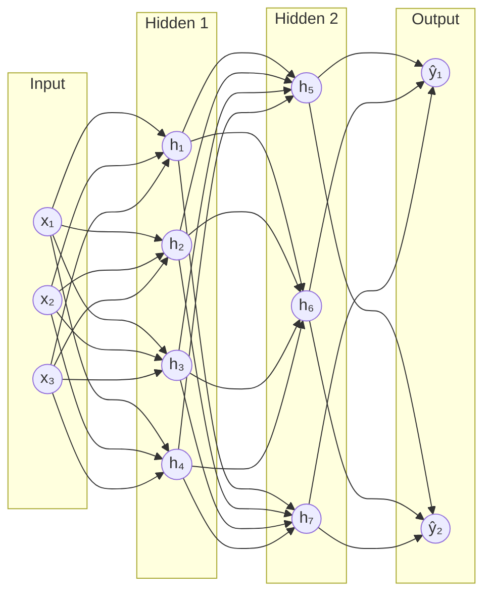
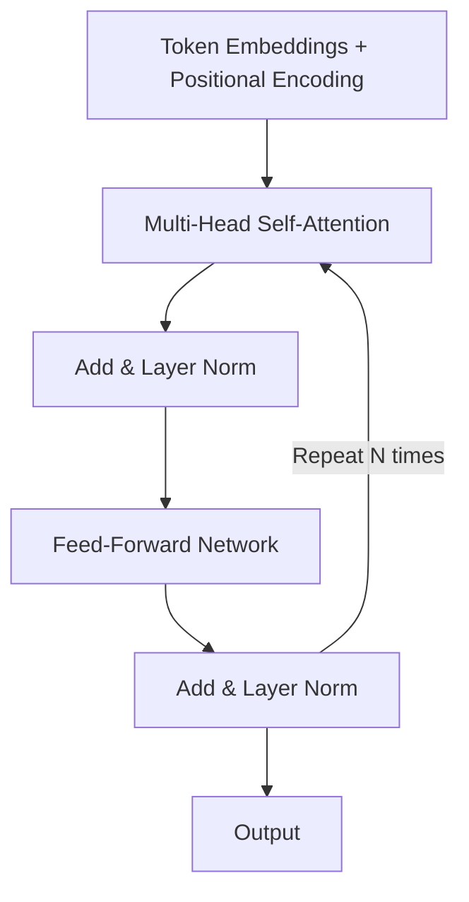
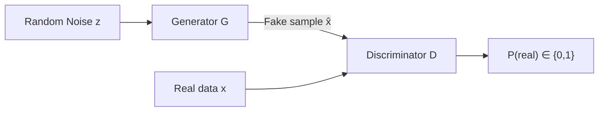

# Chapter 14 — Neural Networks & Deep Learning

---

## What You'll Learn

After this chapter you will be able to:
- Explain how an artificial neuron computes a weighted sum, applies an activation, and produces output
- Describe input, hidden, and output layers and reason about depth vs width trade-offs
- Choose the right activation function for every layer
- Walk through forward pass, loss computation, backpropagation, and weight update
- Diagnose vanishing and exploding gradients and apply fixes
- Apply Dropout, Batch Normalization, and weight decay to regularize a network
- Explain how CNNs extract spatial features, how RNNs model sequences, and how Transformers use self-attention
- Decide when deep learning beats traditional ML and when it does not

---

## Before You Start — Prerequisites

> **You'll get the most from this chapter if you've met a few ideas first:** matrix/vector
> multiplication and derivatives (**Chapter 6 — Math for ML**), and the core training
> vocabulary — *epoch, batch, loss, gradient descent, forward/backward pass* — introduced
> in plain language in **Chapter 8 — Core Concepts**. Don't worry if they're fuzzy: the most
> important terms are re-defined below and explained again in context as they appear.

### Key Terms (Quick Reference)

Skim this table once, then refer back as needed — every term reappears with a concrete
example later in the chapter.

| Term | Plain meaning |
|------|---------------|
| **Weight** ($w$) | A dial the network learns. It sets how strongly one input pushes on a neuron. Large weight = "this input matters a lot." |
| **Bias** ($b$) | A second dial added *after* the weighted sum. It shifts the result up or down so a neuron can fire even when every input is 0 — like the offset on a thermostat. |
| **Activation** | The non-linear "decision" function applied to a neuron's result. It lets a network bend to fit curves instead of only straight lines. |
| **Logit** | A raw output score *before* it becomes a probability. "Logit = 2.0" is just a number the model emits; softmax/sigmoid turns it into a probability. |
| **Gradient** | The slope of the loss — which way, and how steeply, the error changes if you nudge a weight. Training walks *downhill* along it. |
| **Epoch** | One full pass through the entire training dataset. |
| **Batch** (mini-batch) | A small handful of examples (e.g. 32) seen before the weights are updated once. |

---

## 14.1 What Is a Neural Network?

### Simple Explanation

Think of a single **neuron** as a tiny voting machine that makes one decision. It takes a few
inputs, decides how much it *trusts* each one (the **weights**), adds up the evidence, and if
the total is convincing enough it "fires." A **neural network** is just a huge pile of these
voting machines wired together in layers, where one layer's votes become the next layer's
inputs. No single neuron is smart — but stacked up, they can recognise a face, translate a
sentence, or steer a car.

> An **artificial neural network (ANN)** is a computational graph of parameterized functions organized into layers, where each connection carries a learnable weight. The network maps inputs to outputs by composing simple non-linear transformations, and learns by adjusting weights to minimize a loss function via gradient-based optimization.

A biological neuron collects electrical signals through dendrites, processes them in the cell body, and fires an output down the axon when the combined signal exceeds a threshold. An artificial neuron does the same thing with arithmetic: multiply each input by a weight, sum everything up, add a bias, and pass the result through a non-linear activation function.

```
BIOLOGICAL NEURON                 ARTIFICIAL NEURON (PERCEPTRON)
─────────────────                 ──────────────────────────────
   dendrites (inputs)                x₁, x₂, x₃  (features)
        │                                │   │   │
   cell body (sum + threshold)      w₁·x₁ + w₂·x₂ + w₃·x₃ + b
        │                                     │
   axon (output)                       activation f(z)
        │                                     │
   next neuron                            output ŷ
```

$$z = \sum_{i=1}^{n} w_i x_i + b, \qquad \hat{y} = f(z)$$

**Example — how one neuron works.** Suppose a neuron decides *"should I carry an umbrella?"*
from two inputs: $x_1$ = cloudiness and $x_2$ = humidity (each scaled 0–1). The network has
learned weights $w_1 = 3$, $w_2 = 2$ and bias $b = -2.5$ (the bias sets how much evidence is
needed before it leans "yes"). On a grey, humid morning $x_1 = 0.8$, $x_2 = 0.9$:

$$z = 3(0.8) + 2(0.9) - 2.5 = 2.4 + 1.8 - 2.5 = 1.7$$

Pass $z$ through a sigmoid activation: $f(1.7) \approx 0.85$ → **"85% chance, yes, take the
umbrella."** Now make the morning clear and dry ($x_1 = 0.1$, $x_2 = 0.2$): $z = 0.3 + 0.4 -
2.5 = -1.8$, so $f(-1.8) \approx 0.14$ → "probably not." Same neuron, same dials — the answer
flips only because the *evidence* changed. That is the whole job of a neuron; everything else
in this chapter is scale and wiring.

The single-neuron model is the **perceptron** (Rosenblatt, 1958). It can learn linearly separable patterns — AND, OR — but fails on XOR. Stack neurons into layers with non-linear activations and that limitation disappears: a network with one hidden layer of sufficient width can approximate any continuous function (Universal Approximation Theorem).

Real-world example: a single neuron could learn "if pixel brightness > threshold, classify as white." Stacking thousands of neurons lets you classify entire chest X-rays as pneumonia vs. healthy.

---

## 14.2 Architecture: Layers and Neurons

### Simple Explanation

A network is organised like an **assembly line**. Raw materials (your input features) enter at
one end. Each **layer** is a station that transforms what it receives and passes it on — early
stations spot simple things, later stations combine them into something meaningful. The
**input layer** is the loading dock (one slot per feature), the **hidden layers** are the
workers doing the real shaping, and the **output layer** is the shipping desk that hands you
the final answer. "Deeper" = more stations in a row; "wider" = more workers per station.

> A **feedforward neural network** consists of an input layer, one or more hidden layers, and an output layer. Data flows forward from input to output with no cycles. The number of hidden layers is the network's **depth**; the number of neurons per layer is its **width**.

```
INPUT LAYER         HIDDEN LAYERS           OUTPUT LAYER
───────────         ─────────────           ────────────
 x₁ ────┐           ┌───┐   ┌───┐          ┌───┐
         ├──────────►│ h │──►│ h │─────────►│ o │ → P(cat)  = 0.90
 x₂ ────┤           │   │   │   │          │   │ → P(dog)  = 0.07
         ├──────────►│ h │──►│ h │─────────►│ o │ → P(bird) = 0.03
 x₃ ────┤           │   │   │   │          └───┘
         ├──────────►│ h │──►│ h │
 x₄ ────┘           └───┘   └───┘

 Raw features       Non-linear             Task-specific
                    transformations         prediction
```

**Depth vs width** — Two levers for model capacity:

| Lever | Effect | Trade-off |
|-------|--------|-----------|
| More layers (deeper) | Learns hierarchical features; each layer builds on the last | Harder to train (vanishing gradients), slower per step |
| More neurons (wider) | More capacity per layer, captures more patterns in parallel | More parameters, higher memory, risk of overfitting |

A 784 → 512 → 256 → 10 network (e.g., MNIST digit classifier) has $784 \times 512 + 512 \times 256 + 256 \times 10 = 535{,}040$ weights. Each arrow in the diagram is one learnable weight.

**Example — how it works (reading a handwritten digit).** Trace one image through that
$784 \to 512 \to 256 \to 10$ network:

- **Input layer (784):** a $28\times28$ pixel image flattened into 784 brightness numbers.
- **Hidden layer 1 (512):** each neuron scans all 784 pixels and learns to react to one small
  pattern — a stroke, an edge, a short curve.
- **Hidden layer 2 (256):** combines those strokes into bigger parts — "a closed loop on top,"
  "a vertical line on the right."
- **Output layer (10):** one neuron per digit 0–9; the strongest one wins. For a handwritten
  "7," the "7" neuron lights up because it saw "a horizontal top stroke + a diagonal going
  down."

You never tell the network what a stroke or loop is — it *discovers* these intermediate ideas
on its own while learning, because that is what minimises its mistakes.



---

## 14.3 Activation Functions

### Simple Explanation

If every neuron only added up its inputs, the whole network — no matter how deep — could only
ever draw **straight lines**. But the real boundary between "spam" and "not spam," or "cat" and
"dog," bends and curves. An **activation function** is the little non-linear "kink" each neuron
adds, and those kinks stack up into the curved decision boundaries real problems need.
Different activations are just differently shaped kinks: ReLU is a sharp elbow, sigmoid is a
smooth S, softmax turns a row of scores into percentages.

> An **activation function** is a non-linear function applied element-wise to a neuron's pre-activation value $z$. Without it, any stack of linear layers collapses to a single linear transformation, regardless of depth.

Without activations, layer 2's output is $W_2(W_1 x + b_1) + b_2 = W'x + b'$ — still linear. A 100-layer network would have the same representational power as a single layer. Activations break this linearity, letting deep networks approximate arbitrarily complex functions.

### ReLU — The Default

$$\text{ReLU}(z) = \max(0, z)$$

Output range: $[0, \infty)$. Simple, fast, no saturation for positive inputs. Default choice for hidden layers in MLPs and CNNs. Downside: neurons receiving only negative inputs permanently output zero ("dying ReLU").

### Sigmoid

$$\sigma(z) = \frac{1}{1 + e^{-z}}$$

Output range: $(0, 1)$. Useful for binary classification output layers and LSTM gates (where you need a 0-to-1 probability or gate value). Saturates at extremes — gradients approach zero for large $|z|$.

### Tanh

$$\tanh(z) = \frac{e^z - e^{-z}}{e^z + e^{-z}}$$

Output range: $(-1, 1)$. Zero-centered, which can help optimization. Used for RNN/LSTM hidden states and value computations.

### Softmax

$$\text{softmax}(z_i) = \frac{e^{z_i}}{\sum_{j} e^{z_j}}$$

Converts a vector of raw logits into a probability distribution that sums to 1. Used as the output activation for multi-class classification.

### Leaky ReLU

$$f(z) = \begin{cases} z & z > 0 \\ \alpha z & z \le 0 \end{cases}, \quad \alpha = 0.01$$

Fixes dying ReLU by allowing a small gradient for negative inputs. The neuron is never completely dead.

### GELU (Gaussian Error Linear Unit)

$$\text{GELU}(z) = z \cdot \Phi(z)$$

where $\Phi$ is the standard Gaussian CDF. Smooth approximation of ReLU — no hard zero cutoff. Used in BERT, GPT, and most modern Transformers. Smoother gradients lead to more stable training in very deep networks.

**Example — how it works (one value through each activation).** Take a neuron whose weighted
sum comes out to $z = -2$ in one case and $z = 3$ in another, and watch what each activation
does to those two numbers:

| Activation | $z=-2$ | $z=3$ | What it did |
|---|---|---|---|
| ReLU $\max(0,z)$ | $0$ | $3$ | Killed the negative; passed the positive through unchanged |
| Sigmoid | $0.12$ | $0.95$ | Squashed both into a 0–1 "probability" |
| Tanh | $-0.96$ | $0.995$ | Squashed into −1…1, keeping the sign |
| Leaky ReLU ($\alpha{=}0.1$) | $-0.2$ | $3$ | Like ReLU, but lets a trickle of the negative through |

ReLU's output for $z=-2$ is a hard $0$ — and if a neuron's input stays negative it will output
$0$ *forever* and stop learning (the "dying ReLU" problem). That is exactly why Leaky ReLU
keeps a small slope on the left: the neuron can always recover.

```chart
{
  "type": "line",
  "data": {
    "labels": [-6,-5,-4,-3,-2,-1,0,1,2,3,4,5,6],
    "datasets": [
      {
        "label": "Sigmoid",
        "data": [0.002,0.007,0.018,0.047,0.119,0.269,0.500,0.731,0.881,0.953,0.982,0.993,0.998],
        "borderColor": "rgba(99, 102, 241, 1)",
        "tension": 0.4, "pointRadius": 0, "borderWidth": 2, "fill": false
      },
      {
        "label": "Tanh",
        "data": [-1.00,-1.00,-0.999,-0.995,-0.964,-0.762,0.000,0.762,0.964,0.995,0.999,1.00,1.00],
        "borderColor": "rgba(234, 88, 12, 1)",
        "tension": 0.4, "pointRadius": 0, "borderWidth": 2, "fill": false
      },
      {
        "label": "ReLU",
        "data": [0,0,0,0,0,0,0,1,2,3,4,5,6],
        "borderColor": "rgba(34, 197, 94, 1)",
        "tension": 0, "pointRadius": 0, "borderWidth": 2, "fill": false
      },
      {
        "label": "Leaky ReLU (α=0.1)",
        "data": [-0.6,-0.5,-0.4,-0.3,-0.2,-0.1,0,1,2,3,4,5,6],
        "borderColor": "rgba(168, 85, 247, 1)",
        "tension": 0, "pointRadius": 0, "borderWidth": 2, "borderDash": [5,3], "fill": false
      }
    ]
  },
  "options": {
    "plugins": { "title": { "display": true, "text": "Activation Functions Compared" } },
    "scales": {
      "y": { "title": { "display": true, "text": "Output" }, "min": -1.5, "max": 6 },
      "x": { "title": { "display": true, "text": "Input z" } }
    }
  }
}
```

### When to Use Which

```
┌──────────────────────┬──────────────────────────────────────────────┐
│ Location             │ Recommended Activation                       │
├──────────────────────┼──────────────────────────────────────────────┤
│ Hidden (MLP/CNN)     │ ReLU (default); Leaky ReLU if dying neurons │
│ Hidden (Transformer) │ GELU                                         │
│ Output: binary       │ Sigmoid → P(y=1)                             │
│ Output: multi-class  │ Softmax → probability distribution           │
│ Output: multi-label  │ Sigmoid per output (independent probs)       │
│ Output: regression   │ None / Linear                                │
│ RNN/LSTM gates       │ Sigmoid (0 = closed, 1 = open)               │
│ RNN/LSTM values      │ Tanh (centered around 0)                     │
└──────────────────────┴──────────────────────────────────────────────┘
```

```chart
{
  "type": "bar",
  "data": {
    "labels": ["Cat", "Dog", "Bird"],
    "datasets": [
      {
        "label": "Raw Logits (before softmax)",
        "data": [2.0, 1.0, 0.1],
        "backgroundColor": "rgba(200, 200, 200, 0.7)",
        "borderColor": "rgba(160, 160, 160, 1)", "borderWidth": 1
      },
      {
        "label": "Probabilities (after softmax)",
        "data": [0.65, 0.24, 0.11],
        "backgroundColor": ["rgba(34,197,94,0.8)", "rgba(99,102,241,0.6)", "rgba(99,102,241,0.4)"],
        "borderColor": ["rgba(34,197,94,1)", "rgba(99,102,241,1)", "rgba(99,102,241,1)"], "borderWidth": 1
      }
    ]
  },
  "options": {
    "plugins": { "title": { "display": true, "text": "Softmax Converts Logits to Probabilities (Sum = 1)" } },
    "scales": {
      "y": { "title": { "display": true, "text": "Value" }, "beginAtZero": true },
      "x": {}
    }
  }
}
```

---

## 14.4 Forward Pass & Loss Functions

### Simple Explanation

The **forward pass** is the network "doing its thing" left to right: numbers go in, get
multiplied, added, and bent at each layer, and a prediction pops out the far end. The **loss**
is then a single report-card number that says *how wrong* that prediction was — low loss = good
guess, high loss = bad guess. Everything the network learns is in service of making that one
number smaller.

> The **forward pass** computes the network's prediction by propagating inputs through each layer sequentially. A **loss function** (objective function) quantifies the discrepancy between the prediction $\hat{y}$ and the true label $y$.

The forward pass is straightforward: for each layer $l$, compute $z^{(l)} = W^{(l)} a^{(l-1)} + b^{(l)}$, then $a^{(l)} = f(z^{(l)})$, where $f$ is the activation. The final layer's output is the prediction.

**From one neuron to a whole layer.** In §14.1 a neuron was scalars: $z = w_1x_1 + w_2x_2 + b$.
A *layer* just does that for many neurons at once, so we stack the weights into a matrix $W$ and
compute them in one shot: $z^{(l)} = W^{(l)}a^{(l-1)} + b^{(l)}$. Here $a^{(l-1)}$ is the previous
layer's outputs (and $a^{(0)}$ is the raw input). The matrix form is not new math — it's the
same multiply-and-add, written compactly.

**Example — a tiny forward pass.** A 2-input → 2-neuron hidden layer → 1 output, ReLU in the
hidden layer and sigmoid at the output. Input $x = [1, 2]$.

Hidden weights $W^{(1)} = \begin{bmatrix} 0.5 & -0.5 \\ 1.0 & 1.0 \end{bmatrix}$, bias $b^{(1)} = [0, -1]$:

$$z^{(1)} = \begin{bmatrix} 0.5(1) - 0.5(2) \\ 1.0(1) + 1.0(2) \end{bmatrix} + \begin{bmatrix} 0 \\ -1 \end{bmatrix} = \begin{bmatrix} -0.5 \\ 2.0 \end{bmatrix} \xrightarrow{\text{ReLU}} a^{(1)} = \begin{bmatrix} 0 \\ 2.0 \end{bmatrix}$$

Output weights $W^{(2)} = [1, 1]$, bias $b^{(2)} = -1$:

$$z^{(2)} = 1(0) + 1(2.0) - 1 = 1.0 \xrightarrow{\sigma} \hat{y} = \sigma(1.0) = 0.73$$

The network predicts **0.73**. Notice the first hidden neuron contributed nothing — ReLU zeroed
its negative value — a concrete look at why "dead" neurons matter.

### Common Loss Functions

**Binary Cross-Entropy** (binary classification):

$$L = -\frac{1}{N}\sum_{i=1}^{N}\left[y_i \log(\hat{y}_i) + (1 - y_i)\log(1 - \hat{y}_i)\right]$$

**Categorical Cross-Entropy** (multi-class):

$$L = -\frac{1}{N}\sum_{i=1}^{N}\sum_{c=1}^{C} y_{i,c} \log(\hat{y}_{i,c})$$

**Mean Squared Error** (regression):

$$L = \frac{1}{N}\sum_{i=1}^{N}(y_i - \hat{y}_i)^2$$

**Why the log? (cross-entropy intuition).** Cross-entropy rewards *confident correct* answers
and punishes *confident wrong* ones harshly. Because $-\log(p)$ shoots toward infinity as
$p \to 0$, telling the truth ("0.99 for the right class") costs almost nothing, while being
confidently wrong ("0.01 for the right class") is enormously expensive. That asymmetry is what
pushes the network toward honest, well-calibrated probabilities.

**Example — how it works (binary cross-entropy).** A spam classifier predicts $\hat{y} = 0.9$
("90% spam") for an email that really is spam ($y = 1$):

$$L = -[\,1\cdot\log(0.9) + 0\cdot\log(0.1)\,] = -\log(0.9) = 0.105 \quad (\text{small — good guess})$$

If it had instead confidently said $\hat{y} = 0.1$ for that same spam email:

$$L = -\log(0.1) = 2.303 \quad (\text{22}\times\text{ larger — punished for being confidently wrong})$$

Real-world example: a speech recognition system's forward pass transforms a spectrogram through convolutional and recurrent layers to produce a probability distribution over characters. The cross-entropy loss measures how far those probabilities are from the true transcript.

---

## 14.5 Backpropagation & Gradient Descent

### Simple Explanation

Imagine standing on a foggy hillside, blindfolded, trying to reach the valley. You can't see
the bottom, but you *can* feel which way the ground slopes under your feet — so you step
**downhill**, feel again, step again. That slope is the **gradient**, and the whole procedure
is **gradient descent**. **Backpropagation** is just the clever bookkeeping that works out the
slope for *every weight at once*, by starting at the output error and passing the blame
backwards through the network with the chain rule.

```
LOSS LANDSCAPE — training walks downhill to the minimum

 loss
  ▲
  │ ●  ← start (high loss, bad weights)
  │  \
  │   \      slope here = gradient
  │    \._
  │       `-._
  │           `-.__      ★ ← minimum (low loss, good weights)
  │                `--------●--------
  └────────────────────────────────────►  weight value

 step rule:  weight ← weight − (learning rate) × gradient
 "−gradient" always points downhill; tiny steps, repeated millions of times.
```

> **Backpropagation** is the algorithm that computes the gradient of the loss with respect to every weight in the network by recursively applying the chain rule of calculus, propagating error signals from the output layer back to the input layer.

### The Training Loop

```
┌─────────────────────────────────────────────────────────┐
│ 1. FORWARD PASS   → compute prediction ŷ               │
│ 2. COMPUTE LOSS   → L(ŷ, y)                            │
│ 3. BACKWARD PASS  → ∂L/∂w for every weight (chain rule)│
│ 4. UPDATE WEIGHTS → w ← w − α · ∂L/∂w                 │
│                                                         │
│ Repeat for thousands of mini-batches × epochs.          │
└─────────────────────────────────────────────────────────┘
```

The chain rule lets you decompose the gradient through layers:

$$\frac{\partial L}{\partial w_1} = \frac{\partial L}{\partial \hat{y}} \cdot \frac{\partial \hat{y}}{\partial z^{(2)}} \cdot \frac{\partial z^{(2)}}{\partial a^{(1)}} \cdot \frac{\partial a^{(1)}}{\partial z^{(1)}} \cdot \frac{\partial z^{(1)}}{\partial w_1}$$

### Worked Example (Single Neuron)

Neuron: $z = wx + b$ with $w=2, b=1$, activation $\sigma$, input $x=1$.

$$z = 2(1) + 1 = 3 \quad \Rightarrow \quad \hat{y} = \sigma(3) = 0.95$$

True label $y = 0$. Binary cross-entropy loss:

$$L = -[0 \cdot \log(0.95) + 1 \cdot \log(0.05)] = 3.0$$

Backward pass:

$$\frac{\partial L}{\partial \hat{y}} = \frac{1-y}{1-\hat{y}} = \frac{1}{0.05} = 20, \quad \frac{\partial \hat{y}}{\partial z} = 0.95 \times 0.05 = 0.047, \quad \frac{\partial z}{\partial w} = x = 1$$

$$\frac{\partial L}{\partial w} = 20 \times 0.047 \times 1 = 0.95$$

Update with learning rate $\alpha = 0.1$:

$$w_{\text{new}} = 2.0 - 0.1 \times 0.95 = 1.905$$

### Optimizers

An **optimizer** is the strategy for *how* to step downhill — how big a step to take and whether
to build momentum. Plain SGD takes the same cautious step everywhere; smarter optimizers adapt
the step size to the terrain so training is faster and steadier.

**SGD (Stochastic Gradient Descent):** Update using gradient from a random mini-batch. Simple but can be slow and oscillate in narrow valleys.

$$w \leftarrow w - \alpha \nabla L$$

**SGD + Momentum:** Accumulates a velocity term that smooths oscillations and accelerates along consistent gradient directions.

$$v \leftarrow \beta v + \nabla L, \qquad w \leftarrow w - \alpha v$$

**Adam (Adaptive Moment Estimation):** Maintains per-parameter adaptive learning rates using first and second moment estimates of the gradient. The de facto default optimizer for most deep learning. Use learning rate $\approx 3 \times 10^{-4}$.

**AdamW:** Adam with decoupled weight decay. Preferred for Transformer training because it regularizes more cleanly than Adam's L2 penalty.

```chart
{
  "type": "line",
  "data": {
    "labels": [0,5,10,15,20,25,30,35,40,45,50],
    "datasets": [
      {
        "label": "SGD",
        "data": [2.5,2.1,1.8,1.5,1.3,1.1,0.95,0.82,0.72,0.64,0.58],
        "borderColor": "rgba(239, 68, 68, 1)",
        "fill": false, "tension": 0.3, "pointRadius": 0, "borderWidth": 2
      },
      {
        "label": "SGD + Momentum",
        "data": [2.5,1.8,1.3,0.9,0.65,0.48,0.36,0.28,0.22,0.18,0.15],
        "borderColor": "rgba(234, 88, 12, 1)",
        "fill": false, "tension": 0.3, "pointRadius": 0, "borderWidth": 2
      },
      {
        "label": "Adam",
        "data": [2.5,1.5,0.85,0.52,0.35,0.24,0.18,0.14,0.11,0.09,0.08],
        "borderColor": "rgba(34, 197, 94, 1)",
        "fill": false, "tension": 0.3, "pointRadius": 0, "borderWidth": 2
      }
    ]
  },
  "options": {
    "plugins": { "title": { "display": true, "text": "Optimizer Convergence — SGD vs Momentum vs Adam" } },
    "scales": {
      "y": { "title": { "display": true, "text": "Training Loss" }, "beginAtZero": true },
      "x": { "title": { "display": true, "text": "Epoch" } }
    }
  }
}
```

---

## 14.6 Vanishing & Exploding Gradients

### Simple Explanation

Backprop sends the error signal backwards layer by layer, and at each step it gets *multiplied*
by a number. Picture the children's game **telephone**: a message whispered down a long line
either fades to nothing (everyone mumbles a little quieter — **vanishing**) or, if everyone
over-shouts, turns into a deafening garble (**exploding**). When the per-layer multiplier is
below 1, the gradient shrinks toward zero and the early layers stop learning; when it's above
1, the gradient blows up and training crashes.

> The **vanishing gradient problem** occurs when gradients shrink exponentially as they propagate back through many layers, causing early layers to learn extremely slowly or not at all. The **exploding gradient problem** is the inverse: gradients grow exponentially, causing unstable weight updates.

During backpropagation through $L$ layers, the gradient for the first layer involves a product of $L$ terms:

$$\frac{\partial L}{\partial w_1} \propto \prod_{l=1}^{L} \frac{\partial a^{(l)}}{\partial z^{(l)}} \cdot W^{(l)}$$

**Vanishing:** Sigmoid's maximum gradient is 0.25. Through 10 layers: $0.25^{10} \approx 10^{-6}$. Early layers receive near-zero gradients and stop learning. This is why deep sigmoid networks were historically impossible to train.

**Exploding:** If weight magnitudes push each gradient factor above 1, the product grows exponentially — a factor of just $1.5$ across 20 layers is $1.5^{20} \approx 3{,}300\times$. Weight updates become enormous, loss jumps to NaN, and training crashes. Common in RNNs processing long sequences.

```chart
{
  "type": "line",
  "data": {
    "labels": [1,2,3,4,5,6,7,8,9,10],
    "datasets": [
      {
        "label": "Vanishing (Sigmoid: 0.25^n)",
        "data": [0.25,0.0625,0.0156,0.0039,0.00098,0.00024,0.00006,0.000015,0.0000038,0.00000095],
        "borderColor": "rgba(239, 68, 68, 1)",
        "backgroundColor": "rgba(239, 68, 68, 0.1)",
        "fill": true, "tension": 0.3, "pointRadius": 3, "borderWidth": 2
      },
      {
        "label": "Stable (ReLU: gradient = 1 for z > 0)",
        "data": [1,1,1,1,1,1,1,1,1,1],
        "borderColor": "rgba(34, 197, 94, 1)",
        "borderDash": [5,3],
        "fill": false, "tension": 0, "pointRadius": 0, "borderWidth": 2
      }
    ]
  },
  "options": {
    "plugins": { "title": { "display": true, "text": "Gradient Magnitude vs Network Depth" } },
    "scales": {
      "y": { "title": { "display": true, "text": "Gradient Magnitude" }, "beginAtZero": true, "max": 1.1 },
      "x": { "title": { "display": true, "text": "Layers Deep" } }
    }
  }
}
```

### Solutions

| Problem | Solution | Why it works |
|---------|----------|--------------|
| Vanishing (activation saturation) | Use ReLU | Gradient = 1 for $z > 0$, no decay |
| Vanishing (deep networks) | Batch Normalization | Keeps activations in a healthy range |
| Vanishing over time (RNNs) | LSTM / GRU gating | Cell state acts as gradient highway |
| Vanishing (50+ layers) | Residual / skip connections | Gradient flows directly to early layers |
| Exploding gradients | Gradient clipping | Scale gradient down if $\|\nabla\| >$ threshold |
| Both | Proper weight initialization | He init (ReLU), Xavier init (sigmoid/tanh) |

---

## 14.7 Regularization: Dropout, Batch Norm, Weight Decay

### Simple Explanation

**Regularization** is anything that stops a network from *memorising* the training data instead
of *learning* from it (the dreaded overfitting). Picture a student who memorises last year's
exam answers word-for-word: perfect on the practice paper, lost on the real test. Regularization
forces the network to grasp the general idea by handicapping it just enough that brute-force
memorisation no longer works. The three workhorses below each do this a different way.

### Dropout

**Simple version:** during each training step you randomly "bench" some neurons — like a coach
who keeps benching star players so the *whole team* learns to play. The network can't lean on
any single neuron, so it builds backup pathways and generalises better.

> **Dropout** is a regularization technique that randomly sets each neuron's output to zero with probability $p$ during training, forcing the network to learn redundant, distributed representations rather than relying on any single neuron.

```
TRAINING (dropout p=0.5):
Full layer:    ● ● ● ● ● ● ● ●
After drop:    ● ✗ ● ✗ ● ● ✗ ●     (✗ = zeroed out)

INFERENCE:
All neurons active; outputs scaled by (1 − p) to compensate.
(PyTorch uses inverted dropout: scales during training instead,
 so inference code requires no change.)
```

Typical rates: 0.3-0.5 for fully connected layers, 0.1-0.2 for convolutional layers, 0.1 for Transformers. Never apply to the output layer.

**Example — how it works.** A hidden layer outputs $[0.9, 0.4, 0.7, 0.2, 0.6, 0.8]$. With
dropout $p=0.5$, this training step randomly zeros about half → $[0.9, 0, 0.7, 0, 0, 0.8]$; the
*next* batch zeros a different half. The network therefore trains a slightly different
"sub-network" every step — effectively averaging thousands of thinned networks, which is why it
resists overfitting. At inference all neurons stay on (outputs scaled to compensate), so
predictions are stable.

### Batch Normalization

**Simple version:** as data flows through a deep network, the numbers inside each layer can
drift to wildly different scales, which makes training jittery. Batch Norm re-centres each
layer's numbers to a tidy, consistent range every step — like a thermostat holding the room at
a steady temperature so everything downstream behaves.

> **Batch Normalization** normalizes each layer's pre-activations to zero mean and unit variance over the current mini-batch, then applies learnable scale ($\gamma$) and shift ($\beta$) parameters.

$$\hat{x}_i = \frac{x_i - \mu_B}{\sqrt{\sigma_B^2 + \epsilon}}, \qquad y_i = \gamma \hat{x}_i + \beta$$

**Example — how it works.** Suppose one neuron's pre-activations across a mini-batch are
$x = [2, 4, 6, 8]$. The mean is $\mu_B = 5$ and variance $\sigma_B^2 = 5$ (std $\approx 2.24$).
Normalising gives $\hat{x} = [-1.34, -0.45, 0.45, 1.34]$ — now centred at 0 with unit spread,
regardless of the original scale. The learnable $\gamma, \beta$ then let the network rescale if
a different range turns out to be useful, so no representational power is lost.

Benefits: enables higher learning rates, reduces sensitivity to initialization, adds mild regularization via batch statistics noise. Standard in CNNs. For Transformers, **Layer Normalization** (normalizing across features instead of across the batch) is preferred. Modern LLMs (LLaMA, Gemini) further simplify to **RMSNorm**, which skips the mean-subtraction step and normalises only by root-mean-square — slightly cheaper and empirically equivalent in quality.

### Weight Decay (L2 Regularization)

**Simple version:** large weights let a network make sharp, extreme, over-confident decisions —
the hallmark of memorising noise. Weight decay adds a small "tax" on big weights, gently nudging
them toward zero unless the data really justifies keeping them large. The result is a smoother,
simpler model that generalises better.

> **Weight decay** adds a penalty proportional to the squared magnitude of weights to the loss function, discouraging large weight values and reducing overfitting.

$$L_{\text{total}} = L_{\text{data}} + \lambda \sum_i w_i^2$$

Equivalent to shrinking every weight toward zero by a factor of $\lambda$ each update. Typical $\lambda$: $10^{-4}$ to $10^{-2}$.

**Example — how it works.** Two models fit the same scattered points. Model A learns weights
like $[12, -9, 15]$ and bends wildly to pass through every training point (overfit). Model B,
trained with weight decay, settles on $[0.8, -0.5, 1.1]$ and draws a smooth curve. The penalty
$\lambda \sum w_i^2$ made the jagged large-weight solution *expensive*, so the optimizer
preferred the smooth one — and Model B wins on new data.

---

## 14.8 CNNs — Convolutional Neural Networks

> **Heads-up — the next five sections are guided tours.** CNNs, RNNs/LSTMs, Transformers,
> transfer learning, and GANs are each huge topics (with dedicated chapters elsewhere). Here we
> build just enough intuition to recognise each architecture and know when to reach for it. For
> depth, see **Chapter 16 — Deep Learning Reference** and **Chapter 17 — Large Language Models**.

### Simple Explanation

To recognise a cat it shouldn't matter whether the cat sits in the top-left or the bottom-right
of the photo — "cat-ness" is the same pattern wherever it appears. A **CNN** captures this by
sliding a small pattern-detector (a **filter**) across the whole image like a flashlight
sweeping a dark wall, lighting up wherever it finds its pattern (an edge, a corner, an eye).
Stack these detectors and the early ones find edges, the middle ones combine edges into shapes,
and the deep ones recognise whole objects.

> A **Convolutional Neural Network (CNN)** is a neural network that uses convolution operations — sliding learned filters over spatial input — to automatically extract hierarchical features. The architecture exploits spatial locality and translation invariance, making it the standard for image and spatial data tasks.

### How Convolution Works

A small filter (kernel), typically $3 \times 3$ or $5 \times 5$, slides across the input image. At each position, the element-wise product is summed to produce one output value. Each filter detects one type of pattern (vertical edge, horizontal edge, corner, etc.). A CNN learns many filters per layer.

```
IMAGE PATCH (5×5)         FILTER (3×3)          OUTPUT VALUE
┌─────────────────┐       ┌───────────┐
│  1  0  1  0  1  │       │  1  0 -1  │         Σ(element-wise
│  0  1  0  1  0  │   *   │  1  0 -1  │   =     products)
│  1  0  1  0  1  │       │  1  0 -1  │         → single number
│  0  1  0  1  0  │       └───────────┘
│  1  0  1  0  1  │
└─────────────────┘
Slide filter across entire image → produces a feature map.
```

**Example — how it works (one convolution step).** Slide a $3\times3$ vertical-edge filter over
a bright-left / dark-right patch. Multiply each overlapping cell, then add everything up:

```
patch            filter           row-by-row products
 1  1  0          1  0 -1          (1·1)+(1·0)+(0·-1) = 1
 1  1  0    ⊛     1  0 -1    →     (1·1)+(1·0)+(0·-1) = 1
 1  1  0          1  0 -1          (1·1)+(1·0)+(0·-1) = 1
                                   ───────────────────────
                                   sum = 3   → strong vertical edge
```

A high positive number means "this patch really does look like a vertical edge." A flat patch
(all cells equal) would sum to ~0 — no edge here. Slide that same filter across the whole image
and you get a **feature map** that lights up along every vertical edge. Crucially, the network
*learns* what each filter's nine numbers should be — you never hand-design them.

**Stride** = how many pixels the filter moves per step. Stride 2 halves the spatial dimensions.

**Padding** = zeros added around the border. "Same" padding preserves the input size; "valid" padding (no padding) shrinks it.

### Pooling

Max pooling takes the maximum value in each spatial window, reducing dimensions while preserving the strongest activations. A $2 \times 2$ max pool with stride 2 halves width and height. Adds translation invariance: a cat shifted a few pixels still produces the same pooled features.

### Feature Hierarchy

This is the key insight behind CNNs — each successive layer detects increasingly complex features:

```
Layer 1: edges, gradients       (low-level)
Layer 3: textures, corners      (mid-level)
Layer 5: eyes, wheels, windows  (high-level)
Layer 7: faces, cars, buildings (semantic)

This hierarchy emerges automatically from training.
You do not hand-design these features — they are learned.
```

### Key Architectures

| Architecture | Year | Depth | Key Innovation |
|---|---|---|---|
| LeNet-5 | 1998 | 5 | Proved CNNs work for digit recognition |
| AlexNet | 2012 | 8 | ReLU + GPU training; won ImageNet |
| VGG-16 | 2014 | 16 | Small $3\times3$ filters stacked deep |
| ResNet | 2015 | 50-152 | Skip connections; solved degradation |
| EfficientNet | 2019 | variable | Compound scaling of depth/width/resolution |

### Skip Connections (ResNet)

The critical idea: instead of learning $y = F(x)$, learn the residual $F(x) = y - x$:

$$y = F(x) + x$$

If the optimal transformation is close to identity, the network only needs to learn a small residual rather than the entire mapping. Gradient flows directly through the skip connection, enabling training of 152+ layer networks.

```chart
{
  "type": "line",
  "data": {
    "labels": [8, 14, 20, 34, 50, 56, 110, 152],
    "datasets": [
      {
        "label": "Plain Network (no skip connections)",
        "data": [91.5, 93.0, 93.2, 92.0, 90.5, 89.8, 87.0, 84.0],
        "borderColor": "rgba(239, 68, 68, 1)",
        "fill": false, "tension": 0.3, "pointRadius": 3, "borderWidth": 2
      },
      {
        "label": "ResNet (with skip connections)",
        "data": [91.5, 93.2, 94.2, 95.0, 95.8, 96.0, 96.3, 96.5],
        "borderColor": "rgba(34, 197, 94, 1)",
        "fill": false, "tension": 0.3, "pointRadius": 3, "borderWidth": 2
      }
    ]
  },
  "options": {
    "plugins": { "title": { "display": true, "text": "Deeper Networks Degrade Without Skip Connections" } },
    "scales": {
      "y": { "title": { "display": true, "text": "Accuracy (%)" }, "min": 82, "max": 98 },
      "x": { "title": { "display": true, "text": "Network Depth (layers)" } }
    }
  }
}
```

Real-world applications: medical imaging (detecting tumors in CT scans), self-driving cars (object detection with YOLO/Faster R-CNN built on CNN backbones), facial recognition (Face ID on smartphones).

---

## 14.9 RNNs, LSTMs & GRUs

### Simple Explanation

When you read a sentence you don't forget the start by the time you reach the end — you carry a
running summary in your head and update it word by word. An **RNN** works the same way: it keeps
a **hidden state** (its "memory so far") and updates it at every step from the new word plus what
it already remembered. The catch: a plain RNN's memory leaks over long distances, which is why
**LSTMs** and **GRUs** add little "gates" that decide what to keep and what to forget.

> A **Recurrent Neural Network (RNN)** processes sequential data by maintaining a hidden state $h_t$ that is updated at each time step, incorporating information from both the current input and the previous hidden state. This gives the network a form of memory over the sequence.

$$h_t = f(W_x x_t + W_h h_{t-1} + b)$$

Standard RNNs suffer severely from vanishing gradients over long sequences. If the sentence is "Mary, who grew up in Paris and studied at the Sorbonne, loves ___", the gradient must flow back 15+ steps. Each step multiplies by $W_h$ — if its eigenvalues are less than 1, the gradient decays to near zero.

**Example — how it works (sentiment, word by word).** Feed the review "not very good" into an
RNN one word at a time; the hidden state $h_t$ is a running summary:

| step | input word | what the memory $h_t$ encodes |
|---|---|---|
| 1 | "not" | "a negation is in play" |
| 2 | "very" | "negation + an intensifier coming" |
| 3 | "good" | "positive word, but flipped by the earlier 'not' → **negative**" |

The final $h_3$ feeds the output layer, which predicts *negative* sentiment. The verdict depends
on "not" from step 1 still being remembered at step 3 — that *carrying of context* is the whole
point of recurrence, and exactly what breaks over very long sentences without an LSTM.

### LSTM (Long Short-Term Memory)

**Simple version:** an LSTM is an RNN with a **notebook** (the cell state) running alongside its
memory. Three gates act like an editor: the **forget gate** crosses out notes that no longer
matter, the **input gate** writes down important new facts, and the **output gate** decides what
to read out right now. Because a fact can sit untouched in the notebook for many steps, the
network remembers across long gaps.

> **LSTM** is an RNN variant with a gated cell state that acts as a long-term memory highway. Three gates (forget, input, output) control what information is erased, written, or read from the cell state, allowing gradients to flow across many time steps.

```
Cell State Cₜ ═══════════════════════════════════════►
                 ↑ forget old    ↑ add new      ↑ read
                 ×  fₜ          +  iₜ·C̃ₜ       × oₜ
```

**Forget gate:** $f_t = \sigma(W_f [h_{t-1}, x_t] + b_f)$ — what to erase from memory

**Input gate:** $i_t = \sigma(W_i [h_{t-1}, x_t] + b_i)$ — what new info to write

**Candidate:** $\tilde{C}_t = \tanh(W_c [h_{t-1}, x_t] + b_c)$

**Cell update:** $C_t = f_t \odot C_{t-1} + i_t \odot \tilde{C}_t$

**Output gate:** $o_t = \sigma(W_o [h_{t-1}, x_t] + b_o)$, then $h_t = o_t \odot \tanh(C_t)$

The cell state acts as a highway — gradients can flow through multiplication by $f_t$ (which is close to 1 for information the network wants to remember), bypassing the vanishing gradient bottleneck.

### GRU (Gated Recurrent Unit)

**Simple version:** a GRU is a streamlined LSTM — same idea of gating memory, but with two gates
instead of three and no separate notebook. Fewer moving parts, faster to train, and usually
about as good.

> **GRU** simplifies the LSTM to two gates (update and reset) by merging the forget and input gates and eliminating the separate cell state. Fewer parameters, faster training, similar performance on many tasks.

**Update gate:** $z_t = \sigma(W_z [h_{t-1}, x_t])$

**Reset gate:** $r_t = \sigma(W_r [h_{t-1}, x_t])$

**Output:** $h_t = (1 - z_t) \odot h_{t-1} + z_t \odot \tanh(W[r_t \odot h_{t-1}, x_t])$

```
┌────────────┬─────────────────────┬─────────────────────┐
│            │ GRU                 │ LSTM                │
├────────────┼─────────────────────┼─────────────────────┤
│ Gates      │ 2 (update, reset)   │ 3 (forget, in, out) │
│ Parameters │ Fewer (~25% less)   │ More                │
│ Speed      │ Faster              │ Slower              │
│ Cell state │ No (hidden only)    │ Yes (separate)      │
│ Use when   │ Shorter sequences,  │ Long sequences,     │
│            │ less data           │ complex dependencies│
└────────────┴─────────────────────┴─────────────────────┘
```

Practical guidance: for most modern NLP, use a Transformer instead. RNNs/LSTMs remain useful for streaming time-series tasks (e.g., real-time speech recognition) where you process one step at a time and latency matters.

---

## 14.10 The Transformer

### Simple Explanation

To understand the word "it" in "the animal didn't cross the street because **it** was tired,"
you instinctively glance back at "animal." **Self-attention** lets every word do exactly that:
each word looks at all the other words and pulls in whichever ones are most relevant to its
meaning — *all in parallel*. Unlike an RNN, which reads strictly left-to-right and can forget,
a Transformer lets any word talk directly to any other word in a single step, which is why it
captures long-range meaning so well and trains so fast.

> The **Transformer** (Vaswani et al., 2017) processes sequences using **self-attention** — a mechanism that lets each token compute a weighted combination of all other tokens' representations in parallel, without recurrence. It has replaced RNNs as the dominant architecture for NLP, and increasingly for vision and audio.

For a thorough treatment, see [Chapter 17 — Large Language Models](17_llm.md). Here we cover the core mechanics.

### Self-Attention: Q, K, V

Each token is projected into three vectors using learned weight matrices:
- **Query (Q):** "What am I looking for?"
- **Key (K):** "What do I contain?"
- **Value (V):** "What content do I provide if selected?"

$$\text{Attention}(Q, K, V) = \text{softmax}\!\left(\frac{QK^\top}{\sqrt{d_k}}\right) V$$

The $QK^\top$ dot product measures similarity between every pair of tokens. Division by $\sqrt{d_k}$ prevents the softmax from saturating. The result is a weighted sum of value vectors — each token's representation becomes a blend of information from the most relevant other tokens.

**Example — how it works (Q, K, V as a search).** Picture each word issuing a tiny search query:

- The word "it" forms a **Query** — "I'm a pronoun; which noun do I refer to?"
- Every other word advertises a **Key** — "animal" advertises "I'm an animal-noun."
- The dot product $QK^\top$ scores how well "it"'s query matches each key: "animal" scores high;
  "street," "because," "tired" score low.
- **Softmax** turns those scores into weights that sum to 1 — say $0.85$ on "animal," a sliver
  each elsewhere.
- The output is that weighted blend of every word's **Value**, so "it" walks away carrying ~85%
  of "animal"'s meaning. Reference resolved — *in one step, for every word simultaneously.*

**Multi-head attention** runs $H$ parallel attention operations with different weight matrices, then concatenates and projects the results:

$$\text{MultiHead}(Q, K, V) = \text{Concat}(\text{head}_1, \ldots, \text{head}_H)\, W^O$$

The output projection $W^O$ mixes information across all heads back into a single $d_{\text{model}}$-dimensional vector. Each head captures a different type of relationship (syntactic, semantic, positional). Typical: 8–16 heads in medium models, up to 96+ in large models.

### Positional Encoding

Self-attention is permutation-invariant — it treats "cat sat" and "sat cat" identically. Positional encodings inject order information:

$$PE(\text{pos}, 2i) = \sin\!\left(\frac{\text{pos}}{10000^{2i/d}}\right), \qquad PE(\text{pos}, 2i+1) = \cos\!\left(\frac{\text{pos}}{10000^{2i/d}}\right)$$



### Encoder vs Decoder

| | Encoder-only (BERT) | Decoder-only (GPT) |
|---|---|---|
| Attention | Bidirectional (sees all tokens) | Causal (sees only past tokens) |
| Training | Masked language modeling | Next-token prediction |
| Best for | Classification, NER, QA | Text generation, chatbots |
| Examples | BERT, RoBERTa, DeBERTa | GPT-4, Claude, LLaMA, Gemini |

```chart
{
  "type": "bar",
  "data": {
    "labels": ["The", "animal", "didn't", "cross", "the", "street", "because", "it", "was", "tired"],
    "datasets": [{
      "label": "Attention weight from token 'it'",
      "data": [0.02, 0.85, 0.01, 0.01, 0.02, 0.05, 0.02, 0.00, 0.01, 0.01],
      "backgroundColor": ["rgba(99,102,241,0.3)","rgba(239,68,68,0.85)","rgba(99,102,241,0.3)","rgba(99,102,241,0.3)","rgba(99,102,241,0.3)","rgba(99,102,241,0.4)","rgba(99,102,241,0.3)","rgba(99,102,241,0.2)","rgba(99,102,241,0.3)","rgba(99,102,241,0.3)"],
      "borderColor": ["rgba(99,102,241,1)","rgba(239,68,68,1)","rgba(99,102,241,1)","rgba(99,102,241,1)","rgba(99,102,241,1)","rgba(99,102,241,1)","rgba(99,102,241,1)","rgba(99,102,241,1)","rgba(99,102,241,1)","rgba(99,102,241,1)"],
      "borderWidth": 1
    }]
  },
  "options": {
    "plugins": { "title": { "display": true, "text": "Self-Attention: Where Does 'it' Look? → 'animal'" } },
    "scales": {
      "y": { "title": { "display": true, "text": "Attention Weight" }, "beginAtZero": true, "max": 1.0 },
      "x": { "title": { "display": true, "text": "Token" } }
    }
  }
}
```

---

## 14.11 Transfer Learning & Fine-Tuning

### Simple Explanation

If you already know how to drive a car, learning to drive a van takes an afternoon — you reuse
almost everything (steering, road rules, judging distances) and only adjust a few details.
**Transfer learning** does this for networks: take a model that already learned rich, general
features from a giant dataset, keep that hard-won knowledge, and re-train only the last bit on
your own small task. You inherit months of someone else's training for the price of a few
minutes.

> **Transfer learning** is the practice of reusing a model trained on a large source task as the starting point for a different target task. The model's learned representations — edges, textures, grammar, world knowledge — transfer to the new domain, dramatically reducing the data and compute needed.

The process has two stages:

**Stage 1 — Pre-training** (done by large labs): Train a large model on a massive dataset. ResNet on ImageNet (1.2M images). BERT on Wikipedia + BookCorpus. GPT on internet-scale text. This takes weeks of GPU/TPU time.

**Stage 2 — Fine-tuning** (done by you): Take the pre-trained model, replace or adapt the final layer(s), and train on your smaller dataset.

```
┌────────────────────────────────────────────────────────────┐
│  Your data size / similarity       Strategy                │
├────────────────────────────────────────────────────────────┤
│  Small + similar to pre-training → Feature extraction only │
│  Small + different domain        → Fine-tune top few layers│
│  Large + similar                 → Fine-tune all layers    │
│  Large + different               → Fine-tune all + more LR│
└────────────────────────────────────────────────────────────┘
```

Real-world example: a hospital has 500 labeled chest X-ray images — far too few to train a CNN from scratch. They take a ResNet pre-trained on ImageNet, freeze the early layers (which detect universal edges and textures), replace the final classification head, and fine-tune on their X-rays. Accuracy jumps from ~60% (random init) to ~90% (transfer learning).

In NLP, fine-tuning a pre-trained BERT model on 1,000 labeled movie reviews for sentiment classification takes minutes on a single GPU and achieves accuracy comparable to training from scratch on 100x more data.

---

## 14.12 GANs — Generative Adversarial Networks

### Simple Explanation

Imagine a **counterfeiter** trying to print fake banknotes and a **detective** trying to spot
them. Every time the detective catches a fake, the counterfeiter learns and makes better ones;
every time a fake slips through, the detective sharpens its eye. Run this arms race long enough
and the fakes get so good the detective can only guess 50/50. A **GAN** is exactly this: the
**generator** is the counterfeiter (turning random noise into fake images), the
**discriminator** is the detective, and they improve by competing.

> A **Generative Adversarial Network (GAN)** consists of two networks trained adversarially: a **generator** $G$ that maps random noise to synthetic data, and a **discriminator** $D$ that classifies inputs as real or fake. Training is a minimax game where $G$ tries to fool $D$ and $D$ tries to catch $G$.



$$\min_G \max_D \; \mathbb{E}_{x}[\log D(x)] + \mathbb{E}_{z}[\log(1 - D(G(z)))]$$

At convergence, $G$ produces samples so realistic that $D$ outputs 0.5 (cannot distinguish real from fake).

**Example — how it works (one training round, generating faces).**

1. The **generator** takes random noise (say 100 random numbers) and paints a face. Early on
   it's a blurry mess.
2. The **discriminator** is shown a mix of real faces and the generator's fakes and must label
   each "real" or "fake."
3. **Both learn from the verdict:** if a fake was caught, the generator adjusts to look more
   realistic next time; if a fake slipped through, the discriminator adjusts to catch that tell.
4. Repeat millions of rounds. The two networks ratchet each other upward until the fakes are
   photorealistic — this is how StyleGAN produces faces of people who don't exist.

**Applications:**
- Image synthesis: generating photorealistic faces (StyleGAN)
- Medical imaging: augmenting rare pathology training data
- Super-resolution: upscaling low-resolution images (SRGAN)
- Style transfer: converting photos to painting styles

**Challenges:**
- **Mode collapse:** $G$ learns to produce only one type of output that fools $D$
- **Training instability:** If $D$ becomes too strong too quickly, $G$ gets no useful gradient signal
- **Evaluation difficulty:** No single loss metric reliably measures generation quality; FID and IS are common proxies

---

## 14.13 Practical Tips: Learning Rate Schedules, Early Stopping, Data Augmentation

### Simple Explanation

These are the "good habits" that separate a model that works in a demo from one that works in
production. None of them change the architecture — they're about training it sensibly: take the
right-sized steps (learning-rate schedules), stop before you overcook it (early stopping),
squeeze more out of the data you have (augmentation), and begin from sensible weights
(initialization).

### Learning Rate Schedules

**Simple version:** think of parking a car — you roll quickly across the lot (big steps), then
inch carefully into the spot (tiny steps). A schedule lowers the learning rate the same way: big
steps early to make fast progress, small steps late to settle precisely into the minimum.

A constant learning rate is rarely optimal. Large steps early help escape bad initializations; small steps late enable precise convergence.

**Step decay:** Divide LR by 10 every $N$ epochs. Simple and effective.

**Cosine annealing:** Smooth decay following a cosine curve.

$$\text{LR}_t = \text{LR}_{\min} + \frac{1}{2}(\text{LR}_{\max} - \text{LR}_{\min})\left(1 + \cos\frac{\pi t}{T}\right)$$

**Warmup + cosine decay:** Start with very small LR, ramp up linearly over the first few thousand steps, then cosine decay. Standard for Transformer training — large initial LR with random weights causes exploding updates, so warmup lets weights stabilize first.

```chart
{
  "type": "line",
  "data": {
    "labels": [0,5,10,15,20,25,30,35,40,45,50],
    "datasets": [
      {
        "label": "Step Decay",
        "data": [0.1,0.1,0.1,0.01,0.01,0.01,0.01,0.001,0.001,0.001,0.001],
        "borderColor": "rgba(99, 102, 241, 1)",
        "fill": false, "tension": 0, "pointRadius": 0, "borderWidth": 2
      },
      {
        "label": "Cosine Annealing",
        "data": [0.1,0.095,0.08,0.06,0.04,0.025,0.015,0.008,0.004,0.002,0.001],
        "borderColor": "rgba(234, 88, 12, 1)",
        "fill": false, "tension": 0.4, "pointRadius": 0, "borderWidth": 2
      },
      {
        "label": "Warmup + Cosine",
        "data": [0.001,0.05,0.1,0.09,0.07,0.05,0.035,0.02,0.01,0.004,0.001],
        "borderColor": "rgba(34, 197, 94, 1)",
        "fill": false, "tension": 0.3, "pointRadius": 0, "borderWidth": 2
      }
    ]
  },
  "options": {
    "plugins": { "title": { "display": true, "text": "Learning Rate Schedules Over Training" } },
    "scales": {
      "y": { "title": { "display": true, "text": "Learning Rate" }, "beginAtZero": true },
      "x": { "title": { "display": true, "text": "Epoch" } }
    }
  }
}
```

### Early Stopping

**Simple version:** like taking cookies out of the oven the moment they turn golden — leave them
in longer ("more epochs") and they burn (overfit). You watch the validation loss and stop at its
lowest point.

Monitor validation loss during training. When it stops improving for a set number of epochs (the "patience"), stop training and restore the best checkpoint. Prevents overfitting without requiring you to guess the optimal number of epochs.

```
Epoch  Train Loss  Val Loss   Action
  1       2.50       2.45     ─
  5       1.20       1.15     ─ (improving)
 10       0.60       0.58     ─ (best so far ✓)
 15       0.30       0.62     ─ (val rising, patience counting)
 18       0.15       0.70     ─ STOP, restore epoch 10 weights
```

### Data Augmentation

**Simple version:** one labelled photo of a cat can become dozens of training examples — flip it,
rotate it, crop it, brighten it, and it's still a cat. You teach the model that a cat is a cat
regardless of angle or lighting, essentially for free.

Artificially expand your training set by applying label-preserving transformations. For images: random horizontal flips, rotations, crops, color jitter, cutout. For text: synonym replacement, back-translation, random deletion. For audio: time stretching, pitch shifting, noise injection.

Data augmentation is free data — it reduces overfitting and improves generalization, especially when your dataset is small. In medical imaging, where labeled data is scarce and expensive, augmentation can be the difference between a usable model and a failed experiment.

### Weight Initialization

**Simple version:** where you start affects where you finish. Start all weights at zero and every
neuron stays identical forever — they all learn the same thing, which is useless. Start them too
big or too small and signals explode or vanish. Good initialization picks a "just right" random
scale so signals flow cleanly from the very first step.

You cannot start with all weights equal to zero — every neuron would compute the same gradient and update identically (symmetry problem). Proper initialization:

| Activation | Initialization | Formula |
|---|---|---|
| Sigmoid, Tanh | Xavier/Glorot | $w \sim \mathcal{N}(0,\ 2/(n_{in}+n_{out}))$ |
| ReLU, Leaky ReLU, GELU | He/Kaiming | $w \sim \mathcal{N}(0,\ 2/n_{in})$ |

Modern frameworks handle this automatically — but knowing *why* matters for debugging.

---

## 14.14 Deep Learning vs Traditional ML — When to Use What

### Simple Explanation

Deep learning is a power tool — incredible for big, messy, unstructured data (images, audio,
language), but overkill, and often *worse*, for a tidy spreadsheet. The honest answer to "should
I use deep learning?" is usually "it depends on your data." This section is your decision guide:
match the tool to the data instead of reaching for the biggest hammer by default.

> Deep learning excels when data is abundant, the input is unstructured (images, text, audio), and compute is available. Traditional ML (tree ensembles, linear models) often wins on structured/tabular data, small datasets, and when interpretability matters.

```
┌───────────────────────────┬─────────────────────────────────────┐
│ Data Type                 │ Best Approach                       │
├───────────────────────────┼─────────────────────────────────────┤
│ Tabular / structured      │ XGBoost / LightGBM (usually wins)  │
│ Images                    │ CNN or Vision Transformer           │
│ Text / NLP                │ Transformer (BERT / GPT family)     │
│ Audio / speech            │ Transformer (Whisper) or CNN        │
│ Time series               │ Try trees first, then LSTM/Transf.  │
│ Video                     │ 3D CNN + Transformer (ViViT)        │
│ Protein / molecules       │ Graph Neural Network or Transformer │
└───────────────────────────┴─────────────────────────────────────┘
```

**Example — how it works (picking a tool for two real tasks).**

- **Task A — predict loan default from a 30-column spreadsheet** (income, age, credit history;
  10,000 rows). → Use **XGBoost**. The data is structured and smallish; gradient-boosted trees
  train in seconds, are easy to explain to regulators, and typically *beat* a neural net here.
- **Task B — detect tumours in 200,000 chest X-rays.** → Use a **CNN** (or a pretrained ViT). The
  input is unstructured pixels with spatial patterns, the dataset is large, and only deep
  learning extracts the hierarchy of edges → textures → lesions.

Same engineer, same week — two different right answers, decided entirely by the *data*, not by
which method is trendier.

### Dataset Size Considerations

| Dataset size | Recommendation |
|---|---|
| < 1K samples | Traditional ML almost always; DL overfits fast |
| 1K-10K | Either; transfer learning can make DL viable |
| 10K-1M | Both competitive; DL starts to pull ahead |
| > 1M | Deep learning's sweet spot; scales better |

### Architecture Comparison

```
┌──────────────┬───────────────┬───────────────┬──────────────────┐
│              │ CNN           │ RNN / LSTM    │ Transformer      │
├──────────────┼───────────────┼───────────────┼──────────────────┤
│ Best for     │ Images, video │ Short seqs,   │ Text, long seqs, │
│              │ spatial data  │ time series   │ vision, audio    │
├──────────────┼───────────────┼───────────────┼──────────────────┤
│ Key idea     │ Local filters │ Hidden state  │ Self-attention   │
│              │ + pooling     │ (memory)      │ (all-to-all)     │
├──────────────┼───────────────┼───────────────┼──────────────────┤
│ Parallelism  │ Yes           │ No (seq.)     │ Yes (fully)      │
├──────────────┼───────────────┼───────────────┼──────────────────┤
│ Long-range   │ Limited by    │ LSTM helps;   │ Excellent        │
│ dependencies │ receptive     │ still hard    │ (direct path)    │
│              │ field         │ past ~500     │                  │
├──────────────┼───────────────┼───────────────┼──────────────────┤
│ Memory cost  │ O(1) per seq  │ O(T)          │ O(T²)            │
├──────────────┼───────────────┼───────────────┼──────────────────┤
│ Famous       │ ResNet, VGG,  │ Seq2Seq,      │ BERT, GPT,       │
│ examples     │ EfficientNet  │ DeepSpeech    │ ViT, Whisper     │
└──────────────┴───────────────┴───────────────┴──────────────────┘
```

```chart
{
  "type": "bar",
  "data": {
    "labels": ["CNN", "RNN/LSTM", "Transformer"],
    "datasets": [
      {
        "label": "Parallelizable (5 = fully)",
        "data": [5, 1, 5],
        "backgroundColor": "rgba(34, 197, 94, 0.7)",
        "borderColor": "rgba(34, 197, 94, 1)", "borderWidth": 1
      },
      {
        "label": "Long-Range Dependencies (5 = best)",
        "data": [2, 3, 5],
        "backgroundColor": "rgba(99, 102, 241, 0.7)",
        "borderColor": "rgba(99, 102, 241, 1)", "borderWidth": 1
      },
      {
        "label": "Data Efficiency (5 = least data needed)",
        "data": [4, 4, 2],
        "backgroundColor": "rgba(234, 88, 12, 0.7)",
        "borderColor": "rgba(234, 88, 12, 1)", "borderWidth": 1
      }
    ]
  },
  "options": {
    "plugins": { "title": { "display": true, "text": "Architecture Comparison — CNN vs RNN vs Transformer" } },
    "scales": {
      "y": { "title": { "display": true, "text": "Rating (1-5)" }, "beginAtZero": true, "max": 5 },
      "x": {}
    }
  }
}
```

Self-driving cars use all three: CNNs for camera perception (object detection), LSTMs for predicting pedestrian trajectories over time, and Transformers for end-to-end planning. The right architecture depends on the data modality and problem structure.

---

## Key Takeaways

```
╔═══════════════════════════════════════════════════════════════════════╗
║  NEURAL NETWORKS CHEAT SHEET                                        ║
║  ─────────────────────────────────────────────────────────────       ║
║  Neuron = weighted sum → activation → output                        ║
║  Layers: input → hidden (non-linear) → output (task-specific)       ║
║  Activation: ReLU (hidden), Sigmoid (binary), Softmax (multi-class) ║
║  GELU for Transformers; Leaky ReLU to fix dying neurons             ║
║  ─────────────────────────────────────────────────────────────       ║
║  Backprop = chain rule; computes ∂L/∂w for every weight             ║
║  Optimizers: Adam (default), AdamW (Transformers), SGD+mom (CNNs)   ║
║  Vanishing grads → ReLU, BatchNorm, skip connections                ║
║  Exploding grads → gradient clipping (max_norm=1)                   ║
║  ─────────────────────────────────────────────────────────────       ║
║  CNN = local filters → pooling → feature hierarchy → ResNet         ║
║  RNN/LSTM = sequential memory via hidden state + cell state         ║
║  GRU = simpler LSTM (2 gates vs 3), fewer params, often competitive ║
║  Transformer = self-attention (Q,K,V) + positional encoding         ║
║  ─────────────────────────────────────────────────────────────       ║
║  Transfer learning = pre-train big, fine-tune small                 ║
║  GANs = generator vs discriminator (adversarial game)               ║
║  Regularize with: Dropout, Batch/LayerNorm, weight decay            ║
║  Practical: LR schedules, early stopping, data augmentation         ║
║  Tabular data → trees; images → CNN; text → Transformer             ║
╚═══════════════════════════════════════════════════════════════════════╝
```

---

## Review Questions

**1.** Why do neural networks need activation functions? What happens without them?

<details>
<summary>Answer</summary>

Without activation functions, every layer is a linear transformation. Stacking any number of linear layers collapses to a single linear function ($W_2 W_1 x + b' = Wx + b$). The network cannot learn non-linear patterns — it has the same power as logistic regression. Activations add non-linearity, enabling the network to approximate arbitrarily complex functions.
</details>

**2.** You observe that 30% of your ReLU neurons have died (always output zero). What do you do?

<details>
<summary>Answer</summary>

Switch to Leaky ReLU (or Parametric ReLU). Leaky ReLU allows a small gradient ($\alpha z$ where $\alpha \approx 0.01$) for negative inputs, so neurons never fully die. You might also check if your learning rate is too high (which can push many neurons into the dead zone permanently) and consider reducing it.
</details>

**3.** Explain backpropagation in three sentences to a non-technical colleague.

<details>
<summary>Answer</summary>

The network makes a prediction and we measure how wrong it is with a number called "loss." Then we work backwards through the network to figure out which connections contributed most to the error. Finally, we adjust each connection's strength slightly in the direction that would reduce the error, and repeat thousands of times.
</details>

**4.** You need to classify handwritten digits (0-9). What architecture and what output activation?

<details>
<summary>Answer</summary>

Use a CNN — it exploits the spatial structure of images via learned filters that detect edges, curves, and digit shapes. The output layer should have 10 neurons with softmax activation, producing a probability distribution over the 10 digit classes. Cross-entropy loss for training.
</details>

**5.** Training loss keeps decreasing but validation loss increases after epoch 10. Diagnose and prescribe.

<details>
<summary>Answer</summary>

This is overfitting — the model memorizes training data rather than learning generalizable patterns. Prescriptions: (1) Early stopping at epoch 10, (2) increase dropout rate, (3) add weight decay, (4) collect more training data or apply data augmentation, (5) reduce model capacity (fewer layers or neurons). Apply these in combination.
</details>

**6.** Compare Dropout and Batch Normalization. Can you use both?

<details>
<summary>Answer</summary>

Dropout randomly zeros neurons during training, preventing co-adaptation and acting as an implicit ensemble. Batch Normalization normalizes layer inputs to zero mean and unit variance, stabilizing and accelerating training. Yes, you can use both — typically apply BatchNorm before the activation and Dropout after. In practice, BatchNorm's mild regularization sometimes reduces the need for heavy dropout.
</details>

**7.** Why do Transformers need positional encoding? What happens without it?

<details>
<summary>Answer</summary>

Self-attention computes pairwise similarity between tokens regardless of their position — it is permutation-invariant. Without positional encoding, "the cat sat on the mat" and "mat the on sat cat the" would produce identical representations. Positional encodings (sinusoidal or learned) inject order information so the model knows which token is first, second, etc.
</details>

**8.** When would you use transfer learning instead of training from scratch?

<details>
<summary>Answer</summary>

When your target dataset is small (hundreds to low thousands of examples) or when your task is similar to one a large model was pre-trained on. Transfer learning lets you inherit general features (edges, grammar, world knowledge) from the pre-trained model, requiring far less labeled data and compute to achieve strong performance. It is now the default approach in both NLP and computer vision.
</details>

**9.** A GAN's generator is producing the same image regardless of input noise. What is happening?

<details>
<summary>Answer</summary>

This is mode collapse. The generator found a single output that reliably fools the discriminator and stopped exploring other modes of the data distribution. Fixes include: Wasserstein loss (WGAN) for smoother gradients, mini-batch discrimination so the discriminator can detect lack of diversity, progressive training (start low-res, gradually increase), or training the discriminator less aggressively so the generator gets useful gradient signal.
</details>

**10.** For each data type, name the go-to architecture: (a) tabular data, (b) images, (c) text, (d) audio.

<details>
<summary>Answer</summary>

(a) Tabular: gradient boosted trees (XGBoost, LightGBM) — consistently outperform neural networks on structured data. (b) Images: CNN (ResNet, EfficientNet) or Vision Transformer (ViT) for large datasets. (c) Text: Transformer (BERT for understanding tasks, GPT for generation). (d) Audio: Transformer (Whisper) or CNN on mel-spectrograms. In all cases, start with a pre-trained model and fine-tune.
</details>

---

**Previous:** [Chapter 13 — Model Evaluation & Tuning](13_model_evaluation.md) | **Next:** [Chapter 15 — Reinforcement Learning](15_reinforcement_learning.md)