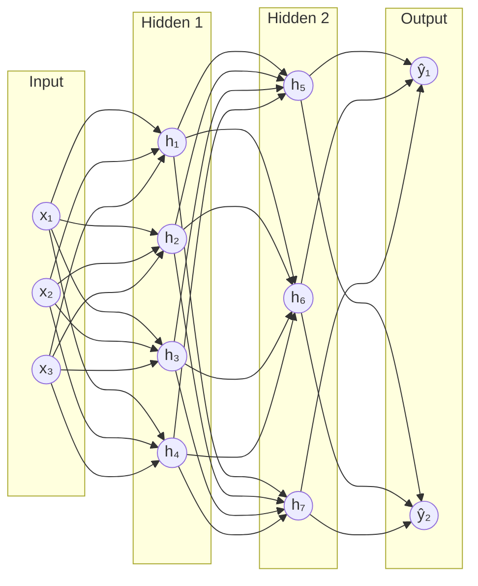
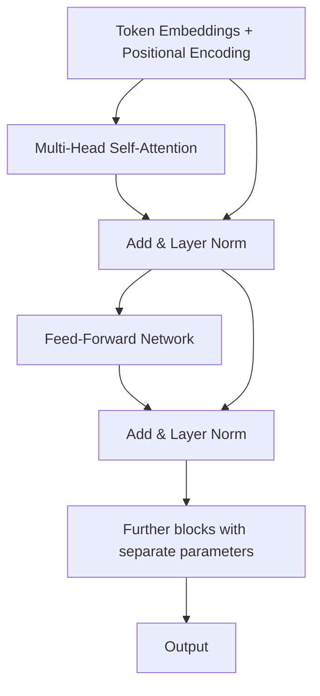
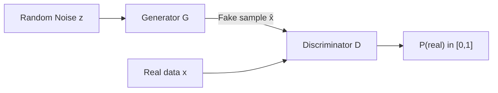

# Chapter 14 — Neural Networks & Deep Learning

---

## What You'll Learn

After this chapter you will be able to:
- Explain how an artificial neuron computes a weighted sum, applies an activation, and produces output
- Describe input, hidden, and output layers and reason about depth vs width trade-offs
- Choose activations, output shapes, and losses for common prediction tasks
- Walk through forward pass, loss computation, backpropagation, and weight update
- Train a small neural network on CPU and explain each line of its training loop
- Investigate training problems using data, loss curves, and gradients rather than guessing
- Distinguish regularization, normalization, and training-versus-inference behavior
- Explain how CNNs extract spatial features, how RNNs model sequences, and how Transformers use self-attention
- Initialize weights correctly (He vs Xavier) and pick a learning-rate schedule
- Decide when deep learning beats traditional ML and when it does not

---

## Before You Start — Prerequisites

> **You'll get the most from this chapter if you've met a few ideas first:** matrix/vector
> multiplication and derivatives ([Ch 6 — Math for ML](#content/06_math_fundamentals)), and
> the core training vocabulary — *epoch, batch, loss, gradient descent, forward/backward
> pass* — introduced in plain language in
> [Ch 8 — Core Concepts](#content/08_core_concepts). Don't worry if they're fuzzy: the most
> important terms are re-defined below and explained again in context as they appear.

**Markers:** ★★★ = know cold for interviews · ★★ = high priority · ★ = good to know.
**Quick check** boxes are retrieval practice — attempt before revealing.
**Interview** boxes give the question, what to say, and the follow-up trap.

### How Far This Chapter Goes

This is the **foundations** chapter. It takes you from a single neuron to a working mental
model of how every modern network trains. It deliberately stops at the point where each
architecture becomes a specialism:

| If you want… | Go to |
|---|---|
| The **fundamentals and a working model** — neuron, layers, forward/backward passes, training, debugging | **You are here** (§14.1–14.7b) |
| A **tour** of CNNs, RNNs, Transformers, GANs — enough to hold a conversation | **You are here** (§14.8–14.12) |
| **Depth** on those architectures — optimizer families, normalization variants, ResNet/ViT, MoE, diffusion | [Ch 16 — Deep Learning Reference](#content/16_deep_learning) |
| How Transformers became **ChatGPT** — tokenization, pre-training, RLHF | [Ch 17 — LLMs](#content/17_llm) |
| Actually **shipping** a model — pipelines, monitoring, drift | [Ch 27 — Practical ML](#content/27_practical_ml) |
| How to **evaluate** what you built | [Ch 13 — Model Evaluation](#content/13_model_evaluation) |

**A note on the maths.** Read the explanation, try the small numerical example, then use
the equation as shorthand. You do not need to memorize a page of derivatives. You *will*
learn to follow one gradient through a network and explain why a weight should increase or
decrease. We use full-precision calculations and round only the displayed answers.

### Your Learning Route

This is a chapter to learn in stages, not a single sitting to endure. Length is less
important than being able to do something new at each stopping point.

| Stage | Read | Ready to move on when you can... |
|---|---|---|
| **1. Understand a network** | §14.1–14.4 | Trace the numbers and shapes from inputs to a prediction and loss |
| **2. Explain learning** | §14.5 | Follow a hidden-layer gradient, update weights, and recompute the prediction |
| **3. Train it reliably** | §14.6–14.7b | Run the CPU lab and investigate a deliberately broken experiment |
| **4. Choose the right structure** | §14.8–14.14 | Explain what locality, memory, attention, or pretraining buys you |

The detailed schedules and recipes in §14.13 are a reference to revisit during experiments.
The essentials needed for your first training run appear **before** the architecture tour.

### Key Terms (Quick Reference)

Skim this table once, then refer back as needed — every term reappears with a concrete
example later in the chapter.

| Term | Plain meaning |
|------|---------------|
| **Weight** ($w$) | A learned multiplier controlling one input's contribution. Its magnitude alone is not feature importance: input scale and the rest of the network matter too. |
| **Bias** ($b$) | A second dial added *after* the weighted sum. It shifts the result up or down so a neuron can fire even when every input is 0 — like the offset on a thermostat. |
| **Activation** | The non-linear "decision" function applied to a neuron's result. It lets a network bend to fit curves instead of only straight lines. |
| **Logit** | A raw output score *before* it becomes a probability. "Logit = 2.0" is just a number the model emits; softmax/sigmoid turns it into a probability. |
| **Gradient** | The slope of the loss — which way, and how steeply, the error changes if you nudge a weight. Training walks *downhill* along it. |
| **Epoch** | One full pass through the entire training dataset. |
| **Batch** (mini-batch) | A small handful of examples (e.g. 32) seen before the weights are updated once. |

Weights and biases are **parameters**, learned from data. Learning rate, batch size, and
layer width are **hyperparameters**, choices you make about how to build or train the model.

---

## 14.1 What Is a Neural Network? ★★★

### Simple Explanation

Think of a single **neuron** as a tiny voting machine that makes one decision. It takes a few
inputs, decides how much it *trusts* each one (the **weights**), adds up the evidence, and if
the total is convincing enough it "fires." A **neural network** is just a huge pile of these
voting machines wired together in layers, where one layer's votes become the next layer's
inputs. No single neuron is smart — but stacked up, they can recognise a face, translate a
sentence, or steer a car.

> An **artificial neural network (ANN)** is a computational graph of parameterized functions organized into layers, where each connection carries a learnable weight. The network maps inputs to outputs by composing simple non-linear transformations, and learns by adjusting weights to minimize a loss function via gradient-based optimization.

A biological neuron collects electrical signals through dendrites, processes them in the cell body, and fires an output down the axon when the combined signal exceeds a threshold. An artificial neuron does the same thing with arithmetic: multiply each input by a weight, sum everything up, add a bias, and pass the result through a non-linear activation function.

This is a loose inspiration for the terminology, not a simulation of how a biological
neuron or brain works.

```
BIOLOGICAL NEURON                 ARTIFICIAL NEURON (PERCEPTRON)
─────────────────                 ──────────────────────────────
   dendrites (inputs)                x₁, x₂, x₃  (features)
        │                                │   │   │
   cell body (sum + threshold)      w₁·x₁ + w₂·x₂ + w₃·x₃ + b
        │                                     │
   axon (output)                       activation f(z)
        │                                     │
   next neuron                            output ŷ
```

$$z = \sum_{i=1}^{n} w_i x_i + b, \qquad \hat{y} = f(z)$$

**Example — how one neuron works.** Suppose a neuron decides *"should I carry an umbrella?"*
from two inputs: $x_1$ = cloudiness and $x_2$ = humidity (each scaled 0–1). The network has
learned weights $w_1 = 3$, $w_2 = 2$ and bias $b = -2.5$ (the bias sets how much evidence is
needed before it leans "yes"). On a grey, humid morning $x_1 = 0.8$, $x_2 = 0.9$:

$$z = 3(0.8) + 2(0.9) - 2.5 = 2.4 + 1.8 - 2.5 = 1.7$$

Pass $z$ through a sigmoid activation: $f(1.7) \approx 0.85$ → **"the model estimates an
85% probability of the 'take umbrella' label."** Now make the morning clear and dry ($x_1 = 0.1$, $x_2 = 0.2$): $z = 0.3 + 0.4 -
2.5 = -1.8$, so $f(-1.8) \approx 0.14$ → "probably not." Same neuron, same dials — the answer
flips only because the *evidence* changed. That is the whole job of a neuron; everything else
in this chapter is scale and wiring.

That probability is the model's estimate, not a guarantee of calibration or good advice.
Calibration asks whether predictions near 85% are actually correct about 85% of the time.

The classic **perceptron** (Rosenblatt, 1958) uses a hard threshold. Our example instead uses
a smooth sigmoid unit, like binary logistic regression. Both have a linear decision boundary
at a fixed output threshold: they can separate AND/OR, but not XOR.

With suitable nonlinear activations and enough hidden units, a network can approximate
continuous functions on a bounded input domain (the **Universal Approximation Theorem**).
That is a statement about **what it can represent**, not a promise that training will find
the right weights or that the result will generalize.

Real-world example: a single neuron could learn "if pixel brightness > threshold, classify as white." Stacking thousands of neurons lets you classify entire chest X-rays as pneumonia vs. healthy.

---

## 14.2 Architecture: Layers and Neurons ★★

### Simple Explanation

A network is organised like an **assembly line**. Raw materials (your input features) enter at
one end. Each **layer** is a station that transforms what it receives and passes it on — early
stations spot simple things, later stations combine them into something meaningful. The
**input layer** is the loading dock (one slot per feature), the **hidden layers** are the
workers doing the real shaping, and the **output layer** is the shipping desk that hands you
the final answer. "Deeper" = more stations in a row; "wider" = more workers per station.

> A **feedforward neural network** consists of an input layer, one or more hidden layers, and an output layer. Data flows forward from input to output with no cycles. The number of hidden layers is the network's **depth**; the number of neurons per layer is its **width**.

```
INPUT LAYER         HIDDEN LAYERS           OUTPUT LAYER
───────────         ─────────────           ────────────
 x₁ ────┐           ┌───┐   ┌───┐          ┌───┐
         ├──────────►│ h │──►│ h │─────────►│ o │ → P(cat)  = 0.90
 x₂ ────┤           │   │   │   │          │   │ → P(dog)  = 0.07
         ├──────────►│ h │──►│ h │─────────►│ o │ → P(bird) = 0.03
 x₃ ────┤           │   │   │   │          └───┘
         ├──────────►│ h │──►│ h │
 x₄ ────┘           └───┘   └───┘

 Raw features       Non-linear             Task-specific
                    transformations         prediction
```

**Depth vs width** — Two levers for model capacity:

| Lever | Effect | Trade-off |
|-------|--------|-----------|
| More layers (deeper) | Learns hierarchical features; each layer builds on the last | Harder to train (vanishing gradients), slower per step |
| More neurons (wider) | More capacity per layer, captures more patterns in parallel | More parameters, higher memory, risk of overfitting |

A 784 → 512 → 256 → 10 network (e.g., MNIST digit classifier) has $784 \times 512 + 512 \times 256 + 256 \times 10 = 535{,}040$ weights. Add $512 + 256 + 10 = 778$ biases for **535,818 learnable parameters**. A connection contributes a weight; a non-input neuron usually has a bias too.

**Example — how it works (reading a handwritten digit).** Trace one image through that
$784 \to 512 \to 256 \to 10$ network:

- **Input layer (784):** a $28\times28$ pixel image flattened into 784 brightness numbers.
- **Hidden layer 1 (512):** combines all 784 pixel values into learned features, which might
  respond to patterns such as strokes or curves.
- **Hidden layer 2 (256):** combines those features into more useful representations for
  distinguishing digits.
- **Output layer (10):** one neuron per digit 0–9; the strongest one wins. For a handwritten
  "7," the "7" neuron lights up because it saw "a horizontal top stroke + a diagonal going
  down."

You supply the digit labels, not labels for every hidden feature. The network learns useful
intermediate representations. The stroke/loop story is intuition, **not a guarantee that
each neuron has one tidy human-readable meaning**; information is often distributed across
many neurons.


```mermaid
graph LR
    subgraph Input
        I1((x₁))
        I2((x₂))
        I3((x₃))
    end
    subgraph Hidden 1
        H1((h₁))
        H2((h₂))
        H3((h₃))
        H4((h₄))
    end
    subgraph Hidden 2
        H5((h₅))
        H6((h₆))
        H7((h₇))
    end
    subgraph Output
        O1((ŷ₁))
        O2((ŷ₂))
    end
    I1 --> H1 & H2 & H3 & H4
    I2 --> H1 & H2 & H3 & H4
    I3 --> H1 & H2 & H3 & H4
    H1 --> H5 & H6 & H7
    H2 --> H5 & H6 & H7
    H3 --> H5 & H6 & H7
    H4 --> H5 & H6 & H7
    H5 --> O1 & O2
    H6 --> O1 & O2
    H7 --> O1 & O2
```

> **Interview —** *"Would you rather add depth or width to a network?"*
> **Say:** They solve different capacity problems. Depth composes transformations and can represent some hierarchical functions efficiently; width provides more features within a layer and can make optimization easier. I would compare validation quality and compute cost rather than assume that deeper always wins.
> **They follow up with:** *"So why not go extremely deep?"* — longer gradient paths and harder optimization can make extra layers unhelpful. Residual connections provide shorter paths and make learning near-identity transformations easier, but neither depth nor residual connections guarantees better results on every task.

<details>
<summary><strong>Quick check.</strong> A network takes a 28×28 grayscale image, flattens it to 784 inputs, has one hidden layer of 128 neurons, and outputs 10 classes. How many learnable parameters does it have?</summary>

Count weights **and** biases, layer by layer:

**Input → hidden:** every one of the 784 inputs connects to every one of the 128 neurons,
and each neuron has its own bias.

$$784 \times 128 + 128 = 100{,}352 + 128 = 100{,}480$$

**Hidden → output:**

$$128 \times 10 + 10 = 1{,}280 + 10 = 1{,}290$$

**Total = 101,770 parameters.**

Two things worth noticing. Over **98%** of them sit in the first layer — fully-connected layers
on raw pixels are enormously wasteful, which is precisely the problem CNNs solve with weight
sharing (§14.8). And the general formula is simply
$(\text{inputs} \times \text{outputs}) + \text{outputs}$ per layer — forgetting the biases is
the classic slip.
</details>

---

## 14.3 Activation Functions ★★★

### Simple Explanation

If every neuron only added up its inputs, the whole network — no matter how deep — could only
ever draw **straight lines**. But the real boundary between "spam" and "not spam," or "cat" and
"dog," bends and curves. An **activation function** is the little non-linear "kink" each neuron
adds, and those kinks stack up into the curved decision boundaries real problems need.
Different activations are just differently shaped kinks: ReLU is a sharp elbow, sigmoid is a
smooth S, softmax turns a row of scores into percentages.

> Hidden-layer **activation functions** introduce nonlinearity between learned affine
> transformations. ReLU, sigmoid, and tanh operate element-wise; **softmax operates on a
> whole vector**, coupling its outputs into a probability distribution.

Without activations, layer 2's output is $W_2(W_1 x + b_1) + b_2 = W'x + b'$ — still linear. A 100-layer network would have the same representational power as a single layer. Activations break this linearity, letting deep networks approximate arbitrarily complex functions.

Strictly, a linear map plus a bias is **affine**. The important restriction here is a
straight decision boundary, not whether we use the informal phrase "linear layer."

### Why Hidden Layers Help: Build XOR Yourself

XOR means "one input is on, but not both." Put its four inputs on a square:

```
  x2
   1    (0,1): YES ----- (1,1): NO
        |                    |
   0    (0,0): NO  ----- (1,0): YES
        0                    1     x1
```

No single straight line separates the two YES corners from the two NO corners.
Adding more affine layers without activations does not change that.

Two ReLU features can solve it:

$$h_1 = \text{ReLU}(x_1-x_2), \qquad h_2 = \text{ReLU}(x_2-x_1), \qquad s=h_1+h_2$$

| Input | $h_1$: first exceeds second | $h_2$: second exceeds first | Score $s$ | Decide YES if $s>0.5$ |
|---|---:|---:|---:|---|
| (0,0) | 0 | 0 | 0 | NO |
| (0,1) | 0 | 1 | 1 | YES |
| (1,0) | 1 | 0 | 1 | YES |
| (1,1) | 0 | 0 | 0 | NO |

Each hidden neuron makes one useful feature; the output combines them. We **hand-designed**
these weights to demonstrate representation. Later, the lab learns a related XOR task from
examples. Representation, successful optimization, and generalization are three separate
questions.

### ReLU — The Default

$$\text{ReLU}(z) = \max(0, z)$$

Output range: $[0, \infty)$. Simple, fast, and unsaturated for positive inputs. A common
hidden-layer choice in MLPs and CNNs. A unit that remains negative across the training data
receives zero data-gradient through its ReLU and may stop contributing ("dying ReLU").
Being negative on just one example is normal, not evidence that the unit is dead.

### Sigmoid

$$\sigma(z) = \frac{1}{1 + e^{-z}}$$

Output range: $(0, 1)$. Useful for binary classification output layers and LSTM gates (where you need a 0-to-1 probability or gate value). Saturates at extremes — gradients approach zero for large $|z|$.

### Tanh

$$\tanh(z) = \frac{e^z - e^{-z}}{e^z + e^{-z}}$$

Output range: $(-1, 1)$. Zero-centered, which can help optimization. Used for RNN/LSTM hidden states and value computations.

### Softmax

$$\text{softmax}(z_i) = \frac{e^{z_i}}{\sum_{j} e^{z_j}}$$

Converts a vector of raw logits into a probability distribution that sums to 1. Used as the output activation for multi-class classification.

### Leaky ReLU

$$f(z) = \begin{cases} z & z > 0 \\ \alpha z & z \le 0 \end{cases}, \quad \alpha = 0.01$$

Provides a nonzero activation derivative on the negative side. This addresses ReLU's
zero-slope problem, although other parts of the network can still prevent useful learning.

### GELU (Gaussian Error Linear Unit)

$$\text{GELU}(z) = z \cdot \Phi(z)$$

where $\Phi$ is the standard Gaussian CDF. This smooth gate is used in many Transformer
feed-forward blocks. Other models use alternatives such as SiLU and gated variants.
Smoothness alone does not guarantee better optimization or generalization.

**Example — how it works (one value through each activation).** Take a neuron whose weighted
sum comes out to $z = -2$ in one case and $z = 3$ in another, and watch what each activation
does to those two numbers:

| Activation | $z=-2$ | $z=3$ | What it did |
|---|---|---|---|
| ReLU $\max(0,z)$ | $0$ | $3$ | Killed the negative; passed the positive through unchanged |
| Sigmoid | $0.12$ | $0.95$ | Mapped both into (0,1); their interpretation depends on the task |
| Tanh | $-0.96$ | $0.995$ | Squashed into −1…1, keeping the sign |
| Leaky ReLU ($\alpha{=}0.1$) | $-0.2$ | $3$ | Like ReLU, but lets a trickle of the negative through |

ReLU's output for $z=-2$ is 0, with zero derivative through this activation for this
example. If the unit stays on that side across the data, learning can stall. Leaky ReLU
keeps a small negative-side slope; changes in upstream layers or optimizer state can also
change whether a unit is active.

> **Interview —** *"Why does a neural network need activation functions at all?"*
> **Say:** Without them the whole network collapses into a single linear layer, no matter how deep it is. Stacking linear maps gives you another linear map: $W_2(W_1x) = (W_2W_1)x$, and $W_2W_1$ is just one matrix. A 50-layer network with no activations has exactly the modelling power of a 1-layer one — it can only draw straight lines. The non-linearity between layers is what lets depth actually buy you anything.
> **They follow up with:** *"So why ReLU rather than sigmoid in the hidden layers?"* — sigmoid saturates, making its local derivative tiny. ReLU has derivative 1 on the positive side and is cheap to compute. That removes one source of shrinking gradients, **not all sources**: backprop also multiplies by weights, and inactive ReLUs have zero derivative.

<details>
<summary><strong>Quick check.</strong> Ignore weight factors and multiply ten sigmoid activation derivatives. How large can that activation-only factor be? Would replacing sigmoid with ReLU guarantee stable gradients?</summary>

Sigmoid's derivative is **at most 0.25**. The product of these ten activation derivatives
is therefore at most:

$$0.25^{10} \approx 0.00000095$$

This explains one source of vanishing gradients. It is **not an upper bound on the whole
network gradient**, because weight factors have been omitted. For example, a scalar weight
factor of 4 can offset an activation derivative of 0.25.

Ten positive ReLUs contribute $1^{10}=1$ through their activation derivatives, but weights
can still shrink or amplify the signal, and negative ReLUs contribute zero. Initialization
and architecture still matter.
</details>

```chart
{
  "type": "line",
  "data": {
    "labels": [-6,-5,-4,-3,-2,-1,0,1,2,3,4,5,6],
    "datasets": [
      {
        "label": "Sigmoid",
        "data": [0.002,0.007,0.018,0.047,0.119,0.269,0.500,0.731,0.881,0.953,0.982,0.993,0.998],
        "borderColor": "rgba(99, 102, 241, 1)",
        "tension": 0.4, "pointRadius": 0, "borderWidth": 2, "fill": false
      },
      {
        "label": "Tanh",
        "data": [-1.00,-1.00,-0.999,-0.995,-0.964,-0.762,0.000,0.762,0.964,0.995,0.999,1.00,1.00],
        "borderColor": "rgba(234, 88, 12, 1)",
        "tension": 0.4, "pointRadius": 0, "borderWidth": 2, "fill": false
      },
      {
        "label": "ReLU",
        "data": [0,0,0,0,0,0,0,1,2,3,4,5,6],
        "borderColor": "rgba(34, 197, 94, 1)",
        "tension": 0, "pointRadius": 0, "borderWidth": 2, "fill": false
      },
      {
        "label": "Leaky ReLU (α=0.1)",
        "data": [-0.6,-0.5,-0.4,-0.3,-0.2,-0.1,0,1,2,3,4,5,6],
        "borderColor": "rgba(168, 85, 247, 1)",
        "tension": 0, "pointRadius": 0, "borderWidth": 2, "borderDash": [5,3], "fill": false
      }
    ]
  },
  "options": {
    "plugins": { "title": { "display": true, "text": "Activation Functions Compared" } },
    "scales": {
      "y": { "title": { "display": true, "text": "Output" }, "min": -1.5, "max": 6 },
      "x": { "title": { "display": true, "text": "Input z" } }
    }
  }
}
```

### When to Use Which

| Location | Recommended activation |
|---|---|
| Hidden (MLP / CNN) | **ReLU** (default); Leaky ReLU if neurons are dying |
| Hidden (Transformer) | **GELU** |
| Output — binary | **Sigmoid** → $P(y=1)$ |
| Output — multi-class | **Softmax** → a probability distribution |
| Output — multi-label | **Sigmoid per output** (independent probabilities) |
| Output — regression | **None / linear** |
| RNN / LSTM gates | **Sigmoid** (0 = closed, 1 = open) |
| RNN / LSTM values | **Tanh** (centred around 0) |

```chart
{
  "type": "bar",
  "data": {
    "labels": ["Cat", "Dog", "Bird"],
    "datasets": [
      {
        "label": "Raw Logits (before softmax)",
        "data": [2.0, 1.0, 0.1],
        "backgroundColor": "rgba(200, 200, 200, 0.7)",
        "borderColor": "rgba(160, 160, 160, 1)", "borderWidth": 1
      },
      {
        "label": "Probabilities (after softmax)",
        "data": [0.66, 0.24, 0.10],
        "backgroundColor": ["rgba(34,197,94,0.8)", "rgba(99,102,241,0.6)", "rgba(99,102,241,0.4)"],
        "borderColor": ["rgba(34,197,94,1)", "rgba(99,102,241,1)", "rgba(99,102,241,1)"], "borderWidth": 1
      }
    ]
  },
  "options": {
    "plugins": { "title": { "display": true, "text": "Softmax Converts Logits to Probabilities (Sum = 1)" } },
    "scales": {
      "y": { "title": { "display": true, "text": "Value" }, "beginAtZero": true },
      "x": {}
    }
  }
}
```

---

## 14.4 Forward Pass & Loss Functions ★★★

### Simple Explanation

The **forward pass** is the network "doing its thing" left to right: numbers go in, get
multiplied, added, and bent at each layer, and a prediction pops out the far end. The **loss**
is then a single report-card number that says *how wrong* that prediction was — low loss = good
guess, high loss = bad guess. Everything the network learns is in service of making that one
number smaller.

> The **forward pass** computes the network's prediction by propagating inputs through each layer sequentially. A **loss function** (objective function) quantifies the discrepancy between the prediction $\hat{y}$ and the true label $y$.

The forward pass is straightforward: for each layer $l$, compute $z^{(l)} = W^{(l)} a^{(l-1)} + b^{(l)}$, then $a^{(l)} = f(z^{(l)})$, where $f$ is the activation. The final layer's output is the prediction.

**From one neuron to a whole layer.** In §14.1 a neuron was scalars: $z = w_1x_1 + w_2x_2 + b$.
A *layer* just does that for many neurons at once, so we stack the weights into a matrix $W$ and
compute them in one shot: $z^{(l)} = W^{(l)}a^{(l-1)} + b^{(l)}$. Here $a^{(l-1)}$ is the previous
layer's outputs (and $a^{(0)}$ is the raw input). The matrix form is not new math — it's the
same multiply-and-add, written compactly.

**Example — a tiny forward pass.** A 2-input → 2-neuron hidden layer → 1 output, ReLU in the
hidden layer and sigmoid at the output. Input $x = [1, 2]$.

Hidden weights $W^{(1)} = \begin{bmatrix} 0.5 & -0.5 \\ 1.0 & 1.0 \end{bmatrix}$, bias $b^{(1)} = [0, -1]$:

$$z^{(1)} = \begin{bmatrix} 0.5(1) - 0.5(2) \\ 1.0(1) + 1.0(2) \end{bmatrix} + \begin{bmatrix} 0 \\ -1 \end{bmatrix} = \begin{bmatrix} -0.5 \\ 2.0 \end{bmatrix} \xrightarrow{\text{ReLU}} a^{(1)} = \begin{bmatrix} 0 \\ 2.0 \end{bmatrix}$$

Output weights $W^{(2)} = [1, 1]$, bias $b^{(2)} = -1$:

$$z^{(2)} = 1(0) + 1(2.0) - 1 = 1.0 \xrightarrow{\sigma} \hat{y} = \sigma(1.0) = 0.73$$

The network predicts **0.73**. Notice the first hidden neuron contributed nothing — ReLU zeroed
its negative value **for this input**. That does not establish that it is dead across the
dataset. We will keep this exact network for the complete backward pass in §14.5.

### Read the Shapes Before Reading the Code

The equations above use one input as a column vector. PyTorch commonly stores a **batch as
rows**. The same calculation becomes `Z = X @ W.T + b`, because `nn.Linear` stores one row
of weights per output neuron.

| Quantity | One example, column notation | Batch of $B$ examples in code |
|---|---|---|
| Input | $x$: (2,1) | `X`: (B,2) |
| Hidden weights / bias | $W_1$: (2,2), $b_1$: (2,1) | `weight`: (2,2), `bias`: (2,) |
| Hidden pre-activations | $z_1$: (2,1) | `X @ W1.T + b1`: (B,2) |
| Hidden activations | $h$: (2,1) | `relu(Z1)`: (B,2) |
| Output weights / bias | $W_2$: (1,2), $b_2$: (1,1) | `weight`: (1,2), `bias`: (1,) |
| Output logits | $z_2$: (1,1) | `H @ W2.T + b2`: (B,1) |
| Binary targets | $y$: (1,1) | floating-point `y`: (B,1) |

Bias broadcasting adds the same learned offset to every example's corresponding output.
It does not create a different bias for every row.

<details>
<summary><strong>Quick check.</strong> A batch has shape (32,10), and a dense layer produces 8 features. What shapes should its stored weights, bias, and output have?</summary>

Weights **(8,10)**, bias **(8,)**, output **(32,8)**. There are
$10 \times 8 + 8 = 88$ parameters; changing batch size changes the amount of work, not the
number of learned parameters.
</details>

<details>
<summary><strong>Calculate it.</strong> Hidden weights are [[1,1],[-1,1]], hidden biases are zero, and the output adds the two hidden ReLU activations. What happens for [2,3] and [3,2]?</summary>

For **[2,3]**, hidden pre-activations are [5,1], so the output is **6**.
For **[3,2]**, they are [5,-1]; ReLU clips the second to zero, giving **5**.

Without ReLU the two outputs would be **6 and 4**, since the combined affine function is
$2x_2$. Swapping feature coordinates can change a linear model's answer too. This exercise
teaches the forward pass; the **XOR example**, not sensitivity to swapping inputs, explains
why nonlinear hidden features are needed.
</details>

### Common Loss Functions

**Binary Cross-Entropy** (binary classification):

$$L = -\frac{1}{N}\sum_{i=1}^{N}\left[y_i \log(\hat{y}_i) + (1 - y_i)\log(1 - \hat{y}_i)\right]$$

**Categorical Cross-Entropy** (multi-class):

$$L = -\frac{1}{N}\sum_{i=1}^{N}\sum_{c=1}^{C} y_{i,c} \log(\hat{y}_{i,c})$$

**What that double sum actually does — one-hot notation.** A class can be represented by
an integer index or by a **one-hot vector**. The formula above uses the latter: all zeros
except a single 1 in the true class's slot. Three animal classes, and the answer is "dog":

```
  class:   cat   dog   bird
  one-hot:  0     1     0
```

Now look again at the formula: $y_{i,c}$ is 0 for every class except the right one, where it
is 1. So the entire inner sum **collapses to a single term** — the loss is just
$-\log(\text{probability assigned to the correct class})$. Every other class's probability is
multiplied by zero and disappears.

**Worked through.** The network's final layer emits raw scores (**logits**), which softmax
turns into probabilities:

$$\text{logits} = [1.0,\; 2.0,\; 0.5] \xrightarrow{\ \exp\ } [2.718,\; 7.389,\; 1.649] \quad(\text{sum} = 11.756)$$

$$\text{softmax} = \left[\tfrac{2.718}{11.756},\; \tfrac{7.389}{11.756},\; \tfrac{1.649}{11.756}\right] = [0.231,\; \mathbf{0.629},\; 0.140]$$

Those sum to 1.0 — that is what softmax guarantees. With the one-hot label $[0, 1, 0]$:

$$L = -\log(0.629) = \mathbf{0.464}$$

The model gave the right answer 63% and is charged 0.464 for the remaining doubt. Had it said
95%, the loss would be $-\log(0.95) = 0.051$ — nearly free. That gap is the pressure that
pushes probability mass onto the correct class.

> **Beginner gotcha:** most libraries do **not** want you to apply softmax yourself.
> PyTorch's `CrossEntropyLoss` expects **raw logits**, using a stable log-softmax calculation
> internally; its usual class-index targets are integers, not one-hot vectors. TensorFlow's
> `from_logits=True` also requests a logit-based loss. Feeding probabilities into a loss
> that expects logits changes the objective and can impair learning.

> **Interview —** *"Why use cross-entropy instead of mean squared error for classification?"*
> **Say:** Two reasons, and the gradient one matters most. With a sigmoid output, MSE's gradient contains a $\hat y(1-\hat y)$ factor that goes to **zero when the model is confidently wrong** — exactly when you most need a large correction. Cross-entropy cancels that term, so the gradient becomes simply $\hat y - y$: the more wrong you are, the harder you get pushed.
> **They follow up with:** *"Does that make training convex?"* — no. Cross-entropy is convex
> in the logits, and ordinary linear logistic regression has a convex objective in its
> weights. A multilayer network parameterizes those logits nonlinearly, so its loss is
> generally non-convex in the network's parameters. Choosing cross-entropy does not remove
> that optimization difficulty.

**Mean Squared Error** (regression):

$$L = \frac{1}{N}\sum_{i=1}^{N}(y_i - \hat{y}_i)^2$$

**Why the log? (cross-entropy intuition).** Cross-entropy rewards *confident correct* answers
and punishes *confident wrong* ones harshly. Because $-\log(p)$ shoots toward infinity as
$p \to 0$, assigning high probability to the observed class costs little, while being
confidently wrong ("0.01 for the right class") is enormously expensive. That asymmetry is what
encourages fitting the observed label distribution. Finite data, model errors, and overfitting
can still produce poorly calibrated confidence.

**Example — how it works (binary cross-entropy).** A spam classifier predicts $\hat{y} = 0.9$
("90% spam") for an email that really is spam ($y = 1$):

$$L = -[\,1\cdot\log(0.9) + 0\cdot\log(0.1)\,] = -\log(0.9) = 0.105 \quad (\text{small — good guess})$$

If it had instead confidently said $\hat{y} = 0.1$ for that same spam email:

$$L = -\log(0.1) = 2.303 \quad (\text{22}\times\text{ larger — punished for being confidently wrong})$$

Real-world example: a speech recognition system's forward pass transforms a spectrogram through convolutional and recurrent layers to produce a probability distribution over characters. The cross-entropy loss measures how far those probabilities are from the true transcript.

**Loss is not accuracy.** For a true positive, changing a probability from 0.6 to 0.9
improves cross-entropy even though both predictions are already correct at a 0.5 threshold.
Accuracy counts decisions; loss supplies a smoother training signal.

### The Task-to-Code Contract

This table separates **what the model returns during training** from **how you interpret
it afterwards**. Here $B$ is batch size, $C$ is the number of classes or labels, and $d$ is
the number of regression targets.

| Task | Model output | Target format | Common PyTorch loss | Prediction after training |
|---|---|---|---|---|
| Binary classification | logits (B,1) | float 0/1, (B,1) | `BCEWithLogitsLoss` | sigmoid for probabilities; logit >= 0 for a 0.5 threshold |
| Exclusive multiclass | logits (B,C) | class indices, (B,), `torch.long` | `CrossEntropyLoss` | argmax for class; softmax for probabilities |
| Multilabel classification | logits (B,C) | float 0/1, (B,C) | `BCEWithLogitsLoss` | sigmoid and a threshold per label; probabilities need not sum to 1 |
| Regression | values (B,d) | floats, matching shape | `MSELoss` or an appropriate alternative | use values directly |

Example: "cat **or** dog **or** bird" is multiclass. "Contains cat **and** grass **and**
sunlight" is multilabel. Those different questions need different output semantics.
Thresholds may need tuning on validation data; 0.5 is a starting point, not a universal rule.

**Why fused losses?** Directly computing `exp(1000)` overflows. Stable log-softmax uses
log-sum-exp arithmetic, effectively shifting logits before exponentiation without changing
the probabilities. Likewise, `BCEWithLogitsLoss` avoids explicitly taking `log(sigmoid(z))`
at extreme values. Use the stable loss, rather than patching every numerical problem with
an arbitrary epsilon.

---

## 14.5 Backpropagation & Gradient Descent ★★★

### Simple Explanation

Imagine standing on a foggy hillside, blindfolded, trying to reach the valley. You can't see
the bottom, but you *can* feel which way the ground slopes under your feet — so you step
**downhill**, feel again, step again. That slope is the **gradient**, and the whole procedure
is **gradient descent**. **Backpropagation** is just the clever bookkeeping that works out the
slope for *every weight at once*, by starting at the output error and passing the blame
backwards through the network with the chain rule.

```
LOSS LANDSCAPE — training walks downhill to the minimum

 loss
  ▲
  │ ●  ← start (high loss, bad weights)
  │  \
  │   \      slope here = gradient
  │    \._
  │       `-._
  │           `-.__      ★ ← minimum (low loss, good weights)
  │                `--------●--------
  └────────────────────────────────────►  weight value

 step rule:  weight ← weight − (learning rate) × gradient
 "-gradient" is a local downhill direction.
 Tiny steps, repeated millions of times.
```

> **Backpropagation** is the algorithm that computes the gradient of the loss with respect to every weight in the network by recursively applying the chain rule of calculus, propagating error signals from the output layer back to the input layer.

### The Training Loop

```
┌─────────────────────────────────────────────────────────┐
│ 1. FORWARD PASS   → compute prediction ŷ               │
│ 2. COMPUTE LOSS   → L(ŷ, y)                            │
│ 3. BACKWARD PASS  → ∂L/∂w for every weight (chain rule)│
│ 4. UPDATE WEIGHTS → w ← w − α · ∂L/∂w                 │
│                                                         │
│ Repeat for thousands of mini-batches × epochs.          │
└─────────────────────────────────────────────────────────┘
```

The chain rule lets you decompose the gradient through layers:

$$\frac{\partial L}{\partial w_1} = \frac{\partial L}{\partial \hat{y}} \cdot \frac{\partial \hat{y}}{\partial z^{(2)}} \cdot \frac{\partial z^{(2)}}{\partial a^{(1)}} \cdot \frac{\partial a^{(1)}}{\partial z^{(1)}} \cdot \frac{\partial z^{(1)}}{\partial w_1}$$

Read that as one path from a weight to the loss. At a node used by several later
computations, **add** the gradient contributions from those paths. The backward pass
computes sensitivities using the current weights; the optimizer updates weights afterwards.
A downhill direction is local: a step that is too large can still increase the loss.

### Worked Example (Single Neuron)

Neuron: $z = wx + b$ with $w=2, b=1$, activation $\sigma$, input $x=1$.

$$z = 2(1) + 1 = 3 \quad \Rightarrow \quad \hat{y} = \sigma(3) \approx 0.952574$$

True label $y = 0$. Binary cross-entropy loss:

$$L = -\log(1-\sigma(3)) \approx 3.048587$$

Backward pass:

$$\frac{\partial L}{\partial \hat{y}} \approx 21.085537, \quad \frac{\partial \hat{y}}{\partial z} \approx 0.045177, \quad \frac{\partial z}{\partial w} = x = 1$$

$$\frac{\partial L}{\partial w} \approx 0.952574$$

Update with learning rate $\alpha = 0.1$:

$$w_{\text{new}} = 2.0 - 0.1 \times 0.952574 \approx 1.904743$$

Here the bias gradient is also $0.952574$, since $\partial z/\partial b=1$.
Updating it gives $b_{\text{new}} \approx 0.904743$.

### Did It Actually Learn? — One Full Cycle, Then Another

Computing a gradient is only half the story. Here is the part that usually gets skipped:
**what happens when you run the same example again with the updated weights.** Same neuron,
$x = 1$, true label $y = 0$, $\alpha = 0.1$, updating **both** $w$ and $b$:

| Step | $w$ | $b$ | $z = wx+b$ | $\hat{y} = \sigma(z)$ | Loss |
|---|---|---|---|---|---|
| 0 | 2.000 | 1.000 | 3.000 | 0.953 | **3.049** |
| 1 | 1.905 | 0.905 | 2.810 | 0.943 | **2.868** |
| 2 | 1.810 | 0.810 | 2.621 | 0.932 | **2.691** |
| 3 | 1.717 | 0.717 | 2.434 | 0.919 | **2.518** |

**The loss goes down.** That is the entire point of training, and it is worth sitting with
for a moment: nobody told the neuron what $w$ should be. It only ever knew *which direction
reduced the error*, took a small step that way, and repeated.

Read the columns and you can watch the mechanism work. The true label is 0, so the neuron
should output something small. It starts at 0.953 — badly wrong, confidently. Each step nudges
$w$ and $b$ down, which drags $z$ down, which drags $\hat y$ toward 0. Four steps is barely a
start; real training does this millions of times across millions of examples.

> **A shortcut worth knowing.** For sigmoid output + binary cross-entropy, the whole chain
> rule collapses to something beautiful:
>
> $$\frac{\partial L}{\partial z} = \hat{y} - y$$
>
> Check it against the numbers above: at step 0 we computed
> $\frac{\partial L}{\partial \hat y} \times \frac{\partial \hat y}{\partial z} \approx 21.085537 \times 0.045177 \approx 0.9526$ — and
> $\hat y - y = 0.953 - 0 = 0.953$. **Identical.** The messy $1/(1-\hat y)$ term and the
> $\hat y(1-\hat y)$ term cancel exactly. The same cancellation happens for softmax +
> categorical cross-entropy, which is a large part of why those pairings are the standard
> choice: *the gradient is just the prediction error.*

### The Full Journey: Our Two-Layer Network Learns

Now return to the **same network from §14.4**, rather than introducing another set of
mystery numbers:

```
x = [1, 2], true label y = 1, learning rate = 0.1

W1 = [[ 0.5, -0.5],     b1 = [0, -1]
      [ 1.0,  1.0]]
W2 = [[1, 1]],          b2 = [-1]

Hidden pre-activations: [-0.5, 2]
After ReLU:            [0, 2]
Output logit:           1
Probability:            0.731059
BCE loss:               0.313262
```

These are deliberately chosen teaching weights. They need not be the weights that a real
training run would initialize or learn.

**Step A: find the output error signal.** With sigmoid plus binary cross-entropy:

$$\delta_2 = \frac{\partial L}{\partial z_2} = \hat y-y = 0.731059-1 = -0.268941$$

The negative sign says "a small increase in this logit would reduce loss." The true label
is 1, so increasing its probability is the right direction.

**Step B: compute output-layer gradients.** A weight's gradient is the incoming activation
times the output error signal:

$$\nabla_{W_2} L = \delta_2[0,2] = [0,-0.537883], \qquad \nabla_{b_2}L = -0.268941$$

The first output weight gets zero gradient because its input was zero. The second gets a
larger-magnitude gradient because its input activation was 2.

**Step C: pass the signal back to the hidden layer.** First multiply by the **old output
weights**, then by the local ReLU derivatives:

```
Sensitivity to hidden outputs: delta2 * [1, 1] = [-0.268941, -0.268941]
ReLU derivatives at [-0.5, 2]:                  [ 0,         1       ]
Hidden pre-activation gradients:               [ 0,        -0.268941]
```

**Step D: compute the hidden weights and biases.**

$$\nabla_{W_1}L =
\begin{bmatrix}
0(1) & 0(2)\\
-0.268941(1) & -0.268941(2)
\end{bmatrix}
=
\begin{bmatrix}
0 & 0\\
-0.268941 & -0.537883
\end{bmatrix},
\qquad \nabla_{b_1}L=[0,-0.268941]$$

**Step E: update all parameters once.** Apply `new = old - 0.1 * gradient`:

| Parameter | Before | Gradient | After |
|---|---:|---:|---:|
| Hidden neuron 1 weights / bias | [0.5,-0.5] / 0 | [0,0] / 0 | unchanged |
| Hidden neuron 2, input 1 weight | 1 | -0.268941 | 1.026894 |
| Hidden neuron 2, input 2 weight | 1 | -0.537883 | 1.053788 |
| Hidden neuron 2 bias | -1 | -0.268941 | -0.973106 |
| Output weight on hidden neuron 1 | 1 | 0 | 1 |
| Output weight on hidden neuron 2 | 1 | -0.537883 | 1.053788 |
| Output bias | -1 | -0.268941 | -0.973106 |

**Step F: make the prediction again.** Using unrounded updated parameters:

```
Hidden activations: [0, 2.161365]
Output logit:        1.304515
Probability:         0.786594   (was 0.731059)
Loss:                0.240043   (was 0.313262)
```

This is the complete mechanism: the label shaped a loss, the loss supplied gradients,
the optimizer changed weights, and the prediction improved. The zero-gradient hidden
neuron was inactive on this sample; for $x=[2,1]$, its pre-activation is $0.5$, so it can
participate in learning.

<details>
<summary><strong>Predict before revealing.</strong> Why must Step C use the old output weights? Could we update the output layer immediately and then calculate hidden gradients?</summary>

All derivatives must describe the **same forward computation at the same parameter
values**. Updating midway mixes two different networks and no longer computes the gradient
of the loss we just evaluated. Finish backprop first, then update.
</details>

### From One Example to a Mini-Batch

Examples can disagree about which way a weight should move. With mean-reduced loss,
compute their gradients at the same weights and **average before updating**.

For our original, not-yet-updated network:

| Example | Target | Probability | Output-bias gradient $\hat y-y$ |
|---|---:|---:|---:|
| [1,2] | 1 | 0.731059 | -0.268941 |
| [2,1] | 0 | 0.817574 | +0.817574 |

The mean bias gradient is $(-0.268941+0.817574)/2 = 0.274317$.
An SGD update therefore **decreases** the output bias, unlike the first example alone.
The second example's confident mistake outweighs the first example's smaller error.

That does not mean the model ignored the first example. It optimized their combined loss.
One step need not improve every example, and noisy mini-batch loss need not decrease
monotonically. A batch size of 32 also does not mean 32 separate optimizer updates.

> **Interview —** *"Explain backpropagation to someone who knows calculus but has never seen a neural network."*
> **Say:** A network is a deeply nested function, and training needs to know how the final error changes if you nudge any one weight. That is a derivative, and the chain rule handles nested functions. Backprop is the chain rule applied **efficiently**: compute the error at the output, then walk backwards layer by layer, reusing the gradient you already computed for the layer above instead of recalculating it. That reuse is the whole trick — it makes the cost of all gradients roughly the same as one forward pass.
> **They follow up with:** *"Why not estimate gradients numerically?"* — finite differences
> need extra forward evaluations per parameter and introduce approximation error.
> Backprop shares intermediate derivatives, obtaining all gradients for a small constant
> multiple of the forward-pass cost. Finite differences are useful for checking a tiny
> implementation, not for training a model with millions of parameters.

### Optimizers

An **optimizer** converts gradients into parameter updates. Plain SGD uses one learning-rate
multiplier, but each parameter's update still depends on its own gradient. Momentum and
adaptive methods use additional state; neither is guaranteed to win on every problem.

**SGD (Stochastic Gradient Descent):** Update using gradient from a random mini-batch. Simple but can be slow and oscillate in narrow valleys.

$$w \leftarrow w - \alpha \nabla L$$

**SGD + Momentum:** Accumulates a velocity term that smooths oscillations and accelerates along consistent gradient directions.

$$v \leftarrow \beta v + \nabla L, \qquad w \leftarrow w - \alpha v$$

**Adam (Adaptive Moment Estimation):** Tracks first and second moment estimates of gradients
to adapt updates per parameter. It is a common practical starting point. Values such as
$10^{-3}$ or $3\times10^{-4}$ are candidates to try, not universal settings.

**AdamW:** Adam with decoupled weight decay. Preferred for Transformer training because it regularizes more cleanly than Adam's L2 penalty.

**The curves below are illustrative, not benchmark results or an optimizer ranking.**
The ordering can change with the task, learning rate, training budget, and tuning.

```chart
{
  "type": "line",
  "data": {
    "labels": [0,5,10,15,20,25,30,35,40,45,50],
    "datasets": [
      {
        "label": "SGD",
        "data": [2.5,2.1,1.8,1.5,1.3,1.1,0.95,0.82,0.72,0.64,0.58],
        "borderColor": "rgba(239, 68, 68, 1)",
        "fill": false, "tension": 0.3, "pointRadius": 0, "borderWidth": 2
      },
      {
        "label": "SGD + Momentum",
        "data": [2.5,1.8,1.3,0.9,0.65,0.48,0.36,0.28,0.22,0.18,0.15],
        "borderColor": "rgba(234, 88, 12, 1)",
        "fill": false, "tension": 0.3, "pointRadius": 0, "borderWidth": 2
      },
      {
        "label": "Adam",
        "data": [2.5,1.5,0.85,0.52,0.35,0.24,0.18,0.14,0.11,0.09,0.08],
        "borderColor": "rgba(34, 197, 94, 1)",
        "fill": false, "tension": 0.3, "pointRadius": 0, "borderWidth": 2
      }
    ]
  },
  "options": {
    "plugins": { "title": { "display": true, "text": "Illustrative Training Curves — Not an Optimizer Ranking" } },
    "scales": {
      "y": { "title": { "display": true, "text": "Training Loss" }, "beginAtZero": true },
      "x": { "title": { "display": true, "text": "Epoch" } }
    }
  }
}
```

---

## 14.6 Vanishing & Exploding Gradients ★★★

### Simple Explanation

Backprop sends the error signal backwards layer by layer, and at each step it gets *multiplied*
by a number. Picture the children's game **telephone**: a message whispered down a long line
either fades to nothing (everyone mumbles a little quieter — **vanishing**) or, if everyone
over-shouts, turns into a deafening garble (**exploding**). When the per-layer multiplier is
below 1, the gradient shrinks toward zero and the early layers stop learning; when it's above
1, the gradient blows up and training crashes.

> The **vanishing gradient problem** occurs when gradients shrink exponentially as they propagate back through many layers, causing early layers to learn extremely slowly or not at all. The **exploding gradient problem** is the inverse: gradients grow exponentially, causing unstable weight updates.

During backpropagation through $L$ layers, the gradient for the first layer involves a product of $L$ terms:

$$\frac{\partial L}{\partial w_1} \propto \prod_{l=1}^{L} \frac{\partial a^{(l)}}{\partial z^{(l)}} \cdot W^{(l)}$$

**Vanishing:** Ten sigmoid activation derivatives alone contribute at most
$0.25^{10}\approx10^{-6}$. The full gradient also includes weight factors. Saturation and
unhelpful weight scaling can make early-layer learning extremely slow; the activation-only
example illustrates a mechanism, not a universal network-gradient bound.

**Exploding:** If weight magnitudes push each gradient factor above 1, the product grows exponentially — a factor of just $1.5$ across 20 layers is $1.5^{20} \approx 3{,}300\times$. Weight updates become enormous, loss jumps to NaN, and training crashes. Common in RNNs processing long sequences.

> **Interview —** *"Your loss suddenly becomes NaN halfway through training. Walk me through it."*
> **Say:** Stop and locate the **first non-finite quantity**: inputs and targets, logits,
> loss, gradients, then parameters after the update. Possible causes include invalid data,
> unsafe log/division operations, numerical overflow, an excessive learning rate, or exploding
> gradients. A NaN is a symptom, not a diagnosis.
> **They follow up with:** *"When would you clip?"* — when evidence shows excessive gradient
> norms. Clipping can limit raw gradient magnitude; with plain SGD this also bounds the
> gradient-driven update for a fixed learning rate. Adaptive optimizers and weight decay
> complicate that relationship. Repair the cause, use stable losses, and restore a known-good
> checkpoint if parameters or optimizer state were corrupted.

The next chart shows **activation-derivative products only**, with weight factors omitted.
Its flat ReLU line assumes every illustrated ReLU is active.

```chart
{
  "type": "line",
  "data": {
    "labels": [1,2,3,4,5,6,7,8,9,10],
    "datasets": [
      {
        "label": "Activation-only sigmoid upper bound: 0.25^n",
        "data": [0.25,0.0625,0.0156,0.0039,0.00098,0.00024,0.00006,0.000015,0.0000038,0.00000095],
        "borderColor": "rgba(239, 68, 68, 1)",
        "backgroundColor": "rgba(239, 68, 68, 0.1)",
        "fill": true, "tension": 0.3, "pointRadius": 3, "borderWidth": 2
      },
      {
        "label": "Activation-only ReLU factor: all z > 0",
        "data": [1,1,1,1,1,1,1,1,1,1],
        "borderColor": "rgba(34, 197, 94, 1)",
        "borderDash": [5,3],
        "fill": false, "tension": 0, "pointRadius": 0, "borderWidth": 2
      }
    ]
  },
  "options": {
    "plugins": { "title": { "display": true, "text": "Activation Factors Only — Weights Are Omitted" } },
    "scales": {
      "y": { "title": { "display": true, "text": "Gradient Magnitude" }, "beginAtZero": true, "max": 1.1 },
      "x": { "title": { "display": true, "text": "Layers Deep" } }
    }
  }
}
```

### Solutions

| Problem | Solution | Why it works |
|---------|----------|--------------|
| Vanishing (activation saturation) | Consider ReLU-family activations | Avoids positive-side saturation; does not fix every gradient path |
| Vanishing (deep networks) | Batch Normalization | Keeps activations in a healthy range |
| Vanishing over time (RNNs) | LSTM / GRU gating | Learned memory paths can preserve useful signals longer |
| Vanishing (50+ layers) | Residual / skip connections | Gradient flows directly to early layers |
| Exploding gradients | Gradient clipping | Scale gradient down if $\|\nabla\| >$ threshold |
| Both | Proper weight initialization | Break symmetry and choose a suitable signal scale; see the primer below |

### Initialize Before You Train

If hidden units have identical incoming and outgoing weights, they can receive identical
updates and fail to specialize. Random initialization breaks that symmetry. **Zero biases
are usually fine** when the weights already differ; "never initialize anything to zero" is
the wrong lesson.

Scale matters too. Under simplifying assumptions of independent, centered inputs and
weights, $\operatorname{Var}(z)\approx n_{\text{in}}\operatorname{Var}(w)
\operatorname{Var}(x)$. A sensible weight scale prevents signal magnitudes from changing
wildly just because a layer has more inputs.

| Common setting | Starting scheme | Weight variance |
|---|---|---|
| ReLU hidden layer | He / Kaiming | approximately $2/n_{\text{in}}$ |
| Tanh or a roughly symmetric activation setting | Xavier / Glorot | approximately $2/(n_{\text{in}}+n_{\text{out}})$ |

He scaling accounts for ReLU's effect on signal second moments; it is not a promise of
exactly constant activation variance. Leaky ReLU needs a slope-dependent gain, and GELU
or gated Transformer blocks may use architecture-specific initialization. Framework defaults
are useful, but do not assume every `Linear` layer automatically uses the ideal ReLU scale.

The lab initializes ReLU hidden weights with Kaiming, its linear output weights with Xavier,
and biases with zeros. Start there; learn specialized recipes when the architecture needs them.

<details>
<summary><strong>Quick check.</strong> Can a deep ReLU network still have exploding gradients? Can zero biases still be a reasonable initialization?</summary>

**Yes to both.** Positive-side ReLU derivatives do not stop large weight factors from
amplifying gradients. Random, suitably scaled weights break hidden-unit symmetry even when
the initial biases are zero.
</details>

---

## 14.7 Regularization: Dropout, Batch Norm, Weight Decay ★★★

### Simple Explanation

**Regularization** encourages solutions that generalize rather than merely fitting training
examples. Picture a student memorizing last year's answers instead of understanding the
subject. Dropout and weight decay can help, but too much regularization can also hurt.
Batch normalization primarily changes **training conditioning** and has a secondary
regularizing effect; it is not a substitute for checking generalization.

### Dropout

**Simple version:** during each training step you randomly "bench" some neurons — like a coach
who keeps benching star players so the *whole team* learns to play. The network can't lean on
any single neuron, so it builds backup pathways and generalises better.

> **Dropout** is a regularization technique that randomly sets each neuron's output to zero with probability $p$ during training, forcing the network to learn redundant, distributed representations rather than relying on any single neuron.

```
TRAINING (dropout p=0.5):
Full layer:    ● ● ● ● ● ● ● ●
After drop:    ● ✗ ● ✗ ● ● ✗ ●     (✗ = zeroed out)

TRAINING SCALE (inverted dropout):
Surviving activations are divided by keep probability (1 - p).

INFERENCE:
Dropout is disabled; no rescaling is needed.
```

Choose the rate on validation data; some successful models need little or no dropout.
Apply it deliberately to internal representations, not indiscriminately to final predicted
probabilities. We use the **inverted-dropout convention** throughout, matching PyTorch.

**Example — how it works.** A hidden layer outputs $[0.9, 0.4, 0.7, 0.2, 0.6, 0.8]$. With
dropout $p=0.5$ and keep mask $[1,0,1,0,0,1]$, the result is
**$[1.8,0,1.4,0,0,1.6]$**: survivors are divided by 0.5. A new mask is sampled next time;
the number kept is random, not necessarily exactly half.

For a fixed activation $a$, its expected training output is
$(1-p)\,a/(1-p)=a$. At inference the layer simply returns its input.
This consistency explains the scaling; it does not mean every sampled mask gives the
same prediction or that dropout guarantees improved accuracy.

### Batch Normalization

**Simple version:** as data flows through a deep network, the numbers inside each layer can
drift to wildly different scales, which makes training jittery. Batch Norm re-centres each
layer's numbers to a tidy, consistent range every step — like a thermostat holding the room at
a steady temperature so everything downstream behaves.

> **Batch Normalization** normalizes features using batch statistics during training, then
> applies learnable scale ($\gamma$) and shift ($\beta$). In a dense layer the statistics are
> over batch rows; convolutional BatchNorm also aggregates spatial positions per channel.

$$\hat{x}_i = \frac{x_i - \mu_B}{\sqrt{\sigma_B^2 + \epsilon}}, \qquad y_i = \gamma \hat{x}_i + \beta$$

**Example — how it works.** Suppose one neuron's pre-activations across a mini-batch are
$x = [2, 4, 6, 8]$. The mean is $\mu_B = 5$ and variance $\sigma_B^2 = 5$ (std $\approx 2.24$).
Normalising gives $\hat{x} = [-1.34, -0.45, 0.45, 1.34]$ — now centred at 0 with unit spread,
regardless of the original scale. The learnable $\gamma, \beta$ then let the network rescale if
a different range turns out to be useful, so no representational power is lost.

BatchNorm often improves optimization and adds noise through batch statistics. Many CNNs
use it. Transformers commonly use **LayerNorm**, which normalizes within each token's
features, or **RMSNorm**, which rescales by root-mean-square without subtracting the mean.
Which variant works best depends on the architecture; none guarantees equivalent quality.

**Train vs. inference — the classic gotcha.** In its usual configuration, BatchNorm uses
current batch statistics during training and accumulated **running statistics** during
evaluation. Otherwise a prediction could depend on which other examples share its batch.
Use `model.eval()` before evaluation. LayerNorm and RMSNorm do not require running batch
statistics, but a model containing them can still have other train/eval-dependent modules
such as dropout.

### L2 Regularization and Decoupled Weight Decay

**Simple version:** large weights let a network make sharp, extreme, over-confident decisions —
the hallmark of memorising noise. Weight decay adds a small "tax" on big weights, gently nudging
them toward zero unless the data really justifies keeping them large. The result is a smoother,
simpler model that generalises better.

> **L2 regularization** adds a squared-weight penalty to the loss. **Decoupled weight
> decay** directly shrinks weights as part of the optimizer update. They coincide under
> appropriate coefficient conventions for plain SGD, but not generally for adaptive Adam.

$$L_{\text{total}} = L_{\text{data}} + \lambda \sum_i w_i^2$$

With the exact penalty written above, its derivative is $2\lambda w$. Plain SGD without
momentum therefore gives:

$$w_{\text{new}}=(1-2\alpha\lambda)w-\alpha\nabla_w L_{\text{data}}$$

For $w=2$, $\alpha=0.1$, $\lambda=0.01$, and zero data-gradient, the new weight is
**1.996**, not $2\times0.01$. The learning rate matters, and using
$\lambda\lVert w\rVert^2/2$ as the loss convention removes the factor of two.

**AdamW** applies a separate decay factor $(1-\alpha d)$, where $d$ is the optimizer's
`weight_decay` setting. Putting an L2 term inside Adam's gradient instead lets
its adaptive moment machinery act on that term too. Do not interchange these recipes or
their coefficient conventions without thinking.

**Illustrative intuition, not a theorem about weight size.** Two models fit scattered points. Model A learns weights
like $[12, -9, 15]$ and bends wildly to pass through every training point (overfit). Model B,
trained with weight decay, settles on $[0.8, -0.5, 1.1]$ and draws a smooth curve. The penalty
$\lambda \sum w_i^2$ made the jagged large-weight solution *expensive*, so the optimizer
preferred the smoother candidate. Whether it actually wins on new data must be measured. Input
scaling and network reparameterizations make raw weight magnitude an imperfect measure of
functional complexity.

> **Interview —** *"What does dropout do at test time?"*
> **Say:** **Nothing** — it is turned off. Dropout only operates during training, where it randomly zeroes a fraction of activations each step so no neuron can rely on any specific other neuron. At inference you want the full network and a deterministic answer, so every unit stays active.
> **They follow up with:** *"Why is no test-time rescaling needed?"* — inverted dropout
> already divides surviving training activations by the keep probability. `model.eval()`
> disables that sampling and switches usual BatchNorm to running statistics. It does **not**
> turn off gradient tracking; use `no_grad()` separately when gradients are unnecessary.

<details>
<summary><strong>Quick check.</strong> Your training loss keeps dropping but validation loss started rising 10 epochs ago. Name three things you would try, and one you would not.</summary>

A sustained divergence suggests **overfitting**, after checking that the losses are
comparable and the validation data are representative.

**Would try:**
1. **Early stopping** — restore the checkpoint with the best validation result, rather than assuming the last epoch is best.
2. **Regularization** — add or increase dropout, or raise weight decay.
3. **More data**, or data augmentation if collecting more is not an option.

**Would not do blindly: increase model size.** First investigate data, optimization, and
regularization. More capacity is not automatically harmful or helpful. If both losses are
high, possibilities include insufficient capacity **and** a broken pipeline, disconnected
gradients, or an unsuitable learning rate. Treat the curve as evidence, not a diagnosis.
</details>

---

## 14.7a Your First Working Network — A CPU Learning Lab ★★★

### Simple Explanation

Reading a recipe is not the same as cooking. This lab first reproduces our hand calculation,
then trains a slightly wider network to recognize XOR regions from examples. No GPU, image
collection, or dataset download is needed.

> **Learning goal:** connect a mathematical training step to autograd, then distinguish
> a model that lacks a useful representation from a model that has learned one.

### Before You Run

This is **local Python code**, not code executed by the study-notes web page. Use Python
with PyTorch installed; the CPU package is sufficient. Save the complete block below as
`nn_learning_lab.py` and run `python nn_learning_lab.py`.

For an isolated environment on Windows, for example:

```powershell
python -m venv .venv
.\.venv\Scripts\python.exe -m pip install torch --index-url https://download.pytorch.org/whl/cpu
.\.venv\Scripts\python.exe nn_learning_lab.py
```

The data have two features between -1 and 1. The label is 1 when exactly one feature is
positive: opposite quadrants share a label. A straight boundary cannot solve the whole
problem. A hidden nonlinear representation can.

| Design choice | Why it is here |
|---|---|
| Generated, seeded data | A small reproducible exercise, not a downloaded benchmark |
| 1,024 training / 256 validation examples | Fit on training data; select a checkpoint using validation |
| 2 → 16 → 1 network | Enough capacity for this small nonlinear task without a large model |
| Raw logits + `BCEWithLogitsLoss` | Stable binary classification; no extra sigmoid in the model |
| Explicit initialization | Kaiming hidden weights and Xavier output weights; identical starting weights in the two comparison runs |
| A fixed learning rate | Learn the basic loop before adding schedules |
| A second run without ReLU | Change one structural ingredient and observe what it buys |

### Complete Program

```python
# Chapter 14 CPU learning lab
from copy import deepcopy

import torch
from torch import nn
from torch.utils.data import DataLoader, TensorDataset

torch.set_num_threads(1)


def worked_step():
    model = nn.Sequential(
        nn.Linear(2, 2, dtype=torch.float64),
        nn.ReLU(),
        nn.Linear(2, 1, dtype=torch.float64),
    )
    with torch.no_grad():
        model[0].weight.copy_(torch.tensor([[0.5, -0.5], [1.0, 1.0]]))
        model[0].bias.copy_(torch.tensor([0.0, -1.0]))
        model[2].weight.copy_(torch.tensor([[1.0, 1.0]]))
        model[2].bias.fill_(-1.0)

    x = torch.tensor([[1.0, 2.0]], dtype=torch.float64)
    y = torch.tensor([[1.0]], dtype=torch.float64)
    criterion = nn.BCEWithLogitsLoss()
    optimizer = torch.optim.SGD(model.parameters(), lr=0.1)
    optimizer.zero_grad()
    logits = model(x)
    loss = criterion(logits, y)
    loss.backward()
    print("Before:", f"p={logits.sigmoid().item():.6f}",
          f"loss={loss.item():.6f}")
    print("Hidden weight gradients:", model[0].weight.grad.tolist())

    analytic = model[0].weight.grad[1, 0].item()
    with torch.no_grad():
        original = model[0].weight[1, 0].item()
        epsilon = 1e-6
        model[0].weight[1, 0] = original + epsilon
        plus = criterion(model(x), y).item()
        model[0].weight[1, 0] = original - epsilon
        minus = criterion(model(x), y).item()
        model[0].weight[1, 0] = original
    numerical = (plus - minus) / (2 * epsilon)
    print("One gradient:", f"autograd={analytic:.6f}",
          f"finite difference={numerical:.6f}")

    optimizer.step()
    with torch.no_grad():
        logits = model(x)
        print("After: ", f"p={logits.sigmoid().item():.6f}",
              f"loss={criterion(logits, y).item():.6f}")


def evaluate(model, x, y, criterion):
    model.eval()
    with torch.no_grad():
        logits = model(x)
        loss = criterion(logits, y).item()
        accuracy = ((logits >= 0) == y.bool()).float().mean().item()
    return loss, accuracy


def run_xor(use_relu=True, learning_rate=0.01, dropout=0.0, epochs=150):
    if epochs < 1:
        raise ValueError("Run at least one epoch.")
    torch.manual_seed(7)
    x = 2 * torch.rand(1280, 2) - 1
    y = ((x[:, 0] > 0) != (x[:, 1] > 0)).float().unsqueeze(1)
    train_x, val_x = x[:1024], x[1024:]
    train_y, val_y = y[:1024], y[1024:]
    loader = DataLoader(
        TensorDataset(train_x, train_y), batch_size=64, shuffle=True
    )
    model = nn.Sequential(
        nn.Linear(2, 16),
        nn.ReLU() if use_relu else nn.Identity(),
        nn.Dropout(dropout),
        nn.Linear(16, 1),
    )
    nn.init.kaiming_normal_(model[0].weight, nonlinearity="relu")
    nn.init.xavier_uniform_(model[3].weight)
    nn.init.zeros_(model[0].bias)
    nn.init.zeros_(model[3].bias)
    criterion = nn.BCEWithLogitsLoss()
    optimizer = torch.optim.Adam(model.parameters(), lr=learning_rate)
    best_loss, best_epoch = float("inf"), 0
    best_state = None
    patience, stale_epochs = 20, 0
    print(f"\nXOR: ReLU={use_relu}, lr={learning_rate}, dropout={dropout}")

    for epoch in range(1, epochs + 1):
        model.train()
        total_loss = 0.0
        for batch_x, batch_y in loader:
            optimizer.zero_grad()
            logits = model(batch_x)
            loss = criterion(logits, batch_y)
            if not torch.isfinite(loss):
                raise FloatingPointError("Non-finite training loss: investigate.")
            loss.backward()
            optimizer.step()
            total_loss += loss.item() * batch_x.size(0)

        val_loss, val_accuracy = evaluate(model, val_x, val_y, criterion)
        if not torch.isfinite(torch.tensor(val_loss)):
            raise FloatingPointError("Non-finite validation loss: investigate.")
        if val_loss < best_loss:
            best_loss, best_epoch = val_loss, epoch
            best_state = deepcopy(model.state_dict())
            stale_epochs = 0
        else:
            stale_epochs += 1
        if epoch == 1 or epoch % 25 == 0:
            print(f"epoch={epoch:3d} train={total_loss / len(train_x):.4f} "
                  f"val={val_loss:.4f} val_accuracy={val_accuracy:.3f}")
        if stale_epochs >= patience:
            print(f"Early stop at epoch {epoch}.")
            break

    if best_state is None:
        raise RuntimeError("No valid checkpoint was recorded.")
    model.load_state_dict(best_state)
    train_loss, train_accuracy = evaluate(model, train_x, train_y, criterion)
    val_loss, val_accuracy = evaluate(model, val_x, val_y, criterion)
    print(f"Restored epoch {best_epoch}: train_loss={train_loss:.4f}, "
          f"train_accuracy={train_accuracy:.3f}, val_loss={val_loss:.4f}, "
          f"val_accuracy={val_accuracy:.3f}")
    return model


if __name__ == "__main__":
    worked_step()
    run_xor(use_relu=True)
    run_xor(use_relu=False)
```

### What to Look For

The first calculation should reproduce the mathematical example:

```
Before: p=0.731059 loss=0.313262
Hidden weight gradients: [[0, 0], [-0.268941..., -0.537883...]]
One gradient: autograd=-0.268941 finite difference=-0.268941
After:  p=0.786594 loss=0.240043
```

The finite-difference comparison asks whether a tiny weight change changes loss as
autograd predicts. We chose a point away from a ReLU kink; checking exactly at a
nondifferentiable point requires care.

In the XOR runs, watch the **validation loss and decision quality**, not just training
loss. The nonlinear model should learn a substantially better separator than the affine
baseline. Seeds make this exercise repeatable within a setup; exact results can vary across
PyTorch versions and platforms. These are synthetic teaching results, not architecture
performance claims. The affine comparison deliberately keeps the same initial weights:
we are isolating the activation change, not finding the best initialization for every model.

**One reference run of this exact program** (PyTorch 2.8 CPU, seed 7):

| Model | Restored epoch | Validation loss | Validation accuracy |
|---|---:|---:|---:|
| With ReLU | 147 | 0.0304 | 99.6% |
| Without ReLU | 1 | 0.6905 | 45.3% |

These results describe this synthetic task and checkpoint-selection rule. They are not
promised accuracy on new problems. The nonlinear run's logged learning curve was:

```chart
{
  "type": "line",
  "data": {
    "labels": [1,25,50,75,100,125,150],
    "datasets": [
      {
        "label": "Training loss (during updates)",
        "data": [0.6566,0.0740,0.0469,0.0365,0.0305,0.0274,0.0236],
        "borderColor": "rgba(34,197,94,1)",
        "fill": false, "pointRadius": 3, "tension": 0
      },
      {
        "label": "Validation loss (end of epoch)",
        "data": [0.5561,0.0789,0.0520,0.0432,0.0357,0.0335,0.0311],
        "borderColor": "rgba(99,102,241,1)",
        "fill": false, "pointRadius": 3, "tension": 0
      }
    ]
  },
  "options": {
    "plugins": { "title": { "display": true, "text": "CPU XOR Lab — Reference Run, Seed 7" } },
    "scales": {
      "x": { "title": { "display": true, "text": "Logged epoch" } },
      "y": { "title": { "display": true, "text": "Binary cross-entropy" }, "beginAtZero": true }
    }
  }
}
```

The training-loss column averages losses collected while weights were changing. Validation
uses the fixed end-of-epoch model. The final line evaluates **both splits in evaluation
mode at the restored checkpoint**, which is a cleaner comparison.

### Six Lines You Must Be Able to Explain

| Code | What it does | What it does **not** do |
|---|---|---|
| `optimizer.zero_grad()` | Clears gradients accumulated from earlier backward calls | Does not reset learned weights |
| `loss.backward()` | Computes and accumulates parameter gradients | Does not update weights |
| `optimizer.step()` | Uses gradients and optimizer state to update parameters | Does not compute a new forward pass |
| `model.train()` | Enables training behavior in modules such as dropout and BatchNorm | Does not itself start a training loop |
| `model.eval()` | Selects evaluation behavior for those modules | Does not disable autograd |
| `torch.no_grad()` | Avoids recording operations for gradient computation | Does not turn dropout off |

`deepcopy(model.state_dict())` also matters: a plain state-dictionary reference can continue
to reflect changing parameter storage. Save an independent checkpoint, then restore it.
Validation selects the checkpoint; use a separate untouched test set for an honest final
performance estimate in a real project.

### Change One Thing, Then Explain What Happened

| Experiment | Predict before running | What to inspect |
|---|---|---|
| Remove ReLU | Extra affine layers still cannot represent all XOR regions | Compare validation loss, not just parameter count |
| Try `learning_rate=0.0001` | Learning may be much slower within the same budget | Whether gradients exist and whether parameters actually change |
| Try `dropout=0.3` | Training becomes noisier; generalization may improve **or worsen** | Compare equivalent evaluation-mode losses |
| Deliberately omit `zero_grad()` in a copy | Gradients accumulate across batches | Inspect `.grad`; do not mistake accumulation for the intended batch average |

Return each experiment to the baseline before changing something else. The goal is an
explanation backed by evidence, not finding a magical default setting.

---

## 14.7b A Debugging Workshop — Read the Evidence ★★★

### Simple Explanation

A stalled model is like a car that will not move. Buying a bigger engine is premature if
the handbrake is on. Inspect the data and training mechanism before changing architecture.

> **Working rule:** a loss curve suggests hypotheses. A controlled observation distinguishes
> them. Change one cause at a time and keep a known-good baseline.

### A Small, Repeatable Investigation

**First inspect examples and contracts.** Check a few input/target pairs, their shapes,
types, ranges, and class counts. Are labels aligned with inputs? Are logits going into a
logit-based loss? Was learned preprocessing fit on training data only?

**Then try a small, clean, learnable batch.** Temporarily remove augmentation and dropout
and see whether a sufficiently capable model can fit that batch. Failure is a useful clue,
not automatic proof of a bug: contradictory labels, strong regularization, insufficient
capacity, or too little optimization can also prevent a near-zero loss.

**Follow one update.** Do gradients exist? Are they finite? Does `optimizer.step()` actually
change a parameter? A `None` gradient can be expected for a frozen or unused parameter;
an unexpected missing gradient deserves investigation.

| Observation | Plausible causes | Next observation or experiment |
|---|---|---|
| Loss is flat | Missing update, detached graph, poor learning rate, bad labels, insufficient capacity | Inspect one gradient and parameter change; run the tiny-batch exercise |
| Loss or weights become non-finite | Non-finite inputs, unsafe arithmetic, precision overflow, excessive updates | Find the first bad tensor; use stable losses; then investigate LR or clipping |
| Training improves but validation worsens consistently | Overfitting, distribution mismatch, faulty validation protocol | Compare data splits and modes; restore best checkpoint; try regularization |
| Predictions vary unexpectedly at evaluation | Dropout still active, batch-dependent statistics, nondeterministic computation | Use `eval()` and appropriate gradient context; inspect preprocessing |
| Both losses are high | Optimization failure, poor representation, insufficient capacity, excessive regularization | Establish a simple baseline before increasing size |

### Read Curves Without Overclaiming

```
Possible healthy learning:       Possible overfitting:
loss                            loss
 | \ train                       | \ validation
 |  \___                         |  \___ /----
 |   \___ validation             |   \________ train
 +----------> epoch              +--------------> epoch
```

Validation loss can be **lower** than the logged training loss when dropout, augmentation,
or regularization makes training harder, or when training loss was measured earlier during
updates. Do not diagnose a problem from the sign of a gap alone.

For cross-entropy, uniform predictions provide a reference loss of $\log C$ for $C$
exclusive classes, or about 0.693 for balanced binary uniform predictions. Randomly
initialized networks are not necessarily uniform, so a different initial loss is a clue
to investigate—not proof of an implementation bug.

<details>
<summary><strong>Spot the mistake.</strong> A colleague calls <code>model.eval()</code>, then says, "No computation graph can be built now, so I cannot calculate gradients." What is wrong?</summary>

Evaluation mode changes module behavior. Autograd is still available unless disabled
separately. You may deliberately compute gradients in eval mode—for example, to study
input sensitivity—while keeping dropout off and BatchNorm statistics fixed.
</details>

<details>
<summary><strong>Choose the next step.</strong> Training loss is flat, and every optimizer step leaves the weights unchanged. Should you add two hidden layers?</summary>

Not yet. Check whether the parameters are in the optimizer, whether the loss connects to
them, whether gradients are missing or zero, and whether the update is actually called.
Capacity cannot repair a disconnected learning loop.
</details>

**Checkpoint:** before the architecture tour, explain one full training step without
looking, run the lab, and diagnose one deliberate mistake. Keep §14.13 nearby when you
want more detail on schedules, early stopping, and augmentation.

---

## 14.8 CNNs — Convolutional Neural Networks ★★

> **Heads-up — the next five sections are guided tours.** CNNs, RNNs/LSTMs, Transformers,
> transfer learning, and GANs are each huge topics (with dedicated chapters elsewhere). Here we
> build just enough intuition to recognise each architecture and know when to reach for it. For
> depth, see [Ch 16 — Deep Learning Reference](#content/16_deep_learning) and
> [Ch 17 — Large Language Models](#content/17_llm).

### Simple Explanation

To recognise a cat it shouldn't matter whether the cat sits in the top-left or the bottom-right
of the photo — "cat-ness" is the same pattern wherever it appears. A **CNN** captures this by
sliding a small pattern-detector (a **filter**) across the whole image like a flashlight
sweeping a dark wall, lighting up wherever it finds its pattern (an edge, a corner, an eye).
Stack these detectors and the early ones find edges, the middle ones combine edges into shapes,
and the deep ones recognise whole objects.

> A **Convolutional Neural Network (CNN)** uses learned local filters with shared weights.
> Convolution is **translation-equivariant** under suitable boundary and stride conditions:
> shift the input, and the feature map shifts correspondingly. That is different from
> guaranteeing an unchanged final prediction.

### How Convolution Works

A small filter (kernel), typically $3 \times 3$ or $5 \times 5$, slides across the input image. At each position, the element-wise product is summed to produce one output value. Each filter detects one type of pattern (vertical edge, horizontal edge, corner, etc.). A CNN learns many filters per layer.

```
IMAGE PATCH (5×5)         FILTER (3×3)          OUTPUT VALUE
┌─────────────────┐       ┌───────────┐
│  1  0  1  0  1  │       │  1  0 -1  │         Σ(element-wise
│  0  1  0  1  0  │   *   │  1  0 -1  │   =     products)
│  1  0  1  0  1  │       │  1  0 -1  │         → single number
│  0  1  0  1  0  │       └───────────┘
│  1  0  1  0  1  │
└─────────────────┘
Slide filter across entire image → produces a feature map.
```

**Example — how it works (one convolution step).** Slide a $3\times3$ vertical-edge filter over
a bright-left / dark-right patch. Multiply each overlapping cell, then add everything up:

```
patch            filter           row-by-row products
 1  1  0          1  0 -1          (1·1)+(1·0)+(0·-1) = 1
 1  1  0    ⊛     1  0 -1    →     (1·1)+(1·0)+(0·-1) = 1
 1  1  0          1  0 -1          (1·1)+(1·0)+(0·-1) = 1
                                   ───────────────────────
                                   sum = 3   → strong vertical edge
```

A positive response means this patch matches the chosen filter's bright-left/dark-right
pattern. Reversing the edge gives a negative response. A flat patch gives zero. In this
demonstration we hand-picked the filter; a trained CNN learns its filter values.

### Finish the Feature Map

Use that same 3×3 filter on a 5×5 image, stride 1, without padding:

```
Input                         Complete feature map
1 1 0 0 0                     3 3 0
1 1 0 0 0                     3 3 0
1 1 0 0 0          ->         3 3 0
1 1 0 0 0
1 1 0 0 0
```

The first patch has response 3, the next also has response 3, and the all-dark patch
has response 0. The filter has not learned "a cat"; it supplies a local feature for later
layers to combine. Learned features need not each have a neat human-readable name.

**Stride** is the step between filter positions. **Padding** adds border values.
For kernel size $k$, input width $n$, stride $s$, symmetric padding $p$, and dilation 1:

$$n_{\text{out}}=\left\lfloor\frac{n+2p-k}{s}\right\rfloor+1$$

Our example gives $(5-3)/1+1=3$. "Same" padding preserves size when stride is 1.
With stride 2, odd dimensions need rounding: an input of 5 can produce 3 outputs, not
exactly half. The formula makes the assumptions explicit.

### Channels, Parameters, and Shapes

A filter spans **all input channels**, not just one color plane. With $C_{\text{in}}$
input channels and $C_{\text{out}}$ filters, a biased convolution has
$C_{\text{out}}(C_{\text{in}}k^2+1)$ parameters.

| Layer in a small digit classifier | Batch-first shape | Learnable parameters |
|---|---|---:|
| Grayscale input | (B,1,28,28) | 0 |
| 32 filters, 3×3, stride 1, no padding | (B,32,26,26) | $32(1\times9+1)=320$ |
| ReLU, then 2×2 max pool, stride 2 | (B,32,13,13) | 0 |
| Flatten | (B,5408) | 0 |
| Dense classifier with 10 outputs | (B,10) | $5408\times10+10=54{,}090$ |

RGB input changes the convolution's count to $32(3\times9+1)=896$, not 320.
The pooling and flattening steps change shapes, but add no learned weights.
The dense head can still contain most of the parameters; comparing one convolution with
one dense layer is not a comparison of complete models.

> **Interview —** *"Why do CNNs beat fully-connected networks on images?"*
> **Say:** Locality and weight sharing are useful **inductive biases** for images.
> A dense layer can represent image functions too, but does not build in those constraints.
> Shared filters reuse evidence across locations rather than learning unrelated parameters
> for every pixel position.
> **They follow up with:** *"Quantify it."* — the grayscale 3×3 convolution above has 320
> parameters including biases, while a 784-to-128 dense layer has 100,480. They produce
> different representations, so this is a parameter-efficiency illustration, not proof of
> an accuracy advantage or a fair comparison of entire networks.

### Pooling

Max pooling takes the maximum in each spatial window. A 2×2 window with stride 2 reduces
an even spatial dimension by half. It provides some tolerance to small shifts **within
pooling regions**, not exact invariance to every translation. Padding, stride, and boundaries
can change the result.

The **receptive field** is the input region that can affect an output. Two stride-1 3×3
convolutions give a 5×5 receptive field: the second combines neighboring features that
already each summarize a 3×3 patch.

### Feature Hierarchy

This is the key insight behind CNNs — each successive layer detects increasingly complex features:

```
Layer 1: edges, gradients       (low-level)
Layer 3: textures, corners      (mid-level)
Layer 5: eyes, wheels, windows  (high-level)
Layer 7: faces, cars, buildings (semantic)

This is an illustrative interpretation of learned representations,
not a guarantee about a particular layer or individual filter.
```

### Key Architectures

| Architecture | Year | Depth | Key Innovation |
|---|---|---|---|
| LeNet-5 | 1998 | 5 | Proved CNNs work for digit recognition |
| AlexNet | 2012 | 8 | ReLU + GPU training; won ImageNet |
| VGG-16 | 2014 | 16 | Small $3\times3$ filters stacked deep |
| ResNet | 2015 | 50-152 | Skip connections; solved degradation |
| EfficientNet | 2019 | variable | Compound scaling of depth/width/resolution |

### Skip Connections (ResNet)

The critical idea: instead of learning $y = F(x)$, learn the residual $F(x) = y - x$:

$$y = F(x) + x$$

If the optimal transformation is close to identity, the network only needs to learn a small residual rather than the entire mapping. Gradient flows directly through the skip connection, enabling training of 152+ layer networks.

The added tensors must have matching shapes. When width or resolution changes, a projection
can make the shortcut compatible. The shortcut offers another gradient path; it does not
guarantee that every gradient stays healthy.

**Illustrative chart:** these percentages are hypothetical, not a cited benchmark.
The point is the possibility of optimization degradation, not a universal depth threshold.

```chart
{
  "type": "line",
  "data": {
    "labels": [8, 14, 20, 34, 50, 56, 110, 152],
    "datasets": [
      {
        "label": "Plain Network (no skip connections)",
        "data": [91.5, 93.0, 93.2, 92.0, 90.5, 89.8, 87.0, 84.0],
        "borderColor": "rgba(239, 68, 68, 1)",
        "fill": false, "tension": 0.3, "pointRadius": 3, "borderWidth": 2
      },
      {
        "label": "ResNet (with skip connections)",
        "data": [91.5, 93.2, 94.2, 95.0, 95.8, 96.0, 96.3, 96.5],
        "borderColor": "rgba(34, 197, 94, 1)",
        "fill": false, "tension": 0.3, "pointRadius": 3, "borderWidth": 2
      }
    ]
  },
  "options": {
    "plugins": { "title": { "display": true, "text": "Illustrative Depth Experiment — Not Benchmark Accuracy" } },
    "scales": {
      "y": { "title": { "display": true, "text": "Accuracy (%)" }, "min": 82, "max": 98 },
      "x": { "title": { "display": true, "text": "Network Depth (layers)" } }
    }
  }
}
```

Real-world applications: medical imaging (detecting tumors in CT scans), self-driving cars (object detection with YOLO/Faster R-CNN built on CNN backbones), facial recognition (Face ID on smartphones).

---

## 14.9 RNNs, LSTMs & GRUs ★★

### Simple Explanation

When you read a sentence you don't forget the start by the time you reach the end — you carry a
running summary in your head and update it word by word. An **RNN** works the same way: it keeps
a **hidden state** (its "memory so far") and updates it at every step from the new word plus what
it already remembered. The catch: a plain RNN's memory leaks over long distances, which is why
**LSTMs** and **GRUs** add little "gates" that decide what to keep and what to forget.

> A **Recurrent Neural Network (RNN)** processes sequential data by maintaining a hidden state $h_t$ that is updated at each time step, incorporating information from both the current input and the previous hidden state. This gives the network a form of memory over the sequence.

$$h_t = f(W_x x_t + W_h h_{t-1} + b)$$

For language, a word or token is not multiplied as text. Its integer ID indexes a learned
**embedding vector**, which supplies $x_t$. IDs are category identifiers, not numerical
rankings of word meanings. A batch of token embeddings commonly has shape (B,T,d):
batch, sequence length, embedding width.

Standard RNNs can struggle to learn long-range dependencies. The gradient must pass
through repeated recurrent transformations, including both weight factors and activation
derivatives. Their combined effect can shrink or amplify it over time.

**Example — how it works (sentiment, word by word).** Feed the review "not very good" into an
RNN one word at a time; the hidden state $h_t$ is a running summary:

| step | input word | what the memory $h_t$ encodes |
|---|---|---|
| 1 | "not" | "a negation is in play" |
| 2 | "very" | "negation + an intensifier coming" |
| 3 | "good" | "positive word, but flipped by the earlier 'not' → **negative**" |

The final $h_3$ feeds the output layer, which predicts *negative* sentiment. The verdict depends
on "not" from step 1 still being remembered at step 3 — that *carrying of context* is the whole
point of recurrence. The table is a human-readable interpretation, not literal text stored
inside the hidden state. Longer sequences make retaining useful context harder.

### LSTM (Long Short-Term Memory)

**Simple version:** an LSTM is an RNN with a **notebook** (the cell state) running alongside its
memory. Three gates act like an editor: the **forget gate** crosses out notes that no longer
matter, the **input gate** writes down important new facts, and the **output gate** decides what
to read out right now. Because a fact can sit untouched in the notebook for many steps, the
network remembers across long gaps.

> **LSTM** is an RNN variant with a gated cell state that acts as a long-term memory highway. Three gates (forget, input, output) control what information is erased, written, or read from the cell state, allowing gradients to flow across many time steps.

```
Cell State Cₜ ═══════════════════════════════════════►
                 ↑ forget old    ↑ add new      ↑ read
                 ×  fₜ          +  iₜ·C̃ₜ       × oₜ
```

**The three gates**, each a sigmoid producing values between 0 (closed) and 1 (open):

In the notation below, $[h,x]$ means concatenate vectors, and $\odot$ means multiply
matching components—not a matrix multiplication.

| Gate | Formula | Job |
|---|---|---|
| **Forget** | $f_t = \sigma(W_f[h_{t-1}, x_t] + b_f)$ | What to erase from memory |
| **Input** | $i_t = \sigma(W_i[h_{t-1}, x_t] + b_i)$ | What new information to write |
| **Output** | $o_t = \sigma(W_o[h_{t-1}, x_t] + b_o)$ | What to read out right now |

The cell state updates as $C_t = f_t \odot C_{t-1} + i_t \odot \tilde{C}_t$, where
$\tilde{C}_t = \tanh(W_c[h_{t-1}, x_t] + b_c)$ is the candidate new content, and the hidden
output is $h_t = o_t \odot \tanh(C_t)$.

**Why this helps:** along the direct cell-state path, the old memory is multiplied by the
forget gate rather than repeatedly passing through an entire nonlinear recurrent transform.
Learning gate values near 1 can preserve information longer. Other paths and optimization
still matter; gates are not a guarantee of unlimited memory.

**One memory coordinate, with numbers.** Old memory is 2. A forget gate of 0.8 keeps 1.6.
An input gate of 0.5 writes half of a candidate value 0.6, adding 0.3:

$$C_t=0.8(2)+0.5(0.6)=1.9,\qquad h_t=0.7\,\tanh(1.9)\approx0.669$$

The output gate was 0.7. It controls what is exposed now, not a destructive replacement of
the stored cell state. If a forget gate stayed at 0.8 with no new input for ten steps, the
old memory's contribution would shrink by $0.8^{10}\approx0.107$. The model must learn
when to keep its gates open.

### GRU (Gated Recurrent Unit)

**Simple version:** a GRU is a streamlined LSTM — same idea of gating memory, but with two gates
instead of three and no separate notebook. Fewer moving parts, faster to train, and usually
about as good.

> **GRU** uses update and reset gates without a separate cell state. It usually has fewer
> parameters than a same-width LSTM; actual speed and accuracy depend on the task and
> implementation.

**Update gate:** $z_t = \sigma(W_z [h_{t-1}, x_t])$

**Reset gate:** $r_t = \sigma(W_r [h_{t-1}, x_t])$

**Output:** $h_t = (1 - z_t) \odot h_{t-1} + z_t \odot \tanh(W[r_t \odot h_{t-1}, x_t])$

```
┌────────────┬─────────────────────┬─────────────────────┐
│            │ GRU                 │ LSTM                │
├────────────┼─────────────────────┼─────────────────────┤
│ Gates      │ 2 (update, reset)   │ 3 (forget, in, out) │
│ Parameters │ Fewer (~25% less)   │ More                │
│ Step cost  │ Often cheaper       │ More gate operations│
│ Cell state │ No (hidden only)    │ Yes (separate)      │
│ Choose by  │ Validation quality, │ Validation quality, │
│            │ latency, memory     │ latency, memory     │
└────────────┴─────────────────────┴─────────────────────┘
```

Gate conventions vary between implementations; focus on the memory mechanism rather than
memorizing one symbol convention. For many NLP tasks, a pretrained Transformer is a strong
starting point. Recurrent models remain useful for streaming tasks with bounded state and
latency constraints. There is no universal sequence length at which one family wins.

---

## 14.10 The Transformer ★★★

### Simple Explanation

To understand the word "it" in "the animal didn't cross the street because **it** was tired,"
you instinctively glance back at "animal." **Self-attention** lets every word do exactly that:
each word looks at all the other words and pulls in whichever ones are most relevant to its
meaning — *all in parallel*. Unlike an RNN, which reads strictly left-to-right and can forget,
a Transformer lets any word talk directly to any other word in a single step, which is why it
captures long-range meaning so well and trains so fast.

> A **Transformer** uses attention to mix token representations, alongside feed-forward
> transformations, residual paths, and normalization. A token attends to the positions
> permitted by its attention mask: all positions in a bidirectional block, or current and
> earlier positions in a causal decoder.

For a thorough treatment, see [Chapter 17 — Large Language Models](#content/17_llm). Here we cover the core mechanics.

### Self-Attention: Q, K, V

Each token is projected into three vectors using learned weight matrices:
- **Query (Q):** "What am I looking for?"
- **Key (K):** "What do I contain?"
- **Value (V):** "What content do I provide if selected?"

$$\text{Attention}(Q, K, V) = \text{softmax}\!\left(\frac{QK^\top}{\sqrt{d_k}}\right) V$$

The $QK^\top$ dot products score query-key compatibility. Under common independence and
scale assumptions, their variance grows with $d_k$, so their typical magnitude grows with
$\sqrt{d_k}$. Dividing by $\sqrt{d_k}$ helps control that scale; unusually large queries or
keys can still saturate softmax. The output is a weighted sum of value vectors.

**Example — how it works (Q, K, V as a search).** Picture each word issuing a tiny search query:

- The word "it" forms a **Query** — "I'm a pronoun; which noun do I refer to?"
- Every other word advertises a **Key** — "animal" advertises "I'm an animal-noun."
- The dot product $QK^\top$ scores how well "it"'s query matches each key: "animal" scores high;
  "street," "because," "tired" score low.
- **Softmax** turns those scores into weights that sum to 1 — say $0.85$ on "animal," a sliver
  each elsewhere.
- The output blends **Value vectors** with those weights. A coefficient of 0.85 is not
  literally "85% of a word's meaning," nor proof that a head resolved the pronoun.

This is an illustrative bidirectional attention story, not a measurement of a trained
model. Different heads can learn useful, overlapping, or hard-to-interpret patterns.

### A Tiny Attention Calculation You Can Finish

Use scalar values so the arithmetic stays visible. For a query at token B, let $q=1$,
$d_k=1$, keys be $[0,\log 2,0]$, and values be $[2,4,8]$.
We chose $\log2\approx0.693$ so exponentiating the scores gives the simple numbers [1,2,1].

| Token | Key | Value | Bidirectional weight | Causal weight for query B |
|---|---:|---:|---:|---:|
| A, earlier | 0 | 2 | 1/4 | 1/3 |
| B, current | log 2 | 4 | 2/4 | 2/3 |
| C, future | 0 | 8 | 1/4 | 0 |

**Bidirectional output:** $(1/4)2+(2/4)4+(1/4)8=\mathbf{4.5}$.

**Causal output:** mask C's score to $-\infty$ **before** softmax. The remaining weights
renormalize to [1/3,2/3,0], giving $(1/3)2+(2/3)4=\mathbf{10/3}$.
Simply zeroing the future weight after softmax without renormalizing would be a different
calculation.

Real heads use vectors, but apply the same weighted-sum idea to every value coordinate.
During teacher-forced training, all token positions can be processed in parallel **with
the causal mask enforced**. Generating a new autoregressive sequence still proceeds one
new token at a time.

**Multi-head attention** runs $H$ parallel attention operations with different weight matrices, then concatenates and projects the results:

$$\text{MultiHead}(Q, K, V) = \text{Concat}(\text{head}_1, \ldots, \text{head}_H)\, W^O$$

The output projection $W^O$ mixes information across heads back into a
$d_{\text{model}}$-dimensional vector. Separate projections allow different patterns, but
do not require every head to learn a unique named relationship.

### Positional Encoding

Unmasked self-attention without positional information is **permutation-equivariant**:
reorder the input token rows, and the output rows reorder with them. That does **not** mean
the ordered output tensors are identical. A permutation-invariant pooling operation can
then discard order entirely.

Positional information gives tokens an explicit sense of their location or relative
offset. The statement above concerns **unmasked** attention; a causal mask itself imposes
an ordered visibility structure and breaks arbitrary permutation symmetry.

One classic way to supply positions is:

$$PE(\text{pos}, 2i) = \sin\!\left(\frac{\text{pos}}{10000^{2i/d}}\right), \qquad PE(\text{pos}, 2i+1) = \cos\!\left(\frac{\text{pos}}{10000^{2i/d}}\right)$$

**Other positional schemes.** Learned absolute embeddings are another option.
**RoPE** rotates query and key vectors so their dot products encode relative offsets;
**ALiBi** adds distance-dependent score biases. Many language models use such schemes.
Longer-context generalization still depends on the training setup and positional design,
not merely selecting a name from this list.

The diagram shows a **post-normalization-style block**; pre-normalization variants also
exist. Stacking blocks normally introduces separate learned parameters, not an RNN-style
loop reusing one block forever.


```mermaid
graph TB
    A[Token Embeddings + Positional Encoding] --> B[Multi-Head Self-Attention]
    B --> C[Add & Layer Norm]
    A --> C
    C --> D[Feed-Forward Network]
    D --> E[Add & Layer Norm]
    C --> E
    E --> F[Further blocks with separate parameters]
    F --> G[Output]
```

### Encoder vs Decoder

> **Interview —** *"Why did Transformers replace RNNs for language?"*
> **Say:** Two reasons, and the first is the one that changed everything. **Parallelism** — an RNN must process token 1 before token 2 before token 3, so training time scales with sequence length and cannot use a GPU fully. A Transformer sees the whole sequence at once, so all positions compute simultaneously. That alone made training on internet-scale text feasible. Second, **direct long-range access**: in an RNN, information from token 1 reaching token 500 must survive 499 sequential updates. Self-attention connects any two tokens in **one step**, regardless of distance.
> **They follow up with:** *"What did that cost?"* — memory and compute. Self-attention compares every token with every other token, so cost grows **quadratically** with sequence length: double the context and you quadruple the work. An RNN is linear. That quadratic term is exactly why long-context is expensive and why so much research goes into cheaper attention variants ([Ch 17](#content/17_llm)).

<details>
<summary><strong>Quick check.</strong> In the toy calculation, can a causal query at B put weight on C? Does parallel training allow it to peek at the future?</summary>

No. C is masked before softmax, giving it zero attention weight. Parallel computation
does not remove the mask. Autoregressive generation also cannot condition on tokens that
have not been generated yet.
</details>

| | Encoder-only (BERT) | Decoder-only (GPT) |
|---|---|---|
| Attention | Bidirectional (sees all unmasked tokens) | Causal (sees current and past tokens) |
| Training | Masked language modeling | Next-token prediction |
| Best for | Classification, NER, QA | Text generation, chatbots |
| Examples | BERT, RoBERTa, DeBERTa | GPT-4, Claude, LLaMA, Gemini |

```chart
{
  "type": "bar",
  "data": {
    "labels": ["The", "animal", "didn't", "cross", "the", "street", "because", "it", "was", "tired"],
    "datasets": [{
      "label": "Attention weight from token 'it'",
      "data": [0.02, 0.85, 0.01, 0.01, 0.02, 0.05, 0.02, 0.00, 0.01, 0.01],
      "backgroundColor": ["rgba(99,102,241,0.3)","rgba(239,68,68,0.85)","rgba(99,102,241,0.3)","rgba(99,102,241,0.3)","rgba(99,102,241,0.3)","rgba(99,102,241,0.4)","rgba(99,102,241,0.3)","rgba(99,102,241,0.2)","rgba(99,102,241,0.3)","rgba(99,102,241,0.3)"],
      "borderColor": ["rgba(99,102,241,1)","rgba(239,68,68,1)","rgba(99,102,241,1)","rgba(99,102,241,1)","rgba(99,102,241,1)","rgba(99,102,241,1)","rgba(99,102,241,1)","rgba(99,102,241,1)","rgba(99,102,241,1)","rgba(99,102,241,1)"],
      "borderWidth": 1
    }]
  },
  "options": {
    "plugins": { "title": { "display": true, "text": "Illustrative Bidirectional Attention — Not Measured Head Behavior" } },
    "scales": {
      "y": { "title": { "display": true, "text": "Attention Weight" }, "beginAtZero": true, "max": 1.0 },
      "x": { "title": { "display": true, "text": "Token" } }
    }
  }
}
```

---

## 14.11 Transfer Learning & Fine-Tuning ★★

### Simple Explanation

If you already know how to drive a car, learning to drive a van takes an afternoon — you reuse
almost everything (steering, road rules, judging distances) and only adjust a few details.
**Transfer learning** does this for networks: take a model that already learned rich, general
features from a giant dataset, keep that hard-won knowledge, and re-train only the last bit on
your own small task. You inherit months of someone else's training for the price of a few
minutes.

> **Transfer learning** is the practice of reusing a model trained on a large source task as the starting point for a different target task. The model's learned representations — edges, textures, grammar, world knowledge — transfer to the new domain, dramatically reducing the data and compute needed.

The process has two stages:

**Stage 1 — Pre-training:** learn a useful representation on a source dataset or task.
In practice you often start from an existing checkpoint rather than repeat this work.
The dataset and compute requirements vary enormously.

**Stage 2 — Fine-tuning** (done by you): Take the pre-trained model, replace or adapt the final layer(s), and train on your smaller dataset.

```
┌────────────────────────────────────────────────────────────┐
│  Your data size / similarity       Strategy                │
├────────────────────────────────────────────────────────────┤
│  Small + similar domain → Try a frozen-backbone baseline   │
│  Small + different      → Check representation quality;    │
│                           cautiously unfreeze if useful    │
│  More relevant labels   → Compare partial/full fine-tuning │
│  Large domain mismatch  → Validate transfer; don't assume  │
│                           pretrained features will suffice │
└────────────────────────────────────────────────────────────┘
```

**Example, not an accuracy promise:** a team has 500 labeled chest X-rays. An existing
image encoder plus a new classification head is a reasonable baseline to compare with
simpler alternatives. Whether source features transfer must be evaluated with appropriate
patient-level splits and representative data. No sample count guarantees a particular
accuracy, and no model choice removes the need for domain-specific evaluation.

Likewise, a pretrained language model can help with a small sentiment dataset, but compare
it with inexpensive baselines such as bag-of-words or TF-IDF plus a linear classifier.

> **Interview —** *"Why does transfer learning work at all? The new task is different."*
> **Say:** Source training may learn features that are useful on the target task too.
> Earlier visual features are often more general than the final classifier, but transfer
> quality is not determined only by layer depth. Start with a baseline, then measure the
> value of unfreezing more of the model.
> **They follow up with:** *"When does it fail?"* — source and target may differ too much,
> the target labels may be poor, or aggressive updates may erase useful features
> (**catastrophic forgetting**). Freezing, smaller backbone learning rates, and careful
> validation are tools to investigate—not guarantees that features transfer unchanged.

<details>
<summary><strong>Quick check.</strong> You have 800 labelled images of factory parts and want to classify defects. Would you train a CNN from scratch or fine-tune a pre-trained one — and which layers would you train?</summary>

**Start by evaluating transfer learning.** With 800 images, adapting a pretrained
representation is often a better use of the data than training a large network from scratch.
A small model can still be a useful baseline; near-random performance is not inevitable.

Using the strategy table above — **small dataset, moderately different domain** — the recipe is:

1. Take a ResNet (or similar) pre-trained on ImageNet.
2. **Start with a frozen backbone baseline.** Check whether its features transfer to these images.
3. **Replace the classification head** with one sized to your number of defect classes.
4. Train the head, and optionally unfreeze the last block or two with a **small** learning rate.

The reasoning to say out loud: freezing reduces the number of parameters being adapted,
but domain mismatch may justify changing earlier features too. Compare validation results,
keep the split appropriate to the task, and do not choose the recipe from dataset size alone.
</details>

---

## 14.12 GANs — Generative Adversarial Networks ★

### Simple Explanation

Imagine a **counterfeiter** trying to print fake banknotes and a **detective** trying to spot
them. Each uses feedback from the other to improve. The goal is to make fakes hard to
distinguish—not a promise that competition will improve both forever. A **GAN** uses this idea: the
**generator** is the counterfeiter (turning random noise into fake images), the
**discriminator** is the detective, and they improve by competing.

> A **Generative Adversarial Network (GAN)** consists of two networks trained adversarially: a **generator** $G$ that maps random noise to synthetic data, and a **discriminator** $D$ that classifies inputs as real or fake. Training is a minimax game where $G$ tries to fool $D$ and $D$ tries to catch $G$.


```mermaid
graph LR
    Z[Random Noise z] --> G[Generator G]
    G -->|Fake sample x̂| D[Discriminator D]
    R[Real data x] --> D
    D --> P["P(real) in [0,1]"]
```

$$\min_G \max_D \; \mathbb{E}_{x}[\log D(x)] + \mathbb{E}_{z}[\log(1 - D(G(z)))]$$

At an ideal distribution-matching equilibrium, the optimal discriminator outputs 0.5.
Real training need not reach that equilibrium. A weak discriminator can also output 0.5,
so that number alone is not proof of realistic or diverse generation.

**Example — how it works (one training round, generating faces).**

1. The **generator** takes random noise (say 100 random numbers) and paints a face. Early on
   it's a blurry mess.
2. The **discriminator** is shown a mix of real faces and the generator's fakes and must label
   each "real" or "fake."
3. **Alternate updates:** train D on real/fake examples; then hold D's parameters fixed while
   backpropagating through its differentiable computation to update G.
4. Repeat and evaluate both quality and diversity. The discriminator supplies a gradient,
   not merely a hard real/fake verdict; successful training is not automatic.

**Applications:** photorealistic faces (StyleGAN), medical-imaging augmentation for rare
pathologies, super-resolution (SRGAN), and style transfer.

**Challenges:**
- **Mode collapse:** $G$ learns to produce only one type of output that fools $D$
- **Training instability:** If $D$ becomes too strong too quickly, $G$ gets no useful gradient signal
- **Evaluation difficulty:** No single loss metric reliably measures generation quality; FID and IS are common proxies

### GANs vs. Diffusion Models

A GAN sculpts an image in a single shot and is famously hard to train — the generator and
discriminator must stay balanced. A **diffusion model** takes an easier route: it learns to
*denoise*, starting from pure static and removing a little noise at a time until a clean image
emerges.

> **Diffusion models** learn to reverse a gradual noising process: a forward process adds Gaussian noise to data over many steps, and a neural network is trained to predict and remove that noise — generating new samples by denoising from pure noise.

Diffusion is widely used for generation and offers a denoising objective rather than a
two-player adversarial objective. That often simplifies optimization, but does not guarantee
perfect distribution coverage, stability, or freedom from memorization.

| | GAN | Diffusion |
|---|---|---|
| Generation | One forward pass (fast) | Many denoising steps (slower; distillation narrows the gap) |
| Training | A coupled adversarial game can be difficult to balance | A denoising objective is often easier to optimize |
| Coverage | Mode collapse is a known failure mode | Still needs evaluation for missing modes and memorization |
| Trade-off to investigate | Fast sampling versus training challenges | Sample quality/diversity versus generation cost |

→ Generative models in depth — VAEs, diffusion, contrastive methods:
[Ch 16](#content/16_deep_learning).

---

## 14.13 Practical Reference: LR Schedules, Early Stopping & Augmentation ★★

### Simple Explanation

The first lab used a sensible initialization, a fixed learning rate, validation, and checkpoint
restoration. This section extends that toolkit. Return here when experiments suggest that a
schedule or augmentation might help; you do not need every technique for every small model.
The initialization primer is deliberately earlier, in §14.6, before the runnable lab.

### Learning Rate Schedules

**Simple version:** think of parking a car — you roll quickly across the lot (big steps), then
inch carefully into the spot (tiny steps). A schedule lowers the learning rate the same way: big
steps early to make fast progress, small steps late to settle precisely into the minimum.

> A **learning-rate schedule** adjusts the learning rate during training according to a predefined
> policy or monitored signal. A fixed rate can work well; a schedule can improve how a
> training budget is used, but introduces additional choices to evaluate.

A larger rate may make useful early progress, while a smaller rate later may help refine a
solution. This is intuition, not a rule that gradients always begin large or shrink smoothly.
First establish that the data and basic training loop work at a reasonable constant rate.

```
  FIXED LR: one size for the whole run
  ─────────────────────────────────────
  early training  → too small: slow to escape the high-loss plateau
  late training   → too large: bounces around the minimum

  WITH A SCHEDULE: step size adapts to the phase of training
  ─────────────────────────────────────────────────────────
  early training  → large LR: fast initial descent
  late training   → small LR: fine-grained convergence
```

**Common schedules and controls:**

| Schedule | Shape | Notes |
|---|---|---|
| **Step decay** | Cut by a factor every $k$ epochs | A staircase in the **learning rate**, not a guaranteed staircase in loss |
| **Exponential decay** | $\eta_t = \eta_0 e^{-\lambda t}$ | Smooth, no sudden drops, but $\lambda$ needs tuning |
| **Cosine annealing** | Follows a cosine from $\eta_{\max}$ down to $\eta_{\min}$ | Choose the horizon and endpoints; optional restarts change the schedule |
| **Linear warmup** | Ramp from ~0 up to the target over the first $w$ steps | Used *before* one of the above, not instead of it |
| **ReduceLROnPlateau** | Drop by a factor when a monitored metric stops improving | A useful adaptive option when the training horizon is uncertain |

**Why warmup exists.** Some training setups are sensitive to large early updates, including
the interaction between initialization and adaptive optimizer statistics. A gradual ramp
can help, particularly in some large-batch or Transformer recipes. Small batches still have
gradient noise, and warmup is not universally necessary.

**A candidate recipe:** try warmup followed by cosine decay when it fits the model and
budget. Warmup over 1–5% of steps is an example range to investigate, not a rule for every
network. The lab deliberately starts without a scheduler.

→ Optimizer families and schedule variants in depth: [Ch 16](#content/16_deep_learning).

<details>
<summary><strong>Quick check.</strong> One loss curve oscillates and another is almost flat. Give a learning-rate hypothesis for each—and one reason not to diagnose them from the curves alone.</summary>

An excessive rate can cause oscillation or divergence; a very small rate can make
progress slow. But oscillation can also reflect noisy mini-batches, while a flat curve can
come from missing updates, disconnected gradients, bad targets, or insufficient capacity.
Check the mechanism before declaring that training is working but merely slow.

**How to find the right one:** sweep on a **log scale** — 1e-1, 1e-2, 1e-3, 1e-4 — not linearly.
Inspect both learning progress and stability, then compare validation behavior.

The general lesson: investigate the data and update loop, then tune one control at a time.
Do not rebuild the architecture merely because a curve looks disappointing.
</details>

```chart
{
  "type": "line",
  "data": {
    "labels": [0,5,10,15,20,25,30,35,40,45,50],
    "datasets": [
      {
        "label": "Step Decay (every 20 epochs)",
        "data": [0.1,0.1,0.1,0.1,0.01,0.01,0.01,0.01,0.001,0.001,0.001],
        "borderColor": "rgba(99, 102, 241, 1)",
        "fill": false, "tension": 0, "pointRadius": 0, "borderWidth": 2
      },
      {
        "label": "Cosine Annealing",
        "data": [0.1,0.097577,0.090546,0.079595,0.065796,0.0505,0.035204,0.021405,0.010454,0.003423,0.001],
        "borderColor": "rgba(234, 88, 12, 1)",
        "fill": false, "tension": 0.4, "pointRadius": 0, "borderWidth": 2
      },
      {
        "label": "10-epoch Warmup + Cosine",
        "data": [0.001,0.0505,0.1,0.096232,0.085502,0.069443,0.0505,0.031557,0.015498,0.004768,0.001],
        "borderColor": "rgba(34, 197, 94, 1)",
        "fill": false, "tension": 0.3, "pointRadius": 0, "borderWidth": 2
      }
    ]
  },
  "options": {
    "plugins": { "title": { "display": true, "text": "Learning Rate Schedules Over Training" } },
    "scales": {
      "y": { "title": { "display": true, "text": "Learning Rate" }, "beginAtZero": true },
      "x": { "title": { "display": true, "text": "Epoch" } }
    }
  }
}
```

**ReduceLROnPlateau** is the adaptive, metric-driven alternative: watch a validation metric and,
if it fails to improve for `patience` epochs, multiply the learning rate by a `factor`.

The plot above uses a 50-epoch horizon and deliberately long 10-epoch warmup to make the
shape visible. It illustrates schedules, not recommended settings for every model.

```python
# Fragment: add after creating the optimizer in your training function.
scheduler = torch.optim.lr_scheduler.ReduceLROnPlateau(
    optimizer, mode='min', factor=0.5, patience=5, min_lr=1e-6
)
scheduler.step(val_loss)  # place after that epoch's validation evaluation
```

It is one useful option when the number of training steps is uncertain. A noisy metric
needs appropriate patience; a scheduler reacting to noise can make training worse.

### Early Stopping

**Simple version:** like taking cookies out of the oven the moment they turn golden — leave them
in longer can overcook them. Monitor validation loss, stop after a chosen period without
improvement, then **restore the best checkpoint seen**, rather than the final weights.

```
Epoch  Train Loss  Val Loss   Action
  1       2.50       2.45     ─
  5       1.20       1.15     ─ (improving)
 10       0.60       0.58     ─ (best so far ✓)
 15       0.30       0.62     ─ (val rising, patience counting)
 18       0.15       0.70     ─ STOP, restore epoch 10 weights
```

The number of epochs you would otherwise have to guess is now chosen by the data. Mechanics and
the rollback trap: [Ch 12 §12.6](#content/12_key_algorithms).

### Data Augmentation

**Simple version:** one labelled photo of a cat can become dozens of training examples — flip it,
rotate it, crop it, brighten it, and it's still a cat. You teach the model that a cat is a cat
regardless of angle or lighting, essentially for free.

Choose transformations that preserve the task's labels **and remain plausible for the
target data**. Candidate image transformations include crops and color changes; text or
audio transformations require similar care. A crop can remove the labeled object, a
"synonym" can change meaning, and pitch can itself be the target. More augmented samples
are not a substitute for representative independent examples.

> **The one rule:** the transformation must not change the label. Horizontally flipping a cat
> gives a cat; horizontally flipping a "b" gives a "d". Augmentation that breaks the label
> teaches the model something false.

Apply stochastic augmentation to training data, not blindly to the validation set.
Fit any learned scaling or preprocessing on the training split only. Keep evaluation
preprocessing consistent and appropriate to the task.

**Initialization reminder:** the explanation and variance assumptions are in §14.6, and
the explicit PyTorch initialization is in §14.7a. Zero biases can be fine; hidden-unit
symmetry and signal scale are the issues to understand.

---

## 14.14 Deep Learning vs Traditional ML — When to Use What ★★★

### Simple Explanation

Deep learning is a power tool — incredible for big, messy, unstructured data (images, audio,
language), but overkill, and often *worse*, for a tidy spreadsheet. The honest answer to "should
I use deep learning?" is usually "it depends on your data." This section is your decision guide:
match the tool to the data instead of reaching for the biggest hammer by default.

> Choose a model by data structure, usable prior knowledge, validation quality, and
> operational constraints. Pretraining can make neural approaches practical with few
> target labels; tree ensembles and linear models remain strong, economical baselines.

| Data type | Useful starting candidates |
|---|---|
| **Tabular / structured** | Linear and tree-based baselines; compare a neural model when justified |
| **Images** | CNN or Vision Transformer |
| **Text / NLP** | Transformer (BERT / GPT family) |
| **Audio / speech** | Transformer (Whisper) or CNN |
| **Time series** | Try trees first, then LSTM / Transformer |
| **Video** | 3D CNN + Transformer (ViViT) |
| **Proteins / molecules** | Graph Neural Network or Transformer |

> **Interview —** *"When would you NOT use deep learning?"*
> **Say:** When a simpler baseline meets quality, latency, cost, and interpretability
> needs, extra complexity may not be worthwhile. Trees are strong tabular candidates;
> linear models can also be very competitive. Neither a small dataset nor a regulatory
> requirement automatically selects one model family.
> **They follow up with:** *"When is deep learning attractive?"* — when learned
> representations or useful pretrained models provide an advantage on the actual task.
> Images, language, and audio often benefit, but I would still compare baselines and
> evaluate the cost of deploying the result.

**Example — how it works (picking a tool for two real tasks).**

- **Task A — predict loan default from a 30-column spreadsheet** (income, age, credit history;
  10,000 rows). → Try a linear baseline and **gradient-boosted trees**. Compare validation
  quality, calibration, fairness, and explainability; no model is automatically acceptable
  merely because it is tree-based.
- **Task B — detect tumours in 200,000 chest X-rays.** → Use a **CNN** (or a pretrained ViT). The
  input has spatial structure and a pretrained representation may help. Dataset quality,
  patient-level separation, and external evaluation still matter.

Same engineer, same week—different starting hypotheses, decided by evidence and constraints,
not by which method is trendier.

### Dataset Size Considerations

| Situation | What to investigate |
|---|---|
| Few labels, useful pretrained features | Frozen-feature or fine-tuning baselines |
| Few labels, large domain mismatch | Simpler models, label quality, representation suitability |
| More relevant data | Whether additional capacity actually improves held-out performance |
| Large but biased or noisy data | Data quality and evaluation design before model size |

There is no universal row-count threshold where neural networks suddenly become the right
choice. Feature dimension, task difficulty, label quality, and pretraining all change the
sample requirements.

### Architecture Comparison

| Question | CNN | RNN / LSTM | Transformer |
|---|---|---|---|
| What structure does it build in? | Locality and weight sharing | Sequential state updates | Content-dependent attention |
| How does distant information connect? | Through the receptive field | Through recurrent state updates | Directly through permitted attention links |
| Can training positions run in parallel? | Many spatial positions can | Recurrent state updates are sequential | Attention positions can, while respecting masks |
| What is the streaming trade-off? | Depends on causal design and receptive field | Fixed-size recurrent state is possible | Autoregressive decoding commonly retains a growing KV cache |
| What should decide the choice? | Useful locality and measured task performance | Streaming constraints and measured task performance | Useful attention/pretraining and measured task performance |

**Memory needs a context.** For sequence length $T$, fixed width/depth, and fixed local
kernels, a 1D CNN's stored activations usually scale with $T$, not $O(1)$. Full RNN
backpropagation also stores information across steps, even though streaming inference can
retain only fixed-size recurrent state. Naive attention score storage is $O(T^2)$;
memory-efficient implementations change what is materialized. Image CNN cost depends on
image dimensions and channels. Do not mix training memory with streaming-inference state
in one unexplained ranking.

Self-driving cars use all three: CNNs for camera perception (object detection), LSTMs for predicting pedestrian trajectories over time, and Transformers for end-to-end planning. The right architecture depends on the data modality and problem structure.

---

## Key Takeaways

| Question | Carry this answer with you |
|---|---|
| What does a network compute? | Composed affine transformations and nonlinear features; task-appropriate outputs |
| How does it learn? | Forward pass, loss, gradients, optimizer update; evaluate the changed prediction |
| What must match? | Tensor shapes, target encoding, output semantics, and the loss API |
| What does backprop use? | Activation derivatives **and** weights; shared paths contribute summed gradients |
| How do we train responsibly? | Inspect data, use stable losses, compare validation behavior, restore the best checkpoint |
| What changes at evaluation? | Dropout and usual BatchNorm behavior; autograd is controlled separately |
| What do architectures add? | Locality, memory, attention, or reusable representations—not automatic accuracy |
| How should we choose? | Start with a sensible baseline, change one thing, and measure the result |

---

## Review Questions

Try these without looking back. Explain the mechanism, not just the name of a technique.

**1. Why can two affine layers without an activation still fail on XOR?**

<details>
<summary>Answer</summary>

Their composition is another affine map, so a fixed classification threshold still produces
a straight boundary. XOR needs a nonlinear representation; extra affine parameters alone
do not remove that restriction.
</details>

**2. A batch has 16 examples with 5 features. An MLP has 8 hidden units and 3 exclusive classes. How many parameters, and what are the output and target shapes?**

<details>
<summary>Answer</summary>

$(5\times8+8)+(8\times3+3)=75$ parameters. Logits have shape **(16,3)**.
For the common PyTorch class-index form of `CrossEntropyLoss`, targets have shape **(16,)**
and integer type `torch.long`. Do not apply softmax before that loss.
</details>

**3. A hidden activation is 2, output probability is 0.731059, and the binary label is 1. What is the gradient of its output weight?**

<details>
<summary>Answer</summary>

For sigmoid plus BCE, the logit gradient is $0.731059-1=-0.268941$.
Multiply by the incoming activation: **-0.537883**. SGD subtracts this negative gradient,
so a weight of 1 becomes approximately **1.053788** at learning rate 0.1.
</details>

**4. One ReLU outputs zero for one example. Is it dead? Would using ReLU guarantee that a deep network's gradients stay stable?**

<details>
<summary>Answer</summary>

One inactive sample is normal. Investigate whether the unit is inactive across relevant
training data. ReLU removes positive-side activation saturation, but weight factors and
other gradient paths can still cause shrinking or exploding gradients.
</details>

**5. Which operations compute gradients, update weights, change module behavior, and disable gradient recording?**

<details>
<summary>Answer</summary>

`backward()` computes and accumulates gradients; `optimizer.step()` updates parameters.
`train()`/`eval()` select module behavior. `no_grad()` disables gradient recording in its
context. `zero_grad()` clears accumulated gradients, not the learned parameters.
</details>

**6. With inverted dropout, an activation is 2 and the drop probability is 0.5. What is its output when kept during training, its expected training output, and its evaluation output?**

<details>
<summary>Answer</summary>

When kept, $2/(1-0.5)=4$. Its expected training output is $0.5(4)+0.5(0)=2$.
At evaluation dropout is off, so the output is 2 without additional scaling.
</details>

**7. Plain SGD has learning rate 0.1, weight 2, zero data-gradient, and loss penalty $0.01w^2$. What is the new weight? Is this automatically AdamW's update?**

<details>
<summary>Answer</summary>

The penalty gradient is $2(0.01)(2)=0.04$, so the weight becomes **1.996**.
AdamW uses a separately specified decay convention; an L2 penalty inside adaptive Adam
is not generally equivalent to decoupled decay.
</details>

**8. A training batch produces NaN loss. Should gradient clipping always be the first fix?**

<details>
<summary>Answer</summary>

No. Find the first non-finite input or intermediate quantity. Invalid inputs and unsafe
loss arithmetic are not repaired by clipping later gradients. Clipping is relevant when
the evidence points to excessive gradient magnitude.
</details>

**9. A 28×28 RGB image passes through 32 filters of size 3×3, stride 1, no padding, with biases. What are the output shape and parameter count?**

<details>
<summary>Answer</summary>

Spatial output is 26×26 with 32 channels: **(B,32,26,26)** in PyTorch's usual layout.
Parameters are $32(3\times3\times3+1)=\mathbf{896}$.
</details>

**10. Unmasked attention at B has weights [1/4,2/4,1/4] over A, B, C and values [2,4,8]. What changes under a causal mask?**

<details>
<summary>Answer</summary>

Mask future token C before softmax. The weights become [1/3,2/3,0], and the output changes
from 4.5 to $10/3$. Unmasked position-free self-attention is permutation-equivariant;
it does not produce identical ordered tensors after arbitrary input reordering.
</details>

**11. You have 800 labeled factory images. Explain a starting strategy without promising a particular accuracy.**

<details>
<summary>Answer</summary>

Compare a pretrained encoder plus a new head with simple baselines. Consider selective
unfreezing with a lower backbone learning rate if validation supports it. Check domain
match, label quality, and appropriate data splits; sample count alone does not decide.
</details>

**12. A generator always produces the same image. Meanwhile, the discriminator outputs about 0.5. Has training succeeded?**

<details>
<summary>Answer</summary>

No. Repeating one image suggests mode collapse. A discriminator near 0.5 could be weak
or poorly trained. The ideal distribution-matching result does not make that number a
standalone quality test; inspect diversity, quality, and performance on held-out data.
</details>

---

**Previous:** [Chapter 13 — Model Evaluation & Tuning](#content/13_model_evaluation) | **Next:** [Chapter 15 — Reinforcement Learning](#content/15_reinforcement_learning)