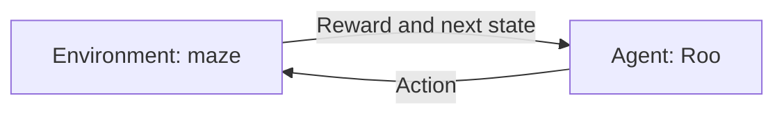
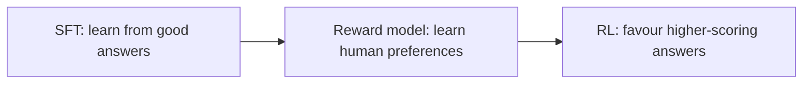

# Chapter 15 — Reinforcement Learning

> **Your one-hour mission:** teach a tiny robot to find treasure, understand how it
> learns from mistakes, and connect that idea to modern language models.

Learn the RL loop, work through one update, and recognise when RL is useful.
Basic arithmetic is enough; Chapter 14 helps with neural networks, but their
intuition is explained here. No algorithm zoo to memorise.

| Stop | Study budget |
|---|---:|
| 15.1 Meet the learner | 7 min |
| 15.2 Chasing the right reward | 8 min |
| 15.3 Explore or exploit? | 6 min |
| 15.4 How good is this move? | 9 min |
| 15.5 Watch the robot learn | 10 min |
| 15.6 Beyond the cheat sheet | 8 min |
| 15.7 The LLM connection | 5 min |
| 15.8 Choosing wisely, recap and recall | 7 min |
| **Total, including examples and recall** | **60 min** |

---

## 15.1 Meet the Learner

### Simple Explanation

Teach a puppy to sit by rewarding useful attempts, not explaining muscle movements.
Rewarded behaviour gradually becomes more likely. **Reinforcement learning (RL)**
gives a computer a similar setup: make choices, observe consequences, improve.

> **Official Definition:** Reinforcement learning studies how an agent learns a
> policy for choosing actions to maximise expected cumulative reward through
> interaction with an environment.

**Cumulative** matters: a disappointing move now might enable a better outcome
later. Learn a strategy, not just how to chase the next treat.

Meet our robot, **Roo**, in a tiny treasure maze:

```
  +---+---+---+
  | S | B | G |    S = start, G = treasure
  +---+---+---+    P = pit; B, C, D = ordinary cells
  | C | D | P |
  +---+---+---+
```

| Component | Meaning | In Roo's maze |
|---|---|---|
| **Agent** | The decision-maker | Roo's controller |
| **Environment** | The world it acts in | Maze and its rules |
| **State** | Information describing the current situation | Roo's cell |
| **Action** | An available choice | Up, Down, Left, Right |
| **Reward** | A number returned after a move | Movement cost, treasure or pit payoff |
| **Policy** | The strategy for choosing actions | What Roo chooses in each cell |

A policy can always choose one action, or assign probabilities to several.
An **episode** is one complete attempt, from the start until treasure or the pit.
Training repeats many episodes; one lucky success is not a learned strategy.



For example, Roo observes S, chooses Right, receives a reward, and observes B.
Nobody supplied a label saying "Right is correct." Roo must discover its usefulness.


| Learning type | Typical feedback | Example |
|---|---|---|
| Supervised | Correct answer for an input | Label an email as spam |
| Unsupervised | No target labels; discover structure | Group similar customers |
| Reinforcement | Rewards following decisions | Learn a route to treasure |

In our story, Roo collects experience by acting. **Offline RL** instead learns
from previously logged experience; RL does not always require collecting fresh
data during training.

---

## 15.2 Chasing the Right Reward

### Simple Explanation

Roo pays a small movement fee but earns treasure at the destination. If it only
cares about the next fee, it misses why moving is worthwhile. We need a way to
score the **whole journey**.

> **Official Definition:** A reward is one step's feedback. A return is the sum
> of future rewards, usually discounted so later rewards receive less weight.

### One rulebook for every example

- Every move costs **-1**, including a move into treasure or the pit.
- Entering G gives an additional **+10**: that move's total reward is **+9**.
- Entering P gives an additional **-10**: that move's total reward is **-11**.
- G and P are **terminal**: the episode ends immediately on entry.
- Walking into an outer wall leaves Roo in the same cell and still costs **-1**.

Payoffs arrive on entry, never again. These rules apply throughout.

### Discounting: how much does later count?

The **discount factor**, $\gamma$ (gamma), controls future reward's weight:

| Gamma | Behaviour encouraged |
|---|---|
| 0 | Care only about the immediate reward |
| 0.9 | Count a reward one step later at 90% of its value |
| Closer to 1 | Give distant rewards more weight |

We use **gamma = 0.9**. This is an objective-setting choice, not the learning
speed or the probability of exploring.

```
Route:       S ------> B ------> G
Rewards:          -1        +9

Return from S = -1 + 0.9 x 9 = 7.1
```

Longer sequences continue the pattern: the next reward gets weight
$\gamma^2$, then $\gamma^3$, and so on.

**Predict first:** would adding an unnecessary step help here?
No. It adds another movement fee and delays the positive treasure reward.
Notice that the first reward is negative even on the best route.


### State and the Markov idea

Our rulebook describes an **MDP**, or Markov Decision Process: states, actions,
transition rules, rewards and a discount factor.

**Markov** means the current state contains the information needed to predict the
next state and reward, given an action. Roo's cell is enough in this fixed maze.
For a moving robot, position alone may not be enough: velocity could matter too.
Including relevant history or velocity makes the state more informative.

Transitions need not be deterministic. On a slippery floor, choosing Up could
occasionally move Roo sideways. RL then values an action by its **expected**
outcome across possibilities, not by assuming every move succeeds.

---

## 15.3 Explore or Exploit?

### Simple Explanation

Dinner presents the same dilemma: revisit your favourite restaurant, or try a new
one that might be better? Always revisiting misses discoveries; always trying new
places means never enjoying what you learned.

> **Official Definition:** Exploration gathers information through less-certain
> actions. Exploitation uses current knowledge to choose a promising action.

Roo faces this tradeoff too. A route through C might look best after a few
attempts, simply because Roo has not properly tried going through B.
The best **known** option is not necessarily the best **possible** option.

### Epsilon-greedy: one strategy is enough

**Epsilon**, $\epsilon$, is the probability of choosing the random-action branch.
Otherwise, choose the action with the highest current estimated value.

```
epsilon = 0.1

90% of decisions: choose the best-known action
10% of decisions: choose randomly from all available actions
```

The random branch can also select the best-known action! With four actions and
one clear best, its total selection probability is
$0.9 + 0.1/4 = 0.925$, or **92.5%**.
Exploring does not necessarily mean choosing a worse action.


Explore more while estimates are unreliable, then reduce epsilon as they improve.
A little ongoing exploration helps avoid freezing on an early guess.
Schedules do not guarantee sufficient coverage.

At **epsilon = 0 from the start**, Roo may never discover a better route.
At **epsilon = 1 forever**, it never deliberately exploits its estimates, although
Q-learning can still update those estimates from its random experience.
Learning values and choosing to use them are different things.

### Bandits: the simpler cousin

A **multi-armed bandit** repeatedly chooses among options with unknown payoffs,
without modelling action-dependent journeys through future states.
Think of selecting an advert and observing whether it gets clicked.

If ad B has the best estimated click rate after a small sample, it is sensible
to show B often while still occasionally trying A and C. More observations may
change the winner.

Bandits isolate exploration versus exploitation. Roo's maze adds another challenge:
the current action changes which situations and rewards become reachable next.

---

## 15.4 How Good Is This Move?

### Simple Explanation

A policy tells Roo **what to do**. A value estimate tells Roo **how promising
something is**. Think of a coach distinguishing "this position is good" from
"that particular move is good."

> **Official Definition:** $V^\pi(s)$ is the expected return from state $s$ while
> following policy $\pi$. $Q^\pi(s,a)$ is the expected return after taking action
> $a$ in $s$, then following $\pi$.

You can read these as **V = situation score** and **Q = move score**.
Both include future rewards, not just the next reward.

Values depend on the strategy followed afterwards: a useful location is wasted
if Roo keeps choosing bad moves. Below, **V\*** means the value with optimal
choices; the star does not mean a different reward.

### Bellman: now plus later

The **Bellman idea** breaks a long journey into one move and everything after it:

```
Score of a move = reward now + gamma x value of the next state
```

For optimal state values, choose the move with the highest score. If transitions
are random, average over their possible outcomes first.

### Work backwards from treasure

Follow the same route: **S -> B -> G**.

**Step 1: G is terminal.** Its future value is zero because there are no further
moves or rewards. The pit P also has zero *future* value; entering it is still
bad because that transition pays -11.

**Step 2: B is one move from treasure.** Moving Right receives +9 and ends the episode:

$$V^*(B) = 9 + 0.9 \times 0 = 9$$

**Step 3: S is two moves away.** Moving Right costs -1, then reaches B:

$$V^*(S) = -1 + 0.9 \times 9 = 7.1$$

That is exactly the route return we calculated earlier. Bellman did not invent
another score; it reused the score of the remaining journey.

**Your turn:** Roo is in D. Should it move Up toward B, or Right into P?
Up has score $-1 + 0.9 \times 9 = 7.1$.
Right has score $-11 + 0.9 \times 0 = -11$.
The immediate rewards alone do not explain the appeal of going Up; the future does.

This example works backwards because we know the map. In a new environment,
Roo does not start with the correct values. It must estimate them from experience.
That is where Q-learning comes in.


---

## 15.5 Watch the Robot Learn

### Simple Explanation

**Q-learning** builds a cheat sheet: one row per state, one score per action.
After each move, Roo compares its old guess with new evidence and nudges the guess.

> **Official Definition:** Q-learning is a model-free, off-policy method that
> updates action-value estimates using observed rewards and the best estimated
> continuation from the next state.

**Model-free** means it does not need a model predicting the environment's
transitions. It can still use a table or a neural network.
**Off-policy** means it can explore while learning values for greedy continuation;
its learning target need not follow the same strategy that collected the experience.
An **on-policy** method instead targets the policy used to collect its experience.

### One update, with numbers

These are **imperfect estimates during training**, not the final values from
the previous section:

| Quantity | Current value |
|---|---:|
| Old Q(S, Right) | 2 |
| Best current Q-value in B | 5 |
| Reward for S to B | -1 |
| Discount gamma | 0.9 |
| Learning rate alpha | 0.1 |

First build a **target**, our improved guess based on this transition:

```
Target = reward + gamma x best next Q
       = -1 + 0.9 x 5
       = 3.5

TD error = target - old estimate
         = 3.5 - 2 = 1.5

New Q = old Q + alpha x TD error
      = 2 + 0.1 x 1.5
      = 2.15
```

**TD** means temporal difference: learning from the difference between the current
estimate and a reward-plus-future estimate.
Roo moves partway toward 3.5 because this experience and its future estimates
may be misleading.

The compact rule is:

$$Q(s,a) \leftarrow Q(s,a) + \alpha\,[\text{target} - Q(s,a)]$$

**Predict first:** if the target were below the old estimate, would Q rise?
No, the TD error would be negative, so the estimate would fall.

**Terminal exception:** if the move ends the episode, the target is **just the
reward**. There is no future Q-value to add. Moving from B into G targets +9.

### The whole recipe

```text
Start with a Q-table of zeros.
For each episode:
  Start Roo at S.
  Until Roo reaches treasure or the pit:
    Choose an action using epsilon-greedy.
    Observe the reward and next state.
    Target = reward; add gamma * best next Q only if not terminal.
    Update Q for the state and action just experienced.
    Continue from the next state.
```

Three controls, three different jobs:

| Control | Question it answers |
|---|---|
| **Alpha: learning rate** | How far should this update move my estimate? |
| **Gamma: discount** | How much should future rewards count? |
| **Epsilon: exploration** | How often should I choose randomly? |

Act greedily by choosing the row's highest Q-value. Learning takes many experiences.
Tabular convergence needs sufficient exploration and suitable learning rates;
more episodes alone do not guarantee success.


---

## 15.6 Beyond the Cheat Sheet

### Simple Explanation

A small maze fits in a table. A camera image has far too many possible pixel
arrangements for a row per image. We need to generalise across situations.

> **Official Definition:** Deep RL uses neural networks to represent value
> functions, policies, or other learned parts of an RL system.

### DQN: replace the table, keep the idea

A **Deep Q-Network (DQN)** predicts Q-values with a neural network:

```
Small maze:    state -> table row       -> Q for each action
Camera input: state -> neural network  -> Q for each action
```

For example, outputs `Left: 2, Right: 7, Up: 3, Down: -4` suggest choosing Right
when exploiting. Standard DQN suits discrete actions; a large state space is not
the same problem as a continuous action space.


Two ideas make learning more stable:

- **Experience replay:** store past transitions and train on shuffled samples.
  This reuses experience and reduces the strong correlation between consecutive moves.
- **Target network:** use a separate, periodically refreshed copy of the network
  to estimate future values. Otherwise, the answer and the target it chases both
  keep changing together.

### Learn the action directly

For a robot arm, actions might be continuous joint torques. Listing every possible
torque and comparing its Q-value is impractical.
**Policy gradient methods** instead adjust a policy directly, making actions
associated with better returns more likely.

The policy might output action probabilities or parameters of a continuous action
distribution. Learning from outcomes can be noisy: the same sensible action can
be followed by good or bad luck.

**Actor-critic** adds a coach:

```
Actor:  chooses the action
Critic: estimates how good the situation is
        -> helps judge outcomes relative to expectations
```

An **advantage** describes how much better an action is than the policy's usual
expectation in that state. This relative feedback can reduce noise compared with
using raw returns. The critic can also be wrong; it is learning too.

**PPO** is a policy-optimisation method often used with an actor and critic.
Its clipped training objective discourages overly large policy changes: improve
without throwing away yesterday's useful behaviour. Clipping is not a hard
guarantee that the whole policy cannot change too much.

Remember: **Q-learning scores moves; DQN predicts scores with a network; policy
methods learn behaviour; actor-critic adds a learned coach.**

---

## 15.7 The LLM Connection

### Simple Explanation

Suppose a model gives two explanations of gravity: one full of jargon, one a child
can follow. A person prefers the second. How can that judgement improve future answers?

> **Official Definition:** RLHF uses human feedback to construct reward signals
> for improving a policy. Language-model training often uses a learned reward model
> to scale human preference feedback.

Here is the **classic PPO-based recipe**, not the only possible RLHF implementation:



**SFT**, or supervised fine-tuning, provides demonstrations of helpful responses.
Humans then compare candidate answers; a reward model learns to score preferred
answers higher. RL uses those scores while discouraging excessive drift from a
reference model. The reward model avoids asking a human to rate every training response.


| Approach | Feedback and learning idea |
|---|---|
| **Classic RLHF** | Learn a preference reward model, then optimise against its scores |
| **DPO** | Train directly on chosen/rejected answer pairs; no separate reward model or RL rollout loop |
| **RLVR** | Reward automatically checkable outcomes, such as a correct answer or passing tests |

DPO is preference optimisation, not a requirement to run online RL.
Verifiable rewards are useful, but an incomplete test suite can still be gamed.
Neither preference scores nor passing a narrow check guarantee truth or safety.

For the deeper post-training material, see [Chapter 17](#content/17_llm), sections
3.4-3.5c. Understanding this bridge is enough here.

---

## 15.8 Choosing Wisely, Recap and Recall

### Simple Explanation

RL learns by trying things, often expensively. For our known maze, a map and
shortest-path search would already solve the job!

> **Official Definition:** Model-based methods use a known or learned environment
> model to plan; model-free methods learn values or policies without modelling
> those dynamics.

A model-based Roo imagines routes; a model-free Roo updates values from experience.
Planning can save real interactions, but a wrong model can produce bad plans.

| Situation | Sensible starting point |
|---|---|
| Predict spam from labelled emails | Supervised learning |
| Choose an ad for immediate clicks | Consider a bandit |
| Find a route through a fully known small maze | Search or planning |
| Learn sequential control with measurable success and safe simulation | Consider RL |
| Training mistakes could seriously harm people | Do not rely on unrestricted trial and error |

### The reward is not the real goal

Reward a robot for **touching boxes**, and it might repeatedly tap one without
delivering it. **Reward hacking** means optimising the score, not the intended task.

Measure deliveries, inspect behaviour, and evaluate on new situations. Sparse or
delayed rewards can make learning slow; simulators help, but real conditions may differ.

### Pocket recap

**Policy chooses; V scores situations; Q scores moves. Bellman connects now and
later. Q-learning updates estimates. Explore to discover; exploit to benefit.
Reward the right goal.**

### Six quick recall questions

Try answering before opening each explanation.

**1. Why is Roo's first -1 move not necessarily bad?**

<details>
<summary>Answer</summary>

It leads toward treasure. The route's return is -1 + 0.9 x 9 = 7.1,
despite that immediate cost.
</details>

**2. What is the difference between a policy, V and Q?**

<details>
<summary>Answer</summary>

Policy chooses actions. V estimates a situation's return; Q estimates a move's
return. Both depend on the policy followed afterwards.
</details>

**3. Does epsilon = 0.1 mean choosing a non-best action exactly 10% of the time?**

<details>
<summary>Answer</summary>

No. The 10% random branch includes the best action too.
</details>

**4. Old Q is 2, target is 3.5, alpha is 0.1. What is the update?**

<details>
<summary>Answer</summary>

Error = 1.5; new Q = 2 + 0.1 x 1.5 = 2.15.
Terminal transitions target the reward alone.
</details>

**5. What changes when a Q-table becomes a DQN?**

<details>
<summary>Answer</summary>

A neural network predicts Q-values instead of storing a row for every state.
The reward-plus-future learning idea remains.
</details>

**6. How does DPO differ from classic RLHF?**

<details>
<summary>Answer</summary>

DPO directly learns from preference pairs. Classic RLHF trains a reward model,
then uses RL against its scores.
</details>

---

**Previous:** [Chapter 14 — Neural Networks](#content/14_neural_networks) | **Next:** [Chapter 16 — Deep Learning Reference](#content/16_deep_learning)
