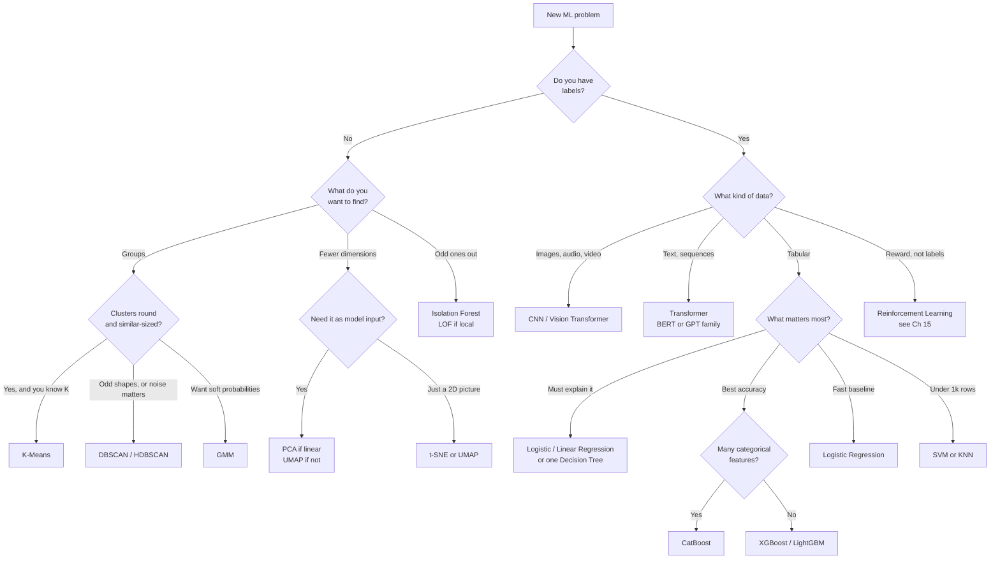

# ML Curriculum — Quick Revision

> Condensed revision for **Chapters 07–15**. Skim this before an interview instead of re-reading 113,000 words of source chapters. Formulas, decision rules, comparison tables and must-know facts are preserved; worked examples, proofs and coding walkthroughs stay in the originals.

**How to use it:** **Part 1** is the decision layer — pick an algorithm, pick a metric, avoid a trap. **Part 2** is the chapter-by-chapter refresher. If you only have 20 minutes, read Part 1 and the one-page recap at the end.

---

## Contents

**Part 1 — Decision Guides** · master algorithm selection · supervised comparison · unsupervised comparison · metric selection · validation & tuning · the 12 traps

**Part 2 — Chapter by Chapter** · notation legend · Ch 07 Introduction · Ch 08 Core Concepts · Ch 09 Preprocessing · Ch 10 Supervised · Ch 11 Unsupervised · Ch 12 Key Algorithms · Ch 13 Evaluation · Ch 14 Neural Networks · Ch 15 Reinforcement Learning · One-page cheat recap

> Use the **☰ chapter guide** panel to jump between these sections.

---

# Part 1 — Decision Guides

## Master algorithm selection

Start from the data, not from the algorithm you like.



> **The honest default for tabular data:** a linear baseline first, then gradient boosting. Deep learning wins on images, text and audio — not on spreadsheets.

## Supervised algorithms compared

| Algorithm | Task | It assumes | Use when | Breaks when | Handles noise | Boundary | Scalability | Interpretable | Real-world example |
|---|---|---|---|---|---|---|---|---|---|
| **Logistic Regression** | Classification | Log-odds linear in features | Need calibrated probabilities + a fast baseline | Boundary is curved (XOR-like) | Sensitive — unbounded score | Linear hyperplane | Excellent | High | Credit scoring, CTR prediction |
| **Linear Regression** | Regression | Linearity, independent errors, constant variance, no multicollinearity | Interpretable numeric baseline | Multicollinearity → unstable weights | Poor — squared error chases outliers | Hyperplane | Excellent | High | House-price baseline |
| **Ridge / Lasso / Elastic Net** | Regression | As above + shrinkage helps | Many or correlated features; Lasso to select | $\lambda$ mistuned either way | Same as linear | Hyperplane | Excellent | High | Genomics, high-dim regression |
| **KNN** | Both | Nearby points share a label | Small data, any boundary shape, no training time | High dimensions, or unscaled features | Poor — one bad neighbour flips a vote | Follows local density | Poor — $O(nd)$ per query | Medium | Item-based recommendations |
| **Decision Tree** | Both | Classes split by axis-aligned rectangles | Every decision must be explainable | Diagonal boundaries; unbounded depth | Fair — splits on order, not magnitude | Axis-aligned boxes | Good | Very high | Loan approval rules |
| **Random Forest** | Both | Decorrelated trees average out noise | Strong default with little tuning | One feature dominates every split | Robust — bagging dilutes outliers | Piecewise rectangles | Excellent (parallel) | Low | Churn prediction |
| **XGBoost / LightGBM** | Both | Sequential learners shrink residual error | Maximum tabular accuracy | No early stopping → chases noise | Sensitive — residuals amplify bad labels | Sharpest piecewise rectangles | Good (sequential) | Low | Kaggle tabular, fraud, ranking |
| **CatBoost** | Both | As above, plus ordered target statistics | Many high-cardinality categoricals | Very wide numeric-only data | Sensitive, but ordered boosting helps | Symmetric trees | Good | Low | E-commerce with city/brand IDs |
| **SVM** | Classification (SVR) | A wide margin exists in input or kernel space | High-dim sparse data with clear margin | $n$ large ($O(n^2)$–$O(n^3)$); unscaled | Sensitive near the margin; soft `C` helps | Linear or kernel-shaped | Poor past ~50k rows | Low | Text classification, bioinformatics |
| **Naive Bayes** | Classification | Features conditionally independent given class | Text baseline; tiny data; need speed | Features heavily correlated | Robust — probabilities average out | Probabilistic, not geometric | Excellent | Medium | Spam filtering |
| **Neural Network** | Both | Enough data to learn its own features | Images, audio, text, huge datasets | Small tabular data — trees beat it | Depends on regularization | Arbitrary | Good (needs GPU) | Very low | Vision, speech, LLMs |

## Unsupervised algorithms compared

| Algorithm | Task | It assumes | Use when | Breaks when | Needs K? | Handles noise | Cluster shape | Scalability | Real-world example |
|---|---|---|---|---|---|---|---|---|---|
| **K-Means** | Clustering | Round, equal-size, equal-density blobs | Fast default; millions of points | Elongated, unequal or non-convex clusters | Yes | No — forces every point in | Spherical | Excellent | Customer segmentation |
| **K-Medoids (PAM)** | Clustering | As K-Means, but centre is a real point | Non-Euclidean metric; outliers you can't drop | Past ~10k points | Yes | Robust | Spherical, any metric | Poor | Clustering by edit distance |
| **Hierarchical (Ward)** | Clustering | Data is genuinely nested | You want a dendrogram and don't know K | No real hierarchy; past ~10k points | No — cut the tree | No | Depends on linkage | Poor — $O(n^3)$ | Taxonomy building |
| **DBSCAN** | Clustering | Dense regions split by sparse ones | Odd shapes + real outliers to flag | Clusters have very different densities | No | **Yes** — labels noise | Arbitrary | Good | Geospatial hotspots |
| **HDBSCAN** | Clustering | Dense regions, density may vary | Same as DBSCAN but density varies | Uniformly dense data, no real gaps | No | **Yes** | Arbitrary, multi-density | Good | Anomaly-rich sensor data |
| **Spectral** | Clustering | Clusters connected in a similarity graph | Non-convex but connected (interlocking moons) | Badly built graph; large $n$ | Yes | No | Manifold / graph-connected | Poor | Image segmentation |
| **GMM** | Clustering | Data is a mixture of Gaussians | Need soft probabilistic membership | Strongly non-Gaussian clusters | Yes | No | Elliptical | Moderate | Speaker identification |
| **PCA** | Dim. reduction | Structure is linear; variance = information | Fast linear reduction; need `transform()` | Curved structure; forgot to scale | Pick #PCs | N/A | Linear only | Excellent | Compression, denoising |
| **Kernel PCA** | Dim. reduction | Linear *after* the kernel map | Known nonlinear manifold, small $n$ | Wrong kernel; large $n$ | Pick #PCs | N/A | Kernel-defined | Poor | Spirals, concentric shapes |
| **t-SNE** | Visualization | Only local neighbourhoods matter | A one-off 2D plot for a slide | You read distances or gaps off it | N/A | N/A | Nonlinear | Poor past ~50k | Exploring embeddings |
| **UMAP** | Both | Data lies on a locally connected manifold | Visualization **and** features; faster than t-SNE | Very small $n$; over-tuned neighbours | N/A | N/A | Nonlinear | Good | Single-cell genomics |
| **Autoencoder** | Dim. reduction | A network can learn a compressed code | Complex nonlinear structure, lots of data | Small data; needs tuning and compute | Pick code size | N/A | Nonlinear | Slow to train, fast at inference | Image / signal compression |
| **Isolation Forest** | Anomaly | Anomalies are few and globally unusual | Default detector; high-dim; need speed | Density varies — misses local outliers | N/A | Detects them | N/A | Excellent | Fraud, intrusion detection |
| **Local Outlier Factor** | Anomaly | "Unusual" is relative to local neighbours | Anomalies only odd versus their neighbourhood | Large $n$; badly chosen $k$ | N/A | Detects them | N/A | Poor past ~10k | Network monitoring |
| **Apriori** | Association | Frequent itemsets are rare enough to prune | Small catalog; want visible pruning | Dense data with long frequent patterns | N/A | N/A | N/A | Moderate | Market basket analysis |
| **FP-Growth** | Association | Transactions share prefixes worth compressing | Large-scale transactions; need speed | FP-tree exceeds memory | N/A | N/A | N/A | Good | Retail recommendations |

## Metric selection

| Situation | Use | Not this | Why |
|---|---|---|---|
| Balanced classification | ROC-AUC, accuracy, F1 | — | All behave sensibly |
| **Imbalanced** (fraud, disease) | **AUC-PR**, recall, F2 | Accuracy, ROC-AUC | 99.9% accuracy catches zero fraud; ROC stays flattered by true negatives |
| False alarms are costly (spam) | **Precision**, F0.5 | Recall alone | A lost real email beats a spam getting through |
| Misses are costly (cancer) | **Recall**, F2 | Precision alone | A missed case is fatal; a false alarm is a re-test |
| Ranking quality, threshold-free | ROC-AUC | Accuracy | Accuracy needs a fixed threshold |
| Regression, outliers matter | **RMSE**, MSE | MAE | Squared error punishes big misses |
| Regression, outliers are noise | **MAE**, Huber | RMSE | Linear penalty ignores extremes |
| Regression, want "% variance explained" | R² | RMSE alone | R² is unit-free and comparable |
| Clustering, no labels | Silhouette + Elbow + Davies-Bouldin | One metric alone | Each can be fooled; agreement is the signal |

## Validation & tuning

| Strategy | Use when | Note |
|---|---|---|
| **K-Fold** (K=5 or 10) | Default; regression or balanced classes | The standard choice |
| **Stratified K-Fold** | **Always** for classification | Keeps class ratio per fold |
| **GroupKFold** | Repeated entities (patients, users) | Stops the same entity spanning splits |
| **TimeSeriesSplit** | Time-ordered data | Train always precedes test; never shuffle |
| **LOOCV** | Under ~100 samples | N× cost, high variance |
| Grid search | Small grids (≤ ~30 combos) | Exhaustive, predictable |
| **Random search** | Larger spaces | Usually beats grid at equal budget — only 1–2 params matter, and random varies them all |
| **Bayesian (Optuna)** | Expensive training runs | Learns where to look; fewest trials |

## The 12 traps

| # | Trap | Fix |
|---|---|---|
| 1 | Scaling or encoding **before** splitting | Split first; `fit` on train, `transform` both |
| 2 | Accuracy on imbalanced data | AUC-PR, recall, F1 |
| 3 | Tuning on the test set | Validation tunes; test is read **once** |
| 4 | Random split on time-series | `TimeSeriesSplit` |
| 5 | Same entity in train and test | `GroupKFold` |
| 6 | Target leakage (a feature encodes the answer) | Ask "would I know this at prediction time?" |
| 7 | Label-encoding nominal categories | One-hot or target encoding — otherwise `blue > red` |
| 8 | One-hot on 10,000 zip codes | Target / frequency encoding, or embeddings |
| 9 | Unscaled features for KNN, SVM, K-Means, NN | Standardize |
| 10 | Reading cluster sizes and gaps off a t-SNE plot | They are meaningless — use it for groups only |
| 11 | Dropping every row with a missing value | Impute; add a missingness indicator if MNAR |
| 12 | Comparing models on different splits | Same folds, same seed, or the comparison is noise |

---

# Part 2 — Chapter by Chapter

> 🔤 **Notation used throughout Part 2** — every formula below is built from these symbols. When a section adds a symbol of its own, it is defined where it first appears.

| Symbol | Read it as | Meaning |
|---|---|---|
| $x$, $X$ | "input", "the input matrix" | One example's features; $X$ is all $N$ examples stacked as rows |
| $y$ | "the truth" | The actual answer — the label you are trying to predict |
| $\hat{y}$ | "y-hat", "the prediction" | What the model *says* the answer is. The gap $\hat{y}-y$ is the error |
| $z$ | "the score", "the logit" | The **raw, unsquashed** number a linear unit produces: $z = w\cdot x + b$. It runs from $-\infty$ to $+\infty$ and is **not** a probability until you push it through $\sigma$ or softmax |
| $w$, $\mathbf{w}$, $W$ | "weight(s)" | The learned multipliers — one per feature. $W$ is a whole layer's worth |
| $b$ | "bias" | The learned constant added after the weighted sum; it shifts the boundary off the origin |
| $\sigma(\cdot)$ | "sigmoid" | The squashing function $1/(1+e^{-z})$ that maps any score to $(0,1)$ |
| $L$ | "the loss" | A single number scoring how wrong the model is. Training = make $L$ small |
| $g$ | "the gradient" | $\partial L/\partial w$ — which way, and how steeply, the loss climbs. You step the **opposite** way |
| $\alpha$ | "the learning rate" | How big a step to take. Also written `lr` |
| $\lambda$ | "lambda" | Regularization strength — how hard to punish large weights |
| $N$, $n$ | "the row count" | Number of training examples |
| $p$, $d$ | — | Number of features / dimensions |
| $n_\text{in}$, $n_\text{out}$ | "fan-in / fan-out" | How many connections enter and leave a layer |
| $K$ | — | Number of classes (classification) or clusters (K-Means) |

> **The one sentence that ties them together:** a model turns $x$ into a score $z$, squashes it into a prediction $\hat{y}$, compares it to the truth $y$ to get a loss $L$, and then nudges every weight $w$ against the gradient $g$ by a step of size $\alpha$.

## Ch 07 — Introduction to ML

> 💡 **In a sentence —** ML inverts traditional programming: instead of writing rules, you supply labelled examples and let an algorithm discover the mapping.


### The inversion

Traditional programming takes **rules + input → output**; ML takes **input + output → rules**. A hand-written spam filter needs hundreds of `if "free prize" then spam` rules; an ML filter learns them from 10,000 labelled emails, and adapts to new tactics by adding data rather than code.

**The nesting:** AI ⊃ Machine Learning ⊃ Deep Learning ⊃ Generative AI. Classical ML needs **hand-designed features**; deep learning **learns its own** from raw pixels, waveforms or tokens.

### The four types

| Type | Input | Learning signal | Flagship example |
|---|---|---|---|
| **Supervised** | Features + labels | Human-labelled targets | Gmail spam filter |
| **Unsupervised** | Features only | Hidden structure | Customer segmentation |
| **Self-supervised** | Raw data only | Labels generated from the data itself | GPT / BERT pre-training |
| **Reinforcement** | Environment state | Scalar reward from trial and error | AlphaGo, RLHF |

Self-supervision is the trick behind LLMs: hide a word, predict it, repeat across billions of sentences — no annotation needed.

### When ML is the wrong tool

| Use ML when | Do **not** use ML when |
|---|---|
| Rules are too complex to hand-code (vision, speech) | A simple rule works (`age >= 18`) |
| Rules change often (spam, fraud) | You have < a few hundred examples |
| Large data with hidden patterns | Every decision must be 100% explainable |
| "Usually correct" is acceptable | Errors are catastrophic and data is unreliable |

### The 7-step workflow

1. **Define the problem** — metric, task type, what "good enough" means
2. **Collect data** — databases, APIs, scraping, labelling
3. **Explore & clean** — missing values, outliers, imbalance
4. **Feature engineering** — scale, encode, create, decompose
5. **Split & train** — train/val/test; fit; tune
6. **Evaluate** — held-out metrics
7. **Deploy & monitor** — serve, log, watch for drift

> **The 80% rule:** roughly 80% of real project time goes to steps 2–4, and only 10–20% to modelling. Data quality beats model choice almost every time.

---

> ✅ **Must-remember**
>
> - ML = Input + Output → Rules (the inversion)
> - AI ⊃ ML ⊃ Deep Learning ⊃ Generative AI
> - Four types: supervised, unsupervised, self-supervised, reinforcement
> - 80% of the work is data preparation
> - On tabular data, gradient boosting still beats deep learning

---

## Ch 08 — Core Concepts & Terminology

> 💡 **In a sentence —** The vocabulary of training — features, losses, gradient descent, optimizers, bias-variance and regularization — the plumbing under every model.

### Vocabulary

**Parameters** are learned from data (weights $w$, biases $b$). **Hyperparameters** are chosen by you (learning rate, depth, batch size, $\lambda$). Parameters come from optimization; hyperparameters come from search.

| Split | Purpose | Typical size |
|---|---|---|
| **Training** | Fit parameters | 60–80% |
| **Validation** | Tune hyperparameters, select model | 10–20% |
| **Test** | Final unbiased estimate — read once | 10–20% |

Small data (<10k) → 70/15/15 · medium (100k) → 80/10/10 · large (>1M) → 98/1/1, since 1% of a million is still 10,000 test rows.

**Epoch** = one full pass over the data. **Batch** = the rows behind one weight update. **Iteration** = one forward + backward pass. Iterations per epoch = ⌈dataset ÷ batch⌉.

### The training loop

```
FOR each mini-batch:
  1. FORWARD   ŷ = f(X; W)
  2. LOSS      L = loss(ŷ, y)
  3. BACKWARD  ∂L/∂W via the chain rule
  4. UPDATE    W ← W − α · ∂L/∂W
```

### Loss functions

| Loss | Task | Formula | Key property |
|---|---|---|---|
| **MAE** | Regression | $\frac{1}{n}\sum \lvert \hat{y}-y \rvert$ | Robust to outliers |
| **MSE** | Regression | $\frac{1}{n}\sum(\hat{y}-y)^2$ | Punishes large errors hard |
| **RMSE** | Reporting | $\sqrt{\text{MSE}}$ | Same units as the target |
| **Huber** | Regression | MSE inside $\delta$, MAE outside | Both worlds |
| **Binary cross-entropy** | Binary | $-[y\log\hat{y}+(1-y)\log(1-\hat{y})]$ | Pair with sigmoid |
| **Categorical cross-entropy** | Multi-class | $-\sum_i y_i\log\hat{y}_i$ | Pair with softmax |
| **KL divergence** | Matching distributions | $\sum P\log(P/Q)$ | VAEs, distillation, RLHF |
| **Hinge** | Binary (SVM) | $\max(0, 1-y\hat{y})$ | Max-margin |

> Cross-entropy punishes **confident and wrong** brutally: predicting 0.01 when the truth is 1 costs $-\log(0.01)\approx4.6$; predicting 0.9 costs $\approx0.1$.

### Bias, variance, and the Goldilocks problem


$$\text{Total Error} = \underbrace{\text{Bias}^2}_{\text{underfitting}} + \underbrace{\text{Variance}}_{\text{overfitting}} + \underbrace{\text{Noise}}_{\text{irreducible}}$$

| Symptom | Train | Val | Diagnosis | Fix |
|---|---|---|---|---|
| Both low | 60% | 59% | **Underfit / high bias** | Bigger model, better features, less regularization |
| Close and high | 91% | 89% | **Just right** | Ship it |
| Big gap | 99.8% | 63% | **Overfit / high variance** | More data, regularization, dropout, simpler model |

More data reduces **variance**; it does not reduce **bias** — for that you need a better model or better features.

### Gradient descent and optimizers


**What each optimizer actually does** — all three solve the same problem, "which way do I step, and how far?", with increasing cleverness:

- **SGD** — step straight down the gradient of the current mini-batch, same step size for every weight. Because each batch is a noisy sample of the data, the path zig-zags. Simple, memory-free, and still the best final accuracy on vision benchmarks — if you are willing to tune it.
- **SGD + momentum** — remember the direction you have been travelling and keep some of it, like a ball rolling downhill. Zig-zags across a narrow valley cancel out while the consistent downhill direction accumulates, so it moves faster and gets shaken around less by noise.
- **Adam** — give **every single weight its own learning rate**, automatically. Weights whose gradients have been large get smaller steps; weights that rarely move get larger ones. That is why Adam works out of the box on almost anything and why it is the default first choice.

$$W_{\text{new}} = W_{\text{old}} - \alpha \cdot \frac{\partial L}{\partial W}$$

| Variant | Rows per update | Character |
|---|---|---|
| Batch GD | All N | Exact gradient, smooth, slow |
| SGD | 1 | Very noisy; rarely used bare |
| **Mini-batch** | 32–512 | The de-facto standard |


**SGD + momentum:** $v \leftarrow \beta v + g$, $w \leftarrow w - \alpha v$ ($\beta\approx0.9$) — carries through narrow valleys.

Here $g$ is the current gradient, $v$ is the running **velocity** (the accumulated direction of travel), and $\beta$ is how much of it survives each step. At $\beta=0.9$ a step is roughly the average of the last ten gradients, so one odd batch can no longer knock you off course.

**Adam:** tracks first and second moments of the gradient, bias-corrects both, and gives every parameter its own step size:

$$m_t = \beta_1 m_{t-1} + (1-\beta_1)g_t, \qquad v_t = \beta_2 v_{t-1} + (1-\beta_2)g_t^2$$

$$\hat{m} = \frac{m_t}{1-\beta_1^t}, \quad \hat{v} = \frac{v_t}{1-\beta_2^t}, \qquad w \leftarrow w - \alpha\frac{\hat{m}}{\sqrt{\hat{v}}+\epsilon}$$

Reading it in words: $m_t$ is the **average gradient** (the direction — momentum by another name) and $v_t$ is the **average squared gradient** (the size, regardless of sign). Both start at zero, which drags them down early on, so $\hat{m}$ and $\hat{v}$ divide that bias out. The final step divides direction by size — so a weight with consistently huge gradients gets scaled down, and a rarely-updated weight gets scaled up. $\epsilon$ only exists to stop a division by zero.

Defaults $\alpha=0.001$, $\beta_1=0.9$, $\beta_2=0.999$, $\epsilon=10^{-8}$. **AdamW** decouples weight decay — the default for Transformers.

> **Rule of thumb:** start with Adam at `lr=0.001`. Switch to SGD + momentum when chasing the last 1% on vision benchmarks. Tune the learning rate on a **log** scale.

### Learning-rate schedules

A **schedule** changes $\alpha$ *during* training instead of holding it fixed. The reason: one value cannot serve the whole run. Early on you want big steps to cross the landscape quickly; late on you want small steps to settle into the minimum instead of bouncing around it. A schedule is simply a rule for shrinking $\alpha$ over time.

| Schedule | What it does to $\alpha$ | Use when |
|---|---|---|
| **Step decay** | Multiply by 0.1 at fixed epochs (e.g. 30, 60, 90) | Classic CNN training; easy to reason about |
| **Cosine annealing** | Glide smoothly from the starting value down to ~0 along a cosine curve | The modern default; no cliff edges to tune |
| **Warmup → decay** | Ramp **up** from ~0 over the first few hundred steps, then decay | **Transformers.** Early gradients are large and the Adam moment estimates are still garbage, so full-size first steps can wreck the weights |
| **OneCycleLR** | One big rise then a long fall, with momentum moving opposite | Fast training on a fixed budget ("super-convergence") |
| **ReduceLROnPlateau** | Cut $\alpha$ only when validation loss stops improving | You don't know the right schedule; let the metric decide |

> **If you remember one thing:** high LR early to explore, low LR late to converge — and Transformers additionally need a **warmup** at the very start.

### Initialization


**Why this matters at all.** You have to seed the weights with *something* before training starts, and the choice is not cosmetic:

- **All zeros fails completely.** Every neuron in a layer would compute the same output and receive the same gradient, so they would stay identical forever — a 512-unit layer would learn exactly as much as a 1-unit layer. Random values **break that symmetry**.
- **The scale then decides whether training works.** Each layer multiplies the signal by its weights. If the weights are slightly too small, the signal shrinks a bit per layer and, over 50 layers, vanishes to zero. Slightly too large and it explodes to `NaN`. The fix is to pick a variance that keeps the signal roughly the same size as it passes through each layer.

That is the entire job of these schemes — choose the right random **spread**:

| Scheme | Variance | Use with |
|---|---|---|
| **Xavier / Glorot** | $2/(n_\text{in}+n_\text{out})$ | Tanh, sigmoid |
| **He / Kaiming** | $2/n_\text{in}$ | ReLU family |

When a layer's input and output widths are similar, Xavier's $2/(n_\text{in}+n_\text{out})$ is simply $\approx 1/n_\text{in}$. He keeps that shape and **doubles it** to $2/n_\text{in}$, because ReLU zeroes out roughly half its inputs and so halves the signal variance — the extra factor of 2 puts it back. Tanh and sigmoid pass everything through, so they need no such compensation. That is the entire origin of the "2".

### Regularization

| Method | What it does | Best when |
|---|---|---|
| **L2 / Ridge** | Shrinks all weights, none to exactly zero | Features correlated; all contribute |
| **L1 / Lasso** | Drives some weights to **exactly** zero | Few features matter; want selection |
| **Elastic Net** | Both | Correlated features **and** want selection |
| **Dropout** | Randomly zeroes activations while training; survivors divided by $(1-p)$; off at inference | Neural networks |
| **Early stopping** | Stop when validation loss rises; restore the **best** checkpoint | Always — the cheapest regularizer there is |

---

> ✅ **Must-remember**
>
> - Parameters are learned; hyperparameters are chosen
> - Loop: forward → loss → backward → update
> - Total Error = Bias² + Variance + Noise
> - Adam (lr=0.001) default; AdamW for Transformers
> - L1 → exact zeros; L2 → shrink everything
> - He init ($2/n_\text{in}$) for ReLU; Xavier for tanh/sigmoid — He is double Xavier's scale because ReLU drops half the signal

---

## Ch 09 — Data Preprocessing

> 💡 **In a sentence —** Clean, well-encoded, properly scaled data beats any algorithm upgrade — and bad preprocessing destroys models silently.


### The golden rule

```
WRONG:  scaler.fit(all_data)    → test statistics leak into training
RIGHT:  scaler.fit(X_train)     → transform train and test separately
```

Fitting on everything is **silent** leakage: your test metrics look great and production disagrees. The same applies to imputers, encoders and feature statistics.

### Missing values

The three-letter codes describe **why** a value is missing — and that reason decides what you are allowed to do about it. Guess wrong and your imputation quietly biases the model.

| Type | Full form | Meaning | Everyday example | Strategy |
|---|---|---|---|---|
| **MCAR** | **M**issing **C**ompletely **A**t **R**andom | Pure chance. Missingness has nothing to do with any column, present or absent | A sensor dropped packets for an hour; a page of forms got soaked | Drop the row, or impute the mean — safe, since the remaining data is still representative |
| **MAR** | **M**issing **A**t **R**andom | Missingness is explained by **other columns you do have** | Younger users skip the "income" field far more often — and you *have* the age column | Model-based imputation: predict the missing value from the columns that explain it (kNN/iterative imputer) |
| **MNAR** | **M**issing **N**ot **A**t **R**andom | Missingness depends on the **hidden value itself** | High earners refuse to state their salary — the very people you can't see are the ones you most need | Add a `was_missing` indicator column; use domain knowledge. You cannot impute your way out of this one |

> ⚠️ "At Random" is a misleading name: **MAR is not random**, it is *predictable from what you have*. Only **MCAR** is genuinely random. If missingness itself carries signal (MNAR), keep the indicator column — it is often one of the strongest features in the model.

| Strategy | Use when |
|---|---|
| Drop row | < 5% missing and MCAR |
| Mean | Symmetric, no outliers |
| **Median** | Skewed or outlier-heavy (robust) |
| Mode | Categorical |
| Indicator column | Missingness itself is informative |
| Drop column | > 30–40% missing and low value |

### Outliers

An **outlier** is a point far from the bulk of the data. There are two standard ways to draw that line, and they fail in opposite situations.

**1. The IQR fence** — rank the data, take the middle 50%, and fence off anything far outside it:

$$IQR = Q3 - Q1, \qquad \text{fences} = Q1 - 1.5\,IQR \ \text{ to } \ Q3 + 1.5\,IQR$$

$Q1$ and $Q3$ are the 25th and 75th percentiles, so $IQR$ is the width of the middle half. This is what a box plot draws. It makes **no assumption about the shape** of the distribution, which is why it is the safer default.

**2. The Z-score** — measure each point as *"how many standard deviations from the mean is it?"*:

$$Z = \frac{x - \mu}{\sigma}, \qquad \text{flag if } \lvert Z \rvert > 3$$

So $Z = 2$ means "two standard deviations above average". The threshold of **3** comes from the normal distribution: only about **0.3%** of normally distributed data sits beyond ±3σ, so anything out there is genuinely unusual.

> ⚠️ **The catch:** the Z-score uses the mean and standard deviation — and both are themselves dragged around by the very outliers you are hunting. On **skewed** data (income, prices, counts) it flags far too much at one tail and misses the other. Use the IQR fence, or log-transform first.

**Once you've found one, you have four options — and deleting is rarely the right one:**

| Option | What you do | Choose it when |
|---|---|---|
| **Keep it** | Nothing | The extreme is real and matters — fraud, a genuine outage, a luxury sale. Deleting these deletes the signal |
| **Remove** | Drop the row | You can prove it is a data error — a human age of 200, a negative price |
| **Winsorize (cap)** | Pull the value in to the fence value | You want to blunt its influence without losing the row |
| **Transform** | Apply `log1p` / square root | The whole column is right-skewed; this compresses the long tail so nothing is an outlier any more |

### Encoding categoricals

| Method | Use when | Pitfall |
|---|---|---|
| **Label** | Ordinal only | Invents an order for nominal data |
| **One-hot** | Nominal, < ~20 categories | Explodes on high cardinality |
| **Ordinal** | Ordered, order specified by you | Must get the order right |
| **Target** | High cardinality (city, zip, user) | Leakage — fit on the training fold only |
| **Frequency** | High cardinality, fast | Ignores the target relationship |
| **Hashing** | Very high cardinality, online | Collisions |
| **Embeddings** | Neural networks | Needs enough data per category |

10,000 zip codes one-hot → 10,000 columns. Target-encoded → one column carrying real signal.

### Scaling

| Scaler | Formula | Use for | Weakness |
|---|---|---|---|
| **Min-max** | $(X-X_{\min})/(X_{\max}-X_{\min})$ | Neural nets, KNN, K-Means | One extreme value distorts everything |
| **Standard (Z-score)** | $(X-\mu)/\sigma$ | Linear models, SVM, PCA — **the default** | Assumes roughly symmetric data |
| **Robust** | Median and IQR | Heavy outliers | Ignores the tails by design |

Distance-based (KNN, K-Means, SVM) and gradient-based (linear, neural) algorithms **need** scaling. Trees do not.

### Feature engineering & selection

Log-transform right-skewed values (price, income, counts) · decompose dates into month, weekday, hour, is_weekend · build ratios like `price_per_sqft` · bin continuous into ordinal.

| Tier | Methods | Cost |
|---|---|---|
| **Filter** | Variance threshold, correlation > 0.95, mutual information | Fast, model-agnostic |
| **Wrapper** | Recursive Feature Elimination | Slow, accurate, < ~500 features |
| **Embedded** | Lasso zeros; tree importances | Fastest for high dimensions |

---

> ✅ **Must-remember**
>
> - Fit every transformer on **training data only**
> - MCAR = Missing Completely At Random · MAR = explained by other columns · MNAR = depends on the hidden value itself
> - IQR fence $Q1-1.5\,IQR$ to $Q3+1.5\,IQR$; Z-score $\lvert Z \rvert > 3$ (normal data only)
> - One-hot nominal · ordinal for ordered · target encoding for high cardinality
> - Median imputation is the robust default
> - Scale for KNN/SVM/K-Means/NN; trees don't care

---

## Ch 10 — Supervised Learning

> 💡 **In a sentence —** Learn $f: X \rightarrow y$ from labelled examples; the algorithm you pick depends on data size, interpretability needs, and the shape of the boundary.

> 📊 The full algorithm comparison lives in **Part 1 → Supervised algorithms compared**. This section covers the mechanics.

### Classification vs regression

| | Classification | Regression |
|---|---|---|
| Output | Discrete label | Continuous number |
| Loss | Cross-entropy | MSE / MAE |
| Metrics | F1, AUC, accuracy | RMSE, MAE, R² |

Subtypes: **binary** (one sigmoid, threshold at 0.5) · **multi-class** (softmax, K outputs summing to 1, exactly one true) · **multi-label** (K independent sigmoids — a film can be action *and* comedy).

### Logistic regression

$$z = w_0 + \sum_i w_i x_i, \qquad \hat{y} = \sigma(z) = \frac{1}{1+e^{-z}}$$

Reading it symbol by symbol: $x_i$ is feature $i$ of one example, $w_i$ is its learned weight and $w_0$ is the bias. Their weighted sum $z$ is the **logit** — a raw score from $-\infty$ to $+\infty$ that is *not* a probability. The sigmoid $\sigma$ squashes it into $(0,1)$ to give $\hat{y}$, the predicted probability of the positive class. The truth $y$ is 0 or 1.

| $z$ | $\hat{y} = \sigma(z)$ | Reads as |
|---|---|---|
| $-4$ | 0.02 | Almost certainly class 0 |
| $0$ | 0.50 | Perfectly undecided — this is the boundary |
| $+4$ | 0.98 | Almost certainly class 1 |

Despite the name it is a **classifier**: it is "regression" because it fits a linear $z$, and "logistic" because of the squashing step. What is linear in the features is the **log-odds**: $z = \log\frac{\hat{y}}{1-\hat{y}}$, so a weight $w_i$ means "one unit more of $x_i$ multiplies the odds by $e^{w_i}$".

The boundary at $z=0$ is always a **straight hyperplane** — it cannot model XOR without engineered features. Multi-class via **One-vs-Rest (OvR)**, which trains K binary models, or **softmax / multinomial**, one unified model whose K outputs sum to 1.

**Threshold tuning:** lower it → more positives flagged → ↑recall ↓precision (cancer screening). Raise it → ↑precision ↓recall (spam).

### KNN

Lazy — no training, stores everything. Predict by majority vote (or average) of the K nearest points. Distances: Euclidean (default), Manhattan (high-dim sparse), cosine (text).

K=1 gives a jagged overfit boundary; K=N always predicts the majority. Rule of thumb $K=\sqrt{n}$, odd for binary. **Must scale features.** Cost $O(nd)$ per query — impractical past ~100k rows.

### Decision trees

At each node, pick the (feature, threshold) that most reduces impurity:

$$\text{Gini} = 1 - \sum_c p_c^2, \qquad \text{Entropy} = -\sum_c p_c \log_2 p_c$$

$$\text{Information Gain} = \text{Entropy}(\text{parent}) - \sum_k \frac{\lvert S_k \rvert}{\lvert S \rvert}\,\text{Entropy}(S_k)$$

Here $p_c$ is the fraction of rows at that node belonging to class $c$, $S$ is the set of rows arriving at the node, and $S_k$ is the subset sent down child branch $k$ — so $\lvert S_k\rvert/\lvert S\rvert$ just weights each child by how many rows it received. **Impurity** means "how mixed are the classes here": 0 when every row shares one label, maximum when they are evenly split.

Both impurity measures peak at maximum uncertainty and hit zero on a pure node; they agree over 98% of the time, and Gini is faster (no logarithm). Key knobs: `max_depth` (5–10), `min_samples_leaf`, `max_features`.

Fully interpretable, no scaling needed, handles mixed types — but high variance, and it overfits without pruning.

### SVM

Finds the **maximum-margin** hyperplane; only the nearest points (support vectors) matter. The **kernel trick** maps data into a higher-dimensional space implicitly:

$$K_{\text{RBF}}(x,x') = \exp\left(-\gamma\lVert x-x'\rVert^2\right)$$

$x$ and $x'$ are **two data points** and $\lVert x-x'\rVert$ is the distance between them, so the kernel is just a similarity score that decays as points get further apart. $\gamma$ sets how fast it decays — how far a single training point's influence reaches.

Large $\gamma$ → wiggly, overfit. Small $\gamma$ → smooth, underfit. $C$ is the penalty for misclassifying a training point: large $C$ → hard margin. Small $C$ → soft margin, better generalization. Training is $O(n^2)$–$O(n^3)$, so use linear SVM or logistic regression past ~50k rows.

### Naive Bayes

$$P(y \mid x_1 \ldots x_n) \propto P(y)\prod_i P(x_i \mid y)$$

Read it as: the probability of class $y$ **given** the observed features is proportional to how common that class is overall, times how likely each feature is within it. $\propto$ means "proportional to" — the denominator is the same for every class, so you can skip it and simply pick the largest score.

"Naive" = features assumed conditionally independent given the class — almost never true, yet excellent on text. **Laplace smoothing** adds 1 to every count so an unseen word can't zero the whole product.

### Ensembles


| Property | **Bagging** (Random Forest) | **Boosting** (XGBoost) |
|---|---|---|
| Trees built | In parallel | Sequentially |
| Each tree fits | A bootstrap sample | The previous ensemble's residuals |
| Reduces | **Variance** | **Bias** |
| Noisy labels | Robust | Hurts — residuals amplify them |
| Overfit risk | Low | Higher; needs early stopping |
| Key knob | `max_features` (√p) decorrelates trees | Learning rate 0.05–0.1 + more trees |

Averaging only helps if the trees differ — that is why Random Forest samples a random **feature** subset at each split. OOB score uses the ~37% of rows left out of each bootstrap as free validation.

Gradient boosting fits each new tree to the negative gradient of the loss (the pseudo-residuals), then adds it scaled by the learning rate $\eta$.

| Library | Growth | Advantage |
|---|---|---|
| **XGBoost** | Level-wise | Regularized, GPU, battle-tested |
| **LightGBM** | Leaf-wise | 10–30× faster on large data |
| **CatBoost** | Symmetric | Native categoricals, fast inference |

### Class imbalance — the 99% trap

At 0.1% fraud, always predicting "legitimate" scores 99.9% accuracy and catches nothing.

| Fix | How | Best for |
|---|---|---|
| **Adjust threshold** | Move the decision boundary | Any probabilistic model |
| **Class weights** | Scale minority loss by $N_\text{neg}/N_\text{pos}$ | `class_weight='balanced'` |
| **SMOTE** | Synthesize minority points between neighbours | Small minority class |
| **Undersample** | Drop majority rows | Very large majority |
| **Balanced ensembles** | BalancedRandomForest, EasyEnsemble | Robust default |

---

> ✅ **Must-remember**
>
> - Bagging cuts **variance** (parallel); boosting cuts **bias** (sequential)
> - Logistic regression draws a straight boundary — always
> - KNN and SVM need scaled features; trees do not
> - Gini ≈ entropy in practice; Gini is cheaper
> - Imbalance: never trust accuracy — use AUC-PR, class weights, or SMOTE
> - Stratified K-Fold for every classification problem

---

## Ch 11 — Unsupervised Learning

> 💡 **In a sentence —** Find hidden structure in unlabelled data — groups, compressed representations, anomalies, or co-occurring items.

> 📊 The full algorithm comparison lives in **Part 1 → Unsupervised algorithms compared**.

### The curse of dimensionality

As dimensions grow, volume grows exponentially and points become equidistant — so distance itself stops meaning anything:

$$\lim_{d \to \infty} \frac{\text{dist}_{\max} - \text{dist}_{\min}}{\text{dist}_{\min}} \to 0$$

KNN degrades, K-Means clusters turn arbitrary, density estimates break. Rough rule: you need 5–10× more data per added dimension. Remedy with PCA/UMAP, feature selection, or regularization.

### Clustering


**K-Means** minimizes within-cluster sum of squares $J = \sum_k \sum_{x_i \in C_k} \lVert x_i - \mu_k \rVert^2$ by alternating "assign to nearest centroid" and "recompute centroids". In that formula $C_k$ is cluster $k$, $\mu_k$ is its centroid (the mean of its members), and $J$ — called the **inertia** — is the total squared distance from every point to its own centroid, so smaller is tighter. **K-Means++** seeds centroids far apart (each new seed is picked with probability $\propto D(x)^2$, where $D(x)$ is the distance from $x$ to the nearest seed already chosen) and is the sklearn default. Cost $O(nKId)$ for $n$ points, $K$ clusters, $I$ iterations and $d$ dimensions — very fast. Restart it several times and keep the lowest inertia, since it lands in local optima.

**Hierarchical** builds a dendrogram you can cut at any height, so K is chosen after the fact. Linkage decides the character:

| Linkage | Measures | Behaviour |
|---|---|---|
| Single | Nearest pair | Chaining; long straggly clusters |
| Complete | Farthest pair | Compact, equal-sized |
| Average | Mean of all pairs | A compromise |
| **Ward's** | Increase in within-cluster variance | Best general default |

Cost $O(n^3)$ time and $O(n^2)$ memory — impractical past ~10k rows.

**DBSCAN** takes $\varepsilon$ (radius) and `minPts`. A **core point** has ≥ minPts neighbours within $\varepsilon$; a **border point** is within $\varepsilon$ of a core; everything else is **noise**. Clusters are connected core regions — so it finds K itself, handles arbitrary shapes, and flags outliers. Its weakness is varying density, which **HDBSCAN** fixes by extracting stable clusters from a hierarchy.

**Spectral** builds a similarity graph, takes the bottom K eigenvectors of the Laplacian $L = D - W$ — where $W$ holds the pairwise similarities and $D$ is the diagonal matrix of row sums (each node's total connection strength) — and runs K-Means in that embedding, which untangles interlocking rings K-Means cannot touch. $O(n^3)$ naive.

**GMM** models each cluster as a Gaussian with its own mean, covariance and weight, fitted by **EM**, giving every point a **soft** membership probability. K-Means is just GMM with spherical covariance and hard assignment. Choose K with BIC or AIC.

### Evaluating clusters

$$s(i) = \frac{b(i)-a(i)}{\max(a(i),b(i))} \in [-1, 1]$$

where $a$ = mean distance within the cluster (cohesion) and $b$ = mean distance to the nearest other cluster (separation). Average $s > 0.70$ is strong, $> 0.50$ reasonable, $< 0.25$ means there probably aren't real clusters.

Pair it with the **Elbow method** (inertia vs K, look for the bend) and **Davies-Bouldin** (lower is better). Use at least two — each can be fooled alone.

### Dimensionality reduction


**PCA:** centre the data, compute the covariance matrix, eigendecompose, project onto the top-k eigenvectors. Pick k from a scree plot or at ≥95% cumulative variance. Linear, fast, deterministic, reversible, and it can `transform()` new points.

**t-SNE** preserves local neighbourhoods only — its `perplexity` sets the effective neighbourhood size, cluster **sizes and the gaps between them carry no meaning**, results shift with the seed, and it cannot transform new points. Use it for a picture, never as model input.

**UMAP** keeps local structure plus more of the global arrangement, runs far faster, scales to millions, and *can* transform new data — so it works both as visualization and as features.

### Anomalies, associations, self-supervision

**Isolation Forest** builds random trees; anomalies get isolated in fewer splits, so a short path = high anomaly score. **Local Outlier Factor** judges each point against its local neighbourhood instead.

$$\text{Lift}(A \Rightarrow B) = \frac{\text{Confidence}(A \Rightarrow B)}{\text{Support}(B)}$$

Lift > 1 means A and B co-occur more than chance. **Apriori** prunes level by level; **FP-Growth** compresses into a tree and runs 10–100× faster.

**Self-supervised learning** manufactures labels from the data's own structure — BERT masks 15% of tokens and predicts them, GPT predicts the next token, SimCLR forces two augmented views of an image to agree. Pre-train on billions of tokens, fine-tune on a thousand labels, and beat fully supervised training on a million.

---

> ✅ **Must-remember**
>
> - K-Means: you pick K, spherical only, K-Means++ seeding, restart it
> - DBSCAN: finds K itself, any shape, flags noise; HDBSCAN when density varies
> - Silhouette > 0.5 is reasonable; combine with Elbow and Davies-Bouldin
> - PCA is linear and reversible; t-SNE is a picture only; UMAP does both
> - Match the **assumption** (shape, density, linearity) to the data

---

## Ch 12 — Key Algorithms Deep Dive

> 💡 **In a sentence —** The mathematics, assumptions and hyperparameters inside each major algorithm — enough to tune and debug rather than guess.

### Linear regression — two routes

**Normal equation** (closed form, exact): $\mathbf{w}^* = (X^\top X)^{-1}X^\top\mathbf{y}$. Read it as: $X$ is the feature matrix ($n$ rows × $p$ columns), $\mathbf{y}$ is the column of true targets, $X^\top$ is $X$ **transposed** (flipped so rows become columns), $(\cdot)^{-1}$ is the matrix inverse, and $\mathbf{w}^*$ is the single best set of weights — solved in one shot, no iteration. Needs $X^\top X$ invertible (fails on collinear features) and costs $O(np^2 + p^3)$ — impractical past a few thousand features.

**Gradient descent** (iterative): works at any scale, supports regularization naturally, allows online learning.

**Five assumptions**, each of which breaks the coefficients when violated: linearity · independent observations · homoscedasticity (constant error variance) · normally distributed errors (needed for p-values) · no multicollinearity.

### Regularization geometry


| Method | Penalty | Effect | Best when |
|---|---|---|---|
| **Ridge (L2)** | $\lambda\sum w_j^2$ | Shrinks all, none to zero | Correlated features; all contribute |
| **Lasso (L1)** | $\lambda\sum \lvert w_j \rvert$ | Drives some to **exactly** zero | Few features matter |
| **Elastic Net** | Both | Sparse **and** stable | Correlated features + want selection |

The constraint region is a **diamond** for L1 and a **circle** for L2. The diamond's corners sit on the axes, so the solution lands on one and a weight becomes exactly zero. A circle has no corners, so nothing ever does.

$\lambda = 0$ is plain OLS; $\lambda \to \infty$ shrinks everything to zero and predicts the mean. Find it by cross-validation. In sklearn, `C = 1/\lambda` — **small C means more regularization.**

### Logistic regression mechanics

$$\sigma(z) = \frac{1}{1+e^{-z}}, \qquad \sigma'(z) = \sigma(z)(1-\sigma(z)) \le 0.25$$

Binary cross-entropy is **convex** in the weights here, so gradient descent reaches the global optimum — unlike a neural network. That 0.25 ceiling on the derivative is exactly why sigmoid causes vanishing gradients when stacked deep.

### Trees and forests

CART is greedy and binary: pick the best split, recurse, stop at `max_depth` or `min_samples_leaf`. Gini ranges 0 (pure) to $(K-1)/K$ (uniform); for binary it is $2p(1-p)$, maxing at 0.5. Prune via depth, leaf size, `min_impurity_decrease`, or cost-complexity $\alpha$.

Why averaging works — for $n$ trees with pairwise correlation $\rho$:

$$\text{Ensemble Variance} = \rho\sigma^2 + \frac{1-\rho}{n}\sigma^2 \xrightarrow[n\to\infty]{} \rho\sigma^2$$

where $\sigma^2$ is a single tree's variance and $\rho$ is how correlated any two trees are. Identical trees ($\rho=1$) gain nothing; decorrelating them is the whole game, which is what random feature subsets buy. Tune `n_estimators` 200–500, `max_features` √p (classification) or p/3 (regression), `max_depth` 3–15, `min_samples_leaf` 1–20.

### The boosting family


**XGBoost** adds second-order Taylor expansion (Newton, not just gradient), explicit L1+L2 on tree structure, column subsampling, a weighted quantile sketch for split finding, and GPU support.

**LightGBM** grows **leaf-wise** (always split the leaf with the biggest loss reduction) rather than level-wise — deeper, more focused trees and 10–30× the speed past ~100k rows.

**CatBoost** uses ordered boosting so categorical target statistics can't leak, and symmetric trees that make inference $O(\text{depth})$.

### Naive Bayes variants

| Variant | Assumed distribution | Best for |
|---|---|---|
| **Gaussian** | Normal per feature | Continuous features |
| **Multinomial** | Counts | Text with term counts |
| **Bernoulli** | Present / absent | Text with binary features |
| **Complement** | Modified complement classes | Imbalanced text |

---

> ✅ **Must-remember**
>
> - Normal equation $(X^\top X)^{-1}X^\top y$ — exact but $O(p^3)$
> - L1 diamond has corners → exact zeros; L2 circle has none
> - sklearn's `C` = 1/λ, so small C = **more** regularization
> - Sigmoid derivative caps at 0.25 → vanishing gradients when deep
> - Random Forest works by **decorrelating** trees, not just averaging
> - XGBoost/LightGBM/CatBoost are the tabular starting point

---

## Ch 13 — Model Evaluation & Tuning

> 💡 **In a sentence —** Picking the wrong metric is worse than picking the wrong model — a 99.9%-accurate classifier that never catches fraud looks excellent and is useless.

> 📊 The metric picker lives in **Part 1 → Metric selection**.

### The confusion matrix


$$\text{Precision} = \frac{TP}{TP+FP}, \qquad \text{Recall} = \frac{TP}{TP+FN}, \qquad \text{F1} = \frac{2PR}{P+R}$$

$$\text{Specificity} = \frac{TN}{TN+FP}, \qquad F_\beta = (1+\beta^2)\frac{PR}{\beta^2 P + R}$$

The four counts: **TP** = predicted positive and it was (true positive), **FP** = predicted positive and it wasn't, **TN** = predicted negative and it was, **FN** = predicted negative but it was actually positive. $P$ and $R$ are shorthand for precision and recall. In $F_\beta$, $\beta$ is how many times more you care about recall than precision.

**FP (Type I)** is a false alarm — costly in spam filtering. **FN (Type II)** is a miss — costly in cancer screening. Which one hurts more is a domain decision, and it picks your metric: $F_2$ weights recall double, $F_{0.5}$ weights precision double.

### ROC vs precision-recall


**ROC-AUC** plots recall against false-positive rate across every threshold. Its intuition: pick a random positive and a random negative — AUC is the probability the model scores the positive higher.

| AUC | Reading |
|---|---|
| 1.0 | Perfect |
| 0.9–0.99 | Excellent |
| 0.8–0.9 | Good |
| 0.7–0.8 | Fair |
| 0.5 | Random |
| < 0.5 | Worse than random — flip the predictions |

**The catch:** with 1% positives, a flood of false positives barely moves the false-positive rate, so ROC still looks great while precision collapses. Use **AUC-PR** for rare positives — its baseline is the prevalence (0.01), not 0.5.

### Regression metrics

| Metric | Formula | Reads as | Outlier sensitivity |
|---|---|---|---|
| **MAE** | $\frac{1}{n}\sum \lvert y-\hat{y} \rvert$ | Average error, target units | Low |
| **MSE** | $\frac{1}{n}\sum(y-\hat{y})^2$ | Squared units | High |
| **RMSE** | $\sqrt{\text{MSE}}$ | Target units — most reported | High |
| **R²** | $1 - SS_\text{res}/SS_\text{tot}$ | Fraction of variance explained | Moderate |
| **MAPE** | $\frac{1}{n}\sum \lvert (y-\hat{y})/y \rvert$ | Percentage, unit-free | Low; undefined at $y=0$ |

$R^2 = 0$ means the model equals always predicting the mean; **$R^2 < 0$ means worse than the mean**, and it happens. ($SS_\text{res}$ is the squared error your model leaves behind; $SS_\text{tot}$ is the squared error of just predicting the mean — so $R^2$ is the fraction of that baseline error you removed.) If RMSE ≫ MAE, a few huge errors dominate — go look at them.

### Learning-curve diagnosis

| Pattern | Meaning | Fix |
|---|---|---|
| Train 97%, val 68% — big gap | High variance | More data, regularization, simpler model |
| Train 72%, val 70% — both low | High bias | More features, bigger model, less regularization |
| Both plateau together | More data won't help | Change the model |

### Tuning

Grid search is exhaustive and fine for small grids. **Random search usually wins at equal budget** because only 1–2 hyperparameters typically matter, and random varies all of them every trial instead of wasting runs on fixed values. **Bayesian optimization** (Optuna) builds a surrogate model to decide where to look next — best when each training run is expensive.

---

> ✅ **Must-remember**
>
> - Precision = alarm reliability; recall = coverage; F1 = their harmonic mean
> - ROC-AUC for balanced, **AUC-PR for rare positives**
> - R² < 0 means worse than predicting the mean
> - Stratified K-Fold for classification; TimeSeriesSplit for time
> - Random search beats grid search at equal compute
> - The test set is read **once**

---

## Ch 14 — Neural Networks

> 💡 **In a sentence —** Stack simple units — multiply, add a bias, bend with a non-linearity — and learn the weights by walking downhill on the loss.

> 📖 Chapter 14 is the deepest chapter in the curriculum; this is the skeleton. Full derivations and a runnable CPU lab live in [the chapter itself](#content/14_neural_networks).

### The neuron and why depth needs non-linearity


$$z = \sum_i w_i x_i + b, \qquad \hat{y} = f(z)$$

Without an activation, stacked layers collapse: $W_2(W_1x + b_1) + b_2$ is just one affine map, so a 100-layer network still draws a straight boundary. The **Universal Approximation Theorem** says one hidden layer with enough width can approximate any continuous function on a bounded domain — a statement about what a network *can represent*, not a promise that training will find it.


XOR proves it. No straight line separates it, but two ReLU features — $h_1 = \text{ReLU}(x_1-x_2)$ and $h_2 = \text{ReLU}(x_2-x_1)$, scored as $h_1+h_2$ — solve it exactly. **A hidden layer doesn't classify; it re-describes the input so a simple threshold works.**

### Activations

| Activation | Formula | Range | Use where |
|---|---|---|---|
| **ReLU** | $\max(0,z)$ | $[0,\infty)$ | Hidden-layer default; derivative 1 or 0 |
| **Leaky ReLU** | $z$ or $\alpha z$ | ℝ | When units die at zero gradient |
| **Sigmoid** | $1/(1+e^{-z})$ | $(0,1)$ | Binary output; LSTM gates |
| **Tanh** | $(e^z-e^{-z})/(e^z+e^{-z})$ | $(-1,1)$ | RNN hidden state; zero-centred |
| **Softmax** | $e^{z_i}/\sum_j e^{z_j}$ | Sums to 1 | Multi-class output |
| **GELU** | $z\cdot\Phi(z)$ | Smooth gate | Transformer feed-forward blocks |

Sigmoid's derivative $s(1-s)$ **peaks at 0.25** — it can never pass back more than a quarter of the gradient it receives.

### Backprop, in one shortcut

Backprop is the chain rule applied efficiently: compute the error at the output, then walk backwards reusing the gradient from the layer above. The result worth memorising — for **sigmoid + BCE** and **softmax + cross-entropy**, the whole chain collapses to

$$\frac{\partial L}{\partial z} = \hat{y} - y$$

The gradient is literally the prediction error. That cancellation is why those pairings are standard. A weight's gradient is then *incoming activation × outgoing error signal*, so a zero activation contributes zero gradient.

Feed **raw logits** to fused losses (`BCEWithLogitsLoss`, `CrossEntropyLoss`) — applying softmax yourself changes the objective and breaks numerical stability.

### When training breaks


The gradient is a **product** of per-layer factors, so it decays or explodes exponentially: ten sigmoids contribute at most $0.25^{10}\approx10^{-6}$, while a factor of 1.5 across 20 layers is $\approx3{,}300\times$.

| Problem | Fix |
|---|---|
| Saturating activations | ReLU family |
| Deep networks | Batch Normalization |
| Long sequences | LSTM / GRU gating |
| 50+ layers | Residual / **skip connections**: $\partial(F(x)+x)/\partial x = F'(x)+1$ |
| Exploding | Gradient clipping — **after** finding the first non-finite tensor |

### Regularizing a network


**Dropout** zeroes units while training and divides survivors by $(1-p)$; it is **off** at inference with no rescaling. **BatchNorm** uses the current batch's statistics while training but **running** statistics at evaluation — so `model.eval()` matters (and it does *not* disable autograd; `no_grad()` is separate). Transformers use **LayerNorm** (normalize across each token's features) and modern LLMs often **RMSNorm** (rescale by root-mean-square, no mean subtraction). **Weight decay** multiplies each weight by $(1-2\alpha\lambda)$ each step; AdamW decouples it, and an L2 term inside Adam is **not** equivalent.

### Architectures


| Architecture | Buys you | Key detail |
|---|---|---|
| **CNN** | **Locality** — one filter reused everywhere | Output size $\lfloor (n+2p-k)/s \rfloor + 1$; filters span all channels |
| **ResNet** | A **gradient highway** | $y = F(x)+x$; the $+1$ has no shrinking factor |
| **RNN / LSTM** | **Memory** — a running state | Gates let a fact sit untouched across steps |
| **Transformer** | **Attention** — any token to any other in one step | $\text{softmax}(QK^\top/\sqrt{d_k})V$; cost grows with $T^2$ |
| **Transfer learning** | **Reuse** — someone else's compute | Freeze the backbone, replace the head |

Divide attention scores by $\sqrt{d_k}$ or softmax saturates. Causal masking happens **before** softmax, and the remaining weights renormalize. Attention is a weighted **sum**, so it is order-blind by itself — **positional encoding** (sinusoidal, learned, RoPE or ALiBi) stamps each token with its location before attention runs.

| | Encoder-only (BERT) | Decoder-only (GPT) | Encoder-decoder (T5) |
|---|---|---|---|
| Attention | Bidirectional | Causal | Cross-attention |
| Pre-training | Masked LM | Next token | Span corruption |
| Best for | Classification, NER, QA | Generation, chat | Translation, summarization |

---

> ✅ **Must-remember**
>
> - No activation ⇒ any depth collapses to one linear layer
> - Sigmoid derivative caps at 0.25; ReLU is 1 or 0
> - Sigmoid+BCE and softmax+CE both give $\partial L/\partial z = \hat{y} - y$
> - He init = $2/n_\text{in}$ because ReLU discards half the signal
> - `eval()` ≠ `no_grad()`; AdamW ≠ L2-inside-Adam
> - CNN = locality · RNN = memory · Transformer = attention

---

## Ch 15 — Reinforcement Learning

> 💡 **In a sentence —** An agent learns by doing — it acts, receives reward, and adjusts to maximize cumulative future reward, with no labelled dataset anywhere.


### The framework

> 🔤 **RL uses its own alphabet.** $s$ = state (the situation right now) · $a$ = action (what the agent does) · $r$ = reward (the scalar score that follows) · $\pi$ = policy (the agent's strategy: which action in which state) · $\gamma$ = discount (how much future reward is worth today) · $G_t$ = return (total discounted reward from time $t$ onward) · $V(s)$ = how good a state is · $Q(s,a)$ = how good an action is in a state · a $^*$ superscript means "optimal", a $^\pi$ superscript means "under policy $\pi$", and $s'$ / $a'$ mean "the next state / next action".

| | Supervised | Reinforcement |
|---|---|---|
| Signal | A label per example | A scalar reward, often delayed |
| Data | Fixed labelled set | The agent generates its own |
| Goal | Predict $y$ for each $x$ | Maximize cumulative return $G_t$ |

An **MDP** is the tuple $(S, A, P, R, \gamma)$ — states, actions, transition probabilities, rewards, discount. The **Markov property** says the future depends only on the current state, which is what makes RL tractable; when it doesn't hold, engineer the state to carry history (DQN stacks four frames).

**Return** $G_t = \sum_k \gamma^k r_{t+k+1}$. The discount $\gamma$ sets the horizon: 0 is myopic, 0.9 counts a reward ten steps out at ~0.35×, 0.99 is far-sighted.

### Value functions and Bellman

$$V^\pi(s) = \mathbb{E}_\pi\left[\sum_t \gamma^t r_{t+1} \,\Big|\, s_0 = s\right], \qquad V^\pi(s) = \sum_a \pi(a \mid s) Q^\pi(s,a)$$

$$Q^*(s,a) = R(s,a) + \gamma\sum_{s'}P(s' \mid s,a)\max_{a'}Q^*(s',a')$$

$\mathbb{E}_\pi[\cdot]$ means "the average over everything that could happen if you follow policy $\pi$" — necessary because the environment is random, so a state has no single fixed payoff. The second form says a state's value is the average of its actions' values, weighted by how often the policy picks each.

"What I earn now, plus the best discounted value of where I land." Once you know $Q^*$, the optimal policy is just $\pi^*(s) = \arg\max_a Q^*(s,a)$.

### Exploration vs exploitation

| Strategy | Mechanism |
|---|---|
| **ε-greedy** | Random action with probability ε; decay 1.0 → 0.05 |
| **UCB** | $\arg\max_a [Q(a) + c\sqrt{\ln t / N(a)}]$ — bonus shrinks as an action is tried |
| **Boltzmann** | Sample $\propto e^{Q(a)/\tau}$; $\tau \to 0$ greedy, $\tau \to \infty$ uniform |

### The algorithm families

**Q-Learning** — off-policy, model-free, the TD workhorse:

$$Q(s,a) \leftarrow Q(s,a) + \alpha\underbrace{\left[r + \gamma\max_{a'}Q(s',a') - Q(s,a)\right]}_{\text{TD error, i.e. surprise}}$$

Positive TD error means it went better than expected. Off-policy means it learns the optimal $Q$ while behaving ε-greedily.

**DQN** replaces the impossible Q-table (Atari has ~$10^{56}$ states) with a CNN, and adds the two tricks that make it stable: **experience replay** (sample random past transitions to break temporal correlation) and a **target network** (a frozen copy for TD targets, so you aren't chasing a moving target).

**Policy gradients** optimize $\pi_\theta$ directly: $\nabla_\theta J = \mathbb{E}[\nabla_\theta \log\pi_\theta(a_t \mid s_t)\, G_t]$ — raising the log-probability of actions that led to high returns. This handles **continuous** action spaces where argmax over Q is impossible. REINFORCE does it per episode, with high variance.

**Actor-critic** pairs an actor (the policy) with a critic (a value estimate), and uses the **advantage** $A(s_t,a_t) = r_t + \gamma V(s_{t+1}) - V(s_t)$ instead of the raw return — cutting variance by asking "was this action better than expected *here*" rather than "was this a good episode".

**PPO** clips the policy ratio so a single update can never be destructive. It is the workhorse of modern RL and the backbone of **RLHF**: supervised fine-tune → train a reward model → PPO with a KL penalty that stops the policy drifting into reward hacking.

---

> ✅ **Must-remember**
>
> - MDP = $(S, A, P, R, \gamma)$; the future depends only on the current state
> - $Q^*(s,a) = R + \gamma\,\mathbb{E}[\max_{a'}Q^*(s',a')]$
> - TD error = $r + \gamma\max Q(s',a') - Q(s,a)$; off-policy, model-free
> - DQN = experience replay + target network
> - Policy gradients handle continuous actions; PPO clips the update
> - RLHF = SFT → reward model → PPO + KL penalty

---

## One-page cheat recap

| Chapter | The single thing to remember |
|---|---|
| **07 — Intro** | ML = Input + Output → Rules. AI ⊃ ML ⊃ DL ⊃ GenAI. 80% of the work is data prep. Gradient boosting still beats deep learning on tabular data. |
| **08 — Core Concepts** | Total Error = **Bias² + Variance + Noise**. Loop: forward → loss → backward → $w \leftarrow w - \alpha\,\partial L/\partial w$. Adam lr=0.001 default. L1 → zeros, L2 → shrinks. |
| **09 — Preprocessing** | **Fit on train only.** IQR fence $Q1-1.5\,IQR$ to $Q3+1.5\,IQR$. One-hot nominal, target-encode high cardinality. Scaling before splitting is silent leakage. |
| **10 — Supervised** | Bagging cuts **variance**, boosting cuts **bias**. Logistic regression = straight boundary + calibrated probabilities. Stratified K-Fold always. $K=\sqrt{n}$ for KNN. |
| **11 — Unsupervised** | K-Means: you pick K, round clusters only. DBSCAN: finds K, any shape, flags noise. Silhouette > 0.5 is reasonable. PCA linear; t-SNE picture-only; UMAP both. |
| **12 — Key Algorithms** | $\mathbf{w}^* = (X^\top X)^{-1}X^\top\mathbf{y}$, exact but $O(p^3)$. L1's diamond corners give exact zeros. Boosting fits residuals. LightGBM leaf-wise = 10–30× faster. |
| **13 — Evaluation** | Precision = TP/(TP+FP); Recall = TP/(TP+FN). **AUC-PR when positives are rare.** R² < 0 = worse than the mean. Never tune on test. TimeSeriesSplit for time. |
| **14 — Neural Networks** | No activation ⇒ one linear layer. Sigmoid+BCE and softmax+CE both give $\partial L/\partial z = \hat{y}-y$. He init = $2/n_\text{in}$. CNN locality · RNN memory · Transformer attention. |
| **15 — Reinforcement** | $Q^*(s,a) = R + \gamma\max_{a'}Q^*(s',a')$. DQN = replay + target network. **PPO** clips the policy ratio. RLHF = SFT → RM → PPO + KL penalty. |

---

**Previous:** [Chapter 15 — Reinforcement Learning](#content/15_reinforcement_learning) | **Next:** [Chapter 16 — Deep Learning Reference](#content/16_deep_learning)
