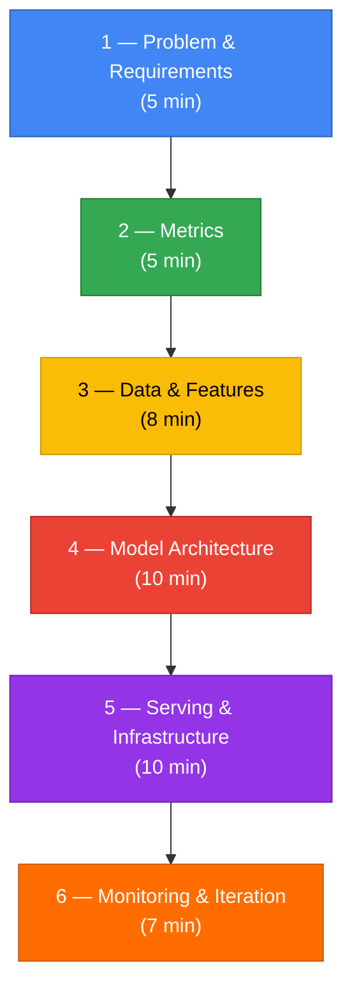
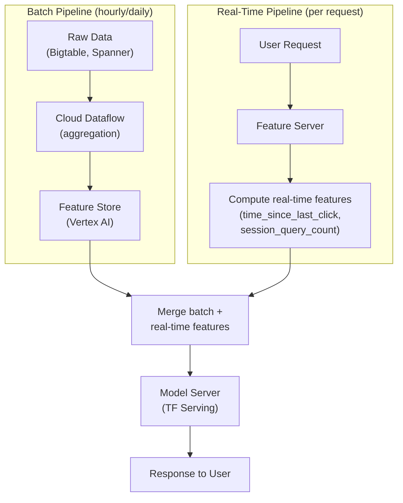
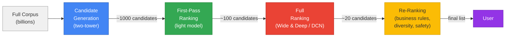
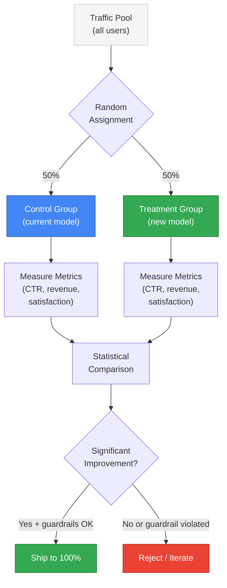
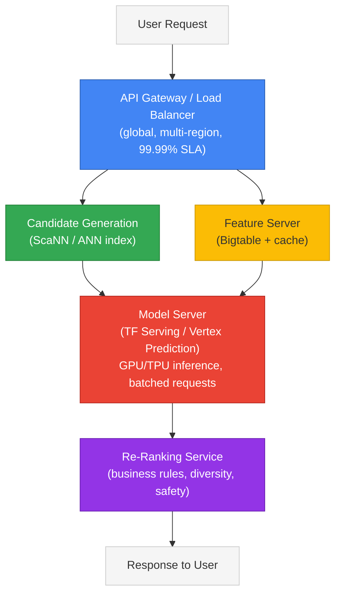
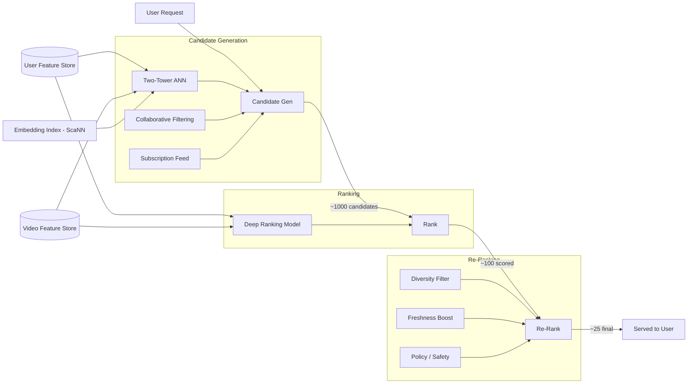
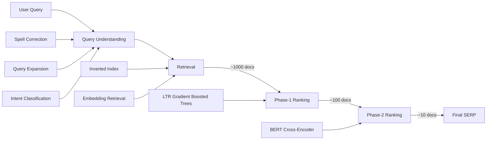
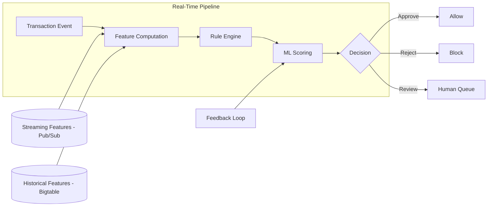
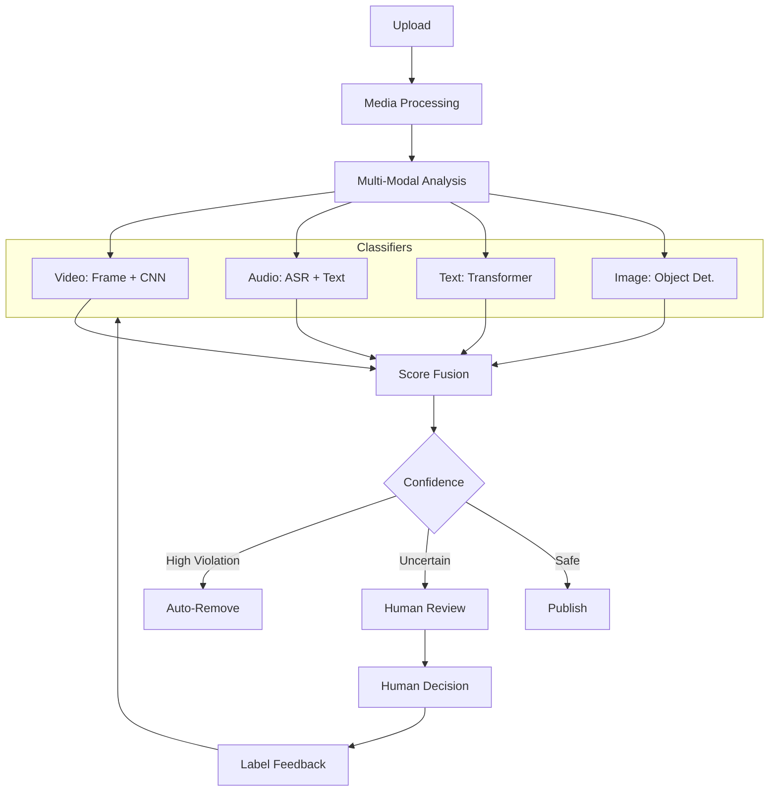
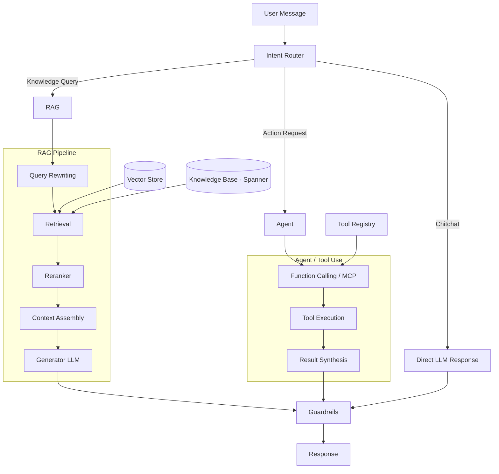

# Chapter 17 — ML System Design (Google)

> "At Google, system design is not about memorizing architectures — it's about demonstrating structured thinking at scale."

---

## What You'll Learn

This chapter teaches you to design production ML systems the way Google engineers do — end to end, at planet scale. You will learn a battle-tested 6-step framework, then apply it across every layer of the stack: defining the right metric, engineering features that serve billions of requests, selecting models that balance accuracy against latency, running A/B tests that actually prove value, and building monitoring that catches problems before users do.

Every section is written with a single goal: prepare you to walk into a 45-minute Google ML System Design interview and demonstrate the structured, depth-first thinking that earns a "Strong Hire."

---

## Table of Contents

| Section | Topic | Key Concepts |
|---------|-------|--------------|
| 17.1 | The ML System Design Framework | 6-step structure, time management, scoring rubric, anti-patterns |
| 17.2 | Problem Framing & Metrics | Business-to-ML translation, offline/online metrics, metric disagreement |
| 17.3 | Data & Feature Engineering at Scale | Labels, data quality, feature categories, feature stores, training-serving skew |
| 17.4 | Model Selection & Training | Baselines, two-tower, Wide & Deep, DCN, multi-stage pipelines, distributed training |
| 17.5 | Evaluation & A/B Testing | Time-based splits, experiment design, guardrails, interleaving |
| 17.6 | Model Serving & Infrastructure | Batch vs real-time, latency budgets, compression, ANN search, ScaNN |
| 17.7 | Monitoring & Maintenance | Data drift, concept drift, retraining triggers, canary releases |
| 17.8 | Responsible AI in System Design | Bias detection, fairness constraints, content safety, explainability |
| 17.9 | Full Design: Recommendation System | YouTube-scale recommendations end to end |
| 17.10 | Full Design: Search Ranking | Google Search-style ranking pipeline |
| 17.11 | Full Design: Fraud Detection | Payment fraud detection at scale |
| 17.12 | Full Design: Content Moderation | Detecting harmful content across text, image, and video |
| 17.13 | Full Design: Ads Click Prediction | Predicting ad clicks for billions of impressions |
| 17.14 | Full Design: Notification System | Deciding what to send, when, and to whom |
| 17.15 | Full Design: RAG-Based Enterprise Search | Retrieval-augmented generation at production scale |
| 17.16 | Trade-offs Cheat Sheet | Common trade-offs interviewers push on |
| 17.17 | Interview Tips & Anti-Patterns | What to do and what to avoid |
| 17.18 | Quick Reference | Frameworks, metrics, and checklists |

---

# 17.1 The ML System Design Framework

Every Google ML system design interview follows the same arc: the interviewer gives you an open-ended problem — "Design YouTube recommendations," "Build a fraud detection system," "Create a notification relevance ranker" — and watches how you decompose it. The candidates who succeed are the ones who follow a clear structure instead of jumping straight to "use a transformer."

The framework below distills what Google interviewers consistently reward. It has six steps, and every step maps to a specific evaluation signal.

---

## The 6-Step Framework



### Step 1 — Problem & Requirements (5 minutes)

Before you design anything, demonstrate that you think before you build. Ask clarifying questions. This is where most candidates differentiate themselves in the first two minutes.

**What to clarify:**

| Dimension | Example Questions |
|-----------|------------------|
| **Business goal** | "What are we optimizing for — engagement, revenue, user satisfaction?" |
| **Users** | "Who are the users? How many? Global or regional?" |
| **Scale** | "How many requests per second? How large is the corpus?" |
| **Latency** | "What is the acceptable response time? Is this real-time or batch?" |
| **Constraints** | "Any privacy, fairness, or regulatory requirements?" |
| **Existing systems** | "Is there a current solution? What does it do well/poorly?" |

> At Google scale, "how many users" usually means 2+ billion. "How many items" usually means hundreds of millions to billions. These numbers fundamentally change your architecture — you cannot brute-force rank a billion items in real time.

**State your assumptions explicitly.** If the interviewer does not answer a question, say: "I'll assume we have 500M daily active users and need sub-200ms latency. I'll revisit if that changes the design."

### Step 2 — Metrics (5 minutes)

Define both offline metrics (how you evaluate the model before launch) and online metrics (how you measure success in production). More detail in Section 17.2.

### Step 3 — Data & Features (8 minutes)

Describe what data you need, how you get labels, what features you engineer, and how you serve those features at scale. This is where Google interviewers probe for practical experience. More detail in Section 17.3.

### Step 4 — Model Architecture (10 minutes)

Start with a simple baseline, then layer on complexity with justification. Show the multi-stage pipeline pattern (candidate generation → ranking → re-ranking) that Google uses across Search, YouTube, and Ads. More detail in Section 17.4.

### Step 5 — Serving & Infrastructure (10 minutes)

How do predictions reach users? Discuss batch vs. real-time, latency budgets, model compression, and caching. This is where you demonstrate systems thinking. More detail in Section 17.6.

### Step 6 — Monitoring & Iteration (7 minutes)

How do you know the system still works next month? Discuss drift detection, retraining, feedback loops, and safe deployment. More detail in Section 17.7.

---

## 45-Minute Time Management Template

| Time | Step | What to Say / Do |
|------|------|-----------------|
| 0:00 | *Pause* | Read the question. Take 30 seconds to think before speaking. |
| 0:30 | **1 — Requirements** | Ask 4-6 clarifying questions. State assumptions. |
| 5:00 | **2 — Metrics** | "This is a ranking problem. I'll optimize NDCG offline and CTR + session time online." |
| 10:00 | **3 — Data & Features** | Data sources, labeling strategy, feature pipeline, feature store. |
| 18:00 | **4 — Model** | Baseline → production architecture. Multi-stage pipeline. Justify each choice. |
| 28:00 | **5 — Serving** | Batch vs real-time. Latency breakdown. Caching. Scaling. |
| 38:00 | **6 — Monitoring** | Drift detection, retraining, A/B testing, feedback loops. |
| 43:00 | *Wrap up* | Summarize in 60 seconds. Mention trade-offs and what you would do with more time. |
| 44:00 | *Invite depth* | "What would you like me to go deeper on?" |

---

## What Google Interviewers Score

Google uses a structured rubric. Each dimension is scored independently:

| Dimension | What They Look For | Score Weight |
|-----------|-------------------|-------------|
| **Problem Formulation** | Can you translate a vague business goal into a concrete ML task with the right label? | High |
| **Data Thinking** | Do you reason about where data comes from, what labels look like, and what can go wrong? | High |
| **Model Depth** | Can you go deep on architecture choices and explain *why* — not just *what*? | Medium-High |
| **System Thinking** | Do you address scale, latency, serving infrastructure, and operational concerns? | Medium-High |
| **Trade-off Articulation** | Can you compare alternatives and justify your choice with constraints? | Medium |
| **Metric Rigor** | Do you define both offline and online metrics, and discuss when they disagree? | Medium |
| **Communication** | Is your walkthrough structured, clear, and interactive? Do you use the whiteboard effectively? | Medium |

> Google interviews since 2025 have increasingly emphasized GenAI-native design thinking: can you incorporate LLMs, RAG, and agentic workflows into system designs? Be ready for follow-up questions like "How would you add an LLM re-ranker to this pipeline?" or "Where would retrieval-augmented generation fit?"

---

## Common Anti-Patterns That Fail

| Anti-Pattern | Why It Fails |
|-------------|-------------|
| "Let's use GPT-4 / BERT / a transformer" (minute 1) | No problem framing. No justification. No baseline. |
| Skip clarifying questions | Builds the wrong system. Interviewer thinks you don't ask questions in real projects. |
| Only talk about the model | ML system ≠ ML model. Serving, data, and monitoring matter just as much. |
| "Accuracy is 95%" | Accuracy is almost never the right metric. Shows shallow understanding. |
| Ignore latency constraints | A model that takes 5 seconds cannot serve Search results. |
| "The model will work forever" | Models decay. Data drifts. No monitoring = ticking time bomb. |
| Never mention fairness / bias | Google takes Responsible AI seriously, especially post-Gemini. |
| Monologue for 15 minutes without pausing | The interview is a conversation. Check in with the interviewer. |

---

# 17.2 Problem Framing & Metrics

The first thing you say in an ML system design interview defines the trajectory of the entire conversation. Get the problem framing wrong and every subsequent decision — data, model, serving — compounds the error. Get it right and the rest of the interview flows naturally.

---

## Converting Business Goals to ML Tasks

Every ML system begins as a business goal: "increase engagement," "reduce fraud," "improve search quality." Your job is to translate that vague goal into a precise ML formulation with a clear prediction target.

| Business Goal | ML Task Type | Prediction Target | Example Label |
|--------------|-------------|-------------------|---------------|
| "Show users content they'll enjoy" | Ranking | P(user engages with item) | click, watch time, like |
| "Detect fraudulent payments" | Binary Classification | P(transaction is fraudulent) | is_fraud ∈ {0, 1} |
| "Estimate delivery time" | Regression | Predicted minutes | actual_delivery_minutes |
| "Suggest search queries" | Ranking / Generation | P(user selects suggestion) | selected_suggestion |
| "Decide which notifications to send" | Multi-objective Ranking | P(open) × relevance − P(annoyance) | open, dismiss, disable |
| "Moderate harmful content" | Multi-label Classification | P(toxic), P(violent), P(spam) | human_label per category |
| "Answer questions using company docs" | Retrieval + Generation (RAG) | relevance(doc, query) × quality(answer) | human_rating |

### The Label Defines the System

> The **prediction target** (label) is the single most consequential design decision. It determines what data you need, what model you train, what metric you optimize, and what behavior you incentivize in production.

A common interview trap: optimizing the wrong label. If YouTube optimizes for clicks, users get clickbait. If it optimizes for long watch time, users get long but low-quality videos. The right label is usually a *composite signal* — click AND meaningful watch time AND positive feedback, weighted to balance engagement with satisfaction.

Before committing to a label, ask: (1) Does it align with the actual business objective? (2) Can I collect it at scale? (3) Is it available at training time, or does it take days to materialize? (4) Does optimizing it create perverse incentives like doomscrolling?

---

## Offline Metrics

Offline metrics evaluate model quality before deployment, using held-out data. You must know which metric matches which problem type and why.

### Classification Metrics

> **Precision** is the fraction of positive predictions that are actually positive. When the cost of a false positive is high (spam filter marking important email as spam), optimize for precision.

> **Recall** is the fraction of actual positives that the model successfully identifies. When the cost of a false negative is high (missing a cancer diagnosis), optimize for recall.

> **F1 Score** is the harmonic mean of precision and recall: F1 = 2PR / (P + R). Use it when you need a single number that balances both.

> **AUC-ROC** (Area Under the Receiver Operating Characteristic curve) measures how well the model separates positive and negative classes across all thresholds. An AUC of 0.5 means random guessing; 1.0 means perfect separation. Robust to class imbalance in the sense that it evaluates ranking quality, not calibrated probabilities.

> **AUC-PR** (Area Under the Precision-Recall curve) is more informative than AUC-ROC when classes are heavily imbalanced (e.g., fraud: 0.1% positive rate). A model with high AUC-ROC can still have poor AUC-PR if it generates many false positives relative to true positives.

> **Log Loss** (binary cross-entropy) measures the quality of predicted probabilities, not just rankings. A model with log loss 0.0 produces perfect probabilities. Use it when you need well-calibrated scores (e.g., ads bidding where you multiply P(click) by bid price).

### Ranking Metrics

> **NDCG** (Normalized Discounted Cumulative Gain) measures the quality of a ranked list, giving more credit to relevant items appearing at the top. NDCG@k evaluates only the top-k positions. Standard metric for Search and recommendation ranking.

NDCG ranges from 0 to 1. A score of 1.0 means the model produces the ideal ranking. The "discounted" part penalizes relevant results that appear lower in the list — showing the best result at position 10 instead of position 1 is worse, and NDCG captures this.

> **MRR** (Mean Reciprocal Rank) measures how high the *first* relevant result appears. MRR = average of 1/rank_of_first_relevant across all queries. Use for problems where the user cares about a single best result (e.g., "I'm Feeling Lucky").

> **MAP** (Mean Average Precision) computes the average precision at each relevant position, then averages across queries. More sensitive to the full ranking than MRR.

### Generation Metrics

> **Perplexity** measures how well a language model predicts the next token. Lower is better. Perplexity of k means the model is, on average, as uncertain as choosing uniformly among k options.

> **BLEU / ROUGE** are n-gram overlap metrics for machine translation (BLEU) and summarization (ROUGE). Cheap to compute but poorly correlated with human judgment for open-ended generation. Use as sanity checks, not primary metrics.

> **LLM-as-Judge** uses a separate LLM to evaluate generation quality along dimensions like helpfulness, accuracy, and safety. Increasingly used at Google for evaluating Gemini outputs when human evaluation is too slow.

### Regression Metrics

> **MAE** (Mean Absolute Error) is the average absolute difference between prediction and actual. Robust to outliers. Use for delivery time prediction.

> **RMSE** (Root Mean Squared Error) penalizes large errors more than MAE. Use when large errors are disproportionately costly.

---

## Online Metrics

Online metrics measure what actually matters in production — business impact. They are measured through A/B tests on real traffic.

| Metric | What It Measures | Example |
|--------|-----------------|---------|
| **CTR** (Click-Through Rate) | % of impressions that get clicked | Search result relevance |
| **Conversion Rate** | % of users who complete a desired action | Completing a purchase after ad click |
| **Session Duration** | Time spent per session | YouTube engagement |
| **Revenue per User** | Average revenue generated | Ads system performance |
| **DAU / MAU** | Daily/Monthly active users | Overall product health |
| **Retention Rate** | % of users who return after N days | Long-term satisfaction |
| **User Satisfaction (CSAT)** | Survey-based satisfaction score | Quality of LLM responses |
| **Task Completion Rate** | % of users who finish their task | Search success rate |

---

## When Offline and Online Metrics Disagree

This is a favorite interview question: "Your model improves NDCG by 3% offline but CTR drops 1% in the A/B test. What happened?"

Common causes:

| Cause | Explanation | Example |
|-------|-------------|---------|
| **Distribution shift** | Training data does not match live traffic | Model trained on US data, tested globally |
| **Feature leakage** | A feature available offline is unavailable or delayed at serving time | Using "purchase history" that includes data from the future relative to the prediction time |
| **Positional bias** | Offline data reflects what was shown at position 1; new model changes what is at position 1 | Users click position 1 regardless of relevance |
| **Proxy metric mismatch** | NDCG measures relevance, but users optimize for satisfaction | A result can be relevant but unsatisfying |
| **Novelty / fatigue effects** | Users react to change, not quality | New recommendations are refreshing initially but low quality |
| **Selection bias** | A/B test population differs from training population | Power users are over-represented in training data |

**What to say in the interview:** "I would first check for data pipeline issues — was the right model actually deployed? Then I would inspect feature distributions between offline evaluation and live traffic. Next, I would look for positional bias by running a position-debiased evaluation. If the metric gap persists, the offline metric may not be measuring what users actually care about, and I would consider switching to a metric like quality-weighted engagement."

---

```chart
{
  "type": "radar",
  "data": {
    "labels": ["Precision", "Recall", "AUC-ROC", "NDCG", "Calibration", "Latency Impact"],
    "datasets": [
      {
        "label": "Fraud Detection",
        "data": [95, 80, 92, 0, 60, 30],
        "backgroundColor": "rgba(234, 67, 53, 0.2)",
        "borderColor": "#EA4335",
        "pointBackgroundColor": "#EA4335"
      },
      {
        "label": "Search Ranking",
        "data": [70, 85, 80, 95, 50, 90],
        "backgroundColor": "rgba(66, 133, 244, 0.2)",
        "borderColor": "#4285F4",
        "pointBackgroundColor": "#4285F4"
      },
      {
        "label": "Ads Click Prediction",
        "data": [75, 70, 88, 80, 95, 85],
        "backgroundColor": "rgba(52, 168, 83, 0.2)",
        "borderColor": "#34A853",
        "pointBackgroundColor": "#34A853"
      }
    ]
  },
  "options": {
    "scales": {
      "r": {
        "beginAtZero": true,
        "max": 100,
        "ticks": { "stepSize": 20 }
      }
    },
    "plugins": {
      "title": { "display": true, "text": "Metric Priority by System Type" },
      "legend": { "position": "bottom" }
    }
  }
}
```

---

# 17.3 Data & Feature Engineering at Scale

Data is the foundation of every ML system. At Google, data decisions often matter more than model decisions — a simple model trained on clean, well-labeled data at scale will outperform a complex model trained on noisy, biased data. This section covers how production ML systems collect data, ensure quality, and engineer features that serve predictions to billions of users.

---

## Data Collection: Labels Are the Bottleneck

Every supervised ML system needs labels. The choice between implicit and explicit labels has deep consequences for data volume, quality, and bias.

### Implicit Labels

Implicit labels are derived from user behavior without asking users to rate or annotate anything. They are abundant and cheap but noisy.

| Signal | What It Captures | Noise / Bias |
|--------|-----------------|-------------|
| **Clicks** | Interest / curiosity | Position bias — users click top results regardless of relevance |
| **Dwell time** | Engagement depth | Short dwell could mean quick answer found OR irrelevant |
| **Scroll depth** | Content consumption | Can indicate scanning, not reading |
| **Add to cart** | Purchase intent | Many carts are abandoned |
| **Skip / swipe away** | Disinterest | Could be accidental |
| **Watch time** | Video engagement | Autoplay inflates watch time |
| **Share / save** | High-quality content signal | Rare — sparse signal |

> At YouTube scale, implicit labels generate **billions of data points per day** — but each one is a noisy proxy for user satisfaction, not a direct measure of it.

### Explicit Labels

Explicit labels come from direct human judgment: ratings, thumbs up/down, survey responses, human annotations.

| Source | Quality | Volume | Cost |
|--------|---------|--------|------|
| User ratings (1-5 stars) | Medium — biased toward extremes | Medium | Free |
| Thumbs up/down | Medium — simple but clear signal | Medium | Free |
| Human raters (Likert scales) | High — trained annotators | Low | $0.10–$2.00 per label |
| Expert annotation (medical, legal) | Very high | Very low | $5–$50 per label |

**In practice, Google combines both.** Implicit labels provide scale; explicit labels provide calibration. A common pattern: train on implicit labels, validate with explicit labels.

### Click Logs and Impression Data

For search and recommendation systems, the fundamental data unit is the **impression log**: what was shown, in what position, and what the user did.

| Field | Description |
|-------|-------------|
| `request_id` | Unique ID for this serving request |
| `user_id` | Anonymized user identifier |
| `timestamp` | When the request was served |
| `query` | User's search query (if applicable) |
| `candidates[].item_id` | Unique item identifier |
| `candidates[].position` | Position in the ranked list (1, 2, 3...) |
| `candidates[].score` | Model's predicted score at serving time |
| `candidates[].clicked` | Did the user click? (0/1) |
| `candidates[].dwell_ms` | Time spent on item after click |
| `candidates[].action` | like, share, dismiss, report, none |
| `device` | mobile, desktop, tablet |
| `country` | User's country code |
| `session_id` | Groups requests within one user session |

> At Google scale: approximately 500 billion impression events per day across Search, YouTube, Ads, and Discover combined.

---

## Data Quality

Models are only as good as their data. Production ML systems face several systematic data quality problems:

### Missing Values

Missing data is rarely random — it is almost always **informatively missing**. A user who does not fill out their profile is systematically different from one who does. A sensor that drops readings during high load produces gaps correlated with the events you most want to predict.

**Strategies:**
- **Indicator features:** Add a binary `is_missing` feature so the model can learn that missingness is informative
- **Imputation:** Mean/median for numerical, mode for categorical — but acknowledge the bias this introduces
- **Model-native handling:** Tree-based models (XGBoost, LightGBM) handle missing values natively by learning optimal split directions

### Label Noise

In any system that uses implicit labels, a significant fraction of labels are wrong. A user who clicks a search result and immediately bounces back did not find it relevant — but the click log records it as a positive example.

**Mitigation:**
- **Threshold engagement:** Require dwell time > N seconds for a click to count as positive
- **Multi-signal labels:** Combine click + dwell time + explicit feedback into a composite label
- **Label smoothing:** Instead of hard 0/1 labels, use soft labels (e.g., 0.1 for a click with <3s dwell)
- **Confident learning:** Use techniques like Cleanlab to identify and down-weight likely mislabeled examples

### Selection Bias

The most insidious data problem. Your training data only contains examples of items your *current* system chose to show. Items that the current model ranks low never get shown, so you never learn whether they are relevant.

> **Selection bias** means your model can only learn from what it has already chosen to show. This creates a feedback loop: the model gets better at predicting what users do with the items it already shows, but never explores whether other items would be better.

**Mitigation:**
- **Exploration traffic:** Reserve 1-5% of traffic for random or epsilon-greedy exploration
- **Inverse propensity scoring (IPS):** Weight each training example by 1/P(item was shown), correcting for the display policy
- **Counterfactual evaluation:** Use logged data with propensity scores to estimate how a new model would have performed

---

## Feature Categories

Well-designed features are the difference between a model that works and a model that works at Google quality. Features fall into four categories:

| Category | What It Captures | Example Features |
|----------|-----------------|-----------------|
| **User** | Demographics, behavior, preferences | `user_age_bucket`, `country`, `click_rate_7d`, `avg_session_length`, `user_embedding` |
| **Item** | Properties of the item being scored | `category`, `title_embedding`, `freshness`, `popularity_score`, `avg_rating`, `content_length` |
| **Context** | Situational signals at request time | `time_of_day`, `day_of_week`, `device_type`, `current_query`, `session_depth` |
| **Cross** | Interactions between categories | `user_category_affinity` (user x item category), `query_item_similarity`, `user_item_history` |

### Why Cross Features Matter

Cross features capture interactions that individual features cannot. A user's click rate on sports content is more predictive than their overall click rate + the item's category separately. Google's Wide & Deep model was designed specifically to handle cross features — the "Wide" component memorizes specific feature crosses, while the "Deep" component generalizes from embeddings.

---

## Feature Stores

> A **feature store** is a centralized system that computes, stores, and serves features for both training and inference. It solves the training-serving skew problem by ensuring the same feature computation logic is used in both pipelines.

At Google, the Vertex AI Feature Store serves this role. But the concept is universal and critical to understand.

**Why feature stores exist:**

| Problem Without Feature Store | How Feature Store Solves It |
|------------------------------|----------------------------|
| Features computed differently in training (Python/Spark) and serving (C++/Java) | Single feature definition, dual materialization |
| Features recomputed for every model, wasting compute | Shared feature registry — compute once, reuse across models |
| Point-in-time correctness is hard to guarantee | Built-in time-travel: fetch features as of a specific timestamp |
| Feature freshness varies — some are stale | SLA management per feature: real-time, near-real-time, or batch |
| No visibility into feature lineage or quality | Feature monitoring, statistics, and data lineage tracking |

---

## Real-Time vs. Batch Features

Production ML systems almost always need both batch features (precomputed) and real-time features (computed at request time). The architecture looks like this:



| Feature Type | Update Frequency | Latency to Compute | Storage | Examples |
|-------------|-----------------|-------------------|---------|----------|
| **Batch** | Hourly / daily | Minutes to hours | Bigtable, Feature Store | User click rate (30d), item popularity |
| **Near-real-time** | Minutes | Seconds to minutes | Pub/Sub → streaming pipeline | Trending topics, recent interactions |
| **Real-time** | Per request | Milliseconds | Computed inline | Time of day, device, query text |

---

## Training-Serving Skew

> **Training-serving skew** occurs when the features used during model training differ from the features available at inference time. This is the #1 cause of models that look great offline but fail in production.

Common sources of skew:

| Source | What Happens | How to Detect |
|--------|-------------|---------------|
| **Code path divergence** | Training uses Python; serving uses C++. Subtle numerical differences accumulate. | Feature distribution comparison between training and serving logs |
| **Temporal leakage** | Training accidentally uses future data (e.g., aggregates that include the prediction timestamp). | Check feature timestamps against label timestamps |
| **Feature staleness** | A batch feature is 6 hours old at serving time but was fresh during training. | Monitor feature freshness SLAs |
| **Missing features at serving** | A feature available in the data warehouse is not available in the real-time path. | Integration tests that compare feature vectors |
| **Preprocessing differences** | Tokenizer version, normalization constants, or encoding differ. | Hash-based consistency checks |

**The golden rule:** Use the same code path to compute features for training and serving. This is exactly what feature stores enforce. At Google, TFX (TensorFlow Extended) pipelines ensure that feature transformations defined once are applied identically in both contexts.

---

# 17.4 Model Selection & Training

In a system design interview, model selection is where candidates either demonstrate depth or reveal that they only know buzzwords. The key principle: **always start simple, then add complexity with justification.**

---

## Always Start with a Baseline

Before proposing any neural network, state your baseline. This grounds the discussion and gives the interviewer confidence that you think like a practitioner.

| Level | Approach | What It Proves |
|-------|----------|---------------|
| **0 — Heuristic** | Sort by popularity. No ML. | Establishes the floor. If ML cannot beat this, do not use ML. |
| **1 — Linear / GBDT** | Logistic regression or XGBoost on hand-crafted features. | Fast to train, easy to debug, often surprisingly competitive. |
| **2 — Shallow NN** | 2-layer MLP over embeddings. | Captures non-linear interactions. Baseline for dense features. |
| **3 — Production** | Two-tower retrieval + Wide & Deep / DCN ranking. | This is the level Google expects you to reach and go deep on. |

In a real interview, spend 30 seconds on Levels 0-1, then 8 minutes going deep on Level 3. The baseline is not where you spend time — it is where you show you have the right instinct.

---

## Common Production Architectures

### Two-Tower Model (Candidate Retrieval)

The two-tower model (also called dual-encoder) is Google's workhorse for large-scale candidate retrieval. It separately encodes the query/user and the item into dense embeddings, then uses approximate nearest neighbor (ANN) search to find the top-k most relevant items from a corpus of billions.

The two-tower model encodes query/user and item separately through independent DNNs, producing embeddings (typically d=128). At training time, contrastive loss or softmax cross-entropy over in-batch negatives teaches the towers to place relevant query-item pairs close together. Hard negative mining improves quality significantly.

**Why two separate towers?** Item embeddings can be precomputed and indexed offline. At serving time, you only compute the query embedding (one DNN forward pass) and then perform ANN lookup — 5-10ms to search billions of items.

### Wide & Deep (Memorization + Generalization)

> The **Wide & Deep** model, introduced by Google in 2016, combines a wide linear component (for memorizing specific feature interactions) with a deep neural network (for generalizing to unseen combinations). It remains one of the most deployed architectures at Google.

The Wide component takes cross features (`user_id x item_id`, `query x category`, `device x hour`) through a linear layer. The Deep component passes raw features (`user_embedding`, `item_embedding`, context) through a DNN stack (1024 → 512 → 256). Both outputs concatenate and feed into a sigmoid for the final prediction.

**When to use Wide & Deep:** Ranking problems where you want to memorize high-value specific patterns ("users who bought X also bought Y") while also generalizing to new user-item pairs.

### DCN (Deep & Cross Network)

> **Deep & Cross Network (DCN)** automates feature crossing that Wide & Deep requires you to hand-engineer. The Cross Network layer explicitly models bounded-degree feature interactions at each layer, while the Deep Network captures implicit higher-order patterns.

The DCN-v2 variant, which uses a mixture of low-rank cross layers, is now the standard at Google for click-through rate prediction in Ads and YouTube.

**Key advantage over Wide & Deep:** You do not need to manually engineer cross features. The Cross Network learns them.

### Multi-Stage Pipeline

At Google scale, no single model can handle the full task. Instead, systems use a multi-stage pipeline:



| Stage | Items In | Items Out | Model | Latency Budget |
|-------|---------|----------|-------|---------------|
| Candidate Generation | Billions | ~1,000 | Two-tower + ANN | 10-20 ms |
| First-Pass Ranking | ~1,000 | ~100 | Lightweight DNN or GBDT | 10-15 ms |
| Full Ranking | ~100 | ~20 | Wide & Deep / DCN | 15-30 ms |
| Re-Ranking | ~20 | ~10 | Business rules + diversity | 5-10 ms |
| **Total** | | | | **40-75 ms** |

> Google Search, YouTube recommendations, and Google Ads all follow this pattern. The numbers vary, but the architecture is the same: cheap, fast models to narrow the funnel, then expensive, accurate models on the short list.

---

## Training at Scale

At Google scale, training data does not fit on one machine, and training runs can take days even on TPU pods.

### Distributed Training Strategies

| Strategy | How It Works | When to Use |
|----------|-------------|------------|
| **Data Parallelism** | Each worker has a copy of the model. Data is split across workers. Gradients are aggregated (AllReduce). | Most common. Works for models that fit on one device. |
| **Model Parallelism** | The model is split across devices (e.g., different layers on different TPUs). | When the model does not fit on a single device (LLMs). |
| **Pipeline Parallelism** | Different micro-batches flow through different model stages concurrently. | LLM training at Google (GPipe, PaLM). |
| **Mixed Precision** | Use float16/bfloat16 for most operations, float32 for critical accumulations. | Always use on TPUs — 2x throughput, near-zero accuracy loss. |

> On Google TPU v5 pods, a 100B parameter model can be trained using 3D parallelism (data + tensor + pipeline) across 4,096 chips. Training PaLM-2 took ~2 months on TPU v4 pods.

### Handling Imbalanced Data

Many production tasks are severely imbalanced — fraud is 0.1% of transactions, content policy violations are <1% of uploads.

| Technique | Description |
|-----------|-------------|
| **Downsampling negatives** | Train on all positives + a random sample of negatives. Correct prediction probabilities at serving with calibration. |
| **Focal loss** | Reduces the loss contribution from easy negatives, focusing training on hard examples. |
| **Class weights** | Weight the positive class by N_neg / N_pos in the loss function. |
| **SMOTE** | Synthetic oversampling. Useful for tabular data, not for embeddings. |

### Cold Start

New users (no history) and new items (no interaction data) are the Achilles' heel of recommendation systems.

**User cold start strategies:**
- Fall back to popularity-based recommendations
- Use demographic features (age bucket, country) as a coarse signal
- Onboarding questionnaire ("What topics interest you?")
- Contextual bandits for rapid exploration

**Item cold start strategies:**
- Use content-based features (title, description, category) rather than collaborative signals
- Boost new items in candidate generation with an exploration bonus
- Use the two-tower model's item tower: new items get an embedding from their content features alone

### Position Bias

> **Position bias** is the tendency for users to interact with items at higher positions in a list, regardless of quality. Position 1 gets 10-50x the clicks of position 5, even for identical items.

If your training data includes position as an implicit feature, your model learns to predict position, not relevance.

**Mitigation:**
- **Train with position features, remove at serving:** Include position as a feature during training so the model learns to factor it out. At serving time, set position to a constant or remove it.
- **Inverse propensity weighting:** Weight examples by 1/P(click | position) to remove position confounding.
- **Randomization experiments:** Periodically shuffle results to collect unbiased data. Expensive in user experience, so use sparingly.

---

```chart
{
  "type": "line",
  "data": {
    "labels": ["Heuristic", "Logistic Reg.", "GBDT", "MLP", "Wide & Deep", "DCN-v2", "DCN-v2 + LLM Re-ranker"],
    "datasets": [
      {
        "label": "Offline NDCG@10",
        "data": [0.42, 0.58, 0.65, 0.68, 0.73, 0.76, 0.79],
        "borderColor": "#4285F4",
        "backgroundColor": "rgba(66, 133, 244, 0.1)",
        "fill": true,
        "tension": 0.3
      },
      {
        "label": "Training Cost (relative)",
        "data": [0, 1, 3, 8, 15, 22, 85],
        "borderColor": "#EA4335",
        "backgroundColor": "rgba(234, 67, 53, 0.1)",
        "fill": true,
        "tension": 0.3,
        "yAxisID": "y1"
      }
    ]
  },
  "options": {
    "scales": {
      "y": {
        "beginAtZero": true,
        "max": 1.0,
        "title": { "display": true, "text": "NDCG@10" }
      },
      "y1": {
        "position": "right",
        "beginAtZero": true,
        "max": 100,
        "title": { "display": true, "text": "Relative Training Cost" },
        "grid": { "drawOnChartArea": false }
      }
    },
    "plugins": {
      "title": { "display": true, "text": "Model Complexity vs. Accuracy vs. Training Cost" },
      "legend": { "position": "bottom" }
    }
  }
}
```

---

# 17.5 Evaluation & A/B Testing

An ML model is only as valuable as your ability to prove it works. Offline evaluation tells you whether a model is *likely* better. Online evaluation (A/B testing) tells you whether it *actually is* better — in the real world, with real users, at real scale.

---

## Offline Evaluation: Time-Based Splits

> For production ML, random train/test splits are often wrong. If your data has a temporal component — and nearly all production data does — you must use **time-based splits** that simulate the actual deployment scenario: train on past data, evaluate on future data.

```
  TIME-BASED SPLIT (the right way)
  ═════════════════════════════════

  ────────────────────────────────────────────────────────→ time

  ██████████████████████  ████████  ████████████████
  │     TRAINING         │ GAP    │  VALIDATION/TEST  │
  │  (Jan 1 – Mar 31)   │(Apr 1) │  (Apr 2 – Apr 30) │
  └──────────────────────┘        └───────────────────┘

  The GAP prevents label leakage: if your label is "did the user
  purchase within 7 days," you need a 7-day gap between training
  and validation to avoid using future information.
```

**Why not random splits?** Because random splits allow future data to leak into training. A model trained with data from April mixed in can "see" patterns that would not be available in a real March deployment. This inflates offline metrics and leads to disappointment when the model goes live.

### Backtesting (Replay Evaluation)

For ranking and recommendation systems, you can replay historical data to estimate how a new model would have performed:

1. Take logged (query, candidates, user_action) triples from the production system
2. Re-score the candidates with the new model
3. Evaluate the new ranking against the logged user actions

**Caveat:** This only works for items the old model chose to show (selection bias). Items the new model would have surfaced but the old model did not are invisible. Inverse propensity scoring can partially correct for this.

---

## A/B Testing Design

A/B testing is the gold standard for evaluating ML model changes in production. At Google, thousands of A/B tests run simultaneously across Search, YouTube, Ads, and other products.



### Key Design Decisions

| Decision | Considerations |
|----------|---------------|
| **Randomization unit** | User-level (not request-level) to avoid inconsistent experiences. Use consistent hashing on user_id. |
| **Sample size** | Determined by minimum detectable effect (MDE). For a 0.5% CTR lift, you may need millions of users. |
| **Duration** | At least 1-2 weeks to capture day-of-week effects. Longer for metrics with delayed feedback (e.g., retention). |
| **Statistical test** | Two-sample t-test or Mann-Whitney for continuous metrics. Chi-squared for proportions. Bayesian methods increasingly used at Google for faster decisions. |
| **Significance level** | Typically alpha = 0.05 (5% false positive rate). For high-risk changes, use alpha = 0.01. |
| **Multiple testing** | If testing 10 metrics, apply Bonferroni or Holm-Bonferroni correction to avoid false discoveries. |

### Guardrail Metrics

> **Guardrail metrics** are metrics that must *not degrade* even if the primary metric improves. They protect against optimizing one thing at the expense of everything else.

| Primary Metric | Guardrail Metrics |
|---------------|-------------------|
| CTR (engagement) | Revenue per user, session count (don't increase clicks by showing low-quality clickbait) |
| Revenue | User satisfaction, retention (don't show too many ads) |
| Watch time | User-reported satisfaction, diversity of content consumed |
| LLM response quality | Latency p95, safety violation rate, factual accuracy |

**The interview answer:** "I would set guardrails on user satisfaction, revenue, and latency. If the new model improves CTR by 1% but degrades user satisfaction by 0.5%, I would not ship it."

### Statistical Significance vs. Practical Significance

A result can be statistically significant but practically meaningless. If your A/B test shows a 0.01% CTR improvement with p < 0.001, it is "significant" in the statistical sense but likely not worth the engineering cost to maintain a more complex model.

**Rule of thumb at Google scale:** Even a 0.1% improvement in a core metric can translate to billions of dollars annually — so practical significance thresholds are context-dependent.

---

## Interleaving Experiments

> **Interleaving** is a technique for comparing two ranking models by mixing their results into a single list and observing which model's results get more engagement. It requires 10-100x fewer users than traditional A/B testing to reach the same statistical power.

**How it works:**

1. Both models rank the same set of candidates
2. Results are interleaved (e.g., alternating picks from each model's ranking)
3. The user sees one merged list but does not know which model produced each result
4. Credit each click to the model that ranked that item higher

**Advantage:** Much faster than A/B tests because each user sees results from both models, eliminating user-level variance.

**Limitation:** Only measures relative ranking quality, not absolute metrics like revenue or latency. Use interleaving for rapid model comparison, then confirm with a full A/B test.

---

## Long-Term vs. Short-Term Metrics

A/B tests typically run for 1-4 weeks. But some effects only appear over months:

| Short-Term Signal | Potential Long-Term Consequence |
|------------------|-------------------------------|
| CTR increases | Users become habituated, CTR normalizes |
| Watch time increases | Users burn out, reduce session frequency over weeks |
| Ad clicks increase | User trust decreases, ad blindness increases |
| Engagement with viral content increases | Filter bubbles form, satisfaction drops over months |

**How Google handles this:** Run long-term holdout experiments — reserve 1-5% of users who permanently see the old model. Compare metrics at 30, 60, and 90 days.

---

# 17.6 Model Serving & Infrastructure

A model that cannot serve predictions within latency budgets is a model that does not exist. Serving is where ML meets systems engineering, and Google interviewers probe deeply here — they want to know you can build systems that handle billions of requests per day with millisecond response times.

---

## Batch vs. Real-Time Serving

| Dimension | Batch Serving | Real-Time Serving |
|-----------|--------------|-------------------|
| **When** | Precompute predictions on a schedule | Compute at request time |
| **Latency** | Hours (acceptable because results are cached) | Milliseconds (p50 < 50ms, p99 < 200ms) |
| **Freshness** | Stale — predictions may be hours old | Fresh — reflects current context |
| **Cost** | Lower (amortized, uses cheaper compute) | Higher (dedicated serving infrastructure) |
| **Complexity** | Simple — MapReduce/Dataflow job | Complex — model server, feature server, load balancing |
| **Use case** | Email recommendations, weekly reports, precomputed embeddings | Search ranking, ad selection, real-time fraud detection |

**Hybrid pattern (most common):** Precompute what you can (item embeddings, user profiles) in batch. Compute the final ranking score in real time by combining batch features with real-time context.

---

## Serving Architecture

A production ML serving stack at Google scale has several components working in concert:



---

## Latency Budgets

At Google, every component in the serving path has a strict latency budget. The total end-to-end latency (from user request to response) must stay within tight bounds.

| Component | p50 Target | p95 Target | p99 Target |
|-----------|-----------|-----------|-----------|
| API Gateway + routing | 1 ms | 3 ms | 5 ms |
| Feature lookup (cache hit) | 2 ms | 5 ms | 10 ms |
| Feature lookup (cache miss) | 5 ms | 15 ms | 30 ms |
| Candidate generation (ANN) | 5 ms | 10 ms | 20 ms |
| Model inference (ranking) | 10 ms | 20 ms | 40 ms |
| Re-ranking + business logic | 2 ms | 5 ms | 10 ms |
| Response serialization | 1 ms | 2 ms | 3 ms |
| **Total (cache hit)** | **21 ms** | **45 ms** | **88 ms** |
| **Total (cache miss)** | **24 ms** | **55 ms** | **108 ms** |

> **Why p99 matters:** At Google scale with 100,000 QPS, p99 = 200ms means 1,000 users *every second* wait more than 200ms. p99.9 at 500ms means 100 users per second have a noticeably slow experience. Tail latency compounds with fan-out: if you query 10 shards in parallel and each has p99 = 100ms, the overall p99 is much worse (~65% chance at least one shard hits its p99).

---

## Model Compression

Large models are accurate but expensive to serve. Model compression reduces serving cost while preserving most of the accuracy.

| Technique | What It Does | Size Reduction | Accuracy Impact |
|-----------|-------------|---------------|-----------------|
| **Quantization (INT8)** | Replace float32 weights with int8 | 4x smaller | <1% accuracy loss |
| **Quantization (INT4)** | Even smaller quantization | 8x smaller | 1-3% accuracy loss |
| **Knowledge Distillation** | Train a small "student" model to mimic a large "teacher" model | 10-100x fewer params | 1-5% accuracy loss |
| **Pruning** | Remove weights close to zero | 2-10x smaller | <2% accuracy loss with gradual pruning |
| **Low-rank Factorization** | Decompose weight matrices into products of smaller matrices | 2-5x smaller | 1-3% accuracy loss |

> **The Google playbook:** Train the best possible model (the "teacher") without worrying about serving cost. Then distill it into a smaller model that meets latency requirements. The teacher might be a 10B-parameter ensemble that takes 500ms per inference; the student might be a 50M-parameter model that runs in 5ms.

---

## Embedding Serving with Approximate Nearest Neighbors

For systems that need to search over billions of embeddings — recommendations, semantic search, ad retrieval — exact nearest neighbor search is impossibly expensive. Approximate Nearest Neighbor (ANN) algorithms trade a small amount of accuracy for massive speed improvements.

| Algorithm | How It Works | Pros | Cons |
|-----------|-------------|------|------|
| **HNSW** (Hierarchical Navigable Small World) | Multi-layer graph where each node connects to its approximate nearest neighbors. Search walks the graph from coarse to fine layers. | Very high recall (>95%). Good for dynamic corpora (easy to add/remove items). | High memory usage — the graph structure is large. |
| **FAISS** (Facebook AI Similarity Search) | Library supporting multiple index types: flat, IVF (inverted file), PQ (product quantization). | Flexible. GPU acceleration. Excellent for billion-scale indexes with IVF-PQ. | IVF requires index rebuilds when corpus changes significantly. |
| **ScaNN** (Scalable Nearest Neighbors, by Google) | Anisotropic vector quantization optimized for maximum inner product search (MIPS). Designed specifically for Google's retrieval workloads. | Best accuracy-speed tradeoff for MIPS. 2x faster than HNSW at same recall. | Optimized for inner product, not all distance metrics. |

> Google uses **ScaNN** internally for YouTube candidate retrieval, Google Search, and Ads. It searches over 10+ billion embeddings in under 5ms by combining tree-based partitioning with quantization.

```chart
{
  "type": "bar",
  "data": {
    "labels": ["Exact (Brute Force)", "FAISS IVF-PQ", "HNSW", "ScaNN"],
    "datasets": [
      {
        "label": "Latency (ms) for 1B embeddings",
        "data": [5000, 12, 8, 4],
        "backgroundColor": ["#EA4335", "#FBBC05", "#4285F4", "#34A853"],
        "borderRadius": 4
      }
    ]
  },
  "options": {
    "scales": {
      "y": {
        "type": "logarithmic",
        "title": { "display": true, "text": "Latency (ms) — log scale" }
      }
    },
    "plugins": {
      "title": { "display": true, "text": "ANN Search Latency: 1 Billion Embeddings (d=128)" },
      "legend": { "display": false }
    }
  }
}
```

---

## Caching Strategies

Caching is essential at Google scale. Common patterns:

| Layer | What to Cache | TTL | Hit Rate |
|-------|-------------|-----|----------|
| **CDN / Edge** | Static content, precomputed feeds | Hours | 60-80% |
| **Application cache** | Feature vectors for popular users/items | Minutes to hours | 40-60% |
| **Embedding cache** | Item embeddings for top 1M items | Until index rebuild | 80-95% |
| **Result cache** | Full model predictions for identical requests | Seconds to minutes | 10-30% |

> A 90% cache hit rate on feature lookups reduces feature server load by 10x. At 100,000 QPS, that means 90,000 requests served from cache (microseconds) instead of Bigtable (milliseconds).

---

# 17.7 Monitoring & Maintenance

Deploying a model is not the finish line — it is the starting line. Models degrade over time as the world changes around them. The difference between a prototype and a production system is monitoring.

---

## Types of Drift

| Drift Type | What Changes | Example | Detection |
|-----------|-------------|---------|-----------|
| **Data drift** (covariate shift) | Distribution of input features | Model trained on pre-pandemic viewing habits sees surge in home-exercise content | Monitor feature distributions (mean, variance, quantiles) with PSI or KS tests |
| **Concept drift** | Relationship between features and labels | "What makes a relevant search result" shifts as users expect direct answers post-LLM | Monitor offline metric degradation over time on fresh labeled data |
| **Prediction drift** | Distribution of model outputs | Fraud model predicts 30% fraud (up from 0.5%) because a pipeline broke and a feature is all zeros | Monitor prediction distribution (mean score, % above threshold) |

---

## Monitoring Checklist

| What to Monitor | How | Alert Threshold |
|----------------|-----|-----------------|
| **Input feature distributions** | KL divergence / PSI between training and live data, per feature | PSI > 0.2 |
| **Prediction distribution** | Mean, variance, percentiles of predicted scores | >2 sigma shift from baseline |
| **Model latency** | p50, p95, p99 at the model server | p99 > 2x target |
| **Feature freshness** | Age of each feature at serving time | Any feature > 2x its expected refresh interval |
| **Label feedback** | Compare predicted labels vs. observed outcomes (when available) | AUC drops > 2% from baseline |
| **Data volume** | Number of prediction requests per hour | <50% or >200% of expected volume |
| **Error rate** | % of requests returning errors or timeouts | >0.1% |

---

## Retraining Strategies

| Strategy | How It Works | Pros | Cons |
|----------|-------------|------|------|
| **Scheduled** | Retrain daily/weekly on latest data | Simple, predictable | May waste compute if data hasn't changed; may react too slowly |
| **Triggered** | Retrain when drift is detected (PSI > threshold) | Resource-efficient, responsive | Requires robust drift detection |
| **Continuous** | Incrementally update the model on streaming data | Always fresh | Complex infrastructure; risk of catastrophic forgetting |
| **Warm-start** | Initialize new model with weights from previous model, fine-tune on recent data | Faster convergence, retains knowledge | Can inherit and amplify biases from old model |

> At Google, most ranking models retrain **daily** on a sliding window of data (e.g., last 30 days). LLM-based models retrain less frequently (weekly or monthly) due to compute cost, with fine-tuning on recent data between full retraining runs.

---

## Feedback Loops

Feedback loops are one of the most important — and most dangerous — phenomena in production ML.

> A **feedback loop** occurs when a model's predictions influence the data it is later trained on. The model creates its own training distribution, which can amplify biases and create self-reinforcing patterns.

**Positive feedback loop (dangerous):** A recommendation model shows popular items → popular items get more clicks → model learns to show popular items even more → niche items never get shown → diversity collapses.

**Negative feedback loop (self-correcting):** A fraud model flags transactions for review → flagged transactions are investigated → false positives are corrected → model learns from corrections → false positive rate decreases.

**Mitigation:**
- Exploration traffic (show random items to some users)
- Popularity debiasing (downweight items by log(popularity))
- Counterfactual training (train on "what would have happened if we showed a different item")
- Diversity constraints in re-ranking

---

## Safe Deployment: Shadow, Canary, and Rollback

| Deployment Pattern | Description | When to Use |
|-------------------|-------------|------------|
| **Shadow deployment** | New model runs alongside production model. Both score every request, but only the old model's results are shown. Compare outputs. | Before any live traffic — validate the model produces reasonable predictions |
| **Canary release** | Route 1-5% of traffic to the new model. Monitor metrics closely. | After shadow deployment passes — validate with real user impact |
| **Gradual rollout** | Increase traffic from 5% → 10% → 25% → 50% → 100% over days/weeks | Standard practice for any model change at Google |
| **Automatic rollback** | If key metrics (latency, error rate, CTR) degrade beyond thresholds, automatically revert to the previous model | Always — this is the safety net |

The pipeline flows: **Offline Eval → Shadow Deployment → Canary (1-5%) → Gradual Rollout → Full Rollout**, with automatic rollback triggered at any stage if guardrail metrics degrade beyond thresholds.

---

# 17.8 Responsible AI in System Design

Responsible AI is no longer a "nice-to-have" section you mention in the last 30 seconds of an interview. At Google, especially after the high-profile Gemini incidents in early 2024, Responsible AI is embedded in the design process from day one. Interviewers expect you to proactively raise fairness, bias, and safety concerns — not wait to be asked.

---

## Bias Detection Across Demographics

> **Algorithmic bias** occurs when an ML system produces systematically different outcomes for different demographic groups, and those differences are not justified by legitimate factors.

Bias can enter at every stage of the ML pipeline:

| Stage | How Bias Enters | Example |
|-------|----------------|---------|
| **Data collection** | Underrepresentation of certain groups | Training a face recognition model on predominantly light-skinned faces |
| **Labeling** | Annotator disagreement correlates with demographics | "Toxic" language classification varies by cultural context |
| **Feature engineering** | Proxy features encode protected attributes | ZIP code as a proxy for race; name as a proxy for gender |
| **Model training** | Majority group dominates the loss function | Model learns to optimize for the 80% at the expense of the 20% |
| **Evaluation** | Aggregate metrics hide group-level disparities | 95% overall accuracy but 60% accuracy on underrepresented groups |
| **Serving** | Cold start disproportionately affects new users from underrepresented regions | New users in smaller markets get worse recommendations |

### Measuring Bias: Disaggregated Metrics

The key practice: **never report only aggregate metrics.** Always slice metrics by demographic groups.

| Demographic Slice | AUC-ROC | Status |
|------------------|---------|--------|
| Overall | 0.94 | OK |
| English | 0.96 | OK |
| Spanish | 0.93 | OK |
| Hindi | 0.88 | Below threshold |
| Arabic | 0.85 | Below threshold |
| Swahili | 0.72 | **FAILING** |

An "overall AUC of 0.94" hides the fact that the model performs poorly for 15% of the user base.

---

## Fairness Constraints in Ranking

For ranking systems (Search, recommendations, ads), fairness has specific technical formulations:

> **Demographic parity** requires that the probability of a positive outcome is equal across groups: P(Y=1 | G=a) = P(Y=1 | G=b). This is the simplest fairness constraint but often too rigid — it can require showing less relevant results to achieve equal rates.

> **Equal opportunity** requires that true positive rates are equal across groups: P(Y_hat=1 | Y=1, G=a) = P(Y_hat=1 | Y=1, G=b). More practical for ranking — it says "if an item is truly relevant, the model should surface it equally well regardless of the creator's demographic."

> **Calibration across groups** requires that predicted probabilities are accurate within each group: P(Y=1 | score=s, G=a) = P(Y=1 | score=s, G=b) = s. A score of 0.8 should mean 80% probability of relevance for all groups.

**In practice at Google:** Systems use a combination of constraints, applied as regularization terms in the loss function or as post-hoc adjustments in the re-ranking stage. The choice of constraint depends on the application — content moderation emphasizes equal opportunity (catch policy violations equally across languages), while ad placement emphasizes calibration (predicted click probabilities should be accurate for all demographics because they directly affect bidding).

---

## Content Safety Guardrails

Modern ML systems, especially those involving LLMs or user-generated content, must include multi-layered safety systems:

| Layer | Defense | Components |
|-------|---------|-----------|
| **1 — Input Filters** | Block harmful inputs before they reach the model | Blocklist/regex patterns, prompt injection classifier, rate limiting on high-risk queries |
| **2 — Model-Level Safety** | Bake safety into the model itself | RLHF with safety reward, Constitutional AI constraints, system prompts, refusal behavior |
| **3 — Output Filters** | Catch harmful outputs after generation | Toxicity classifier, PII detection/redaction, hallucination detection, category classifiers (violence, hate, self-harm) |
| **4 — Post-Deployment** | Ongoing monitoring and correction | Human review (sampling), red-teaming, user feedback pipeline, automated adversarial probing |

> After the Gemini image generation issues in February 2024, Google implemented more rigorous testing protocols for demographic representation in generated content. This includes mandatory red-teaming, expanded evaluation datasets, and human review checkpoints before model launches. Interviewers may ask you how you would design guardrails for a generative system.

---

## Explainability

In high-stakes applications — healthcare, finance, content moderation — stakeholders need to understand *why* a model made a specific prediction.

| Technique | What It Provides | Computational Cost | Best For |
|-----------|-----------------|-------------------|----------|
| **Feature importance (global)** | Which features matter most across all predictions | Low | Understanding model behavior overall |
| **SHAP values** | Per-prediction attribution: how much each feature contributed to this specific prediction | High (exact) / Medium (approximate) | Debugging individual predictions |
| **LIME** | Local linear approximation of the model around a specific prediction | Medium | Explaining individual predictions to non-technical stakeholders |
| **Attention weights** | Which input tokens/regions the model attended to | Free (already computed) | Qualitative interpretability for transformer models. Caution: attention ≠ attribution |
| **Counterfactual explanations** | "What would need to change for the prediction to be different?" | Medium | User-facing explanations ("Your loan was denied because X; if X changed to Y, it would be approved") |

**What to say in the interview:** "For this content moderation system, I would implement SHAP-based explanations for each flagged piece of content so that human reviewers can understand why the model flagged it. This speeds up the review process and helps us identify model errors. I would also generate global feature importances weekly to track whether the model is relying on legitimate signals or proxies for protected attributes."

---

## Google's Approach to Responsible AI

Google publishes AI Principles that are directly relevant to system design interviews:

1. **Be socially beneficial** — Consider the broad societal impact, not just immediate product metrics
2. **Avoid creating or reinforcing unfair bias** — Disaggregate metrics, test across demographics
3. **Be built and tested for safety** — Multi-layer safety systems, red-teaming, adversarial evaluation
4. **Be accountable to people** — Explainable predictions, human-in-the-loop for high-stakes decisions
5. **Incorporate privacy design principles** — Differential privacy, federated learning, data minimization
6. **Uphold high standards of scientific excellence** — Reproducible training, versioned datasets, rigorous evaluation
7. **Be made available for uses that accord with these principles** — Usage policies, model cards, responsible disclosure

> In a Google ML system design interview, mentioning 2-3 of these principles — concretely, not as buzzwords — demonstrates that you think like a Google engineer. For example: "For this recommendation system, I would implement differential privacy in the training pipeline to protect user data, disaggregate engagement metrics by demographic group to detect bias, and add a content safety classifier as a final re-ranking filter."

---

**Next sections (17.9-17.18)** cover full end-to-end system designs — Recommendation Systems, Search Ranking, Fraud Detection, Content Moderation, Ads Click Prediction, Notification Systems, RAG-Based Enterprise Search — plus the Trade-offs Cheat Sheet, Interview Tips, and Quick Reference.

---
## 17.9 Full Design: Video Recommendation (YouTube-scale)

The core challenge is surfacing relevant videos from a corpus of 800M+ items to hundreds of millions of users, each with distinct taste profiles, in under 300ms.

### Architecture



### Candidate Generation

A two-tower neural network encodes users and videos into a shared 128-dimensional embedding space. At serving time, the user tower produces a query embedding and ScaNN (Google's approximate nearest neighbor library) retrieves ~1000 candidates from the full 800M+ corpus in single-digit milliseconds. Multiple candidate sources are merged:

- **Two-tower ANN** — primary recall source, trained on implicit feedback (watch time, clicks)
- **Collaborative filtering** — item-based co-watch signals for serendipity
- **Subscription/trending** — ensures fresh content from subscribed channels

### Ranking

A deep neural network scores each of the ~1000 candidates. The ranking model is substantially more expressive than the retrieval model because it only evaluates a small candidate set. Features fall into three categories:

| Category | Examples |
|----------|----------|
| **User features** | Watch history (last 50 videos), search history, demographics, device, time of day |
| **Video features** | Embedding, channel, upload recency, duration, thumbnail CTR, language |
| **Cross features** | User-channel affinity, topic match score, past interactions with this creator |

The objective is multi-task: predict watch time (regression head), click probability (binary head), and engagement signals (likes, shares). These are combined via a weighted sum tuned through online experiments. Training runs on TPU pods using TFX pipelines, with daily retraining on Bigtable-backed feature stores.

### Re-Ranking

The ranked list is post-processed before serving:

1. **Diversity** — inject variety across topics, creators, and content types to avoid filter bubbles
2. **Freshness** — boost recently uploaded videos, especially from subscribed channels
3. **Policy enforcement** — demote borderline content, remove policy-violating items, apply age restrictions
4. **Business rules** — ad pod placement, promoted content insertion

### Serving Architecture

- User and video embeddings stored in Bigtable, refreshed hourly
- ScaNN index rebuilt every few hours; incremental updates for new videos
- Ranking model served on TPUs behind a prediction service with <50ms p99 latency
- Results cached per user with a TTL of ~5 minutes; cache invalidated on explicit user action

### Monitoring

- **Online metrics**: CTR, watch time per session, user return rate, diversity index
- **Model health**: prediction distribution drift, feature staleness alerts, embedding space coverage
- **A/B testing**: every change gated behind randomized experiments measuring long-term user satisfaction

### Cold Start

- **New users**: fall back to popularity-based and demographic-cohort recommendations; transition to personalized after ~10 interactions
- **New videos**: bootstrap from content features (title, thumbnail, channel history); seed with exploratory traffic

### Common Follow-Up Questions

1. **"How do you handle the exploration-exploitation tradeoff?"** — Reserve a small fraction (~5%) of slots for exploratory candidates chosen via Thompson sampling or epsilon-greedy over predicted engagement.
2. **"How do you ensure diversity without hurting relevance?"** — Use Maximal Marginal Relevance (MMR) or a determinantal point process (DPP) at re-ranking. Measure diversity via intra-list topic entropy.
3. **"How would you detect and mitigate feedback loops?"** — Track content category concentration per user over time. Inject counterfactual logging (serve random items to a holdout) to debias training data.

---

## 17.10 Full Design: Search Ranking (Google-scale)

Web search ranking must return the most relevant results from an index of hundreds of billions of pages in under 200ms end-to-end, including network latency.

### Architecture



### Query Understanding

Before retrieval, the raw query is processed: spelling correction, synonym expansion, entity recognition, and intent classification (navigational, informational, transactional). This stage runs in <10ms.

### Retrieval

Two parallel retrieval paths merge candidates:

- **Inverted index** — traditional term-matching with BM25 scoring, extremely fast over sharded indices stored across thousands of machines
- **Embedding retrieval** — dual-encoder maps queries and documents to a shared space; ScaNN retrieves semantically relevant pages that lack exact keyword matches

Together they produce ~1000 candidate documents.

### Ranking Pipeline

**Phase 1 (coarse ranking):** A lightweight learning-to-rank model (gradient boosted trees) scores all ~1000 candidates using hundreds of features: BM25, PageRank, click-through rate, domain authority, freshness, language match. This runs in <20ms.

**Phase 2 (fine ranking):** A BERT-based cross-encoder jointly attends to the query and document text for the top ~100 candidates. Cross-attention is far more expressive than a bi-encoder but too expensive for 1000 docs. Distilled models and TPU serving keep this under 50ms.

### Latency Budget

| Stage | Budget |
|-------|--------|
| Query understanding | <10ms |
| Retrieval (parallel) | <30ms |
| Phase-1 ranking | <20ms |
| Phase-2 ranking | <50ms |
| Re-ranking + blending | <10ms |
| Network + rendering | <80ms |
| **Total** | **<200ms** |

### Freshness vs. Relevance

Breaking news queries require fresh results within minutes. A freshness classifier detects time-sensitive queries and boosts recently crawled/indexed documents. For evergreen queries, relevance dominates.

### Caching

- **Query result cache** — popular queries (head queries) are cached with short TTL; covers ~30% of traffic
- **Document feature cache** — precomputed PageRank, quality scores, embeddings stored in Bigtable

### Monitoring

- Track NDCG@10, abandonment rate, clicks on position 1-3, and query reformulation rate
- Side-by-side human evaluation (raters) for quality regression detection
- Latency percentiles (p50, p95, p99) monitored per shard with automatic load shedding

### Common Follow-Up Questions

1. **"How do you handle multilingual queries?"** — Language-specific retrieval indices plus multilingual BERT embeddings for cross-language semantic matching.
2. **"How do you deal with adversarial SEO?"** — Combine link-graph spam detection, content quality classifiers, and manual webspam actions. Deweight features that are easy to game.
3. **"How would you add a new signal (e.g., user location)?"** — Add as a feature in Phase-1 ranking, measure impact via interleaving experiments, then propagate to Phase-2 if beneficial.

---

## 17.11 Full Design: Fraud Detection (Real-time)

Financial fraud detection operates under extreme constraints: class imbalance (0.1% positive rate), real-time latency requirements (<100ms per transaction), adversarial actors who constantly adapt, and the high cost of both false positives (customer friction) and false negatives (financial loss).

### Architecture



### Data & Features

Features are computed from two sources:

- **Real-time (streaming):** Transaction amount, merchant category, time since last transaction, device fingerprint, IP geolocation, velocity features (number of transactions in last 1/5/60 minutes). Computed via Pub/Sub + Dataflow streaming pipeline.
- **Historical (batch):** Average transaction amount per user, typical merchant categories, historical fraud rate for this merchant, account age, device trust score. Stored in Bigtable with hourly refresh.

Velocity features are the single most predictive feature family — a sudden spike in transaction frequency is the strongest fraud signal.

### Model

A gradient boosted tree ensemble (XGBoost or LightGBM) is the workhorse:

- Handles tabular data with mixed feature types naturally
- Interpretable enough for regulatory compliance (feature importance, SHAP values)
- Fast inference (<5ms)

To handle the 0.1% class imbalance:
- **Training:** Use focal loss or class weights (1:1000 positive weighting). Undersample negatives to ~10:1 ratio for training speed.
- **Threshold tuning:** Optimize the decision threshold on a precision-recall curve. Typically set to achieve ~80% precision at ~60% recall — the exact tradeoff depends on the business cost matrix.
- **Evaluation:** Never use accuracy. Use precision-recall AUC, F1, and cost-weighted loss.

### Adversarial Adaptation

Fraud patterns shift constantly. Countermeasures:

1. **Retrain frequently** — daily or even hourly model updates on Vertex AI with rolling 90-day windows
2. **Concept drift detection** — monitor prediction distribution and feature distributions; alert when KL divergence exceeds threshold
3. **Rule engine fallback** — hard-coded rules catch known fraud patterns that models might miss during adaptation gaps
4. **Graph-based detection** — build transaction graphs to identify fraud rings (clusters of accounts sharing devices, IPs, or beneficiaries)

### Precision-Recall Tradeoffs & Alert Fatigue

Blocking a legitimate transaction is costly: customers call support, may churn. A queue of suspicious transactions goes to human reviewers, but reviewers can handle ~200 cases/day. If the model generates 10,000 alerts daily at 5% precision, 9,500 are false alarms — reviewers drown.

Solution: three-tier decision with separate thresholds:
- **Score > 0.95** → auto-block (high confidence)
- **0.5 < Score < 0.95** → human review queue, ranked by score
- **Score < 0.5** → auto-approve

### Monitoring

- **Real-time:** False positive rate (from customer disputes), fraud dollar loss, model latency, feature freshness
- **Daily:** Precision/recall computed against confirmed fraud labels (which arrive with 30-90 day delay via chargebacks)
- **Drift:** Feature distribution monitoring with automated alerts

### Common Follow-Up Questions

1. **"How do you handle delayed labels?"** — Fraud labels arrive 30-90 days late via chargebacks. Use semi-supervised learning on the unlabeled window and retrain when labels arrive.
2. **"How do you explain a block decision to a customer?"** — Use SHAP values to generate human-readable explanations: "Transaction blocked because: unusual location, high amount, rapid succession of purchases."
3. **"How would you scale to 100K transactions per second?"** — Shard the scoring service by user ID, precompute features in streaming pipelines, use model distillation for faster inference.

---

## 17.12 Full Design: Content Moderation (Multi-modal)

Content moderation at platform scale (YouTube, Instagram) must process billions of uploads across video, image, audio, and text — detecting policy violations while minimizing over-removal of legitimate content.

### Architecture



### Two-Stage Pipeline

**Stage 1 — Automated (High Recall):** The goal is to catch as many violations as possible, tolerating some false positives. Each modality has its own classifier:

- **Video:** Sample 1 frame per second, run through a CNN for NSFW, violence, and graphic content detection. For longer videos, use a temporal model (3D CNN or Video Transformer) on keyframe sequences.
- **Audio:** Run automatic speech recognition (ASR), then classify the transcript for hate speech, harassment, and misinformation.
- **Text:** Transformer-based multi-label classifier for titles, descriptions, comments.
- **Image:** Object detection for weapons, drugs, explicit content.

Scores from all modalities are fused (weighted average or a small fusion network) into a single violation probability per policy category.

**Stage 2 — Human Review (High Precision):** Items in the uncertain band are routed to human reviewers. Reviewers see the content plus the model's predicted violation type and confidence. Their decisions become training labels for model improvement.

### Adversarial Content

Bad actors constantly adapt: text in images to evade text classifiers, audio overlay on clean video, subtle symbol manipulation. Defenses include:

- OCR on video frames to extract embedded text
- Adversarial training with augmented examples
- Hash-based matching (PDQ, TMK+PDQF) against known violating content
- Cross-modal consistency checks (clean audio + violent video → flag)

### Context-Dependent Policies

The same content may be acceptable in news reporting but violating in entertainment. Context signals include: channel type (news org vs. personal), video description, geographic region (legal requirements vary), and viewer age settings. The classifier outputs a policy-category vector, and the enforcement decision incorporates context rules.

### Monitoring

- **Precision of auto-removal:** Track appeal rate and overturn rate; if >5% of auto-removals are overturned, the threshold is too aggressive
- **Recall estimation:** Periodic random sampling of published content, reviewed by humans, to estimate miss rate
- **Reviewer throughput and inter-rater agreement:** Monitor for reviewer fatigue and calibration drift

### Common Follow-Up Questions

1. **"How do you handle borderline content?"** — Use a multi-tier severity system. Borderline content may be age-restricted or demonetized rather than removed. A/B test policy thresholds.
2. **"How do you scale human review?"** — Prioritize queue by severity and virality (a violating viral video causes more harm). Use active learning to route the most informative cases to reviewers.
3. **"How do you handle new policy categories?"** — Few-shot classification with LLMs for rapid bootstrapping, followed by fine-tuned classifiers once sufficient labeled data exists.

---

## 17.13 Full Design: LLM-Powered Conversational AI (2026)

Modern conversational AI systems go beyond simple chatbots. They combine retrieval-augmented generation (RAG), tool use via function calling, and multi-turn reasoning — while maintaining safety guardrails and factual accuracy.

### Architecture



### RAG Pipeline

RAG solves the fundamental problem of LLM knowledge cutoff and hallucination on domain-specific facts.

1. **Query rewriting:** The LLM rewrites the user's conversational query into a standalone search query (resolving coreferences from chat history).
2. **Retrieval:** A dual-encoder retrieves top-50 passages from a vector store (embeddings in ScaNN) and a sparse index (BM25). Results are merged via reciprocal rank fusion.
3. **Reranking:** A cross-encoder reranks the merged set to top-10 passages. This is the highest-leverage component — a good reranker can double answer accuracy.
4. **Context assembly:** Selected passages are formatted into the LLM's context window with source citations. A context budget (e.g., 8K tokens) prevents overwhelming the generator.
5. **Generation:** The LLM generates an answer grounded in the retrieved passages, with inline citations.

### Agent with Tool Use

For action requests (booking, data lookup, code execution), the LLM uses function calling:

- A **tool registry** defines available functions with JSON schemas (parameters, return types, descriptions)
- The LLM decides which tool to call, generates structured arguments, and the orchestrator executes the call
- **MCP (Model Context Protocol)** standardizes tool interfaces, enabling plug-and-play integration of external services
- Multi-step reasoning: the agent can chain multiple tool calls, using ReAct-style (Reason → Act → Observe) loops

### Hallucination Detection

Hallucination is the primary failure mode. Mitigation strategies:

1. **Attribution verification:** A separate classifier checks whether each claim in the response is supported by the retrieved passages. Unsupported claims are flagged or removed.
2. **Confidence calibration:** If retrieval returns low-relevance passages (below a similarity threshold), the system responds with "I don't have enough information" rather than guessing.
3. **Self-consistency:** Generate multiple responses (temperature > 0) and check agreement. Disagreement indicates uncertainty.

### Evaluation Without Ground Truth

Conversational AI lacks clean ground-truth labels. Evaluation combines:

- **LLM-as-judge:** A separate LLM rates responses on relevance, faithfulness, and helpfulness (validated against human ratings)
- **Human evaluation:** Periodic side-by-side comparisons rated by trained evaluators
- **Automated metrics:** Citation precision/recall, tool call success rate, response latency
- **User signals:** Thumbs up/down, reformulation rate, session length

### Serving Architecture

- LLM served on TPU pods via Vertex AI endpoints, with streaming token output
- Vector store updated nightly; incremental document ingestion via Pub/Sub
- Conversation state stored in Spanner with per-session TTL
- Rate limiting and token budgeting per user to control cost

### Monitoring

- Hallucination rate (via attribution classifier), tool call failure rate, retrieval hit rate
- Latency breakdown: retrieval (p50 <100ms), reranking (<50ms), generation (time-to-first-token <500ms)
- Safety classifier trigger rate, user satisfaction scores

### Common Follow-Up Questions

1. **"How do you handle multi-turn context efficiently?"** — Summarize older turns into a compressed context, keep recent turns verbatim. This bounds context length while preserving conversational coherence.
2. **"How do you keep the knowledge base up to date?"** — Incremental ingestion pipeline: new documents are chunked, embedded, and indexed within minutes via a streaming pipeline (Pub/Sub → Dataflow → Vector Store).
3. **"How do you prevent prompt injection?"** — Input sanitization, separate system/user message channels, output classifiers that detect attempts to override instructions, and a dedicated guardrails layer that validates responses before delivery.

---

## 17.14 Full Design: Ads Click Prediction

Click prediction is the economic engine of Google Ads. The model predicts the probability that a user clicks an ad given a query, and this probability feeds directly into the ad auction. Even a 0.1% improvement in prediction accuracy translates to billions in revenue.

### Architecture

```
User Query + Context
        │
        ▼
┌─────────────────┐
│ Ad Retrieval     │  ── retrieve candidate ads matching query
│ (Inverted Index) │     (~1000 candidates)
└────────┬────────┘
         ▼
┌─────────────────┐
│ Feature Assembly │  ── join user, query, ad, context features
│ (Feature Store)  │     from Bigtable
└────────┬────────┘
         ▼
┌─────────────────┐
│ Click Prediction │  ── DCN-V2 / Wide & Deep
│ Model (TPU)      │     P(click | user, query, ad, context)
└────────┬────────┘
         ▼
┌─────────────────┐
│ Auction Engine   │  ── rank by bid × P(click) × quality
│                  │     apply position/format allocation
└────────┬────────┘
         ▼
    Served Ads
```

### Feature Engineering

Features at Google Ads scale number in the thousands. Key families:

| Family | Examples |
|--------|----------|
| **Query** | Tokens, embeddings, length, commercial intent score |
| **User** | Demographics, search history, past ad clicks, device, location |
| **Ad** | Creative text embeddings, landing page quality, historical CTR, advertiser category |
| **Context** | Time of day, day of week, position on page, device type, search result quality |
| **Cross** | Query-ad text similarity, user-advertiser affinity, historical query-ad CTR |

### Model: Wide & Deep / DCN-V2

The classic Wide & Deep architecture combines:

- **Wide component:** Sparse cross-product features (query token × ad category) for memorization of specific patterns
- **Deep component:** Dense embeddings through multiple layers for generalization

DCN-V2 (Deep & Cross Network) replaces the wide component with explicit cross layers that learn feature interactions automatically, reducing manual feature engineering.

Training is continuous: the model trains on a sliding window of the most recent click data (last 24-48 hours) to adapt to changing user behavior and seasonal patterns.

### Calibration

The predicted probability must be well-calibrated because it directly determines ad pricing. If P(click) is systematically overestimated, advertisers overpay and churn. Calibration techniques:

- **Platt scaling** on a held-out calibration set
- **Isotonic regression** for non-parametric correction
- Monitored via reliability diagrams (predicted vs. actual click rates in bucketed ranges)

### Position Bias Correction

Ads in higher positions get more clicks regardless of relevance. Without correction, the model confuses "high position → more clicks" with "this ad is relevant." Solutions:

- Include position as a feature during training, then set position to a default value at inference (counterfactual prediction)
- Inverse propensity weighting: weight training examples by 1/P(examined | position)

### Auction Mechanics

The ad rank is computed as: `bid × P(click) × quality_score`. The actual cost-per-click uses a second-price auction (generalized second-price or VCG). The ML model's P(click) estimate is the core input — it must be accurate and unbiased.

### Monitoring

- **Revenue metrics:** Revenue per query, cost per click stability
- **Calibration:** Daily reliability diagrams, expected vs. observed CTR by segment
- **Latency:** Feature assembly + model inference must complete in <10ms (ads serving is extremely latency-sensitive)

### Common Follow-Up Questions

1. **"How do you handle new advertisers with no click history?"** — Use content-based features (ad text similarity to high-CTR ads in the same category) and apply a prior based on category average CTR.
2. **"How do you prevent click fraud?"** — A separate fraud detection model runs in parallel; invalid clicks are filtered before they affect training data or billing.
3. **"Why not use a transformer for click prediction?"** — Transformers are increasingly used for sequence modeling of user history, but the core prediction model remains a DCN/Wide&Deep because tabular features dominate and inference must be ultra-fast.

---

## 17.15 Full Design: Real-Time Personalization

A homepage (Google Discover, YouTube homepage, e-commerce landing page) must assemble a personalized feed incorporating live user signals — a click that happened 10 seconds ago should immediately influence what appears next.

### Architecture

```
User Opens Homepage
        │
        ▼
┌──────────────────────┐
│ Session Signal        │  ── last N actions in this session
│ Collector (Pub/Sub)   │     (clicks, scrolls, dwell time)
└──────────┬───────────┘
           ▼
┌──────────────────────┐
│ Embedding Retrieval   │  ── real-time user embedding
│ (ScaNN)               │     queries ANN index → ~500 candidates
└──────────┬───────────┘
           ▼
┌──────────────────────┐
│ Session-Aware Ranker  │  ── transformer over session sequence
│ (TPU Serving)         │     + candidate features → scores
└──────────┬───────────┘
           ▼
┌──────────────────────┐
│ Layout Optimization   │  ── card sizes, positions, carousels
│ + Diversity           │     multi-objective optimization
└──────────┬───────────┘
           ▼
    Personalized Feed
```

### Real-Time User Embedding

The user embedding is not a static lookup — it is recomputed on every request by combining:

- **Long-term embedding:** Precomputed daily from full history (stored in Bigtable)
- **Session embedding:** A lightweight transformer or GRU encodes the last N actions in the current session into a 128-dim vector

The combined embedding queries the ScaNN index for candidate retrieval. Because the session embedding changes with every interaction, the feed immediately reflects the user's evolving intent.

### Session-Aware Ranking

The ranker is a transformer that attends over the sequence of session events and each candidate item:

- Input: [session_event_1, ..., session_event_N, candidate_item]
- Output: engagement score (predicted dwell time + click probability)

This architecture captures patterns like: "user watched three cooking videos → rank cooking content higher" without explicit rules.

### Layout Optimization

The final feed is not just a ranked list — it is a two-dimensional layout with different card sizes, carousels, and content types. A constrained optimization allocates positions to maximize total expected engagement subject to diversity and business constraints.

### Monitoring

- Session-level engagement: clicks per session, total dwell time, scroll depth
- Freshness: time from user action to feed update (target: <5 seconds)
- Diversity: intra-feed topic entropy, creator diversity index

### Common Follow-Up Questions

1. **"How do you handle the first visit (no session history)?"** — Use the long-term embedding plus popular/trending content. After 2-3 interactions, the session model kicks in.
2. **"How do you avoid showing content the user already saw?"** — Maintain a bloom filter of recently shown item IDs per user, checked at retrieval time.
3. **"How do you measure success?"** — Primary metric is long-term user retention (7-day return rate), not just session engagement, to avoid optimizing for addictive but unsatisfying content.

---

## 17.16 Trade-Offs Cheat Sheet

Every ML system design involves tradeoffs. This table summarizes the most common ones and when to choose each side.

```
┌──────────────────────────────┬─────────────────────────────────┬─────────────────────────────────┐
│ TRADEOFF                     │ CHOOSE LEFT WHEN...             │ CHOOSE RIGHT WHEN...            │
├──────────────────────────────┼─────────────────────────────────┼─────────────────────────────────┤
│ Precision vs. Recall         │ High cost of false positives    │ High cost of false negatives    │
│                              │ (spam filter, content removal)  │ (fraud detection, medical dx)   │
├──────────────────────────────┼─────────────────────────────────┼─────────────────────────────────┤
│ Batch vs. Real-Time          │ Latency tolerance >1hr, complex │ User-facing, freshness matters, │
│ Inference                    │ models OK, cost-sensitive       │ session-aware features needed   │
├──────────────────────────────┼─────────────────────────────────┼─────────────────────────────────┤
│ Simple Model vs. Complex     │ Limited data, need explain-     │ Abundant data, accuracy is      │
│ Model                        │ ability, fast iteration         │ paramount, team has expertise   │
├──────────────────────────────┼─────────────────────────────────┼─────────────────────────────────┤
│ Pre-trained vs. Train from   │ Limited labeled data, standard  │ Unique domain, massive data,    │
│ Scratch                      │ task, fast time-to-market       │ custom architecture needed      │
├──────────────────────────────┼─────────────────────────────────┼─────────────────────────────────┤
│ Online Learning vs. Batch    │ Data distribution shifts fast   │ Stable distribution, need       │
│ Retraining                   │ (ads, fraud), need adaptation   │ reproducibility, regulatory     │
├──────────────────────────────┼─────────────────────────────────┼─────────────────────────────────┤
│ Feature Store (shared) vs.   │ Multiple models share features, │ Single model, fast prototyping, │
│ In-Model Features            │ consistency matters, at scale   │ small team                      │
├──────────────────────────────┼─────────────────────────────────┼─────────────────────────────────┤
│ A/B Test vs. Interleaving    │ Measuring business metrics      │ Comparing ranking quality with  │
│                              │ (revenue, retention)            │ less traffic, faster iteration  │
├──────────────────────────────┼─────────────────────────────────┼─────────────────────────────────┤
│ Two-Tower (fast) vs.         │ Large candidate pool, need      │ Small candidate set, accuracy   │
│ Cross-Encoder (accurate)     │ <10ms retrieval                 │ critical, can tolerate latency  │
├──────────────────────────────┼─────────────────────────────────┼─────────────────────────────────┤
│ Pointwise vs. Pairwise vs.   │ Pointwise: simple, large data   │ Listwise: when list-level       │
│ Listwise Loss                │ Pairwise: robust ranking signal │ metrics (NDCG) matter most      │
├──────────────────────────────┼─────────────────────────────────┼─────────────────────────────────┤
│ Single Model vs. Ensemble    │ Latency-constrained, simple     │ Accuracy-critical, offline      │
│                              │ deployment, easy debugging      │ scoring OK, competition setting │
├──────────────────────────────┼─────────────────────────────────┼─────────────────────────────────┤
│ Rule-Based vs. ML            │ Clear logic, few edge cases,    │ Complex patterns, large data,   │
│                              │ need 100% explainability        │ rules don't scale               │
├──────────────────────────────┼─────────────────────────────────┼─────────────────────────────────┤
│ Embeddings (ANN) vs.         │ Semantic similarity, dense      │ Exact keyword matching, sparse  │
│ Inverted Index               │ queries, multilingual           │ queries, very low latency       │
└──────────────────────────────┴─────────────────────────────────┴─────────────────────────────────┘
```

---

## 17.17 Interview Questions & Answers

### Q1: Design a video recommendation system. Walk through the key components.

1. **Problem framing:** Multi-objective optimization — maximize long-term user engagement (watch time, return visits) while satisfying diversity and safety constraints.
2. **Candidate generation:** Two-tower model with user and video towers producing 128-dim embeddings. ScaNN retrieves ~1000 candidates from 800M+ videos in <10ms. Multiple retrieval sources (ANN, collaborative filtering, subscriptions) are merged.
3. **Ranking:** Deep neural network with multi-task heads (click prediction, watch time regression, engagement). Features include user history, video metadata, and cross-features. Served on TPUs.
4. **Re-ranking:** Post-processing for diversity (MMR), freshness boost, policy enforcement, and business rules (ad insertion).
5. **Monitoring:** Online A/B tests measuring session watch time, user return rate, and content diversity. Daily model retraining on TPU pods via TFX.

### Q2: How do you handle extreme class imbalance in fraud detection?

1. **Data level:** Undersample the majority class to ~10:1 ratio for training speed. Never oversample with SMOTE on high-dimensional features — it creates unrealistic synthetic examples.
2. **Algorithm level:** Use focal loss or class weights to penalize misclassification of the minority class. Gradient boosted trees handle imbalance well with proper weighting.
3. **Threshold tuning:** Train with standard loss, then optimize the decision threshold on a held-out set using the precision-recall curve. Choose the threshold that matches the business cost ratio.
4. **Evaluation:** Never use accuracy (99.9% accuracy by predicting "no fraud" always). Use PR-AUC, F1, and cost-weighted metrics.
5. **Production:** Three-tier decisions (auto-approve, human review, auto-block) with separate thresholds.

### Q3: What is the difference between a two-tower model and a cross-encoder, and when do you use each?

1. **Two-tower:** Encodes query and item independently into embeddings. Similarity is a dot product. Items can be pre-indexed for fast ANN retrieval. Use for candidate generation over large corpora (millions+ items).
2. **Cross-encoder:** Jointly attends to query and item together (concatenated input to a transformer). Much more expressive but cannot pre-index items. Use for re-ranking a small candidate set (~100-1000 items).
3. **Latency tradeoff:** Two-tower retrieval is <10ms; cross-encoder scoring is ~1ms per item but requires per-query computation for every candidate.
4. **Common pattern:** Use both — two-tower for retrieval, cross-encoder for re-ranking. This is the standard cascade architecture at Google.

### Q4: How do you detect and mitigate hallucination in a RAG system?

1. **Attribution verification:** A classifier checks whether each claim in the LLM's response is supported by a retrieved passage. Claims without supporting evidence are flagged.
2. **Retrieval quality gating:** If no retrieved passage exceeds a relevance threshold (e.g., cosine similarity > 0.7), the system responds with "I don't have enough information" instead of generating a potentially hallucinated answer.
3. **Self-consistency:** Sample multiple responses at temperature > 0 and check agreement. Disagreement across samples indicates the model is uncertain.
4. **Structured output:** For factual queries, constrain the output format (JSON, tables) which reduces free-form hallucination.
5. **Monitoring:** Track hallucination rate via periodic human evaluation and automated attribution scoring. Alert when the rate exceeds a threshold.

### Q5: Explain how you would design a search ranking system with a <200ms latency constraint.

1. **Multi-stage cascade:** Query understanding (<10ms) → retrieval (<30ms) → coarse ranking with lightweight model (<20ms) → fine ranking with BERT cross-encoder on top ~100 (<50ms) → blending (<10ms). Each stage is budgeted to sum under 200ms.
2. **Retrieval:** Parallel inverted index (BM25) and embedding retrieval (ScaNN). Both complete within the retrieval budget; results are merged.
3. **Coarse ranking:** Gradient boosted trees with hundreds of precomputed features. Fast inference, broad coverage.
4. **Fine ranking:** Distilled BERT model on TPUs. Only applied to the top ~100 candidates from coarse ranking to stay within latency budget.
5. **Caching:** Head queries (top ~10K) cached with short TTL. Document features precomputed and stored in Bigtable.

### Q6: How do you design an A/B test for a recommendation system change?

1. **Randomization unit:** Randomize at the user level, not the request level, to avoid inconsistent experiences. Hash user_id to assign buckets.
2. **Metrics:** Define a primary metric (e.g., session watch time) and guardrail metrics (e.g., diverse content consumption, user complaints). Pre-register these before the experiment.
3. **Sample size:** Power analysis determines the required sample size. For a 1% improvement in watch time with 80% power, you may need millions of users per arm.
4. **Duration:** Run for at least 1-2 weeks to capture day-of-week effects and novelty/primacy bias.
5. **Analysis:** Use two-sided t-test or Mann-Whitney test. Check for sample ratio mismatch (SRM). Segment analysis by user cohort (new vs. returning, mobile vs. desktop) to detect heterogeneous treatment effects.

### Q7: How do you handle cold start for new users and new items?

1. **New users:** Start with popularity-based recommendations and demographic-cohort models. Ask onboarding questions (topic preferences). Transition to personalized models after ~10-20 interactions using a multi-armed bandit to balance exploration and exploitation.
2. **New items:** Use content-based features (title embeddings, category, creator history) to place items in the embedding space without interaction data. Seed new items with exploratory traffic — allocate a small fraction of impressions to new items and use the feedback to update embeddings.
3. **Hybrid approach:** Blend collaborative filtering scores (warm users/items) with content-based scores (cold users/items) using a weighted combination where the weight shifts as more interaction data accumulates.
4. **Meta-learning:** Train a model that learns to predict user preferences from very few examples (few-shot learning), enabling faster cold-start adaptation.

### Q8: What is a feature store, and why is it critical for ML systems at scale?

1. **Definition:** A feature store is a centralized system for defining, storing, serving, and monitoring ML features. It provides both batch (training) and real-time (serving) access to the same feature definitions, ensuring consistency.
2. **Training-serving skew prevention:** Without a feature store, training pipelines and serving pipelines often compute features differently, leading to subtle bugs. The feature store guarantees identical feature computation.
3. **Feature reuse:** Multiple teams and models share features (e.g., "user_30_day_click_rate"), avoiding redundant computation and ensuring consistency across models.
4. **Real-time features:** Features like "transactions in last 5 minutes" are computed by streaming pipelines (Pub/Sub + Dataflow) and written to the feature store's online table (Bigtable) for low-latency serving.
5. **Google ecosystem:** Vertex AI Feature Store provides managed feature storage with both batch (BigQuery) and online (Bigtable) serving, with built-in monitoring for feature drift.

### Q9: How do you serve an ML model at low latency and high throughput?

1. **Model optimization:** Quantization (FP32 → INT8), pruning, and knowledge distillation reduce model size and inference time. A distilled model can be 10x faster with <1% accuracy loss.
2. **Batching:** Dynamic batching groups incoming requests and processes them as a batch on GPU/TPU. This dramatically improves throughput at the cost of slightly higher latency per request.
3. **Hardware:** Use TPUs for transformer models (optimized for matrix operations). Use CPUs for tree-based models (gradient boosted trees are already fast on CPU).
4. **Caching:** Cache predictions for repeated inputs (e.g., popular queries in search). Use a two-level cache: in-memory (hot) and distributed (Memorystore/Redis).
5. **Infrastructure:** Deploy behind a load balancer with autoscaling. Use Vertex AI Prediction for managed deployment with canary rollouts and traffic splitting.

### Q10: How do you build a content moderation system that handles adversarial attacks?

1. **Multi-modal analysis:** Process video (frame sampling + CNN), audio (ASR + text classifier), text (transformer), and image (object detection) independently, then fuse scores. Adversaries who evade one modality are caught by another.
2. **Hash matching:** Use perceptual hashing (PDQ for images, TMK+PDQF for video) to catch known violating content and its near-duplicates. This catches re-uploads instantly.
3. **Adversarial training:** Augment training data with adversarial examples: text in images, unicode obfuscation, audio overlays. Retrain models monthly to adapt to new evasion techniques.
4. **Human-in-the-loop:** Uncertain cases go to human reviewers. Reviewer decisions become training labels, creating a virtuous feedback loop that continuously improves the model.
5. **Escalation:** High-severity content (CSAM, terrorism) uses separate specialized models with near-zero false negative tolerance and immediate escalation to trust & safety teams.

### Q11: How would you design a real-time personalization system for a homepage?

1. **Session signal collection:** Capture clicks, scroll depth, and dwell time in real-time via Pub/Sub. These signals are used to compute a session embedding within seconds.
2. **Dual embedding:** Combine a precomputed long-term user embedding (updated daily) with a real-time session embedding (updated per interaction) via concatenation or attention-based fusion.
3. **Retrieval:** The combined embedding queries a ScaNN index for ~500 candidate items. Results include items similar to the user's recent interests and longer-term preferences.
4. **Session-aware ranking:** A transformer ranker attends over the session action sequence and candidate features. This captures patterns like "user clicked three sports articles → boost sports content."
5. **Feedback loop:** Every interaction updates the session state, triggering a partial re-rank of below-the-fold content. Target latency from action to updated feed: <5 seconds.

### Q12: How do you evaluate a conversational AI system when there is no ground truth?

1. **LLM-as-judge:** Use a separate, capable LLM to rate responses on dimensions: relevance, faithfulness to sources, helpfulness, and safety. Validate the LLM judge against human ratings (should achieve >80% agreement).
2. **Human evaluation:** Periodic blind side-by-side comparisons where raters choose the better response. Compute Elo ratings across model versions.
3. **Automated metrics:** Citation precision (% of citations that actually support the claim), retrieval hit rate (% of queries where at least one relevant passage is retrieved), tool call success rate.
4. **User behavioral signals:** Thumbs up/down ratio, conversation length, reformulation rate (user rephrasing the same question indicates the first response was unhelpful).
5. **Red-teaming:** Dedicated team probes for failure modes: hallucination, prompt injection, harmful content generation. Track failure rates over time.

### Q13: When would you choose a gradient boosted tree model over a neural network?

1. **Tabular data:** GBTs consistently match or beat neural networks on tabular/structured data (fraud detection, click prediction features, medical records). Neural networks excel on unstructured data (images, text, audio).
2. **Small to medium data:** With <100K examples, GBTs generalize better and require less tuning. Neural networks need large datasets to avoid overfitting.
3. **Interpretability:** Feature importance and SHAP values from GBTs are straightforward. Needed for regulated domains (finance, healthcare) where model decisions must be explainable.
4. **Inference speed:** A GBT with 500 trees runs inference in <1ms on CPU. A neural network of similar accuracy may need GPU and take 5-10ms.
5. **When to choose neural networks:** Unstructured inputs, very large datasets (100M+), multi-modal fusion, or when representation learning (embeddings) is valuable for downstream tasks.

### Q14: How do you handle position bias in click prediction models?

1. **Problem:** Users are more likely to click items in higher positions regardless of relevance. If position is not accounted for, the model learns "high position = high click probability" rather than true relevance.
2. **Training with position:** Include position as a feature during training. At inference time, set position to a fixed default value (e.g., position 1) to get a counterfactual relevance score independent of position.
3. **Inverse propensity weighting (IPW):** Weight each training example by 1/P(examined | position). Items in lower positions get higher weight because clicks on them are stronger relevance signals.
4. **Position-aware loss:** Use an examination model where P(click) = P(examination | position) × P(relevance | query, item). The relevance component is what the model should learn.
5. **Validation:** Compare model predictions with randomized experiments where item positions are shuffled. The debiased model's predictions should be less correlated with position.

### Q15: How do you design a system that adapts to concept drift?

1. **Detection:** Monitor prediction distribution, feature distributions, and model performance metrics over time. Use statistical tests (KS test, PSI — Population Stability Index) to detect drift. Alert when drift exceeds a threshold.
2. **Scheduled retraining:** Retrain on a rolling window (e.g., last 90 days) on a daily or weekly cadence. This naturally adapts to gradual drift.
3. **Online learning:** For fast-moving domains (ads, fraud), use online gradient descent to update the model with each new batch of labeled data. Combine with periodic full retraining for stability.
4. **Feature monitoring:** Track feature distributions independently. A sudden change in a single feature (e.g., a new payment method becoming popular) may require feature engineering updates rather than just model retraining.
5. **Fallback:** If drift is severe and the model's performance degrades below a threshold, automatically fall back to a simpler, more robust model (e.g., rule-based) while the ML model is retrained and validated.

### Q16: How would you build a responsible AI framework for a production ML system?

1. **Fairness:** Evaluate model performance across demographic groups (age, gender, geography). Use fairness metrics (equalized odds, demographic parity) and set acceptable disparity thresholds. Slice model metrics by sensitive attributes.
2. **Transparency:** Provide model cards documenting intended use, training data, performance characteristics, and known limitations. For user-facing decisions, provide explanations (SHAP, LIME, attention visualization).
3. **Safety:** Implement output classifiers that detect harmful content before delivery. Red-team the system regularly. For generative models, maintain blocklists and guardrails.
4. **Privacy:** Federated learning for on-device personalization. Differential privacy for aggregate analytics. Data minimization — don't collect or retain features you don't need.
5. **Governance:** Model review board approves high-impact model launches. Incident response playbook for model failures. Regular audits of model behavior and data practices.

### Q17: How do you decide between batch and real-time inference?

1. **Batch inference:** Precompute predictions for all users/items on a schedule (hourly, daily). Store results in a lookup table (Bigtable). Best when predictions don't depend on real-time context and the item space is finite.
2. **Real-time inference:** Compute predictions on each request. Required when predictions depend on real-time features (current session, live context) or the input space is too large to precompute.
3. **Hybrid approach:** Precompute a candidate set (batch), then re-rank with real-time features (online). This is the standard pattern for recommendations and search at Google.
4. **Cost comparison:** Batch inference is far cheaper per prediction (high GPU/TPU utilization, no latency constraint). Real-time inference requires provisioned capacity for peak load.
5. **Decision criteria:** If the prediction changes significantly within the batch refresh interval, use real-time. If predictions are stable across hours, batch is sufficient and cheaper.

### Q18: How do you design an ML pipeline for reproducibility and auditability?

1. **Version everything:** Model code (Git), training data (versioned datasets in GCS with checksums), hyperparameters (experiment config files), model artifacts (Model Registry in Vertex AI).
2. **Deterministic training:** Set random seeds, pin library versions, use containerized training environments (Docker). Record the exact commit hash, data snapshot, and config used for each training run.
3. **Experiment tracking:** Log all experiments with metrics, artifacts, and metadata. Tools: Vertex AI Experiments, MLflow, or Weights & Biases. Every model in production should trace back to a specific experiment.
4. **Pipeline orchestration:** Use TFX or Kubeflow Pipelines to define the full pipeline (data ingestion → validation → training → evaluation → deployment) as code. Each step produces versioned artifacts.
5. **Audit trail:** Maintain a log of all model deployments, rollbacks, and A/B test results. For regulated domains, this trail must demonstrate that each model decision can be traced back to training data and model version.

### Q19: How do you handle multi-objective optimization in recommendation systems?

1. **Problem:** Recommendations must balance multiple objectives: click-through rate, watch time, user satisfaction, diversity, freshness, and revenue (ads). These objectives often conflict.
2. **Multi-task learning:** Train a single model with multiple prediction heads (P(click), E[watch_time], P(like), P(share)). Shared lower layers learn general representations; task-specific upper layers specialize.
3. **Scalarization:** Combine objectives into a single score: `score = w1 × P(click) + w2 × E[watch_time] + w3 × diversity_bonus`. Weights are tuned via online experiments to optimize the primary business metric (e.g., 7-day user retention).
4. **Constrained optimization:** Alternatively, maximize the primary objective subject to constraints on secondary objectives (e.g., "maximize watch time subject to diversity score > threshold").
5. **Pareto analysis:** Map the tradeoff frontier between objectives. Identify Pareto-optimal weight configurations and select the one that best matches business priorities. Use A/B tests to validate.

### Q20: Walk through how you would design a model monitoring and alerting system.

1. **Data quality monitoring:** Track input feature distributions (mean, variance, null rates, cardinality). Alert on sudden shifts that indicate upstream data pipeline issues. Use Population Stability Index (PSI) for drift quantification.
2. **Prediction monitoring:** Track prediction distribution (mean score, score histogram). A shift in prediction distribution without a corresponding data shift indicates model degradation.
3. **Performance monitoring:** Compare model predictions against ground truth labels (when available, often delayed). Track key metrics (AUC, precision, recall) on a rolling basis. Alert when metrics drop below thresholds.
4. **Infrastructure monitoring:** Latency (p50, p95, p99), throughput (requests per second), error rates, GPU/TPU utilization. Alert on latency spikes or capacity saturation.
5. **Alerting strategy:** Tiered severity: P0 (model serving errors, >5% prediction failures → page on-call), P1 (metric degradation >10% → alert within 1 hour), P2 (gradual drift → daily report). Use Vertex AI Model Monitoring for automated drift detection and alerting.

---

## Key Takeaways

```
┌─────────────────────────────────────────────────────────────────────────┐
│                    ML SYSTEM DESIGN — KEY TAKEAWAYS                    │
├─────────────────────────────────────────────────────────────────────────┤
│                                                                         │
│  1. ALWAYS start with problem framing: what metric matters, what        │
│     constraints exist (latency, cost, fairness), what data is           │
│     available.                                                          │
│                                                                         │
│  2. Use multi-stage cascade architectures: cheap retrieval (millions    │
│     → thousands) → expressive ranking (thousands → tens) → business     │
│     re-ranking.                                                         │
│                                                                         │
│  3. Feature engineering is the highest-leverage activity. A good        │
│     feature is worth more than a model architecture change.             │
│                                                                         │
│  4. Training-serving skew is the #1 silent killer. Feature stores       │
│     and pipeline validation prevent it.                                 │
│                                                                         │
│  5. Monitoring is not optional. Track data quality, prediction          │
│     distributions, and business metrics. Automate drift detection.      │
│                                                                         │
│  6. Every design must address cold start, bias, and failure modes.      │
│     Interviewers always ask about these.                                │
│                                                                         │
│  7. Be specific: name actual systems (Bigtable, ScaNN, TPU, Vertex     │
│     AI) and cite concrete numbers (128-dim embeddings, <200ms           │
│     latency, 0.1% fraud rate).                                         │
│                                                                         │
│  8. Responsible AI is a first-class design concern, not an              │
│     afterthought. Fairness, privacy, transparency, and safety           │
│     must be built into the architecture.                                │
│                                                                         │
│  9. For LLM-based systems: RAG for grounding, guardrails for           │
│     safety, attribution for trust, and evaluation without ground        │
│     truth is the core challenge.                                        │
│                                                                         │
│ 10. Tradeoffs are the substance of system design. Never present a       │
│     single solution — always articulate what you are trading off        │
│     and why.                                                            │
│                                                                         │
└─────────────────────────────────────────────────────────────────────────┘
```

---

## Review Questions

**1. In a video recommendation system, why is a two-tower model used for candidate generation rather than a cross-encoder?**

<details><summary>Answer</summary>
A two-tower model encodes users and videos independently, allowing video embeddings to be precomputed and indexed for fast approximate nearest neighbor retrieval (ScaNN). This enables searching over 800M+ videos in <10ms. A cross-encoder would require jointly processing the user and every candidate video at query time, which is computationally infeasible at that scale.
</details>

**2. How does a three-tier decision framework help manage alert fatigue in fraud detection?**

<details><summary>Answer</summary>
By splitting decisions into auto-approve (low risk), human review (uncertain), and auto-block (high confidence), the system limits the human review queue to only genuinely ambiguous cases. This prevents reviewers from being overwhelmed by thousands of false positives, keeping the review queue manageable (~200 cases/day) while maintaining high recall on actual fraud.
</details>

**3. Why is calibration critical for ads click prediction, and how is it achieved?**

<details><summary>Answer</summary>
The predicted P(click) directly determines ad pricing in the auction. If predictions are systematically over- or under-estimated, advertisers overpay or underpay, damaging trust and revenue. Calibration is achieved through Platt scaling or isotonic regression on a held-out set, and monitored via reliability diagrams that compare predicted vs. actual click rates in bucketed ranges.
</details>

**4. In a RAG system, what is the role of the reranker and why is it high-leverage?**

<details><summary>Answer</summary>
The reranker is a cross-encoder that scores query-passage pairs from the initial retrieval. It is high-leverage because retrieval (dual-encoder + BM25) optimizes for recall with a fast but less precise model, while the reranker refines relevance using full cross-attention. A good reranker can double answer accuracy by promoting the most relevant passages into the LLM's context window.
</details>

**5. How does position bias correction work in click prediction models?**

<details><summary>Answer</summary>
Position bias causes items in higher positions to receive more clicks regardless of relevance. Correction involves including position as a training feature, then setting it to a default value at inference to get counterfactual relevance scores. Alternatively, inverse propensity weighting weights training examples by 1/P(examined | position), giving stronger weight to clicks on lower-position items.
</details>

**6. What is training-serving skew and how does a feature store prevent it?**

<details><summary>Answer</summary>
Training-serving skew occurs when features are computed differently during training (batch pipeline) versus serving (online pipeline), causing the model to see different feature distributions in production than it was trained on. A feature store provides a single feature definition used by both pipelines, guaranteeing identical computation and preventing subtle bugs that degrade model performance.
</details>

**7. How would you evaluate a content moderation system's recall if most violations are removed before reaching users?**

<details><summary>Answer</summary>
Periodic random sampling of published (non-removed) content, reviewed by human evaluators, estimates the miss rate (false negatives). This provides a direct measurement of recall on content that passed through the automated system. The sampling rate should be calibrated to detect statistically significant changes in miss rate.
</details>

**8. Why is online learning preferred over batch retraining for ads click prediction?**

<details><summary>Answer</summary>
User behavior and ad inventory change rapidly — a model trained on yesterday's data may already be stale. Online learning updates the model continuously with each new batch of click data, adapting to trends, new advertisers, and seasonal patterns within hours rather than days. It is combined with periodic full retraining for stability and reproducibility.
</details>

**9. How does a session-aware ranking model differ from a static user profile model?**

<details><summary>Answer</summary>
A static user profile model uses precomputed long-term preferences and cannot react to in-session behavior. A session-aware ranker (typically a transformer or GRU) encodes the sequence of actions in the current session, capturing real-time intent shifts. For example, if a user suddenly starts browsing cooking content, the session model immediately boosts cooking recommendations without waiting for a daily profile update.
</details>

**10. In multi-objective recommendation, why not just maximize a single weighted score?**

<details><summary>Answer</summary>
A single weighted score assumes objectives are linearly tradeable, but in practice they interact non-linearly. A constrained optimization approach (maximize primary objective subject to minimum thresholds on secondary objectives) better captures business requirements like "maximize watch time, but ensure diversity stays above X." The weight approach can also be unstable — small weight changes can dramatically shift the balance.
</details>

**11. What are the key differences between designing fraud detection and content moderation systems?**

<details><summary>Answer</summary>
Fraud detection operates on structured tabular data with extreme class imbalance (0.1%), requires real-time decisions (<100ms), and has delayed labels (30-90 days via chargebacks). Content moderation operates on multi-modal unstructured data (video, audio, text, images), can tolerate slightly higher latency, and gets faster label feedback (human review within hours). Both face adversarial actors, but fraud adaptation is faster and content moderation must handle context-dependent policies.
</details>

**12. How do you prevent prompt injection in a production LLM-powered system?**

<details><summary>Answer</summary>
Defense in depth: (1) input sanitization to strip suspicious instructions, (2) strict separation of system and user message channels so user input cannot override system prompts, (3) output classifiers that detect instruction-following violations, (4) a guardrails layer that validates responses against policy before delivery, and (5) limiting the LLM's tool access to only pre-approved functions with strict parameter validation.
</details>

**13. When should you use interleaving instead of A/B testing?**

<details><summary>Answer</summary>
Interleaving is preferred when comparing ranking quality with less traffic and faster iteration. In interleaving, results from two rankers are merged into a single list and user preferences (clicks) determine the winner. It requires 10-100x fewer users than A/B testing to reach statistical significance for ranking comparisons. However, A/B testing is needed when measuring business metrics (revenue, retention) that depend on the full user experience, not just relative ranking quality.
</details>

**14. How would you handle a sudden model performance degradation in production?**

<details><summary>Answer</summary>
(1) Immediately check data quality dashboards for upstream pipeline failures or feature distribution shifts. (2) If data is healthy, check for infrastructure issues (latency spikes, resource saturation). (3) If the model itself degraded, initiate automatic rollback to the previous model version. (4) Investigate root cause: was there a data schema change, a new user segment, or concept drift? (5) Fix the root cause, retrain, validate on a held-out set, and redeploy with a canary rollout.
</details>

**15. What makes LLM evaluation fundamentally different from traditional ML evaluation?**

<details><summary>Answer</summary>
Traditional ML evaluation compares predictions against known ground-truth labels using metrics like accuracy, AUC, or RMSE. LLM evaluation lacks ground truth for most tasks — there is no single correct answer for "write a helpful response." This requires proxy evaluation methods: LLM-as-judge (another model rates responses), human evaluation (expensive, slow, subjective), behavioral signals (user thumbs up/down, reformulation rate), and task-specific automated metrics (citation accuracy for RAG, tool call success rate for agents).
</details>

---

**Previous:** [Chapter 14 — Design Fundamentals](14_design_fundamentals.md) | **Next:** [Chapter 18 — DSA & ML Coding](18_dsa_trees_graphs.md)
