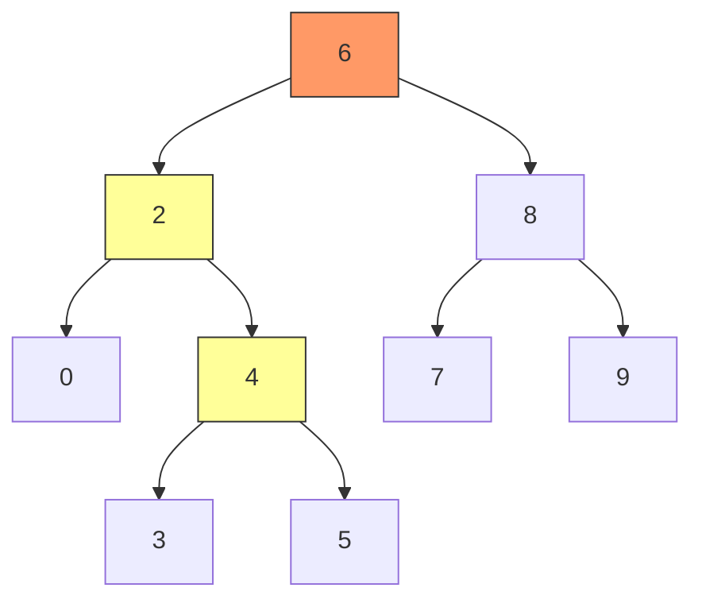
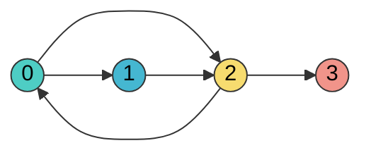
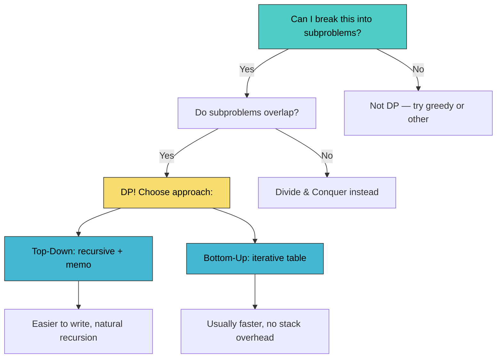
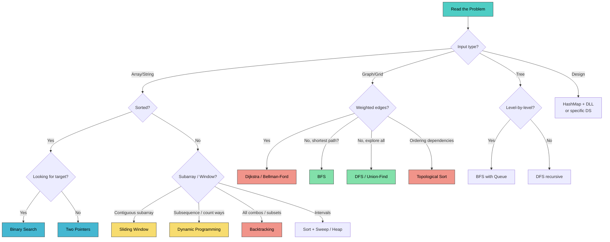

# DSA & ML Coding — Complete Google Interview Guide (Java)

> "The secret to solving interview problems fast: recognize the pattern in the first 30 seconds."

**What this chapter covers:** All major DSA topics Google tests, ordered from fundamentals to advanced. Every topic has: visual explanation, core patterns, Java code, complexity analysis, tips & tricks, and a curated problem list. Plus ML-specific coding exercises.

---

## Table of Contents

| Part | Topic | Sections |
|------|-------|----------|
| 1 | Foundations | 18.1–18.6: Big-O, Arrays, Hashmaps, Linked Lists, Stacks, Sorting |
| 2 | Search & Trees | 18.7–18.11: Binary Search, Sliding Window, Trees, Heaps, Tries |
| 3 | Graphs | 18.12–18.14: BFS/DFS, Dijkstra, Topo Sort, Union-Find, Grids |
| 4 | Dynamic Programming | 18.15–18.18: 1D DP, 2D DP, Advanced DP |
| 5 | Advanced Patterns | 18.19–18.23: Backtracking, Greedy, Bit Manipulation, Intervals, Math |
| 6 | Pattern Recognition | 18.24–18.26: Master Table, Decision Flowchart, Interview Strategy |
| 7 | ML Coding | 18.27: Implement ML from Scratch in Java |

---

# PART 1: FOUNDATIONS

---

## 18.1 Big-O Complexity

Complexity analysis is the language you use to discuss algorithm efficiency. Every interview answer should end with "this runs in O(...) time and O(...) space." If you can't state the complexity, the interviewer assumes you don't understand your own solution.

**Time complexity** measures how operations grow as input size n increases. **Space complexity** measures extra memory your algorithm uses beyond the input.

### The Complexity Hierarchy

```
FAST ◄──────────────────────────────────────────────► SLOW

O(1)  O(log n)  O(n)  O(n log n)  O(n^2)  O(2^n)  O(n!)
 │       │        │       │          │       │       │
hash   binary   single  merge     nested  subsets  permu-
lookup  search   loop    sort      loops           tations
```

### Concrete Numbers

| Complexity | n=10 | n=100 | n=1,000 | n=1,000,000 | Typical Use |
|-----------|------|-------|---------|-------------|-------------|
| O(1) | 1 | 1 | 1 | 1 | Hash lookup, array index |
| O(log n) | 3 | 7 | 10 | 20 | Binary search |
| O(n) | 10 | 100 | 1,000 | 1,000,000 | Single scan |
| O(n log n) | 33 | 664 | 9,966 | 19,931,568 | Merge sort |
| O(n^2) | 100 | 10,000 | 1,000,000 | 10^12 TLE! | Nested loops |
| O(2^n) | 1,024 | 10^30 | -- | -- | Subsets |
| O(n!) | 3.6M | -- | -- | -- | Permutations |

```chart
{
  "type": "bar",
  "data": {
    "labels": ["O(1)", "O(log n)", "O(n)", "O(n log n)", "O(n^2)", "O(2^n)"],
    "datasets": [
      { "label": "n = 10", "data": [1, 3.3, 10, 33, 100, 1024], "backgroundColor": "rgba(75, 192, 192, 0.7)" },
      { "label": "n = 100", "data": [1, 6.6, 100, 664, 10000, 100000], "backgroundColor": "rgba(255, 159, 64, 0.7)" },
      { "label": "n = 1000", "data": [1, 10, 1000, 9966, 1000000, 1000000], "backgroundColor": "rgba(255, 99, 132, 0.7)" }
    ]
  },
  "options": {
    "scales": { "y": { "type": "logarithmic", "title": { "display": true, "text": "Operations (log scale)" } } },
    "plugins": { "title": { "display": true, "text": "Operations Count by Complexity Class" } }
  }
}
```

### Amortized Analysis

Some operations are expensive occasionally but cheap on average. Classic example: `ArrayList.add()` in Java. Most adds are O(1), but when the internal array fills, it doubles — that resize is O(n). Spread across n insertions, each add is **amortized O(1)**.

### Will My Solution TLE? — The 10^8 Rule

Most judges execute roughly **10^8 simple operations per second**:

| n (input size) | Max acceptable complexity |
|---------------|--------------------------|
| n <= 10 | O(n!) — brute force ok |
| n <= 20 | O(2^n) — subsets/backtrack |
| n <= 500 | O(n^3) — triple nested loop |
| n <= 10,000 | O(n^2) — double nested loop |
| n <= 1,000,000 | O(n log n) — sort-based |
| n <= 100,000,000 | O(n) — single pass |
| n > 10^8 | O(log n) or O(1) needed |

### Common Complexity Traps

- **String concatenation in a loop:** `s += char` creates a new String each time -> O(n^2). Use `StringBuilder`.
- **HashMap vs TreeMap:** HashMap is O(1) average. TreeMap is O(log n). Default to HashMap.
- **Recursion depth:** Depth-d recursion uses O(d) stack space even without explicit storage.

---

## 18.2 Arrays & Strings

Arrays are the bedrock of DSA. At least 40% of interview problems are fundamentally array/string manipulation. Master these patterns and you'll crush most of them.

### Pattern 1: Two Pointers (Converging)

One pointer at start, one at end. Move toward each other. Turns O(n^2) into O(n).

**When to use:** sorted array, palindrome check, container with most water, two sum on sorted array.

```java
// Two-sum on sorted array — O(n) time, O(1) space
public int[] twoSumSorted(int[] nums, int target) {
    int left = 0, right = nums.length - 1;
    while (left < right) {
        int sum = nums[left] + nums[right];
        if (sum == target) return new int[]{left, right};
        else if (sum < target) left++;
        else right--;
    }
    return new int[]{-1, -1};
}

// Container with most water — O(n) time, O(1) space
public int maxArea(int[] height) {
    int left = 0, right = height.length - 1, maxWater = 0;
    while (left < right) {
        int water = Math.min(height[left], height[right]) * (right - left);
        maxWater = Math.max(maxWater, water);
        if (height[left] < height[right]) left++;
        else right--;
    }
    return maxWater;
}
```

### Pattern 2: Two Pointers (Same Direction)

Both start at the beginning. "Fast" explores, "slow" marks write position or boundary.

```java
// Remove duplicates from sorted array — O(n) time, O(1) space
public int removeDuplicates(int[] nums) {
    if (nums.length == 0) return 0;
    int slow = 0;
    for (int fast = 1; fast < nums.length; fast++) {
        if (nums[fast] != nums[slow]) {
            nums[++slow] = nums[fast];
        }
    }
    return slow + 1;
}
```

### Pattern 3: Prefix Sum

Compute any subarray sum in O(1) after O(n) preprocessing: `sum(i, j) = prefix[j+1] - prefix[i]`.

```
Array:     [3, 1, 4, 1, 5, 9]
Prefix:  [0, 3, 4, 8, 9, 14, 23]    ← always start with 0
```

```java
// Subarray sum equals K — O(n) time, O(n) space
public int subarraySum(int[] nums, int k) {
    Map<Integer, Integer> prefixCount = new HashMap<>();
    prefixCount.put(0, 1); // empty prefix
    int sum = 0, count = 0;
    for (int num : nums) {
        sum += num;
        count += prefixCount.getOrDefault(sum - k, 0);
        prefixCount.merge(sum, 1, Integer::sum);
    }
    return count;
}
```

### Pattern 4: Kadane's Algorithm (Maximum Subarray)

At each position, decide: extend current subarray or start fresh. A negative running sum can never help.

```java
// Kadane's — O(n) time, O(1) space
public int maxSubArray(int[] nums) {
    int current = nums[0], best = nums[0];
    for (int i = 1; i < nums.length; i++) {
        current = Math.max(nums[i], current + nums[i]);
        best = Math.max(best, current);
    }
    return best;
}
```

### Pattern 5: Dutch National Flag (Three-Way Partition)

Partition into three sections in a single pass using three pointers.

```java
// Sort Colors — O(n) time, O(1) space
public void sortColors(int[] nums) {
    int low = 0, mid = 0, high = nums.length - 1;
    while (mid <= high) {
        if (nums[mid] == 0) swap(nums, low++, mid++);
        else if (nums[mid] == 1) mid++;
        else swap(nums, mid, high--); // don't advance mid
    }
}
private void swap(int[] a, int i, int j) {
    int tmp = a[i]; a[i] = a[j]; a[j] = tmp;
}
```

### Tips & Common Mistakes

- **String problems are array problems.** Use `s.toCharArray()` when you need mutation.
- **Subarray vs subsequence:** Subarray = contiguous, subsequence = can skip. Very different.
- Off-by-one in converging pointers: use `left < right` (not `<=`) when they shouldn't meet.
- Forgetting `prefixCount.put(0, 1)` in prefix sum + hashmap pattern.
- In Kadane's, initializing `best = 0` instead of `nums[0]` fails when all elements are negative.

### Key Problems — Detailed Solutions

<details>
<summary><strong>Two Sum II (Sorted)</strong> — Easy</summary>

**Problem:** Given a 1-indexed sorted array `numbers`, find two numbers that add up to `target`. Return their indices.

**Example:**
Input: numbers = [2, 7, 11, 15], target = 9
Output: [1, 2]  (numbers[1] + numbers[2] = 2 + 7 = 9)

**Approach:** Two converging pointers. If sum < target, move left right. If sum > target, move right left. Sorted order guarantees convergence.

**Java:**
```java
public int[] twoSum(int[] nums, int target) {
    int l = 0, r = nums.length - 1;
    while (l < r) {
        int sum = nums[l] + nums[r];
        if (sum == target) return new int[]{l + 1, r + 1};
        else if (sum < target) l++;
        else r--;
    }
    return new int[]{};
}
// Time: O(n)  Space: O(1)
```

**Complexity:** O(n) time, O(1) space
</details>

<details>
<summary><strong>3Sum</strong> — Medium</summary>

**Problem:** Given an integer array `nums`, find all unique triplets `[nums[i], nums[j], nums[k]]` such that `i != j != k` and `nums[i] + nums[j] + nums[k] == 0`.

**Example:**
Input: nums = [-1, 0, 1, 2, -1, -4]
Output: [[-1, -1, 2], [-1, 0, 1]]

**Approach:** Sort the array. Fix one element, then use two pointers on the remaining portion to find pairs that sum to the negative of the fixed element. Skip duplicates at each level.

**Java:**
```java
public List<List<Integer>> threeSum(int[] nums) {
    Arrays.sort(nums);
    List<List<Integer>> res = new ArrayList<>();
    for (int i = 0; i < nums.length - 2; i++) {
        if (i > 0 && nums[i] == nums[i - 1]) continue; // skip dup
        int lo = i + 1, hi = nums.length - 1;
        while (lo < hi) {
            int sum = nums[i] + nums[lo] + nums[hi];
            if (sum == 0) {
                res.add(List.of(nums[i], nums[lo], nums[hi]));
                while (lo < hi && nums[lo] == nums[lo + 1]) lo++;
                while (lo < hi && nums[hi] == nums[hi - 1]) hi--;
                lo++; hi--;
            } else if (sum < 0) lo++;
            else hi--;
        }
    }
    return res;
}
// Time: O(n^2)  Space: O(1) excluding output
```

**Complexity:** O(n^2) time, O(1) space (excluding output)
</details>

<details>
<summary><strong>Product of Array Except Self</strong> — Medium</summary>

**Problem:** Given an integer array `nums`, return an array `answer` where `answer[i]` is the product of all elements except `nums[i]`. You must not use division and run in O(n).

**Example:**
Input: nums = [1, 2, 3, 4]
Output: [24, 12, 8, 6]

**Approach:** Two passes. First pass (left to right) builds prefix products. Second pass (right to left) multiplies in suffix products. Each element gets the product of everything before it times everything after it.

**Java:**
```java
public int[] productExceptSelf(int[] nums) {
    int n = nums.length;
    int[] ans = new int[n];
    ans[0] = 1;
    for (int i = 1; i < n; i++)
        ans[i] = ans[i - 1] * nums[i - 1];   // prefix product
    int suffix = 1;
    for (int i = n - 1; i >= 0; i--) {
        ans[i] *= suffix;
        suffix *= nums[i];                     // suffix product
    }
    return ans;
}
// Time: O(n)  Space: O(1) excluding output
```

**Complexity:** O(n) time, O(1) space (output array not counted)
</details>

<details>
<summary><strong>Trapping Rain Water</strong> — Hard</summary>

**Problem:** Given `n` non-negative integers representing an elevation map where the width of each bar is 1, compute how much water it can trap after raining.

**Example:**
Input: height = [0, 1, 0, 2, 1, 0, 1, 3, 2, 1, 2, 1]
Output: 6

**Approach:** Two pointers from both ends. Track leftMax and rightMax. Water at any position = min(leftMax, rightMax) - height[i]. Process the side with the smaller max since that determines the water level.

**Java:**
```java
public int trap(int[] height) {
    int l = 0, r = height.length - 1;
    int leftMax = 0, rightMax = 0, water = 0;
    while (l < r) {
        if (height[l] < height[r]) {
            leftMax = Math.max(leftMax, height[l]);
            water += leftMax - height[l];
            l++;
        } else {
            rightMax = Math.max(rightMax, height[r]);
            water += rightMax - height[r];
            r--;
        }
    }
    return water;
}
// Time: O(n)  Space: O(1)
```

**Complexity:** O(n) time, O(1) space
</details>

### Problem List

| # | Problem | Difficulty | Pattern | Key Insight |
|---|---------|-----------|---------|-------------|
| 1 | Two Sum II (Sorted) | Easy | Two Ptr (converging) | Sorted -> two pointers |
| 2 | Valid Palindrome | Easy | Two Ptr (converging) | Skip non-alphanumeric |
| 3 | Move Zeroes | Easy | Two Ptr (same dir) | Slow = write position |
| 4 | Remove Duplicates | Easy | Two Ptr (same dir) | Compare slow vs fast |
| 5 | Best Time Buy/Sell Stock | Easy | Kadane variant | Track min price so far |
| 6 | Maximum Subarray | Easy | Kadane | Textbook Kadane's |
| 7 | Running Sum of Array | Easy | Prefix Sum | Direct prefix sum |
| 8 | Merge Sorted Array | Easy | Two Ptr (reverse) | Fill from the end |
| 9 | Container With Most Water | Medium | Two Ptr (converging) | Move shorter side |
| 10 | 3Sum | Medium | Sort + Two Ptr | Fix one, two-ptr rest |
| 11 | Product of Array Except Self | Medium | Prefix/Suffix | Left pass, right pass |
| 12 | Sort Colors | Medium | Dutch National Flag | Three-way partition |
| 13 | Subarray Sum Equals K | Medium | Prefix Sum + Map | Count prefix diffs |
| 14 | Rotate Array | Medium | Reverse trick | Reverse all, then parts |
| 15 | Next Permutation | Medium | Two Ptr + Sort | Find rightmost ascent |
| 16 | Longest Consecutive Sequence | Medium | HashSet | Check if num-1 exists |
| 17 | Trapping Rain Water | Hard | Two Ptr / Stack | Min of left/right max |
| 18 | First Missing Positive | Hard | Cyclic Sort | Place num at index num-1 |
| 19 | Median of Two Sorted Arrays | Hard | Binary Search | Partition both arrays |
| 20 | Minimum Window Substring | Hard | Sliding Window + Map | Covered in 18.8 |

---

## 18.3 Hashmaps & Sets

A HashMap gives you O(1) average-case lookup, insertion, and deletion. It is the single most useful data structure in coding interviews. If your brute force is O(n^2) because of a nested search, a HashMap almost always drops it to O(n).

### How HashMap Works (30-Second Version)

```
Key "apple" -> hashCode() -> 987234 -> 987234 % 16 = 2 -> bucket[2]

Buckets:  [0] -> null
          [2] -> ("apple", 5) -> ("grape", 3) -> null   <- collision: chaining
          [3] -> ("banana", 7) -> null

Load factor > 0.75 -> resize (double buckets, rehash)
Java 8+: chain > 8 entries -> red-black tree (O(log n) worst case)
```

### Pattern 1: Two-Sum

For each element, check if `target - element` exists in the map.

```java
// Two Sum — O(n) time, O(n) space
public int[] twoSum(int[] nums, int target) {
    Map<Integer, Integer> seen = new HashMap<>();
    for (int i = 0; i < nums.length; i++) {
        int complement = target - nums[i];
        if (seen.containsKey(complement)) return new int[]{seen.get(complement), i};
        seen.put(nums[i], i);
    }
    return new int[]{-1, -1};
}
```

### Pattern 2: Frequency Counting

```java
// Valid Anagram — O(n) time, O(1) space (26 letters)
public boolean isAnagram(String s, String t) {
    if (s.length() != t.length()) return false;
    int[] count = new int[26];
    for (int i = 0; i < s.length(); i++) {
        count[s.charAt(i) - 'a']++;
        count[t.charAt(i) - 'a']--;
    }
    for (int c : count) if (c != 0) return false;
    return true;
}
```

For small character sets use `int[26]` instead of HashMap — faster and less memory.

### Pattern 3: Group By Key

```java
// Group Anagrams — O(n * k log k) time
public List<List<String>> groupAnagrams(String[] strs) {
    Map<String, List<String>> groups = new HashMap<>();
    for (String s : strs) {
        char[] sorted = s.toCharArray();
        Arrays.sort(sorted);
        groups.computeIfAbsent(new String(sorted), k -> new ArrayList<>()).add(s);
    }
    return new ArrayList<>(groups.values());
}
```

### Pattern 4: Sliding Window + HashMap

```java
// Longest Substring Without Repeating Characters — O(n)
public int lengthOfLongestSubstring(String s) {
    Map<Character, Integer> lastSeen = new HashMap<>();
    int maxLen = 0, left = 0;
    for (int right = 0; right < s.length(); right++) {
        char c = s.charAt(right);
        if (lastSeen.containsKey(c) && lastSeen.get(c) >= left)
            left = lastSeen.get(c) + 1;
        lastSeen.put(c, right);
        maxLen = Math.max(maxLen, right - left + 1);
    }
    return maxLen;
}
```

### HashSet Essentials

```java
// Longest Consecutive Sequence — O(n) time, O(n) space
public int longestConsecutive(int[] nums) {
    Set<Integer> set = new HashSet<>();
    for (int n : nums) set.add(n);
    int longest = 0;
    for (int n : set) {
        if (!set.contains(n - 1)) { // only start from sequence beginning
            int len = 1;
            while (set.contains(n + len)) len++;
            longest = Math.max(longest, len);
        }
    }
    return longest;
}
```

### Tips & Common Mistakes

- `merge(key, 1, Integer::sum)` — cleanest way to increment a count.
- `computeIfAbsent(key, k -> new ArrayList<>())` — for group-by patterns.
- **HashMap vs LinkedHashMap:** LinkedHashMap preserves insertion order (useful for LRU cache).
- Don't use mutable objects (`int[]`) as HashMap keys — they use reference equality. Convert to `String` or `List<Integer>`.
- `HashMap.get()` returns `null` for missing keys — unboxing null to `int` throws NPE.

### Key Problems — Detailed Solutions

<details>
<summary><strong>Two Sum</strong> — Easy</summary>

**Problem:** Given an array of integers `nums` and an integer `target`, return the indices of the two numbers that add up to `target`. Each input has exactly one solution and you may not use the same element twice.

**Example:**
Input: nums = [2, 7, 11, 15], target = 9
Output: [0, 1]  (nums[0] + nums[1] = 2 + 7 = 9)

**Approach:** One-pass HashMap. For each element, check if `target - nums[i]` already exists in the map. If yes, return both indices. Otherwise, store `nums[i] -> i` in the map.

**Java:**
```java
public int[] twoSum(int[] nums, int target) {
    Map<Integer, Integer> seen = new HashMap<>();
    for (int i = 0; i < nums.length; i++) {
        int comp = target - nums[i];
        if (seen.containsKey(comp)) return new int[]{seen.get(comp), i};
        seen.put(nums[i], i);
    }
    return new int[]{};
}
// Time: O(n)  Space: O(n)
```

**Complexity:** O(n) time, O(n) space
</details>

<details>
<summary><strong>Group Anagrams</strong> — Medium</summary>

**Problem:** Given an array of strings `strs`, group the anagrams together. An anagram is a word formed by rearranging letters of another word.

**Example:**
Input: strs = ["eat", "tea", "tan", "ate", "nat", "bat"]
Output: [["eat", "tea", "ate"], ["tan", "nat"], ["bat"]]

**Approach:** Use a HashMap where the key is the sorted version of each string. All anagrams produce the same sorted key. Group strings by this canonical key.

**Java:**
```java
public List<List<String>> groupAnagrams(String[] strs) {
    Map<String, List<String>> map = new HashMap<>();
    for (String s : strs) {
        char[] ch = s.toCharArray();
        Arrays.sort(ch);
        String key = new String(ch);
        map.computeIfAbsent(key, k -> new ArrayList<>()).add(s);
    }
    return new ArrayList<>(map.values());
}
// Time: O(n * k log k)  Space: O(n * k)  where k = max string length
```

**Complexity:** O(n * k log k) time, O(n * k) space
</details>

<details>
<summary><strong>LRU Cache</strong> — Medium</summary>

**Problem:** Design a data structure that supports `get(key)` and `put(key, value)` in O(1) time. When capacity is exceeded, evict the least recently used key.

**Example:**
LRUCache cache = new LRUCache(2);
cache.put(1, 1); cache.put(2, 2);
cache.get(1);       // returns 1
cache.put(3, 3);    // evicts key 2
cache.get(2);       // returns -1 (not found)

**Approach:** Combine a HashMap (O(1) lookup) with a doubly linked list (O(1) insert/remove). On access, move the node to the front. On capacity overflow, remove from the tail.

**Java:**
```java
class LRUCache extends LinkedHashMap<Integer, Integer> {
    private int cap;
    public LRUCache(int capacity) {
        super(capacity, 0.75f, true); // accessOrder = true
        this.cap = capacity;
    }
    public int get(int key) {
        return super.getOrDefault(key, -1);
    }
    public void put(int key, int value) {
        super.put(key, value);
    }
    @Override
    protected boolean removeEldestEntry(Map.Entry<Integer, Integer> eldest) {
        return size() > cap;
    }
}
// Time: O(1) for both get and put  Space: O(capacity)
```

**Complexity:** O(1) time per operation, O(capacity) space
</details>

### Problem List

| # | Problem | Difficulty | Pattern | Key Insight |
|---|---------|-----------|---------|-------------|
| 1 | Two Sum | Easy | Complement lookup | One-pass with map |
| 2 | Valid Anagram | Easy | Frequency count | int[26] is enough |
| 3 | Contains Duplicate | Easy | HashSet | set.add returns false |
| 4 | Ransom Note | Easy | Frequency count | Decrement and check |
| 5 | Intersection of Two Arrays | Easy | Two sets | Retain common elements |
| 6 | Longest Substring No Repeat | Medium | Window + Map | Track last seen index |
| 7 | Group Anagrams | Medium | Group by key | Sorted string as key |
| 8 | Top K Frequent Elements | Medium | Freq map + Heap/Bucket | Bucket sort is O(n) |
| 9 | Subarray Sum Equals K | Medium | Prefix sum + Map | Count prefix diffs |
| 10 | 4Sum II | Medium | Split + Map | Store pair sums |
| 11 | Encode and Decode Strings | Medium | Delimiter design | Length prefix encoding |
| 12 | LRU Cache | Medium | LinkedHashMap | Override removeEldest |
| 13 | Copy List with Random Pointer | Medium | Old->New map | Two-pass cloning |
| 14 | Minimum Window Substring | Hard | Window + Freq map | Maintain "have" vs "need" |
| 15 | Alien Dictionary | Hard | Map + Topo sort | Build graph from words |

---

## 18.4 Linked Lists

Linked list problems test pointer manipulation. There are only a handful of patterns — once you have the templates, most problems are variations.

```java
public class ListNode {
    int val;
    ListNode next;
    ListNode(int val) { this.val = val; }
    ListNode(int val, ListNode next) { this.val = val; this.next = next; }
}
```

### Pattern 1: Fast/Slow Pointers (Floyd's)

Fast moves 2 steps, slow moves 1. Finds middle, detects cycles.

```java
// Find middle — O(n) time, O(1) space
public ListNode findMiddle(ListNode head) {
    ListNode slow = head, fast = head;
    while (fast != null && fast.next != null) {
        slow = slow.next;
        fast = fast.next.next;
    }
    return slow;
}

// Detect cycle start — O(n) time, O(1) space
public ListNode detectCycleStart(ListNode head) {
    ListNode slow = head, fast = head;
    while (fast != null && fast.next != null) {
        slow = slow.next;
        fast = fast.next.next;
        if (slow == fast) {
            slow = head; // reset one pointer to head
            while (slow != fast) { slow = slow.next; fast = fast.next; }
            return slow;
        }
    }
    return null;
}
```

### Pattern 2: Reversal (Iterative)

Three pointers: prev, curr, next. This is a building block for many Medium/Hard problems.

```
null <- 1    2 -> 3 -> 4 -> null     (prev, curr, next)
null <- 1 <- 2    3 -> 4 -> null
null <- 1 <- 2 <- 3    4 -> null
null <- 1 <- 2 <- 3 <- 4             done: prev = new head
```

```java
public ListNode reverseList(ListNode head) {
    ListNode prev = null, curr = head;
    while (curr != null) {
        ListNode next = curr.next;
        curr.next = prev;
        prev = curr;
        curr = next;
    }
    return prev;
}
```

### Pattern 3: Merge Two Sorted Lists

Dummy head eliminates edge cases.

```java
public ListNode mergeTwoLists(ListNode l1, ListNode l2) {
    ListNode dummy = new ListNode(0), tail = dummy;
    while (l1 != null && l2 != null) {
        if (l1.val <= l2.val) { tail.next = l1; l1 = l1.next; }
        else                  { tail.next = l2; l2 = l2.next; }
        tail = tail.next;
    }
    tail.next = (l1 != null) ? l1 : l2;
    return dummy.next;
}
```

### Pattern 4: Remove Nth From End

Two pointers separated by n nodes. When leader reaches end, follower is before the target.

```java
public ListNode removeNthFromEnd(ListNode head, int n) {
    ListNode dummy = new ListNode(0, head);
    ListNode fast = dummy, slow = dummy;
    for (int i = 0; i <= n; i++) fast = fast.next;
    while (fast != null) { fast = fast.next; slow = slow.next; }
    slow.next = slow.next.next;
    return dummy.next;
}
```

### Tips & Common Mistakes

- **Dummy node trick:** When head might change, use `dummy -> head` and return `dummy.next`.
- Always draw 3-4 nodes and trace your pointer logic before coding.
- Don't lose the `next` reference before overwriting `curr.next` in reversal.
- Check for `null` before accessing `.next.next`.

### Key Problems — Detailed Solutions

<details>
<summary><strong>Reverse Linked List</strong> — Easy</summary>

**Problem:** Given the head of a singly linked list, reverse the list and return the new head.

**Example:**
Input: 1 -> 2 -> 3 -> 4 -> 5
Output: 5 -> 4 -> 3 -> 2 -> 1

**Approach:** Iterative three-pointer technique. Keep track of prev, curr, and next. At each step, point curr.next to prev, then advance all three pointers.

**Java:**
```java
public ListNode reverseList(ListNode head) {
    ListNode prev = null, curr = head;
    while (curr != null) {
        ListNode next = curr.next;
        curr.next = prev;
        prev = curr;
        curr = next;
    }
    return prev;
}
// Time: O(n)  Space: O(1)
```

**Complexity:** O(n) time, O(1) space
</details>

<details>
<summary><strong>Merge Two Sorted Lists</strong> — Easy</summary>

**Problem:** Merge two sorted linked lists into one sorted list by splicing their nodes together.

**Example:**
Input: l1 = 1 -> 2 -> 4, l2 = 1 -> 3 -> 4
Output: 1 -> 1 -> 2 -> 3 -> 4 -> 4

**Approach:** Use a dummy head node to simplify edge cases. Compare heads of both lists, append the smaller one, advance that pointer. Attach remaining nodes at the end.

**Java:**
```java
public ListNode mergeTwoLists(ListNode l1, ListNode l2) {
    ListNode dummy = new ListNode(0), tail = dummy;
    while (l1 != null && l2 != null) {
        if (l1.val <= l2.val) { tail.next = l1; l1 = l1.next; }
        else                  { tail.next = l2; l2 = l2.next; }
        tail = tail.next;
    }
    tail.next = (l1 != null) ? l1 : l2;
    return dummy.next;
}
// Time: O(n + m)  Space: O(1)
```

**Complexity:** O(n + m) time, O(1) space
</details>

<details>
<summary><strong>Linked List Cycle</strong> — Easy</summary>

**Problem:** Given the head of a linked list, determine if it contains a cycle.

**Example:**
Input: head = [3, 2, 0, -4] with tail connecting to node index 1
Output: true

**Approach:** Floyd's Tortoise and Hare. Slow pointer moves 1 step, fast moves 2 steps. If they meet, there's a cycle. If fast reaches null, there's no cycle.

**Java:**
```java
public boolean hasCycle(ListNode head) {
    ListNode slow = head, fast = head;
    while (fast != null && fast.next != null) {
        slow = slow.next;
        fast = fast.next.next;
        if (slow == fast) return true;
    }
    return false;
}
// Time: O(n)  Space: O(1)
```

**Complexity:** O(n) time, O(1) space
</details>

<details>
<summary><strong>Reorder List</strong> — Medium</summary>

**Problem:** Reorder a linked list from L0 -> L1 -> ... -> Ln to L0 -> Ln -> L1 -> Ln-1 -> L2 -> Ln-2 -> ...

**Example:**
Input: 1 -> 2 -> 3 -> 4 -> 5
Output: 1 -> 5 -> 2 -> 4 -> 3

**Approach:** Three steps: (1) Find middle using slow/fast pointers, (2) Reverse the second half, (3) Merge the two halves by interleaving.

**Java:**
```java
public void reorderList(ListNode head) {
    if (head == null || head.next == null) return;
    // 1. Find middle
    ListNode slow = head, fast = head;
    while (fast.next != null && fast.next.next != null) {
        slow = slow.next; fast = fast.next.next;
    }
    // 2. Reverse second half
    ListNode prev = null, curr = slow.next;
    slow.next = null;
    while (curr != null) {
        ListNode next = curr.next;
        curr.next = prev; prev = curr; curr = next;
    }
    // 3. Merge two halves
    ListNode first = head, second = prev;
    while (second != null) {
        ListNode tmp1 = first.next, tmp2 = second.next;
        first.next = second; second.next = tmp1;
        first = tmp1; second = tmp2;
    }
}
// Time: O(n)  Space: O(1)
```

**Complexity:** O(n) time, O(1) space
</details>

### Problem List

| # | Problem | Difficulty | Pattern | Key Insight |
|---|---------|-----------|---------|-------------|
| 1 | Reverse Linked List | Easy | Reversal | prev, curr, next |
| 2 | Merge Two Sorted Lists | Easy | Merge + Dummy | Dummy head |
| 3 | Linked List Cycle | Easy | Fast/Slow | Fast catches slow |
| 4 | Middle of Linked List | Easy | Fast/Slow | Fast moves 2x |
| 5 | Remove Nth From End | Medium | Two Ptr gap | n+1 gap, dummy |
| 6 | Reorder List | Medium | Split + Rev + Merge | Find mid, reverse 2nd, interleave |
| 7 | Add Two Numbers | Medium | Carry propagation | Digit by digit |
| 8 | Copy List Random Pointer | Medium | HashMap clone | Old->New mapping |
| 9 | Linked List Cycle II | Medium | Floyd's | Reset one ptr to head |
| 10 | Swap Nodes in Pairs | Medium | Pointer juggling | Draw it step by step |
| 11 | Reverse Nodes in k-Group | Hard | k-reversal loop | Count k, reverse, connect |
| 12 | Merge k Sorted Lists | Hard | Min-heap merge | PQ of k heads |

---

## 18.5 Stacks & Queues

Simple structures, powerful patterns. The monotonic stack alone solves a family of problems that would otherwise be O(n^2).

### Pattern 1: Monotonic Stack (Next Greater Element)

Maintain a stack in decreasing order. When a new element is bigger, pop — each popped element found its "next greater."

```
Array: [2, 1, 4, 3, 5]   ->   Result: [4, 4, 5, 5, -1]

i=0: push 0              stack: [0]
i=1: 1<2, push           stack: [0,1]
i=2: 4>1, pop 1->ans=4;  4>2, pop 0->ans=4;  push 2   stack: [2]
i=3: 3<4, push           stack: [2,3]
i=4: 5>3, pop 3->ans=5;  5>4, pop 2->ans=5;  push 4   stack: [4]
```

```java
public int[] nextGreaterElement(int[] nums) {
    int n = nums.length;
    int[] result = new int[n];
    Arrays.fill(result, -1);
    Deque<Integer> stack = new ArrayDeque<>(); // stores indices
    for (int i = 0; i < n; i++) {
        while (!stack.isEmpty() && nums[stack.peek()] < nums[i])
            result[stack.pop()] = nums[i];
        stack.push(i);
    }
    return result;
}
```

### Pattern 2: Min Stack

O(1) push/pop/top/getMin via a parallel min-tracking stack.

```java
class MinStack {
    private Deque<Integer> stack = new ArrayDeque<>();
    private Deque<Integer> minStack = new ArrayDeque<>();
    public void push(int val) {
        stack.push(val);
        minStack.push(minStack.isEmpty() ? val : Math.min(val, minStack.peek()));
    }
    public void pop() { stack.pop(); minStack.pop(); }
    public int top() { return stack.peek(); }
    public int getMin() { return minStack.peek(); }
}
```

### Pattern 3: Queue Using Two Stacks

Push into `inStack`. On pop/peek, pour into `outStack` (reverses order). Amortized O(1).

```java
class MyQueue {
    private Deque<Integer> in = new ArrayDeque<>(), out = new ArrayDeque<>();
    public void push(int x) { in.push(x); }
    public int pop() { transfer(); return out.pop(); }
    public int peek() { transfer(); return out.peek(); }
    public boolean empty() { return in.isEmpty() && out.isEmpty(); }
    private void transfer() { if (out.isEmpty()) while (!in.isEmpty()) out.push(in.pop()); }
}
```

### Pattern 4: Valid Parentheses

```java
public boolean isValid(String s) {
    Deque<Character> stack = new ArrayDeque<>();
    Map<Character, Character> pairs = Map.of(')', '(', ']', '[', '}', '{');
    for (char c : s.toCharArray()) {
        if (pairs.containsValue(c)) stack.push(c);
        else if (stack.isEmpty() || stack.pop() != pairs.get(c)) return false;
    }
    return stack.isEmpty();
}
```

### Tips & Common Mistakes

- Use `Deque<Integer> stack = new ArrayDeque<>()`, not legacy `Stack<>`. Interviewers notice.
- **Monotonic stack recognizer:** "next greater/smaller", "previous greater/smaller", "largest rectangle".
- Store **indices** in monotonic stacks (not values) — you can always look up the value, and you'll often need the index for distance.
- Always check `stack.isEmpty()` before `pop()` or `peek()`.

### Problem List

| # | Problem | Difficulty | Pattern | Key Insight |
|---|---------|-----------|---------|-------------|
| 1 | Valid Parentheses | Easy | Stack matching | Push open, match close |
| 2 | Min Stack | Medium | Two stacks | Track min at each level |
| 3 | Implement Queue using Stacks | Easy | Two stacks | Lazy transfer |
| 4 | Daily Temperatures | Medium | Monotonic stack | Decreasing stack of indices |
| 5 | Next Greater Element I | Easy | Monotonic stack + Map | Build map from NGE |
| 6 | Eval Reverse Polish Notation | Medium | Stack eval | Push nums, pop for ops |
| 7 | Largest Rect in Histogram | Hard | Monotonic stack | Heights + widths from stack |
| 8 | Basic Calculator | Hard | Stack for nested expr | Push state at '(' |
| 9 | Decode String | Medium | Two stacks | Num stack + String stack |
| 10 | Asteroid Collision | Medium | Stack simulation | Push/pop by direction |

---

## 18.6 Sorting

You'll rarely implement a sort from scratch in an interview, but you need the tradeoffs and must know merge sort/quick sort cold.

### When to Use Which Sort

| Algorithm | Time (avg) | Time (worst) | Space | Stable? | When to Use |
|-----------|-----------|-------------|-------|---------|-------------|
| Arrays.sort() | O(n log n) | O(n log n) | O(n) | Yes* | Default choice |
| Merge Sort | O(n log n) | O(n log n) | O(n) | Yes | Need stability, linked lists |
| Quick Sort | O(n log n) | O(n^2) | O(log n) | No | In-place, average case |
| Counting Sort | O(n + k) | O(n + k) | O(k) | Yes | Small integer range |

*Java uses dual-pivot quicksort for primitives (unstable), TimSort for objects (stable).

```chart
{
  "type": "bar",
  "data": {
    "labels": ["Bubble O(n^2)", "Insertion O(n^2)", "Merge O(n log n)", "Quick O(n log n)", "Counting O(n+k)", "Radix O(d*n)"],
    "datasets": [{
      "label": "Relative speed for n=10,000",
      "data": [100000000, 50000000, 132877, 132877, 10000, 40000],
      "backgroundColor": ["#ff6384", "#ff9f40", "#36a2eb", "#4bc0c0", "#9966ff", "#ffcd56"]
    }]
  },
  "options": {
    "indexAxis": "y",
    "scales": { "x": { "type": "logarithmic", "title": { "display": true, "text": "Operations (log scale)" } } },
    "plugins": { "title": { "display": true, "text": "Sorting Algorithm Comparison (n=10,000)" } }
  }
}
```

### Merge Sort

```java
public void mergeSort(int[] arr, int left, int right) {
    if (left >= right) return;
    int mid = left + (right - left) / 2;
    mergeSort(arr, left, mid);
    mergeSort(arr, mid + 1, right);
    merge(arr, left, mid, right);
}

private void merge(int[] arr, int left, int mid, int right) {
    int[] temp = new int[right - left + 1];
    int i = left, j = mid + 1, k = 0;
    while (i <= mid && j <= right) {
        if (arr[i] <= arr[j]) temp[k++] = arr[i++];
        else                   temp[k++] = arr[j++];
    }
    while (i <= mid)   temp[k++] = arr[i++];
    while (j <= right) temp[k++] = arr[j++];
    System.arraycopy(temp, 0, arr, left, temp.length);
}
```

### Quick Sort + Quick Select

```java
public void quickSort(int[] arr, int low, int high) {
    if (low >= high) return;
    int p = partition(arr, low, high);
    quickSort(arr, low, p - 1);
    quickSort(arr, p + 1, high);
}

// Lomuto partition — simpler for interviews
private int partition(int[] arr, int low, int high) {
    int pivot = arr[high], i = low;
    for (int j = low; j < high; j++) {
        if (arr[j] < pivot) swap(arr, i++, j);
    }
    swap(arr, i, high);
    return i;
}

// Quick Select — O(n) avg for Kth largest
public int findKthLargest(int[] nums, int k) {
    int target = nums.length - k;
    return quickSelect(nums, 0, nums.length - 1, target);
}
private int quickSelect(int[] a, int lo, int hi, int t) {
    int p = partition(a, lo, hi);
    if (p == t) return a[p];
    return p < t ? quickSelect(a, p + 1, hi, t) : quickSelect(a, lo, p - 1, t);
}
```

### Counting Sort

```java
public void countingSort(int[] arr, int maxVal) {
    int[] count = new int[maxVal + 1];
    for (int num : arr) count[num]++;
    int idx = 0;
    for (int val = 0; val <= maxVal; val++)
        while (count[val]-- > 0) arr[idx++] = val;
}
```

### Custom Comparators

```java
Arrays.sort(intervals, (a, b) -> a[0] - b[0]); // by start time
// WARNING: a - b overflows for large values! Use Integer.compare(a, b) instead.
```

### Tips & Common Mistakes

- **Sorting as preprocessing:** "Can I sort first?" should be one of your first thoughts.
- **Bucket sort** for Top K Frequent: bucket[i] = elements with frequency i. O(n).
- Using `(a, b) -> a - b` near `Integer.MAX_VALUE` causes overflow. Use `Integer.compare(a, b)`.

### Problem List

| # | Problem | Difficulty | Pattern | Key Insight |
|---|---------|-----------|---------|-------------|
| 1 | Sort an Array | Medium | Merge/Quick sort | Implement from scratch |
| 2 | Kth Largest Element | Medium | Quick select | O(n) avg with partition |
| 3 | Merge Intervals | Medium | Sort + sweep | Sort by start, merge overlaps |
| 4 | Sort Colors | Medium | Dutch National Flag | Three-way partition |
| 5 | Top K Frequent Elements | Medium | Bucket sort | Freq array by count |
| 6 | Largest Number | Medium | Custom comparator | Compare a+b vs b+a |
| 7 | Meeting Rooms II | Medium | Sort + sweep/heap | Count overlapping intervals |
| 8 | Wiggle Sort II | Medium | Quick select + interleave | Find median, partition |

---

# PART 2: SEARCH & TREES

---

## 18.7 Binary Search

Binary search halves the search space every step — O(log n). It applies to any problem with a monotonic predicate: "everything below X is false, everything above is true."

### Template 1: Exact Match

```java
public int binarySearch(int[] nums, int target) {
    int lo = 0, hi = nums.length - 1;
    while (lo <= hi) {
        int mid = lo + (hi - lo) / 2; // avoids overflow
        if (nums[mid] == target) return mid;
        else if (nums[mid] < target) lo = mid + 1;
        else hi = mid - 1;
    }
    return -1;
}
```

### Template 2: Bisect-Left (First True / Lower Bound)

Find first position where condition becomes true.

```
Sorted: [1, 3, 3, 3, 5, 7]    target = 3
         F  T  T  T  T  T     condition: nums[mid] >= target
            ^ first true = answer (index 1)
```

```java
public int bisectLeft(int[] nums, int target) {
    int lo = 0, hi = nums.length; // hi = past end
    while (lo < hi) {
        int mid = lo + (hi - lo) / 2;
        if (nums[mid] >= target) hi = mid;
        else                     lo = mid + 1;
    }
    return lo;
}
```

### Template 3: Bisect-Right (Upper Bound)

```java
public int bisectRight(int[] nums, int target) {
    int lo = 0, hi = nums.length;
    while (lo < hi) {
        int mid = lo + (hi - lo) / 2;
        if (nums[mid] <= target) lo = mid + 1;
        else                     hi = mid;
    }
    return lo; // first index where nums[i] > target
}
```

First occurrence = `bisectLeft(target)`. Last occurrence = `bisectRight(target) - 1`.

### Search Space Binary Search (The Real Power)

Instead of searching an array, binary search over the **answer space**. Works when: (1) the answer is in range [lo, hi], (2) you can write `feasible(mid)` returning bool, (3) feasibility is monotonic.

```java
// Koko Eating Bananas — O(n * log(maxPile))
public int minEatingSpeed(int[] piles, int h) {
    int lo = 1, hi = Arrays.stream(piles).max().getAsInt();
    while (lo < hi) {
        int mid = lo + (hi - lo) / 2;
        if (canFinish(piles, mid, h)) hi = mid;
        else                          lo = mid + 1;
    }
    return lo;
}
private boolean canFinish(int[] piles, int speed, int h) {
    int hours = 0;
    for (int pile : piles) hours += (pile + speed - 1) / speed;
    return hours <= h;
}
```

This template also solves: split array largest sum, capacity to ship packages, minimum days to make bouquets.

### Tips & Common Mistakes

- **`lo < hi` vs `lo <= hi`:** Use `<=` for exact match, `<` for boundary search.
- **`lo + (hi - lo) / 2`** prevents overflow. Always use this form.
- **Ceiling division:** `(a + b - 1) / b` for positive integers.
- Off-by-one in `hi`: bisect templates use `hi = n` (past end); exact match uses `hi = n-1`.
- `lo = mid` (not `mid + 1`) causes infinite loops when `lo + 1 == hi`.

### Key Problems — Detailed Solutions

<details>
<summary><strong>Search in Rotated Sorted Array</strong> — Medium</summary>

**Problem:** Given a sorted array that has been rotated at some pivot, search for a target in O(log n). Array has no duplicates.

**Example:**
Input: nums = [4, 5, 6, 7, 0, 1, 2], target = 0
Output: 4

**Approach:** Standard binary search with one extra check: determine which half is sorted. If target falls within the sorted half, search there; otherwise search the other half.

**Java:**
```java
public int search(int[] nums, int target) {
    int lo = 0, hi = nums.length - 1;
    while (lo <= hi) {
        int mid = lo + (hi - lo) / 2;
        if (nums[mid] == target) return mid;
        if (nums[lo] <= nums[mid]) { // left half sorted
            if (target >= nums[lo] && target < nums[mid]) hi = mid - 1;
            else lo = mid + 1;
        } else { // right half sorted
            if (target > nums[mid] && target <= nums[hi]) lo = mid + 1;
            else hi = mid - 1;
        }
    }
    return -1;
}
// Time: O(log n)  Space: O(1)
```

**Complexity:** O(log n) time, O(1) space
</details>

<details>
<summary><strong>Find First and Last Position of Element</strong> — Medium</summary>

**Problem:** Given a sorted array of integers, find the starting and ending position of a given target value. Return [-1, -1] if not found. Must be O(log n).

**Example:**
Input: nums = [5, 7, 7, 8, 8, 10], target = 8
Output: [3, 4]

**Approach:** Run bisect-left to find the first occurrence and bisect-right to find one past the last occurrence. Two binary searches, each O(log n).

**Java:**
```java
public int[] searchRange(int[] nums, int target) {
    int left = bisectLeft(nums, target);
    int right = bisectRight(nums, target) - 1;
    if (left <= right && left < nums.length && nums[left] == target)
        return new int[]{left, right};
    return new int[]{-1, -1};
}
private int bisectLeft(int[] nums, int target) {
    int lo = 0, hi = nums.length;
    while (lo < hi) {
        int mid = lo + (hi - lo) / 2;
        if (nums[mid] >= target) hi = mid;
        else lo = mid + 1;
    }
    return lo;
}
private int bisectRight(int[] nums, int target) {
    int lo = 0, hi = nums.length;
    while (lo < hi) {
        int mid = lo + (hi - lo) / 2;
        if (nums[mid] <= target) lo = mid + 1;
        else hi = mid;
    }
    return lo;
}
// Time: O(log n)  Space: O(1)
```

**Complexity:** O(log n) time, O(1) space
</details>

<details>
<summary><strong>Koko Eating Bananas</strong> — Medium</summary>

**Problem:** Koko has `piles` of bananas and `h` hours. Each hour she eats at speed `k` bananas from one pile. Find the minimum integer `k` such that she can eat all bananas within `h` hours.

**Example:**
Input: piles = [3, 6, 7, 11], h = 8
Output: 4  (at speed 4: ceil(3/4)+ceil(6/4)+ceil(7/4)+ceil(11/4) = 1+2+2+3 = 8 <= 8)

**Approach:** Binary search on the answer space [1, max(piles)]. For each candidate speed, check if Koko can finish within h hours. The feasibility function is monotonic: higher speed always finishes faster.

**Java:**
```java
public int minEatingSpeed(int[] piles, int h) {
    int lo = 1, hi = 0;
    for (int p : piles) hi = Math.max(hi, p);
    while (lo < hi) {
        int mid = lo + (hi - lo) / 2;
        int hours = 0;
        for (int p : piles) hours += (p + mid - 1) / mid;
        if (hours <= h) hi = mid;
        else lo = mid + 1;
    }
    return lo;
}
// Time: O(n * log(max(piles)))  Space: O(1)
```

**Complexity:** O(n * log(max(piles))) time, O(1) space
</details>

### Problem List

| # | Problem | Difficulty | Pattern | Key Insight |
|---|---------|-----------|---------|-------------|
| 1 | Binary Search | Easy | Template 1 | Exact match |
| 2 | First Bad Version | Easy | Bisect-left | First true in FFFTTT |
| 3 | Search Insert Position | Easy | Bisect-left | Insertion point |
| 4 | Search in Rotated Array | Medium | Modified BS | One half always sorted |
| 5 | Find First and Last Position | Medium | Bisect-left + right | Two binary searches |
| 6 | Search 2D Matrix | Medium | Flatten to 1D | row=mid/cols, col=mid%cols |
| 7 | Koko Eating Bananas | Medium | Answer space BS | Feasibility check |
| 8 | Find Peak Element | Medium | Gradient BS | Move toward rising side |
| 9 | Capacity to Ship Packages | Medium | Answer space BS | Min capacity that works |
| 10 | Split Array Largest Sum | Hard | Answer space BS | Min max-sum partition |
| 11 | Median of Two Sorted Arrays | Hard | Partition BS | Binary search on partition |
| 12 | Find Min in Rotated Array | Medium | Bisect on rotation | Compare mid with hi |

---

## 18.8 Sliding Window

Maintains a window (contiguous subarray/substring) that slides across the input. Reduces O(n^2) brute force to O(n).

**Recognition trigger:** "longest/shortest subarray/substring with [condition]" -> sliding window.

### Fixed-Size Window

```java
// Max sum subarray of size k — O(n)
public int maxSumSubarray(int[] nums, int k) {
    int windowSum = 0;
    for (int i = 0; i < k; i++) windowSum += nums[i];
    int maxSum = windowSum;
    for (int i = k; i < nums.length; i++) {
        windowSum += nums[i] - nums[i - k]; // slide
        maxSum = Math.max(maxSum, windowSum);
    }
    return maxSum;
}
```

### Variable-Size Window (Universal Template)

```
Expand right -> -> -> -> ->
  [    window    ]
  Shrink left ->

1. Expand right (add to window state)
2. While invalid, shrink left (remove from state)
3. Update answer (window is valid)
```

```java
public int slidingWindow(String s) {
    Map<Character, Integer> window = new HashMap<>();
    int left = 0, result = 0;
    for (int right = 0; right < s.length(); right++) {
        char c = s.charAt(right);
        window.merge(c, 1, Integer::sum);                 // expand
        while (/* window invalid */) {
            char d = s.charAt(left);
            window.merge(d, -1, Integer::sum);
            if (window.get(d) == 0) window.remove(d);
            left++;                                        // shrink
        }
        result = Math.max(result, right - left + 1);       // update
    }
    return result;
}
```

### Minimum Window Substring

```java
public String minWindow(String s, String t) {
    Map<Character, Integer> need = new HashMap<>(), window = new HashMap<>();
    for (char c : t.toCharArray()) need.merge(c, 1, Integer::sum);
    int have = 0, total = need.size();
    int left = 0, minLen = Integer.MAX_VALUE, minStart = 0;

    for (int right = 0; right < s.length(); right++) {
        char c = s.charAt(right);
        window.merge(c, 1, Integer::sum);
        if (need.containsKey(c) && window.get(c).equals(need.get(c))) have++;

        while (have == total) {
            if (right - left + 1 < minLen) { minLen = right - left + 1; minStart = left; }
            char d = s.charAt(left);
            window.merge(d, -1, Integer::sum);
            if (need.containsKey(d) && window.get(d) < need.get(d)) have--;
            left++;
        }
    }
    return minLen == Integer.MAX_VALUE ? "" : s.substring(minStart, minStart + minLen);
}
```

### Longest Repeating Character Replacement

```java
public int characterReplacement(String s, int k) {
    int[] count = new int[26];
    int left = 0, maxFreq = 0, result = 0;
    for (int right = 0; right < s.length(); right++) {
        count[s.charAt(right) - 'A']++;
        maxFreq = Math.max(maxFreq, count[s.charAt(right) - 'A']);
        while ((right - left + 1) - maxFreq > k) {
            count[s.charAt(left) - 'A']--;
            left++;
        }
        result = Math.max(result, right - left + 1);
    }
    return result;
}
```

> Fun fact: `maxFreq` doesn't need updating when shrinking. It only needs to increase to discover longer valid windows.

### Tips & Common Mistakes

- **Longest:** shrink only when invalid, update after while. **Shortest:** update inside while loop.
- **Exactly K:** `atMost(K) - atMost(K-1)`.
- Use `.equals()` for Integer comparison (not `==`, which fails for values > 127).

### Key Problems — Detailed Solutions

<details>
<summary><strong>Longest Substring Without Repeating Characters</strong> — Medium</summary>

**Problem:** Given a string `s`, find the length of the longest substring without repeating characters.

**Example:**
Input: s = "abcabcbb"
Output: 3  (the substring "abc")

**Approach:** Variable-size sliding window. Expand right, tracking last seen index of each character in a map. When a duplicate is found within the current window, jump left past its previous occurrence.

**Java:**
```java
public int lengthOfLongestSubstring(String s) {
    Map<Character, Integer> lastSeen = new HashMap<>();
    int left = 0, maxLen = 0;
    for (int right = 0; right < s.length(); right++) {
        char c = s.charAt(right);
        if (lastSeen.containsKey(c) && lastSeen.get(c) >= left)
            left = lastSeen.get(c) + 1;
        lastSeen.put(c, right);
        maxLen = Math.max(maxLen, right - left + 1);
    }
    return maxLen;
}
// Time: O(n)  Space: O(min(n, charset))
```

**Complexity:** O(n) time, O(min(n, charset size)) space
</details>

<details>
<summary><strong>Minimum Window Substring</strong> — Hard</summary>

**Problem:** Given strings `s` and `t`, find the minimum window in `s` that contains all characters of `t` (including duplicates). Return "" if no such window exists.

**Example:**
Input: s = "ADOBECODEBANC", t = "ABC"
Output: "BANC"

**Approach:** Variable-size window with a "have/need" counter. Expand right, incrementing character counts. When all required characters are satisfied, shrink from left to minimize the window while recording the best.

**Java:**
```java
public String minWindow(String s, String t) {
    Map<Character, Integer> need = new HashMap<>(), window = new HashMap<>();
    for (char c : t.toCharArray()) need.merge(c, 1, Integer::sum);
    int have = 0, total = need.size();
    int left = 0, minLen = Integer.MAX_VALUE, minStart = 0;
    for (int right = 0; right < s.length(); right++) {
        char c = s.charAt(right);
        window.merge(c, 1, Integer::sum);
        if (need.containsKey(c) && window.get(c).equals(need.get(c))) have++;
        while (have == total) {
            if (right - left + 1 < minLen) {
                minLen = right - left + 1; minStart = left;
            }
            char d = s.charAt(left);
            window.merge(d, -1, Integer::sum);
            if (need.containsKey(d) && window.get(d) < need.get(d)) have--;
            left++;
        }
    }
    return minLen == Integer.MAX_VALUE ? "" : s.substring(minStart, minStart + minLen);
}
// Time: O(|s| + |t|)  Space: O(|s| + |t|)
```

**Complexity:** O(|s| + |t|) time, O(|s| + |t|) space
</details>

<details>
<summary><strong>Longest Repeating Character Replacement</strong> — Medium</summary>

**Problem:** Given a string `s` and integer `k`, find the length of the longest substring containing the same letter after performing at most `k` character replacements.

**Example:**
Input: s = "AABABBA", k = 1
Output: 4  (replace the one 'B' in "AABA" to get "AAAA")

**Approach:** Variable-size window. Track the frequency of the most common character in the window (maxFreq). The window is valid if `windowSize - maxFreq <= k` (replacements needed fit within budget). Key insight: maxFreq never needs to decrease because only a larger maxFreq can yield a longer valid window.

**Java:**
```java
public int characterReplacement(String s, int k) {
    int[] count = new int[26];
    int left = 0, maxFreq = 0, result = 0;
    for (int right = 0; right < s.length(); right++) {
        count[s.charAt(right) - 'A']++;
        maxFreq = Math.max(maxFreq, count[s.charAt(right) - 'A']);
        while ((right - left + 1) - maxFreq > k) {
            count[s.charAt(left) - 'A']--;
            left++;
        }
        result = Math.max(result, right - left + 1);
    }
    return result;
}
// Time: O(n)  Space: O(1)
```

**Complexity:** O(n) time, O(1) space (26-letter array)
</details>

### Problem List

| # | Problem | Difficulty | Pattern | Key Insight |
|---|---------|-----------|---------|-------------|
| 1 | Maximum Average Subarray I | Easy | Fixed window | Sum / k |
| 2 | Longest Substring No Repeat | Medium | Variable window | Set or last-seen map |
| 3 | Longest Repeating Char Replace | Medium | Variable window | Window size - maxFreq <= k |
| 4 | Permutation in String | Medium | Fixed window + freq | Anagram check in window |
| 5 | Minimum Window Substring | Hard | Variable window | Have/need counter |
| 6 | Max Consecutive Ones III | Medium | Variable window | At most k zeros |
| 7 | Fruit Into Baskets | Medium | Variable window | At most 2 distinct |
| 8 | Subarrays with K Different | Hard | atMost(K) - atMost(K-1) | Two sliding windows |
| 9 | Minimum Size Subarray Sum | Medium | Variable window | Shrink while sum >= target |
| 10 | Sliding Window Maximum | Hard | Monotonic deque | Max in window via deque |
| 11 | Substring Concat All Words | Hard | Fixed window + map | Window = numWords * wordLen |
| 12 | Longest Substr At Most K Distinct | Medium | Variable window | Map size <= k |

---

## 18.9 Trees & BSTs

Tree problems account for 20-25% of Google coding interviews. The vast majority use one of two templates: DFS recursion or BFS level-order.

```java
public class TreeNode {
    int val;
    TreeNode left, right;
    TreeNode(int val) { this.val = val; }
}
```

### Pattern 1: DFS Recursion (90% of Tree Problems)

```
         1
        / \
       2   3          Pre-order  (Root,L,R): 1,2,4,5,3
      / \             In-order   (L,Root,R): 4,2,5,1,3  (BST -> sorted!)
     4   5            Post-order (L,R,Root): 4,5,2,3,1
```

```java
// Generic DFS template
public ReturnType solve(TreeNode node) {
    if (node == null) return baseValue;
    ReturnType left  = solve(node.left);
    ReturnType right = solve(node.right);
    return combine(node.val, left, right);
}

// Max Depth
public int maxDepth(TreeNode root) {
    if (root == null) return 0;
    return 1 + Math.max(maxDepth(root.left), maxDepth(root.right));
}

// Diameter (answer might not pass through root)
private int diameter = 0;
public int diameterOfBinaryTree(TreeNode root) { depth(root); return diameter; }
private int depth(TreeNode n) {
    if (n == null) return 0;
    int l = depth(n.left), r = depth(n.right);
    diameter = Math.max(diameter, l + r);
    return 1 + Math.max(l, r);
}
```

### Pattern 2: BFS Level-Order

```java
public List<List<Integer>> levelOrder(TreeNode root) {
    List<List<Integer>> result = new ArrayList<>();
    if (root == null) return result;
    Queue<TreeNode> queue = new LinkedList<>();
    queue.offer(root);
    while (!queue.isEmpty()) {
        int size = queue.size();
        List<Integer> level = new ArrayList<>();
        for (int i = 0; i < size; i++) {
            TreeNode node = queue.poll();
            level.add(node.val);
            if (node.left != null) queue.offer(node.left);
            if (node.right != null) queue.offer(node.right);
        }
        result.add(level);
    }
    return result;
}
```

### BST Properties & Validation

Inorder traversal of a BST produces sorted output. Search/insert/delete are O(h).

```java
public boolean isValidBST(TreeNode root) {
    return validate(root, Long.MIN_VALUE, Long.MAX_VALUE);
}
private boolean validate(TreeNode node, long min, long max) {
    if (node == null) return true;
    if (node.val <= min || node.val >= max) return false;
    return validate(node.left, min, node.val) && validate(node.right, node.val, max);
}
```

### Lowest Common Ancestor



LCA(2, 4) = 2 (ancestor is itself). LCA(2, 8) = 6 (split at root).

```java
// Binary Tree LCA — O(n)
public TreeNode lowestCommonAncestor(TreeNode root, TreeNode p, TreeNode q) {
    if (root == null || root == p || root == q) return root;
    TreeNode left  = lowestCommonAncestor(root.left, p, q);
    TreeNode right = lowestCommonAncestor(root.right, p, q);
    if (left != null && right != null) return root;
    return left != null ? left : right;
}

// BST LCA — O(h), leverage ordering
public TreeNode lcaBST(TreeNode root, TreeNode p, TreeNode q) {
    if (p.val < root.val && q.val < root.val) return lcaBST(root.left, p, q);
    if (p.val > root.val && q.val > root.val) return lcaBST(root.right, p, q);
    return root;
}
```

### Serialize / Deserialize

```java
public String serialize(TreeNode root) {
    StringBuilder sb = new StringBuilder();
    serHelper(root, sb);
    return sb.toString();
}
private void serHelper(TreeNode n, StringBuilder sb) {
    if (n == null) { sb.append("null,"); return; }
    sb.append(n.val).append(",");
    serHelper(n.left, sb);
    serHelper(n.right, sb);
}
public TreeNode deserialize(String data) {
    return desHelper(new LinkedList<>(Arrays.asList(data.split(","))));
}
private TreeNode desHelper(Queue<String> q) {
    String val = q.poll();
    if ("null".equals(val)) return null;
    TreeNode node = new TreeNode(Integer.parseInt(val));
    node.left = desHelper(q);
    node.right = desHelper(q);
    return node;
}
```

### Tips & Common Mistakes

- **DFS for paths** (path sum, diameter). **BFS for levels** (level order, right side view).
- **Global variable pattern:** diameter, max path sum — update instance var during DFS.
- Use `long` bounds in BST validation (not `int`), or nodes at `Integer.MIN/MAX_VALUE` break.
- "Height" = edges from node to deepest leaf. "Depth" = edges from root to node.

### Key Problems — Detailed Solutions

<details>
<summary><strong>Validate BST</strong> — Medium</summary>

**Problem:** Given the root of a binary tree, determine if it is a valid binary search tree (BST). Every node in the left subtree must be strictly less than the node, and every node in the right subtree must be strictly greater.

**Example:**
Input: root = [5, 1, 4, null, null, 3, 6]
Output: false  (node 4 is in the right subtree of 5 but 4 < 5)

**Approach:** DFS passing a valid range (min, max) down the tree. Each node must fall within its allowed range. Use long to handle edge cases at Integer.MIN_VALUE/MAX_VALUE.

**Java:**
```java
public boolean isValidBST(TreeNode root) {
    return validate(root, Long.MIN_VALUE, Long.MAX_VALUE);
}
private boolean validate(TreeNode node, long min, long max) {
    if (node == null) return true;
    if (node.val <= min || node.val >= max) return false;
    return validate(node.left, min, node.val)
        && validate(node.right, node.val, max);
}
// Time: O(n)  Space: O(h) where h = tree height
```

**Complexity:** O(n) time, O(h) space
</details>

<details>
<summary><strong>Lowest Common Ancestor of a Binary Tree</strong> — Medium</summary>

**Problem:** Given a binary tree and two nodes `p` and `q`, find their lowest common ancestor (LCA). The LCA is the deepest node that is an ancestor of both p and q (a node can be an ancestor of itself).

**Example:**
Input: root = [3, 5, 1, 6, 2, 0, 8, null, null, 7, 4], p = 5, q = 1
Output: 3

**Approach:** Post-order DFS. If current node is null, p, or q, return it. Recurse left and right. If both return non-null, current node is the LCA. If only one returns non-null, propagate it upward.

**Java:**
```java
public TreeNode lowestCommonAncestor(TreeNode root, TreeNode p, TreeNode q) {
    if (root == null || root == p || root == q) return root;
    TreeNode left = lowestCommonAncestor(root.left, p, q);
    TreeNode right = lowestCommonAncestor(root.right, p, q);
    if (left != null && right != null) return root;
    return left != null ? left : right;
}
// Time: O(n)  Space: O(h)
```

**Complexity:** O(n) time, O(h) space
</details>

<details>
<summary><strong>Level Order Traversal</strong> — Medium</summary>

**Problem:** Given the root of a binary tree, return the level order traversal of its nodes' values (i.e., from left to right, level by level).

**Example:**
Input: root = [3, 9, 20, null, null, 15, 7]
Output: [[3], [9, 20], [15, 7]]

**Approach:** BFS with a queue. Snapshot the queue size at the start of each level, process that many nodes, and add their children. Each iteration of the outer loop processes one complete level.

**Java:**
```java
public List<List<Integer>> levelOrder(TreeNode root) {
    List<List<Integer>> res = new ArrayList<>();
    if (root == null) return res;
    Queue<TreeNode> q = new LinkedList<>();
    q.offer(root);
    while (!q.isEmpty()) {
        int size = q.size();
        List<Integer> level = new ArrayList<>();
        for (int i = 0; i < size; i++) {
            TreeNode node = q.poll();
            level.add(node.val);
            if (node.left != null) q.offer(node.left);
            if (node.right != null) q.offer(node.right);
        }
        res.add(level);
    }
    return res;
}
// Time: O(n)  Space: O(n)
```

**Complexity:** O(n) time, O(n) space
</details>

<details>
<summary><strong>Binary Tree Maximum Path Sum</strong> — Hard</summary>

**Problem:** Given a binary tree, find the maximum path sum. A path goes from any node to any node along parent-child connections. The path must contain at least one node.

**Example:**
Input: root = [-10, 9, 20, null, null, 15, 7]
Output: 42  (path: 15 -> 20 -> 7)

**Approach:** DFS with a global variable tracking the best path sum seen. At each node, compute the max gain from left and right children (clamped to 0 to discard negative paths). Update the global max with left + right + node.val. Return node.val + max(left, right) upward since a path through a parent can only go through one child.

**Java:**
```java
private int maxSum = Integer.MIN_VALUE;
public int maxPathSum(TreeNode root) {
    dfs(root);
    return maxSum;
}
private int dfs(TreeNode node) {
    if (node == null) return 0;
    int left = Math.max(0, dfs(node.left));
    int right = Math.max(0, dfs(node.right));
    maxSum = Math.max(maxSum, left + right + node.val);
    return node.val + Math.max(left, right);
}
// Time: O(n)  Space: O(h)
```

**Complexity:** O(n) time, O(h) space
</details>

### Problem List

| # | Problem | Difficulty | Pattern | Key Insight |
|---|---------|-----------|---------|-------------|
| 1 | Maximum Depth | Easy | DFS | 1 + max(left, right) |
| 2 | Same Tree | Easy | DFS simultaneous | Node-by-node compare |
| 3 | Invert Binary Tree | Easy | DFS swap | Swap left/right per node |
| 4 | Symmetric Tree | Easy | DFS mirror | left.left vs right.right |
| 5 | Path Sum | Easy | DFS subtract | Subtract, check at leaf |
| 6 | Level Order Traversal | Medium | BFS | Queue + level size snapshot |
| 7 | Validate BST | Medium | DFS bounds | Pass min/max range down |
| 8 | Kth Smallest in BST | Medium | Inorder | Inorder = sorted, count to k |
| 9 | LCA of Binary Tree | Medium | Post-order | Null propagation up |
| 10 | Diameter of Binary Tree | Easy | DFS global var | Max left+right depth |
| 11 | Right Side View | Medium | BFS | Last node per level |
| 12 | Construct Pre+Inorder | Medium | Recursion + Map | Root splits inorder |
| 13 | Serialize/Deserialize | Hard | Preorder + null | Queue deserialization |
| 14 | Max Path Sum | Hard | DFS global var | max(left,0)+max(right,0)+val |
| 15 | Count Good Nodes | Medium | DFS pass max | Track max on path |

---

## 18.10 Heaps / Priority Queues

A heap gives O(log n) insert and O(1) access to the min (or max) element. Java's `PriorityQueue` is a min-heap by default.

**Reach for a heap when you need:** Kth largest/smallest, top-K elements, merge K sorted sequences, running median.

### Java PriorityQueue Essentials

```java
PriorityQueue<Integer> minHeap = new PriorityQueue<>();                     // min-heap
PriorityQueue<Integer> maxHeap = new PriorityQueue<>(Collections.reverseOrder()); // max-heap
minHeap.offer(5);          // O(log n)
int min = minHeap.peek();  // O(1)
int min = minHeap.poll();  // O(log n)
```

### Pattern 1: Top-K (Min-Heap of Size K)

Keep K largest in a min-heap. Heap top = Kth largest. Counterintuitive: min-heap evicts the smallest, so only K largest survive.

```java
public int findKthLargest(int[] nums, int k) {
    PriorityQueue<Integer> minHeap = new PriorityQueue<>();
    for (int num : nums) {
        minHeap.offer(num);
        if (minHeap.size() > k) minHeap.poll();
    }
    return minHeap.peek();
}
```

### Pattern 2: Merge K Sorted Lists

Min-heap of K list heads. Extract min, push next node from that list.

```java
public ListNode mergeKLists(ListNode[] lists) {
    PriorityQueue<ListNode> pq = new PriorityQueue<>((a, b) -> a.val - b.val);
    for (ListNode h : lists) if (h != null) pq.offer(h);
    ListNode dummy = new ListNode(0), tail = dummy;
    while (!pq.isEmpty()) {
        ListNode node = pq.poll();
        tail.next = node;
        tail = tail.next;
        if (node.next != null) pq.offer(node.next);
    }
    return dummy.next;
}
```

### Pattern 3: Running Median (Two Heaps)

Max-heap for smaller half, min-heap for larger half. Median is at the top(s).

```java
class MedianFinder {
    PriorityQueue<Integer> small = new PriorityQueue<>(Collections.reverseOrder());
    PriorityQueue<Integer> large = new PriorityQueue<>();

    public void addNum(int num) {
        small.offer(num);
        large.offer(small.poll());
        if (large.size() > small.size()) small.offer(large.poll());
    }
    public double findMedian() {
        return small.size() > large.size() ? small.peek() : (small.peek() + large.peek()) / 2.0;
    }
}
```

### Tips & Common Mistakes

- `PriorityQueue.remove(Object)` is O(n). For dynamic updates, consider `TreeMap`.
- **Lazy deletion:** mark as deleted, skip when polled. Useful for arbitrary removal.
- `(a, b) -> a - b` overflows near `Integer.MAX_VALUE`. Use `Integer.compare(a, b)`.

### Problem List

| # | Problem | Difficulty | Pattern | Key Insight |
|---|---------|-----------|---------|-------------|
| 1 | Kth Largest Element | Medium | Top-K | Min-heap of size K |
| 2 | Top K Frequent Elements | Medium | Freq map + Heap | Count, then top-K |
| 3 | Merge K Sorted Lists | Hard | K-way merge | Min-heap of K heads |
| 4 | Find Median from Stream | Hard | Two heaps | Max-heap + Min-heap |
| 5 | Last Stone Weight | Easy | Max-heap | Simulate with heap |
| 6 | K Closest Points to Origin | Medium | Top-K | Max-heap, evict farthest |
| 7 | Task Scheduler | Medium | Max-heap + cooldown | Greedy with heap |
| 8 | Reorganize String | Medium | Max-heap | Alternate most frequent |
| 9 | Smallest Range from K Lists | Hard | Min-heap + window | Track max, poll min |
| 10 | Meeting Rooms II | Medium | Min-heap | Heap of end times |

---

## 18.11 Tries (Prefix Trees)

A Trie stores strings character-by-character in a tree. Shared prefixes share nodes, making prefix lookups O(m) where m is the query length.

```
Words: ["app", "apple", "apex", "bat", "bad"]

         (root)
        /      \
       a        b
       |        |
       p        a
      / \      / \
     p   e    t   d
     |   |
     l   x
     |
     e
```

### Core Implementation

```java
class Trie {
    private TrieNode root = new TrieNode();
    private static class TrieNode {
        TrieNode[] children = new TrieNode[26];
        boolean isEnd = false;
    }

    public void insert(String word) {
        TrieNode node = root;
        for (char c : word.toCharArray()) {
            int i = c - 'a';
            if (node.children[i] == null) node.children[i] = new TrieNode();
            node = node.children[i];
        }
        node.isEnd = true;
    }

    public boolean search(String word) {
        TrieNode n = find(word);
        return n != null && n.isEnd;
    }

    public boolean startsWith(String prefix) { return find(prefix) != null; }

    private TrieNode find(String s) {
        TrieNode node = root;
        for (char c : s.toCharArray()) {
            int i = c - 'a';
            if (node.children[i] == null) return null;
            node = node.children[i];
        }
        return node;
    }
}
```

### Autocomplete

Navigate to the prefix node, DFS to collect all words below.

```java
public List<String> autocomplete(String prefix) {
    List<String> results = new ArrayList<>();
    TrieNode node = find(prefix);
    if (node != null) dfs(node, new StringBuilder(prefix), results);
    return results;
}
private void dfs(TrieNode node, StringBuilder path, List<String> results) {
    if (node.isEnd) results.add(path.toString());
    for (int i = 0; i < 26; i++) {
        if (node.children[i] != null) {
            path.append((char)('a' + i));
            dfs(node.children[i], path, results);
            path.deleteCharAt(path.length() - 1);
        }
    }
}
```

### Word Search II (Trie + Backtracking)

Build Trie from dictionary, DFS from each grid cell using Trie to prune paths.

```java
public List<String> findWords(char[][] board, String[] words) {
    Trie trie = new Trie();
    for (String w : words) trie.insert(w);
    Set<String> found = new HashSet<>();
    for (int i = 0; i < board.length; i++)
        for (int j = 0; j < board[0].length; j++)
            dfsBoard(board, i, j, trie.root, new StringBuilder(), found);
    return new ArrayList<>(found);
}
private void dfsBoard(char[][] board, int r, int c, TrieNode node,
                       StringBuilder path, Set<String> found) {
    if (r < 0 || r >= board.length || c < 0 || c >= board[0].length) return;
    char ch = board[r][c];
    if (ch == '#' || node.children[ch - 'a'] == null) return;
    node = node.children[ch - 'a'];
    path.append(ch);
    if (node.isEnd) found.add(path.toString());
    board[r][c] = '#';
    for (int[] d : new int[][]{{0,1},{0,-1},{1,0},{-1,0}})
        dfsBoard(board, r+d[0], c+d[1], node, path, found);
    board[r][c] = ch;
    path.deleteCharAt(path.length() - 1);
}
```

### Trie vs HashMap

| Feature | Trie | HashMap |
|---------|------|---------|
| Exact lookup | O(m) | O(m) avg |
| Prefix search | O(m) | O(n*m) check all |
| Autocomplete | Natural (DFS) | Filter all keys |

**Use Trie** for prefix operations, autocomplete, word search. **Use HashMap** for exact lookups only.

### Tips & Common Mistakes

- `TrieNode[26]` for lowercase English. `HashMap<Character, TrieNode>` for Unicode/mixed case.
- Word Search II optimization: set `isEnd = false` after finding a word to avoid duplicates.
- Don't forget to restore board cells after DFS (backtrack).

### Problem List

| # | Problem | Difficulty | Pattern | Key Insight |
|---|---------|-----------|---------|-------------|
| 1 | Implement Trie | Medium | Core Trie | Insert/Search/StartsWith |
| 2 | Word Search II | Hard | Trie + Backtrack | Trie prunes DFS |
| 3 | Design Search Autocomplete | Hard | Trie + Priority | Top-3 by frequency |
| 4 | Replace Words | Medium | Trie prefix | Shortest prefix match |
| 5 | Map Sum Pairs | Medium | Trie + values | Sum below prefix |
| 6 | Maximum XOR of Two Numbers | Medium | Binary Trie | Bit-by-bit greedy |

---

# PART 3: GRAPHS

---

## 18.12 Graph Fundamentals

A graph is a set of **vertices** (nodes) connected by **edges**. Graphs model relationships — social networks, road maps, dependency chains, web links. If you can phrase a problem as "things connected to other things," it's probably a graph problem.

**Directed vs Undirected:**
- **Directed** (digraph): edges have direction (A → B doesn't mean B → A). Think Twitter follows.
- **Undirected**: edges go both ways. Think Facebook friendships.

**Weighted vs Unweighted:**
- **Weighted**: each edge carries a cost (distance, time, bandwidth).
- **Unweighted**: all edges are equal.

### Representation: Adjacency List vs Matrix

```
Adjacency List (preferred 99% of the time):
  0 → [1, 2]
  1 → [2]
  2 → [0, 3]
  3 → []

Adjacency Matrix:
     0  1  2  3
  0 [0, 1, 1, 0]
  1 [0, 0, 1, 0]
  2 [1, 0, 0, 1]
  3 [0, 0, 0, 0]
```

| Feature            | Adjacency List         | Adjacency Matrix       |
|--------------------|------------------------|------------------------|
| Space              | O(V + E)               | O(V^2)                 |
| Check edge exists  | O(degree)              | O(1)                   |
| Iterate neighbors  | O(degree)              | O(V)                   |
| Best for           | Sparse graphs (most)   | Dense graphs, quick lookup |

**Use adjacency list unless the problem specifically needs O(1) edge lookups.**



### Building a Graph in Java

```java
// Adjacency list — the standard interview representation
Map<Integer, List<Integer>> graph = new HashMap<>();
for (int[] edge : edges) {
    graph.computeIfAbsent(edge[0], k -> new ArrayList<>()).add(edge[1]);
    graph.computeIfAbsent(edge[1], k -> new ArrayList<>()).add(edge[0]); // undirected
}

// Alternative: array of lists (when nodes are 0..n-1)
List<List<Integer>> graph = new ArrayList<>();
for (int i = 0; i < n; i++) graph.add(new ArrayList<>());
for (int[] edge : edges) {
    graph.get(edge[0]).add(edge[1]);
    graph.get(edge[1]).add(edge[0]);
}
```

### BFS Template (Breadth-First Search)

BFS explores level by level. It uses a **queue** and guarantees the **shortest path in unweighted graphs**.

```java
// BFS — shortest path in unweighted graph
public int bfs(Map<Integer, List<Integer>> graph, int start, int target) {
    Queue<Integer> queue = new LinkedList<>();
    Set<Integer> visited = new HashSet<>();
    queue.offer(start);
    visited.add(start);
    int level = 0;

    while (!queue.isEmpty()) {
        int size = queue.size(); // process entire level
        for (int i = 0; i < size; i++) {
            int node = queue.poll();
            if (node == target) return level;
            for (int neighbor : graph.getOrDefault(node, List.of())) {
                if (!visited.contains(neighbor)) {
                    visited.add(neighbor);
                    queue.offer(neighbor);
                }
            }
        }
        level++;
    }
    return -1; // not reachable
}
```

### DFS Template (Depth-First Search)

DFS dives deep before backtracking. It uses a **stack** (or recursion). Better for exploring all paths, detecting cycles, and topological ordering.

```java
// DFS — Recursive
public void dfs(Map<Integer, List<Integer>> graph, int node, Set<Integer> visited) {
    visited.add(node);
    // process node here
    for (int neighbor : graph.getOrDefault(node, List.of())) {
        if (!visited.contains(neighbor)) {
            dfs(graph, neighbor, visited);
        }
    }
}

// DFS — Iterative (use when recursion depth might blow the stack)
public void dfsIterative(Map<Integer, List<Integer>> graph, int start) {
    Deque<Integer> stack = new ArrayDeque<>();
    Set<Integer> visited = new HashSet<>();
    stack.push(start);

    while (!stack.isEmpty()) {
        int node = stack.pop();
        if (visited.contains(node)) continue;
        visited.add(node);
        // process node here
        for (int neighbor : graph.getOrDefault(node, List.of())) {
            if (!visited.contains(neighbor)) {
                stack.push(neighbor);
            }
        }
    }
}
```

### When BFS vs DFS?

| Scenario                          | Use   | Why                                      |
|-----------------------------------|-------|------------------------------------------|
| Shortest path (unweighted)        | BFS   | Guarantees shortest                      |
| Level-order traversal             | BFS   | Processes level by level                 |
| Connected components              | Either| Both work                                |
| Cycle detection                   | DFS   | Back edges easier to detect              |
| Topological sort                  | DFS   | Post-order gives reverse topo order      |
| Path exists?                      | Either| DFS often simpler                        |
| All paths between two nodes       | DFS   | Backtracking natural with DFS            |
| Minimum spanning tree search area | BFS   | Expands uniformly                        |

> **Tip:** If the problem says "shortest," "minimum steps," or "nearest" — reach for BFS first.

**Common Mistakes:**
- Forgetting to mark visited BEFORE adding to queue (BFS) — causes duplicates and TLE.
- Not handling disconnected components — always loop through all nodes if the graph might be disconnected.
- Using recursion for DFS on large inputs (10^5+ nodes) — switch to iterative.

**Key Problems — Detailed Solutions:**

<details>
<summary><strong>Clone Graph</strong> — Medium</summary>

**Problem:** Given a reference to a node in a connected undirected graph, return a deep copy of the graph. Each node has a value and a list of neighbors.

**Example:**
Input: adjList = [[2,4],[1,3],[2,4],[1,3]]  (4-node cycle)
Output: deep copy of the same graph structure

**Approach:** BFS (or DFS) with a HashMap mapping old nodes to new nodes. When visiting a neighbor, if it hasn't been cloned yet, create the clone and add it to the queue. Always use the cloned version when building the adjacency list.

**Java:**
```java
public Node cloneGraph(Node node) {
    if (node == null) return null;
    Map<Node, Node> map = new HashMap<>();
    Queue<Node> queue = new LinkedList<>();
    map.put(node, new Node(node.val));
    queue.offer(node);
    while (!queue.isEmpty()) {
        Node curr = queue.poll();
        for (Node neighbor : curr.neighbors) {
            if (!map.containsKey(neighbor)) {
                map.put(neighbor, new Node(neighbor.val));
                queue.offer(neighbor);
            }
            map.get(curr).neighbors.add(map.get(neighbor));
        }
    }
    return map.get(node);
}
// Time: O(V + E)  Space: O(V)
```

**Complexity:** O(V + E) time, O(V) space
</details>

<details>
<summary><strong>Word Ladder</strong> — Hard</summary>

**Problem:** Given `beginWord`, `endWord`, and a `wordList`, find the length of the shortest transformation sequence from beginWord to endWord, where each step changes exactly one letter and the intermediate word must exist in wordList.

**Example:**
Input: beginWord = "hit", endWord = "cog", wordList = ["hot","dot","dog","lot","log","cog"]
Output: 5  (hit -> hot -> dot -> dog -> cog)

**Approach:** BFS where each word is a node and edges connect words differing by one letter. To find neighbors efficiently, try replacing each character with 'a'-'z' and check if the result is in the word set.

**Java:**
```java
public int ladderLength(String begin, String end, List<String> wordList) {
    Set<String> dict = new HashSet<>(wordList);
    if (!dict.contains(end)) return 0;
    Queue<String> queue = new LinkedList<>();
    queue.offer(begin);
    dict.remove(begin);
    int steps = 1;
    while (!queue.isEmpty()) {
        int size = queue.size();
        for (int i = 0; i < size; i++) {
            char[] word = queue.poll().toCharArray();
            for (int j = 0; j < word.length; j++) {
                char orig = word[j];
                for (char c = 'a'; c <= 'z'; c++) {
                    word[j] = c;
                    String next = new String(word);
                    if (next.equals(end)) return steps + 1;
                    if (dict.contains(next)) {
                        dict.remove(next);
                        queue.offer(next);
                    }
                }
                word[j] = orig;
            }
        }
        steps++;
    }
    return 0;
}
// Time: O(M^2 * N) where M = word length, N = wordList size  Space: O(M * N)
```

**Complexity:** O(M^2 * N) time, O(M * N) space
</details>

<details>
<summary><strong>Pacific Atlantic Water Flow</strong> — Medium</summary>

**Problem:** Given an `m x n` matrix of heights, find all cells where water can flow to both the Pacific (top/left border) and Atlantic (bottom/right border) oceans. Water flows from a cell to neighbors with equal or lower height.

**Example:**
Input: heights = [[1,2,2,3,5],[3,2,3,4,4],[2,4,5,3,1],[6,7,1,4,5],[5,1,1,2,4]]
Output: [[0,4],[1,3],[1,4],[2,2],[3,0],[3,1],[4,0]]

**Approach:** Reverse the problem: BFS/DFS from ocean borders inward, moving to neighbors with equal or greater height. Run once from Pacific borders, once from Atlantic borders. The answer is the intersection of reachable cells.

**Java:**
```java
public List<List<Integer>> pacificAtlantic(int[][] heights) {
    int m = heights.length, n = heights[0].length;
    boolean[][] pacific = new boolean[m][n], atlantic = new boolean[m][n];
    for (int i = 0; i < m; i++) {
        dfs(heights, pacific, i, 0);
        dfs(heights, atlantic, i, n - 1);
    }
    for (int j = 0; j < n; j++) {
        dfs(heights, pacific, 0, j);
        dfs(heights, atlantic, m - 1, j);
    }
    List<List<Integer>> res = new ArrayList<>();
    for (int i = 0; i < m; i++)
        for (int j = 0; j < n; j++)
            if (pacific[i][j] && atlantic[i][j])
                res.add(List.of(i, j));
    return res;
}
private void dfs(int[][] h, boolean[][] visited, int r, int c) {
    visited[r][c] = true;
    int[][] dirs = {{0,1},{0,-1},{1,0},{-1,0}};
    for (int[] d : dirs) {
        int nr = r + d[0], nc = c + d[1];
        if (nr >= 0 && nr < h.length && nc >= 0 && nc < h[0].length
            && !visited[nr][nc] && h[nr][nc] >= h[r][c])
            dfs(h, visited, nr, nc);
    }
}
// Time: O(m * n)  Space: O(m * n)
```

**Complexity:** O(m * n) time, O(m * n) space
</details>

**Problem List — Graph Fundamentals:**

| #   | Problem                            | Difficulty | Key Insight                          |
|-----|------------------------------------|------------|--------------------------------------|
| 1   | Number of Connected Components     | Medium     | DFS/BFS from each unvisited node     |
| 2   | Clone Graph (LC 133)               | Medium     | BFS + HashMap old→new                |
| 3   | Pacific Atlantic Water Flow (417)  | Medium     | Reverse BFS from ocean borders       |
| 4   | Graph Valid Tree (LC 261)          | Medium     | n-1 edges + all connected            |
| 5   | Word Ladder (LC 127)               | Hard       | BFS, each word is a node             |
| 6   | Minimum Genetic Mutation (LC 433)  | Medium     | BFS, same pattern as Word Ladder     |
| 7   | Open the Lock (LC 752)             | Medium     | BFS on state space                   |
| 8   | All Paths From Source to Target    | Medium     | DFS backtracking                     |
| 9   | Is Graph Bipartite? (LC 785)       | Medium     | BFS/DFS 2-coloring                   |
| 10  | Shortest Path in Binary Matrix     | Medium     | BFS 8-directional                    |

---

## 18.13 Advanced Graphs

### Dijkstra's Algorithm — Shortest Path in Weighted Graphs

Dijkstra's finds the shortest path from a source to all other nodes in a graph with **non-negative** edge weights. It's a greedy BFS using a priority queue.

**The idea:** always expand the node with the smallest known distance. Once a node is "settled" (popped from the PQ), its distance is final.

```
Worked Example:
    Graph:  A --1-- B --2-- D
            |       |       |
            4       1       3
            |       |       |
            C --5-- E --1-- F

    From A:
    Step 1: dist[A]=0.   PQ: [(0,A)]
    Step 2: Pop A.        Relax B(1), C(4).  PQ: [(1,B),(4,C)]
    Step 3: Pop B(1).     Relax D(3), E(2).  PQ: [(2,E),(3,D),(4,C)]
    Step 4: Pop E(2).     Relax C(7→4), F(3). PQ: [(3,D),(3,F),(4,C)]
    Step 5: Pop D(3).     Relax F(6→3).      PQ: [(3,F),(4,C)]
    Step 6: Pop F(3).     Done with F.       PQ: [(4,C)]
    Step 7: Pop C(4).     Already settled.

    Result: A=0, B=1, E=2, D=3, F=3, C=4
```

```java
// Dijkstra's — O((V + E) log V) with PriorityQueue
public int[] dijkstra(List<int[]>[] graph, int n, int src) {
    int[] dist = new int[n];
    Arrays.fill(dist, Integer.MAX_VALUE);
    dist[src] = 0;

    // PQ stores [distance, node], sorted by distance
    PriorityQueue<int[]> pq = new PriorityQueue<>((a, b) -> a[0] - b[0]);
    pq.offer(new int[]{0, src});

    while (!pq.isEmpty()) {
        int[] curr = pq.poll();
        int d = curr[0], u = curr[1];
        if (d > dist[u]) continue; // stale entry, skip

        for (int[] edge : graph[u]) {     // edge = [neighbor, weight]
            int v = edge[0], w = edge[1];
            if (dist[u] + w < dist[v]) {
                dist[v] = dist[u] + w;
                pq.offer(new int[]{dist[v], v});
            }
        }
    }
    return dist;
}
```

> **Critical:** The `if (d > dist[u]) continue` line is not optional — it prunes stale entries and keeps the algorithm efficient.

### Topological Sort (Kahn's BFS)

Topological ordering of a directed acyclic graph (DAG) is a linear ordering where for every edge u→v, u appears before v. Think course prerequisites, build dependencies, task scheduling.

```java
// Kahn's Algorithm — BFS-based topological sort
public List<Integer> topologicalSort(int n, int[][] edges) {
    int[] indegree = new int[n];
    List<List<Integer>> graph = new ArrayList<>();
    for (int i = 0; i < n; i++) graph.add(new ArrayList<>());

    for (int[] e : edges) {
        graph.get(e[0]).add(e[1]);
        indegree[e[1]]++;
    }

    Queue<Integer> queue = new LinkedList<>();
    for (int i = 0; i < n; i++) {
        if (indegree[i] == 0) queue.offer(i); // start with zero-indegree nodes
    }

    List<Integer> order = new ArrayList<>();
    while (!queue.isEmpty()) {
        int node = queue.poll();
        order.add(node);
        for (int neighbor : graph.get(node)) {
            indegree[neighbor]--;
            if (indegree[neighbor] == 0) queue.offer(neighbor);
        }
    }

    return order.size() == n ? order : List.of(); // empty = cycle exists
}
```

**Cycle detection bonus:** If `order.size() < n`, the graph has a cycle.

### Union-Find (Disjoint Set Union)

Union-Find tracks which elements belong to the same group. Two operations: **find** (which group?) and **union** (merge two groups). With path compression + union by rank, both run in nearly O(1) amortized — specifically O(alpha(n)), the inverse Ackermann function, which is effectively constant for all practical inputs.

```java
class UnionFind {
    int[] parent, rank;
    int components;

    UnionFind(int n) {
        parent = new int[n];
        rank = new int[n];
        components = n;
        for (int i = 0; i < n; i++) parent[i] = i;
    }

    // Find with path compression
    int find(int x) {
        if (parent[x] != x) parent[x] = find(parent[x]);
        return parent[x];
    }

    // Union by rank — returns true if merge happened
    boolean union(int x, int y) {
        int px = find(x), py = find(y);
        if (px == py) return false; // already same component

        if (rank[px] < rank[py]) { int tmp = px; px = py; py = tmp; }
        parent[py] = px;
        if (rank[px] == rank[py]) rank[px]++;
        components--;
        return true;
    }

    boolean connected(int x, int y) { return find(x) == find(y); }
}
```

**When to use Union-Find:**
- "Are these two nodes connected?" queries
- Counting connected components dynamically
- Detecting cycles in undirected graphs
- Kruskal's MST algorithm

### Cycle Detection

**Directed graph — 3-color DFS:**

```java
// 0 = white (unvisited), 1 = gray (in current path), 2 = black (done)
public boolean hasCycle(List<List<Integer>> graph, int n) {
    int[] color = new int[n];

    for (int i = 0; i < n; i++) {
        if (color[i] == 0 && dfs(graph, i, color)) return true;
    }
    return false;
}

private boolean dfs(List<List<Integer>> graph, int u, int[] color) {
    color[u] = 1; // entering: mark gray
    for (int v : graph.get(u)) {
        if (color[v] == 1) return true;  // back edge → cycle!
        if (color[v] == 0 && dfs(graph, v, color)) return true;
    }
    color[u] = 2; // leaving: mark black
    return false;
}
```

**Undirected graph — Union-Find:**

```java
// If union returns false, both nodes already in same component → cycle
public boolean hasCycleUndirected(int n, int[][] edges) {
    UnionFind uf = new UnionFind(n);
    for (int[] e : edges) {
        if (!uf.union(e[0], e[1])) return true;
    }
    return false;
}
```

**Common Mistakes:**
- Using Dijkstra's with negative weights — it breaks. Use Bellman-Ford instead.
- Forgetting the `d > dist[u]` check in Dijkstra's — causes O(V*E) worst case.
- Confusing topological sort with general sorting — topo sort only works on DAGs.
- In Union-Find, forgetting path compression — degrades from O(alpha(n)) to O(n).

**Key Problems — Detailed Solutions:**

<details>
<summary><strong>Course Schedule</strong> — Medium</summary>

**Problem:** There are `numCourses` courses labeled 0 to n-1. Given prerequisites as pairs [a, b] meaning "you must take b before a", determine if it is possible to finish all courses (i.e., no cycle in the prerequisite graph).

**Example:**
Input: numCourses = 4, prerequisites = [[1,0],[2,0],[3,1],[3,2]]
Output: true  (take 0, then 1 and 2 in any order, then 3)

**Approach:** Build a directed graph and run Kahn's topological sort (BFS). Start with all nodes having indegree 0. If the topological order includes all nodes, no cycle exists. If fewer nodes are processed, a cycle prevents completion.

**Java:**
```java
public boolean canFinish(int numCourses, int[][] prerequisites) {
    int[] indegree = new int[numCourses];
    List<List<Integer>> graph = new ArrayList<>();
    for (int i = 0; i < numCourses; i++) graph.add(new ArrayList<>());
    for (int[] p : prerequisites) {
        graph.get(p[1]).add(p[0]);
        indegree[p[0]]++;
    }
    Queue<Integer> queue = new LinkedList<>();
    for (int i = 0; i < numCourses; i++)
        if (indegree[i] == 0) queue.offer(i);
    int count = 0;
    while (!queue.isEmpty()) {
        int node = queue.poll();
        count++;
        for (int next : graph.get(node))
            if (--indegree[next] == 0) queue.offer(next);
    }
    return count == numCourses;
}
// Time: O(V + E)  Space: O(V + E)
```

**Complexity:** O(V + E) time, O(V + E) space
</details>

<details>
<summary><strong>Network Delay Time</strong> — Medium</summary>

**Problem:** Given a network of `n` nodes and weighted directed edges `times[i] = [u, v, w]`, send a signal from node `k`. Return the time it takes for all nodes to receive the signal, or -1 if impossible.

**Example:**
Input: times = [[2,1,1],[2,3,1],[3,4,1]], n = 4, k = 2
Output: 2

**Approach:** Dijkstra's algorithm from source k. Use a min-heap ordered by distance. The answer is the maximum distance across all reachable nodes. If any node is unreachable, return -1.

**Java:**
```java
public int networkDelayTime(int[][] times, int n, int k) {
    List<int[]>[] graph = new List[n + 1];
    for (int i = 1; i <= n; i++) graph[i] = new ArrayList<>();
    for (int[] t : times) graph[t[0]].add(new int[]{t[1], t[2]});
    int[] dist = new int[n + 1];
    Arrays.fill(dist, Integer.MAX_VALUE);
    dist[k] = 0;
    PriorityQueue<int[]> pq = new PriorityQueue<>((a, b) -> a[0] - b[0]);
    pq.offer(new int[]{0, k});
    while (!pq.isEmpty()) {
        int[] curr = pq.poll();
        int d = curr[0], u = curr[1];
        if (d > dist[u]) continue;
        for (int[] edge : graph[u]) {
            int v = edge[0], w = edge[1];
            if (dist[u] + w < dist[v]) {
                dist[v] = dist[u] + w;
                pq.offer(new int[]{dist[v], v});
            }
        }
    }
    int ans = 0;
    for (int i = 1; i <= n; i++) ans = Math.max(ans, dist[i]);
    return ans == Integer.MAX_VALUE ? -1 : ans;
}
// Time: O((V + E) log V)  Space: O(V + E)
```

**Complexity:** O((V + E) log V) time, O(V + E) space
</details>

<details>
<summary><strong>Redundant Connection</strong> — Medium</summary>

**Problem:** Given an undirected graph that started as a tree with n nodes, one additional edge was added. Find the edge that, when removed, results in a tree. If multiple answers, return the one appearing last in the input.

**Example:**
Input: edges = [[1,2],[1,3],[2,3]]
Output: [2,3]

**Approach:** Union-Find. Process edges in order. For each edge, union the two nodes. If they are already in the same component (find returns the same root), this edge creates a cycle and is the answer.

**Java:**
```java
public int[] findRedundantConnection(int[][] edges) {
    int n = edges.length;
    int[] parent = new int[n + 1], rank = new int[n + 1];
    for (int i = 1; i <= n; i++) parent[i] = i;
    for (int[] e : edges) {
        int px = find(parent, e[0]), py = find(parent, e[1]);
        if (px == py) return e;
        if (rank[px] < rank[py]) { int t = px; px = py; py = t; }
        parent[py] = px;
        if (rank[px] == rank[py]) rank[px]++;
    }
    return new int[]{};
}
private int find(int[] parent, int x) {
    if (parent[x] != x) parent[x] = find(parent, parent[x]);
    return parent[x];
}
// Time: O(n * alpha(n)) ~ O(n)  Space: O(n)
```

**Complexity:** O(n * alpha(n)) effectively O(n) time, O(n) space
</details>

**Problem List — Advanced Graphs:**

| #   | Problem                               | Difficulty | Key Insight                        |
|-----|---------------------------------------|------------|------------------------------------|
| 1   | Course Schedule (LC 207)              | Medium     | Topo sort, cycle detection         |
| 2   | Course Schedule II (LC 210)           | Medium     | Kahn's, return the order           |
| 3   | Network Delay Time (LC 743)           | Medium     | Dijkstra's textbook problem        |
| 4   | Cheapest Flights K Stops (LC 787)     | Medium     | Modified Bellman-Ford/BFS          |
| 5   | Redundant Connection (LC 684)         | Medium     | Union-Find, find the cycle edge    |
| 6   | Number of Provinces (LC 547)          | Medium     | Union-Find or DFS                  |
| 7   | Accounts Merge (LC 721)              | Medium     | Union-Find on emails               |
| 8   | Alien Dictionary (LC 269)             | Hard       | Build graph + topo sort            |
| 9   | Swim in Rising Water (LC 778)         | Hard       | Dijkstra's on grid                 |
| 10  | Path With Min Effort (LC 1631)        | Medium     | Dijkstra's, weight = max diff      |
| 11  | Min Cost to Connect All Points (1584) | Medium     | Kruskal's MST + Union-Find         |
| 12  | Find if Path Exists (LC 1971)         | Easy       | Union-Find or BFS                  |

---

## 18.14 Grid/Matrix Problems

Grids are graphs in disguise. Each cell is a node, and its 4 (or 8) neighbors are edges. The key insight: you don't need to build an explicit adjacency list — just use the direction array.

```java
// The universal direction array — memorize this
int[][] dirs = {{0,1},{0,-1},{1,0},{-1,0}};

// Grid traversal helper
boolean inBounds(int r, int c, int rows, int cols) {
    return r >= 0 && r < rows && c >= 0 && c < cols;
}
```

### Island Counting — DFS Flood Fill

```java
// LC 200: Number of Islands
public int numIslands(char[][] grid) {
    int count = 0;
    for (int i = 0; i < grid.length; i++) {
        for (int j = 0; j < grid[0].length; j++) {
            if (grid[i][j] == '1') {
                count++;
                dfs(grid, i, j); // sink the entire island
            }
        }
    }
    return count;
}

private void dfs(char[][] grid, int r, int c) {
    if (r < 0 || r >= grid.length || c < 0 || c >= grid[0].length
        || grid[r][c] != '1') return;
    grid[r][c] = '0'; // mark visited by sinking
    dfs(grid, r + 1, c);
    dfs(grid, r - 1, c);
    dfs(grid, r, c + 1);
    dfs(grid, r, c - 1);
}
```

### Shortest Path in Grid — BFS

```java
// LC 1091: Shortest Path in Binary Matrix (8-directional)
public int shortestPathBinaryMatrix(int[][] grid) {
    int n = grid.length;
    if (grid[0][0] == 1 || grid[n-1][n-1] == 1) return -1;

    int[][] dirs = {{0,1},{0,-1},{1,0},{-1,0},{1,1},{1,-1},{-1,1},{-1,-1}};
    Queue<int[]> queue = new LinkedList<>();
    queue.offer(new int[]{0, 0});
    grid[0][0] = 1; // mark visited
    int path = 1;

    while (!queue.isEmpty()) {
        int size = queue.size();
        for (int i = 0; i < size; i++) {
            int[] cell = queue.poll();
            if (cell[0] == n-1 && cell[1] == n-1) return path;
            for (int[] d : dirs) {
                int nr = cell[0] + d[0], nc = cell[1] + d[1];
                if (nr >= 0 && nr < n && nc >= 0 && nc < n && grid[nr][nc] == 0) {
                    grid[nr][nc] = 1;
                    queue.offer(new int[]{nr, nc});
                }
            }
        }
        path++;
    }
    return -1;
}
```

### Rotting Oranges — Multi-Source BFS

The trick: instead of BFS from one starting point, add ALL starting points to the queue at once. Each level of BFS = one minute passing.

```java
// LC 994: Rotting Oranges
public int orangesRotting(int[][] grid) {
    int rows = grid.length, cols = grid[0].length;
    Queue<int[]> queue = new LinkedList<>();
    int fresh = 0;

    // Enqueue ALL rotten oranges at once
    for (int r = 0; r < rows; r++) {
        for (int c = 0; c < cols; c++) {
            if (grid[r][c] == 2) queue.offer(new int[]{r, c});
            if (grid[r][c] == 1) fresh++;
        }
    }

    if (fresh == 0) return 0;
    int[][] dirs = {{0,1},{0,-1},{1,0},{-1,0}};
    int minutes = 0;

    while (!queue.isEmpty() && fresh > 0) {
        int size = queue.size();
        minutes++;
        for (int i = 0; i < size; i++) {
            int[] cell = queue.poll();
            for (int[] d : dirs) {
                int nr = cell[0] + d[0], nc = cell[1] + d[1];
                if (nr >= 0 && nr < rows && nc >= 0 && nc < cols && grid[nr][nc] == 1) {
                    grid[nr][nc] = 2;
                    fresh--;
                    queue.offer(new int[]{nr, nc});
                }
            }
        }
    }
    return fresh == 0 ? minutes : -1;
}
```

**Grid Problem Decision Table:**

| Problem asks for...                | Technique            | Why                                  |
|------------------------------------|----------------------|--------------------------------------|
| Count regions/islands              | DFS flood fill       | Mark and explore each region         |
| Shortest distance                  | BFS                  | Level = distance in unweighted grid  |
| Spread from multiple sources       | Multi-source BFS     | All sources start simultaneously     |
| Largest area                       | DFS + counter        | Track size during flood fill         |
| Path exists?                       | DFS or BFS           | Either works                         |

**Common Mistakes:**
- Forgetting to mark visited before enqueueing (BFS) — causes TLE from duplicate processing.
- Modifying the grid when you're not supposed to — use a separate `visited` array.
- Off-by-one in bounds checking — always test edges of the grid.

**Key Problems — Detailed Solutions:**

<details>
<summary><strong>Number of Islands</strong> — Medium</summary>

**Problem:** Given a 2D grid of '1's (land) and '0's (water), count the number of islands. An island is surrounded by water and formed by connecting adjacent land cells horizontally or vertically.

**Example:**
Input: grid = [["1","1","0","0","0"],["1","1","0","0","0"],["0","0","1","0","0"],["0","0","0","1","1"]]
Output: 3

**Approach:** Iterate through the grid. When a '1' is found, increment the island count and DFS/flood-fill to mark the entire island as visited (sink it by setting cells to '0').

**Java:**
```java
public int numIslands(char[][] grid) {
    int count = 0;
    for (int i = 0; i < grid.length; i++)
        for (int j = 0; j < grid[0].length; j++)
            if (grid[i][j] == '1') { count++; dfs(grid, i, j); }
    return count;
}
private void dfs(char[][] grid, int r, int c) {
    if (r < 0 || r >= grid.length || c < 0 || c >= grid[0].length
        || grid[r][c] != '1') return;
    grid[r][c] = '0';
    dfs(grid, r + 1, c); dfs(grid, r - 1, c);
    dfs(grid, r, c + 1); dfs(grid, r, c - 1);
}
// Time: O(m * n)  Space: O(m * n) worst-case recursion stack
```

**Complexity:** O(m * n) time, O(m * n) space (recursion depth)
</details>

<details>
<summary><strong>Rotting Oranges</strong> — Medium</summary>

**Problem:** Given a grid where 0 = empty, 1 = fresh orange, 2 = rotten orange, every minute each rotten orange rots adjacent fresh oranges. Return the minimum minutes until no fresh orange remains, or -1 if impossible.

**Example:**
Input: grid = [[2,1,1],[1,1,0],[0,1,1]]
Output: 4

**Approach:** Multi-source BFS. Enqueue all initially rotten oranges at once. Each BFS level represents one minute. Track remaining fresh count; if it reaches 0, return the number of minutes elapsed.

**Java:**
```java
public int orangesRotting(int[][] grid) {
    int m = grid.length, n = grid[0].length, fresh = 0;
    Queue<int[]> queue = new LinkedList<>();
    for (int i = 0; i < m; i++)
        for (int j = 0; j < n; j++) {
            if (grid[i][j] == 2) queue.offer(new int[]{i, j});
            if (grid[i][j] == 1) fresh++;
        }
    if (fresh == 0) return 0;
    int[][] dirs = {{0,1},{0,-1},{1,0},{-1,0}};
    int mins = 0;
    while (!queue.isEmpty() && fresh > 0) {
        int size = queue.size();
        mins++;
        for (int i = 0; i < size; i++) {
            int[] cell = queue.poll();
            for (int[] d : dirs) {
                int nr = cell[0] + d[0], nc = cell[1] + d[1];
                if (nr >= 0 && nr < m && nc >= 0 && nc < n && grid[nr][nc] == 1) {
                    grid[nr][nc] = 2; fresh--;
                    queue.offer(new int[]{nr, nc});
                }
            }
        }
    }
    return fresh == 0 ? mins : -1;
}
// Time: O(m * n)  Space: O(m * n)
```

**Complexity:** O(m * n) time, O(m * n) space
</details>

<details>
<summary><strong>Word Search</strong> — Medium</summary>

**Problem:** Given an `m x n` board of characters and a string `word`, return true if the word exists in the grid. The word can be constructed from letters of sequentially adjacent cells (horizontal or vertical). Each cell may be used at most once.

**Example:**
Input: board = [["A","B","C","E"],["S","F","C","S"],["A","D","E","E"]], word = "ABCCED"
Output: true

**Approach:** DFS backtracking from each cell. At each step, mark the cell visited (e.g., set to '#'), explore all 4 directions for the next character, then restore the cell. Return true if the full word is matched.

**Java:**
```java
public boolean exist(char[][] board, String word) {
    for (int i = 0; i < board.length; i++)
        for (int j = 0; j < board[0].length; j++)
            if (dfs(board, word, i, j, 0)) return true;
    return false;
}
private boolean dfs(char[][] board, String word, int r, int c, int idx) {
    if (idx == word.length()) return true;
    if (r < 0 || r >= board.length || c < 0 || c >= board[0].length
        || board[r][c] != word.charAt(idx)) return false;
    char tmp = board[r][c];
    board[r][c] = '#';
    boolean found = dfs(board, word, r+1, c, idx+1)
                 || dfs(board, word, r-1, c, idx+1)
                 || dfs(board, word, r, c+1, idx+1)
                 || dfs(board, word, r, c-1, idx+1);
    board[r][c] = tmp;
    return found;
}
// Time: O(m * n * 4^L) where L = word length  Space: O(L) recursion depth
```

**Complexity:** O(m * n * 4^L) time, O(L) space
</details>

**Problem List — Grid/Matrix:**

| #   | Problem                            | Difficulty | Key Insight                          |
|-----|------------------------------------|------------|--------------------------------------|
| 1   | Number of Islands (LC 200)         | Medium     | DFS flood fill                       |
| 2   | Max Area of Island (LC 695)        | Medium     | DFS + count cells                    |
| 3   | Rotting Oranges (LC 994)           | Medium     | Multi-source BFS                     |
| 4   | Walls and Gates (LC 286)           | Medium     | Multi-source BFS from gates          |
| 5   | Surrounded Regions (LC 130)        | Medium     | DFS from borders first               |
| 6   | Shortest Path in Binary Matrix     | Medium     | BFS 8-directional                    |
| 7   | 01 Matrix (LC 542)                 | Medium     | Multi-source BFS from all 0s         |
| 8   | Word Search (LC 79)                | Medium     | DFS backtracking on grid             |

---

# PART 4: DYNAMIC PROGRAMMING

---

## 18.15 DP Fundamentals

Dynamic programming solves problems by breaking them into overlapping subproblems and storing results to avoid recomputation. If recursion is "divide and hope," DP is "divide and remember."

Two approaches, same idea:

**Top-Down (Memoization):** Write the recursive solution, then cache results.
**Bottom-Up (Tabulation):** Fill a table iteratively from base cases upward.



### The DP Recipe

Every DP problem follows five steps:

1. **Define the state** — What does `dp[i]` (or `dp[i][j]`) represent?
2. **Find the recurrence** — How does `dp[i]` relate to smaller subproblems?
3. **Base cases** — What are the trivially known values?
4. **Fill order** — Which direction do you fill the table?
5. **Extract the answer** — Where is the final answer in the table?

### Recognition Triggers

When you see these phrases, think DP:
- "How many ways to..."
- "Minimum cost to..."
- "Maximum profit from..."
- "Can you reach / Is it possible..."
- "Longest / Shortest subsequence..."
- "Count all distinct..."

### Fibonacci — Both Approaches

```java
// Top-Down (Memoization)
int[] memo = new int[n + 1];
Arrays.fill(memo, -1);

int fib(int n) {
    if (n <= 1) return n;
    if (memo[n] != -1) return memo[n];
    return memo[n] = fib(n - 1) + fib(n - 2);
}
// Time: O(n), Space: O(n)

// Bottom-Up (Tabulation)
int fib(int n) {
    if (n <= 1) return n;
    int[] dp = new int[n + 1];
    dp[0] = 0; dp[1] = 1;
    for (int i = 2; i <= n; i++) {
        dp[i] = dp[i-1] + dp[i-2];
    }
    return dp[n];
}
// Time: O(n), Space: O(n)

// Space-Optimized Bottom-Up
int fib(int n) {
    if (n <= 1) return n;
    int prev2 = 0, prev1 = 1;
    for (int i = 2; i <= n; i++) {
        int curr = prev1 + prev2;
        prev2 = prev1;
        prev1 = curr;
    }
    return prev1;
}
// Time: O(n), Space: O(1)
```

```
Fibonacci call tree WITHOUT memoization (exponential!):
                     fib(5)
                   /        \
              fib(4)         fib(3)
             /     \         /     \
         fib(3)   fib(2)  fib(2)  fib(1)
         /   \    /   \    /   \
     fib(2) fib(1) ...  ...  ...

WITH memoization: each fib(k) computed only ONCE → O(n) total
```

> **Fun fact:** The number of calls in naive recursive Fibonacci is itself a Fibonacci number. fib(n) takes fib(n+1) - 1 additions, which is roughly O(1.618^n).

---

## 18.16 1D DP Patterns

### Climbing Stairs (Fibonacci Family)

**Recognition:** "How many distinct ways to reach step n, taking 1 or 2 steps at a time?"

**State:** `dp[i]` = number of ways to reach step i.
**Recurrence:** `dp[i] = dp[i-1] + dp[i-2]` (arrive from one step back or two).
**Base:** `dp[0] = 1, dp[1] = 1`.

```java
public int climbStairs(int n) {
    if (n <= 2) return n;
    int prev2 = 1, prev1 = 2;
    for (int i = 3; i <= n; i++) {
        int curr = prev1 + prev2;
        prev2 = prev1;
        prev1 = curr;
    }
    return prev1;
}
```

### House Robber (Can't Pick Adjacent)

**Recognition:** "Maximum sum of non-adjacent elements."

**State:** `dp[i]` = max money robbing houses 0..i.
**Recurrence:** `dp[i] = max(dp[i-1], dp[i-2] + nums[i])` — skip this house, or rob it + best from two back.
**Base:** `dp[0] = nums[0], dp[1] = max(nums[0], nums[1])`.

```java
public int rob(int[] nums) {
    if (nums.length == 1) return nums[0];
    int prev2 = nums[0], prev1 = Math.max(nums[0], nums[1]);
    for (int i = 2; i < nums.length; i++) {
        int curr = Math.max(prev1, prev2 + nums[i]);
        prev2 = prev1;
        prev1 = curr;
    }
    return prev1;
}
```

### Coin Change (Unbounded Knapsack: Minimum Coins)

**Recognition:** "Minimum number of coins to make amount, unlimited supply of each."

**State:** `dp[i]` = fewest coins to make amount i.
**Recurrence:** `dp[i] = min(dp[i - coin] + 1)` for each coin.
**Base:** `dp[0] = 0`. All others = infinity.

```
Coins = [1, 3, 4], Amount = 6

dp:  [0, 1, 2, 1, 1, 2, 2]
      0  1  2  3  4  5  6

dp[5] = min(dp[5-1]+1, dp[5-3]+1, dp[5-4]+1)
      = min(dp[4]+1,   dp[2]+1,   dp[1]+1)
      = min(2,         3,         2)
      = 2     (use coin 4 + coin 1, or coin 1 + coin 4)
```

```java
public int coinChange(int[] coins, int amount) {
    int[] dp = new int[amount + 1];
    Arrays.fill(dp, amount + 1); // "infinity"
    dp[0] = 0;

    for (int i = 1; i <= amount; i++) {
        for (int coin : coins) {
            if (coin <= i) {
                dp[i] = Math.min(dp[i], dp[i - coin] + 1);
            }
        }
    }
    return dp[amount] > amount ? -1 : dp[amount];
}
```

### Longest Increasing Subsequence (LIS)

**Recognition:** "Longest subsequence where each element is strictly greater than the previous."

**O(n^2) approach:** `dp[i]` = LIS ending at index i. For each j < i where nums[j] < nums[i], `dp[i] = max(dp[i], dp[j] + 1)`.

**O(n log n) approach:** Maintain a "tails" array — the smallest tail element for all increasing subsequences of each length. Binary search to place each new element.

```java
// O(n log n) LIS — the interview-winning version
public int lengthOfLIS(int[] nums) {
    List<Integer> tails = new ArrayList<>();
    for (int num : nums) {
        int pos = Collections.binarySearch(tails, num);
        if (pos < 0) pos = -(pos + 1); // insertion point
        if (pos == tails.size()) {
            tails.add(num);        // extends longest subsequence
        } else {
            tails.set(pos, num);   // replace to keep smallest tail
        }
    }
    return tails.size();
}
```

```
nums = [10, 9, 2, 5, 3, 7, 101, 18]

Step-by-step tails array:
  10  → [10]
  9   → [9]         (replace 10, smaller tail for length-1)
  2   → [2]         (replace 9)
  5   → [2, 5]      (extend)
  3   → [2, 3]      (replace 5, smaller tail for length-2)
  7   → [2, 3, 7]   (extend)
  101 → [2, 3, 7, 101] (extend)
  18  → [2, 3, 7, 18]  (replace 101)

Answer: tails.size() = 4
```

### Word Break

**Recognition:** "Can the string be segmented into dictionary words?"

**State:** `dp[i]` = true if s[0..i-1] can be segmented.
**Recurrence:** `dp[i] = true` if there exists j where `dp[j] == true` and `s[j..i]` is in the dictionary.

```java
public boolean wordBreak(String s, List<String> wordDict) {
    Set<String> dict = new HashSet<>(wordDict);
    boolean[] dp = new boolean[s.length() + 1];
    dp[0] = true;

    for (int i = 1; i <= s.length(); i++) {
        for (int j = 0; j < i; j++) {
            if (dp[j] && dict.contains(s.substring(j, i))) {
                dp[i] = true;
                break;
            }
        }
    }
    return dp[s.length()];
}
```

### Decode Ways

**Recognition:** "How many ways to decode a digit string into letters (A=1, B=2, ..., Z=26)?"

**State:** `dp[i]` = number of ways to decode s[0..i-1].
**Recurrence:** If s[i-1] != '0', `dp[i] += dp[i-1]`. If s[i-2..i-1] forms 10-26, `dp[i] += dp[i-2]`.

```java
public int numDecodings(String s) {
    if (s.charAt(0) == '0') return 0;
    int n = s.length();
    int prev2 = 1, prev1 = 1; // dp[0]=1, dp[1]=1

    for (int i = 2; i <= n; i++) {
        int curr = 0;
        int oneDigit = s.charAt(i-1) - '0';
        int twoDigit = Integer.parseInt(s.substring(i-2, i));
        if (oneDigit >= 1) curr += prev1;
        if (twoDigit >= 10 && twoDigit <= 26) curr += prev2;
        prev2 = prev1;
        prev1 = curr;
    }
    return prev1;
}
```

**Key Problems — Detailed Solutions:**

<details>
<summary><strong>House Robber</strong> — Medium</summary>

**Problem:** Given an array `nums` representing money in each house along a street, find the maximum amount you can rob without robbing two adjacent houses.

**Example:**
Input: nums = [2, 7, 9, 3, 1]
Output: 12  (rob houses 0, 2, 4: 2 + 9 + 1 = 12)

**Approach:** dp[i] = max money robbing houses 0..i. At each house, choose the better of: (1) skip this house (dp[i-1]), or (2) rob this house plus the best from two houses back (dp[i-2] + nums[i]). Space-optimize to two variables.

**Java:**
```java
public int rob(int[] nums) {
    if (nums.length == 1) return nums[0];
    int prev2 = nums[0], prev1 = Math.max(nums[0], nums[1]);
    for (int i = 2; i < nums.length; i++) {
        int curr = Math.max(prev1, prev2 + nums[i]);
        prev2 = prev1;
        prev1 = curr;
    }
    return prev1;
}
// Time: O(n)  Space: O(1)
```

**Complexity:** O(n) time, O(1) space
</details>

<details>
<summary><strong>Coin Change</strong> — Medium</summary>

**Problem:** Given an array `coins` of coin denominations and an integer `amount`, return the fewest number of coins needed to make up that amount. Return -1 if it cannot be made.

**Example:**
Input: coins = [1, 3, 4], amount = 6
Output: 2  (3 + 3, or 2 + 4)

**Approach:** dp[i] = minimum coins to make amount i. For each amount, try every coin: dp[i] = min(dp[i], dp[i - coin] + 1). Base case: dp[0] = 0. Initialize all other entries to amount + 1 as "infinity."

**Java:**
```java
public int coinChange(int[] coins, int amount) {
    int[] dp = new int[amount + 1];
    Arrays.fill(dp, amount + 1);
    dp[0] = 0;
    for (int i = 1; i <= amount; i++)
        for (int coin : coins)
            if (coin <= i)
                dp[i] = Math.min(dp[i], dp[i - coin] + 1);
    return dp[amount] > amount ? -1 : dp[amount];
}
// Time: O(amount * coins.length)  Space: O(amount)
```

**Complexity:** O(amount * n) time, O(amount) space
</details>

<details>
<summary><strong>Longest Increasing Subsequence</strong> — Medium</summary>

**Problem:** Given an integer array `nums`, find the length of the longest strictly increasing subsequence.

**Example:**
Input: nums = [10, 9, 2, 5, 3, 7, 101, 18]
Output: 4  (subsequence [2, 3, 7, 101])

**Approach:** Maintain a "tails" array where tails[i] = smallest ending element of all increasing subsequences of length i+1. For each number, binary search for its position in tails. If it extends the longest subsequence, append; otherwise, replace to maintain the smallest possible tail.

**Java:**
```java
public int lengthOfLIS(int[] nums) {
    List<Integer> tails = new ArrayList<>();
    for (int num : nums) {
        int pos = Collections.binarySearch(tails, num);
        if (pos < 0) pos = -(pos + 1);
        if (pos == tails.size()) tails.add(num);
        else tails.set(pos, num);
    }
    return tails.size();
}
// Time: O(n log n)  Space: O(n)
```

**Complexity:** O(n log n) time, O(n) space
</details>

<details>
<summary><strong>Word Break</strong> — Medium</summary>

**Problem:** Given a string `s` and a dictionary of strings `wordDict`, return true if `s` can be segmented into a space-separated sequence of dictionary words.

**Example:**
Input: s = "leetcode", wordDict = ["leet", "code"]
Output: true  ("leet" + "code")

**Approach:** dp[i] = true if s[0..i-1] can be segmented. For each position i, check all positions j < i: if dp[j] is true and s[j..i] is in the dictionary, then dp[i] = true.

**Java:**
```java
public boolean wordBreak(String s, List<String> wordDict) {
    Set<String> dict = new HashSet<>(wordDict);
    boolean[] dp = new boolean[s.length() + 1];
    dp[0] = true;
    for (int i = 1; i <= s.length(); i++)
        for (int j = 0; j < i; j++)
            if (dp[j] && dict.contains(s.substring(j, i))) {
                dp[i] = true; break;
            }
    return dp[s.length()];
}
// Time: O(n^2 * m) where m = avg substring length  Space: O(n)
```

**Complexity:** O(n^2 * m) time, O(n) space
</details>

**Problem List — 1D DP:**

| #   | Problem                          | Difficulty | Pattern                       |
|-----|----------------------------------|------------|-------------------------------|
| 1   | Climbing Stairs (LC 70)          | Easy       | Fibonacci                     |
| 2   | Min Cost Climbing Stairs (746)   | Easy       | Fibonacci variant             |
| 3   | House Robber (LC 198)            | Medium     | Non-adjacent selection        |
| 4   | House Robber II (LC 213)         | Medium     | Circular array trick          |
| 5   | Coin Change (LC 322)             | Medium     | Unbounded knapsack            |
| 6   | Coin Change II (LC 518)          | Medium     | Count combinations            |
| 7   | Longest Increasing Subseq (300)  | Medium     | LIS with binary search        |
| 8   | Word Break (LC 139)              | Medium     | String partition              |
| 9   | Decode Ways (LC 91)              | Medium     | Constrained Fibonacci         |
| 10  | Maximum Subarray (LC 53)         | Medium     | Kadane's (DP in disguise)     |
| 11  | Maximum Product Subarray (152)   | Medium     | Track min AND max             |
| 12  | Partition Equal Subset Sum (416) | Medium     | 0/1 knapsack variant          |
| 13  | Perfect Squares (LC 279)         | Medium     | Unbounded knapsack            |
| 14  | Longest Palindromic Subseq (516) | Medium     | 2D on 1D string               |
| 15  | Jump Game (LC 55)                | Medium     | Greedy or DP                  |

---

## 18.17 2D DP Patterns

### Unique Paths (Grid DP)

**State:** `dp[i][j]` = number of ways to reach cell (i, j) from top-left, moving only right or down.
**Recurrence:** `dp[i][j] = dp[i-1][j] + dp[i][j-1]`.
**Base:** First row and first column are all 1.

```
Grid: 3 x 4

  dp:  1   1   1   1
       1   2   3   4
       1   3   6  [10]  ← answer

  Each cell = sum of cell above + cell to the left
```

```java
public int uniquePaths(int m, int n) {
    int[] dp = new int[n]; // space-optimized: single row
    Arrays.fill(dp, 1);
    for (int i = 1; i < m; i++) {
        for (int j = 1; j < n; j++) {
            dp[j] += dp[j-1]; // dp[j] already has "from above"
        }
    }
    return dp[n-1];
}
```

### Edit Distance (String Matching)

**State:** `dp[i][j]` = minimum edits to convert word1[0..i-1] to word2[0..j-1].
**Recurrence:**
- If `word1[i-1] == word2[j-1]`: `dp[i][j] = dp[i-1][j-1]` (no edit needed)
- Else: `dp[i][j] = 1 + min(dp[i-1][j-1], dp[i-1][j], dp[i][j-1])` (replace, delete, insert)

```
word1 = "horse", word2 = "ros"

      ""  r  o  s
  ""   0  1  2  3
  h    1  1  2  3
  o    2  2  1  2
  r    3  2  2  2
  s    4  3  3  2
  e    5  4  4 [3] ← answer

  Reading dp[5][3] = 3:
  horse → rorse (replace h→r)
  rorse → rose  (delete r)
  rose  → ros   (delete e)
```

```java
public int minDistance(String word1, String word2) {
    int m = word1.length(), n = word2.length();
    int[][] dp = new int[m + 1][n + 1];

    for (int i = 0; i <= m; i++) dp[i][0] = i;
    for (int j = 0; j <= n; j++) dp[0][j] = j;

    for (int i = 1; i <= m; i++) {
        for (int j = 1; j <= n; j++) {
            if (word1.charAt(i-1) == word2.charAt(j-1)) {
                dp[i][j] = dp[i-1][j-1];
            } else {
                dp[i][j] = 1 + Math.min(dp[i-1][j-1],
                               Math.min(dp[i-1][j], dp[i][j-1]));
            }
        }
    }
    return dp[m][n];
}
```

### Longest Common Subsequence (LCS)

**State:** `dp[i][j]` = length of LCS of text1[0..i-1] and text2[0..j-1].
**Recurrence:**
- If `text1[i-1] == text2[j-1]`: `dp[i][j] = dp[i-1][j-1] + 1`
- Else: `dp[i][j] = max(dp[i-1][j], dp[i][j-1])`

```
text1 = "abcde", text2 = "ace"

      ""  a  c  e
  ""   0  0  0  0
  a    0  1  1  1
  b    0  1  1  1
  c    0  1  2  2
  d    0  1  2  2
  e    0  1  2 [3] ← LCS = "ace"
```

```java
public int longestCommonSubsequence(String text1, String text2) {
    int m = text1.length(), n = text2.length();
    int[][] dp = new int[m + 1][n + 1];

    for (int i = 1; i <= m; i++) {
        for (int j = 1; j <= n; j++) {
            if (text1.charAt(i-1) == text2.charAt(j-1)) {
                dp[i][j] = dp[i-1][j-1] + 1;
            } else {
                dp[i][j] = Math.max(dp[i-1][j], dp[i][j-1]);
            }
        }
    }
    return dp[m][n];
}
```

### 0/1 Knapsack

**State:** `dp[i][w]` = max value using first i items with capacity w.
**Recurrence:** `dp[i][w] = max(dp[i-1][w], dp[i-1][w - weight[i]] + value[i])` — skip item or take it.

```
Items: weight=[1,3,4,5], value=[1,4,5,7], Capacity=7

          Cap: 0  1  2  3  4  5  6  7
  item 0 (1,1)  0  1  1  1  1  1  1  1
  item 1 (3,4)  0  1  1  4  5  5  5  5
  item 2 (4,5)  0  1  1  4  5  6  6  9
  item 3 (5,7)  0  1  1  4  5  7  8  9

  Answer: dp[3][7] = 9 (items 1+2: weight=3+4=7, value=4+5=9)
```

```java
// Space-optimized 0/1 Knapsack — iterate weights BACKWARDS
public int knapsack(int[] weight, int[] value, int capacity) {
    int[] dp = new int[capacity + 1];
    for (int i = 0; i < weight.length; i++) {
        for (int w = capacity; w >= weight[i]; w--) { // backwards!
            dp[w] = Math.max(dp[w], dp[w - weight[i]] + value[i]);
        }
    }
    return dp[capacity];
}
```

> **Critical:** In 0/1 knapsack, iterate capacity **backwards** to avoid using the same item twice. In unbounded knapsack (Coin Change), iterate **forwards** because reuse is allowed.

### Palindromic Substrings

**State:** `dp[i][j]` = true if s[i..j] is a palindrome.
**Recurrence:** `dp[i][j] = (s[i] == s[j]) && dp[i+1][j-1]`.
**Fill order:** By length (short substrings first).

```java
public int countSubstrings(String s) {
    int n = s.length(), count = 0;
    boolean[][] dp = new boolean[n][n];

    for (int len = 1; len <= n; len++) {
        for (int i = 0; i <= n - len; i++) {
            int j = i + len - 1;
            if (s.charAt(i) == s.charAt(j) && (len <= 2 || dp[i+1][j-1])) {
                dp[i][j] = true;
                count++;
            }
        }
    }
    return count;
}
```

**Key Problems — Detailed Solutions:**

<details>
<summary><strong>Edit Distance</strong> — Medium</summary>

**Problem:** Given two strings `word1` and `word2`, return the minimum number of operations (insert, delete, replace) to convert word1 into word2.

**Example:**
Input: word1 = "horse", word2 = "ros"
Output: 3  (horse -> rorse -> rose -> ros)

**Approach:** dp[i][j] = min edits to convert word1[0..i-1] to word2[0..j-1]. If characters match, dp[i][j] = dp[i-1][j-1]. Otherwise, take the min of replace (dp[i-1][j-1]), delete (dp[i-1][j]), or insert (dp[i][j-1]), plus 1.

**Java:**
```java
public int minDistance(String word1, String word2) {
    int m = word1.length(), n = word2.length();
    int[][] dp = new int[m + 1][n + 1];
    for (int i = 0; i <= m; i++) dp[i][0] = i;
    for (int j = 0; j <= n; j++) dp[0][j] = j;
    for (int i = 1; i <= m; i++)
        for (int j = 1; j <= n; j++)
            if (word1.charAt(i-1) == word2.charAt(j-1))
                dp[i][j] = dp[i-1][j-1];
            else
                dp[i][j] = 1 + Math.min(dp[i-1][j-1],
                                Math.min(dp[i-1][j], dp[i][j-1]));
    return dp[m][n];
}
// Time: O(m * n)  Space: O(m * n)
```

**Complexity:** O(m * n) time, O(m * n) space
</details>

<details>
<summary><strong>Longest Common Subsequence</strong> — Medium</summary>

**Problem:** Given two strings `text1` and `text2`, return the length of their longest common subsequence. A subsequence can skip characters but must maintain relative order.

**Example:**
Input: text1 = "abcde", text2 = "ace"
Output: 3  (LCS is "ace")

**Approach:** dp[i][j] = LCS length of text1[0..i-1] and text2[0..j-1]. If characters match, dp[i][j] = dp[i-1][j-1] + 1. Otherwise, dp[i][j] = max(dp[i-1][j], dp[i][j-1]).

**Java:**
```java
public int longestCommonSubsequence(String text1, String text2) {
    int m = text1.length(), n = text2.length();
    int[][] dp = new int[m + 1][n + 1];
    for (int i = 1; i <= m; i++)
        for (int j = 1; j <= n; j++)
            if (text1.charAt(i-1) == text2.charAt(j-1))
                dp[i][j] = dp[i-1][j-1] + 1;
            else
                dp[i][j] = Math.max(dp[i-1][j], dp[i][j-1]);
    return dp[m][n];
}
// Time: O(m * n)  Space: O(m * n)
```

**Complexity:** O(m * n) time, O(m * n) space
</details>

<details>
<summary><strong>Unique Paths</strong> — Medium</summary>

**Problem:** A robot starts at the top-left corner of an m x n grid and can only move right or down. How many unique paths are there to the bottom-right corner?

**Example:**
Input: m = 3, n = 7
Output: 28

**Approach:** dp[i][j] = dp[i-1][j] + dp[i][j-1]. First row and first column are all 1 (only one way to reach them). Space-optimize to a single 1D array since each row only depends on the row above.

**Java:**
```java
public int uniquePaths(int m, int n) {
    int[] dp = new int[n];
    Arrays.fill(dp, 1);
    for (int i = 1; i < m; i++)
        for (int j = 1; j < n; j++)
            dp[j] += dp[j - 1];
    return dp[n - 1];
}
// Time: O(m * n)  Space: O(n)
```

**Complexity:** O(m * n) time, O(n) space
</details>

**Problem List — 2D DP:**

| #   | Problem                          | Difficulty | Pattern                       |
|-----|----------------------------------|------------|-------------------------------|
| 1   | Unique Paths (LC 62)             | Medium     | Grid DP                       |
| 2   | Unique Paths II (LC 63)          | Medium     | Grid DP with obstacles        |
| 3   | Minimum Path Sum (LC 64)         | Medium     | Grid DP, min cost             |
| 4   | Edit Distance (LC 72)            | Medium     | String matching               |
| 5   | Longest Common Subseq (LC 1143)  | Medium     | LCS                           |
| 6   | Palindromic Substrings (LC 647)  | Medium     | Interval palindrome            |
| 7   | Longest Palindromic Substr (5)   | Medium     | Expand around center or DP    |
| 8   | Target Sum (LC 494)              | Medium     | 0/1 knapsack variant          |
| 9   | Interleaving String (LC 97)      | Medium     | 2D string DP                  |
| 10  | Distinct Subsequences (LC 115)   | Hard       | Count matches                 |
| 11  | Regular Expr Matching (LC 10)    | Hard       | 2D with wildcard rules        |
| 12  | Wildcard Matching (LC 44)        | Hard       | Simpler than regex matching   |

---

## 18.18 Advanced DP

### Interval DP

**Pattern:** Operate on a subarray/range and combine results. Think "merge" or "burst" operations on contiguous segments.

**State:** `dp[i][j]` = optimal result for the subarray from index i to j.
**Fill order:** By increasing length of the interval.

```java
// LC 312: Burst Balloons
// dp[i][j] = max coins from bursting all balloons between i and j
public int maxCoins(int[] nums) {
    int n = nums.length;
    int[] arr = new int[n + 2]; // pad with 1s at boundaries
    arr[0] = arr[n + 1] = 1;
    for (int i = 0; i < n; i++) arr[i + 1] = nums[i];

    int[][] dp = new int[n + 2][n + 2];
    for (int len = 1; len <= n; len++) {          // interval length
        for (int left = 1; left <= n - len + 1; left++) {
            int right = left + len - 1;
            for (int k = left; k <= right; k++) { // last balloon to burst
                dp[left][right] = Math.max(dp[left][right],
                    dp[left][k-1] + arr[left-1]*arr[k]*arr[right+1] + dp[k+1][right]);
            }
        }
    }
    return dp[1][n];
}
```

### Bitmask DP

When you need to track which elements from a small set (n <= 20) have been used. The bitmask represents the subset of chosen items.

**State:** `dp[mask]` where mask is a bitmask of selected items.

```java
// Assign n tasks to n workers, minimize total cost
// cost[i][j] = cost of worker i doing task j
public int minCostAssignment(int[][] cost) {
    int n = cost.length;
    int[] dp = new int[1 << n];
    Arrays.fill(dp, Integer.MAX_VALUE);
    dp[0] = 0;

    for (int mask = 0; mask < (1 << n); mask++) {
        int worker = Integer.bitCount(mask); // which worker to assign next
        if (worker >= n) continue;
        for (int task = 0; task < n; task++) {
            if ((mask & (1 << task)) != 0) continue; // task already assigned
            int newMask = mask | (1 << task);
            dp[newMask] = Math.min(dp[newMask], dp[mask] + cost[worker][task]);
        }
    }
    return dp[(1 << n) - 1];
}
```

### State Machine DP (Stock Buy/Sell)

The 6 stock problems on LeetCode look different but unify under one framework. At each day, you're in one of several **states**, and transitions define your actions.

```
States for Buy/Sell with at most k transactions:

  dp[i][j][0] = max profit on day i, having done j transactions, NOT holding stock
  dp[i][j][1] = max profit on day i, having done j transactions, HOLDING stock

  Transitions:
  dp[i][j][0] = max(dp[i-1][j][0],             // rest
                     dp[i-1][j][1] + prices[i])  // sell
  dp[i][j][1] = max(dp[i-1][j][1],             // rest
                     dp[i-1][j-1][0] - prices[i])// buy (uses a transaction)
```

```java
// LC 188: Best Time to Buy and Sell Stock IV (general k transactions)
public int maxProfit(int k, int[] prices) {
    int n = prices.length;
    if (n == 0) return 0;

    // When k >= n/2, unlimited transactions
    if (k >= n / 2) {
        int profit = 0;
        for (int i = 1; i < n; i++)
            profit += Math.max(0, prices[i] - prices[i-1]);
        return profit;
    }

    int[][] dp = new int[k + 1][2]; // [transactions][holding?]
    for (int j = 0; j <= k; j++) dp[j][1] = Integer.MIN_VALUE;

    for (int price : prices) {
        for (int j = k; j >= 1; j--) {
            dp[j][0] = Math.max(dp[j][0], dp[j][1] + price);   // sell
            dp[j][1] = Math.max(dp[j][1], dp[j-1][0] - price); // buy
        }
    }
    return dp[k][0];
}
```

**Stock variant cheat sheet:**

| Variant                  | k value      | Extra constraint      |
|--------------------------|--------------|------------------------|
| Buy/Sell Stock I (121)   | k = 1        | —                      |
| Buy/Sell Stock II (122)  | k = infinity | —                      |
| Buy/Sell Stock III (123) | k = 2        | —                      |
| Buy/Sell Stock IV (188)  | k = given    | —                      |
| With Cooldown (309)      | k = infinity | Must wait 1 day after sell |
| With Fee (714)           | k = infinity | Subtract fee on sell   |

### Space Optimization Tricks

**Rolling array:** When `dp[i]` only depends on `dp[i-1]`, keep only two rows.

```java
// 2D grid DP → 1D array
// Instead of dp[m][n], use dp[n] and overwrite in-place
int[] dp = new int[n];
// Fill dp row by row, each row overwrites the previous
```

**1D from 2D Knapsack:** When `dp[i][w]` depends on `dp[i-1][w]` and `dp[i-1][w-wt]`, iterate w backwards to simulate the 2D table with a 1D array (as shown in 0/1 Knapsack above).

**Problem List — Advanced DP:**

| #   | Problem                          | Difficulty | Pattern                       |
|-----|----------------------------------|------------|-------------------------------|
| 1   | Burst Balloons (LC 312)          | Hard       | Interval DP                   |
| 2   | Strange Printer (LC 664)         | Hard       | Interval DP                   |
| 3   | Buy/Sell Stock III (LC 123)      | Hard       | State machine, k=2            |
| 4   | Buy/Sell Stock IV (LC 188)       | Hard       | State machine, general k      |
| 5   | Buy/Sell Cooldown (LC 309)       | Medium     | State machine + cooldown      |
| 6   | Buy/Sell with Fee (LC 714)       | Medium     | State machine + fee           |
| 7   | Can I Win (LC 464)               | Medium     | Bitmask DP                    |
| 8   | Partition to K Equal Sum (698)   | Medium     | Bitmask DP + backtracking     |

---

# PART 5: ADVANCED PATTERNS

---

## 18.19 Backtracking

Backtracking is systematic trial-and-error. You build a solution incrementally, and the moment a partial solution can't lead anywhere valid, you **backtrack** — undo the last choice and try the next option. It generates all valid configurations of a search space.

**The Template: Choose -> Explore -> Unchoose**

```java
void backtrack(List<List<Integer>> result, List<Integer> current, /* params */) {
    if (/* base case / goal reached */) {
        result.add(new ArrayList<>(current)); // COPY current — it mutates!
        return;
    }
    for (/* each candidate choice */) {
        if (/* valid choice */) {
            current.add(choice);               // 1. CHOOSE
            backtrack(result, current, ...);    // 2. EXPLORE
            current.remove(current.size() - 1); // 3. UNCHOOSE
        }
    }
}
```

### The Big Three: Subsets, Permutations, Combinations

```java
// SUBSETS (LC 78) — pick or skip each element
public List<List<Integer>> subsets(int[] nums) {
    List<List<Integer>> result = new ArrayList<>();
    backtrackSubsets(result, new ArrayList<>(), nums, 0);
    return result;
}

void backtrackSubsets(List<List<Integer>> res, List<Integer> curr, int[] nums, int start) {
    res.add(new ArrayList<>(curr)); // every state is a valid subset
    for (int i = start; i < nums.length; i++) {
        curr.add(nums[i]);
        backtrackSubsets(res, curr, nums, i + 1); // i+1 to avoid reuse
        curr.remove(curr.size() - 1);
    }
}
```

```java
// PERMUTATIONS (LC 46) — use all elements in every order
public List<List<Integer>> permute(int[] nums) {
    List<List<Integer>> result = new ArrayList<>();
    backtrackPermute(result, new ArrayList<>(), nums, new boolean[nums.length]);
    return result;
}

void backtrackPermute(List<List<Integer>> res, List<Integer> curr,
                      int[] nums, boolean[] used) {
    if (curr.size() == nums.length) {
        res.add(new ArrayList<>(curr));
        return;
    }
    for (int i = 0; i < nums.length; i++) {
        if (used[i]) continue;
        used[i] = true;
        curr.add(nums[i]);
        backtrackPermute(res, curr, nums, used);
        curr.remove(curr.size() - 1);
        used[i] = false;
    }
}
```

```java
// COMBINATIONS (LC 77) — choose k from n
public List<List<Integer>> combine(int n, int k) {
    List<List<Integer>> result = new ArrayList<>();
    backtrackCombine(result, new ArrayList<>(), 1, n, k);
    return result;
}

void backtrackCombine(List<List<Integer>> res, List<Integer> curr,
                      int start, int n, int k) {
    if (curr.size() == k) {
        res.add(new ArrayList<>(curr));
        return;
    }
    for (int i = start; i <= n - (k - curr.size()) + 1; i++) { // pruning!
        curr.add(i);
        backtrackCombine(res, curr, i + 1, n, k);
        curr.remove(curr.size() - 1);
    }
}
```

### N-Queens

Place N queens on an N x N board so no two attack each other. Classic backtracking: place one queen per row, check column and diagonal conflicts.

```java
public List<List<String>> solveNQueens(int n) {
    List<List<String>> result = new ArrayList<>();
    boolean[] cols = new boolean[n];
    boolean[] diag1 = new boolean[2 * n]; // row - col + n
    boolean[] diag2 = new boolean[2 * n]; // row + col
    char[][] board = new char[n][n];
    for (char[] row : board) Arrays.fill(row, '.');

    solve(result, board, 0, cols, diag1, diag2, n);
    return result;
}

void solve(List<List<String>> res, char[][] board, int row,
           boolean[] cols, boolean[] d1, boolean[] d2, int n) {
    if (row == n) {
        List<String> snapshot = new ArrayList<>();
        for (char[] r : board) snapshot.add(new String(r));
        res.add(snapshot);
        return;
    }
    for (int col = 0; col < n; col++) {
        if (cols[col] || d1[row - col + n] || d2[row + col]) continue;
        board[row][col] = 'Q';
        cols[col] = d1[row - col + n] = d2[row + col] = true;
        solve(res, board, row + 1, cols, d1, d2, n);
        board[row][col] = '.';
        cols[col] = d1[row - col + n] = d2[row + col] = false;
    }
}
```

> **Fun fact:** The number of solutions to N-Queens grows roughly exponentially. N=8 has 92 solutions, N=14 has 365,596, and no closed-form formula is known.

**Common Mistakes:**
- Forgetting `new ArrayList<>(current)` — without the copy, all results point to the same (now-empty) list.
- Not pruning early — backtracking without good pruning degenerates into brute force.
- Off-by-one in `start` index — using `i` instead of `i+1` allows reuse of the same element.

**Key Problems — Detailed Solutions:**

<details>
<summary><strong>Subsets</strong> — Medium</summary>

**Problem:** Given an integer array `nums` of unique elements, return all possible subsets (the power set). The solution must not contain duplicate subsets.

**Example:**
Input: nums = [1, 2, 3]
Output: [[], [1], [2], [3], [1,2], [1,3], [2,3], [1,2,3]]

**Approach:** Backtracking with a start index. At each recursive call, add the current partial subset to the result (every state is valid). Then for each element from start to end, include it and recurse with start = i + 1 to avoid duplicates.

**Java:**
```java
public List<List<Integer>> subsets(int[] nums) {
    List<List<Integer>> res = new ArrayList<>();
    backtrack(res, new ArrayList<>(), nums, 0);
    return res;
}
private void backtrack(List<List<Integer>> res, List<Integer> curr, int[] nums, int start) {
    res.add(new ArrayList<>(curr));
    for (int i = start; i < nums.length; i++) {
        curr.add(nums[i]);
        backtrack(res, curr, nums, i + 1);
        curr.remove(curr.size() - 1);
    }
}
// Time: O(n * 2^n)  Space: O(n) recursion depth
```

**Complexity:** O(n * 2^n) time, O(n) space (excluding output)
</details>

<details>
<summary><strong>Permutations</strong> — Medium</summary>

**Problem:** Given an array `nums` of distinct integers, return all possible permutations.

**Example:**
Input: nums = [1, 2, 3]
Output: [[1,2,3],[1,3,2],[2,1,3],[2,3,1],[3,1,2],[3,2,1]]

**Approach:** Backtracking with a boolean used[] array. At each level, try every unused element. When the permutation is complete (length == nums.length), record it. Mark elements as used/unused on choose/unchoose.

**Java:**
```java
public List<List<Integer>> permute(int[] nums) {
    List<List<Integer>> res = new ArrayList<>();
    backtrack(res, new ArrayList<>(), nums, new boolean[nums.length]);
    return res;
}
private void backtrack(List<List<Integer>> res, List<Integer> curr,
                       int[] nums, boolean[] used) {
    if (curr.size() == nums.length) {
        res.add(new ArrayList<>(curr));
        return;
    }
    for (int i = 0; i < nums.length; i++) {
        if (used[i]) continue;
        used[i] = true;
        curr.add(nums[i]);
        backtrack(res, curr, nums, used);
        curr.remove(curr.size() - 1);
        used[i] = false;
    }
}
// Time: O(n * n!)  Space: O(n)
```

**Complexity:** O(n * n!) time, O(n) space (excluding output)
</details>

<details>
<summary><strong>Combination Sum</strong> — Medium</summary>

**Problem:** Given an array of distinct integers `candidates` and a target, return all unique combinations where the chosen numbers sum to target. Each number can be used unlimited times.

**Example:**
Input: candidates = [2, 3, 6, 7], target = 7
Output: [[2, 2, 3], [7]]

**Approach:** Backtracking with a start index (to avoid permutations of the same combination). At each level, try candidates from start onward. Recurse with the same index i (allowing reuse). Stop when remaining target is 0 (valid) or negative (prune).

**Java:**
```java
public List<List<Integer>> combinationSum(int[] candidates, int target) {
    List<List<Integer>> res = new ArrayList<>();
    backtrack(res, new ArrayList<>(), candidates, target, 0);
    return res;
}
private void backtrack(List<List<Integer>> res, List<Integer> curr,
                       int[] cands, int remain, int start) {
    if (remain == 0) { res.add(new ArrayList<>(curr)); return; }
    if (remain < 0) return;
    for (int i = start; i < cands.length; i++) {
        curr.add(cands[i]);
        backtrack(res, curr, cands, remain - cands[i], i); // i, not i+1 (reuse)
        curr.remove(curr.size() - 1);
    }
}
// Time: O(n^(target/min)) worst case  Space: O(target/min) recursion depth
```

**Complexity:** O(n^(target/min)) time, O(target/min) space
</details>

**Problem List — Backtracking:**

| #   | Problem                          | Difficulty | Key Insight                       |
|-----|----------------------------------|------------|-----------------------------------|
| 1   | Subsets (LC 78)                  | Medium     | Pick or skip                      |
| 2   | Subsets II (LC 90)               | Medium     | Skip duplicates after sort        |
| 3   | Permutations (LC 46)             | Medium     | used[] boolean array              |
| 4   | Permutations II (LC 47)          | Medium     | Sort + skip same-value at same level |
| 5   | Combinations (LC 77)             | Medium     | k-sized subsets                   |
| 6   | Combination Sum (LC 39)          | Medium     | Allow reuse (start from i, not i+1) |
| 7   | Combination Sum II (LC 40)       | Medium     | No reuse + skip duplicates        |
| 8   | N-Queens (LC 51)                 | Hard       | Row-by-row + diagonal tracking    |
| 9   | Palindrome Partitioning (131)    | Medium     | Partition string into palindromes |
| 10  | Letter Combinations of Phone (17)| Medium     | Map digits to letters             |

---

## 18.20 Greedy Algorithms

A greedy algorithm makes the locally optimal choice at each step, hoping it leads to a globally optimal solution. It works when a problem has both **optimal substructure** (optimal solution contains optimal sub-solutions) and the **greedy choice property** (a local optimum leads to a global optimum).

**The test:** If you can prove that choosing the locally best option never forecloses a better global answer, greedy works.

### Interval Scheduling (Activity Selection)

**Problem:** Given intervals, find the maximum number of non-overlapping intervals.
**Greedy choice:** Always pick the interval that ends earliest — it leaves the most room for future intervals.

```java
// LC 435: Non-overlapping Intervals (minimum removals)
public int eraseOverlapIntervals(int[][] intervals) {
    Arrays.sort(intervals, (a, b) -> a[1] - b[1]); // sort by end time
    int count = 0, prevEnd = Integer.MIN_VALUE;

    for (int[] interval : intervals) {
        if (interval[0] >= prevEnd) {
            prevEnd = interval[1]; // keep this interval
        } else {
            count++; // remove this interval (overlaps)
        }
    }
    return count;
}
```

### Jump Game

```java
// LC 55: Can you reach the last index?
public boolean canJump(int[] nums) {
    int maxReach = 0;
    for (int i = 0; i < nums.length; i++) {
        if (i > maxReach) return false; // stuck
        maxReach = Math.max(maxReach, i + nums[i]);
    }
    return true;
}

// LC 45: Minimum jumps to reach end
public int jump(int[] nums) {
    int jumps = 0, currEnd = 0, farthest = 0;
    for (int i = 0; i < nums.length - 1; i++) {
        farthest = Math.max(farthest, i + nums[i]);
        if (i == currEnd) { // must jump now
            jumps++;
            currEnd = farthest;
        }
    }
    return jumps;
}
```

### Task Scheduler

```java
// LC 621: Minimum intervals to finish all tasks with cooldown n
public int leastInterval(char[] tasks, int n) {
    int[] freq = new int[26];
    for (char t : tasks) freq[t - 'A']++;
    Arrays.sort(freq);

    int maxFreq = freq[25];
    int idleSlots = (maxFreq - 1) * n;

    for (int i = 24; i >= 0 && freq[i] > 0; i--) {
        idleSlots -= Math.min(freq[i], maxFreq - 1);
    }
    return Math.max(tasks.length, tasks.length + idleSlots);
}
```

**Problem List — Greedy:**

| #   | Problem                          | Difficulty | Key Insight                       |
|-----|----------------------------------|------------|-----------------------------------|
| 1   | Jump Game (LC 55)                | Medium     | Track max reachable               |
| 2   | Jump Game II (LC 45)             | Medium     | BFS-style level expansion         |
| 3   | Non-overlapping Intervals (435)  | Medium     | Sort by end, greedily keep        |
| 4   | Task Scheduler (LC 621)          | Medium     | Fill idle slots                   |
| 5   | Gas Station (LC 134)             | Medium     | If total >= 0, solution exists    |
| 6   | Partition Labels (LC 763)        | Medium     | Track last occurrence             |
| 7   | Candy (LC 135)                   | Hard       | Two-pass: left-to-right + right-to-left |
| 8   | Meeting Rooms II (LC 253)        | Medium     | Min-heap for end times            |

---

## 18.21 Bit Manipulation

Bit manipulation lets you solve certain problems in O(1) space and O(n) time where other approaches need extra storage. The key operations:

**Java Bit Operations Cheat Sheet:**

| Operation              | Java             | Example (a=5=101)       |
|------------------------|------------------|--------------------------|
| AND                    | `a & b`          | 5 & 3 = 1 (101 & 011)   |
| OR                     | `a \| b`          | 5 \| 3 = 7 (101 \| 011)   |
| XOR                    | `a ^ b`          | 5 ^ 3 = 6 (101 ^ 011)   |
| NOT                    | `~a`             | ~5 = -6                  |
| Left shift             | `a << n`         | 5 << 1 = 10             |
| Right shift (signed)   | `a >> n`         | 5 >> 1 = 2              |
| Right shift (unsigned) | `a >>> n`        | Use for negative numbers |
| Check bit i set        | `(a >> i) & 1`   |                          |
| Set bit i              | `a \| (1 << i)`   |                          |
| Clear bit i            | `a & ~(1 << i)` |                          |
| Toggle bit i           | `a ^ (1 << i)`  |                          |
| Lowest set bit         | `a & (-a)`       | 12 & -12 = 4            |
| Clear lowest set bit   | `a & (a - 1)`   | 12 & 11 = 8             |
| Count set bits         | `Integer.bitCount(a)` |                     |
| Is power of 2?         | `a > 0 && (a & (a-1)) == 0` |              |

**Core XOR Properties:**
- `a ^ a = 0` (anything XOR itself cancels)
- `a ^ 0 = a` (XOR with zero is identity)
- XOR is commutative and associative

```java
// LC 136: Single Number — every element appears twice except one
public int singleNumber(int[] nums) {
    int result = 0;
    for (int num : nums) result ^= num; // pairs cancel, single remains
    return result;
}

// LC 338: Counting Bits — count 1-bits for every number 0..n
public int[] countBits(int n) {
    int[] dp = new int[n + 1];
    for (int i = 1; i <= n; i++) {
        dp[i] = dp[i >> 1] + (i & 1); // half the number + last bit
    }
    return dp;
}

// Generate all subsets using bitmask
public List<List<Integer>> subsets(int[] nums) {
    List<List<Integer>> result = new ArrayList<>();
    int n = nums.length;
    for (int mask = 0; mask < (1 << n); mask++) {
        List<Integer> subset = new ArrayList<>();
        for (int i = 0; i < n; i++) {
            if ((mask & (1 << i)) != 0) subset.add(nums[i]);
        }
        result.add(subset);
    }
    return result;
}
```

**Problem List — Bit Manipulation:**

| #   | Problem                          | Difficulty | Key Insight                       |
|-----|----------------------------------|------------|-----------------------------------|
| 1   | Single Number (LC 136)           | Easy       | XOR all elements                  |
| 2   | Single Number II (LC 137)        | Medium     | Count bits mod 3                  |
| 3   | Number of 1 Bits (LC 191)        | Easy       | n & (n-1) clears lowest bit       |
| 4   | Counting Bits (LC 338)           | Easy       | dp[i] = dp[i>>1] + (i&1)         |
| 5   | Reverse Bits (LC 190)            | Easy       | Shift and build                   |
| 6   | Missing Number (LC 268)          | Easy       | XOR with indices                  |
| 7   | Sum of Two Integers (LC 371)     | Medium     | Bit-by-bit add with carry         |
| 8   | Power of Two (LC 231)            | Easy       | n & (n-1) == 0                    |

---

## 18.22 Intervals

Interval problems almost always start the same way: **sort by start time** (or end time, depending on the variant), then process linearly.

```java
// TEMPLATE: Sort intervals, then merge/process
Arrays.sort(intervals, (a, b) -> a[0] - b[0]);
```

### Merge Intervals

```java
// LC 56: Merge Intervals
public int[][] merge(int[][] intervals) {
    Arrays.sort(intervals, (a, b) -> a[0] - b[0]);
    List<int[]> merged = new ArrayList<>();
    merged.add(intervals[0]);

    for (int i = 1; i < intervals.length; i++) {
        int[] last = merged.get(merged.size() - 1);
        if (intervals[i][0] <= last[1]) {
            last[1] = Math.max(last[1], intervals[i][1]); // extend
        } else {
            merged.add(intervals[i]); // no overlap, add new
        }
    }
    return merged.toArray(new int[0][]);
}
```

### Meeting Rooms II (Minimum Conference Rooms)

```java
// LC 253: find minimum rooms needed (max overlapping intervals)
public int minMeetingRooms(int[][] intervals) {
    Arrays.sort(intervals, (a, b) -> a[0] - b[0]);
    PriorityQueue<Integer> pq = new PriorityQueue<>(); // tracks end times

    for (int[] interval : intervals) {
        if (!pq.isEmpty() && pq.peek() <= interval[0]) {
            pq.poll(); // reuse a room
        }
        pq.offer(interval[1]);
    }
    return pq.size(); // rooms in use = rooms needed
}
```

**Problem List — Intervals:**

| #   | Problem                          | Difficulty | Key Insight                       |
|-----|----------------------------------|------------|-----------------------------------|
| 1   | Merge Intervals (LC 56)          | Medium     | Sort by start, merge overlapping  |
| 2   | Insert Interval (LC 57)          | Medium     | Find overlap window               |
| 3   | Non-overlapping Intervals (435)  | Medium     | Sort by end, count removals       |
| 4   | Meeting Rooms (LC 252)           | Easy       | Sort, check any overlap           |
| 5   | Meeting Rooms II (LC 253)        | Medium     | Min-heap of end times             |
| 6   | Minimum Interval to Include (1851)| Hard      | Sort + priority queue             |

---

## 18.23 Math & Number Theory

### GCD (Euclidean Algorithm)

```java
int gcd(int a, int b) {
    while (b != 0) {
        int temp = b;
        b = a % b;
        a = temp;
    }
    return a;
}
int lcm(int a, int b) { return a / gcd(a, b) * b; } // divide first to avoid overflow
```

### Sieve of Eratosthenes

```java
// Count primes less than n — O(n log log n)
public int countPrimes(int n) {
    boolean[] notPrime = new boolean[n];
    int count = 0;
    for (int i = 2; i < n; i++) {
        if (!notPrime[i]) {
            count++;
            for (long j = (long) i * i; j < n; j += i) { // start at i*i
                notPrime[(int) j] = true;
            }
        }
    }
    return count;
}
```

### Modular Arithmetic for Large Numbers

When the problem says "return answer modulo 10^9 + 7":

```java
static final int MOD = 1_000_000_007;

// Addition
int addMod(int a, int b) { return (int) ((a + (long) b) % MOD); }

// Multiplication
int mulMod(int a, int b) { return (int) ((long) a * b % MOD); }

// Fast exponentiation: base^exp % mod
long power(long base, long exp, long mod) {
    long result = 1;
    base %= mod;
    while (exp > 0) {
        if ((exp & 1) == 1) result = result * base % mod;
        base = base * base % mod;
        exp >>= 1;
    }
    return result;
}
```

### Integer Overflow Prevention in Java

```java
// DANGER: int overflow
int mid = (left + right) / 2;          // can overflow if left+right > Integer.MAX_VALUE
int mid = left + (right - left) / 2;   // SAFE — always use this

// DANGER: multiplication overflow
int area = width * height;             // may overflow
long area = (long) width * height;     // SAFE — cast first operand to long

// DANGER: absolute value
Math.abs(Integer.MIN_VALUE);           // returns Integer.MIN_VALUE (still negative!)
// Use long to avoid: Math.abs((long) Integer.MIN_VALUE)
```

**Problem List — Math:**

| #   | Problem                          | Difficulty | Key Insight                       |
|-----|----------------------------------|------------|-----------------------------------|
| 1   | Count Primes (LC 204)            | Medium     | Sieve of Eratosthenes             |
| 2   | Pow(x, n) (LC 50)               | Medium     | Fast exponentiation               |
| 3   | Reverse Integer (LC 7)           | Medium     | Check overflow before multiply    |
| 4   | Happy Number (LC 202)            | Easy       | Floyd's cycle detection           |
| 5   | Plus One (LC 66)                 | Easy       | Handle carry propagation          |
| 6   | Sqrt(x) (LC 69)                 | Easy       | Binary search on answer           |

---

# PART 6: PATTERN RECOGNITION & STRATEGY

---

## 18.24 Master Pattern Table

This is your cheat sheet. When you read a problem, scan for keywords. The keyword tells you the pattern. The pattern tells you the first line of code.

```
+------------------------------------+-------------------------+------------------------------------------+
| Keywords in Problem                | Pattern                 | First Code Move                          |
+------------------------------------+-------------------------+------------------------------------------+
| "sorted array", "target"           | Binary Search           | int left = 0, right = n-1;              |
| "subarray sum", "contiguous"       | Sliding Window          | int left = 0; for (right...)            |
| "k closest", "top k", "kth"       | Heap (PriorityQueue)    | PriorityQueue<> pq = new PQ<>();        |
| "shortest path", "minimum steps"   | BFS                     | Queue<> q = new LinkedList<>();         |
| "all combinations", "all subsets"  | Backtracking            | void backtrack(result, current, ...)    |
| "connected components", "groups"   | Union-Find or DFS       | UnionFind uf = new UnionFind(n);        |
| "how many ways", "count paths"     | Dynamic Programming     | int[] dp = new int[n+1];               |
| "minimum cost", "maximum profit"   | Dynamic Programming     | dp[i] = min/max(dp[i-1]...)            |
| "can partition into"               | DP or Backtracking      | boolean[] dp = new boolean[target+1];   |
| "parentheses", "brackets", "nested"| Stack                   | Deque<> stack = new ArrayDeque<>();     |
| "linked list cycle"                | Fast & Slow Pointers    | ListNode slow = head, fast = head;      |
| "merge k sorted"                   | Heap merge              | PQ with one element from each list      |
| "overlapping intervals"            | Sort + Sweep            | Arrays.sort(intervals, (a,b)->a[0]-b[0])|
| "string anagram/permutation"       | Hash Map / Counter      | int[] count = new int[26];              |
| "trie", "prefix", "dictionary"     | Trie                    | class TrieNode { TrieNode[] children; } |
| "tree paths", "tree depth"         | DFS on tree             | int dfs(TreeNode node) { ... }          |
| "level order", "zigzag"            | BFS on tree             | Queue + level-by-level processing       |
| "maximum in sliding window"        | Monotonic Deque         | Deque<Integer> deque = new ArrayDeque<>();|
| "topological order", "prerequisites"| Topological Sort       | int[] indegree = new int[n]; Kahn's     |
| "weighted shortest path"           | Dijkstra's              | PQ<int[]> sorted by distance            |
| "grid/island/maze"                 | DFS/BFS on grid         | int[][] dirs = {{0,1},{0,-1},...};      |
| "palindrome"                       | Two Pointers or DP      | Expand from center or dp[i][j]          |
| "design data structure"            | HashMap + LinkedList    | Think LRU Cache pattern                 |
| "stock buy/sell"                   | State Machine DP        | dp[day][txn][holding]                   |
| "bit operations", "XOR"            | Bit Manipulation        | result ^= num; or (n & (n-1))           |
+------------------------------------+-------------------------+------------------------------------------+
```

---

## 18.25 Decision Flowchart



---

## 18.26 Google Interview Strategy

### The 45-Minute Timeline

```
Minutes  0-5:  CLARIFY — Read problem, ask questions, state assumptions
Minutes  5-10: APPROACH — Explain your plan, discuss time/space complexity
Minutes 10-35: CODE — Write clean code, talk while you code
Minutes 35-42: TEST — Walk through examples, edge cases
Minutes 42-45: OPTIMIZE — Discuss improvements, alternative approaches
```

### Communication Template

**When you first see the problem:**
> "Let me make sure I understand. We're given [input], and we need to find [output]. A few clarifying questions: [Can there be duplicates? Is the array sorted? What about empty input? What's the range of n?]"

**When proposing your approach:**
> "I'm thinking we can use [pattern] because [reason]. The idea is [1-2 sentence explanation]. This should be O(n) time and O(n) space. Does that sound good before I start coding?"

**While coding:**
> Talk out loud. Explain each block. "Now I'm handling the edge case where..." / "This loop processes each element once, so..."

**When testing:**
> "Let me trace through with the example. [Walk through step by step.] Now let me think about edge cases: empty input, single element, all duplicates, very large input..."

**When stuck (and you will get stuck):**

1. **Re-read the problem.** You probably missed a constraint.
2. **Work a small example by hand.** Write out the steps.
3. **Think about what data structure would help.** "If I had a way to quickly look up X, I could..."
4. **Consider brute force first.** Then optimize. A working O(n^2) beats a broken O(n).
5. **Say it out loud.** "I'm considering [X] because [Y], but I'm stuck on [Z]. Let me think about whether [alternative]..."

### Complexity Analysis Template

Always state both time and space. Use this format:

> **Time:** O(n log n) — sorting takes O(n log n), then one pass through the array O(n), dominated by the sort.
> **Space:** O(n) — we store at most n elements in the hash map.

**Common complexity by pattern:**

| Pattern              | Typical Time      | Typical Space |
|----------------------|-------------------|---------------|
| Binary Search        | O(log n)          | O(1)          |
| Two Pointers         | O(n)              | O(1)          |
| Sliding Window       | O(n)              | O(k) or O(1)  |
| BFS/DFS              | O(V + E)          | O(V)          |
| Sorting + scan       | O(n log n)        | O(1) - O(n)   |
| DP (1D)              | O(n)              | O(n) or O(1)  |
| DP (2D)              | O(n * m)          | O(n * m)      |
| Backtracking         | O(2^n) or O(n!)   | O(n)          |
| Heap operations      | O(n log k)        | O(k)          |
| Trie                 | O(L * n)          | O(L * n)      |

---

# PART 7: ML-SPECIFIC CODING

---

## 18.27 Implement from Scratch

These are the classic "implement ML algorithm X from scratch" problems that come up in ML-focused coding interviews. Each implementation is kept concise and interview-ready.

### Linear Regression (Gradient Descent)

```java
/**
 * Linear Regression via Gradient Descent.
 * Fits y = w*x + b by minimizing mean squared error.
 */
public class LinearRegression {
    double w = 0, b = 0; // weight and bias

    public void fit(double[] x, double[] y, double lr, int epochs) {
        int n = x.length;
        for (int epoch = 0; epoch < epochs; epoch++) {
            double dwSum = 0, dbSum = 0;
            for (int i = 0; i < n; i++) {
                double pred = w * x[i] + b;
                double error = pred - y[i];
                dwSum += error * x[i];   // dL/dw = (pred - y) * x
                dbSum += error;          // dL/db = (pred - y)
            }
            w -= lr * (2.0 / n) * dwSum;
            b -= lr * (2.0 / n) * dbSum;
        }
    }

    public double predict(double x) {
        return w * x + b;
    }
}
```

### Logistic Regression (Sigmoid + Cross-Entropy)

```java
/**
 * Binary Logistic Regression via Gradient Descent.
 * Fits P(y=1|x) = sigmoid(w . x + b).
 */
public class LogisticRegression {
    double[] w;
    double b = 0;

    double sigmoid(double z) {
        return 1.0 / (1.0 + Math.exp(-z));
    }

    public void fit(double[][] X, int[] y, double lr, int epochs) {
        int n = X.length, d = X[0].length;
        w = new double[d];

        for (int epoch = 0; epoch < epochs; epoch++) {
            double[] dw = new double[d];
            double db = 0;
            for (int i = 0; i < n; i++) {
                double z = b;
                for (int j = 0; j < d; j++) z += w[j] * X[i][j];
                double pred = sigmoid(z);
                double error = pred - y[i]; // gradient of cross-entropy
                for (int j = 0; j < d; j++) dw[j] += error * X[i][j];
                db += error;
            }
            for (int j = 0; j < d; j++) w[j] -= lr * dw[j] / n;
            b -= lr * db / n;
        }
    }

    public int predict(double[] x) {
        double z = b;
        for (int j = 0; j < x.length; j++) z += w[j] * x[j];
        return sigmoid(z) >= 0.5 ? 1 : 0;
    }
}
```

### K-Means Clustering

```java
/**
 * K-Means Clustering.
 * Partitions n points into k clusters by iterating
 * assign-to-nearest-centroid → recompute-centroids.
 */
public class KMeans {
    double[][] centroids;

    public int[] fit(double[][] data, int k, int maxIter) {
        int n = data.length, d = data[0].length;
        centroids = new double[k][d];
        int[] labels = new int[n];

        // Initialize centroids to first k points (simple; use k-means++ in practice)
        for (int i = 0; i < k; i++)
            centroids[i] = data[i].clone();

        for (int iter = 0; iter < maxIter; iter++) {
            // Assign each point to nearest centroid
            for (int i = 0; i < n; i++) {
                double minDist = Double.MAX_VALUE;
                for (int c = 0; c < k; c++) {
                    double dist = euclidean(data[i], centroids[c]);
                    if (dist < minDist) { minDist = dist; labels[i] = c; }
                }
            }
            // Recompute centroids
            double[][] sums = new double[k][d];
            int[] counts = new int[k];
            for (int i = 0; i < n; i++) {
                counts[labels[i]]++;
                for (int j = 0; j < d; j++) sums[labels[i]][j] += data[i][j];
            }
            for (int c = 0; c < k; c++)
                for (int j = 0; j < d; j++)
                    centroids[c][j] = counts[c] > 0 ? sums[c][j] / counts[c] : centroids[c][j];
        }
        return labels;
    }

    double euclidean(double[] a, double[] b) {
        double sum = 0;
        for (int i = 0; i < a.length; i++) sum += (a[i] - b[i]) * (a[i] - b[i]);
        return Math.sqrt(sum);
    }
}
```

### K-Nearest Neighbors (KNN)

```java
/**
 * KNN Classifier.
 * Predicts label of a query point by majority vote of k nearest training points.
 */
public class KNN {
    double[][] trainX;
    int[] trainY;

    public void fit(double[][] X, int[] y) {
        this.trainX = X;
        this.trainY = y;
    }

    public int predict(double[] query, int k) {
        // PQ keeps k smallest distances: max-heap so we can evict the farthest
        PriorityQueue<double[]> pq = new PriorityQueue<>(
            (a, b) -> Double.compare(b[0], a[0])); // max-heap by distance

        for (int i = 0; i < trainX.length; i++) {
            double dist = 0;
            for (int j = 0; j < query.length; j++)
                dist += (query[j] - trainX[i][j]) * (query[j] - trainX[i][j]);
            pq.offer(new double[]{dist, trainY[i]});
            if (pq.size() > k) pq.poll(); // evict farthest
        }

        // Majority vote
        Map<Integer, Integer> votes = new HashMap<>();
        while (!pq.isEmpty()) {
            int label = (int) pq.poll()[1];
            votes.merge(label, 1, Integer::sum);
        }
        return votes.entrySet().stream()
            .max(Map.Entry.comparingByValue()).get().getKey();
    }
}
```

### Numerically Stable Softmax

```java
/**
 * Softmax: converts raw scores (logits) to probabilities.
 * Numerically stable: subtract max to prevent overflow in exp().
 *
 * softmax(z_i) = exp(z_i - max(z)) / sum(exp(z_j - max(z)))
 */
public static double[] softmax(double[] logits) {
    double max = Double.NEGATIVE_INFINITY;
    for (double v : logits) max = Math.max(max, v);

    double[] exp = new double[logits.length];
    double sum = 0;
    for (int i = 0; i < logits.length; i++) {
        exp[i] = Math.exp(logits[i] - max); // subtract max for stability
        sum += exp[i];
    }
    for (int i = 0; i < exp.length; i++) exp[i] /= sum;
    return exp;
}
```

> Without the `- max` trick, `exp(1000)` = infinity. With it, the largest exponent becomes `exp(0) = 1`. This is the single most asked numerical stability question in ML interviews.

### Single-Head Self-Attention

```java
/**
 * Single-Head Self-Attention (simplified transformer attention).
 *
 * Input:  X is [seqLen x dModel]
 * Output: Attention(Q, K, V) = softmax(Q * K^T / sqrt(dk)) * V
 *
 * Q = X * Wq, K = X * Wk, V = X * Wv
 */
public class SelfAttention {
    double[][] Wq, Wk, Wv; // weight matrices [dModel x dk]
    int dk;

    public SelfAttention(int dModel, int dk) {
        this.dk = dk;
        // Random init (simplified — real impl uses Xavier/He)
        Wq = randomMatrix(dModel, dk);
        Wk = randomMatrix(dModel, dk);
        Wv = randomMatrix(dModel, dk);
    }

    public double[][] forward(double[][] X) {
        int seqLen = X.length;
        double[][] Q = matmul(X, Wq); // [seqLen x dk]
        double[][] K = matmul(X, Wk);
        double[][] V = matmul(X, Wv);

        // Attention scores: Q * K^T / sqrt(dk)
        double[][] scores = new double[seqLen][seqLen];
        double scale = Math.sqrt(dk);
        for (int i = 0; i < seqLen; i++)
            for (int j = 0; j < seqLen; j++) {
                for (int k = 0; k < dk; k++)
                    scores[i][j] += Q[i][k] * K[j][k];
                scores[i][j] /= scale;
            }

        // Softmax each row
        for (int i = 0; i < seqLen; i++)
            scores[i] = softmax(scores[i]);

        // Weighted sum of values
        return matmul(scores, V); // [seqLen x dk]
    }

    // --- Helper methods ---
    double[][] matmul(double[][] A, double[][] B) {
        int m = A.length, n = B[0].length, p = B.length;
        double[][] C = new double[m][n];
        for (int i = 0; i < m; i++)
            for (int j = 0; j < n; j++)
                for (int k = 0; k < p; k++)
                    C[i][j] += A[i][k] * B[k][j];
        return C;
    }

    double[][] randomMatrix(int rows, int cols) {
        double[][] m = new double[rows][cols];
        java.util.Random rng = new java.util.Random(42);
        for (int i = 0; i < rows; i++)
            for (int j = 0; j < cols; j++)
                m[i][j] = rng.nextGaussian() * 0.02;
        return m;
    }
}
```

> **Interview context:** You won't be asked to implement a full transformer, but understanding how Q, K, V are computed and how the attention matrix forms is essential. The scaling by `sqrt(dk)` prevents dot products from growing too large, which would push softmax into a region with near-zero gradients.

---

**Previous:** [Chapter 17 — ML System Design](17_ml_system_design.md) | **Next:** [Chapter 19 — Google ML Ecosystem](19_google_ml_ecosystem.md)
