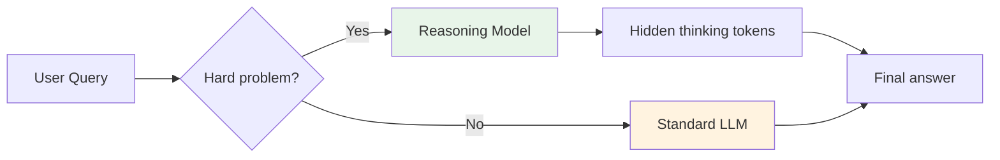
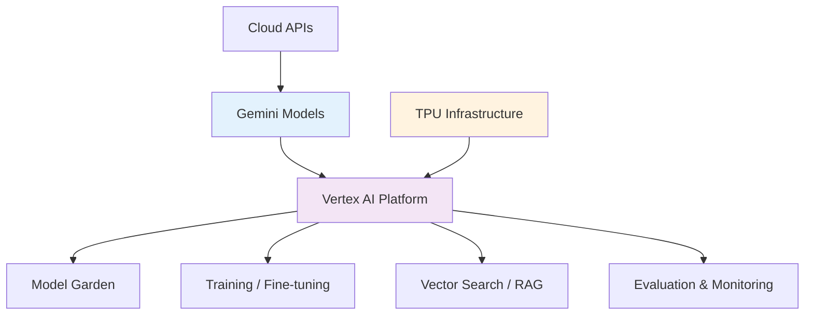

# Chapter 19 — The 2026 AI Landscape

> "The AI landscape moves fast. This chapter maps what's new, what changed, and what interviewers expect in 2026."

---

## What You'll Learn
- Reasoning models and test-time compute
- Multimodal AI (vision, audio, video)
- On-device AI and quantization
- Responsible AI and safety
- Context engineering (the 2026 skill)
- Google's AI stack
- What interviewers now ask differently

---

## 19.1 Reasoning Models

> **Reasoning model** — An LLM that allocates additional compute at inference time to decompose problems into intermediate steps before producing a final answer. The model generates hidden "thinking" tokens that are not shown to the user but guide the output.

Standard LLMs produce tokens left-to-right in a single pass. They're fast but brittle on multi-step logic. Reasoning models flip the script: instead of spending more compute during training, they spend it at **test time** — thinking longer on harder problems.

**Key models (as of early 2026):**

| Model | Org | Approach |
|-------|-----|----------|
| o3 / o4-mini | OpenAI | Hidden chain-of-thought, reinforcement learning on reasoning traces |
| DeepSeek-R1 | DeepSeek | Open-weight reasoning, distilled variants (1.5B-70B) |
| Gemini 2.5 Pro | Google | "Thinking" mode with adjustable compute budget |
| Claude with extended thinking | Anthropic | Visible thinking blocks, steerable depth |

**How test-time compute scaling works:**

```
Normal LLM:
  Input ──> [ Single forward pass ] ──> Output
  Cost: fixed per token

Reasoning Model:
  Input ──> [ Think... think... think... ] ──> Output
             ^^^^^^^^^^^^^^^^^^^^^^^^
             Hidden tokens (can be 1K-100K+)
  Cost: scales with problem difficulty
```

The core insight is a **scaling law for inference**: doubling the thinking budget often improves accuracy on hard tasks more cheaply than doubling model parameters.

**When to use reasoning models:**

| Use reasoning | Skip reasoning |
|---------------|----------------|
| Math / formal logic | Simple Q&A / lookup |
| Multi-step planning | Creative writing |
| Code generation with complex specs | High-throughput classification |
| Scientific analysis | Latency-critical applications |

**When NOT to use them:** Reasoning models are slower and more expensive per query. For tasks where a standard model already scores 95%+, the extra thinking tokens burn money without improving quality. They can also "overthink" simple prompts, producing worse results than a direct answer.

**Interview angle:** Expect questions like "When would you choose a reasoning model over a standard LLM?" The answer is about the compute-accuracy tradeoff — reasoning models shine on problems that benefit from decomposition.



---

## 19.2 Multimodal AI

> **Multimodal model** — A model that can process and generate across multiple data types (text, images, audio, video) within a single architecture, enabling cross-modal reasoning.

The 2024-2026 shift: models went from "text-only with bolt-on vision" to **natively multimodal**. A single model sees an image, hears audio, reads text, and reasons across all of them jointly.

**The major multimodal models:**

| Model | Modalities | Notable capability |
|-------|-----------|-------------------|
| GPT-4o | Text, image, audio (in/out) | Real-time voice conversation |
| Gemini 2.5 | Text, image, audio, video | 1M+ token context with video frames |
| Claude (Opus/Sonnet) | Text, image | Strong document and chart understanding |
| Llama 4 | Text, image | Open-weight multimodal |

**How vision works in modern LLMs:**

Images are split into patches (typically 14x14 or 16x16 pixels), each patch is embedded into the same vector space as text tokens, and the transformer processes them together. There's no separate "vision module" — it's one unified sequence.

```
Image input:
  [img_patch_1] [img_patch_2] ... [img_patch_N] [text_token_1] [text_token_2] ...
  └──────────── unified transformer attention ────────────────────────────────┘
```

**Audio and video understanding:**

- **Audio:** Waveforms are chunked into short segments (~25ms frames), converted to spectrograms or learned embeddings, and fed as tokens. Models like GPT-4o handle speech-to-speech without an intermediate text step.
- **Video:** Frames are sampled (e.g., 1-4 fps), each frame processed as an image, and temporal reasoning happens through the model's attention over the frame sequence. Gemini handles long videos by fitting thousands of frames into its context window.

**Cross-modal retrieval:** Embedding models like CLIP, SigLIP, and their successors map images and text into the same vector space. This enables searching images with text queries and vice versa — the backbone of Google Lens, visual search, and RAG over image databases.

**Interview angle:** "How would you build a system that answers questions about a collection of product images?" — You need a vision-language model or a CLIP-style retriever feeding into an LLM.

---

## 19.3 On-Device AI

> **On-device AI** — Running ML models directly on edge hardware (phones, laptops, IoT devices) rather than sending data to cloud servers, trading model size for latency, privacy, and cost advantages.

Cloud inference costs money on every call. On-device inference has a one-time cost (downloading the model) and then runs for free. For 2 billion smartphone users, that math changes everything.

**Why it matters:**

| Benefit | Explanation |
|---------|-------------|
| **Privacy** | Data never leaves the device — critical for health, finance, personal assistants |
| **Latency** | No network round-trip; responses in milliseconds |
| **Cost** | No per-query cloud bill; scales to billions of users at zero marginal cost |
| **Availability** | Works offline, on airplanes, in poor connectivity |

**Key products:**

- **Gemini Nano** — Google's on-device model, powers Smart Reply, summarization, and Magic Compose on Pixel phones
- **Apple Intelligence** — On-device models for writing tools, image understanding, Siri
- **Qualcomm / MediaTek NPUs** — Dedicated neural processing silicon in mobile chips

**Quantization — making models fit:**

> **Quantization** — Reducing the numerical precision of model weights (e.g., from 32-bit floats to 4-bit integers) to shrink memory footprint and accelerate inference with minimal accuracy loss.

```
FP32 (full precision):     32 bits per weight  ->  7B model = 28 GB
FP16 (half precision):     16 bits per weight  ->  7B model = 14 GB
INT8:                       8 bits per weight  ->  7B model =  7 GB
INT4:                       4 bits per weight  ->  7B model =  3.5 GB
```

INT4 quantization loses ~1-3% accuracy on benchmarks but cuts memory 8x. Techniques like GPTQ, AWQ, and GGUF make this practical. A 7B-parameter model quantized to INT4 runs on a phone with 4 GB of RAM.

**Edge vs. cloud decision framework:** Use on-device when privacy matters, latency is critical, or you're serving billions of simple queries. Use cloud when you need the largest models, complex multi-step reasoning, or access to real-time external data.

---

## 19.4 Responsible AI & Safety

> **Responsible AI** — The practice of designing, developing, and deploying AI systems that are fair, transparent, accountable, and aligned with human values, while actively mitigating potential harms.

This isn't a checkbox exercise. Every major AI lab now has dedicated safety teams, and interviewers at Google, Meta, and others **will** ask about it.

**Core concerns and techniques:**

**Bias and fairness:**
- Models inherit biases from training data. A hiring model trained on historical data will replicate historical discrimination.
- **Mitigation:** Balanced datasets, fairness constraints during training (demographic parity, equalized odds), post-hoc calibration, regular bias audits.
- Google's Responsible AI Toolkit includes the What-If Tool, Fairness Indicators, and Model Cards.

**Red-teaming:**
- Adversarial testing where humans (or other models) deliberately try to make the AI produce harmful outputs — jailbreaks, toxic content, misinformation.
- Now standard practice before any major model release. Both manual red-teaming and automated red-teaming (using LLMs to generate attack prompts) are used.

**Alignment techniques:**

| Technique | How it works |
|-----------|-------------|
| RLHF | Human preference rankings fine-tune the model via reward modeling |
| Constitutional AI | Model self-critiques against written principles, no human labelers needed per example |
| DPO | Direct Preference Optimization — skips the reward model, directly optimizes on preference pairs |
| RLAIF | AI-generated feedback replaces human feedback for scalability |

**Google's AI Principles (published 2018, still cited in interviews):**
1. Be socially beneficial
2. Avoid creating or reinforcing unfair bias
3. Be built and tested for safety
4. Be accountable to people
5. Incorporate privacy design principles
6. Uphold high standards of scientific excellence
7. Be made available for uses that accord with these principles

**Interview angle:** "How would you ensure your model doesn't produce harmful outputs?" — Cover the full stack: training data curation, RLHF/Constitutional AI, safety classifiers, content filtering, red-teaming, monitoring in production, and human escalation paths.

---

## 19.5 Context Engineering

> **Context engineering** — The systematic design of everything a model sees at inference time: the system prompt, conversation history, retrieved documents, tool outputs, and structured memory — to maximize task performance.

This is the discipline that emerged in 2025-2026 as practitioners realized that prompt engineering was too narrow a label. You're not just writing a prompt — you're engineering the entire **context window**.

**The context stack:**

```
┌─────────────────────────────────────┐
│  System prompt (persona, rules)     │  <- Static, set by developer
├─────────────────────────────────────┤
│  Retrieved documents (RAG)          │  <- Dynamic, from vector DB / search
├─────────────────────────────────────┤
│  Tool results (API calls, code)     │  <- Dynamic, from function calling
├─────────────────────────────────────┤
│  Conversation history               │  <- Dynamic, growing per turn
├─────────────────────────────────────┤
│  Structured memory (summaries)      │  <- Persistent, compressed
├─────────────────────────────────────┤
│  User message                       │  <- Current turn
└─────────────────────────────────────┘
         ↓ all of this = "context"
     [ LLM generates response ]
```

**Why it matters more than prompt engineering:**

Prompt engineering focuses on *wording*. Context engineering focuses on *what information is available and how it's structured*. A perfectly worded prompt with missing context will fail. A mediocre prompt with excellent context will often succeed.

**Key techniques:**

| Technique | What it does |
|-----------|-------------|
| **RAG** | Retrieves relevant documents from a knowledge base and injects them into context |
| **Tool use / function calling** | Model calls APIs, runs code, queries databases — results flow back into context |
| **Conversation summarization** | Compress long histories to fit in the context window without losing key info |
| **Memory systems** | Persistent storage (user preferences, past interactions) injected at inference time |
| **Context window management** | Prioritizing, truncating, and ordering information to fit within token limits |

**The #1 AI engineering skill of 2026:** Building agents and applications is mostly context engineering. Deciding what to retrieve, when to call tools, how to structure the system prompt, how to manage memory — these decisions determine 80% of an AI application's quality.

**Interview angle:** "How would you design the context for a customer support agent?" — Discuss what goes in each layer: system prompt with policies, RAG over the knowledge base, tool access for order lookups, conversation history with summarization, and user profile memory.

---

## 19.6 Google's AI Stack

> **Google's AI stack** — The integrated set of models (Gemini family), infrastructure (TPUs, Vertex AI), and research that Google offers for building and deploying AI systems.

**The Gemini family:**

| Model | Size tier | Use case |
|-------|-----------|----------|
| Gemini 2.5 Pro | Large (flagship) | Reasoning, coding, analysis, complex tasks |
| Gemini 2.5 Flash | Medium | Fast, cost-effective production workloads |
| Gemini Nano | Small (~3B) | On-device; phones, laptops |

All Gemini models are natively multimodal (text, image, audio, video) and support long context windows (up to 1M tokens for Pro).

**Vertex AI — Google's ML platform:**
- Model Garden: access to Gemini, open models (Llama, Mistral), and specialized models
- Model training and fine-tuning (full and LoRA/QLoRA)
- Vector search for RAG applications
- Evaluation and monitoring pipelines
- MLOps: model versioning, A/B testing, staged rollouts

**TPU infrastructure:**
- TPU v5e/v6e: current-generation tensor processing units
- Designed for large-scale training and inference
- Cheaper per FLOP than GPUs for transformer workloads at Google's scale
- Key advantage: tight integration with JAX and the XLA compiler



**Key papers from Google (interview-relevant):**
- *Attention Is All You Need* (2017) — introduced the Transformer
- *BERT* (2018) — bidirectional pre-training
- *Scaling Laws for Neural Language Models* — compute-optimal training
- *PaLM / PaLM 2* — multilingual, reasoning capabilities
- *Gemini technical reports* — multimodal architecture

**Interview angle:** Know the Gemini model tiers and when to use each. Understand Vertex AI's role as the MLOps platform. Be ready to discuss TPU advantages for large-scale training.

---

## 19.7 What Interviewers Ask in 2026

The interview landscape has shifted. Here's what changed and what now differentiates candidates.

**Five topics that separate 2026 candidates from 2024 prep:**

| Topic | Why it matters | Sample question |
|-------|---------------|----------------|
| **Test-time compute** | Shows you understand the reasoning model paradigm | "When would you spend more compute at inference vs. training?" |
| **Context engineering** | The core skill for AI application building | "Design the context stack for a medical Q&A agent" |
| **On-device vs. cloud** | Shows practical deployment thinking | "How would you decide what runs on-device vs. cloud?" |
| **Safety & alignment** | Google cares deeply; it's a filter question | "How do you evaluate and mitigate bias in a content recommendation system?" |
| **Multimodal systems** | Most new products are multimodal | "Design a system that answers questions about uploaded documents with images and tables" |

**Decision matrix — which model for which job:**

| Scenario | Best choice | Why |
|----------|------------|-----|
| Real-time mobile autocomplete | Gemini Nano (on-device) | Latency, cost, privacy |
| Complex code generation | Gemini 2.5 Pro (reasoning mode) | Needs multi-step reasoning |
| High-throughput classification | Gemini 2.5 Flash | Fast, cheap, accurate enough |
| Sensitive health data analysis | On-device or private cloud | Privacy requirements |
| Creative content generation | Standard LLM (no reasoning) | Reasoning mode can over-constrain creativity |

**Sample interview exchange:**

> *"You're building a Google Photos feature that lets users ask natural language questions about their photo library. Walk me through the system design."*

Strong answer structure:
1. **Retrieval:** Embed photos with SigLIP/CLIP into a vector store. Embed the user query. Retrieve top-k relevant photos.
2. **Understanding:** Feed retrieved photos + query to Gemini Pro (multimodal). The model sees the images natively.
3. **On-device vs. cloud:** Simple queries (search) can run on-device with Nano. Complex reasoning (comparing photos, storytelling) routes to cloud.
4. **Safety:** Filter queries and outputs for sensitive content. Don't surface photos the user has hidden.
5. **Evaluation:** Measure retrieval recall, answer accuracy, latency, and user satisfaction.

<div class="chart-container" style="max-width: 600px; margin: 2rem auto;">
<canvas id="interviewTopicsChart"></canvas>
<script>
(function() {
  const ctx = document.getElementById('interviewTopicsChart');
  if (!ctx || typeof Chart === 'undefined') return;
  new Chart(ctx, {
    type: 'radar',
    data: {
      labels: ['Reasoning Models', 'Multimodal AI', 'On-Device AI', 'Responsible AI', 'Context Engineering'],
      datasets: [{
        label: '2024 Interview Frequency',
        data: [20, 40, 25, 50, 10],
        borderColor: '#ff6384',
        backgroundColor: 'rgba(255,99,132,0.15)'
      }, {
        label: '2026 Interview Frequency',
        data: [75, 80, 60, 85, 90],
        borderColor: '#36a2eb',
        backgroundColor: 'rgba(54,162,235,0.15)'
      }]
    },
    options: {
      responsive: true,
      scales: { r: { beginAtZero: true, max: 100, ticks: { display: false } } },
      plugins: { title: { display: true, text: 'Interview Topic Frequency: 2024 vs 2026 (%)' } }
    }
  });
})();
</script>
</div>

---

## Key Takeaways

> **2026 AI Landscape -- Cheat Sheet**
>
> - **Reasoning models** spend compute at inference time, not just training time. Use them for hard, decomposable problems.
> - **Multimodal models** process text, images, audio, and video natively. Cross-modal reasoning is the default, not a feature.
> - **On-device AI** trades model size for privacy, latency, and zero marginal cost. INT4 quantization makes 7B models fit on phones.
> - **Responsible AI** is a first-class interview topic. Know RLHF, Constitutional AI, red-teaming, and Google's AI Principles.
> - **Context engineering** is the #1 AI engineering skill. You're designing the full context window, not just the prompt.
> - **Google's stack**: Gemini (Pro/Flash/Nano) + Vertex AI + TPUs. Know the tiers and when to use each.
> - **Interviews in 2026** test test-time compute tradeoffs, multimodal design, on-device decisions, safety, and context engineering.

---

## Review Questions

**1. What is test-time compute scaling and how does it differ from scaling model parameters?**
<details><summary>Answer</summary>
Test-time compute scaling allocates more computation during inference (generating more thinking tokens) rather than increasing model size during training. It improves performance on hard problems by letting the model reason through intermediate steps. The key difference: parameter scaling has a one-time training cost that benefits all queries equally, while test-time compute is spent per-query and can be adjusted based on problem difficulty.
</details>

**2. When would you choose a standard LLM over a reasoning model?**
<details><summary>Answer</summary>
Use a standard LLM for: simple Q&A, creative writing, high-throughput classification, latency-critical applications, and tasks where the model already achieves high accuracy. Reasoning models add cost and latency; they're wasteful on tasks that don't require multi-step decomposition. They can also "overthink" simple prompts, producing unnecessarily verbose or over-constrained outputs.
</details>

**3. How do modern multimodal models handle image inputs?**
<details><summary>Answer</summary>
Images are divided into fixed-size patches (e.g., 14x14 pixels), each patch is converted to an embedding vector in the same space as text tokens, and the full sequence (image patches + text tokens) is processed by the transformer with unified attention. There's no separate vision encoder in the most modern architectures — it's one model processing interleaved modalities.
</details>

**4. Explain INT4 quantization and its tradeoffs.**
<details><summary>Answer</summary>
INT4 quantization reduces each model weight from 32-bit floating point to 4-bit integer representation, cutting memory by 8x. A 7B-parameter model goes from ~28 GB (FP32) to ~3.5 GB (INT4), making it runnable on mobile devices. The tradeoff is ~1-3% accuracy loss on benchmarks. Techniques like GPTQ and AWQ minimize this loss by calibrating the quantization on representative data.
</details>

**5. What is context engineering and why has it replaced "prompt engineering" as a label?**
<details><summary>Answer</summary>
Context engineering is the systematic design of everything a model sees at inference time: the system prompt, retrieved documents (RAG), tool outputs, conversation history, and structured memory. It replaced "prompt engineering" because practitioners realized that the wording of the prompt is only a small fraction of what determines output quality. The structure, selection, and ordering of all context — not just the user-facing prompt — is what makes AI applications work.
</details>

**6. Name three alignment techniques and explain how they differ.**
<details><summary>Answer</summary>
(1) RLHF: human annotators rank model outputs, a reward model is trained on these rankings, and the LLM is fine-tuned to maximize the reward. (2) Constitutional AI: the model self-critiques its outputs against a set of written principles, then revises — no per-example human labeling needed. (3) DPO (Direct Preference Optimization): directly optimizes the model on preference pairs without training a separate reward model, simplifying the RLHF pipeline. The key differences are in scalability (Constitutional AI and DPO need less human labor) and complexity (RLHF requires a separate reward model; DPO doesn't).
</details>

**7. How would you decide whether a feature should run on-device or in the cloud?**
<details><summary>Answer</summary>
On-device when: data is sensitive (health, finance), latency is critical (real-time autocomplete), the feature is used at massive scale (billions of queries), connectivity may be unreliable, or the task is simple enough for a small model. Cloud when: the task requires large models (complex reasoning, multi-step planning), needs access to real-time external data, requires the latest model version, or involves multi-modal reasoning beyond what on-device models can handle.
</details>

**8. Design the context stack for a customer support agent. What goes in each layer?**
<details><summary>Answer</summary>
System prompt: agent persona, company policies, escalation rules, tone guidelines. RAG layer: retrieved articles from the knowledge base matching the customer's question. Tool results: order lookup API, account status check, refund processing. Conversation history: full current conversation, summarized previous conversations. Memory: customer preferences, past issues, satisfaction score. User message: current customer input. Key design decisions: how to prioritize when context window fills up (policies > current conversation > retrieved docs), when to trigger tool calls, and how to compress history without losing critical details.
</details>

---

**Previous:** [Chapter 18 — AI Frameworks & Engineering](18_ai_frameworks.md) | **Next:** [Chapter 20 — Design Fundamentals](20_design_fundamentals.md)