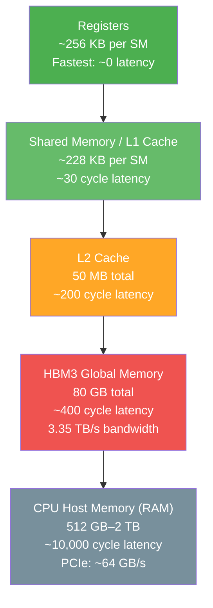
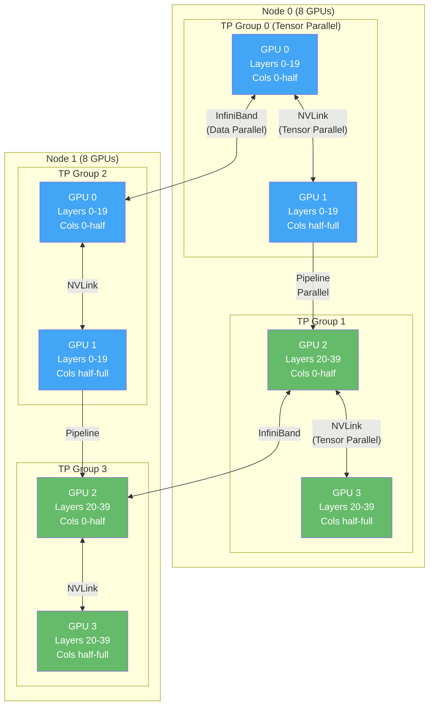

# Chapter 24 — Miscellaneous Topics for AI Engineers

This chapter covers the hardware and infrastructure that makes modern AI possible. You can write the most elegant model architecture in the world — if you do not understand the hardware running it, you will waste money, time, and sanity. GPUs, TPUs, distributed training, and inference optimization are not optional knowledge for an AI engineer. They are the difference between a model that trains in 3 hours and one that takes 3 weeks.

---

## 24.1 GPUs for AI — Hardware Fundamentals

> **GPU (Graphics Processing Unit):** A massively parallel processor originally designed for rendering graphics, now the dominant hardware for training and running neural networks. GPUs excel at performing thousands of simple arithmetic operations simultaneously — exactly the workload that matrix multiplication demands.

Training a neural network boils down to three operations repeated billions of times: multiply matrices (forward pass), compute a loss, and multiply more matrices (backward pass). A CPU processes these sequentially across a handful of powerful cores. A GPU throws thousands of simpler cores at the problem in parallel. For a 4096x4096 matrix multiplication, a modern GPU is roughly 100-1000x faster than a CPU.

NVIDIA dominates AI hardware. Here is the current lineup that matters:

| GPU | Year | VRAM | Memory BW | FP16 TFLOPS | Tensor TFLOPS (FP16) | TDP | Price (Cloud $/hr) |
|-----|------|------|-----------|-------------|----------------------|-----|---------------------|
| A100 (80GB) | 2020 | 80 GB HBM2e | 2.0 TB/s | 312 | 624 | 300W | ~$2-3 |
| H100 (SXM) | 2022 | 80 GB HBM3 | 3.35 TB/s | 989 | 1,979 | 700W | ~$3-4 |
| H200 | 2024 | 141 GB HBM3e | 4.8 TB/s | 989 | 1,979 | 700W | ~$4-5 |
| B200 | 2025 | 192 GB HBM3e | 8.0 TB/s | 2,250 | 4,500 | 1000W | ~$5-7 |

The H200 has the same compute as the H100 but nearly double the memory capacity and 43% more bandwidth. For LLM inference, memory bandwidth often matters more than raw FLOPS — the H200 exists specifically for this reason.

**Fun fact:** NVIDIA's market cap crossed $3 trillion in 2024, making it briefly the most valuable company on Earth. In 2019 it was worth $100 billion. The entire increase is attributable to AI GPU demand.

### GPU Performance Progression

```chart
{
  "type": "bar",
  "data": {
    "labels": ["V100 (2017)", "A100 (2020)", "H100 (2022)", "H200 (2024)", "B200 (2025)"],
    "datasets": [
      {
        "label": "Tensor Core TFLOPS (FP16)",
        "data": [125, 624, 1979, 1979, 4500],
        "backgroundColor": ["#66bb6a", "#42a5f5", "#ab47bc", "#ef5350", "#ffa726"]
      }
    ]
  },
  "options": {
    "plugins": { "title": { "display": true, "text": "GPU Tensor Core Performance by Generation" } },
    "scales": { "y": { "title": { "display": true, "text": "TFLOPS (FP16)" } } }
  }
}
```

Every generation roughly doubles performance. But raw FLOPS is only half the story — memory capacity and bandwidth determine what you can actually run.

---

## 24.2 GPU Architecture — How GPUs Differ from CPUs

A CPU is designed to execute complex instruction streams quickly on a few cores. A GPU is designed to execute simple instruction streams on thousands of cores simultaneously.

```
CPU Architecture (e.g., AMD EPYC 9654 — 96 cores)
┌─────────────────────────────────────────────────────────────┐
│  Core 0          Core 1          Core 2      ...  Core 95   │
│ ┌─────────┐    ┌─────────┐    ┌─────────┐    ┌─────────┐   │
│ │ ALU ALU │    │ ALU ALU │    │ ALU ALU │    │ ALU ALU │   │
│ │ Branch  │    │ Branch  │    │ Branch  │    │ Branch  │   │
│ │Predictor│    │Predictor│    │Predictor│    │Predictor│   │
│ │ L1 Cache│    │ L1 Cache│    │ L1 Cache│    │ L1 Cache│   │
│ │ L2 Cache│    │ L2 Cache│    │ L2 Cache│    │ L2 Cache│   │
│ └─────────┘    └─────────┘    └─────────┘    └─────────┘   │
│              Large shared L3 Cache (384 MB)                  │
│         Complex out-of-order execution per core              │
└─────────────────────────────────────────────────────────────┘

GPU Architecture (e.g., H100 — 16,896 CUDA cores + 528 Tensor Cores)
┌─────────────────────────────────────────────────────────────┐
│  SM 0              SM 1              SM 2       ... SM 131   │
│ ┌───────────┐    ┌───────────┐    ┌───────────┐            │
│ │CUDA CUDA  │    │CUDA CUDA  │    │CUDA CUDA  │   ...      │
│ │CUDA CUDA  │    │CUDA CUDA  │    │CUDA CUDA  │            │
│ │CUDA CUDA  │    │CUDA CUDA  │    │CUDA CUDA  │            │
│ │...  (128) │    │...  (128) │    │...  (128) │            │
│ │Tensor x 4 │    │Tensor x 4 │    │Tensor x 4 │            │
│ │Shared Mem │    │Shared Mem │    │Shared Mem │            │
│ └───────────┘    └───────────┘    └───────────┘            │
│              80 GB HBM3 (3.35 TB/s bandwidth)               │
│         Simple cores, massive parallelism                    │
└─────────────────────────────────────────────────────────────┘

SM = Streaming Multiprocessor (a cluster of CUDA + Tensor Cores)
```

**Key architectural differences:**

| Feature | CPU | GPU |
|---------|-----|-----|
| Core count | 8–96 (powerful) | 10,000–20,000 (simple) |
| Clock speed | 3–5 GHz | 1.5–2 GHz |
| Cache per core | Large (MB) | Small (KB) |
| Branch prediction | Sophisticated | Minimal |
| Best for | Serial logic, control flow | Parallel math, matrix ops |
| Memory bandwidth | ~100 GB/s (DDR5) | 2,000–8,000 GB/s (HBM) |

### Tensor Cores

Tensor Cores are the real workhorses for deep learning. A CUDA core does one floating-point operation per clock. A Tensor Core performs a 4x4 matrix multiply-accumulate (D = A*B + C) in a single operation — that is 64 fused multiply-adds per clock cycle per Tensor Core. The H100 has 528 Tensor Cores, which is why its Tensor TFLOPS is 2-3x its raw CUDA FLOPS.

### GPU Memory Hierarchy



The rule: keep data as close to the compute as possible. Every time you access HBM instead of shared memory, you pay a 10x latency penalty. This is why Flash Attention is such a big deal (Section 24.5).

---

## 24.3 GPU Memory — The Real Bottleneck

More models fail because they run out of VRAM than because they are architecturally wrong. Understanding GPU memory math is non-negotiable.

### Memory Budget for Training

For a model with **P parameters** trained with Adam optimizer in FP32:

| Component | Size | Example (7B params) |
|-----------|------|---------------------|
| Model parameters | P x 4 bytes (FP32) | 28 GB |
| Gradients | P x 4 bytes | 28 GB |
| Adam optimizer (momentum) | P x 4 bytes | 28 GB |
| Adam optimizer (variance) | P x 4 bytes | 28 GB |
| **Subtotal (no activations)** | **P x 16 bytes** | **112 GB** |
| Activations | Varies (batch, seq_len, layers) | 10–60 GB |
| **Total** | | **122–172 GB** |

A single 80 GB GPU cannot train a 7B parameter model in FP32. This is why mixed precision training exists.

**With mixed precision (BF16 + FP32 master weights):**

| Component | Size | Example (7B params) |
|-----------|------|---------------------|
| Model parameters (BF16) | P x 2 bytes | 14 GB |
| Gradients (BF16) | P x 2 bytes | 14 GB |
| Master weights (FP32) | P x 4 bytes | 28 GB |
| Adam momentum (FP32) | P x 4 bytes | 28 GB |
| Adam variance (FP32) | P x 4 bytes | 28 GB |
| **Subtotal** | **P x 16 bytes** | **112 GB** |
| Activations (BF16) | Varies | 5–30 GB |
| **Total** | | **~120–140 GB** |

Mixed precision does not save optimizer memory — it saves activation memory and speeds up compute. You still need ~16 bytes per parameter for Adam training.

### Practical VRAM Requirements

| Model Size | Inference (FP16) | Inference (INT8) | Inference (INT4) | Fine-tune (LoRA, BF16) | Full Training (BF16+Adam) |
|-----------|------------------|-------------------|-------------------|-------------------------|---------------------------|
| 1.3B | 2.6 GB | 1.3 GB | 0.7 GB | ~8 GB | ~24 GB |
| 7B | 14 GB | 7 GB | 3.5 GB | ~24 GB | ~120 GB |
| 13B | 26 GB | 13 GB | 6.5 GB | ~40 GB | ~220 GB |
| 70B | 140 GB | 70 GB | 35 GB | ~160 GB | ~1.2 TB |
| 405B | 810 GB | 405 GB | 203 GB | ~900 GB | ~7 TB |

This table explains why LoRA is so popular for fine-tuning — a 7B model fits on a single 24 GB consumer GPU with LoRA, but needs two 80 GB GPUs for full training.

### Gradient Checkpointing

When you run the forward pass, every layer stores its activations for the backward pass. For a 70B model with a reasonable batch size, activations alone can consume hundreds of GB.

**Gradient checkpointing** trades compute for memory: instead of storing all activations, you store only a fraction (e.g., every Nth layer) and recompute the rest during the backward pass. This typically reduces activation memory by 5-10x at the cost of ~30% more compute time.

```
Standard Training:
Forward:  [Act1] → [Act2] → [Act3] → [Act4] → [Act5] → Loss
           save     save     save     save     save
Memory: 5 activations stored

Gradient Checkpointing (save every 2nd):
Forward:  [Act1] → [    ] → [Act3] → [    ] → [Act5] → Loss
           save              save              save
Backward: recompute Act2    recompute Act4
Memory: 3 activations stored (40% reduction)
```

**Practical tip:** Always check `nvidia-smi` before blaming your code for OOM. Someone else on the machine might be hogging GPU memory.

---

## 24.4 CUDA & GPU Programming Basics

> **CUDA (Compute Unified Device Architecture):** NVIDIA's parallel computing platform and API that allows software to use NVIDIA GPUs for general-purpose computation. Released in 2007, CUDA is the reason NVIDIA dominates AI — it created a 15-year ecosystem head start.

You will almost never write raw CUDA kernels. PyTorch, JAX, and TensorFlow compile your Python operations into CUDA kernels automatically. But understanding CUDA concepts helps you diagnose performance problems.

### CUDA Execution Model

```
Grid (your entire computation)
├── Block 0                    Block 1                    Block 2
│   ├── Thread 0               ├── Thread 0               ├── Thread 0
│   ├── Thread 1               ├── Thread 1               ├── Thread 1
│   ├── Thread 2               ├── Thread 2               ├── Thread 2
│   └── ... (up to 1024)       └── ... (up to 1024)       └── ... (up to 1024)
│   [Shared Memory]            [Shared Memory]            [Shared Memory]
└── All blocks share Global Memory (HBM)
```

- **Kernel**: a function that runs on the GPU (launched from CPU)
- **Thread**: smallest unit of execution
- **Block**: group of threads that share fast local memory (SRAM) and can synchronize
- **Grid**: collection of all blocks for a kernel launch
- **Warp**: 32 threads that execute in lockstep (the real scheduling unit)

### Key Performance Concepts

**Memory coalescing**: when 32 threads in a warp access consecutive memory addresses, the GPU combines them into a single wide memory transaction. Non-coalesced access can be 10-30x slower. This is why data layout (row-major vs column-major) matters.

**Occupancy**: the ratio of active warps to the maximum warps a GPU can handle. Low occupancy means GPU cores are idle. Common causes: too much shared memory per block, too many registers per thread.

### Checking GPU Info in PyTorch

```python
import torch

# Basic GPU check
print(f"CUDA available: {torch.cuda.is_available()}")
print(f"GPU count: {torch.cuda.device_count()}")
print(f"GPU name: {torch.cuda.get_device_name(0)}")

# Memory info
props = torch.cuda.get_device_properties(0)
print(f"Total VRAM: {props.total_mem / 1e9:.1f} GB")
print(f"CUDA capability: {props.major}.{props.minor}")

# During training — check memory usage
print(f"Allocated: {torch.cuda.memory_allocated() / 1e9:.2f} GB")
print(f"Cached: {torch.cuda.memory_reserved() / 1e9:.2f} GB")
print(f"Max allocated: {torch.cuda.max_memory_allocated() / 1e9:.2f} GB")

# Reset peak stats (useful for profiling)
torch.cuda.reset_peak_memory_stats()
```

**Practical tip:** PyTorch caches memory in its allocator (`memory_reserved`), which is higher than `memory_allocated`. If `nvidia-smi` shows high usage but `memory_allocated` is low, PyTorch is just hoarding freed memory for reuse. Call `torch.cuda.empty_cache()` if you need to free it.

---

## 24.5 Training Optimization — Making GPUs Go Fast

A poorly optimized training setup can leave 80% of your GPU idle. Here is every major optimization technique, ranked by effort-to-impact ratio.

### Mixed Precision Training (FP32 to BF16/FP16)

**Impact:** ~2x speedup, ~30-40% memory reduction for activations. **Effort:** one line of code.

```python
# PyTorch automatic mixed precision
from torch.cuda.amp import autocast, GradScaler

scaler = GradScaler()

for batch in dataloader:
    optimizer.zero_grad()
    with autocast(dtype=torch.bfloat16):  # or torch.float16
        output = model(batch)
        loss = criterion(output, targets)
    scaler.scale(loss).backward()
    scaler.step(optimizer)
    scaler.update()
```

**BF16 vs FP16:** Both use 16 bits. FP16 has more precision bits (10 mantissa) but a tiny exponent range (5 bits), causing overflow/underflow in gradients. BF16 matches FP32's exponent range (8 bits) with less precision (7 mantissa bits). For training, the exponent range matters more — use BF16 whenever your hardware supports it (A100+, TPU v3+).

```
FP32:  1 sign | 8 exponent | 23 mantissa  →  range: ±3.4×10³⁸
FP16:  1 sign | 5 exponent | 10 mantissa  →  range: ±65,504
BF16:  1 sign | 8 exponent |  7 mantissa  →  range: ±3.4×10³⁸
```

### Gradient Accumulation

Simulate large batch sizes without more memory. Instead of one big batch of 256, process 8 micro-batches of 32 and accumulate gradients.

```python
accumulation_steps = 8
optimizer.zero_grad()

for i, batch in enumerate(dataloader):
    with autocast(dtype=torch.bfloat16):
        loss = model(batch) / accumulation_steps  # normalize
    loss.backward()

    if (i + 1) % accumulation_steps == 0:
        optimizer.step()
        optimizer.zero_grad()
```

### Flash Attention

Standard attention computes Q*K^T (an N x N matrix where N is sequence length), stores the entire matrix, applies softmax, then multiplies by V. Memory: O(N^2). For N=8192, that is 256 MB per head per layer — it adds up fast.

Flash Attention never materializes the full N x N attention matrix. It processes attention in tiles, computing softmax on-the-fly using the online softmax trick (keeping running max and sum statistics). Each tile fits in fast SRAM, avoiding slow HBM round-trips.

```
Standard Attention:
  Q, K, V in HBM → compute S = Q·Kᵀ (N×N) in HBM → softmax(S) → multiply by V
  Memory: O(N²)  |  HBM reads: O(N² · d)

Flash Attention:
  Load Q, K, V tiles into SRAM → compute attention per tile → write output to HBM
  Memory: O(N)   |  HBM reads: O(N² · d² / SRAM_size)
```

Result: 2-4x faster attention, memory drops from O(N^2) to O(N). This is what makes training with 128K+ context lengths feasible.

### torch.compile

```python
model = torch.compile(model)  # that's it
```

This JIT-compiles your model, fusing operations and eliminating Python overhead. Typical speedup: 20-50% for training, up to 2x for inference. It works best on standard architectures (transformers, CNNs) and may struggle with dynamic control flow.

### Efficient Data Loading

```python
dataloader = DataLoader(
    dataset,
    batch_size=64,
    num_workers=8,         # parallel data loading processes
    pin_memory=True,       # pre-allocate in page-locked CPU memory
    prefetch_factor=2,     # prefetch 2 batches per worker
    persistent_workers=True # don't respawn workers each epoch
)
```

If your GPU utilization (from `nvidia-smi`) drops periodically to 0%, your data pipeline is the bottleneck — increase `num_workers`.

### Optimization Speedup Comparison

```chart
{
  "type": "bar",
  "data": {
    "labels": ["Mixed Precision (BF16)", "Flash Attention", "torch.compile", "Efficient DataLoader", "Gradient Checkpointing*"],
    "datasets": [
      {
        "label": "Typical Speedup Factor",
        "data": [2.0, 2.5, 1.4, 1.3, 0.75],
        "backgroundColor": ["#42a5f5", "#66bb6a", "#ab47bc", "#ffa726", "#ef5350"]
      }
    ]
  },
  "options": {
    "plugins": {
      "title": { "display": true, "text": "Training Optimization Speedups (* = trades speed for memory)" }
    },
    "scales": { "y": { "title": { "display": true, "text": "Speedup Factor (higher = faster)" } } }
  }
}
```

### "My Training Is Slow" Debugging Checklist

1. **Check GPU utilization** (`nvidia-smi`): if < 80%, GPU is starved for work
2. **Check data loading**: is the CPU/disk the bottleneck? Increase `num_workers`
3. **Enable mixed precision**: if training in FP32, you are leaving 2x performance on the table
4. **Enable Flash Attention**: if using transformers with long sequences
5. **Profile it**: `torch.profiler` or NVIDIA Nsight — stop guessing
6. **Check batch size**: too small = GPU underutilized; too large = diminishing returns
7. **Use torch.compile**: free 20-50% speedup for most models
8. **Check for CPU-GPU sync points**: `.item()`, `print(tensor)`, `.numpy()` all force sync

---

## 24.6 Distributed Training — Multiple GPUs & Machines

When a model does not fit on one GPU, or training on one GPU would take months, you distribute the work.

### Data Parallelism (DP)

The simplest approach. Copy the full model to every GPU, split each batch across GPUs, compute gradients independently, then average the gradients.

```
Data Parallelism:
┌────────────┐  ┌────────────┐  ┌────────────┐  ┌────────────┐
│   GPU 0    │  │   GPU 1    │  │   GPU 2    │  │   GPU 3    │
│ Full Model │  │ Full Model │  │ Full Model │  │ Full Model │
│ Batch 0-15 │  │ Batch 16-31│  │ Batch 32-47│  │ Batch 48-63│
│ ↓ grads    │  │ ↓ grads    │  │ ↓ grads    │  │ ↓ grads    │
└─────┬──────┘  └─────┬──────┘  └─────┬──────┘  └─────┬──────┘
      └────────────────┴───────────────┴────────────────┘
                    AllReduce (average gradients)
                    Update all model copies
```

**Limitation:** every GPU must hold the entire model. For a 70B model that is 140 GB in FP16 — it simply does not fit.

### Tensor Parallelism (TP)

Split individual layers across GPUs. A large matrix multiply W*x becomes: split W into column chunks, each GPU computes its chunk, then combine.

```
Tensor Parallelism (splitting a linear layer):
                    Input x
                   ┌───┴───┐
          GPU 0: W₀·x    GPU 1: W₁·x
          (half cols)     (half cols)
                   └───┬───┘
                  AllGather → Full output
```

Requires very fast inter-GPU communication (NVLink at 900 GB/s, not PCIe at 64 GB/s). Best within a single node.

### Pipeline Parallelism (PP)

Split the model by layers across GPUs. GPU 0 runs layers 0-19, GPU 1 runs layers 20-39, etc.

```
Pipeline Parallelism:
GPU 0 (Layers 0-19)  →  GPU 1 (Layers 20-39)  →  GPU 2 (Layers 40-59)  →  GPU 3 (Layers 60-79)

Problem: "pipeline bubble" — while GPU 0 runs forward pass,
         GPUs 1-3 sit idle. Solution: micro-batches.

Micro-batch pipelining:
Time →  t0   t1   t2   t3   t4   t5   t6
GPU 0:  F0   F1   F2   F3   B3   B2   B1   B0
GPU 1:       F0   F1   F2   F3   B3   B2   B1
GPU 2:            F0   F1   F2   F3   B3   B2
GPU 3:                 F0   F1   F2   F3   B3
(F=forward, B=backward, number=micro-batch id)
```

### 3D Parallelism

For the largest models (GPT-4, Gemini, Llama 405B), you combine all three types:



- **Tensor Parallelism** within NVLink-connected GPUs (same node)
- **Pipeline Parallelism** between groups within a node
- **Data Parallelism** across nodes (slower InfiniBand connection)

### ZeRO and FSDP

**ZeRO (Zero Redundancy Optimizer)** from DeepSpeed eliminates redundant storage across data-parallel GPUs:

| ZeRO Stage | What is partitioned | Memory per GPU |
|------------|--------------------|--------------------|
| Stage 1 | Optimizer states | 4x → 1.33x per parameter |
| Stage 2 | + Gradients | 4x → 1x per parameter |
| Stage 3 | + Parameters | 4x → (4x/N) per parameter |

**FSDP (Fully Sharded Data Parallel)** is PyTorch's native implementation of ZeRO Stage 3.

### Basic DDP Setup

```python
import torch
import torch.distributed as dist
from torch.nn.parallel import DistributedDataParallel as DDP

def train(rank, world_size):
    # Initialize process group
    dist.init_process_group("nccl", rank=rank, world_size=world_size)
    torch.cuda.set_device(rank)

    model = MyModel().to(rank)
    model = DDP(model, device_ids=[rank])

    optimizer = torch.optim.AdamW(model.parameters(), lr=1e-4)

    for batch in dataloader:
        batch = batch.to(rank)
        loss = model(batch)
        loss.backward()        # gradients auto-synced by DDP
        optimizer.step()
        optimizer.zero_grad()

    dist.destroy_process_group()

# Launch: torchrun --nproc_per_node=4 train.py
```

### Communication Primitives

| Operation | What it does | When used |
|-----------|-------------|-----------|
| AllReduce | Sum/average across all GPUs, result on all | Gradient sync in DP |
| AllGather | Gather data from all GPUs to all | Parameter reconstruction in FSDP |
| ReduceScatter | Reduce and scatter result chunks | Gradient reduction in FSDP |
| Broadcast | One GPU sends to all | Model initialization |

**NVLink** (900 GB/s on H100): intra-node GPU-to-GPU. **InfiniBand** (400 Gb/s = 50 GB/s): inter-node. The 18x bandwidth gap is why tensor parallelism should stay within a node.

---

## 24.7 TPUs — Google's Custom AI Hardware

> **TPU (Tensor Processing Unit):** Google's custom-designed ASIC (Application-Specific Integrated Circuit) optimized specifically for neural network matrix operations. Unlike general-purpose GPUs, TPUs sacrifice flexibility for maximum efficiency on the specific workloads that dominate ML training and inference.

TPUs are what Google uses internally for training Gemini, PaLM, BERT, and almost everything else. They are available to external users via Google Cloud.

| TPU Version | Year | HBM per chip | BF16 TFLOPS | Interconnect | Key Feature |
|-------------|------|-------------|-------------|--------------|-------------|
| v4 | 2021 | 32 GB HBM2e | 275 | ICI 4800 Gbps | 4096-chip pods |
| v5e | 2023 | 16 GB HBM2e | 197 | ICI 1600 Gbps | Cost-optimized for inference/fine-tuning |
| v5p | 2023 | 95 GB HBM2e | 459 | ICI 4800 Gbps | 8960-chip pods, 2x v4 |
| v6e (Trillium) | 2024 | 32 GB HBM | 918 | ICI 6400 Gbps | 4.7x v5e performance |

### TPU Pod Architecture

```mermaid
graph TB
    subgraph "TPU v5p Pod (8960 chips)"
        subgraph "Slice 0 (256 chips)"
            direction LR
            T0["TPU 0"] <-->|"ICI<br/>4800 Gbps"| T1["TPU 1"]
            T1 <--> T2["TPU 2"]
            T2 <--> T3["TPU 3"]
            T3 <--> T4["..."]
            T4 <--> T5["TPU 255"]
        end
        subgraph "Slice 1 (256 chips)"
            direction LR
            S0["TPU 0"] <--> S1["TPU 1"]
            S1 <--> S2["..."]
            S2 <--> S3["TPU 255"]
        end
        subgraph "Slice N"
            direction LR
            N0["TPU 0"] <--> N1["..."]
            N1 <--> N2["TPU 255"]
        end
    end

    T5 <-->|"ICI (3D Torus)"| S0
    S3 <-->|"ICI"| N0

    style T0 fill:#4285f4,color:#fff
    style T1 fill:#4285f4,color:#fff
    style T2 fill:#4285f4,color:#fff
    style T3 fill:#4285f4,color:#fff
    style T5 fill:#4285f4,color:#fff
    style S0 fill:#34a853,color:#fff
    style S1 fill:#34a853,color:#fff
    style S3 fill:#34a853,color:#fff
    style N0 fill:#fbbc04,color:#000
    style N2 fill:#fbbc04,color:#000
```



The key advantage: TPU chips in a pod communicate via **ICI (Inter-Chip Interconnect)** — a custom 3D torus network that avoids the InfiniBand bottleneck that plagues GPU clusters. A TPU v5p pod of 8960 chips acts more like a single giant computer than a cluster of independent machines.

### JAX: The TPU-Native Framework

```python
import jax
import jax.numpy as jnp

# JAX automatically uses TPU when available
x = jnp.ones((1024, 1024))
y = jnp.dot(x, x)  # runs on TPU

# JIT compile for speed
@jax.jit
def train_step(params, batch):
    loss, grads = jax.value_and_grad(loss_fn)(params, batch)
    params = jax.tree_map(lambda p, g: p - 0.01 * g, params, grads)
    return params, loss

# Distribute across TPU pod
from jax.sharding import PartitionSpec as P, NamedSharding
mesh = jax.sharding.Mesh(jax.devices(), ('data',))
```

**Fun fact:** JAX was created at Google Brain specifically because TensorFlow's computational graph model was too rigid for the research Google wanted to do. It combines NumPy's API with XLA compilation and automatic differentiation.

---

## 24.8 GPU vs TPU vs CPU — When to Use What

| Task | Best Hardware | Why |
|------|---------------|-----|
| Train LLM (>70B params) | TPU v5p pod or H100/B200 cluster | Need massive parallelism + memory |
| Train LLM (7-70B) | 4-8x H100/A100 or TPU v5p slice | Fits on a single node |
| Fine-tune (LoRA) | Single A100/H100 or TPU v5e | Modest memory needs |
| Prototype / experiment | Single GPU (any) | Fast iteration matters most |
| Batch inference (throughput) | TPU v5e or GPU with vLLM | Optimize cost per token |
| Real-time inference (latency) | GPU + TensorRT or Groq LPU | Need sub-100ms responses |
| Edge / mobile | CPU, Apple Neural Engine, NPU | Power constraints |
| Classical ML (XGBoost, etc.) | CPU | Not enough parallelism to justify GPU |
| Small data (<10K samples) | CPU | Transfer overhead exceeds compute |

### Cost-Performance Comparison

```chart
{
  "type": "radar",
  "data": {
    "labels": ["Training Speed", "Inference Speed", "Cost Efficiency", "Ecosystem/Tooling", "Memory Capacity", "Ease of Use"],
    "datasets": [
      {
        "label": "NVIDIA H100 GPU",
        "data": [9, 8, 6, 10, 8, 9],
        "backgroundColor": "rgba(118, 185, 0, 0.2)",
        "borderColor": "#76b900"
      },
      {
        "label": "Google TPU v5p",
        "data": [10, 7, 8, 6, 7, 5],
        "backgroundColor": "rgba(66, 133, 244, 0.2)",
        "borderColor": "#4285f4"
      },
      {
        "label": "CPU (Server)",
        "data": [2, 3, 4, 8, 10, 10],
        "backgroundColor": "rgba(244, 67, 54, 0.2)",
        "borderColor": "#f44336"
      }
    ]
  },
  "options": {
    "plugins": { "title": { "display": true, "text": "GPU vs TPU vs CPU Comparison (1-10 scale)" } },
    "scales": { "r": { "min": 0, "max": 10 } }
  }
}
```

The GPU wins on ecosystem — CUDA has 15 years of libraries, debuggers, and community knowledge. The TPU wins on raw training throughput at scale. The CPU wins on versatility and memory (server CPUs can address terabytes of RAM).

---

## 24.9 Model Optimization for Inference

Training and inference have different optimization priorities. Training maximizes throughput (samples/second). Inference cares about latency (time to first token), throughput (tokens/second), and cost ($/million tokens).

### Quantization

Reduce the precision of model weights after training. The model gets smaller and faster at the cost of some accuracy.

| Precision | Bits per param | Model size (7B) | Relative Quality | Speed vs FP16 |
|-----------|---------------|-----------------|-------------------|---------------|
| FP32 | 32 | 28 GB | Baseline | 0.5x |
| FP16/BF16 | 16 | 14 GB | ~100% | 1x |
| INT8 | 8 | 7 GB | ~99.5% | 1.5-2x |
| INT4 (GPTQ) | 4 | 3.5 GB | ~98-99% | 2-3x |
| INT4 (AWQ) | 4 | 3.5 GB | ~98.5-99% | 2-3x |
| INT3 | 3 | 2.6 GB | ~95-97% | 3-4x |
| INT2 | 2 | 1.75 GB | ~90-93% | 4-5x |

**Rule of thumb:** INT8 is nearly lossless for most models. INT4 is the sweet spot for LLM inference — significant speedup with minimal quality loss. Below INT4, quality drops noticeably.

### Quantization Quality vs Compression

```chart
{
  "type": "line",
  "data": {
    "labels": ["FP16 (16-bit)", "INT8 (8-bit)", "INT4 (4-bit)", "INT3 (3-bit)", "INT2 (2-bit)"],
    "datasets": [
      {
        "label": "Relative Quality (%)",
        "data": [100, 99.5, 98.5, 96, 91],
        "borderColor": "#42a5f5",
        "fill": false,
        "yAxisID": "y"
      },
      {
        "label": "Memory (GB) for 7B model",
        "data": [14, 7, 3.5, 2.6, 1.75],
        "borderColor": "#ef5350",
        "fill": false,
        "yAxisID": "y1"
      }
    ]
  },
  "options": {
    "plugins": { "title": { "display": true, "text": "Quantization: Quality vs Memory Trade-off (7B Model)" } },
    "scales": {
      "y": { "type": "linear", "position": "left", "title": { "display": true, "text": "Quality (%)" }, "min": 85, "max": 101 },
      "y1": { "type": "linear", "position": "right", "title": { "display": true, "text": "Memory (GB)" }, "min": 0, "max": 16 }
    }
  }
}
```

### Knowledge Distillation

Train a smaller "student" model to replicate the outputs of a larger "teacher" model. The student learns from the teacher's soft probability distributions, which contain more information than hard labels alone.

```
Teacher (70B) produces: [0.7, 0.15, 0.08, 0.04, 0.03]  ← soft labels
Hard labels:            [1.0, 0.0,  0.0,  0.0,  0.0 ]  ← less information

Student (7B) trains on:  α × CrossEntropy(student, hard_label) +
                         (1-α) × KL_Divergence(student_soft, teacher_soft)
```

DistilBERT (66M params) achieves 97% of BERT's (110M) performance. This technique is widely used for deploying models on constrained hardware.

### Pruning

Remove weights that contribute little to the output. Two approaches:

- **Unstructured pruning:** zero out individual weights. Easy to achieve high sparsity (90%+) but requires sparse matrix hardware for speedup.
- **Structured pruning:** remove entire neurons, attention heads, or layers. Less aggressive but works with standard hardware.

### Inference Optimization Frameworks

| Framework | Vendor | Best For |
|-----------|--------|----------|
| TensorRT | NVIDIA | GPU inference, CNN/Transformer |
| vLLM | UC Berkeley (open source) | LLM serving with PagedAttention |
| ONNX Runtime | Microsoft | Cross-platform, multi-hardware |
| TensorRT-LLM | NVIDIA | LLM serving on NVIDIA GPUs |
| llama.cpp | Community | CPU/edge LLM inference |
| Triton Inference Server | NVIDIA | Production model serving |

### Speculative Decoding

LLM inference is memory-bandwidth-bound, not compute-bound — loading model weights from HBM dominates latency. Speculative decoding exploits this by using a small "draft" model to generate candidate tokens cheaply, then the large model verifies them in a single forward pass (batch verification is nearly free since you load the weights once).

```
Traditional decoding (5 tokens):
  Large model: [tok1] → [tok2] → [tok3] → [tok4] → [tok5]
  5 serial forward passes

Speculative decoding (5 tokens):
  Draft model:  [tok1, tok2, tok3, tok4, tok5]  ← fast, parallel
  Large model:  verify([tok1, tok2, tok3, ✗, ✗])  ← single pass
  Accept tok1-3, regenerate tok4 onwards
  Result: ~2-3 serial forward passes instead of 5
```

Typical speedup: 2-3x for autoregressive LLM generation with no quality loss.

### KV Cache and PagedAttention

During autoregressive generation, you store the Key and Value tensors for all previous tokens so you do not recompute them. This **KV cache** grows linearly with sequence length and can consume massive memory.

**PagedAttention** (vLLM) manages the KV cache like an operating system manages virtual memory — allocating non-contiguous memory blocks on demand instead of pre-allocating the worst case. This increases batch size and throughput by 2-4x.

---

## 24.10 Cloud GPU Options & Cost Optimization

| Provider | Instance | GPU | VRAM | On-Demand $/hr | Spot $/hr |
|----------|----------|-----|------|-----------------|-----------|
| AWS | p5.48xlarge | 8x H100 | 640 GB | ~$98 | ~$30-40 |
| AWS | g5.xlarge | 1x A10G | 24 GB | ~$1.00 | ~$0.35 |
| GCP | a3-highgpu-8g | 8x H100 | 640 GB | ~$100 | ~$30-35 |
| GCP | TPU v5e-8 | 8x TPU v5e | 128 GB | ~$25 | N/A |
| Azure | ND H100 v5 | 8x H100 | 640 GB | ~$98 | ~$29 |
| Lambda Labs | 1x H100 | 1x H100 | 80 GB | ~$2.50 | N/A |
| RunPod | 1x H100 | 1x H100 | 80 GB | ~$3.50 | ~$2.00 |
| Together.ai | Serverless | Various | — | Per-token pricing | N/A |

### Cloud GPU Cost Comparison

```chart
{
  "type": "bar",
  "data": {
    "labels": ["AWS p5 (8xH100)", "GCP a3 (8xH100)", "Azure ND (8xH100)", "GCP TPU v5e-8", "Lambda (1xH100)", "RunPod (1xH100)"],
    "datasets": [
      {
        "label": "On-Demand ($/hr)",
        "data": [98, 100, 98, 25, 2.50, 3.50],
        "backgroundColor": "#42a5f5"
      },
      {
        "label": "Spot/Preemptible ($/hr)",
        "data": [35, 33, 29, 0, 0, 2.00],
        "backgroundColor": "#66bb6a"
      }
    ]
  },
  "options": {
    "plugins": { "title": { "display": true, "text": "Cloud GPU Pricing Comparison ($/hour)" } },
    "scales": { "y": { "title": { "display": true, "text": "Cost per Hour ($)" } } }
  }
}
```

### Cost Optimization Tips

1. **Use spot/preemptible instances for training** — 60-70% cheaper. Save checkpoints frequently so interruptions just resume from the last checkpoint.
2. **Right-size your GPU** — do not use an 8xH100 node to fine-tune a 7B model. A single A100 or even an A10G may suffice for LoRA.
3. **Use smaller GPUs for inference** — INT4 quantized models serve well on cheaper hardware. A 7B model quantized to INT4 fits on a $0.35/hr A10G.
4. **Batch inference requests** — doubling batch size almost doubles throughput without doubling cost.
5. **Consider TPUs** for large-scale training — GCP TPU v5e pricing is aggressively competitive.
6. **Time-of-day pricing** varies on some platforms — run large jobs off-peak.
7. **Reserve capacity for steady workloads** — reserved instances are 30-60% cheaper than on-demand.

**Fun fact:** Training GPT-4 is estimated to have cost $50-100 million in compute. Training Llama 3 405B on 16,384 H100 GPUs for ~54 days cost Meta approximately $30-60 million.

---

## 24.11 Emerging Hardware — What's Next

The AI hardware landscape is evolving rapidly. NVIDIA dominates today, but competition is intensifying.

### NVIDIA Blackwell (B200, GB200)

Released 2025. The B200 delivers 2x H100 training performance and 5x H100 inference performance (due to a new FP4 format). The GB200 "Superchip" pairs two B200 GPUs with one Grace CPU via NVLink-C2C at 900 GB/s. A GB200 NVL72 rack contains 36 Grace CPUs and 72 B200 GPUs — 13.5 TB of HBM3e and 720 petaFLOPS of FP4 inference.

### AMD MI300X

AMD's first serious competitor in AI training. 192 GB of HBM3 (more than H100's 80 GB), 5.3 TB/s bandwidth. Competitive performance on transformer training, roughly matching or exceeding H100. The challenge: CUDA ecosystem lock-in. ROCm (AMD's CUDA equivalent) works but has fewer libraries and worse debugging tools.

### Intel Gaudi 3

Intel's AI accelerator. Competitive on training throughput at lower cost than H100. But Intel has struggled with software maturity and market adoption. Worth watching but not a safe bet for production workloads yet.

### Groq LPU (Language Processing Unit)

A fundamentally different architecture — deterministic, no caches, no branches. Processes LLM tokens at 500+ tokens/second (vs ~50-100 on GPUs). The trade-off: cannot train models, inference only. And each LPU chip holds a limited model size. Interesting for latency-critical inference.

### Cerebras WSE (Wafer-Scale Engine)

Instead of cutting a silicon wafer into hundreds of small chips, Cerebras uses the entire wafer as one chip. The WSE-3 has 4 trillion transistors, 900,000 cores, and 44 GB of on-chip SRAM. It eliminates the memory bandwidth bottleneck entirely for models that fit on-chip. Used by research labs and national labs for specific workloads.

### Custom Silicon

| Chip | Company | Purpose |
|------|---------|---------|
| TPU v6e (Trillium) | Google | Training + inference |
| Trainium2 | Amazon | Training on AWS |
| Inferentia2 | Amazon | Inference on AWS |
| Maia 100 | Microsoft | Training + inference on Azure |
| Dojo | Tesla | Autonomous driving training |

The trend is clear: every major cloud provider is building custom silicon to reduce dependence on NVIDIA and optimize cost-per-FLOP for their specific workloads.

---

## 24.12 Interview Questions

**Q1: How much VRAM do you need to fine-tune a 7B parameter model?**

<details>
<summary>Answer</summary>

It depends on the method:

- **Full fine-tuning with Adam (BF16):** ~120-140 GB. Parameters (14 GB BF16) + master weights (28 GB FP32) + optimizer states (56 GB) + gradients (14 GB) + activations. Needs 2x 80 GB GPUs minimum.
- **LoRA fine-tuning (BF16):** ~18-24 GB. Base model frozen in BF16 (14 GB) + LoRA adapters (typically 0.1-1% of params) + small optimizer states + activations. Fits on a single 24 GB GPU.
- **QLoRA (4-bit quantized base + LoRA):** ~6-10 GB. Base model in INT4 (~3.5 GB) + LoRA adapters in BF16 + optimizer. Fits on consumer GPUs like an RTX 3090.

The key insight: full fine-tuning requires ~16 bytes per parameter (for Adam), LoRA reduces the trainable parameters by 100-1000x, and QLoRA additionally compresses the frozen base model.
</details>

**Q2: Explain mixed precision training and why BF16 is preferred over FP16.**

<details>
<summary>Answer</summary>

Mixed precision training performs the forward/backward pass in lower precision (16-bit) while keeping a master copy of weights in FP32. This gives ~2x speedup (Tensor Cores are faster at 16-bit) and reduces activation memory, while the FP32 master weights prevent precision loss from accumulating over many updates.

BF16 is preferred over FP16 because it uses the same 8-bit exponent as FP32, giving it the same dynamic range (up to ~3.4 x 10^38). FP16 has only a 5-bit exponent, limiting its range to ~65,504. In practice, gradient values during training can exceed FP16's range, causing overflow (NaN) or underflow (gradients become zero). FP16 requires a loss scaler to work around this; BF16 does not. The trade-off is that BF16 has less precision (7 mantissa bits vs FP16's 10), but for neural network training, dynamic range matters more than precision.
</details>

**Q3: What is the difference between data parallelism and tensor parallelism?**

<details>
<summary>Answer</summary>

**Data parallelism** replicates the entire model on every GPU. Each GPU processes a different slice of the training batch, computes gradients locally, then all GPUs synchronize gradients via AllReduce. The model must fit on a single GPU. Communication happens once per training step (gradient sync).

**Tensor parallelism** splits individual layers across GPUs. For example, a linear layer with a 4096x4096 weight matrix is split so GPU 0 holds columns 0-2047 and GPU 1 holds columns 2048-4095. Each GPU computes a partial result, then they combine via AllGather or ReduceScatter. Communication happens at every layer boundary (multiple times per forward pass), so it requires extremely fast interconnect like NVLink.

Use data parallelism when the model fits on one GPU and you want to increase throughput. Use tensor parallelism when individual layers are too large for one GPU, and the GPUs are connected via NVLink. In practice, large-scale training uses both (plus pipeline parallelism).
</details>

**Q4: How does Flash Attention reduce memory from O(n^2) to O(n)?**

<details>
<summary>Answer</summary>

Standard attention computes S = Q * K^T, producing an N x N attention score matrix, then applies softmax, then multiplies by V. Storing the full N x N matrix requires O(N^2) memory.

Flash Attention avoids materializing this matrix by processing attention in tiles. It loads blocks of Q, K, V from slow HBM into fast SRAM, computes partial attention scores for that tile, and uses the **online softmax** algorithm to maintain running statistics (max and sum) so it can compute the correct softmax without seeing all scores at once. Only the final output (O = softmax(QK^T)V) is written back to HBM — the N x N intermediate matrix never exists in full.

The memory drops to O(N) because only the output matrix and the running softmax statistics need to be stored. The compute is still O(N^2) — Flash Attention does not reduce the number of operations. It is faster because it dramatically reduces HBM memory accesses. Attention is memory-bandwidth-bound, not compute-bound, so reducing HBM traffic by tiling into SRAM yields a 2-4x wall-clock speedup.
</details>

**Q5: When would you choose TPUs over GPUs?**

<details>
<summary>Answer</summary>

Choose TPUs when:
- Training large models at scale (100B+ parameters) — TPU pods with ICI interconnect avoid the InfiniBand bottleneck of GPU clusters
- Your team uses JAX — it is TPU-native and integrates well with Google Cloud
- You need cost-effective large-batch training — TPU v5e pricing is competitive
- You are already in the GCP ecosystem

Choose GPUs when:
- Rapid prototyping — CUDA ecosystem has more tools, libraries, and community resources
- Diverse workloads (training, inference, fine-tuning) on the same hardware
- You need specific libraries that only support CUDA (many research codebases)
- Multi-cloud or on-premise deployment — GPUs are available everywhere
- Inference serving with tools like vLLM or TensorRT that are CUDA-optimized
</details>

**Q6: Explain quantization. When does INT4 make sense vs FP16?**

<details>
<summary>Answer</summary>

Quantization reduces the numerical precision of model weights (and optionally activations) to make models smaller and faster. Post-training quantization (PTQ) converts an already-trained model; quantization-aware training (QAT) incorporates quantization during training for better results.

**INT4 makes sense when:** serving LLMs where cost and throughput matter, the model is large enough that quality loss is tolerable (7B+ parameters — larger models are more robust to quantization), latency is not critical enough to need FP16 quality, and you want to serve on cheaper hardware (a 70B model in INT4 fits on 2x 24GB GPUs instead of 3x 80GB GPUs).

**FP16 makes sense when:** quality is paramount (medical, legal, financial applications), the model is small (quality loss from INT4 is worse on smaller models), you are doing fine-tuning or further training (quantized weights cannot be trained directly), or you are measuring baseline performance before optimizing.

In practice, INT8 is nearly lossless for most models and is the safe default. INT4 with modern methods like AWQ or GPTQ retains 98-99% quality for 7B+ parameter models and is the standard for LLM serving in production.
</details>

**Q7: What is speculative decoding and why is it useful for LLM serving?**

<details>
<summary>Answer</summary>

Speculative decoding accelerates autoregressive LLM generation by using a small "draft" model to propose multiple candidate tokens, then having the large "target" model verify them in a single forward pass.

Why it works: LLM inference is memory-bandwidth-bound. Each forward pass loads the model weights from HBM to compute cores. Whether you process 1 token or 5 tokens, you load the weights once, so verifying 5 draft tokens costs roughly the same as generating 1 token. If the draft model's acceptance rate is ~70-80%, you get 2-3x more tokens per forward pass of the large model.

The key properties:
- **Mathematically lossless** — rejected tokens are regenerated by the large model, so the output distribution is identical to pure large-model generation
- **Draft model** must be much faster (5-10x) than the target — typically a smaller version (e.g., 1B draft for 70B target)
- **Acceptance rate** depends on how well the draft model approximates the target — works best for "predictable" text (common patterns, code) and worse for creative/unusual text
- **No retraining required** — purely an inference optimization
</details>

**Q8: Your training is taking 3x longer than expected. Walk through your debugging checklist.**

<details>
<summary>Answer</summary>

Systematic debugging, in order:

1. **Check GPU utilization** (`nvidia-smi` or `gpustat`): if GPU utilization is low (< 80%), the GPU is waiting for something. If it is high, the GPU is fully loaded but perhaps not optimized.

2. **Check for CPU bottleneck** (data loading): watch `nvidia-smi` over time. If GPU utilization oscillates between 100% and 0%, the data pipeline cannot keep up. Fix: increase `num_workers`, enable `pin_memory`, use `persistent_workers`, move data to faster storage (SSD/NVMe).

3. **Check precision**: if training in FP32, switch to BF16 mixed precision for an immediate ~2x speedup.

4. **Check for accidental CPU operations**: `.item()`, `.numpy()`, or `print(tensor)` on GPU tensors force a CUDA synchronization that stalls the pipeline. Use logging sparingly.

5. **Profile with torch.profiler**: identify which operations take the most time. Look for unexpected bottlenecks like CPU-bound preprocessing or slow custom layers.

6. **Check batch size**: too small means GPU cores are underutilized. Increase until GPU memory is ~80% full.

7. **Enable Flash Attention**: if using standard attention with long sequences, this alone can be 2-4x.

8. **Check communication overhead** (multi-GPU): if using DDP, the AllReduce may be the bottleneck. Check if gradient computation overlaps with communication. Consider gradient accumulation to reduce sync frequency.

9. **Use torch.compile**: free 20-50% speedup for standard architectures.

10. **Check for I/O bottleneck**: is the training logging too much? Is checkpoint saving too frequent?
</details>

---

## Key Takeaways

> **The GPU/TPU Cheat Sheet**
>
> - **Memory math:** Training with Adam costs ~16 bytes per parameter. A 7B model needs ~112 GB just for parameters + optimizer. LoRA cuts trainable params by 100-1000x.
> - **Mixed precision:** Always use BF16 on modern hardware (A100+). It gives 2x speedup with virtually no quality loss. BF16 > FP16 because of larger dynamic range.
> - **Flash Attention:** Reduces attention memory from O(n^2) to O(n) by tiling into SRAM. Enables long context. Use it always.
> - **Distributed training:** Data parallel = replicate model, split batch. Tensor parallel = split layers across GPUs. Pipeline parallel = split model stages. Combine all three for the largest models.
> - **TPUs vs GPUs:** TPU pods excel at large-scale training (better interconnect). GPUs win on ecosystem and flexibility. Google uses TPUs internally for Gemini.
> - **Quantization:** INT8 is nearly lossless. INT4 is the sweet spot for LLM serving. Below INT4, quality drops fast.
> - **Speculative decoding:** Use a small draft model + large verifier for 2-3x inference speedup with no quality loss.
> - **Cost:** Use spot instances for training (60-70% savings). Right-size GPUs. Quantize for inference. Batch requests.
> - **Debug slow training:** Check GPU utilization first, then data loading, then precision, then profile.

---

## Review Questions

**1. Why are GPUs better than CPUs for training neural networks?**

<details>
<summary>Answer</summary>

Neural network training is dominated by matrix multiplications — highly parallel operations where the same computation is applied to many data elements. GPUs have thousands of simple cores designed for exactly this type of SIMD (Single Instruction, Multiple Data) workload. A CPU has 8-96 powerful cores optimized for complex serial logic with branch prediction and large caches. A GPU trades all that per-core complexity for thousands of simpler cores and massive memory bandwidth (2-8 TB/s vs ~100 GB/s). For a large matrix multiply, this translates to 100-1000x speedup.
</details>

**2. What are Tensor Cores and why do they matter?**

<details>
<summary>Answer</summary>

Tensor Cores are specialized processing units on NVIDIA GPUs (since Volta/V100) that perform matrix multiply-accumulate operations (D = A*B + C) on small matrices (e.g., 4x4) in a single clock cycle. A standard CUDA core performs one floating-point operation per clock; a Tensor Core performs 64 fused multiply-adds. This is why Tensor TFLOPS (1,979 on H100) is much higher than CUDA TFLOPS (989 on H100). Deep learning workloads that reduce to matrix multiplications (i.e., nearly all of them) benefit enormously from Tensor Cores.
</details>

**3. A 13B parameter model trained with Adam in FP32 needs approximately how much memory? How about with BF16 mixed precision?**

<details>
<summary>Answer</summary>

FP32: 13B x 16 bytes (params + gradients + 2x optimizer states) = 208 GB, plus activations (~20-60 GB) = ~230-270 GB.

BF16 mixed precision: the optimizer still stores FP32 master weights and states, so the base is still 13B x 16 bytes = 208 GB. However, activations are in BF16 (half size), and the forward/backward pass runs in BF16 (faster). Total: ~210-240 GB. Mixed precision saves mainly on activation memory and compute speed, not optimizer memory. To significantly reduce total memory, you need ZeRO/FSDP (shard optimizer across GPUs) or LoRA (reduce trainable parameters).
</details>

**4. What is gradient checkpointing and when should you use it?**

<details>
<summary>Answer</summary>

Gradient checkpointing saves memory by not storing all intermediate activations during the forward pass. Instead, it stores activations at selected "checkpoint" layers and recomputes the others during the backward pass. This trades ~30% more compute for 5-10x less activation memory.

Use it when: activation memory is the bottleneck (large models, long sequences, large batch sizes), you have run out of VRAM and cannot reduce batch size further, or you want to train a larger model on limited hardware. It combines well with mixed precision — use both when memory is tight.
</details>

**5. Explain the three types of parallelism used in distributed training.**

<details>
<summary>Answer</summary>

**Data Parallelism:** Replicate the full model on every GPU. Each GPU processes a different portion of the batch. After the backward pass, gradients are averaged across GPUs via AllReduce. Scales throughput linearly with GPU count. Limitation: model must fit on a single GPU.

**Tensor Parallelism:** Split individual weight matrices across GPUs. Each GPU holds a portion of each layer and computes partial results, which are combined via AllGather or ReduceScatter. Requires very fast inter-GPU communication (NVLink). Used within a single node.

**Pipeline Parallelism:** Assign different layers to different GPUs. Data flows through the pipeline sequentially. Micro-batching reduces idle time ("pipeline bubbles"). Lower communication overhead than tensor parallelism since only activations are passed between stages, not partial computation results.
</details>

**6. What is ZeRO and what problem does it solve?**

<details>
<summary>Answer</summary>

ZeRO (Zero Redundancy Optimizer) eliminates redundant memory usage in data parallelism. In standard data parallelism, every GPU stores a full copy of the model, gradients, and optimizer states — all identical. ZeRO partitions these across GPUs:
- Stage 1: Partition optimizer states → ~4x memory reduction
- Stage 2: + Partition gradients → further reduction
- Stage 3: + Partition parameters → each GPU holds only 1/N of everything

This allows training models that are N times larger than what fits on a single GPU, while maintaining the simplicity of data parallelism. FSDP (Fully Sharded Data Parallel) is PyTorch's native implementation of ZeRO Stage 3.
</details>

**7. How does PagedAttention (vLLM) improve LLM serving throughput?**

<details>
<summary>Answer</summary>

During autoregressive generation, each request maintains a KV cache that grows with sequence length. Standard systems pre-allocate KV cache memory for the maximum sequence length, wasting memory for shorter sequences and limiting concurrent requests.

PagedAttention manages KV cache memory like OS virtual memory: it allocates small, non-contiguous blocks on demand. This eliminates wasted pre-allocated memory, allows more concurrent requests to fit in GPU memory, and enables efficient memory sharing across requests (e.g., for shared system prompts). The result is 2-4x higher serving throughput at the same hardware cost.
</details>

**8. Compare TPU v5p and NVIDIA H100 for training a 100B parameter transformer.**

<details>
<summary>Answer</summary>

**TPU v5p advantages:** ICI interconnect provides 4800 Gbps chip-to-chip bandwidth in a 3D torus topology, avoiding the InfiniBand bottleneck of GPU clusters. A TPU v5p pod of 8960 chips acts as a single system. BF16 is the native format. 95 GB HBM per chip. Better cost-per-FLOP for sustained large-scale training.

**H100 advantages:** 80 GB HBM3 at 3.35 TB/s (faster bandwidth per chip). CUDA ecosystem has more optimization tools (DeepSpeed, Megatron, vLLM). More flexibility — same hardware does training, fine-tuning, and inference. Available from every cloud provider and on-premise.

For a 100B model, either works. The TPU pod has an edge in communication efficiency for large-scale parallelism. The H100 cluster has an edge in software tooling and availability. Google Research would use TPUs. Most startups would use H100s because of ecosystem maturity.
</details>

**9. What is the difference between structured and unstructured pruning?**

<details>
<summary>Answer</summary>

**Unstructured pruning** zeros out individual weight values based on magnitude (or other criteria). It can achieve very high sparsity (90%+) with minimal quality loss. However, the resulting sparse matrices have irregular patterns that standard GPUs cannot accelerate — you need specialized sparse matrix hardware or libraries. Storage is reduced, but inference speed may not improve without sparse kernel support.

**Structured pruning** removes entire structural units: neurons, attention heads, convolutional filters, or even entire layers. The resulting model is a smaller dense model that runs efficiently on standard hardware without special sparse support. However, structured pruning is less aggressive — removing an entire attention head has a larger impact than zeroing out an equivalent number of individual weights.

In practice: unstructured pruning is useful for reducing model storage/transmission size. Structured pruning is useful for reducing inference latency on standard hardware.
</details>

**10. You need to serve a 70B LLM with sub-200ms latency and handle 1000 requests per minute. Design your serving setup.**

<details>
<summary>Answer</summary>

**Quantization:** Quantize to INT4 using AWQ or GPTQ. This reduces the model from 140 GB (FP16) to ~35 GB, fitting on a single 80 GB H100 with room for KV cache.

**Serving framework:** Use vLLM with PagedAttention for efficient KV cache management and continuous batching. This maximizes throughput while maintaining latency SLOs.

**Speculative decoding:** Deploy a 7B draft model alongside the 70B target. This gives ~2-3x speedup for generation, helping meet the 200ms latency target.

**Hardware:** 2-4 H100 GPUs with tensor parallelism (to keep model weights in HBM for fast access). Tensor parallelism across 2 GPUs halves the per-GPU memory footprint and doubles memory bandwidth.

**Scaling:** At 1000 requests/minute (~17 RPS), with ~150ms per request, you need ~3 concurrent request capacity. A single 2-GPU instance with continuous batching likely handles this. Deploy 2 instances behind a load balancer for redundancy.

**Monitoring:** Track P50/P95/P99 latency, TTFT (time to first token), tokens per second, GPU utilization, and KV cache utilization. Set alerts when P95 exceeds 200ms.
</details>

---

**Previous:** [Chapter 23 — Building Semantic Search](23_semantic_search.md)