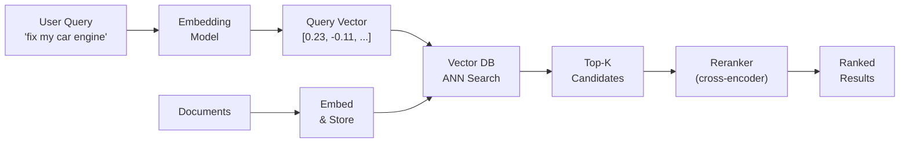
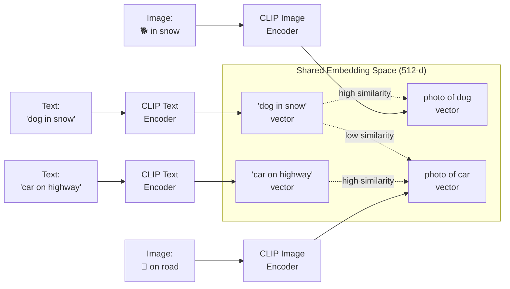
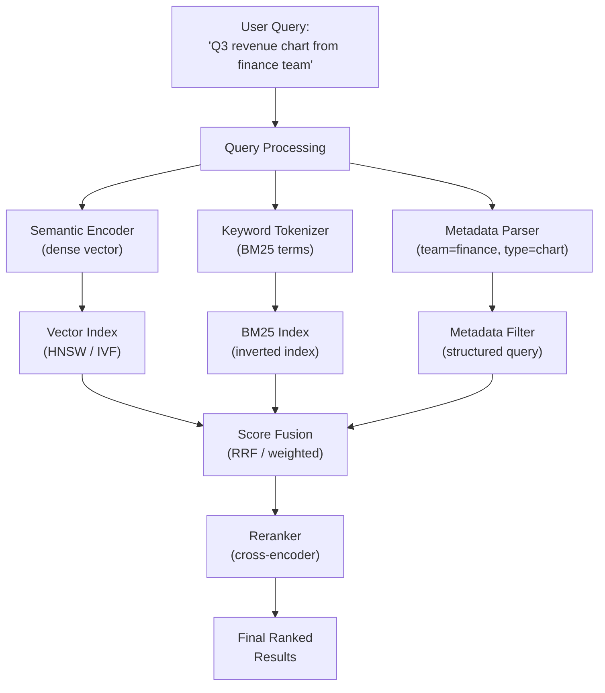
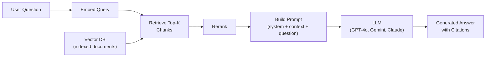

# Chapter 22 — Building Semantic Search (Text, Images & Metadata)

> "Search is not about finding documents that contain a keyword. It's about finding the answer the user needs." — Every search engineer, eventually.

---

## What You'll Learn

After reading this chapter, you will be able to:
- Explain how semantic search works and why it beats keyword search
- Choose the right embedding model for text, images, and multimodal content
- Build a document processing pipeline (PDF, Word, images → vectors)
- Design and implement a full semantic search system in Python
- Compare vector databases and pick the right one for your use case
- Implement hybrid search (dense + sparse + metadata filtering)
- Add reranking to go from good to great search quality
- Connect search to LLMs via RAG for question-answering
- Handle production concerns: scaling, cost, access control, embedding drift

---

```
Contents:
  23.1   What is Semantic Search?
  23.2   The Embedding Foundation
  23.3   Document Processing Pipeline
  23.4   Image Search with CLIP
  23.5   Multimodal Search — Combining Text, Images & Metadata
  23.6   Vector Databases
  23.7   Building the Full Pipeline (Python)
  23.8   Reranking — From Good to Great
  23.9   Evaluation Metrics for Search
  23.10  Production Considerations
  23.11  RAG: Connecting Search to LLMs
  23.12  Interview Questions
  Key Takeaways
  Review Questions
```

---

## 23.1 What is Semantic Search?

> **Semantic search** retrieves results by meaning rather than exact keyword matches. It converts queries and documents into dense vector representations, then ranks results by vector similarity — so "car repair" matches "auto mechanic" even though no words overlap.

Traditional keyword search (BM25, TF-IDF) counts how often query terms appear in a document. Fast and well-understood, but completely blind to meaning. A user searching "how to fix my vehicle" misses every document that says "automobile repair guide" because no words overlap.

Semantic search solves this by passing queries and documents through an embedding model that maps text to dense vectors. Texts with similar meaning land close together in vector space. At query time, you find the nearest document vectors to the query vector.

**Where you see this every day:**

| System | What it does |
|---|---|
| **Google Search** | Query understanding + semantic matching + keyword signals fused together |
| **Bing Copilot / Azure AI Search** | Hybrid (keyword + vector) retrieval feeding an LLM |
| **Google Photos** | Type "dog at beach" — finds photos with no text tags, using CLIP-style vision embeddings |
| **Enterprise doc search** | Search across thousands of PDFs, Word docs, Confluence pages by meaning |
| **E-commerce** | "lightweight running shoes for flat feet" matches products described differently |



The pipeline has two phases: **indexing** (offline — embed all your documents and store vectors) and **querying** (online — embed the query, search, rerank, return).

---

## 23.2 The Embedding Foundation

> **Embedding**: a dense vector of fixed dimensionality that encodes the semantic meaning of a piece of content (text, image, audio). Similar meanings map to nearby points in vector space.

The quality of your search system is bounded by the quality of your embeddings — garbage embeddings, garbage results, no matter how good your vector database or reranker.

### How text embeddings work

A text embedding model takes a string and outputs a fixed-length vector. Under the hood, it is a transformer encoder trained with **contrastive learning** on massive paired datasets — pairs of texts that should be similar (query + relevant doc, paraphrase pairs) and pairs that should be dissimilar. Similar pairs get high cosine similarity; dissimilar pairs get low.

### Popular embedding models

| Model | Provider | Dimensions | Max Tokens | Notes |
|---|---|---|---|---|
| `text-embedding-3-large` | OpenAI | 3072 | 8191 | Best OpenAI model; supports dimension reduction via API parameter |
| `text-embedding-3-small` | OpenAI | 1536 | 8191 | Cheaper, slightly lower quality |
| `text-embedding-004` | Google | 768 | 2048 | Gemini embedding; good for Google Cloud pipelines |
| `all-MiniLM-L6-v2` | Sentence-Transformers | 384 | 256 | Fast, small, runs on CPU — great for prototyping |
| `bge-large-en-v1.5` | BAAI | 1024 | 512 | Open-source, strong MTEB scores |
| `e5-large-v2` | Microsoft | 1024 | 512 | Prefix-based: "query: ..." / "passage: ..." |
| `jina-embeddings-v3` | Jina AI | 1024 | 8192 | Long-context, multilingual, open-source |
| `voyage-3` | Voyage AI | 1024 | 32000 | Excellent for code and long documents |

**Which to pick?** Production API: `text-embedding-3-large` or `text-embedding-004`. Self-hosted: `bge-large-en-v1.5` or `e5-large-v2`. Prototyping: `all-MiniLM-L6-v2`.

### Similarity metrics

| Metric | Formula | Range | Best for |
|---|---|---|---|
| **Cosine similarity** | $\frac{A \cdot B}{\|A\| \|B\|}$ | [-1, 1] | Normalized embeddings (most common) |
| **Dot product** | $A \cdot B$ | (-inf, inf) | When magnitude matters (e.g., popularity-weighted) |
| **Euclidean (L2)** | $\sqrt{\sum(a_i - b_i)^2}$ | [0, inf) | When you need absolute distance; lower = more similar |

Most embedding models produce normalized vectors, so cosine similarity = dot product. Use cosine unless you have a specific reason not to.

```python
import numpy as np

def cosine_similarity(a, b):
    return np.dot(a, b) / (np.linalg.norm(a) * np.linalg.norm(b))

# Example: two similar sentences vs one dissimilar
from sentence_transformers import SentenceTransformer

model = SentenceTransformer("all-MiniLM-L6-v2")

v1 = model.encode("How to fix a car engine")
v2 = model.encode("Automobile engine repair guide")
v3 = model.encode("Best Italian restaurants in Paris")

print(f"Similar pair:    {cosine_similarity(v1, v2):.4f}")   # ~0.78
print(f"Dissimilar pair: {cosine_similarity(v1, v3):.4f}")   # ~0.08
```

```chart
{
  "type": "bar",
  "data": {
    "labels": [
      "car repair ↔\nauto mechanic",
      "machine learning ↔\ndeep learning",
      "Python tutorial ↔\nPython coding guide",
      "car repair ↔\nItalian restaurants",
      "machine learning ↔\ngardening tips",
      "random pair A ↔ B"
    ],
    "datasets": [
      {
        "label": "Cosine Similarity",
        "data": [0.78, 0.82, 0.91, 0.08, 0.04, 0.02],
        "backgroundColor": [
          "rgba(34, 197, 94, 0.7)",
          "rgba(34, 197, 94, 0.7)",
          "rgba(34, 197, 94, 0.7)",
          "rgba(239, 68, 68, 0.7)",
          "rgba(239, 68, 68, 0.7)",
          "rgba(239, 68, 68, 0.7)"
        ],
        "borderColor": [
          "rgba(34, 197, 94, 1)",
          "rgba(34, 197, 94, 1)",
          "rgba(34, 197, 94, 1)",
          "rgba(239, 68, 68, 1)",
          "rgba(239, 68, 68, 1)",
          "rgba(239, 68, 68, 1)"
        ],
        "borderWidth": 1
      }
    ]
  },
  "options": {
    "indexAxis": "y",
    "plugins": { "title": { "display": true, "text": "Cosine Similarity: Semantically Similar vs Dissimilar Pairs" } },
    "scales": {
      "x": { "title": { "display": true, "text": "Cosine Similarity" }, "min": 0, "max": 1 }
    }
  }
}
```

---

## 23.3 Document Processing Pipeline

> **Document processing pipeline**: the system that ingests raw files (PDFs, Word docs, HTML, images), extracts text, splits it into chunks, generates embeddings, and stores them in a vector database.

Do it wrong and no amount of clever querying saves you.

### Step 1: Extract text from raw files

```python
# PDF extraction
from pypdf import PdfReader

def extract_pdf(path: str) -> list[dict]:
    reader = PdfReader(path)
    pages = []
    for i, page in enumerate(reader.pages):
        text = page.extract_text() or ""
        pages.append({"text": text, "page": i + 1, "source": path})
    return pages

# Word document extraction
from docx import Document

def extract_docx(path: str) -> list[dict]:
    doc = Document(path)
    paragraphs = []
    for para in doc.paragraphs:
        if para.text.strip():
            paragraphs.append({"text": para.text, "source": path})
    return paragraphs
```

For production, use **Apache Tika** (1000+ file formats), **Unstructured.io** (built for LLM pipelines), or **Google Document AI** / **Azure AI Document Intelligence** for OCR on scanned PDFs.

### Step 2: Chunk the text

You cannot embed a 200-page PDF as one vector. Split it into chunks small enough to embed meaningfully but large enough to carry context.

| Strategy | How it works | Pros | Cons |
|---|---|---|---|
| **Fixed-size** | Split every N characters | Simple, predictable | Cuts mid-sentence |
| **Sentence-based** | Split on sentence boundaries | Respects grammar | Sentences vary wildly in information density |
| **Paragraph-based** | Split on double newlines | Respects document structure | Paragraphs can be very long or very short |
| **Recursive character** | Try splitting by paragraph, then sentence, then word, until under limit | Best general-purpose | Slightly more complex |
| **Semantic chunking** | Use embeddings to detect topic shifts | Highest quality | Slow, needs embedding calls during chunking |

The sweet spot for most use cases: **256-512 tokens per chunk** with **50-100 token overlap** between adjacent chunks.

```python
from langchain.text_splitter import RecursiveCharacterTextSplitter

splitter = RecursiveCharacterTextSplitter(
    chunk_size=500,        # characters (not tokens)
    chunk_overlap=100,     # overlap between consecutive chunks
    separators=["\n\n", "\n", ". ", " ", ""],
)

# Example usage
text = open("big_document.txt").read()
chunks = splitter.split_text(text)
print(f"Split into {len(chunks)} chunks")
print(f"Average chunk length: {sum(len(c) for c in chunks) / len(chunks):.0f} chars")
```

### Step 3: Enrich with metadata

Every chunk should carry metadata (filename, page number, author, date, heading) for filtering at query time, displaying results, and access control.

```python
def build_chunk_metadata(chunk_text, source_path, page_num, heading):
    return {
        "text": chunk_text,
        "source": source_path,
        "page": page_num,
        "heading": heading,
        "file_type": source_path.split(".")[-1],
        "char_count": len(chunk_text),
    }
```

### The full pipeline

```
┌──────────────┐    ┌──────────────┐    ┌──────────────┐    ┌──────────────┐    ┌──────────────┐
│  Raw Files   │───►│   Extract    │───►│    Chunk     │───►│   Embed      │───►│   Store in   │
│  PDF, DOCX,  │    │   Text       │    │   + Metadata │    │   Vectors    │    │  Vector DB   │
│  HTML, MD    │    │              │    │              │    │              │    │              │
└──────────────┘    └──────────────┘    └──────────────┘    └──────────────┘    └──────────────┘
                     PyPDF, docx,        RecursiveChar       SentenceTrans       ChromaDB,
                     Tika, Unstructured  TextSplitter        OpenAI, Gemini      FAISS, Pinecone
```

**Gotchas:** Tables in PDFs need `pdfplumber` or `camelot`. Scanned PDFs need OCR (Tesseract, Document AI). Always deduplicate before embedding. Track which embedding model version produced each vector.

---

## 23.4 Image Search with CLIP

> **CLIP (Contrastive Language-Image Pre-training)**: a model trained by OpenAI that maps both text and images into the same embedding space, enabling cross-modal search — find images by describing them in words.

CLIP creates a shared vector space where "a golden retriever playing in snow" (text) and a photo of exactly that (image) land near each other — no manual tagging needed.

### How CLIP works

Two encoders trained together on 400M (image, text) pairs: a **text encoder** (string to vector) and an **image encoder** (image to vector of the same dimensionality). Training objective: maximize similarity for matching pairs, minimize for non-matching.



### Python code: image search with CLIP

```python
import torch
from PIL import Image
from transformers import CLIPProcessor, CLIPModel

# Load model (downloads ~600MB on first run)
model = CLIPModel.from_pretrained("openai/clip-vit-base-patch32")
processor = CLIPProcessor.from_pretrained("openai/clip-vit-base-patch32")

def embed_image(image_path: str) -> torch.Tensor:
    image = Image.open(image_path)
    inputs = processor(images=image, return_tensors="pt")
    with torch.no_grad():
        embedding = model.get_image_features(**inputs)
    return embedding / embedding.norm(dim=-1, keepdim=True)  # normalize

def embed_text(text: str) -> torch.Tensor:
    inputs = processor(text=[text], return_tensors="pt")
    with torch.no_grad():
        embedding = model.get_text_features(**inputs)
    return embedding / embedding.norm(dim=-1, keepdim=True)

# Search: find which image best matches a text query
query_vec = embed_text("a cat sitting on a laptop")
image_vecs = [embed_image(f"photos/{i}.jpg") for i in range(100)]

similarities = [torch.cosine_similarity(query_vec, iv).item() for iv in image_vecs]
best_match = sorted(range(len(similarities)), key=lambda i: similarities[i], reverse=True)

print(f"Top match: photos/{best_match[0]}.jpg (similarity: {similarities[best_match[0]]:.3f})")
```

### Beyond basic CLIP

| Model | What's different |
|---|---|
| **SigLIP** (Google) | Sigmoid loss instead of softmax; better at scale, used in Gemini |
| **BLIP-2** | Adds a language model on top — can generate captions, answer questions about images |
| **OpenCLIP** | Open-source CLIP reproductions with larger training sets; `ViT-G/14` is very strong |
| **MetaCLIP** | Meta's version trained on curated data with better data quality |

**Use cases beyond photo search:** product catalog search, content moderation, medical imaging, accessibility (search images by text description).

---

## 23.5 Multimodal Search — Combining Text, Images & Metadata

> **Multimodal search** retrieves results across content types — text documents, images, structured data — by unifying them in a shared representation space and combining multiple retrieval signals.

Real enterprise search is never just text. A user searching "Q3 revenue chart" should find the Excel file, the PowerPoint slide with the chart, and the PDF annual report mentioning Q3 numbers.

### Hybrid search: dense + sparse + metadata

No single retrieval method wins everywhere. The production pattern combines three signals:

| Signal | Method | Strength | Weakness |
|---|---|---|---|
| **Dense (semantic)** | Embedding similarity | Understands meaning, synonyms | Misses exact keywords, entity names |
| **Sparse (keyword)** | BM25 / TF-IDF | Great for exact matches, rare terms | No understanding of meaning |
| **Metadata filters** | Structured queries | Precise date/type/author filtering | No relevance ranking |

Why all three: searching "PROJ-4521 budget" needs BM25 to match the project ID and semantic search to understand "budget" could mean "cost allocation."

### How to combine them

```python
def hybrid_search(query: str, filters: dict, top_k: int = 20):
    query_vec = embed(query)
    dense_results = vector_db.search(query_vec, top_k=100)        # semantic
    sparse_results = bm25_index.search(query, top_k=100)          # keyword
    if filters:
        dense_results = [r for r in dense_results if matches_filters(r, filters)]
        sparse_results = [r for r in sparse_results if matches_filters(r, filters)]
    fused = reciprocal_rank_fusion([dense_results, sparse_results], k=60)
    return fused[:top_k]

def reciprocal_rank_fusion(ranked_lists: list, k: int = 60) -> list:
    scores = {}
    for ranked_list in ranked_lists:
        for rank, doc in enumerate(ranked_list):
            scores[doc["id"]] = scores.get(doc["id"], 0) + 1.0 / (k + rank + 1)
    return sorted(scores.items(), key=lambda x: x[1], reverse=True)
```

### Architecture diagram



**Pre-filter vs post-filter:** Pre-filter applies metadata constraints before vector search (faster, needs DB support). Post-filter retrieves top-K first then filters (simpler but may eliminate all results). Most production systems use pre-filtering — Pinecone, Weaviate, and Qdrant support it natively.

### Metadata Filtering in Practice

Metadata turns semantic search from "find similar text" into "find similar text that matches my constraints." In enterprise search, this is the feature users rely on most.

```python
# ChromaDB — metadata filtering
results = collection.query(
    query_texts=["Q3 revenue growth"],
    n_results=10,
    where={                          # Pre-filter on metadata
        "$and": [
            {"file_type": {"$eq": "pdf"}},
            {"department": {"$eq": "finance"}},
            {"year": {"$gte": 2025}},
        ]
    }
)

# Pinecone — metadata filtering
results = index.query(
    vector=query_embedding,
    top_k=10,
    filter={
        "file_type": {"$eq": "pdf"},
        "department": {"$in": ["finance", "accounting"]},
        "date": {"$gte": "2025-01-01"},
        "access_level": {"$lte": user_access_level},  # access control!
    }
)

# Weaviate — GraphQL-style filtering
result = client.query.get("Document", ["text", "source"]) \
    .with_near_text({"concepts": ["Q3 revenue"]}) \
    .with_where({
        "operator": "And",
        "operands": [
            {"path": ["file_type"], "operator": "Equal", "valueText": "pdf"},
            {"path": ["year"], "operator": "GreaterThanEqual", "valueInt": 2025},
        ]
    }) \
    .with_limit(10).do()
```

**Common metadata fields for enterprise search:**

```
  ┌────────────────────┬────────────────────────────────────────────┐
  │ Field              │ Use case                                   │
  ├────────────────────┼────────────────────────────────────────────┤
  │ file_type          │ Filter: "only PDFs" or "only images"       │
  │ department         │ Filter: "only finance docs"                │
  │ author             │ Filter: "docs written by Alice"            │
  │ date / created_at  │ Filter: "last 6 months only"               │
  │ access_level       │ Security: pre-filter by user permission    │
  │ language           │ Filter: "only English documents"           │
  │ page_number        │ Display: show which page the result is from│
  │ heading / section  │ Display: show the section title            │
  │ source_url         │ Display: link back to the original doc     │
  │ tags / categories  │ Filter: "only tagged as 'policy'"          │
  └────────────────────┴────────────────────────────────────────────┘
```

---

## 23.6 Vector Databases

> **Vector database**: a database purpose-built to store, index, and search high-dimensional vectors using approximate nearest neighbor (ANN) algorithms, returning the most similar vectors to a query in milliseconds.

Brute-force comparison against millions of vectors is O(n) per query and too slow. Vector databases use ANN algorithms that trade a small amount of accuracy for massive speed gains.

### Comparison of vector databases

| Database | Type | ANN Algorithm | Filtering | Best for |
|---|---|---|---|---|
| **FAISS** | Library (Meta) | IVF, PQ, HNSW | Manual | Research, local experiments, high-perf on-prem |
| **ChromaDB** | Embedded DB | HNSW | Built-in | Prototyping, small-medium scale, LangChain integration |
| **Pinecone** | Managed SaaS | Proprietary | Built-in | Production, fully managed, zero-ops |
| **Weaviate** | Open-source | HNSW | Built-in + hybrid | Production, self-hosted or cloud, multimodal |
| **Qdrant** | Open-source | HNSW | Built-in (rich) | Production, self-hosted, best filtering |
| **Milvus** | Open-source | IVF, HNSW, DiskANN | Built-in | Large scale (billions of vectors), distributed |
| **Vertex AI Vector Search** | Managed (Google) | ScaNN | Built-in | Google Cloud native, integrates with Vertex AI |
| **pgvector** | PostgreSQL extension | IVF, HNSW | SQL WHERE | Already using Postgres, <1M vectors |

### ANN algorithms explained

**HNSW (Hierarchical Navigable Small World):** Most popular. Builds a multi-layer graph — search starts at the top layer (few nodes, big jumps) and drills down to the bottom (all nodes, precise). Like Google Maps: country, then city, then street.

**IVF (Inverted File Index):** Clusters vectors into K buckets via k-means. At query time, search only the nearest clusters. Fast to build but quality degrades with uneven clusters.

**PQ (Product Quantization):** Compresses vectors by splitting into sub-vectors and quantizing each to a codebook entry. Reduces memory 10-50x. Used alongside IVF or HNSW at billion scale.

```
HNSW graph (conceptual):

Layer 2 (sparse):     A ─────────── D
                      │               │
Layer 1 (medium):     A ── B ──── D ── E
                      │    │      │    │
Layer 0 (full):       A ── B ── C ── D ── E ── F ── G

Search: Start at Layer 2, jump to nearest node,
        drop to Layer 1, refine,
        drop to Layer 0, find exact nearest neighbors.
```

### Key performance metrics

| Metric | What it measures | Target |
|---|---|---|
| **Recall@K** | Fraction of true top-K neighbors found | >0.95 |
| **QPS** | Queries per second | 100-10,000 depending on scale |
| **Latency p99** | 99th percentile query time | <50ms |
| **Index build time** | Time to index all vectors | Hours for millions |
| **Memory per vector** | RAM needed per stored vector | 4-8 bytes/dimension (float32) |

**Quick decision guide:** Prototyping: ChromaDB. Managed production: Pinecone or Vertex AI Vector Search. Self-hosted production: Qdrant or Weaviate. Billions of vectors: Milvus. Already using Postgres: pgvector. Research: FAISS.

---

## 23.7 Building the Full Pipeline (Python)

A working semantic search system end-to-end using open-source tools — no API keys required for the core pipeline.

### Step 1: Install dependencies

```python
# pip install sentence-transformers chromadb pypdf langchain langchain-community
```

### Step 2: Load and chunk documents

```python
from pypdf import PdfReader
from langchain.text_splitter import RecursiveCharacterTextSplitter

def load_pdf(path: str) -> list[dict]:
    reader = PdfReader(path)
    docs = []
    for i, page in enumerate(reader.pages):
        text = page.extract_text() or ""
        if text.strip():
            docs.append({"text": text, "metadata": {"source": path, "page": i + 1}})
    return docs

def chunk_documents(docs: list[dict], chunk_size=500, overlap=100) -> list[dict]:
    splitter = RecursiveCharacterTextSplitter(
        chunk_size=chunk_size, chunk_overlap=overlap
    )
    chunks = []
    for doc in docs:
        splits = splitter.split_text(doc["text"])
        for j, split in enumerate(splits):
            chunks.append({
                "text": split,
                "metadata": {**doc["metadata"], "chunk_index": j},
            })
    return chunks

# Load all PDFs from a directory
import glob
all_docs = []
for pdf_path in glob.glob("documents/*.pdf"):
    all_docs.extend(load_pdf(pdf_path))

chunks = chunk_documents(all_docs)
print(f"Loaded {len(all_docs)} pages → {len(chunks)} chunks")
```

### Step 3: Generate embeddings and store in ChromaDB

```python
import chromadb
from sentence_transformers import SentenceTransformer

# Initialize embedding model (runs locally, no API key)
embed_model = SentenceTransformer("all-MiniLM-L6-v2")

# Initialize ChromaDB (persistent storage)
client = chromadb.PersistentClient(path="./chroma_db")
collection = client.get_or_create_collection(
    name="documents",
    metadata={"hnsw:space": "cosine"},  # use cosine similarity
)

# Embed and store all chunks
texts = [c["text"] for c in chunks]
metadatas = [c["metadata"] for c in chunks]
ids = [f"chunk_{i}" for i in range(len(chunks))]

# Batch embed (sentence-transformers handles batching internally)
embeddings = embed_model.encode(texts, show_progress_bar=True, batch_size=64)

collection.add(
    documents=texts,
    embeddings=embeddings.tolist(),
    metadatas=metadatas,
    ids=ids,
)
print(f"Stored {len(chunks)} chunks in ChromaDB")
```

### Step 4: Query the search system

```python
def search(query: str, top_k: int = 5, where: dict = None) -> list[dict]:
    query_embedding = embed_model.encode([query]).tolist()

    results = collection.query(
        query_embeddings=query_embedding,
        n_results=top_k,
        where=where,  # e.g., {"source": "documents/report.pdf"}
    )

    hits = []
    for i in range(len(results["documents"][0])):
        hits.append({
            "text": results["documents"][0][i],
            "metadata": results["metadatas"][0][i],
            "distance": results["distances"][0][i],
        })
    return hits

# Search!
results = search("What were the key findings about customer retention?")
for i, hit in enumerate(results):
    print(f"\n--- Result {i+1} (distance: {hit['distance']:.4f}) ---")
    print(f"Source: {hit['metadata']['source']}, Page: {hit['metadata'].get('page', '?')}")
    print(hit["text"][:200])
```

### Step 5: Alternative — using FAISS directly

```python
import faiss
import numpy as np

dimension = 384  # all-MiniLM-L6-v2 output dimension
embeddings_np = np.array(embeddings).astype("float32")

# Brute force for small datasets
index = faiss.IndexFlatL2(dimension)
index.add(embeddings_np)

# IVF for larger datasets (cluster-based ANN)
nlist = 100
quantizer = faiss.IndexFlatL2(dimension)
index_ivf = faiss.IndexIVFFlat(quantizer, dimension, nlist)
index_ivf.train(embeddings_np)
index_ivf.add(embeddings_np)
index_ivf.nprobe = 10  # search 10 nearest clusters

query_vec = embed_model.encode(["customer retention strategies"]).astype("float32")
distances, indices = index.search(query_vec, k=5)
```

### Step 6: Add RAG — feed results to an LLM

```python
from openai import OpenAI

client = OpenAI()  # uses OPENAI_API_KEY env var

def rag_answer(question: str, top_k: int = 5) -> str:
    # Retrieve relevant chunks
    hits = search(question, top_k=top_k)
    context = "\n\n---\n\n".join([h["text"] for h in hits])

    # Generate answer grounded in retrieved context
    response = client.chat.completions.create(
        model="gpt-4o",
        messages=[
            {"role": "system", "content": (
                "Answer the question based ONLY on the provided context. "
                "If the context doesn't contain the answer, say so. "
                "Cite the source document and page when possible."
            )},
            {"role": "user", "content": f"Context:\n{context}\n\nQuestion: {question}"},
        ],
        temperature=0,
    )
    return response.choices[0].message.content

answer = rag_answer("What were the main risks identified in the Q3 report?")
print(answer)
```

---

## 23.8 Reranking — From Good to Great

> **Reranking**: a second-stage scoring step where a more powerful model (typically a cross-encoder) jointly evaluates each (query, document) pair to produce a refined relevance score, applied to the top candidates from initial retrieval.

Initial bi-encoder retrieval is fast but shallow — query and document are encoded independently and never "see" each other. A cross-encoder takes both as input simultaneously, capturing fine-grained token interactions.

### Bi-encoder vs cross-encoder

| Property | Bi-encoder | Cross-encoder |
|---|---|---|
| **Architecture** | Encode query and doc separately | Encode (query, doc) jointly |
| **Speed** | Fast — encode once, compare with dot product | Slow — must run model for each (query, doc) pair |
| **Quality** | Good | Significantly better |
| **Use case** | First-stage retrieval (search millions) | Second-stage reranking (rescore top 20-100) |

This is why the standard pattern is a two-stage cascade:

```
All Documents (1M+)
    │
    ▼  Bi-encoder retrieval (fast, ~5ms)
Top 100 candidates
    │
    ▼  Cross-encoder reranking (slower, ~50ms)
Top 10 results
    │
    ▼  Return to user
```

### Reranking in code

```python
from sentence_transformers import CrossEncoder

# Load a cross-encoder reranker
reranker = CrossEncoder("cross-encoder/ms-marco-MiniLM-L-6-v2")

def search_and_rerank(query: str, top_k: int = 5, retrieve_k: int = 50):
    # Stage 1: fast bi-encoder retrieval
    candidates = search(query, top_k=retrieve_k)

    # Stage 2: cross-encoder reranking
    pairs = [(query, c["text"]) for c in candidates]
    scores = reranker.predict(pairs)

    # Sort by cross-encoder score (higher = more relevant)
    for i, score in enumerate(scores):
        candidates[i]["rerank_score"] = float(score)

    reranked = sorted(candidates, key=lambda x: x["rerank_score"], reverse=True)
    return reranked[:top_k]

results = search_and_rerank("What is the company's strategy for reducing churn?")
```

### Reranking APIs (managed services)

| Service | Model | Notes |
|---|---|---|
| **Cohere Rerank** | `rerank-v3.5` | API-based, multilingual, very strong quality |
| **Jina Reranker** | `jina-reranker-v2` | Open-source and API, fast |
| **Voyage Reranker** | `rerank-2` | Strong on code and technical docs |
| **Google Vertex AI** | Ranking API | Integrated with Vertex AI Search |

```python
# Cohere Rerank API example
import cohere
co = cohere.Client("YOUR_API_KEY")
response = co.rerank(model="rerank-english-v3.0", query=query, documents=docs, top_n=5)
reranked = [(r.index, r.relevance_score) for r in response.results]
```

### Reciprocal Rank Fusion (RRF)

When you have multiple ranked lists, RRF is the simplest and most robust way to merge them — it only uses ranks, not scores, so no normalization is needed.

$$\text{RRF}(d) = \sum_{r \in \text{rankers}} \frac{1}{k + \text{rank}_r(d)}$$

Where $k$ is typically 60. Documents ranked highly by multiple rankers get the highest fused score.

```chart
{
  "type": "bar",
  "data": {
    "labels": ["Doc A", "Doc B", "Doc C", "Doc D", "Doc E"],
    "datasets": [
      {
        "label": "Dense Retrieval Score",
        "data": [0.92, 0.85, 0.71, 0.88, 0.65],
        "backgroundColor": "rgba(99, 102, 241, 0.6)",
        "borderColor": "rgba(99, 102, 241, 1)",
        "borderWidth": 1
      },
      {
        "label": "BM25 Score (normalized)",
        "data": [0.45, 0.91, 0.88, 0.30, 0.72],
        "backgroundColor": "rgba(249, 115, 22, 0.6)",
        "borderColor": "rgba(249, 115, 22, 1)",
        "borderWidth": 1
      },
      {
        "label": "RRF Fused Score",
        "data": [0.78, 0.93, 0.82, 0.65, 0.70],
        "backgroundColor": "rgba(34, 197, 94, 0.6)",
        "borderColor": "rgba(34, 197, 94, 1)",
        "borderWidth": 1
      }
    ]
  },
  "options": {
    "plugins": { "title": { "display": true, "text": "Hybrid Search: Dense + BM25 + RRF Fusion" } },
    "scales": {
      "y": { "title": { "display": true, "text": "Relevance Score" }, "min": 0, "max": 1 }
    }
  }
}
```

Doc B ranks #2 in dense but #1 in BM25 — RRF correctly promotes it to the top. Doc D is strong in dense only — RRF pushes it down.

---

## 23.9 Evaluation Metrics for Search

> **Search evaluation** measures how well your system ranks relevant results — not just whether it finds them, but how high it ranks them.

Before optimizing anything, you need a ground truth dataset: queries paired with their known relevant documents.

### The core metrics

**Recall@K**: Of all relevant documents in the corpus, what fraction did the system return in its top K results?

$$\text{Recall@K} = \frac{|\text{relevant docs in top K}|}{|\text{total relevant docs}|}$$

Most important metric for first-stage retrieval.

**MRR (Mean Reciprocal Rank)**: How high is the first correct result? Reciprocal rank of position 3 = 1/3. Average over all queries.

$$\text{MRR} = \frac{1}{|Q|} \sum_{i=1}^{|Q|} \frac{1}{\text{rank}_i}$$

**NDCG@K (Normalized Discounted Cumulative Gain)**: Are the best results at the very top? Accounts for graded relevance and position weighting.

$$\text{DCG@K} = \sum_{i=1}^{K} \frac{2^{rel_i} - 1}{\log_2(i + 1)}$$

$$\text{NDCG@K} = \frac{\text{DCG@K}}{\text{IDCG@K}}$$

**Hit Rate**: Fraction of queries with at least one relevant result in top K.

```python
def recall_at_k(retrieved, relevant, k):
    return len(set(retrieved[:k]) & relevant) / len(relevant) if relevant else 0.0

def mrr(retrieved, relevant):
    for rank, doc_id in enumerate(retrieved, 1):
        if doc_id in relevant:
            return 1.0 / rank
    return 0.0

def hit_rate(retrieved, relevant, k):
    return 1.0 if set(retrieved[:k]) & relevant else 0.0
```

```chart
{
  "type": "bar",
  "data": {
    "labels": ["Recall@10", "Recall@50", "MRR", "NDCG@10", "Hit Rate@10"],
    "datasets": [
      {
        "label": "BM25 Only",
        "data": [0.52, 0.71, 0.41, 0.45, 0.62],
        "backgroundColor": "rgba(249, 115, 22, 0.6)",
        "borderColor": "rgba(249, 115, 22, 1)",
        "borderWidth": 1
      },
      {
        "label": "Dense (bi-encoder) Only",
        "data": [0.65, 0.83, 0.53, 0.57, 0.74],
        "backgroundColor": "rgba(99, 102, 241, 0.6)",
        "borderColor": "rgba(99, 102, 241, 1)",
        "borderWidth": 1
      },
      {
        "label": "Hybrid + Rerank",
        "data": [0.81, 0.93, 0.72, 0.76, 0.89],
        "backgroundColor": "rgba(34, 197, 94, 0.6)",
        "borderColor": "rgba(34, 197, 94, 1)",
        "borderWidth": 1
      }
    ]
  },
  "options": {
    "plugins": { "title": { "display": true, "text": "Retrieval Quality: BM25 vs Dense vs Hybrid+Rerank" } },
    "scales": {
      "y": { "title": { "display": true, "text": "Score" }, "min": 0, "max": 1 }
    }
  }
}
```

Hybrid + rerank consistently beats either method alone, typically by 10-20% on MRR and NDCG.

### Building an evaluation set

Three approaches: (1) **Manual annotation** — domain experts label pairs (gold standard, expensive). (2) **Click logs** — track user clicks in production (cheap, noisy). (3) **LLM-as-judge** — GPT-4o/Gemini rates relevance on a 0-3 scale (fast, cheap, good for development).

```python
# LLM-as-judge for building eval sets
def llm_judge(query: str, document: str) -> int:
    response = client.chat.completions.create(
        model="gpt-4o",
        messages=[{"role": "user", "content":
            f"Rate relevance 0-3 (0=irrelevant, 3=highly relevant). "
            f"Return ONLY the number.\n\nQuery: {query}\nDocument: {document}"}],
        temperature=0,
    )
    return int(response.choices[0].message.content.strip())
```

---

## 23.10 Production Considerations

Building a demo on 100 documents is easy. Handling 10 million documents at 1000 QPS with continuous updates — that is engineering.

### Indexing pipeline: batch vs streaming

| Approach | When | How |
|---|---|---|
| **Batch** | Initial load, periodic re-index | Process all docs → embed → bulk insert. Run nightly or weekly. |
| **Streaming** | New docs arrive continuously | Watch for new files → embed → upsert. Use a message queue (Kafka, Pub/Sub). |
| **Hybrid** | Most production systems | Batch for initial + streaming for incremental updates. |

### Embedding drift

When you upgrade your embedding model, old vectors are incompatible with the new model's vectors. You must re-embed your entire corpus.

**Mitigation:** Store raw text alongside vectors (re-embedding is re-computation, not data recovery). Version your collections (`documents_v1`, `documents_v2`). Blue-green deployment: build the new index while the old one serves traffic, then switch.

### Scaling

```
         ┌─────────────────────────────────┐
         │        Load Balancer            │
         └──────────┬──────────────────────┘
                    │
      ┌─────────────┼─────────────┐
      │             │             │
  ┌───┴───┐   ┌────┴───┐   ┌────┴───┐
  │Shard 1│   │Shard 2 │   │Shard 3 │
  │0-3M   │   │3M-6M   │   │6M-10M  │
  │Rep A,B│   │Rep A,B │   │Rep A,B │
  └───────┘   └────────┘   └────────┘
```

**Sharding**: split vectors across nodes, query all in parallel. **Replication**: replicas per shard for fault tolerance. **Caching**: cache query embeddings and hot search results (TTL-based).

### Latency budget

| Stage | Typical Latency | Notes |
|---|---|---|
| Query embedding | 10-30ms | GPU-accelerated; batch if possible |
| ANN search | 1-10ms | Depends on index size, algorithm, hardware |
| Metadata filtering | 1-5ms | Pre-filter is faster than post-filter |
| Reranking (cross-encoder) | 30-100ms | Depends on number of candidates and model size |
| **Total** | **50-150ms** | **Well within interactive requirements** |

### Cost considerations

| Resource | Cost driver | Optimization |
|---|---|---|
| Embedding API calls | $0.02-0.13 per 1M tokens (OpenAI) | Batch embed, cache, use open-source models |
| Vector DB hosting | RAM-proportional ($100-1000/mo) | PQ compression, dimension reduction, tiered storage |
| GPU for self-hosted models | $1-4/hr for inference GPU | Batch requests, use smaller models, CPU for low-QPS |
| Reranker API | $2-5 per 1K reranks (Cohere) | Only rerank top candidates, cache results |

### Security and access control

In enterprise search, not everyone should see everything. The VP of Engineering should not find HR's salary spreadsheets.

**Approaches:** Document-level ACLs (tag each doc with allowed groups, filter at query time), tenant isolation (separate collections per team), or row-level security (mirror access rules from SharePoint/Google Drive).

```python
# Query with access control
results = collection.query(
    query_embeddings=query_vec,
    n_results=10,
    where={
        "$and": [
            {"department": {"$in": user.departments}},
            {"classification": {"$ne": "confidential"}},
        ]
    },
)
```

### Cost Estimation — What Does This Actually Cost?

```
  EMBEDDING COSTS (per 1 million documents, ~500 tokens each):
  ──────────────────────────────────────────────────────────────
  OpenAI text-embedding-3-small    ~$10       (cheapest quality option)
  OpenAI text-embedding-3-large    ~$65       (best OpenAI quality)
  Gemini text-embedding-004        ~$6        (Google, very competitive)
  Cohere embed-v3                  ~$5        (good multilingual)
  Self-hosted (sentence-transformers on GPU)   ~$0 marginal, $200/mo GPU

  VECTOR DB HOSTING (per 1 million 768-dim vectors):
  ──────────────────────────────────────────────────────────────
  ChromaDB (self-hosted)           Free (just RAM — ~3GB for 1M vectors)
  Pinecone Serverless              ~$35/month
  Weaviate Cloud                   ~$25/month (starter)
  Qdrant Cloud                     ~$30/month
  Vertex AI Vector Search          ~$100/month (enterprise SLA)
  pgvector (existing Postgres)     $0 additional (but slower ANN)

  TOTAL FOR 1M DOCS (embedding once + hosting monthly):
  ──────────────────────────────────────────────────────────────
  Budget option:  Gemini embed ($6) + ChromaDB (free)   = ~$6 one-time
  Production:     OpenAI large ($65) + Pinecone ($35/mo) = $65 + $35/mo
  Enterprise:     Self-hosted + Vertex AI ($200/mo GPU + $100/mo) = ~$300/mo
```

> **Rule of thumb:** Embedding is a one-time cost (re-embed only when changing models). Vector DB hosting is the ongoing cost. For most startups, the total is under $100/month for millions of documents.

---

## 23.11 RAG: Connecting Search to LLMs

> **Retrieval-Augmented Generation (RAG)**: a pattern where an LLM's input is augmented with relevant documents retrieved from a search system, grounding the LLM's answer in factual, up-to-date, source-attributed content.

RAG is the dominant production pattern in applied AI. It solves the LLM's three biggest weaknesses: hallucination, stale knowledge, and inability to cite sources.

### The RAG pipeline



### When RAG beats fine-tuning

| Scenario | RAG | Fine-tuning |
|---|---|---|
| Knowledge changes frequently | Best — just update the index | Must retrain the model |
| Need source attribution | Built-in — you know which docs were used | Not possible (knowledge is baked in) |
| Many distinct knowledge domains | Add more docs to the index | Need separate fine-tuned models |
| Small dataset (<100 examples) | Works well with even 10 documents | Not enough data to fine-tune |
| Need deterministic, verifiable answers | Can verify against source docs | LLM can hallucinate fine-tuned knowledge |
| Custom reasoning or style | Fine-tuning is better | Direct control over model behavior |

### Building a production RAG system

```python
def rag_pipeline(question: str, top_k: int = 5) -> dict:
    # 1. Retrieve + rerank
    candidates = search(question, top_k=50)
    pairs = [(question, c["text"]) for c in candidates]
    scores = reranker.predict(pairs)
    for i, s in enumerate(scores):
        candidates[i]["score"] = float(s)
    candidates.sort(key=lambda x: x["score"], reverse=True)
    top_chunks = candidates[:top_k]

    # 2. Build context with source attribution
    context_parts = []
    for i, chunk in enumerate(top_chunks):
        src = chunk["metadata"].get("source", "unknown")
        pg = chunk["metadata"].get("page", "?")
        context_parts.append(f"[Source {i+1}: {src}, p.{pg}]\n{chunk['text']}")
    context = "\n\n---\n\n".join(context_parts)

    # 3. Generate grounded answer
    response = client.chat.completions.create(
        model="gpt-4o",
        messages=[
            {"role": "system", "content":
                "Answer using ONLY the provided context. Cite sources with [Source N]. "
                "If the context doesn't contain the answer, say so."},
            {"role": "user", "content": f"Context:\n{context}\n\nQuestion: {question}"},
        ],
        temperature=0,
    )
    return {"answer": response.choices[0].message.content,
            "sources": [c["metadata"] for c in top_chunks]}
```

### Common RAG failure modes

| Problem | Cause | Fix |
|---|---|---|
| **Wrong chunks retrieved** | Poor embeddings or bad chunking | Improve chunk size, use better embedding model, add reranking |
| **Answer ignores context** | LLM prompt doesn't enforce grounding | Strengthen system prompt, use structured output |
| **Hallucination despite good context** | Context is ambiguous or LLM over-generates | Lower temperature, add "if unsure, say so" instruction |
| **Missing information** | Relevant doc not in index, or retrieval missed it | Increase top-K, add hybrid search, check indexing pipeline |
| **Stale answers** | Index not updated with new documents | Add streaming ingestion, reduce re-index interval |

### Google Vertex AI Search and Azure AI Search

Both Google and Microsoft offer managed RAG-as-a-service:

- **Vertex AI Search** (Google Cloud): Handles chunking, embedding, indexing, and search. Integrates with Gemini for RAG and supports grounding with Google Search.
- **Azure AI Search** (Microsoft): Hybrid search (BM25 + vector), semantic ranker, built-in chunking. Powers Microsoft Copilot.

These managed services trade cost for engineering time — no pipeline to build or maintain.

---

## 23.12 Interview Questions

**Q1: Design a semantic search system for an enterprise with 10 million documents (PDFs, Word, emails). Walk through the architecture.**

<details>
<summary>Answer</summary>

**Requirements**: sub-200ms latency, 500 QPS, access control, incremental updates.

**Architecture**:
1. **Ingestion pipeline**: Apache Kafka for streaming new documents. Workers extract text (Tika/Unstructured), chunk (recursive, 512 tokens, 100 overlap), embed (text-embedding-3-large), and upsert into the vector DB.
2. **Storage**: Qdrant or Milvus (supports 10M+ vectors, sharding, filtering). BM25 index (Elasticsearch) alongside for hybrid search. Document metadata in PostgreSQL.
3. **Query path**: Embed query (10ms) → parallel BM25 + vector search (10ms) → RRF fusion → cross-encoder rerank top 50 → return top 10 (total ~100ms).
4. **Access control**: Each document tagged with ACL groups. Pre-filter on user's groups during vector search.
5. **Updates**: Streaming upsert for new/modified docs. Nightly batch job for consistency checks. Embedding model versioning for re-indexing.
</details>

**Q2: How would you handle search across 10 million PDFs? What are the bottlenecks?**

<details>
<summary>Answer</summary>

**Bottlenecks**: (1) PDF text extraction is CPU-intensive, especially for scanned PDFs needing OCR. (2) Embedding 10M chunks requires GPU time — at 1000 chunks/sec, that is ~3 hours for 10M chunks. (3) Vector index memory — 10M vectors at 1024 dimensions at 4 bytes = ~40GB RAM.

**Solutions**: (1) Parallelize extraction with a worker pool (Celery, Cloud Run Jobs). Use Document AI for OCR. (2) Batch embed on GPU instances. Pre-compute and cache. (3) Use PQ compression (10x memory reduction) or DiskANN for on-disk indexing. Shard across nodes.
</details>

**Q3: Compare bi-encoder vs cross-encoder for retrieval. When do you use each?**

<details>
<summary>Answer</summary>

**Bi-encoder**: Encodes query and document independently into vectors. Similarity is a dot product — O(1) per comparison after encoding. Scales to millions of documents. Used for first-stage retrieval.

**Cross-encoder**: Takes (query, document) as a single input and produces a relevance score. Much more accurate because tokens can attend to each other. But O(n) per query — must score every candidate. Used for second-stage reranking on top 20-100 candidates.

**The standard pattern**: Bi-encoder retrieves top 100, cross-encoder reranks to find the top 10. This combines the speed of bi-encoders with the quality of cross-encoders.
</details>

**Q4: What is Reciprocal Rank Fusion and why is it preferred over score normalization?**

<details>
<summary>Answer</summary>

RRF combines multiple ranked lists by summing 1/(k + rank) across rankers. It only uses ranks, not scores, which means it is robust to different score scales (BM25 scores range 0-30, cosine similarity 0-1). Score normalization (min-max, z-score) is fragile because score distributions vary per query. RRF is simple, parameter-free (k=60 is standard), and consistently outperforms naive score combination in benchmarks.
</details>

**Q5: Your semantic search system returns relevant results but users complain about quality. How do you debug and improve it?**

<details>
<summary>Answer</summary>

**Diagnosis**: (1) Collect failing queries from user feedback. (2) Check if relevant docs are even in the index. (3) Check if they are retrieved but ranked low. (4) If using RAG, check if the right chunks are retrieved but the answer is wrong (generation issue).

**Improvements by stage**: Retrieval — hybrid search, increase top-K, better embedding model. Chunking — test different sizes, add overlap. Add cross-encoder reranking. Build an eval set (50-100 query-doc pairs) and track Recall@10, MRR, NDCG@10.
</details>

**Q6: How does CLIP enable text-to-image search? What are its limitations?**

<details>
<summary>Answer</summary>

CLIP trains text and image encoders jointly via contrastive learning on 400M pairs. Both output vectors in the same space — compute cosine similarity between a text query vector and image vectors.

**Limitations**: (1) Struggles with spatial relationships ("cat to the left of a dog"). (2) Weak on domain-specific images (medical, satellite). (3) Cannot read text in images well. (4) Fine-grained attributes unreliable ("blue vs teal"). SigLIP and BLIP-2 address some of these.
</details>

**Q7: You need to add a new document type (audio transcripts) to your existing semantic search system. What changes?**

<details>
<summary>Answer</summary>

Minimal changes: Audio → text via speech-to-text (Whisper, Google Speech-to-Text) → same text pipeline. Chunking, embedding, storage, and search layers are unchanged. Add metadata for audio-specific attributes (duration, speaker, timestamps). The embedding-based architecture means adding a new modality is just a new extraction step at the front of the pipeline.
</details>

**Q8: Compare FAISS, Pinecone, and Weaviate. When would you choose each?**

<details>
<summary>Answer</summary>

**FAISS**: A library, not a database. No persistence, filtering, or API built-in. Maximum performance. Choose for research or building custom infra.

**Pinecone**: Fully managed SaaS. Zero ops, built-in filtering and metadata. Choose when you want to ship fast without infra expertise.

**Weaviate**: Open-source with cloud option. Built-in hybrid search (vector + BM25), multi-tenancy. Choose when you want infra control and hybrid search out of the box.

For Google Cloud, Vertex AI Vector Search (ScaNN-based) integrates tightly with Vertex AI and Gemini.
</details>

---

## Key Takeaways

```
╔═══════════════════════════════════════════════════════════════════════════════╗
║  SEMANTIC SEARCH — COMPLETE SUMMARY                                         ║
║  ────────────────────────────────────────────────────────────────            ║
║                                                                             ║
║  1. Semantic search = convert everything to vectors, search by similarity   ║
║  2. Embedding quality is the #1 factor — better embeddings > better infra   ║
║  3. Chunk documents thoughtfully: 256-512 tokens, with overlap              ║
║  4. CLIP maps text and images to the same space — cross-modal search        ║
║  5. Hybrid search (dense + sparse + metadata) beats any single method       ║
║  6. Vector DBs use ANN algorithms (HNSW, IVF) for sub-10ms search          ║
║  7. Reranking with cross-encoders improves MRR by 15-25%                    ║
║  8. Evaluate with Recall@K, MRR, NDCG — build an eval set early            ║
║  9. RAG = retrieval + LLM generation — the dominant production pattern      ║
║ 10. Production: handle embedding drift, access control, latency budgets     ║
║                                                                             ║
║  The standard pipeline:                                                     ║
║  Ingest → Chunk → Embed → Store → [Query] → Retrieve → Rerank → Return     ║
║                                                                             ║
║  For interviews: know the two-stage pattern (bi-encoder → cross-encoder),   ║
║  hybrid search, RRF, and RAG. Be ready to design a system end-to-end.       ║
╚═══════════════════════════════════════════════════════════════════════════════╝
```

---

## Review Questions — Test Your Understanding

**1.** A user searches "how to fix my car" but the best matching document says "automobile repair guide." Keyword search returns nothing. Why does semantic search find it?

<details>
<summary>Answer</summary>

Semantic search converts both the query and document into dense vectors using an embedding model trained on millions of text pairs. The model learned that "fix my car" and "automobile repair guide" have similar meaning, so their vectors are close in embedding space (high cosine similarity). Keyword search fails because there are zero overlapping tokens between the query and document.
</details>

**2.** You are choosing between `text-embedding-3-large` (3072 dimensions) and `all-MiniLM-L6-v2` (384 dimensions). What are the tradeoffs?

<details>
<summary>Answer</summary>

`text-embedding-3-large` has higher quality (better MTEB benchmark scores), captures more nuance in the 3072-dimensional space, and handles longer inputs (8191 tokens). But it requires an API call (cost, latency, dependency on OpenAI), and the larger vectors use 8x more memory in the vector DB. `all-MiniLM-L6-v2` runs locally on CPU, is free, and is very fast — but lower quality and limited to 256 tokens input. Use MiniLM for prototyping and OpenAI/Gemini for production.
</details>

**3.** Your chunks are 2000 tokens each and search quality is poor. What is likely wrong and how do you fix it?

<details>
<summary>Answer</summary>

Chunks that are too large dilute the semantic signal — the embedding tries to capture the meaning of 2000 tokens in a single vector, averaging out specific topics. A chunk about both "revenue growth" and "employee onboarding" will weakly match both topics instead of strongly matching either. Fix: reduce chunk size to 256-512 tokens with 50-100 token overlap. Test different sizes empirically using your evaluation set.
</details>

**4.** Explain the two-stage retrieval-reranking pattern and why it exists.

<details>
<summary>Answer</summary>

Stage 1 (retrieval): A bi-encoder embeds the query and uses ANN search to find the top 50-100 candidates from millions of documents in ~5ms. It is fast because query and documents are encoded independently.

Stage 2 (reranking): A cross-encoder jointly processes each (query, candidate) pair, capturing token-level interactions that the bi-encoder misses. It rescores the 50-100 candidates and produces a refined top-10 ranking in ~50ms.

The pattern exists because cross-encoders are too slow to run on millions of documents (O(n) per query), but bi-encoders are not accurate enough alone. The cascade combines speed and quality.
</details>

**5.** What is Reciprocal Rank Fusion and why is it better than averaging scores from different retrieval methods?

<details>
<summary>Answer</summary>

RRF combines ranked lists by summing 1/(k + rank) for each document across all rankers. It uses only rank positions, not scores. This is better than score averaging because different retrieval methods produce scores on incompatible scales (BM25: 0-30, cosine similarity: -1 to 1). Normalizing scores is fragile and query-dependent. RRF is parameter-free (k=60 by convention), robust, and consistently effective.
</details>

**6.** You built a RAG system but the LLM sometimes ignores the retrieved context and makes up answers. What do you do?

<details>
<summary>Answer</summary>

(1) Strengthen the system prompt: "Answer ONLY based on the provided context. If the context does not contain the answer, respond with 'I don't have enough information to answer this.'" (2) Set temperature to 0 to reduce creative generation. (3) Use structured output (JSON schema) requiring the model to cite source chunks. (4) Add a verification step: have a second LLM call check whether the answer is supported by the context. (5) If the context genuinely does not contain the answer, the retrieval stage needs improvement — not the generation stage.
</details>

**7.** How would you implement access control in a semantic search system where different users should see different documents?

<details>
<summary>Answer</summary>

Tag each document chunk with ACL metadata (allowed user groups, department, classification level) during ingestion. At query time, apply a metadata pre-filter in the vector DB so the ANN search only considers documents the user is authorized to see. Most production vector DBs (Pinecone, Qdrant, Weaviate) support filtered search natively. Never rely on post-filtering alone — it can return empty results if the top-K are all filtered out. For strict security, consider tenant isolation with separate collections per access group.
</details>

**8.** What is embedding drift and how do you handle model upgrades?

<details>
<summary>Answer</summary>

Embedding drift occurs when you change your embedding model — the new model produces vectors in a different space than the old model. Vectors from model A and model B are incompatible: you cannot compare them meaningfully. You must re-embed your entire corpus when switching models. Mitigation: store raw text alongside vectors so re-embedding is just re-computation. Use versioned collections (documents_v1, documents_v2). Do blue-green deployment: build the new index in the background, switch traffic once it is ready.
</details>

**9.** Compare pre-filtering and post-filtering for metadata constraints in vector search. When does each fail?

<details>
<summary>Answer</summary>

Pre-filtering applies constraints before ANN search (only searches within matching documents). Post-filtering retrieves top-K from the full index, then removes non-matching results.

Pre-filtering fails with very selective filters (e.g., only 10 docs match) — not enough candidates for good ANN results. Post-filtering fails when the filter removes most results, leaving too few. Best practice: pre-filter with a fallback to post-filtering with a larger K.
</details>

**10.** Design a search system that handles both text documents and images. A user types "Q3 revenue chart" and should find both a paragraph discussing Q3 revenue and a screenshot of a chart. How?

<details>
<summary>Answer</summary>

Text documents: chunk and embed with a text embedding model. Images: embed with CLIP image encoder. Queries: embed with both models. Run both searches in parallel, merge results with RRF.

Challenge: text embeddings and CLIP embeddings live in different vector spaces — you need separate indexes and fusion at the result level. Alternatively, use a unified multimodal model (Vertex AI multimodal embeddings) that embeds both in the same space. The metadata "file_type" filter can also boost image results when the query mentions "chart" or "screenshot."
</details>

---

**Previous:** [Chapter 22 — Modern AI Stack](17_modern_ai_stack.md)