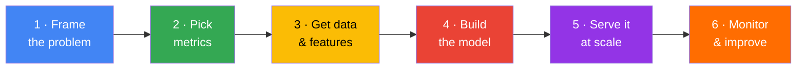
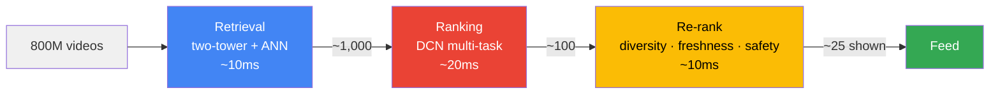

# Chapter 26 — ML System Design (Google)

> "At Google, system design is not about memorizing architectures — it's about demonstrating structured thinking at scale."

---

## How to Read This Chapter

Most ML system design guides hand you twenty disconnected diagrams and hope you glue them together under interview pressure. This one tells a **single story** instead.

> 🎬 **You just became the ML lead at StreamFlix** — a (fictional) video app with **500M daily users** and **800M videos**. Your boss says: *"The homepage feed is boring. Make people love it."* That's it. No spec, no metric, no model.
>
> Over this chapter you'll turn that one vague sentence into a planet-scale recommendation system — and every ML system design concept will show up exactly when StreamFlix needs it. By the end, the same playbook will let you design Search, Fraud, Ads, or an LLM assistant on demand.

**The playbook is six steps — the arc of the whole story:**



🧠 **The metaphor that ties it together:** building an ML system is like **building and driving a car** — decide the destination (*problem*), agree on the dashboard you'll be judged by (*metrics*), add fuel (*data*), build the engine (*model*), get on the road to real users (*serving*), and watch the warning lights so it doesn't die next month (*monitoring*).

**Memorize the ride:** *"Please Make Data, Model Smartly, Monitor"* → **P**roblem · **M**etrics · **D**ata · **M**odel · **S**erving · **M**onitoring.

> ⏱️ **The 45-minute interview maps onto this story:** ~5 min framing, ~5 min metrics, ~8 min data/features, ~10 min model, ~10 min serving, ~7 min monitoring. Spend your first 30 seconds *thinking*, not talking.

**The roadmap:**

| Part | StreamFlix milestone | Concepts you'll learn |
|------|---------------------|----------------------|
| 1 | Frame the problem | Clarifying questions, choosing the label, offline vs online metrics |
| 2 | Feed the machine | Labels, data traps, features, feature stores, training-serving skew |
| 3 | Build the brain | Baselines, two-tower retrieval, ranking, the multi-stage funnel |
| 4 | Prove it works | Time-based splits, A/B testing, guardrails, interleaving |
| 5 | Ship it | Batch vs real-time, latency budgets, ANN/ScaNN, caching, compression |
| 6 | Keep it alive | Drift, retraining, safe deployment, feedback loops |
| 7 | Do it responsibly | Bias, fairness, safety layers |
| 8 | Same playbook, new worlds | Search, Fraud, Moderation, LLM/RAG, Ads, Personalization |

---

# Part 1 — Frame the Problem

*Day 1. "Make the feed less boring." Where do you even start?*

## Ask Before You Build

🧠 **The concept:** The strongest candidates spend their first two minutes asking questions, not drawing boxes. You can't drive until you know the destination — and "make it less boring" is not a destination.

You corner your boss with the questions every framing needs:

| You ask… | Because it changes the design… |
|----------|-------------------------------|
| What are we optimizing — watch time, retention, satisfaction? | The goal picks the metric and the label |
| How many users / videos? | 500M users × 800M videos means you **cannot** rank everything per request |
| How fast must it feel? | "Under 300ms" rules out heavy models on the full corpus |
| Any safety / fairness rules? | Kids' content, regional law, creator fairness all constrain the design |

> 📐 **State assumptions out loud:** *"I'll assume 500M DAU, an 800M-video corpus, a sub-300ms budget, and that we optimize long-term satisfaction — not raw clicks. I'll revisit if that's wrong."* This one sentence signals seniority instantly.

## The Most Important Decision: Choosing the Label

🧠 **The concept:** The **label** (the thing you predict) is the single most consequential choice in the whole system. It decides your data, your model, your metric, and — crucially — the behavior you'll accidentally encourage.

⚠️ **StreamFlix's first near-disaster.** Your first instinct is "predict clicks." But optimize for **clicks** and you get thumbnails of screaming faces and *"you won't BELIEVE minute 3:47."* Optimize for **raw watch time** and you get three-hour videos droning to a sleeping user. Neither is "love the feed."

The fix — and the real interview answer — is a **composite label**: `click AND meaningful-watch AND positive-signal` (likes, saves, "not interested" as a negative), weighted to balance *engagement* with *satisfaction*.

> 🎤 **Soundbite:** "Optimizing the wrong label is how recommendation systems get good at making users miserable. I'd predict a composite engagement-and-satisfaction signal, not raw clicks."

## Metrics: The Dress Rehearsal and Opening Night

You now need two dashboards.

**Offline metrics = the dress rehearsal.** Grade the model on held-out data *before* it ever touches a user. Know which metric fits which job:

| Problem type | Metric | One-line meaning |
|---|---|---|
| Classification | **Precision / Recall** | Of what you flagged, how much was right / of all the real ones, how many you caught |
| Imbalanced classification | **PR-AUC** | Honest when positives are rare (fraud, spam) — ROC-AUC flatters you here |
| Ranking (StreamFlix!) | **NDCG@k** | Rewards putting the *best* items at the *top* |
| Probability quality | **Log loss / calibration** | Is "0.8" really an 80% chance? Matters when money rides on the score |
| Generation | **Perplexity, LLM-as-judge** | n-gram overlap (BLEU/ROUGE) is a weak proxy; judges correlate better |

🧭 **Pick-your-metric in one breath:** *false positives hurt → Precision · false negatives hurt → Recall · ranking → NDCG · money rides on the score → Calibration.*

🎣 **Precision vs recall, intuitively:** picture a fishing net. **Precision** = of the fish you caught, how many you actually wanted (no boots). **Recall** = of all the fish in the lake, how many you landed. Tighten one and the other usually slips — which is why you rarely optimize just one.

**Online metrics = opening night** with a paying audience, measured by A/B test on live traffic: CTR, **session watch time** (StreamFlix's North Star), 7-day retention, satisfaction surveys. The dress rehearsal can be flawless and the show can still flop.

## When the Two Dashboards Disagree

🎯 **The favorite curveball:** *"Your model gains 3% NDCG offline but loses 1% CTR live. What happened?"* This quietly separates people who've shipped from people who've only trained.

The usual suspects: **distribution shift** (offline data ≠ live traffic), **feature leakage** (a feature available offline but late/missing live), **position bias** (offline data reflects what *was* shown at the top), or a **proxy mismatch** (NDCG measures relevance; users want satisfaction).

> 🎤 **Soundbite:** "First I'd confirm the right model actually shipped, then compare offline vs live feature distributions, then check for position bias. If the gap holds, my offline metric isn't measuring what users care about."

---

# Part 2 — Feed the Machine

*The feed is framed. Now it needs fuel. At Google, better **data** beats a better model almost every time — a simple model on clean, plentiful data wins.*

## Labels: Eavesdrop or Ask

StreamFlix needs millions of labeled examples. Two ways to get them:

- 👂 **Implicit (eavesdrop):** clicks, watch time, skips. Free and nearly infinite — but **noisy**, because a click is a *guess* about intent, not a confession. A click followed by an instant bounce was not a win.
- 🙋 **Explicit (ask directly):** thumbs, ratings, human raters. Honest and clean — but slow and expensive, so you never get many.

**The real-world answer is both:** train on abundant implicit signals, *calibrate and validate* with a trickle of explicit ones.

## Three Traps in the Data

🧠 **The concept:** raw logs lie in systematic ways. Three traps sink most systems:

1. **Missing data is rarely random.** A user who hides their age differs from one who shares it. *Fix:* add an `is_missing` flag so the model can learn that the gap itself is a signal; tree models (XGBoost) handle this natively.
2. **Label noise.** That click-then-bounce gets logged as a "positive." *Fix:* require dwell > N seconds, or build a multi-signal composite label.
3. **Selection bias — the sneaky one.** 🪤 StreamFlix only ever sees what it *already chose to show* — like a teacher who only calls on the front row, then concludes the back row has nothing to say. Brilliant videos you rank low never get a chance.

<details>
<summary>🔬 <strong>Go deeper:</strong> breaking the selection-bias loop</summary>

- **Exploration traffic:** reserve 1–5% of impressions for random/epsilon-greedy picks so you keep learning about unshown items.
- **Inverse propensity scoring (IPS):** weight each example by 1 / P(it was shown) to undo the display policy's bias.
- **Counterfactual evaluation:** use those propensity scores to estimate how a *new* model would have done on logged data.

</details>

## Features: The Clues You Hand the Model

🧠 **The concept:** features are the clues the model reasons from. Four families — and a "cross" family that's secretly the most powerful:

| Family | Captures | StreamFlix example |
|---|---|---|
| **User** (who) | history, taste | `watch_rate_7d`, `user_embedding` |
| **Item** (what) | properties | `category`, `title_embedding`, `freshness` |
| **Context** (when/where) | the moment | `time_of_day`, `device`, `session_depth` |
| **Cross** (chemistry) | interactions | `user × category affinity`, `query × item similarity` |

✨ **Why cross features win:** "this user's click-rate *on cooking videos*" predicts far better than their overall click-rate plus the video's category, separately. Google's **Wide & Deep** was built precisely to capture these — and **DCN** (next part) learns them automatically.

## The Pantry and the #1 Silent Killer

You hit a subtle bug: a feature looks great in training but tanks live. Welcome to **training-serving skew**.

🧠 **Training-serving skew** = practicing with one recipe and cooking from another. Training computes a feature one way (Python, batch); serving computes it slightly differently (C++, real-time) — and the model quietly falls apart. It's the **#1 cause of "great offline, terrible live."**

🧠 **The fix — a feature store** = a **shared kitchen pantry**. Every model grabs identical, pre-prepped ingredients from one jar, and training and serving pull from the *same jar*. (Google's is Vertex AI Feature Store: one definition, served both batch for training and online for inference, with point-in-time correctness.)

> 🎤 **Soundbite:** "I'd compute features through one shared definition — a feature store — so training and serving physically can't drift apart. Most 'mysterious' production regressions are just skew."

StreamFlix's features split into **slow-cooked** (overnight: 30-day watch rate) and **made-to-order** (per request: what you tapped 3 seconds ago) — and the system plates both together.

---

# Part 3 — Build the Brain

*Fuel is flowing. Time for the engine. The golden rule: **start simple, add complexity only with justification.***

## Always Start With a Baseline

Before any neural network, you say: *"Baseline: sort by popularity. No ML."* If ML can't beat that, don't use ML. Then climb: logistic regression / GBDT → shallow net → production architecture. In an interview you spend 30 seconds here and 8 minutes on the top — but skipping it signals you don't think like a practitioner.

## Two-Tower: Find 1,000 Good Videos in 800,000,000

🧠 **The problem:** you cannot score 800M videos per request. So **retrieval** must cheaply narrow the field.

🗼 **The two-tower model** (dual-encoder) is Google's workhorse. One tower encodes the **user**, another encodes the **video**, each into a 128-dim embedding, trained so relevant pairs land close together. The trick: **video embeddings are precomputed offline.** At request time you embed only the user (one forward pass) and do an **approximate nearest neighbor** lookup to grab the top ~1,000 — in single-digit milliseconds.

## Ranking: Now Be Picky (Wide & Deep / DCN)

With ~1,000 candidates, you can afford a heavier model.

- **Wide & Deep** (Google, 2016): the **wide** half *memorizes* specific crosses ("fans of X also love Y"); the **deep** half *generalizes* from embeddings. Memorization + generalization in one model.
- **DCN-v2** (Deep & Cross Network): learns feature crosses **automatically** via explicit cross layers — no hand-engineering. It's now the standard for click/engagement prediction at Google.

StreamFlix's ranker is **multi-task**: one model, several heads — P(click), expected watch time, P(like) — combined into a single score tuned by online experiments.

## The Funnel That Powers Google

🧠 **The big idea:** no single model does it all. You **cascade** — cheap-and-fast first, expensive-and-accurate last. It's a hiring funnel: a résumé scan cuts a billion→a thousand, a phone screen a thousand→a hundred, an on-site picks the final few.



Search, YouTube, and Ads all run this exact shape. The **re-rank** stage is where StreamFlix injects diversity (no filter bubbles), freshness boosts, and policy/safety filters.

## Three Hard Realities Every Recommender Hits

- **Imbalance:** if you later add a "report" classifier, violations are <1% of uploads. *Fix:* class weights, focal loss, downsample negatives + recalibrate.
- 🥶 **Cold start:** a brand-new user or video has no history. *Fix:* fall back to popularity/demographics for new users; use **content features** (title, category) so the two-tower can embed a new video from its content alone; sprinkle exploration.
- **Position bias:** users click the top slot regardless of quality, so the model learns *position*, not *relevance*. *Fix:* train *with* a position feature, then fix it to a constant at serving — a counterfactual "if this were at the top, would you still click?"

---

# Part 4 — Prove It Works

*Your model looks brilliant offline. So did the last three that flopped. Prove it.*

## Offline: Split by Time, Not at Random

🧠 **The concept:** real data has a timeline, so **random splits leak the future into the past** and inflate your score. Train on Jan–Mar, validate on April — with a **gap** between them sized to your label delay (if the label is "watched within 7 days," leave a 7-day gap) so future info can't sneak in.

For ranking you can also **backtest**: replay logged sessions, re-score with the new model, compare to what users actually did (mind selection bias — you only see what the old model showed).

## A/B Testing: The Only Real Proof

🧠 **The concept:** split live traffic — half see the current model (control), half see yours (treatment) — and compare. A few rules that separate pros from amateurs:

- **Randomize by user, not request** (consistent experience; hash the user_id).
- **Power & duration:** size for the smallest effect you care about; run 1–2 weeks to absorb day-of-week swings.
- **Watch for sample-ratio mismatch** — a broken 50/50 split invalidates everything.

🛡️ **Guardrail metrics** keep a "win" honest: StreamFlix's new model may lift CTR 1% but it must **not** hurt satisfaction, revenue, or latency. If it does, you don't ship.

> 🎤 **Soundbite:** "I'd set guardrails on satisfaction, revenue, and p99 latency. A CTR win that costs user satisfaction is a loss."

⚡ **Interleaving** is the speed trick: blend two rankers into one list and see whose items get clicked. It needs 10–100× fewer users than A/B testing — perfect for rapid ranking comparisons — but only measures *relative* ranking, so you confirm the winner with a real A/B test.

🧠 **Mind the long game:** a CTR spike can fade as users habituate, and "engaging" content can quietly erode satisfaction. Google runs **long-term holdouts** (1–5% of users kept on the old model) to check 30/60/90-day effects.

---

# Part 5 — Ship It

*A model that misses its latency budget doesn't exist. Serving is where ML meets systems engineering — and where Google probes hardest.*

## Batch vs Real-Time (Usually Both)

**Batch** precomputes predictions on a schedule (cheap, but stale). **Real-time** computes per request (fresh, but costly). StreamFlix uses the **hybrid** everyone uses: precompute what's stable (video embeddings, user profiles) in batch; combine with live session context in real time.

## The Latency Budget

🧠 **The concept:** every millisecond is allocated, because the *whole* pipeline must fit under ~300ms. A rough StreamFlix budget:

| Stage | ~p99 |
|---|---|
| Feature lookup | 10 ms |
| Retrieval (ANN) | 20 ms |
| Ranking inference | 40 ms |
| Re-rank + business logic | 10 ms |
| **Headroom for network/render** | the rest |

⚠️ **Why tails (p99) matter:** at 100,000 QPS, p99 = 200ms means **1,000 users every second** wait too long. And fan-out compounds tails: query 10 shards in parallel, each at p99=100ms, and ~9.6% of requests have at least one slow shard (1 − 0.99¹⁰) — so per-shard p99 is really your overall **p90**.

## Searching a Billion Embeddings: ANN & ScaNN

🧠 **The concept:** exact nearest-neighbor search over billions of vectors is impossibly slow, so you go **approximate** — trade a sliver of accuracy for 100–1000× speed.

| Algorithm | Note |
|---|---|
| **HNSW** | Graph-based, very high recall, memory-hungry |
| **FAISS** | Flexible library (IVF, PQ); GPU; great at billion-scale |
| **ScaNN** (Google) | Anisotropic quantization for max-inner-product; best speed/accuracy for Google's workloads |

StreamFlix uses **ScaNN** to search 800M video embeddings in under 5ms.

## Two More Levers: Caching & Compression

- **Caching:** an 80–95% hit rate on hot item embeddings cuts backend load ~10×. Cache feeds per user with a short TTL; invalidate on explicit action.
- **Compression — the Google playbook:** train the best possible **teacher** model ignoring cost, then **distill** it into a small **student** that hits the latency budget. Add **quantization** (FP32→INT8, ~4× smaller, <1% accuracy loss) and **pruning**. A 10B-param teacher's quality can ship as a 50M-param student running in 5ms.

---

# Part 6 — Keep It Alive

*StreamFlix launches. 🎉 You are not done — you are at the starting line. Models decay as the world changes.*

## Drift: The World Moves On

🧠 **The concept:** three things drift —

- **Data drift** (inputs change): a new viral format floods uploads. *Detect:* PSI / KS tests on feature distributions.
- **Concept drift** (the rules change): "what's a good recommendation" shifts as tastes evolve. *Detect:* watch offline metrics on fresh labels.
- **Prediction drift** (outputs change): the model suddenly predicts 30% "love it" because a feature pipeline broke and went all-zeros. *Detect:* monitor the score distribution.

## Retraining & Safe Deployment

StreamFlix retrains **daily** on a rolling 30-day window (ranking models drift fast). And nothing ships in one risky leap — it walks a ladder:

```
Offline eval → Shadow (score live traffic, show nothing) → Canary (1–5%) → Gradual (→100%) → Auto-rollback if guardrails break
```

🧠 **Feedback loops — the dangerous magic:** the model's outputs become its future training data. Show popular items → they get more clicks → model shows them even more → diversity collapses. *Counter with* exploration traffic, popularity debiasing, and diversity constraints in re-rank.

---

# Part 7 — Do It Responsibly

*Responsible AI is not the last 30 seconds of the interview — at Google it's designed in from day one.*

🧠 **Bias hides in averages.** StreamFlix's model shows **0.94 AUC overall** — but sliced by language it's 0.72 for Swahili users. *Never report only aggregate metrics — always disaggregate by group.* Bias can enter at every stage (data, labels, features, training, evaluation, serving).

**Fairness has precise flavors** — pick by application:
- **Demographic parity:** equal positive rates across groups (often too rigid).
- **Equal opportunity:** equal *true-positive* rates — good for "surface relevant creators equally."
- **Calibration across groups:** a 0.8 means 80% for everyone — essential when scores set prices (ads).

🛡️ **Safety is layered** like an onion: input filters → model-level safety (RLHF, refusals) → output filters (toxicity, PII) → post-deployment red-teaming and human review.

> 🎤 **Soundbite:** "For StreamFlix I'd disaggregate engagement by demographic to catch bias, add a safety classifier in re-rank, and apply differential privacy in training. Responsible AI is an architectural concern, not a disclaimer."

---

# Part 8 — Same Playbook, New Worlds

You just built StreamFlix in six steps. The beautiful part: **every other system is the same playbook with different nouns.** Here's each classic design, compressed to its essence.

### 🔎 Search Ranking (Google-scale)
Frame → return the best of *hundreds of billions* of pages in <200ms. **Retrieval** runs two paths in parallel — inverted index (**BM25**, keyword) + embedding retrieval (**ScaNN**, semantic). **Rank** in two phases: a fast GBDT on ~1,000 docs, then a heavy **BERT cross-encoder** on the top ~100 (cross-attention is accurate but too slow for 1,000). Same funnel, freshness-aware for breaking news.

### 💳 Fraud Detection (real-time)
The twist: **0.1% positives**, <100ms decisions, adversaries who adapt, and labels that arrive 30–90 days late (chargebacks). **GBDT** on tabular features; **velocity features** (transactions in last 1/5/60 min) are the strongest signal. Three-tier decisions — auto-approve / human-review / auto-block — keep reviewers from drowning in false positives. Never use accuracy (predicting "never fraud" is 99.9% accurate and useless).

### 🛡️ Content Moderation (multi-modal)
Process video, audio, text, image **in parallel**, then fuse scores. **Stage 1** automated for high recall; **Stage 2** humans for precision (their calls become training labels). Defend against evasion with **OCR on frames**, adversarial training, and **perceptual hashing** (PDQ / TMK+PDQF) to instantly catch re-uploads of known-bad content. Policies are context-dependent (news vs. entertainment).

### 🤖 LLM Conversational AI / RAG (2026)
Grounding beats hallucination. **RAG pipeline:** rewrite the query → retrieve (dual-encoder + BM25, merged by reciprocal-rank-fusion) → **rerank with a cross-encoder** (the highest-leverage step) → assemble context with citations → generate. Add **tool use** via function calling / MCP and ReAct loops. Fight hallucination with attribution checks and "I don't know" gating. Evaluate without ground truth via **LLM-as-judge** + human side-by-sides.

### 📢 Ads Click Prediction
P(click) feeds the auction, so it must be **calibrated** (0.8 must mean 80%, or advertisers over/underpay) — fix with Platt scaling / isotonic regression, monitor with reliability diagrams. **DCN-v2 / Wide & Deep** on thousands of features, trained continuously on the last 24–48h. Correct position bias; rank by `bid × P(click) × quality`; price by second-price auction (GSP/VCG).

### ⚡ Real-Time Personalization
A click 10 seconds ago must reshape the feed *now*. Fuse a **long-term embedding** (daily batch) with a **session embedding** (a small transformer over the last N actions, updated per tap). A session-aware ranker captures "watched three cooking videos → boost cooking." Dedupe seen items with a **bloom filter**. Optimize for 7-day retention, not just session clicks.

---

## The Trade-Offs Cheat Sheet

Interviewers push on trade-offs — that's the substance of seniority. Never present one solution; name what you're trading.

| Trade-off | Lean left when… | Lean right when… |
|---|---|---|
| Precision ↔ Recall | false positives costly (spam, removal) | false negatives costly (fraud, cancer) |
| Batch ↔ Real-time | staleness is fine, cost matters | freshness/session context matters |
| Simple ↔ Complex model | little data, need explainability | abundant data, accuracy is paramount |
| Two-tower ↔ Cross-encoder | huge candidate pool, need <10ms | small set, accuracy critical |
| A/B test ↔ Interleaving | measuring business metrics | comparing ranking quality, fast |
| GBDT ↔ Neural net | tabular, small data, explainable | unstructured data, very large scale |
| Embeddings/ANN ↔ Inverted index | semantic similarity | exact keyword, ultra-low latency |

---

## Interview Soundbites (steal these)

- **Framing:** "Before I draw a box — what's the metric, the scale, and the latency budget? Here are my assumptions."
- **Label:** "I'd predict a composite engagement-and-satisfaction signal, not raw clicks."
- **Skew:** "One shared feature definition, so training and serving can't drift apart."
- **Funnel:** "Cheap-and-fast retrieval to narrow the field, expensive-and-accurate ranking on the short list."
- **A/B:** "Guardrails on satisfaction, revenue, and p99 — a CTR win that hurts satisfaction is a loss."
- **Responsible AI:** "Disaggregate metrics by group; bias hides in averages."

---

## Key Takeaways

1. **Follow the six-step story:** Problem → Metrics → Data → Model → Serving → Monitoring. Structure beats brilliance.
2. **The label is destiny.** The wrong label makes a system excellent at the wrong thing.
3. **Data > model.** Clean, plentiful data on a simple model wins.
4. **The multi-stage funnel is the universal pattern** — cheap retrieval, expensive ranking, business re-rank.
5. **Training-serving skew is the #1 silent killer;** feature stores exist to stop it.
6. **Prove it live.** Offline is a dress rehearsal; A/B testing (with guardrails) is the real verdict.
7. **Latency is a budget,** and the tails (p99) are what users feel.
8. **Shipping is the starting line** — drift, retraining, and safe rollout keep it alive.
9. **Responsible AI is architecture,** not an afterthought.
10. **Be concrete:** name real systems (ScaNN, TPU, Bigtable, Vertex AI) and real numbers (128-dim, <300ms, 0.1% fraud).

---

## Review Questions

**1. Why does StreamFlix use a two-tower model for retrieval instead of a cross-encoder?**
<details><summary>Answer</summary>
Two towers encode user and video independently, so video embeddings can be precomputed and indexed — enabling an ANN search over 800M videos in <10ms. A cross-encoder must process the user with every candidate at request time, which is infeasible at that scale. Cross-encoders are reserved for re-ranking a short list.
</details>

**2. The new ranker gains NDCG offline but loses watch time in the A/B test. Name three plausible causes.**
<details><summary>Answer</summary>
Training-serving skew or feature leakage; position bias (offline data reflects the old top-ranked items); a proxy mismatch where NDCG-relevance ≠ user satisfaction. Also check the right model actually deployed and that the A/B split isn't suffering sample-ratio mismatch.
</details>

**3. Why is choosing the label the most important decision, using StreamFlix as the example?**
<details><summary>Answer</summary>
The label defines data, model, metric, and the behavior you incentivize. "Clicks" breeds clickbait; "raw watch time" breeds bloated videos. A composite engagement-and-satisfaction label aligns the system with the real goal — a loved feed.
</details>

**4. What is training-serving skew and how does a feature store prevent it?**
<details><summary>Answer</summary>
Skew is when features are computed differently in training (batch/Python) vs serving (real-time/C++), so the model meets a different distribution live and degrades. A feature store provides one shared feature definition served to both paths, guaranteeing identical computation.
</details>

**5. Why does fan-out make tail latency worse, and what's the fix?**
<details><summary>Answer</summary>
Querying many shards in parallel means the slowest shard sets your latency. With 10 shards each at p99=100ms, ~9.6% of requests hit at least one slow shard (1 − 0.99¹⁰), so 100ms behaves like your overall p90. To hold a true 100ms p99, each shard must be fast at p99.9 — via tighter budgets, hedged requests, or fewer/faster shards.
</details>

**6. How do you handle cold start for a brand-new StreamFlix video?**
<details><summary>Answer</summary>
Use content features (title, category, creator history) so the two-tower item tower can embed it without interaction data, give it a small exploration budget to gather initial signal, and blend toward collaborative signals as engagement accumulates.
</details>

---

**Previous:** [Chapter 25 — System Design Pt 3](25_system_design_operations_case_studies.md) | **Next:** [Chapter 27 — Practical ML](27_practical_ml.md)
