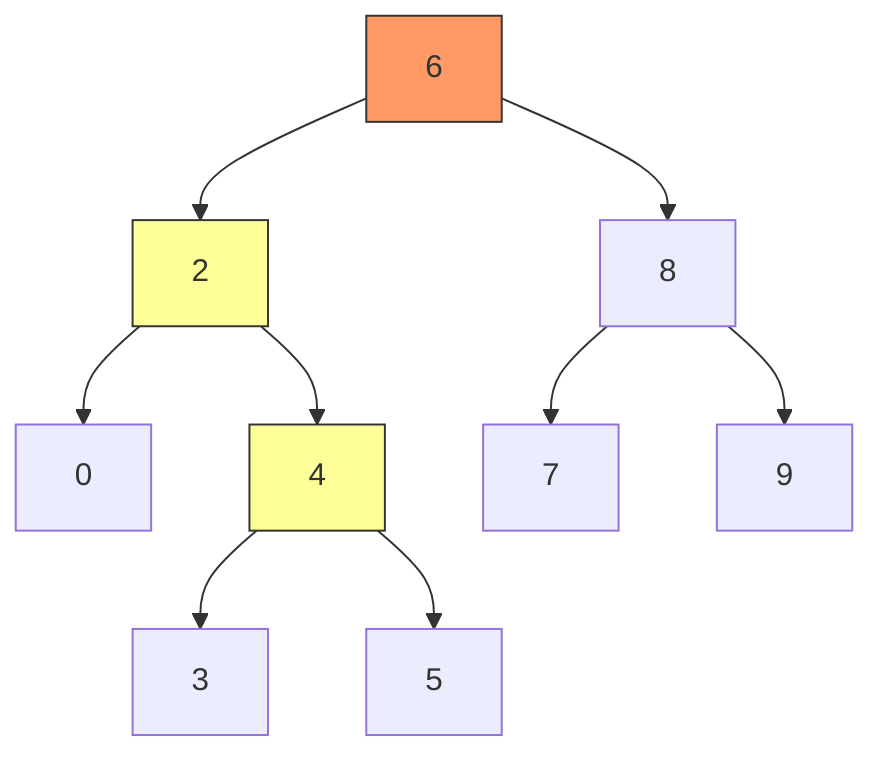

# DSA Foundations & Search — Google Interview Guide (Java)

> "The secret to solving interview problems fast: recognize the pattern in the first 30 seconds."

**What this chapter covers:** The array, string, hashmap, linked-list, stack, sorting, binary-search, sliding-window, tree, heap and trie patterns that cover the majority of Google's easy/medium rounds. Every topic has: visual explanation, core patterns, Java code, complexity analysis, tips & tricks, and a curated problem list. Part of a 4-chapter DSA sequence — this is chapter 1 of 4 (31 / 31b / 31c / 31d); section numbers (§18.1 onward) continue across all four so cross-references stay valid.

---

## Table of Contents

| Part | Topic | Sections |
|------|-------|----------|
| 1 | Foundations | §18.1–18.6: Big-O, Arrays, Hashmaps, Linked Lists, Stacks, Sorting |
| 2 | Search & Trees | §18.7–18.11: Binary Search, Sliding Window, Trees, Heaps, Tries |

**Continues in:** [31b — Graphs](#content/31b_dsa_graphs) → [31c — Dynamic Programming](#content/31c_dynamic_programming) → [31d — Advanced Patterns & ML Coding](#content/31d_dsa_advanced_ml_coding)

---

# PART 1: FOUNDATIONS

---

## 18.1 Big-O Complexity

Complexity analysis is the language you use to discuss algorithm efficiency. Every interview answer should end with "this runs in O(...) time and O(...) space." If you can't state the complexity, the interviewer assumes you don't understand your own solution.

**Time complexity** measures how operations grow as input size n increases. **Space complexity** measures extra memory your algorithm uses beyond the input.

### The Complexity Hierarchy

```
FAST ◄──────────────────────────────────────────────► SLOW

O(1)  O(log n)  O(n)  O(n log n)  O(n^2)  O(2^n)  O(n!)
 │       │        │       │          │       │       │
hash   binary   single  merge     nested  subsets  permu-
lookup  search   loop    sort      loops           tations
```

### Concrete Numbers

| Complexity | n=10 | n=100 | n=1,000 | n=1,000,000 | Typical Use |
|-----------|------|-------|---------|-------------|-------------|
| O(1) | 1 | 1 | 1 | 1 | Hash lookup, array index |
| O(log n) | 3 | 7 | 10 | 20 | Binary search |
| O(n) | 10 | 100 | 1,000 | 1,000,000 | Single scan |
| O(n log n) | 33 | 664 | 9,966 | 19,931,568 | Merge sort |
| O(n^2) | 100 | 10,000 | 1,000,000 | 10^12 TLE! | Nested loops |
| O(2^n) | 1,024 | 10^30 | -- | -- | Subsets |
| O(n!) | 3.6M | -- | -- | -- | Permutations |

```chart
{
  "type": "bar",
  "data": {
    "labels": ["O(1)", "O(log n)", "O(n)", "O(n log n)", "O(n^2)", "O(2^n)"],
    "datasets": [
      { "label": "n = 10", "data": [1, 3.3, 10, 33, 100, 1024], "backgroundColor": "rgba(75, 192, 192, 0.7)" },
      { "label": "n = 100", "data": [1, 6.6, 100, 664, 10000, 100000], "backgroundColor": "rgba(255, 159, 64, 0.7)" },
      { "label": "n = 1000", "data": [1, 10, 1000, 9966, 1000000, 1000000], "backgroundColor": "rgba(255, 99, 132, 0.7)" }
    ]
  },
  "options": {
    "scales": { "y": { "type": "logarithmic", "title": { "display": true, "text": "Operations (log scale)" } } },
    "plugins": { "title": { "display": true, "text": "Operations Count by Complexity Class" } }
  }
}
```

### Amortized Analysis

Some operations are expensive occasionally but cheap on average. Classic example: `ArrayList.add()` in Java. Most adds are O(1), but when the internal array fills, it doubles — that resize is O(n). Spread across n insertions, each add is **amortized O(1)**.

### Will My Solution TLE? — The 10^8 Rule

Most judges execute roughly **10^8 simple operations per second**:

| n (input size) | Max acceptable complexity |
|---------------|--------------------------|
| n <= 10 | O(n!) — brute force ok |
| n <= 20 | O(2^n) — subsets/backtrack |
| n <= 500 | O(n^3) — triple nested loop |
| n <= 10,000 | O(n^2) — double nested loop |
| n <= 1,000,000 | O(n log n) — sort-based |
| n <= 100,000,000 | O(n) — single pass |
| n > 10^8 | O(log n) or O(1) needed |

### Common Complexity Traps

- **String concatenation in a loop:** `s += char` creates a new String each time -> O(n^2). Use `StringBuilder`.
- **HashMap vs TreeMap:** HashMap is O(1) average. TreeMap is O(log n). Default to HashMap.
- **Recursion depth:** Depth-d recursion uses O(d) stack space even without explicit storage.

---

## 18.2 Arrays & Strings

Arrays are the bedrock of DSA. At least 40% of interview problems are fundamentally array/string manipulation. Master these patterns and you'll crush most of them.

### Pattern 1: Two Pointers (Converging)

One pointer at start, one at end. Move toward each other. Turns O(n^2) into O(n).

**When to use:** sorted array, palindrome check, container with most water, two sum on sorted array.

```java
// Two-sum on sorted array — O(n) time, O(1) space
public int[] twoSumSorted(int[] nums, int target) {
    int left = 0, right = nums.length - 1;
    while (left < right) {
        int sum = nums[left] + nums[right];
        if (sum == target) return new int[]{left, right};
        else if (sum < target) left++;
        else right--;
    }
    return new int[]{-1, -1};
}

// Container with most water — O(n) time, O(1) space
public int maxArea(int[] height) {
    int left = 0, right = height.length - 1, maxWater = 0;
    while (left < right) {
        int water = Math.min(height[left], height[right]) * (right - left);
        maxWater = Math.max(maxWater, water);
        if (height[left] < height[right]) left++;
        else right--;
    }
    return maxWater;
}
```

**Example (twoSumSorted):**
Input: nums = [2, 7, 11, 15], target = 9
Output: [0, 1]

**Example (maxArea):**
Input: height = [1, 8, 6, 2, 5, 4, 8, 3, 7]
Output: 49  (between index 1 and 8: min(8,7) * 7 = 49)

**Practice:** [Two Sum II — Input Array Is Sorted →](#dsa-problem-two-sum-ii-sorted) · [Container With Most Water →](#dsa-problem-container-with-most-water)

### Pattern 2: Two Pointers (Same Direction)

Both start at the beginning. "Fast" explores, "slow" marks write position or boundary.

```java
// Remove duplicates from sorted array — O(n) time, O(1) space
public int removeDuplicates(int[] nums) {
    if (nums.length == 0) return 0;
    int slow = 0;
    for (int fast = 1; fast < nums.length; fast++) {
        if (nums[fast] != nums[slow]) {
            nums[++slow] = nums[fast];
        }
    }
    return slow + 1;
}
```

**Example:**
Input: nums = [1, 1, 2, 2, 3]
Output: 3  (nums becomes [1, 2, 3, _, _])

**Practice:** [Remove Duplicates from Sorted Array →](#dsa-problem-remove-duplicates-sorted-array)

### Pattern 3: Prefix Sum

Compute any subarray sum in O(1) after O(n) preprocessing: `sum(i, j) = prefix[j+1] - prefix[i]`.

```
Array:     [3, 1, 4, 1, 5, 9]
Prefix:  [0, 3, 4, 8, 9, 14, 23]    ← always start with 0
```

```java
// Subarray sum equals K — O(n) time, O(n) space
public int subarraySum(int[] nums, int k) {
    Map<Integer, Integer> prefixCount = new HashMap<>();
    prefixCount.put(0, 1); // empty prefix
    int sum = 0, count = 0;
    for (int num : nums) {
        sum += num;
        count += prefixCount.getOrDefault(sum - k, 0);
        prefixCount.merge(sum, 1, Integer::sum);
    }
    return count;
}
```

**Example:**
Input: nums = [1, 1, 1], k = 2
Output: 2

**Practice:** [Subarray Sum Equals K →](#dsa-problem-subarray-sum-equals-k)

### Pattern 4: Kadane's Algorithm (Maximum Subarray)

At each position, decide: extend current subarray or start fresh. A negative running sum can never help.

```java
// Kadane's — O(n) time, O(1) space
public int maxSubArray(int[] nums) {
    int current = nums[0], best = nums[0];
    for (int i = 1; i < nums.length; i++) {
        current = Math.max(nums[i], current + nums[i]);
        best = Math.max(best, current);
    }
    return best;
}
```

**Example:**
Input: nums = [-2, 1, -3, 4, -1, 2, 1, -5, 4]
Output: 6  (subarray [4, -1, 2, 1])

**Practice:** [Maximum Subarray (Kadane's Algorithm) →](#dsa-problem-maximum-subarray)

### Pattern 5: Dutch National Flag (Three-Way Partition)

Partition into three sections in a single pass using three pointers.

```java
// Sort Colors — O(n) time, O(1) space
public void sortColors(int[] nums) {
    int low = 0, mid = 0, high = nums.length - 1;
    while (mid <= high) {
        if (nums[mid] == 0) swap(nums, low++, mid++);
        else if (nums[mid] == 1) mid++;
        else swap(nums, mid, high--); // don't advance mid
    }
}
private void swap(int[] a, int i, int j) {
    int tmp = a[i]; a[i] = a[j]; a[j] = tmp;
}
```

**Example:**
Input: nums = [2, 0, 2, 1, 1, 0]
Output: [0, 0, 1, 1, 2, 2]

**Practice:** [Sort Colors →](#dsa-problem-sort-colors)

### Tips & Common Mistakes

- **String problems are array problems.** Use `s.toCharArray()` when you need mutation.
- **Subarray vs subsequence:** Subarray = contiguous, subsequence = can skip. Very different.
- Off-by-one in converging pointers: use `left < right` (not `<=`) when they shouldn't meet.
- Forgetting `prefixCount.put(0, 1)` in prefix sum + hashmap pattern.
- In Kadane's, initializing `best = 0` instead of `nums[0]` fails when all elements are negative.

### Key Problems — Detailed Solutions

<details>
<summary><strong>Two Sum II (Sorted)</strong> — Easy</summary>

**Problem:** Given a 1-indexed sorted array `numbers`, find two numbers that add up to `target`. Return their indices.

**Example:**
Input: numbers = [2, 7, 11, 15], target = 9
Output: [1, 2]  (numbers[1] + numbers[2] = 2 + 7 = 9)

**Approach:** Two converging pointers. If sum < target, move left right. If sum > target, move right left. Sorted order guarantees convergence.

**Java:**
```java
public int[] twoSum(int[] nums, int target) {
    int l = 0, r = nums.length - 1;
    while (l < r) {
        int sum = nums[l] + nums[r];
        if (sum == target) return new int[]{l + 1, r + 1};
        else if (sum < target) l++;
        else r--;
    }
    return new int[]{};
}
// Time: O(n)  Space: O(1)
```

**Complexity:** O(n) time, O(1) space
</details>

<details>
<summary><strong>3Sum</strong> — Medium</summary>

**Problem:** Given an integer array `nums`, find all unique triplets `[nums[i], nums[j], nums[k]]` such that `i != j != k` and `nums[i] + nums[j] + nums[k] == 0`.

**Example:**
Input: nums = [-1, 0, 1, 2, -1, -4]
Output: [[-1, -1, 2], [-1, 0, 1]]

**Approach:** Sort the array. Fix one element, then use two pointers on the remaining portion to find pairs that sum to the negative of the fixed element. Skip duplicates at each level.

**Java:**
```java
public List<List<Integer>> threeSum(int[] nums) {
    Arrays.sort(nums);
    List<List<Integer>> res = new ArrayList<>();
    for (int i = 0; i < nums.length - 2; i++) {
        if (i > 0 && nums[i] == nums[i - 1]) continue; // skip dup
        int lo = i + 1, hi = nums.length - 1;
        while (lo < hi) {
            int sum = nums[i] + nums[lo] + nums[hi];
            if (sum == 0) {
                res.add(List.of(nums[i], nums[lo], nums[hi]));
                while (lo < hi && nums[lo] == nums[lo + 1]) lo++;
                while (lo < hi && nums[hi] == nums[hi - 1]) hi--;
                lo++; hi--;
            } else if (sum < 0) lo++;
            else hi--;
        }
    }
    return res;
}
// Time: O(n^2)  Space: O(1) excluding output
```

**Complexity:** O(n^2) time, O(1) space (excluding output)
</details>

<details>
<summary><strong>Product of Array Except Self</strong> — Medium</summary>

**Problem:** Given an integer array `nums`, return an array `answer` where `answer[i]` is the product of all elements except `nums[i]`. You must not use division and run in O(n).

**Example:**
Input: nums = [1, 2, 3, 4]
Output: [24, 12, 8, 6]

**Approach:** Two passes. First pass (left to right) builds prefix products. Second pass (right to left) multiplies in suffix products. Each element gets the product of everything before it times everything after it.

**Java:**
```java
public int[] productExceptSelf(int[] nums) {
    int n = nums.length;
    int[] ans = new int[n];
    ans[0] = 1;
    for (int i = 1; i < n; i++)
        ans[i] = ans[i - 1] * nums[i - 1];   // prefix product
    int suffix = 1;
    for (int i = n - 1; i >= 0; i--) {
        ans[i] *= suffix;
        suffix *= nums[i];                     // suffix product
    }
    return ans;
}
// Time: O(n)  Space: O(1) excluding output
```

**Complexity:** O(n) time, O(1) space (output array not counted)
</details>

<details>
<summary><strong>Trapping Rain Water</strong> — Hard</summary>

**Problem:** Given `n` non-negative integers representing an elevation map where the width of each bar is 1, compute how much water it can trap after raining.

**Example:**
Input: height = [0, 1, 0, 2, 1, 0, 1, 3, 2, 1, 2, 1]
Output: 6

**Approach:** Two pointers from both ends. Track leftMax and rightMax. Water at any position = min(leftMax, rightMax) - height[i]. Process the side with the smaller max since that determines the water level.

**Java:**
```java
public int trap(int[] height) {
    int l = 0, r = height.length - 1;
    int leftMax = 0, rightMax = 0, water = 0;
    while (l < r) {
        if (height[l] < height[r]) {
            leftMax = Math.max(leftMax, height[l]);
            water += leftMax - height[l];
            l++;
        } else {
            rightMax = Math.max(rightMax, height[r]);
            water += rightMax - height[r];
            r--;
        }
    }
    return water;
}
// Time: O(n)  Space: O(1)
```

**Complexity:** O(n) time, O(1) space
</details>

### Problem List

| # | Problem | Difficulty | Pattern | Key Insight |
|---|---------|-----------|---------|-------------|
| 1 | Two Sum II (Sorted) | Easy | Two Ptr (converging) | Sorted -> two pointers |
| 2 | Valid Palindrome | Easy | Two Ptr (converging) | Skip non-alphanumeric |
| 3 | Move Zeroes | Easy | Two Ptr (same dir) | Slow = write position |
| 4 | Remove Duplicates | Easy | Two Ptr (same dir) | Compare slow vs fast |
| 5 | Best Time Buy/Sell Stock | Easy | Kadane variant | Track min price so far |
| 6 | Maximum Subarray | Easy | Kadane | Textbook Kadane's |
| 7 | Running Sum of Array | Easy | Prefix Sum | Direct prefix sum |
| 8 | Merge Sorted Array | Easy | Two Ptr (reverse) | Fill from the end |
| 9 | Container With Most Water | Medium | Two Ptr (converging) | Move shorter side |
| 10 | 3Sum | Medium | Sort + Two Ptr | Fix one, two-ptr rest |
| 11 | Product of Array Except Self | Medium | Prefix/Suffix | Left pass, right pass |
| 12 | Sort Colors | Medium | Dutch National Flag | Three-way partition |
| 13 | Subarray Sum Equals K | Medium | Prefix Sum + Map | Count prefix diffs |
| 14 | Rotate Array | Medium | Reverse trick | Reverse all, then parts |
| 15 | Next Permutation | Medium | Two Ptr + Sort | Find rightmost ascent |
| 16 | Longest Consecutive Sequence | Medium | HashSet | Check if num-1 exists |
| 17 | Trapping Rain Water | Hard | Two Ptr / Stack | Min of left/right max |
| 18 | First Missing Positive | Hard | Cyclic Sort | Place num at index num-1 |
| 19 | Median of Two Sorted Arrays | Hard | Binary Search | Partition both arrays |
| 20 | Minimum Window Substring | Hard | Sliding Window + Map | Covered in 18.8 |

---

## 18.3 Hashmaps & Sets

A HashMap gives you O(1) average-case lookup, insertion, and deletion. It is the single most useful data structure in coding interviews. If your brute force is O(n^2) because of a nested search, a HashMap almost always drops it to O(n).

### How HashMap Works (30-Second Version)

```
Key "apple" -> hashCode() -> 987234 -> 987234 % 16 = 2 -> bucket[2]

Buckets:  [0] -> null
          [2] -> ("apple", 5) -> ("grape", 3) -> null   <- collision: chaining
          [3] -> ("banana", 7) -> null

Load factor > 0.75 -> resize (double buckets, rehash)
Java 8+: chain > 8 entries -> red-black tree (O(log n) worst case)
```

### Pattern 1: Two-Sum

For each element, check if `target - element` exists in the map.

```java
// Two Sum — O(n) time, O(n) space
public int[] twoSum(int[] nums, int target) {
    Map<Integer, Integer> seen = new HashMap<>();
    for (int i = 0; i < nums.length; i++) {
        int complement = target - nums[i];
        if (seen.containsKey(complement)) return new int[]{seen.get(complement), i};
        seen.put(nums[i], i);
    }
    return new int[]{-1, -1};
}
```

**Example:**
Input: nums = [2, 7, 11, 15], target = 9
Output: [0, 1]

**Practice:** [Two Sum →](#dsa-problem-two-sum)

### Pattern 2: Frequency Counting

```java
// Valid Anagram — O(n) time, O(1) space (26 letters)
public boolean isAnagram(String s, String t) {
    if (s.length() != t.length()) return false;
    int[] count = new int[26];
    for (int i = 0; i < s.length(); i++) {
        count[s.charAt(i) - 'a']++;
        count[t.charAt(i) - 'a']--;
    }
    for (int c : count) if (c != 0) return false;
    return true;
}
```

**Example:**
Input: s = "anagram", t = "nagaram"
Output: true

For small character sets use `int[26]` instead of HashMap — faster and less memory.

**Practice:** [Valid Anagram →](#dsa-problem-valid-anagram)

### Pattern 3: Group By Key

```java
// Group Anagrams — O(n * k log k) time
public List<List<String>> groupAnagrams(String[] strs) {
    Map<String, List<String>> groups = new HashMap<>();
    for (String s : strs) {
        char[] sorted = s.toCharArray();
        Arrays.sort(sorted);
        groups.computeIfAbsent(new String(sorted), k -> new ArrayList<>()).add(s);
    }
    return new ArrayList<>(groups.values());
}
```

**Example:**
Input: strs = ["eat", "tea", "tan", "ate", "nat", "bat"]
Output: [["eat", "tea", "ate"], ["tan", "nat"], ["bat"]]

**Practice:** [Group Anagrams →](#dsa-problem-group-anagrams)

### Pattern 4: Sliding Window + HashMap

```java
// Longest Substring Without Repeating Characters — O(n)
public int lengthOfLongestSubstring(String s) {
    Map<Character, Integer> lastSeen = new HashMap<>();
    int maxLen = 0, left = 0;
    for (int right = 0; right < s.length(); right++) {
        char c = s.charAt(right);
        if (lastSeen.containsKey(c) && lastSeen.get(c) >= left)
            left = lastSeen.get(c) + 1;
        lastSeen.put(c, right);
        maxLen = Math.max(maxLen, right - left + 1);
    }
    return maxLen;
}
```

**Example:**
Input: s = "abcabcbb"
Output: 3  ("abc")

**Practice:** [Longest Substring Without Repeating Characters →](#dsa-problem-longest-substring-without-repeating)

### HashSet Essentials

```java
// Longest Consecutive Sequence — O(n) time, O(n) space
public int longestConsecutive(int[] nums) {
    Set<Integer> set = new HashSet<>();
    for (int n : nums) set.add(n);
    int longest = 0;
    for (int n : set) {
        if (!set.contains(n - 1)) { // only start from sequence beginning
            int len = 1;
            while (set.contains(n + len)) len++;
            longest = Math.max(longest, len);
        }
    }
    return longest;
}
```

**Example:**
Input: nums = [100, 4, 200, 1, 3, 2]
Output: 4  (the sequence [1, 2, 3, 4])

**Practice:** [Longest Consecutive Sequence →](#dsa-problem-longest-consecutive-sequence)

### Tips & Common Mistakes

- `merge(key, 1, Integer::sum)` — cleanest way to increment a count.
- `computeIfAbsent(key, k -> new ArrayList<>())` — for group-by patterns.
- **HashMap vs LinkedHashMap:** LinkedHashMap preserves insertion order (useful for LRU cache).
- Don't use mutable objects (`int[]`) as HashMap keys — they use reference equality. Convert to `String` or `List<Integer>`.
- `HashMap.get()` returns `null` for missing keys — unboxing null to `int` throws NPE.

### Key Problems — Detailed Solutions

<details>
<summary><strong>Two Sum</strong> — Easy</summary>

**Problem:** Given an array of integers `nums` and an integer `target`, return the indices of the two numbers that add up to `target`. Each input has exactly one solution and you may not use the same element twice.

**Example:**
Input: nums = [2, 7, 11, 15], target = 9
Output: [0, 1]  (nums[0] + nums[1] = 2 + 7 = 9)

**Approach:** One-pass HashMap. For each element, check if `target - nums[i]` already exists in the map. If yes, return both indices. Otherwise, store `nums[i] -> i` in the map.

**Java:**
```java
public int[] twoSum(int[] nums, int target) {
    Map<Integer, Integer> seen = new HashMap<>();
    for (int i = 0; i < nums.length; i++) {
        int comp = target - nums[i];
        if (seen.containsKey(comp)) return new int[]{seen.get(comp), i};
        seen.put(nums[i], i);
    }
    return new int[]{};
}
// Time: O(n)  Space: O(n)
```

**Complexity:** O(n) time, O(n) space
</details>

<details>
<summary><strong>Group Anagrams</strong> — Medium</summary>

**Problem:** Given an array of strings `strs`, group the anagrams together. An anagram is a word formed by rearranging letters of another word.

**Example:**
Input: strs = ["eat", "tea", "tan", "ate", "nat", "bat"]
Output: [["eat", "tea", "ate"], ["tan", "nat"], ["bat"]]

**Approach:** Use a HashMap where the key is the sorted version of each string. All anagrams produce the same sorted key. Group strings by this canonical key.

**Java:**
```java
public List<List<String>> groupAnagrams(String[] strs) {
    Map<String, List<String>> map = new HashMap<>();
    for (String s : strs) {
        char[] ch = s.toCharArray();
        Arrays.sort(ch);
        String key = new String(ch);
        map.computeIfAbsent(key, k -> new ArrayList<>()).add(s);
    }
    return new ArrayList<>(map.values());
}
// Time: O(n * k log k)  Space: O(n * k)  where k = max string length
```

**Complexity:** O(n * k log k) time, O(n * k) space
</details>

<details>
<summary><strong>LRU Cache</strong> — Medium</summary>

**Problem:** Design a data structure that supports `get(key)` and `put(key, value)` in O(1) time. When capacity is exceeded, evict the least recently used key.

**Example:**
LRUCache cache = new LRUCache(2);
cache.put(1, 1); cache.put(2, 2);
cache.get(1);       // returns 1
cache.put(3, 3);    // evicts key 2
cache.get(2);       // returns -1 (not found)

**Approach:** Combine a HashMap (O(1) lookup) with a doubly linked list (O(1) insert/remove). On access, move the node to the front. On capacity overflow, remove from the tail.

**Java:**
```java
class LRUCache extends LinkedHashMap<Integer, Integer> {
    private int cap;
    public LRUCache(int capacity) {
        super(capacity, 0.75f, true); // accessOrder = true
        this.cap = capacity;
    }
    public int get(int key) {
        return super.getOrDefault(key, -1);
    }
    public void put(int key, int value) {
        super.put(key, value);
    }
    @Override
    protected boolean removeEldestEntry(Map.Entry<Integer, Integer> eldest) {
        return size() > cap;
    }
}
// Time: O(1) for both get and put  Space: O(capacity)
```

**Complexity:** O(1) time per operation, O(capacity) space
</details>

### Problem List

| # | Problem | Difficulty | Pattern | Key Insight |
|---|---------|-----------|---------|-------------|
| 1 | Two Sum | Easy | Complement lookup | One-pass with map |
| 2 | Valid Anagram | Easy | Frequency count | int[26] is enough |
| 3 | Contains Duplicate | Easy | HashSet | set.add returns false |
| 4 | Ransom Note | Easy | Frequency count | Decrement and check |
| 5 | Intersection of Two Arrays | Easy | Two sets | Retain common elements |
| 6 | Longest Substring No Repeat | Medium | Window + Map | Track last seen index |
| 7 | Group Anagrams | Medium | Group by key | Sorted string as key |
| 8 | Top K Frequent Elements | Medium | Freq map + Heap/Bucket | Bucket sort is O(n) |
| 9 | Subarray Sum Equals K | Medium | Prefix sum + Map | Count prefix diffs |
| 10 | 4Sum II | Medium | Split + Map | Store pair sums |
| 11 | Encode and Decode Strings | Medium | Delimiter design | Length prefix encoding |
| 12 | LRU Cache | Medium | LinkedHashMap | Override removeEldest |
| 13 | Copy List with Random Pointer | Medium | Old->New map | Two-pass cloning |
| 14 | Minimum Window Substring | Hard | Window + Freq map | Maintain "have" vs "need" |
| 15 | Alien Dictionary | Hard | Map + Topo sort | Build graph from words |

---

## 18.4 Linked Lists

Linked list problems test pointer manipulation. There are only a handful of patterns — once you have the templates, most problems are variations.

```java
public class ListNode {
    int val;
    ListNode next;
    ListNode(int val) { this.val = val; }
    ListNode(int val, ListNode next) { this.val = val; this.next = next; }
}
```

### Pattern 1: Fast/Slow Pointers (Floyd's)

Fast moves 2 steps, slow moves 1. Finds middle, detects cycles.

```java
// Find middle — O(n) time, O(1) space
public ListNode findMiddle(ListNode head) {
    ListNode slow = head, fast = head;
    while (fast != null && fast.next != null) {
        slow = slow.next;
        fast = fast.next.next;
    }
    return slow;
}
```

**Example (findMiddle):**
Input: 1 -> 2 -> 3 -> 4 -> 5
Output: 3

**Practice:** [Middle of the Linked List →](#dsa-problem-middle-of-linked-list)

```java
// Detect cycle start — O(n) time, O(1) space
public ListNode detectCycleStart(ListNode head) {
    ListNode slow = head, fast = head;
    while (fast != null && fast.next != null) {
        slow = slow.next;
        fast = fast.next.next;
        if (slow == fast) {
            slow = head; // reset one pointer to head
            while (slow != fast) { slow = slow.next; fast = fast.next; }
            return slow;
        }
    }
    return null;
}
```

**Example (detectCycleStart):**
Input: 3 -> 2 -> 0 -> -4, with -4's next pointing back to node 2
Output: node with value 2 (the cycle entry point)

**Practice:** [Linked List Cycle II →](#dsa-problem-linked-list-cycle-ii)

### Pattern 2: Reversal (Iterative)

Three pointers: prev, curr, next. This is a building block for many Medium/Hard problems.

```
null <- 1    2 -> 3 -> 4 -> null     (prev, curr, next)
null <- 1 <- 2    3 -> 4 -> null
null <- 1 <- 2 <- 3    4 -> null
null <- 1 <- 2 <- 3 <- 4             done: prev = new head
```

```java
public ListNode reverseList(ListNode head) {
    ListNode prev = null, curr = head;
    while (curr != null) {
        ListNode next = curr.next;
        curr.next = prev;
        prev = curr;
        curr = next;
    }
    return prev;
}
```

**Example:**
Input: 1 -> 2 -> 3 -> 4 -> 5
Output: 5 -> 4 -> 3 -> 2 -> 1

**Practice:** [Reverse Linked List →](#dsa-problem-reverse-linked-list)

### Pattern 3: Merge Two Sorted Lists

Dummy head eliminates edge cases.

```java
public ListNode mergeTwoLists(ListNode l1, ListNode l2) {
    ListNode dummy = new ListNode(0), tail = dummy;
    while (l1 != null && l2 != null) {
        if (l1.val <= l2.val) { tail.next = l1; l1 = l1.next; }
        else                  { tail.next = l2; l2 = l2.next; }
        tail = tail.next;
    }
    tail.next = (l1 != null) ? l1 : l2;
    return dummy.next;
}
```

**Example:**
Input: l1 = 1 -> 2 -> 4, l2 = 1 -> 3 -> 4
Output: 1 -> 1 -> 2 -> 3 -> 4 -> 4

**Practice:** [Merge Two Sorted Lists →](#dsa-problem-merge-two-sorted-lists)

### Pattern 4: Remove Nth From End

Two pointers separated by n nodes. When leader reaches end, follower is before the target.

```java
public ListNode removeNthFromEnd(ListNode head, int n) {
    ListNode dummy = new ListNode(0, head);
    ListNode fast = dummy, slow = dummy;
    for (int i = 0; i <= n; i++) fast = fast.next;
    while (fast != null) { fast = fast.next; slow = slow.next; }
    slow.next = slow.next.next;
    return dummy.next;
}
```

**Example:**
Input: head = 1 -> 2 -> 3 -> 4 -> 5, n = 2
Output: 1 -> 2 -> 3 -> 5

**Practice:** [Remove Nth Node From End of List →](#dsa-problem-remove-nth-from-end)

### Tips & Common Mistakes

- **Dummy node trick:** When head might change, use `dummy -> head` and return `dummy.next`.
- Always draw 3-4 nodes and trace your pointer logic before coding.
- Don't lose the `next` reference before overwriting `curr.next` in reversal.
- Check for `null` before accessing `.next.next`.

### Key Problems — Detailed Solutions

<details>
<summary><strong>Reverse Linked List</strong> — Easy</summary>

**Problem:** Given the head of a singly linked list, reverse the list and return the new head.

**Example:**
Input: 1 -> 2 -> 3 -> 4 -> 5
Output: 5 -> 4 -> 3 -> 2 -> 1

**Approach:** Iterative three-pointer technique. Keep track of prev, curr, and next. At each step, point curr.next to prev, then advance all three pointers.

**Java:**
```java
public ListNode reverseList(ListNode head) {
    ListNode prev = null, curr = head;
    while (curr != null) {
        ListNode next = curr.next;
        curr.next = prev;
        prev = curr;
        curr = next;
    }
    return prev;
}
// Time: O(n)  Space: O(1)
```

**Complexity:** O(n) time, O(1) space
</details>

<details>
<summary><strong>Merge Two Sorted Lists</strong> — Easy</summary>

**Problem:** Merge two sorted linked lists into one sorted list by splicing their nodes together.

**Example:**
Input: l1 = 1 -> 2 -> 4, l2 = 1 -> 3 -> 4
Output: 1 -> 1 -> 2 -> 3 -> 4 -> 4

**Approach:** Use a dummy head node to simplify edge cases. Compare heads of both lists, append the smaller one, advance that pointer. Attach remaining nodes at the end.

**Java:**
```java
public ListNode mergeTwoLists(ListNode l1, ListNode l2) {
    ListNode dummy = new ListNode(0), tail = dummy;
    while (l1 != null && l2 != null) {
        if (l1.val <= l2.val) { tail.next = l1; l1 = l1.next; }
        else                  { tail.next = l2; l2 = l2.next; }
        tail = tail.next;
    }
    tail.next = (l1 != null) ? l1 : l2;
    return dummy.next;
}
// Time: O(n + m)  Space: O(1)
```

**Complexity:** O(n + m) time, O(1) space
</details>

<details>
<summary><strong>Linked List Cycle</strong> — Easy</summary>

**Problem:** Given the head of a linked list, determine if it contains a cycle.

**Example:**
Input: head = [3, 2, 0, -4] with tail connecting to node index 1
Output: true

**Approach:** Floyd's Tortoise and Hare. Slow pointer moves 1 step, fast moves 2 steps. If they meet, there's a cycle. If fast reaches null, there's no cycle.

**Java:**
```java
public boolean hasCycle(ListNode head) {
    ListNode slow = head, fast = head;
    while (fast != null && fast.next != null) {
        slow = slow.next;
        fast = fast.next.next;
        if (slow == fast) return true;
    }
    return false;
}
// Time: O(n)  Space: O(1)
```

**Complexity:** O(n) time, O(1) space
</details>

<details>
<summary><strong>Reorder List</strong> — Medium</summary>

**Problem:** Reorder a linked list from L0 -> L1 -> ... -> Ln to L0 -> Ln -> L1 -> Ln-1 -> L2 -> Ln-2 -> ...

**Example:**
Input: 1 -> 2 -> 3 -> 4 -> 5
Output: 1 -> 5 -> 2 -> 4 -> 3

**Approach:** Three steps: (1) Find middle using slow/fast pointers, (2) Reverse the second half, (3) Merge the two halves by interleaving.

**Java:**
```java
public void reorderList(ListNode head) {
    if (head == null || head.next == null) return;
    // 1. Find middle
    ListNode slow = head, fast = head;
    while (fast.next != null && fast.next.next != null) {
        slow = slow.next; fast = fast.next.next;
    }
    // 2. Reverse second half
    ListNode prev = null, curr = slow.next;
    slow.next = null;
    while (curr != null) {
        ListNode next = curr.next;
        curr.next = prev; prev = curr; curr = next;
    }
    // 3. Merge two halves
    ListNode first = head, second = prev;
    while (second != null) {
        ListNode tmp1 = first.next, tmp2 = second.next;
        first.next = second; second.next = tmp1;
        first = tmp1; second = tmp2;
    }
}
// Time: O(n)  Space: O(1)
```

**Complexity:** O(n) time, O(1) space
</details>

### Problem List

| # | Problem | Difficulty | Pattern | Key Insight |
|---|---------|-----------|---------|-------------|
| 1 | Reverse Linked List | Easy | Reversal | prev, curr, next |
| 2 | Merge Two Sorted Lists | Easy | Merge + Dummy | Dummy head |
| 3 | Linked List Cycle | Easy | Fast/Slow | Fast catches slow |
| 4 | Middle of Linked List | Easy | Fast/Slow | Fast moves 2x |
| 5 | Remove Nth From End | Medium | Two Ptr gap | n+1 gap, dummy |
| 6 | Reorder List | Medium | Split + Rev + Merge | Find mid, reverse 2nd, interleave |
| 7 | Add Two Numbers | Medium | Carry propagation | Digit by digit |
| 8 | Copy List Random Pointer | Medium | HashMap clone | Old->New mapping |
| 9 | Linked List Cycle II | Medium | Floyd's | Reset one ptr to head |
| 10 | Swap Nodes in Pairs | Medium | Pointer juggling | Draw it step by step |
| 11 | Reverse Nodes in k-Group | Hard | k-reversal loop | Count k, reverse, connect |
| 12 | Merge k Sorted Lists | Hard | Min-heap merge | PQ of k heads |

---

## 18.5 Stacks & Queues

Simple structures, powerful patterns. The monotonic stack alone solves a family of problems that would otherwise be O(n^2).

### Pattern 1: Monotonic Stack (Next Greater Element)

Maintain a stack in decreasing order. When a new element is bigger, pop — each popped element found its "next greater."

```
Array: [2, 1, 4, 3, 5]   ->   Result: [4, 4, 5, 5, -1]

i=0: push 0              stack: [0]
i=1: 1<2, push           stack: [0,1]
i=2: 4>1, pop 1->ans=4;  4>2, pop 0->ans=4;  push 2   stack: [2]
i=3: 3<4, push           stack: [2,3]
i=4: 5>3, pop 3->ans=5;  5>4, pop 2->ans=5;  push 4   stack: [4]
```

```java
public int[] nextGreaterElement(int[] nums) {
    int n = nums.length;
    int[] result = new int[n];
    Arrays.fill(result, -1);
    Deque<Integer> stack = new ArrayDeque<>(); // stores indices
    for (int i = 0; i < n; i++) {
        while (!stack.isEmpty() && nums[stack.peek()] < nums[i])
            result[stack.pop()] = nums[i];
        stack.push(i);
    }
    return result;
}
```

**Example:**
Input: nums = [2, 1, 4, 3, 5]
Output: [4, 4, 5, 5, -1]

**Practice:** [Next Greater Element I →](#dsa-problem-next-greater-element-i)

### Pattern 2: Min Stack

O(1) push/pop/top/getMin via a parallel min-tracking stack.

```java
class MinStack {
    private Deque<Integer> stack = new ArrayDeque<>();
    private Deque<Integer> minStack = new ArrayDeque<>();
    public void push(int val) {
        stack.push(val);
        minStack.push(minStack.isEmpty() ? val : Math.min(val, minStack.peek()));
    }
    public void pop() { stack.pop(); minStack.pop(); }
    public int top() { return stack.peek(); }
    public int getMin() { return minStack.peek(); }
}
```

**Example:**
Input: push(-2), push(0), push(-3), getMin(), pop(), top(), getMin()
Output: -3, 0, -2  (successive call results)

**Practice:** [Min Stack →](#dsa-problem-min-stack)

### Pattern 3: Queue Using Two Stacks

Push into `inStack`. On pop/peek, pour into `outStack` (reverses order). Amortized O(1).

```java
class MyQueue {
    private Deque<Integer> in = new ArrayDeque<>(), out = new ArrayDeque<>();
    public void push(int x) { in.push(x); }
    public int pop() { transfer(); return out.pop(); }
    public int peek() { transfer(); return out.peek(); }
    public boolean empty() { return in.isEmpty() && out.isEmpty(); }
    private void transfer() { if (out.isEmpty()) while (!in.isEmpty()) out.push(in.pop()); }
}
```

**Example:**
Input: push(1), push(2), peek(), pop(), empty()
Output: 1, 1, false

**Practice:** [Implement Queue using Stacks →](#dsa-problem-implement-queue-using-stacks)

### Pattern 4: Valid Parentheses

```java
public boolean isValid(String s) {
    Deque<Character> stack = new ArrayDeque<>();
    Map<Character, Character> pairs = Map.of(')', '(', ']', '[', '}', '{');
    for (char c : s.toCharArray()) {
        if (pairs.containsValue(c)) stack.push(c);
        else if (stack.isEmpty() || stack.pop() != pairs.get(c)) return false;
    }
    return stack.isEmpty();
}
```

**Example:**
Input: s = "()[]{}"
Output: true

**Practice:** [Valid Parentheses →](#dsa-problem-valid-parentheses)

### Tips & Common Mistakes

- Use `Deque<Integer> stack = new ArrayDeque<>()`, not legacy `Stack<>`. Interviewers notice.
- **Monotonic stack recognizer:** "next greater/smaller", "previous greater/smaller", "largest rectangle".
- Store **indices** in monotonic stacks (not values) — you can always look up the value, and you'll often need the index for distance.
- Always check `stack.isEmpty()` before `pop()` or `peek()`.

### Problem List

| # | Problem | Difficulty | Pattern | Key Insight |
|---|---------|-----------|---------|-------------|
| 1 | Valid Parentheses | Easy | Stack matching | Push open, match close |
| 2 | Min Stack | Medium | Two stacks | Track min at each level |
| 3 | Implement Queue using Stacks | Easy | Two stacks | Lazy transfer |
| 4 | Daily Temperatures | Medium | Monotonic stack | Decreasing stack of indices |
| 5 | Next Greater Element I | Easy | Monotonic stack + Map | Build map from NGE |
| 6 | Eval Reverse Polish Notation | Medium | Stack eval | Push nums, pop for ops |
| 7 | Largest Rect in Histogram | Hard | Monotonic stack | Heights + widths from stack |
| 8 | Basic Calculator | Hard | Stack for nested expr | Push state at '(' |
| 9 | Decode String | Medium | Two stacks | Num stack + String stack |
| 10 | Asteroid Collision | Medium | Stack simulation | Push/pop by direction |

---

## 18.6 Sorting

You'll rarely implement a sort from scratch in an interview, but you need the tradeoffs and must know merge sort/quick sort cold.

### When to Use Which Sort

| Algorithm | Time (avg) | Time (worst) | Space | Stable? | When to Use |
|-----------|-----------|-------------|-------|---------|-------------|
| Arrays.sort() | O(n log n) | O(n log n) | O(n) | Yes* | Default choice |
| Merge Sort | O(n log n) | O(n log n) | O(n) | Yes | Need stability, linked lists |
| Quick Sort | O(n log n) | O(n^2) | O(log n) | No | In-place, average case |
| Counting Sort | O(n + k) | O(n + k) | O(k) | Yes | Small integer range |

*Java uses dual-pivot quicksort for primitives (unstable), TimSort for objects (stable).

```chart
{
  "type": "bar",
  "data": {
    "labels": ["Bubble O(n^2)", "Insertion O(n^2)", "Merge O(n log n)", "Quick O(n log n)", "Counting O(n+k)", "Radix O(d*n)"],
    "datasets": [{
      "label": "Relative speed for n=10,000",
      "data": [100000000, 50000000, 132877, 132877, 10000, 40000],
      "backgroundColor": ["#ff6384", "#ff9f40", "#36a2eb", "#4bc0c0", "#9966ff", "#ffcd56"]
    }]
  },
  "options": {
    "indexAxis": "y",
    "scales": { "x": { "type": "logarithmic", "title": { "display": true, "text": "Operations (log scale)" } } },
    "plugins": { "title": { "display": true, "text": "Sorting Algorithm Comparison (n=10,000)" } }
  }
}
```

### Merge Sort

```java
public void mergeSort(int[] arr, int left, int right) {
    if (left >= right) return;
    int mid = left + (right - left) / 2;
    mergeSort(arr, left, mid);
    mergeSort(arr, mid + 1, right);
    merge(arr, left, mid, right);
}

private void merge(int[] arr, int left, int mid, int right) {
    int[] temp = new int[right - left + 1];
    int i = left, j = mid + 1, k = 0;
    while (i <= mid && j <= right) {
        if (arr[i] <= arr[j]) temp[k++] = arr[i++];
        else                   temp[k++] = arr[j++];
    }
    while (i <= mid)   temp[k++] = arr[i++];
    while (j <= right) temp[k++] = arr[j++];
    System.arraycopy(temp, 0, arr, left, temp.length);
}
```

**Example:**
Input: [5, 2, 8, 1, 9]
Output: [1, 2, 5, 8, 9]

**Practice:** [Merge Sort →](#dsa-problem-merge-sort) · [Sort an Array →](#dsa-problem-sort-an-array)

### Quick Sort + Quick Select

```java
public void quickSort(int[] arr, int low, int high) {
    if (low >= high) return;
    int p = partition(arr, low, high);
    quickSort(arr, low, p - 1);
    quickSort(arr, p + 1, high);
}

// Lomuto partition — simpler for interviews
private int partition(int[] arr, int low, int high) {
    int pivot = arr[high], i = low;
    for (int j = low; j < high; j++) {
        if (arr[j] < pivot) swap(arr, i++, j);
    }
    swap(arr, i, high);
    return i;
}

// Quick Select — O(n) avg for Kth largest
public int findKthLargest(int[] nums, int k) {
    int target = nums.length - k;
    return quickSelect(nums, 0, nums.length - 1, target);
}
private int quickSelect(int[] a, int lo, int hi, int t) {
    int p = partition(a, lo, hi);
    if (p == t) return a[p];
    return p < t ? quickSelect(a, p + 1, hi, t) : quickSelect(a, lo, p - 1, t);
}
```

**Example (quickSort):**
Input: [5, 2, 8, 1, 9]
Output: [1, 2, 5, 8, 9]

**Example (findKthLargest):**
Input: nums = [3, 2, 1, 5, 6, 4], k = 2
Output: 5

**Practice:** [Quick Sort →](#dsa-problem-quick-sort) · [Kth Largest Element in an Array →](#dsa-problem-kth-largest-element)

### Counting Sort

```java
public void countingSort(int[] arr, int maxVal) {
    int[] count = new int[maxVal + 1];
    for (int num : arr) count[num]++;
    int idx = 0;
    for (int val = 0; val <= maxVal; val++)
        while (count[val]-- > 0) arr[idx++] = val;
}
```

**Example:**
Input: arr = [4, 2, 2, 8, 3, 3, 1], maxVal = 8
Output: [1, 2, 2, 3, 3, 4, 8]

### Custom Comparators

```java
Arrays.sort(intervals, (a, b) -> Integer.compare(a[0], b[0])); // by start time
```

**Example:**
Input: intervals = [[1,3],[15,18],[2,6]]
Output: [[1,3],[2,6],[15,18]]  (sorted by start time)

### Tips & Common Mistakes

- **Sorting as preprocessing:** "Can I sort first?" should be one of your first thoughts.
- **Bucket sort** for Top K Frequent: bucket[i] = elements with frequency i. O(n).
- Using `(a, b) -> a - b` near `Integer.MAX_VALUE` causes overflow. Use `Integer.compare(a, b)`.

### Problem List

| # | Problem | Difficulty | Pattern | Key Insight |
|---|---------|-----------|---------|-------------|
| 1 | Sort an Array | Medium | Merge/Quick sort | Implement from scratch |
| 2 | Kth Largest Element | Medium | Quick select | O(n) avg with partition |
| 3 | Merge Intervals | Medium | Sort + sweep | Sort by start, merge overlaps |
| 4 | Sort Colors | Medium | Dutch National Flag | Three-way partition |
| 5 | Top K Frequent Elements | Medium | Bucket sort | Freq array by count |
| 6 | Largest Number | Medium | Custom comparator | Compare a+b vs b+a |
| 7 | Meeting Rooms II | Medium | Sort + sweep/heap | Count overlapping intervals |
| 8 | Wiggle Sort II | Medium | Quick select + interleave | Find median, partition |

---

# PART 2: SEARCH & TREES

---

## 18.7 Binary Search

Binary search halves the search space every step — O(log n). It applies to any problem with a monotonic predicate: "everything below X is false, everything above is true."

### Template 1: Exact Match

```java
public int binarySearch(int[] nums, int target) {
    int lo = 0, hi = nums.length - 1;
    while (lo <= hi) {
        int mid = lo + (hi - lo) / 2; // avoids overflow
        if (nums[mid] == target) return mid;
        else if (nums[mid] < target) lo = mid + 1;
        else hi = mid - 1;
    }
    return -1;
}
```

**Example:**
Input: nums = [-1, 0, 3, 5, 9, 12], target = 9
Output: 4

**Practice:** [Binary Search — Implement from Scratch →](#dsa-problem-binary-search-impl)

### Template 2: Bisect-Left (First True / Lower Bound)

Find first position where condition becomes true.

```
Sorted: [1, 3, 3, 3, 5, 7]    target = 3
         F  T  T  T  T  T     condition: nums[mid] >= target
            ^ first true = answer (index 1)
```

```java
public int bisectLeft(int[] nums, int target) {
    int lo = 0, hi = nums.length; // hi = past end
    while (lo < hi) {
        int mid = lo + (hi - lo) / 2;
        if (nums[mid] >= target) hi = mid;
        else                     lo = mid + 1;
    }
    return lo;
}
```

**Example:**
Input: nums = [1, 3, 3, 3, 5, 7], target = 3
Output: 1  (first index where nums[i] >= 3)

### Template 3: Bisect-Right (Upper Bound)

```java
public int bisectRight(int[] nums, int target) {
    int lo = 0, hi = nums.length;
    while (lo < hi) {
        int mid = lo + (hi - lo) / 2;
        if (nums[mid] <= target) lo = mid + 1;
        else                     hi = mid;
    }
    return lo; // first index where nums[i] > target
}
```

**Example:**
Input: nums = [1, 3, 3, 3, 5, 7], target = 3
Output: 4  (first index where nums[i] > 3)

**Practice:** [Find First and Last Position of Element in Sorted Array →](#dsa-problem-find-first-and-last-position)

First occurrence = `bisectLeft(target)`. Last occurrence = `bisectRight(target) - 1`.

### Search Space Binary Search (The Real Power)

Instead of searching an array, binary search over the **answer space**. Works when: (1) the answer is in range [lo, hi], (2) you can write `feasible(mid)` returning bool, (3) feasibility is monotonic.

```java
// Koko Eating Bananas — O(n * log(maxPile))
public int minEatingSpeed(int[] piles, int h) {
    int lo = 1, hi = Arrays.stream(piles).max().getAsInt();
    while (lo < hi) {
        int mid = lo + (hi - lo) / 2;
        if (canFinish(piles, mid, h)) hi = mid;
        else                          lo = mid + 1;
    }
    return lo;
}
private boolean canFinish(int[] piles, int speed, int h) {
    int hours = 0;
    for (int pile : piles) hours += (pile + speed - 1) / speed;
    return hours <= h;
}
```

**Example:**
Input: piles = [3, 6, 7, 11], h = 8
Output: 4

**Practice:** [Koko Eating Bananas →](#dsa-problem-koko-eating-bananas)

This template also solves: split array largest sum, capacity to ship packages, minimum days to make bouquets.

### Tips & Common Mistakes

- **`lo < hi` vs `lo <= hi`:** Use `<=` for exact match, `<` for boundary search.
- **`lo + (hi - lo) / 2`** prevents overflow. Always use this form.
- **Ceiling division:** `(a + b - 1) / b` for positive integers.
- Off-by-one in `hi`: bisect templates use `hi = n` (past end); exact match uses `hi = n-1`.
- `lo = mid` (not `mid + 1`) causes infinite loops when `lo + 1 == hi`.

### Key Problems — Detailed Solutions

<details>
<summary><strong>Search in Rotated Sorted Array</strong> — Medium</summary>

**Problem:** Given a sorted array that has been rotated at some pivot, search for a target in O(log n). Array has no duplicates.

**Example:**
Input: nums = [4, 5, 6, 7, 0, 1, 2], target = 0
Output: 4

**Approach:** Standard binary search with one extra check: determine which half is sorted. If target falls within the sorted half, search there; otherwise search the other half.

**Java:**
```java
public int search(int[] nums, int target) {
    int lo = 0, hi = nums.length - 1;
    while (lo <= hi) {
        int mid = lo + (hi - lo) / 2;
        if (nums[mid] == target) return mid;
        if (nums[lo] <= nums[mid]) { // left half sorted
            if (target >= nums[lo] && target < nums[mid]) hi = mid - 1;
            else lo = mid + 1;
        } else { // right half sorted
            if (target > nums[mid] && target <= nums[hi]) lo = mid + 1;
            else hi = mid - 1;
        }
    }
    return -1;
}
// Time: O(log n)  Space: O(1)
```

**Complexity:** O(log n) time, O(1) space
</details>

<details>
<summary><strong>Find First and Last Position of Element</strong> — Medium</summary>

**Problem:** Given a sorted array of integers, find the starting and ending position of a given target value. Return [-1, -1] if not found. Must be O(log n).

**Example:**
Input: nums = [5, 7, 7, 8, 8, 10], target = 8
Output: [3, 4]

**Approach:** Run bisect-left to find the first occurrence and bisect-right to find one past the last occurrence. Two binary searches, each O(log n).

**Java:**
```java
public int[] searchRange(int[] nums, int target) {
    int left = bisectLeft(nums, target);
    int right = bisectRight(nums, target) - 1;
    if (left <= right && left < nums.length && nums[left] == target)
        return new int[]{left, right};
    return new int[]{-1, -1};
}
private int bisectLeft(int[] nums, int target) {
    int lo = 0, hi = nums.length;
    while (lo < hi) {
        int mid = lo + (hi - lo) / 2;
        if (nums[mid] >= target) hi = mid;
        else lo = mid + 1;
    }
    return lo;
}
private int bisectRight(int[] nums, int target) {
    int lo = 0, hi = nums.length;
    while (lo < hi) {
        int mid = lo + (hi - lo) / 2;
        if (nums[mid] <= target) lo = mid + 1;
        else hi = mid;
    }
    return lo;
}
// Time: O(log n)  Space: O(1)
```

**Complexity:** O(log n) time, O(1) space
</details>

<details>
<summary><strong>Koko Eating Bananas</strong> — Medium</summary>

**Problem:** Koko has `piles` of bananas and `h` hours. Each hour she eats at speed `k` bananas from one pile. Find the minimum integer `k` such that she can eat all bananas within `h` hours.

**Example:**
Input: piles = [3, 6, 7, 11], h = 8
Output: 4  (at speed 4: ceil(3/4)+ceil(6/4)+ceil(7/4)+ceil(11/4) = 1+2+2+3 = 8 <= 8)

**Approach:** Binary search on the answer space [1, max(piles)]. For each candidate speed, check if Koko can finish within h hours. The feasibility function is monotonic: higher speed always finishes faster.

**Java:**
```java
public int minEatingSpeed(int[] piles, int h) {
    int lo = 1, hi = 0;
    for (int p : piles) hi = Math.max(hi, p);
    while (lo < hi) {
        int mid = lo + (hi - lo) / 2;
        int hours = 0;
        for (int p : piles) hours += (p + mid - 1) / mid;
        if (hours <= h) hi = mid;
        else lo = mid + 1;
    }
    return lo;
}
// Time: O(n * log(max(piles)))  Space: O(1)
```

**Complexity:** O(n * log(max(piles))) time, O(1) space
</details>

### Problem List

| # | Problem | Difficulty | Pattern | Key Insight |
|---|---------|-----------|---------|-------------|
| 1 | Binary Search | Easy | Template 1 | Exact match |
| 2 | First Bad Version | Easy | Bisect-left | First true in FFFTTT |
| 3 | Search Insert Position | Easy | Bisect-left | Insertion point |
| 4 | Search in Rotated Array | Medium | Modified BS | One half always sorted |
| 5 | Find First and Last Position | Medium | Bisect-left + right | Two binary searches |
| 6 | Search 2D Matrix | Medium | Flatten to 1D | row=mid/cols, col=mid%cols |
| 7 | Koko Eating Bananas | Medium | Answer space BS | Feasibility check |
| 8 | Find Peak Element | Medium | Gradient BS | Move toward rising side |
| 9 | Capacity to Ship Packages | Medium | Answer space BS | Min capacity that works |
| 10 | Split Array Largest Sum | Hard | Answer space BS | Min max-sum partition |
| 11 | Median of Two Sorted Arrays | Hard | Partition BS | Binary search on partition |
| 12 | Find Min in Rotated Array | Medium | Bisect on rotation | Compare mid with hi |

---

## 18.8 Sliding Window

Maintains a window (contiguous subarray/substring) that slides across the input. Reduces O(n^2) brute force to O(n).

**Recognition trigger:** "longest/shortest subarray/substring with [condition]" -> sliding window.

### Fixed-Size Window

```java
// Max sum subarray of size k — O(n)
public int maxSumSubarray(int[] nums, int k) {
    int windowSum = 0;
    for (int i = 0; i < k; i++) windowSum += nums[i];
    int maxSum = windowSum;
    for (int i = k; i < nums.length; i++) {
        windowSum += nums[i] - nums[i - k]; // slide
        maxSum = Math.max(maxSum, windowSum);
    }
    return maxSum;
}
```

**Example:**
Input: nums = [2, 1, 5, 1, 3, 2], k = 3
Output: 9  (window [5, 1, 3])

### Variable-Size Window (Universal Template)

```
Expand right -> -> -> -> ->
  [    window    ]
  Shrink left ->

1. Expand right (add to window state)
2. While invalid, shrink left (remove from state)
3. Update answer (window is valid)
```

```java
public int slidingWindow(String s) {
    Map<Character, Integer> window = new HashMap<>();
    int left = 0, result = 0;
    for (int right = 0; right < s.length(); right++) {
        char c = s.charAt(right);
        window.merge(c, 1, Integer::sum);                 // expand
        while (/* window invalid */) {
            char d = s.charAt(left);
            window.merge(d, -1, Integer::sum);
            if (window.get(d) == 0) window.remove(d);
            left++;                                        // shrink
        }
        result = Math.max(result, right - left + 1);       // update
    }
    return result;
}
```

**Example (conceptual):** For "longest substring with at most 2 distinct characters" applied to s = "eceba":
Input: s = "eceba"
Output: 3  (window "ece")

### Minimum Window Substring

```java
public String minWindow(String s, String t) {
    Map<Character, Integer> need = new HashMap<>(), window = new HashMap<>();
    for (char c : t.toCharArray()) need.merge(c, 1, Integer::sum);
    int have = 0, total = need.size();
    int left = 0, minLen = Integer.MAX_VALUE, minStart = 0;

    for (int right = 0; right < s.length(); right++) {
        char c = s.charAt(right);
        window.merge(c, 1, Integer::sum);
        if (need.containsKey(c) && window.get(c).equals(need.get(c))) have++;

        while (have == total) {
            if (right - left + 1 < minLen) { minLen = right - left + 1; minStart = left; }
            char d = s.charAt(left);
            window.merge(d, -1, Integer::sum);
            if (need.containsKey(d) && window.get(d) < need.get(d)) have--;
            left++;
        }
    }
    return minLen == Integer.MAX_VALUE ? "" : s.substring(minStart, minStart + minLen);
}
```

**Example:**
Input: s = "ADOBECODEBANC", t = "ABC"
Output: "BANC"

**Practice:** [Minimum Window Substring →](#dsa-problem-minimum-window-substring)

### Longest Repeating Character Replacement

```java
public int characterReplacement(String s, int k) {
    int[] count = new int[26];
    int left = 0, maxFreq = 0, result = 0;
    for (int right = 0; right < s.length(); right++) {
        count[s.charAt(right) - 'A']++;
        maxFreq = Math.max(maxFreq, count[s.charAt(right) - 'A']);
        while ((right - left + 1) - maxFreq > k) {
            count[s.charAt(left) - 'A']--;
            left++;
        }
        result = Math.max(result, right - left + 1);
    }
    return result;
}
```

**Example:**
Input: s = "ABAB", k = 2
Output: 4

**Practice:** [Longest Repeating Character Replacement →](#dsa-problem-longest-repeating-character-replacement)

> Fun fact: `maxFreq` doesn't need updating when shrinking. It only needs to increase to discover longer valid windows.

### Tips & Common Mistakes

- **Longest:** shrink only when invalid, update after while. **Shortest:** update inside while loop.
- **Exactly K:** `atMost(K) - atMost(K-1)`.
- Use `.equals()` for Integer comparison (not `==`, which fails for values > 127).

### Key Problems — Detailed Solutions

<details>
<summary><strong>Longest Substring Without Repeating Characters</strong> — Medium</summary>

**Problem:** Given a string `s`, find the length of the longest substring without repeating characters.

**Example:**
Input: s = "abcabcbb"
Output: 3  (the substring "abc")

**Approach:** Variable-size sliding window. Expand right, tracking last seen index of each character in a map. When a duplicate is found within the current window, jump left past its previous occurrence.

**Java:**
```java
public int lengthOfLongestSubstring(String s) {
    Map<Character, Integer> lastSeen = new HashMap<>();
    int left = 0, maxLen = 0;
    for (int right = 0; right < s.length(); right++) {
        char c = s.charAt(right);
        if (lastSeen.containsKey(c) && lastSeen.get(c) >= left)
            left = lastSeen.get(c) + 1;
        lastSeen.put(c, right);
        maxLen = Math.max(maxLen, right - left + 1);
    }
    return maxLen;
}
// Time: O(n)  Space: O(min(n, charset))
```

**Complexity:** O(n) time, O(min(n, charset size)) space
</details>

<details>
<summary><strong>Minimum Window Substring</strong> — Hard</summary>

**Problem:** Given strings `s` and `t`, find the minimum window in `s` that contains all characters of `t` (including duplicates). Return "" if no such window exists.

**Example:**
Input: s = "ADOBECODEBANC", t = "ABC"
Output: "BANC"

**Approach:** Variable-size window with a "have/need" counter. Expand right, incrementing character counts. When all required characters are satisfied, shrink from left to minimize the window while recording the best.

**Java:**
```java
public String minWindow(String s, String t) {
    Map<Character, Integer> need = new HashMap<>(), window = new HashMap<>();
    for (char c : t.toCharArray()) need.merge(c, 1, Integer::sum);
    int have = 0, total = need.size();
    int left = 0, minLen = Integer.MAX_VALUE, minStart = 0;
    for (int right = 0; right < s.length(); right++) {
        char c = s.charAt(right);
        window.merge(c, 1, Integer::sum);
        if (need.containsKey(c) && window.get(c).equals(need.get(c))) have++;
        while (have == total) {
            if (right - left + 1 < minLen) {
                minLen = right - left + 1; minStart = left;
            }
            char d = s.charAt(left);
            window.merge(d, -1, Integer::sum);
            if (need.containsKey(d) && window.get(d) < need.get(d)) have--;
            left++;
        }
    }
    return minLen == Integer.MAX_VALUE ? "" : s.substring(minStart, minStart + minLen);
}
// Time: O(|s| + |t|)  Space: O(|s| + |t|)
```

**Complexity:** O(|s| + |t|) time, O(|s| + |t|) space
</details>

<details>
<summary><strong>Longest Repeating Character Replacement</strong> — Medium</summary>

**Problem:** Given a string `s` and integer `k`, find the length of the longest substring containing the same letter after performing at most `k` character replacements.

**Example:**
Input: s = "AABABBA", k = 1
Output: 4  (replace the one 'B' in "AABA" to get "AAAA")

**Approach:** Variable-size window. Track the frequency of the most common character in the window (maxFreq). The window is valid if `windowSize - maxFreq <= k` (replacements needed fit within budget). Key insight: maxFreq never needs to decrease because only a larger maxFreq can yield a longer valid window.

**Java:**
```java
public int characterReplacement(String s, int k) {
    int[] count = new int[26];
    int left = 0, maxFreq = 0, result = 0;
    for (int right = 0; right < s.length(); right++) {
        count[s.charAt(right) - 'A']++;
        maxFreq = Math.max(maxFreq, count[s.charAt(right) - 'A']);
        while ((right - left + 1) - maxFreq > k) {
            count[s.charAt(left) - 'A']--;
            left++;
        }
        result = Math.max(result, right - left + 1);
    }
    return result;
}
// Time: O(n)  Space: O(1)
```

**Complexity:** O(n) time, O(1) space (26-letter array)
</details>

### Problem List

| # | Problem | Difficulty | Pattern | Key Insight |
|---|---------|-----------|---------|-------------|
| 1 | Maximum Average Subarray I | Easy | Fixed window | Sum / k |
| 2 | Longest Substring No Repeat | Medium | Variable window | Set or last-seen map |
| 3 | Longest Repeating Char Replace | Medium | Variable window | Window size - maxFreq <= k |
| 4 | Permutation in String | Medium | Fixed window + freq | Anagram check in window |
| 5 | Minimum Window Substring | Hard | Variable window | Have/need counter |
| 6 | Max Consecutive Ones III | Medium | Variable window | At most k zeros |
| 7 | Fruit Into Baskets | Medium | Variable window | At most 2 distinct |
| 8 | Subarrays with K Different | Hard | atMost(K) - atMost(K-1) | Two sliding windows |
| 9 | Minimum Size Subarray Sum | Medium | Variable window | Shrink while sum >= target |
| 10 | Sliding Window Maximum | Hard | Monotonic deque | Max in window via deque |
| 11 | Substring Concat All Words | Hard | Fixed window + map | Window = numWords * wordLen |
| 12 | Longest Substr At Most K Distinct | Medium | Variable window | Map size <= k |

---

## 18.9 Trees & BSTs

Tree problems account for 20-25% of Google coding interviews. The vast majority use one of two templates: DFS recursion or BFS level-order.

```java
public class TreeNode {
    int val;
    TreeNode left, right;
    TreeNode(int val) { this.val = val; }
}
```

### Pattern 1: DFS Recursion (90% of Tree Problems)

```
         1
        / \
       2   3          Pre-order  (Root,L,R): 1,2,4,5,3
      / \             In-order   (L,Root,R): 4,2,5,1,3  (BST -> sorted!)
     4   5            Post-order (L,R,Root): 4,5,2,3,1
```

```java
// Generic DFS template
public ReturnType solve(TreeNode node) {
    if (node == null) return baseValue;
    ReturnType left  = solve(node.left);
    ReturnType right = solve(node.right);
    return combine(node.val, left, right);
}

// Max Depth
public int maxDepth(TreeNode root) {
    if (root == null) return 0;
    return 1 + Math.max(maxDepth(root.left), maxDepth(root.right));
}

// Diameter (answer might not pass through root)
private int diameter = 0;
public int diameterOfBinaryTree(TreeNode root) { depth(root); return diameter; }
private int depth(TreeNode n) {
    if (n == null) return 0;
    int l = depth(n.left), r = depth(n.right);
    diameter = Math.max(diameter, l + r);
    return 1 + Math.max(l, r);
}
```

**Example (maxDepth):**
Input: root = [3, 9, 20, null, null, 15, 7]
Output: 3

**Practice:** [Maximum Depth of Binary Tree →](#dsa-problem-max-depth-binary-tree)

**Example (diameterOfBinaryTree):**
Input: root = [1, 2, 3, 4, 5]
Output: 3  (path [4,2,1,3] or [5,2,1,3])

**Practice:** [Diameter of Binary Tree →](#dsa-problem-diameter-of-binary-tree)

### Pattern 2: BFS Level-Order

```java
public List<List<Integer>> levelOrder(TreeNode root) {
    List<List<Integer>> result = new ArrayList<>();
    if (root == null) return result;
    Queue<TreeNode> queue = new LinkedList<>();
    queue.offer(root);
    while (!queue.isEmpty()) {
        int size = queue.size();
        List<Integer> level = new ArrayList<>();
        for (int i = 0; i < size; i++) {
            TreeNode node = queue.poll();
            level.add(node.val);
            if (node.left != null) queue.offer(node.left);
            if (node.right != null) queue.offer(node.right);
        }
        result.add(level);
    }
    return result;
}
```

**Example:**
Input: root = [3, 9, 20, null, null, 15, 7]
Output: [[3], [9, 20], [15, 7]]

**Practice:** [Binary Tree Level Order Traversal →](#dsa-problem-level-order-traversal)

### BST Properties & Validation

Inorder traversal of a BST produces sorted output. Search/insert/delete are O(h).

```java
public boolean isValidBST(TreeNode root) {
    return validate(root, Long.MIN_VALUE, Long.MAX_VALUE);
}
private boolean validate(TreeNode node, long min, long max) {
    if (node == null) return true;
    if (node.val <= min || node.val >= max) return false;
    return validate(node.left, min, node.val) && validate(node.right, node.val, max);
}
```

**Example:**
Input: root = [5, 1, 4, null, null, 3, 6]
Output: false  (4 is in the right subtree of 5 but 4 < 5)

**Practice:** [Validate Binary Search Tree →](#dsa-problem-validate-bst)

### Lowest Common Ancestor



LCA(2, 4) = 2 (ancestor is itself). LCA(2, 8) = 6 (split at root).

```java
// Binary Tree LCA — O(n)
public TreeNode lowestCommonAncestor(TreeNode root, TreeNode p, TreeNode q) {
    if (root == null || root == p || root == q) return root;
    TreeNode left  = lowestCommonAncestor(root.left, p, q);
    TreeNode right = lowestCommonAncestor(root.right, p, q);
    if (left != null && right != null) return root;
    return left != null ? left : right;
}

// BST LCA — O(h), leverage ordering
public TreeNode lcaBST(TreeNode root, TreeNode p, TreeNode q) {
    if (p.val < root.val && q.val < root.val) return lcaBST(root.left, p, q);
    if (p.val > root.val && q.val > root.val) return lcaBST(root.right, p, q);
    return root;
}
```

**Example (lowestCommonAncestor):**
Input: root = [3, 5, 1, 6, 2, 0, 8, null, null, 7, 4], p = 5, q = 1
Output: 3

**Practice:** [Lowest Common Ancestor of a Binary Tree →](#dsa-problem-lowest-common-ancestor)

**Example (lcaBST):**
Input: root = [6, 2, 8, 0, 4, 7, 9, null, null, 3, 5], p = 2, q = 8
Output: 6

**Practice:** [Lowest Common Ancestor of a BST →](#dsa-problem-lowest-common-ancestor-bst)

### Serialize / Deserialize

```java
public String serialize(TreeNode root) {
    StringBuilder sb = new StringBuilder();
    serHelper(root, sb);
    return sb.toString();
}
private void serHelper(TreeNode n, StringBuilder sb) {
    if (n == null) { sb.append("null,"); return; }
    sb.append(n.val).append(",");
    serHelper(n.left, sb);
    serHelper(n.right, sb);
}
public TreeNode deserialize(String data) {
    return desHelper(new LinkedList<>(Arrays.asList(data.split(","))));
}
private TreeNode desHelper(Queue<String> q) {
    String val = q.poll();
    if ("null".equals(val)) return null;
    TreeNode node = new TreeNode(Integer.parseInt(val));
    node.left = desHelper(q);
    node.right = desHelper(q);
    return node;
}
```

**Example:**
Input: root = [1, 2, 3, null, null, 4, 5]
Output: serialize → "1,2,null,null,3,4,null,null,5,null,null," → deserialize reconstructs the same tree

**Practice:** [Serialize and Deserialize Binary Tree →](#dsa-problem-serialize-deserialize-binary-tree)

### Tips & Common Mistakes

- **DFS for paths** (path sum, diameter). **BFS for levels** (level order, right side view).
- **Global variable pattern:** diameter, max path sum — update instance var during DFS.
- Use `long` bounds in BST validation (not `int`), or nodes at `Integer.MIN/MAX_VALUE` break.
- "Height" = edges from node to deepest leaf. "Depth" = edges from root to node.

### Key Problems — Detailed Solutions

<details>
<summary><strong>Validate BST</strong> — Medium</summary>

**Problem:** Given the root of a binary tree, determine if it is a valid binary search tree (BST). Every node in the left subtree must be strictly less than the node, and every node in the right subtree must be strictly greater.

**Example:**
Input: root = [5, 1, 4, null, null, 3, 6]
Output: false  (node 4 is in the right subtree of 5 but 4 < 5)

**Approach:** DFS passing a valid range (min, max) down the tree. Each node must fall within its allowed range. Use long to handle edge cases at Integer.MIN_VALUE/MAX_VALUE.

**Java:**
```java
public boolean isValidBST(TreeNode root) {
    return validate(root, Long.MIN_VALUE, Long.MAX_VALUE);
}
private boolean validate(TreeNode node, long min, long max) {
    if (node == null) return true;
    if (node.val <= min || node.val >= max) return false;
    return validate(node.left, min, node.val)
        && validate(node.right, node.val, max);
}
// Time: O(n)  Space: O(h) where h = tree height
```

**Complexity:** O(n) time, O(h) space
</details>

<details>
<summary><strong>Lowest Common Ancestor of a Binary Tree</strong> — Medium</summary>

**Problem:** Given a binary tree and two nodes `p` and `q`, find their lowest common ancestor (LCA). The LCA is the deepest node that is an ancestor of both p and q (a node can be an ancestor of itself).

**Example:**
Input: root = [3, 5, 1, 6, 2, 0, 8, null, null, 7, 4], p = 5, q = 1
Output: 3

**Approach:** Post-order DFS. If current node is null, p, or q, return it. Recurse left and right. If both return non-null, current node is the LCA. If only one returns non-null, propagate it upward.

**Java:**
```java
public TreeNode lowestCommonAncestor(TreeNode root, TreeNode p, TreeNode q) {
    if (root == null || root == p || root == q) return root;
    TreeNode left = lowestCommonAncestor(root.left, p, q);
    TreeNode right = lowestCommonAncestor(root.right, p, q);
    if (left != null && right != null) return root;
    return left != null ? left : right;
}
// Time: O(n)  Space: O(h)
```

**Complexity:** O(n) time, O(h) space
</details>

<details>
<summary><strong>Level Order Traversal</strong> — Medium</summary>

**Problem:** Given the root of a binary tree, return the level order traversal of its nodes' values (i.e., from left to right, level by level).

**Example:**
Input: root = [3, 9, 20, null, null, 15, 7]
Output: [[3], [9, 20], [15, 7]]

**Approach:** BFS with a queue. Snapshot the queue size at the start of each level, process that many nodes, and add their children. Each iteration of the outer loop processes one complete level.

**Java:**
```java
public List<List<Integer>> levelOrder(TreeNode root) {
    List<List<Integer>> res = new ArrayList<>();
    if (root == null) return res;
    Queue<TreeNode> q = new LinkedList<>();
    q.offer(root);
    while (!q.isEmpty()) {
        int size = q.size();
        List<Integer> level = new ArrayList<>();
        for (int i = 0; i < size; i++) {
            TreeNode node = q.poll();
            level.add(node.val);
            if (node.left != null) q.offer(node.left);
            if (node.right != null) q.offer(node.right);
        }
        res.add(level);
    }
    return res;
}
// Time: O(n)  Space: O(n)
```

**Complexity:** O(n) time, O(n) space
</details>

<details>
<summary><strong>Binary Tree Maximum Path Sum</strong> — Hard</summary>

**Problem:** Given a binary tree, find the maximum path sum. A path goes from any node to any node along parent-child connections. The path must contain at least one node.

**Example:**
Input: root = [-10, 9, 20, null, null, 15, 7]
Output: 42  (path: 15 -> 20 -> 7)

**Approach:** DFS with a global variable tracking the best path sum seen. At each node, compute the max gain from left and right children (clamped to 0 to discard negative paths). Update the global max with left + right + node.val. Return node.val + max(left, right) upward since a path through a parent can only go through one child.

**Java:**
```java
private int maxSum = Integer.MIN_VALUE;
public int maxPathSum(TreeNode root) {
    dfs(root);
    return maxSum;
}
private int dfs(TreeNode node) {
    if (node == null) return 0;
    int left = Math.max(0, dfs(node.left));
    int right = Math.max(0, dfs(node.right));
    maxSum = Math.max(maxSum, left + right + node.val);
    return node.val + Math.max(left, right);
}
// Time: O(n)  Space: O(h)
```

**Complexity:** O(n) time, O(h) space
</details>

### Problem List

| # | Problem | Difficulty | Pattern | Key Insight |
|---|---------|-----------|---------|-------------|
| 1 | Maximum Depth | Easy | DFS | 1 + max(left, right) |
| 2 | Same Tree | Easy | DFS simultaneous | Node-by-node compare |
| 3 | Invert Binary Tree | Easy | DFS swap | Swap left/right per node |
| 4 | Symmetric Tree | Easy | DFS mirror | left.left vs right.right |
| 5 | Path Sum | Easy | DFS subtract | Subtract, check at leaf |
| 6 | Level Order Traversal | Medium | BFS | Queue + level size snapshot |
| 7 | Validate BST | Medium | DFS bounds | Pass min/max range down |
| 8 | Kth Smallest in BST | Medium | Inorder | Inorder = sorted, count to k |
| 9 | LCA of Binary Tree | Medium | Post-order | Null propagation up |
| 10 | Diameter of Binary Tree | Easy | DFS global var | Max left+right depth |
| 11 | Right Side View | Medium | BFS | Last node per level |
| 12 | Construct Pre+Inorder | Medium | Recursion + Map | Root splits inorder |
| 13 | Serialize/Deserialize | Hard | Preorder + null | Queue deserialization |
| 14 | Max Path Sum | Hard | DFS global var | max(left,0)+max(right,0)+val |
| 15 | Count Good Nodes | Medium | DFS pass max | Track max on path |

---

## 18.10 Heaps / Priority Queues

A heap gives O(log n) insert and O(1) access to the min (or max) element. Java's `PriorityQueue` is a min-heap by default.

**Reach for a heap when you need:** Kth largest/smallest, top-K elements, merge K sorted sequences, running median.

### Java PriorityQueue Essentials

```java
PriorityQueue<Integer> minHeap = new PriorityQueue<>();                     // min-heap
PriorityQueue<Integer> maxHeap = new PriorityQueue<>(Collections.reverseOrder()); // max-heap
minHeap.offer(5);          // O(log n)
int min = minHeap.peek();  // O(1)
int min = minHeap.poll();  // O(log n)
```

### Pattern 1: Top-K (Min-Heap of Size K)

Keep K largest in a min-heap. Heap top = Kth largest. Counterintuitive: min-heap evicts the smallest, so only K largest survive.

```java
public int findKthLargest(int[] nums, int k) {
    PriorityQueue<Integer> minHeap = new PriorityQueue<>();
    for (int num : nums) {
        minHeap.offer(num);
        if (minHeap.size() > k) minHeap.poll();
    }
    return minHeap.peek();
}
```

**Example:**
Input: nums = [3, 2, 1, 5, 6, 4], k = 2
Output: 5

**Practice:** [Kth Largest Element in an Array →](#dsa-problem-kth-largest-element)

### Pattern 2: Merge K Sorted Lists

Min-heap of K list heads. Extract min, push next node from that list.

```java
public ListNode mergeKLists(ListNode[] lists) {
    PriorityQueue<ListNode> pq = new PriorityQueue<>((a, b) -> Integer.compare(a.val, b.val));
    for (ListNode h : lists) if (h != null) pq.offer(h);
    ListNode dummy = new ListNode(0), tail = dummy;
    while (!pq.isEmpty()) {
        ListNode node = pq.poll();
        tail.next = node;
        tail = tail.next;
        if (node.next != null) pq.offer(node.next);
    }
    return dummy.next;
}
```

**Example:**
Input: lists = [[1,4,5],[1,3,4],[2,6]]
Output: [1,1,2,3,4,4,5,6]

**Practice:** [Merge K Sorted Lists →](#dsa-problem-merge-k-sorted-lists)

### Pattern 3: Running Median (Two Heaps)

Max-heap for smaller half, min-heap for larger half. Median is at the top(s).

```java
class MedianFinder {
    PriorityQueue<Integer> small = new PriorityQueue<>(Collections.reverseOrder());
    PriorityQueue<Integer> large = new PriorityQueue<>();

    public void addNum(int num) {
        small.offer(num);
        large.offer(small.poll());
        if (large.size() > small.size()) small.offer(large.poll());
    }
    public double findMedian() {
        return small.size() > large.size() ? small.peek() : (small.peek() + large.peek()) / 2.0;
    }
}
```

**Example:**
Input: addNum(1), addNum(2), findMedian(), addNum(3), findMedian()
Output: 1.5, 2

**Practice:** [Find Median from Data Stream →](#dsa-problem-find-median-from-data-stream)

### Tips & Common Mistakes

- `PriorityQueue.remove(Object)` is O(n). For dynamic updates, consider `TreeMap`.
- **Lazy deletion:** mark as deleted, skip when polled. Useful for arbitrary removal.
- `(a, b) -> a - b` overflows near `Integer.MAX_VALUE`. Use `Integer.compare(a, b)`.

### Problem List

| # | Problem | Difficulty | Pattern | Key Insight |
|---|---------|-----------|---------|-------------|
| 1 | Kth Largest Element | Medium | Top-K | Min-heap of size K |
| 2 | Top K Frequent Elements | Medium | Freq map + Heap | Count, then top-K |
| 3 | Merge K Sorted Lists | Hard | K-way merge | Min-heap of K heads |
| 4 | Find Median from Stream | Hard | Two heaps | Max-heap + Min-heap |
| 5 | Last Stone Weight | Easy | Max-heap | Simulate with heap |
| 6 | K Closest Points to Origin | Medium | Top-K | Max-heap, evict farthest |
| 7 | Task Scheduler | Medium | Max-heap + cooldown | Greedy with heap |
| 8 | Reorganize String | Medium | Max-heap | Alternate most frequent |
| 9 | Smallest Range from K Lists | Hard | Min-heap + window | Track max, poll min |
| 10 | Meeting Rooms II | Medium | Min-heap | Heap of end times |

---

## 18.11 Tries (Prefix Trees)

A Trie stores strings character-by-character in a tree. Shared prefixes share nodes, making prefix lookups O(m) where m is the query length.

```
Words: ["app", "apple", "apex", "bat", "bad"]

         (root)
        /      \
       a        b
       |        |
       p        a
      / \      / \
     p   e    t   d
     |   |
     l   x
     |
     e
```

### Core Implementation

```java
class Trie {
    private TrieNode root = new TrieNode();
    private static class TrieNode {
        TrieNode[] children = new TrieNode[26];
        boolean isEnd = false;
    }

    public void insert(String word) {
        TrieNode node = root;
        for (char c : word.toCharArray()) {
            int i = c - 'a';
            if (node.children[i] == null) node.children[i] = new TrieNode();
            node = node.children[i];
        }
        node.isEnd = true;
    }

    public boolean search(String word) {
        TrieNode n = find(word);
        return n != null && n.isEnd;
    }

    public boolean startsWith(String prefix) { return find(prefix) != null; }

    private TrieNode find(String s) {
        TrieNode node = root;
        for (char c : s.toCharArray()) {
            int i = c - 'a';
            if (node.children[i] == null) return null;
            node = node.children[i];
        }
        return node;
    }
}
```

**Example:**
Input: insert("apple"); search("apple") → true; search("app") → false; startsWith("app") → true
Output: true, false, true

**Practice:** [Implement Trie (Prefix Tree) →](#dsa-problem-implement-trie)

### Autocomplete

Navigate to the prefix node, DFS to collect all words below.

```java
public List<String> autocomplete(String prefix) {
    List<String> results = new ArrayList<>();
    TrieNode node = find(prefix);
    if (node != null) dfs(node, new StringBuilder(prefix), results);
    return results;
}
private void dfs(TrieNode node, StringBuilder path, List<String> results) {
    if (node.isEnd) results.add(path.toString());
    for (int i = 0; i < 26; i++) {
        if (node.children[i] != null) {
            path.append((char)('a' + i));
            dfs(node.children[i], path, results);
            path.deleteCharAt(path.length() - 1);
        }
    }
}
```

**Example:**
Input: insert("app"), insert("apple"), insert("apex"); autocomplete("ap")
Output: ["app", "apple", "apex"]

### Word Search II (Trie + Backtracking)

Build Trie from dictionary, DFS from each grid cell using Trie to prune paths.

```java
public List<String> findWords(char[][] board, String[] words) {
    Trie trie = new Trie();
    for (String w : words) trie.insert(w);
    Set<String> found = new HashSet<>();
    for (int i = 0; i < board.length; i++)
        for (int j = 0; j < board[0].length; j++)
            dfsBoard(board, i, j, trie.root, new StringBuilder(), found);
    return new ArrayList<>(found);
}
private void dfsBoard(char[][] board, int r, int c, TrieNode node,
                       StringBuilder path, Set<String> found) {
    if (r < 0 || r >= board.length || c < 0 || c >= board[0].length) return;
    char ch = board[r][c];
    if (ch == '#' || node.children[ch - 'a'] == null) return;
    node = node.children[ch - 'a'];
    path.append(ch);
    if (node.isEnd) found.add(path.toString());
    board[r][c] = '#';
    for (int[] d : new int[][]{{0,1},{0,-1},{1,0},{-1,0}})
        dfsBoard(board, r+d[0], c+d[1], node, path, found);
    board[r][c] = ch;
    path.deleteCharAt(path.length() - 1);
}
```

**Example:**
Input: board = [["o","a","a","n"],["e","t","a","e"],["i","h","k","r"],["i","f","l","v"]], words = ["oath","pea","eat","rain"]
Output: ["eat", "oath"]

**Practice:** [Word Search II →](#dsa-problem-word-search-ii)

### Trie vs HashMap

| Feature | Trie | HashMap |
|---------|------|---------|
| Exact lookup | O(m) | O(m) avg |
| Prefix search | O(m) | O(n*m) check all |
| Autocomplete | Natural (DFS) | Filter all keys |

**Use Trie** for prefix operations, autocomplete, word search. **Use HashMap** for exact lookups only.

### Tips & Common Mistakes

- `TrieNode[26]` for lowercase English. `HashMap<Character, TrieNode>` for Unicode/mixed case.
- Word Search II optimization: set `isEnd = false` after finding a word to avoid duplicates.
- Don't forget to restore board cells after DFS (backtrack).

### Problem List

| # | Problem | Difficulty | Pattern | Key Insight |
|---|---------|-----------|---------|-------------|
| 1 | Implement Trie | Medium | Core Trie | Insert/Search/StartsWith |
| 2 | Word Search II | Hard | Trie + Backtrack | Trie prunes DFS |
| 3 | Design Search Autocomplete | Hard | Trie + Priority | Top-3 by frequency |
| 4 | Replace Words | Medium | Trie prefix | Shortest prefix match |
| 5 | Map Sum Pairs | Medium | Trie + values | Sum below prefix |
| 6 | Maximum XOR of Two Numbers | Medium | Binary Trie | Bit-by-bit greedy |

---


---

**Previous:** [Chapter 30 — Google ML Ecosystem](#content/30_google_ml_ecosystem) | **Next:** [Chapter 31b — DSA: Graphs](#content/31b_dsa_graphs)
