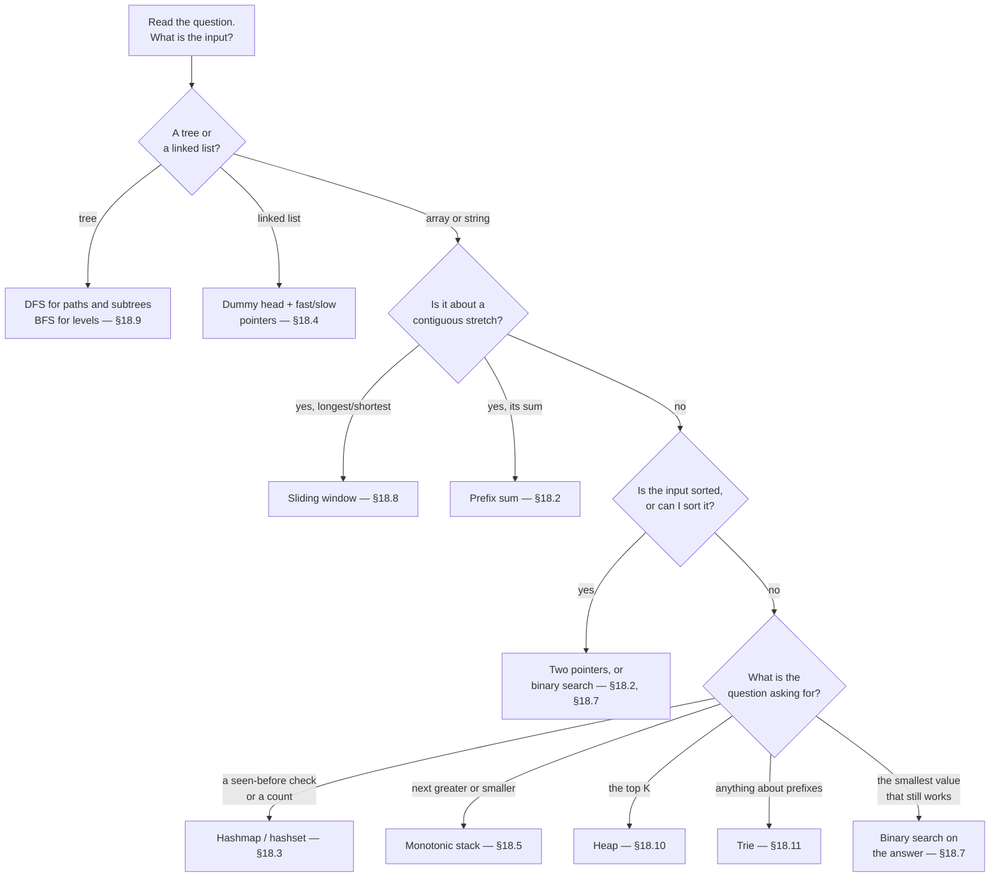
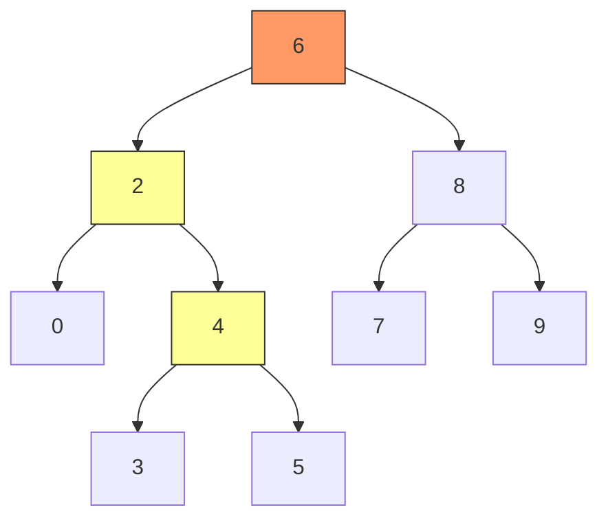

# DSA Foundations & Search — Google Interview Guide (Java)

> "The secret to solving interview problems fast: recognise the pattern in the first 30 seconds."

**What this chapter covers:** The nine templates that solve the overwhelming majority of Google's easy/medium coding rounds — two pointers, prefix sums, hashmaps, sliding windows, monotonic stacks, binary search, tree traversal, heaps and tries. Every pattern is taught the same way: *the problem, why the obvious answer is too slow, the one idea that fixes it, a dry run you can follow with your finger, then the Java.* Chapter 1 of the 4-part DSA sequence (31 / 31b / 31c / 31d); section numbers (§18.1 onward) continue across all four so cross-references stay valid.

---

## Start Here

### Pick a track — you do not have to read all of this

| Track | Time | Read this | Good for |
|-------|------|-----------|----------|
| **Speed run** | ~90 min | This Start Here page, then the **Key idea** + **Dry run** + **Java** of each pattern. Skip every collapsed block and every problem list. | First pass, or a week before the interview |
| **Mastery** | ~4 hr | Everything, plus the first five problems marked ⭐ in each problem list | Real preparation |
| **Refresh** | ~20 min | This page, then jump to the Cheat Sheet at the end | The night before |

### How every pattern is laid out

The same seven lines, every time, so you always know where to look. **Nothing asks you to read code before you know what it does.**

| Line | What it gives you |
|------|-------------------|
| **Problem** | one sentence, plus a tiny example with its answer |
| **Brute force** | the obvious way, and the exact reason it is too slow |
| **Key idea** | the single observation that kills the brute force |
| **Dry run** | that idea happening, one step per row, on the tiny example |
| **Java** | the code — read last, when you already know what it will say |
| **Cost** | time and space, one line |
| **Trap** | the mistake that silently produces a wrong answer |

### How to read a dry run

Every dry run opens with the call and the answer — so you are never in suspense — then walks one step per row.

> **DRY RUN — `maxSubArray([-2, 1, -3, 4])` → 4**
> *invariant: `current` is the best sum of a run that ends exactly at `i`*
>
> | i | nums[i] | extend (`current + nums[i]`) | start fresh (`nums[i]`) | current | best |
> |---|---------|------------------------------|-------------------------|---------|------|
> | 0 | -2 | — | — | -2 | -2 |
> | 1 | 1 | -1 | **1** | 1 | 1 |
> | 2 | -3 | **-2** | -3 | -2 | 1 |
> | 3 | 4 | 2 | **4** | 4 | **4** |
>
> *ends right: every run must end somewhere, and we checked every possible ending.*

Three things are always there: the **invariant** (what stays true after every row), **bold** on the branch that was taken, and an *ends right* line explaining why the loop's last state is the answer. Where the shape of the data matters more than the numbers — windows, stacks, pointers — you get a picture strip instead; where the code recurses, you get a call tree.

### The nine templates


| # | When the question says… | Reach for | Cost | Section |
|---|--------------------------|-----------|------|---------|
| 1 | sorted array, find a pair | Two pointers, converging | O(n) | §18.2 |
| 2 | remove / move / compact in place | Two pointers, same direction | O(n) | §18.2 |
| 3 | sum or count over a range | Prefix sum | O(n) | §18.2 |
| 4 | "have I seen this before?" | Hashmap / hashset | O(n) | §18.3 |
| 5 | longest / shortest **contiguous** run | Sliding window | O(n) | §18.8 |
| 6 | next greater, next smaller, brackets | Monotonic stack | O(n) | §18.5 |
| 7 | sorted input, **or** "smallest value that still works" | Binary search | O(log n) | §18.7 |
| 8 | top K, K closest, running median | Heap | O(n log k) | §18.10 |
| 9 | prefix, autocomplete, dictionary | Trie | O(word length) | §18.11 |

Linked lists (§18.4), sorting (§18.6) and trees (§18.9) are data structures rather than triggers — they show up when the input *is* a list or a tree.

### The 30-second decision, as a flowchart



> **The one habit that matters.** Before writing anything, say out loud: *"This is a &lt;template&gt; problem, it will cost O(…), and the thing I have to be careful about is …"* Interviewers score the recognition, not the typing.

---

## Table of Contents

| Part | Topic | Sections |
|------|-------|----------|
| 1 | Foundations | §18.1–18.6: Big-O, Arrays, Hashmaps, Linked Lists, Stacks, Sorting |
| 2 | Search & Trees | §18.7–18.11: Binary Search, Sliding Window, Trees, Heaps, Tries |
| — | Revision | Cheat sheet, 20-minute refresh, spaced-repetition plan (unnumbered, at the end) |

**Continues in:** [31b — Graphs](#content/31b_dsa_graphs) → [31c — Dynamic Programming](#content/31c_dynamic_programming) → [31d — Advanced Patterns & ML Coding](#content/31d_dsa_advanced_ml_coding)

---

# PART 1: FOUNDATIONS

---

## 18.1 Big-O Complexity

**Simple explanation.** Big-O answers one question: *when the input gets bigger, how much worse does this get?* It ignores constants and hardware and keeps only the growth shape — because at n = 1,000,000 the shape is the only thing that matters.

You need it for two practical reasons, both worth marks: the interviewer expects every answer to end with "this is O(…) time and O(…) space", and the constraint in the question ("n up to 100,000") silently tells you which pattern is allowed.


### The ladder

```
FAST ◄──────────────────────────────────────────────► SLOW

O(1)  O(log n)  O(n)  O(n log n)  O(n^2)  O(2^n)  O(n!)
 │       │        │       │          │       │       │
hash   binary   single  merge     nested  subsets  permu-
lookup  search   loop    sort      loops           tations
```

| Complexity | n=10 | n=100 | n=1,000 | n=1,000,000 | Typical Use |
|-----------|------|-------|---------|-------------|-------------|
| O(1) | 1 | 1 | 1 | 1 | Hash lookup, array index |
| O(log n) | 3 | 7 | 10 | 20 | Binary search |
| O(n) | 10 | 100 | 1,000 | 1,000,000 | Single scan |
| O(n log n) | 33 | 664 | 9,966 | 19,931,568 | Merge sort |
| O(n^2) | 100 | 10,000 | 1,000,000 | 10^12 TLE! | Nested loops |
| O(2^n) | 1,024 | 10^30 | -- | -- | Subsets |
| O(n!) | 3.6M | -- | -- | -- | Permutations |

Read the O(n^2) row twice. At n = 1,000 it is a million steps and instant; at n = 1,000,000 it is 10^12 and your solution never returns. Same code, same complexity — only the constraint changed.

### Will my solution time out? The 10^8 rule

A judge (and an interviewer's patience) runs roughly **10^8 simple operations per second**. Work backwards from the constraint:

| n (input size) | Slowest shape you can still use | So reach for |
|---------------|--------------------------------|--------------|
| n ≤ 10 | O(n!) | brute force, permutations |
| n ≤ 20 | O(2^n) | subsets, backtracking, bitmask |
| n ≤ 500 | O(n^3) | triple loop, interval DP |
| n ≤ 10,000 | O(n^2) | nested loops are fine |
| n ≤ 1,000,000 | O(n log n) | sort, heap, binary search |
| n ≤ 100,000,000 | O(n) | one pass: two pointers, window, hashmap |
| n > 10^8 | O(log n) or O(1) | binary search, maths |

> **Use it in reverse, out loud.** "n is 100,000, so O(n^2) is 10^10 and dies — I need O(n) or O(n log n). Sorting is allowed. Let me look for a one-pass or sort-based idea." That sentence is half the solution and it takes five seconds.

### Amortised: the occasional expensive step that does not count

`ArrayList.add()` is O(1) almost always, but when the backing array fills it doubles and copies everything — that one add is O(n). Spread over the n adds that had to happen first, it averages out to **amortised O(1)**. Same argument makes the monotonic stack (§18.5) and the sliding window (§18.8) O(n) even though they contain inner loops.

### Three traps that cost real marks

> **Trap — the hidden O(n) inside a loop.** `s += c` in Java builds a whole new String every time, turning an innocent loop into O(n^2). Use `StringBuilder`. The same goes for `list.remove(0)` on an `ArrayList` and `list.contains()` inside a loop.

> **Trap — recursion is not free space.** Depth-d recursion holds d stack frames, so a DFS on a 100,000-node skewed tree is O(n) space and can genuinely StackOverflow. Say "O(h) stack space" when you describe a tree solution.

> **Trap — quoting the average as though it were the worst.** HashMap is O(1) *average*, O(n) worst. Quicksort is O(n log n) *average*, O(n^2) worst. Name both; interviewers listen for it.

---

## 18.2 Arrays & Strings

**Simple explanation.** An array is a row of numbered boxes you can open instantly by number. Almost every array trick is the same trick: *stop looking at pairs, and instead walk the row once while remembering something.* What you remember — a second position, a running total, a best-so-far — is what names the pattern.

At least 40% of interview problems are array or string problems, and strings in Java are arrays wearing a coat (`s.toCharArray()` whenever you need to change one).


### Pattern 1: Two Pointers (Converging)

**Problem.** A **sorted** array and a target. Find the two values that add up to the target. `[2, 7, 11, 15]`, target `9` → indices `[0, 1]`.

**Brute force.** Try every pair — O(n^2). At n = 100,000 that is 10^10 operations, far past the 10^8 budget.

**Key idea.** Put one finger on the smallest value and one on the largest. That pair is the **largest sum this left finger can ever make**. So if the sum is too big, no partner for the right value exists — retire it and step right inward. If the sum is too small, no partner for the left value exists — step left outward. Every move eliminates a whole row or column of the pair table, so one pass is enough. *Sorted order is the entire reason this is safe.*

**DRY RUN — `twoSumSorted([2, 7, 11, 15], 9)` → `[0, 1]`**
*invariant: the answer, if it exists, is always still between `left` and `right`*

| left | right | sum | vs 9 | what that proves | move |
|------|-------|-----|------|------------------|------|
| 0 → 2 | 3 → 15 | 17 | too big | 15 is too big for **any** partner | `right--` |
| 0 → 2 | 2 → 11 | 13 | too big | 11 is too big for **any** partner | `right--` |
| 0 → 2 | 1 → 7 | 9 | **equal** | found it | return `[0, 1]` |

*ends right: each step discards a value that provably cannot be in the answer, so nothing is missed.*

```java
// Two-sum on sorted array — O(n) time, O(1) space
public int[] twoSumSorted(int[] nums, int target) {
    int left = 0, right = nums.length - 1;
    while (left < right) {                       // < , not <= : an element can't pair with itself
        int sum = nums[left] + nums[right];
        if (sum == target) return new int[]{left, right};
        else if (sum < target) left++;           // need a bigger sum
        else right--;                            // need a smaller sum
    }
    return new int[]{-1, -1};
}
```

**Cost.** O(n) time — the two pointers together move n steps. O(1) space.

> **Trap:** `while (left < right)`, never `<=`. With `<=` the pointers can land on the same element and you return a "pair" that is one number used twice.

**Same shape, different question — Container With Most Water.** Water held = `min(height[left], height[right]) × width`. Moving the **taller** wall inward can never help: the shorter wall still caps the height and the width just shrank. So always move the shorter wall — the only move that could possibly improve things.

```java
// Container with most water — O(n) time, O(1) space
public int maxArea(int[] height) {
    int left = 0, right = height.length - 1, maxWater = 0;
    while (left < right) {
        int water = Math.min(height[left], height[right]) * (right - left);
        maxWater = Math.max(maxWater, water);
        if (height[left] < height[right]) left++;   // move the shorter wall
        else right--;
    }
    return maxWater;
}
// height = [1,8,6,2,5,4,8,3,7] → 49, between index 1 and 8: min(8,7) * 7
```

**Practice:** [Two Sum II — Input Array Is Sorted →](#dsa-problem-two-sum-ii-sorted) · [Container With Most Water →](#dsa-problem-container-with-most-water)

### Pattern 2: Two Pointers (Same Direction)

**Problem.** A sorted array with duplicates. Delete the duplicates **in place** and return how many unique values remain. `[1, 1, 2, 2, 3]` → `3`, with the array starting `[1, 2, 3, …]`.

**Brute force.** Copy the uniques into a new array or a `LinkedHashSet` — O(n) extra space, and the question explicitly forbids it.

**Key idea.** Give the two pointers *jobs* rather than positions. A **reader** visits every element in turn. A **writer** marks the last slot of the finished answer. The reader always moves; the writer only moves when the reader finds something new, and then the new value is copied back onto the writer's slot. Everything at or before `write` is permanently correct.

**DRY RUN — `removeDuplicates([1, 1, 2, 2, 3])` → `3`**
*invariant: `nums[0..write]` holds the unique values found so far, in order*

| read | nums[read] | vs nums[write] | action | array after | write |
|------|-----------|----------------|--------|-------------|-------|
| 1 | 1 | `== 1` | duplicate — reader moves on | `[1, 1, 2, 2, 3]` | 0 |
| 2 | 2 | `!= 1` | **new value** — write it | `[1, 2, 2, 2, 3]` | 1 |
| 3 | 2 | `== 2` | duplicate — reader moves on | `[1, 2, 2, 2, 3]` | 1 |
| 4 | 3 | `!= 2` | **new value** — write it | `[1, 2, 3, 2, 3]` | 2 |

*ends right: the reader saw every element, so every unique value was offered to the writer exactly once. `write = 2`, so the answer is `write + 1 = 3` and `[1, 2, 3]` sits at the front.*

```java
// Remove duplicates from sorted array — O(n) time, O(1) space
public int removeDuplicates(int[] nums) {
    if (nums.length == 0) return 0;
    int slow = 0;                                    // the writer
    for (int fast = 1; fast < nums.length; fast++) { // the reader
        if (nums[fast] != nums[slow]) {
            nums[++slow] = nums[fast];               // advance first, then write
        }
    }
    return slow + 1;                                 // a count, not an index
}
```

**Cost.** O(n) time, O(1) space.

> **Trap:** return `slow + 1`, not `slow`. `slow` is the last written *index*; the count is one more. The same off-by-one appears in Move Zeroes and Remove Element.

**Practice:** [Remove Duplicates from Sorted Array →](#dsa-problem-remove-duplicates-sorted-array)

### Pattern 3: Prefix Sum

**Problem.** Answer sum-over-a-range questions without re-adding the range each time. The interview version: *how many subarrays of `nums` add up to exactly `k`?* `[1, 1, 1]`, `k = 2` → `2`.

**Brute force.** For every start, walk every end and keep a running sum — O(n^2). Fine at n = 1,000, dead at n = 100,000.

**Key idea.** Add everything up **once**, front to back, keeping the running total at each position. Then the sum of any range is a single subtraction: *(everything up to the end) − (everything before the start)*.


```
Array:     [3, 1, 4, 1, 5, 9]
Prefix:  [0, 3, 4, 8, 9, 14, 23]    ← starts with 0, meaning "nothing added yet"

sum(1..3) = nums[1]+nums[2]+nums[3] = 1+4+1 = 6
          = prefix[4] - prefix[1]   =   9  -  3  = 6      ✓
```

**The twist that solves the interview version.** You want `prefix[end] − prefix[start] == k`. Rearrange it: `prefix[start] == prefix[end] − k`. So while scanning, you do not need the starts at all — you only need to know **how many earlier prefixes had the value `sum − k`**. That is a hashmap lookup, and the O(n^2) collapses to O(n).

**DRY RUN — `subarraySum([1, 1, 1], 2)` → `2`**
*invariant: `seen` holds how many times each running total has occurred so far, including the empty prefix*

| num | running sum | looking for `sum - 2` | how many seen | count | `seen` after |
|-----|-------------|----------------------|---------------|-------|--------------|
| — | 0 | — | — | 0 | `{0: 1}` |
| 1 | 1 | -1 | 0 | 0 | `{0:1, 1:1}` |
| 1 | 2 | 0 | **1** | 1 | `{0:1, 1:1, 2:1}` |
| 1 | 3 | 1 | **1** | 2 | `{0:1, 1:1, 2:1, 3:1}` |

*ends right: every subarray has exactly one end index, and at each end we counted every valid start.*

```java
// Subarray sum equals K — O(n) time, O(n) space
public int subarraySum(int[] nums, int k) {
    Map<Integer, Integer> prefixCount = new HashMap<>();
    prefixCount.put(0, 1);                  // the empty prefix has sum 0, and it counts
    int sum = 0, count = 0;
    for (int num : nums) {
        sum += num;
        count += prefixCount.getOrDefault(sum - k, 0);
        prefixCount.merge(sum, 1, Integer::sum);
    }
    return count;
}
```

**Cost.** O(n) time, O(n) space.

> **Trap:** forgetting `prefixCount.put(0, 1)`. Without it every subarray that starts at index 0 is missed — and the bug is invisible on most test cases.

> **When to reach for it:** the question mentions a sum or a count over a range, *especially* repeatedly. If you catch yourself writing a nested loop that re-adds overlapping elements, stop and build a prefix array.

**Practice:** [Subarray Sum Equals K →](#dsa-problem-subarray-sum-equals-k)

### Pattern 4: Kadane's Algorithm (Maximum Subarray)

**Problem.** Find the largest sum of any contiguous run. `[-2, 1, -3, 4, -1, 2]` → `5` (the run `[4, -1, 2]`).

**Brute force.** Try every start and end — O(n^2).

**Key idea.** Walk the array once and, at each position, answer exactly one question: *is the best run that ends **here** made by extending the previous run, or by starting fresh at me?* If the previous running sum is negative it can only hurt, so you drop it. Keep `best` separately, because the best run may have ended long ago.

**DRY RUN — `maxSubArray([-2, 1, -3, 4, -1, 2])` → `5`**
*invariant: `current` = best sum of a run ending exactly at `i`; `best` = best run seen anywhere*

| i | nums[i] | extend (`current + nums[i]`) | start fresh (`nums[i]`) | current | best |
|---|---------|------------------------------|-------------------------|---------|------|
| 0 | -2 | — | — | -2 | -2 |
| 1 | 1 | -1 | **1** | 1 | 1 |
| 2 | -3 | **-2** | -3 | -2 | 1 |
| 3 | 4 | 2 | **4** | 4 | 4 |
| 4 | -1 | **3** | -1 | 3 | 4 |
| 5 | 2 | **5** | 2 | 5 | **5** |

*ends right: every run ends at some index, and we computed the best run for every possible ending.*

```java
// Kadane's — O(n) time, O(1) space
public int maxSubArray(int[] nums) {
    int current = nums[0], best = nums[0];       // NOT 0 — see the trap
    for (int i = 1; i < nums.length; i++) {
        current = Math.max(nums[i], current + nums[i]);
        best = Math.max(best, current);
    }
    return best;
}
```

**Cost.** O(n) time, O(1) space.

> **Trap:** initialising `best = 0`. On an all-negative array like `[-3, -1, -2]` that returns 0 — a subarray that does not exist. Start both variables at `nums[0]`.

**Practice:** [Maximum Subarray (Kadane's Algorithm) →](#dsa-problem-maximum-subarray)

### Pattern 5: Dutch National Flag (Three-Way Partition)

**Problem.** An array containing only `0`, `1` and `2`. Sort it **in one pass, in place**. `[2, 0, 2, 1, 1, 0]` → `[0, 0, 1, 1, 2, 2]`.

**Brute force.** `Arrays.sort()` is O(n log n) and ignores the structure; counting the three values and overwriting works but takes two passes. The interviewer wants one.

**Key idea.** Grow three regions at once: `0`s at the front, `2`s at the back, and a scanner in between. `low` marks the end of the `0`s, `high` marks the start of the `2`s, and `mid` is the value you are currently looking at. Sending a value to the front is safe because it came from already-scanned territory — but a value swapped in **from the back has never been looked at**, so `mid` must stay put and re-examine it.

**DRY RUN — `sortColors([2, 0, 2, 1, 1, 0])` → `[0, 0, 1, 1, 2, 2]`**
*invariant: `[0..low)` is all 0s, `[low..mid)` is all 1s, `(high..end]` is all 2s, and `[mid..high]` is unexamined*

| nums[mid] | rule | swap | array after | low | mid | high |
|-----------|------|------|-------------|-----|-----|------|
| 2 | send to the back, **don't advance mid** | `mid ↔ high` | `[0, 0, 2, 1, 1, 2]` | 0 | 0 | 4 |
| 0 | send to the front, advance both | `low ↔ mid` | `[0, 0, 2, 1, 1, 2]` | 1 | 1 | 4 |
| 0 | send to the front, advance both | `low ↔ mid` | `[0, 0, 2, 1, 1, 2]` | 2 | 2 | 4 |
| 2 | send to the back, **don't advance mid** | `mid ↔ high` | `[0, 0, 1, 1, 2, 2]` | 2 | 2 | 3 |
| 1 | already where it belongs | — | `[0, 0, 1, 1, 2, 2]` | 2 | 3 | 3 |
| 1 | already where it belongs | — | `[0, 0, 1, 1, 2, 2]` | 2 | 4 | 3 |

*ends right: `mid > high` means the unexamined region is empty, so all three regions are complete.*

```java
// Sort Colors — O(n) time, O(1) space
public void sortColors(int[] nums) {
    int low = 0, mid = 0, high = nums.length - 1;
    while (mid <= high) {
        if (nums[mid] == 0) swap(nums, low++, mid++);
        else if (nums[mid] == 1) mid++;
        else swap(nums, mid, high--);      // 2: don't advance mid — the new value is unseen
    }
}
private void swap(int[] a, int i, int j) {
    int tmp = a[i]; a[i] = a[j]; a[j] = tmp;
}
```

**Cost.** O(n) time, O(1) space, one pass.

> **Trap:** advancing `mid` after the `2`-swap. The value that arrived from the back has never been examined — skip it and 0s get stranded in the middle.

**Practice:** [Sort Colors →](#dsa-problem-sort-colors)

### 60-second recall

<details>
<summary>1. You are given an <strong>unsorted</strong> array and asked for a pair summing to a target. Why is converging two-pointers wrong, and what replaces it?</summary>

Converging pointers rely on sorted order to know which side to move — unsorted, "too big" tells you nothing. Use a hashmap (§18.3) for O(n), or sort first and then use two pointers if you also need O(1) space and don't mind O(n log n).
</details>

<details>
<summary>2. Which two patterns here answer "sum over a range", and how do you choose?</summary>

Prefix sum for **any** subarray sum or count. Kadane for the **maximum** subarray sum specifically. If the question says "at most k" or "contiguous and longest", it is actually a sliding window (§18.8).
</details>

<details>
<summary>3. Subarray or subsequence — why does the word matter so much?</summary>

A **subarray** is contiguous, so windows, prefix sums and two pointers apply. A **subsequence** may skip elements, which almost always means dynamic programming (§18.15 in chapter 31c). Misreading this one word sends you down the wrong chapter.
</details>

### Two habits worth keeping

- **Strings are arrays.** `s.toCharArray()` the moment you need to mutate; `StringBuilder` the moment you need to append in a loop.
- **"Can I sort first?"** should be one of your first three thoughts. Sorting costs O(n log n) and frequently unlocks a two-pointer or greedy solution — which is cheaper than the O(n^2) you were about to write.

### Key Problems — Detailed Solutions

<details>
<summary><strong>3Sum</strong> — Medium</summary>

**Problem:** Given an integer array `nums`, find all unique triplets `[nums[i], nums[j], nums[k]]` such that `i != j != k` and `nums[i] + nums[j] + nums[k] == 0`.

**Example:**
Input: nums = [-1, 0, 1, 2, -1, -4]
Output: [[-1, -1, 2], [-1, 0, 1]]

**Approach:** Sort the array. Fix one element, then use two pointers on the remaining portion to find pairs that sum to the negative of the fixed element. Skip duplicates at each level.

**Java:**
```java
public List<List<Integer>> threeSum(int[] nums) {
    Arrays.sort(nums);
    List<List<Integer>> res = new ArrayList<>();
    for (int i = 0; i < nums.length - 2; i++) {
        if (i > 0 && nums[i] == nums[i - 1]) continue; // skip dup
        int lo = i + 1, hi = nums.length - 1;
        while (lo < hi) {
            int sum = nums[i] + nums[lo] + nums[hi];
            if (sum == 0) {
                res.add(List.of(nums[i], nums[lo], nums[hi]));
                while (lo < hi && nums[lo] == nums[lo + 1]) lo++;
                while (lo < hi && nums[hi] == nums[hi - 1]) hi--;
                lo++; hi--;
            } else if (sum < 0) lo++;
            else hi--;
        }
    }
    return res;
}
// Time: O(n^2)  Space: O(1) excluding output
```

**Complexity:** O(n^2) time, O(1) space (excluding output)
</details>

<details>
<summary><strong>Product of Array Except Self</strong> — Medium</summary>

**Problem:** Given an integer array `nums`, return an array `answer` where `answer[i]` is the product of all elements except `nums[i]`. You must not use division and run in O(n).

**Example:**
Input: nums = [1, 2, 3, 4]
Output: [24, 12, 8, 6]

**Approach:** Two passes. First pass (left to right) builds prefix products. Second pass (right to left) multiplies in suffix products. Each element gets the product of everything before it times everything after it.

**Java:**
```java
public int[] productExceptSelf(int[] nums) {
    int n = nums.length;
    int[] ans = new int[n];
    ans[0] = 1;
    for (int i = 1; i < n; i++)
        ans[i] = ans[i - 1] * nums[i - 1];   // prefix product
    int suffix = 1;
    for (int i = n - 1; i >= 0; i--) {
        ans[i] *= suffix;
        suffix *= nums[i];                     // suffix product
    }
    return ans;
}
// Time: O(n)  Space: O(1) excluding output
```

**Complexity:** O(n) time, O(1) space (output array not counted)
</details>

<details>
<summary><strong>Trapping Rain Water</strong> — Hard</summary>

**Problem:** Given `n` non-negative integers representing an elevation map where the width of each bar is 1, compute how much water it can trap after raining.

**Example:**
Input: height = [0, 1, 0, 2, 1, 0, 1, 3, 2, 1, 2, 1]
Output: 6

**Approach:** Two pointers from both ends. Track leftMax and rightMax. Water at any position = min(leftMax, rightMax) - height[i]. Process the side with the smaller max since that determines the water level.

**Java:**
```java
public int trap(int[] height) {
    int l = 0, r = height.length - 1;
    int leftMax = 0, rightMax = 0, water = 0;
    while (l < r) {
        if (height[l] < height[r]) {
            leftMax = Math.max(leftMax, height[l]);
            water += leftMax - height[l];
            l++;
        } else {
            rightMax = Math.max(rightMax, height[r]);
            water += rightMax - height[r];
            r--;
        }
    }
    return water;
}
// Time: O(n)  Space: O(1)
```

**Complexity:** O(n) time, O(1) space
</details>

### Problem List

**Start with these five:** Two Sum II (Sorted) · Valid Palindrome · Maximum Subarray · Product of Array Except Self · 3Sum. They cover all five patterns above; the rest are variations.

| # | Problem | Difficulty | Pattern | Key Insight |
|---|---------|-----------|---------|-------------|
| 1 | Two Sum II (Sorted) | Easy | Two Ptr (converging) | Sorted -> two pointers |
| 2 | Valid Palindrome | Easy | Two Ptr (converging) | Skip non-alphanumeric |
| 3 | Move Zeroes | Easy | Two Ptr (same dir) | Slow = write position |
| 4 | Remove Duplicates | Easy | Two Ptr (same dir) | Compare slow vs fast |
| 5 | Best Time Buy/Sell Stock | Easy | Kadane variant | Track min price so far |
| 6 | Maximum Subarray | Easy | Kadane | Textbook Kadane's |
| 7 | Running Sum of Array | Easy | Prefix Sum | Direct prefix sum |
| 8 | Merge Sorted Array | Easy | Two Ptr (reverse) | Fill from the end |
| 9 | Container With Most Water | Medium | Two Ptr (converging) | Move shorter side |
| 10 | 3Sum | Medium | Sort + Two Ptr | Fix one, two-ptr rest |
| 11 | Product of Array Except Self | Medium | Prefix/Suffix | Left pass, right pass |
| 12 | Sort Colors | Medium | Dutch National Flag | Three-way partition |
| 13 | Subarray Sum Equals K | Medium | Prefix Sum + Map | Count prefix diffs |
| 14 | Rotate Array | Medium | Reverse trick | Reverse all, then parts |
| 15 | Next Permutation | Medium | Two Ptr + Sort | Find rightmost ascent |
| 16 | Longest Consecutive Sequence | Medium | HashSet | Check if num-1 exists |
| 17 | Trapping Rain Water | Hard | Two Ptr / Stack | Min of left/right max |
| 18 | First Missing Positive | Hard | Cyclic Sort | Place num at index num-1 |
| 19 | Median of Two Sorted Arrays | Hard | Binary Search | Partition both arrays |
| 20 | Minimum Window Substring | Hard | Sliding Window + Map | Covered in 18.8 |

---

## 18.3 Hashmaps & Sets

**Simple explanation.** A hashmap is a coat-check counter. You hand it a key, it computes a ticket number, and it goes straight to that one hook — it never searches the whole rack. That is why lookup, insert and delete are all O(1) on average.

This is the single most useful structure in interviews, and it has one signature use: **whenever a nested loop exists only to answer "have I seen this before?", a hashmap deletes the inner loop** and turns O(n^2) into O(n).


You are expected to be able to explain the mechanism in 30 seconds: hash the key, wrap it onto a bucket, and if two keys share a bucket they form a short chain. Past roughly three-quarters full the table doubles and re-files everything (rare, so inserts stay amortised O(1)); in Java 8+ a chain longer than eight becomes a red-black tree, capping the worst case at O(log n) instead of O(n).

### Pattern 1: Complement Lookup (Two Sum)

**Problem.** An **unsorted** array and a target. Return the indices of the two values that add to it. `[2, 7, 11, 15]`, target `9` → `[0, 1]`.

**Brute force.** Every pair — O(n^2).

**Key idea.** Turn the question inside out. Instead of hunting for *two* numbers, stand on one number and ask: *"the partner I need is exactly `target - me` — have I already walked past it?"* There is only ever one possible partner, and a hashmap answers "have I seen this" instantly. One pass, no pairs.

**DRY RUN — `twoSum([2, 7, 11, 15], 9)` → `[0, 1]`**
*invariant: `seen` holds every value to the left of `i`, mapped to its index*

| i | nums[i] | partner needed | already in `seen`? | action |
|---|---------|----------------|--------------------|--------|
| 0 | 2 | 9 − 2 = 7 | no | remember `2 → 0` |
| 1 | 7 | 9 − 7 = 2 | **yes, at index 0** | return `[0, 1]` |

*ends right: every pair has a right-hand element, and when we stand on it the left-hand one is already in the map.*

```java
// Two Sum — O(n) time, O(n) space
public int[] twoSum(int[] nums, int target) {
    Map<Integer, Integer> seen = new HashMap<>();
    for (int i = 0; i < nums.length; i++) {
        int complement = target - nums[i];
        if (seen.containsKey(complement)) return new int[]{seen.get(complement), i};
        seen.put(nums[i], i);                 // store AFTER checking — see the trap
    }
    return new int[]{-1, -1};
}
```

**Cost.** O(n) time, O(n) space — the classic trade: memory buys you the missing loop.

> **Trap:** put the value in the map *after* the check, never before. Store first and `[3, 4]` with target `6` "finds" the pair `(3, 3)` using index 0 twice.

**Practice:** [Two Sum →](#dsa-problem-two-sum)

### Pattern 2: Frequency Counting

**Problem.** Are two strings anagrams of each other? `"abb"`, `"bab"` → `true`.

**Brute force.** Sort both strings and compare — O(n log n). Correct, but beatable.

**Key idea.** An anagram has nothing to do with order, only with **how many of each letter**. So count up for the first string and count down for the second in the same pass; if every counter lands back on zero, the multisets are identical. For lowercase a–z, a 26-slot array beats a HashMap outright — no hashing, no boxing.

**DRY RUN — `isAnagram("abb", "bab")` → `true`**
*invariant: `count[c]` = (times `c` appeared in `s` so far) − (times it appeared in `t` so far)*

| i | `+` from s | `−` from t | count[a] | count[b] |
|---|-----------|------------|----------|----------|
| 0 | a | b | 1 | -1 |
| 1 | b | a | 0 | 0 |
| 2 | b | b | 0 | 0 |

*ends right: all counters are zero, so every letter appeared equally often in both — which is the definition of an anagram.*

```java
// Valid Anagram — O(n) time, O(1) space (26 counters)
public boolean isAnagram(String s, String t) {
    if (s.length() != t.length()) return false;      // cheap reject, and required
    int[] count = new int[26];
    for (int i = 0; i < s.length(); i++) {
        count[s.charAt(i) - 'a']++;
        count[t.charAt(i) - 'a']--;
    }
    for (int c : count) if (c != 0) return false;
    return true;
}
```

**Cost.** O(n) time, O(1) space.

> **Trap:** skipping the length check. Without it the single loop reads past the end of the shorter string, and `int[26]` silently breaks on uppercase or Unicode input — say "I'd switch to a `HashMap<Character, Integer>` if the alphabet isn't fixed" and the interviewer will nod.

**Practice:** [Valid Anagram →](#dsa-problem-valid-anagram)

### Pattern 3: Group by a Canonical Key

**Problem.** Group a list of words so anagrams sit together. `["eat", "tea", "tan", "ate", "nat", "bat"]` → `[["eat","tea","ate"], ["tan","nat"], ["bat"]]`.

**Brute force.** Compare every word against every other word — O(n^2) comparisons, each one itself O(k).

**Key idea.** Stop comparing items to each other. Instead, **transform each item into a key that every member of its group produces and nobody else does** — then the map does the grouping for free. For anagrams that key is the word's letters in sorted order: `eat`, `tea` and `ate` all become `aet`.

```
"eat" → sorted → "aet" → groups["aet"] = ["eat"]
"tea" → sorted → "aet" → groups["aet"] = ["eat", "tea"]
"ate" → sorted → "aet" → groups["aet"] = ["eat", "tea", "ate"]
"bat" → sorted → "abt" → groups["abt"] = ["bat"]           ← a different key, a new group
```

```java
// Group Anagrams — O(n * k log k) time, O(n * k) space  (k = word length)
public List<List<String>> groupAnagrams(String[] strs) {
    Map<String, List<String>> groups = new HashMap<>();
    for (String s : strs) {
        char[] sorted = s.toCharArray();
        Arrays.sort(sorted);
        groups.computeIfAbsent(new String(sorted), k -> new ArrayList<>()).add(s);
    }
    return new ArrayList<>(groups.values());
}
```

> **Worth saying out loud:** you can drop the `log k` by keying on a 26-length count signature instead of a sorted string — O(n·k). Mentioning the alternative is often worth more than coding it.

**The same idea elsewhere:** group by digit sum, by remainder mod k, by row-pattern in a grid. Whenever the question says "group", "bucket" or "how many identical…", ask *what key makes duplicates collide?*

**Practice:** [Group Anagrams →](#dsa-problem-group-anagrams)

### Pattern 4: Hashmap as the Window's Memory

A map paired with two pointers is the workhorse of substring problems — the map remembers what is currently inside the window (or where each character was last seen), so the window can be repaired in O(1) instead of rescanned.

That combination is a pattern in its own right and is taught in full, with a dry run, in **§18.8 Sliding Window**. The thing to carry forward from here is only this: *the map is the window's memory.*

### HashSet: Membership Without Order

**Problem.** Find the longest run of consecutive integers in an **unsorted** array. `[100, 4, 200, 1, 3, 2]` → `4` (the run `1, 2, 3, 4`).

**Brute force.** Sort, then scan for runs — O(n log n). The interviewer will ask for O(n).

**Key idea.** Put everything in a set so "does `x` exist?" is free. Now the trick: **only start counting from a number that begins a run** — that is, a number whose predecessor `n - 1` is missing. Numbers in the middle of a run are skipped entirely, so each run is walked exactly once. The inner `while` loop looks like it makes this O(n^2), but across the whole array it does at most n steps in total.

**DRY RUN — `longestConsecutive([100, 4, 200, 1, 3, 2])` → `4`**
*invariant: we only ever count upward from a genuine run start*

| n | is `n − 1` in the set? | start a run? | walk forward | run length | longest |
|---|----------------------|--------------|--------------|------------|---------|
| 100 | 99 — no | **yes** | 101? no | 1 | 1 |
| 4 | 3 — yes | no, skip | — | — | 1 |
| 200 | 199 — no | **yes** | 201? no | 1 | 1 |
| 1 | 0 — no | **yes** | 2 ✓ 3 ✓ 4 ✓ 5 ✗ | 4 | **4** |
| 3 | 2 — yes | no, skip | — | — | 4 |
| 2 | 1 — yes | no, skip | — | — | 4 |

*ends right: every run has exactly one start, and we walked every start to its end.*

```java
// Longest Consecutive Sequence — O(n) time, O(n) space
public int longestConsecutive(int[] nums) {
    Set<Integer> set = new HashSet<>();
    for (int n : nums) set.add(n);
    int longest = 0;
    for (int n : set) {
        if (!set.contains(n - 1)) {          // this guard is what keeps it O(n)
            int len = 1;
            while (set.contains(n + len)) len++;
            longest = Math.max(longest, len);
        }
    }
    return longest;
}
```

**Cost.** O(n) time, O(n) space.

> **Trap:** dropping the `!set.contains(n - 1)` guard. The answer stays correct and the complexity quietly becomes O(n^2) — the exact failure the interviewer is testing for. Also iterate the **set**, not the array, so duplicates don't re-walk the same run.

**Practice:** [Longest Consecutive Sequence →](#dsa-problem-longest-consecutive-sequence)

### 60-second recall

<details>
<summary>1. Your solution is O(n²) because an inner loop searches for something. What is the first thing to try?</summary>

A hashmap or hashset. Ask what the inner loop is really asking — "have I seen X?", "how many X are there?", "which group does X belong to?" — and store exactly that. Memory buys away the loop.
</details>

<details>
<summary>2. When is <code>int[26]</code> better than a <code>HashMap</code>, and when does it bite?</summary>

Better whenever the alphabet is small and fixed (lowercase a–z, digits, DNA bases): no hashing, no autoboxing, and O(1) space. It bites on uppercase, Unicode, or arbitrary keys — then you need the map.
</details>

<details>
<summary>3. Why can a <code>while</code> loop nested inside a <code>for</code> loop still be O(n)?</summary>

Because complexity counts *total* work, not nesting depth. In Longest Consecutive Sequence each value is visited by the inner walk at most once across the whole run. The same argument makes the monotonic stack (§18.5) and the sliding window (§18.8) linear.
</details>

### Java specifics worth memorising

- `map.merge(key, 1, Integer::sum)` — the cleanest increment-a-counter.
- `map.computeIfAbsent(key, k -> new ArrayList<>()).add(v)` — the cleanest group-by.
- `LinkedHashMap` preserves order and, with `accessOrder = true`, gives you an LRU cache almost for free.
- **Never use a mutable object (`int[]`, a list you later modify) as a key** — hashing happens on insert, so later mutations make the entry unreachable. Convert to a `String` or an immutable `List`.
- `map.get(missing)` returns `null`; unboxing that into an `int` throws NPE. Use `getOrDefault`.

### Key Problems — Detailed Solutions

<details>
<summary><strong>LRU Cache</strong> — Medium</summary>

**Problem:** Design a data structure that supports `get(key)` and `put(key, value)` in O(1) time. When capacity is exceeded, evict the least recently used key.

**Example:**
LRUCache cache = new LRUCache(2);
cache.put(1, 1); cache.put(2, 2);
cache.get(1);       // returns 1
cache.put(3, 3);    // evicts key 2
cache.get(2);       // returns -1 (not found)

**Approach:** Combine a HashMap (O(1) lookup) with a doubly linked list (O(1) insert/remove). On access, move the node to the front. On capacity overflow, remove from the tail.

**Java:**
```java
class LRUCache extends LinkedHashMap<Integer, Integer> {
    private int cap;
    public LRUCache(int capacity) {
        super(capacity, 0.75f, true); // accessOrder = true
        this.cap = capacity;
    }
    public int get(int key) {
        return super.getOrDefault(key, -1);
    }
    public void put(int key, int value) {
        super.put(key, value);
    }
    @Override
    protected boolean removeEldestEntry(Map.Entry<Integer, Integer> eldest) {
        return size() > cap;
    }
}
// Time: O(1) for both get and put  Space: O(capacity)
```

**Complexity:** O(1) time per operation, O(capacity) space
</details>

### Problem List

**Start with these five:** Two Sum · Valid Anagram · Group Anagrams · Top K Frequent Elements · Longest Consecutive Sequence.

| # | Problem | Difficulty | Pattern | Key Insight |
|---|---------|-----------|---------|-------------|
| 1 | Two Sum | Easy | Complement lookup | One-pass with map |
| 2 | Valid Anagram | Easy | Frequency count | int[26] is enough |
| 3 | Contains Duplicate | Easy | HashSet | set.add returns false |
| 4 | Ransom Note | Easy | Frequency count | Decrement and check |
| 5 | Intersection of Two Arrays | Easy | Two sets | Retain common elements |
| 6 | Longest Substring No Repeat | Medium | Window + Map | Track last seen index |
| 7 | Group Anagrams | Medium | Group by key | Sorted string as key |
| 8 | Top K Frequent Elements | Medium | Freq map + Heap/Bucket | Bucket sort is O(n) |
| 9 | Subarray Sum Equals K | Medium | Prefix sum + Map | Count prefix diffs |
| 10 | 4Sum II | Medium | Split + Map | Store pair sums |
| 11 | Encode and Decode Strings | Medium | Delimiter design | Length prefix encoding |
| 12 | LRU Cache | Medium | LinkedHashMap | Override removeEldest |
| 13 | Copy List with Random Pointer | Medium | Old->New map | Two-pass cloning |
| 14 | Minimum Window Substring | Hard | Window + Freq map | Maintain "have" vs "need" |
| 15 | Alien Dictionary | Hard | Map + Topo sort | Build graph from words |

---

## 18.4 Linked Lists

**Simple explanation.** A linked list is a treasure hunt. Each node holds a value and the location of the next clue. You cannot jump to the middle — you can only walk from the start. Every linked-list trick exists to work around that one limitation, and nearly all of them are *"use a second pointer."*

```java
public class ListNode {
    int val;
    ListNode next;
    ListNode(int val) { this.val = val; }
    ListNode(int val, ListNode next) { this.val = val; this.next = next; }
}
```

> **Two habits that prevent most linked-list bugs:** draw four nodes on paper before writing anything, and reach for a **dummy head** (`dummy -> head`, return `dummy.next`) the moment the first node might be deleted or replaced. The dummy removes every "but what if it's the head?" special case.

### Pattern 1: Fast & Slow Pointers (Floyd's)

**Problem A.** Return the middle node. `1 → 2 → 3 → 4 → 5` → the node `3`.

**Brute force.** Walk once to count the length, then walk again to position `n/2`. Two passes, and it fails if you are only handed a stream.

**Key idea.** Send two walkers at different speeds — one step and two steps. When the fast one falls off the end, it has covered twice the ground, so the slow one is standing exactly halfway. One pass, no counting.


**DRY RUN — `findMiddle(1 → 2 → 3 → 4 → 5)` → node `3`**
*invariant: `fast` has always travelled exactly twice as far as `slow`*

| step | slow | fast | loop test |
|------|------|------|-----------|
| start | 1 | 1 | continue |
| 1 | 2 | 3 | continue |
| 2 | 3 | 5 | `fast.next == null` → **stop** |

*ends right: `fast` covered 4 edges, `slow` covered 2 — half of 4. `slow` is the middle.*

```java
// Find middle — O(n) time, O(1) space
public ListNode findMiddle(ListNode head) {
    ListNode slow = head, fast = head;
    while (fast != null && fast.next != null) {   // this order matters — see the trap
        slow = slow.next;
        fast = fast.next.next;
    }
    return slow;
}
```

**Problem B.** Does the list contain a cycle, and where does it start? `1 → 2 → 3 → 4 → 5 → 6 → (back to 3)` → the node `3`.

**Brute force.** Store every visited node in a `HashSet` — O(n) space. It works, and the interviewer will immediately ask for O(1).

**Key idea.** On a straight road the fast walker simply finishes. On a loop it *cannot* finish — so it must eventually lap the slow one. **If they ever stand on the same node, a cycle exists.** Then the second, stranger half: reset one walker to the head, move both at the **same** speed, and they meet exactly at the cycle's entrance.

**DRY RUN — `detectCycleStart(1 → 2 → 3 → 4 → 5 → 6 → 3)` → node `3`**

| phase | step | slow | fast | note |
|-------|------|------|------|------|
| find | 0 | 1 | 1 | both at the head |
| find | 1 | 2 | 3 | |
| find | 2 | 3 | 5 | |
| find | 3 | 4 | 3 | fast wrapped around the loop |
| find | 4 | **5** | **5** | same node → a cycle exists |
| locate | reset | 1 | 5 | slow goes back to the head, both now move 1 step |
| locate | 1 | 2 | 6 | |
| locate | 2 | **3** | **3** | the cycle entrance |

```java
// Detect cycle start — O(n) time, O(1) space
public ListNode detectCycleStart(ListNode head) {
    ListNode slow = head, fast = head;
    while (fast != null && fast.next != null) {
        slow = slow.next;
        fast = fast.next.next;
        if (slow == fast) {                 // phase 1: a cycle exists
            slow = head;                    // phase 2: find where it starts
            while (slow != fast) { slow = slow.next; fast = fast.next; }
            return slow;
        }
    }
    return null;                            // fast reached the end — no cycle
}
```

**Cost.** O(n) time, O(1) space — both phases.

> **Trap:** `while (fast != null && fast.next != null)` in exactly that order. Java short-circuits `&&`, so the null check on `fast` must come first or `fast.next` throws on the last node.

**Practice:** [Middle of the Linked List →](#dsa-problem-middle-of-linked-list) · [Linked List Cycle II →](#dsa-problem-linked-list-cycle-ii)

### Pattern 2: Reversal

**Problem.** Reverse a singly linked list. `1 → 2 → 3` → `3 → 2 → 1`.

**Brute force.** Push every node onto a stack, or copy the values into a list and rewrite them — O(n) extra space.

**Key idea.** Walk the list once and flip each arrow to point backwards. The catch: the instant you overwrite `curr.next`, the rest of the list becomes unreachable — so **save the next node first**. That is why this needs exactly three references: `prev`, `curr`, and a temporary `next`.

**DRY RUN — `reverseList(1 → 2 → 3)` → `3 → 2 → 1`**
*invariant: `prev` heads the reversed part, `curr` heads the not-yet-touched part*

| prev | curr | `next` saved | arrow flipped | list so far |
|------|------|--------------|---------------|-------------|
| null | 1 | 2 | `1 → null` | `1` \| `2 → 3` |
| 1 | 2 | 3 | `2 → 1` | `2 → 1` \| `3` |
| 2 | 3 | null | `3 → 2` | `3 → 2 → 1` \| — |
| 3 | null | — | — | done |

*ends right: `curr` is null, so every node was flipped, and `prev` is the last node reached — the new head.*

```java
public ListNode reverseList(ListNode head) {
    ListNode prev = null, curr = head;
    while (curr != null) {
        ListNode next = curr.next;   // save it BEFORE you destroy it
        curr.next = prev;            // flip
        prev = curr;                 // shuffle both forward
        curr = next;
    }
    return prev;                     // NOT curr — curr is null here
}
```

**Cost.** O(n) time, O(1) space.

> **Trap:** returning `curr`. When the loop ends `curr` is `null`; the new head is `prev`. This is a building block for Reorder List, Palindrome Linked List and Reverse Nodes in k-Group — get it wrong and three problems break.

**Practice:** [Reverse Linked List →](#dsa-problem-reverse-linked-list)

### Pattern 3: Merge Two Sorted Lists

**Problem.** Splice two sorted lists into one sorted list. `1 → 2 → 4` and `1 → 3 → 4` → `1 → 1 → 2 → 3 → 4 → 4`.

**Key idea.** Exactly the merge step of merge sort (§18.6): repeatedly take the smaller of the two heads. The only awkward part is the very first node, because there is no tail to attach to yet — a **dummy head** makes the first attachment look like all the others.

```
l1: 1 → 2 → 4      l2: 1 → 3 → 4

1 <= 1 → take l1's 1      result: 1
1  < 2 → take l2's 1      result: 1, 1
2  < 3 → take l1's 2      result: 1, 1, 2
3  < 4 → take l2's 3      result: 1, 1, 2, 3
4 <= 4 → take l1's 4      result: 1, 1, 2, 3, 4   ← l1 is now empty
attach whatever remains of l2 in one move          → 1, 1, 2, 3, 4, 4
```

```java
public ListNode mergeTwoLists(ListNode l1, ListNode l2) {
    ListNode dummy = new ListNode(0), tail = dummy;
    while (l1 != null && l2 != null) {
        if (l1.val <= l2.val) { tail.next = l1; l1 = l1.next; }
        else                  { tail.next = l2; l2 = l2.next; }
        tail = tail.next;
    }
    tail.next = (l1 != null) ? l1 : l2;   // one list is empty; attach the rest of the other
    return dummy.next;
}
```

**Cost.** O(n + m) time, O(1) space.

> **Trap:** looping until *both* are empty and appending node by node. The leftover is already sorted — attach it in a single assignment.

**Practice:** [Merge Two Sorted Lists →](#dsa-problem-merge-two-sorted-lists)

### Pattern 4: The Fixed Gap (Remove Nth From End)

**Problem.** Delete the nth node counted from the end, in one pass. `1 → 2 → 3 → 4 → 5`, `n = 2` → `1 → 2 → 3 → 5`.

**Brute force.** Count the length, then walk `length − n` nodes. Two passes.

**Key idea.** You cannot count from the end — but you can hold two pointers a **fixed gap apart**. Send the leader `n + 1` nodes ahead; when the leader falls off the end, the follower is sitting exactly one node *before* the target, which is precisely where you need to be in order to unlink it. Starting from a dummy makes deleting the head no different from deleting anything else.

**DRY RUN — `removeNthFromEnd(1 → 2 → 3 → 4 → 5, n = 2)` → `1 → 2 → 3 → 5`**
*invariant: `fast` is always `n + 1` nodes ahead of `slow`*

| move | fast | slow |
|------|------|------|
| open the gap: 3 steps from dummy | 3 | dummy |
| walk together | 4 | 1 |
| walk together | 5 | 2 |
| walk together | null → **stop** | **3** |

*ends right: `slow` stopped one node before the target, so `slow.next = slow.next.next` unlinks node 4.*

```java
public ListNode removeNthFromEnd(ListNode head, int n) {
    ListNode dummy = new ListNode(0, head);
    ListNode fast = dummy, slow = dummy;
    for (int i = 0; i <= n; i++) fast = fast.next;   // n + 1 steps, not n
    while (fast != null) { fast = fast.next; slow = slow.next; }
    slow.next = slow.next.next;
    return dummy.next;                                // NOT head — head may be gone
}
```

**Cost.** O(n) time, O(1) space, one pass.

> **Trap:** a gap of `n` instead of `n + 1`. It leaves `slow` **on** the node to delete rather than before it, and a singly linked list gives you no way back.

**Practice:** [Remove Nth Node From End of List →](#dsa-problem-remove-nth-from-end)

### 60-second recall

<details>
<summary>1. When should a dummy head be your reflex?</summary>

Whenever the head itself might be removed, replaced, or is not known until the end — deletions, merges, partitions, and anything that builds a new list. Return `dummy.next`, never the original `head`.
</details>

<details>
<summary>2. The fast pointer meets the slow pointer. Have you found the cycle's start?</summary>

No — only that a cycle exists. They meet somewhere inside it. Reset one pointer to the head, then advance both one step at a time; *that* meeting point is the entrance.
</details>

<details>
<summary>3. Which three linked-list problems are just "reverse a list" in disguise?</summary>

Palindrome Linked List (find middle, reverse the second half, compare), Reorder List (find middle, reverse, interleave), and Reverse Nodes in k-Group (reverse in fixed-size chunks). Master the three-pointer reversal and all three become assembly.
</details>

### Key Problems — Detailed Solutions

<details>
<summary><strong>Reorder List</strong> — Medium</summary>

**Problem:** Reorder a linked list from L0 -> L1 -> ... -> Ln to L0 -> Ln -> L1 -> Ln-1 -> L2 -> Ln-2 -> ...

**Example:**
Input: 1 -> 2 -> 3 -> 4 -> 5
Output: 1 -> 5 -> 2 -> 4 -> 3

**Approach:** Three steps: (1) Find middle using slow/fast pointers, (2) Reverse the second half, (3) Merge the two halves by interleaving.

**Java:**
```java
public void reorderList(ListNode head) {
    if (head == null || head.next == null) return;
    // 1. Find middle
    ListNode slow = head, fast = head;
    while (fast.next != null && fast.next.next != null) {
        slow = slow.next; fast = fast.next.next;
    }
    // 2. Reverse second half
    ListNode prev = null, curr = slow.next;
    slow.next = null;
    while (curr != null) {
        ListNode next = curr.next;
        curr.next = prev; prev = curr; curr = next;
    }
    // 3. Merge two halves
    ListNode first = head, second = prev;
    while (second != null) {
        ListNode tmp1 = first.next, tmp2 = second.next;
        first.next = second; second.next = tmp1;
        first = tmp1; second = tmp2;
    }
}
// Time: O(n)  Space: O(1)
```

**Complexity:** O(n) time, O(1) space
</details>

### Problem List

**Start with these five:** Reverse Linked List · Merge Two Sorted Lists · Linked List Cycle · Middle of Linked List · Remove Nth From End. The first two are building blocks for half the Medium problems here.

| # | Problem | Difficulty | Pattern | Key Insight |
|---|---------|-----------|---------|-------------|
| 1 | Reverse Linked List | Easy | Reversal | prev, curr, next |
| 2 | Merge Two Sorted Lists | Easy | Merge + Dummy | Dummy head |
| 3 | Linked List Cycle | Easy | Fast/Slow | Fast catches slow |
| 4 | Middle of Linked List | Easy | Fast/Slow | Fast moves 2x |
| 5 | Remove Nth From End | Medium | Two Ptr gap | n+1 gap, dummy |
| 6 | Reorder List | Medium | Split + Rev + Merge | Find mid, reverse 2nd, interleave |
| 7 | Add Two Numbers | Medium | Carry propagation | Digit by digit |
| 8 | Copy List Random Pointer | Medium | HashMap clone | Old->New mapping |
| 9 | Linked List Cycle II | Medium | Floyd's | Reset one ptr to head |
| 10 | Swap Nodes in Pairs | Medium | Pointer juggling | Draw it step by step |
| 11 | Reverse Nodes in k-Group | Hard | k-reversal loop | Count k, reverse, connect |
| 12 | Merge k Sorted Lists | Hard | Min-heap merge | PQ of k heads |

---

## 18.5 Stacks & Queues

**Simple explanation.** A stack is a pile of plates: the last one you put down is the first one you pick up. A queue is a ticket line: first in, first out.

That sounds trivial, and then it quietly solves a whole family of problems — because a stack is the perfect memory for *"the most recent thing that is still unresolved."* The most recent unmatched bracket. The most recent number still waiting for a bigger one. Whenever the answer depends on the nearest thing behind you, it is a stack problem.

### Pattern 1: Monotonic Stack (Next Greater Element)

**Problem.** For each element, find the first **larger** element to its right, or `-1` if there is none. `[2, 1, 4, 3, 5]` → `[4, 4, 5, 5, -1]`.

**Brute force.** For each element scan rightwards until you find something bigger — O(n^2), and it re-scans the same stretch over and over.

**Key idea.** Walk the array once, keeping a pile of elements that are **still waiting for an answer**. Here is the observation that makes it work: if a new arrival is *shorter* than the one waiting, it cannot answer that question either, so it just joins the pile — which means **the pile is always in decreasing order**. When someone taller arrives, they are the answer for everyone shorter at the top of the pile, and those people leave permanently. Each element joins once and leaves once, so the total work is O(n).


**DRY RUN — `nextGreaterElement([2, 1, 4, 3, 5])` → `[4, 4, 5, 5, -1]`**
*invariant: the stack always holds values in decreasing order — everyone still waiting*

| i | value | vs stack top | who gets answered | stack after (values) | answers so far |
|---|-------|--------------|-------------------|----------------------|----------------|
| 0 | 2 | empty | — | `[2]` | `[_, _, _, _, _]` |
| 1 | 1 | 1 < 2 → just wait | — | `[2, 1]` | `[_, _, _, _, _]` |
| 2 | 4 | 4 > 1, then 4 > 2 | **1 and 2 both get 4** | `[4]` | `[4, 4, _, _, _]` |
| 3 | 3 | 3 < 4 → just wait | — | `[4, 3]` | `[4, 4, _, _, _]` |
| 4 | 5 | 5 > 3, then 5 > 4 | **3 and 4 both get 5** | `[5]` | `[4, 4, 5, 5, _]` |
| end | — | 5 still waiting | nobody is taller | — | `[4, 4, 5, 5, -1]` |

*ends right: anything left on the stack never found a bigger element, which is exactly what `-1` means.*

```java
public int[] nextGreaterElement(int[] nums) {
    int n = nums.length;
    int[] result = new int[n];
    Arrays.fill(result, -1);                       // anyone left waiting gets -1
    Deque<Integer> stack = new ArrayDeque<>();     // stores INDICES — see the trap
    for (int i = 0; i < n; i++) {
        while (!stack.isEmpty() && nums[stack.peek()] < nums[i])
            result[stack.pop()] = nums[i];         // this arrival answers them
        stack.push(i);
    }
    return result;
}
```

**Cost.** O(n) time (each index is pushed once and popped once), O(n) space.

> **Trap:** storing values instead of indices. You can always look the value up from the index, but you cannot recover the index from a value — and problems like Daily Temperatures and Largest Rectangle need the *distance*, which is index arithmetic.

> **Recogniser:** "next greater", "next smaller", "previous greater", "days until warmer", "largest rectangle", "stock span". All the same stack, only the comparison flips.

**Practice:** [Next Greater Element I →](#dsa-problem-next-greater-element-i)

### Pattern 2: Min Stack

**Problem.** A stack that also reports its minimum — `push`, `pop`, `top` and `getMin` all in O(1). 

**Brute force.** Scan the whole stack on every `getMin` — O(n), and it fails the requirement.

**Key idea.** You cannot recompute the minimum after a pop, so **store it in advance**. Every element records the minimum *as it was when that element was pushed*. Popping then throws away that record too, and the previous minimum is exposed automatically — no recomputation ever happens.

**DRY RUN — `push(-2), push(0), push(-3), getMin(), pop(), top(), getMin()`**
*invariant: `minStack.peek()` is the minimum of everything currently in `stack`*

| call | stack | minStack | returns |
|------|-------|----------|---------|
| `push(-2)` | `[-2]` | `[-2]` | — |
| `push(0)` | `[-2, 0]` | `[-2, -2]` | — (0 > -2, so repeat the old min) |
| `push(-3)` | `[-2, 0, -3]` | `[-2, -2, -3]` | — (new minimum) |
| `getMin()` | `[-2, 0, -3]` | `[-2, -2, -3]` | **-3** |
| `pop()` | `[-2, 0]` | `[-2, -2]` | — |
| `top()` | `[-2, 0]` | `[-2, -2]` | **0** |
| `getMin()` | `[-2, 0]` | `[-2, -2]` | **-2** — restored for free |

```java
class MinStack {
    private Deque<Integer> stack = new ArrayDeque<>();
    private Deque<Integer> minStack = new ArrayDeque<>();
    public void push(int val) {
        stack.push(val);
        minStack.push(minStack.isEmpty() ? val : Math.min(val, minStack.peek()));
    }
    public void pop() { stack.pop(); minStack.pop(); }   // always both
    public int top() { return stack.peek(); }
    public int getMin() { return minStack.peek(); }
}
```

**Cost.** O(1) per operation, O(n) space.

> **Trap:** pushing to `minStack` only when a new minimum appears. The two stacks then have different heights and every `pop` desynchronises them. Push on *every* push, even if it repeats the value.

**Practice:** [Min Stack →](#dsa-problem-min-stack)

### Pattern 3: Queue From Two Stacks

**Key idea.** A stack reverses order. Reverse it **twice** and you are back to the original order — which is a queue. Pour the input stack into an output stack only when the output stack runs dry, so each element is moved at most once across its whole lifetime: amortised O(1).

```
push(1): in=[1]              out=[]
push(2): in=[1,2]            out=[]
peek():  pour in → out       out=[2,1]  in=[]   → top of out is 1, the oldest  ✓
pop():   out=[2]                                 → returns 1
```

```java
class MyQueue {
    private Deque<Integer> in = new ArrayDeque<>(), out = new ArrayDeque<>();
    public void push(int x) { in.push(x); }
    public int pop()  { transfer(); return out.pop(); }
    public int peek() { transfer(); return out.peek(); }
    public boolean empty() { return in.isEmpty() && out.isEmpty(); }
    private void transfer() { if (out.isEmpty()) while (!in.isEmpty()) out.push(in.pop()); }
}
```

> **Trap:** transferring on every operation instead of only when `out` is empty. That turns an amortised O(1) queue into a genuine O(n) one — and it also scrambles the order.

**Practice:** [Implement Queue using Stacks →](#dsa-problem-implement-queue-using-stacks)

### Pattern 4: Bracket Matching

**Problem.** Is a string of brackets valid? `"{[]}"` → `true`, `"([)]"` → `false`.

**Key idea.** A closing bracket must match **the most recent still-open bracket** — which is the definition of a stack. Push every opener; on a closer, the thing on top must be its partner. This is why `"([)]"` fails while `"()[]"` passes: the counts are identical, only the *order* differs, and only a stack notices.

**DRY RUN — `isValid("{[]}")` → `true`**

| char | rule | stack after |
|------|------|-------------|
| `{` | opener → push | `[{]` |
| `[` | opener → push | `[{, []` |
| `]` | closer → top is `[` ✓ pop | `[{]` |
| `}` | closer → top is `{` ✓ pop | `[]` |
| end | stack empty → **valid** | — |

*and the counter-example:* `"([)]"` — push `(`, push `[`, then `)` arrives and the top is `[`, not `(` → **false** on the third character.

```java
public boolean isValid(String s) {
    Deque<Character> stack = new ArrayDeque<>();
    Map<Character, Character> pairs = Map.of(')', '(', ']', '[', '}', '{');
    for (char c : s.toCharArray()) {
        if (pairs.containsValue(c)) stack.push(c);
        else if (stack.isEmpty() || stack.pop() != pairs.get(c)) return false;
    }
    return stack.isEmpty();     // leftover openers mean "(((" — also invalid
}
```

**Cost.** O(n) time, O(n) space.

> **Trap:** two endings people forget — check `isEmpty()` *before* popping (for input like `")("`), and check `isEmpty()` at the end (for input like `"((("`).

**Practice:** [Valid Parentheses →](#dsa-problem-valid-parentheses)

### 60-second recall

<details>
<summary>1. What phrase in a question should make you think "monotonic stack"?</summary>

Anything about the **nearest** element in a direction with a size relation: next greater, previous smaller, days until warmer, largest rectangle, trapping rain water. If you are about to write "scan right until…", it is a monotonic stack.
</details>

<details>
<summary>2. Why is a monotonic stack O(n) when it contains a <code>while</code> loop?</summary>

Because each index is pushed exactly once and popped at most once. The inner loop can be long on one iteration only if it was short on many others — the total across the whole run is bounded by 2n.
</details>

<details>
<summary>3. Which Java class should you use for a stack, and why does it matter?</summary>

`Deque<Integer> stack = new ArrayDeque<>()`. The legacy `Stack` class is synchronised, slower, and iterates in the wrong order. Interviewers do notice.
</details>

### Problem List

**Start with these five:** Valid Parentheses · Min Stack · Daily Temperatures · Next Greater Element I · Eval Reverse Polish Notation.

| # | Problem | Difficulty | Pattern | Key Insight |
|---|---------|-----------|---------|-------------|
| 1 | Valid Parentheses | Easy | Stack matching | Push open, match close |
| 2 | Min Stack | Medium | Two stacks | Track min at each level |
| 3 | Implement Queue using Stacks | Easy | Two stacks | Lazy transfer |
| 4 | Daily Temperatures | Medium | Monotonic stack | Decreasing stack of indices |
| 5 | Next Greater Element I | Easy | Monotonic stack + Map | Build map from NGE |
| 6 | Eval Reverse Polish Notation | Medium | Stack eval | Push nums, pop for ops |
| 7 | Largest Rect in Histogram | Hard | Monotonic stack | Heights + widths from stack |
| 8 | Basic Calculator | Hard | Stack for nested expr | Push state at '(' |
| 9 | Decode String | Medium | Two stacks | Num stack + String stack |
| 10 | Asteroid Collision | Medium | Stack simulation | Push/pop by direction |

---

## 18.6 Sorting

**Simple explanation.** You will almost never be asked to implement a sort — `Arrays.sort()` is the right answer. What you *are* asked is which sort a library uses and why, and to reuse the two ideas hidden inside sorting: the **merge step** (which powers Merge K Sorted Lists and counting inversions) and the **partition step** (which finds the Kth largest in O(n) average time without sorting at all).

> **The habit that matters more than any of this:** "Can I sort first?" should be among your first three thoughts on any array problem. O(n log n) of sorting frequently unlocks a two-pointer, greedy or sweep solution — which beats the O(n^2) you were about to write.

### Which sort, and why

| Algorithm | Time (avg) | Time (worst) | Space | Stable? | Use it when |
|-----------|-----------|-------------|-------|---------|-------------|
| `Arrays.sort()` | O(n log n) | O(n log n) | O(n) | Yes* | Always, unless told otherwise |
| Merge sort | O(n log n) | O(n log n) | O(n) | Yes | Stability matters; linked lists; external data |
| Quick sort | O(n log n) | O(n^2) | O(log n) | No | In-place, cache-friendly, average case |
| Counting sort | O(n + k) | O(n + k) | O(k) | Yes | Values are small integers in a known range |

\* Java uses dual-pivot quicksort for primitives (unstable, but primitives are indistinguishable so it does not matter) and TimSort for objects (stable). Knowing this one line is worth saying out loud.

**Stable** means equal elements keep their original relative order — which matters the moment you sort by one field after already sorting by another.

```chart
{
  "type": "bar",
  "data": {
    "labels": ["Bubble O(n^2)", "Insertion O(n^2)", "Merge O(n log n)", "Quick O(n log n)", "Counting O(n+k)", "Radix O(d*n)"],
    "datasets": [{
      "label": "Relative speed for n=10,000",
      "data": [100000000, 50000000, 132877, 132877, 10000, 40000],
      "backgroundColor": ["#ff6384", "#ff9f40", "#36a2eb", "#4bc0c0", "#9966ff", "#ffcd56"]
    }]
  },
  "options": {
    "indexAxis": "y",
    "scales": { "x": { "type": "logarithmic", "title": { "display": true, "text": "Operations (log scale)" } } },
    "plugins": { "title": { "display": true, "text": "Sorting Algorithm Comparison (n=10,000)" } }
  }
}
```

### Merge Sort — and the merge step you will actually reuse

**Key idea.** A single element is already sorted. So split until everything is a single element, then **merge sorted pieces back together** — and merging two sorted lists is easy, because the smallest remaining value is always at the front of one of them. All the real work happens on the way back up.

**DRY RUN — `mergeSort([5, 2, 8, 1, 9])` → `[1, 2, 5, 8, 9]`**
*read the call tree downward (splitting), then the merges upward (the actual sorting)*

```
mergeSort([5, 2, 8, 1, 9])
├── mergeSort([5, 2, 8])
│   ├── mergeSort([5, 2])
│   │   ├── [5]                      single element — already sorted
│   │   └── [2]                      single element — already sorted
│   │   └── merge → [2, 5]
│   └── [8]
│   └── merge [2,5] + [8] → [2, 5, 8]
└── mergeSort([1, 9])
    ├── [1]   └── [9]
    └── merge → [1, 9]
    
final merge [2,5,8] + [1,9]:
    take 1 (from right)  → [1]
    take 2 (from left)   → [1, 2]
    take 5 (from left)   → [1, 2, 5]
    take 8 (from left)   → [1, 2, 5, 8]
    right side is empty → append the rest → [1, 2, 5, 8, 9]
```

*ends right: every merge takes two sorted pieces and returns one sorted piece, so the top of the tree is the whole array, sorted.*

<details>
<summary><strong>Java — merge sort</strong> (worth reading once, rarely worth writing in an interview)</summary>

```java
public void mergeSort(int[] arr, int left, int right) {
    if (left >= right) return;                       // one element: already sorted
    int mid = left + (right - left) / 2;
    mergeSort(arr, left, mid);
    mergeSort(arr, mid + 1, right);
    merge(arr, left, mid, right);
}

private void merge(int[] arr, int left, int mid, int right) {
    int[] temp = new int[right - left + 1];
    int i = left, j = mid + 1, k = 0;
    while (i <= mid && j <= right) {
        if (arr[i] <= arr[j]) temp[k++] = arr[i++];  // <= keeps it STABLE
        else                   temp[k++] = arr[j++];
    }
    while (i <= mid)   temp[k++] = arr[i++];
    while (j <= right) temp[k++] = arr[j++];
    System.arraycopy(temp, 0, arr, left, temp.length);
}
```
</details>

**Cost.** O(n log n) time always — log n levels, O(n) merging per level. O(n) extra space, which is its one weakness.

> **Trap:** writing `<` instead of `<=` in the merge comparison. It still sorts, but it is no longer stable — and stability is the entire reason to choose merge sort.

**Practice:** [Merge Sort →](#dsa-problem-merge-sort) · [Sort an Array →](#dsa-problem-sort-an-array)

### Quick Sort, Partition, and Quick Select

**Key idea.** Pick a pivot and **partition**: shuffle everything smaller to its left and everything bigger to its right. The pivot is now in its final sorted position, and you have never compared the two sides to each other. Recurse into both sides and you have quicksort.

**The interview payoff:** if you only want the **Kth largest** element, you do not need both sides. Partition tells you which side the answer is in, so you recurse into **one** — halving the work each time, which averages to O(n) instead of O(n log n).

**DRY RUN — `partition([3, 6, 2, 8, 4])` with pivot `4` (the last element)**
*invariant: everything before the boundary `i` is smaller than the pivot*

| j | arr[j] | `< 4`? | action | array after | boundary `i` |
|---|--------|--------|--------|-------------|--------------|
| 0 | 3 | yes | swap into the boundary (no-op here) | `[3, 6, 2, 8, 4]` | 1 |
| 1 | 6 | no | leave it in the "bigger" zone | `[3, 6, 2, 8, 4]` | 1 |
| 2 | 2 | yes | swap `arr[1] ↔ arr[2]` | `[3, 2, 6, 8, 4]` | 2 |
| 3 | 8 | no | leave it | `[3, 2, 6, 8, 4]` | 2 |
| end | — | — | swap the pivot into the boundary | `[3, 2, 4, 8, 6]` | return **2** |

*ends right: `{3, 2}` are all below index 2, `{8, 6}` are all above it, and `4` will never move again — it is in its final sorted place.*

```java
// Lomuto partition — the version to write in an interview
private int partition(int[] arr, int low, int high) {
    int pivot = arr[high], i = low;
    for (int j = low; j < high; j++) {
        if (arr[j] < pivot) swap(arr, i++, j);
    }
    swap(arr, i, high);
    return i;
}

public void quickSort(int[] arr, int low, int high) {
    if (low >= high) return;
    int p = partition(arr, low, high);
    quickSort(arr, low, p - 1);
    quickSort(arr, p + 1, high);     // BOTH sides
}

// Quick Select — O(n) average for Kth largest: recurse into ONE side
public int findKthLargest(int[] nums, int k) {
    int target = nums.length - k;    // Kth largest = index n-k once sorted
    return quickSelect(nums, 0, nums.length - 1, target);
}
private int quickSelect(int[] a, int lo, int hi, int t) {
    int p = partition(a, lo, hi);
    if (p == t) return a[p];
    return p < t ? quickSelect(a, p + 1, hi, t) : quickSelect(a, lo, p - 1, t);
}
// nums = [3,2,1,5,6,4], k = 2 → 5
```

**Cost.** Quicksort O(n log n) average, **O(n^2) worst** (already-sorted input with a bad pivot). Quick select O(n) average, O(n^2) worst. Say both, then add "shuffle first, or pick a random pivot" — that is the fix interviewers are listening for.

> **Trap:** claiming quicksort is O(n log n) full stop. It is not, and the worst case is the exact input people test with. Also note quick select **mutates the input array**; mention it if the caller might care.

**Practice:** [Quick Sort →](#dsa-problem-quick-sort) · [Kth Largest Element in an Array →](#dsa-problem-kth-largest-element)

### Counting & Bucket Sort — beating O(n log n)

Comparison sorts cannot beat O(n log n). But if you are not comparing — if the values are small integers, or you only care about frequency — you can do better.

```
arr = [4, 2, 2, 8, 3, 3, 1]

count how many of each value:  1→1, 2→2, 3→2, 4→1, 8→1
read the counts back in order: 1, 2, 2, 3, 3, 4, 8          O(n + k), no comparisons
```

```java
public void countingSort(int[] arr, int maxVal) {
    int[] count = new int[maxVal + 1];
    for (int num : arr) count[num]++;
    int idx = 0;
    for (int val = 0; val <= maxVal; val++)
        while (count[val]-- > 0) arr[idx++] = val;
}
```

**The version that shows up in interviews is bucket sort for Top K Frequent Elements:** a frequency can never exceed `n`, so make `n + 1` buckets, drop each value into the bucket matching its count, then read buckets from the back. O(n) total, beating the heap's O(n log k).

### Custom Comparators

```java
Arrays.sort(intervals, (a, b) -> Integer.compare(a[0], b[0]));   // by start time
// [[1,3],[15,18],[2,6]] → [[1,3],[2,6],[15,18]]
```

> **Trap:** `(a, b) -> a - b` looks cleaner and is a genuine bug. Near `Integer.MAX_VALUE` the subtraction overflows and the comparator starts returning the wrong sign, producing a silently mis-sorted array — or an `IllegalArgumentException: Comparison method violates its general contract`. Always `Integer.compare(a, b)`.

### 60-second recall

<details>
<summary>1. Kth largest element of a huge array. Name three approaches and pick one.</summary>

Sort and index — O(n log n). A size-K min-heap — O(n log k), best when K is small or the data streams (§18.10). Quick select — O(n) average, best for a one-shot in-memory query. Say all three, then choose based on whether K is small and whether the data fits in memory.
</details>

<details>
<summary>2. Why does merge sort suit linked lists while quicksort does not?</summary>

Merge sort needs only sequential access and can splice nodes, so it sorts a list in O(1) extra space. Quicksort depends on random access for partitioning, which a linked list cannot provide cheaply.
</details>

<details>
<summary>3. When can you legitimately beat O(n log n)?</summary>

When you stop comparing: counting/bucket/radix sort on small-integer or fixed-width keys, O(n + k). This is the expected answer to Top K Frequent Elements and Sort Characters By Frequency.
</details>

### Problem List

**Start with these five:** Sort an Array · Kth Largest Element · Merge Intervals · Sort Colors · Top K Frequent Elements.

| # | Problem | Difficulty | Pattern | Key Insight |
|---|---------|-----------|---------|-------------|
| 1 | Sort an Array | Medium | Merge/Quick sort | Implement from scratch |
| 2 | Kth Largest Element | Medium | Quick select | O(n) avg with partition |
| 3 | Merge Intervals | Medium | Sort + sweep | Sort by start, merge overlaps |
| 4 | Sort Colors | Medium | Dutch National Flag | Three-way partition |
| 5 | Top K Frequent Elements | Medium | Bucket sort | Freq array by count |
| 6 | Largest Number | Medium | Custom comparator | Compare a+b vs b+a |
| 7 | Meeting Rooms II | Medium | Sort + sweep/heap | Count overlapping intervals |
| 8 | Wiggle Sort II | Medium | Quick select + interleave | Find median, partition |

---

# PART 2: SEARCH & TREES

---

## 18.7 Binary Search

**Simple explanation.** Looking up a word in a dictionary: open the middle, decide which half the word is in, throw the other half away, repeat. Twenty steps is enough for a million entries.

The version that wins interviews is bigger than that, though. **Binary search is not about arrays — it is about finding the border where a yes/no question flips from *no* to *yes* and never flips back.** Once you see it that way, it applies to problems with no sorted array anywhere in sight.


### Template 1: Exact Match

**Problem.** Find the index of `target` in a sorted array, or `-1`. `[-1, 0, 3, 5, 9, 12]`, target `9` → `4`.

**Brute force.** Scan left to right — O(n). Correct, but it ignores the sortedness you were handed.

**Key idea.** Compare the middle element to the target. If the middle is too small, **every element to its left is also too small** — half the array is gone in one comparison. Repeat on what remains.

**DRY RUN — `binarySearch([-1, 0, 3, 5, 9, 12], 9)` → `4`**
*invariant: if the target exists, it is inside `[lo, hi]`*

| lo | hi | mid | nums[mid] | vs 9 | what that proves | new range |
|----|----|----|-----------|------|------------------|-----------|
| 0 | 5 | 2 | 3 | too small | indices 0–2 are all too small | `lo = 3` |
| 3 | 5 | 4 | 9 | **equal** | found | return `4` |

```java
public int binarySearch(int[] nums, int target) {
    int lo = 0, hi = nums.length - 1;            // hi is a real index here
    while (lo <= hi) {                           // <= : a single-element range is still valid
        int mid = lo + (hi - lo) / 2;            // NOT (lo + hi) / 2 — see the trap
        if (nums[mid] == target) return mid;
        else if (nums[mid] < target) lo = mid + 1;
        else hi = mid - 1;
    }
    return -1;
}
```

**Cost.** O(log n) time, O(1) space.

> **Trap:** `(lo + hi) / 2` overflows to a negative number once the indices are large, and the resulting `ArrayIndexOutOfBoundsException` is a classic. Write `lo + (hi - lo) / 2` every single time — it is the same value and it cannot overflow.

**Practice:** [Binary Search — Implement from Scratch →](#dsa-problem-binary-search-impl)

### Template 2: The Boundary (Lower & Upper Bound)

**Problem.** `[1, 3, 3, 3, 5, 7]`. Where does `3` *start*? Where does it *end*? (And therefore: how many 3s are there?)

**Brute force.** Find any 3 with template 1, then walk left and right — O(n) when the array is all 3s.

**Key idea.** Stop looking for a value and start looking for a **border**. Rewrite the question as a yes/no test that is *no* for a while and then *yes* forever — here, "is this value ≥ 3?" gives `N Y Y Y Y Y`. Binary search then returns the **first yes**, which is exactly where the 3s begin.

```
Sorted: [ 1,  3,  3,  3,  5,  7 ]
  ≥ 3?    N   Y   Y   Y   Y   Y
              ↑ first yes = index 1 = where 3 starts
```

**DRY RUN — `bisectLeft([1, 3, 3, 3, 5, 7], 3)` → `1`**
*invariant: the border lives inside `[lo, hi]`; `hi` starts **past the end** so "no yes at all" is representable*

| lo | hi | mid | nums[mid] | `≥ 3`? | new range |
|----|----|----|-----------|--------|-----------|
| 0 | 6 | 3 | 3 | yes | `hi = 3` — mid might itself be the border, so keep it |
| 0 | 3 | 1 | 3 | yes | `hi = 1` |
| 0 | 1 | 0 | 1 | no | `lo = 1` |
| 1 | 1 | — | — | — | `lo == hi` → **return 1** |

*ends right: the range shrank to one position, and everything below it answered "no" while everything from it answered "yes".*

```java
// first index where nums[i] >= target
public int bisectLeft(int[] nums, int target) {
    int lo = 0, hi = nums.length;                // hi = n, past the end
    while (lo < hi) {                            // < , not <=
        int mid = lo + (hi - lo) / 2;
        if (nums[mid] >= target) hi = mid;       // mid may be the answer — don't discard it
        else                     lo = mid + 1;
    }
    return lo;
}

// first index where nums[i] > target — flip one comparison
public int bisectRight(int[] nums, int target) {
    int lo = 0, hi = nums.length;
    while (lo < hi) {
        int mid = lo + (hi - lo) / 2;
        if (nums[mid] <= target) lo = mid + 1;
        else                     hi = mid;
    }
    return lo;
}
```

First occurrence = `bisectLeft(target)`. Last occurrence = `bisectRight(target) - 1`. **Count of a value** = `bisectRight − bisectLeft`. Three one-liners from one template.

> **Trap:** mixing the two templates' loop conditions. Exact match uses `hi = n - 1` with `while (lo <= hi)`; boundary search uses `hi = n` with `while (lo < hi)`. Mix them and you get either an infinite loop or a silently missed last element. Also note `hi = mid`, never `mid - 1`, in the boundary version — `mid` itself may be the answer.

**Practice:** [Find First and Last Position of Element in Sorted Array →](#dsa-problem-find-first-and-last-position)

### Template 3: Binary Search on the Answer (the real power)

**Problem.** Koko eats bananas. `piles = [3, 6, 7, 11]`, and she has `h = 8` hours. At speed `s` she clears one pile per hour at most, taking `ceil(pile / s)` hours. **What is the slowest speed that still finishes in time?** → `4`.

**Brute force.** Try every speed from 1 upward and stop at the first that works — O(max pile × n). With piles up to 10^9, hopeless.

**Key idea.** There is no sorted array here — but there *is* a sorted structure. The candidate answers are the speeds 1…11, and feasibility is **monotonic**: if speed 4 finishes in time, so does 5, 6, 7… So the speeds show the same `N N N Y Y Y` shape as before, and you binary search the **answer itself**.

**The three-question checklist** — if all three are yes, binary search the answer:
1. Is the answer a number in a range I can bound? *(speeds 1 to max-pile)*
2. Can I write `feasible(x)` — a yes/no check for one candidate? *(simulate the hours)*
3. Is feasibility monotonic — once yes, always yes? *(a faster speed never takes longer)*

**DRY RUN — `minEatingSpeed([3, 6, 7, 11], h = 8)` → `4`**
*invariant: the slowest workable speed is inside `[lo, hi]`*

| lo | hi | mid (speed) | hours needed | ≤ 8? | new range |
|----|----|-------------|--------------|------|-----------|
| 1 | 11 | 6 | 1+1+2+2 = **6** | yes | `hi = 6` — maybe slower still works |
| 1 | 6 | 3 | 1+2+3+4 = **10** | no | `lo = 4` — 3 and below are all too slow |
| 4 | 6 | 5 | 1+2+2+3 = **8** | yes | `hi = 5` |
| 4 | 5 | 4 | 1+2+2+3 = **8** | yes | `hi = 4` → `lo == hi` → **return 4** |

*ends right: speed 4 works and speed 3 does not, so 4 is the slowest workable speed.*

```java
// Koko Eating Bananas — O(n * log(maxPile))
public int minEatingSpeed(int[] piles, int h) {
    int lo = 1, hi = Arrays.stream(piles).max().getAsInt();
    while (lo < hi) {
        int mid = lo + (hi - lo) / 2;
        if (canFinish(piles, mid, h)) hi = mid;   // works → try slower
        else                          lo = mid + 1;
    }
    return lo;
}
private boolean canFinish(int[] piles, int speed, int h) {
    int hours = 0;
    for (int pile : piles) hours += (pile + speed - 1) / speed;   // ceiling division
    return hours <= h;
}
```

**Cost.** O(n log(max)) — a `feasible` check costs O(n), and there are log(max) of them.

> **Remember the shape, not the problem.** The identical template solves Split Array Largest Sum, Capacity To Ship Packages In D Days, Minimum Days to Make m Bouquets, and Minimise Max Distance. Only `feasible()` changes.

> **Trap:** integer ceiling division. `(pile + speed - 1) / speed` is the safe idiom; `Math.ceil(pile / speed)` does **integer** division first and always returns the floor, which quietly produces a wrong answer.

**Practice:** [Koko Eating Bananas →](#dsa-problem-koko-eating-bananas)

### 60-second recall

<details>
<summary>1. The array is rotated, like <code>[4,5,6,7,0,1,2]</code>. Why does binary search still work?</summary>

Because at every midpoint **one half is guaranteed to be properly sorted** — compare `nums[lo]` with `nums[mid]` to see which. Then check whether the target lies inside that sorted half's range: if yes, search it; if no, search the other. The "discard half" property survives.
</details>

<details>
<summary>2. Which single word in a question most reliably signals binary-search-on-the-answer?</summary>

"Minimum" or "maximum" paired with a feasibility constraint — *minimum speed such that…*, *maximum weight such that…*, *smallest capacity that still…*. It is asking for the border of a yes/no test.
</details>

<details>
<summary>3. Your boundary search hangs. What is the most likely line?</summary>

`lo = mid` instead of `lo = mid + 1`. When `hi == lo + 1`, `mid` computes to `lo`, so the range never shrinks. In the boundary template only `hi` may be set to `mid`; `lo` must always advance past it.
</details>

### Key Problems — Detailed Solutions

<details>
<summary><strong>Search in Rotated Sorted Array</strong> — Medium</summary>

**Problem:** Given a sorted array that has been rotated at some pivot, search for a target in O(log n). Array has no duplicates.

**Example:**
Input: nums = [4, 5, 6, 7, 0, 1, 2], target = 0
Output: 4

**Approach:** Standard binary search with one extra check: determine which half is sorted. If target falls within the sorted half, search there; otherwise search the other half.

**Java:**
```java
public int search(int[] nums, int target) {
    int lo = 0, hi = nums.length - 1;
    while (lo <= hi) {
        int mid = lo + (hi - lo) / 2;
        if (nums[mid] == target) return mid;
        if (nums[lo] <= nums[mid]) { // left half sorted
            if (target >= nums[lo] && target < nums[mid]) hi = mid - 1;
            else lo = mid + 1;
        } else { // right half sorted
            if (target > nums[mid] && target <= nums[hi]) lo = mid + 1;
            else hi = mid - 1;
        }
    }
    return -1;
}
// Time: O(log n)  Space: O(1)
```

**Complexity:** O(log n) time, O(1) space
</details>

### Problem List

**Start with these five:** Binary Search · Search Insert Position · Search in Rotated Array · Find First and Last Position · Koko Eating Bananas. The last one is the gateway to every answer-space problem.

| # | Problem | Difficulty | Pattern | Key Insight |
|---|---------|-----------|---------|-------------|
| 1 | Binary Search | Easy | Template 1 | Exact match |
| 2 | First Bad Version | Easy | Bisect-left | First true in FFFTTT |
| 3 | Search Insert Position | Easy | Bisect-left | Insertion point |
| 4 | Search in Rotated Array | Medium | Modified BS | One half always sorted |
| 5 | Find First and Last Position | Medium | Bisect-left + right | Two binary searches |
| 6 | Search 2D Matrix | Medium | Flatten to 1D | row=mid/cols, col=mid%cols |
| 7 | Koko Eating Bananas | Medium | Answer space BS | Feasibility check |
| 8 | Find Peak Element | Medium | Gradient BS | Move toward rising side |
| 9 | Capacity to Ship Packages | Medium | Answer space BS | Min capacity that works |
| 10 | Split Array Largest Sum | Hard | Answer space BS | Min max-sum partition |
| 11 | Median of Two Sorted Arrays | Hard | Partition BS | Binary search on partition |
| 12 | Find Min in Rotated Array | Medium | Bisect on rotation | Compare mid with hi |

---

## 18.8 Sliding Window

**Simple explanation.** Picture a window frame laid over the array. The right edge slides forward taking in new elements; the left edge only moves when the window "breaks" some rule. Because neither edge ever moves backwards, the whole scan costs one pass — even though it looks like a loop inside a loop.

**Recognition trigger:** *longest / shortest / maximum / minimum* + **contiguous** (subarray, substring, "in a row", "next to each other"). If the elements may be skipped, it is a subsequence and you want DP, not a window.


### Warm-up: the fixed-size window

**Problem.** Largest sum of any `k` consecutive elements. `[2, 1, 5, 1, 3, 2]`, `k = 3` → `9`.

**Brute force.** Sum every window from scratch — O(n·k).

**Key idea.** Neighbouring windows overlap almost entirely. Compute the first window once, then **add the element entering and subtract the element leaving** — O(1) per slide.

```
[2, 1, 5, 1, 3, 2], k = 3        first window 2+1+5 = 8

slide → [1,5,1]:  8 + 1 - 2 = 7
slide → [5,1,3]:  7 + 3 - 1 = 9     ← best
slide → [1,3,2]:  9 + 2 - 5 = 6
```

```java
public int maxSumSubarray(int[] nums, int k) {
    int windowSum = 0;
    for (int i = 0; i < k; i++) windowSum += nums[i];
    int maxSum = windowSum;
    for (int i = k; i < nums.length; i++) {
        windowSum += nums[i] - nums[i - k];        // one in, one out
        maxSum = Math.max(maxSum, windowSum);
    }
    return maxSum;
}
```

### The variable-size window — one template for a dozen problems

**Problem.** Longest stretch of a string with no repeated character. `"abcabcbb"` → `3` (`"abc"`).

**Brute force.** Check every substring for duplicates — O(n^3), or O(n^2) with a set per start.

**Key idea.** Keep a window that is **always valid**. Move `right` one step at a time. If the new character is already inside the window, jump `left` to just past that character's previous position — the window is valid again in O(1), with no backwards scanning and no re-checking. The answer is the widest the window ever got.

**DRY RUN — `lengthOfLongestSubstring("abcabcbb")` → `3`**
*invariant: `s[left..right]` never contains a repeat*

| right | char | last seen at | left moves to | window | len | best |
|-------|------|--------------|---------------|--------|-----|------|
| 0 | a | — | 0 | `a` | 1 | 1 |
| 1 | b | — | 0 | `ab` | 2 | 2 |
| 2 | c | — | 0 | `abc` | 3 | **3** |
| 3 | a | 0 — **inside** | 1 | `bca` | 3 | 3 |
| 4 | b | 1 — **inside** | 2 | `cab` | 3 | 3 |
| 5 | c | 2 — **inside** | 3 | `abc` | 3 | 3 |
| 6 | b | 4 — **inside** | 5 | `cb` | 2 | 3 |
| 7 | b | 6 — **inside** | 7 | `b` | 1 | 3 |

*ends right: `left` only ever moves forward, so each character is entered once and left once — n steps in, n steps out, O(n).*

```java
public int lengthOfLongestSubstring(String s) {
    Map<Character, Integer> lastSeen = new HashMap<>();
    int left = 0, maxLen = 0;
    for (int right = 0; right < s.length(); right++) {
        char c = s.charAt(right);
        if (lastSeen.containsKey(c) && lastSeen.get(c) >= left)   // >= left — see the trap
            left = lastSeen.get(c) + 1;
        lastSeen.put(c, right);
        maxLen = Math.max(maxLen, right - left + 1);
    }
    return maxLen;
}
```

**Cost.** O(n) time, O(min(n, alphabet)) space.

> **Trap:** the `>= left` guard. Without it a character last seen *outside* the current window drags `left` backwards, and the window silently grows invalid. This is the single most common sliding-window bug.

**Practice:** [Longest Substring Without Repeating Characters →](#dsa-problem-longest-substring-without-repeating)

### The universal template — and its two dialects

Every variable window is the same three moves: **expand right, shrink left while invalid, record the answer.** The only thing that changes is *where you record*.

```java
int left = 0, answer = /* 0 or MAX_VALUE */;
for (int right = 0; right < n; right++) {
    add(s[right]);                              // 1. expand
    while (windowIsInvalid()) {                 // 2. shrink
        remove(s[left]);
        left++;
        // ── SHORTEST problems record HERE, while the window is still valid ──
    }
    // ── LONGEST problems record HERE, after the window has been repaired ──
    answer = Math.max(answer, right - left + 1);
}
```

| You are asked for | Shrink while | Record the answer |
|-------------------|--------------|-------------------|
| **Longest** valid window | the window is **invalid** | after the `while`, when it is valid again |
| **Shortest** valid window | the window is **still valid** | inside the `while`, before you break it |
| **Exactly K** of something | — | `atMost(K) − atMost(K−1)` — run the window twice |

That third row is worth memorising: "exactly K distinct" has no clean single-pass window, but "at most K" does, and the difference of two easy answers gives you the hard one.

### Minimum Window Substring — the shortest dialect

**Problem.** Smallest window of `s` containing every character of `t` (with multiplicity). `s = "ADOBECODEBANC"`, `t = "ABC"` → `"BANC"`.

**Key idea.** Two counters, not one map comparison. `need` says how many of each character are required; `have` counts **how many distinct characters have reached their required quota**. When `have == need.size()` the window is valid, so you shrink from the left — recording as you go — until it breaks again.

**DRY RUN (checkpoints) — `minWindow("ADOBECODEBANC", "ABC")` → `"BANC"`**

| when | window | valid? | what happens |
|------|--------|--------|--------------|
| right = 5 (`C`) | `ADOBEC` (6) | yes | record **6**; dropping `A` breaks it → shrink stops |
| right = 10 (`A`) | `DOBECODEBA` (10) | yes | shrink down to `CODEBA` (6) — not shorter; dropping `C` breaks it |
| right = 12 (`C`) | `ODEBANC` (7) | yes | shrink: `EBANC` (5) → record; `BANC` (4) → **record**; dropping `B` breaks it |

*ends right: every valid window was shrunk to its minimum before being broken, so the smallest one cannot have been missed.*

```java
public String minWindow(String s, String t) {
    Map<Character, Integer> need = new HashMap<>(), window = new HashMap<>();
    for (char c : t.toCharArray()) need.merge(c, 1, Integer::sum);
    int have = 0, total = need.size();
    int left = 0, minLen = Integer.MAX_VALUE, minStart = 0;

    for (int right = 0; right < s.length(); right++) {
        char c = s.charAt(right);
        window.merge(c, 1, Integer::sum);
        if (need.containsKey(c) && window.get(c).equals(need.get(c))) have++;   // .equals, not ==

        while (have == total) {                        // valid → try to shrink
            if (right - left + 1 < minLen) { minLen = right - left + 1; minStart = left; }
            char d = s.charAt(left);
            window.merge(d, -1, Integer::sum);
            if (need.containsKey(d) && window.get(d) < need.get(d)) have--;
            left++;
        }
    }
    return minLen == Integer.MAX_VALUE ? "" : s.substring(minStart, minStart + minLen);
}
```

**Cost.** O(|s| + |t|) time, O(|s| + |t|) space.

> **Trap:** `window.get(c) == need.get(c)`. These are `Integer` objects, and `==` compares references — which happens to work for values under 128 because of Java's integer cache, and then breaks on larger inputs. Always `.equals()`.

**Practice:** [Minimum Window Substring →](#dsa-problem-minimum-window-substring)

### Longest Repeating Character Replacement — when "invalid" needs thought

**Problem.** You may replace at most `k` characters. What is the longest run of a single repeated letter you can create? `"AABABBA"`, `k = 1` → `4`.

**Key idea.** For any window, the cheapest plan is to keep the most frequent letter and replace all the others. So the window is valid exactly when `windowSize − maxFreq <= k`. Nothing else needs tracking.

```
s = "ABAB", k = 2

right=0 'A': size 1, maxFreq 1 → need 0 replacements  ≤ 2  valid
right=1 'B': size 2, maxFreq 1 → need 1               ≤ 2  valid
right=2 'A': size 3, maxFreq 2 → need 1               ≤ 2  valid
right=3 'B': size 4, maxFreq 2 → need 2               ≤ 2  valid → answer 4
```

```java
public int characterReplacement(String s, int k) {
    int[] count = new int[26];
    int left = 0, maxFreq = 0, result = 0;
    for (int right = 0; right < s.length(); right++) {
        count[s.charAt(right) - 'A']++;
        maxFreq = Math.max(maxFreq, count[s.charAt(right) - 'A']);
        while ((right - left + 1) - maxFreq > k) {
            count[s.charAt(left) - 'A']--;
            left++;
        }
        result = Math.max(result, right - left + 1);
    }
    return result;
}
```

> **The subtle bit interviewers probe:** `maxFreq` is never decreased when the window shrinks, which looks like a bug. It is not — a stale (too large) `maxFreq` can only make the window *look* valid, and the window can only be recorded when it is at least as long as the best so far. Since the answer only ever grows, a stale value can never produce a longer wrong answer.

**Practice:** [Longest Repeating Character Replacement →](#dsa-problem-longest-repeating-character-replacement)

### 60-second recall

<details>
<summary>1. How do you decide where to record the answer?</summary>

Ask what you are maximising. **Longest** → the window is only valid *after* the shrink loop, so record after it. **Shortest** → the window is valid *before* you shrink, so record inside the loop, before removing an element.
</details>

<details>
<summary>2. "Subarrays with exactly K distinct integers" — why can't a single window do it?</summary>

Because "exactly K" is not monotonic: adding an element can make a window go from valid to invalid and back. Compute `atMost(K) − atMost(K−1)` instead — each of those *is* a clean window.
</details>

<details>
<summary>3. When is a window the wrong tool entirely?</summary>

When the elements need not be adjacent (subsequence), or when negative numbers break the monotonicity the shrink step relies on. "Subarray sum equals K" with negatives is a prefix-sum + hashmap problem (§18.2), not a window.
</details>

### Problem List

**Start with these five:** Longest Substring No Repeat · Max Consecutive Ones III · Longest Repeating Char Replace · Minimum Size Subarray Sum · Minimum Window Substring.

| # | Problem | Difficulty | Pattern | Key Insight |
|---|---------|-----------|---------|-------------|
| 1 | Maximum Average Subarray I | Easy | Fixed window | Sum / k |
| 2 | Longest Substring No Repeat | Medium | Variable window | Set or last-seen map |
| 3 | Longest Repeating Char Replace | Medium | Variable window | Window size - maxFreq <= k |
| 4 | Permutation in String | Medium | Fixed window + freq | Anagram check in window |
| 5 | Minimum Window Substring | Hard | Variable window | Have/need counter |
| 6 | Max Consecutive Ones III | Medium | Variable window | At most k zeros |
| 7 | Fruit Into Baskets | Medium | Variable window | At most 2 distinct |
| 8 | Subarrays with K Different | Hard | atMost(K) - atMost(K-1) | Two sliding windows |
| 9 | Minimum Size Subarray Sum | Medium | Variable window | Shrink while sum >= target |
| 10 | Sliding Window Maximum | Hard | Monotonic deque | Max in window via deque |
| 11 | Substring Concat All Words | Hard | Fixed window + map | Window = numWords * wordLen |
| 12 | Longest Substr At Most K Distinct | Medium | Variable window | Map size <= k |

---

## 18.9 Trees & BSTs

**Simple explanation.** A tree is a family tree: one root at the top, and every node branching into children. Trees account for 20–25% of Google coding interviews, and the good news is that almost all of them are **one of two walks** — go deep (recursion), or go level by level (a queue).


```java
public class TreeNode {
    int val;
    TreeNode left, right;
    TreeNode(int val) { this.val = val; }
}
```

**Choosing a walk takes two seconds:** anything about a **path, a height, or a subtree** → depth-first. Anything about a **level, a row, or the nearest thing** → breadth-first. Anything on a **BST where the answer is about order** → inorder, because inorder on a BST comes out sorted.

### Pattern 1: DFS Recursion — the leap of faith (90% of tree problems)

**Problem.** How deep is the tree? `[3, 9, 20, null, null, 15, 7]` → `3`.

**Key idea.** Do not try to hold the whole tree in your head. **Assume the recursive call already works**, then answer one question: *given the correct answers for my two children, what is my answer?* For depth it is `1 + max(left, right)`. That leap of faith is the entire skill — the base case (`null` → 0) is what makes it true.

```java
// The template every tree problem fills in
ReturnType solve(TreeNode node) {
    if (node == null) return baseValue;          // 1. what is true of nothing?
    ReturnType left  = solve(node.left);         // 2. trust the children
    ReturnType right = solve(node.right);
    return combine(node.val, left, right);       // 3. one step of real work
}
```

**DRY RUN — `maxDepth([3, 9, 20, null, null, 15, 7])` → `3`**
*read it down (the calls) and then up (the returns — where the work happens)*

```
maxDepth(3)
├── maxDepth(9)                    leaf → 1 + max(0, 0) = 1
└── maxDepth(20)
    ├── maxDepth(15)               leaf → 1
    └── maxDepth(7)                leaf → 1
    └── returns 1 + max(1, 1) = 2
└── returns 1 + max(1, 2) = 3
```

```java
public int maxDepth(TreeNode root) {
    if (root == null) return 0;
    return 1 + Math.max(maxDepth(root.left), maxDepth(root.right));
}
```

**Cost.** O(n) time — every node is visited once. O(h) space for the call stack, where `h` is the height: O(log n) for a balanced tree, **O(n) for a degenerate one**. Say both.

**Practice:** [Maximum Depth of Binary Tree →](#dsa-problem-max-depth-binary-tree)

**The variation worth learning: when the answer is not what you return.**

**Problem.** The diameter — the longest path between any two nodes, measured in edges. For `1(2(4,5), 3)` → `3`, the path `4 → 2 → 1 → 3`.

**Key idea.** The recursion must return the **depth** (that is what a parent needs), but the answer you want is the **best path through some node**, which may be buried in the middle of the tree. So return one thing and quietly record another: at every node, `left + right` is the longest path bending at that node — keep the maximum in a field.

**DRY RUN — `diameterOfBinaryTree(1(2(4, 5), 3))` → `3`**

```
depth(4) → returns 1                    path through 4 = 0 + 0 = 0   diameter = 0
depth(5) → returns 1                    path through 5 = 0           diameter = 0
depth(2): left=1, right=1               path through 2 = 1 + 1 = 2   diameter = 2
          returns 1 + max(1,1) = 2
depth(3) → returns 1                    path through 3 = 0           diameter = 2
depth(1): left=2, right=1               path through 1 = 2 + 1 = 3   diameter = 3  ← answer
          returns 1 + max(2,1) = 3      (the returned 3 is a depth, not the answer)
```

```java
private int diameter = 0;
public int diameterOfBinaryTree(TreeNode root) { depth(root); return diameter; }
private int depth(TreeNode n) {
    if (n == null) return 0;
    int l = depth(n.left), r = depth(n.right);
    diameter = Math.max(diameter, l + r);   // record: the best path bending HERE
    return 1 + Math.max(l, r);              // return: what my parent needs
}
```

> **The pattern to name out loud:** "return one value, record another." It also solves Binary Tree Maximum Path Sum, Longest Univalue Path and Count Good Nodes. Whenever the best answer might not pass through the root, this is the shape.

**Practice:** [Diameter of Binary Tree →](#dsa-problem-diameter-of-binary-tree)

### Pattern 2: BFS Level-Order

**Problem.** Return the node values one level at a time. `[3, 9, 20, null, null, 15, 7]` → `[[3], [9, 20], [15, 7]]`.

**Brute force.** Compute each node's depth, then bucket by depth — works, but it is two passes and misses the point.

**Key idea.** A queue naturally visits nodes in level order, but it does not tell you where one level ends. The fix is one line: **snapshot `queue.size()` before the inner loop**. At that instant the queue holds exactly the current level and nothing else, so looping that many times processes precisely one level.

**DRY RUN — `levelOrder([3, 9, 20, null, null, 15, 7])` → `[[3], [9, 20], [15, 7]]`**
*invariant: at the top of each outer loop, the queue holds exactly one complete level*

| queue at loop start | size snapshot | level collected | children enqueued |
|---------------------|---------------|-----------------|-------------------|
| `[3]` | 1 | `[3]` | 9, 20 |
| `[9, 20]` | 2 | `[9, 20]` | 15, 7 |
| `[15, 7]` | 2 | `[15, 7]` | none |
| `[]` | — | — | loop ends |

```java
public List<List<Integer>> levelOrder(TreeNode root) {
    List<List<Integer>> result = new ArrayList<>();
    if (root == null) return result;
    Queue<TreeNode> queue = new LinkedList<>();
    queue.offer(root);
    while (!queue.isEmpty()) {
        int size = queue.size();                 // ← the whole trick, in one line
        List<Integer> level = new ArrayList<>();
        for (int i = 0; i < size; i++) {
            TreeNode node = queue.poll();
            level.add(node.val);
            if (node.left != null) queue.offer(node.left);
            if (node.right != null) queue.offer(node.right);
        }
        result.add(level);
    }
    return result;
}
```

**Cost.** O(n) time, O(w) space where `w` is the widest level — up to n/2 for a full tree.

> **Trap:** reading `queue.size()` inside the inner loop. It changes as you enqueue children, so the loop swallows the next level too and every level after the first is wrong.

> **Same queue, four problems:** take the last node of each level → Right Side View. Track the level index → Level Order Bottom / Zigzag. Stop at the first leaf → Minimum Depth. Start from multiple nodes → multi-source BFS (chapter 31b).

**Practice:** [Binary Tree Level Order Traversal →](#dsa-problem-level-order-traversal)

### BSTs: the range, not the parent

**Problem.** Is this a valid binary search tree? `[5, 1, 4, null, null, 3, 6]` → `false`.

**The wrong idea everybody tries first.** "Check each node against its parent." That passes the tree above — `4` is correctly to the right of `5`'s... no. Look again: `4` sits in `5`'s **right subtree**, so it must be greater than 5, and it is not. A local parent check misses it entirely.

**Key idea.** A BST node is not constrained by its parent — it is constrained by **every ancestor**. Going left tightens the upper bound; going right tightens the lower bound. So pass a `(min, max)` range down and check membership.

**DRY RUN — `isValidBST([5, 1, 4, null, null, 3, 6])` → `false`**

```
validate(5, min=-∞, max=+∞)        -∞ < 5 < +∞           ✓
├── validate(1, -∞, 5)             -∞ < 1 < 5            ✓  (leaf)
└── validate(4, 5, +∞)             is 4 > 5?             ✗  ← FAILS HERE
                                    everything right of 5 must exceed 5
```

```java
public boolean isValidBST(TreeNode root) {
    return validate(root, Long.MIN_VALUE, Long.MAX_VALUE);
}
private boolean validate(TreeNode node, long min, long max) {
    if (node == null) return true;
    if (node.val <= min || node.val >= max) return false;
    return validate(node.left, min, node.val)     // going left: I become the ceiling
        && validate(node.right, node.val, max);   // going right: I become the floor
}
```

> **Trap:** using `int` bounds. A tree containing a node equal to `Integer.MIN_VALUE` compares equal to its own sentinel and is wrongly rejected. Use `long` bounds (or nullable `Integer`s).

> **The other BST fact, worth as much as this one:** an **inorder traversal of a BST is sorted**. That single line solves Kth Smallest in a BST, Validate BST (check the sequence is increasing), Two Sum in a BST, and Convert BST to Sorted List.

**Practice:** [Validate Binary Search Tree →](#dsa-problem-validate-bst)

### Lowest Common Ancestor

**Problem.** Given two nodes, find their deepest shared ancestor.



**Key idea (general binary tree).** Ask each subtree one question: *"did you find either target?"* Then three cases fall out, and they are the whole solution:

- **both children reported a find** → the two targets are on opposite sides of me → **I am the LCA**
- **only one child reported a find** → both targets are down that side → pass that answer up unchanged
- **I am one of the targets** → report myself immediately; an ancestor will decide the rest

**Key idea (BST).** Ordering makes it easier still: if both values are smaller than me, go left; if both are larger, go right; **the first node that sits between them is the split point**, and therefore the LCA. O(h), no recursion into the wrong subtree at all.

```java
// Binary tree LCA — O(n)
public TreeNode lowestCommonAncestor(TreeNode root, TreeNode p, TreeNode q) {
    if (root == null || root == p || root == q) return root;
    TreeNode left  = lowestCommonAncestor(root.left, p, q);
    TreeNode right = lowestCommonAncestor(root.right, p, q);
    if (left != null && right != null) return root;      // split point → this is it
    return left != null ? left : right;                  // pass the single find upward
}

// BST LCA — O(h), using the ordering
public TreeNode lcaBST(TreeNode root, TreeNode p, TreeNode q) {
    if (p.val < root.val && q.val < root.val) return lcaBST(root.left, p, q);
    if (p.val > root.val && q.val > root.val) return lcaBST(root.right, p, q);
    return root;                                          // they split here
}
```

**Practice:** [Lowest Common Ancestor of a Binary Tree →](#dsa-problem-lowest-common-ancestor) · [LCA of a BST →](#dsa-problem-lowest-common-ancestor-bst)

### Serialize / Deserialize

**Problem.** Turn a tree into a string and back.

**Key idea.** A preorder list of values is *not* enough — `[1, 2]` could be two different trees. The fix is to **write down the nulls too**. Once every absent child is marked, the preorder sequence describes exactly one tree, and rebuilding is just reading the tokens in the same order: a value means "make a node, then fill its left, then its right"; a `null` means "stop, nothing here."

```
Tree:      1              serialize (preorder + nulls):  "1,2,null,null,3,null,null,"
          / \
         2   3            deserialize reads left to right:
                            "1"     → node(1), now fill its left
                            "2"     → node(2), now fill ITS left
                            "null"  → node(2) has no left
                            "null"  → node(2) has no right → 2 is finished, back up
                            "3"     → node(1)'s right
                            "null","null" → 3 is a leaf → done
```

```java
public String serialize(TreeNode root) {
    StringBuilder sb = new StringBuilder();
    serHelper(root, sb);
    return sb.toString();
}
private void serHelper(TreeNode n, StringBuilder sb) {
    if (n == null) { sb.append("null,"); return; }        // the marker that makes it unambiguous
    sb.append(n.val).append(",");
    serHelper(n.left, sb);
    serHelper(n.right, sb);
}
public TreeNode deserialize(String data) {
    return desHelper(new LinkedList<>(Arrays.asList(data.split(","))));
}
private TreeNode desHelper(Queue<String> q) {
    String val = q.poll();
    if ("null".equals(val)) return null;
    TreeNode node = new TreeNode(Integer.parseInt(val));
    node.left = desHelper(q);                              // order matters: left, then right
    node.right = desHelper(q);
    return node;
}
```

> **The follow-up to be ready for:** "why does preorder + inorder also reconstruct a tree, without nulls?" Because inorder tells you where the root splits the two subtrees. That is Construct Binary Tree from Preorder and Inorder Traversal — same idea, different bookkeeping.

**Practice:** [Serialize and Deserialize Binary Tree →](#dsa-problem-serialize-deserialize-binary-tree)

### 60-second recall

<details>
<summary>1. DFS or BFS — decide in one sentence.</summary>

Paths, heights, sums and subtrees → DFS. Levels, rows, and "nearest/shortest in an unweighted structure" → BFS. If the question says "level" or "shortest number of steps", reach for the queue.
</details>

<details>
<summary>2. When do you need the "return one value, record another" trick?</summary>

Whenever the answer might not pass through the root: diameter, maximum path sum, longest univalue path. The recursion returns what a *parent* needs (usually a depth or a one-sided sum) while a field accumulates the real answer.
</details>

<details>
<summary>3. Why is "each node is bigger than its parent" not enough for a BST?</summary>

Because constraints come from *every* ancestor, not just the immediate one. A node deep in a right subtree must still exceed an ancestor many levels up. Pass a `(min, max)` range down — or check that the inorder traversal is strictly increasing.
</details>

### Two definitions interviewers use precisely

- **Height** = edges from a node down to its deepest leaf. **Depth** = edges from the root down to that node. A leaf has height 0; the root has depth 0.
- **Balanced** means every node's two subtrees differ in height by at most 1 — which is what guarantees the O(log n) you keep quoting.

### Key Problems — Detailed Solutions

<details>
<summary><strong>Binary Tree Maximum Path Sum</strong> — Hard</summary>

**Problem:** Given a binary tree, find the maximum path sum. A path goes from any node to any node along parent-child connections. The path must contain at least one node.

**Example:**
Input: root = [-10, 9, 20, null, null, 15, 7]
Output: 42  (path: 15 -> 20 -> 7)

**Approach:** DFS with a global variable tracking the best path sum seen. At each node, compute the max gain from left and right children (clamped to 0 to discard negative paths). Update the global max with left + right + node.val. Return node.val + max(left, right) upward since a path through a parent can only go through one child.

**Java:**
```java
private int maxSum = Integer.MIN_VALUE;
public int maxPathSum(TreeNode root) {
    dfs(root);
    return maxSum;
}
private int dfs(TreeNode node) {
    if (node == null) return 0;
    int left = Math.max(0, dfs(node.left));
    int right = Math.max(0, dfs(node.right));
    maxSum = Math.max(maxSum, left + right + node.val);
    return node.val + Math.max(left, right);
}
// Time: O(n)  Space: O(h)
```

**Complexity:** O(n) time, O(h) space
</details>

### Problem List

**Start with these five:** Maximum Depth · Invert Binary Tree · Level Order Traversal · Validate BST · LCA of Binary Tree.

| # | Problem | Difficulty | Pattern | Key Insight |
|---|---------|-----------|---------|-------------|
| 1 | Maximum Depth | Easy | DFS | 1 + max(left, right) |
| 2 | Same Tree | Easy | DFS simultaneous | Node-by-node compare |
| 3 | Invert Binary Tree | Easy | DFS swap | Swap left/right per node |
| 4 | Symmetric Tree | Easy | DFS mirror | left.left vs right.right |
| 5 | Path Sum | Easy | DFS subtract | Subtract, check at leaf |
| 6 | Level Order Traversal | Medium | BFS | Queue + level size snapshot |
| 7 | Validate BST | Medium | DFS bounds | Pass min/max range down |
| 8 | Kth Smallest in BST | Medium | Inorder | Inorder = sorted, count to k |
| 9 | LCA of Binary Tree | Medium | Post-order | Null propagation up |
| 10 | Diameter of Binary Tree | Easy | DFS global var | Max left+right depth |
| 11 | Right Side View | Medium | BFS | Last node per level |
| 12 | Construct Pre+Inorder | Medium | Recursion + Map | Root splits inorder |
| 13 | Serialize/Deserialize | Hard | Preorder + null | Queue deserialization |
| 14 | Max Path Sum | Hard | DFS global var | max(left,0)+max(right,0)+val |
| 15 | Count Good Nodes | Medium | DFS pass max | Track max on path |

---

## 18.10 Heaps / Priority Queues

**Simple explanation.** A heap is a tournament bracket where only the champion is on display. You can see the best element instantly, but everything below it is only loosely ordered — and that looseness is exactly why a heap is cheaper than a sort. You are paying only for the ordering you actually need.

**Reach for a heap when the question says:** Kth largest / Kth smallest, top K, K closest, merge K sorted things, or a running median.

```java
PriorityQueue<Integer> minHeap = new PriorityQueue<>();                            // smallest on top
PriorityQueue<Integer> maxHeap = new PriorityQueue<>(Collections.reverseOrder());  // largest on top
minHeap.offer(5);            // O(log n)
int best = minHeap.peek();   // O(1)
int out  = minHeap.poll();   // O(log n)
```

### Pattern 1: Top-K With a Size-K Heap

**Problem.** Find the Kth largest element. `[3, 2, 1, 5, 6, 4]`, `k = 2` → `5`.

**Brute force.** Sort and index — O(n log n), and it holds all n elements in memory. Unusable if the numbers arrive as a stream.

**Key idea — and it feels backwards the first time.** To keep the K **largest**, use a **min**-heap of size K. The smallest of your current winners sits on top acting as a **doorkeeper**: any arrival bigger than it has earned a place (evict the doorkeeper), any arrival smaller is rejected in O(1). When the stream ends, the doorkeeper *is* the Kth largest — it is the weakest member of the winners' circle.


*(the illustration walks the same idea with k = 3; the dry run below uses k = 2)*

**DRY RUN — `findKthLargest([3, 2, 1, 5, 6, 4], k = 2)` → `5`**
*invariant: the heap holds the 2 largest values seen so far, smallest of them on top*

| arrives | heap after offer | over size 2? | evicted | the 2 best so far |
|---------|------------------|--------------|---------|-------------------|
| 3 | `[3]` | no | — | `{3}` |
| 2 | `[2, 3]` | no | — | `{2, 3}` |
| 1 | `[1, 2, 3]` | yes | **1** | `{2, 3}` |
| 5 | `[2, 3, 5]` | yes | **2** | `{3, 5}` |
| 6 | `[3, 5, 6]` | yes | **3** | `{5, 6}` |
| 4 | `[4, 5, 6]` | yes | **4** | `{5, 6}` |

*ends right: the heap holds exactly the 2 largest, and its top is the smaller of them — the 2nd largest, `5`.*

```java
public int findKthLargest(int[] nums, int k) {
    PriorityQueue<Integer> minHeap = new PriorityQueue<>();   // MIN-heap for the K LARGEST
    for (int num : nums) {
        minHeap.offer(num);
        if (minHeap.size() > k) minHeap.poll();               // evict the doorkeeper
    }
    return minHeap.peek();
}
```

**Cost.** O(n log k) time, **O(k) space** — the space is the real win: it works on a stream of a billion numbers.

> **Trap:** using a max-heap for "K largest". A max-heap evicts the biggest, which throws away exactly the elements you wanted. Min-heap for K largest, max-heap for K smallest — say it out loud before you type it.

> **Know the alternative:** for a one-shot query on an in-memory array, quick select (§18.6) is O(n) average and beats this. The heap wins when K is small, the data streams, or you need the top K *elements* rather than just the Kth.

**Practice:** [Kth Largest Element in an Array →](#dsa-problem-kth-largest-element) · [Kth Largest Element in a Stream →](#dsa-problem-kth-largest-element-stream)

### Pattern 2: Merge K Sorted Lists

**Problem.** Merge `k` sorted lists into one. `[[1,4,5], [1,3,4], [2,6]]` → `[1,1,2,3,4,4,5,6]`.

**Brute force.** Concatenate everything and sort — O(N log N), throwing away the sortedness you were given. Or merge two at a time — O(N·k).

**Key idea.** The next smallest element overall **must be at the head of one of the k lists** — nowhere else is reachable. So you only ever need to answer "which of these k heads is smallest?", and a heap of size k answers that in O(log k). Pop the winner, push that list's next node, repeat.

```
lists = [[1,4,5], [1,3,4], [2,6]]     heap holds one head per list

heap {1a, 1b, 2c} → pop 1a → output 1        push 4a → heap {1b, 2c, 4a}
heap {1b, 2c, 4a} → pop 1b → output 1, 1     push 3b → heap {2c, 3b, 4a}
heap {2c, 3b, 4a} → pop 2c → output 1, 1, 2  push 6c → heap {3b, 4a, 6c}
…keep popping the smallest head…            → 1, 1, 2, 3, 4, 4, 5, 6
```

```java
public ListNode mergeKLists(ListNode[] lists) {
    PriorityQueue<ListNode> pq = new PriorityQueue<>((a, b) -> Integer.compare(a.val, b.val));
    for (ListNode h : lists) if (h != null) pq.offer(h);   // skip nulls, or you NPE on compare
    ListNode dummy = new ListNode(0), tail = dummy;
    while (!pq.isEmpty()) {
        ListNode node = pq.poll();
        tail.next = node;
        tail = tail.next;
        if (node.next != null) pq.offer(node.next);
    }
    return dummy.next;
}
```

**Cost.** O(N log k) where N is the total number of nodes — every node passes through a heap of size k once. O(k) space.

**Practice:** [Merge K Sorted Lists →](#dsa-problem-merge-k-sorted-lists)

### Pattern 3: Two Heaps (Running Median)

**Problem.** Numbers arrive one at a time; report the median at any moment.

**Brute force.** Keep a sorted list and insert into position — O(n) per insert.

**Key idea.** The median only depends on the **middle**, so split the data into a smaller half and a larger half and keep the two halves facing each other: a **max**-heap holding the smaller half (its largest on top) and a **min**-heap holding the larger half (its smallest on top). The median is now always at one or both tops. Keep the two sizes within one of each other and the answer is O(1) to read.

**DRY RUN — `addNum(1), addNum(2), findMedian(), addNum(3), findMedian()`**
*invariant: every value in `small` ≤ every value in `large`, and `small.size()` is equal to or one more than `large.size()`*

| call | small (max-heap) | large (min-heap) | why | returns |
|------|------------------|------------------|-----|---------|
| `addNum(1)` | `[1]` | `[]` | first value | — |
| `addNum(2)` | `[1]` | `[2]` | 2 pushed through `small`, its max moved across | — |
| `findMedian()` | `[1]` | `[2]` | sizes equal → average the two tops | **1.5** |
| `addNum(3)` | `[2, 1]` | `[3]` | 3 crossed over, then `large` rebalanced one back | — |
| `findMedian()` | `[2, 1]` | `[3]` | `small` is bigger → its top is the median | **2** |

```java
class MedianFinder {
    PriorityQueue<Integer> small = new PriorityQueue<>(Collections.reverseOrder()); // lower half
    PriorityQueue<Integer> large = new PriorityQueue<>();                           // upper half

    public void addNum(int num) {
        small.offer(num);            // always enter through `small`…
        large.offer(small.poll());   // …and hand its largest to `large` — keeps the split correct
        if (large.size() > small.size()) small.offer(large.poll());   // rebalance
    }
    public double findMedian() {
        return small.size() > large.size() ? small.peek()
                                           : (small.peek() + large.peek()) / 2.0;
    }
}
```

**Cost.** O(log n) per insert, O(1) per median query.

> **Trap:** pushing straight into whichever heap "looks right" by comparing against a top. It works until a value belongs on the other side, and then the two halves interleave. Always push through one heap and pop across — the two-line dance above is correct by construction.

**Practice:** [Find Median from Data Stream →](#dsa-problem-find-median-from-data-stream)

### 60-second recall

<details>
<summary>1. K largest — min-heap or max-heap, and why?</summary>

Min-heap of size K. Its top is the weakest winner, so it is the cheapest thing to evict when something better arrives, and at the end it is the Kth largest itself. A max-heap would evict the best elements.
</details>

<details>
<summary>2. Heap or quick select for "Kth largest"?</summary>

Quick select: O(n) average, but it mutates the array and needs it all in memory. Heap: O(n log k) but O(k) space and it works on a stream. Mention both, then justify your pick from the constraints.
</details>

<details>
<summary>3. Why is <code>pq.remove(someObject)</code> a red flag?</summary>

It is O(n) — the heap has no index for arbitrary elements. If you need to remove arbitrary items, either use lazy deletion (mark and skip when polled) or switch to a `TreeMap`.
</details>

---

### Problem List

**Start with these five:** Kth Largest Element · Top K Frequent Elements · K Closest Points to Origin · Merge K Sorted Lists · Find Median from Stream.

| # | Problem | Difficulty | Pattern | Key Insight |
|---|---------|-----------|---------|-------------|
| 1 | Kth Largest Element | Medium | Top-K | Min-heap of size K |
| 2 | Top K Frequent Elements | Medium | Freq map + Heap | Count, then top-K |
| 3 | Merge K Sorted Lists | Hard | K-way merge | Min-heap of K heads |
| 4 | Find Median from Stream | Hard | Two heaps | Max-heap + Min-heap |
| 5 | Last Stone Weight | Easy | Max-heap | Simulate with heap |
| 6 | K Closest Points to Origin | Medium | Top-K | Max-heap, evict farthest |
| 7 | Task Scheduler | Medium | Max-heap + cooldown | Greedy with heap |
| 8 | Reorganize String | Medium | Max-heap | Alternate most frequent |
| 9 | Smallest Range from K Lists | Hard | Min-heap + window | Track max, poll min |
| 10 | Meeting Rooms II | Medium | Min-heap | Heap of end times |

---

## 18.11 Tries (Prefix Trees)

**Simple explanation.** A trie is a dictionary filed by shared beginnings. Every word is a path of letters from the root, and words that start the same way share the same path — so `app`, `apple` and `apex` all travel down the same `a → p` corridor before parting.

**Problem.** Support `insert(word)`, `search(word)` and `startsWith(prefix)`.

**Brute force.** A `HashSet<String>`. Exact `search` is O(1), which is great — but `startsWith` has to test every stored word against the prefix. With ten million words in the dictionary, that is ten million comparisons for a single keystroke.

**Key idea.** Store **one character per edge** instead of one word per slot. Then finding everything that starts with `"ap"` means walking two edges — the cost depends only on the length of what was typed, and **not at all on how many words you stored**. A boolean flag marks nodes where a real word ends, which is what distinguishes `app` (a word) from `appl` (just a path).


```
Words: ["app", "apple", "apex", "bat", "bad"]

         (root)
        /      \
       a        b
       |        |
       p        a
      / \      / \
     p*  e    t*  d*        * = isEnd, a complete word ends here
     |   |
     l   x*
     |
     e*
```

```java
class Trie {
    private TrieNode root = new TrieNode();
    private static class TrieNode {
        TrieNode[] children = new TrieNode[26];   // one slot per letter
        boolean isEnd = false;                    // "a word finishes here"
    }

    public void insert(String word) {
        TrieNode node = root;
        for (char c : word.toCharArray()) {
            int i = c - 'a';
            if (node.children[i] == null) node.children[i] = new TrieNode();
            node = node.children[i];
        }
        node.isEnd = true;
    }

    public boolean search(String word) {
        TrieNode n = find(word);
        return n != null && n.isEnd;              // the path exists AND a word ends here
    }

    public boolean startsWith(String prefix) { return find(prefix) != null; }

    private TrieNode find(String s) {
        TrieNode node = root;
        for (char c : s.toCharArray()) {
            int i = c - 'a';
            if (node.children[i] == null) return null;
            node = node.children[i];
        }
        return node;
    }
}
```

**Cost.** Insert and search both O(m) where m is the word length. Space O(total characters × 26) in the array form — the trade you are making for instant prefix work.

> **Trap:** `search("app")` returning true merely because the path exists. The `isEnd` check is the entire difference between a stored word and a passing corridor.

**Practice:** [Implement Trie (Prefix Tree) →](#dsa-problem-implement-trie)

### Autocomplete — walk, then sweep

**Key idea.** Two moves, and neither depends on the dictionary size. **Walk** down the typed prefix (cost: length of the prefix). Then **sweep** everything below that node with a DFS, collecting each node marked `isEnd` (cost: proportional to the number of matches, which is what you were going to return anyway).

```
Trie holds: "app", "apple", "apex"       user typed "ap"

walk  a → p                              now standing on the shared node
sweep everything underneath:
      + p        → "app"     isEnd ✓ collect
      + p, l, e  → "apple"   isEnd ✓ collect
      + e, x     → "apex"    isEnd ✓ collect
```

For a real autocomplete you also rank results — store a frequency on each end-node and keep the best few with a heap (§18.10) as you sweep. That combination, trie + heap, is the expected answer to "Design Search Autocomplete".

### Word Search II — the trie as a pruner

**Key idea.** The naïve solution runs a DFS from every grid cell for every word. Instead, put **all the words in one trie** and run a single DFS that walks the grid and the trie together. The moment the current path is not a prefix of *any* word, the trie has no matching child — so you stop immediately instead of exploring a dead branch. The trie is not storing the answer; it is cutting the search tree.

```
at each cell: does the current trie node have a child for this letter?
   no  → no word can start this way → return at once (this is the pruning)
   yes → descend the trie, mark the cell visited, recurse in 4 directions
node.isEnd → the path spelled so far is a real word → collect it
on the way out → restore the cell's letter (backtrack)
```

```java
public List<String> findWords(char[][] board, String[] words) {
    Trie trie = new Trie();
    for (String w : words) trie.insert(w);
    Set<String> found = new HashSet<>();
    for (int i = 0; i < board.length; i++)
        for (int j = 0; j < board[0].length; j++)
            dfsBoard(board, i, j, trie.root, new StringBuilder(), found);
    return new ArrayList<>(found);
}
private void dfsBoard(char[][] board, int r, int c, TrieNode node,
                       StringBuilder path, Set<String> found) {
    if (r < 0 || r >= board.length || c < 0 || c >= board[0].length) return;
    char ch = board[r][c];
    if (ch == '#' || node.children[ch - 'a'] == null) return;   // visited, or pruned by the trie
    node = node.children[ch - 'a'];
    path.append(ch);
    if (node.isEnd) found.add(path.toString());
    board[r][c] = '#';                                          // mark visited
    for (int[] d : new int[][]{{0,1},{0,-1},{1,0},{-1,0}})
        dfsBoard(board, r+d[0], c+d[1], node, path, found);
    board[r][c] = ch;                                           // restore — the backtrack
    path.deleteCharAt(path.length() - 1);
}
```

> **Trap:** forgetting either restore. Leaving `'#'` in the board poisons every later search from a different starting cell; leaving the character on the `StringBuilder` corrupts the next branch's word.

**Practice:** [Word Search II →](#dsa-problem-word-search-ii)

### Trie or HashMap?

| What you need | Trie | HashMap |
|---------------|------|---------|
| Exact lookup | O(m) | O(m) average — **simpler, use this** |
| "Does anything start with…?" | O(m) | O(n·m) — check every key |
| Autocomplete / list all matches | natural: walk + DFS | filter the entire key set |
| Memory | higher (a node per character) | lower |

**Use a HashMap** for exact lookups. **Use a trie** the moment the word "prefix", "autocomplete", "dictionary" or "word search" appears.

### 60-second recall

<details>
<summary>1. Why not just use a HashSet with every prefix of every word pre-inserted?</summary>

It works and is a legitimate answer for `startsWith` — but it costs O(total characters²) space for a dictionary of long words, and it cannot enumerate the matches. A trie gives you the enumeration for free.
</details>

<details>
<summary>2. <code>TrieNode[26]</code> or <code>HashMap&lt;Character, TrieNode&gt;</code>?</summary>

The array is faster and simpler when the alphabet is lowercase a–z. Switch to the map for Unicode, mixed case, or a sparse alphabet where 26 mostly-null slots per node would waste real memory.
</details>

<details>
<summary>3. In Word Search II, what is the trie actually buying you?</summary>

Pruning. Without it you DFS the whole grid once per word. With it, a single DFS stops the instant the current path is not a prefix of any word — turning a hopeless search into a tractable one.
</details>

### Problem List

**Start with these three:** Implement Trie · Replace Words · Word Search II.

| # | Problem | Difficulty | Pattern | Key Insight |
|---|---------|-----------|---------|-------------|
| 1 | Implement Trie | Medium | Core Trie | Insert/Search/StartsWith |
| 2 | Word Search II | Hard | Trie + Backtrack | Trie prunes DFS |
| 3 | Design Search Autocomplete | Hard | Trie + Priority | Top-3 by frequency |
| 4 | Replace Words | Medium | Trie prefix | Shortest prefix match |
| 5 | Map Sum Pairs | Medium | Trie + values | Sum below prefix |
| 6 | Maximum XOR of Two Numbers | Medium | Binary Trie | Bit-by-bit greedy |

---

## Cheat Sheet & The 20-Minute Refresh

### Every template on one page

| Pattern | The trigger | The skeleton, in one line | Cost | The trap |
|---------|-------------|---------------------------|------|----------|
| Two pointers, converging | sorted + find a pair | `while (l < r)` — move the side that can't be in the answer | O(n) | `l < r`, never `<=` |
| Two pointers, same direction | remove / compact in place | reader visits all, writer marks the answer's end | O(n) | return `write + 1`, a count |
| Prefix sum | sum or count over a range | `count += seen[sum − k]`, seeded with `{0: 1}` | O(n) | forgetting the `{0: 1}` seed |
| Kadane | max sum of a contiguous run | `cur = max(x, cur + x)`, keep `best` apart | O(n) | initialise to `nums[0]`, not 0 |
| Hashmap | "have I seen this?" | store **after** you check | O(n) | storing before checking |
| Sliding window | longest/shortest contiguous | expand right, shrink left while invalid | O(n) | record *after* the shrink for longest, *inside* for shortest |
| Monotonic stack | next/previous greater or smaller | pop while the top loses to the newcomer | O(n) | store indices, not values |
| Binary search, exact | sorted array | `hi = n−1`, `while (lo <= hi)` | O(log n) | `lo + (hi − lo) / 2` |
| Binary search, boundary | first/last occurrence | `hi = n`, `while (lo < hi)`, `hi = mid` | O(log n) | `lo = mid` loops forever |
| Binary search, answer space | "smallest x that still works" | bound the range, write `feasible(x)`, check monotonicity | O(n log range) | integer ceiling division |
| Tree DFS | path, height, subtree | base case → recurse both → combine | O(n), O(h) stack | say O(h), not O(log n) |
| Tree BFS | level, row, nearest | snapshot `queue.size()` per level | O(n) | reading `size()` inside the loop |
| Heap, top-K | top K / Kth largest | **min**-heap capped at size K | O(n log k) | using a max-heap for K largest |
| Two heaps | running median | max-heap below, min-heap above, rebalance | O(log n) | pushing directly into one side |
| Trie | prefix, autocomplete | one character per edge, `isEnd` marks words | O(word) | forgetting the `isEnd` check |

### Complexity at a glance

| Structure | Access | Search | Insert | Delete | Notes |
|-----------|--------|--------|--------|--------|-------|
| Array | O(1) | O(n) | O(n) | O(n) | O(log n) search if sorted |
| HashMap / HashSet | — | O(1) avg | O(1) avg | O(1) avg | O(n) worst; O(log n) in Java 8+ |
| TreeMap / TreeSet | — | O(log n) | O(log n) | O(log n) | sorted order, `floorKey`, `ceilingKey` |
| Heap | O(1) peek | O(n) | O(log n) | O(log n) | ordered only at the top |
| Linked list | O(n) | O(n) | O(1) at a known node | O(1) at a known node | no random access |
| Balanced BST | O(log n) | O(log n) | O(log n) | O(log n) | degenerates to O(n) if unbalanced |
| Trie | — | O(m) | O(m) | O(m) | m = word length, independent of dictionary size |

### The 20-minute refresh (the night before)

1. **Five minutes.** Read the nine triggers in Start Here. Cover the right-hand column and name the template for each trigger from memory.
2. **Ten minutes.** For each of these ten titles, say only the pattern and the complexity — do not write code: *Two Sum · Trapping Rain Water · Longest Substring Without Repeating · Daily Temperatures · Koko Eating Bananas · Merge K Sorted Lists · Validate BST · Kth Largest · Word Search II · Subarray Sum Equals K.* Anything you hesitate on, reread that section's **Key idea** only.
3. **Five minutes.** Reread the trap column above. Those are the bugs that turn a correct idea into a failed interview.

### Spaced repetition — the schedule that actually sticks

Solve a problem, then revisit it on this expanding schedule. The point of a revisit is to **re-derive the key idea in 60 seconds**, not to retype the solution.

| When | What to do | Time |
|------|-----------|------|
| **Day 1** | Solve it properly. Write down the one-line key idea in your own words. | 20–40 min |
| **Day 3** | Read only the problem title. Say the pattern, the key idea and the complexity out loud. If you can, move on; if not, reread the Key idea and retry the code. | 2 min |
| **Day 7** | Recode it from scratch, without looking. This is where fluency actually forms. | 10–15 min |
| **Day 14** | Title only, say the idea. Anything still shaky goes back to day 1. | 1 min |

Two problems a day for twelve weeks, with this revisit schedule layered on top, covers this chapter and 31b–31d comfortably.

### What to say in the room

**The first two minutes** — before any code:

1. Restate the problem and give one example back to the interviewer.
2. Ask about constraints — *how large is n? can it be empty? duplicates? negative numbers? sorted?* The size of n picks your complexity, and your complexity picks your pattern.
3. State the brute force and its cost out loud. *"The obvious way is O(n²) because…"* — you get credit for it, and it frames the improvement.
4. Name the pattern: *"This is a sliding-window problem, so it should come out O(n)."*

**The last two minutes** — after the code:

1. Walk one small example through your code by hand — the dry-run habit from this chapter. Most bugs surface here, and finding your own bug scores better than the interviewer finding it.
2. Name the edge cases you handled: empty input, one element, all-equal elements, overflow.
3. State final time and space complexity, including the recursion stack if any.

---

**Previous:** [Chapter 30 — Google ML Ecosystem](#content/30_google_ml_ecosystem) | **Next:** [Chapter 31b — DSA: Graphs](#content/31b_dsa_graphs)
