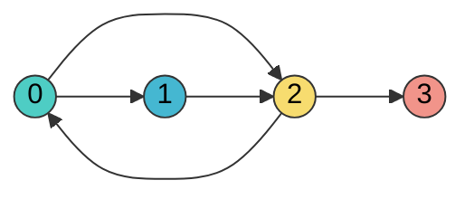

# DSA — Graphs (Java)

> "A graph problem is a BFS/DFS problem wearing a disguise — find the disguise, then the traversal writes itself."

**What this chapter covers:** Graph representation, BFS/DFS templates, Dijkstra's, topological sort, Union-Find, cycle detection, and grid/matrix problems (which are just graphs on a 2D array). Chapter 2 of the 4-part DSA sequence (31 / 31b / 31c / 31d); section numbers continue from chapter 31.

---

## Table of Contents

| Part | Topic | Sections |
|------|-------|----------|
| 3 | Graphs | §18.12–18.14: BFS/DFS, Dijkstra, Topo Sort, Union-Find, Grids |

**Sequence:** [31 — Foundations & Search](#content/31_dsa_foundations) → **31b (this chapter)** → [31c — Dynamic Programming](#content/31c_dynamic_programming) → [31d — Advanced Patterns & ML Coding](#content/31d_dsa_advanced_ml_coding)

---

# PART 3: GRAPHS

---

## 18.12 Graph Fundamentals

A graph is a set of **vertices** (nodes) connected by **edges**. Graphs model relationships — social networks, road maps, dependency chains, web links. If you can phrase a problem as "things connected to other things," it's probably a graph problem.

**Directed vs Undirected:**
- **Directed** (digraph): edges have direction (A → B doesn't mean B → A). Think Twitter follows.
- **Undirected**: edges go both ways. Think Facebook friendships.

**Weighted vs Unweighted:**
- **Weighted**: each edge carries a cost (distance, time, bandwidth).
- **Unweighted**: all edges are equal.

### Representation: Adjacency List vs Matrix

```
Adjacency List (preferred 99% of the time):
  0 → [1, 2]
  1 → [2]
  2 → [0, 3]
  3 → []

Adjacency Matrix:
     0  1  2  3
  0 [0, 1, 1, 0]
  1 [0, 0, 1, 0]
  2 [1, 0, 0, 1]
  3 [0, 0, 0, 0]
```

| Feature            | Adjacency List         | Adjacency Matrix       |
|--------------------|------------------------|------------------------|
| Space              | O(V + E)               | O(V^2)                 |
| Check edge exists  | O(degree)              | O(1)                   |
| Iterate neighbors  | O(degree)              | O(V)                   |
| Best for           | Sparse graphs (most)   | Dense graphs, quick lookup |

**Use adjacency list unless the problem specifically needs O(1) edge lookups.**



### Building a Graph in Java

```java
// Adjacency list — the standard interview representation
Map<Integer, List<Integer>> graph = new HashMap<>();
for (int[] edge : edges) {
    graph.computeIfAbsent(edge[0], k -> new ArrayList<>()).add(edge[1]);
    graph.computeIfAbsent(edge[1], k -> new ArrayList<>()).add(edge[0]); // undirected
}

// Alternative: array of lists (when nodes are 0..n-1)
List<List<Integer>> graph = new ArrayList<>();
for (int i = 0; i < n; i++) graph.add(new ArrayList<>());
for (int[] edge : edges) {
    graph.get(edge[0]).add(edge[1]);
    graph.get(edge[1]).add(edge[0]);
}
```

**Example:**
Input: n = 4, edges = [[0,1],[0,2],[1,2],[2,3]]
Output: adjacency list {0: [1,2], 1: [0,2], 2: [0,1,3], 3: [2]}

### BFS Template (Breadth-First Search)

BFS explores level by level. It uses a **queue** and guarantees the **shortest path in unweighted graphs**.

```java
// BFS — shortest path in unweighted graph
public int bfs(Map<Integer, List<Integer>> graph, int start, int target) {
    Queue<Integer> queue = new LinkedList<>();
    Set<Integer> visited = new HashSet<>();
    queue.offer(start);
    visited.add(start);
    int level = 0;

    while (!queue.isEmpty()) {
        int size = queue.size(); // process entire level
        for (int i = 0; i < size; i++) {
            int node = queue.poll();
            if (node == target) return level;
            for (int neighbor : graph.getOrDefault(node, List.of())) {
                if (!visited.contains(neighbor)) {
                    visited.add(neighbor);
                    queue.offer(neighbor);
                }
            }
        }
        level++;
    }
    return -1; // not reachable
}
```

**Example:**
Input: graph = {0: [1,2], 1: [0,2], 2: [0,1,3], 3: [2]}, start = 0, target = 3
Output: 2  (shortest path 0 -> 2 -> 3)

### DFS Template (Depth-First Search)

DFS dives deep before backtracking. It uses a **stack** (or recursion). Better for exploring all paths, detecting cycles, and topological ordering.

```java
// DFS — Recursive
public void dfs(Map<Integer, List<Integer>> graph, int node, Set<Integer> visited) {
    visited.add(node);
    // process node here
    for (int neighbor : graph.getOrDefault(node, List.of())) {
        if (!visited.contains(neighbor)) {
            dfs(graph, neighbor, visited);
        }
    }
}

// DFS — Iterative (use when recursion depth might blow the stack)
public void dfsIterative(Map<Integer, List<Integer>> graph, int start) {
    Deque<Integer> stack = new ArrayDeque<>();
    Set<Integer> visited = new HashSet<>();
    stack.push(start);

    while (!stack.isEmpty()) {
        int node = stack.pop();
        if (visited.contains(node)) continue;
        visited.add(node);
        // process node here
        for (int neighbor : graph.getOrDefault(node, List.of())) {
            if (!visited.contains(neighbor)) {
                stack.push(neighbor);
            }
        }
    }
}
```

**Example (dfs / dfsIterative):**
Input: graph = {0: [1,2], 1: [0,2], 2: [0,1,3], 3: [2]}, start = 0
Output: visits nodes in order 0, 1, 2, 3 (order can vary by neighbor list order)

**Practice:** [Number of Islands →](#dsa-problem-number-of-islands) · [Graph Valid Tree →](#dsa-problem-graph-valid-tree)

### When BFS vs DFS?

| Scenario                          | Use   | Why                                      |
|-----------------------------------|-------|------------------------------------------|
| Shortest path (unweighted)        | BFS   | Guarantees shortest                      |
| Level-order traversal             | BFS   | Processes level by level                 |
| Connected components              | Either| Both work                                |
| Cycle detection                   | DFS   | Back edges easier to detect              |
| Topological sort                  | DFS   | Post-order gives reverse topo order      |
| Path exists?                      | Either| DFS often simpler                        |
| All paths between two nodes       | DFS   | Backtracking natural with DFS            |
| Minimum spanning tree search area | BFS   | Expands uniformly                        |

> **Tip:** If the problem says "shortest," "minimum steps," or "nearest" — reach for BFS first.

**Common Mistakes:**
- Forgetting to mark visited BEFORE adding to queue (BFS) — causes duplicates and TLE.
- Not handling disconnected components — always loop through all nodes if the graph might be disconnected.
- Using recursion for DFS on large inputs (10^5+ nodes) — switch to iterative.

**Key Problems — Detailed Solutions:**

<details>
<summary><strong>Clone Graph</strong> — Medium</summary>

**Problem:** Given a reference to a node in a connected undirected graph, return a deep copy of the graph. Each node has a value and a list of neighbors.

**Example:**
Input: adjList = [[2,4],[1,3],[2,4],[1,3]]  (4-node cycle)
Output: deep copy of the same graph structure

**Approach:** BFS (or DFS) with a HashMap mapping old nodes to new nodes. When visiting a neighbor, if it hasn't been cloned yet, create the clone and add it to the queue. Always use the cloned version when building the adjacency list.

**Java:**
```java
public Node cloneGraph(Node node) {
    if (node == null) return null;
    Map<Node, Node> map = new HashMap<>();
    Queue<Node> queue = new LinkedList<>();
    map.put(node, new Node(node.val));
    queue.offer(node);
    while (!queue.isEmpty()) {
        Node curr = queue.poll();
        for (Node neighbor : curr.neighbors) {
            if (!map.containsKey(neighbor)) {
                map.put(neighbor, new Node(neighbor.val));
                queue.offer(neighbor);
            }
            map.get(curr).neighbors.add(map.get(neighbor));
        }
    }
    return map.get(node);
}
// Time: O(V + E)  Space: O(V)
```

**Complexity:** O(V + E) time, O(V) space
</details>

<details>
<summary><strong>Word Ladder</strong> — Hard</summary>

**Problem:** Given `beginWord`, `endWord`, and a `wordList`, find the length of the shortest transformation sequence from beginWord to endWord, where each step changes exactly one letter and the intermediate word must exist in wordList.

**Example:**
Input: beginWord = "hit", endWord = "cog", wordList = ["hot","dot","dog","lot","log","cog"]
Output: 5  (hit -> hot -> dot -> dog -> cog)

**Approach:** BFS where each word is a node and edges connect words differing by one letter. To find neighbors efficiently, try replacing each character with 'a'-'z' and check if the result is in the word set.

**Java:**
```java
public int ladderLength(String begin, String end, List<String> wordList) {
    Set<String> dict = new HashSet<>(wordList);
    if (!dict.contains(end)) return 0;
    Queue<String> queue = new LinkedList<>();
    queue.offer(begin);
    dict.remove(begin);
    int steps = 1;
    while (!queue.isEmpty()) {
        int size = queue.size();
        for (int i = 0; i < size; i++) {
            char[] word = queue.poll().toCharArray();
            for (int j = 0; j < word.length; j++) {
                char orig = word[j];
                for (char c = 'a'; c <= 'z'; c++) {
                    word[j] = c;
                    String next = new String(word);
                    if (next.equals(end)) return steps + 1;
                    if (dict.contains(next)) {
                        dict.remove(next);
                        queue.offer(next);
                    }
                }
                word[j] = orig;
            }
        }
        steps++;
    }
    return 0;
}
// Time: O(M^2 * N) where M = word length, N = wordList size  Space: O(M * N)
```

**Complexity:** O(M^2 * N) time, O(M * N) space
</details>

<details>
<summary><strong>Pacific Atlantic Water Flow</strong> — Medium</summary>

**Problem:** Given an `m x n` matrix of heights, find all cells where water can flow to both the Pacific (top/left border) and Atlantic (bottom/right border) oceans. Water flows from a cell to neighbors with equal or lower height.

**Example:**
Input: heights = [[1,2,2,3,5],[3,2,3,4,4],[2,4,5,3,1],[6,7,1,4,5],[5,1,1,2,4]]
Output: [[0,4],[1,3],[1,4],[2,2],[3,0],[3,1],[4,0]]

**Approach:** Reverse the problem: BFS/DFS from ocean borders inward, moving to neighbors with equal or greater height. Run once from Pacific borders, once from Atlantic borders. The answer is the intersection of reachable cells.

**Java:**
```java
public List<List<Integer>> pacificAtlantic(int[][] heights) {
    int m = heights.length, n = heights[0].length;
    boolean[][] pacific = new boolean[m][n], atlantic = new boolean[m][n];
    for (int i = 0; i < m; i++) {
        dfs(heights, pacific, i, 0);
        dfs(heights, atlantic, i, n - 1);
    }
    for (int j = 0; j < n; j++) {
        dfs(heights, pacific, 0, j);
        dfs(heights, atlantic, m - 1, j);
    }
    List<List<Integer>> res = new ArrayList<>();
    for (int i = 0; i < m; i++)
        for (int j = 0; j < n; j++)
            if (pacific[i][j] && atlantic[i][j])
                res.add(List.of(i, j));
    return res;
}
private void dfs(int[][] h, boolean[][] visited, int r, int c) {
    visited[r][c] = true;
    int[][] dirs = {{0,1},{0,-1},{1,0},{-1,0}};
    for (int[] d : dirs) {
        int nr = r + d[0], nc = c + d[1];
        if (nr >= 0 && nr < h.length && nc >= 0 && nc < h[0].length
            && !visited[nr][nc] && h[nr][nc] >= h[r][c])
            dfs(h, visited, nr, nc);
    }
}
// Time: O(m * n)  Space: O(m * n)
```

**Complexity:** O(m * n) time, O(m * n) space
</details>

**Problem List — Graph Fundamentals:**

| #   | Problem                            | Difficulty | Key Insight                          |
|-----|------------------------------------|------------|--------------------------------------|
| 1   | Number of Connected Components     | Medium     | DFS/BFS from each unvisited node     |
| 2   | Clone Graph (LC 133)               | Medium     | BFS + HashMap old→new                |
| 3   | Pacific Atlantic Water Flow (417)  | Medium     | Reverse BFS from ocean borders       |
| 4   | Graph Valid Tree (LC 261)          | Medium     | n-1 edges + all connected            |
| 5   | Word Ladder (LC 127)               | Hard       | BFS, each word is a node             |
| 6   | Minimum Genetic Mutation (LC 433)  | Medium     | BFS, same pattern as Word Ladder     |
| 7   | Open the Lock (LC 752)             | Medium     | BFS on state space                   |
| 8   | All Paths From Source to Target    | Medium     | DFS backtracking                     |
| 9   | Is Graph Bipartite? (LC 785)       | Medium     | BFS/DFS 2-coloring                   |
| 10  | Shortest Path in Binary Matrix     | Medium     | BFS 8-directional                    |

---

## 18.13 Advanced Graphs

### Dijkstra's Algorithm — Shortest Path in Weighted Graphs

Dijkstra's finds the shortest path from a source to all other nodes in a graph with **non-negative** edge weights. It's a greedy BFS using a priority queue.

**The idea:** always expand the node with the smallest known distance. Once a node is "settled" (popped from the PQ), its distance is final.

```
Worked Example:
    Graph:  A --1-- B --2-- D
            |       |       |
            4       1       3
            |       |       |
            C --5-- E --1-- F

    From A:
    Step 1: dist[A]=0.   PQ: [(0,A)]
    Step 2: Pop A.        Relax B(1), C(4).  PQ: [(1,B),(4,C)]
    Step 3: Pop B(1).     Relax D(3), E(2).  PQ: [(2,E),(3,D),(4,C)]
    Step 4: Pop E(2).     Relax C(7→4), F(3). PQ: [(3,D),(3,F),(4,C)]
    Step 5: Pop D(3).     Relax F(6→3).      PQ: [(3,F),(4,C)]
    Step 6: Pop F(3).     Done with F.       PQ: [(4,C)]
    Step 7: Pop C(4).     Already settled.

    Result: A=0, B=1, E=2, D=3, F=3, C=4
```

```java
// Dijkstra's — O((V + E) log V) with PriorityQueue
public int[] dijkstra(List<int[]>[] graph, int n, int src) {
    int[] dist = new int[n];
    Arrays.fill(dist, Integer.MAX_VALUE);
    dist[src] = 0;

    // PQ stores [distance, node], sorted by distance
    PriorityQueue<int[]> pq = new PriorityQueue<>((a, b) -> Integer.compare(a[0], b[0]));
    pq.offer(new int[]{0, src});

    while (!pq.isEmpty()) {
        int[] curr = pq.poll();
        int d = curr[0], u = curr[1];
        if (d > dist[u]) continue; // stale entry, skip

        for (int[] edge : graph[u]) {     // edge = [neighbor, weight]
            int v = edge[0], w = edge[1];
            if (dist[u] + w < dist[v]) {
                dist[v] = dist[u] + w;
                pq.offer(new int[]{dist[v], v});
            }
        }
    }
    return dist;
}
```

**Example:**
Input: n = 6, edges/graph as pictured above (A=0,B=1,C=2,D=3,E=4,F=5), src = A(0)
Output: dist = [0, 1, 4, 3, 2, 3]  (A=0, B=1, C=4, D=3, E=2, F=3)

**Practice:** [Network Delay Time →](#dsa-problem-network-delay-time)

> **Critical:** The `if (d > dist[u]) continue` line is not optional — it prunes stale entries and keeps the algorithm efficient.

### Topological Sort (Kahn's BFS)

Topological ordering of a directed acyclic graph (DAG) is a linear ordering where for every edge u→v, u appears before v. Think course prerequisites, build dependencies, task scheduling.

```java
// Kahn's Algorithm — BFS-based topological sort
public List<Integer> topologicalSort(int n, int[][] edges) {
    int[] indegree = new int[n];
    List<List<Integer>> graph = new ArrayList<>();
    for (int i = 0; i < n; i++) graph.add(new ArrayList<>());

    for (int[] e : edges) {
        graph.get(e[0]).add(e[1]);
        indegree[e[1]]++;
    }

    Queue<Integer> queue = new LinkedList<>();
    for (int i = 0; i < n; i++) {
        if (indegree[i] == 0) queue.offer(i); // start with zero-indegree nodes
    }

    List<Integer> order = new ArrayList<>();
    while (!queue.isEmpty()) {
        int node = queue.poll();
        order.add(node);
        for (int neighbor : graph.get(node)) {
            indegree[neighbor]--;
            if (indegree[neighbor] == 0) queue.offer(neighbor);
        }
    }

    return order.size() == n ? order : List.of(); // empty = cycle exists
}
```

**Example:**
Input: n = 4, edges = [[1,0],[2,0],[3,1],[3,2]]
Output: [0, 1, 2, 3]  (0 before 1 and 2; 1 and 2 before 3 — order among ties may vary)

**Practice:** [Course Schedule →](#dsa-problem-course-schedule) · [Course Schedule II →](#dsa-problem-course-schedule-ii)

**Cycle detection bonus:** If `order.size() < n`, the graph has a cycle.

### Union-Find (Disjoint Set Union)

Union-Find tracks which elements belong to the same group. Two operations: **find** (which group?) and **union** (merge two groups). With path compression + union by rank, both run in nearly O(1) amortized — specifically O(alpha(n)), the inverse Ackermann function, which is effectively constant for all practical inputs.

```java
class UnionFind {
    int[] parent, rank;
    int components;

    UnionFind(int n) {
        parent = new int[n];
        rank = new int[n];
        components = n;
        for (int i = 0; i < n; i++) parent[i] = i;
    }

    // Find with path compression
    int find(int x) {
        if (parent[x] != x) parent[x] = find(parent[x]);
        return parent[x];
    }

    // Union by rank — returns true if merge happened
    boolean union(int x, int y) {
        int px = find(x), py = find(y);
        if (px == py) return false; // already same component

        if (rank[px] < rank[py]) { int tmp = px; px = py; py = tmp; }
        parent[py] = px;
        if (rank[px] == rank[py]) rank[px]++;
        components--;
        return true;
    }

    boolean connected(int x, int y) { return find(x) == find(y); }
}
```

**Example:**
Input: UnionFind(5); union(0,1); union(1,2); connected(0,2); connected(0,3)
Output: true, false

**When to use Union-Find:**
- "Are these two nodes connected?" queries
- Counting connected components dynamically
- Detecting cycles in undirected graphs
- Kruskal's MST algorithm

### Cycle Detection

**Directed graph — 3-color DFS:**

```java
// 0 = white (unvisited), 1 = gray (in current path), 2 = black (done)
public boolean hasCycle(List<List<Integer>> graph, int n) {
    int[] color = new int[n];

    for (int i = 0; i < n; i++) {
        if (color[i] == 0 && dfs(graph, i, color)) return true;
    }
    return false;
}

private boolean dfs(List<List<Integer>> graph, int u, int[] color) {
    color[u] = 1; // entering: mark gray
    for (int v : graph.get(u)) {
        if (color[v] == 1) return true;  // back edge → cycle!
        if (color[v] == 0 && dfs(graph, v, color)) return true;
    }
    color[u] = 2; // leaving: mark black
    return false;
}
```

**Example:**
Input: n = 4, edges (directed) = [[0,1],[1,2],[2,3],[3,1]]
Output: true  (cycle 1 -> 2 -> 3 -> 1)

**Undirected graph — Union-Find:**

```java
// If union returns false, both nodes already in same component → cycle
public boolean hasCycleUndirected(int n, int[][] edges) {
    UnionFind uf = new UnionFind(n);
    for (int[] e : edges) {
        if (!uf.union(e[0], e[1])) return true;
    }
    return false;
}
```

**Example:**
Input: n = 3, edges = [[1,2],[1,3],[2,3]]
Output: true  (edge [2,3] connects an already-connected pair)

**Practice:** [Redundant Connection →](#dsa-problem-redundant-connection)

**Common Mistakes:**
- Using Dijkstra's with negative weights — it breaks. Use Bellman-Ford instead.
- Forgetting the `d > dist[u]` check in Dijkstra's — causes O(V*E) worst case.
- Confusing topological sort with general sorting — topo sort only works on DAGs.
- In Union-Find, forgetting path compression — degrades from O(alpha(n)) to O(n).

**Key Problems — Detailed Solutions:**

<details>
<summary><strong>Course Schedule</strong> — Medium</summary>

**Problem:** There are `numCourses` courses labeled 0 to n-1. Given prerequisites as pairs [a, b] meaning "you must take b before a", determine if it is possible to finish all courses (i.e., no cycle in the prerequisite graph).

**Example:**
Input: numCourses = 4, prerequisites = [[1,0],[2,0],[3,1],[3,2]]
Output: true  (take 0, then 1 and 2 in any order, then 3)

**Approach:** Build a directed graph and run Kahn's topological sort (BFS). Start with all nodes having indegree 0. If the topological order includes all nodes, no cycle exists. If fewer nodes are processed, a cycle prevents completion.

**Java:**
```java
public boolean canFinish(int numCourses, int[][] prerequisites) {
    int[] indegree = new int[numCourses];
    List<List<Integer>> graph = new ArrayList<>();
    for (int i = 0; i < numCourses; i++) graph.add(new ArrayList<>());
    for (int[] p : prerequisites) {
        graph.get(p[1]).add(p[0]);
        indegree[p[0]]++;
    }
    Queue<Integer> queue = new LinkedList<>();
    for (int i = 0; i < numCourses; i++)
        if (indegree[i] == 0) queue.offer(i);
    int count = 0;
    while (!queue.isEmpty()) {
        int node = queue.poll();
        count++;
        for (int next : graph.get(node))
            if (--indegree[next] == 0) queue.offer(next);
    }
    return count == numCourses;
}
// Time: O(V + E)  Space: O(V + E)
```

**Complexity:** O(V + E) time, O(V + E) space
</details>

<details>
<summary><strong>Network Delay Time</strong> — Medium</summary>

**Problem:** Given a network of `n` nodes and weighted directed edges `times[i] = [u, v, w]`, send a signal from node `k`. Return the time it takes for all nodes to receive the signal, or -1 if impossible.

**Example:**
Input: times = [[2,1,1],[2,3,1],[3,4,1]], n = 4, k = 2
Output: 2

**Approach:** Dijkstra's algorithm from source k. Use a min-heap ordered by distance. The answer is the maximum distance across all reachable nodes. If any node is unreachable, return -1.

**Java:**
```java
public int networkDelayTime(int[][] times, int n, int k) {
    List<int[]>[] graph = new List[n + 1];
    for (int i = 1; i <= n; i++) graph[i] = new ArrayList<>();
    for (int[] t : times) graph[t[0]].add(new int[]{t[1], t[2]});
    int[] dist = new int[n + 1];
    Arrays.fill(dist, Integer.MAX_VALUE);
    dist[k] = 0;
    PriorityQueue<int[]> pq = new PriorityQueue<>((a, b) -> Integer.compare(a[0], b[0]));
    pq.offer(new int[]{0, k});
    while (!pq.isEmpty()) {
        int[] curr = pq.poll();
        int d = curr[0], u = curr[1];
        if (d > dist[u]) continue;
        for (int[] edge : graph[u]) {
            int v = edge[0], w = edge[1];
            if (dist[u] + w < dist[v]) {
                dist[v] = dist[u] + w;
                pq.offer(new int[]{dist[v], v});
            }
        }
    }
    int ans = 0;
    for (int i = 1; i <= n; i++) ans = Math.max(ans, dist[i]);
    return ans == Integer.MAX_VALUE ? -1 : ans;
}
// Time: O((V + E) log V)  Space: O(V + E)
```

**Complexity:** O((V + E) log V) time, O(V + E) space
</details>

<details>
<summary><strong>Redundant Connection</strong> — Medium</summary>

**Problem:** Given an undirected graph that started as a tree with n nodes, one additional edge was added. Find the edge that, when removed, results in a tree. If multiple answers, return the one appearing last in the input.

**Example:**
Input: edges = [[1,2],[1,3],[2,3]]
Output: [2,3]

**Approach:** Union-Find. Process edges in order. For each edge, union the two nodes. If they are already in the same component (find returns the same root), this edge creates a cycle and is the answer.

**Java:**
```java
public int[] findRedundantConnection(int[][] edges) {
    int n = edges.length;
    int[] parent = new int[n + 1], rank = new int[n + 1];
    for (int i = 1; i <= n; i++) parent[i] = i;
    for (int[] e : edges) {
        int px = find(parent, e[0]), py = find(parent, e[1]);
        if (px == py) return e;
        if (rank[px] < rank[py]) { int t = px; px = py; py = t; }
        parent[py] = px;
        if (rank[px] == rank[py]) rank[px]++;
    }
    return new int[]{};
}
private int find(int[] parent, int x) {
    if (parent[x] != x) parent[x] = find(parent, parent[x]);
    return parent[x];
}
// Time: O(n * alpha(n)) ~ O(n)  Space: O(n)
```

**Complexity:** O(n * alpha(n)) effectively O(n) time, O(n) space
</details>

**Problem List — Advanced Graphs:**

| #   | Problem                               | Difficulty | Key Insight                        |
|-----|---------------------------------------|------------|------------------------------------|
| 1   | Course Schedule (LC 207)              | Medium     | Topo sort, cycle detection         |
| 2   | Course Schedule II (LC 210)           | Medium     | Kahn's, return the order           |
| 3   | Network Delay Time (LC 743)           | Medium     | Dijkstra's textbook problem        |
| 4   | Cheapest Flights K Stops (LC 787)     | Medium     | Modified Bellman-Ford/BFS          |
| 5   | Redundant Connection (LC 684)         | Medium     | Union-Find, find the cycle edge    |
| 6   | Number of Provinces (LC 547)          | Medium     | Union-Find or DFS                  |
| 7   | Accounts Merge (LC 721)              | Medium     | Union-Find on emails               |
| 8   | Alien Dictionary (LC 269)             | Hard       | Build graph + topo sort            |
| 9   | Swim in Rising Water (LC 778)         | Hard       | Dijkstra's on grid                 |
| 10  | Path With Min Effort (LC 1631)        | Medium     | Dijkstra's, weight = max diff      |
| 11  | Min Cost to Connect All Points (1584) | Medium     | Kruskal's MST + Union-Find         |
| 12  | Find if Path Exists (LC 1971)         | Easy       | Union-Find or BFS                  |

---

## 18.14 Grid/Matrix Problems

Grids are graphs in disguise. Each cell is a node, and its 4 (or 8) neighbors are edges. The key insight: you don't need to build an explicit adjacency list — just use the direction array.

```java
// The universal direction array — memorize this
int[][] dirs = {{0,1},{0,-1},{1,0},{-1,0}};

// Grid traversal helper
boolean inBounds(int r, int c, int rows, int cols) {
    return r >= 0 && r < rows && c >= 0 && c < cols;
}
```

### Island Counting — DFS Flood Fill

```java
// LC 200: Number of Islands
public int numIslands(char[][] grid) {
    int count = 0;
    for (int i = 0; i < grid.length; i++) {
        for (int j = 0; j < grid[0].length; j++) {
            if (grid[i][j] == '1') {
                count++;
                dfs(grid, i, j); // sink the entire island
            }
        }
    }
    return count;
}

private void dfs(char[][] grid, int r, int c) {
    if (r < 0 || r >= grid.length || c < 0 || c >= grid[0].length
        || grid[r][c] != '1') return;
    grid[r][c] = '0'; // mark visited by sinking
    dfs(grid, r + 1, c);
    dfs(grid, r - 1, c);
    dfs(grid, r, c + 1);
    dfs(grid, r, c - 1);
}
```

**Example:**
Input: grid = [["1","1","0","0","0"],["1","1","0","0","0"],["0","0","1","0","0"],["0","0","0","1","1"]]
Output: 3

**Practice:** [Number of Islands →](#dsa-problem-number-of-islands)

### Shortest Path in Grid — BFS

```java
// LC 1091: Shortest Path in Binary Matrix (8-directional)
public int shortestPathBinaryMatrix(int[][] grid) {
    int n = grid.length;
    if (grid[0][0] == 1 || grid[n-1][n-1] == 1) return -1;

    int[][] dirs = {{0,1},{0,-1},{1,0},{-1,0},{1,1},{1,-1},{-1,1},{-1,-1}};
    Queue<int[]> queue = new LinkedList<>();
    queue.offer(new int[]{0, 0});
    grid[0][0] = 1; // mark visited
    int path = 1;

    while (!queue.isEmpty()) {
        int size = queue.size();
        for (int i = 0; i < size; i++) {
            int[] cell = queue.poll();
            if (cell[0] == n-1 && cell[1] == n-1) return path;
            for (int[] d : dirs) {
                int nr = cell[0] + d[0], nc = cell[1] + d[1];
                if (nr >= 0 && nr < n && nc >= 0 && nc < n && grid[nr][nc] == 0) {
                    grid[nr][nc] = 1;
                    queue.offer(new int[]{nr, nc});
                }
            }
        }
        path++;
    }
    return -1;
}
```

**Example:**
Input: grid = [[0,1],[1,0]]
Output: 2

**Practice:** [Shortest Path in Binary Matrix →](#dsa-problem-shortest-path-binary-matrix)

### Rotting Oranges — Multi-Source BFS

The trick: instead of BFS from one starting point, add ALL starting points to the queue at once. Each level of BFS = one minute passing.

```java
// LC 994: Rotting Oranges
public int orangesRotting(int[][] grid) {
    int rows = grid.length, cols = grid[0].length;
    Queue<int[]> queue = new LinkedList<>();
    int fresh = 0;

    // Enqueue ALL rotten oranges at once
    for (int r = 0; r < rows; r++) {
        for (int c = 0; c < cols; c++) {
            if (grid[r][c] == 2) queue.offer(new int[]{r, c});
            if (grid[r][c] == 1) fresh++;
        }
    }

    if (fresh == 0) return 0;
    int[][] dirs = {{0,1},{0,-1},{1,0},{-1,0}};
    int minutes = 0;

    while (!queue.isEmpty() && fresh > 0) {
        int size = queue.size();
        minutes++;
        for (int i = 0; i < size; i++) {
            int[] cell = queue.poll();
            for (int[] d : dirs) {
                int nr = cell[0] + d[0], nc = cell[1] + d[1];
                if (nr >= 0 && nr < rows && nc >= 0 && nc < cols && grid[nr][nc] == 1) {
                    grid[nr][nc] = 2;
                    fresh--;
                    queue.offer(new int[]{nr, nc});
                }
            }
        }
    }
    return fresh == 0 ? minutes : -1;
}
```

**Example:**
Input: grid = [[2,1,1],[1,1,0],[0,1,1]]
Output: 4

**Practice:** [Rotting Oranges →](#dsa-problem-rotting-oranges)

**Grid Problem Decision Table:**

| Problem asks for...                | Technique            | Why                                  |
|------------------------------------|----------------------|--------------------------------------|
| Count regions/islands              | DFS flood fill       | Mark and explore each region         |
| Shortest distance                  | BFS                  | Level = distance in unweighted grid  |
| Spread from multiple sources       | Multi-source BFS     | All sources start simultaneously     |
| Largest area                       | DFS + counter        | Track size during flood fill         |
| Path exists?                       | DFS or BFS           | Either works                         |

**Common Mistakes:**
- Forgetting to mark visited before enqueueing (BFS) — causes TLE from duplicate processing.
- Modifying the grid when you're not supposed to — use a separate `visited` array.
- Off-by-one in bounds checking — always test edges of the grid.

**Key Problems — Detailed Solutions:**

<details>
<summary><strong>Number of Islands</strong> — Medium</summary>

**Problem:** Given a 2D grid of '1's (land) and '0's (water), count the number of islands. An island is surrounded by water and formed by connecting adjacent land cells horizontally or vertically.

**Example:**
Input: grid = [["1","1","0","0","0"],["1","1","0","0","0"],["0","0","1","0","0"],["0","0","0","1","1"]]
Output: 3

**Approach:** Iterate through the grid. When a '1' is found, increment the island count and DFS/flood-fill to mark the entire island as visited (sink it by setting cells to '0').

**Java:**
```java
public int numIslands(char[][] grid) {
    int count = 0;
    for (int i = 0; i < grid.length; i++)
        for (int j = 0; j < grid[0].length; j++)
            if (grid[i][j] == '1') { count++; dfs(grid, i, j); }
    return count;
}
private void dfs(char[][] grid, int r, int c) {
    if (r < 0 || r >= grid.length || c < 0 || c >= grid[0].length
        || grid[r][c] != '1') return;
    grid[r][c] = '0';
    dfs(grid, r + 1, c); dfs(grid, r - 1, c);
    dfs(grid, r, c + 1); dfs(grid, r, c - 1);
}
// Time: O(m * n)  Space: O(m * n) worst-case recursion stack
```

**Complexity:** O(m * n) time, O(m * n) space (recursion depth)
</details>

<details>
<summary><strong>Rotting Oranges</strong> — Medium</summary>

**Problem:** Given a grid where 0 = empty, 1 = fresh orange, 2 = rotten orange, every minute each rotten orange rots adjacent fresh oranges. Return the minimum minutes until no fresh orange remains, or -1 if impossible.

**Example:**
Input: grid = [[2,1,1],[1,1,0],[0,1,1]]
Output: 4

**Approach:** Multi-source BFS. Enqueue all initially rotten oranges at once. Each BFS level represents one minute. Track remaining fresh count; if it reaches 0, return the number of minutes elapsed.

**Java:**
```java
public int orangesRotting(int[][] grid) {
    int m = grid.length, n = grid[0].length, fresh = 0;
    Queue<int[]> queue = new LinkedList<>();
    for (int i = 0; i < m; i++)
        for (int j = 0; j < n; j++) {
            if (grid[i][j] == 2) queue.offer(new int[]{i, j});
            if (grid[i][j] == 1) fresh++;
        }
    if (fresh == 0) return 0;
    int[][] dirs = {{0,1},{0,-1},{1,0},{-1,0}};
    int mins = 0;
    while (!queue.isEmpty() && fresh > 0) {
        int size = queue.size();
        mins++;
        for (int i = 0; i < size; i++) {
            int[] cell = queue.poll();
            for (int[] d : dirs) {
                int nr = cell[0] + d[0], nc = cell[1] + d[1];
                if (nr >= 0 && nr < m && nc >= 0 && nc < n && grid[nr][nc] == 1) {
                    grid[nr][nc] = 2; fresh--;
                    queue.offer(new int[]{nr, nc});
                }
            }
        }
    }
    return fresh == 0 ? mins : -1;
}
// Time: O(m * n)  Space: O(m * n)
```

**Complexity:** O(m * n) time, O(m * n) space
</details>

<details>
<summary><strong>Word Search</strong> — Medium</summary>

**Problem:** Given an `m x n` board of characters and a string `word`, return true if the word exists in the grid. The word can be constructed from letters of sequentially adjacent cells (horizontal or vertical). Each cell may be used at most once.

**Example:**
Input: board = [["A","B","C","E"],["S","F","C","S"],["A","D","E","E"]], word = "ABCCED"
Output: true

**Approach:** DFS backtracking from each cell. At each step, mark the cell visited (e.g., set to '#'), explore all 4 directions for the next character, then restore the cell. Return true if the full word is matched.

**Java:**
```java
public boolean exist(char[][] board, String word) {
    for (int i = 0; i < board.length; i++)
        for (int j = 0; j < board[0].length; j++)
            if (dfs(board, word, i, j, 0)) return true;
    return false;
}
private boolean dfs(char[][] board, String word, int r, int c, int idx) {
    if (idx == word.length()) return true;
    if (r < 0 || r >= board.length || c < 0 || c >= board[0].length
        || board[r][c] != word.charAt(idx)) return false;
    char tmp = board[r][c];
    board[r][c] = '#';
    boolean found = dfs(board, word, r+1, c, idx+1)
                 || dfs(board, word, r-1, c, idx+1)
                 || dfs(board, word, r, c+1, idx+1)
                 || dfs(board, word, r, c-1, idx+1);
    board[r][c] = tmp;
    return found;
}
// Time: O(m * n * 4^L) where L = word length  Space: O(L) recursion depth
```

**Complexity:** O(m * n * 4^L) time, O(L) space
</details>

**Problem List — Grid/Matrix:**

| #   | Problem                            | Difficulty | Key Insight                          |
|-----|------------------------------------|------------|--------------------------------------|
| 1   | Number of Islands (LC 200)         | Medium     | DFS flood fill                       |
| 2   | Max Area of Island (LC 695)        | Medium     | DFS + count cells                    |
| 3   | Rotting Oranges (LC 994)           | Medium     | Multi-source BFS                     |
| 4   | Walls and Gates (LC 286)           | Medium     | Multi-source BFS from gates          |
| 5   | Surrounded Regions (LC 130)        | Medium     | DFS from borders first               |
| 6   | Shortest Path in Binary Matrix     | Medium     | BFS 8-directional                    |
| 7   | 01 Matrix (LC 542)                 | Medium     | Multi-source BFS from all 0s         |
| 8   | Word Search (LC 79)                | Medium     | DFS backtracking on grid             |

---

---

**Previous:** [Chapter 31 — DSA: Foundations & Search](#content/31_dsa_foundations) | **Next:** [Chapter 31c — Dynamic Programming](#content/31c_dynamic_programming)
