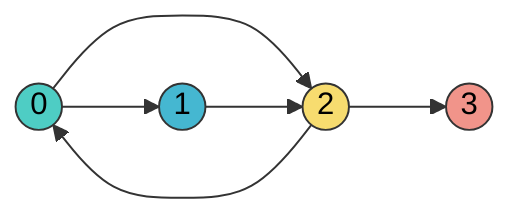

# DSA — Graphs (Java)

> "A graph problem is a BFS/DFS problem wearing a disguise — find the disguise, then the traversal writes itself."

**What this chapter covers:** The seven graph tools — BFS, DFS, Dijkstra, topological sort, Union-Find, cycle detection, and grids — each taught the same way: *the problem, why the obvious answer is too slow, the one idea that fixes it, a dry run you can follow with your finger, then the Java.* Chapter 2 of the 4-part DSA sequence (31 / 31b / 31c / 31d); section numbers continue from chapter 31.

---

## Start Here

### Pick a track

| Track | Time | Read this | Good for |
|-------|------|-----------|----------|
| **Speed run** | ~40 min | This page, then the **Key idea** + **Dry run** + **Java** of BFS, DFS, Dijkstra, topological sort and Union-Find | First pass |
| **Mastery** | ~3 hr | Everything, plus the first five problems marked in each list | Real preparation |
| **Refresh** | ~10 min | This page, then the Cheat Sheet at the end | The night before |

Every pattern below uses the same seven lines — **Problem · Brute force · Key idea · Dry run · Java · Cost · Trap** — so you never read code before you know what it does. Dry runs open with the call and its answer, state the **invariant** that holds after every row, and close with why the last state is the answer. The format is explained in full in [chapter 31's Start Here](#content/31_dsa_foundations).

### First, find the disguise

Most graph questions never say the word "graph". Your first job is always the same two sentences: **what is a node, and what is an edge?**

| The question is about… | A node is… | An edge is… |
|------------------------|------------|-------------|
| A grid or maze | one cell | a step to an adjacent cell |
| Word transformations | one word | changing exactly one letter |
| Course prerequisites | one course | "must be taken before" |
| A puzzle or lock | one arrangement of the state | one legal move |
| Accounts, friends, provinces | one person or account | "belongs with" |

Once you can say those two sentences, the rest of this chapter is a lookup.

### Which algorithm does the question want?


| # | When the question asks… | Reach for | Cost | Section |
|---|-------------------------|-----------|------|---------|
| 1 | fewest steps, all moves cost the same | **BFS** | O(V + E) | §18.12 |
| 2 | does a path exist / explore everything | **DFS** | O(V + E) | §18.12 |
| 3 | cheapest route, edges have different costs | **Dijkstra** | O((V+E) log V) | §18.13 |
| 4 | order things that depend on each other | **Topological sort** | O(V + E) | §18.13 |
| 5 | "are these two connected?", asked repeatedly | **Union-Find** | ~O(1) each | §18.13 |
| 6 | is there a loop? | **3-colour DFS** (directed) / **Union-Find** (undirected) | O(V + E) | §18.13 |
| 7 | islands, regions, a maze | **BFS/DFS on the grid** | O(rows × cols) | §18.14 |

> **The sentence to say out loud before coding.** *"Nodes are X, edges are Y, the graph is directed/undirected and weighted/unweighted, so this is a &lt;algorithm&gt; problem costing O(…)."* Everything else follows from that.

---

## Table of Contents

| Part | Topic | Sections |
|------|-------|----------|
| 3 | Graphs | §18.12–18.14: BFS/DFS, Dijkstra, Topo Sort, Union-Find, Grids |
| — | Revision | Cheat sheet and recall drills (unnumbered, at the end) |

**Sequence:** [31 — Foundations & Search](#content/31_dsa_foundations) → **31b (this chapter)** → [31c — Dynamic Programming](#content/31c_dynamic_programming) → [31d — Advanced Patterns & ML Coding](#content/31d_dsa_advanced_ml_coding)

---

# PART 3: GRAPHS

---

## 18.12 Graph Fundamentals

**Simple explanation.** A graph is just *things* and *which things are connected to which*. The things are **vertices** (nodes), the connections are **edges**. Social networks, road maps, course prerequisites, web links — all the same shape.

Two questions settle everything about how you handle it:

- **Directed or undirected?** Directed means an edge goes one way only (Twitter follows, "must be taken before"). Undirected means both ways (Facebook friendships, roads).
- **Weighted or unweighted?** Weighted means each edge carries a cost (distance, time, price). Unweighted means every edge is one step — *which is what makes BFS give you shortest paths for free.*

### Representation: adjacency list vs matrix

```
Adjacency List (what you want 99% of the time):
  0 → [1, 2]
  1 → [2]
  2 → [0, 3]
  3 → []

Adjacency Matrix:
     0  1  2  3
  0 [0, 1, 1, 0]
  1 [0, 0, 1, 0]
  2 [1, 0, 0, 1]
  3 [0, 0, 0, 0]
```

| Feature | Adjacency List | Adjacency Matrix |
|---------|----------------|------------------|
| Space | O(V + E) | O(V^2) |
| "Is there an edge u→v?" | O(degree) | O(1) |
| Iterate a node's neighbours | O(degree) | O(V) |
| Best for | sparse graphs — nearly always | dense graphs, constant-time edge checks |

**Default to the adjacency list.** A matrix costs V² space even when the graph has three edges, so at V = 100,000 it is simply impossible.



### Building a graph in Java

**DRY RUN — building an undirected graph from `edges = [[0,1], [0,2], [1,2], [2,3]]`**
*invariant: undirected means every edge is written into **both** endpoints' lists*

| edge added | writes | map so far |
|------------|--------|------------|
| `[0,1]` | `0 → 1` and `1 → 0` | `{0:[1], 1:[0]}` |
| `[0,2]` | `0 → 2` and `2 → 0` | `{0:[1,2], 1:[0], 2:[0]}` |
| `[1,2]` | `1 → 2` and `2 → 1` | `{0:[1,2], 1:[0,2], 2:[0,1]}` |
| `[2,3]` | `2 → 3` and `3 → 2` | `{0:[1,2], 1:[0,2], 2:[0,1,3], 3:[2]}` |

```java
// Adjacency list — the standard interview representation
Map<Integer, List<Integer>> graph = new HashMap<>();
for (int[] edge : edges) {
    graph.computeIfAbsent(edge[0], k -> new ArrayList<>()).add(edge[1]);
    graph.computeIfAbsent(edge[1], k -> new ArrayList<>()).add(edge[0]); // undirected ONLY
}

// Alternative: array of lists (cleaner when nodes are exactly 0..n-1)
List<List<Integer>> graph = new ArrayList<>();
for (int i = 0; i < n; i++) graph.add(new ArrayList<>());
for (int[] edge : edges) {
    graph.get(edge[0]).add(edge[1]);
    graph.get(edge[1]).add(edge[0]);
}
```

> **Trap:** adding the reverse edge in a **directed** problem. Course Schedule with both directions added has a "cycle" between every pair of courses and always answers false. Write the second line only when the problem says the relationship is mutual.

### BFS — fewest steps

**Problem.** Fewest steps from `start` to `target` when every move costs the same. `{0:[1,2], 1:[0,2], 2:[0,1,3], 3:[2]}`, start `0`, target `3` → `2`.

**Brute force.** Enumerate every path and keep the shortest. On a graph with cycles that never terminates without extra bookkeeping, and even with it, the number of paths is exponential.

**Key idea.** Visit everything **one step away**, then everything **two steps away**, and so on — finishing each ring completely before starting the next. That ordering has a consequence you get for free: **the first time BFS reaches a node is by the shortest route**, so you can return the moment you see the target. A queue produces exactly that order, because the oldest node comes out first.


**DRY RUN — `bfs(graph, start = 0, target = 3)` → `2`**
*invariant: everything in the queue is exactly `level` steps from the start*

| level | queue at ring start | taken out | newly discovered | target? |
|-------|--------------------|-----------|------------------|---------|
| 0 | `[0]` | 0 | 1, 2 | no |
| 1 | `[1, 2]` | 1, then 2 | 3 (from 2; 0 and 1 already seen) | no |
| 2 | `[3]` | 3 | — | **yes → return 2** |

*ends right: node 3 first appeared while expanding ring 1, so no shorter route to it can exist.*

```java
// BFS — shortest path in an unweighted graph
public int bfs(Map<Integer, List<Integer>> graph, int start, int target) {
    Queue<Integer> queue = new LinkedList<>();
    Set<Integer> visited = new HashSet<>();
    queue.offer(start);
    visited.add(start);                       // mark on ENQUEUE — see the trap
    int level = 0;

    while (!queue.isEmpty()) {
        int size = queue.size();              // snapshot = exactly one ring
        for (int i = 0; i < size; i++) {
            int node = queue.poll();
            if (node == target) return level;
            for (int neighbor : graph.getOrDefault(node, List.of())) {
                if (!visited.contains(neighbor)) {
                    visited.add(neighbor);
                    queue.offer(neighbor);
                }
            }
        }
        level++;
    }
    return -1;                                // target not reachable
}
```

**Cost.** O(V + E) time — every node leaves the queue once and every edge is examined once. O(V) space.

> **Trap:** marking a node visited when you *dequeue* it instead of when you *enqueue* it. In a dense graph the same node then gets queued once per incoming edge, memory explodes and the solution times out. Mark it the instant you push it.

> **Trap:** reading `queue.size()` inside the inner loop. It grows as you enqueue children, so the loop swallows the next ring and every level count after the first is wrong.

### DFS — does a path exist, and explore everything

**Problem.** Visit every node reachable from a start — for connectivity, path existence, or collecting a region.

**Key idea.** The opposite commitment: follow one path all the way to its end, and only when it dead-ends, back up and try the next branch. Recursion gives you the stack for free, so the code is usually three lines shorter than the BFS equivalent.

**DRY RUN — `dfs(graph, 0)` on `{0:[1,2], 1:[0,2], 2:[0,1,3], 3:[2]}`**
*invariant: a node is added to `visited` the moment it is entered, so it is never entered twice*

```
dfs(0)                     visited {0}
├── dfs(1)                 visited {0,1}        ← 0's first neighbour
│   ├── 0 already visited — skip
│   └── dfs(2)             visited {0,1,2}
│       ├── 0, 1 already visited — skip
│       └── dfs(3)         visited {0,1,2,3}
│           └── 2 already visited — skip, back up
└── 2 already visited — skip

visit order: 0, 1, 2, 3
```

*ends right: recursion only returns once every neighbour of every entered node has been checked, so nothing reachable is left out.*

```java
// DFS — recursive (what you write by default)
public void dfs(Map<Integer, List<Integer>> graph, int node, Set<Integer> visited) {
    visited.add(node);
    // process node here
    for (int neighbor : graph.getOrDefault(node, List.of())) {
        if (!visited.contains(neighbor)) {
            dfs(graph, neighbor, visited);
        }
    }
}

// DFS — iterative (when the graph is big enough to blow the call stack)
public void dfsIterative(Map<Integer, List<Integer>> graph, int start) {
    Deque<Integer> stack = new ArrayDeque<>();
    Set<Integer> visited = new HashSet<>();
    stack.push(start);

    while (!stack.isEmpty()) {
        int node = stack.pop();
        if (visited.contains(node)) continue;   // a node can be pushed more than once here
        visited.add(node);
        // process node here
        for (int neighbor : graph.getOrDefault(node, List.of())) {
            if (!visited.contains(neighbor)) stack.push(neighbor);
        }
    }
}
```

**Cost.** O(V + E) time, O(V) space — and note the recursive version's space is the *call stack*, which is real memory.

> **Trap:** recursion on a graph with 10^5+ nodes. A long chain becomes a 100,000-frame call stack and throws `StackOverflowError`. If the constraint is large, say so and switch to the iterative version — interviewers listen for exactly this.

> **Trap:** only calling DFS once. If the graph may be **disconnected**, loop over every node and start a fresh DFS from each unvisited one — that loop is also how you count connected components.

**Practice:** [Number of Islands →](#dsa-problem-number-of-islands) · [Graph Valid Tree →](#dsa-problem-graph-valid-tree)

### Choosing between them

| The question is about… | Use | Why |
|------------------------|-----|-----|
| Shortest path, unweighted | **BFS** | the first arrival is the shortest one |
| Level-by-level anything | **BFS** | the size-snapshot gives you levels |
| Spreading from many starts at once | **BFS** (multi-source) | seed the queue with all of them |
| Connected components | either | both reach everything |
| Cycle detection | **DFS** | a back edge into the current path is visible |
| Topological ordering | either | Kahn's is BFS; post-order DFS also works |
| All paths between two nodes | **DFS** | backtracking is natural |

> **The one-line rule:** if the problem says "shortest", "minimum steps", "fewest", or "nearest" on an **unweighted** graph, it is BFS. Add weights and it becomes Dijkstra.

### 60-second recall

<details>
<summary>1. Why does BFS give shortest paths but DFS does not?</summary>

BFS finishes every node at distance `d` before touching anything at distance `d+1`, so the first time it reaches a node it has used the fewest possible steps. DFS commits to one path to the end, so it may reach a node by a long route first and never reconsider it.
</details>

<details>
<summary>2. When do you mark a node visited in BFS, and why does it matter?</summary>

At enqueue time. Marking at dequeue lets the same node sit in the queue several times — one copy per incoming edge — which is a classic time-limit failure on dense graphs.
</details>

<details>
<summary>3. Your DFS works on the samples but crashes on the big test case. What happened?</summary>

`StackOverflowError` from recursion depth. A path of 100,000 nodes means 100,000 stack frames. Rewrite it iteratively with an explicit `ArrayDeque`.
</details>

**Key Problems — Detailed Solutions:**

<details>
<summary><strong>Clone Graph</strong> — Medium</summary>

**Problem:** Given a reference to a node in a connected undirected graph, return a deep copy of the graph. Each node has a value and a list of neighbors.

**Example:**
Input: adjList = [[2,4],[1,3],[2,4],[1,3]]  (4-node cycle)
Output: deep copy of the same graph structure

**Approach:** BFS (or DFS) with a HashMap mapping old nodes to new nodes. When visiting a neighbor, if it hasn't been cloned yet, create the clone and add it to the queue. Always use the cloned version when building the adjacency list.

**Java:**
```java
public Node cloneGraph(Node node) {
    if (node == null) return null;
    Map<Node, Node> map = new HashMap<>();
    Queue<Node> queue = new LinkedList<>();
    map.put(node, new Node(node.val));
    queue.offer(node);
    while (!queue.isEmpty()) {
        Node curr = queue.poll();
        for (Node neighbor : curr.neighbors) {
            if (!map.containsKey(neighbor)) {
                map.put(neighbor, new Node(neighbor.val));
                queue.offer(neighbor);
            }
            map.get(curr).neighbors.add(map.get(neighbor));
        }
    }
    return map.get(node);
}
// Time: O(V + E)  Space: O(V)
```

**Complexity:** O(V + E) time, O(V) space
</details>

<details>
<summary><strong>Word Ladder</strong> — Hard</summary>

**Problem:** Given `beginWord`, `endWord`, and a `wordList`, find the length of the shortest transformation sequence from beginWord to endWord, where each step changes exactly one letter and the intermediate word must exist in wordList.

**Example:**
Input: beginWord = "hit", endWord = "cog", wordList = ["hot","dot","dog","lot","log","cog"]
Output: 5  (hit -> hot -> dot -> dog -> cog)

**Approach:** BFS where each word is a node and edges connect words differing by one letter. To find neighbors efficiently, try replacing each character with 'a'-'z' and check if the result is in the word set.

**Java:**
```java
public int ladderLength(String begin, String end, List<String> wordList) {
    Set<String> dict = new HashSet<>(wordList);
    if (!dict.contains(end)) return 0;
    Queue<String> queue = new LinkedList<>();
    queue.offer(begin);
    dict.remove(begin);
    int steps = 1;
    while (!queue.isEmpty()) {
        int size = queue.size();
        for (int i = 0; i < size; i++) {
            char[] word = queue.poll().toCharArray();
            for (int j = 0; j < word.length; j++) {
                char orig = word[j];
                for (char c = 'a'; c <= 'z'; c++) {
                    word[j] = c;
                    String next = new String(word);
                    if (next.equals(end)) return steps + 1;
                    if (dict.contains(next)) {
                        dict.remove(next);
                        queue.offer(next);
                    }
                }
                word[j] = orig;
            }
        }
        steps++;
    }
    return 0;
}
// Time: O(M^2 * N) where M = word length, N = wordList size  Space: O(M * N)
```

**Complexity:** O(M^2 * N) time, O(M * N) space
</details>

<details>
<summary><strong>Pacific Atlantic Water Flow</strong> — Medium</summary>

**Problem:** Given an `m x n` matrix of heights, find all cells where water can flow to both the Pacific (top/left border) and Atlantic (bottom/right border) oceans. Water flows from a cell to neighbors with equal or lower height.

**Example:**
Input: heights = [[1,2,2,3,5],[3,2,3,4,4],[2,4,5,3,1],[6,7,1,4,5],[5,1,1,2,4]]
Output: [[0,4],[1,3],[1,4],[2,2],[3,0],[3,1],[4,0]]

**Approach:** Reverse the problem: BFS/DFS from ocean borders inward, moving to neighbors with equal or greater height. Run once from Pacific borders, once from Atlantic borders. The answer is the intersection of reachable cells.

**Java:**
```java
public List<List<Integer>> pacificAtlantic(int[][] heights) {
    int m = heights.length, n = heights[0].length;
    boolean[][] pacific = new boolean[m][n], atlantic = new boolean[m][n];
    for (int i = 0; i < m; i++) {
        dfs(heights, pacific, i, 0);
        dfs(heights, atlantic, i, n - 1);
    }
    for (int j = 0; j < n; j++) {
        dfs(heights, pacific, 0, j);
        dfs(heights, atlantic, m - 1, j);
    }
    List<List<Integer>> res = new ArrayList<>();
    for (int i = 0; i < m; i++)
        for (int j = 0; j < n; j++)
            if (pacific[i][j] && atlantic[i][j])
                res.add(List.of(i, j));
    return res;
}
private void dfs(int[][] h, boolean[][] visited, int r, int c) {
    visited[r][c] = true;
    int[][] dirs = {{0,1},{0,-1},{1,0},{-1,0}};
    for (int[] d : dirs) {
        int nr = r + d[0], nc = c + d[1];
        if (nr >= 0 && nr < h.length && nc >= 0 && nc < h[0].length
            && !visited[nr][nc] && h[nr][nc] >= h[r][c])
            dfs(h, visited, nr, nc);
    }
}
// Time: O(m * n)  Space: O(m * n)
```

**Complexity:** O(m * n) time, O(m * n) space
</details>

**Problem List — Graph Fundamentals:**

**Start with these five:** Number of Connected Components · Clone Graph · Graph Valid Tree · Is Graph Bipartite? · Word Ladder.

| #   | Problem                            | Difficulty | Key Insight                          |
|-----|------------------------------------|------------|--------------------------------------|
| 1   | Number of Connected Components     | Medium     | DFS/BFS from each unvisited node     |
| 2   | Clone Graph (LC 133)               | Medium     | BFS + HashMap old→new                |
| 3   | Pacific Atlantic Water Flow (417)  | Medium     | Reverse BFS from ocean borders       |
| 4   | Graph Valid Tree (LC 261)          | Medium     | n-1 edges + all connected            |
| 5   | Word Ladder (LC 127)               | Hard       | BFS, each word is a node             |
| 6   | Minimum Genetic Mutation (LC 433)  | Medium     | BFS, same pattern as Word Ladder     |
| 7   | Open the Lock (LC 752)             | Medium     | BFS on state space                   |
| 8   | All Paths From Source to Target    | Medium     | DFS backtracking                     |
| 9   | Is Graph Bipartite? (LC 785)       | Medium     | BFS/DFS 2-coloring                   |
| 10  | Shortest Path in Binary Matrix     | Medium     | BFS 8-directional                    |

---

## 18.13 Advanced Graphs

### Dijkstra — cheapest route when edges cost different amounts

**Problem.** Shortest distance from a source to every other node, where each edge carries a cost. Graph: `A–B = 1`, `A–C = 4`, `B–C = 2`, `B–D = 5`, `C–D = 1`. From `A` → `A=0, B=1, C=3, D=4`.

**Brute force.** Enumerate every path — exponential. And **BFS is simply wrong here**: BFS finds the fewest *hops*, but a three-hop cheap route can easily beat a one-hop expensive one. `A → C` directly costs 4; `A → B → C` costs 3 despite being longer in hops.

**Key idea.** Repeatedly **settle the nearest node you have not settled yet**. The moment you settle a node its distance is final — and that claim is only safe because every edge costs **zero or more**, so no detour through unsettled territory could ever come back cheaper. Having settled it, **relax** its edges: for each neighbour, check whether going through this node beats the best distance known so far. A priority queue answers "which unsettled node is nearest?" in O(log V).


**DRY RUN — `dijkstra(A)` → `A=0, B=1, C=3, D=4`**
*invariant: every settled node's distance is final; unsettled distances are the best route found **so far***

| settle | its distance | relaxes | distances after | note |
|--------|-------------|---------|-----------------|------|
| A | 0 | B: 0+1 = **1**, C: 0+4 = **4** | A 0, B 1, C 4, D ∞ | first expansion |
| B | 1 | C: 1+2 = **3** (beats 4), D: 1+5 = **6** | A 0, B 1, C 3, D 6 | C improved — this is a *relaxation* |
| C | 3 | D: 3+1 = **4** (beats 6) | A 0, B 1, C 3, D 4 | D improved |
| D | 4 | nothing left | A 0, B 1, C 3, D 4 | done |

*ends right: each node was settled only when it was the nearest remaining one, so nothing unsettled could have offered it a cheaper route.*

```java
// Dijkstra — O((V + E) log V)
public int[] dijkstra(List<int[]>[] graph, int n, int src) {
    int[] dist = new int[n];
    Arrays.fill(dist, Integer.MAX_VALUE);
    dist[src] = 0;

    // pq holds [distanceSoFar, node], smallest distance first
    PriorityQueue<int[]> pq = new PriorityQueue<>((a, b) -> Integer.compare(a[0], b[0]));
    pq.offer(new int[]{0, src});

    while (!pq.isEmpty()) {
        int[] curr = pq.poll();
        int d = curr[0], u = curr[1];
        if (d > dist[u]) continue;            // stale copy — see the trap

        for (int[] edge : graph[u]) {          // edge = [neighbour, weight]
            int v = edge[0], w = edge[1];
            if (dist[u] + w < dist[v]) {       // the relaxation
                dist[v] = dist[u] + w;
                pq.offer(new int[]{dist[v], v});
            }
        }
    }
    return dist;
}
```

**Cost.** O((V + E) log V) time, O(V + E) space.

> **Trap:** dropping `if (d > dist[u]) continue`. Java's `PriorityQueue` has no decrease-key, so improving a node's distance pushes a **second** copy rather than updating the first. Without this guard you re-expand every stale copy and the complexity degrades badly. It is one line and interviewers look for it.

> **Trap:** using Dijkstra with a negative edge. Settling assumes no route can come back cheaper — a negative edge breaks exactly that assumption, and the answer is silently wrong. That constraint is what forces Bellman-Ford (chapter 31d, §18.28).

**Practice:** [Network Delay Time →](#dsa-problem-network-delay-time)

### Topological Sort — ordering things that depend on each other

**Problem.** Given dependencies, produce an order in which everything can be done. Edges `3→1, 3→2, 1→0, 2→0` (meaning "must come before") → `[3, 1, 2, 0]`.

**Brute force.** Try every permutation and check it — O(n!).

**Key idea.** Count, for each node, **how many things it is still waiting for** (its *indegree*). Anything waiting for nothing can be done right now. Do it, remove its arrows, and that decrement may free up others. Keep peeling. A queue holds "ready to go right now".


**DRY RUN — `topologicalSort(4, [[3,1], [3,2], [1,0], [2,0]])` → `[3, 1, 2, 0]`**
*invariant: the queue holds exactly the nodes whose prerequisites are all already in the output*

| ready queue | take | its arrows free up | waiting counts after | output so far |
|-------------|------|--------------------|---------------------|---------------|
| `[3]` | 3 | 1 → 0, 2 → 0 | 0:2, 1:**0**, 2:**0**, 3:— | `[3]` |
| `[1, 2]` | 1 | 0 → 1 | 0:1 | `[3, 1]` |
| `[2]` | 2 | 0 → 0 | 0:**0** | `[3, 1, 2]` |
| `[0]` | 0 | — | — | `[3, 1, 2, 0]` |

*ends right: a node is only output once every arrow into it has been removed, i.e. once all its prerequisites are already placed. `[3, 2, 1, 0]` would be equally valid — ties can go either way.*

```java
// Kahn's algorithm — BFS-based topological sort
public List<Integer> topologicalSort(int n, int[][] edges) {
    int[] indegree = new int[n];
    List<List<Integer>> graph = new ArrayList<>();
    for (int i = 0; i < n; i++) graph.add(new ArrayList<>());

    for (int[] e : edges) {
        graph.get(e[0]).add(e[1]);     // e[0] must come before e[1]
        indegree[e[1]]++;
    }

    Queue<Integer> queue = new LinkedList<>();
    for (int i = 0; i < n; i++) if (indegree[i] == 0) queue.offer(i);

    List<Integer> order = new ArrayList<>();
    while (!queue.isEmpty()) {
        int node = queue.poll();
        order.add(node);
        for (int neighbor : graph.get(node)) {
            if (--indegree[neighbor] == 0) queue.offer(neighbor);   // freed up
        }
    }

    return order.size() == n ? order : List.of();   // short = a cycle blocked it
}
```

**Cost.** O(V + E) time, O(V + E) space.

> **Cycle detection, free.** If the output is shorter than `n`, the leftovers are all waiting on each other — a cycle — and no valid order exists. That single check *is* the whole of Course Schedule.

> **Trap:** getting the edge direction backwards. LeetCode's Course Schedule gives pairs as `[course, prerequisite]`, so the edge runs `prerequisite → course` — that is `graph.get(p[1]).add(p[0])`, not the other way round. Reversing it produces a plausible-looking wrong answer.

**Practice:** [Course Schedule →](#dsa-problem-course-schedule) · [Course Schedule II →](#dsa-problem-course-schedule-ii)

### Union-Find (Disjoint Set Union) — "are these two connected?"

**Problem.** Answer "are `x` and `y` in the same group?" many times, while groups keep merging. `UnionFind(5); union(0,1); union(1,2);` → `connected(0,2)` is `true`, `connected(0,3)` is `false`.

**Brute force.** Run a BFS or DFS per query — O(V + E) *each time*. With 100,000 queries that is hopeless.

**Key idea.** Give every group **one leader**. Two items are in the same group if and only if following the "my parent" arrows upward lands you on the same leader. Merging is then a single pointer change: hang one leader under the other. Two refinements make it nearly free:

- **Union by rank** — always hang the *shorter* tree under the taller one, so trees never grow tall unnecessarily.
- **Path compression** — on the way back from a `find`, re-point every node you walked past **straight at the leader**. The path you just paid for is flattened, so nobody pays for it again.


**DRY RUN — `union(0,1); union(1,2);` then two queries**
*invariant: `parent[x] == x` means x is a leader; everything else points nearer to one*

| call | leaders found | action | parent array | groups |
|------|---------------|--------|--------------|--------|
| start | — | — | `[0,1,2,3,4]` | `{0}{1}{2}{3}{4}` |
| `union(0,1)` | 0 and 1 — different | hang 1 under 0 | `[0,0,2,3,4]` | `{0,1}{2}{3}{4}` |
| `union(1,2)` | 0 and 2 — different | hang 2 under 0 | `[0,0,0,3,4]` | `{0,1,2}{3}{4}` |
| `connected(0,2)` | 0 and 0 | — | unchanged | **true** |
| `connected(0,3)` | 0 and 3 | — | unchanged | **false** |

*ends right: connectivity is decided entirely by "same leader?", and merging can only ever join two whole groups.*

```java
class UnionFind {
    int[] parent, rank;
    int components;

    UnionFind(int n) {
        parent = new int[n];
        rank = new int[n];
        components = n;
        for (int i = 0; i < n; i++) parent[i] = i;   // everyone starts as their own leader
    }

    // find with path compression — flattens the path it walks
    int find(int x) {
        if (parent[x] != x) parent[x] = find(parent[x]);
        return parent[x];
    }

    // union by rank — returns false if they were already together
    boolean union(int x, int y) {
        int px = find(x), py = find(y);
        if (px == py) return false;                 // already one group

        if (rank[px] < rank[py]) { int tmp = px; px = py; py = tmp; }  // taller becomes the root
        parent[py] = px;
        if (rank[px] == rank[py]) rank[px]++;
        components--;
        return true;
    }

    boolean connected(int x, int y) { return find(x) == find(y); }
}
```

**Cost.** Effectively O(1) per operation — formally O(α(n)), the inverse Ackermann function, which is below 5 for any input that fits in the universe. O(n) space.

> **Trap:** writing `find` without path compression. Everything still works, and the complexity quietly degrades to O(n) per query on a long chain. The single line `parent[x] = find(parent[x])` is the whole optimisation.

> **Trap:** comparing `parent[x] == parent[y]` instead of `find(x) == find(y)`. Two nodes in the same group often have different *immediate* parents; only the leader is a reliable identity.

**The tell in the question:** "connected", "provinces", "groups", "merge accounts", "redundant edge", or a stream of connectivity queries. If the graph is also being *built* as you go, Union-Find beats re-running DFS every time.

### Cycle Detection

**Problem.** Does this graph contain a loop? The answer depends on whether the edges are directed.

**Key idea (directed) — three colours.** A loop means an edge pointing back into **the path you are currently standing in**. So give every node one of three states: **white** (not visited), **grey** (I am inside this node right now — it is on my current path), **black** (finished, I have already backed out). Meeting a **grey** node means a cycle. Meeting a **black** node means nothing — it just means two routes lead to the same finished place.


**DRY RUN — `hasCycle` on `0→1→2→3→1`** → `true`

| step | at node | colours | next edge | verdict |
|------|---------|---------|-----------|---------|
| 1 | 0 | 0 grey | 0→1 | descend |
| 2 | 1 | 0,1 grey | 1→2 | descend |
| 3 | 2 | 0,1,2 grey | 2→3 | descend |
| 4 | 3 | 0,1,2,3 grey | 3→**1** | **1 is grey — it is still on my path → cycle** |

*ends right: an edge into a grey node closes a loop by definition, because grey nodes are exactly the ones between the root of this descent and here.*

```java
// 0 = white (unvisited), 1 = grey (on the current path), 2 = black (finished)
public boolean hasCycle(List<List<Integer>> graph, int n) {
    int[] color = new int[n];
    for (int i = 0; i < n; i++) {
        if (color[i] == 0 && dfs(graph, i, color)) return true;   // every component
    }
    return false;
}

private boolean dfs(List<List<Integer>> graph, int u, int[] color) {
    color[u] = 1;                                 // entering: grey
    for (int v : graph.get(u)) {
        if (color[v] == 1) return true;           // back edge into my own path → cycle
        if (color[v] == 0 && dfs(graph, v, color)) return true;
    }
    color[u] = 2;                                 // leaving: black
    return false;
}
```

> **Trap:** treating a **black** node as a cycle — i.e. using a plain `visited` boolean instead of three states. The graph `0→1, 0→2, 1→2` is a diamond with no cycle at all, but a two-state check reports one. Grey means *on the current path*; black means *already done*.

**Key idea (undirected) — Union-Find.** Here it is much simpler: walk the edges and union their endpoints. If the two ends **already share a leader**, this edge joins two nodes that were already connected — which is exactly a second route between them, i.e. a cycle.

```
edges: [1,2] [1,3] [2,3]          each node starts alone: {1}{2}{3}

union(1,2): different leaders → merge          {1,2}{3}
union(1,3): different leaders → merge          {1,2,3}
union(2,3): SAME leader already → union() returns false → cycle
```

```java
public boolean hasCycleUndirected(int n, int[][] edges) {
    UnionFind uf = new UnionFind(n);
    for (int[] e : edges) {
        if (!uf.union(e[0], e[1])) return true;   // union failed = already connected
    }
    return false;
}
```

> **Trap:** using the three-colour DFS on an **undirected** graph. Every edge is bidirectional, so the node you just came from is always grey and every single edge looks like a cycle. If you insist on DFS there, you must skip the parent you arrived from.

**Practice:** [Redundant Connection →](#dsa-problem-redundant-connection)

### 60-second recall

<details>
<summary>1. When is BFS wrong for a shortest-path question?</summary>

The moment edges carry different costs. BFS minimises the number of hops, not the total cost, so a cheap three-hop route loses to an expensive one-hop route. Weighted and non-negative → Dijkstra. Weighted with negatives → Bellman-Ford.
</details>

<details>
<summary>2. Your Dijkstra passes the samples but times out on the big graph. First thing to check?</summary>

The stale-entry guard `if (d > dist[u]) continue`. Java's PriorityQueue cannot decrease a key, so improved distances are pushed as duplicates; without the guard you re-expand every one of them.
</details>

<details>
<summary>3. Directed or undirected changes the cycle-detection tool. Why?</summary>

In a directed graph you need to know whether a node is *on the current path* (grey) or merely *finished* (black) — only the former is a cycle. Undirected graphs have no such distinction, so Union-Find is simpler and faster: a repeated leader means a second route.
</details>

**Problem List — Advanced Graphs:**

**Start with these five:** Course Schedule · Course Schedule II · Network Delay Time · Number of Provinces · Redundant Connection.

| #   | Problem                               | Difficulty | Key Insight                        |
|-----|---------------------------------------|------------|------------------------------------|
| 1   | Course Schedule (LC 207)              | Medium     | Topo sort, cycle detection         |
| 2   | Course Schedule II (LC 210)           | Medium     | Kahn's, return the order           |
| 3   | Network Delay Time (LC 743)           | Medium     | Dijkstra's textbook problem        |
| 4   | Cheapest Flights K Stops (LC 787)     | Medium     | Modified Bellman-Ford/BFS          |
| 5   | Redundant Connection (LC 684)         | Medium     | Union-Find, find the cycle edge    |
| 6   | Number of Provinces (LC 547)          | Medium     | Union-Find or DFS                  |
| 7   | Accounts Merge (LC 721)              | Medium     | Union-Find on emails               |
| 8   | Alien Dictionary (LC 269)             | Hard       | Build graph + topo sort            |
| 9   | Swim in Rising Water (LC 778)         | Hard       | Dijkstra's on grid                 |
| 10  | Path With Min Effort (LC 1631)        | Medium     | Dijkstra's, weight = max diff      |
| 11  | Min Cost to Connect All Points (1584) | Medium     | Kruskal's MST + Union-Find         |
| 12  | Find if Path Exists (LC 1971)         | Easy       | Union-Find or BFS                  |

---

## 18.14 Grid/Matrix Problems

**Simple explanation.** A grid is a graph that someone already drew for you. **Every cell is a node; its four neighbours are its edges.** You never build an adjacency list — you just step in four directions. Once you see that, every island, maze, flood and spreading problem becomes BFS or DFS with different bookkeeping.


```java
// The universal direction array — memorise this
int[][] dirs = {{0,1},{0,-1},{1,0},{-1,0}};              // add the 4 diagonals for 8-directional

boolean inBounds(int r, int c, int rows, int cols) {
    return r >= 0 && r < rows && c >= 0 && c < cols;
}
```

**Pick the tool from the question:**

| The question asks for… | Use | Why |
|------------------------|-----|-----|
| count the regions / islands | DFS flood fill | sink each blob once, count the starts |
| largest region | DFS + a counter | count cells while sinking |
| shortest distance or fewest steps | BFS | one level = one step |
| time for something to spread | **multi-source** BFS | one level = one minute |
| distance from *every* cell to the nearest X | **multi-source** BFS from all the Xs | one pass instead of one BFS per cell |
| path exists? | either | |

### Island counting — DFS flood fill

**Problem.** Count the islands of `'1'` in a grid of `'1'` (land) and `'0'` (water), connected horizontally and vertically. → `3` for the grid below.

**Brute force.** For each land cell, search for every other land cell it connects to and de-duplicate the groups — quadratic and fiddly.

**Key idea.** Scan the grid once. Every time you meet land that hasn't been seen yet, that must be a **new island** — add one to the count, then immediately **sink the whole blob** with DFS so none of its cells can ever start another island. Each cell is visited a constant number of times, so the whole thing is one linear pass.

**DRY RUN — `numIslands` on the 4×5 grid below** → `3`
*invariant: a cell that has been sunk can never start or join another island*

```
1 1 0 0 0
1 1 0 0 0
0 0 1 0 0
0 0 0 1 1
```

| scan reaches | cell is | action | count |
|--------------|---------|--------|-------|
| (0,0) | land, unseen | **new island** → sink (0,0) (0,1) (1,0) (1,1) | 1 |
| (0,1), (1,0), (1,1) | already sunk | skip | 1 |
| (2,2) | land, unseen | **new island** → sink (2,2) alone | 2 |
| (3,3) | land, unseen | **new island** → sink (3,3) and (3,4) | 3 |
| everything else | water or sunk | skip | 3 |

*ends right: every land cell belongs to exactly one blob, and exactly one cell of each blob was reached while it was still unseen.*

```java
// LC 200: Number of Islands
public int numIslands(char[][] grid) {
    int count = 0;
    for (int i = 0; i < grid.length; i++) {
        for (int j = 0; j < grid[0].length; j++) {
            if (grid[i][j] == '1') {
                count++;
                dfs(grid, i, j);          // sink the entire island right now
            }
        }
    }
    return count;
}

private void dfs(char[][] grid, int r, int c) {
    if (r < 0 || r >= grid.length || c < 0 || c >= grid[0].length
        || grid[r][c] != '1') return;     // out of bounds, water, or already sunk
    grid[r][c] = '0';                     // mark visited BEFORE recursing
    dfs(grid, r + 1, c);
    dfs(grid, r - 1, c);
    dfs(grid, r, c + 1);
    dfs(grid, r, c - 1);
}
```

**Cost.** O(rows × cols) time. Space O(rows × cols) in the worst case — the recursion stack on a grid that is entirely land.

> **Trap:** sinking the cell *after* recursing instead of before. The four recursive calls immediately step back into the cell you came from, and it recurses forever.

> **Trap:** mutating the input when the problem forbids it. If the grid must survive, use a separate `boolean[][] visited` — and say out loud that you are trading O(mn) memory for not destroying the caller's data.

**Practice:** [Number of Islands →](#dsa-problem-number-of-islands)

### Shortest path in a grid — BFS

**Problem.** Fewest steps from the top-left to the bottom-right through open cells (8-directional). `[[0,1],[1,0]]` → `2`.

**Key idea.** Identical to graph BFS — the grid *is* the graph. One BFS level is one step, so the level count at which you first reach the target is the answer. Mark cells visited as you enqueue them.

```
grid:  0 1        start (0,0), target (1,1), 0 = open, 1 = wall
       1 0

level 1: queue [(0,0)]   → (0,1) is a wall, (1,0) is a wall, (1,1) is open diagonally → enqueue
level 2: queue [(1,1)]   → that is the target → return 2
```

```java
// LC 1091: Shortest Path in Binary Matrix (8-directional)
public int shortestPathBinaryMatrix(int[][] grid) {
    int n = grid.length;
    if (grid[0][0] == 1 || grid[n-1][n-1] == 1) return -1;      // blocked at either end

    int[][] dirs = {{0,1},{0,-1},{1,0},{-1,0},{1,1},{1,-1},{-1,1},{-1,-1}};
    Queue<int[]> queue = new LinkedList<>();
    queue.offer(new int[]{0, 0});
    grid[0][0] = 1;                                              // mark visited on enqueue
    int path = 1;

    while (!queue.isEmpty()) {
        int size = queue.size();
        for (int i = 0; i < size; i++) {
            int[] cell = queue.poll();
            if (cell[0] == n-1 && cell[1] == n-1) return path;
            for (int[] d : dirs) {
                int nr = cell[0] + d[0], nc = cell[1] + d[1];
                if (nr >= 0 && nr < n && nc >= 0 && nc < n && grid[nr][nc] == 0) {
                    grid[nr][nc] = 1;
                    queue.offer(new int[]{nr, nc});
                }
            }
        }
        path++;
    }
    return -1;
}
```

> **Trap:** forgetting to check that the **start itself** is blocked. `[[1,0],[0,0]]` has no valid first step, and without the guard the BFS happily starts from a wall.

**Practice:** [Shortest Path in Binary Matrix →](#dsa-problem-shortest-path-binary-matrix)

### Multi-source BFS — when everything starts at once

**Problem.** Rotting oranges: `0` = empty, `1` = fresh, `2` = rotten. Every minute, rotten oranges rot their adjacent fresh neighbours. How many minutes until none are fresh? `[[2,1,1],[1,1,0],[0,1,1]]` → `4`.

**Brute force.** Run a separate BFS from each rotten orange and take the minimum distance per cell — that is one full grid traversal *per source*.

**Key idea.** You do not need many searches. **Put every source into the queue before the loop starts.** They then expand together, one shared ring per minute, and the level number is the answer for all of them simultaneously. The same trick answers "distance from every cell to the nearest gate/zero/exit" in one pass.

**DRY RUN — `orangesRotting([[2,1,1],[1,1,0],[0,1,1]])` → `4`**
*invariant: at the start of minute `m`, the queue holds exactly the cells that rotted during minute `m−1`*

| minute | queue at start | rots this minute | fresh left |
|--------|---------------|------------------|-----------|
| — | `[(0,0)]` | — | 6 |
| 1 | `[(0,0)]` | (0,1), (1,0) | 4 |
| 2 | `[(0,1), (1,0)]` | (0,2), (1,1) | 2 |
| 3 | `[(0,2), (1,1)]` | (2,1) | 1 |
| 4 | `[(2,1)]` | (2,2) | **0 → return 4** |

*ends right: each ring is one minute of simultaneous spreading, so the last ring number is the total time.*

```java
// LC 994: Rotting Oranges
public int orangesRotting(int[][] grid) {
    int rows = grid.length, cols = grid[0].length;
    Queue<int[]> queue = new LinkedList<>();
    int fresh = 0;

    for (int r = 0; r < rows; r++) {                 // seed EVERY source first
        for (int c = 0; c < cols; c++) {
            if (grid[r][c] == 2) queue.offer(new int[]{r, c});
            if (grid[r][c] == 1) fresh++;
        }
    }

    if (fresh == 0) return 0;                        // nothing to rot — not -1
    int[][] dirs = {{0,1},{0,-1},{1,0},{-1,0}};
    int minutes = 0;

    while (!queue.isEmpty() && fresh > 0) {
        int size = queue.size();
        minutes++;
        for (int i = 0; i < size; i++) {
            int[] cell = queue.poll();
            for (int[] d : dirs) {
                int nr = cell[0] + d[0], nc = cell[1] + d[1];
                if (nr >= 0 && nr < rows && nc >= 0 && nc < cols && grid[nr][nc] == 1) {
                    grid[nr][nc] = 2;
                    fresh--;
                    queue.offer(new int[]{nr, nc});
                }
            }
        }
    }
    return fresh == 0 ? minutes : -1;                // leftovers were unreachable
}
```

**Cost.** O(rows × cols) — every cell enters the queue at most once, no matter how many sources there were.

> **Trap:** the two easy-to-miss endings. A grid with **no fresh oranges at all** answers `0`, not `-1`; a grid with a fresh orange walled off from every source answers `-1`. Both appear in the test set.

**Practice:** [Rotting Oranges →](#dsa-problem-rotting-oranges)

### 60-second recall

<details>
<summary>1. What is the one sentence that turns a grid question into a graph question?</summary>

"Every cell is a node and its four neighbours are its edges." After that, counting regions is DFS, distance is BFS, and spreading from many places at once is multi-source BFS.
</details>

<details>
<summary>2. When should you seed the BFS queue with more than one cell?</summary>

Whenever several things start simultaneously, or whenever you want each cell's distance to the *nearest* of many targets — rotting oranges, walls and gates, 01-matrix. One multi-source pass replaces one BFS per source.
</details>

<details>
<summary>3. Flood fill sinks cells in the input grid. When is that not allowed, and what do you do instead?</summary>

When the caller still needs the grid, or the problem says it is read-only. Use a parallel `boolean[][] visited` — O(mn) extra memory, and worth stating as a deliberate trade.
</details>

**Key Problems — Detailed Solutions:**

<details>
<summary><strong>Word Search</strong> — Medium</summary>

**Problem:** Given an `m x n` board of characters and a string `word`, return true if the word exists in the grid. The word can be constructed from letters of sequentially adjacent cells (horizontal or vertical). Each cell may be used at most once.

**Example:**
Input: board = [["A","B","C","E"],["S","F","C","S"],["A","D","E","E"]], word = "ABCCED"
Output: true

**Approach:** DFS backtracking from each cell. At each step, mark the cell visited (e.g., set to '#'), explore all 4 directions for the next character, then restore the cell. Return true if the full word is matched.

**Java:**
```java
public boolean exist(char[][] board, String word) {
    for (int i = 0; i < board.length; i++)
        for (int j = 0; j < board[0].length; j++)
            if (dfs(board, word, i, j, 0)) return true;
    return false;
}
private boolean dfs(char[][] board, String word, int r, int c, int idx) {
    if (idx == word.length()) return true;
    if (r < 0 || r >= board.length || c < 0 || c >= board[0].length
        || board[r][c] != word.charAt(idx)) return false;
    char tmp = board[r][c];
    board[r][c] = '#';
    boolean found = dfs(board, word, r+1, c, idx+1)
                 || dfs(board, word, r-1, c, idx+1)
                 || dfs(board, word, r, c+1, idx+1)
                 || dfs(board, word, r, c-1, idx+1);
    board[r][c] = tmp;
    return found;
}
// Time: O(m * n * 4^L) where L = word length  Space: O(L) recursion depth
```

**Complexity:** O(m * n * 4^L) time, O(L) space
</details>

**Problem List — Grid/Matrix:**

**Start with these five:** Number of Islands · Max Area of Island · Rotting Oranges · 01 Matrix · Word Search.

| #   | Problem                            | Difficulty | Key Insight                          |
|-----|------------------------------------|------------|--------------------------------------|
| 1   | Number of Islands (LC 200)         | Medium     | DFS flood fill                       |
| 2   | Max Area of Island (LC 695)        | Medium     | DFS + count cells                    |
| 3   | Rotting Oranges (LC 994)           | Medium     | Multi-source BFS                     |
| 4   | Walls and Gates (LC 286)           | Medium     | Multi-source BFS from gates          |
| 5   | Surrounded Regions (LC 130)        | Medium     | DFS from borders first               |
| 6   | Shortest Path in Binary Matrix     | Medium     | BFS 8-directional                    |
| 7   | 01 Matrix (LC 542)                 | Medium     | Multi-source BFS from all 0s         |
| 8   | Word Search (LC 79)                | Medium     | DFS backtracking on grid             |

---

## Cheat Sheet & Recall

### Every graph tool on one page

| Tool | The trigger | The one idea | Cost | The trap |
|------|-------------|--------------|------|----------|
| **BFS** | fewest steps, unweighted | rings — first arrival is the shortest | O(V + E) | mark visited on **enqueue**, not dequeue |
| **DFS** | path exists, explore all, cycles | commit to one path, then back up | O(V + E) | recursion depth on 10^5 nodes → go iterative |
| **Dijkstra** | cheapest route, weighted | always settle the nearest unsettled node | O((V+E) log V) | keep `if (d > dist[u]) continue`; no negative edges |
| **Topological sort** | ordering with dependencies | peel off whatever waits for nothing | O(V + E) | edge direction; short output = cycle |
| **Union-Find** | repeated "are these connected?" | one leader per group | ~O(1) | path compression; compare `find`s, not parents |
| **3-colour DFS** | cycle in a **directed** graph | grey = on my current path | O(V + E) | black is *not* a cycle |
| **Union-Find cycle** | cycle in an **undirected** graph | a repeated leader means a second route | ~O(1) | don't use 3-colour DFS here |
| **Grid BFS/DFS** | islands, mazes, spreading | cell = node, neighbours = edges | O(rows × cols) | sink **before** recursing |
| **Multi-source BFS** | many starts, or "nearest X" | seed every source before the loop | O(rows × cols) | the `0` vs `-1` endings |

### Complexity at a glance

| Operation | Adjacency list | Adjacency matrix |
|-----------|----------------|------------------|
| Space | O(V + E) | O(V²) |
| BFS / DFS a whole graph | O(V + E) | O(V²) |
| "Is there an edge u→v?" | O(degree) | O(1) |
| List a node's neighbours | O(degree) | O(V) |

### The 10-minute refresh

1. **Three minutes.** For each of these, name the algorithm and the cost without looking: *Number of Islands · Course Schedule · Network Delay Time · Rotting Oranges · Redundant Connection · Word Ladder · Pacific Atlantic Water Flow · Clone Graph.*
2. **Four minutes.** Say the two sentences for three disguised problems — what is a node, what is an edge — for a word ladder, a combination lock, and a set of merged accounts.
3. **Three minutes.** Reread the trap column above. Those are the bugs that turn a correct idea into a rejected solution.

### 60-second recall — the whole chapter

<details>
<summary>1. A question says "minimum number of moves". What are the two follow-up questions before you pick an algorithm?</summary>

*Do all moves cost the same?* — if yes it is BFS, if no it is Dijkstra. *Can any cost be negative?* — if yes, Dijkstra is unsafe and you need Bellman-Ford (chapter 31d).
</details>

<details>
<summary>2. You need connected components. DFS or Union-Find?</summary>

If the graph is given up front and you count once, DFS is simpler. If edges arrive over time, or you must answer many connectivity queries, Union-Find wins because each answer is effectively O(1) instead of a fresh traversal.
</details>

<details>
<summary>3. What does it mean when Kahn's algorithm outputs fewer than n nodes?</summary>

The remaining nodes all still have a non-zero waiting count, which means they are waiting on each other — a cycle. No valid ordering exists, which is exactly the answer to Course Schedule.
</details>

<details>
<summary>4. Name three problems that are graphs in disguise, and say what a node and an edge are in each.</summary>

Word Ladder — node = a word, edge = a one-letter change. Open the Lock — node = a 4-digit state, edge = turning one wheel. Accounts Merge — node = an email, edge = "appears in the same account". Naming those two things is most of the solution.
</details>

---

**Previous:** [Chapter 31 — DSA: Foundations & Search](#content/31_dsa_foundations) | **Next:** [Chapter 31c — Dynamic Programming](#content/31c_dynamic_programming)
