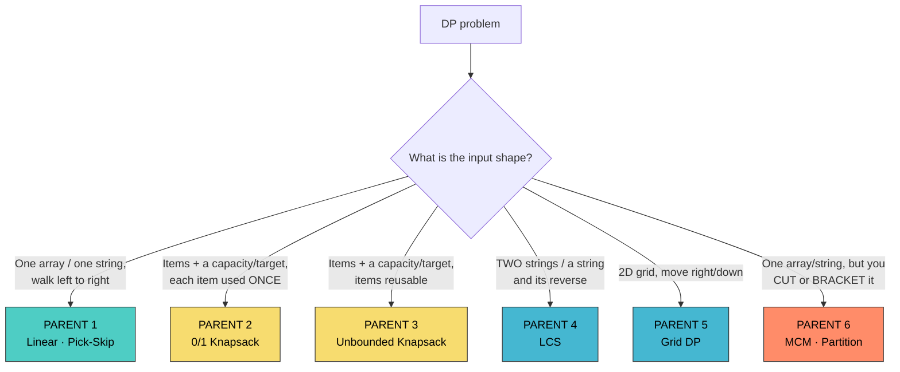
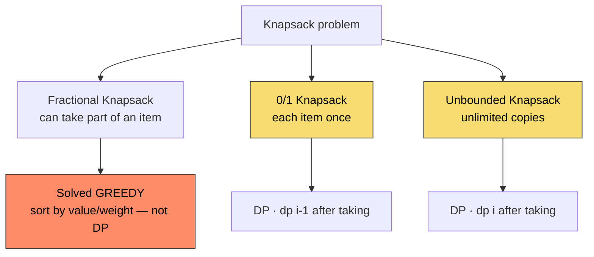
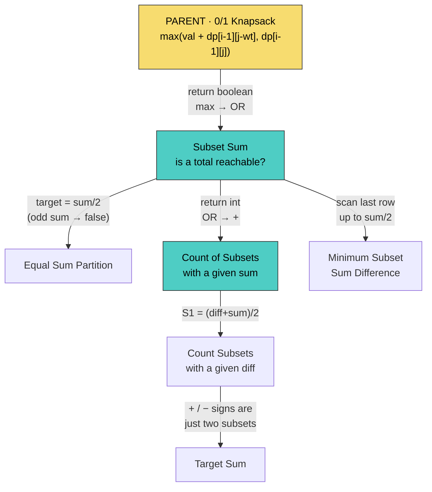
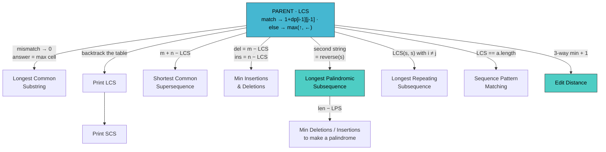
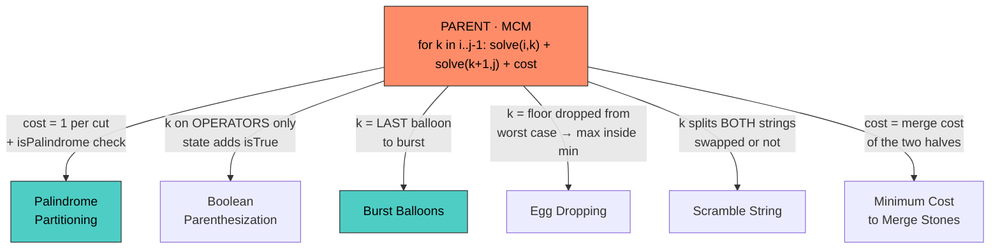

# Dynamic Programming (Java)

> "DP = enhanced recursion. Learn six parent recursions cold; every other problem is one of them with one named change."

**What this chapter covers:** Identification (choice + optimal), the recursion-to-memo-to-table pipeline, and the six parent problems — Linear/Pick-Skip, 0/1 Knapsack, Unbounded Knapsack, LCS, Grid DP, and MCM/Partition DP — each taught end-to-end and then derived into its full family of interview variants. Chapter 3 of the 4-part DSA sequence (31 / 31b / 31c / 31d); section numbers continue from chapters 31/31b.

---

## Table of Contents

| Part | Topic | Sections |
|------|-------|----------|
| 4 | Dynamic Programming | §18.15–18.20: Identification, the Six Parents, Knapsack, LCS, Grid, MCM, Cheat Sheet |

**Sequence:** [31 — Foundations & Search](#content/31_dsa_foundations) → [31b — Graphs](#content/31b_dsa_graphs) → **31c (this chapter)** → [31d — Advanced Patterns & ML Coding](#content/31d_dsa_advanced_ml_coding)

---

# PART 4: DYNAMIC PROGRAMMING

---

## 18.15 DP Fundamentals — Identification, the Pipeline & the Six Parents

Most people learn DP backwards. They memorise twenty tables, meet a twenty-first problem, and freeze. This part teaches it the other way round, the way Aditya Verma's classic DP series does:

> **DP = enhanced recursion.**

You never "see the table." You write a recursion, notice it repeats work, and give it a memory. The table is what that memory looks like after you flatten it. Learn six **parent problems** properly and roughly forty interview problems become *variations* — the same code with one operator, one index, or one input changed.

### DP Is Not a Table. It Is Recursion That Remembers.

```
Plain recursion          →   solves the subproblem   →   throws the answer away
Recursion + memory       →   solves the subproblem   →   keeps the answer  = DP
```

If you cannot write the recursion, you cannot write the DP. Everything below is built on that one sentence.

### The 30-Second Identification Test

A problem is DP when **both** of these are true:

| Test | Question to ask | What it looks like in code |
|------|-----------------|----------------------------|
| **1. Choice** | At each step, do I have more than one option? | The recursive function makes **two or more calls** |
| **2. Optimal / count** | Am I asked for min, max, longest, "how many ways", or "is it possible"? | The calls are combined with `max` / `min` / `+` / `\|\|` |

One call in a straight chain is **not** DP — that's just recursion (or a loop in disguise). Branching calls that revisit the same state are DP.

```
NOT DP — a single chain, nothing repeats          DP — branching, states repeat

   f(n)                                                    f(n)
    │                                                     /     \
   f(n-1)                                            f(n-1)     f(n-2)
    │                                                /     \     /    \
   f(n-2)                                       f(n-2) f(n-3) f(n-3)  f(n-4)
    │                                                          ^^^^^
   f(n-3)                                            f(n-3) computed TWICE
                                                     → store it → DP
```

> **The memory hook:** *choice + optimal = DP.* If you can draw a branch, you can write a recurrence.


### Recognition Triggers — Phrase to Parent

When you see these phrases, think DP, and let the phrase point you at a parent:

| Phrase in the question | Likely parent |
|------------------------|---------------|
| "How many ways to..." | Linear (pick/skip), Knapsack-count, or Grid |
| "Minimum cost / fewest coins to..." | Unbounded Knapsack |
| "Maximum profit / value with a limit" | 0/1 Knapsack |
| "Can you reach / is it possible / is there a subset" | 0/1 Knapsack (boolean form) |
| "Longest / shortest **subsequence** of two strings" | LCS |
| "Convert string A into string B" | LCS |
| "Palindrome + subsequence / deletions" | LCS (with the reverse trick) |
| "Partition / cut / place brackets / burst / merge" | MCM (partition DP) |
| "Non-adjacent, can't pick two in a row" | Linear (pick/skip) |
| "Grid, only move right or down" | Grid DP |
| "Buy / sell / hold / cooldown" | State-machine DP |

### Step 1 of Everything: The Choice Diagram

Before writing a single line of code, draw the **choice diagram**. It is the picture of what you are allowed to do at one step. This is the single highest-leverage habit in DP.

```
0/1 Knapsack, standing at item i:

                     item i
                   /        \
        weight fits           weight does NOT fit
           /    \                     |
      include   exclude            exclude only
         |         |                   |
   val[i] + f(i-1, W-wt[i])       f(i-1, W)
             \      /
              max(...)
```

Two branches on the page become two recursive calls in the code, combined by whatever the question asks for (`max`, `min`, `+`, `||`). That is the whole translation.

### Base Condition = The Smallest Valid Input

Beginners guess base cases. Don't. Use the two questions Aditya drills:

1. **"Think of the smallest valid input."** No items left? Capacity zero? Empty string? That answer is usually `0`, `1`, `true`, or `""`.
2. **"Think of the invalid input."** `i > j` on an interval means an empty range — often `0`, sometimes `INT_MAX`, depending on whether you're minimising.

```
0/1 Knapsack  → n == 0 (no items)      → profit 0
              → W == 0 (no capacity)   → profit 0
LCS           → either string empty     → 0
MCM           → i >= j (0 or 1 matrix)  → 0 (nothing to multiply)
Coin change   → amount == 0             → 0 coins
```

Get these right and the table's first row and first column write themselves — because **the base condition literally becomes the initialisation.**

### The Four-Step Pipeline

Every problem in this part is solved in the same fixed order. Never skip a step in an interview; each one is a checkpoint you can be graded on.

```
 STEP 1              STEP 2                 STEP 3                 STEP 4
 RECURSION    →      MEMOISATION      →     TABULATION       →     SPACE-OPTIMISED
 "BC + choice"       "recursion + 2 lines"  "table only"           "keep 1-2 rows"

 exponential         O(states)              O(states)              O(states) time
 O(depth) stack      O(states) + stack      O(states), no stack    O(one row) space
```

| Step | What you write | What changes from the step before |
|------|----------------|-----------------------------------|
| 1. Recursion | Base condition + choice diagram | — |
| 2. Memoisation | **Same code + 2 lines**: check the table, store into the table | Exponential becomes polynomial |
| 3. Tabulation | Delete the recursion; two loops fill the same table | Base condition becomes initialisation; each recursive call becomes a table lookup |
| 4. Space optimisation | Keep only the rows you actually read | Drops a whole dimension |

> **"Memoisation = recursion + 2 lines."** That is literally all it is. `if (t[i][j] != -1) return t[i][j];` at the top, and `return t[i][j] = ...` at the bottom.


**The table's dimensions come from the parameters that change.** In 0/1 knapsack, `n` and `W` change while `wt[]` and `val[]` stay fixed, so the table is `[n+1][W+1]`. In LCS, `n` and `m` change, so it is `[n+1][m+1]`. In Boolean Parenthesization, `i`, `j` **and** `isTrue` change, so you need a third dimension. Count your changing parameters and you have counted your dimensions.

### A Terminology Landmine

Aditya's videos call **memoisation** "top-down" and sometimes label the tabulated version "bottom-up" — and in a few places the handwritten notes use those two words the other way round. The standard, interview-safe usage is:

| Term | Meaning | Direction |
|------|---------|-----------|
| **Top-down** | Recursion + memo table | Starts at the answer, recurses down to base cases |
| **Bottom-up** | Iterative tabulation | Starts at base cases, builds up to the answer |

Use the standard meanings above when you speak to an interviewer. This chapter uses them consistently.

### Fibonacci — The Whole Pipeline on One Line of Recursion

Fibonacci is not an interview problem, but it is the cheapest place to see all four steps.


```java
// STEP 1 — Recursion. Base condition + choice. O(1.618^n) — unusable.
int fib(int n) {
    if (n <= 1) return n;                 // smallest valid input
    return fib(n - 1) + fib(n - 2);       // two calls = branching = DP candidate
}

// STEP 2 — Memoisation = the same code + 2 lines.
int[] memo;
int fib(int n) {
    if (n <= 1) return n;
    if (memo[n] != -1) return memo[n];    // line 1: already solved?
    return memo[n] = fib(n - 1) + fib(n - 2);  // line 2: store on the way out
}
// Time: O(n)  Space: O(n) table + O(n) stack

// STEP 3 — Tabulation. Recursion deleted; base condition became initialisation.
int fib(int n) {
    if (n <= 1) return n;
    int[] dp = new int[n + 1];
    dp[0] = 0; dp[1] = 1;                 // <- the base condition, as data
    for (int i = 2; i <= n; i++) {
        dp[i] = dp[i - 1] + dp[i - 2];    // <- the recursive calls, as lookups
    }
    return dp[n];
}
// Time: O(n)  Space: O(n), no stack

// STEP 4 — Space optimisation. dp[i] only ever reads two cells back.
int fib(int n) {
    if (n <= 1) return n;
    int prev2 = 0, prev1 = 1;
    for (int i = 2; i <= n; i++) {
        int curr = prev1 + prev2;
        prev2 = prev1;
        prev1 = curr;
    }
    return prev1;
}
// Time: O(n)  Space: O(1)
```

**Example:** `n = 5` → `5` (0, 1, 1, 2, 3, 5)

**Practice:** [Fibonacci Number →](#dsa-problem-fibonacci-number)

```
Why memoisation is not optional — the naive call tree:

                     fib(5)
                   /        \
              fib(4)         fib(3)      <- fib(3) appears twice
             /     \         /     \
         fib(3)   fib(2)  fib(2)  fib(1) <- fib(2) appears three times
         /   \    /   \    /   \
     fib(2) fib(1) ...  ...  ...

WITH memoisation: each fib(k) computed exactly ONCE → O(n) total.
```

> **Fun fact:** the number of calls in naive recursive Fibonacci is itself a Fibonacci number — `fib(n)` costs `fib(n+1) - 1` additions, roughly `O(1.618^n)`.

### Recursion → Table: How a Call Becomes a Cell

This mechanical translation is worth learning as a *rule*, because it works for every problem in this part.

| In the recursion | In the table |
|------------------|--------------|
| Parameter `n` (items left) | Row index `i` |
| Parameter `W` (capacity left) | Column index `j` |
| `if (n == 0 \|\| W == 0) return 0;` | `dp[0][*] = 0` and `dp[*][0] = 0` (initialisation) |
| `f(n-1, W)` | `dp[i-1][j]` |
| `f(n-1, W - wt[n-1])` | `dp[i-1][j - wt[i-1]]` |
| `return f(n, W)` | `return dp[n][W]` |

```
Recursive form                                Tabulated form
-----------------------------------------     -------------------------------------
if (wt[n-1] <= W)                             if (wt[i-1] <= j)
  return max(val[n-1] + f(n-1, W-wt[n-1]),      dp[i][j] = max(val[i-1] + dp[i-1][j-wt[i-1]],
             f(n-1, W));                                       dp[i-1][j]);
else                                          else
  return f(n-1, W);                             dp[i][j] = dp[i-1][j];
```

Nothing is re-derived. You replace calls with lookups, and `n, W` with `i, j`. That is the entire conversion.


### The Six Parents — Your Whole DP Map

Here is the map. Learn these six recursions cold; every other problem in this part is one of them with a small, nameable change.




| # | Parent | Signature you can spot | State | Core recurrence | Children in this chapter |
|---|--------|------------------------|-------|-----------------|--------------------------|
| **1** | **Linear / Pick-Skip** | One array, decide per element, answer depends on 1–2 neighbours | `dp[i]` = best using `0..i` | `dp[i] = f(dp[i-1], dp[i-2] + a[i])` | Climbing Stairs, House Robber I/II, Decode Ways, Word Break, Jump Game, Kadane, LIS |
| **2** | **0/1 Knapsack** | Items + capacity/target, **each item once** | `dp[i][j]` = best from first `i` items, budget `j` | `dp[i][j] = max(dp[i-1][j], val + dp[i-1][j-wt])` | Subset Sum, Equal Partition, Count Subsets, Min Subset Diff, Count-with-Diff, Target Sum |
| **3** | **Unbounded Knapsack** | Same, but **items reusable** | `dp[i][j]` | `dp[i][j] = max(dp[i-1][j], val + dp[i][j-wt])` ← same row | Rod Cutting, Coin Change I & II, Perfect Squares, Ribbon Cut |
| **4** | **LCS** | **Two** sequences, or one plus its reverse | `dp[i][j]` = answer for prefixes `i`, `j` | match → `1 + dp[i-1][j-1]`; else → `max(dp[i-1][j], dp[i][j-1])` | Common Substring, Print LCS, SCS, Edit Distance, LPS, Min Insert/Delete, Distinct Subseq |
| **5** | **Grid DP** | 2D board, movement constrained | `dp[r][c]` = best way to reach `(r,c)` | `dp[r][c] = f(dp[r-1][c], dp[r][c-1])` | Unique Paths I/II, Minimum Path Sum, Triangle, Maximal Square |
| **6** | **MCM / Partition** | Cut, split, bracket, burst, merge a range | `dp[i][j]` = best for range `i..j` | `for k in i..j-1: f(solve(i,k), solve(k+1,j), cost)` | MCM, Palindrome Partitioning, Boolean Parenthesization, Burst Balloons, Egg Drop, Scramble String |

**Two more you will meet at Google** that are not part of the classic six but appear often enough to learn: **State-machine DP** (stock buy/sell — you are in one of a few named states each day) and **Bitmask DP** (n ≤ 20, the state *is* the subset). Both are covered in §18.19.

### Identification Drills

Read the problem, name the parent, name the change. Thirty seconds each.

| Problem | Parent | The change from the parent |
|---------|--------|----------------------------|
| "Can any subset sum to 11?" | 0/1 Knapsack | Return `boolean`; `max` becomes `\|\|` |
| "How many subsets sum to 11?" | 0/1 Knapsack | Return `int`; `\|\|` becomes `+` |
| "Fewest coins to make 11, unlimited coins" | Unbounded Knapsack | `max` becomes `min`, add `+1` per coin |
| "Longest palindromic subsequence of s" | LCS | Second string is `reverse(s)` |
| "Minimum cuts so every piece is a palindrome" | MCM | Cost per cut is `1`, plus a palindrome check |
| "Max money, can't rob adjacent houses" | Linear | Skip one index instead of one item |
| "Ways to reach bottom-right of a grid" | Grid | Sum instead of max |

### When Nothing Matches: Deriving State From Scratch

The parent map covers most interview DP, but not all of it. When a problem refuses to match, fall back to first principles — this is the step the pattern-matching approach leaves out, and it is what separates a memoriser from an engineer.

1. **Write the brute-force recursion first.** Even exponential. What arguments does it take?
2. **Prune the arguments.** Which of them actually affect the answer? Those, and only those, are your state. (Anything you can recompute from the others is not state.)
3. **Check overlapping subproblems.** Draw two levels of the call tree. If no state repeats, this is divide-and-conquer, not DP — stop.
4. **Check optimal substructure.** Is the best answer for the whole built from best answers of parts? If a *sub-optimal* part could win overall (common in path problems with constraints), you need extra state.
5. **Count the dimensions and estimate.** `states × work-per-state` must fit the limits. Too big? Add a dimension you can drop, switch a dimension to a bitmask, or find a monotonicity you can binary-search.

> **Sanity check you can say out loud:** "My state is `dp[i][j]` = *<English sentence>*. It's enough because nothing outside `i` and `j` changes the answer." If you can't finish that sentence, your state is wrong — fix it before writing code.

---

### Parent 1: Linear / Pick-Skip DP

**The signature:** one array or string, you walk it left to right, and at each index you make a small decision whose answer depends on one or two earlier answers.

**The recursion:**

```java
// The shape of every Parent-1 problem
int solve(int i) {
    if (i < 0) return BASE;                     // smallest valid input
    return combine(solve(i - 1),                // skip / take one step
                   solve(i - 2) + value[i]);    // take / take two steps
}
```

**State:** `dp[i]` = the answer considering the prefix `0..i`.
**Answer:** `dp[n-1]` (or `dp[n]` for 1-indexed string versions).
**Space:** almost always optimisable to `O(1)` — you only read one or two cells back.

#### Climbing Stairs (the Fibonacci child)

**Recognition:** "How many distinct ways to reach step n, taking 1 or 2 steps at a time?"
**Parent:** Linear. **Change:** combine with `+` (counting), no value array.

**State:** `dp[i]` = number of ways to reach step i.
**Recurrence:** `dp[i] = dp[i-1] + dp[i-2]` (arrive from one step back or two).
**Base:** `dp[0] = 1, dp[1] = 1`.

```java
public int climbStairs(int n) {
    if (n <= 2) return n;
    int prev2 = 1, prev1 = 2;
    for (int i = 3; i <= n; i++) {
        int curr = prev1 + prev2;
        prev2 = prev1;
        prev1 = curr;
    }
    return prev1;
}
// Time: O(n)  Space: O(1)
```

**Example:** `n = 3` → `3`  (1+1+1, 1+2, 2+1)

**Practice:** [Climbing Stairs →](#dsa-problem-climbing-stairs) · [Min Cost Climbing Stairs →](#dsa-problem-min-cost-climbing-stairs)

#### House Robber (pick/skip with a gap)

**Recognition:** "Maximum sum of non-adjacent elements."
**Parent:** Linear. **Change:** combine with `max`, and skipping is forced to skip *two*.

**State:** `dp[i]` = max money robbing houses `0..i`.
**Recurrence:** `dp[i] = max(dp[i-1], dp[i-2] + nums[i])` — skip this house, or rob it plus the best from two back.
**Base:** `dp[0] = nums[0]`, `dp[1] = max(nums[0], nums[1])`.

```java
public int rob(int[] nums) {
    if (nums.length == 1) return nums[0];
    int prev2 = nums[0], prev1 = Math.max(nums[0], nums[1]);
    for (int i = 2; i < nums.length; i++) {
        int curr = Math.max(prev1, prev2 + nums[i]);
        prev2 = prev1;
        prev1 = curr;
    }
    return prev1;
}
// Time: O(n)  Space: O(1)
```

**Example:** `nums = [2, 7, 9, 3, 1]` → `12`  (rob houses 0, 2, 4)

**House Robber II (circular street)** is the same child with one trick: the first and last house are now adjacent, so run the linear solver twice — once on `nums[0..n-2]`, once on `nums[1..n-1]` — and take the max.

```java
public int robCircular(int[] nums) {
    int n = nums.length;
    if (n == 1) return nums[0];
    return Math.max(robRange(nums, 0, n - 2), robRange(nums, 1, n - 1));
}
private int robRange(int[] nums, int lo, int hi) {
    int prev2 = 0, prev1 = 0;
    for (int i = lo; i <= hi; i++) {
        int curr = Math.max(prev1, prev2 + nums[i]);
        prev2 = prev1;
        prev1 = curr;
    }
    return prev1;
}
```

**Practice:** [House Robber →](#dsa-problem-house-robber)

#### Decode Ways (constrained Fibonacci)

**Recognition:** "How many ways to decode a digit string into letters (A=1 … Z=26)?"
**Parent:** Linear. **Change:** each of the two branches is *conditional* — a step is only legal if the digits form a valid letter.

**State:** `dp[i]` = number of ways to decode `s[0..i-1]`.
**Recurrence:** if `s[i-1] != '0'`, `dp[i] += dp[i-1]`; if `s[i-2..i-1]` is 10–26, `dp[i] += dp[i-2]`.

```java
public int numDecodings(String s) {
    if (s.charAt(0) == '0') return 0;
    int n = s.length();
    int prev2 = 1, prev1 = 1; // dp[0]=1, dp[1]=1

    for (int i = 2; i <= n; i++) {
        int curr = 0;
        int oneDigit = s.charAt(i - 1) - '0';
        int twoDigit = Integer.parseInt(s.substring(i - 2, i));
        if (oneDigit >= 1) curr += prev1;
        if (twoDigit >= 10 && twoDigit <= 26) curr += prev2;
        prev2 = prev1;
        prev1 = curr;
    }
    return prev1;
}
// Time: O(n)  Space: O(1)
```

**Example:** `s = "226"` → `3`  ("2,2,6", "22,6", "2,26")

**Practice:** [Decode Ways →](#dsa-problem-decode-ways)

#### Word Break (pick/skip over *every* earlier cut)

**Recognition:** "Can the string be segmented into dictionary words?"
**Parent:** Linear. **Change:** the branch isn't 1-or-2 steps back — it's *any* earlier index, so the inner loop is O(n).

**State:** `dp[i]` = true if `s[0..i-1]` can be segmented.
**Recurrence:** `dp[i] = true` if some `j < i` has `dp[j] == true` and `s[j..i)` is in the dictionary.

```java
public boolean wordBreak(String s, List<String> wordDict) {
    Set<String> dict = new HashSet<>(wordDict);
    boolean[] dp = new boolean[s.length() + 1];
    dp[0] = true;                                  // empty string is always breakable

    for (int i = 1; i <= s.length(); i++) {
        for (int j = 0; j < i; j++) {
            if (dp[j] && dict.contains(s.substring(j, i))) {
                dp[i] = true;
                break;
            }
        }
    }
    return dp[s.length()];
}
// Time: O(n^2 * m) with m = avg word length  Space: O(n)
```

**Example:** `s = "leetcode"`, `wordDict = ["leet", "code"]` → `true`

**Practice:** [Word Break →](#dsa-problem-word-break)

#### Kadane's Algorithm (Maximum Subarray) — Linear DP in disguise

**Recognition:** "Largest sum of a contiguous subarray."
**Parent:** Linear. **Change:** the choice is *extend the current run* or *start fresh here*.

**State:** `dp[i]` = best subarray sum **ending exactly at** i.
**Recurrence:** `dp[i] = max(nums[i], dp[i-1] + nums[i])`. Answer is `max(dp[])`, not `dp[n-1]` — a classic slip.

```java
public int maxSubArray(int[] nums) {
    int best = nums[0], curr = nums[0];
    for (int i = 1; i < nums.length; i++) {
        curr = Math.max(nums[i], curr + nums[i]);  // start fresh, or extend
        best = Math.max(best, curr);
    }
    return best;
}
// Time: O(n)  Space: O(1)
```

**Example:** `nums = [-2,1,-3,4,-1,2,1,-5,4]` → `6`  (subarray `[4,-1,2,1]`)

**Practice:** [Maximum Subarray →](#dsa-problem-maximum-subarray)

#### Longest Increasing Subsequence (LIS)

**Recognition:** "Longest subsequence where each element is strictly greater than the previous."
**Parent:** Linear. **Change:** `dp[i]` depends on **all** `j < i`, not just `i-1` — so the DP is `O(n^2)`, and a greedy + binary search beats it.

**O(n^2) DP** — the version you should be able to derive on demand:

```java
public int lengthOfLIS_dp(int[] nums) {
    int n = nums.length, best = 1;
    int[] dp = new int[n];
    Arrays.fill(dp, 1);                    // every element alone is an LIS of 1
    for (int i = 1; i < n; i++) {
        for (int j = 0; j < i; j++) {
            if (nums[j] < nums[i]) dp[i] = Math.max(dp[i], dp[j] + 1);
        }
        best = Math.max(best, dp[i]);
    }
    return best;
}
// Time: O(n^2)  Space: O(n)
```

**O(n log n) patience sorting** — the version that wins the interview:

```java
public int lengthOfLIS(int[] nums) {
    List<Integer> tails = new ArrayList<>();   // tails[k] = smallest tail of an LIS of length k+1
    for (int num : nums) {
        int pos = Collections.binarySearch(tails, num);
        if (pos < 0) pos = -(pos + 1);          // insertion point
        if (pos == tails.size()) tails.add(num);   // extends the longest subsequence
        else tails.set(pos, num);                  // replace to keep the smallest tail
    }
    return tails.size();
}
// Time: O(n log n)  Space: O(n)
```

**Example:** `nums = [10, 9, 2, 5, 3, 7, 101, 18]` → `4`  (`[2, 3, 7, 18]` or `[2, 3, 7, 101]`)

```
nums = [10, 9, 2, 5, 3, 7, 101, 18]

Step-by-step tails array:
  10  → [10]
  9   → [9]            (replace 10 — smaller tail for length 1)
  2   → [2]            (replace 9)
  5   → [2, 5]         (extend)
  3   → [2, 3]         (replace 5 — smaller tail for length 2)
  7   → [2, 3, 7]      (extend)
  101 → [2, 3, 7, 101] (extend)
  18  → [2, 3, 7, 18]  (replace 101)

Answer: tails.size() = 4
```

> **Careful:** `tails` is *not* a valid LIS — only its **length** is meaningful. If asked to print the actual subsequence, keep parent pointers alongside.

**Practice:** [Longest Increasing Subsequence →](#dsa-problem-longest-increasing-subsequence)

#### Jump Game (where DP loses to greedy)

**Recognition:** "Can you reach the last index?"
**Parent:** Linear — but worth knowing that the `O(n^2)` DP is the *wrong* answer here. Track the furthest reachable index instead.

```java
public boolean canJump(int[] nums) {
    int reach = 0;
    for (int i = 0; i < nums.length; i++) {
        if (i > reach) return false;                 // stuck before this index
        reach = Math.max(reach, i + nums[i]);
    }
    return true;
}
// Time: O(n)  Space: O(1)
```

**Practice:** [Jump Game →](#dsa-problem-jump-game)

> **Interview note:** "It's DP" is not always the best answer. When each state's decision only ever extends a running frontier (reach, current sum, best-so-far), greedy collapses the DP to O(n). Say the DP out loud, then say why greedy is safe here.

**Key Problems — Detailed Solutions:**

<details>
<summary><strong>House Robber</strong> — Medium</summary>

**Problem:** Given an array `nums` representing money in each house along a street, find the maximum amount you can rob without robbing two adjacent houses.

**Example:**
Input: nums = [2, 7, 9, 3, 1]
Output: 12  (rob houses 0, 2, 4: 2 + 9 + 1 = 12)

**Parent:** Linear / pick-skip. The choice diagram at house `i` is: *skip it* (carry `dp[i-1]`), or *rob it* (`nums[i] + dp[i-2]`, because `i-1` is now off-limits).

**Approach:** dp[i] = max money robbing houses 0..i. At each house, choose the better of: (1) skip this house (dp[i-1]), or (2) rob this house plus the best from two houses back (dp[i-2] + nums[i]). Space-optimize to two variables.

**Java:**
```java
public int rob(int[] nums) {
    if (nums.length == 1) return nums[0];
    int prev2 = nums[0], prev1 = Math.max(nums[0], nums[1]);
    for (int i = 2; i < nums.length; i++) {
        int curr = Math.max(prev1, prev2 + nums[i]);
        prev2 = prev1;
        prev1 = curr;
    }
    return prev1;
}
// Time: O(n)  Space: O(1)
```

**Complexity:** O(n) time, O(1) space
</details>

<details>
<summary><strong>Longest Increasing Subsequence</strong> — Medium</summary>

**Problem:** Given an integer array `nums`, find the length of the longest strictly increasing subsequence.

**Example:**
Input: nums = [10, 9, 2, 5, 3, 7, 101, 18]
Output: 4  (subsequence [2, 3, 7, 101])

**Parent:** Linear, but with an all-previous-indices dependency. Mention the O(n^2) DP first — it shows you can derive it — then upgrade to patience sorting.

**Approach:** Maintain a "tails" array where tails[i] = smallest ending element of all increasing subsequences of length i+1. For each number, binary search for its position in tails. If it extends the longest subsequence, append; otherwise, replace to maintain the smallest possible tail.

**Java:**
```java
public int lengthOfLIS(int[] nums) {
    List<Integer> tails = new ArrayList<>();
    for (int num : nums) {
        int pos = Collections.binarySearch(tails, num);
        if (pos < 0) pos = -(pos + 1);
        if (pos == tails.size()) tails.add(num);
        else tails.set(pos, num);
    }
    return tails.size();
}
// Time: O(n log n)  Space: O(n)
```

**Complexity:** O(n log n) time, O(n) space
</details>

<details>
<summary><strong>Word Break</strong> — Medium</summary>

**Problem:** Given a string `s` and a dictionary of strings `wordDict`, return true if `s` can be segmented into a space-separated sequence of dictionary words.

**Example:**
Input: s = "leetcode", wordDict = ["leet", "code"]
Output: true  ("leet" + "code")

**Parent:** Linear with an inner scan. The choice at position `i` is "which earlier cut `j` do I trust?", so the recurrence ORs over all `j < i`.

**Approach:** dp[i] = true if s[0..i-1] can be segmented. For each position i, check all positions j < i: if dp[j] is true and s[j..i] is in the dictionary, then dp[i] = true.

**Java:**
```java
public boolean wordBreak(String s, List<String> wordDict) {
    Set<String> dict = new HashSet<>(wordDict);
    boolean[] dp = new boolean[s.length() + 1];
    dp[0] = true;
    for (int i = 1; i <= s.length(); i++)
        for (int j = 0; j < i; j++)
            if (dp[j] && dict.contains(s.substring(j, i))) {
                dp[i] = true; break;
            }
    return dp[s.length()];
}
// Time: O(n^2 * m) where m = avg substring length  Space: O(n)
```

**Complexity:** O(n^2 * m) time, O(n) space
</details>

**Problem List — Parent 1: Linear / Pick-Skip:**

| #   | Problem                          | Difficulty | Change from the parent        |
|-----|----------------------------------|------------|-------------------------------|
| 1   | Climbing Stairs (LC 70)          | Easy       | Combine with `+` (count ways) |
| 2   | Min Cost Climbing Stairs (746)   | Easy       | Combine with `min` + cost     |
| 3   | House Robber (LC 198)            | Medium     | Skip two, combine with `max`  |
| 4   | House Robber II (LC 213)         | Medium     | Run the line twice (circular) |
| 5   | Decode Ways (LC 91)              | Medium     | Branches are conditional      |
| 6   | Word Break (LC 139)              | Medium     | Inner loop over all cuts      |
| 7   | Maximum Subarray (LC 53)         | Medium     | "extend or restart"; answer is max over dp |
| 8   | Maximum Product Subarray (152)   | Medium     | Track min AND max (negatives) |
| 9   | Longest Increasing Subseq (300)  | Medium     | All-previous dependency → n log n |
| 10  | Number of LIS (LC 673)           | Medium     | Carry a count alongside length |
| 11  | Jump Game (LC 55)                | Medium     | Greedy frontier beats the DP  |
| 12  | Jump Game II (LC 45)             | Medium     | BFS-style level counting      |
| 13  | Delete and Earn (LC 740)         | Medium     | Bucket by value → House Robber |
| 14  | Paint House (LC 256)             | Medium     | dp per colour (mini state machine) |
| 15  | Best Sightseeing Pair (LC 1014)  | Medium     | Carry best `a[i]+i` seen so far |

---
## 18.16 Parents 2 & 3 — The Knapsack Family

This is the family that pays the most rent. One recursion, learned properly, generates a dozen interview problems — and the differences between them are so small you can name each one in a single line.

### Parent 2: 0/1 Knapsack

**The problem:** you are given `n` items with `wt[]` and `val[]`, and a bag of capacity `W`. Each item may be taken **at most once**. Maximise the value in the bag.

```
                  wt[]  = [1, 3, 4, 5]
                  val[] = [1, 4, 5, 7]          bag capacity W = 7 kg

           item 1        item 2        item 3        item 4
          ┌──────┐      ┌──────┐      ┌──────┐      ┌──────┐          ╭─────────╮
          │ 1 kg │      │ 3 kg │      │ 4 kg │      │ 5 kg │          │   BAG   │
          │  ₹1  │      │  ₹4  │      │  ₹5  │      │  ₹7  │   ───►   │  W = 7  │
          └──────┘      └──────┘      └──────┘      └──────┘          ╰─────────╯

          Best: items 2 + 3  →  weight 3+4 = 7,  value 4+5 = ₹9
```

#### How to identify it

Two things must be present — and they are exactly the two things from the 30-second test:

1. **A choice per item:** include it or exclude it.
2. **An optimal ask** over a **bounded resource**: maximum value, or "is a total reachable", or "how many ways to hit a total".

Knapsack comes in three flavours; only one of them is DP:



> **If items can be cut into fractions, stop — it's greedy, not DP.** Sort by value-per-weight and fill. Interviewers use this as a trap.

#### Step 1 — The recursion (base condition + choice diagram)

```java
// Base condition: think of the smallest valid input.
//   no items left (n == 0)   → nothing to gain → 0
//   no capacity left (W == 0) → nothing fits    → 0
int knapsack(int[] wt, int[] val, int W, int n) {
    if (n == 0 || W == 0) return 0;

    if (wt[n - 1] <= W) {                       // it FITS → two choices
        return Math.max(
            val[n - 1] + knapsack(wt, val, W - wt[n - 1], n - 1),  // include
            knapsack(wt, val, W, n - 1));                          // exclude
    } else {                                    // does NOT fit → one choice
        return knapsack(wt, val, W, n - 1);                        // exclude only
    }
}
// Time: O(2^n) — every item branches in two. Unusable, but it is the truth.
```

Note the shape: **base condition, then the choice diagram, nothing else.** The return type (`int`) came from the question — "return the maximum profit". When the question changes to "is it possible", the return type becomes `boolean`, and that single change is what generates the whole family below.

#### Step 2 — Memoisation (the same code + 2 lines)

The parameters that change are `n` and `W`, so the memo table is `[n+1][W+1]`.

```java
Integer[][] t;                                   // null = not yet solved

int knapsack(int[] wt, int[] val, int W, int n) {
    if (n == 0 || W == 0) return 0;
    if (t[n][W] != null) return t[n][W];         // line 1 — already solved?

    if (wt[n - 1] <= W) {
        return t[n][W] = Math.max(               // line 2 — store on the way out
            val[n - 1] + knapsack(wt, val, W - wt[n - 1], n - 1),
            knapsack(wt, val, W, n - 1));
    }
    return t[n][W] = knapsack(wt, val, W, n - 1);
}
// Time: O(n * W)  Space: O(n * W) table + O(n) recursion stack
```

> **Why move on from memoisation at all?** Same time complexity, but the recursion stack is real memory and a deep input can blow it. Tabulation removes the stack entirely — that's the only reason step 3 exists.

#### Step 3 — Tabulation (the table, no recursion)

Two steps, every time: **initialise**, then **translate the recurrence**.


```java
public int knapsack(int[] wt, int[] val, int W, int n) {
    int[][] dp = new int[n + 1][W + 1];

    // (a) Initialisation = the base condition, written as data.
    //     Row 0 (no items) and column 0 (no capacity) are already 0 in Java.

    // (b) The recurrence, with calls replaced by lookups.
    for (int i = 1; i <= n; i++) {
        for (int j = 1; j <= W; j++) {
            if (wt[i - 1] <= j) {
                dp[i][j] = Math.max(val[i - 1] + dp[i - 1][j - wt[i - 1]],
                                    dp[i - 1][j]);
            } else {
                dp[i][j] = dp[i - 1][j];
            }
        }
    }
    return dp[n][W];
}
// Time: O(n * W)  Space: O(n * W), no stack
```

```
wt = [1,3,4,5], val = [1,4,5,7], W = 7

              j →   0   1   2   3   4   5   6   7
  i=0 (none)        0   0   0   0   0   0   0   0     ← base: no items
  i=1 (1kg, ₹1)     0   1   1   1   1   1   1   1
  i=2 (3kg, ₹4)     0   1   1   4   5   5   5   5
  i=3 (4kg, ₹5)     0   1   1   4   5   6   6   9
  i=4 (5kg, ₹7)     0   1   1   4   5   7   8  [9]   ← answer dp[n][W]
       ↑
  base: capacity 0

  Reading dp[3][7] = 9:  wt[2]=4 <= 7, so
      include → val[2] + dp[2][7-4] = 5 + dp[2][3] = 5 + 4 = 9
      exclude → dp[2][7] = 5
      max = 9  ✓
```

#### Step 4 — Space optimisation

Row `i` only ever reads row `i-1`. Keep one row and **walk capacity backwards**, so the cells you read are still from the previous item.

```java
public int knapsack(int[] wt, int[] val, int W) {
    int[] dp = new int[W + 1];
    for (int i = 0; i < wt.length; i++) {
        for (int j = W; j >= wt[i]; j--) {       // BACKWARDS — see the warning below
            dp[j] = Math.max(dp[j], dp[j - wt[i]] + val[i]);
        }
    }
    return dp[W];
}
// Time: O(n * W)  Space: O(W)
```

> **The single most important loop-direction rule in DP:** in **0/1** knapsack iterate capacity **backwards** (so each item is used at most once); in **unbounded** knapsack iterate **forwards** (so an item can be reused). Getting this backwards is the most common silent wrong-answer in the whole family.

**Example:** `weight = [1, 3, 4, 5]`, `value = [1, 4, 5, 7]`, `capacity = 7` → `9`

### The 0/1 Knapsack Family Tree

Everything below is the code above, with one named change.



| Child | What changed from its parent | Return type |
|-------|------------------------------|-------------|
| Subset Sum | `max(a, b)` → `a \|\| b`; `val[]` disappears | `boolean` |
| Equal Sum Partition | Call Subset Sum with `target = sum/2`; odd total → immediately false | `boolean` |
| Count of Subsets | `a \|\| b` → `a + b` | `int` |
| Min Subset Sum Diff | Build the Subset Sum table, then read the **last row** | `int` |
| Count Subsets with Diff | Algebra first: `S1 = (diff + sum) / 2`, then Count of Subsets | `int` |
| Target Sum | `+`/`−` signs *are* two subsets → Count Subsets with Diff | `int` |


#### Child 1 — Subset Sum

**Problem:** given `arr[]` and a `sum`, is there a subset that adds up exactly to `sum`?

**Matching:** `arr[]` is the item array, `sum` is the capacity. There is no `val[]` because the question asks *whether*, not *how much*.

```
arr[] = [2, 3, 7, 8, 10],  sum = 11   →   true   ({3, 8})
```

```java
public boolean subsetSum(int[] arr, int sum) {
    int n = arr.length;
    boolean[][] dp = new boolean[n + 1][sum + 1];

    // Initialisation from the base condition:
    //   sum 0 with any prefix → true  (take nothing)
    //   empty array, sum > 0  → false (nothing can be made)
    for (int i = 0; i <= n; i++) dp[i][0] = true;

    for (int i = 1; i <= n; i++) {
        for (int j = 1; j <= sum; j++) {
            if (arr[i - 1] <= j) {
                dp[i][j] = dp[i - 1][j - arr[i - 1]] || dp[i - 1][j];  // take OR skip
            } else {
                dp[i][j] = dp[i - 1][j];
            }
        }
    }
    return dp[n][sum];
}
// Time: O(n * sum)  Space: O(n * sum) → O(sum) with a backwards 1D loop
```

Compare the two recurrences side by side — this is the whole lesson of the family:

```
0/1 Knapsack : dp[i][j] = max( val[i-1] + dp[i-1][j-wt[i-1]] ,  dp[i-1][j] )
Subset Sum   : dp[i][j] =      dp[i-1][j-arr[i-1]]            ||  dp[i-1][j]
                                ^^^ take                           ^^^ skip
```

#### Child 2 — Equal Sum Partition

**Problem:** can `arr[]` be split into two subsets with equal sums?

**The reduction, in two lines:** if the total is odd, no split exists. If it is even, you only need to find **one** subset summing to `total/2` — the rest is automatically the other half.

```java
public boolean canPartition(int[] arr) {
    int sum = 0;
    for (int x : arr) sum += x;
    if (sum % 2 != 0) return false;        // odd total can never split evenly
    return subsetSum(arr, sum / 2);        // that's it — reuse the child above
}
// Time: O(n * sum)  Space: O(sum)
```

**Example:** `[1, 5, 11, 5]` → `true`  (`{1,5,5}` and `{11}`, both 11)

**Practice:** [Partition Equal Subset Sum →](#dsa-problem-partition-equal-subset-sum)

#### Child 3 — Count of Subsets with a Given Sum

**Problem:** how many subsets add up to `sum`?

**The change:** you are no longer asking *whether* a subset exists but *how many*, so `||` becomes `+` and the return type becomes `int`.

```
arr[] = [2, 3, 5, 6, 8, 10],  sum = 10
subsets: {2,8}, {2,3,5}, {10}   →   count = 3
```

```java
public int countSubsets(int[] arr, int sum) {
    int n = arr.length;
    int[][] dp = new int[n + 1][sum + 1];

    dp[0][0] = 1;              // exactly ONE way to make 0 from nothing: the empty subset

    for (int i = 1; i <= n; i++) {
        for (int j = 0; j <= sum; j++) {          // NOTE: j starts at 0, see the warning
            if (arr[i - 1] <= j) {
                dp[i][j] = dp[i - 1][j - arr[i - 1]] + dp[i - 1][j];  // take + skip
            } else {
                dp[i][j] = dp[i - 1][j];
            }
        }
    }
    return dp[n][sum];
}
// Time: O(n * sum)  Space: O(n * sum) → O(sum) with a backwards 1D loop
```

> **Zero trap — worth knowing, it's a real interview follow-up.** Many write-ups (including the classic notes) initialise the *whole first column* to 1: `dp[i][0] = 1 for all i`. That is wrong as soon as the array contains `0`, because `{0}` and `{}` are two different subsets that both sum to 0. Initialise **only `dp[0][0] = 1`** and let the loop start at `j = 0` — then zeros are counted correctly and you need no `2^(number of zeros)` patch afterwards.
>
> Check it: `arr = [0, 1]`, `sum = 1` → correct answer 2 (`{1}` and `{0,1}`). The `dp[i][0] = 1` version returns 1.

#### Child 4 — Minimum Subset Sum Difference

**Problem:** split `arr[]` into two subsets `S1` and `S2` so that `|S1 − S2|` is as small as possible.

**The insight — do the algebra before the code:**

```
Let  total = S1 + S2      →      S2 = total − S1

minimise |S2 − S1| = |(total − S1) − S1| = |total − 2*S1|

S1 can only be a sum that is actually achievable.
Achievable sums are exactly the TRUE cells of the last row of the Subset Sum table.
And since S1 <= S2, we only need to look at S1 up to total/2.
```

```
arr = [1, 6, 11, 5],  total = 23

Last row of the subset-sum table (which sums are reachable?):
  0  1  2  3  4  5  6  7  8  9 10 11 12 ...
  T  T  F  F  F  T  T  T  F  F  F  T  T ...

Scan S1 from total/2 = 11 downwards, first TRUE is S1 = 11:
  diff = |23 − 2*11| = 1     ← answer
```

```java
public int minSubsetSumDiff(int[] arr) {
    int n = arr.length, total = 0;
    for (int x : arr) total += x;

    boolean[][] dp = new boolean[n + 1][total + 1];
    for (int i = 0; i <= n; i++) dp[i][0] = true;

    for (int i = 1; i <= n; i++) {
        for (int j = 1; j <= total; j++) {
            dp[i][j] = (arr[i - 1] <= j && dp[i - 1][j - arr[i - 1]]) || dp[i - 1][j];
        }
    }

    int best = Integer.MAX_VALUE;
    for (int s1 = total / 2; s1 >= 0; s1--) {   // only the lower half matters
        if (dp[n][s1]) { best = total - 2 * s1; break; }  // first hit is the best
    }
    return best;
}
// Time: O(n * total)  Space: O(n * total) → O(total) with a 1D boolean array
```

**Example:** `[1, 6, 11, 5]` → `1`  (`{1,5,6}` = 12 vs `{11}` = 11)

#### Child 5 — Count Subsets with a Given Difference

**Problem:** how many ways to split `arr[]` into `S1`, `S2` with `S1 − S2 = diff`?

**Algebra first, DP second:**

```
      S1 − S2 = diff
    + S1 + S2 = total
    ─────────────────
         2*S1 = diff + total
           S1 = (diff + total) / 2
```

So the question collapses into: *count the subsets whose sum is `(diff + total) / 2`* — which is Child 3, already solved.

```java
public int countSubsetsWithDiff(int[] arr, int diff) {
    int total = 0;
    for (int x : arr) total += x;

    // Guards: the target must be a non-negative whole number.
    if ((total + diff) % 2 != 0) return 0;
    if (Math.abs(diff) > total) return 0;

    return countSubsets(arr, (total + diff) / 2);
}
// Time: O(n * total)  Space: O(total)
```

**Example:** `arr = [1, 1, 2, 3]`, `diff = 1` → `3`

#### Child 6 — Target Sum

**Problem:** put a `+` or `−` in front of every number so the expression equals `target`. Count the ways.

**The reduction:** the `+` numbers form one subset, the `−` numbers form the other. `(sum of + group) − (sum of − group) = target` is *exactly* Child 5.

```
arr = [1, 1, 2, 3],  target = 1

  +1 −1 −2 +3 = 1        S1 = {1,3}, S2 = {1,2}
  −1 +1 −2 +3 = 1        S1 = {1,3}, S2 = {1,2}
  +1 +1 +2 −3 = 1        S1 = {1,1,2}, S2 = {3}
                         →  3 ways
```

```java
public int findTargetSumWays(int[] nums, int target) {
    return countSubsetsWithDiff(nums, target);   // one line — the whole problem
}
// Time: O(n * total)  Space: O(total)
```

**Example:** `nums = [1, 1, 2, 3]`, `target = 1` → `3`

**Practice:** [Target Sum →](#dsa-problem-target-sum)

### The Operator-Swap Table — The Most Reusable Idea in This Part

One recursion skeleton; the question decides the operator and the return type. Internalise this and half of DP stops being new problems.

| The question asks | Combine branches with | Return type | Base `dp[0][0]` |
|-------------------|----------------------|-------------|-----------------|
| Best value / most profit | `max` | `int` | `0` |
| Least cost / fewest items | `min` (+1 per item taken) | `int` | `0`, others `INF` |
| Is it possible? | `\|\|` | `boolean` | `true` |
| How many ways? | `+` | `int` | `1` |
| The actual items chosen | keep the table, **backtrack it** | `List` | — |

### Parent 3: Unbounded Knapsack

**The problem:** identical to 0/1 knapsack, except every item has **unlimited supply**.

**The entire code change is one index:**

```
0/1        : dp[i][j] = max(val[i-1] + dp[i-1][j - wt[i-1]], dp[i-1][j])
                                        ^^^^ move past the item — it is used up

Unbounded  : dp[i][j] = max(val[i-1] + dp[ i ][j - wt[i-1]], dp[i-1][j])
                                        ^^^^ stay on the same row — reuse it
```

```java
public int unboundedKnapsack(int[] wt, int[] val, int W) {
    int n = wt.length;
    int[][] dp = new int[n + 1][W + 1];
    for (int i = 1; i <= n; i++) {
        for (int j = 1; j <= W; j++) {
            if (wt[i - 1] <= j) {
                dp[i][j] = Math.max(val[i - 1] + dp[i][j - wt[i - 1]],  // same row!
                                    dp[i - 1][j]);
            } else {
                dp[i][j] = dp[i - 1][j];
            }
        }
    }
    return dp[n][W];
}
// Time: O(n * W)  Space: O(n * W) → O(W) with a FORWARD 1D loop
```

> **How to spot it in the wording:** "unlimited supply", "you may reuse", "as many times as you want", or simply the fact that reusing an item is not forbidden — e.g. coins, rod pieces, ribbon lengths, perfect squares.

#### Child — Rod Cutting

**Problem:** a rod of length `N` can be cut into pieces; a piece of length `i` sells for `price[i]`. Maximise revenue.

**Matching:** `length[]` is `wt[]`, `price[]` is `val[]`, `N` is the capacity. Pieces are reusable → unbounded.

```
length[] = [1, 2, 3, 4, 5, 6, 7, 8]
price[]  = [1, 5, 8, 9,10,17,17,20]     N = 8

Cut 8 = 2 + 6  →  5 + 17 = ₹22   (better than selling whole for ₹20)
```

```java
public int rodCutting(int[] price, int n) {
    int[] dp = new int[n + 1];                   // dp[len] = best revenue for length len
    for (int len = 1; len <= n; len++) {
        for (int cut = 1; cut <= len; cut++) {   // forward → cuts are reusable
            dp[len] = Math.max(dp[len], price[cut - 1] + dp[len - cut]);
        }
    }
    return dp[n];
}
// Time: O(n^2)  Space: O(n)
```

> If a `length[]` array is not given, build it: `1, 2, ..., N`. The problem is then literally unbounded knapsack.

#### Child — Coin Change I (number of ways)

**Problem:** with unlimited coins of each denomination, in how many ways can you make `amount`?

**The change:** unbounded knapsack with `+` instead of `max` (it's a counting question).

```java
public int change(int amount, int[] coins) {
    int[] dp = new int[amount + 1];
    dp[0] = 1;                                   // one way to make 0: take nothing
    for (int coin : coins) {                     // coin loop OUTSIDE = combinations
        for (int j = coin; j <= amount; j++) {   // forward = reuse allowed
            dp[j] += dp[j - coin];
        }
    }
    return dp[amount];
}
// Time: O(n * amount)  Space: O(amount)
```

> **Loop order decides what you count.** Coins outside / amount inside counts **combinations** (`1+2` and `2+1` are the same) — that's Coin Change II on LeetCode. Swap them (amount outside, coins inside) and you count **permutations** (they're different) — that's Combination Sum IV. Same table, opposite meaning. Say which one you're computing.

**Example:** `amount = 5`, `coins = [1,2,3]` → `5`  (`2+3`, `1+1+3`, `1+2+2`, `1+1+1+2`, `1+1+1+1+1`)

**Practice:** [Coin Change II →](#dsa-problem-coin-change-ii)

#### Child — Coin Change II (minimum number of coins)

**Problem:** fewest coins to make `amount`; return `-1` if impossible.

**The change:** `max` becomes `min`, and taking a coin costs `+1`.

```
Coins = [1, 3, 4], Amount = 6

dp:  [0, 1, 2, 1, 1, 2, 2]
      0  1  2  3  4  5  6

dp[5] = min(dp[5-1]+1, dp[5-3]+1, dp[5-4]+1)
      = min(dp[4]+1,   dp[2]+1,   dp[1]+1)
      = min(2,         3,         2)
      = 2     (coin 4 + coin 1)
```

```java
public int coinChange(int[] coins, int amount) {
    int[] dp = new int[amount + 1];
    Arrays.fill(dp, amount + 1);        // "infinity" — safely above any real answer
    dp[0] = 0;                          // base: 0 coins make amount 0

    for (int i = 1; i <= amount; i++) {
        for (int coin : coins) {
            if (coin <= i) dp[i] = Math.min(dp[i], dp[i - coin] + 1);
        }
    }
    return dp[amount] > amount ? -1 : dp[amount];
}
// Time: O(amount * coins.length)  Space: O(amount)
```

> **The sentinel trap:** if you use `Integer.MAX_VALUE` as infinity, `dp[i - coin] + 1` **overflows to a negative number** and silently produces a wrong answer. Use `amount + 1` (as above) or `Integer.MAX_VALUE - 1` with an explicit guard. This is the single most common bug in min-coin code.

**Example:** `coins = [1, 3, 4]`, `amount = 6` → `2`

**Practice:** [Coin Change →](#dsa-problem-coin-change)

#### Child — Perfect Squares

**Problem:** fewest perfect squares summing to `n`. **The change:** it *is* min-coin change, where the coin set is `1, 4, 9, 16, ...`.

```java
public int numSquares(int n) {
    int[] dp = new int[n + 1];
    Arrays.fill(dp, n + 1);
    dp[0] = 0;
    for (int i = 1; i <= n; i++) {
        for (int s = 1; s * s <= i; s++) {
            dp[i] = Math.min(dp[i], dp[i - s * s] + 1);
        }
    }
    return dp[n];
}
// Time: O(n * sqrt(n))  Space: O(n)
```

**Practice:** [Perfect Squares →](#dsa-problem-perfect-squares)

#### Child — Maximum Ribbon Cut

**Problem:** cut a ribbon of length `n` into pieces of allowed lengths, maximising the **number** of pieces. **The change:** unbounded knapsack where every item's value is `1`, plus an explicit "impossible" sentinel so you never report an invalid cut.

```java
public int maxRibbonCut(int n, int[] lengths) {
    int[] dp = new int[n + 1];
    Arrays.fill(dp, -1);                    // -1 = this length is not achievable
    dp[0] = 0;
    for (int i = 1; i <= n; i++) {
        for (int len : lengths) {
            if (len <= i && dp[i - len] != -1) dp[i] = Math.max(dp[i], dp[i - len] + 1);
        }
    }
    return dp[n];
}
// Time: O(n * lengths.length)  Space: O(n)
```

### 0/1 vs Unbounded — The Two-Line Summary


| | 0/1 Knapsack | Unbounded Knapsack |
|---|---|---|
| After taking an item, you look at | `dp[i-1][...]` (previous row) | `dp[i][...]` (same row) |
| 1D loop direction over capacity | **backwards** (`j = W … wt`) | **forwards** (`j = wt … W`) |
| Typical wording | "each item once", "a subset" | "unlimited supply", "reuse allowed" |
| Family | Subset Sum, Partition, Target Sum | Coin Change, Rod Cutting, Perfect Squares |

**Key Problems — Detailed Solutions:**

<details>
<summary><strong>Coin Change</strong> — Medium</summary>

**Problem:** Given an array `coins` of coin denominations and an integer `amount`, return the fewest number of coins needed to make up that amount. Return -1 if it cannot be made.

**Example:**
Input: coins = [1, 3, 4], amount = 6
Output: 2  (3 + 3, or 2 + 4)

**Parent:** Unbounded Knapsack with `max → min` and a `+1` cost per coin taken. Coins are reusable, so the 1D loop runs **forwards**.

**Approach:** dp[i] = minimum coins to make amount i. For each amount, try every coin: dp[i] = min(dp[i], dp[i - coin] + 1). Base case: dp[0] = 0. Initialize all other entries to amount + 1 as "infinity" — never Integer.MAX_VALUE, which overflows when you add 1.

**Java:**
```java
public int coinChange(int[] coins, int amount) {
    int[] dp = new int[amount + 1];
    Arrays.fill(dp, amount + 1);
    dp[0] = 0;
    for (int i = 1; i <= amount; i++)
        for (int coin : coins)
            if (coin <= i)
                dp[i] = Math.min(dp[i], dp[i - coin] + 1);
    return dp[amount] > amount ? -1 : dp[amount];
}
// Time: O(amount * coins.length)  Space: O(amount)
```

**Complexity:** O(amount * n) time, O(amount) space
</details>

<details>
<summary><strong>Partition Equal Subset Sum</strong> — Medium</summary>

**Problem:** Given an integer array `nums`, return true if you can partition it into two subsets with equal sums.

**Example:**
Input: nums = [1, 5, 11, 5]
Output: true  ({1,5,5} and {11}, both sum to 11)

**Parent:** 0/1 Knapsack → Subset Sum → Equal Sum Partition. Two reductions, both one-liners: an odd total is immediately false, and an even total only needs one subset summing to `total/2`.

**Approach:** Sum the array; if odd, return false. Otherwise run a boolean 0/1 knapsack for target `total/2`, space-optimised to a 1D array iterated backwards so each number is used at most once.

**Java:**
```java
public boolean canPartition(int[] nums) {
    int sum = 0;
    for (int x : nums) sum += x;
    if (sum % 2 != 0) return false;
    int target = sum / 2;

    boolean[] dp = new boolean[target + 1];
    dp[0] = true;                       // empty subset makes 0
    for (int num : nums)
        for (int j = target; j >= num; j--)   // BACKWARDS = 0/1
            dp[j] = dp[j] || dp[j - num];
    return dp[target];
}
// Time: O(n * sum)  Space: O(sum)
```

**Complexity:** O(n * sum) time, O(sum) space
</details>

**Problem List — Parents 2 & 3: The Knapsack Family:**

| #   | Problem                          | Difficulty | Parent → change                       |
|-----|----------------------------------|------------|---------------------------------------|
| 1   | Partition Equal Subset Sum (416) | Medium     | 0/1 → boolean, target = sum/2         |
| 2   | Target Sum (LC 494)              | Medium     | 0/1 → count with diff                 |
| 3   | Last Stone Weight II (LC 1049)   | Medium     | 0/1 → minimum subset difference       |
| 4   | Ones and Zeroes (LC 474)         | Medium     | 0/1 with **two** capacities (3D table)|
| 5   | Coin Change (LC 322)             | Medium     | Unbounded → `min`, `+1` per coin      |
| 6   | Coin Change II (LC 518)          | Medium     | Unbounded → `+`, coins loop outside   |
| 7   | Combination Sum IV (LC 377)      | Medium     | Same table, loops swapped (permutations) |
| 8   | Perfect Squares (LC 279)         | Medium     | Unbounded, coin set = squares         |
| 9   | Rod Cutting (classic)            | Medium     | Unbounded, length = weight            |
| 10  | Maximum Ribbon Cut (classic)     | Medium     | Unbounded, every value = 1            |
| 11  | Subset Sum (classic)             | Medium     | 0/1 → `max` becomes `\|\|`            |
| 12  | Count of Subsets with Sum        | Medium     | 0/1 → `\|\|` becomes `+`              |
| 13  | Minimum Subset Sum Difference    | Medium     | 0/1 → scan the last row               |
| 14  | Number of Dice Rolls (LC 1155)   | Medium     | Bounded-count knapsack (faces per die)|

---
## 18.17 Parents 4 & 5 — The LCS String Family and Grid DP

### Parent 4: Longest Common Subsequence (LCS)

**The problem:** given two strings, find the length of the longest sequence of characters appearing in both **in the same order**, not necessarily contiguously.

```
x = "abcdgh"      y = "abedfhr"

common subsequence:  a b d h   →  length 4     (order kept, gaps allowed)
common SUBSTRING:    a b       →  length 2     (must be contiguous)
```

#### How to identify it

> **If the input is two strings (or two arrays), and the answer is about matching them up — it is LCS or one of its children.**

And the sneaky version: **one** string plus a question about palindromes. A palindrome reads the same forwards and backwards, so the hidden second string is `reverse(s)`. That single trick solves four separate interview problems.

| Input pattern | Output asked | It's LCS if… |
|---------------|--------------|--------------|
| two strings | an integer (length / count / edits) | almost always |
| two strings | a string (print the merge/common part) | yes — build the table, then backtrack it |
| one string + "palindrome" | integer | yes — pair it with its reverse |
| one string + "repeating" | integer | yes — pair it with **itself**, banning `i == j` |

#### Step 1 — The recursion

The choice diagram is driven by the **last characters**:

```
                 x[n-1] vs y[m-1]
                  /            \
           they MATCH          they DIFFER
               |                    |
      1 + f(n-1, m-1)      max( f(n-1, m), f(n, m-1) )
      (keep the char,       (drop the last char of one
       shrink both)          string or the other)
```

```java
// Base condition: smallest valid input — either string empty → nothing in common.
int lcs(String x, String y, int n, int m) {
    if (n == 0 || m == 0) return 0;

    if (x.charAt(n - 1) == y.charAt(m - 1))
        return 1 + lcs(x, y, n - 1, m - 1);

    return Math.max(lcs(x, y, n - 1, m),
                    lcs(x, y, n, m - 1));
}
// Time: O(2^(n+m)) — and the two branches overlap heavily, which is exactly why DP applies.
```

#### Step 2 & 3 — Memoise, then tabulate

Changing parameters are `n` and `m`, so the table is `[n+1][m+1]`, and the base condition `n == 0 || m == 0 → 0` becomes **row 0 and column 0 filled with 0**.


```java
public int longestCommonSubsequence(String text1, String text2) {
    int m = text1.length(), n = text2.length();
    int[][] dp = new int[m + 1][n + 1];        // row 0 / col 0 are already 0 = base case

    for (int i = 1; i <= m; i++) {
        for (int j = 1; j <= n; j++) {
            if (text1.charAt(i - 1) == text2.charAt(j - 1)) {
                dp[i][j] = dp[i - 1][j - 1] + 1;
            } else {
                dp[i][j] = Math.max(dp[i - 1][j], dp[i][j - 1]);
            }
        }
    }
    return dp[m][n];
}
// Time: O(m * n)  Space: O(m * n) → O(min(m,n)) if you only need the length
```

```
text1 = "abcde", text2 = "ace"

      ""  a  c  e
  ""   0  0  0  0
  a    0  1  1  1
  b    0  1  1  1
  c    0  1  2  2
  d    0  1  2  2
  e    0  1  2 [3] ← LCS = "ace"
```

**Example:** `text1 = "abcde"`, `text2 = "ace"` → `3`

**Practice:** [Longest Common Subsequence →](#dsa-problem-longest-common-subsequence)

### The LCS Family Tree




#### Child 1 — Longest Common Substring

**The change:** a substring must be **contiguous**, so a mismatch doesn't inherit anything — it resets the run to `0`. And because the run can end anywhere, the answer is the **maximum cell**, not `dp[m][n]`.

```java
public int longestCommonSubstring(String a, String b) {
    int m = a.length(), n = b.length(), best = 0;
    int[][] dp = new int[m + 1][n + 1];
    for (int i = 1; i <= m; i++) {
        for (int j = 1; j <= n; j++) {
            if (a.charAt(i - 1) == b.charAt(j - 1)) {
                dp[i][j] = dp[i - 1][j - 1] + 1;
                best = Math.max(best, dp[i][j]);
            } else {
                dp[i][j] = 0;              // discontinuity → the run dies here
            }
        }
    }
    return best;
}
// Time: O(m * n)  Space: O(m * n) → O(n) with two rolling rows
```

```
LCS            : mismatch → max(dp[i-1][j], dp[i][j-1])   (carry the best so far)
LC-Substring   : mismatch → 0                             (break the chain)
answer          : dp[m][n]                                 vs   max over all cells
```

#### Child 2 — Print the LCS (backtracking the table)

Don't recompute — **walk the finished table backwards** from `dp[m][n]`.

```
if characters match   → take the char, move DIAGONALLY (i--, j--)
else                  → move towards the LARGER neighbour (up or left), take nothing
stop when i == 0 or j == 0, then REVERSE what you collected
```

```java
public String printLCS(String a, String b) {
    int m = a.length(), n = b.length();
    int[][] dp = new int[m + 1][n + 1];
    for (int i = 1; i <= m; i++)
        for (int j = 1; j <= n; j++)
            dp[i][j] = a.charAt(i - 1) == b.charAt(j - 1)
                     ? dp[i - 1][j - 1] + 1
                     : Math.max(dp[i - 1][j], dp[i][j - 1]);

    StringBuilder sb = new StringBuilder();
    int i = m, j = n;
    while (i > 0 && j > 0) {
        if (a.charAt(i - 1) == b.charAt(j - 1)) {
            sb.append(a.charAt(i - 1));        // part of the LCS
            i--; j--;
        } else if (dp[i - 1][j] > dp[i][j - 1]) {
            i--;
        } else {
            j--;
        }
    }
    return sb.reverse().toString();            // built backwards, so flip it
}
// Time: O(m * n)  Space: O(m * n)
```

**Example:** `a = "acbcf"`, `b = "abcdaf"` → `"abcf"`

#### Child 3 — Shortest Common Supersequence (SCS)

**Problem:** the shortest string that contains **both** inputs as subsequences.

**The insight:** the worst you can do is concatenate them (`m + n`). Every character they share only needs to be written **once**, and the shared characters (in order) are precisely the LCS.

```
a = "AGGTAB"   b = "GXTXAYB"       LCS = "GTAB" (length 4)

concatenate     : AGGTAB + GXTXAYB   → 13 characters
write shared once: AGGXTXAYB          → 6 + 7 − 4 = 9 characters  ✓
```

```java
public int shortestCommonSupersequence(String a, String b) {
    return a.length() + b.length() - longestCommonSubsequence(a, b);
}
// Time: O(m * n)  Space: O(m * n)
```

**Printing the SCS** is Print-LCS with one difference: when characters *don't* match you still **take the character you move over**, and at the end you flush whatever remains of either string.

```java
public String printSCS(String a, String b) {
    int m = a.length(), n = b.length();
    int[][] dp = new int[m + 1][n + 1];
    for (int i = 1; i <= m; i++)
        for (int j = 1; j <= n; j++)
            dp[i][j] = a.charAt(i - 1) == b.charAt(j - 1)
                     ? dp[i - 1][j - 1] + 1
                     : Math.max(dp[i - 1][j], dp[i][j - 1]);

    StringBuilder sb = new StringBuilder();
    int i = m, j = n;
    while (i > 0 && j > 0) {
        if (a.charAt(i - 1) == b.charAt(j - 1)) {
            sb.append(a.charAt(i - 1)); i--; j--;      // shared → write ONCE
        } else if (dp[i - 1][j] > dp[i][j - 1]) {
            sb.append(a.charAt(i - 1)); i--;           // not shared → still write it
        } else {
            sb.append(b.charAt(j - 1)); j--;
        }
    }
    while (i > 0) { sb.append(a.charAt(i - 1)); i--; } // flush the leftovers
    while (j > 0) { sb.append(b.charAt(j - 1)); j--; }
    return sb.reverse().toString();
}
// Time: O(m * n)  Space: O(m * n)
```

> **The one-line rule:** *LCS prints only what's common; SCS prints everything, but the common part only once.*

#### Child 4 — Minimum Insertions & Deletions to Convert A into B

**The insight:** the LCS is the part you get to **keep**. Everything in `a` outside it must be deleted; everything in `b` outside it must be inserted.

```
a = "heap"   b = "pea"    LCS = "ea"

  heap  ──delete h, p (2)──►  ea  ──insert p (1)──►  pea

  deletions  = a.length − LCS = 4 − 2 = 2
  insertions = b.length − LCS = 3 − 2 = 1
```

```java
public int[] minInsertDelete(String a, String b) {
    int lcs = longestCommonSubsequence(a, b);
    return new int[]{ a.length() - lcs, b.length() - lcs };  // {deletions, insertions}
}
```

#### Child 5 — Longest Palindromic Subsequence (the hidden-input trick)

**Problem:** longest subsequence of `s` that is a palindrome.

**The trick:** LCS needs two strings and you were handed one. A palindrome is a sequence that matches its own reverse — so the hidden second string is `reverse(s)`.

```
s = "agbcba"        reverse(s) = "abcbga"

LCS("agbcba", "abcbga") = "abcba"  → length 5 = LPS
```

```java
public int longestPalindromeSubseq(String s) {
    String rev = new StringBuilder(s).reverse().toString();
    return longestCommonSubsequence(s, rev);
}
// Time: O(n^2)  Space: O(n^2)
```

**Practice:** [Longest Palindromic Subsequence →](#dsa-problem-longest-palindromic-subsequence)

#### Child 6 — Minimum Deletions (or Insertions) to Make a String a Palindrome

**The insight:** whatever you keep must itself be a palindrome, and to delete as little as possible you keep the **longest** palindromic subsequence.

```
longer LPS  ⇒  fewer deletions        (they are two sides of the same coin)

minimum deletions  = s.length() − LPS(s)
minimum insertions = s.length() − LPS(s)      ← same number!
```

Insertions equal deletions because each character you would have deleted can instead be mirrored by inserting its partner on the other side.

```java
public int minDeletionsForPalindrome(String s) {
    return s.length() - longestPalindromeSubseq(s);
}
public int minInsertionsForPalindrome(String s) {
    return s.length() - longestPalindromeSubseq(s);   // identical by symmetry
}
```

**Example:** `"agbcba"` → `1`  (delete `g`, leaving the palindrome `abcba`)

#### Child 7 — Longest Repeating Subsequence

**Problem:** the longest subsequence that appears **twice** in the same string, with the two copies not using the same index position.

**The change:** run LCS of the string **with itself**, and forbid matching a character with itself: add `i != j`.

```java
public int longestRepeatingSubsequence(String s) {
    int n = s.length();
    int[][] dp = new int[n + 1][n + 1];
    for (int i = 1; i <= n; i++) {
        for (int j = 1; j <= n; j++) {
            if (s.charAt(i - 1) == s.charAt(j - 1) && i != j) {  // <- the whole change
                dp[i][j] = dp[i - 1][j - 1] + 1;
            } else {
                dp[i][j] = Math.max(dp[i - 1][j], dp[i][j - 1]);
            }
        }
    }
    return dp[n][n];
}
// Time: O(n^2)  Space: O(n^2)
```

**Example:** `"AABEBCDD"` → `3`  (`"ABD"` occurs twice)

#### Child 8 — Sequence Pattern Matching

**Problem:** is `a` a subsequence of `b`?

**The change:** `a` is a subsequence of `b` exactly when *all of `a`* survives the matching — i.e. `LCS(a, b) == a.length()`.

```java
public boolean isSubsequenceViaLCS(String a, String b) {
    return longestCommonSubsequence(a, b) == a.length();
}
// O(m*n) — correct, and it shows the family link.

// In practice, answer with the two-pointer scan (and mention the LCS view):
public boolean isSubsequence(String a, String b) {
    int i = 0;
    for (int j = 0; j < b.length() && i < a.length(); j++)
        if (a.charAt(i) == b.charAt(j)) i++;
    return i == a.length();
}
// Time: O(n)  Space: O(1)
```

#### Child 9 — Edit Distance (Levenshtein)

**Problem:** minimum insert / delete / replace operations to turn `word1` into `word2`.

**The change:** mismatch now has **three** options instead of two, each costing 1.

**State:** `dp[i][j]` = minimum edits to convert `word1[0..i-1]` into `word2[0..j-1]`.
**Recurrence:**
- match: `dp[i][j] = dp[i-1][j-1]` (free)
- else: `dp[i][j] = 1 + min(dp[i-1][j-1]` *(replace)*`, dp[i-1][j]` *(delete)*`, dp[i][j-1]` *(insert)*`)`
**Base:** `dp[i][0] = i` (delete everything), `dp[0][j] = j` (insert everything) — note these are **not** zero, unlike LCS.

```
word1 = "horse", word2 = "ros"

      ""  r  o  s
  ""   0  1  2  3
  h    1  1  2  3
  o    2  2  1  2
  r    3  2  2  2
  s    4  3  3  2
  e    5  4  4 [3] ← answer

  Reading dp[5][3] = 3:
  horse → rorse (replace h→r)
  rorse → rose  (delete r)
  rose  → ros   (delete e)
```

```java
public int minDistance(String word1, String word2) {
    int m = word1.length(), n = word2.length();
    int[][] dp = new int[m + 1][n + 1];

    for (int i = 0; i <= m; i++) dp[i][0] = i;     // base: delete all of word1
    for (int j = 0; j <= n; j++) dp[0][j] = j;     // base: insert all of word2

    for (int i = 1; i <= m; i++) {
        for (int j = 1; j <= n; j++) {
            if (word1.charAt(i - 1) == word2.charAt(j - 1)) {
                dp[i][j] = dp[i - 1][j - 1];
            } else {
                dp[i][j] = 1 + Math.min(dp[i - 1][j - 1],
                               Math.min(dp[i - 1][j], dp[i][j - 1]));
            }
        }
    }
    return dp[m][n];
}
// Time: O(m * n)  Space: O(m * n) → O(n) with two rows
```

**Example:** `word1 = "horse"`, `word2 = "ros"` → `3`

**Practice:** [Edit Distance →](#dsa-problem-edit-distance)

> **Know which neighbour is which operation** — interviewers ask. `dp[i-1][j]` = delete from `word1`; `dp[i][j-1]` = insert into `word1`; `dp[i-1][j-1]` = replace. If you can't name them, you can't reconstruct the edit script.

#### Child 10 — Distinct Subsequences (counting instead of maximising)

**Problem:** how many distinct subsequences of `s` equal `t`?

**The change:** the same two branches, combined with `+` instead of `max` — the counting swap you already met in the knapsack family.

```java
public int numDistinct(String s, String t) {
    int m = s.length(), n = t.length();
    long[][] dp = new long[m + 1][n + 1];
    for (int i = 0; i <= m; i++) dp[i][0] = 1;      // one way to match the empty target
    for (int i = 1; i <= m; i++) {
        for (int j = 1; j <= n; j++) {
            dp[i][j] = dp[i - 1][j];                             // skip s[i-1]
            if (s.charAt(i - 1) == t.charAt(j - 1))
                dp[i][j] += dp[i - 1][j - 1];                    // or use it
        }
    }
    return (int) dp[m][n];
}
// Time: O(m * n)  Space: O(m * n) → O(n) iterating j backwards
```

**Practice:** [Distinct Subsequences →](#dsa-problem-distinct-subsequences)

#### Child 11 — Wildcard Matching (pattern DP)

**Problem:** does `s` match pattern `p`, where `?` matches one character and `*` matches any sequence (including empty)?

**The change:** the "choice" now comes from the *pattern*, not the text: at `*` you either consume a character (`dp[i-1][j]`) or use the star as empty (`dp[i][j-1]`).

```java
public boolean isMatch(String s, String p) {
    int m = s.length(), n = p.length();
    boolean[][] dp = new boolean[m + 1][n + 1];
    dp[0][0] = true;
    for (int j = 1; j <= n; j++)                       // a leading run of '*' matches ""
        dp[0][j] = dp[0][j - 1] && p.charAt(j - 1) == '*';

    for (int i = 1; i <= m; i++) {
        for (int j = 1; j <= n; j++) {
            char pc = p.charAt(j - 1);
            if (pc == '*') {
                dp[i][j] = dp[i - 1][j] || dp[i][j - 1];   // consume one | match empty
            } else if (pc == '?' || pc == s.charAt(i - 1)) {
                dp[i][j] = dp[i - 1][j - 1];
            }
        }
    }
    return dp[m][n];
}
// Time: O(m * n)  Space: O(m * n)
```

**Practice:** [Regular Expression Matching →](#dsa-problem-regular-expression-matching) · [Interleaving String →](#dsa-problem-interleaving-string)

---

### Parent 5: Grid DP

**The signature:** a 2D board, movement is restricted (usually right/down only), and the answer for a cell depends on the cells you could have come *from*.

**State:** `dp[r][c]` = best (or count of) ways to reach cell `(r, c)`.
**Recurrence:** `dp[r][c] = combine(dp[r-1][c], dp[r][c-1])` — combine with `+` for counting, `min`/`max` for cost.
**Base:** the first row and first column, which have only one way in.

> Grid DP is really Parent 1 in two dimensions: the same "where could I have come from?" question, asked of two neighbours instead of one.

#### Unique Paths

**State:** `dp[i][j]` = number of ways to reach `(i, j)` from the top-left moving only right or down.
**Recurrence:** `dp[i][j] = dp[i-1][j] + dp[i][j-1]`.
**Base:** first row and first column are all 1.

```
Grid: 3 x 4

  dp:  1   1   1   1
       1   2   3   4
       1   3   6  [10]  ← answer

  Each cell = cell above + cell to the left
```

```java
public int uniquePaths(int m, int n) {
    int[] dp = new int[n];                 // space-optimised: a single row
    Arrays.fill(dp, 1);                    // base: first row is all 1
    for (int i = 1; i < m; i++) {
        for (int j = 1; j < n; j++) {
            dp[j] += dp[j - 1];            // dp[j] still holds "from above"
        }
    }
    return dp[n - 1];
}
// Time: O(m * n)  Space: O(n)
```

**Example:** `m = 3, n = 4` → `10`

**Practice:** [Unique Paths →](#dsa-problem-unique-paths)

**Unique Paths II** (obstacles) is the same code with one guard: an obstacle cell is unreachable, so set `dp[j] = 0` there instead of adding.

```java
public int uniquePathsWithObstacles(int[][] grid) {
    int n = grid[0].length;
    int[] dp = new int[n];
    dp[0] = grid[0][0] == 1 ? 0 : 1;
    for (int[] row : grid) {
        for (int j = 0; j < n; j++) {
            if (row[j] == 1) dp[j] = 0;                 // blocked → zero ways
            else if (j > 0) dp[j] += dp[j - 1];
        }
    }
    return dp[n - 1];
}
// Time: O(m * n)  Space: O(n)
```

#### Minimum Path Sum

**The change:** `+` becomes `min`, and you add the cell's own cost.

```java
public int minPathSum(int[][] grid) {
    int m = grid.length, n = grid[0].length;
    int[] dp = new int[n];
    dp[0] = grid[0][0];
    for (int j = 1; j < n; j++) dp[j] = dp[j - 1] + grid[0][j];   // first row

    for (int i = 1; i < m; i++) {
        dp[0] += grid[i][0];                                       // first column
        for (int j = 1; j < n; j++) {
            dp[j] = Math.min(dp[j], dp[j - 1]) + grid[i][j];       // from above or left
        }
    }
    return dp[n - 1];
}
// Time: O(m * n)  Space: O(n)
```

**Practice:** [Minimum Path Sum →](#dsa-problem-minimum-path-sum)

#### Maximal Square (a grid DP that isn't about paths)

**State:** `dp[i][j]` = side length of the largest all-1 square whose **bottom-right corner** is `(i, j)`.
**Recurrence:** `dp[i][j] = 1 + min(dp[i-1][j], dp[i][j-1], dp[i-1][j-1])` — a square can only grow if all three neighbours support it.

```java
public int maximalSquare(char[][] matrix) {
    int m = matrix.length, n = matrix[0].length, best = 0;
    int[][] dp = new int[m + 1][n + 1];
    for (int i = 1; i <= m; i++) {
        for (int j = 1; j <= n; j++) {
            if (matrix[i - 1][j - 1] == '1') {
                dp[i][j] = 1 + Math.min(dp[i - 1][j],
                              Math.min(dp[i][j - 1], dp[i - 1][j - 1]));
                best = Math.max(best, dp[i][j]);
            }
        }
    }
    return best * best;
}
// Time: O(m * n)  Space: O(m * n) → O(n) with one rolling row
```

> **The "three neighbours" pattern** shows up whenever a shape must be supported on all sides — maximal square, largest plus sign, counting square submatrices. Recognise it as grid DP with a `min` instead of a `+`.

**Key Problems — Detailed Solutions:**

<details>
<summary><strong>Edit Distance</strong> — Medium</summary>

**Problem:** Given two strings `word1` and `word2`, return the minimum number of operations (insert, delete, replace) to convert word1 into word2.

**Example:**
Input: word1 = "horse", word2 = "ros"
Output: 3  (horse -> rorse -> rose -> ros)

**Parent:** LCS. Same last-character choice diagram; the mismatch branch just has three options instead of two, and the base row/column count deletions and insertions rather than being 0.

**Approach:** dp[i][j] = min edits to convert word1[0..i-1] to word2[0..j-1]. If characters match, dp[i][j] = dp[i-1][j-1]. Otherwise, take the min of replace (dp[i-1][j-1]), delete (dp[i-1][j]), or insert (dp[i][j-1]), plus 1.

**Java:**
```java
public int minDistance(String word1, String word2) {
    int m = word1.length(), n = word2.length();
    int[][] dp = new int[m + 1][n + 1];
    for (int i = 0; i <= m; i++) dp[i][0] = i;
    for (int j = 0; j <= n; j++) dp[0][j] = j;
    for (int i = 1; i <= m; i++)
        for (int j = 1; j <= n; j++)
            if (word1.charAt(i-1) == word2.charAt(j-1))
                dp[i][j] = dp[i-1][j-1];
            else
                dp[i][j] = 1 + Math.min(dp[i-1][j-1],
                                Math.min(dp[i-1][j], dp[i][j-1]));
    return dp[m][n];
}
// Time: O(m * n)  Space: O(m * n)
```

**Complexity:** O(m * n) time, O(m * n) space
</details>

<details>
<summary><strong>Longest Common Subsequence</strong> — Medium</summary>

**Problem:** Given two strings `text1` and `text2`, return the length of their longest common subsequence. A subsequence can skip characters but must maintain relative order.

**Example:**
Input: text1 = "abcde", text2 = "ace"
Output: 3  (LCS is "ace")

**Parent:** this *is* the parent. Derive it from the last-character choice diagram: if the last characters match, keep one character and shrink both strings; if not, drop the last character of one string or the other and take the max.

**Approach:** dp[i][j] = LCS length of text1[0..i-1] and text2[0..j-1]. If characters match, dp[i][j] = dp[i-1][j-1] + 1. Otherwise, dp[i][j] = max(dp[i-1][j], dp[i][j-1]).

**Java:**
```java
public int longestCommonSubsequence(String text1, String text2) {
    int m = text1.length(), n = text2.length();
    int[][] dp = new int[m + 1][n + 1];
    for (int i = 1; i <= m; i++)
        for (int j = 1; j <= n; j++)
            if (text1.charAt(i-1) == text2.charAt(j-1))
                dp[i][j] = dp[i-1][j-1] + 1;
            else
                dp[i][j] = Math.max(dp[i-1][j], dp[i][j-1]);
    return dp[m][n];
}
// Time: O(m * n)  Space: O(m * n)
```

**Complexity:** O(m * n) time, O(m * n) space
</details>

<details>
<summary><strong>Unique Paths</strong> — Medium</summary>

**Problem:** A robot starts at the top-left corner of an m x n grid and can only move right or down. How many unique paths are there to the bottom-right corner?

**Example:**
Input: m = 3, n = 7
Output: 28

**Parent:** Grid DP. "Where could I have arrived from?" — only from above or from the left — so the count is the sum of those two cells.

**Approach:** dp[i][j] = dp[i-1][j] + dp[i][j-1]. First row and first column are all 1 (only one way to reach them). Space-optimize to a single 1D array since each row only depends on the row above.

**Java:**
```java
public int uniquePaths(int m, int n) {
    int[] dp = new int[n];
    Arrays.fill(dp, 1);
    for (int i = 1; i < m; i++)
        for (int j = 1; j < n; j++)
            dp[j] += dp[j - 1];
    return dp[n - 1];
}
// Time: O(m * n)  Space: O(n)
```

**Complexity:** O(m * n) time, O(n) space
</details>

**Problem List — Parents 4 & 5: Strings and Grids:**

| #   | Problem                          | Difficulty | Parent → change                        |
|-----|----------------------------------|------------|----------------------------------------|
| 1   | Longest Common Subseq (LC 1143)  | Medium     | The parent itself                      |
| 2   | Longest Common Substring         | Medium     | Mismatch → 0; answer = max cell        |
| 3   | Shortest Common Superseq (1092)  | Hard       | `m + n − LCS`, then print by backtracking |
| 4   | Edit Distance (LC 72)            | Medium     | Mismatch → 3-way min + 1               |
| 5   | Delete Operation for Two (583)   | Medium     | `m + n − 2*LCS`                        |
| 6   | Longest Palindromic Subseq (516) | Medium     | `LCS(s, reverse(s))`                   |
| 7   | Min Insertions Palindrome (1312) | Hard       | `len − LPS`                            |
| 8   | Longest Repeating Subseq         | Medium     | `LCS(s, s)` with `i != j`              |
| 9   | Is Subsequence (LC 392)          | Easy       | `LCS == a.length` (or two pointers)    |
| 10  | Distinct Subsequences (LC 115)   | Hard       | `max` → `+` (counting)                 |
| 11  | Interleaving String (LC 97)      | Medium     | Two sources feeding one target         |
| 12  | Wildcard Matching (LC 44)        | Hard       | Choice comes from the pattern          |
| 13  | Regular Expr Matching (LC 10)    | Hard       | `*` looks back two pattern chars       |
| 14  | Unique Paths (LC 62)             | Medium     | Grid, combine with `+`                 |
| 15  | Unique Paths II (LC 63)          | Medium     | Obstacles zero out a cell              |
| 16  | Minimum Path Sum (LC 64)         | Medium     | Grid, combine with `min` + cell cost   |
| 17  | Triangle (LC 120)                | Medium     | Grid on a triangle; fill bottom-up     |
| 18  | Maximal Square (LC 221)          | Medium     | Three-neighbour `min` + 1              |
| 19  | Dungeon Game (LC 174)            | Hard       | Fill **backwards** from the princess   |
| 20  | Cherry Pickup (LC 741)           | Hard       | Two walkers → 3D state                 |

---
## 18.18 Parent 6 — MCM / Partition DP

This is the family people find hardest, and it is the one with the **most rigid template**. Once you can fill in four blanks, every problem in it collapses into the same twenty lines of code.

### How to identify it

> **You are given one array or string, and you are asked to CUT it, BRACKET it, SPLIT it, MERGE it, or BURST it — and different choices of where to cut give different costs.**

The giveaway words: *partition, cut, bracket, parenthesize, burst, merge, split, evaluate an expression*. The answer depends on a **range**, not a prefix — which is why the state is `dp[i][j]` over `i..j`, not `dp[i]` over `0..i`.

```
Prefix DP (Parents 1-5):   the answer for 0..i   depends on 0..i-1
Partition DP (Parent 6):   the answer for i..j   depends on i..k and k+1..j
                                                            ^^^ you try EVERY k
```

### The Universal MCM Template

```java
int solve(int[] arr, int i, int j) {
    if (i >= j) return 0;                       // ① base condition: invalid / smallest input

    int best = INITIAL;                         // INT_MAX for min, INT_MIN for max, 0 for count

    for (int k = i; k <= j - 1; k++) {          // ③ the k loop: every possible cut
        int temp = solve(arr, i, k)             //    left part
                 + solve(arr, k + 1, j)         //    right part
                 + costOfCombining(i, k, j);    // ④ the local cost of cutting HERE
        best = Math.min(best, temp);            //    combine: min / max / +
    }
    return best;
}
```

**The four blanks, in the order you fill them:**

```
 ① What are i and j?          → usually i = 0 or 1, j = n-1
 ② What is the base condition? → "smallest valid input" + "invalid input"
 ③ What does k loop over?      → every cut position between i and j
 ④ What is the cost of this cut? → the ONLY part that differs between problems
```

Answer those four questions and you have written the problem. **Blank ④ is the only thing you actually have to think about per problem** — the other three are boilerplate.


> **Two legal k-schemes — pick one and stay consistent:**
> ```
> Scheme A:  k = i   .. j-1    →  subproblems (i, k) and (k+1, j)
> Scheme B:  k = i+1 .. j      →  subproblems (i, k-1) and (k, j)
> ```
> They are equivalent. Mixing them mid-problem is the classic off-by-one that produces infinite recursion or a `StackOverflowError`.

### Parent: Matrix Chain Multiplication

**The problem:** multiply matrices `A1 · A2 · … · An`. Matrix multiplication is associative — the *result* is the same regardless of bracketing — but the **cost** is not. Find the cheapest bracketing.


**The prerequisite fact:** multiplying an `a×b` matrix by a `b×c` matrix costs `a*b*c` scalar multiplications and yields an `a×c` matrix.

```
A = 10×30,  B = 30×5,  C = 5×60

(A·B)·C :  (10·30·5) + (10·5·60)  = 1500 + 3000 = 4500   ✓
A·(B·C) :  (30·5·60) + (10·30·60) = 9000 + 18000 = 27000  ✗

Same answer, 6× the work. That is the entire problem.
```

**The dimension array.** `n` matrices are given as an array of `n+1` dimensions:

```
arr[] = {40, 20, 30, 10, 30}      (size 5 → 4 matrices)

  A1 = arr[0] × arr[1] = 40×20
  A2 = arr[1] × arr[2] = 20×30
  A3 = arr[2] × arr[3] = 30×10
  A4 = arr[3] × arr[4] = 10×30

  In general:  Ai  =  arr[i-1] × arr[i]
```

**Why `i` starts at 1, not 0.** Because `Ai = arr[i-1] × arr[i]`, using `i = 0` would read `arr[-1]`. So `i = 1` and `j = n-1` (the last valid matrix index).

```
Filling the four blanks for MCM:

 ① i = 1,  j = n - 1                          (n = arr.length)
 ② i >= j  →  0       (one matrix or none: nothing to multiply)
 ③ k = i .. j-1        (cut between matrix k and matrix k+1)
 ④ cost  =  arr[i-1] * arr[k] * arr[j]
            └─ left result is arr[i-1] × arr[k]
               right result is arr[k]  × arr[j]
               multiplying them costs arr[i-1]*arr[k]*arr[j]
```

```java
// Step 1+2 — recursion with memoisation (the standard interview answer)
Integer[][] memo;

public int matrixMultiplication(int[] arr) {
    int n = arr.length;
    memo = new Integer[n][n];
    return solve(arr, 1, n - 1);
}

private int solve(int[] arr, int i, int j) {
    if (i >= j) return 0;                            // ② base
    if (memo[i][j] != null) return memo[i][j];       // memo line 1

    int best = Integer.MAX_VALUE;
    for (int k = i; k <= j - 1; k++) {               // ③ every cut
        int cost = solve(arr, i, k)
                 + solve(arr, k + 1, j)
                 + arr[i - 1] * arr[k] * arr[j];     // ④ local cost
        best = Math.min(best, cost);
    }
    return memo[i][j] = best;                        // memo line 2
}
// Time: O(n^3) — O(n^2) states × O(n) work each.  Space: O(n^2) + O(n) stack
```

**Tabulation** fills by **increasing interval length**, because `dp[i][j]` needs shorter intervals to already be solved:

```java
public int matrixMultiplicationDP(int[] arr) {
    int n = arr.length;
    int[][] dp = new int[n][n];

    for (int len = 2; len <= n - 1; len++) {         // interval length
        for (int i = 1; i <= n - len; i++) {
            int j = i + len - 1;
            dp[i][j] = Integer.MAX_VALUE;
            for (int k = i; k <= j - 1; k++) {
                dp[i][j] = Math.min(dp[i][j],
                    dp[i][k] + dp[k + 1][j] + arr[i - 1] * arr[k] * arr[j]);
            }
        }
    }
    return dp[1][n - 1];
}
// Time: O(n^3)  Space: O(n^2)
```

> **Fill order is the one new idea in partition DP.** Prefix DP fills left to right; partition DP fills **short intervals first**. If your table comes out full of zeros or `MAX_VALUE`, you almost certainly looped `i` and `j` directly instead of looping over length.

**Example:** `arr = {40, 20, 30, 10, 30}` → `26000`

### The MCM Family Tree



| Child | ① i, j | ③ what k means | ④ cost of the cut |
|-------|--------|----------------|-------------------|
| MCM | `1, n-1` | boundary between matrices | `arr[i-1]*arr[k]*arr[j]` |
| Palindrome Partitioning | `0, n-1` | position of a cut | `1` (plus: stop early if `i..j` is already a palindrome) |
| Boolean Parenthesization | `0, n-1` | index of an **operator** (`k += 2`) | combine left/right true & false counts |
| Burst Balloons | `1, n` | the **last** balloon burst in the range | `arr[i-1]*arr[k]*arr[j+1]` |
| Egg Dropping | `e, f` | the floor you drop from | `1 + max(break, no-break)` |
| Scramble String | pairs of substrings | split point, tried swapped and unswapped | `0` (boolean combine) |

#### Child 1 — Palindrome Partitioning (minimum cuts)

**Problem:** cut a string so every piece is a palindrome; return the **minimum number of cuts**.

```
s = "nitik"

  n | iti | k     → 2 cuts   ✓ minimum
  n | i | t | i | k → 4 cuts (always legal — single chars are palindromes — but wasteful)
```

**Filling the four blanks:**

```
 ① i = 0, j = n-1     (no i-1 term here, so we can start at 0)
 ② i >= j          → 0 cuts (empty or single char)
    isPalindrome(i,j) → 0 cuts (already done — the crucial early exit)
 ③ k = i .. j-1
 ④ cost = 1        (one cut, wherever you make it)
```

```java
public int minCut(String s) {
    int n = s.length();
    // pal[i][j] = is s[i..j] a palindrome? Precomputed in O(n^2) so the DP stays O(n^2).
    boolean[][] pal = new boolean[n][n];
    for (int len = 1; len <= n; len++) {
        for (int i = 0; i + len - 1 < n; i++) {
            int j = i + len - 1;
            pal[i][j] = s.charAt(i) == s.charAt(j) && (len <= 2 || pal[i + 1][j - 1]);
        }
    }

    int[] dp = new int[n];                    // dp[j] = min cuts for s[0..j]
    for (int j = 0; j < n; j++) {
        if (pal[0][j]) { dp[j] = 0; continue; }   // whole prefix is a palindrome
        dp[j] = Integer.MAX_VALUE;
        for (int k = 0; k < j; k++) {
            if (pal[k + 1][j]) dp[j] = Math.min(dp[j], dp[k] + 1);
        }
    }
    return dp[n - 1];
}
// Time: O(n^2)  Space: O(n^2) for the palindrome table
```

> **Two optimisations that matter here, and they generalise:**
> 1. **Precompute the expensive predicate.** A naive `isPalindrome(i,j)` inside the k-loop makes the whole thing `O(n^3)`. Precomputing the palindrome table drops it to `O(n^2)`.
> 2. **Check the whole range first.** If `s[i..j]` is already a palindrome, the answer is 0 cuts — return immediately and skip the entire k-loop. Without this early exit the recursion explores cuts it can never need.

**Practice:** [Palindrome Partitioning →](#dsa-problem-palindrome-partitioning)

#### Child 2 — Boolean Parenthesization (Evaluate Expression to True)

**Problem:** given an expression of `T`/`F` separated by `&`, `|`, `^`, in how many ways can you bracket it so it evaluates to **true**?

```
expr = "T^F|F"        →  2 ways     ((T^F)|F  and  T^(F|F))
expr = "T|F&T^F"      →  5 ways
```

**What's new here:** the answer depends on more than the range. To count how many ways the *whole* evaluates to true, you need to know how many ways each side evaluates to true **and to false** — because `F ^ T` is true. So the state gains a third dimension: `isTrue`.

**Filling the blanks:**

```
 ① i = 0, j = n-1
 ② i > j  → 0
    i == j → does this single symbol match what we want? (T for true, F for false)
 ③ k = i+1, i+3, i+5, …   (k += 2 — operators sit at ODD offsets)
 ④ combine left/right true & false counts per operator
```

```
Operator truth tables → counting formulas

  &  true  : lT*rT
     false : lF*rT + lT*rF + lF*rF
  |  true  : lT*rT + lT*rF + lF*rT
     false : lF*rF
  ^  true  : lT*rF + lF*rT
     false : lT*rT + lF*rF
```

```java
Map<String, Integer> memo = new HashMap<>();

public int countWays(String s) {
    memo.clear();
    return solve(s, 0, s.length() - 1, true);
}

private int solve(String s, int i, int j, boolean isTrue) {
    if (i > j) return 0;
    if (i == j) {                                        // single symbol
        char c = s.charAt(i);
        return (isTrue ? c == 'T' : c == 'F') ? 1 : 0;
    }
    String key = i + "|" + j + "|" + isTrue;             // 3D state, flattened into a map
    if (memo.containsKey(key)) return memo.get(key);

    int ways = 0;
    for (int k = i + 1; k <= j - 1; k += 2) {            // k lands on operators only
        int lT = solve(s, i, k - 1, true),  lF = solve(s, i, k - 1, false);
        int rT = solve(s, k + 1, j, true),  rF = solve(s, k + 1, j, false);

        switch (s.charAt(k)) {
            case '&': ways += isTrue ? lT * rT
                                     : lF * rT + lT * rF + lF * rF; break;
            case '|': ways += isTrue ? lT * rT + lT * rF + lF * rT
                                     : lF * rF; break;
            case '^': ways += isTrue ? lT * rF + lF * rT
                                     : lT * rT + lF * rF; break;
        }
    }
    memo.put(key, ways);
    return ways;
}
// Time: O(n^3)  Space: O(n^2) states
```

> **Two things interviewers probe here:**
> - **Why `k += 2`?** Operands sit at even indices, operators at odd ones. Stepping by 1 would try to "cut" at an operand, which is meaningless.
> - **Why a third dimension?** Because a false sub-result can produce a true parent (`F^T`, `F|T`). Any time a sub-answer's *other* outcome is useful, that outcome belongs in the state. A `[n][n][2]` array works too; the map keeps the key readable.
>
> Real problems also ask for the count **mod 1003** (or `10^9+7`) — apply the modulus at every `+` and `*` or you will overflow.

#### Child 3 — Burst Balloons

**Problem:** bursting balloon `i` earns `nums[left] * nums[i] * nums[right]` using its *current* neighbours. Burst all balloons to maximise coins.

**The insight that makes it a partition problem:** if you ask "which balloon do I burst **first**?", the subproblems aren't independent — bursting changes the neighbours of both sides. So flip it: ask **which balloon is burst LAST** in this range. That balloon's neighbours are then fixed at the range boundaries, and the two sides become independent.

```
 ④ cost = arr[i-1] * arr[k] * arr[j+1]
           └── k is the LAST balloon standing in i..j,
               so its neighbours are exactly the range's outer walls
```

```java
// LC 312: Burst Balloons
public int maxCoins(int[] nums) {
    int n = nums.length;
    int[] arr = new int[n + 2];                  // pad with 1s at both boundaries
    arr[0] = arr[n + 1] = 1;
    for (int i = 0; i < n; i++) arr[i + 1] = nums[i];

    int[][] dp = new int[n + 2][n + 2];
    for (int len = 1; len <= n; len++) {         // fill by interval length
        for (int left = 1; left <= n - len + 1; left++) {
            int right = left + len - 1;
            for (int k = left; k <= right; k++) {    // k = last balloon burst
                dp[left][right] = Math.max(dp[left][right],
                    dp[left][k - 1] + arr[left - 1] * arr[k] * arr[right + 1] + dp[k + 1][right]);
            }
        }
    }
    return dp[1][n];
}
// Time: O(n^3)  Space: O(n^2)
```

**Example:** `nums = [3, 1, 5, 8]` → `167`

**Practice:** [Burst Balloons →](#dsa-problem-burst-balloons)

> **The "last, not first" reversal** is the single most transferable trick in partition DP. It also solves Minimum Cost to Merge Stones and Strange Printer. When the forward choice entangles the subproblems, ask what happens **last**.

#### Child 4 — Egg Dropping

**Problem:** `e` eggs, `f` floors. There is a critical floor above which an egg breaks. Find the **minimum number of attempts** needed in the **worst case** to identify it.

**Why it's an MCM problem:** the building is an interval of floors, you choose a floor `k` to drop from, and that splits the problem in two.

```
Drop from floor k:

   egg BREAKS      → the critical floor is BELOW k
                   → one fewer egg, k-1 floors    → solve(e-1, k-1)

   egg SURVIVES    → the critical floor is ABOVE k
                   → same eggs, f-k floors        → solve(e, f-k)

You do not control which happens → assume the WORST → max(...)
You do control which floor to try → pick the BEST  → min over k
                                                      └── "minimax"
```

```java
Integer[][] memo;

public int eggDrop(int e, int f) {
    memo = new Integer[e + 1][f + 1];
    return solve(e, f);
}

private int solve(int e, int f) {
    if (f == 0 || f == 1) return f;        // 0 floors → 0 tries; 1 floor → 1 try
    if (e == 1) return f;                  // 1 egg → must test every floor bottom-up
    if (memo[e][f] != null) return memo[e][f];

    int best = Integer.MAX_VALUE;
    for (int k = 1; k <= f; k++) {
        int attempts = 1 + Math.max(solve(e - 1, k - 1),   // it broke
                                    solve(e, f - k));      // it didn't
        best = Math.min(best, attempts);
    }
    return memo[e][f] = best;
}
// Time: O(e * f^2)  Space: O(e * f)
```

**Example:** `e = 3, f = 5` → `3`

> **Why `max` inside `min`?** This is the part people get wrong. You are not optimising the average — you are guaranteeing a bound against an adversary. `max` models "assume the unlucky outcome", `min` models "choose the smartest floor". Any problem phrased "in the worst case" needs this shape.
>
> **Faster variants exist** (binary-searching `k` because one side rises and the other falls, giving `O(e·f·log f)`; or the `dp[moves][eggs]` formulation that is `O(e·log f)`) — mention them after you have the `O(e·f^2)` version correct.

#### Child 5 — Scramble String

**Problem:** can `b` be produced from `a` by recursively splitting and optionally swapping the two halves?

**The change:** `k` splits **both** strings at once, and each split is tried two ways — swapped and not swapped.

```java
Map<String, Boolean> memo = new HashMap<>();

public boolean isScramble(String a, String b) {
    if (a.equals(b)) return true;
    if (a.length() != b.length()) return false;
    String key = a + "#" + b;
    if (memo.containsKey(key)) return memo.get(key);

    int n = a.length();
    boolean ok = false;
    for (int k = 1; k < n && !ok; k++) {
        // not swapped: a[0..k) ↔ b[0..k)   and   a[k..n) ↔ b[k..n)
        boolean straight = isScramble(a.substring(0, k), b.substring(0, k))
                        && isScramble(a.substring(k), b.substring(k));
        // swapped: a[0..k) ↔ b[n-k..n)     and   a[k..n) ↔ b[0..n-k)
        boolean swapped = isScramble(a.substring(0, k), b.substring(n - k))
                       && isScramble(a.substring(k), b.substring(0, n - k));
        ok = straight || swapped;
    }
    memo.put(key, ok);
    return ok;
}
// Time: O(n^4) with memo  Space: O(n^3) distinct states
```

> **Prune before you recurse:** if the two strings don't have identical character counts, return `false` immediately. Without that check this times out on adversarial inputs.

### Interval DP — The Same Parent, Stated Generally

Burst Balloons and MCM are instances of a broader shape you should be able to name:

**Pattern:** operate on a subarray/range and combine results. Think "merge", "burst", or "bracket" operations on contiguous segments.
**State:** `dp[i][j]` = optimal result for the range `i..j`.
**Fill order:** by **increasing interval length**.

```java
for (int len = 2; len <= n; len++)
    for (int i = 0; i + len - 1 < n; i++) {
        int j = i + len - 1;
        for (int k = i; k < j; k++)
            dp[i][j] = best(dp[i][j], dp[i][k] + dp[k+1][j] + cost(i,k,j));
    }
```

Recognise this triple loop — `len`, then `i`, then `k` — and you have recognised Parent 6.

**Key Problems — Detailed Solutions:**

<details>
<summary><strong>Palindrome Partitioning II (Minimum Cuts)</strong> — Hard</summary>

**Problem:** Given a string `s`, partition it so that every substring is a palindrome. Return the **minimum number of cuts** needed.

**Example:**
Input: s = "aab"
Output: 1  ("aa" | "b")

**Parent:** MCM. Fill the four blanks: `i = 0, j = n-1`; base is `i >= j` or "already a palindrome" → 0; `k` runs over every cut position; the cost of a cut is 1.

**Approach:** Precompute a palindrome table in O(n^2) so the palindrome test is O(1), then run a 1D min-cut DP: `dp[j] = 0` if `s[0..j]` is itself a palindrome, else `min(dp[k] + 1)` over every `k < j` where `s[k+1..j]` is a palindrome.

**Java:**
```java
public int minCut(String s) {
    int n = s.length();
    boolean[][] pal = new boolean[n][n];
    for (int len = 1; len <= n; len++)
        for (int i = 0; i + len - 1 < n; i++) {
            int j = i + len - 1;
            pal[i][j] = s.charAt(i) == s.charAt(j) && (len <= 2 || pal[i+1][j-1]);
        }

    int[] dp = new int[n];
    for (int j = 0; j < n; j++) {
        if (pal[0][j]) { dp[j] = 0; continue; }
        dp[j] = Integer.MAX_VALUE;
        for (int k = 0; k < j; k++)
            if (pal[k+1][j]) dp[j] = Math.min(dp[j], dp[k] + 1);
    }
    return dp[n-1];
}
// Time: O(n^2)  Space: O(n^2)
```

**Complexity:** O(n^2) time, O(n^2) space
</details>

<details>
<summary><strong>Burst Balloons</strong> — Hard</summary>

**Problem:** Given `nums` of balloons, bursting balloon `i` gives `nums[i-1] * nums[i] * nums[i+1]` coins using current neighbours. Return the maximum coins from bursting all balloons.

**Example:**
Input: nums = [3, 1, 5, 8]
Output: 167

**Parent:** MCM. The key move is asking which balloon is burst **last** in a range rather than first — that fixes its neighbours at the range walls and makes the two sides independent.

**Approach:** Pad the array with 1s at both ends. `dp[left][right]` = max coins from bursting everything strictly inside that range. Fill by increasing interval length; for each `k` in the range, treat `k` as the last balloon burst.

**Java:**
```java
public int maxCoins(int[] nums) {
    int n = nums.length;
    int[] arr = new int[n + 2];
    arr[0] = arr[n + 1] = 1;
    for (int i = 0; i < n; i++) arr[i + 1] = nums[i];

    int[][] dp = new int[n + 2][n + 2];
    for (int len = 1; len <= n; len++)
        for (int left = 1; left <= n - len + 1; left++) {
            int right = left + len - 1;
            for (int k = left; k <= right; k++)
                dp[left][right] = Math.max(dp[left][right],
                    dp[left][k-1] + arr[left-1]*arr[k]*arr[right+1] + dp[k+1][right]);
        }
    return dp[1][n];
}
// Time: O(n^3)  Space: O(n^2)
```

**Complexity:** O(n^3) time, O(n^2) space
</details>

**Problem List — Parent 6: MCM / Partition DP:**

| #   | Problem                          | Difficulty | ④ Cost of the cut                     |
|-----|----------------------------------|------------|---------------------------------------|
| 1   | Matrix Chain Multiplication      | Hard       | `arr[i-1]*arr[k]*arr[j]`              |
| 2   | Palindrome Partitioning II (132) | Hard       | `1` per cut + palindrome precompute   |
| 3   | Boolean Parenthesization         | Hard       | Operator truth-count formulas (3D)    |
| 4   | Burst Balloons (LC 312)          | Hard       | `arr[i-1]*arr[k]*arr[j+1]`, k = last  |
| 5   | Egg Dropping                     | Hard       | `1 + max(break, survive)` (minimax)   |
| 6   | Scramble String (LC 87)          | Hard       | Split both strings, try swapped       |
| 7   | Min Cost to Merge Stones (1000)  | Hard       | Sum of the merged range               |
| 8   | Strange Printer (LC 664)         | Hard       | Same-character merge saves a turn     |
| 9   | Remove Boxes (LC 546)            | Hard       | 3D state (carry a run length)         |
| 10  | Minimum Score Triangulation(1039)| Medium     | `v[i]*v[k]*v[j]` — MCM in disguise    |
| 11  | Guess Number Higher/Lower II(375)| Medium     | `k + max(left, right)` (minimax)      |
| 12  | Stone Game (LC 877 / 1140)       | Medium     | Two-player: `max` over what you take  |

---
## 18.19 Beyond the Six Parents — State Machine, Bitmask & Space Optimisation

The six parents cover most DP you will be asked. These three do not fit the family tree, appear regularly at Google, and each has its own recognisable shape.

### State Machine DP

**The signature:** at every step you are in exactly one of a small number of **named states**, and the question defines the legal transitions between them. The six LeetCode stock problems look different and are all the same machine with the knobs turned.

**How to spot it:** the words *hold, buy, sell, cooldown, at most k times, must wait* — anything where "what am I allowed to do now" depends on what you did before.

```
States for buy/sell with at most k transactions:

  dp[i][j][0] = max profit on day i, j transactions used, NOT holding stock
  dp[i][j][1] = max profit on day i, j transactions used, HOLDING stock

  Transitions:
  dp[i][j][0] = max(dp[i-1][j][0],              // rest
                    dp[i-1][j][1] + prices[i])  // sell
  dp[i][j][1] = max(dp[i-1][j][1],              // rest
                    dp[i-1][j-1][0] - prices[i])// buy (consumes a transaction)
```

```java
// LC 188: Best Time to Buy and Sell Stock IV (general k transactions)
public int maxProfit(int k, int[] prices) {
    int n = prices.length;
    if (n == 0) return 0;

    // When k >= n/2 you can never be transaction-limited → take every rise.
    if (k >= n / 2) {
        int profit = 0;
        for (int i = 1; i < n; i++) profit += Math.max(0, prices[i] - prices[i - 1]);
        return profit;
    }

    int[][] dp = new int[k + 1][2];              // [transactions][holding?]
    for (int j = 0; j <= k; j++) dp[j][1] = Integer.MIN_VALUE / 2;  // /2 avoids overflow

    for (int price : prices) {
        for (int j = k; j >= 1; j--) {
            dp[j][0] = Math.max(dp[j][0], dp[j][1] + price);       // sell
            dp[j][1] = Math.max(dp[j][1], dp[j - 1][0] - price);   // buy
        }
    }
    return dp[k][0];
}
// Time: O(n * k)  Space: O(k)
```

**Example:** `k = 2, prices = [2, 4, 1]` → `2`  (buy at 2, sell at 4)

**Practice:** [Best Time to Buy and Sell Stock IV →](#dsa-problem-best-time-buy-sell-stock-iv)

**Stock variant cheat sheet — one machine, six questions:**

| Variant                  | k value      | Extra constraint           |
|--------------------------|--------------|----------------------------|
| Buy/Sell Stock I (121)   | k = 1        | —                          |
| Buy/Sell Stock II (122)  | k = infinity | —                          |
| Buy/Sell Stock III (123) | k = 2        | —                          |
| Buy/Sell Stock IV (188)  | k = given    | —                          |
| With Cooldown (309)      | k = infinity | Must wait 1 day after sell |
| With Fee (714)           | k = infinity | Subtract fee on sell       |

> **Cooldown** adds one state (`sold today`), and **fee** just subtracts on the sell transition. Draw the state diagram before coding — three boxes and four arrows — and the code writes itself.

### Bitmask DP

**The signature:** `n <= 20`, and the state is "which subset have I already used?". The mask *is* the state.

Why 20? Because `2^20 ≈ 10^6` states is fine and `2^25` is not. If you see a tiny `n` next to a question that smells exponential, bitmask DP is the intended answer.

```java
// Assign n tasks to n workers, minimising total cost.
// cost[i][j] = cost of worker i doing task j
public int minCostAssignment(int[][] cost) {
    int n = cost.length;
    int[] dp = new int[1 << n];
    Arrays.fill(dp, Integer.MAX_VALUE);
    dp[0] = 0;

    for (int mask = 0; mask < (1 << n); mask++) {
        if (dp[mask] == Integer.MAX_VALUE) continue;
        int worker = Integer.bitCount(mask);          // #assigned tasks = next worker
        if (worker >= n) continue;
        for (int task = 0; task < n; task++) {
            if ((mask & (1 << task)) != 0) continue;  // task already taken
            int next = mask | (1 << task);
            dp[next] = Math.min(dp[next], dp[mask] + cost[worker][task]);
        }
    }
    return dp[(1 << n) - 1];
}
// Time: O(2^n * n)  Space: O(2^n)
```

**Example:** `cost = [[9,2,7],[6,4,3],[5,8,1]]` → `9`  (w0→t1: 2, w1→t0: 6, w2→t2: 1)

> **The trick above is worth stealing:** `Integer.bitCount(mask)` tells you *how many* items are placed, which tells you *which* worker/position is next — so you don't need a second dimension for "step number". That collapses `dp[step][mask]` into `dp[mask]`.

### Digit DP (worth recognising, rarely required)

**The signature:** "count numbers between A and B with property P", where the bounds are up to `10^18` so you cannot loop.

**The state:** `dp[position][tight][started][property]` — walk the number digit by digit, where `tight` means you are still hugging the upper bound's prefix.

```java
// Count integers in [0, N] with no two adjacent equal digits (sketch)
int[] digits; Integer[][][] memo;

int count(int pos, boolean tight, int prevDigit) {
    if (pos == digits.length) return 1;
    if (!tight && memo[pos][prevDigit + 1][0] != null) return memo[pos][prevDigit + 1][0];

    int limit = tight ? digits[pos] : 9, total = 0;
    for (int d = 0; d <= limit; d++) {
        if (d == prevDigit) continue;                       // the property being enforced
        total += count(pos + 1, tight && d == limit, d);
    }
    if (!tight) memo[pos][prevDigit + 1][0] = total;
    return total;
}
```

You are unlikely to be asked this at Google, but recognising "count numbers up to 10^18 with a property" as digit DP — rather than trying to loop — is worth the thirty seconds it takes to learn.

### Space Optimisation Tricks

Step 4 of the pipeline. Two patterns cover nearly everything.

**1. Rolling array — when `dp[i]` only reads `dp[i-1]`.** Keep two rows, or one row updated in the right direction.

```java
// 2D grid DP → 1D array
// Instead of dp[m][n], use dp[n] and overwrite in place, row by row.
int[] dp = new int[n];
```

**2. Direction decides reuse — the rule from the knapsack family, restated.**

```
0/1 knapsack (each item once):    for (j = W; j >= wt[i]; j--)   ← BACKWARDS
unbounded    (items reusable):    for (j = wt[i]; j <= W; j++)   ← FORWARDS
```

Iterating backwards means `dp[j - wt]` still holds the *previous* item's value — the item can't be reused. Forwards means it holds the *current* item's value — so it can.

**When NOT to optimise space:**

| Situation | Keep the full table |
|-----------|---------------------|
| You must **print** the answer, not just measure it | Yes — backtracking needs all rows |
| You need to answer many queries on the table | Yes |
| The interviewer asked for the clearest correct solution | Write the 2D one, then *say* how you'd compress it |

> **Say it out loud in the interview:** "This is O(n·W) space; since each row only reads the row above, I can compress to O(W) by iterating capacity backwards. I'll keep the 2D version if we need to reconstruct the actual items." That one sentence demonstrates the whole pipeline.

---

## 18.20 The DP Cheat Sheet

### The Six Parents at a Glance

| Parent | Spot it by | State | Recurrence core | Base | Answer |
|--------|-----------|-------|-----------------|------|--------|
| **1. Linear** | one array, decide per element | `dp[i]` | `f(dp[i-1], dp[i-2] + a[i])` | `dp[0]` trivial | `dp[n-1]` or `max(dp)` |
| **2. 0/1 Knapsack** | items + capacity, each once | `dp[i][j]` | `f(dp[i-1][j], v + dp[i-1][j-w])` | row0/col0 = 0 | `dp[n][W]` |
| **3. Unbounded** | items + capacity, reusable | `dp[i][j]` | `f(dp[i-1][j], v + dp[i][j-w])` | row0/col0 = 0 | `dp[n][W]` |
| **4. LCS** | two strings | `dp[i][j]` | match `1+dp[i-1][j-1]`, else `max(↑,←)` | row0/col0 = 0 | `dp[m][n]` |
| **5. Grid** | 2D board, constrained moves | `dp[r][c]` | `f(dp[r-1][c], dp[r][c-1])` | first row/col | `dp[m-1][n-1]` |
| **6. MCM** | cut / bracket / burst a range | `dp[i][j]` | `min over k of L + R + cost` | `i >= j` → 0 | `dp[0][n-1]` |

### The Four-Step Pipeline (say these words in the interview)

```
1. "Let me write the recursion first — base condition, then the choice at each step."
2. "This recomputes states, so I'll memoise: two lines, check and store."
3. "I can remove the recursion entirely — the base condition becomes the initialisation."
4. "Each row only reads the one above, so I can compress the space to one row."
```

### The Operator Swap — One Skeleton, Five Questions

| The question asks | Combine with | Return | Base cell |
|-------------------|--------------|--------|-----------|
| maximum value | `max` | `int` | `0` |
| minimum cost | `min` (+1 per pick) | `int` | `0`, rest `INF` |
| is it possible | `\|\|` | `boolean` | `true` |
| how many ways | `+` | `int`/`long` | `1` |
| which items | build table, then **backtrack** | `List`/`String` | — |

### Debugging Checklist — When the Table Is Wrong

| Symptom | Almost always |
|---------|---------------|
| Answer is 0 or `MAX_VALUE` everywhere | Base case / initialisation never set, or wrong fill order |
| Off by one row or column | Confusing `dp[i]` (first `i` items) with `arr[i]` (element at `i`) — remember `arr[i-1]` |
| Items counted twice in 0/1 knapsack | 1D loop running forwards instead of backwards |
| Negative garbage in a min-cost DP | `Integer.MAX_VALUE + 1` overflowed — use `amount + 1` as infinity |
| `StackOverflowError` in MCM-style code | Mixed the two k-schemes, so a subproblem isn't strictly smaller |
| Right on small inputs, TLE on large | Memo never hit — key doesn't capture the whole state, or you memoised after the loop |
| Interval DP full of zeros | Looped `i, j` directly instead of by interval **length** |
| Counting answer is wrong with zeros in the array | Initialised the whole first column to 1; only `dp[0][0]` should be 1 |

### Complexity Quick Reference

| Pattern | Time | Space (optimised) |
|---------|------|-------------------|
| Linear 1D | O(n) | O(1) |
| LIS (DP / patience) | O(n^2) / O(n log n) | O(n) |
| Knapsack (0/1 & unbounded) | O(n·W) | O(W) |
| LCS family | O(m·n) | O(min(m,n)) |
| Grid | O(m·n) | O(n) |
| MCM / interval | O(n^3) | O(n^2) |
| Egg drop (naive / binary-search k) | O(e·f^2) / O(e·f·log f) | O(e·f) |
| Bitmask | O(2^n · n) | O(2^n) |

> **Pseudo-polynomial warning:** knapsack's `O(n·W)` is *not* polynomial in the input size — `W` is a value, not a count. With `W = 10^9` the table is impossible, and the intended solution is something else (greedy, meet-in-the-middle, or a different state). Interviewers use huge capacities deliberately.

### The 60-Second DP Opening

When you recognise a DP problem, narrate in this order. It maps exactly to how you'll be graded.

1. **"There's a choice here, and we want a min/max/count — so this is DP."**
2. **"The parent is <one of the six>, with <the one change>."**
3. **"State: `dp[i][j]` = <a full English sentence>."**
4. **"Base case: the smallest valid input is …, which gives …"**
5. **"Recurrence: …" — then write the recursion, not the table.**
6. **"That's O(...) states × O(...) work = O(...) time; I can compress space to O(...)."**

Then code it. If you're short on time, a correct memoised recursion beats a half-finished table every single time.

---

---

**Previous:** [Chapter 31b — DSA: Graphs](#content/31b_dsa_graphs) | **Next:** [Chapter 31d — DSA: Advanced Patterns & ML Coding](#content/31d_dsa_advanced_ml_coding)
