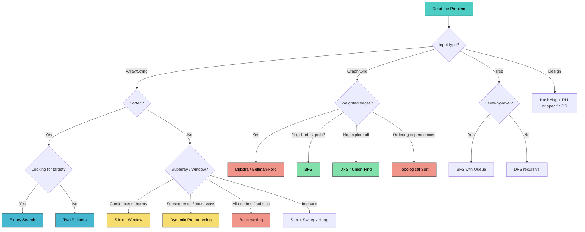

# DSA Advanced Patterns & ML Coding (Java)

> "Match the problem to the pattern table before you touch the keyboard — the code is the easy part once you know which template applies."

**What this chapter covers:** The tools you reach for when the basics are ruled out — backtracking, greedy, bit manipulation, intervals, number theory, segment and Fenwick trees, Bellman-Ford, Floyd-Warshall and monotonic deques — plus the master pattern table, the 45-minute interview plan, and ML-from-scratch coding in Java. Final chapter of the 4-part DSA sequence (31 / 31b / 31c / 31d); section numbers continue from chapters 31/31b/31c.

---

## Start Here

### Pick a track

| Track | Time | Read this | Good for |
|-------|------|-----------|----------|
| **Speed run** | ~60 min | This page, then the **Key idea** + **Dry run** of backtracking, greedy, intervals and the monotonic deque, then §18.31 and §18.33 | First pass |
| **Mastery** | ~5 hr | Everything. The trees and shortest-path sections repay slow reading | Real preparation |
| **ML-focused** | ~45 min | This page, then jump straight to §18.34 | ML engineer / research loops |
| **Refresh** | ~15 min | §18.31 Master Pattern Table, then §18.33 Interview Strategy | The night before |

Every pattern uses the same seven lines — **Problem · Brute force · Key idea · Dry run · Java · Cost · Trap** — so you never read code before you know what it does. The dry-run format is explained in full in [chapter 31's Start Here](#content/31_dsa_foundations).

### Read this before reaching for anything here


> **Most interview problems are solved by the basics** — two pointers, hashmaps, sliding windows, BFS. Everything in this chapter exists because some **constraint rules the simple tool out**. So the habit that earns marks is: *name the constraint that forces the tool.* "I'd use a segment tree" is a weaker answer than "the values change between queries, which kills prefix sums, so I need a segment tree."

| # | When the question says… | Reach for | Cost | Section |
|---|--------------------------|-----------|------|---------|
| 1 | list every combination / subset / arrangement | **Backtracking** | O(2ⁿ) or O(n!) | §18.21 |
| 2 | take the best option now and never revisit | **Greedy** | O(n log n) | §18.22 |
| 3 | find the odd one out, or count bits, in O(1) space | **Bit manipulation** | O(n) | §18.23 |
| 4 | merge, overlap or schedule ranges | **Sort the intervals, then sweep** | O(n log n) | §18.24 |
| 5 | range sums or minimums **with updates** | **Segment tree** / **Fenwick tree** | O(log n) each | §18.26–18.27 |
| 6 | shortest path, but some edges are negative | **Bellman-Ford** | O(V·E) | §18.28 |
| 7 | shortest path between **every** pair | **Floyd-Warshall** | O(V³) | §18.29 |
| 8 | max or min inside a sliding window | **Monotonic deque** | O(n) | §18.30 |

The **full cross-chapter lookup** — every keyword in all four DSA chapters mapped to its pattern and its first line of code — lives in §18.31 below. Chapter 31's Start Here carries a shorter picker covering only the nine foundation templates.

---

## Table of Contents

| Part | Topic | Sections |
|------|-------|----------|
| 5 | Advanced Patterns | §18.21–18.25: Backtracking, Greedy, Bit Manipulation, Intervals, Math |
| 6 | Advanced DS & Paths | §18.26–18.30: Segment Tree, BIT/Fenwick, Bellman-Ford, Floyd-Warshall, Monotonic Deque |
| 7 | Pattern Recognition | §18.31–18.33: Master Table, Decision Flowchart, Interview Strategy |
| 8 | ML Coding | §18.34: Implement ML from Scratch in Java |

**Sequence:** [31 — Foundations & Search](#content/31_dsa_foundations) → [31b — Graphs](#content/31b_dsa_graphs) → [31c — Dynamic Programming](#content/31c_dynamic_programming) → **31d (this chapter)**

---

# PART 5: ADVANCED PATTERNS

---

## 18.21 Backtracking

**Simple explanation.** Backtracking is systematic trial and error with a tidy-up rule. You build an answer one choice at a time; when a partial answer cannot possibly work, you **undo the last choice** and try the next one. It is how you generate *every* valid configuration rather than just one.

**The trigger:** "find **all**…", "list every…", "how many ways, and show them". If the question wants a *count* rather than the actual list, stop — that is usually dynamic programming (chapter 31c) and far cheaper.

**Key idea — three steps, always the same.**


```java
void backtrack(List<List<Integer>> result, List<Integer> current, /* params */) {
    if (/* goal reached */) {
        result.add(new ArrayList<>(current));   // COPY — `current` keeps mutating
        return;
    }
    for (/* each candidate */) {
        if (/* candidate is allowed */) {
            current.add(choice);                //  1. CHOOSE
            backtrack(result, current, ...);    //  2. EXPLORE
            current.remove(current.size() - 1); //  3. UNCHOOSE
        }
    }
}
```

> **Trap:** `result.add(current)` without copying. Every entry in your result then points at the *same* list, which is empty by the time the recursion finishes — a very confusing all-empty output. `new ArrayList<>(current)` is mandatory.

> **Trap:** forgetting step 3. Without the undo, the next branch inherits the previous branch's leftovers and your output is quietly wrong rather than obviously broken.

### The big three: subsets, permutations, combinations

All three are the same three steps. **Only the rule about what you may pick next changes** — and that one line is worth memorising as a set.

| | What it generates | What restricts the next pick | What counts as an answer |
|---|---|---|---|
| **Subsets** | every include/exclude choice | pass `i + 1` — never look back | **every node**, including the root |
| **Permutations** | every ordering of everything | a `used[]` flag — anything not yet taken | only the **leaves** |
| **Combinations** | every group of exactly k | pass a `start` index — never look back | only when `size == k` |

**Subsets — `nums = [1, 2]`** → 4 subsets. At each element you either take it or skip it:

```
              []
           /      \
      take 1      skip 1
        [1]           []
       /    \        /    \
  take 2  skip 2  take 2  skip 2
  [1,2]     [1]      [2]     []
```

*Every node is recorded, not just the leaves — that is why there are 2ⁿ subsets.*

```java
// SUBSETS (LC 78) — take it or skip it
public List<List<Integer>> subsets(int[] nums) {
    List<List<Integer>> result = new ArrayList<>();
    backtrackSubsets(result, new ArrayList<>(), nums, 0);
    return result;
}

void backtrackSubsets(List<List<Integer>> res, List<Integer> curr, int[] nums, int start) {
    res.add(new ArrayList<>(curr));                  // every state is a valid subset
    for (int i = start; i < nums.length; i++) {
        curr.add(nums[i]);
        backtrackSubsets(res, curr, nums, i + 1);    // i + 1 = never reuse or look back
        curr.remove(curr.size() - 1);
    }
}
// nums = [1,2,3] → [[], [1], [1,2], [1,2,3], [1,3], [2], [2,3], [3]]
```

**Practice:** [Subsets →](#dsa-problem-subsets)

**Permutations — `nums = [1, 2]`** → 2 orderings. Every element must appear, so at each level you try everything **not yet used**:

```
[]                  used = -,-
├─ pick 1 → [1]     used = 1
│    └─ pick 2 → [1,2]   → record
└─ pick 2 → [2]     used = 2
     └─ pick 1 → [2,1]   → record
```

```java
// PERMUTATIONS (LC 46) — every element, in every order
public List<List<Integer>> permute(int[] nums) {
    List<List<Integer>> result = new ArrayList<>();
    backtrackPermute(result, new ArrayList<>(), nums, new boolean[nums.length]);
    return result;
}

void backtrackPermute(List<List<Integer>> res, List<Integer> curr,
                      int[] nums, boolean[] used) {
    if (curr.size() == nums.length) {                // only leaves count
        res.add(new ArrayList<>(curr));
        return;
    }
    for (int i = 0; i < nums.length; i++) {
        if (used[i]) continue;
        used[i] = true;
        curr.add(nums[i]);
        backtrackPermute(res, curr, nums, used);
        curr.remove(curr.size() - 1);
        used[i] = false;                             // undo BOTH things
    }
}
```

> **Trap:** undoing the list but forgetting `used[i] = false`. The element stays permanently marked, later branches silently skip it, and you get far fewer permutations than you should.

**Practice:** [Permutations →](#dsa-problem-permutations)

**Combinations — `n = 3, k = 2`** → 3 groups. A `start` index forbids looking backwards, so each group is generated in exactly one order:

```
start=1 → pick 1 → [1], now start=2
                   pick 2 → [1,2]  ✓
                   pick 3 → [1,3]  ✓
        → pick 2 → [2], now start=3
                   pick 3 → [2,3]  ✓
        → pick 3 → [3], now start=4 — nothing left, dead end
```

*Result: `[1,2] [1,3] [2,3]` — `[2,1]` can never be produced, which is exactly what "combination" means.*

```java
// COMBINATIONS (LC 77) — choose k from n
public List<List<Integer>> combine(int n, int k) {
    List<List<Integer>> result = new ArrayList<>();
    backtrackCombine(result, new ArrayList<>(), 1, n, k);
    return result;
}

void backtrackCombine(List<List<Integer>> res, List<Integer> curr,
                      int start, int n, int k) {
    if (curr.size() == k) {
        res.add(new ArrayList<>(curr));
        return;
    }
    // pruning: stop early once too few numbers remain to ever reach size k
    for (int i = start; i <= n - (k - curr.size()) + 1; i++) {
        curr.add(i);
        backtrackCombine(res, curr, i + 1, n, k);
        curr.remove(curr.size() - 1);
    }
}
```

> **Pruning is the difference between passing and timing out.** The loop bound above stops exploring branches that cannot possibly reach `k` elements. Interviewers rarely require it, but naming it earns real credit — and on Hard problems it is the difference between O(2ⁿ) and something that finishes.

**Practice:** [Combinations →](#dsa-problem-combinations)

### Handling duplicates

A question with repeated input values ("Subsets II", "Permutations II", "Combination Sum II") needs one extra line. **Sort first**, then at each level skip a candidate that equals the previous one *at that same level*:

```java
Arrays.sort(nums);
for (int i = start; i < nums.length; i++) {
    if (i > start && nums[i] == nums[i - 1]) continue;   // same value, same level → skip
    ...
}
```

> **The subtlety worth understanding:** `i > start` means "not the first pick at this level". Using the same value *deeper* is fine — it is only reusing it as a *sibling* that produces a duplicate answer.

### N-Queens

Place N queens on an N x N board so no two attack each other. Classic backtracking: place one queen per row, check column and diagonal conflicts.

**Walkthrough — n = 4:** place a queen row by row; skip any column already used or on a diagonal already used.
```
row0: try col0 -> Q at (0,0). cols={0}, diags used.
row1: col0 X (col used), col1 X (diag), col2 -> Q at (1,2). ok so far.
row2: col0 X (diag), col1 X (diag), col2 X (col used), col3 X (diag) -> dead end, backtrack!
row1: try col3 -> Q at (1,3). continue...
... eventually reaches row4 (all placed) -> record board as one solution.
```
Dead ends prune whole subtrees instead of placing all 4 rows blindly.

```java
public List<List<String>> solveNQueens(int n) {
    List<List<String>> result = new ArrayList<>();
    boolean[] cols = new boolean[n];
    boolean[] diag1 = new boolean[2 * n]; // row - col + n
    boolean[] diag2 = new boolean[2 * n]; // row + col
    char[][] board = new char[n][n];
    for (char[] row : board) Arrays.fill(row, '.');

    solve(result, board, 0, cols, diag1, diag2, n);
    return result;
}

void solve(List<List<String>> res, char[][] board, int row,
           boolean[] cols, boolean[] d1, boolean[] d2, int n) {
    if (row == n) {
        List<String> snapshot = new ArrayList<>();
        for (char[] r : board) snapshot.add(new String(r));
        res.add(snapshot);
        return;
    }
    for (int col = 0; col < n; col++) {
        if (cols[col] || d1[row - col + n] || d2[row + col]) continue;
        board[row][col] = 'Q';
        cols[col] = d1[row - col + n] = d2[row + col] = true;
        solve(res, board, row + 1, cols, d1, d2, n);
        board[row][col] = '.';
        cols[col] = d1[row - col + n] = d2[row + col] = false;
    }
}
```

**Example:**
Input: n = 4
Output: [[".Q..","...Q","Q...","..Q."],["..Q.","Q...","...Q",".Q.."]]  (2 solutions)

**Practice:** [N-Queens →](#dsa-problem-n-queens)

> **Fun fact:** The number of solutions to N-Queens grows roughly exponentially. N=8 has 92 solutions, N=14 has 365,596, and no closed-form formula is known.

**Common Mistakes:**
- Forgetting `new ArrayList<>(current)` — without the copy, all results point to the same (now-empty) list.
- Not pruning early — backtracking without good pruning degenerates into brute force.
- Off-by-one in `start` index — using `i` instead of `i+1` allows reuse of the same element.

**Key Problems — Detailed Solutions:**

<details>
<summary><strong>Subsets</strong> — Medium</summary>

**Problem:** Given an integer array `nums` of unique elements, return all possible subsets (the power set). The solution must not contain duplicate subsets.

**Example:**
Input: nums = [1, 2, 3]
Output: [[], [1], [2], [3], [1,2], [1,3], [2,3], [1,2,3]]

**Approach:** Backtracking with a start index. At each recursive call, add the current partial subset to the result (every state is valid). Then for each element from start to end, include it and recurse with start = i + 1 to avoid duplicates.

**Java:**
```java
public List<List<Integer>> subsets(int[] nums) {
    List<List<Integer>> res = new ArrayList<>();
    backtrack(res, new ArrayList<>(), nums, 0);
    return res;
}
private void backtrack(List<List<Integer>> res, List<Integer> curr, int[] nums, int start) {
    res.add(new ArrayList<>(curr));
    for (int i = start; i < nums.length; i++) {
        curr.add(nums[i]);
        backtrack(res, curr, nums, i + 1);
        curr.remove(curr.size() - 1);
    }
}
// Time: O(n * 2^n)  Space: O(n) recursion depth
```

**Complexity:** O(n * 2^n) time, O(n) space (excluding output)
</details>

<details>
<summary><strong>Permutations</strong> — Medium</summary>

**Problem:** Given an array `nums` of distinct integers, return all possible permutations.

**Example:**
Input: nums = [1, 2, 3]
Output: [[1,2,3],[1,3,2],[2,1,3],[2,3,1],[3,1,2],[3,2,1]]

**Approach:** Backtracking with a boolean used[] array. At each level, try every unused element. When the permutation is complete (length == nums.length), record it. Mark elements as used/unused on choose/unchoose.

**Java:**
```java
public List<List<Integer>> permute(int[] nums) {
    List<List<Integer>> res = new ArrayList<>();
    backtrack(res, new ArrayList<>(), nums, new boolean[nums.length]);
    return res;
}
private void backtrack(List<List<Integer>> res, List<Integer> curr,
                       int[] nums, boolean[] used) {
    if (curr.size() == nums.length) {
        res.add(new ArrayList<>(curr));
        return;
    }
    for (int i = 0; i < nums.length; i++) {
        if (used[i]) continue;
        used[i] = true;
        curr.add(nums[i]);
        backtrack(res, curr, nums, used);
        curr.remove(curr.size() - 1);
        used[i] = false;
    }
}
// Time: O(n * n!)  Space: O(n)
```

**Complexity:** O(n * n!) time, O(n) space (excluding output)
</details>

<details>
<summary><strong>Combination Sum</strong> — Medium</summary>

**Problem:** Given an array of distinct integers `candidates` and a target, return all unique combinations where the chosen numbers sum to target. Each number can be used unlimited times.

**Example:**
Input: candidates = [2, 3, 6, 7], target = 7
Output: [[2, 2, 3], [7]]

**Approach:** Backtracking with a start index (to avoid permutations of the same combination). At each level, try candidates from start onward. Recurse with the same index i (allowing reuse). Stop when remaining target is 0 (valid) or negative (prune).

**Java:**
```java
public List<List<Integer>> combinationSum(int[] candidates, int target) {
    List<List<Integer>> res = new ArrayList<>();
    backtrack(res, new ArrayList<>(), candidates, target, 0);
    return res;
}
private void backtrack(List<List<Integer>> res, List<Integer> curr,
                       int[] cands, int remain, int start) {
    if (remain == 0) { res.add(new ArrayList<>(curr)); return; }
    if (remain < 0) return;
    for (int i = start; i < cands.length; i++) {
        curr.add(cands[i]);
        backtrack(res, curr, cands, remain - cands[i], i); // i, not i+1 (reuse)
        curr.remove(curr.size() - 1);
    }
}
// Time: O(n^(target/min)) worst case  Space: O(target/min) recursion depth
```

**Complexity:** O(n^(target/min)) time, O(target/min) space
</details>

### 60-second recall

<details>
<summary>1. What are the three steps, and which one do people forget?</summary>

Choose, explore, unchoose. The **unchoose** is forgotten most often — and when it is missing the next branch silently inherits leftovers, so the output is wrong rather than crashing. The second most common bug is adding `current` to the results without copying it.
</details>

<details>
<summary>2. Subsets, permutations, combinations — what is the single line that separates them?</summary>

What you may pick next. Subsets pass `i + 1` and record every node. Permutations use a `used[]` flag and record only full-length leaves. Combinations pass a `start` index and record when the size hits k.
</details>

<details>
<summary>3. The question asks "how many ways", not "list the ways". What changes?</summary>

Almost certainly stop backtracking and use DP (chapter 31c). Enumerating 2ⁿ answers to count them is exponential; counting them directly with overlapping subproblems is usually polynomial.
</details>

**Problem List — Backtracking:**

**Start with these five:** Subsets · Permutations · Combination Sum · Palindrome Partitioning · N-Queens.

| #   | Problem                          | Difficulty | Key Insight                       |
|-----|----------------------------------|------------|-----------------------------------|
| 1   | Subsets (LC 78)                  | Medium     | Pick or skip                      |
| 2   | Subsets II (LC 90)               | Medium     | Skip duplicates after sort        |
| 3   | Permutations (LC 46)             | Medium     | used[] boolean array              |
| 4   | Permutations II (LC 47)          | Medium     | Sort + skip same-value at same level |
| 5   | Combinations (LC 77)             | Medium     | k-sized subsets                   |
| 6   | Combination Sum (LC 39)          | Medium     | Allow reuse (start from i, not i+1) |
| 7   | Combination Sum II (LC 40)       | Medium     | No reuse + skip duplicates        |
| 8   | N-Queens (LC 51)                 | Hard       | Row-by-row + diagonal tracking    |
| 9   | Palindrome Partitioning (131)    | Medium     | Partition string into palindromes |
| 10  | Letter Combinations of Phone (17)| Medium     | Map digits to letters             |

---

## 18.22 Greedy Algorithms

**Simple explanation.** Greedy means: take the best-looking option right now, and never reconsider. It is the cheapest algorithm there is — usually a sort plus one pass — and it is **wrong far more often than people expect**. The entire skill is knowing when it is safe.

**The test, and the sentence that proves it.** Greedy is valid when you can argue an **exchange**: *"take any optimal solution that does not make my greedy choice — I can swap my choice in without making it worse, so an optimal solution containing my choice also exists."* If you cannot make that argument, you need dynamic programming (chapter 31c), which tries every choice instead of committing to one.

> **Greedy vs DP in one line.** DP explores every choice and remembers the results; greedy commits to one choice and never looks back. Commit only when you can justify it out loud — an unjustified greedy is the most common way to fail a Medium.

### Interval Scheduling — keep the most non-overlapping intervals

**Problem.** Given intervals, remove the fewest so that none overlap. `[[1,2],[2,3],[3,4],[1,3]]` → remove `1`.

**Brute force.** Try every subset and keep the largest non-overlapping one — O(2ⁿ).

**Key idea.** Sort by **end time** and always keep the interval that finishes earliest. Why it is safe: finishing earliest leaves the **most room** for everything after it, so no other choice can ever do better. That is the exchange argument in one sentence.

**DRY RUN — `eraseOverlapIntervals([[1,2],[2,3],[3,4],[1,3]])` → `1`**
*sorted by end: `[1,2] [2,3] [1,3] [3,4]` · invariant: `prevEnd` is the end of the last interval we kept*

| interval | starts at | ≥ prevEnd? | action | prevEnd | removed |
|----------|-----------|------------|--------|---------|---------|
| `[1,2]` | 1 | yes (nothing kept yet) | **keep** | 2 | 0 |
| `[2,3]` | 2 | 2 ≥ 2 → yes | **keep** | 3 | 0 |
| `[1,3]` | 1 | 1 ≥ 3 → no | overlaps → remove | 3 | 1 |
| `[3,4]` | 3 | 3 ≥ 3 → yes | **keep** | 4 | 1 |

*ends right: every interval was either kept or provably clashed with something that finishes no later.*

```java
// LC 435: Non-overlapping Intervals (minimum removals)
public int eraseOverlapIntervals(int[][] intervals) {
    Arrays.sort(intervals, (a, b) -> Integer.compare(a[1], b[1]));   // by END, not start
    int count = 0, prevEnd = Integer.MIN_VALUE;

    for (int[] interval : intervals) {
        if (interval[0] >= prevEnd) prevEnd = interval[1];           // keep it
        else count++;                                                // drop it
    }
    return count;
}
```

**Cost.** O(n log n) for the sort, O(1) extra space.

> **Trap:** sorting by **start** here. It looks equivalent and it is not — a long interval that starts early swallows several short ones, and you get the wrong count. *Merging* sorts by start; *scheduling* sorts by end. §18.24 has the picture.

**Practice:** [Non-overlapping Intervals →](#dsa-problem-non-overlapping-intervals)

### Jump Game — can you reach the end?

**Problem.** Each value is the maximum jump length from that index. Can you reach the last index? `[2,3,1,1,4]` → `true`.

**Brute force.** Try every jump length from every position — exponential; with memoisation it is O(n²) DP.

**Key idea.** You do not need to know *how* you get anywhere — only **how far you could possibly get**. Sweep left to right keeping `maxReach`. If you ever stand on an index beyond `maxReach`, no sequence of jumps could have brought you here, so the answer is false. This is the rare case where a DP collapses to a single greedy variable.

**DRY RUN — `canJump([2,3,1,1,4])` → `true`**
*invariant: `maxReach` is the furthest index reachable using only indices seen so far*

| i | nums[i] | i > maxReach? | i + nums[i] | maxReach |
|---|---------|---------------|-------------|----------|
| 0 | 2 | no | 2 | 2 |
| 1 | 3 | no | 4 | **4** |
| 2 | 1 | no | 3 | 4 |
| 3 | 1 | no | 4 | 4 |
| 4 | 4 | no | 8 | 8 |

*ends right: we reached the last index without ever standing beyond `maxReach`, so a valid jump sequence exists.*

```java
// LC 55: can you reach the last index?
public boolean canJump(int[] nums) {
    int maxReach = 0;
    for (int i = 0; i < nums.length; i++) {
        if (i > maxReach) return false;                 // stranded
        maxReach = Math.max(maxReach, i + nums[i]);
    }
    return true;
}

// LC 45: fewest jumps to reach the end
public int jump(int[] nums) {
    int jumps = 0, currEnd = 0, farthest = 0;
    for (int i = 0; i < nums.length - 1; i++) {
        farthest = Math.max(farthest, i + nums[i]);
        if (i == currEnd) {                              // used up the current jump's range
            jumps++;
            currEnd = farthest;                          // commit to the best next range
        }
    }
    return jumps;
}
// [2,3,1,1,4] → 2 jumps: 0 → 1 → 4
```

> **Jump Game II is BFS in disguise.** `currEnd` marks the end of the current "level" of reachable indices, and each jump moves to the next level — exactly the ring structure of BFS, written with two integers instead of a queue.

**Practice:** [Jump Game →](#dsa-problem-jump-game) · [Jump Game II →](#dsa-problem-jump-game-ii)

### Task Scheduler — let the busiest task set the shape

**Problem.** Tasks with a cooldown `n` between identical tasks. How many time slots minimum? `[A,A,A,B,B,B]`, `n = 2` → `8`.

**Key idea.** Do not simulate. The **most frequent task dictates the skeleton**: it must appear `maxFreq` times separated by gaps of `n`, which fixes `(maxFreq - 1)` blocks of `n` slots. Every other task simply fills those gaps. So count the gaps, subtract what fills them, and the answer is whichever is larger — the skeleton, or simply the number of tasks.

**DRY RUN — `leastInterval([A,A,A,B,B,B], n = 2)` → `8`**

| step | working | value |
|------|---------|-------|
| most frequent task | A appears 3 times | maxFreq = 3 |
| blocks the skeleton forces | (3 − 1) gaps of 2 | 4 idle slots |
| B fills gaps | min(3 occurrences, 3 − 1 gaps) = 2 | 4 − 2 = 2 idle left |
| total | 6 tasks + 2 idle | **8** |

*schedule: `A B _ A B _ A B` — length 8.*

```java
// LC 621: minimum intervals with cooldown n
public int leastInterval(char[] tasks, int n) {
    int[] freq = new int[26];
    for (char t : tasks) freq[t - 'A']++;
    Arrays.sort(freq);

    int maxFreq = freq[25];
    int idleSlots = (maxFreq - 1) * n;

    for (int i = 24; i >= 0 && freq[i] > 0; i--) {
        idleSlots -= Math.min(freq[i], maxFreq - 1);
    }
    return Math.max(tasks.length, tasks.length + idleSlots);   // idleSlots may go negative
}
```

> **Trap:** returning `tasks.length + idleSlots` directly. With many distinct tasks the gaps overflow with real work, `idleSlots` goes negative, and the answer must simply be `tasks.length`. The `Math.max` is not decoration.

**Practice:** [Task Scheduler →](#dsa-problem-task-scheduler)

### 60-second recall

<details>
<summary>1. How do you decide between greedy and DP in the room?</summary>

Try to state the exchange argument: "swapping my greedy choice into any optimal solution cannot make it worse." If you can say it convincingly, greedy is safe and far cheaper. If you cannot, the choice genuinely affects the future — that is DP.
</details>

<details>
<summary>2. Sort by start or sort by end?</summary>

Merging or "does anything overlap" → sort by **start**. Keeping the most intervals, or scheduling → sort by **end**, because finishing earliest leaves the most room.
</details>

<details>
<summary>3. Name a problem where greedy beats a correct DP, and why.</summary>

Jump Game. The DP is O(n²) over every jump length; the greedy is O(n) because only the furthest reachable index ever matters — every state's decision merely extends a frontier.
</details>

**Problem List — Greedy:**

**Start with these five:** Jump Game · Non-overlapping Intervals · Task Scheduler · Gas Station · Partition Labels.

| #   | Problem                          | Difficulty | Key Insight                       |
|-----|----------------------------------|------------|-----------------------------------|
| 1   | Jump Game (LC 55)                | Medium     | Track max reachable               |
| 2   | Jump Game II (LC 45)             | Medium     | BFS-style level expansion         |
| 3   | Non-overlapping Intervals (435)  | Medium     | Sort by end, greedily keep        |
| 4   | Task Scheduler (LC 621)          | Medium     | Fill idle slots                   |
| 5   | Gas Station (LC 134)             | Medium     | If total >= 0, solution exists    |
| 6   | Partition Labels (LC 763)        | Medium     | Track last occurrence             |
| 7   | Candy (LC 135)                   | Hard       | Two-pass: left-to-right + right-to-left |
| 8   | Meeting Rooms II (LC 253)        | Medium     | Min-heap for end times            |

---

## 18.23 Bit Manipulation

**Simple explanation.** Every integer is already a row of switches. Bit manipulation is reaching past the decimal number and flipping those switches directly — which lets you do in **O(1) space** things that would otherwise need a hashmap.

**The trigger:** "appears once while everything else appears twice", "count the set bits", "without extra memory", "power of two", or any problem where the answer is a *set of up to 32 flags*.


### The operations, and what each is actually for

| Operation | Java | What it is for |
|-----------|------|----------------|
| AND | `a & b` | mask — keep only the bits both have |
| OR | `a \| b` | merge — keep bits either has |
| XOR | `a ^ b` | **difference — and pairs cancel** |
| NOT | `~a` | flip every bit |
| Shift left | `a << n` | multiply by 2ⁿ |
| Shift right | `a >> n` | divide by 2ⁿ, **keeping the sign** |
| Unsigned shift right | `a >>> n` | divide by 2ⁿ, **filling with zeros** |
| Read bit i | `(a >> i) & 1` | is switch i on? |
| Set bit i | `a \| (1 << i)` | turn switch i on |
| Clear bit i | `a & ~(1 << i)` | turn switch i off |
| Flip bit i | `a ^ (1 << i)` | toggle switch i |
| Lowest set bit | `a & (-a)` | isolate the rightmost 1 — **this is what Fenwick trees jump by** |
| Clear lowest set bit | `a & (a - 1)` | drop the rightmost 1 — **count bits by repeating until zero** |
| Count set bits | `Integer.bitCount(a)` | the built-in; know the manual version too |
| Power of two? | `a > 0 && (a & (a-1)) == 0` | exactly one bit set |

> **Trap:** using `>>` on a negative number in a loop. The sign bit is copied on every shift, so `-1 >> 1` is still `-1` and the loop never terminates. Use `>>>` whenever you are treating the value as raw bits.

### XOR — the one to understand deeply

**Problem.** Every element appears twice except one. Find it, using O(1) extra space. `[4,1,2,1,2]` → `4`.

**Brute force.** A hashmap of counts — O(n) time but **O(n) space**, which the question forbids.

**Key idea.** XOR has two properties that do all the work: `a ^ a = 0` (a value cancels itself) and `a ^ 0 = a` (zero leaves things alone). It is also order-independent. So XOR the whole array together: **every pair annihilates itself and only the lonely value survives.** No counting, no memory.

**DRY RUN — `singleNumber([4,1,2,1,2])` → `4`**
*invariant: `result` is the XOR of everything seen so far — i.e. whatever has appeared an odd number of times*

| num | running XOR | what just happened |
|-----|-------------|--------------------|
| — | 0 | start |
| 4 | 4 | 4 is now unpaired |
| 1 | 5 | 1 is now unpaired |
| 2 | 7 | 2 is now unpaired |
| 1 | 6 | **the two 1s cancelled** |
| 2 | **4** | **the two 2s cancelled — only 4 is left** |

```java
// LC 136: Single Number
public int singleNumber(int[] nums) {
    int result = 0;
    for (int num : nums) result ^= num;
    return result;
}
```

**Cost.** O(n) time, **O(1) space** — which is the whole point.

> **Same trick, different clothes:** Missing Number (XOR the values *and* the indices — everything pairs off except the missing one) and Find the Difference. Whenever exactly one thing is unpaired, XOR finds it for free.

**Practice:** [Single Number →](#dsa-problem-single-number)

### Counting bits for every number at once

**Problem.** For every `i` from 0 to n, how many 1-bits does it have? `n = 5` → `[0,1,1,2,1,2]`.

**Brute force.** Count the bits of each number separately — O(n log n).

**Key idea.** Chop off the last bit. `i >> 1` is `i` with its final bit removed, and you have **already computed that answer**. So the number of bits in `i` is the number in `i >> 1` plus whatever the final bit was. A one-line DP built on a bit trick.

**DRY RUN — `countBits(5)` → `[0,1,1,2,1,2]`**

| i | binary | `i >> 1` | dp[i>>1] | `i & 1` | dp[i] |
|---|--------|----------|----------|---------|-------|
| 0 | 0 | — | — | — | 0 |
| 1 | 1 | 0 | 0 | 1 | 1 |
| 2 | 10 | 1 | 1 | 0 | 1 |
| 3 | 11 | 1 | 1 | 1 | 2 |
| 4 | 100 | 10 | 1 | 0 | 1 |
| 5 | 101 | 10 | 1 | 1 | 2 |

```java
// LC 338: Counting Bits
public int[] countBits(int n) {
    int[] dp = new int[n + 1];
    for (int i = 1; i <= n; i++) {
        dp[i] = dp[i >> 1] + (i & 1);       // everything above the last bit, plus the last bit
    }
    return dp;
}
```

**Cost.** O(n) time, O(n) space.

**Practice:** [Counting Bits →](#dsa-problem-counting-bits)

### Bitmasks — an integer as a set

**Key idea.** With `n ≤ 20` or so, an integer's bits can represent *which elements are chosen*. Counting from `0` to `2ⁿ − 1` then enumerates **every possible subset**, with no recursion at all — bit `i` of the mask means "element `i` is in".

```
nums = [1, 2]        masks run 0..3

mask = 00  →  neither bit set   →  []
mask = 01  →  bit 0 set         →  [1]
mask = 10  →  bit 1 set         →  [2]
mask = 11  →  both bits set     →  [1, 2]
```

```java
public List<List<Integer>> subsets(int[] nums) {
    List<List<Integer>> result = new ArrayList<>();
    int n = nums.length;
    for (int mask = 0; mask < (1 << n); mask++) {      // 2^n masks
        List<Integer> subset = new ArrayList<>();
        for (int i = 0; i < n; i++) {
            if ((mask & (1 << i)) != 0) subset.add(nums[i]);
        }
        result.add(subset);
    }
    return result;
}
```

> **This is also how bitmask DP works** (travelling salesman, "visit every city"): the mask *is* the state, so `dp[mask][i]` means "I have visited exactly this set of nodes and I am standing on `i`". The `n ≤ 20` constraint in a problem statement is the tell.

### 60-second recall

<details>
<summary>1. A question says "O(1) extra space" and something appears an odd number of times. What is the tool?</summary>

XOR the whole array. Pairs cancel, the odd one out survives. The same trick with indices solves Missing Number.
</details>

<details>
<summary>2. What does <code>n & (n - 1)</code> do, and what is it used for?</summary>

It clears the lowest set bit. Repeat until zero and the number of iterations is the number of 1-bits (Brian Kernighan's method). One check of it against zero also tests for a power of two.
</details>

<details>
<summary>3. Why does <code>n &gt;&gt; 1</code> loop forever on a negative number?</summary>

`>>` is an arithmetic shift — it copies the sign bit in, so a negative number never reaches zero. Use `>>>`, the unsigned shift, which fills with zeros.
</details>

**Problem List — Bit Manipulation:**

**Start with these five:** Single Number · Number of 1 Bits · Counting Bits · Missing Number · Power of Two.

| #   | Problem                          | Difficulty | Key Insight                       |
|-----|----------------------------------|------------|-----------------------------------|
| 1   | Single Number (LC 136)           | Easy       | XOR all elements                  |
| 2   | Single Number II (LC 137)        | Medium     | Count bits mod 3                  |
| 3   | Number of 1 Bits (LC 191)        | Easy       | n & (n-1) clears lowest bit       |
| 4   | Counting Bits (LC 338)           | Easy       | dp[i] = dp[i>>1] + (i&1)         |
| 5   | Reverse Bits (LC 190)            | Easy       | Shift and build                   |
| 6   | Missing Number (LC 268)          | Easy       | XOR with indices                  |
| 7   | Sum of Two Integers (LC 371)     | Medium     | Bit-by-bit add with carry         |
| 8   | Power of Two (LC 231)            | Easy       | n & (n-1) == 0                    |

---

## 18.24 Intervals

**Simple explanation.** Interval problems are all the same shape: **sort, then sweep once**. The only real decision is *which end you sort by* — and that decision changes the answer, so it is worth getting straight before you write anything.


| The question asks… | Sort by | Why |
|--------------------|---------|-----|
| merge overlapping ranges | **start** | you need to meet ranges in the order they open |
| does anything overlap at all? | **start** | one comparison against the previous end |
| keep the most non-overlapping | **end** | finishing earliest leaves the most room (§18.22) |
| how many rooms / resources at once | **start**, with a min-heap of ends | the heap tells you when one frees up |

### Merge Intervals

**Problem.** Combine overlapping ranges. `[[1,3],[2,6],[8,10],[15,18]]` → `[[1,6],[8,10],[15,18]]`.

**Brute force.** Compare every pair and union them repeatedly — O(n²), and merging changes the set as you go, which makes it genuinely fiddly.

**Key idea.** Sort by **start**. Now walk left to right holding one "current" interval: if the next one starts **before the current one ends**, they touch, so stretch the current end; otherwise the current interval is finished, so publish it and start a new one. Sorting is what guarantees you only ever compare against the most recent interval.

**DRY RUN — `merge([[1,3],[2,6],[8,10],[15,18]])` → `[[1,6],[8,10],[15,18]]`**
*invariant: everything already published is finished and cannot be extended again*

| next | starts at | ≤ current end? | action | output so far |
|------|-----------|----------------|--------|---------------|
| `[1,3]` | 1 | — | start the first | `[[1,3]]` |
| `[2,6]` | 2 | 2 ≤ 3 → yes | **overlap** → stretch end to max(3, 6) = 6 | `[[1,6]]` |
| `[8,10]` | 8 | 8 ≤ 6 → no | gap → publish and start new | `[[1,6], [8,10]]` |
| `[15,18]` | 15 | 15 ≤ 10 → no | gap → publish and start new | `[[1,6], [8,10], [15,18]]` |

*ends right: sorted starts mean nothing later can reach back and overlap an interval we already closed.*

```java
// LC 56: Merge Intervals
public int[][] merge(int[][] intervals) {
    Arrays.sort(intervals, (a, b) -> Integer.compare(a[0], b[0]));   // by START
    List<int[]> merged = new ArrayList<>();
    merged.add(intervals[0]);

    for (int i = 1; i < intervals.length; i++) {
        int[] last = merged.get(merged.size() - 1);
        if (intervals[i][0] <= last[1]) {
            last[1] = Math.max(last[1], intervals[i][1]);            // NOT just intervals[i][1]
        } else {
            merged.add(intervals[i]);
        }
    }
    return merged.toArray(new int[0][]);
}
```

**Cost.** O(n log n) for the sort, O(n) output.

> **Trap:** writing `last[1] = intervals[i][1]` instead of `Math.max(...)`. On input like `[[1,10],[2,3]]` the short interval sits entirely inside the long one, and the assignment *shrinks* your merged range from `[1,10]` to `[1,3]`. It passes the simple test cases and fails the nested one.

**Practice:** [Merge Intervals →](#dsa-problem-merge-intervals)

### Meeting Rooms II — how many at once?

**Problem.** Given meeting times, how many rooms do you need? `[[0,30],[5,10],[15,20]]` → `2`.

**Brute force.** For each meeting, count how many others overlap it — O(n²).

**Key idea.** A room frees up exactly when its meeting **ends**, so what you need to track is the set of end times currently in use — and specifically **the earliest one**, because that is the only room that could possibly be free next. That is a min-heap. Sort by start, and for each meeting either reuse the earliest-finishing room or open a new one. **The heap's final size is the answer**, because it only ever grew when no room was free.

**DRY RUN — `minMeetingRooms([[0,30],[5,10],[15,20]])` → `2`**
*invariant: the heap holds the end times of all rooms currently occupied*

| meeting | earliest end in heap | free by now? | action | heap after |
|---------|---------------------|--------------|--------|------------|
| `[0,30]` | — (empty) | — | open a room | `{30}` |
| `[5,10]` | 30 | 30 ≤ 5 → no | **open another room** | `{10, 30}` |
| `[15,20]` | 10 | 10 ≤ 15 → yes | reuse that room | `{20, 30}` |

*ends right: the heap never shrank below the peak number of simultaneous meetings, so its size is the maximum overlap — which is the number of rooms.*

```java
// LC 253: minimum rooms = maximum overlap
public int minMeetingRooms(int[][] intervals) {
    Arrays.sort(intervals, (a, b) -> Integer.compare(a[0], b[0]));
    PriorityQueue<Integer> pq = new PriorityQueue<>();   // end times, earliest on top

    for (int[] interval : intervals) {
        if (!pq.isEmpty() && pq.peek() <= interval[0]) pq.poll();   // a room freed up
        pq.offer(interval[1]);
    }
    return pq.size();
}
```

**Cost.** O(n log n) time, O(n) space.

> **The alternative worth naming:** the *sweep line*. Turn every interval into `(start, +1)` and `(end, −1)`, sort all the events, and sweep while keeping a running count — the maximum that counter reaches is the same answer. It generalises better to "how many at time T" questions, and mentioning both approaches scores well.

**Practice:** [Meeting Rooms II →](#dsa-problem-meeting-rooms-ii)

### 60-second recall

<details>
<summary>1. Sort by start or by end — how do you decide in one sentence?</summary>

If you are combining ranges, sort by start. If you are choosing which ranges to keep, sort by end. Merging cares about where ranges open; scheduling cares about how soon they get out of the way.
</details>

<details>
<summary>2. Why does the merge step need <code>Math.max</code>?</summary>

Because an interval can be entirely nested inside the current one. Assigning the new end directly would shrink an already-correct range — the classic failing test is `[[1,10],[2,3]]`.
</details>

<details>
<summary>3. What is the heap actually storing in Meeting Rooms II?</summary>

The end times of the rooms currently in use, earliest first. The top is the only room that could possibly be free next, so one `peek` decides between reusing and allocating.
</details>

**Problem List — Intervals:**

**Start with these five:** Merge Intervals · Insert Interval · Meeting Rooms · Meeting Rooms II · Non-overlapping Intervals.

| #   | Problem                          | Difficulty | Key Insight                       |
|-----|----------------------------------|------------|-----------------------------------|
| 1   | Merge Intervals (LC 56)          | Medium     | Sort by start, merge overlapping  |
| 2   | Insert Interval (LC 57)          | Medium     | Find overlap window               |
| 3   | Non-overlapping Intervals (435)  | Medium     | Sort by end, count removals       |
| 4   | Meeting Rooms (LC 252)           | Easy       | Sort, check any overlap           |
| 5   | Meeting Rooms II (LC 253)        | Medium     | Min-heap of end times             |
| 6   | Minimum Interval to Include (1851)| Hard      | Sort + priority queue             |

---

## 18.25 Math & Number Theory

### GCD (Euclidean Algorithm)

**Walkthrough — a = 48, b = 18:** repeatedly replace (a,b) with (b, a%b) until b=0.
```
(48, 18) -> 48%18=12 -> (18, 12)
(18, 12) -> 18%12=6  -> (12, 6)
(12, 6)  -> 12%6=0   -> (6, 0)  -> b==0, return a=6
lcm = 48/6 * 18 = 8 * 18 = 144
```

```java
int gcd(int a, int b) {
    while (b != 0) {
        int temp = b;
        b = a % b;
        a = temp;
    }
    return a;
}
int lcm(int a, int b) { return a / gcd(a, b) * b; } // divide first to avoid overflow
```

**Example:**
Input: a = 48, b = 18
Output: gcd = 6, lcm = 144

### Sieve of Eratosthenes

**Walkthrough — n = 10:** starting at i=2, mark multiples of i as not-prime, beginning at i*i (smaller multiples were already marked by earlier primes).
```
i=2: mark 4,6,8 as notPrime (i*i=4)         -> primes so far: 2
i=3: mark 9 as notPrime (i*i=9, 12 is >= n) -> primes so far: 2,3
i=4: notPrime[4] already true -> skip
i=5..9: i*i >= n -> nothing left to mark
notPrime = [_,_,F,F,T,F,T,F,T,T]  (indices 0..9)
```
Count of `!notPrime[i]` for i in [2,9] = 4 -> primes are 2, 3, 5, 7.

```java
// Count primes less than n — O(n log log n)
public int countPrimes(int n) {
    boolean[] notPrime = new boolean[n];
    int count = 0;
    for (int i = 2; i < n; i++) {
        if (!notPrime[i]) {
            count++;
            for (long j = (long) i * i; j < n; j += i) { // start at i*i
                notPrime[(int) j] = true;
            }
        }
    }
    return count;
}
```

**Example:**
Input: n = 10
Output: 4  (primes below 10: 2, 3, 5, 7)

**Practice:** [Count Primes →](#dsa-problem-count-primes)

### Modular Arithmetic for Large Numbers

When the problem says "return answer modulo 10^9 + 7":

**Walkthrough — fast exponentiation, base=2, exp=5, mod=1000000007:** process exp bit by bit (binary of 5 = 101), squaring base each step and multiplying into result only when the current bit is 1.
```
exp=5 (101b), base=2, result=1
bit0=1: result=1*2=2;        base=2*2=4;   exp>>=1 -> exp=2
bit1=0: (skip result);       base=4*4=16;  exp>>=1 -> exp=1
bit2=1: result=2*16=32;      base=16*16=256; exp>>=1 -> exp=0 -> stop
```
Result: 2^5 = 32 (matches, all mod 10^9+7 which never triggers here since numbers are small).

```java
static final int MOD = 1_000_000_007;

// Addition
int addMod(int a, int b) { return (int) ((a + (long) b) % MOD); }

// Multiplication
int mulMod(int a, int b) { return (int) ((long) a * b % MOD); }

// Fast exponentiation: base^exp % mod
long power(long base, long exp, long mod) {
    long result = 1;
    base %= mod;
    while (exp > 0) {
        if ((exp & 1) == 1) result = result * base % mod;
        base = base * base % mod;
        exp >>= 1;
    }
    return result;
}
```

**Example (power):**
Input: base = 2, exp = 10, mod = 1_000_000_007
Output: 1024

**Practice:** [Pow(x, n) →](#dsa-problem-pow-x-n)

### Integer Overflow Prevention in Java

**Walkthrough — mid-point overflow:** with `left = 1_500_000_000`, `right = 2_000_000_000` (both valid ints, max is ~2.147B):
```
left + right = 3,500,000,000   -> overflows int (wraps to a negative number!)
left + (right - left)/2 = 1,500,000,000 + 250,000,000 = 1,750,000,000  -> correct, no overflow
```

```java
// DANGER: int overflow
int mid = (left + right) / 2;          // can overflow if left+right > Integer.MAX_VALUE
int mid = left + (right - left) / 2;   // SAFE — always use this

// DANGER: multiplication overflow
int area = width * height;             // may overflow
long area = (long) width * height;     // SAFE — cast first operand to long

// DANGER: absolute value
Math.abs(Integer.MIN_VALUE);           // returns Integer.MIN_VALUE (still negative!)
// Use long to avoid: Math.abs((long) Integer.MIN_VALUE)
```

**Problem List — Math:**

**Start with these five:** Pow(x, n) · Sqrt(x) · Count Primes · Happy Number · Reverse Integer.

| #   | Problem                          | Difficulty | Key Insight                       |
|-----|----------------------------------|------------|-----------------------------------|
| 1   | Count Primes (LC 204)            | Medium     | Sieve of Eratosthenes             |
| 2   | Pow(x, n) (LC 50)               | Medium     | Fast exponentiation               |
| 3   | Reverse Integer (LC 7)           | Medium     | Check overflow before multiply    |
| 4   | Happy Number (LC 202)            | Easy       | Floyd's cycle detection           |
| 5   | Plus One (LC 66)                 | Easy       | Handle carry propagation          |
| 6   | Sqrt(x) (LC 69)                 | Easy       | Binary search on answer           |

---

# PART 6: ADVANCED DATA STRUCTURES & SHORTEST PATHS

---

## 18.26 Segment Tree

**Simple explanation.** A running-total array answers "what is the sum of this range?" in one subtraction — as long as **nothing ever changes**. The moment one value is updated, every running total after it is wrong, and rebuilding costs O(n). Do that on every update and the whole approach collapses.

A segment tree fixes exactly that. Every node owns a **stretch** of the array and stores the answer for it: leaves own single elements, their parents own pairs, and the root owns everything. Change one value and only its **ancestors** need repairing — that is log n nodes, not n. Ask for a range and it is covered by a handful of whole nodes, again log n of them.


**The trigger:** *range* query **plus** updates. Either half alone has a cheaper answer — a read-only range is a prefix sum (§18.2), and a point query needs no structure at all.

```
Array: [2, 4, 5, 1, 8, 3]   (0-indexed, length 6)

                [0,5] sum=23
               /            \
        [0,2] sum=11      [3,5] sum=12
        /       \          /       \
   [0,1] sum=6  [2,2]=5  [3,4] sum=9  [5,5]=3
   /      \               /      \
[0,0]=2  [1,1]=4       [3,3]=1  [4,4]=8

Node at index i stores the aggregate for its range.
Left child  = 2*i,   Right child = 2*i+1,   Parent = i/2
```

### Java Template — Sum Segment Tree

**Key idea for a query.** Recurse from the root and classify every node you meet into exactly one of three cases — that trio *is* the algorithm:

1. **Completely outside** the asked-for range → return the identity (`0` for sum, `MAX_VALUE` for min).
2. **Completely inside** it → return this node's stored value and stop; you never look at its children.
3. **Partially overlapping** → split into the two children and combine their answers.

**DRY RUN — `query(1, 3)` on the tree above** → `10` (that is `4 + 5 + 1`)
*invariant: a node fully inside the range contributes its whole stored value; nothing is counted twice*

| node | its range | vs [1,3] | what happens |
|------|-----------|----------|--------------|
| root | [0,5] | partial | split into [0,2] and [3,5] |
| — | [0,2] | partial | split into [0,1] and [2,2] |
| — | [0,1] | partial | split into [0,0] and [1,1] |
| — | [0,0] | **outside** | return 0 |
| — | [1,1] | **inside** | return **4** |
| — | [2,2] | **inside** | return **5** |
| — | [3,5] | partial | split into [3,4] and [5,5] |
| — | [3,4] | partial | split into [3,3] and [4,4] |
| — | [3,3] | **inside** | return **1** |
| — | [4,4] | **outside** | return 0 |
| — | [5,5] | **outside** | return 0 |

*ends right: the range [1,3] was covered exactly by the disjoint whole nodes [1,1], [2,2] and [3,3] — total 10.*

```java
class SegmentTree {
    private final int[] tree;
    private final int n;

    SegmentTree(int[] nums) {
        n = nums.length;
        tree = new int[4 * n];   // 4n is the safe upper bound — see the trap
        build(nums, 1, 0, n - 1);
    }

    private void build(int[] nums, int node, int lo, int hi) {
        if (lo == hi) { tree[node] = nums[lo]; return; }
        int mid = lo + (hi - lo) / 2;
        build(nums, 2 * node,     lo,      mid);
        build(nums, 2 * node + 1, mid + 1, hi);
        tree[node] = tree[2 * node] + tree[2 * node + 1];     // combine on the way back up
    }

    // Point update: set nums[idx] = val — O(log n)
    public void update(int idx, int val) { update(1, 0, n - 1, idx, val); }

    private void update(int node, int lo, int hi, int idx, int val) {
        if (lo == hi) { tree[node] = val; return; }
        int mid = lo + (hi - lo) / 2;
        if (idx <= mid) update(2 * node,     lo,      mid, idx, val);
        else            update(2 * node + 1, mid + 1, hi,  idx, val);
        tree[node] = tree[2 * node] + tree[2 * node + 1];     // repair this ancestor
    }

    // Range sum [l, r] — O(log n)
    public int query(int l, int r) { return query(1, 0, n - 1, l, r); }

    private int query(int node, int lo, int hi, int l, int r) {
        if (l > hi || r < lo) return 0;                       // 1. outside → identity
        if (l <= lo && hi <= r) return tree[node];            // 2. inside  → whole node
        int mid = lo + (hi - lo) / 2;                         // 3. partial → split
        return query(2 * node,     lo,      mid, l, r)
             + query(2 * node + 1, mid + 1, hi,  l, r);
    }
}
// nums = [2,4,5,1,8,3]; query(1,3) → 10; update(3,10); query(1,3) → 19
```

**Cost.** Build O(n), query O(log n), update O(log n), space O(n).

> **Trap:** sizing the array `2 * n`. When `n` is not a power of two the recursion reaches indices beyond that, and you get an `ArrayIndexOutOfBoundsException` on inputs that are not neatly sized. `4 * n` is the standard safe bound — say why if asked.

> **Trap:** using the wrong identity in case 1. For a **min** tree, returning `0` for an out-of-range node makes every query answer 0. Sum → `0`, min → `Integer.MAX_VALUE`, max → `Integer.MIN_VALUE`.

**Range minimum variant:** replace both `+` combinations with `Math.min(...)` and change the out-of-range identity. Nothing else moves — that generality is precisely what a segment tree buys you over a Fenwick tree.

**Lazy propagation (range updates):** when you must add a value to *every* element in a range, doing O(log n) point updates is not enough. Lazy propagation tags a node with a pending delta and only pushes it down to children when they are actually visited, keeping both range updates and queries at O(log n). It adds a `lazy[]` array and a `pushDown` helper at the top of each recursive step.

**Practice:** [Range Sum Query — Mutable →](#dsa-problem-range-sum-query-mutable)

**Key problems:** Range Sum Query — Mutable (LC 307), Count of Smaller Numbers After Self (LC 315), Rectangle Area (LC 850).

---

## 18.27 Fenwick Tree (Binary Indexed Tree / BIT)

**Simple explanation.** A Fenwick tree does the same job as a segment tree for **sums**, in about fifteen lines instead of fifty. The trick is that it never builds an explicit tree: it stores the tree *implicitly in the binary representation of the indices*.

**Key idea.** Each index `i` is made responsible for a block of the array ending at `i`, and the **length of that block is `i & (-i)`** — the lowest set bit of `i`. So index 4 (binary `100`) covers four elements, index 6 (`110`) covers two, index 7 (`111`) covers one. Adding that lowest bit walks *up* to the next index that also covers you; subtracting it walks *down* to the next block of a prefix. Both walks touch only as many indices as there are bits — hence O(log n).

```
Responsibility of each BIT index (1-indexed, n = 8):

Index:  1     2      3     4       5     6      7      8
Binary: 1     10     11    100     101   110    111    1000
Covers: [1]  [1,2]  [3]   [1,4]   [5]  [5,6]   [7]   [1,8]

Block length = i & (-i) — the lowest set bit.
```

### Java Template

**DRY RUN — `update(1, 3)` on `BIT(5)`**
*invariant: every index whose block contains position 1 must be increased*

| at index i | binary | `i & (-i)` | action | next i |
|-----------|--------|-----------|--------|--------|
| 1 | `001` | 1 | `tree[1] += 3` | 1 + 1 = 2 |
| 2 | `010` | 2 | `tree[2] += 3` | 2 + 2 = 4 |
| 4 | `100` | 4 | `tree[4] += 3` | 4 + 4 = 8 — past n = 5, stop |

*after `update(2,5)` and `update(3,-2)` as well, `tree` is `[_, 3, 8, -2, 6, 0]` (1-indexed).*

**DRY RUN — `query(3)`** → `6` (that is `3 + 5 − 2`)
*invariant: `sum` accumulates disjoint blocks that together tile the prefix [1..3]*

| at index i | binary | adds | running sum | next i |
|-----------|--------|------|-------------|--------|
| 3 | `011` | `tree[3]` = −2 | −2 | 3 − 1 = 2 |
| 2 | `010` | `tree[2]` = 8 | **6** | 2 − 2 = 0 — stop |

```java
class BIT {
    private final int[] tree;
    private final int n;

    BIT(int n) {
        this.n = n;
        tree = new int[n + 1];                     // 1-indexed — see the trap
    }

    // add delta at position i — O(log n)
    public void update(int i, int delta) {
        for (; i <= n; i += i & (-i)) tree[i] += delta;      // walk UP
    }

    // prefix sum [1..i] — O(log n)
    public int query(int i) {
        int sum = 0;
        for (; i > 0; i -= i & (-i)) sum += tree[i];         // walk DOWN
        return sum;
    }

    // range sum [l..r], 1-indexed
    public int query(int l, int r) { return query(r) - query(l - 1); }
}
```

**Cost.** O(log n) per update and per query, O(n) space — and a much smaller constant than a segment tree.

> **Trap:** 0-indexing it. `i & (-i)` is `0` when `i` is `0`, so `i += 0` loops forever. A Fenwick tree is **always** 1-indexed; convert at the boundary and keep the conversion in one place.

### Which one?

| | Fenwick / BIT | Segment tree |
|---|---|---|
| Space | O(n) | O(4n) |
| Constant factor | ~2× faster | larger |
| Sum, XOR, count | ✅ | ✅ |
| Range **min / max** | ❌ | ✅ |
| Range updates (lazy) | needs two BITs | ✅ |
| Lines of code | ~15 | ~50 |

**Use a Fenwick tree** when the aggregate is invertible (sum, XOR) and updates are point updates. **Use a segment tree** for min/max, for anything you cannot subtract back out, or when you need lazy range updates.

**Key problems:** Range Sum Query — Mutable (LC 307), Count of Smaller Numbers After Self (LC 315), Reverse Pairs (LC 493).

### 60-second recall

<details>
<summary>1. Prefix sums are O(1) per query. Why would you ever build a tree?</summary>

Because prefix sums assume the array is frozen. One point update invalidates every total after it, costing O(n) to repair. A tree makes both the update and the query O(log n), which wins as soon as updates are interleaved with queries.
</details>

<details>
<summary>2. What are the three cases in a segment-tree query?</summary>

Fully outside → return the identity. Fully inside → return the node and stop. Partially overlapping → split into both children and combine. Getting the identity wrong for a min-tree is the classic bug.
</details>

<details>
<summary>3. Why is a Fenwick tree always 1-indexed?</summary>

Its whole mechanism is `i & (-i)`, the lowest set bit, which is zero for index 0 — so the walk would never advance. Index 0 has no meaningful block.
</details>

---

## 18.28 Bellman-Ford

**Simple explanation.** Dijkstra's whole method is "settle the nearest node, never revisit it" — which is only safe because a non-negative edge can never make an already-settled route cheaper. **Allow a negative edge and that assumption collapses**, so you need an algorithm that is willing to keep revising.

Bellman-Ford is that algorithm, and it is almost embarrassingly simple: it makes no clever choice at all. It just **relaxes every edge, over and over**.


**The trigger:** negative edge weights, or "detect whether costs can loop forever downwards". It is the only standard algorithm that finds negative cycles. At O(V·E) it is much slower than Dijkstra, so reach for it only when negatives are actually present.

### Why V−1 rounds, exactly

This is the part worth being able to justify. **After `k` rounds, every shortest path that uses at most `k` edges is correct.** Round 1 fixes all one-edge paths, round 2 all two-edge paths, and so on. A shortest path never repeats a node (repeating one would mean a cycle, which either costs something — making it worse — or costs nothing useful), so it uses at most **V−1 edges**. Hence V−1 rounds is not a heuristic; it is exactly enough.

And that gives the negative-cycle test for free: run **one more** round. If anything still improves, some path is getting cheaper by going round and round, so no shortest path exists at all.

```
Graph:  A --( 4)--> B        A --(-3)--> C        B --( 2)--> C

round 1: dist[A]=0, dist[B]=4, dist[C]=-3
round 2: is A→B→C better?  4 + 2 = 6, which is worse than -3 → no change
result:  dist = [0, 4, -3] — the direct negative edge wins
```

### Java Template

```java
// Bellman-Ford — O(V * E) time, O(V) space
// edges[i] = {u, v, weight}
public int[] bellmanFord(int n, int[][] edges, int src) {
    int[] dist = new int[n];
    Arrays.fill(dist, Integer.MAX_VALUE);
    dist[src] = 0;

    for (int round = 0; round < n - 1; round++) {      // V-1 rounds is exactly enough
        boolean updated = false;
        for (int[] edge : edges) {
            int u = edge[0], v = edge[1], w = edge[2];
            if (dist[u] != Integer.MAX_VALUE && dist[u] + w < dist[v]) {
                dist[v] = dist[u] + w;
                updated = true;
            }
        }
        if (!updated) break;                            // converged early
    }

    for (int[] edge : edges) {                          // one extra round = the cycle test
        int u = edge[0], v = edge[1], w = edge[2];
        if (dist[u] != Integer.MAX_VALUE && dist[u] + w < dist[v]) {
            throw new IllegalStateException("Negative cycle detected");
        }
    }
    return dist;
}
// n = 3, edges = [[0,1,4],[0,2,-3],[1,2,2]], src = 0  →  [0, 4, -3]
```

> **Trap:** relaxing from an unreached node. Without the `dist[u] != Integer.MAX_VALUE` guard, `MAX_VALUE + w` overflows to a large negative number and infects the whole array with nonsense distances.

**Practice:** [Cheapest Flights Within K Stops →](#dsa-problem-cheapest-flights-within-k-stops) · [Network Delay Time →](#dsa-problem-network-delay-time)

**Dijkstra vs Bellman-Ford:**

| | Dijkstra | Bellman-Ford |
|---|---|---|
| Negative weights | ❌ | ✅ |
| Negative cycle detection | ❌ | ✅ |
| Time | O((V+E) log V) | O(V·E) |
| Space | O(V) | O(V) |
| Use when | weights are non-negative | a negative weight exists |

> **The variant that shows up most:** Cheapest Flights Within K Stops. Because "after k rounds you know all paths of at most k edges" is *literally* the loop structure, capping the rounds at `k + 1` solves it directly — you just need a copy of the distance array per round so one round cannot feed itself.

**Key problems:** Cheapest Flights Within K Stops (LC 787), Network Delay Time (LC 743).

---

## 18.29 Floyd-Warshall

**Simple explanation.** Every other shortest-path algorithm answers "from **one** source". Floyd-Warshall answers "between **every** pair" — and it does so with three nested loops and no data structures at all.

**Key idea.** Ask one question repeatedly: *"is it cheaper to go from i to j by stopping off at k?"* Start with only direct edges, then allow node 0 as a stopover, then also node 1, and so on. After allowing every node, `dist[i][j]` is the true shortest path.

### Why the loop order is k, then i, then j

This is the detail interviewers probe, and the reason is precise. `dist[i][j]` means *"the best route from i to j using only nodes 0…k as stopovers"*. Each round of `k` is allowed to build on **every answer from the previous round** — so all pairs must be updated for stopover `k` before anyone is allowed to use stopover `k+1`.

Put `k` in an inner loop and you are asking the question before the answers it depends on exist: some pairs would be computed using a richer set of stopovers than others, and the results become inconsistent and wrong.

```
dist[i][j] = min(dist[i][j],                 // don't stop anywhere new
                 dist[i][k] + dist[k][j])    // stop off at k

     k outermost  →  "which stopovers are allowed yet"
       i          →  "where am I starting"
         j        →  "where am I going"
```

```
4-node example (∞ = no direct edge):

Initial dist:          After k = 0 (node 0 allowed as a stopover):
   0  1  2  3             0  1  2  3
0 [0, 3, ∞, 7]         0 [0, 3, ∞, 7]
1 [8, 0, 2, ∞]         1 [8, 0, 2, ∞]    (1→0→anything doesn't help yet)
2 [5, ∞, 0, 1]         2 [5, 8, 0, 1]    (2→0→1 costs 5+3 = 8, beats ∞)
3 [2, ∞, ∞, 0]         3 [2, 5, ∞, 0]    (3→0→1 costs 2+3 = 5, beats ∞)
```

### Java Template

```java
// Floyd-Warshall — O(V^3) time, O(V^2) space
public int[][] floydWarshall(int[][] graph) {
    int v = graph.length;
    int INF = Integer.MAX_VALUE / 2;          // halved so INF + INF cannot overflow
    int[][] dist = new int[v][v];

    for (int i = 0; i < v; i++)
        for (int j = 0; j < v; j++)
            dist[i][j] = (i == j) ? 0 : graph[i][j];

    for (int k = 0; k < v; k++) {             // k MUST be outermost
        for (int i = 0; i < v; i++) {
            for (int j = 0; j < v; j++) {
                if (dist[i][k] < INF && dist[k][j] < INF) {
                    dist[i][j] = Math.min(dist[i][j], dist[i][k] + dist[k][j]);
                }
            }
        }
    }

    for (int i = 0; i < v; i++) {             // a node cheaper than 0 from itself = negative cycle
        if (dist[i][i] < 0) throw new IllegalStateException("Negative cycle at node " + i);
    }
    return dist;
}
```

> **Trap:** using `Integer.MAX_VALUE` as infinity. `MAX_VALUE + MAX_VALUE` overflows to a negative number, which then looks like a wonderfully cheap route and corrupts the whole matrix. `Integer.MAX_VALUE / 2` is the standard fix.

> **When not to use it:** sparse graphs. If E is much smaller than V², running Dijkstra from every source costs O(V·(V+E) log V) and beats O(V³) comfortably. Floyd-Warshall wins on small, dense graphs — roughly a few hundred nodes.

**Practice:** [Evaluate Division →](#dsa-problem-evaluate-division)

**Key problems:** Find the City With the Smallest Number of Neighbors at a Threshold Distance (LC 1334), Evaluate Division (LC 399).

### 60-second recall

<details>
<summary>1. Why can't Dijkstra handle negative edges?</summary>

It settles the nearest node and never revisits it. A negative edge discovered later could have made that settled distance smaller, but Dijkstra will not reconsider — so the answer is silently wrong rather than obviously broken.
</details>

<details>
<summary>2. Why exactly V−1 rounds in Bellman-Ford?</summary>

After k rounds every shortest path using at most k edges is correct, and a shortest path never repeats a node, so it has at most V−1 edges. One extra round that still improves anything proves a negative cycle.
</details>

<details>
<summary>3. What breaks if you move <code>k</code> inside the i and j loops?</summary>

The meaning of `dist[i][j]` — "best route using stopovers 0…k" — no longer holds uniformly. Some pairs get computed with more stopovers available than others, so the matrix becomes inconsistent and the answers are wrong.
</details>

---

## 18.30 Monotonic Deque — Sliding Window Maximum

**Problem.** The maximum of every window of size `k`. `[1,3,-1,-3,5,3,6,7]`, `k = 3` → `[3,3,5,5,6,7]`.

**Brute force.** Scan each window for its maximum — O(n·k). At n = 100,000 and k = 50,000 that is 5 billion operations.

**Key idea — and it is one sentence.** When a new value arrives, **every smaller value already waiting is finished forever**: it is both smaller *and* older, so any future window containing it also contains the newcomer, which beats it. Throw them away immediately. What is left is a deque of **decreasing** values, and its front is always the current maximum. Each index is pushed once and popped once, so the whole thing is O(n).


Two cleanups happen before each new index is added:

1. **Expire the front** if its index has slid out of the window (`index <= right - k`).
2. **Pop from the back** while the values there are `<= nums[right]` — they can never win again.

**DRY RUN — `maxSlidingWindow([1,3,-1,-3,5,3,6,7], k = 3)` → `[3,3,5,5,6,7]`**
*invariant: the deque holds indices whose values strictly decrease from front to back, all inside the window*

| right | value | expired from front | popped from back | deque (values) | window | output |
|-------|-------|--------------------|------------------|----------------|--------|--------|
| 0 | 1 | — | — | `[1]` | — | window not full |
| 1 | 3 | — | 1 (1 ≤ 3) | `[3]` | — | window not full |
| 2 | -1 | — | — | `[3, -1]` | `1,3,-1` | **3** |
| 3 | -3 | — | — | `[3, -1, -3]` | `3,-1,-3` | **3** |
| 4 | 5 | index 1 (value 3) | -1, -3 | `[5]` | `-1,-3,5` | **5** |
| 5 | 3 | — | — | `[5, 3]` | `-3,5,3` | **5** |
| 6 | 6 | — | 3, 5 | `[6]` | `5,3,6` | **6** |
| 7 | 7 | — | 6 | `[7]` | `3,6,7` | **7** |

*ends right: the front is always the largest value still inside the window, because everything larger has expired and everything smaller was discarded.*

```java
// Sliding Window Maximum — LC 239 — O(n) time, O(k) space
public int[] maxSlidingWindow(int[] nums, int k) {
    int n = nums.length;
    int[] result = new int[n - k + 1];
    Deque<Integer> deque = new ArrayDeque<>();      // stores INDICES, decreasing by value

    for (int right = 0; right < n; right++) {
        // 1. drop the front if it has slid out of the window
        if (!deque.isEmpty() && deque.peekFirst() <= right - k) deque.pollFirst();

        // 2. drop everything at the back that this value beats
        while (!deque.isEmpty() && nums[deque.peekLast()] <= nums[right]) deque.pollLast();

        deque.offerLast(right);

        // 3. the window is complete from index k-1 onwards
        if (right >= k - 1) result[right - k + 1] = nums[deque.peekFirst()];
    }
    return result;
}
```

**Cost.** O(n) time — each index enters and leaves at most once — and O(k) space.

> **Trap:** storing **values** instead of indices. You then cannot tell when something has slid out of the window, which is the entire point of cleanup 1. Store indices and look the value up.

> **Trap:** forgetting the front-expiry check. The maximum stays correct for a while and then silently reports a value from outside the window — a bug that survives small test cases.

> **The alternative, and why it loses:** a max-heap also gives you the maximum, but removing the element that just slid out costs O(log n) — or you need lazy deletion. The deque is O(n) overall and simpler once you see the "smaller and older is finished" insight.

**Minimum instead of maximum:** flip the comparison to `>=` so the deque increases from front to back. Nothing else changes.

**Practice:** [Sliding Window Maximum →](#dsa-problem-sliding-window-maximum)

---

# PART 7: PATTERN RECOGNITION & STRATEGY

---

## 18.31 Master Pattern Table

**This is the full cross-chapter lookup** — every keyword across all four DSA chapters, mapped to its pattern and the first line of code it produces. Chapter 31's Start Here carries a shorter nine-row picker covering only the foundation templates; this is the one to revise from.

When you read a problem, scan for keywords. The keyword names the pattern. The pattern names your first line.

```
+------------------------------------+-------------------------+------------------------------------------+
| Keywords in Problem                | Pattern                 | First Code Move                          |
+------------------------------------+-------------------------+------------------------------------------+
| "sorted array", "target"           | Binary Search           | int left = 0, right = n-1;              |
| "subarray sum", "contiguous"       | Sliding Window          | int left = 0; for (right...)            |
| "k closest", "top k", "kth"       | Heap (PriorityQueue)    | PriorityQueue<> pq = new PQ<>();        |
| "shortest path", "minimum steps"   | BFS                     | Queue<> q = new LinkedList<>();         |
| "all combinations", "all subsets"  | Backtracking            | void backtrack(result, current, ...)    |
| "connected components", "groups"   | Union-Find or DFS       | UnionFind uf = new UnionFind(n);        |
| "how many ways", "count paths"     | Dynamic Programming     | int[] dp = new int[n+1];               |
| "minimum cost", "maximum profit"   | Dynamic Programming     | dp[i] = min/max(dp[i-1]...)            |
| "can partition into"               | DP or Backtracking      | boolean[] dp = new boolean[target+1];   |
| "parentheses", "brackets", "nested"| Stack                   | Deque<> stack = new ArrayDeque<>();     |
| "linked list cycle"                | Fast & Slow Pointers    | ListNode slow = head, fast = head;      |
| "merge k sorted"                   | Heap merge              | PQ with one element from each list      |
| "overlapping intervals"            | Sort + Sweep            | Arrays.sort(intervals, (a,b)->Integer.compare(a[0],b[0]))|
| "string anagram/permutation"       | Hash Map / Counter      | int[] count = new int[26];              |
| "trie", "prefix", "dictionary"     | Trie                    | class TrieNode { TrieNode[] children; } |
| "tree paths", "tree depth"         | DFS on tree             | int dfs(TreeNode node) { ... }          |
| "level order", "zigzag"            | BFS on tree             | Queue + level-by-level processing       |
| "maximum in sliding window"        | Monotonic Deque         | Deque<Integer> deque = new ArrayDeque<>();|
| "topological order", "prerequisites"| Topological Sort       | int[] indegree = new int[n]; Kahn's     |
| "weighted shortest path"           | Dijkstra's              | PQ<int[]> sorted by distance            |
| "grid/island/maze"                 | DFS/BFS on grid         | int[][] dirs = {{0,1},{0,-1},...};      |
| "palindrome"                       | Two Pointers or DP      | Expand from center or dp[i][j]          |
| "design data structure"            | HashMap + LinkedList    | Think LRU Cache pattern                 |
| "stock buy/sell"                   | State Machine DP        | dp[day][txn][holding]                   |
| "bit operations", "XOR"            | Bit Manipulation        | result ^= num; or (n & (n-1))           |
| "range sum/min query + updates"    | Segment Tree or BIT     | int[] tree = new int[4*n];              |
| "prefix sums with point updates"   | Fenwick Tree (BIT)      | i += i & (-i) / i -= i & (-i)          |
| "negative edge weights"            | Bellman-Ford            | relax all edges V-1 times              |
| "all-pairs shortest path"          | Floyd-Warshall          | for k: for i: for j: dist[i][k]+[k][j] |
| "max/min in sliding window size k" | Monotonic Deque         | Deque<Integer> deque = new ArrayDeque<>();|
+------------------------------------+-------------------------+------------------------------------------+
```

> **If the pattern comes back "Dynamic Programming", don't stop there.** Go one level deeper and name the *parent* (§18.15 in the [Dynamic Programming chapter](#content/31c_dynamic_programming)): which of the six is it, and what is the one change? "It's DP" buys you nothing in an interview; "it's 0/1 knapsack with `max` swapped for `||`" buys you the whole solution.

---

## 18.32 Decision Flowchart

This covers all four DSA chapters. (Chapter 31 has a smaller version scoped to arrays, strings, trees and search only — use that one for a foundations-only refresh.)



---

## 18.33 Google Interview Strategy

**This is the full version.** Chapter 31 ends with a condensed "what to say in the room" checklist for quick revision; read this one once properly, then use that one the night before.

### The 45-Minute Timeline

```
Minutes  0-5:  CLARIFY — Read problem, ask questions, state assumptions
Minutes  5-10: APPROACH — Explain your plan, discuss time/space complexity
Minutes 10-35: CODE — Write clean code, talk while you code
Minutes 35-42: TEST — Walk through examples, edge cases
Minutes 42-45: OPTIMIZE — Discuss improvements, alternative approaches
```

### Communication Template

**When you first see the problem:**
> "Let me make sure I understand. We're given [input], and we need to find [output]. A few clarifying questions: [Can there be duplicates? Is the array sorted? What about empty input? What's the range of n?]"

**When proposing your approach:**
> "I'm thinking we can use [pattern] because [reason]. The idea is [1-2 sentence explanation]. This should be O(n) time and O(n) space. Does that sound good before I start coding?"

**While coding:**
> Talk out loud. Explain each block. "Now I'm handling the edge case where..." / "This loop processes each element once, so..."

**When testing:**
> "Let me trace through with the example. [Walk through step by step.] Now let me think about edge cases: empty input, single element, all duplicates, very large input..."

**When stuck (and you will get stuck):**

1. **Re-read the problem.** You probably missed a constraint.
2. **Work a small example by hand.** Write out the steps.
3. **Think about what data structure would help.** "If I had a way to quickly look up X, I could..."
4. **Consider brute force first.** Then optimize. A working O(n^2) beats a broken O(n).
5. **Say it out loud.** "I'm considering [X] because [Y], but I'm stuck on [Z]. Let me think about whether [alternative]..."

### Complexity Analysis Template

Always state both time and space. Use this format:

> **Time:** O(n log n) — sorting takes O(n log n), then one pass through the array O(n), dominated by the sort.
> **Space:** O(n) — we store at most n elements in the hash map.

**Common complexity by pattern:**

| Pattern              | Typical Time      | Typical Space |
|----------------------|-------------------|---------------|
| Binary Search        | O(log n)          | O(1)          |
| Two Pointers         | O(n)              | O(1)          |
| Sliding Window       | O(n)              | O(k) or O(1)  |
| BFS/DFS              | O(V + E)          | O(V)          |
| Sorting + scan       | O(n log n)        | O(1) - O(n)   |
| DP (1D)              | O(n)              | O(n) or O(1)  |
| DP (2D)              | O(n * m)          | O(n * m)      |
| Backtracking         | O(2^n) or O(n!)   | O(n)          |
| Heap operations      | O(n log k)        | O(k)          |
| Trie                 | O(L * n)          | O(L * n)      |

---

# PART 8: ML-SPECIFIC CODING

---

## 18.34 Implement from Scratch

**Why this section exists.** ML-focused loops ask you to write the algorithm, not to call `sklearn`. What they are really testing is whether you understand the *update rule* — the one line where learning actually happens — and whether you can write numerically safe code. Each implementation below is kept short and interview-ready, and each one leads with the single idea you would say out loud before typing.

**The three things that earn marks every time:**

1. **Name the update rule.** "Every step, each weight moves against its gradient, scaled by the learning rate." If you can say it, you can derive the code.
2. **Say the shapes.** `X` is (n samples × d features), `w` is (d), predictions are (n). Most bugs in these questions are shape bugs.
3. **Mention numerical safety unprotected.** Subtracting the max before `exp`, clipping a log's argument, dividing by `sqrt(d_k)` — these are the lines that separate someone who has trained models from someone who has read about them.

### Linear Regression (Gradient Descent)

**Walkthrough — one gradient step, x = [1, 2], y = [2, 4], w=0, b=0, lr=0.1:**
```
pred[0] = 0*1+0 = 0;  error[0] = 0-2 = -2
pred[1] = 0*2+0 = 0;  error[1] = 0-4 = -4
dwSum = (-2*1) + (-4*2) = -2 -8 = -10
dbSum = -2 + -4 = -6
w -= 0.1 * (2/2) * (-10) = 0 - (-1.0) = 1.0
b -= 0.1 * (2/2) * (-6)  = 0 - (-0.6) = 0.6
```
After one step w jumps from 0 -> 1.0, b from 0 -> 0.6, both moving toward the true line y=2x.

```java
/**
 * Linear Regression via Gradient Descent.
 * Fits y = w*x + b by minimizing mean squared error.
 */
public class LinearRegression {
    double w = 0, b = 0; // weight and bias

    public void fit(double[] x, double[] y, double lr, int epochs) {
        int n = x.length;
        for (int epoch = 0; epoch < epochs; epoch++) {
            double dwSum = 0, dbSum = 0;
            for (int i = 0; i < n; i++) {
                double pred = w * x[i] + b;
                double error = pred - y[i];
                dwSum += error * x[i];   // dL/dw = (pred - y) * x
                dbSum += error;          // dL/db = (pred - y)
            }
            w -= lr * (2.0 / n) * dwSum;
            b -= lr * (2.0 / n) * dbSum;
        }
    }

    public double predict(double x) {
        return w * x + b;
    }
}
```

**Example:**
Input: x = [1, 2, 3, 4], y = [2, 4, 6, 8], lr = 0.01, epochs = 1000
Output: w ≈ 2.0, b ≈ 0.0 → predict(5) ≈ 10.0  (model recovers y = 2x)

### Logistic Regression (Sigmoid + Cross-Entropy)

**Walkthrough — one point x=[2], y=1, w=[0], b=0:**
```
z = b + w*x = 0 + 0*2 = 0
pred = sigmoid(0) = 1/(1+e^0) = 0.5
error = pred - y = 0.5 - 1 = -0.5   (gradient of cross-entropy loss)
dw[0] += error * x[0] = -0.5 * 2 = -1.0
db    += error        = -0.5
w[0] -= lr * dw[0]  (moves w[0] up, since dw is negative)
```
Repeating this over many points/epochs pushes `pred` toward 1 for label-1 points and toward 0 for label-0 points.

```java
/**
 * Binary Logistic Regression via Gradient Descent.
 * Fits P(y=1|x) = sigmoid(w . x + b).
 */
public class LogisticRegression {
    double[] w;
    double b = 0;

    double sigmoid(double z) {
        return 1.0 / (1.0 + Math.exp(-z));
    }

    public void fit(double[][] X, int[] y, double lr, int epochs) {
        int n = X.length, d = X[0].length;
        w = new double[d];

        for (int epoch = 0; epoch < epochs; epoch++) {
            double[] dw = new double[d];
            double db = 0;
            for (int i = 0; i < n; i++) {
                double z = b;
                for (int j = 0; j < d; j++) z += w[j] * X[i][j];
                double pred = sigmoid(z);
                double error = pred - y[i]; // gradient of cross-entropy
                for (int j = 0; j < d; j++) dw[j] += error * X[i][j];
                db += error;
            }
            for (int j = 0; j < d; j++) w[j] -= lr * dw[j] / n;
            b -= lr * db / n;
        }
    }

    public int predict(double[] x) {
        double z = b;
        for (int j = 0; j < x.length; j++) z += w[j] * x[j];
        return sigmoid(z) >= 0.5 ? 1 : 0;
    }
}
```

**Example:**
Input: X = [[0],[1],[2],[3]], y = [0, 0, 1, 1], lr = 0.1, epochs = 1000
Output: predict([0]) = 0, predict([3]) = 1  (converges to separate the two classes)

### K-Means Clustering

**Walkthrough — data = [1,1],[1,2],[10,10],[10,11], k=2, centroids init to first k points:**
```
Initial centroids: c0=[1,1], c1=[1,2]
Assign step (nearest centroid by Euclidean distance):
  [1,1]  -> dist to c0=0, c1=1   -> label 0
  [1,2]  -> dist to c0=1, c1=0   -> label 1
  [10,10]-> dist to c0=~12.7, c1=~12.0 -> label 1
  [10,11]-> dist to c0=~13.5, c1=~12.7 -> label 1
Recompute: c0 = mean of {[1,1]} = [1,1]
           c1 = mean of {[1,2],[10,10],[10,11]} = [7, 7.67]
```
Next iteration pulls c1 further toward the (10,10)/(10,11) pair, converging to two clean clusters.

```java
/**
 * K-Means Clustering.
 * Partitions n points into k clusters by iterating
 * assign-to-nearest-centroid → recompute-centroids.
 */
public class KMeans {
    double[][] centroids;

    public int[] fit(double[][] data, int k, int maxIter) {
        int n = data.length, d = data[0].length;
        centroids = new double[k][d];
        int[] labels = new int[n];

        // Initialize centroids to first k points (simple; use k-means++ in practice)
        for (int i = 0; i < k; i++)
            centroids[i] = data[i].clone();

        for (int iter = 0; iter < maxIter; iter++) {
            // Assign each point to nearest centroid
            for (int i = 0; i < n; i++) {
                double minDist = Double.MAX_VALUE;
                for (int c = 0; c < k; c++) {
                    double dist = euclidean(data[i], centroids[c]);
                    if (dist < minDist) { minDist = dist; labels[i] = c; }
                }
            }
            // Recompute centroids
            double[][] sums = new double[k][d];
            int[] counts = new int[k];
            for (int i = 0; i < n; i++) {
                counts[labels[i]]++;
                for (int j = 0; j < d; j++) sums[labels[i]][j] += data[i][j];
            }
            for (int c = 0; c < k; c++)
                for (int j = 0; j < d; j++)
                    centroids[c][j] = counts[c] > 0 ? sums[c][j] / counts[c] : centroids[c][j];
        }
        return labels;
    }

    double euclidean(double[] a, double[] b) {
        double sum = 0;
        for (int i = 0; i < a.length; i++) sum += (a[i] - b[i]) * (a[i] - b[i]);
        return Math.sqrt(sum);
    }
}
```

**Example:**
Input: data = [[1,1],[1,2],[10,10],[10,11]], k = 2, maxIter = 5
Output: labels = [0, 0, 1, 1]  (two well-separated clusters around (1,~1.5) and (10,~10.5))

### K-Nearest Neighbors (KNN)

**Walkthrough — trainX=[1],[2],[3],[10], trainY=[0,0,0,1], query=[2.5], k=2:**
```
distances (squared): to 1 -> 2.25, to 2 -> 0.25, to 3 -> 0.25, to 10 -> 56.25
max-heap keeps the k=2 SMALLEST: after processing all points, heap holds {2(label0), 3(label0)}
                                  (10 and 1 were evicted as farther than the current top-2)
votes: label0 -> 2, label1 -> 0  =>  majority vote = 0
```

```java
/**
 * KNN Classifier.
 * Predicts label of a query point by majority vote of k nearest training points.
 */
public class KNN {
    double[][] trainX;
    int[] trainY;

    public void fit(double[][] X, int[] y) {
        this.trainX = X;
        this.trainY = y;
    }

    public int predict(double[] query, int k) {
        // PQ keeps k smallest distances: max-heap so we can evict the farthest
        PriorityQueue<double[]> pq = new PriorityQueue<>(
            (a, b) -> Double.compare(b[0], a[0])); // max-heap by distance

        for (int i = 0; i < trainX.length; i++) {
            double dist = 0;
            for (int j = 0; j < query.length; j++)
                dist += (query[j] - trainX[i][j]) * (query[j] - trainX[i][j]);
            pq.offer(new double[]{dist, trainY[i]});
            if (pq.size() > k) pq.poll(); // evict farthest
        }

        // Majority vote
        Map<Integer, Integer> votes = new HashMap<>();
        while (!pq.isEmpty()) {
            int label = (int) pq.poll()[1];
            votes.merge(label, 1, Integer::sum);
        }
        return votes.entrySet().stream()
            .max(Map.Entry.comparingByValue()).get().getKey();
    }
}
```

**Example:**
Input: trainX = [[1],[2],[3],[10],[11],[12]], trainY = [0,0,0,1,1,1], query = [2.5], k = 3
Output: 0  (3 nearest neighbors are 2, 3, 1 — all label 0)

### Numerically Stable Softmax

**Walkthrough — logits = [2.0, 1.0, 0.1], max-subtraction trick:**
```
max = 2.0
shifted = [2.0-2.0, 1.0-2.0, 0.1-2.0] = [0, -1.0, -1.9]
exp      = [e^0, e^-1.0, e^-1.9]      = [1.0, 0.368, 0.150]
sum      = 1.0 + 0.368 + 0.150 = 1.518
softmax  = [1.0/1.518, 0.368/1.518, 0.150/1.518] = [0.659, 0.242, 0.099]
```
Without subtracting max, `exp(2.0)` etc. still works here, but with logits like 1000 it would overflow to `Infinity`; subtracting max always keeps the largest exponent at `exp(0)=1`.

```java
/**
 * Softmax: converts raw scores (logits) to probabilities.
 * Numerically stable: subtract max to prevent overflow in exp().
 *
 * softmax(z_i) = exp(z_i - max(z)) / sum(exp(z_j - max(z)))
 */
public static double[] softmax(double[] logits) {
    double max = Double.NEGATIVE_INFINITY;
    for (double v : logits) max = Math.max(max, v);

    double[] exp = new double[logits.length];
    double sum = 0;
    for (int i = 0; i < logits.length; i++) {
        exp[i] = Math.exp(logits[i] - max); // subtract max for stability
        sum += exp[i];
    }
    for (int i = 0; i < exp.length; i++) exp[i] /= sum;
    return exp;
}
```

**Example:**
Input: logits = [2.0, 1.0, 0.1]
Output: [0.659, 0.242, 0.099]  (probabilities sum to 1.0)

> Without the `- max` trick, `exp(1000)` = infinity. With it, the largest exponent becomes `exp(0) = 1`. This is the single most asked numerical stability question in ML interviews.

### Single-Head Self-Attention

**Walkthrough — 2 tokens, dk=1 (toy numbers, weights collapsed to scalars for illustration):** suppose after projection Q=[[1],[0]], K=[[1],[0]], V=[[5],[9]] (token 0 "looks like" token 0, token 1 looks like neither).
```
scores[0][0] = Q0.K0 = 1*1 = 1;  scores[0][1] = Q0.K1 = 1*0 = 0
scale by sqrt(dk=1)=1 -> scores[0] = [1, 0]
softmax([1,0]) ≈ [0.731, 0.269]   (token 0 attends mostly to itself)
output[0] = 0.731*V0 + 0.269*V1 = 0.731*5 + 0.269*9 ≈ 6.08
```
So token 0's new representation is a weighted blend of V0 and V1, weighted by how much its query matched each key.

```java
/**
 * Single-Head Self-Attention (simplified transformer attention).
 *
 * Input:  X is [seqLen x dModel]
 * Output: Attention(Q, K, V) = softmax(Q * K^T / sqrt(dk)) * V
 *
 * Q = X * Wq, K = X * Wk, V = X * Wv
 */
public class SelfAttention {
    double[][] Wq, Wk, Wv; // weight matrices [dModel x dk]
    int dk;

    public SelfAttention(int dModel, int dk) {
        this.dk = dk;
        // Random init (simplified — real impl uses Xavier/He)
        Wq = randomMatrix(dModel, dk);
        Wk = randomMatrix(dModel, dk);
        Wv = randomMatrix(dModel, dk);
    }

    public double[][] forward(double[][] X) {
        int seqLen = X.length;
        double[][] Q = matmul(X, Wq); // [seqLen x dk]
        double[][] K = matmul(X, Wk);
        double[][] V = matmul(X, Wv);

        // Attention scores: Q * K^T / sqrt(dk)
        double[][] scores = new double[seqLen][seqLen];
        double scale = Math.sqrt(dk);
        for (int i = 0; i < seqLen; i++)
            for (int j = 0; j < seqLen; j++) {
                for (int k = 0; k < dk; k++)
                    scores[i][j] += Q[i][k] * K[j][k];
                scores[i][j] /= scale;
            }

        // Softmax each row
        for (int i = 0; i < seqLen; i++)
            scores[i] = softmax(scores[i]);

        // Weighted sum of values
        return matmul(scores, V); // [seqLen x dk]
    }

    // --- Helper methods ---
    double[][] matmul(double[][] A, double[][] B) {
        int m = A.length, n = B[0].length, p = B.length;
        double[][] C = new double[m][n];
        for (int i = 0; i < m; i++)
            for (int j = 0; j < n; j++)
                for (int k = 0; k < p; k++)
                    C[i][j] += A[i][k] * B[k][j];
        return C;
    }

    double[][] randomMatrix(int rows, int cols) {
        double[][] m = new double[rows][cols];
        java.util.Random rng = new java.util.Random(42);
        for (int i = 0; i < rows; i++)
            for (int j = 0; j < cols; j++)
                m[i][j] = rng.nextGaussian() * 0.02;
        return m;
    }
}
```

**Example:**
Input: X is a 3x4 matrix (seqLen=3, dModel=4), dk = 2
Output: forward(X) returns a 3x2 matrix — each row is a weighted average of the 3 value rows (V), with weights given by softmax(Q·K^T / sqrt(2)) (exact numbers depend on the random Wq/Wk/Wv init)

> **Interview context:** You won't be asked to implement a full transformer, but understanding how Q, K, V are computed and how the attention matrix forms is essential. The scaling by `sqrt(dk)` prevents dot products from growing too large, which would push softmax into a region with near-zero gradients.

---

## Key Takeaways

```
╔══════════════════════════════════════════════════════════════════════╗
║  DSA & ML CODING (JAVA) — WHAT TO REMEMBER                          ║
╠══════════════════════════════════════════════════════════════════════╣
║  Complexity & arrays/strings                                        ║
║  • 10^8 ops/sec rule: pick complexity from input size to dodge TLE  ║
║  • Two pointers (converging & same-direction), prefix sum           ║
║  • Kadane (max subarray), Dutch flag three-way partition            ║
╠══════════════════════════════════════════════════════════════════════╣
║  Hashing, lists, stacks/queues                                      ║
║  • HashMap O(1): two-sum, frequency, group-by, sliding window       ║
║  • Linked list: fast/slow (Floyd), reversal, merge, dummy head      ║
║  • Monotonic stack = next-greater; min-stack; valid parentheses     ║
╠══════════════════════════════════════════════════════════════════════╣
║  Sorting & binary search                                            ║
║  • Merge (stable), quicksort/quickselect (kth in O(n) avg)          ║
║  • Counting sort for small ranges; custom comparators               ║
║  • BS templates: exact, lower/upper bound, search-on-answer         ║
╠══════════════════════════════════════════════════════════════════════╣
║  Trees, heaps, tries                                                ║
║  • DFS recursion solves ~90% of tree problems; BFS = level order    ║
║  • BST inorder is sorted; LCA; serialize/deserialize                ║
║  • Heap: top-K (size-K heap), merge-K, running median (two heaps)   ║
║  • Trie: prefix search, autocomplete, word-search backtracking      ║
╠══════════════════════════════════════════════════════════════════════╣
║  Graphs                                                             ║
║  • Adjacency list default; BFS = shortest unweighted, DFS = explore ║
║  • Dijkstra (PQ) for weighted ≥0; Bellman-Ford handles negatives    ║
║  • Topo sort (Kahn), Union-Find, cycle detection                    ║
║  • Floyd-Warshall: all-pairs via k-i-j loop order                   ║
║  • Grids: flood-fill islands, multi-source BFS (rotting oranges)    ║
╠══════════════════════════════════════════════════════════════════════╣
║  Dynamic programming & advanced patterns                            ║
║  • Recipe: state → recurrence → base case → order; memo vs tab      ║
║  • 1D (climb, rob, coin, LIS); 2D (paths, edit dist, LCS, knapsack) ║
║  • Interval, bitmask, state-machine DP; roll arrays to save space   ║
║  • Backtracking (subsets/perms/combos, N-Queens), greedy, intervals ║
║  • Segment/Fenwick trees for range queries; bit tricks; GCD/sieve   ║
╠══════════════════════════════════════════════════════════════════════╣
║  Strategy & ML coding                                               ║
║  • Match input to pattern table; clarify → brute → optimize → test  ║
║  • State & justify time/space; watch int overflow (use long)        ║
║  • From scratch: linreg/logreg (GD), K-means, KNN, stable softmax,  ║
║    single-head self-attention (scale by sqrt(dk))                   ║
╚══════════════════════════════════════════════════════════════════════╝
```

---

**Previous:** [Chapter 31c — Dynamic Programming](#content/31c_dynamic_programming) | **Next:** [Chapter 32 — ML Interview Questions](#content/32_interview_questions)
