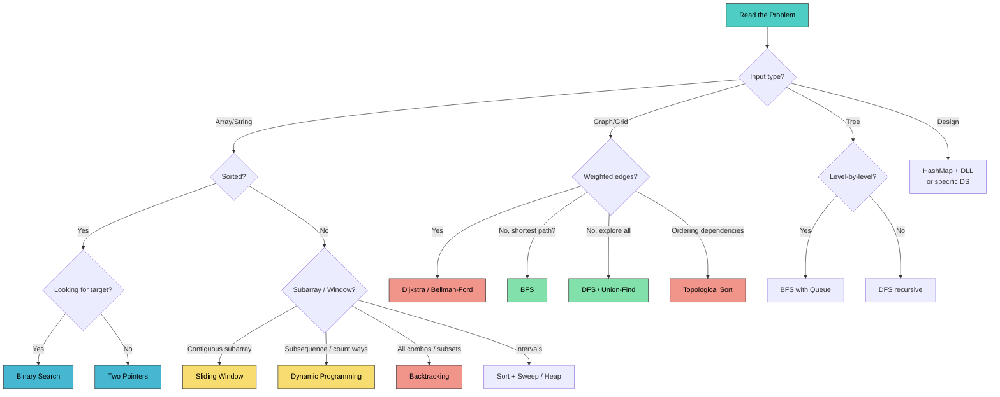

# DSA Advanced Patterns & ML Coding (Java)

> "Match the problem to the pattern table before you touch the keyboard — the code is the easy part once you know which template applies."

**What this chapter covers:** Backtracking, greedy, bit manipulation, intervals, math/number theory, segment/Fenwick trees, Bellman-Ford, Floyd-Warshall, monotonic deques, the master pattern-recognition table, the 45-minute interview strategy, and ML-from-scratch coding (linear/logistic regression, K-Means, KNN, softmax, self-attention). Final chapter of the 4-part DSA sequence (31 / 31b / 31c / 31d); section numbers continue from chapters 31/31b/31c.

---

## Table of Contents

| Part | Topic | Sections |
|------|-------|----------|
| 5 | Advanced Patterns | §18.21–18.25: Backtracking, Greedy, Bit Manipulation, Intervals, Math |
| 6 | Advanced DS & Paths | §18.26–18.30: Segment Tree, BIT/Fenwick, Bellman-Ford, Floyd-Warshall, Monotonic Deque |
| 7 | Pattern Recognition | §18.31–18.33: Master Table, Decision Flowchart, Interview Strategy |
| 8 | ML Coding | §18.34: Implement ML from Scratch in Java |

**Sequence:** [31 — Foundations & Search](#content/31_dsa_foundations) → [31b — Graphs](#content/31b_dsa_graphs) → [31c — Dynamic Programming](#content/31c_dynamic_programming) → **31d (this chapter)**

---

# PART 5: ADVANCED PATTERNS

---

## 18.21 Backtracking

Backtracking is systematic trial-and-error. You build a solution incrementally, and the moment a partial solution can't lead anywhere valid, you **backtrack** — undo the last choice and try the next option. It generates all valid configurations of a search space.

**The Template: Choose -> Explore -> Unchoose**

```java
void backtrack(List<List<Integer>> result, List<Integer> current, /* params */) {
    if (/* base case / goal reached */) {
        result.add(new ArrayList<>(current)); // COPY current — it mutates!
        return;
    }
    for (/* each candidate choice */) {
        if (/* valid choice */) {
            current.add(choice);               // 1. CHOOSE
            backtrack(result, current, ...);    // 2. EXPLORE
            current.remove(current.size() - 1); // 3. UNCHOOSE
        }
    }
}
```

### The Big Three: Subsets, Permutations, Combinations

```java
// SUBSETS (LC 78) — pick or skip each element
public List<List<Integer>> subsets(int[] nums) {
    List<List<Integer>> result = new ArrayList<>();
    backtrackSubsets(result, new ArrayList<>(), nums, 0);
    return result;
}

void backtrackSubsets(List<List<Integer>> res, List<Integer> curr, int[] nums, int start) {
    res.add(new ArrayList<>(curr)); // every state is a valid subset
    for (int i = start; i < nums.length; i++) {
        curr.add(nums[i]);
        backtrackSubsets(res, curr, nums, i + 1); // i+1 to avoid reuse
        curr.remove(curr.size() - 1);
    }
}
```

**Example (subsets):**
Input: nums = [1, 2, 3]
Output: [[], [1], [2], [1,2], [3], [1,3], [2,3], [1,2,3]]

**Practice:** [Subsets →](#dsa-problem-subsets)

```java
// PERMUTATIONS (LC 46) — use all elements in every order
public List<List<Integer>> permute(int[] nums) {
    List<List<Integer>> result = new ArrayList<>();
    backtrackPermute(result, new ArrayList<>(), nums, new boolean[nums.length]);
    return result;
}

void backtrackPermute(List<List<Integer>> res, List<Integer> curr,
                      int[] nums, boolean[] used) {
    if (curr.size() == nums.length) {
        res.add(new ArrayList<>(curr));
        return;
    }
    for (int i = 0; i < nums.length; i++) {
        if (used[i]) continue;
        used[i] = true;
        curr.add(nums[i]);
        backtrackPermute(res, curr, nums, used);
        curr.remove(curr.size() - 1);
        used[i] = false;
    }
}
```

**Example (permute):**
Input: nums = [1, 2, 3]
Output: [[1,2,3],[1,3,2],[2,1,3],[2,3,1],[3,1,2],[3,2,1]]

**Practice:** [Permutations →](#dsa-problem-permutations)

```java
// COMBINATIONS (LC 77) — choose k from n
public List<List<Integer>> combine(int n, int k) {
    List<List<Integer>> result = new ArrayList<>();
    backtrackCombine(result, new ArrayList<>(), 1, n, k);
    return result;
}

void backtrackCombine(List<List<Integer>> res, List<Integer> curr,
                      int start, int n, int k) {
    if (curr.size() == k) {
        res.add(new ArrayList<>(curr));
        return;
    }
    for (int i = start; i <= n - (k - curr.size()) + 1; i++) { // pruning!
        curr.add(i);
        backtrackCombine(res, curr, i + 1, n, k);
        curr.remove(curr.size() - 1);
    }
}
```

**Example (combine):**
Input: n = 4, k = 2
Output: [[1,2],[1,3],[1,4],[2,3],[2,4],[3,4]]

**Practice:** [Combinations →](#dsa-problem-combinations)

### N-Queens

Place N queens on an N x N board so no two attack each other. Classic backtracking: place one queen per row, check column and diagonal conflicts.

```java
public List<List<String>> solveNQueens(int n) {
    List<List<String>> result = new ArrayList<>();
    boolean[] cols = new boolean[n];
    boolean[] diag1 = new boolean[2 * n]; // row - col + n
    boolean[] diag2 = new boolean[2 * n]; // row + col
    char[][] board = new char[n][n];
    for (char[] row : board) Arrays.fill(row, '.');

    solve(result, board, 0, cols, diag1, diag2, n);
    return result;
}

void solve(List<List<String>> res, char[][] board, int row,
           boolean[] cols, boolean[] d1, boolean[] d2, int n) {
    if (row == n) {
        List<String> snapshot = new ArrayList<>();
        for (char[] r : board) snapshot.add(new String(r));
        res.add(snapshot);
        return;
    }
    for (int col = 0; col < n; col++) {
        if (cols[col] || d1[row - col + n] || d2[row + col]) continue;
        board[row][col] = 'Q';
        cols[col] = d1[row - col + n] = d2[row + col] = true;
        solve(res, board, row + 1, cols, d1, d2, n);
        board[row][col] = '.';
        cols[col] = d1[row - col + n] = d2[row + col] = false;
    }
}
```

**Example:**
Input: n = 4
Output: [[".Q..","...Q","Q...","..Q."],["..Q.","Q...","...Q",".Q.."]]  (2 solutions)

**Practice:** [N-Queens →](#dsa-problem-n-queens)

> **Fun fact:** The number of solutions to N-Queens grows roughly exponentially. N=8 has 92 solutions, N=14 has 365,596, and no closed-form formula is known.

**Common Mistakes:**
- Forgetting `new ArrayList<>(current)` — without the copy, all results point to the same (now-empty) list.
- Not pruning early — backtracking without good pruning degenerates into brute force.
- Off-by-one in `start` index — using `i` instead of `i+1` allows reuse of the same element.

**Key Problems — Detailed Solutions:**

<details>
<summary><strong>Subsets</strong> — Medium</summary>

**Problem:** Given an integer array `nums` of unique elements, return all possible subsets (the power set). The solution must not contain duplicate subsets.

**Example:**
Input: nums = [1, 2, 3]
Output: [[], [1], [2], [3], [1,2], [1,3], [2,3], [1,2,3]]

**Approach:** Backtracking with a start index. At each recursive call, add the current partial subset to the result (every state is valid). Then for each element from start to end, include it and recurse with start = i + 1 to avoid duplicates.

**Java:**
```java
public List<List<Integer>> subsets(int[] nums) {
    List<List<Integer>> res = new ArrayList<>();
    backtrack(res, new ArrayList<>(), nums, 0);
    return res;
}
private void backtrack(List<List<Integer>> res, List<Integer> curr, int[] nums, int start) {
    res.add(new ArrayList<>(curr));
    for (int i = start; i < nums.length; i++) {
        curr.add(nums[i]);
        backtrack(res, curr, nums, i + 1);
        curr.remove(curr.size() - 1);
    }
}
// Time: O(n * 2^n)  Space: O(n) recursion depth
```

**Complexity:** O(n * 2^n) time, O(n) space (excluding output)
</details>

<details>
<summary><strong>Permutations</strong> — Medium</summary>

**Problem:** Given an array `nums` of distinct integers, return all possible permutations.

**Example:**
Input: nums = [1, 2, 3]
Output: [[1,2,3],[1,3,2],[2,1,3],[2,3,1],[3,1,2],[3,2,1]]

**Approach:** Backtracking with a boolean used[] array. At each level, try every unused element. When the permutation is complete (length == nums.length), record it. Mark elements as used/unused on choose/unchoose.

**Java:**
```java
public List<List<Integer>> permute(int[] nums) {
    List<List<Integer>> res = new ArrayList<>();
    backtrack(res, new ArrayList<>(), nums, new boolean[nums.length]);
    return res;
}
private void backtrack(List<List<Integer>> res, List<Integer> curr,
                       int[] nums, boolean[] used) {
    if (curr.size() == nums.length) {
        res.add(new ArrayList<>(curr));
        return;
    }
    for (int i = 0; i < nums.length; i++) {
        if (used[i]) continue;
        used[i] = true;
        curr.add(nums[i]);
        backtrack(res, curr, nums, used);
        curr.remove(curr.size() - 1);
        used[i] = false;
    }
}
// Time: O(n * n!)  Space: O(n)
```

**Complexity:** O(n * n!) time, O(n) space (excluding output)
</details>

<details>
<summary><strong>Combination Sum</strong> — Medium</summary>

**Problem:** Given an array of distinct integers `candidates` and a target, return all unique combinations where the chosen numbers sum to target. Each number can be used unlimited times.

**Example:**
Input: candidates = [2, 3, 6, 7], target = 7
Output: [[2, 2, 3], [7]]

**Approach:** Backtracking with a start index (to avoid permutations of the same combination). At each level, try candidates from start onward. Recurse with the same index i (allowing reuse). Stop when remaining target is 0 (valid) or negative (prune).

**Java:**
```java
public List<List<Integer>> combinationSum(int[] candidates, int target) {
    List<List<Integer>> res = new ArrayList<>();
    backtrack(res, new ArrayList<>(), candidates, target, 0);
    return res;
}
private void backtrack(List<List<Integer>> res, List<Integer> curr,
                       int[] cands, int remain, int start) {
    if (remain == 0) { res.add(new ArrayList<>(curr)); return; }
    if (remain < 0) return;
    for (int i = start; i < cands.length; i++) {
        curr.add(cands[i]);
        backtrack(res, curr, cands, remain - cands[i], i); // i, not i+1 (reuse)
        curr.remove(curr.size() - 1);
    }
}
// Time: O(n^(target/min)) worst case  Space: O(target/min) recursion depth
```

**Complexity:** O(n^(target/min)) time, O(target/min) space
</details>

**Problem List — Backtracking:**

| #   | Problem                          | Difficulty | Key Insight                       |
|-----|----------------------------------|------------|-----------------------------------|
| 1   | Subsets (LC 78)                  | Medium     | Pick or skip                      |
| 2   | Subsets II (LC 90)               | Medium     | Skip duplicates after sort        |
| 3   | Permutations (LC 46)             | Medium     | used[] boolean array              |
| 4   | Permutations II (LC 47)          | Medium     | Sort + skip same-value at same level |
| 5   | Combinations (LC 77)             | Medium     | k-sized subsets                   |
| 6   | Combination Sum (LC 39)          | Medium     | Allow reuse (start from i, not i+1) |
| 7   | Combination Sum II (LC 40)       | Medium     | No reuse + skip duplicates        |
| 8   | N-Queens (LC 51)                 | Hard       | Row-by-row + diagonal tracking    |
| 9   | Palindrome Partitioning (131)    | Medium     | Partition string into palindromes |
| 10  | Letter Combinations of Phone (17)| Medium     | Map digits to letters             |

---

## 18.22 Greedy Algorithms

A greedy algorithm makes the locally optimal choice at each step, hoping it leads to a globally optimal solution. It works when a problem has both **optimal substructure** (optimal solution contains optimal sub-solutions) and the **greedy choice property** (a local optimum leads to a global optimum).

**The test:** If you can prove that choosing the locally best option never forecloses a better global answer, greedy works.

### Interval Scheduling (Activity Selection)

**Problem:** Given intervals, find the maximum number of non-overlapping intervals.
**Greedy choice:** Always pick the interval that ends earliest — it leaves the most room for future intervals.

```java
// LC 435: Non-overlapping Intervals (minimum removals)
public int eraseOverlapIntervals(int[][] intervals) {
    Arrays.sort(intervals, (a, b) -> Integer.compare(a[1], b[1])); // sort by end time
    int count = 0, prevEnd = Integer.MIN_VALUE;

    for (int[] interval : intervals) {
        if (interval[0] >= prevEnd) {
            prevEnd = interval[1]; // keep this interval
        } else {
            count++; // remove this interval (overlaps)
        }
    }
    return count;
}
```

**Example:**
Input: intervals = [[1,2],[2,3],[3,4],[1,3]]
Output: 1  (remove [1,3] to leave [1,2],[2,3],[3,4] non-overlapping)

**Practice:** [Non-overlapping Intervals →](#dsa-problem-non-overlapping-intervals)

### Jump Game

```java
// LC 55: Can you reach the last index?
public boolean canJump(int[] nums) {
    int maxReach = 0;
    for (int i = 0; i < nums.length; i++) {
        if (i > maxReach) return false; // stuck
        maxReach = Math.max(maxReach, i + nums[i]);
    }
    return true;
}

// LC 45: Minimum jumps to reach end
public int jump(int[] nums) {
    int jumps = 0, currEnd = 0, farthest = 0;
    for (int i = 0; i < nums.length - 1; i++) {
        farthest = Math.max(farthest, i + nums[i]);
        if (i == currEnd) { // must jump now
            jumps++;
            currEnd = farthest;
        }
    }
    return jumps;
}
```

**Example (canJump):**
Input: nums = [2, 3, 1, 1, 4]
Output: true

**Example (jump):**
Input: nums = [2, 3, 1, 1, 4]
Output: 2  (jump 0->1->4)

**Practice:** [Jump Game →](#dsa-problem-jump-game) · [Jump Game II →](#dsa-problem-jump-game-ii)

### Task Scheduler

```java
// LC 621: Minimum intervals to finish all tasks with cooldown n
public int leastInterval(char[] tasks, int n) {
    int[] freq = new int[26];
    for (char t : tasks) freq[t - 'A']++;
    Arrays.sort(freq);

    int maxFreq = freq[25];
    int idleSlots = (maxFreq - 1) * n;

    for (int i = 24; i >= 0 && freq[i] > 0; i--) {
        idleSlots -= Math.min(freq[i], maxFreq - 1);
    }
    return Math.max(tasks.length, tasks.length + idleSlots);
}
```

**Example:**
Input: tasks = [A,A,A,B,B,B], n = 2
Output: 8  (e.g. A B idle A B idle A B)

**Practice:** [Task Scheduler →](#dsa-problem-task-scheduler)

**Problem List — Greedy:**

| #   | Problem                          | Difficulty | Key Insight                       |
|-----|----------------------------------|------------|-----------------------------------|
| 1   | Jump Game (LC 55)                | Medium     | Track max reachable               |
| 2   | Jump Game II (LC 45)             | Medium     | BFS-style level expansion         |
| 3   | Non-overlapping Intervals (435)  | Medium     | Sort by end, greedily keep        |
| 4   | Task Scheduler (LC 621)          | Medium     | Fill idle slots                   |
| 5   | Gas Station (LC 134)             | Medium     | If total >= 0, solution exists    |
| 6   | Partition Labels (LC 763)        | Medium     | Track last occurrence             |
| 7   | Candy (LC 135)                   | Hard       | Two-pass: left-to-right + right-to-left |
| 8   | Meeting Rooms II (LC 253)        | Medium     | Min-heap for end times            |

---

## 18.23 Bit Manipulation

Bit manipulation lets you solve certain problems in O(1) space and O(n) time where other approaches need extra storage. The key operations:

**Java Bit Operations Cheat Sheet:**

| Operation              | Java             | Example (a=5=101)       |
|------------------------|------------------|--------------------------|
| AND                    | `a & b`          | 5 & 3 = 1 (101 & 011)   |
| OR                     | `a \| b`          | 5 \| 3 = 7 (101 \| 011)   |
| XOR                    | `a ^ b`          | 5 ^ 3 = 6 (101 ^ 011)   |
| NOT                    | `~a`             | ~5 = -6                  |
| Left shift             | `a << n`         | 5 << 1 = 10             |
| Right shift (signed)   | `a >> n`         | 5 >> 1 = 2              |
| Right shift (unsigned) | `a >>> n`        | Use for negative numbers |
| Check bit i set        | `(a >> i) & 1`   |                          |
| Set bit i              | `a \| (1 << i)`   |                          |
| Clear bit i            | `a & ~(1 << i)` |                          |
| Toggle bit i           | `a ^ (1 << i)`  |                          |
| Lowest set bit         | `a & (-a)`       | 12 & -12 = 4            |
| Clear lowest set bit   | `a & (a - 1)`   | 12 & 11 = 8             |
| Count set bits         | `Integer.bitCount(a)` |                     |
| Is power of 2?         | `a > 0 && (a & (a-1)) == 0` |              |

**Core XOR Properties:**
- `a ^ a = 0` (anything XOR itself cancels)
- `a ^ 0 = a` (XOR with zero is identity)
- XOR is commutative and associative

```java
// LC 136: Single Number — every element appears twice except one
public int singleNumber(int[] nums) {
    int result = 0;
    for (int num : nums) result ^= num; // pairs cancel, single remains
    return result;
}
```

**Example (singleNumber):**
Input: nums = [4, 1, 2, 1, 2]
Output: 4

**Practice:** [Single Number →](#dsa-problem-single-number)

```java
// LC 338: Counting Bits — count 1-bits for every number 0..n
public int[] countBits(int n) {
    int[] dp = new int[n + 1];
    for (int i = 1; i <= n; i++) {
        dp[i] = dp[i >> 1] + (i & 1); // half the number + last bit
    }
    return dp;
}
```

**Example (countBits):**
Input: n = 5
Output: [0, 1, 1, 2, 1, 2]

**Practice:** [Counting Bits →](#dsa-problem-counting-bits)

```java
// Generate all subsets using bitmask
public List<List<Integer>> subsets(int[] nums) {
    List<List<Integer>> result = new ArrayList<>();
    int n = nums.length;
    for (int mask = 0; mask < (1 << n); mask++) {
        List<Integer> subset = new ArrayList<>();
        for (int i = 0; i < n; i++) {
            if ((mask & (1 << i)) != 0) subset.add(nums[i]);
        }
        result.add(subset);
    }
    return result;
}
```

**Example (subsets via bitmask):**
Input: nums = [1, 2]
Output: [[], [1], [2], [1,2]]

**Problem List — Bit Manipulation:**

| #   | Problem                          | Difficulty | Key Insight                       |
|-----|----------------------------------|------------|-----------------------------------|
| 1   | Single Number (LC 136)           | Easy       | XOR all elements                  |
| 2   | Single Number II (LC 137)        | Medium     | Count bits mod 3                  |
| 3   | Number of 1 Bits (LC 191)        | Easy       | n & (n-1) clears lowest bit       |
| 4   | Counting Bits (LC 338)           | Easy       | dp[i] = dp[i>>1] + (i&1)         |
| 5   | Reverse Bits (LC 190)            | Easy       | Shift and build                   |
| 6   | Missing Number (LC 268)          | Easy       | XOR with indices                  |
| 7   | Sum of Two Integers (LC 371)     | Medium     | Bit-by-bit add with carry         |
| 8   | Power of Two (LC 231)            | Easy       | n & (n-1) == 0                    |

---

## 18.24 Intervals

Interval problems almost always start the same way: **sort by start time** (or end time, depending on the variant), then process linearly.

```java
// TEMPLATE: Sort intervals, then merge/process
Arrays.sort(intervals, (a, b) -> Integer.compare(a[0], b[0]));
```

### Merge Intervals

```java
// LC 56: Merge Intervals
public int[][] merge(int[][] intervals) {
    Arrays.sort(intervals, (a, b) -> Integer.compare(a[0], b[0]));
    List<int[]> merged = new ArrayList<>();
    merged.add(intervals[0]);

    for (int i = 1; i < intervals.length; i++) {
        int[] last = merged.get(merged.size() - 1);
        if (intervals[i][0] <= last[1]) {
            last[1] = Math.max(last[1], intervals[i][1]); // extend
        } else {
            merged.add(intervals[i]); // no overlap, add new
        }
    }
    return merged.toArray(new int[0][]);
}
```

**Example:**
Input: intervals = [[1,3],[2,6],[8,10],[15,18]]
Output: [[1,6],[8,10],[15,18]]

**Practice:** [Merge Intervals →](#dsa-problem-merge-intervals)

### Meeting Rooms II (Minimum Conference Rooms)

```java
// LC 253: find minimum rooms needed (max overlapping intervals)
public int minMeetingRooms(int[][] intervals) {
    Arrays.sort(intervals, (a, b) -> Integer.compare(a[0], b[0]));
    PriorityQueue<Integer> pq = new PriorityQueue<>(); // tracks end times

    for (int[] interval : intervals) {
        if (!pq.isEmpty() && pq.peek() <= interval[0]) {
            pq.poll(); // reuse a room
        }
        pq.offer(interval[1]);
    }
    return pq.size(); // rooms in use = rooms needed
}
```

**Example:**
Input: intervals = [[0,30],[5,10],[15,20]]
Output: 2

**Practice:** [Meeting Rooms II →](#dsa-problem-meeting-rooms-ii)

**Problem List — Intervals:**

| #   | Problem                          | Difficulty | Key Insight                       |
|-----|----------------------------------|------------|-----------------------------------|
| 1   | Merge Intervals (LC 56)          | Medium     | Sort by start, merge overlapping  |
| 2   | Insert Interval (LC 57)          | Medium     | Find overlap window               |
| 3   | Non-overlapping Intervals (435)  | Medium     | Sort by end, count removals       |
| 4   | Meeting Rooms (LC 252)           | Easy       | Sort, check any overlap           |
| 5   | Meeting Rooms II (LC 253)        | Medium     | Min-heap of end times             |
| 6   | Minimum Interval to Include (1851)| Hard      | Sort + priority queue             |

---

## 18.25 Math & Number Theory

### GCD (Euclidean Algorithm)

```java
int gcd(int a, int b) {
    while (b != 0) {
        int temp = b;
        b = a % b;
        a = temp;
    }
    return a;
}
int lcm(int a, int b) { return a / gcd(a, b) * b; } // divide first to avoid overflow
```

**Example:**
Input: a = 48, b = 18
Output: gcd = 6, lcm = 144

### Sieve of Eratosthenes

```java
// Count primes less than n — O(n log log n)
public int countPrimes(int n) {
    boolean[] notPrime = new boolean[n];
    int count = 0;
    for (int i = 2; i < n; i++) {
        if (!notPrime[i]) {
            count++;
            for (long j = (long) i * i; j < n; j += i) { // start at i*i
                notPrime[(int) j] = true;
            }
        }
    }
    return count;
}
```

**Example:**
Input: n = 10
Output: 4  (primes below 10: 2, 3, 5, 7)

**Practice:** [Count Primes →](#dsa-problem-count-primes)

### Modular Arithmetic for Large Numbers

When the problem says "return answer modulo 10^9 + 7":

```java
static final int MOD = 1_000_000_007;

// Addition
int addMod(int a, int b) { return (int) ((a + (long) b) % MOD); }

// Multiplication
int mulMod(int a, int b) { return (int) ((long) a * b % MOD); }

// Fast exponentiation: base^exp % mod
long power(long base, long exp, long mod) {
    long result = 1;
    base %= mod;
    while (exp > 0) {
        if ((exp & 1) == 1) result = result * base % mod;
        base = base * base % mod;
        exp >>= 1;
    }
    return result;
}
```

**Example (power):**
Input: base = 2, exp = 10, mod = 1_000_000_007
Output: 1024

**Practice:** [Pow(x, n) →](#dsa-problem-pow-x-n)

### Integer Overflow Prevention in Java

```java
// DANGER: int overflow
int mid = (left + right) / 2;          // can overflow if left+right > Integer.MAX_VALUE
int mid = left + (right - left) / 2;   // SAFE — always use this

// DANGER: multiplication overflow
int area = width * height;             // may overflow
long area = (long) width * height;     // SAFE — cast first operand to long

// DANGER: absolute value
Math.abs(Integer.MIN_VALUE);           // returns Integer.MIN_VALUE (still negative!)
// Use long to avoid: Math.abs((long) Integer.MIN_VALUE)
```

**Problem List — Math:**

| #   | Problem                          | Difficulty | Key Insight                       |
|-----|----------------------------------|------------|-----------------------------------|
| 1   | Count Primes (LC 204)            | Medium     | Sieve of Eratosthenes             |
| 2   | Pow(x, n) (LC 50)               | Medium     | Fast exponentiation               |
| 3   | Reverse Integer (LC 7)           | Medium     | Check overflow before multiply    |
| 4   | Happy Number (LC 202)            | Easy       | Floyd's cycle detection           |
| 5   | Plus One (LC 66)                 | Easy       | Handle carry propagation          |
| 6   | Sqrt(x) (LC 69)                 | Easy       | Binary search on answer           |

---

# PART 6: ADVANCED DATA STRUCTURES & SHORTEST PATHS

---

## 18.26 Segment Tree

**When to use:** range aggregate queries (sum, min, max) with point updates on a static-length array. O(n) build, O(log n) per query and update. Prefer over a Fenwick Tree when you need range min/max (not just sum).

```
Array: [2, 4, 5, 1, 8, 3]   (0-indexed, length 6)

                [0,5] sum=23
               /            \
        [0,2] sum=11      [3,5] sum=12
        /       \          /       \
   [0,1] sum=6  [2,2]=5  [3,4] sum=9  [5,5]=3
   /      \               /      \
[0,0]=2  [1,1]=4       [3,3]=1  [4,4]=8

Node at index i stores aggregate for its range.
Left child  = 2*i,   Right child = 2*i+1
Parent      = i/2
```

### Java Template — Sum Segment Tree

```java
class SegmentTree {
    private final int[] tree;
    private final int n;

    // Build in O(n)
    SegmentTree(int[] nums) {
        n = nums.length;
        tree = new int[4 * n];   // 4n is a safe upper bound
        build(nums, 1, 0, n - 1);
    }

    private void build(int[] nums, int node, int lo, int hi) {
        if (lo == hi) {
            tree[node] = nums[lo];
            return;
        }
        int mid = lo + (hi - lo) / 2;
        build(nums, 2 * node,     lo,      mid);
        build(nums, 2 * node + 1, mid + 1, hi);
        tree[node] = tree[2 * node] + tree[2 * node + 1];
    }

    // Point update: set nums[idx] = val — O(log n)
    public void update(int idx, int val) {
        update(1, 0, n - 1, idx, val);
    }

    private void update(int node, int lo, int hi, int idx, int val) {
        if (lo == hi) {
            tree[node] = val;
            return;
        }
        int mid = lo + (hi - lo) / 2;
        if (idx <= mid) update(2 * node,     lo,      mid, idx, val);
        else            update(2 * node + 1, mid + 1, hi,  idx, val);
        tree[node] = tree[2 * node] + tree[2 * node + 1];
    }

    // Range sum query [l, r] — O(log n)
    public int query(int l, int r) {
        return query(1, 0, n - 1, l, r);
    }

    private int query(int node, int lo, int hi, int l, int r) {
        if (l > hi || r < lo) return 0;               // out of range: identity for sum
        if (l <= lo && hi <= r) return tree[node];    // fully covered
        int mid = lo + (hi - lo) / 2;
        return query(2 * node,     lo,      mid, l, r)
             + query(2 * node + 1, mid + 1, hi,  l, r);
    }
}
```

**Example:**
Input: nums = [2, 4, 5, 1, 8, 3]; query(1, 3); update(3, 10); query(1, 3)
Output: 10 (4+5+1), then after update(3,10) → 19 (4+5+10)

**Practice:** [Range Sum Query — Mutable →](#dsa-problem-range-sum-query-mutable)

**Complexity:** Build O(n), query O(log n), update O(log n). Space O(n).

**Range minimum variant:** replace `tree[node] = tree[L] + tree[R]` with `Math.min(...)`, and the out-of-range identity becomes `Integer.MAX_VALUE`.

**Lazy propagation (range updates):** When you need to add a value to every element in a range (not just a point), doing O(log n) individual updates is insufficient. Lazy propagation tags each node with a pending delta; the tag is pushed down to children only when their subtrees are accessed. This keeps range updates and queries both at O(log n). The implementation adds a `lazy[]` array and a `pushDown` helper called at the start of every recursive step.

**Key problems:** Range Sum Query — Mutable (LC 307), Count of Smaller Numbers After Self (LC 315), Rectangle Area (LC 850).

---

## 18.27 Fenwick Tree (Binary Indexed Tree / BIT)

**When to use:** prefix-sum queries with point updates, in O(log n) time and O(n) space. Simpler and faster constant than a segment tree when the aggregate is *invertible* (sum, XOR). Cannot do range min/max; use a segment tree for those.

```
Responsibility of each BIT index (1-indexed, n=8):

Index: 1  2  3  4  5  6  7  8
Bits:  1  10 11 100 101 110 111 1000
Resp:  [1] [1,2] [3] [1,4] [5] [5,6] [7] [1,8]

Each index i is responsible for the range of length lowbit(i) = i & (-i)
ending at i. The update and query walks the tree by adding/subtracting
lowbit(i) at each step.
```

### Java Template

```java
class BIT {
    private final int[] tree;
    private final int n;

    BIT(int n) {
        this.n = n;
        tree = new int[n + 1];   // 1-indexed
    }

    // Add delta to index i (1-indexed) — O(log n)
    public void update(int i, int delta) {
        for (; i <= n; i += i & (-i))
            tree[i] += delta;
    }

    // Prefix sum [1..i] — O(log n)
    public int query(int i) {
        int sum = 0;
        for (; i > 0; i -= i & (-i))
            sum += tree[i];
        return sum;
    }

    // Range sum [l..r] (1-indexed) — O(log n)
    public int query(int l, int r) {
        return query(r) - query(l - 1);
    }
}
```

**Example:**
Input: BIT(5); update(1, 3); update(2, 5); update(3, -2); query(1, 3); query(2, 3)
Output: query(1,3) = 6 (3+5-2), query(2,3) = 3 (5-2)

**The `i & (-i)` idiom:** `-i` in two's complement flips all bits then adds 1, so `i & (-i)` isolates the lowest set bit of `i`. Adding this to `i` in `update` moves to the next responsible ancestor; subtracting it in `query` moves to the next responsible prefix.

**BIT vs Segment Tree:**

| | BIT | Segment Tree |
|---|---|---|
| Space | O(n) | O(4n) |
| Constant factor | ~2× faster | larger |
| Range min/max | No | Yes |
| Range update (lazy) | Requires two BITs | Yes |
| Implementation size | ~15 lines | ~50 lines |

Prefer BIT when the aggregate is sum/XOR and you only need point updates.

**Key problems:** Range Sum Query — Mutable (LC 307), Count of Smaller Numbers After Self (LC 315), Reverse Pairs (LC 493).

---

## 18.28 Bellman-Ford

**When to use:** single-source shortest path when the graph may have **negative edge weights**. Also the only standard algorithm that detects negative-weight cycles. O(V·E) — much slower than Dijkstra's O((V+E) log V), so only reach for it when negative weights are present.

**Why Dijkstra fails with negative edges:** Dijkstra's greedy assumption — once a node is settled, its distance is final — breaks when a future negative edge could reduce that distance.

### Algorithm

Relax all edges V−1 times. After k rounds, every shortest path using at most k edges is correctly computed. Since the longest acyclic path in a V-node graph has V−1 edges, V−1 rounds suffice. A V-th relaxation round that still finds improvements signals a negative cycle.

```
Graph with negative edge:
  A --(-3)--> C
  A --( 4)--> B
  B --( 2)--> C

After round 1: dist[A]=0, dist[B]=4, dist[C]=-3
After round 2: dist[C] checked via B: 4+2=6 > -3, no update
Result: dist[C] = -3  (direct A->C is shortest)
Dijkstra would have settled C at 0+(-3)=-3 immediately by luck here,
but on graphs where the negative edge creates a shortcut discovered late,
Dijkstra gives wrong answers.
```

### Java Template

```java
// Bellman-Ford — O(V * E) time, O(V) space
// edges[i] = {u, v, weight}
public int[] bellmanFord(int n, int[][] edges, int src) {
    int[] dist = new int[n];
    Arrays.fill(dist, Integer.MAX_VALUE);
    dist[src] = 0;

    // Relax all edges V-1 times
    for (int round = 0; round < n - 1; round++) {
        boolean updated = false;
        for (int[] edge : edges) {
            int u = edge[0], v = edge[1], w = edge[2];
            if (dist[u] != Integer.MAX_VALUE && dist[u] + w < dist[v]) {
                dist[v] = dist[u] + w;
                updated = true;
            }
        }
        if (!updated) break;   // early exit: already converged
    }

    // V-th relaxation: detect negative cycle
    for (int[] edge : edges) {
        int u = edge[0], v = edge[1], w = edge[2];
        if (dist[u] != Integer.MAX_VALUE && dist[u] + w < dist[v]) {
            throw new IllegalStateException("Negative cycle detected");
        }
    }

    return dist;
}
```

**Example:**
Input: n = 3, edges = [[0,1,4],[0,2,-3],[1,2,2]], src = 0
Output: dist = [0, 4, -3]  (direct 0->2 beats 0->1->2 = 6)

**Practice:** [Cheapest Flights Within K Stops →](#dsa-problem-cheapest-flights-within-k-stops) · [Network Delay Time →](#dsa-problem-network-delay-time)

**Dijkstra vs Bellman-Ford:**

| | Dijkstra | Bellman-Ford |
|---|---|---|
| Negative weights | No | Yes |
| Negative cycle detection | No | Yes |
| Time complexity | O((V+E) log V) | O(V·E) |
| Space | O(V) | O(V) |
| Use when | Non-negative weights | Negative weights present |

**Key problems:** Cheapest Flights Within K Stops (LC 787), Negative Weight Cycle (LC 3194), Network Delay Time (LC 743) — Dijkstra preferred unless negatives present.

---

## 18.29 Floyd-Warshall

**When to use:** **all-pairs** shortest paths in a dense graph. O(V³) time, O(V²) space. Handles negative edges (but not negative cycles). Correct answer after the algorithm requires checking the diagonal: if `dist[i][i] < 0`, a negative cycle exists through node i.

### The k-i-j Loop Order

The key insight is the DP formulation: `dist[i][j]` = shortest path from i to j using only nodes `{0, 1, ..., k}` as intermediaries. The outer loop over k expands the allowed intermediate set one node at a time. The inner i-j loops read values that were computed in earlier k iterations, so the order is critical: **k outermost, then i, then j**.

```
dist[i][j] = min(dist[i][j],          // current best: no new intermediate
                 dist[i][k] + dist[k][j])  // route through k
```

```
4-node example (∞ = no direct edge):

Initial dist:          After k=0 (via node 0):
  0  1  2  3             0  1  2  3
0[0, 3, ∞, 7]         0[0, 3, ∞, 7]
1[8, 0, 2, ∞]         1[8, 0, 2, ∞]   (1->0->? doesn't help yet)
2[5, ∞, 0, 1]         2[5, 8, 0, 1]   (2->0->1: 5+3=8 < ∞)
3[2, ∞, ∞, 0]         3[2, 5, ∞, 0]   (3->0->1: 2+3=5 < ∞)
```

### Java Template

```java
// Floyd-Warshall — O(V^3) time, O(V^2) space
// Returns dist[i][j] = shortest path from i to j, or Integer.MAX_VALUE/2 if unreachable.
// Call with an adjacency matrix where graph[i][j] = edge weight, or INF if no edge.
public int[][] floydWarshall(int[][] graph) {
    int v = graph.length;
    int INF = Integer.MAX_VALUE / 2;   // divide by 2 to avoid overflow on addition
    int[][] dist = new int[v][v];

    // Initialize: copy direct edge weights
    for (int i = 0; i < v; i++)
        for (int j = 0; j < v; j++)
            dist[i][j] = (i == j) ? 0 : graph[i][j];

    // k = intermediate node being considered
    for (int k = 0; k < v; k++) {
        for (int i = 0; i < v; i++) {
            for (int j = 0; j < v; j++) {
                if (dist[i][k] < INF && dist[k][j] < INF) {
                    dist[i][j] = Math.min(dist[i][j], dist[i][k] + dist[k][j]);
                }
            }
        }
    }

    // Optional: negative cycle check
    for (int i = 0; i < v; i++) {
        if (dist[i][i] < 0)
            throw new IllegalStateException("Negative cycle detected at node " + i);
    }

    return dist;
}
```

**Example:**
Input: graph (4 nodes) = [[0,3,INF,7],[8,0,2,INF],[5,INF,0,1],[2,INF,INF,0]]
Output: dist = [[0,3,5,6],[5,0,2,3],[3,6,0,1],[2,5,7,0]]  (e.g. dist[2][3]=1 via direct edge, dist[0][2]=5 via 0->1->2)

**Practice:** [Evaluate Division →](#dsa-problem-evaluate-division) (best-effort — weighted-graph, all-pairs style reasoning)

**Complexity:** O(V³) time, O(V²) space. For sparse graphs with E << V², run Dijkstra from every source (O(V·(V+E) log V)) instead.

**Key problems:** Find the City With the Smallest Number of Neighbors at a Threshold Distance (LC 1334), Network Delay Time (LC 743), Evaluate Division (LC 399 — treat as weighted graph).

---

## 18.30 Monotonic Deque — Sliding Window Maximum

**When to use:** maximum (or minimum) of every fixed-size window of length k in O(n). The deque maintains a *decreasing* invariant so the front is always the window's maximum. Each element is added and removed at most once — O(n) total.

**Recognition trigger:** "maximum/minimum in every window of size k", "sliding window extremum".

### The Decreasing-Deque Invariant

The deque stores **indices** of array elements in decreasing order of their values. Before adding index `right`:
1. **Remove expired indices** from the front (index <= right − k).
2. **Pop from the back** any index whose value is <= `nums[right]` — those elements can never be the window maximum while `nums[right]` is still in the window.

After both cleanups, `deque.peekFirst()` is the index of the current window maximum.

```
Array: [1, 3, -1, -3, 5, 3, 6, 7],  k = 3

right=0  add 0(val=1).  Deque: [0]          window not full yet
right=1  pop 0(1<3).    Deque: [1]          window not full yet
right=2  add 2(-1<3).   Deque: [1, 2]       window=[1,3,-1]  max=3  front=1
right=3  add 3(-3<-1).  Deque: [1, 2, 3]   window=[3,-1,-3] max=3  front=1
right=4  expire 1(<=4-3=1). pop 2(-1<5),
         pop 3(-3<5).   Deque: [4]           window=[-1,-3,5] max=5  front=4
right=5  pop nothing(3<5).  Deque: [4, 5]   window=[-3,5,3]  max=5  front=4
right=6  expire 4(<=6-3=3). pop 5(3<6).     Deque: [6]       window=[5,3,6] max=6
right=7  pop nothing(7>6).  Deque: [6, 7]   window=[3,6,7]   max=7  front=6... wait
         expire 6? 6 <= 7-3=4? No.          Deque: [6, 7]    max=7  front=6... 
         Actually pop 6(6<7). Deque: [7]     window=[3,6,7]   max=7

Output: [3, 3, 5, 5, 6, 7]
```

### Java — LeetCode 239 Full Solution

```java
// Sliding Window Maximum — LC 239 — O(n) time, O(k) space
public int[] maxSlidingWindow(int[] nums, int k) {
    int n = nums.length;
    int[] result = new int[n - k + 1];
    // Deque stores indices; front = index of window maximum
    Deque<Integer> deque = new ArrayDeque<>();

    for (int right = 0; right < n; right++) {
        // 1. Remove index that has fallen outside the window
        if (!deque.isEmpty() && deque.peekFirst() <= right - k) {
            deque.pollFirst();
        }

        // 2. Maintain decreasing order: pop smaller values from the back
        while (!deque.isEmpty() && nums[deque.peekLast()] <= nums[right]) {
            deque.pollLast();
        }

        deque.offerLast(right);

        // 3. Window is full starting at right = k-1
        if (right >= k - 1) {
            result[right - k + 1] = nums[deque.peekFirst()];
        }
    }
    return result;
}
```

**Example:**
Input: nums = [1, 3, -1, -3, 5, 3, 6, 7], k = 3
Output: [3, 3, 5, 5, 6, 7]

**Practice:** [Sliding Window Maximum →](#dsa-problem-sliding-window-maximum)

**Why O(n):** Each index is pushed to the deque exactly once and popped at most once — from the back when a larger element arrives, or from the front when it expires. Total work is O(2n) = O(n), regardless of k.

**Minimum sliding window:** use an *increasing* deque — pop from the back when `nums[deque.peekLast()] >= nums[right]`.

---

# PART 7: PATTERN RECOGNITION & STRATEGY

---

## 18.31 Master Pattern Table

This is your cheat sheet. When you read a problem, scan for keywords. The keyword tells you the pattern. The pattern tells you the first line of code.

```
+------------------------------------+-------------------------+------------------------------------------+
| Keywords in Problem                | Pattern                 | First Code Move                          |
+------------------------------------+-------------------------+------------------------------------------+
| "sorted array", "target"           | Binary Search           | int left = 0, right = n-1;              |
| "subarray sum", "contiguous"       | Sliding Window          | int left = 0; for (right...)            |
| "k closest", "top k", "kth"       | Heap (PriorityQueue)    | PriorityQueue<> pq = new PQ<>();        |
| "shortest path", "minimum steps"   | BFS                     | Queue<> q = new LinkedList<>();         |
| "all combinations", "all subsets"  | Backtracking            | void backtrack(result, current, ...)    |
| "connected components", "groups"   | Union-Find or DFS       | UnionFind uf = new UnionFind(n);        |
| "how many ways", "count paths"     | Dynamic Programming     | int[] dp = new int[n+1];               |
| "minimum cost", "maximum profit"   | Dynamic Programming     | dp[i] = min/max(dp[i-1]...)            |
| "can partition into"               | DP or Backtracking      | boolean[] dp = new boolean[target+1];   |
| "parentheses", "brackets", "nested"| Stack                   | Deque<> stack = new ArrayDeque<>();     |
| "linked list cycle"                | Fast & Slow Pointers    | ListNode slow = head, fast = head;      |
| "merge k sorted"                   | Heap merge              | PQ with one element from each list      |
| "overlapping intervals"            | Sort + Sweep            | Arrays.sort(intervals, (a,b)->Integer.compare(a[0],b[0]))|
| "string anagram/permutation"       | Hash Map / Counter      | int[] count = new int[26];              |
| "trie", "prefix", "dictionary"     | Trie                    | class TrieNode { TrieNode[] children; } |
| "tree paths", "tree depth"         | DFS on tree             | int dfs(TreeNode node) { ... }          |
| "level order", "zigzag"            | BFS on tree             | Queue + level-by-level processing       |
| "maximum in sliding window"        | Monotonic Deque         | Deque<Integer> deque = new ArrayDeque<>();|
| "topological order", "prerequisites"| Topological Sort       | int[] indegree = new int[n]; Kahn's     |
| "weighted shortest path"           | Dijkstra's              | PQ<int[]> sorted by distance            |
| "grid/island/maze"                 | DFS/BFS on grid         | int[][] dirs = {{0,1},{0,-1},...};      |
| "palindrome"                       | Two Pointers or DP      | Expand from center or dp[i][j]          |
| "design data structure"            | HashMap + LinkedList    | Think LRU Cache pattern                 |
| "stock buy/sell"                   | State Machine DP        | dp[day][txn][holding]                   |
| "bit operations", "XOR"            | Bit Manipulation        | result ^= num; or (n & (n-1))           |
| "range sum/min query + updates"    | Segment Tree or BIT     | int[] tree = new int[4*n];              |
| "prefix sums with point updates"   | Fenwick Tree (BIT)      | i += i & (-i) / i -= i & (-i)          |
| "negative edge weights"            | Bellman-Ford            | relax all edges V-1 times              |
| "all-pairs shortest path"          | Floyd-Warshall          | for k: for i: for j: dist[i][k]+[k][j] |
| "max/min in sliding window size k" | Monotonic Deque         | Deque<Integer> deque = new ArrayDeque<>();|
+------------------------------------+-------------------------+------------------------------------------+
```

> **If the pattern comes back "Dynamic Programming", don't stop there.** Go one level deeper and name the *parent* (§18.15 in the [Dynamic Programming chapter](#content/31c_dynamic_programming)): which of the six is it, and what is the one change? "It's DP" buys you nothing in an interview; "it's 0/1 knapsack with `max` swapped for `||`" buys you the whole solution.

---

## 18.32 Decision Flowchart



---

## 18.33 Google Interview Strategy

### The 45-Minute Timeline

```
Minutes  0-5:  CLARIFY — Read problem, ask questions, state assumptions
Minutes  5-10: APPROACH — Explain your plan, discuss time/space complexity
Minutes 10-35: CODE — Write clean code, talk while you code
Minutes 35-42: TEST — Walk through examples, edge cases
Minutes 42-45: OPTIMIZE — Discuss improvements, alternative approaches
```

### Communication Template

**When you first see the problem:**
> "Let me make sure I understand. We're given [input], and we need to find [output]. A few clarifying questions: [Can there be duplicates? Is the array sorted? What about empty input? What's the range of n?]"

**When proposing your approach:**
> "I'm thinking we can use [pattern] because [reason]. The idea is [1-2 sentence explanation]. This should be O(n) time and O(n) space. Does that sound good before I start coding?"

**While coding:**
> Talk out loud. Explain each block. "Now I'm handling the edge case where..." / "This loop processes each element once, so..."

**When testing:**
> "Let me trace through with the example. [Walk through step by step.] Now let me think about edge cases: empty input, single element, all duplicates, very large input..."

**When stuck (and you will get stuck):**

1. **Re-read the problem.** You probably missed a constraint.
2. **Work a small example by hand.** Write out the steps.
3. **Think about what data structure would help.** "If I had a way to quickly look up X, I could..."
4. **Consider brute force first.** Then optimize. A working O(n^2) beats a broken O(n).
5. **Say it out loud.** "I'm considering [X] because [Y], but I'm stuck on [Z]. Let me think about whether [alternative]..."

### Complexity Analysis Template

Always state both time and space. Use this format:

> **Time:** O(n log n) — sorting takes O(n log n), then one pass through the array O(n), dominated by the sort.
> **Space:** O(n) — we store at most n elements in the hash map.

**Common complexity by pattern:**

| Pattern              | Typical Time      | Typical Space |
|----------------------|-------------------|---------------|
| Binary Search        | O(log n)          | O(1)          |
| Two Pointers         | O(n)              | O(1)          |
| Sliding Window       | O(n)              | O(k) or O(1)  |
| BFS/DFS              | O(V + E)          | O(V)          |
| Sorting + scan       | O(n log n)        | O(1) - O(n)   |
| DP (1D)              | O(n)              | O(n) or O(1)  |
| DP (2D)              | O(n * m)          | O(n * m)      |
| Backtracking         | O(2^n) or O(n!)   | O(n)          |
| Heap operations      | O(n log k)        | O(k)          |
| Trie                 | O(L * n)          | O(L * n)      |

---

# PART 8: ML-SPECIFIC CODING

---

## 18.34 Implement from Scratch

These are the classic "implement ML algorithm X from scratch" problems that come up in ML-focused coding interviews. Each implementation is kept concise and interview-ready.

### Linear Regression (Gradient Descent)

```java
/**
 * Linear Regression via Gradient Descent.
 * Fits y = w*x + b by minimizing mean squared error.
 */
public class LinearRegression {
    double w = 0, b = 0; // weight and bias

    public void fit(double[] x, double[] y, double lr, int epochs) {
        int n = x.length;
        for (int epoch = 0; epoch < epochs; epoch++) {
            double dwSum = 0, dbSum = 0;
            for (int i = 0; i < n; i++) {
                double pred = w * x[i] + b;
                double error = pred - y[i];
                dwSum += error * x[i];   // dL/dw = (pred - y) * x
                dbSum += error;          // dL/db = (pred - y)
            }
            w -= lr * (2.0 / n) * dwSum;
            b -= lr * (2.0 / n) * dbSum;
        }
    }

    public double predict(double x) {
        return w * x + b;
    }
}
```

**Example:**
Input: x = [1, 2, 3, 4], y = [2, 4, 6, 8], lr = 0.01, epochs = 1000
Output: w ≈ 2.0, b ≈ 0.0 → predict(5) ≈ 10.0  (model recovers y = 2x)

### Logistic Regression (Sigmoid + Cross-Entropy)

```java
/**
 * Binary Logistic Regression via Gradient Descent.
 * Fits P(y=1|x) = sigmoid(w . x + b).
 */
public class LogisticRegression {
    double[] w;
    double b = 0;

    double sigmoid(double z) {
        return 1.0 / (1.0 + Math.exp(-z));
    }

    public void fit(double[][] X, int[] y, double lr, int epochs) {
        int n = X.length, d = X[0].length;
        w = new double[d];

        for (int epoch = 0; epoch < epochs; epoch++) {
            double[] dw = new double[d];
            double db = 0;
            for (int i = 0; i < n; i++) {
                double z = b;
                for (int j = 0; j < d; j++) z += w[j] * X[i][j];
                double pred = sigmoid(z);
                double error = pred - y[i]; // gradient of cross-entropy
                for (int j = 0; j < d; j++) dw[j] += error * X[i][j];
                db += error;
            }
            for (int j = 0; j < d; j++) w[j] -= lr * dw[j] / n;
            b -= lr * db / n;
        }
    }

    public int predict(double[] x) {
        double z = b;
        for (int j = 0; j < x.length; j++) z += w[j] * x[j];
        return sigmoid(z) >= 0.5 ? 1 : 0;
    }
}
```

**Example:**
Input: X = [[0],[1],[2],[3]], y = [0, 0, 1, 1], lr = 0.1, epochs = 1000
Output: predict([0]) = 0, predict([3]) = 1  (converges to separate the two classes)

### K-Means Clustering

```java
/**
 * K-Means Clustering.
 * Partitions n points into k clusters by iterating
 * assign-to-nearest-centroid → recompute-centroids.
 */
public class KMeans {
    double[][] centroids;

    public int[] fit(double[][] data, int k, int maxIter) {
        int n = data.length, d = data[0].length;
        centroids = new double[k][d];
        int[] labels = new int[n];

        // Initialize centroids to first k points (simple; use k-means++ in practice)
        for (int i = 0; i < k; i++)
            centroids[i] = data[i].clone();

        for (int iter = 0; iter < maxIter; iter++) {
            // Assign each point to nearest centroid
            for (int i = 0; i < n; i++) {
                double minDist = Double.MAX_VALUE;
                for (int c = 0; c < k; c++) {
                    double dist = euclidean(data[i], centroids[c]);
                    if (dist < minDist) { minDist = dist; labels[i] = c; }
                }
            }
            // Recompute centroids
            double[][] sums = new double[k][d];
            int[] counts = new int[k];
            for (int i = 0; i < n; i++) {
                counts[labels[i]]++;
                for (int j = 0; j < d; j++) sums[labels[i]][j] += data[i][j];
            }
            for (int c = 0; c < k; c++)
                for (int j = 0; j < d; j++)
                    centroids[c][j] = counts[c] > 0 ? sums[c][j] / counts[c] : centroids[c][j];
        }
        return labels;
    }

    double euclidean(double[] a, double[] b) {
        double sum = 0;
        for (int i = 0; i < a.length; i++) sum += (a[i] - b[i]) * (a[i] - b[i]);
        return Math.sqrt(sum);
    }
}
```

**Example:**
Input: data = [[1,1],[1,2],[10,10],[10,11]], k = 2, maxIter = 5
Output: labels = [0, 0, 1, 1]  (two well-separated clusters around (1,~1.5) and (10,~10.5))

### K-Nearest Neighbors (KNN)

```java
/**
 * KNN Classifier.
 * Predicts label of a query point by majority vote of k nearest training points.
 */
public class KNN {
    double[][] trainX;
    int[] trainY;

    public void fit(double[][] X, int[] y) {
        this.trainX = X;
        this.trainY = y;
    }

    public int predict(double[] query, int k) {
        // PQ keeps k smallest distances: max-heap so we can evict the farthest
        PriorityQueue<double[]> pq = new PriorityQueue<>(
            (a, b) -> Double.compare(b[0], a[0])); // max-heap by distance

        for (int i = 0; i < trainX.length; i++) {
            double dist = 0;
            for (int j = 0; j < query.length; j++)
                dist += (query[j] - trainX[i][j]) * (query[j] - trainX[i][j]);
            pq.offer(new double[]{dist, trainY[i]});
            if (pq.size() > k) pq.poll(); // evict farthest
        }

        // Majority vote
        Map<Integer, Integer> votes = new HashMap<>();
        while (!pq.isEmpty()) {
            int label = (int) pq.poll()[1];
            votes.merge(label, 1, Integer::sum);
        }
        return votes.entrySet().stream()
            .max(Map.Entry.comparingByValue()).get().getKey();
    }
}
```

**Example:**
Input: trainX = [[1],[2],[3],[10],[11],[12]], trainY = [0,0,0,1,1,1], query = [2.5], k = 3
Output: 0  (3 nearest neighbors are 2, 3, 1 — all label 0)

### Numerically Stable Softmax

```java
/**
 * Softmax: converts raw scores (logits) to probabilities.
 * Numerically stable: subtract max to prevent overflow in exp().
 *
 * softmax(z_i) = exp(z_i - max(z)) / sum(exp(z_j - max(z)))
 */
public static double[] softmax(double[] logits) {
    double max = Double.NEGATIVE_INFINITY;
    for (double v : logits) max = Math.max(max, v);

    double[] exp = new double[logits.length];
    double sum = 0;
    for (int i = 0; i < logits.length; i++) {
        exp[i] = Math.exp(logits[i] - max); // subtract max for stability
        sum += exp[i];
    }
    for (int i = 0; i < exp.length; i++) exp[i] /= sum;
    return exp;
}
```

**Example:**
Input: logits = [2.0, 1.0, 0.1]
Output: [0.659, 0.242, 0.099]  (probabilities sum to 1.0)

> Without the `- max` trick, `exp(1000)` = infinity. With it, the largest exponent becomes `exp(0) = 1`. This is the single most asked numerical stability question in ML interviews.

### Single-Head Self-Attention

```java
/**
 * Single-Head Self-Attention (simplified transformer attention).
 *
 * Input:  X is [seqLen x dModel]
 * Output: Attention(Q, K, V) = softmax(Q * K^T / sqrt(dk)) * V
 *
 * Q = X * Wq, K = X * Wk, V = X * Wv
 */
public class SelfAttention {
    double[][] Wq, Wk, Wv; // weight matrices [dModel x dk]
    int dk;

    public SelfAttention(int dModel, int dk) {
        this.dk = dk;
        // Random init (simplified — real impl uses Xavier/He)
        Wq = randomMatrix(dModel, dk);
        Wk = randomMatrix(dModel, dk);
        Wv = randomMatrix(dModel, dk);
    }

    public double[][] forward(double[][] X) {
        int seqLen = X.length;
        double[][] Q = matmul(X, Wq); // [seqLen x dk]
        double[][] K = matmul(X, Wk);
        double[][] V = matmul(X, Wv);

        // Attention scores: Q * K^T / sqrt(dk)
        double[][] scores = new double[seqLen][seqLen];
        double scale = Math.sqrt(dk);
        for (int i = 0; i < seqLen; i++)
            for (int j = 0; j < seqLen; j++) {
                for (int k = 0; k < dk; k++)
                    scores[i][j] += Q[i][k] * K[j][k];
                scores[i][j] /= scale;
            }

        // Softmax each row
        for (int i = 0; i < seqLen; i++)
            scores[i] = softmax(scores[i]);

        // Weighted sum of values
        return matmul(scores, V); // [seqLen x dk]
    }

    // --- Helper methods ---
    double[][] matmul(double[][] A, double[][] B) {
        int m = A.length, n = B[0].length, p = B.length;
        double[][] C = new double[m][n];
        for (int i = 0; i < m; i++)
            for (int j = 0; j < n; j++)
                for (int k = 0; k < p; k++)
                    C[i][j] += A[i][k] * B[k][j];
        return C;
    }

    double[][] randomMatrix(int rows, int cols) {
        double[][] m = new double[rows][cols];
        java.util.Random rng = new java.util.Random(42);
        for (int i = 0; i < rows; i++)
            for (int j = 0; j < cols; j++)
                m[i][j] = rng.nextGaussian() * 0.02;
        return m;
    }
}
```

**Example:**
Input: X is a 3x4 matrix (seqLen=3, dModel=4), dk = 2
Output: forward(X) returns a 3x2 matrix — each row is a weighted average of the 3 value rows (V), with weights given by softmax(Q·K^T / sqrt(2)) (exact numbers depend on the random Wq/Wk/Wv init)

> **Interview context:** You won't be asked to implement a full transformer, but understanding how Q, K, V are computed and how the attention matrix forms is essential. The scaling by `sqrt(dk)` prevents dot products from growing too large, which would push softmax into a region with near-zero gradients.

---

## Key Takeaways

```
╔══════════════════════════════════════════════════════════════════════╗
║  DSA & ML CODING (JAVA) — WHAT TO REMEMBER                          ║
╠══════════════════════════════════════════════════════════════════════╣
║  Complexity & arrays/strings                                        ║
║  • 10^8 ops/sec rule: pick complexity from input size to dodge TLE  ║
║  • Two pointers (converging & same-direction), prefix sum           ║
║  • Kadane (max subarray), Dutch flag three-way partition            ║
╠══════════════════════════════════════════════════════════════════════╣
║  Hashing, lists, stacks/queues                                      ║
║  • HashMap O(1): two-sum, frequency, group-by, sliding window       ║
║  • Linked list: fast/slow (Floyd), reversal, merge, dummy head      ║
║  • Monotonic stack = next-greater; min-stack; valid parentheses     ║
╠══════════════════════════════════════════════════════════════════════╣
║  Sorting & binary search                                            ║
║  • Merge (stable), quicksort/quickselect (kth in O(n) avg)          ║
║  • Counting sort for small ranges; custom comparators               ║
║  • BS templates: exact, lower/upper bound, search-on-answer         ║
╠══════════════════════════════════════════════════════════════════════╣
║  Trees, heaps, tries                                                ║
║  • DFS recursion solves ~90% of tree problems; BFS = level order    ║
║  • BST inorder is sorted; LCA; serialize/deserialize                ║
║  • Heap: top-K (size-K heap), merge-K, running median (two heaps)   ║
║  • Trie: prefix search, autocomplete, word-search backtracking      ║
╠══════════════════════════════════════════════════════════════════════╣
║  Graphs                                                             ║
║  • Adjacency list default; BFS = shortest unweighted, DFS = explore ║
║  • Dijkstra (PQ) for weighted ≥0; Bellman-Ford handles negatives    ║
║  • Topo sort (Kahn), Union-Find, cycle detection                    ║
║  • Floyd-Warshall: all-pairs via k-i-j loop order                   ║
║  • Grids: flood-fill islands, multi-source BFS (rotting oranges)    ║
╠══════════════════════════════════════════════════════════════════════╣
║  Dynamic programming & advanced patterns                            ║
║  • Recipe: state → recurrence → base case → order; memo vs tab      ║
║  • 1D (climb, rob, coin, LIS); 2D (paths, edit dist, LCS, knapsack) ║
║  • Interval, bitmask, state-machine DP; roll arrays to save space   ║
║  • Backtracking (subsets/perms/combos, N-Queens), greedy, intervals ║
║  • Segment/Fenwick trees for range queries; bit tricks; GCD/sieve   ║
╠══════════════════════════════════════════════════════════════════════╣
║  Strategy & ML coding                                               ║
║  • Match input to pattern table; clarify → brute → optimize → test  ║
║  • State & justify time/space; watch int overflow (use long)        ║
║  • From scratch: linreg/logreg (GD), K-means, KNN, stable softmax,  ║
║    single-head self-attention (scale by sqrt(dk))                   ║
╚══════════════════════════════════════════════════════════════════════╝
```

---

**Previous:** [Chapter 31c — Dynamic Programming](#content/31c_dynamic_programming) | **Next:** [Chapter 32 — ML Interview Questions](#content/32_interview_questions)
