# Chapter 34 (Part 2 of 2) — Google's Top 10 ML Interview Topics: LLM Architecture, Training, Serving & Frontier

> Continuation of Chapter 34. **[← Part 1](34_google_top10_ml_interview.md)** covers Topics 1–10
> (the classic ML core — bias-variance, optimization, regularization, ensembles, backpropagation,
> transformers, evaluation, dimensionality reduction, feature engineering, and ML system design).
> This part picks up at **Topic 11** with the LLM deep-dives.

---

## Table of Contents (Part 2)

| # | Topic | Key Questions |
|---|-------|---------------|
| 11 | [LLM Architecture Deep Dive](#topic-11--llm-architecture-deep-dive) | BPE tokenization, RoPE, attention derivation, KV cache, Flash Attention, MoE |
| 12 | [LLM Training Pipeline](#topic-12--llm-training-pipeline-pre-training--sft--rlhfdpo) | Pre-training, SFT, RLHF, DPO, GRPO/RLVR, Constitutional AI, scaling laws |
| 13 | [LLM Serving & Production](#topic-13--llm-serving--production-at-scale) | Quantization (INT4/INT8/FP8), speculative decoding, distributed training, RAG, MCP |
| 14 | [LLM Evaluation & Frontier Research](#topic-14--llm-evaluation--frontier-research) | Perplexity, MMLU, Chatbot Arena, LLM-as-judge, reasoning models, Mamba, lost-in-middle |
| — | [Quick Reference — All Topics](#quick-reference--all-topics-at-a-glance) | Cheat sheet, final interview tips, key takeaways |

---

# TOPIC 11 — LLM Architecture Deep Dive

> **Priority: MUST-KNOW.** Google built the Transformer. Expect to derive attention math on a whiteboard, explain how tokens become numbers, and calculate KV cache memory for a 70B model.

---

## Why Google Asks This

Google invented the Transformer ("Attention Is All You Need," 2017). Every interviewer on an ML or AI team will expect you to know how LLMs work **from tokens to output**, with mathematical precision. This isn't just theory — Google engineers debug attention patterns, optimize memory, and design new architectures daily.

---

## Common Interview Questions

1. "Walk me through the full Transformer architecture. Derive the attention formula."
2. "How does BPE tokenization work? What happens with out-of-vocabulary words?"
3. "Explain positional encoding. Why do modern models use RoPE instead of sinusoidal?"
4. "What is the KV cache? Calculate the memory needed for a 70B parameter model serving at batch size 32."
5. "Explain Flash Attention. Why does it use O(n) memory instead of O(n²)?"
6. "What is Mixture of Experts? How does Gemini use it?"

---

## 11.1 Tokenization — Byte Pair Encoding (BPE) ★★★

### Simple Explanation

Before an LLM can read text, it must convert words into numbers. But we can't just assign one number per word — there are millions of words, misspellings, new slang, code, etc. BPE is a clever compression trick: start with individual characters, then repeatedly merge the most common pair into a new token. After enough merges, you end up with a vocabulary of ~32K-100K tokens that can represent ANY text.

### The BPE Algorithm — Step by Step ★★★

```
BPE Training Algorithm:
────────────────────────

Input:  Training corpus (e.g., all of Wikipedia)
Output: Vocabulary of subword tokens + merge rules

1. Start with character-level vocabulary:
   {"a", "b", "c", ..., "z", " ", ".", ...}

2. Count all adjacent character pairs in the corpus
3. Find the most frequent pair
4. Merge that pair into a new token
5. Add new token to vocabulary
6. Repeat steps 2-5 until desired vocabulary size reached
```

### Worked Example — BPE on a Tiny Corpus ★★★

```
Corpus: "low low low low low  lower lower  newest newest newest  widest widest"

Step 0 — Character-level tokenization:
  "l o w" appears 5 times (in "low" × 5)
  "l o w e r" appears 2 times
  "n e w e s t" appears 3 times
  "w i d e s t" appears 2 times

  Count all pairs:
    (l, o): 7    (o, w): 7    (w, e): 5    (e, r): 2
    (e, s): 5    (s, t): 5    (n, e): 3    (w, i): 2
    (i, d): 2    (d, e): 2

Step 1 — Most frequent pair: (l, o) = 7. Merge → "lo"
  Vocabulary: {..., "lo"}
  Corpus becomes: "lo w  lo w  lo w e r  n e w e s t  w i d e s t"

Step 2 — Most frequent pair: (lo, w) = 7. Merge → "low"
  Vocabulary: {..., "lo", "low"}
  Corpus becomes: "low  low  low e r  n e w e s t  w i d e s t"

Step 3 — Most frequent pair: (e, s) = 5. Merge → "es"
  Vocabulary: {..., "lo", "low", "es"}

Step 4 — Most frequent pair: (es, t) = 5. Merge → "est"
  Vocabulary: {..., "lo", "low", "es", "est"}

  Now "newest" = "n e w est", "widest" = "w i d est"
  "lower" = "low e r"

...continue until vocabulary reaches target size (e.g., 32,000).
```

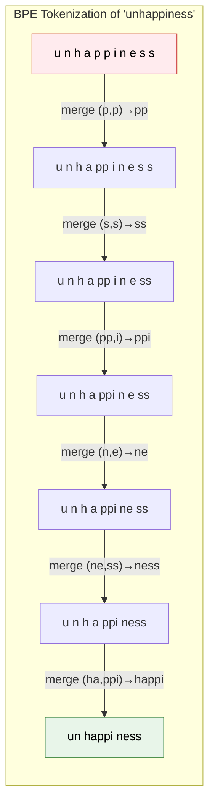

### Why BPE Matters for Interviews ★★★

| Property | Detail |
|----------|--------|
| **Vocabulary size** | Typically 32K–100K tokens (GPT-4: ~100K, LLaMA: 32K) |
| **No OOV words** | Can always fall back to individual bytes |
| **Compression** | Common words = 1 token; rare words = multiple tokens |
| **Language bias** | English words are ~1 token; other languages often 2-4× more tokens |
| **Cost implication** | API pricing is per-token, so tokenization efficiency = cost efficiency |

### Common Interview Follow-Up: "What are alternatives to BPE?" ★★★

| Method | How It Works | Used By |
|--------|-------------|---------|
| **BPE** | Merge most frequent pairs bottom-up | GPT, LLaMA |
| **WordPiece** | Like BPE but maximizes likelihood, not frequency | BERT, Gemini |
| **Unigram (SentencePiece)** | Start with large vocab, prune tokens that least reduce likelihood | T5, ALBERT |

---

## 11.2 Positional Encoding — From Sinusoidal to RoPE ★★★

### Why Position Matters ★★★

Attention is **permutation-invariant** — it treats input tokens as a set, not a sequence. Without positional information, "dog bites man" and "man bites dog" would produce identical representations.

### Sinusoidal Positional Encoding (Original Transformer, 2017) ★★★

Add a unique position signal to each token embedding:

```
PE(pos, 2i)   = sin(pos / 10000^(2i/d_model))
PE(pos, 2i+1) = cos(pos / 10000^(2i/d_model))

Where:
  pos   = position in the sequence (0, 1, 2, ...)
  i     = dimension index (0, 1, 2, ..., d_model/2)
  d_model = embedding dimension (e.g., 512, 768, 4096)
```

**Why sinusoidal works:** For any fixed offset k, `PE(pos+k)` can be expressed as a linear function of `PE(pos)`. This means the model can learn to attend to relative positions.

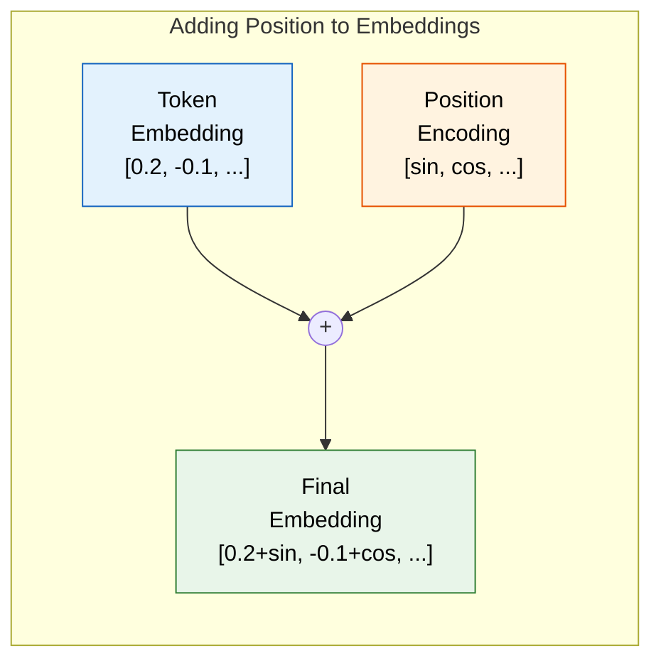

### RoPE — Rotary Position Embedding (Modern Standard) ★★★

**Why RoPE replaced sinusoidal:** Sinusoidal encoding is **absolute** — it encodes "I am at position 5." RoPE encodes **relative** relationships — "I am 3 positions after you" — which is what attention actually needs.

**Core Idea:** Instead of adding position to the embedding, RoPE **rotates** the query and key vectors by an angle proportional to their position.

### RoPE — Mathematical Derivation ★★★

**Step 1: Group dimensions into pairs**

For a vector of dimension d, group into d/2 pairs: (x₀, x₁), (x₂, x₃), ..., (x_{d-2}, x_{d-1})

**Step 2: Define rotation angle per pair**

```
θᵢ = 10000^(-2i/d)     where i = 0, 1, ..., d/2 - 1

For position m, the rotation angle for pair i is:  m · θᵢ
```

**Step 3: Apply 2D rotation to each pair**

```
For the i-th pair at position m:

┌ x'_{2i}   ┐   ┌ cos(m·θᵢ)  -sin(m·θᵢ) ┐ ┌ x_{2i}   ┐
│            │ = │                          │ │           │
└ x'_{2i+1} ┘   └ sin(m·θᵢ)   cos(m·θᵢ) ┘ └ x_{2i+1} ┘
```

**Step 4: Why this gives relative position**

When computing attention between position m (query) and position n (key):

```
q'ₘᵀ · k'ₙ = (R(m)·q)ᵀ · (R(n)·k)
            = qᵀ · R(m)ᵀ · R(n) · k
            = qᵀ · R(n - m) · k        ← depends only on RELATIVE position (n-m)!

R(m)ᵀ · R(n) = R(n-m) because rotation matrices compose by adding angles.
```

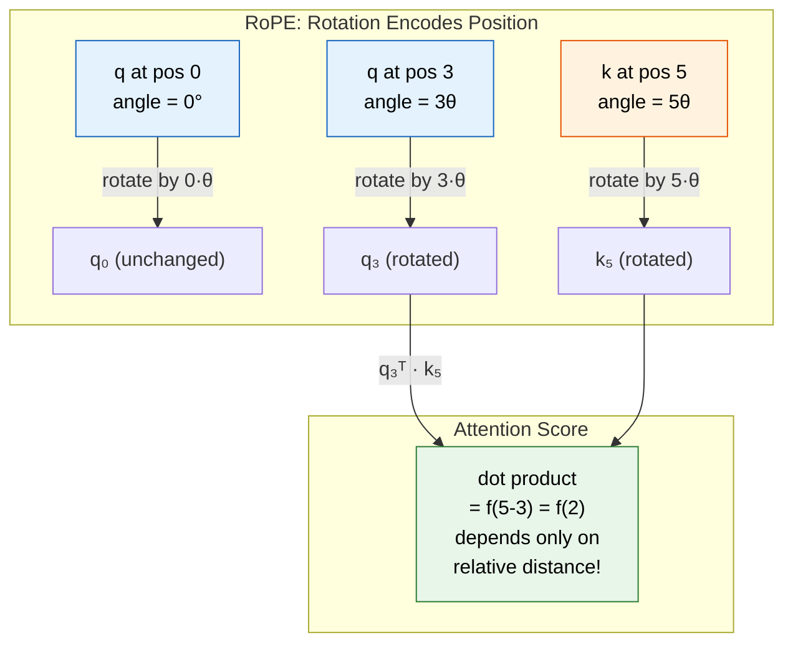

### Worked Example — RoPE for d=4, positions 0 and 2 ★★★

```
Given: d = 4 (so 2 pairs), base = 10000
  θ₀ = 10000^(0/4) = 1.0       (fast rotation)
  θ₁ = 10000^(-2/4) = 0.01     (slow rotation)

Token at position m=0:
  Pair 0: rotate by 0 × 1.0 = 0 radians     → no rotation
  Pair 1: rotate by 0 × 0.01 = 0 radians    → no rotation

Token at position m=2:
  Pair 0: rotate by 2 × 1.0 = 2.0 radians   → ~114.6°
  Pair 1: rotate by 2 × 0.01 = 0.02 radians → ~1.15°

Key insight: Low-frequency pairs change slowly across positions → encode
global/coarse position. High-frequency pairs change fast → encode
fine-grained position. Like a clock: hour hand = coarse, second hand = fine.
```

### Why RoPE Won — Interview Comparison ★★★

| Property | Sinusoidal | Learned | RoPE |
|----------|-----------|---------|------|
| Position type | Absolute | Absolute | **Relative** |
| Extrapolation beyond training length | Poor | Very poor | **Good** (with NTK-aware scaling) |
| Added parameters | 0 | d × max_len | **0** |
| Used by | Original Transformer | GPT-1/2 | **LLaMA, Gemini, GPT-NeoX, Mistral** |
| How applied | Added to input | Added to input | **Multiplied into Q, K only** |

---

## 11.3 Transformer Attention — Full Derivation from Scratch ★★★

> This section derives attention from first principles. If you've read Topic 6, this goes deeper with the full mathematical proof and multi-head efficiency analysis.

### Step 1: The Problem Attention Solves ★★★

Given a sequence of n token embeddings X ∈ ℝⁿˣᵈ, we want each token to gather information from every other token, weighted by relevance.

### Step 2: Project into Q, K, V Spaces ★★★

$$Q = X \cdot W_Q \in \mathbb{R}^{n \times d_k} \quad \text{(what am I looking for?)}$$

$$K = X \cdot W_K \in \mathbb{R}^{n \times d_k} \quad \text{(what do I contain?)}$$

$$V = X \cdot W_V \in \mathbb{R}^{n \times d_v} \quad \text{(what information do I provide?)}$$

$W_Q \in \mathbb{R}^{d \times d_k}$, $W_K \in \mathbb{R}^{d \times d_k}$, $W_V \in \mathbb{R}^{d \times d_v}$ (learned parameters)

### Step 3: Compute Attention Scores ★★★

$$\text{Scores} = Q \cdot K^T \in \mathbb{R}^{n \times n}$$

Element $[i,j] = q_i^T \cdot k_j$ = how much should token $i$ attend to token $j$

### Step 4: Scale ★★★

$$\text{Scaled\_Scores} = \frac{Q \cdot K^T}{\sqrt{d_k}}$$

**WHY SCALE?** Without scaling, when $d_k$ is large:
- $q$ and $k$ are random vectors of dimension $d_k$
- $E[q^T k] = 0$, $\text{Var}[q^T k] = d_k$
- Large variance → some scores are very large
- softmax of very large values → near-one-hot → vanishing gradients
- Dividing by $\sqrt{d_k}$ normalizes variance to 1

**Proof:** If $q_i, k_j \sim \mathcal{N}(0,1)$ independently:

$$q^T k = \sum_i q_i k_i, \quad E[q_i k_i] = 0, \quad \text{Var}[q_i k_i] = 1$$

$$\text{By independence: } \text{Var}[q^T k] = d_k \cdot 1 = d_k \qquad \text{After dividing: } \text{Var}\!\left[\frac{q^T k}{\sqrt{d_k}}\right] = \frac{d_k}{d_k} = 1 \;\checkmark$$

### Step 5: Softmax → Attention Weights ★★★

$$\text{Attention\_Weights} = \text{softmax}(\text{Scaled\_Scores}) \in \mathbb{R}^{n \times n}$$

Row $i$ sums to 1: $\sum_j \text{Attention\_Weights}[i,j] = 1$. Each row is a probability distribution over which tokens to attend to.

### Step 6: Weighted Sum of Values ★★★

$$\text{Output} = \text{Attention\_Weights} \cdot V \in \mathbb{R}^{n \times d_v}$$

Row $i$ of output = weighted average of all value vectors, weighted by how much token $i$ attends to each position.

### Complete Formula ★★★

$$\text{Attention}(Q, K, V) = \text{softmax}\!\left(\frac{Q \cdot K^T}{\sqrt{d_k}}\right) \cdot V$$

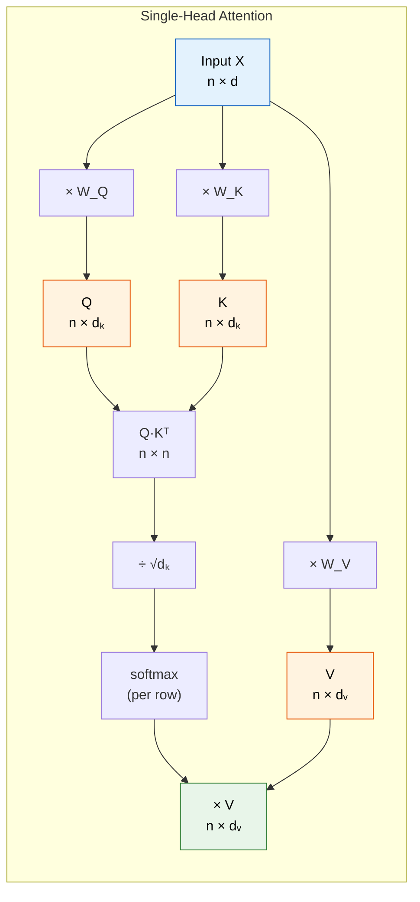

### Multi-Head Attention — Why and How ★★★

**Motivation:** A single attention head can only capture one type of relationship. We want to capture multiple relationships simultaneously (syntactic, semantic, positional, etc.).

$$\text{MultiHead}(Q, K, V) = \text{Concat}(\text{head}_1, \text{head}_2, \ldots, \text{head}_h) \cdot W_O$$

$$\text{where } \text{head}_i = \text{Attention}(X \cdot W^i_Q,\ X \cdot W^i_K,\ X \cdot W^i_V)$$

Parameters per head: $W^i_Q \in \mathbb{R}^{d \times (d/h)}$, $W^i_K \in \mathbb{R}^{d \times (d/h)}$, $W^i_V \in \mathbb{R}^{d \times (d/h)}$

Total parameters ($h$ heads): $h \times 3 \times d \times (d/h) = 3d^2$ (same as single head with full $d$!)

Output projection: $W_O \in \mathbb{R}^{d \times d}$ → another $d^2$ parameters

Total attention parameters: $4d^2$ (regardless of number of heads!)

**Key insight for interviews:** Multi-head attention costs the same as single-head attention with the same total dimension. The heads just partition the representation space.

### Grouped Query Attention (GQA) and Multi-Query Attention (MQA) ★★★

| Variant | Query heads | Key heads | Value heads |
|---------|:-----------:|:---------:|:-----------:|
| Standard MHA | $h$ | $h$ | $h$ |
| MQA | $h$ | $1$ | $1$ |
| GQA | $h$ | $g$ | $g$ ($g < h$) |

Memory savings for KV cache:

$$\text{MHA: } 2 \times n \times h \times d_k \times \text{layers} \qquad \text{GQA: } 2 \times n \times g \times d_k \times \text{layers} \qquad \text{MQA: } 2 \times n \times 1 \times d_k \times \text{layers}$$

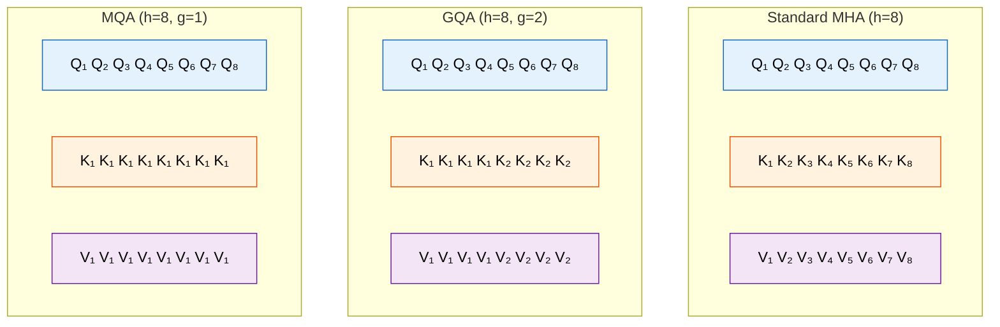

| Variant | Used By | KV Cache Size | Quality |
|---------|---------|---------------|---------|
| MHA | GPT-2, BERT | 1× (baseline) | Best |
| GQA | LLaMA 2/3, Gemini | g/h × baseline | Near-MHA |
| MQA | PaLM, Falcon | 1/h × baseline | Slight degradation |

---

## 11.4 KV Cache — How It Works and Memory Calculation ★★★

### Why KV Cache Exists ★★★

During autoregressive generation, each new token attends to ALL previous tokens. Without caching, we'd recompute K and V for every previous token at every generation step — O(n²) total work for generating n tokens.

```
Without KV cache (generating 4 tokens):
─────────────────────────────────────────
Step 1: compute K,V for [tok1]                         → 1 computation
Step 2: compute K,V for [tok1, tok2]                   → 2 computations
Step 3: compute K,V for [tok1, tok2, tok3]             → 3 computations
Step 4: compute K,V for [tok1, tok2, tok3, tok4]       → 4 computations
Total: 1+2+3+4 = 10 = O(n²)

With KV cache:
──────────────
Step 1: compute K,V for [tok1], CACHE them             → 1 computation
Step 2: compute K,V for [tok2] only, append to cache   → 1 computation
Step 3: compute K,V for [tok3] only, append to cache   → 1 computation
Step 4: compute K,V for [tok4] only, append to cache   → 1 computation
Total: 1+1+1+1 = 4 = O(n)
```

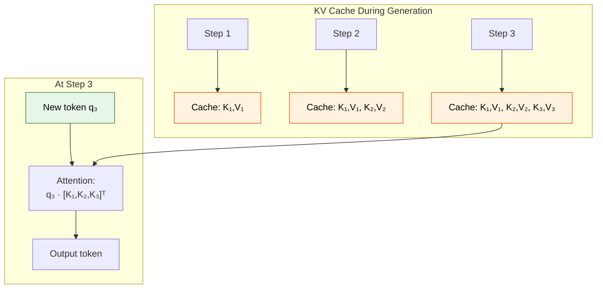

### Memory Calculation — Interview Must-Know ★★★

**Formula for KV cache memory:**

```
KV_cache_memory = 2 × batch_size × num_layers × num_kv_heads × d_head × seq_len × bytes_per_element

Where:
  2           = one for K, one for V
  batch_size  = number of sequences being generated in parallel
  num_layers  = number of transformer layers
  num_kv_heads = number of key/value heads (= num_heads for MHA, less for GQA)
  d_head      = dimension per head (typically d_model / num_heads)
  seq_len     = current sequence length
  bytes_per_element = 2 for FP16/BF16, 1 for INT8
```

### Worked Example — LLaMA 2 70B ★★★

```
LLaMA 2 70B specifications:
  d_model = 8192
  num_layers = 80
  num_heads = 64
  num_kv_heads = 8  (GQA with 8 groups)
  d_head = 8192 / 64 = 128
  Precision: BF16 (2 bytes)

KV cache for 1 request at sequence length 4096:
  = 2 × 1 × 80 × 8 × 128 × 4096 × 2 bytes
  = 2 × 1 × 80 × 8 × 128 × 4096 × 2
  = 1,073,741,824 bytes
  = 1.0 GB per request!

At batch size 32:
  = 32 × 1.0 GB = 32 GB just for KV cache

Compare: Model weights (70B params × 2 bytes) = 140 GB
KV cache at batch 32, seq 4096 = 32 GB (23% of model weight memory!)

Without GQA (standard MHA, 64 KV heads instead of 8):
  = 32 × 8.0 GB = 256 GB  → wouldn't fit in GPU memory!
  GQA saves 8× on KV cache memory.
```

### KV Cache Optimization Techniques ★★★

| Technique | How It Works | Memory Saving |
|-----------|-------------|---------------|
| **GQA/MQA** | Fewer KV heads | 4-8× |
| **Quantized KV cache** | Store K,V in INT8 instead of FP16 | 2× |
| **Paged Attention (vLLM)** | Allocate KV cache in pages, avoid fragmentation | ~2-4× effective (less waste) |
| **Sliding window** | Only cache last W tokens (Mistral) | seq_len/W × |
| **Token eviction** | Drop least-important cached tokens | Dynamic |

---

## 11.5 Flash Attention — Why O(n) Memory ★★★

### The Problem with Standard Attention ★★★

Standard attention materializes the full n×n attention matrix in GPU HBM (High Bandwidth Memory):

```
Standard Attention memory: O(n²) for the attention weight matrix

For n = 128K tokens (GPT-4 Turbo context):
  Attention matrix = 128K × 128K × 2 bytes = 32 GB for ONE layer, ONE head!
  This is impossible.
```

### Flash Attention — The Key Insight ★★★

**Core idea:** Never materialize the full n×n matrix. Instead, compute attention in **tiles** (blocks) that fit in SRAM (fast on-chip memory), accumulating the result incrementally.

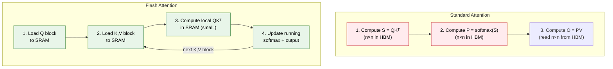

### The Online Softmax Trick ★★★

The challenge: softmax requires knowing ALL scores before normalizing. Flash Attention uses the **online softmax** algorithm to compute softmax incrementally:

**Online Softmax** — Process scores in blocks:

**Block 1:** scores $s_1 = [3.0, 1.0, 2.0]$

$$m_1 = \max(s_1) = 3.0 \qquad \ell_1 = \sum \exp(s_i - m_1) = e^0 + e^{-2} + e^{-1} = 1 + 0.135 + 0.368 = 1.503$$

**Block 2:** scores $s_2 = [5.0, 0.5]$

$$m_2 = \max(s_2) = 5.0 \qquad \ell_2 = \sum \exp(s_i - m_2) = e^0 + e^{-4.5} = 1 + 0.011 = 1.011$$

**Combine blocks:**

$$\begin{aligned}
m_{\text{new}} &= \max(m_1, m_2) = \max(3.0, 5.0) = 5.0 \\
\ell_{\text{new}} &= \ell_1 \cdot e^{m_1 - m_{\text{new}}} + \ell_2 \cdot e^{m_2 - m_{\text{new}}} \\
&= 1.503 \cdot e^{3-5} + 1.011 \cdot e^{5-5} = 1.503 \cdot 0.135 + 1.011 \cdot 1.0 = 1.214
\end{aligned}$$

Correct global softmax, never storing the full $n \times n$ matrix!

### Memory and Speed Comparison ★★★

```
                        Standard Attention    Flash Attention
Memory (attention):     O(n²)                 O(n)  ← only store tiles
HBM reads/writes:       O(n²)                 O(n²/M)  where M = SRAM size
Wall-clock speed:        1× (baseline)         2-4× faster (IO-aware)
Exact computation:       Yes                   Yes (mathematically identical!)
```

**Critical interview point:** Flash Attention is NOT an approximation. It computes the **exact same result** as standard attention, just more efficiently by being IO-aware (minimizing slow HBM access).

### Flash Attention 2 and 3 ★★★

| Version | Key Improvement |
|---------|----------------|
| Flash Attention 1 | Tiled computation, online softmax, O(n) memory |
| Flash Attention 2 | Better parallelism, 2× faster than FA1. Reduced non-matmul FLOPs |
| Flash Attention 3 | Hopper GPU features (TMA, warp specialization), FP8 support |

---

## 11.6 Mixture of Experts (MoE) ★★★

### Simple Explanation

Imagine a hospital with 8 specialist doctors. For each patient, a triage nurse (the **router**) examines symptoms and sends the patient to only 2 relevant specialists — not all 8. The hospital has the knowledge of 8 doctors but each patient only costs the time of 2.

MoE works the same way: a model has many "expert" sub-networks, but each token only activates a few of them. You get the capacity of a huge model at the cost of a smaller one.

### How MoE Works ★★★

In a standard Transformer, each layer has one FFN (Feed-Forward Network). In MoE, the single FFN is replaced with N expert FFNs plus a router:

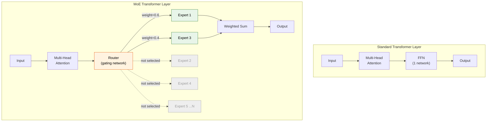

### The Router / Gating Function ★★★

Given input token $x \in \mathbb{R}^d$ and $N$ experts:

$$\begin{aligned}
\text{Router scores:} \quad & h(x) = x \cdot W_{\text{gate}} \in \mathbb{R}^N && (W_{\text{gate}} \in \mathbb{R}^{d \times N}) \\
\text{Top-K selection:} \quad & S = \text{TopK}(h(x), k) && \text{(select } k \text{ experts, typically } k=2\text{)} \\
\text{Gating weights:} \quad & g(x) = \text{softmax}(h(x)[S]) && \text{(normalize over selected experts)}
\end{aligned}$$

$$\text{Output: } y = \sum_{i \in S} g_i(x) \cdot \text{Expert}_i(x) \qquad \text{(weighted sum of expert outputs)}$$

### MoE — Key Numbers and Models ★★★

| Model | Total Params | Active Params | Experts | Top-K | Year |
|-------|-------------|---------------|---------|-------|------|
| Switch Transformer | 1.6T | ~25B | 2048 | 1 | 2022 |
| Mixtral 8x7B | 46.7B | 12.9B | 8 | 2 | 2023 |
| DBRX | 132B | 36B | 16 | 4 | 2024 |
| Gemini 1.5 (rumored) | ~1T+ | ~200B+ | MoE | ~2 | 2024 |
| DeepSeek-V3 | 671B | 37B | 256 | 8 | 2025 |
| LLaMA 4 Scout | 109B | 17B | 16 | 1 | 2025 |

### The Expert Collapse Problem ★★★

Without careful training, all tokens get routed to the same few experts → other experts never learn → waste of parameters. Solutions:

**Load Balancing Loss:**

$$L_{\text{balance}} = \alpha \cdot N \cdot \sum_i f_i \cdot p_i$$

- $f_i$ = fraction of tokens routed to expert $i$
- $p_i$ = average router probability for expert $i$
- $\alpha$ = balancing coefficient (typically 0.01)

This loss penalizes uneven routing. Minimized when $f_i = p_i = 1/N$ (uniform distribution).

### Interview-Ready Answer: "Explain MoE Architecture" ★★★

> "MoE replaces the FFN in each Transformer layer with N parallel expert networks and a learned router. For each token, the router selects the top-K experts (typically K=2) and combines their outputs with learned gating weights. This gives the model the parameter count and capacity of a much larger dense model, while keeping per-token compute roughly constant — for example, Mixtral 8x7B has 46.7B total parameters but only activates 12.9B per token, achieving quality comparable to LLaMA 2 70B at 3× inference speed. The main challenges are expert load balancing (solved via auxiliary losses), efficient distributed serving (experts must be sharded across GPUs), and training stability."

---

## 11 — Common Mistakes

```
  ✗ "BPE splits into words"
    → BPE splits into SUBWORDS. "unhappiness" → ["un", "happi", "ness"]

  ✗ "Positional encoding is added in every layer"
    → In the original Transformer, it's added ONCE at input.
      RoPE is applied at every layer (to Q and K only).

  ✗ "KV cache speeds up training"
    → KV cache is for INFERENCE only. During training, we have all tokens
      and compute attention in parallel.

  ✗ "Flash Attention is an approximation"
    → It's EXACT. It produces bit-identical results to standard attention.

  ✗ "MoE means the model is N times bigger"
    → Total params are larger, but active params per token stay small.
      A 8x7B MoE ≠ a 56B dense model in quality (but close).
```

---

---

# TOPIC 12 — LLM Training Pipeline: Pre-training → SFT → RLHF/DPO

> **Priority: MUST-KNOW.** Every modern LLM goes through a multi-stage training pipeline. Google expects you to explain each stage, its objective function, data requirements, and tradeoffs.

---

## Why Google Asks This

Google trains Gemini. Understanding the training pipeline is not academic — it's daily work for ML engineers on LLM teams. Interviewers want to verify you understand WHY each stage exists, not just WHAT it does.

---

## Common Interview Questions

1. "Walk me through the complete LLM training pipeline."
2. "What is RLHF? Why can't we just do supervised fine-tuning?"
3. "Explain DPO. How does it simplify RLHF?"
4. "What are the Chinchilla scaling laws? How would you decide model size vs dataset size?"
5. "How does DeepSeek-R1's GRPO differ from standard RLHF?"
6. "Compare Constitutional AI to RLHF for alignment."

---

## 12.1 The Three-Stage Pipeline — Overview ★★★

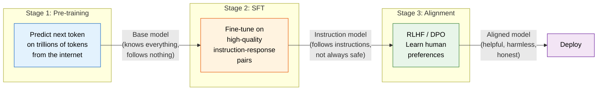

---

## 12.2 Stage 1: Pre-training ★★★

### Objective ★★★

Minimize next-token prediction loss (cross-entropy):

$$L = -\sum_t \log P(x_t \mid x_1, x_2, \ldots, x_{t-1};\, \theta)$$

This is called the "language modeling" or "causal LM" objective. The model learns to predict the next token given all previous tokens.

### What the Model Learns ★★★

| Capability | How It Emerges |
|-----------|---------------|
| Grammar and syntax | Predicting word order requires understanding grammar |
| World knowledge | "The capital of France is ___" → must know "Paris" |
| Reasoning patterns | Completing math and logic text teaches reasoning |
| Code generation | Trained on GitHub code, learns to complete programs |
| Multilingual | Predicting next token in French text learns French |

### Scale of Pre-training ★★★

```
Typical pre-training setup:

  Data:     1-15 trillion tokens (web crawl, books, code, papers)
  Compute:  10²³ - 10²⁵ FLOPs
  Hardware: 2,000 - 16,000 GPUs/TPUs for 1-4 months
  Cost:     $2M - $100M+ in compute

  Example — LLaMA 3 405B:
    Data:    15.6 trillion tokens
    Compute: 3.8 × 10²⁵ FLOPs
    Hardware: 16,384 H100 GPUs
    Duration: ~54 days
```

### Pre-training Data Mixture (Typical) ★★★

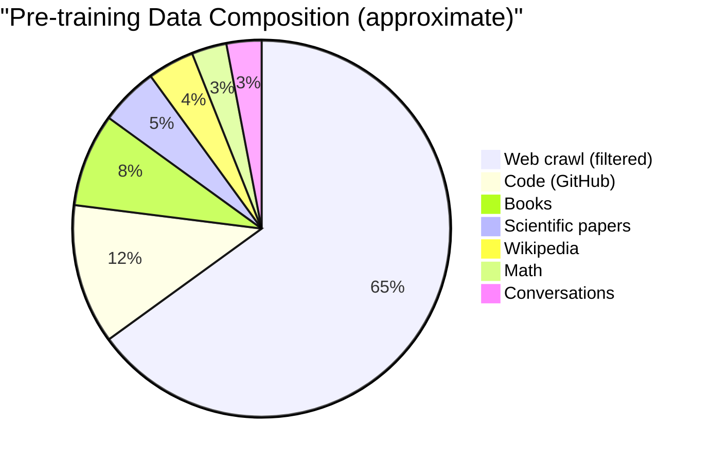

---

## 12.3 Stage 2: Supervised Fine-Tuning (SFT) ★★★

### Why SFT Is Needed ★★★

The pre-trained model is a text completion engine. Ask it "What is 2+2?" and it might continue with "What is 3+3? What is 4+4?" because it's been trained on web text that looks like that. SFT teaches the model to **follow instructions** — to produce assistant-style responses.

### How SFT Works ★★★

```
Training data format:
  [System: You are a helpful assistant]
  [User: Explain photosynthesis in simple terms]
  [Assistant: Plants use sunlight, water, and CO₂ to make glucose...]

Loss: Same cross-entropy, but ONLY on the assistant tokens. User/system tokens are in the input but not penalized.

$$L_{\text{SFT}} = -\sum_{t \in \text{assistant\_tokens}} \log P(x_t \mid \text{context};\, \theta)$$
```

### SFT Data — Quality Over Quantity ★★★

```
Pre-training:   ~10 trillion tokens  (quantity matters)
SFT:            ~10K-100K examples   (QUALITY matters)

The key insight: A small amount of extremely high-quality data
can dramatically change model behavior.

  InstructGPT used only ~13,000 demonstrations
  Alpaca used 52K  (GPT-4 generated)
  Vicuna used 70K  (ShareGPT conversations)
```

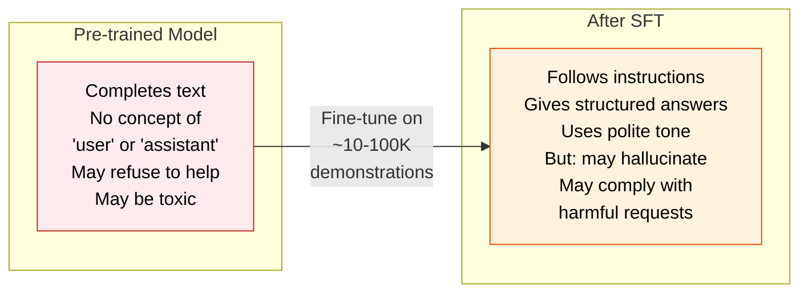

---

## 12.4 Stage 3a: RLHF — Reinforcement Learning from Human Feedback ★★★

### Why RLHF Is Needed After SFT ★★★

SFT teaches the model to produce plausible-looking responses. But it can't learn **which response is BETTER** — it treats all demonstrations equally. RLHF teaches the model to prefer responses that humans actually prefer.

### The RLHF Pipeline — Three Steps ★★★

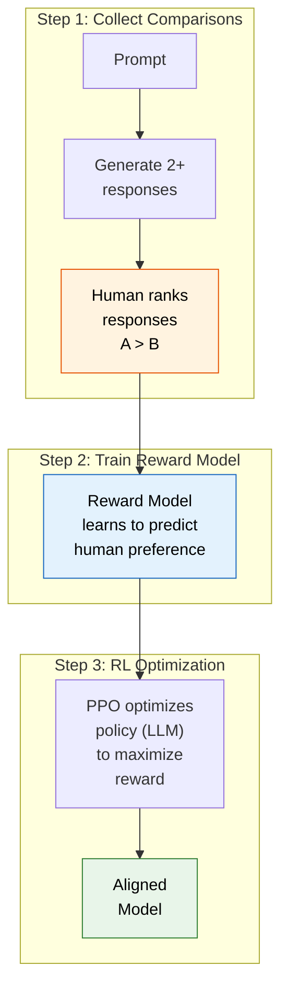

### Step 1: Reward Model Training ★★★

Given a prompt $x$ and two responses $y_1, y_2$ where human prefers $y_1$:

**Reward model loss (Bradley-Terry):**

$$L_{\text{RM}} = -\log \sigma\!\left(r(x, y_1) - r(x, y_2)\right)$$

Where $r(x, y)$ = scalar reward score from reward model, $\sigma$ = sigmoid function.

This loss pushes: $r(x, y_{\text{preferred}}) > r(x, y_{\text{rejected}})$

### Step 2: PPO Optimization ★★★

**PPO Objective:**

$$\text{maximize } \mathbb{E}_{x \sim D,\, y \sim \pi_\theta}\!\left[r(x, y)\right] - \beta \cdot \text{KL}\!\left[\pi_\theta(y|x) \,\|\, \pi_{\text{ref}}(y|x)\right]$$

Where:
- $\pi_\theta$ = current policy (LLM being trained)
- $\pi_{\text{ref}}$ = reference policy (SFT model, frozen)
- $r(x,y)$ = reward model score
- $\beta$ = KL penalty coefficient

Term 1: Maximize reward (be helpful). Term 2: Don't drift too far from SFT model (stay coherent).

Without KL penalty: model finds "reward hacking" exploits (e.g., generates text that scores high on reward model but is incoherent or repetitive)

### RLHF Challenges ★★★

| Challenge | Description | Mitigation |
|-----------|------------|------------|
| **Reward hacking** | Model exploits reward model flaws | KL penalty, reward model ensembles |
| **Human disagreement** | Annotators disagree on preferences | Multiple annotators, calibration |
| **Expensive** | Requires human labelers + RL training | Use DPO instead (see below) |
| **Training instability** | PPO is notoriously unstable | Careful hyperparameter tuning |

---

## 12.5 Stage 3b: DPO — Direct Preference Optimization ★★★

### The Key Insight ★★★

DPO eliminates the reward model entirely. Instead of training a reward model and then doing RL, DPO optimizes the LLM directly on preference pairs using a simple classification-like loss.

**Mathematical insight:** The optimal policy under the RLHF objective has a closed-form relationship to the reward:

$$r(x, y) = \beta \cdot \log \frac{\pi_\theta(y|x)}{\pi_{\text{ref}}(y|x)} + \beta \cdot \log Z(x)$$

This means we can substitute the reward into the preference loss:

$$L_{\text{DPO}} = -\mathbb{E}_{(x, y_w, y_l)}\!\left[\log \sigma\!\left(\beta \cdot \log \frac{\pi_\theta(y_w|x)}{\pi_{\text{ref}}(y_w|x)} - \beta \cdot \log \frac{\pi_\theta(y_l|x)}{\pi_{\text{ref}}(y_l|x)}\right)\right]$$

Where:
- $y_w$ = preferred (winning) response
- $y_l$ = rejected (losing) response
- $\pi_{\text{ref}}$ = frozen reference model (SFT checkpoint)

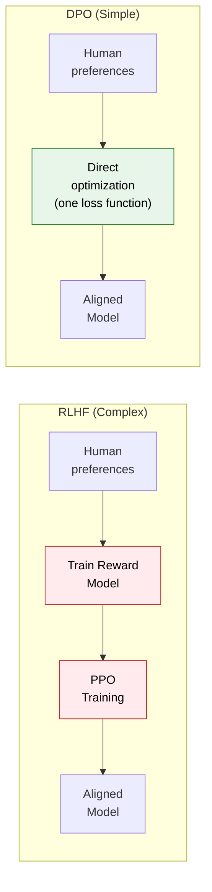

### DPO vs RLHF — Interview Comparison ★★★

| Aspect | RLHF | DPO |
|--------|------|-----|
| Needs reward model | Yes | **No** |
| RL training | PPO (complex, unstable) | **Supervised-like loss (stable)** |
| Compute cost | High (RM + PPO) | **Lower (~same as SFT)** |
| Hyperparameters | Many (PPO has 8+) | **Few (mainly β)** |
| Performance | Strong | **Comparable to RLHF** |
| Used by | InstructGPT, Claude | **LLaMA 3, Zephyr, many open models** |

---

## 12.6 GRPO and RLVR — DeepSeek-R1's Approach ★★★

### Why This Matters ★★★

DeepSeek-R1 demonstrated that reasoning capabilities can emerge through RL alone, without supervised demonstrations of chain-of-thought reasoning. This is a significant paradigm shift.

### GRPO — Group Relative Policy Optimization ★★★

GRPO simplifies PPO by eliminating the value network (critic). Instead of learning a baseline for variance reduction, it estimates the baseline from the GROUP of sampled responses:

**Standard PPO:** $\text{Advantage} = r(y) - V(x)$ ($V$ is a learned value network — expensive!)

**GRPO:** For prompt $x$, sample $G$ responses $\{y_1, y_2, \ldots, y_G\}$. Compute rewards $\{r_1, r_2, \ldots, r_G\}$.

Advantage for $y_i$:

$$\hat{A}_i = \frac{r_i - \text{mean}(r_1 \ldots r_G)}{\text{std}(r_1 \ldots r_G)}$$

No value network needed! Group statistics provide the baseline.

**GRPO Loss:**

$$L = -\sum_i \min\!\left(\rho_i \cdot \hat{A}_i,\ \text{clip}(\rho_i, 1-\varepsilon, 1+\varepsilon) \cdot \hat{A}_i\right) + \beta \cdot \text{KL}$$

$$\rho_i = \frac{\pi_\theta(y_i|x)}{\pi_{\text{old}}(y_i|x)} \qquad \text{(importance ratio)}$$

### RLVR — RL with Verifiable Rewards ★★★

```
Key insight: For math/code problems, we don't need a learned reward model.
We can VERIFY the answer is correct (rule-based reward).

Reward function:
  r(x, y) = {  1.0  if final answer is correct
            {  0.0  otherwise (with optional format rewards)

This is "verifiable" because we can check the answer programmatically.
No human labelers needed. No reward model to train.
```

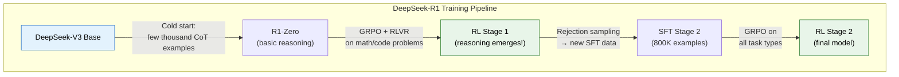

### What Emerged from RLVR (without being taught) ★★★

- Extended chain-of-thought reasoning
- Self-correction ("Wait, let me reconsider...")
- Exploring multiple approaches
- Verification of intermediate steps

---

## 12.7 Constitutional AI (CAI) ★★★

### How It Differs from RLHF ★★★

```
RLHF:  Humans label thousands of preference pairs → expensive, slow, inconsistent.

CAI:   Write a "constitution" (set of principles) → AI critiques its own outputs
       using those principles → Self-improvement without human labelers!
```

### The CAI Process ★★★

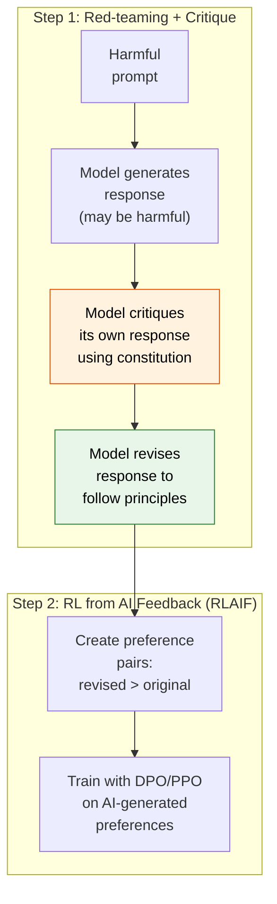

### Example Constitution Principles ★★★

```
1. "Choose the response that is least likely to be harmful or dangerous."
2. "Choose the response that is most helpful while being honest."
3. "Prefer responses that acknowledge uncertainty over confident but wrong answers."
4. "Choose the response that respects user privacy."
```

### CAI vs RLHF — Interview Comparison ★★★

| Aspect | RLHF | Constitutional AI |
|--------|------|-------------------|
| Feedback source | Human labelers | AI self-critique + principles |
| Cost | High (human labor) | Low (compute only) |
| Scalability | Limited by labeling capacity | Highly scalable |
| Consistency | Variable (humans disagree) | Consistent (same principles) |
| Transparency | Opaque (implicit in labels) | Explicit (written constitution) |
| Used by | InstructGPT, most models | Anthropic (Claude) |

---

## 12.8 Scaling Laws (Chinchilla) + Test-Time Compute ★★★

### Scaling Laws — The Core Relationships ★★★

The Kaplan/Chinchilla scaling laws describe predictable relationships:

$$L(N, D) \approx \frac{A}{N^\alpha} + \frac{B}{D^\beta} + L_{\text{irreducible}}$$

Where:
- $N$ = number of parameters
- $D$ = number of training tokens
- $\alpha \approx 0.34$ (Chinchilla), $\beta \approx 0.28$ (Chinchilla)
- $L_{\text{irreducible}}$ = entropy of natural language (cannot be reduced)

Key result: For a fixed compute budget $C = 6 \cdot N \cdot D$:

$$\text{Optimal } N \propto C^{0.5} \qquad \text{Optimal } D \propto C^{0.5} \qquad \Rightarrow \quad D \approx 20 \times N$$

### The Chinchilla Insight — Worked Example ★★★

Scenario: You have compute budget for $10^{22}$ FLOPs.

**Before Chinchilla** (GPT-3 approach): Train a 175B model on 300B tokens → $D/N = 1.7$ (severely under-trained!)

**After Chinchilla** (compute-optimal): $C = 6 \cdot N \cdot D$, with $D = 20N$

$$10^{22} = 6 \cdot N \cdot 20N = 120N^2 \quad \Rightarrow \quad N = \sqrt{10^{22}/120} \approx 9.1 \text{ billion parameters}$$

$$D = 20 \times 9.1B \approx 182 \text{ billion tokens}$$

A 9.1B model trained on 182B tokens outperforms a 175B model on 300B tokens! Much smaller, much cheaper to serve.

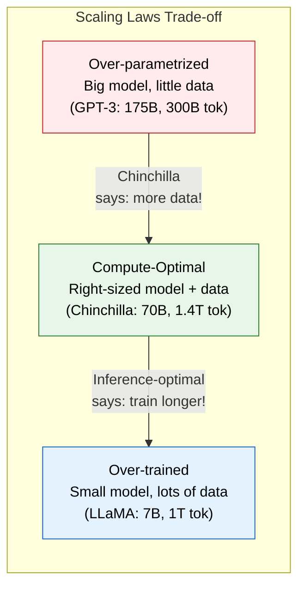

### Beyond Chinchilla — Inference-Optimal Scaling ★★★

```
Chinchilla assumes you only care about training cost.
But serving cost often dominates total cost!

Smaller model trained on MORE data:
  - More expensive to train (past the Chinchilla optimum)
  - But WAY cheaper to serve (less memory, faster inference)
  - Example: LLaMA trained at ~200 tokens/parameter
    Much past Chinchilla optimum, but optimal for deployment.
```

### Test-Time Compute Scaling ★★★

**New paradigm (2024-2025):** Instead of only scaling model size and training data, scale the compute spent AT INFERENCE TIME.

```
Traditional scaling:
  Better model = more training compute
  Fixed inference cost per query

Test-time compute scaling:
  Model "thinks longer" on harder problems
  Variable inference cost per query

  Methods:
  1. Chain-of-Thought (CoT): Model generates reasoning steps
  2. Best-of-N sampling: Generate N answers, pick the best
  3. Tree search (MCTS): Explore reasoning paths like a game tree
  4. Iterative refinement: Model revises its own answer
```

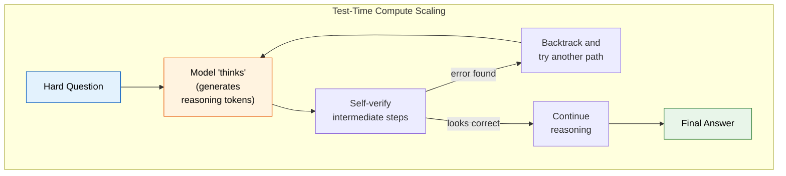

### Interview-Ready Answer: "Explain the LLM Training Pipeline" ★★★

> "Modern LLMs are trained in three stages. **Pre-training** uses next-token prediction on trillions of tokens — this builds the model's knowledge and capabilities. **Supervised fine-tuning (SFT)** on 10K-100K high-quality instruction-response pairs teaches it to follow instructions. **Alignment** via RLHF or DPO teaches it to prefer responses that match human preferences for helpfulness, safety, and honesty.
>
> RLHF trains a separate reward model from human preference data, then uses PPO to optimize against it. DPO simplifies this by directly optimizing on preference pairs without a reward model — it's becoming preferred for its stability and simplicity.
>
> Scaling laws tell us that for compute-optimal training, we should use roughly 20 tokens per parameter. But for deployment-optimal training, smaller models trained on more data often win because inference cost dominates."

---

## 12 — Common Mistakes

```
  ✗ "RLHF directly uses human feedback during training"
    → Humans label preference data OFFLINE. The reward model
      learns from those labels. PPO then optimizes against the reward model.

  ✗ "DPO doesn't use a reference model"
    → DPO uses a FROZEN reference model (the SFT checkpoint) in its loss.
      It's just implicit — the reward is derived from the log-probability ratio.

  ✗ "Scaling laws say bigger models are always better"
    → Chinchilla showed that a 70B model can beat a 280B model
      when trained on sufficiently more data.

  ✗ "Constitutional AI has no human input"
    → Humans write the constitution (the principles). The AI self-critiques
      using those principles, but the principles are human-authored.

  ✗ "GRPO is just PPO without a critic"
    → Correct in spirit! But the key innovation is using GROUP-level
      statistics as the baseline, which is surprisingly effective.
```

---

---

# TOPIC 13 — LLM Serving & Production at Scale

> **Priority: SHOULD-KNOW / MUST-KNOW.** Google serves LLMs to billions of users. Interviewers expect you to understand the engineering behind efficient inference — quantization, distributed training, RAG architecture, and modern tool protocols.

---

## Why Google Asks This

Building a model is one thing. Serving it to billions of users at low latency and reasonable cost is the real engineering challenge. Google's ML infrastructure team is one of the largest in the world, and every candidate is evaluated on production awareness.

---

## Common Interview Questions

1. "Explain INT8 quantization. How does it reduce model size without killing accuracy?"
2. "How would you train a 100B parameter model across 1000 GPUs?"
3. "Design a RAG system for Google Search."
4. "What is speculative decoding and when would you use it?"
5. "Explain MCP (Model Context Protocol) and why it matters for tool use."

---

## 13.1 Quantization for Serving (INT4/INT8/FP8) ★★★

### Simple Explanation

Imagine a painting with millions of colors. If you reduce it to 256 colors (like a GIF), it looks almost the same but is 4× smaller. Quantization does this for model weights: instead of storing each weight as a 32-bit or 16-bit number, store it as an 8-bit or even 4-bit number.

### How Quantization Works — The Math ★★★

```
Linear quantization maps FP16/FP32 values to INT8:

Quantize:    x_q = round(x / scale) + zero_point
Dequantize:  x ≈ (x_q - zero_point) × scale

Where:
  scale = (x_max - x_min) / (2^bits - 1)
  zero_point = round(-x_min / scale)

Example:
  Weights: [-0.8, 0.3, 1.2, -0.1, 0.9]
  x_min = -0.8, x_max = 1.2
  scale = (1.2 - (-0.8)) / (2⁸ - 1) = 2.0 / 255 ≈ 0.00784
  zero_point = round(0.8 / 0.00784) = 102

  Quantize -0.8: round(-0.8/0.00784) + 102 = round(-102) + 102 = 0
  Quantize 1.2:  round(1.2/0.00784) + 102 = round(153) + 102 = 255
  Quantize 0.3:  round(0.3/0.00784) + 102 = round(38.3) + 102 = 140

  Storage: [0, 140, 255, 89, 217]  ← all fit in uint8!
```

### Quantization Approaches ★★★

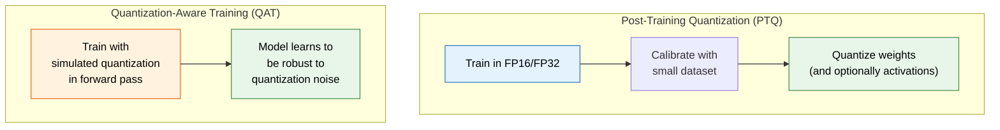

### Quantization Formats Compared ★★★

| Format | Bits | Memory (70B model) | Quality Loss | Use Case |
|--------|------|-------|---------|----------|
| FP32 | 32 | 280 GB | None (baseline) | Research only |
| FP16/BF16 | 16 | 140 GB | Negligible | Standard training |
| FP8 (E4M3) | 8 | 70 GB | Very small | H100/TPUv5 training |
| INT8 | 8 | 70 GB | Small (<1% perplexity) | Production serving |
| INT4 (GPTQ/AWQ) | 4 | 35 GB | Moderate (1-3%) | Consumer GPUs |
| INT4 (with group quantization) | 4 | ~40 GB | Small | Best quality at 4-bit |
| INT2-3 (extreme) | 2-3 | 17-26 GB | Significant | Research/mobile |

### Advanced: GPTQ and AWQ ★★★

```
GPTQ (GPT Quantization):
  Quantize weights layer-by-layer, minimizing output reconstruction error.
  For each layer: min ||Wx - Q(W)x||²  using calibration data.
  Uses Hessian information to decide quantization order.
  Result: INT4 with near-FP16 quality.

AWQ (Activation-Aware Weight Quantization):
  Key insight: Not all weights are equally important.
  Weights that multiply large activations matter more.
  Protect important weights with per-channel scaling BEFORE quantization.
  Scale: s = (activation_magnitude)^α,  α ∈ [0, 1] found by search
  Result: Better INT4 quality than GPTQ on many benchmarks.
```

---

## 13.2 Speculative Decoding ★★★

### The Problem ★★★

LLM generation is **memory-bandwidth bound** — each step generates only one token but must load the entire model from memory. The GPU's compute units sit mostly idle waiting for memory reads.

### The Idea ★★★

Use a small, fast "draft" model to generate K candidate tokens quickly, then verify all K tokens at once with the large target model in a single forward pass.

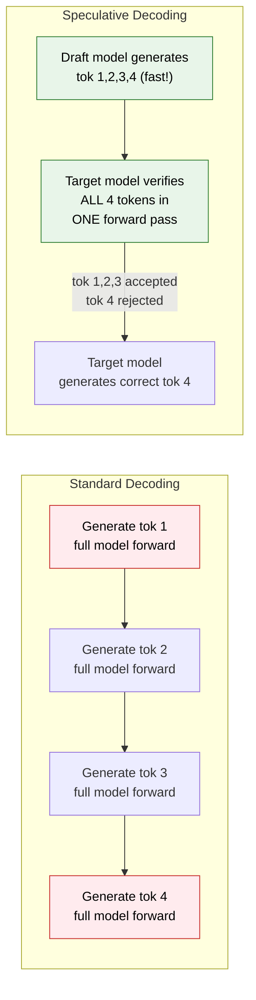

### How Verification Works ★★★

```
Draft model generates: [t₁, t₂, t₃, t₄] with probabilities [p₁, p₂, p₃, p₄]
Target model computes: [q₁, q₂, q₃, q₄] (true probabilities) in ONE forward pass

For each token i (left to right):
  Accept with probability: min(1, qᵢ/pᵢ)
  If rejected: resample from adjusted distribution: max(0, qᵢ - pᵢ)

Key guarantee: Output distribution is IDENTICAL to target model!
               Speculative decoding is lossless.

Speedup ≈ 1 / (1 - acceptance_rate^K) × K
  If draft model matches target 90% of the time and K=4:
  Speedup ≈ 2-3×
```

### When to Use Speculative Decoding ★★★

| Scenario | Speedup | Why |
|----------|---------|-----|
| Large model, easy text (boilerplate) | 2-3× | Draft model is highly accurate |
| Large model, hard text (reasoning) | 1.1-1.5× | Draft model often wrong → rejected |
| Small model | Not useful | Already fast enough |
| Batch serving | Limited | Already compute-bound, not memory-bound |

---

## 13.3 Distributed Training Strategies ★★★

### Why Distributed Training Is Necessary ★★★

```
LLaMA 3 405B model:
  Parameters: 405B × 2 bytes (BF16) = 810 GB
  Single H100 GPU memory: 80 GB
  → Need at least 11 GPUs just to HOLD the model
  → Need 1000+ GPUs to train in reasonable time
```

### The Three Axes of Parallelism ★★★

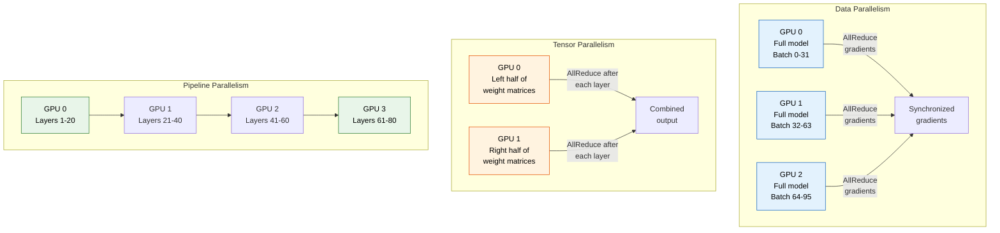

### Detailed Comparison ★★★

| Strategy | Splits | Communication | Memory Saving | Best For |
|----------|--------|---------------|---------------|----------|
| **Data Parallel (DP)** | Data batches | AllReduce gradients (high) | None (full model per GPU) | Model fits on 1 GPU |
| **Tensor Parallel (TP)** | Weight matrices | AllReduce per layer (very high) | Linear with #GPUs | Single-node, fast interconnect |
| **Pipeline Parallel (PP)** | Model layers | Point-to-point (low) | Linear with #GPUs | Multi-node |
| **FSDP/ZeRO** | Parameters + gradients + optimizer | AllGather when needed | Up to 8× per GPU | Large models, standard GPUs |
| **Expert Parallel (EP)** | MoE experts across GPUs | All-to-All routing | Per-expert memory | MoE models |

### ZeRO (Zero Redundancy Optimizer) — Three Stages ★★★

```
Standard Data Parallelism on 4 GPUs:
  Each GPU stores: parameters + gradients + optimizer states = 16× model size in FP32

ZeRO Stage 1: Partition OPTIMIZER STATES
  Each GPU stores 1/4 of optimizer states → ~4× memory saving

ZeRO Stage 2: + Partition GRADIENTS
  Each GPU stores 1/4 of gradients → ~8× memory saving

ZeRO Stage 3: + Partition PARAMETERS
  Each GPU stores 1/4 of parameters → ~16× memory saving
  (Parameters AllGathered on demand for forward/backward)
```

### Real-World Example: Training LLaMA 3 on 16K GPUs ★★★

```
3D Parallelism Configuration:
  Tensor Parallel (TP): 8 GPUs per node (within NVLink)
  Pipeline Parallel (PP): 4 stages (across nodes)
  Data Parallel (DP): 16384 / (8 × 4) = 512 data-parallel replicas

  Total: 8 × 4 × 512 = 16,384 GPUs

  Each GPU processes: global_batch / 512 samples per step
  Communication:
    TP: AllReduce within node (fast, NVLink 900 GB/s)
    PP: Point-to-point between nodes (medium, InfiniBand)
    DP: AllReduce across replica groups (slow, managed)
```

---

## 13.4 RAG Pipeline Design ★★★

### Simple Explanation

RAG (Retrieval-Augmented Generation) is like giving the LLM an open-book exam. Instead of relying on what the model memorized during training, we retrieve relevant documents at query time and feed them as context.

### Complete RAG Architecture ★★★

```mermaid
graph TD
    subgraph "Offline: Index Building"
        DOCS["Documents<br/>(PDFs, web pages,<br/>databases)"] --> CHUNK["Chunk into<br/>passages<br/>(~512 tokens each)"]
        CHUNK --> EMBED["Embed each chunk<br/>with embedding model"]
        EMBED --> STORE["Store in<br/>Vector Database<br/>(Pinecone, Weaviate,<br/>pgvector)"]
    end

    subgraph "Online: Query Processing"
        Q["User Query"] --> QEMB["Embed query"]
        QEMB --> SEARCH["Vector similarity<br/>search (top-K)"]
        STORE --> SEARCH
        SEARCH --> RERANK["Re-rank with<br/>cross-encoder<br/>(optional)"]
        RERANK --> PROMPT["Build prompt:<br/>System + Retrieved docs<br/>+ User query"]
        PROMPT --> LLM["LLM generates<br/>answer with<br/>citations"]
    end

    style DOCS fill:#e3f2fd,stroke:#1565c0,color:#000
    style STORE fill:#fff3e0,stroke:#e65100,color:#000
    style LLM fill:#e8f5e9,stroke:#2e7d32,color:#000
```

### Chunking Strategies ★★★

| Strategy | Chunk Size | Overlap | Best For |
|----------|-----------|---------|----------|
| Fixed-size | 512 tokens | 50-100 tokens | Simple, general-purpose |
| Sentence-based | 3-5 sentences | 1 sentence | When sentence boundaries matter |
| Recursive character | Max 1000 chars | 200 chars | Hierarchical documents |
| Semantic | Variable | None | When topics shift within docs |
| Parent-child | Small (retrieval) + Large (context) | N/A | Best quality, more complex |

### Key RAG Design Decisions ★★★

```
1. RETRIEVAL: Semantic search vs Hybrid (semantic + keyword BM25)
   → Hybrid is almost always better. BM25 catches exact matches
     that embeddings miss (proper nouns, IDs, error codes).

2. RE-RANKING: Bi-encoder retrieval → Cross-encoder re-rank
   → Bi-encoder: fast but less accurate (independent embedding)
   → Cross-encoder: slow but accurate (jointly attends to query + doc)
   → Retrieve 50 with bi-encoder, re-rank to top 5 with cross-encoder.

3. CONTEXT WINDOW: How many chunks to include?
   → Too few: missing information → hallucination
   → Too many: noise + "lost in the middle" problem (see Topic 14)
   → Sweet spot: 3-8 chunks, most relevant first and last.

4. GENERATION: Prompt structure matters!
   → Always put retrieved context BEFORE the question.
   → Instruct model to say "I don't know" if context is insufficient.
   → Ask for citations: "Cite the relevant passage for each claim."
```

### RAG vs Fine-tuning — When to Use Which ★★★

| Factor | RAG | Fine-tuning |
|--------|-----|-------------|
| Knowledge updates | Real-time (just update index) | Requires retraining |
| Hallucination | Reduced (grounded in retrieved docs) | Can still hallucinate |
| Cost | Retrieval infra + larger prompts | One-time training cost |
| Latency | Higher (retrieval step) | Lower (no retrieval) |
| Best for | Factual Q&A, enterprise search | Style, format, specialized tasks |

---

## 13.5 MCP — Model Context Protocol ★★★

### What MCP Is ★★★

MCP (Model Context Protocol) is an open standard (created by Anthropic, 2024) that standardizes how LLMs connect to external tools, data sources, and services.

### Why MCP Matters ★★★

```
Before MCP:
  Every LLM tool integration was custom:
  - Custom function calling formats per provider
  - Custom auth, error handling, schema for each tool
  - N models × M tools = N×M integrations

After MCP:
  Standard protocol (like USB for AI):
  - Any MCP-compatible model works with any MCP server
  - N models × M tools = N+M integrations (just implement the protocol)
```

```mermaid
graph LR
    subgraph "Without MCP"
        M1["GPT-4"] -->|"custom API"| T1["Google Calendar"]
        M1 -->|"custom API"| T2["Slack"]
        M2["Claude"] -->|"different API"| T1
        M2 -->|"different API"| T2
    end

    subgraph "With MCP"
        M3["Any LLM<br/>(MCP client)"] -->|"standard<br/>MCP protocol"| SERVER["MCP Server"]
        SERVER --> T3["Google Calendar"]
        SERVER --> T4["Slack"]
        SERVER --> T5["Database"]
        SERVER --> T6["File System"]
    end

    style SERVER fill:#fff3e0,stroke:#e65100,color:#000
    style M3 fill:#e8f5e9,stroke:#2e7d32,color:#000
```

### MCP Architecture ★★★

```
Three components:

1. MCP Host:     The application (IDE, chat app, agent framework)
2. MCP Client:   Inside the host, manages connections to servers
3. MCP Server:   Exposes tools, resources, and prompts via the protocol

Communication: JSON-RPC 2.0 over stdio or HTTP+SSE

Capabilities exposed by MCP servers:
  - Tools:      Functions the model can call (e.g., "search_slack")
  - Resources:  Data the model can read (e.g., "file://project/readme.md")
  - Prompts:    Reusable prompt templates
```

---

## 13 — Common Mistakes

```
  ✗ "INT8 quantization halves the model quality"
    → Well-calibrated INT8 quantization loses <1% on most benchmarks.
      INT4 loses 1-3%. It's not halving quality.

  ✗ "Data parallelism solves all scaling problems"
    → DP requires the full model to fit on each GPU.
      A 70B model in FP16 = 140GB → doesn't fit on an 80GB GPU.
      Need tensor/pipeline parallelism too.

  ✗ "RAG eliminates hallucination"
    → RAG REDUCES hallucination by grounding in retrieved docs.
      The model can still misinterpret or ignore retrieved context.

  ✗ "Speculative decoding changes the output distribution"
    → It's PROVABLY lossless. The rejection sampling scheme guarantees
      the output distribution matches the target model exactly.

  ✗ "MCP is just function calling"
    → MCP is a PROTOCOL. Function calling is a capability.
      MCP standardizes tool discovery, invocation, auth, and streaming
      across any model and any tool provider.
```

---

---

# TOPIC 14 — LLM Evaluation & Frontier Research

> **Priority: SHOULD-KNOW to NICE-TO-KNOW.** Evaluation separates good models from great ones. Frontier research topics (reasoning models, Mamba, lost-in-the-middle) show depth and intellectual curiosity — exactly what Google values.

---

## Why Google Asks This

Google ships Gemini to billions of users. Evaluation drives every model release decision. And Google Research publishes papers on the frontier topics below — interviewers will be impressed if you can discuss them intelligently.

---

## Common Interview Questions

1. "How would you evaluate a new LLM? What metrics would you use?"
2. "What is perplexity and why is it not enough?"
3. "Explain the LLM-as-judge approach. What are its pitfalls?"
4. "What are reasoning models? How do they differ from standard LLMs?"
5. "Explain State Space Models. Why might they replace Transformers?"
6. "What is the 'lost in the middle' phenomenon?"

---

## 14.1 LLM Evaluation — Complete Framework ★★★

### Evaluation Hierarchy ★★★

```mermaid
graph TD
    subgraph "Level 1: Intrinsic Metrics"
        PP["Perplexity<br/>(language modeling<br/>quality)"]
    end

    subgraph "Level 2: Benchmarks"
        MMLU["MMLU<br/>(knowledge)"]
        HEVAL["HumanEval<br/>(coding)"]
        GSM["GSM8K<br/>(math)"]
        MGSM["ARC, HellaSwag<br/>(reasoning)"]
    end

    subgraph "Level 3: Human Evaluation"
        ARENA["Chatbot Arena<br/>(crowd-sourced<br/>blind comparisons)"]
        JUDGE["LLM-as-Judge<br/>(scalable proxy<br/>for human eval)"]
    end

    PP --> MMLU
    MMLU --> ARENA

    style PP fill:#e3f2fd,stroke:#1565c0,color:#000
    style MMLU fill:#fff3e0,stroke:#e65100,color:#000
    style ARENA fill:#e8f5e9,stroke:#2e7d32,color:#000
```

### Perplexity — The Foundation Metric ★★★

$$\text{Perplexity} = \exp\!\left(-\frac{1}{N} \sum_i \log P(x_i \mid x_1, \ldots, x_{i-1})\right)$$

Intuition: Average "surprise" per token. Perplexity 10 → model is as uncertain as choosing from 10 equally likely tokens. Perplexity 1 → model predicts every token perfectly. Lower is better.

| Model | Perplexity (WikiText) |
|-------|----------------------|
| Random (vocab 50K) | 50,000 |
| GPT-2 (1.5B) | ~20-30 |
| GPT-3 (175B) | ~15-20 |
| GPT-4 | ~8-12 (estimated) |

Limitations:
- Sensitive to tokenizer (different tokenizers → incomparable perplexity)
- Doesn't measure factual accuracy, helpfulness, safety
- A model can have low perplexity but still hallucinate

### MMLU — Massive Multitask Language Understanding ★★★

```
57 subjects: elementary math, US history, computer science, law, medicine, ...
14,042 multiple-choice questions across 4 difficulty levels.

Example question (abstract algebra):
  "Find the degree of the extension Q(√2, √3) over Q."
  (A) 4  (B) 2  (C) 6  (D) 1
  Answer: A

Scoring: % correct across all subjects.

Benchmark results (approximate):
  Random guessing:     25.0%
  GPT-3.5 Turbo:       70.0%
  GPT-4:               86.4%
  Claude 3.5 Sonnet:   88.7%
  Gemini Ultra:        90.0%
  Human expert:        ~89.8%
```

### Chatbot Arena — Crowdsourced Elo Rankings ★★★

```
How it works:
  1. User types a prompt
  2. Two anonymous models generate responses
  3. User picks the better response (or ties)
  4. Elo ratings updated (like chess rankings)

Why it's the gold standard:
  - Tests on REAL user queries (not curated benchmarks)
  - Blind evaluation (no brand bias)
  - >1 million votes collected
  - Highly correlated with real-world perceived quality

Elo ratings (approximate, as of early 2025):
  GPT-4o:             ~1280
  Claude 3.5 Sonnet:  ~1270
  Gemini 1.5 Pro:     ~1260
  LLaMA 3.1 405B:     ~1210
  Mixtral 8x7B:       ~1120
```

### LLM-as-Judge ★★★

```
Problem: Human evaluation is expensive ($2-5 per comparison).
Solution: Use a strong LLM (e.g., GPT-4) to evaluate other LLMs.

Prompt template:
  "You are an expert judge. Given a question and two responses,
   rate which is better on helpfulness, accuracy, and clarity.
   Think step-by-step, then give a final verdict: [[A]], [[B]], or [[Tie]]."

   Question: {question}
   Response A: {response_a}
   Response B: {response_b}

Known biases:
  1. Position bias: prefers the first response → randomize order
  2. Verbosity bias: prefers longer responses → normalize for length
  3. Self-bias: GPT-4 prefers GPT-4 outputs → use diverse judges
  4. Sycophancy: agrees with confident-sounding responses

Mitigation: multi-judge, swap positions, calibrate on human labels.
```

---

## 14.2 Reasoning Models and Test-Time Compute ★★★

### What Are Reasoning Models? ★★★

Models like OpenAI o1/o3, DeepSeek-R1, and Claude (extended thinking) that generate explicit chains of reasoning before answering. They spend MORE compute at inference time to get MORE accurate answers.

```mermaid
graph LR
    subgraph "Standard LLM"
        Q1["Question"] --> A1["Immediate<br/>answer<br/>(1 forward pass)"]
    end

    subgraph "Reasoning Model"
        Q2["Question"] --> T1["Think step 1..."]
        T1 --> T2["Think step 2..."]
        T2 --> T3["Wait, let me<br/>reconsider..."]
        T3 --> T4["Think step 3..."]
        T4 --> A2["Final answer<br/>(many forward passes)"]
    end

    style A1 fill:#fff3e0,stroke:#e65100,color:#000
    style A2 fill:#e8f5e9,stroke:#2e7d32,color:#000
```

### How Reasoning Models Are Trained ★★★

```
Stage 1: Train a model to generate reasoning traces
  - DeepSeek-R1: GRPO with verifiable rewards on math/code
  - OpenAI o1: Reportedly uses process reward models (PRMs) that
    reward EACH REASONING STEP, not just the final answer

Stage 2: The model learns emergent behaviors:
  - Breaking problems into sub-problems
  - Self-correction ("That doesn't seem right...")
  - Exploring multiple approaches
  - Checking intermediate results

Outcome Reward Model (ORM) vs Process Reward Model (PRM):
  ORM: r = {1 if final answer correct, 0 otherwise}
  PRM: r = reward for each reasoning STEP (more training signal, harder to label)
```

### Scaling Curves: Train-Time vs Test-Time Compute ★★★

```
Traditional (train-time compute):
  Performance ∝ log(train_FLOPs)
  Diminishing returns at scale

Test-time compute (reasoning models):
  Performance continues improving as you let the model "think" longer
  On hard math problems:
    Standard GPT-4: ~50% accuracy (fixed compute per query)
    o1 with 1 min thinking: ~70% accuracy
    o1 with 10 min thinking: ~85% accuracy

The key result: For hard problems, spending 10× inference compute
is more effective than spending 10× training compute.
```

---

## 14.3 State Space Models (Mamba) — Transformer Alternatives ★★★

### The Problem with Transformers ★★★

```
Transformer attention is O(n²) in sequence length:
  n = 1K:   O(1M)    — fast
  n = 8K:   O(64M)   — okay
  n = 128K: O(16B)   — slow
  n = 1M:   O(1T)    — impractical

Can we get sub-quadratic sequence modeling?
```

### State Space Models (SSMs) — The Idea ★★★

SSMs process sequences through a **recurrent state** that gets updated at each step, like an RNN but with continuous-time dynamics that can be efficiently parallelized.

```
Continuous-time SSM:
  h'(t) = A·h(t) + B·x(t)      (state evolution)
  y(t)  = C·h(t) + D·x(t)      (output)

Discretized (for sequence processing):
  hₜ = Ā·hₜ₋₁ + B̄·xₜ          (recurrent update)
  yₜ = C·hₜ + D·xₜ             (output)

Where Ā, B̄ are discretized versions of A, B
```

### Mamba — Making SSMs Practical ★★★

**Key innovation: Input-dependent (selective) state transitions.**

Standard SSMs use fixed A, B, C matrices for all inputs. Mamba makes B, C, and the discretization step Δ **input-dependent**:

```
In Mamba:
  B = f_B(x)      ← depends on input (like a gate)
  C = f_C(x)      ← depends on input
  Δ = f_Δ(x)      ← controls how much state to update

This "selection mechanism" allows the model to:
  - Focus on relevant tokens (like attention)
  - Ignore irrelevant tokens (set Δ ≈ 0 to skip)
  - Remember important information long-term
```

```mermaid
graph LR
    subgraph "Transformer"
        T_IN["Input<br/>sequence"] --> T_ATT["Self-Attention<br/>O(n²) time<br/>O(n²) memory"]
        T_ATT --> T_FFN["FFN"]
        T_FFN --> T_OUT["Output"]
    end

    subgraph "Mamba"
        M_IN["Input<br/>sequence"] --> M_SSM["Selective SSM<br/>O(n) time<br/>O(n) memory"]
        M_SSM --> M_OUT["Output"]
    end

    style T_ATT fill:#ffebee,stroke:#c62828,color:#000
    style M_SSM fill:#e8f5e9,stroke:#2e7d32,color:#000
```

### Transformer vs Mamba — Comparison ★★★

| Property | Transformer | Mamba | Hybrid (Jamba) |
|----------|------------|-------|----------------|
| Attention complexity | O(n²) | **O(n)** | Mixed |
| Memory for long context | O(n²) | **O(1) per step** | Mixed |
| Parallelizable training | Yes (highly) | Yes (via scan) | Yes |
| In-context learning | Excellent | Good | Excellent |
| State-of-the-art quality | Yes | Close (at small scale) | Competitive |
| Inference latency | Grows with context | **Constant** | Improved |
| Used in production | Everywhere | Experimental | AI21 (Jamba) |

### Interview Take: Will Mamba Replace Transformers? ★★★

> "Currently unlikely for large-scale LLMs. Transformers' in-context learning and recall abilities appear fundamentally tied to the attention mechanism. The most promising direction is **hybrids** — models like Jamba that interleave Mamba layers (for efficiency on long sequences) with attention layers (for precise recall). For latency-critical applications with very long contexts, SSM-based models may find a niche."

---

## 14.4 The "Lost in the Middle" Phenomenon ★★★

### What It Is ★★★

When LLMs process long contexts, they attend well to information at the **beginning** and **end** of the context but poorly to information in the **middle**. Key facts placed in the middle of a long document are significantly more likely to be missed.

```
Performance on a retrieval task (finding a key fact in N documents):

  Position of key fact:    Accuracy:
  ┌─────────────────────────────────────────────┐
  │  ███████████████░                Beginning: 85%
  │  ████████░                      Middle:    45%
  │  ██████████████░                End:       80%
  └─────────────────────────────────────────────┘
  
  The model performs ALMOST TWICE AS WELL when the answer
  is at the beginning vs. the middle!
```

```mermaid
graph LR
    subgraph "Lost in the Middle"
        direction LR
        B["🟢 Beginning<br/>Strong attention<br/>~85% recall"] 
        M["🔴 Middle<br/>Weak attention<br/>~45% recall"]
        E["🟢 End<br/>Strong attention<br/>~80% recall"]
    end

    style B fill:#e8f5e9,stroke:#2e7d32,color:#000
    style M fill:#ffebee,stroke:#c62828,color:#000
    style E fill:#e8f5e9,stroke:#2e7d32,color:#000
```

### Why It Happens ★★★

```
Two contributing factors:

1. POSITIONAL BIAS FROM TRAINING DATA:
   Important information in web text tends to appear at the beginning
   (headlines, introductions) and end (conclusions, summaries).
   The model learns this bias.

2. ATTENTION PATTERN:
   Causal attention naturally creates strong attention to:
   - Early tokens (more "exposure" during training)
   - Recent tokens (recency bias in softmax)
   Middle tokens compete for attention with both recent and early tokens.
```

### Practical Implications for RAG ★★★

```
When building RAG systems with multiple retrieved documents:

  ✗ DON'T: randomly order documents
  ✓ DO: Place most relevant documents FIRST and LAST
  ✓ DO: Keep total context as short as possible
  ✓ DO: Use re-ranking to ensure quality of top-K
  ✓ DO: Consider chunking strategies that keep key info at boundaries
```

---

## 14.5 Interview-Ready Answer Templates ★★★

### "How would you evaluate an LLM?" ★★★

> "I'd use a multi-level evaluation framework. **Perplexity** for basic language modeling quality — lower means better next-token prediction. **Benchmarks** like MMLU (knowledge), HumanEval (code), GSM8K (math) for specific capabilities. And **human evaluation** via Chatbot Arena-style blind comparisons for real-world quality. For production, I'd add **LLM-as-judge** for scalable evaluation, being careful about known biases like position bias and verbosity preference. The key insight is that no single metric captures LLM quality — you need the full pyramid."

### "Explain reasoning models" ★★★

> "Reasoning models like o1 and DeepSeek-R1 generate explicit chains of thought before answering. They trade inference compute for accuracy — thinking longer on harder problems. DeepSeek-R1 was trained using GRPO with verifiable rewards on math and code, and reasoning emerged from RL alone without supervised demonstrations. The key finding is that test-time compute scaling can be more efficient than training-time scaling for hard problems. This is a paradigm shift: instead of fixed cost per query, we can spend variable compute based on problem difficulty."

---

## 14 — Common Mistakes

```
  ✗ "Perplexity tells you if a model is good"
    → Perplexity measures language modeling, not helpfulness or safety.
      A model with great perplexity can still hallucinate.

  ✗ "MMLU is the best benchmark"
    → MMLU is saturating (>90%). Harder benchmarks like GPQA and
      MATH are now needed. Also, benchmarks can be contaminated
      (training data may contain test questions).

  ✗ "Mamba will replace Transformers soon"
    → At large scale, Transformers still outperform pure SSMs.
      Hybrids are more likely. Attention's recall ability is hard to match.

  ✗ "Lost in the middle only affects weak models"
    → It affects ALL models including GPT-4 and Claude, though
      newer models are gradually improving. It's fundamental to
      how attention distributes over long contexts.

  ✗ "Reasoning models are just doing chain-of-thought prompting"
    → CoT prompting is a prompt-level technique anyone can use.
      Reasoning models are TRAINED via RL to reason — the model
      structure and capabilities are fundamentally different.
```

---

---

# Quick Reference — All Topics at a Glance

```mermaid
graph TD
    subgraph "Google's Top 10 ML Topics"
        T1["1. Bias-Variance<br/>Tradeoff"]
        T2["2. Gradient Descent<br/>& Optimization"]
        T3["3. Regularization<br/>Techniques"]
        T4["4. Decision Trees &<br/>Ensemble Methods"]
        T5["5. Neural Networks &<br/>Backpropagation"]
        T6["6. Transformers &<br/>Attention"]
        T7["7. Evaluation Metrics<br/>& A/B Testing"]
        T8["8. Dimensionality<br/>Reduction"]
        T9["9. Data Preprocessing<br/>& Feature Engineering"]
        T10["10. ML System<br/>Design"]
    end

    T1 --> T2
    T2 --> T3
    T3 --> T5
    T4 --> T5
    T5 --> T6
    T7 --> T9
    T8 --> T9
    T9 --> T10
    T6 --> T10

    style T1 fill:#e3f2fd,stroke:#1565c0,color:#000
    style T2 fill:#e3f2fd,stroke:#1565c0,color:#000
    style T3 fill:#fff3e0,stroke:#e65100,color:#000
    style T4 fill:#fff3e0,stroke:#e65100,color:#000
    style T5 fill:#f3e5f5,stroke:#6a1b9a,color:#000
    style T6 fill:#f3e5f5,stroke:#6a1b9a,color:#000
    style T7 fill:#e8f5e9,stroke:#2e7d32,color:#000
    style T8 fill:#e8f5e9,stroke:#2e7d32,color:#000
    style T9 fill:#fce4ec,stroke:#c62828,color:#000
    style T10 fill:#fce4ec,stroke:#c62828,color:#000
```

---

## Cheat Sheet — One-Line Summaries ★★★

| Topic | One-Line Summary | Key Formula/Concept |
|-------|-----------------|-------------------|
| 1. Bias-Variance | Total Error = Bias² + Variance + Noise | Learning curves diagnose the problem |
| 2. Gradient Descent | θ = θ - α·∇J(θ); Adam = Momentum + RMSProp | Learning rate is the most critical hyperparameter |
| 3. Regularization | L1 → sparsity (diamond constraint), L2 → shrinkage (circle) | Dropout ≈ implicit ensemble of 2^N networks |
| 4. Ensembles | Bagging reduces variance, Boosting reduces bias | XGBoost = regularized gradient boosting |
| 5. Backpropagation | Chain rule propagates gradients backward through layers | ReLU fixes vanishing gradients (gradient = 1) |
| 6. Transformers | Attention(Q,K,V) = softmax(QK^T/√d_k)·V | Multi-head = parallel attention at no extra cost |
| 7. Evaluation | Precision (FP costly) vs Recall (FN costly) vs F1 (both) | AUC-PR for imbalanced data, not AUC-ROC |
| 8. Dimensionality | PCA = eigenvectors of covariance matrix | Curse of dimensionality makes distances meaningless |
| 9. Feature Engineering | Fit on train, transform on test; watch for leakage | SMOTE for imbalance; feature store for consistency |
| 10. System Design | Data → Features → Train → Serve → Monitor → Retrain | Training-serving skew is the #1 production bug |
| **11. LLM Architecture** | **BPE tokenizer → RoPE positions → Attention → FFN/MoE → KV cache** | **Flash Attention = O(n) memory, exact, IO-aware** |
| **12. LLM Training** | **Pre-train (next token) → SFT (instructions) → RLHF/DPO (alignment)** | **Chinchilla: optimal D ≈ 20×N tokens per parameter** |
| **13. LLM Serving** | **Quantize (INT4/8), distribute (TP+PP+DP), cache (KV), speculate** | **RAG = retrieve → rerank → generate with context** |
| **14. LLM Eval/Research** | **Perplexity → MMLU → Chatbot Arena → LLM-as-judge** | **Reasoning models: test-time compute > train-time compute** |

---

## Final Interview Tips

```
┌──────────────────────────────────────────────────────────────────────────┐
│  GOOGLE ML INTERVIEW — GOLDEN RULES                                      │
│                                                                          │
│  1. START SIMPLE, GO DEEP                                                │
│     Begin with the intuition, then show you know the math.               │
│     "Let me explain the intuition first, then I'll derive it."           │
│                                                                          │
│  2. THINK OUT LOUD                                                       │
│     Google wants to see how you think, not just the answer.              │
│     Narrate your reasoning: "I'd consider X because..."                  │
│                                                                          │
│  3. DISCUSS TRADEOFFS                                                    │
│     Never say "X is always better." Discuss when X beats Y and           │
│     vice versa. Google engineers live in tradeoff-space.                  │
│                                                                          │
│  4. CONNECT TO GOOGLE PRODUCTS                                           │
│     When possible, relate your answer to Google's products:              │
│     Search, Ads, YouTube, Gmail, Maps, Photos, Gemini.                   │
│                                                                          │
│  5. KNOW YOUR GAPS                                                       │
│     "I'm not sure about X, but my intuition is..." is better             │
│     than confidently stating something wrong.                            │
│                                                                          │
│  6. DRAW DIAGRAMS                                                        │
│     For system design and algorithm explanations, always                  │
│     offer to draw. "Let me draw this out to make it clearer."            │
│                                                                          │
│  7. SCALE AWARENESS                                                      │
│     Always mention scale implications. "This works for 1K users,         │
│     but at Google scale with 1B users, I'd need to consider..."          │
│                                                                          │
│  8. PRACTICAL EXPERIENCE                                                 │
│     Tie answers to your own projects: "In my experience building X,      │
│     I encountered this exact tradeoff and chose Y because..."            │
└──────────────────────────────────────────────────────────────────────────┘
```

---

## Key Takeaways

```
╔════════════════════════════════════════════════════════════════════╗
║  GOOGLE TOP-10 ML TOPICS — WHAT TO REMEMBER                        ║
╠════════════════════════════════════════════════════════════════════╣
║  THE CORE 10:                                                      ║
║  • 1 Bias-Variance: Err = Bias² + Var + Noise; use curves          ║
║  • 2 Gradient Descent: θ=θ−α∇J; Adam=momentum+RMSProp              ║
║  • 3 Regularization: L1→sparsity, L2→shrink, dropout               ║
║  • 4 Ensembles: bagging cuts variance, boosting cuts bias          ║
║  • 5 Backprop: chain rule; ReLU fixes vanishing grads              ║
║  • 6 Transformers: softmax(QK^T/√d)·V; multi-head is free          ║
║  • 7 Evaluation: precision vs recall vs F1; AUC-PR if imbal        ║
║  • 8 Dimensionality: PCA = eigenvectors of covariance              ║
║  • 9 Feature Eng: fit on train, watch leakage, SMOTE               ║
║  • 10 System Design: data→features→train→serve→monitor             ║
╠════════════════════════════════════════════════════════════════════╣
║  LLM EXTENSION (11–14):                                            ║
║  • 11 Architecture: BPE→RoPE→attention→MoE→KV cache                ║
║  • 12 Training: pre-train→SFT→RLHF/DPO; Chinchilla ~20×N           ║
║  • 13 Serving: quantize, distribute, KV cache, RAG                 ║
║  • 14 Eval: perplexity→MMLU→Arena; test-time compute               ║
╠════════════════════════════════════════════════════════════════════╣
║  HOW TO ANSWER:                                                    ║
║  • Intuition first, then the math; always discuss tradeoffs        ║
║  • Connect to Google products; reason about 1B-user scale          ║
╚════════════════════════════════════════════════════════════════════╝
```

---

> **End of Chapter 34 (Parts 1–2).** Return to **[← Part 1 — Topics 1–10 (Classic ML Core)](34_google_top10_ml_interview.md)** for bias-variance, optimization, regularization, ensembles, backpropagation, transformers, evaluation, dimensionality reduction, feature engineering, and ML system design.
