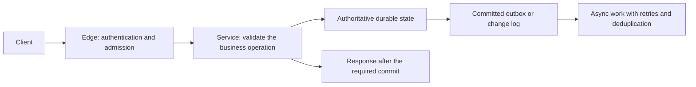
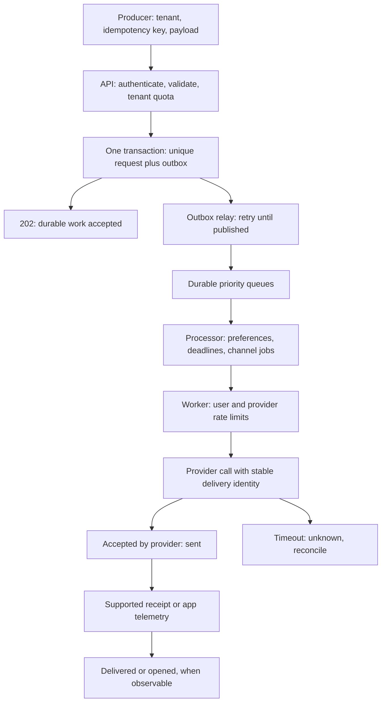
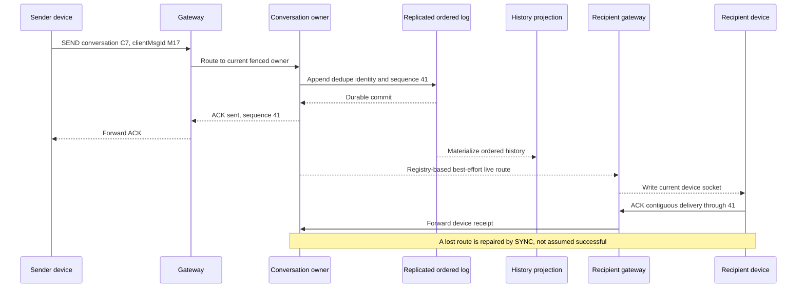
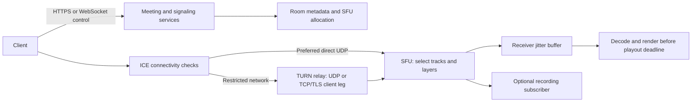
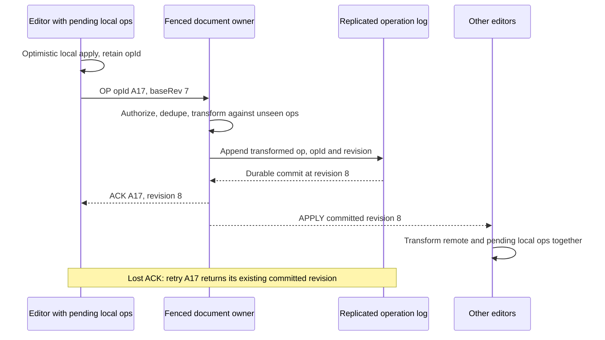

# Chapter 35 — System Design Case Studies — Part 1: Real-Time & Communication

> "A distributed system is one in which the failure of a computer you didn't even
> know existed can render your own computer unusable." — Leslie Lamport

This is the first of three **worked "Design X" case-study chapters**. The general
theory already lives in the repo — networking, load balancers, caching, and CDNs in
**Ch 23 (Foundations & Protocols)**; databases, sharding, consensus, and messaging in
**Ch 24 (Data & Distributed Systems)**; reliability, security, and the Instagram worked
example in **Ch 25 (Operations & Case Studies)**; and ML-specific design in **Ch 26**.
These three chapters do **not** re-teach that theory. They **assemble** it into
end-to-end answers to the questions an interviewer actually asks: *"Design a chat app."
"Design Zoom." "Design Google Docs."*

Chapter 35 opens with **Part A — the universal playbook** you reuse on every question,
then works four **real-time / communication** systems in depth. They stretch the
request/response mental model: connections stay open for hours, retries must not duplicate
visible messages, media favors timely playback over perfect packet delivery, and two people
can edit the same character concurrently. The goal is to **derive a defensible design**,
not reproduce a particular company's production architecture.

> **About the assumptions:** user counts, hardware capacities, time budgets, and priority
> ratings in these cases are teaching assumptions and editorial study guidance, not
> official hiring criteria or measured claims about the named products. State what changes
> if an assumption changes. Treat code as focused pseudocode unless explicitly runnable.

> **How this differs from Ch 25:** Ch 25 sketched a reusable framework and one worked
> example (Instagram). This chapter turns that framework into a repeatable *method*
> (Part A) and then goes far deeper on four systems Ch 25 never touched. Where Ch 25
> gave a 5-line "WhatsApp chat" sketch, here is the full treatment.

## What you'll learn

- A repeatable **8-step method** for any "Design X" question, plus a clarifying-question
  script, an estimation refresher, and a 4-layer scaffold you adapt to the problem.
- How to **drive the 45-minute conversation** and what separates a junior, senior, and
  staff-level answer.
- **Notification system** — queues, fan-out, multi-channel routing, idempotent dedupe.
- **Chat / messaging** — persistent-connection gateways, a connection registry for
  routing, per-conversation ordering, and the delivery/read-receipt state machine.
- **Video conferencing** — why it is *not* request/response: WebRTC over UDP, signaling
  vs media path, STUN/TURN, and the **SFU vs MCU vs mesh** trade-off with the stream math.
- **Collaborative editing** — the concurrent-edit conflict problem solved two ways:
  **Operational Transformation (OT)** vs **CRDTs**, with a worked example.

## Table of Contents

- [How to learn these cases](#learning-the-cases)
- [PART A — The universal "Design X" playbook](#design-playbook)
  - A.1 The 8-step framework
  - A.2 The clarifying-questions script
  - A.3 Back-of-envelope estimation refresher (+ latency numbers)
  - A.4 The 4-layer reference architecture
  - A.5 Driving the 45-minute conversation
  - A.6 The senior-signal rubric (junior vs senior vs staff)
  - A.7 Common failure patterns that sink candidates
- [CASE STUDY 1 — Notification System](#case-study-1)
- [CASE STUDY 2 — Chat / Messaging App (WhatsApp / Slack)](#case-study-2)
- [CASE STUDY 3 — Video Conferencing (Zoom / Google Meet)](#case-study-3)
- [CASE STUDY 4 — Collaborative Editor (Google Docs)](#case-study-4)
- [Practice checkpoints](#realtime-practice)
- [Key Takeaways](#realtime-takeaways)

<a id="learning-the-cases"></a>

## How to learn these cases

Read one case as a learning unit; finishing a long chapter is not the same as mastering
every design in it. Use three passes:

| Pass | What to do | Evidence that you understood |
|------|------------|-----------------------------|
| **Understand** | Read the user story, simple-to-scaled progression, and core diagram. | Explain the problem and the smallest workable solution without product names. |
| **Reason** | Follow the numbered flow, estimates, data model, and failure timeline. | State the invariant, the durable commit, and the point where a retry becomes safe. |
| **Apply** | Close the explanation and attempt the case's checkpoint before opening its answer. | Recalculate a changed workload and defend a trade-off under a new constraint. |

**Suggested paths, without renumbering the chapters:**
- **Gentler start:** URL shortener (CS12 in [Ch 36](#content/36_system_design_cases_search_media)),
  then notifications here, then rate limiter and cache in
  [Ch 37](#content/37_system_design_cases_scale_infra).
- **Real-time path:** notifications → chat → video conferencing → collaborative editing.
- **Correctness path:** notification acceptance → chat ordering → ride assignment in Ch 36 →
  scheduler, payments, inventory, and checkout in Ch 37.
- **AI path:** after the playbook, connect the serving, RAG, and recommender cases in Ch 37
  to their theory chapters; practice one workload and one failure, not another model survey.

**Targeted prerequisites:** [Ch 23](#content/23_system_design_fundamentals_deep_dive)
for WebSockets, caching, and transport; [Ch 24](#content/24_system_design_data_distributed)
§9 for consensus/ownership and §10.10 for outbox/CDC; [Ch 25](#content/25_system_design_operations_case_studies)
for SLOs, retries, and observability. Revisit the needed mechanism rather than rereading
three entire chapters before every case.

---

<a id="design-playbook"></a>

# Part A — Design Playbook

Before any specific system, internalize the **method**. Interviewers are not grading
whether you have memorized WhatsApp's architecture; they are grading whether you can
take an ambiguous prompt and drive it to a defensible design under time pressure. The
candidates who flail are the ones with no process — they jump straight to drawing boxes,
never state a number, and run out of clock before reaching the interesting part. The
candidates who pass run the **same loop every time**. Part A is that loop. Every case
study in Ch 35–37 is just this playbook applied to a new prompt.

## A.1 The 8-step framework

```
        THE 8-STEP "DESIGN X" LOOP   (≈45 min on the whiteboard)

   ┌─────────────────────────────────────────────────────────────┐
   │ 1. CLARIFY     scope it; nail functional reqs + NFR numbers   │ ~5m
   ├─────────────────────────────────────────────────────────────┤
   │ 2. ESTIMATE    QPS, storage/yr, bandwidth, connections, RAM   │ ~4m
   ├─────────────────────────────────────────────────────────────┤
   │ 3. API         the 3–5 endpoints / message types that matter  │ ~3m
   ├─────────────────────────────────────────────────────────────┤
   │ 4. DATA        entities → schema sketch → store per entity    │ ~5m
   ├─────────────────────────────────────────────────────────────┤
   │ 5. HLD         boxes & arrows: edge → services → data → async │ ~8m
   ├─────────────────────────────────────────────────────────────┤
   │ 6. DEEP-DIVE   the 1–2 CRUX components, code/algorithm level  │ ~10m
   ├─────────────────────────────────────────────────────────────┤
   │ 7. BOTTLENECK  find the breakpoint; cache / shard / queue it  │ ~6m
   ├─────────────────────────────────────────────────────────────┤
   │ 8. TRADE-OFFS  name what you sacrificed; CAP / PACELC out loud │ ~4m
   └─────────────────────────────────────────────────────────────┘
        ▲ loop back to step 1 whenever the interviewer adds a constraint
```

**Block by block:**
- **(1) Clarify** turns a vague prompt into a bounded problem — you write functional
  requirements and, critically, *non-functional* ones as numbers (scale, latency, consistency).
- **(2) Estimate** is the back-of-envelope math that justifies every later choice; without it
  you cannot argue "this needs sharding."
- **(3) API** pins down the contract — the 3–5 calls (or, for real-time systems, *message
  types*) that define the system.
- **(4) Data** picks the right store per entity and the shard key.
- **(5) HLD** is the big layered diagram (the bulk of the score).
- **(6) Deep-dive** is where you spend the most time: drop to code level on the *one* component
  that is the heart of this problem.
- **(7) Bottleneck** stress-tests the design — "where does this break at 10×?"
- **(8) Trade-offs** is the senior close: name what you gave up and the condition to revisit it.

| Step | You produce | Time | Senior signal |
|------|-------------|------|---------------|
| 1 Clarify | Functional + NFR list (with numbers) | ~5m | NFRs as numbers, scope cuts stated aloud |
| 2 Estimate | QPS, storage/yr, bandwidth, #connections | ~4m | A number that *drives* a decision |
| 3 API | 3–5 endpoints / message types | ~3m | Idempotency keys, cursors, versioning |
| 4 Data | Entity → store → shard key table | ~5m | Store chosen from access pattern, not habit |
| 5 HLD | Layered architecture diagram | ~8m | Clean edge→service→data→async separation |
| 6 Deep-dive | The crux, code/algorithm level | ~10m | Picks the *right* crux; real depth, no hand-wave |
| 7 Bottleneck | Hot keys, fan-out, breakpoints | ~6m | Quantifies the breakpoint before fixing it |
| 8 Trade-offs | CAP/PACELC call-outs | ~4m | Names the sacrifice + when to revisit |

The time budgets are a guide, not a contract. Make room for trade-offs throughout the
conversation; they reveal the reasoning behind a diagram. CAP/PACELC is useful when its
assumptions apply, not a phrase that must appear in every answer.

## A.2 The clarifying-questions script

Memorize this checklist and recite the relevant lines on every question. Asking sharp
questions is itself a graded signal: it shows you know what *varies* between designs.

```
   FUNCTIONAL  — what must it do?
     • Who are the actors (users, internal services, admins)?
     • What are the 3–4 core use cases? What is explicitly OUT of scope?
     • Read-heavy or write-heavy? What's the read:write ratio?

   SCALE       — how big? (turn every answer into a number)
     • DAU / MAU? Actions per user per day? Peak vs average?
     • Object sizes (a message? a photo? a video minute?)
     • Concurrent connections (for real-time systems)?
     • Growth horizon — design for today's 10× or 100×?

   CONSISTENCY — how correct, how fresh?
     • Strong or eventual? Where does stale data actually hurt a user?
     • Ordering guarantees (global? per-user? per-conversation? none)?
     • Exactly-once, at-least-once, or at-most-once delivery?

   LATENCY & AVAILABILITY — how fast, how reliable?
     • p50 / p95 / p99 targets for the hot path?
     • Availability target (99.9% = 8.7h/yr down, 99.99% = 52m/yr)?
     • Is degraded service acceptable, or must it be all-or-nothing?

   COST & OPS  — what can we spend?
     • Budget sensitivity? (storage tiers, egress, premium providers)
     • Single-region or multi-region / global from day one?
     • Compliance: GDPR, data residency, retention, encryption?
```

You will not ask all of these — pick the 4–6 that change *this* design. For a chat app
you lead with **ordering** and **delivery semantics**; for video conferencing you lead
with **latency** and **bandwidth**; for a notification system you lead with **delivery
guarantees** and **priority lanes**. Stating "I'll assume X unless you'd like to explore
Y" keeps you moving while showing you saw the fork.

## A.3 Back-of-envelope estimation refresher

You cannot justify sharding, caching, or a queue without numbers. The whole skill is
arithmetic to **one significant figure**. Two tricks make it fast.

**Trick 1 — scientific notation.** Keep one or two significant figures and count zeros.
Do not round every input to a power of ten: repeated coarse rounding can obscure a real
capacity constraint.

```
   2^10 ≈ 10^3 = thousand (K)        1 KB  ≈ 10^3  bytes
   2^20 ≈ 10^6 = million  (M)        1 MB  ≈ 10^6  bytes
   2^30 ≈ 10^9 = billion  (B/G)      1 GB  ≈ 10^9  bytes
   2^40 ≈ 10^12 = trillion (T)       1 TB  ≈ 10^12 bytes
```

**Trick 2 — "a day is about 10^5 seconds."** Exactly 86,400 s, but 10^5 is close enough
and turns division into subtracting exponents.

```
   QPS        = (users × actions/user/day) ÷ 86,400  ≈ ( … ) ÷ 10^5
   Peak QPS   ≈ 2–3 × average QPS              (diurnal + spikes)
   Storage    = items/day × bytes/item × retention_days
   Bandwidth  = QPS × bytes/object            (in and out separately)
   Conns      = concurrent_users               (real-time systems)
   Cache RAM  = hot_set_fraction × items × bytes/item
```

**Worked example — "messages per second for a global chat app":**

```
   DAU                  500,000,000        (5 × 10^8)
   Messages/user/day    40
   ── messages/day      2 × 10^10  (20 B)        [5e8 × 40]
   Average write QPS    2e10 / 1e5  = 2 × 10^5   = 200,000 writes/s
   Peak write QPS (3×)  ≈ 600,000 writes/s
   Read:write           assume ~1:1 for this simplified 1:1 workload, so
                        reads ≈ another 200k/s average  → ~400k ops/s total
   Bytes per message    ~200 B (text + metadata)
   Storage/day          2e10 × 200 B = 4 × 10^12 = 4 TB/day
   Storage/year         4 TB × 365   ≈ 1.46 PB/year (text only)
   Concurrent online    ~20% of DAU = 10^8 = 100 M open connections
```

What the numbers *teach* (this is the point — estimates must change a decision):
600k writes/s and 100 M persistent connections both say **one box cannot do this** →
you need a sharded, horizontally-scaled connection tier and a write-optimized store.
1.46 PB/year motivates a retention and storage-cost plan. A partitioned wide-column store
is a good candidate for append/range-read access, but sharded or distributed SQL can also
work. Choose using query patterns, ordering/durability requirements, operations, and cost,
not a rule that SQL cannot hold messages.

**Keep the units honest:** these are logical text bytes, not provisioned disk. Three
copies of 1.46 PB require 4.38 PB before indexes, compaction space, backups, or compression.
The 200k average uses a rounded day; dividing by 86,400 gives about 231k/s. Either estimate
is usable if the approximation and peak/headroom factors remain consistent.

**Historical latency reference** (Jeff Dean's table, also in Ch 25): use the relative
orders of magnitude to reason, not these hardware-era numbers as current benchmarks:

```
   L1 cache reference                      0.5  ns
   Branch mispredict                         5  ns
   L2 cache reference                        7  ns
   Mutex lock / unlock                      25  ns
   Main memory reference                   100  ns
   Compress 1 KB (Snappy)                2,000  ns =   2 µs
   Send 1 KB over 1 Gbps network        10,000  ns =  10 µs
   SSD random read                      16,000  ns =  16 µs
   Read 1 MB sequentially from RAM     250,000  ns = 250 µs
   Round trip in same datacenter       500,000  ns = 0.5 ms
   Read 1 MB sequentially from SSD   1,000,000  ns =   1 ms
   Disk seek                        10,000,000  ns =  10 ms
   Read 1 MB sequentially from disk 20,000,000  ns =  20 ms
   Round trip US ↔ Europe          150,000,000  ns = 150 ms
```

Two takeaways: **(1) network ≫ memory ≫ CPU** — a cross-continent round trip is ~300,000×
a memory reference, so a chatty design that makes many sequential remote calls is doomed;
batch and parallelize. **(2) sequential ≫ random** — one big sequential read beats many
small random ones, which is *why* log-structured stores (Cassandra, Kafka) win for
write-heavy workloads.

<a id="diagram-reading-and-rehearsal"></a>

## Diagram reading and rehearsal

This guidance applies to **all 26 designs in Ch 35–37**. Read the PNG overview and its
correction note in **Architecture**, then follow the numbered request walkthrough.
The editable Mermaid in **Deep Dive** explains the mechanism. Use the whiteboard sketch
in **Practice** to rehearse, not to memorize every box or brand. The optional visual palette is:

> **green = client · grey = edge/LB · blue = service · red = datastore · orange = queue / stream · violet = 3rd-party**


Reproduce the **minimum necessary design** in about four minutes, narrating: who sends the
request, which state is authoritative, when success can be acknowledged, what is asynchronous,
and what happens if a component fails. Explain the capability before naming a product.

**Image-review convention:** existing PNGs and whiteboard assets are retained unchanged.
Where a legacy image conflicts with a correction, its nearby review note names the issue;
the editable Mermaid, current prose, and pseudocode define the intended design. An old
image is not evidence for a guarantee such as "exactly once" or "no double assignment."

## A.4 The 4-layer reference architecture

These four responsibilities are a **checklist, not a mandatory deployment topology**.
A small service can implement them in one process plus a database. Split components only
when isolation, scale, ownership, or deployment needs justify the additional failure modes.



**PNG review note:** the retained overview is a component catalog. It does not mean every
write must publish an event, or that independently writing a database and Kafka is atomic.


**Layer 1 · Edge** is everything between the user and your code: **GeoDNS** points the
client at the nearest region, the **CDN** serves static assets and media from the edge
(theory: *CDN & edge* — Ch 23), the **API Gateway** terminates TLS and enforces authN +
rate-limiting, and the **L7 load balancer** spreads traffic across healthy service
instances (theory: *load balancing* — Ch 23). **Layer 2 · Services** are *stateless*
microservices you can scale by adding instances — except the **Realtime Gateway**, which
is special because it holds millions of long-lived WebSocket/gRPC connections (every
real-time system in this chapter lives or dies on this box). **Layer 3 · Data** uses the
right store per job: **SQL** for anything needing ACID (users, money), a **wide-column**
store for write-heavy time-series (messages, feeds, logs), **Redis** for the hot cache and
counters, and an **object store** for blobs (theory: *SQL vs NoSQL, wide-column* — Ch 24).
**Layer 4 · Async** keeps deferrable work off the request path: relevant committed changes
reach a **message bus** (for example through outbox/CDC), and background **consumer groups** do work —
fan-out, search indexing, media transcoding, analytics — each with retries and a
dead-letter queue (theory: *Kafka, DLQ, exactly-once* — Ch 24).

The mental shortcut: keep only the work required for the response guarantee on the
synchronous path. Async processing trades immediate results for durable backlogs, retries,
and eventual visibility; it does not remove work or make overload disappear.

## A.5 Driving the 45-minute conversation

A system-design interview is a *conversation you lead*, not an exam you complete in
silence. Manage the clock visibly. Here is the minute map most strong candidates follow.

```
   Minute     0--5    5--9    9--12   12--17   17--25   25--35   35--41   41--45
   Activity   clarify estimate API    data     HLD      deep-dive limits   trade-offs
   Output     scope   numbers contract model   diagram  mechanism failures decisions
```

**How to read the timeline:** spend the first ~12 minutes on *framing* (clarify,
estimate, API), use about five minutes for the access patterns and data model, then draw
the HLD. Reserve roughly minutes 25–35 for the crux and the final ten for limits and trade-offs.
These match §A.1, but adapt them to the conversation. Check in before a deep-dive:
"Should I explore the real-time path, storage, or failure recovery?" If a constraint changes,
revisit the relevant decision instead of attaching another box to an incompatible design.

## A.6 The senior-signal rubric

The following is an **editorial practice rubric, not an official company scoring guide**.
Use the right-hand columns to improve the quality of your reasoning.

| Dimension | Junior sounds like | Senior sounds like | Staff sounds like |
|-----------|--------------------|--------------------|-------------------|
| Requirements | jumps straight to boxes | clarifies scope; states NFRs as numbers | challenges the premise; picks the one metric that matters |
| Estimation | skips it or guesses | back-of-envelope QPS / storage | uses a number to *force* a design choice |
| Architecture | one giant box | clean edge→service→data→async layering | identifies the crux up front, spends time there |
| Data | "use a database" | right store per entity + shard key | explains the access pattern that *forces* the store |
| Real-time | chooses a transport without requirements | WebSocket + connection registry | reasons about backpressure, reconnect, ordering |
| Failure | doesn't mention it | lists what dies + user impact | designs degradation modes; limits blast radius |
| Trade-offs | "it's scalable" | names the CAP choice | quantifies the trade + when to revisit it |
| Communication | monologues | thinks aloud, checks in | drives the session, manages the clock |

The throughline: **seniority is measured by judgment, not by knowing more boxes.** A staff
answer is not bigger — it is more *decisive*, spending its minutes on the one or two
choices that actually determine whether the system works.

## A.7 Common failure patterns that sink candidates

The meta red-flags — independent of which system you are designing:

- **Designing in silence / not clarifying.** Building the wrong system perfectly scores zero.
- **No estimate.** With no numbers you cannot justify a single decision; everything sounds
  like hand-waving.
- **Schema before access pattern.** Picking tables before you know the reads/writes leads
  to the wrong store. Decide *how it's queried*, then choose.
- **"We'll just add a cache."** Without naming *what* you cache, the TTL, and the
  invalidation strategy, this is a non-answer (and stale-cache bugs are real).
- **Synchronous where async belongs.** Calling a slow provider on the request path couples
  your latency to theirs. If it can be late, move it to Layer 4.
- **One giant database for everything.** Money, messages, media, and search have different
  access patterns; one store cannot be good at all of them.
- **Happy-path only.** No failure modes = no senior signal. Always ask "what if this box
  dies, and what does the *user* see?"
- **Hand-waving the crux.** "We use a distributed system for that" is where you should be
  going *deeper*, not skating past.
- **Buzzword bingo.** Naming Kafka, Raft, and CRDTs without justifying them invites exactly
  the follow-up question that exposes the gap.
- **No clock management.** Spending 30 minutes on the API sketch and never reaching
  trade-offs. Budget your minutes (A.5).
- **Over-engineering.** Multi-region active-active for a system with 1,000 users is as wrong
  as a single box for a billion. Match the design to the stated scale.

Keep these in your peripheral vision while you work the four case studies below — each one
calls out the *system-specific* red flags on top of these universal ones.

---

<a id="case-study-1"></a>

# Case 1 — Notification System

> **Google priority:** ★★ · **Difficulty:** Medium · **Frequency:** Very common · **Time budget:** ~35 min
>
> **At a glance**
> - **The hard part —** reliably accept delivery work across push / email / SMS / in-app, control duplicates, and define what "delivered" actually means.
> - **Key building blocks —** durable per-channel queues, Redis (dedupe + token-bucket), provider workers (APNs / FCM / SES / Twilio), delivery webhooks.
> - **The crux (LLD) —** durable idempotent acceptance + outbox, explicit provider uncertainty, and an atomic token bucket.
> - **Scale anchor —** ~35 k notifications/sec at peak; SMS is the quota-limited channel and the delivery log is the real storage cost.

> **User story —** *As an* internal product team (Security, Growth, Search…), *I want* to hand a
> single "notify this user" call to a shared service, *so that* I never write APNs, Twilio, or
> rate-limiting glue myself.
>
> **For example —** the Security team fires a "new login from Chrome" alert that must reach the
> user within seconds, while Growth queues a "we miss you" email that may lag minutes; the same
> `POST /v1/notify` accepts both and routes each to the right channel and priority lane.
>
> **Why it pays off —** centralizing delivery puts dedupe, per-user quiet hours, and per-tenant
> quotas behind one governed pipe, so no team can spam users and one provider's bad day can't take
> the other channels down.

Imagine the single piece of software at a company that every other team wants to use:
"send my user a message." Search wants to send "your package shipped." Growth wants "we
miss you." Security wants "new login from Chrome." A **notification system** is the shared
pipe that takes those requests and reliably delivers them across **push, SMS, email, and
in-app** — without spamming anyone, without losing the important ones, and without falling
over when one provider (say, Apple's push servers) has a bad day. The hard part isn't
sending one message; it's sending **billions**, to the right channel, exactly enough times,
fast when it matters and cheap when it doesn't.

### Start Simple

| Version | What works | What forces the next change |
|---------|------------|-----------------------------|
| One API calls an email provider | A prototype with one channel and modest traffic. | Caller latency and success become coupled to the provider. |
| API commits a request; worker sends later | Durable acceptance lets the caller finish before delivery. | A database write and queue publish can fail independently. |
| Request identity and outbox share one transaction | A committed request can always be rediscovered and published. | Redelivery and provider timeouts still need explicit handling. |
| Idempotent channel jobs, priority lanes, quotas | Separates noisy tenants/channels and bounds work. | More queues require backlog monitoring, operational ownership, and fair capacity allocation. |

**Invariant:** after a successful acceptance response, durable delivery work exists.
This is different from "every human receives one message." Our service controls acceptance;
the provider and receiving app determine which downstream guarantees are possible.
Prerequisite: [Ch 24, §10.10 — outbox/CDC](#content/24_system_design_data_distributed).

## 1.0 Interview Focus

- Can you **decouple** producers from delivery with a queue instead of blocking the caller?
- Do you handle **fan-out**, **multi-channel routing**, and **user preferences/quiet hours**?
- Do you get **delivery semantics** right (at-least-once + **idempotent dedupe**)?
- Do you protect users with **rate-limiting** and the business with **retries + DLQs**?
- Do you separate **transactional** (must arrive, low latency) from **marketing** (bulk, can lag)?

## 1.1 Requirements

**Functional**
- Accept a "send" request from many internal services.
- Deliver across channels: **push (APNs/FCM), email, SMS, in-app**.
- Respect **per-user preferences** (opt-outs, channel choice, quiet hours, timezone).
- **Templates** with localization/variables.
- **Dedupe** identical notifications; **schedule** future/digest sends.

**Out of scope** (state these to show focus): the authoring UI, content/copywriting, and the
ML that decides *who* to notify (that's a different system that calls us).

**Non-functional**
- **Scale:** assume 100 M users, ~10 notifications/user/day.
- **Latency:** transactional (OTP, security) p95 < 5 s end-to-end; marketing may lag minutes.
- **Delivery:** durable accepted work with at-least-once processing; dedupe at each owned
  boundary. Never silently drop transactional work: expire or dead-letter it with an
  explicit terminal state and alert when its delivery deadline cannot be met.
- **Availability:** 99.9%+; a single channel/provider outage must not block other channels.
- **Multi-tenancy (SaaS):** this is usually a *shared* service that many client teams — and
  sometimes external companies — call. Enforce **per-tenant quotas/rate-limits** so no single
  tenant can spam users *or* exhaust a shared downstream provider on everyone else's behalf.

**Questions to ask out loud** (reciting these is senior signal): *What's the read:write?
Priorities/lanes? Acceptable delay per class? Which providers? Do we need delivery receipts
& open tracking? Regulatory constraints (TCPA/GDPR, unsubscribe)?*

**API contract** (one endpoint does most of the work — keep it tiny and idempotent):

```
   POST /v1/notify
     { userId, type:"security.login",        // routing + template key
       channelHint:"push",                    // optional override
       data:{ device:"Chrome on Mac" },       // template variables
       idemKey:"login-9f3a",                  // caller-supplied dedupe key
       priority:"transactional" }             // transactional | marketing
     → 202 Accepted { notifId, status:"accepted" }
       replay: 200 { same notifId, current status }
       same tenant/key with a different payload: 409 Conflict

   GET  /v1/notify/{notifId}      → accepted|sending|sent|unknown|delivered|opened|failed|expired
   PUT  /v1/prefs/{userId}        → channel opt-ins, quiet hours, timezone
```

## 1.2 Estimates

```
   Users                100,000,000
   Notifs / user / day  10
   ── total/day         1,000,000,000  (1 B)              [users × rate]
   Avg QPS              1e9 / 86,400  ≈ 11,600 / s        [day ≈ 10^5 s]
   Peak (3×)            ≈ 35,000 / s
   Channel mix          70% push, 15% in-app, 10% email, 5% SMS
   SMS QPS (peak)       0.05 × 35,000 ≈ 1,750 / s  → provider quota matters!
   Delivery log         1 B/day × 300 B ≈ 300 GB/day  → 90-day TTL ≈ 27 TB
```

Lesson the numbers teach: **SMS volume is small but expensive & quota-limited**; **push is
the firehose**; the high-volume audit stream benefits from a TTL'd analytical/wide-column
store. Keep the smaller operational request/attempt state where transactional updates and
status lookups are reliable. The 27 TB estimate excludes replicas, indexes, and extra rows
for retries/status changes; with three replicas its base payload alone is 81 TB.

## 1.3 Architecture

The PNG shows the overall components; the editable mechanism is in **Deep Dive**.
Only the request/outbox commit is on the acceptance path; provider work is asynchronous.

**Image correction:**

The PNG's Redis `SETNX` claim is not a durable request/outbox transaction; its "202 always"
label omits validation/conflict/unavailability errors. Provider callbacks and device opens
also differ by channel. These are corrected in the current flow and text.


**Legend:** `.q` = durable queue (Kafka topic / SQS). Boxes are stateless services unless
they name a store. Read top-to-bottom: a request enters at LAYER 1, is acknowledged in
milliseconds, and all the slow work happens in LAYER 2.

**Block by block:**
- **Notification API** — authenticates the caller and atomically commits the request,
  tenant-scoped idempotency identity, and outbox row before `202 Accepted`. The relay publishes
  later; Redis may cache status but is not the acceptance authority. It never calls a provider.
- **Kafka "requested" topic** — the durable buffer that absorbs spikes (the 35 k/s peak) and
  decouples ingest from processing. If processors fall behind, messages wait here, not in RAM.
- **Notification Processor** — the brain: it loads preferences from **PostgreSQL** (cached in
  Redis) and templates from **Amazon S3**, then runs quiet-hours/opt-out → channel selection →
  template render → per-user rate-limit (Redis) → fan-out. Each `(notifId, channel)` job has
  a durable unique identity; redelivering the input does not create a second logical job.
  Publishing channel jobs uses the same durable outbox principle.
- **Per-channel queues + workers** — isolation by channel (the **bulkhead** pattern, Ch 23):
  if Twilio is slow, `sms.q` backs up but push/email/in-app keep flowing. Each worker owns
  its own retry/backoff and a **dead-letter queue** for poison messages (Ch 24). The channel
  layer is **pluggable** — to add WhatsApp as a channel, register a new channel worker +
  template type and route to its queue; nothing upstream changes. The **in-app writer**
  persists each message to the per-user feed in **Cassandra**.
- **Delivery log + analytics** — provider receipts where supported and receiving-app telemetry
  update operational attempt state. Authenticated callbacks are deduplicated by event identity.
  Conditional state updates prevent a late "sent" event from overwriting observed delivery.
  The `notifications.status` stream feeds the audit log and metrics; a successful FCM send
  means accepted for delivery, not received/opened. Opens require supported analytics or
  app instrumentation, not an assumed FCM webhook.

## 1.4 Request Walkthrough

A transactional "new login" alert, end to end:

```
  1. Security service ─▶ POST /v1/notify
        { userId, type:"security.login", channelHint:"push",
          idemKey:"login-9f3a" }
  2. API transaction: unique (tenantId, idemKey), payload hash,
     accepted notification N17 and its outbox event commit together.
        ├─ matching replay ─▶ return N17 and its current status
        ├─ different payload for this key ─▶ 409 Conflict
        └─ first commit ─▶ 202 {notifId:N17, status:"accepted"}
     Relay publishes N17; a lost publish acknowledgement may cause redelivery.
  3. Processor consumes event:
        load prefs → user allows security pushes, not in quiet hours
        render template "New sign-in on {device}" → enqueue push.q job
  4. Push worker: claim the channel attempt; token-bucket OK; call FCM.
     Success means SENT (provider accepted), not DELIVERED.
  5. Supported device receipt / app telemetry records received or opened.
     Without that evidence, leave the status SENT; do not invent a receipt.
```

Step 2 establishes durable acceptance; step 3 honors preferences; step 4 governs provider
attempts; step 5 records only observed outcomes. See
[Firebase's delivery-state definitions](https://firebase.google.com/docs/cloud-messaging/understand-delivery).

**Failure timeline — the response is lost:** N17 and its outbox commit, then the API dies
before returning. Retrying the same tenant/key finds N17; the relay still publishes the
committed work. Contrast this with "set a Redis key, then enqueue": a crash in between leaves
a dedupe key but no work. Suppressing the retry would lose the notification.

## 1.5 Data Model

| Entity | Shape (key fields) | Store | Why |
|--------|--------------------|-------|-----|
| Preferences | `user_id → {channel:on/off, quiet_hours, tz, locale}` | PostgreSQL (sharded by user_id) + Redis cache | Point reads by user_id; small, hot → cache in Redis |
| Templates | `template_id, version, locale → body` | Amazon S3 (versioned) + Redis cache | Read-mostly; never hard-code copy in services |
| Accepted request | `UNIQUE(tenant_id, idemKey) → notifId, payloadHash, status, payload` | Transactional DB | Binds a replay to the same logical request; retain for the documented replay horizon |
| Outbox | `eventId → notifId, payload, publishedAt` | Same DB transaction | Relay can rediscover committed work after a crash |
| Channel job / attempt | `(notifId, channel) → state, attemptToken, providerId` | Transactional DB | Deduped job creation and owner-checked attempt transitions; timeout can remain UNKNOWN |
| Rate-limit | `user_id → token bucket` | Redis (Lua, atomic) | Atomic check-and-decrement at the edge of fan-out |
| Usage/metering | `(tenant_id, event_id) → accepted/billable event` | Durable event log → BigQuery | Deduplicated usage for billing; Redis counters are approximate live quota signals |
| Delivery log | `(user_id, ts) → status…` | Kafka → Flink → Cassandra (90-day TTL) | Write-heavy time-series; cheap, expiring wide-column log; analytics teed to BigQuery — not your OLTP DB |
| In-app feed | `(user_id, ts) → notif` | Cassandra / Bigtable | Per-user timeline reads, write-heavy |

## 1.6 Scaling

- **Throughput** is bounded by partitions, consumers, DB writes, and provider quotas.
  Partition user events by `(tenant_id, user_id)` where useful. Queue order alone does not
  guarantee delivery order once workers retry or channels complete at different speeds.
- **Hot tenant** (a service blasting 1 M users in a second): admission-control / quota per
  caller at the API; spread fan-out over time for non-urgent classes.
- **Per-tenant quotas (multi-tenant isolation):** give every client/tenant its own rate-limit
  bucket at ingest. This serves *two* ends — it stops one tenant spamming users, and it caps
  any single tenant's draw on the shared downstream providers (APNs/Twilio/SES), so a noisy
  tenant can't starve the others (the **bulkhead** pattern applied to tenants, Ch 23).
- **Provider quotas** (SMS): a **leaky-bucket shaper** in the SMS worker matches Twilio's
  allowed rate; overflow waits in `sms.q` (it's durable) rather than getting dropped.
- **Priority lanes:** separate `transactional` vs `marketing` queues and reserve worker/provider
  capacity for urgent work. Separate queues alone do not remove a shared provider bottleneck.
- **Thundering digest:** for a "daily digest," don't wake 100 M users at 09:00 sharp — spread
  by **user-local time** and jitter within the hour, or you create a self-inflicted 100 M/s
  spike and melt your providers.

```
   NAÏVE (all at 09:00 UTC)        SPREAD (by local tz + jitter)
   spike ▲                         smooth ▁▂▃▄▅▆▇█▇▆▅▄▃▂▁ rolling
   100M/s│█                        ~ flat across the hour & globe
         │█                        each tz bucket fires at its own 09:00,
       0 └────── time              jittered ±30 min → provider stays happy
```

The left bar is what happens if you schedule every user at the same absolute instant — a
single column of 100 M sends that no provider can absorb. The right curve **spreads the same
volume** across local-time windows with jitter. The reduction depends on timezone population
and acceptable delivery windows; do not assume 24 equally populated timezones or jitter an OTP.

## 1.7 Failures and Trade-offs

```
  What dies                    →  What the user sees / what we do
  ──────────────────────────────────────────────────────────────────
  A provider (APNs) down       →  push.q backs up; retry w/ backoff;
                                  after N tries → DLQ + alert; other
                                  channels unaffected
  Processor lag (spike)        →  events wait in Kafka (durable); add
                                  consumers; SLO dips, nothing lost;
                                  transactional lane drained first
  Acceptance DB unavailable    →  cannot commit acceptance; return a
                                  retryable error, never a success-shaped ACK
  Redis (rate limit) down      →  explicit policy: pause/defer strict
                                  quotas; only use a bounded fallback if allowed
  Provider accepts, reply lost →  UNKNOWN; query by provider identity or
                                  retry with its supported idempotency key
  Webhook from provider lost   →  delivery shows "sent" not
                                  "delivered"; reconcile via provider's
                                  batch report (eventual truth)
```

**Trade-offs called out:** at-least-once processing plus idempotent owned writes is practical;
it does not establish universal exactly-once email/SMS/push delivery. If a provider cannot
dedupe or report an uncertain attempt, explicitly choose between duplicate risk and missed
delivery, expose the uncertainty, and reconcile where possible. We pay
for **per-channel isolation** with more moving parts — worth it, because blended failure is
the classic outage.

## 1.8 Deep Dive

**Mechanism diagram**



The crux is **"accept work durably, avoid duplicate effects where possible, and control
attempt rates."** Acceptance and rate limiting are different mechanisms.

**Durable idempotency:** require a stable caller key, scoped to the authenticated tenant.
Hash a canonical representation of the validated request so a reused key cannot silently
change recipients or content. The following pseudocode relies on a unique constraint:

```
  accept(tenant, key, request):
      BEGIN
      inserted = INSERT notification(tenant_id, idemKey, payloadHash, payload, status)
                 VALUES(:tenant, :key, hashCanonical(request), request, 'accepted')
                 ON CONFLICT (tenant_id, idemKey) DO NOTHING
                 RETURNING notifId
      if inserted is empty:
          prior = SELECT notification WHERE tenant_id = :tenant AND idemKey = :key
          if prior.payloadHash != hashCanonical(request):
              ROLLBACK; return 409 Conflict
          COMMIT; return 200 {prior.notifId, prior.status}
      INSERT outbox(eventId, notifId, payload) VALUES(newEventId(), inserted.notifId, request)
      COMMIT
      return 202 {inserted.notifId, status:'accepted'}
```

The relay may publish the same event twice. Consumers therefore dedupe **their own durable
effects**, not merely the original API request. An external call has another failure boundary:
record its attempt, use stable provider idempotency where offered, and never turn a timeout
into "definitely failed." Retain request identities at least as long as the documented retry
window; after that horizon the client must not assume replay protection.

**Per-user rate limit (token bucket, atomic in one round-trip via Lua):**

```
  -- KEYS[1]=bucket; ARGV: ratePerSec, burst (trusted fixed configuration)
  local rate, burst = tonumber(ARGV[1]), tonumber(ARGV[2])
  if not rate or not burst or rate <= 0 or burst < 1 then
      return redis.error_reply('invalid bucket configuration')
  end
  local clock = redis.call('TIME')
  local now = tonumber(clock[1]) + tonumber(clock[2]) / 1000000
  local b = redis.call('HMGET', KEYS[1], 'tokens', 'ts')
  local tokens, ts = tonumber(b[1]) or burst, tonumber(b[2]) or now
  now = math.max(now, ts) -- do not move the refill watermark backward
  tokens = math.min(burst, tokens + (now - ts) * rate)
  local allowed, retryMs = 0, 0
  if tokens >= 1 then
      tokens, allowed = tokens - 1, 1
  else
      retryMs = math.ceil((1 - tokens) / rate * 1000)
  end
  redis.call('HSET', KEYS[1], 'tokens', tokens, 'ts', now)
  redis.call('EXPIRE', KEYS[1], math.max(1, math.ceil(burst / rate)))
  return {allowed, retryMs}
```

Why a **Lua script**: it makes "read tokens → refill → check → decrement → write" a single
**atomic** operation, so two concurrent notifications can't both spend the last token (the
classic race). Why **token bucket** over fixed window: it allows short bursts (a flurry of
legit alerts) while still capping the long-run rate — no edge-of-window doubling. (Theory:
*token-bucket rate limiting* — Ch 23.)

**Two checks, one primitive.** Production systems apply this *same* token-bucket at **two**
levels: **(a) is this client/tenant allowed to send this volume** — bucket keyed by
`tenant_id`, checked at ingest, which protects users *and* the shared downstream providers;
and **(b) is this user supposed to receive this many** — bucket keyed by `user_id`, the script
above, checked at fan-out. Identical Lua, different key. Use a TTL no shorter than the
full refill interval; otherwise expiry can reset an empty bucket to full too early.
The script uses server time and avoids negative elapsed time; substantial clock jumps,
lost Redis state, and failover still need an explicit quota policy, not a strict global
rate guarantee inferred from Lua atomicity.

**Worked bucket:** burst 3, refill 0.5 tokens/s. Three requests at t=0 consume all tokens.
At t=1 there are 0.5 tokens: deny and defer 1,000 ms. At t=2 there is one token: allow.
An OTP job that would miss its expiry while deferred must become explicitly expired, not
wait invisibly forever.

## 1.9 Follow-ups

**Likely follow-ups (with crisp answers):**
- *"How do digests/batching work?"* — a scheduled aggregator collects per-user events in a
  window, then emits one notification; spread sends by user-local time (see 1.6).
- *"Ordering?"* — a partition preserves ingest order, not provider completion order. If
  strict per-user/channel order is required, sequence and serialize delivery attempts;
  acknowledge the head-of-line delay this creates.
- *"Exactly-once?"* — identify the boundary. Durable unique requests and idempotent in-app
  writes are under our control; external provider effects depend on provider capabilities.
- *"Multi-region?"* — process in the user's home region; replicate preferences; providers are global.
- *"How do we bill per-use clients?"* — define the billable event, dedupe it in a durable
  usage log, and reconcile reports. Do not treat a lossy live Redis quota counter as a ledger.

**Red flags that sink candidates:** sending synchronously from the API (couples caller
latency to Twilio); no dedupe (every retry double-sends); one shared queue for all channels
(SMS outage blocks push); no per-user rate limit (one buggy producer spams users into
uninstalling); storing templates in code; treating the delivery log like a primary OLTP table.

**Building blocks reused (theory lives elsewhere):** durable queues, consumer groups, DLQs,
exactly-once nuance — **Ch 24** (*Messaging & Streaming*); token-bucket rate limiting,
bulkhead, circuit breaker — **Ch 23**; webhooks & retries — **Ch 25**; Cassandra/wide-column
modeling — **Ch 24**; Redis patterns — **Ch 23**.

<a id="practice-1"></a>

## 1.10 Practice

### Whiteboard Rehearsal

Use the [shared rehearsal method](#diagram-reading-and-rehearsal). Draw the durable acceptance
transaction before the queue, then narrate the provider boundary separately.


**Legacy-image review:** the sketch's Redis claim is not durable acceptance. Add the request
and outbox transaction from the editable diagram when rehearsing; the original asset is
retained for manual review.

### Try It — predict, calculate, adapt

Before opening the answer: N17 commits but its API response is lost. The relay also loses
its Kafka acknowledgement. How many logical notifications should a retry create? At 1,750
SMS attempts/s with 100 ms average provider-call time, how many concurrent calls are needed
before headroom? What if the provider has no idempotency support?

<details>
<summary>Show worked answer</summary>

The replay returns **N17**, not a new request. Kafka can contain duplicate events; a unique
channel-job identity suppresses duplicate durable job creation. Little's Law gives
`1,750/s × 0.1 s = 175` concurrent provider calls at steady state; tail latency, retry traffic,
quota limits, and headroom change the provisioning target. If a provider accepts a call
but its reply is lost, neither our outbox nor Redis proves that a resend is safe. Keep
UNKNOWN, query/reconcile if supported, and state the duplicate-versus-loss policy.

**Changed requirement:** security alerts must arrive before marketing. Reserve urgent
worker and downstream quota capacity, not just a differently named Kafka topic.

</details>

---

<a id="case-study-2"></a>

# Case 2 — Chat / Messaging (WhatsApp / Slack)

> **Google priority:** ★★★ · **Difficulty:** Hard · **Frequency:** Very common · **Time budget:** ~45 min
>
> **At a glance**
> - **The hard part —** keep *millions* of connections open and deliver **ordered** messages with delivery/read receipts, even when the recipient is offline.
> - **Key building blocks —** WebSocket gateway, a connection registry (who's on which box), per-conversation sequence IDs, wide-column store, push fallback.
> - **The crux (LLD) —** connection-registry routing + the `sent → delivered → read` receipt state machine.
> - **Scale anchor —** ~600 k writes/sec and ~1.46 PB/yr of logical text motivate sharded append/range-read storage, with explicit ordering and retention.

> **User story —** *As a* user messaging a friend, *I want* my message to appear on their phone
> instantly and reliably — ✓ sent, ✓✓ delivered, blue ✓✓ read — *so that* I can trust the
> conversation even when one of us has a flaky connection or is offline.
>
> **For example —** I text "running 5 min late" while my friend is underground with no signal;
> the app shows a single ✓, then ✓✓ the moment they resurface, and blue ✓✓ when they unlock —
> nothing is lost or shown out of order.
>
> **Why it matters —** that guarantee rests on holding millions of open sockets, knowing which
> server currently holds each user, ordering messages per conversation, and a store-and-forward
> inbox — the machinery that turns a bare "send" into an ordered, eventually-delivered event.

Texting *feels* trivial — type, hit send, it appears on your friend's phone. The magic you
don't see is everything that makes it feel instant and reliable: a connection that stays
open for hours so a message can be **pushed** to you the instant it arrives (no refreshing);
the system always knowing **which of thousands of servers** currently holds your friend's
connection; messages that arrive **in order** even when the network reshuffles them; the
little **✓ → ✓✓ → blue ✓✓** that tells you it was sent, delivered, then read; and a mailbox
that **holds your messages while your phone is off** and syncs them when you wake up. At
large-product scale, the design is about persistent connections, routing, ordering, and
store-and-forward. Our **illustrative workload** below is 500 M daily users sending 40
messages each: **20 B messages/day**, not a claim about a particular product.

### Start Simple

An indexed SQL message table and periodic polling can serve a small team. WebSockets improve
live delivery latency, but do not make messages durable. Multiple gateway boxes introduce
the routing directory, while durable per-conversation sequencing is a separate requirement.
Only then consider partitioned history storage and asynchronous fan-out.

| Need | Mechanism | What it does not guarantee |
|------|-----------|---------------------------|
| Reach an online device | Gateway + ephemeral connection registry | Delivery after the socket or pub/sub route fails |
| Never lose an accepted message | Replicated durable append before acknowledgement | The recipient has already received it |
| Stable conversation order | One fenced ordering authority per conversation | Writes remain available on both sides of every partition |
| Recover missing messages | Per-device contiguous cursor + log replay | An arbitrary highest-seen sequence has no gaps |

Prerequisite: [Ch 24 — ownership, consensus, and consistency](#content/24_system_design_data_distributed).

## 2.0 Interview Focus

- Can you hold **tens of millions of persistent connections** and pick the right transport
  (**WebSocket** vs long-poll/SSE)?
- Do you have a **connection registry** so you can route a message to *whichever box* holds
  the recipient's socket?
- Do you get **ordering** right (per-conversation sequence, not expensive global order)?
- Do you model the **delivery / read-receipt state machine** (sent → delivered → read)?
- Do you handle **offline** users (store-and-forward inbox + a "last delivered" offset)?
- Do you fan out **group** messages sanely (write to N inboxes vs one shared log)?
- Bonus senior signal: **E2E encryption** (Signal/double-ratchet) and **multi-device** sync.

## 2.1 Requirements

**Functional**
- **1:1** and **group** chat; text first, plus media (images/video) by reference.
- **Presence** (online / last-seen) and **typing** indicators.
- **Delivery & read receipts** (sent → delivered → read).
- **Offline delivery**: messages wait and sync when the user reconnects.
- **History sync** across a user's multiple devices.

**Out of scope** (say it): voice/video calls (that's Case Study 3), bots/integrations,
server-side full-text search of E2E content.

**Non-functional**
- **Scale:** ~2 B registered users, ~500 M DAU, ~20 B messages/day; ~100 M concurrent connections.
- **Latency:** online→online delivery p95 < 500 ms in-region.
- **Ordering:** **per-conversation** ordering guaranteed; no global order needed.
- **Durability:** preserve every accepted message for the promised retention/history window;
  at-least-once delivery + client dedupe. Expose expired history explicitly rather than
  pretending an old device has synchronized missing data.
- **Availability:** keep unaffected conversations available. A conversation without a safe
  ordering authority cannot acknowledge new accepted messages; clients may show local
  **pending** messages until its writer recovers.

**Questions to ask out loud:** *Ordering scope (per-conversation vs global)? Receipts
required? Max group size (10 vs 100 k)? Multi-device? Is E2E encryption a requirement?
Media inline or by reference? Retention and maximum supported offline interval?*

**Message types** (this is a protocol, not a REST CRUD app):

```
   CONNECT   { token }                 → WS handshake + auth, then keep open
   SEND      { convId, clientMsgId, body }   client→srv (clientMsgId=dedupe)
   ACK       { convId, seqId, state }   server→client  (sent|delivered|read)
   RECEIPT   { convId, seqId, state }   client→server  (delivered|read)
   TYPING    { convId }                 ephemeral, never stored
   SYNC      { convId → lastSeq }       client→server on (re)connect → backfill
```

## 2.2 Estimates

Reuse the A.3 worked example (this *is* the global-chat estimate):

```
   DAU                  500,000,000
   Messages/user/day    40
   ── messages/day      2 × 10^10  (20 B)             [5e8 × 40]
   Avg write QPS        2e10 / 1e5  = 200,000 / s
   Peak write QPS (3×)  ≈ 600,000 / s
   Reads ≈ writes       simplified 1:1 assumption → ~400k ops/s total
   Concurrent conns     ~20% of DAU = 10^8 = 100 M open sockets
   Conns per gateway    assume 500 k for sizing; benchmark the actual stack
   ── gateway boxes     100 M / 500 k ≈ 200 (×2–3 for headroom ≈ 500)
   RAM per connection   ~10–30 KB (TLS + buffers) → 100M×20KB ≈ 2 TB fleet
   Message size         ~200 B text → 20 B/day × 200 B = 4 TB/day
   Storage/year         4 TB × 365 ≈ 1.46 PB (text; media in blob store)
```

The numbers motivate a dedicated connection tier, partitioned durable storage, and media by
reference. Wide-column history storage fits this access pattern; sharded/distributed SQL
is another candidate, not an interview mistake. Group recipients and multiple devices increase
delivery fan-out beyond the simplified 1:1 estimate. Account separately for replicated logs,
history projections, indexes, backups, and the chosen retention period.

## 2.3 Architecture

**Transport first — why WebSocket?** Chat needs the *server* to push to the client at any
moment. Your options:

| Transport | How it works | Verdict for chat |
|-----------|--------------|------------------|
| **Short polling** | client asks "anything new?" every Ns | wasteful, laggy — ❌ |
| **Long polling** | request hangs until data or timeout | OK fallback, header overhead |
| **SSE** | server→client event stream over HTTP | viable with a separate POST send path; two channels to manage |
| **WebSocket** | one TCP conn, full-duplex frames | ✅ the default for chat |

We use **WebSocket** (Ch 23) for the live path, with long-poll as a fallback for hostile
networks. Now the architecture:

**Image correction:**

The current design explicitly fences its ordering authority and records per-device cursors.
The PNG's direct Cassandra write is not by itself a sequencing protocol. Its short-TTL
suggestion still creates tombstones; compaction and the retention contract matter.


**Block by block:**
- **Layer 1 — load balancer** — forwards WebSocket connections to gateways. An L4 pass-through
  or a correctly configured L7 WebSocket proxy can work; connection limits, idle timeouts,
  buffering behavior, and operational needs determine the choice.
- **Layer 2 — the gateway tier (the system's heart)** — each box holds ~500 k live WebSockets
  and does nothing but terminate connections and shuttle frames. The moment a socket opens, the
  gateway writes an entry into the **Connection Registry** (which gateway holds which user) —
  this is what makes routing possible.
- **Layer 2b — conversation ownership and services** — route a conversation to one
  **fenced writer**. Leadership, message identity, and sequence assignment use an authoritative
  replicated append protocol; an expired writer cannot append. Receipt and presence services
  do not need a global sequencer.
- **Layer 3 — storage** — the replicated ordered log is the acceptance authority, with
  **wide-column history keyed by conversation and time bucket** as a range-read projection.
  Track its applied watermark: sync either waits for that watermark or reads the durable
  log tail. Per-device offsets support replay; Redis presence is disposable; media is in a
  blob store. A transactional partitioned message store can combine log and history roles.
- **Layer 4 — async** — everything that can be slightly late: waking offline users via **push**
  (reusing Case Study 1), heavy **group fan-out**, and analytics.

## 2.4 Request Walkthrough

**Flow 1 — 1:1 message, both users online:**

```
  1. A is on Gateway-A, B is on Gateway-B (both registered at connect).
  2. A ─WS▶ Gateway-A: SEND{convId, clientMsgId, body}
  3. Fenced owner: dedupe by (senderId, convId, clientMsgId);
     assign seqId and commit the message in its replicated ordered log.
     Project into Cassandra history; the committed log establishes SENT.
  4. Gateway-A ─WS▶ A: ACK{seqId, "sent"}              (A sees single ✓)
  5. Router: Registry lookup B → Gateway-B (online) →
        pub/sub publish to "gw:Gateway-B" ▶ Gateway-B ─WS▶ B (B sees msg)
     (If B were OFFLINE: append to B's inbox + emit push (CS1); stop here.)
  6. B's device sends RECEIPT{delivered} for its contiguous cursor:
        advance B-device.lastDelivered; notify A    (A sees ✓✓)
  7. B opens the chat → RECEIPT{read} → state = READ →
        notify A (A sees blue ✓✓); advance B-device.lastRead, separately.
```

**Flow 2 — offline → reconnect sync:**

```
  1. B was offline; messages seq 41..50 are in the conversation log + inbox.
  2. B's device reconnects; sends SYNC{convId → contiguousLastSeq=40}.
  3. Server streams convo[41..head] for each conversation B is in.
  4. B has every message 41..50 → set B-device.lastDelivered=50, emit DELIVERED
     receipts to the senders, and clear B's inbox entries.
```

If the requested cursor predates retained history, return an explicit history-expired/resync
result under the product's retention contract. Do not advance it across data that the server
can no longer supply.

Authenticate the socket, then **authorize conversation membership on SEND and SYNC**.
Knowing a conversation ID is not permission to append or read; define how membership changes
affect access to earlier history.

Every promise maps to a step: durability at **3** (persist before ack), ordering at **3**
(seqId), online routing at **5** (registry), the receipt state machine at **6–7**, and
store-and-forward at Flow 2. Note we **persist before we ack** — if the box crashed after
acking but before storing, the user would think it sent when it didn't.

## 2.5 Data Model

| Entity | Shape (key fields) | Store | Why |
|--------|--------------------|-------|-----|
| Ordered append | `(convId, seqId) → message and clientMsgId` | Replicated log with fenced single-writer protocol | Commit sequencing and accepted identity together; recover writer state from committed entries |
| Message history | `(convId, timeBucket, seqId) → {senderId, body/ref, ts}` | Cassandra / partitioned store | Range reads over bounded partitions; track materialization watermark and retention |
| Conversation | `convId → {members[], type, lastSeq}` | Cassandra / SQL | Small metadata; members list for fan-out |
| Delivery / read offset | `(userId, deviceId, convId) → contiguousDeliveredSeq, readSeq` | Durable KV | Each device must recover its own gaps; user-level receipt is an explicit aggregation |
| Offline inbox | `(userId, deviceId) → undelivered refs` | Durable KV / Cassandra | Optional replay accelerator, not the only surviving copy of a message |
| Connection reg. | `(userId, deviceId) → {gatewayId, sessionToken}` (own TTL) | Redis | Each device/session expires independently; heartbeat and removal check ownership |
| Presence | `userId → {online, lastSeen}` | Redis | Hot, ephemeral; gossip/TTL expiry |
| Media | `authorized mediaId → bytes` | S3 + CDN | Big bytes stay out of the message path; dedupe only within the chosen privacy/encryption scope (CS11) |

The ordering authority is scoped by `convId`; history partitions add a time bucket to
bound size. Reading a long history may cross buckets. Time bucketing does **not** spread
the current writes of one hot conversation across multiple active writers.

## 2.6 Scaling

- **Connection tier:** scale by adding gateway boxes; place users by **consistent hashing**
  of `userId` (Ch 24) so reconnects tend to land predictably and the registry stays warm.
- **Routing fan-in:** the registry (Redis) is hot — replicate it and cache lookups on the
  gateway; a miss just means "treat as offline → push," which is safe.
- **Thundering reconnect:** when a gateway dies, its ~500 k clients reconnect at once. Defend
  with **jittered backoff** on the client and connection **admission control** on gateways,
  or you get a reconnect storm that topples the next box (a cascading failure).
- **Hot group / broadcast channel:** a 100 k-member Slack channel must **not** fan-out-on-write
  on the hot path (see 2.8). Use a shared log + per-member cursor; do heavy work in Layer 4.
- **Hot conversation:** time buckets bound history size, not instantaneous write rate.
  Batch appends, apply backpressure, or reconsider the required ordering scope; parallel
  writers require an explicit merge/order protocol rather than a new shard key alone.
- **Presence at scale:** broadcast cost grows with presence events times interested recipients.
  Push lazily on chat open and expire via TTL rather than eagerly notifying every contact.

## 2.7 Failures and Trade-offs

```
  What dies                     →  What the user sees / what we do
  ───────────────────────────────────────────────────────────────────
  A gateway box crashes          →  its clients' sockets drop; clients
                                    reconnect (jittered) to another box;
                                    registry entries expire by TTL; in-flight
                                    msgs were persisted, so nothing is lost
  Connection registry (Redis)    →  lookups fail → treat recipient as offline
   slow/unavailable                 → store + push; correctness preserved,
                                    "instant" feel degrades to push latency
  History replica down           →  healthy replicas serve history; rebuild
                                    projection from the committed log if needed
  Ordering quorum unavailable    →  affected conversation cannot commit;
                                    show pending/retry, not a false SENT ACK;
                                    unaffected conversations still operate
  Recipient offline indefinitely →  inbox holds messages (TTL/retention);
                                    push wakes the app; sync on reconnect
```

**Trade-offs called out:** strict accepted ordering is **per conversation**, not global.
During a partition, only an owner that can safely commit may acknowledge new messages.
Accepting independent writes on both sides would require later reconciliation and a weaker
ordering contract. At-least-once delivery plus client dedupe can hide transport duplicates;
it does not turn disconnected local pending messages into globally accepted ones.

**Tombstone trap (Cassandra).** First choose the product's retention contract: durable
history and delete-after-device-delivery are different products. Both explicit deletes
and **TTL expiry create tombstones**. Time-bucketed data with a compatible compaction policy
can make expired-data reclamation more efficient; a short TTL alone does not eliminate
tombstones. Keep the replay horizon, inactive-device policy, and storage reclamation aligned.

## 2.8 Deep Dive

**Mechanism diagram**



Chat has **two** cruxes; both are where candidates hand-wave, so go deep on both.

### Crux A — the connection registry and message routing

The whole problem: A's message arrives at Gateway-A, but B's socket is on Gateway-B
*somewhere in a fleet of 500 boxes.* How does Gateway-A find it? A **connection registry**:
a fast, ephemeral directory mapping each online `(userId, deviceId)` to the gateway holding
its socket, refreshed by heartbeat so dead entries expire.

```
  // On connect — the gateway that owns the socket records itself:
  onConnect(userId, deviceId, conn):
      key = ("conn", userId, deviceId)
      sessionToken = randomSessionId()
      REGISTRY.SET(key, {gatewayId:myGatewayId, sessionToken}, TTL=30)
      localSockets[(userId, deviceId)] = conn
      // Heartbeat and disconnect use atomic compare-token renew/delete.
      // An old socket cannot renew or delete a newer session's entry.

  // Routing a message to recipient B (all of B's devices):
  route(msg, toUser):
      for device in authorizedDevices(toUser):
          session = REGISTRY.GET(("conn", toUser, device))
          if session is empty:
              inbox.ensureReference(toUser, device, msg.id)
              push.enqueueDeduped(toUser, device, msg.id)
          else:
              PUBSUB.publish("gw:"+session.gatewayId,
                             {toUser, device, session.sessionToken, msg})
      // each gateway subscribes to its own "gw:<id>" channel, finds the
      // local socket for (toUser, device), and writes the WS frame.
```

The key ideas: **the gateway that holds a socket is the one that writes to it** — no other
box can — so routing is *find the gateway, then publish to its channel.* The registry is
**ephemeral** (Redis with TTL); a stale or missing entry is *safe* because the fallback is
"treat as offline → store + push," which never loses a message. Internal delivery uses
**pub/sub per gateway** (one channel per box) so a publish reaches exactly the box that needs
it. (Theory: *pub/sub, consistent hashing* — Ch 24; *WebSockets* — Ch 23.)

**The online→offline race.** The registry can report "B is online on Gateway-B" at lookup
time, yet B's socket may drop *during* routing — the published frame lands on a gateway whose
socket just died, so that one message is silently missed. We don't try to make routing atomic;
the reconciliation **already exists**: the message was persisted to the conversation log before
routing (Flow 1 step 3), B's `lastDelivered` offset still points before it, so on reconnect B's
**SYNC/poll** streams everything past that offset (Flow 2). The race does not lose the accepted
message. Sync on reconnect, conversation-open, and periodic head checks repairs missed
deliveries; the periodic check matters when pub/sub loses a frame but the socket stays open.
The trade-off is delayed visibility, bounded by the chosen recovery interval.

### Crux B — per-conversation ordering + the delivery/read-receipt state machine

Messages must appear **in order within a conversation** and show the right ✓ state. We give
each conversation a **monotonic `seqId`** assigned by its current fenced owner and committed
with the message. One writer simplifies sequencing, but safe ownership, failover recovery,
and dedupe are still part of the protocol. The dedupe key includes sender and conversation
so another user's reused client ID cannot suppress a valid message.

```
   MESSAGE DELIVERY STATE MACHINE  (per recipient, per message)

       ┌─────────┐   persist+seqId   ┌────────┐
       │ (start) │──────────────────▶│  SENT  │  ✓   (durable on server)
       └─────────┘                   └───┬────┘
                                         │ recipient device ACKs receipt
                                         ▼
                                   ┌───────────┐
                                   │ DELIVERED │  ✓✓  (on device)
                                   └────┬──────┘
                                        │ recipient opens the conversation
                                        ▼
                                    ┌────────┐
                                    │  READ  │  ✓✓ blue
                                    └────────┘
   Separate state: local PENDING becomes SENT only after durable acceptance.
   Retry/expiry applies to delivery attempts, not to an already observed READ.
   Idempotency: (senderId, convId, clientMsgId) identifies the logical message.
```

The state machine is **monotonic** — it only advances (SENT → DELIVERED → READ), never
regresses, even if a duplicate receipt arrives late. The **offline offset** makes sync cheap:
each `(userId, deviceId, convId)` stores a contiguous `lastDeliveredSeq`; on reconnect the client says "I have up
to 40," the server streams 41..head, and on ack advances the cursor and fires DELIVERED
receipts. If a device has 41 and 43 but not 42, it cannot advance the cursor to 43.
Buffer 43 and request the gap. A receipt from the phone also does not advance the tablet's
cursor; the user-level "delivered/read" badge aggregates device receipts under a stated policy.

**Group fan-out — the model choice that decides whether large groups work:**

```
   (A) FAN-OUT ON WRITE  (push a copy into each member's inbox)
       sender ▶ write msg into inbox of all N members
       + read = O(1) per member        − write = O(N): fatal at N=100k
       use for SMALL groups / mostly-offline members

   (B) SHARED LOG + PER-MEMBER CURSOR  (fan-out on read)
       sender ▶ append ONCE to the conversation log (convId, seqId)
       each member keeps a cursor (lastReadSeq) into that one log
       + write = O(1)                  − read merges across conversations
       WINS for LARGE groups (a 100k-member Slack channel)
```

For 1:1 and small groups, **fan-out on write** is fine (cheap reads). For large groups you
**must** use the **shared log + cursor** model, or a single message to a 100 k-member channel
triggers 100 k writes synchronously. Real systems use a **hybrid**: shared log for big rooms,
push for small ones — exactly like the feed fan-out trade-off in the Instagram example (Ch 25).

**E2E encryption (conceptual).** With the **Signal protocol** (double-ratchet), the client
encrypts the body so the server **routes ciphertext it cannot read**. Receipts and ordering
still work (they're on metadata/seqId, not content). The costs: **server-side search/history
must move to the device**, and **multi-device** needs authenticated device enrollment and
per-device key distribution. Group sender-key schemes and multi-device session management
solve related but different problems; use a vetted protocol rather than ad-hoc key sharing.
Cross-user plaintext-hash dedupe does not follow automatically from E2E encryption.

## 2.9 Follow-ups

**Likely follow-ups (with crisp answers):**
- *"Multi-device?"* — treat each device as a separate recipient with its own delivery offset;
  a message is "read" only when the user reads it on *some* device; sync the rest.
- *"Typing indicators / presence?"* — ephemeral signals routed like messages but **never
  persisted**; expire via TTL.
- *"Exactly-once?"* — retries use the same scoped message identity, and clients render a
  committed message only once. This is deduped visible delivery, not an exactly-once transport.
- *"How is history searched with E2E?"* — on-device index; the server can't read content.
- *"Ordering across a user's devices?"* — per-conversation `seqId` is the single source of
  truth; every device renders by `seqId`, so they agree.

**Red flags that sink candidates:** using HTTP polling for the live path; **no connection
registry or equivalent routing mechanism; choosing storage without an access pattern;
promising **global** message ordering (unnecessary for this product);
fan-out-on-write to a 100 k-member group on the hot path; forgetting offline users entirely
(no inbox, no push); acking before persisting (a crash then "loses" a sent message).

**Building blocks reused (theory lives elsewhere):** WebSockets & long-poll — **Ch 23**;
pub/sub, Kafka, consistent hashing, wide-column (Cassandra) modeling, CAP/AP choice —
**Ch 24**; Redis for the registry/presence — **Ch 23**; push-on-disconnect reuses the
**Notification System (Case Study 1)**.

<a id="practice-2"></a>

## 2.10 Practice

### Whiteboard Rehearsal

Use the [shared rehearsal method](#diagram-reading-and-rehearsal). Draw A and B on different
gateways; narrate the authoritative append before drawing the best-effort live-delivery arrow.


**Legacy-image review:** add the fenced ordering authority and per-device cursors when using
this retained sketch. A Redis directory is not the durable message log.

### Try It — two devices and an expired writer

Phone P has messages 41 and 43; tablet T has messages only through 40. The old conversation
owner loses its quorum but receives a new SEND. Which delivery cursors can advance, and
can that owner acknowledge the new message as sent?

<details>
<summary>Show worked answer</summary>

P can acknowledge contiguously through **41**, not 43. T remains at **40**. Their sync
requests recover different gaps; a user-level read badge cannot substitute for these cursors.
The owner cannot acknowledge durable acceptance without the required commit. Its client may
show **pending**, then retry with the same message identity after a valid owner is available.

**Changed requirement:** a 100,000-member room receives 20 messages/s. Eager inbox fan-out
creates `100,000 × 20 = 2 million` recipient writes/s before retries. A shared log writes
20 logical messages/s plus reader cursors, but still incurs network fan-out to online
recipients. Moving work to reads does not make the delivered bytes disappear.

</details>

---

<a id="case-study-3"></a>

# Case 3 — Video Conferencing (Zoom / Google Meet)

> **Google priority:** ★★★ · **Difficulty:** Hard · **Frequency:** Common · **Time budget:** ~40 min
>
> **At a glance**
> - **The hard part —** real-time audio/video for N people; it is **not** request/response — media flows over UDP with a sub-200 ms latency budget.
> - **Key building blocks —** WebRTC, a **signaling plane separate from the media plane**, STUN/TURN for NAT, SFU media servers, simulcast, a jitter buffer.
> - **The crux (LLD) —** the **SFU** selective-forwarding model (mesh vs MCU vs SFU stream math).
> - **Scale anchor —** mesh uplink `(N-1)·B` dies past ~4 people; an SFU keeps each user's uplink flat in N.

> **User story —** *As a* participant in a video call, *I want* everyone's audio and video to stay
> in sync and low-latency even with 20 people on mixed devices and networks, *so that* the meeting
> feels like one room, not a laggy slideshow.
>
> **For example —** I join from a laptop on fibre while a colleague dials in from a phone on 3G;
> the SFU forwards me their 720p layer and sends them my 180p layer, so neither of us has to
> freeze the call to accommodate the other.
>
> **Why it matters —** mesh duplicates uploads to every participant, while mixing spends
> server CPU to reduce client downloads. An SFU forwards selected tracks and keeps upload
> independent of participant count, at the cost of server egress and client decoding.

This case needs two toolboxes: REST, load balancers, and a database are useful for meeting
metadata and authorization; they are not the main mechanism for continuous media delivery.
A video call is **continuous real-time media**: dozens of streams of audio and video flowing
between people at once. A packet arriving after its playout deadline may no longer help.
Mesh is simple for a small call but increases each user's upload with participant count.
An MCU reduces downloads but pays for mixing/transcoding. We choose an **SFU** for the
stated interactive group-call workload, keeping media off the ordinary API request path.
UDP is preferred; restricted networks still require relay fallbacks.

### Start Simple

| Workload | Reasonable starting point | Why change it? |
|----------|--------------------------|----------------|
| Two participants with working direct connectivity | Peer-to-peer media, signaling service, TURN fallback | No need to pay SFU egress for every direct call. |
| Eight participants on limited home upload | SFU forwarding one simulcast stack per sender | Mesh at 1.5 Mbps requires 10.5 Mbps upload per user. |
| Low-end receivers that cannot decode many tracks | Fewer selected tracks, or consider mixing | SFU saves server CPU, not client decoding or downlink bandwidth. |
| One presenter and many view-only attendees | CDN delivery if seconds of latency are acceptable | Interactive SFU delivery and broadcast have different latency/cost contracts. |

**Invariant:** control-plane failure handling must not confuse meeting membership with an
established media path. **User-visible objective:** playable audio/video within the chosen
latency budget, not durable delivery of every packet.
Prerequisite: [Ch 23 — UDP/TCP, NAT, and head-of-line blocking](#content/23_system_design_fundamentals_deep_dive).

## 3.0 Interview Focus

- Do you realize it is **NOT request/response** — real-time media over **UDP/RTP**, not TCP/HTTP?
- Do you **separate the signaling plane (control) from the media plane (audio/video)**?
- Do you handle **NAT traversal** (STUN / TURN / ICE) so two home users can connect at all?
- Do you know the **topologies — mesh vs MCU vs SFU** — and *why SFU wins at scale*?
- Do you adapt to bad networks (**simulcast**, **jitter buffer**, packet loss, bandwidth estimation)?
- Can you scale a **1 → 10,000 webinar** differently from a symmetric meeting?

## 3.1 Requirements

**Functional**
- **N-party** audio + video calls; join by link; mute/unmute; screen share.
- **Active-speaker** view + a grid of the other participants.
- Optional **cloud recording**; an in-call **chat** sidebar (reuse Case Study 2).
- **Webinar mode**: a few presenters, thousands–millions of view-only attendees.

**Out of scope** (say it): PSTN/phone dial-in bridging, live transcription/captions (an ML
service that taps the audio), and the chat sidebar's storage (that's Case Study 2).

**Non-functional**
- **Latency:** target mouth-to-ear **< 200 ms** on the supported network conditions.
  Prefer UDP to avoid transport head-of-line blocking. TURN over TCP/TLS remains necessary
  when UDP is blocked, with a degraded latency/quality budget rather than guaranteed failure.
- **Scale:** millions of concurrent meetings; symmetric meetings up to ~100–1,000; webinars
  to 10 k–1 M viewers. Typically only ~25–49 videos rendered at once.
- **Quality:** adapt to each user's bandwidth; tolerate 1–5% packet loss gracefully.
- **Availability:** a media-server failure should let clients re-join, not end the call.

**Questions to ask out loud:** *Max participants? Symmetric meeting or webinar (1→many)?
Recording required? Resolutions (720p/1080p)? E2E encryption? Screen-share quality?*

**Protocol shape — two separate channels:**

```
   SIGNALING (control, reliable — over WebSocket/HTTPS):
     join{roomId, token} · sdpOffer/sdpAnswer · iceCandidate · leave
   MEDIA (the actual A/V, deadline-sensitive):
     SRTP streams, preferably over UDP; ICE selects a working path.
     TURN over TCP/TLS is a fallback when the client cannot use UDP.
```

## 3.2 Estimates

The defining resource is **bandwidth**, and the killer is the **uplink**, which at home is
small (~5–10 Mbps) and shared.

```
   Bitrate per stream:  audio (Opus) ~40 kbps ; video 720p ~1.5 Mbps ;
                        1080p ~2.5–3 Mbps ; screen share ~1–2 Mbps
   Take B = 1.5 Mbps (720p) as the unit.

   SYMMETRIC N-person call (everyone sees everyone):
     MESH : uplink/user = (N-1)·B   downlink/user = (N-1)·B  no server
     MCU  : uplink/user = 1·B       downlink/user = 1·B      server mixes
     SFU  : uplink/user = sum of sent layers
            downlink/user = sum of selected incoming layers; server forwards

   N=4, B=1.5:  mesh uplink = 3×1.5 = 4.5 Mbps/user (already heavy)
   N=8, B=1.5:  mesh uplink = 7×1.5 = 10.5 Mbps/user → home link DIES
                SFU  uplink = Σ simulcast layers ≈ 2 Mbps/user (flat in N)

   SFU server egress for one meeting = N·(N-1) streams forwarded:
     N=50 → 50×49 = 2,450 stream-forwards (capped by showing ~25 + thumbs)

   Representative 10-person layout for one receiver:
     one speaker at 1.5 Mbps + 8 thumbnails at 0.15 Mbps
     + 9 audio streams at 0.04 Mbps = 3.06 Mbps downlink.
   If that is the fleet average:
     10 M participants × 3.06 Mbps ≈ 30.6 Tbps SFU egress,
     before packet overhead, TURN hops, recording, and capacity headroom.
```

The arithmetic explains the choice for these assumptions: mesh exceeds the assumed home
upload budget as N grows; an SFU's fixed simulcast stack avoids that growth. Neither the
"four people" breakpoint nor a fixed per-user download rate is universal. Size the fleet
from the actual layout/layer mix and separately benchmark CPU, packets/s, encryption, and NIC limits.

## 3.3 Architecture

Separate **signaling responsibilities** from **media forwarding** so each has appropriate
scaling and failure isolation. They may share physical infrastructure in a small deployment;
they should not be forced through the same application request-processing path.

**Image correction:** "never shares infrastructure" is too absolute, the TURN percentage is
a workload assumption, and UDP is preferred rather than the only possible transport.


**Block by block:**
- **Meeting Service** — a stateless service owning the non-real-time control surface: creating
  and scheduling meetings and authorizing joins, persisting meeting metadata in **PostgreSQL**
  (the **Meeting DB**).
- **Signaling Service** — scalable control handlers plus connection/session state: it authenticates the join, tracks
  **room membership** in a Redis **Room Registry**, **allocates an SFU** for the meeting, and
  relays the **SDP offer/answer** (each side's codecs and parameters) plus **ICE candidates**
  (possible network paths).
- **STUN / TURN** — **STUN** servers let a client discover its own public IP:port behind NAT;
  **TURN** relays provide working paths through restrictive NAT/firewall configurations.
  Measure the actual relay fraction and provision its bandwidth; it is not a universal
  percentage or a property determined by NAT type alone.
- **SFU (Selective Forwarding Unit)** — the heart of the media plane: clients send their RTP
  streams *up* to it over UDP, and it **forwards the right streams down** to each participant —
  *without decoding them*. For geographically split meetings, SFUs **cascade**: each client hits
  its nearest SFU and the SFUs relay one copy between regions instead of N.
- **Recording Service + transcription** — tap the streams in the async plane and never sit on
  the live path; finished recordings live in **S3** (the **Recording Store**) and play back via CDN.

## 3.4 Request Walkthrough

```
  1. Client ─WS▶ Signaling: join{roomId, token}
  2. Signaling: authorize → add to Room Registry → reply with the
     assigned SFU endpoint + ICE servers (STUN + TURN credentials).
  3. Client gathers ICE candidates: host (LAN), srflx (public IP via
     STUN), relay (via TURN). Sends SDP offer (codecs, simulcast layers).
  4. SFU answers (SDP) via signaling; both run ICE connectivity checks
     and pick a working path — prefer direct UDP; use TURN, including a
     TCP/TLS client-to-relay leg, when required by the network.
  5. Media flows: client ─UDP RTP/SRTP▶ SFU (audio + video, e.g. 3
     simulcast layers 180p/360p/720p). Encrypted hop-by-hop (SRTP).
  6. SFU forwards each sender's stream to the other participants,
     choosing a simulcast LAYER per receiver (their bandwidth + whether
     they show that sender large or as a thumbnail). Active speaker → hi-res.
  7. Receiver: jitter buffer reorders/de-jitters RTP → decode → render.
     On loss/congestion it asks the SFU to drop to a lower layer.
```

The sequence shows the two planes cooperating: steps **1–4** are *signaling* (reliable
control to set up the call), and steps **5–7** are *media* (UDP packets that never touch the
signaling service). The SFU's per-receiver **layer choice** at step 6 is what makes one
meeting work across a fast laptop and a phone on 3G simultaneously.

## 3.5 Data Model

Almost everything here is **ephemeral** — a call is a live session, not stored state. The
durable artifacts are recordings and config.

| Entity | Shape | Store | Why |
|--------|-------|-------|-----|
| Room / meeting | `roomId → {participants, sfuId, settings}` | Redis | Hot, ephemeral session state |
| Participant↔SFU | `userId → sfuNode` | Redis | Routing within the media plane |
| ICE/TURN creds | short-lived tokens | Redis (TTL) | Time-boxed relay credentials |
| Recording | composed MP4 / raw tracks | Blob store (S3) + CDN | Large, write-once, played back later |
| Meeting metadata | `meetingId, host, start/end, attendees` | PostgreSQL | Billing, history, audit |
| Quality metrics | per-stream loss/jitter/bitrate | Time-series DB | Monitoring, adaptive tuning |

The live path does not persist every packet like chat. That does **not** mean every loss
is harmless: codecs can depend on reference frames. Recover useful missing data within
its playout budget, otherwise conceal/drop it and request a refresh frame when necessary.

## 3.6 Scaling

- **SFU often hits bandwidth/packet-rate limits before transcoding-style CPU limits.**
  Encryption, packet processing, and feedback still consume CPU. Cap egress by
  **showing ~25 videos** and forwarding only the **active speaker at full layer**, others at
  thumbnail layers (or audio-only).
- **Big webinars (1 → 100 k+):** an SFU can't forward to 100 k peers. Use an **SFU cascade /
  tree** (relay fan-out through layers of media servers), or for view-only attendees switch to
  **HLS/DASH over a CDN** — a few seconds of latency, but it scales to millions like any video
  stream (theory: *CDN* — Ch 23; see also YouTube streaming in Ch 36).
- **Geo distribution:** assign each participant the **nearest SFU**; cascade SFUs across
  regions so only **one** inter-region stream crosses per source, not N.
- **TURN relay load:** relayed users send media through another hop. Provision from the
  measured relay fraction and regional egress policy; alert on relay connection failures.
- **Active-speaker detection:** compute it from audio energy so the SFU knows whose stream to
  promote to full resolution.

## 3.7 Failures and Trade-offs

```
  What dies / degrades          →  What the user sees / what we do
  ───────────────────────────────────────────────────────────────────
  SFU node crashes               →  call freezes briefly; signaling moves
                                    the room to a new SFU; clients re-ICE
                                    and reconnect — meeting survives
  Packet loss (1–5%)             →  audio concealment/FEC; NACK useful missing
                                    packets before the playout deadline;
                                    request refresh frames when dependencies break
  Congestion (uplink drops)      →  bandwidth estimator → send a LOWER
                                    simulcast layer; resolution dips, call lives
  TURN pool overloaded           →  NAT'd users can't connect → scale relays;
                                    direct-path users unaffected
  Whole region down              →  re-allocate the meeting to another region;
                                    participants re-join the nearest healthy SFU
```

**Trade-offs called out:** we **prefer UDP over TCP** — TCP's reliable, in-order delivery
causes **head-of-line blocking**, where one lost packet stalls everything; for live media a
slightly-glitchy-now can beat perfect-but-late. If UDP is blocked, a TURN TCP/TLS fallback
can still support a usable call; dropping resolution/audio-only may be preferable to refusing
the call. [RFC 8835 §3.4](https://www.rfc-editor.org/rfc/rfc8835.html#section-3.4) requires
support for these relay modes. We
choose **SFU over MCU** — we give up server-side mixing (and the single tiny downstream it
buys low-end clients) to keep server CPU low, latency minimal, and layouts flexible. We choose
**SFU over mesh** — we pay for media servers to keep each user's uplink flat at one stream.

## 3.8 Deep Dive

**Mechanism diagram**



The crux is *who sends what to whom.* Draw all three topologies for a concrete **4-person
call** and count the streams — this single comparison is the whole case study.

**MESH — every peer sends directly to every other peer (no server):**

```
        A ◀───────────▶ B          Each node uploads N-1 = 3 copies of its
        │ ╲          ╱ │           own stream and downloads 3.
        │   ╲      ╱   │           Total directed streams = N·(N-1) = 12,
        │     ╲  ╱     │           ALL across the public internet.
        │     ╱  ╲     │           Uplink/user  = (N-1)·B = 4.5 Mbps
        │   ╱      ╲   │           Downlink/user = (N-1)·B = 4.5 Mbps
        D ◀───────────▶ C          No server cost — but uplink explodes
                                    with N. Dead past ~4 participants.
```

**MCU — one server decodes everyone, MIXES one picture, sends it back:**

```
        A ──▶┐                      Server DECODES all N, composites into
        B ──▶┤   ┌───────┐  ──▶ A   ONE video, RE-ENCODES, sends 1 down.
        C ──▶┼──▶│  MCU  │  ──▶ B   Uplink/user = 1·B, downlink/user = 1·B
        D ──▶┘   │ mix + │  ──▶ C   (cheapest for clients!) BUT server does
                 │encode │  ──▶ D   decode+mix+encode per meeting = brutal
                 └───────┘          CPU, adds latency, fixed layout.
```

**SFU — one server FORWARDS selected streams, no decoding:**

```
        A ──▶┐                      Everyone uploads one simulcast stack
        B ──▶┤   ┌───────┐  ──▶ A   to the SFU. It forwards each
        C ──▶┼──▶│  SFU  │  ──▶ B   sender's chosen layer to the others.
        D ──▶┘   │forward│  ──▶ C   Uplink/user = SUM(layer rates), flat in N
                 │ only  │  ──▶ D   Downlink/user = (N-1)·B
                 └───────┘          Full all-to-all egress = N·(N-1) streams;
                                    NO decode → cheap CPU, low latency.
```

**The stream-count + bandwidth comparison (the table to draw):**

| Topology | Uplink/user | Downlink/user | Server CPU | Scales to | Latency |
|----------|-------------|---------------|------------|-----------|---------|
| **Mesh** | (N-1)·B | (N-1)·B | none | ~3–4 | lowest |
| **MCU**  | 1·B | 1·B | very high (decode+mix+encode) | medium | +mixing |
| **SFU**  | sum of sent layers | sum of selected layers; (N-1)·B if all full-size | forwarding, crypto, packet processing | workload-dependent | low |

**Why SFU wins:** the constrained resource at home is **uplink**, and only SFU (and MCU) keep
it **flat at one stream regardless of N** — but MCU pays for that with crippling server CPU
(decode + mix + encode every meeting) and extra latency, while SFU just **forwards packets**.
SFU also keeps **per-stream flexibility**: because it never mixes, each receiver can pick its
own layout and the server can send a different quality to each.

**Simulcast — the trick that makes SFU adaptive without transcoding.** Each sender encodes its
video at **several resolutions at once** (e.g., 180p / 360p / 720p) and sends *all* layers up
to the SFU. The SFU then forwards the **right layer per receiver**: full 720p of the active
speaker to people on fast links, 180p thumbnails to a phone on 3G — *without the server ever
decoding or re-encoding.* This is what lets one meeting serve a fiber laptop and a cellular
phone simultaneously. The SFU can only forward layers that the sender actually uploads;
a fast receiver cannot recover a high-resolution layer that a constrained sender did not send.

```
   SIMULCAST + SELECTIVE FORWARDING
   sender A encodes 3 layers ──▶ SFU ──▶ receiver on fiber  : 720p layer
        (180p / 360p / 720p)        ├──▶ receiver on wifi   : 360p layer
                                    └──▶ receiver on 3G     : 180p layer
   SFU picks the layer from each receiver's bandwidth estimate — no transcode.
```

**Jitter buffer** (on the receiver): incoming RTP packets arrive out of order and unevenly
spaced. The receiver buffers them for a few tens of milliseconds to **reorder and smooth**
(de-jitter) before decoding — trading a tiny, deliberate latency for stutter-free playback.

**A note on encryption:** by default media is **SRTP hop-by-hop** (encrypted client↔SFU), so
the SFU forwards ciphertext but *could* see plaintext. True **end-to-end encryption** (e.g.,
WebRTC *insertable streams*) keeps the SFU blind — it can still forward, but recording and
server-side transcription become much harder, so it's an opt-in mode.

## 3.9 Follow-ups

**Likely follow-ups (with crisp answers):**
- *"10,000-person webinar?"* — presenters via SFU; view-only attendees via **CDN HLS/DASH**
  (scales to millions, costs a few seconds of latency) or an SFU **cascade tree**.
- *"Recording?"* — a server-side compositor subscribes like a participant, composes a layout,
  and writes MP4 to blob storage; or record raw tracks and compose offline.
- *"Screen share?"* — a separate video track: high resolution, low frame-rate, often a higher
  simulcast priority than the camera.
- *"How does it pick quality?"* — receiver-side **bandwidth estimation** (e.g., transport-wide
  congestion control) tells the SFU which simulcast layer to forward.
- *"E2E encryption?"* — insertable streams keep the SFU blind; you lose server recording/captions.

**Design pitfalls:** assuming reliable HTTP request/response is the only media-delivery
mechanism; omitting restricted-network fallbacks; routing media through ordinary API handlers;
proposing **mesh** for large meetings; proposing **MCU** without mentioning
its CPU/latency cost; **forgetting NAT traversal** (many restricted-network clients then
cannot connect); not **separating signaling from media**; treating it as request/response.

**Building blocks reused (theory lives elsewhere):** UDP vs TCP, head-of-line blocking, NAT —
**Ch 23**; WebSockets for signaling, load balancing, geo-routing — **Ch 23**; CDN for webinar
broadcast — **Ch 23** (and YouTube streaming, **Ch 36**); pub/sub for signaling relay —
**Ch 24**; blob storage for recordings — **Ch 24**.

<a id="practice-3"></a>

## 3.10 Practice

### Whiteboard Rehearsal

Use the [shared rehearsal method](#diagram-reading-and-rehearsal). Draw signaling first,
then a differently labeled media path; point out where TURN changes that path.


The sketch is a simplified reference. It does not show every ICE candidate or the receiver's
buffering policy; use the corrected mechanism in Deep Dive for transport fallbacks.

### Try It — latency is a budget, not a transport label

Allocate 20 ms capture/encode, 25 ms upload, 5 ms SFU processing, 25 ms download, 40 ms
jitter buffering, and 20 ms decode/render. What is the planned one-way latency? How much
room remains under 200 ms? What changes when a corporate firewall blocks UDP?

<details>
<summary>Show worked answer</summary>

The allocated path totals **135 ms**, leaving **65 ms** for variation and unallocated work.
These are stage budgets, not a mathematical identity that lets you add measured independent
p99 percentiles. Measure end-to-end tails and loss as well.

Use ICE and a TURN TCP/TLS client leg on the restricted network. Account for relay distance
and transport head-of-line blocking; reduce video layers or fall back to audio when needed.
Do not promise that the original 200 ms target survives every network.

**Changed requirement:** render 16 thumbnails rather than eight. With the same 0.15 Mbps
thumbnail rate, video downlink grows by `8 × 0.15 = 1.2 Mbps` per viewer before extra audio.
The sender's fixed simulcast stack does not grow with receiver count, but SFU egress does.

</details>

---

<a id="case-study-4"></a>

# Case 4 — Collaborative Editor (Google Docs)

> **Google priority:** ★★ · **Difficulty:** Hard · **Frequency:** Common · **Time budget:** ~40 min
>
> **At a glance**
> - **The hard part —** two people editing the *same character at the same instant* must still converge to one identical document.
> - **Key building blocks —** OT or CRDT, a per-document authority node that serializes ops, a revision log, presence/cursors, offline replay.
> - **The crux (LLD) —** **Operational Transformation vs CRDTs**, with a worked concurrent-insert example.
> - **Scale anchor —** shard by `docId` (one authority per live doc); conflicts resolved server-side in well under 100 ms.

> **User story —** *As a* collaborator editing a shared doc, *I want* my keystrokes to appear
> instantly and everyone to converge on the exact same text, *so that* two of us can type in the
> same sentence at once without overwriting each other or seeing garbled output.
>
> **For example —** I insert "X" at the start of a line at the same instant a teammate inserts "Y"
> three characters in; the server transforms the later edit so we both land on the same "XabYc",
> not two divergent copies.
>
> **Why it matters —** naive whole-document last-write-wins loses edits. This example uses
> server-authoritative OT; a CRDT is an alternative data model, not an extra box that every
> OT design must also deploy.

Picture three people typing into the *same* document at the same time. Each person's screen
must update instantly as they type (no lag — typing has to feel local), everyone must see
everyone else's changes within a blink, and — the hard part — **all three screens must end up
showing the exact same text**, with nobody's keystrokes lost or scrambled. The villain is
**concurrency**: if I insert a letter at position 5 *while* you delete the character at
position 2, my "position 5" now points at the wrong place. Naively applying both edits gives
three *different* documents. The whole field exists to solve that one problem, and it has two
famous answers — **Operational Transformation (OT)** and **CRDTs** — which is exactly what an
interviewer wants you to compare.

### Start Simple

Saving an entire file works for one editor. Add a second editor and the last save overwrites
the first editor's work. A document lock prevents that overwrite, but disallows simultaneous
editing. Sending operations preserves each action, yet positions shift under concurrent edits.
The next decision is a **specified merge/transform model**, not simply "add WebSockets."

For this case choose central OT: a fenced per-document authority orders operations; clients
apply local edits optimistically and reconcile pending operations. Choose a mature sequence
CRDT instead when offline-first/peer synchronization is central to the product. Either choice
still needs persistence, access control, bounded resources, and a recovery protocol.

**Invariants:** every acknowledged operation is durably recoverable; replicas that receive
the same valid operations converge under the chosen algorithm. Convergence does not mean
every concurrent human intention can be simultaneously satisfied.
Prerequisite: [Ch 24 — single-writer ownership and replicated state](#content/24_system_design_data_distributed).

## 4.0 Interview Focus

- Do you understand the **concurrent-edit conflict** — that positions shift under concurrent ops?
- Can you explain **OT vs CRDT**, with a concrete worked example, and pick one with reasons?
- Do you model the document as a **sequence of operations with revision numbers**, not "save
  the whole file"?
- Do you make typing feel **instant** (optimistic local apply) while still **converging**?
- Do you handle **presence/cursors**, **offline edits**, persistence, and history?

## 4.1 Requirements

**Functional**
- Multiple users **edit one document concurrently**; each sees others' edits in ~100 ms.
- **Optimistic local echo** — your own typing appears instantly, before the server replies.
- **Presence**: live cursors, selections, "who's here."
- **Offline editing** then sync on reconnect; **undo/redo**; **version history**.

**Out of scope** (say it): rich-text layout/pagination internals, the comment threads (treat
as a side feature), and the permissions UI (assume an auth service gates access).

**Non-functional**
- **Latency:** local echo instant; remote changes visible < 100–200 ms.
- **Consistency:** convergence under the selected operation model, with explicitly defined
  same-position, deletion, formatting, and undo semantics. "Preserve intent" is a design goal,
  not a promise that arbitrary conflicting requests can all remain visible.
- **Concurrency:** typically a handful of simultaneous editors per doc (design for tens; a
  viral doc with thousands is the stress case).
- **Durability:** never lose an acknowledged edit from the promised recovery/history window.
  Define how long offline operations can reference an old revision and how older clients resync.
- **Scale:** hundreds of millions of docs; the interesting limit is **per-document
  concurrency**, not aggregate QPS.

**Questions to ask out loud:** *Max concurrent editors per doc? Plain or rich text? Offline
support required? Undo semantics (per-user or global)? Do we keep full edit history?*

**Op-based API (a doc session is a stream of ops, not REST):**

```
   OPEN   { docId }              → WS session; server sends snapshot + headRev
   OP     { docId, opId, baseRev, op } client→server (ins(pos,text)|del(pos,len))
   ACK    { docId, opId, newRev }      server→client (durably committed)
   APPLY  { docId, rev, op }     server→client (someone else's op, transformed)
   CURSOR { docId, userId, pos } presence; ephemeral, not persisted
```

## 4.2 Estimates

```
   Docs (total)             ~10^8–10^9
   Concurrently-edited      ~5 M sessions at peak
   Ops/active editor        ~2 / s (keystrokes debounced/batched ~100 ms)
   ── peak op rate          5 M × 2 = 10^7 ops/s aggregate (tiny ops ~50 B)
   Op bytes/day (rough)     bursty; batch keystrokes to cut chatter ~5–10×
   Per-doc op rate          the real limit: one doc = one serialization
                            point (OT). 10 editors × 2/s = 20 ops/s/doc — fine;
                            a 5,000-editor "viral doc" = the hot-doc stress case
   Storage/doc              snapshot (~50 KB typical) + op log since snapshot;
                            compact to a new snapshot every N ops
   Doc snapshots            10^8 docs × 50 KB ≈ 5 TB (modest; logs compacted)
```

The number that matters is **per-document**, not global: each doc has a single ordering
authority, so a doc's own edit rate is the bottleneck. 20 ops/s is trivial; the interesting
design question is the rare doc with thousands of concurrent editors.

## 4.3 Architecture

For the **central OT architecture chosen here**, each document has a single fenced authority
that serializes operations, transforms them, and durably commits revision/identity before
acknowledging or broadcasting the committed result. Routing by `docId` locates that owner;
consistent hashing alone does not establish exclusive ownership.

**Image correction:**

The image orders broadcast before log append and uses inconsistent example revisions and
fractional IDs. In the corrected examples below, `a:1, b:2, c:3`, `X:0.5`, and `Y:2.5`
sort to `XabYc`; the two inserts advance revision 7 to **9**. Persist before committed ACK.


**Block by block:**
- **Collab Gateway** — holds each editor's WebSocket and **routes by `docId`** (consistent
  hashing — Ch 24) to that document's owner, so everyone editing one doc lands on the same authority.
- **Document Session Server** — the brain (the single per-document authority): it keeps the
  authoritative document and `headRevision` **in memory**, **serializes** incoming ops into a
  single order (the single-writer property is what makes OT tractable), **transforms** each op
  against any ops the sender hadn't seen yet, and commits the transformed operation,
  `opId`, and revision to a replicated log under its current ownership epoch. **Only after
  commit** does it ACK and broadcast. An old owner's append must be rejected after failover.
- **Layer 3 — storage** — an **append-only op log (Apache Kafka)** keyed by `(docId, rev)`,
  periodic **snapshots** in the **Document Store** (Spanner/Bigtable) so you don't replay
  millions of ops to load a doc, blobs/assets in **S3**, and **presence/cursors in Redis**
  (ephemeral, TTL'd).
- **Layer 4 — async** — compacts the log into snapshots, exports, indexes for search, and fires
  notifications (Case Study 1).

**Authorization is checked for each committed operation**, not only when opening the socket.
Revocation stops subsequent edits; `opId` dedupe is scoped to document and author and binds to
the original operation payload. Reusing an identity with different content is an error.

## 4.4 Request Walkthrough

```
  1. A and B both have the doc at revision 7, content "abc".
  2. A inserts 'X' at pos 0  → A optimistically shows "Xabc" instantly,
     sends OP{ baseRev:7, ins(0,'X') }.
  3. B concurrently inserts 'Y' at pos 2 → B shows "abYc", sends
     OP{ baseRev:7, ins(2,'Y') }.
  4. Server receives A's op first (baseRev 7 == head): transform/apply;
     commit opId + result at rev 8; ACK A and broadcast A's op to B.
  5. Server receives B's op (baseRev 7, but head is now 8): it missed op A,
     so TRANSFORM B's op against A → ins(2,'Y') becomes ins(3,'Y')
     (A inserted before pos 2, so shift right by 1); commit → rev 9;
     ACK B and broadcast the transformed op to A.
  6. A applies ins(3,'Y') → "Xabc" → "XabYc".
     B applies A's op ins(0,'X') (no shift; 0 < 2) → "abYc" → "XabYc".
  7. All clients now show "XabYc" at rev 9. Converged. ✓
```

The magic is at step **5**: the server doesn't blindly apply B's op — it **rewrites** it to
account for the edit B hadn't seen, so positions stay correct. Step **2/3** show **optimistic
local apply** (typing feels instant); the server's broadcast later reconciles everyone.

## 4.5 Data Model

| Entity | Shape | Store | Why |
|--------|-------|-------|-----|
| Op log | `(docId, rev) → {opId, op, userId, ts}` | Fenced replicated append protocol → replay store | Accepted identity/revision are durable before ACK; a Kafka-based design also needs producer fencing and recovered sequencing state |
| Operation identity | `(docId, userId, opId) → payloadHash, committedRev` | Committed log/state | Retry after a lost ACK does not insert text twice |
| Snapshot | `(docId, rev) → full content` | Amazon S3 / Document Store (Spanner) | Avoid replaying millions of ops to load a doc |
| Doc metadata | `docId → {owner, acl, headRev}` | SQL / Spanner | Permissions, the authoritative head revision |
| Presence/cursors | `docId → {userId: cursorPos}` | Redis (TTL) | High-frequency, ephemeral, never persisted |
| Comments | `(docId, anchor) → thread` | Wide-column | Anchored to a range; side feature |

Loading a doc = **latest committed snapshot + replay after its revision**. Publish a
snapshot only after it is durable and consistent with that revision. Truncate replay data
only when snapshots, lagging consumers, dedupe, supported offline bases, and promised version
history no longer require it; archive older history separately if the product promises it.

## 4.6 Scaling

- **Shard by `docId`;** one **owner per active doc** serializes its ops. Most docs are idle —
  load the owner lazily on first edit, evict after inactivity.
- **The hot doc** (thousands editing one document — a viral form, a live class) is the real
  bottleneck because a single owner serializes everything. Mitigations: **cap concurrent
  editors**, batch operations, and throttle presence. A CRDT can change coordination needs
  when chosen as the product's data model; it is not a drop-in hot-document switch and does
  not eliminate merge, network fan-out, or persistence costs.
- **Op-log growth:** compact to snapshots; a 100 k-char doc shouldn't replay 1 M ops to open.
- **Presence/cursor spam:** cursor moves are far more frequent than edits — **debounce** and
  send at a capped rate; keep them out of the durable op log.
- **Fan-out within a doc:** broadcasting one op to N editors is O(N), but N is small per doc,
  so this is cheap — unlike chat's group fan-out.

## 4.7 Failures and Trade-offs

```
  What dies / degrades          →  What the user sees / what we do
  ───────────────────────────────────────────────────────────────────
  Document owner node crashes    →  reload doc on a new node from snapshot +
                                    op-log tail; clients reconnect and resync
                                    from their last acked revision — no loss
  Client goes offline            →  retain pending opIds and base revision;
                                    replay/transform within the supported
                                    history window, deduping already committed ops
  Op arrives on a stale baseRev  →  server transforms it forward to head
                                    before applying — that IS the mechanism
  Base older than retained log   →  return explicit resync/rebase requirement;
                                    preserve local pending work, never silently drop it
  Conflicting concurrent edits   →  apply the chosen transform/merge semantics;
                                    convergence is not a universal intent guarantee
```

**Trade-offs called out:** local echo stays optimistic while the authoritative commit is
serialized and durable. A strong server-side order does not require blocking every local
keystroke until a response arrives. **Central OT** keeps per-character metadata small and matches a central
server, but transform functions and pending-operation handling are tricky. **Sequence CRDTs**
can support decentralized/offline merging with more identity/history metadata and explicit
causal/garbage-collection rules. Their merges are principled, not universally trivial.

## 4.8 Deep Dive

**Mechanism diagram**



Both solve the same puzzle — *make concurrent edits converge* — by opposite philosophies. Know
both; comparing them *is* the senior signal here.

### Operational Transformation (OT) — "rewrite later ops to fix positions"

A document is a **sequence of operations** (`ins(pos,text)`, `del(pos,len)`) over revisions. A
central server defines the single canonical order. When an op arrives based on an old
revision, the server **transforms** it against the ops it missed so its positions are correct.
The whole idea lives in one function, `T(op, against)`:

```
  // Transform incoming op so it applies cleanly AFTER `against` applied.
  // Insert-vs-insert illustration only; IDs have a shared total order.
  T(ins(p1, s1, id1), against = ins(p2, s2, id2)):
      if p2 < p1 or (p2 == p1 and id2 < id1):
          return ins(p1 + len(s2), s1, id1)
      return ins(p1, s1, id1)
  // Complete OT also defines insert/delete, delete/insert, delete/delete,
  // client pending queues, and the revision protocol. Use a proven library.
```

Worked example — base `"abc"` at rev 7, two concurrent inserts:

```
            base = "abc"   (rev 7)
   User A (from rev7)                    User B (from rev7)
     ins(0,'X') → local "Xabc"             ins(2,'Y') → local "abYc"
        │  send a = ins(0,'X')                │  send b = ins(2,'Y')
        ▼                                     ▼
        ┌──────────── SERVER (the authority) ──────────────┐
        │ head = 7                                         │
        │ recv a (base7 == head): commit head=8; bcast a  │
        │ recv b (base7, head=8 ⇒ missed a): TRANSFORM     │
        │   b' = T(b, a): a.pos 0 ≤ b.pos 2 ⇒ shift +1     │
        │      = ins(3,'Y'); commit head=9; bcast b'       │
        └──────────────────────────────────────────────────┘
        ▼                                     ▼
   apply b' = ins(3,'Y')                 apply a = ins(0,'X')
   "Xabc" → "XabYc"                      T(a,b): 0 < 2 ⇒ unchanged
                                         "abYc" → "XabYc"
              both converge → "XabYc"  ✓
```

The intuition: A inserted *before* B's position, so when B's op is finally applied everywhere
its position must move **right by one**. The transform function encodes that "fix." Because the
server applies ops in one order and transforms everything into that frame, every client lands
on the identical string **in this illustrated pair of operations**. This one function is
not a complete convergence proof for arbitrary editing histories.

**The important next example — same position:** base `ab`, A inserts `X` at 1 with ID `A17`,
B inserts `Y` at 1 with ID `B9`, and the agreed tie-break is `A17 < B9`. Both replicas must
produce `aXYb` even if B reaches the server first. Transforming B against A shifts Y to 2;
transforming A against B leaves X at 1. An unconditional `p2 <= p1` shift on both sides
would produce inconsistent local orders.

**Pending local operations matter:** A already displays `aXb` when remote Y arrives.
Transform remote Y against pending X before displaying it, and transform the pending
operation against the remote operation for future acknowledgements/replay. Track which
local `opId` an ACK commits; do not apply its optimistic edit a second time.

**Insert versus delete:** base `abc`, A inserts X immediately before b, B deletes b.
Under a policy that preserves boundary inserts, B's delete shifts to b's new position,
while A's insertion remains at position 1. Both end at `aXc`. Inserting inside a deleted
range or formatting a removed span needs separately specified semantics; "intent preserved"
does not define those rules.

### CRDTs — "give every character a stable identity so positions never move"

A **position-based sequence CRDT illustration** avoids positional OT transforms. Each character gets a
**globally-unique, immutable, totally-ordered ID** (e.g., a fractional position, or a dense
order with a `siteId` tie-break). Insert means "place a char with an ID *between* two existing
IDs"; delete means "tombstone an ID." The document is just **all live characters sorted by
ID** in this model. Concurrent operations converge under the CRDT's defined identity and
delivery rules. Depending on the algorithm, causally dependent operations must be buffered
or represented until their dependencies arrive; "arbitrary operations always commute"
is not a substitute for those rules.

```
   Each char has a STABLE ordered ID (never changes):
     a:1.0   b:2.0   c:3.0                      base "abc"
   A inserts 'X' before 'a'   → id 0.5   (between start and a)
   B inserts 'Y' between b,c   → id 2.5   (between b and c)
   Every replica ends up holding:
     X:0.5   a:1.0   b:2.0   Y:2.5   c:3.0
   READ = sort by id → "X a b Y c" = "XabYc"   (no transform, no server!)
   Two inserts at the SAME spot → deterministic tie-break by siteId.
   Delete 'b' → mark TOMBSTONE (keep id 2.0 hidden) so concurrent
   ops referencing it still resolve consistently.
```

Same inputs, same `"XabYc"`, reached without positional OT transforms. Decimal IDs are
**teaching notation, not a proposal to keep bisecting IEEE floating-point numbers**:
finite precision eventually runs out. Real sequence CRDTs use unique structured identifiers
and algorithm-specific order/causal rules. Deletes and metadata also require safe reclamation
that respects offline replicas; a local TTL cannot simply erase a referenced element.

### OT vs CRDT — the comparison to recite

| | **OT** | **CRDT** |
|--|--------|----------|
| Core idea | transform ops against missed ops | stable per-element IDs that commute |
| Central authority | yes in the central OT design taught here; OT is a broader family | not inherently required for merging; often deployed with servers |
| Metadata per char | tiny | larger (IDs + tombstones) |
| Offline / P2P | hard (long transform chains) | natural |
| Implementation | transform functions plus pending/revision protocol | structured IDs, merge/causal rules, metadata reclamation |
| Examples to explore | central OT editors, Etherpad | sequence types in Yjs / Automerge; not every CRDT is a text sequence |

**The one-liner:** *OT moves the operations to fit the document; CRDTs give the document a
shape where positional transforms are unnecessary.* Central OT is a reasonable choice for
this server-authoritative example; evaluate a mature CRDT when offline-first replication is
important. Neither choice removes the need for a tested editing protocol and clear semantics.

## 4.9 Follow-ups

**Likely follow-ups (with crisp answers):**
- *"Undo/redo?"* — per-user undo = invert your op and transform it against everything since;
  it's *not* "go back a global revision," or you'd undo other people's work.
- *"Offline for an hour, then reconnect?"* — retain pending operation identities; transform
  through retained history under the OT protocol or merge under the CRDT's causal rules.
  Detect unsupported old bases explicitly instead of discarding offline work.
- *"How do cursors stay correct?"* — transform cursor positions through the same op stream so
  a remote insert shifts your cursor consistently.
- *"Rich text (bold, etc.)?"* — model formatting as ops too (e.g., `applyStyle(range,attr)`),
  transformed like inserts/deletes.
- *"How do we bound replay work?"* — committed snapshots plus the log tail. Preserve
  required history/offline bases elsewhere before reclaiming old operations.

**Red flags that sink candidates:** "just lock the document" (kills concurrency and the
instant-typing feel); "last write wins on the whole doc" (silently destroys edits);
last-write-wins per *position* (positions move — that's the entire bug); not knowing **OT or
CRDT** by name; ignoring **optimistic local apply** (typing would feel laggy); forgetting
snapshots (replaying 1 M ops to open a doc).

**Building blocks reused (theory lives elsewhere):** WebSockets for the live session —
**Ch 23**; consistent hashing to route a doc to its owner, single-writer serialization,
strong-eventual-consistency / CRDT theory — **Ch 24**; append-only logs & wide-column stores
(Bigtable/Spanner) — **Ch 24**; Redis for presence — **Ch 23**; edit notifications reuse the
**Notification System (Case Study 1)**.

<a id="practice-4"></a>

## 4.10 Practice

### Whiteboard Rehearsal

Use the [shared rehearsal method](#diagram-reading-and-rehearsal). Put each client's pending
operations beside its local document, and mark the durable log acknowledgement before the
server's committed broadcast.


The retained sketch omits parts of client reconciliation and owner failover. Use the
editable sequence as the acceptance/recovery reference, not a broadcast-before-persist reading.

### Try It — lost ACK, undo, and an old offline client

A17 inserts X and commits at revision 8, but its ACK is lost. The client reconnects with
A17 still pending. Later, another user inserts Y beside X. Should a retry insert another X,
and should undo restore the whole document to revision 7?

<details>
<summary>Show worked answer</summary>

The same document/author/opId resolves to the already committed revision 8. Return that
result; do not insert X again. Undo expresses the inverse of **A's own operation**, transformed
through subsequent operations, so Y remains. Restoring the entire old document would erase
someone else's work.

**Changed requirement:** support clients offline for a month. A snapshot of today's text
is not enough to transform every old positional operation or recover every dedupe identity.
Retain the required history/metadata for that contract, or specify an explicit resync and
conflict-resolution path that preserves the client's pending work. A CRDT also needs an
offline-aware garbage-collection policy; deleting referenced metadata too early breaks merging.

</details>

---

<a id="realtime-practice"></a>

## Practice checkpoints — connect the four cases

| Case | State that must be authoritative | Best-effort or derived state | Try without looking |
|------|---------------------------------|------------------------------|---------------------|
| Notification | Accepted request and durable delivery job | Provider analytics; live quota counters | Draw the crash between acceptance and publication. |
| Chat | Ordered accepted messages and device cursors | Connection registry, presence, history projection | Recover a lost live message while the socket remains open. |
| Video | Meeting authorization/configuration | Live packet buffers and transient membership routing | Rebudget a call when UDP is blocked. |
| Editor | Committed operation identity, revision, and snapshots | Local optimistic state and cursors | Merge same-position inserts, then retry a lost ACK. |

**Transfer question:** Redis disappears in all four systems. Must they all stop?

<details>
<summary>Reasoned answer</summary>

No: the answer follows from Redis's role, not its brand. A missing chat directory delays live
delivery but the durable log supports replay. A missing presence cache should not erase an
editor's committed work. A notification rate-limit failure requires an explicit bounded
fallback or deferral policy, while loss of its **acceptance authority** forbids a successful
acceptance response. A missing room registry may block new joins while established media
continues, depending on the design. State exactly which guarantee is affected.

</details>

<a id="realtime-takeaways"></a>

## Key Takeaways

- **Run the same loop every time (Part A).** Clarify → Estimate → API → Data → HLD →
  Deep-dive → Bottlenecks → Trade-offs. The method, not memorized architectures, is what
  passes the interview — and **always reach trade-offs**.
- **Estimate to *decide*, not to decorate.** A number is only useful if it forces a choice:
  "600 k writes/s ⇒ partition and benchmark the chosen append protocol"; "mesh upload
  exceeds our measured link budget ⇒ evaluate SFU." State logical versus replicated capacity.
- **The 4-layer skeleton is a checklist, not a mandatory fleet of services.** Keep required
  commits synchronous; make deferred work durable and observable.
- **Real-time breaks request/response — say so.** Persistent connections need a **connection
  registry** to route (chat); media needs a **separate UDP media plane** and an **SFU**
  (video); collaborative state needs an **op stream with convergence** (docs). None of these
  is "client → LB → service → DB."
- **Notifications:** commit request identity and outbox before ACK; dedupe owned effects;
  distinguish provider acceptance from delivery and preserve UNKNOWN outcomes.
- **Chat:** WebSockets + a **connection registry**; **per-conversation** ordering (not global);
  the **sent → delivered → read** state machine; a **contiguous per-device offset** for sync;
  fenced ordering ownership and shared-log fan-out for big groups.
- **Video:** **signaling ≠ media**; prefer **UDP/SRTP**, with TURN TCP/TLS fallback;
  **STUN/TURN** for NAT; **SFU beats MCU and mesh** because it keeps uplink flat at one stream
  with no server transcode; **simulcast** + jitter buffer adapt to bad networks.
- **Docs:** model edits as an **op stream with revisions**; **optimistic local apply** for
  instant typing; reconcile pending operations with a complete **OT** protocol or the chosen
  **CRDT** rules. Persist operation identity/revision before ACK; convergence is not magic intent preservation.
- **Name the guarantee at each boundary.** Chat ordering may pause accepted writes when
  its writer cannot commit; video spends latency budget on useful packet recovery; editors
  combine optimistic local typing with an ordered durable commit. CAP is relevant to some
  choices, not an explanation for every latency or UX trade-off.
- **These are assemblies, not new theory.** The primitives — WebSockets, CDN, and rate limiting
  (**Ch 23**); Kafka, consistent hashing, wide-column stores, CAP (**Ch 24**); webhooks and
  the Instagram worked example (**Ch 25**) — all live elsewhere. Master the playbook in **Part
  A** and reuse it on every "Design X" question (continued in **Ch 36** and **Ch 37**).
