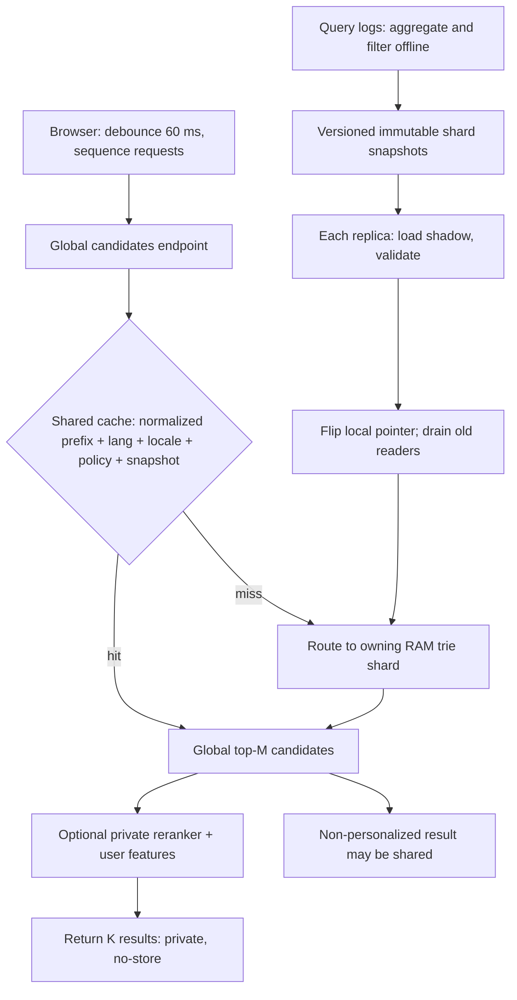
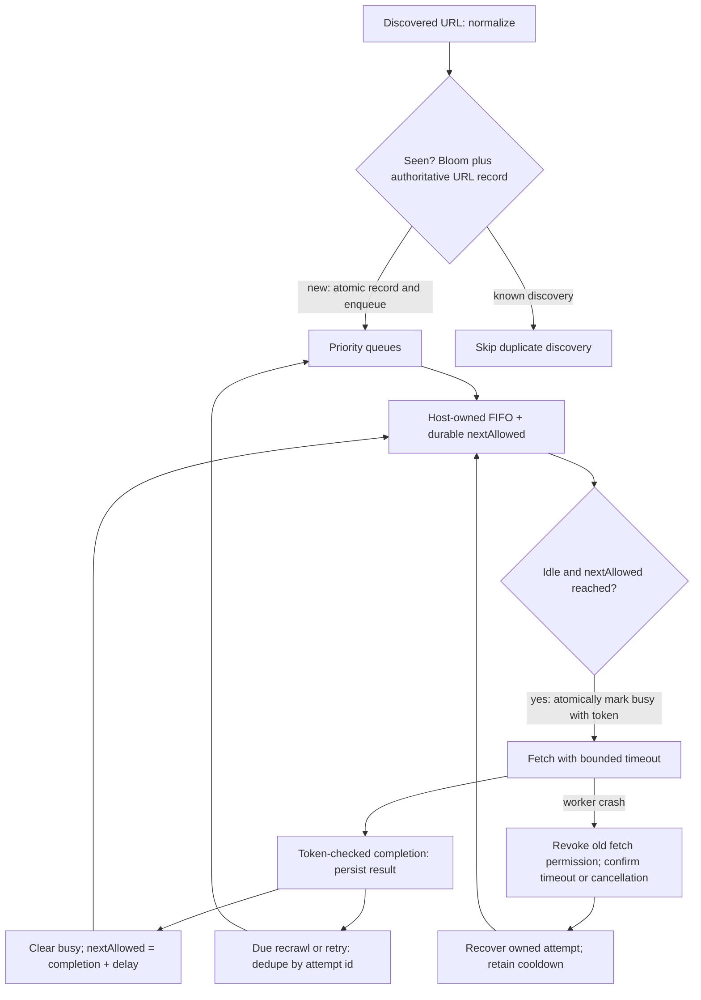
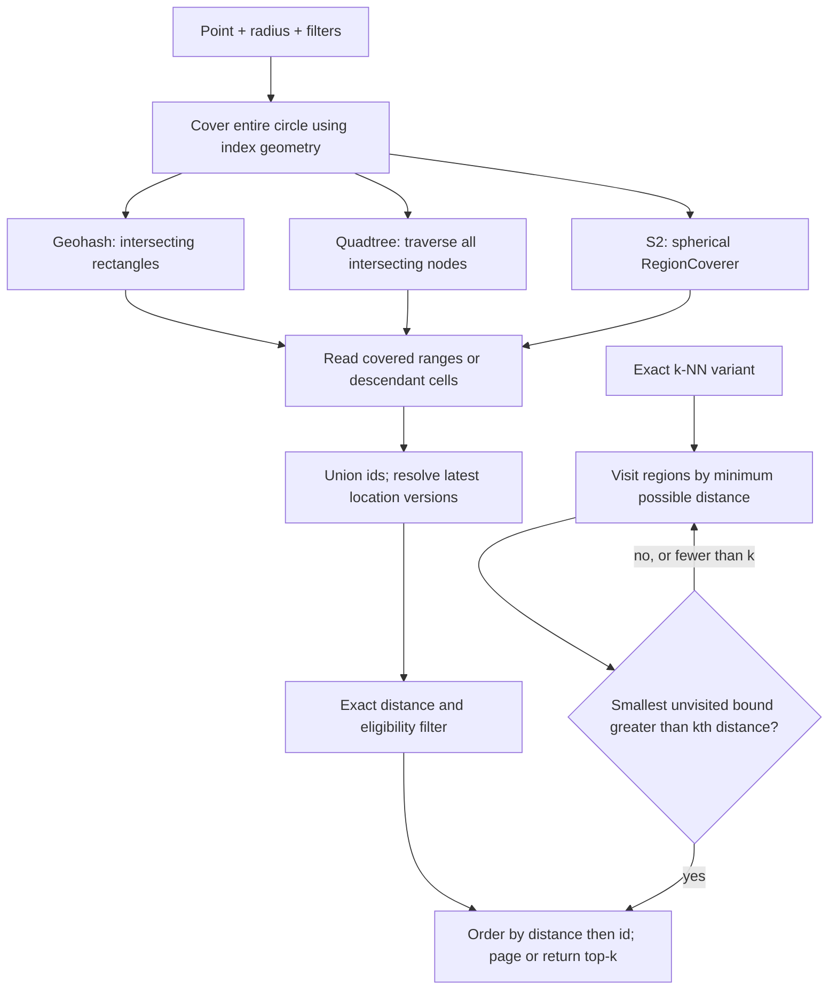
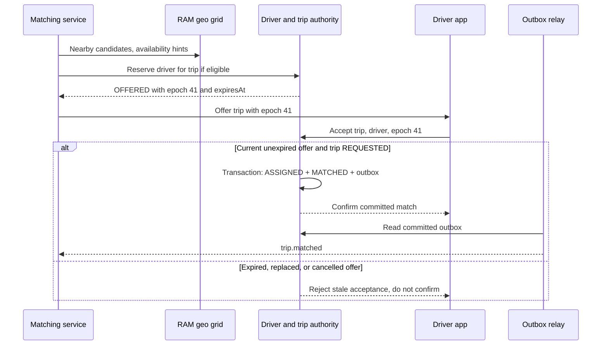
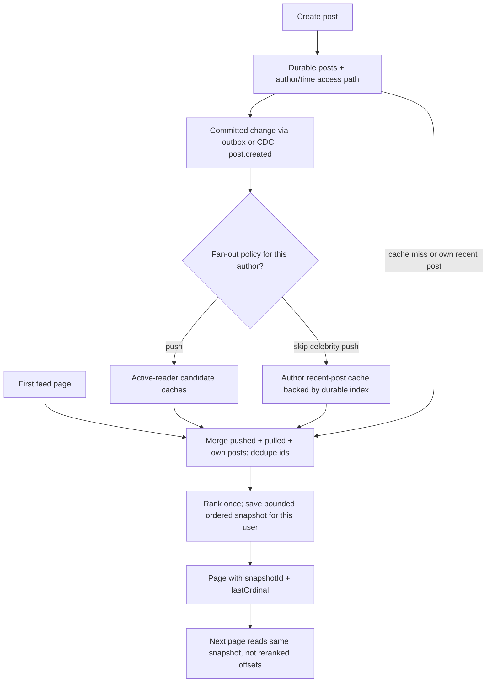
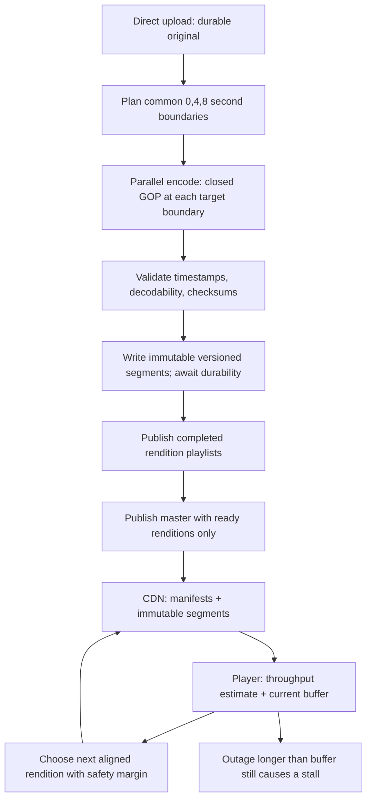
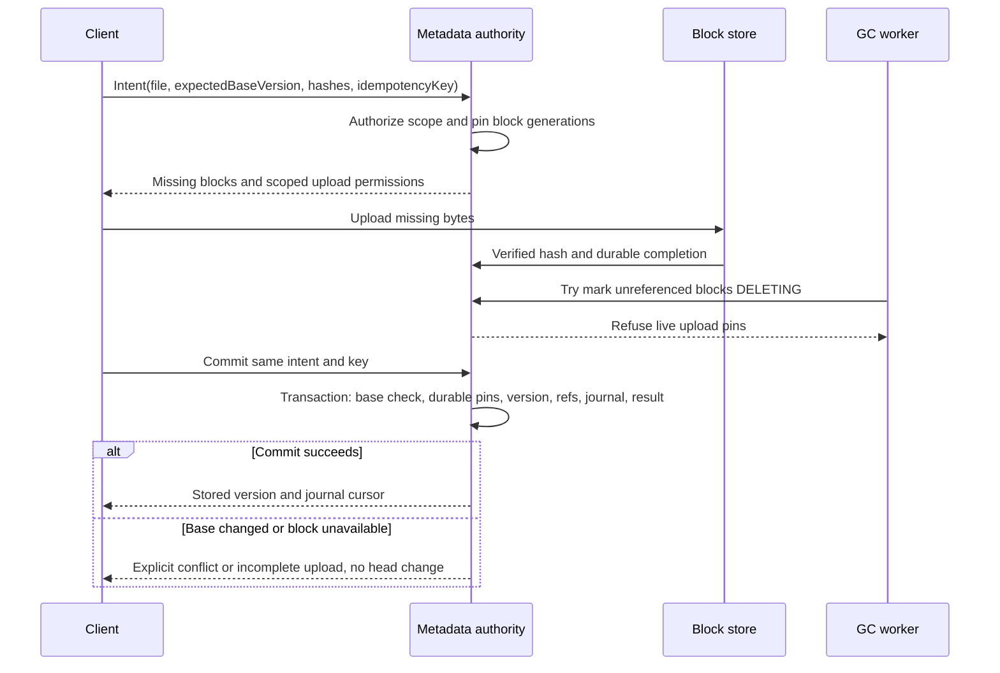
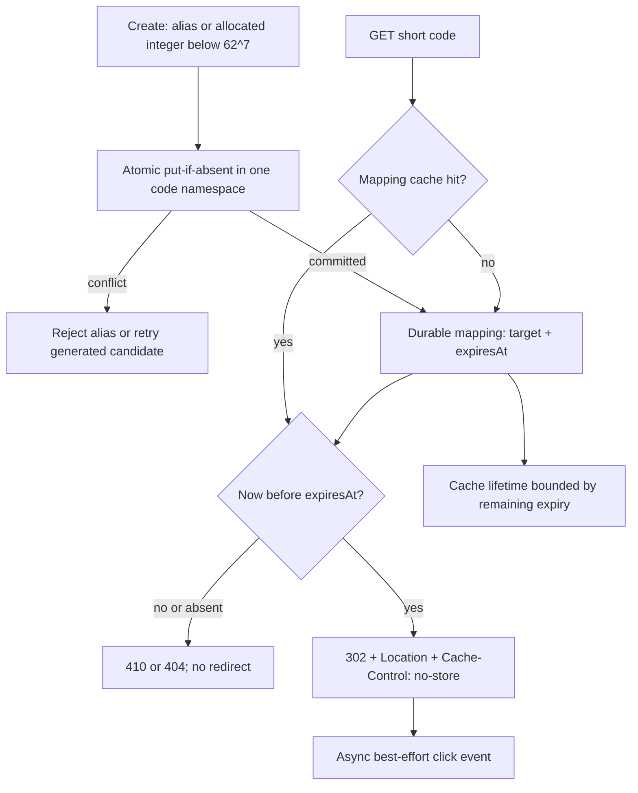

# Chapter 36 — System Design Case Studies — Part 2: Search, Geo, Feeds & Media

Part 1 (Ch 35) tackled the **real-time and communication** systems — notifications,
chat, video conferencing, collaborative editing. This part takes on the systems that
**find, locate, rank, and stream**: the read-heavy, data-intensive workhorses of the
modern web. These are the interview questions where a single data-structure choice
(a **trie**, a **geohash**, a **Bloom filter**) or one architectural split (offline vs
online, push vs pull, metadata vs blocks) decides whether your design survives Google
scale or collapses at the first viral moment.

Each case study uses the same worked scaffold so you can
reason under interview pressure: framing → what's tested → clarify → estimate →
architecture → critical path → data model → scaling → failure modes → the LLD crux →
follow-ups. The URL shortener at the end is a deliberately tight **warm-up** that shows
the scaffold in miniature.

> These case studies use the universal "Design X" playbook from **Ch 35 Part A** — the
> 8-step framework, the clarify-script, the estimation refresher, and the 4-layer
> architecture mental model (EDGE → SERVICES → DATA → ASYNC). We apply it here; we do
> not re-teach it.

## What you'll learn

- How to fully work the **search / geo / feed / media** family of "Design X" questions.
- **Trie sharding + precomputed top-K** for sub-50 ms autocomplete, with the memory math.
- **URL frontier design** (politeness + priority) and **Bloom-filter dedupe** for a crawler.
- **Geohash vs quadtree vs S2 cells** — and how to answer "find within R km" with diagrams.
- **Real-time location grids** and **double-dispatch-safe matching** for ride-hailing.
- **Push vs pull vs hybrid fan-out** for timelines — with the follower-count arithmetic.
- **Transcoding pipelines** and **adaptive-bitrate (HLS/DASH)** streaming for video.
- **Chunking, content-hash dedupe, and delta-sync** for file storage.
- The **ID-generation + 301/302** scaffold every "shortener-like" design reuses.

## Table of Contents

| # | Case study | LLD crux (the deep-dive) |
|---|------------|--------------------------|
| 5 | [Search Autocomplete / Typeahead](#cs5) | Trie top-K + private reranking + snapshot memory |
| 6 | [Web Crawler](#cs6) | Host ownership + politeness + discovery/recrawl |
| 7 | [Proximity / Nearby](#cs7) | Region coverage + exact radius/k-NN stopping |
| 8 | [Ride-Hailing](#cs8) | Location grid + durable assignment transaction |
| 9 | [News Feed](#cs9) | Hybrid fan-out + stable pagination |
| 10 | [Video Streaming](#cs10) | Aligned transcode + durable publication + ABR |
| 11 | [File Sync & Storage](#cs11) | Delta-sync + conditional commit + safe GC |
| 12 | [URL Shortener — warm-up](#cs12) | Code allocation + explicit redirect caching |

**Learning path:** new to these designs? Start with [the shortener](#cs12), then
[autocomplete](#cs5) and [crawler](#cs6). Study [nearby](#cs7) immediately before
[ride-hailing](#cs8); finish with [feeds](#cs9), [video](#cs10), and [files](#cs11).
Use the [Ch 35 universal playbook and rehearsal guidance](#content/35_system_design_cases_realtime)
once rather than memorizing eight drawings. In each case, name the simple baseline, its
measured bottleneck, and the invariant the scaled design must preserve. Attempt the
**Predict / Solve / Check** prompts before opening their answers.

**Diagram policy:** existing PNGs and whiteboard SVGs are retained and displayed inline,
not regenerated or hidden. Review notes identify details awaiting correction; the editable
Mermaid alongside each is the **authoritative corrected design**.

Priority/frequency labels and time budgets are editorial study guidance, not official
company scoring or measured interview frequencies. Workload estimates and capacity figures
are assumptions to explain a decision; revise them when the workload changes.

> **Note on what we reuse:** Ch 25 already sketched autocomplete, geo-indexes, the
> Twitter feed, and Dropbox as *building blocks*, and fully worked **Instagram**. Here we
> go several levels deeper and treat each as a complete, defensible design. Where a topic
> overlaps, we say so and focus on the part Ch 25 left out.

<a id="cs5"></a>

# Case 5 — Search Autocomplete / Typeahead

> **Google priority:** ★★★ · **Difficulty:** Hard · **Frequency:** Very common · **Time budget:** ~40 min

> **User story —** *As a* user typing in the search box, *I want* relevant completions to appear
> before I finish the word, *so that* I find what I mean in a few keystrokes instead of typing the
> whole query.
>
> **For example —** I type "ne" and instantly see *netflix, news, nearby restaurants* ranked by
> what people actually search — each dispatched request targets under 50 ms.
>
> **Why it matters —** an indexed SQL prefix lookup is a valid baseline; ranking many matches
> at hundreds of thousands of QPS motivates precomputed candidates in a sharded RAM index.

You start typing **"ne"** into the search box and, before your finger leaves the key,
a list drops down: *netflix, news, nearby restaurants, nest…* That is **autocomplete**
(a.k.a. **typeahead**): given the few characters typed so far (a **prefix**), instantly
return the most likely completions, ranked by what billions of people actually search.
The product looks trivial; the engineering is not. The hard part is doing this in **under
50 milliseconds per dispatched request**, for **hundreds of thousands of requests per second**,
while the ranking reflects an ever-shifting world ("covid", "world cup", a new movie).

**Simple Explanation — derive the design.** Start with a small phrases table, an index that
supports anchored prefix lookup, and popularity sorting. The bottleneck is broad prefixes
returning many rows to rank at high QPS, not SQL itself. Precompute each prefix's best
candidates; move log aggregation offline; shard only when measured RAM/QPS warrants it.

> **Official Definition:** autocomplete retrieves ranked completions of a normalized prefix
> under a language, locale, and policy context; personalized ordering is a separate,
> user-scoped operation over those candidates.

**Prerequisites:** [Ch 25 §17.14: prefix/trie basics](#content/25_system_design_operations_case_studies),
[Ch 23 §§3.6, 6.6: HTTP caching and representation keys](#content/23_system_design_fundamentals_deep_dive),
[Ch 24 §7.5: index access paths](#content/24_system_design_data_distributed).

## 5.0 Interview Focus

- Do you reach for the right **data structure** — a **trie** (prefix tree) with
  **precomputed top-K** per node — when indexed lookup plus ranking stops meeting the SLO?
- Do you **split the slow path from the fast path**: an **offline pipeline** that mines
  query logs into popularity scores, and an **online serving tier** that only reads?
- Can you separate **request latency** from client debounce and rendering time?
- Do you handle **scale**: sharding a trie too big for one machine, caching hot prefixes?
- Do you cover the extras that show seniority: **typo tolerance**, **freshness/trending**,
  **personalization**, **atomic index swaps**?

## 5.1 Requirements

**Functional**
- Given a prefix, return the **top K** completions (K ≈ 5–10), ranked by popularity.
- Reflect **trending** queries within minutes–hours (new events change suggestions).
- **Typo tolerance**: "amaz0n" / "amazn" should still suggest "amazon".
- (Stretch) **Personalize**: bias toward the user's own recent/likely searches.

**Out of scope** (say it, to show focus): the actual search-results page; final-query
spell-correction; ad ranking; voice input. We design only the *suggestion* service.

**Non-functional**
- **Latency:** target p99 **< 50 ms request-response**, excluding a **60 ms debounce**.
  Last-key-to-visible latency is about 110 ms plus rendering at that request budget.
- **Scale:** billions of searches/day → ~10⁵–10⁶ autocomplete QPS at peak.
- **Freshness:** suggestions may lag reality by **minutes to hours** (eventual is fine).
- **Availability:** very high; a stale-but-up index beats a fresh-but-down one.
- **Multilingual / locale-aware**; safe-search filtering of suggestions.

**Questions to ask out loud:** *How many completions (K)? Prefix-only or also infix
("substring") match? How fresh must trending be? Is personalization in scope? Mobile
(higher RTT, debounce harder) vs desktop? Any words we must never suggest (safety)?*

## 5.2 Estimates

```
   Searches / day          5,000,000,000   (5 B)
   Keystrokes that fire     ~6 per search   (debounced; not every key)
   ── autocomplete req/day  3.0e10  (30 B)
   Avg QPS                  3e10 / 86,400  ≈ 350,000 / s     [day ≈ 10^5 s]
   Peak (3×)                ≈ 1,000,000 / s   → must be RAM/cache served
   Write path (query logs)  5 B/day → OFFLINE pipeline, NOT the serving path
   Distinct phrases kept    ~100 M "head + torso" queries (drop the long tail)
   Request budget (p99 50 ms, AFTER debounce): network RTT ~20 ms + edge ~5 ms
                                leaves ~20–25 ms for the serving tier
```

**What the numbers teach:** at ~10⁶ QPS, use a RAM/cache-dominated serving path rather than
repeated broad-prefix ranking. The write side is asynchronous and separately provisioned.
Keeping the top ~100 M phrases bounds memory; measure coverage by language and locale before
dropping rare phrases. The long tail may matter greatly to a particular user.

## 5.3 Architecture

**Image correction:**


The image's "ship to Layer 2" label conflicts with its Layer 3 serving boxes. Also, a
60 ms debounce is outside the 50 ms request budget. Do not share personalized responses
through a hot-prefix cache; the corrected mechanism in Deep Dive takes precedence.

**Legend:** boxes are stateless services unless they name a store. Read it
top-to-bottom: cache hits stop at the edge/cache tier; misses reach the RAM serving tier.
The offline pipeline publishes snapshots to serving replicas, not to the personalized cache.

**Block-by-block:**
- **Browser (debounce + cancel)** — the first optimization is on the *client*: wait ~60 ms
  after the last keystroke and **cancel** the in-flight request for the previous prefix, so
  fast typists generate ~6 requests, not 20.
- **Edge / CDN POP** — caches the top-K for the few thousand hottest prefixes ("f", "ne",
  "you…"). Most autocomplete traffic is wildly skewed toward popular prefixes, so the edge
  absorbs a large fraction at ~5 ms. Keys include normalized prefix, language, locale,
  safety policy, and snapshot version; only **global** candidates are shared.
- **Suggest Service** — a thin **stateless router**: normalize the prefix, find which
  **trie shard** owns it, fetch its precomputed top-K, optionally re-rank for the user.
- **Trie shards** — the heart. The full trie is too big for one box, so it is **sharded by
  prefix range** and held **in RAM**, replicated for availability. Each node carries its
  **precomputed top-K** so serving is a short walk, not a subtree scan (the LLD crux, §5.8).
- **Offline pipeline** — Kafka streams the query logs to an aggregator that counts
  popularity with **time decay**, filters spam/PII, keeps the **top-N** phrases, and
  compiles a fresh immutable **score snapshot** (the trie-load artifact) that is **atomically swapped** in.

## 5.4 Request Walkthrough

Typing **"ne"** (after "n", "ne" debounced into a single live request):
```
  1. Browser cancels the in-flight "n" request and sends
     GET /ac/candidates?q=ne&lang=en&loc=US  (after 60 ms debounce)
     Ignore late responses with an older request sequence number.
  2. Edge checks (ne,en,US,safe-policy,snapshot-v42):
        ├─ HIT  ─▶ obtain GLOBAL top-M candidates (~5 ms at edge)
        └─ MISS ─▶ forward to the Suggest Service
  3. Service uses the snapshot's language-aware normalization rules
     (do not blindly strip meaningful accents), then routes to its range
  4. Trie Shard C walks 2 edges  n ─▶ e  to node "ne" and reads
     node.topK  (already sorted by score, PRECOMPUTED offline)
  5. Non-personalized endpoint returns K of the global candidates.
     Optional PRIVATE endpoint re-ranks top-M (e.g. 50) for this user.
  6. Return ["netflix","news","nearby…","nest","new york…"];
     cache global candidates only, with a short TTL (~60 s).
     Personalized response: Cache-Control: private, no-store.
```
Each requirement maps to a step: **step 2** gives the latency (edge), **step 4** gives the
ranking (precomputed popularity), **step 5** gives personalization, and the whole thing
stays bounded because expensive global ranking is offline and user-feature retrieval is
budget-capped; if personalization misses its deadline, return global suggestions explicitly.

## 5.5 Data Model

| Entity | Shape (key fields) | Store | Why |
|--------|--------------------|-------|-----|
| Trie node | `prefix → {children, topK[(phraseId,score)]}` | In-RAM trie (sharded) | O(prefix) reads at RAM speed; the serving tier |
| Phrase table | `phraseId → text, lang` | Embedded in snapshot | Resolve ids → display strings |
| Popularity | `phrase → decayed_count` | Offline store (Bigtable/warehouse) | Recompute scores in batch; never on serving path |
| Candidate cache | `(normalizedPrefix,lang,locale,policy,snapshot) → top-M` | Redis (+ edge cache) | Shared global candidates only; K returned, M ≥ K |
| Query log | `(ts, userHash, query)` append | Kafka → cheap object store | Stream into the aggregator; TTL'd, not OLTP |
| Personalization | `user → recent queries / embeddings` | KV (Redis/Bigtable) | Looked up only when re-ranking, budget-capped |

**Why a trie here, not a query on every request?** `WHERE q LIKE 'ne%'` can use a suitable
index and collation. It still may retrieve many matches to sort by popularity. A precomputed
trie answers in **O(len(prefix) + M)**, including candidate output, without ranking a subtree.

## 5.6 Scaling

- **Shard the trie.** It is ~100+ GB in the illustrative layout (§5.8). Shard by
  **prefix** so any single prefix lives entirely on one shard (no fan-out for the common
  case). Replicate each shard **×3** for QPS headroom and availability; large-memory single
  hosts are possible, but replicas and reload headroom still cost RAM.
- **Skew is the enemy.** Prefixes are not uniform — far more queries start with "s"/"a"
  than "z"/"q". Use load-aware ranges and extra replicas for hot prefixes; hashing alone
  does not divide a hot key. If two-character prefixes are distributed, keep explicit
  precomputed one-character/root summaries so query "n" need not fan out to every "n?" shard.
- **Hot prefixes** ("f", "ne", "you") → served from the **edge + Redis top-K cache** so the
  trie shards see mostly the cooler traffic.
- **Memory pressure** → keep only the **top-N phrases**; store **top-K on every node** (fast
  but more RAM) or only on branching nodes + bounded subtree scan (less RAM, a touch slower).
- **Freshness vs cost** → rebuild snapshots on a cadence (e.g. hourly for the global trie),
  with a fast **trending side-channel** that boosts breaking queries between full rebuilds.

## 5.7 Failures and Trade-offs

```
  What dies                    →  What the user sees / what we do
  ──────────────────────────────────────────────────────────────────
  A trie-shard replica crashes  →  router retries another replica;
                                   no user impact (3× replicated)
  ALL replicas of a shard down  →  that prefix range degrades to the
                                   Redis top-K cache or returns []; the
                                   rest of the alphabet is unaffected
  Snapshot rebuild fails        →  shards KEEP serving the previous
                                   snapshot (atomic swap, never partial);
                                   popularity gets staler; urgent safety removals
                                   need an independently refreshed denylist
  Offline pipeline backed up    →  popularity is older; serving fine;
                                   trending boost is the mitigation
  Edge/Redis cache cold         →  more traffic hits trie shards; they
                                   are sized for it, latency rises a bit
```
**Trade-offs called out:** we choose **eventual freshness** (suggestions lag the world by
minutes) to keep serving a **read-only, RAM-resident** structure with predictable cost.
We **bound the retained tail** (memory vs measured coverage). We prefer a
**stale-but-available** index over strong freshness (availability over consistency — this
is a suggestion box, not a bank ledger).

## 5.8 Deep Dive

**Mechanism diagram**



The crux is the sentence **"answer any prefix in O(prefix length), never scan a subtree at
query time."** You buy that property by **precomputing candidate lists at every node**
during the offline build. Global retrieval just reads; optional private reranking is separate.
The examples use M=K=10; personalization's M=50 needs a larger candidate artifact.

**Trie shape** (the string is the *path*, not stored in each node):
```
        (root)
          │ n
          ▼
       [ n ]   topK: net, new, news, nfl, ...
          │ e
          ▼
       [ ne ]  topK: netflix, news, nearby, nest, new york, ...
       ├── t ─▶ [ net ]  topK: netflix, net worth, nettv, ...
       │          ├ f ▶ [ netf ] topK: netflix, netflix login, ...
       │          └ w ▶ [ netw ] topK: net worth, network, ...
       └── w ─▶ [ new ]  topK: news, new york, new movie, ...

  Per-node layout:
    children : map<char, node*>             // one entry per next letter
    topK     : array<(phraseId, score)>[K]  // PRECOMPUTED, sorted desc
    terminal : optional (phraseId, score)   // a phrase ends here
```

**Serving — O(len(prefix)), no ranking at query time:**
```
  function suggest(prefix):
      node = root
      for ch in prefix:
          node = node.children.get(ch)
          if node == null: return []     // dead prefix → no suggestions
      return node.topK                   // already the sorted top-K
```

**Offline build — compute top-K bottom-up so each node inherits its children's best:**
```
  function buildTopK(node):
      heap = new BoundedMinHeap(K)       // evict smallest when over capacity
      if node.terminal: heap.add(node.terminal)
      for child in node.children.values():
          buildTopK(child)               // recurse first (post-order)
          heap.addAll(child.topK)        // child already holds its top-K
      node.topK = heap.itemsSortedDescending()
```
Because each child already holds its own top-K, the parent only merges **K items per child**
— the build is near-linear in the number of nodes, not quadratic over phrases.

**Memory math (why we shard):**
```
  Keep N = 100 M phrases, avg length L = 20 chars.
  Nodes after prefix sharing ≈ 0.6 × N × L ≈ 1.2 B nodes.
  Per node:  children map ~24 B + topK (K=10 × (id 4B+score 4B)=80 B)
             + overhead ~16 B  ≈ 120 B / node
  Total ≈ 1.2e9 × 120 B ≈ 144 GB
       → 32 shards ≈ 4.5 GB each; 3 replicas = 432 GB logical payload
       → full double buffering on all replicas = 864 GB, before extra overhead
       → per replica: ~9 GB old+new; provision allocator/phrase-table headroom
```

These are layout assumptions, not a measured trie size: child edges, allocator overhead,
phrase strings and routing tables also consume RAM. With M=50 instead of 10, this same
model becomes 1.2 B × (24+400+16) B = **528 GB per complete snapshot**, not 144 GB.

**Merge across shards (typo tolerance + fuzzy match).** Exact-prefix lookups hit **one**
shard. But to tolerate typos we also query **edit-distance-1 neighbors** of the prefix,
which may live on **different shards**; we scatter, gather each shard's local top-K, and
**merge by score**:
```
  // "amaz0n" → also try edit-distance-1 prefixes → merge results
  function suggestFuzzy(prefix):
      candidates = {prefix} ∪ editDistance1(prefix)   // small set
      partials   = scatter(candidates → owning shards) // in parallel
      heap = new MaxHeapByScore()
      for list in partials:           // each is a shard-local top-K
          heap.addAll(list)
      return heap.largestK(K)         // global top-K after merge
```
Bound edit-distance expansion, deduplicate by phrase id, and cap scatter/gather time.
Character-based models are another option, not a guarantee that every typo resolves correctly.

**The atomic swap (no half-built index ever serves).** Builders write an **immutable**
snapshot to object store. Each shard loads it into **shadow memory**, validates it, then
**flips a single pointer** from the old trie to the new one (double-buffering). Readers see
either the whole old index or the whole new one — never a torn state — and the old buffer is
freed once in-flight reads drain. Each of the three replicas loads and flips independently;
replication is not created by a pointer swap. Roll replicas in batches to reduce peak RAM,
pin a snapshot version for multi-shard requests, and keep old artifacts until rollback/read
drain completes. A failed checksum leaves that replica on the old version.

## 5.9 Follow-ups

**Likely follow-ups (with crisp answers):**
- *"Personalization?"* — keep the global trie for candidates, then **re-rank the top ~50** at
  serving time with the user's recent queries / a small embedding dot-product, capped to a
  few ms. Store/retrieve M≈50 explicitly; return K≈10, never share the private result.
- *"Trending right now?"* — maintain a fast streaming counter (count-min sketch / heavy
  hitters — see *Top-K* in Ch 37) and **boost** breaking queries between full rebuilds.
- *"Infix / substring match ('york' → 'new york')?"* — add a secondary index keyed on each
  significant word, or n-grams; merge with prefix results. Costs more memory.
- *"How big is K and why precompute?"* — K≈10; precomputing turns each keystroke from an
  O(subtree) ranking into an O(prefix+K) read with predictable cost at the assumed scale.

**Red flags that sink candidates:** computing top-K by scanning the subtree **at query
time** without a latency/candidate bound; assuming an unindexed query plan; **no offline/online split** (ranking
on the serving box); one **giant unsharded** trie that can't fit RAM; no caching of hot
prefixes; rebuilding the index **in place** (serving a half-built trie); forgetting the
**client debounce** (4× the traffic for nothing).

**Building blocks reused (theory lives elsewhere):** trie / prefix index and the
**inverted-index** mindset — **Ch 25** (*Search building blocks*); **Redis** caching and
**CDN/edge** — **Ch 23**; **Kafka** + **stream aggregation / MapReduce / Flink** — **Ch 24**
(*Messaging & Streaming*, *Data processing*); **consistent hashing** for shard balance —
**Ch 24**; **count-min sketch / heavy hitters** for trending — **Ch 37** (*Top-K*).

<a id="practice-5"></a>

## 5.10 Practice

### Whiteboard Rehearsal

Draw the shared candidate cache separately from private reranking. On a miss, trace one
owning shard; only fuzzy variants or deliberately split prefix ranges need a merge.


**Retained whiteboard caveat:** its "merge shards" miss arrow is not the default exact-prefix
path. Use the Mermaid in Deep Dive and the [shared rehearsal method](#content/35_system_design_cases_realtime).

### Try It — candidates, latency, and memory

At 12:00, snapshot v42 has `netflix:90`, `news:80`, `nest:50`, `new york:40`;
M=K=2. The `net` branch contributes `[netflix]`, `new` contributes `[news,new york]`,
and `nes` contributes `[nest]`. At 12:01 a user's private history favors `nest`.

**Predict:** what does node `ne` contain, and can reranking just those two return `nest`?
**Solve:** the last key is at t=0; debounce is 60 ms, request 35 ms, rendering 5 ms.
When are suggestions visible?
**Check:** a new replica snapshot fails validation during a three-replica double-buffered
rollout. What remains served, and what RAM budget does the 144 GB model require?

<details>
<summary>Show worked answer</summary>

`ne` contains `[netflix,news]`: no discarded phrase outranks its child's top two.
Reranking cannot recover `nest` from an absent candidate; increasing M or adding a private
history candidate source is a deliberate coverage/memory trade-off. Never cache that
user's reranked order under a global prefix key.

Visibility is **100 ms** after the last key (60+35+5), not 35 ms. Cancellation plus a
request sequence check prevents an old "n" response replacing a newer "ne" result.

The failed replica keeps v42; healthy replicas may serve validated v43. A request requiring
cross-shard merging stays version-pinned. All replicas simultaneously retaining both full
snapshots require **144×3×2 = 864 GB** before overhead; a rolling rollout changes the peak.

</details>

<a id="cs6"></a>

# Case 6 — Web Crawler

> **Google priority:** ★★ · **Difficulty:** Hard · **Frequency:** Common · **Time budget:** ~40 min

> **User story —** *As a* search engine, *I want* to discover and continuously re-download the
> whole web politely, *so that* my index reflects pages as they exist today without overloading
> anyone's site.
>
> **For example —** starting from a few seed URLs, the crawler follows links across tens of
> billions of pages, re-fetching a news homepage hourly but a static PDF monthly — and never
> hammering one host faster than its `robots.txt` allows.
>
> **Why it matters —** the design hinges on the URL frontier (what to fetch next, how fast per
> host) and dedupe (seen URLs and seen content), not on "download a page."

A **web crawler** (a.k.a. spider, or "Googlebot") is the program that walks the web: start
from a few seed URLs, download each page, **extract the links** on it, and follow those
links — endlessly — to discover and re-download the whole web so a search engine can index
it. Picture a breadth-first traversal of a graph with **tens of billions of nodes**, where
the graph is hostile (spam traps, infinite calendars), the edges are slow (network I/O),
and you must be a **polite guest** (don't hammer one site). The crux is not "download a
page" — it's the **URL frontier**: deciding *what to fetch next*, *how fast per site*, and
*whether you've seen this URL (or this content) before*.

**Simple Explanation — derive the design.** One worker, a FIFO, and a visited set can
crawl a small site. With many workers, one slow host can occupy the fleet and independent
workers can hit it together. Separate priority selection from per-host scheduling, then
shard by host so **one owner controls both in-flight work and the next allowed start**.

> **Official Definition:** a URL frontier is a durable scheduler of fetch attempts with
> priority, host admission constraints, retry ownership, and explicit recrawl due times.

**Prerequisites:** [Ch 24 §9.15: Bloom sizing and false positives](#content/24_system_design_data_distributed),
[Ch 24 §§9.12, 10.2: leases and durable queues](#content/24_system_design_data_distributed),
[Ch 23 §3.6: ETag / conditional HTTP](#content/23_system_design_fundamentals_deep_dive).

## 6.0 Interview Focus

- Can you design the **URL frontier** — a prioritized, **politeness-aware** queue that never
  overloads a single domain yet keeps thousands of fetchers busy?
- Do you **dedupe** at two levels: **seen URLs** (don't re-enqueue) and **seen content**
  (different URLs, identical/near-identical page)?
- Do you respect **`robots.txt`**, cache **DNS**, and avoid **crawler traps** / infinite spaces?
- Do you make it **distributed, fault-tolerant, and restartable** (it runs for weeks)?
- Do you schedule **re-crawls** by freshness (news every hour, a static PDF every month)?

## 6.1 Requirements

**Functional**
- Given **seed URLs**, download pages, extract links, and **enqueue new URLs** (BFS).
- **Politeness:** obey `robots.txt`; cap request rate **per host**.
- **Dedupe:** suppress repeated **new discoveries**, not scheduled recrawls; detect
  **near-duplicate content** (mirrors, boilerplate).
- **Re-crawl** pages on a freshness schedule; hand crawled HTML to the **indexer** (Ch 25
  *inverted index* — out of scope to build here).

**Out of scope** (state it): building the search **index/ranking**; rendering heavy
JavaScript (assume a separate headless-render tier if needed); the search front-end.

**Non-functional**
- **Scale:** crawl ~**30 B pages**, refresh on a rolling schedule (billions/day).
- **Throughput:** thousands of pages/sec aggregate; **politeness-bounded per domain**.
- **Robustness:** survive worker crashes, bad HTML, slow servers, traps; **resumable**.
- **Efficiency:** don't re-download unchanged pages; don't store duplicate content.

**Questions to ask:** *How fresh must content be (re-crawl cadence)? Do we render JS? Crawl
the whole web or a vertical (news, shopping)? Honor `nofollow`/sitemaps? Storage budget for
raw HTML? Politeness limits — fixed RPS or adaptive to the host's response time?*

## 6.2 Estimates

```
   Pages to crawl           30,000,000,000  (30 B)
   Re-crawl cadence         ~ once / month average (mix of hourly..yearly)
   ── crawl rate            30e9 / (30 × 86,400) ≈ 11,600 pages / s avg
   Peak (3×)                ≈ 35,000 pages / s
   Avg page size (HTML)     ~64 KB raw → ~15 KB gzipped
   Download bandwidth       35,000 × 64 KB ≈ 2.2 GB/s  (≈ 18 Gbps) sustained
   Raw HTML stored (gzip)   30e9 × 15 KB ≈ 450 TB  (object store, cheap)
   Seen-URL set             ~ 30 B+ URLs → a hashed/Bloom membership set
   Links per page           ~ 30 outlinks → frontier churn is huge
```

**What the numbers teach:** the **seen-URL set** (tens of billions of entries) is the
memory problem — a plain hash set of full URLs would be many terabytes of RAM, so we reach
for a **Bloom filter** (Ch 24). Bandwidth is large but linear; **storage of raw HTML is
cheap** in an object store. The real engineering is **scheduling and politeness**, not raw
throughput.

## 6.3 Architecture

**Image correction:**


Interpret any seen-set arrow as **new discovery only**. A politeness timer is insufficient
without busy-host ownership and crash recovery; the Mermaid supplies those missing conditions.

**Legend:** double-bordered box = the stateful frontier; single boxes = stateless workers
or stores. The loop is: **frontier → fetch → store → parse → dedupe → frontier**.

**Block-by-block:**
- **URL Frontier** — the prioritized, politeness-aware queue of "what to fetch next." It is
  the component that *is* this problem; §6.8 designs it.
- **Fetcher workers** — thousands of async I/O workers that pull a URL, check **robots.txt**,
  resolve DNS (from cache), download the page within a rate limit, and write the raw bytes.
- **DNS & robots caches** — fetching does **two** network round-trips before the page (DNS +
  robots); both are cached aggressively per host or DNS would become the bottleneck.
- **Content store** — cheap object storage for the raw gzipped HTML, keyed by a hash of the
  URL; downstream consumers (indexer, dedupe) read from here.
- **Parser / Extractor** — extracts outlinks (`<a href>`), the **canonical** URL, visible
  text, `lastmod`, and **sitemaps**; produces a content **fingerprint**.
- **Link graph (Bigtable)** — the extracted `src → [dst]` edges, persisted for ranking
  (PageRank-style) and to prioritize what's worth crawling next.
- **URL dedupe (Bloom filter)** — "have we already enqueued this URL?" answered in O(1) with
  tiny memory (Ch 24). New URLs go back to the frontier.
- **Content dedupe (sim-hash)** — "is this page a near-duplicate of one we already have?"
  Mirrors and boilerplate are everywhere; this stops us indexing the same thing 100×.

## 6.4 Request Walkthrough

One crawl cycle, end to end:
```
  1. Frontier atomically owns host + attempt for https://site.com/p?id=7
  2. Fetcher: DNS cache → IP; robots cache → "allowed?"  (refetch if stale)
        └─ if robots DISALLOWS → drop, record, move on
  3. Host gate: no other attempt in flight; nextAllowed has passed.
     Keep host busy through completion; then wait another 1.5 s.
  4. HTTP GET (conditional: If-Modified-Since / ETag)
        ├─ 304 Not Modified → bump next-recrawl time, done (cheap!)
        └─ 200 OK → write raw gzip HTML to Content store
  5. Parser extracts 30 outlinks + canonical + lastmod; computes a
     64-bit SIM-HASH of the page's shingles
  6. Content dedupe: if sim-hash within Hamming distance 3 of a known
     page → mark near-dup, do NOT index again
  7. For each outlink: normalize → Bloom + backing URL record;
     atomically record first discovery and durably enqueue once
  8. Token-check completion, clear host busy, set nextAllowed;
     schedule nextDue recrawl (does NOT pass through discovery seen-set)
```
Notice the efficiency levers: **step 4** (conditional GET → 304 avoids a download), **step
6** (content dedupe avoids re-indexing mirrors), **step 7** (URL dedupe avoids loops), and
**step 8** (freshness scheduling avoids wasting crawl budget on static pages).

## 6.5 Data Model

| Entity | Shape (key fields) | Store | Why |
|--------|--------------------|-------|-----|
| Frontier queues | front (priority) + back (per-host) queues | Durable queue / sharded Redis + disk | Ordered, resumable, huge |
| Host ownership | `host → busyToken, attemptId, deadline, nextAllowed` | Frontier's durable authority | Serial admission; token-checked completion/recovery |
| Seen-URL set | Bloom bit array over URL hashes + exact URL record | **Bloom filter** (+ backing KV) | Compact advisory membership; exact record resolves positives/races |
| robots.txt | `host → rules, ttl` | Redis cache + KV | Avoid refetching robots every hit |
| DNS cache | `host → IP, ttl` | In-process + Redis | DNS would bottleneck otherwise |
| Raw pages | `urlHash → gzip(html), fetchedAt` | Object store (S3/GCS) | 450 TB, write-once, cheap |
| Content fingerprints | `simhash64 → docId` | KV / LSH index | Near-dup detection |
| Crawl metadata | `url → lastCrawl, changeFreq, nextDue` | Wide-column (Bigtable/Cassandra) | Drives re-crawl scheduling |
| Link graph | `srcUrl → [dstUrl]` | Bigtable | Web-graph edges for ranking (PageRank) & crawl prioritization |

**Why a Bloom filter for seen-URLs?** A 30 B-entry hash set of full URLs is tens of TB of
RAM. A Bloom filter holds the same membership test in a few **tens of GB** with a tunable,
false-positive rate. In the default flow, confirm a positive against the backing URL record;
an alternative best-effort crawler can drop positives if lost coverage is explicitly acceptable.
Bloom filters have no false negatives for correctly inserted entries; a false positive is
"probably seen" for an actually new URL, not proof that it was fetched.

## 6.6 Scaling

- **Shard the frontier by host.** Assign each domain (by `hash(host)`) to a frontier shard +
  fetcher pool, so **all politeness state for a host lives in one place** — you can't enforce
  "1 req/1.5 s to site.com" if two machines crawl it independently.
- **Politeness is the throughput ceiling, not bandwidth.** A big site can absorb more; a
  small blog cannot. **Adaptive rate** = base delay scaled by the host's observed latency and
  HTTP 429/503 signals.
- **DNS is a hidden bottleneck** → cache aggressively; pre-resolve; run your own resolvers.
- **Hot domains** (a few huge sites = a big share of the web) get **dedicated** fetcher pools
  so they don't starve the long tail.
- **Bloom filter growth** → size for 30 B+ up front, or use a **scalable/partitioned Bloom**
  per shard; periodically compact the backing KV.

## 6.7 Failures and Trade-offs

```
  What dies / goes wrong         →  What we do
  ──────────────────────────────────────────────────────────────────
  Fetcher worker crashes         →  revoke attempt token; wait for bounded fetch
                                    cancellation/timeout, then cooldown and retry
  Frontier shard lost            →  rebuild from durable queue + crawl-meta;
                                    only that host-range pauses
  Crawler trap (infinite URLs,   →  per-domain URL-count cap, max depth, URL
   calendars, faceted search)      pattern/length limits, trap heuristics
  A site returns 429/503         →  exponential backoff for that host; lower
                                    its rate; respect Retry-After
  Bloom false positive           →  backing record confirms whether URL is new;
                                    optional lossy policy skips it explicitly
  Poison page (giant / malformed)→  size cap + parse timeout → quarantine
```
**Trade-offs called out:** Bloom **false positives** can cost an exact lookup, or lost
coverage in the explicitly lossy variant; they are not Bloom false negatives. We accept
**eventual coverage**, not a promise of completeness — the web is
infinite and changing, so "done" is never true; we optimize **coverage per unit of crawl
budget**. We prioritize **politeness over speed** because being banned by sites is the worst
outcome for a crawler.

## 6.8 Deep Dive

**Mechanism diagram**



The frontier must satisfy **two goals that fight each other**: (1) fetch **high-value URLs
first** (priority), and (2) **never hit one host too fast** (politeness). The classic
solution (Mercator-style) is a **two-stage queue system**: *front queues* sort by priority,
*back queues* enforce per-host politeness.

```
   New URL ─▶ [ Prioritizer ]  score by importance (PageRank-ish,
                  │             freshness need, depth, source)
                  ▼
        ┌──────── FRONT QUEUES (by priority) ────────┐
        │  F1 (highest) │ F2 │ F3 │ ... │ Fn (lowest) │
        └──────┬─────────────────────────────────────┘
               │  a biased picker pulls more from high-priority
               ▼
        ┌──────── BACK QUEUES (one per active host) ──┐
        │  B[siteA] │ B[siteB] │ B[siteC] │ ...        │
        │  FIFO per host; a host maps to exactly ONE   │
        └──────┬───────────────────────────────────────┘
               │
               ▼
        ┌──────────────────────────────────────────────┐
        │  HOST HEAP (min-heap by nextFetchTime)        │
        │  (siteB, t=10:00:01) (siteA, t=10:00:02) ...  │
        └──────┬───────────────────────────────────────┘
               ▼
        Owner admits one attempt when idle and nextAllowed ≤ now.
        Remove host from eligible heap while it is busy.
        On completion: nextAllowed = finish + politenessDelay(host).
```

**How the two layers cooperate (pseudocode):**
```
  function discover(rawUrl):
      url = normalize(rawUrl)
      if bloom.contains(url) and urlRecords.contains(url):
          return ALREADY_DISCOVERED
      transaction(frontier):               // handles races and crash before enqueue
          if not urlRecords.insertIfAbsent(url): return ALREADY_DISCOVERED
          frontQueue[priority(url)].push(attempt(url, FIRST_FETCH))
      bloom.add(url)                       // advisory; exact insert is authoritative

  function recrawlDue(url, dueGeneration):
      // A known URL MUST bypass the discovery seen-set.
      durableEnqueueOnce((url, dueGeneration), priority(url))

  // Router: move URLs from front → the right per-host back queue.
  function routeToBackQueues():
      while someBackQueueIsHungry():
          url  = pickBiasedByPriority(frontQueue)   // favor F1>F2>...
          host = hostOf(url)
          backQueue[host].push(url)
          if not host.busy and host not in hostHeap:
              hostHeap.push(host, host.nextAllowed)  // retain time when queue was empty

  // Conceptual operations below are serialized by the durable host owner.
  function nextURLToFetch():
      host = hostHeap.popEligible(now)
      if host == null: return WAIT
      transaction(host):
          require not host.busy and now >= host.nextAllowed
          a = leaseHead(backQueue[host])    // retain attempt until acknowledged
          token = host.nextEpoch()
          host.busy = (a.id, token, now + MAX_FETCH_TIME)
      return (a, token)                    // authorized fetcher uses a hard timeout

  function complete(host, attemptId, token, result):
      transaction(host):
          require host.busy matches (attemptId, token)
          saveResultAndAckOrScheduleRetry(attemptId, result)
          host.busy = null
          host.nextAllowed = max(now + delay(host), result.retryAfter)
          if backQueue[host].notEmpty(): hostHeap.push(host, host.nextAllowed)
      // Keep host.nextAllowed even when its queue becomes empty.
```

**Why this shape works:**
- **Front queues** capture *what matters* — a news homepage outranks a deep, stale forum
  page. The biased picker spends most fetches on high priority but still drains low priority
  (no starvation).
- **Back queues** give one ordered stream per host; **busy ownership** prevents overlapping
  admitted attempts. A FIFO by itself provides no such guarantee.
- **The host heap** is the politeness clock: it always yields the host that is **allowed to
  be fetched next**, so thousands of fetchers stay busy across **different** hosts while each
  individual host is sipped slowly.

**Crash recovery is not "expire and immediately fetch again."** Revoke the old attempt's
permission, enforce a maximum fetch lifetime at the fetch/egress tier, and wait for
termination or its conservative deadline plus grace before retry admission and cooldown.
Reject stale completions by token. If termination cannot be established, pause that host;
a paused worker resuming after a bare TTL could otherwise start a duplicate HTTP request.
Tokens fence our state, not an arbitrary remote web server. Remote processing may outlive
a disconnected request, so claim bounded client concurrency, not exactly-once HTTP effects.

**Bloom-filter dedupe (the companion crux).** Only **first discovery**, not recrawl/retry,
uses the seen-set. With `n = 30 B` and `p = 1%`,
`m/n = -ln(p)/(ln2)² ≈ 9.6 bits/element`: ~**36 GB** and ~7 hash functions,
excluding the exact backing records. Dropping positives saves lookups but can lose important
pages; confirming them preserves coverage. (Sizing math — **Ch 24**.)

**Content dedupe with sim-hash.** Exact hashing can't catch *near*-duplicates (same article,
different ad). **Sim-hash** maps a page to a 64-bit fingerprint where **similar pages have
small Hamming distance**; two pages within distance ~3 are treated as duplicates and only one
is indexed after calibrated similarity checks. The threshold is a heuristic, not a proof
of identical content; measure false merges and savings on the crawl corpus.

## 6.9 Follow-ups

**Likely follow-ups (with crisp answers):**
- *"How do you re-crawl for freshness?"* — store each URL's **change history**; schedule
  `nextDue` adaptively (a page that changes hourly is re-crawled hourly; a static one
  monthly). Due recrawls bypass discovery dedupe, but still use host admission and an
  idempotent attempt id. Use **conditional GET** so unchanged pages cost a 304.
- *"JavaScript-heavy pages?"* — route them to a **headless-render** pool; far more expensive,
  so gate it (only when raw HTML is too thin).
- *"Distributed coordination?"* — partition by **host hash**; each partition owns its
  frontier + Bloom shard; URLs discovered elsewhere are forwarded to the owning partition.
- *"Politeness vs speed?"* — adaptive per-host delay driven by latency and 429/503; never a
  single global RPS.

**Red flags that sink candidates:** a single global FIFO queue (no priority, no politeness);
ignoring `robots.txt`; a literal hash set for seen-URLs (won't fit); no DNS/robots caching
(those round-trips dominate); no trap defense (infinite calendar URLs eat the crawler); only
exact-dup detection (mirrors flood the index); a stateless frontier that can't resume after a
crash.

**Building blocks reused (theory lives elsewhere):** **Bloom filters** and sizing —
**Ch 24**; **durable queues** / visibility-timeout leasing and **consistent hashing** for
host partitioning — **Ch 24**; **object storage** for raw HTML and **wide-column**
crawl-metadata — **Ch 24** (*Storage*); **caching** (DNS, robots) — **Ch 23**; the
downstream **inverted index** — **Ch 25** (*Full-text search*).

<a id="practice-6"></a>

## 6.10 Practice

### Whiteboard Rehearsal

Trace two URLs for host A and one for host B. Mark A **busy**, not merely "next time +1.5 s";
then let A's first fetch take 3 seconds while B continues independently.


**Retained whiteboard caveat:** a host FIFO or heap alone does not show in-flight ownership.
Use the corrected admission/completion loop below, not queue order as a concurrency proof.

### Try It — a slow host is not an idle host

The queues contain `A/a`, `A/b`, and `B/home`. A starts `/a` at **10:00:00** and
finishes at **10:00:03**. B starts at **10:00:00.1**, finishes at **10:00:00.6**.
Our policy is one in-flight fetch per host plus **1.5 s after completion**.

**Predict:** may A start `/b` at 10:00:01.5? When are A and B next eligible?
**Solve:** `/b` starts at 10:00:04.5, then its worker crashes. Its bounded fetch deadline
is 10:00:09.5; assume cancellation is confirmed then and grace is zero. Earliest retry?
**Check:** `A/a` is due again at 11:00, but is in the seen set. Should we drop it?

<details>
<summary>Show worked answer</summary>

No: A is still **busy** at 01.5. A becomes eligible at **04.5**, B at **02.1**.
Independent hosts keep the fleet productive without overlapping A's fetches.

Recovery fences the old token and waits until the fetch is confirmed stopped at **09.5**;
the cooldown makes **11.0** the earliest retry. Real uncertain cancellation adds grace or
pauses the host. Simply expiring a queue lease does not prove the old HTTP request stopped.

Enqueue the **scheduled recrawl**, keyed by URL and due-generation to suppress duplicate
scheduler messages. The seen set blocks rediscovery loops, not freshness work.

</details>

<a id="cs7"></a>

# Case 7 — Proximity / Nearby

> **Google priority:** ★★★ · **Difficulty:** Hard · **Frequency:** Very common · **Time budget:** ~40 min

> **User story —** *As a* user, *I want* to find things "near me" — coffee shops within 2 km, or
> which friends are close — *so that* I get instant local results without the app scanning every
> place on Earth.
>
> **For example —** I search "coffee within 2 km" in Manhattan; the system reads my S2/geohash
> cells covering the whole query circle and returns nearby shops without computing
> distance to 200 M rows.
>
> **Why it matters —** "nearby" needs a spatial index (geohash / quadtree / S2), not a `WHERE`
> scan — choosing and tuning that index is the entire problem.

"Show me coffee shops **within 2 km**." "Which of my friends are **nearby**?" These are
**proximity search** problems, and they all reduce to one question: *given a point on Earth
and a radius, return the items inside the circle — fast, without scanning all 200 million
rows.* The naïve approach (compute the distance from me to **every** place and sort) is
O(N) per query and dies instantly at scale. The entire game is the **geo-index**: a way to
turn 2-D coordinates into something a database can range-scan. This case study is really a
deep dive on three geo-indexing schemes — **geohash**, **quadtree**, and Google's **S2
cells** — and when to use each. (Ch 25 listed these in a table; here we draw them and work
a radius query end to end.)

**Simple Explanation — derive the design.** Scan distances for a few hundred places.
When N×query-rate becomes expensive, use an existing spatial index to prune candidates.
Shard static places by region when needed; switch frequent moving-point updates to a
versioned RAM grid only when write throughput and disposable-location requirements justify it.

> **Official Definition:** a radius query returns eligible points with distance ≤ R.
> An exact k-nearest query returns the k smallest `(distance, id)` tuples, requiring a
> bound on every unsearched region, not merely k points found so far.

**Prerequisites:** [Ch 25 §§17.2, 17.10: geo indexes and geohash precision](#content/25_system_design_operations_case_studies),
[Ch 24 §7.5: spatial access paths](#content/24_system_design_data_distributed),
[Ch 23 §5.7: Redis storage trade-offs](#content/23_system_design_fundamentals_deep_dive).

## 7.0 Interview Focus

- Do you know that "nearby" needs a **spatial index**, not a `WHERE` scan or naïve distance?
- Can you **explain and contrast** geohash vs quadtree vs S2 — with their failure modes
  (boundary problem, density skew, the "two close points, different cells" trap)?
- Can you turn **"within R km"** into a **complete region cover + exact filter**?
- Do you handle **dense vs sparse** areas (Times Square vs Wyoming) without one index that's
  either too coarse or too deep everywhere?
- Do you pick the **right store** (Redis GEO / sorted set, PostGIS, an in-memory grid)?

## 7.1 Requirements

**Functional**
- **Search:** given `(lat, lng, radius)` (or a viewport), return matching places, optionally
  filtered (cuisine, open-now) and sorted by distance.
- **Write:** add / update / remove a place; for "nearby friends," update a **moving** point
  frequently.
- (Variant) Return **top-K nearest** even if sparse (k-NN), not only "within R."

**Out of scope** (say it): turn-by-turn **routing** / road graph (a different problem); the
ranking/recommendation model; the map tiles themselves.

**Non-functional**
- **Latency:** p99 < 100–200 ms for a radius query.
- **Scale (static places):** ~200 M places, read-heavy, writes rare → **Yelp/Maps** profile.
- **Scale (moving dots):** millions of points updating every few seconds → **"nearby
  friends" / ride-hailing** profile (this case sets up Case Study 8).
- **Accuracy:** results must be correct near **cell boundaries** (the classic bug).

**Questions to ask:** *Static places or moving users? Fixed radius or "k nearest"? How dense
can a region get? Read:write ratio? Do we need exact distance ordering or is cell-level good
enough? Global, so we must handle the poles / antimeridian?*

## 7.2 Estimates

```
   Places (static, Yelp-like)   200,000,000
   Nearby queries / day         1,000,000,000 (1 B)
   Avg QPS                      1e9 / 86,400 ≈ 11,600 / s ; peak 3× ≈ 35k/s
   Per place record             ~1 KB (name, geo, tags) → 200 GB metadata
   Moving variant (friends):    50 M users × update / 10 s
       location writes          50e6 / 10 ≈ 5,000,000 writes / s  (!)
       → last-write-wins per user, in-memory grid, NOT a disk DB per write
```

**What the numbers teach:** for **static places**, reads dominate and a precomputed geo-index
in a database (or Redis GEO) is plenty. For **moving dots**, the **write rate explodes**
(millions/sec) — you cannot durably persist every GPS ping; you keep the latest position in
an **in-memory grid** with last-write-wins, and only checkpoint occasionally. That split
(static index vs live grid) is the senior insight here.

## 7.3 Architecture

**Image correction:**


Any fixed nine-cell lookup is conditional on geometry. For adaptive quadtree/S2 cells or
larger radii, use a complete region cover; counting k candidates is not a k-NN stopping proof.

**Legend:** the left column serves **static places**; the right column serves **moving
users**. They share the same **cell** math but use different stores (durable index vs RAM
grid).

**Block-by-block:**
- **Search service** — converts a query circle into a **set of cell ids**, fetches candidate
  ids from the geo-index, then does the **exact** distance filter + sort in memory (cells are
  an over-approximation; you always refine).
- **Location-ingest service** — only in the moving-dots variant; swallows millions of GPS
  pings/sec and keeps **only the latest** position per user (last-write-wins).
- **Geo-index** — `cellId → [placeIds]`; the data structure under it is geohash, quadtree, or
  S2 (the crux, §7.8). For static data, Redis GEO or PostGIS is the usual store.
- **In-memory location grid** — `cellId → {user → position}` held in sharded RAM; this is how
  you answer "who's near me?" without a disk write per ping.
- **Place store** — boring metadata (name, hours), fetched after the geo-index narrows the
  candidate set to a few dozen ids.

## 7.4 Request Walkthrough

"Coffee within 2 km of me," using a cell-based index:
```
  1. App → GET /nearby?lat=37.421&lng=-122.084&r=2km&tag=coffee
  2. Search service computes a COVER of the entire 2 km circle:
        geohash: intersecting cells at chosen precision
        quadtree: intersecting nodes/leaves; S2: RegionCoverer
     Coarse cells reduce range reads but increase candidate filtering.
  3. For each cell, geo-index lookup: cellId → [placeIds]
        union the candidate place ids  (an OVER-approximation)
  4. Fetch place metadata for candidates from the Place store
  5. EXACT filter: haversine(me, place) ≤ 2 km  AND  tag == coffee
        (cells are squares/regions; the circle is the real boundary)
  6. Sort by true distance, take top N, return with distances
```
The key idea is **steps 2–3 are cheap and approximate** (range-scan a few cells), and
**steps 5–6 are exact but operate on a tiny candidate set**. You never compute distance to
200 M places for a local query; the number of candidates depends on density, cover size,
and filters, and can be far more than a few dozen in a stadium.

## 7.5 Data Model

| Entity | Shape (key fields) | Store | Why |
|--------|--------------------|-------|-----|
| Place | `placeId → name, lat, lng, tags, hours` | Postgres / KV | Durable metadata, point reads |
| Geo-index (static) | `cellId → [placeId]` | Redis GEO / PostGIS / sorted set | Range-scan cells fast |
| Live location (moving) | `cellId → {userId→(lat,lng,ts)}` | In-memory grid (Redis/RAM) | Millions of writes/s, LWW, TTL |
| User→cell map | `userId → cellId` | Redis | O(1) "which cell is this user in now" |
| Cell stats (density) | `cellId → count` | Redis/KV | Adaptive precision, surge (Case 8) |

**Redis GEO** stores points in a **sorted set** scored by their **geohash integer**, so
`GEOSEARCH ... BYRADIUS` is a sorted-set range scan + distance filter — exactly the pattern
above, batteries included.

## 7.6 Scaling

- **Shard the index by region/cell-prefix.** Geohash/S2 give you a 1-D key, so you can shard
  on the cell-id prefix and keep nearby places **co-located** (good for range scans).
- **Density skew is the core problem.** A fixed cell size is wrong everywhere: in Manhattan a
  600 m cell holds 10,000 places; in rural Montana it holds 2. **Quadtree / S2** solve this by
  **adaptively subdividing** dense regions deeper (more detail where it's crowded) — see §7.8.
- **Hot cells** (a stadium during a game) → split cells, page through candidates, and for
  moving points **shard the cell across nodes**. An arbitrary per-cell cap can drop the
  nearest point; only prune with a valid distance/eligibility bound or label results approximate.
- **Moving dots** → the bottleneck is **write QPS**, not query; absorb pings in the in-memory
  grid (last-write-wins), expire stale entries with a TTL, checkpoint asynchronously.
- **Boundary correctness** → cover the **whole circle**, then refine with exact distance.
  A 3×3 fixed grid works only if its dimensions at that latitude cover the circle; it is not
  a universal recipe for geohash, adaptive leaves, or S2.

## 7.7 Failures and Trade-offs

```
  What dies / goes wrong       →  What we do
  ──────────────────────────────────────────────────────────────────
  Cell boundary miss           →  complete circle cover + exact-distance
                                  refine (never trust a single cell)
  Dense cell (stadium)         →  adaptive split (quadtree/S2) or per-cell
                                  candidate pagination without arbitrary truncation
  In-memory grid node lost     →  positions are ephemeral; users re-ping
   (moving variant)              within seconds; restore from checkpoint
  Geo-index shard down         →  that region degrades; other regions fine;
                                  read from a replica
  Antimeridian / poles         →  use S2 (sphere-native) or special-case the
                                  ±180° wrap; geohash distorts near poles
```
**Trade-offs called out:** **geohash** is dead simple and DB-friendly but has the
**boundary discontinuity** (adjacent areas can have very different prefixes) and **distorts
near the poles**; **quadtree** adapts to density but is a tree you must hold/operate; **S2**
handles spherical geometry natively but still needs correct covering and distance math. It is
heavier. For moving dots we trade **durability for speed** (positions live in RAM, lost on
crash, re-sent in seconds).

## 7.8 Deep Dive

**Mechanism diagram**



**Geohash — interleave bits of lat/lng, base-32 encode → a string prefix = an area.**
Each added character refines the rectangle ~32× (Ch 25 has the precision table). Shared
prefixes denote nested regions; nearby points need not share a long prefix.
```
  Geohash idea: recursively halve the world; bit=which half.
   lng:  [-180 .. 0 .. +180]   lat: [-90 .. 0 .. +90]
   interleave  lng,lat,lng,lat...  → 11010 ... → base32 → "9q9hvu"

   precision (chars) → approximate width × height at the equator:
     4 → 39×20 km   5 → 4.9×4.9 km   6 → 1.2×0.61 km   7 → 153×153 m
     Longitudinal widths shrink with latitude.

   Illustrative fixed grid: 3×3 suffices only when its outer edges
   fully enclose the circle. Labels below are schematic, not geohashes:

         ┌──────┬──────┬──────┐
         │ NW   │ N    │ NE   │   each box = one fixed-level cell
         ├──────┼──────┼──────┤   query circle (•=me, r) can spill
         │ W    │ C •  │ E    │   into neighbors; for this geometry
         ├──────┼──────┼──────┤   union all 9 cells, THEN filter by
         │ SW   │ S    │ SE   │   exact haversine distance ≤ r
         └──────┴──────┴──────┘
```
*Geohash gotcha:* two points can be **very close yet share no prefix** if they straddle a
major boundary (e.g. the equator/prime-meridian split) — which is exactly why you must always
cover across boundaries and refine, never rely on prefix alone.

**Quadtree — recursively split a square into 4 quadrants, but only where it's dense.**
```
   A quadtree adapts to density: split a node into NW NE SW SE only
   when it holds > capacity points. Sparse areas stay shallow.

      whole map (root)
        split (too many)
      ┌────────┬────────┐
      │  NW    │  NE     │   NE is dense → split again:
      │ (few)  │  ┌──┬──┐ │      ┌──┬──┐
      ├────────┤  │  │  │ │      │  │  │   each leaf holds ≤ capacity
      │  SW    │  ├──┼──┤ │      └──┴──┘   points; deep where crowded,
      │ (few)  │  │  │  │ │                shallow where empty
      └────────┴──└──┴──┘─┘
```
Query: traverse from the root and visit **every node whose bounding region intersects the
circle**; adjacent leaves alone may not reach its full radius. Adaptivity makes dense areas
finer, subject to a minimum cell size/maximum depth; coincident points can still exceed a
leaf's target capacity.

**Google S2 — project the sphere onto a cube, Hilbert-curve each face → 64-bit cell ids.**
S2 is **hierarchical** (30 levels below six cube faces) and **sphere-native**. Cells vary in
shape/area but avoid a latitude/longitude seam implementation. A **Hilbert curve** preserves
locality usefully for range-sharding, not universally: nearby points can cross distant key
ranges. Use geometry, not integer closeness, to prove coverage.
```
   Earth → cube (6 faces) → each face recursively quartered →
   ordered by a Hilbert space-filling curve so that
   "close on Earth" ≈ "close in the 64-bit id space".

   level ~12 ≈ 3 km cell ... level ~16 ≈ 150 m cell.
   A radius query = a small SET of S2 cells that COVER the circle
   (s2.RegionCoverer) — then exact-distance refine.
```

**The common contract, with index-specific covering:**
```
  function nearby(lat, lng, r, k):
      cells = index.coverCircle(lat, lng, r)  // may be 4, 9, 30... cells
      cand = set()
      for c in cells:
          cand.union(index.lookupRegion(c)) // includes indexed descendants
      points = resolveLatestVersions(cand)
      points = [p for p in points if eligible(p) and distance(p, (lat,lng)) <= r]
      return topK(points, by=(distance, id), k)
```

The cover must be an **over-approximation**: extra candidates cost work; missing a piece of
the circle loses valid results. For moving objects, discard stale sequence numbers and
deduplicate cross-cell copies by object id/version before filtering.

**Exact k-NN stopping:** put unvisited regions in a min-heap by their minimum possible
distance to the query. Visit the nearest-bound region, refine its points, and retain the
best k. Stop only when k exist and the smallest unvisited lower bound is **greater than**
the current kth distance (or the index is exhausted). Explore equal bounds if ids break
distance ties. Finding k candidates in the first cell does not establish nearestness.

| Property | Geohash | Quadtree | S2 |
|----------|---------|----------|----|
| Adapts to density | ✗ (fixed grid) | ✓ (split where dense) | ✓ (choose level) |
| Pole / sphere correct | ✗ distorts | ✗ (planar) | ✓ sphere-native |
| Neighbor math | prefix tricks | tree walk | cheap (built-in) |
| Store-friendly key | ✓ string prefix | needs tree | ✓ 64-bit, range-shards |
| Simplicity | **simplest** | medium | most complex |
| Used by | Redis GEO, Elastic | Maps, Uber (early) | Google Maps, Foursquare |

**Pick:** geohash when you want the **simplest** thing on Redis/SQL and density is uniform;
**quadtree** when density varies wildly and you control the index; **S2** at global scale
where correctness near poles/antimeridian and clean sharding matter (it's why Google uses it).

## 7.9 Follow-ups

**Likely follow-ups (with crisp answers):**
- *"k-NN instead of fixed radius?"* — expand by **region distance lower bounds**; stop when
  no unvisited region can improve the best k, including tie handling.
- *"Dense areas?"* — adaptive index + pagination; never silently cap candidates for exact k-NN.
- *"Moving objects (friends/drivers)?"* — in-memory grid with **last-write-wins** and a TTL;
  this is the bridge to **ride-hailing (Case Study 8)**.
- *"Why not just PostGIS `ST_DWithin`?"* — totally valid up to mid-scale; it uses an **R-tree
  (GiST)** index under the hood. At extreme write rates (moving dots) you outgrow it and move
  to the in-memory grid.

**Red flags that sink candidates:** computing distance to **every** place (O(N)); using a
single fixed cell size and ignoring density; **forgetting neighbor cells** (boundary bug);
no exact-distance refine after the cell lookup; trying to **durably persist** every GPS ping;
ignoring the antimeridian/poles at global scale.

**Building blocks reused (theory lives elsewhere):** **geo-indexes** (geohash/quadtree/R-tree/
S2/H3) and the **geohash precision table** — **Ch 25** (*Geo-spatial indexes*); **Redis** GEO /
sorted sets — **Ch 23**; **PostGIS / GiST** spatial indexes — **Ch 24** (*Specialised
stores*); **sharding by key prefix** and **consistent hashing** — **Ch 24**.

<a id="practice-7"></a>

## 7.10 Practice

### Whiteboard Rehearsal

Put the query point against a cell boundary. Draw the entire circle before choosing cells;
then point to one candidate inside a covered cell but outside the circle.


**Retained whiteboard caveat:** a center-plus-neighbors sketch illustrates boundaries,
not a proof that nine cells cover every radius or every adaptive index.

### Try It — cover first, then prove nearestness

In a small planar example (kilometres), the query is `(-0.01,0)` beside the cell
boundary `x=0`. Coffee shops are A=`(-0.41,0)`, B=`(0.01,0)`, C=`(1.80,0)`,
D=`(2.19,0)`. A coarse cover includes all four.

**Predict:** which shops belong to a 2 km query, in distance order?
**Solve:** a k=2 search first discovers A and C. An unvisited cell has lower bound
0.02 km. May it stop? What if the next unvisited lower bound later becomes 0.8 km?
**Check:** the user changes the radius to 3 km. Can you keep the old nine-cell cover?

<details>
<summary>Show worked answer</summary>

Distances are B=**0.02**, A=**0.40**, C=**1.81**, D=**2.20 km**. Return B,A,C.
The across-boundary B must not be missed; D demonstrates why cell membership is not
the distance test.

Do not stop at A,C: the unvisited bound 0.02 can beat the current kth distance 1.81.
After visiting B, the best two are B,A and kth=0.40. A smallest remaining bound of
0.8 proves no other point is closer, so stopping is valid.

Recompute coverage. A nine-cell count says nothing without cell dimensions and query
position. If its union contains the entire new circle it remains valid; otherwise expand.
D now qualifies. On Earth use the chosen spherical metric, not this local planar shortcut.

</details>

<a id="cs8"></a>

# Case 8 — Ride-Hailing (Uber / Lyft)

> **Google priority:** ★★★ · **Difficulty:** Hard · **Frequency:** Very common · **Time budget:** ~45 min

> **User story —** *As a* rider, *I want* one tap to summon the nearest available driver and never
> have two riders promised the same car, *so that* I get picked up quickly and reliably.
>
> **For example —** I request a ride; the system finds available drivers in my cell, offers the
> best-ETA one, and **conditionally reserves** that driver for 15 s. Acceptance becomes a
> confirmed match only through an authoritative driver-and-trip transaction.
>
> **Why it matters —** it's Case Study 7's moving-dots geo problem plus a real-time matcher whose
> crux is durable assignment, not merely a short-lived lock.

Tap "request ride," and within seconds a nearby driver's phone buzzes with your trip. Under
the hood: **millions of drivers stream their GPS location continuously**, and when a rider
asks, the system must **find nearby available drivers, pick one, and hand the trip to exactly
that driver** — never confirming two active trips for one driver. Candidate availability can
be stale and must be rechecked. It is
**Case Study 7's geo problem (moving dots) plus a real-time matching/dispatch engine plus a
trip state machine plus surge pricing**. The crux is **matching without double-dispatch**: two
riders must not both be promised the same driver.

**Simple Explanation — derive the design.** For one town, store drivers and trips in a
transactional DB and match with a nearby query. GPS writes become the bottleneck long before
trip assignments do. Move locations to a RAM grid, but keep accepted ownership in the DB;
then partition both by service region. Do not move the correctness invariant into a cache.

> **Official Definition:** dispatch is a conditional state transition from a current,
> unexpired offer to one durable active assignment, with at most one active trip per driver
> and one accepted driver per trip.

**Prerequisites:** [Case 7: complete nearby search](#cs7),
[Ch 24 §§7.11, 9.12: conditional writes and lease fencing](#content/24_system_design_data_distributed),
[Ch 35: chat connections and explicit state machines](#content/35_system_design_cases_realtime).

> Builds directly on **Case Study 7** — the in-memory location grid and cell math there are
> the substrate here. We focus on what ride-hailing adds: **dispatch and atomic claim**.

## 8.0 Interview Focus

- Can you ingest a **firehose of location updates** (millions/sec) without a DB write per ping?
- Can you do **real-time matching** — nearby + available drivers — on live, moving data?
- Can you guarantee **no double-dispatch** (the concurrency crux): one driver, one trip?
- Do you model the **trip lifecycle** as an explicit **state machine** with valid transitions?
- Do you handle **surge** (supply/demand per area) and **ETA** as derived signals?

## 8.1 Requirements

**Functional**
- Drivers **publish location** every few seconds; riders **request a ride** at a pickup point.
- **Match** a rider to a nearby available driver; the driver **accepts/declines**; on accept,
  the trip is **locked** to that pair.
- Track the **trip** through its lifecycle (requested → matched → en route → ongoing → done).
- **Surge pricing** when demand outstrips supply in an area; **ETA** for pickup/arrival.

**Out of scope** (say it): payments/wallet (idempotency, ledger — see Ch 37 *Payments*); the
turn-by-turn **routing engine** (consume it as a service); driver onboarding; fraud.

**Non-functional**
- **Latency:** dispatch the **first offer within 2–5 s**; final-match latency includes
  human acceptance and retries. Two 15 s offer timeouts already cost 30 s before another
  driver's response; define a separate user-visible matching deadline.
- **Scale:** ~5 M active drivers, location every ~4 s; millions of concurrent riders.
- **Consistency:** **a driver is dispatched to at most one trip** — this must be *strong*
  locally, even though location data is eventually consistent.
- **Availability:** city-isolated; one region's outage must not stop another's.

**Questions to ask:** *How often do drivers ping? Match nearest or optimize globally (ETA,
fairness)? How long does a driver have to accept? Pool/shared rides? Surge granularity (per
cell, per city)? What's the dispatch SLA?*

## 8.2 Estimates

```
   Active drivers              5,000,000
   Location update interval    every 4 s
   ── location write QPS       5e6 / 4 ≈ 1,250,000 writes / s
   Peak (rush hour, 2×)        ≈ 2,500,000 writes / s
       → in-memory grid, last-write-wins; NO disk write per ping
   Ride requests / day         ~30,000,000
   ── match QPS                3e7 / 86,400 ≈ 350 / s ; peak ≈ 1,500 / s
   Live position record        ~40 B (driverId, lat, lng, ts, state)
   Live-position payload       5e6 × 40 B ≈ 200 MB (not provisioned RAM)
       → add grid indexes, object overhead, replicas, and connection state
   Trip records (durable)      30 M/day × 1 KB ≈ 30 GB/day → DB + archive
```

**What the numbers teach:** the asymmetry is everything. **Writes (location) are ~1M+/sec**
but **disposable** → keep them in RAM with last-write-wins. **Matches are only ~hundreds/sec**
but **must be perfectly consistent** (no double-dispatch). So we spend our consistency budget
on the *small* match path and keep the *huge* location path cheap and eventually consistent.

## 8.3 Architecture

**Image correction:**


Its `SET NX EX 15` plus unconditional `DEL` inset **does not guarantee no double-dispatch**.
An expired holder can accept late or delete a newer lease. The authoritative transaction,
owner-token checks, and delayed-acceptance timeline below replace that claim.

**Legend:** WebSocket gateway keeps driver connections open so dispatch is a **push**, not a
poll. Layer 3 is **RAM**; Layer 4 is **durable**.

**Block-by-block:**
- **WebSocket gateway** — drivers hold a persistent connection (Ch 35 *Chat* covers the
  pattern) so the server can **push** a trip offer in milliseconds and receive accept/decline.
- **Location-ingest service** — absorbs ~1M+ pings/sec, writes each driver's **latest**
  position into the grid cell (and moves them between cells when they cross a boundary).
- **Dispatch / Matching service** — the brain: nearby-search the grid, rank candidates, and
  reserve an offer and commit acceptance against the **authoritative state** (§8.8).
- **In-memory location grid** — the Case Study 7 structure: `cellId → drivers`, last-write-
  wins, TTL'd so a driver who stops pinging ages out.
- **Driver assignment authority (transactional DB)** — owns
  `driverId → {state, tripId, offerEpoch, expiresAt}` alongside the trip record.
  Redis availability is only a hint; an optional `SET NX` lease reduces contention, not
  the authority for acceptance or proof against unsafe cache failover.
- **Trip store + surge + Kafka** — durable trip FSM, per-cell surge multiplier, and an event
  bus that feeds ETA, analytics, payments, and notifications asynchronously.

## 8.4 Request Walkthrough

Rider requests a ride; we match without double-dispatch:
```
  1. Rider → POST /rides {pickup:(lat,lng), dest}
  2. Matching svc computes a full pickup-circle cover (Case 7 radius
     search) → candidate drivers from the GRID where avail==true
  3. Rank candidates by ETA (distance + live traffic), fairness,
     driver rating → ordered list [d1, d2, d3, ...]
  4. Authority transaction: reserve d1 if available or offer expired,
     and trip is REQUESTED with no current live offer.
        ├─ FAIL → skip/retry candidate
        └─ OK → OFFERED(tripId, epoch, expiresAt=DB_now+15s)
  5. Push offer with epoch; driver accepts/declines:
        ├─ ACCEPT → transaction checks owner+epoch+expiry+trip state;
        │           writes driver ASSIGNED, trip MATCHED, and outbox
        ├─ DECLINE → conditional owner+epoch release → try d2
        └─ TIMEOUT → conditionally expire this offer → try d2
     Confirm match only after transaction commits; reject late acceptance.
  6. Trip proceeds through the state machine (§8.8); location of the
     matched driver streams to the rider until drop-off
```
The guarantee spans **steps 4–5**: serialized reservation plus conditional durable acceptance.
Offer expiry restores liveness for abandoned offers; it never frees an already **ASSIGNED**
driver. `SET NX` alone protects only a particular live cache lease.

## 8.5 Data Model

| Entity | Shape (key fields) | Store | Why |
|--------|--------------------|-------|-----|
| Live location | `cellId → {driverId→(lat,lng,ts,avail)}` | In-memory grid (Redis/RAM) | ~1M writes/s, LWW, ephemeral |
| Driver assignment | `driverId → state, tripId, offerEpoch, expiresAt` | Serializable regional SQL / Spanner authority | One current reservation/active assignment |
| Trip | `tripId → state, rider, driver, currentOffer, ts, route` | Same transactional authority | Atomic driver+trip transition; archive history separately |
| Match outbox | `eventId → trip.matched, tripId, epoch` | Written in assignment transaction | Retry publication after crashes without losing committed events |
| Surge | `cellId → multiplier, updatedAt` | Redis / KV | Hot reads at request time; recomputed often |
| Trip events | `trip.* append` | Kafka → warehouse | Feeds ETA, analytics, payments, notifications |

**Why split RAM grid from durable trip store?** Location is **high-volume, low-value, and
ephemeral** (RAM, lose-on-crash is fine — drivers re-ping in seconds). A **trip** is
**low-volume, high-value** (it bills money) → strongly consistent durable store.

## 8.6 Scaling

- **Shard by city / geo region.** Dispatch is inherently **local** — a rider in Tokyo is never
  matched to a driver in Berlin — so partition the whole stack by city/region; each shard is an
  independent, smaller problem (and a city outage is isolated).
- **Location write firehose** → in-memory grid, **last-write-wins**, batch/coalesce updates;
  never one durable write per ping. Move a driver between cells only when they cross a boundary.
- **Hot cells** (airport, stadium at closing time) → the grid cell is the unit of contention;
  shard a hot cell across nodes and **cap candidates considered** per match.
- **Dispatch contention** → a driver row serializes competing assignments. The match path
  is much smaller than GPS ingestion; partition it regionally and retry conflicts.
- **Surge** is a streaming aggregation: per cell, `multiplier = f(open_requests / avail_drivers)`
  updated every few seconds (heavy-hitters / windowed counts — Ch 24 *stream processing*).

## 8.7 Failures and Trade-offs

```
  What dies / goes wrong       →  What we do
  ──────────────────────────────────────────────────────────────────
  Dispatcher crashes mid-offer  →  authority expires OFFERED state; token-checked
                                   retry; an accepted assignment does NOT expire
  Driver accepts but app dies   →  reconnect reads committed trip; explicit FSM
                                   cancellation/reassignment, not offer TTL
  Two riders, one driver        →  authority permits one active assignment;
                                   expired/replaced offer acceptance is rejected
  Grid node lost                →  positions are ephemeral; drivers re-ping
                                   within seconds; only that cell-range blips
  Location lag (stale position) →  freshness threshold excludes old pings;
                                   sequence numbers reject out-of-order updates
  Assignment authority down    →  city dispatch pauses (fail-CLOSED:
                                   better to delay than double-book)
```
**Trade-offs called out:** we deliberately make **location eventually consistent** (RAM, LWW,
lossy) but **dispatch strongly consistent** (conditional transaction, fail-closed). We accept showing a
driver's position a few seconds stale. We **shard by city** for isolation at the cost of
cross-city features (rare). For dispatch we choose **C over A** locally (PACELC — Ch 24): if
the assignment authority is unreachable we'd rather **pause** than risk double-booking.

## 8.8 Deep Dive

**Mechanism diagram**



The defining hazard: a popular driver `d1` sits at the top of **two** riders' candidate lists
at the same instant. Without coordination, both dispatchers offer the trip to `d1` → one rider
gets ghosted, or `d1` gets two trips. An atomic lease is a useful admission optimization,
but only the durable state transition below establishes an accepted assignment.

**The reservation and acceptance — small transactions, one authority:**
```
  function reserve(driverId, tripId):
      transaction(serializable):
          d, t = lockDriverAndTrip(driverId, tripId)
          require t.state == REQUESTED and not t.hasUnexpiredOffer(DB_now)
          require d.state == AVAILABLE or
                  (d.state == OFFERED and d.expiresAt <= DB_now)
          epoch = d.offerEpoch + 1
          d = OFFERED(tripId, epoch, DB_now + 15s)
          t.currentOffer = (driverId, epoch, d.expiresAt)
          save(d, t)
      return epoch

  function accept(driverId, tripId, epoch):
      transaction(serializable):
          d, t = lockDriverAndTrip(driverId, tripId)
          if alreadyCommittedMatch(d, t, epoch): return EXISTING_MATCH
          require d == OFFERED(tripId, epoch) and DB_now < d.expiresAt
          require t.state == REQUESTED and t.currentOffer.matches(driverId, epoch)
          d.state = ASSIGNED               // no offer TTL releases this state
          t.state = MATCHED; t.driver = driverId
          save(d, t)
          outbox.insertOnce((tripId, driverId, epoch), "trip.matched")
      return COMMITTED_MATCH

  function releaseOffer(driverId, tripId, epoch):
      transaction(serializable):
          d, t = lockDriverAndTrip(driverId, tripId)
          if d != OFFERED(tripId, epoch): return STALE_OFFER
          d.state = AVAILABLE; d.tripId = null
          if t.currentOffer.matches(driverId, epoch): t.currentOffer = null
          save(d, t)                      // never releases ASSIGNED state
```

**The matching loop — walk the ranked candidates until one is claimed AND accepts:**
```
  function dispatch(trip):
      cells   = coverCircle(trip.pickup, radius)    // Case 7
      cand    = gridLookup(cells, avail=true)        // live drivers
      ranked  = sortBy(cand, key = etaThenScore(trip))
      for d in ranked:
          epoch = reserve(d.id, trip.id)             // conflict: try another
          if epoch is CONFLICT: continue
          reply = pushOfferAndWait(d, trip, epoch)
          if reply == ACCEPTED:
              result = accept(d.id, trip.id, epoch)
              if result in {COMMITTED_MATCH, EXISTING_MATCH}: return d
          releaseOffer(d.id, trip.id, epoch)         // stale release cannot harm new owner
      conditionalTransition(trip, REQUESTED, NO_DRIVERS) // or widen/retry within deadline
```

Why this is correct and live:
- **Correctness:** one transaction checks driver ownership, offer epoch and expiry, and trip
  state before writing both records. Serialized conflicts prevent two accepted assignments.
  Use authoritative DB time, not untrusted app timestamps. A stale acceptance is a rejection,
  not a reason to retry the same write unconditionally.
- **Liveness:** abandoned **offers** expire; matched trips require an explicit lifecycle
  transition to release the driver. Duplicate acceptance returns the committed result.
- **Fairness/ETA:** ranking happens **before** claiming, so we still try the *best* driver
  first; coordination resolves competing requests, not ranking quality.

If Redis is used to suppress redundant attempts, acquire a **unique owner token** with
`SET key token NX PX ttl` and release using an **atomic compare-token-and-delete** operation
(for example a Lua script). Never `GET` and then `DEL` in separate calls. This still does
not turn the cache lease into durable assignment; the authority must validate acceptance.

**The trip state machine — explicit, validated transitions (the durable side):**
```
  REQUESTED ──match──▶ MATCHED ──driver arrives──▶ ARRIVED
      │  (no drivers / cancel)        │ (rider cancels)
      ▼                               ▼
   NO_DRIVERS / CANCELLED         CANCELLED
                                      ARRIVED ──start──▶ ON_TRIP
                                                            │ drop-off
                                                            ▼
                                                        COMPLETED ─▶ PAID
   Rule: every transition is whitelisted; an event that doesn't match
   the current state is rejected (no "complete" before "on_trip").
```
Modeling the trip as an explicit FSM (not a pile of booleans) is what makes cancellations,
timeouts, and reassignment **safe**: each event is only valid from specific states, so you
can't, say, bill a trip that was never started.

**Surge (derived, per cell):** every few seconds compute
`multiplier = clamp(open_requests(cell) / max(1, avail_drivers(cell)), 1.0, 3.0)` and cache it
per cell; the rider quote reads it at request time. It's a **supply/demand ratio**, not a
stored price — a streaming aggregation over the same grid.

## 8.9 Follow-ups

**Likely follow-ups (with crisp answers):**
- *"What if no driver accepts?"* — widen the search radius (more cells), relax filters, or
  queue the request and retry; surface a "still looking" state to the rider.
- *"Pool / shared rides?"* — matching becomes an **online bin-packing / route-merge** problem:
  match a new rider to an in-progress trip whose route detour is small. Much harder; mention it.
- *"Global optimization vs greedy nearest?"* — greedy is fine at city scale; batch-matching
  (assign a *window* of requests to drivers via a min-cost assignment) improves ETA/fairness.
- *"ETA accuracy?"* — feed live traffic + historical speed into the routing service; recompute
  as the driver moves.

**Red flags that sink candidates:** an unmeasured durable write per GPS ping; **no authoritative
assignment transaction**; accepting an expired offer or releasing another owner's token;
offers with **no expiry** (a crash freezes a driver); a single
global grid (should be city-sharded); modeling the trip with ad-hoc booleans instead of a
**state machine**; making location data strongly consistent (needless cost) or making dispatch
eventually consistent (correctness bug).

**Building blocks reused (theory lives elsewhere):** the **in-memory geo grid** and
geohash/S2 cell math — **Case Study 7** and **Ch 25** (*Geo-spatial indexes*); **WebSockets /
persistent push** — **Ch 35** (*Chat*); **distributed locks** and the lease/TTL pattern, plus
**PACELC** consistency reasoning — **Ch 24**; **stream aggregation** for surge — **Ch 24**;
durable, idempotent **payments** downstream — **Ch 37** (*Payment system*).

<a id="practice-8"></a>

## 8.10 Practice

### Whiteboard Rehearsal

Draw a dotted line from the disposable location grid to candidate selection, then a solid
line to the driver-and-trip transaction. Ask "which write lets us promise this driver?"


**Retained whiteboard caveat:** "atomic claim" must mean the authoritative transition below.
The simplified SVG does not establish ownership merely by naming dispatch and Trip Service.

### Try It — delayed acceptance after expiry

| Time | Event for driver D |
|---|---|
| 0 s | Trip A receives offer epoch 41, expires at 15 s. |
| 14 s | A's acceptance handler receives the message, then pauses **before the transaction**. |
| 15 s | The unaccepted offer expires. |
| 16 s | Trip B reserves D with epoch 42. |
| 17 s | B's acceptance transaction commits D=ASSIGNED(B), B=MATCHED. |
| 18 s | A's old handler resumes with epoch 41; its old timeout callback also runs. |

**Predict:** what would unconditional "accept then persist" and `DEL` do at 18 s?
**Solve:** apply `accept` and `releaseOffer` above to A's epoch 41. What changes?
**Check:** the first offer was dispatched in 3 s; it times out after 15 s, then a second
offer takes 2 s to dispatch and 4 s to accept. What is final-match latency?

<details>
<summary>Show worked answer</summary>

The old code could overwrite D's assignment and delete a newer cache lease despite both
original `SET NX` calls succeeding. Lease exclusivity had already ended.

Both of A's operations fail their **owner/state/epoch** predicates. B remains assigned;
A must re-enter matching. Even epoch 41 still present after its expiry cannot be accepted.
An already committed duplicate match returns its existing result, not a second match event.

Final match takes **3+15+2+4 = 24 s**. A 2–5 s first-offer SLO does not promise a
2–5 s completed match. Show "still looking" and enforce a separate overall deadline.

</details>

<a id="cs9"></a>

# Case 9 — News Feed

> **Google priority:** ★★★ · **Difficulty:** Hard · **Frequency:** Very common · **Time budget:** ~40 min

> **User story —** *As a* user, *I want* an infinitely-scrolling timeline of the people I follow,
> blended and ranked, that loads instantly, *so that* I always see fresh, relevant posts without
> waiting.
>
> **For example —** I open the app and my feed appears in one cache read; when someone I follow
> with 100 M followers posts, the system doesn't copy it into 100 M timelines — it's pulled in and
> merged when I scroll.
>
> **Why it matters —** the whole design is the **fan-out** decision: push for normal authors, pull
> for celebrities, hybrid in between — justified with follower-count arithmetic.

Open Twitter/X or Facebook and you see a **timeline**: the recent posts of everyone you
follow, blended and ranked, scrolling infinitely. Simple to describe, brutal at scale:
**you follow hundreds of accounts; some accounts have a hundred million followers.** When
such a celebrity posts, do you **immediately copy that post into 100 M timelines** (fast to
read, catastrophic to write), or **assemble each timeline on demand** (cheap to write, slow to
read)? The whole problem is this **fan-out** decision, and the senior answer is **"it depends
— hybrid, and here's the math."**

**Simple Explanation — derive the design.** Begin with pull: read recent posts from a
user's followees and merge by time. As reads multiply, precompute feeds for active readers.
A celebrity's fan-out then becomes a write burst; skip that push and merge their posts on
read. The threshold follows measured read/write costs and follower activity, not a fixed law.

> **Official Definition:** a hybrid feed combines materialized per-reader candidates with
> on-demand author streams. Durable posts and follow edges are authoritative; the feed
> cache and ranked page snapshots are derived representations.

**Prerequisites:** [Ch 25 §17.7: keyset pagination](#content/25_system_design_operations_case_studies),
[Ch 23 §5.7: Redis sorted sets and caches](#content/23_system_design_fundamentals_deep_dive),
[Ch 24 §10.2: durable events and consumers](#content/24_system_design_data_distributed).

> **Ch 25 designed Instagram** (media-centric: upload, transcode, CDN). **Here we focus
> narrowly and deeply on timeline generation** — the push/pull/hybrid trade-off, the
> celebrity hot key, the feed cache, and ranking. We won't re-derive media storage.

## 9.0 Interview Focus

- Do you know **fan-out-on-write (push)** vs **fan-out-on-read (pull)** vs **hybrid**, and can
  you **justify the choice with follower-count arithmetic**?
- Do you spot the **celebrity / hot-key problem** and solve it (the reason pure push fails)?
- Do you design the **feed cache** (a per-user **Redis sorted set** scored by time/rank)?
- Do you handle **ranking** (not just reverse-chronological) and **pagination** (cursors)?
- Do you reason about **read:write asymmetry** (reads vastly outnumber writes)?

## 9.1 Requirements

**Functional**
- **Post:** a user publishes a short post (text + optional media ref).
- **Follow:** asymmetric (you follow them; they needn't follow back).
- **Timeline:** return a user's home feed — recent posts from followees, ranked, paginated.
- (Stretch) **Ranking** by relevance, not pure time; **read your own writes** immediately.

**Out of scope** (say it): media storage/transcoding (that's Instagram, Ch 25); DMs;
notifications (Ch 35); the recommendation model itself (consume its scores).

**Non-functional**
- **Read-heavy:** timeline reads ≫ posts (people scroll far more than they post).
- **Latency:** timeline p95 < 200 ms; feels instant.
- **Scale:** ~500 M DAU; **avg ~200 followers**, but **celebrities ~10⁸ followers**.
- **Freshness:** new posts appear within seconds; **eventual** is acceptable.

**Questions to ask:** *Reverse-chron or ranked? How fresh must it be? Read:write ratio?
Follower distribution (the long tail + the whales)? Do we guarantee read-your-own-writes?
How far back does the timeline go (retention)?*

## 9.2 Estimates

```
   DAU                         500,000,000
   Posts / user / day          ~0.2     → 100 M posts / day
   ── post (write) QPS          1e8 / 86,400 ≈ 1,160 / s ; peak ≈ 3,500/s
   Timeline reads / user / day  ~10      → 5 B reads / day
   ── read QPS                  5e9 / 86,400 ≈ 58,000 / s ; peak ≈ 175k/s
   Read : write ratio          ≈ 50 : 1   (reads dominate → precompute!)

   Fan-out cost of ONE post:
     avg user (200 followers)   → push 200 entries     (trivial)
     celebrity (100 M followers)→ push 100,000,000      (a "fan-out storm")
   Timeline cache: 500 M users × ~800 entries × ~16 B ≈ 6.4 TB ID/score payload
       (not full Redis RAM: add object/index overhead, replicas, allocator headroom)
```

**What the numbers teach:** reads beat writes **~50:1**, so we want to **precompute timelines
(push)** to make the pushed part a bounded cache read. But one celebrity post would push
**100 million** entries. This strongly motivates a **hybrid** under our burst/latency budget;
it is a workload-driven choice, not a claim that pure push or pull never works.

## 9.3 Architecture

**Image correction:**


Use `post.created` consistently. Read caches as derived from durable posts; no cache is
the system of record. Any generic rank/cursor labels need the tuple or frozen-snapshot
semantics below, not offsets into a changing sorted set.

**Legend:** the **Fan-out service** decides push-vs-skip per post; the **Feed service**
merges pushed + pulled at read time. The **Timeline cache** is a **Redis sorted set** per user.

**Block-by-block:**
- **Post service** — persists the post (source of truth); an outbox/CDC path publishes
  `post.created` to **Kafka**. Return after durable commit; fan-out is asynchronous.
- **Fan-out service / workers** — consume `post.created` and, **for normal authors**, push the
  `postId` into each follower's feed cache. **For celebrities, they skip the push** (that's the
  whole trick).
- **Realtime push (optional — reuses Ch 35, not a box here)** — in parallel with the (async)
  cache write, any follower who is **currently connected** can also get the new post pushed
  instantly over their open **WebSocket**, reusing the chat/presence gateway from **Ch 35
  (Case Study 2)**. Durable posts and committed change events are authoritative; both the
  timeline-cache write and live push are derived delivery optimizations.
- **Feed (read) service** — on a feed request, read the user's **pushed** timeline cache, then
  **pull** recent posts from the **few** celebrities they follow, then a **Ranking Service**
  **merges + ranks + paginates**.
- **Timeline cache (Redis ZSET)** — per-user sorted set `postId → score` (score = timestamp or a
  ranking score), **capped** to ~800 entries so memory stays bounded.
- **Social graph (Cassandra)** — the follow edges (`followers`, `followees`), used to know who to push to and
  which celebrities to pull from.
- **Post store (Cassandra or SQL)** — durable post lookup plus an access path ordered by
  `(authorId, createdAt, postId)` for celebrity pull, own posts, and cache rebuilding.

## 9.4 Request Walkthrough

**Write (post) — hybrid fan-out decision:**
```
  1. Author → POST /posts {text}
  2. Post svc: durably persist post; outbox/CDC publishes "post.created"
  3. Fan-out worker reads author's follower count:
        ├─ followers < THRESHOLD (e.g. 100k)  → PUSH:
        │     for each follower f:  ZADD feed:f  score  postId
        │     (trim feed:f to ~800 newest)
        └─ followers ≥ THRESHOLD  (celebrity)  → SKIP push;
              keep durable author stream; cache recent ids as an optimization
  4. In parallel: for any follower ONLINE now, push the post over
     their open WebSocket via the Realtime Gateway (Ch 35, CS2)
```

**Read (timeline) — merge pushed + pulled:**
```
  1. User → GET /feed?cursor=...
  2. On FIRST page: A = bounded newest candidates from pushed feed
  3. celebs = followees(user) ∩ celebrity_set          (a few)
     B = recent postIds from celeb cache, durable author index on miss
  4. MERGE A ∪ B ∪ own recent posts; dedupe, RANK once
  5. Freeze bounded ordered ids in a user-bound feed snapshot; hydrate bodies
  6. Return page + (snapshotId,lastOrdinal); NEXT page uses the same snapshot
```
The asymmetry is the design: **normal authors pay at write time** (cheap — 200 pushes) so the
**pushed portion is a bounded cache read**. **Celebrities avoid follower-wide writes** (no
100 M-entry storm); their **handful** of posts are **pulled and merged** by each reader — cheap
because you only follow a few celebrities, not thousands.

## 9.5 Data Model

| Entity | Shape (key fields) | Store | Why |
|--------|--------------------|-------|-----|
| Post | `postId → authorId, text, mediaRef, createdAt` | Durable post store | Authoritative body |
| Author posts | `(authorId,createdAt,postId) → post/body ref` | Durable ordered access path | Pull, own-post reads, and rebuild without scanning all posts |
| Timeline cache | `userId → ZSET{postId:score}` (capped ~800) | Redis sorted set | O(log n) insert, O(log n+N) page read |
| Feed snapshot | `(userId,snapshotId) → fixed ordered ids, expiresAt` | Bounded derived KV | Stable ranked pages, explicit refresh on expiry |
| Follow graph | `user → [followers]`, `user → [followees]` | Cassandra (Social Graph) | Fan-out targets + celeb-pull list |
| Celeb recent | `celebId → [recent postIds]` | Redis | Pulled at read time; small, hot |
| Follower counts | `user → count` | KV (cached) | The push-vs-skip decision input |
| Ranking features | `(user,post) → signals` | Feature store | Re-rank merged candidates |

**Why a Redis sorted set for the feed?** `ZADD` inserts in O(log n) keyed by score (time or
rank), `ZREVRANGE` returns the top-N in O(log n + N), and `ZREMRANGEBYRANK` trims the set to a
cap — exactly the "ordered, bounded, fast top-N" shape a timeline needs.

## 9.6 Scaling

- **The celebrity hot key** is *the* bottleneck. Pure push turns one write into 10⁸ writes and
  hammers 10⁸ Redis keys → the **hybrid** (skip-push + pull-on-read) exists solely to defuse it.
- **Where to draw the push/pull line?** A threshold on follower count (e.g. push if < 100 k).
  Tune it: pushing to 100 k is fine; pushing to 100 M is not. Some systems push to *active*
  followers only (skip dormant accounts) to cut wasted fan-out.
- **Segment followers by state** (generalizes "push only to active followers" into a 4-way
  rule that decides who is worth a write):
  - **LIVE** (connected now) → real-time **WebSocket** push via the Realtime Gateway (Ch 35, CS2).
  - **ACTIVE** (recently active) → precompute: push the `postId` into their feed cache.
  - **PASSIVE** (dormant) → **skip** the fan-out write; rebuild lazily by **pull** on next visit.
  - **INACTIVE / soft-deleted** → skip entirely.
- **Fan-out is async + parallel** — workers consume `post.created` from Kafka and shard the
  follower list; a popular-but-not-celebrity post (say 80 k followers) is chunked across workers.
- **Read scaling** → bounded cache reads plus a few author pulls; replicate hot author
  caches. Personalized feed responses are private, not a shared CDN representation.
- **Memory** → **cap** each feed to ~800 entries (nobody scrolls 5,000 posts); cold users' feeds
  can be evicted and lazily rebuilt by pull on next visit.

## 9.7 Failures and Trade-offs

```
  What dies / goes wrong       →  What we do
  ──────────────────────────────────────────────────────────────────
  Fan-out worker lag (spike)    →  posts queue in Kafka (durable); feeds
                                   lag a few seconds; nothing lost
  Timeline cache eviction       →  rebuild on read by PULL from followees
                                   (cache is an optimization, not truth)
  Celebrity posts (hot key)     →  hybrid: never pushed; pulled + merged;
                                   celeb cache is heavily replicated
  Tweet store node down         →  tunable quorum keeps reads/writes; ids
                                   in feed still resolve from replicas
  Read-your-own-writes miss     →  initial read/refresh includes own durable posts;
                                   existing snapshot keeps its fixed page order
```
**Trade-offs called out:** we accept **eventual consistency** (your post reaches followers'
feeds in seconds, not instantly) to keep writes cheap. We accept **ranking ≠ strict time** for
relevance. The **hybrid adds complexity** (two code paths + a merge) to control this workload's
read and write amplification. The feed cache is **derived, disposable state** —
the post store is the source of truth.

## 9.8 Deep Dive

**Mechanism diagram**



The crux is choosing **push vs pull per author**, and proving it with numbers. Lay them
side by side:

```
  ┌──────────────── PUSH (fan-out on WRITE) ─────────────────┐
  │ On post: copy postId into EVERY follower's feed cache.    │
  │   writes = O(followers); read = bounded ordered page     │
  │   ✔ great when followers are few (the 99% of users)       │
  │   ✘ catastrophic for a celebrity: 1 post → 10^8 writes    │
  └───────────────────────────────────────────────────────────┘
  ┌──────────────── PULL (fan-out on READ) ──────────────────┐
  │ On read: query recent posts from EVERY followee, merge.   │
  │   write cost = O(1)              read cost = O(followees)  │
  │   ✔ great for celebrities (their post is written once)    │
  │   ✘ slow timelines for users who follow thousands         │
  └───────────────────────────────────────────────────────────┘
  ┌──────────────── HYBRID (our workload choice) ───────────┐
  │ PUSH for normal authors (< threshold followers).          │
  │ SKIP push for celebrities; PULL their few posts on read.  │
  │ Read = (your pushed feed)  ∪  (pull from the few celebs).│
  └───────────────────────────────────────────────────────────┘
```

**The arithmetic motivating the hybrid.** Compare the total work per system:
```
  Symbols:  P = posts/day (1e8),  R = reads/day (5e9),
            F̄ = avg followers (200),  C = a celeb's followers (1e8)

  PURE PUSH write amplification (sum over posts of author's followers):
     ≈ P × F̄  for normal posts  PLUS  (celeb posts) × C
     A single celeb posting 5×/day adds 5 × 1e8 = 5e8 writes/day,
     concentrated as a BURST on 1e8 hot keys → unservable spike.

  PURE PULL read amplification:
     ≈ R × F̄ = 5e9 × 200 = 1e12 followee-queries/day → also unservable,
     and every timeline read pays it (reads are the 50:1 majority).

  HYBRID:  push only when followers < T (say 1e5):
     writes = SUM(active follower count for each pushed post)
              + O(P) durable post/event writes
     reads  ≈ R × (1 + |celebs you follow|)  (a handful of pulls)
     → control the write bursts and budget the remaining read fan-in.
```

Do not use `min(averageFollowers,T)` to estimate a skewed population: classify authors
first, then sum their costs. Pull still needs batching/caching if a reader follows many
celebrities; a threshold alone is not a universal read-cost bound.

**The decision + write path (pseudocode):**
```
  CELEB_THRESHOLD = 100_000

  // Consumer of committed post.created; retries are safe by post id.
  function onNewPost(post):
      if followerCount(post.author) < CELEB_THRESHOLD:
          for f in followers(post.author):        // PUSH
              ZADD("feed:"+f, score(post), post.id)
              ZREMRANGEBYRANK("feed:"+f, 0, -801) // cap at 800
      else:
          addToCelebRecent(post.author, post.id)  // SKIP push; pull later
```

**The read path (freeze a ranked candidate snapshot, then page):**
```
  function getTimeline(user, cursor):
      if cursor == null:
          pushed = newestCandidates("feed:"+user, CANDIDATE_LIMIT)
          celebs = intersect(followees(user), CELEB_SET)
          pulled = recentPostsByAuthor(celebs) // cache backed by durable index
          mine = recentPostsByAuthor(user)    // authoritative own-post visibility
          ordered = rankOnce(uniqueById(pushed ∪ pulled ∪ mine))
          s = saveUserSnapshot(user, ordered, SNAPSHOT_TTL)
          after = -1
      else:
          s = loadAndAuthorizeSnapshot(user, cursor.snapshotId)
          if s.expired: return REFRESH_REQUIRED
          after = cursor.lastOrdinal
      page = s.entriesWhereOrdinalGreaterThan(after).take(PAGE)
      if page.empty(): return [], nextCursor=null
      next = signedCursor(s.id, page.lastOrdinal) if s.hasEntriesAfter(page.lastOrdinal) else null
      return hydrate(page), nextCursor=next
```

**Pagination contract, not just a cursor-shaped number.** A chronological feed can use
descending `(createdAt,postId)` with an exclusive **tuple** continuation:
`createdAt < lastTime OR (createdAt = lastTime AND postId < lastId)`.
Apply it to every pushed/pulled stream before merging; a score-only cutoff skips tied posts.
A captured upper horizon excludes newer posts until refresh, but late fan-out can still
change candidate membership. If stable membership matters, freeze it as above.

For a **ranked** feed, recency/engagement can change between requests. Freeze both candidates
and ordering for a short session; `(snapshotId,lastOrdinal)` is stable because that list
does not mutate. An ordinal into a **live** ZSET is just an offset and is not stable.
On snapshot expiry, request a refresh rather than silently reconstructing a different page.
New/own posts are visible on refresh or a separate live insert, not secretly spliced into
an existing frozen pagination sequence.

**Ranking (beyond reverse-chron).** The merged candidate set is scored by a lightweight model:
`score = w1·recency + w2·author_affinity + w3·predicted_engagement`. Reverse-chronological is
just the special case `w1=1`. Keep ranking **on the small merged set** (a few hundred
candidates), never on the whole post store.

## 9.9 Follow-ups

**Likely follow-ups (with crisp answers):**
- *"Read-your-own-writes?"* — include authoritative own posts on initial read/refresh;
  an immediate local/live insert is separate from an already frozen page sequence.
- *"What threshold for celeb?"* — empirically tuned (push cost vs pull cost); often also "push
  only to **active** followers" to avoid writing into millions of dormant feeds.
- *"Ranked feed instead of chronological?"* — rank a bounded candidate set once per feed
  snapshot; cursor across that fixed ordering, not scores recomputed on every page.
- *"How is this different from Instagram (Ch 25)?"* — same fan-out skeleton; Instagram adds the
  **media** pipeline (S3 + transcode + CDN). Here the payload is tiny text, so timeline
  generation *is* the whole problem.
- *"How do online users see a post instantly, not in seconds?"* — for **live** (connected)
  followers, the post is also pushed over their open **WebSocket** via the **Realtime Gateway
  (Ch 35, CS2)**, in parallel with the async cache write — so the feed-cache update and the live
  push happen together; offline followers just find it in their cache on next read.
- *"Trending posts, and winning dormant users back?"* — tee feed/post events to a batch
  **analytics store** (Hadoop / warehouse) that powers **trending / most-popular** queries; a
  periodic (e.g. weekly) **re-engagement** job emails **PASSIVE** users a digest of popular
  posts via the **Notification System (Ch 35, CS1)**.

**Red flags that sink candidates:** **pure push** with no celebrity handling (the classic
fail); **pure pull** for everyone (every read pays O(followees)); unbounded feed caches (OOM);
`OFFSET` pagination on a moving feed; treating the feed cache as the source of truth; ranking
over the entire post corpus at read time instead of a small candidate set.

**Building blocks reused (theory lives elsewhere):** **Redis sorted sets** and caching —
**Ch 23**; **Kafka** + **consumer-group fan-out** — **Ch 24** (*Messaging & Streaming*);
**Cassandra / wide-column** time-series modeling — **Ch 24**; **cursor pagination** —
**Ch 25** (*Pagination*); the media-centric counterpart (Instagram) — **Ch 25** (*Worked
example*).

<a id="practice-9"></a>

## 9.10 Practice

### Whiteboard Rehearsal

Draw two ordinary authors and one celebrity. Cross out the celebrity's million-reader
push arrow, then add one pull arrow at read time. Freeze page order before drawing page two.


**Retained whiteboard caveat:** live push and feed-cache writes are derived delivery paths,
not durable post storage. A ranking box alone does not specify stable pagination.

### Try It — one new post between two pages

Reader R follows ordinary authors A/B and celebrity C. Candidate posts are
`100:A@10:00:01`, `101:A@10:00:02`, `102:B@10:00:03`, `103:C@10:00:03`.
At 10:00:04 R freezes a chronological snapshot, page size 2. After page one,
`104:A@10:00:05` arrives and engagement scores change.

**Predict:** what are page one's ids? How does a time-only continuation lose a tied post
if page size were 1?
**Solve:** what does page two return using a live rank offset versus the frozen snapshot?
**Check:** the celebrity cache disappears. Where do C's posts come from, and when should
104 appear in this scrolling session?

<details>
<summary>Show worked answer</summary>

Order is **103,102,101,100**, breaking equal timestamps by post id descending. With page
size 1, `time < 10:00:03` would skip 102; the tuple `(10:00:03,103)` retains it.

The live list becomes `[104,103,102,101,100]`; offset 2 returns `[102,101]`, repeating
102. The fixed snapshot returns **101,100**. Recomputed relevance scores could cause both
skips and duplicates, so the ranked variant also freezes ordering.

Read C's durable `(authorId,createdAt,postId)` stream and refill its cache. Snapshot R
does not gain 104 mid-scroll; refresh creates a new snapshot containing it. Live push may
display a "new posts" indication separately. Losing a derived cache must not lose posts.

</details>

<a id="cs10"></a>

# Case 10 — Video Streaming (YouTube / Netflix)

> **Google priority:** ★★★ · **Difficulty:** Hard · **Frequency:** Very common · **Time budget:** ~45 min

> **User story —** *As a* viewer, *I want* any video to start fast and play smoothly on my device
> and connection, adjusting quality as my network wobbles, *so that* I never stare at a buffering
> spinner.
>
> **For example —** I start a 4K creator's upload on my phone over 3G; I get a smooth 480p stream
> that jumps to 1080p when I reach Wi-Fi — the player swaps renditions per segment from a CDN.
>
> **Why it matters —** it takes two pipelines — parallel chunked transcoding into many renditions,
> and ABR (manifest + segments) over a CDN — to serve one upload to billions of devices.

A creator uploads one 4K video file; minutes later, **billions of viewers on every device and
network speed** can play it with fewer stalls — your phone on 3G gets a lower-bitrate
stream, your TV on fibre gets crisp 4K, and both **switch quality on the fly** as the network
wobbles. Two pipelines make this possible: an **ingestion/transcoding pipeline** that chops the
upload into chunks and **encodes them in parallel into many bitrate/resolution renditions**,
and a **delivery path** built on **adaptive-bitrate (ABR) streaming** — a tiny **manifest** plus
thousands of small **segments** served from a **CDN**. The crux is *both* of those flows.

**Simple Explanation — derive the design.** Serve one encoded MP4 through HTTP with range
requests for a small audience. A CDN solves repeated delivery; it does not make that one
bitrate fit every connection. Add an ABR ladder and aligned segments. Parallelize encoding
when upload backlog or publish latency warrants it, rather than assuming one worker is
always wrong.

> **Official Definition:** adaptive-bitrate streaming lets a player select successive
> independently decodable, time-aligned media segments from different renditions according
> to throughput and buffer state. A published manifest must reference available media.

**Prerequisites:** [Ch 23 §6.7: HLS/DASH and edge caching](#content/23_system_design_fundamentals_deep_dive),
[Ch 24 §§11.1, 11.5: object storage and durability](#content/24_system_design_data_distributed),
[Ch 25: Instagram's direct-upload flow](#content/25_system_design_operations_case_studies).

## 10.0 Interview Focus

- Do you separate **upload** from a **transcoding pipeline** that produces **many renditions**?
- Do you know **why we chunk** — to **encode chunks in parallel** (minutes, not hours) and to
  enable **adaptive bitrate**?
- Do you understand **ABR (HLS/DASH)**: a **manifest** listing renditions + **segmented** media,
  with the **client** choosing quality per segment by measured bandwidth?
- Do you push delivery onto a **CDN** with **popularity tiers**, and handle **view counting** at
  scale?
- Do you treat **video as immutable, write-once, read-billions** content?

## 10.1 Requirements

**Functional**
- **Upload** a video; **transcode** it into multiple resolutions/bitrates; **publish**.
- **Stream** with **adaptive bitrate** across devices and fluctuating networks.
- **Thumbnails / preview**; **view counts**; (stretch) live streaming, captions, DRM.

**Out of scope** (say it): recommendations (Ch 26); comments; monetization/ads; the player UI
internals; we focus on **ingest → transcode → deliver**.

**Non-functional**
- **Startup latency:** video begins in **< 2 s** (time-to-first-frame).
- **Smoothness:** minimize rebuffering under an agreed network profile; ABR cannot prevent
  stalls when an outage exceeds the buffer or throughput stays below the lowest rendition.
- **Scale (YouTube-class):** ~**500 hours uploaded per minute**; billions of watch-hours/day.
- **Durability:** uploads must never be lost; **global** low-latency delivery.

**Questions to ask:** *VOD (video on demand) or live? Which codecs/resolutions? DRM required?
Max upload size/length? Target devices (which dictate renditions)? Acceptable transcode delay
before publish? Captions/multi-audio?*

## 10.2 Estimates

```
   Upload rate              500 hours / minute = 30,000 video-hours/hr
   ── per day               720,000 video-hours uploaded / day
   Raw bitrate (1080p)      ~5 Mbit/s → ~2.25 GB / hour
   Raw ingest storage/day   720,000 h × 2.25 GB ≈ 1.6 PB/day (originals)
   Full six-rendition ladder (§10.8) = 26.4 Mbit/s total, NOT six equal files
     versus 5 Mbit/s source: renditions = 5.28×; including source = 6.28×
     hypothetical all-six output: ~8.55 PB/day + 1.62 PB/day originals
   For a 1080p source, do NOT upscale to 4K:
     applicable five-rendition sum = 10.4 Mbit/s → 2.08× output + original
   Transcode is CPU-huge     → chunk + parallel encode on a worker fleet
   Watch traffic (delivery) ── DOMINATES: billions of hours served
       served almost entirely from CDN edges, NOT origin
   View events              ~10^10/day ≈ 116k/s average → partition and batch
```

**What the numbers teach:** **storage of originals + renditions is petabytes/day** → cheap
object store and a large encoder fleet. Estimate output from **sum of applicable bitrates ×
duration**, weighted by source-resolution mix; 5 Mbit/s is an illustrative source bitrate,
not a realistic fixed bitrate for all 4K uploads. At this volume, parallel chunk encoding
can reduce backlog/publish delay. Delivery dominates; **>95% CDN bytes is a target to
measure**, not a law. Exact accepted-event counts can use deduplicated, partitioned/batched
aggregation; HyperLogLog instead estimates **unique viewers**, a different metric.

## 10.3 Architecture

**Image correction:**


Do not infer a generic "six renditions = 2× storage," unlimited ABR stall prevention, or
manifest-before-segments publication from the older drawing. Use the explicit ladder math
and the corrected time-alignment/publication flow in **Deep Dive**.

**Legend:** Layer 2 turns one upload into many renditions; Layer 3 is where ~billions of
viewers actually pull bytes — almost all from CDN.

**Block-by-block:**
- **Upload service + raw store** — the creator uploads the original **directly to object
  storage** via a presigned URL (your servers never proxy petabytes — same trick as Instagram,
  Ch 25); metadata + an `uploaded` event kick off processing.
- **Planner/splitter** — chooses common output segment boundaries and input decode ranges.
  A worker may decode from an earlier source keyframe (pre-roll) to encode its assigned span.
- **Encoder workers** — a CPU/GPU fleet; each worker encodes **one chunk into one rendition**;
  the work is embarrassingly parallel (chunks × renditions).
- **Packager** — validates the encoded common timeline, writes durable **ABR segments**, then
  rendition playlists and the public **manifest** (HLS `.m3u8` / DASH `.mpd`).
- **CDN (delivery)** — caches **segments** at the edge by popularity; the vast majority of bytes
  are served here, close to the viewer, never touching origin (CDN & edge — Ch 23).
- **View counter** — sharded, batched accepted-event counts; approximate unique-viewer
  sketches only if that is the metric and error budget.

## 10.4 Request Walkthrough

**Upload → publish:**
```
  1. Creator → POST /videos {title} → Upload svc returns a presigned URL
  2. Creator → PUT <presigned-url> → original lands in raw object store
  3. Confirm durable completed upload; emit "uploaded"; status = PROCESSING
  4. Plan output boundaries and independently decodable input ranges
  5. Encoder fleet (parallel) encodes each (chunk × rendition):
        c1→240p,360p,...4K ; c2→240p,...; ...   (thousands of jobs)
  6. Force output keyframes at common boundaries; validate and durably
     write versioned segments, THEN each completed rendition playlist
  7. Publish master listing only ready renditions; status = READY; emit
     "transcode.done" (notify creator, index for search)
```

**Playback (adaptive bitrate):**
```
  1. Viewer hits play → player GETs the MANIFEST from the CDN
  2. Player estimates bandwidth; picks a START rendition (e.g. 480p)
  3. Player GETs segments in order: seg1, seg2, ... from CDN edge
        ├─ bandwidth high & buffer full → step UP (720p→1080p)
        └─ bandwidth drops / buffer low → step DOWN (1080p→480p)
  4. Each segment starts at a common random-access boundary; switching
     compatible renditions needs no restart if bytes arrive before buffer runs out
  5. CDN serves hot segments from edge; cold ones miss → origin once
```
The magic is in **step 3–4**: because every rendition is cut at the **same segment
boundaries**, the player can fetch `seg5` at 480p and `seg6` at 1080p and splice them with no
visible glitch when codec/timestamp compatibility and download timing hold.
**ABR reduces stalls; it cannot create bandwidth or an infinite buffer.**

## 10.5 Data Model

| Entity | Shape (key fields) | Store | Why |
|--------|--------------------|-------|-----|
| Original | `videoId → raw file` | Object store (cold tier) | Write-once, huge, rarely read after transcode |
| Renditions/segments | `videoId/rendition/segN.ts` | Object store → CDN | Immutable, edge-cached, read-billions |
| Manifest | `videoId → .m3u8 / .mpd` | Object store → CDN | Tiny, lists renditions+segments |
| Video metadata | `videoId → title, status, durations, renditions` | SQL/Bigtable | Point reads, status transitions |
| Transcode jobs | `(videoId, chunk, rendition) → state` | Queue + job DB | Track the parallel fan-out |
| View counts | `videoId → accepted count / estimated unique count` | Sharded counters / stream agg | Define metric and dedupe; batch updates |

**Why immutable segments on a CDN?** A versioned published segment never changes, so it can
use a **long finite cache lifetime** — let edges hold popular ones; origin serves the
long-tail misses. That immutability is what makes global delivery affordable.

## 10.6 Scaling

- **Transcoding is the compute bottleneck** → **chunk + parallel encode**. A 2-hour film
  encoded serially may take hours; common-boundary chunk jobs across a fleet can reduce
  latency, subject to startup, I/O, and stragglers. Spot workers reduce cost but need retries.
- **Delivery is the bandwidth bottleneck** → **CDN with popularity tiers**: a viral video's
  segments are pushed to **edge** caches near viewers; the long tail lives at **regional**
  caches; only true cold misses hit origin. Pre-warm edges for big premieres.
- **Storage** → keep originals in a **cold** tier (rarely read post-transcode); renditions in a
  standard tier fronted by CDN; **delete/transcode-on-demand** unpopular renditions to save space.
- **View counting** → partitioned, batched counters with event-id dedupe for exact accepted
  counts if required; HyperLogLog for approximate distinct viewers. Avoid a single hot counter.
- **Thumbnails** → generated in the same pipeline (sample frames → small images → CDN).

## 10.7 Failures and Trade-offs

```
  What dies / goes wrong       →  What we do
  ──────────────────────────────────────────────────────────────────
  Encoder worker crashes        →  that (chunk,rendition) job is re-queued;
                                   chunks are independent → easy retry
  Transcode slow / backlogged   →  publish lower renditions first (240p/360p)
                                   so video is watchable; add 4K later
  CDN edge miss storm (premiere)→  pre-warm edges; tiered caches absorb;
                                   origin shielded by regional cache
  Origin region down            →  CDN serves from cache; multi-region origin
                                   replicas for the cold tail
  Network drops mid-playback    →  buffer drains; choose lower quality on recovery;
                                   stall if outage exceeds buffered media
  View-count store lag          →  display eventual count;
                                   reconcile from event log in batch
```
**Trade-offs called out:** we **publish progressively** (low renditions first) — trading peak
quality at t=0 for "watchable now": only advertise renditions whose referenced segments are
durable. View-count freshness and uniqueness-error budgets are explicit product choices.
We pay **extra storage** for an applicable ladder to gain device/network reach. We
trade **upload→publish latency** (minutes of transcoding) for **smooth playback for billions**.

## 10.8 Deep Dive

**Mechanism diagram**



**Crux part 1 — parallel, chunk-based transcoding.** Encoding is CPU-bound and slow, so we
parallelize at this workload. A **closed GOP** (Group of Pictures beginning at a random-access
keyframe) can be decoded independently. Plan one common output timeline and fan assigned
time spans across a worker fleet; arbitrary source keyframes alone do not align output:
```
   ORIGINAL  ──plan output spans───▶  c1   c2   c3  ...  cN
                                       │    │    │        │
        each chunk encoded into EVERY rendition, in parallel:
                                       ▼    ▼    ▼        ▼
        ┌────────────────── Encoder fleet (hundreds) ───────────┐
        │  (c1,240p)(c1,720p)(c2,240p)(c2,1080p)(c3,4K) ...      │
        │  thousands of INDEPENDENT jobs → finish in minutes     │
        └───────────────────────────┬───────────────────────────┘
                                     ▼
        ENCODERS: force closed GOPs at common 0,4,8... second boundaries.
        PACKAGER: validate alignment (last segment may be shorter);
        durable segments → rendition playlists → public master manifest.
```
```
  // Transcode orchestration (conceptual)
  function transcode(videoId):
      generation = newOutputVersion(videoId)
      spans = planCommonBoundaries(original(videoId), 4s)
      renditions = applicableLadder(sourceResolution(videoId))
      jobs = []
      for span in spans:
          for r in renditions:
              jobs.add((span, r, generation))
      // Decode pre-roll if needed; emit only assigned span; force boundary keyframes.
      results = parallelMap(jobs, encodeAlignedClosedGOP)
      ready = []
      for r in renditions:
          segs = validateAndPackage(results.forRendition(r), spans)
          await writeDurableSegments(generation, r, segs)
          await writeDurableRenditionPlaylist(generation, r, segs)
          ready.add(r)
      publishMasterAndReadyPointer(generation, ready)
```

For progressive publication, a low-resolution rendition may be advertised earlier after
**all its VOD segments** and playlist are durable. Publish an updated versioned master when
additional renditions are ready. A worker retry writes the same job output idempotently;
a failed/incomplete job must never leak a missing-segment URL into a public manifest.
Because every rendition is segmented at the **same boundaries**, segment `k` of 480p and
segment `k` of 1080p cover the **same wall-clock slice** — the precondition for seamless ABR
switching.

**Crux part 2 — the ABR manifest + segment model (HLS/DASH).** Delivery is "dumb files + a
smart client." The server just exposes a **manifest** and a tree of **segments**; the **player**
decides what to fetch:
```
   master.m3u8  (the manifest the player reads first)
   ├─ 240p/  index.m3u8  → seg0.ts seg1.ts seg2.ts ...
   ├─ 360p/  index.m3u8  → seg0.ts seg1.ts seg2.ts ...
   ├─ 480p/  index.m3u8  → seg0.ts seg1.ts seg2.ts ...
   ├─ 720p/  index.m3u8  → seg0.ts seg1.ts seg2.ts ...
   └─ 1080p/ index.m3u8  → seg0.ts seg1.ts seg2.ts ...

   #EXTM3U                          ← master manifest excerpt
   #EXT-X-STREAM-INF:BANDWIDTH=800000,RESOLUTION=640x360
   360p/index.m3u8
   #EXT-X-STREAM-INF:BANDWIDTH=2800000,RESOLUTION=1280x720
   720p/index.m3u8
```
```
  // The ABR control loop runs ENTIRELY in the client player:
  bufferTarget = 30s
  loop each segment k:
      bw = estimateBandwidth(recentSegments)   // measured throughput
      r  = highestRendition(0.75*bw, bufferLevel) // illustrative safety margin
      if bufferLevel < low:  r = stepDown(r)   // protect against stall
      GET CDN: videoId/r/seg{k}.ts             // fetch next segment
      append to buffer; play
```
**Why this design wins:** the heavy lifting (which quality, when to switch) lives in the
**client**, so the server side is just **immutable, cacheable files** — perfect for a CDN. The
manifest is tiny; segments are independently fetchable; switching renditions is just "ask the
CDN for the next segment from a different folder." This is exactly how **HLS** (Apple) and
**MPEG-DASH** work.

**The ABR rendition ladder** (what the encoder fleet produces):
```
   Rendition  Resolution   Bitrate    Picks it when…
   ─────────  ──────────   ────────   ────────────────────────
   240p       426×240      ~0.4 Mb/s  2G / very weak / data-saver
   360p       640×360      ~0.8 Mb/s  weak mobile
   480p       854×480      ~1.4 Mb/s  ok mobile / default start
   720p       1280×720     ~2.8 Mb/s  good wifi / HD
   1080p      1920×1080    ~5  Mb/s   strong wifi / fibre
   4K         3840×2160    ~16 Mb/s   fast fibre + 4K screen
```

The rates are illustrative; actual ladders account for codec/content/device. Their sum is
**26.4 Mbit/s**, not a count-based storage multiplier. HLS `BANDWIDTH` must reflect the
appropriate measured peak aggregate variant bandwidth; the excerpt uses simplified values.

## 10.9 Follow-ups

**Likely follow-ups (with crisp answers):**
- *"Live streaming?"* — same segment/manifest idea but with **low-latency** chunked transfer; a
  rolling manifest of the newest segments and a few-second glass-to-glass delay.
- *"Why segments instead of one file?"* — aligned media units simplify ABR switching and
  independent delivery/retries. Monolithic files can also be CDN-cached and resumed with
  HTTP range requests; parallel encoding can still assemble into a single output file.
- *"DRM / piracy?"* — encrypt segments, license server hands keys to authorized players
  (Widevine/FairPlay); doesn't change the architecture, adds a key exchange.
- *"View counts accurate?"* — define accepted view events, dedupe and batch exact counts
  if needed. **HyperLogLog** estimates unique viewers; it is not an exact event counter.

**Red flags that sink candidates:** proxying the upload through your servers (petabytes!);
ignoring encoder backlog and publish latency; serving all popular video from origin
instead of a **CDN**; one bitrate for everyone (buffering on mobile, waste on fibre);
**non-aligned** segment boundaries; publishing missing-segment URLs; treating ABR as
unlimited outage protection; counting all views through one contended row.

**Building blocks reused (theory lives elsewhere):** **CDN, edge caching, cache tiers** —
**Ch 23**; **object storage** and **hot/cold tiers** — **Ch 24** (*Storage*); **presigned
direct upload** and the async event pipeline — **Ch 25** (*Instagram upload flow*); **Kafka** +
worker fleets / **MapReduce-style parallelism** — **Ch 24**; **approximate counting
(HyperLogLog / heavy hitters)** — **Ch 37** (*Top-K*) and **Ch 24**; **FinOps** spot instances
for transcode — **Ch 25**.

<a id="practice-10"></a>

## 10.10 Practice

### Whiteboard Rehearsal

Draw segment boundaries at 0,4,8 seconds on two renditions. Label the publication barrier:
**bytes durable first, rendition playlists next, public master last**.


**Retained whiteboard caveat:** the pipeline is a useful overview, but a packager box alone
does not enforce encoder keyframes or prove that advertised segments exist.

### Try It — media seconds versus download seconds

A 4-second 720p segment is encoded at 2.8 Mbit/s. At t=0 the player has **6 seconds**
buffered, but measured throughput falls to **1.4 Mbit/s**. Ignore overhead and assume the
whole downloaded segment is appended at completion.

**Predict:** how many megabits/megabytes must download, how long does it take, and does
playback stall?
**Solve:** the next 4-second segment uses 0.8 Mbit/s at the same throughput. How much
buffer does that download add net, if no stall occurs?
**Check:** 1080p segments are still uploading but 360p is complete. May the public master
list both? Can a monolithic MP4 be cached and resumed?

<details>
<summary>Show worked answer</summary>

Size is **4×2.8 = 11.2 Mbit = 1.4 MB**. Download takes **8 s**, so a 6 s buffer
empties and stalls for **2 s**. Lowering quality after starting this download cannot
guarantee avoiding the stall.

The lower segment is **3.2 Mbit**, taking **3.2/1.4 ≈ 2.29 s**. During that time
2.29 media seconds are consumed, then 4 are appended: net gain **1.71 s**.
Generally `nextBuffer=max(0,buffer-downloadTime)+segmentDuration`.

Publish only 360p until every referenced 1080p segment is durable. An MP4 supports CDN
caching and HTTP range-based resume/seek; aligned multi-rendition segments primarily make
quality switching and independent media-unit delivery convenient.

</details>

<a id="cs11"></a>

# Case 11 — File Sync & Storage (Drive / Dropbox)

> **Google priority:** ★★ · **Difficulty:** Hard · **Frequency:** Common · **Time budget:** ~40 min

> **User story —** *As a* user with files on several devices, *I want* a change on one device to
> appear everywhere in seconds without re-uploading whole files, *so that* sync is fast and doesn't
> burn my bandwidth.
>
> **For example —** I change one line in a 2 GB video project; the client uploads only the handful
> of changed ~4 MB content-defined chunks, and my phone pulls just those — not 2 GB.
>
> **Why it matters —** the design is chunking + content-hash dedupe + delta sync, with metadata
> split from blocks — re-uploading whole files simply doesn't scale.

You edit a document on your laptop; seconds later the change appears on your phone and your
colleague's machine. That's **file sync**: keep a set of files **identical across many devices
and the cloud**, efficiently and reliably. The naïve version (re-upload the whole file on every
save, push it to every device) wastes enormous bandwidth — change one line of a 2 GB video
project and you'd re-upload 2 GB. The real design **splits files into chunks**, **deduplicates
identical chunks** within an authorized dedupe scope, and **syncs only the chunks that changed**
(delta sync). The crux
is exactly that: **chunking + content-hash dedupe + delta sync**.

**Simple Explanation — derive the design.** Whole-file uploads plus versioned metadata work
for small files. Repeated large-file edits waste bandwidth; split immutable blocks from the
file's ordered block list and transfer only changes. Multiple offline devices then expose
a second bottleneck: coordination. Add base-version checks and idempotent metadata commits;
shard metadata by account only after the access pattern needs it.

> **Official Definition:** file synchronization publishes a new version by atomically
> committing an ordered list of authorized, durable blocks, conditioned on the expected
> previous version. Content identity does not grant access rights.

**Prerequisites:** [Ch 24 §§7.11, 11.1: optimistic concurrency and object storage](#content/24_system_design_data_distributed),
[Ch 25: direct upload and metadata/block split](#content/25_system_design_operations_case_studies),
[Ch 35: offline replay versus real-time co-editing](#content/35_system_design_cases_realtime).

> Ch 25 sketched Dropbox as a one-liner (chunk → hash → S3 → metadata DB). **Here is the full
> treatment**, including the delta-sync flow, the metadata/block split, and conflict resolution.

## 11.0 Interview Focus

- Do you **chunk** files and address chunks by **content hash** (so identical data is stored once)?
- Do you do **delta sync** — upload/download **only changed chunks**, not whole files?
- Do you **split metadata from blocks** (a MySQL-style metadata DB vs an S3-ish block store)?
- Do you design the **notification/sync service** that pushes changes to a user's other devices?
- Do you handle **conflicts** (two devices edit offline) — versioning vs conflict copies?

## 11.1 Requirements

**Functional**
- **Upload / download** files; **sync** changes across all of a user's devices automatically.
- **Efficient updates:** changing part of a file transfers only the changed part.
- **Share** files/folders with other users; **version history**; **offline edits** that sync later.
- **Conflict handling** when the same file is edited in two places.

**Out of scope** (say it): real-time collaborative *co-editing* of a doc (that's OT/CRDT —
Ch 35 *Collaborative editor*); full-text search of contents; the desktop client internals.

**Non-functional**
- **Bandwidth-efficient:** avoid resending reusable unchanged chunks; dedupe within an
  authorized user/account scope. Cross-user dedupe is an explicit privacy trade-off.
- **Durable & consistent:** never lose or corrupt a file; reflect the latest committed version.
- **Scale:** hundreds of millions of users, ~a trillion (10^12) files, exabytes of data.
- **Sync latency:** a change should reach other online devices within **seconds**.

**Questions to ask:** *Max file size? Fixed or variable chunking? Block-level dedupe across
users (privacy implications)? How are conflicts resolved — LWW or keep both? How many devices
per user? Strong or eventual consistency on the file view?*

## 11.2 Estimates

```
   Users                        500,000,000
   Files / user                 ~2,000 → 10^12 files total
   Avg file size                ~1 MB (skewed: many small, few huge)
   Chunk size                   ~4 MB (content-defined) → big files = many chunks
   Raw data                     ~ exabytes → object store, tiered
   Dedupe savings               workload/scope-dependent; measure, do not assume 30–50%
   Edits / active user / day    ~20 saves → delta sync makes these cheap
   Metadata ops                 list/stat/sync checks ≫ block transfers
       → metadata DB is high-QPS; block store is high-bandwidth
```

**What the numbers teach:** two very different workloads live here. **Metadata** (list folder,
"what changed?", version pointers) is **small, high-QPS, transactional** → a real database.
**Blocks** (the file bytes) are **huge, write-once, bandwidth-heavy** → an object store. Keeping
them in one system would be a disaster; **the split is the architecture.** Dedupe + delta sync
turn "20 saves of a big file" into a few 4 MB chunk transfers.

## 11.3 Architecture

**Image correction:**


Read hash-based dedupe as scoped and authorized, not global permission to reuse/download.
The corrected flow adds expected-base checks, idempotency and GC-safe durable blocks;
refcount zero alone does not make an in-progress upload safe to delete.

**Legend:** the **two stores** are the heart — a transactional **metadata DB** (small, hot) and
a content-addressed **block store** (huge, immutable). Clients talk to both.

**Block-by-block:**
- **Client** — the smart part: watches local files, **chunks** them, computes each chunk's
  **content hash**, and asks the server **which chunks it doesn't already have** before uploading.
- **Metadata service + DB** — owns the *map* of a file: its ordered **list of chunk hashes**,
  its **versions**, **ACLs**, and **dedupe refcounts**. This is the source of truth for "what a
  file is."
- **Block service + block store** — immutable bytes keyed by `(dedupeScope,chunkHash)`,
  with a storage generation/version. Authorized identical chunks within that scope can
  reuse storage. Hash knowledge alone permits neither existence queries nor download.
- **Notification / sync service** — when a file changes, it tells the user's **other online
  devices** to pull; offline devices catch up on reconnect.
- **Kafka** — fans `file.changed` out to device-notification, thumbnailing, search, and sharing.

## 11.4 Request Walkthrough

**Upload an edited file (delta sync — only changed chunks move):**
```
  1. Client detects file changed; re-chunks it → [h1,h2,h3',h4]
     (only the 3rd chunk's content — and thus its hash — changed)
  2. Client → POST /commit-intent {fileId, expectedBaseVersion:N,
       idempotencyKey:u7, newChunkList:[h1,h2,h3',h4]}
  3. Metadata svc authorizes file/scope and pins block generations:
        needed = authorized blocks not already durably available = {h3'}
        (h1,h2,h4 already exist and may be reused by this requester)
  4. Client uploads ONLY h3' to the block store (presigned PUT)
  5. Block svc verifies hash/length, finalizes durable object, records AVAILABLE
  6. Client → POST /commit {intentId, idempotencyKey:u7}
        Transaction checks base still N, authorization, live pins, all blocks durable;
        server assigns N+1, increments retained-version refs, consumes pins,
        writes ordered journal/outbox and stores the idempotent result
        Base mismatch → conflict, not an unconditional overwrite
  7. Outbox emits "file.changed" → Notification svc (replayable hint)
  8. User's other devices get "pull"; they fetch ONLY h3' and rebuild
```
The whole point is **steps 3–4 and 8**: a one-chunk edit to a huge file moves **one 4 MB
chunk**, not the whole file — on **both** the upload and the download side. Everything else
(h1,h2,h4) is already present and addressed by its unchanged hash.

## 11.5 Data Model

| Entity | Shape (key fields) | Store | Why |
|--------|--------------------|-------|-----|
| File / version | `fileId, version → ordered [chunkHash], size, mtime` | Metadata DB (MySQL) | Transactional, versioned, point/range reads |
| Chunk (block) | `(scope,chunkHash,generation) → bytes` | Object store (S3/GCS) | Immutable, scoped dedupe, verified integrity |
| Block registry | `(scope,hash) → generation, state, refCount, uploadPins` | Metadata DB | Durability state and serialized commit-vs-GC decisions |
| Upload intent | `intentId → file, base, hashes, scope, expiresAt` | Metadata DB | Pins blocks during upload; authorizes final commit |
| Commit result | `(account,idempotencyKey) → requestDigest, result` | Metadata DB | Retry returns same version; altered payload with same key rejected |
| Folder tree / ACL | `folderId → children, sharedWith` | Metadata DB | Listing, permissions |
| Device cursor | `(accountId,deviceId) → lastAppliedJournalSeq` | Metadata DB / local durable state | Sequence across files, not a per-file version |
| Change journal | `(accountId,commitSeq) → fileId, version, change` | Transactional journal + outbox stream | Replay committed changes in order; retained-history policy |

**Why content-addressed blocks?** Naming a chunk by `hash(bytes)` gives **automatic dedupe**
(identical authorized bytes in one scope → reusable key), **integrity** (re-hash on read),
and retryable uploads. A content hash does **not** make the metadata commit idempotent;
that needs the explicit request key/result record.

## 11.6 Scaling

- **Shard metadata by user/account** so a user's files, versions, and folder tree are co-located
  and listing is fast; the metadata DB is the high-QPS component.
- **Block store scales itself** (S3-class) — content-addressing spreads keys uniformly; front
  popular downloads with a **CDN**.
- **Dedupe** is a measured bandwidth/storage win within the chosen privacy scope. Authorize
  missing-block checks and reuse; never reveal arbitrary global hash existence. Download
  authorization follows a readable file/version reference before issuing a scoped URL.
- **Sync notifications** → long-poll or WebSocket per online device; for millions of devices,
  shard the notification service and use the **change journal** so a device can ask "give me
  everything since account journal sequence X." A device acknowledges only after applying
  the change durably; if X predates retention, return an explicit snapshot-resync requirement.
- **Chunking strategy** → **fixed-size** (simple, fast) vs **content-defined chunking** (CDC,
  e.g. rolling-hash boundaries) which is robust to **insertions** (insert a byte at the front and
  fixed chunking re-hashes everything after it; CDC keeps most boundaries stable).

## 11.7 Failures and Trade-offs

```
  What dies / goes wrong       →  What we do
  ──────────────────────────────────────────────────────────────────
  Upload interrupted mid-file   →  chunks are independent + idempotent;
                                   resume by uploading only missing chunks
  Commit fails after blocks up   →  keep live intent pins for retry; after expiry
                                   and grace, GC may claim zero-ref orphans
  Two devices edit offline       →  CONFLICT → version branch; keep both as
                                   "file (conflicted copy, deviceB)" + flag
  Metadata DB shard down         →  that account's sync pauses; blocks safe;
                                   failover replica restores it
  Block corruption               →  re-hash on read ≠ chunkHash → refetch
                                   from a replica (hash detects it)
  Notification svc down          →  devices fall back to periodic poll of the
                                   change journal (sync slower, not broken)
```
**Trade-offs called out:** **commit is the single atomic step** — blocks can be uploaded
eagerly, but the file only "changes" when metadata commits references to **already durable**
bytes. Durability of committed blocks is not eventual. We choose **conflict copies over silent
LWW** for user files (losing someone's edit is unforgivable; a duplicate is annoying but safe).
Cross-user dedupe trades **storage savings for a privacy side-channel**.

## 11.8 Deep Dive

**Mechanism diagram**



The crux is the trio that makes sync cheap. Walk it as one mechanism.

**1) Chunk the file and address chunks by content hash.**
```
   FILE (e.g. 16 MB) ──split into 4 MB chunks──▶
      ┌──────┬──────┬──────┬──────┐
      │ c0   │ c1   │ c2   │ c3   │
      └──┬───┴──┬───┴──┬───┴──┬───┘
   hash: │      │      │      │
      h0=sha256(c0)  h1   h2   h3
   The file's identity in metadata = the ORDERED LIST [h0,h1,h2,h3].
   The bytes live in the block store keyed by hash → identical chunks
   in the same authorized dedupe scope can reuse one stored block.
```

**2) Delta sync — only transfer chunks whose hash changed.**
```
   Old file:  [h0, h1, h2, h3]
   User edits the middle → re-chunk → [h0, h1, h2', h3]
                                              ▲ only this hash differs

   Client asks server: "which of {h0,h1,h2',h3} are missing?"
   Server: h0,h1,h3 already exist (dedupe) → missing = {h2'}
   Client uploads ONLY h2'.  Commit new version = [h0,h1,h2',h3].
   Other devices download ONLY h2' and reassemble.
```
```
  // Client-side sync (conceptual)
  function syncUpload(file):
      chunks = split(file, 4MB)
      hashes = [ sha256(c) for c in chunks ]
      key = persistedIdempotencyKeyForThisEdit()
      intent = server.beginIntent(file.id, expectedBaseVersion, hashes, key)
      for h in intent.authorizedMissing:
          uploadAndFinalize(intent.scopedUrl(h), chunkBytes[h])
      result = server.commit(intent.id, key)     // base/version/durability checks
      if result == CONFLICT: preserveLocalEditAndCreateConflictCopy()
```

**The commit predicate (server-side):** in one metadata transaction, check authorization,
the intent's request digest and unexpired ownership, `headVersion == expectedBaseVersion`,
and every referenced block's **AVAILABLE durable generation + live pin**. Then write the
new version, refcounts, account-ordered journal entry, outbox event and idempotent result.
A matching duplicate key returns its stored result **before rechecking the old base**;
the same key with a different payload is an error. Serialize block rows against GC and
the account journal tail so visible journal sequences follow commit order.

**3) Content-defined chunking (CDC) — why fixed chunks aren't always enough.**
```
   Insert 1 byte at the FRONT of the file:
     fixed 4MB chunking → every boundary shifts → ALL hashes change
                          → you'd re-upload the whole file (bad!)
     content-defined    → boundaries set by a rolling hash over the
                          data (cut where hash % 2^k == 0) → only the
                          chunks near the edit tend to change; resynchronization
                          and min/max chunk sizes bound work, not exactly one chunk
```
CDC sets chunk boundaries based on the **data itself** (a rolling hash), so most boundaries
survive insertions/deletions and dedupe stays effective. Fixed chunking is simpler and fine when
edits are in-place (overwrites); CDC shines for inserts and append-heavy files.

**4) Refcounting & garbage collection.** Because chunks are shared, a chunk can only be deleted
when **no retained file version references it and no live upload intent pins it**. Commit
increments references for the new retained version; replacing the head does not delete
history's references. Version deletion decrements them.

GC waits an orphan grace period, then **atomically marks** a block generation `DELETING`
only if `refCount=0` and no live pins remain. Intent creation and commit check that same
registry row, so neither can acquire a reference to a deleting generation. GC deletes the
specific object generation and finalizes its tombstone. A later upload creates/revalidates
a new generation; a delayed GC worker cannot delete it using an old token. A grace period
alone is insufficient if an upload can last longer than the grace period.

**5) Conflict resolution (the offline-edit case).**
```
   Device A (offline): file v3 → edits → wants v4 = [.. a ..]
   Device B (offline): file v3 → edits → wants v4 = [.. b ..]
   Both reconnect:
     server accepts the FIRST commit as v4.
     the second sees "base v3 is no longer the head" → CONFLICT:
        keep server's v4, and store the loser as a CONFLICT COPY
        "report (conflicted copy from B 2026-06-21).docx"
        → no edit is ever silently lost.
```
For plain files, **conflict copies** (keep both, let the human merge) beat last-writer-wins.
*Real-time co-editing* of a single doc is a different beast solved by **OT/CRDT** — see Ch 35
(*Collaborative editor*); here, file granularity makes "keep both" the safe default.

## 11.9 Follow-ups

**Likely follow-ups (with crisp answers):**
- *"How do other devices learn of a change fast?"* — a **notification service** pushes "pull"
  over WebSocket/long-poll to online devices; offline ones replay the **change journal** since
  their last cursor on reconnect.
- *"Fixed vs content-defined chunking?"* — fixed is simpler and great for overwrites; CDC
  (rolling-hash boundaries) survives insertions and keeps dedupe high — Dropbox-style systems use
  variable chunking.
- *"How is this different from Google Docs?"* — Docs is **character-level real-time** co-editing
  (OT/CRDT, Ch 35). Drive/Dropbox sync **whole-file versions**; conflicts become copies, not
  merged keystrokes.
- *"Privacy of cross-user dedupe?"* — prefer user/account-scoped dedupe with authorized,
  non-leaking checks. **Convergent encryption is deterministic content-derived encryption**;
  it does not by itself prevent guessing or confirming known content. Cross-user encrypted
  dedupe is a separate threat-model trade-off, not magical existence privacy.

**Design pitfalls at this workload:** re-uploading large files for tiny edits without
measuring delta savings; keeping large payloads on the contended metadata path; choosing a
block identifier without a separate integrity/dedupe mechanism (random IDs can still work
with a scoped hash index);
**silent last-writer-wins** that eats a user's edits; no refcount/GC (orphaned or wrongly-deleted
chunks).

**Building blocks reused (theory lives elsewhere):** **object storage** (content-addressed
blocks) and **metadata vs block split** — **Ch 24** (*Storage systems*); **presigned direct
upload** — **Ch 25** (*Instagram upload*); **WebSocket/long-poll push** — **Ch 35** (*Chat*);
**Kafka** change journal / fan-out — **Ch 24**; **CDN** for popular downloads — **Ch 23**;
real-time co-edit alternative — **Ch 35** (*Collaborative editor*).

<a id="practice-11"></a>

## 11.10 Practice

### Whiteboard Rehearsal

Keep the existing four-chunk example. Under the commit arrow, write **base=N, key=u7,
all blocks durable and pinned**. Then draw GC trying to delete the new unreferenced block.


**Retained whiteboard caveat:** content hashes name bytes, not owners; an "atomic commit"
arrow needs version, authorization, durability and upload-versus-GC predicates.

### Try It — the block exists, but may it be committed?

At 09:00 both devices A and B read file F v3=`[h0,h1,h2,h3]`. A edits h2 and opens
intent `u7`, pinning `[h0,h1,h2a,h3]`. At 09:01 h2a is durable with refcount 0; GC runs.
At 09:02 A commits with base=3 and key=u7; the response is lost. At 09:03 B commits its
different edit with base=3 and key=u8.

**Predict:** may GC delete h2a at 09:01, and what must the registry check?
**Solve:** what do A's retry and B's commit return? Which bytes remain protected?
**Check:** another account knows the SHA-256 of h2a. Does that authorize reuse or download?

<details>
<summary>Show worked answer</summary>

No: A's live upload pin protects h2a despite refcount zero. GC must atomically check zero
references **and** no pins before marking a particular generation deleting; commit and pin
creation use the same authority.

A's retry returns the previously committed **v4** from key u7, not a new v5 and not a
false base conflict. B's base=3 fails because head=4; preserve B's local edit as a conflict
copy through a new authorized commit. All blocks referenced by v3 and v4 remain protected
while those versions are retained; abandoned uploads lose pins only after expiry/recovery.

No. Hash knowledge proves neither ownership nor authorization. Scope and file/version ACLs
gate existence checks, reuse and reads. Deterministic encryption does not remove this boundary.

</details>

<a id="cs12"></a>

# Case 12 — URL Shortener (TinyURL)

> **Google priority:** ★★ · **Difficulty:** Easy · **Frequency:** Very common · **Time budget:** ~25 min

> **User story —** *As a* user, *I want* to turn a long link into a short one that reliably
> redirects, *so that* I can share and track it cleanly.
>
> **For example —** I shorten a long product URL into `tiny.cc/9xQ2bR`; every click does a single
> cached key→value lookup and 301/302-redirects to the original in a few milliseconds.
>
> **Why it matters —** the signal is in two choices: how you generate a short, unique, unguessable
> id (with unpredictability only if required), and explicit HTTP cache policy.

Paste a long link, get back a short one like `tiny.cc/9xQ2bR`; click it and you're redirected
to the original. This is the classic **warm-up** question — small enough to finish cleanly, yet
it exercises the whole scaffold: **estimate → API → ID generation → KV store → cache →
redirect**. Two decisions carry all the signal: **how you generate the short id**, and **301 vs
302** for the redirect. We keep it tight.

**Simple Explanation — derive the design.** One SQL table with a unique code key and a
counter works at small scale. Redirect reads become the bottleneck first: cache mappings.
Only when multi-writer creation needs it, allocate disjoint counter ranges or use distributed
IDs. Neither base62 encoding nor uniqueness automatically makes codes unpredictable.

> **Official Definition:** a URL shortener maintains a unique code-to-target mapping and
> applies an explicit expiry and HTTP redirect/cache policy when resolving that code.

**Prerequisites:** [Ch 23 §3.6: HTTP cache directives](#content/23_system_design_fundamentals_deep_dive),
[Ch 24 §7.11: conditional writes](#content/24_system_design_data_distributed),
[Ch 37: distributed ID generation](#content/37_system_design_cases_scale_infra).

## 12.0 Interview Focus

- Can you distinguish **short**, **unique**, and **hard-to-guess**, and meet the required ones?
- Do you pick the right **storage** (a simple, massively-cached key→value lookup)?
- Do you know the **301 vs 302** trade-off (caching/analytics) — the signature detail?
- Do you cover the basics: **custom aliases, expiry, redirect-path latency**?

## 12.1 Requirements

**Functional**
- **Shorten:** long URL → short code; **redirect:** short code → original URL.
- **Custom alias** (optional), **expiry/TTL** (optional), basic **click analytics**.

**Out of scope** (say it): user accounts, link editing, malware scanning, a full analytics suite.

**Non-functional**
- **Read-heavy:** redirects ≫ creates (often **100:1+**) → cache everything.
- **Latency:** redirect in **< 50 ms**; very high availability (a dead link is embarrassing).
- **Scale:** ~100 M new links/day; billions of redirects/day; links live for years.
- **Codes are short** (up to 7 base62 characters in the bounded-range design); stored
  mappings are unique. Random candidate collisions must be retried atomically.

**Questions to ask:** *Read:write ratio? Code length / charset? Custom aliases? Do links expire?
Do we need analytics (which pushes 302 over 301)? Guessable codes a concern?*

## 12.2 Estimates

```
   New links / day          100,000,000 → write QPS ≈ 1,160 / s
   Redirects / day          10,000,000,000 (100×) → read QPS ≈ 116,000 / s
   Read : write             ≈ 100 : 1   → cache-first, read-optimized
   Code space (base62, 7)   62^7 ≈ 3.5 × 10^12  → ~3.5 trillion codes
   Storage (5 yrs)          100M × 365 × 5 × ~500 B ≈ 90 TB → KV store
   Cache hit target         > 95% of redirects served from RAM (Redis)
```
**Lesson:** `62^7 ≈ 3.52 trillion` codes hold `100 M×365×5 = 182.5 B` creations,
about **5.2%** of capacity. That is capacity, not collision probability: **100 M independent
uniform random draws** already have about `n(n-1)/(2×62^7) ≈ 1,420` expected colliding
pairs before retries. Encode unique allocated integers to avoid generated-code collisions,
or use random candidates plus an atomic uniqueness check. Reads still dominate.

## 12.3 Architecture

**Image correction:**


Do not rely on any "Snowflake gives seven chars," "large space means no collisions,"
"unique means unguessable," or "302 observes every click" shorthand. The code-length,
atomic-write, expiry and cache-header rules below replace those claims.

**Block-by-block:**
- **Write service** — turns a unique numeric **ID** into a base62 **code** and stores `code→longURL`.
- **Redirect service** — the hot path: a cache-first KV lookup then an HTTP redirect.
- **ID allocator** — unique managed ranges avoid generated-ID collisions; conditional
  insertion still arbitrates custom aliases in the same namespace.
- **Cache (Redis)** — absorbs the 100:1 read load; the **KV store** is the durable backstop.
- **Click logging** — done **asynchronously** so it never slows the redirect.

## 12.4 Request Walkthrough

**Shorten:**
```
  1. POST /shorten {longURL, alias?, ttl?}
  2. If alias given → use alias as candidate. Else:
        id = rangeAllocator.next()    // unique id, 0 <= id < 62^7
        code = base62(id)             // up to 7 chars; 9xQ2bR is 6
  3. Atomically PUT-IF-ABSENT code → {longURL, exp} in one namespace.
     Alias conflict → reject; generated candidate conflict → retry.
     Cache only after durable success, with TTL bounded by exp-now.
  4. Return https://tiny.cc/9xQ2bR
```
**Redirect:**
```
  1. GET /9xQ2bR
  2. Redirect svc: cache.get(code)
        ├─ HIT  → read mapping INCLUDING exp
        └─ MISS → KV.get(code); absent → 404; fill bounded cache
     On BOTH paths, if now >= exp → 410 (or chosen 404), no redirect
  3. Emit click event to Kafka (async)  → analytics
  4. Default tracking policy: HTTP 302 + Location + Cache-Control: no-store
     Browser follows longURL; analytics count received events, not all possible clicks
```

## 12.5 Data Model

| Entity | Shape | Store | Why |
|--------|-------|-------|-----|
| Mapping | `code → {longURL, exp, createdAt}` | KV (Cassandra/DynamoDB) | Simple point lookups at scale |
| Hot cache | `code → longURL, exp` | Redis | Check expiry even on hits; bounded TTL |
| Custom alias | Same `code` keyspace as generated codes | KV conditional create / unique constraint | One atomic winner, not read-then-write |
| Click events | `(code, ts, geo, ref)` | Kafka → warehouse | Async analytics, never on hot path |

## 12.6 Scaling

- **Reads** → cache-first; the KV store and Redis both shard by **code** (uniform hash → even
  load); replicate for availability. A speed-first mode can cache redirects at a CDN with
  explicit freshness bounded by expiry, but that bypasses some origin click observations.
- **Writes** → use managed worker identities/clock rules for Snowflake or disjoint counter
  blocks for bounded-length codes; neither is literally coordination-free. Alias creation
  also needs an authoritative conditional write.
- **Hot links** → cache mappings locally and replicate hot keys; one Redis node is not
  an unlimited-QPS solution.

## 12.7 Failures and Trade-offs

```
  What dies / goes wrong   →  What we do
  ────────────────────────────────────────────────────────────────
  Cache down                →  fall back to KV (slower, still correct)
  KV node down              →  replica/quorum serves the read
  Alias/candidate race      →  atomic conditional insert → one wins; explicit conflict
  Expired mapping cached    →  exp checked on hit; no redirect; evict stale entry
  Analytics pipeline down   →  redirects unaffected (it's async/best-effort)
```
**Trade-offs called out:** the big one is **301 vs 302** (see crux). We favor **availability**
(a redirect must work) and accept **eventual** analytics.

## 12.8 Deep Dive

**Mechanism diagram**



**Generating the code — allocation or random candidates:**
```
  (A) Unique allocated integer → base62:
      id = nextFromDisjointRange()      // enforce 0 <= id < 62^7
      code = base62(id)                 // at most 7 characters
      putIfAbsent(code, mapping)        // aliases may occupy this code
      ✔ generated ids do not collide when range ownership is correct
      ✘ sequential allocation is guessable

  (B) Cryptographically random code + atomic collision handling:
      repeat:
          code = uniformRandomBase62(length)
      until putIfAbsent(code, mapping) succeeds
      ✔ no sequential relationship; collisions retried
      ✘ choose entropy/length for guessing risk, not only capacity
```
Use **(A)** for the seven-character capacity requirement, or **(B)** if unpredictability is
important. Hashing the long URL is another option if deduplicating targets is desired, but
truncation still needs atomic collision handling and leaks deterministic relationships.
Never use "check free, then insert" to reserve either generated codes or aliases.

**base62** uses `[0-9a-zA-Z]`. Seven characters represent
`log2(62^7) ≈ 41.7 bits`; a full 64-bit or conventional 63-bit Snowflake value can need
**11 characters**. Base encoding is not compression beyond this information limit.
A bounded counter range keeps seven chars; truncating a Snowflake destroys its uniqueness.

**301 vs 302 — the signature decision:**
```
   Speed-first permanent link         Observe incoming redirects
   301 + explicit bounded max-age     302 + Cache-Control: no-store
   Browser/CDN may reuse response     Compliant caches do not store response
   Fewer origin requests              More requests reach redirect service
   Cached target can outlive edits    Expiry checked on every origin request
   Fewer origin click observations    Analytics still subject to loss/bots/client behavior
```
**Status code and caching are different decisions.** 301 is normally cacheable; a 302 can
also be cached when freshness headers permit it. Use explicit `Cache-Control`, not the
status alone. For our tracking/expiry baseline use **302 + no-store** while still caching
the mapping internally. Neither status guarantees perfect click analytics. For speed-first
permanent links, cached redirects may bypass origin and remain until their freshness ends.

**Expiry and alias ownership:** store an absolute `expiresAt`; check it on cache hits and
DB reads. Internal cache TTL is `min(normalTTL, expiresAt-now)`. Do not rely on an eventual
DB TTL sweeper for request-time correctness. This design does **not reuse expired codes**:
retain reservations/tombstones so an old short URL cannot later point at an unrelated owner.

## 12.9 Follow-ups

**Likely follow-ups (with crisp answers):**
- *"Avoid guessable/sequential codes?"* — Snowflake is structured, not unpredictable. Use
  secure random codes or a vetted keyed permutation over the allocated domain. Seven
  characters provide only ~42 bits even then; short public codes are not authorization secrets.
- *"Expiry?"* — check `exp` on every hit/miss and bound cache freshness; sweep later.
- *"Custom aliases?"* — atomic conditional reservation in the same namespace; do not
  silently reuse expired names in this design.
- *"Analytics without slowing redirects?"* — async click events; **302 + no-store** if
  observing incoming redirects matters, with explicitly best-effort event delivery.

**Red flags that sink candidates:** a **single auto-increment** counter as a global bottleneck;
not caching (the read path is 100:1); ignoring **301 vs 302** (the whole point); putting analytics
**synchronously** on the redirect path; oversized codes / base64 with URL-unsafe chars.

**Building blocks reused (theory lives elsewhere):** **distributed unique IDs / Snowflake** —
**Ch 37** (*Unique ID generator*) and **Ch 25** (*Distributed IDs*); **Redis caching** and **CDN**
— **Ch 23**; **KV store / Cassandra-DynamoDB** modeling — **Ch 24**; async **Kafka** analytics —
**Ch 24**.

<a id="practice-12"></a>

## 12.10 Practice

### Whiteboard Rehearsal

Start with `code → {target,expiresAt}`. Draw a uniqueness gate on create and an expiry
gate **after both cache hit and miss**. Write the actual cache header beside the redirect.


**Retained whiteboard caveat:** a Snowflake/base62 arrow is not a seven-character guarantee,
and "302" is not a non-caching header. The corrected gates below are authoritative.

### Try It — capacity is not collision probability

Two writers at 12:00 concurrently request alias `sale`. Another mapping `abc1234`
expires at 12:05 but remains in Redis until 12:10 because of an old cache policy.

**Predict:** does each writer seeing "alias absent" allow both inserts? What happens if
both use an atomic put-if-absent instead?
**Solve:** can all 64-bit IDs fit in seven base62 chars? Does 3.52 trillion slots imply
100 million random creations are collision-free?
**Check:** a user follows `abc1234` at 12:06. What response is correct on a cache hit,
and does returning 302 alone prevent caching?

<details>
<summary>Show worked answer</summary>

Two separate reads do not reserve anything. One conditional insertion wins; the other
returns an alias conflict. Generated codes use the same keyspace and must respect it.

No: seven characters carry about **41.7 bits**, not 64. The maximum 64-bit value needs
11 base62 characters. Capacity does not eliminate the birthday effect: approximately
**1,420 colliding pairs** are expected across 100 M independent uniform draws before retry.

The cache record includes expiry, so **12:06 ≥ 12:05** yields 410 (or documented 404),
not a redirect. For live mappings use `302` with **`Cache-Control: no-store`** under this
policy. A cacheable redirect issued earlier could bypass this check, which is why headers
and expiry must be designed together.

</details>

## Key Takeaways

```
SYSTEM DESIGN PART 2 — SEARCH, GEO, FEEDS & MEDIA
═══════════════════════════════════════════════════════════════
Every design here applies the Ch 35 Part A playbook: clarify →
estimate → architecture → critical path → data model → scaling →
failures → ONE deep LLD crux → follow-ups.

THE META-LESSON
  • Read-heavy systems PRECOMPUTE: move work off the hot path
    (offline pipelines, fan-out-on-write, transcode-then-cache).
  • Start simple; find the bottleneck; preserve an invariant.
    Data structures help, but a box name is not a correctness proof.
  • Name what you sacrificed (CAP/PACELC): freshness, exactness,
    durability of ephemeral data — in exchange for latency/scale.

5 · AUTOCOMPLETE (trie + precomputed top-K)
  • Trie sharded by prefix; each node caches its top-K → serving
    is O(prefix length + candidate count), not a subtree scan.
  • Split offline popularity mining from online read-only serving.
  • Global locale/policy-keyed candidates; private user reranking.
  • Snapshot swap is per replica; budget old+new on each replica.
  • Debounce delay is separate from request-response latency.
  • Crux: node layout + cross-shard top-K merge + memory math.

6 · WEB CRAWLER (URL frontier + Bloom dedupe)
  • Frontier = front queues (priority) + back queues (per-host
    order) + busy host token + heap (the politeness clock).
  • Bloom filter for seen-URLs (GB, not TB); sim-hash for near-dups.
  • Recrawls bypass discovery seen-set, not host admission.
  • Slow/crashed fetches retain ownership until safe recovery.
  • Crux: the two-level frontier; Bloom-filter seen-set at scale.

7 · PROXIMITY / NEARBY (geohash vs quadtree vs S2)
  • "Within R km" = complete region cover + exact-distance refine.
    Nine cells suffice only when the geometry proves coverage.
  • Geohash = simplest; quadtree = density-adaptive; S2 = sphere-
    native + range-shardable; choose by workload and geography.
  • Exact k-NN stops by unvisited distance bounds, not point count.
  • Moving dots → in-memory grid, last-write-wins, TTL (not a DB).
  • Crux: the three indexes + the radius-search algorithm.

8 · RIDE-HAILING (grid + atomic claim)
  • Location writes ~1M/s → RAM grid, LWW; matches ~100s/s → strong.
  • No double-dispatch: current offer epoch + expiry + driver/trip
    transaction. Cache SET NX alone is not durable ownership.
  • Release only matching owner tokens; accepted trips do not TTL out.
  • Trip = explicit state machine; surge = supply/demand per cell.
  • Crux: matching loop + atomic claim (one driver, one trip).

9 · NEWS FEED (push vs pull vs HYBRID)
  • Reads ≫ writes → precompute (push) for normal users; the
    celebrity hot key motivates pull-on-read at this workload.
  • Posts are authoritative; caches are bounded derived state.
  • Tuple cursors handle ties; ranked pages need fixed snapshots.
  • Read = your pushed feed ∪ pulled celeb posts → rank.
  • Crux: the hybrid fan-out decision, proven with follower math.

10 · VIDEO STREAMING (transcode + ABR)
  • Encoders force aligned closed-GOP boundaries; durable segments
    first, rendition playlists next, public master manifest last.
  • ABR: dumb cacheable files + smart client; player switches
    rendition per segment by measured bandwidth (HLS/DASH).
  • ABR cannot survive an outage longer than the buffer.
  • Ladder storage = sum of applicable bitrates × duration.
  • CDN byte-hit ratio is measured; exact event counts can be batched.
  • Crux: parallel transcode pipeline + manifest/segment model.

11 · FILE SYNC (chunk + dedupe + delta sync)
  • Split metadata (txn DB: file→[chunkHash], versions) from blocks
    (content-addressed object store) — that split IS the design.
  • Delta sync: transfer ONLY changed chunks (both up and down).
  • Scoped, authorized dedupe; content hashes are not access rights.
  • Base-version + idempotency checks; all committed blocks durable.
  • GC needs zero refs AND no live upload pins, with generation fencing.
  • Conflicts → keep-both copies, not silent last-writer-wins.
  • Crux: chunking + content-hash dedupe + delta-sync flow.

12 · URL SHORTENER (warm-up)
  • Seven base62 chars hold ~42 bits; full Snowflake may need 11.
  • Capacity != random collision probability != unpredictability.
  • Conditional create arbitrates aliases in the same namespace.
  • 100:1 read:write → cache-first; redirect in <50 ms.
  • Check expiry on cache hits too. HTTP cache headers, not only
    301/302, control reuse; tracking baseline = 302 + no-store.
  • Crux: ID generation + the 301/302 decision.

RECURRING PATTERNS TO DERIVE
  • Precompute to bound hot-path work (feed, autocomplete).
  • Approximate at scale: Bloom (membership), sim-hash (near-dup),
    HyperLogLog (unique counts), count-min (heavy hitters).
  • In-memory + last-write-wins for high-rate ephemeral data
    (locations); durable + atomic for the small valuable path.
  • Content-addressing gives identity; authorization and commit
    idempotency still require their own checks.
  • CDN + immutable segments/objects = affordable global delivery.
  • Region cover + refine for radius; distance bounds for exact k-NN.
```

**Where to go next:** Part 1 (**Ch 35**) for real-time & communication (notifications, chat,
video conferencing, collaborative editing) and the universal **Part A playbook**; Part 3
(**Ch 37**) for scale/infra/money & AI designs (rate limiter, Snowflake IDs, top-K, leaderboard,
distributed cache, job scheduler, payments, KV store, plus the AI-flavored bridge). The general
theory these case studies assemble lives in **Ch 23** (foundations & protocols), **Ch 24** (data
& distributed systems), **Ch 25** (operations & the Instagram worked example), and **Ch 26** (ML
system design).
