# Chapter 37 — System Design Case Studies — Part 3: Scale, Infra, Money & AI

> "Make it correct, make it fast, make it cheap — at a billion requests a
> second, in that order." — the infrastructure engineer's creed

This is the third and final part of the worked **"Design X"** case-study series
(Ch 35 — Real-Time & Communication; Ch 36 — Search, Geo, Feeds & Media). Where
the first two parts built **products users see**, this part builds the
**infrastructure those products stand on**: the rate limiter at the gateway,
the ID generator every row quietly depends on, the distributed cache, the job
scheduler, the **ledger that moves real money**, the key-value store under
everything — and then the **AI-serving designs** a Google AI Engineer is now
expected to whiteboard (LLM inference, RAG, recommendations).

These are the "infra" questions: smaller surface area than a full product, but
**deeper on one hard idea each**. The interviewer is probing whether you can go
to the data-structure and concurrency level — atomic counters, bit layouts,
quorum overlaps, idempotent ledgers — not just draw boxes. So every case study
here still gives full HLD, but the **LLD crux carries more weight** than in
Parts 1–2.

> **Note:** These case studies use the universal **"Design X" playbook from
> Ch 35 Part A** (Clarify → Estimate → API → Data → HLD → Deep-dive →
> Bottlenecks → Trade-offs). We won't repeat it; we apply it.

## What you'll learn

- How to design a **distributed rate limiter** across N gateway nodes, including
  atomic token spending and explicit clock, ownership, and fallback assumptions.
- The **Snowflake 64-bit ID** layout bit-by-bit, plus clock-skew and
  sequence-rollover handling.
- Streaming **heavy-hitters** with a Count-Min Sketch + heap; **leaderboards**
  on Redis sorted sets; a **distributed cache** built on a consistent-hash ring.
- A durable **job scheduler** with lease/visibility-timeout dispatch and a
  delayed-job timing structure.
- A **payment system / ledger** done with the rigor money demands — idempotency,
  double-entry, saga, and "correctness over availability."
- **Flash-sale inventory** without overselling; a **Dynamo-style KV store** with
  tunable quorums; **Pastebin** as a 40-line variant of the URL shortener.
- The **AI bridge**: LLM inference serving (KV-cache, continuous batching,
  streaming), RAG / semantic search, and a recommendation feed — each pointing
  back to the ML chapters (Ch 26, Ch 28).
- A **cross-cutting pattern library** (Part G) and a **night-before cheat
  sheet** (Part H) that span all of Ch 35/36/37.

<a id="chapter37-toc"></a>

## Table of Contents

- [CS13 — Distributed Rate Limiter](#cs13)
- [CS14 — Distributed Unique IDs / Snowflake](#cs14)
- [CS15 — Top-K / Trending / Heavy Hitters](#cs15)
- [CS16 — Leaderboard / Ranking](#cs16)
- [CS17 — Distributed Cache](#cs17)
- [CS18 — Job Scheduler / Task Queue](#cs18)
- [CS19 — Payments / Digital Wallet](#cs19)
- [CS20 — Inventory / Flash Sale](#cs20)
- [CS21 — Dynamo-style Key-Value Store](#cs21)
- [CS22 — Pastebin](#cs22)
- [CS23 — E-commerce Platform capstone](#cs23)
- [F1 — LLM serving](#f1) · [F2 — RAG](#f2) · [F3 — Recommendations](#f3)
- [Part G — Pattern library](#part-g) · [Part H — Revision](#part-h) · [Takeaways](#takeaways)

## How to study this chapter

**Fourteen cases:** CS13–23 plus F1–F3. Across Chapters 35–37 there are
**26 designs: CS1–23 plus the three AI cases**. Priority labels and suggested
time budgets are editorial study guidance, not measured company interview frequency.

Use the shared [Chapter 35 playbook and diagram-rehearsal guidance](#content/35_system_design_cases_realtime).
For each case, narrate **the authoritative state, the commit/decision point,
and one failure boundary**; then predict the checkpoint before opening its answer.
The short progression explains *why* to add complexity, not which vendor to memorize.

| Study path | Order | What to be able to explain |
|---|---|---|
| Correctness first | [CS13](#cs13) → [CS14](#cs14) → [CS18](#cs18) → [CS19](#cs19) → [CS20](#cs20) → [CS23](#cs23) | Time, ownership, retries, and money/stock transitions |
| Scale and query shapes | [CS17](#cs17) → [CS15](#cs15) → [CS16](#cs16) → [CS21](#cs21) → [CS22](#cs22) | Memory vs throughput, approximation vs guarantees |
| AI operations | [F1](#f1) → [F2](#f2) → [F3](#f3) → [Part G](#part-g) | Resource budgets, permitted evidence, timely features |

**Diagram authority:** editable Mermaid and current prose below are authoritative.
Existing PNGs are displayed inline unchanged, with notes for manual review.
Legacy whiteboard SVGs are useful layout aids, not complete correctness protocols;
their case-specific caveats apply equally to the retained PNGs.

---

<a id="cs13"></a>

# Case 13 — Distributed Rate Limiter

> **Google priority:** ★★★ · **Difficulty:** Hard · **Frequency:** Very common · **Time budget:** ~40 min

> **User story —** *As a* platform team, *I want* to cap how often each client can call our APIs,
> *so that* one buggy or abusive caller can't exhaust capacity for everyone else.
>
> **For example —** a bucket with burst 100 and refill 100/minute rejects the 101st
> simultaneous request, returning `429` and `Retry-After`. This is **not** a hard
> maximum of 100 requests in every rolling minute.
>
> **Why it matters —** on one box a limiter is one counter; across a fleet it's a distributed-
> counter race — a healthy atomic owner prevents double-spending tokens, while outages,
> failover, and local fallback budgets require their own accuracy contract.

Imagine the **bouncer standing at the door of every API** at a large company.
Its job sounds trivial — "cap each client's traffic" — and
on a single server it *is* trivial: one counter. The hard part is that there
is no single server. Your API is fronted by **hundreds of gateway nodes across
many data centers**, and a client's 100 requests can land on 100 different
nodes. Now "have they used up their 100?" is a **distributed-counter problem**:
every node must agree, in under a millisecond, on a number that's changing a
million times a second. That tension — *global accuracy vs. per-request
latency* — is the whole interview.

## 13.0 Interview Focus

- Do you know the **counting algorithms** (token bucket, leaky bucket, fixed /
  sliding window) and their contracts (the fixed-window **edge-doubling**
  bug)?
- Can you make the check **atomic** so two concurrent requests can't both spend
  the last token (the classic read-modify-write race)?
- Can you reason about **distributed counters**: one central store (accurate,
  adds latency) vs. local buckets that sync (fast, approximate)?
- Do you put the limiter in the **right place** (the gateway/edge, inline,
  before backends) and degrade safely (**fail-open vs fail-closed**)?
- Do you handle **hot keys** (one whale tenant), **policy lookup**, and the
  right client contract (**429 + `Retry-After`**)?

## 13.1 Requirements

**Functional**
- Enforce limits like *"N requests per window per KEY"* where **KEY** can be
  API key, user id, client IP, or `(user, endpoint)` — configurable per route.
- Support **multiple policies/tiers** (free 10 rps, paid 1000 rps) and burst
  allowances.
- On limit exceeded, return **HTTP 429 Too Many Requests** with `Retry-After`
  and `RateLimit-*` headers so good clients self-pace.
- Limits should be **near-real-time** — a change to a policy applies in seconds.

**Out of scope** (say it to show focus): DDoS scrubbing / WAF (a separate edge
layer — Ch 25), per-request billing/metering, auth itself (the gateway already
authenticates; we just consume the resolved identity).

**Non-functional**
- **Latency:** the limiter is **inline on every request** → it must add
  **< 1 ms p99**. This single number drives the whole design.
- **Accuracy vs availability:** a *little* over-admitting is usually fine
  (allow 105 instead of 100); **silently blocking legitimate traffic is not**.
- **Scale:** front a fleet doing **~1 M requests/sec** peak globally.
- **Availability:** the limiter must **never take down the API** — if its state
  store is unreachable, decide a default (fail-open for most traffic).

**Questions to ask out loud:** *What's the KEY granularity? Is approximate
counting acceptable, or must it be exact? Single-region or global limits?
What's the burst policy? Should denied requests be queued (leaky bucket) or
rejected (token bucket)?*

## 13.2 Estimates

```
   Peak request rate        1,000,000 /s     [the fleet's traffic]
   Limiter checks           1 per request → 1,000,000 checks/s
   Active KEYs              ~10,000,000      (users + API keys in a window)
   State per KEY (bucket)   key + tokens(8B) + ts(8B) + overhead ≈ 100 B
   ── total state           10M × 100 B ≈ 1 GB      → fits in RAM, easily
   Redis op budget          ~100k ops/s per node → 1M/s ⇒ ~10–20 shards
   Added latency target     < 1 ms p99 (it's on the hot path of EVERY call)
```
The numbers teach two things: (1) the **state is tiny** (1 GB) — this is a
*latency* and *contention* problem, not a storage problem; (2) at 1 M ops/s you
**cannot** hit one Redis node — you must **shard the counters by KEY** (a
consistent-hash cluster — Ch 24).

## 13.2a Start Simple

**Baseline → pressure → change → cost:** one gateway uses an in-process bucket;
100 gateways must share a tenant's allowance; move the decision to one atomic
owner per key; pay a network hop and choose an outage policy. If the actual
requirement is **at most 100 in any 60 seconds**, use an atomic sliding-window
log, not this burst-capable bucket. A token bucket admits at most `B + rT`
over an interval of length T, starting full, while state and time are reliable.

**Worked bucket:** `tenant:atlas/search`, `B=3`, `r=2 tokens/s`, starts full at
12:00:00.000. Three simultaneous calls leave 0; at .200 it refills to 0.4 and
denies, needing `(1-0.4)/2 = 0.3s`. At .500, one call succeeds and leaves 0.
An HTTP integer-seconds `Retry-After` rounds the wait up to **1**, not to the
whole minute. Persist the refill timestamp even after a denial.

**Prerequisites:** [Ch 23: rate limiting and latency](#content/23_system_design_fundamentals_deep_dive),
[Ch 24: atomicity and partitioning](#content/24_system_design_data_distributed).
[Contents](#chapter37-toc) · [Next: IDs](#cs14)

## 13.3 Architecture

The limiter lives **inside the API gateway**, as middleware that runs *before*
any request is routed to a backend. State lives in a sharded Redis cluster.

**Image correction:** burst/window and local-budget guarantees need the corrected Mermaid


**Legend:** boxes are stateless unless they name a store; `──▶` = request flow.
**Block-by-block:**
- **Gateway fleet** — the only place the limiter runs; co-locating it with auth and routing
  means **zero extra network hops** for the common path except the counter lookup.
- **Limiter middleware** — resolves the KEY, fetches the matching **policy** (cached in-process,
  refreshed every few seconds), and asks the counter store one question: *allow?*
- **Redis cluster** — holds the actual token buckets, **sharded by KEY** so the 1 M ops/s
  spreads across nodes and one user's bucket lives on exactly one shard (no cross-node
  coordination per check).

## 13.4 Request Walkthrough

A single API call, end to end:
```
  1. Client ─▶ GET /v1/search   (Authorization: key_abc)
  2. Gateway authenticates → KEY = "key_abc", policy = 100/min, burst 100
  3. Middleware → Redis shard(hash("key_abc")):
        EVAL token_bucket.lua  KEYS=[rl:key_abc]  ARGV=[rate_per_ms, burst]
        ├─ tokens ≥ 1 → decrement, return 1 (ALLOW)
        └─ tokens < 1 → return 0 (DENY)
  4a. ALLOW → forward to Search; expose policy and remaining tokens
  4b. DENY  → 429; Retry-After = ceil(wait_ms / 1000)       (no backend)
```
The defining property is in **step 3**: the read (tokens), the refill, the
compare, and the decrement happen **inside one Redis Lua call** — a single
atomic operation. That is what stops two simultaneous requests from both seeing
"1 token left" and both being allowed. Step 4b is the cheap win: a denied
request **never reaches your backend**, so the limiter is also overload
protection.

## 13.5 Data Model

| Entity | Shape (key fields) | Store | Why |
|--------|--------------------|-------|-----|
| Token bucket | `rl:{key} → {tokens, last_refill_ts}` | Redis (hash) + Lua | O(1), atomic, auto-expiring; the hot path |
| Policies / tiers | `key/route → {limit, window, burst}` | SQL/KV, **cached in gateway** | Read-mostly; must not add a hop per request |
| Sliding-window log (if exact) | `rl:{key} → sorted set of timestamps` | Redis ZSET (`ZADD`/`ZREMRANGEBYSCORE`) | Exact counting; O(log N), more memory |
| Audit / metrics | `(key, ts) → allowed/denied` | Time-series / Kafka → OLAP | Observability; never on the synchronous path |

The mapping of **algorithm → state** is the senior detail: token bucket needs
just **two numbers** per key; a sliding-window *log* needs a **list of
timestamps** (exact but heavier); a sliding-window *counter* needs **two
window counts** plus a weight. Pick the cheapest structure that meets the
accuracy requirement.

## 13.6 Scaling

- **Shard counters by KEY** so independent buckets spread across owners.
  A generic client ring is one choice; **Redis Cluster uses 16,384 hash slots**,
  not that ring. Resharding must preserve each bucket's single owner.
- **Hot key (a whale tenant):** one KEY doing 200k rps lands on one shard and
  melts it. Mitigations: (a) **local pre-check** — each gateway keeps a small
  in-process token budget **centrally granted and deducted in advance**;
  (b) **key splitting** — shard the whale into `key#0..key#9` sub-buckets,
  each with `limit/10`, summed approximately.
- **Latency:** keep Redis in the **same AZ** as the gateway (~0.3 ms RTT). Use
  pipelining/connection pooling. Never cross-region for a per-request check.
- **Policy fan-out:** policies are read-mostly → cache in every gateway,
  invalidate via pub/sub; a policy change propagates in seconds, not per-call.

## 13.7 Failures and Trade-offs

```
  What dies                  →  What we do
  ─────────────────────────────────────────────────────────────────────
  Redis shard unreachable    →  FAIL-OPEN for normal traffic (allow, log),
                                FAIL-CLOSED for sensitive routes (login, pay)
  Redis slow (p99 spike)     →  per-call timeout ~5 ms → fall back to LOCAL
                                token bucket (approximate) so API stays fast
  Gateway node clock skew    →  ignore gateway timestamps; use Redis TIME
  Redis clock moves backward →  clamp effective time to stored timestamp;
                                pause refill until time catches up
  Whale hot-key              →  local pre-check + key-splitting (§13.6)
  Policy store down          →  serve last cached policy (read-mostly is safe)
```
**The core trade-off — accuracy vs latency/availability:** a healthy single
owner provides atomic decisions, but independent fallback buckets change the
contract. Fail-open has **no finite admission bound** during an unbounded outage.
Even central Lua is not durable consensus: asynchronous failover can lose spent
tokens. Strict limits require durable state/ownership and fail-closed behavior;
availability-first routes explicitly accept approximation.

## 13.8 Deep Dive

**Mechanism diagram**

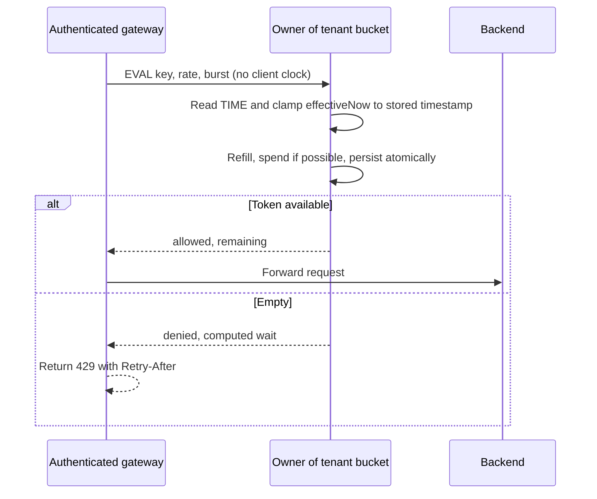

This is the component that *is* the problem. Two parts: pick the right
**algorithm**, then make it **atomic and distributed**.

**Part 1 — the five algorithms, compared.** (Theory lives in Ch 23,
*Rate limiting*; here we apply it and add the sliding-window *counter*.)

```
 FIXED WINDOW                      SLIDING WINDOW LOG
 ┌── 10:00 ──┬── 10:01 ──┐         keep a timestamp for EVERY request;
 │ count 100 │ count 100 │         count those within [now-60s, now].
 └───────────┴───────────┘         exact, but O(requests) memory/key.
 BUG: 100 at 10:00:59 + 100 at     "edge-doubling": 2× the limit across
 10:01:00 = 200 in ~1 second.      a boundary is impossible here.

 SLIDING WINDOW COUNTER            TOKEN BUCKET            LEAKY BUCKET
 weighted blend of this + prev     bucket of B tokens;    queue drains at
 window's counts:                  refill r/sec; each     fixed rate r;
   est = cur + prev×overlap%       request spends 1.      requests wait
 ~exact, only 2 counters/key.      allows bursts ≤ B.     in line → smooth.
                                   ALLOWS BURSTS.         NO BURSTS (shapes).
```

| Algorithm | Bursts? | State per key | Accuracy | Use when |
|-----------|---------|---------------|----------|----------|
| Fixed window | Yes (2× at edge) | 1 counter | Poor at edges | Crude, simplest |
| Sliding window **log** | Controlled | List of timestamps | **Exact** | Low-volume, must be exact |
| Sliding window **counter** | Controlled | 2 counters | Near-exact | **The usual web default** |
| **Token bucket** | **Yes, ≤ bucket** | 2 numbers | Good | **API limits; allow bursts** |
| Leaky bucket | No (smooths) | Queue + rate | Shapes traffic | Egress shaping, steady downstream |

**Token bucket** is the default for API limits: it allows a natural short burst
(a flurry of legit calls) while capping the sustained rate. It avoids a fixed
window's reset boundary but does **not** implement a rolling-window maximum.

**Part 2 — make it atomic (the whole crux).** The check is a
**read-modify-write**: read tokens → refill by elapsed time → compare →
decrement → write. If two requests interleave, both can read "1 left" and both
decrement to 0 → **two allowed when one should be**. The fix is to run the
entire sequence as **one atomic Lua script** on the Redis shard that owns the
key (Redis executes a script with no interleaving):

```lua
-- Validated policy: rate_per_ms > 0, burst >= 1; one request costs one token.
-- KEYS[1] = bucket key; ARGV = {rate_per_ms, burst}; never trust caller time.
local rate, burst = tonumber(ARGV[1]), tonumber(ARGV[2])
if not rate or rate <= 0 or not burst or burst < 1 then
    return redis.error_reply('invalid bucket policy')
end
local clock = redis.call('TIME')
local now = tonumber(clock[1]) * 1000 + math.floor(tonumber(clock[2]) / 1000)
local b = redis.call('HMGET', KEYS[1], 'tokens', 'ts')
local ts = tonumber(b[2]) or now
local effective = math.max(now, ts) -- backward wall-clock jump: no refill
local tokens = math.min(burst, (tonumber(b[1]) or burst) + (effective-ts)*rate)
local allowed, wait_ms = 0, 0
if tokens >= 1 then
    tokens, allowed = tokens - 1, 1
else
    wait_ms = math.ceil((effective-now) + (1-tokens)/rate)
end
redis.call('HSET', KEYS[1], 'tokens', tokens, 'ts', effective)
-- Do not expire a partially empty bucket earlier than it could become full.
redis.call('PEXPIRE', KEYS[1], math.max(1, math.ceil((effective-now)+burst/rate)))
return {allowed, math.floor(tokens), wait_ms}
```
Why Lua: it turns five operations into **one indivisible step**, killing the
race in a single round-trip (also cheaper than `WATCH`/`MULTI` retries). Why
store a **timestamp + token count** instead of ticking a timer: refill is
computed *lazily* from elapsed time on each call — no background job, no per-key
cron. `TIME` is authoritative **wall time**, not monotonic time. Clamping avoids
negative refill and replaying an interval after a backward step. Forward jumps,
expiry after clock adjustment, failover, and a rate-policy change still need an
explicit contract; this sketch assumes disciplined server time and stable policy.
A strict elapsed-time service needs a monotonic-time design plus safe state
transfer, rather than pretending Lua solves every clock failure.

**Part 3 — the distributed-counter consistency problem.** One Redis shard per
key gives a single source of truth, but at the cost of a network hop and a hard
dependency. The spectrum:

```
   CENTRALIZED (Redis+Lua)         LOCAL + SYNC (gossip/periodic)
   ───────────────────────         ──────────────────────────────
   every node → one shard          each node keeps its OWN bucket of
   atomic while owner is healthy   independently refills/reconciles.
   + accurate to the request       + survives Redis outage, ~0 latency
   - +0.3ms hop, hard dependency   - OVER-ADMITS during the sync gap
   - hot shard for whale keys         - bound needs N, rates, grants, and a finite outage duration
```
Two-tier choices are different protocols. **Centrally granted tokens** are
deducted before a gateway spends them; this saves calls without inventing tokens,
but unused grants strand capacity and must not be reissued while still spendable.
An independent emergency budget of `b` extra tokens per gateway, **no refill**,
with G gateways can add at most `G*b` admissions per outage epoch, assuming
restart cannot reset that budget. With 20 gateways and b=2, the extra bound is
**40**, not 3 or 5%. Independently replenishing buckets need a time-dependent
bound; indefinite fail-open has none. Equal subdivisions avoid overshoot only
when their total bursts/rates are bounded; uneven traffic can underutilize them.

## 13.9 Follow-ups

**Likely follow-ups (crisp answers):**
- *"Exact global limit across regions?"* — route a KEY's checks to a **single
  home shard** (consistent hashing) and accept cross-region latency, or accept
  per-region limits that sum to the global cap.
- *"Distributed without Redis?"* — gossip local counts, or a sidecar like
  Envoy's global rate-limit service; same central-vs-local trade-off.
- *"Queue instead of reject?"* — that's a **leaky bucket**: hold the request in
  a bounded queue and drain at rate `r`; good for egress shaping, bad for
  user-facing latency.
- *"How do clients behave well?"* — return `Retry-After` + `RateLimit-*`
  headers; well-built SDKs back off with jitter.

**Red flags that sink candidates:** a non-atomic check (the read-modify-write
race); putting the limiter *behind* the backend instead of at the edge; one
global Redis key for everyone (a single hot shard); **fail-closed by default**
(one Redis hiccup blackholes all traffic); ignoring the fixed-window
edge-doubling bug; no `Retry-After` (clients hammer you harder).

**Building blocks reused (theory lives elsewhere):** rate-limiting algorithms,
token/leaky bucket, fail-open vs fail-closed — **Ch 23**; consistent hashing
for sharding the counter cluster, Redis Lua atomicity — **Ch 24**; the gateway
/ edge as policy-enforcement point — **Ch 23**; golden-signal metrics on
allow/deny rates — **Ch 25**.

<a id="practice-13"></a>

## 13.10 Practice

### Whiteboard Rehearsal

**Narrate:** the gateway resolves identity; Redis owns both the bucket update
and the time used for refill. Lua prevents an interleaving, not data loss on
failover. Legacy sketches omit the clock and outage-contract details.


### Try It

twenty gateways each enable two emergency tokens; is a five-request overshoot promise safe?

<details>
<summary>Show worked answer</summary>

No: they can collectively admit 40 additional requests. Reduce the total
allocated budget to five, use centrally deducted grants, or state a weaker
contract. Local speed is not evidence of a small global error. A restart that
recreates emergency tokens also breaks the bound.

</details>

---

<a id="cs14"></a>

# Case 14 — Distributed Unique IDs / Snowflake

> **Google priority:** ★★★ · **Difficulty:** Medium · **Frequency:** Very common · **Time budget:** ~35 min

> **User story —** *As a* backend service writing sharded data, *I want* to mint unique,
> time-sortable IDs locally at high rate, *so that* every row gets a global id without a central
> bottleneck.
>
> **For example —** two generators with distinct, valid worker allocations stamp IDs
> locally; timestamp · worker · sequence is collision-free only when ownership,
> restart state, and clock/sequence transitions follow the protocol below.
>
> **Why it matters —** UUIDv4 fragments indexes and auto-increment is a SPOF; spending 64 bits
> wisely gives uniqueness, rough time-ordering, and zero coordination on the hot path.

Every row your company writes — every tweet, message, order, log line — needs a
**unique id**. On one database, `AUTO_INCREMENT` solves it for free. But once
you **shard** across hundreds of databases and want to mint **millions of IDs a
second from many machines that never talk to each other**, "give me the next
unique number" becomes surprisingly deep. You want IDs that are **unique**,
**roughly time-sortable** (so they index well and `ORDER BY id` ≈ newest-first),
**compact** (a 64-bit integer, not a 128-bit string), and generated with **zero
coordination** on the hot path. **Snowflake** — Twitter's scheme — hits all
four by being clever about **how it spends 64 bits**.

## 14.0 Interview Focus

- Do you know the **trade-off space**: UUIDv4 (no coordination, but random →
  terrible index locality), DB auto-increment (sortable, but a **SPOF** and
  doesn't shard), ticket servers, and **Snowflake**?
- Can you draw the **64-bit bit layout** and justify each field's width with
  arithmetic (years of timestamp, machines, IDs/ms)?
- Do you handle the two killers: **clock skew / clock running backward**, and
  **sequence rollover** within a millisecond?
- Do you understand **why time-sortable matters** (B-tree insert locality,
  range scans, "k-sorted") vs. random UUIDs that fragment indexes?

## 14.1 Requirements

**Functional**
- Generate **64-bit** IDs that are **globally unique**.
- IDs should be **roughly time-ordered** (k-sorted: IDs minted later are *mostly*
  larger; perfect total order is not required).
- **No coordination per ID** — a generator must not call a central server for
  each id (that would just move the bottleneck).

**Out of scope:** cryptographic unpredictability (Snowflake IDs are *guessable*
— if you need unguessable handles, add a separate random token; don't conflate
the two), and human-readability.

**Non-functional**
- **Throughput:** millions of IDs/sec across the fleet.
- **Latency:** **sub-microsecond** per id — it's a few CPU instructions, no I/O.
- **Availability:** generation can continue only within its still-safe lease
  and timestamp allocation. A prolonged coordinator outage stops generation;
  uniqueness takes priority over availability.

**Questions to ask:** *How many IDs/sec at peak? How many generator machines /
data centers? Is strict monotonic order required, or is k-sorted enough? 64-bit
hard limit, or is a 128-bit UUIDv7 acceptable? Lifetime (how many years of
timestamp must we encode)?*

## 14.2 Estimates

```
   Bit budget (must fit a signed 64-bit long):
     1  sign bit      → always 0 (keep IDs positive)
     41 timestamp ms  → 2^41 ms = 2.2e12 ms ≈ 69.7 YEARS from a custom epoch
     10 machine id    → 2^10  = 1024 generator nodes
     12 sequence      → 2^12  = 4096 IDs per millisecond PER machine
   Throughput per machine: 4096 / ms = 4.096 MILLION IDs/sec
   Fleet ceiling:          4.096M × 1024 ≈ 4.2 BILLION IDs/sec
   These are bit-space ceilings, NOT measured CPU/lock/clock throughput.
   At 1M/sec, benchmark the generator before choosing machines/headroom.
```
The arithmetic *is* the design: 41 bits buys ~70 years, 10 bits buys 1024
machines, 12 bits buys 4096/ms/machine — and the fields are tunable (e.g.
steal a sequence bit for an 11th machine bit if you need more nodes).

## 14.2a Start Simple

**Baseline → pressure → change → cost:** a database sequence is simple and
transactional; independent writers need low-latency IDs across shards; partition
the ID space by worker and time; now worker ownership, clocks, and restart
state become your responsibility. UUIDv7 is a reasonable alternative if 128
bits are acceptable; a database sequence is not inherently an unfixable SPOF.

**Worked ID:** offset `1000 ms`, worker `7`, sequence `3` gives
`(1000 << 22) | (7 << 12) | 3 = 4,194,332,675`.
Decode with `id >> 22 = 1000`, `(id >> 12) & 1023 = 7`,
`id & 4095 = 3`. This is numeric ordering, **not secrecy** or global event order.

**Prerequisites:** [Ch 24: consensus and leases](#content/24_system_design_data_distributed),
[Ch 25: clocks and unique IDs](#content/25_system_design_operations_case_studies).
[Contents](#chapter37-toc) · [Previous: limiter](#cs13) · [Next: Top-K](#cs15)

## 14.3 Architecture

Two deployment shapes. **Embedded** (a library inside each service) is the
default — it has **no network hop**. A standalone **ID service** is used when
clients can't embed the library (polyglot fleets, or you want central control).

**Image correction:** renewal, fail-stop and safe worker-ID reuse are required


**Block-by-block:**
- **Coordinator** (ZooKeeper/etcd — Ch 24, consensus) — hands each generator a **distinct 10-bit
  worker id** under a renewable lease, plus durable timestamp-range bookkeeping.
  Renewal is amortized/background coordination, not one call per ID.
- **Generator** — mints IDs from `timestamp | worker | sequence` using just its local clock and
  an in-memory counter — **no I/O per id**.
- **Deployment** — Pattern A embeds this in every app pod; Pattern B centralizes it behind a load
  balancer when embedding isn't possible.
- **Worker id** — separates active allocations; safe timestamp-range reuse
  prevents a replacement process from repeating its predecessor's IDs.

## 14.4 Request Walkthrough

Minting one id inside `nextId()`:
```
  1. acquire generator lock; assert lease safe; ts = wall_now_ms()
     if ts < last_ts: wait or error; recheck lease after every wait
  2. if ts == last_ts:                    (same millisecond as previous id)
        seq = (seq + 1) & 0xFFF           bump 12-bit sequence
        if seq == 0:                      4096 IDs already used THIS ms →
            ts = wait_until(last_ts + 1)  spin to the next millisecond
     else:
        seq = 0                           new ms → reset sequence
  3. assert timestamp is inside this process's durable grant
  4. last_ts = ts
  5. id = ((ts - EPOCH) << 22) | (worker_id << 12) | seq
  6. recheck ownership; return id; release lock
```
Steps 2 and 5 are the heart: within a millisecond we **pack up to 4096 ids**
via the sequence; across milliseconds the **timestamp** advances, so ids are
time-sorted. The complete transition is serialized: an atomic sequence
increment alone does not protect timestamp reset, rollover, or concurrent calls.

## 14.5 Data Model

| Entity | Shape | Store | Why |
|--------|-------|-------|-----|
| Worker-id lease | `worker_id → {owner, generation, expiry}` | Consensus coordinator | Renewed; loss/uncertainty stops issuance |
| Timestamp allocation | `worker_id → highest_granted_ts` | **Durable coordinator record** | Survives lease deletion and restart; never grant overlapping ranges |
| Generator state | `{last_ts, seq, grant_start, grant_end, safe_deadline}` | In-memory within a valid allocation | A restarted process cannot simply reset and reuse its old range |
| Custom epoch | constant (e.g. `2020-01-01`) | Compiled in | Maximizes the 41-bit timestamp's useful lifetime |

There is essentially **no database** in the hot path — that's the point. The
coordinator stores durable reuse boundaries as well as renewable ownership.
One safe scheme **reserves timestamp intervals ahead of use**. A new process
starts strictly beyond that worker's previous `highest_granted_ts`, even if the
old process did not use all its allocation. Wait for wall time to reach the new
range rather than silently jumping far into the future. A grant ending at
offset 1100 means a replacement cannot start at 1000 with sequence 0: its
earliest safe timestamp is **1101**. Larger grants reduce coordination but
increase restart wait/wasted timestamp space. Lease epochs alone do not help
uniqueness unless they are encoded into the ID or enforce disjoint allocations.

## 14.6 Scaling

- **Measure throughput:** 4.096 M IDs/s is the sequence-space ceiling, not
  a performance promise. Generators also provide locality and failure isolation.
- **Worker-id exhaustion:** 1024 ids cap the fleet. If you outgrow it, **rebalance
  the bit fields** (more machine bits, fewer sequence bits) or scope worker ids
  per data center (5 bits DC + 5 bits worker).
- **Clock as the bottleneck:** generation rate is gated by `now_ms()` and the
  sequence; on a machine with a slow/coarse clock, the spin-to-next-ms path can
  throttle. Wall time encodes the timestamp; a monotonic clock with bounded
  drift measures the lease safety deadline. They serve different purposes.
- **Concurrency:** lock the entire timestamp/sequence transition. To remove
  that lock, allocate genuinely disjoint worker/sequence spaces to threads;
  do not assume an atomic increment alone or linear scaling with cores.

## 14.7 Failures and Trade-offs

```
  What dies                  →  What happens / what we do
  ─────────────────────────────────────────────────────────────────────
  Coordinator (ZK) down      →  mint only until the conservative local lease
                                deadline or grant end; then fail-stop
  Clock jumps BACKWARD        →  uniqueness risk! refuse to mint until the
   (NTP correction, VM pause)    clock catches up to last_ts; alert if the
                                gap is large (see §14.8)
  Old owner pauses/resumes   →  recheck lease before issuance; expired or
                                uncertain ownership stops the process
  Worker reused/restarted    →  start above its durable timestamp ceiling;
                                do not reset sequence in an old time range
  Sequence overflow in 1 ms   →  >4096/ms → spin to next ms (back-pressure)
```
**Trade-offs called out:** Snowflake gives up **strict global monotonicity**
(IDs are only *k-sorted* — two machines in the same ms interleave) in exchange
for **no per-ID coordination within a valid allocation**. It also gives up **unguessability** (you
can read the timestamp out of an id). Versus **UUIDv4**: Snowflake is half the
size and sortable, but needs worker-id coordination. Versus **DB
auto-increment**: Snowflake removes the per-ID call to a shared allocator, while
introducing lease/clock/reuse responsibilities. A database sequence can itself be replicated.

## 14.8 Deep Dive

**Mechanism diagram**

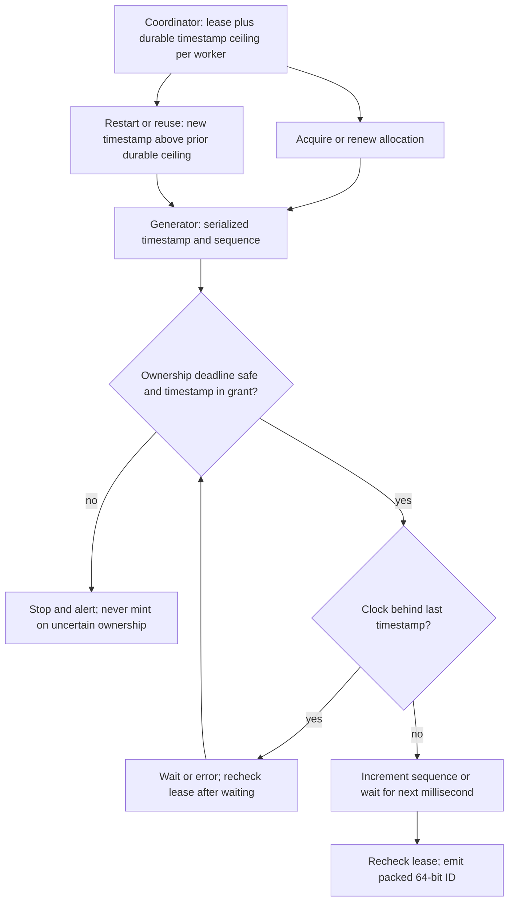

The crux combines the bit layout, serialized timestamp/sequence transitions,
and safe allocation across clock changes and worker restarts.

**The layout (memorize this picture):**
```
  64-bit Snowflake ID   (sign bit 0 → always positive; fits a Java long)
  ┌─┬──────────────────────────────────────┬───────────┬─────────────┐
  │0│       41-bit TIMESTAMP (ms)           │ 10-bit    │  12-bit     │
  │ │   ms since a CUSTOM epoch (~70 yrs)   │ MACHINE   │  SEQUENCE   │
  └─┴──────────────────────────────────────┴───────────┴─────────────┘
   63 62                                  22 21       12 11           0
    ▲              ▲                            ▲             ▲
  sign       high bits dominate the         1024 nodes   4096 ids per
  (unused)   sort order → TIME-SORTABLE   (5 DC+5 wkr?)  ms per machine
```
Because the **timestamp occupies the high bits**, numeric order ≈ time order:
`ORDER BY id DESC` returns newest-first *for free*, and new IDs append to the
**right edge** of a B-tree index (great insert locality — contrast UUIDv4,
whose randomness scatters inserts across the whole index and shreds cache).

**Assembling an id** (the shift-and-OR):
```python
EPOCH = 1577836800000          # 2020-01-01 in ms; our custom epoch
def make_id(ts, worker, seq):
    return ((ts - EPOCH) << 22) | (worker << 12) | seq
    #          41 bits  ──┘  10 bits ─┘   12 bits ┘
    #  << 22 = 10(machine)+12(sequence) bits to the left of timestamp
```

**Clock-skew handling — the part that actually breaks in production.** A
machine's clock can jump **backward** (NTP correction, leap second, a paused
VM resuming). If `now_ms() < last_ts`, naively continuing could **re-mint a
timestamp+sequence already used → a duplicate**. The safe policy:
```python
def next_id(self):
    with self.lock:                       # protect the ENTIRE transition
        self.assert_safe_lease()          # monotonic deadline minus margin
        ts = wall_now_ms()
        if ts < self.last_ts:
            if self.last_ts - ts > MAX_TOLERATED_MS:
                raise ClockMovedBackwards(self.last_ts - ts)
            ts = self.wait_until(self.last_ts)  # checks lease while waiting
        seq = self.seq + 1 if ts == self.last_ts else 0
        if seq == 4096:
            ts = self.wait_until(self.last_ts + 1)
            seq = 0
        if not self.grant_start <= ts <= self.grant_end:
            raise TimestampGrantExhausted()     # obtain next safe grant
        if not 0 <= ts - EPOCH < (1 << 41):
            raise EpochOutOfRange()
        self.assert_safe_lease()          # also after rollover/clock waits
        self.last_ts, self.seq = ts, seq
        return make_id(ts, self.worker_id, seq)
```
Three defenses in one function: **small backward drift → spin and wait**;
**large backward jump → refuse and alert** (better to stall id generation than
to mint duplicates that corrupt data forever); **sequence rollover → block to
the next millisecond** (natural back-pressure that caps a machine at 4096/ms).
This is the senior signal: a candidate who only draws the bit layout has done
half the job. Lease safety requires bounded local clock drift, conservative
deadlines, and checks after pauses; if those assumptions cannot be established,
stop rather than issue under uncertain ownership. Disjoint durable timestamp
grants additionally prevent a delayed old allocation and a replacement from
minting the same tuple.

## 14.9 Follow-ups

**Likely follow-ups:**
- *"Why not UUIDv4?"* — random → no time order and **awful B-tree locality**
  (every insert hits a random leaf). UUIDv7 fixes ordering but is still 128-bit.
- *"How are worker ids assigned?"* — renewable coordinator leases, local
  fail-stop on uncertain ownership, and durable non-overlapping timestamp
  allocations for reuse. An ephemeral node alone is insufficient.
- *"Strict monotonic across the fleet?"* — Snowflake is only **k-sorted**; for
  strict externally observable order you need an ordering protocol such as a
  sequencer/consensus log. Logical timestamps alone do not serialize concurrent calls.
- *"64-bit too small / too few machines?"* — re-budget the bits, or scope
  machine ids per region.

**Red flags:** ignoring clock-backward (the #1 correctness bug); a central
server call **per id** (defeats the purpose); using random UUIDs as primary
keys then wondering why writes thrash the index; forgetting the sign bit (giving
negative IDs in languages with signed longs); assuming Snowflake IDs are secret.

**Building blocks reused:** consensus / coordination (ZooKeeper, etcd, leases) —
**Ch 24**; B-tree index locality and why sortable keys matter — **Ch 24**; the
sketch of this scheme — **Ch 25** (*distributed unique IDs*); monotonic clocks &
NTP — **Ch 25**.

<a id="practice-14"></a>

## 14.10 Practice

### Whiteboard Rehearsal

**Narrate:** distinguish the **ID hot path** from background renewal. A lease
expiring at the coordinator does not kill an old process. Legacy sketches'
boot-only coordination and unconditional coordinator-outage availability are
not the protocol being taught here.


### Try It

worker 7 dies at offset 1040; its durable grant ends at 1100. Can a replacement start at 1041 with sequence 0?

<details>
<summary>Show worked answer</summary>

No. It cannot know which later timestamps the old process used before pausing.
Allocate strictly above 1100 and wait until 1101, or choose a different safely
allocated worker. Renewal loss makes the old process stop before its safety
deadline; consensus alone does not physically stop it. Resetting just the
in-memory sequence is not a restart protocol.

</details>

---

<a id="cs15"></a>

# Case 15 — Top-K / Trending / Heavy Hitters

> **Google priority:** ★★ · **Difficulty:** Hard · **Frequency:** Common · **Time budget:** ~30 min

> **User story —** *As a* product, *I want* the current top-K (trending hashtags, top URLs, API
> heavy hitters) from a firehose of events, *so that* I can surface what's hot in near real time.
>
> **For example —** millions of events/sec stream by; a Count-Min Sketch + min-heap reports the
> top-10 candidates this hour using a ~32 MiB sketch plus a small candidate set,
> rather than keeping an exact counter for every key.
>
> **Why it matters —** you can't keep a counter for billions of distinct keys; trading a little
> accuracy (a sketch) for fixed memory is the whole point.

"What are the **top 10 trending hashtags right now**?" "Which **100 URLs** got
the most ad clicks this hour?" "Who are the **heavy hitters** flooding our API?"
These are all the same problem: a **firehose of events** streams past, and you
must report the **K most frequent** keys — without storing a counter for every
distinct key (there can be **billions** of distinct keys, far more than fits in
memory). The trick is to **trade a little accuracy for a lot of memory**: a
probabilistic **Count-Min Sketch** estimates counts in fixed space, and a
**min-heap** tracks the current top-K.

## 15.1 Requirements and Estimates

- **Functional:** return the top-K keys by frequency over a **time window**
  (last hour / day), refreshed every few seconds. Approximate is fine.
- **Exact or approximate?** *Ask.* Exact top-K needs exact counts, but those
  can be sharded and maintained online if resources permit. Trending may tolerate approximation.
- **Windowing:** **sliding** (last 60 minutes), **tumbling** (this calendar
  hour), and **exponential decay** (older events have smaller weight) are
  different questions. Decay is not an exact sliding window.
- **Estimate:** 1 M events/sec, ~10^9 distinct keys/day. An exact hash-map of
  counts = 10^9 × ~16 B ≈ **16 GB logical payload** before keys/hash-map
  overhead; per-worker size depends on partitioning. Exact counting is possible,
  but a tighter RAM budget can motivate approximation.
  A Count-Min Sketch at `w=2^20, d=4` = `4 × 2^20 × 8B` = **32 MiB** — *fixed*,
  regardless of key count. That 500× shrink is the whole reason the sketch exists.

## 15.1a Start Simple

**Baseline → pressure → change → cost:** an exact map plus indexed counts is
fine for a small stream; key cardinality outgrows the assigned RAM; use a CMS
and a **keyed, unique candidate heap**; accept count error and candidate-recall
error, and compare with exact sampled/batch results.

**Six events, K=2:** with no collisions in this tiny illustration:

| Event in window 12:00–13:00 | Candidate keys and estimated counts |
|---|---|
| A | A:1 |
| A | A:2 — update A, do not insert a second A |
| B | A:2, B:1 |
| C | A:2, B:1 — fixed tie rule retains B over C |
| B | A:2, B:2 |
| A | A:3, B:2 |

**Prerequisites:** [Ch 24: sketches, partitioning and event-time windows](#content/24_system_design_data_distributed),
[Ch 31: heaps](#content/31_dsa_coding).
[Contents](#chapter37-toc) · [Previous: IDs](#cs14) · [Next: leaderboard](#cs16)

## 15.2 Architecture

**Image correction:** unique heap keys, approximate candidates, explicit window semantics


**Block-by-block:**
- **Kafka ingest** — events land in **Kafka**, **partitioned by key** so every occurrence of one
  hashtag goes to the **same stream worker** (that worker sees *all* of that key's traffic
  locally — no cross-worker counting per event).
- **Stream worker** — keeps a fixed-size **Count-Min Sketch** and a keyed
  candidate heap of capacity C (often C > K), and emits rescored candidates.
- **Merge** — combines the per-partition heaps into a **global top-K**, cached in Redis for the
  `/trending` API.
- **Batch path** (Spark) — computes the *exact* answer slowly and reconciles drift — the classic
  **Lambda architecture** (Ch 24).

**Numbered flow:** (1) event → Kafka, partitioned by key; (2) worker updates
the sketch and updates an existing unique candidate, or considers inserting/replacing
a candidate under the shared tie rule; (3) periodically rescore and emit the C retained
candidates with their window/version; (4) merge compatible candidate sets into an
approximate global top-K → Redis; (5) API reads that result and its freshness metadata.

## 15.3 Deep Dive

**Mechanism diagram**

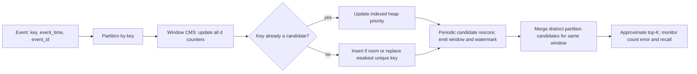

A **Count-Min Sketch** is a 2-D array of counters with `d` independent hash
functions (rows) and `w` columns. To **count** a key, bump one cell in each row;
to **estimate**, take the **minimum** across rows (collisions only ever *add*
count, so the min is the tightest over-estimate).

```
  COUNT-MIN SKETCH   (d=4 rows × w columns of counters)
            col →   0     1     2     3    ...   w-1
   h1(x) ─▶ [    ][  12 ][    ][    ] ...........[    ]
   h2(x) ─▶ [  7 ][    ][    ][    ] ...........[    ]
   h3(x) ─▶ [    ][    ][  19 ][    ] ...........[    ]
   h4(x) ─▶ [    ][    ][    ][  9 ] ...........[    ]

   update(x):    for each row i:  cell[i][ h_i(x) mod w ] += 1
   estimate(x):  MIN over rows of cell[i][ h_i(x) mod w ]
                 (never under-counts; over-counts only on hash collisions)
```
The sketch tells you *how often* a key appeared, but **not which keys are
biggest** — for that, pair it with an **indexed min-heap plus key→heap-index
map**, capacity C ≥ K. This is a practical candidate heuristic, not a proof of
exact heavy-hitter recall:
```
  on each event x:
     sketch.update(x)
     est = sketch.estimate(x)
     if x in heap:              heap.update_priority(x, est)
     elif heap.size < C:         heap.insert_unique(x, est)
     elif outranks(est, x, heap.min()):  # deterministic tie rule
         heap.remove_min()              # also delete key->index mapping
         heap.insert_unique(x, est)
  on publish:
     rescore every retained key from sketch; rebuild heap; emit candidates
  # Each key occupies at most ONE slot; membership moves with heap swaps.
```
The indexed heap takes **O(log C)** per candidate update plus O(d) sketch work;
periodic rescoring adds O(Cd) and rebuilding cost. A collision caused by B may
increase A's sketch estimate without refreshing A's heap priority. Rescoring
retained keys repairs stale priorities, **not omitted candidates**. Use a larger
candidate pool or a heavy-hitter algorithm with a stated guarantee when recall
matters; recompute exact candidate counts downstream when required.

**Error has units:** standard nonnegative CMS gives
`count(x) <= estimate(x) <= count(x) + epsilon*Nevents` with probability at least
`1-delta` **for a query**, assuming suitable hashes. Here
`epsilon≈e/2^20≈0.00000259`, `delta≈e^-4≈0.0183`.
At 3.6 billion events/hour the additive bound is about **9,332 events**.
That does not certify ordering of two tags only 100 counts apart, nor candidate
recall, nor simultaneous confidence for billions of queries.

**Why key partitioning matters:** for exact local top-K under the same total
tie order, a globally top-K key must be locally top-K: otherwise K keys on its
own partition already outrank it globally. This works because each key's
**entire count** lives on one partition. Arbitrary event partitioning breaks
the argument (X can be second locally everywhere yet first after summing).
With sketches/candidate heuristics, the merge is still approximate. Emit
matching window IDs, watermark/version and partition ownership; never combine
pre- and post-rebalance partial counts as if each were complete.

**Choose the window:** reset both sketch and candidates for each tumbling
hour. For a last-60-minute approximation, keep 60 one-minute panes, sum active
pane sketches, and expire whole panes; this costs about **1.875 GiB** of sketches
per worker here and has minute-boundary error. Candidate union across panes
also needs a recall policy. An exact event-time sliding window needs finer
state/expiry; exponential decay answers a different weighted-frequency query.
Specify allowed lateness (e.g. 2 minutes) and watermark-based finalization;
late corrections need versioned output rather than silently mixing windows.

## 15.4 Trade-offs and Follow-ups

- **Approximate by design:** the sketch **over-counts** under collisions (never
  under-counts). Bound the error by sizing `w` (`ε ≈ e/w`) and `d`
  (confidence `1−δ`, `δ ≈ e^-d`). Good enough for trending; not for billing.
- **Exact when you must:** ad-click *billing* needs the **batch (Spark)**
  path, not the sketch. Trending/observability use the stream path.
- **Red flags:** promising exact counts within an unmeasured RAM budget; a
  global lock on one shared counter (the firehose melts it — partition by key
  instead); forgetting **windowing/decay** so "trending" really means
  "all-time"; merging partitions by *summing sketches* but then trusting exact
  counts (you can sum CMS arrays cell-wise, but the result is still approximate).
- **Building blocks:** Count-Min Sketch & probabilistic structures — **Ch 24**;
  Kafka partitioning & stream processing (Flink/Beam) — **Ch 24**; Lambda /
  Kappa batch-vs-stream reconciliation — **Ch 24**; heaps — **Ch 31 (DSA)**.

<a id="practice-15"></a>

## 15.5 Practice

### Whiteboard Rehearsal

**Narrate:** the sketch answers "how many for this key?", not "which keys?".
The heap must maintain membership separately. Legacy diagrams omit candidate
recall and window compatibility; no sketch diagram is an exact top-K proof.


### Try It

X appears 60 times on each of two partitions; A=100 only on partition 1, B=100 only on partition 2. Is merging local top-1 sufficient?

<details>
<summary>Show worked answer</summary>

No. Local winners A and B hide global winner X=120. Partition by **key** so
all X events share an owner, or aggregate exact counts before pruning. A
larger candidate pool helps but does not establish a universal guarantee.
Even key partitioning cannot remove CMS collision or candidate-recall error.

</details>

---

<a id="cs16"></a>

# Case 16 — Leaderboard / Ranking

> **Google priority:** ★★ · **Difficulty:** Medium · **Frequency:** Common · **Time budget:** ~30 min

> **User story —** *As a* player, *I want* to see the top scores, my own rank, and who's just
> above and below me — instantly, live — *so that* the competition feels real.
>
> **For example —** after my score's projection version is visible, I see "you're
> #1,234,567; here are the 5 players around you" without re-sorting 50 M rows.
>
> **Why it matters —** rank / top-N / around-me queries are exactly what a sorted set is built for;
> the durable scores live in Cassandra behind it.

A **game leaderboard** looks easy — sort users by score — until you notice the
queries it must answer **in milliseconds, live, for 50 million players**:
*"top 100,"* *"what's MY rank?,"* and *"show me the 5 players just above and
below me."* Re-sorting millions of rows on every score update is hopeless. The
right tool is a data structure built exactly for this: the **Redis sorted set**,
which keeps elements ordered by score and answers rank queries in **O(log N)**.

## 16.1 Requirements and Estimates

- **Functional:** update a player's score; read **top-N**, a player's **rank**,
  and the **window around a player** ("rank −2 … +2"). Maybe per-region and
  global boards; daily/weekly/all-time windows.
- **Ties:** decide the rule up front — same score → break by **earliest to
  reach it** (store `score.timestamp` as a composite) or by user id.
- **Estimate:** 50 M players, 10 score updates/player/day = 500 M writes/day ≈
  **6k writes/s** (peak ~20k/s). Reads dominate: every player checking rank →
  **100k+ reads/s**. Memory: 50 M × (8 B score + ~24 B member) ≈ **1.6 GB** per
  board in **payload alone**. At an illustrative 120–200 B/member including
  skip-list/hash/allocator overhead, plan **6–10 GB**, plus headroom and replicas.
  Measure the actual encoding; sharding and replication solve different problems.

## 16.1a Start Simple

**Baseline → pressure → change → cost:** indexed SQL serves a small top-N
board well; frequent rank/around-me queries become expensive; add a sorted-set
read model fed from a durable log/outbox; pay RAM, projection lag, and rebuild cost.

**Choose score semantics:** this board stores each player's **season maximum**,
not increments. `match:M82` for Dev raises 95 to 125 at version 9; retrying M82
must not apply a second increment. The durable writer dedupes `(season, match,
player)`, stores the authoritative score/version, and records its update event
atomically. A projection applies a version only if newer, with the version
check and `ZADD` atomic on the same owner. Older events cannot overwrite newer scores.

| Before update (earliest reach wins ties) | After Dev's version 9 |
|---|---|
| Ada 120 at second 200; Ben 120 at 250; Cleo 100; Dev 95; Eli 90 | Dev #1, Ada #2, Ben #3, Cleo #4, Eli #5 |

Around Ben (#3) returns all five. Redis ranks are zero-based; convert only at
the API boundary and clamp `r-2` to zero (a negative Redis index means "from end").

**Prerequisites:** [Ch 23: sorted-set read models](#content/23_system_design_fundamentals_deep_dive),
[Ch 24: outbox, ordering and sharding](#content/24_system_design_data_distributed).
[Contents](#chapter37-toc) · [Previous: Top-K](#cs15) · [Next: cache](#cs17)

## 16.2 Architecture

**Image correction:** replace bare dual-write and unbounded tie encoding


**Block-by-block:**
- **Score API** — commits each deduplicated score and replayable event to
  the durable source of truth; the projector updates the live Redis index.
- **Leaderboard API** — answers all three query shapes directly from Redis sorted-set commands —
  rank is **O(log N)**; reading M ordered members is **O(log N + M)**.
- **Failover** — on a Redis failover you **rebuild** the sorted set by replaying scores from the
  durable store.

**Numbered flow:** (1) validate/dedupe score event; (2) durable commit and
versioned projection; (3) Redis queries. Return "updating" or wait for the
accepted version if read-your-writes matters; do not promise immediate rank
during projection lag. A durable event log is another valid write authority;
a bare Cassandra-plus-Redis dual-write is not the reliability mechanism.

## 16.3 Deep Dive

**Mechanism diagram**

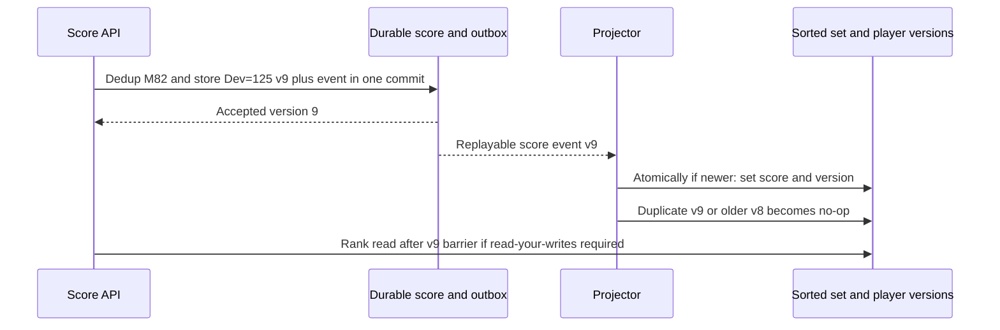

Redis implements a sorted set as a **skip list** (ordered, O(log N) rank) plus a
**hash map** (member → score, O(1) lookup). That dual structure is why it can do
both "where does this member rank?" and "who is at rank r?" quickly:

```
   ZADD   lb:global  9500  "alice"      add/update score        O(log N)
   ZREVRANK lb:global "alice"           alice's 0-based rank     O(log N)
   ZREVRANGE lb:global 0 99  WITHSCORES top-100 (high→low)  O(log N + 100)
   ZREVRANGE lb:global  r-2  r+2        the 5 around rank r      O(log N + 5)
   ZINCRBY  lb:global  +50  "alice"     atomic bump, NOT retry-idempotent
```
**Ties:** Redis orders equal scores **lexicographically by member**. To enforce
"earliest wins," bound a season's tie space. With integer scores
`0 <= score <= 1,000,000` and reach-second `0 <= t < B=1,000,000`, encode
`score*B + (B-1-t)`. The tie component is in `[0,B-1]`, so it cannot outweigh
one score point; the largest composite is `1,000,000,999,999 < 2^53`, hence
exact in Redis's double. Same-second ties use descending member order with
`ZREVRANGE`. Unbounded epoch timestamps or arbitrary multipliers can reverse
ordering or lose precision; if bounds do not fit, use a tuple-aware index
rather than silently packing more bits into a double.

**The genuinely hard part — global rank across shards.** One board fits in one
node, but tens of millions of players across **many shards** (or many regional
boards) means no single sorted set holds everyone, so `ZREVRANK` can't give a
**global** rank. You can't just merge — rank is a *global* property. Two
standard answers:

```
  (a) BUCKET-COUNT APPROXIMATION (scales, approximate):
      Keep a histogram of "how many players have score ≥ s" per shard.
      global_rank(alice) ≈ 1 + counts in higher buckets + estimated
                                  position within her score bucket
      → answered with per-shard count queries; O(shards), not O(N).

  (b) ROUTING BY SCORE RANGE (exact for top, hard for middle):
      Shard 0: scores 0–999   Shard 1: 1000–4999   Shard 2: 5000+
      Read highest shard first; if it has only 40 players, take the next
      60 from the next shard(s). Highest shard alone is not always enough.
      A mid-pack player's exact rank still needs counts from higher shards.
```
For an exact distributed rank, sum each shard's count of members **ahead under
the full score-and-tie order**, then add one. If two other shards contribute
7 and 5 and Ada's own shard has 2 ahead, her rank is **15**, not local rank 3.
Counts must reflect a compatible snapshot/version; concurrent score migration
between range shards needs a deduplicated transfer protocol.

One product choice is: **exact rank for the top board
(it's small and lives on one shard); approximate "rank ~#12,431" for everyone
else** via bucket counts — players don't need their global rank exact to the
unit, and computing it exactly across shards on every read is prohibitively
expensive.

## 16.4 Trade-offs and Follow-ups

- **Indexed SQL is a valid baseline** for `ORDER BY ... LIMIT`. Sorted sets
  become attractive for frequent rank/around-me operations at measured scale.
- **Persistence:** treat Redis as a **rebuildable index**; keep the durable
  scores in Cassandra so a cache flush doesn't lose the game.
- **Red flags:** sorting in the application tier on every read; storing rank as
  a column and updating millions of rows per score change; ignoring ties;
  assuming one Redis node scales to *any* size (shard + plan global-rank
  strategy explicitly); recomputing global rank exactly on every read.
- **Building blocks:** Redis sorted sets / skip lists — **Ch 23**; sharding &
  consistent hashing — **Ch 24**; cache-as-index with a durable source of
  truth — **Ch 23**; histograms/percentiles — **Ch 25** (observability).

<a id="practice-16"></a>

## 16.5 Practice

### Whiteboard Rehearsal

**Narrate:** sorted sets answer the query; durability belongs to the write
path. Legacy sketches' direct dual-write does not repair a crash between stores.


### Try It

projection v9 sets Dev=125; a delayed v8 carries 95. Should replay run ZADD unconditionally?

<details>
<summary>Show worked answer</summary>

No. Compare and store the version atomically with the score update, so v8 is
ignored. Deduping only the API request cannot protect an out-of-order projector.
After a rebuild, restore version metadata too. A raw `ZINCRBY` retry would
create a separate double-counting bug.

</details>

---

<a id="cs17"></a>

# Case 17 — Distributed Cache

> **Google priority:** ★★ · **Difficulty:** Medium · **Frequency:** Common · **Time budget:** ~30 min

> **User story —** *As a* service owner, *I want* a fast shared in-memory layer in front of my
> database, *so that* hot reads return in microseconds and the DB survives the read firehose.
>
> **For example —** 1 M reads/s at a >90% hit rate means the DB only sees ~100k/s; a product-page
> read drops from 10 ms to 0.3 ms by hitting the cache first.
>
> **Why it matters —** the real design is spreading keys with consistent hashing (so adding a node
> doesn't reshuffle everything) and surviving a hot key that would melt one shard.

A **distributed cache** is a giant, fast, in-memory key→value layer that sits
between your services and your database, turning **10 ms database reads into
0.3 ms memory reads** and absorbing the read firehose so the DB survives. The
single-node version is a hash map with an eviction policy. The *distributed*
version asks the real questions: **how do you spread keys across nodes so adding
one node doesn't reshuffle everything** (consistent hashing), and **what happens
when one key is so hot it melts its shard** (hot-key + thundering herd)?

## 17.1 Requirements and Estimates

- **Functional:** `get(k)`, `set(k, v, ttl)`, `delete(k)`; sharded across nodes;
optional replication; an eviction policy when memory is full.
- **Consistency:** the cache is a **best-effort copy**, not the source of truth —
staleness is allowed; the DB is authoritative.
- **What NOT to cache:** rarely-read keys (no hit-rate payoff), data that must be
perfectly fresh (financial balances — read the DB), and write-heavy
keys whose value changes faster than it's read.
- **Estimate:** target a **>90% hit rate**. 1 M reads/s × 90% served from cache
= the DB only sees ~100k/s. Cache 100 GB hot set across nodes of 32 GB RAM →
**4 nodes** is only a raw memory lower bound, ignoring overhead/headroom.
At an illustrative 200k ops/s each, four serving nodes give **800k ops/s**,
not millions. All 1 M reads first attempt a cache GET (including misses).
At 70% utilization, even GETs alone need `ceil(1M / 140k) = 8` serving
nodes, before fills, invalidations and replicas. Size memory and operations
independently, then take the larger requirement; benchmark payload/network costs.

## 17.1a Start Simple

**Baseline → pressure → change → cost:** one process caches hot objects;
many processes duplicate memory and miss independently; introduce sharded shared
cache plus per-key single-flight; pay a network hop, invalidation complexity,
and a recovery plan for the database.

**Stale-fill race:** at 12:00:00 reader R fetches `product:P42=v7` from the DB
after a cache miss. At .010 writer W commits v8 and invalidates the cache.
At .020 R fills v7 **after** that invalidation. "Delete after write" alone
does not prevent this race.

Keep the fence after deleting the value; a fill is conditional on the same
generation. Fence eviction/restart must create a **new generation**, not reuse
g7. This reduces stale fills; the DB-commit-to-invalidation gap still exists,
so strict-freshness reads use the authority. Versioned CDC updates are another
choice, with measured lag rather than a claim of linearizable caching.

**Prerequisites:** [Ch 23: cache-aside, eviction and stampedes](#content/23_system_design_fundamentals_deep_dive),
[Ch 24: partitioning and replication](#content/24_system_design_data_distributed).
[Contents](#chapter37-toc) · [Previous: leaderboard](#cs16) · [Next: scheduler](#cs18)

## 17.2 Architecture

**Image correction:** generic ring is not Redis Cluster; four 200k-op nodes are 800k ops/s


**Block-by-block:**
- **Cache client** — a library in each app server; hashes the key onto a **consistent-hash ring**
  to find its owner node — there's no central coordinator on the read path.
- **Cache node** — holds a shard in RAM with an **eviction policy** (LRU default) and an **async replica**.
- **Membership/failover manager** — publishes ring ownership and promotes replicas
  in this **generic cache** design. Actual **Redis Cluster** uses 16,384 hash
  slots, slot migration and cluster failover; **Sentinel** monitors/promotes
  standalone primary-replica groups, not a generic sharding ring.
- **Miss handling** — either the app reads the DB and back-fills (**cache-aside**) or the cache
  reads through itself (**read-through**).

**Numbered flow:** (1) client maps key→node via the ring; (2) `GET` hits that node; (3) on miss,
load from DB, `SET` with a TTL, return. Write strategies (cache-aside / write-through / write-back)
are theory from **Ch 23** — pick cache-aside for the default.

## 17.3 Deep Dive

**Mechanism diagram**

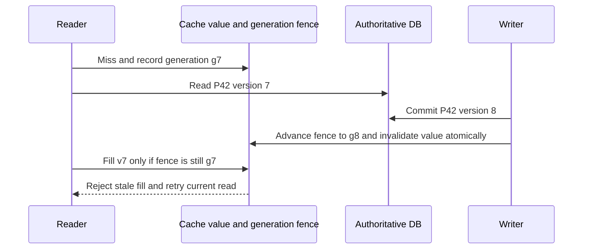

**Sharding without reshuffling.** Naive `hash(key) % N` remaps **almost every
key** when `N` changes (add a node → cache-wide miss storm → DB melts).
**Consistent hashing** (Ch 24) maps both keys and nodes onto a ring; a key is
owned by the **next node clockwise**, so adding/removing a node only moves
`~1/N` of keys:

```
          ┌─────── hash ring (0 … 2^32) ───────┐
          │                                       │
     A ●                                            ● B
          │     ● keyA → owned by B (next CW)      │
          │          ● keyB → owned by C           │
     D ●                                            ● C
          │   Add node E between D and A:           │
          └── only keys in the D→E arc move ────────┘
 Virtual nodes: place each physical node at ~100 ring spots → even load
 + lets you weight bigger nodes with more vnodes.
```
**Virtual nodes** (each physical node placed at many ring positions) smooth out
load imbalance and make rebalancing gradual.

**The hot-key problem.** Consistent hashing balances *many* keys, but if **one**
key (a celebrity's profile, a flash-sale SKU) gets 200k req/s, it all lands on
**one node** and melts it. Three mitigations, often combined:
```
1. CLIENT-SIDE / NEAR CACHE: app caches hot keys in-process for a few
   seconds → most reads never reach the cache node at all.
2. KEY REPLICATION / FANOUT: store the hot key on K nodes as key#0..key#K-1;
   readers pick a random replica → load splits K ways.
3. REQUEST COALESCING (anti thundering-herd): on a miss, only ONE caller
   fetches from the DB while others WAIT for the fill (single-flight),
   so a popular expired key doesn't trigger 10k simultaneous DB reads.
```
The **thundering herd** (a.k.a. cache stampede) is the failure where a hot key
**expires** and thousands of concurrent misses all stampede the DB at once.
**Request coalescing / single-flight** plus **slightly randomized TTLs** (jitter)
reduce synchronized expiry. (Stampede theory: Ch 23.) After a **cold restart**,
hit rate can fall from 90% to zero: the DB would face **1 M reads/s**, not
100k/s. Warm a prioritized hot set, cap concurrent/rate-limited DB fills,
stagger node replacement and shed optional reads. Single-flight collapses
requests for the **same** key; it cannot collapse a million distinct cold keys.

## 17.4 Trade-offs and Follow-ups

- **Cache vs source of truth:** the cache is **allowed to be stale and to lose
data** on a node crash — that's why the DB is authoritative and the cache is
rebuildable.
- **Eviction:** **LRU** is the default; **LFU** (or W-TinyLFU) wins for stable
hot sets where recency lies (Ch 23).
- **Replication:** async replicas trade a small staleness/loss window for read
scale and fast failover; sync replication costs write latency.
- **Red flags:** `hash % N` sharding (reshuffle storm on scale-out); no hot-key
plan (one node melts); no stampede protection (expiry → DB outage); caching
data that needs to be perfectly fresh; treating the cache as durable.
- **Building blocks:** caching strategies, eviction (LRU/LFU/W-TinyLFU),
stampede protection — **Ch 23**; consistent hashing + virtual nodes —
**Ch 24**; replication & failover — **Ch 24**.

<a id="practice-17"></a>

## 17.5 Practice

### Whiteboard Rehearsal

**Narrate:** a cache miss transfers load to the DB; it does not create DB
capacity. Legacy sketches simplify the ring, invalidation and restart paths.


### Try It

the DB safely handles 120k reads/s, but a restart creates 1M distinct-key misses/s. Is single-flight enough?

<details>
<summary>Show worked answer</summary>

No. Distinct keys do not share a fill. Enforce a DB admission budget below
120k/s with headroom, prioritize essential traffic, and warm gradually. Waiting
or rejecting excess requests is safer than forwarding them all and causing a
database outage. Extra RAM alone does not solve the refill throughput problem.

</details>

---

<a id="cs18"></a>

# Case 18 — Job Scheduler / Task Queue

> **Google priority:** ★★ · **Difficulty:** Hard · **Frequency:** Common · **Time budget:** ~35 min

> **User story —** *As a* backend, *I want* to run work later or in the background reliably, *so
> that* delayed and recurring jobs fire on time and nothing is lost when a worker crashes.
>
> **For example —** "send this email in 5 minutes" and "generate the report nightly at 02:00" both
> land in a durable store; a worker leases each job (visibility timeout) and acks on success, so a
> crash just re-runs it.
>
> **Why it matters —** at-least-once + idempotent workers + a durable job store with leased
> dispatch is what turns "run it later" into a real guarantee.

Almost every backend needs to **run work later or in the background**: send this
email in 5 minutes, generate this report nightly at 02:00, retry this webhook,
process this video. A **distributed job scheduler / task queue** accepts jobs,
runs them on a fleet of workers, and makes two hard promises: **every job runs
at least once even if workers crash**, and **delayed/cron jobs become eligible at the right
time**, with measured dispatch-lag SLOs rather than exact execution times during
outages. The whole design hinges on a **durable job store + leased dispatch**
(the "visibility timeout" trick) and a **time-ordered structure** for delayed
jobs.

## 18.1 Requirements and Estimates

- **Functional:** submit **immediate**, **delayed** (`run_at`), and **recurring**
(cron) jobs; execute on workers; **retry** failures with backoff; route
exhausted jobs to a **dead-letter queue (DLQ)**.
- **Delivery semantics:** **at-least-once** is realistic; **exactly-once is an
illusion** — so workers must be **idempotent**. Decide this explicitly.
- **Estimate:** 100 M jobs/day ≈ **1,200/s** (peak ~5k/s). Avg job 200 ms →
concurrency needed ≈ `λ × service_time` (Little's Law) = 5000 × 0.2 = **1,000
execution slots** at peak, not necessarily machines. With 20 slots/machine,
the busy-capacity lower bound is 50 machines; 70% target utilization needs
about 72, before failure headroom. Job store: 100 M × 1 KB = 100 GB/day with a short TTL on
completed jobs.

## 18.1a Start Simple

**Baseline → pressure → change → cost:** a local timer is enough for disposable
work; process death must not lose a report; persist jobs and lease each attempt;
pay storage/polling cost and make effects idempotent under redelivery.

**Trace `job-42`:** worker A claims attempt 7 at 12:00:00, lease until :30.
A heartbeat at :20 extends it to :50. After a pause, the sweeper makes it ready
at :51 and B claims attempt 8. A's late acknowledgement at :52 **must affect
zero rows**; it no longer owns the current attempt.

**Prerequisites:** [Ch 24: queues, leases and SKIP LOCKED](#content/24_system_design_data_distributed),
[Ch 25: retries and idempotency](#content/25_system_design_operations_case_studies).
[Contents](#chapter37-toc) · [Previous: cache](#cs17) · [Next: payments](#cs19)

## 18.2 Architecture

**Image correction:** ACK needs the current attempt; timer entries consume memory


**Block-by-block:**
- **Submit API** — writes each job **durably** (so nothing is lost on a crash) with its `run_at` and `state`.
- **Leader-elected scheduler** (only one active at a time, via etcd/ZooKeeper — Ch 24) — scans the
  **time-ordered index** and promotes **due** jobs to READY.
- **Workers** — poll, **lease** a job (claim it for a bounded time), run it, and **ack** (delete)
  on success or **retry with backoff** on failure; after `N` attempts the job goes to a **DLQ**.
- **Sweeper** — re-queues jobs whose **lease expired** (the worker died mid-job) — that's what
  makes execution **at-least-once**.

**Numbered flow:** (1) submit → durable store; (2) scheduler marks due jobs READY; (3) worker
leases + runs; (4) ack→done, or fail→retry/DLQ, or crash→lease expires→redeliver.

## 18.3 Deep Dive

**Mechanism diagram**

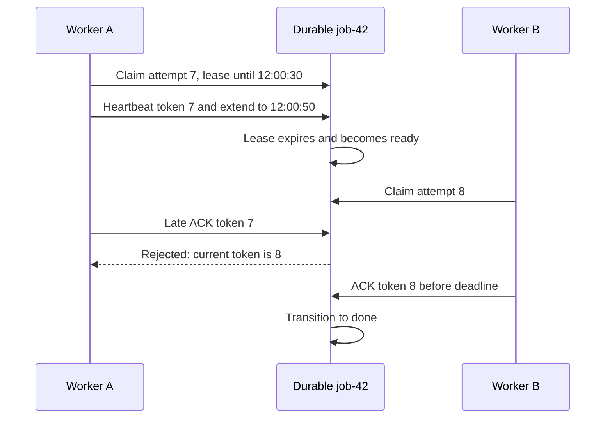

**Leased dispatch** is how you get at-least-once without losing jobs when a
worker dies. Dequeue **atomically claims** a job and stamps a **lease deadline**;
if the worker doesn't finish (and renew/ack) before the deadline, the job
becomes visible again and is redelivered — exactly how SQS's *visibility
timeout* works.

```sql
-- DEQUEUE: atomically claim one due job (Postgres: SKIP LOCKED avoids
-- two workers grabbing the same row)
UPDATE jobs SET state='leased',
              lease_until = now() + INTERVAL '30s',
              attempts    = attempts + 1
WHERE id = (
 SELECT id FROM jobs
 WHERE state='ready' AND run_at <= now()
 ORDER BY run_at
 FOR UPDATE SKIP LOCKED          -- skip rows another worker locked
 LIMIT 1
) RETURNING id, payload, attempts AS attempt_token;

-- Never reset attempts or reuse a job ID for different work.
-- ACK and heartbeat must match the current, still-valid attempt.
UPDATE jobs SET state='done'
WHERE id=:id AND state='leased' AND attempts=:attempt_token
  AND lease_until > now();
-- Zero rows: stale/expired ACK; report lease loss, not success.

UPDATE jobs SET lease_until=now() + INTERVAL '30s'
WHERE id=:id AND state='leased' AND attempts=:attempt_token
  AND lease_until > now();

-- Sweeper: UPDATE jobs SET state='ready'
--          WHERE state='leased' AND lease_until <= now();
```
The lease is the dispatch trick: a **crashed worker can't ack**, so its lease
**expires** and the job runs again elsewhere → **at-least-once**. Because of
redelivery, the **worker must be idempotent** (use a job-id dedupe key, Ch 25).
An old worker can still execute after losing the lease: token-checked ACK
protects the **queue state**, not an external side effect. The effect sink must
dedupe by stable job/occurrence ID, or enforce fencing where appropriate.

**The delayed-job structure.** "Run at `run_at`" needs an efficient "what's due
now?" query. Two standard structures:
```
(a) SORTED SET BY run_at  (Redis ZSET; simple, scales to millions)
      ZADD delayed <run_at_ts> <job_id>
      due = ZRANGEBYSCORE delayed -inf now   → promote these to READY
      O(log N) insert, O(log N + m) to pull m due jobs.

(b) HIERARCHICAL TIMING WHEEL  (for huge timer volumes, e.g. Kafka)
      buckets:  [ now ][ +1s ][ +2s ] ... ring of slots; a job lands in
      the slot for its run_at; the wheel ticks one slot per second and
      fires that slot's jobs. Bucket metadata can be fixed, but entries
      use O(number of timers) memory; processing a bucket costs its job count.
```
A **timing wheel** (hashed wheel timer) gives **O(1)** scheduling for millions of
short timers (used in Kafka, Netty); a **sorted set** is simpler and plenty for
most schedulers. Persist the job store; a wheel is a rebuildable due-time
index, not a substitute for durability.

**Durable recurrence:** keep a schedule record with timezone, next scheduled
instant, misfire policy and overlap policy. A planner transaction inserts an
occurrence unique on `(schedule_id, scheduled_at)` **and advances next_fire**
together. A crash cannot advance the schedule while losing that occurrence.
For `report-ny` at 02:00 America/New_York, choose a DST rule (skip a nonexistent
02:00, run once for repeated local times), a missed-run rule (coalesce outage
runs into one), and overlap rule (skip if prior occurrence still active).
Other choices are valid but must be durable and visible to users.

## 18.4 Trade-offs and Follow-ups

- **At-least-once + idempotent** beats chasing exactly-once. Make ack the only
thing that removes a job, and the lease the only thing that hides it.
- **Leader election** reduces competing scans; conditional state changes and
unique occurrence IDs still make promotion safe if an old leader briefly runs.
Election alone is not a duplicate-prevention protocol.
- **Backoff + DLQ:** retry with exponential backoff and **jitter** (avoid
retry storms — Ch 23); a poison job must end in the DLQ, not loop forever.
- **Red flags:** holding jobs in memory (lost on crash — must be durable); no
lease/visibility timeout (a dead worker silently drops its job); non-idempotent
workers with at-least-once delivery (double side-effects); a single scheduler
with no leader election (split-brain double execution); scanning the whole
table for due jobs instead of a time-ordered index.
- **Building blocks:** queues, DLQs, delivery guarantees — **Ch 24**;
idempotency keys — **Ch 25**; leader election (etcd/ZK) — **Ch 24**; retries
with backoff + jitter — **Ch 23/25**.

<a id="practice-18"></a>

## 18.5 Practice

### Whiteboard Rehearsal

**Narrate:** the job ID identifies work; the attempt token identifies current
ownership. Legacy sketches' "ACK by job ID" omits this distinction.


### Try It

A finishes an external email after its lease expires and B has claimed the retry. Does rejecting A's late ACK prevent duplicate email?

<details>
<summary>Show worked answer</summary>

No. The queue must reject A's stale token, but the email provider/effect store
must independently dedupe a stable occurrence key. Heartbeats reduce overlap;
they do not eliminate pauses or lost responses. Deduping with the attempt
number would be wrong because retries intentionally have different attempts.

</details>

---

<a id="cs19"></a>

# Case 19 — Payments / Digital Wallet

> **Google priority:** ★★★ · **Difficulty:** Hard · **Frequency:** Common · **Time budget:** ~40 min

> **User story —** *As a* user moving money, *I want* every top-up, payment, and transfer to be
> exactly right — never double-charged, never lost — *so that* I can trust my balance.
>
> **For example —** my "pay merchant" call times out and the app retries; the idempotency key makes
> the retry a no-op, so I'm charged once and the double-entry ledger still balances.
>
> **Why it matters —** spend authorization requires authoritative balances;
> an immutable ledger, transactional balance maintenance and durable idempotency
> protect local posting. External settlement still has pending/unknown states.

This is the design where **eventually consistent spend authorization** is a
wrong answer. Statements, notifications and settlement can lag; deciding
whether funds are spendable cannot rely on a stale cache. A bug is not a stale tweet —
it shows up as a **double charge**, a **lost deposit**, or **money created from
nothing**. A digital wallet must let users hold a balance, **top up** (card →
wallet), **pay** (wallet → merchant), and **transfer** (wallet → wallet), while
guaranteeing that **every cent is accounted for, no operation is applied twice,
and the books always balance** — even when a network call times out at the worst
possible moment. The design is built from three ideas: an **immutable
double-entry ledger**, **idempotency keys**, and a **saga** across the wallet
and the external payment gateway. The guiding principle is **correctness over
availability** — this is a **CP** system.

## 19.0 Interview Focus

- Do you reach for a **double-entry, append-only ledger** plus a transactionally
maintained balance, rather than a mutable balance with no audit history?
- Do you make every money operation **idempotent** so a client retry (or a
gateway timeout) can never double-charge?
- Can you coordinate the wallet and an **external gateway** with a **saga +
compensation**, since you can't run one ACID transaction across them?
- Do you correctly choose **strong consistency (CP)** and explain what you give
up (availability during partitions) — and how **reconciliation** catches the
rest?
- Do you treat the ledger as the **system of record** with a full **audit trail**?

## 19.1 Requirements

**Functional**
- **Top-up** (external card/bank → wallet), **pay** (wallet → merchant),
**transfer** (wallet → wallet), **refund/reversal**, **balance** query, and a
**statement** (transaction history).
- Every state-changing call takes an **`Idempotency-Key`**.
- Multi-currency optional (state it as a stretch; keep one currency in the core).

**Out of scope:** the **fraud-detection model itself** and KYC/onboarding — though the payment
flow does call a thin **Fraud Service** for a risk check before moving money (shown in §19.3) —
and the card-network internals (we integrate a **gateway** — Stripe/Adyen — as a black box).

**Non-functional**
- **Correctness:** **no double-spend, no lost money, books always balance**
(`Σ of every transaction's entries = 0`). This dominates everything.
- **Consistency:** **strong** for balances — a successful debit is immediately
reflected; **no overdraft** past available balance.
- **Durability/audit:** the ledger is append-only with defined audit retention,
  legal holds and controlled archival; retention is a requirement, not "forever" by default.
- **Availability:** high, but **correctness wins ties** — during a partition we
**refuse** rather than risk a double-spend (**CP**, not AP).

**Questions to ask:** *Single currency or FX? Are we the system of record or
fronting a bank? Allowed to hold funds (float)? What's the gateway and its
idempotency model? Required audit/retention? Synchronous authorization or
async settlement?*

## 19.2 Estimates

```
 Transactions (peak)     10,000 /s
 Ledger entries          2+ per txn → 20,000 entries/s
 Peak sustained all day  ~10k × 86,400 ≈ 8.6e8 txns; ~1.7e9 entries (upper bound)
 Example average 2k/s    172.8M txns/day; 345.6M entries/day
 Entry size ~200 B       ~69 GB/day average payload; ~346 GB/day peak bound
 Physical storage        add indexes, replication, outbox and backups
 Retention               YEARS (audit) → partition by month, archive cold,
                         keep hot only the recent window for fast reads
 Balance reads           >> writes, but reads can hit a derived cache;
                         the WRITES are the part that must be perfect
```
The numbers say: **volume is modest by web standards** (10k/s is nothing for a
feed), but **every write must be correct and retained for its required audit period**. So we optimize for
**transactional integrity and auditability**, not raw throughput — a relational,
strongly-consistent store is the right call here, not an eventually-consistent
KV.

## 19.2a Start Simple

**Baseline → pressure → change → cost:** a transactional balance update can
serialize spending; refunds/audit/retries need history and replay safety; add
balanced append-only entries, durable idempotency and outbox **in that same
transaction**; pay write amplification and reconciliation work. Add a saga
only when an external processor or a second transactional boundary requires it.

**Two concurrent spends:** Alice has **5,000 USD cents**. T30 wants 3,000;
T31 wants 2,500. T30 locks the balance, writes −3,000/+3,000 entries, updates
Alice to 2,000, and commits. T31 acquires the lock next, reads **2,000**, and
fails insufficient funds. If T30 wrote only ledger entries without changing
the locked balance, T31 would incorrectly read 5,000.

**Prerequisites:** [Ch 24: ACID, outbox and sagas](#content/24_system_design_data_distributed),
[Ch 25: idempotency and reconciliation](#content/25_system_design_operations_case_studies).
[Contents](#chapter37-toc) · [Previous: scheduler](#cs18) · [Next: inventory](#cs20)

## 19.3 Architecture

**Image correction:** dashed HTTP arrows are not async events; balance and PENDING rules follow Mermaid/text


**Legend:** boxes are services; a store is named inside the box.
**Block-by-block:**
- **Payment API** — the synchronous entry point; its first stateful step is
  durable idempotency lookup/claim. A completed matching request replays its
  result; PENDING/UNKNOWN returns status or resumes the existing operation.
- **Orchestrator** — runs the multi-step **saga** (because we can't wrap an external gateway call
  in our DB transaction).
- **Wallet/ledger service** — owns the **double-entry, append-only ledger** in a
  strongly-consistent SQL store; it is the **system of record**.
- **Gateway adapter** — talks to the external processor (also idempotent).
- **Outbox** (written in the *same* DB transaction as the ledger entry — Ch 24) — publishes events
  for notifications and, crucially, for the reconciliation job.
- **Reconciliation job** — compares our ledger against the gateway's settlement report and flags
  any discrepancy; that loop is the safety net that makes the whole thing trustworthy.

## 19.4 Request Walkthrough

A **card top-up** of Alice's wallet, end to end:
```
1. POST /topup {wallet:alice, amount_minor:10000, currency:USD, card, key:k1}
2. API idempotency: scope=(tenant, authenticated principal, topup), key=k1
      ├─ different payload hash → reject key reuse
      ├─ terminal → return stored result (NO second charge)
      ├─ PENDING/UNKNOWN → return status/resume T1, not a fresh payment
      └─ absent → create durable txn T1=PENDING (unique scope+key)
3. Orchestrator → Gateway.charge(card, 10000 USD cents, provider_key=T1)
      provider scope/window must support safe retry of that same identity
4a. charge OK → post LEDGER (one ACID DB txn in the wallet):
          DEBIT  card_clearing  -100.00   T1
          CREDIT wallet:alice   +100.00   T1     (Σ = 0)
          update authoritative balances in cents in this transaction
          set T1 = CONFIRMED; write OUTBOX event; store result under scope+k1
4b. definitive decline → T1 = FAILED; no ledger entries; return error
4c. timeout → T1 = UNKNOWN; query by provider payment identity, no fresh charge
5. crash AFTER charge but BEFORE ledger → saga resumes: it sees the
      gateway charge succeeded (query by provider identity T1) and completes step 4a;
      if it instead decides to abort → COMPENSATE: refund the charge
6. Outbox → Kafka → notify Alice; reconciliation later matches T1 to the
      gateway's settlement line for T1, linked to the client's scoped k1
```
Every requirement maps to a step: **step 2** preserves one logical request and
**step 3** uses the provider's supported dedupe contract, **step 4a** keeps the books balanced (double-entry in one ACID
txn), **step 5** survives mid-saga crashes (resume or compensate), **step 6**
verifies reality against our records (reconciliation).

## 19.5 Data Model

| Entity | Shape (key fields) | Store | Why |
|--------|--------------------|-------|-----|
| Accounts | `account_id, type, currency` | Strongly-consistent SQL | Few, critical, relational |
| **Ledger entries** | `entry_id, txn_id, account_id, amount_minor(signed integer), currency, ts` | SQL, **append-only** | Audit; sum separately per currency |
| Transactions | `txn_id, scope, idem_key, payload_hash, state, result` | SQL; UNIQUE(scope, idem_key) | Durable dedupe and resumable state |
| Idempotency acceleration | `scope+key → terminal result` | Optional Redis cache | Not the authority; expiry cannot authorize re-posting |
| Authoritative balances | `account_id → balance_minor, currency` | **Same SQL transaction as entries** | Locked for spend checks; recomputable and audited against ledger |
| Read balance cache | `account_id → balance, version` | Optional derived cache | Display-only with freshness label; never authorizes a debit |
| Outbox | `event_id, payload, published` | Same SQL DB | Atomic with ledger write (Ch 24) |
| Settlement reports | gateway files | Object store → OLAP | Reconciliation input |

**The non-negotiable:** the **ledger is append-only**. You never `UPDATE` or
`DELETE` an entry; a correction is a **new reversing entry**. That gives a
complete audit trail for the retention period and makes the balance recomputable
from history. Scope keys to the authenticated tenant/principal and operation;
bind them to canonical payload fields (accounts, currency, amount). Reject reuse
with a different payload. Integer minor units avoid floating-point rounding.
Keep durable dedupe through the supported retry horizon; beyond a provider's
dedupe window, reconcile by transaction identity instead of blindly resending.

## 19.6 Scaling

- **Shard with transaction boundaries in mind.** Two accounts on one shard can
  transfer atomically. A cross-shard transfer is not made atomic by calling it
  a saga: use balanced **clearing/pending accounts** in each local transaction,
  durable transfer IDs and an explicit funds-in-transit state, or pay for a
  distributed transaction if simultaneous visibility is required.
- **Hot account** (a popular merchant receiving thousands of payments/sec):
serialize writes to that account, or split incoming credits into **sub-ledgers**
that roll up. Addition commutes, but dedupe, balances and spending limits still
need authoritative enforcement; split credits do not make independent debits safe.
- **Balance reads** scale via the derived **balance cache / materialized view**;
the **authoritative** number is always `SUM(entries)`, recomputable on demand.
- **Throughput is not the hard part** at 10k/s; **write correctness and lock
contention on hot accounts** are. Keep transactions short; use row-level locks
or optimistic concurrency (Ch 24) on the debited account.

## 19.7 Failures and Trade-offs

```
What dies / happens          →  What we do
─────────────────────────────────────────────────────────────────────
Client retries after timeout →  same scope/key/payload → terminal replay OR
                                existing PENDING/UNKNOWN status and resume
Gateway times out (unknown!) →  treat as UNKNOWN, not failure: re-query by
                                provider identity; never blindly retry a charge
Crash mid-saga               →  saga is durable; on restart, resume from
                                last committed step or run compensation
DB partition / replica lag   →  REFUSE the write (CP) rather than risk a
                                double-spend; availability yields to safety
Ledger ≠ gateway report      →  investigate discrepancy; corrective balanced
                                entries only after resolving its meaning
```
**Trade-offs called out:** we pick **CP over AP** deliberately — during a
partition we'd rather **return an error than process a payment we can't
guarantee**. We accept **higher write latency** (strong consistency, single
authoritative shard per account) as the price of correctness. We use
**at-least-once + idempotency** for *messaging*, but the **ledger insert itself
is exactly-once** via the unique idempotency key. Reconciliation gives us
evidence that our records match external money movement, with tracked exceptions;
it does not automatically repair or prove away every discrepancy.

## 19.8 Deep Dive

**Mechanism diagram**

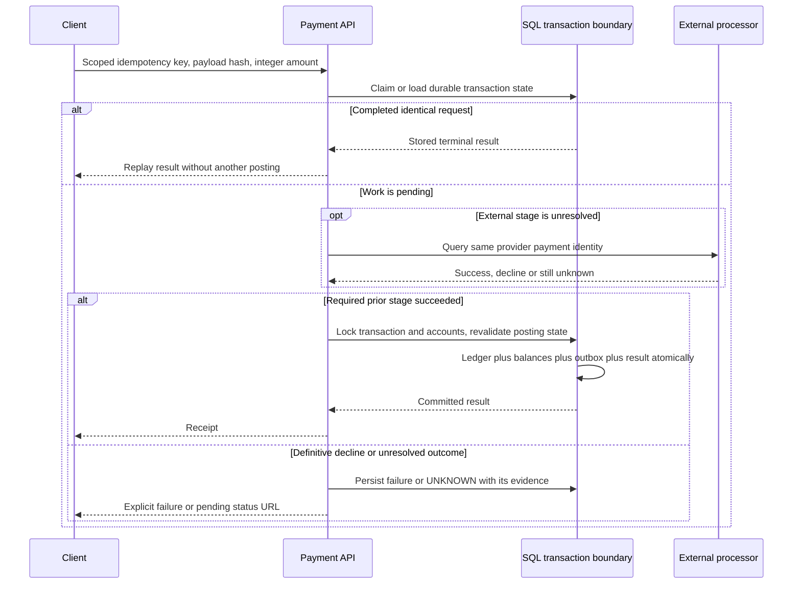

Two ideas carry the entire design: the **idempotent double-entry posting**, and
the **saga** that spans the external gateway.

**Double-entry, in one picture.** Every transaction writes entries that **sum to
zero** — money is conserved, never created:
```
txn T1 — "Alice pays Bob $30"
 ┌──────────────────┬──────────┬──────┐
 │ account          │  amount  │ txn  │
 ├──────────────────┼──────────┼──────┤
 │ wallet:alice     │  -30.00  │ T1   │   debit  (money leaves)
 │ wallet:bob       │  +30.00  │ T1   │   credit (money arrives)
 └──────────────────┴──────────┴──────┘
                      Σ = 0  ← invariant checked on every commit
 balance(x) = SUM(amount) WHERE account = x          (pure function)
 APPEND-ONLY: a mistake is fixed by a NEW reversing entry, never an UPDATE.
```

**The idempotent posting** — one ACID transaction, dedupe via a **unique
constraint**, balance-protected:
```sql
-- Local same-currency transfer. Validate positive integer amount, distinct
-- existing accounts and authorization before posting. No external HTTP here.
BEGIN;
INSERT INTO transactions(txn_id, scope, idem_key, payload_hash, state)
VALUES (:new_tid, :scope, :key, :hash, 'PENDING')
ON CONFLICT (scope, idem_key) DO NOTHING;

SELECT txn_id, payload_hash, state, result FROM transactions
WHERE scope=:scope AND idem_key=:key FOR UPDATE;
-- Use this row's txn_id as :tid, including on retry.
-- Different hash: reject. Terminal state: COMMIT and return stored result.
-- PENDING: resume only this posting stage; do not assume it is complete.

SELECT account_id, balance_minor, currency FROM balances
WHERE account_id IN (:from, :to) ORDER BY account_id FOR UPDATE;
-- Require both accounts/currencies to match and payer balance >= :amount_minor.
-- Insufficient funds: store FAILED + result and COMMIT without posting.

INSERT INTO ledger_entries(txn_id, account_id, amount_minor, currency) VALUES
    (:tid, :from, -:amount_minor, :currency),
    (:tid, :to,    :amount_minor, :currency);
UPDATE balances SET balance_minor=balance_minor-:amount_minor WHERE account_id=:from;
UPDATE balances SET balance_minor=balance_minor+:amount_minor WHERE account_id=:to;
-- Assert wallet no-overdraft constraints and balanced entries before commit.
INSERT INTO outbox(event_id, payload) VALUES (:event_id, :event);
UPDATE transactions SET state='CONFIRMED', result=:receipt WHERE txn_id=:tid;
COMMIT;
```
Why this is the crux: the **unique idempotency key** turns "process this
payment" into an operation safe to retry **any number of times** — the second
attempt loads the existing row: terminal means replay, PENDING means serialized
resume/status. A transaction-row lock and posting uniqueness (e.g. one posting
per transaction stage) prevent duplicate ledger rows. The **entries and balance
updates in one ACID commit** preserve both audit and spendable funds. The **outbox in the same
transaction** means we never "move money but fail to publish the event" (or vice
versa) — the event and the ledger commit or roll back together (Ch 24).

**The saga across the gateway.** We can't put an external HTTP charge inside our
DB transaction, so a multi-service money flow is a **saga**: a sequence of local
transactions, each with a **compensation**:
```
 PENDING ──charge OK──▶ CHARGED ──post ledger OK──▶ CONFIRMED
    │                      │
    │ charge FAIL          │ ledger FAIL (rare)
    ▼                      ▼
  FAILED            COMPENSATE: refund pending ──confirmed reversal──▶ REVERSED
```
Each step is **idempotent and durable**; on crash the orchestrator **re-drives**
from the last committed step. The key discipline: order steps so the
**hardest-to-undo step is last**, and treat a gateway **timeout as UNKNOWN** —
re-query by idempotency key rather than firing a second charge. (Saga + outbox:
Ch 24.) A refund timeout is also UNKNOWN; compensation is not complete until
its outcome is confirmed.

**Cross-shard example, 3,000 cents:** shard A posts Alice −3,000 and
`outgoing_clearing:T30` +3,000 atomically; shard B later posts
`incoming_clearing:T30` −3,000 and Bob +3,000 atomically. Each shard's posting
sums to zero. The linked clearing positions represent funds in transit until
both legs reconcile. A retry dedupes by transfer/leg; compensation appends
reversing entries only after the opposite leg's outcome is resolved. There is
**no claim of simultaneous cross-shard visibility** or automatic invariant
preservation merely because a saga exists.

## 19.9 Follow-ups

**Likely follow-ups:**
- *"Why not just an `UPDATE balance` column?"* — it lacks an audit trail by
itself. A correctly locked balance update is essential here, but it must be
transactional with the append-only ledger, not replace that ledger.
- *"How do you prevent double-charge on retry?"* — idempotency key with a unique
constraint at the API *and* a matching key passed to the gateway.
- *"Cross-currency / cross-bank transfer?"* — saga with an FX step; each leg is
its own balanced posting; compensations reverse partial progress.
- *"How do you know it's right?"* — **reconciliation**: nightly compare ledger
totals to the gateway/bank settlement; any drift becomes a flagged reversing
entry. Plus the invariant `Σ entries = 0` checked continuously.
- *"Exactly-once?"* — the **ledger insert is exactly-once** (unique key);
messaging around it is at-least-once + idempotent consumers.

**Red flags that sink candidates:** a mutable `balance` column with no
ledger; no idempotency (the classic double-charge); choosing an
eventually-consistent store for balances; running the external charge *inside*
a DB transaction (cannot make external HTTP rollback atomically) or with no compensation; retrying a charge on
timeout without re-querying (double-charge); forgetting an audit trail; picking
AP "for availability" on money.

**Building blocks reused:** saga + compensation, outbox + CDC, exactly-once
nuance — **Ch 24**; idempotency keys — **Ch 25**; ACID, isolation levels,
optimistic vs pessimistic locking, append-only logs — **Ch 24**; CAP/PACELC
(why CP here) — **Ch 23/24**; reconciliation & audit — **Ch 25**.

<a id="practice-19"></a>

## 19.10 Practice

### Whiteboard Rehearsal

**Narrate:** external HTTP and client responses are request/response hops;
outbox publication is asynchronous. The legacy PNG's dashed-arrow legend
mixes those meanings. No network call to the processor is inside the SQL
transaction that holds wallet locks.


### Try It

k1 exists as PENDING after the processor charged, but before the ledger committed. Is returning success or starting a new charge safe?

<details>
<summary>Show worked answer</summary>

Neither. Return an explicit in-progress status and resume T1 using the same
provider identity. Query the processor, then post once under the transaction
lock or complete a confirmed refund. A pending row proves an operation exists,
not that funds were credited. Reusing k1 with a changed amount is rejected.

</details>

---

<a id="cs20"></a>

# Case 20 — Inventory / Flash Sale

> **Google priority:** ★★ · **Difficulty:** Hard · **Frequency:** Common · **Time budget:** ~30 min

> **User story —** *As a* shopper in a flash sale, *I want* a fair shot at the limited stock with
> no overselling, *so that* if the site says I got one, I actually get it.
>
> **For example —** 1 M people tap "Buy" on 100 PlayStations; a waiting room
> limits admission and a durable atomic reserve operation issues at most 100
> active/confirmed units. Redis admission alone does not establish no oversell.
>
> **Why it matters —** the entire problem is making "check stock and decrement" one atomic op on a
> single hot SKU under brutal contention, then holding stock just long enough to pay.

A **flash sale** — 1,000 PlayStations at midnight, a concert on-sale, a
Black-Friday doorbuster — is a **concurrency stress test disguised as shopping**.
A million people press "Buy" in the same second on a product with **100 units in
stock**. The one thing you absolutely cannot do is **oversell**: sell unit #101.
The whole problem is making "**check stock and decrement it**" a single
**atomic** operation under brutal contention, then holding stock just long enough
for the buyer to pay.

## 20.1 Requirements and Estimates

- **Functional:** reserve stock at checkout, **confirm** a still-valid
  reservation after payment, **release** on definitive failure or reservation
  expiry. A payment timeout is **UNKNOWN**, not a decline (CS19).
- **The hard requirement:** **no oversell** under massive concurrency; some
  **under-sell** (a few reserved-but-abandoned units freed late) is tolerable.
- **Flash-sale shape:** huge **read** spike (everyone browsing) + a thundering
  **write** spike on **one hot SKU** (everyone buying the same item).
- **Estimate:** 1 M concurrent buyers, **100 units**. ~1 M checkout attempts in
  seconds → one hot SKU. A **waiting room** must shed the flood before the
  authoritative write. Once admitted traffic is bounded, a durable conditional
  SQL transaction is a reasonable baseline, even for this flash sale.

## 20.1a Start Simple

**Baseline → pressure → change → cost:** a conditional stock update handles
ordinary purchases; checkout spans payment and retryable calls; create a
durable reservation with that decrement; pay held-stock underutilization,
expiry processing and late-payment compensation. Add a waiting room when
arrival rate exceeds the hot row's measured commit capacity.

**PS5 stock=2:** O17 reserves one as `R17=ACTIVE` until 12:05, leaving
available=1. Retrying O17 returns R17 without another decrement. O18 reserves
the other unit: available=0. Within this simplified no-restock/no-return sale,
`available + active quantities + confirmed quantities = 2`.

**Prerequisites:** [Ch 24: conditional writes and transactions](#content/24_system_design_data_distributed),
[CS19: payment UNKNOWN and compensation](#cs19).
[Contents](#chapter37-toc) · [Previous: payments](#cs19) · [Next: KV store](#cs21)

## 20.2 Architecture

**Image correction:** TTL is not release; Redis recovery must precede a no-oversell claim


**Block-by-block:**
- **Virtual waiting room** — the pressure valve: it admits a controlled rate of users and tells
  the rest to wait, so the inventory service never sees a million simultaneous writes.
- **Inventory API** — commits the conditional stock decrement and a durable,
  idempotent reservation **together**. Redis may gate admission/cache availability,
  but the SQL reservation authority decides whether stock was obtained.
- **Order outcome** — payment success competes with expiry via a conditional
  reservation transition; payment timeout remains UNKNOWN.
- **Apache Kafka** — each confirmed order **emits order events** for fulfillment, analytics, and **reconciliation**.
- **Durable DB** — source of truth for stock, active reservations and their
  transitions, not just final orders. Reconciliation audits it and rebuilds caches.

**Numbered flow:** (1) queue → (2) admit → (3) atomic durable reserve+decrement
→ (4) pay/query outcome → (5) conditional confirm/expire/release
→ (6) outbox events for fulfillment and reconciliation.

## 20.3 Deep Dive

**Mechanism diagram**

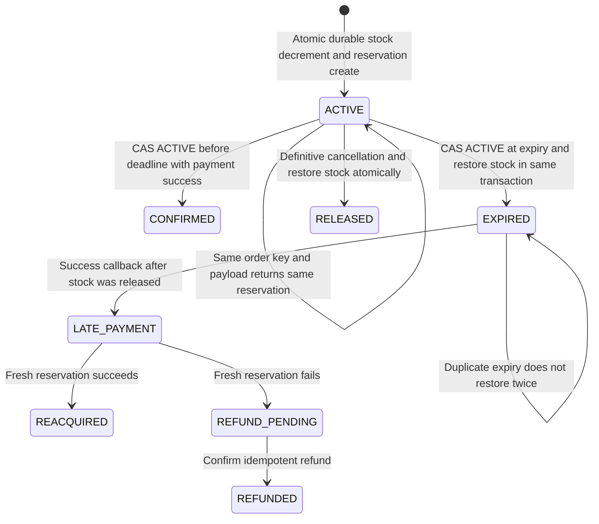

Oversell happens when two requests both **read** "1 left," both decide "OK," and
both **decrement** — a read-modify-write race. The fix is to make the **check and
the decrement one atomic step**. The familiar counter operations show this
mechanical core, but neither by itself is a durable reservation protocol:

```
  (A) REDIS atomic admission counter (not final stock authority here)
      local n = redis.call('DECRBY', 'stock:'..sku, qty)
      if n < 0 then
          redis.call('INCRBY', 'stock:'..sku, qty)   -- undo the overshoot
          return 0                                    -- SOLD OUT
      end
      return 1                                        -- admitted to try reserve
      -- Redis is single-threaded → no two clients interleave this script.
      -- A separate SET ... EX cannot atomically create a durable reservation.

  (B) SQL conditional update (inside the reservation transaction below)
      UPDATE inventory SET available = available - :qty
      WHERE  sku = :sku AND available >= :qty;        -- atomic check+dec
      -- affected rows = 1 → success;  0 → not enough stock (no oversell)
      -- the WHERE clause + row lock make the check and write indivisible
```
Both make the arithmetic atomic. To preserve the reservation through crashes,
the default design uses this **single durable transaction**, with validated
positive quantity and a key bound to order/SKU/quantity:

```sql
BEGIN;
INSERT INTO reservations(id, order_id, sku, qty, state, expires_at, payload_hash)
VALUES (:rid, :order, :sku, :qty, 'PENDING', now()+INTERVAL '5 minutes', :hash)
ON CONFLICT (order_id) DO NOTHING;
-- If not inserted: load existing row, reject changed payload, return its state.
-- Only a newly claimed order proceeds to the stock decrement.
UPDATE inventory SET available=available-:qty
WHERE sku=:sku AND available>=:qty;
-- If zero rows: set this reservation REJECTED and commit without a hold.
-- Otherwise:
UPDATE reservations SET state='ACTIVE' WHERE id=:rid;
INSERT INTO outbox(event_id, payload) VALUES (:event_id, :reserved_event);
COMMIT;

-- Expiry worker: one transaction; use only the row actually transitioned.
BEGIN;
UPDATE reservations SET state='EXPIRED'
WHERE id=:rid AND state='ACTIVE' AND expires_at<=now()
RETURNING sku, qty;
-- Only if one row returned: restore exactly that sku/qty.
UPDATE inventory SET available=available+:returned_qty WHERE sku=:returned_sku;
COMMIT;

-- Confirmation uses the competing conditional transition:
UPDATE reservations SET state='CONFIRMED', payment_id=:payment
WHERE id=:rid AND state='ACTIVE' AND expires_at>now();
-- Zero rows: inspect current state; do not ship on an expired/released hold.
```

The branches above are transaction-controller pseudocode: a rejected reserve
does not fall through into ACTIVE; an expiry returning no row does not
increment anything. Cancellation/release follows the same
**ACTIVE→RELEASED plus restore** transaction. Keep terminal reservation records
for dedupe/audit; expiring a Redis key neither restores stock nor proves the
payment failed. A sweeper may be late, causing under-sell, but cannot release twice.

**Redis failure:** with SQL authority, pause the optional admission gate or
fall back at a tightly bounded rate; rebuild it from durable stock/reservations.
If Redis is instead chosen as the reservation authority, decrement and
reservation/dedupe creation must share a script **and** acknowledged writes
must survive the promised failures. Ordinary asynchronous replication can
lose accepted holds on promotion. Stop new sales until ownership is fenced
and acknowledged state recovered; do not reset stock from a stale snapshot.
Periodic reconciliation after reopening cannot retroactively guarantee no
oversell. Durable escrow allocations or a consensus-backed authority are
alternatives, with their own latency/availability costs.

**Compact ticket variant:** for a named seat `concert-9/A12`, replace fungible
quantity with a unique active ownership constraint on `(event, seat)`.
Reserve/confirm/expire still apply; "two seats available" cannot authorize
selling the same named seat twice. Keep this a variant, not another service design.

## 20.4 Trade-offs and Follow-ups

- **Redis counter vs DB row:** Redis can shed load cheaply; the durable SQL
  reservation protocol is simpler for correctness. Benchmark the admitted
  rate before replacing the authority with a more complex durable hot-key design.
- **Reserve→confirm vs decrement-at-payment:** reserving up front prevents
  oversell during checkout but can **under-sell** if reservations expire slowly;
  tune the TTL. Decrementing only at payment risks two buyers paying for the
  last unit.
- **Waiting room** converts a write *stampede* into a *steady stream* — the same
  admission-control idea as rate limiting (Ch 23).
- **Red flags:** read-then-write without atomicity (the oversell bug); locking
  the whole inventory table; no reservation timeout (units leak); trusting only
  Redis with no durable order record (a Redis crash loses orders); no
  reconciliation between admission cache and DB; promoting stale reservation
  state and continuing sales as though no acknowledged holds were lost.
- **Building blocks:** atomic ops & pessimistic/optimistic locking — **Ch 24**;
  Redis Lua atomicity — **Ch 23/24**; admission control / queueing — **Ch 23**;
  idempotency on the order create — **Ch 25**.

<a id="practice-20"></a>

## 20.5 Practice

### Whiteboard Rehearsal

**Narrate:** expiration is a state transition, not the disappearance of a key.
Legacy sketches' "TTL auto-releases" and "Redis then eventual DB" are not
sufficient protocols for the promised invariant.


### Try It

R17 expires, Carol reserves its released unit, then Alice's payment P17 succeeds. Can Alice's old hold be confirmed?

<details>
<summary>Show worked answer</summary>

No. `ACTIVE→CONFIRMED` fails because R17 is EXPIRED. Attempt a **fresh**
reservation; if no stock remains, create an idempotent refund and track it
until confirmed. Payment success proves money movement, not stock ownership.
If confirmation had won while the hold was valid, expiry would have affected
zero rows and Carol could not have acquired that unit.

</details>

---

<a id="cs21"></a>

# Case 21 — Distributed Key-Value Store

> **Google priority:** ★★ · **Difficulty:** Hard · **Frequency:** Common · **Time budget:** ~35 min

> **User story —** *As a* service needing massive, always-writable storage, *I want* a key-value
> store that stays up and low-latency even during failures, *so that* a shopping cart never rejects
> a write.
>
> **For example —** during a network partition, a `put` still succeeds on the reachable replicas;
> conflicting versions are reconciled later with version vectors and read-repair.
>
> **Why it matters —** it's an availability-first design with explicit conflict
> handling. Strict `W+R>N` overlap assumes a fixed home replica set; sloppy
> quorums deliberately relax that assumption.

"Design a key-value store like **Amazon Dynamo / Cassandra**" is the canonical
**distributed-systems** interview — it forces you to assemble consistent hashing,
replication, quorums, conflict resolution, and failure handling into one
availability-first, horizontally-scalable store. "Always writable" still needs
enough reachable storage and an accepted weaker durability/consistency contract.
The defining choice is at the
opposite end from the payment system: Dynamo picks **AP** — it stays **available
and low-latency even during partitions**, and resolves the resulting
inconsistencies afterward. The interview lives in **how** it does that:
**tunable quorums** and **conflict resolution**.

## 21.1 Requirements and Estimates

- **Functional:** `get(key)` / `put(key, value)` only — no joins, no
transactions in the core; add versioned delete for lifecycle handling.
Massive scale, single-digit-ms target latency; favor writes under partitions.
- **Consistency:** **tunable** per request via N/W/R; default **eventual**
("a shopping cart should never reject a write").
- **Out of scope:** range scans, secondary indexes (a different data model),
strong multi-key transactions (that's NewSQL/Spanner).
- **Estimate:** 1 M ops/s, 10 TB of data, replication factor **N = 3** → 30 TB
stored. Spread across nodes of ~1 TB → ~30–40 nodes; consistent hashing keeps
each node's share ≈ `1/nodes` and resharding cheap.

## 21.1a Start Simple

**Baseline → pressure → change → cost:** one durable primary is simple;
multi-site writes must remain possible when home replicas cannot form a quorum;
allow stand-ins and preserve conflicting versions; pay stale reads, reconciliation
and application merge logic. Strict quorums are a different availability choice.

**Replica trace:** `cart:alice` has home set `{A,B,C}`, N=3, W=R=2.
During a partition the writer reaches A and stand-in D, not B/C.
Strict mode **rejects/fails to acknowledge** this write: only one home replica
is reachable. Sloppy mode can acknowledge v2 on `{A,D}`. A reader reaching
`{B,C}` sees v1, even though the configured numbers still say W+R=4>3.
The two successful sets are not subsets of the same three-node universe.

**Prerequisites:** [Ch 24: quorum, vector clocks, WAL and anti-entropy](#content/24_system_design_data_distributed),
[CS19: contrast with authoritative spending](#cs19).
[Contents](#chapter37-toc) · [Previous: inventory](#cs20) · [Next: Pastebin](#cs22)

## 21.2 Architecture

**Image correction:** W+R>N is fixed-set overlap, not an unconditional latest-write guarantee


**Block-by-block:**
- **No leader** — any node can **coordinate** a request, which is why the store stays available.
- **Consistent hashing + virtual nodes** (Ch 24) — place keys; each key's **preference list** is
  the next **N distinct physical failure-domain owners** in the preference
  list, skipping virtual nodes on the same machine. Vnodes are not independent replicas.
- **Quorum reads/writes** — a **PUT** is sent to all N but only waits for **W** acks; a **GET**
  asks all N but waits for **R**.
- **Gossip** — spreads membership and failure detection without a central registry.
- **Failure handling** — when a replica is down, **hinted handoff** parks its writes on a stand-in
  (sloppy quorum) for later replay, and **anti-entropy** (Merkle trees) reconciles replicas in the background.

**Numbered flow:** (1) client → any coordinator; (2) hash key → preference list of N; (3) write
waits for W acks / read waits for R responses; (4) read-repair fixes any stale replica it noticed.

## 21.3 Deep Dive

**Mechanism diagram**

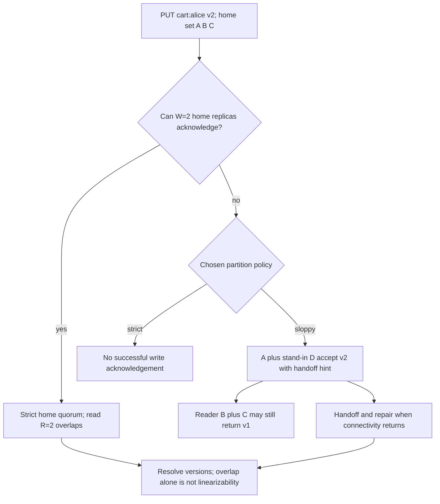

**Tunable consistency via quorum overlap.** With **N** replicas, requiring
**W** write-acks and **R** read-responses such that **W + R > N** forces the
sets to **share at least one replica only when both use the same fixed N home
replicas** and acknowledged versions are retained. In the simple trace below,
one completed write, no concurrent writes and a resolver that prefers its
dominating version let the read return v2. **Sloppy quorums, membership changes,
failed/partial writes and concurrent siblings invalidate a blanket "latest
acknowledged write" claim. Overlap alone is not linearizability.**

```
 N = 3 replicas of key "cart:alice".   Choose W = 2, R = 2.   W+R = 4 > 3.
 PUT v2 → waits for 2 acks            GET → reads from 2 replicas
 ┌────────┬────────┬────────┐
 │  R1    │  R2    │  R3    │
 │  v2 ✓  │  v2 ✓  │  v1    │   write acked by R1,R2; R3 not yet updated
 └────────┴────────┴────────┘
 read picks any 2, say {R2,R3}:  sees v2 (R2) and v1 (R3) → returns v2
     (newest), and READ-REPAIRS R3 → v2.   The overlap node (R2) is the
     overlap: every size-2 subset of this FIXED home set intersects the write set.
 Tuning:  W=1,R=1 (W+R=2≤3) → fast, may read stale (eventual).
          W=3,R=1 → durable slow writes, fast reads.   Pick per operation.
```
**Conflict resolution — what happens on *concurrent* writes.** During a
partition, two clients can both write the same key on different replicas →
**two versions that aren't ordered**. Dynamo detects this with **vector clocks**
(version vectors): if neither version's clock dominates, they're **concurrent
siblings**, and the store either applies **last-write-wins** (simple, can lose a
write) or **returns both siblings for the application to merge** (e.g. union two
shopping carts):
```
 vector clock = per-node counters.   A=[2,0,0]  vs  B=[0,1,0]
 neither ≤ the other  →  CONCURRENT  →  conflict (siblings)
 resolution: LWW (by timestamp)  OR  app-level merge (semantic, e.g.
 "union the carts")  →  then write back a reconciled version.
```
The senior point: **quorum gives you an overlap/availability trade-off**
(with the fixed-set assumptions above), and **conflict resolution is unavoidable in an AP store**
— LWW can lose concurrent updates; version vectors expose siblings so the
application can merge them.

**Return version context:** a GET returns cart items **and** context, e.g.
`{A:2,B:1}` after merging siblings. Alice adds tea and PUTs the merged cart
with that context; coordinator A increments it to `{A:3,B:1}`, which causally
supersedes what she read. Omitting context makes a blind concurrent write.
Simple union can resurrect intentionally removed items; use an appropriate
add/remove representation or an explicit business merge rule.

**Deletion is a version, not forgetting:** A/B store tombstone v3 while C is
offline with live v2. If A/B purge v3 before C repairs, C can return and
resurrect v2. Retain tombstones until the repair/offline policy makes old
replicas safe; quarantine/rebootstrap replicas offline beyond the grace bound.
An arbitrary short TTL alone cannot prove that deleted data stays deleted.

## 21.4 Trade-offs and Follow-ups

- **AP by design:** always writable, eventually consistent. The opposite call
from the payment ledger (CS19, CP) — name the contrast in the interview.
- **W+R>N ≠ linearizable:** it proves fixed-set intersection, not a complete
read/write protocol. Version resolution, concurrent/partial writes and membership
still matter; sloppy quorum can remove even that intersection.
- **Conflict cost:** LWW silently drops writes (fine for caches, bad for carts);
version vectors expose concurrent siblings but require retention and application
merge semantics; they are not an unlimited data-preservation guarantee.
- **Red flags:** using `hash % N` without a migration plan; promising partition
availability that the chosen quorum cannot provide; ignoring concurrent-write conflicts; claiming
exactly-once or linearizable while also offering sloppy quorum; no
anti-entropy/read-repair (replicas drift forever).
- **Building blocks:** consistent hashing + vnodes, quorum N/W/R, vector clocks,
gossip, hinted handoff, Merkle anti-entropy, CAP/PACELC — all **Ch 24**;
LSM-tree/WAL storage engine under each node — **Ch 24**.

<a id="practice-21"></a>

## 21.5 Practice

### Whiteboard Rehearsal

**Narrate:** first name the replica set, then do the quorum arithmetic.
Legacy diagrams' unqualified "latest write" shorthand is not authoritative.


### Try It

A/D acknowledged a sloppy write while B/C stayed on v1. Does raising the read count from one to two guarantee v2?

<details>
<summary>Show worked answer</summary>

No. B/C still do not overlap A/D. Require the fixed home quorum (sacrificing
write availability in that partition), route a session read to known holders,
or explicitly allow stale reads until handoff/repair. Increasing a number
without identifying the participating replica set is not a consistency proof.

</details>

---

<a id="cs22"></a>

# Case 22 — Pastebin

> **Google priority:** ★ · **Difficulty:** Easy · **Frequency:** Common · **Time budget:** ~20 min

> **User story —** *As a* user, *I want* to paste text and share a short link anyone can read —
> optionally expiring or view-once — *so that* I can hand off code or notes quickly.
>
> **For example —** I paste a 10 KB log, get `pb.cc/aZ3k`, set it to expire in a day; the blob goes
> to object storage and only the metadata (key → blob, TTL) sits in the DB.
>
> **Why it matters —** it's the URL shortener with a text blob instead of a redirect — reuse that
> design and isolate the big blob from the metadata.

Pastebin is **"a URL shortener whose value is a blob of text instead of a
redirect."** You paste code/text, get a short link, and anyone with the link can
read it — optionally with an **expiry** or a **view-once** rule. Almost
everything you need is already designed in the **URL shortener (Ch 36)** — reuse
it and only call out the deltas.

## 22.1 Requirements and Estimates

- **Functional:** create a paste (text, optional TTL, optional view-once,
optional syntax highlight); read a paste by short key; expire automatically.
- **Deltas vs URL shortener:** the stored value is a **text blob (KBs–MBs)**,
not a 100-byte URL → put the blob in **object storage**, keep only metadata in
the DB. Read-heavy, like the shortener.
- **Estimate:** 10 M pastes/day ≈ **120 writes/s**; reads ~10× → ~1,200/s. Avg
paste 10 KB → 10 M × 10 KB = **100 GB/day** of blob payload. Object storage
becomes attractive for this retention volume; small pastes in SQL are a valid baseline.

## 22.1a Start Simple

**Baseline → pressure → change → cost:** SQL stores key, text and expiry in
one row; large payload retention and popular public reads grow; move payloads
to private object storage and selectively cache public pastes; pay two-write
orphan cleanup and a serving path that must preserve authorization.

**Concrete contract:** paste `p7`, owner Alice, allowed reader Bob, blob
`p7/v1`, expires 12:05, `consumed=false`. At 12:04:59 Bob's authorized request
atomically changes it to consumed and is allowed **one retrieval attempt**.
If the connection breaks, that attempt is spent. "A human viewed it exactly
once" cannot be guaranteed over a network; link scanners must not consume it
via unauthenticated preview or HEAD requests.

**Prerequisites:** [Ch 36: URL shortener](#content/36_system_design_cases_search_media),
[Ch 23: CDN expiry and cache keys](#content/23_system_design_fundamentals_deep_dive).
[Contents](#chapter37-toc) · [Previous: KV store](#cs21) · [Next: e-commerce](#cs23)

## 22.2 Architecture

**Image correction:** authorize private serving and enforce view-once before fetching the blob


**Block-by-block:**
- **Write API** — mints a **short key** (same options as the shortener: hash+base62, counter, or a
  Snowflake id — CS14), stores the **text blob in object storage** (S3/GCS, fronted by a CDN for
  hot pastes), and writes **metadata** (`key → blob_url, expiry, view_once`) to a KV/SQL store plus cache.
- **Read** — public ordinary pastes can use bounded-lifetime CDN caches.
  Private/view-once reads authorize against current metadata and enforce expiry
  and consumption before proxying the private blob; no reusable public origin URL.
- **TTL sweep** — a background job (or object-store lifecycle rule) deletes expired blobs.

**Flow:** (1) gen key → (2) blob to object store → (3) meta to DB → (4–6) read path with expiry check.

## 22.3 Deep Dive

**Mechanism diagram**

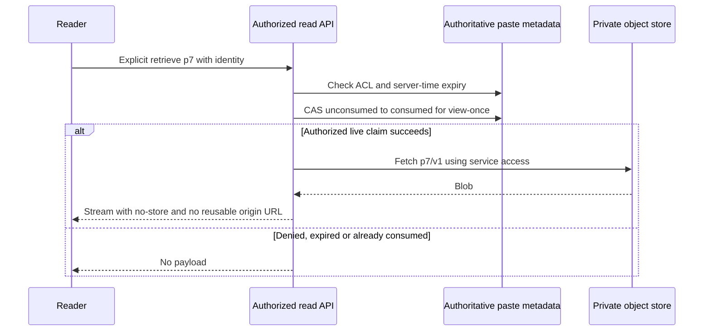

The only genuinely new idea over the URL shortener is **separating metadata from
payload**: the hot path resolves a tiny **`key → metadata`** record (cacheable,
KV-fast), and the large **text blob lives in object storage + CDN** so your
database need not serve large bodies. **View-once** is an authorized conditional
claim on unconsumed, unexpired metadata; do not remove the metadata needed to
enforce access and dedupe. Authorization and the consume condition must be
checked together (or under an equivalent current permission/version check).
It grants one retrieval attempt, not guaranteed delivery or prevention of copying.

**Expiry is enforced at serving time** using the server clock, even if a
sweeper/lifecycle deletion runs later. A public CDN TTL cannot outlive the
paste expiry; early delete/revocation also needs purge or a per-request gate.
Private caching, if introduced, needs authorization on every access and correct
identity/permission cache isolation. Unguessable keys are not a substitute for ACLs.
If blob upload succeeds but metadata commit fails, a retryable cleanup worker
removes orphan blobs after a grace period and an authoritative reference check.

## 22.4 Trade-offs and Follow-ups

- **Separate blobs when warranted:** object storage reduces database payload
pressure at large scale; small-scale SQL text storage is not itself a design error.
- **Key generation** is the shortener's trade-off (counter vs hash vs Snowflake)
— see Ch 36; collisions handled the same way.
- **Red flags:** ignoring measured blob/storage pressure; caching private pastes publicly;
non-atomic view-once (race lets two readers see it); forgetting expiry cleanup
(storage grows forever).
- **Building blocks:** URL shortener design (key gen, KV lookup, redirect→fetch)
— **Ch 36**; object storage + CDN — **Ch 23/24**; Snowflake ids — **CS14**;
cache-aside + TTL — **Ch 23**.

<a id="practice-22"></a>

## 22.5 Practice

### Whiteboard Rehearsal

**Narrate:** a CDN/object URL cannot bypass the consume/authorization decision.
Legacy sketches omit that protected path; public caching is not the default
for private or view-once pastes.


### Try It

Bob claims p7, then loses the connection before receiving bytes. Should the API reset consumed=false?

<details>
<summary>Show worked answer</summary>

Not under the one-attempt contract: it cannot know whether Bob received and
copied the bytes. Resetting can enable a second retrieval. Offer a different
documented resumable-token contract if required, accepting its extra state and
weaker "one request" meaning. Never solve it by handing out a reusable CDN URL.

</details>

---

<a id="cs23"></a>

# Case 23 — E-commerce Platform

> **Google priority:** ★★ · **Difficulty:** Hard · **Frequency:** Common · **Time budget:** ~45 min

> **User story —** *As a* shopper, *I want* to browse fast and check out reliably, *so that* pages
> never go blank and my order is always right about price, stock, and payment.
>
> **For example —** a flaky back-end shows me a slightly stale price (better than a blank page) on
> the browse plane, while checkout refuses to oversell or double-charge on the order plane.
>
> **Why it matters —** the capstone is recognizing "AP on the way in, CP at the till" and composing
> designs you've already built (search, recsys, inventory, payment, notifications).

This is the **capstone** — not one hard idea but **a dozen wired together**. An
e-commerce platform is really **two products glued at the cart**: a
**browse/search experience** that must stay **fast and always-on** even when a
back-end is flaky (better to show a slightly stale price than a blank page), and
a **checkout/order pipeline** that must be **exactly right** about money and
stock (better to reject a click than to oversell or double-charge). The whole
interview is recognizing that split — **AP on the way in, CP at the till** — and
then **assembling designs you've already built** (search CS5, recommendations
F3, inventory CS20, payment CS19, notifications Ch35-CS1) instead of re-deriving
them. The two genuinely new pieces are a **document-store catalog** for
polymorphic products and a **serviceability/TAT** service that precomputes "can
we deliver here, and by when?"

## 23.0 Interview Focus

- Do you split the system into a **read/browse plane (AP, low-latency)** and a
  **write/order plane (CP, correct)** — and justify CAP on each?
- Can you model a **polymorphic catalog** without a huge sparse schema?
  Document stores, relational JSON and category-specific tables are options;
  choose by access patterns and scale, not the word "polymorphic" alone.
- Can you **compose prior designs** — autocomplete/search (CS5), recommendations
  (F3), inventory/oversell (CS20), payment/saga (CS19), notifications
  (Ch35 CS1) — rather than rebuilding each from scratch?
- Do you push expensive, slow-changing work **offline/precomputed** — search
  indexing, recommendations, and **delivery serviceability/ETA** — so the hot
  path stays cheap?
- Do you keep the **OLTP order DB small** with **hot/cold tiering** (terminal
  orders archived to Cassandra) and still serve full order history?

## 23.1 Requirements

**Functional**
- **Browse/search:** home feed, category browse, **typeahead** + full-text
  search, a product detail page (PDP) with price, attributes, availability,
  **delivery ETA for my pincode**, and **recommendations** ("you may also like").
- **Cart & checkout:** add to cart, **reserve stock**, **pay**, place an order;
  **order tracking** + history; **notifications** on every status change.
- **Catalog ingest:** suppliers/sellers onboard catalogs in bulk, which flow
  into search and the PDP.

**Out of scope** (say it to show focus): seller-side analytics, ads ranking,
returns/RMA internals, fraud scoring (a separate approve-before-pay system — as
in CS19), and the warehouse-management system itself (we *consume* its data).

**Non-functional**
- **Browse plane:** **AP, low latency** — PDP and search render in **< 200 ms**
  and stay up under load; a **slightly stale** price/stock is acceptable (we
  re-validate at checkout).
- **Order plane:** **CP, correct** — **no oversell, no double-charge**; money and
  stock are authoritative.
- **Scale:** catalog ~**500 M items**; **100 M DAU**; read:write ≈ **100:1**
  (browsing dwarfs buying).
- **Availability:** browse 99.99%; checkout favors **correctness over
  availability** during a partition.

**Questions to ask:** *Marketplace (many sellers) or first-party? Single region
or global? Stock per-warehouse or global? Do we own logistics or integrate a
3PL? How fresh must price/stock be on the PDP?*

## 23.2 Estimates

```
 DAU                  100 M; ~10 page views each → 1 B views/day ≈ 12k/s
 Peak (sale events)   ~10×  → ~120k/s reads on browse/search
 Orders               assume 10% of 100M DAU place one order/day
                      → ~10 M orders/day ≈ 120/s (not 1% of undefined sessions)
                      flash-sale bursts → 10k+ checkout attempts/s on ONE SKU
 Catalog              500 M items × ~2 KB doc ≈ 1 TB catalog (document store)
 Search index         500 M docs → sharded Elasticsearch (tens of shards)
 Page views : Orders  ≈ 100 : 1; one order causes multiple actual writes
 Order DB (hot)       open + recent/support-window orders in MySQL
                      archive eligible older versions when measurements justify it
```
The numbers say it plainly: **browsing is a caching/search problem at 100k+/s**,
**ordering is a correctness problem at a modest ~120/s** (with vicious **per-SKU
bursts**), and the **catalog + history are storage-tiering problems**. Optimize
each plane for its own bottleneck — do not let one model dominate.

## 23.2a Start Simple

**Baseline → pressure → change → cost:** one application and indexed SQL
(including JSON product attributes) can run a small shop. Browse load, search
needs and optional enrichments grow independently of checkout; add caches,
search projections and isolated services only where measured; pay event lag
and multi-service orchestration. Archive after hot-index/retention measurements,
not simply because an order says DELIVERED.

**One order:** `O901`, user Mira, SKU `shirt-blue-M`, qty=2, authoritative price
version 17 at **1,999 USD cents/unit**, shipping=300, tax=0 for this example.
Total `2*1999+300 = 4,298` cents. Persist that snapshot, reservation
`R901` expiring 12:05, and payment identity `P901`; a retry binds to these,
not a newly calculated amount or new charge.

**Prerequisites:** [CS19: payment identity and UNKNOWN](#cs19),
[CS20: reservation transitions](#cs20),
[Ch 36: search](#content/36_system_design_cases_search_media).
[Contents](#chapter37-toc) · [Previous: Pastebin](#cs22) · [Next: LLM serving](#f1)

## 23.3 Architecture

**Image correction:** UNKNOWN payment is not failure; terminal does not mean immutable forever


**Legend:** boxes are services; the store is named inside. A dashed line splits
the **AP browse plane** (top) from the **CP order plane** (bottom).

**Block-by-block:**
- **API Gateway / BFF** — auth, rate-limit (CS13), routes browse vs order planes.
- **Catalog / Item service → MongoDB (document store)** — owns the
  **polymorphic** product documents and serves the PDP. Document store because a
  *shirt* (size, fabric, color) and a *TV* (screen-size, resolution, weight)
  share almost no attributes (see 23.5).
- **Inbound / Supplier-onboarding service** — ingests seller catalogs in bulk,
  validates, writes the catalog document, and **emits an event to Kafka**.
- **Search-indexer consumer** — reads Kafka, **formats** each item into a search
  doc, and writes it to **Elasticsearch**; the **Search/Autocomplete service**
  (reuse **CS5**) serves typeahead + full-text.
- **Recommendation service** — a **two-tower → ranking funnel** (reuse **F3**),
  with candidates/features built **offline** by a **Hadoop** batch pipeline and
  **near-real-time** by **Spark Streaming** over the click/order event stream.
- **Serviceability / TAT service** — answers "**do we deliver to this pincode,
  and by when?**" from **precomputed** warehouse × pincode × logistics tables
  (see 23.6/23.8); read on the PDP, **never** computed on the hot path.
- **Cart + Order-Taking Service** (cart held in Redis, persisted to **MySQL**) — the
  order-plane entry point.
- **Inventory service** — atomic durable reservation+decrement, then
  conditional confirm/expire/release (reuse **CS20**).
- **Payment service** — idempotent ledger + saga across the gateway (reuse
  **CS19**), including the **order-expiry-vs-payment-success race**.
- **Order-processing / fulfillment** — the post-payment workflow; after an
  explicit archive-eligibility boundary the **Archival service** copies and
  verifies the order MySQL → **Cassandra**, and the
  **Historical-Order service** serves reads over that archive.
- **Notification service** (reuse **Ch35 CS1**) — order-status updates (placed,
  shipped, delivered).

## 23.4 Request Walkthrough

Two flows, because the platform is two products. **Flow A is AP** (stay fast,
tolerate staleness); **Flow B is CP** (be correct, tolerate rejection).

**A — Search / browse (availability-first):**
```
1. GET /search?q="running sho"  → Autocomplete (CS5) suggests from Elasticsearch
2. user picks a query → Search service → ES returns ranked item ids (AP, cached)
3. GET /pdp/{item} → Catalog svc reads the MongoDB document (cache-first)
4. PDP enriches IN PARALLEL — all best-effort, degrade gracefully:
      ├─ Serviceability/TAT: ETA for user's pincode   (PRECOMPUTED O(1) lookup)
      ├─ Recommendations: "you may also like"          (F3, served from cache)
      └─ price/stock badge: "In stock" (may be slightly STALE — re-checked in B)
5. render < 200 ms; any failed enrichment is omitted, the page still loads
```

**B — Checkout / order (consistency-first):**
```
1. POST /checkout {cart, scoped key} → validate current price/quote acceptance
      create O901 with immutable purchase-price snapshot, total=4298 cents
2. Inventory.reserve(O901, shirt-blue-M, 2) → R901 ACTIVE until 12:05
      durable create + conditional decrement together (CS20); no stock → reject
3. Payment.charge(P901, O901, 4298 USD cents) → existing payment saga (CS19)
      ├─ success → CAS valid R901 to CONFIRMED; then persist order CONFIRMED
      ├─ definitive decline → idempotently release hold; order FAILED
      └─ timeout → PAYMENT_UNKNOWN; status/reconciliation using P901
4. RACE: expiry vs confirmation → conditional reservation transition decides
      expiry won → fresh reserve, or refund P901 and track refund to completion
      confirmation won while valid → expiry no-op; fulfillment can proceed
5. Durable saga resumes any crash between steps; outbox emits committed states.
      Later, archive only eligible versions with verification and read routing.
```
Each step maps to a reused design: **B2 = CS20** (no oversell), **B3/B4 = CS19**
(idempotent saga + compensation), **B5 = archival tiering + Ch35 CS1**.

## 23.5 Data Model

| Entity | Shape (key fields) | Store | Why |
|--------|--------------------|-------|-----|
| **Catalog item** | `item_id, category, {polymorphic attrs}, seller_id, price` | **MongoDB (document)** | Attributes vary per category — shirt≠TV; sparse-wide SQL is painful |
| Search doc | `item_id, title, tokens, facets, price, popularity` | **Elasticsearch** | Inverted index for typeahead + full-text (CS5) |
| Serviceability/TAT | `(warehouse, pincode) → reachable?, eta_days` | KV / read-replica | **Precomputed** offline; O(1) PDP lookup |
| Cart | `user_id → [items]` | Redis / KV | Ephemeral, fast, AP |
| **Order (hot)** | `order_id, user, items, state, total` | **MySQL (ACID)** | Open orders need transactions + strong consistency |
| Inventory | `sku → available CHECK(≥0), durable reservations` | Transactional authority; optional Redis admission | Atomic reserve and lifecycle (CS20) |
| Payment ledger | `entry_id, txn_id, account, amount` | SQL, append-only | Double-entry, idempotent (CS19) |
| **Order (cold)** | archive-eligible order versions, denormalized | **Cassandra** | Historical snapshots; retention and late corrections remain explicit |
| Recsys features | user × item × context | Feature store (offline+online) | Funnel with point-in-time and serving-freshness controls (F3) |

**The catalog call-out:** products are **polymorphic** — a *shirt* document
carries `{size, fabric, color, fit}`, a *TV* carries
`{screen_size, resolution, weight, panel}`. Forcing this into one relational
table can yield a **sparse forest of nullable columns**. A **document store**
lets each item carry category-specific attributes and indexes; relational JSON
or category tables also work. Schema changes still require versioning,
validation and sometimes backfills; "schemaless" does not mean no migrations.

## 23.6 Scaling

- **Browse plane is ~100× the traffic** — cache aggressively: **CDN** for
  assets/images, **edge + app cache** for PDP documents and search results,
  precomputed recommendations. Catalog reads are cache-served; MongoDB is the
  cache-miss fallback, not the hot path.
- **Search** scales by **sharding Elasticsearch** by item and replicating for
  query throughput; indexing is **async off Kafka**, so a supplier bulk-upload
  never blocks live queries.
- **Serviceability/TAT** is **precomputed offline** (warehouse × pincode is a
  huge but slow-changing matrix) and served as an O(1) lookup; recomputing per
  request against a routing engine would blow the latency budget.
- **Order plane** is small in QPS but has **per-SKU write hotspots** during sales
  — use **CS20** admission control and durable reservation transitions. A
  Redis-only decrement is not a drop-in replacement for that authority.
- **Order-DB growth:** measure hot-index size, history query interference and
  maintenance costs. Partition/index first; **hot/cold tiering** (23.8) can
  move eligible older history while keeping recent/support-window orders hot.
- **Recsys** offline (Hadoop) pipelines are cheap-but-stale; **Spark Streaming**
  keeps last-clicks fresh — both feed one feature store (F3).

## 23.7 Failures and Trade-offs

```
What dies / happens             →  What we do
──────────────────────────────────────────────────────────────────────
Catalog/Mongo slow or down      →  serve PDP from cache (stale-OK, AP);
                                    re-validate price/stock only at checkout
Search/ES cluster degraded      →  fall back to category browse / cached
                                    results; browsing never hard-fails
Recsys/TAT enrichment fails     →  OMIT the widget; PDP still renders (best-effort)
Inventory race (two buyers)     →  atomic check+decrement (CS20); last unit sold once
Reservation TTL vs payment-OK   →  conditional hold transition decides; if expired,
                                    re-acquire stock OR confirm refund (CS19/20)
Payment gateway timeout         →  UNKNOWN, not failure: re-query by idem-key (CS19)
Order DB bloats                 →  tier eligible versions with verified copy and read routing
Notification backlog            →  async queue; retries; non-blocking (Ch35 CS1)
```
**Trade-offs called out:** we deliberately run **two consistency regimes** —
**AP** on browse (a stale price is cheaper than downtime, and we *re-check at
checkout*) and **CP** at the till (reject before oversell/double-charge). We
accept **read-your-writes lag** on the catalog as the price of cache hit-rate. We
pay **storage duplication** (hot MySQL + cold Cassandra) to keep the OLTP DB
fast. We push **search, recommendations, and serviceability offline** —
accepting staleness — to protect the request-time latency budget.

## 23.8 Deep Dive

**Mechanism diagram**

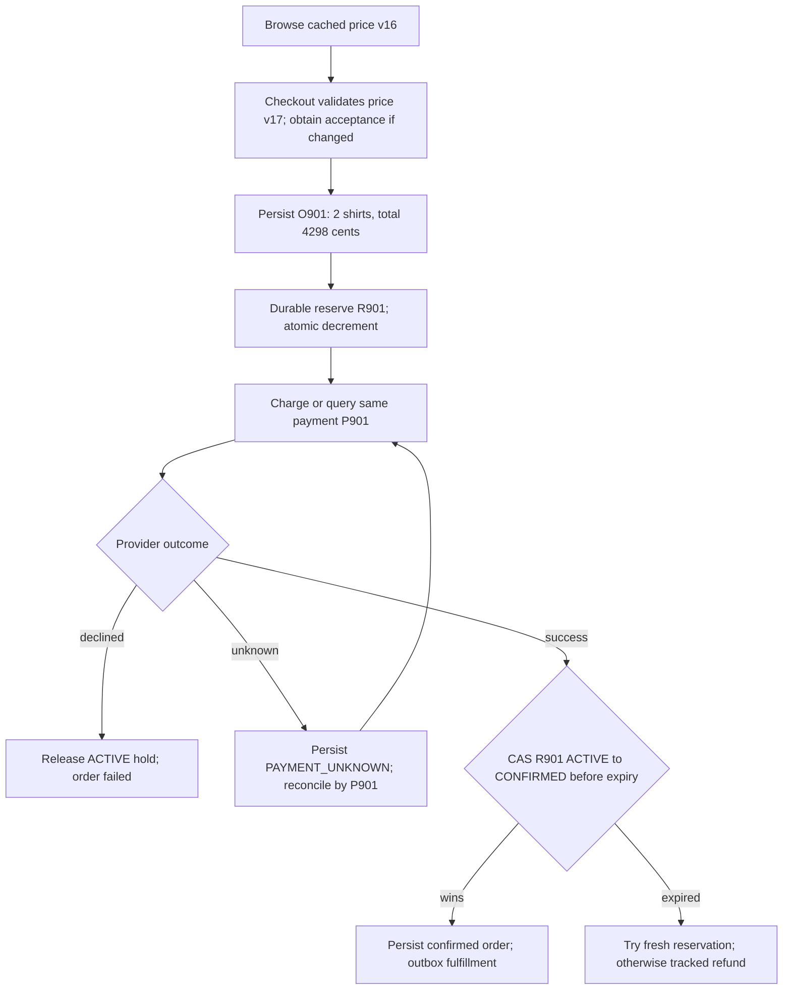

Two ideas carry the most interview signal: the **durable reservation lifecycle**
that preserves stock ownership, and the **hot/cold order tiering** that keeps the OLTP
database small while still serving full history.

**(a) Atomic reserve-decrement — no oversell (reuse CS20).** Checkout's only
non-negotiable is that **N units sell at most N times**. The bug is
read-then-write: two buyers both read "1 left," both proceed, both decrement. The
fix fuses **check + decrement** into one atomic, constraint-guarded operation:
```sql
-- This statement is INSIDE CS20's reservation-create transaction:
UPDATE inventory
   SET quantity = quantity - :qty
 WHERE sku = :sku AND quantity >= :qty;   -- 1 row → reserved; 0 rows → SOLD OUT
-- table guard:  quantity INT NOT NULL CHECK (quantity >= 0)
-- The reservation row and outbox commit with this decrement.
-- Confirmation and expiry are competing conditional transitions.
-- Payment timeout is UNKNOWN, not an unconditional stock-release command.
```
For a **hot flash-sale SKU**, the waiting room protects commit capacity.
Use Redis as an admission layer unless its full durable reservation/failover
protocol is established. A nonnegative stock constraint prevents negative
arithmetic; by itself it cannot prevent duplicate confirmations, lost holds or
an erroneous release after payment.

**(b) Hot/cold order tiering — keep OLTP small (the distinctive crux).** Orders
have a **lifecycle**: **transactional and contended while open**
(`PENDING_PAYMENT → CONFIRMED → SHIPPED`), with older versions often read-mostly.
**DELIVERED/CANCELLED is not immutable forever**: refunds, disputes, late
corrections and retention/legal holds can follow. Choose an eligibility boundary
(e.g. 90 days after terminal state and no open support/financial workflow), then
tier if measurements justify the added complexity:
```
        OPEN + RECENT orders                  ELIGIBLE HISTORICAL VERSIONS
   ┌────────────────────┐    Archival svc    ┌──────────────────────┐
   │ MySQL (OLTP, ACID) │ ──(CDC / sweep)──▶ │ Cassandra (archive)  │
   │ transactional hot │ copy/verify/route  │ read-mostly snapshots │
   │ working set       │ ◀── ── ── ── ── ── │ versioned, partitioned│
   └─────────┬──────────┘                    └──────────┬───────────┘
             │ live order ops                            │ history reads
             ▼                                           ▼
        Order service                        Historical-Order service
```
- The **Archival service** copies `(order_id, version)` idempotently to an
  archive partitioned by user/time bucket; verifies payload checksum and
  required durability; commits an archive-location/version manifest; only then
  conditionally deletes the matching hot version if eligibility still holds.
  A concurrent refund/version change invalidates that deletion.
- **History reads** consult the manifest and include still-hot recent orders.
  During migration, merge/dedupe by order ID and version rather than omitting
  recent history or showing two copies. Persist read-routing metadata separately
  from the deleted payload.
- Late corrections append a new version/event or rehydrate through a defined
  path. Apply explicit retention/legal-hold policy to both copies and backups;
  "unbounded forever" is neither a capacity plan nor a regulatory rule.

## 23.9 Follow-ups

**Likely follow-ups:**
- *"Why a document DB for the catalog?"* — products are **polymorphic**; each
  category has different attributes. A document per item avoids sparse nullable
  columns / EAV and evolves schema per category. (23.5)
- *"How is the PDP fast at 100k/s?"* — it's the **AP plane**: CDN + cache,
  precomputed recommendations and **serviceability/TAT**; the document store is
  the cache-miss fallback, not the hot path.
- *"Why precompute delivery ETA?"* — warehouse × pincode × routing is expensive
  and **slow-changing**; computing it per request against a maps engine blows the
  latency budget, so it's a **precomputed O(1) lookup**.
- *"Stale stock on the PDP — isn't that a bug?"* — no: browse is AP and
  **re-validates at checkout** (B2). The authoritative check is the **atomic
  reserve** (CS20), not the badge.
- *"Payment succeeds but the reservation expired?"* — the reservation CAS
  decides ownership. If expired, obtain a fresh hold or complete an idempotent
  refund; success at the processor cannot resurrect stock (CS19/20).
- *"Won't the order DB grow forever?"* — **hot/cold tiering**: terminal orders
  archived only when eligible, with verified copy and versioned read routing. (23.8)

**Red flags that sink candidates:** one consistency model for the whole site
(either AP spend authorization or CP-only browsing); choosing data models without
query evidence; recomputing expensive delivery routes on every hot-path request;
read-then-write inventory (the oversell bug); no compensation for the
payment/expiry race; deleting hot orders before verifying the archive; rebuilding
search/payment/inventory from scratch instead of reusing CS5/CS19/CS20.

**Building blocks reused:** autocomplete + full-text search — **CS5**;
recommendation funnel + feature store — **F3**; atomic inventory / flash-sale —
**CS20**; idempotent payment ledger + saga — **CS19**; notifications —
**Ch35 CS1**; rate limiting — **CS13**; Kafka + stream/batch (Spark/Hadoop),
CDC/outbox — **Ch 24**; document vs relational vs wide-column stores, CAP
per-plane — **Ch 23/24**; caching + CDN — **Ch 23**.

<a id="practice-23"></a>

## 23.10 Practice

### Whiteboard Rehearsal

**Narrate:** stale browsing does not authorize a stale checkout price or create
stock ownership. Legacy sketches simplify UNKNOWN and the expiry race; neither
timeout nor payment success alone determines whether an order may ship.


### Try It

P901 times out; R901 expires; a retry arrives with the same checkout key. Should checkout create a new payment and order?

<details>
<summary>Show worked answer</summary>

No. Return/resume O901's PAYMENT_UNKNOWN state and query P901. If payment
succeeded, reacquire stock before confirming or complete a refund. If it
definitively declined, fail/release idempotently. Preserve the accepted 4,298-cent
snapshot; a new charge/price on retry can double-charge or change the contract.

</details>

---

# Part F — AI Systems

The three designs below are where **systems design meets ML** — exactly the
questions a **Google AI Engineer** gets that a pure-backend candidate doesn't.
The good news: they're the **same playbook** (Ch 35 Part A) with an ML-shaped
data plane bolted on. We keep each one condensed and **point to the ML chapters**
for the modeling depth: **Ch 26 (ML System Design)** for the funnel and
serving, **Ch 28 (Semantic Search)** for embeddings/RAG, **Ch 17 (LLMs)** and
**Ch 29 (GPUs/TPUs Infrastructure)** for the model internals and accelerators.
Your job in the interview is the **infra around the model**: batching, caching,
retrieval, feature freshness, latency budgets.

<a id="f1"></a>

## F1 — LLM Inference Serving

> **Google priority:** ★★★ · **Difficulty:** Hard · **Frequency:** Rising fast · **Time budget:** ~35 min

> **User story —** *As a* developer calling a chatbot API, *I want* fast, streaming responses at a
> sane cost, *so that* users see words appear immediately without burning GPUs.
>
> **For example —** 10,000 open chats with 20% actively decoding at 30 tokens/s
> demand 60,000 output tokens/s; capacity depends on model, context mix and
> measured batching throughput, not merely the number of open connections.
>
> **Why it matters —** serving LLMs is a GPU-utilization problem, not a CPU one — batching,
> KV-cache, and token streaming are what make it economical.

Serving a chatbot is **not** a normal request/response service: a single request
**streams tokens for seconds**, runs on **scarce, expensive GPUs**, and its cost
is dominated by **GPU memory and throughput**, not CPU. The design is about
**keeping the GPUs full** (continuous batching), **not recomputing the past**
(KV-cache), and **streaming** partial output so the user sees words immediately.

### F1.1 Requirements and Estimates

- **Functional:** chat completion with **token streaming**; multiple models
  (small/cheap vs large/smart); **prompt/response caching**; per-user rate limits
  and quotas; safety filter.
- **Estimate:** 10,000 **simultaneously decoding** sequences at 30 tok/s demand
  300,000 tok/s; 10,000 merely open conversations do not. For an illustrative
  7B-class model on 80-GiB GPUs, suppose a measured workload of ~2k prompt tokens,
  ~256 output tokens and the chosen precision/batch mix achieves 2k–5k output
  tok/s per serving GPU equivalent: the arithmetic gives **60–150 just for
  decode at full utilization**, not a model-independent fleet recommendation.
  Include prefill interference, tensor-parallel group size, headroom, failures
  and tail latency in the actual benchmark.
- **Worked planning point:** 20% active means 60k tok/s. At measured 2k tok/s
  and 70% target utilization, `ceil(60k/(2000*0.7)) = 43` GPU equivalents
  before extra prefill/failure capacity. KV memory and latency may require more.

### F1.1a Start Simple

**Baseline → pressure → change → cost:** one request at a time is easy to
debug; variable-length replies waste slots and requests queue; continuously
batch with paged KV state and token-budget admission; pay scheduler complexity
and interference between prefill and latency-sensitive decode.

**Budget example:** end-to-end TTFT target 500 ms is allocated as gateway/cache
50 + queue 150 + prefill 250 + initial output gate 50 ms. Separately target
inter-token latency ≤50 ms including screening; measure the combined tail,
not a naive sum of independent p99s. Reject requests whose prompt/output limits
cannot fit; do not advertise unlimited context then discover OOM mid-batch.

| Scheduler point | Active work / state |
|---|---|
| Admission | A: 1,024 prompt tokens, max output 4; B: 512, max output 2 |
| Decode steps 1–2 | `[A1,B1]`, then `[A2,B2=EOS]`; free B's KV |
| C arrives | C: 256 prompt tokens; admit only if queue and reserved-token budgets fit |
| Next steps | Chunk C's prefill around A's decode deadline; next batch includes `[A,C]` |
| A disconnects | Cancel A at a safe scheduling boundary; free its KV pages, keep C running |

**Prerequisites:** [Ch 17c: prefill, KV memory and serving metrics](#content/17c_llm_systems),
[Ch 26: serving budgets](#content/26_ml_system_design), [CS13: admission](#cs13).
[Contents](#chapter37-toc) · [Previous: e-commerce](#cs23) · [Next: RAG](#f2)

### F1.2 Architecture

**Image correction:** dense decode is O(context), cache isolation and output gate are required


```
   Clients ─▶ API Gateway (auth, rate limit, quotas — CS13)
           ─▶ SAFETY / MODERATION  (prompt + output filters)
           ─▶ PROMPT/RESPONSE CACHE  (scoped to model and context)
           │     hit → current output gate → stream back
           │     miss
           ▼
   MODEL ROUTER  (pick model by difficulty / tier / cost)
           ▼
   ┌──────────────── GPU INFERENCE FLEET ────────────────┐  ◀─ MODEL REGISTRY (weights · versions · adapters)
   │  Continuous-batching scheduler (in-flight batching)  │
   │   • PREFILL: encode prompt → fill KV-cache           │
   │   • DECODE loop: 1 token/step, append to KV-cache,   │
   │                  output gate → client SSE           │
   │   • KV-cache in GPU HBM, paged (vLLM PagedAttention) │
   └───────────────┬─────────────────────────────────────┘
                   ▼
   GPU AUTOSCALER (scale on queue depth / tokens-per-s, not CPU%)
```
**Block-by-block:**
- **Gateway** — does auth + rate limiting (reuse CS13).
- **Safety / Moderation** — applies **prompt and output filters**, screening the incoming prompt
  and the streamed tokens before they reach the user.
- **Prompt/response cache** — short-circuits eligible repeated requests only
  under a matching model/context/permission/freshness contract.
- **Router** — sends easy queries to a small model and hard ones to a large model.
- **GPU fleet** — loads weights from a **Model Registry / Store** (versioned weights + LoRA
  adapters) and runs a **continuous-batching scheduler** that interleaves many sequences: a
  **prefill** phase (build the KV-cache for the prompt) and a **decode** loop that emits one token
  per step and **streams** it.
- **Autoscaler** — scales on **queue depth / token throughput**, because GPU CPU% is meaningless here.

**Flow:** (1) request → gateway → (2) moderation screens the prompt → (3) cache check → (4) router
picks model → (5) scheduler slots it into a live batch → (6) prefill fills KV-cache →
(7) decode+screen+stream → (8) stop, cancellation or deadline frees KV state.

### F1.3 Deep Dive

**Mechanism diagram**

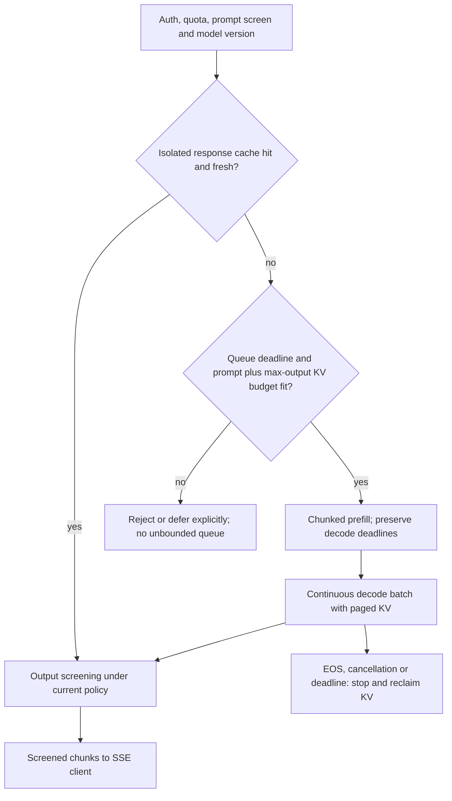

Generating token *t* with dense attention still reads prior keys/values across
the context: **O(t) attention work per new token at fixed model dimensions**.
The KV cache avoids recomputing prior tokens' K/V projections and running a
full prefix again; it does **not** make decode O(1). Appending one token's
fixed-size K/V entry is O(1), while attention scans and total cache grow with
context. Dense full-prefix attention without reuse is quadratic in prefix
length; cache savings and per-step decode complexity are different statements.

**Concrete memory:** 32 layers × 8 KV heads × head dimension 128 × 2 (K,V)
× 2 bytes = **131,072 bytes/token = 128 KiB**. A 4,096-token sequence uses
**512 MiB** of KV; 16 such sequences use **8 GiB**, excluding weights, activations,
allocator/paging metadata and workspace. This is a specific GQA configuration,
not every 7B model. Admission reserves space for prompt **plus allowed output**,
not just the prompt already seen.

```
   STATIC BATCHING:           slots stay tied to the original batch;
     [seq A: done........idle] completed slots cannot admit new requests.
     [seq B: still decoding...]
   CONTINUOUS BATCHING (good): add/evict sequences EVERY decode step;
     finished slots can be refilled → better utilization, not guaranteed 100%.
   KV-cache paging (vLLM): treat KV-cache like virtual memory pages →
     less allocation waste/fragmentation, with paging overhead.
```
**Continuous (in-flight) batching** + **paged KV-cache** are the two ideas that
turned LLM serving from "one request per GPU" into high-throughput multiplexing.
Model internals (attention, quantization, speculative decoding) live in
**Ch 17** and accelerator details in **Ch 29**.

### F1.4 Trade-offs and Follow-ups

- **Latency vs throughput:** bigger batches = better GPU utilization but higher
  per-request latency; tune to your SLO. **Time-to-first-token** (prefill) vs
  **inter-token latency** (decode) are separate budgets.
- **Caching:** include tenant/authorization epoch, conversation and system
  prompt, model/adapter version, decoding settings and source-data freshness in
  the cache contract. Prompt text alone leaks or misapplies contextual answers.
  Prefix-KV reuse also requires matching token prefixes/model/adapter and safe
  tenant isolation. Semantic similarity is only a candidate match, not proof
  of factual or authorization equivalence.
- **Design pitfalls:** ignoring per-request KV state; retaining finished slots in
  a variable-length batch; recomputing previous K/V projections instead of reusing them;
  autoscaling only on CPU; omitting the chosen streaming/output-screening contract;
  and budgeting GPUs without the actual model, context, and workload.
- **Building blocks:** ML serving, latency budget, model funnel — **Ch 26**;
  LLM internals, quantization, speculative decoding — **Ch 17**; GPUs/TPUs,
  HBM, autoscaling accelerators — **Ch 29**; gateway rate limiting — **CS13**;
  SSE streaming — **Ch 35 (chat)**.

<a id="practice-f1"></a>

### F1.5 Practice

### Whiteboard Rehearsal

**Narrate:** generated output crosses the screening gate **before** reaching
the client, including cache hits. The legacy whiteboard's direct inference→client
arrow omits that gate and is pending manual review. If screening requires a
whole response, buffering changes the streaming/TTFT contract and must be stated.


### Try It

a request reserves KV for a 4k prompt but allows 8k additional tokens. Is its 512-MiB reservation enough?

<details>
<summary>Show worked answer</summary>

No. Under the example's 128-KiB/token model, 12,288 total tokens need
**1.5 GiB** of KV before overhead. Admit against an output cap/resource budget,
or explicitly shorten/defer the request. Cancellation must reclaim its state;
keeping a disconnected stream decoding burns both token budget and GPU memory.

</details>

<a id="f2"></a>

## F2 — RAG / Semantic Search

> **Google priority:** ★★★ · **Difficulty:** Medium · **Frequency:** Very common · **Time budget:** ~30 min

> **User story —** *As a* user asking questions over my company's docs, *I want* grounded, cited
> answers, *so that* I get facts from our knowledge base instead of model hallucinations.
>
> **For example —** I ask "what's our refund policy?"; the system embeds the query, retrieves the
> top passages from the vector DB, reranks them, and the LLM answers with citations to those docs.
>
> **Why it matters —** the hard parts are retrieval quality and freshness (chunk → embed → index →
> retrieve → rerank), not the LLM call itself.

**Retrieval-Augmented Generation** grounds an LLM in **your** documents: instead
of hoping the model memorized a fact, you **retrieve** the relevant passages and
**feed them into the prompt**. The system is a pipeline: **chunk → embed → index
(vector DB / ANN) → retrieve → rerank → generate**. The hard parts are
**retrieval quality** and **freshness**, not the LLM call. Full modeling depth
lives in **Ch 28 (Semantic Search)**.

### F2.1 Requirements and Estimates

- **Functional:** answer questions over a corpus with **citations**; ingest new
  docs; keep answers **fresh**; filter by access control / metadata.
- **Estimate:** 10 M documents × ~10 chunks = **100 M chunks**, each a
  768–1536-dim vector. 100 M × 768 × 4 B = **307.2 GB** raw vectors before
  index graph/metadata/chunk text/replicas → needs an
  **ANN index** (brute-force `O(N)` per query is hopeless), sharded across nodes.
- **Quality knobs to ask about:** chunk size/overlap, top-k, rerank depth,
  embedding model, refresh cadence.

### F2.1a Start Simple

**Baseline → pressure → change → cost:** keyword search plus quoted passages
works for a small knowledge base; paraphrases and a growing corpus miss useful
evidence; add hybrid lexical/vector retrieval, reranking and grounded generation;
pay ingest/index freshness, permission checks and quality evaluation. A reranker
cannot recover evidence that the recall stage never retrieved.

**Worked query, employee Maya at 10:00:** "Can I return unopened headphones
after 20 days with the receipt, and who pays return shipping?"

| Candidate ID/version | Evidence or rejection | ANN similarity (illustrative, not confidence) |
|---|---|---|
| `refund/v8/c2`, current, employee ACL | "Unopened electronics may be returned within 30 days with the original receipt." | 0.89 |
| `refund/v8/c3`, current, employee ACL | "Return shipping is deducted from the refund unless the item is defective." | 0.84 |
| `refund/v7/c2`, superseded | Old 14-day rule: reject by current document version before context | 0.91 |
| `vip/v3/c4`, restricted group | Reject by current permissions; never fetch its text into the model context | 0.94 |

The answer is **yes under the 30-day rule [refund/v8/c2]; return shipping is
deducted unless defective [refund/v8/c3]**. Cite stable document/version/chunk
IDs and offsets, not whatever document happens to occupy an ANN row tomorrow.
Version and access constraints outrank similarity scores.

**Operating budget:** query embed 30 + retrieval 60 + authoritative
permission/version checks and text fetch 30 + rerank 80 + context build 10
= **210 ms** before generation; add a 500-ms generator TTFT allocation and
90-ms network/headroom for an 800-ms target. Example context uses 750 passage
tokens + 250 query/instruction tokens + 500 output cap = **1,500 tokens**.
Measure the actual joint tail and reduce rerank depth if it violates the budget.

**Prerequisites:** [Ch 28: chunking, hybrid retrieval, ANN and RAG quality](#content/28_semantic_search),
[F1: generator admission/streaming](#f1), [Ch 26: evaluation](#content/26_ml_system_design).
[Contents](#chapter37-toc) · [Previous: LLM serving](#f1) · [Next: recommendations](#f3)

### F2.2 Architecture

**Image correction:** enforce current permissions, document versions and deletion before context


```
   INGEST (offline / streaming)            QUERY (online)
   ────────────────────────────            ──────────────
   Docs ─▶ chunk ─▶ embed ─▶ VECTOR DB     Query ─▶ embed ─▶ ANN search top-k
            (overlap)  (model)  (ANN index)         │           (vector DB)
                          │                          ▼
              metadata + access tags        CHECK live ACL/version/deletion
              stored alongside vectors                             │ RERANK; keep best m
                                                      ▼
                                          Build prompt = query + m passages
                                                      ▼
                                          LLM (F1) ─▶ answer + CITATIONS
```
**Block-by-block:**
- **Ingest** — splits documents into overlapping **chunks**, **embeds** each into a vector, and
  stores them in a **vector DB / ANN index** with metadata (source, ACL, timestamp).
- **Query** — embeds the question, retrieves candidates with permission
  filters, validates current ACL/version/deletion before fetching text, reranks
  permitted passages, and calls the **LLM** only if enough evidence fits the
  context budget. Retrieved text is untrusted evidence, not executable instructions.

**Flow:** (1) authenticate/embed → (2) filtered recall → (3) live permission,
version and deletion gate → (4) rerank/context or abstain → (5) generate,
screen and serve with current authorization.

### F2.3 Deep Dive

**Mechanism diagram**

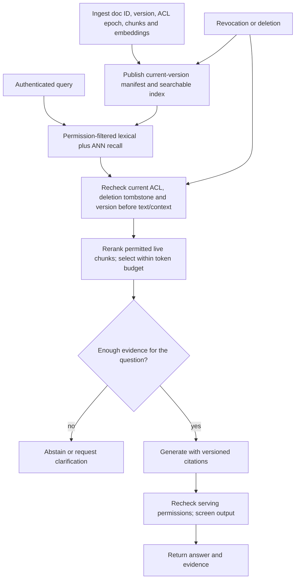

Retrieval is a **two-stage funnel** (mirrors recsys, CS F3): a **cheap, fast
recall** stage (ANN over millions of vectors — HNSW/IVF/ScaNN) gets ~100
candidates, then an **expensive, precise rerank** (a cross-encoder that reads
query+passage together) reorders to the top ~5. ANN trades a little recall for
**large measured speedups**; complexity depends on index family, distribution
and search parameters, not a universal O(log N) guarantee. Reranking improves
precision on the candidates it actually receives.

**Freshness protocol:** build new document chunks/embeddings under version v9,
then publish a current-version manifest when that version is queryable. Retire
old-version rows asynchronously, filtering them immediately at the live-version
gate. Deletion writes an authoritative tombstone, removes index entries and
invalidates response caches; it is not "re-embed the deleted document."
Choose a normal content freshness SLO (e.g. 60 seconds from committed update to
queryability) and track lag/dead-lettered ingest independently of query latency.

**Revocation:** an access removal must block the next authoritative permission
check even while vector deletion lags. Fail closed if this authority is
unavailable. Validate before context construction and again before serving;
invalidate permission-scoped caches and cancel affected in-flight requests on
revocation events. Already delivered text cannot be recalled; define the
authorization decision point rather than promising retroactive revocation.

**Quality example:** on 20 labeled questions, 16 have an authorized answer.
Suppose recall finds evidence for 14/16; reranking cannot rescue the other two.
Correctly abstaining on both misses and the four unanswerable questions gives
14 grounded answers and 6 abstentions. Track retrieval recall, citation support,
answer correctness and false-answer rate separately; high similarity alone
does not justify answering. Keep ANN/embedding theory in **Ch 28**.

### F2.4 Trade-offs and Follow-ups

- **Chunking is underrated:** too big → diluted embeddings & wasted context; too
  small → lost context. Overlap preserves boundaries.
- **ANN recall vs latency:** tune `efSearch`/`nprobe`; measure recall@k, not just
  speed.
- **Red flags:** brute-force search at 100 M vectors; no reranker (raw ANN is
  often not precise enough); stale index (no freshness path); dumping 50 chunks
  into the prompt (cost + "lost in the middle"); ignoring access control on
  retrieved docs.
- **Building blocks:** embeddings, vector DBs, ANN (HNSW/IVF/ScaNN), reranking,
  chunking, RAG — **Ch 28**; the LLM generator — **F1 / Ch 17**;
  two-stage retrieve→rank funnel — **Ch 26**.

<a id="practice-f2"></a>

### F2.5 Practice

### Whiteboard Rehearsal

**Narrate:** only authorized, current chunks become evidence. The legacy
sketch's ACL metadata box is storage, not enforcement; the editable path shows
where rejection happens.


### Try It

the best-scoring chunk is old v7 and the current v8 evidence is missing from retrieval. Should the model answer from v7?

<details>
<summary>Show worked answer</summary>

No. Reject superseded evidence, retry an allowed current lexical/source lookup
within budget, or abstain with a clear evidence gap. A fluent obsolete refund
rule is worse than a supported abstention. The same fail-closed rule applies
to a revoked document even before its vector row is physically deleted.

</details>

<a id="f3"></a>

## F3 — Recommendation Feed

> **Google priority:** ★★★ · **Difficulty:** Hard · **Frequency:** Very common · **Time budget:** ~35 min

> **User story —** *As a* user opening a feed, *I want* a personalized, ranked list in under
> 200 ms, *so that* I see relevant items without waiting.
>
> **For example —** for each request, candidate generation cuts 10^8 items to ~1,000 via ANN, then
> a ranking model scores those and applies business rules — all within the latency budget.
>
> **Why it matters —** you can't score 800 M items per request, so recsys is a funnel; the infra
> crux is the feature store and the online/offline split.

"Design the feed / recommendations" (YouTube home, app store, shopping) is the
classic ML-system question. You can't score **800 million items** for every user
in 100 ms, so recsys is a **funnel**: cheaply **generate candidates** (thousands)
→ expensively **rank** them (hundreds) → apply business rules → serve. The infra
crux is the **feature store** and the **online/offline split**. Modeling depth
(two-tower, wide-and-deep, metrics, drift) lives in **Ch 26**.

### F3.1 Requirements and Estimates

- **Functional:** return a ranked list of items per user request; personalize;
  refresh as behavior changes; respect business rules (diversity, freshness,
  dedupe, policy).
- **Estimate:** 100 M DAU × 10 feed loads/day = **1 B requests/day ≈ 12k/s**
  (peak ~40k/s), each scoring ~500 candidates → **~6 M scorings/s average, ~20 M/s at peak** →
  ranking must be cheap per item, and candidate generation must cut 10^8 → 10^3
  fast.
- **Latency:** end-to-end **< 200 ms**; the model has a strict slice of that.

### F3.1a Start Simple

**Baseline → pressure → change → cost:** a recent/popular list is cheap and
works for cold-start users; personalized quality improves with behavior;
introduce candidate retrieval plus ranking and policy; pay feature freshness,
training-data correctness and latency costs. Preserve a safe nonpersonalized
fallback rather than making every feature dependency mandatory.

**Request `feed:U42` at 10:00:** source lists contain 700 ANN + 300 followed +
200 trending items; union/dedupe gives 1,000, eligibility/seen filtering 600,
cheap pre-ranking 500, heavy ranking 500, and policy selects 20. Candidate
generation therefore does not imply scoring all 1,000 with the expensive model.

| Example of the 500 scored candidates | Model score | Policy outcome |
|---|---|---|
| I17, biking, creator X | 0.81 | Keep |
| I18, biking, creator X | 0.80 | Skip if one item/creator in the top three |
| I24, cooking, creator Y | 0.73 | Keep for relevance and diversity |
| I31, climbing, creator Z | 0.70 | Keep; different creator/topic |

Under that stated top-three rule, serve **I17, I24, I31**, not simply the three
highest model scores. A restricted/deleted item is removed before scoring or
serving regardless of predicted engagement.

**200-ms allocation:** gateway 20 + candidates 35 + feature fetch 35 + ranking
60 + policy 20 + serialization 15 + slack 15. These are stage budgets; measure
end-to-end p99. Bound every source timeout so an optional recommender path does
not block the whole feed.

**Missing/stale features:** U42's last-click feature is timestamped 09:54 with
a two-minute freshness limit, so at 10:00 it is stale. Use the trained
missing-feature path (e.g. empty history plus `history_missing=1`), keep stable
profile/item features, and record the fallback; do not silently present stale
history as fresh or assume a zero equals a real observed value. If rich feature
fetch exceeds 35 ms, use a tested lightweight ranker/trending fallback.

**Prerequisites:** [Ch 26: features, labels and recommendation evaluation](#content/26_ml_system_design),
[Ch 28: ANN recall](#content/28_semantic_search), [CS17: low-latency feature reads](#cs17).
[Contents](#chapter37-toc) · [Previous: RAG](#f2) · [Next: pattern library](#part-g)

### F3.2 Architecture

**Image correction:** feature freshness and point-in-time joins require more than one shared definition


```
   Request ─▶ ┌── CANDIDATE GENERATION (recall: 10^8 → 10^3) ──┐
              │  several sources, unioned:                      │
              │   • two-tower ANN (user emb → item ANN)         │
              │   • recent/trending, follows, collaborative     │
              └───────────────────┬────────────────────────────┘
                                  ▼
              ┌── RANKING (precision: 10^3 → ordered) ──┐
              │  cheap prune, heavy model scores 500     │◀── FEATURE STORE
              │  user × item × context features          │    (online: low-lat
              └───────────────────┬─────────────────────┘     reads; offline:
                                  ▼                            train tables)
              RE-RANK / policy: diversity, dedupe, freshness, business rules
                                  ▼
              Feed served; impr.+clicks logged ─▶ training data ─▶ Spark train ─▶ Model Store ─▶ deploy
```
**Block-by-block:**
- **Candidate generation** — cheap recall sources: a **two-tower** model embeds the user and finds
  nearby items via **ANN**, unioned with trending/followed/collaborative sources — cutting 10^8
  items to ~10^3.
- **Ranking** — a heavy model scores each candidate with rich **user × item × context features**
  pulled from the **feature store**.
- **Re-rank / policy** — enforces diversity, dedupe, and business rules.
- **Logging → training** — served impressions and clicks are **logged** to become tomorrow's
  **training data**; an offline **training pipeline** (Spark) turns those logs into refreshed
  models, published to a **Model Store** (versioned artifacts) and deployed back to **ranking**.

**Flow:** (1) request → (2) candidate gen (ANN + sources) → (3) feature fetch → (4) rank →
(5) policy re-rank → (6) serve + log.

### F3.3 Deep Dive

**Mechanism diagram**

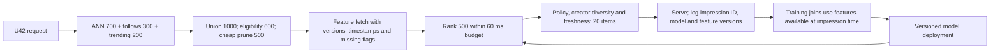

The **funnel** exists because of arithmetic: scoring 10^8 items per request with
a heavy model is impossible in 200 ms, so **recall is cheap and approximate
(ANN), ranking is expensive and precise** on a small set — the *exact same
two-stage shape* as RAG retrieval (F2). The **feature store** is the infra crux
and the **#1 silent killer (Ch 26)**: features must be computed **identically**
for **offline training** (batch tables over historical logs) and **online
serving** (low-latency reads at request time). If the two diverge —
**training/serving skew** — the model silently rots. So the feature store serves
both paths from one definition, with online features (last-5-clicks, current
session) updated in near-real-time and offline features (long-term affinity)
batch-computed. One definition prevents one kind of divergence, not all skew.

**Point-in-time join:** impression `imp-81` was served at 10:00 with feature
version f12 (available at 09:59). A click at 10:01 and f13 published at 10:02
cannot appear in that impression's training features. Join using both feature
event time and **availability time ≤ prediction time**, matching the value
serving could actually read. Otherwise future behavior leaks into training.
Record model/feature versions and training-serving distributions; use a defined
label maturity window (e.g. clicks observed within 24 hours), not premature
negative labels for impressions whose outcomes have not arrived.

**Cold start:** a new user gets eligible regional/trending items plus explicit
onboarding preferences, with bounded exploration. A new item can enter via
content/category features and an exploration quota; it need not wait for clicks
it cannot receive without exposure. Evaluate an outcome such as satisfied
sessions/watch time **with** guardrails for hides/reports, diversity and p99
latency; a CTR increase with more harmful or repetitive recommendations is not
automatically a successful launch.

### F3.4 Trade-offs and Follow-ups

- **Online vs offline:** offline (batch) is cheap and rich but stale; online
  (streaming) is fresh but costly — most systems do **both** and join them in the
  feature store.
- **Candidate sources:** more sources = better recall but more latency/complexity;
  union + dedupe.
- **Red flags:** trying to rank the full catalog (no funnel); training/serving
  skew from two feature pipelines; no logging of impressions (no training data);
  ignoring diversity (feed collapses to one topic); cold-start users/items.
- **Building blocks:** candidate-gen → ranking funnel, two-tower, feature store,
  training/serving skew, A/B testing, drift — **Ch 26**; ANN for candidate
  recall — **Ch 26/28**; event logging & stream processing — **Ch 24**;
  low-latency feature reads (cache/KV) — **CS17 / Ch 23**.

<a id="practice-f3"></a>

### F3.5 Practice

### Whiteboard Rehearsal

**Narrate:** scores choose among eligible candidates; policy can change the
final order. A shared feature definition alone does not make historical joins
point-in-time correct. The legacy sketch omits those operating constraints.


### Try It

tomorrow's training job joins imp-81 to the latest user profile, which includes the click caused by imp-81. Is using the same feature code enough?

<details>
<summary>Show worked answer</summary>

No. It leaks the outcome into the prediction features. Reconstruct the profile
available at 10:00, excluding the 10:01 click and late-arriving data not yet
servable then. Shared transformations plus point-in-time/availability joins,
version logging and missing-feature behavior together reduce skew.

</details>

---

<a id="part-g"></a>

# Part G — Pattern Library

Here is the synthesis. Across all 26 designs in Ch 35/36/37, **the same dozen or
so patterns recur** — interviewers reward you for *naming the pattern* and
*recognizing when it applies*, not for re-deriving it each time. This matrix maps
every recurring pattern to **which case studies use it** and **why**, with a
one-line **"when to reach for it"** trigger. Use it as a revision tool: cover the
right two columns and quiz yourself.

> Shorthand: **CS1–CS23** are the case studies; **F1/F2/F3** the AI designs.
> Ch 35 = CS1–4 (real-time), Ch 36 = CS5–12 (search/geo/feeds/media),
> Ch 37 = CS13–23 + Part F (scale/infra/money/AI).

## G.1 The master matrix

| Pattern | When to reach for it | Used in (case studies) | Why it's the right tool |
|---------|----------------------|------------------------|-------------------------|
| **Fan-out: push vs pull** | One event must reach many timelines/recipients | CS9 News Feed, CS1 Notifications, CS2 Chat (groups) | Push (write fan-out) = fast reads, costly for celebrities; pull (read fan-out) = cheap writes, slower reads → **hybrid**: push for most, pull for whales |
| **WebSocket vs SSE vs polling** | Server must push to client in real time | CS2 Chat, CS1 in-app, CS4 Docs, CS3 Zoom signaling, **F1 token streaming** | WebSocket = bidirectional (chat/edits); SSE = one-way stream (tokens, live feed); long-poll = simple fallback |
| **Geo-index (geohash/quadtree/S2)** | "Find things near me" spatial queries | CS7 Proximity/Nearby, CS8 Ride-Hailing | Cover the entire query region with index-specific cells/ranges, then exact-filter; nine cells are only a conditional example |
| **Consistent hashing (+ vnodes)** | Spread many keys over nodes with limited remapping | CS17 Cache, CS21 KV store; optional CS13/CS16 sharding | Roughly `1/N` remapping under balanced assumptions; not a hot-key cure. Redis Cluster uses hash slots |
| **Idempotency / dedupe** | Retryable state changes | CS19 Payments, CS1 Notifications, CS18 Scheduler, CS20 reservations, CS23 checkout, CS2 message-id | Stable scoped identity + atomic effect/dedupe within retention bounds; PENDING is not a completed result |
| **Token / leaky bucket** | Cap rate but allow natural bursts | CS13 Rate Limiter, CS1 per-user caps, CS6 Crawler politeness | Protects downstreams & ensures fairness; token = bursty, leaky = smoothed |
| **Shard by key** | Horizontal scale + per-entity locality | CS2 by convo, CS9 by user, CS19 by account, CS21 by key, CS23 by order | Gives one logical owner/partition, not automatic ordering or no coordination. Replication, migration and cross-key transactions still need protocols |
| **CQRS / read models** | Read and write shapes diverge sharply | CS9 Feed (precomputed timeline), CS16 Leaderboard (Redis index), CS5 Autocomplete (trie) | Serve reads from a **derived view** optimized for the query, written async from the source of truth |
| **Outbox + CDC** | Commit DB change and a publishable event together | CS19 Payments, CS16 scores, CS20 reserve, CS23 orders, CS1 Notifications, CS9 fan-out | Row and outbox commit atomically; publication can retry and duplicate, so consumers dedupe/version |
| **Bloom / Count-Min sketch** | Approximate membership/frequency in fixed RAM | CS15 Top-K (CMS), CS6 Crawler (Bloom "seen URLs"), CS17 cache admission | Huge memory savings vs exact sets/maps; bounded, tunable error |
| **SFU (selective forwarding)** | Multiparty real-time media | CS3 Video Conferencing (Zoom/Meet) | Forwards each participant's stream without re-encoding → far cheaper than an MCU mixer, scales to many |
| **OT / CRDT** | Concurrent operations on a compatible data model must converge | CS4 Collaborative Editor; contrast with CS11 whole-file conflict copies | OT transforms operations with a complete revision/pending protocol; CRDTs converge under specified identity/causal rules. CS11 does not merge bytes with OT |
| **Quorum N/W/R** | Trade replica participation against availability | CS21 KV store; replicated authorities elsewhere | `W+R>N` proves overlap only within a fixed home set with retained versions; not linearizability or a sloppy-quorum latest-value guarantee |
| **Write-ahead / append-only log** | Durability, ordered replay, audit | CS19 Ledger, CS21 storage engine, CS1/CS9/CS15 Kafka backbone | The universal building block — commit to a log first, derive everything else from replaying it |

## G.2 Bonus patterns worth naming

A few more that show up repeatedly and earn senior signal when named:

| Pattern | When to reach for it | Used in | Why |
|---------|----------------------|---------|-----|
| **Lease / visibility timeout** | Recover abandoned work/ownership | CS18 Scheduler, CS14 worker allocation | Expiry permits reassignment; old owners need fail-stop/token checks. A lease does not kill a paused process |
| **Durable reservation + expiry transition** | Hold a scarce resource during a multi-step action | CS20 Inventory/tickets, CS23 checkout | Atomic create+decrement; confirm competes with expire/release; stock restored exactly once. Key TTL alone releases nothing |
| **Two-stage funnel (recall→rank)** | Too many candidates to score precisely | F3 Recsys, F2 RAG retrieval, CS5 autocomplete | Cheap approximate recall (ANN) → expensive precise rank on a small set |
| **Cache-aside + stampede guard** | Hot read path in front of a slow store | CS17 Cache, CS9 Feed, CS5, Instagram | 90%+ hit rate offloads the DB; single-flight + TTL jitter stops herd on expiry |
| **Bulkhead / isolation** | One slow dependency must not sink the rest | CS1 per-channel queues, CS3 media vs signaling, CS23 browse vs checkout | Bound resources and deadlines per dependency; optional enrichment failure does not block core checkout state |
| **Versioned hot/cold tiering** | Historical reads/index size exceed hot-store budget | CS23 orders | Copy, verify, record route, then conditionally delete the same eligible version; do not archive solely because a state is terminal |
| **Lambda (batch + stream)** | Need both real-time *and* exact answers | CS15 Top-K, CS9 analytics, F3 logging | Fast approximate stream path + slow exact batch path that reconciles |

## G.3 How to use this in the room

[Contents](#chapter37-toc) · [Previous: recommendations](#f3) · [Next: revision](#part-h)

**When not to use a pattern:** a token bucket is wrong for an exact rolling
count; a sketch is wrong for billing totals; a cache is wrong as unqualified
spend authority; a saga is insufficient for simultaneous multi-shard visibility;
archiving adds needless complexity while indexed SQL still meets the budget.
Give the requirement that triggers the pattern *and* the condition that rules it out.

- When you hit a sub-problem, **say the pattern's name** ("this is a fan-out
  problem — push or pull?") before drawing. That's the senior tell.
- Most designs are **3–5 of these patterns composed**. E.g. the **News Feed** =
  fan-out + CQRS + shard-by-user + cache-aside; **Payments** = idempotency +
  WAL/ledger + outbox + saga; **KV store** = consistent hashing + quorum +
  vector clocks + WAL.
- The **same two-stage funnel** powers autocomplete, RAG retrieval, and
  recommendations — recognizing that one shape across "backend" and "ML"
  questions is exactly the **AI-Engineer bridge** this chapter is about.

---

<a id="part-h"></a>

# Part H — Quick Revision

The night-before table. **One row per design** across all three chapters
(CS1–CS23 + the three AI designs = 26 designs). Columns: the **core challenge**, the **key
components**, the **one trade-off** the interviewer is listening for, and **the
single number or idea** that proves you actually understand it. If you can
reproduce this table from memory, you can walk into the room.

| # | Design | Core challenge | Key components | Key trade-off | The one idea/number to remember |
|---|--------|----------------|----------------|---------------|---------------------------------|
| 1 | **Notification** (Ch 35) | Durable acceptance and observed delivery | Unique request + outbox, channel jobs, provider identity | Retry safety vs uncertain external effects | Provider accepted is not device delivered. **Test:** crash after commit, before response? |
| 2 | **Chat** (Ch 35) | Ordered acceptance and device recovery | Fenced conversation writer, log, gateway, device cursors | Safe commits vs partition-side write availability | Cursors are contiguous and per device. **Test:** receive 41 and 43 without 42? |
| 3 | **Video Conf / Zoom** (Ch 35) | Deadline-sensitive multiparty media | SFU, ICE, SRTP, TURN fallback, simulcast | Forwarding egress/client decoding vs mixing CPU | Upload sums sent layers; download sums selected layers. **Test:** UDP blocked? |
| 4 | **Collab Editor / Docs** (Ch 35) | Convergent edits and durable identities | Central OT or sequence CRDT, pending ops, committed log | Instant local echo vs merge/history complexity | Commit before ACK; specify same-position ties. **Test:** retry after lost ACK? |
| 5 | **Autocomplete** (Ch 36) | Fast prefix candidates with private reranking | Versioned trie/FST, shared candidates, private result path | Precompute memory/freshness vs request work | 60 ms debounce is outside the 50 ms request budget. **Test:** another user's cache hit? |
| 6 | **Web Crawler** (Ch 36) | Prioritized, polite discovery and recrawl | Frontier, host ownership, advisory Bloom plus exact records | Crawl coverage vs host delay and recovery safety | FIFO alone does not limit in-flight work. **Test:** fetch exceeds the delay? |
| 7 | **Proximity / Nearby** (Ch 36) | Complete spatial candidates and exact filtering | Index-specific region cover, versioned locations, distance refinement | Candidate volume vs precision/latency | k-NN stops using unvisited distance bounds, not count alone. **Test:** closest item across a cell edge? |
| 8 | **Ride-Hailing** (Ch 36) | Durable single assignment | Candidate geo-grid, offer epoch, driver/trip transaction | First-offer speed vs matching quality and authority availability | A Redis lease is not an accepted trip. **Test:** old acceptance after expiry? |
| 9 | **News Feed** (Ch 36) | Hybrid fan-out and stable pages | Durable posts, derived candidates, user-bound ranking snapshot | Write amplification vs read merge and snapshot cost | Page within a frozen ordering. **Test:** a post arrives between pages? |
| 10 | **Video Streaming** (Ch 36) | Decodable renditions and sustainable playback | Aligned encoding, durable publication, CDN, ABR | Extra storage vs adaptation and latency | Publish only ready segments/renditions; ABR cannot eliminate outages. **Test:** download exceeds buffer? |
| 11 | **File Sync / Dropbox** (Ch 36) | Durable version commits and safe block reuse | Scoped hashes, upload pins, base-version check, journal | Delta efficiency vs commit/GC coordination | Hash knowledge is not authorization. **Test:** GC sees zero refs during an upload? |
| 12 | **URL Shortener** (Ch 36) | Unique allocation and correct redirects | Conditional code reservation, KV/cache, expiry gate | Short predictable codes vs random allocation; caching vs visibility | 7 base62 chars hold about 42 bits; 302 alone is not no-cache. **Test:** expiry on a cache hit? |
| 13 | **Rate Limiter** | Shared burst/rate contract | Server-time Lua bucket, bounded grants | Hop/durability vs explicit approximation | B+rT, not exact rolling N; G*b emergency budget. **Test:** gateway restarts during outage? |
| 14 | **Snowflake ID** | Unique, k-sorted local IDs | 41 time / 10 worker / 12 sequence, renewable lease | Coordination-free hot path vs fail-stop | 4096/ms is a bit ceiling; safe reuse needs durable bounds. **Test:** old owner resumes after lease loss? |
| 15 | **Top-K / Heavy Hitters** | Bounded-memory frequency candidates | CMS + **keyed unique heap**, Kafka by key | Count error and candidate recall vs RAM | Match windows; local union proof assumes whole-key partitioning. **Test:** A,A inserts two heap slots? |
| 16 | **Leaderboard** | Rank / top-N / around-me | Sorted set + durable versioned projection | Global rank fan-out vs approximation | Bound composite below 2^53; rank counts full tie order. **Test:** v8 arrives after v9? |
| 17 | **Distributed Cache** | Hot-key and cold-miss control | Ring or hash slots, single-flight, generation fence | Staleness vs DB protection | 4×200k=800k ops/s; size memory separately. **Test:** distinct cold misses exceed DB budget? |
| 18 | **Job Scheduler** | Durable at-least-once work | Attempt-token leases, due index, DLQ | Redelivery vs effect idempotency | 1000 execution slots need not mean 1000 machines. **Test:** old attempt sends late ACK? |
| 19 | **Payments / Wallet** | Protected spending and audit | Ledger **and authoritative balance** transaction, scoped dedupe, saga | Local consistency vs pending external outcomes | PENDING ≠ completed; clearing legs balance locally. **Test:** two spends read an unchanged balance? |
| 20 | **Inventory / Flash Sale** | No oversell through crashes/retries | Durable reserve+decrement, competing CAS transitions | Held stock vs checkout opportunity | Key expiry is not stock release. **Test:** late payment after another buyer acquires the unit? |
| 21 | **KV Store / Dynamo** | Available writes with explicit conflicts | Fixed/sloppy replica policy, version context, repair | Strict quorum rejection vs sloppy stale reads | W+R>N is **fixed-set overlap only**, not linearizability. **Test:** A/D write vs B/C read? |
| 22 | **Pastebin** | Authorized blob retrieval and expiry | Private origin, metadata claim, selective CDN | One retrieval attempt vs resumable delivery | Authorize and consume before fetch. **Test:** consumed request loses its response? |
| 23 | **E-commerce capstone** | Fast browsing, correct money/stock | Price snapshot, reservation ID, payment ID, durable order saga | Stale browse vs authoritative checkout | UNKNOWN is not failure; verify archive before delete. **Test:** payment succeeds after hold expiry? |
| F1 | **LLM Inference Serving** | Token/memory/latency admission | Continuous batching, paged KV, output gate | Utilization vs TTFT/inter-token latency | Dense new-token attention remains O(context). **Test:** output growth exceeds reserved KV? |
| F2 | **RAG / Semantic Search** | Current permitted evidence | Hybrid recall, live ACL/version gate, rerank, citations | Recall/freshness vs latency and abstention | Stored ACL metadata is not enforcement. **Test:** revoked chunk remains in ANN? |
| F3 | **Recommendation Feed** | Budgeted relevant and safe ranking | 1000→500→20 funnel, timed features, policy | Rich features vs latency/cold-start fallback | Shared definitions need point-in-time joins too. **Test:** training joins future clicks? |

[Contents](#chapter37-toc) · [Pattern library](#part-g) · [Takeaways](#takeaways)

---

<a id="takeaways"></a>

## Key Takeaways

- **Infra questions reward depth on ONE hard idea.** Give full HLD, then go to
  the **data-structure / concurrency level** on the crux — that's where the
  signal is (the Lua bucket, the 64-bit layout, the idempotent ledger posting).
- **Atomicity is the recurring theme.** Token-bucket Lua, ledger double-entry,
  inventory reservation transactions, idempotent transaction-state checks — all use the same
  move: make a **read-modify-write into one indivisible step** so concurrent
  requests can't race.
- **Idempotency is the most reused trick in the book.** It turns *at-least-once*
  delivery into an *exactly-once effect within a defined dedupe contract* and shows up in payments, notifications,
  the scheduler, and order creation. Bake in idempotency keys from day one.
- **State the guarantee at the relevant boundary.** Limiter fallback spends a
  defined emergency budget or explicitly loses its admission bound. Payments refuse
  unsafe postings; a sloppy KV quorum permits stale reads and conflicts. Use CAP/PACELC
  where their assumptions apply, not as a label for every latency or user-experience choice.
- **Approximate to save memory and latency** — Count-Min sketches, Bloom
  filters, ANN search, local rate-limit counters. Exactness is a cost you pay
  **only when the requirement demands it** (billing, money).
- **Partitioning gives locality, not every guarantee.** A generic ring reduces
  remapping; Redis Cluster uses slots. Replication, ownership changes, ordering
  and cross-key operations still need explicit protocols.
- **The same two-stage funnel** — cheap approximate **recall** then expensive
  precise **rank** — powers autocomplete, RAG retrieval, *and* recommendations.
  Recognizing that one shape across backend and ML problems **is** the AI-Engineer
  bridge.
- **For AI serving, the infra IS the interview.** Batching, KV-cache, retrieval,
  feature stores, and latency budgets are yours to design; the model is a black
  box you keep **fed and utilized**. Point to **Ch 26** (ML system design),
  **Ch 28** (semantic search), **Ch 17** (LLMs), **Ch 29** (GPUs/TPUs) for the
  modeling depth.
- **Compose, don't invent.** A senior design is **3–5 named patterns** from
  Part G stitched together. Memorize the cruxes in Part H, name the patterns in
  Part G, and drive the 45 minutes with the playbook from **Ch 35 Part A**.
