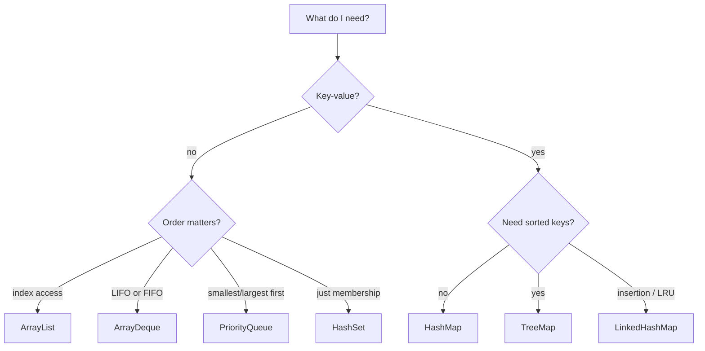
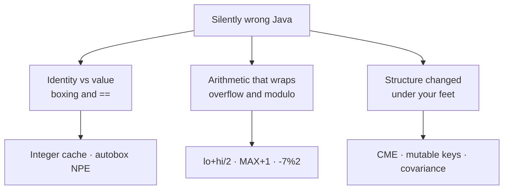

# Chapter 38 — Java Refresher: Core & DSA Toolkit

> "You haven't forgotten Java. You've just stopped reaching for it automatically. This chapter is about making it automatic again."

---

## What You'll Learn

After this chapter you will be able to:
- Tell in one glance what actually changed in Java since you left, and what didn't
- Reach for the right array idiom without thinking — 1-D, 2-D, jagged, copy, fill, sort
- Build strings the way interviewers expect, and know why `+=` in a loop is a bug
- Pick between `ArrayList`, `HashMap`, `HashSet`, `ArrayDeque`, `PriorityQueue` and `TreeMap` in seconds
- Write comparators that don't overflow and don't violate their contract
- Recognise the traps that silently produce wrong answers — the Integer cache, autoboxing NPEs, `(lo+hi)/2`
- Write `equals`/`hashCode` that behave correctly inside a `HashMap`

**Markers:** ★★★ = know cold for interviews · ★★ = high priority · ★ = good to know.
**Quick check** boxes are retrieval practice — attempt before revealing.
**Interview** boxes give the question, what to say, and the follow-up trap.

> **This chapter is the on-ramp to [Ch 31 — DSA & ML Coding (Java)](#content/31_dsa_coding).** Chapter 31 is 400+ problems deep and assumes Java fluency; it explains the language in only three places. Everything here exists to close that gap. The *modern* language — records, sealed types, pattern matching, virtual threads, Spring Boot 3 — lives in the companion chapter, [Ch 38b — Modern Java](#content/38b_java_modern).

---

## 38.1 What Changed While You Were Away ★★

You left Java somewhere around 2022. Most likely you were on **Java 8** or **Java 11**, with Java 17 perhaps on a roadmap somewhere. Since then two more long-term-support releases have shipped.

```
  2014        2018        2021       2023          2025
   │           │           │          │             │
 Java 8     Java 11     Java 17    Java 21       Java 25
   LTS         LTS         LTS        LTS           LTS
   ▲                                   ▲             ▲
   │                                   │             │
 lambdas,                        virtual threads,  scoped values
 streams,                        pattern matching, (structured
 Optional                        record patterns   concurrency:
                                                   still preview)
```

Here is the reassuring part, and it is worth saying plainly before anything else: **almost nothing you learned was invalidated.** Java's compatibility discipline is close to obsessive. Code you wrote in 2022 still compiles and still runs. What changed is that a lot of what used to take ten lines now takes one — and a few habits that were correct then are merely *acceptable* now.

### The diff map

Read the middle column first. If a row says "unchanged," you can skip that topic entirely.

| What you knew | Status in 2026 | Where it's covered |
|---|---|---|
| Arrays, `int[]`, 2-D grids | **Unchanged** | §38.2 — reactivation only |
| `String`, `StringBuilder`, `char[]` | **Unchanged** (+ `strip`, `isBlank`, `repeat`) | §38.3 |
| `ArrayList` / `HashMap` / `HashSet` | **Unchanged**, but three idioms replace old boilerplate | §38.4 |
| `Stack` for stacks | **Superseded** — use `ArrayDeque` | §38.4 |
| Lambdas and comparators (Java 8) | **Unchanged** — still the tool DSA needs | §38.5 |
| `==` vs `.equals()`, boxing traps | **Unchanged** — and still the top source of silent bugs | §38.6 |
| Generics, `equals`/`hashCode` | **Unchanged**, but records now generate them | §38.7 |
| Anonymous classes for small types | **Superseded** by **records** | [Ch 38b](#content/38b_java_modern) §38b.2 |
| `if/else if` chains on type | **Superseded** by **sealed types + pattern matching** | [Ch 38b](#content/38b_java_modern) §38b.3 |
| Explicit types on every local | **Optional** — `var` since Java 10 | [Ch 38b](#content/38b_java_modern) §38b.1 |
| Escaped multi-line strings | **Superseded** by **text blocks** | [Ch 38b](#content/38b_java_modern) §38b.1 |
| Thread pools sized to cores | **Superseded** for I/O by **virtual threads** | [Ch 38b](#content/38b_java_modern) §38b.6 |
| `CompletableFuture` chains | **Often unnecessary** — write blocking code on virtual threads | [Ch 38b](#content/38b_java_modern) §38b.6 |
| Spring Boot 2, `javax.*` | **Migrated** — Boot 3 needs Java 17+ and `jakarta.*` | [Ch 38b](#content/38b_java_modern) §38b.7 |

Nine of those thirteen rows are "unchanged." That ratio is the honest summary of your situation: **you are not relearning a language, you are reloading one** — and then picking up roughly five genuinely new ideas.

### Which chapter should you read first?

The two chapters exist for two different jobs, and the right order depends on yours.

| Your goal | Read |
|---|---|
| Grind DSA and pass a coding interview | **This chapter**, then [Ch 31](#content/31_dsa_coding). §38b is optional. |
| Return to backend work on a modern codebase | Skim §38.6 for the traps, then all of [Ch 38b](#content/38b_java_modern) |
| Both | This chapter → [Ch 38b](#content/38b_java_modern) → [Ch 31](#content/31_dsa_coding) |

A note on why this chapter weights things the way it does. Every Java construct in [Ch 31](#content/31_dsa_coding) and its 400+ problems was counted. `int[]` appears **2,799** times; `ArrayList` 165; `ArrayDeque`, `Deque` and `Queue` together over 180; lambdas 327. `stream()` appears **once**, and `Optional` **once**. So arrays, collections and comparators get the space here, and streams are covered in [Ch 38b](#content/38b_java_modern) where they actually belong — in backend code.

### Rust check

Answer these before reading on. They are diagnostic, not a test — each one maps to a section, so a wrong answer tells you exactly where to slow down.

<details>
<summary><strong>Rust check.</strong> Eight questions. Score yourself, then use the table below to decide what to skip.</summary>

**1. What does `new Integer[3]` contain? (§38.2)**
Three `null`s — not three zeros. Only *primitive* arrays get a zero default. This is why `int[]` and `Integer[]` are not interchangeable.

**2. `List<Integer> l = Arrays.asList(1,2,3); l.add(4);` — what happens? (§38.2)**
`UnsupportedOperationException`. `Arrays.asList` returns a **fixed-size** view backed by the array. You can `set`, but never `add` or `remove`.

**3. Why is building a string with `s += c` inside a loop a bug? (§38.3)**
`String` is immutable, so each `+=` allocates and copies a whole new string — $O(n^2)$ overall. Use `StringBuilder` for $O(n)$.

**4. You need a stack. `Stack` or `ArrayDeque`? (§38.4)**
`ArrayDeque`. `java.util.Stack` extends `Vector`, so every operation is synchronized, and — the part that actually bites — iterating it yields *bottom-to-top*, the opposite of what you'd expect.

**5. What's wrong with `(a, b) -> a - b` as a comparator? (§38.5)**
It overflows. If `a = 2_000_000_000` and `b = -2_000_000_000`, the subtraction wraps negative and the order inverts. Use `Integer.compare(a, b)`.

**6. `Integer a = 127, b = 127; a == b` → ? And at 128? (§38.6)**
`true`, then `false`. Java caches boxed integers in −128..127, so `==` accidentally works on small values and fails on large ones — code that passes small test cases and fails the real input.

**7. Why does `int mid = (lo + hi) / 2;` break on large arrays? (§38.6)**
`lo + hi` can exceed `Integer.MAX_VALUE` and wrap negative, so `mid` becomes negative and you index out of bounds. Write `lo + (hi - lo) / 2`.

**8. You override `equals` but not `hashCode`, then use the object as a `HashMap` key. What happens? (§38.7)**
Lookups fail. `HashMap` finds the bucket by `hashCode` first, so two "equal" objects land in different buckets and `get` returns `null` for a key you just inserted.

---

| Score | What to do |
|---|---|
| **7–8** | Skim §38.2–38.5 for the tables, read §38.6 properly, go to [Ch 31](#content/31_dsa_coding) |
| **4–6** | Normal for a four-year gap. Read the chapter in order; you'll move fast. |
| **0–3** | Read every section and type the examples out rather than reading them. |

</details>

> **Interview —** *"You've been away from Java for a while. How current are you?"*
> **Say:** Name the delta precisely rather than apologising for it — that you left around Java 11, and that the material change since is records, sealed types with pattern matching, and virtual threads in Java 21, plus scoped values finalising in 25 and structured concurrency still in preview. Then say what that *means*: data modelling got terser and exhaustively checkable, and thread-per-request became viable again, which removes most of the motivation for reactive stacks.
> **They follow up with:** *"So what would you use virtual threads for?"* — I/O-bound request handling, where blocking code on a virtual thread is now both simpler and about as scalable as an async pipeline. Not CPU-bound work, which is still bounded by core count.

---

## 38.2 Arrays — The Workhorse ★★★

If you only reactivate one thing before opening [Ch 31](#content/31_dsa_coding), make it this. The token `int[]` appears **2,799 times** across that chapter and its 400+ problems. Nothing else comes close. Interview Java is, to a first approximation, *array Java* — with a hash map bolted on when you need one.

The good news is that arrays are the part of the language that changed least. Everything below worked identically in Java 8. You are not learning; you are re-loading.

### Simple Explanation

Think of an array as a row of numbered lockers, all the same size, bolted to a wall. Because they are identical and adjacent, the caretaker can jump straight to locker 47 without walking past the first 46 — that is what makes `a[i]` instant.

The cost of that speed is rigidity. You cannot bolt on an extra locker later. The row's length is fixed the moment you build it, and the only way to "grow" it is to build a longer row and carry everything across. Every "resizable" structure in Java — `ArrayList`, `StringBuilder`, `ArrayDeque` — is that carrying trick wrapped in a friendly interface.

The second thing to hold onto: in Java, `a` is not the lockers. `a` is the sticky note with the room number on it. Copy the sticky note and both notes point at the same lockers. This is why passing an array into a method lets that method scribble on your data.

> **An array** is a fixed-length, contiguously allocated, homogeneously typed sequence whose elements are reachable in constant time by integer index.

### Declaration and initialisation

Three forms, and they are not interchangeable.

```java
int[] sized   = new int[5];           // length known, values 0
int[] literal = {1, 2, 3};            // ONLY at declaration
int[] inline  = new int[]{4, 5, 6};   // anywhere
```

The bare-brace form `{1, 2, 3}` is a *declaration-only* shortcut. The moment you need an array anywhere else — as a method argument, in a `return`, inside a bigger expression — you must spell out `new int[]{...}`. That is exactly why the DSA problem starter code you are about to see 400 times reads:

```java
System.out.println(linearSearch(new int[]{3, 7, 1, 9, 4}, 9));
```

Write `linearSearch({3, 7, 1, 9, 4}, 9)` and it will not compile.

Also: `length` is a **field** on arrays (`a.length`), a **method** on `String` (`s.length()`), and a different method on collections (`list.size()`). Three spellings for one idea. You will type the wrong one at least twice this week; the compiler catches all three, so it costs seconds, not correctness.

### Default values, and why `new Integer[3]` is a trap

A freshly allocated array is *always* zero-filled — for the appropriate meaning of zero.

```java
int[] a = new int[5];         // 0
double[] d = new double[3];   // 0.0
boolean[] b = new boolean[3]; // false
char[] c = new char[3];       // '\u0000'
String[] s = new String[3];   // null
Integer[] boxed = new Integer[3];  // null — NOT 0
```

Real output from the verified run:

```
new int[5]       [0, 0, 0, 0, 0]
{1, 2, 3}        [1, 2, 3]
new int[]{4,5,6} [4, 5, 6]
double[3]        [0.0, 0.0, 0.0]
boolean[3]       [false, false, false]
String[3]        [null, null, null]
Integer[3]       [null, null, null]
sum Integer[3]   NullPointerException
```

That last line is the whole point. `Integer` is a *reference* type, so `new Integer[3]` is three null pointers wearing a numeric costume. The instant you do `sum += x` the JVM unboxes `null` and throws. In DSA code this shows up when someone reaches for `Integer[]` so they can pass a comparator to `Arrays.sort` — and then forgets that the array starts empty in a different sense than `int[]` does.

Rule of thumb for interviews: **use `int[]` unless you specifically need `null`, generics, or a custom comparator.** Boxing costs memory (an `Integer` is ~16 bytes plus a pointer, versus 4 bytes for an `int`) and it costs cache locality, which is the thing that actually makes array code fast.

<details>
<summary><strong>Quick check.</strong> You need to sort an array of numbers into descending order. Why can't you just call <code>Arrays.sort(intArray, comparator)</code>?</summary>

There is no such overload. `Comparator<T>` is generic and generics do not accept primitives, so `Arrays.sort(int[], Comparator)` cannot exist. Your options are: sort ascending and reverse in place ($O(n)$ extra pass, still $O(n \log n)$ overall, no boxing); or box into `Integer[]` and pass a comparator. In an interview, say the first one — it shows you know why the overload is missing.

</details>

### 2-D and jagged arrays

Java has no true rectangular 2-D array. `int[][]` is an **array of references to arrays**. Once that clicks, every 2-D question answers itself.

```
int[][] grid = new int[3][4];

  grid ──► ┌───┐
           │ 0 │──► [ 0 ][ 1 ][ 2 ][ 3 ]   row 0
           ├───┤
           │ 1 │──► [ 4 ][ 5 ][ 6 ][ 7 ]   row 1
           ├───┤
           │ 2 │──► [ 8 ][ 9 ][10 ][11 ]   row 2
           └───┘

  grid.length    = 3   (number of rows)
  grid[0].length = 4   (width of row 0 only)
```

So `grid.length` is the **row count** because the outer array holds one slot per row, and `grid[0].length` is the **column count** because that is the length of one inner array. The asymmetry is not a quirk — it falls straight out of the representation.

```java
int[][] grid = new int[3][4];
for (int r = 0; r < grid.length; r++)
    for (int c = 0; c < grid[0].length; c++)
        grid[r][c] = r * 4 + c;

int[][] jag = new int[3][];      // rows unallocated (null)
jag[0] = new int[]{1};
jag[1] = new int[]{1, 2};
jag[2] = new int[]{1, 2, 3};

int[][] lit = {{1, 2, 3}, {4, 5, 6}};

int[][] fill = new int[2][3];
for (int[] row : fill) Arrays.fill(row, -1);   // must go row by row
```

```
rows grid.length    = 3
cols grid[0].length = 4
deepToString [[0, 1, 2, 3], [4, 5, 6, 7], [8, 9, 10, 11]]
  row len=1 [1]
  row len=2 [1, 2]
  row len=3 [1, 2, 3]
literal 2-D  [[1, 2, 3], [4, 5, 6]]
row-wise fill [[-1, -1, -1], [-1, -1, -1]]
boolean[2][2] [[false, false], [false, false]]
```

Two consequences worth internalising. First, `new int[3][]` gives you three `null` rows — a **jagged** array, which is how you represent triangular DP tables, adjacency lists and Pascal's triangle without wasting space. Second, `Arrays.fill(grid, -1)` does **not** work: it would try to write `-1` into slots that hold `int[]` references. You must loop the rows, as above.

For grid traversal, the direction-array idiom is worth having in muscle memory, because it turns four near-identical bounds checks into one loop:

```java
int[][] DIRS = {{-1, 0}, {1, 0}, {0, -1}, {0, 1}};
for (int[] d : DIRS) {
    int nr = r + d[0], nc = c + d[1];
    if (nr < 0 || nr >= grid.length ||
        nc < 0 || nc >= grid[0].length) continue;
    // visit grid[nr][nc]
}
```

> **Interview —** *"Walk me through how a 2-D array is laid out in Java, and how that differs from C."*
> **Say:** In C, `int a[3][4]` is one contiguous block of 12 ints and the compiler does the index arithmetic. In Java, `int[3][4]` is one array of three references plus three separate 4-element arrays — four objects on the heap, not one. That means rows can have different lengths (jagged arrays are legal and useful), and it means row-major traversal is meaningfully faster than column-major because each row is contiguous but rows are not contiguous with each other.
> **They follow up with:** *"So does loop order matter for performance?"* — Yes. Iterating `for r { for c { grid[r][c] } }` walks each row linearly and is cache-friendly; swapping the loops jumps between separately allocated rows on every step and thrashes the cache. Same $O(mn)$, materially different wall clock.

### Sorting: two algorithms hiding behind one name

`Arrays.sort` dispatches to two completely different implementations, and the difference is genuinely interview-relevant.

| Call | Algorithm | Stable? | Complexity |
|---|---|---|---|
| `Arrays.sort(int[])` | dual-pivot quicksort | no | $O(n \log n)$ average, $O(n^2)$ adversarial |
| `Arrays.sort(Integer[])` | TimSort (merge sort) | **yes** | $O(n \log n)$ worst case |

Primitives get dual-pivot quicksort because stability is meaningless for primitives — two equal `int`s are indistinguishable, so there is nothing to preserve — and quicksort sorts in place with no allocation. Objects get TimSort because stability *is* observable (two records with equal keys but different payloads) and because TimSort exploits pre-sorted runs, which real object data is full of.

The catch: quicksort has an $O(n^2)$ worst case, and it is reachable. Competitive-programming judges have published anti-quicksort test data that pushes `Arrays.sort(int[])` into quadratic behaviour. The standard defence, if you are ever burned by it, is to box (`Integer[]`, TimSort, guaranteed $O(n \log n)$) or shuffle before sorting. Mention this only if asked; volunteering it unprompted reads as trivia.

```java
int[] a = {5, 2, 9, 1, 7};
Arrays.sort(a);                          // [1, 2, 5, 7, 9]

Integer[] boxed = {5, 2, 9, 1, 7};
Arrays.sort(boxed, (x, y) -> Integer.compare(y, x));

int[] p = {9, 8, 7, 3, 2, 1};
Arrays.sort(p, 1, 4);                    // range is [from, to)
```

```
sort          [1, 2, 5, 7, 9]
sort desc     [9, 7, 5, 2, 1]
sort(p,1,4)   [9, 3, 7, 8, 2, 1]
```

Note the range form sorts the half-open interval `[1, 4)` — indices 1, 2, 3 — and leaves the rest untouched. Half-open intervals are the Java convention everywhere (`substring`, `copyOfRange`, `subList`, `subMap`), which is one fewer thing to remember.

### Copy, fill, and the rest of the `Arrays` toolbox

```java
Arrays.fill(f, -1);                      // whole array
int[] grown  = Arrays.copyOf(a, 8);      // pads with 0
int[] slice  = Arrays.copyOfRange(a, 1, 4);
System.arraycopy(a, 0, dst, 1, 5);       // src, srcPos, dst, dstPos, n
int[] copy   = a.clone();                // shallow, 1-D only
Arrays.binarySearch(a, 7);               // array MUST be sorted
```

```
fill          [-1, -1, -1, -1, -1]
copyOf(a,8)   [1, 2, 5, 7, 9, 0, 0, 0]
copyOfRange   [2, 5, 7]
arraycopy     [0, 1, 2, 5, 7, 9, 0]
bsearch(7)    3
bsearch(6)    -4
alias shares  [99, 2, 5, 7, 9]
clone is deep [1, 2, 5, 7, 9]
```

Three things to bank from that output:

- **`binarySearch` returns a negative number when the key is absent**, specifically `-(insertionPoint) - 1`. Here `6` would belong at index 3, so you get `-4`. That encoding is deliberate: `-result - 1` gives you the insertion point, which is how you implement "find the smallest element greater than x" in one call.
- **`clone()` on `int[]` is a real copy; on `int[][]` it is not.** `grid.clone()` copies the row *references*, so both grids share rows. For a deep copy, clone each row.
- **`System.arraycopy` is a JVM intrinsic** — it compiles to a vectorised memory move and is the fastest of the lot. `copyOf` and `copyOfRange` call it internally, so use whichever reads better; only reach for `arraycopy` directly when you need to copy *into* an existing array at an offset.

### Printing and comparing — the debugging essentials

You will lose real minutes to this if you don't reload it now.

```java
System.out.println(a);                    // [I@4b67cf4d  — useless
System.out.println(Arrays.toString(a));   // [1, 2, 3]
System.out.println(Arrays.deepToString(grid));  // for 2-D
```

An array's inherited `toString()` prints its type descriptor and identity hash, which tells you nothing:

```
toString     [[I@4b67cf4d, [I@7ea987ac, [I@12a3a380]
deepToString [[0, 1, 2, 3], [4, 5, 6, 7], [8, 9, 10, 11]]
```

(The hex values differ on every run — they are identity hash codes.) Note that `Arrays.toString` on a 2-D array is just as useless as plain `println`, because it calls `toString` on each *row*. For anything nested, `deepToString`.

Equality follows exactly the same split, and for exactly the same reason:

```java
int[] a = {1, 2, 3}, b = {1, 2, 3};
a == b                  // false — different objects
a.equals(b)             // false — Object.equals is identity
Arrays.equals(a, b)     // true  — element-wise
Arrays.deepEquals(x, y) // true  — element-wise, recursive
```

```
a == b             false
a.equals(b)        false
Arrays.equals(a,b) true
equals 2-D         false
deepEquals 2-D     true
compare            -1
mismatch index     2
Arrays.hashCode == true
```

Arrays never override `equals` or `hashCode`. That is why **an array is a terrible `HashMap` key** — two arrays with identical contents hash differently, so `map.get(equalContentArray)` returns `null`. Use `Arrays.hashCode(a)` explicitly, wrap in a `List<Integer>`, or key on a `String` built from the contents. `Arrays.compare` (lexicographic, Java 9+) and `Arrays.mismatch` (index of first difference, or `-1`) are newer and occasionally save you a loop.

### `Arrays.asList` — read this twice

67 uses in the corpus, and it is the single most trap-laden method in `java.util.Arrays`. It has **two** independent gotchas.

#### Simple Explanation

`Arrays.asList` does not build you a list. It puts a *List-shaped window* on top of an array you already have. The window lets you look at elements and swap them out, because both of those map onto array operations. It does not let you add or remove, because an array cannot grow or shrink. It is an adapter, not a constructor.

And because it is a window, changes go both ways: write through the list and the underlying array changes too.

> **`Arrays.asList(T... a)`** returns a fixed-size `List` view backed by the supplied array; structural modification throws, and element writes propagate to the array.

```java
List<Integer> fixed = Arrays.asList(1, 2, 3);
fixed.set(0, 99);   // fine
fixed.add(4);       // UnsupportedOperationException
fixed.remove(0);    // UnsupportedOperationException

Integer[] backing = {1, 2, 3};
List<Integer> view = Arrays.asList(backing);
view.set(0, 42);
// backing[0] is now 42

int[] prim = {1, 2, 3};
List<int[]> wrong = Arrays.asList(prim);   // ONE element!
```

```
set works        [99, 2, 3]
add              UnsupportedOperationException
remove           UnsupportedOperationException
writes through   backing[0] = 42
asList(int[])    size = 1, element is int[]
boxed().toList() size = 3 [1, 2, 3]
plain loop       [1, 2, 3]
wrapped          [1, 2, 3, 4]
List.of set      UnsupportedOperationException
```

**Gotcha two** is the one that produces wrong answers rather than exceptions. `asList` is generic — `<T> List<T> asList(T... a)`. An `int[]` is not a `T[]`, because `T` cannot be a primitive. So the compiler infers `T = int[]` and hands you a `List<int[]>` **of size 1**. Your "list of three numbers" is a list containing one array. It compiles cleanly and silently does the wrong thing.

```java
// 2022 — how you'd have written it
List<Integer> list = new ArrayList<>();
for (int v : prim) list.add(v);

// 2026 — how you'd write it now
List<Integer> list = IntStream.of(prim).boxed().toList();
```

Both are fine. In an interview under time pressure, honestly, write the loop — it needs no imports, no one ever questions it, and [Ch 31](#content/31_dsa_coding) uses `stream()` exactly once in 400+ problems. Know the stream form so you can read it; reach for the loop so you can write it fast.

The mutability ladder is worth memorising as three rungs:

| Expression | Add/remove? | Replace element? | Backed by |
|---|---|---|---|
| `Arrays.asList(1, 2, 3)` | no | **yes** | the varargs array |
| `List.of(1, 2, 3)` | no | no | an immutable copy |
| `new ArrayList<>(List.of(1, 2, 3))` | yes | yes | its own array |

That third form is the one you actually want most of the time: `new ArrayList<>(Arrays.asList(...))` gives you a genuinely mutable list seeded with literals.

> **Interview —** *"`Arrays.asList(arr)` — what does it return and what can you do with it?"*
> **Say:** A fixed-size `List` view backed by that array. `get` and `set` work and `set` writes through to the array; `add` and `remove` throw `UnsupportedOperationException` because the backing array can't resize. And if you pass an `int[]` rather than an `Integer[]`, generic inference gives you a `List<int[]>` with one element, which is a silent bug rather than an error.
> **They follow up with:** *"How is that different from `List.of`?"* — `List.of` is fully immutable (even `set` throws), rejects nulls, and copies its input rather than viewing it, so later changes to the source array aren't visible. `asList` is a mutable-element view; `List.of` is a frozen snapshot.

### Converting between shapes

You need six conversions. Here they are, verified:

```java
Integer[] boxed = IntStream.of(prim).boxed().toArray(Integer[]::new);
int[] back      = Stream.of(boxed).mapToInt(Integer::intValue).toArray();
int[] fromList  = list.stream().mapToInt(Integer::intValue).toArray();
String[] arr    = words.toArray(new String[0]);
```

```
int[] -> Integer[]  [3, 1, 2]
Integer[] -> int[]  [3, 1, 2]
List -> int[]       [3, 1, 2]
List -> String[]    [a, b]
manual loop         [3, 1, 2]
int[] -> List       [3, 1, 2]
```

`toArray(new String[0])` looks wasteful but is not: since Java 6 the zero-length form is *faster* than `toArray(new String[list.size()])`, because the JVM can allocate the correctly sized array without first zero-filling a caller-supplied one. Pass the zero-length array. It is also the only way to get a typed array out — bare `toArray()` returns `Object[]`, which will not cast.

### The DSA problem shape

Every one of the 402 in-browser problems hands you this skeleton. Static methods on a class called `Main`, driven from `main`:

```java
public class Main {
    public static void reverseInPlace(int[] a) {
        int lo = 0, hi = a.length - 1;
        while (lo < hi) {
            int tmp = a[lo];
            a[lo++] = a[hi];
            a[hi--] = tmp;
        }
    }

    public static int[] prefixSums(int[] a) {
        int[] pre = new int[a.length + 1];
        for (int i = 0; i < a.length; i++) pre[i + 1] = pre[i] + a[i];
        return pre;
    }

    public static void main(String[] args) {
        int[] nums = {3, 7, 1, 9, 4};
        reverseInPlace(nums);
        System.out.println(Arrays.toString(nums));   // [4, 9, 1, 7, 3]

        int[] pre = prefixSums(new int[]{2, 4, 6, 8});
        System.out.println(Arrays.toString(pre));    // [0,2,6,12,20]
        System.out.println("sum a[1..2] = " + (pre[3] - pre[1]));
    }
}
```

```
[4, 9, 1, 7, 3]
[0, 2, 6, 12, 20]
sum a[1..2] = 10
```

`reverseInPlace` mutates the caller's array and returns `void` — that works because Java passes the *reference* by value. The method cannot make `nums` point somewhere else, but it can absolutely rewrite what `nums` points at. Half of all "in-place" DSA problems depend on exactly this.

### Array complexity — commit this to memory

| Operation | Cost | Note |
|---|---|---|
| `a[i]` read or write | $O(1)$ | one address computation |
| `a.length` | $O(1)$ | stored field, not a scan |
| Linear scan / unsorted search | $O(n)$ | |
| `Arrays.binarySearch` (sorted) | $O(\log n)$ | negative result encodes insertion point |
| `Arrays.sort(int[])` | $O(n \log n)$ avg | dual-pivot quicksort, $O(n^2)$ worst |
| `Arrays.sort(Integer[])` | $O(n \log n)$ | TimSort, stable, guaranteed |
| `Arrays.fill` | $O(n)$ | |
| `copyOf` / `copyOfRange` / `clone` | $O(n)$ | allocates |
| `System.arraycopy` | $O(n)$ | intrinsic; fastest constant factor |
| Insert or delete at index `i` | $O(n)$ | shift the tail |
| Grow | $O(n)$ | allocate + copy; there is no in-place grow |
| Space | $O(n)$ | 4 bytes per `int`; ~20 per `Integer` |

---

## 38.3 Strings and `char[]` ★★★

`char[]` shows up 119 times in [Ch 31](#content/31_dsa_coding) and `StringBuilder` 57 times — and those two numbers together tell you the whole strategy. In DSA Java you rarely manipulate a `String`. You *convert it to a `char[]`*, work on the array, and *build the answer with a `StringBuilder`*. Strings are the input and output format; arrays are the working format.

### Simple Explanation

A Java `String` is carved in stone. Not "conventionally treated as read-only" — genuinely, structurally unchangeable. Every method that looks like it edits a string (`toUpperCase`, `replace`, `trim`, `substring`, `+`) actually carves a brand-new stone and hands it back, leaving the original untouched.

That is great for safety: you can pass a string anywhere and know nobody will alter it, it can be safely shared between threads, and its hash code can be cached forever, which is why strings are excellent hash-map keys.

It is terrible for building things one character at a time. Appending a character to an $n$-character string means copying all $n$ characters into a new $n+1$-character string. Do that in a loop and you have written an $O(n^2)$ algorithm by accident. `StringBuilder` is the mutable scratchpad that exists precisely to avoid that.

> **`String`** is an immutable sequence of UTF-16 code units; **`StringBuilder`** is its mutable, non-thread-safe counterpart with amortised $O(1)$ append.

### The cost of immutability, measured

```java
static String withConcat(int n) {
    String s = "";
    for (int i = 0; i < n; i++) s += 'x';   // O(n^2)
    return s;
}
static String withBuilder(int n) {
    StringBuilder sb = new StringBuilder();
    for (int i = 0; i < n; i++) sb.append('x');   // O(n)
    return sb.toString();
}
```

```
n = 50000, same result = true
s += c         142 ms
StringBuilder  4 ms
```

Thirty-five times slower at $n = 50{,}000$, and the gap **widens quadratically** — at $n = 500{,}000$ the concat version takes roughly a hundred times longer again, while `StringBuilder` takes ten. (Absolute milliseconds vary by machine; the ratio is the point.)

The arithmetic is worth being able to state out loud, because interviewers ask for it rather than for the benchmark. Each `s += c` copies the current length, so the total work is

$$1 + 2 + 3 + \cdots + n = \frac{n(n+1)}{2} = O(n^2)$$

`StringBuilder` instead keeps a `char[]` with spare capacity and doubles it when full. Doubling means the total copying across all growths is $n + n/2 + n/4 + \cdots < 2n$, so appends are **amortised $O(1)$** and the whole build is $O(n)$.

One important caveat so you don't over-apply the rule: `String a = "x" + y + "z";` in a *single expression* is fine. Since Java 9 the compiler compiles it to an `invokedynamic` call that builds the result in one pass. The $O(n^2)$ problem is specifically concatenation **in a loop**, where each iteration is its own separate expression.

<details>
<summary><strong>Quick check.</strong> A candidate writes <code>for (char c : s.toCharArray()) out += c;</code> and says it is $O(n)$ because the loop runs $n$ times. What do you say?</summary>

The loop body is not $O(1)$. Each `out += c` allocates a new string and copies the accumulated characters, so iteration $i$ costs $O(i)$ and the total is $O(n^2)$. Counting loop iterations only gives you the complexity when every iteration is constant-time — and with immutable strings it is not. Replace with a `StringBuilder`.

</details>

### `StringBuilder` — the full working set

```java
StringBuilder sb = new StringBuilder("hello");
sb.append(" world");                 // hello world
sb.append('!').append(42);           // chainable, any type
sb.insert(0, ">> ");
sb.setCharAt(3, 'H');
sb.deleteCharAt(sb.length() - 1);
sb.delete(0, 3);                     // [from, to)
sb.charAt(0);
sb.indexOf("world");
new StringBuilder("abc").reverse();
sb.setLength(0);                     // clear and reuse
```

```
append        hello world
chained       hello world!42
insert(0)     >> hello world!42
setCharAt(3)  >> Hello world!42
deleteCharAt  >> Hello world!4
delete(0,3)   Hello world!4
charAt(0)     H
length        13
indexOf       6
reverse       cba
setLength(5)  Hello
cleared len   0
```

Notes that matter in practice. `append` is overloaded for every primitive plus `Object`, so `sb.append(42)` needs no conversion. `reverse()` is in-place and returns `this`, which makes `new StringBuilder(s).reverse().toString()` the standard one-liner for reversing a string. `setLength(0)` clears the builder while **keeping the allocated capacity**, which is the right way to reuse one builder across a loop of test cases. And if you know the final size, `new StringBuilder(n)` pre-allocates and skips the growth copies entirely.

Do not use `StringBuffer`. It is the synchronised ancestor of `StringBuilder` and every method pays for a lock you do not need. If you see it in old code, that is the only reason it is there.

> **Interview —** *"Why does every string-building answer use `StringBuilder`?"*
> **Say:** Because `String` is immutable, so `+=` in a loop is $O(n^2)$ — each append copies the whole accumulated string. `StringBuilder` wraps a growable `char[]` and doubles capacity on overflow, giving amortised $O(1)$ appends and an $O(n)$ build. It also avoids allocating $n$ garbage strings, which matters for GC pressure as much as for time.
> **They follow up with:** *"Is `s = a + b + c` also a problem?"* — No. That's one expression; since Java 9 `javac` compiles it to a single `invokedynamic` that builds the result in one pass. The quadratic behaviour only appears when the concatenation is spread across loop iterations.

### `char[]` — the conversion that unlocks everything

```java
char[] c = "hello".toCharArray();
Arrays.sort(c);
new String(c);          // ehllo
String.valueOf(c);      // ehllo
Arrays.toString(c);     // [e, h, l, l, o]
```

```
new String(c)    ehllo
String.valueOf   ehllo
Arrays.toString  [e, h, l, l, o]
```

`toCharArray()` gives you a **fresh, mutable copy** — sorting it does not disturb the original string. That round trip (`String` → `char[]` → mutate → `new String(...)`) is *the* standard move for anagram grouping, in-place reversal, sorting characters, and anything else where you need write access.

`new String(char[])` and `String.valueOf(char[])` do the same job; `valueOf` is null-safe-ish and slightly more idiomatic, but pick one and stop thinking about it. Careful with a subtlety: `System.out.println(charArray)` prints the characters (there's a dedicated overload), but `"x " + charArray` prints the identity hash, because concatenation calls `toString()`. Always wrap explicitly.

Two more read-side methods. `charAt(i)` is $O(1)$ and is what two-pointer palindrome checks use directly, avoiding the array copy entirely. And `substring(from, to)` — note carefully — **has been $O(k)$ since Java 7**. Before that it shared the backing array and was $O(1)$; that was changed because a one-character substring of a 10 MB string kept the whole 10 MB alive. So a loop that takes a substring on every iteration is $O(n^2)$, not $O(n)$. State that when you analyse complexity; plenty of candidates still quote the pre-Java-7 behaviour.

### Char arithmetic and the `int[26]` frequency array

This is the single most common string idiom in interview Java, and it is worth being able to write without a pause.

A `char` is a 16-bit unsigned integer. Arithmetic on it promotes to `int`. So `c - 'a'` maps `'a'`→0, `'b'`→1, … `'z'`→25 — a perfect index into a 26-slot array.

```java
public static boolean isAnagram(String a, String b) {
    if (a.length() != b.length()) return false;
    int[] freq = new int[26];
    for (int i = 0; i < a.length(); i++) {
        freq[a.charAt(i) - 'a']++;
        freq[b.charAt(i) - 'a']--;
    }
    for (int f : freq) if (f != 0) return false;
    return true;
}
```

```
'c' - 'a'        2
(char)('a' + 2)  c
'7' - '0'        7
banana a/b/n     3/1/2
listen/silent    true
rat/car          false
```

Note the single-pass trick: increment for `a`, decrement for `b`, then assert all zeros. One array, one loop, $O(n)$ time and $O(1)$ space — because 26 is a constant, no matter how long the strings get. Say "$O(1)$ space, since the alphabet is fixed at 26" out loud; it is exactly the observation the interviewer is listening for.

The same pattern generalises: `'0'` for digits, `128` slots for ASCII, `'A'` with a 52-slot array for mixed case. Going the other way, `(char)('a' + k)` builds a character from an index. If the alphabet isn't fixed — full Unicode, arbitrary keys — swap `int[26]` for a `HashMap<Character, Integer>` and accept the constant-factor hit.

> **Interview —** *"Check whether two strings are anagrams."*
> **Say:** Length check first as a cheap reject, then a single `int[26]` frequency array — increment on the first string, decrement on the second, and verify every slot is zero. $O(n)$ time, $O(1)$ space. The sort-both-strings approach is a valid answer too but it's $O(n \log n)$, so I'd only offer it if the alphabet weren't bounded.
> **They follow up with:** *"What if the input is Unicode, not lowercase ASCII?"* — Then `int[26]` breaks and I'd use a `HashMap<Integer, Integer>` keyed on code point, iterating with `codePointAt` rather than `charAt` so surrogate pairs count as one character.

### The rest of the `String` API you actually use

```
trim       [Hello, DSA world]
strip      [Hello, DSA world]
isBlank    true
isEmpty    true
repeat     ababab
substring  cdefg
subToEnd   fgh
indexOf    4
split      [a, b, , c]
trailing   [a, b] len=2
limit -1   [a, b, , ] len=4
split(".")  len=3 vs regex-dot len=0
join       a-b-c
join list  x,y
chars sum  294
distinct   3
```

Three of those lines are traps.

**`split` takes a regex, not a literal.** `"a.b.c".split(".")` returns an **empty array**, because `.` matches every character. You need `split("\\.")`. Same for `|`, `+`, `*`, `(`, `)` and `$`.

**`split` silently drops trailing empty strings.** `"a,b,,".split(",")` gives you 2 elements, not 4. Pass a negative limit — `split(",", -1)` — when the empty tail is meaningful, e.g. parsing CSV.

**`trim` and `strip` are not synonyms.** `trim` (ancient) removes anything with a code point ≤ U+0020; `strip` (Java 11) is Unicode-aware and removes anything `Character.isWhitespace` considers whitespace, including non-breaking spaces. Default to `strip` in new code.

The genuinely new-since-2022-ish conveniences are small but pleasant: `isBlank()` (empty or all whitespace), `repeat(n)`, `chars()` (an `IntStream` of code units — handy for `.distinct().count()`), and `lines()`.

### `equals` vs `==`, the string pool, and `compareTo`

```java
String a = "hello";
String b = "hello";
String c = new String("hello");
String d = "hel" + "lo";        // constant-folded at compile time
String part = "hel";
String e = part + "lo";         // built at runtime
```

```
a == b          true
a == c          false
a.equals(c)     true
a == d          true
a == e          false
a == e.intern() true
apple vs banana -1
banana vs apple 1
app vs apple    -2
app vs app      0
```

String literals live in the **string pool**, an interned table in the heap, so every occurrence of `"hello"` in your program is the *same object* — hence `a == b` is `true`. `new String("hello")` explicitly forces a fresh object, so `a == c` is `false`. And `d` is `true` because `"hel" + "lo"` is a compile-time constant that `javac` folds into the literal `"hello"`, whereas `e` is assembled at runtime into a new object. `intern()` looks the runtime-built string up in the pool and hands back the canonical instance.

The practical rule is unchanged and absolute: **compare strings with `.equals()`, always.** `==` accidentally works for literals, which is what makes it dangerous — it passes your hand-written test and fails on input read from `Scanner` or built in a loop. Prefer `"literal".equals(maybeNull)` over the reverse when null is possible; it cannot throw.

`compareTo` returns a difference, not just a sign: the difference of the first differing characters (`'a' - 'b'` = −1), or, if one string is a prefix of the other, the **length** difference (`"app"` vs `"apple"` = −2). Any negative means "comes first". Never assume it returns exactly −1, 0 or 1 — that assumption breaks comparators.

### What to reach for

| Task | Reach for | Why |
|---|---|---|
| Count letters a–z | `int[26]`, index `c - 'a'` | $O(1)$ space, no boxing, no hashing |
| Count arbitrary chars | `HashMap<Character,Integer>` + `merge` | alphabet not bounded |
| Build a result string | `StringBuilder` | $O(n)$ instead of $O(n^2)$ |
| Reverse a string | `new StringBuilder(s).reverse()` | in-place on a `char[]` internally |
| Sort characters (anagram key) | `toCharArray` → `Arrays.sort` → `new String` | $O(n \log n)$, canonical form |
| Palindrome check | two pointers on `charAt` | $O(1)$ space, no copy |
| Sliding window over a string | `charAt(i)` + `int[128]` window counts | avoids substring copies |
| Compare content | `.equals()` / `.equalsIgnoreCase()` | `==` compares identity |
| Split on a literal `.` or `+` | `split("\\.")` | argument is a regex |

---

## 38.4 Collections for DSA ★★★

Six types cover essentially every data-structures problem you will be asked: `ArrayList`, `HashMap`, `HashSet`, `ArrayDeque`, `PriorityQueue`, and `TreeMap`/`TreeSet`. There are dozens more in `java.util`. You can ignore them.

The API barely moved between Java 8 and today. What *did* change is a handful of `Map` default methods that collapse four lines of ceremony into one. Those are worth relearning deliberately, because clunky map code is the most visible tell that someone has been away.



### `ArrayList` — a growable array with a nicer face

#### Simple Explanation

`ArrayList` is an array that pretends it can grow. Internally it holds an ordinary `Object[]` with some slack at the end. Adding at the end just fills the next slot. When the slack runs out it allocates a new array 1.5× larger and copies everything across.

Because the copy happens rarely and each copy is proportional to the size at that moment, the *average* cost of an append stays constant — that is what "amortised $O(1)$" means. Inserting in the *middle*, though, has to shift every following element by one, so that is $O(n)$ and no amount of cleverness avoids it.

> **`ArrayList`** is a resizable-array implementation of `List` with $O(1)$ indexed access and amortised $O(1)$ append.

```java
list.get(2);                    // O(1)
list.add(40);                   // amortised O(1)
list.add(0, 5);                 // O(n) — shifts everything
list.remove(0);                 // removes INDEX 0
list.remove(Integer.valueOf(30));  // removes VALUE 30
```

```
built        [10, 20, 30, 40, 50]
get(2)       30
add(0, 5)    [5, 10, 20, 30, 40, 50]
remove(0)    [10, 20, 30, 40, 50]
remove(30)   [10, 20, 40, 50]
contains 40  true
indexOf 40   2
sorted       [20, 40, 50, 99]
reversed     [99, 50, 40, 20]
max / min    99 / 20
for-each remove ConcurrentModificationException
removeIf     [1, 3]
```

Two landmines in there. `remove(int)` and `remove(Object)` are different overloads, so on a `List<Integer>` the literal `list.remove(1)` deletes **index** 1, while `list.remove(Integer.valueOf(1))` deletes the **value** 1. And mutating a list while a for-each loop is iterating it throws `ConcurrentModificationException` — the fix is `removeIf(predicate)`, or an explicit `Iterator` with `it.remove()`.

If you know the final size, `new ArrayList<>(1000)` pre-allocates capacity and skips every growth copy. Note that this sets *capacity*, not *size* — the list is still empty.

### `HashMap` — and the three idioms that date you

`HashMap` itself is unchanged: `put`, `get`, `containsKey`, `remove`, average $O(1)$ for all of them, backed by an array of buckets that switch from a linked list to a red-black tree once a bucket exceeds eight entries (so pathological collisions degrade to $O(\log n)$, not $O(n)$).

What changed is how you write the two most common map patterns. Both replacements are Java 8 default methods, so they existed when you left — but they were not yet reflex, and now they are expected.

**Frequency counting:**

```java
// 2022 — how you'd have written it
Map<String, Integer> old = new HashMap<>();
for (String w : text.split(" ")) {
    if (!old.containsKey(w)) old.put(w, 0);
    old.put(w, old.get(w) + 1);
}

// 2026 — how you'd write it now
Map<String, Integer> counts = new HashMap<>();
for (String w : text.split(" ")) counts.merge(w, 1, Integer::sum);
```

**Grouping into buckets:**

```java
// 2022 — how you'd have written it
if (!groups.containsKey(k)) groups.put(k, new ArrayList<>());
groups.get(k).add(v);

// 2026 — how you'd write it now
groups.computeIfAbsent(k, x -> new ArrayList<>()).add(v);
```

```
2022 count     {lazy=1, quick=1, the=3}
getOrDefault   {lazy=1, quick=1, the=3}
merge          {lazy=1, quick=1, the=3}
2022 group     {a=[apple, avocado], b=[beet]}
computeIfAbsent {a=[apple, avocado], b=[beet]}
merge to null  {}
get missing    null
putIfAbsent    null -> 7
```

Same answers, a third of the code, and — for `computeIfAbsent` — one hash lookup instead of three.

The three to know cold:

- **`getOrDefault(k, d)`** — read with a fallback. `map.put(k, map.getOrDefault(k, 0) + 1)` is the most readable counter.
- **`merge(k, v, fn)`** — insert `v` if absent, otherwise apply `fn(old, v)`. `merge(w, 1, Integer::sum)` is the terse counter. Bonus: if `fn` returns `null`, the entry is **removed** — see the `merge to null {}` line above, which is how you decrement-and-delete in one call.
- **`computeIfAbsent(k, fn)`** — get the value, creating it with `fn` if missing. Returns the value, so you can chain `.add(...)` straight onto it. This is the adjacency-list builder for every graph problem.

Also remember `map.get(missing)` returns `null`, not `0`. Assigning that to an `int` throws `NullPointerException` on unboxing — one of the most common silent crashes in map-heavy DSA code. `getOrDefault` exists to make that impossible.

<details>
<summary><strong>Quick check.</strong> Build an adjacency list from <code>int[][] edges</code> in as few lines as you can.</summary>

```java
Map<Integer, List<Integer>> adj = new HashMap<>();
for (int[] e : edges) {
    adj.computeIfAbsent(e[0], k -> new ArrayList<>()).add(e[1]);
    adj.computeIfAbsent(e[1], k -> new ArrayList<>()).add(e[0]);
}
```

If the vertices are `0..n-1` — which they usually are in interview problems — skip the map entirely and use `List<Integer>[] adj = new List[n]`, or better, build a CSR-style pair of `int[]` arrays. The array version is faster and avoids all boxing.

</details>

### `HashSet` — membership in one call

`HashSet` is a `HashMap` with the values thrown away, which is exactly how it is implemented. `add` returns `false` if the element was already there, which lets you detect duplicates and insert in a single operation:

```java
Set<Integer> seen = new HashSet<>();
for (int v : nums) if (!seen.add(v)) return true;   // found a duplicate
```

Use it for dedupe, for "have I visited this node", and for turning an $O(n^2)$ nested-loop search into an $O(n)$ single pass. `new HashSet<>(list)` deduplicates a list in one line; `new ArrayList<>(set)` goes back.

### `ArrayDeque` — the one to actually learn

#### Simple Explanation

A deque ("deck") is a queue you can push and pop at *both* ends. That sounds like a niche luxury until you notice it makes the deque a strict superset of both a stack and a queue — use one end and it's a stack; use opposite ends and it's a queue.

`ArrayDeque` implements this as a **circular buffer**: a plain array plus a head index and a tail index that wrap around. Nothing is ever shifted; adding at either end just moves a pointer. That is why it beats `LinkedList` on both speed and memory — no per-element node objects, and every element sits next to its neighbours in cache.

> **`ArrayDeque`** is a resizable circular-array deque supporting amortised $O(1)$ insertion and removal at both ends; it is the recommended implementation of both `Stack` and `Queue`.

```java
Deque<Integer> stack = new ArrayDeque<>();  // LIFO
stack.push(1); stack.push(2); stack.push(3);
stack.peek();  // 3
stack.pop();   // 3

Queue<Integer> q = new ArrayDeque<>();      // FIFO
q.offer(1); q.offer(2); q.offer(3);
q.peek();  // 1
q.poll();  // 1
```

```
ArrayDeque stack [3, 2, 1]
peek             3
pop              3
after pop        [2, 1]
ArrayDeque queue [1, 2, 3]
poll             1
after poll       [2, 3]
legacy Stack     [1, 2, 3]
legacy pop       3
peek on empty    null
poll on empty    null
pop on empty     NoSuchElementException
offer(null)      NullPointerException
both ends        [1, 2, 3]
first / last     1 / 3
pollLast         3 -> [1, 2]
```

Look carefully at the two `toString` lines. Push 1, 2, 3 onto an `ArrayDeque` and it prints `[3, 2, 1]` — top first, exactly the mental model of a stack. Push the same values onto a `java.util.Stack` and it prints `[1, 2, 3]` — **bottom first**. `Stack` extends `Vector`, so iteration follows insertion order rather than pop order. Print a `Stack` while debugging and you are reading it upside down.

That is the second-worst thing about `java.util.Stack`. The worst is that every single method is `synchronized`, so you pay for a lock in single-threaded code. It has been soft-deprecated in the Javadoc for years, and the recommended replacement is named explicitly: `ArrayDeque`.

**But [Ch 31](#content/31_dsa_coding) uses `Stack` in places** — it appears 48 times there, against 41 for `ArrayDeque`. That is normal; a lot of DSA material predates the advice. Read both, write `ArrayDeque`.

Two behavioural details that bite. The `pop` / `element` / `removeFirst` family **throws** `NoSuchElementException` on an empty deque, while the `poll` / `peek` / `offer` family **returns `null` or `false`** instead. And `ArrayDeque` **rejects `null` elements**, because `null` is its "empty" sentinel. If you genuinely need nulls in a queue, use `LinkedList`, which also implements `Deque`.

The method-name table is worth one pass, because the same operation has three names:

| Intent | Stack style | Queue style | Deque style |
|---|---|---|---|
| Add to front | `push(x)` | — | `addFirst(x)` / `offerFirst(x)` |
| Add to back | — | `offer(x)` / `add(x)` | `addLast(x)` / `offerLast(x)` |
| Remove front | `pop()` | `poll()` / `remove()` | `pollFirst()` / `removeFirst()` |
| Remove back | — | — | `pollLast()` / `removeLast()` |
| Look at front | `peek()` | `peek()` / `element()` | `peekFirst()` |
| Look at back | — | — | `peekLast()` |

> **Interview —** *"You need a stack in Java. What do you use?"*
> **Say:** `Deque<Integer> stack = new ArrayDeque<>();` — `push`, `pop`, `peek`. `java.util.Stack` is legacy: it extends `Vector`, so every method is synchronized and you pay for a lock you don't need, and because it inherits `Vector`'s iteration order it prints and iterates bottom-to-top, which is the opposite of pop order and a real debugging hazard. `ArrayDeque` is a circular buffer, so no node allocation and much better cache behaviour than `LinkedList` too.
> **They follow up with:** *"When would you still use `LinkedList`?"* — When I need `null` elements, which `ArrayDeque` forbids, or when I genuinely need a `List` and a `Deque` view of the same object. For pure stack or queue work, essentially never.

### `PriorityQueue` — a binary heap with sharp edges

#### Simple Explanation

A priority queue is a queue where the *most important* item leaves first, not the oldest. Underneath it is a binary heap: a complete binary tree flattened into an array, where every parent is smaller than its children. That invariant is weak enough to maintain in $O(\log n)$ but strong enough to guarantee that the smallest element is always sitting at index 0.

The trade-off worth internalising: the heap knows its *minimum* instantly and knows nothing else. There is no cheap "second smallest", no cheap search, and no ordering among the rest.

> **`PriorityQueue`** is an unbounded binary min-heap ordered by natural ordering or a supplied `Comparator`, with $O(\log n)$ `offer`/`poll` and $O(1)$ `peek`.

```java
PriorityQueue<Integer> min = new PriorityQueue<>();          // min-heap

// max-heap — both correct
PriorityQueue<Integer> max =
        new PriorityQueue<>(Comparator.reverseOrder());
PriorityQueue<Integer> max2 =
        new PriorityQueue<>((a, b) -> Integer.compare(b, a));

// max-heap — WRONG, overflows
PriorityQueue<Integer> broken = new PriorityQueue<>((a, b) -> b - a);
```

```
min peek     1
min drain    1 3 5 9
max peek     9
max (compare) 9
toString     [1, 3, 9, 5]   <- heap order
b - a        294967296  (overflowed)
compare      -1
task poll    Task[name=a, pri=1]
kth largest  7
remove(9)    true, size now 3
```

**The `b - a` trap, concretely.** With `a = 2_000_000_000` and `b = -2_000_000_000`, `b - a` should be −4,000,000,000 — but that does not fit in an `int`, so it wraps to **+294,967,296**. Positive means "b is greater", so your comparator reports the exact opposite of the truth, and the heap silently returns wrong answers on large inputs while passing every small test. `Integer.compare(b, a)` cannot overflow. Use it every time; the subtraction form saves you nothing.

**`toString` prints heap order, not sorted order.** The output above shows `[1, 3, 9, 5]` — only the *root* is guaranteed to be the minimum. Iterating a `PriorityQueue` gives you array order too. The only way to get sorted output is to `poll` repeatedly, which drains it.

**`contains` and `remove(Object)` are $O(n)$.** The heap has no index, so both do a linear scan. If you need "remove an arbitrary element from a priority queue" — a real requirement in Dijkstra with decrease-key — the standard workaround is **lazy deletion**: push the updated entry and skip stale ones when you pop.

The two patterns you will actually write:

```java
// top-k: keep a size-k MIN-heap, evict the smallest
PriorityQueue<Integer> topK = new PriorityQueue<>();
for (int v : nums) {
    topK.offer(v);
    if (topK.size() > k) topK.poll();
}
// topK.peek() is now the k-th largest -> 7

// custom ordering by field
PriorityQueue<Task> byPri =
        new PriorityQueue<>(Comparator.comparingInt(Task::pri));
```

The top-k idiom is counter-intuitive enough to be worth stating: to find the k **largest** elements you keep a **min**-heap of size k, because you want cheap access to the *weakest survivor* so you can evict it. $O(n \log k)$ time and $O(k)$ space, versus $O(n \log n)$ for sorting everything.

### `TreeMap` and `TreeSet` — sorted, and the methods that win interviews

`TreeMap` is a red-black tree: everything is $O(\log n)$ rather than $O(1)$, and in exchange the keys are **kept in sorted order**. That extra structure buys you a family of navigation methods that turn several classic problems into three lines.

```
map            {10=ten, 20=twenty, 30=thirty, 40=forty}
firstKey       10
lastKey        40
floorKey(25)   20
floorKey(20)   20
ceilingKey(25) 30
ceilingKey(20) 20
higherKey(20)  30
lowerKey(20)   10
floorKey(5)    null
headMap(30)    {10=ten, 20=twenty}
tailMap(30)    {30=thirty, 40=forty}
subMap(15,35)  {20=twenty, 30=thirty}
pollFirstEntry 10=ten
descendingMap  {40=forty, 30=thirty, 20=twenty}
set            [1, 5, 9, 14]
floor(8)       5
ceiling(8)     9
headSet(9)     [1, 5]
subSet(2,10)   [5, 9]
descending     [14, 9, 5, 1]
```

Note the inclusive/exclusive split precisely, because it is the only part people get wrong:

| Method | Means | Includes the key itself? |
|---|---|---|
| `floorKey(k)` | greatest key $\le k$ | yes |
| `lowerKey(k)` | greatest key $< k$ | no |
| `ceilingKey(k)` | smallest key $\ge k$ | yes |
| `higherKey(k)` | smallest key $> k$ | no |
| `headMap(k)` | all keys $< k$ | no (by default) |
| `tailMap(k)` | all keys $\ge k$ | yes (by default) |
| `subMap(a, b)` | keys in $[a, b)$ | `a` yes, `b` no |

All four navigation methods return `null` when nothing qualifies — `floorKey(5)` above, with 10 as the smallest key. Always null-check.

These are the right tool for calendar-booking problems ("does this interval overlap anything?" → `floorKey(start)` and `ceilingKey(start)`), for "find the closest value", for range-sum-with-updates, and for sliding-window-median. `TreeSet` gives you the same navigation (`floor`, `ceiling`, `higher`, `lower`, `headSet`, `subSet`) on a plain set of values.

> **Interview —** *"Design a calendar that books meetings and rejects overlaps."*
> **Say:** A `TreeMap<Integer, Integer>` from start time to end time. For a candidate `[s, e)`, check `floorKey(s)` — the latest meeting starting at or before `s` — and reject if its end is greater than `s`. Then check `ceilingKey(s)` — the next meeting after `s` — and reject if it starts before `e`. Two $O(\log n)$ lookups, and the tree keeps everything ordered for free.
> **They follow up with:** *"Why not a sorted `ArrayList` with binary search?"* — Lookup would still be $O(\log n)$, but insertion becomes $O(n)$ because you shift the tail. `TreeMap` gives $O(\log n)$ for both.

### `LinkedHashMap` — order, and a free LRU cache

`LinkedHashMap` is a `HashMap` that also threads a doubly linked list through its entries, so iteration order is predictable — insertion order by default, or **access order** if you pass `true` as the third constructor argument. That second mode plus one overridable method gives you an LRU cache in about six lines.

```java
static class LRU<K, V> extends LinkedHashMap<K, V> {
    private final int cap;
    LRU(int cap) {
        super(16, 0.75f, true);          // true = access order
        this.cap = cap;
    }
    @Override
    protected boolean removeEldestEntry(Map.Entry<K, V> eldest) {
        return size() > cap;
    }
}
```

```
LinkedHashMap {c=3, a=1, b=2}
HashMap       {a=1, b=2, c=3}
cache         [1, 2, 3]
after get(1)  [2, 3, 1]
after put(4)  [3, 1, 4]
```

Read the last three lines as a story. The cache holds 1, 2, 3. A `get(1)` moves key 1 to the most-recent end — the order becomes `[2, 3, 1]`. Then inserting 4 exceeds the capacity, `removeEldestEntry` returns `true`, and the JVM evicts the **eldest by access**, which is now 2. Result: `[3, 1, 4]`. That is textbook LRU behaviour with no eviction logic written by you.

It's worth knowing for the "implement an LRU cache" question — but say up front that you know the built-in exists, then implement it manually with a `HashMap` plus your own doubly linked list, because the manual version is what they're actually testing.

Also note the first two lines: `LinkedHashMap` preserved the `c, a, b` insertion order while `HashMap` printed `a, b, c`. `HashMap` order is an accident of hashing — deterministic for a given JDK and key set, but not something to rely on. If your output needs an order, wrap in a `TreeMap` or sort the keys.

### Decision table

| I need to… | Use | Because |
|---|---|---|
| Index into a growing sequence | `ArrayList` | $O(1)$ `get`, amortised $O(1)$ append |
| Look up a value by key | `HashMap` | $O(1)$ average, no ordering overhead |
| Ask "have I seen this?" | `HashSet` | $O(1)$ `contains`; `add` returns `false` on dupes |
| LIFO — DFS, bracket matching, monotonic stack | `ArrayDeque` as stack | $O(1)$ ends, no lock, prints top-first |
| FIFO — BFS, level-order traversal | `ArrayDeque` as queue | $O(1)$ ends, no node allocation |
| Both ends — sliding-window max | `ArrayDeque` | `addLast` / `pollFirst` / `pollLast` |
| Repeatedly take the smallest/largest | `PriorityQueue` | $O(\log n)$ `poll`, $O(1)$ `peek` |
| k largest of n, with $k \ll n$ | size-k min-`PriorityQueue` | $O(n \log k)$, $O(k)$ space |
| Nearest key above/below | `TreeMap` / `TreeSet` | `floorKey` / `ceilingKey` in $O(\log n)$ |
| Iterate keys in sorted order | `TreeMap` | sorted by construction |
| Preserve insertion order | `LinkedHashMap` | hash speed plus a linked order |
| Evict least-recently-used | `LinkedHashMap` + `removeEldestEntry` | access order gives LRU free |
| Fixed small alphabet count | `int[26]` — not a map | no boxing, no hashing, $O(1)$ space |

### Complexity table

| Type | Add | Lookup | Remove | Ordering |
|---|---|---|---|---|
| `ArrayList` | $O(1)$ amortised at end; $O(n)$ at index | $O(1)$ by index; $O(n)$ by value | $O(n)$ | insertion |
| `HashMap` | $O(1)$ avg, $O(\log n)$ worst | $O(1)$ avg | $O(1)$ avg | none |
| `HashSet` | $O(1)$ avg | $O(1)$ avg | $O(1)$ avg | none |
| `ArrayDeque` | $O(1)$ amortised, both ends | $O(1)$ `peek`; $O(n)$ `contains` | $O(1)$ at ends | insertion |
| `PriorityQueue` | $O(\log n)$ | $O(1)$ `peek`; $O(n)$ `contains` | $O(\log n)$ `poll`; $O(n)$ by value | heap order only |
| `TreeMap` / `TreeSet` | $O(\log n)$ | $O(\log n)$ | $O(\log n)$ | fully sorted |
| `LinkedHashMap` | $O(1)$ avg | $O(1)$ avg | $O(1)$ avg | insertion or access |

<details>
<summary><strong>Quick check.</strong> BFS over a grid. Which two collections, and why those specifically?</summary>

`ArrayDeque<int[]>` as the frontier queue — $O(1)$ `offer`/`poll` at both ends, no per-node allocation, and no synchronisation overhead. And for "visited", a `boolean[][]` sized to the grid rather than a `HashSet<int[]>`. The set version is a trap twice over: arrays don't override `equals`/`hashCode`, so `contains` never matches, and even with a working key you'd pay hashing and boxing for something a direct 2-D index answers in $O(1)$.

</details>

> **Interview —** *"What's the difference between `HashMap` and `TreeMap`, and when would you pick each?"*
> **Say:** `HashMap` is a bucket array giving $O(1)$ average operations with no ordering; `TreeMap` is a red-black tree giving $O(\log n)$ operations with keys kept sorted. I default to `HashMap` and switch to `TreeMap` only when I need order — sorted iteration, or the navigation methods like `floorKey` and `ceilingKey` for range and nearest-neighbour queries.
> **They follow up with:** *"Is `HashMap` ever worse than $O(1)$?"* — Yes. With many colliding keys a bucket degrades, though since Java 8 a bucket past eight entries converts to a red-black tree, so the worst case is $O(\log n)$ rather than $O(n)$. It also rehashes the whole table when load exceeds 0.75, which is $O(n)$ for that one insert — amortised away, but worth pre-sizing if you know the count.

---

## 38.5 Comparators and Lambdas — The Java 8 Skill DSA Actually Needs ★★★

Here is the number that should shape how you spend the next hour. Across [Ch 31](#content/31_dsa_coding) and its 400+ problems, the arrow `->` appears **327 times**. `stream()` appears **once**. Lambdas in DSA Java are, almost without exception, **comparators** — and comparators are where a rusty Java developer loses points, because the two failure modes both produce *plausible-looking wrong answers* rather than compiler errors.

### Lambda refresher — you knew this, it's just cold

#### Simple Explanation

A lambda is a method with the ceremony removed. In 2011 you passed behaviour around by writing an anonymous class: seven lines of scaffolding wrapped around one line of logic. A lambda keeps the logic and deletes the scaffolding. The compiler works out the types from the context, so `(a, b) -> a.compareTo(b)` is enough — it already knows `a` and `b` are `String` because you handed the lambda to something that sorts strings.

A **method reference** goes one step further. When the lambda body does nothing but call an existing method with exactly the arguments it received, you can name that method instead: `String::length` instead of `s -> s.length()`. It reads better and, more practically, it is what interviewers write on the whiteboard.

The thing to internalise is that a lambda is not a closure you can mutate through. Anything it captures must be **effectively final**, which is why you cannot accumulate a counter inside one.

> A lambda is an inline implementation of a **functional interface** — an interface with exactly one abstract method — whose parameter and return types are inferred from the target type.

```java
// 2022 — how you'd have written it
Comparator<Task> old = new Comparator<Task>() {
    @Override public int compare(Task x, Task y) {
        return Integer.compare(x.prio, y.prio);
    }
};

// 2026 — how you'd write it now
Comparator<Task> now = Comparator.comparingInt(Task::prio);
```

Both produce the identical verdict — verified, `anon == lambda? : true` below.

### The Comparator contract, and the exception that proves it matters

#### Simple Explanation

A comparator answers one question: *given `a` and `b`, which goes first?* It answers with a sign, not a boolean. Negative means "`a` first", zero means "tie", positive means "`b` first". The actual magnitude is meaningless — `-1` and `-2000000000` say the same thing.

The part people forget is that the answer has to be **coherent across every pair in the collection**, not just the pair in front of you. If you tell the sort that `a` ties `b`, and `b` ties `c`, then it will assume `a` ties `c`. If your comparator disagrees, the sort is being fed contradictory facts, and modern Java's TimSort will eventually notice and refuse to continue.

Think of it as a courtroom. The sort is the judge; your comparator is the only witness. The judge does not re-check your testimony against reality — it just builds a picture from what you say. Contradict yourself often enough and the case is thrown out.

> A `Comparator<T>` must be **antisymmetric** (`sgn(compare(a,b)) == -sgn(compare(b,a))`), **transitive** (`a>b` and `b>c` implies `a>c`), and must impose transitivity on equality (`compare(a,b)==0` implies `sgn(compare(a,c))==sgn(compare(b,c))`) for all `a`, `b`, `c`.

Here is a comparator that a reasonable person writes and that is quietly illegal — "values within 2 of each other count as a tie":

```java
static final Comparator<Integer> FUZZY =
    (a, b) -> Math.abs(a - b) <= 2 ? 0 : Integer.compare(a, b);
```

It says `1` ties `3`, and `3` ties `5`, but `1 < 5`. That is a broken equality relation. Sorting arrays of increasing size with it:

```
compare(1,3) = 0, compare(3,5) = 0, compare(1,5) = -1
n =   8 -> finished. first 8 = [3, 4, 11, 16, 26, 28, 27, 41]
n =  31 -> finished. first 8 = [0, 3, 1, 4, 3, 8, 8, 11]
n = 200 -> IllegalArgumentException
            Comparison method violates its general contract!
```

Read those three lines in order, because the *shape* of that output is the whole lesson. At $n = 8$ the sort finished happily and gave you `28` before `27`. At $n = 31$ it finished and gave you nonsense. Only at $n = 200$ did it throw. `Arrays.sort` on objects uses binary insertion sort below 32 elements and TimSort above it, and only TimSort's merge phase detects the contradiction. **Your small test case cannot find this bug.** That is precisely why it shows up in production and in the large hidden test, never in the example the interviewer gave you.

> **Interview —** *"Have you ever seen 'Comparison method violates its general contract'?"*
> **Say:** Yes — it means the comparator isn't a valid total order, usually because it returns 0 for things that aren't actually interchangeable, or because it overflows. TimSort raises it during merging, so it only appears on inputs of at least 32 elements, which is why it survives unit tests and dies in production.
> **They follow up with:** *"How would you fix it without changing the business rule?"* — extract a canonical key first (bucket the value, e.g. `v / 3`), then compare the keys. That makes "close enough" a genuine equivalence relation instead of a fuzzy one.

### The subtraction trap

#### Simple Explanation

`(a, b) -> a - b` looks like the cleverest comparator ever written. It is negative when `a < b`, zero when equal, positive when `a > b`. It is also the single most common latent bug in Java interview code, because `int` subtraction wraps around.

If `a` is near `Integer.MAX_VALUE` and `b` is near `Integer.MIN_VALUE`, their true difference does not fit in 32 bits. The result silently wraps negative, so the comparator confidently reports that the huge value is *smaller* than the tiny one, and your sort inverts. The fix is one word long and should be reflexive: **`Integer.compare(a, b)`**, which branches instead of subtracting and therefore cannot overflow.

> `Integer.compare(x, y)` returns `-1`, `0`, or `1` by comparison rather than subtraction, and is therefore overflow-safe for all `int` inputs.

```java
int big = 2_000_000_000;
int small = -2_000_000_000;
System.out.println("big - small      = " + (big - small));
System.out.println("Integer.compare  = " + Integer.compare(big, small));

Integer[] bad  = { big, small, 0 };
Integer[] good = { big, small, 0 };
Arrays.sort(bad,  (a, b) -> a - b);
Arrays.sort(good, Integer::compare);
```

Real output:

```
big - small      = -294967296
Integer.compare  = 1
sorted (a - b)   : [2000000000, -2000000000, 0]
sorted (compare) : [-2000000000, 0, 2000000000]
```

`2000000000 - (-2000000000)` is four billion, which does not fit in an `int`, so it wraps to `-294967296` and the sort leaves the array in the order you see. Note carefully what did **not** happen: no exception. With 64 wide-ranged values it still doesn't throw — it just hands back an unsorted array:

```
(a-b)   [-2147483585, 62, 2147483586, -2147483588]
compare [-2147483648, -2147483645, -2147483642, -2147483639]
(a - b) sorted? : false
```

Same rule for `long` (`Long.compare`) and `double` (`Double.compare`, which additionally handles `NaN` and `-0.0` — subtraction on doubles yields `NaN` for some pairs, and `NaN` compared to anything is meaningless).

<details>
<summary><strong>Quick check.</strong> Why is <code>(a, b) -> a.length() - b.length()</code> considered safe, while <code>(a, b) -> a - b</code> on ints is not?</summary>

Because `String.length()` returns a non-negative `int` bounded by the array size, so the difference of two lengths can never overflow. The general trap needs operands that straddle a large range. That said — write `Integer.compare` anyway. It costs nothing, it removes the need to reason about bounds at all, and in an interview it signals that you know the trap exists.
</details>

### Building comparators: `comparing`, `thenComparing`, `reversed`

#### Simple Explanation

`Comparator.comparing(keyExtractor)` says "sort by this field", `thenComparing` adds a tiebreaker, `reversed` flips direction. Chained, they read like a `SORT BY` clause.

Two things are not obvious. First, `comparing` boxes: `Comparator.comparing(Task::prio)` extracts an `int`, boxes it, and unboxes it again on every comparison — $O(n \log n)$ pointless allocations. `comparingInt`, `comparingLong` and `comparingDouble` are primitive-specialised and do none of that. Second, and this one bites: **`.reversed()` reverses the entire chain built so far**, not just the last key. It is a method on the finished comparator, not on the clause you just added.

```java
List<Task> ts = new ArrayList<>(Arrays.asList(
    new Task("build", 2), new Task("test", 1),
    new Task("apply", 2), new Task("zip", 1)));

ts.sort(Comparator.comparing(Task::name));
ts.sort(Comparator.comparingInt(Task::prio).thenComparing(Task::name));
ts.sort(Comparator.comparingInt(Task::prio)
                  .thenComparing(Task::name).reversed());
ts.sort(Comparator.comparingInt(Task::prio).reversed()
                  .thenComparing(Task::name));
```

Real output (`name/prio`):

```
by name         : [apply/2, build/2, test/1, zip/1]
prio, then name : [test/1, zip/1, apply/2, build/2]
whole reversed  : [build/2, apply/2, zip/1, test/1]
prio desc, name : [apply/2, build/2, test/1, zip/1]
same verdict?   : true
anon == lambda? : true
nullsFirst      : [null, fig, pear]
```

Compare the third and fourth lines. `whole reversed` put the names in *descending* order too (`build` before `apply`); `prio desc, name` kept names ascending. If you want only the primary key descending, call `.reversed()` on that key before chaining.

| You want | Write |
|---|---|
| Ascending by one key | `Comparator.comparingInt(T::k)` |
| Descending by one key | `Comparator.comparingInt(T::k).reversed()` |
| Key A asc, key B asc | `comparingInt(T::a).thenComparing(T::b)` |
| Key A desc, key B asc | `comparingInt(T::a).reversed().thenComparing(T::b)` |
| Everything descending | `comparingInt(T::a).thenComparing(T::b).reversed()` |
| Nulls allowed | `Comparator.nullsFirst(Comparator.naturalOrder())` |

### The three ways to sort, and the one that can't take a comparator

Java gives you three entry points, and they are all the same machinery underneath:

| Target | Call |
|---|---|
| Object array | `Arrays.sort(arr, cmp)` |
| `List` (Java 8+) | `list.sort(cmp)` |
| `List` (older style) | `Collections.sort(list, cmp)` |

Prefer `list.sort(cmp)` — `Collections.sort` just delegates to it. All three are **stable** (equal elements keep their relative order), which matters when you sort by one key and then by another.

Now the part that surprises returning developers: **`Arrays.sort` on a primitive array cannot take a comparator at all.** There is no `Arrays.sort(int[], Comparator)` overload, and there never will be — generics don't cover primitives, and dual-pivot quicksort on `int[]` has no comparator hook. Three ways around it:

```java
int[] prim = { 5, 1, 9, 3 };
// Arrays.sort(prim, (a, b) -> b - a);  // does NOT compile

// 1. box into Integer[] and sort that
Integer[] boxed = new Integer[prim.length];
for (int i = 0; i < prim.length; i++) boxed[i] = prim[i];
Arrays.sort(boxed, Comparator.reverseOrder());

// 2. sort an index array by looking into the data
int[] a = { 50, 10, 40, 20 };
Integer[] order = { 0, 1, 2, 3 };
Arrays.sort(order, (i, j) -> Integer.compare(a[i], a[j]));

// 3. sort ascending, then reverse in place
int[] asc = a.clone();
Arrays.sort(asc);
for (int i = 0, j = asc.length - 1; i < j; i++, j--) {
    int t = asc[i]; asc[i] = asc[j]; asc[j] = t;
}
```

```
boxed desc    : [9, 5, 3, 1]
index order   : [1, 3, 2, 0]
sort+reverse  : [50, 40, 20, 10]
```

Option 3 is what to reach for in an interview when you just need descending order: it stays on primitives, so it keeps the $O(n)$ memory win and avoids $n$ boxed allocations. Option 2 is the idiom when you must recover the *original positions* after sorting. One aside worth knowing: `Arrays.sort(int[])` uses dual-pivot quicksort with an adversarial $O(n^2)$ worst case, while boxing to `Integer[]` switches you to TimSort's guaranteed $O(n \log n)$.

### Sorting 2-D arrays and priority queues — the two DSA workhorses

#### Simple Explanation

Ninety percent of the comparators you write in [Ch 31](#content/31_dsa_coding) do one of two jobs: order the rows of an `int[][]`, or order entries inside a `PriorityQueue`. An `int[][]` in Java is an array of `int[]` **objects**, not a rectangular block — which is exactly why `Arrays.sort(intervals, cmp)` works at all. The outer array is an object array, so it takes a comparator, and your comparator receives two `int[]` rows.

```java
int[][] intervals = { {8, 10}, {1, 9}, {2, 3}, {15, 18} };
Arrays.sort(intervals, (x, y) -> Integer.compare(x[0], y[0]));
Arrays.sort(intervals, Comparator.comparingInt(r -> r[1]));

int[][] jobs = { {2, 9}, {1, 5}, {2, 3}, {1, 8} };
Arrays.sort(jobs, Comparator.<int[]>comparingInt(r -> r[0])
                            .thenComparing(r -> -r[1]));
```

```
by start : [[1, 9], [2, 3], [8, 10], [15, 18]]
by end   : [[2, 3], [1, 9], [8, 10], [15, 18]]
2 keys   : [[1, 8], [1, 5], [2, 9], [2, 3]]
```

Sort by `[0]` for merge-intervals; sort by `[1]` for the greedy activity-selection family. Note the explicit `Comparator.<int[]>comparingInt(...)` in the two-key case — once you chain, inference loses the row type and needs the witness.

For heaps, `PriorityQueue` is a **min-heap by default**. The comparator is passed to the constructor, not to a sort call:

```java
PriorityQueue<Integer> min = new PriorityQueue<>();
PriorityQueue<Integer> max = new PriorityQueue<>(Comparator.reverseOrder());

PriorityQueue<int[]> byDist =
    new PriorityQueue<>((a, b) -> Integer.compare(a[1], b[1]));
byDist.add(new int[] {0, 7});
byDist.add(new int[] {1, 2});
byDist.add(new int[] {2, 5});
```

```
min-heap peek = 1
max-heap peek = 9
closest node  = 1 at dist 2
PQ toString   = [[I@2626b418, [I@5a07e868, [I@76ed5528]
```

That last line is a free bonus lesson: arrays have no useful `toString`, so printing a `PriorityQueue<int[]>` while debugging shows you identity hashes. Use `Arrays.deepToString` on a copied array instead. And note that iterating or printing a `PriorityQueue` does **not** give you sorted order — the heap is only ordered enough to know its minimum. Only repeated `poll()` yields sorted output.

Finally, the "top-K by frequency" shape, which is really just sorting a map by value:

```java
Map<String, Integer> freq = new HashMap<>();
for (String s : "a b a c a b d".split(" ")) freq.merge(s, 1, Integer::sum);

List<Map.Entry<String, Integer>> es = new ArrayList<>(freq.entrySet());
es.sort(Map.Entry.<String, Integer>comparingByValue().reversed()
        .thenComparing(Map.Entry.comparingByKey()));
```

```
by count desc : [a=3, b=2, c=1, d=1]
```

`Map.Entry.comparingByValue()` and `comparingByKey()` save you writing `e -> e.getValue()` by hand, and the `thenComparing(comparingByKey())` makes the result deterministic when counts tie — worth doing, because `HashMap` iteration order is not something you should rely on. See §38.4 for why.

> **Interview —** *"Top K frequent elements. Which is better — sort the entries, or use a heap?"*
> **Say:** Sorting all $m$ distinct keys is $O(m \log m)$. A size-$K$ min-heap is $O(m \log K)$, which wins when $K \ll m$ — and it's the answer they're fishing for. If $K$ is close to $m$, sorting is simpler and no worse. Bucket sort by frequency gets you $O(n)$ when counts are bounded by $n$.
> **They follow up with:** *"Which way does the heap comparator point?"* — a **min**-heap on frequency. You push everything and evict the smallest whenever size exceeds $K$, so what survives is the K largest.

---

## 38.6 The Traps That Silently Break DSA Answers ★★★

This is the section to read twice. Every trap below shares one property: **it compiles, it runs, and it gives you an answer that is wrong.** No stack trace, no red squiggle. In an interview that means you write a solution, walk through the example, get the right output, submit — and fail the hidden tests. There are exactly three families:



### Trap 1 — `==` on boxed types, and the Integer cache

#### Simple Explanation

`==` on objects asks "are these the same object?" `.equals()` asks "do these represent the same value?" You know this. What you may have half-forgotten is that Java **caches** small boxed integers, so `==` accidentally gives the right answer for small numbers and the wrong answer for large ones.

Autoboxing routes through `Integer.valueOf(int)`, and that method keeps a preallocated table for values where $-128 \le i \le 127$. Two boxes of `127` are literally the same object, so `==` is `true`. Two boxes of `128` are two distinct objects, so `==` is `false`. Nothing in your code changed; only the magnitude of the data did.

This is the perfect interview failure: your example uses small numbers and passes; the real test uses realistic ones and fails.

> Java guarantees that `Integer.valueOf(i)` returns a cached, shared instance when $-128 \le i \le 127$; outside that range a new object may be allocated on every call.

```java
Integer a = 127, b = 127;
Integer c = 128, d = 128;
Integer lo = -128, lo2 = -128;
Integer un = -129, un2 = -129;
Long l1 = 127L, l2 = 127L, l3 = 128L, l4 = 128L;
```

```
127 == 127      : true
128 == 128      : false
128 .equals 128 : true
-128 == -128    : true
-129 == -129    : false
valueOf 127 twice: true
Long 127/128    : true false
```

`Long`, `Short`, `Byte` and `Character` cache the same range. `Boolean` caches both values. `Double` and `Float` cache **nothing** — `Double d1 = 1.0, d2 = 1.0; d1 == d2` is always `false`.

Now the version that actually costs you the offer:

```java
// 2022 — reference comparison on boxed values. Passes small tests.
static int countMatches(List<Integer> xs, Integer target) {
    int c = 0;
    for (Integer x : xs) if (x == target) c++;
    return c;
}

// 2026 — value comparison that can't be fooled by the cache.
static int countFixed(List<Integer> xs, Integer target) {
    int c = 0;
    for (Integer x : xs) if (Objects.equals(x, target)) c++;
    return c;
}
```

```
countMatches small: 2
countMatches large: 0
fixed        small: 2
fixed        large: 2
```

Identical logic, identical types, and the buggy one returns `0` the moment the values exceed 127.

**How to avoid it forever:** never write `==` between two things whose static type is a wrapper. If either side is a primitive `int`, `==` is fine — Java unboxes the other side and compares numerically. If both sides are `Integer`, use `.equals` or `Objects.equals` (which also survives `null`). Better still, keep your hot data in `int[]` and `int` locals, which is what [Ch 31](#content/31_dsa_coding) does throughout.

> **Interview —** *"Why does `Integer a = 128, b = 128; a == b` print false when the same code with 127 prints true?"*
> **Say:** Autoboxing goes through `Integer.valueOf`, which returns shared cached instances for −128 to 127. Inside that range both references point at the same object, so `==` is accidentally right; outside it you get two objects and a reference comparison that's wrong. The comparison was never correct — the cache just hid it.
> **They follow up with:** *"Can you rely on 128 always being false?"* — no. The upper bound is tunable with `-XX:AutoBoxCacheMax`, and the spec only *guarantees* caching within −128..127. Anything outside that is implementation-defined, which is another reason never to use `==` on wrappers.

<details>
<summary><strong>Quick check.</strong> <code>Map&lt;String,Integer&gt; m; if (m.get("a") == m.get("b"))</code> — safe or not?</summary>

Not safe. Both sides are `Integer`, so this is a reference comparison and will be wrong for any count above 127. Write `Objects.equals(m.get("a"), m.get("b"))`. If you know both keys exist, `m.get("a").intValue() == m.get("b")` also works, because one primitive side forces numeric comparison.
</details>

### Trap 2 — autoboxing NPE on a missing key

`Map.get` returns `null` for a missing key. Assigning that to an `int` triggers an unboxing call — `null.intValue()` — which throws. The NPE points at the assignment line, not at the map, which is why it takes people a minute to see.

```java
Map<String, Integer> m = new HashMap<>();
m.put("a", 1);

// 2022 — silently assumes the key is present
int x = m.get("missing");           // NullPointerException

// 2026 — state the default
int y = m.getOrDefault("missing", 0);
```

```
m.get(missing) -> NullPointerException
getOrDefault   : 0
```

`getOrDefault` is the fix for reads. For accumulate-into-a-map, `merge(key, 1, Integer::sum)` and `computeIfAbsent(key, k -> new ArrayList<>())` remove the null check entirely — see §38.4.

### Trap 3 — overflow, and why `(lo + hi) / 2` is the famous one

#### Simple Explanation

`int` is 32 bits and wraps. There is no warning, no exception, no saturation — `Integer.MAX_VALUE + 1` simply becomes `Integer.MIN_VALUE`. Two decades of binary searches shipped with the bug, including the one in the JDK itself, which Joshua Bloch wrote about in 2006.

The midpoint calculation `(lo + hi) / 2` is correct mathematics and incorrect Java. When `lo` and `hi` are both large, their *sum* overflows even though the *midpoint* is perfectly representable. The result goes negative, and you index out of bounds — or worse, you don't, and you search the wrong half.

```java
int lo = 1_500_000_000, hi = 2_000_000_000;

// 2022 — the textbook version
int midBad = (lo + hi) / 2;

// 2026 — the only version to ever type again
int mid = lo + (hi - lo) / 2;
```

```
MAX_VALUE       = 2147483647
MAX_VALUE + 1   = -2147483648
MIN_VALUE - 1   = 2147483647
-MIN_VALUE      = -2147483648
Math.abs(MIN)   = -2147483648
100k * 100k int = 1410065408
cast one to long= 10000000000
Math.addExact   -> ArithmeticException: integer overflow

(lo + hi) / 2   = -397483648
lo+(hi-lo)/2    = 1750000000
>>> 1 unsigned  = 1750000000
```

Three lines there deserve a pause. `-Integer.MIN_VALUE` is still `Integer.MIN_VALUE`, and so is `Math.abs(Integer.MIN_VALUE)` — the negative range has one more value than the positive range, so any `Math.abs(hash) % buckets` is one adversarial hash away from a negative index. And `100_000 * 100_000` wraps to `1410065408`; casting **one operand** to `long` before the multiply fixes it, casting the *result* does not.

`(lo + hi) >>> 1` also works — unsigned right shift treats the wrapped sum as the 33-bit value it morally is. It's correct and it's what the JDK uses, but `lo + (hi - lo) / 2` says what it means, so prefer that.

Reach for `long` when a sum, product, or prefix-sum could exceed roughly $2 \times 10^9$, and for `Math.addExact` / `multiplyExact` when you would rather crash than be wrong — they throw `ArithmeticException` instead of wrapping, which is exactly right for a `Reverse Integer`-style problem. [Ch 31](#content/31_dsa_coding) has a dedicated overflow-prevention section; this is the groundwork for it.

> **Interview —** *"Walk me through your binary search template."*
> **Say:** `int mid = lo + (hi - lo) / 2;` — and say *why* out loud, that `lo + hi` can exceed `Integer.MAX_VALUE`. It takes four seconds and it is one of the cheapest signals of seniority available in a coding round.
> **They follow up with:** *"What if `lo` can be negative?"* — then `hi - lo` can overflow instead, and you want `(lo + hi) >>> 1` or promote to `long`. In array-index binary search `lo >= 0` always, so the standard form is safe.

### Trap 4 — `remove(int)` vs `remove(Object)`

`List<Integer>` has two `remove` methods: `remove(int index)` from `List`, and `remove(Object o)` from `Collection`. An `int` literal picks the *index* overload. Overload resolution prefers the exact primitive match over boxing, so `list.remove(1)` deletes position 1, not the value 1.

```java
List<Integer> list = new ArrayList<>(Arrays.asList(10, 20, 30, 40));

// 2022 — reads like "remove the value 1"; deletes index 1
list.remove(1);

// 2026 — say which one you mean
list2.remove(Integer.valueOf(20));
```

```
remove(1)       : [10, 30, 40]
remove(obj 20)  : [10, 30, 40]
remove(7)       -> IndexOutOfBoundsException
```

Both calls happened to delete `20` here — the first by position, the second by value. The third shows the tell: `remove(7)` on a 3-element list throws `IndexOutOfBoundsException` rather than doing nothing, proving it was never looking for the *value* 7. **Fix:** always `remove(Integer.valueOf(v))` when you mean the value. This is only ambiguous for `List<Integer>`; `List<String>` has no such problem.

### Trap 5 — mutating a collection while iterating

Collections keep a `modCount`. The iterator snapshots it and re-checks on every `next()`. Structurally modify the collection through any path other than the iterator and the next `next()` throws `ConcurrentModificationException` — despite the name, this has nothing to do with threads.

```java
// 2022 — throws ConcurrentModificationException
for (Integer n : nums) {
    if (n % 2 == 0) nums.remove(n);
}

// 2026 — either of these
Iterator<Integer> it = list.iterator();
while (it.hasNext()) if (it.next() % 2 == 0) it.remove();

list.removeIf(n -> n % 2 == 0);
map.entrySet().removeIf(e -> e.getValue() % 2 == 1);
```

```
for-each remove -> ConcurrentModificationException
Iterator.remove : [1, 3, 5]
removeIf        : [1, 3, 5]
map removeIf    : {b=2}
```

`removeIf` is the one-liner and it is $O(n)$ on `ArrayList` — repeated `list.remove(i)` inside a loop is $O(n^2)$ because every removal shifts the tail. Note that detection is best-effort: removing the second-to-last element can leave `hasNext()` returning `false` early, so the loop exits silently with a wrong result instead of throwing.

### Trap 6 — mutable objects as HashMap keys

`HashMap` files an entry into a bucket chosen by the key's `hashCode()` **at insertion time**. Mutate a field that `hashCode` reads, and the key now hashes to a different bucket — but the entry never moved. It is stranded: not findable by the old value, not findable by the new one, and still counted in `size()`.

```java
Map<Key, String> map = new HashMap<>();
Key k = new Key(1);
map.put(k, "one");
k.id = 99;                       // the entry is now unreachable
```

```
before mutate   : one
after  mutate   : null
get(new Key(1)) : null
containsKey(k)  : false
size still      : 1
map contents    : {Key(99)=one}
```

Look at the last two lines together: `containsKey(k)` is `false` for the very object you are holding, yet iterating the map prints it. That is a memory leak with a friendly face. **Fix:** make keys immutable — `final` fields, no setters. This is exactly what records give you for free ([Ch 38b](#content/38b_java_modern)). The same rule applies to `HashSet` elements and to anything in a `TreeMap` whose `compareTo` reads a mutable field.

### Trap 7 — arrays are covariant, generics are not

`String[]` **is a** `Object[]` as far as the compiler is concerned. That was a deliberate 1995 decision made before generics existed, and it means the compiler will let you store an `Integer` into an `Object[]` that is really a `String[]`. The JVM checks on every array store and throws at runtime.

```java
Object[] objs = new String[2];
objs[0] = Integer.valueOf(1);        // compiles fine
```

```
Object[] o = new String[]; o[0] = 1
  -> java.lang.ArrayStoreException: java.lang.Integer
```

Generics learned from this. `List<String>` is **not** a `List<Object>` — the assignment is rejected at compile time, so there is no runtime check to fail. That invariance is why you need wildcards, which is where §38.7 picks up.

### Trap 8 — integer division and negative modulo

If you have been writing Python, this one will get you. Java truncates division **toward zero**; Python floors it. So `-7 / 2` is `-3` in Java and `-4` in Python. And Java's `%` takes the sign of the **dividend**, so `-7 % 2` is `-1`, not `1`.

```
-7 / 2          = -3
-7 % 2          = -1
-7 % 3          = -1
Math.floorDiv   = -4
Math.floorMod   = 2
wrap wrong      = -2
wrap right      = 3
hash of -3      = 2
```

This bites in exactly two places, and both are common. Circular-array indexing: `arr[(i - k) % n]` throws `ArrayIndexOutOfBoundsException` the moment `i < k`. Hash bucketing: `table[hash % size]` goes negative whenever `hashCode()` does. **Fix for both:** `Math.floorMod(x, n)`, which for positive `n` always returns a result $r$ with $0 \le r < n$. The manual equivalent is `((x % n) + n) % n` if you want to show your work.

### Trap 9 — `char` arithmetic promotes to `int`

Any arithmetic on `char` promotes both operands to `int`. So `'a' + 1` is the number `98`, and if you concatenate it into a string you get `"98"`, not `"b"`. You need an explicit cast back.

```
'a' + 1         = 98
(char)('a' + 1) = b
ch += 1         = b
'c' - 'a'       = 2
"" + 'a' + 'b'   = ab
'a' + 'b'       = 195
count of 'a'    = 3
```

Two subtleties worth banking. Compound assignment `ch += 1` contains an *implicit narrowing cast*, so it compiles while `ch = ch + 1` does not. And `"" + 'a' + 'b'` gives `"ab"` because the leading empty string forces string concatenation left-to-right, whereas `'a' + 'b'` is plain integer addition — `195`. The one promotion you *want* is `c - 'a'`, the 26-bucket frequency-array index used all over [Ch 31](#content/31_dsa_coding).

### Trap summary

| Trap | Symptom | Fix |
|---|---|---|
| `==` on wrappers | Right in −128..127, wrong outside | `Objects.equals` / unbox one side |
| `map.get` into `int` | NPE on the assignment line | `getOrDefault(k, 0)` |
| `(lo + hi) / 2` | Negative index on big inputs | `lo + (hi - lo) / 2` |
| `int` sum or product | Silent wrap to a negative | Promote to `long`, or `Math.addExact` |
| `Math.abs(MIN_VALUE)` | Still negative | `Math.floorMod`, or use `long` |
| `list.remove(1)` | Deletes a position, not a value | `remove(Integer.valueOf(1))` |
| Edit while iterating | `ConcurrentModificationException` | `removeIf` or `Iterator.remove` |
| Mutable map key | Entry stranded; `size()` still counts it | Immutable keys / records |
| `Object[] = String[]` | `ArrayStoreException` at runtime | Use `List<T>`, not arrays, for generics |
| `-7 % 2` | `-1`, so a negative array index | `Math.floorMod(x, n)` |
| `'a' + 1` | Prints `98` instead of `b` | Cast: `(char)('a' + 1)` |
| `(a, b) -> a - b` | Sort order inverts on wide ranges | `Integer.compare(a, b)` |

---

## 38.7 Generics, equals/hashCode, and Iteration ★★

### Type erasure and what it costs you

#### Simple Explanation

Java generics are a compile-time fiction. The compiler checks your types, inserts casts where needed, and then **throws the type arguments away**. At runtime there is no such thing as a `List<String>` — there is only a `List`. This is called *erasure*, and it exists because Java 5 had to run on Java 1.4 bytecode without breaking every library in existence.

C# made the other choice and reified its generics. Java's decision buys perfect backward compatibility and costs you four specific abilities, all of which show up in interviews.

> **Erasure**: generic type parameters are removed at compile time and replaced by their bound (usually `Object`), so type arguments do not exist at runtime.

```java
List<String> a = new ArrayList<>();
List<Integer> b = new ArrayList<>();
System.out.println("same runtime class: " + (a.getClass() == b.getClass()));
```

```
same runtime class: true
class name        : java.util.ArrayList
instanceof List   : true
```

Same object, same class. Four consequences follow directly:

| You cannot | Because | Do this instead |
|---|---|---|
| `new T[n]` | `T` is unknown at runtime | `(T[]) new Object[n]`, or `Object[]` |
| `x instanceof List<String>` | The `<String>` isn't there | `x instanceof List<?>` |
| Overload on `List<String>` / `List<Integer>` | Same erasure, name clash | Give the methods different names |
| `catch (MyException<T> e)` | Catch needs a reifiable type | Use a non-generic exception |

The overload one is worth seeing, because the compiler error — *"name clash: both methods have the same erasure"* — is confusing the first time:

```java
static int count(List<String> xs) { return xs.size(); }
// static int count(List<Integer> xs) { return xs.size(); }  // clash
```

### Generic arrays and the two workarounds

You cannot write `new T[n]`. The standard trick is to allocate `Object[]` and cast — but where you put that cast decides whether it works.

```java
@SuppressWarnings("unchecked")
static <T> T[] naiveArray(int n) {
    return (T[]) new Object[n];   // compiles; blows up at the caller
}
```

The cast inside the method is erased to nothing, so the method itself is fine. The **caller** is where the compiler inserted a real `checkcast`:

```
as Object[]       : 3
as String[]       -> ClassCastException
  class [Ljava.lang.Object;
  cannot be cast to class [Ljava.lang.String;
```

Assigning the result to `Object[]` works; assigning it to `String[]` throws. Hence the two workarounds that actually hold up:

```java
// 1. keep Object[] internal and cast only on the way out
static final class BoxObj<T> {
    private final Object[] data;
    BoxObj(int n) { data = new Object[n]; }
    @SuppressWarnings("unchecked")
    T get(int i) { return (T) data[i]; }
    void set(int i, T v) { data[i] = v; }
}

// 2. build a genuinely typed array via reflection
@SuppressWarnings("unchecked")
static <T> T[] arrayOf(T sample, int n) {
    return (T[]) java.lang.reflect.Array
            .newInstance(sample.getClass(), n);
}
```

```
BoxObj.get(0)     : hi
reflect array     : [x, x, x] String[]
```

Option 1 is how `ArrayList` itself is written — its source declares `Object[] elementData`. Option 2 produces a real `String[]`, which matters only when the array escapes to code that checks its component type. In DSA work you will rarely need either: use `List<T>` and move on.

### Bounded types and PECS

To call `compareTo` on a `T`, the compiler has to know that `T` has one. That is what a bound is for — `<T extends Comparable<T>>` erases to `Comparable` rather than `Object`, so the method call resolves.

```java
static <T extends Comparable<T>> T maxOf(List<T> xs) {
    T best = xs.get(0);
    for (T x : xs) if (x.compareTo(best) > 0) best = x;
    return best;
}
```

```
maxOf ints        : 9
maxOf strings     : plum
```

Wildcards handle the other direction. The mnemonic is **PECS — Producer Extends, Consumer Super**. If a parameter *produces* values you read out, use `? extends T`: you can read them as `T` but cannot add anything, because you don't know the exact subtype. If it *consumes* values you write in, use `? super T`: you can add a `T` safely, but reading gives you only `Object`.

```java
static double sum(List<? extends Number> src) {     // producer: read
    double t = 0;
    for (Number x : src) t += x.doubleValue();
    return t;
}
static void fill(List<? super Integer> dst, int n) { // consumer: write
    for (int i = 0; i < n; i++) dst.add(i);
}
```

```
sum(List<Integer>): 6.0
sum(List<Double>) : 4.0
fill(List<Number>): [0, 1, 2, 3]
```

Without `? extends`, `sum` would accept `List<Number>` only, and you could not pass a `List<Integer>` — because generics are invariant (Trap 7, §38.6). This is why `Comparator` is declared `Comparator<? super T>` everywhere in the JDK: a `Comparator<Object>` is perfectly good for sorting `String`s.

### `equals` and `hashCode` — the contract that breaks HashMap

#### Simple Explanation

`HashMap` finds an entry in two steps: hash the key to pick a bucket, then walk that bucket calling `equals`. Both steps have to agree. Override `equals` and forget `hashCode`, and you get the inherited identity hash — two "equal" objects land in different buckets and the `equals` check never runs.

The rule is one-directional and worth memorising in that form: **equal objects must have equal hash codes.** The converse is not required — unequal objects may collide, and that is just a bucket collision. But *unequal hash implies unequal objects*, which is why a mismatch makes lookups fail outright rather than merely run slowly.

> If `a.equals(b)` then `a.hashCode() == b.hashCode()`. Both must be computed from the same fields, and those fields must not change while the object is in a hash structure.

```java
// 2022 — equals only. Looks correct. Breaks every hash structure.
static final class PointBad {
    final int x, y;
    @Override public boolean equals(Object o) {
        if (this == o) return true;
        if (!(o instanceof PointBad)) return false;
        PointBad p = (PointBad) o;
        return x == p.x && y == p.y;
    }
}
```

```
equals says equal : true
map.get(same pt)  : null
size after re-put : 2
HashSet dedupes?  : 2
List.contains     : true
```

Read that carefully. `equals` says the two points are equal. `List.contains` — which does a linear scan and calls `equals` — agrees. But `map.get` returns `null`, re-putting the "same" key grows the map to 2, and `HashSet` fails to deduplicate. Every hash-based structure is broken; every linear structure is fine. That asymmetry is the diagnostic signature.

Adding one method fixes all of it:

```java
// 2026 — equals + hashCode, from the same fields.
@Override public int hashCode() { return Objects.hash(x, y); }
```

```
map.get(same pt)  : origin-ish
size after re-put : 1
HashSet dedupes?  : 1
Objects.hash(1,2) : 994
Objects.equals nul: true
```

`Objects.hash(...)` is a varargs helper that combines fields with the classic `31 * result + field` polynomial; `Objects.equals(a, b)` is null-safe on both sides. Use them and stop hand-rolling. Better still: in modern Java a **record generates both `equals` and `hashCode` from its components**, correctly, and makes the fields final so they cannot drift — which also closes Trap 6. Records are covered in [Ch 38b](#content/38b_java_modern).

> **Interview —** *"Why must equal objects have equal hash codes?"*
> **Say:** Because `HashMap` uses the hash to choose a bucket before it ever calls `equals`. If two equal objects hash differently they land in different buckets, so the equality check never happens and lookup returns `null` for a key that is definitely present.
> **They follow up with:** *"Can two unequal objects share a hash code?"* — yes, and they must be allowed to: there are more possible objects than `int` values. That's a collision, handled by chaining (and, since Java 8, by converting the bucket to a red-black tree once it holds more than eight entries in a table of at least 64 buckets).

### `Comparable` vs `Comparator`, and the `Node` you'll write forty times

`Comparable<T>` is the type's **natural order**, declared by the class itself via `compareTo`. `Comparator<T>` is an order supplied from outside. Use `Comparable` when there is one obvious ordering; use `Comparator` for everything else, including when you need a second ordering of a type you don't own.

The contract mirror-images `equals`: `compareTo` should return `0` exactly when `equals` returns `true`. If it doesn't, `TreeMap` and `TreeSet` — which order by `compareTo` and ignore `equals` entirely — will disagree with `HashSet` about whether two elements are duplicates.

Here is the shape you will write over and over in [Ch 31](#content/31_dsa_coding), with the tiebreaker that makes it deterministic:

```java
static final class Node implements Comparable<Node> {
    final int val;
    final int freq;
    Node left, right;
    Node(int val, int freq) { this.val = val; this.freq = freq; }
    @Override public int compareTo(Node o) {
        int c = Integer.compare(freq, o.freq);
        return (c != 0) ? c : Integer.compare(val, o.val);
    }
    @Override public boolean equals(Object o) {
        if (this == o) return true;
        if (!(o instanceof Node)) return false;
        Node n = (Node) o;
        return val == n.val && freq == n.freq;
    }
    @Override public int hashCode() { return Objects.hash(val, freq); }
}
```

```
natural order     : [1:2, 2:5, 3:5]
supplied order    : [2:5, 3:5, 1:2]
PQ natural drain  : 1:2 2:5 3:5
PQ max-heap peek  : 3:5
TreeSet natural   : [1:2, 2:5, 3:5]
```

`Integer.compare` rather than `freq - o.freq` (§38.5). The `val` tiebreaker means `compareTo` returns `0` only when `equals` does, so the `TreeSet` keeps all three nodes instead of silently dropping one. And because `Node` is `Comparable`, `new PriorityQueue<Node>()` needs no comparator — that is the Huffman-coding idiom in one line. For a max-heap, `new PriorityQueue<>(Comparator.reverseOrder())`.

### `Iterable`, `Iterator`, and the for-each loop

The for-each loop is pure syntax sugar. `for (T x : c)` compiles to a call to `c.iterator()` and a `hasNext()`/`next()` loop — which is why implementing `Iterable<T>` is all it takes to make your own type work with it, and why you cannot get the index out of a for-each without tracking it yourself.

```java
static final class Countdown implements Iterable<Integer> {
    private final int from;
    Countdown(int from) { this.from = from; }
    @Override public Iterator<Integer> iterator() {
        return new Iterator<Integer>() {
            private int cur = from;
            @Override public boolean hasNext() { return cur > 0; }
            @Override public Integer next() {
                if (!hasNext()) throw new NoSuchElementException();
                return cur--;
            }
        };
    }
}
```

```
after it.remove   : [1:2]
custom Iterable   : 3 2 1
```

`Iterator.remove()` is the only sanctioned way to delete during iteration (§38.6, Trap 5). It is optional — immutable collections such as those from `List.of` throw `UnsupportedOperationException` — but every mutable JDK collection supports it. On an `ArrayList` each removal is still $O(n)$ because of the shift, so removing many elements one by one is $O(n^2)$; `removeIf` does it in a single $O(n)$ pass and is the better default.

<details>
<summary><strong>Quick check.</strong> You put a mutable <code>Node</code> into a <code>TreeSet</code>, then change its <code>freq</code>. What happens?</summary>

The same class of failure as Trap 6, but through `compareTo` rather than `hashCode`. The tree placed the node according to its old `freq`; the node is now in the wrong position, so `contains` follows the comparison path to a different subtree and returns `false`, while iteration still yields it. `TreeSet` never re-sorts on mutation. Make anything you put in an ordered or hashed collection immutable — final fields, no setters, or just use a record.
</details>

> **Interview —** *"When would you implement `Comparable` instead of passing a `Comparator`?"*
> **Say:** When the type has one ordering that is genuinely intrinsic — version numbers, timestamps, priorities — and you want it to work in a `TreeMap` or a bare `PriorityQueue` without callers supplying anything. Anything context-dependent, or any second ordering, is a `Comparator`. And `Comparable` is a commitment: it's part of your public API and it must stay consistent with `equals`.
> **They follow up with:** *"What if the natural order disagrees with equals?"* — then `TreeSet` and `HashSet` disagree about duplicates. `BigDecimal` is the standard example: `new BigDecimal("1.0").equals(new BigDecimal("1.00"))` is `false`, but `compareTo` returns `0`, so a `TreeSet` holds one of them and a `HashSet` holds both.

---

---

## Key Takeaways

```
╔════════════════════════════════════════════════════════════════╗
║  JAVA CORE & DSA TOOLKIT — WHAT TO REMEMBER                    ║
║  ────────────────────────────────────────────────────────────  ║
║  Nine of thirteen things you knew are UNCHANGED. You are       ║
║  reloading a language, not relearning one.                     ║
║  ────────────────────────────────────────────────────────────  ║
║  ARRAYS  (int[] appears 2,799x in the DSA chapter)             ║
║  new int[n] zero-fills; new Integer[n] is all NULLS            ║
║  2-D: grid.length = rows, grid[0].length = cols                ║
║  Arrays.toString for 1-D, Arrays.deepToString for 2-D          ║
║  Arrays.asList is FIXED-SIZE; add/remove throw                 ║
║  Arrays.asList(int[]) makes List<int[]> of size 1, not boxed   ║
║  ────────────────────────────────────────────────────────────  ║
║  STRINGS                                                       ║
║  Immutable: s += c in a loop is O(n^2). Use StringBuilder      ║
║  substring COPIES since Java 7 — it is O(k), not O(1)          ║
║  int[26] with c - 'a' is the frequency-count idiom             ║
║  ────────────────────────────────────────────────────────────  ║
║  COLLECTIONS                                                   ║
║  ArrayDeque is BOTH stack and queue. Stack is legacy and       ║
║  iterates bottom-to-top — do not use it                        ║
║  merge / computeIfAbsent / getOrDefault replace the old        ║
║  containsKey-then-put boilerplate                              ║
║  PriorityQueue: O(log n) offer/poll, O(n) contains/remove,     ║
║  and toString prints HEAP order, never sorted order            ║
║  TreeMap floorKey/ceilingKey wins "closest key" questions      ║
║  ────────────────────────────────────────────────────────────  ║
║  COMPARATORS                                                   ║
║  NEVER (a,b) -> a - b. It overflows. Integer.compare(a,b)      ║
║  A broken comparator stays SILENT on small inputs and only     ║
║  throws once n is large — it returns wrong order first         ║
║  Arrays.sort on primitives takes no comparator at all          ║
║  ────────────────────────────────────────────────────────────  ║
║  THE TRAPS THAT COST INTERVIEWS                                ║
║  Integer cache -128..127: == works small, fails big. equals    ║
║  int x = map.get(missing) is an NPE, not 0. getOrDefault       ║
║  (lo + hi) / 2 overflows. lo + (hi - lo) / 2                   ║
║  list.remove(int) is BY INDEX; remove(Integer) is by value     ║
║  -7 % 2 is -1, not 1. Math.floorMod for circular indexing      ║
║  Mutate a key after insert and the entry is unreachable        ║
║  ────────────────────────────────────────────────────────────  ║
║  Override equals WITHOUT hashCode and HashMap lookups fail     ║
║  Generics are erased: no new T[], no instanceof List<String>   ║
╚════════════════════════════════════════════════════════════════╝
```

---

## Review Questions — Test Your Understanding

**1.** You write `int[] counts = new int[26];` then `counts[c - 'a']++` for each character. Why does this work, and what breaks it?

<details>
<summary>Answer</summary>

`char` promotes to `int` in arithmetic, so `c - 'a'` yields the 0-based offset of a lowercase letter — `'a'` → 0, `'z'` → 25. That is exactly the index range of the array, so the whole frequency count is $O(n)$ time and $O(1)$ space.

**It breaks on anything that isn't lowercase ASCII.** An uppercase letter gives a negative index and a digit or space gives an out-of-range one — both throw `ArrayIndexOutOfBoundsException`. Normalise first (`toLowerCase`), filter, or widen to `new int[128]` for ASCII generally.
</details>

**2.** `Arrays.asList(1, 2, 3).add(4)` throws. `Arrays.asList(new int[]{1,2,3}).size()` returns 1. Explain both.

<details>
<summary>Answer</summary>

**The first:** `Arrays.asList` returns a fixed-size `List` *view backed by the original array*. `set` works; `add` and `remove` cannot, because the backing array can't change length — hence `UnsupportedOperationException`. For a real list, wrap it: `new ArrayList<>(Arrays.asList(...))`.

**The second:** `asList` is generic over object types, and `int` isn't one. The compiler treats the whole `int[]` as a **single** `T`, giving `List<int[]>` with one element. `Integer[]` would have given you three. To box properly: `IntStream.of(a).boxed().toList()`.
</details>

**3.** Your binary search passes every test locally but fails on a large hidden input. The line is `int mid = (lo + hi) / 2;`. What happens, and why did small tests hide it?

<details>
<summary>Answer</summary>

`lo + hi` is evaluated as `int`. Once both indices are large — over about 1.07 billion combined — the sum exceeds `Integer.MAX_VALUE` and **wraps negative**. `mid` is then negative and the next array access throws `ArrayIndexOutOfBoundsException`.

Small tests hide it because the sum never gets near the limit. Write `int mid = lo + (hi - lo) / 2;` — mathematically identical, but the intermediate value can never overflow. This is the same class of bug as `(a,b) -> a - b` in a comparator (§38.5), and it famously sat in the JDK's own binary search for nine years.
</details>

**4.** You need a stack. Why is `ArrayDeque` the right answer and `java.util.Stack` the wrong one?

<details>
<summary>Answer</summary>

`Stack` extends `Vector`, so every single operation is `synchronized` — you pay for locking you don't need in a single-threaded algorithm.

The sharper reason is **iteration order**. `Stack` inherits `Vector`'s iterator, so it walks *bottom-to-top* — the opposite of pop order. Printing a `Stack` to debug it shows the reverse of what you'd expect, and any `for (T x : stack)` loop silently processes elements in the wrong order.

`ArrayDeque` is unsynchronized, faster, and iterates in pop order. Use `push`/`pop`/`peek` for a stack and `offer`/`poll`/`peek` for a queue — one class does both.
</details>

**5.** `Integer a = 127, b = 127; a == b` is `true`. At `128` it's `false`. Why is this the most dangerous bug on this list?

<details>
<summary>Answer</summary>

Java caches boxed `Integer` objects for −128..127, so small values are the *same object* and reference comparison accidentally succeeds. Above 127 each box is a new object and `==` compares references, which differ.

It is the most dangerous because **it fails in exactly the direction that defeats testing.** Hand-written test cases use small numbers, so `==` appears to work; the real input uses large ones and the answer is silently wrong — no exception, no stack trace. Always `.equals()` for boxed types, or unbox to `int` first.
</details>

**6.** A `HashMap<Point, String>` returns `null` for a key you just inserted. Give two distinct causes.

<details>
<summary>Answer</summary>

**Cause 1 — `equals` without `hashCode`.** `HashMap` locates the bucket by `hashCode` first. Two "equal" `Point`s with different default hashes land in different buckets, so the lookup never even reaches your `equals`. Override both, always, together.

**Cause 2 — a mutated key.** If `Point` is mutable and you change a field *after* insertion, its hash changes, so the entry now sits in the bucket for its old hash and is unreachable by any lookup — and won't be removed either. It's a memory leak with a wrong answer attached. Use immutable keys; a **record** (see [Ch 38b §38b.2](#content/38b_java_modern)) gives you correct `equals`/`hashCode` and immutability for free.
</details>

**7.** Why does `Arrays.sort` sometimes throw `IllegalArgumentException: Comparison method violates its general contract!` — and why is *not* throwing worse?

<details>
<summary>Answer</summary>

TimSort assumes a consistent comparator (antisymmetric and transitive). When it detects merge invariants breaking, it throws rather than corrupt data.

**But the detection only fires on larger inputs.** Below the threshold — arrays under 32 elements — TimSort uses a binary insertion sort that never checks, so a broken comparator **silently returns a wrongly-ordered array**. That's worse than an exception: an exception is a bug report, wrong order is a wrong answer that looks fine. Verified in §38.5: at n=8 the sort completes and the output is out of order; only at larger n does it throw.
</details>

**8.** You return `list.subList(0, k)` from a method and the caller's later `list.add(...)` causes a `ConcurrentModificationException`. What's going on, and how does this generalise?

<details>
<summary>Answer</summary>

`subList` returns a **view**, not a copy — it holds a reference to the parent and a modification counter. Structurally changing the parent invalidates the view, so the next access to it throws.

The general rule: several JDK methods return *views* rather than copies — `subList`, `Arrays.asList`, `Map.keySet`, `Map.values`, `Map.entrySet`. Views are cheap and let you write through to the backing collection, but they are only valid while the backing structure is unchanged. When you intend to hand out an independent snapshot, copy explicitly: `new ArrayList<>(list.subList(0, k))`.
</details>

---

**Next:** [Ch 38b — Modern Java: Language, Concurrency & Ecosystem](#content/38b_java_modern) for records, sealed types, pattern matching and virtual threads — or go straight to [Ch 31 — DSA & ML Coding (Java)](#content/31_dsa_coding) and start solving.
