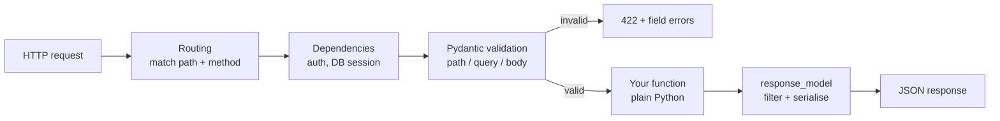

# Chapter 39 — Python Refresher: Core & FastAPI

> "Python interviews rarely test obscure syntax. They test whether you reach for the right built-in without thinking, and whether you know the six ways the language quietly lies to you."

---

## What You'll Learn

After this chapter you will be able to:
- Pick between `list`, `dict`, `set`, `tuple` and the `collections` types in seconds
- Write comprehensions, generators and decorators without looking them up
- Replace a 30-line class with a one-line `@dataclass`, and know when not to
- Recognise the traps that silently produce wrong answers — mutable defaults, aliasing, late-binding closures
- Read and write modern type hints, and handle errors the way reviewers expect
- Build a small **FastAPI** service: routing, Pydantic validation, dependency injection, tests

**Markers:** ★★★ = know cold for interviews · ★★ = high priority · ★ = good to know.
**Quick check** boxes are retrieval practice — attempt before revealing.
**Interview** boxes give the question, what to say, and the follow-up trap.

> ▶ **Most code blocks here are live.** Press **Run** and they execute in your browser. Everything up to §39.8 runs for real — the outputs in the comments were captured from an actual run. The §39.8 blocks need a server runtime, so they show a "copy this locally" note instead.

> **Companion chapters:** [Ch 38 — Java Refresher](#content/38_java_refresher) does the same job for Java, and [Ch 31 — DSA & ML Coding](#content/31_dsa_foundations) is the algorithm practice. This chapter is the **fast brush-up**: enough to write clean Python in an interview and to talk credibly about a Python API service.

---

## 39.1 The 10-Minute Mental Model ★★

**In this section**

- Names are labels, not boxes — the single idea that explains half of Python's surprises
- Truthiness, `None`, and the comparisons that actually matter
- f-strings, the only string formatting you need in 2026

#### Simple Explanation

In Python, a variable is a **sticky note**, not a box. `x = 5` does not put `5` inside `x`; it sticks the label `x` onto an object that already exists. Assignment moves labels around. It never copies anything.

That one sentence explains most of the confusion that follows. If two labels point at the same list and you change the list through one label, the other label sees the change — because there was only ever one list.

The second idea: **everything is an object.** Numbers, functions, classes, modules — all of them are objects you can pass around, store in a dict, and attach to a name. There is no primitive/object split like Java's `int` vs `Integer`.

> **Python** is dynamically typed (names have no declared type; objects do) and strongly typed (it will not silently add a string to an integer). Objects are garbage-collected by reference counting plus a cycle detector.

```python
x = 5
print(type(x), isinstance(x, object))   # <class 'int'> True

a = [1, 2, 3]
b = a           # NOT a copy — b is a second label on the same list
b.append(4)
print(a)        # [1, 2, 3, 4]  <- a changed too

c = a[:]        # a real (shallow) copy
c.append(5)
print(a, c)     # [1, 2, 3, 4] [1, 2, 3, 4, 5]
```

### Truthiness — what counts as false

Python does not need `if len(x) > 0`. Empty things are falsy. Memorise this list and stop writing length checks:

| Falsy | Truthy |
|---|---|
| `False`, `None` | any non-empty container |
| `0`, `0.0`, `0j` | any non-zero number |
| `""`, `[]`, `()`, `{}`, `set()` | `"0"`, `"False"`, `[0]` — **non-empty is truthy** |

```python
print(bool([]), bool([0]))      # False True   <- [0] is non-empty
print(bool(""), bool("0"))      # False True   <- "0" is a 1-char string
print(bool(0.0), bool(None))    # False False
```

The trap in that table is `"0"` and `[0]`. Both look "zero-ish" and both are **truthy**, because truthiness asks *"is there anything here?"*, not *"is the content zero?"*

### The comparison rules

- **`==` compares value, `is` compares identity** (same object in memory).
- Use `is` for exactly three things: `is None`, `is True`, `is False`. Everything else is `==`.
- `None` is a singleton, so `x is None` is both correct and fast. `x == None` works but is wrong style and breaks on objects with custom `__eq__`.

### f-strings

One way to format strings. Use it everywhere.

```python
name, n = "Ada", 3
print(f"{name} x{n} = {name*n!r}")   # Ada x3 = 'AdaAdaAda'   (!r calls repr)
print(f"{3.14159:.2f}")              # 3.14
print(f"{255:#x}")                   # 0xff
print(f"{1234567:,}")                # 1,234,567
print(f"{'hi':>6}|{'hi':<6}|{'hi':^6}|")   #     hi|hi    |  hi  |
```

The one you will use in debugging: `f"{value=}"` prints `value=42` — name and value together, no typing.

---

## 39.2 Data Structures That Cover 90% ★★★

**In this section**

- The four built-ins and when each one is the right answer
- Comprehensions — the idiom interviewers expect instead of `append` loops
- `Counter`, `defaultdict`, `deque` — three imports that delete a lot of code

### Pick one in five seconds

| I need to… | Use | Why |
|---|---|---|
| Keep an ordered, changeable sequence | `list` | $O(1)$ index and append |
| Look up a value by key | `dict` | $O(1)$ average, insertion-ordered since 3.7 |
| Ask "have I seen this?" / dedupe | `set` | $O(1)$ membership, no duplicates |
| Return several values / use as a dict key | `tuple` | immutable, hashable |
| Count occurrences | `collections.Counter` | one line instead of a loop |
| Group into buckets | `collections.defaultdict(list)` | no "if key missing" check |
| Push/pop at **both** ends | `collections.deque` | $O(1)$ both ends; `list.pop(0)` is $O(n)$ |
| Fixed field names, light object | `@dataclass` (§39.4) | free `__init__`, `__repr__`, `__eq__` |

### `list` — the workhorse

```python
xs = [3, 1, 4, 1, 5]
xs.append(9)            # [3, 1, 4, 1, 5, 9]      O(1)
xs.insert(0, 0)         # [0, 3, 1, 4, 1, 5, 9]   O(n) — shifts everything
xs.pop()                # 9   removes from the end,   O(1)
xs.pop(0)               # 0   removes from the front, O(n)
xs.remove(1)            # deletes the FIRST 1, by value
print(sorted(xs, reverse=True))   # [5, 4, 3, 1]   returns a new list
xs.sort()                         # sorts in place, returns None
```

**Slicing** is the thing to have in muscle memory. `xs[start:stop:step]`, with `stop` exclusive:

```python
xs = [0, 1, 2, 3, 4, 5]
print(xs[1:3])     # [1, 2]        <- stop is exclusive
print(xs[:3])      # [0, 1, 2]
print(xs[-2:])     # [4, 5]        <- last two
print(xs[::2])     # [0, 2, 4]     <- every other
print(xs[::-1])    # [5, 4, 3, 2, 1, 0]   <- reversed, and a full copy
```

`xs[::-1]` is the idiomatic reverse. It also makes a copy, which is exactly why palindrome checks can be written `s == s[::-1]`.

### `dict` — and the three methods that delete `if` statements

```python
d = {"a": 1}
print(d.get("zz"))          # None    <- no KeyError
print(d.get("zz", 0))       # 0       <- supply a default
d.setdefault("b", 2)        # inserts b=2 if missing, returns the value
print(d)                    # {'a': 1, 'b': 2}

merged = {**d, "c": 3}      # merge (3.5+);  d | {"c": 3} also works (3.9+)
print(merged)               # {'a': 1, 'b': 2, 'c': 3}

for k, v in d.items():      # always iterate with .items()
    pass
```

- **`d[k]` raises `KeyError`; `d.get(k)` returns `None`.** Use `get` when absence is normal, `d[k]` when absence is a bug.
- **Dicts preserve insertion order** (guaranteed since 3.7). You can rely on it.
- **Keys must be hashable** — so `str`, `int`, `tuple` are fine; `list` and `dict` are not.

### `set` — membership and set algebra

```python
s = {1, 2, 3}
print(s & {2, 3, 4})   # {2, 3}       intersection
print(s | {9})         # {1, 2, 3, 9} union
print(s - {1})         # {2, 3}       difference
print(s ^ {3, 7})      # {1, 2, 7}    symmetric difference
print(3 in s)          # True         O(1), vs O(n) for a list
print(sorted(set("banana")))   # ['a', 'b', 'n']  <- sort before printing!
```

> ⚠️ **Never print a raw set of strings and expect a stable order.** Python randomises string hashes per process, so `print({c for c in "banana"})` genuinely prints a different order on different runs. Wrap it in `sorted()` whenever the order is visible.

### `tuple` — immutable, and therefore hashable

```python
point = (51.5, -0.1)
lat, lon = point           # unpacking
print(lat, lon)            # 51.5 -0.1

seen = {(0, 0), (1, 2)}    # tuples CAN be set members / dict keys
a, b = 1, 2
a, b = b, a                # the swap — no temp variable
print(a, b)                # 2 1

first, *rest = [1, 2, 3, 4]
print(first, rest)         # 1 [2, 3, 4]
```

### Comprehensions

The single most Python-looking thing you can write. `[expr for item in iterable if condition]`.

```python
print([n*n for n in range(6) if n % 2 == 0])   # [0, 4, 16]
print({w: len(w) for w in ["hi", "there"]})    # {'hi': 2, 'there': 5}
print(sorted({c for c in "banana"}))           # ['a', 'b', 'n']
```

Rules of thumb:

- **One loop plus one optional `if`** — readable. Two nested loops plus a condition — write the loop out.
- A comprehension **builds the whole result in memory**. For a big or infinite source, swap `[...]` for `(...)` and get a generator (§39.5).
- Never write a comprehension purely for its side effects. `[print(x) for x in xs]` builds a list of `None`s; just use a `for` loop.

### The three `collections` imports worth memorising

```python
from collections import Counter, defaultdict, deque

print(Counter("banana"))                  # Counter({'a': 3, 'n': 2, 'b': 1})
print(Counter("banana").most_common(2))   # [('a', 3), ('n', 2)]

graph = defaultdict(list)
graph[1].append(2)          # no "if 1 not in graph" needed
graph[1].append(3)
print(dict(graph))          # {1: [2, 3]}

dq = deque([1, 2, 3])
dq.appendleft(0)            # deque([0, 1, 2, 3])   O(1) — a list would be O(n)
print(dq.popleft())         # 0
print(dq.pop())             # 3
```

- **`Counter`** — frequency counting, plus `most_common(k)` for top-k.
- **`defaultdict(list)`** — adjacency lists and grouping; the factory is called on first access.
- **`deque`** — BFS queues and sliding windows. `list.pop(0)` shifts every element; `deque.popleft()` does not.

### Complexity table — commit this to memory

| Operation | `list` | `dict` / `set` | `deque` |
|---|---|---|---|
| Index / key lookup | $O(1)$ | $O(1)$ avg | $O(n)$ |
| `in` (membership) | $O(n)$ | **$O(1)$ avg** | $O(n)$ |
| Append / insert at end | $O(1)$ amortised | $O(1)$ avg | $O(1)$ |
| Insert / delete at front | $O(n)$ | — | **$O(1)$** |
| Insert / delete in middle | $O(n)$ | — | $O(n)$ |
| Sort | $O(n \log n)$ | — | — |

<details>
<summary><strong>Quick check.</strong> You have 10 million user IDs and must answer "is this ID present?" millions of times. Why is a <code>list</code> the wrong container?</summary>

`x in some_list` is a linear scan — $O(n)$ per query, so millions of queries is $O(nm)$ and hopeless. A `set` hashes the value and checks one bucket, $O(1)$ average, and `set(my_list)` converts once in $O(n)$. The same reasoning is why "two-sum"-style problems use a dict: you trade $O(n)$ memory for turning an $O(n^2)$ nested loop into one $O(n)$ pass.

</details>

---

## 39.3 Functions, Scope & the Traps ★★★

**In this section**

- `*args` / `**kwargs` and how to read any signature you meet
- The **mutable default argument** — Python's most famous silent bug
- Decorators, explained by building one

### Arguments

```python
def greet(name, greeting="Hello", *args, punct="!", **kwargs):
    return f"{greeting}, {name}{punct} extra={args} kw={kwargs}"

print(greet("Ada"))
# Hello, Ada! extra=() kw={}

print(greet("Ada", "Hi", 1, 2, punct="?", lang="en"))
# Hi, Ada? extra=(1, 2) kw={'lang': 'en'}
```

Reading the signature left to right:

| Part | Means |
|---|---|
| `name` | required, positional or keyword |
| `greeting="Hello"` | optional, with a default |
| `*args` | any further **positional** args, collected into a tuple |
| `punct="!"` | **keyword-only** — it comes after `*args`, so you must name it |
| `**kwargs` | any further **keyword** args, collected into a dict |

The same two stars work at the *call* site, to unpack:

```python
def add(a, b): return a + b
nums = [3, 4]
print(add(*nums))              # 7   — unpack a list into positions
opts = {"a": 1, "b": 2}
print(add(**opts))             # 3   — unpack a dict into keywords
```

### Trap — the mutable default argument

This is the one that gets asked. Default values are evaluated **once, when the function is defined** — not on each call. A mutable default is therefore shared by every call forever.

```python
def bad(item, bucket=[]):      # the [] is created ONCE
    bucket.append(item)
    return bucket

print(bad(1))   # [1]
print(bad(2))   # [1, 2]   <- the previous call's data is still there
print(bad(3))   # [1, 2, 3]

def good(item, bucket=None):   # the fix, and the only accepted one
    if bucket is None:
        bucket = []
    bucket.append(item)
    return bucket

print(good(1)); print(good(2))   # [1]  then  [2]
```

**Rule:** a default value may be `None`, a number, a string, or a tuple. Never a `list`, `dict` or `set`.

### Trap — late-binding closures

A closure captures the **variable**, not its value at the time. So a lambda made inside a loop sees the loop variable's *final* value.

```python
fs = [lambda: i for i in range(3)]
print([f() for f in fs])          # [2, 2, 2]   <- all see the final i

fs2 = [lambda i=i: i for i in range(3)]   # bind now, via a default arg
print([f() for f in fs2])         # [0, 1, 2]
```

This bites when building callbacks, event handlers, or a list of partially-applied functions in a loop. The two fixes are the default-argument trick above, or `functools.partial`.

### Sorting with `key`

Python has no `Comparator`. It has `key` — a function that maps each element to the thing you want to sort by. This is almost always what interviewers are looking for.

```python
people = [("Ada", 36), ("Linus", 54), ("Guido", 68), ("Bea", 36)]

print(sorted(people, key=lambda p: p[1]))
# [('Ada', 36), ('Bea', 36), ('Linus', 54), ('Guido', 68)]

print(sorted(people, key=lambda p: (p[1], p[0])))   # two keys — a tuple
# [('Ada', 36), ('Bea', 36), ('Linus', 54), ('Guido', 68)]

print(sorted(people, key=lambda p: -p[1])[:2])      # descending via negation
# [('Guido', 68), ('Linus', 54)]

print(max(people, key=lambda p: p[1]))              # ('Guido', 68)
```

- **`sorted()` returns a new list; `.sort()` mutates and returns `None`.** Writing `xs = xs.sort()` sets `xs` to `None` — a common slip.
- **Sort by several keys with a tuple**: `key=lambda p: (p[1], p[0])`.
- **Descending:** `reverse=True`, or negate a numeric key. `reverse=True` keeps ties in original order (the sort is stable); negation does too.

### Decorators

#### Simple Explanation

A decorator is a function that takes a function and returns a replacement wrapped in extra behaviour. `@timed` above a definition is just shorthand for `slow_sum = timed(slow_sum)`.

Think of it as gift-wrapping. The present is unchanged; you have added a layer that gets touched first on the way in and last on the way out. That is why decorators are the natural home for timing, logging, caching, retries and auth checks — anything that surrounds a call rather than belonging to it.

> A **decorator** is any callable that accepts a function and returns a function. `functools.wraps` copies the original's name and docstring onto the wrapper so introspection and debuggers still work.

```python
import functools, time

def timed(fn):
    @functools.wraps(fn)                 # keep __name__ and __doc__
    def wrapper(*args, **kwargs):
        t0 = time.perf_counter()
        out = fn(*args, **kwargs)
        print(f"{fn.__name__} took {(time.perf_counter()-t0)*1000:.1f} ms")
        return out
    return wrapper

@timed
def slow_sum(n):
    """Adds 0..n-1."""
    return sum(range(n))

print(slow_sum(1_000_000))       # slow_sum took 25.0 ms   (timing varies), then 499999500000
print(slow_sum.__name__)         # slow_sum   <- without @wraps this says 'wrapper'
print(slow_sum.__doc__)          # Adds 0..n-1.
```

The one decorator you get for free and should name in an interview:

```python
import functools

@functools.lru_cache(maxsize=None)
def fib(n):
    return n if n < 2 else fib(n-1) + fib(n-2)

print(fib(50))            # 12586269025  — instant instead of exponential
print(fib.cache_info())   # CacheInfo(hits=48, misses=51, maxsize=None, currsize=51)
```

`lru_cache` turns naive exponential recursion into linear memoised recursion by adding one line. Arguments must be hashable, which is why it works on `int` but not on a `list`.

> **Interview —** *"What is a decorator and when have you used one?"*
>
> **Say:**
> - A callable that takes a function and returns a wrapped replacement — `@d` is sugar for `f = d(f)`.
> - It is the right tool for **cross-cutting concerns**: timing, logging, retries, caching, auth checks. Anything that surrounds a call rather than being part of its logic.
> - Always apply `functools.wraps` in the wrapper, or the decorated function loses its name and docstring and stack traces get confusing.
>
> **They follow up with:** *"How would you write one that takes an argument, like `@retry(times=3)`?"* — You need one more layer: `retry(times)` returns the actual decorator, which then returns the wrapper. Three nested functions instead of two.

---

## 39.4 Classes, Dunders & Dataclasses ★★

**In this section**

- The dunder methods that actually matter, and what each one powers
- `@dataclass` — the 30-line class in one line
- When a class is the wrong answer

### The plain class, and why it disappoints

```python
class PointOld:
    def __init__(self, x, y):
        self.x, self.y = x, y

p = PointOld(1, 2)
print(p)                        # <__main__.PointOld object at 0x...>  useless
print(p == PointOld(1, 2))      # False  <- identity comparison, not value
```

Out of the box you get an unreadable `repr` and identity-based equality. Fixing that by hand means writing `__repr__`, `__eq__` and `__hash__` — about thirty lines of boilerplate you will get subtly wrong.

### `@dataclass` — the fix

```python
from dataclasses import dataclass

@dataclass(frozen=True, slots=True)
class Point:
    x: int
    y: int
    def dist(self) -> float:
        return (self.x**2 + self.y**2) ** 0.5

q = Point(3, 4)
print(q)                       # Point(x=3, y=4)     <- real repr, free
print(q == Point(3, 4))        # True                <- value equality, free
print(q.dist())                # 5.0
print({Point(3,4), Point(3,4)})  # {Point(x=3, y=4)} <- hashable, dedupes
```

Two arguments worth always considering:

- **`frozen=True`** makes instances immutable and therefore hashable — usable as dict keys and set members. Assigning to a field raises `FrozenInstanceError`.
- **`slots=True`** (3.10+) drops the per-instance `__dict__`: less memory, faster attribute access, and typos raise instead of silently creating a new attribute.

> ⚠️ **The dataclass version of the mutable-default trap.** A bare `items: list = []` is rejected outright by `@dataclass`. Use `field(default_factory=list)` — it calls the factory once **per instance**.

```python
from dataclasses import dataclass, field

@dataclass
class Cart:
    items: list[str] = field(default_factory=list)

c1, c2 = Cart(), Cart()
c1.items.append("apple")
print(c1, c2)     # Cart(items=['apple']) Cart(items=[])   <- independent
```

### The dunders worth knowing

| Dunder | Powers | Note |
|---|---|---|
| `__init__` | construction | not a constructor — the object already exists |
| `__repr__` | `repr(x)`, the REPL, debuggers | aim for unambiguous; define this one first |
| `__str__` | `str(x)`, `print(x)` | falls back to `__repr__` if missing |
| `__eq__` | `==` | define `__hash__` alongside it, or the object becomes unhashable |
| `__hash__` | dict keys, set members | must agree with `__eq__`; must not change |
| `__len__` | `len(x)`, truthiness | an object with `__len__` of 0 is falsy |
| `__iter__` | `for x in obj` | see §39.5 |
| `__enter__` / `__exit__` | `with obj:` | guarantees cleanup |
| `__call__` | `obj()` | makes an instance behave like a function |

### `@property` — a method that reads like an attribute

```python
class Circle:
    def __init__(self, r):
        self._r = r
    @property
    def area(self):
        return 3.14159 * self._r ** 2

print(round(Circle(2).area, 3))   # 12.566   <- no parentheses on .area
```

Python has no `private`. The convention is a leading underscore (`_r`) meaning "internal, don't touch". Nothing enforces it — and that is deliberate. Use `@property` when you want a computed value to look like plain data, or to add validation later without changing every caller.

### When not to write a class

A class earns its place when **state and behaviour belong together**. Otherwise:

- One method and no state → write a **function**.
- Just grouped fields → `@dataclass`, or a plain `dict` if the shape is dynamic.
- Constants → a module-level constant or an `Enum`.
- A class named `*Manager`, `*Helper` or `*Utils` with only static methods → that is a module, not a class.

> **Interview —** *"What's the difference between `__str__` and `__repr__`?"*
>
> **Say:**
> - `__repr__` is for developers — unambiguous, ideally valid Python that would recreate the object. It's what the REPL and debuggers show.
> - `__str__` is for users — readable. `print()` uses it.
> - If you only write one, write `__repr__`: `str()` falls back to it, but not the other way round.
>
> **They follow up with:** *"What does `@dataclass` generate?"* — `__init__`, `__repr__` and `__eq__` from the annotated fields. Add `frozen=True` and you also get `__hash__` plus immutability; `order=True` adds the comparison operators.

---

## 39.5 Iterators, Generators & Laziness ★★★

**In this section**

- `yield` — producing values one at a time instead of building a list
- When laziness actually matters (and when it is just showing off)
- The four `itertools` functions worth remembering

#### Simple Explanation

A list is a **printed book**: every page exists, all at once, taking up shelf space. A generator is a **storyteller**: it produces the next sentence only when you ask, and remembers where it was.

That is the entire trade-off. The book lets you flip to page 400 and re-read chapter 2. The storyteller can't do either — but it can narrate a story of a billion sentences without needing a billion pages of shelf space, and it can start before the story is finished.

A function becomes a storyteller the moment it contains `yield`. Calling it runs **no code at all**; it hands you a generator object. Each `next()` runs until the following `yield`, then freezes.

> A **generator function** contains `yield` and returns a generator when called. It implements the iterator protocol (`__iter__` and `__next__`), produces values lazily, and raises `StopIteration` when exhausted.

```python
def squares_gen(n):
    for i in range(n):
        yield i * i

g = squares_gen(5)
print(next(g), next(g))   # 0 1      <- only two values computed so far
print(list(g))            # [4, 9, 16]  <- the rest; g is now exhausted
print(list(g))            # []          <- a generator is single-use
```

### The memory argument, measured

```python
import sys

def squares_list(n):
    return [i*i for i in range(n)]

def squares_gen(n):
    for i in range(n):
        yield i * i

print(sys.getsizeof(squares_list(1_000_000)))   # millions of bytes — grows with n
print(sys.getsizeof(squares_gen(1_000_000)))    # ~200 bytes — constant, whatever n is
```

The generator's size does not depend on `n` at all. It stores a frozen stack frame, not data.

| | List / list comprehension | Generator / genexp |
|---|---|---|
| Memory | $O(n)$ — holds every element | $O(1)$ — holds a paused frame |
| Built | eagerly, all at once | lazily, on demand |
| Re-iterable | yes, as many times as you like | **no** — single use |
| `len()`, indexing, slicing | yes | no |
| Best for | small results you reuse | big/streamed/infinite sources |

**The syntax difference is one character.** Square brackets build a list; parentheses build a generator:

```python
print(sum(i*i for i in range(1000)))   # 332833500 — no intermediate list
```

When a genexp is the only argument to a function, you can drop its parentheses — which is why `sum(...)`, `any(...)`, `max(...)` read so cleanly.

**When laziness actually pays:** reading a large file line by line, streaming API pages, pipelines where you only need the first match, and infinite sequences. **When it doesn't:** small collections you iterate more than once — just build the list.

### `itertools` — the four to remember

```python
import itertools

print(list(itertools.islice(itertools.count(10), 4)))   # [10, 11, 12, 13]
print(list(itertools.chain([1, 2], [3])))               # [1, 2, 3]
print(list(itertools.pairwise([1, 2, 3, 4])))           # [(1,2), (2,3), (3,4)]
print(list(itertools.combinations("abc", 2)))           # [('a','b'), ('a','c'), ('b','c')]
```

- **`islice`** — take the first `k` of anything, including an infinite source.
- **`chain`** — flatten several iterables into one pass, without concatenating.
- **`pairwise`** (3.10+) — sliding window of two; perfect for "compare each element to the next".
- **`combinations` / `permutations` / `product`** — the brute-force helpers.

### `enumerate` and `zip`

Two built-ins that remove nearly every manual index:

```python
print(list(enumerate("ab", start=1)))   # [(1, 'a'), (2, 'b')]
print(list(zip([1, 2, 3], "ab")))       # [(1, 'a'), (2, 'b')]  <- stops at the shortest
```

`zip` silently stops at the shortest input, which quietly drops data. Pass `strict=True` (3.10+) to raise instead when the lengths differ — use it whenever the inputs are meant to be parallel.

<details>
<summary><strong>Quick check.</strong> You need to find the first line of a 40 GB log file that contains <code>"ERROR"</code>. Sketch the approach.</summary>

```
with open("huge.log") as f:                 # the file object is already lazy
    hit = next((line for line in f if "ERROR" in line), None)
```

Iterating a file object yields one line at a time, so memory stays flat regardless of file size. The genexp filters lazily and `next(..., None)` stops at the **first** match instead of scanning the rest — and returns `None` rather than raising if there is no match. The wrong answer is `f.readlines()`, which pulls all 40 GB into RAM before you look at any of it.

</details>

---

## 39.6 The Traps That Silently Break Answers ★★★

**In this section**

- Six traps that compile, run, and hand you a wrong answer
- Why small test cases hide every one of them
- A one-page summary table to re-read before an interview

### Trap 1 — aliasing vs copying

Assignment never copies. This bites hardest when building grids:

```python
grid = [[0]*3]*3          # THREE REFERENCES to ONE row
grid[0][0] = 9
print(grid)               # [[9, 0, 0], [9, 0, 0], [9, 0, 0]]   <- all rows changed

grid2 = [[0]*3 for _ in range(3)]   # a NEW row each iteration
grid2[0][0] = 9
print(grid2)              # [[9, 0, 0], [0, 0, 0], [0, 0, 0]]   <- correct
```

`[x]*3` repeats the *reference* three times. It is fine for immutable elements (`[0]*3` is a genuinely fine flat row) and catastrophic for mutable ones.

### Trap 2 — shallow vs deep copy

`copy.copy` duplicates the outer container only; the inner objects are still shared.

```python
import copy
nested = [[1, 2], [3, 4]]
shallow = copy.copy(nested)      # same as nested[:] or list(nested)
deep = copy.deepcopy(nested)
nested[0][0] = 99
print(shallow)   # [[99, 2], [3, 4]]   <- saw the change
print(deep)      # [[1, 2], [3, 4]]    <- independent
```

`deepcopy` is correct but slow and can choke on cycles or unpicklable objects. Prefer immutable data (tuples, frozen dataclasses) over reaching for it.

### Trap 3 — `is` vs `==` and the small-int cache

CPython pre-allocates the integers −5 through 256, so `is` accidentally works on small numbers.

```python
a = 256; b = 256
print(a is b)                    # True

e = int("257"); f = int("257")   # computed at runtime, not folded
print(e is f)                    # False  <- two distinct objects
print(e == f)                    # True   <- what you actually meant

g = int("256"); h = int("256")
print(g is h)                    # True   <- inside the cache range
```

Two separate things are going on, and it is worth being able to name both:

- **The small-int cache** makes `is` return `True` for values in −5..256.
- **Constant folding** makes `c = 257; d = 257` *also* return `True` when both literals sit in the same compiled code object — which is why the textbook `257 is 257 → False` demo often fails to reproduce. Forcing a runtime computation with `int("257")` shows the real behaviour.

**Rule:** use `is` only for `None`, `True`, `False`. Everything else is `==`.

### Trap 4 — mutating a collection while iterating it

```python
d = {"a": 1, "b": 2}
try:
    for k in d:
        if k == "a":
            del d[k]
except RuntimeError as e:
    print("RuntimeError:", e)
# RuntimeError: dictionary changed size during iteration

d = {"a": 1, "b": 2}
for k in list(d):         # iterate over a SNAPSHOT of the keys
    if k == "a":
        del d[k]
print(d)                  # {'b': 2}
```

Dicts and sets raise immediately. **Lists do not** — removing while iterating silently skips elements, because the index advances past the shifted tail. That is the more dangerous version. Use a comprehension to rebuild: `xs = [x for x in xs if keep(x)]`.

### Trap 5 — float equality

```python
print(0.1 + 0.2)                 # 0.30000000000000004
print(0.1 + 0.2 == 0.3)          # False

import math
print(math.isclose(0.1 + 0.2, 0.3))   # True
```

Binary floating point cannot represent 0.1 exactly — this is IEEE 754, not a Python quirk. Compare with `math.isclose`, and use `decimal.Decimal` for money.

### Trap 6 — integer division and negative modulo

Python **floors** division and its `%` takes the sign of the **divisor** — the opposite of Java, C and Go.

```python
print(-7 // 2)        # -4   <- floors (Java gives -3)
print(-7 % 2)         #  1   <- sign of the divisor (Java gives -1)
print(divmod(-7, 2))  # (-4, 1)
```

Good news: `-7 % 2` being `1` means Python's `%` is already safe for circular indexing — `arr[(i - k) % n]` just works, with no `floorMod` helper needed.

### Trap summary

| Trap | Symptom | Fix |
|---|---|---|
| `def f(x, bucket=[])` | Data leaks between calls | Default to `None`, build inside |
| `[[0]*3]*3` | Writing one row writes all rows | `[[0]*3 for _ in range(3)]` |
| `b = a` on a list | Caller's data mutates unexpectedly | `a[:]`, `list(a)`, or `copy.deepcopy` |
| `copy.copy` on nested data | Inner objects still shared | `copy.deepcopy`, or use immutables |
| `lambda: i` in a loop | Every closure sees the final `i` | `lambda i=i: i`, or `functools.partial` |
| `x is 257` | `True` on small ints, `False` on large | `==`; keep `is` for `None`/`True`/`False` |
| `del d[k]` while iterating | `RuntimeError` (dict) or skipped items (list) | Iterate `list(d)`, or rebuild by comprehension |
| `0.1 + 0.2 == 0.3` | `False` | `math.isclose`, or `Decimal` for money |
| `xs = xs.sort()` | `xs` becomes `None` | `sorted(xs)` returns; `.sort()` mutates |
| `zip(a, b)` of unequal length | Extra items silently dropped | `zip(a, b, strict=True)` |

> **Interview —** *"What's the output of calling `append_to(1)` twice, where `def append_to(x, lst=[])` appends and returns?"*
>
> **Say:**
> - `[1]`, then `[1, 1]` — the default list is created **once, at function-definition time**, and shared by every call.
> - It is not a bug in the language; defaults are evaluated when the `def` executes, not per call.
> - The fix is `lst=None` plus `if lst is None: lst = []` inside.
>
> **They follow up with:** *"So why does `x=0` as a default not have this problem?"* — Integers are immutable, so `x += 1` rebinds the local name to a new object instead of mutating the shared default. The trap only exists for mutable defaults: `list`, `dict`, `set`.

---

## 39.7 Typing, Errors & the Stdlib You Actually Use ★★

**In this section**

- Modern type-hint syntax, and what hints do and do not do
- `try / except / else / finally` — what belongs in each
- Four stdlib modules that show up in every code review

### Type hints

Hints are **documentation the tooling can check**. Python itself ignores them entirely at runtime — nothing is enforced unless a library like Pydantic explicitly reads them (§39.8).

```python
def parse(raw: str) -> int | None:        # 3.10+: use | instead of Optional[int]
    try:
        return int(raw)
    except ValueError:
        return None

def totals(rows: list[dict[str, float]]) -> dict[str, float]:
    ...
```

| Write | Not |
|---|---|
| `list[str]`, `dict[str, int]` | `List[str]`, `Dict[str, int]` (pre-3.9 style) |
| `int \| None` | `Optional[int]` (still valid, just older) |
| `str \| int` | `Union[str, int]` |
| `Iterable[str]` as a parameter | `list[str]` — accept the widest type you can use |

The rule that gets you the most value for the least typing: **hint the public boundary** — function parameters and return types — and leave obvious locals alone. Run `mypy` or `pyright` in CI, or the hints will drift into being decorative.

### Errors

```python
def parse(raw: str) -> int | None:
    try:
        return int(raw)          # only the risky line goes in `try`
    except ValueError as e:
        print(f"bad input {raw!r}: {e}")
        return None
    finally:
        print(f"finally always runs for {raw!r}")

print(parse("42"))
# finally always runs for '42'
# 42

print(parse("4x"))
# bad input '4x': invalid literal for int() with base 10: '4x'
# finally always runs for '4x'
# None
```

| Clause | Runs when | Put here |
|---|---|---|
| `try` | always | **only** the statements that can fail |
| `except X as e` | `X` was raised | recovery, or re-raise with context |
| `else` | no exception was raised | the "success" path — keeps `try` small |
| `finally` | always, even on `return` or a raise | cleanup that must happen |

Three habits reviewers look for:

- **Catch the narrowest exception you can.** A bare `except:` swallows `KeyboardInterrupt` and `SystemExit` too. If you must be broad, use `except Exception`.
- **Never silently `pass`.** Log it, or re-raise. A swallowed exception is a bug that will be found by a customer.
- **Preserve or deliberately drop the cause.** `raise ValueError(...) from e` keeps the chain; `from None` hides an implementation detail on purpose.

```python
def div(a, b):
    try:
        return a / b
    except ZeroDivisionError:
        raise ValueError(f"cannot divide {a} by zero") from None

try:
    div(1, 0)
except ValueError as e:
    print(type(e).__name__, e)   # ValueError cannot divide 1 by zero
```

### `with` — context managers

`with` guarantees cleanup even if the body raises. Use it for files, locks, DB connections and sockets — never a manual `open()` / `close()` pair.

```python
from pathlib import Path
with open("notes.txt", "w") as f:
    f.write("line1\nline2\n")
# the file is closed here, even if write() raised
print(Path("notes.txt").read_text().splitlines())   # ['line1', 'line2']
```

### The stdlib worth knowing by name

```python
import json
from pathlib import Path

blob = json.dumps({"name": "Ada", "tags": ["ml", "py"]})
print(blob)                          # {"name": "Ada", "tags": ["ml", "py"]}
print(json.loads(blob)["tags"])      # ['ml', 'py']

p = Path("data") / "raw" / "x.json"  # / joins paths, cross-platform
print(p.as_posix(), p.suffix, p.stem, p.parent.as_posix())
# data/raw/x.json .json x data/raw
```

| Module | Use it for |
|---|---|
| `pathlib` | all path work — `Path("a") / "b"`, `.read_text()`, `.exists()`. Replaces `os.path` |
| `json` | `dumps` / `loads`. Add `indent=2` for human output |
| `collections` | `Counter`, `defaultdict`, `deque` (§39.2) |
| `itertools` / `functools` | lazy pipelines; `lru_cache`, `wraps`, `partial`, `reduce` |
| `datetime` | always store UTC; `datetime.now(timezone.utc)`, never the naive `utcnow()` |
| `logging` | replaces `print` in anything that ships |
| `unittest` / `pytest` | tests — `pytest` is the ecosystem default |

### Modern syntax worth using

```python
data = [1, 2, 3, 4, 5]

if (n := len(data)) > 3:          # walrus — assign and test in one go
    print(f"{n} items")           # 5 items

def classify(x):
    match x:                      # structural pattern matching (3.10+)
        case 0:                       return "zero"
        case int() | float() if x < 0: return "negative"
        case [_, _]:                  return "pair"
        case {"kind": k}:             return f"dict kind={k}"
        case _:                       return "other"

for v in [0, -3, [1, 2], {"kind": "user"}, "hi"]:
    print(v, "->", classify(v))
# 0 -> zero
# -3 -> negative
# [1, 2] -> pair
# {'kind': 'user'} -> dict kind=user
# hi -> other
```

`match` is **structural**, not a C-style switch: it destructures sequences and mappings, binds names, and supports `if` guards. Reach for it when you are branching on the *shape* of data; a plain `if/elif` chain is still better for simple value equality.

---

## 39.8 FastAPI in One Sitting ★★★

**In this section**

- Why FastAPI won: type hints become validation, docs and editor support
- A complete CRUD service — routes, models, status codes, errors
- Dependency injection, `async def` vs `def`, and testing

> ℹ️ **The blocks in this section import `fastapi`**, which needs a server runtime, so pressing Run shows a "copy this locally" note rather than executing. Every one of them is verified — the outputs in the comments are real responses captured from `TestClient`. To follow along locally: `pip install "fastapi[standard]"`.

#### Simple Explanation

Older Python frameworks made you write the same fact three times: once as a docstring for humans, once as hand-written validation code, and once in an API schema file that immediately went stale.

FastAPI's insight is that **you already wrote it once** — in the type hints. If a function says `item_id: int`, the framework can parse the URL segment, reject `"abc"` with a 422, tell your editor what the type is, and generate the OpenAPI schema. One declaration, four jobs.

Everything else follows from that. Validation is Pydantic reading your annotations. Interactive docs are generated, not maintained. Dependency injection is just another annotated parameter.

> **FastAPI** is an ASGI web framework that derives request parsing, validation, serialisation and OpenAPI documentation from standard Python type hints, using **Pydantic** for the data layer and **Starlette** for the HTTP layer.



### The whole service

```python
from fastapi import FastAPI, HTTPException, Query, status
from pydantic import BaseModel, Field

app = FastAPI(title="Catalog API", version="1.0.0")

class ItemIn(BaseModel):                 # what clients may send
    name: str = Field(min_length=1)
    price: float = Field(gt=0)

class ItemOut(ItemIn):                   # what we send back
    id: int

DB: dict[int, ItemOut] = {}              # a real app would use a database

@app.get("/health")
def health():
    return {"status": "ok"}              # -> 200 {'status': 'ok'}

@app.post("/items", response_model=ItemOut, status_code=status.HTTP_201_CREATED)
def create_item(item: ItemIn):           # body, because it's a BaseModel
    new_id = len(DB) + 1
    DB[new_id] = ItemOut(id=new_id, **item.model_dump())
    return DB[new_id]                    # -> 201 {'name': 'Mouse', 'price': 19.99, 'id': 1}

@app.get("/items/{item_id}", response_model=ItemOut)
def get_item(item_id: int):              # path param, because the name is in the path
    if item_id not in DB:
        raise HTTPException(status_code=404, detail=f"item {item_id} not found")
    return DB[item_id]                   # -> 404 {'detail': 'item 99 not found'}

@app.get("/items")
def list_items(limit: int = Query(10, ge=1, le=100), q: str | None = None):
    rows = list(DB.values())             # query params, because they're scalars with defaults
    if q:
        rows = [r for r in rows if q.lower() in r.name.lower()]
    return rows[:limit]
```

Run it with `fastapi dev main.py`, then open `http://127.0.0.1:8000/docs` for interactive documentation you never wrote.

### How FastAPI decides where a parameter comes from

This is the rule people get wrong, and it is only three lines:

| The parameter… | Is read from | Example |
|---|---|---|
| has a name matching a `{placeholder}` in the path | **path** | `item_id` in `/items/{item_id}` |
| is a Pydantic model (or `bytes`/`UploadFile`) | **request body** | `item: ItemIn` |
| is anything else scalar | **query string** | `limit: int = 10` |

Wrap it in `Query(...)`, `Path(...)`, `Header(...)` or `Body(...)` to override the guess or to add constraints like `ge=1, le=100`.

### Validation you get for free

| Request | Response | Why |
|---|---|---|
| `POST /items` `{"name": "", "price": -1}` | **422** | violates `min_length=1` **and** `gt=0` — both reported |
| `GET /items/abc` | **422** | `item_id: int` cannot parse `"abc"` |
| `GET /items?limit=0` | **422** | violates `ge=1` on the `Query` |
| `GET /items/99` | **404** | your own `HTTPException` |

The 422 body names the exact field and rule, one entry per violation:

| `loc` | `msg` |
|---|---|
| `["body", "name"]` | `String should have at least 1 character` |
| `["body", "price"]` | `Input should be greater than 0` |

Note **422**, not 400. FastAPI uses 422 Unprocessable Entity for schema validation failures, and the response body names the exact field and rule — you write none of that.

### Pydantic — the part that does the work

Pydantic is the data layer underneath every FastAPI route. Worth knowing on its own, because it is also how you validate config, queue messages and LLM tool arguments:

```python
from fastapi import FastAPI                    # same app as above
from pydantic import BaseModel, Field, ValidationError, field_validator

class Item(BaseModel):
    name: str = Field(min_length=1, max_length=50)
    price: float = Field(gt=0)
    tags: list[str] = []
    in_stock: bool = True

    @field_validator("name")
    @classmethod
    def titlecase(cls, v: str) -> str:
        return v.title()

good = Item(name="wireless mouse", price="19.99", tags=["tech"])
print(good)
# name='Wireless Mouse' price=19.99 tags=['tech'] in_stock=True

print(good.model_dump_json())
# {"name":"Wireless Mouse","price":19.99,"tags":["tech"],"in_stock":true}

try:
    Item(name="", price=-5)
except ValidationError as e:
    for err in e.errors():
        print(err["loc"], "->", err["msg"])
# ('name',)  -> String should have at least 1 character
# ('price',) -> Input should be greater than 0
```

Three things to notice:

- **`price="19.99"` became the float `19.99`.** Pydantic coerces sensibly rather than rejecting; strict mode is available when you don't want that.
- **A validator runs after parsing** and can transform, not just check.
- **Errors arrive as structured data** — `loc` and `msg` per field — which is exactly what the 422 body contains.

> ⚠️ **Pydantic v1 vs v2 — know the rename.** v2 moved the methods you may remember: `.dict()` → `.model_dump()`, `.json()` → `.model_dump_json()`, `parse_obj()` → `model_validate()`, and `@validator` → `@field_validator`. The error text changed too (`"ensure this value is greater than 0"` → `"Input should be greater than 0"`). FastAPI 0.100+ requires v2, and its validation core is compiled Rust — so the safety is close to free. Naming the rename is a cheap way to sound current.

### Dependency injection

A dependency is just a function whose result FastAPI computes and passes in. Use it for DB sessions, auth, config and pagination — anything several routes need.

```python
from typing import Annotated
from fastapi import FastAPI, Depends, Header, HTTPException

app = FastAPI()

def get_db():
    db = {"conn": "open"}
    try:
        yield db            # everything before yield runs before the route
    finally:
        db["conn"] = "closed"   # after yield runs when the response is done

def require_key(x_api_key: Annotated[str | None, Header()] = None) -> str:
    if x_api_key != "secret":
        raise HTTPException(status_code=401, detail="bad or missing API key")
    return x_api_key

DB  = Annotated[dict, Depends(get_db)]      # name the dependency once
Key = Annotated[str,  Depends(require_key)]

@app.get("/secure")
def secure(db: DB, key: Key):
    return {"conn": db["conn"], "key_ok": bool(key)}

# GET /secure                          -> 401 {'detail': 'bad or missing API key'}
# GET /secure  X-API-Key: secret       -> 200 {'conn': 'open', 'key_ok': True}
```

- **`yield` dependencies are context managers** — setup before, teardown after the response. That is how DB sessions get closed reliably.
- **Results are cached per request**, so ten routes depending on `get_db` share one session.
- **`Annotated[T, Depends(f)]` is the modern spelling.** Alias it once and reuse it, as above.
- **Attach a dependency to a whole router** with `APIRouter(dependencies=[Depends(require_key)])` when it guards every route.

### `async def` vs `def` — the rule that matters

This is the most common FastAPI mistake, and it has a two-line answer:

| Your function | Write | Because |
|---|---|---|
| `await`s something (async DB driver, `httpx`) | `async def` | it yields the event loop while waiting |
| Blocks (a sync DB driver, `requests`, file I/O, CPU work) | **plain `def`** | FastAPI runs it in a threadpool so the loop stays free |
| Blocking work inside `async def` | ❌ never | it **freezes the whole server** for every user |

The failure mode is unambiguous: one blocking call inside `async def` stalls the single event loop, so every concurrent request waits. Plain `def` is always safe — FastAPI hands it to a worker thread. When in doubt, use `def`.

Concurrency inside a route follows the same logic: sequential `await`s take the sum of their latencies, while `asyncio.gather` overlaps them and takes the maximum. Two 200 ms calls are 0.4 s sequentially and 0.2 s gathered.

### Testing

`TestClient` calls your app in-process — no server, no network, fast enough for CI.

```python
from fastapi.testclient import TestClient
client = TestClient(app)

def test_create_and_read():
    r = client.post("/items", json={"name": "Mouse", "price": 19.99})
    assert r.status_code == 201
    item_id = r.json()["id"]
    assert client.get(f"/items/{item_id}").json()["name"] == "Mouse"

def test_validation_rejects_bad_price():
    r = client.post("/items", json={"name": "X", "price": -1})
    assert r.status_code == 422

def test_missing_is_404():
    assert client.get("/items/9999").status_code == 404
```

Override a dependency in tests instead of mocking internals — this is the payoff for using DI:

```
app.dependency_overrides[get_db] = lambda: {"conn": "fake"}
```

### Project layout and shipping

```
app/
  main.py          # FastAPI() instance, includes routers
  routers/
    items.py       # APIRouter(prefix="/items", tags=["items"])
  models.py        # Pydantic schemas
  deps.py          # get_db, require_key
  config.py        # pydantic-settings, reads env vars
tests/
  test_items.py
```

- **Split routes with `APIRouter`** and `app.include_router(...)`. One file per resource.
- **Config from the environment** via `pydantic-settings` — typed, validated, no secrets in code.
- **Serve with `uvicorn`** behind a process manager: `uvicorn app.main:app --workers 4`. Workers give you CPU parallelism; the event loop gives you I/O concurrency.
- **Use lifespan, not `@app.on_event`** (deprecated) for startup/shutdown — open pools on startup, close them on shutdown.

> **Interview —** *"Why FastAPI over Flask or Django REST Framework?"*
>
> **Say:**
> - **Type hints do quadruple duty** — parsing, validation, editor autocomplete and OpenAPI docs — so there's one source of truth instead of three that drift apart.
> - **ASGI and native async**, so I/O-bound endpoints (calling a model, another service, an async DB) hold far more concurrent connections per process.
> - **Pydantic v2** validates in compiled Rust, so the safety is close to free.
> - The honest caveat: Django brings an ORM, admin and auth out of the box. FastAPI is a framework for APIs, not a batteries-included web platform.
>
> **They follow up with:** *"So should every endpoint be `async def`?"* — No. Use `async def` only when the body actually `await`s. A blocking call inside `async def` stalls the event loop for every user, whereas a plain `def` route is safely run in a threadpool.

<details>
<summary><strong>Quick check.</strong> An endpoint calls a synchronous, blocking ML model that takes 2 seconds. Should it be <code>async def</code> or <code>def</code>?</summary>

**`def`.** FastAPI runs plain `def` routes in a threadpool, so the 2-second block occupies one worker thread and the event loop keeps serving everyone else. Declaring it `async def` without any `await` inside would run the block *directly on the event loop*, freezing every concurrent request for the full 2 seconds.

The better production answer goes one step further: 2 seconds is too long to hold a connection at all. Push the job to a queue, return `202 Accepted` with a job id, and let the client poll — or offload the model to a dedicated inference service and `await` it with an async HTTP client.

</details>

---

## Key Takeaways

```
╔════════════════════════════════════════════════════════════════╗
║  PYTHON CORE & FASTAPI — WHAT TO REMEMBER                      ║
║  ────────────────────────────────────────────────────────────  ║
║  Names are LABELS, not boxes. Assignment never copies.         ║
║  ────────────────────────────────────────────────────────────  ║
║  DATA STRUCTURES                                               ║
║  list=order, dict=lookup, set=membership, tuple=hashable       ║
║  `in` is O(n) on a list, O(1) on a set/dict                    ║
║  Counter / defaultdict(list) / deque delete the most code      ║
║  list.pop(0) is O(n) — use deque.popleft() for queues          ║
║  ────────────────────────────────────────────────────────────  ║
║  FUNCTIONS                                                     ║
║  NEVER a mutable default. Use None and build inside            ║
║  sorted(xs, key=...) returns; xs.sort() mutates, returns None  ║
║  Sort by several keys with a tuple: key=lambda p: (p[1], p[0]) ║
║  Decorator = f = d(f). Always @functools.wraps the wrapper     ║
║  ────────────────────────────────────────────────────────────  ║
║  CLASSES                                                       ║
║  @dataclass gives __init__/__repr__/__eq__ free                ║
║  frozen=True -> immutable + hashable; field(default_factory=)  ║
║  One method, no state? That's a function, not a class          ║
║  ────────────────────────────────────────────────────────────  ║
║  LAZINESS                                                      ║
║  yield = produce on demand, O(1) memory, SINGLE USE            ║
║  (genexp) vs [listcomp] — one character, huge difference       ║
║  ────────────────────────────────────────────────────────────  ║
║  THE TRAPS                                                     ║
║  [[0]*3]*3 makes three refs to ONE row                         ║
║  copy.copy is shallow — inner objects stay shared              ║
║  lambda in a loop captures the VARIABLE, not the value         ║
║  `is` only for None/True/False. Everything else is ==          ║
║  0.1 + 0.2 != 0.3 — use math.isclose                           ║
║  Deleting while iterating: RuntimeError (dict), silent (list)  ║
║  ────────────────────────────────────────────────────────────  ║
║  FASTAPI                                                       ║
║  Type hints -> parsing + validation + docs, one declaration    ║
║  Path if in the path, body if a BaseModel, else query          ║
║  Validation failure is 422, with per-field loc and msg         ║
║  Depends(...) with yield = setup/teardown, cached per request  ║
║  async def ONLY if you await. Blocking? plain def (threadpool) ║
╚════════════════════════════════════════════════════════════════╝
```

---

## Review Questions — Test Your Understanding

**1.** `def add(item, bucket=[])` appends and returns `bucket`. What do three successive calls print, and why?

<details>
<summary>Answer</summary>

`[1]`, then `[1, 2]`, then `[1, 2, 3]` — every call shares one list.

Default values are evaluated **once, when the `def` statement executes**, not on each call. The empty list is built at definition time and stored on the function object, so every call that omits the argument mutates the same list.

The fix is always the same: `def add(item, bucket=None)` then `if bucket is None: bucket = []` inside. Immutable defaults (`0`, `""`, `None`, tuples) are safe, because rebinding creates a new object rather than mutating the shared one.
</details>

**2.** What is the difference between a list comprehension and a generator expression, and when does the choice actually matter?

<details>
<summary>Answer</summary>

`[x for x in it]` builds the entire list in memory, eagerly. `(x for x in it)` returns a generator that computes each value on demand and stores only a paused stack frame — $O(n)$ memory versus $O(1)$.

The choice matters when the source is **large, streamed, or infinite**, or when you only need the first few results: `next(line for line in f if "ERROR" in line)` stops at the first match instead of reading a 40 GB file.

It does **not** matter for small collections, and a generator is actively worse if you need to iterate more than once, take `len()`, or index — a generator is single-use and supports none of those.
</details>

**3.** Your endpoint calls a synchronous library that blocks for 2 seconds. Why is marking it `async def` actively harmful?

<details>
<summary>Answer</summary>

An `async def` route runs **directly on the event loop**. A blocking call inside it never yields control, so for those 2 seconds the single loop cannot progress *any* other request — one slow client stalls every concurrent user. Throughput collapses to one request at a time.

Declared as a plain `def`, FastAPI runs the route in a threadpool. The block occupies one worker thread and the event loop keeps serving everyone else. **When the body doesn't `await`, use `def`.**

The stronger answer adds that 2 seconds is too long to hold an HTTP connection at all: queue the work, return `202 Accepted` with a job id, and let the client poll.
</details>

**4.** What does a `Depends(...)` function that uses `yield` give you that a plain `return` does not?

<details>
<summary>Answer</summary>

Teardown. The code before `yield` runs during request setup, the value is injected into the route, and the code after `yield` runs **once the response has been produced** — even if the route raised. Wrapping it in `try/finally` makes the cleanup unconditional.

That is how database sessions, file handles and locks get released reliably, and it is the same contract as a context manager. A plain `return` dependency can only set something up; it has no hook to tear it down.

Two related facts worth adding: dependency results are **cached per request**, so ten routes depending on `get_db` share one session, and `app.dependency_overrides[get_db] = ...` swaps the real dependency for a fake in tests without touching the route.
</details>

---

**Next:** [Ch 38 — Java Refresher](#content/38_java_refresher) for the same treatment in Java, or [Ch 31 — DSA & ML Coding](#content/31_dsa_foundations) to start solving problems.
